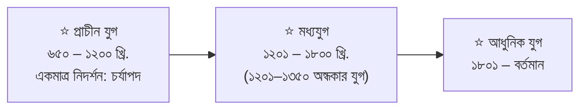
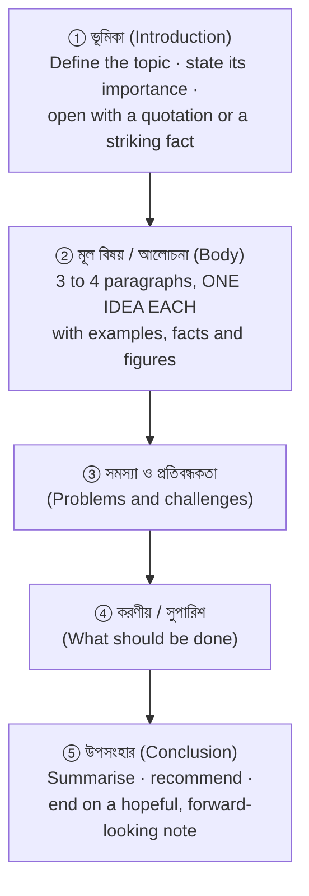

<!-- TOC START -->
**Table of Contents** — 6 subtopics · 17 theories

1. **[বাংলা ব্যাকরণ ও সাহিত্য](#বাংলা-ব্যাকরণ-ও-সাহিত্য)**
   - [ধ্বনি, বর্ণ ও উচ্চারণ (Sounds, Letters and Pronunciation)](#ধ্বনি-বর্ণ-ও-উচ্চারণ-sounds-letters-and-pronunciation)
   - [কারক ও বিভক্তি (Case and Case-endings)](#কারক-ও-বিভক্তি-case-and-case-endings)
   - [সন্ধি (Sandhi — the joining of sounds)](#সন্ধি-sandhi--the-joining-of-sounds)
   - [সমাস (Compound formation)](#সমাস-compound-formation)
   - [প্রকৃতি ও প্রত্যয়, উপসর্গ ও অনুসর্গ](#প্রকৃতি-ও-প্রত্যয়-উপসর্গ-ও-অনুসর্গ)
   - [বাগধারা (Idioms and Proverbs)](#বাগধারা-idioms-and-proverbs)
   - [সমার্থক ও বিপরীত শব্দ (Synonyms and Antonyms)](#সমার্থক-ও-বিপরীত-শব্দ-synonyms-and-antonyms)
   - [শুদ্ধ বানান ও বাক্য শুদ্ধি (Correct Spelling and Sentence Correction)](#শুদ্ধ-বানান-ও-বাক্য-শুদ্ধি-correct-spelling-and-sentence-correction)
   - [বাংলা সাহিত্য — লেখক ও রচনা](#বাংলা-সাহিত্য--লেখক-ও-রচনা)
   - [শব্দ ও পদ প্রকরণ — যৌগিক, রূঢ়ি ও যোগরূঢ় শব্দ](#শব্দ-ও-পদ-প্রকরণ--যৌগিক-রূঢ়ি-ও-যোগরূঢ়-শব্দ)
   - [বাচ্য, বাক্য প্রকরণ ও ণত্ব-ষত্ব বিধান](#বাচ্য-বাক্য-প্রকরণ-ও-ণত্ব-ষত্ব-বিধান)
   - [বাংলা সাহিত্যের যুগবিভাগ ও প্রধান ধারা](#বাংলা-সাহিত্যের-যুগবিভাগ-ও-প্রধান-ধারা)

2. **[Focus Writing](#focus-writing)**
   - [প্রবন্ধ রচনা ও অনুচ্ছেদ লিখন (Essay and Paragraph Writing)](#প্রবন্ধ-রচনা-ও-অনুচ্ছেদ-লিখন-essay-and-paragraph-writing)

3. **[Translation](#translation)**
   - [অনুবাদ (Translation)](#অনুবাদ-translation)

4. **[পত্র লিখন](#পত্র-লিখন)**
   - [পত্র লিখন (Letter Writing)](#পত্র-লিখন-letter-writing)

5. **[সারমর্ম / সারাংশ](#সারমর্ম--সারাংশ)**
   - [সারমর্ম ও সারাংশ (Précis and Summary)](#সারমর্ম-ও-সারাংশ-précis-and-summary)

6. **[এক কথায় প্রকাশ (One Word Substitution)](#এক-কথায়-প্রকাশ-one-word-substitution)**
   - [এক কথায় প্রকাশ (One-Word Substitution)](#এক-কথায়-প্রকাশ-one-word-substitution-1)

<!-- TOC END -->

---

## বাংলা ব্যাকরণ ও সাহিত্য

### ধ্বনি, বর্ণ ও উচ্চারণ (Sounds, Letters and Pronunciation)

> **ধ্বনি (dhwani)** is the **smallest unit of SOUND** in a language, and **বর্ণ (barna)** is the **written symbol** used to represent it. **বাংলা ব্যাকরণ (Bengali grammar)** is the set of rules governing how these sounds, words and sentences are correctly formed and used.

#### The Bengali alphabet

| Category | Count | Letters |
|---|---|---|
| **স্বরবর্ণ (vowels)** | **11** | অ আ ই ঈ উ ঊ ঋ এ ঐ ও ঔ |
| **ব্যঞ্জনবর্ণ (consonants)** | **39** | ক … ঁ ং ঃ |
| ⭐ **মোট বর্ণ (total)** | ⭐ **50** | |

**Classification of sounds:**

| Type | Bengali term | Meaning | Examples |
|---|---|---|---|
| **Vowel** | **স্বরধ্বনি** | Pronounced **without obstruction** of air | অ, আ, ই |
| **Consonant** | **ব্যঞ্জনধ্বনি** | Air is **obstructed** somewhere in the mouth | ক, খ, গ |
| **হ্রস্বস্বর** | Short vowel | অ, ই, উ, ঋ | |
| **দীর্ঘস্বর** | Long vowel | আ, ঈ, ঊ, এ, ঐ, ও, ঔ | |
| **মৌলিক স্বরধ্বনি** | **Basic vowel sounds** — ⭐ **7 in number** | অ, আ, ই, উ, এ, অ্যা, ও | |
| **যৌগিক স্বরধ্বনি** | Diphthong — two vowels in one syllable | ঐ (অ+ই), ঔ (অ+উ) | |

#### উচ্চারণ (pronunciation) — the rules most often tested

> **Bengali spelling and Bengali pronunciation frequently differ**, and exam questions ask for the **প্রকৃত উচ্চারণ** — the actual spoken form — written in brackets.

| শব্দ (word) | ⭐ **প্রকৃত উচ্চারণ** | The rule |
|---|---|---|
| ⭐ **আহ্বান** | ⭐ **আওভান্** (ah-ō-bhan) | **হ্ব** is pronounced as **ওভ**; the ন becomes a closed ন্ |
| **জিহ্বা** | **জিউভা** | The same **হ্ব → উভ** rule |
| **বিহ্বল** | **বিউভল্** | |
| **উহ্য** | **উজ্‌ঝো** | **হ্য → জ্ঝ** |
| **সহ্য** | **শোজ্‌ঝো** | |
| **বাহ্য** | **বাজ্‌ঝো** | |
| **চিহ্ন** | **চিন্‌হো** | |
| **পদ্ম** | **পদ্‌দোঁ** | |
| **লক্ষ্মী** | **লোক্‌খি** | |
| **সত্য** | **শোত্‌তো** | **স** before a vowel is pronounced **শ**; **ত্য → ত্ত** |
| **বিদ্যালয়** | **বিদ্‌দালয়** | |

> ### **"‘আহ্বান’ এর প্রকৃত উচ্চারণ লিখুন।"**
> ### ✅ **আওভান্ (ah-ō-bhan)** — the conjunct **হ্ব** is pronounced **ওভ**, not "h-b". *(The same rule gives জিহ্বা → **জিউভা** and বিহ্বল → **বিউভল্**.)*

#### Types of word by origin — শব্দের শ্রেণিবিভাগ

| Type | Origin | Examples |
|---|---|---|
| **তৎসম** | Taken **unchanged from Sanskrit** | চন্দ্র, সূর্য, নক্ষত্র, ভবন |
| **অর্ধ-তৎসম** | Sanskrit words **slightly changed** | জোছনা (জ্যোৎস্না), গিন্নি (গৃহিণী) |
| **তদ্ভব** | Evolved **from Sanskrit through Prakrit** | হাত (হস্ত), চাঁদ (চন্দ্র), মাথা (মস্তক) |
| ⭐ **দেশি** | ⭐ **Native words of the region whose ORIGIN CANNOT BE DETERMINED** | ⭐ **কুলা, ডাব, ঢেঁকি, চোঙা, খোঁপা, ঝিঙা** |
| **বিদেশি** | Borrowed from foreign languages | **Arabic:** আল্লাহ, কিতাব · **Persian:** চশমা, দোকান · **English:** স্কুল, অফিস · **Portuguese:** আলমারি, চাবি, জানালা · **Turkish:** চাকু, দারোগা |

> ### **"বাংলা ভাষার কোন প্রকার শব্দের মূল নির্ধারণ করা যায় না?"**
> ### ✅ **দেশি শব্দ (deshi / indigenous words)** — these are the **native words of this region**, drawn from the original inhabitants' languages, whose **root or origin cannot be traced**. Examples: **কুলা, ডাব, ঢেঁকি, খোঁপা, চোঙা**.

**Previous Year Question List from this Topic:**

- [নিচের প্রশ্নগুলোর উত্তর লিখুন:](../written-answers/bangla.md?plain=1#L19)
- [নিচের প্রশ্নগুলোর উত্তর লিখুন :](../written-answers/bangla.md?plain=1#L253)
- [বাংলা ব্যাকরণ সংক্রান্ত প্রশ্নাবলি।](../written-answers/bangla.md?plain=1#L592)
- [নিচের প্রশ্নগুলোর উত্তর লিখুন:](../written-answers/bangla.md?plain=1#L647)
- [৫. যে-কোন দুইটি প্রশ্নের উত্তর দিন: ক. সাধু ও চলিত ভাষারীতির পাঁচটি পার্থক্য উল্লেখ করুন। খ. ণ-ত্ব বিধানের পাঁচটি নিয়ম লিখুন। গ. ‘পাকা’ শব্দের মাধ্যমে ভিন্নার্…](../written-answers/bangla.md?plain=1#L1564)
- [‘আহবান’ এর প্রকৃত উচ্চারণ লিখুন।](../written-answers/bangla.md?plain=1#L2090)
- [বাংলা ভাষার কোন প্রকার শব্দের মূল নির্ধারণ করা যায় না।](../written-answers/bangla.md?plain=1#L2467)

**Previous Year MCQ List from this Topic:**

- ['কিন্ডারগার্টেন' কোন ভাষার শব্দ?](../mcq-answers/bangla.md?plain=1#L57)
- [বড় থেকে বড্ড কোন ধরনের পরিবর্তন?](../mcq-answers/bangla.md?plain=1#L66)
- [নিচের কোনটি বাগযন্ত্রের সাহায্যে উচ্চারিত হয়?](../mcq-answers/bangla.md?plain=1#L143)
- ['আবাদ' শব্দটি কোন ধরনের শব্দ?](../mcq-answers/bangla.md?plain=1#L152)
- [ভাষাভাষী জনসংখ্যার দিক দিয়ে বাংলা ভাষার অবস্থান-](../mcq-answers/bangla.md?plain=1#L2780)


---

### কারক ও বিভক্তি (Case and Case-endings)

> ### **কারক (kārak) is the RELATIONSHIP between the VERB (ক্রিয়া) and a NOUN/PRONOUN (নাম-পদ) in a sentence.**
> ### **বিভক্তি (bibhakti) is the SUFFIX attached to the noun to show that relationship.**

> **The method for identifying কারক — ask the verb a question.** The type of question that produces the word as its answer tells you the কারক.

| # | কারক | Question to ask the verb | বিভক্তি typically used | Example |
|---|---|---|---|---|
| **1** | ⭐ **কর্তৃ কারক** (Nominative — the DOER) | **কে? / কারা?** (who?) | শূন্য, এ, য়, তে | ***রহিম*** *বই পড়ে।* |
| **2** | ⭐ **কর্ম কারক** (Objective — what is DONE) | ⭐ **কী? / কাকে?** (what? whom?) | শূন্য, কে, রে | *আরিফ **বই** পড়ে।* |
| **3** | **করণ কারক** (Instrumental — the MEANS) | **কী দিয়ে? / কীসের দ্বারা?** | এ, য়, তে, দ্বারা, দিয়ে | *আমি **কলম দিয়ে** লিখি।* |
| **4** | **সম্প্রদান কারক** (Dative — GIVING without return) | **কাকে (দান করা হলো)?** | কে, রে, এ | *ভিক্ষুককে ভিক্ষা দাও।* |
| **5** | **অপাদান কারক** (Ablative — SEPARATION, source) | **কোথা থেকে? / কী হতে?** | হতে, থেকে, চেয়ে | ***গাছ থেকে** পাতা পড়ে।* |
| **6** | **অধিকরণ কারক** (Locative — PLACE, TIME, subject) | ⭐ **কোথায়? / কখন? / কীসে?** | এ, য়, তে | ***পুকুরে** মাছ আছে।* |

> ### **"'আরিফ বই পড়ে।' — 'বই' শব্দটি কোন কারক ও বিভক্তি?"**
>
> **The reasoning:**
> ```
>    The verb is  পড়ে  (reads).
>    Ask the verb:  "আরিফ কী পড়ে?"  (Arif reads WHAT?)
>    The answer is: বই
>    ⇒ It answers "কী?", so it is the thing ACTED UPON  →  কর্ম কারক
>    ⇒ No suffix is attached to বই                      →  শূন্য বিভক্তি
> ```
> ### ✅ **কর্ম কারকে শূন্য বিভক্তি** (Objective case with zero case-ending).

**Other worked identifications:**

| বাক্য | The word | কারক ও বিভক্তি | Why |
|---|---|---|---|
| ⭐ ***টাকায়** টাকা হয়।* | টাকায় | ⭐ **করণ কারকে ৭মী বিভক্তি** | It answers *"কীসের দ্বারা টাকা হয়?"* — money is the **means** |
| ⭐ *"এ এক বিরাট **সত্য**।"* | **সত্য** | ⭐ **বিশেষ্য পদ (NOUN)** | Though *সত্য* is normally an adjective, here it follows *এক বিরাট* and is the **thing being spoken of**, so it functions as a **noun** |
| ***শনিবার থেকে** পরীক্ষা শুরু।* | শনিবার থেকে | **অপাদান কারকে ৫মী বিভক্তি** | It marks the **starting point** — separation in time |
| ***পুকুরে** মাছ আছে।* | পুকুরে | **অধিকরণ কারকে ৭মী বিভক্তি** | It answers *"কোথায়?"* |

> ⚠️ **The commonest mistake is deciding the কারক from the বিভক্তি.** The same suffix serves several কারক. **Always go back to the verb and ask the question** — the question, not the ending, decides.

**Previous Year Question List from this Topic:**

- [আরিফ বই পড়ে। "বই" শব্দটি কোন কারক ও বিভক্তি?](../written-answers/bangla.md?plain=1#L117)
- [“শনিবার থেকে পরীক্ষা শুরু” বাক্যে “শনিবার থেকে” কোন কারক?](../written-answers/bangla.md?plain=1#L1289)
- [“এ এক বিরাট সত্য” - বাক্যটিতে ‘সত্য’ শব্দটি কোন পদ?](../written-answers/bangla.md?plain=1#L2600)
- [৪. কারক নির্ণয় করুন: টাকায় টাকা হয়, পাগলে কিনা বলে।](../written-answers/bangla.md?plain=1#L3287)

**Previous Year MCQ List from this Topic:**

- [আরিফ বই পড়ে। "বই" শব্দটি কোন কারক ও বিভক্তি?](../mcq-answers/bangla.md?plain=1#L21)
- ['দেবতার ধন কে যায় ফিরায়ে লয়ে' কোন কারকে কোন বিভক্তি?](../mcq-answers/bangla.md?plain=1#L102)
- ['ঘোড়া গাড়ি টানে।' কোন কারক?](../mcq-answers/bangla.md?plain=1#L2677)
- [কারক ও বিভক্তি নির্ণয় করুন: (০৩)](../mcq-answers/bangla.md?plain=1#L2686)
- [‘আপন পাঠেতে করহ নিবেশ’, বাক্যে ‘পাঠেতে’ শব্দটি কোন কারকে কোন বিভক্তি?](../mcq-answers/bangla.md?plain=1#L2694)
- ['দেবতার ধন কে যায় ফিরায়ে লয়ে' কোন কারকে কোন বিভক্তি?](../mcq-answers/bangla.md?plain=1#L2703)


---

### সন্ধি (Sandhi — the joining of sounds)

> ### **সন্ধি is the MERGING of the LAST SOUND of one word with the FIRST SOUND of the next, to form a single smooth word.** সন্ধি বিচ্ছেদ means **separating** the joined word back into its parts.

#### The three types

| Type | What joins | Example |
|---|---|---|
| ⭐ **স্বরসন্ধি** | **Vowel + Vowel** | বিদ্যা + আলয় = **বিদ্যালয়** |
| ⭐ **ব্যঞ্জনসন্ধি** | **Consonant + Consonant**, or consonant + vowel | সৎ + জন = **সজ্জন** |
| ⭐ **বিসর্গসন্ধি** | **বিসর্গ (ঃ) + a vowel or consonant** | নিঃ + আকার = **নিরাকার** |

#### The main rules of স্বরসন্ধি

| Rule | Result | Example |
|---|---|---|
| **অ/আ + অ/আ** | **আ** | হিম + আলয় = **হিমালয়** · বিদ্যা + আলয় = **বিদ্যালয়** |
| **ই/ঈ + ই/ঈ** | **ঈ** | পরি + ঈক্ষা = **পরীক্ষা** · রবি + ইন্দ্র = **রবীন্দ্র** |
| **উ/ঊ + উ/ঊ** | **ঊ** | বধূ + উৎসব = **বধূৎসব** |
| ⭐ **অ/আ + ই/ঈ** | ⭐ **এ** | শুভ + ইচ্ছা = **শুভেচ্ছা** · গণ + ইন্দ্র = **গণেন্দ্র** |
| ⭐ **অ/আ + উ/ঊ** | ⭐ **ও** | সূর্য + উদয় = **সূর্যোদয়** · পর + উপকার = **পরোপকার** |
| **অ/আ + ঋ** | **অর্** | দেব + ঋষি = **দেবর্ষি** |
| **অ/আ + এ/ঐ** | **ঐ** | জন + এক = **জনৈক** |
| **অ/আ + ও/ঔ** | **ঔ** | পরম + ঔষধ = **পরমৌষধ** |

#### সন্ধি বিচ্ছেদ — the worked answers

| সন্ধিবদ্ধ শব্দ | ⭐ **সন্ধি বিচ্ছেদ** | Rule applied |
|---|---|---|
| ⭐ **রবীন্দ্র** | ⭐ **রবি + ইন্দ্র** | ই + ই = ঈ |
| ⭐ **তপোবন** | ⭐ **তপঃ + বন** | বিসর্গসন্ধি: ঃ + ব = ও |
| ⭐ **সদৈব** | ⭐ **সদা + এব** | আ + এ = ঐ |
| ⭐ **পরমৌষধ** | ⭐ **পরম + ঔষধ** | অ + ঔ = ঔ |
| ⭐ **সংসার** | ⭐ **সম্ + সার** | ম্ before a consonant becomes অনুস্বার (ং) |
| **প্রাতরাশ** | **প্রাতঃ + আশ** | বিসর্গসন্ধি |
| **বহ্বর্থ** | **বহু + অর্থ** | উ + অ = ব্ (য়ণ্ সন্ধি) |
| **জনৈক** | **জন + এক** | অ + এ = ঐ |
| **ঈদগাহ** | **ঈদ + গাহ** | A Persian compound — **not a true সন্ধি**, simply a joined word |
| **পড়াশুনা** | **পড়া + শুনা** | A Bengali দ্বন্দ্ব compound, not a Sanskrit সন্ধি |
| **নিরাকার** | **নিঃ + আকার** | বিসর্গসন্ধি: ঃ + vowel = র্ |
| **মনোযোগ** | **মনঃ + যোগ** | বিসর্গসন্ধি: ঃ + য = ও |

> ⚠️ **A useful distinction to state: ঈদগাহ and পড়াশুনা are NOT classical সন্ধি.** The first is a **Persian compound** and the second a **Bengali দ্বন্দ্ব সমাস**; neither involves the phonetic merging that সন্ধি requires. Saying so shows genuine understanding rather than rote splitting.

**Previous Year Question List from this Topic:**

- [সন্ধি : ঈদগাহ, পড়াশুনা,](../written-answers/bangla.md?plain=1#L745)
- [সন্ধি বিচ্ছেদ করুন: তপোবন, প্রাতরাশ, চলচ্চিত্র, দ্যুলোক, দোলনা।](../written-answers/bangla.md?plain=1#L1017)
- [সন্ধি বিচ্ছেদ: সদৈব, পরমৌষধ, বহ্বর্থ তন্বী, লবণ।](../written-answers/bangla.md?plain=1#L1356)
- [‘রবীন্দ্র’-এর সন্ধিবিচ্ছেদ লিখুন।](../written-answers/bangla.md?plain=1#L2395)
- [সন্ধি বিচ্ছেদ করুন। (ক) সংসার (খ) জনৈক](../written-answers/bangla.md?plain=1#L2860)

**Previous Year MCQ List from this Topic:**

- [তন্ময় এর সন্ধি বিচ্ছেদ কি?](../mcq-answers/bangla.md?plain=1#L111)
- ['গীতাঞ্জলি' কোন সন্ধির উদাহরণ?](../mcq-answers/bangla.md?plain=1#L161)
- ['মাথাঘষা' শব্দটির সঠিক সন্ধি-বিচ্ছেদ কোনটি?](../mcq-answers/bangla.md?plain=1#L2713)
- ['আবির্ভাব' শব্দটি গঠিত হয়েছে-](../mcq-answers/bangla.md?plain=1#L2722)
- ['গীতাঞ্জলি' কোন সন্ধির উদাহরণ?](../mcq-answers/bangla.md?plain=1#L2731)


---

### সমাস (Compound formation)

> ### **সমাস is the process by which TWO OR MORE WORDS, closely related in meaning, COMBINE INTO A SINGLE WORD**, dropping the connecting words between them.
>
> - **সমস্তপদ / সমাসবদ্ধ পদ** — the **combined** word (e.g. **বীণাপাণি**)
> - ⭐ **ব্যাসবাক্য / বিগ্রহবাক্য** — the **expanded phrase** that explains it (e.g. **বীণা পাণিতে যার**)
> - **পূর্বপদ** — the first member · **পরপদ** — the second member

#### The six types of সমাস

| Type | Which member is dominant? | How to recognise it | Example |
|---|---|---|---|
| ⭐ **দ্বন্দ্ব** | **BOTH equally** | The ব্যাসবাক্য joins them with **"ও / এবং / আর"** | **মাতাপিতা** = মাতা **ও** পিতা |
| ⭐ **কর্মধারয়** | **The LATTER (পরপদ)** | One member **describes** the other — adjective + noun | **নীলপদ্ম** = নীল যে পদ্ম · **মহাপুরুষ** = মহান যে পুরুষ |
| ⭐ **তৎপুরুষ** | **The LATTER (পরপদ)** | The **বিভক্তি of the first member is dropped** | **বিপদাপন্ন** = বিপদে আপন্ন · **ঋণমুক্ত** = ঋণ হতে মুক্ত |
| ⭐ **দ্বিগু** | **The LATTER** | The **first member is a NUMBER**, and the whole denotes a **collection** | **ত্রিভুজ** = তিন ভুজের সমাহার · **পঞ্চবটী, সপ্তাহ, চতুষ্পদ** |
| ⭐ **বহুব্রীহি** | ⭐ **NEITHER — a THIRD, outside thing** | The compound refers to **someone or something NOT NAMED in it**; the ব্যাসবাক্য ends in **"যার / যাহার"** | ⭐ **বীণাপাণি** = **বীণা পাণিতে যার** (= সরস্বতী) |
| ⭐ **অব্যয়ীভাব** | **The FORMER (পূর্বপদ)** | Begins with an **indeclinable (অব্যয়)** — উপ, প্রতি, অনু, আ, সম্, নি | **উপকূল** = কূলের সমীপে · **প্রতিদিন** = দিন দিন |

> ### **"‘বীণাপাণি’ সমস্ত শব্দটির ব্যাসবাক্যসহ সমাস নির্ণয় করুন। ‘পাণি’ শব্দের অর্থ কী?"**
>
> ```
>    সমস্তপদ   : বীণাপাণি
>    ব্যাসবাক্য : বীণা পাণিতে যার  —  "she in whose HAND is the veena"
>    সমাস       : বহুব্রীহি সমাস
> ```
> ### ✅ **ব্যাসবাক্য — বীণা পাণিতে যার · সমাস — বহুব্রীহি সমাস · ‘পাণি’ অর্থ — হাত (HAND).**
>
> **Why it is বহুব্রীহি:** the compound does **not** mean "a veena" nor "a hand" — it refers to **a THIRD person not named in the word at all**, namely **সরস্বতী**, the goddess who holds a veena in her hand. **That is the defining test of বহুব্রীহি: the meaning points OUTSIDE the compound**, and the ব্যাসবাক্য ends in **"যার"**.

#### More worked সমাস

| সমস্তপদ | ব্যাসবাক্য | সমাস |
|---|---|---|
| ⭐ **কদর্থ** | কু (মন্দ) যে অর্থ | **কর্মধারয় (নঞ্/কু-তৎপুরুষ)** |
| ⭐ **আলুসিদ্ধ** | আলু সিদ্ধ যা / সিদ্ধ আলু | **কর্মধারয়** |
| ⭐ **সাহিত্যসভা** | সাহিত্যের সভা | **৬ষ্ঠী তৎপুরুষ** |
| **নীলকণ্ঠ** | নীল কণ্ঠ যার (= শিব) | **বহুব্রীহি** |
| **দশানন** | দশ আনন যার (= রাবণ) | **বহুব্রীহি** |
| **চন্দ্রমুখ** | চন্দ্রের ন্যায় মুখ | **উপমিত কর্মধারয়** |
| **রাজপথ** | রাজার পথ | **৬ষ্ঠী তৎপুরুষ** |
| **গৃহপ্রবেশ** | গৃহে প্রবেশ | **৭মী তৎপুরুষ** |
| **পিতাপুত্র** | পিতা ও পুত্র | **দ্বন্দ্ব** |
| **ত্রিফলা** | তিন ফলের সমাহার | **দ্বিগু** |
| **বেয়াদব** | আদব নেই যার | **নঞ্ বহুব্রীহি** |

> **The two-question test that identifies any সমাস:**
> ```
>    ① Does the ব্যাসবাক্য use "ও / এবং"?            → দ্বন্দ্ব
>    ② Does it end in "যার / যাহার", and does the
>       meaning point to something NOT in the word?  → বহুব্রীহি
>    ③ Does it start with a NUMBER meaning a group?  → দ্বিগু
>    ④ Does it start with an অব্যয় (উপ/প্রতি/অনু)?  → অব্যয়ীভাব
>    ⑤ Does one word simply DESCRIBE the other?      → কর্মধারয়
>    ⑥ Otherwise, with a dropped বিভক্তি              → তৎপুরুষ
> ```

**Previous Year Question List from this Topic:**

- [সমাস পরিবর্তন :](../written-answers/bangla.md?plain=1#L792)
- [সমাস: কদর্থ, আলুসিদ্ধ, সাহিত্যসভা, তুষারশুভ্র, মনমাঝি।](../written-answers/bangla.md?plain=1#L1426)
- [(খ) ব্যাসবাক্যসহ সমাস নির্ণয় করুন : ধর্মঘট, দশানন, প্রভাত, মোহনিদ্রা, সাত-সতের](../written-answers/bangla.md?plain=1#L1874)
- [‘বীণাপাণি’ সমস্ত শব্দটির ব্যাসবাক্যসহ সমাস নির্ণয় করুন। ‘পাণি’ শব্দটির অর্থ কী?](../written-answers/bangla.md?plain=1#L2658)
- [৫. ব্যাসবাক্য সহ সমাস নির্ণয় করুন: (ক) রাজমিস্ত্রী; (খ) চন্দ্রমূখ।](../written-answers/bangla.md?plain=1#L3355)

**Previous Year MCQ List from this Topic:**

- ['সপ্তাহ' কোন সমাস?](../mcq-answers/bangla.md?plain=1#L84)
- [তৎপুরুষ সমাসের উদাহরণ কোনটি?](../mcq-answers/bangla.md?plain=1#L170)
- ['সপ্তাহ' কোন সমাস?](../mcq-answers/bangla.md?plain=1#L2741)
- [তৎপুরুষ সমাসের উদাহরণ কোনটি?](../mcq-answers/bangla.md?plain=1#L2750)


---

### প্রকৃতি ও প্রত্যয়, উপসর্গ ও অনুসর্গ

#### প্রকৃতি ও প্রত্যয় (Root and Suffix)

> - ⭐ **প্রকৃতি** is the **ROOT** — the basic, indivisible part of a word to which nothing has yet been added.
> - ⭐ **প্রত্যয়** is the **SUFFIX** added **after** the root to form a new word.

| Type of প্রকৃতি | Definition | Example |
|---|---|---|
| **ধাতু প্রকৃতি** | A **VERBAL** root | √কর্, √পড়্, √চল্ |
| **নাম প্রকৃতি** | A **NOMINAL** root (noun/adjective) | মেধা, ফল, মধু |

| Type of প্রত্যয় | Added to | Example |
|---|---|---|
| **কৃৎ প্রত্যয়** | A **ধাতু (verb root)** — forming কৃদন্ত পদ | √কর্ + অক = কারক |
| **তদ্ধিত প্রত্যয়** | A **নাম (noun/adjective)** — forming তদ্ধিতান্ত পদ | মেধা + ইন্ = মেধাবী |

> ### **"‘মেধাবী’ শব্দটির সঠিক প্রকৃতি ও প্রত্যয় লিখুন।"**
> ```
>    মেধাবী  =  মেধা  +  বিন্ (ইন্)
>               ↑         ↑
>            প্রকৃতি    প্রত্যয়
> ```
> ### ✅ **প্রকৃতি — মেধা · প্রত্যয় — বিন্ (ইন্) · ধরন — তদ্ধিত প্রত্যয়**, because it is added to a **noun (নাম প্রকৃতি)**, not to a verb root.

**Other common examples:**

| শব্দ | প্রকৃতি | প্রত্যয় | Type |
|---|---|---|---|
| **গমন** | √গম্ | অন | কৃৎ |
| **পাঠক** | √পঠ্ | অক | কৃৎ |
| **জেতা** | √জি | তা | কৃৎ |
| **ঢাকাই** | ঢাকা | আই | তদ্ধিত |
| **মধুর** | মধু | র | তদ্ধিত |
| **ফলবান** | ফল | বান (বৎ) | তদ্ধিত |

#### উপসর্গ ও অনুসর্গ — the comparison most often asked

| Point | ⭐ **উপসর্গ (Prefix)** | ⭐ **অনুসর্গ (Post-position)** |
|---|---|---|
| **Position** | ⭐ **BEFORE the word — attached to its FRONT** | ⭐ **AFTER the word — written SEPARATELY** |
| **Independent meaning of its own?** | ❌ **NO — it has no meaning by itself** | ✅ **YES — it is a word in its own right** |
| **Written separately?** | ❌ **No — it is JOINED to the word** | ✅ **YES — it stands as a separate word** |
| **Function** | **Creates a NEW WORD** by changing the meaning of the root | **Shows the RELATION** of the word to the rest of the sentence (like an English preposition) |
| **Part of speech** | Not a পদ — it cannot stand alone | ⭐ **It IS a পদ — an অব্যয় (indeclinable)** |
| **Can it take a বিভক্তি?** | ❌ No | ✅ Yes |
| **Number in Bengali** | **তৎসম 20 · খাঁটি বাংলা 21 · বিদেশি several** | Many |
| **Examples** | **প্র, পরা, অপ, সম, নি, অনু, অব, নির্, দুর্, বি, অধি, সু, উৎ, পরি, প্রতি, অভি, উপ** | ⭐ **দিয়ে, হইতে, থেকে, চেয়ে, দ্বারা, কর্তৃক, জন্য, বিনা, ব্যতীত, নিমিত্ত, প্রতি, মাঝে, সহিত** |
| **In use** | **প্র + হার = প্রহার** · **অনু + গমন = অনুগমন** | *আমি **কলম দিয়ে** লিখি।* · *সে **ঢাকা থেকে** এসেছে।* |

> ### **The five differences to write out in an answer:**
> 1. **Position** — উপসর্গ comes **before** and is **attached**; অনুসর্গ comes **after** and is **separate**.
> 2. **Independent meaning** — উপসর্গ has **none on its own**; অনুসর্গ has its **own meaning**.
> 3. **Status as a পদ** — উপসর্গ is **not a পদ**; অনুসর্গ **is a পদ (অব্যয়)**.
> 4. **Function** — উপসর্গ **forms a new word**; অনুসর্গ **shows a grammatical relation** within the sentence.
> 5. **Behaviour** — উপসর্গ **cannot take a বিভক্তি** and cannot be used alone; অনুসর্গ **can**.
>
> **How both function in the language:** **উপসর্গ enriches the VOCABULARY** — from a single root হার one obtains প্রহার, বিহার, আহার, সংহার, উপহার, each a different word. **অনুসর্গ enriches the SYNTAX** — it performs the work that prepositions do in English, showing instrument, source, purpose and accompaniment, and so allows complex relations to be expressed without changing the noun itself.

**Previous Year Question List from this Topic:**

- [(ক) ভাষায় উপসর্গ ও অনুসর্গ কীভাবে কাজ করে আলোচনা করুন।](../written-answers/bangla.md?plain=1#L351)
- [৩. (ক) অনুসর্গ ও উপসর্গের পাঁচটি পার্থক্য লিখুন।](../written-answers/bangla.md?plain=1#L1798)
- [‘মেধাবী’ শব্দটির সঠিক প্রকৃতি ও প্রত্যয় লিখুন।](../written-answers/bangla.md?plain=1#L2141)
- [৩. সততা ও ইচ্ছা শব্দের বিশেষণ লিখ।](../written-answers/bangla.md?plain=1#L3619)


---

### বাগধারা (Idioms and Proverbs)

> ### **বাগধারা is a fixed expression whose meaning is ENTIRELY DIFFERENT from the literal meaning of its words.** *গৌরচন্দ্রিকা* has nothing to do with Gour or the moon — it means **an introduction**.

#### The বাগধারা that recur in these exams

| বাগধারা | ⭐ **অর্থ (meaning)** | বাক্য রচনা |
|---|---|---|
| ⭐ **গৌরচন্দ্রিকা** | ⭐ **ভূমিকা / মূল বিষয়ের আগের প্রস্তাবনা** | *এত **গৌরচন্দ্রিকা** না করে আসল কথাটা বলো।* |
| ⭐ **দিল্লির লাড্ডু** | ⭐ **যা পেলেও পস্তাতে হয়, না পেলেও পস্তাতে হয়** | *বিয়ে যেন **দিল্লির লাড্ডু** — খেলেও পস্তাবে, না খেলেও পস্তাবে।* |
| ⭐ **অগস্ত্য যাত্রা** | ⭐ **চির দিনের জন্য প্রস্থান / শেষ বিদায়** | *লোকটি এমনভাবে চলে গেল, যেন **অগস্ত্য যাত্রা**।* |
| ⭐ **কচুবনের কালাচাঁদ** | ⭐ **অপদার্থ / অকর্মণ্য ব্যক্তি** | *সে কোনো কাজেই আসে না, একেবারে **কচুবনের কালাচাঁদ**।* |
| ⭐ **উনপাঁজুরে** | ⭐ **হতভাগ্য / অলক্ষুণে** | *এই **উনপাঁজুরে** ছেলেটির কপালে কিছুই জোটে না।* |
| ⭐ **ননীর পুতুল** | ⭐ **শ্রমবিমুখ, কোমল স্বভাবের আদুরে ব্যক্তি** | *মায়ের আদরে সে হয়েছে **ননীর পুতুল**, একটুও পরিশ্রম করতে পারে না।* |
| ⭐ **ভানুমতীর খেল** | ⭐ **অবিশ্বাস্য ব্যাপার / ভেলকিবাজি** | *চোখের সামনে টাকাটা উধাও হয়ে গেল — একেবারে **ভানুমতীর খেল**!* |
| **অন্ধের যষ্টি** | একমাত্র অবলম্বন | *একমাত্র ছেলেটিই বৃদ্ধ পিতার **অন্ধের যষ্টি**।* |
| **গোঁফ খেজুরে** | নিতান্ত অলস | |
| **ব্যাঙের সর্দি** | অসম্ভব ঘটনা | |
| **রাবণের চিতা** | চির অশান্তি | |
| **বিড়াল তপস্বী** | ভণ্ড সাধু | |
| **আটকপালে** | হতভাগ্য | |
| **অমাবস্যার চাঁদ** | দুর্লভ বস্তু | |
| **এলাহি কাণ্ড** | বিরাট আয়োজন | |
| **চোখের বালি** | শত্রু / অপ্রিয় ব্যক্তি | |
| **তুলসী বনের বাঘ** | ভণ্ড / কপট ব্যক্তি | |
| **সোনার পাথরবাটি** | অসম্ভব বস্তু | |
| **হাতের পাঁচ** | শেষ সম্বল | |
| **শাপে বর** | অনিষ্টে ইষ্ট লাভ | |

> ### **How to answer an "অর্থসহ বাক্য রচনা" question — the marks are split:**
> ```
>    ① Write the বাগধারা.
>    ② Write its MEANING clearly — this is HALF the mark, and
>       candidates who write only a sentence lose it.
>    ③ Write ONE sentence in which the idiom is used correctly,
>       and in which the CONTEXT makes the meaning visible.
>    ④ Do NOT use the idiom in its LITERAL sense — that is the
>       classic error. "কচুবনের কালাচাঁদ" must not appear in a
>       sentence about a vegetable garden.
> ```
> **Model format:**
> **কচুবনের কালাচাঁদ** — *অর্থ:* অপদার্থ বা অকর্মণ্য ব্যক্তি।
> *বাক্য:* **যে ছেলে সারা দিন শুয়ে-বসে কাটায় আর কোনো দায়িত্ব নিতে চায় না, সে তো কচুবনের কালাচাঁদ ছাড়া আর কিছু নয়।**

#### Famous proverbs and their English equivalents

| প্রবাদ | English equivalent |
|---|---|
| **অভাবে স্বভাব নষ্ট** | **Necessity knows no law** |
| **অতি লোভে তাঁতি নষ্ট** | Grasp all, lose all |
| **নাচতে না জানলে উঠান বাঁকা** | A bad workman quarrels with his tools |
| **যত গর্জে তত বর্ষে না** | Barking dogs seldom bite |
| **চোরের মায়ের বড় গলা** | A guilty conscience makes the loudest noise |
| **দশের লাঠি একের বোঝা** | Many hands make light work |

**Previous Year Question List from this Topic:**

- [বাগধারার অর্থ : গৌরচন্দ্রিকা, দিল্লি কা লাড্ডু](../written-answers/bangla.md?plain=1#L445)
- [অর্থসহ একটি করে বাক্য রচনা করুন: আট কপালে, কড়ায় গণ্ডায়।](../written-answers/bangla.md?plain=1#L1086)
- [বাগধারা দিয়ে বাক্য রচনা: অগস্ত্য যাত্রা, আটকপালে, ইতর বিশেষ, কাঁচা পয়সা, কান পাতলা।](../written-answers/bangla.md?plain=1#L1503)
- [অর্থসহ বাক্যরচনা করুন: কচুবনের কালাচাঁদ, কাকনিদ্রা, গোবর গণেশ, কাঠালের আমসত্ত্ব, উনপঞ্চাশ বায়ু।](../written-answers/bangla.md?plain=1#L1733)
- [অর্থসহ বাক্য লিখুন: (ক) উনপাজুরে (খ) আমড়াগাছি (গ) হাতির পাঁচ পা দেখা (ঘ) উনপঞ্চাশ বায়ু](../written-answers/bangla.md?plain=1#L1957)
- [বাগধারা: অর্থসহ বাক্য গঠন করুন। (ক) আদায় কাঁচকলায় (খ) অনুরোধে ঢেঁকিগেলা](../written-answers/bangla.md?plain=1#L2813)
- [৬. অর্থ সহ বাক্য রচনা করুন: ননীর পুতুল, গোবর গণেশ।](../written-answers/bangla.md?plain=1#L3425)
- [২. বাক্য সহ অর্থ লিখ: ভানুমতির খেল।](../written-answers/bangla.md?plain=1#L3577)

**Previous Year MCQ List from this Topic:**

- [‘ইতর-বিশেষ’ বলতে বুঝায়-](../mcq-answers/bangla.md?plain=1#L2520)
- [' তামার বিষ' অর্থ কী?](../mcq-answers/bangla.md?plain=1#L2529)
- [হাতকামড়ানো বাগধারাটির অর্থ কি?](../mcq-answers/bangla.md?plain=1#L2538)
- [“ইঁদুর কপালে” - এর বিপরীত বাগধারা কোনটি?](../mcq-answers/bangla.md?plain=1#L2544)
- ['ঢাকের কাঠি' বাগধারাটির অর্থ কী?](../mcq-answers/bangla.md?plain=1#L2553)
- [‘সাক্ষী গোপাল’ বাগধারাটির অর্থ কী?](../mcq-answers/bangla.md?plain=1#L2562)
- [শিব রাত্রির সলতে- বাগধারাটির অর্থ কী?](../mcq-answers/bangla.md?plain=1#L2571)
- [নিচের কোন বাগধারাটি ব্যতিক্রম?](../mcq-answers/bangla.md?plain=1#L2580)
- [“দহরম মহরম” এর বিপরীতার্থক বাগধারা কোনটি?](../mcq-answers/bangla.md?plain=1#L2589)
- [অরণ্যে রোদন কী?](../mcq-answers/bangla.md?plain=1#L2598)
- ['কেতাদুরস্ত' বাগধারাটির অর্থ-](../mcq-answers/bangla.md?plain=1#L2607)
- [বাগধারা লিখুন: (০৩)](../mcq-answers/bangla.md?plain=1#L2616)
- [বাগধারাগুলোর অর্থ লিখুন।](../mcq-answers/bangla.md?plain=1#L2624)


---

### সমার্থক ও বিপরীত শব্দ (Synonyms and Antonyms)

#### সমার্থক শব্দ (Synonyms)

| শব্দ | ⭐ **সমার্থক শব্দ** |
|---|---|
| ⭐ **চন্দ্র** | ⭐ **শশী, সুধাংশু, নিশাকর, বিধু, সোম, ইন্দু, রজনীকান্ত, হিমাংশু** |
| ⭐ **মহিলা** | ⭐ **নারী, রমণী, ললনা, কামিনী, অঙ্গনা, বনিতা, স্ত্রীলোক** |
| ⭐ **কূল** | ⭐ **তীর, তট, কিনারা, পাড়, সৈকত** |
| ⭐ **ভুল** | ⭐ **ত্রুটি, প্রমাদ, গলদ, স্খলন, বিভ্রান্তি** |
| **সূর্য** | রবি, ভানু, দিবাকর, আদিত্য, তপন, অরুণ, মার্তণ্ড |
| **পৃথিবী** | ধরা, ধরণী, বসুধা, অবনী, ভূ, মেদিনী, বসুন্ধরা |
| **জল** | পানি, বারি, সলিল, নীর, উদক, অম্বু |
| **আকাশ** | গগন, অম্বর, নভঃ, ব্যোম, অন্তরীক্ষ, শূন্য |
| **পর্বত** | পাহাড়, শৈল, গিরি, অচল, ভূধর, নগ |
| **আগুন** | অগ্নি, অনল, পাবক, বহ্নি, হুতাশন, দহন |
| **বাতাস** | বায়ু, পবন, অনিল, সমীর, মারুত, হাওয়া |
| **সমুদ্র** | সাগর, জলধি, রত্নাকর, বারিধি, পারাবার, সিন্ধু |
| **ঘর** | গৃহ, আলয়, নিকেতন, ভবন, সদন, আবাস |
| **রাত** | রাত্রি, নিশা, যামিনী, রজনী, বিভাবরী |
| **বন** | অরণ্য, কানন, জঙ্গল, বিপিন, অটবি |
| **হাত** | ⭐ **পাণি**, কর, হস্ত, ভুজ, বাহু |

#### বিপরীত শব্দ (Antonyms)

| শব্দ | ⭐ **বিপরীত শব্দ** | | শব্দ | ⭐ **বিপরীত শব্দ** |
|---|---|---|---|---|
| ⭐ **ঈর্ষা** | ⭐ **প্রীতি** | | ⭐ **উহ্য** | ⭐ **স্পষ্ট / ব্যক্ত** |
| ⭐ **উজান** | ⭐ **ভাটি** | | ⭐ **আবাহন** | ⭐ **বিসর্জন** |
| ⭐ **গৃহী** | ⭐ **সন্ন্যাসী** | | ⭐ **তিমির** | ⭐ **আলো / জ্যোতি** |
| ⭐ **প্রাচীন** | ⭐ **অর্বাচীন / নবীন** | | ⭐ **সৌম্য** | ⭐ **উগ্র / প্রচণ্ড** |
| ⭐ **আর্দ্র** | ⭐ **শুষ্ক** | | ⭐ **আপদ** | ⭐ **সম্পদ** |
| **উন্নতি** | অবনতি | | **কৃতজ্ঞ** | অকৃতজ্ঞ / কৃতঘ্ন |
| **উত্তম** | অধম | | **সরল** | জটিল / কুটিল |
| **জীবন** | মরণ | | **আকাশ** | পাতাল |
| **স্বাধীন** | পরাধীন | | **মুখ্য** | গৌণ |
| **প্রত্যক্ষ** | পরোক্ষ | | **সংকীর্ণ** | প্রশস্ত / উদার |

> ### **"‘তিমির’ শব্দের বিপরীত শব্দ কী?"** → ### ✅ **আলো (or জ্যোতি / দীপ্তি).** *(তিমির means **অন্ধকার**, darkness.)*
> ### **"‘গৃহী’-এর বিপরীত শব্দ?"** → ### ✅ **সন্ন্যাসী** — a householder versus a renunciate.

#### বচন (Number)

| একবচন | ⭐ **বহুবচন** |
|---|---|
| ⭐ **পুষ্প** | ⭐ **পুষ্পগুচ্ছ / পুষ্পরাজি / পুষ্পসমূহ / কুসুমদাম** |
| **মানুষ** | মানুষগুলো, জনতা, লোকসকল |
| **পর্বত** | পর্বতমালা, পর্বতশ্রেণি |
| **তারা** | তারকারাজি, নক্ষত্রমণ্ডল |
| **কবিতা** | কবিতাগুচ্ছ, কাব্যসংগ্রহ |
| **মেঘ** | মেঘমালা, মেঘপুঞ্জ |
| **বই** | বইগুলো, গ্রন্থাবলি, পুস্তকরাজি |

> ### **"‘পুষ্প’ শব্দের বহুবচন লিখুন।"** → ### ✅ **পুষ্পগুচ্ছ / পুষ্পরাজি / পুষ্পসমূহ**
>
> **The rule worth stating:** Bengali forms the plural with **suffixes (গুলো, গুলি, রা, এরা, দের)** for ordinary words, but **তৎসম (Sanskrit) words take তৎসম plural markers — রাজি, মালা, গুচ্ছ, সমূহ, নিচয়, পুঞ্জ, বৃন্দ, দাম, আবলি**. Since পুষ্প is a তৎসম word, **পুষ্পগুচ্ছ** is more correct than "পুষ্পগুলো".

**Previous Year Question List from this Topic:**

- [পাঁচটি করে প্রতিশব্দ লিখুন : ভুল, কপালরর](../written-answers/bangla.md?plain=1#L543)
- [বিপরীত শব্দ: ঈর্ষা, উহ্য](../written-answers/bangla.md?plain=1#L866)
- [বিপরীত শব্দ লিখুন: উজান, আবাহন, প্রতিকূল।](../written-answers/bangla.md?plain=1#L1132)
- [বিপরীত শব্দ: গৃহী?](../written-answers/bangla.md?plain=1#L1187)
- [৩টি করে সমার্থক শব্দ লিখুন। (ক) কূল (খ) জল](../written-answers/bangla.md?plain=1#L2020)
- [‘তিমির’ শব্দের বিপরীত শব্দ কী?](../written-answers/bangla.md?plain=1#L2211)
- [‘পুষ্প’ শব্দের বহুবচন লিখুন?](../written-answers/bangla.md?plain=1#L2332)
- [৩. বিপরীত শব্দ লিখুন: প্রাচীন সৌম্য।](../written-answers/bangla.md?plain=1#L3215)
- [৭. চন্দ্র শব্দের ২টি সমার্থক শব্দ লিখুন?](../written-answers/bangla.md?plain=1#L3472)
- [১. আর্দ্র ও আপদ শব্দের বিপরীত শব্দ কী?](../written-answers/bangla.md?plain=1#L3527)
- [৪. মহিলা শব্দের ৪টি সমার্থক শব্দ লিখ।](../written-answers/bangla.md?plain=1#L3684)

**Previous Year MCQ List from this Topic:**

- [‘Lyric’ শব্দের প্রতিশব্দ-](../mcq-answers/bangla.md?plain=1#L75)
- ['বিভাবরী' অর্থ?](../mcq-answers/bangla.md?plain=1#L125)
- ['শম' শব্দের অর্থ কি?](../mcq-answers/bangla.md?plain=1#L197)


---

### শুদ্ধ বানান ও বাক্য শুদ্ধি (Correct Spelling and Sentence Correction)

#### শুদ্ধ বানান

| ❌ অশুদ্ধ | ✅ **শুদ্ধ** | | ❌ অশুদ্ধ | ✅ **শুদ্ধ** |
|---|---|---|---|---|
| ⭐ মুমুর্ষ | ⭐ **মুমূর্ষু** | | ⭐ সমীচিন | ⭐ **সমীচীন** |
| মূর্ধণ্য | **মূর্ধন্য** | | শিরচ্ছেদ | **শিরশ্ছেদ** |
| দারিদ্রতা | **দারিদ্র্য** | | ঐক্যতান | **ঐকতান** |
| স্বরস্বতী | **সরস্বতী** | | মনোকষ্ট | **মনঃকষ্ট** |
| সমিচীন | **সমীচীন** | | কনিষ্ট | **কনিষ্ঠ** |
| আকাংখা | **আকাঙ্ক্ষা** | | ভৌগলিক | **ভৌগোলিক** |
| ইতিমধ্যে | **ইতোমধ্যে** | | পরিস্কার | **পরিষ্কার** |
| স্বাক্ষরতা | **সাক্ষরতা** | | অধ্যায়ন | **অধ্যয়ন** |
| উজ্জল | **উজ্জ্বল** | | সৌজন্যতা | **সৌজন্য** |

> ### **"শুদ্ধ বানান লিখুন: মুমুর্ষ, সমীচিন"**
> ### ✅ **মুমূর্ষু** (ঊ-কার and ু-কার, meaning *on the point of death*) · ### ✅ **সমীচীন** (both **ী**-কার, meaning *proper, appropriate*).

#### বাক্য শুদ্ধি

| ❌ অশুদ্ধ বাক্য | ✅ **শুদ্ধ বাক্য** | The error |
|---|---|---|
| ⭐ *আপনি সপরিবারে আমন্ত্রিত।* | ⭐ ***আপনি সপরিবার আমন্ত্রিত।*** | **সপরিবার** is already an অব্যয়ীভাব compound meaning "with family"; adding **-এ** is redundant |
| *আপনি স্ববান্ধবে আমন্ত্রিত।* | ***আপনি সবান্ধব আমন্ত্রিত।*** | Same rule — **সবান্ধব**, not স্ববান্ধবে |
| *একের লাঠি দশের বোঝা।* | ***দশের লাঠি একের বোঝা।*** | The proverb is reversed |
| *তার সৌজন্যতায় মুগ্ধ হলাম।* | ***তার সৌজন্যে মুগ্ধ হলাম।*** | **সৌজন্য** is already a noun; "-তা" is a double suffix |
| *দৈন্যতা প্রশংসনীয় নয়।* | ***দৈন্য প্রশংসনীয় নয়।*** | Same double-suffix error |
| *অন্নাভাবে প্রতি ঘরে হাহাকার।* | ***অন্নাভাবে প্রতি ঘরে হাহাকার।*** ✅ | Correct as written |
| *সে আরোগ্য হয়েছে।* | ***সে আরোগ্য লাভ করেছে।*** | আরোগ্য is a noun, not a verb |
| *আমার কথাই প্রমাণ হলো।* | ***আমার কথাই প্রমাণিত হলো।*** | |
| *তিনি সস্ত্রীক এসেছেন।* | ***তিনি সস্ত্রীক এসেছেন।*** ✅ | Correct |
| *বিধি লঙ্ঘন হয়েছে।* | ***বিধি লঙ্ঘিত হয়েছে।*** | Passive form required |

> **The pattern behind most of these errors: the DOUBLE SUFFIX.** Words such as **দারিদ্র্য, দৈন্য, সৌজন্য, মাধুর্য, সাহচর্য** are **already abstract nouns**; adding **-তা** to them (দারিদ্র্যতা, সৌজন্যতা) is grammatically wrong. Spotting this one pattern answers a large share of বাক্য শুদ্ধি questions.

#### শূন্যস্থান পূরণ ও পরিভাষা

| English term | ⭐ **বাংলা পরিভাষা** |
|---|---|
| ⭐ **Null and void** | ⭐ **বাতিল / অকার্যকর** |
| **Hardware** | যন্ত্রাংশ |
| **Software** | কম্পিউটার প্রোগ্রাম / সফটওয়্যার |
| **Index** | নির্ঘণ্ট / সূচক |
| **Memorandum** | স্মারকলিপি |
| **Gazette** | সরকারি পত্র / দলিলপত্র |
| **Agenda** | আলোচ্যসূচি |
| **Quorum** | কোরাম / গণপূর্তি |
| **Audit** | নিরীক্ষা |
| **Budget** | বাজেট / আয়ব্যয়ক |
| **Deed** | দলিল |
| **Bail** | জামিন |
| **Manuscript** | পাণ্ডুলিপি |
| **Sanction** | অনুমোদন / মঞ্জুরি |
| **Subsidy** | ভর্তুকি |

> ### **"‘Null and void’ - এর বাংলা পরিভাষা কী?"** → ### ✅ **বাতিল / অকার্যকর** — legally invalid and of no effect.

**Previous Year Question List from this Topic:**

- [ইঙ্গিতময়, অর্থপূর্ণ, ভাবঘন বাক্যকে সম্প্রসারিত করার নাম কী?](../written-answers/bangla.md?plain=1#L160)
- [‘ও’, এবং’ এর মধ্যে পার্থক্য লিখ?](../written-answers/bangla.md?plain=1#L197)
- [“তুমি অধম তাই বলিয়া আমি উত্তম হইবনা কেন? -প্রবাদটির রচয়িতা কে?](../written-answers/bangla.md?plain=1#L2264)
- [‘Null and void’ - এর বাংলা পরিভাষা কী?](../written-answers/bangla.md?plain=1#L2735)
- [শূন্যস্থান পূরণ করুন: (ক) এ জগতে হায় _____ আছে ভূরি ভূরি। (খ) শাসন করা তারই সাজে _____ করে যে।](../written-answers/bangla.md?plain=1#L2992)
- [২. শুদ্ধ বানান লিখুন: মুমুর্ষ, সমীচিন।](../written-answers/bangla.md?plain=1#L3134)
- [৬. বাক্য শুদ্ধ কর: আপনি স্ববান্ধবে আমন্ত্রিত।](../written-answers/bangla.md?plain=1#L3806)

**Previous Year MCQ List from this Topic:**

- [নিচের কোন বানানটি শুদ্ধ?](../mcq-answers/bangla.md?plain=1#L39)
- [উৎকর্ষতা কি কারণে অশুদ্ধ?](../mcq-answers/bangla.md?plain=1#L134)
- [নিচের কোনটি শুদ্ধ বাক্য?](../mcq-answers/bangla.md?plain=1#L206)
- [নিচের কোন বানানটি শুদ্ধ?](../mcq-answers/bangla.md?plain=1#L2760)
- [Identify the word with correct spelling from the following options. ( নিচের কোন শব্দটির বানান সঠিক? )](../mcq-answers/bangla.md?plain=1#L2769)


---

### বাংলা সাহিত্য — লেখক ও রচনা

> Factual literature questions carry easy marks. **The following table covers almost every author-and-work question set in these exams.**

| ⭐ **গ্রন্থ / রচনা** | ⭐ **লেখক** |
|---|---|
| ⭐ **লালসালু** (উপন্যাস) | ⭐ **সৈয়দ ওয়ালীউল্লাহ্** |
| ⭐ **রক্তাক্ত প্রান্তর** (নাটক) | ⭐ **মুনীর চৌধুরী** |
| ⭐ **নন্দিত নরকে** | ⭐ **হুমায়ূন আহমেদ** |
| ⭐ **বরফ গলা নদী** | ⭐ **জহির রায়হান** |
| ⭐ **রক্তে আঁকা ভোর** | ⭐ **মাহবুব উল আলম চৌধুরী** |
| ⭐ **চক্রবাক** (কাব্যগ্রন্থ) | ⭐ **কাজী নজরুল ইসলাম** |
| ⭐ **শাহনামা** | ⭐ **ফেরদৌসী** (Persian epic) |
| **গীতাঞ্জলি** | **রবীন্দ্রনাথ ঠাকুর** — ⭐ **নোবেল পুরস্কার ১৯১৩** |
| **অগ্নিবীণা, বিষের বাঁশি, সাম্যবাদী** | **কাজী নজরুল ইসলাম** |
| **পথের পাঁচালী, অপরাজিত** | **বিভূতিভূষণ বন্দ্যোপাধ্যায়** |
| **পদ্মা নদীর মাঝি, পুতুলনাচের ইতিকথা** | **মানিক বন্দ্যোপাধ্যায়** |
| **আরেক ফাল্গুন, হাজার বছর ধরে** | **জহির রায়হান** |
| **সূর্য দীঘল বাড়ী** | **আবু ইসহাক** |
| **কবর** (নাটক) | **মুনীর চৌধুরী** |
| **কবর** (কবিতা) | **জসীমউদ্‌দীন** |
| **নকশী কাঁথার মাঠ, সোজন বাদিয়ার ঘাট** | ⭐ **জসীমউদ্‌দীন — "পল্লীকবি"** |
| **বনলতা সেন, রূপসী বাংলা** | **জীবনানন্দ দাশ** |
| **দুর্গেশনন্দিনী, কপালকুণ্ডলা, আনন্দমঠ** | **বঙ্কিমচন্দ্র চট্টোপাধ্যায়** |
| **মেঘনাদবধ কাব্য** | **মাইকেল মধুসূদন দত্ত** |
| **বিষাদ সিন্ধু** | **মীর মশাররফ হোসেন** |
| **অসমাপ্ত আত্মজীবনী, কারাগারের রোজনামচা, আমার দেখা নয়াচীন** | **বঙ্গবন্ধু শেখ মুজিবুর রহমান** |

#### The titles and "firsts" worth memorising

| Question | ✅ **Answer** |
|---|---|
| ⭐ **পল্লীকবি কে?** | ⭐ **জসীমউদ্‌দীন** |
| ⭐ **বাংলা সাহিত্যে সনেটের প্রবর্তক কে?** | ⭐ **মাইকেল মধুসূদন দত্ত** (চতুর্দশপদী কবিতাবলী) |
| ⭐ **বাংলা সাহিত্যে চলিত রীতির প্রবর্তক কে?** | ⭐ **প্রমথ চৌধুরী** (through his periodical **"সবুজপত্র"**, 1914) |
| **বিদ্রোহী কবি** | **কাজী নজরুল ইসলাম** — জাতীয় কবি |
| **বাংলা গদ্যের জনক** | **ঈশ্বরচন্দ্র বিদ্যাসাগর** |
| **বাংলা উপন্যাসের জনক** | **বঙ্কিমচন্দ্র চট্টোপাধ্যায়** |
| **বাংলা নাটকের জনক** | **দীনবন্ধু মিত্র** / মধুসূদন দত্ত |
| **প্রথম বাংলা উপন্যাস** | **আলালের ঘরের দুলাল** — প্যারীচাঁদ মিত্র |
| **বাংলা সাহিত্যের প্রাচীনতম নিদর্শন** | **চর্যাপদ** (10th–12th century) |
| **অমিত্রাক্ষর ছন্দের প্রবর্তক** | **মাইকেল মধুসূদন দত্ত** |
| **রবীন্দ্রনাথ কোন সাহিত্যকর্মের জন্য নোবেল পান?** | ⭐ **গীতাঞ্জলি (Song Offerings), ১৯১৩** — প্রথম এশীয় নোবেল বিজয়ী |

> ### **"‘লালসালু’ উপন্যাসটির লেখক কে?"** → ### ✅ **সৈয়দ ওয়ালীউল্লাহ্** (১৯৪৮) — a novel about religious exploitation in rural Bengal.
> ### **"‘রক্তাক্ত প্রান্তর’-এর রচয়িতা কে?"** → ### ✅ **মুনীর চৌধুরী** — a historical play on the third Battle of Panipat.
> ### **"‘চক্রবাক’ কাব্যগ্রন্থ কার লেখা?"** → ### ✅ **কাজী নজরুল ইসলাম**
> ### **"‘বরফ গলা নদী’ কার লেখা?"** → ### ✅ **জহির রায়হান**
> ### **"‘নন্দিত নরকে’ কার লেখা?"** → ### ✅ **হুমায়ূন আহমেদ** — his first novel (1972).

**Previous Year Question List from this Topic:**

- [রক্তাক্ত প্রান্তরের রচয়িতা কে এবং এর প্রেক্ষাপট কি?](../written-answers/bangla.md?plain=1#L489)
- ['লালসালু' উপন্যাসটির লেখক কে?](../written-answers/bangla.md?plain=1#L924)
- [রবীন্দ্রনাথ ঠাকুর কোন সাহিত্যকর্মের জন্য দ্য নোবেল পান?](../written-answers/bangla.md?plain=1#L966)
- [“রক্তে আঁকা ভোর” কার লেখা?](../written-answers/bangla.md?plain=1#L1239)
- [৭. পল্লীকবি কে? বাংলা সাহিত্যে সনেটের জনক কাকে বলা হয়? “লালসালু” উপন্যাসের লেখক কে?](../written-answers/bangla.md?plain=1#L1654)
- [বাংলা সাহিত্যে চলিত রীতির প্রবর্তক কে?](../written-answers/bangla.md?plain=1#L2531)
- [এককথায় উত্তর লিখুন। (ক) শাহনামা গ্রন্থের লেখক কে? (খ) পথের পাঁচালী উপন্যাসের লেখক কে?](../written-answers/bangla.md?plain=1#L2924)
- [১. নন্দিত নরকে কার লেখা?](../written-answers/bangla.md?plain=1#L3066)
- [৫. বরফ গলা নদী কার লেখা?](../written-answers/bangla.md?plain=1#L3744)
- [৭. চক্রবাক কাব্যগ্রন্থ কার লেখা?](../written-answers/bangla.md?plain=1#L3901)

**Previous Year MCQ List from this Topic:**

- [মীর মশাররফ হোসেনের “বিষাদ সিন্ধু” একটি-](../mcq-answers/bangla.md?plain=1#L1517)
- [বাংলা সাহিত্যের প্রথম ইতিহাস গ্রন্থ কোনটি?](../mcq-answers/bangla.md?plain=1#L1526)
- [‘ধনধান্য পুষ্প ভরা আমাদের এই বসুন্ধরা’ চরণের রচয়িতা-](../mcq-answers/bangla.md?plain=1#L1535)
- ['সতীময়না ও লোরচন্দ্রানী' কার লেখা?](../mcq-answers/bangla.md?plain=1#L1544)
- [‘বাংলা একাডেমি সংক্ষিপ্ত বাংলা অভিধান’ এর সম্পাদক-](../mcq-answers/bangla.md?plain=1#L1553)
- [অমিত্রাক্ষর ছন্দের প্রবর্তক কে?](../mcq-answers/bangla.md?plain=1#L1562)
- [বাংলা সাহিত্যে 'ভোরের পাখি' বলা হয় কাকে?](../mcq-answers/bangla.md?plain=1#L1571)
- [‘ কাঁদতে আসিনি, ফাঁসির দাবী নিয়ে এসেছি' - কার লেখা?](../mcq-answers/bangla.md?plain=1#L1580)
- [বঙ্কিমচন্দ্রের জন্ম ও মৃত্যু সাল কত?](../mcq-answers/bangla.md?plain=1#L1589)
- [সকলে কবি নন, কেউ কেউ কবি- উক্তিটি কি?](../mcq-answers/bangla.md?plain=1#L1598)
- [কোন কবিকে 'নির্জনতার কবি' বলা হয়?](../mcq-answers/bangla.md?plain=1#L1607)
- [কোন পত্রিকাটি কাজী নজরুল ইসলাম কর্তৃক সম্পাদিত?](../mcq-answers/bangla.md?plain=1#L1616)
- [কোনটি বাংলা একাডেমি থেকে প্রকাশিত মাসিক পত্রিকা?](../mcq-answers/bangla.md?plain=1#L1625)
- ['জীবন আমার বোন' কোন ধরনের সাহিত্যকর্ম?](../mcq-answers/bangla.md?plain=1#L1634)
- [The poem 'Shadhinota Tumi' is written by-](../mcq-answers/bangla.md?plain=1#L1643)
- [ঠাকুরমার ঝুলি রবীন্দ্রনাথের কোন ধরনের রচনা?](../mcq-answers/bangla.md?plain=1#L1652)
- [আত্মঘাতী বাঙালি কার রচিত গ্রন্থ?](../mcq-answers/bangla.md?plain=1#L1658)
- [কাজী নজরুল ইসলাম সম্পাদিত সাহিত্য পত্রিকা কোনটি?](../mcq-answers/bangla.md?plain=1#L1664)
- [বাংলা সাহিত্যের প্রথম মুসলিম কবি কে?](../mcq-answers/bangla.md?plain=1#L1670)
- [চাচা কাহিনীর লেখক কে?](../mcq-answers/bangla.md?plain=1#L1676)
- [কোনদিন কর্মহীন পূর্ণ অবকাশে বসন্ত বাতাসে অতীতে র তীর হতে যে রাত্রে বহিবে দীর্ঘশ্বাস, করা বকুলের কান্না ব্যথিবে আকাশ। উপরিউক্ত চরণের রচয়িতা কে?](../mcq-answers/bangla.md?plain=1#L1682)
- [মুখরা রমণী বশীকরণ মুনির চৌধুরীর কি ধরনের লেখা?](../mcq-answers/bangla.md?plain=1#L1691)
- [রক্তাক্ত প্রান্তর এর বিষয়বস্তু কি?](../mcq-answers/bangla.md?plain=1#L1697)
- [কাজী নজরুল ইসলামের অগ্নিবীণা কাব্যের প্রথম কবিতা কোনটি?](../mcq-answers/bangla.md?plain=1#L1703)
- [বাংলা সাহিত্যের প্রথম মহিলা ঔপন্যাসিক কে?](../mcq-answers/bangla.md?plain=1#L1709)
- [“রক্তাক্ত প্রান্তর” নাটকটির রচয়িতা কে? Ans: মুনীর চৌধুরী](../mcq-answers/bangla.md?plain=1#L1719)
- [আমি কিংবদন্তীর কথা বলছি’ কবিতাটির লেখক কে?](../mcq-answers/bangla.md?plain=1#L1724)
- [‘তিতাস একটি নদীর নাম’ উপন্যাসটি রচয়িতা কে?](../mcq-answers/bangla.md?plain=1#L1730)
- [‘প্রাগৈতিহাসিক’ গল্পের রচয়িতা কে?](../mcq-answers/bangla.md?plain=1#L1739)
- [ভাষা আন্দোলনের পটভূমিতে রচিত নাটক কোনটি?](../mcq-answers/bangla.md?plain=1#L1749)
- [প্রথম বাংলা সাময়িক পত্র কোনটি?](../mcq-answers/bangla.md?plain=1#L1759)
- [‘অচলা’ কোন উপন্যাসের চরিত্র?](../mcq-answers/bangla.md?plain=1#L1769)
- [বাংলা সাহিত্যের প্রথম মুসলমান কবি হচ্ছেন–](../mcq-answers/bangla.md?plain=1#L1779)
- [কাজী নজরুল ইসলামের জন্ম তারিখ কোনটি?](../mcq-answers/bangla.md?plain=1#L1789)
- [সবুজপত্র পত্রিকা বাংলা সাহিত্যে কোন ভাষারীতির প্রবর্তনে অগ্রণী ভূমিকা রেখেছে?](../mcq-answers/bangla.md?plain=1#L1799)
- [কোন উপন্যাসটি মুক্তিযুদ্ধভিত্তিক?](../mcq-answers/bangla.md?plain=1#L1809)
- [‘বই পড়া’ প্রবন্ধটি কার লেখা?](../mcq-answers/bangla.md?plain=1#L1819)
- [ভারতচন্দ্র রায়গুণাকর কোন কাব্য রচনা করেছেন?](../mcq-answers/bangla.md?plain=1#L1829)
- [কোন গ্রন্থটি কাজী নজরুল ইসলামের লেখা নয়?](../mcq-answers/bangla.md?plain=1#L1839)
- [‘বঙ্গীয় মুসলমান সাহিত্য সমাজ’ প্রতিষ্ঠিত হয় কত সালে?](../mcq-answers/bangla.md?plain=1#L1849)
- [বাংলা ভাষার ছন্দের যাদুকর কাকে বলা হয়?](../mcq-answers/bangla.md?plain=1#L1858)
- [রবীন্দ্রনাথের কোন ছোট গল্পটি উপন্যাসের পর্যায়ে পড়ে?](../mcq-answers/bangla.md?plain=1#L1867)
- [‘কাঁদো নদী কাঁদো’- এর রচয়িতা কে?](../mcq-answers/bangla.md?plain=1#L1876)
- [বাংলা সাহিত্যে কখন গদ্যের সূচনা হয়?](../mcq-answers/bangla.md?plain=1#L1885)
- [কোন গ্রন্থটি মহাকাব্য?](../mcq-answers/bangla.md?plain=1#L1894)
- [বাঙালি রচিত বাংলা অক্ষরে মুদ্রিত প্রথম গ্রন্থ কোনটি?](../mcq-answers/bangla.md?plain=1#L1903)
- ['আমার দেখা নয়াচীন' গ্রন্থের লেখক কে?](../mcq-answers/bangla.md?plain=1#L1912)
- [মধ্যযুগের বাংলা সাহিত্যের প্রথম মুসলমান কবি কে?](../mcq-answers/bangla.md?plain=1#L1921)
- [বাংলা সাহিত্যের প্রাচীনতম শাখা কোনটি?](../mcq-answers/bangla.md?plain=1#L1930)
- [ফররুখ আহমেদের 'নৌফেল ও হাতেম' কোন শ্রেণির নাটক?](../mcq-answers/bangla.md?plain=1#L1939)
- [কোনটি মুক্তিযুদ্ধভিত্তিক উপন্যাস?](../mcq-answers/bangla.md?plain=1#L1948)
- [‘সবার উপরে মানুষ সত্য, তাহার উপরে নাই’- কে বলেছেন?](../mcq-answers/bangla.md?plain=1#L1957)
- ['পদ্মাবতী' কাব্যের রচয়িতা কে?](../mcq-answers/bangla.md?plain=1#L1966)
- ['তত্ত্ববোধিনী' পত্রিকার সম্পাদক কে?](../mcq-answers/bangla.md?plain=1#L1975)
- [‘চর্যাপদ’ আবিষ্কৃত হয় কত সালে?](../mcq-answers/bangla.md?plain=1#L1984)
- [রবীন্দ্রনাথ ঠাকুরের ‘শেষের কবিতা’ একটি—](../mcq-answers/bangla.md?plain=1#L1993)
- [‘প্রাগৈতিহাসিক’ গল্পটি কার রচনা?](../mcq-answers/bangla.md?plain=1#L2002)
- [মুক্তিযুদ্ধভিত্তিক উপন্যাস কোনটি?](../mcq-answers/bangla.md?plain=1#L2011)
- [‘আমার দেখা নয়াচীন’ গ্রন্থের রচয়িতা কে?](../mcq-answers/bangla.md?plain=1#L2020)
- [“মেঘদূত” কাব্যটি কার লেখা?](../mcq-answers/bangla.md?plain=1#L2029)


---

### শব্দ ও পদ প্রকরণ — যৌগিক, রূঢ়ি ও যোগরূঢ় শব্দ

> **শব্দ (a WORD) is a meaningful group of sounds.** Bengali grammar classifies words in **three different ways at once** — by **origin (উৎপত্তি)**, by **formation (গঠন)**, and by ⭐ **MEANING (অর্থ)**. The third classification is the one most often examined and most often confused.

#### ⭐ অর্থ অনুসারে শব্দের শ্রেণিবিভাগ — classification by MEANING

> ### **The test to apply: does the word's ACTUAL meaning match the meaning built from its PARTS?**

| প্রকার | Definition | The test | উদাহরণ |
|---|---|---|---|
| ⭐ **যৌগিক শব্দ** | ⭐ **প্রকৃতি ও প্রত্যয়জাত অর্থই বজায় থাকে** — the meaning of the parts **IS** the meaning of the word | Parts' meaning = **actual meaning** ✅ | **গায়ক** (গৈ+অক = যে গান গায়) · **কর্তব্য** · **বাবুয়ানা** · **চিকামারা** · **দৌহিত্র** |
| ⭐ **রূঢ়ি / রূঢ় শব্দ** | ⭐ **প্রকৃতি-প্রত্যয়ের অর্থ NOT বজায় থেকে অন্য এক বিশিষ্ট অর্থ বোঝায়** — the parts' meaning is **abandoned** for a conventional one | Parts' meaning ≠ actual meaning ❌ | ⭐ **হস্তী** (হস্ত+ইন = "হাত আছে যার", কিন্তু অর্থ **হাতি**) · **গবেষণা** · **তৈল** · **প্রবীণ** · **সন্দেশ** |
| ⭐ **যোগরূঢ় শব্দ** | ⭐ **সমাসনিষ্পন্ন অর্থ বজায় রেখেও একটি বিশেষ অর্থেই সীমাবদ্ধ** — the compound meaning survives, but is **narrowed to ONE particular thing** | Parts' meaning is **kept but restricted** ⚠️ | ⭐ **জলধি** (জল ধারণ করে যে = **সমুদ্র** মাত্র) · **পঙ্কজ** (পঙ্কে জন্মে যা = **পদ্ম** মাত্র) · **রাজপুত** · **মহাযাত্রা** |

> ### **"'জলধি' কোন শব্দ?"** → ### ✅ **যোগরূঢ় শব্দ.**
> **কারণ:** *জল ধারণ করে* — এমন অনেক কিছুই আছে (কলসি, পুকুর, মেঘ)। কিন্তু **'জলধি' বলতে কেবল সমুদ্রকেই বোঝায়**। সমাসের অর্থ বজায় আছে, কিন্তু **একটি বিশেষ অর্থে সীমাবদ্ধ** — এটিই যোগরূঢ়ের সংজ্ঞা।
>
> ### **"কোনটি রূঢ়ি শব্দ?"** → ### ✅ **হস্তী.**
> **কারণ:** *হস্ত + ইন* = "হাত আছে যার" — সে হিসেবে মানুষও হস্তী হতো। কিন্তু **'হস্তী' অর্থ কেবল হাতি** — মূল অর্থ **পরিত্যক্ত** হয়ে সম্পূর্ণ নতুন অর্থ এসেছে।

> ⭐ **রূঢ়ি ও যোগরূঢ়ের পার্থক্য — এক লাইনে:** **রূঢ়িতে অংশের অর্থ সম্পূর্ণ হারিয়ে যায়; যোগরূঢ়ে অংশের অর্থ থেকেই যায়, কিন্তু প্রয়োগ একটিমাত্র বস্তুতে সংকুচিত হয়ে যায়।**

#### উৎপত্তি অনুসারে শব্দ

| প্রকার | পরিচয় | উদাহরণ |
|---|---|---|
| **তৎসম** | সংস্কৃত থেকে **অবিকৃত** | চন্দ্র, সূর্য, নক্ষত্র, ভবন, মস্তক |
| **অর্ধ-তৎসম** | সংস্কৃত থেকে **কিছুটা বিকৃত** | জোছনা (জ্যোৎস্না), গিন্নি (গৃহিণী), কুচ্ছিত |
| **তদ্ভব** | প্রাকৃতের মাধ্যমে সংস্কৃত থেকে **বিবর্তিত** | হাত (হস্ত), চাঁদ (চন্দ্র), মাথা (মস্তক) |
| ⭐ **দেশি** | ⭐ **এদেশীয়, মূল নির্ধারণ করা যায় না** | কুলা, ডাব, ঢেঁকি, খোঁপা, চোঙা, ঝিঙা |
| ⭐ **বিদেশি** | অন্য ভাষা থেকে গৃহীত | নিচের সারণি দেখুন |

#### ⭐ বিদেশি শব্দ — কোন ভাষা থেকে

| ভাষা | উদাহরণ |
|---|---|
| **আরবি** | আল্লাহ, কিতাব, কলম, আদালত, ওকিল, তারিখ |
| **ফারসি** | ⭐ **আবাদ**, চশমা, দোকান, দরবার, বাদশাহ, রোজা, নামাজ, জমিদার |
| **তুর্কি** | চাকু, দারোগা, বাবা, বেগম, তোপ, কুলি |
| **পর্তুগিজ** | আলমারি, চাবি, জানালা, পাউরুটি, বালতি, গির্জা, আনারস, আতা |
| **ইংরেজি** | স্কুল, অফিস, টেবিল, ডাক্তার, পেন্সিল |
| **ফরাসি** | কার্তুজ, রেস্তোরাঁ, ডিপো |
| **ওলন্দাজ (ডাচ)** | ইস্কাপন, তুরুপ, হরতন, রুইতন |
| ⭐ **জার্মান** | ⭐ **কিন্ডারগার্টেন**, নাৎসি |
| **জাপানি** | রিকশা, হারিকিরি, সুনামি |
| **চীনা** | চা, চিনি, লিচু |

> ### **"'কিন্ডারগার্টেন' কোন ভাষার শব্দ?"** → ### ✅ **জার্মান.** *(Kinder = শিশু, Garten = বাগান — "শিশুদের বাগান", ফ্রেডরিখ ফ্রোয়েবলের দেওয়া নাম।)*
> ### **"'আবাদ' শব্দটি কোন ধরনের শব্দ?"** → ### ✅ **বিদেশি (ফারসি).**

#### গঠন অনুসারে শব্দ

| প্রকার | পরিচয় | উদাহরণ |
|---|---|---|
| **মৌলিক শব্দ** | ভাঙা যায় না | হাত, নাক, বই, গোলাপ |
| **সাধিত শব্দ** | প্রত্যয়, উপসর্গ বা সমাসযোগে গঠিত | হাতল, চালক, প্রহার, নীলাকাশ |

#### পদ প্রকরণ — the five পদ

> **বাক্যে ব্যবহৃত প্রতিটি শব্দকে পদ বলে।** বাংলায় পদ **পাঁচ প্রকার**:

| পদ | কাজ | উদাহরণ |
|---|---|---|
| ⭐ **বিশেষ্য (Noun)** | নাম বোঝায় | রহিম, ঢাকা, বই, সততা |
| ⭐ **সর্বনাম (Pronoun)** | বিশেষ্যের পরিবর্তে বসে | সে, আমি, তারা, যিনি |
| ⭐ **বিশেষণ (Adjective/Adverb)** | বিশেষ্য/সর্বনাম/ক্রিয়ার দোষ-গুণ প্রকাশ করে | ভালো, লাল, দ্রুত |
| ⭐ **ক্রিয়া (Verb)** | কাজ সম্পাদন বোঝায় | পড়ে, যায়, করছি |
| ⭐ **অব্যয় (Indeclinable)** | রূপ পরিবর্তন হয় না; সংযোগ বা ভাব প্রকাশ করে | ও, এবং, কিন্তু, আহা, যদি |

> ⚠️ **মনে রাখুন: একই শব্দ বাক্যভেদে ভিন্ন পদ হতে পারে।** *"এ এক বিরাট **সত্য**"* — এখানে **সত্য বিশেষ্য**; কিন্তু *"**সত্য** কথা বলো"* — এখানে **বিশেষণ**। ⭐ **পদ নির্ণয়ে শব্দটি নয়, বাক্যে তার কাজটি দেখতে হবে।**

#### ধ্বনি ও বাগযন্ত্র

> ### **"নিচের কোনটি বাগযন্ত্রের সাহায্যে সৃষ্ট?"** → ### ✅ **ধ্বনি.**
>
> ⭐ **বাগযন্ত্র (the speech organs)** — ফুসফুস, স্বরযন্ত্র, স্বরতন্ত্রী, গলনালি, মুখবিবর, জিহ্বা, তালু, দাঁত, ঠোঁট, নাসিকা — **এদের সাহায্যে উচ্চারিত ক্ষুদ্রতম একককে ধ্বনি বলে**। ধ্বনির লিখিত রূপ **বর্ণ**; ধ্বনি মিলে **শব্দ**, শব্দ মিলে **বাক্য**।

#### ধ্বনি পরিবর্তনের ধারা

| প্রক্রিয়া | পরিচয় | উদাহরণ |
|---|---|---|
| **আদি স্বরাগম** | শব্দের শুরুতে স্বর যুক্ত | স্কুল > ইস্কুল |
| **মধ্য স্বরাগম (বিপ্রকর্ষ)** | মাঝে স্বর যুক্ত | রত্ন > রতন, ধর্ম > ধরম |
| **অন্ত্য স্বরাগম** | শেষে স্বর যুক্ত | বেঞ্চ > বেঞ্চি |
| **অপিনিহিতি** | পরের ই/উ আগে উচ্চারিত | আজি > আইজ, রাখিয়া > রাইখ্যা |
| **অসমীকরণ** | একই স্বরের ভিন্নতা | ধপ > ধপাধপ |
| **সমীকরণ** | দুই ভিন্ন ধ্বনি একরূপ | জন্ম > জম্ম |
| ⭐ **ব্যঞ্জনদ্বিত্ব** | ⭐ **ব্যঞ্জনের দ্বিত্ব ঘটে** | ⭐ **বড় > বড্ড**, পাকা > পাক্কা |
| **বিষমীভবন** | একই ধ্বনির একটি পরিবর্তিত | লাল > নাল, শরীর > শরীল |
| **ধ্বনি বিপর্যয়** | দুই ধ্বনির স্থান বদল | বাক্স > বাস্ক, পিশাচ > পিচাশ |
| **সমাক্ষর লোপ** | একটি অক্ষর লোপ | বড় দাদা > বড়দা |

> ### **"'বড়' থেকে 'বড্ড' কোন ধরনের পরিবর্তন?"** → ### ✅ **ব্যঞ্জনদ্বিত্ব.**

**Previous Year MCQ List from this Topic:**

- ['জলধি' কোন শব্দ?](../mcq-answers/bangla.md?plain=1#L48)
- ['কিন্ডারগার্টেন' কোন ভাষার শব্দ?](../mcq-answers/bangla.md?plain=1#L57)
- [বড় থেকে বড্ড কোন ধরনের পরিবর্তন?](../mcq-answers/bangla.md?plain=1#L66)
- [‘Lyric’ শব্দের প্রতিশব্দ-](../mcq-answers/bangla.md?plain=1#L75)
- [কোনটি রূঢ়ি শব্দ?](../mcq-answers/bangla.md?plain=1#L93)
- [নিচের কোনটি বাগযন্ত্রের সাহায্যে উচ্চারিত হয়?](../mcq-answers/bangla.md?plain=1#L143)
- ['আবাদ' শব্দটি কোন ধরনের শব্দ?](../mcq-answers/bangla.md?plain=1#L152)
- ['শম' শব্দের অর্থ কি?](../mcq-answers/bangla.md?plain=1#L197)
- [ভাষাভাষী জনসংখ্যার দিক দিয়ে বাংলা ভাষার অবস্থান-](../mcq-answers/bangla.md?plain=1#L2780)


---

### বাচ্য, বাক্য প্রকরণ ও ণত্ব-ষত্ব বিধান

#### ⭐ বাচ্য (Voice)

> ### **ক্রিয়ার সঙ্গে কর্তা, কর্ম ও ভাবের সম্পর্ককে বাচ্য বলে।** বাংলায় বাচ্য **তিন প্রকার**।

| বাচ্য | পরিচয় | চেনার উপায় | উদাহরণ |
|---|---|---|---|
| ⭐ **কর্তৃবাচ্য** | ⭐ **কর্তাই প্রধান; ক্রিয়া কর্তার অনুসারী** | **কর্তা প্রথমা (শূন্য) বিভক্তিতে; ক্রিয়া সক্রিয়** | ***অপূর্ব কথাটা বিশ্বাস করে না।*** · *রহিম বই পড়ে।* |
| ⭐ **কর্মবাচ্য** | ⭐ **কর্মই প্রধান; ক্রিয়া কর্মের অনুসারী** | **কর্তায় "কর্তৃক / দ্বারা"; ক্রিয়ায় "হয়"** | *রহিম **কর্তৃক** বই **পঠিত হয়**।* |
| ⭐ **ভাববাচ্য** | ⭐ **ক্রিয়ার ভাবই প্রধান; কর্তা-কর্ম গৌণ** | **কর্তায় ষষ্ঠী/তৃতীয়া বিভক্তি; ক্রিয়া সর্বদা প্রথম পুরুষে** | ***আমার* যাওয়া হবে না।** · *তোমার হাসি পাচ্ছে কেন?* |
| *(কর্ম-কর্তৃবাচ্য)* | কর্ম নিজেই কর্তার কাজ করে | | *বাঁশি **বাজে**।* · *কাজটা **হয়ে গেল**।* |

> ### **"'কথাটা অপূর্ব ঠিক বিশ্বাস করে না' — কোন বাচ্য?"** → ### ✅ **কর্তৃবাচ্য.**
> **কারণ:** কর্তা **'অপূর্ব'** সরাসরি ক্রিয়াটি সম্পাদন করছে, কর্তায় কোনো "কর্তৃক/দ্বারা" নেই, এবং ক্রিয়া **কর্তার অনুসারী** — এটিই কর্তৃবাচ্যের লক্ষণ।

> ⭐ **বাচ্য চেনার দ্রুত নিয়ম:**
> ```
>    কর্তায় "কর্তৃক / দ্বারা" আছে?          →  কর্মবাচ্য
>    কর্তায় ষষ্ঠী (-র/-এর) বা তৃতীয়া আছে,
>    আর ক্রিয়া প্রথম পুরুষে?                →  ভাববাচ্য
>    কোনোটিই নয়, কর্তা সরাসরি কাজ করছে?     →  কর্তৃবাচ্য
> ```

#### ⭐ বাক্য প্রকরণ — গঠন অনুসারে

| বাক্য | পরিচয় | উদাহরণ |
|---|---|---|
| ⭐ **সরল বাক্য** | ⭐ **একটি মাত্র কর্তা ও একটি সমাপিকা ক্রিয়া** | *বিবাহ করিতে আসিয়া বিবাহ করিয়া যাইব।* |
| ⭐ **যৌগিক বাক্য** | ⭐ **দুই বা ততোধিক স্বাধীন বাক্য অব্যয় (ও, এবং, কিন্তু, অথবা, কিংবা) দ্বারা যুক্ত** | ⭐ ***"বিবাহ করিতে আসিয়াছি, বিবাহ করিয়া যাইব।"*** |
| ⭐ **জটিল / মিশ্র বাক্য** | ⭐ **একটি প্রধান খণ্ডবাক্য ও এক বা একাধিক অধীন খণ্ডবাক্য (যে, যদি, যখন, যেহেতু)** | *যে পরিশ্রম করে, সে সফল হয়।* |

> ### **"'বিবাহ করিতে আসিয়াছি, বিবাহ করিয়া যাইব' — কোন বাক্য?"** → ### ✅ **যৌগিক বাক্য.**
> **কারণ:** এখানে **দুটি পূর্ণাঙ্গ, স্বাধীন বাক্য** পাশাপাশি বসেছে — প্রত্যেকটির নিজস্ব সমাপিকা ক্রিয়া (*আসিয়াছি*, *যাইব*) রয়েছে এবং একটি অপরটির উপর নির্ভরশীল নয়।

**অর্থ অনুসারে বাক্য:** **বিবৃতিমূলক** (নির্দেশক) · **প্রশ্নবোধক** · **অনুজ্ঞাসূচক** (আদেশ/অনুরোধ) · **আবেগসূচক** (বিস্ময়) · **প্রার্থনাসূচক** · **কার্যকারণাত্মক** · **সন্দেহবাচক**।

> **বাক্যের তিনটি গুণ — যেকোনো শুদ্ধ বাক্যে থাকতেই হবে:**
> | গুণ | অর্থ |
> |---|---|
> | ⭐ **আকাঙ্ক্ষা** | বাক্যটি সম্পূর্ণ হওয়ার জন্য আর কিছু জানার ইচ্ছা যেন না থাকে |
> | ⭐ **আসত্তি** | পদগুলোর **সুশৃঙ্খল, যথাযথ ক্রমবিন্যাস** |
> | ⭐ **যোগ্যতা** | পদগুলোর **অর্থগত ও ভাবগত সংগতি** |

#### ⭐ ণত্ব বিধান ও ষত্ব বিধান

> ### **তৎসম (সংস্কৃত) শব্দে কোথায় মূর্ধন্য-ণ এবং মূর্ধন্য-ষ বসবে, তার নিয়মকেই ণত্ব বিধান ও ষত্ব বিধান বলে।**
>
> ### ⭐ **এই দুই বিধান কেবল তৎসম শব্দেই প্রযোজ্য — তদ্ভব, দেশি ও বিদেশি শব্দে নয়।**

> ### **"ষত্ববিধানের বহুল ব্যবহৃত হয় কোন শব্দে?"** → ### ✅ **তৎসম শব্দে.**
>
> ⚠️ **এ কারণেই বিদেশি শব্দে কখনো মূর্ধন্য-ষ বা ণ বসে না** — লেখা হয় **স্টেশন** (ষ্টেশন নয়), **পোস্ট** (পোষ্ট নয়), **জিনিস** (জিনিষ নয়), **কিশোর** (কিশোর ঠিক), **মাস্টার** (মাষ্টার নয়)।

**ণত্ব বিধানের প্রধান নিয়ম:**
```
   ① ঋ, র, ষ -এর পরে ণ হয় (মাঝে স্বরধ্বনি বা ক-বর্গ, প-বর্গ, য, ব, হ, ং থাকলেও):
        ঋণ · তৃণ · বরণ · হরিণ · অর্পণ · কারণ · ব্রাহ্মণ · রামায়ণ
   ② ট-বর্গের আগে সর্বদা ণ :  কণ্ঠ · ঘণ্টা · লণ্ঠন · ভণ্ড
   ③ কতিপয় শব্দে স্বভাবতই ণ :  আপণ · কল্যাণ · গণ · বাণিজ্য · মাণিক্য · লাবণ্য · বেণু
```

**ষত্ব বিধানের প্রধান নিয়ম:**
```
   ① অ, আ ছাড়া অন্য স্বর এবং ক ও র -এর পরে স > ষ :
        ভবিষ্যৎ · মুমূর্ষু · আকৃষ্ট · বর্ষা · পরিষ্কার
   ② ট ও ঠ -এর আগে সর্বদা ষ :  কষ্ট · নষ্ট · স্পষ্ট · ওষ্ঠ · শ্রেষ্ঠ
   ③ কতিপয় শব্দে স্বভাবতই ষ :  আষাঢ় · ঔষধ · কোষ · ভাষা · মানুষ · পাষাণ · ষোড়শ
```

#### প্রত্যয়জনিত অশুদ্ধি

> ### **"'উৎকর্ষতা' কি কারণে অশুদ্ধ?"** → ### ✅ **প্রত্যয়জনিত কারণে.**
>
> ⭐ **কারণ:** *উৎকর্ষ* শব্দটি **নিজেই একটি ভাববাচক বিশেষ্য** — এতে ইতিমধ্যেই বিমূর্ততার ভাব আছে। তার উপর আবার ভাববাচক **'তা' প্রত্যয়** যোগ করা **দ্বিত্ব প্রত্যয়ের ভুল**। ⭐ **শুদ্ধ রূপ — উৎকর্ষ** (বা *উৎকৃষ্টতা*)।

**একই ভুলের অন্যান্য উদাহরণ — এই প্যাটার্নটি চিনলে বহু প্রশ্নের উত্তর মেলে:**

| ❌ অশুদ্ধ | ✅ শুদ্ধ | | ❌ অশুদ্ধ | ✅ শুদ্ধ |
|---|---|---|---|---|
| ⭐ **উৎকর্ষতা** | ⭐ **উৎকর্ষ** | | **দারিদ্র্যতা** | **দারিদ্র্য** |
| **সৌজন্যতা** | **সৌজন্য** | | **দৈন্যতা** | **দৈন্য** |
| **মাধুর্যতা** | **মাধুর্য** | | **সখ্যতা** | **সখ্য** |
| **ঐক্যতা** | **ঐক্য** | | **নৈপুণ্যতা** | **নৈপুণ্য** |

> ⭐ **সাধারণ নিয়ম: যে শব্দের শেষে ইতিমধ্যেই "য" বা "র্য" ভাববাচক প্রত্যয় আছে, তাতে আর "তা" যোগ করা যাবে না।**

#### শুদ্ধ বানান — পরীক্ষায় বহুল জিজ্ঞাসিত

| ❌ অশুদ্ধ | ✅ **শুদ্ধ** | | ❌ অশুদ্ধ | ✅ **শুদ্ধ** |
|---|---|---|---|---|
| নিরিহ / নীরিহ | ⭐ **নিরীহ** | | মুমুর্ষ | **মুমূর্ষু** |
| সমীচিন | **সমীচীন** | | স্বত্তা | **সত্তা** |
| আকাংখা | **আকাঙ্ক্ষা** | | ভৌগলিক | **ভৌগোলিক** |
| ইতিমধ্যে | **ইতোমধ্যে** | | পরিস্কার | **পরিষ্কার** |
| উজ্জল | **উজ্জ্বল** | | কনিষ্ট | **কনিষ্ঠ** |
| শিরচ্ছেদ | **শিরশ্ছেদ** | | মূর্ধণ্য | **মূর্ধন্য** |

> ### **"নিচের কোন বানানটি শুদ্ধ?"** → ### ✅ **নিরীহ** (নি + ঈহা; 'ঈহা' অর্থ চেষ্টা — যার কোনো চেষ্টা নেই, নিরীহ)।

**Previous Year MCQ List from this Topic:**

- [ইঙ্গিতময়, অর্থপূর্ণ, ভাবঘন বাক্যকে সম্প্রসারিত করার নাম কী?](../mcq-answers/bangla.md?plain=1#L30)
- [ষত্ববিধানের বহুল ব্যবহৃত অঙ্গ কোনটি?](../mcq-answers/bangla.md?plain=1#L120)
- [উৎকর্ষতা কি কারণে অশুদ্ধ?](../mcq-answers/bangla.md?plain=1#L134)
- [কথাটা অপূর্ব ঠিক বিশ্বাস করিতে পারিল না কোন বাচ্যের উদাহরণ?](../mcq-answers/bangla.md?plain=1#L179)
- ["বিবাহ করিতে আসিয়াছি বিবাহ করিয়া যাইব কোন বাক্যের উদাহরণ?](../mcq-answers/bangla.md?plain=1#L188)
- [নিচের কোনটি শুদ্ধ বাক্য?](../mcq-answers/bangla.md?plain=1#L206)
- [নিচের কোন বানানটি শুদ্ধ?](../mcq-answers/bangla.md?plain=1#L39)
- [নিচের কোন বানানটি শুদ্ধ?](../mcq-answers/bangla.md?plain=1#L2760)
- [Identify the word with correct spelling from the following options. ( নিচের কোন শব্দটির বানান সঠিক? )](../mcq-answers/bangla.md?plain=1#L2769)


---

### বাংলা সাহিত্যের যুগবিভাগ ও প্রধান ধারা

> *(লেখক ও রচনার তালিকা রয়েছে **[বাংলা সাহিত্য — লেখক ও রচনা](#বাংলা-সাহিত্য--লেখক-ও-রচনা)** অংশে। এখানে দেওয়া হলো সাহিত্যের **যুগবিভাগ, প্রধান ধারা ও যুগসন্ধির তথ্য** — যা থেকে সবচেয়ে বেশি প্রশ্ন আসে।)*

#### ⭐ বাংলা সাহিত্যের তিন যুগ



| যুগ | সময়কাল | প্রধান বৈশিষ্ট্য |
|---|---|---|
| ⭐ **প্রাচীন যুগ** | **৬৫০ – ১২০০ খ্রিষ্টাব্দ** | ⭐ **একমাত্র নিদর্শন — চর্যাপদ** |
| ⭐ **অন্ধকার যুগ** | **১২০১ – ১৩৫০** | তুর্কি আক্রমণের পর উল্লেখযোগ্য সাহিত্য নেই *(যদিও এ নিয়ে বিতর্ক আছে)* |
| ⭐ **মধ্যযুগ** | **১২০১ – ১৮০০** | ধর্মাশ্রয়ী; শ্রীকৃষ্ণকীর্তন, বৈষ্ণব পদাবলী, মঙ্গলকাব্য, অনুবাদ, পুঁথি |
| ⭐ **আধুনিক যুগ** | **১৮০১ – বর্তমান** | গদ্যের বিকাশ, ব্যক্তিস্বাতন্ত্র্য, উপন্যাস-ছোটগল্প-প্রবন্ধ |

#### ⭐ চর্যাপদ — সবচেয়ে বেশি প্রশ্ন আসে

| বিষয় | তথ্য |
|---|---|
| ⭐ **পরিচয়** | ⭐ **বাংলা সাহিত্যের প্রাচীনতম নিদর্শন** — বৌদ্ধ সহজিয়া সাধকদের সাধন-সংগীত |
| ⭐ **আবিষ্কারক** | ⭐ **মহামহোপাধ্যায় হরপ্রসাদ শাস্ত্রী** |
| ⭐ **আবিষ্কারের সাল ও স্থান** | ⭐ **১৯০৭ সালে, নেপালের রাজদরবারের গ্রন্থাগার থেকে** |
| ⭐ **প্রকাশ** | ⭐ **১৯১৬ সালে**, *"হাজার বছরের পুরাণ বাঙ্গালা ভাষায় বৌদ্ধগান ও দোহা"* নামে, বঙ্গীয় সাহিত্য পরিষৎ থেকে |
| ⭐ **পদসংখ্যা** | ⭐ **সাড়ে ছেচল্লিশ (৪৬½)** — ২৩ নম্বর পদটি খণ্ডিত *(টীকাকারের মতে মোট ৫১টি ছিল)* |
| ⭐ **ভাষা** | ⭐ **সন্ধ্যা ভাষা / আলো-আঁধারি ভাষা** — হেঁয়ালিপূর্ণ, দ্ব্যর্থবোধক |
| ⭐ **আদি কবি** | ⭐ **লুইপা** |
| **সর্বাধিক পদের রচয়িতা** | **কাহ্নপা (১৩টি)** |
| **কবিসংখ্যা** | ২৩/২৪ জন |
| **একমাত্র নারী কবি** | কুক্কুরীপা *(মতভেদ আছে)* |
| **টীকাকার** | মুনিদত্ত |

#### মধ্যযুগের প্রধান ধারা

| ধারা | পরিচয় | প্রধান নাম |
|---|---|---|
| ⭐ **শ্রীকৃষ্ণকীর্তন** | ⭐ **মধ্যযুগের প্রথম নিদর্শন**; আবিষ্কার **বসন্তরঞ্জন রায়** (১৯০৯), বাঁকুড়া থেকে | ⭐ **বড়ু চণ্ডীদাস** |
| ⭐ **বৈষ্ণব পদাবলী** | রাধা-কৃষ্ণের প্রেমলীলা; **ব্রজবুলি** ভাষায়ও রচিত | **চণ্ডীদাস, বিদ্যাপতি, জ্ঞানদাস, গোবিন্দদাস** |
| ⭐ **মঙ্গলকাব্য** | ⭐ **দেব-দেবীর মাহাত্ম্য প্রচারক আখ্যানকাব্য** — মনসামঙ্গল, চণ্ডীমঙ্গল, ধর্মমঙ্গল, অন্নদামঙ্গল | **বিজয়গুপ্ত, মুকুন্দরাম চক্রবর্তী (কবিকঙ্কণ), ভারতচন্দ্র রায়গুণাকর** |
| **অনুবাদ সাহিত্য** | রামায়ণ, মহাভারত, ভাগবত | **কৃত্তিবাস ওঝা** (রামায়ণ), **কাশীরাম দাস** (মহাভারত), **মালাধর বসু** (শ্রীকৃষ্ণবিজয়) |
| ⭐ **রোমান্টিক প্রণয়োপাখ্যান** | ফারসি-আরবি কাহিনির বাংলা রূপ | **দৌলত কাজী, সৈয়দ আলাওল** (*পদ্মাবতী*) |
| **নাথ সাহিত্য** | নাথ ধর্মের কাহিনি | শেখ ফয়জুল্লাহ |
| **পুঁথি / দোভাষী সাহিত্য** | আরবি-ফারসি মিশ্রিত | ফকির গরীবুল্লাহ, সৈয়দ হামজা |
| **শাক্ত পদাবলী** | কালী-বিষয়ক | **রামপ্রসাদ সেন**, কমলাকান্ত |
| **বাউল গান** | দেহতত্ত্ব ও মানবধর্ম | ⭐ **লালন শাহ** |
| **ময়মনসিংহ গীতিকা** | পল্লীগাথা; সংগ্রহ **দীনেশচন্দ্র সেন** | মহুয়া, মলুয়া, চন্দ্রাবতী |

#### ⭐ যুগসন্ধিক্ষণ ও আধুনিক যুগের সূচনা

| বিষয় | তথ্য |
|---|---|
| ⭐ **যুগসন্ধিক্ষণের কবি** | ⭐ **ঈশ্বরচন্দ্র গুপ্ত** — মধ্যযুগ ও আধুনিক যুগের সেতুবন্ধ |
| ⭐ **ফোর্ট উইলিয়াম কলেজ** | ⭐ **১৮০০ সালে কলকাতায় প্রতিষ্ঠিত** — বাংলা **গদ্যের বিকাশে প্রধান ভূমিকা** |
| **প্রথম বাংলা গদ্যগ্রন্থ** | **"কথোপকথন"** — উইলিয়াম কেরি (১৮০১) |
| ⭐ **বাংলা গদ্যের জনক** | ⭐ **ঈশ্বরচন্দ্র বিদ্যাসাগর** |
| **প্রথম বাংলা সংবাদপত্র** | **"সমাচার দর্পণ"** (১৮১৮) |
| **প্রথম বাংলা মাসিক পত্রিকা** | "দিগদর্শন" (১৮১৮) |
| ⭐ **চলিত রীতির প্রবর্তক** | ⭐ **প্রমথ চৌধুরী** — পত্রিকা **"সবুজপত্র"** (১৯১৪) |
| ⭐ **বাংলা সাহিত্যে সনেটের প্রবর্তক** | ⭐ **মাইকেল মধুসূদন দত্ত** — *চতুর্দশপদী কবিতাবলী* |
| ⭐ **অমিত্রাক্ষর ছন্দের প্রবর্তক** | ⭐ **মাইকেল মধুসূদন দত্ত** — *মেঘনাদবধ কাব্য* |
| **প্রথম সার্থক বাংলা উপন্যাস** | **"দুর্গেশনন্দিনী"** — বঙ্কিমচন্দ্র (১৮৬৫) |
| **প্রথম বাংলা উপন্যাস** | "আলালের ঘরের দুলাল" — প্যারীচাঁদ মিত্র (টেকচাঁদ ঠাকুর) |
| **প্রথম বাংলা নাটক** | "ভদ্রার্জুন" — তারাচরণ শিকদার |
| **প্রথম সার্থক বাংলা নাটক** | "শর্মিষ্ঠা" — মাইকেল মধুসূদন দত্ত |
| **প্রথম বাংলা ট্র্যাজেডি** | "কৃষ্ণকুমারী" — মধুসূদন |
| **প্রথম বাংলা প্রহসন** | "একেই কি বলে সভ্যতা" — মধুসূদন |

#### উপাধি ও অভিধা

| উপাধি | ব্যক্তি |
|---|---|
| ⭐ **জাতীয় কবি / বিদ্রোহী কবি** | ⭐ **কাজী নজরুল ইসলাম** |
| ⭐ **পল্লীকবি** | ⭐ **জসীমউদ্‌দীন** |
| ⭐ **বিশ্বকবি / কবিগুরু** | ⭐ **রবীন্দ্রনাথ ঠাকুর** — **নোবেল ১৯১৩, গীতাঞ্জলি**, প্রথম এশীয় |
| **রূপসী বাংলার কবি / নির্জনতম কবি** | **জীবনানন্দ দাশ** |
| **ছন্দের জাদুকর** | **সত্যেন্দ্রনাথ দত্ত** |
| **সাহিত্য সম্রাট** | **বঙ্কিমচন্দ্র চট্টোপাধ্যায়** |
| **মহাকবি** | মাইকেল মধুসূদন দত্ত |
| **বাংলা সাহিত্যের প্রথম মহিলা ঔপন্যাসিক** | স্বর্ণকুমারী দেবী |
| **কবিকঙ্কণ** | মুকুন্দরাম চক্রবর্তী |
| **রায়গুণাকর** | ভারতচন্দ্র |
| **বাংলাদেশের প্রথম মহিলা ঔপন্যাসিক** | ⭐ **বেগম রোকেয়া** — নারী জাগরণের অগ্রদূত (*সুলতানার স্বপ্ন*, *অবরোধবাসিনী*) |

#### প্রতিশব্দ — সাহিত্য সংক্রান্ত পারিভাষিক শব্দ

| English | ⭐ **বাংলা প্রতিশব্দ** | | English | **বাংলা** |
|---|---|---|---|---|
| ⭐ **Lyric** | ⭐ **গীতিকবিতা** | | **Epic** | **মহাকাব্য** |
| **Sonnet** | চতুর্দশপদী কবিতা | | **Elegy** | শোকগাথা |
| **Ode** | কোরকগীতি / স্তোত্র | | **Ballad** | গাথা / গীতিকা |
| **Satire** | ব্যঙ্গ রচনা | | **Prose** | গদ্য |
| **Novel** | উপন্যাস | | **Drama** | নাটক |
| **Tragedy** | বিয়োগান্ত নাটক | | **Comedy** | মিলনান্ত নাটক |
| **Farce** | প্রহসন | | **Essay** | প্রবন্ধ |

> ### **"'Lyric' শব্দের প্রতিশব্দ"** → ### ✅ **গীতিকবিতা.**

#### ভাব-সম্প্রসারণ

> ### **"ইঙ্গিতময়, অর্থপূর্ণ, ভাবঘন বাক্য বা চরণের অন্তর্নিহিত ভাব বিশদভাবে ব্যাখ্যা করাকে কী বলে?"** → ### ✅ **ভাব-সম্প্রসারণ.**

**ভাব-সম্প্রসারণ লেখার নিয়ম:**
```
   ① মূলভাব — এক বা দুই বাক্যে প্রবাদ/চরণটির সরল অর্থ
   ② সম্প্রসারিত ভাব — বিস্তারিত ব্যাখ্যা, যুক্তি ও দৃষ্টান্ত সহ
   ③ মন্তব্য / উপসংহার — শিক্ষণীয় দিক

   ⚠️ মূল চরণটি উদ্ধৃত করা যাবে না; নিজের ভাষায় লিখতে হবে।
   ⚠️ সাধারণত ৩টি অনুচ্ছেদ, ১৫০–২০০ শব্দ।
```

> **ভাব-সম্প্রসারণ, সারাংশ ও সারমর্মের পার্থক্য — প্রায়ই গুলিয়ে যায়:**
> | | **ভাব-সম্প্রসারণ** | **সারাংশ / সারমর্ম** |
> |---|---|---|
> | **কাজ** | ⭐ **সংক্ষিপ্ত ভাবকে বিস্তৃত করা** | ⭐ **বিস্তৃত রচনাকে সংক্ষিপ্ত করা** |
> | **দৈর্ঘ্য** | মূলের চেয়ে **বড়** | মূলের **এক-তৃতীয়াংশ** |
> | **অনুচ্ছেদ** | ২–৩টি | ⭐ **সর্বদা একটি** |

**Previous Year MCQ List from this Topic:**

- [‘ভোরের পাখি’ কার ছদ্ম নাম?](../mcq-answers/bangla.md?plain=1#L2038)
- [‘পায়ের আওয়াজ পাওয়া যায়’ নাটকটির লেখক কে?](../mcq-answers/bangla.md?plain=1#L2047)
- [কোনটি কাজী নজরুল ইসলামের রচনা?](../mcq-answers/bangla.md?plain=1#L2056)
- [গীতাঞ্জলি কোন সালে প্রকাশিত হয়](../mcq-answers/bangla.md?plain=1#L2065)
- [ইসলামের ইতিহাস ও ঐতিহ্য কোন কাব্যের উপজীব্য?](../mcq-answers/bangla.md?plain=1#L2075)
- [কোনটি জসিম উদ্দিনের নাটক?](../mcq-answers/bangla.md?plain=1#L2081)
- [‘রক্তাক্ত প্রান্তর’ নাটকের পটভূমি–](../mcq-answers/bangla.md?plain=1#L2090)
- [বাংলাদেশের নাটকে ‘কথানাট্যের’ পথিকৃৎ–](../mcq-answers/bangla.md?plain=1#L2099)
- [‘তুমি আসবে বলে হে স্বাধীনতা’- কার রচনা?](../mcq-answers/bangla.md?plain=1#L2108)
- [চর্যাপদে কোন পদকর্তার রচনা সর্বাধিক?](../mcq-answers/bangla.md?plain=1#L2117)
- [বৈষ্ণব পদাবলির সঙ্গে কোন তথ্য সম্পর্কিত?](../mcq-answers/bangla.md?plain=1#L2126)
- [‘কোন পান্থ ক্ষান্ত হও হেরি দীর্ঘ পথ’- কার লেখা?](../mcq-answers/bangla.md?plain=1#L2135)
- [বাংলা গদ্যের জনক কে?](../mcq-answers/bangla.md?plain=1#L2144)
- [বাংলা ভাষার আদি নিদর্শন চর্যাপদ আবিষ্কৃত হয় কত সালে?](../mcq-answers/bangla.md?plain=1#L2153)
- [বাংলা কথ্য ভাষার আদি গ্রন্থ কোনটি?](../mcq-answers/bangla.md?plain=1#L2162)
- [মুক্তিযুদ্ধের পটভূমিতে রচিত কাব্যগ্রন্থ কোনটি?](../mcq-answers/bangla.md?plain=1#L2171)
- [কাজী নজরুল ইসলামের 'অগ্নি-বীণা' কাব্যের প্রথম কবিতা কোনটি?](../mcq-answers/bangla.md?plain=1#L2180)
- [কোনটি রবীন্দ্রনাথ ঠাকুরের কাব্যগ্রন্থ?](../mcq-answers/bangla.md?plain=1#L2189)
- [মুনীর চৌধুরীর 'মুখরা রমণী বশীকরণ' একটি-](../mcq-answers/bangla.md?plain=1#L2198)
- ['বিষাদ সিন্ধু' একটি-](../mcq-answers/bangla.md?plain=1#L2207)
- [বাংলা কথ্য ভাষার আদি গ্রন্থ কোনটি?](../mcq-answers/bangla.md?plain=1#L2216)
- [রবীন্দ্রনাথ ঠাকুর ও কাজী নজরুল ইসলামের বয়সের পার্থক্য কত?](../mcq-answers/bangla.md?plain=1#L2225)
- ["সুশিক্ষিত লোক মাত্রই স্বশিক্ষিত" এই উক্তি কার?](../mcq-answers/bangla.md?plain=1#L2234)
- [‘শোকার্ত তরবারী’ কাব্যগ্রন্থের রচয়িতা কে?](../mcq-answers/bangla.md?plain=1#L2243)
- [মহাকাব্যিক উপন্যাস নয় কোনটি?](../mcq-answers/bangla.md?plain=1#L2252)
- [‘বিমলা-কুমুদিনী’ কোন দুটি উপন্যাসের কেন্দ্রীয় চরিত্র?](../mcq-answers/bangla.md?plain=1#L2261)
- [মোহাম্মদ নাসিরউদ্দিন কোন পত্রিকা সম্পাদনা করেছিলেন?](../mcq-answers/bangla.md?plain=1#L2270)
- [“যে সবে বঙ্গেতে জন্মি হিংসেই বঙ্গবাণী/ সে সব কাহার জন্ম নির্ণয় ন’ জানি।” কবিতাটি কার রচনা?](../mcq-answers/bangla.md?plain=1#L2279)
- [দ্বার বন্ধ করে ভ্রমটাকে রুধি, সত্য বলে, আমি কোথা দিয়ে ঢুকি” নীতিকবিতাংশটির রচয়িতা কে?](../mcq-answers/bangla.md?plain=1#L2288)
- [শেখ রাসেল কে লিখেছেন?](../mcq-answers/bangla.md?plain=1#L2297)
- [ছন্দের জাদুকর কোন কবি?](../mcq-answers/bangla.md?plain=1#L2306)
- [শেষের কবিতা কোন ধরনের রচনা?](../mcq-answers/bangla.md?plain=1#L2315)
- [কোনটি রবীন্দ্রনাথ ঠাকুরের কাব্য নয়?](../mcq-answers/bangla.md?plain=1#L2324)
- [পল্লী কবি জসিম উদ্দীনের জন্মস্থান-](../mcq-answers/bangla.md?plain=1#L2333)
- [শওকত ওসমান কবে জন্ম গ্রহণ করেন?](../mcq-answers/bangla.md?plain=1#L2342)
- [“নীল ময়ূরের যৌবন” উপন্যাস এর রচয়িতার নাম-](../mcq-answers/bangla.md?plain=1#L2351)
- [“কাশবনের কন্যা”-উপন্যাসের নাম কি?](../mcq-answers/bangla.md?plain=1#L2360)
- [ঢাকা বিশ্ববিদ্যালয়ে কোন তারিখে রবীন্দ্রনাথ ঠাকুর তাঁর প্রথম বক্তৃতা করেন-](../mcq-answers/bangla.md?plain=1#L2369)
- [প্রমথ চৌধুরীর ছদ্মনাম কী?](../mcq-answers/bangla.md?plain=1#L2378)
- [মুক্তিযুদ্ধের পটভূমিতে লেখা কাব্যগ্রন্থ কোনটি?](../mcq-answers/bangla.md?plain=1#L2387)
- [বাংলাদেশের রণসংগীতের রচয়িতা কে?](../mcq-answers/bangla.md?plain=1#L2396)
- [বাংলা সাহিত্যে সার্থক মহাকাব্যের রচয়িতা-](../mcq-answers/bangla.md?plain=1#L2405)
- [“রচনায় শিল্পগুণ” প্রবন্ধটি কার লেখা?](../mcq-answers/bangla.md?plain=1#L2414)
- [“দৈনিক আজাদ” পত্রিকার সম্পাদকের নাম কী?](../mcq-answers/bangla.md?plain=1#L2423)
- [“লালসালু” সৈয়দ ওয়ালিউল্লাহর কোনজাতীয় রচনা?](../mcq-answers/bangla.md?plain=1#L2432)
- ['দুহাতে দুই আদিম পাথর'- কার রচিত কাব্য গ্রন্থ?](../mcq-answers/bangla.md?plain=1#L2441)
- [ভাষা আন্দোলনের পটভূমিতে কবর নাটকটি রচনা করেন-](../mcq-answers/bangla.md?plain=1#L2450)
- [‘জীবন আমার বোন’ কোন ধরণের সাহিত্যকর্ম?](../mcq-answers/bangla.md?plain=1#L2465)
- [মীর মোশাররফ হোসেন এর 'বিষাদ সিন্ধু' একটি?](../mcq-answers/bangla.md?plain=1#L2474)
- [বাংলা সাহিত্যের প্রথম ইতিহাস গ্রন্থ কোনটি?](../mcq-answers/bangla.md?plain=1#L2483)
- ['ধনধান্য পুষ্প ভরা আমাদের এই বসুন্ধরা' চরনের রচয়িতা -](../mcq-answers/bangla.md?plain=1#L2492)
- [অমিত্রাক্ষর ছন্দের প্রবর্তক -](../mcq-answers/bangla.md?plain=1#L2501)
- [বাংলা সাহিত্যে 'ভোরের পাখি' বলা হয় কাকে?](../mcq-answers/bangla.md?plain=1#L2510)
- [‘Lyric’ শব্দের প্রতিশব্দ-](../mcq-answers/bangla.md?plain=1#L75)


---

## Focus Writing

### প্রবন্ধ রচনা ও অনুচ্ছেদ লিখন (Essay and Paragraph Writing)

> **Bangla Focus Writing / প্রবন্ধ রচনা carries some of the highest marks in the paper, and it is entirely preparable in advance.** The examiner rewards **structure, relevant content, correct language and adherence to the word limit.**

#### The structure of a Bangla প্রবন্ধ



| অংশ | Words (for a 300-word essay) | Content |
|---|---|---|
| **ভূমিকা** | 40–50 | সংজ্ঞা + গুরুত্ব + প্রবন্ধের মূল বক্তব্য |
| **মূল আলোচনা** | 150–180 | ৩–৪টি অনুচ্ছেদ, প্রতিটিতে একটি করে বিষয় |
| **সমস্যা ও করণীয়** | 60–70 | প্রতিবন্ধকতা ও তার সমাধান |
| **উপসংহার** | 30–40 | সারসংক্ষেপ + সুপারিশ + আশাবাদ |

#### The connecting expressions that raise the quality

| Purpose | শব্দ ও বাক্যাংশ |
|---|---|
| **সংযোজন** | অধিকন্তু · তদুপরি · এছাড়াও · শুধু তাই নয় · সেই সঙ্গে |
| **বৈপরীত্য** | কিন্তু · তথাপি · অপরপক্ষে · সত্ত্বেও · অন্যদিকে |
| **কারণ ও ফল** | সুতরাং · ফলে · অতএব · এর ফলশ্রুতিতে · কারণ |
| **উদাহরণ** | যেমন · উদাহরণস্বরূপ · দৃষ্টান্তস্বরূপ · বিশেষত |
| **ক্রম** | প্রথমত · দ্বিতীয়ত · সর্বোপরি · পরিশেষে |
| **উপসংহার** | পরিশেষে বলা যায় · সর্বোপরি · উপর্যুক্ত আলোচনার প্রেক্ষিতে বলা যায় |

#### The content bank — facts and quotations to reuse

| বিষয় | তথ্য ও উদ্ধৃতি |
|---|---|
| ⭐ **ডিজিটাল / স্মার্ট বাংলাদেশ** | **ডিজিটাল বাংলাদেশ** ঘোষণা **২০০৮**; **স্মার্ট বাংলাদেশ ২০৪১** — চার স্তম্ভ: **স্মার্ট নাগরিক, স্মার্ট সরকার, স্মার্ট সমাজ, স্মার্ট অর্থনীতি** |
| ⭐ **তথ্যপ্রযুক্তি ও বৈদেশিক আয়** | সফটওয়্যার ও আইটিইএস রপ্তানি **১৯০ কোটি মার্কিন ডলারের বেশি**; **৬,৫০,০০০-এর বেশি ফ্রিল্যান্সার**; লক্ষ্য **৫০০ কোটি ডলার** |
| ⭐ **মোবাইল ব্যাংকিং** | **বিকাশ, নগদ, রকেট** — কোটি কোটি মানুষকে আর্থিক অন্তর্ভুক্তির আওতায় এনেছে |
| ⭐ **অবকাঠামো** | **পদ্মা সেতু (২০২২)**, **ঢাকা মেট্রোরেল (২০২২)**, **কর্ণফুলী টানেল**, **রূপপুর পারমাণবিক বিদ্যুৎকেন্দ্র** |
| ⭐ **অর্থনীতি** | **২০২৬ সালে এলডিসি থেকে উত্তরণ**; **তৈরি পোশাক রপ্তানি ~৪৭ বিলিয়ন ডলার** — বিশ্বে দ্বিতীয়; **রেমিট্যান্স ২১ বিলিয়ন ডলারের বেশি** |
| ⭐ **টেকসই উন্নয়ন** | **১৭টি SDG (২০১৫–২০৩০)**; ড. **ইউনূসের "থ্রি জিরো" তত্ত্ব — শূন্য দারিদ্র্য, শূন্য বেকারত্ব, শূন্য কার্বন নিঃসরণ** |
| ⭐ **জলবায়ু** | বাংলাদেশ বিশ্বের অন্যতম **জলবায়ু-ঝুঁকিপূর্ণ দেশ**; **ডেল্টা প্ল্যান ২১০০** |
| ⭐ **নারীর ক্ষমতায়ন** | শিক্ষা, পোশাকশিল্প ও ক্ষুদ্রঋণে নারীর অংশগ্রহণ; **SDG-5 — লিঙ্গ সমতা** |
| ⭐ **মুক্তিযুদ্ধ** | **২৬ মার্চ ১৯৭১ স্বাধীনতা ঘোষণা**, **১৬ ডিসেম্বর ১৯৭১ বিজয়**; **৭ মার্চের ভাষণ — ইউনেস্কোর "Memory of the World" স্বীকৃতি (২০১৭)** |

**Quotations worth memorising:**
```
   "শিক্ষাই জাতির মেরুদণ্ড।"
   "স্বাধীনতা অর্জনের চেয়ে রক্ষা করা কঠিন।"  — বঙ্গবন্ধু শেখ মুজিবুর রহমান
   "এবারের সংগ্রাম আমাদের মুক্তির সংগ্রাম, এবারের সংগ্রাম স্বাধীনতার সংগ্রাম।"
   "সবার উপরে মানুষ সত্য, তাহার উপরে নাই।"  — চণ্ডীদাস
   "বিশ্বের যা-কিছু মহান সৃষ্টি চির-কল্যাণকর, অর্ধেক তার করিয়াছে নারী, অর্ধেক তার নর।"  — নজরুল
```

#### অনুচ্ছেদ (Paragraph) — the shorter form

> An **অনুচ্ছেদ is a SINGLE BLOCK of 10–15 sentences (roughly 100–150 words) developing ONE central idea.** It has **no headings and no sub-divisions**.

```
   ① সূচনা বাক্য — states the central idea
   ② ৮–১২টি সহায়ক বাক্য — explanation, reasons, examples, data
   ③ সমাপ্তি বাক্য — the implication or conclusion
```

**A model অনুচ্ছেদ — "তথ্যপ্রযুক্তি ও বাংলাদেশ" (≈120 words):**

> **তথ্যপ্রযুক্তি বর্তমান বিশ্বে উন্নয়নের সবচেয়ে শক্তিশালী হাতিয়ার, আর বাংলাদেশও এই পরিবর্তনের ধারায় দ্রুত এগিয়ে চলেছে।** ২০০৮ সালে ঘোষিত ডিজিটাল বাংলাদেশ কর্মসূচির ফলে সরকারি সেবা, শিক্ষা, স্বাস্থ্য ও ব্যাংকিং খাতে বৈপ্লবিক পরিবর্তন এসেছে। আজ দেশের প্রায় তেরো কোটি মানুষ ইন্টারনেট ব্যবহার করছে; বিকাশ ও নগদের মতো মোবাইল আর্থিক সেবা কোটি কোটি মানুষকে ব্যাংকিং ব্যবস্থার আওতায় এনেছে। সফটওয়্যার রপ্তানি ও ফ্রিল্যান্সিং থেকে প্রতি বছর বিপুল পরিমাণ বৈদেশিক মুদ্রা অর্জিত হচ্ছে, যেখানে ছয় লক্ষাধিক তরুণ-তরুণী কাজ করছেন। **তবে দক্ষ জনবলের ঘাটতি, গ্রাম-শহরের ডিজিটাল বৈষম্য এবং সাইবার নিরাপত্তার ঝুঁকি এখনও বড় চ্যালেঞ্জ। এসব প্রতিবন্ধকতা দূর করতে পারলে স্মার্ট বাংলাদেশ ২০৪১-এর স্বপ্ন বাস্তবায়ন সময়ের ব্যাপার মাত্র।**

#### The mistakes that cost the most marks

| # | ভুল | সংশোধন |
|---|---|---|
| **1** | ⚠️ **পরিকল্পনা ছাড়া লেখা শুরু করা** | প্রথমে ৩–৪টি পয়েন্ট খসড়া করুন |
| **2** | ⚠️ **শব্দসীমা না মানা** | "১৫০ (±১০%)" মানে **১৩৫–১৬৫ শব্দ** |
| **3** | ⚠️ **প্রদত্ত ইঙ্গিত (hints) উপেক্ষা করা** | প্রতিটি ইঙ্গিত **একটি করে অনুচ্ছেদ** হওয়া উচিত — নম্বর সেখানেই বরাদ্দ |
| **4** | **অনুচ্ছেদ বিভাজন না করা** | এক ভাব, এক অনুচ্ছেদ |
| **5** | **তথ্য-উপাত্ত ছাড়া সাধারণ কথা** | প্রতিটি অনুচ্ছেদে **একটি সুনির্দিষ্ট তথ্য বা উদাহরণ** |
| **6** | **সাধু ও চলিত ভাষার মিশ্রণ** | ⭐ **একটি রীতিতেই সম্পূর্ণ লিখুন — সাধারণত চলিত** |
| **7** | **উপসংহার না লেখা** | সময় শেষ হয়ে এলেও **উপসংহার অবশ্যই লিখবেন** |
| **8** | **বানান ও যুক্তাক্ষরের ভুল** | শেষে ২ মিনিট রেখে বানান দেখে নিন |

> ⚠️ **সাধু vs চলিত — never mix them.** **সাধু রীতি** uses long verb and pronoun forms (**করিয়াছে, তাহার, হইল**); **চলিত রীতি** uses the short modern forms (**করেছে, তার, হলো**). Mixing the two in one essay — **"সে বাড়িতে গিয়াছে"** — is one of the most heavily penalised errors in Bangla writing. **চলিত রীতি**, introduced by **প্রমথ চৌধুরী**, is the standard for all modern writing.

**Previous Year Question List from this Topic:**

- [Focus Writing in Bangla: "বাংলাদেশের অর্থনীতিতে মোবাইল ব্যাংকিং: সম্ভাবনা, বাধা ও উত্তরণের উপায়"](../written-answers/bangla.md?plain=1#L3964)
- [‘প্রযুক্তি নির্ভর বর্তমান প্রজন্ম’ বিষয়ক একটি প্রবন্ধ রচনা করুন।](../written-answers/bangla.md?plain=1#L3993)
- [গ্রামীণ জীবন যাত্রার মান উন্নয়নে পল্লী বিদ্যুৎ ভূমিকা সম্বন্ধে রচনা লিখ?](../written-answers/bangla.md?plain=1#L4020)
- [প্রবন্ধ রচনা করুন : “অপার সম্ভাবনার বাংলাদেশ” ।](../written-answers/bangla.md?plain=1#L4046)
- [নিজে শিরোনাম তৈরি করে যুদ্ধ, শান্তি ও ক্ষুধা বিষয়ে একটি প্রবন্ধ লিখুন।](../written-answers/bangla.md?plain=1#L4073)
- [প্রকাশনার মান উন্নয়নে সু-সম্পাদিত পান্ডুলিপির ভূমিকা লিখুন।](../written-answers/bangla.md?plain=1#L4098)
- [‘তীব্র তাপদাহ হ্রাসে পরিবেশ সুরক্ষার গুরুত্ব’-এর উপর একটি রচনা লিখুন ১৫০ (+/-১০%) শব্দের মধ্যে।](../written-answers/bangla.md?plain=1#L4124)
- [Focus Writing in Bangla](../written-answers/bangla.md?plain=1#L4142)
- [Focus Writing in Bangla: বাংলাদেশের ব্যাংকিং খাতে চতুর্থ শিল্পবিপ্লবের (4th Industrial Revolution) প্রভাব: ডিজিটাল রূপান্তরের সম্ভাবনা, আধুনিক প্রযুক্তির ব্যবহা…](../written-answers/bangla.md?plain=1#L4169)
- [শিক্ষাবিস্তারে গণমাধ্যমের ভূমিকা।](../written-answers/bangla.md?plain=1#L4203)
- ["সমৃদ্ধির অগ্রযাত্রায় বাংলাদেশ" - এর উপর বাংলায় একটি রচনা লিখুন ২০০ (+/- ১০%) শব্দের মধ্যে।](../written-answers/bangla.md?plain=1#L4229)
- [বিজ্ঞানমনস্কতা - নিয়ে একটা রচনা লিখুন।](../written-answers/bangla.md?plain=1#L4247)
- [দশটি বাক্যে একটি অনুচ্ছেদ লিখুন: ‘শুধু শিক্ষা নয় দক্ষতাও জরুরি’](../written-answers/bangla.md?plain=1#L4276)
- [Focus: Bangla (Technology disadvantage).](../written-answers/bangla.md?plain=1#L4317)
- [১. যে-কোনো একটি বিষয়ে প্রবন্ধ লিখুন: ক. বিজ্ঞান শিক্ষা; খ. জাতির পিতা বঙ্গবন্ধু শেখ মুজিবুর রহমানের জন্ম শতবার্ষিকী; গ. আন্তর্জাতিক মাতৃভাষা দিবস; ঘ. ভাষা আন্দ…](../written-answers/bangla.md?plain=1#L4349)
- [১. প্রবন্ধ রচনা করুন : মুক্তিযুদ্ধের চেতনা ও আমাদের সংস্কৃতি](../written-answers/bangla.md?plain=1#L4400)
- [Composition: Bangla](../written-answers/bangla.md?plain=1#L4429)
- [Write a composition in Bangla: “বর্তমান সময়ে প্রোগ্রামার হিসাবে ক্যারিয়ার গঠনের প্রয়োজনীয়তা”](../written-answers/bangla.md?plain=1#L4458)
- [Write a composition: “ব্যাংকিং খাতে সুশাসনের প্রয়োজনীয়তা”](../written-answers/bangla.md?plain=1#L4485)
- [Write a Composition in Bangla: কাজের সঙ্গে শিক্ষার অমিল- শ্রমশক্তি সর্বোচ্চ ব্যবহারের অন্তরায়।](../written-answers/bangla.md?plain=1#L4516)
- [Bangla focus: “দক্ষ মানবসম্পদ যুগোপযোগী তৈরীতে শিক্ষাব্যবস্থার প্রয়োজনীয়তা”](../written-answers/bangla.md?plain=1#L4548)
- [বাংলা: স্বল্পোন্নত দেশ থেকে উন্নয়নশীল দেশে বাংলাদেশের যাত্রা।](../written-answers/bangla.md?plain=1#L4579)
- [Bangla রচনা: সামাজিক মূল্যবোধ বৃদ্ধিতে দেশীয় সংস্কৃতি গুরুত্ব ব্যাখ্যা কর।](../written-answers/bangla.md?plain=1#L4622)
- [Focus Writing (বাংলা): বাংলা বন্ড](../written-answers/bangla.md?plain=1#L4652)
- [কোভিড-১৯ এর ক্ষতিকারক প্রভাব মোকাবেলায় তথ্য প্রযুক্তির প্রয়োগ ও ভূমিকার উপর একটি সংক্ষিপ্ত রচনা বাংলায় লিখুন।](../written-answers/bangla.md?plain=1#L4686)
- ["৩৬ জুলাই" বিষয়ে একটি অনুচ্ছেদ লিখ। (৩ নম্বর)](../written-answers/bangla.md?plain=1#L4720)
- [রচনা লিখুনঃ “সমাজে নৈতিকতার ভূমিকা” (০৭)](../written-answers/bangla.md?plain=1#L4731)
- [“রোহিঙ্গাদের মায়ানমারে প্রত্যাবর্তন, বাংলাদেশের স্থিতিশীলতা ও নিরাপত্তার জন্য জরুরী” – এ বিষয়ে আপনার মতামত দিন। (03)](../written-answers/bangla.md?plain=1#L4740)
- [অনুধাবনমূলক প্রশ্নের উত্তরের ভিত্তিতে নিচের প্রশ্নগুলোর উত্তর দাও:](../written-answers/bangla.md?plain=1#L4748)
- [নিচের কবিতাংশটি পড়ে প্রশ্নগুলোর উত্তর দাও:](../written-answers/bangla.md?plain=1#L4757)
- [বাংলাদেশের রপ্তানিযোগ্য পণ্যের নাম লেখ।](../written-answers/bangla.md?plain=1#L4765)
- [Bangla: রচনা “আন্তর্জাতিক প্রযুক্তিতে বৈদেশিক আয়”](../written-answers/bangla.md?plain=1#L4816)


---

## Translation

### অনুবাদ (Translation)

> **Translation questions appear in both directions — Bangla→English and English→Bangla — and carry substantial marks.** The examiner marks **accuracy of meaning, correct grammar and natural idiom**, not literal word-matching.

#### The principles

| # | নীতি | ব্যাখ্যা |
|---|---|---|
| **1** | ⭐ **ভাব অনুবাদ করুন, শব্দ নয়** | Read the **whole sentence**, grasp the meaning, then express that meaning naturally in the other language |
| **2** | **কাল (tense) অপরিবর্তিত রাখুন** | |
| **3** | ⭐ **লক্ষ্যভাষার বাক্যরীতি মানুন** | ⚠️ **বাংলা: কর্তা – কর্ম – ক্রিয়া · English: Subject – Verb – Object** |
| **4** | **ইংরেজিতে article (a/an/the) দিতে ভুলবেন না** | বাংলায় article নেই — এটাই বাঙালি শিক্ষার্থীর সবচেয়ে সাধারণ ভুল |
| **5** | **বাগধারার আক্ষরিক অনুবাদ করবেন না** | সমার্থক প্রবাদ খুঁজুন |
| **6** | **পারিভাষিক শব্দ সঠিকভাবে ব্যবহার করুন** | |
| **7** | **অনুবাদ শেষে একা পড়ে দেখুন** | স্বাভাবিক না শোনালে আবার লিখুন |

#### The structural differences

| বৈশিষ্ট্য | **বাংলা** | **English** |
|---|---|---|
| **বাক্যক্রম** | ⭐ **কর্তা – কর্ম – ক্রিয়া** (*আমি ভাত খাই*) | ⭐ **Subject – Verb – Object** (*I eat rice*) |
| **Article** | ❌ নেই (একটি, টি, টা ব্যবহৃত হয়) | ✅ **অপরিহার্য** |
| **সম্বন্ধ পদ** | **অনুসর্গ** — শব্দের **পরে** (*ঢাকা থেকে*) | **Preposition** — শব্দের **আগে** (*from Dhaka*) |
| **"হওয়া" ক্রিয়া** | প্রায়ই **উহ্য** (*সে ভালো*) | ⚠️ **আবশ্যক** (*He **is** good*) |
| **সম্মানসূচক সর্বনাম** | তুমি / আপনি / তুই | কেবল **you** |
| **লিঙ্গ** | সাধারণত অচিহ্নিত | he / she / it |

#### Common structures and their equivalents

| বাংলা গঠন | English equivalent |
|---|---|
| **যদি … তাহলে …** | **If … then …** (mind the conditional tense) |
| **যতই … ততই …** | **The more … the more …** |
| **… মাত্রই** | **No sooner had … than …** |
| **করানো (causative)** | ⭐ **get / have + object + past participle** |
| **অবশ্যই** | **must / certainly / surely** |
| **… ছাড়া / ব্যতীত** | without / except |
| **… অভাবে** | **for want of / in the absence of** |
| **… সত্ত্বেও** | **in spite of / despite** |

**Worked examples:**

| বাংলা | ✅ **English** | Note |
|---|---|---|
| ⭐ *অভাবে স্বভাব নষ্ট।* | ⭐ ***Necessity knows no law.*** | A **proverb** — use the English **equivalent**, never a literal rendering |
| ⭐ *তুমি কি গাড়ি চালাতে পার?* | ⭐ ***Can you drive a car?*** | Verb-final Bangla → auxiliary-first English question |
| ⭐ *আমি কাজটি অবশ্যই করিয়ে নেব।* | ⭐ ***I shall certainly get the work done.*** | **Causative** — "get + object + V3" |
| *আমি যদি পরীক্ষায় ভালো করতাম…* | ***If I had done well in the examination, I would have…*** | Unreal past → **third conditional** |
| *সে ঢাকা থেকে এসেছে।* | ***He has come from Dhaka.*** | অনুসর্গ "থেকে" → preposition "from", moved **before** the noun |
| *তিনি একজন সৎ লোক।* | ***He is an honest man.*** | Note the **"is"** and the **"an"**, both absent in Bangla |

**English → Bangla:**

| English | ✅ **বাংলা** |
|---|---|
| *Cybersecurity protects information systems from theft and damage.* | **সাইবার নিরাপত্তা তথ্য ব্যবস্থাকে চুরি ও ক্ষয়ক্ষতি থেকে রক্ষা করে।** |
| *Earth Day inspires green innovation through collective action.* | **ধরিত্রী দিবস সমবেত কর্মপ্রয়াসের মাধ্যমে সবুজ উদ্ভাবনে অনুপ্রেরণা জোগায়।** |
| *Education is the backbone of a nation.* | **শিক্ষাই জাতির মেরুদণ্ড।** |

> **Notice the transformation in each case: the English VERB moves to the END in Bangla**, and the preposition becomes an অনুসর্গ attached after its noun. Getting the word order right is worth more than finding an elegant word.

#### The final checklist

```
   ☐ প্রতিটি ইংরেজি বাক্যে subject ও finite verb আছে?
   ☐ Article (a/an/the) ঠিকমতো বসেছে?
   ☐ Tense মূল বাক্যের সঙ্গে মিলছে?
   ☐ Subject-verb agreement ঠিক আছে?
   ☐ Preposition ইংরেজি বাগরীতি অনুযায়ী হয়েছে?
   ☐ বাংলায় অনুবাদে বাক্যক্রম কর্তা-কর্ম-ক্রিয়া হয়েছে?
   ☐ নামবাচক শব্দের প্রতিবর্ণীকরণ সঠিক ও বড় হাতের অক্ষরে?
```

**Previous Year Question List from this Topic:**

- [Translate the following passage into Bangla:](../written-answers/bangla.md?plain=1#L4841)
- [বাংলায় অনুবাদ করুন:](../written-answers/bangla.md?plain=1#L4848)
- [(a) বাংলায় অনুবাদ করো: "Cybersecurity protects information systems from unauthorized access."](../written-answers/bangla.md?plain=1#L4855)
- [বাংলায় অনুবাদ করুন:](../written-answers/bangla.md?plain=1#L4859)
- [বাংলায় অনুবাদ করুন:](../written-answers/bangla.md?plain=1#L4866)
- [বিদ্যালয়ের সৃজনশীলতা নিয়ে অনুবাদ](../written-answers/bangla.md?plain=1#L4873)
- [বাংলাদেশে ব্যবসাপ্রতিষ্ঠান বাসাবাড়ি ও বিভিন্ন প্রকল্পে সৌরবিদ্যুৎ তথা সোলার প্যানেলের ব্যবহার দিন দিন বাড়ছে। সূর্য থেকে সোলার প্যানেল আলো শোষণ করে বৈদ্যুতিক প্র…](../written-answers/bangla.md?plain=1#L4893)
- [English to Bangla translation:](../written-answers/bangla.md?plain=1#L4900)
- [Translation (English to Bangla)](../written-answers/bangla.md?plain=1#L4921)
- [অনুবাদ সংক্রান্ত প্রশ্নাবলি।](../written-answers/bangla.md?plain=1#L4930)
- [Translate the following passage into Bangla:](../written-answers/bangla.md?plain=1#L4956)
- [Translate ৩টি বাক্য বাংলা থেকে ইংরেজিতে।](../written-answers/bangla.md?plain=1#L4724)
- [Translation (Bangla to English)](../written-answers/bangla.md?plain=1#L4831)


---

## পত্র লিখন

### পত্র লিখন (Letter Writing)

> **Bangla letters are FORMULAIC, and the format itself carries marks that can be secured entirely from memory** — leaving only the body to be composed in the exam hall.

#### The two kinds

| | ⭐ **আনুষ্ঠানিক / দাপ্তরিক পত্র (Formal)** | ⭐ **ব্যক্তিগত পত্র (Personal)** |
|---|---|---|
| **প্রাপক** | সম্পাদক, কর্মকর্তা, প্রতিষ্ঠান, কর্তৃপক্ষ | ভাই, বোন, বন্ধু, আত্মীয় |
| **ভাষা** | **বস্তুনিষ্ঠ, সংযত, নৈর্ব্যক্তিক** | **আন্তরিক, ঘরোয়া** |
| **সম্বোধন** | *জনাব / মহোদয়* | *প্রিয় ছোট বোন / স্নেহের রফিক* |
| **বিদায় সম্ভাষণ** | *নিবেদক / বিনীত নিবেদক* | *তোমার স্নেহের ভাই / ইতি, তোমার শুভাকাঙ্ক্ষী* |
| **বিষয় (subject) লাইন** | ⭐ **অপরিহার্য** | ❌ প্রয়োজন নেই |
| **দৈর্ঘ্য** | ১৫০–২০০ শব্দ | ২০০–২৫০ শব্দ |

#### The format of an আনুষ্ঠানিক পত্র

```
                                                     তারিখ: ১১ সেপ্টেম্বর ২০২৬

   বরাবর
   [পদবি]
   [প্রতিষ্ঠানের নাম ও ঠিকানা]

   বিষয়: [এক লাইনে পত্রের উদ্দেশ্য]

   জনাব,

        [১ম অনুচ্ছেদ — নিজের পরিচয় ও পত্র লেখার উদ্দেশ্য
         সরাসরি উল্লেখ করুন।]

        [২য় অনুচ্ছেদ — বিস্তারিত: সমস্যার বর্ণনা, তারিখ,
         প্রমাণ, জনদুর্ভোগের বিবরণ।]

        [৩য় অনুচ্ছেদ — প্রার্থিত ব্যবস্থা এবং বিনীত অনুরোধ।]

        অতএব, বিষয়টি বিবেচনাপূর্বক প্রয়োজনীয় ব্যবস্থা গ্রহণের
        জন্য বিনীত অনুরোধ জানাচ্ছি।

                                                     নিবেদক
                                                     [স্বাক্ষর]
                                                     [নাম ও ঠিকানা]
```

#### The format of a ব্যক্তিগত পত্র

```
                                                     [স্থান]
                                                     [তারিখ]

   স্নেহের [নাম],

        [সূচনা — কুশল বিনিময়, তার চিঠির উত্তর।]

        [মূল বক্তব্য — উপদেশ, সংবাদ, অনুরোধ বা সান্ত্বনা।]

        [সমাপ্তি — শুভকামনা, উত্তরের প্রত্যাশা।]

                                                     ইতি
                                                     তোমার স্নেহের ভাই/বোন
                                                     [নাম]

   ┌──────────────────────┐
   │ প্রেরক: [নাম, ঠিকানা] │        ← খামের নমুনা (envelope)
   │                      │
   │ প্রাপক: [নাম, ঠিকানা] │
   └──────────────────────┘
```

#### The letter types that recur, and what each must contain

| ধরন | মূল বক্তব্যে যা থাকতেই হবে |
|---|---|
| ⭐ **সম্পাদক বরাবর পত্র** (দৈনিক পত্রিকা) | সূচনা: *"আপনার বহুল প্রচারিত দৈনিকের 'পত্রিকার মতামত' কলামে নিম্নলিখিত পত্রটি প্রকাশ করে বাধিত করবেন।"* → **সমস্যার বর্ণনা → জনদুর্ভোগ → কর্তৃপক্ষের কাছে দাবি** |
| ⭐ **ছোট বোনকে স্বাবলম্বী হওয়ার উপদেশ** | স্নেহপূর্ণ সম্বোধন → **শিক্ষা ও দক্ষতা অর্জনের গুরুত্ব** → **আর্থিক স্বাধীনতার প্রয়োজনীয়তা** → বাস্তব উদাহরণ (নারী উদ্যোক্তা, চাকরি, ফ্রিল্যান্সিং) → উৎসাহব্যঞ্জক সমাপ্তি |
| ⭐ **আত্মনির্ভরশীল নারী হিসেবে জীবন গড়ার পরামর্শ** | নারীশিক্ষা → কারিগরি ও আইসিটি প্রশিক্ষণ → **আত্মকর্মসংস্থান ও ক্ষুদ্রঋণ** → আত্মবিশ্বাস ও সামাজিক মর্যাদা |
| ⭐ **দুর্নীতিমুক্ত সমাজ গঠনে পারিবারিক শিক্ষা** | দুর্নীতির কুফল → **পরিবারই প্রথম পাঠশালা** → সততা, ন্যায়নিষ্ঠা ও দায়িত্ববোধের চর্চা → অভিভাবকের দৃষ্টান্ত |
| ⭐ **এলাকায় পাঠাগার স্থাপনের আবেদন** | বরাবর: চেয়ারম্যান/উপজেলা নির্বাহী কর্মকর্তা → **এলাকায় পাঠাগারের অভাব** → তরুণদের ওপর প্রভাব → **স্থান, বই ও অর্থ বরাদ্দের অনুরোধ** |
| ⭐ **বাংলা নববর্ষ উপলক্ষে পত্র** | নববর্ষের শুভেচ্ছা → **পহেলা বৈশাখের সাংস্কৃতিক তাৎপর্য** → মঙ্গল শোভাযাত্রা (**ইউনেস্কোর অপরিমেয় ঐতিহ্য স্বীকৃতি, ২০১৬**) → অনুষ্ঠানে আমন্ত্রণ |

#### A model — সম্পাদক বরাবর পত্র

```
                                                     তারিখ: ১১ সেপ্টেম্বর ২০২৬

   বরাবর
   সম্পাদক
   দৈনিক [পত্রিকার নাম]
   ঢাকা।

   বিষয়: এলাকার জলাবদ্ধতা নিরসনে কর্তৃপক্ষের দৃষ্টি আকর্ষণ প্রসঙ্গে।

   জনাব,

        আপনার বহুল প্রচারিত দৈনিকের "পত্র-মিতালি" কলামে নিম্নলিখিত পত্রটি
   প্রকাশ করে বাধিত করবেন।

        ঢাকা দক্ষিণ সিটি করপোরেশনের ২২ নম্বর ওয়ার্ডে সামান্য বৃষ্টিতেই
   রাস্তাঘাট হাঁটুপানিতে তলিয়ে যায়। ড্রেনেজ ব্যবস্থা দীর্ঘদিন সংস্কার না
   হওয়ায় নোংরা পানি ঘরবাড়িতে ঢুকে পড়ে। এতে স্কুলগামী শিশু ও কর্মজীবী
   মানুষের চলাচল দুর্বিষহ হয়ে উঠেছে এবং ডেঙ্গুসহ নানা পানিবাহিত রোগের
   প্রাদুর্ভাব দেখা দিয়েছে।

        অতএব, এলাকাবাসীর পক্ষ থেকে সংশ্লিষ্ট কর্তৃপক্ষের কাছে অনতিবিলম্বে
   ড্রেন সংস্কার ও পানি নিষ্কাশনের স্থায়ী ব্যবস্থা গ্রহণের জোর দাবি জানাচ্ছি।

                                                     নিবেদক
                                                     [স্বাক্ষর]
                                                     মোঃ করিম উদ্দিন
                                                     ২২ নম্বর ওয়ার্ড, ঢাকা।
```

> **What earns the marks here:** the **তারিখ**, the **বরাবর block**, the ⭐ **বিষয় line**, the **standard opening request to the editor**, a **specific location and a specific problem**, its **effect on ordinary people**, a **clear demand**, and the **নিবেদক closing with name and address**. A letter without a বিষয় line or without a concrete demand loses marks even if the language is good.

**Previous Year Question List from this Topic:**

- [অনুকৃতিশীল নারী সমাজের জীবনে সত্যের গুরুত্ব বর্ণনা করে ছোট বোনকে একটি পত্র লিখুন।](../written-answers/bangla.md?plain=1#L5084)
- [ছোট বোনকে স্বাবলম্বী হওয়ার অনুপ্রেরণা দিয়ে একটি পত্র লিখুন।](../written-answers/bangla.md?plain=1#L5099)
- [দুর্নীতিমুক্ত সমাজ গঠনে পারিবারিক শিক্ষার ভূমিকা কতটুকু, এ নিয়ে পত্রিকায় প্রকাশের উপযোগী একটি পত্র লিখুন।](../written-answers/bangla.md?plain=1#L5114)
- [আত্মনির্ভরশীল নারী হিসেবে জীবন গড়ার গুরুত্ব বর্ণনা করে ছোট বোনকে একটি পত্র লিখুন।](../written-answers/bangla.md?plain=1#L5135)
- [৩. ক. বাংলা নববর্ষ উপলক্ষ্যে একটি আমন্ত্রণপত্র লিখুন। অথবা খ. মুক্তিযুদ্ধ জাদুঘর পরিদর্শনের গুরুত্ব জানিয়ে ছোটভাইকে একটি চিঠি লিখুন।](../written-answers/bangla.md?plain=1#L5150)
- [২. তোমার এলাকায় একটি পাঠাগার স্থাপনের জন্য জেলা প্রশাসকের নিকট একটি আবেদন পত্র লিখুন।](../written-answers/bangla.md?plain=1#L5173)
- [একটি দৈনিক পত্রিকায় আপনার বিরুদ্ধে একটু মিথ্যা প্রতিবেদন করা হলে, ওই পত্রিকার সম্পাদকের কাছে এর বিপক্ষে একটি আবেদন করুন।](../written-answers/bangla.md?plain=1#L5193)


---

## সারমর্ম / সারাংশ

### সারমর্ম ও সারাংশ (Précis and Summary)

> - ⭐ **সারাংশ** — the **condensed form of a PROSE passage**, retaining its main ideas and omitting all detail.
> - ⭐ **সারমর্ম** — the **condensed form of a POEM or a figurative passage**, expressing its **inner meaning (মর্মার্থ)** in plain prose.

#### The difference

| বিষয় | **সারাংশ** | **সারমর্ম** |
|---|---|---|
| **কীসের** | ⭐ **গদ্যের** (prose) | ⭐ **পদ্যের / রূপক রচনার** (poetry, figurative writing) |
| **কী লেখা হয়** | মূল বক্তব্যের **সংক্ষিপ্ত রূপ** | ⭐ **ভিতরের নিহিতার্থ — মর্মার্থ** |
| **উপমা ও রূপক** | সরাসরি বাদ দেওয়া হয় | ⭐ **রূপকের পিছনের আসল অর্থ খুঁজে বের করতে হয়** |
| **দৈর্ঘ্য** | মূলের **এক-তৃতীয়াংশ** | মূলের **এক-তৃতীয়াংশ বা তার কম** |

#### ⭐ The seven rules — these ARE the marking criteria

| # | নিয়ম | ব্যাখ্যা |
|---|---|---|
| **1** | ⭐ **নিজের ভাষায় লিখতে হবে** | মূল রচনা থেকে **বাক্য হুবহু তুলে দেওয়া যাবে না** — এটি সবচেয়ে বড় ভুল |
| **2** | ⭐ **সর্বদা এক অনুচ্ছেদে** | সারাংশ/সারমর্ম **কখনও একাধিক প্যারায় ভাগ করা যায় না** |
| **3** | ⭐ **উত্তম পুরুষ বাদ — প্রথম পুরুষে লিখুন** | মূলে "আমি/আমরা" থাকলেও সারাংশে **"মানুষ / লেখক / সকলে"** লিখতে হবে |
| **4** | ⭐ **দৈর্ঘ্য মূলের এক-তৃতীয়াংশ** | বেশি বা কম হলে নম্বর কাটা যায় |
| **5** | ⭐ **উপমা, উদাহরণ, অলংকার ও পুনরাবৃত্তি সম্পূর্ণ বাদ** | কেবল **মূল ভাব** থাকবে |
| **6** | **নতুন কোনো তথ্য বা নিজস্ব মন্তব্য যোগ করা যাবে না** | |
| **7** | **সরল, প্রাঞ্জল, চলিত ভাষায় লিখতে হবে** | কোনো উদ্ধৃতি চিহ্ন বা কবিতার চরণ থাকবে না |

#### The method

```
   ① মূল রচনাটি অন্তত দুইবার মন দিয়ে পড়ুন।
      প্রথমবার — সাধারণ ভাব বোঝার জন্য।
      দ্বিতীয়বার — মূল বক্তব্য চিহ্নিত করার জন্য।

   ② প্রতিটি অনুচ্ছেদ/স্তবকের মূল ভাবটি এক লাইনে খসড়া করুন।

   ③ রূপক ও উপমাগুলো চিহ্নিত করুন এবং তাদের প্রকৃত অর্থ বের করুন।
      (যেমন কবিতায় "পথ" মানে হয়তো "জীবন", "ঝড়" মানে "বিপদ"।)

   ④ খসড়া লাইনগুলো একত্র করে একটি সুসংবদ্ধ অনুচ্ছেদ লিখুন।

   ⑤ শব্দ গুনে দেখুন — মূলের এক-তৃতীয়াংশ হয়েছে কি না।

   ⑥ যাচাই করুন: কোনো বাক্য হুবহু তোলা হয়নি তো?
      উত্তম পুরুষ ("আমি") রয়ে যায়নি তো?
      একাধিক অনুচ্ছেদ হয়ে যায়নি তো?
```

#### A worked illustration

> **মূল (কবিতাংশ):**
> *"এসেছে নতুন শিশু, তাকে ছেড়ে দিতে হবে স্থান —*
> *জীর্ণ পুরাতন যাক ভেসে যাক, নবীনের হোক জয়গান।"*

**Step 1 — identify the figures of speech:** *"নতুন শিশু"* is not literally a baby — it stands for the **new generation**. *"জীর্ণ পুরাতন"* stands for **outdated ideas, customs and systems**.

**Step 2 — state the inner meaning in plain prose, in the third person, in one paragraph:**

> ### ✅ **সারমর্ম:**
> **পৃথিবীতে নতুনের আগমন অবশ্যম্ভাবী। পুরাতন ও জীর্ণ যা কিছু, তা বিদায় নিয়ে নবীনের জন্য পথ করে দেবে — এটিই প্রকৃতির অমোঘ নিয়ম। তাই পুরোনোকে আঁকড়ে না থেকে নবীনকে সাদরে বরণ করে নেওয়াই কল্যাণকর, কারণ নতুন প্রজন্মের হাত ধরেই সমাজ ও সভ্যতা সামনের দিকে এগিয়ে যায়।**

> **What makes this a correct answer:** it is **one paragraph**, in the **third person**, in **plain চলিত ভাষা**, with **no line of the poem quoted**, and it **explains the METAPHOR** ("নতুন শিশু" = নতুন প্রজন্ম) rather than repeating it.

#### A second worked illustration

> **মূল ভাব:** *"শৈশবে সদুপদেশ গ্রহণের গুরুত্ব"* — childhood is the time when good counsel takes root.

> ### ✅ **সারাংশ:**
> **শৈশবই মানুষের চরিত্র গঠনের শ্রেষ্ঠ সময়। এই বয়সে মন থাকে কোমল ও গ্রহণক্ষম, তাই তখন যে শিক্ষা ও উপদেশ দেওয়া হয়, তা আজীবন স্থায়ী হয়। বয়স বাড়ার সঙ্গে সঙ্গে স্বভাব দৃঢ়মূল হয়ে যায় এবং তখন তা পরিবর্তন করা প্রায় অসম্ভব হয়ে পড়ে। তাই শৈশবেই শিশুকে সততা, শৃঙ্খলা ও ন্যায়নিষ্ঠার শিক্ষা দেওয়া প্রত্যেক অভিভাবকের অবশ্যকর্তব্য।**

> ⚠️ **The four errors that cost the most marks:**
> 1. **মূল রচনার বাক্য হুবহু তুলে দেওয়া** — the single commonest failure.
> 2. **একাধিক অনুচ্ছেদে লেখা** — সারাংশ/সারমর্ম **সর্বদা এক অনুচ্ছেদ**.
> 3. **"আমি / আমরা" রেখে দেওয়া** — must become the **third person**.
> 4. **কবিতার চরণ বা উদ্ধৃতি রেখে দেওয়া** — must be converted entirely to **plain prose**.

**Previous Year Question List from this Topic:**

- [সারমর্ম লিখুন:](../written-answers/bangla.md?plain=1#L5215)
- [সারমর্ম লিখুন :](../written-answers/bangla.md?plain=1#L5236)
- [সারমর্ম লিখুন:](../written-answers/bangla.md?plain=1#L5258)
- [সারমর্ম লিখুন:](../written-answers/bangla.md?plain=1#L5279)
- [২. সারমর্ম লিখুন: এসেছে নতুন শিশু, তাকে ছেড়ে দিতে হবে স্থান, জীর্ণ পৃথিবীতে ব্যর্থ, মৃত আর ধ্বংস স্তূপ পিঠে চলে যেতে হবে আমাদের, চলে যাবো তবু আজ যতক্ষণ দেহে আছ…](../written-answers/bangla.md?plain=1#L5300)
- [৫. সারমর্ম লিখুন : শৈশবে সদুপদেশ যাহার না রোচে, জীবনে তাহারে কভু মূর্খতা না ঘোচে। চৈত্র মাসে চাষ দিয়া না বোনে বৈশাখে, কবে সেই হৈমন্তিক ধান্য পেয়ে তাকে? সময় ছ…](../written-answers/bangla.md?plain=1#L5304)


---

## এক কথায় প্রকাশ (One Word Substitution)

### এক কথায় প্রকাশ (One-Word Substitution)

> ### **এক কথায় প্রকাশ means EXPRESSING A WHOLE PHRASE OR CLAUSE IN A SINGLE WORD.** It tests vocabulary precision, and is pure recall — **every mark here is free to anyone who has learnt the list.**

#### The words that have actually been asked in these exams

| বাক্যাংশ | ⭐ **এক কথায় প্রকাশ** |
|---|---|
| ⭐ **যা পূর্বে কখনো দেখা যায়নি** | ⭐ **অদৃষ্টপূর্ব** |
| ⭐ **ইতিহাস রচনা করেন যিনি** | ⭐ **ঐতিহাসিক** |
| ⭐ **অক্ষির অগোচরে** | ⭐ **পরোক্ষ** |
| ⭐ **জয় করার ইচ্ছা** | ⭐ **জিগীষা** |
| ⭐ **বিজয় করার ইচ্ছা** | ⭐ **বিজিগীষা** |
| ⭐ **অগ্র-পশ্চাৎ না ভেবে কাজ করে যে** | ⭐ **অবিমৃশ্যকারী** |
| ⭐ **যে নারী কখনও সূর্য দেখেনি** | ⭐ **অসূর্যম্পশ্যা** |
| ⭐ **উপকারীর অপকার করে যে** | ⭐ **কৃতঘ্ন** |
| ⭐ **দিনের আলো ও সন্ধ্যার মিলনের সময়** | ⭐ **গোধূলি** |
| ⭐ **অল্প অল্প ব্যথা** | ⭐ **চিনচিনে (চিনচিনানি)** |
| ⭐ **যার সর্বস্ব হারিয়ে গেছে** | ⭐ **হৃতসর্বস্ব (সর্বহারা)** |
| ⭐ **পরকে পালন করে যে** | ⭐ **পরভৃৎ** |
| ⭐ **অকালে জাত কুষ্মাণ্ড** | ⭐ **অকালকুষ্মাণ্ড** |

#### The wider list worth memorising

| বাক্যাংশ | এক কথায় প্রকাশ | | বাক্যাংশ | এক কথায় প্রকাশ |
|---|---|---|---|---|
| **উপকারীর উপকার স্বীকার করে যে** | **কৃতজ্ঞ** | | **যা কষ্টে লাভ করা যায়** | **দুর্লভ** |
| **যিনি বিদ্যা লাভ করেছেন** | **বিদ্বান** | | **যা কষ্টে জয় করা যায়** | **দুর্জয়** |
| **যা সহজে ভাঙে** | **ভঙ্গুর** | | **যা সহজে অতিক্রম করা যায় না** | **দুরতিক্রম্য** |
| **যে নারীর স্বামী মারা গেছে** | **বিধবা** | | **যে নারীর স্বামী বিদেশে থাকে** | **প্রোষিতভর্তৃকা** |
| **যে পুরুষের স্ত্রী মারা গেছে** | **বিপত্নীক** | | **যে মেয়ের বিয়ে হয়নি** | **অনূঢ়া** |
| **অন্য ভাষায় রূপান্তরিত** | **অনূদিত** | | **যা বলা হয়নি** | **অনুক্ত** |
| **যা পূর্বে শোনা যায়নি** | **অশ্রুতপূর্ব** | | **যা চিন্তা করা যায় না** | **অচিন্তনীয়** |
| **আকাশে চরে যে** | **খেচর** | | **জলে ও স্থলে চরে যে** | **উভচর** |
| **হনন করার ইচ্ছা** | **জিঘাংসা** | | **ভোজন করার ইচ্ছা** | **বুভুক্ষা** |
| **মুক্তি পাওয়ার ইচ্ছা** | **মুমুক্ষা** | | **বেঁচে থাকার ইচ্ছা** | **জিজীবিষা** |
| **মরতে বসেছে যে** | **মুমূর্ষু** | | **জানার ইচ্ছা** | **জিজ্ঞাসা** |
| **যা লাফিয়ে চলে** | **প্লবগ** | | **যা বুকে হেঁটে চলে** | **উরগ** |
| **অন্যের দোষ খুঁজে বেড়ায় যে** | **ছিদ্রান্বেষী** | | **নিজেকে বড় মনে করে যে** | **অহংকারী** |
| **যা সর্বত্র গমন করে** | **সর্বগ** | | **যা কখনও নষ্ট হয় না** | **অবিনশ্বর** |
| **সমুদ্র পর্যন্ত বিস্তৃত** | **আসমুদ্র** | | **যে ভূমিতে ফসল জন্মায় না** | **ঊষর** |
| **যে জমিতে দুবার ফসল হয়** | **দো-ফসলি** | | **যে গাছ কোনো কাজে লাগে না** | **আগাছা** |
| **যা দমন করা কঠিন** | **দুর্দমনীয়** | | **যা পান করার যোগ্য** | **পেয়** |
| **রাত্রিতে বিচরণ করে যে** | **নিশাচর** | | **যে ব্যক্তি একই সময়ে অনেক বিষয়ে মনোযোগ দিতে পারে** | **অষ্টাবধান** |

#### The patterns that make the list learnable

> **These words are not random — most follow a small number of Sanskrit patterns. Learn the pattern and you can often derive the word.**

| Pattern | Meaning | Examples |
|---|---|---|
| ⭐ **"… করার ইচ্ছা" → the সন্ নাম form** | desiderative | **জয় → জিগীষা · হনন → জিঘাংসা · ভোজন → বুভুক্ষা · মুক্তি → মুমুক্ষা · জীবন → জিজীবিষা** |
| ⭐ **"যা … যায় না" → দুর্/দুঃ + …** | difficult / impossible | **দুর্লভ, দুর্জয়, দুর্গম, দুরতিক্রম্য, দুর্বোধ্য** |
| ⭐ **"যা … হয়নি / নেই" → অ / অন্ + …** | negation | **অদৃষ্টপূর্ব, অশ্রুতপূর্ব, অনুক্ত, অচিন্তনীয়, অনূঢ়া** |
| ⭐ **"… চরে যে" → … + চর** | one that moves in | **খেচর (আকাশ), নিশাচর (রাত), উভচর (জল ও স্থল), জলচর, ভূচর** |
| **"… করেন যিনি" → the ইক/ঈ form** | agent | **ইতিহাস → ঐতিহাসিক · বিদ্যা → বিদ্বান · মেধা → মেধাবী** |

> ### **How to answer — and what loses marks:**
> ```
>    ① Write ONLY the single word. Do not write a phrase or a definition.
>    ② Spelling must be EXACT. "মুমুর্ষু" for মুমূর্ষু, or "জিগিষা" for
>       জিগীষা, is marked wrong — these words are almost always তৎসম,
>       so the ঈ-কার, ূ-কার and যুক্তাক্ষর must be precise.
>    ③ If two correct answers exist, give the standard one first and the
>       alternative in brackets — e.g. হৃতসর্বস্ব (সর্বহারা).
>    ④ Answer EVERY part asked. These questions are usually "৫টি" —
>       five separate marks, one per word.
> ```

**Previous Year Question List from this Topic:**

- [এক কথায় প্রকাশ: ৫ টি?](../written-answers/bangla.md?plain=1#L5310)
- [এক কথায় প্রকাশ : যে নারী কখনও সূর্য দেখে নি,](../written-answers/bangla.md?plain=1#L5319)
- [এক কথায় প্রকাশ করুন: অক্ষির অগোচরে, ইতিহাস রচনা করেন যিনি, উপকারীর অপকার করে যে, বিজয় করার ইচ্ছা, দিনের আলো ও সন্ধ্যার মিলনের সময়।](../written-answers/bangla.md?plain=1#L5323)
- [এক কথায় প্রকাশ: (ক) অল্প অল্প ব্যথা। (খ) যা পূর্বে কখনো দেখা যায়নি। (গ) যার সর্বস্ব হারিয়ে গেছে। (ঘ) পরকে পালন করে যে।](../written-answers/bangla.md?plain=1#L5332)
- [এক কথায় প্রকাশ করুন। (ক) অকাল জাত কুসমান্ড (খ) অগ্র-পশ্চাত না ভেবে কাজ করে যে](../written-answers/bangla.md?plain=1#L5340)

**Previous Year MCQ List from this Topic:**

- [যা সহজে উত্তীর্ণ হওয়া যায় না-](../mcq-answers/bangla.md?plain=1#L2634)
- [যে নারীর স্বামী বিদেশে থাকে-](../mcq-answers/bangla.md?plain=1#L2643)
- [সাদাতে হলুদ বর্ণকে কী বলা হয়?](../mcq-answers/bangla.md?plain=1#L2652)
- [এককথায় প্রকাশ করুন: যে ভবিষ্যৎ না ভেবে কাজ করে:](../mcq-answers/bangla.md?plain=1#L2661)
- [এক কথায় প্রকাশ করুন: অক্ষির অভিমুখে—](../mcq-answers/bangla.md?plain=1#L2667)
