<!-- TOC START -->
**Table of Contents** — 11 subtopics · 37 theories

1. **[Basic Programs & Control Statements](#basic-programs--control-statements)**
   - [C Program Structure and the Compilation Process](#c-program-structure-and-the-compilation-process)
   - [Decision Making — if, if-else, nested if and switch](#decision-making--if-if-else-nested-if-and-switch)
   - [Loops in C — for, while and do-while](#loops-in-c--for-while-and-do-while)
   - [Arrays in C — 1-D, 2-D and Common Operations](#arrays-in-c--1-d-2-d-and-common-operations)
   - [Standard Number Programs](#standard-number-programs)
   - [Series and Pattern Printing Programs](#series-and-pattern-printing-programs)

2. **[Output Tracing & Control Flow](#output-tracing--control-flow)**
   - [How to Trace C Program Output — A Step-by-Step Method](#how-to-trace-c-program-output--a-step-by-step-method)
   - [Operator Precedence, Associativity and Order of Evaluation](#operator-precedence-associativity-and-order-of-evaluation)
   - [Increment and Decrement Operators — i++ vs ++i](#increment-and-decrement-operators--i-vs-i)
   - [Integer Arithmetic Traps — Division, Overflow and Type Promotion](#integer-arithmetic-traps--division-overflow-and-type-promotion)
   - [Common Output-Tracing Traps in C](#common-output-tracing-traps-in-c)

3. **[Recursion & Functions](#recursion--functions)**
   - [Functions in C — Declaration, Definition and Call](#functions-in-c--declaration-definition-and-call)
   - [Call by Value vs Call by Reference (Parameter Passing)](#call-by-value-vs-call-by-reference-parameter-passing)
   - [Recursion — Concept, Base Case and the Recursion Tree](#recursion--concept-base-case-and-the-recursion-tree)
   - [Classic Recursive Problems](#classic-recursive-problems)

4. **[Operators, Data Types & Language Concepts](#operators-data-types--language-concepts)**
   - [Data Types in C](#data-types-in-c)
   - [Operators in C](#operators-in-c)
   - [Variables, Scope, Lifetime and Storage Classes](#variables-scope-lifetime-and-storage-classes)
   - [Structure, Union and Array — Differences](#structure-union-and-array--differences)
   - [Types of Errors in Programming](#types-of-errors-in-programming)
   - [C Data Types, Identifiers, Constants and Naming Conventions](#c-data-types-identifiers-constants-and-naming-conventions)
   - [Escape Sequences, Errors and the C Standard Library Headers](#escape-sequences-errors-and-the-c-standard-library-headers)

5. **[Flowcharts & Algorithms](#flowcharts--algorithms)**
   - [Algorithm — Definition and Ways of Expressing It](#algorithm--definition-and-ways-of-expressing-it)
   - [Flowchart Symbols and Rules](#flowchart-symbols-and-rules)
   - [Worked Flowcharts and Algorithms](#worked-flowcharts-and-algorithms)
   - [Pseudocode — How to Write It](#pseudocode--how-to-write-it)

6. **[String Manipulation & Algorithms](#string-manipulation--algorithms)**
   - [Strings in C and the Null Terminator](#strings-in-c-and-the-null-terminator)
   - [Classic String Programs](#classic-string-programs)
   - [IPv4 Address Validation and Classification](#ipv4-address-validation-and-classification)

7. **[Formula-Based Series (Practice)](#formula-based-series-practice)**
   - [Closed-Form Series Formulas](#closed-form-series-formulas)

8. **[File Handling](#file-handling)**
   - [File Handling in C](#file-handling-in-c)

9. **[Pointers](#pointers)**
   - [Pointers in C — Concept and Advantages](#pointers-in-c--concept-and-advantages)
   - [Dynamic Memory Allocation](#dynamic-memory-allocation)
   - [Array vs Pointer](#array-vs-pointer)
   - [Complex Pointer Declarations — Pointer to Array vs Array of Pointers](#complex-pointer-declarations--pointer-to-array-vs-array-of-pointers)

10. **[Command Line Arguments & Basic Programs](#command-line-arguments--basic-programs)**
   - [Command Line Arguments in C](#command-line-arguments-in-c)

11. **[Arrays & Functions](#arrays--functions)**
   - [Arrays — Indexing, Bounds, 2-D Arrays and Passing to Functions](#arrays--indexing-bounds-2-d-arrays-and-passing-to-functions)

<!-- TOC END -->

---

## Basic Programs & Control Statements

### C Program Structure and the Compilation Process

#### The anatomy of a C program

```c
/*  1. Documentation section — comments  */
#include <stdio.h>          /* 2. Preprocessor / link section */
#include <math.h>

#define PI 3.14159          /* 3. Definition section — macros  */

int globalCount = 0;        /* 4. Global declaration section   */

int square(int n);          /* 5. Function prototype           */

int main(void) {            /* 6. main() — execution starts HERE */
    int x = 5;              /*    local declarations           */
    printf("%d\n", square(x));   /* executable statements      */
    return 0;               /*    0 = success                  */
}

int square(int n) {         /* 7. User-defined function        */
    return n * n;
}
```

| Section | Purpose |
|---|---|
| **Documentation** | Comments — `/* … */` or `//` |
| **Link / Preprocessor** | `#include` pulls in header files |
| **Definition** | `#define` creates symbolic constants and macros |
| **Global declaration** | Variables and prototypes visible to the whole file |
| **`main()`** | **Mandatory** — execution always begins here |
| **User-defined functions** | The rest of the program's logic |

#### The compilation process — source code to executable

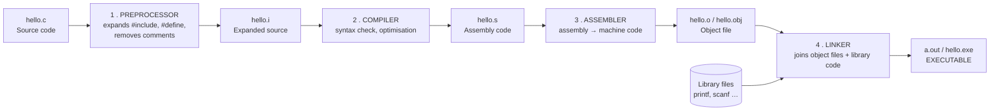

| Stage | Input → Output | What it does |
|---|---|---|
| **1. Preprocessing** | `.c` → `.i` | Expands `#include` and `#define`, handles `#ifdef`, strips comments |
| **2. Compilation** | `.i` → `.s` | Checks syntax and semantics, optimises, generates assembly |
| **3. Assembly** | `.s` → `.o` | Converts assembly into relocatable machine code |
| **4. Linking** | `.o` + libraries → executable | Resolves function references (e.g. `printf`), produces the final binary |

**GCC commands to know:** `gcc -E` (preprocess only) · `gcc -S` (compile to assembly) · `gcc -c` (compile to object file) · `gcc hello.c -o hello` (all four stages).

#### Input and output

```c
printf("Enter two numbers: ");
scanf("%d %d", &a, &b);        /* & gives scanf the ADDRESS of the variable */
printf("Sum = %d\n", a + b);
```

| Specifier | Type |
|---|---|
| `%d` | int (decimal) |
| `%f` | float · `%lf` for double |
| `%c` | char |
| `%s` | string |
| `%u` | unsigned int |
| `%ld` | long int |
| `%x` / `%o` | hexadecimal / octal |
| `%p` | pointer / address |
| `%%` | a literal % sign |

**Previous Year Question List from this Topic:**

- [(i) Formatted Input/Output Statement কাকে বলে? Key-Board থেকে কিভাবে input নেয়া যায়? %d এর অর্থ কী?](../written-answers/c-programming.md?plain=1#L2763)
- [Answer the following Questions](../written-answers/c-programming.md?plain=1#L4074)
- [Answer the following question:](../written-answers/c-programming.md?plain=1#L9759)


---

### Decision Making — if, if-else, nested if and switch

#### The if family

```c
/* simple if */
if (marks >= 40)
    printf("Pass\n");

/* if-else */
if (n % 2 == 0)  printf("Even\n");
else             printf("Odd\n");

/* else-if ladder */
if      (marks >= 80) grade = 'A';
else if (marks >= 70) grade = 'B';
else if (marks >= 60) grade = 'C';
else                  grade = 'F';

/* nested if — an if INSIDE another if */
if (age >= 18) {
    if (hasNID)  printf("Can vote\n");
    else         printf("Get an NID first\n");
} else {
    printf("Too young\n");
}
```

> **Nested if** means placing one `if` statement **inside the body of another `if` or `else`**. It is used when a second condition only makes sense once the first is already true. Always use **braces `{}`** in nested ifs — without them, a dangling `else` binds to the **nearest unmatched `if`**, which is a classic bug.

**The conditional (ternary) operator** is a compact `if-else` that returns a value:

```c
max = (a > b) ? a : b;        /* if (a>b) max=a; else max=b; */
```

#### switch-case

```c
switch (expression) {         /* must be int or char — NOT float, NOT string */
    case 1:
        printf("One");
        break;                /* without break, execution FALLS THROUGH */
    case 2:
        printf("Two");
        break;
    default:
        printf("Other");
}
```

**Rules of `switch`:**
1. The expression must evaluate to an **integer or character** type (`int`, `char`, `enum`) — **float and string are not allowed**.
2. Each `case` label must be a **constant**, not a variable or an expression.
3. Case labels must be **unique**.
4. **`break`** exits the switch; without it control **falls through** into the next case.
5. **`default`** is optional and runs when no case matches; it can be placed anywhere but is conventionally last.

**Deliberate fall-through is useful** when several values share one action:

```c
switch (ch) {
    case 'A': case 'E': case 'I': case 'O': case 'U':
    case 'a': case 'e': case 'i': case 'o': case 'u':
        printf("Vowel");
        break;
    default:
        printf("Consonant");
}
```

> This is exactly how the `if (ch=='A' || ch=='E' || ch=='I' || ch=='O' || ch=='U')` condition is converted to a switch: each alternative becomes a **case label stacked above a single shared body**.

#### if-else vs switch

| Point | **if-else** | **switch** |
|---|---|---|
| Condition type | **Any** boolean expression | Only **equality** against integer/char constants |
| Ranges and relations (`>`, `<`, `&&`) | ✅ Yes | ❌ No |
| Float / string comparison | ✅ Yes | ❌ No |
| Speed with many cases | Checks conditions one by one | Often compiled to a **jump table — faster** |
| Readability with many fixed values | Poor | **Excellent** |
| Fall-through | Not applicable | Possible (and must be controlled with `break`) |

> ### "Can every if-else be converted into a switch?"
> ### ❌ **No.**
>
> A switch can only test **equality of one integral expression against constant values**. An `if-else` can test **anything**. So conversion is impossible when the condition involves:
> - **Ranges or relational operators:** `if (marks >= 80)` — a switch cannot express "greater than or equal".
> - **Floating-point values:** `if (price > 99.5)`.
> - **Strings:** `if (strcmp(name, "Rahim") == 0)`.
> - **Multiple different variables:** `if (a > 0 && b < 10)` — a switch tests only one expression.
> - **Non-constant case values:** `case x:` where x is a variable.
>
> **Conversion IS possible** when the `if-else` chain compares **one integer or char variable against fixed constants** — e.g. a menu selection, a vowel test, or a day-of-week lookup.
>
> *(A range **can** be forced into a switch by listing every value — `case 80: case 81: … case 100:` — but this is impractical and defeats the purpose.)*

**Previous Year Question List from this Topic:**

- [Write a C program to check the number in EVEN or ODD.](../written-answers/c-programming.md?plain=1#L23)
- [Write a C/Java program to determine if a given year is a leap year nor not.](../written-answers/c-programming.md?plain=1#L46)
- [Salary Range and Tax Calculation are given:](../written-answers/c-programming.md?plain=1#L369)
- [Write a C/C++ program for check out a leap year program.](../written-answers/c-programming.md?plain=1#L1136)
- [Determine even or odd numbers.](../written-answers/c-programming.md?plain=1#L1888)
- [Write a program to find this is Leap year or not, using function.](../written-answers/c-programming.md?plain=1#L2147)
- [(b) Write a program in C/C++/Java to identify the largest number of given 3 numbers.](../written-answers/c-programming.md?plain=1#L2349)
- [(b) Write down a program in C language that will find the maximum of four integer gives as inputs.](../written-answers/c-programming.md?plain=1#L2374)
- [Write the code for second highest maximum from given three number in c/c++.](../written-answers/c-programming.md?plain=1#L2655)
- [Write a simple output C program to check odd-even number.](../written-answers/c-programming.md?plain=1#L2687)
- [(ii) if......else statement এর format লিখ। 1+3+5+7+\dots+n সিরিজটির যোগফল নির্ণয়ের জন্য C-language এ একটি প্রোগ্রাম লিখ।](../written-answers/c-programming.md?plain=1#L2793)
- [An employee’s total weekly pay is calculated by multiplying the hourly wage and number of regular hours plus any overtime pays which in turn is calculated as to…](../written-answers/c-programming.md?plain=1#L2833)
- [Write a code in C/C++ that will output the 2nd largest number. (If N>=1)](../written-answers/c-programming.md?plain=1#L2952)
- [(খ) $ax^2+bx+c=0$ সমীকরণটির x চলকের মান নির্ণয়ের জন্য C প্রোগ্রামিং ল্যাঙ্গুয়েজে একটি কোড লিখুন।](../written-answers/c-programming.md?plain=1#L3146)
- [Write a program to calculate GPA, Avg and total marks.](../written-answers/c-programming.md?plain=1#L3341)
- [Write a program in any language to find out maximum among three numbers.](../written-answers/c-programming.md?plain=1#L3815)
- [নিচের if-else কে switch case এ পরিনত করুন। if(ch== 'A':: ch== 'E' :: ch== 'I' :: ch == 'O':: ch== 'U')](../written-answers/c-programming.md?plain=1#L9725)
- [উদাহরণসহ i++ and ++i এর মধ্যে পার্থক্য লিখুন। Nested if কী?](../written-answers/c-programming.md?plain=1#L9831)
- [(c) Is it possible to convert all if-else code into switch code block? Give an example.](../written-answers/c-programming.md?plain=1#L9931)

**Previous Year MCQ List from this Topic:**

- [Which of the following cannot be checked in a switch-case statement?](../mcq-answers/c-programming.md?plain=1#L647)
- [C programming language এ নিচের কোনটিকে "if" দিয়ে Replace করা যায়?](../mcq-answers/c-programming.md?plain=1#L920)
- [Find out the error in following block of code: if (x=100) cout<<"x is 100";](../mcq-answers/c-programming.md?plain=1#L1111)
- [What will be the output of the following C code?](../mcq-answers/c-programming.md?plain=1#L79)


---

### Loops in C — for, while and do-while

A **loop** repeats a block of statements while a condition remains true. Every loop has **three parts**: **initialisation**, **condition (test)**, and **update (increment/decrement)**.

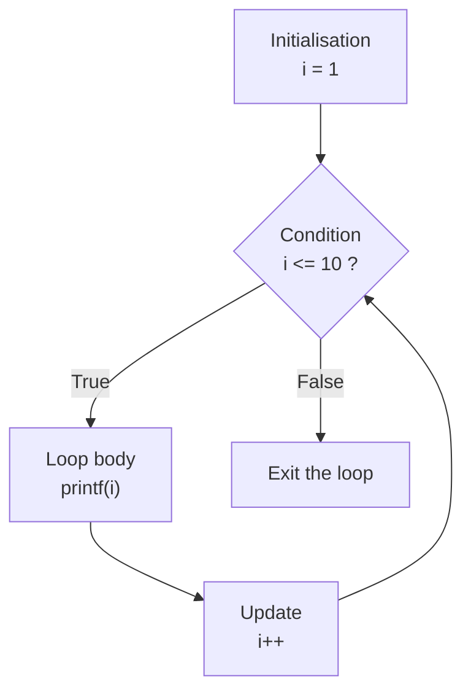

#### The three loop types

```c
/* 1. for loop — when the number of iterations is KNOWN */
for (i = 1; i <= 10; i++) {
    printf("%d ", i);
}

/* 2. while loop — ENTRY controlled, count may be unknown */
i = 1;
while (i <= 10) {
    printf("%d ", i);
    i++;
}

/* 3. do-while loop — EXIT controlled, body runs AT LEAST ONCE */
i = 1;
do {
    printf("%d ", i);
    i++;
} while (i <= 10);           /* note the SEMICOLON */
```

#### Syntax summary

| Loop | Syntax |
|---|---|
| **while** | `while (condition) { statements }` |
| **do-while** | `do { statements } while (condition);` ← **semicolon required** |
| **for** | `for (init; condition; update) { statements }` |

#### while vs do-while — the key difference

| Point | **while** | **do-while** |
|---|---|---|
| Condition checked | **Before** the body — *entry controlled* | **After** the body — *exit controlled* |
| Minimum executions | **0** | **1 — always runs at least once** |
| Semicolon after the condition | ❌ No | ✅ **Yes** |
| Used when | The body may not need to run at all | The body must run at least once (menus, input validation) |

**Illustration:**

```c
int i = 100;
while (i < 10) { printf("A"); i++; }     /* prints NOTHING — condition false at entry */

int j = 100;
do { printf("B"); j++; } while (j < 10); /* prints "B" ONCE — body runs before the test */
```

**Typical do-while use — input validation:**

```c
int choice;
do {
    printf("Enter 1-5: ");
    scanf("%d", &choice);
} while (choice < 1 || choice > 5);      /* keep asking until valid */
```

#### Infinite loops and how to terminate them

```c
for (;;)        { ... }      /* all three parts empty → infinite */
while (1)       { ... }
do { ... } while (1);
```

> ### "What can be used to terminate `for(;;)`?"
>
> `for(;;)` has **no condition**, so it never ends on its own. It is terminated from **inside the body** by:
>
> | Method | Effect |
> |---|---|
> | **`break;`** | ✅ **The normal way** — immediately exits the loop and continues after it |
> | **`return;`** | Exits the **whole function**, so the loop ends too |
> | **`goto label;`** | Jumps out of the loop to a label (legal but discouraged) |
> | **`exit(0);`** | Terminates the **entire program** |
> | A raised **signal / exception** | Abnormal termination |
>
> *(`continue` does **not** terminate a loop — it only skips to the next iteration.)*

```c
for (;;) {
    scanf("%d", &n);
    if (n == -1) break;          /* ← this is how you get out */
    printf("%d\n", n * n);
}
```

#### Nested loops

A loop inside another loop. The **inner loop completes fully for every single iteration of the outer loop**, so total iterations = outer × inner.

```c
for (i = 1; i <= 3; i++)         /* outer: 3 times   */
    for (j = 1; j <= 4; j++)     /* inner: 4 times each → 12 total */
        printf("%d*%d ", i, j);
```

#### Jump statements

| Statement | Effect |
|---|---|
| **`break`** | Exits the **innermost** loop or `switch` immediately |
| **`continue`** | Skips the rest of the current iteration and jumps to the **next** one |
| **`goto label`** | Unconditional jump to a label — legal but strongly discouraged |
| **`return`** | Exits the current function, optionally returning a value |

```c
for (i = 1; i <= 10; i++) {
    if (i == 5) continue;     /* skips printing 5 */
    if (i == 8) break;        /* stops at 8       */
    printf("%d ", i);
}
/* Output: 1 2 3 4 6 7 */
```

**Previous Year Question List from this Topic:**

- [(a) Difference between a while loop and do-while loop.](../written-answers/c-programming.md?plain=1#L98)
- [Print the following matrix using for loop.](../written-answers/c-programming.md?plain=1#L1917)
- [What is the equivalant code of the following statement in while loop format?](../written-answers/c-programming.md?plain=1#L3185)
- [When the statement numbered 4,5,6,7 are replaced by](../written-answers/c-programming.md?plain=1#L3961)
- [What can be used to terminate for(;;)?](../written-answers/c-programming.md?plain=1#L9312)
- [Write the syntax of while and do while loop.](../written-answers/c-programming.md?plain=1#L9527)
- [Explain in details the different forms of looping statement in C language.](../written-answers/c-programming.md?plain=1#L10011)
- [Three types of control statements and their graphical presentation using flowchart or flow graph.](../written-answers/c-programming.md?plain=1#L10425)
- [(ক) Loop কী? প্রবাহচিত্রসহ এর গঠন ব্যাখ্যা করুন।](../written-answers/c-programming.md?plain=1#L10456)

**Previous Year MCQ List from this Topic:**

- [Which of the following statements about the "do while" loop is correct?](../mcq-answers/c-programming.md?plain=1#L578)
- [Which for loop has range of similar indexes of 'i' used in for (i = 0; i < n; i++)?](../mcq-answers/c-programming.md?plain=1#L587)
- [Consider int i=0; Then which of the following is not an infinite loop?](../mcq-answers/c-programming.md?plain=1#L596)
- [Which keyword is used to skip the rest of a loop and carry on from the top of the loop again?](../mcq-answers/c-programming.md?plain=1#L605)
- [What can be used to terminate for(;;)?](../mcq-answers/c-programming.md?plain=1#L614)
- [The ________ loop is especially useful when you process a menu selection?](../mcq-answers/c-programming.md?plain=1#L620)
- [C programming Language এ কোনো loop থেকে তৎক্ষণাৎ বের করার জন্য উল্লেখিত কোনটি ব্যবহৃত হয়?](../mcq-answers/c-programming.md?plain=1#L629)
- [Which Control statement can be executed at least once?](../mcq-answers/c-programming.md?plain=1#L638)
- [Which control statement can be executed at least once?](../mcq-answers/c-programming.md?plain=1#L656)
- [What is an example of iteration in C?](../mcq-answers/c-programming.md?plain=1#L691)
- [How many times will loop iterate?](../mcq-answers/c-programming.md?plain=1#L222)
- [Which for loop statement is invalid?](../mcq-answers/c-programming.md?plain=1#L451)
- [Which for loop has range of similar indexes of ‘i’ used in for(i=0; i<n; i++)?( for(i=0; i<n; i++) লুপের সমান ইনডেক্স রেঞ্জ নিচের কোন লুপটিতে ব্যবহৃত হয়েছে? )](../mcq-answers/c-programming.md?plain=1#L1180)


---

### Arrays in C — 1-D, 2-D and Common Operations

An **array** is a collection of **elements of the same data type** stored in **contiguous memory**, accessed by an **index starting at 0**.

```c
int  a[5] = {10, 20, 30, 40, 50};     /* a[0]=10 … a[4]=50 */
int  b[]  = {1, 2, 3};                /* size inferred = 3 */
int  c[5] = {0};                      /* all five set to 0 */
int  m[3][4];                         /* 2-D: 3 rows × 4 columns */
```

> ### "What happens when an array is declared without a size?"
>
> | Case | Result |
> |---|---|
> | `int a[] = {1,2,3,4};` | ✅ **Legal** — the compiler counts the initialisers and sets the size to **4** |
> | `int a[];` (as a local or global variable, no initialiser) | ❌ **Compilation error** — "array size missing"; the compiler cannot know how much memory to reserve |
> | `void f(int a[])` (a **function parameter**) | ✅ **Legal** — inside a function an array parameter **decays into a pointer** (`int *a`), so no size is needed. **This is why you must pass the size as a separate argument.** |
> | `extern int a[];` | ✅ **Legal** — it is only a declaration; the definition with the real size exists in another file |

#### Important array facts

1. **Indexing starts at 0** — the last valid index of `a[n]` is `n-1`.
2. C does **NOT check array bounds**. `a[10]` on a 5-element array compiles fine and reads whatever memory is there — a major source of bugs and security holes.
3. The array **name is the address of the first element**: `a` ≡ `&a[0]`.
4. `sizeof(a) / sizeof(a[0])` gives the number of elements — **but only in the scope where the array was declared**, not inside a function that received it as a parameter.
5. Arrays **cannot be assigned or compared** wholesale: `a = b;` and `a == b` are wrong. Use `memcpy` and element-by-element comparison.
6. An array is always **passed to a function by reference** (as a pointer), so modifications inside the function are visible to the caller.

#### Finding the maximum and minimum

```c
int findMax(int a[], int n) {
    int max = a[0];                  /* start with the FIRST element,
                                        never with 0 — the data may be negative */
    for (int i = 1; i < n; i++)
        if (a[i] > max) max = a[i];
    return max;
}

int findMin(int a[], int n) {
    int min = a[0];
    for (int i = 1; i < n; i++)
        if (a[i] < min) min = a[i];
    return min;
}
```
**Time: O(n), Space: O(1).** *(Both together can be found in 3n/2 comparisons by processing elements in pairs.)*

#### Removing duplicate elements

```c
int removeDuplicates(int a[], int n) {
    int k = 0;                        /* length of the result */
    for (int i = 0; i < n; i++) {
        int isDup = 0;
        for (int j = 0; j < k; j++)
            if (a[i] == a[j]) { isDup = 1; break; }
        if (!isDup) a[k++] = a[i];
    }
    return k;                         /* new length */
}
```
**Time: O(n²).** *(If the array is **sorted**, duplicates are adjacent and can be removed in a single **O(n)** pass; with a hash set it is O(n) on unsorted data too.)*

#### The missing-number problem

> *"An array of size 10 contains the numbers 1 to 10 exactly once, but one is replaced by 0. Find the missing number."*

```c
/* The elegant O(n), O(1) solution — use the sum formula */
int findMissing(int a[], int n) {     /* n = 10 */
    int expected = n * (n + 1) / 2;   /* 1+2+…+10 = 55 */
    int actual = 0;
    for (int i = 0; i < n; i++) actual += a[i];
    return expected - actual;         /* the difference IS the missing number */
}
```

*(An **XOR** approach also works and avoids any overflow risk: XOR all the numbers 1…n together with all the array values; every present number cancels out and the missing one remains.)*

#### The equilibrium index

An **equilibrium index** is an index where the **sum of all elements to its left equals the sum of all elements to its right**.

```c
int equilibrium(int a[], int n) {
    int total = 0, leftSum = 0;
    for (int i = 0; i < n; i++) total += a[i];      /* total sum */

    for (int i = 0; i < n; i++) {
        total -= a[i];                    /* now 'total' = right sum */
        if (leftSum == total) return i;   /* found it */
        leftSum += a[i];                  /* extend the left part */
    }
    return -1;                            /* none exists */
}
```
**Time: O(n), Space: O(1)** — far better than the naive O(n²) that recomputes both sums for every index.

#### 2-D arrays and matrices

```c
int m[3][4];                              /* 3 rows, 4 columns */
/* stored in ROW-MAJOR order: m[0][0], m[0][1] … m[0][3], m[1][0] … */
```

**Sum of each row and each column:**

```c
void rowColSum(int a[][100], int m, int n) {
    for (int i = 0; i < m; i++) {         /* row sums */
        int s = 0;
        for (int j = 0; j < n; j++) s += a[i][j];
        printf("Sum of row %d = %d\n", i + 1, s);
    }
    for (int j = 0; j < n; j++) {         /* column sums */
        int s = 0;
        for (int i = 0; i < m; i++) s += a[i][j];
        printf("Sum of column %d = %d\n", j + 1, s);
    }
}
```

**Matrix multiplication with a compatibility check:**

```c
/* A is p×q, B is r×s.  Multiplication is legal ONLY if q == r. */
if (q != r) {
    printf("Error: matrices cannot be multiplied "
           "(columns of A = %d, rows of B = %d)\n", q, r);
} else {
    for (i = 0; i < p; i++)
        for (j = 0; j < s; j++) {
            C[i][j] = 0;
            for (k = 0; k < q; k++)
                C[i][j] += A[i][k] * B[k][j];
        }
}
```
**Time: O(p·q·s)** → **O(n³)** for square matrices.

**Previous Year Question List from this Topic:**

- [a) Suppose you are working with an array of size 10. It contains all the numbers from 1 to 10 exactly once in a random order. But accidentally, one of the numbe…](../written-answers/c-programming.md?plain=1#L159)
- [Find biggest elements in an array of 10 components.](../written-answers/c-programming.md?plain=1#L195)
- [Write a C program that accepts 10 elements in an array and finds the maximum elements from the array.](../written-answers/c-programming.md?plain=1#L220)
- [Write a function to find minimum number from an array, return minimum value as argument.](../written-answers/c-programming.md?plain=1#L247)
- [Write a program in any language to find the sum of rows and columns of a m \times n matrix, where m and n is taken input from the user. Give the output in the f…](../written-answers/c-programming.md?plain=1#L463)
- [Write a function which receives an array of integers as parameter and print the numbers divisible by 3 in the array.](../written-answers/c-programming.md?plain=1#L681)
- [Write a program in any language that takes two matrices A and B as inputs ensure your code handles matrices of different dimensions—](../written-answers/c-programming.md?plain=1#L1391)
- [Write a function to find the smallest element from an array.](../written-answers/c-programming.md?plain=1#L1460)
- [Suppose you have an array. The array contains elements from 0 to 10. This array also contains 0. To replace these 0s, write a program in C/C++ language.](../written-answers/c-programming.md?plain=1#L1486)
- [Write a function int equilibrium (int() arr, int n); that given a sequence arr() of size n, returns an equilibrium index (if any) or -1 if no equilibrium indexe…](../written-answers/c-programming.md?plain=1#L1519)
- [Write a C Program to delete duplicate element from array.](../written-answers/c-programming.md?plain=1#L1643)
- [(খ) এমন একটি C program লিখুন যা একটি array তৈরি করে কতগুলো ডেটা রাখবে, তারপর ফলাফল হিসেবে ডেটাগুলোকে বিপরীত দিক থেকে print করবে।](../written-answers/c-programming.md?plain=1#L1718)
- [Find the most significant number in an array of N elements.](../written-answers/c-programming.md?plain=1#L1861)
- [ইউজার হতে 10 টি integer data input করে যে data গুলো 5 দ্বারা বিভাজ্য তাদের গড় মান নির্ণয় এর একটি program লিখুন।](../written-answers/c-programming.md?plain=1#L1963)
- [Write a function in C/C++ that return kth largest number of an array. The function has three parameters array_name, size, k.](../written-answers/c-programming.md?plain=1#L1997)
- [Write a C program using array, here N is the number of total students. Take the input and find the average marks. Find out the students who got the above marks…](../written-answers/c-programming.md?plain=1#L2178)
- [Consider int num(20)(4) holds the marks of four class test(CT) of a class of 20 students. Write a program to find out the sum of best three CT marks for each st…](../written-answers/c-programming.md?plain=1#L2254)
- [(খ) তোমার ক্লাসের ছাত্রদের তালিকা Sort করার জন্য একটি C Program লিখ।](../written-answers/c-programming.md?plain=1#L2311)
- [We are given an array of integers and a range, we need to find whether the subarray which falls in this range has values in the form of a mountain or not. All v…](../written-answers/c-programming.md?plain=1#L2400)
- [(a) Write down a function in C Programming language, that will take an n\times n matrix as parameter and the dimension n as another parameter, then compute the…](../written-answers/c-programming.md?plain=1#L2501)
- [(b) Write down a program to find sum of diagonal elements of a two dimensional matrix.](../written-answers/c-programming.md?plain=1#L2535)
- [X is an integer stream of N numbers. You have to select 2 data P and Q such that A <= (P+Q) <= B. Write an algorithm / pseudo code/ C program how many ways you…](../written-answers/c-programming.md?plain=1#L2895)
- [(ক) একটি Array তে পাঁচটি সংখ্যা Input হিসেবে নিয়ে তাদের গড় বের করার জন্য C প্রোগ্রামিং ল্যাঙ্গুয়েজে কোড লিখুন।](../written-answers/c-programming.md?plain=1#L3117)
- [Write a c program to find max price from 20 items.](../written-answers/c-programming.md?plain=1#L3310)
- [Write a program of find max from 20 item price. (Using any language)](../written-answers/c-programming.md?plain=1#L3416)
- [Suppose an array is {4,5,6,7}. Write a C program that will output like {4,5}, {4,6}, {4,7}, {5,6}, {5,7}, {6,7}.](../written-answers/c-programming.md?plain=1#L3553)
- [Write a program using any programming language that reads five numbers from keyboard and display the smaller, larger and average of those numbers.](../written-answers/c-programming.md?plain=1#L3585)
- [Write a program to find out the minimum number from a series.](../written-answers/c-programming.md?plain=1#L3684)
- [Write a C program to acending (A-Z) using selection sort.](../written-answers/c-programming.md?plain=1#L3745)
- [Write a C program to get max element of an array.](../written-answers/c-programming.md?plain=1#L3893)
- [Write a program/code to find the largest number in an array of 10 elements.](../written-answers/c-programming.md?plain=1#L3937)
- [Write a program that read n number string and print these strings in ascending order.](../written-answers/c-programming.md?plain=1#L3998)
- [Write a C program that performs this matrices problem. Calculate and display the sum of the elements on the main diagonal and the sum of the elements on the ant…](../written-answers/c-programming.md?plain=1#L4196)
- [What will occur when an array is declared without size?](../written-answers/c-programming.md?plain=1#L9329)
- [Write a program to print the common element between two arrays and the total number of elements found.](../written-answers/c-programming.md?plain=1#L4240)
- [Array - Reverse the whole array.](../written-answers/c-programming.md?plain=1#L4421)
- [Array - Frequency count of elements.](../written-answers/c-programming.md?plain=1#L4458)
- [Matrix - Sum of two matrices.](../written-answers/c-programming.md?plain=1#L4503)
- [Matrix - Find the transpose.](../written-answers/c-programming.md?plain=1#L4545)
- [Matrix - Check identity matrix.](../written-answers/c-programming.md?plain=1#L4590)

**Previous Year MCQ List from this Topic:**

- [Which of the following correctly accesses the seventh element stored in arr, an array with 100 elements?](../mcq-answers/c-programming.md?plain=1#L747)
- [Assuming an int is of 4 bytes, What is the size of “int array(15)”?](../mcq-answers/c-programming.md?plain=1#L765)
- [Which of the following is correct to initialize arrays in C?](../mcq-answers/c-programming.md?plain=1#L783)
- [What is the access methodology in array?](../mcq-answers/c-programming.md?plain=1#L792)
- [An n*n array v is defined as follows: v(i, j)=i-j for all i, j; 1<=i<=n, 1<=j<=n, the sum of the element of array v is](../mcq-answers/c-programming.md?plain=1#L810)
- [int number () = {10,20,30,40,50}; number(3) =?](../mcq-answers/c-programming.md?plain=1#L828)
- [Two dimensional arrays are also called?](../mcq-answers/c-programming.md?plain=1#L837)
- [The smallest element of array index is called it-](../mcq-answers/c-programming.md?plain=1#L846)


---

### Standard Number Programs

These short programs account for a very large share of the marks. Learn each pattern once.

#### Even or odd

```c
if (n % 2 == 0) printf("Even");
else            printf("Odd");
```

#### Leap year

> A year is a leap year if it is **divisible by 4**, **except** century years, which must be **divisible by 400**.

```c
int isLeap(int y) {
    return (y % 4 == 0 && y % 100 != 0) || (y % 400 == 0);
}
```
**Check:** 2024 → leap ✅ · 1900 → **not** leap (÷100 but not ÷400) ✅ · 2000 → leap (÷400) ✅

#### Prime number

```c
int isPrime(int n) {
    if (n <= 1) return 0;               /* 0, 1 and negatives are NOT prime */
    for (int i = 2; i * i <= n; i++)    /* check only up to √n */
        if (n % i == 0) return 0;
    return 1;
}

/* print all primes from 1 to n */
for (int i = 2; i <= n; i++)
    if (isPrime(i)) printf("%d ", i);
```
**Why √n?** If n = a × b, one factor must be ≤ √n, so there is no point looking further. This turns O(n) into **O(√n)**.

#### Factorial

```c
/* iterative */
long long fact(int n) {
    long long f = 1;
    for (int i = 2; i <= n; i++) f *= i;
    return f;
}

/* recursive */
long long factRec(int n) {
    if (n <= 1) return 1;               /* base case */
    return n * factRec(n - 1);          /* recursive case */
}
```
*Note:* 0! = 1, and factorials overflow fast — 13! already exceeds a 32-bit `int`, so use `long long` (good to 20!).

#### Armstrong number

> An **Armstrong number** equals the sum of its own digits each raised to the power of the number of digits.
> 153 = 1³ + 5³ + 3³ = 1 + 125 + 27 = **153** ✅

```c
int isArmstrong(int n) {
    int digits = 0, temp = n, sum = 0;
    while (temp) { digits++; temp /= 10; }      /* count the digits */
    temp = n;
    while (temp) {
        int d = temp % 10;
        sum += (int)pow(d, digits);
        temp /= 10;
    }
    return sum == n;
}
```
**3-digit Armstrong numbers:** 153, 370, 371, 407.

#### Sum of digits · reverse · palindrome number

```c
int sumDigits(int n) {
    int s = 0;
    while (n) { s += n % 10; n /= 10; }   /* %10 peels off the last digit,
                                             /10 removes it */
    return s;
}

int reverse(int n) {
    int r = 0;
    while (n) { r = r * 10 + n % 10; n /= 10; }
    return r;
}

int isPalindrome(int n) { return n == reverse(n); }   /* 121 → yes, 123 → no */
```

> **The two operations to memorise:** `n % 10` gives the **last digit**; `n / 10` **removes** the last digit. Almost every digit problem is built from these two.

#### Swapping two numbers without a third variable

```c
/* using arithmetic */
a = a + b;
b = a - b;      /* b = (a+b) - b = original a */
a = a - b;      /* a = (a+b) - original a = original b */

/* using XOR — no overflow risk */
a = a ^ b;
b = a ^ b;
a = a ^ b;
```
*(Caution: both tricks fail if `a` and `b` are the **same variable** — the value becomes 0.)*

#### Fibonacci series

```c
int a = 0, b = 1, c;
printf("%d %d ", a, b);
for (int i = 3; i <= n; i++) {
    c = a + b;
    printf("%d ", c);
    a = b;  b = c;
}
/* 0 1 1 2 3 5 8 13 21 34 … */
```

#### Quadratic equation ax² + bx + c = 0

```c
d = b * b - 4 * a * c;                 /* the DISCRIMINANT decides everything */
if (d > 0)
    printf("Two real distinct roots: %.2f and %.2f",
           (-b + sqrt(d)) / (2*a), (-b - sqrt(d)) / (2*a));
else if (d == 0)
    printf("Two equal real roots: %.2f", -b / (2.0*a));
else
    printf("Complex roots: %.2f + %.2fi and %.2f - %.2fi",
           -b / (2.0*a), sqrt(-d) / (2*a), -b / (2.0*a), sqrt(-d) / (2*a));
```

| Discriminant D = b² − 4ac | Roots |
|---|---|
| **D > 0** | Two **distinct real** roots |
| **D = 0** | Two **equal real** roots |
| **D < 0** | Two **complex conjugate** roots |

#### Salary / tax slab calculation

Slab problems are just an **else-if ladder**, but the tax must be computed **slab by slab**, not on the whole amount:

```c
double tax = 0;
if (income <= 350000)                       tax = 0;
else if (income <= 450000)                  tax = (income - 350000) * 0.05;
else if (income <= 750000)                  tax = 100000*0.05 + (income - 450000) * 0.10;
else                                        tax = 100000*0.05 + 300000*0.10
                                                  + (income - 750000) * 0.15;
```
> **The common mistake:** computing `income * rate` for the whole income. Real tax systems are **progressive** — each slab is taxed at its own rate and the results are added.

**Previous Year Question List from this Topic:**

- [Write a C program to check the number in EVEN or ODD.](../written-answers/c-programming.md?plain=1#L23)
- [Write a C/Java program to determine if a given year is a leap year nor not.](../written-answers/c-programming.md?plain=1#L46)
- [Write a C/Java program to check Armstrong number or not.](../written-answers/c-programming.md?plain=1#L276)
- [Write a C program find prime number 1 to n.](../written-answers/c-programming.md?plain=1#L433)
- [Write a program in any language to find the prime numbers between 1.......n, where n is taken as user input.](../written-answers/c-programming.md?plain=1#L529)
- [Write a Program Prime number print from 1 to n.](../written-answers/c-programming.md?plain=1#L575)
- [Write a C program: ax^2+bx+c=0](../written-answers/c-programming.md?plain=1#L712)
- [Write a program that take a number as input and output should be sum of digits of that number using python/C also draw its flow chart.](../written-answers/c-programming.md?plain=1#L752)
- [(খ) একটি ধনাত্মক পূর্ণ সংখ্যার Factorial নির্ণয়ের C program লিখুন।](../written-answers/c-programming.md?plain=1#L929)
- [Write a program swap two numbers without using 3rd variable.](../written-answers/c-programming.md?plain=1#L959)
- [Write a C/C++ program to count the prime number up to N.](../written-answers/c-programming.md?plain=1#L1108)
- [Write a program find prime number between 1 to 100?](../written-answers/c-programming.md?plain=1#L1288)
- [Write a C code that show factorial of a number.](../written-answers/c-programming.md?plain=1#L1612)
- [Given two integers A and B as input write a program to compute the least common multiple of A and B.](../written-answers/c-programming.md?plain=1#L1682)
- [(খ) প্রথম দশটি Fibonacci number প্রদর্শনের জন্য একটি C program লিখুন।](../written-answers/c-programming.md?plain=1#L1747)
- [C program to find sum of odd numbers from 1 to n.](../written-answers/c-programming.md?plain=1#L1808)
- [Determine whwther a given number is prime or not?](../written-answers/c-programming.md?plain=1#L1833)
- [Write a C/C++ program to find out the prime from 1 to N.](../written-answers/c-programming.md?plain=1#L2029)
- [Write a C/C++ program to find the reverse number of a number.](../written-answers/c-programming.md?plain=1#L2057)
- [Write a C/C++ program to find the HCF.](../written-answers/c-programming.md?plain=1#L2085)
- [Write a C/C++ program to find the sum of digits.](../written-answers/c-programming.md?plain=1#L2119)
- [Write down a function int reverse (int n) that takes a positive integer as input parameter and returns the reverse of the given integer. For example, if input i…](../written-answers/c-programming.md?plain=1#L2220)
- [Write a programme in C/C++/Java what finds sum of digits of a number until sum becomes single digit, simple input/output is: Input: 12345 Output: 6](../written-answers/c-programming.md?plain=1#L2431)
- [Write a C program to compute the perimeter and area of a circle with a given radius.](../written-answers/c-programming.md?plain=1#L2594)
- [A হলো মিটার নং, B হলো ব্যবহৃত ইউনিট। 300 ইউনিটের বেশী তাদের মিটার নং এবং ইউনিটের যোগফল বের কর।](../written-answers/c-programming.md?plain=1#L2620)
- [Write a C program for prime numbers between 1 to N.](../written-answers/c-programming.md?plain=1#L2711)
- [0 থেকে n সংখ্যক পর্যন্ত Fibonacci Series লেখার জন্য প্রোগ্রাম লিখুন।](../written-answers/c-programming.md?plain=1#L2991)
- [A prim number is a number that is evenly divided by only 1 and itself. Write a program to your favorite language to print the first 100 prime numbers.](../written-answers/c-programming.md?plain=1#L3051)
- [Write a program to find the GCD using C/C++.](../written-answers/c-programming.md?plain=1#L3281)
- [Write a program of find Prime number in 1 to 100 number. (Using any language)](../written-answers/c-programming.md?plain=1#L3385)
- [Write a c program to verify a perfect number. Perfect number is a positive integer which is equal to the sum of its proper positive divisors.](../written-answers/c-programming.md?plain=1#L3491)
- [Write a program check a number is prime or not prime.](../written-answers/c-programming.md?plain=1#L3524)
- [Write a program to read the coordinates of the end points of a line and to find its length.](../written-answers/c-programming.md?plain=1#L3621)
- [Write a C program to reverse an integer number.](../written-answers/c-programming.md?plain=1#L3715)
- [Write a structured program to display Fibonacci series up to 100 Numbers.](../written-answers/c-programming.md?plain=1#L3782)
- [Write a program (in C or any language) to find the sum of even numbers from 1 to n.](../written-answers/c-programming.md?plain=1#L3916)
- [(b) What are the rules for calculating the n-th Fibonacci number, and what is the recurrence relation that defines this sequence?](../written-answers/c-programming.md?plain=1#L4036)
- [Write a program that takes two inputs, n and k, where n>k. The program should prompt the user to enter n numbers of data and then return the k^\text{th} smalles…](../written-answers/c-programming.md?plain=1#L4098)
- [Write a program that takes a single alphanumeric string as input. The string may contain both letters (a-z, A-Z) and digits (0-9). Your task is to calculate and…](../written-answers/c-programming.md?plain=1#L4170)
- [Find the number of occurrences of a digit in a number.](../written-answers/c-programming.md?plain=1#L4350)


---

### Series and Pattern Printing Programs

#### Arithmetic series

```c
/* 1 + 2 + 3 + … + n */
sum = 0;
for (i = 1; i <= n; i++) sum += i;
/* or directly: sum = n * (n + 1) / 2;  */

/* 1 + 3 + 5 + … + N  (odd numbers) */
sum = 0;
for (i = 1; i <= N; i += 2) sum += i;
/* the sum of the first k odd numbers is exactly k²  */
```

#### The series 1 + 2 + 4 + 7 + 11 + …

Look at the **differences**: 1, 2, 3, 4, 5 … — each term adds one more than the previous gap.

```c
int term = 1, add = 1, sum = 0;
while (term <= N) {
    sum += term;
    printf("%d ", term);
    term += add;      /* the gap grows by 1 each time */
    add++;
}
```

#### Factorial-based series — eˣ and sin x

> **eˣ = 1 + x/1! + x²/2! + x³/3! + …**

```c
double ex(double x, int n) {
    double sum = 1.0, term = 1.0;
    for (int i = 1; i <= n; i++) {
        term = term * x / i;      /* build the next term FROM the previous one —
                                     never recompute the power and factorial */
        sum += term;
    }
    return sum;
}
```

> **x − x³/3! + x⁵/5! − x⁷/7! + … (the sine series)**

```c
double sinSeries(double x, int n) {
    double sum = 0, term = x;
    for (int i = 1; i <= n; i++) {
        sum += term;
        term = -term * x * x / ((2*i) * (2*i + 1));   /* sign flips automatically */
    }
    return sum;
}
```

> **The key technique for every series question:** find the relation `term[i]` → `term[i+1]` and build each term from the previous one. Recomputing `pow()` and `factorial()` from scratch inside the loop is slow and overflows quickly.

#### Pattern printing — the general method

> **Outer loop = rows. Inner loop(s) = what is printed on each row.** Work out the relationship between the row number `i` and the count of spaces and stars.

**Right triangle**
```
*
* *
* * *
* * * *
```
```c
for (i = 1; i <= n; i++) {
    for (j = 1; j <= i; j++) printf("* ");
    printf("\n");
}
```

**Pyramid**
```
   *
  * * *
 * * * * *
* * * * * * *
```
```c
for (i = 1; i <= n; i++) {
    for (j = 1; j <= n - i; j++) printf(" ");        /* leading spaces */
    for (j = 1; j <= 2 * i - 1; j++) printf("* ");   /* stars: 1,3,5,7 */
    printf("\n");
}
```

**Number triangle**
```
1
1 2
1 2 3
1 2 3 4
```
```c
for (i = 1; i <= n; i++) {
    for (j = 1; j <= i; j++) printf("%d ", j);
    printf("\n");
}
```

**Floyd's triangle** — consecutive numbers filled row by row:
```
1
2 3
4 5 6
7 8 9 10
11 12 13 14 15
```
```c
int num = 1;
for (i = 1; i <= n; i++) {                /* n = 5 */
    for (j = 1; j <= i; j++)
        printf("%d ", num++);             /* one counter that never resets */
    printf("\n");
}
```

**Pascal's triangle**
```c
for (i = 0; i < n; i++) {
    int val = 1;
    for (j = 0; j <= i; j++) {
        printf("%d ", val);
        val = val * (i - j) / (j + 1);    /* next binomial coefficient */
    }
    printf("\n");
}
```

**Previous Year Question List from this Topic:**

- [Write down a program is any high level language to read an integer and display a pattern like below. For example, if the given integer number is 1234, then the…](../written-answers/c-programming.md?plain=1#L118)
- [Write a program from the following series: $e^x = 1 + \frac{x}{1} + \frac{x^2}{2!} + \frac{x^3}{3!} + \dots$](../written-answers/c-programming.md?plain=1#L310)
- [Write a C program to find sum of: $X - \frac{X^3}{3!} + \frac{X^5}{5!} - \frac{X^7}{7!} \dots N$](../written-answers/c-programming.md?plain=1#L338)
- [Write a Program Floyds triangle n=5](../written-answers/c-programming.md?plain=1#L604)
- [Write a C Program Find sum of the series: 1+2+4+7+11+..........+N](../written-answers/c-programming.md?plain=1#L652)
- [Write a program for following sequence and analyze complexity of the program](../written-answers/c-programming.md?plain=1#L1078)
- [Write a C program to print the following pattern:](../written-answers/c-programming.md?plain=1#L1568)
- [Write a C program: x - \frac{x^3}{3} + \frac{x^5}{5} - \dots](../written-answers/c-programming.md?plain=1#L1778)
- [(ক) নিচের সিরিজ টি ক্যালকুলেটর এবং প্রিন্ট করার জন্য একটি C Program লিখুন। 1 + 2 + 3 + \dots + 100](../written-answers/c-programming.md?plain=1#L2286)
- [Pattern this print using C++ program-](../written-answers/c-programming.md?plain=1#L2463)
- [(i) Write a C/C++ program up to series n: \frac{1}{2\times 3} + \frac{2}{3\times 4} + \frac{3}{4\times 5} \dots\dots\dots\dots\dots](../written-answers/c-programming.md?plain=1#L2568)
- [Write a program for the following series: 1^2+2^2+3^2+4^2+\dots\dots\dots\dots+N^2](../written-answers/c-programming.md?plain=1#L2739)
- [Write a C program: 1+2^n+3^n+4^n+\dots\dots\dots\dots+n^n (where n>0).](../written-answers/c-programming.md?plain=1#L2867)
- [Write a program in C to find the sum of following series: $1^2+2^2+3^2+\dots\dots\dots\dots+n^2$](../written-answers/c-programming.md?plain=1#L3023)
- [(গ) Array processor কী? $1+\frac{1}{2}+\frac{1}{3}+\dots\dots\dots\dots+\frac{1}{N}$ ধারাটির যোগফল নির্ণয়ের জন্য C ভাষায় একটি প্রোগ্রাম লিখুন।](../written-answers/c-programming.md?plain=1#L3085)
- [(a) Write a Java/C program to find the sum of the following series? $\frac{1}{1!} + \frac{2}{2!} + \frac{3}{3!} + \dots\dots\dots\dots + \frac{N}{N!}$](../written-answers/c-programming.md?plain=1#L3218)
- [একটি ৯ ধার বিশিষ্ট বহুভুজের প্রতিটির ধার সমান। উক্ত বহুভুজের অভ্যন্তরীণ কোন ডিগ্রিতে প্রকাশের C Program লিখুন।](../written-answers/c-programming.md?plain=1#L3247)
- [Write program for following pattern:](../written-answers/c-programming.md?plain=1#L3444)
- [Write a program in C++ to calculate the sum of the series: $1+(1+2)+(1+2+3)+\dots\dots+(1+2+\dots\dots+n)$.](../written-answers/c-programming.md?plain=1#L3651)
- [(a) Write down a program is any high level language to read an integer and display a pattern like below. For example, if the given integer number is 1234, then…](../written-answers/c-programming.md?plain=1#L3856)
- [Write a code to print the following pattern. You can use C/Java as programming language.](../written-answers/c-programming.md?plain=1#L4046)
- [Find the sum of the series: $1 + \frac{1}{2} + \frac{1}{3} + \dots\dots\dots\dots + \frac{1}{n}$](../written-answers/c-programming.md?plain=1#L4294)
- [Find the sum of the series: $1^2 - 2^2 + 3^2 - 4^2 + 5^2 - \dots\dots\dots\dots \pm n^2$](../written-answers/c-programming.md?plain=1#L4320)
- [Evaluate the series: $1\times3 + 2\times5 + 3\times7 + \dots\dots\dots\dots + n\times(2n+1)$](../written-answers/c-programming.md?plain=1#L4394)

## Output Tracing & Control Flow

### How to Trace C Program Output — A Step-by-Step Method

Output-tracing ("find the output") questions carry a large share of marks and are pure **mechanical discipline**. Guessing fails; a systematic trace almost never does.

#### The method

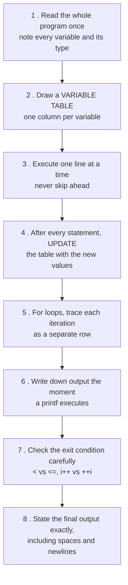

#### The variable-table technique

```c
#include <stdio.h>
int main() {
    int i, sum = 0;
    for (i = 1; i <= 5; i++) {
        if (i % 2 == 0) continue;
        sum += i;
        printf("%d ", sum);
    }
    printf("\nFinal = %d", sum);
    return 0;
}
```

| Iteration | i | i ≤ 5? | i % 2 == 0? | sum | Output so far |
|---|---|---|---|---|---|
| 1 | 1 | ✅ | No | 0 + 1 = **1** | `1 ` |
| 2 | 2 | ✅ | **Yes → continue** | 1 | `1 ` |
| 3 | 3 | ✅ | No | 1 + 3 = **4** | `1 4 ` |
| 4 | 4 | ✅ | **Yes → continue** | 4 | `1 4 ` |
| 5 | 5 | ✅ | No | 4 + 5 = **9** | `1 4 9 ` |
| 6 | 6 | ❌ **exit** | — | 9 | — |

> **Output:**
> ```
> 1 4 9
> Final = 9
> ```

#### Checklist of things to watch

| # | Watch for | Why it catches people |
|---|---|---|
| 1 | `<` vs `<=` in the loop condition | One extra or one missing iteration |
| 2 | `i++` vs `++i` **inside an expression** | Different value is used |
| 3 | `=` vs `==` | `if (a = 5)` **assigns** and is always true |
| 4 | Missing `break` in a `switch` | Fall-through prints extra cases |
| 5 | **Integer division** `5/2` | Gives **2**, not 2.5 |
| 6 | Format specifier mismatch (`%d` with a float) | Garbage output |
| 7 | Array index out of bounds | Undefined behaviour |
| 8 | Uninitialised variables | Garbage values |
| 9 | `static` local variables | They **keep their value** between calls |
| 10 | Pre/post increment in `printf` arguments | Evaluation order is unspecified |
| 11 | Character arithmetic (`'A' + 1` = 66 = `'B'`) | Depends on `%c` vs `%d` |
| 12 | Pointer vs value | `*p` vs `p` |
| 13 | Dangling `else` binding | Binds to the **nearest** unmatched `if` |
| 14 | Semicolon after `if` or `for` | `for(i=0;i<5;i++);` has an **empty body** |

**Previous Year Question List from this Topic:**

- [C output problem.](../written-answers/c-programming.md?plain=1#L4634)
- [What will be the output of following program?](../written-answers/c-programming.md?plain=1#L4726)
- [(b) Find out the output of this program.](../written-answers/c-programming.md?plain=1#L4768)
- [Find the output of the following program:](../written-answers/c-programming.md?plain=1#L4806)
- [Output problem:](../written-answers/c-programming.md?plain=1#L4847)
- [Output problem:](../written-answers/c-programming.md?plain=1#L4886)
- [Explain following program while part in step for the input 1221 and 3456 and also write the output of the program. (সম্পূর্ণ প্রশ্ন সংগ্রহ করা সম্ভব হয় নি!!)](../written-answers/c-programming.md?plain=1#L4927)
- [In the below C code. Write the Output on below table based on code and left side. And also explain the line 7-11 in below code.](../written-answers/c-programming.md?plain=1#L5097)
- [C programming output problem.](../written-answers/c-programming.md?plain=1#L5161)
- [What is the output of code snippet?](../written-answers/c-programming.md?plain=1#L5254)
- [নিচের পাইথন program এর Output বের কর:](../written-answers/c-programming.md?plain=1#L5358)
- [Output Tracing:](../written-answers/c-programming.md?plain=1#L5398)
- [Find the output of the following program:](../written-answers/c-programming.md?plain=1#L5451)
- [Find the output of the following program:](../written-answers/c-programming.md?plain=1#L5484)
- [What will be the output of the program?](../written-answers/c-programming.md?plain=1#L5516)
- [What is the output of the following code?](../written-answers/c-programming.md?plain=1#L5552)
- [Output programs:](../written-answers/c-programming.md?plain=1#L5584)
- [Write down the output from following statement:](../written-answers/c-programming.md?plain=1#L5627)
- [Find the Output of following C Program:](../written-answers/c-programming.md?plain=1#L5733)
- [Write Output from below code:](../written-answers/c-programming.md?plain=1#L5782)
- [Fill in the gape and find output of the following program:](../written-answers/c-programming.md?plain=1#L5853)
- [Output of the following program:](../written-answers/c-programming.md?plain=1#L5940)
- [Find the output of following program:](../written-answers/c-programming.md?plain=1#L6001)
- [Output of the following program:](../written-answers/c-programming.md?plain=1#L6058)
- [Find Output:](../written-answers/c-programming.md?plain=1#L6128)
- [Find the output of the following program. You must show each staps.](../written-answers/c-programming.md?plain=1#L6173)
- [Find out the output of the following program.](../written-answers/c-programming.md?plain=1#L6227)
- [After compilation and execution, what will be output in the following code:](../written-answers/c-programming.md?plain=1#L6276)
- [Write down the output of following program:](../written-answers/c-programming.md?plain=1#L6380)
- [Find the Output:](../written-answers/c-programming.md?plain=1#L6647)
- [What is the output of following code?](../written-answers/c-programming.md?plain=1#L6793)
- [Find the output of a program:](../written-answers/c-programming.md?plain=1#L6834)
- [Find the output of the code:](../written-answers/c-programming.md?plain=1#L6885)
- [What is the output of the following program?](../written-answers/c-programming.md?plain=1#L6929)
- [Find the output of the following code:](../written-answers/c-programming.md?plain=1#L6966)
- [Find the output of the following code:](../written-answers/c-programming.md?plain=1#L6999)
- [What is the output of following program?](../written-answers/c-programming.md?plain=1#L7034)
- [Find the output of following program.](../written-answers/c-programming.md?plain=1#L7157)

**Previous Year MCQ List from this Topic:**

- [Find Output:](../mcq-answers/c-programming.md?plain=1#L23)
- [Find Output:](../mcq-answers/c-programming.md?plain=1#L43)
- [What will be the output of the following C code?](../mcq-answers/c-programming.md?plain=1#L63)
- [What will be the output of the following C code?](../mcq-answers/c-programming.md?plain=1#L96)
- [What will be the output of the following C code?](../mcq-answers/c-programming.md?plain=1#L134)
- [What will be the output of the following C code?](../mcq-answers/c-programming.md?plain=1#L151)
- [What will be the output of this C program?](../mcq-answers/c-programming.md?plain=1#L167)
- [Given Output:](../mcq-answers/c-programming.md?plain=1#L204)
- [What will be the output of the following “C” code fragment?](../mcq-answers/c-programming.md?plain=1#L228)
- [Which is the correct output?](../mcq-answers/c-programming.md?plain=1#L296)
- [Which is correct output?](../mcq-answers/c-programming.md?plain=1#L308)
- [Find the correct output:](../mcq-answers/c-programming.md?plain=1#L320)
- [What is the correct output of the following C program statements?](../mcq-answers/c-programming.md?plain=1#L333)
- [What is the output for the following C code segment?](../mcq-answers/c-programming.md?plain=1#L346)
- [Which is the correct output?](../mcq-answers/c-programming.md?plain=1#L469)
- [What will be the output of this C program?](../mcq-answers/c-programming.md?plain=1#L498)
- [Find output in C- Program:](../mcq-answers/c-programming.md?plain=1#L544)


---

### Operator Precedence, Associativity and Order of Evaluation

#### Precedence table (highest to lowest)

| Precedence | Operators | Associativity |
|---|---|---|
| 1 | `()` `[]` `->` `.` `++` `--` (postfix) | **Left to right** |
| 2 | `++` `--` (prefix) `+` `-` (unary) `!` `~` `*` (deref) `&` `sizeof` `(type)` | **Right to left** |
| 3 | `*` `/` `%` | Left to right |
| 4 | `+` `-` | Left to right |
| 5 | `<<` `>>` | Left to right |
| 6 | `<` `<=` `>` `>=` | Left to right |
| 7 | `==` `!=` | Left to right |
| 8 | `&` (bitwise AND) | Left to right |
| 9 | `^` (bitwise XOR) | Left to right |
| 10 | `\|` (bitwise OR) | Left to right |
| 11 | `&&` | Left to right |
| 12 | `\|\|` | Left to right |
| 13 | `?:` (ternary) | **Right to left** |
| 14 | `=` `+=` `-=` `*=` `/=` `%=` … | **Right to left** |
| 15 | `,` (comma) | Left to right |

**Memory aid for the arithmetic core:** **PUMA** — **P**arentheses, **U**nary, **M**ultiplicative (`* / %`), **A**dditive (`+ -`).

#### Worked evaluations

```c
int x = 10 + 20 * 3;          /* * before + →  10 + 60  = 70 */
int y = (10 + 20) * 3;        /* parentheses first →  30 * 3 = 90 */
int z = 100 / 10 * 2;         /* LEFT to right → (100/10)*2 = 20, NOT 100/20 */
int w = 2 + 3 % 2;            /* % before + →  2 + 1 = 3 */
int v = 10 > 5 && 3 < 1;      /* (10>5)=1, (3<1)=0 → 1 && 0 = 0 */
int u = a = b = c = 5;        /* = is RIGHT to left → c=5, then b=5, then a=5 */
```

#### Precedence vs Associativity vs Order of Evaluation

These three are different, and the difference is exactly what tricky questions exploit.

| Term | Meaning |
|---|---|
| **Precedence** | Which operator **binds tighter** — decides *grouping* |
| **Associativity** | For operators of the **same** precedence, group **left-to-right or right-to-left** |
| **Order of evaluation** | The order in which the **operands** are actually computed — **largely UNSPECIFIED in C** |

> **The critical point:** precedence tells you *how the expression is parsed*, **not** the order in which the sub-expressions are evaluated.
>
> In `f() + g() * h()`, precedence says the result is `f() + (g() * h())` — but C does **not** guarantee whether `f`, `g` or `h` runs first. Any code that depends on that order is **undefined behaviour** and may print different answers on different compilers.

**Classic undefined expressions — never write these, and in an exam say "undefined behaviour":**

```c
i = i++ + ++i;          /* UNDEFINED — i modified twice without a sequence point */
printf("%d %d", i++, i++);   /* UNDEFINED — argument evaluation order is unspecified */
a[i] = i++;             /* UNDEFINED */
```

#### Short-circuit evaluation — a guaranteed order

`&&` and `||` **are** guaranteed to evaluate left to right, and to **stop as soon as the result is known**:

```c
if (a != 0 && b / a > 2)      /* if a==0, b/a is NEVER evaluated → no crash */
if (ptr != NULL && ptr->x)    /* the standard null-check idiom */

int i = 0;
if (0 && i++) ;               /* i++ NEVER runs → i stays 0  */
if (1 || i++) ;               /* i++ NEVER runs → i stays 0  */
```

| Operator | Stops when the left side is | Right side evaluated? |
|---|---|---|
| `&&` | **false (0)** | ❌ No |
| `\|\|` | **true (non-zero)** | ❌ No |

**Previous Year Question List from this Topic:**

- [What is the output of code snippet?](../written-answers/c-programming.md?plain=1#L5254)
- [What is the output of the following code?](../written-answers/c-programming.md?plain=1#L5552)
- [Output of the following program:](../written-answers/c-programming.md?plain=1#L5940)
- [Which of the following is the correct order of evaluation?](../written-answers/c-programming.md?plain=1#L9905)

**Previous Year MCQ List from this Topic:**

- [What is the precedence of arithmetic operators (from highest to lowest)?](../mcq-answers/c-programming.md?plain=1#L1057)
- [Which is logical operator?](../mcq-answers/c-programming.md?plain=1#L1066)
- [Which keyword is used in C language?](../mcq-answers/c-programming.md?plain=1#L1102)
- [Find out the error in following block of code: if (x=100) cout<<"x is 100";](../mcq-answers/c-programming.md?plain=1#L1111)
- [Which of the following is not a logical operator?](../mcq-answers/c-programming.md?plain=1#L1120)
- [For a given integer, which of the following operators can be used to set and reset a particular bit respectively?](../mcq-answers/c-programming.md?plain=1#L1039)
- [Which of the following correctly shows the hierarchy of algorithm operation in C?](../mcq-answers/c-programming.md?plain=1#L665)
- [Which of the following correctly shows the hierarchy of algorithm operation in C?](../mcq-answers/c-programming.md?plain=1#L992)


---

### Increment and Decrement Operators — i++ vs ++i

| Form | Name | Behaviour |
|---|---|---|
| **`++i`** | **Pre-increment** | **Increment FIRST, then use** the new value |
| **`i++`** | **Post-increment** | **Use the old value FIRST, then increment** |

> **Memory hook:** read it left to right. In `++i` the `++` comes **first**, so incrementing happens first. In `i++` the `i` comes first, so the **old value** is used first.

#### Worked examples

```c
int i = 5, j;

j = ++i;      /* i becomes 6, then j = 6   →  i = 6, j = 6 */
```
```c
int i = 5, j;

j = i++;      /* j = 5 (old value), then i becomes 6  →  i = 6, j = 5 */
```

| Statement | Starting i | Final i | Value assigned to j |
|---|---|---|---|
| `j = ++i;` | 5 | **6** | **6** |
| `j = i++;` | 5 | **6** | **5** |
| `j = --i;` | 5 | **4** | **4** |
| `j = i--;` | 5 | **4** | **5** |

**More traces:**

```c
int a = 10;
printf("%d", a++);     /* prints 10, a becomes 11 */
printf("%d", a);       /* prints 11              */

int b = 10;
printf("%d", ++b);     /* b becomes 11, prints 11 */

int x = 5;
int y = x++ + ++x;     /* AVOID — undefined behaviour in C */

int m = 3;
int n = m++ * 2;       /* n = 3 * 2 = 6, then m = 4 */

int p = 3;
int q = ++p * 2;       /* p = 4 first, then q = 4 * 2 = 8 */
```

#### When there is no difference

**As a standalone statement, `i++;` and `++i;` are identical** — the value is discarded, only the side effect matters. So in a `for` loop header:

```c
for (i = 0; i < n; i++)     /* identical in behaviour to ... */
for (i = 0; i < n; ++i)     /* ... this */
```

*(For built-in types they also compile to identical code. For C++ **iterators and objects**, `++i` is marginally more efficient because `i++` must construct and return a copy of the old value.)*

#### The difference matters only when the value is USED

```c
int arr[5] = {10, 20, 30, 40, 50};
int i = 2;
printf("%d", arr[i++]);      /* prints arr[2] = 30, then i = 3 */

i = 2;
printf("%d", arr[++i]);      /* i = 3 first, prints arr[3] = 40 */
```

**Previous Year Question List from this Topic:**

- [(গ) ‘++i’ এবং ‘i++’ অভিব্যক্তি দুটির মধ্যে পার্থক্য কী? উদাহরণসহ ব্যাখ্যা করুন।](../written-answers/c-programming.md?plain=1#L9409)
- [Short question: (i) Difference between ++i and i++ (ii) Difference between Overloading and Overriding (iii) Polymorphism in Java (iv) String variable (v) Contro…](../written-answers/c-programming.md?plain=1#L9675)
- [উদাহরণসহ i++ and ++i এর মধ্যে পার্থক্য লিখুন। Nested if কী?](../written-answers/c-programming.md?plain=1#L9831)

**Previous Year MCQ List from this Topic:**

- [What will be the output of the following C code?](../mcq-answers/c-programming.md?plain=1#L96)
- [What will be the output of the following C code?](../mcq-answers/c-programming.md?plain=1#L151)
- [What is the correct output of the following C program statements?](../mcq-answers/c-programming.md?plain=1#L333)
- [What are the final values of a and c in the following C statement? (initialize value a=2, c=1) c=c? c=2:a=0;](../mcq-answers/c-programming.md?plain=1#L709)
- [Which of the following will not increase the value of variable c by 1?](../mcq-answers/c-programming.md?plain=1#L1075)


---

### Integer Arithmetic Traps — Division, Overflow and Type Promotion

#### Integer division truncates

```c
int a = 5, b = 2;
printf("%d", a / b);            /* 2  — NOT 2.5; the fraction is DISCARDED */
printf("%f", a / b);            /* still integer division first → garbage with %f */
printf("%f", (float)a / b);     /* 2.500000 — cast promotes BOTH operands */
printf("%f", 5.0 / 2);          /* 2.500000 — one float operand is enough */

printf("%d", 7 / 2);            /*  3 */
printf("%d", -7 / 2);           /* -3 (C99 truncates TOWARDS ZERO) */
printf("%d", 7 % 2);            /*  1 */
printf("%d", -7 % 2);           /* -1 (the sign follows the DIVIDEND) */
```

> **The rule:** if **both** operands are integers, C performs **integer division** and throws away the remainder. To get a real quotient, **at least one operand must be floating point** — use a cast or write `2.0`.
>
> **The `%` operator works only on integers** — `5.5 % 2` is a compile error; use `fmod()` from `math.h`.

#### Data type ranges and overflow

| Type | Typical size | Range |
|---|---|---|
| `char` | 1 byte | −128 to 127 |
| `unsigned char` | 1 byte | 0 to 255 |
| `short` | 2 bytes | **−32,768 to 32,767** |
| `unsigned short` | 2 bytes | 0 to 65,535 |
| `int` | **4 bytes** (modern) | **−2,147,483,648 to 2,147,483,647** |
| `unsigned int` | 4 bytes | 0 to 4,294,967,295 |
| `long long` | 8 bytes | ±9.22 × 10¹⁸ |
| `float` | 4 bytes | ±3.4 × 10³⁸, **~6–7 significant digits** |
| `double` | 8 bytes | ±1.7 × 10³⁰⁸, **~15–16 significant digits** |

> ### "Can I store 32,678 in an `int`?"
> ### ✅ **Yes — easily.**
>
> A modern `int` is **4 bytes** and holds roughly **−2.1 billion to +2.1 billion**, so 32,678 is nowhere near the limit.
>
> **The trap the question is testing:** 32,678 is just above **32,767**, which is the maximum of a **2-byte `short int`** (and of `int` on very old 16-bit compilers such as Turbo C). So:
>
> | Type | Can it hold 32,678? |
> |---|---|
> | `short int` (2 bytes, max 32,767) | ❌ **No** — it **overflows** and wraps around to a negative value (−32,858) |
> | `unsigned short` (max 65,535) | ✅ Yes |
> | `int` on a 16-bit compiler (2 bytes) | ❌ No |
> | **`int` on a modern 32/64-bit compiler (4 bytes)** | ✅ **Yes** |
> | `long`, `long long`, `float`, `double` | ✅ Yes |
>
> **Always answer with the reasoning, not just yes/no:** *"Yes, because `int` is 4 bytes on a modern compiler and its range is ±2.1 billion. But on a 16-bit compiler where `int` is 2 bytes, 32,678 exceeds the maximum of 32,767 and would overflow to a negative number."*

**Overflow demonstration:**

```c
short s = 32767;
s = s + 1;
printf("%d", s);         /* -32768 — it WRAPS AROUND, no error is reported */
```

#### Implicit type conversion (promotion)

In a mixed expression, C promotes the "smaller" type to the "larger" one:

> **char / short → int → unsigned int → long → unsigned long → long long → float → double → long double**

```c
int i = 10;
float f = 3.5;
printf("%f", i + f);       /* i promoted to 10.0 → 13.500000 */

char c = 'A';
printf("%d", c);           /* 65 — the ASCII value */
printf("%c", c + 1);       /* 'B' — char arithmetic is int arithmetic */
printf("%d", 'a' - 'A');   /* 32 — the fixed gap between cases */

double d = 5 / 2;          /* WRONG: 5/2 is computed as INT first → 2, then 2.0 */
double e = 5.0 / 2;        /* RIGHT: 2.5 */
```

#### Floating-point comparison

```c
float a = 0.1 + 0.2;
if (a == 0.3) printf("Equal");      /* may print NOTHING — 0.1 has no exact
                                       binary representation */
if (fabs(a - 0.3) < 1e-6) printf("Equal");   /* ✅ the CORRECT way */
```

**Previous Year Question List from this Topic:**

- [(খ) আমি কী ৩২৬৭৮ মান সংরক্ষণ করতে ‘int’ ডাটা টাইপ ব্যবহার করতে পারি? না পারলে কেন?](../written-answers/c-programming.md?plain=1#L9389)
- [Write some default data type in C.](../written-answers/c-programming.md?plain=1#L9632)
- [Using examples explain data types used in C language.](../written-answers/c-programming.md?plain=1#L9973)

**Previous Year MCQ List from this Topic:**

- [What will be the output of the following C code?](../mcq-answers/c-programming.md?plain=1#L63)
- [What is the output for the following C code segment?](../mcq-answers/c-programming.md?plain=1#L346)
- [What will be the output of following code?](../mcq-answers/c-programming.md?plain=1#L426)
- [What is the minimum value that can be stored accurately in a 32-bit signed integer of C programming language?](../mcq-answers/c-programming.md?plain=1#L875)
- [What is the maximum value that can be stored in a 32-bit signed integer of C language?](../mcq-answers/c-programming.md?plain=1#L884)


---

### Common Output-Tracing Traps in C

#### 1. Scope and shadowing

```c
int x = 10;                     /* global */
int main() {
    int x = 20;                 /* local SHADOWS the global */
    { int x = 30; printf("%d ", x); }   /* 30 — innermost block wins */
    printf("%d ", x);           /* 20 — the local */
    return 0;
}
/* Output: 30 20 */
```

#### 2. `static` local variables

```c
void counter() {
    static int c = 0;           /* initialised ONCE, survives between calls */
    int d = 0;                  /* recreated on EVERY call */
    c++;  d++;
    printf("c=%d d=%d\n", c, d);
}
int main() { counter(); counter(); counter(); }
/* Output:
   c=1 d=1
   c=2 d=1
   c=3 d=1     ← d always 1, c keeps growing */
```

#### 3. Arrays decay to pointers inside functions

```c
void f(int a[]) {
    printf("%zu\n", sizeof(a));      /* 8 — the size of a POINTER, not the array! */
}
int main() {
    int a[10];
    printf("%zu\n", sizeof(a));      /* 40 — 10 ints × 4 bytes */
    f(a);
}
```

#### 4. Missing `break` — switch fall-through

```c
int x = 2;
switch (x) {
    case 1: printf("One ");
    case 2: printf("Two ");     /* ← starts here */
    case 3: printf("Three ");   /* falls through */
    default: printf("Default");
}
/* Output: Two Three Default   — NOT just "Two" */
```

#### 5. The semicolon-after-loop bug

```c
for (i = 0; i < 5; i++);        /* ← this semicolon is the ENTIRE loop body */
    printf("%d ", i);           /* runs ONCE, after the loop → prints 5 */
/* Output: 5    (not 0 1 2 3 4) */
```

#### 6. `=` instead of `==`

```c
int a = 0;
if (a = 5) printf("True");      /* ASSIGNS 5 to a; 5 is non-zero → TRUE */
/* Output: True     — and a is now 5 */
```

#### 7. Character and ASCII arithmetic

```c
char c = 'A';
printf("%c %d\n", c, c);            /* A 65 */
printf("%c\n", c + 32);             /* a  — lowercase is +32 */
printf("%d\n", '5' - '0');          /* 5  — the standard char→digit trick */
printf("%c\n", 'z' - 'a' + 'A');    /* Z  — case conversion by offset */
```

**Key ASCII values:** `'0'` = **48** · `'A'` = **65** · `'a'` = **97** · space = 32 · `'\0'` = 0.

#### 8. Pointer traps

```c
int a = 10, b = 20;
int *p = &a;
printf("%d\n", *p);       /* 10 — the VALUE at the address */
p = &b;
printf("%d\n", *p);       /* 20 */
(*p)++;                   /* b becomes 21  */
printf("%d\n", b);        /* 21 */

int arr[3] = {1, 2, 3};
int *q = arr;
printf("%d\n", *(q + 2)); /* 3 — pointer arithmetic scales by sizeof(int) */
printf("%d\n", *q++);     /* prints 1, THEN advances q */
```

#### 9. Global vs local variables

```c
int g = 100;                    /* GLOBAL: file scope, static lifetime, auto-init to 0 */
void f() {
    int l;                      /* LOCAL: block scope, automatic lifetime,
                                   UNINITIALISED — contains garbage */
    printf("%d %d", g, l);
}
```

| Point | **Local variable** | **Global variable** |
|---|---|---|
| **Declared** | Inside a function or block | Outside all functions |
| **Scope** | Only within that block | The whole program (file) |
| **Lifetime** | Created on entry, destroyed on exit | Exists for the entire program run |
| **Default value** | **Garbage** (undefined) | **Zero** |
| **Stored in** | **Stack** | **Data segment** |
| **Accessed by** | Only its own function | **Any** function |
| **Name conflicts** | The local **shadows** the global | — |
| **Risk** | Safe, isolated | Any function can change it — hard to debug |
| **Best practice** | **Prefer locals** | Use sparingly, for genuine shared constants |

#### 10. `sizeof` — an operator, not a function

```c
char c = 'A';
printf("%zu\n", sizeof c + 1);      /* (sizeof c) + 1 = 1 + 1 = 2 */
printf("%zu\n", sizeof(c + 1));     /* sizeof(int) = 4 — c is PROMOTED to int */
```

> ### "What is the difference between `sizeof c + 1` and `sizeof(c + 1)`?"
>
> | Expression | How it parses | Result |
> |---|---|---|
> | **`sizeof c + 1`** | `sizeof` binds tighter than `+`, so it is **`(sizeof c) + 1`** = size of a char (1) plus 1 | **2** |
> | **`sizeof(c + 1)`** | The parentheses make `c + 1` the operand. In the expression `c + 1`, the char `c` undergoes **integer promotion**, so the type is **`int`** | **4** (on a typical system) |
>
> **The two lessons:** (1) `sizeof` is a **unary operator** with very high precedence, so without parentheses it grabs only the immediately following operand; (2) any `char` or `short` in an arithmetic expression is **promoted to `int`**, which changes the size of the result.
>
> *(Also note: `sizeof` is evaluated at **compile time** and its operand is **not executed** — `sizeof(i++)` does **not** increment i.)*

#### 11. NULL vs void — a frequently confused pair

| Point | **NULL** | **void** |
|---|---|---|
| **What it is** | A **macro constant** (`#define NULL ((void*)0)`) representing a **pointer that points to nothing** | A **data type keyword** meaning "**no type / no value**" |
| **Category** | A **value** | A **type** |
| **Defined in** | `<stddef.h>`, `<stdio.h>` | A C keyword — built into the language |
| **Used for** | Initialising and testing pointers: `int *p = NULL; if (p != NULL) …` | 1. A function returning nothing: `void f()`<br>2. A function taking no parameters: `int f(void)`<br>3. A **generic pointer**: `void *p` |
| **Can it be dereferenced?** | ❌ Dereferencing NULL → **segmentation fault** | `void*` must be **cast** to a concrete type before dereferencing |
| **Size** | The size of a pointer (8 bytes on 64-bit) | `sizeof(void)` is **illegal** in standard C |
| **Example** | `if (malloc(n) == NULL) { /* allocation failed */ }` | `void *memcpy(void *dest, const void *src, size_t n);` |

> **In one line:** **`void` is a *type* that means "nothing"; `NULL` is a *value* that means "this pointer points at nothing".** They are related only in that `void *` is the generic pointer type that `NULL` is usually defined in terms of.

*(Do not confuse either with **`'\0'`**, the null **character** that terminates a C string, whose value is the integer 0 but whose type is `char`.)*

**Previous Year Question List from this Topic:**

- [Write the function for which the output is 1 for that input.](../written-answers/c-programming.md?plain=1#L5017)
- [(ii) নিচের C প্রোগ্রামটির ভুলগুলো সঠিক করুন এবং প্রোগ্রামটির আউটপুট লিখুন।](../written-answers/c-programming.md?plain=1#L5674)
- [Find out program output of f(\text{arr}, 2), f(\text{arr}, 3), f(\text{arr}, 5), f(\text{arr}, 8). \text{arr}() = (0, 1, 1, 0, 1, 1, 0, 1)](../written-answers/c-programming.md?plain=1#L5906)
- [What will be the output in C and java code? (i) C program:](../written-answers/c-programming.md?plain=1#L6500)
- [a) Using Pseudocode give an example of run time error.](../written-answers/c-programming.md?plain=1#L6602)
- [Find the error of given code](../written-answers/c-programming.md?plain=1#L6752)
- [(b) What is the difference between sizeof c+1 and sizeof (c+1)?](../written-answers/c-programming.md?plain=1#L9274)
- [What is the difference between Null and Void?](../written-answers/c-programming.md?plain=1#L9295)
- [(ক) Local variable এবং Global variable এর মধ্যে পার্থক্য লিখুন।](../written-answers/c-programming.md?plain=1#L9354)

**Previous Year MCQ List from this Topic:**

- [Determine Output:](../mcq-answers/c-programming.md?plain=1#L243)
- [Determine Output:](../mcq-answers/c-programming.md?plain=1#L258)
- [Find Output:](../mcq-answers/c-programming.md?plain=1#L392)
- [What will happen if this C program is compiled and executed?](../mcq-answers/c-programming.md?plain=1#L483)
- [What will be the output of this C program?](../mcq-answers/c-programming.md?plain=1#L516)
- [What will be output if you compile & and execute following C code?](../mcq-answers/c-programming.md?plain=1#L560)
- [Assume that the size of an integer is 4 bytes, predict the output of following program.](../mcq-answers/c-programming.md?plain=1#L278)
- [What will be the output of following code?](../mcq-answers/c-programming.md?plain=1#L426)
- [What will be the output of the given line?](../mcq-answers/c-programming.md?plain=1#L439)


## Recursion & Functions

### Functions in C — Declaration, Definition and Call

A **function** is a **self-contained block of code that performs one specific task**, can be **called repeatedly** from anywhere in the program, and optionally **returns a value**.

> Functions implement **modularity** and **code reuse** — the two ideas that make large programs manageable.

#### The three parts of using a function

```c
#include <stdio.h>

int add(int a, int b);        /* 1. DECLARATION (prototype) — tells the compiler
                                    the name, return type and parameter types */

int main() {
    int result = add(5, 3);   /* 2. CALL — actual arguments 5 and 3 are passed */
    printf("%d", result);
    return 0;
}

int add(int a, int b) {       /* 3. DEFINITION — the actual body.
                                    a and b are the FORMAL parameters */
    return a + b;             /*    returns a value to the caller */
}
```

#### Function syntax

```
return_type  function_name ( parameter_list )
{
        local declarations;
        statements;
        return expression;      /* optional if return_type is void */
}
```

| Element | Meaning |
|---|---|
| **return_type** | The type of value sent back (`int`, `float`, `char`, a pointer, or **`void`** for nothing) |
| **function_name** | A valid identifier, ideally a verb describing the action |
| **parameter_list** | `type name, type name, …` — or **`void`** / empty if there are none |
| **body** | The statements that do the work |
| **`return`** | Sends a value back **and immediately exits** the function |

#### Types of function

| Category | Description | Example |
|---|---|---|
| **Library (built-in)** | Provided by C's standard library; needs a header | `printf`, `scanf`, `strlen`, `sqrt`, `malloc` |
| **User-defined** | Written by the programmer | `add()`, `isPrime()`, `factorial()` |

**By parameters and return value** — the classic four-way classification:

| # | Form | Example |
|---|---|---|
| 1 | **No arguments, no return value** | `void greet(void) { printf("Hello"); }` |
| 2 | **With arguments, no return value** | `void show(int n) { printf("%d", n); }` |
| 3 | **No arguments, with return value** | `int getInput(void) { int n; scanf("%d",&n); return n; }` |
| 4 | **With arguments, with return value** | `int add(int a, int b) { return a + b; }` ← most common |

#### Advantages of using functions

1. **Code reusability** — write once, call many times.
2. **Modularity** — a large problem is split into small, manageable pieces.
3. **Easier debugging and testing** — each function can be tested alone.
4. **Readability** — `calculateTax()` explains itself; 40 inline lines do not.
5. **Reduced program size** — no duplicated code.
6. **Team work** — different people can write different functions.
7. **Abstraction** — the caller need not know *how* the job is done.
8. **Easier maintenance** — fix a bug in one place.

#### Important rules

- Every C program must have exactly one **`main()`**.
- A function must be **declared (prototyped) before it is called**, or defined above the call.
- The number and types of **actual arguments must match the formal parameters**.
- A function can return **at most one value** (use pointers or a struct to return several).
- C does **not** support nested function definitions (a function inside a function).
- `void` means "no value": `void f(void)` takes nothing and returns nothing.

**Previous Year Question List from this Topic:**

- [What is function?](../written-answers/c-programming.md?plain=1#L8104)
- [When a function is called more than one time that is called?](../written-answers/c-programming.md?plain=1#L8258)
- [(e) Write about the syntax of function.](../written-answers/c-programming.md?plain=1#L8266)
- [(ক) C প্রোগ্রামিং ল্যাঙ্গুয়েজে user defined function এবং library function এর পার্থক্য লিখুন।](../written-answers/c-programming.md?plain=1#L8303)

**Previous Year MCQ List from this Topic:**

- [Which of the following format is a correct format for declaration of function?](../mcq-answers/c-programming.md?plain=1#L700)
- [Which are the keywords of structured programming?](../mcq-answers/c-programming.md?plain=1#L727)
- [The number of values a function can return at a time?](../mcq-answers/c-programming.md?plain=1#L738)
- [Which of the following do not return any value?](../mcq-answers/c-programming.md?plain=1#L756)
- [In C++, The library function exit() causes an exit from-](../mcq-answers/c-programming.md?plain=1#L774)
- [Consider the function fun (x, y) below. That is the value of fun (4, 3)?](../mcq-answers/c-programming.md?plain=1#L361)
- [What does the following function do?](../mcq-answers/c-programming.md?plain=1#L377)


---

### Call by Value vs Call by Reference (Parameter Passing)

**Parameter passing** is how arguments travel from the caller to the function. C has two mechanisms.

#### Call by Value — C's default

A **copy** of the argument's value is placed in the parameter. The function works on the copy, so **the original is never changed**.

```c
void swap(int a, int b) {          /* a and b are COPIES */
    int t = a;  a = b;  b = t;
    printf("Inside : a=%d b=%d\n", a, b);
}

int main() {
    int x = 10, y = 20;
    swap(x, y);
    printf("Outside: x=%d y=%d\n", x, y);
}
```
> **Output:**
> ```
> Inside : a=20 b=10
> Outside: x=10 y=20     ← the swap did NOT work!
> ```

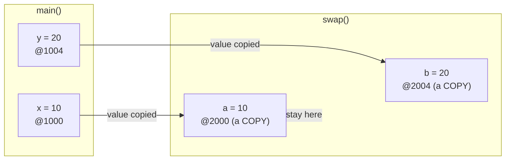

#### Call by Reference — using pointers

The **address** of the variable is passed, so the function can reach the **original memory location** and modify it.

```c
void swap(int *a, int *b) {        /* a and b hold ADDRESSES */
    int t = *a;  *a = *b;  *b = t; /* * dereferences → touches the ORIGINAL */
}

int main() {
    int x = 10, y = 20;
    swap(&x, &y);                  /* & passes the ADDRESS */
    printf("x=%d y=%d\n", x, y);
}
```
> **Output:** `x=20 y=10` ✅ **the swap works.**

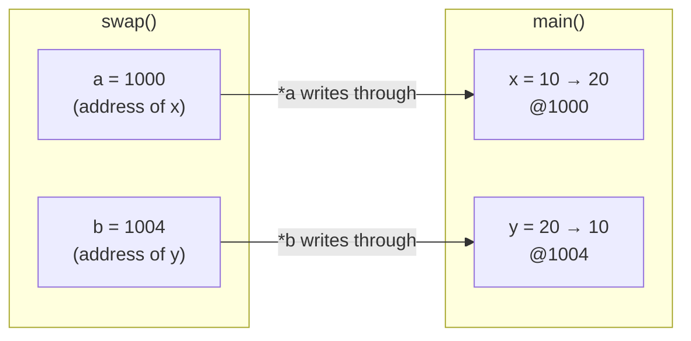

#### The comparison

| Point | **Call by Value** | **Call by Reference** |
|---|---|---|
| **What is passed** | A **copy of the value** | The **address** of the variable |
| **Original variable** | ❌ **Cannot** be modified | ✅ **Can** be modified |
| **Memory used** | More — a separate copy per argument | Less — only an address (8 bytes) |
| **Speed for large data** | **Slow** — copying a big struct or array is expensive | **Fast** — only an address is copied |
| **Safety** | **Safer** — the caller's data is protected | Riskier — the function can corrupt the caller's data |
| **Syntax at the call** | `swap(x, y);` | `swap(&x, &y);` |
| **Syntax in the definition** | `void swap(int a, int b)` | `void swap(int *a, int *b)` |
| **Access inside** | `a` | `*a` (dereference) |
| **Is it C's default?** | ✅ **Yes** | ❌ Must be written explicitly with pointers |
| **Used when** | The function only needs to read the value | The function must change the value, or return several values |

> **Two essential notes:**
> 1. **C technically has only call by value.** "Call by reference" in C is simulated by *passing a pointer by value* — the pointer itself is copied, but the copy still points at the same memory. True call-by-reference (`int &a`) exists in **C++**, not C.
> 2. **Arrays are always effectively passed by reference.** An array name decays into a pointer to its first element, so `void f(int a[])` can modify the caller's array. This is why you never write `&` before an array name.

#### Returning multiple values

A C function can `return` only one value, so use pointers:

```c
void minMax(int a[], int n, int *min, int *max) {
    *min = *max = a[0];
    for (int i = 1; i < n; i++) {
        if (a[i] < *min) *min = a[i];
        if (a[i] > *max) *max = a[i];
    }
}
/* call:  int lo, hi;  minMax(arr, n, &lo, &hi); */
```

**Previous Year Question List from this Topic:**

- [(a) Mention two basic differences between ‘Call by Value’ and ‘Call by Reference’. Write a simple program in C to swap two integer values using ‘Call by value’.](../written-answers/c-programming.md?plain=1#L8192)
- [(ক) Call by Value এবং Call by Reference এর মধ্যে পার্থক্য কী?](../written-answers/c-programming.md?plain=1#L8320)
- [(ঘ) উদাহরণসহ Parameter Passing ব্যাখ্যা করুন।](../written-answers/c-programming.md?plain=1#L8347)
- [What are the differences between call by value and call by Reference?](../written-answers/c-programming.md?plain=1#L8474)
- [Distinguish between Call by value and Call by referee in C/C++.](../written-answers/c-programming.md?plain=1#L8492)
- [Difference between call by value and call by reference with example.](../written-answers/c-programming.md?plain=1#L9092)

**Previous Year MCQ List from this Topic:**

- [When you pass array as an argument to a function, which actually gets passed?](../mcq-answers/c-programming.md?plain=1#L819)
- [In C, if you pass an array as an argument to a function, what actually gets passed?](../mcq-answers/c-programming.md?plain=1#L864)
- [Which of the following doesn’t require an ‘&’ for the input in scanf ( ) ?](../mcq-answers/c-programming.md?plain=1#L718)


---

### Recursion — Concept, Base Case and the Recursion Tree

**Recursion** is a technique in which a **function calls itself**, directly or indirectly, to solve a problem by **reducing it to a smaller instance of the same problem**.

#### The two mandatory parts

| Part | Purpose | What happens without it |
|---|---|---|
| **1. Base case** | The **simplest case**, solved directly **without** another recursive call — it **stops** the recursion | **Infinite recursion → stack overflow → crash** |
| **2. Recursive case** | Calls itself with a **smaller / simpler input**, moving **towards** the base case | The recursion never terminates |

```c
int factorial(int n) {
    if (n <= 1) return 1;                  /* ← BASE CASE: stops the recursion */
    return n * factorial(n - 1);           /* ← RECURSIVE CASE: smaller input  */
}
```

#### How the call stack works — factorial(5)

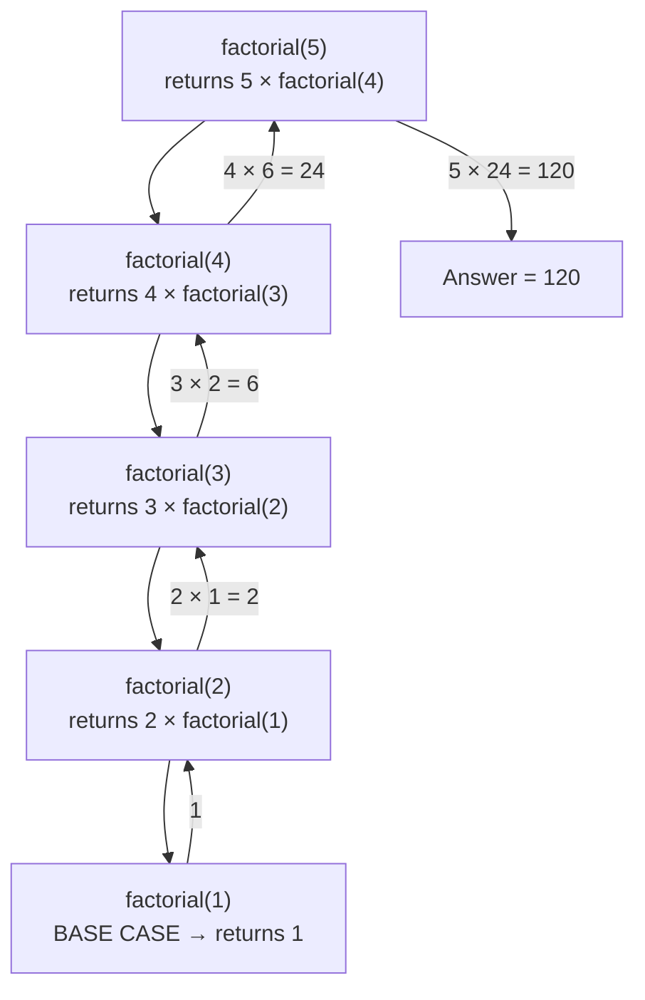

**The two phases:** the calls **wind down** (each pushing a stack frame) until the base case is hit, then the results **unwind back up**, each frame computing its answer from the one below.

| Stack depth | Call | Waiting to compute |
|---|---|---|
| 1 | factorial(5) | 5 × ? |
| 2 | factorial(4) | 4 × ? |
| 3 | factorial(3) | 3 × ? |
| 4 | factorial(2) | 2 × ? |
| 5 | factorial(1) | **returns 1** ← base case |

#### Types of recursion

| Type | Description | Example |
|---|---|---|
| **Direct** | A function calls itself | `f()` calls `f()` |
| **Indirect (mutual)** | A calls B, and B calls A | `isEven()` ↔ `isOdd()` |
| **Tail recursion** | The recursive call is the **very last** operation | `return helper(n-1, acc*n);` |
| **Non-tail (head)** | Work remains **after** the recursive call returns | `return n * fact(n-1);` |
| **Linear** | **One** recursive call per invocation | factorial |
| **Tree** | **Two or more** calls per invocation | Fibonacci, tree traversal |

> **Why tail recursion matters:** because nothing is pending after the call, a compiler can reuse the same stack frame (**tail-call optimisation**), turning the recursion into a loop and eliminating the stack-overflow risk.

#### Advantages and disadvantages

**Advantages**
- **Shorter, cleaner code** for naturally recursive problems.
- **Directly mirrors the mathematical definition** (factorial, Fibonacci, GCD).
- **Essential** for trees, graphs, backtracking, divide and conquer — an iterative version would need an explicit stack.
- Easier to **prove correct** by induction.

**Disadvantages**
- **Slower** — every call costs a function-call overhead (push/pop the stack frame).
- **More memory** — O(depth) stack space.
- **Stack overflow** risk on deep recursion.
- Can be **exponentially wasteful** without memoization (naive Fibonacci).
- **Harder to debug** and trace.

#### Recursion vs Iteration

| Point | **Recursion** | **Iteration (loops)** |
|---|---|---|
| **Mechanism** | A function calls itself | A loop repeats a block |
| **Termination** | **Base case** | Loop **condition** |
| **Memory** | **O(depth)** — a stack frame per call | **O(1)** — a few variables |
| **Speed** | **Slower** — call overhead | **Faster** |
| **Code length** | Usually **shorter and clearer** | Longer for tree-like problems |
| **Stack overflow risk** | ✅ **Yes** | ❌ No |
| **Best for** | Trees, graphs, backtracking, divide & conquer, mathematical definitions | Simple counted repetition, performance-critical loops |
| **Infinite case** | Infinite recursion → **crash** | Infinite loop → program hangs |

> **Any recursion can be converted to iteration** (using an explicit stack if necessary), and any iteration can be written recursively. The choice is about **clarity vs efficiency**.

> ### "What is the performance of a non-recursive version of a function written recursively?"
>
> The iterative version is **generally faster and uses far less memory**, because it avoids the per-call overhead (pushing parameters, return address and local variables onto the stack) and needs only **O(1)** space instead of **O(n)** stack frames.
>
> **However, the asymptotic complexity usually stays the same** — iterative `factorial` and recursive `factorial` are both **O(n)**; only the constant factor and the space differ.
>
> **The one big exception is tree recursion.** Naive recursive Fibonacci is **O(2ⁿ)** because it recomputes the same sub-problems; the iterative version is **O(n)**. There the improvement is not a constant factor but an entire complexity class.

**Previous Year Question List from this Topic:**

- [What is recursion?](../written-answers/c-programming.md?plain=1#L7913)
- [Write recursive way below this program:](../written-answers/c-programming.md?plain=1#L7939)
- [Output find out from recursion:](../written-answers/c-programming.md?plain=1#L7991)
- [Find the output of following program:](../written-answers/c-programming.md?plain=1#L8047)
- [(খ) উদাহরণসহ recursion ব্যাখ্যা করুন।](../written-answers/c-programming.md?plain=1#L8397)
- [(খ) Recursion কি? Recursion পদ্ধতিতে একটি Integer সংখ্যার Factorial নির্ণয়ের জন্য C-Language এ একটি Program লিখুন।](../written-answers/c-programming.md?plain=1#L8673)
- [(ii) Recursion কী? Recursion পদ্ধতির একটি Simple C-programming এর Code লিখুন।](../written-answers/c-programming.md?plain=1#L8939)
- [Usually, recursion involves a function calling itself until specified condition is met and it is very useful to find out the factorial. Write a recursive algori…](../written-answers/c-programming.md?plain=1#L8973)
- [What is recursive function? Give an example of recursive function.](../written-answers/c-programming.md?plain=1#L9054)
- [Write the performance of a non-recursive function which is written in recursive way.](../written-answers/c-programming.md?plain=1#L9170)

**Previous Year MCQ List from this Topic:**

- [When a function is called more than one time that is called?](../mcq-answers/c-programming.md?plain=1#L1247)
- [How many function calls will be performed to execute the following recursive function?](../mcq-answers/c-programming.md?plain=1#L1253)
- [Consider the following recursive function fun (x,y) . What is the value of fun (4,3) ?](../mcq-answers/c-programming.md?plain=1#L1269)
- [Consider the function fun (x, y) below. That is the value of fun (4, 3)?](../mcq-answers/c-programming.md?plain=1#L361)


---

### Classic Recursive Problems

#### 1. Factorial

```c
int factorial(int n) {
    if (n <= 1) return 1;              /* base case: 0! = 1! = 1 */
    return n * factorial(n - 1);
}
```
**Recurrence: T(n) = T(n−1) + O(1) → O(n) time, O(n) stack.**

#### 2. Fibonacci

> **Rule:** F(0) = 0, F(1) = 1, and **F(n) = F(n−1) + F(n−2)** for n ≥ 2.
> Sequence: 0, 1, 1, 2, 3, 5, 8, 13, 21, 34, 55 …

```c
int fib(int n) {
    if (n <= 1) return n;                      /* base cases: F(0)=0, F(1)=1 */
    return fib(n - 1) + fib(n - 2);            /* TWO calls → tree recursion */
}
```

**Recurrence: T(n) = T(n−1) + T(n−2) + O(1) → O(φⁿ) ≈ O(1.618ⁿ)** — exponential, because sub-problems are recomputed many times.

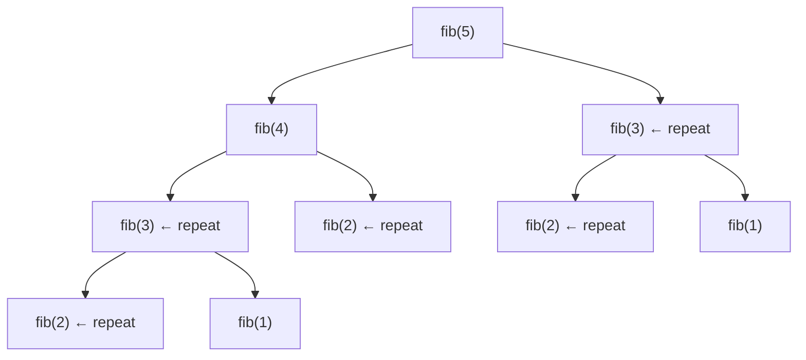

**The efficient iterative version — O(n) time, O(1) space:**

```c
int fibIterative(int n) {
    if (n <= 1) return n;
    int a = 0, b = 1, c;
    for (int i = 2; i <= n; i++) { c = a + b; a = b; b = c; }
    return b;
}
```

#### 3. Sum of digits

```c
int sumDigits(int n) {
    if (n == 0) return 0;                      /* base case */
    return (n % 10) + sumDigits(n / 10);       /* last digit + rest */
}
```
**Trace `sumDigits(3426)`:** 6 + (2 + (4 + (3 + 0))) = **15**

*(The variant "**keep summing until a single digit**" — the *digital root* — just applies it repeatedly: `while (n > 9) n = sumDigits(n);`. For 3426 → 15 → 6. The closed form is `1 + (n−1) % 9`.)*

#### 4. Count the number of digits

```c
int countDigits(int n) {
    if (n == 0) return 0;              /* base case */
    return 1 + countDigits(n / 10);    /* one digit + the rest */
}
/* countDigits(3426) = 1 + countDigits(342)
                     = 1 + 1 + countDigits(34)
                     = 1 + 1 + 1 + countDigits(3)
                     = 1 + 1 + 1 + 1 + countDigits(0)
                     = 4  */
```
**Recurrence: T(n) = T(n/10) + O(1) → O(log₁₀ n)** — proportional to the number of digits.

**The recursion tree** is a single chain (linear recursion):

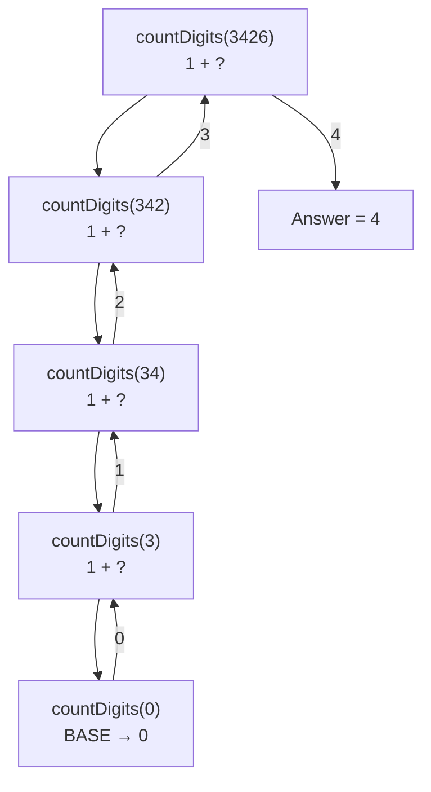

#### 5. Power — Xⁿ

```c
/* simple version — O(n) */
double power(double x, int n) {
    if (n == 0) return 1;
    return x * power(x, n - 1);
}

/* fast exponentiation — O(log n) */
double fastPower(double x, int n) {
    if (n == 0) return 1;
    double half = fastPower(x, n / 2);
    if (n % 2 == 0) return half * half;      /* x^n = (x^(n/2))²      */
    else            return x * half * half;  /* odd n: one extra x    */
}
```
**Recurrence for the fast version: T(n) = T(n/2) + O(1) → O(log n).**

#### 6. Reverse an integer

```c
int reverseHelper(int n, int rev) {          /* tail recursive */
    if (n == 0) return rev;
    return reverseHelper(n / 10, rev * 10 + n % 10);
}
int reverse(int n) { return reverseHelper(n, 0); }
```

#### 7. GCD — Euclid's algorithm

```c
int gcd(int a, int b) {
    if (b == 0) return a;                    /* base case */
    return gcd(b, a % b);                    /* elegant tail recursion */
}
/* gcd(48,18) → gcd(18,12) → gcd(12,6) → gcd(6,0) → 6  */
```
**LCM from GCD:** `lcm(a,b) = (a / gcd(a,b)) * b` — divide *before* multiplying to avoid overflow.

#### 8. Tower of Hanoi

> **The problem:** move **n discs** from a **source** peg to a **destination** peg using an **auxiliary** peg, moving **one disc at a time**, and **never placing a larger disc on a smaller one**.

**The recursive insight — three steps:**
1. Move the top **n−1** discs from **source → auxiliary** (using destination as the spare).
2. Move the **largest** disc from **source → destination**.
3. Move those **n−1** discs from **auxiliary → destination** (using source as the spare).

```c
void hanoi(int n, char src, char dest, char aux) {
    if (n == 1) {                                    /* base case */
        printf("Move disc 1 from %c to %c\n", src, dest);
        return;
    }
    hanoi(n - 1, src, aux, dest);                    /* step 1 */
    printf("Move disc %d from %c to %c\n", n, src, dest);   /* step 2 */
    hanoi(n - 1, aux, dest, src);                    /* step 3 */
}
/* call: hanoi(3, 'A', 'C', 'B'); */
```

**Output for n = 3 (7 moves):**
```
Move disc 1 from A to C
Move disc 2 from A to B
Move disc 1 from C to B
Move disc 3 from A to C
Move disc 1 from B to A
Move disc 2 from B to C
Move disc 1 from A to C
```

**Recurrence: T(n) = 2·T(n−1) + 1**, whose solution is **T(n) = 2ⁿ − 1 moves** — exponential. *(For n = 64 discs, at one move per second, that is about 585 billion years.)*

#### 9. All permutations of a word

```c
void permute(char *s, int l, int r) {
    if (l == r) { printf("%s\n", s); return; }       /* base case */
    for (int i = l; i <= r; i++) {
        swap(&s[l], &s[i]);                          /* choose    */
        permute(s, l + 1, r);                        /* explore   */
        swap(&s[l], &s[i]);                          /* BACKTRACK */
    }
}
/* permute("ABC", 0, 2) → ABC ACB BAC BCA CBA CAB  (3! = 6 permutations) */
```
**Time: O(n × n!)** — there are n! permutations and printing each costs O(n). This is the standard **backtracking** pattern: *choose → explore → un-choose*.

#### 10. Sum of a matrix row

```c
int rowSum(int a[][100], int row, int col) {
    if (col < 0) return 0;                                /* base case */
    return a[row][col] + rowSum(a, row, col - 1);
}
/* call: rowSum(matrix, i, m - 1);  */
```

**Previous Year Question List from this Topic:**

- [Write a C program to find the sum of digits of an integer number using "recursion".](../written-answers/c-programming.md?plain=1#L7880)
- [Write a C/C++ program to calculte factorial of N using recursive function.](../written-answers/c-programming.md?plain=1#L8131)
- [Write the recursive function of the below problem and find the recurrence relation of the function. F(n) = 1+2+3+..........+(n-1)+n](../written-answers/c-programming.md?plain=1#L8161)
- [(b) Write a program in C using recursion to find the factorial of an integer.](../written-answers/c-programming.md?plain=1#L8232)
- [(ক) Tower of Hanoi সমস্যাটি সমাধানের জন্যে একটি recursive অ্যালগরিদম লিখুন।](../written-answers/c-programming.md?plain=1#L8431)
- [Write a recursive algorithm to find the factorial of a positive integer from 1 to N.](../written-answers/c-programming.md?plain=1#L8527)
- [What do you mean by recursion? Calculate factorial function using recursion with C programming code.](../written-answers/c-programming.md?plain=1#L8564)
- [Write a program with a recursive function that shows the sum of its digits. For example, input =3426, output will be 3+4+2+6=15.](../written-answers/c-programming.md?plain=1#L8594)
- [(a) Write down a recursive function to find out number of digits is an integer number (n). Draw the recursion tree when n= 5396.](../written-answers/c-programming.md?plain=1#L8630)
- [Given an integer number the following C program finds the sum of the digits of the number using recursion. You need to complete the recursive function in the fo…](../written-answers/c-programming.md?plain=1#L8704)
- [(b) Write down a pseudocode/program to generate all possible permutation for a given word.](../written-answers/c-programming.md?plain=1#L8767)
- [Paython এ Recursive function ব্যবহার করে একটি ধনাত্মক সংখ্যার factorial মান বের করার function লিখ?](../written-answers/c-programming.md?plain=1#L8824)
- [Write a program in C/Java to find out the factorial of a number using recursion also write its iterative program.](../written-answers/c-programming.md?plain=1#L8847)
- [১. পাইথন প্রোগ্রামিং এর রিকার্সিভ ফাংশন ব্যবহার করে ১০টি সংখ্যার যোগফল বের করার প্রোগ্রাম লিখ।](../written-answers/c-programming.md?plain=1#L8905)
- [(a) Write down a function to compute the sum of the row an $n \times m$ matrix of integer.](../written-answers/c-programming.md?plain=1#L9009)
- [Write Algorithm of Fibonacci series.](../written-answers/c-programming.md?plain=1#L9138)
- [Write a program in C with recursive function to compute the value $X^n$ where n is a positive integer and x has real value.](../written-answers/c-programming.md?plain=1#L9196)
- [a) Using recursion, develop a computer program to find the n-th Fibonacci number using this rule. (5 marks)](../written-answers/c-programming.md?plain=1#L9241)

**Previous Year MCQ List from this Topic:**

- [How many function calls will be performed to execute the following recursive function?](../mcq-answers/c-programming.md?plain=1#L1253)
- [Consider the following recursive function fun (x,y) . What is the value of fun (4,3) ?](../mcq-answers/c-programming.md?plain=1#L1269)
- [Consider the function fun (x, y) below. That is the value of fun (4, 3)?](../mcq-answers/c-programming.md?plain=1#L361)
- [What does the following function do?](../mcq-answers/c-programming.md?plain=1#L377)


## Operators, Data Types & Language Concepts

### Data Types in C

A **data type** tells the compiler **what kind of value** a variable holds, **how much memory** to reserve, and **which operations** are legal on it.

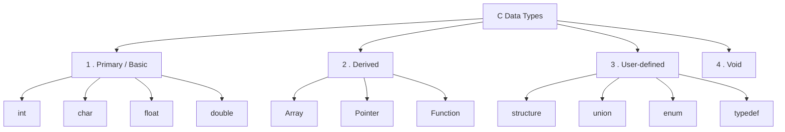

#### 1. Primary (basic / fundamental) data types

| Type | Size | Range | Format | Use |
|---|---|---|---|---|
| **`char`** | 1 byte | −128 to 127 | `%c` | A single character |
| **`unsigned char`** | 1 byte | 0 to 255 | `%c` | Byte data |
| **`short int`** | 2 bytes | −32,768 to 32,767 | `%hd` | Small integers |
| **`int`** | **4 bytes** | −2,147,483,648 to 2,147,483,647 | `%d` | **The default integer** |
| **`unsigned int`** | 4 bytes | 0 to 4,294,967,295 | `%u` | Counts, sizes (never negative) |
| **`long int`** | 4 or 8 bytes | platform dependent | `%ld` | Larger integers |
| **`long long int`** | 8 bytes | ±9.22 × 10¹⁸ | `%lld` | Very large integers |
| **`float`** | 4 bytes | ±3.4 × 10³⁸, ~**6–7** digits precision | `%f` | Single-precision reals |
| **`double`** | 8 bytes | ±1.7 × 10³⁰⁸, ~**15–16** digits | `%lf` | **Default for reals** |
| **`long double`** | 10/12/16 bytes | larger still | `%Lf` | Scientific computing |

*(Sizes are for a typical 32/64-bit compiler. The C standard only guarantees `char` ≤ `short` ≤ `int` ≤ `long` ≤ `long long`. Always use `sizeof` to be sure.)*

#### 2. Derived data types

| Type | Meaning | Example |
|---|---|---|
| **Array** | A collection of same-type elements | `int a[10];` |
| **Pointer** | Holds a memory address | `int *p;` |
| **Function** | A named block returning a type | `int f(int);` |

#### 3. User-defined data types

| Type | Purpose | Example |
|---|---|---|
| **`struct`** | Group **different** types into one record | `struct Student { int roll; char name[50]; float cgpa; };` |
| **`union`** | Like a struct, but **all members share one memory location** | `union U { int i; float f; };` |
| **`enum`** | Named integer constants | `enum Day { SUN, MON, TUE };` (SUN = 0, MON = 1 …) |
| **`typedef`** | Creates an alias for an existing type | `typedef unsigned int uint;` |

#### 4. The `void` type

`void` means "**no type / no value**". Three uses: a function that returns nothing (`void f()`), a function that takes nothing (`int f(void)`), and the **generic pointer** `void *`.

#### Type modifiers and qualifiers

| Keyword | Effect |
|---|---|
| **`signed`** / **`unsigned`** | Allow or forbid negative values (unsigned doubles the positive range) |
| **`short`** / **`long`** | Decrease or increase the size |
| **`const`** | The value cannot be changed after initialisation |
| **`volatile`** | Tells the compiler the value may change unexpectedly (hardware registers, ISRs) — do not optimise it away |
| **`static`** | Local: keeps its value between calls. Global/function: restricts visibility to this file |
| **`extern`** | Declares a variable defined in **another file** |
| **`register`** | A hint to keep the variable in a CPU register (largely ignored by modern compilers) |

#### Type conversion

```c
/* IMPLICIT (automatic) — the compiler promotes the smaller type */
int i = 10;  float f = 3.5;
float r = i + f;              /* i → 10.0, result 13.5 */

/* EXPLICIT (type casting) — the programmer forces it */
int a = 7, b = 2;
float avg = (float)a / b;     /* 3.5 — without the cast it would be 3 */
int n = (int)3.99;            /* 3 — truncates, does NOT round */
```

**Previous Year Question List from this Topic:**

- [(খ) আমি কী ৩২৬৭৮ মান সংরক্ষণ করতে ‘int’ ডাটা টাইপ ব্যবহার করতে পারি? না পারলে কেন?](../written-answers/c-programming.md?plain=1#L9389)
- [Write some default data type in C.](../written-answers/c-programming.md?plain=1#L9632)
- [Using examples explain data types used in C language.](../written-answers/c-programming.md?plain=1#L9973)
- [(ক) C ভাষায় ব্যবহৃত বিভিন্ন ধরনের Data Type বর্ণনা করুন।](../written-answers/c-programming.md?plain=1#L901)

**Previous Year MCQ List from this Topic:**

- [C কী ধরনের programming language?](../mcq-answers/c-programming.md?plain=1#L902)
- [নিচের কোনটি C ভাষার Keyword নয়?](../mcq-answers/c-programming.md?plain=1#L911)
- [Suppose a C program has floating constant 1.414, what's the best way to convert it as a float data type?](../mcq-answers/c-programming.md?plain=1#L929)
- [Which format specifier is used for typing double data?](../mcq-answers/c-programming.md?plain=1#L956)
- [Which of the following is not derived data type in C?](../mcq-answers/c-programming.md?plain=1#L1019)
- [What is not the kind of data type?](../mcq-answers/c-programming.md?plain=1#L1093)
- [Which of the following cannot be checked in a switch-case statement?](../mcq-answers/c-programming.md?plain=1#L647)


---

### Operators in C

An **operator** performs an operation on one or more **operands**.

#### The categories

| Category | Operators | Note |
|---|---|---|
| **Arithmetic** | `+` `-` `*` `/` `%` | `%` works on **integers only** |
| **Relational** | `==` `!=` `>` `<` `>=` `<=` | Result is 1 (true) or 0 (false) |
| **Logical** | `&&` `\|\|` `!` | **Short-circuit** evaluation |
| **Bitwise** | `&` `\|` `^` `~` `<<` `>>` | Operate bit by bit |
| **Assignment** | `=` `+=` `-=` `*=` `/=` `%=` `&=` `\|=` `^=` `<<=` `>>=` | Right-to-left associative |
| **Increment / Decrement** | `++` `--` | Prefix and postfix forms differ |
| **Conditional (ternary)** | `? :` | The only **three-operand** operator |
| **Special** | `sizeof` `&` `*` `.` `->` `,` `()` `[]` | |

#### Bitwise operators — worth knowing for tracing questions

```c
int a = 12;    /* binary 1100 */
int b = 10;    /* binary 1010 */

a & b   /* 1000 = 8   — AND: 1 only if BOTH bits are 1 */
a | b   /* 1110 = 14  — OR : 1 if EITHER bit is 1      */
a ^ b   /* 0110 = 6   — XOR: 1 if the bits DIFFER      */
~a      /* -13        — NOT: flips every bit (2's complement) */
a << 2  /* 110000 = 48 — left shift  = multiply by 2^2 */
a >> 2  /* 11 = 3      — right shift = divide by 2^2   */
```

**Common bitwise idioms:**

| Task | Expression |
|---|---|
| Check if n is **even** | `(n & 1) == 0` |
| Multiply by 2 | `n << 1` |
| Divide by 2 | `n >> 1` |
| Set bit k | `n \| (1 << k)` |
| Clear bit k | `n & ~(1 << k)` |
| Toggle bit k | `n ^ (1 << k)` |
| Test bit k | `(n >> k) & 1` |
| Swap without a temp | `a^=b; b^=a; a^=b;` |

#### Order of evaluation questions

```c
int a = 5, b = 3, c = 2;
int x = a + b * c;              /* 5 + 6  = 11 */
int y = (a + b) * c;            /* 8 * 2  = 16 */
int z = a > b == 1;             /* (a>b)=1, then 1==1 → 1 */
int w = a & b == 3;             /* == binds TIGHTER than & →  a & (b==3) = 5 & 1 = 1 */
```
> **The last line is the classic trap:** `==` has **higher precedence than the bitwise `&`**, so `a & b == 3` means `a & (b == 3)`, **not** `(a & b) == 3`. Always parenthesise when mixing bitwise and comparison operators.

**Previous Year Question List from this Topic:**

- [(গ) ‘++i’ এবং ‘i++’ অভিব্যক্তি দুটির মধ্যে পার্থক্য কী? উদাহরণসহ ব্যাখ্যা করুন।](../written-answers/c-programming.md?plain=1#L9409)
- [Short question: (i) Difference between ++i and i++ (ii) Difference between Overloading and Overriding (iii) Polymorphism in Java (iv) String variable (v) Contro…](../written-answers/c-programming.md?plain=1#L9675)
- [উদাহরণসহ i++ and ++i এর মধ্যে পার্থক্য লিখুন। Nested if কী?](../written-answers/c-programming.md?plain=1#L9831)
- [Which of the following is the correct order of evaluation?](../written-answers/c-programming.md?plain=1#L9905)

**Previous Year MCQ List from this Topic:**

- [Let x be an integer which can take a value of 0 or 1. The statement if (x==0) x=1; else x=0; is equivalent to which of the following?](../mcq-answers/c-programming.md?plain=1#L1030)
- [For a given integer, which of the following operators can be used to set and reset a particular bit respectively?](../mcq-answers/c-programming.md?plain=1#L1039)
- [Which of the declaration is correct?](../mcq-answers/c-programming.md?plain=1#L1048)
- [Which is logical operator?](../mcq-answers/c-programming.md?plain=1#L1066)
- [Which of the following will not increase the value of variable c by 1?](../mcq-answers/c-programming.md?plain=1#L1075)
- [The escape sequence “\b” in C programming is -----](../mcq-answers/c-programming.md?plain=1#L1084)
- [Which keyword is used in C language?](../mcq-answers/c-programming.md?plain=1#L1102)
- [Which of the following is not a logical operator?](../mcq-answers/c-programming.md?plain=1#L1120)


---

### Variables, Scope, Lifetime and Storage Classes

#### The four storage classes

| Storage class | Stored in | Default value | Scope | Lifetime |
|---|---|---|---|---|
| **`auto`** (the default for locals) | **Stack** | **Garbage** | Block | Until the block exits |
| **`register`** | CPU register (hint) | Garbage | Block | Until the block exits |
| **`static`** | **Data segment** | **0** | Block (or file, for globals) | **The whole program** |
| **`extern`** | Data segment | 0 | **Global, across files** | The whole program |

#### Local vs Global variables

```c
#include <stdio.h>
int g = 10;                     /* GLOBAL — outside every function */

void f() {
    int l = 20;                 /* LOCAL — inside the function */
    printf("%d %d\n", g, l);
}
int main() {
    f();
    printf("%d\n", g);
    /* printf("%d", l); */      /* ❌ ERROR — l is not visible here */
}
```

| Point | **Local variable** | **Global variable** |
|---|---|---|
| **Declaration** | Inside a function or block | Outside all functions |
| **Scope (visibility)** | Only within that block | **Entire program / file** |
| **Lifetime** | Created at entry, destroyed at exit | Entire program execution |
| **Default value** | **Garbage** (undefined) | **Zero** |
| **Memory area** | **Stack** | **Data / BSS segment** |
| **Who can access it** | Only its own function | **Every** function |
| **Name collisions** | The local **shadows** the global of the same name | — |
| **Advantage** | Safe, isolated, memory freed automatically | Easy sharing between functions |
| **Disadvantage** | Cannot be shared | Any function can change it → **hard to debug**, and it occupies memory for the whole run |
| **Best practice** | **Prefer locals** | Use rarely; prefer passing parameters |

#### The `static` keyword — two different meanings

```c
/* 1. static LOCAL variable — keeps its value between calls */
void counter() {
    static int count = 0;       /* initialised only ONCE */
    count++;
    printf("%d ", count);
}
/* counter(); counter(); counter();  →  1 2 3 */

/* 2. static GLOBAL variable or function — visible only in THIS source file
      (internal linkage — hides it from other .c files) */
static int fileOnly = 5;
static void helper() { }
```

**Previous Year Question List from this Topic:**

- [(ক) Local variable এবং Global variable এর মধ্যে পার্থক্য লিখুন।](../written-answers/c-programming.md?plain=1#L9354)

**Previous Year MCQ List from this Topic:**

- [Variable which use same name in whole program and in its all routines thus best classified as-](../mcq-answers/c-programming.md?plain=1#L947)
- [Hungarian notation is used to ________.](../mcq-answers/c-programming.md?plain=1#L1010)
- [Determine Output:](../mcq-answers/c-programming.md?plain=1#L243)


---

### Structure, Union and Array — Differences

#### Structure

A **structure** groups **variables of different data types** under one name, as a single record.

```c
struct Student {
    int   roll;
    char  name[50];
    float cgpa;
};

struct Student s1 = {101, "Rahim", 3.75};
printf("%s scored %.2f", s1.name, s1.cgpa);     /* '.' for a variable,
                                                   '->' for a pointer */
```

#### Nested structure

A **nested structure** is a structure that contains **another structure as a member**. It is used when a field is itself a compound piece of information.

```c
struct Date {
    int day, month, year;
};

struct Employee {
    int   id;
    char  name[50];
    struct Date joiningDate;        /* ← a structure INSIDE a structure */
    struct Date dob;
};

struct Employee e = {101, "Karim", {15, 7, 2020}, {2, 3, 1995}};
printf("%d-%d-%d", e.joiningDate.day,             /* chained dot operator */
                   e.joiningDate.month,
                   e.joiningDate.year);
```

**Why nesting helps:** `Date` is defined **once** and reused for both `joiningDate` and `dob`. It keeps related fields grouped, improves readability, and models real-world hierarchy (a Company contains Departments, which contain Employees, who have an Address).

#### Union

A **union** looks like a structure but **all members share the SAME memory location**, so its size equals the size of its **largest** member and **only one member holds a valid value at a time**.

```c
union Data {
    int   i;        /* 4 bytes */
    float f;        /* 4 bytes */
    char  str[20];  /* 20 bytes */
};                  /* sizeof(union Data) = 20, NOT 28 */

union Data d;
d.i = 10;
printf("%d\n", d.i);      /* 10 — correct */
d.f = 3.14;               /* this OVERWRITES the same memory */
printf("%d\n", d.i);      /* garbage — i was destroyed by writing f */
```

#### Structure vs Union

| Point | **Structure** | **Union** |
|---|---|---|
| **Keyword** | `struct` | `union` |
| **Memory** | Each member has its **own** memory | **All members share ONE** memory block |
| **Size** | **Sum** of all members (+ padding) | Size of the **largest** member |
| **Members valid at once** | **All** | **Only one** |
| **Writing one member** | Does not affect the others | **Destroys** the others |
| **Memory efficiency** | Uses more | **Uses less** |
| **Used when** | You need **all** fields together (a student record) | You need **only one** field at a time (a variant/tagged value, hardware registers, memory-constrained systems) |
| **Initialisation** | Several members can be initialised | Only the **first** member can be initialised |

#### Array vs Structure

| Point | **Array** | **Structure** |
|---|---|---|
| **Data types held** | **Same type only** (homogeneous) | **Different types** (heterogeneous) |
| **Keyword** | none — `int a[10];` | `struct` |
| **Element access** | By **index**: `a[0]`, `a[1]` | By **member name**: `s.roll`, `s.name` |
| **Memory** | Always **contiguous** | Contiguous, but may contain **padding** for alignment |
| **Size** | `n × sizeof(type)` | Sum of members + padding |
| **Can be assigned wholesale** | ❌ No (`a = b;` is illegal) | ✅ **Yes** (`s1 = s2;` is legal) |
| **Can be passed by value** | ❌ No — decays to a pointer | ✅ **Yes** |
| **Can a function return it** | ❌ No | ✅ **Yes** |
| **Traversal** | Easy — a loop over indices | No index; each member is accessed by name |
| **Use case** | A list of 50 marks | One student's roll, name and CGPA together |
| **Example** | `int marks[50];` | `struct Student { int roll; char name[30]; };` |

> **They combine naturally:** `struct Student class[60];` is an **array of structures** — the standard way to hold records for a whole class.

**Previous Year Question List from this Topic:**

- [What will occur when an array is declared without size?](../written-answers/c-programming.md?plain=1#L9329)
- [What is the main difference between structure and array in C programming? Explain with examples.](../written-answers/c-programming.md?plain=1#L9442)
- [Difference between array and structure data type.](../written-answers/c-programming.md?plain=1#L9477)
- [What is nested structure in C programming? Explain with example.](../written-answers/c-programming.md?plain=1#L9559)
- [(ii) C Programming Language এ Array and Structure এর মধ্যে পার্থক্য লিখুন।](../written-answers/c-programming.md?plain=1#L9602)
- [Write the difference between Structure and Array.](../written-answers/c-programming.md?plain=1#L9652)
- [(খ) C প্রোগ্রামিং ল্যাঙ্গুয়েজে Structure ও Union এর মধ্যে পার্থক্য কী? উদাহরণসহ লিখুন।](../written-answers/c-programming.md?plain=1#L9869)


---

### Types of Errors in Programming

Errors are classified by **when** they are detected.

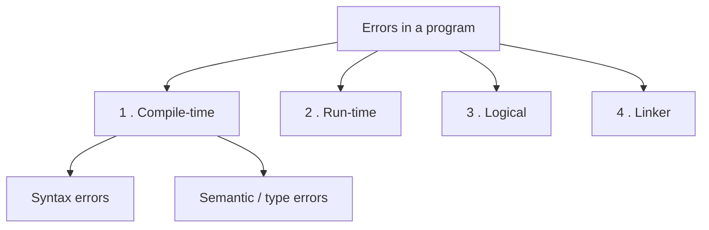

#### 1. Compile-time errors

Detected by the **compiler**; the program **does not build**.

| Sub-type | Cause | Example |
|---|---|---|
| **Syntax error** | Violation of the grammar of the language | Missing `;`, unbalanced `{}`, misspelled keyword (`itn x;`) |
| **Semantic / type error** | Grammatically valid but meaningless | `int x = "hello";` · calling an undeclared function · wrong number of arguments |

```c
int main() {
    int x = 10
    printf("%d", x);        /* ERROR: expected ';' before 'printf' */
}
```

#### 2. Run-time errors

The program compiles and starts, then **crashes or misbehaves during execution**.

| Error | Cause |
|---|---|
| **Division by zero** | `int x = 10 / 0;` |
| **Segmentation fault** | Dereferencing a NULL or wild pointer |
| **Array index out of bounds** | `a[10]` on a 5-element array |
| **Stack overflow** | Infinite or too-deep recursion |
| **Memory leak / out of memory** | `malloc` without `free` |
| **File not found** | `fopen` returns NULL and the code does not check |
| **Integer overflow** | Exceeding the type's range |

```c
/* Pseudocode example of a run-time error */
READ n
READ divisor
result = n / divisor          /* ← if divisor is 0, the program CRASHES here.
                                 It compiles perfectly; the error appears only
                                 when the user enters 0 at run time. */
PRINT result
```

#### 3. Logical errors

The program **compiles and runs perfectly but produces the WRONG answer**. These are **the hardest to find**, because the computer reports nothing.

```c
/* intended: the average of three numbers */
avg = a + b + c / 3;       /* WRONG — precedence: only c is divided */
avg = (a + b + c) / 3;     /* CORRECT */

for (i = 1; i < 10; i++)   /* WRONG if you meant 1 to 10 — stops at 9 */
for (i = 1; i <= 10; i++)  /* CORRECT */

if (x = 5)                 /* WRONG — assigns instead of comparing */
if (x == 5)                /* CORRECT */
```

#### 4. Linker errors

The code compiles but the **linker cannot resolve a reference**.

| Error | Cause |
|---|---|
| `undefined reference to 'foo'` | The function was declared and called but never defined |
| `undefined reference to 'main'` | No `main()` function |
| `undefined reference to 'sqrt'` | Forgot to link the maths library (`gcc prog.c -lm`) |

#### Summary comparison

| Point | **Compile-time** | **Run-time** | **Logical** |
|---|---|---|---|
| **Detected by** | Compiler | The operating system / CPU during execution | **A human**, by testing |
| **Program builds?** | ❌ No | ✅ Yes | ✅ Yes |
| **Program runs?** | ❌ No | Starts, then **crashes** | ✅ **Runs to completion** |
| **Message shown** | Clear error with a line number | A crash message or exception | **None** |
| **Difficulty to fix** | **Easiest** | Medium | **Hardest** |
| **Example** | Missing semicolon | Division by zero | Wrong formula |

**How to prevent and find them:** compile with warnings on (`gcc -Wall -Wextra`); validate every input; check the return value of `malloc`, `fopen` and `scanf`; use a **debugger (gdb)** and **print statements**; write **test cases** with known expected outputs, including boundary values; and do **code reviews**.

**Previous Year Question List from this Topic:**

- [Write down the types of errors which can occur the execution of a program.](../written-answers/c-programming.md?plain=1#L9495)
- [Coding এর সময় সংঘটিত ভুলসমূহ উদাহরণসহ ব্যাখ্যা করুন।](../written-answers/c-programming.md?plain=1#L9793)
- [(ii) নিচের C প্রোগ্রামটির ভুলগুলো সঠিক করুন এবং প্রোগ্রামটির আউটপুট লিখুন।](../written-answers/c-programming.md?plain=1#L5674)
- [a) Using Pseudocode give an example of run time error.](../written-answers/c-programming.md?plain=1#L6602)
- [Find the error of given code](../written-answers/c-programming.md?plain=1#L6752)

**Previous Year MCQ List from this Topic:**

- [Determine Output:](../mcq-answers/c-programming.md?plain=1#L258)
- [Which type of following errors is generated when the program is being execute?](../mcq-answers/c-programming.md?plain=1#L460)
- [If any error occurs due to violation of programming rule is ________.](../mcq-answers/c-programming.md?plain=1#L535)
- [What will be output if you compile & and execute following C code?](../mcq-answers/c-programming.md?plain=1#L560)
- [Find out the error in following block of code: if (x=100) cout<<"x is 100";](../mcq-answers/c-programming.md?plain=1#L1111)


---

### C Data Types, Identifiers, Constants and Naming Conventions

#### The classification of C data types

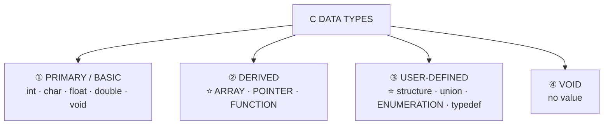

| Category | Members |
|---|---|
| ⭐ **PRIMARY (basic/fundamental)** | **int, char, float, double, void** |
| ⭐ **DERIVED** | ⭐ **ARRAY, POINTER, FUNCTION** — *derived from the basic types* |
| ⭐ **USER-DEFINED** | ⭐ **structure (`struct`), union, ENUMERATION (`enum`), `typedef`** |

> ### **"Which of the following is NOT a derived data type in C?"** → ### ✅ **ENUMERATION.**
>
> **The reasoning: `enum` is a USER-DEFINED type, not a DERIVED one.** The derived types are exactly **array, pointer and function** — each *built from* an existing type. *(Structure and union are likewise user-defined, though some textbooks group them loosely with derived types; **enumeration is never classed as derived**, which is what the question tests.)*

#### Integer sizes and ranges

| Type | Typical size | Range |
|---|---|---|
| `char` | 1 byte | −128 to 127 (signed) · 0 to 255 (unsigned) |
| `short` | 2 bytes | −32,768 to 32,767 |
| ⭐ **`int` (32-bit)** | **4 bytes** | ### ⭐ **−2³¹ to 2³¹ − 1 = −2,147,483,648 to 2,147,483,647** |
| `unsigned int` | 4 bytes | 0 to 2³² − 1 = 4,294,967,295 |
| `long long` | 8 bytes | −2⁶³ to 2⁶³ − 1 |
| `float` | 4 bytes | ~6–7 significant digits |
| `double` | 8 bytes | ~15–16 significant digits |

> ### **The two halves of the same question:**
> ### **"Minimum value in a 32-bit signed integer"** → ### ✅ **−2³¹**
> ### **"Maximum value in a 32-bit signed integer"** → ### ✅ **2³¹ − 1**
>
> ⭐ **Why the range is ASYMMETRIC:** in **two's complement**, one of the 2³² bit patterns is used for **zero**, and it is taken from the positive side. So there are **2³¹ negative values but only 2³¹ − 1 positive ones**. *(The constants `INT_MIN` and `INT_MAX` in `<limits.h>` give these portably.)*
>
> ⚠️ **Sizes are NOT fixed by the C standard** — it guarantees only minimum ranges and that `sizeof(char) == 1`. Always use `sizeof` rather than assuming.

#### ⭐ Identifiers — the rules for a valid name

> ### **A valid C IDENTIFIER must: begin with a LETTER or an UNDERSCORE `_`; contain only LETTERS, DIGITS and UNDERSCORES; and must NOT be a C KEYWORD.** C is **case-sensitive**.

| Identifier | Valid? | Why |
|---|---|---|
| `length`, `_count`, `sum2`, `my_var` | ✅ | Follow all the rules |
| ⚠️ **`No#of-students`** | ❌ **INVALID** | ⭐ Contains **`#` and `-`**, neither of which is allowed |
| ⚠️ **`com-pact`** | ❌ **INVALID** | ⭐ Contains a **HYPHEN**, which C reads as the **minus operator** |
| `2ndValue` | ❌ | **Starts with a digit** |
| `my var` | ❌ | Contains a **space** |
| `int`, `for`, `while` | ❌ | **Reserved keywords** |

> ### **"Which is an INVALID variable name / not a valid identifier?"** → ### ✅ **`No#of-students` and `com-pact`** — because of the `#` and the **hyphen**. **The hyphen is the trap: it looks like a word separator but is the subtraction operator, so `com-pact` parses as `com minus pact`. Use an UNDERSCORE instead.**

#### The 32 C keywords

```
   auto     break    case     char     const    continue default  do
   double   else     enum     extern   float    for      goto     if
   int      long     register return   short    signed   sizeof   static
   struct   switch   typedef  union    unsigned void     volatile while
```

> ### **"নিচের কোনটি C ভাষার Keyword নয়?"** → ### ✅ **`star`** — it is not in the list above. *(⚠️ **`main` is NOT a keyword either** — it is an ordinary identifier that the linker treats specially. So is `printf`.)*
> ### **"Which keyword is used in C language?"** → ### ✅ **`for`.**

#### Constants and the float suffix

| Constant | Written as | Type |
|---|---|---|
| Integer | `42`, `0x2A` (hex), `052` (octal) | `int` |
| **Floating** | **`1.414`** | ⚠️ **`double` BY DEFAULT** |
| ⭐ **Float** | ⭐ **`1.414f` or `1.414F`** | ⭐ **`float`** |
| Long double | `1.414L` | `long double` |
| Character | `'A'` | `int` (in C) |
| String | `"Hello"` | `char[]` |
| Symbolic | `#define PI 3.1416` or `const float PI = 3.1416f;` | — |

> ### **"A C program has the floating constant 1.414 — what is the best way to make it a FLOAT?"** → ### ✅ **`1.414f` or `1.414F`.**
>
> **Why it matters:** without the suffix the literal is a **`double`**, so an expression like `float x = 1.414;` performs a **double-to-float conversion at every use**, and comparisons such as `x == 1.414` **fail** because the double and the narrowed float differ. The `f` suffix makes the constant a genuine float.

#### Format specifiers

| Specifier | Type | | Specifier | Type |
|---|---|---|---|---|
| `%d` / `%i` | `int` | | `%u` | `unsigned int` |
| `%c` | `char` | | `%s` | string |
| `%f` | `float` | | ⭐ **`%lf`** | ⭐ **`double`** |
| `%e` / `%g` | scientific / shortest | | `%ld` | `long` |
| `%x` / `%o` | hex / octal | | `%p` | pointer |
| `%%` | a literal `%` | | `%lld` | `long long` |

> ### **"Which format specifier is used for typing DOUBLE data?"** → ### ✅ **`%lf`.**
>
> ⚠️ **The subtlety worth knowing:** in **`scanf` you MUST use `%lf` for a double** (`%f` would read only a float and corrupt memory). In **`printf`, both `%f` and `%lf` work**, because floats are automatically promoted to double when passed to a variadic function.

#### Hungarian notation

> ### **HUNGARIAN NOTATION is a naming convention in which a PREFIX indicating the variable's TYPE (or purpose) is attached to the beginning of its NAME.** It is therefore used to ⭐ **DEFINE THE NAME OF THE VARIABLE.**

```c
   int    iCount;        // i  → integer
   float  fSalary;       // f  → float
   char   cGrade;        // c  → char
   char   szName[20];    // sz → zero-terminated string
   int   *pValue;        // p  → pointer
   bool   bIsValid;      // b  → boolean
```

> **Invented by Charles Simonyi at Microsoft** (he was Hungarian — hence the name). **Advantage:** the type is visible at the point of use, without looking up the declaration. **Disadvantage:** it becomes wrong the moment a type is changed, and modern IDEs show the type on hover — so it is **largely obsolete today**, though it survives in legacy Windows code.

**Other naming conventions:** **camelCase** (`totalAmount`) · **PascalCase** (`TotalAmount`) · **snake_case** (`total_amount`) · **SCREAMING_SNAKE_CASE** for constants (`MAX_SIZE`).

#### Where C sits among the languages

> ### **"C কী ধরনের programming language?"** → ### ✅ **MID-LEVEL (মধ্যম স্তরের) language.**
>
> **Why "mid-level":** C combines **HIGH-LEVEL features** (functions, structured control flow, data types, portability, readable syntax) with **LOW-LEVEL capability** (pointers, direct memory access, bit manipulation, and the ability to talk to hardware). **That combination is why operating systems, device drivers and compilers are written in C** — it is close enough to the machine to control it, yet high-level enough to be portable.

**Previous Year MCQ List from this Topic:**

- [What is the minimum value that can be stored accurately in a 32-bit signed integer of C programming language?](../mcq-answers/c-programming.md?plain=1#L875)
- [What is the maximum value that can be stored in a 32-bit signed integer of C language?](../mcq-answers/c-programming.md?plain=1#L884)
- [C programming এ নিচের কোনটি Invalid variable name?](../mcq-answers/c-programming.md?plain=1#L893)
- [C কী ধরনের programming language?](../mcq-answers/c-programming.md?plain=1#L902)
- [নিচের কোনটি C ভাষার Keyword নয়?](../mcq-answers/c-programming.md?plain=1#L911)
- [Suppose a C program has floating constant 1.414, what's the best way to convert it as a float data type?](../mcq-answers/c-programming.md?plain=1#L929)
- [Which format specifier is used for typing double data?](../mcq-answers/c-programming.md?plain=1#L956)
- [Which one of the following is not a valid identifier?](../mcq-answers/c-programming.md?plain=1#L965)
- [Hungarian notation is used to ________.](../mcq-answers/c-programming.md?plain=1#L1010)
- [Which of the following is not derived data type in C?](../mcq-answers/c-programming.md?plain=1#L1019)
- [Which of the declaration is correct?](../mcq-answers/c-programming.md?plain=1#L1048)
- [What is not the kind of data type?](../mcq-answers/c-programming.md?plain=1#L1093)
- [Which keyword is used in C language?](../mcq-answers/c-programming.md?plain=1#L1102)


---

### Escape Sequences, Errors and the C Standard Library Headers

#### ⭐ Escape sequences

> **An ESCAPE SEQUENCE is a BACKSLASH followed by a character, used to represent a character that cannot be typed directly** — a control character, or one that would otherwise be interpreted by the compiler.

| Sequence | Meaning | Effect |
|---|---|---|
| `\n` | **Newline** | Moves to the next line |
| `\t` | **Horizontal tab** | |
| ⭐ **`\b`** | ⭐ **BACKSPACE** | Moves the cursor **one position BACK** |
| `\r` | **Carriage return** | Moves to the start of the current line |
| `\a` | Alert (bell) | Audible beep |
| `\f` | Form feed | |
| `\v` | Vertical tab | |
| `\\` | **Backslash** | Prints one `\` |
| `\'` / `\"` | Single / double quote | |
| `\0` | ⭐ **NULL character** | **Terminates every C string** |
| `\ddd` / `\xhh` | Octal / hex character code | |

> ### **"The escape sequence `\b` in C programming is…"** → ### ✅ **BACKSPACE.**
>
> ⚠️ **`\0` is the most important of all** — it is the **null terminator** that marks the end of a C string. `"abc"` occupies **four** bytes, not three, and `strlen("abc")` is 3 while `sizeof("abc")` is 4. **Forgetting the terminator is the classic cause of buffer overruns in C.**

#### The kinds of programming error

| Error type | When it appears | Cause | Example |
|---|---|---|---|
| ⭐ **SYNTAX error** | ⭐ **At COMPILE time** | ⭐ **VIOLATION OF THE LANGUAGE'S GRAMMAR (programming rules)** | Missing `;`, unmatched `{`, misspelt keyword |
| **Semantic / type error** | Compile time | Grammatically valid but meaningless | Assigning a string to an int |
| ⭐ **RUN-TIME error** | ⭐ **WHILE THE PROGRAM IS BEING EXECUTED** | The statement is legal but fails when run | **Division by zero**, dereferencing NULL, array index out of range, out of memory |
| **Logical error** | Never reported | The program runs and produces the **WRONG ANSWER** | Using `+` where `*` was meant |
| **Linker error** | Link time | A referenced symbol is not found | `undefined reference to 'foo'` |

> ### **"If any error occurs due to VIOLATION OF PROGRAMMING RULES, it is…"** → ### ✅ **SYNTAX ERROR.**
> ### **"Which type of error is generated when the program is BEING EXECUTED?"** → ### ✅ **RUN-TIME ERROR.**
>
> ⚠️ **LOGICAL errors are the most dangerous**, precisely because **nothing reports them** — the compiler is satisfied and the program runs to completion, but the result is wrong. They are found only by **testing**.

#### The assignment-vs-comparison trap

```c
   if (x = 100)  printf("x is 100");    // ⚠️ ASSIGNS 100 to x, then tests 100 (true) — ALWAYS TRUE
   if (x == 100) printf("x is 100");    // ✅ CORRECT — compares
```

> ### **"Find the error in `if (x=100) cout << "x is 100";"** → ### ✅ **THE "EQUALS TO" OPERATOR MISTAKE** — `=` (assignment) has been written where `==` (comparison) was meant.
>
> **Why C does not stop you:** an assignment is an **expression whose value is the value assigned**, so `x = 100` is a perfectly legal condition that evaluates to 100, which is **non-zero and therefore TRUE**. The branch always executes and `x` is silently overwritten. *(The defensive habit is to write the constant first — **`if (100 == x)`** — so that a mistyped `=` becomes a compile error. Modern compilers also warn with `-Wall`.)*

#### The standard library headers

| Header | Provides |
|---|---|
| **`<stdio.h>`** | **Input/output** — `printf`, `scanf`, `fopen`, `fclose`, `fgets`, `getchar` |
| ⭐ **`<stdlib.h>`** | ⭐ **Memory allocation — `malloc()`, `calloc()`, `realloc()`, `free()`** — plus `exit()`, `atoi()`, `rand()`, `qsort()` |
| **`<string.h>`** | `strlen`, `strcpy`, `strcat`, `strcmp`, `strstr`, `memcpy` |
| ⭐ **`<math.h>`** | ⭐ **`ceil()`, `floor()`, `sqrt()`, `pow()`, `fabs()`, `sin()`, `log()`** |
| **`<ctype.h>`** | `isalpha`, `isdigit`, `toupper`, `tolower` |
| **`<limits.h>`** | `INT_MAX`, `INT_MIN`, `CHAR_BIT` |
| **`<time.h>`** | `time`, `clock`, `difftime` |

> ### **"Which header file should be included to use `malloc()` and `calloc()`?"** → ### ✅ **`<stdlib.h>`.**

| | **`malloc(size)`** | **`calloc(n, size)`** |
|---|---|---|
| **Arguments** | **One** — total bytes | **Two** — count and element size |
| **Initialises the memory?** | ❌ **No — contains GARBAGE** | ✅ **Yes — zero-filled** |
| **Speed** | Slightly faster | Slightly slower |
| **Returns** | `void*` to the block, or **`NULL` on failure** | Same |

> ⚠️ **Every `malloc`/`calloc` must be matched by a `free()`**, and the return value **must be checked against NULL** — otherwise the program leaks memory or crashes.

#### ceil and floor

```c
   #include <math.h>
   ceil(9.87)   →  10.0     // rounds UP   to the smallest integer ≥ x
   floor(9.87)  →   9.0     // rounds DOWN to the largest  integer ≤ x
   round(9.87)  →  10.0     // rounds to the NEAREST
   ceil(-9.87)  →  -9.0     // ⚠️ "up" means toward +∞
   floor(-9.87) → -10.0
```

> ### **"The value 9.87 becomes 10 when you use…"** → ### ✅ **`ceil()`.**

#### Structured programming

> ### **STRUCTURED PROGRAMMING is a discipline that builds every program from just THREE CONTROL STRUCTURES**, avoiding `goto` entirely:
>
> | # | Structure | In C |
> |---|---|---|
> | **1** | ⭐ **SEQUENCE** | Statements executed one after another |
> | **2** | ⭐ **SELECTION (decision)** | `if`, `if-else`, `switch` |
> | **3** | ⭐ **ITERATION (repetition/loop)** | `for`, `while`, `do-while` |
>
> ### **"Which are the keywords of structured programming?"** → ### ✅ **ALL OF THEM — sequence, selection and iteration together.**
>
> **The Böhm–Jacopini theorem** proves that **any computable function can be written using only these three** — which is the formal justification for abandoning `goto`. Structured programs are **easier to read, test, debug and maintain**, because control flows top-to-bottom with a single entry and a single exit per block.

**Previous Year MCQ List from this Topic:**

- [The escape sequence “\b” in C programming is -----](../mcq-answers/c-programming.md?plain=1#L1084)
- [The value 9.87 to 10 when use?](../mcq-answers/c-programming.md?plain=1#L1001)
- [Which type of following errors is generated when the program is being execute?](../mcq-answers/c-programming.md?plain=1#L460)
- [If any error occurs due to violation of programming rule is ________.](../mcq-answers/c-programming.md?plain=1#L535)
- [Determine Output:](../mcq-answers/c-programming.md?plain=1#L258)
- [Which are the keywords of structured programming?](../mcq-answers/c-programming.md?plain=1#L727)
- [Which header file should be included to use functions like malloc() and calloc()?](../mcq-answers/c-programming.md?plain=1#L1236)


## Flowcharts & Algorithms

### Algorithm — Definition and Ways of Expressing It

An **algorithm** is a **finite sequence of well-defined, unambiguous steps** that solves a problem or performs a computation, taking some input and producing the required output in a finite time.

#### The five characteristics

| # | Property | Meaning |
|---|---|---|
| 1 | **Input** | Zero or more inputs are supplied |
| 2 | **Output** | At least one output is produced |
| 3 | **Definiteness** | Every step is **clear and unambiguous** |
| 4 | **Finiteness** | It **terminates** after a finite number of steps |
| 5 | **Effectiveness** | Every step is basic enough to be carried out exactly |

#### The three ways of expressing an algorithm

> *(A directly asked question: "Name three methods of expressing an algorithm.")*

| # | Method | Description | Advantage | Disadvantage |
|---|---|---|---|---|
| 1 | **Natural language (step form)** | Numbered steps in plain English or Bangla | Easiest to read for anyone | Can be **ambiguous**, verbose |
| 2 | **Pseudocode** | Structured English using programming-like keywords (`IF`, `WHILE`, `READ`, `PRINT`) | **Precise yet language-independent**; converts easily to code | Not executable; no fixed standard |
| 3 | **Flowchart** | A **diagram** using standard symbols joined by arrows | **Visual**, shows the flow of control at a glance | Hard to draw and modify for large programs |

*(Some books add a fourth: the **programming language implementation** itself.)*

**The same algorithm in all three forms — find the larger of two numbers:**

**Step form:**
```
Step 1: Start
Step 2: Read A and B
Step 3: If A > B then print A, otherwise print B
Step 4: Stop
```

**Pseudocode:**
```
BEGIN
    READ A, B
    IF A > B THEN
        PRINT A
    ELSE
        PRINT B
    ENDIF
END
```

**Flowchart:**
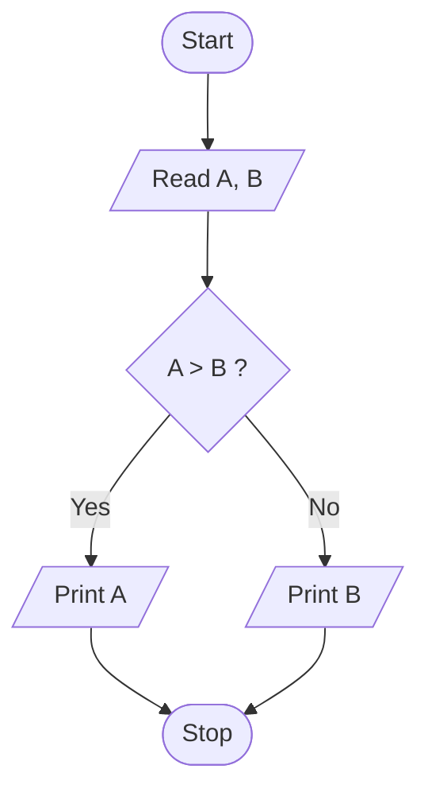

**Previous Year Question List from this Topic:**

- [Write Algorithm and flowchart to find odd numbers between 1 to n where n is a positive integer.](../written-answers/c-programming.md?plain=1#L10191)
- [Write an Algorithm to check a number is Prime or not Prime.](../written-answers/c-programming.md?plain=1#L10256)
- [(খ) Algorithm কি? Algorithm প্রকাশের তিনটি পদ্ধতির নাম লিখুন।](../written-answers/c-programming.md?plain=1#L10409)
- [Answer the following Questions](../written-answers/c-programming.md?plain=1#L4074)


---

### Flowchart Symbols and Rules

A **flowchart** is a **pictorial representation of an algorithm** using standard symbols connected by arrows showing the flow of control.

#### The standard symbols

| Symbol | Shape | Name | Purpose |
|---|---|---|---|
| ⬭ | **Oval / Rounded rectangle** | **Terminal** | **Start** and **Stop** — every flowchart has exactly one Start and at least one Stop |
| ▱ | **Parallelogram** | **Input / Output** | `READ`, `INPUT`, `PRINT`, `DISPLAY` |
| ▭ | **Rectangle** | **Process** | Any calculation or assignment: `sum = a + b` |
| ◇ | **Diamond / Rhombus** | **Decision** | A condition with **Yes/No** (True/False) branches |
| ⬯ | **Circle** | **Connector** | Joins parts of a flowchart on the same page |
| ⌂ | **Pentagon** | **Off-page connector** | Continues on another page |
| → | **Arrow** | **Flow line** | Shows the direction of control |
| ▭▯ | **Double-sided rectangle** | **Predefined process** | A call to a subroutine/function |
| ▱ slanted | **Document** | Printed output |

#### Rules for drawing a flowchart

1. Exactly **one Start** and at least one **Stop**.
2. Flow normally goes **top to bottom and left to right**.
3. Every symbol (except Start/Stop) has **one entry**; only the **Decision** symbol has **more than one exit**.
4. Use **arrows** on every connector to show the direction.
5. Keep the text inside symbols **short and clear**.
6. Avoid crossing flow lines — use **connectors** instead.
7. Every path must eventually reach a **Stop**.
8. A loop must have a **decision** that can become false.

#### The three control structures in flowchart form

> *(A directly asked question: "Three types of control statements and their graphical presentation.")*

**1. Sequence** — statements executed one after another.

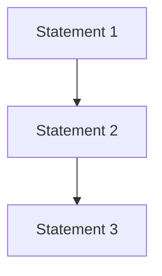

**2. Selection (decision / branching)** — `if`, `if-else`, `switch`.

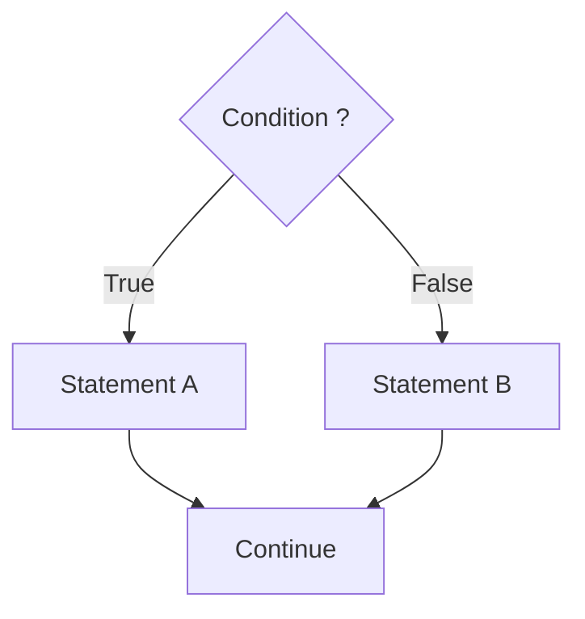

**3. Iteration (loop / repetition)** — `for`, `while`, `do-while`.

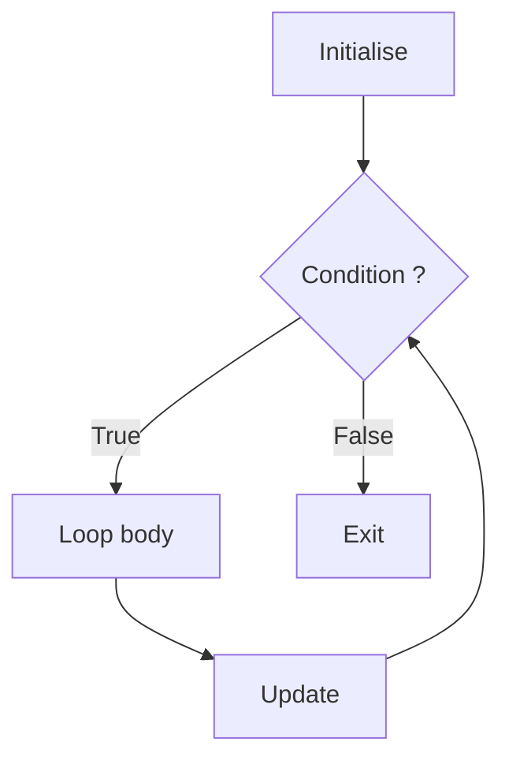

> **Structured programming theorem:** every computable algorithm can be written using **only these three structures** — sequence, selection and iteration. No `goto` is ever necessary.

**Previous Year Question List from this Topic:**

- [(খ) Algorithm কি? Algorithm প্রকাশের তিনটি পদ্ধতির নাম লিখুন।](../written-answers/c-programming.md?plain=1#L10409)
- [Three types of control statements and their graphical presentation using flowchart or flow graph.](../written-answers/c-programming.md?plain=1#L10425)
- [(ক) Loop কী? প্রবাহচিত্রসহ এর গঠন ব্যাখ্যা করুন।](../written-answers/c-programming.md?plain=1#L10456)


---

### Worked Flowcharts and Algorithms

#### 1. Print the numbers 1 to 100 (and 1 to N)

```
Step 1: Start
Step 2: Set i = 1
Step 3: If i > 100, go to Step 7
Step 4: Print i
Step 5: i = i + 1
Step 6: Go to Step 3
Step 7: Stop
```

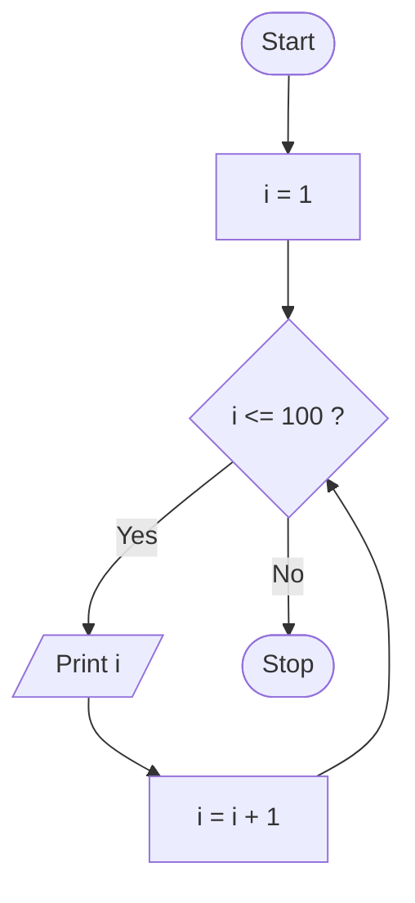

#### 2. Print the odd numbers from 1 to N

```
Step 1: Start
Step 2: Read N
Step 3: Set i = 1
Step 4: If i > N, go to Step 8
Step 5: Print i
Step 6: i = i + 2          ← stepping by 2 keeps i odd
Step 7: Go to Step 4
Step 8: Stop
```

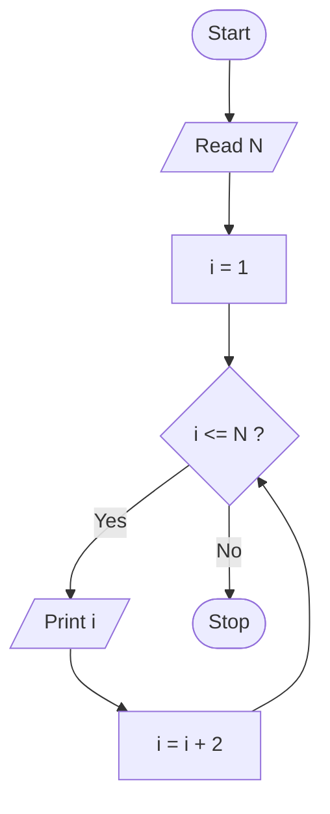

*(The alternative is `i = i + 1` with a test `if (i % 2 != 0)` inside — correct but does twice the work.)*

#### 3. Sum of the series 1 + 3 + 5 + … + N

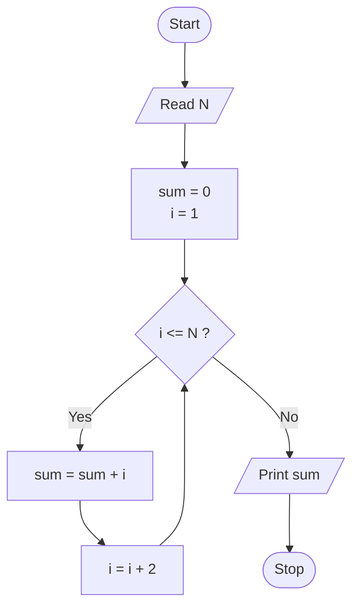

#### 4. Factorial of a number

```
Step 1: Start
Step 2: Read N
Step 3: Set fact = 1, i = 1
Step 4: If i > N, go to Step 8
Step 5: fact = fact * i
Step 6: i = i + 1
Step 7: Go to Step 4
Step 8: Print fact
Step 9: Stop
```

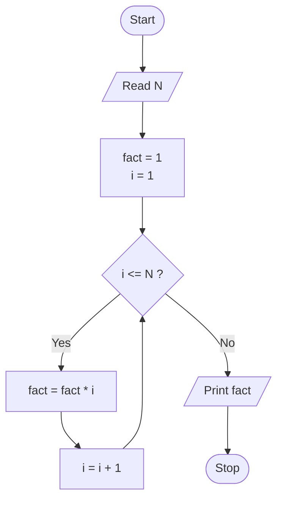

#### 5. GCD (HCF) of two numbers — Euclid's algorithm

```
Step 1: Start
Step 2: Read A and B
Step 3: While B ≠ 0, repeat:
            r = A mod B
            A = B
            B = r
Step 4: Print A       ← A now holds the GCD
Step 5: Stop
```

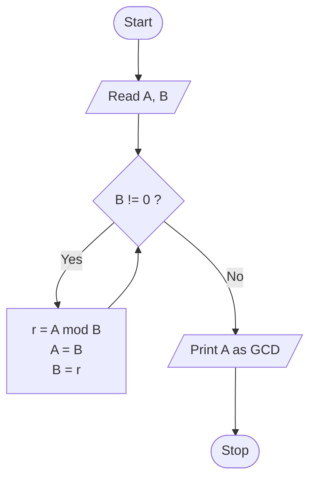

**Trace for A = 48, B = 18:** (48,18) → r = 12 → (18,12) → r = 6 → (12,6) → r = 0 → (6,0) → **GCD = 6** ✅

#### 6. Check whether a number is prime

```
Step 1: Start
Step 2: Read N
Step 3: If N <= 1, print "Not Prime", go to Step 9
Step 4: Set i = 2, flag = 1
Step 5: If i * i > N, go to Step 8
Step 6: If N mod i = 0, set flag = 0 and go to Step 8
Step 7: i = i + 1, go to Step 5
Step 8: If flag = 1 print "Prime", else print "Not Prime"
Step 9: Stop
```

```mermaid
flowchart TD
    S(["Start"]) --> R[/"Read N"/]
    R --> Z{"N <= 1 ?"}
    Z -->|Yes| NP[/"Print Not Prime"/]
    Z -->|No| A["i = 2, flag = 1"]
    A --> C{"i * i <= N ?"}
    C -->|Yes| D{"N mod i = 0 ?"}
    D -->|Yes| F["flag = 0"]
    D -->|No| INC["i = i + 1"]
    INC --> C
    C -->|No| G{"flag = 1 ?"}
    F --> G
    G -->|Yes| PR[/"Print Prime"/]
    G -->|No| NP
    PR --> E(["Stop"])
    NP --> E
```

#### 7. Quadratic equation ax² + bx + c = 0

```mermaid
flowchart TD
    S(["Start"]) --> R[/"Read a, b, c"/]
    R --> D["D = b*b - 4*a*c"]
    D --> C1{"D > 0 ?"}
    C1 -->|Yes| R1[/"Two distinct real roots<br/>(-b ± √D) / 2a"/]
    C1 -->|No| C2{"D = 0 ?"}
    C2 -->|Yes| R2[/"Two equal real roots<br/>-b / 2a"/]
    C2 -->|No| R3[/"Complex roots<br/>-b/2a ± (√-D / 2a)i"/]
    R1 --> E(["Stop"])
    R2 --> E
    R3 --> E
```

#### 8. A user login system

> Requirements: take a username and password, check them, allow **3 attempts**, then lock the account.

```mermaid
flowchart TD
    S(["Start"]) --> INIT["attempts = 0"]
    INIT --> IN[/"Read username, password"/]
    IN --> CHK{"Credentials<br/>valid ?"}
    CHK -->|Yes| OK[/"Display 'Login successful'"/]
    OK --> HOME["Open the home page"]
    HOME --> E(["Stop"])
    CHK -->|No| INC["attempts = attempts + 1"]
    INC --> MAX{"attempts >= 3 ?"}
    MAX -->|No| MSG[/"Display 'Invalid credentials.<br/>Please try again'"/]
    MSG --> IN
    MAX -->|Yes| LOCK[/"Display 'Account locked.<br/>Contact the administrator'"/]
    LOCK --> E
```

**Step form:**
```
Step 1 : Start
Step 2 : Set attempts = 0
Step 3 : Read username and password
Step 4 : Search the user record in the database
Step 5 : If the username exists AND the (hashed) password matches:
              Display "Login successful", open the home page, go to Step 9
Step 6 : attempts = attempts + 1
Step 7 : If attempts < 3, display "Invalid credentials" and go to Step 3
Step 8 : Display "Account locked", notify the administrator
Step 9 : Stop
```

**Points worth adding for full marks:** passwords must be stored as a **salted hash**, never in plain text; the error message should **not reveal** whether it was the username or the password that was wrong (this prevents username enumeration); and the lockout should be **time-based** to resist brute-force attacks.

#### 9. Sort five numbers in ascending order

```mermaid
flowchart TD
    S(["Start"]) --> R[/"Read 5 numbers into a[0..4]"/]
    R --> I["i = 0"]
    I --> C1{"i < 4 ?"}
    C1 -->|No| PR[/"Print the sorted array"/]
    C1 -->|Yes| J["j = 0"]
    J --> C2{"j < 4 - i ?"}
    C2 -->|No| INCI["i = i + 1"]
    INCI --> C1
    C2 -->|Yes| CMP{"a[j] > a[j+1] ?"}
    CMP -->|Yes| SW["swap a[j], a[j+1]"]
    CMP -->|No| INCJ["j = j + 1"]
    SW --> INCJ
    INCJ --> C2
    PR --> E(["Stop"])
```

**Previous Year Question List from this Topic:**

- [Draw and clearly describe a step-by-step flowchart for a User Login system. Your login must include: Taking a Username and Password as input. Checking the datab…](../written-answers/c-programming.md?plain=1#L10072)
- [Draw a Flow chart for print odd number for 1 to N.](../written-answers/c-programming.md?plain=1#L10104)
- [১ থেকে ১০০ পর্যন্ত নাম্বার প্রদর্শনের ফ্লোচার্ট আক।](../written-answers/c-programming.md?plain=1#L10127)
- [দুইটি সংখ্যার গ.সা.গু নির্ণয়ের জন্য ফ্লোচার্ট অঙ্কন করুন ও অ্যালগরিদম লিখুন।](../written-answers/c-programming.md?plain=1#L10153)
- [Write Algorithm and flowchart to find odd numbers between 1 to n where n is a positive integer.](../written-answers/c-programming.md?plain=1#L10191)
- [Write Algorithm and flowchart for printing 1+3+5+ \dots + N.](../written-answers/c-programming.md?plain=1#L10223)
- [Write an Algorithm to check a number is Prime or not Prime.](../written-answers/c-programming.md?plain=1#L10256)
- [Write down the algorithm and draw the flowchart of Quadratic equation.](../written-answers/c-programming.md?plain=1#L10301)
- [Draw a flowchart and write algorithm for finding Factorial value of an integer number.](../written-answers/c-programming.md?plain=1#L10344)
- [Draw a flowchart of the following series: 1+3+5+7+\dots+N](../written-answers/c-programming.md?plain=1#L10382)
- [Draw flowchart to input five positive numbers and sort them is ascending order.](../written-answers/c-programming.md?plain=1#L10585)


---

### Pseudocode — How to Write It

**Pseudocode** is an **informal, structured description of an algorithm** that uses the control structures of programming but the vocabulary of English. It is **not tied to any language** and is **not executable**.

#### The standard keywords

| Purpose | Keywords |
|---|---|
| Start / end | `BEGIN … END` |
| Input / output | `READ`, `INPUT`, `GET` / `PRINT`, `DISPLAY`, `OUTPUT` |
| Assignment | `SET x = 5` or `x ← 5` |
| Selection | `IF … THEN … ELSE … ENDIF` · `CASE … OF` |
| Iteration | `WHILE … ENDWHILE` · `FOR i = 1 TO n … ENDFOR` · `REPEAT … UNTIL` |
| Function | `FUNCTION name(params) … RETURN value … ENDFUNCTION` |

#### Rules

1. **One statement per line.**
2. **Indent** the body of every block consistently — indentation carries the structure.
3. Write keywords in **CAPITALS** to make them stand out.
4. Be **specific enough to translate directly to code**, but do not use real syntax (no semicolons, no braces).
5. Keep it **language independent**.

#### Example 1 — find all factors of a positive number

```
BEGIN
    READ n
    IF n <= 0 THEN
        PRINT "Please enter a positive number"
        EXIT
    ENDIF

    PRINT "Factors of", n, "are:"
    FOR i = 1 TO n
        IF n MOD i = 0 THEN          // i divides n exactly
            PRINT i
        ENDIF
    ENDFOR
END
```
*(An **O(√n)** improvement: loop `i` only to √n and print both `i` and `n/i` each time a factor is found.)*

#### Example 2 — find all pairs in an array whose sum equals a given value

```
BEGIN
    READ n                            // number of elements
    READ value                        // the target sum
    DECLARE pairs[n]

    FOR i = 0 TO n-1                  // read the array
        READ pairs[i]
    ENDFOR

    SET found = FALSE
    FOR i = 0 TO n-2
        FOR j = i+1 TO n-1            // j starts AFTER i so no pair repeats
            IF pairs[i] + pairs[j] = value THEN
                PRINT "(", pairs[i], ",", pairs[j], ")"
                SET found = TRUE
            ENDIF
        ENDFOR
    ENDFOR

    IF found = FALSE THEN
        PRINT "No pair found"
    ENDIF
END
```
**Complexity: O(n²)** with the nested loops. *(An **O(n)** solution uses a hash set: for each element, check whether `value − element` has already been seen.)*

**Previous Year Question List from this Topic:**

- [Write a pesudcode that takes in one positive number only and returns the factor for that number.](../written-answers/c-programming.md?plain=1#L10491)
- [Write down the psudo-code that accepts i, n is integer and value as input, store all n integers in an array, called pairs and return all pairs where the summati…](../written-answers/c-programming.md?plain=1#L10530)
- [(খ) Algorithm কি? Algorithm প্রকাশের তিনটি পদ্ধতির নাম লিখুন।](../written-answers/c-programming.md?plain=1#L10409)


---

## String Manipulation & Algorithms

### Strings in C and the Null Terminator

In C there is **no string data type**. A string is simply a **one-dimensional array of characters terminated by the null character `'\0'`**.

```c
char s1[] = "Hello";                                 /* compiler adds '\0' → size 6 */
char s2[6] = {'H','e','l','l','o','\0'};             /* exactly equivalent */
char s3[10] = "Hi";                                  /* 'H','i','\0' then 7 unused bytes */
char *s4 = "Hello";                                  /* pointer to a STRING LITERAL —
                                                        read-only, do NOT modify it */
```

#### The purpose of `'\0'`

> ### "What is the purpose of the `'\0'` character in C?"
>
> `'\0'` is the **null character** — a byte whose value is **0** — and it marks the **END of a string**.
>
> **Why it is essential:** C does **not store the length** of a string anywhere. A `char` array is just bytes in memory with no size attached. The null terminator is the **only** way any function can know where the string stops.
>
> **What depends on it:**
> 1. **`strlen()`** counts characters until it meets `'\0'`.
> 2. **`printf("%s", s)`** prints characters until it meets `'\0'`.
> 3. **`strcpy`, `strcat`, `strcmp`** — every string function scans for it.
> 4. A `for` loop `while (s[i] != '\0')` is the standard manual traversal.
>
> **What happens without it:** the function **keeps reading past the end of the array** into whatever memory follows — printing garbage, crashing with a segmentation fault, or creating a **buffer-overflow security vulnerability**. This is the root cause of a large share of real-world exploits.
>
> **Key facts:** `'\0'` is **not** the character `'0'` (whose ASCII value is 48) and **not** the string `"0"`. Its value is **0**, so it is also "false" in a condition — which is why `while (*s)` works as a loop test. A string of length n needs an array of **n + 1** bytes.

```c
char s[] = "Hello";
printf("%zu\n", strlen(s));      /* 5 — characters, NOT counting '\0' */
printf("%zu\n", sizeof(s));      /* 6 — bytes, INCLUDING '\0'        */
```

#### Reading strings safely

```c
char name[50];
scanf("%s", name);               /* stops at the first SPACE; no & needed
                                    (an array name is already an address) */
scanf("%49s", name);             /* ✅ SAFER — limits the length */
fgets(name, sizeof(name), stdin);/* ✅ BEST — reads a whole line WITH spaces
                                    (but keeps the trailing '\n') */
gets(name);                      /* ❌ NEVER USE — removed from the C standard,
                                    it cannot be used safely */
```

#### The standard string library (`<string.h>`)

| Function | Purpose |
|---|---|
| `strlen(s)` | Length, excluding `'\0'` |
| `strcpy(d, s)` | Copy s into d |
| `strncpy(d, s, n)` | Copy at most n characters (safer) |
| `strcat(d, s)` | Append s to the end of d |
| `strcmp(a, b)` | Compare: **0** if equal, <0 if a<b, >0 if a>b |
| `strcmpi` / `stricmp` | Case-insensitive compare (non-standard) |
| `strrev(s)` | Reverse (non-standard, Turbo C only) |
| `strchr(s, c)` | First occurrence of character c |
| `strstr(s, sub)` | First occurrence of the substring |
| `strtok(s, delim)` | Split into tokens |

*(From `<ctype.h>`: `toupper`, `tolower`, `isalpha`, `isdigit`, `isspace`, `isupper`, `islower`.)*

**Previous Year Question List from this Topic:**

- [What is the purpose of '\0' character in C?](../written-answers/c-programming.md?plain=1#L10890)
- [(c) Write down a program to find length of a string without using any library function.](../written-answers/c-programming.md?plain=1#L10913)


---

### Classic String Programs

#### 1. Length of a string without any library function

```c
int myStrlen(char s[]) {
    int len = 0;
    while (s[len] != '\0')        /* count until the null terminator */
        len++;
    return len;
}
```
**Time: O(n).**

#### 2. Reverse a string without a library function

```c
void myStrrev(char s[]) {
    int len = myStrlen(s);
    for (int i = 0, j = len - 1; i < j; i++, j--) {   /* two pointers meeting */
        char t = s[i];
        s[i] = s[j];
        s[j] = t;
    }
}
```
**Time: O(n), Space: O(1)** — done **in place**. Only `len/2` swaps are needed.

#### 3. Check whether a string is a palindrome

> A **palindrome** reads the same forwards and backwards: `madam`, `level`, `racecar`.

```c
int isPalindrome(char s[]) {
    int i = 0, j = myStrlen(s) - 1;
    while (i < j) {
        if (s[i] != s[j]) return 0;      /* mismatch → not a palindrome */
        i++;  j--;
    }
    return 1;
}
```
**Time: O(n), Space: O(1)** — better than reversing into a second buffer, which costs O(n) extra space.

**For a palindrome *number*:**
```c
int isPalinNum(int n) {
    int rev = 0, orig = n;
    while (n > 0) { rev = rev * 10 + n % 10; n /= 10; }
    return rev == orig;
}
```

#### 4. Convert lower case to upper case (and back)

```c
void toUpper(char s[]) {
    for (int i = 0; s[i] != '\0'; i++)
        if (s[i] >= 'a' && s[i] <= 'z')
            s[i] = s[i] - 32;          /* 'a'(97) - 32 = 'A'(65) */
}

void toLower(char s[]) {
    for (int i = 0; s[i] != '\0'; i++)
        if (s[i] >= 'A' && s[i] <= 'Z')
            s[i] = s[i] + 32;
}

/* a single character */
char c;
scanf("%c", &c);
printf("%c", (c >= 'a' && c <= 'z') ? c - 32 : c);
```
> **The magic number 32** is the fixed ASCII gap: `'a'` = 97, `'A'` = 65, and 97 − 65 = **32**. The `if` guard is essential — without it, digits and punctuation would be corrupted.

#### 5. Count the occurrences of a character

```c
int countChar(char s[], char target) {
    int count = 0;
    for (int i = 0; s[i] != '\0'; i++)
        if (s[i] == target) count++;
    return count;
}

int main() {
    char str[] = "Bangladesh is a big country";
    char c;  scanf("%c", &c);
    int n = countChar(str, c);
    if (n > 0) printf("%d times\n", n);
    else       printf("Not found\n");
}
```
> **Sample:** input `b` → the string contains **b** in "big" and **B** in "Bangladesh". If the search is **case sensitive**, lowercase `b` appears **1 time**; to match the expected answer of **2 times**, the comparison must be made **case-insensitive** by lowering both characters first. **State which convention you are using** — that is what the examiner is checking.
> Input `p` → **Not found** ✅

#### 6. Remove all occurrences of given characters from a string

> Input: `programming`, remove `gram` → output: `poin`
> *(every `g`, `r`, `a`, `m` is deleted: p **r**og **r** **a** **mm** ing → `poin`)*

```c
void removeChars(char s[], char remove[]) {
    int hash[256] = {0};
    for (int i = 0; remove[i]; i++)
        hash[(unsigned char)remove[i]] = 1;     /* mark the characters to drop */

    int k = 0;
    for (int i = 0; s[i]; i++)
        if (!hash[(unsigned char)s[i]])
            s[k++] = s[i];                      /* keep it — write at index k */
    s[k] = '\0';                                /* terminate the shorter string */
}
```
**Time: O(n + m), Space: O(1)** (a fixed 256-entry table). The **two-index in-place compaction** (read index `i`, write index `k`) is the key technique — no second array is needed.

#### 7. Convert a string to an integer without any library function (`atoi`)

```c
int myAtoi(char s[]) {
    int i = 0, sign = 1;
    long result = 0;

    while (s[i] == ' ') i++;                 /* skip leading spaces */

    if (s[i] == '-') { sign = -1; i++; }     /* handle the sign */
    else if (s[i] == '+') i++;

    while (s[i] >= '0' && s[i] <= '9') {
        result = result * 10 + (s[i] - '0'); /* '7' - '0' = 7 */
        i++;
    }
    return (int)(sign * result);
}
```
> **The core trick:** `s[i] - '0'` converts a character digit to its numeric value, because the ASCII codes of `'0'`–`'9'` are consecutive (48–57). Then `result = result * 10 + digit` shifts the accumulated number one place left and appends the new digit.
>
> **Edge cases to mention:** leading/trailing spaces, `+`/`−` sign, non-digit characters (stop there), an empty string, and **overflow** beyond `INT_MAX`.

#### 8. Sort a list of strings alphabetically

```c
void sortStrings(char arr[][100], int n) {
    char temp[100];
    for (int i = 0; i < n - 1; i++)
        for (int j = i + 1; j < n; j++)
            if (strcmp(arr[i], arr[j]) > 0) {   /* arr[i] comes AFTER arr[j] */
                strcpy(temp,   arr[i]);
                strcpy(arr[i], arr[j]);
                strcpy(arr[j], temp);
            }
}
```
> Strings **cannot** be compared with `>` or `==` — those compare **addresses**, not contents. Always use **`strcmp`**, and copy with **`strcpy`**, never `=`.
> **Time: O(n² × L)** where L is the average string length.

#### 9. Check whether str2 is a substring of str1

```c
int isSubstring(char s[], char sub[]) {
    int n = myStrlen(s), m = myStrlen(sub);
    for (int i = 0; i <= n - m; i++) {
        int j = 0;
        while (j < m && s[i + j] == sub[j]) j++;
        if (j == m) return i;              /* found — return the index */
    }
    return -1;                             /* not found */
}
```
**Time: O(n × m)** (naive). The **KMP algorithm** does it in **O(n + m)**.

**Previous Year Question List from this Topic:**

- [Write a C or Java program to convert string to integer without using any built-in function.](../written-answers/c-programming.md?plain=1#L10617)
- [Write a C program to check whether a string is a Palindrome.](../written-answers/c-programming.md?plain=1#L10654)
- [Write a C program upper case to lower case conversion.](../written-answers/c-programming.md?plain=1#L10689)
- [String reverse program but without without using the library function.](../written-answers/c-programming.md?plain=1#L10717)
- [Write a C program to remove given character from string: Example input: programming and we want to remove: gram now output: proming without having the gram from…](../written-answers/c-programming.md?plain=1#L10749)
- [Find occurrence of a Character in a string. String: Bangladesh is a big country. Sample Input: b, Output: 2 times Sample Input p, Output: Not foud this letter](../written-answers/c-programming.md?plain=1#L10855)
- [(c) Write down a program to find length of a string without using any library function.](../written-answers/c-programming.md?plain=1#L10913)
- [Write a program to read a character “lower case ” and convert it into upper case.](../written-answers/c-programming.md?plain=1#L10940)
- [(b) Write down a C function to sort a list of strings in alphabetic order.](../written-answers/c-programming.md?plain=1#L11011)
- [(a) Write an algorithm to find Palindrome number.](../written-answers/c-programming.md?plain=1#L11057)
- [Check string str2 is superscript of string str1.](../written-answers/c-programming.md?plain=1#L11097)
- [String - Find frequency of each character.](../written-answers/c-programming.md?plain=1#L11151)


---

### IPv4 Address Validation and Classification

#### The structure of an IPv4 address

An **IPv4 address** is **32 bits**, written as **four decimal octets separated by dots**: `192.168.1.10`. Each octet is **0–255**.

#### Validation rules

1. Exactly **four parts** separated by exactly **three dots**.
2. Each part contains **only digits** and is **not empty**.
3. Each part's value is between **0 and 255**.
4. **No leading zeros** (`01` is invalid; `0` alone is valid) — this rule is applied in strict validators.
5. No spaces or other characters.

```c
#include <stdio.h>
#include <string.h>

int isValidIPv4(char ip[]) {
    int parts = 0, num = 0, digits = 0;
    int len = strlen(ip);

    if (len == 0) return 0;

    for (int i = 0; i <= len; i++) {
        if (ip[i] == '.' || ip[i] == '\0') {
            if (digits == 0) return 0;            /* empty part, e.g. "1..2.3" */
            if (digits > 1 && num == 0) return 0; /* "00" — leading zero  */
            if (digits > 3) return 0;             /* more than 3 digits   */
            if (num > 255) return 0;              /* out of range         */
            parts++;
            num = 0;  digits = 0;
            if (ip[i] == '\0') break;
        }
        else if (ip[i] >= '0' && ip[i] <= '9') {
            num = num * 10 + (ip[i] - '0');
            digits++;
        }
        else return 0;                            /* an illegal character */
    }
    return parts == 4;                            /* exactly four octets */
}

int main(void) {
    char *tests[] = {"192.168.1.1", "255.255.255.255", "256.1.1.1",
                     "192.168.1",   "1.2.3.4.5",       "01.2.3.4",
                     "192.168.1.a", "0.0.0.0"};
    for (int i = 0; i < 8; i++)
        printf("%-18s : %s\n", tests[i],
               isValidIPv4(tests[i]) ? "Valid" : "Not valid");
    return 0;
}
```

**Expected output:**

| Input | Result | Reason |
|---|---|---|
| `192.168.1.1` | **Valid** | |
| `255.255.255.255` | **Valid** | 255 is the maximum |
| `256.1.1.1` | Not valid | 256 > 255 |
| `192.168.1` | Not valid | Only three octets |
| `1.2.3.4.5` | Not valid | Five octets |
| `01.2.3.4` | Not valid | Leading zero |
| `192.168.1.a` | Not valid | Non-digit character |
| `0.0.0.0` | **Valid** | Each octet is 0 |

#### Determining the class of an IPv4 address

The **class** is decided entirely by the **first octet**.

| Class | First octet range | Leading bits | Default mask | Network / Host bits | Purpose |
|---|---|---|---|---|---|
| **A** | **1 – 126** | `0` | 255.0.0.0 (/8) | 8 / 24 | Very large networks (~16.7 M hosts) |
| **B** | **128 – 191** | `10` | 255.255.0.0 (/16) | 16 / 16 | Medium networks (~65,534 hosts) |
| **C** | **192 – 223** | `110` | 255.255.255.0 (/24) | 24 / 8 | Small networks (254 hosts) |
| **D** | **224 – 239** | `1110` | — | — | **Multicast** |
| **E** | **240 – 255** | `1111` | — | — | **Experimental / reserved** |

> **Note:** **127.x.x.x is reserved for loopback** (`127.0.0.1` = localhost) and is therefore excluded from class A's usable range, which is why class A stops at **126**.

```c
char classOf(char ip[]) {
    int first = 0, i = 0;
    while (ip[i] != '.' && ip[i] != '\0') {
        first = first * 10 + (ip[i] - '0');
        i++;
    }
    if (first >= 1   && first <= 126) return 'A';
    if (first == 127)                 return 'L';   /* Loopback */
    if (first >= 128 && first <= 191) return 'B';
    if (first >= 192 && first <= 223) return 'C';
    if (first >= 224 && first <= 239) return 'D';
    if (first >= 240 && first <= 255) return 'E';
    return '?';
}
```

**Examples:** `10.0.0.1` → **A** · `172.16.0.1` → **B** · `192.168.1.1` → **C** · `224.0.0.1` → **D** · `127.0.0.1` → **Loopback**.

**Previous Year Question List from this Topic:**

- [Write a program IPv4 IP validation from given IP with valid and not valid.](../written-answers/c-programming.md?plain=1#L10799)
- [Given a IPv4 address string, write C/C++/JAVA code to show the class the IP address belongs to.](../written-answers/c-programming.md?plain=1#L10968)


---

## Formula-Based Series (Practice)

### Closed-Form Series Formulas

Most series questions can be solved with a loop, but the examiner usually gives extra credit for the
**closed form** — a direct formula that produces the answer in **O(1)** instead of **O(n)**. Memorise
this table; it also lets you verify your loop's answer in a few seconds.

| Series | Closed-form formula | Example |
|---|---|---|
| `1 + 2 + 3 + … + n` | `n(n+1)/2` | n=10 → 55 |
| `1² + 2² + 3² + … + n²` | `n(n+1)(2n+1)/6` | n=4 → 30 |
| `1³ + 2³ + 3³ + … + n³` | `[n(n+1)/2]²` | n=4 → 100 |
| `2 + 4 + 6 + … + 2n` (even) | `n(n+1)` | n=5 → 30 |
| `1 + 3 + 5 + … + (2n−1)` (odd) | `n²` | n=5 → 25 |
| `1² − 2² + 3² − … ± n²` | `n(n+1)/2` if n odd, `−n(n+1)/2` if n even | n=5 → 15 |
| `1×3 + 2×5 + … + n(2n+1)` | `n(n+1)(4n+5)/6` | n=3 → 34 |
| AP: `a + (a+d) + … ` (n terms) | `n/2 × [2a + (n−1)d]` | a=3,d=2,n=5 → 35 |
| GP: `a + ar + ar² + …` (n terms) | `a(rⁿ−1)/(r−1)`, r ≠ 1 | a=2,r=3,n=4 → 80 |
| Infinite GP, \|r\| < 1 | `a/(1−r)` | a=1,r=½ → 2 |
| `F(1) + F(2) + … + F(n)` (Fibonacci) | `F(n+2) − 1` | n=5 → 12 |
| `1! + 2! + … + n!` | **no closed form** — must loop | n=5 → 153 |
| `1 + ½ + ⅓ + … + 1/n` (harmonic) | **no closed form** — ≈ `ln(n) + 0.5772` | n=5 → 2.2833 |

#### Sum of cubes is the square of the sum

```c
long n, s = n * (n + 1) / 2;      /* 1 + 2 + ... + n   */
long cubes = s * s;               /* 1³ + 2³ + ... + n³ */
```
> `1³ + 2³ + … + n³ = (1 + 2 + … + n)²`. For n = 4: 1+8+27+64 = 100, and (1+2+3+4)² = 10² = 100 ✅

#### Arithmetic Progression (AP)

> An AP adds a **fixed difference** `d` at each step: `a, a+d, a+2d, …`

```c
double nth = a + (n - 1) * d;              /* nth term */
double sum = n / 2.0 * (2 * a + (n - 1) * d);
/* equivalently: sum = n / 2.0 * (first + last) */
```
**Trap:** write `n / 2.0`, never `n / 2`. With two `int` operands C truncates, so n = 5 becomes 2 instead
of 2.5 and the whole answer is wrong.

#### Geometric Progression (GP)

> A GP multiplies by a **fixed ratio** `r` at each step: `a, ar, ar², …`

```c
double sum;
if (r == 1.0) sum = a * n;                     /* r = 1 would divide by zero */
else          sum = a * (pow(r, n) - 1) / (r - 1);
```
**The mark-losing case is `r = 1`.** The formula divides by `r − 1`, so it must be special-cased; when
r = 1 every term equals `a` and the sum is simply `a × n`.

#### Factorial sum and Fibonacci sum

Neither should be computed naively.

```c
/* 1! + 2! + ... + n!  --  carry the factorial forward: i! = (i-1)! x i */
unsigned long long fact = 1, sum = 0;
for (int i = 1; i <= n; i++) { fact *= i; sum += fact; }   /* O(n) */

/* F(1) + F(2) + ... + F(n)  --  keep only two variables */
long long a = 1, b = 1, sum2 = 0, next;
for (int i = 1; i <= n; i++) { sum2 += a; next = a + b; a = b; b = next; }  /* O(n) */
```
- Calling a `factorial()` function inside the loop makes it **O(n²)**; carrying `fact` forward keeps it **O(n)**.
- A naive recursive `fib()` inside a loop is **O(2ⁿ)** — never do it in an exam answer.
- **Overflow:** `unsigned long long` holds up to 20!; a plain `int` already overflows at 13!.

#### Which to use in the exam

> Write the **loop** version first — it always earns the marks and handles the no-closed-form cases.
> Then add a line such as *"this can also be computed directly as n(n+1)/2 in O(1)"*. Showing both the
> iterative solution and the formula, with one worked numeric check, is what separates a full-mark answer.

**Previous Year Question List from this Topic:**

- [Sum of Cubes — find the sum of the series $1^3 + 2^3 + 3^3 + \dots\dots\dots\dots + n^3$ using its closed-form formula.](../written-answers/c-programming.md?plain=1#L11202)
- [Geometric Progression (GP) — find the sum of a geometric series using its closed-form formula.](../written-answers/c-programming.md?plain=1#L11235)
- [Arithmetic Progression (AP) — find the sum of an arithmetic series using its closed-form formula.](../written-answers/c-programming.md?plain=1#L11273)
- [Factorial Sum — find the sum of the series $1! + 2! + 3! + \dots\dots\dots\dots + n!$](../written-answers/c-programming.md?plain=1#L11309)
- [Fibonacci Series Sum — find the sum of the first n terms of the Fibonacci series.](../written-answers/c-programming.md?plain=1#L11338)


---

## File Handling

### File Handling in C

A **file** is a named collection of data stored permanently on disk. **File handling** lets a program **store data permanently**, so it survives after the program ends — unlike variables, which live only in RAM.

#### Why files are needed

1. **Permanent storage** — data survives program termination and power loss.
2. **Large data** — far more than can be held in memory or typed at a keyboard.
3. **Reusability** — the same data can be read by many programs and runs.
4. **Portability** — a file can be copied or emailed to another machine.
5. **No re-entry** — the user does not have to retype everything each run.

#### The file pointer

```c
FILE *fp;                               /* FILE is a structure defined in stdio.h */
fp = fopen("data.txt", "r");
if (fp == NULL) {                       /* ALWAYS check — the file may not exist */
    printf("Cannot open the file\n");
    return 1;
}
/* … use the file … */
fclose(fp);                             /* ALWAYS close it */
```

#### File opening modes

| Mode | Meaning | If the file does not exist | If it exists |
|---|---|---|---|
| **`"r"`** | **Read** only | Returns **NULL** | Opens, pointer at the start |
| **`"w"`** | **Write** only | **Creates** it | ⚠️ **ERASES all contents** |
| **`"a"`** | **Append** | Creates it | Opens, pointer at the **end** |
| **`"r+"`** | Read **and** write | Returns NULL | Opens, pointer at the start |
| **`"w+"`** | Read and write | Creates it | ⚠️ **Erases all contents** |
| **`"a+"`** | Read and append | Creates it | Reading anywhere, writing only at the end |
| `"rb"`, `"wb"`, `"ab"` … | The same modes in **binary** | | |

> **The most dangerous point to remember: `"w"` silently destroys an existing file.** Use `"a"` when you mean to add to it.

#### The top file-management functions

> *(A directly asked question: "Name the top 5 C file management functions.")*

| # | Function | Purpose |
|---|---|---|
| **1** | **`fopen()`** | Opens a file and returns a `FILE *` |
| **2** | **`fclose()`** | Closes the file and flushes the buffer |
| **3** | **`fscanf()` / `fgets()` / `fread()` / `fgetc()`** | **Read** from a file |
| **4** | **`fprintf()` / `fputs()` / `fwrite()` / `fputc()`** | **Write** to a file |
| **5** | **`fseek()` / `ftell()` / `rewind()`** | Move and report the file position |

**Others worth naming:** `feof()` (end-of-file test), `remove()` (delete a file), `rename()` (rename a file), `ferror()`, `fflush()`.

#### The complete function table

| Category | Function | Description |
|---|---|---|
| **Open/close** | `fopen`, `fclose`, `fcloseall` | |
| **Character** | `fgetc`, `fputc`, `getc`, `putc` | One character at a time |
| **String** | `fgets`, `fputs` | One line at a time |
| **Formatted** | `fscanf`, `fprintf` | Like `scanf`/`printf` but on a file |
| **Block/binary** | `fread`, `fwrite` | Whole structures or blocks |
| **Positioning** | `fseek(fp, offset, origin)`, `ftell(fp)`, `rewind(fp)` | `origin` = `SEEK_SET`, `SEEK_CUR`, `SEEK_END` |
| **Status** | `feof`, `ferror`, `clearerr` | |
| **File system** | `remove`, `rename` | |

#### Worked example — read accounts.txt and compute totals

Suppose `accounts.txt` contains one record per line: `accountNo name balance`

```
1001 Rahim 15000.50
1002 Karim 23000.00
1003 Jamal  8500.75
```

```c
#include <stdio.h>

int main(void) {
    FILE *fp = fopen("accounts.txt", "r");
    if (fp == NULL) {
        printf("Error: cannot open accounts.txt\n");
        return 1;
    }

    int   acc, count = 0;
    char  name[50];
    float bal, total = 0, maxBal = -1;
    char  maxName[50];

    while (fscanf(fp, "%d %s %f", &acc, name, &bal) == 3) {   /* 3 = all fields read */
        total += bal;
        count++;
        if (bal > maxBal) { maxBal = bal; snprintf(maxName, sizeof(maxName), "%s", name); }
        printf("%-6d %-12s %10.2f\n", acc, name, bal);
    }
    fclose(fp);

    printf("\nTotal accounts   : %d\n", count);
    printf("Total balance    : %.2f\n", total);
    printf("Average balance  : %.2f\n", count ? total / count : 0);
    printf("Highest balance  : %s (%.2f)\n", maxName, maxBal);
    return 0;
}
```

> **The key idiom:** `while (fscanf(...) == 3)` loops until `fscanf` fails to read all three fields — which happens exactly at end of file. This is **safer than `while (!feof(fp))`**, because `feof` only becomes true **after** a read has already failed, causing the last record to be processed twice.

#### Writing to a file

```c
FILE *fp = fopen("output.txt", "w");
if (fp == NULL) { perror("fopen"); return 1; }

fprintf(fp, "Name: %s, Marks: %d\n", "Rahim", 85);
fputs("A whole line of text\n", fp);
fputc('X', fp);

fclose(fp);                      /* flushes the buffer to disk */
```

#### Renaming a file (changing an extension)

```c
#include <stdio.h>
int main(void) {
    if (rename("photo.jpeg", "photo.png") == 0)
        printf("Renamed successfully\n");
    else
        perror("rename failed");
    return 0;
}
```
> **Important caveat to state:** `rename()` only changes the **file name**. It does **NOT convert the image format** — a JPEG renamed to `.png` is still JPEG data with a misleading extension, and some viewers will refuse to open it. **Real conversion requires decoding the JPEG and re-encoding as PNG**, using an image library such as **libjpeg + libpng**, **stb_image**, **ImageMagick**, or Python's **Pillow** (`Image.open("photo.jpeg").save("photo.png")`).

**Previous Year Question List from this Topic:**

- [Name Top C 5 File Management Function Name.](../written-answers/c-programming.md?plain=1#L11372)
- [Write a function in Python programming language which takes a filename as parameter, orders first 10 line in output.](../written-answers/c-programming.md?plain=1#L11397)
- [You have a file name accounts.txt which contain the following information. Now write a C/C++/Java program to find the following: Total balance of saving account…](../written-answers/c-programming.md?plain=1#L11430)
- [Folder থেকে একটি Image নিয়ে ঐ Image এর নামের .jpeg extention কে .png extention এ convert করার জন্য Python language এর Function লিখুন?](../written-answers/c-programming.md?plain=1#L11493)


---

## Pointers

### Pointers in C — Concept and Advantages

A **pointer** is a **variable that stores the memory ADDRESS of another variable**.

```c
int x = 10;
int *p = &x;        /* p holds the ADDRESS of x   */

printf("%d\n",  x);     /* 10        — the value of x            */
printf("%p\n", &x);     /* 0x7ffd…   — the address of x          */
printf("%p\n",  p);     /* 0x7ffd…   — the same address          */
printf("%d\n", *p);     /* 10        — the value AT that address */

*p = 20;                /* writes THROUGH the pointer */
printf("%d\n", x);      /* 20 — x itself has changed  */
```

```mermaid
flowchart LR
    P["p<br/>value: 1000<br/>@ 2000"] -->|"points to"| X["x<br/>value: 10<br/>@ 1000"]
```

#### The two operators

| Operator | Name | Meaning |
|---|---|---|
| **`&`** | **Address-of** | Gives the **address** of a variable: `p = &x` |
| **`*`** | **Dereference / indirection** | Gives the **value stored at** an address: `*p` |

*(In a **declaration**, `*` means "this is a pointer": `int *p;`. In an **expression**, `*` means "go to that address": `*p = 5;`. Same symbol, two different roles.)*

#### Types of pointer

| Type | Example | Note |
|---|---|---|
| **Null pointer** | `int *p = NULL;` | Points to nothing — **always initialise this way** |
| **Void (generic) pointer** | `void *p;` | Can point to any type; must be **cast** before dereferencing |
| **Wild pointer** | `int *p;` (uninitialised) | Contains garbage — **dangerous**, the commonest cause of crashes |
| **Dangling pointer** | Points to memory that has been **freed** | Using it is undefined behaviour |
| **Pointer to pointer** | `int **pp;` | Double indirection |
| **Function pointer** | `int (*fp)(int, int);` | Stores the address of a function — enables callbacks |
| **Array of pointers** | `char *names[10];` | 10 string pointers |

#### Pointer arithmetic

Pointer arithmetic is **scaled by the size of the pointed-to type**:

```c
int arr[5] = {10, 20, 30, 40, 50};
int *p = arr;                    /* an array name IS the address of arr[0] */

printf("%d\n", *p);          /* 10 */
printf("%d\n", *(p + 1));    /* 20 — p+1 advances by sizeof(int) = 4 BYTES */
printf("%d\n", *(p + 3));    /* 40 */
p++;                         /* now points to arr[1] */
printf("%d\n", *p);          /* 20 */

/* these four are all equivalent: */
arr[i]   ==   *(arr + i)   ==   *(i + arr)   ==   i[arr]
```

| Operation | Allowed on pointers? |
|---|---|
| `p + n`, `p - n` | ✅ Yes — scaled by the element size |
| `p1 - p2` | ✅ Yes — gives the number of **elements** between them |
| `p++`, `p--` | ✅ Yes |
| `p1 == p2`, `p1 < p2` | ✅ Yes |
| `p1 + p2` | ❌ **No** — meaningless |
| `p * 2`, `p / 2` | ❌ **No** |

#### Advantages of pointers

1. **Dynamic memory allocation** — arrays and structures sized at run time (`malloc`, `calloc`).
2. **Efficient parameter passing** — pass an address (8 bytes) instead of copying a large struct or array.
3. **Call by reference** — a function can modify the caller's variables and return **multiple values**.
4. **Building dynamic data structures** — linked lists, stacks, queues, **trees, graphs** are impossible without pointers.
5. **Efficient array and string traversal** — pointer walking is often faster than repeated indexing.
6. **Direct hardware access** — essential in embedded systems and device drivers.
7. **Function pointers** — enable callbacks, jump tables and a form of polymorphism in C.
8. **Memory efficiency** — allocate exactly what is needed, free it when done.

#### Disadvantages and dangers

1. **Complex and error-prone** — the hardest topic in C for beginners.
2. **Segmentation faults** from dereferencing NULL, wild or dangling pointers.
3. **Memory leaks** when allocated memory is never freed.
4. **Buffer overflows** — a major class of security vulnerabilities.
5. **Hard to debug** — a pointer bug can corrupt memory far from where it appears.

**Previous Year Question List from this Topic:**

- [অথবা, (ক) Pointer কী? Pointer ব্যবহারের সুবিধাগুলো লিখুন।](../written-answers/c-programming.md?plain=1#L11551)
- [(a) What is the difference between array and pointer?](../written-answers/c-programming.md?plain=1#L11656)

**Previous Year MCQ List from this Topic:**

- [Address stored in the pointer variable is of type ______](../mcq-answers/c-programming.md?plain=1#L1200)
- [Address variable রাখা যায় কোনটিতে?](../mcq-answers/c-programming.md?plain=1#L1209)
- [C-programming এ address রাখার জন্য কোনটি সাধারণত ব্যবহৃত হয়?](../mcq-answers/c-programming.md?plain=1#L1218)
- [When you pass array as an argument to a function, which actually gets passed?](../mcq-answers/c-programming.md?plain=1#L819)
- [In C, if you pass an array as an argument to a function, what actually gets passed?](../mcq-answers/c-programming.md?plain=1#L864)


---

### Dynamic Memory Allocation

**Dynamic memory allocation** means requesting memory **at run time** from the **heap**, instead of fixing the size at compile time.

#### Why it is needed

```c
int arr[100];        /* STATIC: the size is fixed at COMPILE time.
                        If you need 500 → overflow. If you need 5 → 95 wasted. */

int n;
scanf("%d", &n);
int *arr = (int *)malloc(n * sizeof(int));   /* DYNAMIC: exactly n elements,
                                                decided at RUN time */
```

#### Static vs dynamic allocation

| Point | **Static (compile-time)** | **Dynamic (run-time)** |
|---|---|---|
| When the size is fixed | **Compile time** | **Run time** |
| Memory area | **Stack** (or data segment) | **Heap** |
| Size can change later | ❌ No | ✅ Yes (`realloc`) |
| Freed | **Automatically** on scope exit | **Manually** with `free()` |
| Memory leak possible | ❌ No | ✅ **Yes** |
| Speed | **Faster** | Slower (allocator overhead) |
| Available size | Limited (stack is small, typically 1–8 MB) | **Much larger** (heap) |

#### The four functions (`<stdlib.h>`)

| Function | Prototype | Purpose |
|---|---|---|
| **`malloc`** | `void *malloc(size_t size)` | Allocates **one block** of `size` bytes — **contents are GARBAGE** |
| **`calloc`** | `void *calloc(size_t n, size_t size)` | Allocates **n blocks** of `size` bytes — **all bytes set to ZERO** |
| **`realloc`** | `void *realloc(void *p, size_t newSize)` | **Resizes** an existing block, preserving the contents |
| **`free`** | `void free(void *p)` | **Releases** the block back to the heap |

```c
int *a = (int *)malloc(5 * sizeof(int));    /* 5 ints, values are GARBAGE */
int *b = (int *)calloc(5, sizeof(int));     /* 5 ints, all initialised to 0 */

if (a == NULL) {                            /* ALWAYS check */
    printf("Memory allocation failed\n");
    return 1;
}

a = (int *)realloc(a, 10 * sizeof(int));    /* grow to 10 ints */

free(a);   a = NULL;                        /* free, then NULL out to avoid
                                               a dangling pointer */
free(b);   b = NULL;
```

#### malloc vs calloc — the exam answer

| Point | **`malloc()`** | **`calloc()`** |
|---|---|---|
| **Full name** | **Memory allocation** | **Contiguous allocation** |
| **Number of arguments** | **One** — total bytes | **Two** — number of blocks, size of each |
| **Syntax** | `malloc(n * sizeof(int))` | `calloc(n, sizeof(int))` |
| **Initialisation** | ❌ **Not initialised — contains garbage** | ✅ **All bytes set to ZERO** |
| **Speed** | **Faster** (no zero-filling) | Slower (must zero the memory) |
| **Returns** | `void *` to the first byte, or **NULL** on failure | Same |
| **Use when** | You will overwrite the memory immediately anyway | You need a clean, zeroed start (counters, flags, arrays) |
| **Overflow safety** | You compute `n * size` yourself — can overflow silently | The library checks `n × size` internally — **safer** |

#### Common pointer/memory errors

```c
/* 1. MEMORY LEAK — allocated but never freed */
int *p = malloc(100);
p = malloc(200);              /* the first 100 bytes are now unreachable — LEAKED */

/* 2. DANGLING POINTER — using memory after freeing it */
int *q = malloc(sizeof(int));
free(q);
*q = 10;                      /* ❌ UNDEFINED BEHAVIOUR */

/* 3. DOUBLE FREE */
free(q);
free(q);                      /* ❌ crash or heap corruption */

/* 4. Not checking for NULL */
int *r = malloc(1000000000000);
*r = 5;                       /* ❌ r is NULL → segmentation fault */
```

**The rules:** every `malloc` must have a matching `free`; set the pointer to **NULL after freeing**; **always check** the return value; and never free memory you did not allocate.

**Previous Year Question List from this Topic:**

- [(গ) পয়েন্টার কী? Malloc( ) এবং Calloc( ) এর মধ্যে পার্থক্য লিখুন।](../written-answers/c-programming.md?plain=1#L11574)
- [Describe Dynamic memory allocation in programming in C?](../written-answers/c-programming.md?plain=1#L11605)

**Previous Year MCQ List from this Topic:**

- [Which header file should be included to use functions like malloc() and calloc()?](../mcq-answers/c-programming.md?plain=1#L1236)


---

### Array vs Pointer

Arrays and pointers are closely related in C — but they are **not the same thing**.

| Point | **Array** | **Pointer** |
|---|---|---|
| **What it is** | A **block of contiguous memory** holding elements | A **variable holding an address** |
| **Memory allocated** | At **declaration**, for all elements | Only enough for the address (8 bytes) |
| **Size** | `sizeof(arr)` = total bytes of all elements | `sizeof(p)` = **size of a pointer**, always |
| **Can it be reassigned?** | ❌ **No** — `arr = something;` is illegal (the name is a constant address) | ✅ **Yes** — `p = &x;` any time |
| **Arithmetic on it** | `arr++` is **illegal** | `p++` is legal |
| **Memory allocation** | Static (compile time) | Can point to **dynamic** memory |
| **Initialisation** | `int a[3] = {1,2,3};` | `int *p = &x;` or `p = malloc(...)` |
| **Access** | `a[i]` | `*(p + i)` or `p[i]` — both work |
| **Passed to a function** | **Decays into a pointer** — the size is lost | Passed as an address |
| **Can point elsewhere?** | ❌ No | ✅ Yes |

```c
int a[5] = {1,2,3,4,5};
int *p = a;                  /* legal: the array name decays to &a[0] */

printf("%zu %zu\n", sizeof(a), sizeof(p));   /* 20   8  */
printf("%d %d\n", a[2], p[2]);               /*  3   3  — same access syntax */
printf("%d %d\n", *(a+2), *(p+2));           /*  3   3  */

p++;             /* ✅ legal — p now points to a[1] */
/* a++; */       /* ❌ COMPILE ERROR — an array name is not a modifiable lvalue */
```

> **The one-line summary:** *an array name behaves like a **constant pointer** to its first element, but it is not a pointer variable — it has no separate storage of its own and cannot be made to point anywhere else.*

**Previous Year Question List from this Topic:**

- [(a) What is the difference between array and pointer?](../written-answers/c-programming.md?plain=1#L11656)
- [অথবা, (ক) Pointer কী? Pointer ব্যবহারের সুবিধাগুলো লিখুন।](../written-answers/c-programming.md?plain=1#L11551)

**Previous Year MCQ List from this Topic:**

- [What is the following declaration for? int (*a)(10);](../mcq-answers/c-programming.md?plain=1#L1227)
- [When you pass array as an argument to a function, which actually gets passed?](../mcq-answers/c-programming.md?plain=1#L819)
- [In C, if you pass an array as an argument to a function, what actually gets passed?](../mcq-answers/c-programming.md?plain=1#L864)
- [What is the access methodology in array?](../mcq-answers/c-programming.md?plain=1#L792)


---

### Complex Pointer Declarations — Pointer to Array vs Array of Pointers

#### What a pointer holds

> ### **A POINTER is a variable that STORES THE MEMORY ADDRESS of another variable.**

```c
   int  x = 10;
   int *p = &x;        // p HOLDS THE ADDRESS of x
   printf("%d", *p);   // 10  — * DEREFERENCES: "the value AT that address"
```

> ### **"Address variable রাখা যায় কোনটিতে?" / "C-তে address রাখার জন্য কোনটি ব্যবহৃত হয়?"** → ### ✅ **POINTER.**
>
> ### **"The address stored in a pointer variable is of type ______"** → ### ✅ **INTEGER** *(as the expected key)*.
> ⚠️ **A necessary qualification:** an address **is** an unsigned integral value — which is why the answer is "integer" — but a pointer is **NOT an `int`** and must never be treated as one. On a 64-bit machine an address is 8 bytes while an `int` is 4, so assigning a pointer to an `int` **truncates and corrupts it**. The correct integer type for holding an address portably is **`uintptr_t`** from `<stdint.h>`. *(Give "integer" as the answer, and add this caveat if the question invites explanation.)*

#### ⭐ Reading complex declarations — the right-left rule

> ### **THE RIGHT-LEFT RULE:** start at the **identifier**; go **RIGHT** as far as you can; then go **LEFT**; use parentheses to control the order — exactly as in arithmetic.
>
> The key precedence fact: ⭐ **`[]` and `()` bind TIGHTER than `*`.**

| Declaration | Read it as | Meaning |
|---|---|---|
| ⭐ **`int (*a)[10];`** | `a` → **`(*a)`** is a pointer → to `[10]` of `int` | ⭐ **A POINTER TO AN ARRAY of 10 integers** — **ONE** pointer |
| ⭐ **`int *a[10];`** | `a` → `[10]` an array → of `*int` | ⭐ **An ARRAY OF 10 POINTERS to int** — **TEN** pointers |
| `int *a;` | — | A pointer to int |
| `int **a;` | — | A pointer to a pointer to int |
| `int (*f)(int);` | `f` is a pointer → to a function taking int → returning int | **Function pointer** |
| `int *f(int);` | `f` is a function → returning a pointer to int | Function returning a pointer |
| `int a[3][4];` | — | A 2-D array (3 arrays of 4 ints) |

> ### **"What is the following declaration for — `int (*a)[10];`"** → ### ✅ **A POINTER TO AN ARRAY OF 10 INTEGERS.**
>
> ### **The parentheses are everything:**
> ```
>    int (*a)[10];          int *a[10];
>    ─────────────          ────────────
>    a ──► [ ][ ][ ]…       a[0] ──► int
>          one array of     a[1] ──► int
>          10 ints          a[2] ──► int   …  ten separate pointers
>
>    sizeof(a) = 8          sizeof(a) = 80     (10 pointers × 8 bytes)
>    a++  advances by       a++ is illegal (a is an array name)
>         40 BYTES          a[i]++ advances ONE pointer by 4 bytes
> ```
> **Without the parentheses, `[]` binds first and you get an array of pointers.** A pointer to an array is what you need to pass a **2-D array** to a function: `void f(int (*m)[4])` accepts `int m[3][4]`.

#### Pointer arithmetic — scaled, not raw

```c
   int arr[5] = {10, 20, 30, 40, 50};
   int *p = arr;          // p points at arr[0]  (the array name IS the base address)

   p + 1                  // ⭐ advances by sizeof(int) = 4 BYTES, not 1 byte
   *(p + 2)               // 30   — identical to arr[2]
   p++                    // now points at arr[1]
```

> ### **The identity that underlies all of it: `arr[i]` is *defined* as `*(arr + i)`.** That is why indexing and pointer arithmetic are interchangeable in C — and, curiously, why `arr[i]` and `i[arr]` are both legal and mean the same thing.

| Operation | Valid on pointers? |
|---|---|
| `p + n`, `p − n`, `p++`, `p--` | ✅ Yes — **scaled by the element size** |
| `p1 − p2` | ✅ Yes — gives the **number of elements** between them |
| `p1 == p2`, `p1 < p2` | ✅ Yes |
| `p1 + p2`, `p * 2`, `p / 2` | ❌ **Meaningless — not allowed** |

#### The pointer errors that matter

| Problem | What happens | Prevention |
|---|---|---|
| ⭐ **Dangling pointer** | Points to memory that has been **freed** or has gone out of scope | Set the pointer to **`NULL` immediately after `free()`** |
| ⭐ **Memory leak** | Allocated memory is **never freed** | Match **every `malloc`/`calloc` with a `free`** |
| **NULL dereference** | `*p` when `p == NULL` → **segmentation fault** | **Always check `if (p != NULL)`** |
| **Wild pointer** | An uninitialised pointer holding garbage | **Initialise to `NULL`** at declaration |
| **Double free** | `free()` called twice on the same block | Null the pointer after freeing |
| **Buffer overflow** | Writing past the end of an allocation | Check bounds; use `snprintf`, `strncpy` |

#### Why pointers exist at all

1. ⭐ **Dynamic memory allocation** — `malloc`, `calloc`, `realloc`, `free`.
2. ⭐ **Passing large data cheaply** — arrays and structures are passed by address, not copied.
3. ⭐ **Allowing a function to MODIFY its caller's variables** (simulated pass-by-reference).
4. **Building dynamic data structures** — linked lists, trees, graphs.
5. **Function pointers** — callbacks, jump tables, `qsort`'s comparator.
6. **Direct hardware and memory access** — the reason C is used for drivers and embedded work.
7. **Efficient string handling.**

**Previous Year MCQ List from this Topic:**

- [Address stored in the pointer variable is of type ______](../mcq-answers/c-programming.md?plain=1#L1200)
- [Address variable রাখা যায় কোনটিতে?](../mcq-answers/c-programming.md?plain=1#L1209)
- [C-programming এ address রাখার জন্য কোনটি সাধারণত ব্যবহৃত হয়?](../mcq-answers/c-programming.md?plain=1#L1218)
- [What is the following declaration for? int (*a)(10);](../mcq-answers/c-programming.md?plain=1#L1227)
- [Which header file should be included to use functions like malloc() and calloc()?](../mcq-answers/c-programming.md?plain=1#L1236)


---

## Command Line Arguments & Basic Programs

### Command Line Arguments in C

**Command line arguments** are values passed to a program **when it is launched from the terminal**, received through the parameters of `main()`.

```c
int main(int argc, char *argv[])
```

| Parameter | Meaning |
|---|---|
| **`argc`** | **Argument count** — the number of arguments, **including the program name** |
| **`argv`** | **Argument vector** — an array of strings holding the arguments |
| `argv[0]` | The **program name** itself |
| `argv[1] … argv[argc-1]` | The actual arguments |
| `argv[argc]` | Always **NULL** |

**Running `./sum 10 20 30` gives:**

| | Value |
|---|---|
| `argc` | **4** |
| `argv[0]` | `"./sum"` |
| `argv[1]` | `"10"` |
| `argv[2]` | `"20"` |
| `argv[3]` | `"30"` |
| `argv[4]` | `NULL` |

> **The crucial point: every argument arrives as a STRING, never as a number.** `argv[1]` is the two-character string `"10"`, not the integer 10. It must be converted with **`atoi()`** (or better, `strtol()`).

#### Complete program — sum the integers given on the command line

```c
#include <stdio.h>
#include <stdlib.h>        /* for atoi() */

int main(int argc, char *argv[]) {
    if (argc < 2) {                                  /* no numbers supplied */
        printf("Usage: %s num1 num2 num3 ...\n", argv[0]);
        return 1;
    }

    int sum = 0;
    printf("Program name : %s\n", argv[0]);
    printf("Numbers      : ");

    for (int i = 1; i < argc; i++) {                 /* start at 1, skip the name */
        int n = atoi(argv[i]);                       /* STRING → INTEGER */
        printf("%d ", n);
        sum += n;
    }

    printf("\nTotal count  : %d\n", argc - 1);
    printf("Summation    : %d\n", sum);
    return 0;
}
```

**Compiling and running:**

```
$ gcc sum.c -o sum
$ ./sum 10 20 30 40

Program name : ./sum
Numbers      : 10 20 30 40
Total count  : 4
Summation    : 100
```

#### A more robust version using `strtol`

```c
#include <stdio.h>
#include <stdlib.h>

int main(int argc, char *argv[]) {
    long sum = 0;
    for (int i = 1; i < argc; i++) {
        char *end;
        long v = strtol(argv[i], &end, 10);
        if (*end != '\0') {                  /* the whole token was not a number */
            fprintf(stderr, "Skipping non-numeric argument: %s\n", argv[i]);
            continue;
        }
        sum += v;
    }
    printf("Sum = %ld\n", sum);
    return 0;
}
```

> **Why `strtol` is better than `atoi`:** `atoi("abc")` silently returns **0** with no way to detect the error, while `strtol` reports exactly where parsing stopped and can detect overflow.

#### Why command line arguments are useful

1. **No interactive input needed** — the program can run unattended in a script or a **cron job**.
2. **Automation and batch processing** — `./convert *.jpg`.
3. **Flexible configuration** — flags like `-v`, `--output file.txt`.
4. This is exactly how standard Unix tools work: `gcc -o prog prog.c`, `cp src dst`, `ls -l`.

**Previous Year Question List from this Topic:**

- [Write a C program that takes inputs integer values from command line interface and print the summation of the integers.](../written-answers/c-programming.md?plain=1#L11687)

---

## Arrays & Functions

### Arrays — Indexing, Bounds, 2-D Arrays and Passing to Functions

> **An ARRAY is a collection of elements OF THE SAME DATA TYPE, stored in CONTIGUOUS memory locations and accessed by an INDEX.**

#### Declaration, initialisation and indexing

```c
int  marks[5];                          // declaration — 5 ints, values are GARBAGE
int  marks[5] = {1, 2, 3, 4, 5};        // ✅ full initialisation
int  marks[5] = {1, 2};                 // partial — the rest become 0
int  marks[]  = {1, 2, 3, 4, 5};        // size inferred as 5
int  marks[5] = {0};                    // all five set to 0
```

> ### **"Which is correct to initialise an array in C?"** → ### ✅ **`int array[5] = {1, 2, 3, 4, 5};`** — braces, comma-separated, count not exceeding the declared size.

> ### ⭐ **Array indices in C are ZERO-BASED.**
> ```
>    int arr[100];        valid indices are 0 … 99
>
>    arr[0]  → the 1st element
>    arr[6]  → ⭐ the SEVENTH element
>    arr[99] → the 100th (last) element
>    arr[100] → ⚠️ OUT OF BOUNDS — undefined behaviour, NOT an error message
> ```

> ### **"Which correctly accesses the SEVENTH element of `arr`?"** → ### ✅ **`arr[6]`.**
> ### **"`int number[] = {10,20,30,40,50};` — what is `number[3]`?"** → ### ✅ **40** (index 3 is the **fourth** element).

| Term | Meaning |
|---|---|
| ⭐ **LOWER BOUND** | ⭐ **The SMALLEST index of the array** — in C always **0** |
| **Upper bound** | The largest valid index — `size − 1` |
| **Size / length** | The number of elements |
| **Index / subscript** | The position number |

> ### **"The smallest element of an array index is called…"** → ### ✅ **LOWER BOUND.**
>
> ⚠️ **C performs NO bounds checking.** Writing `arr[100]` in a 100-element array compiles cleanly and corrupts whatever memory happens to follow — this is the root of the **buffer-overflow** vulnerability class. *(Java, Python and C# all throw an exception instead.)*

#### Memory and size

```c
   sizeof(int) = 4 bytes
   int array[15];
   sizeof(array) = 15 × 4 = 60 bytes
```
> ### **"Assuming an int is 4 bytes, what is the size of `int array[15]`?"** → ### ✅ **60 bytes.**
>
> **The general formula: `total bytes = number_of_elements × sizeof(element_type)`**, and the number of elements is recovered as **`sizeof(array) / sizeof(array[0])`** — the standard idiom, which works **only in the scope where the array was declared** (see the base-address section below for why).

#### Access method

> ### **"What is the access methodology in an array?"** → ### ✅ **RANDOM (direct) access.**
>
> **Why: the address of any element is computed by ARITHMETIC, not by traversal:**
> ```
>      address of arr[i]  =  base_address + ( i × sizeof(element) )
> ```
> This is a **single multiplication and addition**, so reaching `arr[0]` and `arr[9999]` take **exactly the same time — O(1)**. *(A **linked list**, by contrast, offers only **sequential** access — O(n) — because each node must be followed to reach the next.)*

#### Two-dimensional arrays

```c
   int matrix[3][4];            // 3 rows × 4 columns = 12 elements

   matrix[i][j]                 // row i, column j — both zero-based

   // Stored in ROW-MAJOR order in C:
   //   matrix[0][0] matrix[0][1] matrix[0][2] matrix[0][3] matrix[1][0] ...

   address of a[i][j] = base + ( (i × number_of_columns) + j ) × sizeof(element)
```

> ### **"Two-dimensional arrays are also called…"** → ### ✅ **BOTH — a MATRIX and a TABLE** (the usual pair of options). A 2-D array is the natural representation of a matrix or of tabular data.

**Worked example — the antisymmetric sum**
> *An n×n array v is defined by `v[i][j] = i − j` for all 1 ≤ i, j ≤ n. What is the sum of all its elements?*
```
   Pair each element v[i][j] = (i − j) with its mirror v[j][i] = (j − i).

        (i − j) + (j − i) = 0        every pair cancels
        and on the diagonal, v[i][i] = i − i = 0

   ⇒ every element is cancelled by its transpose partner
```
> ### ✅ **The sum is 0.**
>
> **The elegant way to say it: the matrix is ANTISYMMETRIC (skew-symmetric), since v[i][j] = −v[j][i]; the sum of every skew-symmetric matrix is zero.** *(No arithmetic is needed at all — spotting the symmetry is the whole solution.)*

#### ⭐ Passing an array to a function — what is really passed

> ### **When an array is passed as an argument to a function, what is actually passed is the BASE ADDRESS OF THE ARRAY — a POINTER to its first element.** The array is **NOT copied**.

```c
   void modify(int a[], int n) {      // identical to  int *a
       a[0] = 999;                    // ⚠️ this CHANGES the CALLER's array
   }

   int main(void) {
       int arr[5] = {1,2,3,4,5};
       printf("%zu\n", sizeof(arr));  // 20  — here arr is a real array
       modify(arr, 5);                // only the ADDRESS is passed
       printf("%d\n", arr[0]);        // 999 — the original was modified
   }
```

> ### **"When you pass an array as an argument to a function, what actually gets passed?"** → ### ✅ **THE BASE ADDRESS OF THE ARRAY.**

| Consequence | Explanation |
|---|---|
| ⭐ **The function can MODIFY the caller's array** | It holds the real address, so arrays behave as if **passed by reference** — even though C is strictly **pass-by-value** (the *pointer value* is what is copied) |
| ⭐ **`sizeof` no longer gives the array size inside the function** | It **decays to a pointer**, so `sizeof(a)` returns **8** (the pointer size), not 20. ⭐ **This is why the LENGTH must be passed as a separate parameter** |
| **Passing is cheap** | One pointer, regardless of whether the array has 10 or 10 million elements |
| **To protect the data** | Declare the parameter **`const int a[]`** so the compiler forbids modification |

> ⚠️ **This "array decay" is one of the most important facts in C.** `int a[]`, `int *a` and `int a[100]` are **all identical as function parameters** — the declared size is ignored entirely.

#### Functions — declaration, return values and exit

> ### **The correct form of a function DECLARATION (prototype) is:**
> ### **`return-type function-name (argument-type list);`**

```c
   int  sum(int, int);                 // ✅ prototype — types only
   int  sum(int a, int b);             // ✅ names are optional in a prototype
   int  sum(int a, int b) { return a + b; }   // definition
```

> ### **"The number of values a function can return at a time is…"** → ### ✅ **ONE.**
>
> **Ways around the single-return-value limit** — worth naming: return a **structure**; pass **pointers** as output parameters; use a **global variable** (discouraged); or return a **pointer to dynamically allocated memory**.

| Function | Returns |
|---|---|
| ⭐ **A constructor** (C++) | ⭐ **NOTHING — it has no return type at all**, not even `void` |
| **A `void` function** | Nothing |
| ⭐ **`exit()`** (from `<stdlib.h>`) | ⭐ **Never returns — it TERMINATES THE ENTIRE PROGRAM IN WHICH IT OCCURS**, flushing buffers and closing files |
| **`return`** | Leaves only the **current function** |

> ### **"Which of the following does not return any value?"** → ### ✅ **A CONSTRUCTOR function.**
> ### **"In C++, the library function `exit()` causes an exit from…"** → ### ✅ **the PROGRAM in which it occurs** *(not merely the current function or loop)*.

#### scanf and the `&` operator

```c
   int  age;      scanf("%d", &age);        // ⭐ & REQUIRED — scanf needs the ADDRESS
   float x;       scanf("%f", &x);          // ⭐ & required
   char name[10]; scanf("%s", name);        // ⭐ NO & — an array NAME IS ALREADY an address
   char *p = malloc(10); scanf("%s", p);    // no & — p already holds an address
```

> ### **"Which of the following does NOT require an `&` for input in `scanf()`?"** → ### ✅ **`char name[10];` — an ARRAY.**
>
> **The reason is exactly the base-address rule above: the name of an array IS its base address**, so writing `&name` would be redundant (it yields the same address, but with a different type). For an ordinary scalar variable, `&` is essential — **omitting it is one of the commonest causes of a crash in beginner C code**, because `scanf` then treats the *value* as an address.

**Previous Year MCQ List from this Topic:**

- [The number of values a function can return at a time?](../mcq-answers/c-programming.md?plain=1#L738)
- [Which of the following correctly accesses the seventh element stored in arr, an array with 100 elements?](../mcq-answers/c-programming.md?plain=1#L747)
- [Which of the following do not return any value?](../mcq-answers/c-programming.md?plain=1#L756)
- [Assuming an int is of 4 bytes, What is the size of “int array(15)”?](../mcq-answers/c-programming.md?plain=1#L765)
- [In C++, The library function exit() causes an exit from-](../mcq-answers/c-programming.md?plain=1#L774)
- [Which of the following is correct to initialize arrays in C?](../mcq-answers/c-programming.md?plain=1#L783)
- [What is the access methodology in array?](../mcq-answers/c-programming.md?plain=1#L792)
- [An n*n array v is defined as follows: v(i, j)=i-j for all i, j; 1<=i<=n, 1<=j<=n, the sum of the element of array v is](../mcq-answers/c-programming.md?plain=1#L810)
- [When you pass array as an argument to a function, which actually gets passed?](../mcq-answers/c-programming.md?plain=1#L819)
- [int number () = {10,20,30,40,50}; number(3) =?](../mcq-answers/c-programming.md?plain=1#L828)
- [Two dimensional arrays are also called?](../mcq-answers/c-programming.md?plain=1#L837)
- [The smallest element of array index is called it-](../mcq-answers/c-programming.md?plain=1#L846)
- [In C, if you pass an array as an argument to a function, what actually gets passed?](../mcq-answers/c-programming.md?plain=1#L864)
- [Which of the following doesn’t require an ‘&’ for the input in scanf ( ) ?](../mcq-answers/c-programming.md?plain=1#L718)
