<!-- TOC START -->
**Table of Contents** — 9 subtopics · 21 theories

1. **[Cloud Service Models](#cloud-service-models)**
   - [Cloud Computing — Definition, Characteristics and Deployment Models](#cloud-computing--definition-characteristics-and-deployment-models)
   - [IaaS, PaaS and SaaS — The Three Service Models](#iaas-paas-and-saas--the-three-service-models)
   - [Multi-Tenancy in the Cloud](#multi-tenancy-in-the-cloud)
   - [Cloud Computing Architecture — Front-End, Back-End, SOA and EDA](#cloud-computing-architecture--front-end-back-end-soa-and-eda)

2. **[Virtualization & Containers (VM vs Container)](#virtualization--containers-vm-vs-container)**
   - [Virtualization — Concept, Types and Benefits](#virtualization--concept-types-and-benefits)
   - [Virtual Machines and Hypervisors](#virtual-machines-and-hypervisors)
   - [Containers and Docker](#containers-and-docker)
   - [VM vs Container — Comparison and When to Use Which](#vm-vs-container--comparison-and-when-to-use-which)

3. **[Cloud Storage & Fundamentals](#cloud-storage--fundamentals)**
   - [Cloud Storage vs Traditional Storage](#cloud-storage-vs-traditional-storage)
   - [Types of Cloud Storage](#types-of-cloud-storage)
   - [Cloud Databases (DBaaS)](#cloud-databases-dbaas)
   - [Data Centre Colocation and Disaster Recovery](#data-centre-colocation-and-disaster-recovery)

4. **[Cluster, Grid & Distributed Computing](#cluster-grid--distributed-computing)**
   - [Centralized vs Distributed Computing](#centralized-vs-distributed-computing)
   - [Cluster Computing vs Grid Computing](#cluster-computing-vs-grid-computing)
   - [MapReduce and Parallel Data Processing](#mapreduce-and-parallel-data-processing)

5. **[Scalability (Horizontal & Vertical Scaling)](#scalability-horizontal--vertical-scaling)**
   - [Horizontal vs Vertical Scaling](#horizontal-vs-vertical-scaling)
   - [Scalability vs Elasticity](#scalability-vs-elasticity)

6. **[Edge Computing & Fog Computing](#edge-computing--fog-computing)**
   - [Edge Computing and Fog Computing](#edge-computing-and-fog-computing)

7. **[Virtualization & Resource Allocation](#virtualization--resource-allocation)**
   - [Calculating VM Capacity from Physical Resources](#calculating-vm-capacity-from-physical-resources)

8. **[High Availability & System Redundancy](#high-availability--system-redundancy)**
   - [High Availability, Redundancy and Fault Tolerance](#high-availability-redundancy-and-fault-tolerance)

9. **[Cloud Security & Compliance](#cloud-security--compliance)**
   - [Cloud Security Assessment, Audit and Compliance Posture](#cloud-security-assessment-audit-and-compliance-posture)

<!-- TOC END -->

---

## Cloud Service Models

### Cloud Computing — Definition, Characteristics and Deployment Models

**Cloud computing** is the delivery of computing services — **servers, storage, databases, networking, software, analytics** — **over the Internet ("the cloud")**, on a **pay-as-you-go** basis, instead of owning and maintaining physical hardware yourself.

> **The NIST definition (the standard one to quote):**
> *Cloud computing is a model for enabling ubiquitous, convenient, **on-demand network access** to a **shared pool of configurable computing resources** (networks, servers, storage, applications and services) that can be **rapidly provisioned and released** with minimal management effort or service provider interaction.*
> — *NIST Special Publication 800-145*

**The everyday analogy:** you do not build a power station to light your house — you plug into the grid and pay for the units you use. Cloud computing does the same with computing power.

#### The five essential characteristics (NIST)

| # | Characteristic | Meaning |
|---|---|---|
| 1 | **On-demand self-service** | A user can provision servers and storage **automatically**, without talking to a human |
| 2 | **Broad network access** | Available over the network from **any device** — laptop, phone, tablet |
| 3 | **Resource pooling** | Resources are **shared among many customers (multi-tenancy)** and assigned dynamically |
| 4 | **Rapid elasticity** | Capacity can **scale out and in automatically**, appearing unlimited to the user |
| 5 | **Measured service** | Usage is **metered and billed** — pay only for what you use |

#### The four deployment models

| Model | Who owns it | Description | Example |
|---|---|---|---|
| **Public cloud** | A third-party provider | Shared infrastructure open to the general public | AWS, Azure, Google Cloud |
| **Private cloud** | One single organisation | Dedicated infrastructure, on-premises or hosted | A bank's internal data centre cloud |
| **Hybrid cloud** | Both | Private + public joined, with data and apps moving between them | Sensitive customer data on-prem, web front-end on AWS |
| **Community cloud** | Several organisations with a common concern | Shared by institutions with the same compliance needs | A cloud shared by several government agencies |

| Point | Public | Private | Hybrid |
|---|---|---|---|
| **Cost** | **Lowest** — no capital expense | **Highest** — you buy the hardware | Medium |
| **Security / control** | Lower | **Highest** | High for the private part |
| **Scalability** | **Virtually unlimited** | Limited by owned hardware | High |
| **Maintenance** | The provider's job | **Your** job | Shared |
| **Best for** | Startups, websites, dev/test | Banks, government, healthcare | Organisations with mixed workloads |

#### Advantages of cloud computing

1. **Low cost** — no large upfront hardware purchase (**OPEX instead of CAPEX**).
2. **Scalability and elasticity** — add or remove capacity in minutes.
3. **Pay-as-you-go** — pay only for what you actually consume.
4. **Accessibility** — reach your data from anywhere with internet.
5. **Automatic updates and maintenance** handled by the provider.
6. **Reliability and high availability** — multiple data centres, typically 99.9 %+ uptime SLA.
7. **Backup and disaster recovery** built in.
8. **Fast deployment** — a server in minutes instead of weeks of procurement.
9. **Collaboration** — many users work on the same documents/data.
10. **Green / efficient** — shared resources mean less wasted hardware and power.

#### Disadvantages and risks of cloud computing

1. **Internet dependency** — no connectivity, no service.
2. **Security and privacy concerns** — sensitive data sits on someone else's hardware.
3. **Limited control** over the underlying infrastructure.
4. **Vendor lock-in** — moving to another provider can be expensive and difficult.
5. **Data sovereignty / compliance** — the law may require data to stay inside the country.
6. **Downtime risk** — a provider outage takes all its customers down at once.
7. **Long-run cost** — for a steady, predictable workload, owning hardware can be cheaper.
8. **Latency** for real-time applications.
9. **Hidden costs** — data egress (download) charges are a common surprise.
10. **Shared-tenancy risks** — a "noisy neighbour" or a hypervisor vulnerability.

#### The three basic functions of cloud services

1. **Computing** — running applications on virtual machines, containers or serverless functions.
2. **Storage** — storing and retrieving data (object, block and file storage, databases, backup).
3. **Networking** — connecting everything: virtual networks, load balancers, CDN, DNS, VPN.

**Previous Year Question List from this Topic:**

- [What is cloud computing? Mention its service models.](../written-answers/cloud-computing.md?plain=1#L44)
- [(ক) Cloud Computing এর সার্ভিসগুলো লিখুন।](../written-answers/cloud-computing.md?plain=1#L203)
- [Write the three basic function of cloud services?](../written-answers/cloud-computing.md?plain=1#L259)
- [ক্লাউড কম্পিউটিং এর সুবিধা ও অসুবিধা লিখুন।](../written-answers/cloud-computing.md?plain=1#L272)
- [What is cloud computing? Mention five advantages threat of cloud computing. Describe IaaS, PaaS and SaaS.](../written-answers/cloud-computing.md?plain=1#L294)
- [What is cloud computing? Why is it used? State the difference between cloud storage and traditional storage.](../written-answers/cloud-computing.md?plain=1#L545)
- [What is Cloud Computing? What are its characteristics? Briefly describe the types of cloud computing.](../written-answers/cloud-computing.md?plain=1#L573)
- [Explain cloud computing and evaluate its advantages and disadvantages.](../written-answers/cloud-computing.md?plain=1#L595)
- [(খ) Cloud computing কী? উহার বৈশিষ্ট্য ও সুবিধা বর্ণনা করুন ।](../written-answers/cloud-computing.md?plain=1#L619)
- [What is Cloud Computing? Write its adventages and Disadventages?](../written-answers/cloud-computing.md?plain=1#L641)

**Previous Year MCQ List from this Topic:**

- [What type of computing technology refers to services and applications that typically run on a distributed network through virtualized resources?](../mcq-answers/cloud-computing.md?plain=1#L16)
- [Which of the following will not be treated as a cloud service?](../mcq-answers/cloud-computing.md?plain=1#L43)
- [কোনটি Cloud Computing এর সাথে সম্পৃক্ত নয়?](../mcq-answers/cloud-computing.md?plain=1#L88)
- [Cloud computing is ________ option for small firms.](../mcq-answers/cloud-computing.md?plain=1#L115)


---

### IaaS, PaaS and SaaS — The Three Service Models

The three cloud service models differ by **how much the provider manages and how much you manage**. This is the single most asked cloud topic.

#### The "pizza as a service" analogy

| | You do everything | **IaaS** | **PaaS** | **SaaS** |
|---|---|---|---|---|
| Analogy | Make pizza at home | Buy a **take-and-bake** pizza | Order a **delivered** pizza | Eat at the **restaurant** |
| You provide | Everything | Oven, drinks, table | Drinks, table | Only your appetite |

#### The responsibility stack

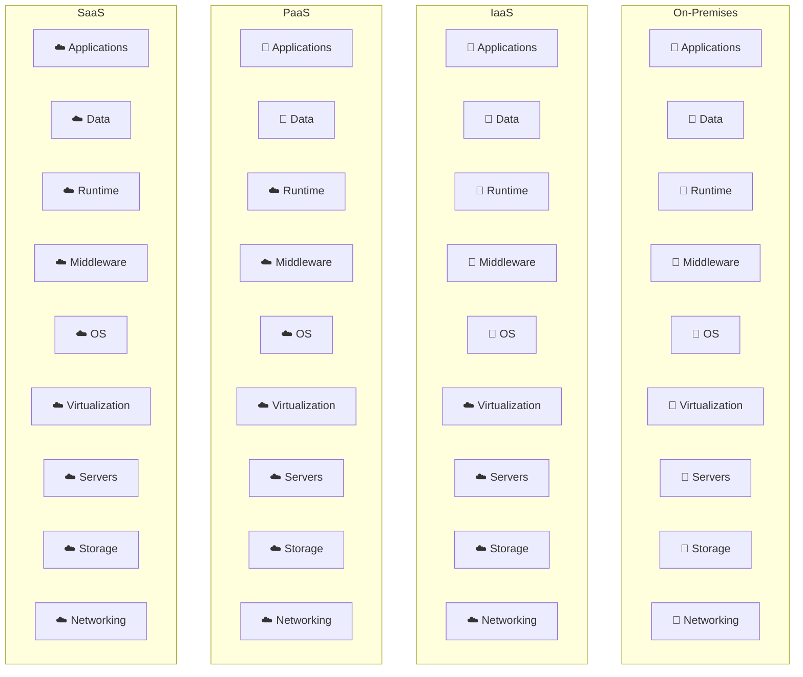

**👤 = you manage · ☁️ = the cloud provider manages**

#### 1. IaaS — Infrastructure as a Service

**What it is:** the provider gives you **raw virtualised hardware** — virtual machines, storage, networks — and you install and manage everything above it.

- **You manage:** operating system, patches, runtime, middleware, applications, data.
- **Provider manages:** physical servers, storage, network, virtualisation layer.
- **Most control, most responsibility, most flexibility.**

**Examples:** **Amazon EC2**, Amazon S3, Microsoft Azure Virtual Machines, Google Compute Engine, DigitalOcean Droplets, Rackspace, OpenStack.

**Use when:** you need full control over the OS, are migrating ("lift and shift") existing servers, or have unusual software requirements.

#### 2. PaaS — Platform as a Service

**What it is:** the provider supplies a **complete development and deployment platform** — OS, runtime, database, web server — and you only **upload your code**.

- **You manage:** your application and your data. Nothing else.
- **Provider manages:** OS, runtime, middleware, servers, storage, networking, scaling, patching.
- **Best balance for developers.**

**Examples:** **Heroku**, **Google App Engine**, **AWS Elastic Beanstalk**, Azure App Service, Red Hat OpenShift, Firebase.

**Use when:** you want to **focus purely on writing code** and not on servers.

#### 3. SaaS — Software as a Service

**What it is:** **ready-to-use software** delivered over the internet, usually through a browser. Nothing to install, nothing to manage.

- **You manage:** only your own data and user settings.
- **Provider manages:** absolutely everything else.
- **Least control, least effort.**

**Examples:** **Gmail**, Google Workspace, **Microsoft 365**, **Salesforce**, Dropbox, Zoom, Slack, Netflix, Facebook.

**Use when:** a standard, off-the-shelf application meets your need.

#### The comparison table

| Point | **IaaS** | **PaaS** | **SaaS** |
|---|---|---|---|
| **Delivers** | Virtual hardware | A development platform | Finished software |
| **You manage** | OS, runtime, apps, data | **Apps and data only** | **Data and settings only** |
| **Provider manages** | Hardware + virtualisation | Everything below your code | **Everything** |
| **Primary user** | **System administrators / IT** | **Developers** | **End users** |
| **Control** | **Highest** | Medium | **Lowest** |
| **Flexibility** | **Highest** | Medium | Lowest |
| **Setup effort** | Highest | Medium | **Almost none** |
| **Scalability** | Manual or scripted | **Automatic** | Automatic |
| **Examples** | AWS EC2, Azure VM, Google Compute Engine | Heroku, Google App Engine, Elastic Beanstalk | Gmail, Salesforce, MS 365, Zoom |

*(A fourth model, **FaaS / Serverless** — AWS Lambda, Azure Functions — goes one step beyond PaaS: you upload a single **function**, and the provider runs it only when triggered and bills per millisecond.)*

#### The classic scenario question

> *"A startup wants to launch a new web application. They do **not** want to manage any underlying **hardware, operating systems, or even the runtime environment**; they only want to focus on writing and deploying their code. Which cloud service model should they choose?"*

> ### ✅ **Answer: PaaS — Platform as a Service.**
>
> **Justification:**
> 1. The requirement explicitly excludes managing **hardware** (which rules out on-premises), the **OS** (which rules out **IaaS** — with IaaS you must still patch and secure the operating system yourself), and the **runtime environment** (which is exactly what PaaS provides).
> 2. They *do* want to **write and deploy their own application** — so **SaaS is wrong**, because SaaS delivers finished software with no place to put custom code.
> 3. PaaS gives them a ready platform (OS + runtime + web server + database) where they simply **push their code**, and the provider handles deployment, scaling, load balancing, patching and backups.
> 4. Extra benefits for a **startup**: no upfront cost, automatic scaling as users grow, and a very fast time to market.
> 5. **Suitable products:** Heroku, Google App Engine, AWS Elastic Beanstalk, Azure App Service.
>
> *(If they also wanted no server management at all and had an event-driven workload, **Serverless/FaaS** would be an even lighter option worth mentioning.)*

#### How to classify a service in a table question

| The service is … | Model |
|---|---|
| A **virtual machine** you log into and install software on | **IaaS** |
| **Raw block or object storage** (S3, EBS) | **IaaS** |
| A **managed runtime** where you upload code (App Engine, Heroku) | **PaaS** |
| A **managed database** you connect to but do not administer (RDS) | **PaaS** |
| A **finished application** used through a browser (Gmail, Salesforce) | **SaaS** |
| An **email or CRM** service for end users | **SaaS** |

**Previous Year Question List from this Topic:**

- [A startup company wants to launch a new web application. They do not want to manage any underlying hardware, operating systems, or even the runtime environment;…](../written-answers/cloud-computing.md?plain=1#L22)
- [What is cloud computing? Mention its service models.](../written-answers/cloud-computing.md?plain=1#L44)
- [6.11 A startup company wants to launch a new web application. They do not want to manage any underlying hardware, operating systems, or even the runtime environ…](../written-answers/cloud-computing.md?plain=1#L100)
- [Describe SaaS, IaaS and PaaS.](../written-answers/cloud-computing.md?plain=1#L125)
- [Explain IaaS, PaaS, and SaaS with respect to cloud computing.](../written-answers/cloud-computing.md?plain=1#L152)
- [(ক) Cloud Computing এর সার্ভিসগুলো লিখুন।](../written-answers/cloud-computing.md?plain=1#L203)
- [Software as a Service is SaaS, Platform as a Service is PaaS and Infrastructure as a Service is IaaS. Those are three types of Cloud services. In the following…](../written-answers/cloud-computing.md?plain=1#L220)
- [(c) What are the three types of services provided by the cloud?](../written-answers/cloud-computing.md?plain=1#L245)
- [What is cloud computing? Mention five advantages threat of cloud computing. Describe IaaS, PaaS and SaaS.](../written-answers/cloud-computing.md?plain=1#L294)

**Previous Year MCQ List from this Topic:**

- [Which one is not a layer of cloud computing?](../mcq-answers/cloud-computing.md?plain=1#L52)
- [Which of the following type is not supported for mobile application viewing for Google docs?](../mcq-answers/cloud-computing.md?plain=1#L70)
- [Which of the following web service can be controlled by iAWSManager cloud app from an iPhone?](../mcq-answers/cloud-computing.md?plain=1#L79)
- [Which one of the following is related to the services provided by cloud?](../mcq-answers/cloud-computing.md?plain=1#L144)
- [Service that generally focuses on the hardware following which one of the following services models?](../mcq-answers/cloud-computing.md?plain=1#L153)
- [Which service(s) is/are related with Cloud Computing?](../mcq-answers/cloud-computing.md?plain=1#L162)
- [Which of the following is Cloud Platform by Microsoft?](../mcq-answers/cloud-computing.md?plain=1#L171)


---

### Multi-Tenancy in the Cloud

**Multi-tenancy** is an architecture in which a **single instance of an application and its infrastructure serves MANY customers (tenants)**, while each tenant's **data remains isolated and invisible** to the others.

> **The apartment-building analogy:** one building (the application), many flats (tenants). Everyone shares the foundation, lift, water supply and security guard — but each family has its **own locked flat** and cannot see inside anyone else's.
>
> **Single-tenancy** would be giving every family a separate house — far more expensive to build and maintain.

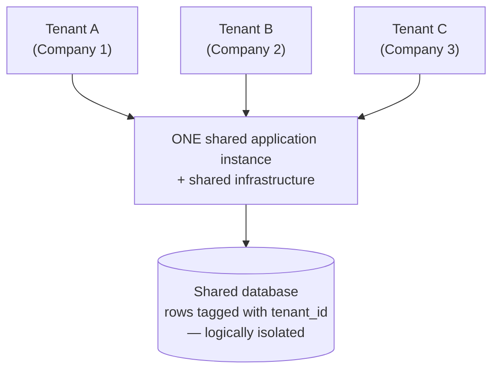

#### How SaaS and multi-tenancy are related

They are **tightly coupled**: **multi-tenancy is the architecture that makes SaaS economically possible.**

- **SaaS** is a *delivery model* — finished software served over the internet to many customers.
- **Multi-tenancy** is the *architecture* underneath it — one instance serving all those customers.

Without multi-tenancy, a SaaS provider would have to run a **separate copy of the application and database for every single customer**. With 100,000 customers that is 100,000 deployments to patch, monitor and upgrade — impossible. With multi-tenancy, the provider **upgrades once and every customer gets it instantly**, and the cost per customer collapses. Gmail, Salesforce and Microsoft 365 are all multi-tenant.

#### How tenant data is isolated — the three models

| Model | Description | Isolation | Cost |
|---|---|---|---|
| **Shared database, shared schema** | All tenants' rows in the same tables, separated by a **`tenant_id`** column | Lowest (logical only) | **Cheapest** |
| **Shared database, separate schema** | One schema per tenant inside one database | Medium | Medium |
| **Separate database per tenant** | Each tenant gets its own database | **Highest** | Most expensive |

#### Advantages of multi-tenancy

**For the provider:**
1. **Much lower cost** — one instance instead of thousands.
2. **Higher resource utilisation** — idle capacity of one tenant serves another.
3. **Update once, deploy to all** — a single code base to patch and maintain.
4. **Easier monitoring and operations.**
5. **Economies of scale**, which allow low subscription prices.
6. **Faster onboarding** — a new tenant is just a new row, not a new deployment.

**For the customer:**
7. **Lower subscription price.**
8. **Automatic updates** with no action required.
9. **Instant sign-up**, no installation.
10. **Elastic scaling** shared across everyone.

#### Disadvantages and risks of multi-tenancy

1. **Security risk** — a bug or misconfiguration can leak one tenant's data to another (**the single biggest concern**).
2. **"Noisy neighbour" problem** — one tenant's heavy load degrades performance for everyone.
3. **Limited customisation** — tenants must share the same code base; deep per-customer changes are hard.
4. **Shared failure domain** — one bad deployment takes **all** tenants down at once.
5. **Compliance difficulties** — some regulators (banking, health) demand physical data separation.
6. **Complex development** — every query must filter by tenant, and forgetting once is a data breach.
7. **Upgrade timing is not the tenant's choice** — the provider decides when to update.
8. **Harder debugging** — you cannot always isolate one tenant's behaviour.

#### Choosing a model for a multi-vendor e-commerce application

For a platform where **many vendors** each run their own shop:

| Requirement | Recommended model |
|---|---|
| Many **small vendors**, standard features, price-sensitive | **Shared database, shared schema** with a `tenant_id` — cheapest and most scalable |
| A few **large vendors** needing custom fields or reports | **Separate schema per tenant** |
| Vendors with **regulatory or data-residency requirements** | **Separate database per tenant** |
| A realistic platform | **A hybrid tiered approach:** shared schema for the free/basic tier, separate schema for premium, separate database for enterprise |

**Essential safeguards to mention:** enforce `tenant_id` filtering at the **data-access layer** (never rely on developers remembering it), use **row-level security** in the database, apply **per-tenant rate limits and resource quotas** to stop noisy neighbours, encrypt data **per tenant**, and keep **per-tenant audit logs**.

**Previous Year Question List from this Topic:**

- [What is SaaS and multi-tenant architecture? How are they related? What are the advantages and disadvantages of multi-tenancy? For a multi-vendor e-commerce appl…](../written-answers/cloud-computing.md?plain=1#L61)
- [What do you mean by multi-tenancy in the cloud? Why is it beneficial for cloud service providers?](../written-answers/cloud-computing.md?plain=1#L179)

**Previous Year MCQ List from this Topic:**

- [Which one of the following cloud concepts is related to sharing and pooling the resources?](../mcq-answers/cloud-computing.md?plain=1#L34)
- [Which of the following cloud concept is related to pooling and sharing of resources?](../mcq-answers/cloud-computing.md?plain=1#L106)


---

### Cloud Computing Architecture — Front-End, Back-End, SOA and EDA

> **CLOUD COMPUTING ARCHITECTURE is the way the components of a cloud system are ORGANISED and CONNECTED** — what the user touches, what runs in the provider's data centre, and the network that joins them.

#### The two halves of every cloud system

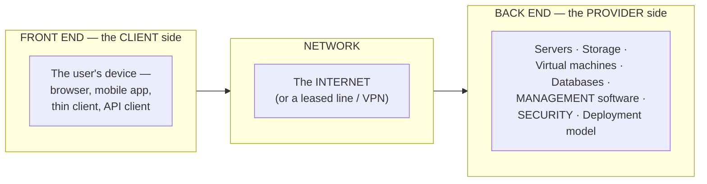

| Half | What it contains | Owned by |
|---|---|---|
| ⭐ **FRONT END** | The **client device and the interface** — a web browser, a mobile app, a thin client, or an API-consuming program | **The user** |
| ⭐ **BACK END** | The **actual cloud** — servers, storage, virtual machines, databases, the **hypervisor**, the **management/middleware layer**, security and the deployment model | **The provider** |
| **Network** | The **Internet** (or a dedicated link) carrying requests and responses between them | Both |

> **The management layer (middleware) is what makes it a cloud rather than a rented server**: it handles **resource allocation, scheduling, load balancing, monitoring, metering and billing** automatically, with no human operator in the loop.

#### The two architectural styles cloud computing combines

> ### **Cloud architecture is a combination of SERVICE-ORIENTED ARCHITECTURE (SOA) and EVENT-DRIVEN ARCHITECTURE (EDA).**

| | ⭐ **SOA — Service-Oriented Architecture** | ⭐ **EDA — Event-Driven Architecture** |
|---|---|---|
| **Core idea** | The system is built from **independent, REUSABLE SERVICES**, each exposing a well-defined interface | Components **REACT TO EVENTS** — a state change is published, and whoever cares responds |
| **Interaction style** | ⭐ **REQUEST–RESPONSE** — a caller asks, a service answers | ⭐ **PUBLISH–SUBSCRIBE** — a producer emits, subscribers consume |
| **Coupling** | Loose | ⭐ **Even looser — the producer does not know who is listening** |
| **Timing** | Usually **synchronous** — the caller waits | ⭐ **ASYNCHRONOUS** — nobody waits |
| **Gives the cloud** | **Modularity and reuse** — services can be independently developed, versioned and scaled | **Responsiveness and elasticity** — the system reacts to load and to state changes automatically |
| **Example in a cloud** | A payment service, an authentication service, a storage service, each callable over an API | A file uploaded to S3 **emits an event** that triggers a Lambda function; a CPU-usage event triggers **auto-scaling** |

> ### **Why BOTH are needed — the answer to give.** **SOA alone** gives you reusable, independently deployable services, but every interaction is a blocking request, so the system does not adapt on its own. **EDA alone** gives you reactive, asynchronous behaviour but no clean service boundaries. **Together they produce the defining cloud property: services that can be composed like building blocks AND that scale and respond on their own when something happens** — which is exactly what "elastic, on-demand computing" means in practice.

#### Cloud services are STATELESS

> ### **A STATELESS system keeps NO MEMORY of previous requests on the server. EACH REQUEST CARRIES EVERYTHING NEEDED TO PROCESS IT**, so any server instance can handle any request, and the interaction is **unidirectional** — the client asks, the server answers and forgets.

| Point | ⭐ **STATELESS** | **STATEFUL** |
|---|---|---|
| **Server remembers past requests?** | ❌ **No** | ✅ Yes — it holds a session |
| **Where the state lives** | **In the request itself** (a token, a cookie, parameters), or in an **external store** — Redis, a database | **In the server's memory** |
| **Can any server handle the request?** | ✅ **YES** | ❌ No — the client must return to **the same server** (sticky sessions) |
| **Horizontal scaling** | ✅ **Easy — just add instances** | ⚠️ **Hard** |
| **Failure of one server** | ✅ Another instance takes over transparently | ⚠️ **The session is lost** |
| **Load balancing** | ✅ Trivial — any instance will do | Requires session affinity |
| **Examples** | ⭐ **HTTP, REST APIs, DNS, most cloud services** | FTP, Telnet, a traditional application server session, a database connection |

> ### **Why the cloud insists on statelessness:** elasticity means instances are **created and destroyed constantly**. If a server held the only copy of a user's session, **terminating that instance would destroy the user's work**, and a load balancer could not freely distribute traffic. **Statelessness is therefore the precondition for auto-scaling, load balancing and fault tolerance** — it is what allows the cloud to treat servers as **disposable cattle rather than irreplaceable pets**. Where state genuinely must persist, it is pushed **out of the server** into a shared cache or database.

#### The layers of a cloud, bottom to top

```
   ┌───────────────────────────────────────────┐
   │  SaaS  — the finished APPLICATION         │  ← the user just uses it
   ├───────────────────────────────────────────┤
   │  PaaS  — runtime, middleware, tools       │  ← the developer deploys code
   ├───────────────────────────────────────────┤
   │  IaaS  — VMs, storage, network            │  ← the admin builds the system
   ├───────────────────────────────────────────┤
   │  Virtualization layer — the HYPERVISOR    │
   ├───────────────────────────────────────────┤
   │  Physical hardware — servers, disks, LAN  │
   └───────────────────────────────────────────┘
```

> ⚠️ **The three standard service layers are IaaS, PaaS and SaaS only.** Terms such as **"CaaS — Computing as a Service"** are **not** part of the standard model, and an MCQ asking *"which is NOT a layer of cloud computing?"* is usually testing exactly that. *(**FaaS/Serverless**, **DBaaS**, **STaaS** and **XaaS** are genuine industry terms, but they are **specialisations sitting within PaaS/IaaS**, not additional core layers.)*

**Previous Year MCQ List from this Topic:**

- [Cloud Computing architecture is a combination of ______.](../mcq-answers/cloud-computing.md?plain=1#L25)
- [Which one is not a layer of cloud computing?](../mcq-answers/cloud-computing.md?plain=1#L52)
- [Cloud computing is a ________ system and it is necessarily unidirectional in nature.](../mcq-answers/cloud-computing.md?plain=1#L97)


## Virtualization & Containers (VM vs Container)

### Virtualization — Concept, Types and Benefits

**Virtualization** is the technology that creates a **virtual (software-based) version** of a physical resource — a server, an operating system, storage, or a network — so that **one physical machine can behave like several independent machines**.

It is the **foundation technology of cloud computing**: without virtualization there would be no cloud.

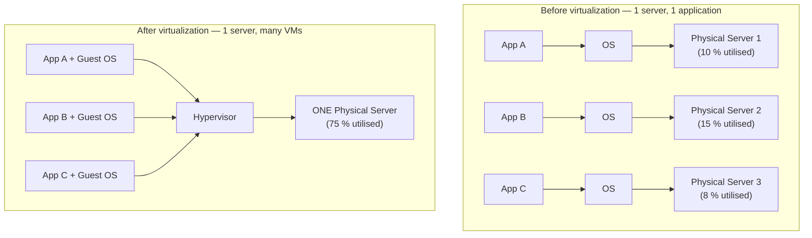

#### How it helps a physical server

Before virtualization, most servers ran a **single application** and sat at **5–15 % utilisation** — enormous waste of hardware, rack space, power and cooling. Virtualization lets **one physical server host 10–30 virtual machines**, pushing utilisation to 60–80 %. This is called **server consolidation** and it is the main reason virtualization exists.

#### Types of virtualization

| Type | What is virtualised | Example |
|---|---|---|
| **Server virtualization** | One physical server → many virtual servers | VMware ESXi, Hyper-V |
| **Desktop virtualization (VDI)** | Desktops run centrally, users connect remotely | Citrix, VMware Horizon |
| **Storage virtualization** | Many physical disks appear as one pool | SAN, RAID, software-defined storage |
| **Network virtualization** | Virtual switches, routers and networks | VLAN, VXLAN, SDN, NFV |
| **Application virtualization** | An app runs without being installed on the OS | Microsoft App-V, Citrix XenApp |
| **OS-level virtualization** | Isolated user spaces on one kernel | **Docker containers**, LXC |
| **Data virtualization** | Many data sources appear as one | Data federation layers |

#### Server virtualization explained with an example

> **Example:** a bank has three separate physical servers — one for the web server, one for the mail server, one for a test system. Each costs money to buy, power, cool and maintain, and each sits mostly idle.
>
> With **server virtualization**, the bank buys **one powerful server** with 32 cores and 128 GB RAM, installs a **hypervisor (VMware ESXi)** on it, and creates **three virtual machines** — VM1 running Linux for the web server, VM2 running Windows Server for mail, VM3 running a test copy. Each VM believes it owns a complete computer, and they are fully isolated from one another. If the test VM crashes, the web server is unaffected. The bank has cut three machines to one, saving roughly two-thirds of its hardware and power cost.

#### Benefits of virtualization

1. **Server consolidation** — fewer physical machines, far higher utilisation.
2. **Cost reduction** — less hardware, less rack space, less electricity and cooling.
3. **Isolation** — one VM crashing or being compromised does not affect the others.
4. **Rapid provisioning** — a new server in minutes from a template, instead of weeks.
5. **Snapshots and rollback** — capture a VM's exact state and restore it instantly.
6. **Easy backup and disaster recovery** — a VM is just a set of files that can be copied.
7. **Live migration** — move a running VM to another host with no downtime (vMotion).
8. **Hardware independence** — a VM can run on any compatible host.
9. **Run multiple operating systems** on one machine (Linux and Windows together).
10. **Ideal for testing and development** — safe sandboxes that can be thrown away.
11. **High availability** — automatic restart of a VM on another host if one fails.
12. **Green IT** — less hardware means a smaller carbon footprint.

#### Top virtualization platforms

| # | Platform | Vendor | Type |
|---|---|---|---|
| 1 | **VMware vSphere / ESXi** | VMware (Broadcom) | Type 1 — enterprise standard |
| 2 | **Microsoft Hyper-V** | Microsoft | Type 1 |
| 3 | **KVM** (Kernel-based Virtual Machine) | Open source / Linux | Type 1 |
| 4 | **Citrix XenServer / Xen** | Citrix | Type 1 |
| 5 | **Oracle VirtualBox** | Oracle | Type 2 — free, desktop |
| 6 | **VMware Workstation / Fusion** | VMware | Type 2 — desktop |
| 7 | **Proxmox VE** | Proxmox | Type 1, open source |

**Previous Year Question List from this Topic:**

- [What is Virtualization? Write down the benefits of Virtualization. Write down the top 5 virtual platform software.](../written-answers/cloud-computing.md?plain=1#L360)
- [What is Server Virtualization? Explain with example of its.](../written-answers/cloud-computing.md?plain=1#L381)
- [How virtualization help physical server.](../written-answers/cloud-computing.md?plain=1#L405)
- [A physical server has 32 CPU cores, 96\text{ GB} RAM, and 4\text{ TB} storage. Each virtual machine (VM) requires 4 CPU cores, 16\text{ GB} RAM, and 500\text{ G…](../written-answers/cloud-computing.md?plain=1#L944)

**Previous Year MCQ List from this Topic:**

- [Which one of the following cloud concepts is related to sharing and pooling the resources?](../mcq-answers/cloud-computing.md?plain=1#L34)
- [Which of the following cloud concept is related to pooling and sharing of resources?](../mcq-answers/cloud-computing.md?plain=1#L106)
- [Which software is mostly used for virtualization?](../mcq-answers/cloud-computing.md?plain=1#L191)


---

### Virtual Machines and Hypervisors

#### What is a Virtual Machine?

A **Virtual Machine (VM)** is a **software emulation of a complete physical computer**. It has its own **virtual CPU, RAM, disk, and network card**, and runs its **own full guest operating system**, completely isolated from the host and from other VMs.

#### Architecture diagram

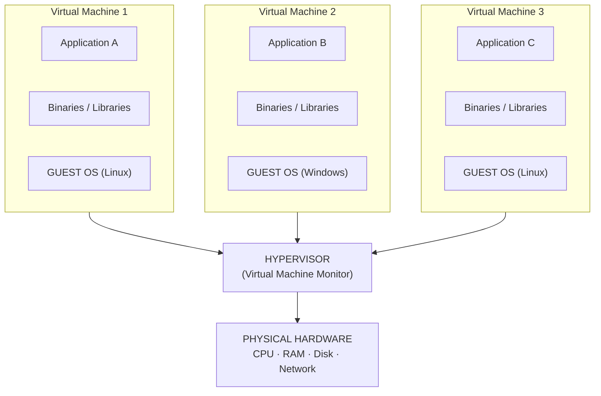

#### How a VM works

1. The **hypervisor** sits between the hardware and the virtual machines.
2. It **partitions the physical resources** — CPU cores, RAM, disk, network bandwidth — and allocates a slice to each VM.
3. Each VM sees its slice as a **complete, private computer** and boots its own guest OS on it.
4. When a guest OS issues a **privileged instruction** (I/O, memory management), the hypervisor **intercepts and translates** it into a safe operation on the real hardware.
5. The hypervisor **schedules** the VMs onto the physical CPUs, much as an OS schedules processes.
6. Each VM is stored on disk as a set of files (a **virtual disk image** plus a configuration file), which is what makes snapshots, cloning and migration so easy.

#### Benefits of a VM

- **Strong isolation** — a separate kernel per VM, so a compromise or crash stays contained.
- **Run any OS** — Windows on Linux hardware, or the reverse.
- **Full hardware-level security boundary.**
- **Snapshot, clone and roll back** instantly.
- **Live migration** between hosts with no downtime.
- **Legacy support** — old applications keep running on old OS versions.

#### Type 1 vs Type 2 Hypervisors

A **hypervisor** (also called a **Virtual Machine Monitor, VMM**) is the software layer that creates and runs virtual machines.

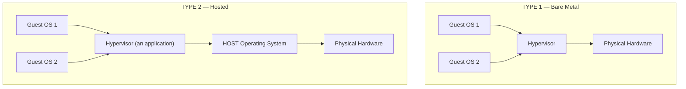

**Type 1 — Bare-metal hypervisor**
Installed **directly on the physical hardware**, with **no host operating system underneath**. The hypervisor *is* the operating system of the machine.

**Type 2 — Hosted hypervisor**
Installed **as an ordinary application on top of an existing operating system** (Windows, macOS, Linux). It requests resources from the host OS, which then talks to the hardware.

| Point | **Type 1 (Bare Metal / Native)** | **Type 2 (Hosted)** |
|---|---|---|
| **Runs on** | **Directly on the hardware** | **On top of a host OS** |
| **Host OS needed?** | ❌ No | ✅ Yes |
| **Performance** | **Higher** — direct hardware access, no extra layer | **Lower** — an extra OS layer adds overhead |
| **Security** | **Higher** — a much smaller attack surface | Lower — inherits every vulnerability of the host OS |
| **Stability** | Higher | If the host OS crashes, **all VMs die** |
| **Installation** | Complex — needs dedicated hardware | **Very easy** — install like any application |
| **Cost** | Usually licensed, expensive | Often **free** |
| **Resource overhead** | Minimal | Significant |
| **Used in** | **Data centres, enterprise servers, cloud providers** | **Desktops, laptops, learning, testing** |
| **Examples** | **VMware ESXi, Microsoft Hyper-V, Citrix XenServer, KVM, Proxmox** | **Oracle VirtualBox, VMware Workstation/Fusion, Parallels Desktop, QEMU** |

> ### "What is a Type 2 hypervisor?"
> A **Type 2 (hosted) hypervisor** is virtualization software that runs **as an application on top of a conventional host operating system**, rather than directly on the hardware. It obtains CPU, memory and I/O from the host OS and uses them to create virtual machines, each with its own guest OS. Because every instruction passes through the extra host-OS layer, it is **slower and less secure than a Type 1 hypervisor**, but it is **very easy to install and usually free** — which makes it the right choice for **personal computers, learning, development and testing**. Examples: **Oracle VirtualBox, VMware Workstation, Parallels Desktop**.

**Previous Year Question List from this Topic:**

- [Define a virtual machine with a neat diagram, explain the working of VM. What are the benefits of a VM?](../written-answers/cloud-computing.md?plain=1#L420)
- [What is type 2 hypervisors in virtual machine?](../written-answers/cloud-computing.md?plain=1#L477)
- [Explain Type 1 and Type 2 hypervisors in virtual machine operating system with figure.](../written-answers/cloud-computing.md?plain=1#L502)
- [How virtualization help physical server.](../written-answers/cloud-computing.md?plain=1#L405)

**Previous Year MCQ List from this Topic:**

- [Which software is mostly used for virtualization?](../mcq-answers/cloud-computing.md?plain=1#L191)


---

### Containers and Docker

#### What is a container?

A **container** is a **lightweight, standalone, executable package** that bundles an application together with **everything it needs to run** — code, runtime, system libraries, and settings — but **shares the host operating system's kernel** instead of carrying its own.

> **The shipping-container analogy:** before standard shipping containers, every cargo needed custom handling at every port. The standard container made cargo **portable** — any crane, any ship, any truck. Software containers do the same for applications: build once, run **anywhere** — laptop, test server, cloud — with identical behaviour.

#### What is Docker?

**Docker** is the most popular **containerization platform**. It provides the tools to **build, ship and run** containers.

| Docker term | Meaning |
|---|---|
| **Dockerfile** | A text recipe describing how to build the image |
| **Image** | A read-only template — the "class" |
| **Container** | A running instance of an image — the "object" |
| **Docker Engine** | The daemon that builds and runs containers |
| **Docker Hub / Registry** | The online store of ready-made images |
| **Docker Compose** | Defines and runs multi-container applications |
| **Kubernetes (K8s)** | Orchestrates thousands of containers across many machines |

**A minimal Dockerfile:**

```dockerfile
FROM node:18-alpine          # base image with the runtime
WORKDIR /app
COPY package*.json ./
RUN npm install              # install dependencies INSIDE the image
COPY . .
EXPOSE 3000
CMD ["node", "server.js"]    # what runs when the container starts
```

#### Container architecture

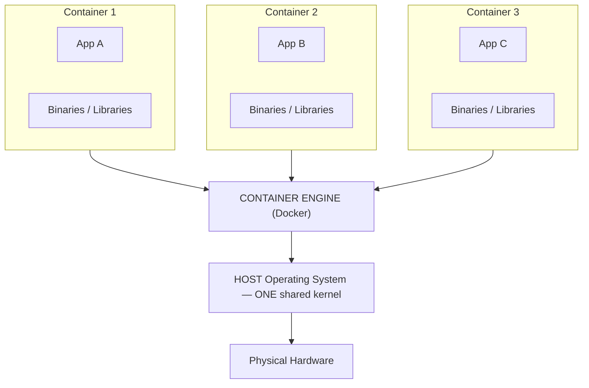

**The crucial difference from a VM:** there is **no guest OS per container**. All containers **share the host kernel**, which is why a container is measured in **megabytes** and starts in **milliseconds**, while a VM is measured in **gigabytes** and takes **minutes**.

#### Solving the "it works on my machine" problem

> **Scenario:** an application running on a **Windows Server** is moved to a **Linux server**. What problems occur, and can Docker solve them?

**Problems that occur when moving Windows → Linux:**

| Problem | Detail |
|---|---|
| **Different OS APIs** | Windows system calls, the Registry and COM/.NET Framework services simply do not exist on Linux |
| **File path differences** | `C:\folder\file.txt` (backslash, drive letters) vs `/home/user/file.txt` |
| **Case sensitivity** | Windows treats `File.txt` and `file.txt` as the same; **Linux does not** |
| **Line endings** | Windows uses CRLF, Linux uses LF — breaks scripts and config files |
| **Missing dependencies** | The exact runtime, library and patch versions differ or are absent |
| **Different binaries** | A Windows `.exe`/`.dll` cannot execute on Linux |
| **Environment and permissions** | Different environment variables, user/group model, and file permissions |
| **Service management** | Windows Services vs Linux systemd |

**Can Docker solve it?**

> **Partly — and this nuance is what the examiner is testing.**
>
> **✅ What Docker DOES solve:** Docker packages the application **together with all its libraries, dependencies, configuration and runtime** into one image. That image behaves **identically on every machine that can run the container**, which eliminates the *"it works on my machine"* class of problems — missing dependencies, wrong library versions, different configuration, environment drift. Moving between two **Linux servers**, or from a developer's laptop to a production cluster, becomes trivial.
>
> **❌ What Docker does NOT solve:** containers **share the host kernel**, so **a Windows container cannot run on a Linux host and vice versa**. If the application genuinely depends on **Windows-specific APIs** (.NET Framework, the Registry, COM, Win32 calls), containerising it will not make it run on a Linux kernel.
>
> **The practical solutions:**
> 1. **If the application is cross-platform** (Java, Node.js, Python, Go, **.NET Core/.NET 5+**) → **containerise it with Docker** using a Linux base image. Problem solved cleanly.
> 2. **If it depends on the classic .NET Framework or Win32** → either **port it to .NET Core**, or run a **Windows container on a Windows host**, or use a **Virtual Machine** running Windows on the Linux hardware (a VM *does* carry its own OS, so it can bridge the gap where a container cannot).

**Previous Year Question List from this Topic:**

- [What is docker? An application running on windows server shifted in linux server. What problem will occur? Can Docker solve it?](../written-answers/cloud-computing.md?plain=1#L454)
- [VM vs Container in Submarine Cable Network: (BSCCPL AME 21-08-2026 (BUET)) A national submarine cable landing station provides international connectivity to sev…](../written-answers/cloud-computing.md?plain=1#L323)

**Previous Year MCQ List from this Topic:**

- [What is Docker Hub and Docker?](../mcq-answers/cloud-computing.md?plain=1#L182)


---

### VM vs Container — Comparison and When to Use Which

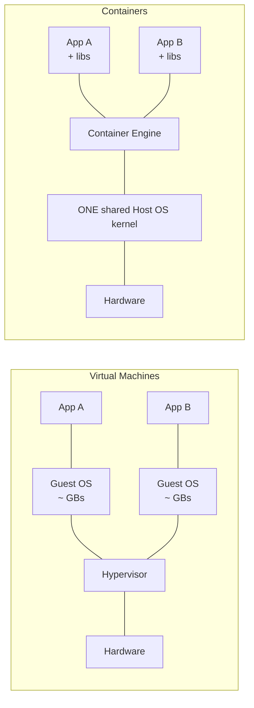

| Point | **Virtual Machine** | **Container** |
|---|---|---|
| **Operating system** | Each VM runs a **full guest OS** | **Shares the host OS kernel** — no guest OS |
| **Size** | **GBs** (typically 1–20 GB) | **MBs** (typically 10–500 MB) |
| **Boot / start time** | **Minutes** | **Milliseconds to seconds** |
| **Isolation** | **Strong** — hardware-level, separate kernels | **Weaker** — process-level, shared kernel |
| **Security boundary** | **Stronger** | Weaker — a kernel exploit can escape the container |
| **Performance overhead** | Higher (5–15 %) | **Near-native** |
| **Density per host** | **Tens** of VMs | **Hundreds to thousands** of containers |
| **Managed by** | **Hypervisor** (ESXi, Hyper-V, KVM) | **Container engine** (Docker, containerd, Podman) |
| **Can run a different OS?** | ✅ **Yes** — Windows VM on Linux host | ❌ **No** — must match the host kernel |
| **Portability** | Portable but heavy | **Extremely portable and light** |
| **Resource usage** | High (RAM and disk per OS) | **Low** |
| **Best for** | Legacy apps, different OSes, strict isolation, multi-tenant untrusted workloads | **Microservices, CI/CD, cloud-native apps, rapid scaling** |
| **Orchestration** | vCenter, OpenStack | **Kubernetes**, Docker Swarm |
| **Examples** | VMware, Hyper-V, KVM, VirtualBox | **Docker**, Podman, LXC, containerd |

#### Choosing between them — a worked scenario

> **Scenario:** a **national submarine cable landing station** provides international connectivity to several organisations and must host multiple workloads on shared infrastructure. Should it use VMs or containers?

**Use VIRTUAL MACHINES when:**
- Workloads belong to **different organisations that do not trust one another** — the hardware-level isolation of a separate kernel is essential for **multi-tenant security and regulatory compliance**.
- Different **operating systems** are required (a legacy Windows NMS alongside Linux tools).
- **Legacy or vendor-appliance software** is supplied only as a VM image.
- Strict **audit and compliance** rules demand provable separation.

**Use CONTAINERS when:**
- The workloads are **microservices** owned by the **same** organisation.
- You need **fast scaling** to absorb traffic spikes (containers start in milliseconds).
- You are running a **CI/CD pipeline** with frequent deployments.
- **Resource efficiency and density** matter — many services on the same hardware.
- The team practises **DevOps** and wants identical dev/test/production environments.

**The realistic answer — use both, in layers:**

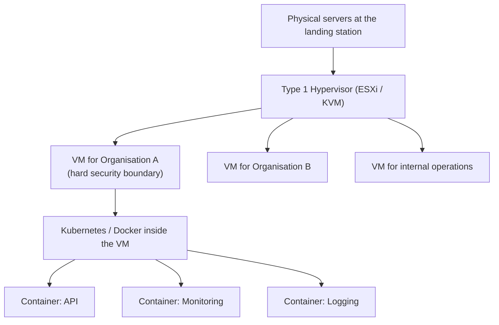

This is exactly how real clouds are built: **VMs provide the hard tenant boundary, and containers provide fast, dense, efficient deployment inside each tenant's boundary.**

**Previous Year Question List from this Topic:**

- [VM vs Container in Submarine Cable Network: (BSCCPL AME 21-08-2026 (BUET)) A national submarine cable landing station provides international connectivity to sev…](../written-answers/cloud-computing.md?plain=1#L323)
- [What is docker? An application running on windows server shifted in linux server. What problem will occur? Can Docker solve it?](../written-answers/cloud-computing.md?plain=1#L454)
- [High-Availability Design: (BSCCPL AME 21-08-2026 (BUET)) A submarine cable operator wants to ensure that a DNS service remains available even if one physical se…](../written-answers/cloud-computing.md?plain=1#L983)

## Cloud Storage & Fundamentals

### Cloud Storage vs Traditional Storage

**Cloud storage** is a service model in which data is **stored on remote servers managed by a provider** and accessed over the internet, while **traditional (on-premises / local) storage** keeps data on **physical devices you own** — hard disks, servers, NAS boxes, tape.

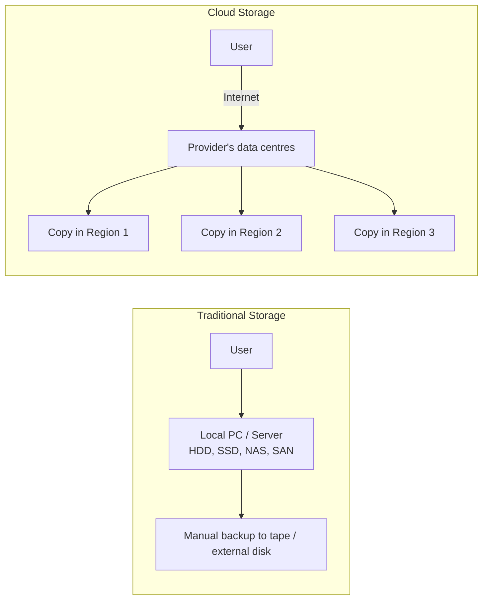

#### The comparison

| Point | **Traditional / On-Premises Storage** | **Cloud Storage** |
|---|---|---|
| **Location** | On your own premises | In the **provider's data centres** |
| **Ownership** | **You own** the hardware | The **provider** owns it; you rent capacity |
| **Access** | Usually **only on the local network** | From **anywhere with internet** |
| **Upfront cost (CAPEX)** | **High** — buy disks, servers, racks | **None** |
| **Ongoing cost (OPEX)** | Power, cooling, space, staff | **Monthly subscription / pay-per-GB** |
| **Scalability** | **Limited** — buy and install more hardware (weeks) | **Virtually unlimited**, expand in seconds |
| **Maintenance** | **Your** responsibility — repairs, upgrades, patches | **Provider's** responsibility |
| **Backup / disaster recovery** | Manual, and you must build it | **Built in** — automatic replication across regions |
| **Reliability** | A disk failure can mean data loss | **Very high** — data replicated 3+ times (e.g. 99.999999999 % durability) |
| **Speed** | **Faster** — LAN speed, no internet hop | Depends on **internet bandwidth and latency** |
| **Security control** | **Full physical control** | Shared responsibility; you trust the provider |
| **Internet dependency** | **None** — works offline | **Total** — no internet, no data |
| **Compliance / data sovereignty** | Easy — data never leaves the building | May be an issue if data crosses borders |
| **Collaboration** | Difficult | **Easy** — share a link, work simultaneously |
| **Examples** | Internal file server, NAS, SAN, external HDD, tape | **Google Drive, Dropbox, Amazon S3, Azure Blob, OneDrive** |

#### When to choose which

| Situation | Choice |
|---|---|
| Highly sensitive data with strict legal residency rules | **Traditional / private storage** |
| Very large, constantly accessed datasets with predictable size | Traditional (cheaper at steady scale) |
| Unpredictable or rapidly growing data | **Cloud** |
| Distributed or remote teams | **Cloud** |
| Backup and disaster recovery | **Cloud** (or hybrid) |
| Poor or unreliable internet connectivity | **Traditional** |
| Startup with no capital budget | **Cloud** |
| **Most real organisations** | **Hybrid** — hot/sensitive data on-premises, backups and archives in the cloud |

**Previous Year Question List from this Topic:**

- [What is cloud computing? Why is it used? State the difference between cloud storage and traditional storage.](../written-answers/cloud-computing.md?plain=1#L545)


---

### Types of Cloud Storage

| Type | How data is organised | Access method | Best for | Examples |
|---|---|---|---|---|
| **Object storage** | Flat pool of **objects**, each with data + metadata + a unique ID | **HTTP REST API** | Photos, videos, backups, logs, static websites, data lakes | **Amazon S3**, Azure Blob, Google Cloud Storage |
| **Block storage** | Raw **blocks**, like a virtual hard disk attached to a VM | Mounted as a **disk volume** | **Databases**, operating systems, transactional workloads needing low latency | **Amazon EBS**, Azure Disk, Google Persistent Disk |
| **File storage** | A traditional **hierarchy of folders and files** | **NFS / SMB** network share | Shared drives, content management, legacy applications | Amazon EFS, Azure Files, NAS |

#### Storage tiers — controlling cost

Cloud providers price storage by **how often you read it**:

| Tier | Access frequency | Cost per GB | Retrieval | Use |
|---|---|---|---|---|
| **Hot / Standard** | Frequent | Highest | Instant | Active application data |
| **Cool / Infrequent access** | Monthly | Lower | Instant, with a retrieval fee | Backups, older logs |
| **Archive / Glacier** | Rarely (yearly) | **Lowest** | **Minutes to hours** | Long-term legal/compliance archives |

**Lifecycle policies** move data down the tiers automatically (e.g. "after 90 days move to Cool, after 1 year move to Archive") — one of the most effective cloud cost-saving techniques.

#### Key cloud-storage concepts

| Concept | Meaning |
|---|---|
| **Durability** | The probability data is **not lost** — S3 advertises **99.999999999 % ("11 nines")**, achieved by keeping 3+ copies across separate facilities |
| **Availability** | The percentage of time the data is **reachable** — typically 99.9 %–99.99 % |
| **Replication** | Copies kept in different **availability zones** or **regions** |
| **Versioning** | Every overwrite keeps the old version — protects against accidental deletion and ransomware |
| **Encryption** | **At rest** (on disk) and **in transit** (TLS) |
| **Egress cost** | Uploading is usually free; **downloading is charged** — a frequent hidden cost |
| **CDN** | A content delivery network caches objects near users for speed |

**Previous Year Question List from this Topic:**

- [What is cloud computing? Why is it used? State the difference between cloud storage and traditional storage.](../written-answers/cloud-computing.md?plain=1#L545)
- [Describe the cloud base database briefly.](../written-answers/cloud-computing.md?plain=1#L665)


---

### Cloud Databases (DBaaS)

A **cloud database** is a database that **runs on cloud infrastructure and is accessed as a service**, with the provider handling installation, patching, backup, replication and scaling.

This is often called **DBaaS — Database as a Service**, and it is a form of **PaaS**.

#### Two ways to run a database in the cloud

| Approach | Description | You manage | Example |
|---|---|---|---|
| **Self-managed on a VM** | Install MySQL/PostgreSQL yourself on an IaaS virtual machine | OS, DB software, patches, backups, replication, tuning | MySQL on an AWS EC2 instance |
| **Managed / DBaaS** ✅ | The provider runs the database engine for you | Only your **schema, queries and data** | **Amazon RDS, Azure SQL Database, Google Cloud SQL** |

#### Types of cloud database

| Type | Model | Examples |
|---|---|---|
| **Relational (SQL)** | Tables, rows, ACID transactions | Amazon **RDS** (MySQL, PostgreSQL, Oracle, SQL Server), **Aurora**, Azure SQL Database, Google Cloud SQL |
| **NoSQL — Document** | JSON-like documents | **MongoDB Atlas**, Amazon DocumentDB, Azure Cosmos DB |
| **NoSQL — Key-Value** | Simple key → value pairs, very fast | **Amazon DynamoDB**, Redis, Azure Table Storage |
| **NoSQL — Column-family** | Wide columns, huge write volume | **Apache Cassandra**, Google Bigtable, HBase |
| **NoSQL — Graph** | Nodes and relationships | **Amazon Neptune**, Neo4j Aura |
| **Data warehouse** | Analytical, columnar, huge scans | **Amazon Redshift**, **Google BigQuery**, Snowflake |
| **In-memory cache** | Sub-millisecond reads | **Amazon ElastiCache** (Redis / Memcached) |

#### Advantages of a cloud database

1. **No installation or hardware** — provisioned in minutes.
2. **Automatic backups** and **point-in-time recovery**.
3. **Automatic patching** of the database engine and OS.
4. **High availability** — automatic failover to a standby replica in another zone.
5. **Easy scaling** — resize the instance, or add **read replicas** for read-heavy traffic.
6. **Pay for what you use**; some options scale to zero.
7. **Built-in monitoring**, slow-query logs and performance insights.
8. **Global reach** — put replicas near the users.
9. **Security features** included — encryption at rest and in transit, IAM access control, network isolation, audit logging.

#### Disadvantages and concerns

1. **Less control** — you cannot always tune the OS, install arbitrary extensions, or choose the exact engine build.
2. **Vendor lock-in**, especially with proprietary engines (Aurora, DynamoDB, BigQuery).
3. **Network latency** if the application is not in the same region.
4. **Cost can grow** quickly with storage, IOPS, backups and cross-region traffic.
5. **Data sovereignty and compliance** — regulators may require the data to stay in-country.
6. **Noisy-neighbour effects** on shared tiers.
7. **Limited root/superuser access** for deep troubleshooting.

#### Choosing a cloud database

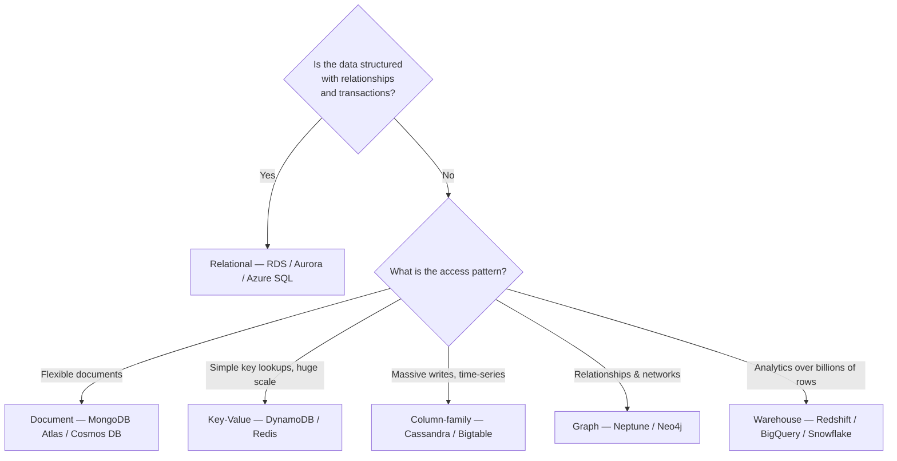

**Previous Year Question List from this Topic:**

- [Describe the cloud base database briefly.](../written-answers/cloud-computing.md?plain=1#L665)

---

### Data Centre Colocation and Disaster Recovery

> ### **COLOCATION ("colo") is renting SPACE, POWER, COOLING and NETWORK CONNECTIVITY in someone else's data centre, while YOU STILL OWN AND CONTROL THE SERVERS you put there.**
>
> It sits **between** building your own data centre and moving entirely to the cloud.

#### The three ways to house IT infrastructure

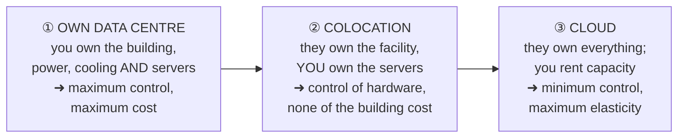

| Point | **Own data centre** | ⭐ **COLOCATION** | **Cloud** |
|---|---|---|---|
| **Who owns the building, power and cooling** | **You** | ⭐ **The provider** | The provider |
| **Who owns the SERVERS** | You | ⭐ **YOU** | The provider |
| **Capital cost** | ⚠️ **Very high** | **Medium** — servers only | ✅ **None** |
| **Control of hardware** | ✅ **Full** | ✅ **Full** | ❌ None |
| **Time to deploy** | Years | **Weeks** | ✅ **Minutes** |
| **Elasticity** | ❌ None | ❌ Limited | ✅ **Unlimited** |
| **Best for** | Very large, highly regulated organisations | **Firms with existing hardware, compliance needs, or predictable load** | Variable, growing or new workloads |

#### Why organisations choose COLOCATION for disaster recovery

> A frequently examined question. The reasons are all about **getting data-centre quality without building one**:

| # | Reason | Explanation |
|---|---|---|
| **1** | ⭐ **Much LOWER COST than building a second data centre** | A DR site sits idle most of the time; paying for racks in someone else's facility is far cheaper than constructing and staffing a building for an emergency that may never come |
| **2** | ⭐ **GEOGRAPHIC SEPARATION** | A DR site must be **far enough away not to be hit by the same flood, fire, cyclone or grid failure**. Colocation providers already have facilities in other cities and regions |
| **3** | ⭐ **Professional PHYSICAL SECURITY** | 24×7 guards, biometric access, mantraps, CCTV and visitor logging — expensive to replicate in-house |
| **4** | ⭐ **Carrier-neutral CONNECTIVITY** | Multiple independent ISPs in one building give **redundant network paths** and better peering than a single office link |
| **5** | **Redundant POWER and COOLING** | N+1 or 2N UPS, generators with fuel contracts, and precision cooling, already built and tested |
| **6** | **Tier-certified reliability** | A **Tier III or Tier IV** facility offers uptime guarantees an office server room cannot |
| **7** | **Speed of deployment** | Racks are available immediately; no construction, no permits |
| **8** | **Predictable operating cost** | A monthly fee instead of unpredictable capital and maintenance spending |
| **9** | **Compliance support** | The facility itself is often already **ISO 27001 / SOC 2 / PCI-DSS** audited |
| **10** | **No need for 24×7 facility staff** | Provider "remote hands" perform physical tasks |

> ⚠️ **The classic MCQ trap: "FULL CONTROL OF HARDWARE" is NOT a reason to choose colocation over building your own data centre.** You retain hardware control in **both** options — so it cannot be a *differentiator*. It is in fact the reason some organisations **build their own**. The genuine colocation advantages are **cost, location, physical security, connectivity and speed.**

#### Disaster recovery — the concepts and the metrics

> **DISASTER RECOVERY (DR) is the set of policies, tools and procedures for RESTORING IT systems and data after a disruptive event** — fire, flood, earthquake, power failure, hardware failure, cyber-attack or human error. It is the technical component of the wider **Business Continuity Plan (BCP)**.

> ### **The two metrics that define every DR plan:**
>
> | Metric | Full form | Question it answers |
> |---|---|---|
> | ⭐ **RTO** | **Recovery Time Objective** | ⭐ **"HOW LONG can we be DOWN?"** — the maximum tolerable time to restore service |
> | ⭐ **RPO** | **Recovery Point Objective** | ⭐ **"HOW MUCH DATA can we afford to LOSE?"** — the maximum tolerable age of the last good backup |

```
   ← ── RPO ── →  │  ← ───── RTO ───── →
   last good      DISASTER              service
   backup         strikes               restored

   RPO looks BACKWARD from the disaster  → governs BACKUP FREQUENCY
   RTO looks FORWARD  from the disaster  → governs RECOVERY CAPABILITY
```

**Worked illustration:** a core banking system with **RPO = 0 and RTO = 15 minutes** requires **synchronous replication** to a hot site — no transaction may ever be lost. A departmental file server with **RPO = 24 hours and RTO = 3 days** needs only a nightly backup restored to spare hardware. **The cost of a DR solution rises steeply as RTO and RPO approach zero**, which is why they are set per system from a **Business Impact Analysis**, not uniformly.

#### The types of DR site

| Site type | What is ready | Recovery time | Cost |
|---|---|---|---|
| ⭐ **HOT site** | **A fully equipped, running duplicate with live data replication** | ⭐ **Minutes** | ⚠️ **Highest** |
| **WARM site** | Hardware and network in place; data restored from recent backups | **Hours to a day** | Medium |
| ⭐ **COLD site** | **Only space, power and cooling** — equipment must be brought in and configured | ⚠️ **Days to weeks** | ✅ **Lowest** |
| **Cloud DR (DRaaS)** | Replication into a cloud region, spun up on demand | Minutes to hours | ✅ **Low — you pay for the standby, not a building** |
| **Mirrored / active-active** | Two live sites both serving traffic | ✅ **Near zero** | Highest |

#### Building a disaster recovery plan

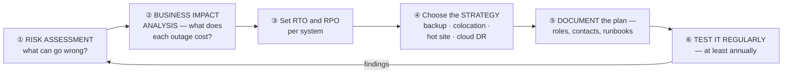

> ### **The single most important rule: AN UNTESTED DR PLAN IS NOT A PLAN.** Organisations routinely discover during a real disaster that the backups were never restorable, the documentation was out of date, the standby licences had expired, or nobody knew the escalation contacts. **A DR plan must be exercised — ideally with a full failover test — at least once a year, and after every major change.**
>
> ⚠️ **And note the distinction from RAID and replication: those protect against HARDWARE failure. DR protects against the LOSS OF A WHOLE SITE, and backup protects against DELETION, CORRUPTION AND RANSOMWARE — which replication would faithfully copy to the DR site within seconds.** A complete strategy needs all three, plus **immutable, off-line (air-gapped) backup copies**.
>
> **The 3-2-1 backup rule worth quoting: keep 3 copies of the data, on 2 different media, with 1 copy off-site.**

**Previous Year MCQ List from this Topic:**

- [Which of these is not a common reason businesses choose to go with a data center colocation service for disaster recovery instead of building a new data center?](../mcq-answers/cloud-computing.md?plain=1#L61)


## Cluster, Grid & Distributed Computing

### Centralized vs Distributed Computing

#### Centralized computing

In **centralized computing**, **all processing, data and control reside on a single central computer** (a mainframe or one powerful server). Users connect through **dumb terminals** or thin clients that do no real work themselves.

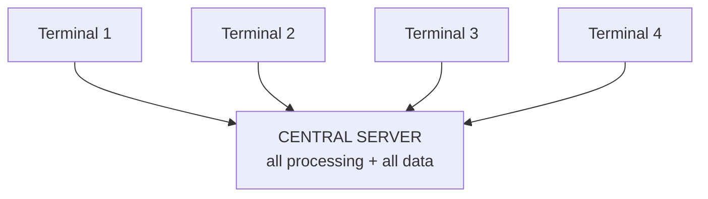

**Examples:** an old bank **mainframe** with branch terminals; a university lab where all software runs on one server; a traditional single-server database application.

#### Distributed computing

In **distributed computing**, the work is **spread across many independent computers connected by a network**, which coordinate by passing messages and appear to the user as **a single coherent system**.

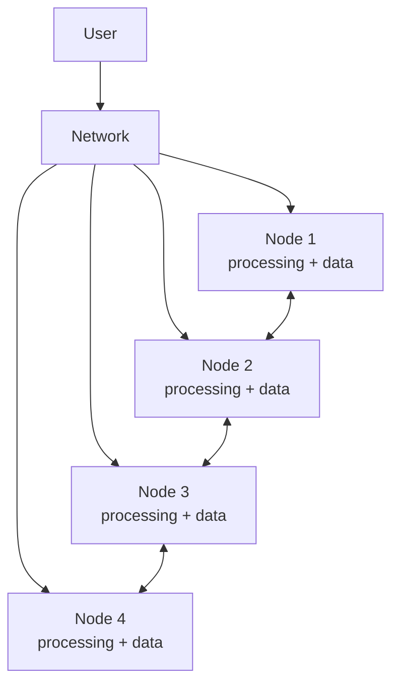

**Examples:** the **Internet** and the **World Wide Web**; **Google Search** (thousands of servers answering one query); **Hadoop / Spark** clusters; **blockchain** networks; **DNS**; a bank's **ATM network**; cloud platforms such as AWS.

#### Comparison

| Point | **Centralized Computing** | **Distributed Computing** |
|---|---|---|
| **Processing location** | One central machine | **Many machines** |
| **Data storage** | One central database | Distributed / replicated |
| **Control** | Single point of control — simple | Coordinated across nodes — complex |
| **Single point of failure** | ❌ **Yes** — the server dies, everything stops | ✅ **No** — other nodes keep working |
| **Scalability** | **Vertical only** — buy a bigger machine | **Horizontal** — add more machines |
| **Performance** | Limited by one machine | **Much higher** — parallel processing |
| **Cost** | Very expensive high-end hardware | **Cheaper commodity hardware** |
| **Maintenance** | **Easy** — one machine to manage | Hard — many machines, network issues |
| **Data consistency** | **Easy** — one copy | **Hard** — replication and synchronisation |
| **Security** | Easier to secure one perimeter | Larger attack surface |
| **Latency** | Depends on the link to the centre | Data can be placed near the user |
| **Examples** | Mainframe + terminals, a single-server app | Internet, Google, Hadoop, blockchain, cloud |

#### Characteristics of distributed processing

1. **Resource sharing** — hardware, data and software shared across nodes.
2. **Concurrency** — many nodes work simultaneously.
3. **Scalability** — capacity grows by adding nodes.
4. **Fault tolerance** — failure of one node does not stop the system.
5. **Transparency** — the user sees one system, not many (location, replication and failure transparency).
6. **Openness** — built on standard protocols so heterogeneous machines can join.
7. **No global clock** — nodes coordinate by message passing, which is why distributed algorithms are hard.

#### Advantages of distributed processing

- **Higher performance** through parallelism.
- **Reliability and fault tolerance** — no single point of failure.
- **Incremental, cheap scalability** using commodity machines.
- **Geographic distribution** — services close to users, lower latency.
- **Resource sharing** across the organisation.
- **Cost effectiveness** compared with one giant machine.

**Disadvantages:** complex to design and debug; **network dependency** and network failures; **data consistency** problems (see the CAP theorem); security is harder across many nodes; and coordination overhead.

**Previous Year Question List from this Topic:**

- [(ক) উদাহরণসহ distributed এবং centralized computing -এর সংজ্ঞা লিখুন।](../written-answers/cloud-computing.md?plain=1#L693)
- [(খ) Distributed processing কী? উহার বৈশিষ্ট্য ও সুবিধাগুলো লিখুন।](../written-answers/cloud-computing.md?plain=1#L794)


---

### Cluster Computing vs Grid Computing

| Point | **Cluster Computing** | **Grid Computing** |
|---|---|---|
| **Definition** | Many **similar computers in one location**, tightly connected, acting as **one machine** | Many **geographically dispersed, heterogeneous** machines pooled over a WAN/Internet |
| **Location** | **Same place** — one room or data centre | **Distributed worldwide** |
| **Hardware** | **Homogeneous** — same OS, similar specs | **Heterogeneous** — any OS, any hardware |
| **Coupling** | **Tightly coupled** | **Loosely coupled** |
| **Network** | **High-speed LAN** (Infiniband, 10 GbE) | **Internet / WAN** — slower, higher latency |
| **Ownership** | **One organisation** owns everything | **Many organisations** share resources |
| **Administration** | **Centralised**, single administrator | **Decentralised**, each site manages itself |
| **Scheduling** | A central scheduler assigns jobs | Distributed brokers negotiate |
| **Nodes dedicated?** | **Yes** — dedicated to the cluster | **No** — machines often donate spare cycles |
| **Best for** | **Tightly coupled** parallel jobs needing fast inter-node communication | **Loosely coupled** jobs that split into independent pieces |
| **Examples** | Hadoop cluster, a supercomputer, a web-server farm, database cluster | **SETI@home**, **Folding@home**, CERN's **Worldwide LHC Computing Grid**, BOINC |

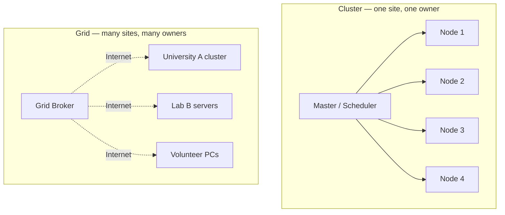

**Where cloud computing fits:** cloud computing evolved from both. It uses **clusters** inside each data centre, is **grid-like** in spanning many regions, and adds what neither had — **virtualization, self-service provisioning, elasticity and pay-per-use billing**.

| Point | Cluster | Grid | **Cloud** |
|---|---|---|---|
| Virtualization | Rare | Rare | ✅ **Core** |
| Self-service | No | No | ✅ **Yes** |
| Pay-per-use | No | No | ✅ **Yes** |
| Elastic scaling | Limited | Limited | ✅ **Automatic** |

**Previous Year Question List from this Topic:**

- [Difference between cluster computing and grid computing.](../written-answers/cloud-computing.md?plain=1#L718)


---

### MapReduce and Parallel Data Processing

**MapReduce** is a programming model for processing **very large datasets in parallel across a distributed cluster**. It was introduced by Google and is the core of **Apache Hadoop**.

#### The two phases

| Phase | What it does |
|---|---|
| **Map** | Each node processes its **local chunk** of data and emits intermediate **(key, value)** pairs |
| **Shuffle & Sort** | The framework **groups all values by key** and sends each key's group to one reducer |
| **Reduce** | Each reducer **aggregates** all the values for its key and emits the final result |

#### Worked example — counting colours (green, red, yellow, blue) across a distributed system

> **Problem:** data containing the colours green, red, yellow and blue is spread across several servers. Count how many of each colour there are, in parallel.

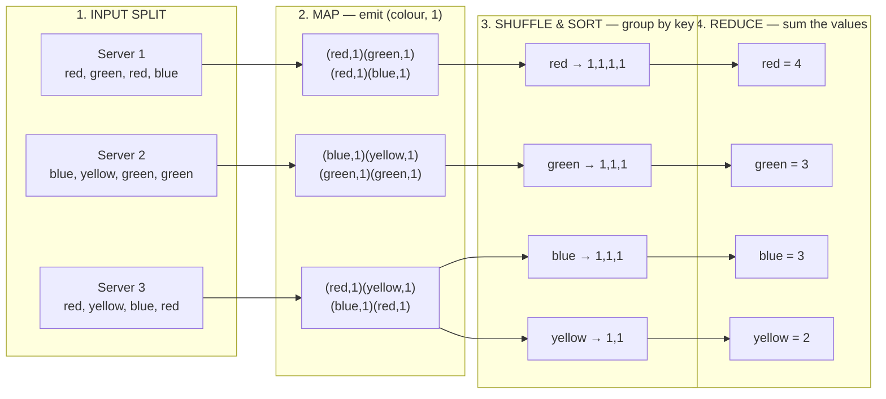

**The Mapper (runs in parallel on every server):**

```
map(key, record):
    for each colour in record:
        emit(colour, 1)
```

**The Reducer (one per distinct colour):**

```
reduce(colour, list_of_counts):
    total = 0
    for c in list_of_counts:
        total = total + c
    emit(colour, total)
```

**Final output:** `red = 4, green = 3, blue = 3, yellow = 2` (total 12 items).

#### Optional optimisation — the Combiner

A **Combiner** is a "mini-reducer" that runs **on the mapper node** before the shuffle, doing a local aggregation. Server 1 would send `(red,2)(green,1)(blue,1)` instead of four separate pairs — dramatically reducing network traffic, which is usually the bottleneck.

#### Why MapReduce works well

| Advantage | Reason |
|---|---|
| **Massive parallelism** | Every mapper runs independently on its own data chunk |
| **Data locality** | The computation is **sent to the data**, not the data to the computation |
| **Fault tolerance** | If a node dies, its task is simply re-run on another node |
| **Scalability** | Add more nodes to process more data — near-linear scaling |
| **Simplicity** | The programmer writes only `map` and `reduce`; the framework handles distribution, scheduling, shuffling and failures |

**Limitations:** heavy **disk I/O** between phases makes it slow for iterative algorithms; it is **batch-only** (not real-time); and complex multi-step jobs become awkward. This is why **Apache Spark**, which keeps intermediate data **in memory**, has largely replaced classic MapReduce for analytics and machine learning — typically running 10–100× faster.

**Previous Year Question List from this Topic:**

- [Imagine data in a system is green, red, yellow and blue in the system using distributed server in parallel. Design the system using reduce map.](../written-answers/cloud-computing.md?plain=1#L737)


---

## Scalability (Horizontal & Vertical Scaling)

### Horizontal vs Vertical Scaling

**Scalability** is a system's ability to **handle increased load** by adding resources. There are exactly **two ways** to do it.

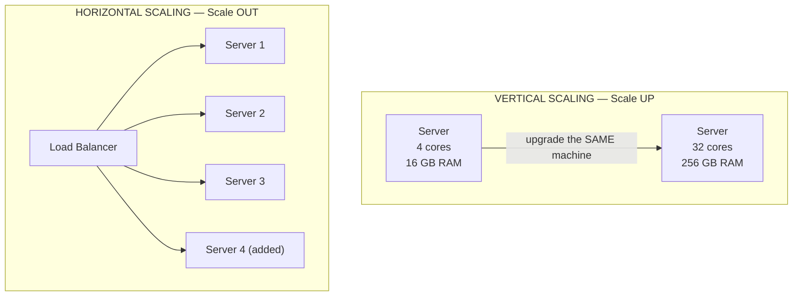

#### Server-rack view

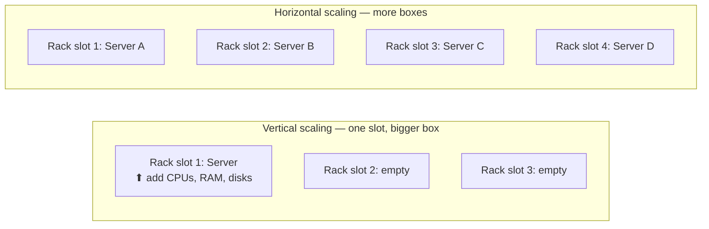

- **Vertical scaling (scale up)** = make **one machine more powerful** — add CPU cores, RAM, faster disks. The rack still holds **one** server, just a bigger one.
- **Horizontal scaling (scale out)** = **add more machines** of the same size and put a **load balancer** in front. The rack fills up with **more servers**.

#### Comparison

| Point | **Vertical Scaling (Scale Up)** | **Horizontal Scaling (Scale Out)** |
|---|---|---|
| **Method** | Add more power to **one** machine | Add **more machines** |
| **Hardware limit** | ❌ **Yes** — you eventually hit the biggest available server | ✅ **Practically unlimited** |
| **Downtime to scale** | **Usually required** (reboot to add hardware) | **None** — add a node to the pool |
| **Cost curve** | Grows **exponentially** — high-end hardware is disproportionately expensive | Grows **linearly** — commodity servers |
| **Single point of failure** | ❌ **Yes** — one machine | ✅ **No** — the load balancer distributes traffic |
| **Complexity** | **Simple** — no code changes | **Complex** — needs load balancing, stateless design, distributed data |
| **Load balancer needed** | No | **Yes** |
| **Data consistency** | **Easy** — one copy | **Hard** — replication and synchronisation |
| **Best for** | Databases (traditional RDBMS), legacy monolithic apps | **Web servers, microservices, stateless APIs, cloud-native apps** |
| **Also called** | Scale up / vertical growth | Scale out / horizontal growth |
| **Example** | Upgrade a server from 16 GB to 128 GB RAM | Run 10 web servers behind an Nginx load balancer |

> **The cloud strongly prefers horizontal scaling**, because it is elastic, has no ceiling, and gives high availability for free. To scale horizontally, applications must be designed **stateless** — session data goes into Redis or a database, never into the server's local memory.

**Previous Year Question List from this Topic:**

- [Server rack digram to draw horizontal and vertical scalling.](../written-answers/cloud-computing.md?plain=1#L823)


---

### Scalability vs Elasticity

These two words are constantly confused, and the difference is a favourite short question.

| Point | **Scalability** | **Elasticity** |
|---|---|---|
| **Definition** | The system's **ability to GROW** to handle increased load | The ability to **automatically add AND REMOVE** resources **in real time** as demand changes |
| **Direction** | Mainly **one way — up/out** | **Both ways — out and back in** |
| **Timing** | **Planned**, over days/weeks/months | **Immediate**, within seconds/minutes |
| **Trigger** | A human decision, based on growth forecasts | **Automatic**, based on live metrics (CPU %, request rate) |
| **Purpose** | Meet **long-term** growth | Match **short-term** fluctuation and **save cost** |
| **Cost effect** | Capacity (and cost) stays at the new level | **Cost falls again** when demand drops |
| **Key requirement** | Architecture that can accept more resources | **Auto-scaling** + pay-per-use billing |
| **Analogy** | Building more lanes on a highway because traffic is growing every year | Opening extra toll booths during rush hour and closing them at night |

**A concrete example — an e-commerce site:**
- **Scalability:** the company grows from 10,000 to 1,000,000 customers over two years, so the architecture is rebuilt to run on 50 servers instead of 2. *Permanent growth.*
- **Elasticity:** during a one-day Eid sale, traffic jumps 10×, so **auto-scaling** launches 30 extra instances at 9 a.m. and **terminates them at midnight** when traffic falls. The company pays for those 30 servers **only for 15 hours**. *Temporary, automatic, reversible.*

> **In one line:** **scalability is the *capability* to handle growth; elasticity is the *automatic, two-way, real-time exercise* of that capability.** Elasticity requires scalability, but scalability does not require elasticity — an on-premises data centre can be scalable but is rarely elastic, because you cannot return the servers you bought.

**Previous Year Question List from this Topic:**

- [Difference between elasticity and scalability of resources in the cloud.](../written-answers/cloud-computing.md?plain=1#L867)


---

## Edge Computing & Fog Computing

### Edge Computing and Fog Computing

**Edge computing** processes data **near where it is generated** — at or close to the device — instead of sending everything to a distant central cloud.

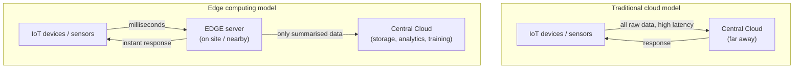

#### Why edge servers are needed

1. **Ultra-low latency.** A self-driving car cannot wait 200 ms for a cloud round trip to decide whether to brake — it needs an answer in **single-digit milliseconds**. Processing must happen locally.
2. **Bandwidth saving.** A single HD CCTV camera generates gigabytes per hour. Sending every frame to the cloud is impossibly expensive; an edge server analyses the video locally and uploads **only the alerts**.
3. **Reliability / offline operation.** A factory, a ship or a remote substation must keep working when the internet link drops. Edge processing continues regardless.
4. **Privacy and compliance.** Sensitive data (patient vitals, faces, financial records) can be processed **locally** and never leave the premises — which satisfies data-residency laws.
5. **Real-time decisions.** Industrial control, robotics, AR/VR and gaming all require instant local responses.
6. **Reduced cloud cost.** Less data transferred and less cloud compute consumed.
7. **Scalability.** Millions of IoT devices would overwhelm any central cloud; the edge absorbs the load.

#### The three-layer architecture

```mermaid
flowchart TD
    L1["☁️ CLOUD LAYER<br/>Long-term storage · Big-data analytics · ML model training<br/>Latency: 100 ms – seconds"]
    L2["🌫️ FOG LAYER<br/>Local gateways, routers, micro data centres<br/>Latency: 10 – 100 ms"]
    L3["📱 EDGE LAYER<br/>Devices, sensors, cameras, controllers, edge servers<br/>Latency: 1 – 10 ms"]
    L3 --> L2 --> L1
    L1 -.->|"models, policies, commands"| L2 -.-> L3
```

#### Edge vs Fog vs Cloud computing

| Point | **Edge Computing** | **Fog Computing** | **Cloud Computing** |
|---|---|---|---|
| **Where processing happens** | **On or beside the device** | On **local gateways / routers / micro data centres** between device and cloud | In **large, distant data centres** |
| **Distance from the data source** | Closest (metres) | Near (same building, campus or city) | Farthest (hundreds–thousands of km) |
| **Latency** | **Lowest (1–10 ms)** | Low (10–100 ms) | **Highest (100 ms+)** |
| **Computing power** | **Limited** | Moderate | **Virtually unlimited** |
| **Storage** | Very small, temporary | Moderate, short-term | **Massive, permanent** |
| **Bandwidth used** | **Minimal** | Moderate | **High** |
| **Works without internet?** | ✅ Yes | Partly | ❌ No |
| **Number of nodes** | Millions | Thousands | Few large centres |
| **Best for** | Instant control loops, sensor filtering, on-device AI inference | Local aggregation across many devices, site-wide coordination | Big-data analytics, ML **training**, long-term archives |
| **Coined by** | — | **Cisco** | — |
| **Example** | A camera that detects a face on-device; an ECU braking a car | A factory gateway aggregating 500 sensors; a smart-city traffic hub | AWS, Azure, Google Cloud |

> **The essential relationship:** they are **complementary layers, not competitors.** Edge handles *"decide now"*, fog handles *"coordinate locally"*, and cloud handles *"remember everything and learn from it"*.

#### Applications of edge computing

| Sector | Application |
|---|---|
| **Autonomous vehicles** | Instant obstacle detection and braking decisions |
| **Smart manufacturing (Industry 4.0)** | Machine-fault prediction and robotic control on the factory floor |
| **Healthcare** | Patient monitors that raise an alarm locally, without cloud latency |
| **Retail** | Smart checkout, shelf cameras, in-store analytics |
| **Telecom / 5G** | **MEC (Multi-access Edge Computing)** at base stations |
| **Smart cities** | Adaptive traffic signals, surveillance analytics |
| **Energy** | Substation monitoring and protection; smart-grid control |
| **Gaming / AR / VR** | Rendering close to the user to keep motion latency low |
| **CDN** | Caching web content at points of presence near users |

**Previous Year Question List from this Topic:**

- [What is the need of edge server?](../written-answers/cloud-computing.md?plain=1#L897)
- [(গ) Edge Computing এর ধারণা সংক্ষেপে উপস্থাপন করুন।](../written-answers/cloud-computing.md?plain=1#L918)

**Previous Year MCQ List from this Topic:**

- [কোনটি Cloud Computing এর সাথে সম্পৃক্ত নয়?](../mcq-answers/cloud-computing.md?plain=1#L88)


---

## Virtualization & Resource Allocation

### Calculating VM Capacity from Physical Resources

A very common numerical question: given a physical server's specification and a VM's requirement, **how many VMs can be created?**

#### The method

> **For each resource independently, compute:**
> **Maximum VMs by that resource = Total available ÷ Required per VM**
>
> **The final answer is the MINIMUM of those values** — because the **most constrained resource (the bottleneck)** decides the limit. A VM cannot run on CPU alone; it needs *all* its resources simultaneously.

#### Worked example

> **A physical server has 32 CPU cores, 96 GB RAM and 4 TB storage. Each VM requires 4 CPU cores, 16 GB RAM and 500 GB storage. How many VMs can be created?**

| Resource | Available | Per VM | Maximum VMs |
|---|---|---|---|
| **CPU** | 32 cores | 4 cores | 32 ÷ 4 = **8** |
| **RAM** | 96 GB | 16 GB | 96 ÷ 16 = **6** ← **bottleneck** |
| **Storage** | 4 TB = 4096 GB | 500 GB | 4096 ÷ 500 = 8.19 → **8** |

> ### ✅ **Answer: 6 virtual machines** — because **RAM is the limiting resource**.

**Resource utilisation after creating 6 VMs:**

| Resource | Used | Total | Utilisation | Left over |
|---|---|---|---|---|
| CPU | 6 × 4 = 24 cores | 32 | **75 %** | **8 cores idle** |
| RAM | 6 × 16 = 96 GB | 96 | **100 %** | **0 GB** |
| Storage | 6 × 500 = 3000 GB | 4096 | **73 %** | **1096 GB** |

**Points worth adding in the answer:**
1. **RAM is the bottleneck**; 8 CPU cores and about 1 TB of storage are stranded.
2. **To improve utilisation**, upgrade the RAM to **128 GB**, which would allow **8 VMs** and balance all three resources (8 × 4 = 32 cores ✅, 8 × 16 = 128 GB ✅, 8 × 500 = 4000 GB ✅).
3. **In practice the number is lower**, because the **hypervisor itself consumes resources** — typically reserve about **1–2 CPU cores and 4–8 GB RAM** for the host. With 8 GB reserved, only (96 − 8) ÷ 16 = 5 VMs would be safe.
4. **Over-commitment:** hypervisors allow CPU over-commitment (allocating more virtual cores than physical ones), because VMs are rarely all busy at once — ratios of 2:1 to 4:1 are common. **Memory over-commitment is far riskier** and relies on ballooning, page sharing and swapping, which hurt performance.
5. Also budget for **storage overhead** — snapshots, swap files and thin-provisioning growth.

#### The general formula

> **Number of VMs = MIN( CPU_total/CPU_vm , RAM_total/RAM_vm , Storage_total/Storage_vm )**
> *(then subtract the hypervisor's own reservation, and round DOWN)*

Remember the unit conversions: **1 TB = 1024 GB**, **1 GB = 1024 MB**. *(The example above used 4 TB = 4096 GB.)*

**Previous Year Question List from this Topic:**

- [A physical server has 32 CPU cores, 96\text{ GB} RAM, and 4\text{ TB} storage. Each virtual machine (VM) requires 4 CPU cores, 16\text{ GB} RAM, and 500\text{ G…](../written-answers/cloud-computing.md?plain=1#L944)


---

## High Availability & System Redundancy

### High Availability, Redundancy and Fault Tolerance

**High Availability (HA)** is the design goal of keeping a service **running continuously with minimal downtime**, even when individual components fail.

#### Availability expressed in "nines"

| Availability | Downtime per year | Downtime per month | Typical use |
|---|---|---|---|
| 99 % ("two nines") | 3.65 days | 7.2 hours | Internal tools |
| 99.9 % ("three nines") | **8.77 hours** | 43.8 minutes | Standard web services |
| 99.99 % ("four nines") | **52.6 minutes** | 4.38 minutes | Business-critical systems |
| 99.999 % ("five nines") | **5.26 minutes** | 26 seconds | Telecom, banking core, emergency services |

> **Availability = MTBF / (MTBF + MTTR)**
> where **MTBF** = Mean Time Between Failures and **MTTR** = Mean Time To Repair.
> So availability improves either by **failing less often** or by **recovering faster** — and in practice, *reducing MTTR through automation* is usually the cheaper lever.

#### The core principles

| Principle | Meaning |
|---|---|
| **Redundancy** | Have **more than one** of every critical component — no **single point of failure (SPOF)** |
| **Failover** | Automatically switch to the standby when the primary fails |
| **Load balancing** | Spread traffic across healthy instances and stop sending it to sick ones |
| **Health checks** | Continuously probe each instance to detect failure within seconds |
| **Replication** | Keep synchronised copies of the data |
| **Geographic distribution** | Spread across **availability zones** and **regions** so one site's disaster is survivable |
| **Monitoring & alerting** | Detect and escalate problems before users notice |
| **Graceful degradation** | Keep core functions working even when extras fail |

#### Redundancy models

| Model | Description | Cost | Failover time |
|---|---|---|---|
| **Active-Passive (hot standby)** | One server serves traffic; an identical standby waits, fully synchronised | Medium | Seconds |
| **Active-Active** | **All** servers serve traffic simultaneously behind a load balancer | Higher | **Instant** — the load balancer just stops using the dead node |
| **N + 1** | N servers needed for the load, plus 1 spare | Low overhead | Fast |
| **2N** | A complete duplicate of the entire system | **Highest** | Instant |

#### Worked design — keeping a DNS service available if one physical server fails

> **Scenario:** a submarine-cable operator must ensure a **DNS service stays available even if one physical server fails**. How should the VMs/containers be placed?

**The single most important rule: ANTI-AFFINITY.**

> **Never place both replicas of a service on the same physical host.** If VM1 and VM2 both sit on Server A, then when Server A dies **both** die — and you have redundancy on paper but none in reality.

```mermaid
flowchart TD
    LB["Anycast IP / Load Balancer<br/>with health checks"]
    LB --> S1["PHYSICAL SERVER A"]
    LB --> S2["PHYSICAL SERVER B"]
    S1 --> V1["DNS VM / container 1<br/>(primary)"]
    S2 --> V2["DNS VM / container 2<br/>(secondary)"]
    V1 <-->|"zone transfer / replication"| V2
    S1 -.->|"if Server A fails"| X["❌ VM1 lost"]
    X -.->|"traffic automatically<br/>shifts to VM2"| V2
```

**The design, point by point:**

1. **Run at least two DNS instances** (VMs or containers) — a primary and a secondary.
2. **Place them on DIFFERENT physical servers** using an **anti-affinity rule** in the hypervisor or Kubernetes (`podAntiAffinity` with `topologyKey: kubernetes.io/hostname`). This is the answer the question is fishing for.
3. **Better still, place them in different racks** — so a rack-level power or switch failure is also survivable. Best of all, **different availability zones or buildings**.
4. **Use Anycast or a load balancer with health checks** so clients are automatically steered to the surviving instance within seconds.
5. **Configure both as authoritative** with **automatic zone transfers** (AXFR/IXFR), so the data stays synchronised.
6. **Publish both in the NS records** — the DNS protocol itself has built-in client-side failover: a resolver that gets no answer from one nameserver tries the next.
7. **Remove other single points of failure** — dual power supplies on separate feeds, dual network paths to separate switches, and redundant storage (RAID).
8. **Monitor and alert** on the health of both instances, and **test failover regularly** (a redundancy plan that has never been tested is not a plan).

**Why DNS is a good example:** DNS was designed for redundancy from the start. Multiple NS records, short TTLs and stateless UDP queries make it one of the easiest services to make highly available — as long as you avoid the anti-affinity mistake.

**Previous Year Question List from this Topic:**

- [High-Availability Design: (BSCCPL AME 21-08-2026 (BUET)) A submarine cable operator wants to ensure that a DNS service remains available even if one physical se…](../written-answers/cloud-computing.md?plain=1#L983)


---

## Cloud Security & Compliance

### Cloud Security Assessment, Audit and Compliance Posture

#### The shared responsibility model — the foundation

```mermaid
flowchart TD
    subgraph PROV["☁️ The PROVIDER is responsible for<br/>SECURITY **OF** THE CLOUD"]
        P1["Physical data centres"]
        P2["Hardware & network infrastructure"]
        P3["Hypervisor / virtualization layer"]
        P4["Managed service software"]
    end
    subgraph CUST["👤 The CUSTOMER is responsible for<br/>SECURITY **IN** THE CLOUD"]
        C1["Data & encryption keys"]
        C2["Identity & access management (IAM)"]
        C3["OS patching (for IaaS)"]
        C4["Network and firewall configuration"]
        C5["Application code & secrets"]
    end
```

> **The overwhelming majority of real cloud breaches come from the customer's side** — a public S3 bucket, an over-permissive IAM role, a hard-coded key in a public repository — **not** from the provider's infrastructure.

#### What "cloud security posture" means

**Cloud Security Posture** is the **overall security health of a cloud environment** — how well its configurations, identities, data protections and monitoring match security best practice and regulatory requirements at any moment. Tools that measure it continuously are called **CSPM (Cloud Security Posture Management)**.

#### How assessment and audit reports help

**Assessment** = a point-in-time or continuous **technical evaluation** of the environment.
**Audit** = a **formal, independent verification** against a standard, producing a report.

| # | How they help | Explanation |
|---|---|---|
| 1 | **Detect misconfigurations** | Automated scans find publicly readable storage buckets, open security groups (`0.0.0.0/0` on port 22), unencrypted volumes, disabled logging — the leading cause of cloud breaches |
| 2 | **Find excessive permissions** | IAM analysis reveals unused accounts, over-broad roles and violations of **least privilege**, plus missing MFA on privileged accounts |
| 3 | **Identify unpatched vulnerabilities** | Vulnerability scanning of VM images, containers and dependencies surfaces known CVEs before attackers use them |
| 4 | **Verify encryption** | Confirms data is encrypted **at rest and in transit** and that keys are rotated and properly managed |
| 5 | **Reveal shadow IT and unused assets** | Inventory discovery finds resources nobody remembered — forgotten test VMs, orphaned snapshots, unmanaged accounts — which are prime attack targets |
| 6 | **Provide an audit trail** | Logs (**AWS CloudTrail**, Azure Monitor) record **who did what, when and from where** — essential for forensics and for proving accountability |
| 7 | **Measure compliance against standards** | Automated checks map the environment to **ISO 27001, SOC 2, PCI-DSS, HIPAA, GDPR, CIS Benchmarks**, and the local **Bangladesh ICT Act / Cyber Security Act** |
| 8 | **Prioritise remediation** | Findings are scored by risk (CVSS, business impact) so limited effort goes to the most dangerous issues first |
| 9 | **Prove compliance to regulators and customers** | A clean independent audit report is what a bank regulator, a client or an insurer actually asks to see |
| 10 | **Detect configuration drift** | Continuous assessment catches the moment a secure setting is changed, instead of discovering it a year later |
| 11 | **Support incident response** | Baseline assessments make it possible to tell *normal* from *anomalous* during an incident |
| 12 | **Drive continuous improvement** | Trending the findings over time shows whether security is genuinely getting better |

#### Types of assessment

| Type | Description |
|---|---|
| **Vulnerability assessment** | Automated scanning for known weaknesses |
| **Penetration testing** | Authorised simulated attack to prove exploitability |
| **Configuration / CSPM review** | Checks settings against CIS Benchmarks and provider best practice |
| **Compliance audit** | Formal verification against ISO 27001, SOC 2, PCI-DSS, etc. |
| **Risk assessment** | Identifies assets, threats, likelihood and business impact |
| **Third-party / vendor assessment** | Evaluates the provider's own certifications and SOC 2 report |

#### The assessment → compliance cycle

```mermaid
flowchart LR
    A["1 . Inventory<br/>discover every asset"] --> B["2 . Assess<br/>scan configs, IAM, data, vulnerabilities"]
    B --> C["3 . Analyse & prioritise<br/>score findings by risk"]
    C --> D["4 . Report<br/>findings, evidence, recommendations"]
    D --> E["5 . Remediate<br/>fix and harden"]
    E --> F["6 . Verify<br/>re-scan to confirm"]
    F --> G["7 . Monitor continuously<br/>detect drift"]
    G --> B
```

#### Major cloud security threats to be able to name

1. **Data breaches** and data loss.
2. **Misconfiguration** — the single biggest real-world cause.
3. **Weak identity and access management**; stolen or leaked credentials.
4. **Insecure APIs and interfaces.**
5. **Account hijacking.**
6. **Insider threats.**
7. **DDoS attacks.**
8. **Insufficient logging and monitoring** — breaches going undetected for months.
9. **Shared-technology / multi-tenancy vulnerabilities** (hypervisor escape).
10. **Supply-chain attacks** via compromised images or dependencies.
11. **Lack of a cloud security strategy**, and **vendor lock-in** risk.

#### Best practices

- Enforce **least privilege** and **MFA** on every account; eliminate long-lived root keys.
- **Encrypt everything**, at rest and in transit, with managed keys (KMS) and rotation.
- Enable **logging and monitoring** everywhere (CloudTrail, VPC flow logs, SIEM).
- Use **network segmentation**, private subnets and security groups; expose nothing by default.
- Automate with **Infrastructure as Code** and scan the templates before deployment (shift-left security).
- Run **continuous CSPM** rather than annual audits alone.
- Keep an **incident response plan** and **test backups by actually restoring them**.
- Understand exactly **where the shared responsibility line sits** for each service you use.

**Previous Year Question List from this Topic:**

- [How do assessment and audit reports help detect vulnerabilities and ensure compliance to cloud security posture?](../written-answers/cloud-computing.md?plain=1#L1021)

**Previous Year MCQ List from this Topic:**

- [The main thread of cloud-based provisioning is-?](../mcq-answers/cloud-computing.md?plain=1#L124)
- [The main threat of cloud-based provisioning is—](../mcq-answers/cloud-computing.md?plain=1#L133)
