<!-- TOC START -->
**Table of Contents** — 13 subtopics · 27 theories

1. **[Subnetting & IP Addressing](#subnetting--ip-addressing)**
   - [IPv4 Addressing — Structure and Classes](#ipv4-addressing--structure-and-classes)
   - [Subnet Mask, Network ID and Broadcast Address](#subnet-mask-network-id-and-broadcast-address)
   - [Subnetting — Concept and Method](#subnetting--concept-and-method)
   - [VLSM — Variable Length Subnet Masking](#vlsm--variable-length-subnet-masking)
   - [CIDR, Supernetting and IP Address Planning](#cidr-supernetting-and-ip-address-planning)

2. **[OSI & TCP/IP Reference Model](#osi--tcpip-reference-model)**
   - [The OSI Reference Model — The Seven Layers](#the-osi-reference-model--the-seven-layers)
   - [The TCP/IP Model](#the-tcpip-model)
   - [OSI vs TCP/IP — Comparison](#osi-vs-tcpip--comparison)
   - [Layer-by-Layer Protocol and Device Reference](#layer-by-layer-protocol-and-device-reference)

3. **[Networking Fundamentals & Terminology](#networking-fundamentals--terminology)**
   - [Computer Network — Definition, Types and Benefits](#computer-network--definition-types-and-benefits)
   - [Core Networking Terminology](#core-networking-terminology)

4. **[Networking Devices](#networking-devices)**
   - [Hub, Switch, Router, Bridge, Repeater and Gateway](#hub-switch-router-bridge-repeater-and-gateway)
   - [Collision Domains and Broadcast Domains](#collision-domains-and-broadcast-domains)

5. **[Application Layer Protocols & Troubleshooting (DNS, DHCP, HTTPS)](#application-layer-protocols--troubleshooting-dns-dhcp-https)**
   - [DNS — Domain Name System](#dns--domain-name-system)
   - [DHCP — Dynamic Host Configuration Protocol](#dhcp--dynamic-host-configuration-protocol)
   - [Other Application Layer Protocols and Troubleshooting](#other-application-layer-protocols-and-troubleshooting)

6. **[Transport Layer (TCP & UDP)](#transport-layer-tcp--udp)**
   - [TCP — Transmission Control Protocol](#tcp--transmission-control-protocol)
   - [UDP — User Datagram Protocol](#udp--user-datagram-protocol)

7. **[Physical Layer & Transmission Media (Cables & Wiring)](#physical-layer--transmission-media-cables--wiring)**
   - [Transmission Media — Guided and Unguided](#transmission-media--guided-and-unguided)

8. **[Multiplexing & Bandwidth](#multiplexing--bandwidth)**
   - [Multiplexing — Concept and Types](#multiplexing--concept-and-types)
   - [Bandwidth, Data Rate and Multiplexing Calculations](#bandwidth-data-rate-and-multiplexing-calculations)

9. **[Routing Protocols & Route Configuration](#routing-protocols--route-configuration)**
   - [Routing — Concepts, Static and Dynamic](#routing--concepts-static-and-dynamic)
   - [Routing Protocols — Distance Vector, Link State and BGP](#routing-protocols--distance-vector-link-state-and-bgp)

10. **[Network Address Translation (NAT)](#network-address-translation-nat)**
   - [NAT and PAT](#nat-and-pat)

11. **[Data Transmission & Modes](#data-transmission--modes)**
   - [Data Communication Fundamentals — Modes, Signals, Modulation and Sampling](#data-communication-fundamentals--modes-signals-modulation-and-sampling)

12. **[Switching Techniques](#switching-techniques)**
   - [Switching Techniques — Circuit, Packet and Message Switching](#switching-techniques--circuit-packet-and-message-switching)

13. **[Wireless & Mobile Communication](#wireless--mobile-communication)**
   - [Wireless Networks, Wi-Fi Standards and Cellular Generations](#wireless-networks-wi-fi-standards-and-cellular-generations)

<!-- TOC END -->

---

## Subnetting & IP Addressing

### IPv4 Addressing — Structure and Classes

#### What is an IP address?

An **IP (Internet Protocol) address** is a **unique logical identifier assigned to every device on a network**, used to identify the device and to route data to it.

An **IPv4 address is 32 bits long**, written in **dotted decimal notation** as four **octets** (bytes) separated by dots, each ranging from **0 to 255**.

```
      192    .    168    .     1     .    10
   11000000 . 10101000 . 00000001 . 00001010     ← 32 bits total
   └─ 8 ──┘  └─ 8 ──┘  └─ 8 ──┘  └─ 8 ──┘
```

**Total possible IPv4 addresses = 2³² = 4,294,967,296** (about 4.3 billion) — which has proved far too few, hence NAT and IPv6.

#### The two parts of every IP address

> **Every IP address has TWO parts: a NETWORK ID and a HOST ID.**
> The **subnet mask** is what tells you where one ends and the other begins.

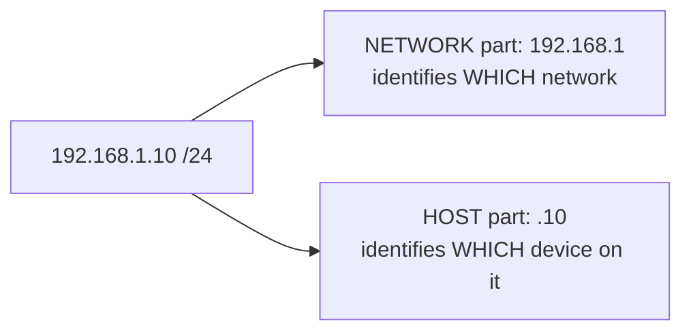

**The postal analogy:** the **network ID is the street address** and the **host ID is the flat number**. Routers deliver to the street; the switch on that street delivers to the flat.

#### Classful addressing

| Class | First octet range | Leading bits | Default mask | Network/Host bits | Networks | Hosts per network | Purpose |
|---|---|---|---|---|---|---|---|
| **A** | **1 – 126** | `0` | **255.0.0.0 (/8)** | 8 / 24 | 126 | **16,777,214** | Very large organisations |
| **B** | **128 – 191** | `10` | **255.255.0.0 (/16)** | 16 / 16 | 16,384 | **65,534** | Medium organisations |
| **C** | **192 – 223** | `110` | **255.255.255.0 (/24)** | 24 / 8 | 2,097,152 | **254** | Small networks |
| **D** | **224 – 239** | `1110` | — | — | — | — | **Multicast** |
| **E** | **240 – 255** | `1111` | — | — | — | — | **Experimental / reserved** |

> **Why does class A stop at 126?** Because **127.x.x.x is reserved for LOOPBACK** (`127.0.0.1` = localhost). And `0.x.x.x` is reserved for "this network".

#### Special and reserved addresses

| Address / Range | Meaning |
|---|---|
| **0.0.0.0** | "This host / any address" — also the default route |
| **127.0.0.0 – 127.255.255.255** | **Loopback** — traffic to the machine itself. `127.0.0.1` = **localhost** |
| **10.0.0.0 – 10.255.255.255** (10.0.0.0/8) | **PRIVATE** — Class A |
| **172.16.0.0 – 172.31.255.255** (172.16.0.0/12) | **PRIVATE** — Class B |
| **192.168.0.0 – 192.168.255.255** (192.168.0.0/16) | **PRIVATE** — Class C |
| **169.254.0.0/16** | **APIPA / link-local** — self-assigned when **DHCP fails** |
| **255.255.255.255** | **Limited broadcast** — everyone on this local network |
| **224.0.0.0 – 239.255.255.255** | **Multicast** |

> **Private addresses are not routable on the Internet.** They are used inside homes and organisations and translated to a public address by **NAT** at the gateway. This is the main reason IPv4 has survived far beyond its 4.3 billion addresses.

#### Two addresses can never be assigned to a host

In **every** network or subnet, two addresses are reserved:

| Address | How to identify it | Meaning |
|---|---|---|
| **Network address** | **All HOST bits are 0** — the **first** address | Identifies the network itself |
| **Broadcast address** | **All HOST bits are 1** — the **last** address | Reaches every host on that network |

> **This is why the usable host count is always 2ⁿ − 2**, where n is the number of host bits.

#### IP address vs MAC address

| Point | **IP Address** | **MAC Address** |
|---|---|---|
| **Full name** | Internet Protocol address | **Media Access Control** address |
| **Layer** | **Network (Layer 3)** | **Data Link (Layer 2)** |
| **Length** | **32 bits** (IPv4) / 128 bits (IPv6) | **48 bits (6 bytes)** |
| **Format** | Dotted decimal — `192.168.1.10` | Hexadecimal — `4C:23:10:4A:1A:2A` |
| **Assigned by** | Network administrator or **DHCP** — it is **LOGICAL** | The **manufacturer**, burned into the NIC — it is **PHYSICAL** |
| **Changes when the device moves?** | ✅ **Yes** — it depends on the network | ❌ **No** — it travels with the hardware |
| **Scope** | **Global** — routable across the Internet | **Local** — only within one LAN segment |
| **Used by** | **Routers**, for end-to-end delivery | **Switches**, for delivery within a segment |
| **Resolution** | IP → MAC by **ARP** | MAC → IP by **RARP** |
| **Uniqueness** | Unique within its network | **Globally unique** (in principle) |
| **Can it be changed?** | Easily | Can be **spoofed** in software, but the burned-in value is permanent |

**Reading a MAC address:** the first **3 bytes (24 bits)** are the **OUI — Organisationally Unique Identifier**, identifying the manufacturer; the last 3 bytes are the device's serial number.

| MAC type | How to identify | Example |
|---|---|---|
| **Unicast** | The **least significant bit of the FIRST byte is 0** | `4C:23:10:4A:1A:2A` — 0x4C = `01001100`, last bit **0** → **unicast** |
| **Multicast** | That bit is **1** | `01:00:5E:...` — 0x01 = `00000001`, last bit **1** → **multicast** |
| **Broadcast** | All 48 bits are 1 | **`FF:FF:FF:FF:FF:FF`** |

> **"Two IP addresses map to the same Ethernet (MAC) address — will both receive packets?"**
> ### ✅ **Yes.**
> A single network interface can legitimately hold **multiple IP addresses** (IP aliasing), and all of them resolve by ARP to the **same MAC address**. Frames addressed to that MAC are delivered to the NIC, and the **IP layer then decides** which configured address the packet was for, passing it up to the right socket. This is entirely normal — it is how a web server hosts several IPs, and how a router's interface can carry a primary and secondary address. *(The abnormal case is the reverse — two different machines claiming the **same IP** — which is an **IP conflict**, and is also exactly what **ARP spoofing** creates deliberately.)*

**Previous Year Question List from this Topic:**

- [(a) IP address এবং MAC/MU এর পার্থক্য লেখ।](../written-answers/computer-networks.md?plain=1#L152)
- [Check the valid IP address from the following table.](../written-answers/computer-networks.md?plain=1#L411)
- [Write down the private IP address rang for class B?](../written-answers/computer-networks.md?plain=1#L536)
- [Write range of private IP address Class A, B and C.](../written-answers/computer-networks.md?plain=1#L560)
- [What are the private IP Ranges for the following IP classes? Class A, Class B and Class C](../written-answers/computer-networks.md?plain=1#L590)
- [Which is Class C Default Subnet Mask?](../written-answers/computer-networks.md?plain=1#L602)
- [What is the maximum number of valid hosts in a network?](../written-answers/computer-networks.md?plain=1#L618)
- [Mapping between MAC to IP address?](../written-answers/computer-networks.md?plain=1#L653)
- [How many bits are in a MAC address?](../written-answers/computer-networks.md?plain=1#L674)
- [Write down the Public and Private IPv4 address for Class A, Class B and Class C.](../written-answers/computer-networks.md?plain=1#L742)
- [Local loopback address কি? কোন কমান্ড ব্যবহার করে কানেক্টিভিটি টেস্ট করা হয়?](../written-answers/computer-networks.md?plain=1#L775)
- [Write Class A private IP range.](../written-answers/computer-networks.md?plain=1#L837)
- [Convert the decimal IP address 192.168.101.5 into binary IP address. Fill-up the following in tabular form:](../written-answers/computer-networks.md?plain=1#L1023)
- [What is IP address? Explain the necessity of IP address in network?](../written-answers/computer-networks.md?plain=1#L1060)
- [What is private IP range class A, B and C with maximum host of each class?](../written-answers/computer-networks.md?plain=1#L1128)
- [Identify the class, network IP address, direct broadcast address and limited broadcast address of the following IP address: (i) 1.2.3.4 (ii) 130.1.2.3 (iii) 220…](../written-answers/computer-networks.md?plain=1#L1171)
- [In IPv4 show the network address and host address range of class A, B and C.](../written-answers/computer-networks.md?plain=1#L1203)
- [Mention the maximum number of networks and hosts used in Class A, B and C networks.](../written-answers/computer-networks.md?plain=1#L1241)
- [Given IP Address: 192.168.19.24/29, find out the following IP Class & type, Number of Host, Network address, Broadcast address, Wildcard, and Subnet mask.](../written-answers/computer-networks.md?plain=1#L1277)
- [What is the range of IPv4 address class A, B and C?](../written-answers/computer-networks.md?plain=1#L1309)
- [How many bits need to identify an IP address in IPv4?](../written-answers/computer-networks.md?plain=1#L1359)
- [What is default subnet mask?](../written-answers/computer-networks.md?plain=1#L1369)
- [What is Public and Private IP?](../written-answers/computer-networks.md?plain=1#L1421)
- [Select the correct answer: (i) Which cannot IP address 172.16.28.0/16- (a) .0 (b) .1 (c) .255 (d) All (ii) Which at the follow Dynamically Assign Protocol? (a)…](../written-answers/computer-networks.md?plain=1#L1552)
- [What is the range of class C IPv4 address? Suppose, Class C network has four subnets. How many usable PC needed each subnet?](../written-answers/computer-networks.md?plain=1#L1656)
- [Define IP 127.0.0.1, what is localhost?](../written-answers/computer-networks.md?plain=1#L1799)
- [What is static IP Address and dynamic IP Address?](../written-answers/computer-networks.md?plain=1#L1819)
- [৯. ক্লাস C এর ডিফল্ট সাবনেট মাস্ক কত?](../written-answers/computer-networks.md?plain=1#L1885)
- [১১. নিচের কোনটি লুপ ব্যাক আইপি এড্রেস?](../written-answers/computer-networks.md?plain=1#L1894)
- [What is private IP? List the class B private IP.](../written-answers/computer-networks.md?plain=1#L1990)
- [Identify the IP address: (i) 192.168.1.1 (ii) 1.1.191.168](../written-answers/computer-networks.md?plain=1#L2007)
- [(c) What is loopback address of a computer?](../written-answers/computer-networks.md?plain=1#L2044)
- [Write 3 private IP address range.](../written-answers/computer-networks.md?plain=1#L2054)
- [Given an IP address is 240.133.10.20/8 Find out network address, number of host and subnet mask.](../written-answers/computer-networks.md?plain=1#L2128)
- [Write down the Private IP address ranges of Class A, Class B, and Class C.](../written-answers/computer-networks.md?plain=1#L2331)
- [Mention the public and private address ranges of IPv4 for class A, class B and class C.](../written-answers/computer-networks.md?plain=1#L2367)

**Previous Year MCQ List from this Topic:**

- [An IP address is given 192.168.3.0, need to 254 useable host. What is the CIDR value and subnet mask?](../mcq-answers/computer-networks.md?plain=1#L1618)
- [What is IP class and number of sub-networks if the subnet mask is 255.224.0.0?](../mcq-answers/computer-networks.md?plain=1#L1627)
- [What is the maximum number of IP addresses that can be assigned to be the host on a local subnet that uses the 255.255.255.224 subnet mask?](../mcq-answers/computer-networks.md?plain=1#L1636)
- [How many address is there 200.10.10.10/20](../mcq-answers/computer-networks.md?plain=1#L1645)
- [Which is suitable subnet mask for 200 host?](../mcq-answers/computer-networks.md?plain=1#L1654)
- [When a host on network A sends a message to a host on network B, which address does the router look at?](../mcq-answers/computer-networks.md?plain=1#L43)
- [Which of the following TCP/IP address constitute the loopback address?](../mcq-answers/computer-networks.md?plain=1#L1085)
- [Which of the following TCP/IP address constitute the loopback address?](../mcq-answers/computer-networks.md?plain=1#L1148)


---

### Subnet Mask, Network ID and Broadcast Address

#### What is a subnet mask?

A **subnet mask** is a 32-bit number that **separates the network portion of an IP address from the host portion**. Its binary form is a run of **1s (the network part)** followed by a run of **0s (the host part)**.

| Prefix | Subnet mask | Network bits | Host bits | Usable hosts |
|---|---|---|---|---|
| **/8** | 255.0.0.0 | 8 | 24 | 16,777,214 |
| **/16** | 255.255.0.0 | 16 | 16 | 65,534 |
| **/24** | 255.255.255.0 | 24 | 8 | **254** |
| **/25** | 255.255.255.128 | 25 | 7 | **126** |
| **/26** | 255.255.255.192 | 26 | 6 | **62** |
| **/27** | 255.255.255.224 | 27 | 5 | **30** |
| **/28** | 255.255.255.240 | 28 | 4 | **14** |
| **/29** | 255.255.255.248 | 29 | 3 | **6** |
| **/30** | 255.255.255.252 | 30 | 2 | **2** |
| **/31** | 255.255.255.254 | 31 | 1 | 0 (2 in point-to-point links) |
| **/32** | 255.255.255.255 | 32 | 0 | A single host |

#### The values every octet can take

A mask octet can only be one of these nine values — **memorise this row**:

> **0 · 128 · 192 · 224 · 240 · 248 · 252 · 254 · 255**

corresponding to binary `00000000, 10000000, 11000000, 11100000, 11110000, 11111000, 11111100, 11111110, 11111111`.

#### The three formulas

> **1. Number of subnets = 2ˢ** where s = the number of bits **borrowed** from the host part
> **2. Hosts per subnet = 2ʰ − 2** where h = the number of remaining **host bits**
> **3. Block size (subnet increment) = 256 − (the interesting octet of the mask)**

The **"interesting octet"** is the last octet of the mask that is **not 255**.

#### How to find the Network ID and Broadcast address — the fast method

> **Given an IP and a prefix:**
> 1. Find the **block size** = 256 − (the interesting octet value).
> 2. The subnets start at 0 and step upward by the block size.
> 3. The **network address** is the largest multiple of the block size that is **≤** the IP's value in that octet.
> 4. The **broadcast address** is the **next** network address **minus 1**.
> 5. The **usable range** is everything in between.

#### Worked example 1 — 192.168.1.100/26

**Step 1 — the mask:** /26 = `11111111.11111111.11111111.11000000` = **255.255.255.192**
**Step 2 — block size:** 256 − 192 = **64**
**Step 3 — the subnets:** 0, 64, 128, 192
**Step 4 — locate 100:** 100 falls between 64 and 128, so the network is **192.168.1.64**
**Step 5 — broadcast:** the next subnet starts at 128, so the broadcast is **192.168.1.127**

| | Value |
|---|---|
| **Network address** | **192.168.1.64 /26** |
| **First usable host** | **192.168.1.65** |
| **Last usable host** | **192.168.1.126** |
| **Broadcast address** | **192.168.1.127** |
| **Usable hosts** | 2⁶ − 2 = **62** |

#### Worked example 2 — 172.16.35.123/20

**Mask:** /20 = 255.255.**240**.0 → the interesting octet is the **third**
**Block size:** 256 − 240 = **16**
**Subnets in the third octet:** 0, 16, 32, **48**, 64 …
**35 falls between 32 and 48** → network = **172.16.32.0**
**Broadcast** = one less than 172.16.48.0 = **172.16.47.255**

| | Value |
|---|---|
| **Network** | 172.16.32.0 /20 |
| **First host** | 172.16.32.1 |
| **Last host** | 172.16.47.254 |
| **Broadcast** | 172.16.47.255 |
| **Usable hosts** | 2¹² − 2 = **4,094** |

**Previous Year Question List from this Topic:**

- [Network Address, Broadcast Address, Subnet Mask and Usable Host IP Range of: 10.0.0.0/30, 192.168.0.0/23, 172.16.1.0/24.](../written-answers/computer-networks.md?plain=1#L119)
- [Given IP address 10.0.0.100 and Subnet mask 255.255.240.0 which is network address?](../written-answers/computer-networks.md?plain=1#L240)
- [Find out the network address and Broadcast address of the address: 192.168.0.0/28](../written-answers/computer-networks.md?plain=1#L351)
- [The IP address of a device in a network is 172.16.128.123/22. Answer the following questions:](../written-answers/computer-networks.md?plain=1#L471)
- [Find the network address, subnet mask, broadcast address, and usable host IP range for the following IP address: 192.9.205.31/16.](../written-answers/computer-networks.md?plain=1#L498)
- [Given IP address 192.168.0.0/28, determine Network address, Broadcast address, First usable IP, Last usable IP.](../written-answers/computer-networks.md?plain=1#L547)
- [Given an IP address 192.168.111.169/28. Then Determine the (i) Network address (ii) Broadcast address (iii) First usable Host (iv) Last usable Host.](../written-answers/computer-networks.md?plain=1#L572)
- [Given IP address 10.2.3.20/22 find the Total valid Host address in this IP?](../written-answers/computer-networks.md?plain=1#L637)
- [Given IP address 192.168.1.50, Subnet Mask: 255.255.255.240. Find the valid IP range. Also find Network address and Broadcast address.](../written-answers/computer-networks.md?plain=1#L704)
- [Given IP Address: 192.168.5.154/27, Calculate a) Network Address b) First valid host c) Last valid host d) Broadcast address e) Subnet mask](../written-answers/computer-networks.md?plain=1#L724)
- [Given IP address 192.168. 2.0/ 24; Determine to network address and broadcast address.](../written-answers/computer-networks.md?plain=1#L799)
- [Given a (slash) /26 based network address. Find Subnet mask, broadcast address, number of host, Number of valid host and number of subnet.](../written-answers/computer-networks.md?plain=1#L813)
- [An IP address subnet mask is 255.255.255.224 which is the subnet address in this block?](../written-answers/computer-networks.md?plain=1#L957)
- [What do you mean by Subnet and Subnet Mask? The network address of 172.16.0.0/19 provides how many subnets and hosts? What is the function of OSPF?](../written-answers/computer-networks.md?plain=1#L1000)
- [What is subnet mask? Why it is used?](../written-answers/computer-networks.md?plain=1#L1078)
- [(b) Find out the default mask, network address and broadcast address of the classful IPv4 address: 172.16.99.45](../written-answers/computer-networks.md?plain=1#L1141)
- [What is the subnet mask in 10.2.1.3/22 network?](../written-answers/computer-networks.md?plain=1#L1188)
- [Given IP Address: 192.168.5.154/26, Calculate network address and subnet mask.](../written-answers/computer-networks.md?plain=1#L1219)
- [Given IP Address: 192.168.19.24/29, find out the following IP Class & type, Number of Host, Network address, Broadcast address, Wildcard, and Subnet mask.](../written-answers/computer-networks.md?plain=1#L1277)
- [Find network address, subnet mask, broadcast address and IP host range of 192.168.100.128/26](../written-answers/computer-networks.md?plain=1#L1293)
- [What is subnet mask? Given IP address 192.168.0.0/29 find 10^{\text{th}} and 22^{\text{th}} subnet first host address and last host address.](../written-answers/computer-networks.md?plain=1#L1325)
- [Given IP: 168.20.96.63, Subnet mask: 255.255.192.0 Find network address, broadcast address and number of host.](../written-answers/computer-networks.md?plain=1#L1383)
- [An IP address is: 172.162.100.25/27, Find out the following: (a) Network Address (b) IP class (c) Subnet mask (d) Broadcast address (e) Hosts per subnet](../written-answers/computer-networks.md?plain=1#L1403)
- [A network IP address is 172.16.236.92/27. Find out the: (a) Subnet mask (b) Network Address (c) Broadcast Address](../written-answers/computer-networks.md?plain=1#L1446)
- [Given IP address 172.3.16.156/23 and find out the following answer: (i) Network address (ii) Subnet mask (iii) Number of host](../written-answers/computer-networks.md?plain=1#L1463)
- [Answer the following: (i) 192.168.10.0/23, How many usable address? (ii) 192.168.10.0/23, Find subnet mask. (iii) 192.168.10.0/23, Find Broadcast Address. (iv)…](../written-answers/computer-networks.md?plain=1#L1479)
- [(a) What is the usable number of host IP addresses available on a network that has a /26 mask? Write down the subset mask of this network. Write down the first…](../written-answers/computer-networks.md?plain=1#L1515)
- [Answer the following: (i) 192.168.10.2/28, Find subnet mask. (ii) 192.168.10.2/28, Find Network Address. (iii) 192.168.10.2/28, Find IP Address of the first hos…](../written-answers/computer-networks.md?plain=1#L1536)
- [Find Network address, Valid Host, Subnet mask and Broadcast address from 172.16.128.120/25.](../written-answers/computer-networks.md?plain=1#L1640)
- [(a) What is the subnet mask of 10.2.1.3/26 and What is the usable number of IP address on network that has a 26 mask?](../written-answers/computer-networks.md?plain=1#L1679)
- [172.168.128.0/20 এর Broadcast Address বের কর এবং কতগুলো Computer (Host) Connect করা যাবে?](../written-answers/computer-networks.md?plain=1#L1696)
- [Find the Subnet mask from the following IP: 192.168.3.0/22](../written-answers/computer-networks.md?plain=1#L1736)
- [Using the IP address 192.168.10.0/23 find out- (i) Subnet/First address (ii) Last Address (iii) Subnet mask](../written-answers/computer-networks.md?plain=1#L1847)
- [Consider the IP address 10.20.30.0/25 now answer the below question: (i) What is the subnet mask of the above IP address? (ii) How many host per subnet have? (i…](../written-answers/computer-networks.md?plain=1#L1860)
- [২. 192.168.10.0/28 এর জন্য সাবনেট মাস্ক হবে কোনটি?](../written-answers/computer-networks.md?plain=1#L1873)
- [A IP Address is: 172.16.128.120/25 now answers the following questions: (i) What is the network address of this IP? (ii) What is the subnet mask? (iii) What is…](../written-answers/computer-networks.md?plain=1#L1904)
- [Given IP address 172.16.128.120/25 what is the subnet mask, network address, broadcast address and total usable host in this network?](../written-answers/computer-networks.md?plain=1#L1937)
- [Given IP Address 180.79.35.5/24, Find the (i) Network address (ii) Broadcast address (iii) Subnet mask (iv) Total valid host (v) IP address class](../written-answers/computer-networks.md?plain=1#L1975)
- [Find the subnet and host number of 255.255.240.0](../written-answers/computer-networks.md?plain=1#L2067)
- [Find Network Address, Broadcast Address, Net mask, valid host of the IP address is: 192.16.13.0/30](../written-answers/computer-networks.md?plain=1#L2109)
- [Calculate subnet mask and network address from the given IP address 192.168.5.44/26.](../written-answers/computer-networks.md?plain=1#L2152)
- [A block address is granted to a small organization. If one of the addresses is 205.16.37.39/28, what is the first and last address of the block?](../written-answers/computer-networks.md?plain=1#L2189)
- [Explain why subnet mask is used?](../written-answers/computer-networks.md?plain=1#L2207)
- [Given an IP address 10.2.3.20/22, Find out the number of host and subnet mask.](../written-answers/computer-networks.md?plain=1#L2230)
- [Calculate the Network address, Broadcast address, Minimum host address, and Maximum host address of the following IP: 192.168.111.165/28](../written-answers/computer-networks.md?plain=1#L2317)
- [A device in a network has an IP Address 172.16.128.120/25. Based on this information answer the following: (5 marks)](../written-answers/computer-networks.md?plain=1#L2341)
- [Given a Sub net mask 255.255.255.240 and IP address 192.168.1.50. Then find the network address, usable host range and broadcast address.](../written-answers/computer-networks.md?plain=1#L2354)
- [Given the IP address 192.2.1.0/24](../written-answers/computer-networks.md?plain=1#L2377)

**Previous Year MCQ List from this Topic:**

- [Which of the following cannot be used as a public IP address?](../mcq-answers/computer-networks.md?plain=1#L1663)
- [Which one is Private IP address?](../mcq-answers/computer-networks.md?plain=1#L1672)
- [An organization is granted a block; one address is 2.2.2.64/20. The organization needs 10 subnets. What is the subnet prefix length?](../mcq-answers/computer-networks.md?plain=1#L1681)
- [Which of the following is a private IP address?](../mcq-answers/computer-networks.md?plain=1#L1690)
- [What is the network address for the IP address 178.112.13.10/8?](../mcq-answers/computer-networks.md?plain=1#L1699)
- [You are given the IP address 192.168.10.100/26. Answer the following question.](../mcq-answers/computer-networks.md?plain=1#L624)
- [Given, IP address: 102.168.1.50 and Subnet Mask: 255.255.255.240](../mcq-answers/computer-networks.md?plain=1#L639)


---

### Subnetting — Concept and Method

#### What is subnetting?

**Subnetting** is the process of **dividing one large network into several smaller logical networks (subnets)** by **borrowing bits from the host portion** and adding them to the network portion.

#### Why subnet?

1. **Reduces broadcast traffic** — each subnet is its own **broadcast domain**, so a broadcast storm in one does not affect the others.
2. **Improves performance** — less unnecessary traffic on each segment.
3. **Improves security** — traffic between subnets passes through a router, where **ACLs** can be applied; departments can be isolated.
4. **Efficient address use** — allocate exactly what each department needs instead of wasting a whole class.
5. **Easier management and troubleshooting** — problems are confined to one subnet.
6. **Organisational logic** — one subnet per department, floor or branch.

#### The method — 5 steps

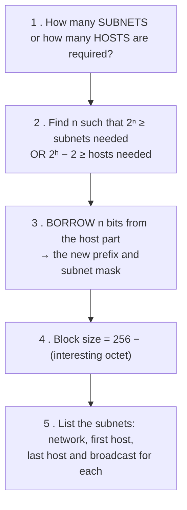

#### Worked example — divide 192.168.10.0/24 into 4 subnets

**Step 1:** 4 subnets are needed.
**Step 2:** 2ⁿ ≥ 4 → **n = 2** bits must be borrowed.
**Step 3:** new prefix = 24 + 2 = **/26** → mask **255.255.255.192**
**Step 4:** block size = 256 − 192 = **64**
**Step 5:** hosts per subnet = 2⁶ − 2 = **62**

| Subnet | **Network address** | First host | Last host | **Broadcast** |
|---|---|---|---|---|
| 1 | **192.168.10.0/26** | 192.168.10.1 | 192.168.10.62 | **192.168.10.63** |
| 2 | **192.168.10.64/26** | 192.168.10.65 | 192.168.10.126 | **192.168.10.127** |
| 3 | **192.168.10.128/26** | 192.168.10.129 | 192.168.10.190 | **192.168.10.191** |
| 4 | **192.168.10.192/26** | 192.168.10.193 | 192.168.10.254 | **192.168.10.255** |

#### Worked example — a subnet for 30 hosts

**Requirement:** at least 30 usable hosts per subnet.
**Solve 2ʰ − 2 ≥ 30:** h = 5 gives 2⁵ − 2 = **30** ✅ (h = 4 gives only 14)
**So 5 host bits are needed** → prefix = 32 − 5 = **/27** → mask **255.255.255.224**, block size 32, **8 subnets** from a /24.

#### The host-count reference table — memorise this

| Host bits | Hosts (2ʰ) | **Usable (2ʰ − 2)** | Prefix | Mask (last octet) | Block size |
|---|---|---|---|---|---|
| 1 | 2 | 0 | /31 | 254 | 2 |
| **2** | 4 | **2** | **/30** | **252** | 4 |
| **3** | 8 | **6** | **/29** | **248** | 8 |
| **4** | 16 | **14** | **/28** | **240** | 16 |
| **5** | 32 | **30** | **/27** | **224** | 32 |
| **6** | 64 | **62** | **/26** | **192** | 64 |
| **7** | 128 | **126** | **/25** | **128** | 128 |
| **8** | 256 | **254** | **/24** | **0** | 256 |

**Previous Year Question List from this Topic:**

- [An organization has been assigned the IPv4 network address 192.168.1.0/24. As part of the network deployment, the network administrator is required to divide th…](../written-answers/computer-networks.md?plain=1#L72)
- [Subnetting logic requires precise binary calculation. A network engineer is tasked with dividing the internal network 192.168.10.0/24 into exactly 4 equal subne…](../written-answers/computer-networks.md?plain=1#L94)
- [A bank has the network block 192.168.10.0/24. The IT manager wants to divide this into 4 equal subnets.](../written-answers/computer-networks.md?plain=1#L192)
- [What is subnetting? For the network 192.168.1.0/22, how many usable host addresses does it have?](../written-answers/computer-networks.md?plain=1#L224)
- [Given IP address 10.10.0.0/16, you have divide the network into eight equal subnets. Find the subnet mask in dotted decimal and CIDR notation. Also find the fir…](../written-answers/computer-networks.md?plain=1#L257)
- [Subnet mask & Total host calculation.](../written-answers/computer-networks.md?plain=1#L284)
- [Given the network 245.248.128.0/20, divide the address space among three departments as follows:](../written-answers/computer-networks.md?plain=1#L312)
- [(a) An organization wants to divide its LAN IP address 192.168.0.0/24 into 4 subnets according to buildings. The buildings IP address creiteria are given below.](../written-answers/computer-networks.md?plain=1#L365)
- [(a) A network has been assigned the IP address 200.1.2.0/24. It has 3 subnets. Determine the following for each subnet:](../written-answers/computer-networks.md?plain=1#L440)
- [(b) What is a subnet? What benefits will you get using subnets for this office?](../written-answers/computer-networks.md?plain=1#L758)
- [(a) Given 4 Network interface in a table and find which of the following network is on which network.](../written-answers/computer-networks.md?plain=1#L870)
- [In HR department have 12 IP enable devices are available in our office and have a big IP block 172.16.5.0/24. To consider your HR department find a suitable IP…](../written-answers/computer-networks.md?plain=1#L1102)
- [Which subnet mask would be appropriate for address range to submit for up to LANs, with each LAN contains 5 to 26 hosts?](../written-answers/computer-networks.md?plain=1#L1257)
- [A network address is given 172.18.10.0/23, divide this network address into 4 subnets and find every subnet address, start address, subnet mask, broadcast addre…](../written-answers/computer-networks.md?plain=1#L1576)
- [A network address is given 172.168.0.0/28, divide this network address into 4 subnets and find every subnet address, start address, subnet mask, broadcast addre…](../written-answers/computer-networks.md?plain=1#L1597)
- [In a “Class A” network total 20 subnets are needed with maximum 260 hosts per subnets. Can 255.255.255.0 subnet mask be used in this?](../written-answers/computer-networks.md?plain=1#L1617)
- [Suppose a network with IP address 192.16.0.0 is divided into 2 subnets, find number of hosts per subnet. Also for the first subnet, find- (i) First Subnet addre…](../written-answers/computer-networks.md?plain=1#L1716)
- [(a) A IP address is 172.20.0.0/27. How many subnets and hosts per subnet?](../written-answers/computer-networks.md?plain=1#L1920)
- [Given IP address is 172.168.10.0/24, administrator wants to create 32 subnets, then find out sub netmask, number of address of each subnet, first and last addre…](../written-answers/computer-networks.md?plain=1#L1950)
- [(b) Find subnet of 172.16.2.1/22 which will be applicable for your office room having 50 and 23 PCs. Also find the first and last usable ip addresses along with…](../written-answers/computer-networks.md?plain=1#L2023)
- [Find subnet mask and number of host on each subnet mask at a class B IP address is 172.16.2.1/23.](../written-answers/computer-networks.md?plain=1#L2087)
- [How many subnets and hosts per subnet can you get from the network 172.20.0.0/27?](../written-answers/computer-networks.md?plain=1#L2172)
- [(a) A network has been assigned to the IP address 200.1.2.0/24 It has 3 subnets. Determine the following for each subnet:](../written-answers/computer-networks.md?plain=1#L2252)
- [Given IP address 10.10.0.0/16, you have divided the network into eight equal subnets. Find the subnet mask in dotted decimal and CIDR notation. Also find the fi…](../written-answers/computer-networks.md?plain=1#L2281)
- [Given an IP address: 212.15.180.0/24 and wants to divide into 16 subnet.](../written-answers/computer-networks.md?plain=1#L2399)

**Previous Year MCQ List from this Topic:**

- [Which one is the loopback address?](../mcq-answers/computer-networks.md?plain=1#L1708)
- [On a class B network, how many hosts are available at each site with subnet mask of 248?](../mcq-answers/computer-networks.md?plain=1#L1717)
- [Which of the following is not a valid IP address?](../mcq-answers/computer-networks.md?plain=1#L1726)
- [Suppose you need to assign IPv4 address to two computers of your company so that the both computers belong to the subnet. 255.255.255.240. Which of the followin…](../mcq-answers/computer-networks.md?plain=1#L1735)
- [Network 10.20.30.0 was assigned to the ITGod company to connect its ISP. The administrator of ITGod would like to configure one router with commands to access t…](../mcq-answers/computer-networks.md?plain=1#L1744)
- [Classless Inter Domain Routing (CIDR) receives a packet with address 131.23.151.76. The routers routing table has the following entries](../mcq-answers/computer-networks.md?plain=1#L1757)
- [You are given the IP address 192.168.10.100/26. Answer the following question.](../mcq-answers/computer-networks.md?plain=1#L624)
- [Given, IP address: 102.168.1.50 and Subnet Mask: 255.255.255.240](../mcq-answers/computer-networks.md?plain=1#L639)


---

### VLSM — Variable Length Subnet Masking

**VLSM** is the technique of using **different subnet masks for different subnets of the same network**, so that each subnet is sized to its **actual requirement** instead of all being the same size.

> **Without VLSM (FLSM — Fixed Length Subnet Masking)**, every subnet is the same size, so a point-to-point link between two routers — which needs **2** addresses — would be given the same /26 with 62 addresses as a department of 60 users. **60 addresses wasted per link.**

#### The golden rule of VLSM

> ### **Always allocate the LARGEST requirement FIRST, then the next largest, and so on.**
>
> **Why:** large blocks must start on correctly aligned boundaries. If small subnets are allocated first, they fragment the space and a large contiguous block may no longer be available.

#### Worked example — the exam's exact problem

> **An organisation is granted `14.24.74.0/24` and needs two subnets: Subnet A requires 120 addresses, Subnet B requires 60 addresses. Allocating sequentially from the largest requirement first, state the Network Address (with CIDR) and the Broadcast Address of both.**

**Step 1 — total available:** 14.24.74.0/24 = **256 addresses** (14.24.74.0 – 14.24.74.255).

**Step 2 — Subnet A (the LARGER, 120 addresses):**
- Find h with 2ʰ − 2 ≥ 120 → h = 7 gives 2⁷ − 2 = **126** ✅
- Prefix = 32 − 7 = **/25**, mask **255.255.255.128**, block size **128**
- Allocate the first block: **14.24.74.0 – 14.24.74.127**

| **Subnet A** | Value |
|---|---|
| **Network address** | **14.24.74.0/25** |
| First usable host | 14.24.74.1 |
| Last usable host | 14.24.74.126 |
| **Broadcast address** | **14.24.74.127** |
| Usable addresses | 126 (≥ 120 ✅) |

**Step 3 — Subnet B (60 addresses), from the remaining space (14.24.74.128 – 14.24.74.255):**
- Find h with 2ʰ − 2 ≥ 60 → h = 6 gives 2⁶ − 2 = **62** ✅
- Prefix = 32 − 6 = **/26**, mask **255.255.255.192**, block size **64**
- Allocate the next block: **14.24.74.128 – 14.24.74.191**

| **Subnet B** | Value |
|---|---|
| **Network address** | **14.24.74.128/26** |
| First usable host | 14.24.74.129 |
| Last usable host | 14.24.74.190 |
| **Broadcast address** | **14.24.74.191** |
| Usable addresses | 62 (≥ 60 ✅) |

> ### ✅ **The answer**
> | Subnet | **Network Address** | **Broadcast Address** |
> |---|---|---|
> | **A** (120 hosts) | **14.24.74.0/25** | **14.24.74.127** |
> | **B** (60 hosts) | **14.24.74.128/26** | **14.24.74.191** |
>
> **Remaining free space: 14.24.74.192 – 14.24.74.255** (a /26, 64 addresses) is left for future growth — which is exactly the point of allocating largest-first.

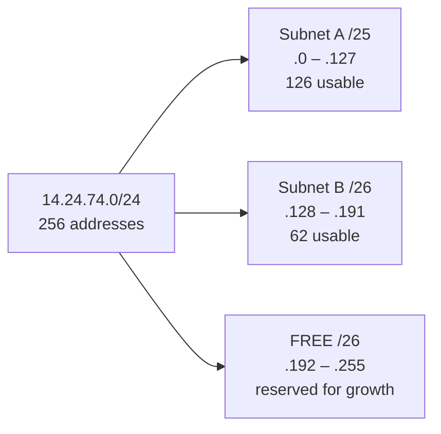

#### A larger VLSM example — four departments

> Network **192.168.1.0/24**. Requirements: Sales **100** hosts, IT **50** hosts, HR **25** hosts, and a **WAN link** needing **2** hosts.

| Order | Department | Hosts needed | Host bits | Prefix | Block | **Network** | **Range** | **Broadcast** |
|---|---|---|---|---|---|---|---|---|
| 1 | **Sales** | 100 | 7 (126) | **/25** | 128 | **192.168.1.0** | .1 – .126 | **.127** |
| 2 | **IT** | 50 | 6 (62) | **/26** | 64 | **192.168.1.128** | .129 – .190 | **.191** |
| 3 | **HR** | 25 | 5 (30) | **/27** | 32 | **192.168.1.192** | .193 – .222 | **.223** |
| 4 | **WAN link** | 2 | 2 (2) | **/30** | 4 | **192.168.1.224** | .225 – .226 | **.227** |

**Still free: 192.168.1.228 – 192.168.1.255** (28 addresses) for future use.

> Note how each allocation starts exactly where the previous one ended, and how a **/30** — the standard for a router-to-router link — wastes only 2 addresses instead of 60.

**Previous Year Question List from this Topic:**

- [An organization is granted the IPv4 network block 14.24.74.0/24 and needs to segment it into two subnets: Subnet A (requires 120 addresses) and Subnet B (requir…](../written-answers/computer-networks.md?plain=1#L46)
- [6.10 An organization is granted the IPv4 network block 14.24.74.0/24 and needs to segment it into two subnets: Subnet A (requires 120 addresses) and Subnet B (r…](../written-answers/computer-networks.md?plain=1#L933)
- [VLSM Subnetting. Given an IP address, 192.168.0.0/20 For creating 4 subnets department of A, B, C, D with 2000, 1000, 6000 and 8000 hosts, find out every depart…](../written-answers/computer-networks.md?plain=1#L1751)
- [You are given a IP address 172.16.20.0/25 have four subnets. For each department find the following information. (CSE, EEE, IPE, PME)](../written-answers/computer-networks.md?plain=1#L1780)


---

### CIDR, Supernetting and IP Address Planning

#### CIDR

**CIDR (Classless Inter-Domain Routing)**, introduced in 1993, **abolished the rigid A/B/C class boundaries** and allowed a network prefix of **any length**, written as **/n**.

| Point | **Classful addressing** | **CIDR (classless)** |
|---|---|---|
| **Prefix length** | Fixed at **/8, /16 or /24** | **Any length from /0 to /32** |
| **Address efficiency** | **Very wasteful** — an organisation needing 300 addresses had to take a whole class B (65,534) | **Efficient** — take exactly a /23 (510) |
| **Routing table size** | Large | **Smaller** — routes can be **aggregated** |
| **Notation** | 192.168.1.0 with mask 255.255.255.0 | **192.168.1.0/24** |
| **Subnetting flexibility** | Limited | **VLSM supported** |

#### Supernetting (route aggregation)

**Supernetting** is the **opposite of subnetting** — combining several **contiguous** smaller networks into **one larger block** with a **shorter prefix**, so that routers advertise **one route instead of many**.

**Worked example:** aggregate these four /24 networks:

```
192.168.0.0/24   →  11000000.10101000.000000 00.00000000
192.168.1.0/24   →  11000000.10101000.000000 01.00000000
192.168.2.0/24   →  11000000.10101000.000000 10.00000000
192.168.3.0/24   →  11000000.10101000.000000 11.00000000
                     └──────── 22 bits identical ───────┘
```

The first **22 bits are common**, so the supernet is **192.168.0.0/22** — one route advertisement replaces four.

**Benefits:** **smaller routing tables**, faster lookups, less routing-update traffic, and more stable routing (a flap inside the block is not advertised outward).
**Requirement:** the blocks must be **contiguous** and **correctly aligned** (the starting network must be a multiple of the block size).

#### The complete calculation checklist

When a subnetting question is asked, produce **all** of these:

| Item | How to get it |
|---|---|
| **Subnet mask** | From the prefix, or from the host requirement |
| **Block size** | 256 − interesting octet |
| **Number of subnets** | 2ˢ (s = borrowed bits) |
| **Hosts per subnet** | 2ʰ − 2 |
| **Network address** | All host bits 0 |
| **First usable host** | Network + 1 |
| **Last usable host** | Broadcast − 1 |
| **Broadcast address** | All host bits 1 |
| **Next subnet** | Network + block size |

#### Determining whether two addresses are on the same subnet

**AND each IP with the subnet mask.** If the results are identical, they are on the same subnet and can communicate **directly**; otherwise the traffic must go through a **router**.

**Example:** are `192.168.1.100/26` and `192.168.1.130/26` on the same subnet?
- 100 with block size 64 → network **192.168.1.64**
- 130 with block size 64 → network **192.168.1.128**
- **Different networks** → ❌ they need a router to communicate.

#### IPv4 address exhaustion and the solutions

IPv4's 4.3 billion addresses were exhausted at the regional registries between 2011 and 2019. The responses were:

| Solution | Effect |
|---|---|
| **NAT** | Thousands of private hosts share one public address — **the main reason IPv4 still works** |
| **CIDR/VLSM** | Stopped the enormous waste of classful allocation |
| **Private addressing (RFC 1918)** | Removed the need for globally unique addresses inside organisations |
| **DHCP** | Addresses are leased and reused rather than permanently assigned |
| **IPv6** | **The real, permanent solution** — 128 bits, 3.4 × 10³⁸ addresses |

**Previous Year Question List from this Topic:**

- [What is the CIDR Prefixes exactly represents the range of IP addresses 10.12.2.0 to 10.12.3.255?](../written-answers/computer-networks.md?plain=1#L515)
- [What is the primary motivation for classful IP address to classless IP addressing?](../written-answers/computer-networks.md?plain=1#L685)
- [(খ) Classful এবং Classless IP address এর পার্থক্য কী? নিচের IP গুলোর Class নির্ণয় করুন।](../written-answers/computer-networks.md?plain=1#L891)
- [Write down the basic differences of the following:](../written-answers/computer-networks.md?plain=1#L980)
- [(ii) CIDR কী? 192.168.100.9/26 IP address থেকে (a) Total subnets (b) Block size (c) Valid Hosts (d) Total hosts বের করুন।](../written-answers/computer-networks.md?plain=1#L1493)

**Previous Year MCQ List from this Topic:**

- [How many IP addresses can be assigned using IPv4 techniques?](../mcq-answers/computer-networks.md?plain=1#L1773)
- [Class C IP address is for ________ bit network.](../mcq-answers/computer-networks.md?plain=1#L1782)
- [Suppose, a Class C network address is 192.168.10.0 and subnet mask is 255.255.255.192. How many valid hosts per subnet can be obtainable?](../mcq-answers/computer-networks.md?plain=1#L1791)
- [উল্লেখিত কোনটি Private IP address?](../mcq-answers/computer-networks.md?plain=1#L1800)


## OSI & TCP/IP Reference Model

### The OSI Reference Model — The Seven Layers

#### What is the OSI model?

The **OSI (Open Systems Interconnection) model** is a **conceptual reference framework**, published by the **ISO (International Organization for Standardization) in 1984**, that describes how data travels from an application on one computer, across a network, to an application on another computer — divided into **SEVEN independent layers**, each with a defined function.

> **It is a MODEL, not a protocol.** No real network runs "the OSI stack" — the Internet runs TCP/IP. The OSI model's value is as a **universal vocabulary and teaching framework**: when an engineer says *"that is a Layer 2 problem"*, everyone knows exactly what is meant.

#### Why a layered model?

1. **Divide and conquer** — a huge problem is broken into seven manageable pieces.
2. **Interoperability** — vendors can build equipment that works together.
3. **Modularity** — one layer can be changed (copper to fibre, IPv4 to IPv6) **without redesigning the others**.
4. **Standardisation** of interfaces between layers.
5. **Easier troubleshooting** — faults can be isolated to a layer.
6. **Easier learning and teaching**.

#### The seven layers

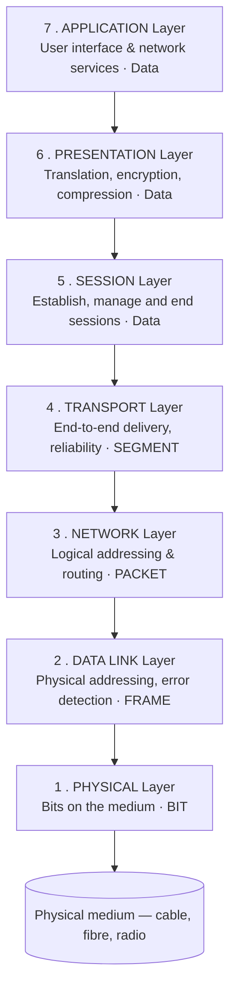

> **The mnemonic (top to bottom, 7 → 1):**
> **A**ll **P**eople **S**eem **T**o **N**eed **D**ata **P**rocessing
> *(Application, Presentation, Session, Transport, Network, Data Link, Physical)*
>
> **Bottom to top (1 → 7):**
> **P**lease **D**o **N**ot **T**hrow **S**ausage **P**izza **A**way
> *(Physical, Data Link, Network, Transport, Session, Presentation, Application)*

#### Layer-by-layer functions

| # | Layer | Main functions | PDU | Devices | Protocols |
|---|---|---|---|---|---|
| **7** | **Application** | Provides **network services directly to the user's application**: file transfer, email, web browsing, remote login, directory services | **Data** | Gateway, firewall (L7), host | **HTTP, HTTPS, FTP, SMTP, POP3, IMAP, DNS, DHCP, Telnet, SSH, SNMP** |
| **6** | **Presentation** | **Translation** (ASCII ↔ EBCDIC, character encoding), **ENCRYPTION/decryption**, **COMPRESSION/decompression**, data formatting. Called the **"Translator"** or **"Syntax layer"** | **Data** | Gateway | **SSL/TLS, JPEG, MPEG, GIF, ASCII, MIME, XDR** |
| **5** | **Session** | **Establishes, manages, synchronises and terminates SESSIONS** between applications; **dialog control** (simplex/half/full duplex); **synchronisation checkpoints** for recovery | **Data** | Gateway | **NetBIOS, RPC, PPTP, SQL sessions, NFS, SIP** |
| **4** | **Transport** | **END-TO-END delivery** between processes; **segmentation and reassembly**; **PORT addressing** (service-point addressing); **connection control**; **flow control**; **error control**; **reliability and retransmission** | **SEGMENT** (TCP) / **Datagram** (UDP) | Gateway, L4 load balancer, firewall | **TCP, UDP, SCTP** |
| **3** | **Network** | **LOGICAL ADDRESSING (IP)**; **ROUTING** — choosing the best path across multiple networks; **fragmentation** and reassembly; congestion control; internetworking | **PACKET** (Datagram) | **ROUTER**, Layer-3 switch | **IP (IPv4/IPv6), ICMP, IGMP, ARP, RARP, OSPF, RIP, BGP, IPsec** |
| **2** | **Data Link** | **PHYSICAL ADDRESSING (MAC)**; **FRAMING** — packaging bits into frames; **error DETECTION** (CRC); **flow control**; **media access control** (who may transmit) | **FRAME** | **SWITCH**, **BRIDGE**, NIC | **Ethernet (802.3), Wi-Fi (802.11), PPP, HDLC, Frame Relay, ATM, ARP** |
| **1** | **Physical** | Transmission of **raw BITS** over the medium; defines **voltages, cables, connectors, pins, data rate, topology and transmission mode**; **bit synchronisation** | **BIT** | **HUB**, **REPEATER**, cables, connectors, modem | RS-232, RJ45, Ethernet physical specs, DSL, USB, Bluetooth physical |

#### The Data Link layer's two sub-layers

| Sub-layer | Function |
|---|---|
| **LLC — Logical Link Control** (upper) | Flow control, error control, and multiplexing network-layer protocols |
| **MAC — Media Access Control** (lower) | **Physical addressing** and deciding **who may transmit** (CSMA/CD, CSMA/CA) |

#### The Protocol Data Unit (PDU)

> **A PDU (Protocol Data Unit) is the unit of data exchanged at a particular layer of the model, consisting of that layer's control information (header) plus the data passed down from the layer above.**

| Layer | **PDU name** |
|---|---|
| Application, Presentation, Session (5–7) | **Data** (or Message) |
| **Transport (4)** | **Segment** (TCP) / **Datagram** (UDP) |
| **Network (3)** | **Packet** |
| **Data Link (2)** | **Frame** |
| **Physical (1)** | **Bit** |

> **The relationship between Data, Segment, Packet, Frame and Bit** is simply **encapsulation at successive layers** — each layer wraps the unit from above in its own header.

#### Encapsulation and de-encapsulation

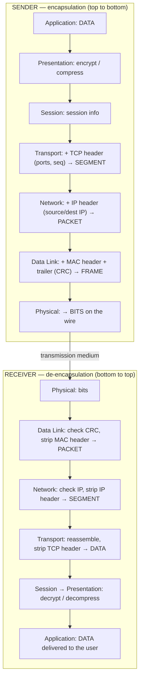

> **How two computers exchange information using the OSI model:** the sender's data travels **DOWN** through all seven layers, each adding its own header (**encapsulation**); it crosses the physical medium as bits; and at the receiver it travels **UP** through the seven layers, each removing and acting on its own header (**de-encapsulation**), until the original data is handed to the application. **Each layer communicates logically with its peer layer** on the other machine — the sender's Transport layer "talks to" the receiver's Transport layer — even though the actual data physically passes through every layer below.

#### Quick answers to the repeated short questions

| Question | Answer |
|---|---|
| **How many layers in OSI?** | **7** |
| **Which layer does a ROUTER operate at?** | **Layer 3 — Network** |
| **Which layer does a SWITCH operate at?** | **Layer 2 — Data Link** (a Layer-3 switch also does routing) |
| **Which layer does a HUB/REPEATER operate at?** | **Layer 1 — Physical** |
| **Which layer converts a bit stream into frames?** | **Layer 2 — Data Link** |
| **Which layer handles port numbers / end-to-end delivery?** | **Layer 4 — Transport** |
| **Which layer links the "network support layers" (1–3) and the "user support layers" (5–7)?** | **Layer 4 — the TRANSPORT layer** |
| **Which layer is responsible for ENCRYPTION?** | **Layer 6 — Presentation** *(end-to-end encryption like TLS is usually placed at the Presentation/Session boundary; application-level encryption is Layer 7)* |
| **Which layer does routing?** | **Layer 3 — Network** |
| **Network layer number** | **3** |
| **Which layer does IP work at?** | **3** · TCP/UDP at **4** · HTTP at **7** · Ethernet at **2** |

#### Cyber threats mapped to OSI layers

| Layer | Example threat |
|---|---|
| **7 Application** | **SQL injection, XSS, HTTP flood, phishing, malware** |
| **6 Presentation** | SSL stripping, malformed certificate attacks, Heartbleed |
| **5 Session** | **Session hijacking**, session fixation |
| **4 Transport** | **SYN flood**, port scanning, UDP flood |
| **3 Network** | **IP spoofing, ICMP/Ping flood, Smurf attack, route poisoning** |
| **2 Data Link** | **ARP spoofing, MAC flooding, VLAN hopping, DHCP starvation** |
| **1 Physical** | **Cable tapping/wiretapping**, physical damage, jamming, theft of equipment |

**Previous Year Question List from this Topic:**

- [Mention the layers of the OSI Model and the function of each layer.](../written-answers/computer-networks.md?plain=1#L2424)
- [OSI মডেলের ৭টি স্তরের কাজ কি? এই সমগ্র স্তরগুলোর ভূমিকা কি?](../written-answers/computer-networks.md?plain=1#L2449)
- [What is the OSI model? Explain the functions of each layer with examples.](../written-answers/computer-networks.md?plain=1#L2473)
- [(b) Name the OSI layers and give one example of a cyber threat at any tree of those layers.](../written-answers/computer-networks.md?plain=1#L2506)
- [Write bottom to top OSI reference Model.](../written-answers/computer-networks.md?plain=1#L2530)
- [How many Layers of OSI?](../written-answers/computer-networks.md?plain=1#L2630)
- [রাউটার OSI এর কোন লেয়ারে থাকে?](../written-answers/computer-networks.md?plain=1#L2647)
- [Write the name of OSI layers.](../written-answers/computer-networks.md?plain=1#L2665)
- [Write the name of OSI layers protocol for every layers.](../written-answers/computer-networks.md?plain=1#L2683)
- [Write down the OSI model.](../written-answers/computer-networks.md?plain=1#L2760)
- [What is OSI Model? Write all layer name sequence should be top to bottom or bottom to top.](../written-answers/computer-networks.md?plain=1#L2842)
- [(a) List down the layers of OSI model in top-down manner.](../written-answers/computer-networks.md?plain=1#L2905)
- [Which layer is used to link the network support layers and user support layers?](../written-answers/computer-networks.md?plain=1#L2957)
- [What is the number for the Network layer and the support layer?](../written-answers/computer-networks.md?plain=1#L2977)
- [(c) Write the all layers of OSI model.](../written-answers/computer-networks.md?plain=1#L2987)
- [In order to prevent that the company decided to add end to end encryption techniques which layer of the OSI model is suitable to work in considering parameters…](../written-answers/computer-networks.md?plain=1#L3003)
- [(a) What is OSI model? Explain how two computers can exchange information using the OSI model.](../written-answers/computer-networks.md?plain=1#L3057)
- [What is OSI model? Write different layers of OSI model.](../written-answers/computer-networks.md?plain=1#L3102)
- [What is PDU?](../written-answers/computer-networks.md?plain=1#L3152)
- [(খ) Computer network এর OSI 7-Layer গুলো উদাহরণসহ লিখুন।](../written-answers/computer-networks.md?plain=1#L3170)
- [Computer Network এ OSI Model এর Layer কয়টি?](../written-answers/computer-networks.md?plain=1#L3187)
- [OSI Model এর কাজ কী? এর লেয়ারসমূহ কী কী?](../written-answers/computer-networks.md?plain=1#L3204)
- [Which layer data packet receive port from sender to destination? (a) Data link layer (b) Network layer (c) Transport layer (d) None](../written-answers/computer-networks.md?plain=1#L3227)
- [What is OSI model? Write down the name of OSI model layer.](../written-answers/computer-networks.md?plain=1#L3244)
- [Write down the functionality of OSI model.](../written-answers/computer-networks.md?plain=1#L3347)
- [OSI Model এর Layer গুলো বর্ণনা করুন।](../written-answers/computer-networks.md?plain=1#L3368)
- [(ক) OSI Model (Layer) এর সাতটি Layer কী কী? প্রথম দুটি সংক্ষেপে বর্ণনা করুন।](../written-answers/computer-networks.md?plain=1#L3422)
- [Describe the OSI layers. Draw a diagram to show the hierarchy when the data is transmitted or received.](../written-answers/computer-networks.md?plain=1#L3479)
- [OSI model এর layer গুলোর নাম লিখ।](../written-answers/computer-networks.md?plain=1#L3518)
- [How many layers are used in OSI and TCP/IP model? Draw the layer.](../written-answers/computer-networks.md?plain=1#L3535)
- [What is OSI model? Which layers are important for data transfer and user interaction?](../written-answers/computer-networks.md?plain=1#L3597)
- [Name OSI layer that transmitted bit stream to frames.](../written-answers/computer-networks.md?plain=1#L3617)
- [Explain: ISO, OSI and TCP/IP model with figure.](../written-answers/computer-networks.md?plain=1#L3635)

**Previous Year MCQ List from this Topic:**

- [Which of the following pairs is an example of transport layer protocols of the OSI model?](../mcq-answers/computer-networks.md?plain=1#L2278)
- [TCP দিয়ে কোনটি বোঝানো হয়?](../mcq-answers/computer-networks.md?plain=1#L2287)
- [Major function of a transport layer in the OSI model is to perform](../mcq-answers/computer-networks.md?plain=1#L2296)
- [In the diagram shown below. L1 is an Ethernet LAN and L2 is a Token-Ring LAN. An IP packet originates from sender S and traverses to R, as shown. The link withi…](../mcq-answers/computer-networks.md?plain=1#L2305)
- [Assume that Source S and Destination D are connected through an intermediate router R. How many times a packet has to visit the network layer and data link laye…](../mcq-answers/computer-networks.md?plain=1#L2314)
- [Open System Interconnection (OSI) model has ________ layer.](../mcq-answers/computer-networks.md?plain=1#L2323)
- [________ Provides a connection oriented reliable service for sending message.](../mcq-answers/computer-networks.md?plain=1#L2332)
- [Which layer of OSI determines the interface of the system with the user?](../mcq-answers/computer-networks.md?plain=1#L2341)
- [How many layers are there in the software part of networking framework?](../mcq-answers/computer-networks.md?plain=1#L379)


---

### The TCP/IP Model

#### What is the TCP/IP model?

The **TCP/IP model** (also called the **DoD model**, because it was developed by the US **Department of Defense** through ARPANET in the 1970s) is the **practical, working model on which the Internet is actually built**. It has **FOUR layers**.

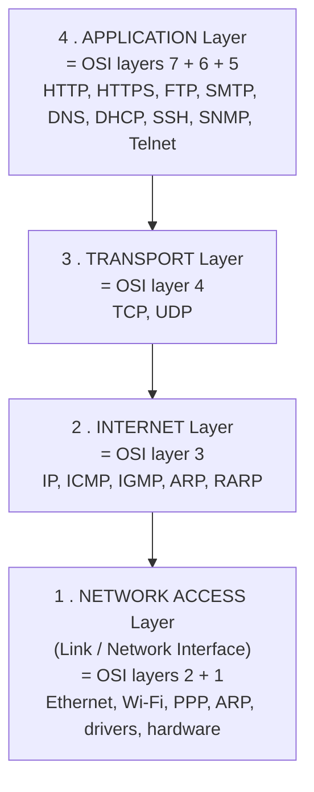

#### The four layers in detail

| # | Layer | Function | PDU | Protocols | Devices |
|---|---|---|---|---|---|
| **4** | **Application** | Provides all **user-level services**, plus data formatting, encryption and session management (it absorbs OSI layers 5, 6 and 7) | **Data / Message** | **HTTP, HTTPS, FTP, TFTP, SMTP, POP3, IMAP, DNS, DHCP, Telnet, SSH, SNMP, NTP** | Host, application gateway |
| **3** | **Transport** | **End-to-end (process-to-process) delivery**, segmentation, **port addressing**, reliability, flow and error control | **Segment / Datagram** | **TCP** (reliable, connection-oriented), **UDP** (fast, connectionless) | Firewall, L4 load balancer |
| **2** | **Internet** | **Logical addressing (IP)** and **ROUTING** of packets across interconnected networks; fragmentation | **Packet / Datagram** | **IP (IPv4/IPv6), ICMP, IGMP, ARP, RARP**, and the routing protocols **OSPF, RIP, BGP** | **ROUTER**, L3 switch |
| **1** | **Network Access** (Link) | How data is physically placed on and taken off the medium; **framing, MAC addressing, error detection**, and all electrical/optical signalling | **Frame → Bits** | **Ethernet (802.3), Wi-Fi (802.11), PPP, HDLC, Frame Relay, ATM**, device drivers | **Switch, bridge, hub, NIC, cable** |

#### How data is known at each TCP/IP layer

| Layer | Data is called |
|---|---|
| Application | **Data / Message / Stream** |
| Transport | **Segment** (TCP) or **Datagram** (UDP) |
| Internet | **Packet / Datagram** |
| Network Access | **Frame** → on the wire, **Bits** |

#### The protocol suite diagram

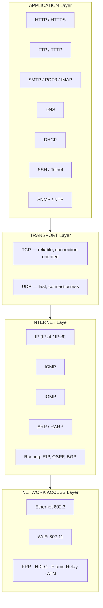

#### Which transport protocol each application uses

| Uses **TCP** (reliability needed) | Uses **UDP** (speed needed) | Uses **both** |
|---|---|---|
| HTTP/HTTPS, FTP, SMTP, POP3, IMAP, SSH, Telnet | **DHCP, TFTP, SNMP, NTP, RIP**, VoIP, video streaming, online gaming | **DNS** (UDP for queries, TCP for zone transfers and large responses) |

**Previous Year Question List from this Topic:**

- [In the TCP/IP model, how is data known in the different layers?](../written-answers/computer-networks.md?plain=1#L2551)
- [(b) Explain the TCP/IP protocol switch layers.](../written-answers/computer-networks.md?plain=1#L2574)
- [(b) Draw the diagram of TCP/IP protocol suite and mention the name of protocols used in different layers of TCP/IP.](../written-answers/computer-networks.md?plain=1#L2593)
- [Tabular representation of TCP/IP layer, functions of each layer, Associate protocols, device, and software in each layer. Different types of network firewalls.…](../written-answers/computer-networks.md?plain=1#L2699)
- [Explain TCP/IP model and its protocol and device.](../written-answers/computer-networks.md?plain=1#L2738)
- [How many TCP/IP layer? Write its Layer name?](../written-answers/computer-networks.md?plain=1#L2777)
- [What is TCP/IP model? Briefly explain TCP/IP model.](../written-answers/computer-networks.md?plain=1#L3032)
- [TCP/IP model এর Layer গুলোর কাজ লিখুন।](../written-answers/computer-networks.md?plain=1#L3088)
- [What is OSI and TCP/IP model and briefly explain?](../written-answers/computer-networks.md?plain=1#L3264)
- [TCP/IP protocol suite -এর বিভিন্ন স্তরের নাম লিখুন? HTTPs কী? এর ব্যবহারের প্রয়োজনীয়তা সংক্ষেপে বর্ণনা করুন?](../written-answers/computer-networks.md?plain=1#L3301)
- [TCP/IP মডেলের Layers সমূহের কাজ সংক্ষেপে লিখুন।](../written-answers/computer-networks.md?plain=1#L3409)
- [(খ) TCP/IP প্রোটোকল কী কাজ করে তা বর্ণনা করুন।](../written-answers/computer-networks.md?plain=1#L3456)
- [How many layers are used in OSI and TCP/IP model? Draw the layer.](../written-answers/computer-networks.md?plain=1#L3535)
- [Give answer of the following question:](../written-answers/computer-networks.md?plain=1#L3567)

**Previous Year MCQ List from this Topic:**

- [Congestion Control কোন layer-এ করা হয়?](../mcq-answers/computer-networks.md?plain=1#L2350)
- [Which is not work of Data link layer?](../mcq-answers/computer-networks.md?plain=1#L2359)
- [In TCP/IP model, which one is not a valid layer?](../mcq-answers/computer-networks.md?plain=1#L2368)
- [How many layer internet protocol suites?](../mcq-answers/computer-networks.md?plain=1#L1130)
- [How many layers Internet protocol suite?](../mcq-answers/computer-networks.md?plain=1#L1175)
- [Which of the following defines the addressing capabilities of the networking?](../mcq-answers/computer-networks.md?plain=1#L370)


---

### OSI vs TCP/IP — Comparison

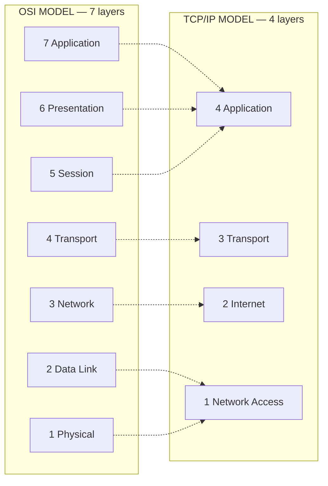

| Point | **OSI Model** | **TCP/IP Model** |
|---|---|---|
| **Number of layers** | **7** | **4** (some texts say 5, splitting the link layer) |
| **Developed by** | **ISO** (International Organization for Standardization), **1984** | **US Department of Defense / ARPANET**, **1970s** |
| **Also known as** | ISO-OSI reference model | **DoD model**, Internet model |
| **Nature** | **Theoretical / reference model** — "what should happen" | **Practical / implementation model** — "what actually happens" |
| **Developed** | The **model FIRST**, then protocols | The **protocols FIRST**, then the model described them |
| **Approach** | **Vertical** — strict layer independence | **Horizontal** — more integrated |
| **Presentation & Session layers** | **Separate layers (6 and 5)** | **Merged into the Application layer** |
| **Physical & Data Link** | **Separate layers (1 and 2)** | **Merged into the Network Access layer** |
| **Transport layer** | **Connection-oriented only** | **Both connection-oriented (TCP) and connectionless (UDP)** |
| **Network layer** | Both connection-oriented and connectionless | **Connectionless only (IP)** |
| **Protocol dependence** | **Protocol independent** — a generic standard | **Protocol dependent** — built around TCP and IP |
| **Usage today** | **Teaching, troubleshooting and terminology** | **Actually running the Internet** |
| **Reliability** | Guaranteed by the model's design | Left to the Transport layer (TCP) |
| **Replacement of a protocol** | Easy — layers are independent | Harder — protocols are interdependent |

> **Why did OSI "lose"?** TCP/IP was **already working, free and implemented** in BSD Unix by the time the OSI protocol suite was finalised. OSI was more elegant but slower, more complex and arrived too late. **The result is that the industry uses the OSI MODEL for vocabulary and the TCP/IP PROTOCOLS for actual networking** — which is why both are taught together.

#### The hybrid (5-layer) model

Because the OSI model is too detailed for practice and the TCP/IP model too coarse for teaching, most modern textbooks use a **5-layer hybrid model**:

| Layer | Name | Equivalent |
|---|---|---|
| **5** | **Application** | OSI 5 + 6 + 7 |
| **4** | **Transport** | OSI 4 |
| **3** | **Network** | OSI 3 |
| **2** | **Data Link** | OSI 2 |
| **1** | **Physical** | OSI 1 |

> This is popular because it keeps the **useful, practically distinct** Physical and Data Link separation of OSI, while merging the three upper layers that in reality are never implemented separately. It is the model used in Kurose & Ross and most current courses.

#### What is a network protocol?

> A **network protocol** is a **set of agreed rules, formats and procedures that govern how data is transmitted, received and interpreted between devices on a network.**

It defines three things: **Syntax** (the format and structure of the message), **Semantics** (the meaning of each field and what action to take), and **Timing** (when and how fast to send).

**Without protocols, communication is impossible** — exactly as two people who do not share a language cannot converse, however loudly they speak.

**Previous Year Question List from this Topic:**

- [Differentiate between OSI Model and TCP/IP Model. Draw the diagram of 4 Layers of TCP/IP Model including the main function of each layer and related protocols.…](../written-answers/computer-networks.md?plain=1#L2798)
- [Difference between OSI model and TCP/IP model. Relation between Data, Segment, Packet and Bit in OSI model.](../written-answers/computer-networks.md?plain=1#L2867)
- [What is the difference between DOD and OSI model?](../written-answers/computer-networks.md?plain=1#L3123)
- [What is OSI and TCP/IP model and briefly explain?](../written-answers/computer-networks.md?plain=1#L3264)
- [বর্তমানে Hybrid network model জনপ্রিয় একটি মডেল। এই মডেলের পাঁচটি Layer হচ্ছে, Application, Transport, Physical, Data link and Network Layer। এদের কাজ দেওয়া আছে…](../written-answers/computer-networks.md?plain=1#L3325)
- [(d) What do you mean by network protocol? Compare TCP/IP protocol suite and OSI reference model.](../written-answers/computer-networks.md?plain=1#L3382)
- [How many layers are used in OSI and TCP/IP model? Draw the layer.](../written-answers/computer-networks.md?plain=1#L3535)
- [Explain: ISO, OSI and TCP/IP model with figure.](../written-answers/computer-networks.md?plain=1#L3635)


---

### Layer-by-Layer Protocol and Device Reference

This single table answers the many "which protocol/device works at which layer" questions.

| OSI Layer | TCP/IP Layer | **Protocols** | **Devices** | **PDU** | Address used |
|---|---|---|---|---|---|
| **7 Application** | Application | HTTP, HTTPS, FTP, TFTP, SMTP, POP3, IMAP, DNS, DHCP, Telnet, SSH, SNMP, NTP, NFS | Application gateway, proxy, L7 firewall/WAF | Data | — |
| **6 Presentation** | Application | SSL/TLS, JPEG, PNG, GIF, MPEG, MIDI, ASCII, EBCDIC, MIME | Gateway | Data | — |
| **5 Session** | Application | NetBIOS, RPC, PPTP, SIP, SQL session, SAP | Gateway | Data | — |
| **4 Transport** | Transport | **TCP, UDP**, SCTP | Firewall, L4 load balancer | **Segment** | **Port number** |
| **3 Network** | Internet | **IP, ICMP, IGMP, ARP, RARP, IPsec**, OSPF, RIP, BGP, EIGRP | **Router**, L3 switch, multilayer firewall | **Packet** | **IP address** |
| **2 Data Link** | Network Access | **Ethernet (802.3), Wi-Fi (802.11)**, PPP, HDLC, Frame Relay, ATM, STP, VLAN (802.1Q) | **Switch, Bridge, NIC**, Wireless AP | **Frame** | **MAC address** |
| **1 Physical** | Network Access | RS-232, RJ45, V.35, DSL, ISDN, SONET, Bluetooth PHY, USB | **Hub, Repeater, Cable, Connector, Modem, Transceiver** | **Bit** | — |

#### A trace of one web request through the layers

> *What happens when you type `www.bank.com.bd` and press Enter:*

| Step | Layer | What happens |
|---|---|---|
| 1 | **7 Application** | The browser forms an **HTTP GET** request. First it needs the IP, so a **DNS** query is issued |
| 2 | **6 Presentation** | **TLS encrypts** the request (for HTTPS) and handles character encoding |
| 3 | **5 Session** | A session is established and maintained for the exchange |
| 4 | **4 Transport** | **TCP** breaks the data into **segments**, adds source port (e.g. 51234) and destination port (**443**), sequence numbers and a checksum; performs the **three-way handshake** |
| 5 | **3 Network** | **IP** adds the **source and destination IP addresses** → **packet**; the routing table selects the next hop |
| 6 | **2 Data Link** | **Ethernet** adds the **source and destination MAC addresses** (the destination MAC being the **default gateway's**, found by **ARP**) and a CRC trailer → **frame** |
| 7 | **1 Physical** | The frame becomes **electrical, optical or radio signals — bits** — on the medium |
| 8 | — | Each **router** along the way strips the frame, reads the **IP header**, decides the next hop, and builds a **new frame** with new MAC addresses. **The IP addresses never change; the MAC addresses change at every hop** |
| 9 | **1 → 7 at the server** | The process reverses: bits → frame → packet → segment → data → the web server application |

**Previous Year Question List from this Topic:**

- [Write the name of OSI layers protocol for every layers.](../written-answers/computer-networks.md?plain=1#L2683)
- [Tabular representation of TCP/IP layer, functions of each layer, Associate protocols, device, and software in each layer. Different types of network firewalls.…](../written-answers/computer-networks.md?plain=1#L2699)
- [Explain TCP/IP model and its protocol and device.](../written-answers/computer-networks.md?plain=1#L2738)
- [Fill up the following protocol table by work at which layer?](../written-answers/computer-networks.md?plain=1#L2922)
- [What is PDU?](../written-answers/computer-networks.md?plain=1#L3152)
- [Which layer data packet receive port from sender to destination? (a) Data link layer (b) Network layer (c) Transport layer (d) None](../written-answers/computer-networks.md?plain=1#L3227)
- [Name OSI layer that transmitted bit stream to frames.](../written-answers/computer-networks.md?plain=1#L3617)

**Previous Year MCQ List from this Topic:**

- [The end-to-end delivery of the entire message is the responsibility of the ________ layer.](../mcq-answers/computer-networks.md?plain=1#L2377)
- [Which of the following BEST explains the functions of OSI layer 4?](../mcq-answers/computer-networks.md?plain=1#L2386)
- [Which of the following transport protocols should be used to avoid retransmitting lost packets?](../mcq-answers/computer-networks.md?plain=1#L2395)
- [In Which layer basic packet filtering firewall works of OSI model?](../mcq-answers/computer-networks.md?plain=1#L2404)
- [Which of the following OSI layers handles the routing of data across segments?](../mcq-answers/computer-networks.md?plain=1#L2413)
- [Which of the followings is the Protocol Data Unit (PDU) for the application layer in the Internet stack?](../mcq-answers/computer-networks.md?plain=1#L959)
- [Email is a protocol of following layer-](../mcq-answers/computer-networks.md?plain=1#L1112)
- [Email is a protocol of the following layer?](../mcq-answers/computer-networks.md?plain=1#L1157)
- [An Access point operates in which layer of OSI model?](../mcq-answers/computer-networks.md?plain=1#L1980)


## Networking Fundamentals & Terminology

### Computer Network — Definition, Types and Benefits

#### What is a computer network?

A **computer network** is a **collection of two or more computing devices connected together by a communication medium, so that they can EXCHANGE DATA and SHARE RESOURCES.**

**The three things every network needs:** **nodes** (the devices), a **transmission medium** (cable, fibre, radio), and **protocols** (the agreed rules of communication).

#### How a network works — the simple version

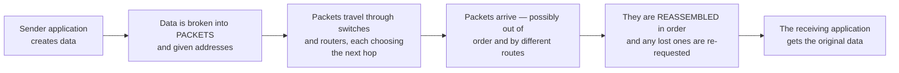

#### Types of network by geographical area

| Type | Full form | Coverage | Speed | Ownership | Example |
|---|---|---|---|---|---|
| **PAN** | Personal Area Network | **~10 metres** | Low | Individual | **Bluetooth**, a phone tethering a laptop, a smartwatch |
| **LAN** | **Local Area Network** | **A room, building or campus (up to ~1 km)** | **Very high (100 Mbps – 10 Gbps)** | **Private** | An office, a school computer lab, a home Wi-Fi |
| **CAN** | Campus Area Network | Several buildings on one campus (1–5 km) | High | Private | A university network |
| **MAN** | **Metropolitan Area Network** | **A city (5 – 50 km)** | High | Private or public | A city's cable TV network, a bank's branches across Dhaka |
| **WAN** | **Wide Area Network** | **A country or the world** | Lower per link, higher latency | Usually **leased from a carrier** | **The Internet**, a bank's national branch network |
| **SAN** | Storage Area Network | A data centre | Very high | Private | A block-storage network |
| **VPN** | Virtual Private Network | Logical, over any distance | Depends on the link | Logical | Secure remote access |
| **WLAN** | Wireless LAN | Same as LAN, wireless | High | Private | **Wi-Fi** |

> **The classic scenario question:** *"A company has two branches **in the same city** which are connected — what type of network is this?"* → **A MAN (Metropolitan Area Network)**, because the connection spans a city. *(If the two branches were in different cities or countries, it would be a **WAN**; within a single building it would be a **LAN**.)*

#### Types of network by architecture

| Type | Description | Advantages | Disadvantages |
|---|---|---|---|
| **Client-Server** | Dedicated **servers** provide services to **client** machines | **Centralised control**, security, backup and administration; scalable | Expensive; the server is a **single point of failure** |
| **Peer-to-Peer (P2P)** | Every computer is **both client and server**; no central authority | **Cheap**, simple, no dedicated server needed, resilient | **Poor security and backup**, hard to manage beyond ~10 machines |

#### Advantages of a computer network

1. **Resource sharing** — printers, scanners, storage and internet connections.
2. **Data sharing and centralised data** — one authoritative copy.
3. **Communication** — email, chat, video conferencing, VoIP.
4. **Cost saving** — one printer for 50 users instead of 50 printers.
5. **Centralised administration, backup and software updates**.
6. **Reliability** — files are replicated; if one machine fails, work continues elsewhere.
7. **Scalability** — new users and devices are easily added.
8. **Remote access** and support.
9. **Collaboration** on shared documents and applications.
10. **Improved storage efficiency**.

#### Disadvantages

1. **Security risk** — one entry point can expose everything; malware spreads rapidly.
2. **Cost of setup** — cabling, switches, routers, servers.
3. **Requires skilled administrators**.
4. **Single point of failure** — if the server or the main link fails, everyone stops.
5. **Maintenance and continuous management**.
6. **Virus/worm propagation** across the whole network.
7. **Loss of independence** — users depend on the network's availability.
8. **Privacy concerns** — activity can be monitored.

#### Networking vs Internetworking

| Point | **Networking** | **Internetworking** |
|---|---|---|
| **Meaning** | Connecting devices **within ONE network** | Connecting **MULTIPLE separate networks** together |
| **Devices used** | Hub, switch, NIC, cable | **ROUTER, gateway** |
| **Addressing** | **MAC addresses** suffice | **IP addresses** are essential |
| **Scope** | A single LAN | A network of networks — **the Internet is the largest example** |
| **Layer** | Mainly Layer 2 | **Layer 3** |

#### Internet, Intranet and Extranet

| Point | **Internet** | **Intranet** | **Extranet** |
|---|---|---|---|
| **Definition** | The **global public network** of networks | A **PRIVATE network inside ONE organisation**, using Internet technology | An intranet **extended to selected outsiders** |
| **Users** | **Everyone** worldwide | **Employees only** | Employees **+ suppliers, partners, selected customers** |
| **Access** | Open, public | Restricted — login required, usually only from inside | Restricted — login + **VPN**, from outside too |
| **Security** | Least | **Most** | Medium |
| **Content** | Public information | Internal policies, HR portal, payroll, internal directory | Shared project data, supplier portals, partner ordering systems |
| **Number of users** | Billions | Limited to the organisation | Limited to the organisation + approved partners |
| **Managed by** | No single authority | The **organisation's IT department** | The organisation, with partner agreements |
| **Example** | google.com | A bank's internal HR and circular portal | A bank's portal for its insurance partner; a supplier ordering system |

#### Public vs Private network

| Point | **Public network** | **Private network** |
|---|---|---|
| **Access** | Open to **anyone** | Restricted to **authorised users** |
| **IP addresses** | **Public, globally routable** | **Private (RFC 1918)** — 10.x, 172.16–31.x, 192.168.x |
| **Security** | Low — must assume it is hostile | High — controlled |
| **Ownership** | ISPs and carriers | The organisation |
| **Cost** | Cheap/free to use | Expensive to build |
| **Example** | The Internet, café and airport Wi-Fi | A company LAN, a home network, a bank's WAN |

#### A brief history of the Internet

| Year | Event |
|---|---|
| **1969** | **ARPANET** — the first packet-switched network, linking four US universities |
| 1971 | **Email** invented by Ray Tomlinson |
| 1973 | **Ethernet** invented by Robert Metcalfe |
| 1974 | **TCP/IP** designed by **Vinton Cerf and Robert Kahn** |
| **1983** | **1 January — ARPANET switches to TCP/IP.** This is the conventional **birthday of the Internet** |
| 1984 | **DNS** introduced |
| **1989–91** | **Tim Berners-Lee** invents the **World Wide Web** at CERN; the first website goes live in 1991 |
| 1993 | **Mosaic**, the first popular graphical browser |
| 1998 | Google founded |
| **1996** | **Internet reaches Bangladesh** via VSAT |
| **2006** | Bangladesh connects to the **SEA-ME-WE-4 submarine cable** |
| 2017 | **SEA-ME-WE-5**; 2024 onward, SEA-ME-WE-6 |

**How to access the Internet:** through an **ISP**, using **broadband (fibre/FTTH, DSL, cable)**, **mobile data (3G/4G/5G)**, **Wi-Fi**, **WiMAX**, **leased line**, **VSAT/satellite** (including Starlink), or **dial-up** (obsolete).

**Previous Year Question List from this Topic:**

- [Define Computer Network. Describe different types of Computer Networks.](../written-answers/computer-networks.md?plain=1#L3812)
- [Define networking and Internetworking. What are the different types of network? Explain in details.](../written-answers/computer-networks.md?plain=1#L3891)
- [What is computer network?](../written-answers/computer-networks.md?plain=1#L3939)
- [How to works networks?](../written-answers/computer-networks.md?plain=1#L3966)
- [If you have a company of two branch in the same city and they are connected. Which connection is used between then? (a) LAN (b) MAN (c) WAN (d) NONE](../written-answers/computer-networks.md?plain=1#L4011)
- [(i) Computer network কী? বিভিন্ন প্রকার Computer network সম্পর্কে আলোচনা করুন।](../written-answers/computer-networks.md?plain=1#L4084)
- [(a) Write a brief history of the internet. How to access to the internet?](../written-answers/computer-networks.md?plain=1#L4145)
- [(b) Define computer network. Sate some merits and demerits of a computer network.](../written-answers/computer-networks.md?plain=1#L4187)
- [(খ) Public and Private Network-এর মধ্যে পার্থক্য লিখুন? IP address কী?](../written-answers/computer-networks.md?plain=1#L4232)
- [What is an access network? Briefly describe the available access network.](../written-answers/computer-networks.md?plain=1#L4303)
- [Differentiate between Intranet and Extranet.](../written-answers/computer-networks.md?plain=1#L4354)
- [a) Briefly discuss what a computer network means.](../written-answers/computer-networks.md?plain=1#L4373)

**Previous Year MCQ List from this Topic:**

- [In a network, the response and transit time is used to assess-](../mcq-answers/computer-networks.md?plain=1#L34)
- [কম্পিউটারকে নিম্নলিখিতভাবে Internet এর সাথে সংযুক্ত করা যায়?](../mcq-answers/computer-networks.md?plain=1#L154)
- [What type of network provides access to the regional service providers and typically span distances greater than 100 miles?](../mcq-answers/computer-networks.md?plain=1#L208)
- [Which one is an example of hybrid network?](../mcq-answers/computer-networks.md?plain=1#L253)
- [Which one acts as the backbone of global village?](../mcq-answers/computer-networks.md?plain=1#L343)
- [Which one of the following is a private network based on public network?](../mcq-answers/computer-networks.md?plain=1#L352)
- [Extranet allows-](../mcq-answers/computer-networks.md?plain=1#L361)
- [Distributed Queue Dual Bus is a standard for------](../mcq-answers/computer-networks.md?plain=1#L397)
- [Distributed Queue Dual Bus is a standard for-](../mcq-answers/computer-networks.md?plain=1#L433)
- [A communication network which is used by large organizations over regional, national or global area is called-](../mcq-answers/computer-networks.md?plain=1#L469)
- [Typical data transfer rates in LAN are of the order of-](../mcq-answers/computer-networks.md?plain=1#L496)
- [In a network, the response and transit time is used to assess—( নেটওয়ার্কে রেসপন্স এবং ট্রানজিট টাইম কী মূল্যায়নের জন্য ব্যবহৃত হয়? )](../mcq-answers/computer-networks.md?plain=1#L686)
- [কোনটি প্রথম Network?](../mcq-answers/computer-networks.md?plain=1#L163)
- [ARPANET stands for-](../mcq-answers/computer-networks.md?plain=1#L145)


---

### Core Networking Terminology

#### Basic terms

| Term | Definition |
|---|---|
| **Node** | **Any device connected to a network** that can send, receive or forward data — a computer, printer, router, switch, phone or server. Every device on a network is a node |
| **Host** | A node that **runs applications** and is an **end point** of communication (a PC or server) — every host is a node, but not every node (a switch) is a host |
| **Link** | The **physical or logical connection** between two nodes — a cable, a fibre strand, or a radio channel |
| **Protocol** | The **set of rules** governing communication — syntax, semantics and timing |
| **Backbone** | The **high-capacity central part of a network** that carries aggregated traffic between major segments. It is the "main road" that all the side streets feed into. Usually built from fibre and the fastest available links |
| **Topology** | The **arrangement** of nodes and links — bus, star, ring, mesh, tree, hybrid |
| **Bandwidth** | The **maximum data-carrying CAPACITY** of a link, in **bits per second (bps, Mbps, Gbps)** — "the width of the pipe" |
| **Throughput** | The **ACTUAL data rate achieved** in practice, always **less than the bandwidth** because of overhead, congestion and errors |
| **Latency / Delay** | The **time taken** for data to travel from source to destination, in **milliseconds** |
| **Jitter** | The **variation** in latency between successive packets — critical for voice and video |
| **Packet** | A formatted unit of data carried by the network |
| **Gateway** | A device that **connects two networks using DIFFERENT protocols**, translating between them |
| **Domain** | A named administrative grouping — either a **DNS domain** (`bank.com.bd`) or a **Windows domain** (a security boundary managed by Active Directory) |
| **Broadcast** | Sending a message to **ALL devices** on a network segment — **one to all** |
| **Multicast** | Sending to a **SPECIFIC GROUP** of interested devices — **one to many** |
| **Unicast** | Sending to **one specific device** — **one to one** |
| **Anycast** | Sending to the **nearest** of several devices sharing one address |

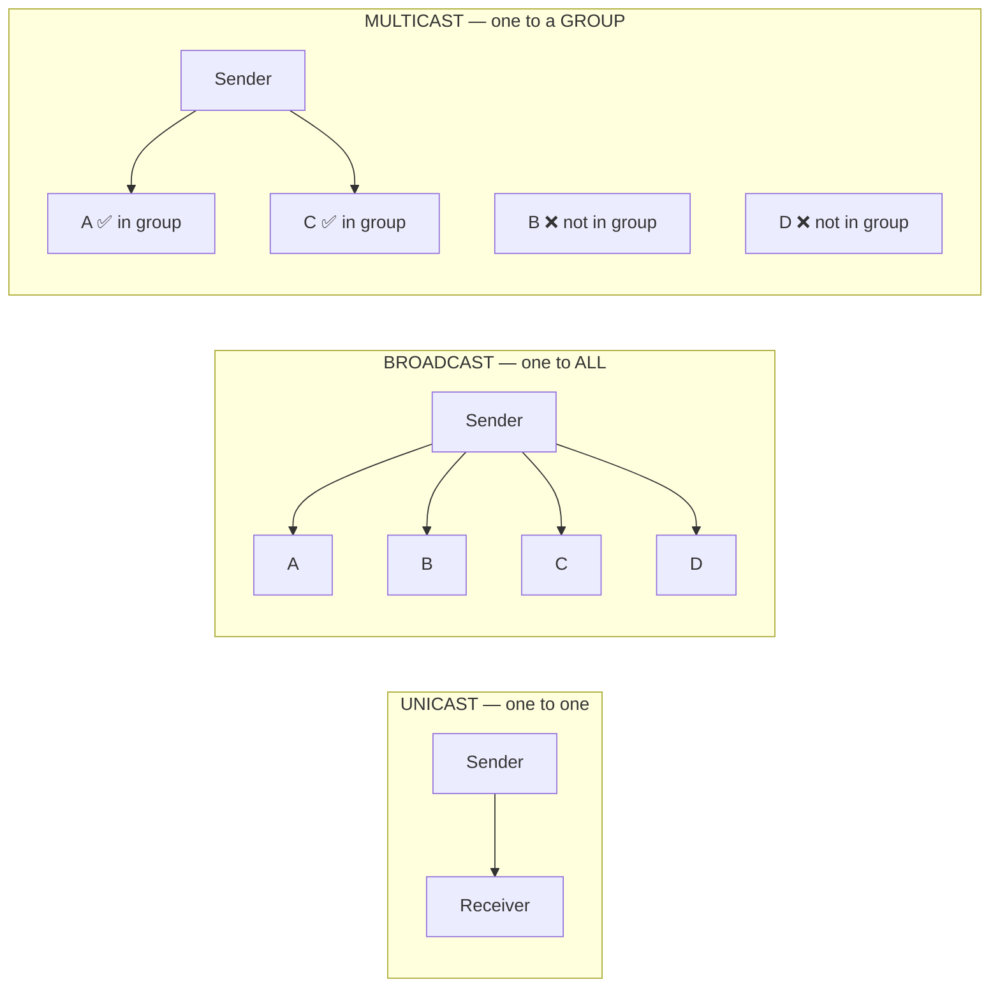

#### Delays in a network

> **Total delay = Transmission delay + Propagation delay + Queuing delay + Processing delay**

| Delay | Definition | Formula | Depends on |
|---|---|---|---|
| **Transmission delay** | The time to **PUSH ALL THE BITS of a packet onto the link** | **= Packet size (bits) ÷ Bandwidth (bps)** | **Packet size and link bandwidth** — NOT distance |
| **Propagation delay** | The time for **ONE BIT to TRAVEL** from sender to receiver across the medium | **= Distance ÷ Propagation speed** (≈ 2 × 10⁸ m/s in copper/fibre) | **DISTANCE and the medium** — NOT bandwidth or packet size |
| **Queuing delay** | Time spent **waiting in a router's buffer** | Variable | **Congestion** |
| **Processing delay** | Time for a router to examine the header and decide the route | Usually microseconds | Router speed |

> **The crucial distinction to state in the exam:**
> **Transmission delay depends on the SIZE of the packet and the SPEED of the link, but NOT on distance.**
> **Propagation delay depends on the DISTANCE and the medium, but NOT on the packet size or the bandwidth.**
>
> **Worked example:** sending a **1,000-byte** packet over a **1 Mbps** link across **200 km**:
> - Transmission delay = (1000 × 8 bits) ÷ (1 × 10⁶ bps) = 8000/10⁶ = **8 ms**
> - Propagation delay = 200,000 m ÷ (2 × 10⁸ m/s) = **1 ms**
> - Total ≈ **9 ms** (ignoring queuing and processing)

#### Factors affecting network performance

| Factor | Effect |
|---|---|
| **Bandwidth** | The ceiling on how much data can flow |
| **Latency** | Delay; critical for interactive applications |
| **Number of users / traffic load** | **Congestion** — the single biggest practical factor |
| **Transmission medium** | Fibre ≫ UTP ≫ wireless in speed and reliability |
| **Network devices** | A cheap hub or an overloaded router becomes the bottleneck |
| **Topology and design** | Poor design creates unnecessary hops and bottlenecks |
| **Protocol overhead** | Headers, acknowledgements and retransmissions consume capacity |
| **Errors and packet loss** | Cause retransmission, which multiplies the load |
| **Distance** | Increases propagation delay and attenuation |
| **Interference and noise** | Especially on wireless — walls, microwaves, other networks |
| **Server/host performance** | CPU, RAM and disk of the endpoints |
| **Security processing** | Encryption, firewall inspection and deep packet inspection add latency |
| **Collisions** (on shared media) | Wasted bandwidth; solved by switching |
| **Broadcast traffic** | Consumes bandwidth on every host; solved by VLANs/subnetting |
| **QoS configuration** | Determines which traffic gets priority |

#### Address types — a summary

| Address | Layer | Length | Identifies | Assigned by |
|---|---|---|---|---|
| **Physical / MAC address** | 2 | **48 bits** | **The network interface card** | Manufacturer |
| **Logical / IP address** | 3 | **32 bits** (IPv4) | **The host on a network** | Administrator or DHCP |
| **Port number** | 4 | **16 bits (0–65535)** | **The specific APPLICATION/process** on the host | The application / OS |
| **Specific / Application address** | 7 | Variable | The user or resource — an **email address, URL** | The service |

> **The four together answer four questions:** the MAC says *which machine on this wire*; the IP says *which machine on the Internet*; the port says *which program on that machine*; the URL or email address says *which resource or person*.

#### Connection-oriented vs connectionless

| Point | **Connection-oriented** | **Connectionless** |
|---|---|---|
| **Connection setup** | ✅ Required first (**handshake**) | ❌ None — just send |
| **Reliability** | ✅ Guaranteed — acknowledgements and retransmission | ❌ Best-effort |
| **Ordering** | ✅ Preserved | ❌ May arrive out of order |
| **Speed** | Slower | **Faster** |
| **Overhead** | High | **Low** |
| **Protocol** | **TCP** | **UDP, IP** |
| **Analogy** | A **telephone call** | A **postcard** |

#### Other terms

| Term | Definition |
|---|---|
| **Web server** | A computer and software (**Apache, Nginx, IIS**) that **stores web pages and delivers them over HTTP/HTTPS** in response to browser requests |
| **ISP** | **Internet Service Provider** — an organisation that **provides Internet access** and related services to customers (in Bangladesh: Grameenphone, Link3, Amber IT, BTCL) |
| **Search engine** | A system (**Google, Bing, DuckDuckGo**) that **crawls, indexes and ranks web pages** so users can find information by keyword |
| **WWW** | **World Wide Web** — the system of interlinked **hypertext documents** accessed over the Internet. The Web is an **application that runs ON the Internet**; the Internet is the underlying network |
| **URL** | **Uniform Resource Locator** — the complete address of a web resource: `https://www.bank.com.bd:443/account/login?id=5` = **protocol** + **domain** + **port** + **path** + **query** |
| **Interface protocol** | The set of rules governing communication **across the boundary between two layers or two systems** — how one layer requests service from the layer below, or how two different networks exchange data |
| **Access network** | The part of the network that **connects the end user to the ISP's core network** — the "last mile". Types: **DSL/ADSL** over telephone lines, **cable (HFC)**, **fibre (FTTH/GPON)**, **Ethernet LAN**, **wireless (Wi-Fi, WiMAX)**, **mobile (3G/4G/5G)**, **satellite/VSAT**, and **leased line** |
| **SDN** | **Software-Defined Networking** — an architecture that **SEPARATES the network's CONTROL PLANE from its DATA PLANE**, centralising all routing and policy decisions in a programmable **SDN controller**, while the switches become simple forwarding devices. Benefits: **central programmable control**, rapid reconfiguration, vendor independence, automation and better utilisation. Protocol: **OpenFlow** |

#### Designing a small office network

> *"To set up a network among the computers of your office, which type of network and which features would you prefer? Justify."*

**Recommended: a wired + wireless LAN in a star topology with a client-server architecture.**

| Decision | Choice | Justification |
|---|---|---|
| **Network type** | **LAN** | All computers are in one building |
| **Topology** | **STAR** (all devices to a central switch) | Easy to install and extend; **one cable failure affects only one machine**; simple to troubleshoot; the industry standard |
| **Architecture** | **Client-Server** (for >10 users) | Centralised **security, backup, user accounts and file storage** |
| **Medium** | **Cat6 UTP** for desktops, **Wi-Fi 6** for laptops and phones, **fibre** for any backbone run | Cat6 gives gigabit speed cheaply; fibre for distance |
| **Devices** | **Managed switch** (with VLAN support), **router/firewall**, **wireless access points**, **UPS** | Managed switches allow VLANs and monitoring |
| **Addressing** | **Private IPs via DHCP**, with **static IPs for servers and printers** | Automatic, conflict-free, easy to manage |
| **Segmentation** | **VLANs** per department + a separate **guest Wi-Fi VLAN** | Contains broadcast traffic and isolates guests |
| **Security** | **Firewall, WPA3, antivirus, strong passwords, backups** | Essential minimum |
| **Redundancy** | **UPS**, a spare switch, and daily backups | Business continuity |

> *"If the office needs a network for INTERNET USE ONLY, what steps?"*
> 1. Choose an **ISP** and a suitable **bandwidth plan** (estimate ~1–2 Mbps per concurrent user).
> 2. Get the ISP to terminate the connection on a **router/modem**.
> 3. Connect the router to a **switch**, and the switch to the computers with **Cat6 cable**; add **Wi-Fi access points** for mobile devices.
> 4. Configure the router: **WAN settings from the ISP**, **NAT**, **DHCP** to hand out private addresses, and **DNS**.
> 5. Secure it: change the **default router password**, enable **WPA3** on Wi-Fi, enable the **firewall**, and create a **separate guest network**.
> 6. Test connectivity from each device (`ping`, browse), and set up **bandwidth monitoring**.
> 7. Add a **UPS** so the router and switch survive power cuts.

#### Useful troubleshooting commands

| Command | Purpose |
|---|---|
| **`ping <host>`** | **Check basic connectivity** and measure round-trip time — the first test of any problem |
| **`ping 127.0.0.1`** | Test the **local TCP/IP stack** (the loopback) — if this fails, the problem is the machine itself |
| **`ipconfig`** (Windows) / **`ifconfig`** or **`ip addr`** (Linux) | Show **IP address, subnet mask and gateway** of each interface |
| `ipconfig /all` | Full detail including **MAC address and DNS servers** |
| `ipconfig /release` and `/renew` | Release and request a new DHCP lease |
| `ipconfig /flushdns` | Clear the **DNS cache** |
| **`tracert`** (Windows) / **`traceroute`** (Linux) | **Show every router hop** along the path and where the delay or failure occurs |
| **`nslookup`** / **`dig`** | **Test DNS resolution** |
| **`netstat -an`** | Show **active connections and listening ports** |
| **`arp -a`** | Show the **ARP cache** (IP-to-MAC mappings) |
| `route print` / `ip route` | Show the **routing table** |
| `telnet <host> <port>` / `nc -zv` | Test whether a **specific port** is open |
| `getmac` / `ip link` | Show the **MAC address** |

> **"Which command checks whether the LAN is connected?"** → **`ping`** the default gateway (e.g. `ping 192.168.1.1`). A reply confirms Layer 1–3 connectivity to the gateway. Combine with **`ipconfig`/`ifconfig`** to confirm an IP address has been obtained — if the address starts with **169.254.x.x (APIPA)**, the machine has **failed to reach the DHCP server**, which itself points to a cable, switch or DHCP problem.

**Previous Year Question List from this Topic:**

- [(ক) IP address এবং MAC Address- এর মাঝে তুলনা করুন।](../written-answers/computer-networks.md?plain=1#L3834)
- [(ক) সংজ্ঞা লিখুন: (i) Propagation delay, (ii) Transmission delay.](../written-answers/computer-networks.md?plain=1#L3854)
- [Write short note: Network, Protocol, link, gateway, Node.](../written-answers/computer-networks.md?plain=1#L3872)
- [(b) Define following terms: (i) Bandwidth (ii) Latency (iii) MAC Address (iv) IP address](../written-answers/computer-networks.md?plain=1#L3882)
- [Write short note: (i) web server (ii) ISP (iii) Router (iv) Search Engine](../written-answers/computer-networks.md?plain=1#L3911)
- [What is Interface protocol?](../written-answers/computer-networks.md?plain=1#L3920)
- [(ক) সংজ্ঞা লিখুন: WWW, URL, HTTP, IP Address, Router.](../written-answers/computer-networks.md?plain=1#L3929)
- [What is SDN?](../written-answers/computer-networks.md?plain=1#L3949)
- [(খ) Address গুলির সংক্ষিপ্ত বর্ণনা দিন। (i) Port Number (ii) IP অ্যাড্রেস (iii) MAC অ্যাড্রেস।](../written-answers/computer-networks.md?plain=1#L3982)
- [(i) নিচের MAC Address গুলো কোন ধরনের বের করুন। (a) 4C:23:10:4A:1A:2A (b) 45:24:56:2B:24:12 (c) FF:FF:FF:FF:FF:FF](../written-answers/computer-networks.md?plain=1#L3996)
- [Short Question: a) What are the protocol for connectionless and connection oriented? b) Why UTP cable are twisted? c) What are the main requirement of optical f…](../written-answers/computer-networks.md?plain=1#L4019)
- [Name of the Following figure:](../written-answers/computer-networks.md?plain=1#L4060)
- [What is difference between MAC Address and IP Address?](../written-answers/computer-networks.md?plain=1#L4102)
- [(b) List the factors that affect the performance of a network.](../written-answers/computer-networks.md?plain=1#L4126)
- [b) Two IP address map to same Ethernet address. Will both of them receive packets?](../written-answers/computer-networks.md?plain=1#L4212)
- [Write short note: Node, Backbone, Router and Gateway.](../written-answers/computer-networks.md?plain=1#L4222)
- [What is MAC address?](../written-answers/computer-networks.md?plain=1#L4257)
- [(a) To setup a network among the computers of your office which type of network and network features will you prefer? Justify your choice?](../written-answers/computer-networks.md?plain=1#L4269)
- [(b) Suppose, your office needs to setup a network which can uses for internet purpose only? What will be your steps to setup that network in terms of:](../written-answers/computer-networks.md?plain=1#L4288)
- [Explain the terms Domains, Bandwidth, Broadcast and Multicast.](../written-answers/computer-networks.md?plain=1#L4326)

**Previous Year MCQ List from this Topic:**

- [Set of rules is called _____](../mcq-answers/computer-networks.md?plain=1#L25)
- [The combination of an IP address and a port number is known as ____.](../mcq-answers/computer-networks.md?plain=1#L102)
- [The combination of an IP address and a port number is known as ____.](../mcq-answers/computer-networks.md?plain=1#L120)
- [A path for carrying signals between a source and a destination is known as-](../mcq-answers/computer-networks.md?plain=1#L199)
- [The abbreviation of bps stands for-](../mcq-answers/computer-networks.md?plain=1#L262)
- [FTP site are often called ________](../mcq-answers/computer-networks.md?plain=1#L271)
- [An email address has a user name, the @ symbol and the ________ computer's Name](../mcq-answers/computer-networks.md?plain=1#L280)
- [Wi-Fi stands for the Wireless ________](../mcq-answers/computer-networks.md?plain=1#L289)
- [Sockets and Winsock কোন ধরনের সফটওয়্যারের উদাহরণ?](../mcq-answers/computer-networks.md?plain=1#L298)
- [The ration of number of successful calls to the number of all call attempts is known as:](../mcq-answers/computer-networks.md?plain=1#L307)
- [What is the acceptance value of dividing point between the wonder and jitter?](../mcq-answers/computer-networks.md?plain=1#L316)
- [If the voice channel is free in PSTN then what would be the maximum data rate supported by 3.1 KHz bandwidth of voice channel?](../mcq-answers/computer-networks.md?plain=1#L325)
- [The full form of “Wi-Fi” is-](../mcq-answers/computer-networks.md?plain=1#L388)
- [RPC provides a(an) ________ on the client side, a separate one for each remote procedure.](../mcq-answers/computer-networks.md?plain=1#L406)
- [A network that requires human intervention of route signals is called a-](../mcq-answers/computer-networks.md?plain=1#L451)
- [Which of the following is an example of a client server model?](../mcq-answers/computer-networks.md?plain=1#L460)
- [In client server system what does the client program?](../mcq-answers/computer-networks.md?plain=1#L478)
- [What type of architecture does Skype use while conversation?](../mcq-answers/computer-networks.md?plain=1#L505)
- [Which approach is used in the client server model of the cluster?](../mcq-answers/computer-networks.md?plain=1#L514)
- [Rules used to establish & maintain communication is called ________](../mcq-answers/computer-networks.md?plain=1#L532)
- [Which of the following does not require a computer for transmission?](../mcq-answers/computer-networks.md?plain=1#L541)
- [Whole network will break if node is defect in which network topology?](../mcq-answers/computer-networks.md?plain=1#L487)


---

## Networking Devices

### Hub, Switch, Router, Bridge, Repeater and Gateway

#### The six devices at a glance

| Device | **OSI Layer** | Forwards based on | Ports | Collision domains | Broadcast domains |
|---|---|---|---|---|---|
| **Repeater** | **1 Physical** | Nothing — it **regenerates the signal** | 2 | **1** (shared) | 1 |
| **Hub** | **1 Physical** | Nothing — **broadcasts to all ports** | Many | **1** (ALL ports share one) | 1 |
| **Bridge** | **2 Data Link** | **MAC address** | 2–4 | **One per port** | 1 |
| **Switch** | **2 Data Link** | **MAC address** | Many (8–48+) | **One per PORT** | **1** (or one per **VLAN**) |
| **Router** | **3 Network** | **IP address** | Few | One per port | **One per PORT** |
| **Gateway** | **All layers (up to 7)** | **Protocol translation** | Varies | — | — |

#### 1. Repeater

A **repeater** is a **two-port Layer 1 device that receives a weakened (attenuated) signal, REGENERATES and amplifies it, and retransmits it** — extending the maximum distance a signal can travel.

It has **no intelligence at all**: it does not read addresses, does not filter, and simply reproduces everything including noise and collisions.

#### 2. Hub

A **hub** is a **multi-port repeater**. When a frame arrives on one port, the hub **broadcasts it out of EVERY other port**, regardless of the destination.

**Consequences:** all ports share **ONE collision domain**, so only one device may transmit at a time (**half duplex**); **collisions are frequent** and worsen rapidly as devices are added; and because every frame reaches every port, **anyone can sniff all traffic**. **Hubs are obsolete** and have been entirely replaced by switches.

#### 3. Bridge

A **bridge** is a **Layer 2 device that connects two LAN segments and filters traffic between them using MAC addresses**. It learns which MAC addresses are on each side and **only forwards a frame across if the destination is on the other segment**.

It **divides collision domains** (one per port) but **not broadcast domains**. A **switch is essentially a multi-port bridge implemented in hardware**, which is why bridges are rarely seen today.

#### 4. Switch

A **switch** is a **multi-port Layer 2 device that forwards frames INTELLIGENTLY, sending each frame only to the specific port where the destination MAC address lives.**

**How it works:**
1. **Learning** — it reads the **source MAC** of every incoming frame and records it against the port in its **MAC address table (CAM table)**.
2. **Forwarding** — for a known destination MAC, it sends the frame **only out of that one port** (unicast).
3. **Flooding** — for an **unknown** destination, or for a **broadcast/multicast**, it sends the frame out of all ports except the one it arrived on.
4. **Filtering** — if the source and destination are on the same port, it discards the frame.
5. **Aging** — entries are removed after a timeout.

**Key properties:** **each port is its own collision domain** → **no collisions**, **full duplex**, and **full bandwidth per port** (a 24-port gigabit switch gives each device its own gigabit, not a shared one). It also provides **security** — a device sees only its own traffic — and supports **VLANs**, which split the single broadcast domain into several.

**Types:** **unmanaged** (plug and play), **managed** (VLANs, QoS, monitoring, SNMP), **Layer 3 switch** (a switch that also routes between VLANs at wire speed), and **PoE switch** (supplies power over the data cable to phones, cameras and access points).

#### 5. Router

A **router** is a **Layer 3 device that connects DIFFERENT networks and forwards packets between them, choosing the best path using IP addresses and a routing table.**

**Functions:**
1. **Path determination** — consult the routing table and choose the best next hop.
2. **Packet forwarding** between different networks.
3. **Logical (IP) addressing** — it is the boundary between IP networks.
4. **BLOCKS BROADCASTS** — this is its most important characteristic: a router **does not forward broadcasts**, so it **separates broadcast domains**.
5. **NAT** — translates private addresses to public.
6. **DHCP server** and **DNS forwarder** (in small routers).
7. **Firewall / ACL filtering**.
8. **Connecting LAN to WAN / the Internet**.
9. **Protocol conversion** between different Layer 2 technologies (Ethernet ↔ PPP).

#### 6. Gateway

A **gateway** is a device (or software) that **connects two networks that use DIFFERENT protocols or architectures, and TRANSLATES between them.** It can operate at **any layer, up to and including Layer 7**, and is the most "intelligent" of these devices.

**Examples:** an **email gateway** converting between SMTP and a proprietary mail system; a **VoIP gateway** connecting an IP network to the traditional telephone network (PSTN); an **IoT gateway** converting Zigbee/LoRa to TCP/IP; a **payment gateway**; and the **default gateway** — the router your host sends all non-local traffic to.

#### The two most-asked comparisons

**Switch vs Router**

| Point | **Switch** | **Router** |
|---|---|---|
| **OSI Layer** | **2 — Data Link** (L3 switches also do Layer 3) | **3 — Network** |
| **Forwards using** | **MAC address** | **IP address** |
| **Table used** | **MAC address / CAM table** | **Routing table** |
| **Connects** | Devices **WITHIN one network (LAN)** | **DIFFERENT networks** — LAN to LAN, LAN to WAN |
| **Broadcast domain** | **ONE** for the whole switch (unless VLANs are used) | **One per interface — it BLOCKS broadcasts** |
| **Collision domain** | **One per port** | One per port |
| **Port count** | **Many** (24, 48) | **Few** (2–8) |
| **Speed** | **Faster** — hardware ASIC switching | Slower — more processing per packet |
| **Assigns IP addresses / NAT** | ❌ No | ✅ **Yes** |
| **Can connect to the Internet** | ❌ No | ✅ **Yes** |
| **Primary purpose** | **Efficient delivery inside a LAN** | **Path selection between networks** |
| **Price** | Cheaper per port | More expensive |

> **The two key differences to state:** (1) a switch forwards on **MAC addresses within a single network**, while a router forwards on **IP addresses between different networks**; and (2) a switch **passes broadcasts** (it is one broadcast domain), while a router **stops broadcasts** (each interface is a separate broadcast domain).

**Hub vs Switch vs Router**

| Point | **Hub** | **Switch** | **Router** |
|---|---|---|---|
| **Layer** | **1 Physical** | **2 Data Link** | **3 Network** |
| **Intelligence** | **None** | Medium — learns MACs | **Highest** — routing decisions |
| **Forwarding** | **Broadcasts to ALL ports** | **Only to the correct port** | Best path to another network |
| **Address used** | None | **MAC** | **IP** |
| **Collision domains** | **1 (shared)** | **One per port** | One per port |
| **Broadcast domains** | 1 | 1 (or one per VLAN) | **One per port** |
| **Duplex** | **Half** | **Full** | Full |
| **Bandwidth** | **Shared** among all ports | **Dedicated** per port | Per port |
| **Security** | ❌ Everyone sees everything | ✅ Isolated traffic | ✅ ACLs and firewall |
| **Cost** | Cheapest | Moderate | Most expensive |
| **Status** | **Obsolete** | **Standard in every LAN** | Essential for internet access |

> ### "Hub or Switch — which is better, and why?"
> ### ✅ **The SWITCH, without qualification.**
> 1. **No collisions** — each port is its own collision domain, so devices transmit simultaneously in **full duplex**.
> 2. **Full dedicated bandwidth per port** instead of sharing one channel.
> 3. **Security** — a device receives only the frames addressed to it; on a hub anyone can sniff everything.
> 4. **Scales** — adding devices to a hub degrades performance sharply; a switch does not.
> 5. **Features** — VLANs, QoS, port security, monitoring, PoE.
>
> A hub's only advantage was price, and switches are now so cheap that **hubs are no longer manufactured**.

**Router vs Gateway**

| Point | **Router** | **Gateway** |
|---|---|---|
| **Function** | **Routes packets** between networks **using the SAME protocol** | **Translates between networks using DIFFERENT protocols** |
| **Layer** | **3** | **Any, up to 7** |
| **Protocol conversion** | ❌ No (or minimal) | ✅ **Yes — its defining function** |
| **Complexity** | Moderate | **Highest** |
| **Speed** | Faster | Slower (translation costs time) |
| **Example** | Connecting two IP networks | **VoIP gateway** (IP ↔ PSTN), **email gateway**, IoT gateway |
| **Relationship** | **Every router is a kind of gateway, but not every gateway is a router.** In everyday usage a home "router" acts as the **default gateway** for the LAN | |

> **Is there a difference?** **Yes, in principle** — a router forwards between networks speaking the same language, while a gateway **translates between different languages**. **In everyday practice the terms overlap**, because the device that routes your traffic to the Internet is also called your "default gateway". The precise answer is: *routing is about **path selection**; gateway functionality is about **protocol translation**.*

**Gateway vs Firewall**

| Point | **Gateway** | **Firewall** |
|---|---|---|
| **Purpose** | **Connect and translate** between networks | **Filter and control** traffic for security |
| **Primary concern** | **Connectivity** | **Security** |
| **Action** | Converts protocols and forwards | **Permits or DENIES** based on rules |
| **Layer** | Any | 3–4 (or up to 7 for an NGFW) |
| **Blocks traffic?** | Not by design | ✅ **Yes — that is its job** |
| **Analogy** | A **translator at the border** | The **immigration officer** deciding who may pass |

> They are **complementary**, and modern devices combine them: a single appliance may act as the **default gateway, the NAT router and the firewall** all at once.

**Previous Year Question List from this Topic:**

- [Describe the functions of a Switch and a Router and explain two key differences between these networking devices.](../written-answers/computer-networks.md?plain=1#L4386)
- [Briefly describe the following network devices: Repeater, Hub, Bridge, Switch and Router.](../written-answers/computer-networks.md?plain=1#L4413)
- [Difference among Switch, Bridge and Router.](../written-answers/computer-networks.md?plain=1#L4472)
- [Write down the difference between gateway and firewall.](../written-answers/computer-networks.md?plain=1#L4530)
- [What is gateway? Is router and gateway have any difference?](../written-answers/computer-networks.md?plain=1#L4549)
- [অথবা, (ক) ডেটা ট্রান্সমিশনে Router ও Gateway এর মধ্যে কোনটি অধিকতর সুবিধাজনক-মতামত ব্যক্ত করুন।](../written-answers/computer-networks.md?plain=1#L4574)
- [Write the Difference among Network Switch, Hub and Router.](../written-answers/computer-networks.md?plain=1#L4602)
- [(iii) Router and Gateway এর ফাংশন লিখুন।](../written-answers/computer-networks.md?plain=1#L4626)
- [Write down the difference between Hub and Switch.](../written-answers/computer-networks.md?plain=1#L4652)
- [Wi-Fi access point বলতে কী বুঝানো হয়? Router and Switch -এর মধ্যে পার্থক্য লিখুন।](../written-answers/computer-networks.md?plain=1#L4674)
- [হাব, সুইচ ও রাউটার এর মধ্যে পার্থক্য লিখ।](../written-answers/computer-networks.md?plain=1#L4701)
- [(c) Briefly describe three devices using which different LANs can be connected.](../written-answers/computer-networks.md?plain=1#L4724)
- [(ক) Hub এবং Switch কী? কোনটির ব্যবহার সুবিধাজনক সপক্ষে যুক্তি দিন।](../written-answers/computer-networks.md?plain=1#L4756)
- [Difference among HUB, Switch and Router.](../written-answers/computer-networks.md?plain=1#L4782)
- [(a) What are the difference among Hub, Switch and Routers?](../written-answers/computer-networks.md?plain=1#L4802)
- [Difference between Router and Switch.](../written-answers/computer-networks.md?plain=1#L4831)
- [Describe about Hub, Switch and Router.](../written-answers/computer-networks.md?plain=1#L4855)

**Previous Year MCQ List from this Topic:**

- [What is the primary function of a Repeater in a computer network?](../mcq-answers/computer-networks.md?plain=1#L556)
- [Which command loads a new version of the Cisco IOS into a router](../mcq-answers/computer-networks.md?plain=1#L1249)
- [Which device converts digital to analog signal?](../mcq-answers/computer-networks.md?plain=1#L1258)
- [নিচের কোনটি নেটওয়ার্ক ডিভাইস নয়? Ans: Wi-Fi](../mcq-answers/computer-networks.md?plain=1#L1267)
- [NIC Stands for–](../mcq-answers/computer-networks.md?plain=1#L1272)
- [Which of the following is a device that is used to connect a number of LANs?](../mcq-answers/computer-networks.md?plain=1#L1281)


---

### Collision Domains and Broadcast Domains

#### The definitions

| Term | Definition |
|---|---|
| **Collision domain** | A network segment in which **data packets can COLLIDE with one another** — i.e. where devices **share the same transmission medium** and only one may transmit at a time |
| **Broadcast domain** | A network segment in which a **BROADCAST frame sent by any device reaches EVERY other device** |

#### How each device affects them

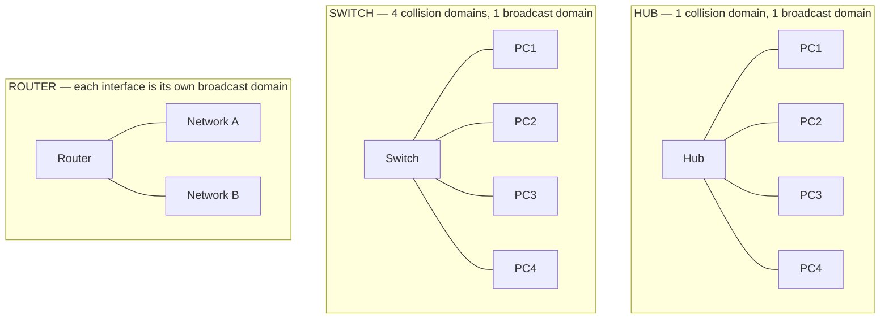

| Device | Collision domains created | Broadcast domains created |
|---|---|---|
| **Hub / Repeater** | **1** (all ports share it) | **1** |
| **Bridge / Switch** | **ONE PER PORT** | **1** (or one per VLAN) |
| **Router** | One per port | **ONE PER PORT** |

> ### "How many collision domains are created when you segment a network with a 12-port switch?"
> ### ✅ **12 collision domains — one per port.**
>
> **The reason:** a switch **microsegments** the network. Each port is a separate segment with its own dedicated bandwidth, and because each connection is **full duplex**, collisions cannot occur at all.
>
> **And how many broadcast domains?** ✅ **ONE** — a switch forwards broadcasts out of every port, so the whole switch is a single broadcast domain (unless **VLANs** are configured, in which case there is **one broadcast domain per VLAN**).

#### Collision domain vs Broadcast domain

| Point | **Collision Domain** | **Broadcast Domain** |
|---|---|---|
| **OSI layer** | **1 — Physical** | **2 — Data Link** |
| **Problem it describes** | Two devices transmitting **at the same time** on shared media | A broadcast frame flooding every device |
| **Created/divided by** | **Switch and Router** (each port = one domain) | **ROUTER** (each port = one domain), or a **VLAN** |
| **NOT divided by** | Hub, repeater | **Hub, repeater, SWITCH** |
| **Relevant to** | CSMA/CD, half-duplex Ethernet | ARP requests, DHCP discovery, broadcast storms |
| **Modern relevance** | **Almost eliminated** by full-duplex switching | **Still very relevant** — the reason we use VLANs and subnets |
| **Larger domain means** | More collisions, lower throughput | More broadcast traffic, lower performance and weaker security |

**Why it matters:** a large broadcast domain wastes bandwidth on every host (each must process every broadcast) and enables **broadcast storms**, **ARP spoofing** and easier reconnaissance. The cure is **subnetting and VLANs** — which is exactly why network design revolves around keeping broadcast domains small.

#### Wi-Fi access point

A **Wireless Access Point (WAP/AP)** is a **Layer 2 device that allows wireless devices to connect to a wired network**, acting as a **bridge between the Wi-Fi (802.11) medium and the Ethernet (802.3) LAN**.

**Functions:** transmits and receives the radio signal · **bridges** wireless frames to the wired network · handles **association and authentication** (WPA2/WPA3) · encrypts the wireless link · broadcasts the **SSID** · manages multiple clients on a shared channel with **CSMA/CA**.

| Point | **Access Point** | **Router** |
|---|---|---|
| **Layer** | 2 | 3 |
| **Provides Wi-Fi** | ✅ Yes — its only job | Only if it has a built-in AP |
| **Assigns IP addresses (DHCP)** | ❌ No | ✅ Yes |
| **Performs NAT / connects to the Internet** | ❌ No | ✅ Yes |
| **Creates a new network** | ❌ No — it extends the existing one | ✅ Yes |
| **Typical use** | **Extending Wi-Fi coverage** in an office, controlled by a central controller | The single device at the edge of a home network |

*(A **home "Wi-Fi router"** is really **three devices in one box**: a router, a switch and a wireless access point — which is why the terms are so often confused.)*

#### Three devices used to connect different LANs

> *"Briefly describe three devices using which different LANs can be connected."*

| Device | How it connects LANs | Layer |
|---|---|---|
| **Bridge** | Connects **two LAN segments using the same protocol**, filtering by **MAC address** so only cross-segment traffic passes. Divides collision domains | **2** |
| **Switch** | A **multi-port bridge**; connects many segments, forwards by MAC, and with **VLANs** can logically separate them | **2** |
| **Router** | Connects **LANs that are DIFFERENT IP networks**, forwarding by **IP address** and choosing the best path. **Blocks broadcasts**, so each LAN stays its own broadcast domain. **The standard answer** | **3** |
| **Gateway** | Connects LANs running **entirely different protocols or architectures**, by **translating** between them | Up to **7** |

*(A **repeater/hub** can also physically extend a LAN, but it does not truly "connect different LANs" — it merely extends one.)*

**Previous Year Question List from this Topic:**

- [How many collision domians are created when you segment a network with a 12-port switch?](../written-answers/computer-networks.md?plain=1#L4451)
- [Differentiate between Collision Domain and Broadcast Domain in computer network. What is the function of DNS and DHCP?](../written-answers/computer-networks.md?plain=1#L4495)

## Application Layer Protocols & Troubleshooting (DNS, DHCP, HTTPS)

### DNS — Domain Name System

#### What is DNS?

The **Domain Name System (DNS)** is the **distributed, hierarchical naming system of the Internet that translates human-readable DOMAIN NAMES into machine-usable IP ADDRESSES** (and back).

> **DNS is often called "the phone book of the Internet"** — people remember `www.bank.com.bd`; computers need `203.112.18.25`. DNS is the directory that converts one into the other.

#### Functions of DNS

1. **Name resolution** — domain name → IP address (**forward lookup**).
2. **Reverse resolution** — IP address → domain name (**reverse lookup**).
3. **Mail routing** — **MX records** tell senders which server handles a domain's email.
4. **Load distribution** — returning several IPs for one name, or the nearest server (GeoDNS).
5. **Service discovery** — SRV records locate services.
6. **Aliasing** — CNAME records point one name at another.
7. **Domain authentication** — **SPF, DKIM and DMARC** records are stored in DNS.

#### The DNS hierarchy

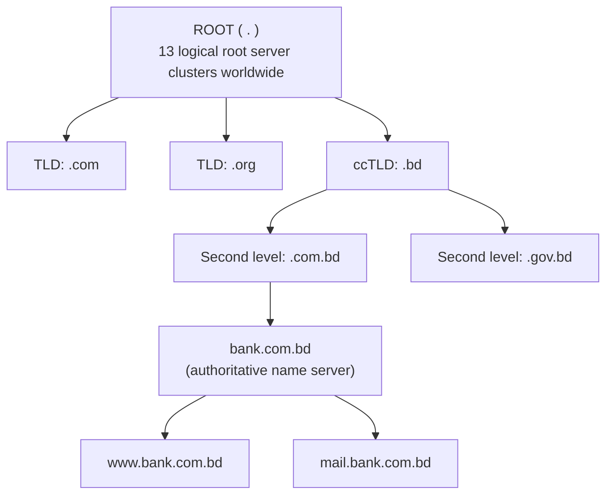

**Reading a fully-qualified domain name** — `www.bank.com.bd.` is read **RIGHT to LEFT**: `.` (root) → `.bd` (country-code TLD) → `.com.bd` (second level) → `bank` (the domain) → `www` (the host).

#### The four types of DNS server

| Server | Role |
|---|---|
| **DNS Resolver** (recursive resolver) | The server your computer asks. It does **all the work on your behalf** — querying the root, TLD and authoritative servers in turn — and returns the final answer. Usually run by your **ISP**, or a public one (**8.8.8.8** Google, **1.1.1.1** Cloudflare) |
| **Root name server** | Knows only **which server handles each TLD**. There are **13 logical root servers** (letters A–M), implemented as hundreds of physical servers via anycast |
| **TLD name server** | Knows which **authoritative server** holds each domain under its TLD (`.com`, `.bd`) |
| **Authoritative name server** | Holds the **actual DNS records** for a domain — the final, definitive answer |

#### How DNS resolution works — the full trace

> *Resolving `www.bank.com.bd`:*

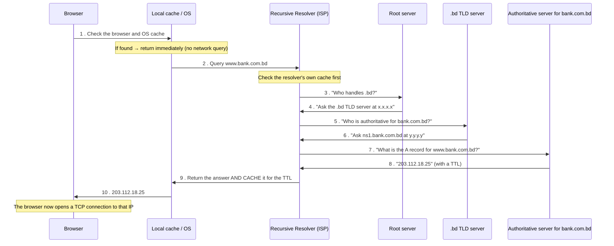

#### Recursive vs Iterative query

| Point | **Recursive query** | **Iterative query** |
|---|---|---|
| **Who does the work** | The **resolver does everything** and returns the final answer | The **client must follow each referral itself** |
| **Response** | The final IP address, or an error | A **referral** — "ask this other server" |
| **Used between** | **Client → Resolver** | **Resolver → Root/TLD/Authoritative** |
| **Load** | Heavy on the resolver | Light on each server |

#### Forward vs Reverse DNS lookup

| Point | **Forward lookup** | **Reverse lookup** |
|---|---|---|
| **Direction** | **Domain name → IP address** | **IP address → domain name** |
| **Record type** | **A** (IPv4) / **AAAA** (IPv6) | **PTR** (pointer) |
| **Zone** | The normal domain zone | The special **`in-addr.arpa`** zone (IPv6: `ip6.arpa`) |
| **Example** | `www.bank.com.bd` → `203.112.18.25` | `203.112.18.25` → `25.18.112.203.in-addr.arpa` → `www.bank.com.bd` |
| **Used for** | **Every normal browsing and connection** | **Anti-spam verification of mail servers**, logging, troubleshooting, security investigation |

> **Why reverse DNS matters:** mail servers routinely **reject email from a sending IP that has no matching PTR record**, because legitimate mail servers always have one and spam sources usually do not. It is one of the cheapest anti-spam checks available.

#### Common DNS record types

| Record | Purpose |
|---|---|
| **A** | Maps a name to an **IPv4** address |
| **AAAA** | Maps a name to an **IPv6** address |
| **CNAME** | An **alias** pointing one name to another name |
| **MX** | The **mail server** for the domain, with a priority |
| **NS** | The **authoritative name servers** for the zone |
| **PTR** | **Reverse** mapping — IP to name |
| **SOA** | **Start of Authority** — the zone's master record (serial, refresh, TTL) |
| **TXT** | Free text — used for **SPF, DKIM, DMARC** and domain-ownership verification |
| **SRV** | Locates a **service** (host and port) |
| **CAA** | Specifies which **CAs** may issue certificates for the domain |

#### DNS caching — server vs cache

| Point | **DNS Server (authoritative)** | **DNS Cache** |
|---|---|---|
| **What it holds** | The **original, authoritative records** for its zone | A **temporary COPY** of answers recently looked up |
| **Source of truth** | ✅ **Yes** | ❌ No — it is a copy that may become stale |
| **Location** | The domain owner's / ISP's server | The **browser, the OS, the router and the resolver** |
| **Lifetime** | Permanent until changed by the administrator | Limited by the record's **TTL (Time To Live)** |
| **Answers from** | Its own zone file | Memory |
| **Purpose** | To **define** the mapping | To **speed up** repeated lookups |

**The importance of DNS caching to the World Wide Web:**
1. **Speed** — a cached answer takes **microseconds** instead of the 20–200 ms of a full recursive lookup. Every web page triggers dozens of DNS lookups.
2. **Massively reduced load** on the root and TLD servers — without caching they would receive **billions of extra queries per second** and the Internet would not function.
3. **Bandwidth saving** across the whole network.
4. **Resilience** — cached entries keep working briefly even if an authoritative server goes down.
5. **Lower cost** for ISPs and users.

**The trade-off:** a change takes up to the **TTL** to reach everyone (which is why administrators **lower the TTL before a planned migration**), and caches can be **poisoned** — the attack described in the security chapter.

#### Why DNS uses UDP

> ### "Why does DNS primarily use UDP instead of TCP?"
>
> **DNS uses UDP on port 53 for ordinary queries, because:**
>
> 1. **Speed — the decisive reason.** A DNS query and its answer are **one small packet each**. Using TCP would require a **three-way handshake (3 extra packets) before any data, and a four-way teardown afterwards** — turning a 1-round-trip operation into 4 or more. Since **every** web page load begins with DNS, that overhead would be added to every user action on the Internet.
> 2. **Small message size.** A query and response traditionally fit within **512 bytes**, a single UDP datagram — there is nothing to segment or reorder, so TCP's machinery is pure waste.
> 3. **Statelessness and scalability.** A UDP server keeps **no connection state**, so a single root or TLD server can handle **enormously more queries** with the same hardware. TCP connections consume memory per client.
> 4. **Retransmission is cheap and simple.** If a UDP response is lost, the resolver simply **asks again** — or asks a different server. There is no need for TCP's sequence numbers and acknowledgements.
> 5. **Lower resource consumption** on both ends.
>
> **When DNS DOES use TCP (port 53):**
> - **Zone transfers (AXFR/IXFR)** between primary and secondary servers — these are large and must be reliable.
> - **Responses larger than 512 bytes** — the server sets the **TC (truncated) flag** and the resolver **retries over TCP**. This is now common with **DNSSEC** signatures and large record sets.
> - **DNS over TLS (DoT, port 853)** and **DNS over HTTPS (DoH, port 443)** — the modern encrypted forms, which are TCP-based.
>
> **So the statement "TCP/IP is used in DNS" is also correct** — DNS runs over the TCP/IP protocol suite, and uses **both** transport protocols: **UDP for speed on normal queries, TCP for reliability on large transfers.**

#### How a browser retrieves the IP address from a URL

1. The user enters `https://www.bank.com.bd/login`.
2. The browser **parses the URL** into protocol (`https`), host (`www.bank.com.bd`), port (443 implied) and path (`/login`).
3. It checks its **own DNS cache**, then the **OS cache**, then the **hosts file**.
4. If not found, it asks the configured **recursive resolver**.
5. The resolver performs the **root → TLD → authoritative** sequence (or answers from its cache).
6. The **A/AAAA record** is returned and cached at every level according to the **TTL**.
7. The browser opens a **TCP connection** to that IP on **port 443** and performs the **TLS handshake**.
8. It sends the **HTTP GET /login** request and renders the response.

#### Web caching

**Web caching** stores **copies of web content closer to the user**, so that repeated requests are served without going back to the origin server.

| Type | Where |
|---|---|
| **Browser cache** | On the user's own device |
| **Proxy cache** | On an organisation's or ISP's proxy server |
| **CDN cache** | On edge servers distributed worldwide (Cloudflare, Akamai) |
| **Reverse proxy cache** | In front of the origin server (Nginx, Varnish) |

**Why we use web caching:** **much faster page loads** (content is served from nearby) · **reduced bandwidth cost** for both the ISP and the website · **reduced load on the origin server**, so it can serve more users with less hardware · **better availability** — cached content survives a brief origin outage · and **lower latency** for geographically distant users. The trade-offs are **staleness** (managed with `Cache-Control`, `ETag` and expiry headers) and the fact that **personalised or dynamic content cannot be cached** the same way.

**Previous Year Question List from this Topic:**

- [Write down the DNS function.](../written-answers/computer-networks.md?plain=1#L5054)
- [Why does the Domain Name System (DNS) primarily use UDP as its transport layer protocol instead of TCP? Describe the sequence of events that take place during t…](../written-answers/computer-networks.md?plain=1#L5083)
- [SMTP, DNS, DHCP, NAT এর কাজ কি লিখ?](../written-answers/computer-networks.md?plain=1#L5208)
- [What is DNS? What is forward and reverse lookup DNS?](../written-answers/computer-networks.md?plain=1#L5232)
- [Write a command how to find DNS www.egcb.gov.bd and which protocol uses?](../written-answers/computer-networks.md?plain=1#L5286)
- [(a) How does a browser retrieve IP address from URL?](../written-answers/computer-networks.md?plain=1#L5346)
- [(d) What is DNS? “TCP/IP is used in DNS”- justify the statement.](../written-answers/computer-networks.md?plain=1#L5367)
- [(b) How is Hierarchical DNS resolution done in Domain Naming System? Give an example resolution for xyz.uv.gov.bd domain name.](../written-answers/computer-networks.md?plain=1#L5387)
- [What is Web cashing? Why we use web cashing?](../written-answers/computer-networks.md?plain=1#L5427)
- [What is DNS Resolver?](../written-answers/computer-networks.md?plain=1#L5459)
- [DNS server এবং DHCP server এর কাজ কী?](../written-answers/computer-networks.md?plain=1#L5483)
- [(a) Differentiate between DNS server and caches.](../written-answers/computer-networks.md?plain=1#L5522)
- [What is the difference between DNS server and caches? What is the importance of DNS cache in World Wide Web?](../written-answers/computer-networks.md?plain=1#L5541)
- [a. What is SQL, b. What is API c. What is recursion d. DNS port number?](../written-answers/computer-networks.md?plain=1#L5595)

**Previous Year MCQ List from this Topic:**

- [DNS port number is:](../mcq-answers/computer-networks.md?plain=1#L784)
- [Who is controlling "Domain" in the world?](../mcq-answers/computer-networks.md?plain=1#L793)
- [In an email address "abc@xxx.bd", the portion 'xxx' indicate](../mcq-answers/computer-networks.md?plain=1#L802)
- [A DNS client is called a ____________](../mcq-answers/computer-networks.md?plain=1#L829)
- [A DNS response is classified as ____ if the information comes from a cache memory.](../mcq-answers/computer-networks.md?plain=1#L838)
- [Which of the following services uses both TCP and UDP ports?](../mcq-answers/computer-networks.md?plain=1#L865)
- [Domain Name থেকে IP-mapping করতে কোনটি কাজ করে?](../mcq-answers/computer-networks.md?plain=1#L1031)
- [কোনটি UDP protocol use করে?](../mcq-answers/computer-networks.md?plain=1#L1058)
- [Which of the following protocol used TCP and UDP ports?](../mcq-answers/computer-networks.md?plain=1#L1076)
- [Which of the following protocols uses both TCP and UDP ports?](../mcq-answers/computer-networks.md?plain=1#L1103)
- [Domain name to IP address mapping is done by-](../mcq-answers/computer-networks.md?plain=1#L1139)
- [What does DNS database contain?](../mcq-answers/computer-networks.md?plain=1#L1193)


---

### DHCP — Dynamic Host Configuration Protocol

#### What is DHCP?

**DHCP (Dynamic Host Configuration Protocol)** is an application-layer protocol that **automatically assigns IP addresses and other network configuration parameters to devices when they join a network**, removing the need for manual configuration.

**What DHCP provides to a client:** the **IP address**, the **subnet mask**, the **default gateway**, the **DNS server addresses**, the **lease duration**, and optionally the domain name, NTP server, WINS server and TFTP/boot server.

> **The answer to "which server dynamically assigns IP addresses to PCs on a LAN?" is the DHCP SERVER.**

#### How DHCP works — the DORA process

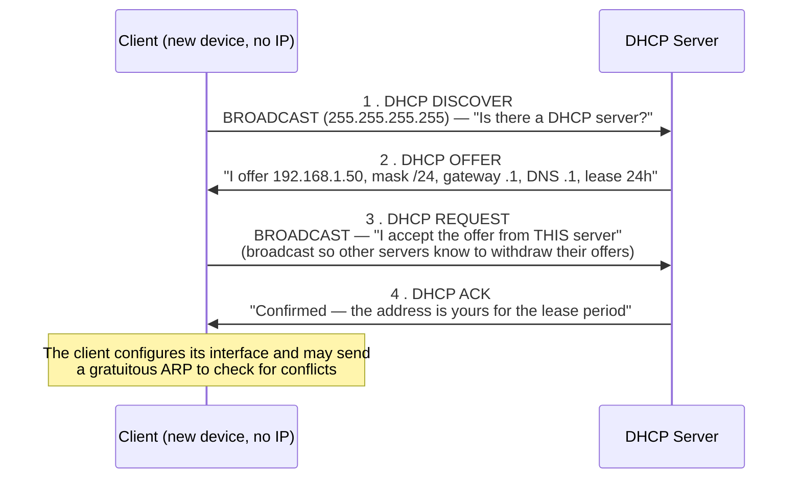

> **Remember the four steps as DORA: Discover → Offer → Request → Acknowledge.**
>
> **Why are steps 1 and 3 broadcasts?** Because the client **has no IP address yet** and does not know the server's address, so it must shout to the whole segment. **UDP port 67** is the server, **port 68** the client.

#### Lease renewal

The client attempts to renew at **50 % of the lease (T1)** by unicasting a REQUEST to its server; if that fails, it tries again at **87.5 % (T2)** by broadcasting to any server; if the lease expires entirely, it must start DORA again.

#### DHCP across subnets — the relay agent

Because DHCP DISCOVER is a **broadcast**, and **routers do not forward broadcasts**, a DHCP server on another subnet would never hear it. The solution is a **DHCP Relay Agent** (the Cisco `ip helper-address` command) configured on the router, which **converts the broadcast into a unicast** aimed at the real DHCP server, and relays the reply back.

#### Advantages and disadvantages

**Advantages:** **no manual configuration** — a network of 500 devices configures itself · **no IP conflicts** — the server tracks every allocation · **efficient reuse** of addresses through leases · **centralised management** — change the DNS server once and every client picks it up · **mobility** — a laptop gets a valid address on any network it joins · **fewer errors** than manual typing.

**Disadvantages:** the DHCP server is a **single point of failure** (mitigated by redundant servers) · **security risks** — **rogue DHCP servers** and **DHCP starvation** attacks (mitigated by **DHCP snooping**) · addresses **change over time**, so servers and printers need **reservations or static addresses** · and the broadcast traffic it generates.

> **APIPA:** if a Windows client finds **no DHCP server**, it self-assigns an address from **169.254.0.0/16**. Seeing a 169.254.x.x address is therefore a **definite diagnostic sign that DHCP has failed** — check the cable, the switch port, and the DHCP server.

#### Static vs Dynamic IP addressing

| Point | **Static IP** | **Dynamic IP (DHCP)** |
|---|---|---|
| **Assigned by** | **Manually**, by an administrator | **Automatically**, by a DHCP server |
| **Changes** | **Never** (until changed by hand) | **Changes** at each lease renewal or reconnection |
| **Configuration effort** | **High** — every device by hand | **None** |
| **Risk of conflict** | **High** — human error | **Very low** |
| **Cost** | Public static IPs cost more from an ISP | Included |
| **Suitable for** | **Servers, routers, printers, CCTV, VoIP phones** — anything that must be found at a known address | **Workstations, laptops, phones, guests** |
| **Remote access / hosting** | ✅ **Essential** — you cannot host a service on an address that changes | ❌ Difficult (needs dynamic DNS) |
| **Security** | Easier to apply IP-based rules; but also easier to target | Address changes offer slight obscurity |

**Previous Year Question List from this Topic:**

- [What is DHCP?](../written-answers/computer-networks.md?plain=1#L5118)
- [Which server can be used to dinamically assign IP address to the PCs is a LAN?](../written-answers/computer-networks.md?plain=1#L5164)
- [Explain how do DHCP work?](../written-answers/computer-networks.md?plain=1#L5175)
- [SMTP, DNS, DHCP, NAT এর কাজ কি লিখ?](../written-answers/computer-networks.md?plain=1#L5208)
- [DNS server এবং DHCP server এর কাজ কী?](../written-answers/computer-networks.md?plain=1#L5483)
- [Write short notes on DHCP and SMTP.](../written-answers/computer-networks.md?plain=1#L5568)
- [What is static IP Address and dynamic IP Address?](../written-answers/computer-networks.md?plain=1#L1819)

**Previous Year MCQ List from this Topic:**

- [Which protocol assigns IP address to the client connected in the internet?](../mcq-answers/computer-networks.md?plain=1#L811)
- [DHCP is–](../mcq-answers/computer-networks.md?plain=1#L820)
- [_______ is a client-server program that provides and IP address, subnet mask, IP address of a router, and IP address of a name server to a computer.](../mcq-answers/computer-networks.md?plain=1#L856)
- [Which protocol dynamically assigns IP addresses in a TCP/IP network?](../mcq-answers/computer-networks.md?plain=1#L910)
- [DHCP means?](../mcq-answers/computer-networks.md?plain=1#L950)
- [Which server can you use to dynamically assign IP addresses to the PCs in a LAN?](../mcq-answers/computer-networks.md?plain=1#L1004)
- [What can greatly reduce TCP/IP configuration problem?](../mcq-answers/computer-networks.md?plain=1#L1022)
- [DHCP discover message টি কোন ধরনের?](../mcq-answers/computer-networks.md?plain=1#L1040)
- [a) Write full form: DHCP and ARP](../mcq-answers/computer-networks.md?plain=1#L647)


---

### Other Application Layer Protocols and Troubleshooting

#### The main application-layer protocols

| Protocol | Port | Transport | Purpose |
|---|---|---|---|
| **HTTP** | **80** | TCP | Web page transfer |
| **HTTPS** | **443** | TCP | Encrypted web transfer (HTTP over TLS) |
| **FTP** | **20 (data), 21 (control)** | TCP | File transfer |
| **TFTP** | 69 | **UDP** | Trivial file transfer (router configs, PXE boot) |
| **SSH** | **22** | TCP | **Secure remote login** and secure file transfer |
| **Telnet** | **23** | TCP | Remote login — **UNENCRYPTED, obsolete** |
| **SMTP** | **25** (587 submission) | TCP | **Sending** email |
| **POP3** | **110** (995 secure) | TCP | **Downloading** email |
| **IMAP** | **143** (993 secure) | TCP | **Accessing** email on the server |
| **DNS** | **53** | **UDP** (TCP for large/zone transfer) | Name resolution |
| **DHCP** | **67 (server), 68 (client)** | **UDP** | Automatic IP configuration |
| **SNMP** | **161 / 162 (trap)** | UDP | Network device management |
| **NTP** | 123 | UDP | Time synchronisation |
| **LDAP** | 389 (636 secure) | TCP | Directory access |
| **RDP** | 3389 | TCP | Windows remote desktop |

> **"Which protocol is used for connecting to a remote computer?"** → **SSH (port 22)** for secure command-line access on Linux/Unix; **RDP (port 3389)** for a Windows graphical desktop; **Telnet (23)** historically, but it is **insecure and must not be used**. **VNC** is another graphical option.

#### ICMP

**ICMP (Internet Control Message Protocol)** is a **Network-layer (Layer 3)** protocol used for **error reporting and network diagnostics** — not for carrying user data.

**Message types:** Echo Request / Echo Reply (**used by `ping`**), Destination Unreachable, Time Exceeded (**used by `traceroute`**), Source Quench, Redirect.

> ### "Which protocol does the `ping` tool use?"
> ### ✅ **ICMP** — specifically **ICMP Echo Request (Type 8)** and **ICMP Echo Reply (Type 0)**.
>
> `ping` sends an Echo Request to the target and measures the time until the Echo Reply returns, reporting **reachability, round-trip time and packet loss**. Note that ICMP has **no port numbers**, because it is a Layer 3 protocol that sits directly on IP — this is why "which port does ping use?" is a trick question: **none**.

**`traceroute`/`tracert`** works by sending packets with **deliberately small TTL values** (1, 2, 3 …). Each router that decrements the TTL to zero returns an **ICMP Time Exceeded** message, revealing its identity — so the tool maps the entire path hop by hop.

#### A worked troubleshooting scenario

> *A government portal connected to multiple international ISPs is slow or unreachable for some users.*

**Diagnose in layers, from the bottom up:**

| Step | Check | Command / tool |
|---|---|---|
| 1 | **Is the host itself up?** | `ping 127.0.0.1`, check interface status |
| 2 | **Is the local network reachable?** | `ping <default gateway>` |
| 3 | **Is DNS resolving correctly and consistently?** | `nslookup portal.gov.bd`, compare answers from several resolvers; check TTL and propagation |
| 4 | **Where does the path break or slow down?** | `tracert` / `mtr` **from several different networks** — this is what reveals an ISP-specific problem |
| 5 | **Is one ISP path bad?** | Compare traceroutes via each upstream; check **BGP** advertisements and route preference |
| 6 | **Is the server overloaded?** | CPU, memory, connection count, web server logs |
| 7 | **Is it a firewall/ACL issue?** | Test the specific port with `telnet host 443`, review firewall logs |
| 8 | **Is it a certificate or TLS problem?** | Check expiry, chain completeness and supported TLS versions |
| 9 | **Is it a DDoS?** | Traffic volume and pattern analysis |
| 10 | **Fix and verify** | Correct DNS records/TTL, adjust BGP routing, add a CDN, scale the server, and re-test from multiple vantage points |

**Previous Year Question List from this Topic:**

- [(http://BSCPL.bd.gov)(http://BSCPL.bd.gov) is connected to multiple international ISPs, and users can successfully access other websites, but they are unable to…](../written-answers/computer-networks.md?plain=1#L4975)
- [Which protocol is used by the ping tools?](../written-answers/computer-networks.md?plain=1#L5144)
- [What is ICMP, SMTP, POP server, Boot loader and Clustering?](../written-answers/computer-networks.md?plain=1#L5258)
- [For the following description of various IP networking protocols write down the protocol name and its full form in the following table:](../written-answers/computer-networks.md?plain=1#L5318)
- [দূরবর্তী কম্পিউটার সংযোগ এর জন্য কোন প্রোটোকল ব্যবহার করা হয়?](../written-answers/computer-networks.md?plain=1#L5504)
- [Write short notes on DHCP and SMTP.](../written-answers/computer-networks.md?plain=1#L5568)
- [a. What is SQL, b. What is API c. What is recursion d. DNS port number?](../written-answers/computer-networks.md?plain=1#L5595)

**Previous Year MCQ List from this Topic:**

- [Expansion of FTP is _____](../mcq-answers/computer-networks.md?plain=1#L721)
- [What does stands for HTTPs?](../mcq-answers/computer-networks.md?plain=1#L730)
- [Which of the following is commonly used to remotely access a computer system?](../mcq-answers/computer-networks.md?plain=1#L739)
- [Which of the following protocols is used for receiving e-mails?](../mcq-answers/computer-networks.md?plain=1#L748)
- [Which of these is the default port number for many web servers when suing HTTPS?](../mcq-answers/computer-networks.md?plain=1#L757)
- [What is the port address of Oracle Database?](../mcq-answers/computer-networks.md?plain=1#L766)
- [What is the port address of FTP protocol?](../mcq-answers/computer-networks.md?plain=1#L775)
- [An email contains a textual birthday greeting, a picture of a cake, and a song. The order is not important. What is the Content-type?](../mcq-answers/computer-networks.md?plain=1#L847)
- [Which protocol is used to send a destination network unknown message back to the originating host?](../mcq-answers/computer-networks.md?plain=1#L874)
- [A receiving host has failed to receive all of the segments that is should acknowledge what can the host do the improve the reliability of this communication ses…](../mcq-answers/computer-networks.md?plain=1#L883)
- [Which symbol must remain in e-mail address?](../mcq-answers/computer-networks.md?plain=1#L892)
- [What is the full form of SMTP?](../mcq-answers/computer-networks.md?plain=1#L901)
- [Consider the activities A1, A2 and A3 related to email:](../mcq-answers/computer-networks.md?plain=1#L919)
- [URL stands for-](../mcq-answers/computer-networks.md?plain=1#L932)
- [Which one of the following is the default port of HTTP?](../mcq-answers/computer-networks.md?plain=1#L941)
- [নিচের কোনটি E-mail protocol?](../mcq-answers/computer-networks.md?plain=1#L968)
- [FTP protocol নিচের কোনটি ব্যবহার করে?](../mcq-answers/computer-networks.md?plain=1#L977)
- [E-mail service এর সাথে সম্পর্কযুক্ত কোনটি?](../mcq-answers/computer-networks.md?plain=1#L986)
- [POP3 is a protocol for-](../mcq-answers/computer-networks.md?plain=1#L995)
- [To cheek to see of the Web server you are trying to reach is available or is down, which command line utility should you use?](../mcq-answers/computer-networks.md?plain=1#L1013)
- [Email service এর সাথে কোনটি সম্পৃক্ত?](../mcq-answers/computer-networks.md?plain=1#L1049)
- [Which protocol can cause overload on a CPU of a managed device?](../mcq-answers/computer-networks.md?plain=1#L1067)
- [A host machine is unable to communicate with google server. Which command is the most appropriate to run at host machine to determine which intermediary device…](../mcq-answers/computer-networks.md?plain=1#L1094)
- [Which protocol is used for secure web browsing?](../mcq-answers/computer-networks.md?plain=1#L1121)
- [Which protocol is used for secured web browsing?](../mcq-answers/computer-networks.md?plain=1#L1166)
- [POP3(Post Office Protocol V3) is a protocol for-](../mcq-answers/computer-networks.md?plain=1#L1184)
- [Which protocol is used to send emails? ( ইমেইল পাঠানোর জন্য কোন প্রোটোকল ব্যবহৃত হয়? )](../mcq-answers/computer-networks.md?plain=1#L615)
- [Which of these is the default port number when using HTTPS?( HTTPS ব্যবহারের সময় ডিফল্ট পোর্ট নম্বর কোনটি? )](../mcq-answers/computer-networks.md?plain=1#L677)
- [A workstation has just been installed on an Ethernet LAN, but cannot communicate with the network. What should you check first?](../mcq-answers/computer-networks.md?plain=1#L66)
- [An administrator would like to monitor the network to evaluate which employees are using an excessive amount of bandwidth on peer to peer sharing services. Whic…](../mcq-answers/computer-networks.md?plain=1#L523)


---

## Transport Layer (TCP & UDP)

### TCP — Transmission Control Protocol

**TCP** is a **connection-oriented, reliable, byte-stream transport protocol** that turns the unreliable, best-effort IP network into a **dependable end-to-end channel**.

> The heart of TCP is its purpose: **"to turn an unreliable network into a reliable one."** IP may lose, duplicate, delay or reorder packets; TCP detects and repairs all of that.

#### The six basic functions of TCP

| # | Function | How TCP does it |
|---|---|---|
| 1 | **Connection establishment and termination** | **Three-way handshake** to open; four-way handshake to close |
| 2 | **Segmentation and reassembly** | Breaks the byte stream into **segments** sized to the MSS, and reassembles them **in order** at the receiver using sequence numbers |
| 3 | **Reliable delivery** | **Acknowledgements (ACK)**, **retransmission timers**, and retransmission of anything unacknowledged |
| 4 | **In-order delivery** | **Sequence numbers** let the receiver reorder segments that arrived out of order |
| 5 | **Flow control** | The **sliding window** — the receiver advertises how much buffer space it has, so a fast sender cannot overwhelm a slow receiver |
| 6 | **Error control / congestion control** | **Checksums** detect corruption; **slow start, congestion avoidance, fast retransmit and fast recovery** prevent the sender from overwhelming the *network* |

*(Also: **multiplexing** via port numbers, and **full-duplex** operation.)*

#### The TCP three-way handshake

```mermaid
sequenceDiagram
    participant C as Client
    participant S as Server
    Note over C: State: CLOSED → SYN-SENT
    C->>S: 1 . SYN  (seq = x)<br/>"I want to connect; my sequence number starts at x"
    Note over S: State: LISTEN → SYN-RECEIVED
    S->>C: 2 . SYN + ACK  (seq = y, ack = x+1)<br/>"Agreed. My sequence starts at y, and I acknowledge your x"
    Note over C: State: ESTABLISHED
    C->>S: 3 . ACK  (ack = y+1)<br/>"I acknowledge your y. Connection open."
    Note over S: State: ESTABLISHED
    Note over C,S: 🔗 Data transfer can now begin — full duplex
```

**Why THREE steps and not two?** Because the connection is **full duplex**, so **both directions must be synchronised**. Step 1 tells the server the client's starting sequence number; step 2 acknowledges it *and* announces the server's own; step 3 acknowledges the server's. Two steps would leave the server's sequence number unconfirmed, and would also make the protocol vulnerable to old duplicate connection requests.

#### Connection termination — the four-way handshake

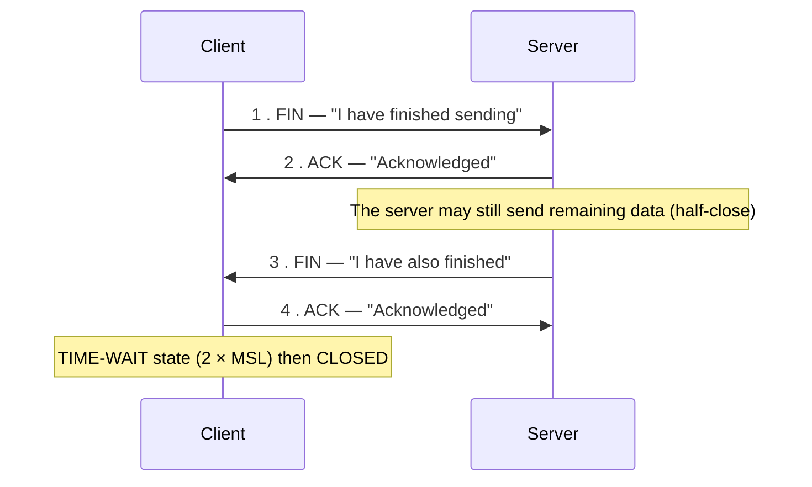

**Why four and not three?** Because each direction is closed **independently** — one side may still have data to send after the other has finished.

#### The TCP header — the fields that matter

| Field | Size | Purpose |
|---|---|---|
| **Source port / Destination port** | 16 bits each | Identify the sending and receiving **applications** |
| **Sequence number** | 32 bits | Position of the first byte of this segment in the stream |
| **Acknowledgement number** | 32 bits | The next byte the receiver expects |
| **Header length** | 4 bits | Where the data begins |
| **Flags** | 9 bits | **URG, ACK, PSH, RST, SYN, FIN** |
| **Window size** | 16 bits | **Flow control** — receiver's available buffer |
| **Checksum** | 16 bits | **Error detection** over header and data |
| **Urgent pointer, Options** | | MSS negotiation, window scaling, SACK, timestamps |

#### Congestion control in TCP

**Congestion** occurs when more traffic enters the network than it can carry, filling router queues and causing loss. TCP treats **packet loss as the signal of congestion** and reacts by **slowing down**.

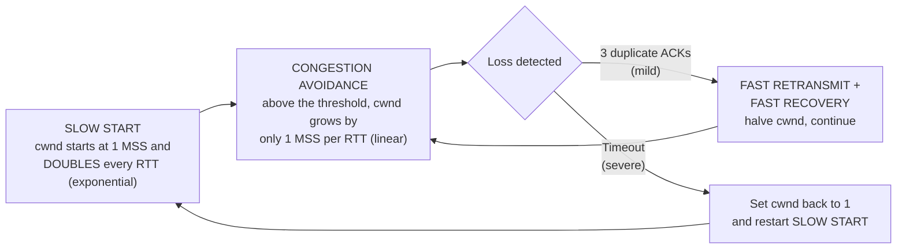

| Mechanism | What it does |
|---|---|
| **Slow start** | Begin cautiously with a small **congestion window (cwnd)** and **double it each RTT** until the threshold is reached |
| **Congestion avoidance** | Beyond the threshold, increase **linearly** — "additive increase" |
| **Fast retransmit** | On receiving **3 duplicate ACKs**, retransmit the missing segment **immediately**, without waiting for the timeout |
| **Fast recovery** | Halve cwnd rather than collapsing to 1 — "multiplicative decrease" |
| **AIMD** | The overall behaviour: **Additive Increase, Multiplicative Decrease** — the principle that makes TCP fair and stable |

**Flow control vs Congestion control** — a distinction worth stating:

| | **Flow control** | **Congestion control** |
|---|---|---|
| **Protects** | **The RECEIVER** from being overwhelmed | **The NETWORK** from being overwhelmed |
| **Controlled by** | The **receiver**, via the advertised **window size** | The **sender**, via the **congestion window** |
| **Mechanism** | Sliding window | Slow start, AIMD |

The actual sending rate is **min(receiver window, congestion window)**.

**Previous Year Question List from this Topic:**

- [A client needs to send 4000\text{ bytes} of data to a database server. The client divides the data into packets of 500\text{ bytes} each. The sequence number of…](../written-answers/computer-networks.md?plain=1#L5605)
- [Show the pictorial representation of TCP 3-way handshaking protocol for establishing a connection between a server and a client.](../written-answers/computer-networks.md?plain=1#L5699)
- [3-way handshake protocol for TCP connection using diagram.](../written-answers/computer-networks.md?plain=1#L5762)
- [Show a 3-way handshake protocol in TCP connection established using a diagram.](../written-answers/computer-networks.md?plain=1#L5882)
- [The primary function of the Transmission Control Protocol (TCP). TCP performs six basic functions. What are the basic function performing by TCP?](../written-answers/computer-networks.md?plain=1#L5976)
- [(c) What is purpose of routers? How congestion control works in the TCP?](../written-answers/computer-networks.md?plain=1#L6003)
- [What is a TCP Three-way handshaking step?](../written-answers/computer-networks.md?plain=1#L6054)
- [The primary function of the Transmission Control Protocol (TCP) is to turn an unreliable network into a reliable network that is free from lost and duplicate pa…](../written-answers/computer-networks.md?plain=1#L6085)
- [(c) What is TCP protocol? How does it work?](../written-answers/computer-networks.md?plain=1#L6143)
- [a) Explain Three-Way Handshaking in TCP Protocol.](../written-answers/computer-networks.md?plain=1#L6300)

**Previous Year MCQ List from this Topic:**

- [Handshaking procedure takes place in ________.](../mcq-answers/computer-networks.md?plain=1#L136)
- [Which of the following defines the addressing capabilities of the networking?](../mcq-answers/computer-networks.md?plain=1#L370)
- [FTP protocol নিচের কোনটি ব্যবহার করে?](../mcq-answers/computer-networks.md?plain=1#L977)
- [A receiving host has failed to receive all of the segments that is should acknowledge what can the host do the improve the reliability of this communication ses…](../mcq-answers/computer-networks.md?plain=1#L883)


---

### UDP — User Datagram Protocol

**UDP** is a **connectionless, unreliable, lightweight** transport protocol. It adds only the bare minimum to IP: **port numbers, a length field and a checksum**.

#### What UDP does and does not do

| UDP **does** | UDP does **NOT** |
|---|---|
| Multiplex by **port number** | Establish a connection |
| Provide an optional **checksum** | Acknowledge or retransmit |
| Deliver **fast, with minimal overhead** | Guarantee delivery, order or duplicate protection |
| Support **broadcast and multicast** | Perform flow or congestion control |

> ### "Is UDP reliable? Explain why or why not."
> ### ❌ **No — UDP is explicitly UNRELIABLE**, and this is a deliberate design choice, not a defect.
>
> **Why it is unreliable:**
> 1. **No connection is established** — the sender simply transmits, with no assurance that anyone is listening.
> 2. **No acknowledgements** — the sender never learns whether the datagram arrived.
> 3. **No retransmission** — a lost datagram is simply lost.
> 4. **No sequence numbers** — datagrams may arrive **out of order**, and the receiver cannot reorder them.
> 5. **No duplicate detection.**
> 6. **No flow or congestion control** — UDP will happily flood a slow receiver or a congested network.
>
> **Why that is sometimes the RIGHT choice:**
> - **Speed and low latency** — no handshake (saving a full round trip), no waiting for acknowledgements, and only an **8-byte header** instead of TCP's 20+.
> - For **real-time media**, a **late packet is worse than a lost one**. In a voice call, retransmitting a lost 20-millisecond audio fragment is pointless — by the time it arrives the conversation has moved on, and the retransmission would only add jitter. Dropping it causes an imperceptible glitch; waiting for it causes an audible stall.
> - For **short request-response exchanges (DNS)**, the application can simply retry — cheaper than a handshake.
> - It supports **broadcast and multicast**, which TCP cannot.
> - **Applications can add exactly the reliability they need** on top — which is what **QUIC/HTTP3** does, building reliability over UDP while avoiding TCP's head-of-line blocking.

#### TCP vs UDP — the key comparison

| Point | **TCP** | **UDP** |
|---|---|---|
| **Full form** | Transmission Control Protocol | User Datagram Protocol |
| **Connection** | **Connection-oriented** — handshake first | **Connectionless** — just send |
| **Reliability** | ✅ **Reliable** — guaranteed delivery | ❌ **Unreliable** — best effort |
| **Acknowledgement** | ✅ Yes | ❌ No |
| **Retransmission** | ✅ Yes | ❌ No |
| **Ordering** | ✅ **Guaranteed in order** | ❌ No ordering |
| **Error checking** | Checksum **+ recovery** | Checksum **only — no recovery** |
| **Flow control** | ✅ Sliding window | ❌ None |
| **Congestion control** | ✅ Yes | ❌ None |
| **Speed** | **Slower** | **FASTER** |
| **Header size** | **20–60 bytes** | **8 bytes** |
| **Overhead** | High | **Very low** |
| **Data unit** | **Segment** | **Datagram** |
| **Broadcast/Multicast** | ❌ Not supported | ✅ **Supported** |
| **Stream type** | **Byte stream** | **Message/datagram** oriented |
| **Used when** | **Accuracy matters more than speed** | **Speed matters more than accuracy** |
| **Applications** | **HTTP/HTTPS, FTP, SMTP, POP3, IMAP, SSH, Telnet**, file transfer, email, web | **DNS, DHCP, TFTP, SNMP, NTP, RIP**, **VoIP, video streaming, online gaming, IPTV** |
| **Analogy** | A **registered letter with delivery confirmation** | A **postcard** |

> ### "A live video stream will be transmitted — which transport protocol, and why?"
> ### ✅ **UDP.**
>
> **Justification:**
> 1. **Latency is the dominant requirement.** Live video must arrive continuously and immediately; TCP's handshake, acknowledgements and retransmission timers introduce **delay and jitter** that are far more damaging than a lost frame.
> 2. **A retransmitted frame is useless.** By the time TCP recovers a lost video frame, the stream has already moved past that moment — displaying it would be wrong, and waiting for it **freezes the picture**. A dropped frame causes only a momentary, often unnoticeable, artefact.
> 3. **TCP's head-of-line blocking is fatal for streaming** — one lost segment stalls *everything* behind it, producing the familiar "buffering" freeze.
> 4. **Congestion control would repeatedly halve the rate**, causing visible quality collapse, whereas a streaming application can degrade smoothly by switching to a lower bitrate.
> 5. **Multicast support** — one stream can be delivered efficiently to thousands of viewers, which TCP cannot do.
> 6. **Modern practice:** real-time protocols such as **RTP/RTCP, WebRTC, SRT and QUIC** all run **over UDP**, adding their own lightweight sequencing, timing and selective error correction — reliability tailored to media rather than TCP's one-size-fits-all.
>
> *(The nuance worth adding: **on-demand** video such as YouTube or Netflix uses **TCP/HTTP adaptive streaming (DASH/HLS)**, because a few seconds of buffering is acceptable there and perfect quality is preferred. The answer "UDP" applies specifically to **live, real-time, low-latency** streaming and to interactive audio/video.)*

#### A worked segmentation problem

> **A client sends 4,000 bytes of data. It is divided into segments with a payload of 1,000 bytes each, and the first byte is numbered 10,001. Give the sequence number of each segment.**

TCP numbers **bytes**, not segments. The sequence number of a segment is the number of its **first byte**.

| Segment | Bytes carried | **Sequence number** |
|---|---|---|
| 1 | 10,001 – 11,000 | **10,001** |
| 2 | 11,001 – 12,000 | **11,001** |
| 3 | 12,001 – 13,000 | **12,001** |
| 4 | 13,001 – 14,000 | **13,001** |

The receiver acknowledges with **ack = 14,001**, meaning *"I have received everything up to byte 14,000; send me 14,001 next."*

**Previous Year Question List from this Topic:**

- [(b) Distinguish between TCP and UDP protocols.](../written-answers/computer-networks.md?plain=1#L5672)
- [What is the deference between TCP and UDP?](../written-answers/computer-networks.md?plain=1#L5741)
- [Write a TCP/UDP used service name?](../written-answers/computer-networks.md?plain=1#L5802)
- [Difference between TCP and UDP. Distinguish between Cat5 and Cat6. Difference among exFAT, FAT32 and NTFS.](../written-answers/computer-networks.md?plain=1#L5837)
- [Differecne between TCP and UDP.](../written-answers/computer-networks.md?plain=1#L5920)
- [What is UDP protocol? UDP is reliable or not? Explain why or why not?](../written-answers/computer-networks.md?plain=1#L5945)
- [a) A live video stream will be transmitted. Which Transport layer protocol will you use and why?](../written-answers/computer-networks.md?plain=1#L6119)
- [Write down difference between TCP and UDP with write down some TCP and UDP protocols.](../written-answers/computer-networks.md?plain=1#L6194)
- [Write the difference between TCP and UDP.](../written-answers/computer-networks.md?plain=1#L6286)

**Previous Year MCQ List from this Topic:**

- [কোনটি UDP protocol use করে?](../mcq-answers/computer-networks.md?plain=1#L1058)
- [Which of the following protocol used TCP and UDP ports?](../mcq-answers/computer-networks.md?plain=1#L1076)
- [Which of the following protocols uses both TCP and UDP ports?](../mcq-answers/computer-networks.md?plain=1#L1103)


---

## Physical Layer & Transmission Media (Cables & Wiring)

### Transmission Media — Guided and Unguided

**Transmission media** is the **physical path along which data travels** from sender to receiver. It is the concern of the **Physical layer (Layer 1)**.

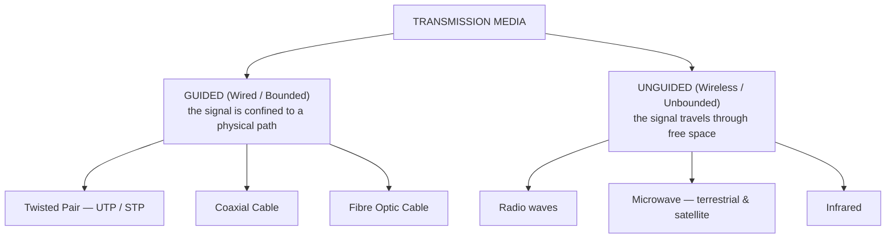

#### Guided vs Unguided media

| Point | **Guided (Wired)** | **Unguided (Wireless)** |
|---|---|---|
| **Path** | A **physical conductor** confines the signal | **Free space** — air, vacuum |
| **Direction** | **Point to point**, along the cable | **Broadcast** in all directions (or beamed) |
| **Speed / Bandwidth** | **Higher** | Lower |
| **Security** | **More secure** — physical access is needed to tap | **Less secure** — anyone in range can receive |
| **Interference** | Less (except UTP) | **High** — weather, obstacles, other devices |
| **Installation** | Difficult and costly — cables must be laid | **Easy** — no cabling |
| **Mobility** | ❌ None | ✅ **Full mobility** |
| **Cost** | Higher initial (cabling) | Lower initial, higher equipment cost |
| **Distance** | Limited by attenuation, but extendable with repeaters | Limited by power and line of sight |
| **Examples** | Twisted pair, coaxial, **fibre optic** | **Wi-Fi, Bluetooth, microwave, satellite, infrared** |

#### 1. Twisted pair cable

Two insulated copper wires **twisted together**. The twisting is the whole point.

> **Why are UTP cables twisted?**
> 1. **To cancel electromagnetic interference (EMI).** Noise from outside affects both wires in a pair almost equally; because the wires carry **equal and opposite signals** and swap positions with every twist, the induced noise **cancels out** at the receiver (this is **differential signalling**).
> 2. **To reduce crosstalk** between adjacent pairs in the same cable — each pair uses a **different twist rate**, so they do not couple into one another.
> 3. Tighter twisting = **less noise = higher supported frequency = higher data rate**, which is exactly why Cat6 is twisted more tightly than Cat5e.

| Type | Description | Cost | Use |
|---|---|---|---|
| **UTP** — Unshielded Twisted Pair | No metallic shield | **Cheapest** | **The standard for LANs** |
| **STP** — Shielded Twisted Pair | Metallic foil/braid shield around the pairs | More expensive | Industrial areas, near heavy machinery |

| Point | **UTP** | **STP** |
|---|---|---|
| **Shielding** | ❌ None | ✅ **Foil or braided shield** |
| **EMI/noise resistance** | Lower | **Higher** |
| **Cost** | **Cheaper** | More expensive |
| **Installation** | **Easy** — thin, flexible | Harder — thick, stiff, and the **shield must be properly grounded** |
| **Crosstalk** | Higher | Lower |
| **Grounding needed** | ❌ No | ✅ **Yes — an improperly grounded shield makes things worse** |
| **Use** | **Offices, homes — the vast majority of LANs** | Factories, hospitals, near power cables |

> **The benefits of UTP that make it dominant:** it is **cheap**, **thin and flexible** (easy to pull through conduits and to terminate), needs **no grounding**, uses the universal **RJ45** connector, is supported by every device, and modern categories deliver **1–10 Gbps** — more than enough for almost every desktop.

#### UTP categories

| Category | Max speed | Bandwidth | Max length | Use |
|---|---|---|---|---|
| Cat3 | 10 Mbps | 16 MHz | 100 m | Telephone (obsolete) |
| Cat5 | 100 Mbps | 100 MHz | 100 m | Obsolete |
| **Cat5e** | **1 Gbps** | 100 MHz | **100 m** | Still very common |
| **Cat6** | **1 Gbps (10 Gbps up to 55 m)** | **250 MHz** | **100 m** | **Current standard** |
| **Cat6a** | **10 Gbps** | **500 MHz** | **100 m** | Data centres, modern offices |
| Cat7 | 10 Gbps | 600 MHz | 100 m | Shielded, specialised |
| Cat8 | 25–40 Gbps | 2000 MHz | **30 m** | Data-centre top-of-rack |

| Point | **Cat5e** | **Cat6** |
|---|---|---|
| Bandwidth | 100 MHz | **250 MHz** |
| Speed | 1 Gbps at 100 m | 1 Gbps at 100 m; **10 Gbps up to 55 m** |
| Twisting | Looser | **Tighter** |
| Internal separator (spline) | ❌ No | ✅ **Yes** — separates the pairs, reducing crosstalk |
| Crosstalk | Higher | **Lower** |
| Cost | Cheaper | ~20–30 % more |

> **The connector for copper LAN cable is the RJ45** (8P8C). *(Telephone uses **RJ11**; fibre uses **SC, LC, ST or MTRJ**; coaxial uses **BNC** or **F-type**.)*

#### 2. Coaxial cable

A **central copper conductor**, surrounded by insulation, a **braided metallic shield**, and an outer jacket. The shield gives it **much better noise immunity than UTP** and allows longer runs.

**Uses:** cable television, older Ethernet (10Base2/10Base5), CCTV, antenna feeds.
**Types:** **RG-6** (TV, broadband), **RG-58** (thin Ethernet), **RG-59** (CCTV), **RG-8** (thick Ethernet).

#### 3. Fibre optic cable

Transmits data as **pulses of LIGHT** through a **glass or plastic core**, using **total internal reflection** at the boundary between the core and the lower-refractive-index **cladding**.

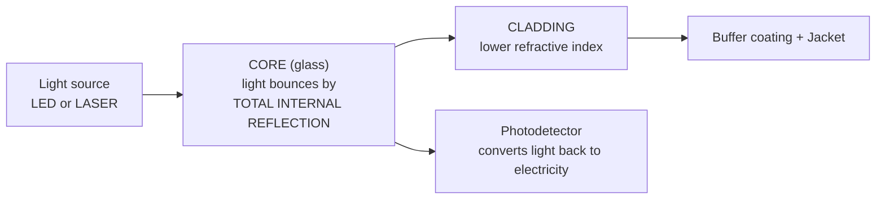

| Type | Core diameter | Light source | Distance | Bandwidth | Cost |
|---|---|---|---|---|---|
| **Single-mode (SMF)** | **8–10 µm** — one light path | **LASER** | **Up to 100+ km** | **Highest** | Higher |
| **Multi-mode (MMF)** | **50–62.5 µm** — many light paths | **LED** | **Up to ~2 km** | High | Lower |

**Advantages of fibre optic — the reason it dominates backbones:**
1. **Enormous bandwidth** — terabits per second; by far the **highest of any medium**.
2. **Very long distance** without repeaters (tens to hundreds of km).
3. **Complete immunity to EMI and RFI** — it carries light, not electricity, so power lines, motors and lightning do not affect it.
4. **Extremely secure** — it is very difficult to tap without detection, and it emits no signal to intercept.
5. **Very low attenuation** — about **0.2–0.35 dB/km** versus copper's several dB per 100 m.
6. **Lightweight and thin** — far more capacity in the same duct space.
7. **No crosstalk**, no electrical grounding problems, and **no fire/spark risk** — safe in explosive environments.

**Disadvantages:** **higher cost** of cable, connectors and equipment · **fragile** — glass breaks if bent too sharply · **splicing and termination require specialised skill and equipment** (fusion splicer, OTDR) · **unidirectional** (two fibres needed for duplex) · and it cannot carry electrical power.

#### The comparison table

| Point | **Twisted Pair (UTP)** | **Coaxial** | **Fibre Optic** |
|---|---|---|---|
| **Carries** | Electrical signals | Electrical signals | **Light** |
| **Bandwidth** | Up to 10 Gbps | ~1 Gbps | **Terabits/s — highest** |
| **Max distance** | **100 m** | ~500 m | **2 km (MMF) – 100+ km (SMF)** |
| **EMI immunity** | **Poor** | Good | **Perfect** |
| **Security** | Low — easily tapped | Medium | **Very high** |
| **Attenuation** | High | Medium | **Very low** |
| **Cost** | **Lowest** | Medium | **Highest** |
| **Installation** | **Easiest** | Moderate | **Requires skill** |
| **Connector** | **RJ45** | BNC / F-type | SC, LC, ST |
| **Used for** | **Desktop LAN connections** | Cable TV, CCTV | **Backbones, submarine cables, FTTH, data centres** |

#### Ethernet standards — reading the notation

The notation **`10Base5`** means: **`<speed in Mbps>` `Base` (baseband) `<segment length in hundreds of metres, or the medium letter>`**

| Standard | Speed | Medium | Max segment | Topology | Notes |
|---|---|---|---|---|---|
| **10Base5** | 10 Mbps | **Thick coaxial** ("Thicknet") | **500 m** | Bus | The original Ethernet; uses vampire-tap transceivers |
| **10Base2** | 10 Mbps | **Thin coaxial** ("Thinnet", RG-58) | **185 m** (rounded to 200) | Bus | BNC T-connectors; cheaper and easier than 10Base5 |
| **10BaseT** | 10 Mbps | **Twisted pair (UTP)** | **100 m** | **Star** (via a hub/switch) | **T = Twisted pair.** The standard that made structured cabling universal |
| **10BaseF** | 10 Mbps | **Fibre optic** | **2 km** | Star | **F = Fibre**; used for building-to-building links |
| **100BaseTX** | 100 Mbps | UTP Cat5 | 100 m | Star | "Fast Ethernet" |
| **1000BaseT** | 1 Gbps | UTP Cat5e/6 | 100 m | Star | "Gigabit Ethernet" — uses all 4 pairs |
| **10GBaseT** | 10 Gbps | Cat6a/7 | 100 m | Star | |

> **The IEEE standard for Ethernet LAN is IEEE 802.3.** *(Related: **802.11** = Wi-Fi, **802.15** = Bluetooth/PAN, **802.16** = WiMAX, **802.1Q** = VLAN tagging, **802.1X** = port authentication.)*

#### Straight-through vs Crossover cable

Both are RJ45 UTP cables; the difference is **how the 8 wires are ordered at each end**.

| Point | **Straight-through cable** | **Crossover cable** |
|---|---|---|
| **Wiring** | **Same standard at both ends** — T568B to T568B (or A to A) | **Different at each end** — **T568A at one end, T568B at the other** |
| **Which pins swap** | None | **Transmit and receive are crossed** (1↔3, 2↔6) |
| **Connects** | **UNLIKE (different) devices** | **LIKE (similar) devices** |
| **Examples** | **PC ↔ Switch** · PC ↔ Hub · **Router ↔ Switch** · Switch ↔ Modem | **PC ↔ PC** · **Switch ↔ Switch** · **Router ↔ Router** · Hub ↔ Hub · **PC ↔ Router** |

> **The rule to remember:** **UNLIKE devices → STRAIGHT-through. LIKE devices → CROSSOVER.**
>
> **Why:** a PC transmits on pins 1–2 and receives on 3–6; a switch does the **opposite** by design. Connecting a PC to a switch therefore needs **no** crossing — the switch has already done it internally. But connecting **two PCs** means both transmit on 1–2 and both listen on 3–6, so nothing is heard — the cable must **cross the pairs** to connect one side's transmit to the other side's receive.
>
> **A modern caveat worth adding:** since about 2005 almost all equipment supports **Auto-MDI/MDI-X**, which **automatically detects and corrects** the wiring internally. In practice a straight-through cable now works everywhere — but **the theory is still examined**, and crossover cables are still needed for older equipment and for some console/direct links.

**The T568B wiring order (the common standard):** White-Orange, Orange, White-Green, **Blue**, White-Blue, **Green**, White-Brown, Brown.
**T568A** swaps the orange and green pairs.

#### Transmission line problems

| Problem | Description | Cause | Remedy |
|---|---|---|---|
| **Attenuation** | The **signal WEAKENS** as it travels, losing power with distance. Measured in **decibels (dB)** | Resistance of the medium, absorption, scattering | **Amplifiers** (analog) or **repeaters** (digital); shorter runs; better medium (fibre) |
| **Distortion** | The signal **changes SHAPE** because different frequency components travel at different speeds | The medium's frequency-dependent propagation | Equalisers; limit the bandwidth |
| **Noise** | **Unwanted signals** are added | **Thermal** (random electron motion), **induced** (motors, lights), **crosstalk** (adjacent wires), **impulse** (lightning, switching spikes) | **Shielding, twisting, grounding, fibre**, error-correcting codes |
| **Crosstalk** | Signal from one wire **couples into** another | Electromagnetic coupling between adjacent pairs | Twisting at different rates, shielding, a spline (Cat6) |
| **Delay distortion / Dispersion** | Pulses **spread out** and overlap | Different propagation velocities | Lower data rate, shorter distance, single-mode fibre |
| **Echo / Reflection** | Part of the signal **bounces back** | **Impedance mismatch**, unterminated cable | Proper termination and impedance matching |

> **Attenuation explained further:** it is the **loss of signal strength over distance**, expressed as **dB = 10 log₁₀(P₂/P₁)**. A **negative dB means loss**; a positive value means gain. Attenuation increases with **distance** and with **frequency** (higher frequencies attenuate faster — which is precisely why cable length limits exist). In fibre it is remarkably low (0.2 dB/km), which is why fibre can span oceans while copper cannot span a football field at gigabit speed.

> ### "What happens if you use a cable longer than the prescribed length?"
> The **100-metre limit for UTP** (90 m of solid horizontal cable plus 10 m of patch leads) is not arbitrary — exceeding it causes:
> 1. **Excessive attenuation** — the signal arrives too weak for the receiver to interpret reliably.
> 2. **Increased bit errors** and CRC failures, causing **retransmissions** that slash effective throughput.
> 3. **Intermittent, hard-to-diagnose faults** — the link may work at 100 Mbps but fail at 1 Gbps, or work in cool weather and fail in hot.
> 4. **Collision-detection failure** on legacy half-duplex Ethernet — CSMA/CD relies on a signal reaching the far end and back **within the time to transmit the minimum frame**; beyond the limit, **late collisions** occur and go undetected, silently corrupting data.
> 5. **Complete link failure** — often the device simply reports "no link".
>
> **The correct solutions:** insert a **switch or repeater** at the midpoint · use **fibre** for the long run · or use a **media converter**. **Never** simply join two cables to exceed the limit.

#### Baseband vs Broadband

| Point | **Baseband** | **Broadband** |
|---|---|---|
| **Signal** | **Digital** | **Analog** (carrying digital data by modulation) |
| **Channels on the medium** | **ONE** — the entire bandwidth is used by a single signal | **MANY** — the bandwidth is divided by **FDM** into multiple channels |
| **Direction** | **Bidirectional** | **Unidirectional** per channel (separate channels for each direction) |
| **Encoding** | Line coding (Manchester, NRZ) | **Modulation** onto a carrier |
| **Distance** | Shorter | **Longer** |
| **Cost** | **Cheaper** | More expensive |
| **Example** | **Ethernet LAN (10BaseT)** | **Cable TV, DSL, cable internet** |

> **The main benefit of broadband over baseband:** it can carry **multiple simultaneous signals (voice, video and data) on ONE cable** by using **frequency division multiplexing**, and it transmits over **much greater distances**. This is why a single coaxial cable into a house can deliver dozens of TV channels and an internet connection at the same time.

**Previous Year Question List from this Topic:**

- [Straight through connection vs Crossover connection.](../written-answers/computer-networks.md?plain=1#L6351)
- [Which transmission medium is used in LAN? Write their maximum length and capacity (bps).](../written-answers/computer-networks.md?plain=1#L6387)
- [IEEE __________ Standard used Ethernet LAN?](../written-answers/computer-networks.md?plain=1#L6411)
- [What is the connector name copper cable in LAN?](../written-answers/computer-networks.md?plain=1#L6436)
- [What are the different types of transmission media used for data communication? Explain their advantages and disadvantages.](../written-answers/computer-networks.md?plain=1#L6459)
- [Difference between Guided and Unguided media. Difference between STP and UTP. Why using benefit UTP instead of STP?](../written-answers/computer-networks.md?plain=1#L6513)
- [What is the main benefit of broadband transmission system compared to baseband? What is the attenuation of transmission media? Distinguish between twisted pair,…](../written-answers/computer-networks.md?plain=1#L6556)
- [Why we used straight-through and cross cable with example?](../written-answers/computer-networks.md?plain=1#L6601)
- [(খ) Fiber optic cable, Twisted pair cable এবং Co-axial cable এর সুবিধাগুলো বর্ণনা করুন।](../written-answers/computer-networks.md?plain=1#L6645)
- [What happens when you use cables longer than the prescribed length in a network?](../written-answers/computer-networks.md?plain=1#L6677)
- [(ii) ব্যাখ্যা করুন: (a) 10Base5 (b) 10BaseF](../written-answers/computer-networks.md?plain=1#L6718)
- [Explain 10baseT.](../written-answers/computer-networks.md?plain=1#L6751)
- [Which media transfer data with higher bandwidth? Advantages of this media.](../written-answers/computer-networks.md?plain=1#L6779)
- [(a) What are the problems that transmission lines suffer from? Briefly describe any one of them.](../written-answers/computer-networks.md?plain=1#L6805)
- [Explain 10Base2, 10Base5, 10BaseT and Ethernet.](../written-answers/computer-networks.md?plain=1#L6838)

**Previous Year MCQ List from this Topic:**

- [Which of the following medium is used for broadband local networks?](../mcq-answers/computer-networks.md?plain=1#L217)
- [“The time to communicate between Bangladesh and USA is the same as that to communicate between two adjacent houses is Bangladesh”- In which case is the above tr…](../mcq-answers/computer-networks.md?plain=1#L226)
- [Which one transfers data at the highest speed?](../mcq-answers/computer-networks.md?plain=1#L334)
- [“The time to communicate between Bangladesh and USA is the same as that to communicate between two adjacent houses in Bangladesh,”- In which case is the above t…](../mcq-answers/computer-networks.md?plain=1#L415)
- [Which of the following medium is used for broadband local networks?](../mcq-answers/computer-networks.md?plain=1#L442)
- [(b) Which transmission medium is usually used in a LAN? What is its maximum length and bit rate? Write the name of data at different layers of the TCP/IP model.](../mcq-answers/computer-networks.md?plain=1#L565)
- [অপটিক্যাল ফাইবারে আলোর কোন ঘটনাটি ঘটে?](../mcq-answers/computer-networks.md?plain=1#L2561)
- [An optical fiber has a signal solid dielectric cylinder knowns as the core which is surrounded by a solid dielectric ______ is called?](../mcq-answers/computer-networks.md?plain=1#L2570)
- [অপটিক্যাল ফাইবার আলোর কোন নীতিতে কাজ করে?](../mcq-answers/computer-networks.md?plain=1#L2576)
- [Which of the following communication medium requires ‘line-of-sight’?](../mcq-answers/computer-networks.md?plain=1#L2586)
- [Submarine ক্যাবল কয়টি?](../mcq-answers/computer-networks.md?plain=1#L2595)
- [Which is the disadvantage of Optical Fiber?](../mcq-answers/computer-networks.md?plain=1#L2605)
- [Which one of the following have higher bandwidth?](../mcq-answers/computer-networks.md?plain=1#L2614)
- [Which type of cable is used to connect the COM port of a host to the COM port of a router or switch?](../mcq-answers/computer-networks.md?plain=1#L2623)
- [Which type of cable is used to connect the COM port of a host to the COM port of a router or switch?](../mcq-answers/computer-networks.md?plain=1#L2632)
- [Fiber optical cable is used for-](../mcq-answers/computer-networks.md?plain=1#L2641)
- [Which of the following wiring standards would most likely be used to connect a single network node to a switch?](../mcq-answers/computer-networks.md?plain=1#L2650)
- [Which of the following WAN technologies requires fiber optics?](../mcq-answers/computer-networks.md?plain=1#L2659)
- [Which of the following WAN technology types does not use an Ethernet cable as a medium for communication and is used for long distances?](../mcq-answers/computer-networks.md?plain=1#L2668)
- [Which of the following is strictly used to convert analog to digital signals?](../mcq-answers/computer-networks.md?plain=1#L2677)


---

## Multiplexing & Bandwidth

### Multiplexing — Concept and Types

**Multiplexing** is the technique of **combining MULTIPLE signals into ONE signal for transmission over a SINGLE shared link**, and separating them again at the far end (**demultiplexing**).

> **The purpose:** a transmission link is expensive. If a single fibre can carry 10 Gbps and one telephone call needs 64 kbps, using the whole fibre for one call would be absurd. Multiplexing **maximises utilisation of the link** and **minimises cost**.
>
> **The answer to "what technique allows simultaneous transmission of multiple signals across a single data link?" is MULTIPLEXING.**

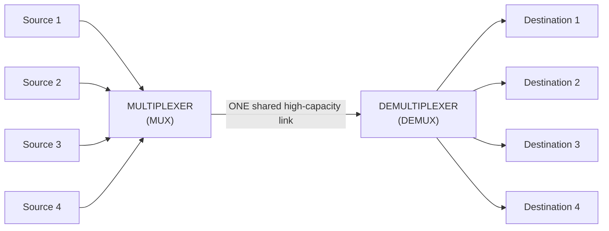

#### The types of multiplexing

```mermaid
flowchart TD
    MX["MULTIPLEXING"]
    MX --> A["FDM — Frequency Division<br/>ANALOG · divides FREQUENCY"]
    MX --> B["TDM — Time Division<br/>DIGITAL · divides TIME"]
    MX --> C["WDM — Wavelength Division<br/>OPTICAL · divides WAVELENGTH"]
    MX --> D["CDM / CDMA — Code Division<br/>divides by unique CODES"]
    B --> B1["Synchronous TDM<br/>fixed slots"]
    B --> B2["Asynchronous / Statistical TDM<br/>slots on demand"]
```

#### 1. FDM — Frequency Division Multiplexing

The **available bandwidth is divided into several FREQUENCY BANDS**, and each signal is modulated onto its own **carrier frequency**. All signals travel **simultaneously and continuously**, separated in frequency.

**Guard bands** — unused frequency gaps — are placed between channels to prevent overlap and interference.

**Used for:** **radio and TV broadcasting**, cable television, the traditional analog telephone system, and **ADSL** (which splits the phone line into voice, upstream and downstream bands).

#### 2. TDM — Time Division Multiplexing

The **link's time is divided into SLOTS**, and each source is given the **entire bandwidth for a brief slot in rotation**. The signals are separated in **time**, not frequency.

```mermaid
flowchart LR
    A["Time →"] --> B["Slot A1"] --> C["Slot B1"] --> D["Slot C1"] --> E["Slot D1"] --> F["Slot A2"] --> G["Slot B2"] --> H["…"]
```

**How synchronous TDM works:**
1. Each input is given a **fixed, pre-allocated time slot** in every **frame**.
2. The multiplexer **rotates through the inputs in order**, taking one unit (a bit, byte or character) from each.
3. The slots are **reserved whether or not the source has data** — an idle source's slot is **transmitted empty**.
4. The demultiplexer, **synchronised by framing bits**, knows which slot belongs to which output.

**Synchronous vs Statistical (Asynchronous) TDM**

| Point | **Synchronous TDM** | **Statistical / Asynchronous TDM** |
|---|---|---|
| **Slot allocation** | **Fixed and pre-assigned** | **On demand**, only to sources that have data |
| **Empty slots** | ✅ **Yes — wasted if a source is idle** | ❌ **None — no waste** |
| **Addressing** | Not needed — position identifies the source | **Required** — each slot carries an address |
| **Efficiency** | **Lower** | **Much higher** |
| **Complexity** | Simple | More complex |
| **Used in** | **T1/E1 carriers, SONET/SDH** | Packet networks, ATM, modern data links |

#### 3. WDM — Wavelength Division Multiplexing

**FDM applied to light on an optical fibre.** Multiple signals are carried on **different wavelengths (colours) of laser light** through the **same fibre**, combined by a **prism/grating** at the sender and separated at the receiver.

| Type | Channels | Spacing |
|---|---|---|
| **CWDM** — Coarse WDM | ~8–18 | Wide (20 nm) — cheaper |
| **DWDM** — Dense WDM | **80–160+** | Very narrow (0.8 nm) — used on long-haul and submarine cables |

A single fibre with DWDM can carry **many terabits per second** — which is how submarine cables serve entire countries.

#### The comparison — FDM vs TDM vs WDM

| Point | **FDM** | **TDM** | **WDM** |
|---|---|---|---|
| **Divides** | **Frequency** | **Time** | **Wavelength (light)** |
| **Signal type** | **Analog** | **Digital** | **Optical** |
| **Medium** | Copper, air (radio) | Copper, fibre, wireless | **Fibre optic ONLY** |
| **Transmission** | All channels **simultaneous and continuous** | Each channel in **turn**, in its own slot | All wavelengths simultaneous |
| **Each channel gets** | **Part of the bandwidth, all of the time** | **All of the bandwidth, part of the time** | Its own wavelength, all the time |
| **Guard mechanism** | **Guard bands** (frequency gaps) | **Guard bits/time** and framing | Wavelength spacing |
| **Bandwidth needed** | Sum of channels + guard bands | Sum of channel rates + framing overhead | Sum of channels |
| **Synchronisation** | Not critical | **Critical** | Not critical |
| **Efficiency** | Lower (guard bands waste spectrum) | **Higher** | **Highest capacity** |
| **Example** | **Radio, TV, cable TV, ADSL** | **T1/E1, SONET, GSM, ISDN** | **DWDM backbones, submarine cables** |

#### TDM vs TDMA

| Point | **TDM** (Time Division Multiplexing) | **TDMA** (Time Division Multiple Access) |
|---|---|---|
| **What it is** | A **multiplexing technique** — combining signals onto one link | A **channel-access method** — sharing a medium among many users |
| **Applies to** | A **wired point-to-point link** | A **shared wireless medium** |
| **Sources** | Located at **one place** (the multiplexer) | **Geographically distributed** users/stations |
| **Synchronisation** | By the multiplexer's clock | Requires **network-wide timing and guard times** to handle different propagation delays |
| **Used in** | T1/E1, SONET, PDH | **GSM (2G)**, satellite access, DECT |

**Previous Year Question List from this Topic:**

- [Differentiate among TDM, FDM and WDM. How does working process in TDM?](../written-answers/computer-networks.md?plain=1#L7086)
- [Describe the different types of Multiplexing.](../written-answers/computer-networks.md?plain=1#L7123)
- [What technique allows simultaneous transmission of multiple signals across a single data link?](../written-answers/computer-networks.md?plain=1#L7165)
- [(খ) FDM এবং TDM এর পার্থক্য লিখুন।](../written-answers/computer-networks.md?plain=1#L7180)
- [Compare between TDM and TDMA techniques.](../written-answers/computer-networks.md?plain=1#L7287)
- [What is Multiplexing? Write about Time division Multiplexing.](../written-answers/computer-networks.md?plain=1#L7388)
- [(a) Distinguish between Frequency Division Multiplexing (FDM) and Time Division Multiplexing (TDM).](../written-answers/computer-networks.md?plain=1#L7419)
- [Figure shows synchronous TOM with a data stream for each input and one data stream for the output. The unit of data is 1bit. Find (a) the input bit duration (b)…](../written-answers/computer-networks.md?plain=1#L7554)

**Previous Year MCQ List from this Topic:**

- [If link transmits 4000 frames per second and each slot has 8 bits, the transmission rate of circuit of this TDM is _____](../mcq-answers/computer-networks.md?plain=1#L2424)
- [Assume we need to download text documents at the rate of 100 pages per second. A page is an average of 24 lines with 80 characters in each line and one characte…](../mcq-answers/computer-networks.md?plain=1#L2433)
- [What is the propagation time for a 2.5-kbyte message (an e-mail) if the bandwidth of the network is 1Gbps? Assume that the distance between the sender and the r…](../mcq-answers/computer-networks.md?plain=1#L2442)
- [What is the maximum data rate of a channel with a bandwidth of 200 KHz if we use four levels of digital signaling?](../mcq-answers/computer-networks.md?plain=1#L2451)
- [Suppose we want to download text documents at the rate of 100 pages per second. Assume that a page consists of an average of 24 lines with 80 characters in each…](../mcq-answers/computer-networks.md?plain=1#L2460)
- [Consider a 50 Mbps satellite channel with a 500 milliseconds round top propagation delay. If the sender wants to transmit 1000 bit frames, how much time will it…](../mcq-answers/computer-networks.md?plain=1#L2469)
- [A complex bandpass signal has a bandwidth of 300kHz. What is the minimum sampling rate for this signal?](../mcq-answers/computer-networks.md?plain=1#L2478)
- [The human voice normally contains frequencies from 0 to 4000Hz. If bits per sample?](../mcq-answers/computer-networks.md?plain=1#L2487)


---

### Bandwidth, Data Rate and Multiplexing Calculations

#### Bandwidth

**Bandwidth** has two related meanings:
- **In analog/signal terms:** the **range of frequencies** a channel can carry, measured in **hertz (Hz)** — e.g. a voice channel is 4 kHz wide.
- **In digital/networking terms:** the **maximum data-carrying capacity** of a link, measured in **bits per second (bps)**.

| Term | Meaning |
|---|---|
| **Bandwidth** | The **theoretical maximum** capacity of the link |
| **Throughput** | The **actual** rate achieved, always lower |
| **Goodput** | The rate of **useful application data**, excluding all headers and retransmissions |

#### Worked problem 1 — FDM minimum bandwidth

> **Five channels, each with a 100-kHz bandwidth, are to be multiplexed together. What is the minimum bandwidth of the link if there is a need for a guard band of 10 kHz between the channels to prevent interference?**

**Reasoning:** in FDM, the total bandwidth is the **sum of all the channel bandwidths plus all the guard bands**. With **n = 5** channels placed side by side, the number of **gaps between** them is **n − 1 = 4**.

| Component | Calculation | Value |
|---|---|---|
| Channel bandwidth | 5 × 100 kHz | **500 kHz** |
| Guard bands | **(5 − 1)** × 10 kHz = 4 × 10 | **40 kHz** |
| **Minimum link bandwidth** | 500 + 40 | ### **540 kHz** |

```mermaid
flowchart LR
    A["CH1<br/>100 kHz"] --- G1["guard<br/>10"] --- B["CH2<br/>100 kHz"] --- G2["guard<br/>10"] --- C["CH3<br/>100 kHz"] --- G3["guard<br/>10"] --- D["CH4<br/>100 kHz"] --- G4["guard<br/>10"] --- E["CH5<br/>100 kHz"]
```

> **The trap:** using 5 guard bands instead of 4. Guard bands sit **between** channels, so there is always **one fewer** than the number of channels.

#### Worked problem 2 — the T-1 carrier data rate

> **Show that the data rate of a T-1 carrier is 1.544 Mbps.**

The T-1 carrier uses **synchronous TDM** to combine **24 voice channels**:

| Step | Working |
|---|---|
| 1. Each voice channel is sampled at | **8,000 samples per second** (the Nyquist rate for a 4 kHz voice channel: 2 × 4000) |
| 2. Each sample is encoded as | **8 bits** (PCM) |
| 3. So one voice channel = | 8,000 × 8 = **64,000 bps = 64 kbps** |
| 4. 24 channels are multiplexed, so each **frame** contains | 24 × 8 = **192 bits** |
| 5. Plus **1 framing bit** per frame for synchronisation | 192 + 1 = **193 bits per frame** |
| 6. Frames are sent at the sampling rate | **8,000 frames per second** |
| 7. **Total data rate** | 193 × 8,000 = **1,544,000 bps** |

> ### ✅ **T-1 data rate = 1,544,000 bps = 1.544 Mbps** ∎
>
> *(The European equivalent, **E-1**, multiplexes **32** slots — 30 voice + 2 for signalling and framing — giving 32 × 8 × 8000 = **2.048 Mbps**.)*

#### Worked problem 3 — multiplexing channels of different rates

> **Two channels, one with a bit rate of 190 kbps and another with 180 kbps, are to be multiplexed using pulse stuffing TDM with no privileged channels. What is the frame rate and the output data rate?**

With **pulse stuffing**, the slower channel is padded with dummy bits up to the rate of the **fastest** channel, so that all channels can use **identical slots**.

| Step | Working |
|---|---|
| 1. The highest input rate | **190 kbps** |
| 2. Pad the 180 kbps channel up to | **190 kbps** (10 kbps of stuffing) |
| 3. If each slot carries **1 bit**, the frame rate = the padded channel rate | **190,000 frames/second** |
| 4. Each frame carries 2 slots (one per channel) | 2 bits per frame |
| 5. **Output data rate** | 190,000 × 2 = **380,000 bps = 380 kbps** |

#### Worked problem 4 — character-interleaved TDM

> **Four sources each create 250 characters per second. If the interleaved unit is a character and 1 synchronising bit is added to each frame, find (a) the data rate of each source, (b) the duration of each character in each source, (c) the frame rate, (d) the duration of each frame, (e) the number of bits in each frame, and (f) the data rate of the link.**

Assume **1 character = 8 bits**.

| Part | Working | Answer |
|---|---|---|
| **(a) Data rate of each source** | 250 chars/s × 8 bits | **2,000 bps = 2 kbps** |
| **(b) Duration of each character** | 1 ÷ 250 | **4 ms** |
| **(c) Frame rate** | Each frame carries **one character from each source**, so the frame rate equals the character rate | **250 frames/second** |
| **(d) Duration of each frame** | 1 ÷ 250 | **4 ms** (the same as the character duration) |
| **(e) Bits per frame** | 4 sources × 8 bits + **1 sync bit** | **33 bits** |
| **(f) Link data rate** | 33 bits × 250 frames/s | **8,250 bps = 8.25 kbps** |

*(Sanity check: 4 × 2,000 = 8,000 bps of payload plus 250 sync bits = 8,250 bps ✅)*

#### Worked problem 5 — propagation and transmission time

> **What are the propagation time and the transmission time for a 2.5-kilobyte message if the bandwidth of the network is 1 Gbps, the distance between sender and receiver is 12,000 km, and light travels at 2.4 × 10⁸ m/s?**

| Quantity | Formula | Working | Answer |
|---|---|---|---|
| **Propagation time** | Distance ÷ Propagation speed | 12,000,000 m ÷ (2.4 × 10⁸ m/s) | **0.05 s = 50 ms** |
| **Transmission time** | Message size ÷ Bandwidth | (2,500 × 8 bits) ÷ (10⁹ bps) = 20,000 ÷ 10⁹ | **0.00002 s = 20 µs** |

> **The instructive point:** the propagation time (**50 ms**) is **2,500 times larger** than the transmission time (**0.02 ms**). Over long distances, **the delay is dominated by the speed of light, not by the bandwidth**. Buying a faster link would reduce the 20 µs but leave the 50 ms untouched — which is why a satellite link feels slow no matter how much bandwidth it has, and why CDNs place content physically closer to users.

#### Worked problem 6 — TDMA channel calculation

> **A TDMA system has 8 transmitter-receiver pairs. Each source is sampled at 8 kHz with 8-bit encoding. Find the required channel rate.**

| Step | Working |
|---|---|
| Bit rate per source | 8,000 samples/s × 8 bits = **64 kbps** |
| 8 sources multiplexed | 8 × 64 kbps = **512 kbps** |
| Plus framing/guard overhead | Typically a few % more |
| **Required channel rate** | **≥ 512 kbps** |

#### Estimating telephone-line capacity

> A scenario question: *"You are an Assistant Engineer; a given number of telephone lines must be carried…"*

The method is always the same:
1. **One analog voice channel = 4 kHz** of bandwidth, or **64 kbps** digitally (8 kHz sampling × 8 bits).
2. **Total required capacity** = number of lines × 64 kbps.
3. **Add framing/overhead** (a T1 adds 1 bit per 193, about 0.5 %).
4. **Choose the carrier**: **T1 = 24 channels (1.544 Mbps)**, **E1 = 30 voice channels (2.048 Mbps)**, **T3 = 672 channels (44.736 Mbps)**.
5. **Number of carriers needed** = ⌈total channels ÷ channels per carrier⌉.

*Example:* 100 telephone lines → 100 × 64 kbps = **6.4 Mbps** → with **E1** (30 channels each), ⌈100 ÷ 30⌉ = **4 E1 links** (120 channels, with room to grow).

**Previous Year Question List from this Topic:**

- [Five channels, each with a 100-kHz bandwidth, are to be multiplexed together. What is the minimum bandwidth of the link if there is a need for a guard band of 1…](../written-answers/computer-networks.md?plain=1#L7011)
- [ব্যান্ডউইথ (Bandwidth) বলতে কী বুঝায়?](../written-answers/computer-networks.md?plain=1#L7041)
- [6.9 Five channels, each with a 100-kHz bandwidth, are to be multiplexed together. What is the minimum bandwidth of the link if there is a need for a guard band…](../written-answers/computer-networks.md?plain=1#L7059)
- [Show that the data rate of T-1 carrier is 1.544 Mbps.](../written-answers/computer-networks.md?plain=1#L7208)
- [Suppose you are appointed as an Assistant Engineer in a Government organization. The number of telephone connections required for the organization is 1000. The…](../written-answers/computer-networks.md?plain=1#L7241)
- [Assume a TDMA based communication system having 8 transmission receiver pairs. Each source is sampled at 8KHz. That generates 16bits per sample if two synchroni…](../written-answers/computer-networks.md?plain=1#L7309)
- [Two channels, one with a bit rate of 190kbps and another with a bit rate 180 kbps are to be multiplexed using pulse stuffing TDM with no synchronization bits. A…](../written-answers/computer-networks.md?plain=1#L7347)
- [TDM math: rate= 1.536 Mbps, message size= 960000, Slot=32, end to end circuit Switch time=800ms, calculate transfer time.](../written-answers/computer-networks.md?plain=1#L7448)
- [A want to send 2 files the size of each file is 500000 bit's data to B through TDM channel which has slot 16 channel bit rate 1.5 Mbps and 30 millisecond delay…](../written-answers/computer-networks.md?plain=1#L7484)
- [We have four sources, each creating 250 characters per second. If the interleaved unit is a character and 1 synchronizing bit is added to each frame. Now find-…](../written-answers/computer-networks.md?plain=1#L7518)
- [What are the propagation time and the transmission time for a 2.5-Kbyte message and if the bandwidth of the network is 1Gbps? Assume that the distance between t…](../written-answers/computer-networks.md?plain=1#L7602)

**Previous Year MCQ List from this Topic:**

- [Five channels, each with a 100-kHz bandwidth, are to be multiplexed together. What is the minimum bandwidth of the link if there is a need for a guard band of 5…](../mcq-answers/computer-networks.md?plain=1#L2496)
- [Assume we need to download text documents at the rate of 100 pages per sec. Each page contains an average of 24 lines with 80 characters in each line. If we ass…](../mcq-answers/computer-networks.md?plain=1#L2505)
- [Consider an extremely noisy channel in which the value of the signal-to-noise ratio is almost zero. For this channel, is the bandwidth is B then what is the cha…](../mcq-answers/computer-networks.md?plain=1#L2514)
- [A number of signal can be carried simultaneously if each signal is modulated that a different carried frequency called:](../mcq-answers/computer-networks.md?plain=1#L2523)
- [Which multiplexing technique transmits digital signals?](../mcq-answers/computer-networks.md?plain=1#L2532)
- [The bandwidth of a channel is 1MHz. The SNR for this channel is 63. What is the bit rate?](../mcq-answers/computer-networks.md?plain=1#L2541)
- [Maximum speed of voice band is ---](../mcq-answers/computer-networks.md?plain=1#L2550)
- [Typical data transfer rates in LAN are of the order of-](../mcq-answers/computer-networks.md?plain=1#L496)
- [Which one is the bandwidth for a signal transmitting at 12 Mbps for QPSK (d=0)?](../mcq-answers/computer-networks.md?plain=1#L2180)
- [If the frequency spectrum of a signal has a bandwidth of 500Hz with the highest frequency is 600Hz. What should be the sampling rate according to the Nyquist th…](../mcq-answers/computer-networks.md?plain=1#L2240)


---

## Routing Protocols & Route Configuration

### Routing — Concepts, Static and Dynamic

#### What is routing?

**Routing** is the process of **selecting the best path for data packets to travel from a source network to a destination network across an internetwork**, and is performed by **routers at Layer 3** using **IP addresses** and a **routing table**.

#### Routing vs Forwarding

| Point | **Routing** | **Forwarding** |
|---|---|---|
| **What it is** | **Deciding WHICH PATH** packets should take — building the routing table | **Moving a packet** from the input interface to the correct output interface |
| **Timescale** | **Control plane** — happens over seconds to minutes, in the background | **Data plane** — happens **per packet, in nanoseconds** |
| **Frequency** | Occasionally, when the topology changes | **For every single packet** |
| **Complexity** | Complex — runs routing algorithms | Simple — a table lookup |
| **Implemented in** | **Software** (the router's CPU) | **Hardware** (ASIC/TCAM) for speed |
| **Analogy** | **Drawing the map** | **Driving the car along the chosen road** |

#### The routing table

Each entry contains: the **destination network and mask**, the **next-hop address**, the **outgoing interface**, and a **metric/cost**.

**How a router chooses among matching entries:**
1. **Longest prefix match** — the most specific route wins. A packet for `192.168.1.50` matching both `192.168.0.0/16` and `192.168.1.0/24` takes the **/24**.
2. If prefixes are equal, the route with the **lowest administrative distance** (most trustworthy source) wins.
3. If those are equal, the **lowest metric** wins.
4. If all are equal, traffic is **load-balanced** across the equal paths.
5. If nothing matches, the **default route (0.0.0.0/0)** is used; if there is none, the packet is **dropped** and an ICMP "destination unreachable" is returned.

> **Net-specific routing** (storing one entry per **network**) is preferred over **host-specific routing** (one entry per host) because it keeps the routing table **dramatically smaller** — one entry can represent 65,000 hosts — which means **less memory, faster lookups, and far less update traffic**. Host-specific routes are used only as deliberate exceptions.

#### Types of routing

| Type | Description |
|---|---|
| **Static routing** | Routes **manually configured** by the administrator |
| **Default routing** | A single route (`0.0.0.0/0`) for "everything else" — used on stub networks |
| **Dynamic routing** | Routers **automatically learn and share** routes using a routing protocol |

#### Static vs Dynamic routing

| Point | **Static routing** | **Dynamic routing** |
|---|---|---|
| **Configured by** | **Manually**, by the administrator | **Automatically**, by a routing protocol |
| **Adapts to topology change / link failure** | ❌ **No** — an administrator must intervene | ✅ **Yes — automatically reroutes** |
| **CPU and memory usage** | **Very low** | Higher — algorithms and tables |
| **Bandwidth usage** | **None** — no routing updates are sent | Consumes bandwidth for periodic updates |
| **Security** | **More secure** — nothing is advertised, nothing can be injected | Less secure — routes can be **spoofed or poisoned** unless authenticated |
| **Scalability** | ❌ **Poor** — unmanageable beyond a handful of routers | ✅ **Excellent** |
| **Administrative distance** | **1** (most trusted) | RIP 120, OSPF 110, EIGRP 90, BGP 20/200 |
| **Setup complexity** | Simple for a small network; enormous for a large one | Complex to design, simple to grow |
| **Predictability** | **Completely predictable** | Paths may change |
| **Best for** | **Small, stable networks**; stub sites; a single default route to the ISP; security-sensitive links | **Medium and large networks** with redundant paths |

#### Static route configuration

**Cisco IOS:**
```
Router(config)# ip route <destination-network> <subnet-mask> <next-hop-IP | exit-interface>

! Example — R0 must reach the 192.168.2.0/24 network where PC1 lives,
! via the neighbouring router at 10.0.0.2
Router(config)# ip route 192.168.2.0 255.255.255.0 10.0.0.2

! A default route — send everything unknown to the ISP
Router(config)# ip route 0.0.0.0 0.0.0.0 203.0.113.1

! Verify
Router# show ip route
Router# ping 192.168.2.10
```

**The full configuration sequence to reach a remote PC:**

```
! 1. Configure the interfaces
Router(config)# interface gigabitEthernet 0/0
Router(config-if)# ip address 192.168.1.1 255.255.255.0
Router(config-if)# no shutdown
Router(config-if)# exit

Router(config)# interface serial 0/0/0
Router(config-if)# ip address 10.0.0.1 255.255.255.252
Router(config-if)# no shutdown
Router(config-if)# exit

! 2. Add the static route to the remote network
Router(config)# ip route 192.168.2.0 255.255.255.0 10.0.0.2

! 3. On each PC: set the IP, mask and DEFAULT GATEWAY
!    (the most commonly forgotten step — without a gateway the PC
!     cannot leave its own subnet)
```

*(The equivalent on Linux: `ip route add 192.168.2.0/24 via 10.0.0.2` · on Huawei: `ip route-static 192.168.2.0 24 10.0.0.2` · on Juniper: `set routing-options static route 192.168.2.0/24 next-hop 10.0.0.2`.)*

#### Autonomous System, IGP and EGP

> An **Autonomous System (AS)** is a **collection of networks and routers under a SINGLE administrative authority, presenting a common routing policy to the outside world.** Each is identified by a globally unique **AS Number (ASN)**. An ISP, a large bank or a university typically has its own AS.

```mermaid
flowchart LR
    subgraph AS1["Autonomous System 1 — ISP A"]
        R1["Router"] --- R2["Router"] --- R3["Border Router"]
        N1["IGP: OSPF / RIP / EIGRP runs INSIDE"]
    end
    subgraph AS2["Autonomous System 2 — ISP B"]
        R4["Border Router"] --- R5["Router"] --- R6["Router"]
        N2["IGP runs INSIDE"]
    end
    R3 <-->|"EGP: BGP runs BETWEEN"| R4
```

| Category | Meaning | Protocols |
|---|---|---|
| **IGP — Interior Gateway Protocol** | Routes **WITHIN** one autonomous system | **RIP, OSPF, EIGRP, IS-IS** |
| **EGP — Exterior Gateway Protocol** | Routes **BETWEEN** autonomous systems | **BGP** — the protocol that holds the Internet together |

**Previous Year Question List from this Topic:**

- [Static route Configuration: Configure R0 to reach PC1 you can assume any Vendor, Cisco, Huawei, juniper](../written-answers/computer-networks.md?plain=1#L7712)
- [What is Routing? Explain different types of Routing? Why using benefit of an Adhoce routing? Which routing algorithm is used in shortest path algorithm?](../written-answers/computer-networks.md?plain=1#L7894)
- [(b) Distinguish between routing and forwarding. What are the advantages of net specific routing over host specific routing?](../written-answers/computer-networks.md?plain=1#L7929)
- [Consider the following routing table at an IP router:](../written-answers/computer-networks.md?plain=1#L7961)
- [What are static and dynamic routing? Given their relative advantages.](../written-answers/computer-networks.md?plain=1#L8066)
- [What is Routing? Write down the difference between static routing and dynamic routing.](../written-answers/computer-networks.md?plain=1#L8105)

**Previous Year MCQ List from this Topic:**

- [Which of the following pairs is an example of intra-domain routing protocols?](../mcq-answers/computer-networks.md?plain=1#L2804)
- [Count-to-infinity problem occurs in ______.](../mcq-answers/computer-networks.md?plain=1#L2813)
- [Which of the following pairs is an example of routing protocols?](../mcq-answers/computer-networks.md?plain=1#L2822)
- [Which of the following pairs is an example of intra-domain routing protocols?](../mcq-answers/computer-networks.md?plain=1#L2831)
- [Which of following statements is connected with managed switch?](../mcq-answers/computer-networks.md?plain=1#L2840)
- [In a comparatively small organization if you want data forwarding among departments based on IP address which one of the following will be a better bet for netw…](../mcq-answers/computer-networks.md?plain=1#L2849)


---

### Routing Protocols — Distance Vector, Link State and BGP

#### Distance Vector routing

Each router maintains a **vector (table) of distances** to every known destination and **periodically sends its ENTIRE routing table to its DIRECT NEIGHBOURS only**. Routers learn about the wider network **second-hand, through their neighbours** — "routing by rumour".

**Algorithm: Bellman-Ford.**

**Problems:** **slow convergence**, and the **count-to-infinity problem**, in which two routers keep incrementing a metric for a failed route. Mitigations: **split horizon** (do not advertise a route back out of the interface it was learned on), **route poisoning** (advertise the dead route with an infinite metric), **poison reverse**, and **hold-down timers**.

#### Link State routing

Every router builds a **complete map of the entire network topology**. Each router **floods information about its OWN directly connected links (an LSA) to EVERY router in the area**, so all routers independently build an identical **Link State Database**, and each then runs **Dijkstra's Shortest Path First algorithm** on that map to compute its own shortest-path tree.

#### Distance Vector vs Link State — the key comparison

| Point | **Distance Vector** | **Link State** |
|---|---|---|
| **Algorithm** | **Bellman-Ford** | **Dijkstra's SPF** |
| **What each router knows** | Only **distance and direction** to each destination — no map | A **COMPLETE MAP** of the network topology |
| **What is shared** | The **entire routing table** | Only information about its **own directly connected links (LSAs)** |
| **Shared with** | **Direct neighbours only** | **ALL routers** in the area (flooded) |
| **Update frequency** | **Periodic** (RIP: every 30 s), whether or not anything changed | **Only when a change occurs** (triggered) |
| **Convergence speed** | **SLOW** | **FAST** |
| **Count-to-infinity problem** | ✅ **Yes** | ❌ **No** |
| **CPU and memory** | **Low** | **High** — must store the whole topology and run SPF |
| **Bandwidth used** | Higher over time (full tables, periodically) | Lower steady-state (small, event-driven updates) |
| **Scalability** | **Poor** (RIP: max 15 hops) | **Excellent** — supports hierarchical **areas** |
| **Loop-free** | Prone to loops; needs split horizon etc. | **Inherently loop-free** |
| **Configuration** | **Simple** | Complex |
| **Metric** | **Hop count** (RIP) | **Cost** based on bandwidth (OSPF) |
| **Protocols** | **RIP, IGRP**, (EIGRP is a hybrid) | **OSPF, IS-IS** |
| **Analogy** | Asking people at each junction "which way to Sylhet, and how far?" | **Having the whole road map** and computing the route yourself |

#### The main routing protocols

| Protocol | Type | Algorithm | Metric | Admin distance | Scope |
|---|---|---|---|---|---|
| **RIP** (v1/v2) | **Distance Vector** | **Bellman-Ford** | **Hop count** (max **15**; 16 = unreachable) | 120 | Small IGP |
| **IGRP** | Distance Vector | Bellman-Ford | Composite | 100 | Cisco, obsolete |
| **EIGRP** | **Hybrid / Advanced Distance Vector** | **DUAL** (Diffusing Update Algorithm) | **Composite: bandwidth + delay** (+ load, reliability, MTU) | **90** | Cisco IGP |
| **OSPF** | **Link State** | **DIJKSTRA (SPF)** | **Cost = 10⁸ ÷ bandwidth (bps)** | **110** | The standard open IGP |
| **IS-IS** | Link State | Dijkstra | Cost | 115 | Large ISP IGP |
| **BGP** | **Path Vector** | Best-path selection by policy | **AS-PATH length** + many attributes | **20 (eBGP) / 200 (iBGP)** | **EGP — between ASes** |

> **"Which routing protocol uses Dijkstra's algorithm?" → OSPF** (and IS-IS).
> **"Name the algorithm for RIP, OSPF and EIGRP" → RIP: Bellman-Ford · OSPF: Dijkstra (SPF) · EIGRP: DUAL.**
> **A pair of routing protocols → e.g. "RIP and OSPF", or "OSPF and BGP".**

#### OSPF — Open Shortest Path First

**OSPF** is an **open-standard, link-state Interior Gateway Protocol** that uses **Dijkstra's SPF algorithm** to compute the shortest path to every destination, based on a **cost derived from interface bandwidth**.

**Key features:**
1. **Fast convergence** — changes trigger an immediate update, not a 30-second wait.
2. **Hierarchical design using AREAS**, with **Area 0 as the mandatory backbone** — this keeps the link-state database and SPF computation manageable in very large networks.
3. **Classless** — supports **VLSM and CIDR**.
4. **Loop-free by design.**
5. **No hop-count limit** (unlike RIP's 15).
6. **Cost metric based on bandwidth** — `cost = 10⁸ / bandwidth in bps`, so a 100 Mbps link has cost 1 and a 10 Mbps link cost 10. It therefore **prefers fast links**, whereas RIP would blindly prefer a slow 1-hop path over a fast 2-hop one.
7. **Authentication** of routing updates (plain or MD5).
8. **Equal-cost multipath** load balancing.
9. Uses **multicast** (224.0.0.5 / 224.0.0.6) rather than broadcast for updates.

**The OSPF process:** routers discover neighbours with **Hello packets** → form **adjacencies** → exchange **LSAs** to build an identical **Link State Database** → each runs **Dijkstra** to build its own **shortest-path tree** → routes are installed in the routing table.

#### BGP — Border Gateway Protocol

> **BGP stands for BORDER GATEWAY PROTOCOL.** It is the **Exterior Gateway Protocol (EGP)** — more precisely a **PATH VECTOR** protocol — that exchanges routing information **between autonomous systems**, and it is the protocol that **makes the global Internet work**. The current version is **BGP-4**, and it runs over **TCP port 179**.

**Why BGP is different:** internal protocols choose the **technically shortest** path. BGP chooses the path that best matches **business POLICY** — which ISP the operator has a commercial agreement with, which transit is cheapest, which peering is preferred. Route selection is therefore driven by **attributes**, not simply by distance.

**BGP best-path selection — the order of attributes:**

| Order | Attribute | Rule |
|---|---|---|
| 1 | **Weight** (Cisco-specific, local to the router) | **Highest** wins |
| 2 | **LOCAL_PREF** (local preference, within the AS) | **Highest** wins |
| 3 | **Locally originated** routes | Prefer routes this router originated |
| 4 | **AS_PATH length** | **SHORTEST** AS path wins — the closest thing BGP has to a distance metric |
| 5 | **ORIGIN** type | IGP < EGP < Incomplete |
| 6 | **MED** (Multi-Exit Discriminator) | **LOWEST** wins |
| 7 | **eBGP over iBGP** | Prefer externally learned |
| 8 | **Lowest IGP metric** to the next hop | |
| 9 | **Oldest route** / lowest router ID | Tie-breakers for stability |

> **Worked scenario:** *"A BGP router receives multiple routes to the same destination from different neighbouring autonomous systems. How does it choose?"*
> It applies the list above **in order**, stopping at the first attribute that differs. In practice, an operator's own **LOCAL_PREF** settings (step 2) usually decide the outcome for **outbound** traffic — this is how a network expresses "prefer my cheap transit provider" — and if those are equal, the **shortest AS_PATH** (step 4) decides. **AS_PATH also prevents loops**: a router **rejects any route whose AS_PATH already contains its own AS number**.

**BGP's weaknesses:** it is built on **trust**, so **BGP hijacking** (announcing someone else's prefixes) has repeatedly disrupted large parts of the Internet; convergence is slow; and configuration errors have global consequences. **RPKI and route filtering** are the current defences.

#### Ad-hoc routing

An **ad-hoc network** is a **decentralised wireless network with no fixed infrastructure**, in which **every node also acts as a router**, forwarding traffic for others (a **MANET — Mobile Ad-hoc NETwork**).

**Benefits:** **no infrastructure needed**, so it can be deployed **instantly anywhere** · **self-configuring and self-healing** · **robust** — there is no single point of failure · **low cost** · ideal for **disaster relief, military operations, rural connectivity, vehicle networks and sensor networks** — exactly the situations where the fixed infrastructure is absent or destroyed.

**Protocols:** **AODV** and **DSR** (reactive/on-demand), **OLSR** and **DSDV** (proactive/table-driven), and **ZRP** (hybrid).
**Challenges:** constantly changing topology, limited battery and bandwidth, routing overhead, and weak security.

**Previous Year Question List from this Topic:**

- [A BGP router receives multiple routes to the same destination network from different neighboring autonomous systems. The available routes are given in the follo…](../written-answers/computer-networks.md?plain=1#L7625)
- [What is OSPF? Briefly Explain.](../written-answers/computer-networks.md?plain=1#L7777)
- [Which of the following is a pair of routing protocol?](../written-answers/computer-networks.md?plain=1#L7808)
- [BGP is __________ protocol.](../written-answers/computer-networks.md?plain=1#L7837)
- [BGP stands for __________?](../written-answers/computer-networks.md?plain=1#L7858)
- [Which routing protocol use Dijkstra Algorithm?](../written-answers/computer-networks.md?plain=1#L7871)
- [What is Routing? Explain different types of Routing? Why using benefit of an Adhoce routing? Which routing algorithm is used in shortest path algorithm?](../written-answers/computer-networks.md?plain=1#L7894)
- [Define distance Vector and Link state routing protocols.](../written-answers/computer-networks.md?plain=1#L8032)
- [Name of the Algorithm RIP, OSPF and EIGRP routing protocol.](../written-answers/computer-networks.md?plain=1#L8132)
- [What is Autonomous system? What is the difference between Link state routing protocol and Distance vector routing protocol?](../written-answers/computer-networks.md?plain=1#L8149)
- [Cost calculation of EIGRP formula.](../written-answers/computer-networks.md?plain=1#L8180)
- [Given a totology of distance vector routing. Find the table of each node for the 1^{\text{st}} route.](../written-answers/computer-networks.md?plain=1#L8223)
- [What is difference between link state routing and distance vector routing?](../written-answers/computer-networks.md?plain=1#L8289)

**Previous Year MCQ List from this Topic:**

- [Distance vector routing algorithm is a dynamic routing algorithm. The routing tables in distance vector routing algorithm are updated ____.](../mcq-answers/computer-networks.md?plain=1#L2858)
- [কোন Routing Protocol এ Dijkstra Algorithm ব্যবহার করা হয়?](../mcq-answers/computer-networks.md?plain=1#L2867)
- [Routing is clearly the major issue for:](../mcq-answers/computer-networks.md?plain=1#L2876)
- [Which of the following is the metric used for OSPF?](../mcq-answers/computer-networks.md?plain=1#L2885)
- [Which of the following describes a routing table that needs to be maintained manually?](../mcq-answers/computer-networks.md?plain=1#L2894)
- [How the router makes decisions for SQL server database logs?](../mcq-answers/computer-networks.md?plain=1#L2903)
- [Which of the following routing protocols uses As-path as one of the methods to build the routing table?](../mcq-answers/computer-networks.md?plain=1#L2912)


---

## Network Address Translation (NAT)

### NAT and PAT

#### What is NAT?

**Network Address Translation (NAT)** is the process, performed by a **router or firewall**, of **modifying the IP address information in packet headers as they pass through**, so that **multiple devices on a private network can share one or a few PUBLIC IP addresses** to reach the Internet.

> **The connection between a public IP and a private IP is called NAT — Network Address Translation.**

#### Why NAT is needed

1. **IPv4 address exhaustion — the primary reason.** There are only 4.3 billion IPv4 addresses for far more devices. NAT lets an entire organisation of 5,000 devices use **one** public address.
2. **Cost saving** — public IP addresses are scarce and expensive to lease.
3. **Security** — internal addresses are **hidden from the Internet**; an outsider cannot directly address an internal host, so NAT acts as a basic one-way firewall.
4. **Flexibility** — the internal addressing scheme can be changed, or an ISP changed, without renumbering every internal device.
5. **Merging networks** — two organisations using the same private range can be joined.

#### The topology

```mermaid
flowchart LR
    subgraph PRIV["PRIVATE NETWORK — non-routable addresses"]
        A["PC1<br/>192.168.1.10"]
        B["PC2<br/>192.168.1.11"]
        C["PC3<br/>192.168.1.12"]
    end
    A --> N
    B --> N
    C --> N
    N["NAT ROUTER<br/>Inside: 192.168.1.1<br/>Outside: 203.0.113.5<br/>─────────────<br/>maintains the NAT TRANSLATION TABLE"]
    N -->|"all traffic appears to come<br/>from 203.0.113.5"| I["🌐 INTERNET"]
    I --> S["Web server<br/>sees only 203.0.113.5 —<br/>it has NO idea the private<br/>network exists"]
```

#### How NAT works — the translation process

**Outbound (private → public):**
1. PC1 (192.168.1.10) sends a packet to a web server, using source port 5000.
2. The packet reaches the NAT router.
3. The router **replaces the source IP** `192.168.1.10` with its own public address `203.0.113.5`, and (for PAT) **replaces the source port** with a unique one, say 40001.
4. It **records the mapping in the NAT translation table**.
5. The packet goes out; the server sees only `203.0.113.5:40001`.

**Inbound (public → private):**
6. The server replies to `203.0.113.5:40001`.
7. The router **looks up the translation table**, finds that 40001 belongs to `192.168.1.10:5000`.
8. It **rewrites the destination** back to `192.168.1.10:5000` and forwards it inside.

**The NAT translation table:**

| Inside local (private) | Inside global (public) | Outside global (destination) |
|---|---|---|
| 192.168.1.10:5000 | **203.0.113.5:40001** | 142.250.196.4:443 |
| 192.168.1.11:5001 | **203.0.113.5:40002** | 104.16.85.20:443 |
| 192.168.1.12:5002 | **203.0.113.5:40003** | 142.250.196.4:443 |

> **The port number is the key.** Even though all three PCs share one public IP, the router distinguishes their return traffic by the **unique port number** it assigned. This is why **one public IP can serve tens of thousands of simultaneous connections** — there are 65,535 ports available.

#### The four NAT address terms

| Term | Meaning |
|---|---|
| **Inside local** | The **private** address of an internal host, as seen inside |
| **Inside global** | The **public** address representing that host to the outside |
| **Outside global** | The **public** address of the external host |
| **Outside local** | How the external host appears to the inside network |

#### Types of NAT

| Type | Mapping | Description |
|---|---|---|
| **Static NAT** | **One private ↔ one public**, permanently | Used to make an **internal server reachable from the Internet** |
| **Dynamic NAT** | Private → any free address from a **pool** | First come, first served; fails when the pool is exhausted |
| **PAT / NAT Overload** ⭐ | **MANY private → ONE public**, distinguished by **PORT NUMBER** | **The type used in virtually every home and office router** |

#### What is PAT?

**PAT (Port Address Translation)**, also called **NAT Overload** or **NAPT**, is the form of NAT in which **many private addresses share a SINGLE public address, and are distinguished by assigning each connection a UNIQUE SOURCE PORT NUMBER.**

**How PAT works:** exactly as described in the table above — the router rewrites **both the IP address and the source port**, and uses the port as the key for demultiplexing the return traffic. Because there are **65,535 ports**, a single public IP can in principle support **tens of thousands of concurrent sessions**.

| Point | **NAT (static/dynamic)** | **PAT (NAT Overload)** |
|---|---|---|
| **Mapping** | One-to-one | **Many-to-one** |
| **Public IPs needed** | One per concurrent internal host | **ONE for all of them** |
| **Uses port numbers** | ❌ No | ✅ **Yes — this is the key mechanism** |
| **Also called** | — | **NAT Overload, NAPT, IP masquerading** |
| **Cost** | Higher | **Lowest** |
| **Used in** | Making servers reachable (static NAT) | **Every home router, office, mobile network** |

#### Advantages of NAT

1. **Conserves public IPv4 addresses** — the single most important benefit.
2. **Cost saving** — one public IP instead of hundreds.
3. **Security through obscurity** — internal topology and addresses are hidden; **unsolicited inbound connections are blocked by default**, because the router has no translation entry for them.
4. **Flexibility in internal addressing** — renumber internally without touching the outside.
5. **Easy ISP change** — only the router's public address changes.
6. **Allows overlapping private networks** to be merged.
7. **Basic access control** — nothing comes in unless something inside started the conversation.

#### Disadvantages of NAT

1. **Breaks end-to-end connectivity** — the founding principle of the Internet. A host behind NAT cannot be directly addressed.
2. **Problems with peer-to-peer applications, VoIP, online gaming and video conferencing** — both parties are behind NAT, so neither can initiate. Requires workarounds: **STUN, TURN, ICE, UPnP, port forwarding**.
3. **Router processing overhead and latency** — every packet header must be rewritten and the table consulted.
4. **The NAT device is a single point of failure** and a bottleneck.
5. **Complicates protocols that embed IP addresses in the payload** (FTP active mode, SIP, IPsec AH) — requiring **Application Layer Gateways (ALGs)**.
6. **Breaks IPsec AH** entirely, because AH authenticates the IP header that NAT modifies (**NAT-Traversal** is the workaround).
7. **Complicates logging, auditing and law enforcement** — hundreds of users appear as one IP address.
8. **Not a real firewall**, though it is often mistaken for one — it must be combined with a stateful firewall.
9. **Makes end-to-end troubleshooting harder.**

> **The long-term answer is IPv6**, whose 3.4 × 10³⁸ addresses remove the need for NAT entirely and restore true end-to-end addressing.

#### IPv4 vs IPv6

| Point | **IPv4** | **IPv6** |
|---|---|---|
| **Address length** | **32 bits** | **128 bits** |
| **Total addresses** | **4.3 × 10⁹** (4.3 billion) | **3.4 × 10³⁸** (340 undecillion) |
| **Notation** | **Dotted decimal** — `192.168.1.1` | **Hexadecimal, colon-separated** — `2001:0db8:85a3::8a2e:0370:7334` |
| **Header size** | Variable, 20–60 bytes, **13 fields** | **Fixed 40 bytes, 8 fields — simpler and faster to process** |
| **Checksum in header** | ✅ Yes | ❌ **Removed** (left to Layer 2 and 4) — speeds up routers |
| **Fragmentation** | Performed by **routers and the sender** | **Only by the SENDER** — routers never fragment |
| **Configuration** | Manual or **DHCP** | **SLAAC — Stateless Address Autoconfiguration**, or DHCPv6 |
| **Broadcast** | ✅ Yes | ❌ **None** — replaced by **multicast and anycast** |
| **Security (IPsec)** | **Optional** | **Built in** (mandatory to implement) |
| **NAT** | **Essential** | **Not needed** — every device can have a public address |
| **QoS** | Type of Service field | **Flow Label** field — better QoS support |
| **Address resolution** | **ARP** | **NDP (Neighbour Discovery Protocol)** with ICMPv6 |
| **Mobility** | Poor | Better (Mobile IPv6) |
| **Adoption** | Universal but exhausted | Growing steadily (~45 % of Google traffic) |

**IPv6 shorthand rules:** leading zeros in a group may be dropped (`0db8` → `db8`), and **one** run of consecutive all-zero groups may be replaced by **`::`** (only once per address). So `2001:0db8:0000:0000:0000:0000:0000:0001` becomes **`2001:db8::1`**.

**Transition mechanisms:** **Dual stack** (run both simultaneously — the recommended approach), **Tunnelling** (6to4, Teredo — carry IPv6 inside IPv4), and **Translation** (NAT64/DNS64).

**Previous Year Question List from this Topic:**

- [Network Address Translation (NAT) maps internal networks to the public internet.](../written-answers/computer-networks.md?plain=1#L8335)
- [Connection between Public IP to Private IP is called __________.](../written-answers/computer-networks.md?plain=1#L8409)
- [What is NAT? Explain with topological diagram.](../written-answers/computer-networks.md?plain=1#L8427)
- [Explain NAT? Differenc between IPv4 and IPv6.](../written-answers/computer-networks.md?plain=1#L8481)
- [What is NAT? Write down the list of private IP address.](../written-answers/computer-networks.md?plain=1#L8523)
- [Briefly explain Network Address Translation (NAT).](../written-answers/computer-networks.md?plain=1#L8545)
- [(i) Network Address Translation (NAT) ছবি সহ ব্যাখ্যা করুন।](../written-answers/computer-networks.md?plain=1#L8581)
- [(b) What is NAT? Mention its advantages.](../written-answers/computer-networks.md?plain=1#L8636)
- [(a) Why do we need NAT? What are its advantages? Draw a topology diagram to explain NAT.](../written-answers/computer-networks.md?plain=1#L8661)
- [Why do we need NAT? Draw a topology diagram to explain NAT.](../written-answers/computer-networks.md?plain=1#L8709)
- [What is PAT? How does a network PAT work?](../written-answers/computer-networks.md?plain=1#L8761)
- [What is NAT?](../written-answers/computer-networks.md?plain=1#L8809)
- [Show the translation process of a NAT Box.](../written-answers/computer-networks.md?plain=1#L8836)

**Previous Year MCQ List from this Topic:**

- [Which of the following TCP/IP addresses constitute the loopback address?](../mcq-answers/computer-networks.md?plain=1#L1809)
- [To divide a class C network into a maximum of 14 subnets – each capable of having up to 14 hosts, the subnet mask used should be:](../mcq-answers/computer-networks.md?plain=1#L1818)


---

## Data Transmission & Modes

### Data Communication Fundamentals — Modes, Signals, Modulation and Sampling

#### ⭐ The five components of a data communications system

> ### **MESSAGE · SENDER · RECEIVER · TRANSMISSION MEDIUM · ⭐ PROTOCOL**

| Component | Role |
|---|---|
| **Message** | The information to be communicated |
| **Sender** | The device that transmits it |
| **Receiver** | The device that receives it |
| **Transmission medium** | The physical path — cable, fibre, air |
| ⭐ **PROTOCOL** | ⭐ **The SET OF RULES governing the communication** — without it the other four are useless, because neither party would understand the other |

> ### **"Five components that make up a data communications system are message, sender, receiver, transmission medium and ______"** → ### ✅ **PROTOCOL.**
> ### **"The three MAJOR components of a communication system are ______"** → ### ✅ **TRANSMITTER, LINK and RECEIVER.**
> ### **"A set of rules is called ______" / "Rules used to establish and maintain communication"** → ### ✅ **PROTOCOL.**
> ### **"Which of the following is the SOURCE of data communication?"** → ### ✅ **COMPUTER.**

#### ⭐ Transmission modes

```mermaid
flowchart LR
    subgraph S["SIMPLEX — one direction ONLY"]
        A["Sender"] --> B["Receiver"]
    end
    subgraph H["HALF DUPLEX — both ways, ONE AT A TIME"]
        C["A"] <-->|"take turns"| D["B"]
    end
    subgraph F["FULL DUPLEX — both ways SIMULTANEOUSLY"]
        E["A"] <--> G["B"]
    end
```

| Mode | Direction | Examples |
|---|---|---|
| ⭐ **SIMPLEX** | ⭐ **ONE direction only** | ⭐ **KEYBOARD → computer**, monitor, mouse, radio and TV broadcast, printer |
| ⭐ **HALF DUPLEX** | Both directions, but **only one at a time** | **Walkie-talkie**, CB radio, old Ethernet hubs |
| ⭐ **FULL DUPLEX** | **Both directions simultaneously** | **Telephone**, mobile phone, modern switched Ethernet |

> ### **"Communication between a computer and a KEYBOARD involves ______ transmission"** → ### ✅ **SIMPLEX** — data flows **only from the keyboard to the computer**, never back.

#### Signal characteristics

| Property | Meaning |
|---|---|
| **Amplitude** | The height of the wave — its strength |
| **Frequency (f)** | Cycles per second (Hz); **f = 1/T** |
| ⭐ **Phase** | ⭐ **The position of the waveform relative to time zero**, in degrees or radians |
| **Wavelength (λ)** | Distance covered in one cycle; **λ = v/f** |
| **Bandwidth** | The **range of frequencies** a signal occupies or a channel can carry |

**Worked example — phase shift**
> *A sine wave is offset by 1/6 of a cycle with respect to time 0. What is its phase?*
```
   One full cycle = 360° = 2π radians

        Phase = (1/6) × 360° = 60°
              = (1/6) × 2π   = π/3 = 1.047 radians
```
> ### ✅ **60° and 1.047 radians.**

#### ⭐ Modulation and demodulation

> ### **MODULATION is the process of impressing an information signal onto a high-frequency CARRIER.** **DEMODULATION** recovers the information at the receiver.

| Purpose of modulation | Why |
|---|---|
| ⭐ **To make transmission by ANTENNA practical** | Antenna length must be a fraction of the wavelength; a 3 kHz audio signal would need a 25 km antenna |
| ⭐ **To allow MULTIPLEXING** | Many signals can share one medium on different carrier frequencies |
| ⭐ **To reduce NOISE and interference** | Especially with FM and digital schemes |
| **To increase range** | Higher frequencies propagate usefully |
| ⚠️ **NOT a purpose** | ⭐ **"To make the system simpler and cheaper"** — modulation makes a system **MORE complex and MORE costly**, and is adopted despite that |

> ### **"Which one is NOT a purpose of modulation in a communication system?"** → ### ✅ **"To make the system simpler and cost effective."**

| Analogue modulation | Digital modulation |
|---|---|
| **AM** — Amplitude Modulation | ⭐ **ASK** — Amplitude Shift Keying |
| **FM** — Frequency Modulation | ⭐ **FSK** — Frequency Shift Keying |
| **PM** — Phase Modulation | ⭐ **PSK** — Phase Shift Keying · **QPSK**, **QAM** |

> ### **"Which of the following is a DIGITAL modulation technique?"** → ### ✅ **PSK (Phase Shift Keying).**

#### Bit rate, baud rate and bandwidth

```
        Bit rate (bps)  =  Baud rate (symbols/s) × bits per symbol

        Bits per symbol :  ASK/FSK/BPSK = 1    ⭐ QPSK = 2
                           8-PSK = 3           16-QAM = 4

        Minimum bandwidth (Nyquist):  BW = (1 + d) × Baud rate
```

**Worked example — QPSK bandwidth**
> *What is the bandwidth for a signal transmitting at 12 Mbps using QPSK, with d = 0?*
```
   Step 1 — QPSK carries 2 BITS PER SYMBOL:
        Baud rate = Bit rate / 2 = 12 Mbps / 2 = 6 Mbaud

   Step 2 — minimum bandwidth with d = 0:
        BW = (1 + 0) × 6 Mbaud = 6 MHz
```
> ### ✅ **6 MHz.**
>
> ⭐ **The point of higher-order modulation: QPSK sends the SAME 12 Mbps in HALF the bandwidth that BPSK would need**, because each symbol carries two bits instead of one. **16-QAM would need only 3 MHz** — at the cost of greater susceptibility to noise, which is the fundamental trade-off in all digital communication.

#### ⭐ Sampling — the Nyquist theorem

> ### **NYQUIST'S SAMPLING THEOREM: to reconstruct an analogue signal faithfully, it must be sampled at AT LEAST TWICE ITS HIGHEST FREQUENCY.**
>
> ### **f_sampling ≥ 2 × f_max**

**Worked example**
> *A signal has a bandwidth of 500 Hz with the highest frequency 600 Hz. What is the required sampling rate?*
```
   ⚠️ Use the HIGHEST FREQUENCY, not the bandwidth.

        f_s = 2 × f_max = 2 × 600 = 1200 samples per second
```
> ### ✅ **1200 samples/s.**
>
> ⚠️ **The trap is deliberate: the bandwidth (500 Hz) is given to mislead.** Nyquist depends on the **highest frequency component**, which here is 600 Hz. *(If sampled below 2 f_max, **ALIASING** occurs and the original cannot be recovered.)*

> ### **PCM — Pulse Code Modulation** is the technique used by a ⭐ **CODEC to DIGITISE an analogue signal**: **SAMPLE → QUANTISE → ENCODE**. Telephone speech is limited to 4 kHz, sampled at **8000 samples/s**, quantised to **8 bits**, giving the standard **64 kbps** voice channel.

#### Media access control

> ### **"ইন্টারনেটে নেটওয়ার্কে Media Access করে কোনটি?"** → ### ✅ **CSMA/CD.**

| Method | Full form | Used by |
|---|---|---|
| ⭐ **CSMA/CD** | **Carrier Sense Multiple Access with Collision DETECTION** | ⭐ **Wired ETHERNET** — listen before transmitting; if a collision occurs, stop, wait a random time and retry |
| ⭐ **CSMA/CA** | Collision **AVOIDANCE** | ⭐ **Wi-Fi (802.11)** — a station cannot detect collisions while transmitting on radio, so it avoids them instead |
| **Token passing** | — | Token Ring, FDDI |
| **ALOHA / Slotted ALOHA** | — | The historical ancestor |

#### Telephony and cable terms

| Term | Meaning |
|---|---|
| ⭐ **DTMF** | **Dual-Tone Multi-Frequency** — each telephone key sends **TWO simultaneous tones**, one row frequency and one column frequency. ⭐ **697 Hz (row 1) + 1477 Hz (column 3) = the digit 3** |
| ⭐ **H.323** | ⭐ **The standard allowing telephones on the PUBLIC TELEPHONE NETWORK to talk to computers** — the classic VoIP signalling suite (now largely replaced by **SIP**) |
| ⭐ **CMTS** | ⭐ **Cable Modem Termination System** — the **HFC (Hybrid Fibre-Coaxial)** network device installed in the distribution hub that receives and routes the signals from subscribers' cable modems |
| **PSTN** | Public Switched Telephone Network; a voice channel gives about **3.1 kHz** usable bandwidth |
| **Codec** | Coder-decoder — converts analogue ↔ digital |
| **Jitter vs Wander** | Both are timing variation; ⭐ **10 Hz is the conventional dividing point** — variation **above** 10 Hz is **jitter**, **below** it is **wander** |
| **CCR** | ⭐ **Call Completion Rate** — the ratio of successful calls to all call attempts |

**Previous Year MCQ List from this Topic:**

- [Communication between a computer and a keyboard involves ______ transmission.](../mcq-answers/computer-networks.md?plain=1#L2135)
- [The _______ is an HFC network device installed inside the distribution hub that receives data from the internet and passes them to the combiner.](../mcq-answers/computer-networks.md?plain=1#L2144)
- [If the end office receives two bursts of analog signals with frequencies of 697 and 1477 Hz, then the number ____ has been punched.](../mcq-answers/computer-networks.md?plain=1#L2153)
- [_______ is a standard to allow telephones on the public telephone network to talk to computers connected to the Internet.](../mcq-answers/computer-networks.md?plain=1#L2162)
- [A sine wave is offset \frac{1}{6} cycle with respect to time 0. What is its phase in degrees and radians?](../mcq-answers/computer-networks.md?plain=1#L2171)
- [Which one is the bandwidth for a signal transmitting at 12 Mbps for QPSK (d=0)?](../mcq-answers/computer-networks.md?plain=1#L2180)
- [Which one is not the purpose of modulation in a communication system?](../mcq-answers/computer-networks.md?plain=1#L2189)
- [A line coding scheme of digital to digital conversion in given below. What is the name of this line coding technique?](../mcq-answers/computer-networks.md?plain=1#L2198)
- [ইন্টারনেটে নেটওয়ার্কে Media Access করার জন্য কোন পদ্ধতি ব্যবহৃত হয়?](../mcq-answers/computer-networks.md?plain=1#L2204)
- [Five components that make up a data communications system are message, sender, receiver, medium and-](../mcq-answers/computer-networks.md?plain=1#L2213)
- [The technique that is used to digitize analog signal by a codec is called-](../mcq-answers/computer-networks.md?plain=1#L2222)
- [Which one of the following is the source of data communication?](../mcq-answers/computer-networks.md?plain=1#L2231)
- [If the frequency spectrum of a signal has a bandwidth of 500Hz with the highest frequency is 600Hz. What should be the sampling rate according to the Nyquist th…](../mcq-answers/computer-networks.md?plain=1#L2240)
- [The action of decoding a modulated signal is known as -](../mcq-answers/computer-networks.md?plain=1#L2249)
- [Which of the following is a digital modulation technique?](../mcq-answers/computer-networks.md?plain=1#L2258)
- [A The three major components of a communication system are ________.](../mcq-answers/computer-networks.md?plain=1#L2267)
- [Set of rules is called _____](../mcq-answers/computer-networks.md?plain=1#L25)
- [Rules used to establish & maintain communication is called ________](../mcq-answers/computer-networks.md?plain=1#L532)
- [Which of the following modulation is used in data communication?](../mcq-answers/computer-networks.md?plain=1#L2052)


---

## Switching Techniques

### Switching Techniques — Circuit, Packet and Message Switching

> **SWITCHING is how a network establishes a path between a sender and a receiver** when they are not directly connected. There are **three fundamental techniques**, and the difference between them is the single most important idea in network design.

```mermaid
flowchart TD
    A["SWITCHING"] --> B["① CIRCUIT SWITCHING<br/>a DEDICATED physical path is<br/>reserved for the whole call"]
    A --> C["② PACKET SWITCHING<br/>data is split into PACKETS,<br/>each routed independently"]
    A --> D["③ MESSAGE SWITCHING<br/>the WHOLE message is stored<br/>and forwarded, hop by hop"]
    C --> E["Datagram<br/>(connectionless)"]
    C --> F["Virtual circuit<br/>(connection-oriented)"]
```

#### ⭐ The comparison

| Point | ⭐ **CIRCUIT SWITCHING** | ⭐ **PACKET SWITCHING** | **MESSAGE SWITCHING** |
|---|---|---|---|
| **Path** | ⭐ **A DEDICATED, DIRECT CONNECTION is made between sender and receiver before any data flows** | **No dedicated path** — each packet is routed independently | No dedicated path |
| **Set-up phase** | ✅ **Required** (call set-up) | ❌ None (datagram) | None |
| **Unit sent** | A continuous **bit stream** | Small **PACKETS** | The **entire message** |
| **Bandwidth** | ⚠️ **RESERVED for the whole call, even when idle** | ✅ **Shared dynamically — used only when there is data** | Shared |
| **Efficiency** | ⚠️ **Low** for bursty data | ✅ **High** | Medium |
| **Delay** | ✅ **Constant and low once connected** | Variable (queuing at each hop) | ⚠️ **Very high** — each node stores the whole message |
| **Store-and-forward?** | ❌ No | Yes, per packet | ⭐ **Yes, the WHOLE message** |
| **Reliability on link failure** | ⚠️ **The call drops** | ✅ **Packets reroute around the failure** | Reroutes |
| **Order of arrival** | Always in order | ⚠️ May arrive **out of order** (datagram) | In order |
| **Examples** | ⭐ **The traditional TELEPHONE network (PSTN)** | ⭐ **The INTERNET, X.25, Frame Relay, ATM** | Telegram, early email, SMS store-and-forward |

> ### **"The direct connection is made between sender and receiver so that data can be transmitted — this is…"** → ### ✅ **CIRCUIT SWITCHING.**
>
> ### **"The ______ was the first WIDE-AREA PACKET-SWITCHING network with DISTRIBUTED CONTROL"** → ### ✅ **ARPANET** (1969) — the direct ancestor of the Internet. **"Distributed control" was the crucial innovation**: there was no central switchboard to destroy, so the network could survive the loss of any node.

#### The three kinds of circuit switching

| Type | How the circuit is formed |
|---|---|
| **Space-division** | A **physically separate path** through a matrix of crosspoints (the old mechanical exchange) |
| ⭐ **TIME-DIVISION (TDM)** | ⭐ **Each connection is given a repeating TIME SLOT on a shared path.** ⭐ **Delivery is DELAYED because the data must be STORED until that connection's slot comes round** |
| **Combined (TST)** | Time-Space-Time switching, used in modern digital exchanges |

> ### **"In which type of circuit switching is delivery of data DELAYED because data must be stored and retrieved from memory?"** → ### ✅ **TIME-DIVISION switching.**
>
> **The reason: a TDM switch must BUFFER incoming samples and re-emit them in a different time slot** on the outgoing side. That buffering is exactly what introduces the delay — a space-division switch, being a direct physical path, introduces none.

#### Packet switching — datagram vs virtual circuit

| | ⭐ **DATAGRAM** (connectionless) | ⭐ **VIRTUAL CIRCUIT** (connection-oriented) |
|---|---|---|
| **Route** | **Each packet routed INDEPENDENTLY** — different packets may take different paths | **All packets follow the SAME pre-established path** |
| **Set-up** | None | Required |
| **Ordering** | ⚠️ May arrive **out of order** | ✅ **In order** |
| **Addressing** | **Full destination address in every packet** | Short **virtual-circuit identifier** |
| **On node failure** | ✅ Reroutes automatically | ⚠️ The circuit fails |
| **Used by** | ⭐ **IP — the Internet** | **ATM, Frame Relay, MPLS** |

> ⭐ **Why the Internet chose packet switching:** the network was designed to **survive the loss of arbitrary nodes**, and to carry **bursty computer traffic** efficiently. A circuit-switched network reserves capacity for the whole session — fine for a continuous voice call, disastrously wasteful for a user reading a web page for two minutes and then clicking a link. **Packet switching multiplexes many bursty sources onto the same links, achieving far higher utilisation.**
>
> **The modern convergence:** voice itself has now moved onto packet-switched networks (**VoIP**), because the efficiency gain outweighs the loss of guaranteed delay — and **QoS** mechanisms restore enough predictability to make it work.

**Previous Year MCQ List from this Topic:**

- [In which type of circuit switching, delivery of data is delayed because data must be stored and retrieved from RAM.](../mcq-answers/computer-networks.md?plain=1#L2952)
- [The ________ was the first wide-area packet-switching network with distributed control and one of the first networks to implement the TCP/IP protocol suite.](../mcq-answers/computer-networks.md?plain=1#L2961)
- [The direct connection is made between sender & Receiver so data can be transmitted ________](../mcq-answers/computer-networks.md?plain=1#L2970)
- [ARPANET stands for-](../mcq-answers/computer-networks.md?plain=1#L145)
- [কোনটি প্রথম Network?](../mcq-answers/computer-networks.md?plain=1#L163)
- [A network that requires human intervention of route signals is called a-](../mcq-answers/computer-networks.md?plain=1#L451)


---

## Wireless & Mobile Communication

### Wireless Networks, Wi-Fi Standards and Cellular Generations

> **WIRELESS communication carries data as ELECTROMAGNETIC (RADIO) WAVES through free space**, removing the need for a physical cable.

> ### **"What medium is used to communicate by mobile phones?"** → ### ✅ **RADIO WAVES.**

#### ⭐ Wireless networks by range

| Network | Range | Technology | Example |
|---|---|---|---|
| ⭐ **PAN — Personal Area Network** | ⭐ **~10 m (about 30 FEET)** | ⭐ **BLUETOOTH**, Zigbee, NFC, IrDA | Headset, mouse, file transfer between phones |
| ⭐ **WLAN — Wireless LAN** | **30–100 m** | ⭐ **Wi-Fi (IEEE 802.11)** | Home and office network |
| **WMAN** | A few km | WiMAX (802.16) | City-wide access |
| **WWAN** | Nationwide | **Cellular — GSM, LTE, 5G** | Mobile phone network |
| **Satellite** | Global | ⭐ **VSAT**, GEO/LEO | Remote sites, maritime, Starlink |

> ### **"Bluetooth is a radio-wave transmission system good for about ______"** → ### ✅ **30 FEET** (≈10 m, the common Class 2 range).
> ### **"Bluetooth কোন ধরনের device/network?"** → ### ✅ **PAN (Personal Area Network).**
> ### **"Which of these networking technologies has the SHORTEST range?"** → ### ✅ **BLUETOOTH.**
> ### **"Wi-Fi কোন ধরনের নেটওয়ার্ক?" / "Wi-Fi for?"** → ### ✅ **WIRELESS LAN.**
> ### **"Wi-Fi stands for"** → ### ✅ **WIRELESS FIDELITY.**
> ### **"VSAT বলতে বুঝায়"** → ### ✅ **VERY SMALL APERTURE TERMINAL** — a compact satellite earth station (dish typically under 3 m) used for remote-site data, rural banking and ATM connectivity.

#### ⭐ The IEEE 802.11 (Wi-Fi) standards

| Standard | Max data rate | Band | Note |
|---|---|---|---|
| **802.11** (1997) | 2 Mbps | 2.4 GHz | The original |
| ⭐ **802.11b** | ⭐ **11 Mbps** | 2.4 GHz | Long range, slow |
| **802.11a** | 54 Mbps | 5 GHz | Shorter range, less interference |
| **802.11g** | 54 Mbps | 2.4 GHz | Backward compatible with b |
| ⭐ **802.11n** (Wi-Fi 4) | ⭐ **600 Mbps** | 2.4 / 5 GHz | Introduced **MIMO** (multiple antennas) |
| **802.11ac** (Wi-Fi 5) | ~1.3–3.5 Gbps | 5 GHz | Wider channels, MU-MIMO |
| **802.11ax** (Wi-Fi 6) | ~9.6 Gbps | 2.4 / 5 / 6 GHz | OFDMA, better in crowds |

> ### **"What is the maximum data rate in IEEE 802.11n?"** → ### ✅ **600 Mbps.**
>
> ⭐ **Worked troubleshooting: "A SOHO user reports their new 802.11n laptop connects but is slow. Why?"** → ### ✅ **THE WIRELESS ROUTER IS 802.11b ONLY.**
> **The principle: a wireless link always runs at the speed of the SLOWEST device in the path.** An 802.11n client is backward-compatible with an 802.11b router, so it **connects successfully** — but is capped at **11 Mbps**. *(Worse, a single legacy b client on a mixed network forces protection mechanisms that slow down **everyone**.)*

#### Infrastructure vs Ad-hoc mode

| | ⭐ **INFRASTRUCTURE mode** | ⭐ **AD-HOC mode** |
|---|---|---|
| **Access point** | ✅ **Required** — all traffic passes through it | ⭐ **NONE — devices connect DIRECTLY, peer to peer** |
| **Topology** | Star, centred on the AP | Mesh / peer-to-peer |
| **Scalability** | Good | Poor |
| **Used for** | Normal home and office Wi-Fi | Quick file transfer, disaster relief, sensor networks, Wi-Fi Direct |

> ### **"Which wireless network is configured WITHOUT an access point?"** → ### ✅ **AD-HOC.**

| Term | Meaning |
|---|---|
| ⭐ **Access Point (AP)** | The device that bridges wireless clients to the wired LAN. ⭐ **It operates at the DATA LINK LAYER (Layer 2)** — it is essentially a **wireless switch/bridge**, forwarding frames by MAC address |
| ⭐ **HOTSPOT** | ⭐ **A WIRELESS INTERNET ACCESS POINT** — a public location offering Wi-Fi internet, or a phone sharing its mobile data |
| **SSID** | The network's name |
| ⭐ **Wi-Fi MESH system** | ⭐ **The current popular technology for maintaining smooth Wi-Fi performance across a large area** — several nodes form one seamless network with a single SSID, so a device roams between them without dropping |
| **Range extender / Repeater** | Rebroadcasts the signal; halves throughput |

> ### **"An Access Point operates in which layer of the OSI model?"** → ### ✅ **THE DATA LINK LAYER.**
> ### **"What is the current popular technology for maintaining smooth Wi-Fi performance across a large area?"** → ### ✅ **Wi-Fi MESH NETWORK SYSTEMS.**

#### ⭐ The cellular generations

| Generation | Technology | Capability |
|---|---|---|
| **1G** | Analogue (AMPS) | **Voice only**, insecure |
| ⭐ **2G** | ⭐ **GSM, CDMA — DIGITAL** | Voice + **SMS**; encryption |
| **2.5G** | ⭐ **GPRS — General Packet Radio Service** | ⭐ **Always-on PACKET data** on the GSM network (~56–114 kbps) |
| **2.75G** | EDGE | Faster data (~384 kbps) |
| **3G** | UMTS / HSPA | Mobile internet, video calling (Mbps) |
| ⭐ **4G** | ⭐ **LTE — LONG TERM EVOLUTION** | All-IP, broadband (tens to hundreds of Mbps) |
| **5G** | NR — New Radio | Gbps speeds, **very low latency (~1 ms)**, massive IoT density |

> ### **"LTE এর পূর্ণ নাম কি?" / "LTE means"** → ### ✅ **LONG TERM EVOLUTION.**
> ### **"GPRS এর পূর্ণরূপ কি?"** → ### ✅ **GENERAL PACKET RADIO SERVICE.**
>
> ### ⚠️ **"Which is FALSE with respect to 4G and 5G?"** → ### ✅ **"Data session handoff is a feature of 5G that is not available in 4G."**
> **That statement is false — data session handoff exists in 4G LTE as well** (and in 3G). **The genuine 5G advances are far lower latency, much higher peak data rates, massive device density (mMTC), network slicing and mmWave spectrum** — not the mere existence of handoff.

#### ⭐ Handoff (handover)

> **HANDOFF is the transfer of an ongoing call or data session from one base station (cell) to another as the user moves.**

| Type | Description |
|---|---|
| ⭐ **SOFT handoff** | ⭐ **The device communicates with TWO (or more) BASE STATIONS AT THE SAME TIME** during the transition — "make before break". Used in **CDMA**; the call is never dropped |
| **Hard handoff** | The old link is **broken before** the new one is made — "break before make". Used in **GSM**; a brief interruption is possible |
| **Softer handoff** | Between two sectors of the **same** base station |

> ### **"When an ongoing call or data session can communicate with two base stations at the same time, it is called…"** → ### ✅ **SOFT HANDOFF.**

#### The radio spectrum bands

| Band | Frequency range | Typical use |
|---|---|---|
| **VLF / LF / MF** | 3 kHz – 3 MHz | AM radio, maritime |
| **HF** | 3 – 30 MHz | Shortwave |
| **VHF** | 30 – 300 MHz | FM radio, TV |
| **UHF** | 300 MHz – 3 GHz | TV, mobile phones, Wi-Fi 2.4 GHz |
| ⭐ **MICROWAVE** | ⭐ **1 GHz – 30 GHz** *(commonly quoted 1–300 GHz)* | ⭐ **Satellite, radar, point-to-point links, Wi-Fi 5 GHz** |
| **mmWave** | 30 – 300 GHz | 5G, high-capacity backhaul |

> ### **"A frequency range of 1 GHz to 30 GHz is referred to as ______"** → ### ✅ **MICROWAVE.**

#### Transmission types by number of recipients

| Type | Sends to |
|---|---|
| **Unicast** | **ONE** specific recipient |
| ⭐ **MULTICAST** | ⭐ **A SPECIFIC GROUP of recipients** |
| **Broadcast** | **ALL** devices on the network |
| **Anycast** | The **nearest** of a group (used in IPv6 and CDNs) |

> ### **"Group SMS is ______"** → ### ✅ **MULTICAST** — it is sent to a **defined group**, not to everyone (broadcast) and not to a single person (unicast).

> **A date worth knowing:** ### **World Telecommunication Day is ⭐ 17 MAY** — marking the founding of the **ITU (International Telecommunication Union)** in 1865.

**Previous Year MCQ List from this Topic:**

- [Bluetooth is a type of radio wave information transmission system that is good for about-](../mcq-answers/computer-networks.md?plain=1#L1928)
- [LTE এর পূর্ণ নাম কি?](../mcq-answers/computer-networks.md?plain=1#L1937)
- [নিচের networking technology গুলোর মধ্যে কোনটি সাধারণত সবচেয়ে কম দূরত্বে (বা সবচেয়ে কাছাকাছি) তথ্য প্রেরণের জন্য ব্যবহৃত হয়?](../mcq-answers/computer-networks.md?plain=1#L1943)
- [VSAT বলতে বুঝায়?](../mcq-answers/computer-networks.md?plain=1#L1952)
- [Which one of the following is false with respect to 4G and 5G cellular network?](../mcq-answers/computer-networks.md?plain=1#L1962)
- [What is the maximum data rate in IEEE 802.11n?](../mcq-answers/computer-networks.md?plain=1#L1971)
- [An Access point operates in which layer of OSI model?](../mcq-answers/computer-networks.md?plain=1#L1980)
- [বিশ্ব টেলিকমিউনিকেশন দিবস কবে পালিত হয়?](../mcq-answers/computer-networks.md?plain=1#L1989)
- [GPRS এর পূর্ণরূপ কি?](../mcq-answers/computer-networks.md?plain=1#L1998)
- [কোনটা ওয়্যারলেস নেটওয়ার্ক হটস্পট?](../mcq-answers/computer-networks.md?plain=1#L2007)
- [Bluetooth কোন ধরনের device?](../mcq-answers/computer-networks.md?plain=1#L2016)
- [Wi-fi কোন ধরনের নেটওয়ার্ক?](../mcq-answers/computer-networks.md?plain=1#L2025)
- [Wi-Fi for?](../mcq-answers/computer-networks.md?plain=1#L2034)
- [Group sms is ________](../mcq-answers/computer-networks.md?plain=1#L2043)
- [What is the current popular technology for Maintaining smooth Wi-Fi performance and throughput for gaming, video streaming, and smart home devices?](../mcq-answers/computer-networks.md?plain=1#L2061)
- [When an ongoing call or data session can communicate with two base stations at the same time, the phenomenon is known as-](../mcq-answers/computer-networks.md?plain=1#L2070)
- [LTE means -](../mcq-answers/computer-networks.md?plain=1#L2079)
- [What is hotpot?](../mcq-answers/computer-networks.md?plain=1#L2088)
- [A frequency range 1\text{ GHz to }30\text{ GHz} is referred to as ________.](../mcq-answers/computer-networks.md?plain=1#L2097)
- [Which of the following wireless networks is configured without an access point?](../mcq-answers/computer-networks.md?plain=1#L2106)
- [A small office home office (SOHO) wireless user reports their new laptop is 802.11h and 802.11g capable but with not wirelessly connect faster than 11mbps. Whic…](../mcq-answers/computer-networks.md?plain=1#L2115)
- [What medium is used to communicate by mobile phones?](../mcq-answers/computer-networks.md?plain=1#L2124)
- [Wi-Fi stands for the Wireless ________](../mcq-answers/computer-networks.md?plain=1#L289)
- [The full form of “Wi-Fi” is-](../mcq-answers/computer-networks.md?plain=1#L388)
