<!-- TOC START -->
**Table of Contents** — 8 subtopics · 13 theories

1. **[Tree](#tree)**
   - [Tree — Terminology and Types](#tree--terminology-and-types)
   - [Binary Tree Traversal](#binary-tree-traversal)
   - [Expression Trees and Notation Conversion](#expression-trees-and-notation-conversion)

2. **[Stack](#stack)**
   - [Stack — Concept and Operations](#stack--concept-and-operations)
   - [Queue, and Stack vs Queue](#queue-and-stack-vs-queue)
   - [Balanced Parentheses Checking](#balanced-parentheses-checking)

3. **[Linked List](#linked-list)**
   - [Linked List — Concept and Types](#linked-list--concept-and-types)
   - [Array vs Linked List](#array-vs-linked-list)

4. **[Binary Search Tree (BST)](#binary-search-tree-bst)**
   - [Binary Search Tree — Structure and Operations](#binary-search-tree--structure-and-operations)

5. **[Priority Queues & Heaps (Min/Max Heap)](#priority-queues--heaps-minmax-heap)**
   - [Heap — Structure, Properties and Heapify](#heap--structure-properties-and-heapify)

6. **[Hashing & Hash Tables](#hashing--hash-tables)**
   - [Hash Table — Concept, Hash Functions and Collision Resolution](#hash-table--concept-hash-functions-and-collision-resolution)

7. **[Tree Data Structures (BST, AVL, B-Tree, Heaps)](#tree-data-structures-bst-avl-b-tree-heaps)**
   - [Comparing the Tree Structures — BST, AVL, B-Tree and Heap](#comparing-the-tree-structures--bst-avl-b-tree-and-heap)

8. **[Linear Data Structures (Arrays, Stacks, Queues, Linked Lists)](#linear-data-structures-arrays-stacks-queues-linked-lists)**
   - [Linear vs Non-Linear Data Structures](#linear-vs-non-linear-data-structures)

<!-- TOC END -->

---

## Tree

### Tree — Terminology and Types

A **tree** is a **non-linear, hierarchical data structure** consisting of **nodes** connected by **edges**, with **one node designated as the root** and **no cycles**. Every node except the root has **exactly one parent**.

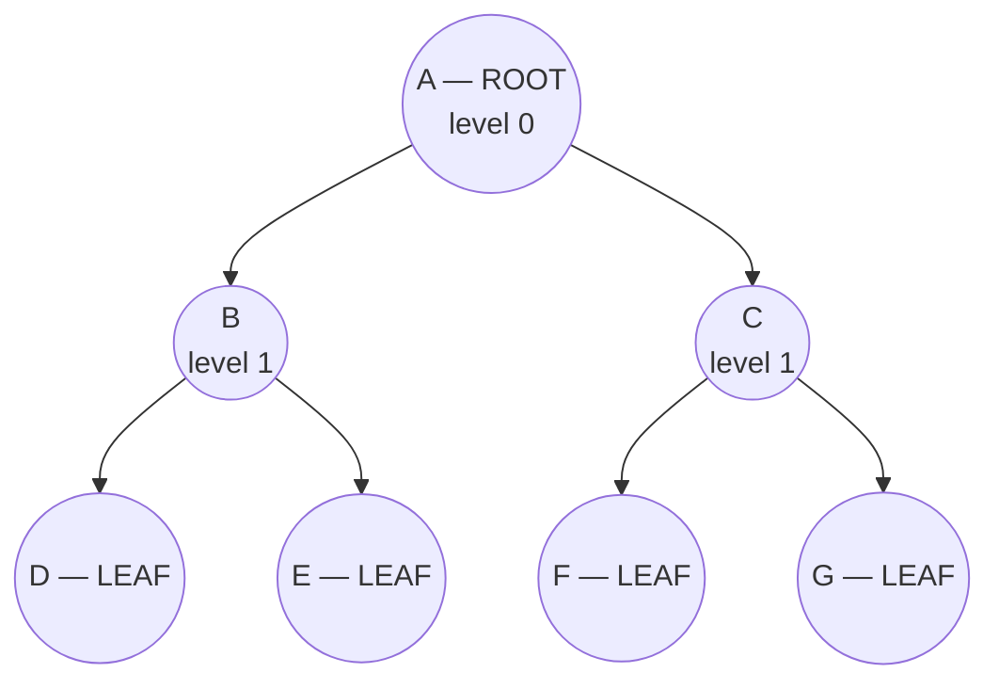

#### Terminology

| Term | Definition |
|---|---|
| **Tree** | A **finite set of one or more nodes** such that there is one specially designated node called the **ROOT**, and the remaining nodes are partitioned into disjoint sets, each of which is itself a tree (a **subtree**). It is a **connected, acyclic graph** |
| **Node** | Each element of the tree, holding data and links to its children |
| **Root** | The **topmost node**, which has **NO parent**. A tree has exactly one |
| **Edge** | The link between a parent and a child |
| **Parent** | A node that has children |
| **Child** | A node directly beneath another node |
| **Sibling** | Nodes that share the **same parent** |
| **Leaf / Terminal / External node** | A node with **NO children** (degree 0) |
| **Internal / Non-terminal node** | A node with **AT LEAST ONE child** — i.e. any node that is not a leaf |
| **Degree of a node** | The **number of children** it has |
| **Degree of the tree** | The **maximum degree** of any node in it |
| **Level** | The distance from the root. The **root is at level 0** (some books say 1 — state your convention) |
| **Height / Depth of the tree** | The **number of edges on the longest path** from the root to a leaf. A single-node tree has height 0 |
| **Depth of a node** | The number of edges from the **root** down to that node |
| **Height of a node** | The number of edges from that node down to its **deepest leaf** |
| **Subtree** | Any node together with all its descendants |
| **Ancestor / Descendant** | Any node on the path up to the root / down from a node |
| **Forest** | A **collection of disjoint trees** — removing the root of a tree yields a forest |

#### Types of tree

| Type | Definition |
|---|---|
| **General tree** | A node may have any number of children |
| **Binary tree** | Every node has **at most TWO children** — a **left** child and a **right** child |
| **Full (Proper / Strictly) binary tree** | Every node has **either 0 or exactly 2 children** — never one |
| **Complete binary tree** | **All levels are completely filled except possibly the last**, which is filled **from left to right** |
| **Perfect binary tree** | **All internal nodes have 2 children AND all leaves are at the same level** |
| **Degenerate (skewed) tree** | Every node has **only one child** — it degenerates into a linked list |
| **Balanced tree** | The heights of the left and right subtrees of every node differ by at most 1 (**AVL**, Red-Black) |
| **Binary Search Tree (BST)** | A binary tree with the ordering property left < node < right |
| **B-Tree / B+ Tree** | A balanced **m-way** search tree used in databases and file systems |
| **Heap** | A complete binary tree satisfying the heap (parent/child ordering) property |
| **Expression tree** | Operators at internal nodes, operands at leaves |

#### Properties of a binary tree

| Property | Formula |
|---|---|
| Maximum nodes at level **L** | **2^L** (root at level 0) |
| **Maximum nodes** in a tree of height **h** | **2^(h+1) − 1** |
| **Minimum nodes** in a tree of height **h** | **h + 1** (a skewed tree) |
| **Minimum height** for **n** nodes | **⌊log₂ n⌋** |
| **Maximum height** for **n** nodes | **n − 1** |
| In a **full** binary tree with **i** internal nodes | **Leaves = i + 1**, total nodes = 2i + 1 |
| In any binary tree | **Number of leaves = number of nodes with 2 children + 1** |
| Edges in a tree with n nodes | **n − 1** |

#### Worked derivation — maximum and minimum height for n nodes

> **Maximum height.** The tallest possible tree with n nodes is a **skewed tree**, where every node has exactly one child — a chain. With n nodes there are **n − 1 edges** on the single path, so
> ### **Maximum height = n − 1** *(or **n** if height is counted in nodes)*

> **Minimum height.** The shortest tree packs as many nodes as possible into each level, i.e. it is **complete**. A tree of height **h** holds at most **2^(h+1) − 1** nodes, so we need
> **n ≤ 2^(h+1) − 1** → **n + 1 ≤ 2^(h+1)** → **log₂(n+1) ≤ h + 1** → **h ≥ log₂(n+1) − 1**
> ### **Minimum height = ⌈log₂(n+1)⌉ − 1 = ⌊log₂ n⌋**

**Worked check for a tree of height 7 (root at height 0):**

| | Calculation | Answer |
|---|---|---|
| **Maximum number of nodes** | 2^(7+1) − 1 = 2⁸ − 1 = 256 − 1 | **255** |
| **Minimum number of nodes** | h + 1 = 7 + 1 | **8** |

#### Proof: in a proper (full) binary tree, the number of leaves = internal nodes + 1

**Proof by induction on the number of internal nodes, i.**

**Base case (i = 1):** a single internal node (the root) with two children, both leaves. Leaves = 2 = 1 + 1 ✅

**Inductive hypothesis:** assume any full binary tree with **k** internal nodes has **k + 1** leaves.

**Inductive step:** take a full binary tree T with **k + 1** internal nodes. Choose an internal node **v** whose **both children are leaves** (such a node must exist — take the deepest internal node). Remove those two leaves. Now **v** itself becomes a leaf, so the new tree T′ has **k** internal nodes and, by the hypothesis, **k + 1** leaves. Restoring the two children: we **remove v from the leaf count and add 2**, giving (k + 1) − 1 + 2 = **k + 2 = (k + 1) + 1** leaves ✅

By induction, **in every full binary tree, leaves = internal nodes + 1. ∎**

> **Equivalently:** *"in a proper binary tree with n nodes, one more than half are leaves"* — since n = 2i + 1, we get i = (n−1)/2 internal and (n+1)/2 leaves.

#### Array representation of a binary tree

A binary tree can be stored in an array with **no pointers at all**, by fixing the position of each node.

**For a node at index `i` (0-based):**

| Relation | Formula |
|---|---|
| **Left child** | `2i + 1` |
| **Right child** | `2i + 2` |
| **Parent** | `(i − 1) / 2` |

*(For 1-based indexing: left = `2i`, right = `2i + 1`, parent = `i/2` — often cleaner in exams.)*

**Example** — the tree A(B(D,E), C(F,G)) stored in an array:

| Index | 0 | 1 | 2 | 3 | 4 | 5 | 6 |
|---|---|---|---|---|---|---|---|
| **Value** | **A** | B | C | D | E | F | G |

Check: A is at 0, so its children are at 1 (B) and 2 (C) ✅; B is at 1, so its children are at 3 (D) and 4 (E) ✅.

| Point | **Array representation** | **Linked representation** |
|---|---|---|
| **Memory** | **No pointer overhead** | 2 pointers per node |
| **Access to parent/child** | **O(1)** by formula | Must follow pointers |
| **Suitable for** | **Complete trees (heaps)** — no waste | **Any shape**, especially sparse/skewed trees |
| **Wasted space** | **Enormous for a skewed tree** — a chain of 10 nodes needs an array of 2¹⁰ | None |
| **Insertion/deletion** | Requires shifting | **Easy** — just re-link pointers |
| **Size** | Fixed at allocation | **Dynamic** |

#### B-Tree

A **B-Tree** is a **self-balancing m-way search tree** in which a node may hold **many keys and many children**, and **all leaves are at the same level**.

**Properties of a B-tree of order m:** every node holds at most **m − 1 keys** and **m children**; every node except the root holds at least **⌈m/2⌉ − 1 keys**; keys within a node are **sorted**; and **all leaves appear at the same depth**, so the tree is perfectly height-balanced.

**Why B-trees exist — and this is the key exam point:** a **disk read is roughly 100,000 times slower than a memory access**, and it fetches an entire **block/page** at once. A binary tree of a million records has height ~20, meaning **20 disk seeks**. A B-tree packs **hundreds of keys into one node sized to one disk block**, so the height falls to **3 or 4** — **3 or 4 disk seeks instead of 20**. The whole design exists to **minimise disk I/O**.

**Applications:** **database indexes** (MySQL InnoDB, Oracle, SQL Server all use **B+ trees**), **file systems** (NTFS, ext4, Btrfs, HFS+), and any large index that cannot fit in memory.

**B+ Tree** — the variant actually used: **all data is stored only in the leaves**, internal nodes hold keys only for navigation, and **the leaves are linked in a chain**, which makes **range queries and sequential scans extremely fast** — exactly what `WHERE age BETWEEN 20 AND 30` needs.

**Previous Year Question List from this Topic:**

- [Define the following terms used in tree data structures: (i) Tree, (ii) Leaf Node, (iii) Internal Node, and (iv) Height of a Tree. Provide a suitable example to…](../written-answers/data-structure.md?plain=1#L23)
- [Proper binary tree is one more node is Internal node prove it.](../written-answers/data-structure.md?plain=1#L188)
- [How to represent binary tree using array?](../written-answers/data-structure.md?plain=1#L379)
- [(ক) Binary Tree কী? Binary Tree Traversing এর পদ্ধতিসমূহ আলোচনা করুন।](../written-answers/data-structure.md?plain=1#L528)
- [6.12 Define the following terms used in tree data structures: (i) Tree, (ii) Leaf Node, (iii) Internal Node, and (iv) Height of a Tree. Provide a suitable examp…](../written-answers/data-structure.md?plain=1#L585)
- [Explain binary tree with example.](../written-answers/data-structure.md?plain=1#L633)
- [What is the minimum number of nodes in a binary tree?](../written-answers/data-structure.md?plain=1#L869)
- [(ক) B-tree data structure কী? এর প্রয়োগ ব্যাখ্যা করুন।](../written-answers/data-structure.md?plain=1#L912)
- [Mathematically derive the maximum and minimum height of a binary tree consisting of n nodes. Note that the height of a tree with a single node is considered as…](../written-answers/data-structure.md?plain=1#L1317)
- [(iii) Maximum and Minimum no of Nodes for a binary tree of height 7 where the root is considered as height 0.](../written-answers/data-structure.md?plain=1#L1387)


---

### Binary Tree Traversal

**Traversal** means **visiting every node of the tree exactly once** in a systematic order. For a binary tree there are **four** standard traversals.

#### The three depth-first traversals

> The name tells you **when the ROOT is visited**:
> **PRE-order** = Root **first** · **IN-order** = Root **in the middle** · **POST-order** = Root **last**.
> In all three, **Left is always visited before Right**.

| Traversal | Order | Pseudocode |
|---|---|---|
| **Pre-order** | **Root → Left → Right** | `visit(node); preorder(left); preorder(right)` |
| **In-order** | **Left → Root → Right** | `inorder(left); visit(node); inorder(right)` |
| **Post-order** | **Left → Right → Root** | `postorder(left); postorder(right); visit(node)` |
| **Level-order (BFS)** | Level by level, left to right | Uses a **QUEUE** |

#### Recursive pseudocode

```
PREORDER(node):
    if node == NULL: return
    print(node.data)            // ← ROOT first
    PREORDER(node.left)
    PREORDER(node.right)

INORDER(node):
    if node == NULL: return
    INORDER(node.left)
    print(node.data)            // ← ROOT in the middle
    INORDER(node.right)

POSTORDER(node):
    if node == NULL: return
    POSTORDER(node.left)
    POSTORDER(node.right)
    print(node.data)            // ← ROOT last

LEVELORDER(root):               // iterative, uses a QUEUE
    if root == NULL: return
    Q.enqueue(root)
    while Q is not empty:
        node = Q.dequeue()
        print(node.data)
        if node.left  != NULL: Q.enqueue(node.left)
        if node.right != NULL: Q.enqueue(node.right)
```

#### Worked example

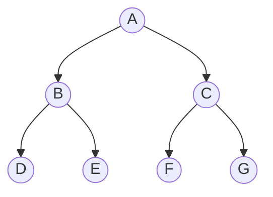

| Traversal | Order | **Result** |
|---|---|---|
| **Pre-order** | Root, Left, Right | **A B D E C F G** |
| **In-order** | Left, Root, Right | **D B E A F C G** |
| **Post-order** | Left, Right, Root | **D E B F G C A** |
| **Level-order** | Level by level | **A B C D E F G** |

**How to trace pre-order by hand:** start at A → print **A** → go left to B → print **B** → go left to D → print **D** (leaf, back up) → right to E → print **E** → back to A → right to C → print **C** → left F → print **F** → right G → print **G**.

#### Complexity

| | Value |
|---|---|
| **Time** | **O(n)** — every node is visited exactly once |
| **Space** | **O(h)** for the recursion stack, where h is the height. Best case **O(log n)** for a balanced tree, worst case **O(n)** for a skewed tree |

#### Applications of each traversal

| Traversal | Used for |
|---|---|
| **Pre-order** | **Copying/cloning a tree**; **serialising** a tree to a file; producing the **PREFIX (Polish)** form of an expression; directory listing |
| **In-order** | **Retrieving a BST's keys in SORTED order** — its single most important use; verifying that a tree is a valid BST; producing the **INFIX** expression |
| **Post-order** | **DELETING a tree** (children must be freed before the parent); producing the **POSTFIX (Reverse Polish)** form; **evaluating an expression tree**; computing directory sizes |
| **Level-order** | **BFS**, finding the shortest path in a tree, level-by-level printing, finding the tree's width |

#### Reconstructing a tree from two traversals

> **The rule: a binary tree can be uniquely reconstructed from**
> - **In-order + Pre-order** ✅
> - **In-order + Post-order** ✅
> - **In-order + Level-order** ✅
> - **Pre-order + Post-order** ❌ **NOT uniquely** — except for a **full** binary tree
>
> **Why in-order is essential:** pre-order and post-order tell you **which node is the root**, but only **in-order tells you where the split between the left and right subtrees lies**. Without it, the division is ambiguous.

**Worked example — reconstruct from Pre-order and In-order**

> **Pre-order: 1 5 8 7 4 9 3** · **In-order: 8 5 7 1 9 4 3**

| Step | Reasoning |
|---|---|
| 1 | Pre-order's **first element is the ROOT** → **1** |
| 2 | Find **1** in the in-order list: `8 5 7 | 1 | 9 4 3`. Everything **left** of it is the **left subtree** (8 5 7), everything right is the **right subtree** (9 4 3) |
| 3 | The left subtree has 3 nodes, so the **next 3 elements of pre-order** (5 8 7) belong to it; the remaining (4 9 3) to the right subtree |
| 4 | **Left subtree:** pre = 5 8 7, in = 8 5 7. Root = **5**; in-order splits as `8 | 5 | 7` → left child 8, right child 7 |
| 5 | **Right subtree:** pre = 4 9 3, in = 9 4 3. Root = **4**; splits as `9 | 4 | 3` → left child 9, right child 3 |

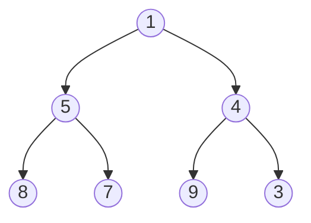

**Verification:** In-order = 8, 5, 7, **1**, 9, **4**, 3 ✅ · Pre-order = **1**, 5, 8, 7, **4**, 9, 3 ✅

**The general algorithm:**
```
BUILD(preorder, inorder):
    if inorder is empty: return NULL
    root = preorder[0]                       // or postorder[last]
    i = index of root in inorder
    node = new Node(root)
    node.left  = BUILD(preorder[1 .. i],   inorder[0 .. i-1])
    node.right = BUILD(preorder[i+1 .. n], inorder[i+1 .. n])
    return node
```

#### Mirroring / inverting a binary tree

```cpp
/* Swap the left and right child of every node, recursively */
Node* invertTree(Node* root) {
    if (root == NULL) return NULL;

    Node* temp  = root->left;           // swap the two children
    root->left  = root->right;
    root->right = temp;

    invertTree(root->left);             // recurse into both subtrees
    invertTree(root->right);
    return root;
}
```
**Time: O(n) · Space: O(h)** for the recursion stack. *(The in-order traversal of the mirrored tree is the **reverse** of the original's in-order traversal.)*

#### Summing the nodes of a tree

```cpp
int sumNodes(Node* root) {
    if (root == NULL) return 0;                       // base case
    return root->data + sumNodes(root->left) + sumNodes(root->right);
}
```

**Previous Year Question List from this Topic:**

- [In BSCPL, all branches manage their records using a preorder traversal system, while data collection follows an inorder traversal system. The branches report th…](../written-answers/data-structure.md?plain=1#L71)
- [You have to right the traversal order for the new algorithm which will traverse the following tree right child first, then left child and finally the root.](../written-answers/data-structure.md?plain=1#L125)
- [Inserting data to BST. Print the tree in post order traversal. Delete one of the node and redraw the valid BST again.](../written-answers/data-structure.md?plain=1#L248)
- [Consider the two given arrays as pre()={1,2,4,8,9,5,3,6,7} and post()={8,9,4,5,2,6,7,3,1}; Draw a binary tree from above array.](../written-answers/data-structure.md?plain=1#L322)
- [You are given a binary tree (a, b, c, d, e, f, g, h, i) nodes. The post order of the binary tree is: a b f c h d e g i nodes. Now draw the binary tree and show…](../written-answers/data-structure.md?plain=1#L458)
- [(ক) Binary Tree কী? Binary Tree Traversing এর পদ্ধতিসমূহ আলোচনা করুন।](../written-answers/data-structure.md?plain=1#L528)
- [What is Pre-order and Post order?](../written-answers/data-structure.md?plain=1#L691)
- [Explain with example Post order traversal.](../written-answers/data-structure.md?plain=1#L747)
- [(b) Draw a binary tree of 15 elements in (a) Preorder (b) In-order (c) Post order traversals.](../written-answers/data-structure.md?plain=1#L811)
- [(গ) নিচের ছবির Tree এর Inorder, Preorder এবং Postorder Traversal লিখুন।](../written-answers/data-structure.md?plain=1#L962)
- [Write C++ function that will invert mirror a binary tree.](../written-answers/data-structure.md?plain=1#L1022)
- [Write a Pseudocode of postorder by recursion and generate postorder, preorder inorder from the tree.](../written-answers/data-structure.md?plain=1#L1177)
- [(b) Draw a binary tree of 5 elements. Now list out the elements in (i) Pre-order (ii) Post order and (iii) Inorder traversal of the tree.](../written-answers/data-structure.md?plain=1#L1262)
- [Construct a full binary tree from the given inorder and preorder traversal as follows:](../written-answers/data-structure.md?plain=1#L1445)
- [Preorder and In-order sequence is given, Draw the binary tree and write a procedure sum Nodes (Node* root) to find out summation of all nodes of that tree.](../written-answers/data-structure.md?plain=1#L1521)


---

### Expression Trees and Notation Conversion

#### What is an expression tree?

An **expression tree** is a binary tree in which **every LEAF is an operand** and **every INTERNAL node is an operator**. It represents the structure and precedence of an arithmetic expression unambiguously — no parentheses are needed, because the tree's shape *is* the grouping.

#### The three notations

| Notation | Operator position | Example for `a + b` |
|---|---|---|
| **Infix** | **Between** the operands | `a + b` |
| **Prefix (Polish)** | **Before** the operands | `+ a b` |
| **Postfix (Reverse Polish, RPN)** | **After** the operands | `a b +` |

> **The connection to traversal — this is the key insight:**
> **Pre-order traversal of an expression tree = PREFIX notation**
> **In-order traversal = INFIX notation**
> **Post-order traversal = POSTFIX notation**

#### Worked example — build the tree for `3 + ((5 + 9) * 2)`

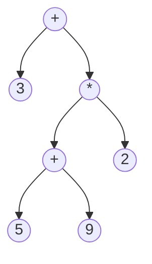

| Traversal | Result | Notation |
|---|---|---|
| **Pre-order** | **+ 3 * + 5 9 2** | **PREFIX** |
| **In-order** | 3 + 5 + 9 * 2 | INFIX (needs parentheses to be unambiguous) |
| **Post-order** | **3 5 9 + 2 * +** | **POSTFIX** |

**Evaluation:** 5 + 9 = 14 → 14 × 2 = 28 → 3 + 28 = **31**

#### Worked example — `X = (a² − 5b) · (7a + b⁵)`

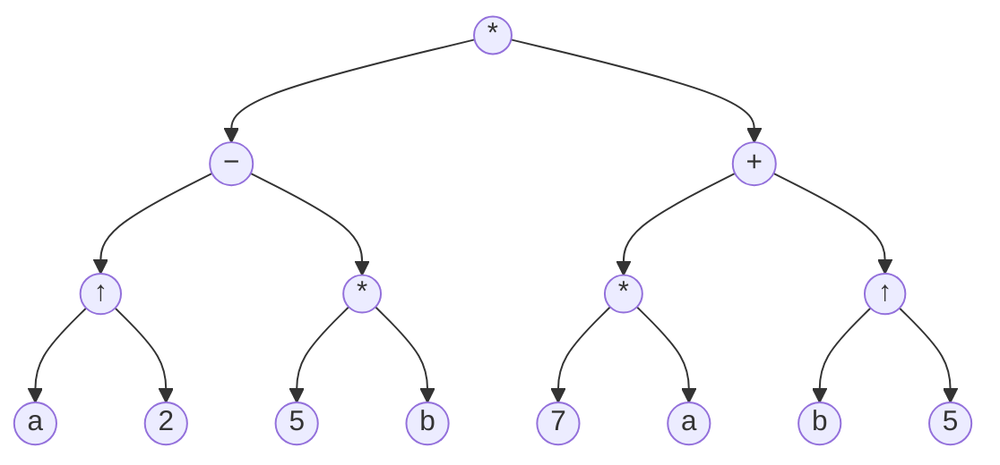

**Prefix:** `* − ↑ a 2 * 5 b + * 7 a ↑ b 5`
**Postfix:** `a 2 ↑ 5 b * − 7 a * b 5 ↑ + *`

#### Infix → Postfix conversion (the Shunting-Yard algorithm)

```
InfixToPostfix(expression):
    create an empty STACK for operators
    create an empty OUTPUT string

    for each token in the expression:
        if token is an OPERAND:
            append it to OUTPUT
        else if token is '(':
            push it onto the stack
        else if token is ')':
            pop and output operators until '(' is popped (discard both brackets)
        else:                                    // token is an operator
            while the stack top is an operator with
                  HIGHER or EQUAL precedence (for left-associative operators):
                pop it to OUTPUT
            push the token
    pop all remaining operators to OUTPUT
```

**Operator precedence (highest first):** `( )` → `^` or `↑` (right associative) → `* / %` → `+ −`

#### Worked conversion — `P = 12 / (7 − 3) + 2`

| Step | Token | Stack | Output |
|---|---|---|---|
| 1 | `12` | — | `12` |
| 2 | `/` | `/` | `12` |
| 3 | `(` | `/ (` | `12` |
| 4 | `7` | `/ (` | `12 7` |
| 5 | `−` | `/ ( −` | `12 7` |
| 6 | `3` | `/ ( −` | `12 7 3` |
| 7 | `)` | `/` | `12 7 3 −` *(pop until `(`)* |
| 8 | `+` | `+` | `12 7 3 − /` *(`/` has higher precedence, so pop it)* |
| 9 | `2` | `+` | `12 7 3 − / 2` |
| 10 | end | — | `12 7 3 − / 2 +` |

> ### ✅ **Postfix = `12 7 3 − / 2 +`**

#### Evaluating a postfix expression — using a STACK

```
EvaluatePostfix(expression):
    create an empty STACK
    for each token:
        if token is an OPERAND:  push it
        else:                                 // operator
            b = pop()                         // NOTE: the SECOND operand pops FIRST
            a = pop()
            result = a OPERATOR b
            push(result)
    return pop()                              // the single remaining value
```

**Evaluating `12 7 3 − / 2 +`:**

| Token | Action | Stack |
|---|---|---|
| `12` | push | `12` |
| `7` | push | `12, 7` |
| `3` | push | `12, 7, 3` |
| `−` | pop 3, pop 7 → **7 − 3 = 4** → push | `12, 4` |
| `/` | pop 4, pop 12 → **12 / 4 = 3** → push | `3` |
| `2` | push | `3, 2` |
| `+` | pop 2, pop 3 → **3 + 2 = 5** → push | `5` |

> ### ✅ **Result = 5** *(Check against the infix: 12 / (7−3) + 2 = 12/4 + 2 = 3 + 2 = **5** ✅)*

**The critical detail:** when popping for a **non-commutative** operator (`−`, `/`, `^`), the **first value popped is the RIGHT operand** and the second is the left. Getting this backwards is the commonest error.

#### Worked example — `3 2 * 2 ↑ 5 3 − 8` type expressions

Evaluate **`3 2 * 2 ↑`** (where ↑ is exponentiation):

| Token | Action | Stack |
|---|---|---|
| `3` | push | `3` |
| `2` | push | `3, 2` |
| `*` | 3 × 2 = **6** | `6` |
| `2` | push | `6, 2` |
| `↑` | **6² = 36** | `36` |

#### Converting `A + B * C + D` to prefix

**Step 1 — insert parentheses by precedence:** `((A + (B * C)) + D)`
**Step 2 — work outward from the innermost:**
- `B * C` → `* B C`
- `A + (* B C)` → `+ A * B C`
- `(+ A * B C) + D` → `+ + A * B C D`

> ### ✅ **Prefix = `+ + A * B C D`**
> **Postfix = `A B C * + D +`**

#### Converting `((A + B) * C − (D − E) ^ F)`

| Step | Working |
|---|---|
| `(A + B)` | **postfix:** `A B +` · **prefix:** `+ A B` |
| `(A+B) * C` | `A B + C *` · `* + A B C` |
| `(D − E)` | `D E −` · `− D E` |
| `(D−E) ^ F` | `D E − F ^` · `^ − D E F` |
| Whole expression | **postfix: `A B + C * D E − F ^ −`** · **prefix: `− * + A B C ^ − D E F`** |

**Previous Year Question List from this Topic:**

- [X = (a^2 - 5b).(7a + b^5) এক্সপ্রেশনটিকে tree stracture-এ অঙ্কন করুন?](../written-answers/data-structure.md?plain=1#L1113)
- [Making binary a tree from the given expression: 3 + ((5+9)*2)](../written-answers/data-structure.md?plain=1#L1618)
- [Evaluate the prefix and postfix notation with binary tree evaluation and find out its final value.](../written-answers/data-structure.md?plain=1#L1680)
- [Convert the infix expression P = 12 / (7 - 3) + 2 to postfix expression and evaluate it.](../written-answers/data-structure.md?plain=1#L2111)
- [Prefix Conversion A+ B * C+D expression?](../written-answers/data-structure.md?plain=1#L2249)
- [Expalin: Infix, Prefix, Postfix notation.](../written-answers/data-structure.md?plain=1#L2357)
- [(ক) নিম্নলিখিত Expression টি evaluate করুন: 3\;2 * 2 \uparrow 5\;3 - 8\;4 / * -](../written-answers/data-structure.md?plain=1#L2582)
- [Write prefix and postfix notations from the statement like $((A+B)*C-(D-E)^F)$](../written-answers/data-structure.md?plain=1#L3059)


---

## Stack

### Stack — Concept and Operations

A **stack** is a **linear data structure** in which insertion and deletion happen **only at ONE end**, called the **TOP**, so that the **last element inserted is the first to be removed** — **LIFO (Last In, First Out)**.

> **The physical analogy:** a **stack of plates**. You place a new plate on top and take a plate from the top. You cannot take the bottom plate without removing everything above it.

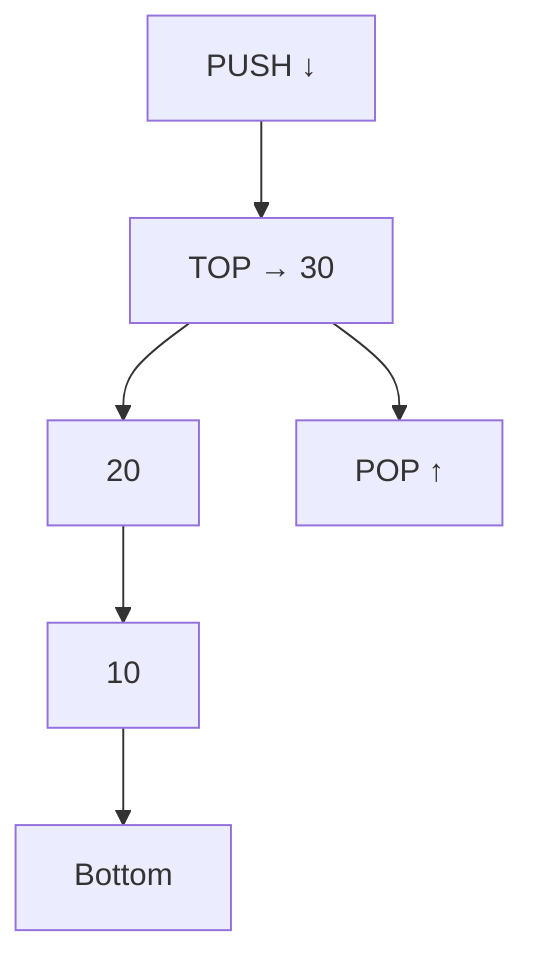

#### The operations

| Operation | Description | Time |
|---|---|---|
| **PUSH(x)** | **Insert** element x at the top | **O(1)** |
| **POP()** | **Remove and return** the top element | **O(1)** |
| **PEEK() / TOP()** | **Return** the top element **without removing** it | **O(1)** |
| **isEmpty()** | Is the stack empty? (`top == -1`) | **O(1)** |
| **isFull()** | Is the array-based stack full? (`top == size-1`) | **O(1)** |
| **size()** | Number of elements | O(1) |

#### The PUSH procedure

```
PUSH(stack, item):
    if top == MAXSIZE - 1:              // 1. check for OVERFLOW first
        print "Stack Overflow"
        return
    top = top + 1                       // 2. increment the top pointer
    stack[top] = item                   // 3. place the item
    print "Pushed", item
```

#### The POP procedure

```
POP(stack):
    if top == -1:                       // 1. check for UNDERFLOW first
        print "Stack Underflow"
        return NULL
    item = stack[top]                   // 2. read the top item
    top = top - 1                       // 3. decrement the top pointer
    return item
```

> **Two error conditions to always mention:**
> - **Overflow** — pushing onto a **full** stack.
> - **Underflow** — popping from an **empty** stack.

#### C implementation

```c
#define MAX 100
int stack[MAX];
int top = -1;                    /* -1 means empty */

void push(int item) {
    if (top == MAX - 1) { printf("Stack Overflow\n"); return; }
    stack[++top] = item;
}

int pop(void) {
    if (top == -1) { printf("Stack Underflow\n"); return -1; }
    return stack[top--];
}

int peek(void) {
    if (top == -1) { printf("Stack is empty\n"); return -1; }
    return stack[top];
}
```

#### A worked trace

> **Push(200), Push(500), Push(100), S = Pop(). What is the value of S?**

| Operation | Stack (bottom → top) | Returned |
|---|---|---|
| Push(200) | `200` | — |
| Push(500) | `200, 500` | — |
| Push(100) | `200, 500, **100**` | — |
| **S = Pop()** | `200, 500` | **100** |

> ### ✅ **S = 100** — because a stack is **LIFO**, and 100 was the **last** value pushed.

#### Applications of the stack

1. **Function call management** — the **call stack** holds return addresses, parameters and local variables. **This is why recursion works.**
2. **Recursion** — implemented directly by the call stack.
3. **Expression conversion and evaluation** — infix ↔ postfix ↔ prefix.
4. **Balanced parenthesis checking** — compilers use this for syntax validation.
5. **Undo/Redo** in editors.
6. **Browser back button** — the history stack.
7. **Backtracking** — maze solving, N-Queens, DFS.
8. **Depth-First Search** in graphs.
9. **Reversing** a string or a list.
10. **Syntax parsing** in compilers.
11. **Memory management** — the stack segment.

**Previous Year Question List from this Topic:**

- [Explain the push and pop operations of the stack.](../written-answers/data-structure.md?plain=1#L1772)
- [Push(200), Push(500), Push(100), S= Pop(). What is the value of S after the Operation?](../written-answers/data-structure.md?plain=1#L2319)
- [(খ) Stack এর operation গুলি সংক্ষেপে বর্ণনা করুন।](../written-answers/data-structure.md?plain=1#L2508)
- [Stack এর ক্ষেত্রে Data PUSH করার Procedure লিখুন।](../written-answers/data-structure.md?plain=1#L2982)
- [১০. কোনটি ক্ষেত্রে আইটেম সংযোজন ও বিয়োজন একই প্রান্তে হয়।](../written-answers/data-structure.md?plain=1#L2860)


---

### Queue, and Stack vs Queue

A **queue** is a linear data structure in which insertion happens at one end (the **REAR**) and deletion at the other (the **FRONT**), so the **first element inserted is the first removed** — **FIFO (First In, First Out)**.

> **The analogy:** a **queue at a ticket counter** — the person who arrives first is served first.

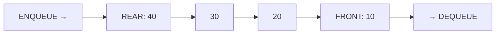

| Operation | Description |
|---|---|
| **ENQUEUE(x)** | Insert at the **rear** |
| **DEQUEUE()** | Remove from the **front** |
| **FRONT() / PEEK()** | View the front element |
| **isEmpty() / isFull()** | Status checks |

**Types of queue:** **Simple queue** · **Circular queue** (the rear wraps to the start, avoiding the "false full" problem of a linear array queue) · **Priority queue** (highest priority served first, regardless of arrival) · **Deque (double-ended queue)** (insert and delete at **both** ends).

#### Stack vs Queue — the key comparison

| Point | **STACK** | **QUEUE** |
|---|---|---|
| **Principle** | **LIFO** — Last In, First Out | **FIFO** — First In, First Out |
| **Insertion end** | **Top** | **Rear** |
| **Deletion end** | **Top** — the **same** end | **Front** — the **opposite** end |
| **Number of pointers** | **ONE** (`top`) | **TWO** (`front` and `rear`) |
| **Operations** | **push, pop, peek** | **enqueue, dequeue, front** |
| **Order of removal** | **Reverse** of insertion order | **Same** as insertion order |
| **Analogy** | A **stack of plates**; a pile of books | A **queue at a counter**; a printer queue |
| **Variants** | — | Circular, Priority, Deque |
| **Empty condition** | `top == -1` | `front > rear` or `front == -1` |
| **Used in** | **Function calls, recursion, undo, expression evaluation, backtracking, DFS** | **CPU/disk scheduling, printer spooling, BFS, message queues, buffering, call centres** |
| **Time complexity** | O(1) for all operations | O(1) for all operations |

#### LIFO vs FIFO

| Point | **LIFO** | **FIFO** |
|---|---|---|
| **Stands for** | Last In, First Out | First In, First Out |
| **Data structure** | **Stack** | **Queue** |
| **Removal order** | The **newest** element first | The **oldest** element first |
| **Fairness** | Unfair — early arrivals may wait forever | **Fair** — everyone is served in turn |
| **Real-world use** | Undo, browser back, call stack; **inventory costing (LIFO)** | Ticket queues, print jobs, CPU scheduling; **inventory costing (FIFO)** |

#### Two problems solved by a stack, and two by a queue

| Structure | Problem | Why it fits |
|---|---|---|
| **Stack** | **Balanced parenthesis checking** | The **most recently opened** bracket must be the **first closed** — exactly LIFO |
| **Stack** | **Postfix expression evaluation** | Operands must be combined with the **most recent** values first |
| **Queue** | **CPU scheduling / printer spooling** | Jobs must be served **in the order they arrived** — fairness demands FIFO |
| **Queue** | **Breadth-First Search** | Nodes must be explored **level by level**, i.e. in discovery order |

#### Implementing a stack using two queues

```
PUSH(x):                    // O(1) push, O(n) pop
    q1.enqueue(x)

POP():
    // move everything except the last element from q1 to q2
    while q1.size() > 1:
        q2.enqueue(q1.dequeue())
    result = q1.dequeue()           // the LAST inserted element — LIFO ✅
    swap(q1, q2)                    // q2 becomes the main queue
    return result
```

**The alternative (costly push, cheap pop):**
```
PUSH(x):                    // O(n) push, O(1) pop
    q2.enqueue(x)
    while q1 is not empty:
        q2.enqueue(q1.dequeue())    // move everything behind the new element
    swap(q1, q2)                    // now the newest element is at the FRONT

POP():
    return q1.dequeue()             // O(1)
```

> **The insight:** a queue removes from the front and a stack removes from the back, so one of the two operations must **reverse the order** — and that reversal costs **O(n)**. You may choose *which* operation pays the cost, but you cannot avoid it with only two queues.

**Previous Year Question List from this Topic:**

- [Implementation of Stack using two Queues?](../written-answers/data-structure.md?plain=1#L1853)
- [Difference between Stack and Queue. Write about 2 problems solved by stack and queue.](../written-answers/data-structure.md?plain=1#L2059)
- [(খ) Stack ও Queue এর মধ্যে পার্থক্য লিখুন।](../written-answers/data-structure.md?plain=1#L2181)
- [Write down the difference between Stack and Queue.](../written-answers/data-structure.md?plain=1#L2214)
- [(খ) Stack এবং Queue Data Structure সমূহের তুলনামূলক আলোচনা করুন।](../written-answers/data-structure.md?plain=1#L2417)
- [Difference between LIFO and FIFO in data structure.](../written-answers/data-structure.md?plain=1#L2460)
- [(a) Compare Stack and Queue in context with data structure. (5 marks)](../written-answers/data-structure.md?plain=1#L5986)
- [Different data structures are used based on how data needs to be accessed and processed. Compare Stack and Queue in terms of how they handle data. Then, provide…](../written-answers/data-structure.md?plain=1#L5999)


---

### Balanced Parentheses Checking

**The problem:** given an expression containing `( )`, `{ }` and `[ ]`, determine whether every opening bracket has a matching closing bracket of the **same type**, in the **correct order**.

**Examples:** `{[()]}` → **Balanced** ✅ · `{[(])}` → **Not balanced** ❌ (the `]` closes while `(` is still open) · `((` → **Not balanced** ❌

#### The algorithm

```
isBalanced(expression):
    create an empty STACK

    for each character ch in expression:
        if ch is an OPENING bracket — ( { [ :
            PUSH ch
        else if ch is a CLOSING bracket — ) } ] :
            if stack is EMPTY:
                return "Not Balanced"        // a closing bracket with nothing open
            top = POP()
            if top does not MATCH ch:
                return "Not Balanced"        // wrong type, e.g. ( closed by ]
    // after the whole string:
    if stack is EMPTY:  return "Balanced"    // everything was closed
    else:               return "Not Balanced"  // some brackets never closed
```

> **The three failure conditions to check — all three are needed:**
> 1. A **closing bracket when the stack is empty** → nothing to match it.
> 2. A **mismatched type** on popping → `(` closed by `]`.
> 3. The **stack is not empty at the end** → some brackets were never closed.

#### C program

```c
#include <stdio.h>
#include <string.h>
#include <stdbool.h>
#define MAX 1000

char stack[MAX];
int top = -1;

void push(char c) { stack[++top] = c; }
char pop(void)    { return (top == -1) ? '\0' : stack[top--]; }

bool matches(char open, char close) {
    return (open == '(' && close == ')') ||
           (open == '{' && close == '}') ||
           (open == '[' && close == ']');
}

bool isBalanced(char exp[]) {
    top = -1;                                   /* reset the stack */
    for (int i = 0; exp[i] != '\0'; i++) {
        char c = exp[i];
        if (c == '(' || c == '{' || c == '[') {
            push(c);
        }
        else if (c == ')' || c == '}' || c == ']') {
            if (top == -1) return false;        /* condition 1 */
            if (!matches(pop(), c)) return false;  /* condition 2 */
        }
        /* other characters are ignored */
    }
    return top == -1;                           /* condition 3 */
}

int main(void) {
    char exp[MAX];
    printf("Enter an expression: ");
    scanf("%s", exp);
    printf("%s\n", isBalanced(exp) ? "Balanced / Matched"
                                   : "Not Balanced / Unmatched");
    return 0;
}
```

#### A worked trace — `{[()]}`

| Char | Action | Stack |
|---|---|---|
| `{` | push | `{` |
| `[` | push | `{ [` |
| `(` | push | `{ [ (` |
| `)` | pop `(` — matches ✅ | `{ [` |
| `]` | pop `[` — matches ✅ | `{` |
| `}` | pop `{` — matches ✅ | *(empty)* |
| end | Stack is empty | ### ✅ **BALANCED** |

#### A worked trace — `{[(])}`

| Char | Action | Stack |
|---|---|---|
| `{` | push | `{` |
| `[` | push | `{ [` |
| `(` | push | `{ [ (` |
| `]` | pop `(` — **does NOT match `]`** ❌ | — |
| | | ### ❌ **NOT BALANCED** |

**Complexity: Time O(n)** — one pass · **Space O(n)** — worst case all opening brackets.

> **Why a stack is the natural structure:** brackets must close in **reverse order of opening** — the most recently opened must be closed first. That is precisely the **LIFO** property, which is why no other data structure solves this as cleanly.

**Previous Year Question List from this Topic:**

- [Correct of correct parentheses if it is written proper show matched if it does not show unmatched.](../written-answers/data-structure.md?plain=1#L1956)
- [Write a C/C++ program to check Balanced parentheses in an Expression.](../written-answers/data-structure.md?plain=1#L2630)
- [Write a programme in C/C++/Java to check whether an expression balanced parenthesis or not. Sample input/output:](../written-answers/data-structure.md?plain=1#L2737)
- [Write a Program to check for balanced parenthesis in an expression.](../written-answers/data-structure.md?plain=1#L2891)


---

## Linked List

### Linked List — Concept and Types

A **linked list** is a **linear data structure** in which elements (**nodes**) are **not stored contiguously in memory**; instead, each node stores its **data** and a **pointer (link) to the next node**.

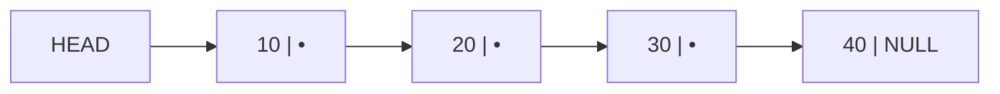

```c
struct Node {
    int data;              /* the value */
    struct Node *next;     /* pointer to the NEXT node */
};
```

#### Types of linked list

**1. Singly Linked List** — each node points **only forward**; the last node points to **NULL**. Traversal is **one-way**.

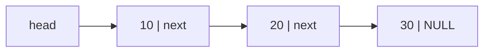

**2. Doubly Linked List** — each node has **TWO** pointers: **next** and **prev**. Traversal is possible in **both directions**.

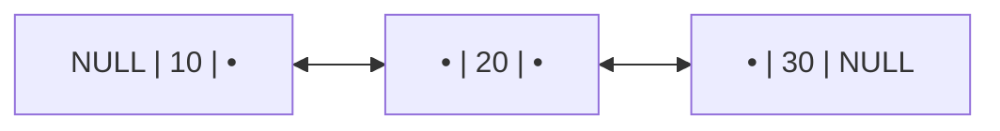

```c
struct DNode {
    int data;
    struct DNode *prev;
    struct DNode *next;
};
```

**3. Circular Linked List** — the **last node points back to the FIRST**, forming a ring, so there is no NULL terminator. It may be singly or doubly circular.

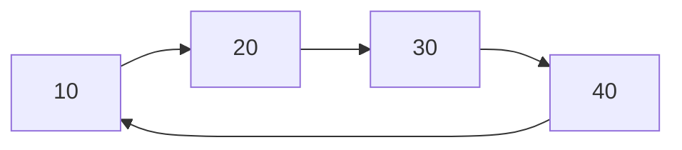

#### Singly vs Doubly vs Circular

| Point | **Singly** | **Doubly** | **Circular** |
|---|---|---|---|
| **Pointers per node** | **1** (next) | **2** (next + prev) | 1 or 2 |
| **Traversal direction** | **Forward only** | **Both directions** | Forward, endlessly around |
| **Memory per node** | **Least** | More (an extra pointer) | Same as its base type |
| **Delete a node given only a pointer to it** | ❌ Hard — you must find the **previous** node by traversing, **O(n)** | ✅ **Easy — O(1)**, because `prev` is known | Depends |
| **Reverse traversal** | ❌ Not possible | ✅ **Easy** | Possible if doubly circular |
| **Last node points to** | **NULL** | NULL | **The first node** |
| **Implementation** | Simplest | More complex — 2 pointers to maintain on every operation | Care needed to avoid infinite loops |
| **Used for** | Simple lists, stacks, adjacency lists | **Browser history (back/forward), undo-redo, LRU cache, music playlists** | **Round-robin CPU scheduling**, circular buffers, multiplayer turn order |

#### Creating a linked list

```
CREATE_LIST():
    head = NULL
    repeat for each value to insert:
        newNode = allocate memory for a Node
        newNode.data = value
        newNode.next = NULL

        if head == NULL:                  // the list is empty
            head = newNode
        else:
            temp = head
            while temp.next != NULL:      // walk to the last node
                temp = temp.next
            temp.next = newNode           // link it at the end
    return head
```

```c
/* Insert at the END */
void insertEnd(struct Node **head, int value) {
    struct Node *newNode = (struct Node *)malloc(sizeof(struct Node));
    newNode->data = value;
    newNode->next = NULL;

    if (*head == NULL) { *head = newNode; return; }

    struct Node *temp = *head;
    while (temp->next != NULL) temp = temp->next;   /* O(n) walk */
    temp->next = newNode;
}

/* Insert at the BEGINNING — O(1) */
void insertBegin(struct Node **head, int value) {
    struct Node *newNode = (struct Node *)malloc(sizeof(struct Node));
    newNode->data = value;
    newNode->next = *head;        /* point to the old first node */
    *head = newNode;              /* the new node becomes the head */
}

/* Traverse and print */
void display(struct Node *head) {
    for (struct Node *t = head; t != NULL; t = t->next)
        printf("%d -> ", t->data);
    printf("NULL\n");
}
```

**Graphical illustration of inserting 25 between 20 and 30:**

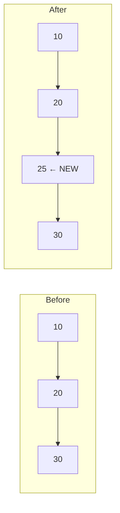

**The two steps, in the correct order:**
1. `newNode->next = temp->next;` — point the new node at 30 **first**
2. `temp->next = newNode;` — then point 20 at the new node

> **If you reverse these two lines, you lose the pointer to the rest of the list and orphan it.** This ordering is the classic linked-list exam point.

#### Traversing a doubly linked list from the TAIL

```c
void traverseFromTail(struct DNode *head) {
    if (head == NULL) return;

    struct DNode *temp = head;
    while (temp->next != NULL)         /* 1. walk forward to the LAST node */
        temp = temp->next;

    printf("Reverse order: ");
    while (temp != NULL) {             /* 2. walk BACKWARD using prev */
        printf("%d -> ", temp->data);
        temp = temp->prev;
    }
    printf("NULL\n");
}
```
*(If a `tail` pointer is maintained, step 1 is unnecessary and the whole operation is **O(n)** instead of 2n.)*

#### Printing a linked list in reverse — recursively

```c
void printReverse(struct Node *head) {
    if (head == NULL) return;          /* base case */
    printReverse(head->next);          /* recurse to the END first */
    printf("%d ", head->data);         /* print on the way BACK UP */
}
```
> **How it works:** the recursion descends all the way to NULL **before printing anything**; the printing then happens as the stack **unwinds**, producing reverse order. **Time O(n), Space O(n)** for the recursion stack.

**Previous Year Question List from this Topic:**

- [Explain with proper example of singly linked list.](../written-answers/data-structure.md?plain=1#L3147)
- [Explain the difference between a singly linked list and a doubly linked list data structure.](../written-answers/data-structure.md?plain=1#L3236)
- [(ক) Linked list কী? উহার প্রকারভেদ চিত্রসহ বর্ণনা করুন।](../written-answers/data-structure.md?plain=1#L3299)
- [অথবা, (ক) Linked List কী? উদাহরণসহ বর্ণনা করুন।](../written-answers/data-structure.md?plain=1#L3433)
- [What is a linked list? Given the algorithm to create a linked list and show an example graphically.](../written-answers/data-structure.md?plain=1#L3576)
- [Write a programme in C/C++/Java/Paython you are given a linked list. Write a recursive function to print the linked list in reverse order for example 1>2>3>4 ou…](../written-answers/data-structure.md?plain=1#L3785)
- [Linked list, doubly linked list and circular linked list explains with diagram.](../written-answers/data-structure.md?plain=1#L3976)
- [In a doubly linked list write the function of Traversing from the tail.](../written-answers/data-structure.md?plain=1#L4066)
- [(খ) Linked list কী?](../written-answers/data-structure.md?plain=1#L4161)


---

### Array vs Linked List

| Point | **Array** | **Linked List** |
|---|---|---|
| **Memory allocation** | **Contiguous** — one solid block | **Non-contiguous** — nodes scattered, joined by pointers |
| **Size** | **Fixed** at declaration (static) | **Dynamic** — grows and shrinks at run time |
| **Access to element i** | ✅ **O(1) — RANDOM ACCESS** by index | ❌ **O(n)** — must traverse from the head |
| **Search (unsorted)** | O(n) | O(n) |
| **Search (sorted)** | ✅ **O(log n)** with binary search | ❌ **O(n)** — binary search is impossible without random access |
| **Insertion at the beginning** | ❌ **O(n)** — every element must shift right | ✅ **O(1)** |
| **Insertion at the end** | **O(1)** if space remains | O(n), or **O(1)** with a tail pointer |
| **Insertion in the middle** | ❌ **O(n)** — shifting | **O(1)** if the position pointer is known (O(n) to find it) |
| **Deletion** | ❌ **O(n)** — shifting | ✅ **O(1)** once the node is located |
| **Memory overhead** | **None** — only the data | **Extra pointer per node** (8 bytes on 64-bit) |
| **Memory wastage** | Unused declared slots are wasted | None — allocate exactly what is needed |
| **Cache performance** | ✅ **EXCELLENT** — contiguous memory means fewer cache misses | ❌ **Poor** — pointer chasing jumps around memory |
| **Requires a large contiguous block** | ✅ **Yes** — may fail on a fragmented heap | ❌ No — any free node will do |
| **Ease of implementation** | **Simple** | More complex — pointer bugs, memory leaks |
| **Best for** | **Frequent random ACCESS**, fixed size, mathematical/matrix work, binary search | **Frequent INSERTION and DELETION**, unknown or highly variable size |

#### Advantages of a linked list over an array

1. **Dynamic size** — no need to know the count in advance; no overflow.
2. **Efficient insertion and deletion** — **O(1)** once positioned, with **no shifting** of other elements.
3. **No wasted memory** from over-allocation.
4. **No need for a large contiguous block** — works even on a fragmented heap.
5. **Easy to grow** without the cost of reallocating and copying an array.
6. Natural basis for **stacks, queues, graphs (adjacency lists), hash-table chains and trees**.

#### Disadvantages of a linked list over an array

1. **No random access** — reaching element 500 requires 500 steps.
2. **Extra memory** for pointers (often 8 bytes per node on top of the data).
3. **Poor cache locality**, making it **much slower in practice** than the complexity table suggests.
4. **Binary search is impossible**.
5. **Reverse traversal is impossible** in a singly linked list.
6. **More complex** to implement; prone to **memory leaks and dangling pointers**.

> ### "For which operations is a linked list better than an array — Insert, Delete or Search?"
>
> | Operation | Better structure | Why |
> |---|---|---|
> | **INSERT** | ✅ **Linked List** | **O(1)** with no shifting. An array insertion at the front must shift all n elements — **O(n)** |
> | **DELETE** | ✅ **Linked List** | **O(1)** once positioned — just re-link the pointers. An array must shift everything after the gap — **O(n)** |
> | **SEARCH** | ❌ **ARRAY** | An array gives **O(1) random access** and therefore **O(log n) binary search** on sorted data. A linked list must traverse sequentially — **O(n)** — and cannot binary search at all |
>
> **The one-line summary: a linked list wins on INSERT and DELETE; an array wins on SEARCH and ACCESS.**

**Previous Year Question List from this Topic:**

- [(a) Compare array and linked list with necessary diagram.](../written-answers/data-structure.md?plain=1#L3371)
- [(খ) উদাহরণসহ Array এবং Linked List এর মধ্যে পার্থক্য লিখুন।](../written-answers/data-structure.md?plain=1#L3504)
- [(b) Explain the advantages and disadvantages of Linked lists over arrays.](../written-answers/data-structure.md?plain=1#L3688)
- [(a) Computer and contrast between array and linked list.](../written-answers/data-structure.md?plain=1#L3727)
- [(a) What are the differences between linked list and array data structure?](../written-answers/data-structure.md?plain=1#L3896)
- [(ii) For which data structure operations, Linked List is better than Array? (Insert, Delete, Search).](../written-answers/data-structure.md?plain=1#L3936)


---

## Binary Search Tree (BST)

### Binary Search Tree — Structure and Operations

A **Binary Search Tree** is a binary tree that satisfies the **BST property** at **every** node:

> **All keys in the LEFT subtree < the node's key < all keys in the RIGHT subtree.**

This ordering is what allows search, insert and delete to run in **O(h)** — logarithmic time when the tree is balanced.

#### Insertion

```
INSERT(root, key):
    if root == NULL:
        return new Node(key)
    if key < root.key:
        root.left  = INSERT(root.left, key)
    else if key > root.key:
        root.right = INSERT(root.right, key)
    return root                      // duplicates are normally ignored
```

#### Worked example — build a BST from 40, 45, 80, 90, 50, 70

| Insert | Path | Position |
|---|---|---|
| **40** | — | **Root** |
| **45** | 45 > 40 → right | Right child of 40 |
| **80** | 80 > 40 → R; 80 > 45 → R | Right child of 45 |
| **90** | 90 > 40 → R; > 45 → R; > 80 → R | Right child of 80 |
| **50** | 50 > 40 → R; > 45 → R; 50 < 80 → **L** | Left child of 80 |
| **70** | > 40 → R; > 45 → R; < 80 → L; 70 > 50 → **R** | Right child of 50 |

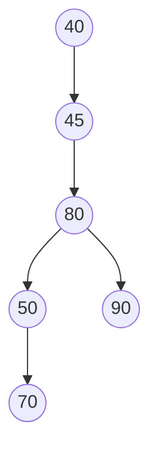

**Verification by in-order traversal:** 40, 45, 50, 70, 80, 90 — **perfectly sorted** ✅

> **Note how badly skewed this tree is** — it has height 4 for only 6 nodes, because the input was almost sorted. This is exactly the weakness that AVL and Red-Black trees exist to fix.

#### Searching

```
SEARCH(root, key):
    if root == NULL or root.key == key:
        return root
    if key < root.key:  return SEARCH(root.left,  key)
    else:               return SEARCH(root.right, key)
```

**Iterative version — O(1) space:**
```c
Node* search(Node* root, int key) {
    while (root != NULL && root->key != key)
        root = (key < root->key) ? root->left : root->right;
    return root;
}
```

**Searching for 70 in the tree above:** 70 > 40 → right to 45 → 70 > 45 → right to 80 → 70 < 80 → left to 50 → 70 > 50 → right → **found**. **4 comparisons** instead of scanning all 6.

#### Finding the minimum and maximum

```c
Node* findMin(Node* root) { while (root->left)  root = root->left;  return root; }
Node* findMax(Node* root) { while (root->right) root = root->right; return root; }
```
**The minimum is the leftmost node; the maximum is the rightmost.** Both are **O(h)**.

#### Deletion — the three cases

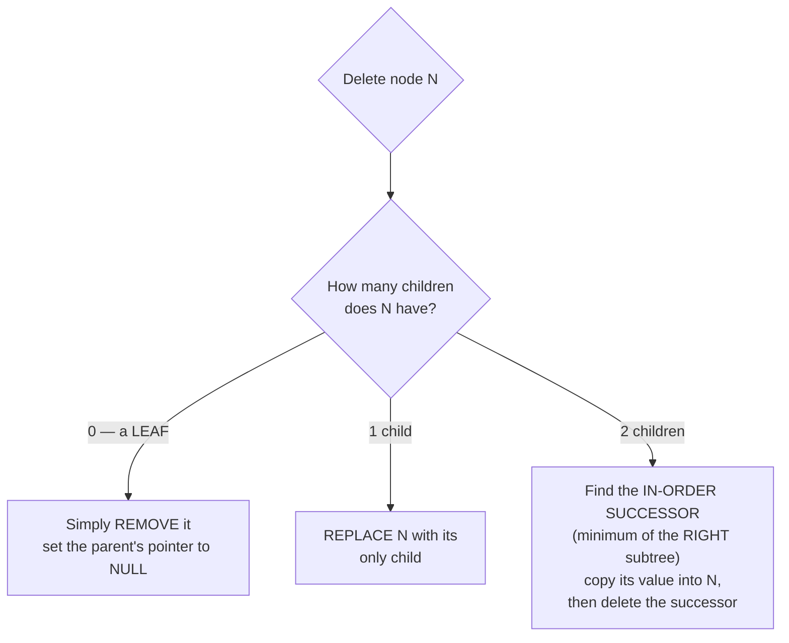

| Case | Action |
|---|---|
| **Leaf (0 children)** | Delete it and set the parent's pointer to NULL |
| **One child** | Replace the node with its single child (the child is "promoted") |
| **Two children** | Replace the node's **value** with its **in-order successor** (the smallest key in the right subtree), then **delete that successor** — which is guaranteed to have at most one child, so it reduces to case 1 or 2 |

*(The **in-order predecessor** — the largest key in the left subtree — works equally well.)*

```
DELETE(root, key):
    if root == NULL: return NULL
    if key < root.key:       root.left  = DELETE(root.left, key)
    else if key > root.key:  root.right = DELETE(root.right, key)
    else:                                          // found it
        if root.left == NULL:   return root.right   // case 1 & 2
        if root.right == NULL:  return root.left    // case 2
        succ = findMin(root.right)                  // case 3
        root.key = succ.key
        root.right = DELETE(root.right, succ.key)
    return root
```

#### Complexity of a BST

| Operation | **Best / Average** (balanced) | **Worst** (skewed) |
|---|---|---|
| **Search** | **O(log n)** | **O(n)** |
| **Insert** | **O(log n)** | **O(n)** |
| **Delete** | **O(log n)** | **O(n)** |
| **In-order traversal** | O(n) | O(n) |
| **Find min / max** | O(log n) | O(n) |
| **Space** | O(n) | O(n) |

> ### Why the worst case is O(n)
> If keys are inserted in **sorted order** (10, 20, 30, 40, 50), every new key is larger than all before it, so it always becomes a **right child**. The tree degenerates into a **right-skewed chain** — effectively a **linked list** of height n − 1.
>
> ```mermaid
> flowchart TD
>     A((10)) --> B((20))
>     B --> C((30))
>     C --> D((40))
>     D --> E((50))
> ```
>
> Searching for 50 now takes **5 comparisons instead of 3** — and with a million sorted insertions, **1,000,000 comparisons instead of 20**. **The entire advantage of a BST is destroyed.**
>
> **The best case** is a **perfectly balanced** tree, where each comparison halves the remaining search space, giving **O(log n)**.
>
> ### The solution: SELF-BALANCING trees
> | Tree | Balancing rule |
> |---|---|
> | **AVL tree** | The height difference between the left and right subtrees of every node is **at most 1**; restored by **rotations** after each insert/delete. **Strictly balanced → fastest search** |
> | **Red-Black tree** | Colour rules keep the longest path at most twice the shortest. **Fewer rotations → faster insert/delete**. Used in `std::map`, Java `TreeMap`, the Linux kernel |
> | **B-Tree / B+ Tree** | Multi-way, all leaves at the same level. **Used by databases and file systems** |
> | **Splay tree** | Recently accessed nodes move towards the root |
>
> These guarantee **O(log n) in ALL cases**.

#### Reconstructing a BST from one traversal

> **A BST is special:** unlike a general binary tree, it can be rebuilt from **pre-order ALONE** or **post-order ALONE**, because **the in-order traversal is implicitly known — it is simply the sorted order of the keys.**

**Worked example — given post-order, find pre-order and in-order:**

| Step | Method |
|---|---|
| 1 | **In-order = the keys SORTED in ascending order.** Simply sort them |
| 2 | The **last** element of post-order is the **root** |
| 3 | In the post-order list, all elements **smaller** than the root form the **left subtree**, and those **larger** form the **right subtree** |
| 4 | Recurse on each part |
| 5 | Read the reconstructed tree in **pre-order** |

**Worked example — construct a BST from Pre-order `1 5 8 7 4 9 3` and In-order `8 5 7 1 9 4 3`:**

*(Note: these traversals describe a general binary tree, not a valid BST — the in-order of a BST must be sorted. The reconstruction procedure is the general one shown in the Traversal section, which yields the tree with root 1, left subtree rooted at 5 (children 8 and 7) and right subtree rooted at 4 (children 9 and 3).)*

**Previous Year Question List from this Topic:**

- [Given a post order data strings of a binaray search tree. Find pre-order and in-order of this this tree and draw the binary search tree.](../written-answers/data-structure.md?plain=1#L4213)
- [Given item- 40, 45, 80, 90, 50, 70. Draw Heap and Binary search tree (BST).](../written-answers/data-structure.md?plain=1#L4263)
- [(খ) Binary Search tree উহার অপারেশনগুলো বর্ণনা করুন।](../written-answers/data-structure.md?plain=1#L4359)
- [Construct a Binary Search tree, then post order, ....... (Approximate)](../written-answers/data-structure.md?plain=1#L4435)
- [(a) Draw the binary search tree for the following elements and write the output of In-order, Preorder and Postorder traversal. 1, 2, 3, 4, 5](../written-answers/data-structure.md?plain=1#L4501)
- [Construct a BST from Pre-order and In-order: Pre: 1587493 In: 8571943](../written-answers/data-structure.md?plain=1#L4572)
- [Write an algorithm to find a node in a binary search tree.](../written-answers/data-structure.md?plain=1#L4621)
- [Complexity of BST (Binary Search Tree) best and worst case.](../written-answers/data-structure.md?plain=1#L4701)
- [What is Binary Search Tree? Explain the complexity of BST?](../written-answers/data-structure.md?plain=1#L4767)


---

## Priority Queues & Heaps (Min/Max Heap)

### Heap — Structure, Properties and Heapify

A **heap** is a **COMPLETE BINARY TREE** that satisfies the **heap property**.

| Type | Property | Root holds |
|---|---|---|
| **Max-Heap** | **Every parent ≥ both of its children** | The **MAXIMUM** |
| **Min-Heap** | **Every parent ≤ both of its children** | The **MINIMUM** |

> **Two conditions must hold — both are examined:**
> 1. **Shape property:** it is a **complete binary tree** — every level full except possibly the last, which fills **left to right**.
> 2. **Heap property:** the parent-child ordering above holds **throughout** the tree.
>
> **Note carefully:** a heap is **NOT a sorted structure** and **NOT a BST**. It only guarantees the relationship between a parent and its own children — there is **no ordering between siblings or across subtrees**.

#### Array representation

Because a heap is **complete**, it is stored in a plain array with **no pointers**:

| Relation (0-based) | Formula |
|---|---|
| Left child of i | **2i + 1** |
| Right child of i | **2i + 2** |
| Parent of i | **(i − 1) / 2** |
| Last non-leaf node | **n/2 − 1** |
| Height | **⌊log₂ n⌋** |

#### Properties of a Max-Heap

1. The **maximum element is always at the ROOT** — accessible in **O(1)**.
2. Every parent is **≥** both children (a **partial order**).
3. It is always a **complete binary tree**, so the height is always **⌊log₂ n⌋**.
4. It can be stored in an **array with no pointer overhead**.
5. There is **no ordering among siblings** or between separate subtrees.
6. The **smallest element is somewhere in the leaves** — finding it takes **O(n)**.
7. A heap of n nodes has **⌈n/2⌉ leaves**.

#### Building a heap — the heapify method

```
BUILD_MAX_HEAP(A, n):
    for i = n/2 - 1 down to 0:          // start at the last NON-LEAF node
        MAX_HEAPIFY(A, n, i)

MAX_HEAPIFY(A, n, i):                   // "sift down" — O(log n)
    largest = i
    l = 2*i + 1
    r = 2*i + 2
    if l < n and A[l] > A[largest]: largest = l
    if r < n and A[r] > A[largest]: largest = r
    if largest != i:
        swap A[i], A[largest]
        MAX_HEAPIFY(A, n, largest)      // continue down
```

> **Why start at `n/2 − 1`?** Because every node from `n/2` to `n−1` is a **leaf**, and a single node is already a valid heap. Starting at the last non-leaf and moving **upward** guarantees that when heapify is applied to a node, both its subtrees are **already valid heaps** — which is exactly the precondition heapify requires.

#### Worked example — build a max-heap from {15, 19, 10, 7, 17, 16}

**Step 1 — place in a complete binary tree (level order):**


**Step 2 — heapify from i = n/2 − 1 = 6/2 − 1 = 2 down to 0:**

| i | Node | Children | Largest | Action |
|---|---|---|---|---|
| **2** | 10 | 16 (index 5) | **16** | **Swap** → node 2 = 16, node 5 = 10 |
| **1** | 19 | 7, 17 | **19** | No change (19 is already largest) |
| **0** | 15 | 19, 16 | **19** | **Swap** → root = 19, node 1 = 15. Then heapify index 1: children are 7 and 17 → **17 is larger → swap** → node 1 = 17, node 4 = 15 |

**Final max-heap array: `[19, 17, 16, 7, 15, 10]`**

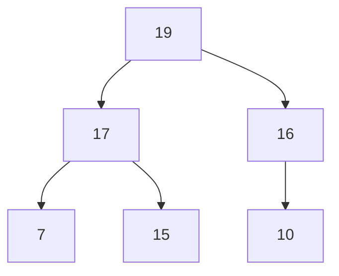

**Verification:** 19 ≥ 17, 16 ✅ · 17 ≥ 7, 15 ✅ · 16 ≥ 10 ✅

#### Deleting the root (extract-max)

```
EXTRACT_MAX(A, n):
    max = A[0]                   // 1. save the root — the maximum
    A[0] = A[n-1]                // 2. move the LAST element to the root
    n = n - 1                    // 3. shrink the heap
    MAX_HEAPIFY(A, n, 0)         // 4. sift the new root down
    return max
```

**Continuing the example — delete 19 from `[19, 17, 16, 7, 15, 10]`:**
1. Save **19**.
2. Move the last element **10** to the root → `[10, 17, 16, 7, 15]`
3. Heapify the root: children of 10 are 17 and 16 → **17 is largest → swap** → `[17, 10, 16, 7, 15]`
4. Heapify index 1: children of 10 are 7 and 15 → **15 is largest → swap** → `[17, 15, 16, 7, 10]`

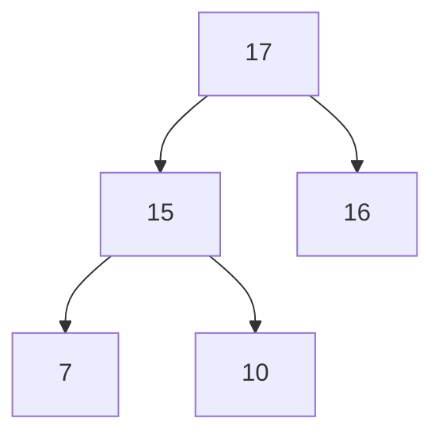

#### Building a min-heap — from 40, 45, 80, 90, 50, 70

Inserting in level order gives `[40, 45, 80, 90, 50, 70]`. Checking: 40 ≤ 45, 80 ✅ · 45 ≤ 90, 50 ✅ · 80 ≤ 70 ❌ → **swap 80 and 70**.

**Min-heap: `[40, 45, 70, 90, 50, 80]`**

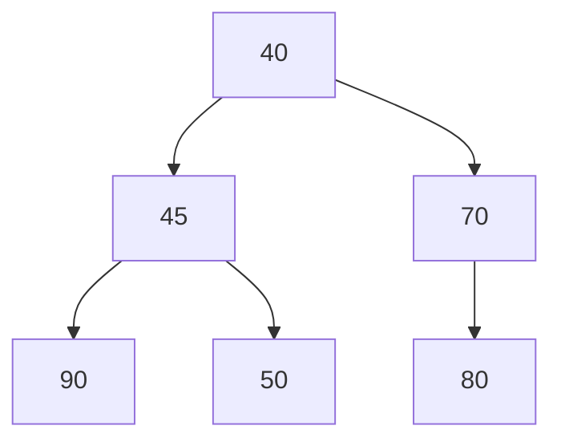

#### Complexity

| Operation | Time |
|---|---|
| **Find max (min)** | **O(1)** |
| **Insert** | **O(log n)** — sift up |
| **Extract max (min)** | **O(log n)** — sift down |
| **Heapify one node** | **O(log n)** |
| **BUILD the whole heap** | **O(n)** — *not* O(n log n) |
| **Heap sort** | **O(n log n)** |
| **Search for an arbitrary value** | **O(n)** — a heap is not a search structure |
| **Space** | **O(1)** extra — it is in-place |

> **Why building a heap is O(n) and not O(n log n):** heapify's cost depends on the **height of the node**, not on log n. **Half** the nodes are leaves (height 0, cost 0), a quarter are at height 1, an eighth at height 2 … Summing `Σ (n/2^(h+1)) × h` over all heights **converges to 2n**, giving **O(n)**.

#### Heap sort

```
HEAP_SORT(A, n):
    BUILD_MAX_HEAP(A, n)                  // O(n)
    for i = n-1 down to 1:                // n-1 iterations
        swap A[0], A[i]                   // move the current max to the END
        MAX_HEAPIFY(A, i, 0)              // O(log n), on the shrinking heap
```

**Why it works:** the maximum is always at the root, so repeatedly swapping the root with the last unsorted position builds the **sorted array from the back forwards**.

**Time: O(n log n) in ALL cases · Space: O(1) — in-place · Stable: No.**

#### When to use a heap

1. **Priority queues** — the primary use.
2. **Heap sort** — guaranteed O(n log n) with O(1) space.
3. **Finding the K largest/smallest elements** — a heap of size K gives **O(n log K)**.
4. **Dijkstra's** shortest path and **Prim's** MST — extract-min at every step.
5. **Huffman coding** — repeatedly extract the two smallest frequencies.
6. **CPU and job scheduling** by priority.
7. **Median maintenance** — a max-heap for the lower half and a min-heap for the upper half.
8. **Event-driven simulation** — always process the earliest event.

**Previous Year Question List from this Topic:**

- [Max heap:](../written-answers/data-structure.md?plain=1#L4829)
- [Max Heap Operation (a-j) show heap.](../written-answers/data-structure.md?plain=1#L4904)
- [অথবা, (ক) Heap data structure কী? কোন ক্ষেত্রে Heap ব্যবহার করা হয়?](../written-answers/data-structure.md?plain=1#L5016)
- [Write down the properties of Max heap. Also write down the heapsort algorithm.](../written-answers/data-structure.md?plain=1#L5066)
- [Given an array of 6 elements: \{15, 19, 10, 7, 17, 16\}. Draw heap tree and again draw the tree after deletion of element 7 from this tree.](../written-answers/data-structure.md?plain=1#L5193)
- [Binary tree টিকে heapify করুন যেন maximum heap -এ রূপান্তরিত হয়:](../written-answers/data-structure.md?plain=1#L5281)
- [Heapify the MAX heap tree.](../written-answers/data-structure.md?plain=1#L5363)
- [Draw (max/min) heap binay tree using 11 nodes.](../written-answers/data-structure.md?plain=1#L5448)


---

## Hashing & Hash Tables

### Hash Table — Concept, Hash Functions and Collision Resolution

#### What is a hash table?

A **hash table (hash map)** is a data structure that stores **key-value pairs** in an array, using a **HASH FUNCTION** to compute, **from the key**, the **index** at which the value should be stored.

> The point: instead of *searching* for a key, you **compute exactly where it is** — giving **O(1) average access**, independent of how many items are stored.

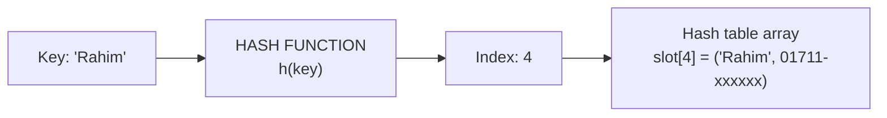

#### What is hashing?

**Hashing** is the technique of **mapping a key of any size to a fixed-range integer index** using a **hash function**, so that data can be stored and retrieved in near-constant time.

#### Rules for designing a good hash function

1. **Deterministic** — the same key must always produce the same index.
2. **Uniform distribution** — keys should spread **evenly** across all slots, minimising collisions. This is the most important property.
3. **Fast to compute** — O(1); an expensive hash function destroys the advantage.
4. **Use the entire key** — every part of the key should influence the result.
5. **Minimise collisions**.
6. **Output within range** — `0 … tableSize − 1`.
7. **Avalanche effect** — a small change in the key should change the index substantially.

#### Common hash functions

| Method | Formula | Note |
|---|---|---|
| **Division method** | **h(k) = k mod m** | The simplest and most common. **Choose m to be a PRIME number** not close to a power of 2, so that patterns in the keys do not cause clustering |
| **Multiplication method** | h(k) = ⌊m (kA mod 1)⌋ | m need not be prime |
| **Mid-square method** | Square the key, take the middle digits | Uses all digits of the key |
| **Folding method** | Split the key into parts and add them | Good for long keys such as phone numbers |
| **For strings** | Polynomial rolling hash: Σ s[i] · pⁱ mod m | Used by djb2, FNV, etc. |

#### What is a collision?

A **collision** occurs when **two different keys hash to the SAME index**.

> **Collisions are unavoidable.** The **pigeonhole principle** guarantees it: there are far more possible keys than table slots. By the **birthday paradox**, a table of 365 slots has a >50 % chance of a collision after only **23** insertions. The question is therefore never "how do I avoid collisions" but **"how do I resolve them"**.

#### Collision resolution techniques

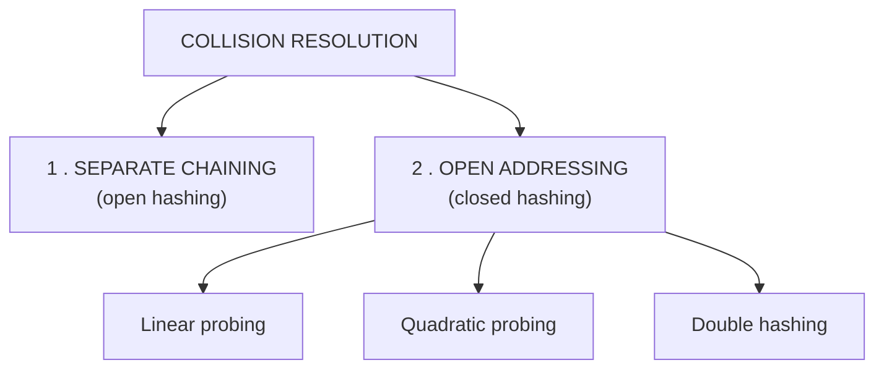

**1. Separate chaining** — each slot holds a **LINKED LIST** of all the entries that hash there.

```mermaid
flowchart LR
    T0["slot 0"] --> N1["22"] --> N2["44"] --> NULL0["NULL"]
    T1["slot 1"] --> NULL1["NULL"]
    T2["slot 2"] --> N3["13"] --> NULL2["NULL"]
```

**2. Open addressing** — everything is stored **inside the array itself**; on a collision, **probe for the next free slot**.

| Method | Probe sequence | Problem |
|---|---|---|
| **Linear probing** | `(h(k) + i) mod m` — try the next slot, then the next | **Primary clustering** — long runs of occupied slots form and grow |
| **Quadratic probing** | `(h(k) + i²) mod m` | Reduces primary clustering, but causes **secondary clustering** |
| **Double hashing** | `(h₁(k) + i·h₂(k)) mod m` | **The best** — different keys follow different probe sequences |

#### Separate chaining vs Open addressing

| Point | **Separate chaining** | **Open addressing** |
|---|---|---|
| **Storage** | Extra **linked lists** outside the table | **Everything inside** the array |
| **Load factor α = n/m** | Can exceed 1 | **Must be < 1**; degrades badly above 0.7 |
| **Memory** | Extra pointer per node | **No extra pointers**, but the table must be larger |
| **Deletion** | ✅ **Simple** — remove from the list | ❌ **Tricky** — needs a "deleted" tombstone marker, or the probe chain breaks |
| **Cache performance** | Poorer (pointer chasing) | ✅ **Better** (contiguous memory) |
| **Clustering** | ❌ None | ✅ Suffers from it |
| **Worst case** | O(n) if all keys collide | O(n) when nearly full |

#### Worked example — linear probing

> **Given h(x) = x mod 11, insert the keys 22, 44, 73, 55, 18, 8, 31, 32 using linear probing.**

| Key | h(k) = k mod 11 | Slot tried | Result |
|---|---|---|---|
| **22** | 22 mod 11 = **0** | 0 — free | → **slot 0** |
| **44** | 44 mod 11 = **0** | 0 occupied → **probe 1** — free | → **slot 1** |
| **73** | 73 mod 11 = **7** | 7 — free | → **slot 7** |
| **55** | 55 mod 11 = **0** | 0 ✗, 1 ✗ → **probe 2** — free | → **slot 2** |
| **18** | 18 mod 11 = **7** | 7 occupied → **probe 8** — free | → **slot 8** |
| **8** | 8 mod 11 = **8** | 8 occupied → **probe 9** — free | → **slot 9** |
| **31** | 31 mod 11 = **9** | 9 occupied → **probe 10** — free | → **slot 10** |
| **32** | 32 mod 11 = **10** | 10 ✗ → wrap to **0** ✗, 1 ✗, 2 ✗ → **probe 3** — free | → **slot 3** |

**Final table:**

| Slot | 0 | 1 | 2 | 3 | 4 | 5 | 6 | 7 | 8 | 9 | 10 |
|---|---|---|---|---|---|---|---|---|---|---|---|
| **Key** | **22** | **44** | **55** | **32** | — | — | — | **73** | **18** | **8** | **31** |

> **Notice the clustering:** by the time 32 arrives, slots 0–2 and 7–10 are full, so it must probe **four times**. This is **primary clustering** — occupied runs attract more collisions and grow, which is exactly why linear probing degrades so sharply as the table fills.

#### Worked example — separate chaining

> **h(k) = k mod 13**, insert the same style of keys.

| Slot | Chain |
|---|---|
| 0 | 13 → 26 → NULL |
| 1 | NULL |
| 9 | 22 → 35 → NULL |

**Insertion is always O(1)** (prepend to the list), and **search is O(1 + α)** where **α = n/m** is the load factor.

#### Complexity of a hash table

| Operation | **Average** | **Worst** |
|---|---|---|
| **Insert** | **O(1)** | O(n) |
| **Search** | **O(1)** | O(n) |
| **Delete** | **O(1)** | O(n) |
| **Space** | O(n) | O(n) |

**The worst case** occurs when **every key hashes to the same slot**, degenerating the table into a single linked list. This is why **a good hash function matters** — and why a **hash-collision DoS attack** (deliberately sending keys that all collide) is a real vulnerability, defended against by **randomised hashing**.

**Load factor α = n / m.** Performance degrades as α rises; the standard practice is to **rehash into a table twice the size** when α exceeds about **0.7**.

#### Advantages of a hash table

1. **O(1) average time** for insert, search and delete — **independent of the number of elements**. Nothing else achieves this.
2. **Much faster than a tree** — O(1) versus O(log n).
3. **Any hashable data type** can be a key: strings, numbers, tuples.
4. **Simple to use** — it is the `dict`, `HashMap`, `unordered_map` of every language.
5. **Efficient duplicate detection and set membership** testing.
6. **Direct mapping** — no comparisons needed.

#### Disadvantages

1. **Collisions** must be handled, and the worst case is **O(n)**.
2. **No ordering** — you cannot retrieve keys in sorted order, and **range queries are impossible** (`all keys between 20 and 30`). A **BST or B-tree** must be used for that.
3. **Performance depends entirely on the hash function.**
4. **Memory overhead** — the table must be kept larger than the data.
5. **Rehashing is expensive** — an O(n) operation when the table grows.
6. Not suitable for **finding the minimum, maximum, or nearest neighbour**.

> ### "You must store a set of objects, and you want the expected running time of search to be O(1). Which data structure?"
> ### ✅ **A HASH TABLE (hash map / hash set).**
>
> **Justification:** it is the **only** common data structure providing **O(1) expected** insert, search and delete. A sorted array gives O(log n); a balanced BST gives O(log n); a linked list gives O(n).
>
> **Qualify the answer for full marks:** the O(1) is **expected/average**, not worst case — a poor hash function or an adversarial input degrades it to **O(n)**. It also requires a **good hash function**, a **load factor kept below ~0.7**, and it provides **no ordering**, so if the application also needs sorted iteration or range queries, a **balanced BST (O(log n))** is the better choice despite being asymptotically slower for lookup.

#### Applications of hashing

- **Database indexing** and in-memory caches (**Redis, Memcached**).
- **Symbol tables** in compilers.
- **Dictionaries, sets and associative arrays** in every programming language.
- **Password storage** (with a slow, salted hash — see the security chapter).
- **Caching** — mapping a URL to cached content.
- **De-duplication** and **file integrity checksums**.
- **Blockchain** — linking blocks by hash.
- **Load balancing** — consistent hashing distributes requests across servers.

**Previous Year Question List from this Topic:**

- [(b) What is hash table? What are the advantages of using hash table?](../written-answers/data-structure.md?plain=1#L5519)
- [Consider a hash table of size 13 strong entries with integer keys. Suppose the hash function is h(k) = k \bmod 13. Insert in the given order entries with keys 1…](../written-answers/data-structure.md?plain=1#L5571)
- [অথবা, Hashing বলতে কী বোঝায়? Hash ফাংশন গঠনের জন্যে যে কোনো তিনটি পদ্ধতি বিস্তারিত লিখুন।](../written-answers/data-structure.md?plain=1#L5647)
- [Separate chaining hash function math.](../written-answers/data-structure.md?plain=1#L5703)
- [You are giving to store a set of objects and you want to use a data structure. Where the expected running time to search an item is O(1). Which data structure i…](../written-answers/data-structure.md?plain=1#L5786)
- [Given Hash function h(x) = x\%11. Find the location of keys 22, 44, 73, 55, 18, 8, 31, 32. Use linear probing as collision resolution technique.](../written-answers/data-structure.md?plain=1#L5823)
- [(b) What is hash table? What are the advantages of using hash table.](../written-answers/data-structure.md?plain=1#L5920)


## Tree Data Structures (BST, AVL, B-Tree, Heaps)

### Comparing the Tree Structures — BST, AVL, B-Tree and Heap

All four are trees, but each is designed to guarantee a **different property**, and choosing the right one is exactly what this comparison is for.

| Point | **BST** | **AVL Tree** | **B-Tree / B+ Tree** | **Heap** |
|---|---|---|---|---|
| **Ordering rule** | left < node < right | left < node < right, **plus a balance condition** | Keys sorted within each node; all leaves at the same level | **Parent ≥ (or ≤) its children only** |
| **Balanced?** | ❌ **No guarantee** | ✅ **Strictly** — height difference ≤ 1 | ✅ **Perfectly** — all leaves at the same depth | ✅ Always **complete** |
| **Children per node** | ≤ 2 | ≤ 2 | **Many (m-way)** | ≤ 2 |
| **Search** | O(log n) avg, **O(n) worst** | ✅ **O(log n) guaranteed** | **O(log_m n)** — very few disk reads | **O(n)** — not a search structure |
| **Insert / Delete** | O(log n) avg, O(n) worst | O(log n) with **rotations** | O(log_m n) with splits/merges | **O(log n)** |
| **Find min / max** | O(h) | O(log n) | O(log_m n) | ✅ **O(1)** for the root's extreme |
| **Sorted traversal** | ✅ In-order gives sorted output | ✅ Yes | ✅ Yes (B+ leaves are chained) | ❌ **No** |
| **Stored in** | Nodes with pointers | Nodes with pointers | **Disk blocks** | **An ARRAY — no pointers** |
| **Designed to optimise** | Simplicity | **Worst-case search time** | **Disk I/O — minimising seeks** | **Repeated access to the extreme value** |
| **Used for** | Teaching; simple ordered sets | In-memory ordered maps needing guaranteed performance | **DATABASE INDEXES, FILE SYSTEMS** | **PRIORITY QUEUES**, heap sort, top-K, Dijkstra |

#### How to choose

```mermaid
flowchart TD
    A{"What do you need?"} --> B{"Repeated access to the<br/>MINIMUM or MAXIMUM?"}
    B -->|Yes| C["HEAP — O(1) peek, O(log n) extract"]
    B -->|No| D{"Does the data live on DISK<br/>and is it very large?"}
    D -->|Yes| E["B-TREE / B+ TREE<br/>minimises disk seeks"]
    D -->|No| F{"Do you need GUARANTEED<br/>O(log n) worst case?"}
    F -->|Yes| G["AVL or RED-BLACK tree"]
    F -->|No| H{"Do you need sorted order<br/>and range queries?"}
    H -->|Yes| I["BST (balanced)"]
    H -->|No| J["HASH TABLE — O(1), but no ordering"]
```

#### AVL rotations — the four cases

An AVL tree restores balance after an insertion using **rotations**. The **balance factor** of a node is `height(left) − height(right)`, and it must stay in **{−1, 0, +1}**.

| Case | Condition | Fix |
|---|---|---|
| **LL** (Left-Left) | Inserted into the **left subtree of the left child** | **Single RIGHT rotation** |
| **RR** (Right-Right) | Inserted into the **right subtree of the right child** | **Single LEFT rotation** |
| **LR** (Left-Right) | Inserted into the **right subtree of the left child** | **Left rotation on the child, then right rotation on the node** |
| **RL** (Right-Left) | Inserted into the **left subtree of the right child** | **Right rotation on the child, then left rotation on the node** |

> **The pattern to remember:** if the two letters are the **same** (LL, RR), **one** rotation suffices. If they **differ** (LR, RL), **two** rotations are needed. Each rotation is **O(1)**, and at most **O(log n)** nodes need checking, so rebalancing costs O(log n).

**Previous Year Question List from this Topic:**

- [(ক) B-tree data structure কী? এর প্রয়োগ ব্যাখ্যা করুন।](../written-answers/data-structure.md?plain=1#L912)
- [Complexity of BST (Binary Search Tree) best and worst case.](../written-answers/data-structure.md?plain=1#L4701)
- [What is Binary Search Tree? Explain the complexity of BST?](../written-answers/data-structure.md?plain=1#L4767)
- [অথবা, (ক) Heap data structure কী? কোন ক্ষেত্রে Heap ব্যবহার করা হয়?](../written-answers/data-structure.md?plain=1#L5016)


---

## Linear Data Structures (Arrays, Stacks, Queues, Linked Lists)

### Linear vs Non-Linear Data Structures

```mermaid
flowchart TD
    D["DATA STRUCTURES"]
    D --> L["LINEAR<br/>elements in a SEQUENCE,<br/>each with one predecessor and one successor"]
    D --> N["NON-LINEAR<br/>HIERARCHICAL or networked,<br/>an element may have many neighbours"]
    L --> L1["Array"]
    L --> L2["Linked List"]
    L --> L3["Stack"]
    L --> L4["Queue"]
    N --> N1["Tree"]
    N --> N2["Graph"]
    N --> N3["Heap"]
    N --> N4["Hash table (arguably)"]
```

| Point | **Linear** | **Non-Linear** |
|---|---|---|
| **Arrangement** | **Sequential** — one after another | **Hierarchical / networked** |
| **Relationship** | Each element has **one** predecessor and **one** successor | An element may have **many** children or neighbours |
| **Traversal** | Can be traversed **completely in ONE pass** | Requires **multiple paths** / recursive traversal |
| **Memory use** | Simple; arrays are contiguous | More complex |
| **Levels** | **Single level** | **Multiple levels** |
| **Ease of implementation** | **Simple** | Complex |
| **Time complexity** | Often **increases linearly** with size | Often **logarithmic**, which scales far better |
| **Examples** | **Array, Linked List, Stack, Queue** | **Tree, Graph, Heap** |

> **The standard exam answer:** *"Name three linear and three non-linear data structures."*
> **Linear: Array, Stack, Queue** *(or Linked List)* · **Non-linear: Tree, Graph, Heap**

#### When to choose which

| Requirement | Structure |
|---|---|
| **Fast random access by index** | **Array** — O(1) |
| **Frequent insertion/deletion anywhere** | **Linked List** — O(1) once positioned |
| **LIFO behaviour** — undo, recursion, backtracking | **Stack** |
| **FIFO behaviour** — scheduling, buffering, BFS | **Queue** |
| **Fast search on ordered data, with range queries** | **Balanced BST / B-Tree** — O(log n) |
| **Fastest possible key lookup, no ordering needed** | **Hash Table** — O(1) |
| **Repeated access to the largest/smallest** | **Heap** — O(1) peek |
| **Modelling relationships and networks** | **Graph** |
| **Hierarchical data** — file systems, org charts, XML | **Tree** |

#### The complexity cheat sheet

| Structure | **Access** | **Search** | **Insert** | **Delete** | Space |
|---|---|---|---|---|---|
| **Array** | **O(1)** | O(n) | O(n) | O(n) | O(n) |
| **Sorted array** | **O(1)** | **O(log n)** | O(n) | O(n) | O(n) |
| **Linked List** | O(n) | O(n) | **O(1)*** | **O(1)*** | O(n) |
| **Stack** | O(n) | O(n) | **O(1)** | **O(1)** | O(n) |
| **Queue** | O(n) | O(n) | **O(1)** | **O(1)** | O(n) |
| **Hash Table** | — | **O(1)** avg | **O(1)** avg | **O(1)** avg | O(n) |
| **BST (balanced)** | O(log n) | **O(log n)** | **O(log n)** | **O(log n)** | O(n) |
| **BST (skewed)** | O(n) | **O(n)** | O(n) | O(n) | O(n) |
| **Heap** | O(1) for the root | O(n) | **O(log n)** | **O(log n)** | O(n) |
| **B-Tree** | O(log n) | **O(log n)** | O(log n) | O(log n) | O(n) |

*\* once the position is known; finding the position costs O(n).*

**Previous Year Question List from this Topic:**

- [(a) Compare Stack and Queue in context with data structure. (5 marks)](../written-answers/data-structure.md?plain=1#L5986)
- [Different data structures are used based on how data needs to be accessed and processed. Compare Stack and Queue in terms of how they handle data. Then, provide…](../written-answers/data-structure.md?plain=1#L5999)
- [(ii) For which data structure operations, Linked List is better than Array? (Insert, Delete, Search).](../written-answers/data-structure.md?plain=1#L3936)
