<!-- TOC START -->
**Table of Contents** — 7 subtopics · 21 theories

1. **[SQL Queries](#sql-queries)**
   - [SQL — Fundamentals and Sub-languages](#sql--fundamentals-and-sub-languages)
   - [Joins and Subqueries](#joins-and-subqueries)
   - [Standard SQL Query Patterns](#standard-sql-query-patterns)
   - [SQL Data Types and Storage — Structured, Binary and Unstructured Data (RAW, LOB, BLOB, CLOB)](#sql-data-types-and-storage--structured-binary-and-unstructured-data-raw-lob-blob-clob)

2. **[Normalization & Database Design](#normalization--database-design)**
   - [DBMS, RDBMS and the Relational Model](#dbms-rdbms-and-the-relational-model)
   - [Normalization](#normalization)
   - [ER Diagrams and Database Design](#er-diagrams-and-database-design)
   - [Enhanced ER (EER) Concepts — Generalization, Specialization and Aggregation](#enhanced-er-eer-concepts--generalization-specialization-and-aggregation)

3. **[Transaction Management & ACID Properties](#transaction-management--acid-properties)**
   - [Transactions and the ACID Properties](#transactions-and-the-acid-properties)
   - [Recovery, Concurrency Control and Deadlock](#recovery-concurrency-control-and-deadlock)

4. **[Keys, Constraints & Database Objects](#keys-constraints--database-objects)**
   - [Database Objects and Integrity Constraints](#database-objects-and-integrity-constraints)

5. **[DBMS Concepts & Architecture](#dbms-concepts--architecture)**
   - [DBMS Architecture — Three-Level Schema, Data Abstraction and Data Independence](#dbms-architecture--three-level-schema-data-abstraction-and-data-independence)
   - [Data Models — Hierarchical, Network, Relational and Object-Oriented](#data-models--hierarchical-network-relational-and-object-oriented)
   - [DBMS Functional Components & Engine Architecture](#dbms-functional-components--engine-architecture)
   - [Metadata, the Data Dictionary and the Role of the DBA](#metadata-the-data-dictionary-and-the-role-of-the-dba)
   - [Database System Architectures — Client-Server, Distributed and NoSQL](#database-system-architectures--client-server-distributed-and-nosql)

6. **[Data Warehousing & Data Mining](#data-warehousing--data-mining)**
   - [Data Warehousing, Data Marts and the Star Schema](#data-warehousing-data-marts-and-the-star-schema)
   - [OLTP vs OLAP, Data Mining and Business Intelligence](#oltp-vs-olap-data-mining-and-business-intelligence)

7. **[Indexing, Connectivity & Programmatic SQL](#indexing-connectivity--programmatic-sql)**
   - [Index Types and File Organization](#index-types-and-file-organization)
   - [Database Connectivity — JDBC, ODBC and Embedded SQL](#database-connectivity--jdbc-odbc-and-embedded-sql)
   - [Cursors, Views and Relational Algebra Operators](#cursors-views-and-relational-algebra-operators)

<!-- TOC END -->

---

## SQL Queries

### SQL — Fundamentals and Sub-languages

**SQL (Structured Query Language)** is the standard language for **defining, manipulating, controlling and querying data in a relational database**.

> It is **declarative**: you state **WHAT data you want**, not **how** to get it. The DBMS's **query optimiser** works out the "how".

#### The five sub-languages of SQL

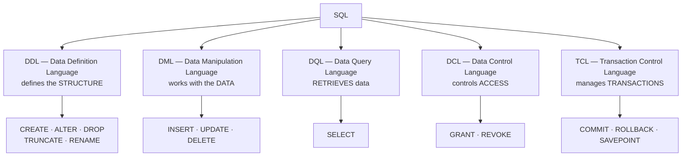

| Sub-language | Commands | Auto-commit? |
|---|---|---|
| **DDL** | `CREATE`, `ALTER`, `DROP`, `TRUNCATE`, `RENAME` | ✅ **Yes — cannot be rolled back** |
| **DML** | `INSERT`, `UPDATE`, `DELETE` | ❌ No — **can be rolled back** |
| **DQL** | `SELECT` | — |
| **DCL** | `GRANT`, `REVOKE` | ✅ Yes |
| **TCL** | `COMMIT`, `ROLLBACK`, `SAVEPOINT` | — |

#### DELETE vs TRUNCATE vs DROP — a very common question

| Point | **DELETE** | **TRUNCATE** | **DROP** |
|---|---|---|---|
| **Type** | **DML** | **DDL** | **DDL** |
| **Removes** | **Selected rows** (or all) | **ALL rows** | **The entire TABLE** — structure and data |
| **WHERE clause** | ✅ **Yes** | ❌ No | ❌ No |
| **Rollback possible** | ✅ **Yes** | ❌ No (auto-commits) | ❌ No |
| **Speed** | **Slow** — logs each row | **Fast** — deallocates pages | Fast |
| **Resets AUTO_INCREMENT** | ❌ No | ✅ **Yes** | — |
| **Fires triggers** | ✅ Yes | ❌ No | ❌ No |
| **Table exists afterwards** | ✅ Yes | ✅ Yes (empty) | ❌ **No** |

#### The structure of a SELECT statement

```sql
SELECT   [DISTINCT] column_list          -- 5. what to show
FROM     table_name                      -- 1. where to get it
JOIN     other_table ON condition        -- 2. combine tables
WHERE    row_condition                   -- 3. filter INDIVIDUAL ROWS
GROUP BY column_list                     -- 4. form groups
HAVING   group_condition                 -- 4b. filter GROUPS
ORDER BY column [ASC|DESC]               -- 6. sort the result
LIMIT    n;                              -- 7. restrict the count
```

> **The logical order of EXECUTION is not the order you write it:**
> **FROM → JOIN → WHERE → GROUP BY → HAVING → SELECT → DISTINCT → ORDER BY → LIMIT**
>
> This explains two things that confuse everyone: (1) you **cannot use a column alias defined in SELECT inside WHERE**, because WHERE runs first; and (2) you **can** use it in ORDER BY, because ORDER BY runs last.

#### WHERE vs HAVING

| Point | **WHERE** | **HAVING** |
|---|---|---|
| **Filters** | **Individual ROWS** | **GROUPS** |
| **Runs** | **Before** GROUP BY | **After** GROUP BY |
| **Aggregate functions allowed** | ❌ **No** | ✅ **Yes** |
| **Can be used without GROUP BY** | ✅ Yes | Rarely |
| **Example** | `WHERE salary > 50000` | `HAVING AVG(salary) > 50000` |

#### Aggregate functions

> **SUM, AVG, MAX, MIN and COUNT are AGGREGATE (or GROUP) functions** — they operate on a **set of rows** and return a **single value**.

| Function | Returns | Note |
|---|---|---|
| **COUNT(\*)** | Number of rows, **including NULLs** | |
| **COUNT(col)** | Number of **non-NULL** values in that column | |
| **SUM(col)** | Total | **Ignores NULLs** |
| **AVG(col)** | Average | **Ignores NULLs** — so AVG ≠ SUM/COUNT(*) when NULLs exist |
| **MAX / MIN(col)** | Largest / smallest | |

*(The other category is **scalar functions**, which act on one value per row: `UPPER`, `LOWER`, `LEN`, `ROUND`, `NOW`, `SUBSTRING`.)*

#### Operators worth knowing

| Operator | Purpose | Example |
|---|---|---|
| `=`, `<>`, `>`, `<`, `>=`, `<=` | Comparison | `WHERE salary > 50000` |
| **`BETWEEN … AND`** | Inclusive range | `WHERE salary BETWEEN 30000 AND 60000` |
| **`IN`** | Matches any value in a list | `WHERE dept IN ('IT','HR')` |
| **`LIKE`** | **Pattern** matching | `WHERE name LIKE 'A%'` |
| `IS NULL` / `IS NOT NULL` | Null test — **never use `= NULL`** | |
| `AND`, `OR`, `NOT` | Logical | |
| `EXISTS` | True if a subquery returns any row | |
| `ANY` / `ALL` | Compare against a subquery's results | |

#### LIKE vs `=` — a directly asked question

> ### "In a SQL query, when do we use LIKE and when do we use `=` for string matching?"
>
> | | **`=` (equals)** | **`LIKE`** |
> |---|---|---|
> | **Matches** | The **EXACT, complete** string | A **PATTERN** |
> | **Wildcards** | ❌ Not supported | ✅ **`%`** = any sequence of characters (including none); **`_`** = exactly one character |
> | **Speed** | **Fast** — can use an index directly | **Slower**; an index can only be used when the pattern does **not** begin with a wildcard |
> | **Use when** | You know the **complete value** | You know only **part** of it |
> | **Example** | `WHERE name = 'Rahim'` | `WHERE name LIKE 'Rah%'` |
>
> **Wildcard examples:**
> - `LIKE 'A%'` — starts with A
> - `LIKE '%son'` — ends with "son"
> - `LIKE '%ali%'` — contains "ali" anywhere
> - **`LIKE '_a%'`** — the **SECOND letter is 'a'** (one character, then 'a', then anything)
> - `LIKE 'A_i%'` — starts with A, third letter is i
>
> **Performance note:** `LIKE 'Rah%'` **can** use an index (the prefix is fixed), but **`LIKE '%him'` cannot** — the database must scan every row. This is why leading-wildcard searches are slow and why full-text indexes exist.

**Previous Year Question List from this Topic:**

- [Database Query related problem.](../written-answers/database.md?plain=1#L318)
- [SQL OUTPUT Problem: Find Employee salary from a table where salary more than 5000.](../written-answers/database.md?plain=1#L1085)
- [SUM, Avg, Max these function are subnet of __________ function.](../written-answers/database.md?plain=1#L1297)
- [SQL Query.....](../written-answers/database.md?plain=1#L1339)
- [Write SQL Query For create, insert of a table Emp (id, name, designation, Dept_name, Salary). Write SQL Query that show department wise salary of Employee.](../written-answers/database.md?plain=1#L1877)
- [Analize the following code:](../written-answers/database.md?plain=1#L2271)
- [Analyze the output of the following SQL :](../written-answers/database.md?plain=1#L2426)
- [(c) In a SQL query, while performing string matching when do we use operator and when we use LIKE operator? Give examples.](../written-answers/database.md?plain=1#L3790)
- [What will be the output after running all the following queries?](../written-answers/database.md?plain=1#L3931)

**Previous Year MCQ List from this Topic:**

- [Which clause is executed first in an SQL query?](../mcq-answers/database.md?plain=1#L28)
- [Which of the following is a DML (Data Manipulation Language) command?](../mcq-answers/database.md?plain=1#L37)
- [Which of the following is a command of Data Definition Language (DDL)?](../mcq-answers/database.md?plain=1#L37)
- [Which statements are used to create the database structure?](../mcq-answers/database.md?plain=1#L55)
- [Which of the following is not a DDL statement?](../mcq-answers/database.md?plain=1#L37)
- [Which clause is required in an SQL query for getting information from a database?](../mcq-answers/database.md?plain=1#L73)
- [CREATE TABLE employee (name VARCHAR, id INTEGER). What type of statement is this?](../mcq-answers/database.md?plain=1#L82)
- [Which one of the followings sorts rows in SQL?](../mcq-answers/database.md?plain=1#L91)
- [Which of the following provides the ability to query information from the database and insert tuples into, delete tuples from, and modify tuples in the database…](../mcq-answers/database.md?plain=1#L114)
- [To remove a relational table from SQL database, we use ______.](../mcq-answers/database.md?plain=1#L123)
- [Which of the following command is a type of Data Definition language command?](../mcq-answers/database.md?plain=1#L132)
- [Which of the following is not a DDL command?](../mcq-answers/database.md?plain=1#L37)
- [Which of the following are the five built-in functions provided by SQL?](../mcq-answers/database.md?plain=1#L197)
- [Which is not the steps of SQL Query processing?](../mcq-answers/database.md?plain=1#L269)
- [Which one is the Data Control Language (DCL) in SQL?](../mcq-answers/database.md?plain=1#L278)
- [What is wrong statements for SQL?](../mcq-answers/database.md?plain=1#L328)
- [উল্লেখিত কোনটি Database aggregate এর function?](../mcq-answers/database.md?plain=1#L389)
- [নিচের কোনটি Database তুলনা করার কাজে ব্যবহার হয়?](../mcq-answers/database.md?plain=1#L398)
- [Which one is database language?](../mcq-answers/database.md?plain=1#L425)
- [The SQL statement that requires or reads data from the table is-](../mcq-answers/database.md?plain=1#L434)
- [Which of the following logical connectives is not included in SQL?](../mcq-answers/database.md?plain=1#L443)
- [The result of a SQL SELECT statement is a ----](../mcq-answers/database.md?plain=1#L452)
- [To remove the duplicate rows from the result of an SQL Select statement, the---- qualifier specified include.](../mcq-answers/database.md?plain=1#L461)
- [The ________ clause is used to list the attributes desired in the result of a query.](../mcq-answers/database.md?plain=1#L470)
- [In SQL, aggregate functions can be used in the select list or the ________ clause of a select statement or subquery. They cannot be used in a ________ clause.](../mcq-answers/database.md?plain=1#L479)
- [You run a SELECT statement and multiple duplicate values are retrieved. What keyword can you use to retrieve only the non-duplicate data?](../mcq-answers/database.md?plain=1#L533)
- [Which SQL keyword is used to short the result set?](../mcq-answers/database.md?plain=1#L1112)
- [In SQL, which command is used to remove all rows from a table but keep its structure?](../mcq-answers/database.md?plain=1#L1919)
- [Which SQL clause is used to group rows that have the same values in specified columns?](../mcq-answers/database.md?plain=1#L1946)
- [Which of the following is NOT a valid SQL aggregate function?](../mcq-answers/database.md?plain=1#L37)
- [Which of the following statements are syntactically valid SQL expressions?](../mcq-answers/database.md?plain=1#L1982)
- [Which of the following is a comparison operator in SQL?](../mcq-answers/database.md?plain=1#L37)


---

### Joins and Subqueries

#### What is a JOIN?

A **JOIN** combines rows from **two or more tables** based on a **related column** between them — normally a **foreign key** matching a **primary key**.

#### The types of join

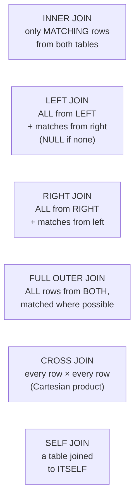

| Join | Returns |
|---|---|
| **INNER JOIN** | Only rows where the condition matches **in BOTH tables** |
| **LEFT (OUTER) JOIN** | **ALL rows from the LEFT table**, plus matching rows from the right; **NULL** where there is no match |
| **RIGHT (OUTER) JOIN** | **ALL rows from the RIGHT table**, plus matches from the left |
| **FULL OUTER JOIN** | **All rows from both**, with NULLs where a match is missing |
| **CROSS JOIN** | **Every combination** — the Cartesian product (m × n rows) |
| **SELF JOIN** | A table joined **to itself** — used for hierarchies such as employee→manager |

#### Worked example — how many rows does each join return?

> **Table A has 5 rows, Table B has 3 rows, and 2 rows match on the join key.**

| Join | Rows returned | Reasoning |
|---|---|---|
| **INNER JOIN** | **2** | Only the matching pairs |
| **LEFT OUTER JOIN** | **5** | All 5 from A; the 3 non-matching ones get NULLs for B's columns |
| **RIGHT OUTER JOIN** | **3** | All 3 from B; the 1 non-matching one gets NULLs for A's columns |
| **FULL OUTER JOIN** | **6** | 2 matched + 3 unmatched from A + 1 unmatched from B |
| **CROSS JOIN** | **15** | 5 × 3 |

#### Example queries

```sql
-- INNER JOIN: employees WITH a department
SELECT e.Name, d.DeptName
FROM   Employee e
INNER JOIN Department d ON e.DeptID = d.DeptID;

-- LEFT JOIN: ALL employees, even those with no department
SELECT e.Name, d.DeptName
FROM   Employee e
LEFT JOIN Department d ON e.DeptID = d.DeptID;

-- SELF JOIN: each employee with their manager's name
SELECT e.Emp_Name AS Employee, m.Emp_Name AS Manager
FROM   EMPLOYEES e
LEFT JOIN EMPLOYEES m ON e.Manager_ID = m.Emp_ID;

-- Department name and AVERAGE salary (join + aggregate + group)
SELECT   d.DeptName, AVG(e.Salary) AS AvgSalary
FROM     Employee e
JOIN     Department d ON e.DeptID = d.DeptID
GROUP BY d.DeptName;
```

#### Subqueries

A **subquery (nested query)** is a `SELECT` placed inside another SQL statement.

| Type | Description |
|---|---|
| **Scalar subquery** | Returns **one value** — usable anywhere a value is expected |
| **Row subquery** | Returns one row |
| **Table subquery** | Returns many rows — used with `IN`, `EXISTS`, `ANY`, `ALL` |
| **Correlated subquery** | **References the outer query**, so it is re-evaluated **for every outer row** — powerful but slow |

```sql
-- Scalar: employees earning more than the COMPANY average
SELECT Name, Salary
FROM   Employee
WHERE  Salary > (SELECT AVG(Salary) FROM Employee);

-- Correlated: employees earning more than the average OF THEIR OWN DEPARTMENT
SELECT e.Name, e.Salary, e.Department
FROM   Employee e
WHERE  e.Salary > (SELECT AVG(e2.Salary)
                   FROM   Employee e2
                   WHERE  e2.Department = e.Department);   -- ← references the outer row

-- IN with a subquery
SELECT Name FROM Employee
WHERE  DeptID IN (SELECT DeptID FROM Department WHERE Location = 'Dhaka');
```

**Previous Year Question List from this Topic:**

- [SQL Query: Find department name and Average salary form 2 table Department and Employee.......](../written-answers/database.md?plain=1#L163)
- [Consider the following database schema, find out the employees whose manager's region is same as the employee working under him.](../written-answers/database.md?plain=1#L239)
- [Given two tables:](../written-answers/database.md?plain=1#L656)
- [Let a database has two tables, Customers and Orders. The following figure shows the partial data of these two tables. Based on this partial data, explain Inner,…](../written-answers/database.md?plain=1#L1517)
- [Consider that you are given a database of a 'Pet Society' with the following relations.](../written-answers/database.md?plain=1#L1743)
- [How many row will return when we do i) Inner Join ii) Left Outer Join iii) Right Outer join and v) Full Outer join.](../written-answers/database.md?plain=1#L1819)
- [Query's: Employee & department table given-](../written-answers/database.md?plain=1#L1949)
- [EMPLOYEES (Emp_ID, Emp_Name, Manager_ID, Dept_ID);](../written-answers/database.md?plain=1#L2030)
- [Given Four table:](../written-answers/database.md?plain=1#L2121)
- [Suppose we have a relational database with five tables. table key Attributes S(sid, A) Sid T(tid, B) Tid U(uid, C) Uid R(sid, tid, D) sid, tid Q(tid, uid, E) ti…](../written-answers/database.md?plain=1#L2696)
- [Consider the two schema employees (id, first_name, last_name, designation, oining_date, salary, dept_id) and department (dept_id, dept_name). Where detp_id is f…](../written-answers/database.md?plain=1#L2850)
- [Suppose that we have a relational database with the following table. Underlined one represent primary key](../written-answers/database.md?plain=1#L2926)
- [There are two tables like Employees (Employee_ID, First_name, Last_name, Email, Phone_number, Hire_date, Job_Id) and Departments (Department_Id, Department_name…](../written-answers/database.md?plain=1#L3344)
- [Consider the Electrical Powr company database which has the following tables: Powerplant(Powerplant_ID, location, type, capacity.unit_price) Customer(Customer_I…](../written-answers/database.md?plain=1#L3855)

**Previous Year MCQ List from this Topic:**

- [Which one is the correct SQL statement to find the second highest mark from STUDENT database contains the marks of all students?](../mcq-answers/database.md?plain=1#L149)
- [What does this query do?](../mcq-answers/database.md?plain=1#L206)
- [Table Employee has 10 records. It has a non-NULL SALARY column which is also UNIQUE. The SQL statement](../mcq-answers/database.md?plain=1#L100)
- [Consider the following Employee Table and the SQL query given:](../mcq-answers/database.md?plain=1#L346)
- [What type of join in needed when you wish to include rows that do not have matching values?](../mcq-answers/database.md?plain=1#L1755)
- [Which type of JOIN operation in SQL command is used to returns that do not have matching values?](../mcq-answers/database.md?plain=1#L1764)
- [(b) Consider the following tables: Customer(customerID, name), Accounts(accountID, customerID), Orders (orderID, accountID, orderAmount). Write an SQL query to…](../mcq-answers/database.md?plain=1#L1541)


- [A data manipulation command that combines the records from one or more tables is called:](../mcq-answers/database.md?plain=1#L2099)
- [A table joined with itself is called:](../mcq-answers/database.md?plain=1#L2117)

---

### Standard SQL Query Patterns

These patterns cover the great majority of the SQL questions asked.

#### 1. Creating a table and inserting data

```sql
CREATE TABLE Emp (
    id          INT PRIMARY KEY AUTO_INCREMENT,
    name        VARCHAR(50) NOT NULL,
    designation VARCHAR(50),
    dept_name   VARCHAR(50),
    salary      DECIMAL(10,2) CHECK (salary > 0),
    join_date   DATE DEFAULT (CURRENT_DATE)
);

INSERT INTO Emp (name, designation, dept_name, salary)
VALUES ('Rahim', 'Officer', 'IT', 55000),
       ('Karim', 'Manager', 'HR', 75000);
```

#### 2. The Nth highest salary — a classic

```sql
-- 2nd highest salary — Method 1: LIMIT / OFFSET
SELECT DISTINCT Salary FROM Employee
ORDER BY Salary DESC
LIMIT 1 OFFSET 1;                           -- skip 1, take 1  → the 2nd

-- Method 2: subquery (works everywhere, and is the "safe exam" answer)
SELECT MAX(Salary) FROM Employee
WHERE  Salary < (SELECT MAX(Salary) FROM Employee);

-- Method 3: the Nth highest, using a window function (modern SQL)
SELECT Salary FROM (
    SELECT Salary, DENSE_RANK() OVER (ORDER BY Salary DESC) AS rnk
    FROM   Employee
) t
WHERE rnk = 2;
```

> **Why `DENSE_RANK` rather than `ROW_NUMBER`?** If two employees share the top salary, `ROW_NUMBER` would treat them as 1st and 2nd, giving the wrong answer. `DENSE_RANK` gives them both rank 1, so rank 2 really is the second-highest **distinct** salary.

#### 3. Finding duplicates

```sql
-- Names that appear more than once
SELECT   Name, COUNT(*) AS occurrences
FROM     Employee
GROUP BY Name
HAVING   COUNT(*) > 1;

-- The full duplicate rows
SELECT * FROM Employee
WHERE  Name IN (SELECT Name FROM Employee GROUP BY Name HAVING COUNT(*) > 1);
```

> **The pattern to memorise for every "find duplicates" question: GROUP BY the column, then HAVING COUNT(\*) > 1.**

#### 4. Pattern matching on names

```sql
-- Names whose SECOND letter is 'a'
SELECT Name FROM Employee WHERE Name LIKE '_a%';

-- Names starting with A
SELECT Name FROM Employee WHERE Name LIKE 'A%';

-- Names containing 'ali'
SELECT Name FROM Employee WHERE Name LIKE '%ali%';
```

#### 5. Aggregates with grouping

```sql
-- Total and average salary per department, only for departments
-- whose average exceeds 50,000, highest first
SELECT   Department,
         COUNT(*)    AS employee_count,
         SUM(Salary) AS total_salary,
         AVG(Salary) AS avg_salary,
         MAX(Salary) AS highest,
         MIN(Salary) AS lowest
FROM     Employee
GROUP BY Department
HAVING   AVG(Salary) > 50000
ORDER BY avg_salary DESC;
```

#### 6. Employees earning more than their manager

```sql
SELECT e.Name AS Employee, e.Salary, m.Name AS Manager, m.Salary AS ManagerSalary
FROM   Employee e
JOIN   Employee m ON e.Manager_ID = m.Emp_ID
WHERE  e.Salary > m.Salary;
```

#### 7. Same salary but a different job

```sql
SELECT a.Name, a.Salary, a.Job, b.Name, b.Job
FROM   Employee a
JOIN   Employee b
       ON a.Salary = b.Salary
      AND a.Job   <> b.Job
      AND a.Emp_ID < b.Emp_ID;        -- avoids showing each pair twice
```

#### 8. The supplier with the minimum price for a product

```sql
SELECT s.sname
FROM   Supplier s
JOIN   Catalog  c ON s.sid = c.sid
JOIN   Parts    p ON c.pid = p.pid
WHERE  p.pname = 'wheel'
  AND  c.cost = (SELECT MIN(c2.cost)
                 FROM   Catalog c2
                 JOIN   Parts p2 ON c2.pid = p2.pid
                 WHERE  p2.pname = 'wheel');
```

#### 9. Creating a view

```sql
CREATE VIEW EmployeeDetails AS
SELECT e.Emp_ID, e.Emp_Name, e.Salary, d.Dept_Name, d.Location
FROM   Employee e
JOIN   Department d ON e.Dept_ID = d.Dept_ID
WHERE  e.Status = 'Active';

SELECT * FROM EmployeeDetails WHERE Dept_Name = 'IT';
```

> ### What is a VIEW, and why is it used?
> A **view** is a **VIRTUAL TABLE based on the result of a stored SELECT statement.** It **contains no data of its own** — the query is executed each time the view is used.
>
> **Uses:**
> 1. **SECURITY** — expose only certain columns and rows. A payroll view can show name and department while **hiding salary and NID**, and users are granted access to the view rather than the base table. **This is the single most important reason.**
> 2. **Simplicity** — a complex five-table join is written once and thereafter used as if it were a simple table.
> 3. **Logical data independence** — the underlying table structure can change while the view keeps presenting the old shape, so applications do not break.
> 4. **Consistency** — everyone uses the same definition of "active customer".
> 5. **Reusability** across many queries and reports.
>
> **Limitations:** a view has **no performance benefit** (it is re-executed every time) unless it is a **materialised view**; and it is **only updatable** if it is simple — a view containing a join, `GROUP BY`, `DISTINCT` or an aggregate **cannot** be used for INSERT/UPDATE/DELETE.

#### 10. Common output-tracing traps

```sql
-- NULL handling
SELECT COUNT(*), COUNT(commission) FROM Employee;
-- COUNT(*) counts ALL rows; COUNT(commission) SKIPS NULLs → different numbers

SELECT * FROM Employee WHERE commission = NULL;   -- ❌ returns NOTHING
SELECT * FROM Employee WHERE commission IS NULL;  -- ✅ correct

-- Any arithmetic with NULL yields NULL
SELECT salary + commission FROM Employee;         -- NULL wherever commission is NULL
SELECT salary + COALESCE(commission, 0) FROM Employee;  -- ✅ correct

-- DISTINCT applies to the WHOLE row, not just the first column
SELECT DISTINCT dept, salary FROM Employee;       -- distinct PAIRS, not distinct depts
```

**Previous Year Question List from this Topic:**

- [Consider the following relation: Employee(EmpID, Name, Department, Salary). Write an SQL query to retrieve the Department, the total number of employees, and th…](../written-answers/database.md?plain=1#L33)
- [Consider a STUDENTS table with the following attributes: StudentID, Name, Department, Marks (10 Marks)](../written-answers/database.md?plain=1#L94)
- [From an Employee table. Write SQL statement according to the following question:](../written-answers/database.md?plain=1#L414)
- [Write down the Query for the following table?](../written-answers/database.md?plain=1#L484)
- [Consider the following relation:](../written-answers/database.md?plain=1#L591)
- [Consider the following database schema-](../written-answers/database.md?plain=1#L745)
- [Given the following two tables (Students and Marks) in a database, write down the output of the given SQL queries and write down the SQL queries for the outputs…](../written-answers/database.md?plain=1#L832)
- [Given a Patient table in a hospital database below.](../written-answers/database.md?plain=1#L1003)
- [Write SQL code to get duplicate names from employee table.](../written-answers/database.md?plain=1#L1144)
- [Write an SQL query to find duplicate names in the employee table.](../written-answers/database.md?plain=1#L1222)
- [Find sname who supplies pname=“wheel” with minimum price:](../written-answers/database.md?plain=1#L1435)
- [Database query:](../written-answers/database.md?plain=1#L1669)
- [6.4 Consider the following relation: Employee(EmpID, Name, Department, Salary). Write an SQL query to retrieve the Department, the total number of employees, an…](../written-answers/database.md?plain=1#L2211)
- [Employee Salary sql query a. Sum b. Avg. C. Employee_Name all 2nd letter 'a'......](../written-answers/database.md?plain=1#L2352)
- [Consider the employee tables: Create a SQL view that shows the details of Employee information who have the salary equivalent to the maximum, minimum and averag…](../written-answers/database.md?plain=1#L2530)
- [SQL query for employee table. (Approximate)](../written-answers/database.md?plain=1#L2610)
- [Write following EMPLOYEE database table write an SQL query to find employee who work is a department where the average salary is lower then the average salary a…](../written-answers/database.md?plain=1#L2765)
- [(গ) ডাটাবেস সিস্টেমে view কী? এটি কী কী কাজে লাগে?](../written-answers/database.md?plain=1#L3014)
- [অথবা, নিম্নোক্ত টেবিলগুলো হতে (ক), (খ) এবং (গ) এর উত্তর দিন।](../written-answers/database.md?plain=1#L3069)
- [SQL query from a given table.](../written-answers/database.md?plain=1#L3157)
- [Employee table হতে Employee_id, Employee কে খোঁজে বের করার SQL Command লিখ যাদের গড় salary 2000 উপরে।](../written-answers/database.md?plain=1#L3226)
- [Employee Table টেবিল হতে যে সকল কর্মচারীদের বেতন 30000 টাকার বেশি তাদের নাম পদবী আলাদা করার SQLCommand লিখুন।](../written-answers/database.md?plain=1#L3284)
- [For employee table: (a) Write a SQL query to find those employees who earn more than the average salary. Return employee ID, first name, last name. (b) Write a…](../written-answers/database.md?plain=1#L3415)
- [Write down the SQL command into the following two: (a) Find out the all information of employees from emp_info table. Where employee's salary is more than 20,00…](../written-answers/database.md?plain=1#L3489)
- [Write down the equivalent SQL from following relational algebra. (full question not collected)](../written-answers/database.md?plain=1#L3556)
- [Write a SQL query to find same salary but job not same?](../written-answers/database.md?plain=1#L3660)
- [This returns the names of the staff where timestampdiff is greater than 25 so it returns total 3 rows.](../written-answers/database.md?plain=1#L3725)

**Previous Year MCQ List from this Topic:**

- [Table employee has 10 records. It has a non-NULL SALARY column which is also UNIQUE. The SQL statement:](../mcq-answers/database.md?plain=1#L100)
- [The SQL statement](../mcq-answers/database.md?plain=1#L167)
- [How to select all data from student table starting the name from letter 'r'?](../mcq-answers/database.md?plain=1#L188)
- [What will be the output of the following SQL "Select Round (232.420, -2) AS Round Value"?](../mcq-answers/database.md?plain=1#L220)
- [Consider the following relational data table, Employee. Now, find the output for the following SQL Statement?](../mcq-answers/database.md?plain=1#L229)
- [Following table shows the delivery record of an online shop. Which of the SQL statements results in the largest value?](../mcq-answers/database.md?plain=1#L254)
- [Consider the following “staff” table](../mcq-answers/database.md?plain=1#L296)
- [Following table shows the delivery record of an online shop. Which of the SQL statements results in the largest value?](../mcq-answers/database.md?plain=1#L254)
- [What is the advantage of using ‘case’ while doing the update operation?](../mcq-answers/database.md?plain=1#L380)
- [See the following relation and answer the following question. Servers (ID, DaysRunning, OsName, RamCapacity);](../mcq-answers/database.md?plain=1#L1555)
- [Write the following queries](../mcq-answers/database.md?plain=1#L1563)
- [একটি ডাটাবেসে Employee টেবিল থেকে ঐ সমস্ত Employee খুঁজে বের করার SQL Command লিখুন যাদের নামের শুরুতে A এবং শেষে Y রয়েছে?](../mcq-answers/database.md?plain=1#L1576)
- [With SQL how can you insert "Olsen" as the "LastName" in the "Persons" table?](../mcq-answers/database.md?plain=1#L1213)


---

---

### SQL Data Types and Storage — Structured, Binary and Unstructured Data (RAW, LOB, BLOB, CLOB)

A **data type** in SQL specifies the kind of value that can be stored in a column, the range of valid values, and the set of operations that can be performed on it.

#### Standard SQL Data Types

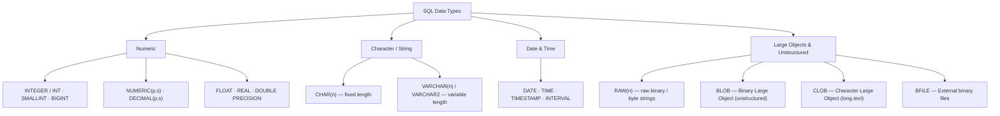

| Category | Data Type | Storage & Characteristics | Typical Use Cases |
|---|---|---|---|
| **Exact Numeric** | `INT` / `INTEGER` | 4 bytes integer (-2.14B to +2.14B) | Counters, IDs, quantities |
| **Exact Numeric** | `NUMERIC(p,s)`, `DECIMAL(p,s)` | Fixed point precision `p` and scale `s` | Currency, financial amounts, accurate decimals |
| **Approximate Numeric** | `FLOAT`, `REAL`, `DOUBLE PRECISION` | Floating-point binary representation | Scientific calculations, graphics |
| **Fixed String** | `CHAR(n)` | Fixed length `n` (padded with spaces up to `n`) | Fixed-width codes (e.g. Country code 'BD', 'US') |
| **Variable String** | `VARCHAR(n)` / `VARCHAR2(n)` | Variable length up to `n` characters (no space padding) | Names, emails, addresses, descriptions |
| **Date & Time** | `DATE`, `TIMESTAMP` | Stores year, month, day, hours, minutes, seconds | Birth dates, log timestamps, creation times |
| **Binary (RAW)** | `RAW(n)` | **Stores unstructured raw binary data or byte strings** (up to 2000 bytes in Oracle) without character set conversion | Cryptographic keys, image hashes, byte arrays |
| **Binary Large Object** | `BLOB` | **Unstructured binary data** up to 4 GB or Terabytes | Images, audio clips, video files, compiled binaries, PDFs |
| **Character Large Object** | `CLOB` | Single-byte or multibyte character data up to 4 GB | Books, long legal contracts, massive XML/JSON documents |
| **External Binary** | `BFILE` | Pointer to an operating system binary file outside the DB | Giant video archives stored on OS file system |

> ### **How Unstructured Data is Handled in a DBMS:**
> - Traditional columns (`VARCHAR`, `INT`, `DATE`) store **structured data**.
> - Multimedia (photos, voice notes, PDFs, sensor streams) is **unstructured data**.
> - SQL DBMSs provide **`RAW`** (small byte strings) and **`BLOB`** (Binary Large Objects) specifically designed to store unstructured binary data without corruption or character encoding translation.

**Previous Year MCQ List from this Topic:**

- [Which of the following is a valid SQL type?](../mcq-answers/database.md?plain=1#L37)
- [______ data type can store unstructured data.](../mcq-answers/database.md?plain=1#L2126)

---

## Normalization & Database Design

### DBMS, RDBMS and the Relational Model

#### What is a DBMS?

A **DBMS (Database Management System)** is **software that enables users to create, store, retrieve, update and manage data in a database efficiently, securely and consistently**, while shielding them from the physical details of storage.

**Examples:** **MySQL, PostgreSQL, Oracle, SQL Server, SQLite, MongoDB**.

#### Why a DBMS, rather than files?

| Problem with file systems | How a DBMS solves it |
|---|---|
| **Data redundancy** — the same data in many files | **Centralised storage** and normalisation |
| **Data inconsistency** — copies disagree | One authoritative copy |
| **Difficult access** — a new program for every new query | **SQL** answers any question |
| **Data isolation** — data scattered in different formats | Unified schema |
| **Integrity problems** | **Constraints** enforced by the DBMS |
| **Atomicity problems** — a half-completed update | **Transactions with ACID** |
| **Concurrent access anomalies** | **Locking and isolation levels** |
| **Security problems** | **GRANT/REVOKE**, views, roles |

#### Advantages of a DBMS

Controlled **redundancy** · **consistency** · **data sharing** among many users · enforced **integrity constraints** · **security and access control** · **backup and recovery** · **concurrency control** · **data independence** (logical and physical) · and a standard **query language**.

**Disadvantages:** high **cost** of software, hardware and skilled staff; **complexity**; and it can be **slower than a flat file** for very simple, single-user workloads.

#### Relational terminology

| Formal term | Common term | Meaning |
|---|---|---|
| **Relation** | **Table** | A set of tuples |
| **Tuple** | **Row / Record** | One entity instance |
| **Attribute** | **Column / Field** | One property |
| **Domain** | Data type + allowed values | e.g. `INT`, 0–150 for age |
| **Degree** | Number of **columns** | |
| **Cardinality** | Number of **rows** | |

#### Types of key — a very frequently asked topic

| Key | Definition |
|---|---|
| **Super key** | **Any** set of attributes that uniquely identifies a row (may contain extra, unnecessary attributes) |
| **Candidate key** | A **MINIMAL** super key — no attribute can be removed without losing uniqueness. A table may have several |
| **Primary key** | The **candidate key CHOSEN** by the designer to identify rows. **Exactly one per table. Cannot be NULL, must be unique** |
| **Alternate key** | The candidate keys **not** chosen as primary |
| **Composite key** | A **primary key made of TWO OR MORE columns**, used when no single column is unique on its own |
| **Foreign key** | A column (or set) in one table that **REFERENCES the primary key of another table**, creating the link between them |
| **Unique key** | Enforces uniqueness but **CAN contain one NULL**, and there can be several per table |
| **Surrogate key** | An artificial key with no business meaning — an auto-increment ID |
| **Natural key** | A key with real-world meaning — NID number, email |

#### Primary key vs Foreign key

| Point | **Primary Key** | **Foreign Key** |
|---|---|---|
| **Purpose** | **Uniquely identifies** each row in **its own** table | **Links** this table to another, enforcing **referential integrity** |
| **NULL allowed** | ❌ **Never** | ✅ **Yes** (meaning "no related row yet") |
| **Duplicates** | ❌ Never | ✅ **Yes** — many employees can share one department |
| **Number per table** | **Exactly ONE** | **Many** |
| **Indexed** | Automatically | Usually should be indexed manually |
| **Refers to** | Nothing — it is the source | **The primary key of another (or the same) table** |
| **Example** | `Employee.EmpID` | `Employee.DeptID` → `Department.DeptID` |

> **The purpose of the two together, in one sentence:** *the **primary key** guarantees that every row can be **identified uniquely** (entity integrity), and the **foreign key** guarantees that every relationship **points at a row that actually exists** (referential integrity) — together they are what makes a set of separate tables behave as one coherent, trustworthy database.*

**What referential integrity prevents:** an order referring to a customer who does not exist; deleting a department while employees still belong to it. The DBMS enforces this with **`ON DELETE CASCADE / SET NULL / RESTRICT`**.

#### Composite key — with an example

> A **composite (compound) key** is a primary key formed from **two or more columns together**, used when **no single column is unique**.

**Example — a student enrolment table:**

| StudentID | CourseID | Semester | Grade |
|---|---|---|---|
| 101 | CSE101 | Spring24 | A |
| 101 | CSE102 | Spring24 | B+ |
| 102 | CSE101 | Spring24 | A- |
| 101 | CSE101 | **Fall24** | A |

Neither `StudentID` alone (a student takes many courses) nor `CourseID` alone (a course has many students) is unique. Even `(StudentID, CourseID)` is not unique here, because a student may repeat a course in a later semester. The correct primary key is the **composite key (StudentID, CourseID, Semester)**.

```sql
CREATE TABLE Enrollment (
    StudentID INT,
    CourseID  VARCHAR(10),
    Semester  VARCHAR(10),
    Grade     CHAR(2),
    PRIMARY KEY (StudentID, CourseID, Semester),          -- ← COMPOSITE KEY
    FOREIGN KEY (StudentID) REFERENCES Student(StudentID),
    FOREIGN KEY (CourseID)  REFERENCES Course(CourseID)
);
```

#### Constraints

| Constraint | Enforces |
|---|---|
| **NOT NULL** | The column must have a value |
| **UNIQUE** | No duplicate values |
| **PRIMARY KEY** | NOT NULL **+** UNIQUE |
| **FOREIGN KEY** | Referential integrity |
| **CHECK** | A condition must hold — `CHECK (salary > 0)` |
| **DEFAULT** | A value used when none is supplied |

**Previous Year Question List from this Topic:**

- [What is DBMS? Write down the purpose of normalization in DBMS.](../written-answers/database.md?plain=1#L8196)
- [(i) DBMS কী? একটি Database কে normalize করার পদ্ধতিগুলো বর্ণনা করুন।](../written-answers/database.md?plain=1#L8320)
- [What is normalization? Explain composite key with example.](../written-answers/database.md?plain=1#L8417)
- [(d) What are the purpose of Primary Key and Foreign Key in context with ‘Relational Database’? Write in short with examples. (5 marks)](../written-answers/database.md?plain=1#L9535)

**Previous Year MCQ List from this Topic:**

- [What is the maximum length of the “varchar” in the database?](../mcq-answers/database.md?plain=1#L310)
- [Assume that in a table named “student” the cgpa is calculated using the all course’s gpa. What kind of attribute cgpa is?](../mcq-answers/database.md?plain=1#L319)
- [The ________ operation, denoted by -, allows us to find tuples that are in one relation but are not in another.](../mcq-answers/database.md?plain=1#L337)
- [What is a tuple?](../mcq-answers/database.md?plain=1#L497)
- [Microsoft Access is a ________](../mcq-answers/database.md?plain=1#L542)
- [A collection of conceptual tools for describing data, data relationships, data semantics, and consistency constraints, is known as-](../mcq-answers/database.md?plain=1#L622)
- [Which one of the following is a No-SQL Database?](../mcq-answers/database.md?plain=1#L91)
- [Which one of the following statements is true with respect to a Database Management System?](../mcq-answers/database.md?plain=1#L91)
- [Which of the following term refers to the degree to which data in a database system are accurate and correct?](../mcq-answers/database.md?plain=1#L775)
- [Which one is an example of DBMS?](../mcq-answers/database.md?plain=1#L784)
- [Which of the following terms refers to the degree to which data in a database system are accurate and correct?](../mcq-answers/database.md?plain=1#L775)
- [What is the degree of relation?](../mcq-answers/database.md?plain=1#L1408)
- [Which one of the following is true for a tuple in a database?](../mcq-answers/database.md?plain=1#L91)
- [In a table an attribute named interest is defined as follows,](../mcq-answers/database.md?plain=1#L1423)
- [Which one is an entity?](../mcq-answers/database.md?plain=1#L1439)
- [Flat file database is most useful for ________.](../mcq-answers/database.md?plain=1#L1457)
- [In database, a field is ________](../mcq-answers/database.md?plain=1#L1466)


- [A set of possible data values is called:](../mcq-answers/database.md?plain=1#L2063)

---

### Normalization

#### What is normalization?

**Normalization** is the process of **organising the columns and tables of a relational database to REDUCE DATA REDUNDANCY and ELIMINATE UNDESIRABLE ANOMALIES**, by decomposing larger tables into smaller, well-structured ones linked by keys.

> Think of the normal forms as **progressive rules — layers of cleanliness for your tables**. Each form fixes a specific class of problem, and each builds on the one before it.

#### Why normalization is needed — the three anomalies

Consider this **un-normalised** table:

| StudentID | StudentName | CourseID | CourseName | Instructor | InstructorPhone |
|---|---|---|---|---|---|
| 101 | Rahim | CSE101 | Programming | Dr. Khan | 01711-111111 |
| 102 | Karim | CSE101 | Programming | Dr. Khan | 01711-111111 |
| 103 | Jamal | CSE102 | Database | Dr. Rahman | 01712-222222 |

| Problem | What goes wrong here |
|---|---|
| **Data redundancy** | "Programming", "Dr. Khan" and the phone number are **repeated for every enrolled student** — wasting storage and inviting error |
| **INSERTION anomaly** | You **cannot add a new course** until at least one student enrols in it, because StudentID is part of the key |
| **UPDATE anomaly** | If Dr. Khan changes his phone number, it must be changed in **every** row. Miss one, and the database now holds **two contradictory phone numbers** |
| **DELETION anomaly** | If Jamal (the only student of CSE102) withdraws, deleting his row **destroys all information about the Database course and Dr. Rahman** |

> **These three anomalies are the entire reason normalization exists.** State them by name in any "why is normalization needed" answer.

#### Benefits of normalization

1. **Eliminates redundant data** → less storage.
2. **Removes insertion, update and deletion anomalies.**
3. **Ensures data consistency and integrity** — one fact stored in one place.
4. **Makes the database easier to maintain and extend.**
5. **Better-designed, more logical structure** that reflects the real world.
6. Faster **UPDATE, INSERT and DELETE** (less data to touch).
7. Enforces relationships properly through keys.

#### Functional dependency — the foundation of normalization

> **A functional dependency X → Y means: "if you know X, then Y is uniquely determined."** X is the **determinant**.

**Example:** `StudentID → StudentName` — given the ID, the name is fixed. But `StudentName → StudentID` is **not** a dependency, because two students may share a name.

| Type | Meaning |
|---|---|
| **Full functional dependency** | Y depends on the **WHOLE** of a composite X, not on any part of it |
| **Partial dependency** | Y depends on only **PART** of a composite key → **violates 2NF** |
| **Transitive dependency** | X → Y and Y → Z, so X → Z **indirectly**, where Y is not a key → **violates 3NF** |
| **Trivial dependency** | Y is a subset of X (e.g. `{A,B} → A`) — always true, never a problem |

> ### "Which normal forms are related to functional dependency?"
> **1NF, 2NF, 3NF and BCNF are ALL based on functional dependencies.** Specifically:
> - **2NF** removes **PARTIAL** functional dependencies.
> - **3NF** removes **TRANSITIVE** functional dependencies.
> - **BCNF** requires that **every determinant is a candidate key**.
> *(4NF and 5NF go beyond functional dependencies, dealing with **multi-valued** and **join** dependencies respectively.)*

#### The normal forms

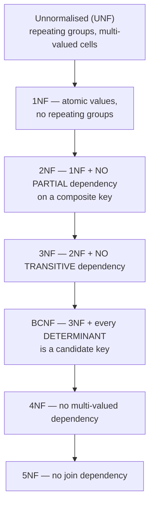

> **Each form CONTAINS the one before it:** every 3NF table is automatically in 2NF and 1NF. In practice, **3NF or BCNF is the normal target** for a production database.

#### First Normal Form (1NF)

> **A table is in 1NF if every cell holds a single ATOMIC (indivisible) value, there are no repeating groups, and each row is unique.**

**Rules:** no multi-valued attributes · no repeating groups of columns · each column holds one data type · each row is uniquely identifiable.

**❌ Violates 1NF:**

| StudentID | Name | PhoneNumbers |
|---|---|---|
| 101 | Rahim | **01711-111111, 01911-222222** |
| 102 | Karim | 01712-333333 |

The `PhoneNumbers` cell holds **two values** — it is not atomic. Searching for a number, counting numbers, or updating one of them all become awkward string operations.

**✅ In 1NF** — put each value in its own row:

| StudentID | Name | PhoneNumber |
|---|---|---|
| 101 | Rahim | 01711-111111 |
| 101 | Rahim | 01911-222222 |
| 102 | Karim | 01712-333333 |

*(The cleaner solution is a separate `StudentPhone(StudentID, PhoneNumber)` table.)*

#### Second Normal Form (2NF)

> **A table is in 2NF if it is in 1NF AND every non-key attribute is FULLY functionally dependent on the WHOLE primary key — i.e. there is NO PARTIAL dependency.**
>
> **2NF is only an issue when the primary key is COMPOSITE.** If the key is a single column, a table in 1NF is automatically in 2NF.

**❌ Violates 2NF** — primary key is **(StudentID, CourseID)**:

| **StudentID** | **CourseID** | StudentName | CourseName | Grade |
|---|---|---|---|---|
| 101 | CSE101 | Rahim | Programming | A |
| 101 | CSE102 | Rahim | Database | B |
| 102 | CSE101 | Karim | Programming | A- |

**The partial dependencies:**
- `StudentID → StudentName` — **StudentName depends on only PART of the key** ❌
- `CourseID → CourseName` — **CourseName depends on only PART of the key** ❌
- `(StudentID, CourseID) → Grade` — this one is **fully** dependent ✅

**✅ In 2NF** — decompose so that each fact sits with its whole determinant:

**Student**

| **StudentID** | StudentName |
|---|---|
| 101 | Rahim |
| 102 | Karim |

**Course**

| **CourseID** | CourseName |
|---|---|
| CSE101 | Programming |
| CSE102 | Database |

**Enrollment**

| **StudentID** | **CourseID** | Grade |
|---|---|---|
| 101 | CSE101 | A |
| 101 | CSE102 | B |
| 102 | CSE101 | A- |

#### Third Normal Form (3NF)

> **A table is in 3NF if it is in 2NF AND there is NO TRANSITIVE dependency — no non-key attribute depends on another NON-KEY attribute.**
>
> The memorable statement: *every non-key attribute must depend on **the key, the whole key, and nothing but the key**.*

**❌ Violates 3NF** — primary key is **EmpID**:

| **EmpID** | EmpName | DeptID | DeptName | DeptLocation |
|---|---|---|---|---|
| 1 | Rahim | D01 | IT | Dhaka |
| 2 | Karim | D01 | IT | Dhaka |
| 3 | Jamal | D02 | HR | Chittagong |

**The transitive dependency:** `EmpID → DeptID` and `DeptID → DeptName, DeptLocation`, therefore `EmpID → DeptName` **transitively, through the non-key attribute DeptID** ❌

**The resulting anomalies:** the IT department's location is repeated for every IT employee (**redundancy**); a new department cannot be recorded until it has an employee (**insertion anomaly**); moving the IT department requires updating every IT employee's row (**update anomaly**); and deleting Jamal destroys all record of the HR department (**deletion anomaly**).

**✅ In 3NF:**

**Employee**

| **EmpID** | EmpName | DeptID *(FK)* |
|---|---|---|
| 1 | Rahim | D01 |
| 2 | Karim | D01 |
| 3 | Jamal | D02 |

**Department**

| **DeptID** | DeptName | DeptLocation |
|---|---|---|
| D01 | IT | Dhaka |
| D02 | HR | Chittagong |

Now the department's location is stored **exactly once**, and all four anomalies disappear.

#### 2NF vs 3NF — the key comparison

| Point | **2NF** | **3NF** |
|---|---|---|
| **Prerequisite** | Must be in **1NF** | Must be in **2NF** |
| **Eliminates** | **PARTIAL** dependency — a non-key attribute depending on **part of a composite key** | **TRANSITIVE** dependency — a non-key attribute depending on **another non-key attribute** |
| **Relevant when** | The primary key is **COMPOSITE** | The key may be **single or composite** |
| **The dependency removed** | `PartOfKey → NonKey` | `NonKey → NonKey` |
| **Example violation** | `(StudentID, CourseID)` is the key, but `CourseID → CourseName` | `EmpID → DeptID → DeptName` |
| **Redundancy removed** | Course/student details repeated per enrolment | Department details repeated per employee |
| **Strictness** | Less strict | **More strict** |

#### BCNF — Boyce-Codd Normal Form

> **A table is in BCNF if, for every non-trivial functional dependency X → Y, X is a SUPER KEY (i.e. a candidate key).**

**Why BCNF is stricter than 3NF:** 3NF allows a dependency `X → Y` if **Y is part of some candidate key** (a "prime attribute"), even when X is not a key. BCNF removes that exception entirely — **every determinant must be a candidate key, with no exceptions.**

**Worked example — a table in 3NF but NOT in BCNF:**

**StudentCourseInstructor**

| **Student** | **Course** | Instructor |
|---|---|---|
| Rahim | Database | Dr. Khan |
| Karim | Database | Dr. Rahman |
| Rahim | Networks | Dr. Alam |

**The rules of this university:** a student takes each course from exactly one instructor, and **each instructor teaches only ONE course**.

**The functional dependencies:**
- `(Student, Course) → Instructor` — a candidate key ✅
- **`Instructor → Course`** — because each instructor teaches only one course

**Is it in 3NF?** ✅ **Yes.** The only potentially offending dependency is `Instructor → Course`, and **`Course` is a prime attribute** (it is part of the candidate key `(Student, Course)`), so 3NF's exception permits it.

**Is it in BCNF?** ❌ **No.** In `Instructor → Course`, the determinant **`Instructor` is NOT a candidate key** — the same instructor appears in several rows. BCNF forbids this.

**The redundancy this allows:** the fact *"Dr. Khan teaches Database"* is repeated for **every student** Dr. Khan teaches. If Dr. Khan switches to a different course, every one of those rows must be updated.

**✅ Decomposed into BCNF:**

**InstructorCourse**

| **Instructor** | Course |
|---|---|
| Dr. Khan | Database |
| Dr. Rahman | Database |
| Dr. Alam | Networks |

**StudentInstructor**

| **Student** | **Instructor** |
|---|---|
| Rahim | Dr. Khan |
| Karim | Dr. Rahman |
| Rahim | Dr. Alam |

> **The trade-off to mention:** BCNF decomposition is always **lossless**, but it is **not always dependency-preserving** — the dependency `(Student, Course) → Instructor` can no longer be checked within a single table. This is precisely why **3NF is often preferred in practice**: it guarantees both losslessness *and* dependency preservation, while BCNF guarantees only the first.

#### Summary table of the normal forms

| Form | Requirement | Removes |
|---|---|---|
| **1NF** | Atomic values, no repeating groups | Multi-valued cells |
| **2NF** | 1NF + no **partial** dependency | Dependency on **part of a composite key** |
| **3NF** | 2NF + no **transitive** dependency | Dependency on a **non-key attribute** |
| **BCNF** | 3NF + **every determinant is a candidate key** | The remaining 3NF exception for prime attributes |
| **4NF** | BCNF + no **multi-valued** dependency | Independent multi-valued facts in one table |
| **5NF (PJNF)** | 4NF + no **join** dependency | Redundancy removable only by a 3-way split |

#### Denormalization — when NOT to normalize

**Denormalization** is the deliberate **re-introduction of redundancy** to improve **read performance**.

| Point | **Normalization** | **Denormalization** |
|---|---|---|
| **Goal** | Remove redundancy and anomalies | **Improve query speed** |
| **Number of tables** | **More** | Fewer |
| **JOINs required** | **Many** | Few |
| **Read performance** | Slower (joins are expensive) | **Faster** |
| **Write performance** | **Faster** | Slower — the same data must be updated in several places |
| **Data integrity** | **High** | Lower — redundancy risks inconsistency |
| **Storage** | Less | More |
| **Used in** | **OLTP** — transactional systems (banking, order entry) | **OLAP** — data warehouses, reporting, analytics |

> **The engineering judgement:** normalize to **3NF by default**. Denormalize **only** where profiling proves that join cost is the bottleneck, and then **accept and manage** the consistency burden — typically by updating the redundant copy inside a transaction or a trigger. The **over-normalization** trap is real: splitting a schema into 30 tables when 8 would do makes every query a nine-way join for no benefit.

**Previous Year Question List from this Topic:**

- [What is Normalization? How do 1NF and 2NF work in a database? Give examples.](../written-answers/database.md?plain=1#L7057)
- [Why normalization is required in Database? Write shortly about 3NF?](../written-answers/database.md?plain=1#L7134)
- [Explain the differences between Second Normal Form (2NF) and Third Normal Form (3NF) with examples.](../written-answers/database.md?plain=1#L7203)
- [What is Logical design database is called?](../written-answers/database.md?plain=1#L7296)
- [(ক) Normalization কী? কত প্রকার ও কী কী? ব্যাখ্যা করুন।](../written-answers/database.md?plain=1#L7566)
- [What is database Normalization? Write down the types of database Normalization.](../written-answers/database.md?plain=1#L7630)
- [Which normalization is related to functional dependency?](../written-answers/database.md?plain=1#L7686)
- [Functional dependency use in which normalizations?](../written-answers/database.md?plain=1#L7728)
- [What in First and Second Normal form is DBMS?](../written-answers/database.md?plain=1#L7784)
- [অথবা, (ক) “BCNF is stricter than 3NF” এই উক্তিটি উদাহরণসহ ব্যাখ্যা করুন।](../written-answers/database.md?plain=1#L7864)
- [Why Normalization is used in database? Explain 1^{\text{st}} Normal form using an example.](../written-answers/database.md?plain=1#L7948)
- [Why do you need database Normalization?](../written-answers/database.md?plain=1#L8024)
- [Let a relational function is R(A, B, C, D, E), Write Yes or No based on those are the follow n functional dependency.](../written-answers/database.md?plain=1#L8087)
- [What is DBMS? Write down the purpose of normalization in DBMS.](../written-answers/database.md?plain=1#L8196)
- [(b) What is normalization? Why is it needed?](../written-answers/database.md?plain=1#L8253)
- [(i) DBMS কী? একটি Database কে normalize করার পদ্ধতিগুলো বর্ণনা করুন।](../written-answers/database.md?plain=1#L8320)
- [(a) What do you mean by Normalization in RDBMS? Explain with an example.](../written-answers/database.md?plain=1#L8488)
- [What do you mean by Database properties using Normalization?](../written-answers/database.md?plain=1#L8586)
- [(c) Why normalization is required in Database? Write shortly about 3NF.](../written-answers/database.md?plain=1#L8699)

**Previous Year MCQ List from this Topic:**

- [Which normal form is considered adequate for normal relational database design?](../mcq-answers/database.md?plain=1#L858)
- [Which one is correct in case of normalization-](../mcq-answers/database.md?plain=1#L867)
- [If attribute A determines both attributes B and C then, it is also true that—](../mcq-answers/database.md?plain=1#L876)
- [If a table is normalized so that all its determinants are candidate keys then, the tableis in-](../mcq-answers/database.md?plain=1#L885)
- [Functional dependency use in which normalizations?](../mcq-answers/database.md?plain=1#L894)
- ["There must not be any partial dependency "Which of the following Normal Forms holds this condition?](../mcq-answers/database.md?plain=1#L900)
- [To remove partial dependency from a database, which technique you will use?](../mcq-answers/database.md?plain=1#L909)
- [In a schema with attributes A, B, C, D and F following set of functional dependencies are given A => B, A=>C, CD=> E, B=>D, E=>A. Which of the following functio…](../mcq-answers/database.md?plain=1#L918)
- [Third normal form is based on the concept of ______.](../mcq-answers/database.md?plain=1#L927)
- [If you are told to remove the inconsistency from the course table which normalization technique you will use-](../mcq-answers/database.md?plain=1#L936)
- [If you are assigned to remove partial dependency from a database, which technique you will use?](../mcq-answers/database.md?plain=1#L945)
- [The table in below violates the Normal Form(s). Which normal form it violates?](../mcq-answers/database.md?plain=1#L954)
- [Why do we need to normalize a database?](../mcq-answers/database.md?plain=1#L960)
- [In the ________ normal form, a composite attribute is converted to individual attributes.](../mcq-answers/database.md?plain=1#L969)
- [Repeated data exist at—](../mcq-answers/database.md?plain=1#L978)
- [What is normalization?](../mcq-answers/database.md?plain=1#L987)
- [Which one is in case of normalization—( নরম্যালাইজেশন (Normalization)-এর ক্ষেত্রে কোনটি সঠিক— )](../mcq-answers/database.md?plain=1#L1581)


- [Which statement is not true for functional dependency?](../mcq-answers/database.md?plain=1#L1910)
- [Which normal form removes transitive dependency?](../mcq-answers/database.md?plain=1#L1928)

---

### ER Diagrams and Database Design

An **Entity-Relationship (ER) diagram** is a **visual model of the data requirements** of a system, showing **entities**, their **attributes** and the **relationships** between them. It is produced during the **logical design** phase, before any table is created.

> **The logical design of a database is called the SCHEMA** — and the three levels of design are **conceptual (ER model)** → **logical (relational schema, normalized)** → **physical (files, indexes, storage)**.

#### ER notation

| Symbol | Represents |
|---|---|
| **Rectangle** | **Entity** — a real-world object (Student, Book) |
| **Double rectangle** | **Weak entity** — cannot exist without an owner entity |
| **Ellipse** | **Attribute** |
| **Ellipse, underlined** | **Key attribute** (primary key) |
| **Double ellipse** | **Multi-valued** attribute (phone numbers) |
| **Dashed ellipse** | **Derived** attribute (age, derived from date of birth) |
| **Diamond** | **Relationship** |
| **Line** | Links an entity to a relationship or attribute |
| **Double line** | **Total participation** — every instance must participate |

#### Types of relationship (cardinality)

| Cardinality | Meaning | Example | How it maps to tables |
|---|---|---|---|
| **1 : 1** | One-to-one | One employee ↔ one parking space | Foreign key in **either** table |
| **1 : N** | One-to-many | One department has many employees | **Foreign key on the "many" side** |
| **M : N** | Many-to-many | Many students take many courses | **A separate JUNCTION/bridge table** holding both foreign keys |

> **The most important design rule to state:** a **many-to-many relationship CANNOT be represented directly** in a relational database. It must be resolved into a **third table** whose primary key is the **composite of the two foreign keys**.

#### Worked ER diagram — a Library Management System

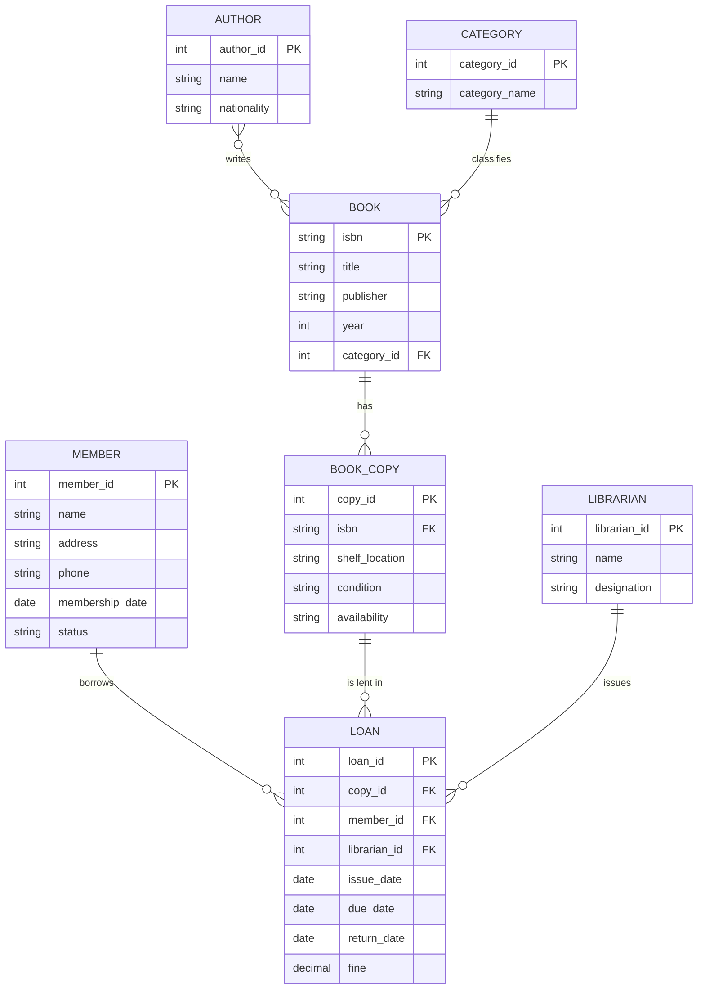

**The design decisions worth explaining in an answer:**
1. **BOOK vs BOOK_COPY** — a library owns **several physical copies of one title**. Separating them lets each copy be tracked and lent individually while the title's details are stored once.
2. **AUTHOR ↔ BOOK is many-to-many** (a book may have several authors; an author writes several books), so it requires a **junction table** `BOOK_AUTHOR(isbn, author_id)`.
3. **LOAN is the relationship made into an entity**, because it carries its own attributes — issue date, due date, fine.
4. **Fine** could be derived from `return_date − due_date`, so storing it is a deliberate denormalization for reporting convenience.

#### Steps in database design

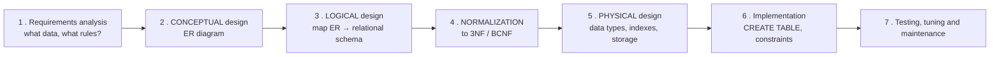

**Mapping an ER diagram to tables:**
1. Each **strong entity** → one **table**, with its key attribute as the **primary key**.
2. Each **weak entity** → a table whose primary key is the **composite** of the owner's key and its own partial key.
3. **1:1 relationship** → add a foreign key to either side (preferably the side with total participation).
4. **1:N relationship** → add the **foreign key on the "many" side**.
5. **M:N relationship** → create a **new junction table**.
6. **Multi-valued attribute** → a **separate table**.
7. **Composite attribute** → split into its simple components as separate columns.

**Previous Year Question List from this Topic:**

- [A Bank schema is given below:](../written-answers/database.md?plain=1#L7335)
- [What is Normalize a database? Used containers if needed, draw an ER Diagram. *](../written-answers/database.md?plain=1#L7447)
- [(a) Draw an E-R diagram of a Library Management System. Where](../written-answers/database.md?plain=1#L8648)
- [What is Logical design database is called?](../written-answers/database.md?plain=1#L7296)

**Previous Year MCQ List from this Topic:**

- [Let E1 and E2 be two entities in an E/R diagram with simple single-valued attributes. R1 and R2 are two relationships between E1 and E2, where R1 is one-to-many…](../mcq-answers/database.md?plain=1#L1307)
- [Which of the following is an appropriate description of the mapping between the relational model and relational database as its implementations?](../mcq-answers/database.md?plain=1#L37)
- [What is the min and max number of tables required to convert an ER diagram with 2 entities and 1 relationship between them with partial participation constraint…](../mcq-answers/database.md?plain=1#L1325)
- [Consider an Entity-relationship from entity set E1 to entity set E2. If E1 and E2 participate totally in R and cardinality of E1 is greater that the cardinality…](../mcq-answers/database.md?plain=1#L1334)
- [A relationship is given below in an ER diagram How many tables can be created (preferred) from below diagram?](../mcq-answers/database.md?plain=1#L1343)
- [A relationship is given below in an ER diagram. How many tables can be created (preferred) from below diagram?](../mcq-answers/database.md?plain=1#L1343)
- [Consider an Entity-relationship (ER) model where R is defined as a many-to-one relationship from entity set E1 to entity set E2. If E1 and E2 participate totall…](../mcq-answers/database.md?plain=1#L1334)
- [A relationship is given below in an ER diagram. How many tables can be created (preferred) from below diagram?](../mcq-answers/database.md?plain=1#L1343)
- [In an Entity-Relationship diagram many-to-many relationship corresponds to a -- in actual database.](../mcq-answers/database.md?plain=1#L1397)


- [The core components of an ER model are:](../mcq-answers/database.md?plain=1#L1838)
- [Which one is not a true statement?](../mcq-answers/database.md?plain=1#L1847)

---

---

### Enhanced ER (EER) Concepts — Generalization, Specialization and Aggregation

As database applications became more complex, the classic Entity-Relationship (ER) model was extended into the **Enhanced ER (EER) model** to support advanced conceptual modeling, object-oriented concepts, and abstraction mechanisms.

#### 1. Generalization (Bottom-Up Abstraction)
- **Definition:** The process of extracting common characteristics, attributes, and relationships from multiple lower-level entity sets to synthesize a higher-level generalized entity set (superclass).
- **Approach:** **Bottom-Up** — you start with specific entities and generalize upwards.
- **Example:** `Car` and `Truck` entity sets both have `LicensePlate`, `Price`, and `MaxSpeed`. They are generalized into a higher-level entity `Vehicle`.
- **ER Diagram Notation:** Represented by a **TRIANGLE** labeled with **"IS-A"** (or triangle symbol pointing toward the generalized superclass).

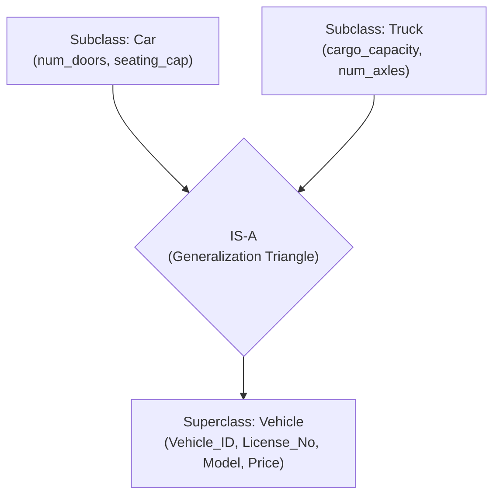

#### 2. Specialization (Top-Down Abstraction)
- **Definition:** The process of designating sub-groupings within a higher-level entity set that possess distinctive attributes or specific relationships not shared by all members.
- **Approach:** **Top-Down** — you start with a generalized entity and specialize downwards.
- **Example:** `Employee` is specialized into `Developer` (has `programming_language`), `Accountant` (has `cpa_license`), and `Manager` (has `bonus_budget`).

#### Constraints on Specialization / Generalization:
1. **Disjointness Constraint:**
   - **Disjoint (d):** An entity instance can belong to **at most ONE** subclass (e.g., a Vehicle cannot be both a Car and a Truck simultaneously).
   - **Overlapping (o):** An entity instance can belong to **more than one** subclass concurrently (e.g., a person can be both an `Employee` and an `Alumni`).
2. **Completeness Constraint:**
   - **Total Specialization (Double Line):** Every entity in the superclass **must** belong to at least one subclass.
   - **Partial Specialization (Single Line):** An entity in the superclass may not belong to any subclass.

#### 3. Aggregation (Abstracting Relationships)
- **Definition:** An abstraction through which relationships are treated as higher-level entities.
- **Why it is needed:** In standard ER modeling, a relationship cannot be directly linked to another relationship. Aggregation wraps an existing relationship and its participating entities into a single aggregate entity set so that it can participate in a further relationship.
- **Example:** `Employee` works on a `Project` (Relationship). That entire combination is sponsored by a `FundingAgency`.

| Concept | Approach | Notation / Symbol | Key Idea |
|---|---|---|---|
| **Generalization** | **Bottom-Up** | 🔺 **Triangle ("IS-A")** | Combines lower-level entities into a higher superclass |
| **Specialization** | **Top-Down** | 🔺 **Triangle ("IS-A")** | Splits superclass into distinct sub-entities |
| **Aggregation** | Composition | **Bounding Rectangle** enclosing relationship | Treats relationship + entities as an abstract entity |

**Previous Year MCQ List from this Topic:**

- [In E-R diagram generalisation is represented by:](../mcq-answers/database.md?plain=1#L2108)

---

## Transaction Management & ACID Properties

### Transactions and the ACID Properties

#### What is a transaction?

A **transaction** is a **logical unit of work consisting of one or more SQL operations that must be executed as a SINGLE, INDIVISIBLE unit** — either **all of them succeed**, or **none of them take effect**.

> **The canonical example — a bank transfer of 5,000 Tk from account A to account B:**
> ```sql
> BEGIN TRANSACTION;
>     UPDATE Account SET balance = balance - 5000 WHERE acc_no = 'A';   -- debit
>     UPDATE Account SET balance = balance + 5000 WHERE acc_no = 'B';   -- credit
> COMMIT;
> ```
> These two statements **must** happen together. If the system crashes between them, **5,000 Tk vanishes from the bank**. A transaction guarantees that cannot happen.

#### The states of a transaction

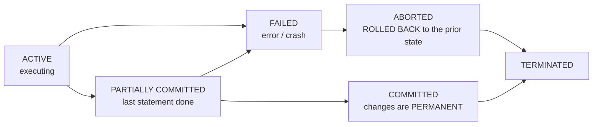

| State | Meaning |
|---|---|
| **Active** | The transaction is executing |
| **Partially committed** | The final statement has run, but the changes are not yet on disk |
| **Committed** | Completed successfully; **changes are permanent** |
| **Failed** | Normal execution can no longer proceed |
| **Aborted** | **Rolled back** to the state before the transaction began |
| **Terminated** | Finished, either committed or aborted |

#### Transaction control statements

| Statement | Effect |
|---|---|
| **`BEGIN` / `START TRANSACTION`** | Marks the start |
| **`COMMIT`** | **Makes all changes PERMANENT** and ends the transaction |
| **`ROLLBACK`** | **Undoes all changes** since the transaction began |
| **`SAVEPOINT name`** | Sets an intermediate marker |
| **`ROLLBACK TO SAVEPOINT name`** | Undoes back to that marker only |

> **A transaction must end with either COMMIT or ROLLBACK.** Nothing else releases its locks or finalises its work.

---

#### The ACID properties

**ACID** is the set of four guarantees a DBMS provides to ensure **data reliability and integrity** even in the face of errors, crashes and concurrent access.

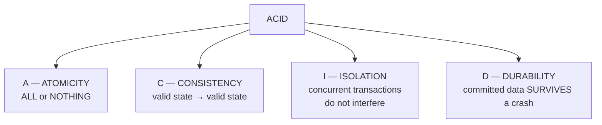

#### 1. Atomicity — "all or nothing"

> **A transaction is treated as a single indivisible unit: either ALL of its operations are performed, or NONE of them are.**

There is **no partial completion**. If any step fails, the entire transaction is **rolled back** and the database returns exactly to its previous state.

**In the transfer example:** if the debit succeeds but the credit fails (the destination account is frozen, the disk fills, the power cuts), atomicity **undoes the debit**. The money is never lost in transit.

**How the DBMS achieves it:** the **transaction log (undo log)** records the "before" image of every change, so any incomplete transaction can be reversed during recovery.

#### 2. Consistency — "valid state to valid state"

> **A transaction brings the database from one VALID state to another VALID state, preserving all defined rules, constraints and business invariants.**

**In the transfer example:** the business rule is that **the total money in the bank must not change** during an internal transfer. Before: A = 10,000 and B = 5,000, total **15,000**. After: A = 5,000 and B = 10,000, total **15,000** ✅. If a transaction would leave the total at 14,000, it is rejected.

**What is preserved:** primary and foreign key constraints, `CHECK` constraints, `NOT NULL`, triggers, cascading rules — **and application-level invariants**, which are the developer's responsibility to define.

#### 3. Isolation — "concurrent transactions do not interfere"

> **Concurrently executing transactions must not affect one another; each must behave as though it were running ALONE on the database.**

The formal ideal is **serialisability**: the result of running transactions concurrently must be **identical to some serial (one-after-another) execution**.

**Without isolation — the lost update problem:**

| Time | Transaction 1 | Transaction 2 | Balance |
|---|---|---|---|
| t1 | Reads balance = 10,000 | | 10,000 |
| t2 | | Reads balance = 10,000 | 10,000 |
| t3 | Deposits 5,000 → writes **15,000** | | 15,000 |
| t4 | | Deposits 3,000 → writes **13,000** | **13,000** ❌ |

> **Transaction 1's deposit has been LOST.** The balance should be 18,000. Isolation, enforced by **locking**, prevents this.

**The concurrency problems isolation prevents:**

| Problem | Description |
|---|---|
| **Dirty read** | Reading data written by a transaction that has **not yet committed** — and may be rolled back |
| **Non-repeatable read** | Reading the **same row twice** within one transaction and getting **different values**, because another transaction committed a change in between |
| **Phantom read** | Re-running the same **query** and finding **new rows** that another transaction inserted |
| **Lost update** | As shown above |

**The four isolation levels (SQL standard):**

| Level | Dirty read | Non-repeatable read | Phantom read | Concurrency |
|---|---|---|---|---|
| **READ UNCOMMITTED** | ❌ Possible | ❌ Possible | ❌ Possible | **Highest** |
| **READ COMMITTED** | ✅ Prevented | ❌ Possible | ❌ Possible | High |
| **REPEATABLE READ** | ✅ Prevented | ✅ Prevented | ❌ Possible | Medium |
| **SERIALIZABLE** | ✅ Prevented | ✅ Prevented | ✅ Prevented | **Lowest** |

> **The trade-off:** stricter isolation gives stronger correctness but **lower concurrency and throughput**. `SERIALIZABLE` is the safest and the slowest; most systems default to `READ COMMITTED` or `REPEATABLE READ`. **A bank's core ledger uses the strictest level it can afford.**

#### 4. Durability — "committed means permanent"

> **Once a transaction has been COMMITTED, its changes are PERMANENT and will survive any subsequent system failure — power loss, crash, or restart.**

**In the transfer example:** once the customer sees "transfer successful", the money **must** be in account B even if the server loses power one millisecond later.

**How the DBMS achieves it:**
- **Write-Ahead Logging (WAL)** — the change is written to the **transaction log on durable storage BEFORE** the data pages are updated. On restart, the log is replayed.
- **Forcing the log to disk** (fsync) at commit time.
- **Checkpoints** to bound recovery time.
- **Backups and replication** for protection against media failure.

#### The four properties applied to the bank transfer

| Property | What it guarantees in the transfer |
|---|---|
| **Atomicity** | The debit and the credit **both happen, or neither does**. Money is never destroyed in transit |
| **Consistency** | The **total balance across the bank is unchanged**; no constraint (such as "balance ≥ 0") is violated |
| **Isolation** | A **simultaneous** withdrawal from account A cannot read a half-finished balance or cause a lost update |
| **Durability** | Once the customer's receipt is printed, the transfer **survives an immediate power failure** |

**Previous Year Question List from this Topic:**

- [Explain the concept of ACID properties in a database transaction. Describe how each property—Atomicity, Consistency, Isolation, and Durability—ensures the relia…](../written-answers/database.md?plain=1#L8721)
- [How many process of Transaction complete?](../written-answers/database.md?plain=1#L8780)
- [ACID এর প্রোপার্টি কি?](../written-answers/database.md?plain=1#L8850)
- [(খ) Transaction কী? Transaction Management এর ACID properties সমূহ বর্ণনা করুন।](../written-answers/database.md?plain=1#L8891)
- [Case Study type Database-related problem (Solve: ACID)](../written-answers/database.md?plain=1#L8945)
- [What are the ACID properties of transaction to ensure data reliability and integrity?](../written-answers/database.md?plain=1#L9019)
- [(a) What is ACID mean in database system?](../written-answers/database.md?plain=1#L9072)
- [(গ) ডাটাবেস ট্রানজেকশনের ACID Properties সম্পর্কে লিখুন।](../written-answers/database.md?plain=1#L9122)
- [Describe ACID properties of DBMS.](../written-answers/database.md?plain=1#L9240)
- [A transaction consists of a sequence of query and/or update statements. SQL statement must be required to end the transaction. List the SQL statements, required…](../written-answers/database.md?plain=1#L9294)
- [Describe Database ACID properties.](../written-answers/database.md?plain=1#L9363)
- [Describe the ACID properties of database.](../written-answers/database.md?plain=1#L9468)
- [Explain ACID properties in the context of database transactions.](../written-answers/database.md?plain=1#L9512)

**Previous Year MCQ List from this Topic:**

- [A transaction for which all committed changes are permanent is called ________](../mcq-answers/database.md?plain=1#L515)
- [A to B transfer balance but not sent to B? Which property in ACID is responsible?](../mcq-answers/database.md?plain=1#L998)
- [Which one of these is not included in acid property of database?](../mcq-answers/database.md?plain=1#L1007)
- [A transaction completes its execution is said to be-](../mcq-answers/database.md?plain=1#L1016)
- [What is the D in ACID property in database?](../mcq-answers/database.md?plain=1#L1025)
- [Which one of the following commands is used to restore the database to the last committed state?](../mcq-answers/database.md?plain=1#L91)
- [Which one is not Database Transaction property?](../mcq-answers/database.md?plain=1#L1040)
- [Which one of the following is a failure to a system?](../mcq-answers/database.md?plain=1#L91)
- [How can your rollback a committed transaction in any DBMS?](../mcq-answers/database.md?plain=1#L1058)
- [The packaged procedure that makes data in form permanent in the Database is-](../mcq-answers/database.md?plain=1#L1067)
- [ROLLBACK command is used to undo the changes made by-](../mcq-answers/database.md?plain=1#L1076)
- [Why is set transaction used in an oracle DBMS?](../mcq-answers/database.md?plain=1#L1085)
- [After a transaction completes successfully, the changes it has made to the database persist, even if there are system failures. This property of transaction is…](../mcq-answers/database.md?plain=1#L1094)
- [It is a necessary requirement that the transaction is guaranteed to complete or the transaction is never started, so that an inconsistent state would not be vis…](../mcq-answers/database.md?plain=1#L1103)


- [Which of the following ensures that transactions are processed reliably?](../mcq-answers/database.md?plain=1#L1937)

---

### Recovery, Concurrency Control and Deadlock

#### Rollback and Roll-forward

| Point | **ROLLBACK (UNDO)** | **ROLL FORWARD (REDO)** |
|---|---|---|
| **Purpose** | **UNDO** the changes of an **incomplete/failed** transaction | **REDO** the changes of a **committed** transaction that may not have reached the data files |
| **Applies to** | Transactions that were **ACTIVE** at the time of failure | Transactions that had **COMMITTED** before the failure |
| **Uses** | The **UNDO log** (before-images) | The **REDO log** (after-images) |
| **Restores** | The database to its state **before** the transaction | The database **forward** to the latest committed state |
| **Guarantees** | **ATOMICITY** | **DURABILITY** |
| **When it runs** | On explicit `ROLLBACK`, on error, or during crash recovery | During crash recovery, or when restoring from a backup plus logs |

**During crash recovery the DBMS does both:** it scans the log, **REDOes** every committed transaction (in case the changes were still only in the buffer cache), and **UNDOes** every transaction that had not committed.

#### Concurrency control — locking

| Lock type | Also called | Allows |
|---|---|---|
| **Shared (S)** | Read lock | **Many readers simultaneously**; no writer |
| **Exclusive (X)** | Write lock | **One writer only**; no other reader or writer |

**Two-Phase Locking (2PL)** — the standard protocol guaranteeing serialisability: each transaction has a **growing phase** in which it may only **acquire** locks, and a **shrinking phase** in which it may only **release** them. Once it has released any lock, it may never acquire another. **Strict 2PL** holds all locks until commit, which also prevents cascading rollbacks.

#### Deadlock

> **A DEADLOCK occurs when two or more transactions are each waiting for a lock held by the other, so NONE of them can ever proceed.**

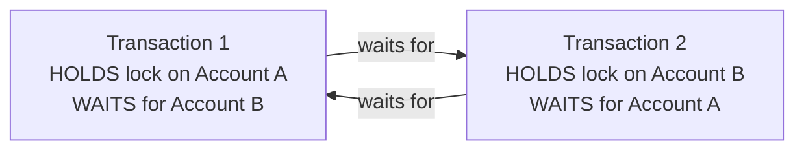

**Worked example:**

| Time | Transaction 1 | Transaction 2 |
|---|---|---|
| t1 | Locks **Account A** | |
| t2 | | Locks **Account B** |
| t3 | Requests **Account B** → **WAITS** | |
| t4 | | Requests **Account A** → **WAITS** |
| | **❌ DEADLOCK — both wait forever** | |

**The four Coffman conditions** — all must hold for a deadlock: **mutual exclusion**, **hold and wait**, **no preemption**, and **circular wait**. Breaking **any one** prevents deadlock.

#### Deadlock handling

| Strategy | Method |
|---|---|
| **PREVENTION** | Break one of the four conditions in advance: **acquire all locks at once** (no hold-and-wait); **impose a global ordering on resources** so every transaction locks A before B (no circular wait); allow **preemption** via timestamp schemes (**wait-die** and **wound-wait**) |
| **AVOIDANCE** | Grant a lock only if the resulting state is provably **safe** (Banker's algorithm). Rarely used in DBMSs — too expensive |
| **DETECTION and RECOVERY** ⭐ | Build a **wait-for graph** and periodically **look for a CYCLE**. If one is found, choose a **victim** transaction (usually the youngest, or the one with least work done) and **ROLL IT BACK**, releasing its locks. **This is what real DBMSs do** |
| **TIMEOUT** | If a transaction waits longer than a threshold, abort it. Simple, but it also aborts transactions that were merely slow |

**Practical prevention advice for developers:**
1. **Always access tables and rows in the SAME ORDER** in every transaction — this single rule eliminates most real-world deadlocks.
2. **Keep transactions SHORT** — hold locks for as little time as possible.
3. **Never wait for user input inside a transaction.**
4. Use the **lowest isolation level** the correctness of the application allows.
5. **Add appropriate indexes** — a missing index forces a full table scan and locks far more rows than necessary.
6. **Handle the deadlock error and RETRY** — the DBMS will roll one transaction back, and retrying usually succeeds.

#### Triggers and stored procedures

| | **Trigger** | **Stored Procedure** |
|---|---|---|
| **What it is** | A block of SQL that **executes AUTOMATICALLY** in response to an event | A named block of SQL that is **called explicitly** |
| **Invoked by** | `INSERT`, `UPDATE` or `DELETE` on a table | `CALL procedure_name()` |
| **Can it be called directly?** | ❌ **No** | ✅ **Yes** |
| **Takes parameters** | ❌ No | ✅ Yes |
| **Used for** | **Enforcing business rules**, maintaining **audit trails**, auto-updating derived columns, validation | Reusable business logic, batch operations, reducing network round trips |

```sql
-- A trigger that writes an AUDIT record whenever a salary changes
CREATE TRIGGER salary_audit
AFTER UPDATE ON Employee
FOR EACH ROW
BEGIN
    IF OLD.salary <> NEW.salary THEN
        INSERT INTO SalaryAudit (emp_id, old_salary, new_salary, changed_by, changed_at)
        VALUES (OLD.emp_id, OLD.salary, NEW.salary, CURRENT_USER(), NOW());
    END IF;
END;
```

> **Why triggers are needed:** they enforce a rule **at the database level**, so it applies **no matter which application, script or person** performs the update — nobody can bypass it. That makes them ideal for **audit trails, referential actions and integrity rules that must never be circumvented**. Their downside is that they are **invisible** — a developer debugging an application may not realise a trigger is firing — so they should be used sparingly and documented clearly.

**Previous Year Question List from this Topic:**

- [What do you mean by Rollback and Roll forward?](../written-answers/database.md?plain=1#L9173)
- [Describe the ACID properties in a database. When does a deadlock occur and how do you prevent it, in a database?](../written-answers/database.md?plain=1#L9413)
- [A transaction consists of a sequence of query and/or update statements. SQL statement must be required to end the transaction. List the SQL statements, required…](../written-answers/database.md?plain=1#L9294)

**Previous Year MCQ List from this Topic:**

- [Which of the following locks the item from access of any type?](../mcq-answers/database.md?plain=1#L443)
- [Which of the following is not a factor in determining the concurrency control behavior of SQL Server?](../mcq-answers/database.md?plain=1#L37)
- [In a DBMS, when multiple transaction programs update the same database simultaneously, which of the following is a technology that is used to prevent logical co…](../mcq-answers/database.md?plain=1#L1717)
- [Which of the below is responsible for controlling the interaction among simultaneous transaction?](../mcq-answers/database.md?plain=1#L1726)
- [In strict two phase locking protocol-](../mcq-answers/database.md?plain=1#L1735)
- [A shared lock allows which of the following type of transaction to occur?](../mcq-answers/database.md?plain=1#L1744)
- [Which of the following protocol is an SQL trigger support by oracle?](../mcq-answers/database.md?plain=1#L114)
- [________ is a statement that is executed automatically by the system.](../mcq-answers/database.md?plain=1#L1522)


- [Deadlock in a database occurs when:](../mcq-answers/database.md?plain=1#L1973)

---

## Keys, Constraints & Database Objects

### Database Objects and Integrity Constraints

#### The main database objects

| Object | Purpose |
|---|---|
| **Table** | Stores the actual data in rows and columns |
| **View** | A **virtual table** defined by a stored query |
| **Index** | A structure that **speeds up retrieval**, at the cost of slower writes and extra storage |
| **Sequence** | Generates unique numbers (auto-increment) |
| **Synonym / Alias** | An alternative name for an object |
| **Stored procedure** | Named, reusable SQL logic, called explicitly |
| **Function** | Like a procedure, but **returns a value** and can be used inside a query |
| **Trigger** | SQL that fires **automatically** on a data event |
| **Constraint** | A rule enforcing data validity |
| **Schema** | A named collection of all the above belonging to one owner |

#### The three integrity rules

| Rule | Requirement | Enforced by |
|---|---|---|
| **Entity integrity** | **Every row must be uniquely identifiable** — the primary key must be **unique and NOT NULL** | `PRIMARY KEY` |
| **Referential integrity** | **Every foreign key value must match an existing primary key value** (or be NULL) | `FOREIGN KEY` |
| **Domain integrity** | **Every value must be of the correct type and within the allowed range** | Data types, `CHECK`, `NOT NULL`, `DEFAULT` |

#### Indexes — how retrieval is accelerated

An **index** is a separate data structure (usually a **B+ tree**) that stores the **sorted values of one or more columns along with pointers to the corresponding rows**, allowing the DBMS to find rows **without scanning the whole table**.

| Point | Detail |
|---|---|
| **Speeds up** | `SELECT … WHERE`, `JOIN`, `ORDER BY`, `GROUP BY`, and uniqueness checks |
| **Slows down** | **`INSERT`, `UPDATE`, `DELETE`** — every index must also be updated |
| **Costs** | Extra **disk space** |
| **Created automatically on** | `PRIMARY KEY` and `UNIQUE` columns |
| **Should be created on** | **Foreign keys**, and columns frequently used in `WHERE` and `JOIN` |
| **Should NOT be created on** | Columns with **very few distinct values** (a gender column), rarely queried columns, or tables that are write-heavy and small |

```sql
CREATE INDEX idx_emp_dept ON Employee(DeptID);
CREATE UNIQUE INDEX idx_emp_email ON Employee(Email);
CREATE INDEX idx_emp_dept_salary ON Employee(DeptID, Salary);   -- composite
```

> **The rule of thumb:** an index is a **trade of write speed and space for read speed**. Index what you **search by**, not what you merely **display**. And remember that a function applied to an indexed column in the `WHERE` clause (`WHERE UPPER(name) = 'RAHIM'`) **prevents the index from being used** — the commonest cause of a query that "should" be fast but is not.

**Previous Year Question List from this Topic:**

- [(d) What are the purpose of Primary Key and Foreign Key in context with ‘Relational Database’? Write in short with examples. (5 marks)](../written-answers/database.md?plain=1#L9535)

**Previous Year MCQ List from this Topic:**

- [We can create a “View” of a relation using the “create view_name” command in SQL analyze the following information about view and find which option is correct-](../mcq-answers/database.md?plain=1#L287)
- [কোনটি দিয়ে Database Table এ uniqueness নিশ্চিত করা হয়?](../mcq-answers/database.md?plain=1#L407)
- [In SQL, the ________ command is used to recompile a view.](../mcq-answers/database.md?plain=1#L416)
- [In SQL, the ________ command is used to recompile a view.](../mcq-answers/database.md?plain=1#L416)
- [The primary key is selected from the ________](../mcq-answers/database.md?plain=1#L506)
- [The key selected from the sets of candidate keys by database design is called ______ key:](../mcq-answers/database.md?plain=1#L1123)
- [Which of the following types of table constraints prevents the entry of duplicate rows?](../mcq-answers/database.md?plain=1#L1132)
- [Referential integrity in a DBMS is a form of-](../mcq-answers/database.md?plain=1#L1141)
- [Needing to assess the validity of assumed referential integrity constraints on foreign keys is a(n) _________ of normalization.](../mcq-answers/database.md?plain=1#L1150)
- [The maximum number of super keys for the relation schema R (E, F, G, H) with E as the key is-](../mcq-answers/database.md?plain=1#L1159)
- [Which of the following is a group of one or more attributes that uniquely identifies a row?](../mcq-answers/database.md?plain=1#L37)
- [For every relationship, how many possible sets of minimum cardinalities are there?](../mcq-answers/database.md?plain=1#L1177)
- [A primary key must also be-](../mcq-answers/database.md?plain=1#L1186)
- [What represents a row in a relational database?](../mcq-answers/database.md?plain=1#L1195)
- [The subset of super key is a candidate key under what condition?](../mcq-answers/database.md?plain=1#L1204)
- [Which of the following is a primary key property in DBMS? ( DBMS-এ প্রাইমারি কী (Primary Key)-এর বৈশিষ্ট্য কী? )](../mcq-answers/database.md?plain=1#L37)
- [What are the different events in Triggers?](../mcq-answers/database.md?plain=1#L1477)


- [Which statement is true?](../mcq-answers/database.md?plain=1#L1856)
- [Which of the following is not an integrity constraint?](../mcq-answers/database.md?plain=1#L37)
- [Student(ID, name, dept name, tot_credit). In this query which attributes form the primary key?](../mcq-answers/database.md?plain=1#L1883)
- [In relational databases, what does a foreign key represent?](../mcq-answers/database.md?plain=1#L1955)
- [Key to represent the relationship between tables is called:](../mcq-answers/database.md?plain=1#L2018)
- [An instance of relational schema R(A,B,C) has distinct values of A, including NULL values. Which one of the following is true?](../mcq-answers/database.md?plain=1#L2081)

---

## DBMS Concepts & Architecture

### DBMS Architecture — Three-Level Schema, Data Abstraction and Data Independence

> A **DBMS hides the messy physical reality of stored data behind LAYERS OF ABSTRACTION**, so that each kind of user sees only what they need. The standard model is the **ANSI/SPARC THREE-LEVEL ARCHITECTURE**.

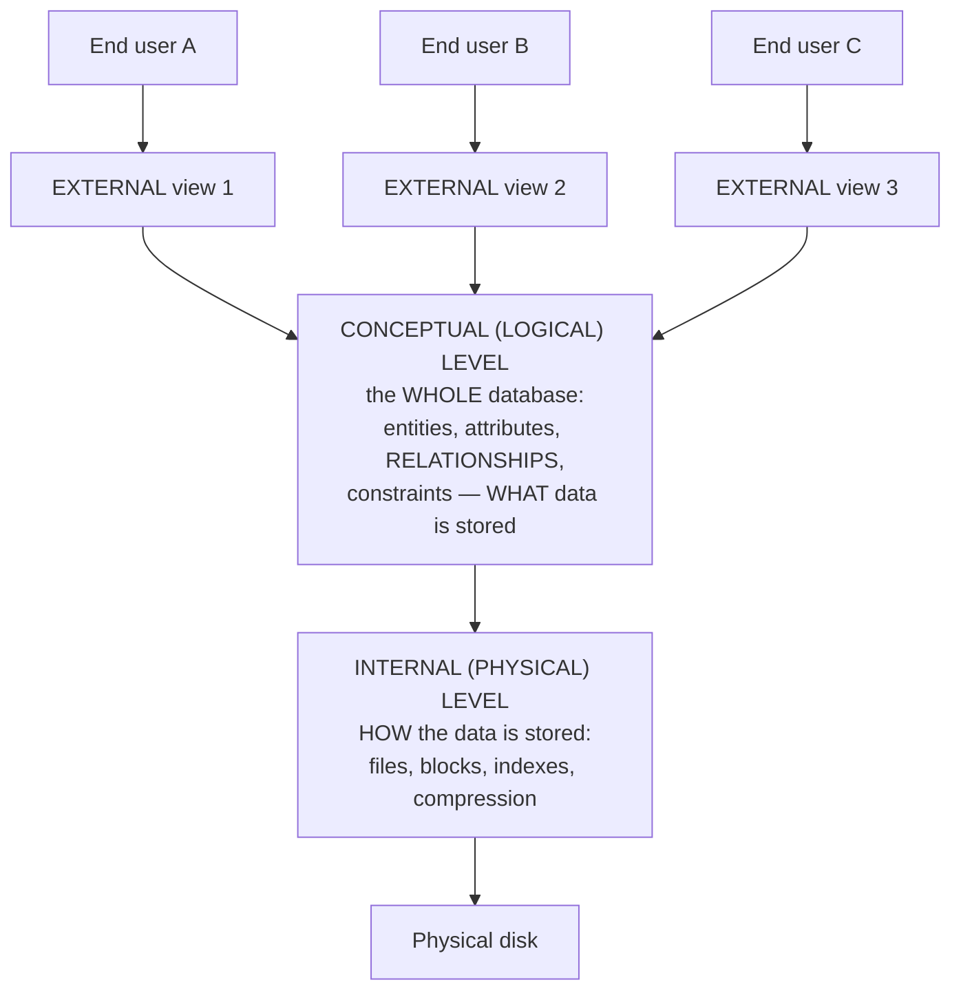

| Level | Also called | Describes | Who uses it |
|---|---|---|---|
| ⭐ **EXTERNAL** | **View level** | **What a PARTICULAR user or application sees** — a subset of the database, often through a **VIEW**. Many external schemas exist | **End users, application programs** |
| ⭐ **CONCEPTUAL** | ⭐ **LOGICAL level** | ⭐ **The DATA and the RELATIONSHIPS between data, plus constraints — for the WHOLE database.** Exactly **ONE** conceptual schema exists | **DBA, database designers** |
| ⭐ **INTERNAL** | **Physical level** | **HOW the data is physically stored** — file organisation, records, blocks, indexes, compression, placement on disk | **The DBMS itself, storage engineers** |

> ### **"Which level of abstraction specifies the DATA and the RELATIONSHIPS between data?"**
> ### ✅ **The CONCEPTUAL (LOGICAL) level.** *(The external level shows only a user's slice; the internal level describes storage, not relationships.)*

#### Data Independence — the reason the three levels exist

> ### **DATA INDEPENDENCE is the ability to CHANGE the schema at one level WITHOUT having to change the schema at the level above it.**

| Type | Definition | Example | Achievability |
|---|---|---|---|
| ⭐ **PHYSICAL data independence** | **Change the INTERNAL (physical) schema without changing the CONCEPTUAL schema** | Adding an index, moving the database to a new disk, changing the file organisation or compression — **no application needs modification** | ✅ **Easier — achieved by virtually all modern DBMSs** |
| ⭐ **LOGICAL data independence** | **Change the CONCEPTUAL schema without changing the EXTERNAL schemas / applications** | Adding a new column or a new table, splitting a table — **existing views and programs keep working** | ⚠️ **HARDER**, because applications depend directly on the logical structure |

> **Why this matters commercially:** without physical data independence, **every performance tuning change would require rewriting every application**. The three-level architecture is what makes a database maintainable over decades.

#### Schema vs Instance — a frequently confused pair

| | ⭐ **SCHEMA** | ⭐ **INSTANCE** |
|---|---|---|
| **What it is** | The **DESIGN / STRUCTURE** of the database — the definition of tables, columns, types and constraints | ⭐ **The COLLECTION OF DATA STORED IN THE DATABASE AT A PARTICULAR MOMENT** |
| **Changes** | **Rarely** — only when the design changes | **Constantly** — with every insert, update and delete |
| **Analogy** | The **declaration** of a variable / a class definition | The **value** of the variable at a moment / an object |

> ### **"The collection of information stored in the database at a particular moment is called…"** → ### ✅ **an INSTANCE** (also called the database state).
>
> ⚠️ **Note the clash of terminology in Oracle:** in **Oracle DBMS specifically**, an **"INSTANCE"** means something different — ### **the MEMORY STRUCTURES (the SGA) plus the BACKGROUND PROCESSES** that operate on the database files. *If the question mentions Oracle, use the Oracle meaning; otherwise use the general one.*

#### Data models

> A **DATA MODEL is a collection of conceptual tools for describing DATA, DATA RELATIONSHIPS, DATA SEMANTICS and CONSISTENCY CONSTRAINTS.**

| Model | Structure | Note |
|---|---|---|
| **Hierarchical** | A **tree** — parent/child | IBM IMS; one parent only |
| **Network** | A **graph** — records linked by sets | CODASYL; more flexible than hierarchical |
| ⭐ **RELATIONAL** | ⭐ **TABLES (relations) of rows and columns** | ⭐ **The dominant model** — Oracle, MySQL, SQL Server, PostgreSQL |
| **Entity-Relationship (ER)** | Entities, attributes and relationships | A **design** model, converted into relational tables |
| **Object-oriented / Object-relational** | Objects with methods | |
| **NoSQL — document, key-value, column-family, graph** | Flexible / schema-less | MongoDB, Redis, Cassandra, Neo4j |

#### Data redundancy and data integrity

| Term | Meaning |
|---|---|
| ⭐ **Data REDUNDANCY** | **The same data stored in more than one place.** It wastes space and — far worse — causes **INCONSISTENCY** when one copy is updated and another is not |
| ⭐ **Data INTEGRITY** | ⭐ **The degree to which the data in a database is ACCURATE, CONSISTENT, COMPLETE and RELIABLE**, throughout its lifetime |
| **Data INCONSISTENCY** | The state where two copies of the same fact disagree |

> ### **"Data integrity problems in a DBMS are caused by…"** → ### ✅ **DATA REDUNDANCY.** Redundancy is the *cause*; inconsistency is the *symptom*; **NORMALIZATION is the cure**, and **integrity constraints (primary key, foreign key, CHECK, NOT NULL) plus ACID transactions** are what preserve integrity thereafter.

**Previous Year MCQ List from this Topic:**

- [Which level of abstraction specifies the data and relationships between data?](../mcq-answers/database.md?plain=1#L562)
- [Data integrity problems in a DBMS is caused due to-](../mcq-answers/database.md?plain=1#L613)
- [A collection of conceptual tools for describing data, data relationships, data semantics, and consistency constraints, is known as-](../mcq-answers/database.md?plain=1#L622)
- [The collection of information stored in the database at a particular moment is called-](../mcq-answers/database.md?plain=1#L703)
- [Which of the following term refers to the degree to which data in a database system are accurate and correct?](../mcq-answers/database.md?plain=1#L775)
- [Which of the following terms refers to the degree to which data in a database system are accurate and correct?](../mcq-answers/database.md?plain=1#L775)
- [The ________ format is usually used to store data.](../mcq-answers/database.md?plain=1#L829)


- [What is the primary function of a Database Management System (DBMS)?](../mcq-answers/database.md?plain=1#L1775)
- [Which of the following is NOT a characteristic of a DBMS?](../mcq-answers/database.md?plain=1#L37)
- [Which one is not true for DBMS?](../mcq-answers/database.md?plain=1#L1802)
- [______ is a database management system which supports multiple users concurrently.](../mcq-answers/database.md?plain=1#L1811)
- [In which of the following formats data is stored in the database management system?](../mcq-answers/database.md?plain=1#L1820)
- [Which of the following is not an example of DBMS?](../mcq-answers/database.md?plain=1#L37)

---

---

### Data Models — Hierarchical, Network, Relational and Object-Oriented

A **data model** is an integrated collection of concepts for describing data, data relationships, data semantics, and data constraints.

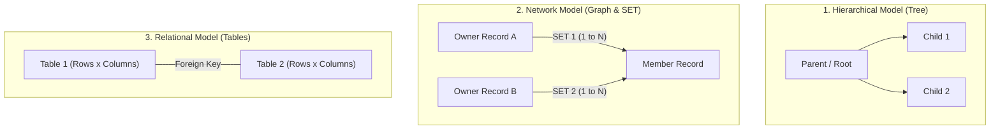

#### 1. The Hierarchical Data Model
- **Structure:** **Tree-like structure** composed of segments (records).
- **Rules:** 
  - Exactly **one ROOT segment** with no parent.
  - Every non-root segment has **strictly ONE parent segment** (1:N parent-child relationship).
- **Limitations:** Cannot naturally represent Many-to-Many (M:N) relationships; causes extensive data duplication and complex pointer maintenance.
- **Famous Example:** **IBM IMS (Information Management System)**.

#### 2. The Network Data Model (CODASYL DBTG)
- **Structure:** **Graph (Arbitrary network)** of record types connected by links.
- **The SET Concept (Core Feature):**
  - In the CODASYL Network Model, relationships are represented using **SETS**.
  - A **SET** consists of an **Owner Record Type** and one or more **Member Record Types**.
  - A SET represents a **1-to-Many (1:N) relationship** from the owner to the members.
  - **Crucial Advantage over Hierarchical Model:** A member record can belong to **MULTIPLE SETS** simultaneously — meaning a child can have **MORE THAN ONE PARENT/OWNER**!
  - Many-to-Many (M:N) relationships are modeled cleanly by introducing an intersection record type that participates as a member in two distinct sets.
  - Pointers (embedded in record prefixes) link owner and member records in circular chains.

#### 3. The Relational Data Model (E.F. Codd, 1970)
- **Structure:** Two-dimensional **Tables (Relations)** consisting of rows (tuples) and columns (attributes).
- **Features:** Mathematical foundation (Relational Calculus and Relational Algebra); declarative queries (SQL); physical storage independence. Dominant in modern enterprise computing (Oracle, PostgreSQL, MySQL, SQL Server).

#### 4. Object-Oriented / Object-Relational Models
- Models complex real-world entities as objects with state (attributes) and behavior (methods), supporting inheritance and encapsulation.

| Feature | Hierarchical Model | Network Model | Relational Model |
|---|---|---|---|
| **Underlying Structure** | **Tree hierarchy** | **Graph / Network** | **Tables (Relations)** |
| **Relationship Mechanism** | Parent-Child Relationships | **SET Concept (Owner & Member)** | **Keys & Foreign Keys** |
| **Multiple Parents Allowed?** | ❌ **No** (Strictly 1 parent) | ✅ **Yes (via multiple sets)** | ✅ Yes (via foreign keys) |
| **Many-to-Many (M:N)** | Difficult (Requires duplication) | ✅ Supported via junction records | ✅ Supported via bridge tables |
| **Query Mechanism** | Navigational (Procedural) | Navigational (Procedural pointers) | **Declarative (SQL)** |
| **Data Independence** | Low | Low | 🏆 **High** |

**Previous Year MCQ List from this Topic:**

- [SET concept is used in:](../mcq-answers/database.md?plain=1#L2000)

---

### DBMS Functional Components & Engine Architecture

Internally, a Database Management System consists of software modules categorized into two major functional units: the **Query Processor** and the **Storage Manager (Database Engine)**.

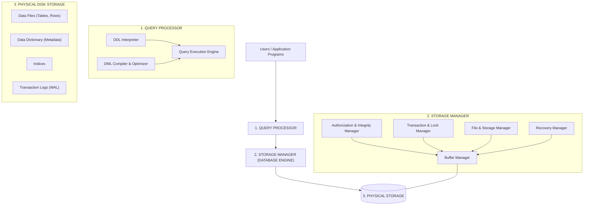

#### Detailed Breakdown of Components:

1. **Query Processor (Query Engine):**
   - **DDL Interpreter:** Parses and executes DDL statements (`CREATE`, `ALTER`, `DROP`) and records the resulting metadata definitions into the Data Dictionary.
   - **DML Compiler:** Translates DML statements (`SELECT`, `INSERT`, `UPDATE`, `DELETE`) into low-level execution primitives.
   - **Query Optimizer:** Evaluates multiple equivalent evaluation plans for a query and selects the most cost-effective execution plan (evaluating index scans vs full table scans).
   - **Query Execution Engine:** Coordinates execution of chosen query plan against stored data.

2. **Storage Manager / Database Engine:**
   - **Buffer Manager:** Allocates and manages cache memory (RAM Buffer Pool), reading disk pages into memory and deciding replacement algorithms (e.g., LRU).
   - **File & Storage Manager:** Manages contiguous disk block allocation, data file expansion, and free space maps.
   - **Authorization & Integrity Manager:** Enforces database constraints (`NOT NULL`, `CHECK`, `FOREIGN KEY`) and verifies access privileges (`GRANT`/`REVOKE`).
   - **Transaction Manager:** Guarantees ACID properties; oversees transaction state transitions (Active, Committed, Aborted).
   - **Concurrency Control / Lock Manager:** Assigns and releases shared/exclusive locks to prevent conflicts during simultaneous transactions.
   - **Recovery Manager:** Maintains Write-Ahead Logging (WAL) and restores consistency after hardware or system crashes.

3. **Data & Stored Objects vs DBMS Components:**
   > ### **Crucial Exam Concept:**
   > - **DBMS Engine Components:** Query Processor, Storage Manager, Database Engine, Indexing Engine, Buffer Manager, Data Languages (DDL/DML compilers).
   > - **Database Objects / Data Structures:** Database **Tables**, Views, Triggers, Indexes, and Tuples are **data structures / stored objects**, NOT software components of the DBMS engine!

**Previous Year MCQ List from this Topic:**

- [Which of the following is NOT a component of DBMS?](../mcq-answers/database.md?plain=1#L37)
- [Which of the following is a component of the DBMS?](../mcq-answers/database.md?plain=1#L37)

---

### Metadata, the Data Dictionary and the Role of the DBA

#### Metadata

> ### **METADATA is "DATA ABOUT DATA"** — it describes the **structure, meaning, origin and constraints** of the actual data, rather than being the data itself.

| The data | The metadata about it |
|---|---|
| `Rahim`, `28`, `55000` | The column is named **Name**, of type **VARCHAR(50)**, **NOT NULL**; the table is **Employee**; it was created on 3 May 2024; it has 12,400 rows; there is an index on **DeptID** |

**Examples of metadata:** table and column names, data types and lengths, constraints and keys, indexes, views, stored procedures, user accounts and privileges, storage locations, row counts and statistics, timestamps of creation and modification.

#### The Data Dictionary (system catalogue)

> ### **The DATA DICTIONARY is the DBMS's own repository of METADATA — a set of SYSTEM TABLES in which the DBMS stores the DEFINITION AND STRUCTURE of everything in the database.**

| It contains | Examples |
|---|---|
| ⭐ **Data structure definitions** | Tables, columns, data types, sizes |
| **Constraints and keys** | Primary, foreign, unique, check |
| **Indexes and views** | |
| **Users and privileges** | Who may do what |
| **Storage information** | Files, tablespaces |
| **Statistics** | Row counts, value distributions — used by the **query optimiser** |

> **Two important properties:** the data dictionary is **maintained automatically by the DBMS** (a `CREATE TABLE` updates it instantly), and it is **queryable like any other table** — `SELECT * FROM information_schema.columns` in MySQL/PostgreSQL, or the `USER_TABLES` / `ALL_TAB_COLUMNS` views in Oracle. **An "active" data dictionary is one the DBMS consults during query processing; a "passive" one is merely documentation.**

#### The Database Administrator (DBA)

| ⭐ **Functions that ARE the DBA's job** | ⭐ **NOT the DBA's job** |
|---|---|
| **Schema definition and modification** | ⚠️ **QUERY PROCESSING** — this is performed **by the DBMS's own query processor/optimiser**, not by a person |
| **Granting and revoking ACCESS RIGHTS** (authorisation) — the chief means of achieving **protection/security** | ⚠️ **Creating and processing FORMS** — that is application development |
| **Backup and recovery planning** | Writing business applications |
| **Performance monitoring and TUNING** (indexes, storage) | |
| **Storage structure and access-method definition** | |
| **Integrity-constraint specification** | |
| **Capacity planning, user management, auditing** | |

> ### **"Which of the following is NOT a function of a database administrator?"** → ### ✅ **QUERY PROCESSING** — the DBMS does that automatically.
> ### **"Which DBMS function is a means of achieving PROTECTION?"** → ### ✅ **MANAGING THE DATA ACCESS RIGHTS OF USERS** (authorisation and privileges).

#### The functions of a DBMS

**Data definition · data storage and retrieval · data manipulation · transaction management (ACID) · concurrency control · backup and recovery · security and authorisation · data integrity enforcement · data dictionary management · multi-user access · query optimisation.**
⚠️ **Not** a DBMS function: creating application forms and reports (that is the application layer's job).

**Previous Year MCQ List from this Topic:**

- [Data about data is called-](../mcq-answers/database.md?plain=1#L553)
- [Which of the following is not a function of a database administrator?](../mcq-answers/database.md?plain=1#L37)
- [Of the functions provided by a DBMS. Which of the following is a means for achieving protection for data confidentiality?](../mcq-answers/database.md?plain=1#L649)
- [In user facilities, copying of all records onto a main store from permanent store is considered as-](../mcq-answers/database.md?plain=1#L721)
- [If master and transaction file have keys in same order, then it takes____](../mcq-answers/database.md?plain=1#L730)
- [File used to update information in computer's master file is classified as](../mcq-answers/database.md?plain=1#L739)
- [Interleaving of records to form one file containing all records is classified as ____.](../mcq-answers/database.md?plain=1#L748)
- [Set of numbers used to check all groups record within limits of data is classified as-](../mcq-answers/database.md?plain=1#L757)
- [Process of converting data or information in the form of which is readily available for processing is called-](../mcq-answers/database.md?plain=1#L766)
- [Data directory contains detail of-](../mcq-answers/database.md?plain=1#L802)
- [The following are functions of a DBMS except ________](../mcq-answers/database.md?plain=1#L820)
- [What is the purpose of data logger?](../mcq-answers/database.md?plain=1#L847)


- [A data dictionary is a special file that contains:](../mcq-answers/database.md?plain=1#L2072)

---

### Database System Architectures — Client-Server, Distributed and NoSQL

#### Tiered architectures

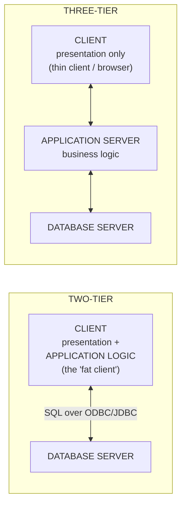

| Point | **Two-tier** | **Three-tier** |
|---|---|---|
| **Tiers** | Client + database server | Client + application server + database server |
| ⭐ **Where the application logic runs** | ⭐ **On the CLIENT side (the host/client)** | **On the middle APPLICATION SERVER** |
| **Client type** | "Fat" client | ⭐ **"Thin" client** |
| ⭐ **API used to reach the database** | ⭐ **ODBC / JDBC** | The app server handles it |
| **Scalability** | ⚠️ Poor — each client holds a DB connection | ✅ **Good** — connection pooling at the middle tier |
| **Security** | Weaker — clients connect directly to the DB | ✅ **Stronger** — the database is never exposed to clients |
| **Maintenance** | Must redeploy to every client | ✅ Update the middle tier only |
| **Suited to** | Small LAN applications | ⭐ **Web and enterprise applications** |

> ### **The three application-logic components are: PRESENTATION, PROCESSING and STORAGE.** Which tier each lands in is exactly what distinguishes two-tier from three-tier architecture.

#### Distributed databases

> A **DISTRIBUTED DATABASE stores data across MULTIPLE PHYSICAL SITES** (possibly in different cities), while presenting itself to users as a **single logical database**.

| ⭐ **Advantages over a centralized database** | **Disadvantages** |
|---|---|
| ⭐ **MODULAR GROWTH** — capacity is added by adding a site, with no disruption | **Complexity** of design and management |
| **Improved RELIABILITY and AVAILABILITY** — one site failing does not stop the system | **Costlier** software and communication |
| **Local autonomy** — each site controls its own data | ⚠️ **Harder to maintain integrity and consistency** across sites |
| **Better performance for local queries** — data sits near its users | **Distributed transactions and deadlock** are difficult (two-phase commit) |
| **Reflects organisational structure** (branches, regions) | **Security** surface is larger |

**Key techniques:** **FRAGMENTATION** (splitting a table horizontally by rows or vertically by columns across sites) · **REPLICATION** (keeping copies at several sites for availability and read speed) · **two-phase commit (2PC)** for atomic distributed transactions.

> **Oracle MATERIALIZED VIEWS (snapshots)** are used for ⭐ **DYNAMIC DATA REPLICATION** — a materialised view physically **stores** the result of a query (unlike an ordinary view, which is recomputed each time) and is refreshed periodically, which is how a remote site keeps a local copy of central data.

#### SQL vs NoSQL

| Point | **SQL (Relational)** | ⭐ **NoSQL** |
|---|---|---|
| **Data model** | **Tables** with a fixed schema | **Flexible / schema-less** — documents, key-value, column-family, graph |
| **Schema** | **Rigid, defined in advance** | ✅ **Dynamic** |
| **Scaling** | Mainly **VERTICAL** (a bigger server) | ⭐ **HORIZONTAL** (more commodity servers) |
| **Consistency model** | ⭐ **ACID** | ⭐ Often **BASE** — Basically Available, Soft state, Eventually consistent |
| **Query language** | **SQL** | Varies by product |
| **Joins** | ✅ Strong | Limited or absent |
| **Best for** | **Transactions, banking, structured data with relationships** | **Big data, real-time web, rapidly changing or unstructured data** |
| **Examples** | Oracle, MySQL, PostgreSQL, SQL Server, **MS Access** | ⭐ **MongoDB** (document), Redis (key-value), Cassandra (column), Neo4j (graph) |

> ### **"Which is a NoSQL database?"** → ### ✅ **MongoDB.** ### **"Which is an example of a DBMS/RDBMS?"** → ### ✅ **MS Access** (a relational DBMS), along with Oracle, MySQL and SQL Server.

#### Two Oracle internals that recur in MCQs

| Term | Meaning |
|---|---|
| ⭐ **Oracle INSTANCE** | ⭐ **The MEMORY STRUCTURES (SGA) + the BACKGROUND PROCESSES.** The *database* is the set of files on disk; the *instance* is what runs in memory to access them |
| ⭐ **LGWR (Log Writer)** | ⭐ **A BACKGROUND PROCESS that writes the redo entries from the log buffer to the REDO LOG FILES on disk** — this is what makes committed transactions **durable** |
| **DBWR** | Database Writer — writes modified data blocks from the buffer cache to the data files |
| **DB_BLOCK_SIZE** | The database block size — ⚠️ **it cannot be altered on an existing database; the database must be RE-CREATED** |
| **Speedup vs Scaleup** | ⭐ **SPEEDUP** = running the **same task in less time** by increasing parallelism; **SCALEUP** = handling a **larger task in the same time** with proportionally more resources |

**Previous Year MCQ List from this Topic:**

- [Assume that you want to improve database performance and willing to see the amount of swap space. Which command you can use in LINUX OS environment?](../mcq-answers/database.md?plain=1#L577)
- [In oracle to change the DB_Block_size parameter, you need to-](../mcq-answers/database.md?plain=1#L586)
- [Which of the following controls the execution of application program and UI in two tier client/server architecture?](../mcq-answers/database.md?plain=1#L132)
- [LGWR process writes information into-](../mcq-answers/database.md?plain=1#L604)
- [Which is the oracle component that contains the memory structures and background process?](../mcq-answers/database.md?plain=1#L631)
- [The three different application logic components are which of the following?](../mcq-answers/database.md?plain=1#L640)
- [Oracle materialized views or SNAPSHOTS is used-](../mcq-answers/database.md?plain=1#L658)
- [A distributed database has which of the following advantages over a centralized database?](../mcq-answers/database.md?plain=1#L667)
- [In Oracle DBMS, LGWR process is a-](../mcq-answers/database.md?plain=1#L676)
- [Which one of the following is a No-SQL Database?](../mcq-answers/database.md?plain=1#L91)
- [Running the given task in less time by increasing the degree of parallelism in DBMS is called ________.](../mcq-answers/database.md?plain=1#L712)
- [Which one is an example of DBMS?](../mcq-answers/database.md?plain=1#L784)
- [In the hypermedia database, information bits are stored in the form of:](../mcq-answers/database.md?plain=1#L793)
- [From where the data is captured in the SQL Server Database?](../mcq-answers/database.md?plain=1#L838)
- [The Application program interface in a two-tier architecture DBMS is provided by-](../mcq-answers/database.md?plain=1#L1670)


---

## Data Warehousing & Data Mining

### Data Warehousing, Data Marts and the Star Schema

> ### **A DATA WAREHOUSE is a LARGE, CENTRALISED repository of INTEGRATED, HISTORICAL data drawn from many source systems, organised for ANALYSIS AND DECISION-MAKING rather than for day-to-day transactions.**

> **Bill Inmon's classic definition — worth quoting:** a data warehouse is a **SUBJECT-ORIENTED, INTEGRATED, TIME-VARIANT and NON-VOLATILE** collection of data in support of management's decision-making process.

| Characteristic | Meaning |
|---|---|
| ⭐ **Subject-oriented** | Organised around **business subjects** (sales, customer, product), not around applications |
| ⭐ **Integrated** | Data from many sources is **cleaned and made consistent** — one date format, one customer ID scheme |
| ⭐ **Time-variant** | Holds **HISTORY** — years of snapshots, so trends can be analysed |
| ⭐ **Non-volatile** | **Loaded and read, but not updated or deleted** by users — it is a stable record |

> ### **"Where is data warehousing used?"** → ### ✅ **In a DECISION SUPPORT SYSTEM (DSS)** — and more broadly in business intelligence, reporting and analytics.

#### The ETL pipeline

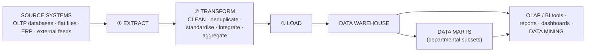

> ### **DATA CLEANING (data cleansing)** removes or corrects **errors, duplicates, inconsistencies, missing values and outliers** before loading. Its purpose is **all of these at once** — the MCQ answer to *"what is the use of data cleaning?"* is normally ⭐ **"All of the above"**, because it improves accuracy, consistency and completeness together. **Rubbish loaded into a warehouse produces rubbish analysis, so cleaning is the most labour-intensive stage of ETL.**

#### Data Warehouse vs Data Mart

| Point | **DATA WAREHOUSE** | ⭐ **DATA MART** |
|---|---|---|
| **Scope** | **The WHOLE enterprise** | ⭐ **ONE department or subject area** (sales, finance, HR) |
| **Size** | Very large — TB to PB | ⭐ **Small — "a small LOGICAL UNIT" of the warehouse** |
| **Users** | The whole organisation | One business unit |
| **Build time and cost** | Long, expensive | Fast, cheap |
| **Data sources** | Many | Few |

> ### **"Small logical units where a data warehouse holds large amounts of data are known as…"** → ### ✅ **DATA MARTS.**
>
> *(**Dependent** data marts are extracted from the central warehouse; **independent** ones are built directly from sources. A **DATA LAKE**, by contrast, stores **raw, unprocessed** data of any type — schema-on-read — while a warehouse stores **cleaned, structured** data — schema-on-write.)*

#### Dimensional modelling — the Star Schema

> ### **A STAR SCHEMA has ONE central FACT TABLE surrounded by several DIMENSION TABLES**, each joined directly to the fact table — the diagram looks like a star.

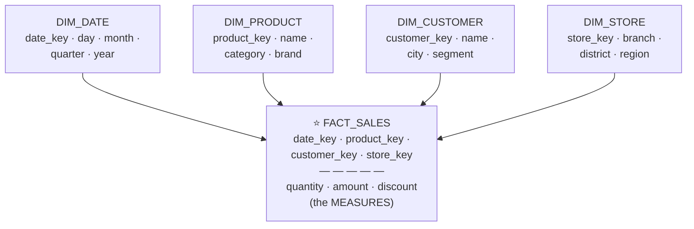

| | ⭐ **FACT table** | ⭐ **DIMENSION table** |
|---|---|---|
| **Contains** | **MEASURES (numeric facts)** — quantity, amount, profit — plus **foreign keys** to the dimensions | **Descriptive ATTRIBUTES** — the who, what, where, when |
| **Size** | ⚠️ **Very large** (millions to billions of rows) | Small (hundreds to thousands) |
| **Grows** | Constantly | Slowly |
| **Normalised?** | Usually | ⭐ **Deliberately DE-NORMALISED** in a star schema |

> ### **"A star schema has what type of relationship between a DIMENSION and a FACT table?"**
> ### ✅ **ONE-TO-MANY** — **one row in a dimension relates to MANY rows in the fact table.** *(One product appears in thousands of sales; one date covers thousands of transactions.)* Viewed from the fact table it is **many-to-one**.

| Schema | Dimensions are | Joins | Redundancy | Query speed |
|---|---|---|---|---|
| ⭐ **STAR** | **DE-normalised** (flat) | ✅ **Fewer** | Higher | ✅ **Faster** |
| **SNOWFLAKE** | **NORMALISED** into sub-dimensions | More | Lower | Slower |
| **Galaxy / Fact constellation** | Shared dimensions across **several fact tables** | Complex | — | — |

> **Why the star schema deliberately breaks normalization:** a warehouse is **read-mostly**, so the update anomalies that normalization prevents barely arise, while **each avoided join saves enormous time on a billion-row fact table.** This is the clearest legitimate example of **denormalization for performance**.

**Previous Year MCQ List from this Topic:**

- [Where is data warehousing used?](../mcq-answers/database.md?plain=1#L1224)
- [What is the use of data cleaning?](../mcq-answers/database.md?plain=1#L1233)
- [Small logical units where data warehouse hold large amounts of data is known as ______.](../mcq-answers/database.md?plain=1#L1242)
- [A star schema has what type of relationship between a dimension and fact table?](../mcq-answers/database.md?plain=1#L1278)


---

### OLTP vs OLAP, Data Mining and Business Intelligence

#### OLTP vs OLAP — the central comparison

| Point | ⭐ **OLTP — Online Transaction Processing** | ⭐ **OLAP — Online Analytical Processing** |
|---|---|---|
| **Purpose** | **Running the business** — day-to-day operations | ⭐ **ANALYSING the business** — decision support |
| **Typical operation** | **INSERT, UPDATE, DELETE** of single rows | ⭐ **Complex SELECT over millions of rows**, with aggregation |
| **Data** | **Current**, detailed | ⭐ **HISTORICAL**, summarised and aggregated |
| **Design** | ⭐ **NORMALISED (3NF)** — avoids anomalies | ⭐ **DE-NORMALISED (star/snowflake)** — avoids joins |
| **Users** | Clerks, customers, front-line staff — **many** | Analysts, managers, executives — **few** |
| **Query volume** | Very high, very short | Lower, very long-running |
| **Response time** | **Milliseconds** | Seconds to minutes |
| **Database size** | GB | **TB – PB** |
| **Backup** | Critical — the operational record | Can be reloaded from sources |
| **Example** | An ATM withdrawal; placing an order | *"Compare quarterly sales by region for the last five years"* |

**OLAP operations to be able to name:** ⭐ **ROLL-UP** (aggregate up a hierarchy — day → month → year) · ⭐ **DRILL-DOWN** (the reverse — go to finer detail) · ⭐ **SLICE** (fix one dimension) · ⭐ **DICE** (fix several dimensions, producing a sub-cube) · **PIVOT (rotate)** — reorient the cube.
**OLAP types:** **ROLAP** (relational storage), **MOLAP** (a multidimensional cube), **HOLAP** (hybrid).

#### Data Mining

> ### **DATA MINING is the process of DISCOVERING PREVIOUSLY UNKNOWN, USEFUL PATTERNS, CORRELATIONS AND KNOWLEDGE from large volumes of data by APPLYING INTELLIGENT METHODS.**
>
> It is the **analysis step of the wider KDD (Knowledge Discovery in Databases)** process.

> ### **"Finding useful patterns from the data in a database is known as…"** → ### ✅ **DATA MINING.**
> ### **"The essential process in which INTELLIGENT METHODS are applied to extract data patterns"** → ### ✅ **DATA MINING.**

| Technique | What it finds | Example |
|---|---|---|
| ⭐ **Classification** | Assigns records to **known categories** | Will this loan default? (supervised) |
| ⭐ **Clustering** | Groups similar records with **no predefined labels** | Customer segmentation (unsupervised) |
| ⭐ **Association rule mining** | **Items that occur together** | ⭐ **Market basket analysis** — "bread → butter" |
| **Regression** | Predicts a **numeric value** | Forecast next month's sales |
| **Anomaly / outlier detection** | Records that do not fit the pattern | ⭐ **Credit-card FRAUD detection** |
| **Sequential pattern mining** | Ordered sequences over time | Web click paths |

> ### **The distinction that is often muddled: OLAP tells you WHAT HAPPENED (you ask the question and it aggregates the answer); DATA MINING tells you WHAT YOU DIDN'T KNOW TO ASK (the algorithm discovers the pattern itself).**

#### Business Intelligence and Big Data

| Term | Meaning |
|---|---|
| ⭐ **Business Intelligence (BI)** | The **technologies and practices for collecting, integrating, analysing and PRESENTING business information** to support decisions — warehousing + OLAP + reporting + dashboards + mining. ⭐ **BI reporting analyses can be performed using BOTH standard SQL AND extensions to SQL** (OLAP functions, `CUBE`, `ROLLUP`, window functions) |
| ⭐ **DARK DATA** | ⭐ **Data an organisation COLLECTS AND STORES but NEVER USES** — log files, old emails, unanalysed survey responses, CCTV footage. It consumes storage and carries **security and compliance risk** while delivering no value |
| **Big Data — the 5 Vs** | **Volume · Velocity · Variety · Veracity · Value** |
| ⭐ **HADOOP** | An **open-source framework for distributed storage (HDFS) and processing (MapReduce) of very large datasets across clusters of commodity hardware.** ⭐ **Written in JAVA** |
| **Spark** | A faster, in-memory successor to MapReduce |
| **Data logger** | A device or program that ⭐ **records (keeps) HISTORICAL DATA** automatically over time — sensor readings, system events |

> **The whole pipeline in one line:** **OLTP systems create the data → ETL cleans and loads it into a DATA WAREHOUSE → OLAP and BI tools report on it → DATA MINING discovers patterns in it → the business makes better decisions.**

**Previous Year MCQ List from this Topic:**

- [Which of the following is an essential process in which the intelligent methods are applied to extract data patterns?](../mcq-answers/database.md?plain=1#L37)
- [Hadoop written in which language?](../mcq-answers/database.md?plain=1#L1260)
- [Business Intelligence (BI) reporting analyses can be performed using](../mcq-answers/database.md?plain=1#L1269)
- [Finding useful pattern from the data in a database is known as-](../mcq-answers/database.md?plain=1#L1287)
- [Dark data represents ________.](../mcq-answers/database.md?plain=1#L1296)


---

## Indexing, Connectivity & Programmatic SQL

### Index Types and File Organization

> *(The basics of what an index is, what it speeds up and what it costs are covered in **[Database Objects and Integrity Constraints](#database-objects-and-integrity-constraints)**. This theory covers the TYPES of index and the underlying file organisation, which is what MCQs on this subtopic actually test.)*

> ### **"Which one makes data access from a database FASTER?"** → ### ✅ **INDEXING.**

#### The classification of indexes

| Classification | Type | Description |
|---|---|---|
| **By how it is created** | ⭐ **IMPLICIT** | ⭐ **Created AUTOMATICALLY by the database server when an object is created** — a `PRIMARY KEY` or `UNIQUE` constraint silently creates its index |
| | ⭐ **EXPLICIT** | Created **deliberately by the user** with `CREATE INDEX` |
| **By physical ordering** | ⭐ **CLUSTERED** | ⭐ **The table's ROWS THEMSELVES are physically stored in the index order.** Therefore **only ONE per table**. Extremely fast for range scans |
| | ⭐ **NON-CLUSTERED (secondary)** | A **separate structure holding sorted keys + POINTERS** to the rows. **Many per table** |
| **By density** | **DENSE** | An index entry for **every** search-key value |
| | **SPARSE** | An entry for only **some** values (one per block) — smaller, but needs a sequential scan within the block |
| **By structure** | ⭐ **B+ TREE** | ⭐ **The default for almost every RDBMS** — balanced, high fan-out, excellent for both equality and **RANGE** queries |
| | **HASH** | O(1) for **equality only**; useless for ranges or sorting |
| | **BITMAP** | Bit vectors per value — ideal for **low-cardinality** columns in a warehouse |
| **By columns** | **Single-column / Composite (multi-column)** | A composite index helps when the query filters on a **leading prefix** of its columns |
| | **Unique / Non-unique** | |

**Creating an index — the syntax:**
```sql
CREATE INDEX index_name ON table_name;                  -- the general form
CREATE INDEX idx_emp_dept  ON Employee(DeptID);
CREATE UNIQUE INDEX idx_emp_email ON Employee(Email);
DROP INDEX idx_emp_dept;
```

> ### **A database index speeds up BOTH searching (`WHERE`) AND sorting/ordering (`ORDER BY`, `GROUP BY`, joins)** — which is why the MCQ answer to *"database index speeds up…"* is usually ⭐ **"both of the above"**. What it **slows down** is **`INSERT`, `UPDATE` and `DELETE`**, because every index must be maintained too.

#### File organization

> **FILE ORGANIZATION is how records are physically arranged in the blocks of a file on disk.** It determines what the DBMS must do to find a row.

| Organisation | How records are stored | Good for | Poor for |
|---|---|---|---|
| **Heap (unordered)** | Appended wherever there is space | ✅ **Fast insertion** | ⚠️ Search requires a **full scan** |
| **Sequential (ordered)** | Sorted by a key field | ✅ Range queries, ordered reads | Insertion (must maintain order) |
| **Hash** | Block chosen by a **hash of the key** | ✅ **Equality lookup — O(1)** | ⚠️ **Range queries — useless** |
| **B+ tree (indexed sequential / ISAM)** | Records reached through a balanced tree index | ✅ **Both equality and range** | Slight update overhead |
| ⭐ **CLUSTERED / MULTI-TABLE CLUSTERING** | ⭐ **RELATED RECORDS OF DIFFERENT RELATIONS are stored TOGETHER IN THE SAME BLOCK** | ⭐ **Joins between those tables — the join rows are already on the same disk block, so one read serves both** | Queries against a single table alone; more complex maintenance |

> ### **"Related records of DIFFERENT RELATIONS can be stored on the SAME BLOCK using which file organization?"**
> ### ✅ **MULTI-TABLE CLUSTERING file organization** (also simply called **clustering file organization**).
>
> **The idea:** if `Department` and `Employee` are almost always queried together, storing each department's row **physically adjacent to its employees' rows** means a join needs **one disk read instead of two**. The trade-off is that scanning `Employee` **alone** becomes slower, because its rows are now scattered among the department rows.

#### Query processing and optimization

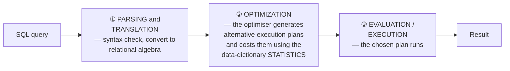

> ### **The three steps of SQL query processing are PARSING & TRANSLATION → OPTIMIZATION → EVALUATION.** *(An MCQ asking "which is NOT a step of SQL query processing?" is testing exactly this list.)*

**What the optimiser decides:** which **index** (if any) to use · the **join order** · the **join algorithm** (nested loop, hash join, merge join) · whether to scan or seek · whether to sort or use an existing order. It chooses using the **statistics** (row counts, value distributions) kept in the **data dictionary** — which is why **stale statistics produce bad plans**, and why `ANALYZE`/`UPDATE STATISTICS` matters.

**Practical query-tuning rules:** index the columns in `WHERE` and `JOIN` · avoid `SELECT *` · avoid functions on an indexed column in `WHERE` (`WHERE YEAR(dt)=2024` cannot use an index on `dt`) · remember that **`LIKE 'abc%'` can use an index but `LIKE '%abc'` cannot** · prefer `EXISTS` to `IN` for large subqueries · filter early, join late.

**Previous Year MCQ List from this Topic:**

- [Which is not the steps of SQL Query processing?](../mcq-answers/database.md?plain=1#L269)
- [Which one make data access from a database faster?](../mcq-answers/database.md?plain=1#L1592)
- [Related records of the different relations can be stored on the same block using which file organization technique?](../mcq-answers/database.md?plain=1#L1614)
- [Which of the following is correct for the Create index command?](../mcq-answers/database.md?plain=1#L37)
- [Database index speeds up-](../mcq-answers/database.md?plain=1#L1632)
- [Which of the following index is automatically created by the database server when an object is created?](../mcq-answers/database.md?plain=1#L1641)
- [Related records of the different relations can be stored on the same block using which file organization technique?](../mcq-answers/database.md?plain=1#L1614)


- [Which of the following statements about indexes is TRUE?](../mcq-answers/database.md?plain=1#L1982)

---

### Database Connectivity — JDBC, ODBC and Embedded SQL

> An application written in Java, C# or PHP must somehow send SQL to a database engine. **Connectivity APIs are the standard bridge**, and they exist so that the application does not have to be rewritten for each database product.

| API | Full form | For |
|---|---|---|
| ⭐ **ODBC** | ⭐ **Open DataBase Connectivity** | ⭐ **A LANGUAGE- and DBMS-INDEPENDENT standard API** (Microsoft, C-based) — the classic API used by an application to reach a database in a **two-tier architecture** |
| ⭐ **JDBC** | **Java DataBase Connectivity** | The **Java** equivalent |
| **ADO.NET** | ActiveX Data Objects | The .NET equivalent |
| **OLE DB** | Object Linking and Embedding, Database | A Microsoft COM-based successor to ODBC |

> ### **"The Application Program Interface in a TWO-TIER architecture DBMS is provided by…"** → ### ✅ **ODBC — Open Database Connectivity.**

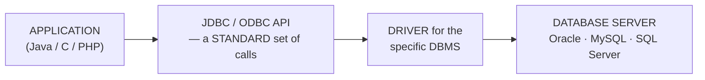

**The standard connection sequence:** **load the driver → open a CONNECTION (server, user, password, database) → create a STATEMENT → execute the SQL and get a RESULT SET → process the rows → CLOSE the result set, statement and connection.**

```java
// JDBC — the classic JDBC-ODBC bridge driver (legacy, removed in Java 8+)
Class.forName("sun.jdbc.odbc.JdbcOdbcDriver");
Connection con = DriverManager.getConnection("jdbc:odbc:mydsn", "user", "pass");
Statement  st  = con.createStatement();
ResultSet  rs  = st.executeQuery("SELECT name FROM Employee");
while (rs.next()) System.out.println(rs.getString("name"));
rs.close(); st.close(); con.close();
```

> ⚠️ **Note for modern work: the JDBC-ODBC bridge (`sun.jdbc.odbc.JdbcOdbcDriver`) was REMOVED in Java 8.** Real applications now use a **native JDBC driver** (`com.mysql.cj.jdbc.Driver`, `oracle.jdbc.OracleDriver`). The bridge still appears in exam papers, so know the string — but know that it is obsolete.

#### Embedded SQL and the impedance mismatch

> ### **EMBEDDED SQL means SQL statements HARD-CODED INSIDE a general-purpose programming language** such as C or Java, which a **precompiler** converts into ordinary function calls before the normal compiler runs.

| | **Embedded SQL** | **Dynamic SQL (via JDBC/ODBC)** |
|---|---|---|
| **When the SQL is fixed** | **At COMPILE time** | **At RUN time** — built as a string |
| **Checked by** | A **precompiler** | Only at execution |
| **Performance** | Slightly better (pre-parsed) | Slightly worse |
| **Flexibility** | ⚠️ Low | ✅ **High** |

> ### ⭐ **THE IMPEDANCE MISMATCH — the "major challenge in mixing SQL with a general-purpose language".**
>
> **The problem:** SQL is **SET-oriented and declarative** — a query returns a **whole set of rows at once**, and its type system (relations, `NULL`, `VARCHAR`, `NUMBER`) does not correspond to the host language's. A language such as C or Java is **RECORD-at-a-time and procedural**, with its own types, objects and no native notion of a relation or of SQL `NULL`.
>
> **The consequences:** the two **DEFINITIONS OF DATA do not line up**, so every value must be converted; a set result must be consumed **one row at a time** (which is exactly what a **CURSOR** exists to do); and `NULL` has no clean equivalent in most host languages, requiring **indicator variables**.
>
> **How it is handled:** **cursors** to iterate a result set row by row · **host variables and indicator variables** for value and NULL transfer · and, in modern practice, ⭐ **ORM frameworks (Hibernate, Entity Framework, Django ORM)** that map tables to objects automatically.

**Previous Year MCQ List from this Topic:**

- [Embedded SQL is which of the following?](../mcq-answers/database.md?plain=1#L1661)
- [The Application program interface in a two-tier architecture DBMS is provided by-](../mcq-answers/database.md?plain=1#L1670)
- [A major challenge in mixing SQL with a general-purpose language is mismatching in the](../mcq-answers/database.md?plain=1#L1679)
- [Once connection is set up, program can send SQL commands to database by using](../mcq-answers/database.md?plain=1#L1688)
- [In your program you want to use the JDBC-ODBC bridge drive. What code do you use?](../mcq-answers/database.md?plain=1#L1697)
- [b) MySql এর সাথে Database Connection করার জন্য PHP তে কোড লিখুন।](../mcq-answers/database.md?plain=1#L1571)


---

### Cursors, Views and Relational Algebra Operators

#### Cursors

> ### **A CURSOR is a database object that lets a program RETRIEVE AND PROCESS THE ROWS OF A RESULT SET ONE AT A TIME**, rather than all at once — it is the standard answer to the impedance mismatch.

| Type | Description |
|---|---|
| **IMPLICIT cursor** | Created **automatically** by the DBMS for every single-row `SELECT INTO`, `INSERT`, `UPDATE`, `DELETE` |
| **EXPLICIT cursor** | **Declared by the programmer** to process a multi-row query |

**The four operations, in order:** ⭐ **DECLARE → OPEN → FETCH (repeatedly) → CLOSE.**

```sql
DECLARE
   CURSOR emp_cur IS SELECT name, salary FROM Employee WHERE DeptID = 10;
   v_name  Employee.name%TYPE;
   v_sal   Employee.salary%TYPE;
BEGIN
   OPEN emp_cur;
   LOOP
      FETCH emp_cur INTO v_name, v_sal;
      EXIT WHEN emp_cur%NOTFOUND;
      DBMS_OUTPUT.PUT_LINE(v_name || ' earns ' || v_sal);
   END LOOP;
   CLOSE emp_cur;
END;
```

> ⚠️ **What a COMMIT does to a cursor:** in Oracle, issuing a **`COMMIT` releases the locks and CLOSES the cursor** (unless it was declared `WITH HOLD`). ### **So the answer to "what does a COMMIT statement do to a CURSOR?" is ✅ it CLOSES the cursor** — which is why you must not commit inside a fetch loop without re-opening.

**Useful PL/SQL facts that accompany this:** ⭐ **`DBMS_OUTPUT`** is the package used to **generate debugging output** from PL/SQL (`DBMS_OUTPUT.PUT_LINE`); **`UTL_FILE`** is the package for **file I/O** (its functions include `FOPEN`, `GET_LINE`, `PUT_LINE`, `FCLOSE` — note that it is **`FCLOSE`**, not `File_Close`).

#### Views

> ### **A VIEW is a VIRTUAL TABLE derived from the result of a stored query. It stores NO DATA of its own** — it is recomputed each time it is used.

| Point | Detail |
|---|---|
| **Created with** | `CREATE VIEW view_name AS SELECT …` |
| ⭐ **Recompiled with** | ⭐ **`ALTER VIEW`** |
| **Dropped with** | `DROP VIEW` |
| **Belongs to which level** | ⭐ **The EXTERNAL (view) level — it is NOT part of the logical/conceptual model**, which is exactly what an MCQ on this tests |
| **Why used** | **Security** (expose only some columns/rows) · **simplification** of complex joins · **logical data independence** · consistent reusable business logic |
| **Updatable?** | Only a **simple** view (single table, no aggregates, no `DISTINCT`, no `GROUP BY`) |
| ⭐ **vs MATERIALIZED VIEW** | ⭐ **A materialized view PHYSICALLY STORES the result** and is refreshed periodically — used for **performance and for data REPLICATION**; an ordinary view stores nothing |

#### Relational algebra operators

> **Relational algebra is the formal, procedural language underlying SQL.** The optimiser converts every SQL query into a relational-algebra expression.

| Operator | Symbol | Arity | Meaning |
|---|---|---|---|
| ⭐ **SELECT** | **σ** (sigma) | ⭐ **UNARY** | Chooses **ROWS** matching a condition (SQL `WHERE`) |
| ⭐ **PROJECT** | **π** (pi) | ⭐ **UNARY** | Chooses **COLUMNS** (SQL `SELECT` list); removes duplicates |
| ⭐ **RENAME** | **ρ** (rho) | ⭐ **UNARY** | Renames a relation or attribute |
| ⭐ **UNION** | **∪** | ⭐ **BINARY** | All tuples in either relation |
| ⭐ **SET DIFFERENCE** | ⭐ **−** | **BINARY** | ⭐ **Tuples that are in ONE relation but NOT in the other** |
| **INTERSECTION** | **∩** | BINARY | Tuples in both |
| **CARTESIAN PRODUCT** | **×** | BINARY | Every combination of rows |
| **JOIN** | **⋈** | BINARY | Product followed by a selection |
| **DIVISION** | **÷** | BINARY | "For all" queries |

> ### **"Which one is NOT a unary operator in relational algebra?"** → ### ✅ **UNION** — it is **binary**, requiring two relations. *(The unary operators are **SELECT σ, PROJECT π and RENAME ρ**.)*
>
> ### **"The operation denoted by − that finds tuples in one relation but not in another"** → ### ✅ **SET DIFFERENCE.**
>
> ⚠️ **UNION, INTERSECTION and SET DIFFERENCE require the two relations to be UNION-COMPATIBLE** — the same number of attributes, with corresponding attributes drawn from the same domains.

**Previous Year MCQ List from this Topic:**

- [We can create a “View” of a relation using the “create view_name” command in SQL analyze the following information about view and find which option is correct-](../mcq-answers/database.md?plain=1#L287)
- [The ________ operation, denoted by -, allows us to find tuples that are in one relation but are not in another.](../mcq-answers/database.md?plain=1#L337)
- [In SQL, the ________ command is used to recompile a view.](../mcq-answers/database.md?plain=1#L416)
- [In SQL, the ________ command is used to recompile a view.](../mcq-answers/database.md?plain=1#L416)
- [Which one is not unary operator in relational algebra?](../mcq-answers/database.md?plain=1#L1430)
- [How can you generate debugging output from PL/SQL?](../mcq-answers/database.md?plain=1#L1486)
- [What is GET_BLOCK property?](../mcq-answers/database.md?plain=1#L1495)
- [Which is not the UTL_FILE function-](../mcq-answers/database.md?plain=1#L1504)
- [What does a COMMIT statement do to a CURSOR?](../mcq-answers/database.md?plain=1#L1531)
- [The ______ operation performs a set union of two 'similarly structured' tables.](../mcq-answers/database.md?plain=1#L1892)
- [The ______ provides a set of operations that take one or more relations as input and return a relation as an output.](../mcq-answers/database.md?plain=1#L1901)
- [What is the Cartesian product of two relations R(A,B) with 3 rows and S(C,D) with 4 rows?](../mcq-answers/database.md?plain=1#L1991)
- [Relational Algebra is:](../mcq-answers/database.md?plain=1#L2009)
- [______ produces the relation that has attributes of R1 and R2.](../mcq-answers/database.md?plain=1#L2027)
- [The natural join is equal to:](../mcq-answers/database.md?plain=1#L2090)
