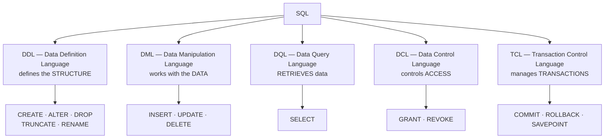
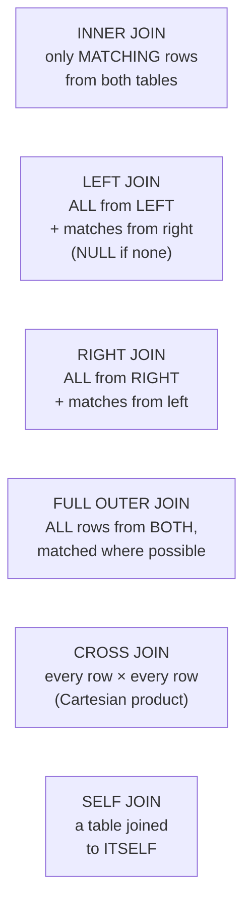
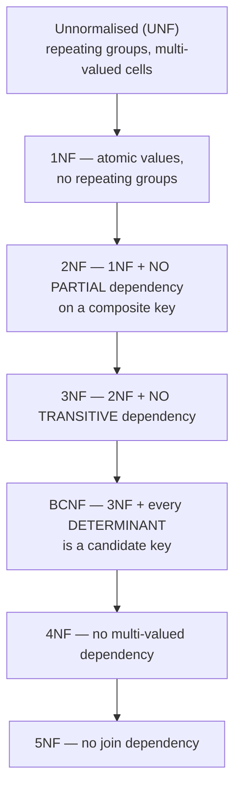
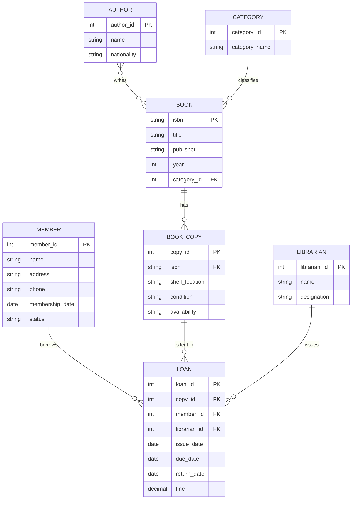
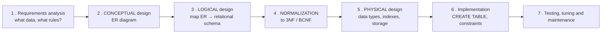
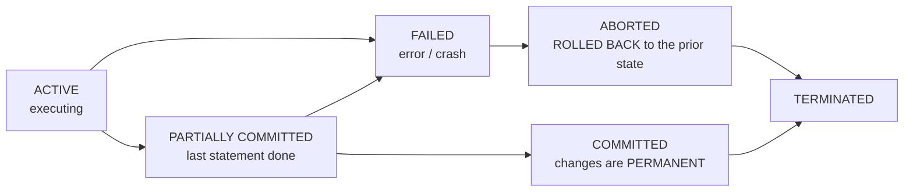
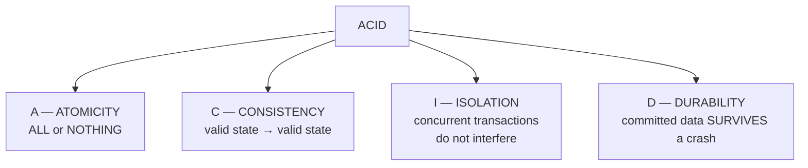
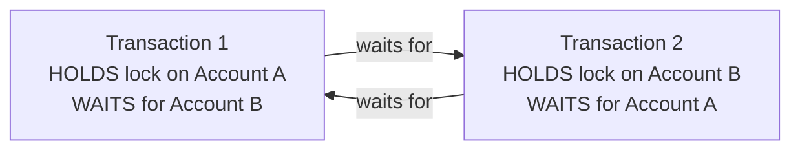

<!-- TOC START -->
**Table of Contents** — 4 subtopics · 9 theories

1. **[SQL Queries](#sql-queries)**
   - [SQL — Fundamentals and Sub-languages](#sql--fundamentals-and-sub-languages)
   - [Joins and Subqueries](#joins-and-subqueries)
   - [Standard SQL Query Patterns](#standard-sql-query-patterns)

2. **[Normalization & Database Design](#normalization--database-design)**
   - [DBMS, RDBMS and the Relational Model](#dbms-rdbms-and-the-relational-model)
   - [Normalization](#normalization)
   - [ER Diagrams and Database Design](#er-diagrams-and-database-design)

3. **[Transaction Management & ACID Properties](#transaction-management--acid-properties)**
   - [Transactions and the ACID Properties](#transactions-and-the-acid-properties)
   - [Recovery, Concurrency Control and Deadlock](#recovery-concurrency-control-and-deadlock)

4. **[Keys, Constraints & Database Objects](#keys-constraints--database-objects)**
   - [Database Objects and Integrity Constraints](#database-objects-and-integrity-constraints)

<!-- TOC END -->

---

## SQL Queries

### SQL — Fundamentals and Sub-languages

**SQL (Structured Query Language)** is the standard language for **defining, manipulating, controlling and querying data in a relational database**.

> It is **declarative**: you state **WHAT data you want**, not **how** to get it. The DBMS's **query optimiser** works out the "how".

#### The five sub-languages of SQL



| Sub-language | Commands | Auto-commit? |
|---|---|---|
| **DDL** | `CREATE`, `ALTER`, `DROP`, `TRUNCATE`, `RENAME` | ✅ **Yes — cannot be rolled back** |
| **DML** | `INSERT`, `UPDATE`, `DELETE` | ❌ No — **can be rolled back** |
| **DQL** | `SELECT` | — |
| **DCL** | `GRANT`, `REVOKE` | ✅ Yes |
| **TCL** | `COMMIT`, `ROLLBACK`, `SAVEPOINT` | — |

#### DELETE vs TRUNCATE vs DROP — a very common question

| Point | **DELETE** | **TRUNCATE** | **DROP** |
|---|---|---|---|
| **Type** | **DML** | **DDL** | **DDL** |
| **Removes** | **Selected rows** (or all) | **ALL rows** | **The entire TABLE** — structure and data |
| **WHERE clause** | ✅ **Yes** | ❌ No | ❌ No |
| **Rollback possible** | ✅ **Yes** | ❌ No (auto-commits) | ❌ No |
| **Speed** | **Slow** — logs each row | **Fast** — deallocates pages | Fast |
| **Resets AUTO_INCREMENT** | ❌ No | ✅ **Yes** | — |
| **Fires triggers** | ✅ Yes | ❌ No | ❌ No |
| **Table exists afterwards** | ✅ Yes | ✅ Yes (empty) | ❌ **No** |

#### The structure of a SELECT statement

```sql
SELECT   [DISTINCT] column_list          -- 5. what to show
FROM     table_name                      -- 1. where to get it
JOIN     other_table ON condition        -- 2. combine tables
WHERE    row_condition                   -- 3. filter INDIVIDUAL ROWS
GROUP BY column_list                     -- 4. form groups
HAVING   group_condition                 -- 4b. filter GROUPS
ORDER BY column [ASC|DESC]               -- 6. sort the result
LIMIT    n;                              -- 7. restrict the count
```

> **The logical order of EXECUTION is not the order you write it:**
> **FROM → JOIN → WHERE → GROUP BY → HAVING → SELECT → DISTINCT → ORDER BY → LIMIT**
>
> This explains two things that confuse everyone: (1) you **cannot use a column alias defined in SELECT inside WHERE**, because WHERE runs first; and (2) you **can** use it in ORDER BY, because ORDER BY runs last.

#### WHERE vs HAVING

| Point | **WHERE** | **HAVING** |
|---|---|---|
| **Filters** | **Individual ROWS** | **GROUPS** |
| **Runs** | **Before** GROUP BY | **After** GROUP BY |
| **Aggregate functions allowed** | ❌ **No** | ✅ **Yes** |
| **Can be used without GROUP BY** | ✅ Yes | Rarely |
| **Example** | `WHERE salary > 50000` | `HAVING AVG(salary) > 50000` |

#### Aggregate functions

> **SUM, AVG, MAX, MIN and COUNT are AGGREGATE (or GROUP) functions** — they operate on a **set of rows** and return a **single value**.

| Function | Returns | Note |
|---|---|---|
| **COUNT(\*)** | Number of rows, **including NULLs** | |
| **COUNT(col)** | Number of **non-NULL** values in that column | |
| **SUM(col)** | Total | **Ignores NULLs** |
| **AVG(col)** | Average | **Ignores NULLs** — so AVG ≠ SUM/COUNT(*) when NULLs exist |
| **MAX / MIN(col)** | Largest / smallest | |

*(The other category is **scalar functions**, which act on one value per row: `UPPER`, `LOWER`, `LEN`, `ROUND`, `NOW`, `SUBSTRING`.)*

#### Operators worth knowing

| Operator | Purpose | Example |
|---|---|---|
| `=`, `<>`, `>`, `<`, `>=`, `<=` | Comparison | `WHERE salary > 50000` |
| **`BETWEEN … AND`** | Inclusive range | `WHERE salary BETWEEN 30000 AND 60000` |
| **`IN`** | Matches any value in a list | `WHERE dept IN ('IT','HR')` |
| **`LIKE`** | **Pattern** matching | `WHERE name LIKE 'A%'` |
| `IS NULL` / `IS NOT NULL` | Null test — **never use `= NULL`** | |
| `AND`, `OR`, `NOT` | Logical | |
| `EXISTS` | True if a subquery returns any row | |
| `ANY` / `ALL` | Compare against a subquery's results | |

#### LIKE vs `=` — a directly asked question

> ### "In a SQL query, when do we use LIKE and when do we use `=` for string matching?"
>
> | | **`=` (equals)** | **`LIKE`** |
> |---|---|---|
> | **Matches** | The **EXACT, complete** string | A **PATTERN** |
> | **Wildcards** | ❌ Not supported | ✅ **`%`** = any sequence of characters (including none); **`_`** = exactly one character |
> | **Speed** | **Fast** — can use an index directly | **Slower**; an index can only be used when the pattern does **not** begin with a wildcard |
> | **Use when** | You know the **complete value** | You know only **part** of it |
> | **Example** | `WHERE name = 'Rahim'` | `WHERE name LIKE 'Rah%'` |
>
> **Wildcard examples:**
> - `LIKE 'A%'` — starts with A
> - `LIKE '%son'` — ends with "son"
> - `LIKE '%ali%'` — contains "ali" anywhere
> - **`LIKE '_a%'`** — the **SECOND letter is 'a'** (one character, then 'a', then anything)
> - `LIKE 'A_i%'` — starts with A, third letter is i
>
> **Performance note:** `LIKE 'Rah%'` **can** use an index (the prefix is fixed), but **`LIKE '%him'` cannot** — the database must scan every row. This is why leading-wildcard searches are slow and why full-text indexes exist.

**Previous Year Question List from this Topic:**

- [Database Query related problem.](../written-answers/database.md?plain=1#L318)
- [SQL OUTPUT Problem: Find Employee salary from a table where salary more than 5000.](../written-answers/database.md?plain=1#L1085)
- [SUM, Avg, Max these function are subnet of __________ function.](../written-answers/database.md?plain=1#L1297)
- [SQL Query.....](../written-answers/database.md?plain=1#L1339)
- [Write SQL Query For create, insert of a table Emp (id, name, designation, Dept_name, Salary). Write SQL Query that show department wise salary of Employee.](../written-answers/database.md?plain=1#L1877)
- [Analize the following code:](../written-answers/database.md?plain=1#L2271)
- [Analyze the output of the following SQL :](../written-answers/database.md?plain=1#L2426)
- [(c) In a SQL query, while performing string matching when do we use operator and when we use LIKE operator? Give examples.](../written-answers/database.md?plain=1#L3790)
- [What will be the output after running all the following queries?](../written-answers/database.md?plain=1#L3931)


---

### Joins and Subqueries

#### What is a JOIN?

A **JOIN** combines rows from **two or more tables** based on a **related column** between them — normally a **foreign key** matching a **primary key**.

#### The types of join



| Join | Returns |
|---|---|
| **INNER JOIN** | Only rows where the condition matches **in BOTH tables** |
| **LEFT (OUTER) JOIN** | **ALL rows from the LEFT table**, plus matching rows from the right; **NULL** where there is no match |
| **RIGHT (OUTER) JOIN** | **ALL rows from the RIGHT table**, plus matches from the left |
| **FULL OUTER JOIN** | **All rows from both**, with NULLs where a match is missing |
| **CROSS JOIN** | **Every combination** — the Cartesian product (m × n rows) |
| **SELF JOIN** | A table joined **to itself** — used for hierarchies such as employee→manager |

#### Worked example — how many rows does each join return?

> **Table A has 5 rows, Table B has 3 rows, and 2 rows match on the join key.**

| Join | Rows returned | Reasoning |
|---|---|---|
| **INNER JOIN** | **2** | Only the matching pairs |
| **LEFT OUTER JOIN** | **5** | All 5 from A; the 3 non-matching ones get NULLs for B's columns |
| **RIGHT OUTER JOIN** | **3** | All 3 from B; the 1 non-matching one gets NULLs for A's columns |
| **FULL OUTER JOIN** | **6** | 2 matched + 3 unmatched from A + 1 unmatched from B |
| **CROSS JOIN** | **15** | 5 × 3 |

#### Example queries

```sql
-- INNER JOIN: employees WITH a department
SELECT e.Name, d.DeptName
FROM   Employee e
INNER JOIN Department d ON e.DeptID = d.DeptID;

-- LEFT JOIN: ALL employees, even those with no department
SELECT e.Name, d.DeptName
FROM   Employee e
LEFT JOIN Department d ON e.DeptID = d.DeptID;

-- SELF JOIN: each employee with their manager's name
SELECT e.Emp_Name AS Employee, m.Emp_Name AS Manager
FROM   EMPLOYEES e
LEFT JOIN EMPLOYEES m ON e.Manager_ID = m.Emp_ID;

-- Department name and AVERAGE salary (join + aggregate + group)
SELECT   d.DeptName, AVG(e.Salary) AS AvgSalary
FROM     Employee e
JOIN     Department d ON e.DeptID = d.DeptID
GROUP BY d.DeptName;
```

#### Subqueries

A **subquery (nested query)** is a `SELECT` placed inside another SQL statement.

| Type | Description |
|---|---|
| **Scalar subquery** | Returns **one value** — usable anywhere a value is expected |
| **Row subquery** | Returns one row |
| **Table subquery** | Returns many rows — used with `IN`, `EXISTS`, `ANY`, `ALL` |
| **Correlated subquery** | **References the outer query**, so it is re-evaluated **for every outer row** — powerful but slow |

```sql
-- Scalar: employees earning more than the COMPANY average
SELECT Name, Salary
FROM   Employee
WHERE  Salary > (SELECT AVG(Salary) FROM Employee);

-- Correlated: employees earning more than the average OF THEIR OWN DEPARTMENT
SELECT e.Name, e.Salary, e.Department
FROM   Employee e
WHERE  e.Salary > (SELECT AVG(e2.Salary)
                   FROM   Employee e2
                   WHERE  e2.Department = e.Department);   -- ← references the outer row

-- IN with a subquery
SELECT Name FROM Employee
WHERE  DeptID IN (SELECT DeptID FROM Department WHERE Location = 'Dhaka');
```

**Previous Year Question List from this Topic:**

- [SQL Query: Find department name and Average salary form 2 table Department and Employee.......](../written-answers/database.md?plain=1#L163)
- [Consider the following database schema, find out the employees whose manager's region is same as the employee working under him.](../written-answers/database.md?plain=1#L239)
- [Given two tables:](../written-answers/database.md?plain=1#L656)
- [Let a database has two tables, Customers and Orders. The following figure shows the partial data of these two tables. Based on this partial data, explain Inner,…](../written-answers/database.md?plain=1#L1517)
- [Consider that you are given a database of a 'Pet Society' with the following relations.](../written-answers/database.md?plain=1#L1743)
- [How many row will return when we do i) Inner Join ii) Left Outer Join iii) Right Outer join and v) Full Outer join.](../written-answers/database.md?plain=1#L1819)
- [Query's: Employee & department table given-](../written-answers/database.md?plain=1#L1949)
- [EMPLOYEES (Emp_ID, Emp_Name, Manager_ID, Dept_ID);](../written-answers/database.md?plain=1#L2030)
- [Given Four table:](../written-answers/database.md?plain=1#L2121)
- [Suppose we have a relational database with five tables. table key Attributes S(sid, A) Sid T(tid, B) Tid U(uid, C) Uid R(sid, tid, D) sid, tid Q(tid, uid, E) ti…](../written-answers/database.md?plain=1#L2696)
- [Consider the two schema employees (id, first_name, last_name, designation, oining_date, salary, dept_id) and department (dept_id, dept_name). Where detp_id is f…](../written-answers/database.md?plain=1#L2850)
- [Suppose that we have a relational database with the following table. Underlined one represent primary key](../written-answers/database.md?plain=1#L2926)
- [There are two tables like Employees (Employee_ID, First_name, Last_name, Email, Phone_number, Hire_date, Job_Id) and Departments (Department_Id, Department_name…](../written-answers/database.md?plain=1#L3344)
- [Consider the Electrical Powr company database which has the following tables: Powerplant(Powerplant_ID, location, type, capacity.unit_price) Customer(Customer_I…](../written-answers/database.md?plain=1#L3855)


---

### Standard SQL Query Patterns

These patterns cover the great majority of the SQL questions asked.

#### 1. Creating a table and inserting data

```sql
CREATE TABLE Emp (
    id          INT PRIMARY KEY AUTO_INCREMENT,
    name        VARCHAR(50) NOT NULL,
    designation VARCHAR(50),
    dept_name   VARCHAR(50),
    salary      DECIMAL(10,2) CHECK (salary > 0),
    join_date   DATE DEFAULT (CURRENT_DATE)
);

INSERT INTO Emp (name, designation, dept_name, salary)
VALUES ('Rahim', 'Officer', 'IT', 55000),
       ('Karim', 'Manager', 'HR', 75000);
```

#### 2. The Nth highest salary — a classic

```sql
-- 2nd highest salary — Method 1: LIMIT / OFFSET
SELECT DISTINCT Salary FROM Employee
ORDER BY Salary DESC
LIMIT 1 OFFSET 1;                           -- skip 1, take 1  → the 2nd

-- Method 2: subquery (works everywhere, and is the "safe exam" answer)
SELECT MAX(Salary) FROM Employee
WHERE  Salary < (SELECT MAX(Salary) FROM Employee);

-- Method 3: the Nth highest, using a window function (modern SQL)
SELECT Salary FROM (
    SELECT Salary, DENSE_RANK() OVER (ORDER BY Salary DESC) AS rnk
    FROM   Employee
) t
WHERE rnk = 2;
```

> **Why `DENSE_RANK` rather than `ROW_NUMBER`?** If two employees share the top salary, `ROW_NUMBER` would treat them as 1st and 2nd, giving the wrong answer. `DENSE_RANK` gives them both rank 1, so rank 2 really is the second-highest **distinct** salary.

#### 3. Finding duplicates

```sql
-- Names that appear more than once
SELECT   Name, COUNT(*) AS occurrences
FROM     Employee
GROUP BY Name
HAVING   COUNT(*) > 1;

-- The full duplicate rows
SELECT * FROM Employee
WHERE  Name IN (SELECT Name FROM Employee GROUP BY Name HAVING COUNT(*) > 1);
```

> **The pattern to memorise for every "find duplicates" question: GROUP BY the column, then HAVING COUNT(\*) > 1.**

#### 4. Pattern matching on names

```sql
-- Names whose SECOND letter is 'a'
SELECT Name FROM Employee WHERE Name LIKE '_a%';

-- Names starting with A
SELECT Name FROM Employee WHERE Name LIKE 'A%';

-- Names containing 'ali'
SELECT Name FROM Employee WHERE Name LIKE '%ali%';
```

#### 5. Aggregates with grouping

```sql
-- Total and average salary per department, only for departments
-- whose average exceeds 50,000, highest first
SELECT   Department,
         COUNT(*)    AS employee_count,
         SUM(Salary) AS total_salary,
         AVG(Salary) AS avg_salary,
         MAX(Salary) AS highest,
         MIN(Salary) AS lowest
FROM     Employee
GROUP BY Department
HAVING   AVG(Salary) > 50000
ORDER BY avg_salary DESC;
```

#### 6. Employees earning more than their manager

```sql
SELECT e.Name AS Employee, e.Salary, m.Name AS Manager, m.Salary AS ManagerSalary
FROM   Employee e
JOIN   Employee m ON e.Manager_ID = m.Emp_ID
WHERE  e.Salary > m.Salary;
```

#### 7. Same salary but a different job

```sql
SELECT a.Name, a.Salary, a.Job, b.Name, b.Job
FROM   Employee a
JOIN   Employee b
       ON a.Salary = b.Salary
      AND a.Job   <> b.Job
      AND a.Emp_ID < b.Emp_ID;        -- avoids showing each pair twice
```

#### 8. The supplier with the minimum price for a product

```sql
SELECT s.sname
FROM   Supplier s
JOIN   Catalog  c ON s.sid = c.sid
JOIN   Parts    p ON c.pid = p.pid
WHERE  p.pname = 'wheel'
  AND  c.cost = (SELECT MIN(c2.cost)
                 FROM   Catalog c2
                 JOIN   Parts p2 ON c2.pid = p2.pid
                 WHERE  p2.pname = 'wheel');
```

#### 9. Creating a view

```sql
CREATE VIEW EmployeeDetails AS
SELECT e.Emp_ID, e.Emp_Name, e.Salary, d.Dept_Name, d.Location
FROM   Employee e
JOIN   Department d ON e.Dept_ID = d.Dept_ID
WHERE  e.Status = 'Active';

SELECT * FROM EmployeeDetails WHERE Dept_Name = 'IT';
```

> ### What is a VIEW, and why is it used?
> A **view** is a **VIRTUAL TABLE based on the result of a stored SELECT statement.** It **contains no data of its own** — the query is executed each time the view is used.
>
> **Uses:**
> 1. **SECURITY** — expose only certain columns and rows. A payroll view can show name and department while **hiding salary and NID**, and users are granted access to the view rather than the base table. **This is the single most important reason.**
> 2. **Simplicity** — a complex five-table join is written once and thereafter used as if it were a simple table.
> 3. **Logical data independence** — the underlying table structure can change while the view keeps presenting the old shape, so applications do not break.
> 4. **Consistency** — everyone uses the same definition of "active customer".
> 5. **Reusability** across many queries and reports.
>
> **Limitations:** a view has **no performance benefit** (it is re-executed every time) unless it is a **materialised view**; and it is **only updatable** if it is simple — a view containing a join, `GROUP BY`, `DISTINCT` or an aggregate **cannot** be used for INSERT/UPDATE/DELETE.

#### 10. Common output-tracing traps

```sql
-- NULL handling
SELECT COUNT(*), COUNT(commission) FROM Employee;
-- COUNT(*) counts ALL rows; COUNT(commission) SKIPS NULLs → different numbers

SELECT * FROM Employee WHERE commission = NULL;   -- ❌ returns NOTHING
SELECT * FROM Employee WHERE commission IS NULL;  -- ✅ correct

-- Any arithmetic with NULL yields NULL
SELECT salary + commission FROM Employee;         -- NULL wherever commission is NULL
SELECT salary + COALESCE(commission, 0) FROM Employee;  -- ✅ correct

-- DISTINCT applies to the WHOLE row, not just the first column
SELECT DISTINCT dept, salary FROM Employee;       -- distinct PAIRS, not distinct depts
```

**Previous Year Question List from this Topic:**

- [Consider the following relation: Employee(EmpID, Name, Department, Salary). Write an SQL query to retrieve the Department, the total number of employees, and th…](../written-answers/database.md?plain=1#L33)
- [Consider a STUDENTS table with the following attributes: StudentID, Name, Department, Marks (10 Marks)](../written-answers/database.md?plain=1#L94)
- [From an Employee table. Write SQL statement according to the following question:](../written-answers/database.md?plain=1#L414)
- [Write down the Query for the following table?](../written-answers/database.md?plain=1#L484)
- [Consider the following relation:](../written-answers/database.md?plain=1#L591)
- [Consider the following database schema-](../written-answers/database.md?plain=1#L745)
- [Given the following two tables (Students and Marks) in a database, write down the output of the given SQL queries and write down the SQL queries for the outputs…](../written-answers/database.md?plain=1#L832)
- [Given a Patient table in a hospital database below.](../written-answers/database.md?plain=1#L1003)
- [Write SQL code to get duplicate names from employee table.](../written-answers/database.md?plain=1#L1144)
- [Write an SQL query to find duplicate names in the employee table.](../written-answers/database.md?plain=1#L1222)
- [Find sname who supplies pname=“wheel” with minimum price:](../written-answers/database.md?plain=1#L1435)
- [Database query:](../written-answers/database.md?plain=1#L1669)
- [6.4 Consider the following relation: Employee(EmpID, Name, Department, Salary). Write an SQL query to retrieve the Department, the total number of employees, an…](../written-answers/database.md?plain=1#L2211)
- [Employee Salary sql query a. Sum b. Avg. C. Employee_Name all 2nd letter 'a'......](../written-answers/database.md?plain=1#L2352)
- [Consider the employee tables: Create a SQL view that shows the details of Employee information who have the salary equivalent to the maximum, minimum and averag…](../written-answers/database.md?plain=1#L2530)
- [SQL query for employee table. (Approximate)](../written-answers/database.md?plain=1#L2610)
- [Write following EMPLOYEE database table write an SQL query to find employee who work is a department where the average salary is lower then the average salary a…](../written-answers/database.md?plain=1#L2765)
- [(গ) ডাটাবেস সিস্টেমে view কী? এটি কী কী কাজে লাগে?](../written-answers/database.md?plain=1#L3014)
- [অথবা, নিম্নোক্ত টেবিলগুলো হতে (ক), (খ) এবং (গ) এর উত্তর দিন।](../written-answers/database.md?plain=1#L3069)
- [SQL query from a given table.](../written-answers/database.md?plain=1#L3157)
- [Employee table হতে Employee_id, Employee কে খোঁজে বের করার SQL Command লিখ যাদের গড় salary 2000 উপরে।](../written-answers/database.md?plain=1#L3226)
- [Employee Table টেবিল হতে যে সকল কর্মচারীদের বেতন 30000 টাকার বেশি তাদের নাম পদবী আলাদা করার SQLCommand লিখুন।](../written-answers/database.md?plain=1#L3284)
- [For employee table: (a) Write a SQL query to find those employees who earn more than the average salary. Return employee ID, first name, last name. (b) Write a…](../written-answers/database.md?plain=1#L3415)
- [Write down the SQL command into the following two: (a) Find out the all information of employees from emp_info table. Where employee's salary is more than 20,00…](../written-answers/database.md?plain=1#L3489)
- [Write down the equivalent SQL from following relational algebra. (full question not collected)](../written-answers/database.md?plain=1#L3556)
- [Write a SQL query to find same salary but job not same?](../written-answers/database.md?plain=1#L3660)
- [This returns the names of the staff where timestampdiff is greater than 25 so it returns total 3 rows.](../written-answers/database.md?plain=1#L3725)


---

## Normalization & Database Design

### DBMS, RDBMS and the Relational Model

#### What is a DBMS?

A **DBMS (Database Management System)** is **software that enables users to create, store, retrieve, update and manage data in a database efficiently, securely and consistently**, while shielding them from the physical details of storage.

**Examples:** **MySQL, PostgreSQL, Oracle, SQL Server, SQLite, MongoDB**.

#### Why a DBMS, rather than files?

| Problem with file systems | How a DBMS solves it |
|---|---|
| **Data redundancy** — the same data in many files | **Centralised storage** and normalisation |
| **Data inconsistency** — copies disagree | One authoritative copy |
| **Difficult access** — a new program for every new query | **SQL** answers any question |
| **Data isolation** — data scattered in different formats | Unified schema |
| **Integrity problems** | **Constraints** enforced by the DBMS |
| **Atomicity problems** — a half-completed update | **Transactions with ACID** |
| **Concurrent access anomalies** | **Locking and isolation levels** |
| **Security problems** | **GRANT/REVOKE**, views, roles |

#### Advantages of a DBMS

Controlled **redundancy** · **consistency** · **data sharing** among many users · enforced **integrity constraints** · **security and access control** · **backup and recovery** · **concurrency control** · **data independence** (logical and physical) · and a standard **query language**.

**Disadvantages:** high **cost** of software, hardware and skilled staff; **complexity**; and it can be **slower than a flat file** for very simple, single-user workloads.

#### Relational terminology

| Formal term | Common term | Meaning |
|---|---|---|
| **Relation** | **Table** | A set of tuples |
| **Tuple** | **Row / Record** | One entity instance |
| **Attribute** | **Column / Field** | One property |
| **Domain** | Data type + allowed values | e.g. `INT`, 0–150 for age |
| **Degree** | Number of **columns** | |
| **Cardinality** | Number of **rows** | |

#### Types of key — a very frequently asked topic

| Key | Definition |
|---|---|
| **Super key** | **Any** set of attributes that uniquely identifies a row (may contain extra, unnecessary attributes) |
| **Candidate key** | A **MINIMAL** super key — no attribute can be removed without losing uniqueness. A table may have several |
| **Primary key** | The **candidate key CHOSEN** by the designer to identify rows. **Exactly one per table. Cannot be NULL, must be unique** |
| **Alternate key** | The candidate keys **not** chosen as primary |
| **Composite key** | A **primary key made of TWO OR MORE columns**, used when no single column is unique on its own |
| **Foreign key** | A column (or set) in one table that **REFERENCES the primary key of another table**, creating the link between them |
| **Unique key** | Enforces uniqueness but **CAN contain one NULL**, and there can be several per table |
| **Surrogate key** | An artificial key with no business meaning — an auto-increment ID |
| **Natural key** | A key with real-world meaning — NID number, email |

#### Primary key vs Foreign key

| Point | **Primary Key** | **Foreign Key** |
|---|---|---|
| **Purpose** | **Uniquely identifies** each row in **its own** table | **Links** this table to another, enforcing **referential integrity** |
| **NULL allowed** | ❌ **Never** | ✅ **Yes** (meaning "no related row yet") |
| **Duplicates** | ❌ Never | ✅ **Yes** — many employees can share one department |
| **Number per table** | **Exactly ONE** | **Many** |
| **Indexed** | Automatically | Usually should be indexed manually |
| **Refers to** | Nothing — it is the source | **The primary key of another (or the same) table** |
| **Example** | `Employee.EmpID` | `Employee.DeptID` → `Department.DeptID` |

> **The purpose of the two together, in one sentence:** *the **primary key** guarantees that every row can be **identified uniquely** (entity integrity), and the **foreign key** guarantees that every relationship **points at a row that actually exists** (referential integrity) — together they are what makes a set of separate tables behave as one coherent, trustworthy database.*

**What referential integrity prevents:** an order referring to a customer who does not exist; deleting a department while employees still belong to it. The DBMS enforces this with **`ON DELETE CASCADE / SET NULL / RESTRICT`**.

#### Composite key — with an example

> A **composite (compound) key** is a primary key formed from **two or more columns together**, used when **no single column is unique**.

**Example — a student enrolment table:**

| StudentID | CourseID | Semester | Grade |
|---|---|---|---|
| 101 | CSE101 | Spring24 | A |
| 101 | CSE102 | Spring24 | B+ |
| 102 | CSE101 | Spring24 | A- |
| 101 | CSE101 | **Fall24** | A |

Neither `StudentID` alone (a student takes many courses) nor `CourseID` alone (a course has many students) is unique. Even `(StudentID, CourseID)` is not unique here, because a student may repeat a course in a later semester. The correct primary key is the **composite key (StudentID, CourseID, Semester)**.

```sql
CREATE TABLE Enrollment (
    StudentID INT,
    CourseID  VARCHAR(10),
    Semester  VARCHAR(10),
    Grade     CHAR(2),
    PRIMARY KEY (StudentID, CourseID, Semester),          -- ← COMPOSITE KEY
    FOREIGN KEY (StudentID) REFERENCES Student(StudentID),
    FOREIGN KEY (CourseID)  REFERENCES Course(CourseID)
);
```

#### Constraints

| Constraint | Enforces |
|---|---|
| **NOT NULL** | The column must have a value |
| **UNIQUE** | No duplicate values |
| **PRIMARY KEY** | NOT NULL **+** UNIQUE |
| **FOREIGN KEY** | Referential integrity |
| **CHECK** | A condition must hold — `CHECK (salary > 0)` |
| **DEFAULT** | A value used when none is supplied |

**Previous Year Question List from this Topic:**

- [What is DBMS? Write down the purpose of normalization in DBMS.](../written-answers/database.md?plain=1#L8196)
- [(i) DBMS কী? একটি Database কে normalize করার পদ্ধতিগুলো বর্ণনা করুন।](../written-answers/database.md?plain=1#L8320)
- [What is normalization? Explain composite key with example.](../written-answers/database.md?plain=1#L8417)
- [(d) What are the purpose of Primary Key and Foreign Key in context with ‘Relational Database’? Write in short with examples. (5 marks)](../written-answers/database.md?plain=1#L9535)


---

### Normalization

#### What is normalization?

**Normalization** is the process of **organising the columns and tables of a relational database to REDUCE DATA REDUNDANCY and ELIMINATE UNDESIRABLE ANOMALIES**, by decomposing larger tables into smaller, well-structured ones linked by keys.

> Think of the normal forms as **progressive rules — layers of cleanliness for your tables**. Each form fixes a specific class of problem, and each builds on the one before it.

#### Why normalization is needed — the three anomalies

Consider this **un-normalised** table:

| StudentID | StudentName | CourseID | CourseName | Instructor | InstructorPhone |
|---|---|---|---|---|---|
| 101 | Rahim | CSE101 | Programming | Dr. Khan | 01711-111111 |
| 102 | Karim | CSE101 | Programming | Dr. Khan | 01711-111111 |
| 103 | Jamal | CSE102 | Database | Dr. Rahman | 01712-222222 |

| Problem | What goes wrong here |
|---|---|
| **Data redundancy** | "Programming", "Dr. Khan" and the phone number are **repeated for every enrolled student** — wasting storage and inviting error |
| **INSERTION anomaly** | You **cannot add a new course** until at least one student enrols in it, because StudentID is part of the key |
| **UPDATE anomaly** | If Dr. Khan changes his phone number, it must be changed in **every** row. Miss one, and the database now holds **two contradictory phone numbers** |
| **DELETION anomaly** | If Jamal (the only student of CSE102) withdraws, deleting his row **destroys all information about the Database course and Dr. Rahman** |

> **These three anomalies are the entire reason normalization exists.** State them by name in any "why is normalization needed" answer.

#### Benefits of normalization

1. **Eliminates redundant data** → less storage.
2. **Removes insertion, update and deletion anomalies.**
3. **Ensures data consistency and integrity** — one fact stored in one place.
4. **Makes the database easier to maintain and extend.**
5. **Better-designed, more logical structure** that reflects the real world.
6. Faster **UPDATE, INSERT and DELETE** (less data to touch).
7. Enforces relationships properly through keys.

#### Functional dependency — the foundation of normalization

> **A functional dependency X → Y means: "if you know X, then Y is uniquely determined."** X is the **determinant**.

**Example:** `StudentID → StudentName` — given the ID, the name is fixed. But `StudentName → StudentID` is **not** a dependency, because two students may share a name.

| Type | Meaning |
|---|---|
| **Full functional dependency** | Y depends on the **WHOLE** of a composite X, not on any part of it |
| **Partial dependency** | Y depends on only **PART** of a composite key → **violates 2NF** |
| **Transitive dependency** | X → Y and Y → Z, so X → Z **indirectly**, where Y is not a key → **violates 3NF** |
| **Trivial dependency** | Y is a subset of X (e.g. `{A,B} → A`) — always true, never a problem |

> ### "Which normal forms are related to functional dependency?"
> **1NF, 2NF, 3NF and BCNF are ALL based on functional dependencies.** Specifically:
> - **2NF** removes **PARTIAL** functional dependencies.
> - **3NF** removes **TRANSITIVE** functional dependencies.
> - **BCNF** requires that **every determinant is a candidate key**.
> *(4NF and 5NF go beyond functional dependencies, dealing with **multi-valued** and **join** dependencies respectively.)*

#### The normal forms



> **Each form CONTAINS the one before it:** every 3NF table is automatically in 2NF and 1NF. In practice, **3NF or BCNF is the normal target** for a production database.

#### First Normal Form (1NF)

> **A table is in 1NF if every cell holds a single ATOMIC (indivisible) value, there are no repeating groups, and each row is unique.**

**Rules:** no multi-valued attributes · no repeating groups of columns · each column holds one data type · each row is uniquely identifiable.

**❌ Violates 1NF:**

| StudentID | Name | PhoneNumbers |
|---|---|---|
| 101 | Rahim | **01711-111111, 01911-222222** |
| 102 | Karim | 01712-333333 |

The `PhoneNumbers` cell holds **two values** — it is not atomic. Searching for a number, counting numbers, or updating one of them all become awkward string operations.

**✅ In 1NF** — put each value in its own row:

| StudentID | Name | PhoneNumber |
|---|---|---|
| 101 | Rahim | 01711-111111 |
| 101 | Rahim | 01911-222222 |
| 102 | Karim | 01712-333333 |

*(The cleaner solution is a separate `StudentPhone(StudentID, PhoneNumber)` table.)*

#### Second Normal Form (2NF)

> **A table is in 2NF if it is in 1NF AND every non-key attribute is FULLY functionally dependent on the WHOLE primary key — i.e. there is NO PARTIAL dependency.**
>
> **2NF is only an issue when the primary key is COMPOSITE.** If the key is a single column, a table in 1NF is automatically in 2NF.

**❌ Violates 2NF** — primary key is **(StudentID, CourseID)**:

| **StudentID** | **CourseID** | StudentName | CourseName | Grade |
|---|---|---|---|---|
| 101 | CSE101 | Rahim | Programming | A |
| 101 | CSE102 | Rahim | Database | B |
| 102 | CSE101 | Karim | Programming | A- |

**The partial dependencies:**
- `StudentID → StudentName` — **StudentName depends on only PART of the key** ❌
- `CourseID → CourseName` — **CourseName depends on only PART of the key** ❌
- `(StudentID, CourseID) → Grade` — this one is **fully** dependent ✅

**✅ In 2NF** — decompose so that each fact sits with its whole determinant:

**Student**

| **StudentID** | StudentName |
|---|---|
| 101 | Rahim |
| 102 | Karim |

**Course**

| **CourseID** | CourseName |
|---|---|
| CSE101 | Programming |
| CSE102 | Database |

**Enrollment**

| **StudentID** | **CourseID** | Grade |
|---|---|---|
| 101 | CSE101 | A |
| 101 | CSE102 | B |
| 102 | CSE101 | A- |

#### Third Normal Form (3NF)

> **A table is in 3NF if it is in 2NF AND there is NO TRANSITIVE dependency — no non-key attribute depends on another NON-KEY attribute.**
>
> The memorable statement: *every non-key attribute must depend on **the key, the whole key, and nothing but the key**.*

**❌ Violates 3NF** — primary key is **EmpID**:

| **EmpID** | EmpName | DeptID | DeptName | DeptLocation |
|---|---|---|---|---|
| 1 | Rahim | D01 | IT | Dhaka |
| 2 | Karim | D01 | IT | Dhaka |
| 3 | Jamal | D02 | HR | Chittagong |

**The transitive dependency:** `EmpID → DeptID` and `DeptID → DeptName, DeptLocation`, therefore `EmpID → DeptName` **transitively, through the non-key attribute DeptID** ❌

**The resulting anomalies:** the IT department's location is repeated for every IT employee (**redundancy**); a new department cannot be recorded until it has an employee (**insertion anomaly**); moving the IT department requires updating every IT employee's row (**update anomaly**); and deleting Jamal destroys all record of the HR department (**deletion anomaly**).

**✅ In 3NF:**

**Employee**

| **EmpID** | EmpName | DeptID *(FK)* |
|---|---|---|
| 1 | Rahim | D01 |
| 2 | Karim | D01 |
| 3 | Jamal | D02 |

**Department**

| **DeptID** | DeptName | DeptLocation |
|---|---|---|
| D01 | IT | Dhaka |
| D02 | HR | Chittagong |

Now the department's location is stored **exactly once**, and all four anomalies disappear.

#### 2NF vs 3NF — the key comparison

| Point | **2NF** | **3NF** |
|---|---|---|
| **Prerequisite** | Must be in **1NF** | Must be in **2NF** |
| **Eliminates** | **PARTIAL** dependency — a non-key attribute depending on **part of a composite key** | **TRANSITIVE** dependency — a non-key attribute depending on **another non-key attribute** |
| **Relevant when** | The primary key is **COMPOSITE** | The key may be **single or composite** |
| **The dependency removed** | `PartOfKey → NonKey` | `NonKey → NonKey` |
| **Example violation** | `(StudentID, CourseID)` is the key, but `CourseID → CourseName` | `EmpID → DeptID → DeptName` |
| **Redundancy removed** | Course/student details repeated per enrolment | Department details repeated per employee |
| **Strictness** | Less strict | **More strict** |

#### BCNF — Boyce-Codd Normal Form

> **A table is in BCNF if, for every non-trivial functional dependency X → Y, X is a SUPER KEY (i.e. a candidate key).**

**Why BCNF is stricter than 3NF:** 3NF allows a dependency `X → Y` if **Y is part of some candidate key** (a "prime attribute"), even when X is not a key. BCNF removes that exception entirely — **every determinant must be a candidate key, with no exceptions.**

**Worked example — a table in 3NF but NOT in BCNF:**

**StudentCourseInstructor**

| **Student** | **Course** | Instructor |
|---|---|---|
| Rahim | Database | Dr. Khan |
| Karim | Database | Dr. Rahman |
| Rahim | Networks | Dr. Alam |

**The rules of this university:** a student takes each course from exactly one instructor, and **each instructor teaches only ONE course**.

**The functional dependencies:**
- `(Student, Course) → Instructor` — a candidate key ✅
- **`Instructor → Course`** — because each instructor teaches only one course

**Is it in 3NF?** ✅ **Yes.** The only potentially offending dependency is `Instructor → Course`, and **`Course` is a prime attribute** (it is part of the candidate key `(Student, Course)`), so 3NF's exception permits it.

**Is it in BCNF?** ❌ **No.** In `Instructor → Course`, the determinant **`Instructor` is NOT a candidate key** — the same instructor appears in several rows. BCNF forbids this.

**The redundancy this allows:** the fact *"Dr. Khan teaches Database"* is repeated for **every student** Dr. Khan teaches. If Dr. Khan switches to a different course, every one of those rows must be updated.

**✅ Decomposed into BCNF:**

**InstructorCourse**

| **Instructor** | Course |
|---|---|
| Dr. Khan | Database |
| Dr. Rahman | Database |
| Dr. Alam | Networks |

**StudentInstructor**

| **Student** | **Instructor** |
|---|---|
| Rahim | Dr. Khan |
| Karim | Dr. Rahman |
| Rahim | Dr. Alam |

> **The trade-off to mention:** BCNF decomposition is always **lossless**, but it is **not always dependency-preserving** — the dependency `(Student, Course) → Instructor` can no longer be checked within a single table. This is precisely why **3NF is often preferred in practice**: it guarantees both losslessness *and* dependency preservation, while BCNF guarantees only the first.

#### Summary table of the normal forms

| Form | Requirement | Removes |
|---|---|---|
| **1NF** | Atomic values, no repeating groups | Multi-valued cells |
| **2NF** | 1NF + no **partial** dependency | Dependency on **part of a composite key** |
| **3NF** | 2NF + no **transitive** dependency | Dependency on a **non-key attribute** |
| **BCNF** | 3NF + **every determinant is a candidate key** | The remaining 3NF exception for prime attributes |
| **4NF** | BCNF + no **multi-valued** dependency | Independent multi-valued facts in one table |
| **5NF (PJNF)** | 4NF + no **join** dependency | Redundancy removable only by a 3-way split |

#### Denormalization — when NOT to normalize

**Denormalization** is the deliberate **re-introduction of redundancy** to improve **read performance**.

| Point | **Normalization** | **Denormalization** |
|---|---|---|
| **Goal** | Remove redundancy and anomalies | **Improve query speed** |
| **Number of tables** | **More** | Fewer |
| **JOINs required** | **Many** | Few |
| **Read performance** | Slower (joins are expensive) | **Faster** |
| **Write performance** | **Faster** | Slower — the same data must be updated in several places |
| **Data integrity** | **High** | Lower — redundancy risks inconsistency |
| **Storage** | Less | More |
| **Used in** | **OLTP** — transactional systems (banking, order entry) | **OLAP** — data warehouses, reporting, analytics |

> **The engineering judgement:** normalize to **3NF by default**. Denormalize **only** where profiling proves that join cost is the bottleneck, and then **accept and manage** the consistency burden — typically by updating the redundant copy inside a transaction or a trigger. The **over-normalization** trap is real: splitting a schema into 30 tables when 8 would do makes every query a nine-way join for no benefit.

**Previous Year Question List from this Topic:**

- [What is Normalization? How do 1NF and 2NF work in a database? Give examples.](../written-answers/database.md?plain=1#L7057)
- [Why normalization is required in Database? Write shortly about 3NF?](../written-answers/database.md?plain=1#L7134)
- [Explain the differences between Second Normal Form (2NF) and Third Normal Form (3NF) with examples.](../written-answers/database.md?plain=1#L7203)
- [What is Logical design database is called?](../written-answers/database.md?plain=1#L7296)
- [(ক) Normalization কী? কত প্রকার ও কী কী? ব্যাখ্যা করুন।](../written-answers/database.md?plain=1#L7566)
- [What is database Normalization? Write down the types of database Normalization.](../written-answers/database.md?plain=1#L7630)
- [Which normalization is related to functional dependency?](../written-answers/database.md?plain=1#L7686)
- [Functional dependency use in which normalizations?](../written-answers/database.md?plain=1#L7728)
- [What in First and Second Normal form is DBMS?](../written-answers/database.md?plain=1#L7784)
- [অথবা, (ক) “BCNF is stricter than 3NF” এই উক্তিটি উদাহরণসহ ব্যাখ্যা করুন।](../written-answers/database.md?plain=1#L7864)
- [Why Normalization is used in database? Explain 1^{\text{st}} Normal form using an example.](../written-answers/database.md?plain=1#L7948)
- [Why do you need database Normalization?](../written-answers/database.md?plain=1#L8024)
- [Let a relational function is R(A, B, C, D, E), Write Yes or No based on those are the follow n functional dependency.](../written-answers/database.md?plain=1#L8087)
- [What is DBMS? Write down the purpose of normalization in DBMS.](../written-answers/database.md?plain=1#L8196)
- [(b) What is normalization? Why is it needed?](../written-answers/database.md?plain=1#L8253)
- [(i) DBMS কী? একটি Database কে normalize করার পদ্ধতিগুলো বর্ণনা করুন।](../written-answers/database.md?plain=1#L8320)
- [(a) What do you mean by Normalization in RDBMS? Explain with an example.](../written-answers/database.md?plain=1#L8488)
- [What do you mean by Database properties using Normalization?](../written-answers/database.md?plain=1#L8586)
- [(c) Why normalization is required in Database? Write shortly about 3NF.](../written-answers/database.md?plain=1#L8699)


---

### ER Diagrams and Database Design

An **Entity-Relationship (ER) diagram** is a **visual model of the data requirements** of a system, showing **entities**, their **attributes** and the **relationships** between them. It is produced during the **logical design** phase, before any table is created.

> **The logical design of a database is called the SCHEMA** — and the three levels of design are **conceptual (ER model)** → **logical (relational schema, normalized)** → **physical (files, indexes, storage)**.

#### ER notation

| Symbol | Represents |
|---|---|
| **Rectangle** | **Entity** — a real-world object (Student, Book) |
| **Double rectangle** | **Weak entity** — cannot exist without an owner entity |
| **Ellipse** | **Attribute** |
| **Ellipse, underlined** | **Key attribute** (primary key) |
| **Double ellipse** | **Multi-valued** attribute (phone numbers) |
| **Dashed ellipse** | **Derived** attribute (age, derived from date of birth) |
| **Diamond** | **Relationship** |
| **Line** | Links an entity to a relationship or attribute |
| **Double line** | **Total participation** — every instance must participate |

#### Types of relationship (cardinality)

| Cardinality | Meaning | Example | How it maps to tables |
|---|---|---|---|
| **1 : 1** | One-to-one | One employee ↔ one parking space | Foreign key in **either** table |
| **1 : N** | One-to-many | One department has many employees | **Foreign key on the "many" side** |
| **M : N** | Many-to-many | Many students take many courses | **A separate JUNCTION/bridge table** holding both foreign keys |

> **The most important design rule to state:** a **many-to-many relationship CANNOT be represented directly** in a relational database. It must be resolved into a **third table** whose primary key is the **composite of the two foreign keys**.

#### Worked ER diagram — a Library Management System



**The design decisions worth explaining in an answer:**
1. **BOOK vs BOOK_COPY** — a library owns **several physical copies of one title**. Separating them lets each copy be tracked and lent individually while the title's details are stored once.
2. **AUTHOR ↔ BOOK is many-to-many** (a book may have several authors; an author writes several books), so it requires a **junction table** `BOOK_AUTHOR(isbn, author_id)`.
3. **LOAN is the relationship made into an entity**, because it carries its own attributes — issue date, due date, fine.
4. **Fine** could be derived from `return_date − due_date`, so storing it is a deliberate denormalization for reporting convenience.

#### Steps in database design



**Mapping an ER diagram to tables:**
1. Each **strong entity** → one **table**, with its key attribute as the **primary key**.
2. Each **weak entity** → a table whose primary key is the **composite** of the owner's key and its own partial key.
3. **1:1 relationship** → add a foreign key to either side (preferably the side with total participation).
4. **1:N relationship** → add the **foreign key on the "many" side**.
5. **M:N relationship** → create a **new junction table**.
6. **Multi-valued attribute** → a **separate table**.
7. **Composite attribute** → split into its simple components as separate columns.

**Previous Year Question List from this Topic:**

- [A Bank schema is given below:](../written-answers/database.md?plain=1#L7335)
- [What is Normalize a database? Used containers if needed, draw an ER Diagram. *](../written-answers/database.md?plain=1#L7447)
- [(a) Draw an E-R diagram of a Library Management System. Where](../written-answers/database.md?plain=1#L8648)
- [What is Logical design database is called?](../written-answers/database.md?plain=1#L7296)


---

## Transaction Management & ACID Properties

### Transactions and the ACID Properties

#### What is a transaction?

A **transaction** is a **logical unit of work consisting of one or more SQL operations that must be executed as a SINGLE, INDIVISIBLE unit** — either **all of them succeed**, or **none of them take effect**.

> **The canonical example — a bank transfer of 5,000 Tk from account A to account B:**
> ```sql
> BEGIN TRANSACTION;
>     UPDATE Account SET balance = balance - 5000 WHERE acc_no = 'A';   -- debit
>     UPDATE Account SET balance = balance + 5000 WHERE acc_no = 'B';   -- credit
> COMMIT;
> ```
> These two statements **must** happen together. If the system crashes between them, **5,000 Tk vanishes from the bank**. A transaction guarantees that cannot happen.

#### The states of a transaction



| State | Meaning |
|---|---|
| **Active** | The transaction is executing |
| **Partially committed** | The final statement has run, but the changes are not yet on disk |
| **Committed** | Completed successfully; **changes are permanent** |
| **Failed** | Normal execution can no longer proceed |
| **Aborted** | **Rolled back** to the state before the transaction began |
| **Terminated** | Finished, either committed or aborted |

#### Transaction control statements

| Statement | Effect |
|---|---|
| **`BEGIN` / `START TRANSACTION`** | Marks the start |
| **`COMMIT`** | **Makes all changes PERMANENT** and ends the transaction |
| **`ROLLBACK`** | **Undoes all changes** since the transaction began |
| **`SAVEPOINT name`** | Sets an intermediate marker |
| **`ROLLBACK TO SAVEPOINT name`** | Undoes back to that marker only |

> **A transaction must end with either COMMIT or ROLLBACK.** Nothing else releases its locks or finalises its work.

---

#### The ACID properties

**ACID** is the set of four guarantees a DBMS provides to ensure **data reliability and integrity** even in the face of errors, crashes and concurrent access.



#### 1. Atomicity — "all or nothing"

> **A transaction is treated as a single indivisible unit: either ALL of its operations are performed, or NONE of them are.**

There is **no partial completion**. If any step fails, the entire transaction is **rolled back** and the database returns exactly to its previous state.

**In the transfer example:** if the debit succeeds but the credit fails (the destination account is frozen, the disk fills, the power cuts), atomicity **undoes the debit**. The money is never lost in transit.

**How the DBMS achieves it:** the **transaction log (undo log)** records the "before" image of every change, so any incomplete transaction can be reversed during recovery.

#### 2. Consistency — "valid state to valid state"

> **A transaction brings the database from one VALID state to another VALID state, preserving all defined rules, constraints and business invariants.**

**In the transfer example:** the business rule is that **the total money in the bank must not change** during an internal transfer. Before: A = 10,000 and B = 5,000, total **15,000**. After: A = 5,000 and B = 10,000, total **15,000** ✅. If a transaction would leave the total at 14,000, it is rejected.

**What is preserved:** primary and foreign key constraints, `CHECK` constraints, `NOT NULL`, triggers, cascading rules — **and application-level invariants**, which are the developer's responsibility to define.

#### 3. Isolation — "concurrent transactions do not interfere"

> **Concurrently executing transactions must not affect one another; each must behave as though it were running ALONE on the database.**

The formal ideal is **serialisability**: the result of running transactions concurrently must be **identical to some serial (one-after-another) execution**.

**Without isolation — the lost update problem:**

| Time | Transaction 1 | Transaction 2 | Balance |
|---|---|---|---|
| t1 | Reads balance = 10,000 | | 10,000 |
| t2 | | Reads balance = 10,000 | 10,000 |
| t3 | Deposits 5,000 → writes **15,000** | | 15,000 |
| t4 | | Deposits 3,000 → writes **13,000** | **13,000** ❌ |

> **Transaction 1's deposit has been LOST.** The balance should be 18,000. Isolation, enforced by **locking**, prevents this.

**The concurrency problems isolation prevents:**

| Problem | Description |
|---|---|
| **Dirty read** | Reading data written by a transaction that has **not yet committed** — and may be rolled back |
| **Non-repeatable read** | Reading the **same row twice** within one transaction and getting **different values**, because another transaction committed a change in between |
| **Phantom read** | Re-running the same **query** and finding **new rows** that another transaction inserted |
| **Lost update** | As shown above |

**The four isolation levels (SQL standard):**

| Level | Dirty read | Non-repeatable read | Phantom read | Concurrency |
|---|---|---|---|---|
| **READ UNCOMMITTED** | ❌ Possible | ❌ Possible | ❌ Possible | **Highest** |
| **READ COMMITTED** | ✅ Prevented | ❌ Possible | ❌ Possible | High |
| **REPEATABLE READ** | ✅ Prevented | ✅ Prevented | ❌ Possible | Medium |
| **SERIALIZABLE** | ✅ Prevented | ✅ Prevented | ✅ Prevented | **Lowest** |

> **The trade-off:** stricter isolation gives stronger correctness but **lower concurrency and throughput**. `SERIALIZABLE` is the safest and the slowest; most systems default to `READ COMMITTED` or `REPEATABLE READ`. **A bank's core ledger uses the strictest level it can afford.**

#### 4. Durability — "committed means permanent"

> **Once a transaction has been COMMITTED, its changes are PERMANENT and will survive any subsequent system failure — power loss, crash, or restart.**

**In the transfer example:** once the customer sees "transfer successful", the money **must** be in account B even if the server loses power one millisecond later.

**How the DBMS achieves it:**
- **Write-Ahead Logging (WAL)** — the change is written to the **transaction log on durable storage BEFORE** the data pages are updated. On restart, the log is replayed.
- **Forcing the log to disk** (fsync) at commit time.
- **Checkpoints** to bound recovery time.
- **Backups and replication** for protection against media failure.

#### The four properties applied to the bank transfer

| Property | What it guarantees in the transfer |
|---|---|
| **Atomicity** | The debit and the credit **both happen, or neither does**. Money is never destroyed in transit |
| **Consistency** | The **total balance across the bank is unchanged**; no constraint (such as "balance ≥ 0") is violated |
| **Isolation** | A **simultaneous** withdrawal from account A cannot read a half-finished balance or cause a lost update |
| **Durability** | Once the customer's receipt is printed, the transfer **survives an immediate power failure** |

**Previous Year Question List from this Topic:**

- [Explain the concept of ACID properties in a database transaction. Describe how each property—Atomicity, Consistency, Isolation, and Durability—ensures the relia…](../written-answers/database.md?plain=1#L8721)
- [How many process of Transaction complete?](../written-answers/database.md?plain=1#L8780)
- [ACID এর প্রোপার্টি কি?](../written-answers/database.md?plain=1#L8850)
- [(খ) Transaction কী? Transaction Management এর ACID properties সমূহ বর্ণনা করুন।](../written-answers/database.md?plain=1#L8891)
- [Case Study type Database-related problem (Solve: ACID)](../written-answers/database.md?plain=1#L8945)
- [What are the ACID properties of transaction to ensure data reliability and integrity?](../written-answers/database.md?plain=1#L9019)
- [(a) What is ACID mean in database system?](../written-answers/database.md?plain=1#L9072)
- [(গ) ডাটাবেস ট্রানজেকশনের ACID Properties সম্পর্কে লিখুন।](../written-answers/database.md?plain=1#L9122)
- [Describe ACID properties of DBMS.](../written-answers/database.md?plain=1#L9240)
- [A transaction consists of a sequence of query and/or update statements. SQL statement must be required to end the transaction. List the SQL statements, required…](../written-answers/database.md?plain=1#L9294)
- [Describe Database ACID properties.](../written-answers/database.md?plain=1#L9363)
- [Describe the ACID properties of database.](../written-answers/database.md?plain=1#L9468)
- [Explain ACID properties in the context of database transactions.](../written-answers/database.md?plain=1#L9512)


---

### Recovery, Concurrency Control and Deadlock

#### Rollback and Roll-forward

| Point | **ROLLBACK (UNDO)** | **ROLL FORWARD (REDO)** |
|---|---|---|
| **Purpose** | **UNDO** the changes of an **incomplete/failed** transaction | **REDO** the changes of a **committed** transaction that may not have reached the data files |
| **Applies to** | Transactions that were **ACTIVE** at the time of failure | Transactions that had **COMMITTED** before the failure |
| **Uses** | The **UNDO log** (before-images) | The **REDO log** (after-images) |
| **Restores** | The database to its state **before** the transaction | The database **forward** to the latest committed state |
| **Guarantees** | **ATOMICITY** | **DURABILITY** |
| **When it runs** | On explicit `ROLLBACK`, on error, or during crash recovery | During crash recovery, or when restoring from a backup plus logs |

**During crash recovery the DBMS does both:** it scans the log, **REDOes** every committed transaction (in case the changes were still only in the buffer cache), and **UNDOes** every transaction that had not committed.

#### Concurrency control — locking

| Lock type | Also called | Allows |
|---|---|---|
| **Shared (S)** | Read lock | **Many readers simultaneously**; no writer |
| **Exclusive (X)** | Write lock | **One writer only**; no other reader or writer |

**Two-Phase Locking (2PL)** — the standard protocol guaranteeing serialisability: each transaction has a **growing phase** in which it may only **acquire** locks, and a **shrinking phase** in which it may only **release** them. Once it has released any lock, it may never acquire another. **Strict 2PL** holds all locks until commit, which also prevents cascading rollbacks.

#### Deadlock

> **A DEADLOCK occurs when two or more transactions are each waiting for a lock held by the other, so NONE of them can ever proceed.**



**Worked example:**

| Time | Transaction 1 | Transaction 2 |
|---|---|---|
| t1 | Locks **Account A** | |
| t2 | | Locks **Account B** |
| t3 | Requests **Account B** → **WAITS** | |
| t4 | | Requests **Account A** → **WAITS** |
| | **❌ DEADLOCK — both wait forever** | |

**The four Coffman conditions** — all must hold for a deadlock: **mutual exclusion**, **hold and wait**, **no preemption**, and **circular wait**. Breaking **any one** prevents deadlock.

#### Deadlock handling

| Strategy | Method |
|---|---|
| **PREVENTION** | Break one of the four conditions in advance: **acquire all locks at once** (no hold-and-wait); **impose a global ordering on resources** so every transaction locks A before B (no circular wait); allow **preemption** via timestamp schemes (**wait-die** and **wound-wait**) |
| **AVOIDANCE** | Grant a lock only if the resulting state is provably **safe** (Banker's algorithm). Rarely used in DBMSs — too expensive |
| **DETECTION and RECOVERY** ⭐ | Build a **wait-for graph** and periodically **look for a CYCLE**. If one is found, choose a **victim** transaction (usually the youngest, or the one with least work done) and **ROLL IT BACK**, releasing its locks. **This is what real DBMSs do** |
| **TIMEOUT** | If a transaction waits longer than a threshold, abort it. Simple, but it also aborts transactions that were merely slow |

**Practical prevention advice for developers:**
1. **Always access tables and rows in the SAME ORDER** in every transaction — this single rule eliminates most real-world deadlocks.
2. **Keep transactions SHORT** — hold locks for as little time as possible.
3. **Never wait for user input inside a transaction.**
4. Use the **lowest isolation level** the correctness of the application allows.
5. **Add appropriate indexes** — a missing index forces a full table scan and locks far more rows than necessary.
6. **Handle the deadlock error and RETRY** — the DBMS will roll one transaction back, and retrying usually succeeds.

#### Triggers and stored procedures

| | **Trigger** | **Stored Procedure** |
|---|---|---|
| **What it is** | A block of SQL that **executes AUTOMATICALLY** in response to an event | A named block of SQL that is **called explicitly** |
| **Invoked by** | `INSERT`, `UPDATE` or `DELETE` on a table | `CALL procedure_name()` |
| **Can it be called directly?** | ❌ **No** | ✅ **Yes** |
| **Takes parameters** | ❌ No | ✅ Yes |
| **Used for** | **Enforcing business rules**, maintaining **audit trails**, auto-updating derived columns, validation | Reusable business logic, batch operations, reducing network round trips |

```sql
-- A trigger that writes an AUDIT record whenever a salary changes
CREATE TRIGGER salary_audit
AFTER UPDATE ON Employee
FOR EACH ROW
BEGIN
    IF OLD.salary <> NEW.salary THEN
        INSERT INTO SalaryAudit (emp_id, old_salary, new_salary, changed_by, changed_at)
        VALUES (OLD.emp_id, OLD.salary, NEW.salary, CURRENT_USER(), NOW());
    END IF;
END;
```

> **Why triggers are needed:** they enforce a rule **at the database level**, so it applies **no matter which application, script or person** performs the update — nobody can bypass it. That makes them ideal for **audit trails, referential actions and integrity rules that must never be circumvented**. Their downside is that they are **invisible** — a developer debugging an application may not realise a trigger is firing — so they should be used sparingly and documented clearly.

**Previous Year Question List from this Topic:**

- [What do you mean by Rollback and Roll forward?](../written-answers/database.md?plain=1#L9173)
- [Describe the ACID properties in a database. When does a deadlock occur and how do you prevent it, in a database?](../written-answers/database.md?plain=1#L9413)
- [A transaction consists of a sequence of query and/or update statements. SQL statement must be required to end the transaction. List the SQL statements, required…](../written-answers/database.md?plain=1#L9294)


---

## Keys, Constraints & Database Objects

### Database Objects and Integrity Constraints

#### The main database objects

| Object | Purpose |
|---|---|
| **Table** | Stores the actual data in rows and columns |
| **View** | A **virtual table** defined by a stored query |
| **Index** | A structure that **speeds up retrieval**, at the cost of slower writes and extra storage |
| **Sequence** | Generates unique numbers (auto-increment) |
| **Synonym / Alias** | An alternative name for an object |
| **Stored procedure** | Named, reusable SQL logic, called explicitly |
| **Function** | Like a procedure, but **returns a value** and can be used inside a query |
| **Trigger** | SQL that fires **automatically** on a data event |
| **Constraint** | A rule enforcing data validity |
| **Schema** | A named collection of all the above belonging to one owner |

#### The three integrity rules

| Rule | Requirement | Enforced by |
|---|---|---|
| **Entity integrity** | **Every row must be uniquely identifiable** — the primary key must be **unique and NOT NULL** | `PRIMARY KEY` |
| **Referential integrity** | **Every foreign key value must match an existing primary key value** (or be NULL) | `FOREIGN KEY` |
| **Domain integrity** | **Every value must be of the correct type and within the allowed range** | Data types, `CHECK`, `NOT NULL`, `DEFAULT` |

#### Indexes — how retrieval is accelerated

An **index** is a separate data structure (usually a **B+ tree**) that stores the **sorted values of one or more columns along with pointers to the corresponding rows**, allowing the DBMS to find rows **without scanning the whole table**.

| Point | Detail |
|---|---|
| **Speeds up** | `SELECT … WHERE`, `JOIN`, `ORDER BY`, `GROUP BY`, and uniqueness checks |
| **Slows down** | **`INSERT`, `UPDATE`, `DELETE`** — every index must also be updated |
| **Costs** | Extra **disk space** |
| **Created automatically on** | `PRIMARY KEY` and `UNIQUE` columns |
| **Should be created on** | **Foreign keys**, and columns frequently used in `WHERE` and `JOIN` |
| **Should NOT be created on** | Columns with **very few distinct values** (a gender column), rarely queried columns, or tables that are write-heavy and small |

```sql
CREATE INDEX idx_emp_dept ON Employee(DeptID);
CREATE UNIQUE INDEX idx_emp_email ON Employee(Email);
CREATE INDEX idx_emp_dept_salary ON Employee(DeptID, Salary);   -- composite
```

> **The rule of thumb:** an index is a **trade of write speed and space for read speed**. Index what you **search by**, not what you merely **display**. And remember that a function applied to an indexed column in the `WHERE` clause (`WHERE UPPER(name) = 'RAHIM'`) **prevents the index from being used** — the commonest cause of a query that "should" be fast but is not.

**Previous Year Question List from this Topic:**

- [(d) What are the purpose of Primary Key and Foreign Key in context with ‘Relational Database’? Write in short with examples. (5 marks)](../written-answers/database.md?plain=1#L9535)
