<!-- TOC START -->
**Table of Contents** — 10 subtopics · 16 theories

1. **[Logic Gates & Universal Gates](#logic-gates--universal-gates)**
   - [Logic Gates — The Basic Building Blocks](#logic-gates--the-basic-building-blocks)
   - [Universal Gates — NAND and NOR](#universal-gates--nand-and-nor)

2. **[Number Systems & Base Conversions](#number-systems--base-conversions)**
   - [Number Systems and Codes](#number-systems-and-codes)
   - [Signed Numbers and 2's Complement](#signed-numbers-and-2s-complement)

3. **[Boolean Algebra & De Morgan’s Theorem](#boolean-algebra--de-morgans-theorem)**
   - [Boolean Algebra — Laws and Simplification](#boolean-algebra--laws-and-simplification)

4. **[Karnaugh Map (K-Map)](#karnaugh-map-k-map)**
   - [K-Map — Method and Rules](#k-map--method-and-rules)
   - [Worked K-Map Problems](#worked-k-map-problems)

5. **[Combinational Circuits (Adders, Encoders, MUX)](#combinational-circuits-adders-encoders-mux)**
   - [Combinational vs Sequential Circuits](#combinational-vs-sequential-circuits)
   - [Adders — Half Adder and Full Adder](#adders--half-adder-and-full-adder)
   - [Multiplexer, Demultiplexer, Encoder and Decoder](#multiplexer-demultiplexer-encoder-and-decoder)

6. **[Sequential Circuits (Latches & Flip-Flops)](#sequential-circuits-latches--flip-flops)**
   - [Latches and Flip-Flops](#latches-and-flip-flops)
   - [Counters and Clock Division](#counters-and-clock-division)

7. **[Logic Families (TTL vs CMOS)](#logic-families-ttl-vs-cmos)**
   - [Logic Families and IC Characteristics](#logic-families-and-ic-characteristics)

8. **[Finite State Machines (FSM)](#finite-state-machines-fsm)**
   - [Finite State Machines](#finite-state-machines)

9. **[2's Complement & Binary Arithmetic](#2s-complement--binary-arithmetic)**
   - [Binary Arithmetic Operations](#binary-arithmetic-operations)

10. **[Number Systems & Codes](#number-systems--codes)**
   - [Codes and Conversions — Quick Reference](#codes-and-conversions--quick-reference)

<!-- TOC END -->

---

## Logic Gates & Universal Gates

### Logic Gates — The Basic Building Blocks

#### What is a logic gate?

A **logic gate** is an **electronic circuit that performs a basic LOGICAL OPERATION on one or more binary inputs and produces a single binary output**. Gates are the fundamental building blocks of every digital system — every processor, memory and controller is built from millions of them.

> **Why binary?** A digital circuit must distinguish reliably between states in the presence of noise, temperature drift and component variation. With only **TWO states** — a transistor **fully ON (logic 1, ~5 V or 3.3 V)** or **fully OFF (logic 0, ~0 V)** — the gap between the two is enormous, so a small disturbance can never flip one into the other. An analog system trying to distinguish ten voltage levels would be far less reliable and far harder to manufacture. Binary also maps perfectly onto **Boolean algebra**, giving a complete mathematical framework for design and simplification.

#### The three BASIC (fundamental) gates

> **The basic logic gates are AND, OR and NOT.** Every other gate can be built from these three.

| Gate | Symbol | Operation | Description |
|---|---|---|---|
| **AND** | `Y = A · B` or `A ∧ B` | **Multiplication** | Output is **1 only if ALL inputs are 1** |
| **OR** | `Y = A + B` or `A ∨ B` | **Addition** | Output is **1 if ANY input is 1** |
| **NOT** (Inverter) | `Y = Ā` or `A'` | **Complement** | Output is the **opposite** of the input |

#### The seven basic logic gates and their truth tables

**1. AND gate** — "all must be true"

| A | B | **Y = A·B** |
|---|---|---|
| 0 | 0 | **0** |
| 0 | 1 | **0** |
| 1 | 0 | **0** |
| 1 | 1 | **1** |

**2. OR gate** — "any will do"

| A | B | **Y = A+B** |
|---|---|---|
| 0 | 0 | **0** |
| 0 | 1 | **1** |
| 1 | 0 | **1** |
| 1 | 1 | **1** |

**3. NOT gate (Inverter)** — "the opposite"

| A | **Y = Ā** |
|---|---|
| 0 | **1** |
| 1 | **0** |

**4. NAND gate** — NOT-AND — the **inverse of AND**

| A | B | **Y = (A·B)'** |
|---|---|---|
| 0 | 0 | **1** |
| 0 | 1 | **1** |
| 1 | 0 | **1** |
| 1 | 1 | **0** |

**5. NOR gate** — NOT-OR — the **inverse of OR**

| A | B | **Y = (A+B)'** |
|---|---|---|
| 0 | 0 | **1** |
| 0 | 1 | **0** |
| 1 | 0 | **0** |
| 1 | 1 | **0** |

> **The direct answer to "NOR gate with inputs a and b — what is the output x?"** → **x = (a + b)′ = ā · b̄** — the output is **1 only when BOTH inputs are 0**.

**6. XOR gate (Exclusive-OR)** — "**different**"

| A | B | **Y = A ⊕ B** |
|---|---|---|
| 0 | 0 | **0** |
| 0 | 1 | **1** |
| 1 | 0 | **1** |
| 1 | 1 | **0** |

> **The rule: XOR outputs 1 when the inputs are DIFFERENT** (an odd number of 1s).
> **Boolean expression: A ⊕ B = A·B̄ + Ā·B**

**7. XNOR gate (Exclusive-NOR)** — "**same**" — also called the **equivalence** gate

| A | B | **Y = (A ⊕ B)'** |
|---|---|---|
| 0 | 0 | **1** |
| 0 | 1 | **0** |
| 1 | 0 | **0** |
| 1 | 1 | **1** |

> **XNOR outputs 1 when the inputs are the SAME.**
> **Boolean expression: A ⊙ B = A·B + Ā·B̄**
>
> **This is why XNOR is the heart of a COMPARATOR** — it tests equality bit by bit.

#### Proving A ⊕ B = A·B̄ + Ā·B and A ⊙ B = A·B + Ā·B̄

**Proof by truth table** — the standard method:

| A | B | Ā | B̄ | A·B̄ | Ā·B | **A·B̄ + Ā·B** | **A ⊕ B** | A·B | Ā·B̄ | **A·B + Ā·B̄** | **A ⊙ B** |
|---|---|---|---|---|---|---|---|---|---|---|---|
| 0 | 0 | 1 | 1 | 0 | 0 | **0** | **0** ✅ | 0 | 1 | **1** | **1** ✅ |
| 0 | 1 | 1 | 0 | 0 | 1 | **1** | **1** ✅ | 0 | 0 | **0** | **0** ✅ |
| 1 | 0 | 0 | 1 | 1 | 0 | **1** | **1** ✅ | 0 | 0 | **0** | **0** ✅ |
| 1 | 1 | 0 | 0 | 0 | 0 | **0** | **0** ✅ | 1 | 0 | **1** | **1** ✅ |

Both columns match in every row, so the identities hold. ∎

#### Gate summary

| Gate | Output is 1 when … | Expression |
|---|---|---|
| **AND** | **ALL** inputs are 1 | A·B |
| **OR** | **AT LEAST ONE** input is 1 | A+B |
| **NOT** | The input is 0 | Ā |
| **NAND** | **NOT all** inputs are 1 | (A·B)′ |
| **NOR** | **ALL** inputs are 0 | (A+B)′ |
| **XOR** | The inputs are **DIFFERENT** | A⊕B |
| **XNOR** | The inputs are the **SAME** | (A⊕B)′ |

**Previous Year Question List from this Topic:**

- [Draw the circuit schematic diagrams to build an Exclusive-OR (XOR) logic function using only universal NAND gates.](../written-answers/dld.md?plain=1#L23)
- [(b) Draw the X-OR and X-NOR gate truth table diagram.](../written-answers/dld.md?plain=1#L131)
- [NOR গেইট এর দুটি ইনপুট a, b হলে আউটপুট x কত?](../written-answers/dld.md?plain=1#L246)
- [\bar{A}\bar{B}.(\overline{A+B}).C ; Write Truth Table.](../written-answers/dld.md?plain=1#L276)
- [Logic Circuit of Boolean algebra: Q = \bar{C} + \bar{A}B + \overline{BC(B + C)}; Where output Q and input Q(A, B, C)=(0,0,1)?](../written-answers/dld.md?plain=1#L321)
- [Draw the logic circuit of the Boolean Expression, Q = \bar{A}\bar{B} + BC\overline{(B+C)}; find Q as output where input (A, B, C) = (1, 0, 1).](../written-answers/dld.md?plain=1#L455)
- [X = \bar{A}BC + A\bar{B}C + AB\bar{C} + ABC সমীকরণটির সরলীকৃত মান NAND এবং NOR গেইট দ্বারা বাস্তবায়ন করুন।](../written-answers/dld.md?plain=1#L648)
- [$Y = A \cdot B + \overline{(A \cdot B)}$](../written-answers/dld.md?plain=1#L732)
- [Define basic logical operations with examples. (AND, OR, NOT)](../written-answers/dld.md?plain=1#L848)
- [(i) Logic gate কী? মৌলিক Logic gate কয়টি ও কী কী? সত্যক সারণিসহ আলোচনা করুন।](../written-answers/dld.md?plain=1#L1535)
- [Draw a circuit to relaise the following expression using AND, OR gates and inverter: $F = \bar{A}BC + A\bar{B}C + AB\bar{C}$](../written-answers/dld.md?plain=1#L1826)
- [Describe the seven basic logic gates and show their truth table.](../written-answers/dld.md?plain=1#L1887)
- [Why binary logic is used for digital system?](../written-answers/dld.md?plain=1#L1973)
- [(a) Consider the following logic circuit.](../written-answers/dld.md?plain=1#L2079)


---

### Universal Gates — NAND and NOR

#### What is a universal gate?

> A **UNIVERSAL GATE** is a gate from which **ANY other logic gate, and therefore ANY Boolean function whatsoever, can be constructed using ONLY that single type of gate.**
>
> **NAND and NOR are the two universal gates.**

#### Why NAND and NOR are universal

The proof is simple and is exactly what the exam wants: **show that the three BASIC gates — NOT, AND and OR — can each be built from NAND alone (and from NOR alone).** Since every Boolean function can be written in terms of AND, OR and NOT, it follows immediately that every function can be built from NAND alone.

#### Building the basic gates using ONLY NAND

**1. NOT from NAND** — tie both inputs together:

> **Ā = (A · A)′ = A′** ✅ · **1 NAND gate**

| A | A | (A·A)′ |
|---|---|---|
| 0 | 0 | **1** ✅ |
| 1 | 1 | **0** ✅ |

**2. AND from NAND** — a NAND followed by a NOT (which is itself a NAND):

> **A·B = ((A·B)′)′** — pass A and B through a NAND, then invert the result with a second NAND ✅ · **2 NAND gates**

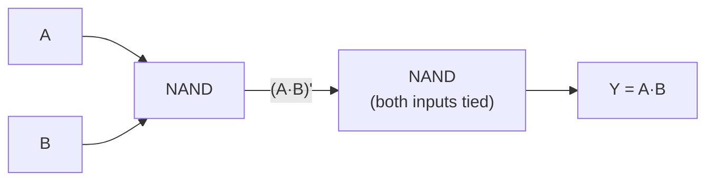

**3. OR from NAND** — invert both inputs first, then NAND them (this is De Morgan's law in circuit form):

> **A + B = (Ā · B̄)′** — invert A with one NAND, invert B with a second NAND, then NAND the two results ✅ · **3 NAND gates**

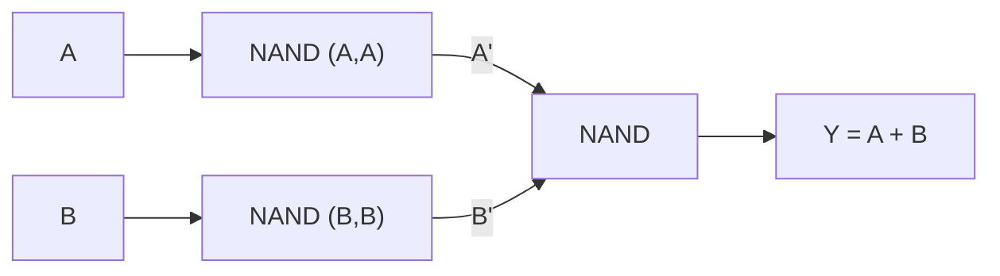

**Verification of OR from NAND:** `(Ā·B̄)′ = (Ā)′ + (B̄)′` by De Morgan = **A + B** ✅

#### Building the basic gates using ONLY NOR

**1. NOT from NOR:** **Ā = (A + A)′ = A′** ✅ · **1 NOR gate**

**2. OR from NOR:** **A + B = ((A+B)′)′** — a NOR followed by a NOR-inverter ✅ · **2 NOR gates**

**3. AND from NOR:** **A·B = (Ā + B̄)′** — invert both inputs, then NOR them ✅ · **3 NOR gates**

*(Verification: `(Ā + B̄)′ = (Ā)′ · (B̄)′ = A·B` ✅ by De Morgan.)*

#### The minimum gate counts — a commonly asked detail

| Target gate | **Using NAND only** | **Using NOR only** |
|---|---|---|
| **NOT** | **1** | **1** |
| **AND** | **2** | **3** |
| **OR** | **3** | **2** |
| **NAND** | 1 | **4** |
| **NOR** | **4** | 1 |
| **XOR** | **4** | 5 |
| **XNOR** | 5 | **4** |

> **The pattern:** NAND is naturally cheap for **AND**, and NOR is naturally cheap for **OR** — each is "one inversion away" from its parent operation.

#### Implementing XOR using only 4 NAND gates

**The identity:** `A ⊕ B = (A·(A·B)′) · (B·(A·B)′)` — all complemented appropriately, this uses exactly **4 NAND gates**.

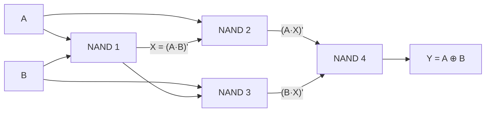

**Verification for A=1, B=0:** X = (1·0)′ = 1 · NAND2 = (1·1)′ = 0 · NAND3 = (0·1)′ = 1 · Y = (0·1)′ = **1** ✅ (inputs differ → XOR = 1)

**Verification for A=1, B=1:** X = (1·1)′ = 0 · NAND2 = (1·0)′ = 1 · NAND3 = (1·0)′ = 1 · Y = (1·1)′ = **0** ✅

#### Building a NAND from NOR gates

**NAND = (A·B)′ = Ā + B̄**, so: invert A (1 NOR), invert B (1 NOR), OR them (2 NOR gates: a NOR followed by a NOR-inverter) → **4 NOR gates** total.

#### Building a 3-input NAND from 2-input NAND gates

**(A·B·C)′** requires: NAND(A,B) → invert it to get A·B → NAND that with C.
> **NAND1 = (A·B)′ → NAND2 = ((A·B)′ · (A·B)′)′ = A·B → NAND3 = (A·B·C)′** ✅ · **3 two-input NAND gates**

#### Why universal gates matter in practice

1. **Manufacturing simplicity and cost** — a chip fabricated from **one single type of gate** is far cheaper to design, verify and produce than one using seven different cell types.
2. **NAND is the natural CMOS gate.** In CMOS, **NAND and NOR are simpler and faster than AND and OR** — an AND gate is literally built *as* a NAND followed by an inverter, so it uses **more** transistors, not fewer. A 2-input CMOS NAND needs **4 transistors**; a 2-input AND needs **6**.
3. **Uniform propagation delay** and easier timing analysis.
4. **Inventory and design-library simplification.**
5. **Fewer IC packages** needed on a board — one 7400 quad-NAND chip can implement an entire small circuit.

**The disadvantage:** implementing a function with universal gates alone usually needs **MORE gates** than a mixed implementation, which can mean **greater propagation delay** through more levels of logic.

#### Implementing a function with NAND gates only — the method

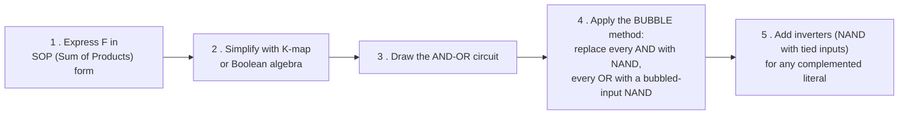

> **The shortcut every textbook uses: a two-level AND-OR circuit converts DIRECTLY to a two-level NAND-NAND circuit** — replace every gate with a NAND and the function is unchanged. This follows from De Morgan: `(AB + CD) = ((AB)′ · (CD)′)′`.

**Worked example — implement `F = AB̄C + ABC + ĀBC` with NAND gates only**

**Step 1 — simplify first:**
`F = AC(B̄ + B) + ĀBC = AC·1 + ĀBC = AC + ĀBC`
Applying the absorption rule `X + X̄Y = X + Y` with X = AC: `F = AC + BC`
Factoring: **`F = C(A + B)`**

**Step 2 — convert to NAND form:** `F = C·(A+B) = ((C·(A+B))′)′`, and `A+B = (Ā·B̄)′`, so:

| NAND | Inputs | Output |
|---|---|---|
| 1 | A, A | Ā |
| 2 | B, B | B̄ |
| 3 | Ā, B̄ | **(Ā·B̄)′ = A + B** |
| 4 | (A+B), C | (C·(A+B))′ |
| 5 | output of 4, itself | **F = C(A+B)** ✅ |

**Total: 5 NAND gates.**

**Previous Year Question List from this Topic:**

- [Explain how any Boolean function can be implemented using only universal gates.](../written-answers/dld.md?plain=1#L78)
- [Why NAND is universal gate?](../written-answers/dld.md?plain=1#L186)
- [Implement OR gate and AND gate using minimum number of NAND and NOR gate.](../written-answers/dld.md?plain=1#L385)
- [What is Universal gate and how is constructed it?](../written-answers/dld.md?plain=1#L526)
- [মৌলিক গেইট কী? NAND এবং NOR গেইটকে কেন সার্বজনীন গেইট বলা হয় ব্যাখ্যা করুন।](../written-answers/dld.md?plain=1#L588)
- [Explain: NOR and NAND is a Universal gate.](../written-answers/dld.md?plain=1#L779)
- [(a) Implement the following expression using NAND gates only: F = AB\bar{C} + ABC + \bar{A}BC](../written-answers/dld.md?plain=1#L914)
- [NAND gate ব্যবহার করে OR gate তৈরি করার logic diagram অঙ্কন করুন?](../written-answers/dld.md?plain=1#L987)
- [What is Logic gate? Prove that NAND and NOR gate is Universal gate.](../written-answers/dld.md?plain=1#L1036)
- [Implementation the following two Boolean functions using NAND gate only: (a) F = A + (B' + C)(D' + BE') (b) F = ((A + B) + CD)E](../written-answers/dld.md?plain=1#L1102)
- [(গ) Universal logic gate কি? 3-input এর একটি Universal logic gate এর Logic symbol এবং Truth Table দেখান।](../written-answers/dld.md?plain=1#L1189)
- [What is Universal gate? NAND and NOR gate কে Universal gate বলা হয় কেন?](../written-answers/dld.md?plain=1#L1253)
- [Implement X-OR gate using NAND gate. Maximum 4 NAND gate are using.](../written-answers/dld.md?plain=1#L1311)
- [What is basic Logic gate? Which gate are called Universal gate and write down advantages of Universal gate?](../written-answers/dld.md?plain=1#L1366)
- [How can you Implement AND, OR and NOT gates using only NAND and NOR gates? What is the main difference between Latch and Flip-flop?](../written-answers/dld.md?plain=1#L1417)
- [Make NAND gate using NOR gate.](../written-answers/dld.md?plain=1#L1486)
- [Design 3 input NAND gate and 2 input XOR gate using 2 input NAND gate.](../written-answers/dld.md?plain=1#L1612)
- [How will realize a AND gate and OR gate using CMOS NAND and NOR gate?](../written-answers/dld.md?plain=1#L1684)
- [(খ) Universal Gate কাকে বলে? Universal Gate-এর সার্বজনীনতা প্রমাণ করুন।](../written-answers/dld.md?plain=1#L1749)
- [What do you understand by universality of logic gate? Prove universality of NOR logic gate.](../written-answers/dld.md?plain=1#L2012)


---

## Number Systems & Base Conversions

### Number Systems and Codes

#### The four number systems

| System | **Base** | Digits used | Example |
|---|---|---|---|
| **Binary** | **2** | 0, 1 | (1011)₂ |
| **Octal** | **8** | 0–7 | (347)₈ |
| **Decimal** | **10** | 0–9 | (275)₁₀ |
| **Hexadecimal** | **16** | 0–9, **A–F** (A=10, B=11, C=12, D=13, E=14, F=15) | (1AC)₁₆ |

> **The base of the binary number system is 2** — the answer to a frequently asked one-liner. Computers use binary because a transistor has exactly two reliable states.

#### Why a computer requires number conversion

1. **Humans think in decimal; computers work in binary.** Every input must be converted in, and every output converted back out.
2. **Binary is unreadably long** — one byte is `11010110`, eight characters for a single value. **Hexadecimal compresses it 4:1** (`D6`) and **octal 3:1**, which is why memory addresses, MAC addresses, colour codes and machine code are all written in hex.
3. **Each hex digit maps to exactly 4 bits** and each octal digit to exactly 3, making conversion between them trivial — no arithmetic is needed, only grouping.
4. **Debugging and low-level programming** — memory dumps, register contents and bit masks are far easier to read in hex.
5. **Data representation** — characters (ASCII/Unicode), colours (#FF5733), IP addresses and instruction opcodes are all defined in these bases.

#### Conversion methods

**ANY base → DECIMAL: positional expansion**

> Multiply each digit by **base^position**, counting positions from **0 at the right** of the point, and **−1, −2 …** to the right of it.

**DECIMAL → ANY base:**
- **Integer part:** **divide repeatedly by the base**, and read the **remainders BOTTOM-UP**.
- **Fractional part:** **multiply repeatedly by the base**, and read the **integer parts TOP-DOWN**.

**BINARY ↔ OCTAL: group in 3s** · **BINARY ↔ HEX: group in 4s** — always grouping **outward from the decimal point**, padding with zeros at the ends.

#### Worked conversions

**(a) (1011)₂ → decimal**
> 1×2³ + 0×2² + 1×2¹ + 1×2⁰ = 8 + 0 + 2 + 1 = **(11)₁₀**

**(b) (61)₁₀ → binary**

| Division | Quotient | **Remainder** |
|---|---|---|
| 61 ÷ 2 | 30 | **1** |
| 30 ÷ 2 | 15 | **0** |
| 15 ÷ 2 | 7 | **1** |
| 7 ÷ 2 | 3 | **1** |
| 3 ÷ 2 | 1 | **1** |
| 1 ÷ 2 | 0 | **1** |

Reading the remainders **bottom to top**: **(61)₁₀ = (111101)₂**
*(Check: 32+16+8+4+0+1 = 61 ✅)*

**(c) (423)₁₀ → octal**

| Division | Quotient | Remainder |
|---|---|---|
| 423 ÷ 8 | 52 | **7** |
| 52 ÷ 8 | 6 | **4** |
| 6 ÷ 8 | 0 | **6** |

> **(423)₁₀ = (647)₈** *(Check: 6×64 + 4×8 + 7 = 384 + 32 + 7 = 423 ✅)*

**(d) (3000)₁₀ → hexadecimal**

| Division | Quotient | Remainder | Hex digit |
|---|---|---|---|
| 3000 ÷ 16 | 187 | 8 | **8** |
| 187 ÷ 16 | 11 | 11 | **B** |
| 11 ÷ 16 | 0 | 11 | **B** |

> **(3000)₁₀ = (BB8)₁₆** *(Check: 11×256 + 11×16 + 8 = 2816 + 176 + 8 = 3000 ✅)*

**(e) (1741)₁₀ → hexadecimal**

| Division | Quotient | Remainder | Hex |
|---|---|---|---|
| 1741 ÷ 16 | 108 | 13 | **D** |
| 108 ÷ 16 | 6 | 12 | **C** |
| 6 ÷ 16 | 0 | 6 | **6** |

> **(1741)₁₀ = (6CD)₁₆** *(Check: 6×256 + 12×16 + 13 = 1536 + 192 + 13 = 1741 ✅)*

**(f) (343)₁₀ → binary and hexadecimal**

343 ÷ 2 repeatedly gives remainders 1,1,1,0,1,0,1,0,1 read bottom-up = **(101010111)₂**
*(Check: 256+64+16+4+2+1 = 343 ✅)*
Grouping in 4s from the right: `1 0101 0111` → `0001 0101 0111` = **(157)₁₆**
*(Check: 1×256 + 5×16 + 7 = 256+80+7 = 343 ✅)*

**(g) (1AC)₁₆ → binary and decimal**

Each hex digit → 4 bits: **1** = 0001, **A** = 1010, **C** = 1100
> **(1AC)₁₆ = (0001 1010 1100)₂ = (110101100)₂**
> Decimal: 1×256 + 10×16 + 12 = 256 + 160 + 12 = **(428)₁₀**

**(h) (CDAB)₁₆ → octal**

**Step 1 — hex to binary (4 bits each):** C=1100, D=1101, A=1010, B=1011
> `1100 1101 1010 1011`
**Step 2 — regroup in 3s from the RIGHT**, padding with leading zeros:
> `001 100 110 110 101 011`
**Step 3 — each group to an octal digit:** 1, 4, 6, 6, 5, 3
> ### **(CDAB)₁₆ = (146653)₈**

**(i) (4673)₈ → hexadecimal**

Octal → binary (3 bits each): 4=100, 6=110, 7=111, 3=011 → `100 110 111 011`
Regroup in 4s from the right: `1001 1011 1011` → **(9BB)₁₆**

**(j) (651)₈ → decimal and hexadecimal**

> Decimal: 6×8² + 5×8¹ + 1×8⁰ = 6×64 + 40 + 1 = 384 + 41 = **(425)₁₀**
> Binary: 110 101 001 → regroup in 4s: `0001 1010 1001` = **(1A9)₁₆**
> *(Check: 1×256 + 10×16 + 9 = 425 ✅)*

**(k) (1111001101011)₂ → octal and hexadecimal**

**To octal — group in 3s from the right:** `1 111 001 101 011` → `001 111 001 101 011` → 1, 7, 1, 5, 3 = **(17153)₈**
**To hexadecimal — group in 4s from the right:** `1 1110 0110 1011` → `0001 1110 0110 1011` → 1, E, 6, B = **(1E6B)₁₆**

**(l) (12345)₁₀ → octal**

| ÷8 | Quotient | Remainder |
|---|---|---|
| 12345 | 1543 | **1** |
| 1543 | 192 | **7** |
| 192 | 24 | **0** |
| 24 | 3 | **0** |
| 3 | 0 | **3** |

> **(12345)₁₀ = (30071)₈** *(Check: 3×4096 + 0 + 0 + 7×8 + 1 = 12288 + 56 + 1 = 12345 ✅)*

**(m) (2345)₁₀ → hexadecimal, and (ABCD)₁₆ → octal**

2345 ÷ 16 = 146 r **9** · 146 ÷ 16 = 9 r **2** · 9 ÷ 16 = 0 r **9** → **(929)₁₆**
*(Check: 9×256 + 2×16 + 9 = 2304 + 32 + 9 = 2345 ✅)*

(ABCD)₁₆ → binary: A=1010, B=1011, C=1100, D=1101 → `1010 1011 1100 1101`
Regroup in 3s from the right: `001 010 101 111 001 101` → 1, 2, 5, 7, 1, 5 = **(125715)₈**

#### Fractional conversions

**(17.625)₁₀ → binary**

**Integer part 17:** 17÷2=8 r1, 8÷2=4 r0, 4÷2=2 r0, 2÷2=1 r0, 1÷2=0 r1 → **10001**
**Fractional part .625 — multiply by 2 and read the INTEGER parts top-down:**

| Multiplication | Result | **Integer part** |
|---|---|---|
| 0.625 × 2 | 1.25 | **1** |
| 0.25 × 2 | 0.50 | **0** |
| 0.50 × 2 | 1.00 | **1** |

> ### **(17.625)₁₀ = (10001.101)₂**

**(10010.101)₂ → decimal**

> Integer: 1×16 + 0 + 0 + 1×2 + 0 = **18**
> Fraction: 1×2⁻¹ + 0×2⁻² + 1×2⁻³ = 0.5 + 0 + 0.125 = **0.625**
> ### **= (18.625)₁₀**

**(3D.4C)₁₆ → binary**

3=0011, D=1101 · 4=0100, C=1100
> **(3D.4C)₁₆ = (00111101.01001100)₂ = (111101.010011)₂**

**(514.6)₈ → binary**

5=101, 1=001, 4=100 · 6=110
> **(514.6)₈ = (101001100.110)₂**

#### Mixed-base arithmetic

**Problem: 3.5₁₀ + 2.4₈ + 1A.7₁₆ = (?)₁₆**

**Step 1 — convert everything to decimal:**
- 3.5₁₀ = **3.5**
- 2.4₈ = 2 + 4/8 = 2 + 0.5 = **2.5**
- 1A.7₁₆ = (1×16 + 10) + 7/16 = 26 + 0.4375 = **26.4375**

**Step 2 — add:** 3.5 + 2.5 + 26.4375 = **32.4375**

**Step 3 — convert back to hex:**
- Integer 32: 32 ÷ 16 = 2 r 0 → **20**
- Fraction 0.4375 × 16 = **7.0** → **7**

> ### **= (20.7)₁₆**

#### Binary codes

| Code | Description | Use |
|---|---|---|
| **BCD (8421)** | **Each DECIMAL digit is separately encoded in 4 bits** | Digital displays, calculators, financial systems |
| **Excess-3 (XS-3)** | **BCD value + 3** | A **self-complementing** code — simplifies subtraction |
| **Gray code** | **Only ONE bit changes** between consecutive values | Rotary encoders, K-maps — eliminates transition glitches |
| **ASCII** | 7-bit character code | Text |
| **Parity** | An extra bit to make the number of 1s even or odd | **Error detection** |

#### BCD vs Binary — a frequently asked comparison

| Point | **Binary** | **BCD (Binary Coded Decimal)** |
|---|---|---|
| **Method** | The **whole number** is converted to base 2 | **EACH DECIMAL DIGIT** is converted separately into 4 bits |
| **Bits used** | **Fewer — efficient** | **More — wasteful** |
| **Example: 25** | **11001** (5 bits) | **0010 0101** (8 bits) |
| **Example: 99** | 1100011 (7 bits) | 1001 1001 (8 bits) |
| **Valid 4-bit codes** | All 16 (0000–1111) | **Only 10** (0000–1001); **1010 to 1111 are INVALID** |
| **Arithmetic** | Simple and fast | **Complex** — needs a correction of **+6 (0110)** whenever a group exceeds 9 |
| **Conversion to decimal** | Requires computation | **Trivial** — read each nibble directly |
| **Efficiency** | **High** | Low — about 20 % of the codes are wasted |
| **Used in** | **All internal computer arithmetic** | **Digital displays, calculators, electronic meters, financial systems** where exact decimal representation matters |

> **Why BCD survives despite its inefficiency:** it represents decimal fractions **exactly**. In binary floating point, 0.1 cannot be represented exactly — an unacceptable property for a banking system where rounding errors accumulate over billions of transactions. BCD (and decimal arithmetic generally) avoids this entirely.

**How many bits in a BCD code?** **4 bits per decimal digit.**

#### Excess-3 code

> **Excess-3 = BCD value + 3**

| Decimal | BCD (8421) | **Excess-3** |
|---|---|---|
| 0 | 0000 | **0011** |
| 1 | 0001 | **0100** |
| 4 | 0100 | **0111** |
| 5 | 0101 | **1000** |
| 9 | 1001 | **1100** |

> **The Excess-3 code of 1010:** here 1010 must first be interpreted. As **BCD, 1010 is INVALID** (it exceeds 9). If 1010 is read as **binary 10**, that is a two-digit decimal number: digit 1 → 0001+0011 = **0100**, digit 0 → 0000+0011 = **0011**, so **Excess-3 of 10 = 0100 0011**. *(State your interpretation — this ambiguity is what the question is testing.)*
>
> **Why Excess-3 is called SELF-COMPLEMENTING:** the 1's complement of a digit's Excess-3 code is the Excess-3 code of its **9's complement**. E.g. Excess-3 of 4 is 0111; its complement is 1000, which is Excess-3 of **5 = 9 − 4** ✅. This makes subtraction by complement addition very easy in hardware.

#### BCD addition

**Rule:** add the BCD groups as ordinary binary. **If any 4-bit group produces a result greater than 9 (1001), or generates a carry out, ADD 6 (0110) to that group** to correct it.

**Worked example: 00010011 + 00100110** (that is, BCD **13 + 26**)

```
      0001  0011        (13)
    + 0010  0110        (26)
    ─────────────
      0011  1001        (39)
```
Checking each group: `1001` = 9 ✅ (not > 9) and `0011` = 3 ✅ — **no correction needed**.
> ### **Result = 0011 1001 = 39** ✅

**A case that DOES need correction: BCD 8 + 5**
```
      1000        (8)
    + 0101        (5)
    ────────
      1101        = 13 in binary, but 1101 is NOT a valid BCD digit ❌
    + 0110        add 6 to correct
    ────────
    1 0011        = carry 1, digit 0011 = 3  →  BCD "13" ✅
```

#### Parity bit

> A **parity bit** is an **extra bit appended to a group of data bits to make the total number of 1s either EVEN or ODD**, enabling the detection of a single-bit error.

| Type | Rule |
|---|---|
| **Even parity** | The parity bit is set so that the **total number of 1s is EVEN** |
| **Odd parity** | The parity bit is set so that the **total number of 1s is ODD** |

**Example — data `1011001` (four 1s):** for **even parity** the bit is **0** (already even); for **odd parity** it is **1**.

**Limitation:** parity detects **any ODD number of bit errors** (1, 3, 5 …) but **cannot detect an EVEN number** (2, 4 …), and **cannot correct** anything. For correction, **Hamming code** or **CRC** is used.

**Previous Year Question List from this Topic:**

- [(a) Convert the following number:](../written-answers/dld.md?plain=1#L2173)
- [ডেসিমেল ৬১ এর বাইনারি মান কত?](../written-answers/dld.md?plain=1#L2282)
- [$(\text{CDAB})_{16}$ কে অক্টাল এ রূপান্তর কর।](../written-answers/dld.md?plain=1#L2307)
- [Convert Decimal to Octal (423)_{10} and Decimal to Hexadecimal (3000)_{10}.](../written-answers/dld.md?plain=1#L2354)
- [কোড কী? BCD এবং Binary কোডের মধ্যে পার্থক্য লিখুন। তিনভিত্তিক সংখ্যা পদ্ধতি সম্পর্কে ব্যাখ্যা করুন।](../written-answers/dld.md?plain=1#L2397)
- [(9\text{D.AB}6)_{16} ও (306.51)_{10} যোগ করুন এবং ফলাফল বাইনারীতে প্রকাশ করুন। (110101) কোন সংখ্যা পদ্ধতির সংখ্যা হতে পারে বলে মনে করেন?](../written-answers/dld.md?plain=1#L2455)
- [Explain Binary digits, logical levels and digital waveforms using timing diagram.](../written-answers/dld.md?plain=1#L2532)
- [Convert: (1741)_{10} = (?)_{16}](../written-answers/dld.md?plain=1#L2590)
- [Number Conversion: (i) (4673)_8 = (?)_{16} (ii) (7491)_{10} = (?)_{16}](../written-answers/dld.md?plain=1#L2629)
- [Computer এর Binary পদ্ধতি কোন সংখ্যার উপর প্রতিষ্ঠিত?](../written-answers/dld.md?plain=1#L2679)
- [BCD code – এ কতগুলি বিট থাকে?](../written-answers/dld.md?plain=1#L2700)
- [(b) Convert the following Octal number into Decimal and Hexadecimal: (651)_8](../written-answers/dld.md?plain=1#L2726)
- [Binary Number system এর Base কত?](../written-answers/dld.md?plain=1#L2775)
- [(i) (1\text{AC})_{16} = (?)_{2}\text{ and }(?)_{10}](../written-answers/dld.md?plain=1#L2799)
- [(ii) What is the Excess-3 code of 1010?](../written-answers/dld.md?plain=1#L2845)
- [There are different number systems. i. Convert (10010.101)_2 = (?)_{10} ii. (543)_{10} = (?)_{16}](../written-answers/dld.md?plain=1#L2902)
- [Convert (343)_{10} to binary and Hexadecimal.](../written-answers/dld.md?plain=1#L2950)
- [(1111001101011)_2 কে অক্টাল ও হেক্সাডেসিম্যালে রূপান্তর করুন।](../written-answers/dld.md?plain=1#L2994)
- [(ক) Parity bit কী? $(17.625)_{10}$ কে বাইনারি এবং $(\text{AB.C})_{16}$ কে দশমিক সংখ্যায় প্রকাশ করুন।](../written-answers/dld.md?plain=1#L3044)
- [(খ) $(3\text{D}.4\text{C})_{16}$ এবং $(514.6)_8$ কে বাইনারি সংখ্যায় পরিবর্তন করে যোগ এবং যোগফল হেক্সাডেসিমালে প্রকাশ করুন।](../written-answers/dld.md?plain=1#L3101)
- [(b) Solve the problem: $3.5_{10} + 2.4_8 + 1A.7_{16} = (?)_{16}$](../written-answers/dld.md?plain=1#L3160)
- [$(12345)_{10} = (?)_8$](../written-answers/dld.md?plain=1#L3220)
- [Convert $(2345)_{10}$ to Hexadecimal and $(\text{ABCD})_{16}$ to octal number.](../written-answers/dld.md?plain=1#L3259)
- [a) Describe the binary and hexadecimal numbering methods with numerical examples.](../written-answers/dld.md?plain=1#L3318)
- [b) Why does the computer require number conversion?](../written-answers/dld.md?plain=1#L3377)


---

### Signed Numbers and 2's Complement

#### The three ways to represent a signed number

| Method | Representation of −5 in 8 bits | Problem |
|---|---|---|
| **Sign-magnitude** | `1000 0101` (MSB = sign) | **Two zeros** (+0 and −0); arithmetic needs separate logic |
| **1's complement** | `1111 1010` (invert all bits) | **Two zeros** still; needs end-around carry |
| **2's complement** ⭐ | **`1111 1011`** (invert, then add 1) | **None** — one zero, and **addition and subtraction use the SAME circuit** |

> **This is why every modern computer uses 2's complement.**

#### What is 2's complement, and how to find it

> **The 2's complement of a binary number is obtained by INVERTING every bit (the 1's complement) and then ADDING 1.**

**Two methods:**
1. **Invert and add 1** — the standard.
2. **The shortcut:** copy the bits from the right **up to and including the first 1**, then **invert everything to the left of it**.

#### Worked example — represent −25 in 8-bit 2's complement

**Step 1 — write +25 in 8-bit binary:**
25 = 16 + 8 + 1 → **`0001 1001`**

**Step 2 — take the 1's complement (invert every bit):**
> `0001 1001` → **`1110 0110`**

**Step 3 — add 1:**
```
      1110 0110
    +         1
    ──────────
      1110 0111
```

> ### ✅ **−25 in 8-bit 2's complement = `11100111`**

**Verification — add +25 and −25; the result must be zero:**
```
      0001 1001      (+25)
    + 1110 0111      (−25)
    ───────────
    1 0000 0000      the carry out of the MSB is DISCARDED
    → 0000 0000 = 0  ✅
```

**Shortcut check:** `0001 1001` — copy from the right up to and including the first 1 (`1`), then invert the rest: `0001100` → `1110011`, giving **`1110 0111`** ✅ — the same answer.

#### The range of an n-bit 2's complement number

> **From −2^(n−1) to +2^(n−1) − 1**

| Bits | Range |
|---|---|
| **8** | **−128 to +127** |
| 16 | −32,768 to +32,767 |
| 32 | −2,147,483,648 to +2,147,483,647 |

**Reading a 2's complement number:** if the **MSB is 0** it is positive — read it normally. If the **MSB is 1** it is **negative** — take the 2's complement of it to find its magnitude.

#### Worked example — X = 00110, Y = 11100 in 5-bit signed 2's complement; find X + Y

**Interpreting the operands:**
- **X = 00110** — MSB is 0 → positive → **+6**
- **Y = 11100** — MSB is 1 → negative. Its 2's complement is: invert `00011`, add 1 → `00100` = 4, so **Y = −4**

**The addition:**
```
      0 0110      (+6)
    + 1 1100      (−4)
    ─────────
    1 0 0010      carry out of the MSB is DISCARDED
    →   00010
```

> ### ✅ **Sum = `00010` = +2** *(Check: 6 + (−4) = 2 ✅)*

**Overflow detection** — the rule to state: **overflow has occurred if the carry INTO the sign bit differs from the carry OUT of the sign bit.** Equivalently, adding two positives can never give a negative, and adding two negatives can never give a positive. Here both carries are 1, so there is **no overflow** ✅.

#### Subtraction using 2's complement

> **A − B = A + (2's complement of B)** — which is exactly why one adder circuit performs both operations.

**Example: 25 − 10 in 8 bits**
- +25 = `0001 1001`
- +10 = `0000 1010` → 2's complement (−10) = `1111 0110`
```
      0001 1001
    + 1111 0110
    ───────────
    1 0000 1111      discard the carry
    →   0000 1111 = 15  ✅
```

#### Counting the bits that must change between two integers

> **The method: XOR the two numbers, then COUNT THE 1s in the result** (this is the **Hamming distance**).

**Example: A = 31, B = 14**

| | Binary (8-bit) |
|---|---|
| A = 31 | `0001 1111` |
| B = 14 | `0000 1110` |
| **A ⊕ B** | **`0001 0001`** |

Counting the 1s in `0001 0001` → **2**

> ### ✅ **2 bits must change** to convert 31 into 14.

*(Verification: 31 = 00011111 and 14 = 00001110 — they differ in bit position 4 (value 16) and bit position 0 (value 1). 31 − 16 − 1 = 14 ✅)*

```c
int bitsToChange(int a, int b) {
    int x = a ^ b, count = 0;
    while (x) { count += x & 1; x >>= 1; }
    return count;
}
```

**Previous Year Question List from this Topic:**

- [(b) Represent - 25 in 8 bit binary using 2's complement.](../written-answers/dld.md?plain=1#L2222)
- [2-এর পরিপূরক পদ্ধতি কী? 2-এর পরিপূরক পদ্ধতি ব্যবহার করে (-15)_{10} থেকে (+11)_{10} বিয়োগ করুন।](../written-answers/dld.md?plain=1#L8994)
- [BCD Addition: 00010011 + 00100110](../written-answers/dld.md?plain=1#L9069)
- [How many bits have to change to convert int A to int B. Sample A=31 and B=14.](../written-answers/dld.md?plain=1#L9137)
- [(b) Represent - 25 in 8 bit binary using 2's complement.](../written-answers/dld.md?plain=1#L9197)
- [X = 00110, Y = 11100 are represented in 5-bit signed 2's complement system. Then their sum X + Y in 6-bit signed 2's complemented representation is? (05)](../written-answers/dld.md?plain=1#L9257)


---

## Boolean Algebra & De Morgan’s Theorem

### Boolean Algebra — Laws and Simplification

**Boolean algebra**, developed by **George Boole (1854)** and applied to switching circuits by **Claude Shannon (1937)**, is the mathematics of **two-valued (0 and 1) logic**. It is the tool used to **simplify** logic expressions, and therefore to **reduce the number of gates** in a circuit.

#### The laws of Boolean algebra

| Law | **OR form** | **AND form** |
|---|---|---|
| **Identity** | A + 0 = A | A · 1 = A |
| **Null / Dominance** | **A + 1 = 1** | **A · 0 = 0** |
| **Idempotent** | A + A = A | A · A = A |
| **Complement** | **A + Ā = 1** | **A · Ā = 0** |
| **Double negation** | (Ā)′ = A | |
| **Commutative** | A + B = B + A | A·B = B·A |
| **Associative** | (A+B)+C = A+(B+C) | (AB)C = A(BC) |
| **Distributive** | **A(B + C) = AB + AC** | **A + BC = (A+B)(A+C)** |
| **Absorption** | **A + AB = A** | **A(A + B) = A** |
| **Redundancy / Simplification** | **A + ĀB = A + B** | **A(Ā + B) = AB** |
| **De Morgan's** | **(A + B)′ = Ā · B̄** | **(A · B)′ = Ā + B̄** |
| **Consensus** | AB + ĀC + BC = AB + ĀC | (A+B)(Ā+C)(B+C) = (A+B)(Ā+C) |

> **The two most useful in practice are ABSORPTION (A + AB = A) and the REDUNDANCY law (A + ĀB = A + B).** Almost every simplification question uses one of them.

#### Proving A + ĀB = A + B

| A | B | Ā | ĀB | **A + ĀB** | **A + B** |
|---|---|---|---|---|---|
| 0 | 0 | 1 | 0 | **0** | **0** ✅ |
| 0 | 1 | 1 | 1 | **1** | **1** ✅ |
| 1 | 0 | 0 | 0 | **1** | **1** ✅ |
| 1 | 1 | 0 | 0 | **1** | **1** ✅ |

**Algebraic proof:** A + ĀB = (A + Ā)(A + B) *(distributive)* = 1·(A + B) = **A + B** ∎

> **The direct answer to "X + X̄Y = ?" is X + Y.**

#### De Morgan's Theorems

> **Theorem 1: (A + B)′ = Ā · B̄** — *"the complement of a SUM equals the PRODUCT of the complements"*
> **Theorem 2: (A · B)′ = Ā + B̄** — *"the complement of a PRODUCT equals the SUM of the complements"*

**In words:** **"Break the bar, change the sign."** When you break a NOT bar over an expression, **AND becomes OR and OR becomes AND**.

**Proof of Theorem 1 by truth table:**

| A | B | A+B | **(A+B)′** | Ā | B̄ | **Ā·B̄** |
|---|---|---|---|---|---|---|
| 0 | 0 | 0 | **1** | 1 | 1 | **1** ✅ |
| 0 | 1 | 1 | **0** | 1 | 0 | **0** ✅ |
| 1 | 0 | 1 | **0** | 0 | 1 | **0** ✅ |
| 1 | 1 | 1 | **0** | 0 | 0 | **0** ✅ |

The two highlighted columns are identical in every row. ∎

**Proof of Theorem 2:**

| A | B | A·B | **(A·B)′** | Ā | B̄ | **Ā+B̄** |
|---|---|---|---|---|---|---|
| 0 | 0 | 0 | **1** | 1 | 1 | **1** ✅ |
| 0 | 1 | 0 | **1** | 1 | 0 | **1** ✅ |
| 1 | 0 | 0 | **1** | 0 | 1 | **1** ✅ |
| 1 | 1 | 1 | **0** | 0 | 0 | **0** ✅ |

**For three variables:**
> **(A + B + C)′ = Ā · B̄ · C̄** and **(A · B · C)′ = Ā + B̄ + C̄**

#### Why De Morgan's theorems matter

1. **They are the reason NAND and NOR are universal** — every conversion between AND-OR and NAND-only or NOR-only logic is De Morgan applied in circuit form.
2. They allow a designer to **convert between AND-OR and OR-AND** implementations to suit the available gates.
3. They **simplify expressions containing complemented groups**.
4. They are used constantly in **programming**: `!(a && b)` is equivalent to `!a || !b`.

#### Worked simplifications

**1. Simplify `Y = AB̄ + (Ā + B)′C`**

**Step 1 — apply De Morgan to the second term:** `(Ā + B)′ = A·B̄`
**Step 2 — substitute:** `Y = AB̄ + AB̄C`
**Step 3 — factor:** `Y = AB̄(1 + C)`
**Step 4 — since `1 + C = 1`:**
> ### **Y = AB̄**

**2. Simplify `F = ABC̄D + ABCD + ĀBD`**

**Step 1 — factor the first two terms:** `ABD(C̄ + C) = ABD·1 = ABD`
**Step 2 — so `F = ABD + ĀBD`**
**Step 3 — factor BD:** `F = BD(A + Ā) = BD·1`
> ### **F = BD**

**3. Simplify `F = ĀC + AB̄ + BC̄ + ABC`**

**Step 1 — expand ABC and regroup:** `AB̄ + ABC = A(B̄ + BC) = A(B̄ + C)` *(redundancy law)* `= AB̄ + AC`
**Step 2 — so `F = ĀC + AC + AB̄ + BC̄`**
**Step 3 — `ĀC + AC = C(Ā + A) = C`**
> ### **F = C + AB̄ + BC̄**
*(This is the minimal SOP form; a K-map confirms it.)*

**4. Simplify `X = ĀBC + AB̄C + ABC̄ + ABC`**

**Step 1 — group terms sharing ABC:**
- `ĀBC + ABC = BC(Ā + A) = BC`
- `AB̄C + ABC = AC(B̄ + B) = AC`
- `ABC̄ + ABC = AB(C̄ + C) = AB`

*(ABC may be reused because `X + X = X`.)*
> ### **X = AB + BC + AC** — the **majority function**, which outputs 1 when at least two of the three inputs are 1.

**5. Simplify `x̄ȳz + x̄yz + xȳ`**

**Step 1 — factor the first two:** `x̄z(ȳ + y) = x̄z`
**Step 2 — so the expression is `x̄z + xȳ`** — already minimal.
> ### **F = x̄z + xȳ**

**6. Simplify `Y = A·B + (A·B)′`**

By the complement law, **X + X̄ = 1** with X = A·B:
> ### **Y = 1** — the output is always 1, regardless of the inputs. **No gates are needed at all.**

#### Constructing a truth table for a compound expression

**Example: `(r ∨ (q ∧ ¬p)) ∧ ¬q`**

| p | q | r | ¬p | q∧¬p | r ∨ (q∧¬p) | ¬q | **Result** |
|---|---|---|---|---|---|---|---|
| 0 | 0 | 0 | 1 | 0 | 0 | 1 | **0** |
| 0 | 0 | 1 | 1 | 0 | 1 | 1 | **1** |
| 0 | 1 | 0 | 1 | 1 | 1 | 0 | **0** |
| 0 | 1 | 1 | 1 | 1 | 1 | 0 | **0** |
| 1 | 0 | 0 | 0 | 0 | 0 | 1 | **0** |
| 1 | 0 | 1 | 0 | 0 | 1 | 1 | **1** |
| 1 | 1 | 0 | 0 | 0 | 0 | 0 | **0** |
| 1 | 1 | 1 | 0 | 0 | 1 | 0 | **0** |

> **The result is 1 only when q = 0 and r = 1** — so the expression simplifies to **r ∧ ¬q**.

**Example: `f(A,B,C,D) = (A+B) ⊕ (CD)`**

| A | B | C | D | A+B | CD | **(A+B) ⊕ (CD)** |
|---|---|---|---|---|---|---|
| 0 | 0 | 0 | 0 | 0 | 0 | **0** |
| 0 | 0 | 1 | 1 | 0 | 1 | **1** |
| 0 | 1 | 0 | 0 | 1 | 0 | **1** |
| 0 | 1 | 1 | 1 | 1 | 1 | **0** |
| 1 | 0 | 0 | 1 | 1 | 0 | **1** |
| 1 | 1 | 1 | 1 | 1 | 1 | **0** |

*(XOR outputs 1 when the two sub-expressions **differ**.)*

#### Standard forms — SOP and POS

| Form | Meaning | Built from | Example |
|---|---|---|---|
| **SOP — Sum of Products** | An **OR of AND terms** | **MINTERMS** — rows where the output is **1** | F = ĀB + AB̄ |
| **POS — Product of Sums** | An **AND of OR terms** | **MAXTERMS** — rows where the output is **0** | F = (A+B)(Ā+B̄) |

> **A MINTERM** is a product term containing **every variable exactly once**, in true or complemented form, and it equals **1 for exactly ONE combination** of inputs. A variable appears **uncomplemented if its value is 1** in that row, and **complemented if 0**.
>
> **A MAXTERM** is the dual: a sum term that equals **0 for exactly one combination**.

**Example** — for 3 variables, the row A=1, B=0, C=1 gives the **minterm AB̄C = m₅** (since 101₂ = 5) and the **maxterm (Ā+B+C̄) = M₅**.

> **The relationship: F = Σm(the rows where F = 1) = ΠM(the rows where F = 0)**, and **m_i = (M_i)′**.

**Previous Year Question List from this Topic:**

- [(a) State De-Morgan’s law with an appropriate example.](../written-answers/dld.md?plain=1#L6660)
- [AB + (A(\overline{BC}))(AC + \overline{B}C)](../written-answers/dld.md?plain=1#L6720)
- [Simplify Y = A\bar{B} + \overline{(\bar{A} + B)}C in digital logic design.](../written-answers/dld.md?plain=1#L6788)
- [X+\bar{X}Y = ?](../written-answers/dld.md?plain=1#L6841)
- [(ক) নিম্নলিখিত Boolean Function টি সংক্ষিপ্ত আকারে লিখুন: F(A, B, C, D) = \bar{A}\,\bar{B}\bar{C} + \bar{B}C\bar{D} + \bar{A}\bar{B}C\bar{D} + A\bar{B}\bar{C}](../written-answers/dld.md?plain=1#L6899)
- [Simplify the Boolean expression as possible: AB\bar{C}D + ABCD + \bar{A}BD](../written-answers/dld.md?plain=1#L6973)
- [Simplify the Boolean expression: AB\bar{C}D + \bar{A}\bar{B}\bar{C}D + ABCD + \bar{A}\bar{B}CD + ABC\bar{D} + \bar{A}\bar{B}C\bar{D}](../written-answers/dld.md?plain=1#L7034)
- [(b) Simplify the following expression using Boolean Algebra: \bar{x}\bar{y}z + \bar{x}yz + x\bar{y}](../written-answers/dld.md?plain=1#L7105)
- [AB\bar{C}D + \bar{A}BD + ABCD convert it into minimum lateral.](../written-answers/dld.md?plain=1#L7171)
- [Simply the following function: ABCD + \bar{A}BD + AB\bar{C}D](../written-answers/dld.md?plain=1#L7236)
- [De-Morgans Law গুলো বর্ণনা করুন।](../written-answers/dld.md?plain=1#L7301)
- [(ক) বুলিয়ান অ্যালজেবরার সাহায্যে সরল করুন: $\overline{x+y(x+z)}$](../written-answers/dld.md?plain=1#L7368)
- [(খ) প্রমাণ করুন: $A \oplus B = AB + \bar{A}\bar{B}$](../written-answers/dld.md?plain=1#L7427)
- [(ক) তিন চলকের De Morgan's উপপাদ্য দুইটি লিখুন এবং Truth table-এর সাহায্যে প্রমাণ করুন।](../written-answers/dld.md?plain=1#L7482)
- [Simplify the following Boolean expression: $F = \bar{A}C + A\bar{B} + B\bar{C} + ABC$](../written-answers/dld.md?plain=1#L7547)
- [Construct a truth table for the following function: $(r \lor (q \land \neg p)) \land \neg(r \land (q \land \neg p))$ is the same as $r \oplus (q \land \neg p)$…](../written-answers/dld.md?plain=1#L7613)
- [Trouth table construction for $f(A,B,C,D) = (A+B) \oplus (CD)$](../written-answers/dld.md?plain=1#L7667)


---

## Karnaugh Map (K-Map)

### K-Map — Method and Rules

A **Karnaugh map (K-map)** is a **graphical method for simplifying Boolean expressions**, invented by **Maurice Karnaugh (1953)**. It is a rearranged truth table in which **adjacent cells differ by exactly ONE variable**, so that grouping adjacent 1s **visually performs the algebraic simplification** `XY + XY′ = X`.

> **Why it works:** the rows and columns are labelled in **GRAY CODE order (00, 01, 11, 10)**, not binary counting order. This guarantees that horizontally or vertically adjacent cells differ in exactly one bit — which is precisely the condition for the term `(A + Ā) = 1` to cancel a variable.

#### The rules for grouping

1. **Group only 1s** (for SOP). Zeros are ignored, except as don't-cares.
2. **Group sizes must be a POWER OF 2** — 1, 2, 4, 8, 16. **Never 3, 5, 6 or 7.**
3. **Make each group AS LARGE AS POSSIBLE** — a bigger group eliminates more variables.
4. **Make as FEW groups as possible**, but **every 1 must be covered** by at least one group.
5. **Groups MAY OVERLAP** — a 1 may belong to several groups.
6. **Groups WRAP AROUND** the edges: left↔right, top↔bottom, and the **four corners** form a valid group of 4.
7. **Don't-care conditions (X)** may be included **if they help make a group larger**, and ignored otherwise.
8. **Eliminate any redundant group** whose 1s are all already covered.

#### How many variables each group eliminates

| Group size | Variables eliminated | In a 4-variable map, the term has |
|---|---|---|
| **1** cell | 0 | 4 literals |
| **2** cells | **1** | 3 literals |
| **4** cells | **2** | 2 literals |
| **8** cells | **3** | 1 literal |
| **16** cells | 4 | F = 1 |

#### The 3-variable K-map layout

Variables A (rows) and BC (columns), with columns in **Gray code order**:

| A \ BC | **00** | **01** | **11** | **10** |
|---|---|---|---|---|
| **0** | m0 | m1 | m3 | m2 |
| **1** | m4 | m5 | m7 | m6 |

#### The 4-variable K-map layout

| AB \ CD | **00** | **01** | **11** | **10** |
|---|---|---|---|---|
| **00** | m0 | m1 | m3 | m2 |
| **01** | m4 | m5 | m7 | m6 |
| **11** | m12 | m13 | m15 | m14 |
| **10** | m8 | m9 | m11 | m10 |

> **Memorise the minterm positions.** Note that the rows and columns run **00, 01, 11, 10** — the 11 and 10 are **swapped** relative to counting order. This is the single commonest source of error.

#### Reading a group

For each group, look at which variables **stay CONSTANT** across all its cells:
- A variable that is **constant at 1** appears **uncomplemented**.
- A variable that is **constant at 0** appears **complemented**.
- A variable that **CHANGES** is **eliminated**.

**Previous Year Question List from this Topic:**

- [Simplification using K-map?](../written-answers/dld.md?plain=1#L3494)
- [Simplify using K-map with logic circuit.](../written-answers/dld.md?plain=1#L4114)
- [Simplify the following K-map: (i) K-map for function F (ii) K-map for function F](../written-answers/dld.md?plain=1#L4343)
- [Draw the k-map for the equation:](../written-answers/dld.md?plain=1#L4437)
- [(গ) Min term কী? K-map-এর সাহায্যে সরল করুন: $\bar{A}\bar{B}\bar{C} + \bar{A}B + AB\bar{C} + AC$](../written-answers/dld.md?plain=1#L4677)


---

### Worked K-Map Problems

#### Problem 1 — F(A,B,C,D) = Σm(0, 3, 5, 7, 8, 9, 10, 12, 13)

**Step 1 — plot the 1s:**

| AB \ CD | **00** | **01** | **11** | **10** |
|---|---|---|---|---|
| **00** | **1** (m0) | 0 (m1) | **1** (m3) | 0 (m2) |
| **01** | 0 (m4) | **1** (m5) | **1** (m7) | 0 (m6) |
| **11** | **1** (m12) | **1** (m13) | 0 (m15) | 0 (m14) |
| **10** | **1** (m8) | **1** (m9) | 0 (m11) | **1** (m10) |

**Step 2 — form the largest possible groups:**

| Group | Cells (minterms) | Constant variables | **Term** |
|---|---|---|---|
| **G1** | m5, m7, m13, m15? — m15 is 0, so use **m5, m7** (a pair) | A=0, B=1, D=1; C changes | **ĀBD** |
| **G2** | **m8, m9, m12, m13** | A=1, C=0; B and D change | **AC̄** |
| **G3** | **m0, m8** | B=0, C=0, D=0; A changes | **B̄C̄D̄** |
| **G4** | **m8, m10** | A=1, B=0, D=0; C changes | **AB̄D̄** |
| **G5** | **m3, m7** | A=0, C=1, D=1; B changes | **ĀCD** |

**Step 3 — the simplified expression:**

> ### **F = AC̄ + ĀBD + ĀCD + B̄C̄D̄ + AB̄D̄**

*(Different but equally valid minimal groupings exist; any cover that uses the largest groups and covers all the 1s is acceptable — state your groups clearly so the marker can follow them.)*

#### Problem 2 — F(A,B,C,D) = Σ(2, 8, 9, 11, 13, 15)

| AB \ CD | **00** | **01** | **11** | **10** |
|---|---|---|---|---|
| **00** | 0 | 0 | 0 | **1** (m2) |
| **01** | 0 | 0 | 0 | 0 |
| **11** | 0 | **1** (m13) | **1** (m15) | 0 |
| **10** | **1** (m8) | **1** (m9) | **1** (m11) | 0 |

**Groups:**

| Group | Cells | Constant | **Term** |
|---|---|---|---|
| **G1** | m9, m11, m13, m15 | A=1, D=1 | **AD** |
| **G2** | m8, m9 | A=1, B=0, C=0 | **AB̄C̄** |
| **G3** | m2 (isolated) | A=0, B=0, C=1, D=0 | **ĀB̄CD̄** |

> ### **F = AD + AB̄C̄ + ĀB̄CD̄**

#### Problem 3 — F(A,B,C) = ĀB̄C̄ + ĀB̄C + ĀBC̄ + AB̄C̄ + ABC

**Step 1 — identify the minterms:** ĀB̄C̄ = m0 · ĀB̄C = m1 · ĀBC̄ = m2 · AB̄C̄ = m4 · ABC = m7

| A \ BC | **00** | **01** | **11** | **10** |
|---|---|---|---|---|
| **0** | **1** (m0) | **1** (m1) | 0 (m3) | **1** (m2) |
| **1** | **1** (m4) | 0 (m5) | **1** (m7) | 0 (m6) |

**Groups:**

| Group | Cells | Constant | **Term** |
|---|---|---|---|
| **G1** | m0, m1 | A=0, B=0 | **ĀB̄** |
| **G2** | m0, m4 | B=0, C=0 | **B̄C̄** |
| **G3** | m0, m2 | A=0, C=0 | **ĀC̄** |
| **G4** | m7 (isolated) | A=1,B=1,C=1 | **ABC** |

> ### **F = ĀB̄ + B̄C̄ + ĀC̄ + ABC**
> *(A minimal cover needs only G1, G2 or G3 as appropriate plus ABC — check that every 1 is covered: m0 ✓ m1 ✓(G1) m2 ✓(G3) m4 ✓(G2) m7 ✓(G4). So **F = ĀB̄ + B̄C̄ + ĀC̄ + ABC**, or more compactly **F = ĀB̄ + ĀC̄ + B̄C̄ + ABC**.)*

#### Problem 4 — Simplify `ĀB̄C̄ + ABC + AB̄C̄`

Minterms: ĀB̄C̄ = m0, AB̄C̄ = m4, ABC = m7

| A \ BC | **00** | **01** | **11** | **10** |
|---|---|---|---|---|
| **0** | **1** | 0 | 0 | 0 |
| **1** | **1** | 0 | **1** | 0 |

**Groups:** m0 + m4 (B=0, C=0 → **B̄C̄**), and m7 alone (**ABC**)

> ### **F = B̄C̄ + ABC**

#### Problem 5 — F(A,B,C,D) = Σ(0,1,2,5,7,8,9,10,13,15)

| AB \ CD | **00** | **01** | **11** | **10** |
|---|---|---|---|---|
| **00** | **1** (0) | **1** (1) | 0 (3) | **1** (2) |
| **01** | 0 (4) | **1** (5) | **1** (7) | 0 (6) |
| **11** | 0 (12) | **1** (13) | **1** (15) | 0 (14) |
| **10** | **1** (8) | **1** (9) | 0 (11) | **1** (10) |

**Groups:**

| Group | Cells | Constant | **Term** |
|---|---|---|---|
| **G1** | m5, m7, m13, m15 | B=1, D=1 | **BD** |
| **G2** | m0, m1, m8, m9 | B=0, C=0 | **B̄C̄** |
| **G3** | m0, m2, m8, m10 | B=0, D=0 | **B̄D̄** |

> ### **F = BD + B̄C̄ + B̄D̄**

#### Problem 6 — Simplify `F = ACD + AB + D̄ + AC̄D` and draw the circuit

**Step 1 — simplify algebraically first:**
`ACD + AC̄D = AD(C + C̄) = AD`
So `F = AD + AB + D̄`
Applying the redundancy law `D̄ + AD = D̄ + A`:
`F = D̄ + A + AB = D̄ + A(1 + B) = D̄ + A`

> ### **F = A + D̄**

**Step 2 — the circuit:** a **NOT gate** on D, feeding an **OR gate** together with A. **Two gates only** — down from the original eleven-literal expression.

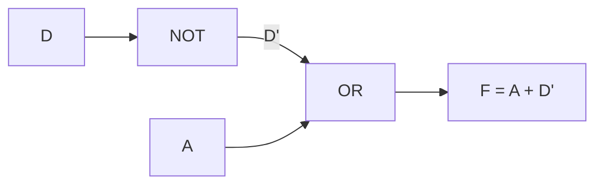

#### Problem 7 — a 2-bit comparator

> **Inputs A = A₁A₀ and B = B₁B₀; output F = 1 when A = B.**

Two 2-bit numbers are equal when **both bit positions match**, so:

> **F = (A₁ ⊙ B₁) · (A₀ ⊙ B₀)** — an **AND of two XNOR gates**

Expanded: **F = (A₁B₁ + Ā₁B̄₁)·(A₀B₀ + Ā₀B̄₀)**

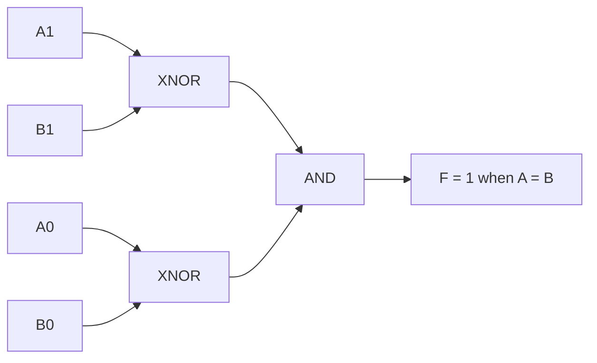

**Verification:** F = 1 only for the 4 combinations where A₁=B₁ and A₀=B₀, out of 16 total — i.e. **minterms where A = B**.

#### Don't-care conditions

A **don't-care (X or d)** is an input combination that **can never occur**, or whose output **does not matter**. In a K-map a don't-care may be treated as **either 0 or 1 — whichever makes the groups larger**.

**Example:** a BCD circuit uses only 0–9, so **minterms 10–15 are don't-cares**. Using them freely often halves the gate count.

> **The rule: include a don't-care ONLY if it enlarges a group. Never form a group consisting only of don't-cares.**

**Previous Year Question List from this Topic:**

- [Simplify the following boolean expression using 4 variable K-map: F(A,B,C,D) = ∑ m(0,3,5,7,8,10,11,12,13,14,15). Draw the K-map grid, clearly show your grouping…](../written-answers/dld.md?plain=1#L3421)
- [(a) Consider the following logic circuit-](../written-answers/dld.md?plain=1#L3578)
- [b) Use the Karnaugh Map to simplify the following function. f(A,B,C) = A'B'C' + A'B'C + A'BC + A'BC' + ABC' + ABC](../written-answers/dld.md?plain=1#L3671)
- [Show minimal function using K-Map: F(A, B, C, D) = \sum(2, 8, 9, 11, 13, 15).](../written-answers/dld.md?plain=1#L3739)
- [6.8 Simplify the following boolean expression using 4 variable K-map: F(A,B,C,D)= \sum m(0,3,5,7,8,10,11,12,13,14,15). Draw the K-map grid, clearly show your gr…](../written-answers/dld.md?plain=1#L3806)
- [(b) Simplify the following Boolean function using K-map.](../written-answers/dld.md?plain=1#L3883)
- [Minimize the following function in SOP minimal form using K-map:](../written-answers/dld.md?plain=1#L3956)
- [Simplify F(A, B, C, D) = ACD + AB + \overline{D} + AC\overline{D} using K-map and draw the logic circuits.](../written-answers/dld.md?plain=1#L4038)
- [(a) A comparator has two inputs A = A_1 A_0 and B = B_1 B_0 and one output F. Output becomes one whenever the value of A > B (i) Show the truth table for F. (ii…](../written-answers/dld.md?plain=1#L4205)
- [Simplify \bar{A}\,\bar{B}\,\bar{C} + ABC + A\bar{B}\,\bar{C} using K-map.](../written-answers/dld.md?plain=1#L4276)
- [F = \bar{A}\bar{B}\bar{C} + A\bar{B}\bar{C} + \bar{A}\bar{B}C + \bar{A}BC + ABC, Simplify using K-map with logic circuit.](../written-answers/dld.md?plain=1#L4528)
- [f(a, b, c, d) = \bar{a}b\bar{c}\bar{d} + \bar{a}\bar{b}\bar{c}d + \bar{a}b\bar{c}d + ab\bar{c}\bar{d} কে K-map এর সাহায্যে Simplify করুন।](../written-answers/dld.md?plain=1#L4605)
- [Simplify the expression: $F(A,B,C) = \bar{A}\bar{B}\bar{C} + \bar{A}B + AB\bar{C} + AC$, using k-map.](../written-answers/dld.md?plain=1#L4757)
- [(a) Simplify $F(A,B,C,D) = ACD+AB+\bar{D}+A\bar{C}D$ using K-map and draw the simplified circuit diagram.](../written-answers/dld.md?plain=1#L4837)
- [Using a Karnaugh map, simplify the function (A,B,C,D) = \Sigma 0,1,2,5,7,8,9,10,13,15 into Sum of Products form.](../written-answers/dld.md?plain=1#L4954)
- [Simplify using K-Map/SOP F = \Sigma(1,3,5,9,11,12,13,14)](../written-answers/dld.md?plain=1#L4989)


---

## Combinational Circuits (Adders, Encoders, MUX)

### Combinational vs Sequential Circuits

| Point | **Combinational Circuit** | **Sequential Circuit** |
|---|---|---|
| **Output depends on** | **ONLY the PRESENT inputs** | **The present inputs AND the PAST state (history)** |
| **Memory** | ❌ **None** | ✅ **Has memory elements** (flip-flops, latches) |
| **Clock** | ❌ Not required | ✅ Usually required (synchronous) |
| **Feedback** | ❌ **No feedback path** | ✅ **Feedback from output to input** |
| **Design tool** | Truth table, K-map, Boolean algebra | **State diagram, state table, excitation table** |
| **Speed** | **Faster** | Slower (clock-limited) |
| **Complexity** | Simpler | More complex |
| **Examples** | **Adder, Subtractor, Multiplexer, Demultiplexer, Encoder, Decoder, Comparator, Code converter, ALU** | **Flip-flop, Latch, Register, Counter, Shift register, Memory, FSM, CPU control unit** |

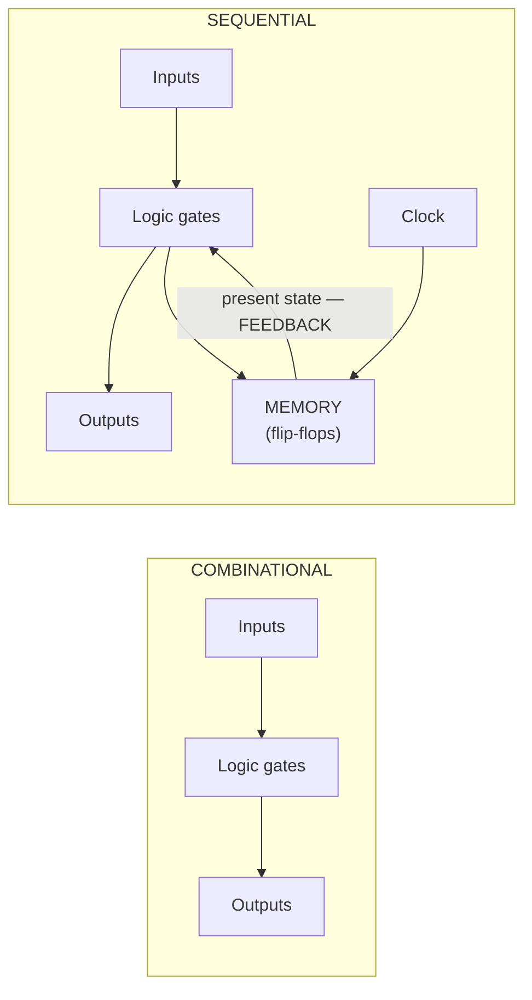

**Previous Year Question List from this Topic:**

- [Difference between combinational and sequential circuits.](../written-answers/dld.md?plain=1#L7785)
- [(খ) Combinational এবং Sequential circuit এর মধ্যে পার্থক্য ডায়াগ্রাম সহকারে লিখুন।](../written-answers/dld.md?plain=1#L7892)
- [Main difference between Combinational and Sequential circuits.](../written-answers/dld.md?plain=1#L8473)


---

### Adders — Half Adder and Full Adder

#### Half Adder

A **half adder** adds **TWO single bits** and produces a **SUM** and a **CARRY**. It is called "half" because it **cannot accept a carry-in** from a previous stage.

**Truth table:**

| A | B | **Sum (S)** | **Carry (C)** |
|---|---|---|---|
| 0 | 0 | **0** | **0** |
| 0 | 1 | **1** | **0** |
| 1 | 0 | **1** | **0** |
| 1 | 1 | **0** | **1** |

**Boolean expressions:**
> **Sum = A ⊕ B** (XOR — 1 when the inputs differ)
> **Carry = A · B** (AND — 1 only when both are 1)

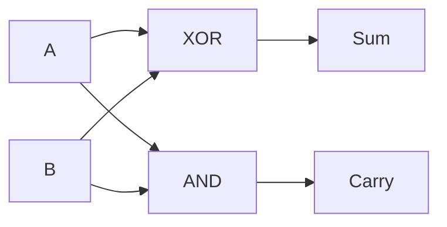

**Gates required: 1 XOR + 1 AND.**

#### Full Adder

A **full adder** adds **THREE bits** — A, B and a **carry-in (Cin)** from the previous stage — producing a **Sum** and a **Carry-out**. This is what makes multi-bit addition possible.

**Truth table:**

| A | B | Cin | **Sum (S)** | **Cout** |
|---|---|---|---|---|
| 0 | 0 | 0 | **0** | **0** |
| 0 | 0 | 1 | **1** | **0** |
| 0 | 1 | 0 | **1** | **0** |
| 0 | 1 | 1 | **0** | **1** |
| 1 | 0 | 0 | **1** | **0** |
| 1 | 0 | 1 | **0** | **1** |
| 1 | 1 | 0 | **0** | **1** |
| 1 | 1 | 1 | **1** | **1** |

**Boolean expressions (from the K-map):**
> **Sum = A ⊕ B ⊕ Cin**
> **Cout = AB + BCin + ACin** — the **majority function**: the carry is 1 when **at least two** inputs are 1
> *(Equivalently: **Cout = AB + Cin(A ⊕ B)**, which is the form used when building from two half adders.)*

**Circuit using basic gates (AND, OR, NOT):**

Expanding Sum into SOP form gives `Sum = ĀB̄Cin + ĀBC̄in + AB̄C̄in + ABCin`, implemented with 4 three-input AND gates and one 4-input OR gate; and `Cout = AB + BCin + ACin` with 3 AND gates and one 3-input OR gate.

**Building a full adder from TWO half adders and an OR gate** — the standard, elegant construction:

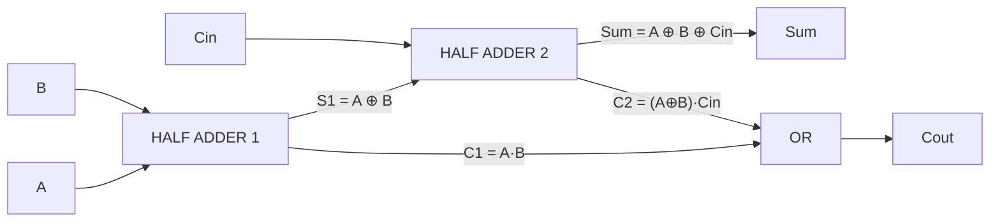

| Stage | Produces |
|---|---|
| **Half Adder 1** (inputs A, B) | S1 = A ⊕ B · C1 = A·B |
| **Half Adder 2** (inputs S1, Cin) | **Sum = S1 ⊕ Cin = A⊕B⊕Cin** · C2 = S1·Cin |
| **OR gate** | **Cout = C1 + C2 = AB + (A⊕B)Cin** ✅ |

**Gates required: 2 XOR + 2 AND + 1 OR.**

**Full adder using NAND gates only:** requires **9 two-input NAND gates** — the XOR sub-circuits take 4 each, plus one for the carry OR. *(The standard figure quoted is **9 NAND gates**.)*

#### Half Adder vs Full Adder

| Point | **Half Adder** | **Full Adder** |
|---|---|---|
| **Number of inputs** | **2** (A, B) | **3** (A, B, **Cin**) |
| **Number of outputs** | 2 (Sum, Carry) | 2 (Sum, Cout) |
| **Handles carry-in** | ❌ **No** | ✅ **Yes** |
| **Can be cascaded** | ❌ No | ✅ **Yes** — this is the point |
| **Gates needed** | 1 XOR + 1 AND | 2 XOR + 2 AND + 1 OR |
| **Used for** | The **least significant bit** only | **All other bit positions** in a multi-bit adder |

**A 4-bit ripple-carry adder** is simply **four full adders chained**, with each stage's Cout feeding the next stage's Cin. Its weakness is **propagation delay** — the carry must ripple through all four stages before the answer is valid, which is why fast processors use **carry-lookahead adders**.

**Previous Year Question List from this Topic:**

- [Design a Full Adder circuit using basic logic gates (AND, OR, NOT). Draw the truth table, derive the Boolean expressions for the Sum (S) and Carry (C_{out}), an…](../written-answers/dld.md?plain=1#L5087)
- [What is half adder?](../written-answers/dld.md?plain=1#L5191)
- [Design a full adder using NAND gates only.](../written-answers/dld.md?plain=1#L5240)
- [Design a full adder using two half adders and an OR gate?](../written-answers/dld.md?plain=1#L5318)
- [Truth Table from the following circuit (2-bit input A, B full adder with carry bit C_{in}).](../written-answers/dld.md?plain=1#L5474)
- [What is Half Adder circuit? Expalin with block diagram with logic circuit.](../written-answers/dld.md?plain=1#L5640)
- [(a) Draw the logic diagram of Half-Adder the truth table of Full-Adder and use half Adder (S) and basic gates to build a Full-Adder.](../written-answers/dld.md?plain=1#L6006)


---

### Multiplexer, Demultiplexer, Encoder and Decoder

#### Multiplexer (MUX) — the data selector

A **multiplexer** is a combinational circuit that **selects ONE of several input lines and routes it to a SINGLE output line**, according to the value on its **select lines**.

> **A 2ⁿ-to-1 MUX needs n select lines.**

| MUX | Data inputs | Select lines |
|---|---|---|
| 2 : 1 | 2 | **1** |
| **4 : 1** | 4 | **2** |
| **8 : 1** | 8 | **3** |
| 16 : 1 | 16 | 4 |

#### 4:1 Multiplexer

**Truth table:**

| S1 | S0 | **Output Y** |
|---|---|---|
| 0 | 0 | **I0** |
| 0 | 1 | **I1** |
| 1 | 0 | **I2** |
| 1 | 1 | **I3** |

**Boolean expression:**
> **Y = S̄1·S̄0·I0 + S̄1·S0·I1 + S1·S̄0·I2 + S1·S0·I3**

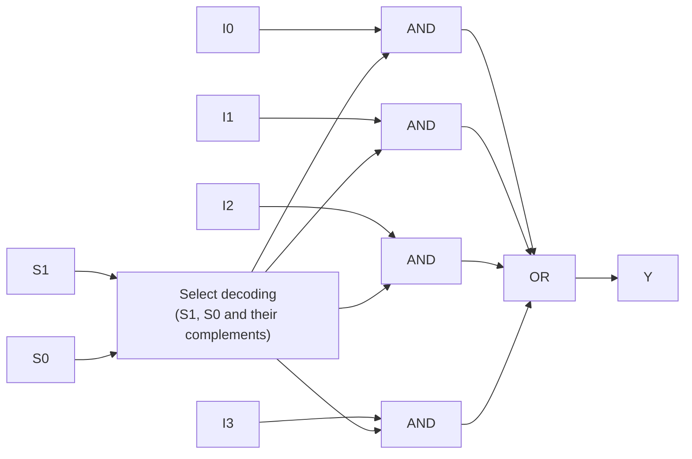

**Components: 2 NOT gates, 4 three-input AND gates, 1 four-input OR gate.**

#### 8:1 Multiplexer

It has **8 data inputs (I0–I7)** and **3 select lines (S2, S1, S0)**.

> **Y = Σ (over i = 0 to 7) of (the minterm of S2S1S0 equal to i) · Iᵢ**

**Working procedure:** the three select lines form a 3-bit binary number from 0 to 7. That number **enables exactly one of the eight AND gates**, so only the corresponding data input reaches the OR gate and therefore the output. All other AND gates output 0, which does not affect the OR.

**An 8:1 MUX can be built from two 4:1 MUXes and one 2:1 MUX:** the lower two select bits (S1, S0) drive both 4:1 MUXes, and the most significant bit (S2) drives the final 2:1 MUX that chooses between their outputs.

#### Building a 6:1 MUX from 2:1 MUXes

A 6:1 MUX needs **3 select lines** (since 2² = 4 < 6 ≤ 8 = 2³), and can be built from **5 two-to-one multiplexers** arranged in a tree:

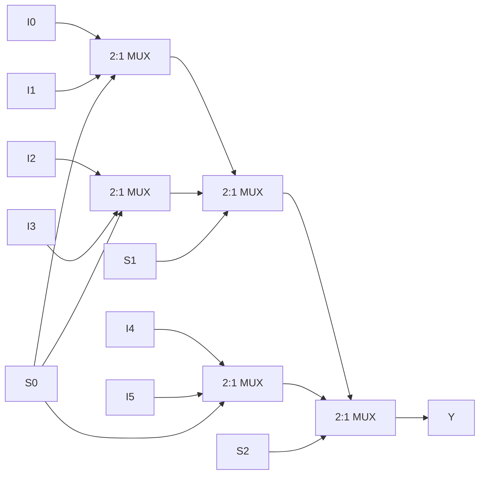

**Level 1** (3 MUXes, selected by S0) reduces 6 inputs to 3; **Level 2** (1 MUX, S1) reduces 2 of those to 1; **Level 3** (1 MUX, S2) chooses between that result and the third. **Total: 5 two-to-one MUXes.**

#### Demultiplexer (DEMUX) — the data distributor

A **demultiplexer** does the **exact opposite** of a multiplexer: it takes **ONE input line and routes it to ONE of several output lines**, chosen by the select lines.

> **A 1-to-2ⁿ DEMUX needs n select lines.**

#### MUX vs DEMUX — the key comparison

| Point | **Multiplexer (MUX)** | **Demultiplexer (DEMUX)** |
|---|---|---|
| **Function** | **MANY inputs → ONE output** | **ONE input → MANY outputs** |
| **Also called** | **Data selector** | **Data distributor** |
| **Inputs** | **2ⁿ** data inputs + n select lines | **1** data input + n select lines |
| **Outputs** | **1** | **2ⁿ** |
| **Configuration** | **N-to-1** | **1-to-N** |
| **Operation** | Selects **which input** to pass through | Selects **which output** to send to |
| **Analogy** | **Many roads merging into one** | **One road branching into many** |
| **Used at** | The **transmitting** end | The **receiving** end |

**A practical application — telephone/data transmission:**

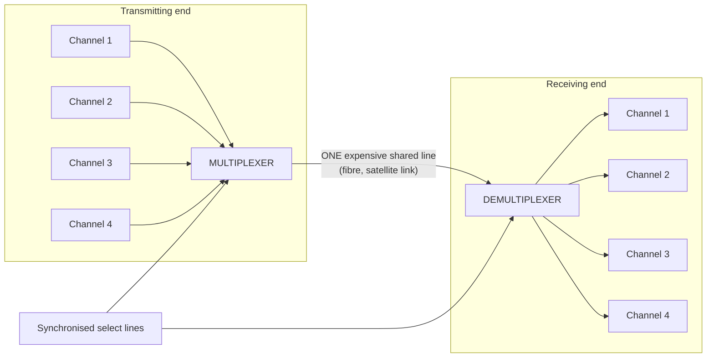

> **This is exactly how Time Division Multiplexing works in telecommunications** — four telephone conversations share one expensive long-distance line, with the MUX and DEMUX switching in perfect synchronisation. **The economic saving is enormous**: one line instead of four.

**Other MUX applications:** selecting which register feeds the ALU inside a CPU · implementing any Boolean function directly (a 2ⁿ:1 MUX can implement **any** n-variable function) · parallel-to-serial conversion · and memory address decoding.

#### Implementing a Boolean function with a MUX

> **Any n-variable Boolean function can be implemented with a 2ⁿ-to-1 MUX**: connect the n variables to the select lines, and set each data input to the **function's output value (0 or 1) for that minterm**.

**Even better:** an **(n−1)-variable MUX** suffices if the data inputs are allowed to be 0, 1, a variable, or its complement.

#### Decoder

A **decoder** converts an **n-bit binary input into one of 2ⁿ output lines**, activating **exactly ONE output** at a time.

**2:4 Decoder truth table:**

| A1 | A0 | **Y3** | **Y2** | **Y1** | **Y0** |
|---|---|---|---|---|---|
| 0 | 0 | 0 | 0 | 0 | **1** |
| 0 | 1 | 0 | 0 | **1** | 0 |
| 1 | 0 | 0 | **1** | 0 | 0 |
| 1 | 1 | **1** | 0 | 0 | 0 |

> **Y0 = Ā1Ā0 · Y1 = Ā1A0 · Y2 = A1Ā0 · Y3 = A1A0** — **each output is one MINTERM**.
>
> **This is why a decoder plus an OR gate implements ANY Boolean function:** the decoder generates every minterm, and the OR gate sums the ones you need. `F = Σm(1,2)` becomes simply `OR(Y1, Y2)`.

**Uses:** memory address decoding, instruction decoding in a CPU, **7-segment display drivers**, and demultiplexing.

#### Encoder

An **encoder** is the **opposite of a decoder**: it converts **2ⁿ input lines into an n-bit binary code**, indicating **which input is active**.

**4:2 Encoder truth table:**

| D3 | D2 | D1 | D0 | **A1** | **A0** |
|---|---|---|---|---|---|
| 0 | 0 | 0 | 1 | **0** | **0** |
| 0 | 0 | 1 | 0 | **0** | **1** |
| 0 | 1 | 0 | 0 | **1** | **0** |
| 1 | 0 | 0 | 0 | **1** | **1** |

> **A1 = D2 + D3 · A0 = D1 + D3**
>
> **The problem with a simple encoder:** if two inputs are active at once, the output is meaningless. A **PRIORITY ENCODER** solves this by assigning each input a priority and encoding **only the highest-priority active input** — which is how interrupt controllers work.

#### The 7-segment display

A **7-segment display** shows a decimal digit using seven LED segments labelled **a, b, c, d, e, f, g**.

```
     ─a─
    |   |
    f   b
    |   |
     ─g─
    |   |
    e   c
    |   |
     ─d─
```

**The segments lit for each digit (common cathode — 1 = ON):**

| Digit | **a** | **b** | **c** | **d** | **e** | **f** | **g** |
|---|---|---|---|---|---|---|---|
| **0** | 1 | 1 | 1 | 1 | 1 | 1 | **0** |
| **1** | 0 | 1 | 1 | 0 | 0 | 0 | 0 |
| **2** | 1 | 1 | 0 | 1 | 1 | 0 | 1 |
| **3** | 1 | 1 | 1 | 1 | 0 | 0 | 1 |
| **4** | 0 | 1 | 1 | 0 | 0 | 1 | 1 |
| **5** | 1 | 0 | 1 | 1 | 0 | 1 | 1 |
| **6** | 1 | 0 | 1 | 1 | 1 | 1 | 1 |
| **7** | 1 | 1 | 1 | 0 | 0 | 0 | 0 |
| **8** | 1 | 1 | 1 | 1 | 1 | 1 | 1 |
| **9** | 1 | 1 | 1 | 1 | 0 | 1 | 1 |

**A BCD-to-7-segment decoder** takes the 4-bit BCD input and produces these seven outputs. Each segment's expression is derived by a **K-map on the 4-bit input**, with minterms **10–15 treated as DON'T-CARES** (since BCD never produces them) — which simplifies the logic considerably.

*(**Common cathode**: all cathodes tied to ground, a **HIGH** lights a segment. **Common anode**: all anodes tied to Vcc, a **LOW** lights a segment.)*

#### Worked design — count the number of 1s in three inputs

> **Design a logic circuit with inputs A, B, C whose output indicates how many inputs are 1.**

The count ranges from 0 to 3, so **two output bits** are needed: **Y1 (the 2s place) and Y0 (the 1s place)**.

| A | B | C | Count | **Y1** | **Y0** |
|---|---|---|---|---|---|
| 0 | 0 | 0 | 0 | **0** | **0** |
| 0 | 0 | 1 | 1 | **0** | **1** |
| 0 | 1 | 0 | 1 | **0** | **1** |
| 0 | 1 | 1 | 2 | **1** | **0** |
| 1 | 0 | 0 | 1 | **0** | **1** |
| 1 | 0 | 1 | 2 | **1** | **0** |
| 1 | 1 | 0 | 2 | **1** | **0** |
| 1 | 1 | 1 | 3 | **1** | **1** |

> **Y0 = A ⊕ B ⊕ C** (1 when an **ODD** number of inputs are 1)
> **Y1 = AB + BC + AC** (1 when **at least TWO** inputs are 1 — the **majority function**)

> ### **This is EXACTLY a FULL ADDER** — Y0 is the Sum and Y1 is the Carry. A full adder *is* a 3-bit "count the ones" circuit, which is why it is also called a **(3,2) counter**.

#### Worked design — output 1 when the majority of A, B, C are 1

From the same table, the output is **Y1 = AB + BC + AC** — the **majority function**, implemented with **three 2-input AND gates and one 3-input OR gate**.

**Previous Year Question List from this Topic:**

- [What is the difference between a Multiplexer and a Demultiplexer? Explain one practical application of each in digital systems.](../written-answers/dld.md?plain=1#L5019)
- [Multiplexing:](../written-answers/dld.md?plain=1#L5392)
- [একটি 2:4 ডিকোডার ও একটি OR গেট ব্যবহার করে একটি হাফ এডার ডিজাইন কর।](../written-answers/dld.md?plain=1#L5527)
- [Design 6 \times 1 MUX by using 2 \times 1 MUX](../written-answers/dld.md?plain=1#L5579)
- [Desugn a logic circuit that counts the number of 1s in 3 inputs (A, B, C) and outputs a two-bit binary number representing that count of 1s?](../written-answers/dld.md?plain=1#L5702)
- [একটি 4:1 Multiplexer এর Logic Diagram অঙ্কন করে দেখান?](../written-answers/dld.md?plain=1#L5776)
- [How do you design a logic circuit that has three inputs A, B, C and whose output will be high only when majority of the inputs are high. (a) Find truth table an…](../written-answers/dld.md?plain=1#L5842)
- [Design a 8\times 1 MUX and explain working procedure.](../written-answers/dld.md?plain=1#L5928)
- [Circuit of the following figure uses 4:1 Multiplexer, what is output of the function f?](../written-answers/dld.md?plain=1#L6081)
- [For 7 segments display the input is abcdefg. When a decimal digit or value is display then its equivalent segment is high. (i) Draw logic circuit for 2-to-4 Lin…](../written-answers/dld.md?plain=1#L6162)
- [4:1 MUX এর লজিক ডায়াগ্রাম ডিজাইন করুন এবং Selection Line দুটির কাজ লিখুন।](../written-answers/dld.md?plain=1#L6238)


---

## Sequential Circuits (Latches & Flip-Flops)

### Latches and Flip-Flops

A **latch** and a **flip-flop** are both **1-bit memory elements** — the fundamental storage cells of every sequential circuit.

#### Latch vs Flip-Flop — the key distinction

| Point | **LATCH** | **FLIP-FLOP** |
|---|---|---|
| **Triggered by** | The **LEVEL** of the enable signal — it is **transparent** while enable is high | The **EDGE** of the clock — the rising ↑ or falling ↓ **transition** |
| **Clock** | **Level-sensitive** (or unclocked) | **Edge-sensitive** — requires a clock |
| **Transparency** | ✅ **Transparent** — while enabled, the output **follows the input continuously** | ❌ **Never transparent** — the output changes **only at the clock edge** |
| **Output changes** | **Any time** the input changes while enabled | **Only once per clock edge** |
| **Speed** | **Faster** | Slower |
| **Power and area** | **Less** — fewer gates | More |
| **Built from** | Gates with feedback | **Two latches** (master-slave) or an edge-detect circuit |
| **Timing control** | **Difficult** — prone to race conditions and glitches | **Precise and predictable** |
| **Used in** | Simple storage, asynchronous designs, some low-power designs | **Registers, counters, shift registers, synchronous state machines — virtually all modern digital design** |

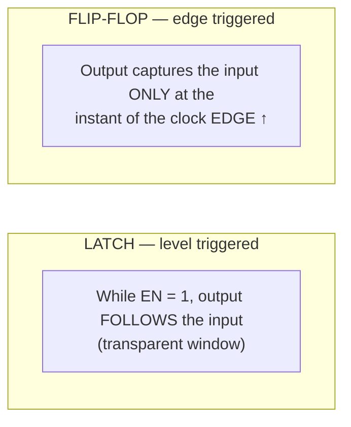

#### D Latch vs D Flip-Flop

| | **D Latch** | **D Flip-Flop** |
|---|---|---|
| **Control** | Enable **level** | Clock **edge** |
| **When EN/CLK is active** | Q **follows** D continuously | Q takes D's value **at the edge only**, then holds |
| **Output during the active period** | Transparent | Held constant |
| **Symbol** | No triangle on the clock input | **Triangle (▷)** on the clock input |

> **The single most important consequence:** because a flip-flop samples at one **instant**, the entire circuit's timing is predictable and analysable, which is what makes large **synchronous** designs possible. A latch's transparency window allows signals to race through multiple stages in one clock period — the classic source of unpredictable behaviour.

#### The types of flip-flop

**1. SR (Set-Reset) Flip-Flop**

| S | R | **Q(next)** | Meaning |
|---|---|---|---|
| 0 | 0 | **Q (no change)** | Hold |
| 0 | 1 | **0** | Reset |
| 1 | 0 | **1** | Set |
| 1 | 1 | **INVALID / forbidden** | ❌ Indeterminate |

> **Characteristic equation: Q(next) = S + R̄·Q**
> **The fatal flaw: S = R = 1 is FORBIDDEN**, because it tries to set and reset simultaneously, and the resulting state depends on which gate is marginally faster — a **race condition**. This is exactly why JK and D flip-flops were invented.

**2. JK Flip-Flop** — the SR flip-flop with the invalid state fixed

| J | K | **Q(next)** | Meaning |
|---|---|---|---|
| 0 | 0 | **Q** | Hold |
| 0 | 1 | **0** | Reset |
| 1 | 0 | **1** | Set |
| 1 | 1 | **Q̄ (TOGGLE)** | ✅ **The forbidden state is turned into a useful one** |

> **Characteristic equation: Q(next) = J·Q̄ + K̄·Q**
> **The JK is the most versatile flip-flop** — it can emulate SR, D and T behaviour.

**3. D (Data / Delay) Flip-Flop**

| D | **Q(next)** |
|---|---|
| 0 | **0** |
| 1 | **1** |

> **Characteristic equation: Q(next) = D** — *"whatever D is at the clock edge becomes Q"*.
> **The simplest and by far the most used** — it is the building block of registers and memories.

**4. T (Toggle) Flip-Flop**

| T | **Q(next)** |
|---|---|
| 0 | **Q (hold)** |
| 1 | **Q̄ (toggle)** |

> **Characteristic equation: Q(next) = T ⊕ Q**
> **A T flip-flop DIVIDES THE FREQUENCY BY 2** — which makes it the natural building block of **counters** and **clock dividers**.

#### Register vs Latch

| Point | **Latch** | **Register** |
|---|---|---|
| **Stores** | **1 bit** | **Multiple bits** (4, 8, 16, 32, 64) |
| **Built from** | Gates with feedback | **A GROUP of flip-flops** sharing one clock |
| **Triggering** | Level | Edge (since it is made of flip-flops) |
| **Purpose** | A single memory cell | **Hold a whole data word** — an operand, an address, a result |
| **Found in** | Inside larger elements | **CPU registers, buffers, pipeline stages** |

**Previous Year Question List from this Topic:**

- [What is Multiplexer? Difference between D latch and D flip-flop?](../written-answers/dld.md?plain=1#L7739)
- [What is the difference between latch and flip-flop?](../written-answers/dld.md?plain=1#L8007)
- [(ii) R-S Flip-flop এর সত্যস্য সারণি ও বৈশিষ্ট আলোচনা করুন।](../written-answers/dld.md?plain=1#L8090)
- [(গ) Flip-Flop কী? একটি Multiplexer এর কার্যপদ্ধতি ব্যাখ্যা করুন।](../written-answers/dld.md?plain=1#L8227)
- [Difference between Register and Latch.](../written-answers/dld.md?plain=1#L8423)
- [What is the difference between flip-flop and latch with figure?](../written-answers/dld.md?plain=1#L8555)
- [What is the difference between latch and flip-flop?](../written-answers/dld.md?plain=1#L8619)


---

### Counters and Clock Division

#### What is a counter?

A **counter** is a **sequential circuit that counts clock pulses**, progressing through a defined sequence of states. It is built from flip-flops — usually **T or JK** flip-flops in toggle mode.

| Type | Description |
|---|---|
| **Asynchronous (Ripple) counter** | **Only the FIRST flip-flop receives the clock**; each subsequent one is clocked by the **output of the previous one** |
| **Synchronous counter** | **ALL flip-flops receive the SAME clock simultaneously** |
| **Up counter** | Counts 0, 1, 2, 3 … |
| **Down counter** | Counts …3, 2, 1, 0 |
| **MOD-N counter** | Counts through **N states** (0 to N−1) then resets |
| **Ring counter** | A shift register with feedback; **exactly one bit is 1** at a time |
| **Johnson counter** | A ring counter with **inverted** feedback; gives 2n states from n flip-flops |

#### Asynchronous vs Synchronous counters

| Point | **Asynchronous (Ripple)** | **Synchronous** |
|---|---|---|
| **Clock** | Only FF0 gets the external clock; others are clocked by the preceding output | **ALL flip-flops share the SAME clock** |
| **Flip-flops change** | **One after another — they RIPPLE** | **All at the SAME instant** |
| **Speed** | **SLOW** — delay accumulates through every stage | **FAST** — delay is that of one flip-flop only |
| **Propagation delay** | **n × t_pd** for n flip-flops | **t_pd** |
| **Glitches / spurious states** | ✅ **Yes** — transient wrong values appear during the ripple | ❌ **No** |
| **Circuit complexity** | **Simple** — very few extra gates | More complex — needs combinational logic for each flip-flop's inputs |
| **Cost** | Lower | Higher |
| **Used for** | Low-frequency, non-critical counting; frequency division | **High-speed and critical applications** — the standard choice |

#### A 3-bit asynchronous up ripple counter

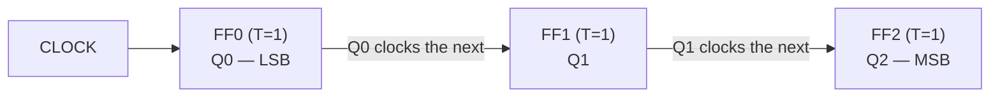

**All flip-flops are wired in TOGGLE mode (T = 1, or J = K = 1).** Each stage toggles when the previous stage's output falls, so each stage **divides the frequency by 2**.

**The count sequence:**

| Clock pulse | **Q2** | **Q1** | **Q0** | Decimal |
|---|---|---|---|---|
| Initial | 0 | 0 | 0 | **0** |
| 1 | 0 | 0 | 1 | **1** |
| 2 | 0 | 1 | 0 | **2** |
| 3 | 0 | 1 | 1 | **3** |
| 4 | 1 | 0 | 0 | **4** |
| 5 | 1 | 0 | 1 | **5** |
| 6 | 1 | 1 | 0 | **6** |
| 7 | 1 | 1 | 1 | **7** |
| 8 | 0 | 0 | 0 | **back to 0** |

**A 3-bit counter has 2³ = 8 states (MOD-8).** In general, **n flip-flops give a MOD-2ⁿ counter**, and **a MOD-N counter needs n flip-flops where 2ⁿ ≥ N**.

#### MOD-6 and MOD-10 counters

> **A MOD-N counter counts from 0 to N−1, then RESETS.** Since N is not a power of 2, extra logic is needed to force the reset.

**MOD-6 counter (counts 0–5):** needs **3 flip-flops** (2³ = 8 ≥ 6). The count must reset when it reaches **6 = 110**, so a **NAND gate detecting Q2·Q1** drives the asynchronous **CLEAR** input of all three flip-flops.

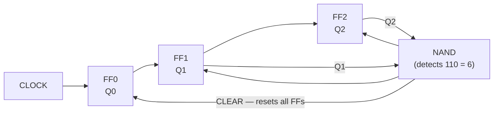

**MOD-10 (decade) counter (counts 0–9):** needs **4 flip-flops** (2⁴ = 16 ≥ 10). It must reset on reaching **10 = 1010**, so a **NAND gate detecting Q3·Q1** drives the CLEAR inputs.

| Clock | Q3 Q2 Q1 Q0 | Decimal |
|---|---|---|
| 0 | 0000 | 0 |
| … | … | … |
| 9 | 1001 | **9** |
| 10 | **1010 → detected → instantly CLEARED to 0000** | **0** |

> **The transient-state caveat worth mentioning:** the count momentarily reaches 1010 before the NAND gate's output propagates and clears it. This **glitch** is characteristic of asynchronous MOD-N designs, and is one more reason synchronous counters are preferred in precision work.

#### 4-bit ring counter

A **ring counter** is a **shift register whose output is fed back to its input**, so that a single 1 circulates around the ring.

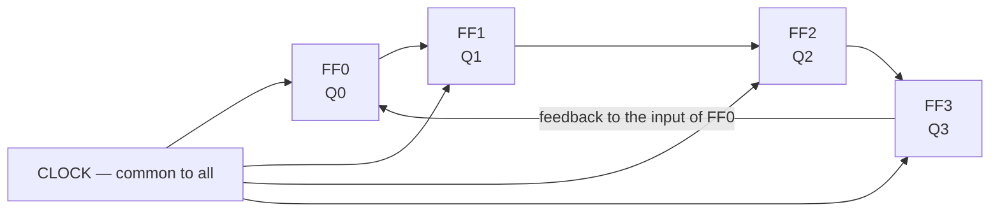

**Working principle:** the counter is **preset to 1000**. On each clock pulse the pattern shifts one position right, with the last flip-flop's output fed back into the first.

| Clock | **Q0 Q1 Q2 Q3** |
|---|---|
| Initial | **1 0 0 0** |
| 1 | **0 1 0 0** |
| 2 | **0 0 1 0** |
| 3 | **0 0 0 1** |
| 4 | **1 0 0 0** ← back to the start |

**Properties:** **n flip-flops give only n states** (not 2ⁿ), so it is **inefficient in flip-flop usage**; but **no decoding logic is needed** — each flip-flop output *is* the state indicator. This makes it ideal for **sequencing, stepper-motor control and time-division switching**.

*(A **Johnson counter** feeds back the **complement** of the last output, giving **2n states** from n flip-flops — twice the efficiency, still with simple decoding.)*

#### Clock division — deriving 50 MHz and 25 MHz from 100 MHz

> **A T flip-flop in toggle mode (T = 1) divides the input frequency by exactly 2**, because it changes state once per input clock edge, so its output completes one full cycle every **two** input cycles.

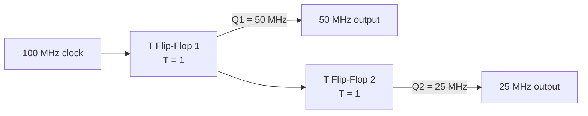

| Stage | Input | **Output** |
|---|---|---|
| **T flip-flop 1** | 100 MHz | **50 MHz** (÷2) |
| **T flip-flop 2** | 50 MHz | **25 MHz** (÷4 overall) |

> **The general rule: n cascaded T flip-flops divide the frequency by 2ⁿ.** The outputs also have a **perfect 50 % duty cycle**, which is one of the main reasons this method is preferred over other divider designs.

#### Why synchronisation matters

**Synchronous operation** means **all state changes occur at the same instant, on a common clock edge**.

**Why sequential circuits need it:**
1. **Predictable, analysable timing** — the designer knows exactly when every signal is valid.
2. **Eliminates race conditions** — without a common clock, two signals racing through different-length paths can arrive in either order, producing unpredictable results.
3. **Prevents glitches from being captured** — combinational outputs settle during the clock period and are only sampled once they are stable.
4. **Makes static timing analysis possible** — the whole design can be verified against setup and hold requirements.
5. **Enables pipelining** and therefore high performance.
6. **Simplifies design and testing** enormously.

**Setup and hold time** — the two critical constraints: the data input must be **stable for the setup time BEFORE** the clock edge and **for the hold time AFTER** it. Violating either causes **metastability**, in which the output hovers between 0 and 1 for an unpredictable time. This is why **asynchronous inputs must be passed through a two-flip-flop synchroniser** before entering a synchronous system.

**Choosing a clock:** for a digital system, a **crystal oscillator** is chosen for its **frequency stability (± a few ppm)**, low jitter and temperature stability. For a real-time clock, a **32.768 kHz crystal** is standard (2¹⁵ Hz divides cleanly to 1 Hz). For high-speed logic, a **PLL** multiplies a stable low-frequency crystal reference up to the required core frequency.

**Previous Year Question List from this Topic:**

- [(b) Design a 4-bit ring counter using flip-flops. Write down its working principle using.](../written-answers/dld.md?plain=1#L7837)
- [Given a 100MHz clock signal derive a circuit using T-flip flops of generate 50MHz and 25MHz clock signals. Draw a timing diagram for all the three clock signal.](../written-answers/dld.md?plain=1#L7939)
- [There are different types of clocks available in the market. What type of clock will you use to reduce the cost of SGFL Company?](../written-answers/dld.md?plain=1#L8053)
- [MOD-6 বাইনারি কাউন্টার এর Block Diagram অংকন করুন।](../written-answers/dld.md?plain=1#L8158)
- [Ripple counter কী? একটি তিন বিটের Asynchronous up ripple counter এর গঠন লিখুন।](../written-answers/dld.md?plain=1#L8287)
- [(c) Draw the circuit diagram of a mod-10 asynchronous ripple up counter and explain its operation.](../written-answers/dld.md?plain=1#L8346)
- [What is synchronous? Why sequential circuit use synchronization.](../written-answers/dld.md?plain=1#L8522)


---

## Logic Families (TTL vs CMOS)

### Logic Families and IC Characteristics

#### What is an IC?

An **Integrated Circuit (IC)** is a **complete electronic circuit — transistors, resistors, diodes and their interconnections — fabricated on a single small piece of semiconductor material (a "chip"), usually silicon.**

#### Advantages of an IC over a discrete-component circuit

1. **Very small size** — millions of components in a few square millimetres.
2. **Much lower cost** per function, because thousands of chips are fabricated together on one wafer.
3. **Higher reliability** — there are **no soldered joints between components**, and soldered joints are the commonest failure point in discrete circuits.
4. **Lower power consumption** — smaller devices switch less charge.
5. **Higher speed** — short internal interconnections mean **less capacitance and less propagation delay**.
6. **Consistency** — all units of a batch behave identically.
7. **Lighter weight** and less heat.
8. **Easier assembly and servicing** — replace one chip rather than diagnose fifty components.

> **Why ICs need so little power:** the transistors are **microscopically small**, so the **capacitance that must be charged and discharged on every switching event is tiny**, and dynamic power is proportional to **C·V²·f**. Modern chips also run at **much lower supply voltages** (1.2 V instead of 5 V), and since power depends on the **square** of the voltage, this alone is a very large saving.

**Disadvantages:** an IC **cannot be repaired** — if one internal transistor fails, the whole chip is discarded; it **cannot handle high power or high voltage**; inductors and large capacitors cannot be fabricated on-chip; and design and mask costs are enormous, so ICs are only economic in volume.

#### Important characteristics of a digital IC

| Characteristic | Meaning |
|---|---|
| **Propagation delay (t_pd)** | The time between an input change and the corresponding output change. **Determines maximum speed** |
| **Power dissipation** | Power consumed — static (leakage) plus dynamic (switching) |
| **Fan-in** | The **NUMBER OF INPUTS** a gate can accept |
| **Fan-out** | The **NUMBER OF SIMILAR GATES a single output can DRIVE** reliably |
| **Noise margin** | How much electrical noise a signal can tolerate before being misinterpreted. **Higher is better** |
| **Supply voltage (Vcc)** | The operating voltage range |
| **Operating temperature** | Commercial (0–70 °C), industrial (−40–85 °C), military (−55–125 °C) |
| **Speed-power product** | A figure of merit combining delay and power — **lower is better** |
| **Current sourcing / sinking** | How much current the output can supply or absorb |

#### Fan-in and Fan-out

> **FAN-IN** is the **number of INPUTS** a logic gate has. A 3-input NAND gate has a fan-in of 3. **Higher fan-in increases propagation delay**, because more transistors are placed in series, so practical gates are limited to about 4–8 inputs; wider functions are built from a **tree** of smaller gates.

> **FAN-OUT** is the **maximum number of similar gate inputs that ONE output can drive** while still maintaining valid logic levels.

**Why fan-out is limited:** each driven input draws current (TTL) or presents capacitance (CMOS). Exceeding the fan-out limit causes the output voltage to **degrade out of the valid range** (in TTL) or the **switching to become unacceptably slow** (in CMOS).

| Family | **Typical fan-out** |
|---|---|
| Standard TTL | **10** |
| LS-TTL | 20 |
| **CMOS** | **50+** at DC (limited by **capacitance and speed**, not current) |
| ECL | 25 |

**The solution when more fan-out is needed:** insert a **buffer/driver** gate, or split the load across several buffers.

#### TTL vs CMOS — the key comparison

| Point | **TTL (Transistor-Transistor Logic)** | **CMOS (Complementary MOS)** |
|---|---|---|
| **Built from** | **Bipolar junction transistors (BJT)** | **MOSFETs** — complementary NMOS + PMOS pairs |
| **Speed** | **Historically FASTER** (standard TTL ~10 ns) | Historically slower, but **modern CMOS is FASTER than any TTL** |
| **Power consumption** | **HIGH** — draws current continuously, even when idle | **VERY LOW at rest** — draws current **almost only while SWITCHING** |
| **Power vs frequency** | Roughly **constant** | **Increases with frequency** (P ∝ C·V²·f) |
| **Noise immunity / margin** | **Lower** (~0.4 V) | **HIGHER** (~30–45 % of Vcc) ✅ |
| **Supply voltage** | **Fixed 5 V ± 5 %** — inflexible | **Wide range: 3 V to 18 V** (modern logic 1.2–3.3 V) ✅ |
| **Fan-out** | **10** | **50+** ✅ |
| **Packing density** | **Lower** | **MUCH HIGHER** ✅ — this is why every VLSI chip is CMOS |
| **Cost** | Higher per function | **Lower** |
| **Heat generated** | **High** | **Low** |
| **Static electricity** | Robust | ⚠️ **Very sensitive to ESD** — needs careful handling |
| **Unused inputs** | May be left floating (they float high) | **MUST be tied to Vcc or ground** — a floating CMOS input causes oscillation and excessive current |
| **Input impedance** | Low | **Extremely high** |
| **Series** | 74xx, 74LSxx, 74HCTxx | **4000 series, 74HCxx, 74HCTxx** |
| **Used in** | Legacy equipment, some interfacing | **Virtually EVERYTHING today — all microprocessors, memory and VLSI** |

> **The verdict for an exam answer:** *"TTL was faster in the 1970s and 80s and is more rugged, but **CMOS won decisively** because of its **near-zero static power consumption, far higher packing density, better noise immunity and wider supply range**. Modern CMOS has also overtaken TTL in speed. Every microprocessor, memory chip and ASIC made today is CMOS; TTL survives only in legacy systems and in a few interfacing roles."*

#### Implementing AND and OR with CMOS NAND and NOR gates

In CMOS, **NAND and NOR are the natural, simplest gates** — each needs only **4 transistors** for two inputs. An AND gate is physically built **as a NAND followed by an inverter (6 transistors)**, and an OR gate as a **NOR followed by an inverter**.

> **This is the practical reason universal gates dominate:** in CMOS, **NAND and NOR are cheaper than AND and OR**, so synthesis tools deliberately map designs onto NAND/NOR networks. Building AND from NAND is not a mathematical curiosity — it is literally how the silicon is laid out.

#### Analog vs Digital circuits

| Point | **Analog** | **Digital** |
|---|---|---|
| **Signal** | **CONTINUOUS** — infinitely many values | **DISCRETE** — only 0 and 1 |
| **Represents** | Real-world quantities directly (voltage ∝ temperature) | Numbers encoded in binary |
| **Noise** | **Accumulates and degrades the signal irreversibly** | **Rejected** — as long as noise is below the threshold, the value is restored perfectly at every stage |
| **Accuracy** | Limited by component tolerance and drift | **As high as you choose** — add more bits |
| **Design** | Difficult — requires deep circuit expertise | **Systematic** — Boolean algebra and CAD tools |
| **Storage** | Difficult and degrades over time | **Easy and perfect** |
| **Reproducibility** | Varies between units and with temperature | **Identical every time** |
| **Power** | Often higher | Generally lower |
| **Components** | Op-amps, transistors, resistors, capacitors | **Logic gates, flip-flops** |
| **Examples** | Audio amplifier, radio receiver, analog meter | **Computer, calculator, digital watch, microcontroller** |

#### Faults in a digital system

| Type | Description | Sources |
|---|---|---|
| **Transient (soft) fault** | **Temporary** — it disappears after a reset or a retry; the hardware is undamaged | **Alpha particles and cosmic rays** flipping a memory bit (**Single Event Upset**), **power supply glitches**, **electromagnetic interference**, **crosstalk**, ground bounce, temperature spikes, **metastability** from an unsynchronised input |
| **Permanent (hard) fault** | **Persistent** — the hardware is genuinely damaged | **Electrostatic discharge (ESD)**, **electromigration** (metal atoms drifting over years), **oxide breakdown**, **thermal stress and cycling**, manufacturing defects, **corrosion**, mechanical damage, a burnt-out component |
| **Intermittent fault** | Appears and disappears unpredictably | **Loose connections, cracked solder joints**, marginal timing, ageing components |

**Software-related sources:** race conditions, uninitialised memory, buffer overruns and timing-dependent bugs, which behave exactly like transient hardware faults and are often misdiagnosed as such.

**Countermeasures:** **ECC memory** and parity for transient bit flips · **watchdog timers** and retry logic · **redundancy (TMR — triple modular redundancy)** in safety-critical systems · proper **decoupling capacitors, grounding and shielding** · **ESD protection** in handling and design · **derating** components · **burn-in testing** to catch early-life failures · and **BIST (Built-In Self-Test)** for field diagnosis.

**Previous Year Question List from this Topic:**

- [(c) Compare TTL and CMOS logic family in terms of-](../written-answers/dld.md?plain=1#L8667)
- [Describe the important characteristics of digital IC's.](../written-answers/dld.md?plain=1#L8727)
- [Difference between Analog and Digital Circuit.](../written-answers/dld.md?plain=1#L8790)
- [(c) What is fan-in and fan out?](../written-answers/dld.md?plain=1#L8836)
- [Sources of transient fault and permanent fault in a digital system consists of hardware and software? Example based on Hardware and software.](../written-answers/dld.md?plain=1#L8893)
- [What is IC? Advantages of IC over discrete component circuit. Why do IC's need small power for their operation?](../written-answers/dld.md?plain=1#L8949)


---

## Finite State Machines (FSM)

### Finite State Machines

A **Finite State Machine (FSM)** is a **mathematical model of a sequential system that can be in exactly ONE of a finite number of STATES at any time**, and that **TRANSITIONS between states in response to inputs**.

#### The components

| Component | Meaning |
|---|---|
| **States (Q)** | The finite set of conditions the system can be in |
| **Inputs (Σ)** | The events that may occur |
| **Transition function (δ)** | The rule: current state + input → next state |
| **Initial state (q₀)** | Where the machine starts |
| **Outputs** | What the machine produces |

#### Mealy vs Moore machines

| Point | **Moore machine** | **Mealy machine** |
|---|---|---|
| **Output depends on** | **The STATE only** | **The state AND the current INPUT** |
| **Output shown** | Inside the state circle | On the transition arrow |
| **Number of states** | **More** | **Fewer** |
| **Output timing** | Changes only at a state change — **synchronised, glitch-free** | Can change **immediately** when the input changes — **faster but glitch-prone** |
| **Used for** | Traffic lights, counters, controllers where clean timing matters | Protocol handling, sequence detection where reaction speed matters |

#### Worked design — a traffic signal controller

> **A traffic signal cycles RED → GREEN → YELLOW → RED. Design the FSM.**

**Step 1 — identify the states.** There are three: **RED, GREEN, YELLOW**. Two flip-flops are needed, since 2² = 4 ≥ 3.

**Step 2 — state assignment:**

| State | **Q1 Q0** | Output (R, Y, G) |
|---|---|---|
| **RED** | **0 0** | 1, 0, 0 |
| **GREEN** | **0 1** | 0, 0, 1 |
| **YELLOW** | **1 0** | 0, 1, 0 |
| *(unused)* | 1 1 | — (don't care, or forced to RED) |

**Step 3 — the state diagram:**

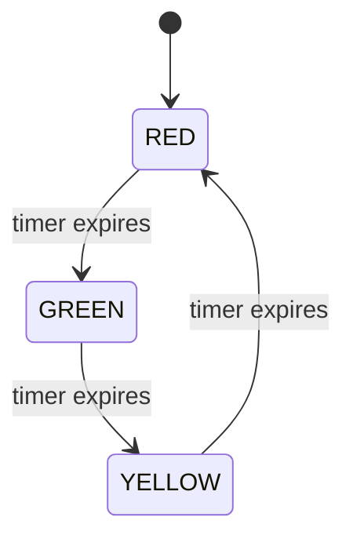

**Step 4 — the state transition table:**

| **Present state** | Q1 Q0 | **Next state** | Q1′ Q0′ |
|---|---|---|---|
| RED | 0 0 | GREEN | **0 1** |
| GREEN | 0 1 | YELLOW | **1 0** |
| YELLOW | 1 0 | RED | **0 0** |
| *(unused)* | 1 1 | RED | 0 0 |

**Step 5 — derive the next-state equations** (using D flip-flops, where D = Q_next):

From the table, **Q1′ = 1 only when Q1Q0 = 01**, and **Q0′ = 1 only when Q1Q0 = 00**:
> **D1 = Q1′ = Q̄1 · Q0**
> **D0 = Q0′ = Q̄1 · Q̄0**

**Step 6 — the output equations** (a **Moore machine**, since the lights depend only on the state):
> **RED = Q̄1 · Q̄0** · **GREEN = Q̄1 · Q0** · **YELLOW = Q1 · Q̄0**

**Step 7 — the circuit:** two **D flip-flops** clocked by a **timer pulse** (one pulse per phase duration), with the small combinational network above generating D1, D0 and the three lamp outputs.

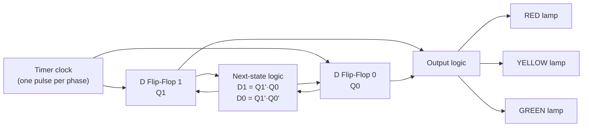

**Practical extensions to mention:** different **durations per phase** (implemented with a down-counter loaded with a different value in each state); a **pedestrian request** input; and a **flashing-amber fault mode**. Each is simply an extra input or state in the same framework — which is exactly why FSMs are the standard way to design controllers.

#### The general FSM design procedure

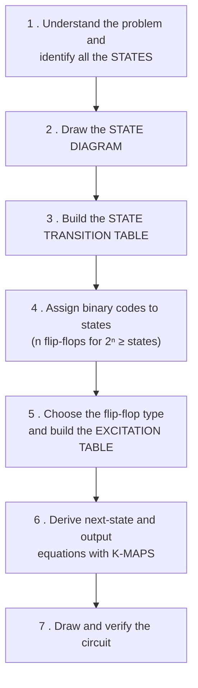

**Previous Year Question List from this Topic:**

- [A traffic signal cycles from RED to YELLOW, YELLOW to GREEN and GREEN to RED. In each cycle RED is turned for 100 seconds, YELLOW is turned for 40 seconds and G…](../written-answers/dld.md?plain=1#L9295)


## 2's Complement & Binary Arithmetic

### Binary Arithmetic Operations

#### Binary addition

| A | B | Sum | Carry |
|---|---|---|---|
| 0 | 0 | 0 | 0 |
| 0 | 1 | 1 | 0 |
| 1 | 0 | 1 | 0 |
| **1** | **1** | **0** | **1** |

> **The only rule to remember: 1 + 1 = 10₂** (sum 0, carry 1), and **1 + 1 + 1 = 11₂** (sum 1, carry 1).

**Example: 1011 + 1101**
```
      1 1 1        ← carries
      1 0 1 1      (11)
    + 1 1 0 1      (13)
    ─────────
    1 1 0 0 0      (24)  ✅
```

#### Binary subtraction

| A | B | Difference | Borrow |
|---|---|---|---|
| 0 | 0 | 0 | 0 |
| **0** | **1** | **1** | **1** |
| 1 | 0 | 1 | 0 |
| 1 | 1 | 0 | 0 |

> **In practice, computers NEVER build a separate subtractor.** They compute **A − B as A + (2's complement of B)**, so the **same adder circuit performs both operations** — with a single control line selecting whether B is inverted and a 1 added. This is the single biggest practical reason 2's complement is used universally.

#### Binary multiplication and division

**Multiplication** works exactly like decimal long multiplication, but each partial product is either **the multiplicand itself (if the bit is 1) or zero (if 0)**, shifted left one place each time — so it reduces to **shift and add**.

```
        1 0 1 1        (11)
      ×   1 1 0        (6)
      ─────────
        0 0 0 0        (×0)
      1 0 1 1          (×1, shifted 1)
    1 0 1 1            (×1, shifted 2)
    ───────────
    1 0 0 0 0 1 0      (66)  ✅
```

**Division** is repeated **shift and subtract**, exactly like decimal long division.

> **A useful shortcut:** **left shift by 1 = multiply by 2**; **right shift by 1 = divide by 2**. This is why compilers replace `x * 8` with `x << 3`.

#### The complete signed-arithmetic summary

| Operation | Method in 2's complement |
|---|---|
| **Negate a number** | Invert all bits, add 1 |
| **A + B** | Ordinary binary addition; **discard the carry out of the MSB** |
| **A − B** | **A + (2's complement of B)** |
| **Detect overflow** | The **carry INTO the sign bit differs from the carry OUT** of it |
| **Check the sign** | **MSB = 0 → positive; MSB = 1 → negative** |
| **Range for n bits** | **−2^(n−1) to +2^(n−1) − 1** |

*(The detailed worked examples — representing −25, adding X = 00110 and Y = 11100, and BCD addition — are given in the **Signed Numbers and 2's Complement** theory under Number Systems above.)*

**Previous Year Question List from this Topic:**

- [2-এর পরিপূরক পদ্ধতি কী? 2-এর পরিপূরক পদ্ধতি ব্যবহার করে (-15)_{10} থেকে (+11)_{10} বিয়োগ করুন।](../written-answers/dld.md?plain=1#L8994)
- [BCD Addition: 00010011 + 00100110](../written-answers/dld.md?plain=1#L9069)
- [How many bits have to change to convert int A to int B. Sample A=31 and B=14.](../written-answers/dld.md?plain=1#L9137)


---

## Number Systems & Codes

### Codes and Conversions — Quick Reference

This section collects the conversion results and code definitions in the compact form most useful for revision. The full worked methods are in the **Number Systems and Codes** theory above.

#### The conversion map

```mermaid
flowchart LR
    D["DECIMAL"] -->|"divide by base,<br/>read remainders bottom-up"| B["BINARY"]
    B -->|"positional expansion<br/>Σ digit × 2ⁱ"| D
    B -->|"group in 3s"| O["OCTAL"]
    O -->|"each digit → 3 bits"| B
    B -->|"group in 4s"| H["HEX"]
    H -->|"each digit → 4 bits"| B
    D -->|"divide by 8"| O
    D -->|"divide by 16"| H
```

> **The golden rule: to convert between ANY two non-decimal bases, go THROUGH BINARY.** Octal → Hex is not done by arithmetic; it is done by expanding octal to binary (3 bits per digit), regrouping into 4s, and reading off hex. This takes seconds and cannot go wrong.

#### The hexadecimal / binary / decimal table — memorise it

| Hex | Binary | Decimal | | Hex | Binary | Decimal |
|---|---|---|---|---|---|---|
| **0** | 0000 | 0 | | **8** | 1000 | 8 |
| **1** | 0001 | 1 | | **9** | 1001 | 9 |
| **2** | 0010 | 2 | | **A** | 1010 | **10** |
| **3** | 0011 | 3 | | **B** | 1011 | **11** |
| **4** | 0100 | 4 | | **C** | 1100 | **12** |
| **5** | 0101 | 5 | | **D** | 1101 | **13** |
| **6** | 0110 | 6 | | **E** | 1110 | **14** |
| **7** | 0111 | 7 | | **F** | 1111 | **15** |

#### Powers of 2 — memorise these too

| 2⁰ | 2¹ | 2² | 2³ | 2⁴ | 2⁵ | 2⁶ | 2⁷ | 2⁸ | 2⁹ | 2¹⁰ |
|---|---|---|---|---|---|---|---|---|---|---|
| **1** | **2** | **4** | **8** | **16** | **32** | **64** | **128** | **256** | **512** | **1024** |

#### Worked conversion — (651.124)₈ to decimal and hexadecimal

**To decimal:**
> **Integer:** 6×8² + 5×8¹ + 1×8⁰ = 384 + 40 + 1 = **425**
> **Fraction:** 1×8⁻¹ + 2×8⁻² + 4×8⁻³ = 0.125 + 0.03125 + 0.0078125 = **0.1640625**
> ### **(651.124)₈ = (425.1640625)₁₀**

**To hexadecimal — via binary:**
> Octal → binary (3 bits each): 6=110, 5=101, 1=001 · 1=001, 2=010, 4=100
> `110 101 001 . 001 010 100`
> Regroup in **4s**, outward from the point: `1 1010 1001 . 0010 1010 0`
> Pad: `0001 1010 1001 . 0010 1010 0000`
> → 1, A, 9 . 2, A, 0
> ### **(651.124)₈ = (1A9.2A)₁₆**

*(Verification of the integer part: 1×256 + 10×16 + 9 = 425 ✅)*

#### Summary of the binary codes

| Code | Bits per decimal digit | Key property | Main use |
|---|---|---|---|
| **BCD (8421)** | **4** | Each decimal digit encoded separately; **1010–1111 are invalid** | Displays, calculators, financial arithmetic |
| **Excess-3** | 4 | **BCD + 3**; **self-complementing** | Simplifies subtraction in hardware |
| **Gray code** | — | **Only ONE bit changes** between consecutive values | **Rotary/shaft encoders, K-map ordering** — eliminates transition glitches |
| **ASCII** | 7 (8 extended) | Standard character encoding | Text |
| **Parity** | +1 bit | Makes the count of 1s even or odd | **Single-bit error DETECTION** |
| **Hamming code** | +k bits | Can locate the erroneous bit | **Error CORRECTION** (ECC memory) |

#### Gray code — why it matters

| Decimal | Binary | **Gray** |
|---|---|---|
| 0 | 000 | **000** |
| 1 | 001 | **001** |
| 2 | 010 | **011** |
| 3 | 011 | **010** |
| 4 | 100 | **110** |
| 5 | 101 | **111** |
| 6 | 110 | **101** |
| 7 | 111 | **100** |

> **Binary → Gray:** the MSB is copied unchanged; every other Gray bit is the **XOR of the two adjacent binary bits** — `G[i] = B[i] ⊕ B[i+1]`.
>
> **Why it is used:** in ordinary binary, going from 3 (011) to 4 (100) changes **all three bits at once**. Because real gates never switch at exactly the same instant, the output momentarily passes through wrong values such as 111 or 000 — a **glitch** that a position sensor would read as a wild jump. In **Gray code only ONE bit ever changes**, so no intermediate wrong value can appear. This is also precisely why **K-map rows and columns are labelled in Gray code**.

**Previous Year Question List from this Topic:**

- [(b) Represent - 25 in 8 bit binary using 2's complement.](../written-answers/dld.md?plain=1#L9197)
- [X = 00110, Y = 11100 are represented in 5-bit signed 2's complement system. Then their sum X + Y in 6-bit signed 2's complemented representation is? (05)](../written-answers/dld.md?plain=1#L9257)
- [Convert the following octal number into decimal and hexadecimal: (651.124)_8.](../written-answers/dld.md?plain=1#L9275)
