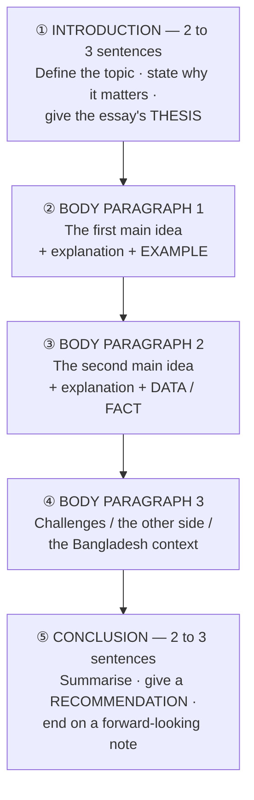

<!-- TOC START -->
**Table of Contents** — 8 subtopics · 12 theories

1. **[Focus Writing](#focus-writing)**
   - [Focus Writing — Structure, Method and Model](#focus-writing--structure-method-and-model)
   - [Paragraph Writing and Short Notes](#paragraph-writing-and-short-notes)

2. **[English Grammar](#english-grammar)**
   - [Parts of Speech](#parts-of-speech)
   - [Tense and the Right Form of Verbs](#tense-and-the-right-form-of-verbs)
   - [Articles and Prepositions](#articles-and-prepositions)
   - [Voice, Narration and Transformation of Sentences](#voice-narration-and-transformation-of-sentences)

3. **[Translation](#translation)**
   - [Translation — Bangla ⇄ English](#translation--bangla--english)

4. **[Idioms & Phrases](#idioms--phrases)**
   - [Idioms and Phrases](#idioms-and-phrases)

5. **[English Vocabulary & Antonyms](#english-vocabulary--antonyms)**
   - [Vocabulary — Synonyms, Antonyms and Spelling](#vocabulary--synonyms-antonyms-and-spelling)

6. **[Letter & Application Writing](#letter--application-writing)**
   - [Letter and Application Writing](#letter-and-application-writing)

7. **[Reading Comprehension](#reading-comprehension)**
   - [Reading Comprehension](#reading-comprehension-1)

8. **[English Literature & Authors](#english-literature--authors)**
   - [English Literature — Major Authors and Works](#english-literature--major-authors-and-works)

<!-- TOC END -->

---

## Focus Writing

### Focus Writing — Structure, Method and Model

> **FOCUS WRITING is a SHORT, TIGHTLY STRUCTURED composition on a GIVEN TOPIC, written within a STRICT WORD LIMIT (usually 150–250 words) and a strict TIME LIMIT (15–25 minutes).** It is the single highest-scoring item in most Bangladeshi bank and government IT written papers, and — unlike the technical sections — **it can be prepared for completely in advance.**

#### What the examiner is actually marking

| Criterion | Weight | What it means |
|---|---|---|
| ⭐ **RELEVANCE to the topic** | Very high | Every sentence must serve the given title. A brilliant essay on the wrong topic scores **zero** |
| ⭐ **STRUCTURE** | Very high | A clear **introduction → body → conclusion** |
| **Content and ideas** | High | Specific facts, figures and Bangladeshi examples |
| **Grammar and spelling** | High | Correct tense, subject-verb agreement, articles, prepositions |
| **Vocabulary** | Medium | Precise, varied, topic-appropriate words |
| ⭐ **WORD LIMIT** | Medium | ⚠️ Exceeding or falling short of the stated limit **loses marks directly** |
| **Handwriting and neatness** | Medium | An unreadable answer cannot be marked |
| **Coherence and linking** | Medium | Smooth transitions between paragraphs |

#### The universal five-paragraph structure



| Section | Words (for a 200-word essay) | Content |
|---|---|---|
| **Introduction** | **30–40** | Definition + importance + what the essay will argue |
| **Body 1** | **40–50** | First point, explained, with an example |
| **Body 2** | **40–50** | Second point, with a fact or figure |
| **Body 3** | **40–50** | Challenges, or the Bangladesh-specific angle |
| **Conclusion** | **25–35** | Summary + recommendation + closing thought |

#### The method — how to write it in 20 minutes

```
   MINUTE 0–3   : PLAN. Jot 3 to 4 main points in the margin, plus one
                  example and one statistic. DO NOT start writing yet —
                  three minutes of planning saves ten of rambling.

   MINUTE 3–5   : Write the INTRODUCTION. Open with a definition or a
                  striking fact, never with "Nowadays…" or "From the
                  dawn of civilisation…".

   MINUTE 5–16  : Write the BODY. ONE IDEA PER PARAGRAPH. Begin each
                  paragraph with a TOPIC SENTENCE, then explain it,
                  then give an EXAMPLE.

   MINUTE 16–19 : Write the CONCLUSION. Summarise and RECOMMEND.

   MINUTE 19–20 : PROOFREAD — check tense consistency, articles,
                  subject-verb agreement, and the word count.
```

#### The linking words that raise the band

| Purpose | Words and phrases |
|---|---|
| **Adding** | Moreover · Furthermore · In addition · Besides · Not only … but also |
| **Contrasting** | However · Nevertheless · On the contrary · Whereas · Despite this |
| **Cause and effect** | Therefore · Consequently · As a result · Hence · Owing to |
| **Giving examples** | For instance · For example · Such as · A case in point is |
| **Sequencing** | Firstly · Secondly · Subsequently · Finally |
| **Emphasising** | Indeed · Particularly · Above all · Significantly |
| **Concluding** | In conclusion · To sum up · All things considered · In the final analysis |

#### The reusable content bank — memorise these

> **The same facts recur across almost every ICT, banking and development topic in these exams. Learning this short list once lets you insert concrete evidence into any essay.**

| Area | Facts worth quoting |
|---|---|
| **Digital Bangladesh / Smart Bangladesh** | **Digital Bangladesh** was declared in **2008** and its successor vision, **Smart Bangladesh 2041**, rests on four pillars: **Smart Citizen, Smart Government, Smart Society and Smart Economy** |
| **Mobile financial services** | **bKash, Nagad and Rocket** have brought tens of millions of unbanked people into the financial system; **MFS transactions now exceed Tk 1 lakh crore a year** |
| **ICT exports** | Bangladesh's software and IT-enabled services exports exceed **US$ 1.9 billion**, with a target of **US$ 5 billion**; over **650,000 freelancers** make Bangladesh one of the world's largest freelancing nations |
| **Connectivity** | Over **190 million mobile subscribers** and **130 million internet users**; **4G nationwide** with **5G rolling out**; the **submarine cables SEA-ME-WE 4 and 5** |
| **Infrastructure** | **Padma Bridge (2022)**, **Dhaka Metro Rail (MRT-6, 2022)**, the **Karnaphuli Tunnel**, **Rooppur Nuclear Power Plant** |
| **Economy** | Bangladesh graduates from **LDC status in 2026**; **RMG exports ~US$ 47 billion**, the world's second-largest exporter; remittances exceed **US$ 21 billion** |
| **Banking** | Bangladesh Bank's **Cyber Security Guideline**, **NPSB, BEFTN, RTGS**, **agent banking**, **Bangla QR** |
| **Sustainability** | The **17 SDGs (2015–2030)**; Professor **Yunus's "Three Zeros"** — **zero poverty, zero unemployment, zero net carbon emissions**; Bangladesh has the **highest number of green garment factories in the world** |
| **Climate** | Bangladesh is among the **most climate-vulnerable countries**; the **Delta Plan 2100**; sea-level rise threatens a fifth of the coast |

#### A model answer — "The Importance of Information Technology in Economic Development"

> *(≈200 words — the structure to imitate for any topic.)*

> **Information technology has become the principal engine of modern economic growth, transforming how nations produce, trade and govern.** For a developing country such as Bangladesh, it offers a rare opportunity to leapfrog stages of development that took the West a century to complete.
>
> **First, IT dramatically raises productivity.** Automation and data-driven management allow firms to produce more with fewer resources, while e-commerce platforms give a small entrepreneur in Rangpur access to customers in Dhaka and abroad. **Secondly, IT creates high-value employment.** Bangladesh's software and ITES exports now exceed US$ 1.9 billion, and more than 650,000 freelancers earn foreign currency from home — a sector that barely existed twenty years ago.
>
> **Thirdly, IT drives financial inclusion.** Mobile financial services such as bKash and Nagad have brought tens of millions of previously unbanked citizens into the formal economy, while agent banking has extended services to remote villages. **Nevertheless, serious challenges remain** — a shortage of skilled professionals, an urban-rural digital divide, and rising cyber-security threats.
>
> **In conclusion, information technology is no longer merely a support sector but the foundation of national competitiveness.** Sustained investment in digital skills, infrastructure and cyber-security is therefore essential if Bangladesh is to realise its Smart Bangladesh 2041 vision.

#### Common mistakes that cost marks

| # | Mistake | The fix |
|---|---|---|
| **1** | **Starting to write without a plan** | Spend 3 minutes listing 3–4 points first |
| **2** | ⚠️ **Ignoring the WORD LIMIT** | Count roughly by lines; a "150 (±10%)" limit means **135–165 words** |
| **3** | ⚠️ **Ignoring the GIVEN HINTS** | If hints are supplied, **each hint should become a paragraph** — the marks are allocated to them |
| **4** | **No paragraph breaks** | One idea, one paragraph — a wall of text loses structure marks |
| **5** | **Vague generalities with no example** | Every body paragraph needs **one concrete fact, figure or Bangladeshi example** |
| **6** | **Memorised material forced onto the wrong topic** | Adapt the content bank to the actual title |
| **7** | **Mixing tenses** | Keep the tense consistent within each paragraph |
| **8** | **Weak clichéd openings** | Avoid "From time immemorial…"; begin with a definition or a fact |
| **9** | **No conclusion** — running out of time | **Write the conclusion even if the body is short.** An essay without a conclusion loses more than a short body does |
| **10** | **Illegible handwriting** | Write clearly; leave a blank line between paragraphs |

**Previous Year Question List from this Topic:**

- [Focus Writing in English: "The Role of Sustainable Banking in Achieving the UN Sustainable Development Goals (SDGs) in Bangladesh."](../written-answers/english.md?plain=1#L21)
- [Write an essay on “Digital Citizenship on Social Media” using the following hints:](../written-answers/english.md?plain=1#L30)
- [Write an essay on "Corruption in the ICT Sector in Bangladesh" using the hints given below: (Hints: Introduction- Types of corruption- Causes of corruption- Eff…](../written-answers/english.md?plain=1#L57)
- [Write an essay on 'The Internet' using the hints given below:](../written-answers/english.md?plain=1#L67)
- [Write an essay on 'Modern Technology and Its Effect on Student Academic Achievements' within 150 (+/- 10% ) words.](../written-answers/english.md?plain=1#L100)
- [Write a short composition "The Role of computer on education system in Bangladesh".](../written-answers/english.md?plain=1#L108)
- [Focus Writing in English](../written-answers/english.md?plain=1#L126)
- [Focus Writing in English: The Importance of Digital Literacy in Expanding Cashless Transactions in Bangladesh: Discuss how digital skills influence financial in…](../written-answers/english.md?plain=1#L137)
- [The role of ICT in education sector](../written-answers/english.md?plain=1#L146)
- [Write an essay on 'Women's Empowerment and Gender Equality in Bangladesh' within 200 (+/- 10%) words.](../written-answers/english.md?plain=1#L155)
- [Essay on "Digital Financial Literacy"](../written-answers/english.md?plain=1#L165)
- [Focus writing in English: Metro Rail Equal Opportunity](../written-answers/english.md?plain=1#L173)
- [Write a composition: E-commerce in Bangladesh](../written-answers/english.md?plain=1#L181)
- [Growing use to technology in the Financial Service Industry.](../written-answers/english.md?plain=1#L190)
- [Focus English (Harm of durg)](../written-answers/english.md?plain=1#L199)
- [Write an essay on any one of the following using the hints given below: a) Technical Education. (Hints: Introduction — What technical education is — importance…](../written-answers/english.md?plain=1#L208)
- [Write an essay on safe Environment/ (Hints : Introduction – relation between life and environment – actions taken by the government to protect environment – ind…](../written-answers/english.md?plain=1#L218)
- [Write an eassy on the “Role of Telecommunications in supporting economic and business activities during three Covid-19 pandemic situations.”](../written-answers/english.md?plain=1#L232)
- [English Focus: Bhasan Char- A Safe Home for Rohingya Refugees.](../written-answers/english.md?plain=1#L241)
- [Composition: English](../written-answers/english.md?plain=1#L250)
- [Write a composition: Edge Computing](../written-answers/english.md?plain=1#L261)
- [Write a composition: “Block chain technology”](../written-answers/english.md?plain=1#L270)
- [Write a Composition in English: “Social Media Platform” are now the greatest threat to Democracy.](../written-answers/english.md?plain=1#L280)
- [English focus: Telecommunication in Developing Economic sector.](../written-answers/english.md?plain=1#L288)
- [Write a short note on “Digital Bangladesh”](../written-answers/english.md?plain=1#L297)
- [English: Confront the Rumors of Social Media.](../written-answers/english.md?plain=1#L305)
- [Write an Essay: Climate change Impact in Bangladesh.](../written-answers/english.md?plain=1#L321)
- [Focus Writing: Impact of ICT in Banking.](../written-answers/english.md?plain=1#L346)


---

### Paragraph Writing and Short Notes

> A **PARAGRAPH is a single unit of thought developed around ONE central idea**, typically **100–150 words in a single block** with no subdivisions. A **SHORT NOTE** is similar but more factual and may use brief sub-points.

#### The structure of a paragraph

```
   ① TOPIC SENTENCE      — states the central idea (the first sentence)
   ② SUPPORTING SENTENCES — 4 to 6 sentences that explain, illustrate,
                            give reasons, examples, facts or figures
   ③ CONCLUDING SENTENCE — restates the idea or offers the implication
```

> **The difference from an essay: a paragraph is ONE BLOCK with ONE idea.** Do not divide it into sections, do not use headings, and do not introduce a second theme.

#### Paragraph vs Essay vs Short note

| | **Paragraph** | **Essay / Focus Writing** | **Short note** |
|---|---|---|---|
| **Length** | **100–150 words** | **200–300 words** | 100–200 words |
| **Structure** | ⭐ **ONE block, ONE idea** | **Multiple paragraphs** | Brief, may use points |
| **Opening** | A **topic sentence** | An introduction paragraph | A definition |
| **Tone** | Descriptive or explanatory | Argumentative or analytical | Factual, informative |

#### Model paragraph — "Patience is the mother of success"

> **Patience is rightly called the mother of success, for no worthwhile achievement has ever been won in haste.** Every great accomplishment — a degree earned, a business built, a nation developed — is the product of sustained effort over long periods, during which progress is often invisible. A student who prepares steadily for months outperforms one who studies frantically for a week; a farmer who waits through the season reaps a harvest that no impatience could hasten. Patience also preserves judgement: those who act in haste make decisions they later regret, while those who wait can weigh their options calmly. History offers ample proof — Thomas Edison failed thousands of times before perfecting the electric lamp, and Bangladesh's own long struggle for independence demanded decades of endurance before victory came in 1971. **Impatience, by contrast, breeds carelessness, anxiety and failure. Success, therefore, belongs not to the swiftest but to those who can persevere calmly until their effort bears fruit.**

#### Writing an argumentative paragraph ("argue for or against…")

> When the question says **"argue for or against"**, you must **TAKE A CLEAR POSITION** and defend it. Sitting on the fence loses marks.

```
   ① STATE your position unambiguously in the first sentence.
   ② Give TWO or THREE reasons, each with evidence.
   ③ ACKNOWLEDGE the strongest opposing argument — this shows maturity.
   ④ REBUT it, and restate your position.
```

**A model opening for "AI will eventually replace human workers":**

> **While artificial intelligence will undoubtedly transform the nature of work, the claim that it will eventually replace human workers altogether is an overstatement.** AI excels at repetitive, rule-based and data-intensive tasks, and it has already displaced roles in data entry, routine customer service and basic accounting. **However, it remains fundamentally incapable of the qualities on which most valuable work depends** — genuine creativity, ethical judgement, empathy and the capacity to act sensibly in wholly unfamiliar situations. **It is true that** each wave of automation has destroyed particular occupations; **yet history shows that** technology has consistently created more jobs than it eliminated, shifting labour into higher-value work. The realistic prospect is therefore **augmentation rather than replacement**: the doctor assisted by diagnostic AI, the banker supported by fraud-detection algorithms. **The real challenge is not mass unemployment but RESKILLING**, and a country such as Bangladesh must invest urgently in digital education if its workforce is to occupy the new roles rather than lose the old ones.

**Previous Year Question List from this Topic:**

- [(e) Write a short paragraph arguing for or against the statement "AI will eventually replace human workers in most professions."](../written-answers/english.md?plain=1#L45)
- [Paragraph on: Three Zero theory](../written-answers/english.md?plain=1#L49)
- [Write short note on: "The role of AI and machine language mitigate challenges of cyber attack on banking system" 100 to 150 Words.](../written-answers/english.md?plain=1#L82)
- [Roadside tree plantation in reducing noise pollution.](../written-answers/english.md?plain=1#L91)
- [Focus in English: “Impacts of air pollution on human health” within 150 (+-10%) word.](../written-answers/english.md?plain=1#L117)
- [Write brief paragraph on “Patience is the mother of success.”](../written-answers/english.md?plain=1#L228)
- [Some people may think that long-term imprisonment is helpful in reducing crime, and some people think that there are other options to reduce crime. Discuss both…](../written-answers/english.md?plain=1#L314)
- [Write a paragraph on “Post-corona Green Recovery Plans and Progress in Bangladesh” in English.](../written-answers/english.md?plain=1#L329)
- [Write a paragraph on “Importance of Information Technology” in the economic development of Bangladesh.](../written-answers/english.md?plain=1#L337)


---

## English Grammar

### Parts of Speech

> The **EIGHT PARTS OF SPEECH** classify every word in English by the **FUNCTION it performs in a sentence.**

| # | Part of speech | Function | Examples |
|---|---|---|---|
| **1** | **NOUN** | Names a person, place, thing or idea | *Rahim, Dhaka, computer, honesty* |
| **2** | **PRONOUN** | Replaces a noun | *he, she, it, they, who, which* |
| **3** | **VERB** | Expresses an action or a state | *run, is, have, seem* |
| **4** | **ADJECTIVE** | **Describes a NOUN** | *tall, honest, three, beautiful* |
| **5** | **ADVERB** | **Modifies a VERB, an adjective or another adverb** | *quickly, very, yesterday, here* |
| **6** | **PREPOSITION** | Shows the relation of a noun to another word | *in, on, at, with, through* |
| **7** | **CONJUNCTION** | Joins words, phrases or clauses | *and, but, because, although* |
| **8** | **INTERJECTION** | Expresses sudden emotion | *Alas! Hurrah! Oh!* |

#### The types of noun

| Type | Definition | Examples |
|---|---|---|
| **Proper** | A **particular** name, always capitalised | *Rahim, Bangladesh, Monday* |
| **Common** | A general class | *boy, country, day* |
| ⭐ **COLLECTIVE** | **ONE word naming a GROUP of individuals taken as a UNIT** | ⭐ **herd, flock, team, crowd, jury, army, committee, fleet, swarm, bunch, class** |
| **Material** | The substance something is made of | *gold, wood, iron, water* |
| **Abstract** | A quality, state or idea — **cannot be touched** | *honesty, beauty, infancy, childhood* |

> ### **"Which one is a collective noun — (a) Boy (b) Wood (c) Herd (d) Infancy?"**
> ### ✅ **(c) HERD** — it names a **group** of animals treated as one unit.
> *(**Boy** is a common noun · **Wood** is a material noun · **Infancy** is an abstract noun.)*

#### Identifying the part of speech in context

> ⚠️ **The same word can be a DIFFERENT part of speech in different sentences — the FUNCTION decides, not the word itself.**

| Sentence | The word | Part of speech | Why |
|---|---|---|---|
| I had a **talk** with him. | **talk** | ⭐ **NOUN** | It follows the article "a" and is the **object of "had"** |
| I **talk** to him daily. | talk | **Verb** | It is the action |
| He runs **fast**. | fast | **Adverb** | It modifies the verb "runs" |
| He is a **fast** runner. | fast | **Adjective** | It describes the noun "runner" |
| He stood **before** the gate. | before | **Preposition** | It relates "gate" to "stood" |
| He had left **before**. | before | **Adverb** | It modifies "had left" |

> ### **"In *I had a talk with him*, what part of speech is the underlined word 'talk'?"**
> ### ✅ **A NOUN** — signalled by the article **"a"** immediately before it. **Any word preceded by an article is functioning as a noun.**

#### Forming one part of speech from another

| Noun | Adjective | Verb | Adverb |
|---|---|---|---|
| **habit** | habitual | ⭐ **habituate** | habitually |
| **honesty** | honest | — | honestly |
| **beauty** | beautiful | **beautify** | beautifully |
| **strength** | strong | **strengthen** | strongly |
| **success** | successful | **succeed** | successfully |
| ⭐ **sincerity** | ⭐ **sincere** | — | sincerely |
| ⭐ **will / wish** | ⭐ **willing / desirous** | **will / desire** | willingly |

> ### **"What is the VERB of 'habit'?"** → ### ✅ **HABITUATE** (to accustom someone to something). *(The adjective is **habitual** and the adverb **habitually**.)*
>
> ### **"Write the adjective of 'সততা' (honesty) and 'ইচ্ছা' (wish)."** → ### ✅ **honesty → HONEST · wish/desire → DESIROUS (or WILLING / EAGER).**

**Previous Year Question List from this Topic:**

- [what is the verb of habit?](../written-answers/english.md?plain=1#L477)
- [I had a talk with him. Write the name of 'parts of speech' of the underlined word.](../written-answers/english.md?plain=1#L564)
- [২. Which one is collective noun? (a) Boy (b) Wood (c) Herd (d) Infancy](../written-answers/english.md?plain=1#L589)


---

### Tense and the Right Form of Verbs

#### The twelve tenses

| | **PAST** | **PRESENT** | **FUTURE** |
|---|---|---|---|
| **Indefinite (Simple)** | **V2** — *I went* | **V1 / V1+s** — *I go / He goes* | **shall/will + V1** — *I will go* |
| **Continuous** | **was/were + V-ing** — *I was going* | **am/is/are + V-ing** — *I am going* | **will be + V-ing** — *I will be going* |
| **Perfect** | **had + V3** — *I had gone* | **have/has + V3** — *I have gone* | **will have + V3** — *I will have gone* |
| **Perfect Continuous** | **had been + V-ing** — *I had been going* | **have/has been + V-ing** — *I have been going* | **will have been + V-ing** |

#### ⭐ The rules that decide almost every "right form of verb" question

| # | Rule | Example |
|---|---|---|
| **1** | **Universal / eternal truth → PRESENT INDEFINITE**, regardless of the main clause | *He said that the earth **moves** round the sun.* |
| **2** | ⭐ **LEST … should + V1** (never "not") | *Walk fast **lest** you **should miss** the train.* |
| **3** | **Since / For + Perfect tense** | *He **has been** ill **for** three days.* |
| **4** | **If (present) … will/shall + V1** (1st conditional) | *If it **rains**, I **will stay** home.* |
| **5** | ⭐ **If (past) … would/could + V1** (2nd conditional) | *If I **were** rich, I **would travel**.* |
| **6** | **If (had + V3) … would have + V3** (3rd conditional) | *If I **had studied**, I **would have passed**.* |
| **7** | **It is time / It is high time + PAST tense** | *It is high time we **changed** our habits.* |
| **8** | **As if / As though + PAST tense** (were, not was) | *He talks as if he **were** the boss.* |
| **9** | **Would rather / had better + V1** (no "to") | *You **had better go** now.* |
| **10** | ⭐ **Had + subject + V3 (inverted "if")** | ***Had I known***, *I would have come.* |
| **11** | **No sooner had … than** | *No sooner **had** he arrived **than** it rained.* |
| **12** | **Wish / As if + were** for all persons | *I wish I **were** a bird.* |
| **13** | ⭐ **Preposition + V-ing (gerund)** | *He is fond **of playing** cricket.* |
| **14** | **Let / make / see / hear + object + V1** (bare infinitive) | *Let him **go**.* · *I made him **do** it.* |
| **15** | **Subject-verb AGREEMENT** — the verb agrees with the true subject, not the nearest noun | *The **quality** of the mangoes **was** poor.* |

**Worked example** — *Medha walks fast lest she ______ (be) late.*
```
   RULE: "lest" is ALWAYS followed by  should + base verb (V1),
         and it ALREADY carries a negative meaning, so "not" is NEVER added.
```
> ### ✅ ***Medha walks fast lest she SHOULD BE late.***
> ⚠️ **"lest … should not" is a double negative and is always wrong.**

#### Common irregular verbs (V1 – V2 – V3)

| V1 | V2 | V3 | | V1 | V2 | V3 |
|---|---|---|---|---|---|---|
| begin | began | begun | | lie (recline) | lay | lain |
| bring | brought | brought | | lay (place) | laid | laid |
| choose | chose | chosen | | rise | rose | risen |
| drink | drank | drunk | | raise | raised | raised |
| eat | ate | eaten | | see | saw | seen |
| forget | forgot | forgotten | | write | wrote | written |
| go | went | gone | | take | took | taken |

**Previous Year Question List from this Topic:**

- [Answer the following questions.](../written-answers/english.md?plain=1#L357)
- [Right forms of verb.](../written-answers/english.md?plain=1#L528)
- [Use the correct form of verbs within brackets: (a) Medha walks fast lest she (be) late. (b) Why you (not attend) the meeting yesterday? (c) You had better (to s…](../written-answers/english.md?plain=1#L538)
- [১০. Since we grow the locally, we need not to _____ it.](../written-answers/english.md?plain=1#L623)


---

### Articles and Prepositions

#### The articles — a, an, the

| Article | Type | Use |
|---|---|---|
| **A / AN** | **Indefinite** | Before a **singular countable noun** mentioned for the **first time**, or any one of a class |
| **THE** | **Definite** | Before something **already mentioned, unique, or specified** |

> ### **The A/AN rule depends on the SOUND, not the spelling.**
> - **"AN" before a VOWEL SOUND:** *an apple, an hour, an honest man, an MA, an MP, an X-ray, an umbrella*
> - **"A" before a CONSONANT SOUND:** *a university, a European, a one-eyed man, a useful book, a unique case, a year*

| Word | Article | Why |
|---|---|---|
| **hour, honest, heir, honour** | ⭐ **AN** | The **h is SILENT** — the sound is a vowel |
| **university, uniform, union, useful, unique** | ⭐ **A** | Pronounced **"yoo-"** — a **consonant** (/j/) sound |
| ⭐ **one-eyed, one-rupee** | ⭐ **A** | Pronounced **"wun"** — a consonant (/w/) sound |
| **M.A., M.P., S.S.C., X-ray, hour-long** | **AN** | The letter names begin with vowel sounds ("em", "ex") |
| **European** | **A** | Pronounced "yoo-ro-pean" |

> ### **"I saw ______ one-eyed man."** → ### ✅ **"A one-eyed man"** — because "one" is pronounced **"wun"**, a consonant sound. This is the most frequently set article question in these exams.
>
> ### **"Football is ______ popular game."** → ### ✅ **"A popular game."**

**Key uses of THE:**
- Unique things: *the sun, the moon, the earth, the sky*
- Superlatives and ordinals: *the best, the first, the tallest*
- Rivers, seas, oceans, mountain ranges, deserts: *the Padma, the Bay of Bengal, the Himalayas*
- Newspapers, holy books: *the Daily Star, the Quran*
- Nationalities and classes: *the rich, the poor, the Bangladeshis*
- Musical instruments: *play the flute*
- ⚠️ **NO article** before: proper nouns, languages (*he speaks Bangla*), meals (*after lunch*), games (*play cricket*), abstract nouns in a general sense (*honesty is the best policy*).

#### Prepositions — the ones that are actually tested

| Expression | Preposition | Example |
|---|---|---|
| **look INTO** | investigate | *The police will **look into** the matter.* |
| ⭐ **look THROUGH** | look by means of an instrument | ⭐ *The scientist looked **through** the microscope.* |
| **look AFTER** | take care of | *She **looks after** her parents.* |
| **look FOR** | search | *I am **looking for** my keys.* |
| **look UP** | consult a dictionary | *Look **up** the word.* |
| ⭐ **count ON / UPON** | depend on | ⭐ *I **count on** your help.* |
| **depend ON** | | *It **depends on** the weather.* |
| ⭐ **sorry FOR** | | ⭐ *I am **sorry for** the mistake.* |
| **popular WITH** (people) | ⚠️ not "among" for liking | ⭐ *He is very popular **with** the villagers.* |
| **start FOR** (a place) | | ⭐ *I started **for** Chattogram.* |
| **by** (a watch, a clock) | | ⭐ *What's the time **by** your watch?* |
| **in spite of / despite** | ⚠️ **despite** takes **no** "of" | *Despite the rain…* |
| **In favour of** | | *I spoke **in favour of** the motion.* |
| **die OF** (disease) / **die FROM** (injury) / **die BY** (accident) | | *He died **of** cancer.* |
| **married TO** | ⚠️ not "with" | *She is married **to** a doctor.* |
| **angry WITH** (a person) / **angry AT** (a thing) | | |
| **consist OF** | ⚠️ never "consists with" | |
| **suffer FROM** | | |
| **prefer … TO …** | ⚠️ never "than" | *I prefer tea **to** coffee.* |
| **senior / junior / superior / inferior TO** | ⚠️ never "than" | *He is senior **to** me.* |
| **in time of** (during) | | ⭐ *A citizen enjoys rights **in time of** peace.* |

**Worked answers to the set questions:**

> ### ✅ *The scientist looked **THROUGH** the microscope.* — you look **through** an instrument.
> ### ✅ *I count **ON** your help.* — "count on" = rely on.
> ### ✅ *I am sorry **FOR** the mistake.*
> ### ✅ *I started **FOR** Chattogram.* — "start for" = set out towards.
> ### ✅ *What's the time **BY** your watch?*
> ### ✅ *He refused to attend the meeting **ON THE GROUND OF / ON ACCOUNT OF** illness.*

#### Common sentence corrections

| ❌ Wrong | ✅ Correct | The rule |
|---|---|---|
| He joined **army**. | He joined ⭐ **THE army**. | Unique national institutions take **the** |
| He is very popular **among** the villagers. | He is very popular ⭐ **WITH** the villagers. | "Popular **with**" for people who like someone |
| I **prefer** tea **than** coffee. | I prefer tea ⭐ **TO** coffee. | "prefer … **to** …" |
| He is **senior than** me. | He is ⭐ **senior TO** me. | Latin comparatives take **to** |
| One of my **friend**. | One of my ⭐ **friendS**. | "one of" takes a **plural** noun |
| The **quality** of the mangoes **were** poor. | The quality of the mangoes ⭐ **WAS** poor. | The verb agrees with **quality**, the true subject |
| **Each** of the boys **have** a pen. | Each of the boys ⭐ **HAS** a pen. | "Each/every/either/neither" is **singular** |
| He **did not** came. | He did not ⭐ **COME**. | After "did", use the **base form** |
| **Since** we grow it locally, we need not **to** import it. | …we need not ⭐ **IMPORT** it. | "need not" takes the **bare infinitive** |
| Walk fast **lest** you **may not** miss the bus. | Walk fast lest you ⭐ **SHOULD** miss the bus. | "lest … should", never with "not" |
| The **furnitures** are new. | The ⭐ **FURNITURE IS** new. | Uncountable: *furniture, information, advice, luggage, equipment, news* |

> ### **"Since we grow it locally, we need not to ______ it."** → ### ✅ **IMPORT** — and note that the **"to" is wrong**: *need not* is a modal and takes the **bare infinitive**.

**Previous Year Question List from this Topic:**

- [(d) Correct the sentence:](../written-answers/english.md?plain=1#L392)
- [Fill in the blank: The scientist looked _______ the microscope.](../written-answers/english.md?plain=1#L403)
- [Correct the sentence : He joined army](../written-answers/english.md?plain=1#L481)
- [Preposition: 2](../written-answers/english.md?plain=1#L501)
- [Sentence correction: 2](../written-answers/english.md?plain=1#L507)
- [Correct the following sentence: (a) He is very popular among the villagers. (b) My father was died in 1995 (c) Give me a hot cup of tea. (d) Rifat will visit us…](../written-answers/english.md?plain=1#L547)
- [Fill in the gap with appropriate preposition: A Citizen enjoys a lot of rights in times of peace. But sometimes he has to give (a) _____ some of his rights and…](../written-answers/english.md?plain=1#L556)
- [Fill in the blanks with appropriate phrase; “He refused to attend the meeting _____ his illness.](../written-answers/english.md?plain=1#L568)
- [Fill in the blank: I count _____ your help.](../written-answers/english.md?plain=1#L572)
- [Filling the gaps with appropriate word: a) I started _____ Chattogram. b) She has no ability _____ painting. c) Every member of my _____ family d) They as well…](../written-answers/english.md?plain=1#L580)
- [৫. Fill in the Gap: (a) I am sorry _____ the mistake. (b) _____ his being innocent of the crime, the judge sentenced him to one year imprison.](../written-answers/english.md?plain=1#L593)
- [৬. Fill in the Gap with appropriate articles: (a) Football is (a) _____ popular game in our country. (b) Money cannot buy (a) _____ happiness.](../written-answers/english.md?plain=1#L599)
- [৪. Which sentence is correct?](../written-answers/english.md?plain=1#L609)
- [৭. I saw _____ one eyed man.](../written-answers/english.md?plain=1#L615)
- [৮. What's the time _____ your watch?](../written-answers/english.md?plain=1#L619)


---

### Voice, Narration and Transformation of Sentences

#### Active and Passive Voice

> ### **In the ACTIVE voice the SUBJECT PERFORMS the action; in the PASSIVE voice the SUBJECT RECEIVES it.**

```
   ACTIVE :  Subject  +  Verb      +  Object
             Rahim    +  wrote     +  a letter.

   PASSIVE:  Object   + be + V3    +  by + Subject
             A letter + was written + by Rahim.
```

**The three steps to change Active → Passive:**
```
   ① The OBJECT of the active sentence becomes the SUBJECT of the passive.
   ② The verb becomes  [correct form of BE] + PAST PARTICIPLE (V3).
      The TENSE must not change.
   ③ The original subject follows "BY" (and is often omitted if obvious).
```

**The BE form for each tense:**

| Tense | Active | Passive |
|---|---|---|
| **Present indefinite** | He **writes** | It **is written** |
| **Past indefinite** | He **wrote** | It **was written** |
| **Future indefinite** | He **will write** | It **will be written** |
| **Present continuous** | He **is writing** | It **is being written** |
| **Past continuous** | He **was writing** | It **was being written** |
| **Present perfect** | He **has written** | It **has been written** |
| **Past perfect** | He **had written** | It **had been written** |
| **Modal** | He **can write** | It **can be written** |

**Passive of INTERROGATIVE sentences — the rule that is most often got wrong:**
```
   The passive sentence must STILL BE A QUESTION, so the auxiliary
   comes FIRST. Keep the question word (Who/What/When/How) at the front.
```

**Worked example 1** — *Write the passive voice of "Did you do the sum?"*
```
   Active  : Did  you  do  the sum?
             aux  subj  V1  object

   ① Object "the sum" becomes the subject.
   ② "Did … do" (past indefinite) → "was … done".
   ③ Keep it a QUESTION → the auxiliary "Was" comes first.
```
> ### ✅ ***Was the sum done by you?***

**Worked example 2** — *Change the voice: "How did you do it?"*
```
   The question word "How" stays at the FRONT; the rest becomes passive.
```
> ### ✅ ***How was it done by you?***

> **For a "Who" question the pattern is different:**
> *Who wrote this letter?* → ### ***By whom was this letter written?***

#### Transformation of sentences

| Transformation | Method | Example |
|---|---|---|
| **Simple → Complex** | Expand a phrase into a **clause with a subordinating conjunction** | *Because of his poverty, he suffers.* → *Because he is poor, he suffers.* |
| **Complex → Compound** | Replace the subordinate clause with a **coordinating conjunction** (and, but, so) | *Because he is poor, he suffers.* → *He is poor **and** so he suffers.* |
| **Compound → Simple** | Reduce one clause to a **phrase** | *He is poor but honest.* → *In spite of his poverty, he is honest.* |
| **Affirmative → Negative** | Use **none but / not … any / no sooner … than** | *Only Rahim can do it.* → ***None but** Rahim can do it.* |
| **Assertive → Interrogative** | Turn it into a **rhetorical question** with the opposite polarity | *He is a great man.* → ***Is he not** a great man?* |
| **Assertive → Exclamatory** | Use **How / What a … !** | *It is a very beautiful flower.* → ***What a beautiful flower it is!*** |
| **Assertive → Imperative** | Use the **bare verb** or **Let** | *You should work hard.* → ***Work hard.*** |
| **Degree change** | Positive ↔ Comparative ↔ Superlative | See below |

**Degree of comparison — the three forms of the same idea:**
```
   SUPERLATIVE : Dhaka is the largest city in Bangladesh.
   COMPARATIVE : Dhaka is larger than any other city in Bangladesh.
   POSITIVE    : No other city in Bangladesh is as large as Dhaka.
```
> ⚠️ **The comparative form MUST include "any OTHER"** — writing *"larger than any city in Bangladesh"* is wrong, because it would make Dhaka larger than itself.

**A worked set of transformations on one sentence:**
```
   ORIGINAL (Assertive) : He is a very honest man.

   Exclamatory  : What an honest man he is!
   Interrogative: Is he not a very honest man?
   Negative     : He is not a dishonest man.
   Compound     : He is a man and he is very honest.
   Complex      : He is a man who is very honest.
```

**Previous Year Question List from this Topic:**

- [Rewrite the following sentences using the instruction given in the brackets:](../written-answers/english.md?plain=1#L407)
- [Change right sentence compund, intrrogative, exclamatory](../written-answers/english.md?plain=1#L494)
- [English Transformation of Sentence (Voice change, Simple to complex, Superlative to comparative etc)](../written-answers/english.md?plain=1#L515)
- [Write the passive voice of “Did you do the sum?”](../written-answers/english.md?plain=1#L576)
- [২. How did you do it? (Change the Voice)](../written-answers/english.md?plain=1#L605)


---

## Translation

### Translation — Bangla ⇄ English

> **TRANSLATION questions carry heavy marks and are entirely learnable.** The examiner is looking for **accuracy of MEANING, correct grammar and natural idiom** — not a word-for-word rendering.

#### The principles of good translation

| # | Principle | Explanation |
|---|---|---|
| **1** | ⭐ **Translate the MEANING, not the WORDS** | A literal word-by-word rendering produces nonsense. **Read the whole sentence, understand it, then express that idea naturally in the target language** |
| **2** | **Preserve the TENSE** | A past-tense Bangla sentence must remain past tense in English |
| **3** | **Respect the word ORDER of the TARGET language** | ⚠️ **Bangla is Subject-Object-Verb; English is Subject-Verb-Object.** *আমি ভাত খাই* (I rice eat) → **"I eat rice"** |
| **4** | **Use the natural IDIOM of the target language** | Bangla idioms rarely translate literally — find the English **equivalent**, not the words |
| **5** | **Keep the register and tone** | Formal Bangla → formal English |
| **6** | **Do not add or omit information** | |
| **7** | **Re-read the finished translation on its own** | If it does not read like natural English, rewrite it |

#### The structural differences that cause most errors

| Feature | **Bangla** | **English** |
|---|---|---|
| **Word order** | ⭐ **Subject – Object – VERB** | ⭐ **Subject – VERB – Object** |
| **Articles (a/an/the)** | ❌ **None** — uses *একটি, টি, টা* | ✅ **Essential** — omitting them is the commonest Bangla-speaker error |
| **Prepositions** | Post-positions, attached after the noun | Separate words **before** the noun |
| **Verb "to be"** | Often **dropped** — *সে ভালো* | ⚠️ **Required** — *He **is** good* |
| **Plural** | *-গুলো, -রা* | **-s / -es** |
| **Gender** | Mostly unmarked | he / she / it |
| **Honorifics** | তুমি / আপনি / তুই | Only "you" |

#### The common Bangla structures and their English equivalents

| Bangla structure | English equivalent |
|---|---|
| **যদি … তাহলে …** | **If … then …** *(watch the conditional tense rules)* |
| **যতই … ততই …** | **The more … the more …** |
| **যেমন … তেমন …** | **As … so …** |
| **… মাত্রই / সঙ্গে সঙ্গে** | **No sooner had … than …** |
| **… না … বরং** | **not … but rather** |
| **অবশ্যই** | **must / certainly / surely** |
| **করানো (causative)** | **get / have something DONE** |
| **অভাবে** | **for want of / in the absence of** |

**Worked example 1** — *ইংরেজিতে অনুবাদ করুন: "অভাবে স্বভাব নষ্ট।"*
> ⚠️ This is a **proverb**, and a literal translation ("In want, character is spoilt") is clumsy. Use the **established English equivalent**:
> ### ✅ ***"Necessity knows no law."*** *(or: "Poverty breeds dishonesty" / "Need makes the old wife trot.")*

**Worked example 2** — *Translate: "আমি যদি পরীক্ষায় ভালো করতাম…"*
```
   The Bangla uses the UNREAL PAST — an imagined, unfulfilled condition.
   English expresses this with the SECOND or THIRD CONDITIONAL.
```
> ### ✅ ***"If I had done well in the examination, I would have…"*** (third conditional — the opportunity has passed)
> or ***"If I did well in the examination, I would…"*** (second conditional — hypothetical present).

**Worked example 3** — *Translate: "তুমি কি গাড়ি চালাতে পার?"*
> ### ✅ ***"Can you drive a car?"*** — note that the Bangla verb-final order becomes English **auxiliary-first** for a question.

**Worked example 4** — *Translate: "আমি কাজটি অবশ্যই করিয়ে নেব।"*
> The key is the **CAUSATIVE** — the speaker will not do the work himself but will have it done.
> ### ✅ ***"I shall certainly get the work done."*** *(The pattern is **get / have + object + past participle**.)*

**Worked example 5 — a formal passage, English to Bangla**
> *"Cybersecurity protects information systems from theft and damage."*
> ### ✅ **সাইবার নিরাপত্তা তথ্য ব্যবস্থাকে চুরি ও ক্ষয়ক্ষতি থেকে রক্ষা করে।**
>
> **Note the transformation:** English **S-V-O** ("protects … from theft") becomes Bangla **S-O-V** ("… থেকে রক্ষা করে"), with the verb moving to the end.

#### The checklist before you hand it in

```
   ☐ Does every English sentence have a SUBJECT and a finite VERB?
   ☐ Are the ARTICLES (a / an / the) present where English requires them?
   ☐ Is the TENSE consistent with the original?
   ☐ Do the SUBJECT and VERB agree in number?
   ☐ Are the PREPOSITIONS the ones English idiom actually uses?
   ☐ Have proper nouns been transliterated correctly and capitalised?
   ☐ Does it READ naturally when read aloud?
```

**Previous Year Question List from this Topic:**

- [Translate the following passage into English:](../written-answers/english.md?plain=1#L629)
- [Translation English to Bangla:](../written-answers/english.md?plain=1#L636)
- [Bengali to English:](../written-answers/english.md?plain=1#L642)
- [Earth Day inspires green innovation through participatory and collective action and encourages the adoption of ho sustainable practices across the financial sys…](../written-answers/english.md?plain=1#L653)
- [Translation Bangla to English](../written-answers/english.md?plain=1#L657)
- [Bengali to English Translation:](../written-answers/english.md?plain=1#L665)
- [Translation (Bangla to English)](../written-answers/english.md?plain=1#L672)
- [Translate the following passage into English:](../written-answers/english.md?plain=1#L678)
- [Translation (Bangla to English)](../written-answers/english.md?plain=1#L685)
- [Bangla to English Translation (Bank, Economy Related)](../written-answers/english.md?plain=1#L694)
- [Translate Bangla to English:](../written-answers/english.md?plain=1#L700)
- [বাংলা থেকে ইংরেজিতে অনুবাদ।](../written-answers/english.md?plain=1#L706)
- [ইংরেজিতে অনুবাদ করুন: অভাবে স্বভাব নষ্ট, তেল এর চেয়ে পানি ভারী, তুমি আমাকে কেন এড়িয়ে চলছো?, তিনি এতোক্ষণে ঢাকায় পৌঁছে থাকবেন, আমি তাকে উপহাস করিনি।](../written-answers/english.md?plain=1#L712)
- [Translate into English: (a) আমি যদি পরীক্ষায় প্রথম হতাম (b) পাপের ধন প্রায়শ্চিত্তে যায়। (c) আয় বুঝে ব্যয় কর। (d) যেমন বাপ, তেমন ব্যাটা।](../written-answers/english.md?plain=1#L721)
- [৩. অনুবাদ কর: (a) তুমি কি গাড়ী চালাতে পারো? (b) মিথ্যা বলি ওনা।](../written-answers/english.md?plain=1#L729)
- [৯. মহিলা ও শিশু বিষয়ক মন্ত্রণালয়ের নাম ইংরেজিতে লিখ।](../written-answers/english.md?plain=1#L735)
- [বঙ্গবন্ধুকে নিয়ে চারটি বাংলা বাক্য ছিলো, সেগুলোর ইংরেজিতে ট্রান্সলেশন।](../written-answers/english.md?plain=1#L739)
- [Translate the following passage into English.](../written-answers/english.md?plain=1#L747)
- [Translate into English: "আমি কাজটি অবশ্যই করায় নিব।"](../written-answers/english.md?plain=1#L754)


---

## Idioms & Phrases

### Idioms and Phrases

> An **IDIOM is a group of words whose MEANING CANNOT BE WORKED OUT from the meanings of the individual words.** *"Break the ice"* has nothing to do with ice. Idioms must therefore be **learned as whole units**, and they appear in almost every English paper.

#### The idioms that appear most often in these exams

| Idiom | Meaning | Model sentence |
|---|---|---|
| ⭐ **See eye to eye (with)** | ⭐ **To AGREE completely** | *The two managers finally **saw eye to eye** on the new policy.* |
| ⭐ **Carry the day** | ⭐ **To WIN / be victorious** | *Despite fierce opposition, his proposal **carried the day**.* |
| ⭐ **Break the ice** | To **start a conversation** in an awkward situation | *He told a joke to **break the ice** at the meeting.* |
| ⭐ **A black sheep** | The **disreputable member** of a family or group | *He is the **black sheep** of an otherwise respectable family.* |
| ⭐ **Crocodile tears** | **Insincere, hypocritical grief** | *The minister shed **crocodile tears** over the victims he had ignored.* |
| ⭐ **At the eleventh hour** | At the **very last moment** | *The agreement was signed **at the eleventh hour**.* |
| ⭐ **Blue blood** | **Aristocratic / noble birth** | *He is proud of his **blue blood**, though he has achieved little himself.* |
| ⭐ **A dark horse** | A person of **unsuspected ability** who wins unexpectedly | *He proved to be a **dark horse** and topped the examination.* |
| ⭐ **A piece of cake** | Something **very easy** | *For an experienced programmer, the task was **a piece of cake**.* |
| ⭐ **Play fast and loose** | To act **irresponsibly / dishonestly**, without regard to promises | *He **played fast and loose** with the company's funds.* |
| ⭐ **Keep pace with** | To **advance at the same rate as** | *Developing countries must **keep pace with** technological change.* |
| ⭐ **Make up one's mind** | To **decide** | *She **made up her mind** to study abroad.* |
| ⭐ **Run with the hare and hunt with the hounds** | ⭐ **To support BOTH SIDES of a dispute at once** — *(Bangla: **বিবদমান দুই পক্ষকেই সমর্থন করা / দুই নৌকায় পা দেওয়া**)* | *A leader who **runs with the hare and hunts with the hounds** is trusted by neither side.* |
| **Ever and anon** | **Now and then, occasionally** | ***Ever and anon** he glanced at the clock.* |
| **A baker's dozen** | **Thirteen** | *He bought **a baker's dozen** of eggs.* |
| **In cold blood** | Deliberately, without emotion | *The crime was committed **in cold blood**.* |
| **A white elephant** | A **costly but useless** possession | *The unused stadium proved to be **a white elephant**.* |
| **Bolt from the blue** | A **sudden, unexpected** shock | *The news came as **a bolt from the blue**.* |
| **Hard and fast** | Rigid, strict (rules) | *There is no **hard and fast** rule about it.* |
| **Null and void** | Legally invalid — *(Bangla: **বাতিল / অকার্যকর**)* | *The contract was declared **null and void**.* |
| **Bag and baggage** | With all one's belongings | *He left the town **bag and baggage**.* |
| **Part and parcel** | An **essential part** | *Hard work is **part and parcel** of success.* |
| **At sixes and sevens** | In complete disorder | |
| **Gift of the gab** | The talent for fluent speaking | |
| **Turn over a new leaf** | To reform, to start afresh | |
| **Bury the hatchet** | To make peace | |
| **Once in a blue moon** | Very rarely | |

> ### **"What is the meaning of 'see eye to eye'?"** → ### ✅ **TO AGREE COMPLETELY** with someone.
> ### **"What is the meaning of 'carry the day'?"** → ### ✅ **TO WIN, to be victorious, to gain the advantage.**
> ### **"'Run with the hare and hunt with the hounds' — Bangla meaning?"** → ### ✅ **বিবদমান উভয় পক্ষকে সমর্থন করা (দুই নৌকায় পা দেওয়া)** — to be on both sides of a quarrel at the same time.

#### How to write a sentence with an idiom — and score full marks

```
   ① STATE THE MEANING first (usually in brackets or before the sentence).
      Many questions explicitly say "অর্থসহ" / "with meaning" —
      omitting the meaning loses half the mark.

   ② Write ONE clear sentence in which the idiom is used CORRECTLY
      and NATURALLY.

   ③ Make the CONTEXT show the meaning. A sentence such as
      "He is a black sheep" proves nothing; 
      "He is the black sheep of the family — everyone else is respected,
       but he has brought them nothing but disgrace" proves you know it.

   ④ Do NOT change the form of the idiom. It is "at the eleventh hour",
      never "at the eleven hour".
```

**A model answer in the expected format:**

> **(a) Black sheep** — *meaning:* the disreputable or worthless member of a family or group.
> *Sentence:* **Although all his brothers are well-established professionals, Karim is the black sheep of the family, having squandered every opportunity given to him.**
>
> **(b) Crocodile tears** — *meaning:* a false, hypocritical show of sorrow.
> *Sentence:* **The contractor shed crocodile tears over the collapsed building, though it was his own substandard materials that had caused the disaster.**

**Previous Year Question List from this Topic:**

- [What is the meaning of “see eye to eye”?](../written-answers/english.md?plain=1#L760)
- [Make sentences with the following (any five): (a) keep pace with (b) make up one's mind (c) put up with (d) take after (e) well off (f) on the sly (g) in case o…](../written-answers/english.md?plain=1#L764)
- [অর্থসহ বাক্য রচনা করুন: A Black Sheep, Crocodile tears, Straw Vote, Bed of roses, Hard and fast.](../written-answers/english.md?plain=1#L775)
- [Make sentences with the following: (a) Play fast and loose. (b) A piece of cake. (c) Beat around the bush. (d) Back against the wall. (e) Eat like a horse.](../written-answers/english.md?plain=1#L784)
- [Make sentence: (a) A dark horse (b) Ever and anon.](../written-answers/english.md?plain=1#L793)
- [“Run with the hare and hunt with the hounds: - কথাটির বাংলা প্রবাদ কী?](../written-answers/english.md?plain=1#L799)
- [What is the meaning of the phrase “Carry the day”?](../written-answers/english.md?plain=1#L803)
- [৪. অর্থসহ বাক্য রচনা কর: (a) Blue Blood (b) Baker's dozen](../written-answers/english.md?plain=1#L807)
- [৬. Phrases and Idioms : Eleventh Hours.](../written-answers/english.md?plain=1#L813)
- [Rewrite the following sentences and use the idiom as directed:](../written-answers/english.md?plain=1#L442)
- [Write sentence with meaning from the following phrase and idioms: Break the ice, A pain in the neck, Fit as a fiddle, Burn bridges, So far so good](../written-answers/english.md?plain=1#L485)


---

## English Vocabulary & Antonyms

### Vocabulary — Synonyms, Antonyms and Spelling

#### Synonyms and antonyms worth memorising

| Word | **Synonyms** | **Antonyms** |
|---|---|---|
| ⭐ **Transparent** | clear, see-through, lucid, obvious, candid | ⭐ **OPAQUE** (also: unclear, obscure, murky) |
| ⭐ **Fantasy** | imagination, illusion, dream, fiction | ⭐ **REALITY** (also: fact, actuality, truth) |
| ⭐ **Certainly** | ⭐ **surely, definitely, undoubtedly, assuredly, indubitably** | doubtfully, perhaps |
| ⭐ **Accordingly** | ⭐ **therefore, consequently** (also: hence, thus, so) | — |
| ⭐ **Prosperous** | ⭐ **successful, thriving, flourishing, favourable, fortunate** | unsuccessful, unlucky, ruinous |
| **Abundant** | plentiful, ample, copious | scarce, sparse |
| **Benevolent** | kind, generous, charitable | malevolent, cruel |
| **Diligent** | hardworking, industrious | lazy, indolent |
| **Eloquent** | articulate, fluent, expressive | inarticulate, tongue-tied |
| **Frugal** | thrifty, economical | extravagant, wasteful |
| **Obsolete** | outdated, antiquated | modern, current |
| **Tenacious** | persistent, determined | irresolute, yielding |
| **Vindicate** | justify, exonerate, clear | accuse, condemn |

> ### **"What is the opposite of TRANSPARENT?"** → ### ✅ **OPAQUE**
> ### **"Antonym of FANTASY?"** → ### ✅ **REALITY**
> ### **"Synonym of CERTAINLY?"** → ### ✅ **SURELY / DEFINITELY / UNDOUBTEDLY**
> ### **"Two synonyms of ACCORDINGLY?"** → ### ✅ **THEREFORE and CONSEQUENTLY**
>
> ### **"When the writer calls the voyage 'PROSPEROUS', what does he mean?"**
> ### ✅ **That the voyage was SUCCESSFUL and FAVOURABLE** — it went well, with favourable winds and profitable results. *(In older nautical usage, "a prosperous voyage" means one blessed with good fortune, not merely a money-making one — so the best answer is **"successful and favourable"**.)*

#### Spelling — the words most often misspelt

| ❌ Wrong | ✅ Correct | Note |
|---|---|---|
| **Laughping** | ⭐ **LAUGHING** | "laugh" + "-ing"; the **p is an invention** |
| **Hetarogineous** | ⭐ **HETEROGENEOUS** | het-er-o-**gene**-ous |
| **Commision** | ⭐ **COMMISSION** | **double m, double s** |
| **Tsunami** | ✅ **TSUNAMI** | Already correct — the silent T is genuine |
| Occassion | **Occasion** | double c, **single** s |
| Necesary | **Necessary** | **one c, two s** — "one Collar, two Socks" |
| Seperate | **Separate** | "sep-**A**-rate" — there is **a rat** in separate |
| Recieve | **Receive** | **"i before e, except after c"** |
| Acheive | **Achieve** | i before e (no preceding c) |
| Definately | **Definitely** | "defin-**ite**-ly" — it contains *finite* |
| Goverment | **Government** | "govern" + "ment" — keep the **n** |
| Priviledge | **Privilege** | **no d** |
| Maintainance | **Maintenance** | "mainten-**ance**" |
| Accomodation | **Accommodation** | **double c, double m** |
| Embarass | **Embarrass** | **double r, double s** |
| Millenium | **Millennium** | **double l, double n** |
| Questionaire | **Questionnaire** | **double n** |
| Enterpreneur | **Entrepreneur** | |
| Beaurocracy | **Bureaucracy** | |

> ### **"Correct the spelling: Tsunami, Commission, Laughping, hetarogineous."**
> ### ✅ **Tsunami** ✅ (correct) · **Commission** ✅ (correct) · **Laughping → LAUGHING** ❌ · **hetarogineous → HETEROGENEOUS** ❌

#### Transliteration of ranks and titles

> ### **"লেফটেন্যান্ট"** → ### ✅ **LIEUTENANT** *(pronounced "lef-TEN-ant" in British usage; note the **-eu-** spelling, which is the commonest error.)*

**Other military and civil ranks worth knowing:** *Colonel* (**কর্নেল**, pronounced "kernel") · *Major General* · *Brigadier* · *Sergeant* (**সার্জেন্ট**) · *Commodore* · *Secretary* · *Commissioner* · *Superintendent*.

**Previous Year Question List from this Topic:**

- [What is the Opposite word of Transparent?](../written-answers/english.md?plain=1#L821)
- [Antonym of “fantasy”:](../written-answers/english.md?plain=1#L825)
- [When the writer uses the word “prosperous” to describe the voyage, what does he mean?](../written-answers/english.md?plain=1#L829)
- [What 2 synonyms of the word “Accordingly”?](../written-answers/english.md?plain=1#L833)
- [১. নিচের কোনটি লেফটেনেন্ট এর সঠিক Spelling? (a) Lieutenant (b) Leptenant (c) Lieutenand (d) Lieftenant](../written-answers/english.md?plain=1#L837)
- [১. What is the synonym of Certainly?](../written-answers/english.md?plain=1#L841)
- [৫. Spelling Correction: Tsunami, Commission, Laughping, hetarogineous.](../written-answers/english.md?plain=1#L845)


---

## Letter & Application Writing

### Letter and Application Writing

> Letters are **formulaic — and that is their advantage.** The format carries substantial marks and can be reproduced exactly from memory, leaving only the body to be composed.

#### The two types

| | **FORMAL letter / Application** | **INFORMAL (personal) letter** |
|---|---|---|
| **Written to** | An editor, an officer, a company, an authority | A friend, a brother, a relative |
| **Tone** | ⭐ **Polite, impersonal, objective** | Warm, personal, conversational |
| **Salutation** | *Dear Sir / Madam* · *To the Editor* | *My dear Rahim* · *Dear brother* |
| **Closing** | ⭐ *Yours faithfully* (name unknown) · *Yours sincerely* (name known) | *Yours affectionately / Yours ever / With love* |
| **Contractions** | ❌ Avoid ("do not", not "don't") | ✅ Acceptable |
| **Length** | Concise — 150–200 words | 150–250 words |

#### The format of a FORMAL letter / application

```
                                                        [Your address]
                                                        [Date: 11 September 2026]

   To
   The Officer-in-Charge
   [Designation and full official address]

   Subject: [A single clear line stating the purpose]

   Sir / Madam,

        [PARAGRAPH 1 — INTRODUCE yourself and state the PURPOSE directly.]

        [PARAGRAPH 2 — Give the DETAILS: the facts, the problem,
         the evidence, the dates, the specific circumstances.]

        [PARAGRAPH 3 — State the ACTION REQUESTED, and close politely.]

        I therefore request you to kindly take the necessary steps in this regard.

                                                Yours faithfully,
                                                [Signature]
                                                [Your name]
                                                [Designation, if any]
```

> ⚠️ **The SUBJECT line is compulsory in a formal letter** and is frequently forgotten. It alone is often worth a mark.
>
> ⚠️ ***Yours faithfully*** when the letter begins *"Dear Sir/Madam"* (you do not know the name); ***Yours sincerely*** when it begins *"Dear Mr Rahman"* (you do). Note that **"Yours"** never takes an apostrophe.

#### The format of an INFORMAL letter

```
                                                        [Place]
                                                        [Date]

   My dear [Name],

        [Open warmly — enquire after their health, refer to their last letter.]

        [The main message — the advice, the news, the condolence.]

        [Close warmly — convey regards, invite a reply.]

                                                Yours affectionately,
                                                [Your name]
```

#### The letter types that recur, and what each must contain

| Type | The body must include |
|---|---|
| ⭐ **To the EDITOR of a newspaper** | *"I shall be grateful if you kindly publish the following in the columns of your esteemed daily."* → state the **problem**, its **effects on the public**, and the **action sought from the authorities** |
| ⭐ **COMPLAINT about a product (e.g. a faulty laptop under warranty)** | The **date and place of purchase**, the **model and invoice/serial number**, the **warranty period**, the **exact defect**, what you have already done, and the **specific remedy demanded** (repair, replacement or refund) with a **deadline** |
| ⭐ **To the Officer-in-Charge for police patrol** | The **locality**, the **specific incidents** (with dates), the **effect on residents**, and the **request for regular patrolling** |
| ⭐ **To the Mayor / City Corporation** | The **ward and area**, the **problem** (waterlogging, mosquitoes, waste, broken roads), its **public-health consequences**, and the **specific measures requested** |
| ⭐ **CONDOLENCE letter** | Express **genuine sorrow at the loss**, recall a **good quality of the deceased**, offer **consolation and prayers**, and **offer practical help**. ⚠️ Keep it **short, sincere and free of clichés** |
| ⭐ **Advice to a younger brother** | Address him warmly, give **specific, practical reasons**, and close encouragingly |

#### A model — complaint about a faulty laptop

```
                                                    123 Green Road, Dhaka-1205
                                                    11 September 2026

   To
   The Manager
   [Showroom name and address]
   Dhaka

   Subject: Complaint regarding a defective laptop purchased on 4 September 2026

   Sir,

        I purchased a [brand and model] laptop from your showroom on 4 September
   2026, vide invoice no. [xxx], for which a one-year warranty was provided.

        I regret to inform you that within a week of purchase the machine has
   developed a serious defect: [state the exact fault — the screen flickers
   persistently and the device shuts down without warning]. The problem appears
   on every occasion of use and is clearly a manufacturing defect rather than
   the result of any mishandling on my part. As the product is well within its
   warranty period, it is covered by your after-sales obligations.

        I therefore request you to either replace the laptop with a new unit or
   refund the full purchase price within seven working days. I am enclosing a
   photocopy of the invoice and the warranty card for your reference.

        I trust the matter will receive your prompt attention.

                                                    Yours faithfully,
                                                    [Signature]
                                                    Md. Karim Uddin
```

> **What earns the marks here:** the **subject line**, the **invoice number and date**, the **precise description of the fault**, the explicit reference to the **warranty**, a **clearly stated remedy with a deadline**, and the **enclosures**. A vague letter saying "my laptop is not working, please help" would lose most of them.

**Previous Year Question List from this Topic:**

- [Write a letter to the editor of a Newspaper drawing public attention against the ‘Wide spread of corruption’ in every sphere of life.](../written-answers/english.md?plain=1#L855)
- [Imagine that you have purchased a laptop from a local showroom a week back. The warranty period is on and the laptop is not functioning well. Write a letter of…](../written-answers/english.md?plain=1#L876)
- [Write a letter to the officer-in-charge of your police station to provide regular police patrol in your locality to prevent crimes.](../written-answers/english.md?plain=1#L897)
- [Write a Letter to your younger brother about Importance of professional vocational training.](../written-answers/english.md?plain=1#L917)
- [(a) Write a letter to your friend condoling the death of his/her mother. Or, (b) Write an application to the Upazila Nirbahi Officer for taking steps to repair…](../written-answers/english.md?plain=1#L933)
- [Write an application to the Mayor of Dhaka south City Corporation (DSCC) to take measures against illegal chemical storages in your locality.](../written-answers/english.md?plain=1#L950)


---

## Reading Comprehension

### Reading Comprehension

> **COMPREHENSION questions test whether you UNDERSTOOD the passage — not what you already know about its subject.** Every answer must be **supported by the text itself.**

#### The method

```
   ① SKIM the passage quickly (1 minute) for the general subject and tone.

   ② READ THE QUESTIONS FIRST. This tells you exactly what to look for,
      and turns the second reading into a targeted search.

   ③ READ the passage carefully, UNDERLINING the sentences that relate
      to each question as you meet them.

   ④ ANSWER each question IN YOUR OWN WORDS wherever the question says
      "in your own words" — but keep the MEANING exactly as given.

   ⑤ For a VOCABULARY question ("what does the word X mean here?"),
      use the CONTEXT — the surrounding sentences — not a dictionary
      definition that may not fit this usage.

   ⑥ For a TITLE question, choose something that covers the WHOLE
      passage, not merely its first paragraph.

   ⑦ CHECK that each answer actually answers the question asked, and
      that nothing has been invented.
```

#### The types of question and how to handle each

| Type | Question form | How to answer |
|---|---|---|
| **Factual / literal** | *"What does the writer say about …?"* | Locate the sentence and **paraphrase** it |
| ⭐ **Inferential** | *"What does the writer IMPLY / suggest?"* | The answer is **not stated directly** — deduce it from the evidence, but it must still be **supported by the text** |
| ⭐ **Vocabulary in context** | *"What does the word '…' mean here?"* | Substitute your proposed word into the sentence and check it still makes sense |
| **Main idea / title** | *"Suggest a suitable title."* | Must cover the **whole** passage; short, and usually a noun phrase |
| **Author's purpose / tone** | *"What is the writer's attitude?"* | Look at the **adjectives and adverbs** the writer chooses — they reveal approval, criticism or neutrality |
| **True/False with justification** | | Always **quote or reference the line** that justifies your answer |
| **Summary** | *"Summarise in 50 words."* | Keep only the **main ideas**; remove all examples, repetition and illustration |

#### The traps

| ⚠️ Trap | The correction |
|---|---|
| **Answering from your own knowledge** | Everything must come **from the passage** — even if you know the writer is factually wrong |
| **Copying whole sentences verbatim** when asked for "your own words" | Paraphrase genuinely; copying scores little |
| **Answering more than was asked** | Extra material wastes time and can introduce errors |
| **Missing a NEGATIVE in the question** | *"Which is NOT mentioned?"* — read the question twice |
| **Vague answers** | Be specific and complete — a one-word answer to a "why" question rarely suffices |
| **Ignoring the mark allocation** | A 4-mark question expects **four points**, not one |

#### Worked illustration — a passage on war

> *Passage: "War is the worst enemy of civilisation…"*

| Question | How to build the answer |
|---|---|
| **"Why does the writer call war the worst enemy of civilisation?"** | Find **each reason** the passage gives — destruction of life, of property, of culture, the diversion of resources from development — and **list them, each in your own words**. The marks are per reason |
| **"What does the word 'devastating' mean in this passage?"** | Check the surrounding sentence, then answer: **"extremely destructive; causing severe damage."** |
| **"Suggest a suitable title."** | Something covering the whole argument: **"The Destructive Consequences of War"** — not merely "War" (too vague) nor "Soldiers" (too narrow) |
| **"What, according to the writer, is the alternative to war?"** | Quote or paraphrase **exactly what the passage proposes** — negotiation, diplomacy, international cooperation — **not your own opinion** |

**Previous Year Question List from this Topic:**

- [Read the passage and answer the questions that follow:](../written-answers/english.md?plain=1#L973)
- [Read the following passage and answer the questions that follow:](../written-answers/english.md?plain=1#L995)
- [Read the following passage and then answer the questions that follow:](../written-answers/english.md?plain=1#L1019)
- [Read the following passage and then answer the questions given below: War is the worst of all evils of human civilisation. It is an ancient institution which ha…](../written-answers/english.md?plain=1#L1045)
- [Read the following passage crefully and answer the questions below in your words : “To be good is noble, but to teach others how to be good is nobler - and no t…](../written-answers/english.md?plain=1#L1054)


---

## English Literature & Authors

### English Literature — Major Authors and Works

> A single factual question of this kind appears in most papers, and it is **pure recall — free marks for anyone who has learnt the list.**

> ### **"Who is the writer of *Gulliver's Travels*?"**
> ### ✅ **JONATHAN SWIFT** — the Anglo-Irish satirist, who published it in **1726**. Though read today as a children's adventure, it is in fact a **savage political and social SATIRE** on the England of his day, in which Gulliver visits **Lilliput** (tiny people), **Brobdingnag** (giants), **Laputa** (impractical intellectuals) and the land of the **Houyhnhnms** (rational horses). Swift also wrote **"A Modest Proposal"** (1729), the most famous satirical essay in English.

#### The author-and-work list worth memorising

| Work | Author |
|---|---|
| ⭐ **Gulliver's Travels** | ⭐ **Jonathan Swift** |
| **Hamlet, Macbeth, Othello, King Lear, Romeo and Juliet, The Merchant of Venice** | ⭐ **William Shakespeare** |
| **Paradise Lost** | **John Milton** |
| **The Canterbury Tales** | **Geoffrey Chaucer** — "the father of English poetry" |
| **Pride and Prejudice, Emma, Sense and Sensibility** | **Jane Austen** |
| **Oliver Twist, David Copperfield, A Tale of Two Cities, Great Expectations** | **Charles Dickens** |
| **Robinson Crusoe** | **Daniel Defoe** |
| **Wuthering Heights** | **Emily Brontë** |
| **Jane Eyre** | **Charlotte Brontë** |
| **Animal Farm, Nineteen Eighty-Four** | **George Orwell** |
| **The Old Man and the Sea, A Farewell to Arms** | **Ernest Hemingway** |
| **Things Fall Apart** | **Chinua Achebe** |
| **Doctor Faustus** | **Christopher Marlowe** |
| **The Rime of the Ancient Mariner** | **S. T. Coleridge** |
| **Ode to a Nightingale** | **John Keats** |
| **Daffodils (I Wandered Lonely as a Cloud)** | **William Wordsworth** |
| **The Waste Land** | **T. S. Eliot** |
| **Gitanjali** | ⭐ **Rabindranath Tagore** — **Nobel Prize for Literature, 1913**, the first Asian laureate |

#### Titles and epithets worth knowing

| Epithet | Who |
|---|---|
| **The Bard of Avon** | **William Shakespeare** |
| **The father of English poetry** | **Geoffrey Chaucer** |
| **The poet of nature** | **William Wordsworth** |
| **The father of the English novel** | **Henry Fielding** (or Daniel Defoe) |
| **The father of English essays** | **Francis Bacon** |
| **The greatest English satirist** | **Jonathan Swift** |

**Previous Year Question List from this Topic:**

- [Who is the writer of “Gulliver's Travels”?](../written-answers/english.md?plain=1#L1065)
