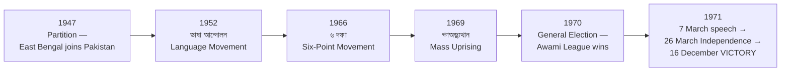
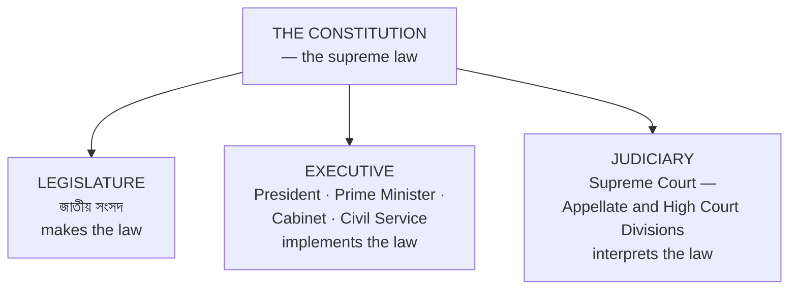
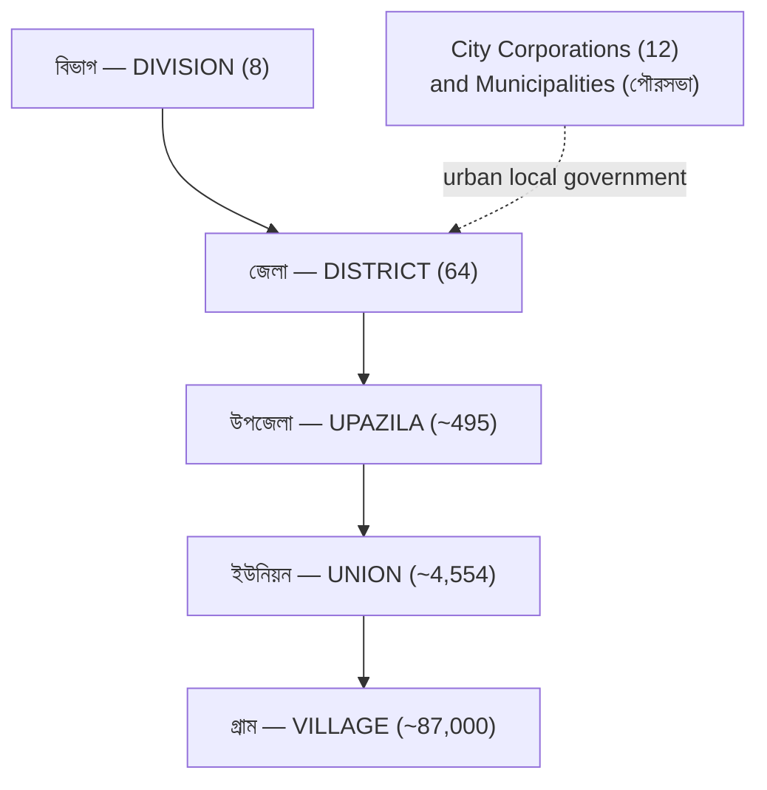
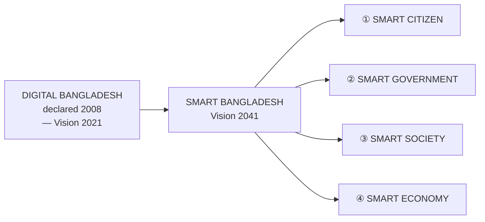
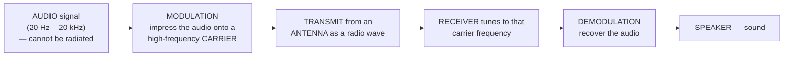
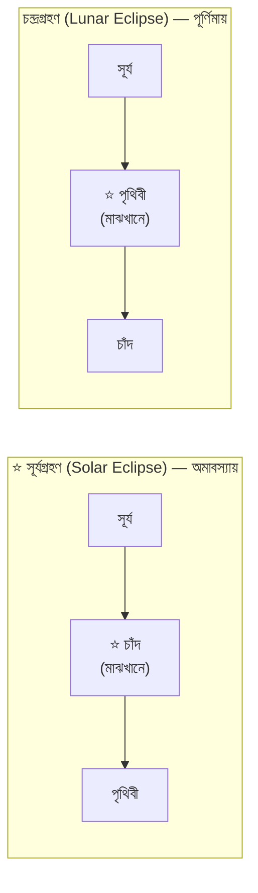

<!-- TOC START -->
**Table of Contents** — 5 subtopics · 14 theories

1. **[Bangladesh Affairs](#bangladesh-affairs)**
   - [মুক্তিযুদ্ধ ও স্বাধীনতা (The Liberation War and Independence)](#মুক্তিযুদ্ধ-ও-স্বাধীনতা-the-liberation-war-and-independence)
   - [সংবিধান ও শাসনব্যবস্থা (Constitution and Government)](#সংবিধান-ও-শাসনব্যবস্থা-constitution-and-government)
   - [ভূগোল ও প্রশাসনিক কাঠামো (Geography and Administrative Structure)](#ভূগোল-ও-প্রশাসনিক-কাঠামো-geography-and-administrative-structure)
   - [অর্থনীতি, বিদ্যুৎ ও অবকাঠামো (Economy, Power and Infrastructure)](#অর্থনীতি-বিদ্যুৎ-ও-অবকাঠামো-economy-power-and-infrastructure)
   - [স্মার্ট বাংলাদেশ, আইসিটি ও সাম্প্রতিক বিষয়](#স্মার্ট-বাংলাদেশ-আইসিটি-ও-সাম্প্রতিক-বিষয়)

2. **[International Affairs](#international-affairs)**
   - [আন্তর্জাতিক সংস্থা ও জোট (International Organisations and Alliances)](#আন্তর্জাতিক-সংস্থা-ও-জোট-international-organisations-and-alliances)
   - [ভূরাজনীতি ও সাম্প্রতিক বিশ্ব (Geopolitics and Current World Affairs)](#ভূরাজনীতি-ও-সাম্প্রতিক-বিশ্ব-geopolitics-and-current-world-affairs)

3. **[Everyday Science & Environment](#everyday-science--environment)**
   - [পদার্থবিজ্ঞান, তরঙ্গ ও পরিমাপ (Physics, Waves and Measurement)](#পদার্থবিজ্ঞান-তরঙ্গ-ও-পরিমাপ-physics-waves-and-measurement)
   - [জীববিজ্ঞান, স্বাস্থ্য ও চিকিৎসা প্রযুক্তি (Biology, Health and Medical Technology)](#জীববিজ্ঞান-স্বাস্থ্য-ও-চিকিৎসা-প্রযুক্তি-biology-health-and-medical-technology)
   - [পরিবেশ, দূষণ ও আধুনিক প্রযুক্তি (Environment, Pollution and Modern Technology)](#পরিবেশ-দূষণ-ও-আধুনিক-প্রযুক্তি-environment-pollution-and-modern-technology)
   - [রসায়ন — মৌল, যৌগ, অম্ল-ক্ষার ও দৈনন্দিন রসায়ন](#রসায়ন--মৌল-যৌগ-অম্ল-ক্ষার-ও-দৈনন্দিন-রসায়ন)
   - [পদার্থবিজ্ঞান — আলো, বল, তাপ ও জ্যোতির্বিজ্ঞান](#পদার্থবিজ্ঞান--আলো-বল-তাপ-ও-জ্যোতির্বিজ্ঞান)

4. **[Banking & ICT Abbreviations](#banking--ict-abbreviations)**
   - [সংক্ষিপ্ত রূপ ও পূর্ণরূপ (Abbreviations and Full Forms)](#সংক্ষিপ্ত-রূপ-ও-পূর্ণরূপ-abbreviations-and-full-forms)

5. **[Sports](#sports)**
   - [ক্রীড়াজগৎ — ক্রিকেট, ফুটবল ও অলিম্পিক](#ক্রীড়াজগৎ--ক্রিকেট-ফুটবল-ও-অলিম্পিক)

<!-- TOC END -->

---

## Bangladesh Affairs

### মুক্তিযুদ্ধ ও স্বাধীনতা (The Liberation War and Independence)

> The Liberation War section is the **single most reliably examined GK area**, because the facts never change. Learning this table once secures marks in every paper.

#### The road to independence — the milestones



| Date | Event |
|---|---|
| **21 February 1952** | ⭐ **ভাষা আন্দোলন** — Rafiq, Salam, Barkat, Jabbar and others killed. **UNESCO declared it INTERNATIONAL MOTHER LANGUAGE DAY in 1999**, observed worldwide from 2000 |
| **1955** | ⭐ **বাংলা একাডেমি established** — the institution created as a direct result of the Language Movement |
| **February 1966** | ⭐ **৬ দফা (Six-Point Programme)** — Bangabandhu's "charter of survival" for the Bengalis |
| **1968–69** | Agartala Conspiracy Case and the **1969 mass uprising** |
| **December 1970** | Awami League wins **167 of 300 seats**, an absolute majority — but power is not handed over |
| ⭐ **7 March 1971** | ⭐ **Bangabandhu's historic speech at the Racecourse Ground**: *"এবারের সংগ্রাম আমাদের মুক্তির সংগ্রাম, এবারের সংগ্রাম স্বাধীনতার সংগ্রাম।"* — inscribed by **UNESCO in the "Memory of the World" Register in 2017** |
| **25 March 1971** | **Operation Searchlight** — the genocide begins |
| ⭐ **26 March 1971** | ⭐ **INDEPENDENCE DAY — স্বাধীনতা দিবস** |
| **10 April 1971** | The Proclamation of Independence |
| **17 April 1971** | ⭐ **Mujibnagar Government sworn in** at Baidyanathtala, Meherpur |
| **14 December 1971** | ⭐ **শহীদ বুদ্ধিজীবী দিবস** — Martyred Intellectuals Day |
| ⭐ **16 December 1971** | ⭐ **VICTORY DAY — বিজয় দিবস**; surrender at the Racecourse Ground |

> ### **"৬ দফার দ্বিতীয় দফা কী ছিল?"**
> ### ✅ **The SECOND point stated that the FEDERAL GOVERNMENT would deal with only TWO subjects — DEFENCE and FOREIGN AFFAIRS — and that ALL OTHER subjects would rest with the federating states.**
>
> *(For reference: the **1st point** demanded a **federal parliamentary system based on the Lahore Resolution**, with a legislature elected by **universal adult franchise**; the later points covered **separate currencies, separate taxation powers, separate foreign-exchange accounts and a separate militia or paramilitary force for East Pakistan**.)*

#### The gallantry awards (খেতাব)

| খেতাব | Number awarded | Rank |
|---|---|---|
| ⭐ **বীরশ্রেষ্ঠ** | ⭐ **7** | **Highest** — all seven were awarded **posthumously** |
| **বীর উত্তম** | 68 | Second |
| **বীর বিক্রম** | 175 | Third |
| **বীর প্রতীক** | 426 | Fourth |
| | ⭐ **Total 676** | |

**The seven বীরশ্রেষ্ঠ:**

| Name | Force |
|---|---|
| **শহীদ ক্যাপ্টেন মহিউদ্দিন জাহাঙ্গীর** | Army |
| ⭐ **শহীদ ফ্লাইট লেফটেন্যান্ট মতিউর রহমান** | **Air Force** |
| **শহীদ সিপাহি মোস্তফা কামাল** | Army |
| **শহীদ ল্যান্স নায়েক মুন্সি আবদুর রউফ** | EPR |
| **শহীদ সিপাহি হামিদুর রহমান** | Army |
| **শহীদ ল্যান্স নায়েক নূর মোহাম্মদ শেখ** | EPR |
| **শহীদ ইঞ্জিনিয়ার রুম আর্টিফিসার মোহাম্মদ রুহুল আমিন** | **Navy** |

> ### **"বীরশ্রেষ্ঠ মতিউর রহমান কোন বাহিনীর সদস্য ছিলেন, এবং তাঁর সমাধি কোথায়?"**
> ### ✅ **He was a Flight Lieutenant of the PAKISTAN AIR FORCE who attempted to fly a jet to independent Bangladesh on 20 August 1971 and died in the attempt. His remains were BROUGHT BACK FROM KARACHI TO BANGLADESH IN 2006 and re-buried with full state honours at the MARTYRED INTELLECTUALS' GRAVEYARD, MIRPUR, Dhaka.**
>
> *(Bir Sreshtho **Hamidur Rahman's** remains were likewise brought back from **Tripura, India, in 2007** and buried at the same graveyard.)*

#### Memorials, awards and literature

| Item | Answer |
|---|---|
| ⭐ **জাতীয় স্মৃতিসৌধ (National Martyrs' Memorial), Savar — architect** | ⭐ **সৈয়দ মাইনুল হোসেন (Syed Mainul Hossain)** — seven pairs of triangular walls representing the seven phases of the struggle |
| **শহীদ মিনার — architect** | **হামিদুর রহমান** |
| **জাতীয় সংসদ ভবন — architect** | **লুই আই কান (Louis I. Kahn)** |
| ⭐ **জুলিও কুরি শান্তি পদক (Julio Curie Peace Award) to Bangabandhu** | ⭐ **23 May 1973** (formally conferred in Dhaka), awarded by the World Peace Council |
| ⭐ **"একাত্তরের দিনগুলি"** | ⭐ **জাহানারা ইমাম** |
| ⭐ **"একাত্তরের ডায়েরি"** | ⭐ **সুফিয়া কামাল** |
| **"রাইফেল রোটি আওরাত"** | **আনোয়ার পাশা** |
| ⭐ **"September on Jessore Road"** | ⭐ **Allen Ginsberg** — the American poet's response to the refugee exodus of 1971 |
| ⭐ **জাতীয় সংগীত** | ⭐ **"আমার সোনার বাংলা"** by **রবীন্দ্রনাথ ঠাকুর**; the **FIRST TEN LINES** constitute the national anthem, and the first four are played instrumentally |
| ⭐ **জাতীয় পতাকার নকশা** | The original design is attributed to **শিব নারায়ণ দাশ**; the present standardised flag was finalised by **কামরুল হাসান** |

**Previous Year Question List from this Topic:**

- [Who is the architect of the National Martyrs' Memorial in Savar? (SO IT 25-07-2026)](../written-answers/gk.md?plain=1#L17)
- [বীরশ্রেষ্ঠ মতিউর রহমান কোথায় জন্মগ্রহণ করেন?](../written-answers/gk.md?plain=1#L60)
- ["রাইফেল রুটি আওরাত" গ্রন্থের মূল উপজীব্য বিষয় কী? লেখকের নামসহ বাংলাদেশের মুক্তিযুদ্ধের উপর লিখিত তিনটি উপন্যাসের নাম লিখুন।](../written-answers/gk.md?plain=1#L105)
- [২০২৫ সালে প্রতিবাদী তারুণ্য ক্ষেত্রে "স্বাধীনতা পুরস্কার" কাকে প্রদান করা হয়?](../written-answers/gk.md?plain=1#L130)
- [সর্বকনিষ্ঠ খেতাবপ্রাপ্ত মুক্তিযোদ্ধার নাম?](../written-answers/gk.md?plain=1#L134)
- [কোন বীরশ্রেষ্ঠের সমাধি রাঙামাটিতে?](../written-answers/gk.md?plain=1#L138)
- [জাতীয় সংগীত এর প্রথম কত লাইন পরিবেশন করা হয়?](../written-answers/gk.md?plain=1#L154)
- [৬ দফার দ্বিতীয় দফা কি ছিল?](../written-answers/gk.md?plain=1#L184)
- [দেশে বর্তমানে মাথাপিছু বিদ্যুৎ শক্তি কত?](../written-answers/gk.md?plain=1#L194)
- [Which organization was created as a result of the language movement?](../written-answers/gk.md?plain=1#L234)
- [American poet and activist Allen Ginsberg wrote a poem, inspired by the plight of the East Bengali refugees from the 1971 Bangladesh Liberation War. What is the…](../written-answers/gk.md?plain=1#L246)
- [5.2 Who is the architect of the National Martyrs' Memorial in Savar?](../written-answers/gk.md?plain=1#L303)
- [স্মৃতি সৌধের স্থপতি কে?](../written-answers/gk.md?plain=1#L315)
- [জুলীয়কুরি পুরস্কার কত তারিখে পেয়েছে?](../written-answers/gk.md?plain=1#L323)
- [Who wrote the books titled Ekatturer Diary and Ekatturer Dinguli?](../written-answers/gk.md?plain=1#L331)
- [শেখ রাসেল দিবস কবে?](../written-answers/gk.md?plain=1#L358)
- [অপারেশন সার্চলাইট কবে পরিচালিত হয়?](../written-answers/gk.md?plain=1#L362)
- [বাংলাদেশের জাতীয় পতাকার ডিজাইনার কে?](../written-answers/gk.md?plain=1#L366)
- [বঙ্গবন্ধুর ঐতিহাসিক ৭ই মার্চের ভাষণ ইউনেস্কো কত তারিখে মেমোরি অব দ্য ওয়ার্ল্ড ইন্টারন্যাশনাল রেজিস্টারে অন্তর্ভুক্ত করে?](../written-answers/gk.md?plain=1#L370)
- [১. আগরতলা ষড়যন্ত্র মামলার আসামী সংখ্যা কত ছিল?](../written-answers/gk.md?plain=1#L378)
- [২. প্রধান আসামী কে ছিলেন? এই মামলার বিশেষ ট্রাইব্যুনালের চেয়ারম্যান কে ছিলেন?](../written-answers/gk.md?plain=1#L382)
- [৩. ‘আমার দেখা নয়াচীন’, ‘মুজিবের রক্ত লাল’, ‘লক্ষ প্রাণের বিনিময়ে’- গ্রন্থগুলির লেখকের নাম লিখুন।](../written-answers/gk.md?plain=1#L388)
- [১. কবে, কোথায় স্বাধীন বাংলাদেশ প্রতিষ্ঠার শপথ নেয়া হয়েছিল?](../written-answers/gk.md?plain=1#L420)
- [৫. (ক) বাংলাদেশের মুক্তিযুদ্ধে কয়টি সেক্টর ছিল?](../written-answers/gk.md?plain=1#L441)
- [(খ) পাকিস্তানী সেনারা কোথায় আত্মসমর্পণ করে?](../written-answers/gk.md?plain=1#L445)
- [(গ) বাংলাদেশের মুক্তিযুদ্ধের সর্বাধিনায়ক কে ছিলেন?](../written-answers/gk.md?plain=1#L449)
- [৬. (ক) বঙ্গবন্ধু কত সালে জাতিসংঘে বাংলায় ভাষণ দিয়েছেন?](../written-answers/gk.md?plain=1#L453)
- [কোন তারিখে মেহেরপুর জেলার সীমান্তবর্তী স্থান বৈদ্যনাথ তলায় বর্তমান মুজিবনগরে এক অনাড়ম্বর অনুষ্ঠানে আনুষ্ঠানিকভাবে স্বাধীনতার ঘোষণাপত্র পাঠ করা হয়?](../written-answers/gk.md?plain=1#L457)
- [“বাংলাদেশ ও বঙ্গবন্ধু” গ্রন্থটির রচয়িতা কে?](../written-answers/gk.md?plain=1#L465)
- [মহান মুক্তিযুদ্ধের প্রথম স্মারক ভাস্কর্যের নাম কি?](../written-answers/gk.md?plain=1#L469)
- [বাংলাদেশের সশস্ত্র প্রতিরোধ কবে ও কোথায় গড়ে তোলে?](../written-answers/gk.md?plain=1#L514)
- [কারাগারের রোজনামচার লেখক কে ও কত তারিখে প্রকাশিত হয়?](../written-answers/gk.md?plain=1#L518)
- [Write 4 sentence about Mujib 100.](../written-answers/gk.md?plain=1#L532)
- [১. আমার দেখা নয়াচীন এর লেখক কে?](../written-answers/gk.md?plain=1#L544)
- [২. মহান মুক্তিযুদ্ধের সর্বাধিনায়ক কাকে বলা হয়?](../written-answers/gk.md?plain=1#L548)
- [৫. জাতীয় শিশু দিবস কবে? ও বঙ্গবন্ধুর জন্মদিন এর সাথে ইহার সম্পর্ক কি?](../written-answers/gk.md?plain=1#L560)
- [৬. যেকোনো ২টি মুক্তিযুদ্ধ ভিত্তিক চলচ্চিত্রের নাম লিখুন।](../written-answers/gk.md?plain=1#L564)
- [৭. মুক্তিযুদ্ধের পরে কত তারিখে বঙ্গবন্ধু শেখ মুজিবুর রহমান দেশে ফেরেন?](../written-answers/gk.md?plain=1#L570)
- [৮. আগরতলা ষড়যন্ত্র মামলার আসামী কত জন?](../written-answers/gk.md?plain=1#L574)
- [৮. বঙ্গবন্ধুর স্বদেশ প্রত্যাবর্তন দিবস কত তারিখে?](../written-answers/gk.md?plain=1#L586)
- [৭ জন বীরশ্রেষ্ঠের নাম লিখ।](../written-answers/gk.md?plain=1#L598)
- [মুজিব বর্ষ জাতির পিতার সম্মানার্থে গৃহীত একটি পদক্ষেপ। জাতরি পিতার সম্মান রক্ষার্থে BREB এর নেওয়া মুজিব বর্ষের চারটি উদ্যোগ লিখুন।](../written-answers/gk.md?plain=1#L609)

**Previous Year MCQ List from this Topic:**

- [বাংলাদেশের মোট উপজেলা কতটি?](../mcq-answers/gk.md?plain=1#L1923)
- [বাংলাদেশের সবচেয়ে বড় জেলা কোনটি (আয়তনের দিক থেকে)?](../mcq-answers/gk.md?plain=1#L1932)
- [বাংলাদেশের মোট সাক্ষরতার হার (শিক্ষিতের হার) কত?](../mcq-answers/gk.md?plain=1#L1941)
- [বীরশ্রেষ্ঠ মতিউর রহমান কোথায় জন্মগ্রহণ করেন?](../mcq-answers/gk.md?plain=1#L1950)
- [The highest peak in Bangladesh is-](../mcq-answers/gk.md?plain=1#L1959)
- [বাংলাদেশের ২৯তম গ্যাসক্ষেত্র কোথায় অবস্থিত?](../mcq-answers/gk.md?plain=1#L1968)
- [বীরশ্রেষ্ঠ হামিদুর রহমানের পদবী কি?](../mcq-answers/gk.md?plain=1#L1977)
- [বাংলাদেশের জিডিপিতে কোন খাতের অবদান সবচেয়ে বেশি?](../mcq-answers/gk.md?plain=1#L1986)
- [বাংলাদেশে বিশেষ ক্ষমতা আইন কত সালে প্রণীত হয়েছিল?](../mcq-answers/gk.md?plain=1#L1995)
- [বাংলাদেশের জাতীয় প্রতীকে কয়টি তারকা আছে?](../mcq-answers/gk.md?plain=1#L2004)
- [ইক্ষু গবেষণা ইনস্টিটিউট কোথায় অবস্থিত?](../mcq-answers/gk.md?plain=1#L2013)
- [বাংলাদেশের বৃহত্তম গ্রাম কোন জেলায় অবস্থিত?](../mcq-answers/gk.md?plain=1#L2022)
- [শহীদ আসাদ দিবস কোনটি?](../mcq-answers/gk.md?plain=1#L2031)
- [বাংলাদেশে কোন ধরনের জ্বালানি থেকে বেশি বিদ্যুৎ উৎপাদিত হয়?](../mcq-answers/gk.md?plain=1#L2040)
- [ওআইসি'র কততম শীর্ষ সম্মেলনে বঙ্গবন্ধু শেখ মুজিবুর রহমান অংশগ্রহণ করেন?](../mcq-answers/gk.md?plain=1#L2049)
- [বঙ্গভঙ্গের কারণে সৃষ্ট প্রদেশ কোনটি?](../mcq-answers/gk.md?plain=1#L2058)
- [Which one of the following is not a part of the local government in Bangladesh?](../mcq-answers/gk.md?plain=1#L2067)
- [What is the highest temperature ever recorded in Bangladesh?](../mcq-answers/gk.md?plain=1#L2076)
- [Who received the Ekushey Padak 2024 in Social Service in Bangladesh?](../mcq-answers/gk.md?plain=1#L2085)
- [What is Bangladesh's ranking as a remittance recipient globally?](../mcq-answers/gk.md?plain=1#L2094)
- [When will Bangladesh exit from the LDC category?](../mcq-answers/gk.md?plain=1#L2103)
- [The documentary film, based on the liberation war, 'Rupali Shoikot' was directed by](../mcq-answers/gk.md?plain=1#L2112)
- [In 1997, UNESCO declared the 'Sundarbans' as the-](../mcq-answers/gk.md?plain=1#L2121)
- [Which one of the following is true?](../mcq-answers/gk.md?plain=1#L2130)
- [কুতুবদিয়া বাতিঘর নির্মাণ করা হয় কত সালে?](../mcq-answers/gk.md?plain=1#L2139)
- [বাংলাদেশের একমাত্র পাহাড়ী দ্বীপ কোনটি?](../mcq-answers/gk.md?plain=1#L2148)
- [তামাবিল সীমান্তের সাথে ভারতের কোন শহরটি অবস্থিত?](../mcq-answers/gk.md?plain=1#L2157)
- [দক্ষিণ তালপট্টি কোন নদীর মোহনায় অবস্থিত?](../mcq-answers/gk.md?plain=1#L2166)
- [When was International Mother Language Day Declaration by UNESCO?](../mcq-answers/gk.md?plain=1#L2175)
- [বাংলা একাডেমি প্রতিষ্ঠা হয় কবে?](../mcq-answers/gk.md?plain=1#L2184)
- [স্বাধীন বাংলাদেশের পতাকা প্রথম উত্তোলিত হয়েছিল ১৯৭১ সালের-](../mcq-answers/gk.md?plain=1#L2190)
- [চন্দ্রদ্বীপ অঞ্চলের পূর্বনাম কি?](../mcq-answers/gk.md?plain=1#L2196)
- [Biggest district in Bangladesh ______.](../mcq-answers/gk.md?plain=1#L2202)
- [Which located in largest Coal Mine of Bangladesh?](../mcq-answers/gk.md?plain=1#L2211)
- [Name of the first Prime Minister of Bangladesh ______.](../mcq-answers/gk.md?plain=1#L2220)
- [Who is the famous artist in Bangladesh?](../mcq-answers/gk.md?plain=1#L2229)
- [ECNEC under which ministry?](../mcq-answers/gk.md?plain=1#L2238)
- [Full meaning of GDP ______](../mcq-answers/gk.md?plain=1#L2247)
- [Three connecting point name of padma bridge of Bangladesh.](../mcq-answers/gk.md?plain=1#L2256)
- [How many sector liberation war in Bangladesh?](../mcq-answers/gk.md?plain=1#L2262)
- [তিন বিঘা করিডোর কোথায় অবস্থিত?](../mcq-answers/gk.md?plain=1#L2271)
- [When established Bangladesh Rapid Action Battalion (RAB)?](../mcq-answers/gk.md?plain=1#L2277)
- [যুক্তরাষ্ট্রের নিউইয়র্কে কনসার্ট ফর বাংলাদেশ কে এরেঞ্জ করেন?](../mcq-answers/gk.md?plain=1#L2283)
- [Who was the commander in chief of the mukti bahini?](../mcq-answers/gk.md?plain=1#L2289)
- [Total amount of budget of Bangladesh for FY 2022-2023 was-](../mcq-answers/gk.md?plain=1#L2299)


---

### সংবিধান ও শাসনব্যবস্থা (Constitution and Government)

> The **Constitution of the People's Republic of Bangladesh (গণপ্রজাতন্ত্রী বাংলাদেশের সংবিধান)** was adopted on **4 November 1972** and came into effect on ⭐ **16 December 1972**. It is the **supreme law** of the country.

#### The basic facts

| Item | Value |
|---|---|
| **Adopted** | **4 November 1972** — observed as **সংবিধান দিবস** |
| ⭐ **Effective from** | ⭐ **16 December 1972** |
| **Original structure** | **A preamble, 11 parts, 153 articles and 4 schedules** |
| ⭐ **The four fundamental principles of state policy** | ⭐ **নীতি: জাতীয়তাবাদ (Nationalism), সমাজতন্ত্র (Socialism), গণতন্ত্র (Democracy), ধর্মনিরপেক্ষতা (Secularism)** |
| ⭐ **Fundamental rights** | ⭐ **Articles 27–44 — 18 fundamental rights**, enforceable in the High Court under **Article 44 / 102** |
| **Drafting committee** | Headed by **ড. কামাল হোসেন**, 34 members |
| **Official language** | **বাংলা** (Article 3) |
| **State religion** | Islam, with equal status and rights guaranteed to all other religions |

#### The organs of the state



| Organ | Composition |
|---|---|
| ⭐ **জাতীয় সংসদ (Parliament)** | ⭐ **350 seats in total — 300 DIRECTLY ELECTED constituencies plus 50 SEATS RESERVED FOR WOMEN** (filled proportionally by the elected members). Unicameral. Term: **5 years**. Speaker presides |
| **President** | **Head of State** — a largely ceremonial office, elected by the Members of Parliament |
| **Prime Minister** | **Head of Government** — exercises executive power |
| **Supreme Court** | The **Appellate Division** and the **High Court Division**; headed by the **Chief Justice** |
| **Election Commission** | A constitutional body conducting all national and local elections |

> ### **"জাতীয় সংসদে কয়টি আসন রয়েছে এবং সংরক্ষিত মহিলা আসন কতটি?"**
> ### ✅ **Total 350 seats — 300 directly elected general seats plus 50 reserved seats for women.**
>
> ⚠️ **Note on currency of information:** the reserved-women-seat provision has a **constitutional time limit and has been extended by amendment several times**, and the number has changed historically (15 → 30 → 45 → 50). Bangladesh is also currently in a period of **constitutional reform discussion**, so **verify the latest position against the Election Commission and the Bangladesh Gazette before an exam.**

#### Why elections matter for democracy

> A standard descriptive question. The points to make:

1. **Elections give GOVERNMENT ITS LEGITIMACY** — power derived from the people's consent rather than force.
2. **They ensure ACCOUNTABILITY** — a government that must face the voters has a permanent incentive to perform.
3. **They provide PEACEFUL TRANSFER OF POWER** — the single most important test of a functioning democracy.
4. **They ensure REPRESENTATION** of diverse regions, groups and opinions.
5. **They enable PARTICIPATION** — turning subjects into citizens.
6. **They allow POLICY CHOICE** — voters select between competing programmes.

**What a credible election requires:** a **free, fair and neutral Election Commission**; an **impartial administration and police**; a **level playing field** for all parties; **freedom of expression and assembly**; an **accurate voter roll**; **transparent counting**; **independent observers and a free press**; and **acceptance of the result** by the losing side.

**Previous Year Question List from this Topic:**

- [প্রস্তাবিত প্রাদেশিক সরকার ব্যবস্থা বাংলাদেশের জন্য কতটা বাস্তবসম্মত? আপনার মতামত উপস্থাপন করুন।](../written-answers/gk.md?plain=1#L64)
- [গণপ্রজাতন্ত্রী বাংলাদেশের সংবিধানের কোন ভাগে মৌলিক অধিকারসমূহ বর্ণনা করা হয়েছে? চিন্তা ও বিবেকের স্বাধীনতা এবং বাক স্বাধীনতা সংবিধানের কোন অনুচ্ছেদে বর্ণনা করা…](../written-answers/gk.md?plain=1#L89)
- [গণতন্ত্র প্রতিষ্ঠায় নির্বাচন অনুষ্ঠানের গুরুত্ব লিখুন।](../written-answers/gk.md?plain=1#L114)
- [বাংলাদেশের বর্তমান অন্তবর্তী সরকার কত তারিখে গঠিত হয়?](../written-answers/gk.md?plain=1#L126)
- [প্রধান উপদেষ্টা জুলাই সনদে কত তারিখে স্বাক্ষর করেন?](../written-answers/gk.md?plain=1#L150)
- [বাংলাদেশ ভারত থেকে কত মেগাওয়াট বিদ্যুৎ আমদানি করে এবং সেটি দেশে কোন দিক দিয়ে প্রবেশ করে?](../written-answers/gk.md?plain=1#L206)
- [দেশের সর্বোচ্চ বিদ্যুৎ উৎপাদন কত এবং সেটি কবে হয়েছে?](../written-answers/gk.md?plain=1#L210)
- [বাংলাদেশের সংবিধানে বর্ণিত রাষ্ট্র পরিচালনার মূলনীতিগুলো কী কী? সংক্ষিপ্ত আলোচনা করুন।](../written-answers/gk.md?plain=1#L277)
- [বাংলাদেশের সংবিধানে কয়টি অনুচ্ছেদ রয়েছে?](../written-answers/gk.md?plain=1#L354)
- [৫. গণপ্রজাতন্ত্রী বাংলাদেশের সংবিধানে কয়টি অনুচ্ছেদ রয়েছে? মৌলিক অধিকারের বিষয়টি সংবিধানের কোন অনুচ্ছেদে আছে?](../written-answers/gk.md?plain=1#L401)
- [বাংলাদেশের জাতীয় নির্বাচনের আসন সংখ্যা ও সংরক্ষিত আসন কতটি?](../written-answers/gk.md?plain=1#L524)
- [৯. বাংলাদেশের রাষ্ট্রপ্রধান এর নাম কি?](../written-answers/gk.md?plain=1#L590)

**Previous Year MCQ List from this Topic:**

- [What is the current rank of Bangladesh of SDG?](../mcq-answers/gk.md?plain=1#L2309)
- [The span of the Padma bridge are-](../mcq-answers/gk.md?plain=1#L2319)
- [Install capacity of payra-](../mcq-answers/gk.md?plain=1#L2329)
- [একুশে ফেব্রুয়ারিকে কখন আন্তর্জাতিক মাতৃভাষা দিবস হিসেবে ঘোষণা করা হয়? Ans: ১৯৯৯ সারে](../mcq-answers/gk.md?plain=1#L2339)
- [বাংলাদেশের ও মায়ানমার পৃথককারী নদী কোনটি? Ans: নাফ](../mcq-answers/gk.md?plain=1#L2344)
- [বীরশ্রেষ্ঠ মতিউর রহমানের দেহাবশেষ কখন পাকিস্তান থেকে বাংলাদেশ ফিরিয়ে আনা হয়? Ans: ২০০৬ সালে](../mcq-answers/gk.md?plain=1#L2349)
- [বাংলাদেশকে কোন আরব দেশ প্রথম স্বীকৃতি দেয়? Ans: ইরাক](../mcq-answers/gk.md?plain=1#L2354)
- [২০২১ সালে GDP প্রবৃদ্ধির হার কত? Ans: ৬.৯৪%](../mcq-answers/gk.md?plain=1#L2359)
- [বাংলাদেশের সর্বোচ্চ বেসামরিক পুরস্কার কোনটি? Ans: স্বাধীনতা পুরস্কার](../mcq-answers/gk.md?plain=1#L2364)
- [বাংলাদেশের প্রথম ন্যানো স্যাটেলাইটের নাম কি?](../mcq-answers/gk.md?plain=1#L2369)
- [তারামন বিবি কোন সেক্টরে যুদ্ধ করেছে?](../mcq-answers/gk.md?plain=1#L2375)
- [পাকিস্তান কবে শেখ মুজিবুর রহমানকে কারাগার থেকে মুক্তি দেয়?](../mcq-answers/gk.md?plain=1#L2381)
- [বঙ্গবন্ধু স্যাটেলাইট-১ কত তারিখে উৎক্ষেপন করা হয়?](../mcq-answers/gk.md?plain=1#L2387)
- [বঙ্গবন্ধু স্যাটেলাইট এর ট্রান্সপন্ডার সংখ্যা কতটি?](../mcq-answers/gk.md?plain=1#L2393)
- [MNP সার্ভিস BTRC কবে প্রণয়ন করে?](../mcq-answers/gk.md?plain=1#L2399)
- [বাংলাদেশ কবে SAE-ME-WE এর সদস্য হয়?](../mcq-answers/gk.md?plain=1#L2405)
- [বাংলাদেশে প্রধান নির্বাচন কমিশনার নিয়োগ দেন কে?](../mcq-answers/gk.md?plain=1#L2411)
- [বঙ্গবন্ধু শেখ মুজিবুর রহমানকে কবে জাতির জনক ঘোষণা করা হয়?](../mcq-answers/gk.md?plain=1#L2420)
- [কোনটি মায়ানমার-বাংলাদেশের অভিন্ন নদী নয়?](../mcq-answers/gk.md?plain=1#L2429)
- [কত তারিখে বাংলাদেশের সংবিধান কার্যকর হয়?](../mcq-answers/gk.md?plain=1#L2438)
- [সর্ব কনিষ্ঠ খেতাবপ্রাপ্ত মুক্তিযোদ্ধা হলেন–](../mcq-answers/gk.md?plain=1#L2447)
- [পার্বত্য চট্টগ্রাম শান্তি চুক্তি কবে সম্পাদিত হয়?](../mcq-answers/gk.md?plain=1#L2457)
- [কোন আরব দেশ বাংলাদেশকে প্রথম স্বীকৃতি দেয়?](../mcq-answers/gk.md?plain=1#L2467)
- [বাংলাদেশের সংবিধানে কয়টি অনুচ্ছেদ আছে?](../mcq-answers/gk.md?plain=1#L2477)
- [মুক্তিযুদ্ধা তারামন বিবি যুদ্ধ করেছেন কোন সেক্টরে?](../mcq-answers/gk.md?plain=1#L2487)
- [বাংলাদেশের জাতীয় সংসদের অধিবেশন কে আহ্বান করেন?](../mcq-answers/gk.md?plain=1#L2497)
- [দহগ্রাম ছিটমহল কোন জেলায় অবস্থিত?](../mcq-answers/gk.md?plain=1#L2507)
- [বাংলাদেশের প্রথম জাতীয় সংসদ নির্বাচন হয় কোন তারিখে?](../mcq-answers/gk.md?plain=1#L2517)
- [খাদ্য নিরাপত্তার ক্ষেত্রে যে সকল বিষয় বিবেচনা করতে হয়-](../mcq-answers/gk.md?plain=1#L2526)
- [ভারতের সাথে বাংলাদেশের সীমানা কত কিলোমিটার?](../mcq-answers/gk.md?plain=1#L2535)


---

### ভূগোল ও প্রশাসনিক কাঠামো (Geography and Administrative Structure)

#### The administrative hierarchy



| Unit | Number |
|---|---|
| ⭐ **বিভাগ (Divisions)** | ⭐ **8** — Dhaka, Chattogram, Rajshahi, Khulna, Barishal, Sylhet, Rangpur, Mymensingh |
| ⭐ **জেলা (Districts)** | ⭐ **64** |
| ⭐ **উপজেলা (Upazilas)** | ⭐ **about 495** |
| **ইউনিয়ন পরিষদ** | about **4,554** |
| **সিটি কর্পোরেশন** | **12** |

> ⚠️ **The upazila and union counts change when new units are created by government notification.** Give the figure and note the date — **"approximately 495 upazilas (as most recently notified)"** is a safer and more mature answer than a bare number.

#### The superlatives most often asked

| Question | ✅ **Answer** |
|---|---|
| ⭐ **সর্ববৃহৎ জেলা (largest district by area)** | ⭐ **রাঙ্গামাটি (Rangamati)** — about 6,116 km² |
| ⭐ **ক্ষুদ্রতম জেলা (smallest district)** | ⭐ **মেহেরপুর (Meherpur)** |
| **Largest division by area** | **Chattogram** |
| **Most populous district** | **Dhaka** |
| ⭐ **World's longest natural sea beach** | ⭐ **কক্সবাজার (Cox's Bazar)** — about 120 km |
| ⭐ **World's largest mangrove forest** | ⭐ **সুন্দরবন (The Sundarbans)** — a **UNESCO World Heritage Site (1997)**, home of the Royal Bengal Tiger |
| ⭐ **Bangladesh's first DEEP-SEA PORT** | ⭐ **মাতারবাড়ী গভীর সমুদ্রবন্দর (Matarbari)**, Cox's Bazar — developed with JICA assistance |
| **Principal seaports** | **Chattogram** (the largest), **Mongla**, **Payra**, and **Matarbari** |
| ⭐ **"Lifeline of Bangladesh"** | ⭐ **The PADMA** — the country's principal river artery *(some sources apply the phrase to the Meghna or to the Ganges-Padma system as a whole; state the Padma and note the alternative)* |
| **Main river systems** | ⭐ **The GBM system — Ganges (Padma), Brahmaputra (Jamuna) and Meghna** — the largest delta in the world |
| **Longest river** | ⚠️ **Disputed in exam keys** — **the Surma (about 399 km)** is the answer given in most Bangladeshi textbooks, while others cite the **Padma**. **Give the Surma and note the alternative.** |
| **Highest peak** | **তাজিংডং (Bijoy)** in Bandarban, about 1,231 m |
| **Tropic of Cancer** | ⭐ **The Tropic of Cancer (কর্কটক্রান্তি রেখা) passes over the MIDDLE of Bangladesh**, roughly through Dhaka division |

#### Water-sharing and cross-border rivers

- Bangladesh shares **54 trans-boundary rivers with India** and **3 with Myanmar**.
- The **Ganges Water Sharing Treaty** with India was signed in **1996** for **30 years**, and governs dry-season flow at **Farakka**.
- The **Teesta** water-sharing agreement remains **unsigned**, and is a long-standing bilateral issue.

**Previous Year Question List from this Topic:**

- [Which river is known as the "Lifeline of Bangladesh"?](../written-answers/gk.md?plain=1#L25)
- [What is the name of Bangladesh's first deep-sea port?](../written-answers/gk.md?plain=1#L29)
- [বাংলাদেশের মোট উপজেলা কতটি?](../written-answers/gk.md?plain=1#L48)
- [বাংলাদেশের সবচেয়ে বড় জেলা কোনটি (আয়তনের দিক থেকে)?](../written-answers/gk.md?plain=1#L52)
- [বাংলাদেশের সর্ববৃহৎ জেলার নাম?](../written-answers/gk.md?plain=1#L142)
- [বাংলাদেশ থেকে কোন নদী ভারতে প্রবেশ করে পুনরায় বাংলাদেশে প্রবেশ করেছে?](../written-answers/gk.md?plain=1#L198)
- [এশিয়ার সর্ববৃহৎ প্রাকৃতিক মৎস্য প্রজনন কেন্দ্র কোনটি এবং এটি কোন বিভাগে অবস্থিত?](../written-answers/gk.md?plain=1#L202)
- [বাংলাদেশের উপর দিয়ে কোন গুরুত্বপূর্ণ ভৌগোলিক রেখা অতিক্রম করেছে? বাংলাদেশের জলবায়ুতে এর গুরুত্ব কী?](../written-answers/gk.md?plain=1#L258)
- [৬. কোন জেলায় অবস্থিত- লিখুন (ক) ষাটগম্বুজ মসজিদ; (খ) বীরশ্রেষ্ঠ ক্যাপ্টেন মহীউদ্দীন জাহাঙ্গীরের সমাধি; (গ) কান্তজীর মন্দির।](../written-answers/gk.md?plain=1#L407)
- [৮. হালদা নদী কোন এলাকায় অবস্থিত? এই নদীর অর্থনৈতিক গুরুত্ব কি?](../written-answers/gk.md?plain=1#L414)
- [২. বাংলাদেশে কয়টি কঠিন শিলা খনি আছে? খনির নাম এবং কোন জেলায় অবস্থিত, লিখুন।](../written-answers/gk.md?plain=1#L424)
- [৩. বাংলাদেশের তিনটি জনপ্রিয় পর্যটন কেন্দ্রের নাম লিখুন।](../written-answers/gk.md?plain=1#L428)
- [৪. বরেন্দ্র ভূমি বলতে কী বোঝায়? কোন কোন এলাকাজুড়ে বরেন্দ্র ভূমি বিস্তৃত?](../written-answers/gk.md?plain=1#L435)
- [১০. আয়তনের দিক থেকে বিশ্বে বাংলাদেশের অবস্থান কততম?](../written-answers/gk.md?plain=1#L594)

**Previous Year MCQ List from this Topic:**

- [প্রতিদিন বাংলাদেশে গড়ে কি পরিমাণ খাদ্যশস্য Consume হয়?](../mcq-answers/gk.md?plain=1#L2544)
- [কম্পট্রোলার এন্ড অডিটর জেনারেল পদটি-](../mcq-answers/gk.md?plain=1#L2553)
- [বঙ্গবন্ধুর ঐতিহাসিক ৭ই মার্চ ভাষণে অ্যাসেম্বলিতে বসার জন্য তৎকালীন সরকারকে কয়টি শর্ত দিয়েছিলেন?](../mcq-answers/gk.md?plain=1#L2562)
- [গণপ্রজাতন্ত্রী বাংলাদেশের সংবিধান এ যাবৎ কতটি সংশোধনী হয়েছে?](../mcq-answers/gk.md?plain=1#L2571)
- [বঙ্গবন্ধু কোথায় ঐতিহাসিক ছয় দফা পেশ করেন?](../mcq-answers/gk.md?plain=1#L2580)
- [বীরশ্রেষ্ঠ ক্যাপ্টেন মহিউদ্দিন জাহাঙ্গীর এর কবর কোন জেলায়?](../mcq-answers/gk.md?plain=1#L2589)
- [স্বাধীনতার সুবর্ণজয়ন্তীর লোগোর নকশা করেন কে?](../mcq-answers/gk.md?plain=1#L2598)
- [বাংলাদেশের সর্বাধিক বৈদেশিক মুদ্রা অর্জনকারী শিল্প কোনটি?](../mcq-answers/gk.md?plain=1#L2607)
- [২০২০-২০২১ অর্থবছরে বাংলাদেশের মাথাপিছু আয় মার্কিন ডলারে কত?](../mcq-answers/gk.md?plain=1#L2616)
- [কাপাসিয়া মডেল কী?](../mcq-answers/gk.md?plain=1#L2625)
- [বাংলাদেশে বর্তমানে বিদ্যুৎ উৎপাদন ক্ষমতা কত?](../mcq-answers/gk.md?plain=1#L2634)
- [বেসরকারি বিল কাকে বলে?](../mcq-answers/gk.md?plain=1#L2643)
- [২০২১ সাল থেকে বাংলাদেশ সরকার নতুন কোন পদক প্রদান করে?](../mcq-answers/gk.md?plain=1#L2652)
- [গণপ্রজাতন্ত্রী বাংলাদেশের সংবিধান দিবস কত তারিখ?](../mcq-answers/gk.md?plain=1#L2661)
- [বাংলাদেশ সুগারক্রপ গবেষণা ইনস্টিটিউট কোথায় অবস্থিত?](../mcq-answers/gk.md?plain=1#L2671)
- [স্বাধীন বাংলাদেশের জাতীয় সংসদের প্রথম স্পিকার কে ছিলেন?](../mcq-answers/gk.md?plain=1#L2681)
- [তেভাগা আন্দোলনের নেত্রী?](../mcq-answers/gk.md?plain=1#L2691)
- [স্বাধীন বাংলাদেশের জাতীয় সংসদের প্রথম স্পিকার কে ছিলেন?](../mcq-answers/gk.md?plain=1#L2701)
- [When china did recognized Bangladesh?](../mcq-answers/gk.md?plain=1#L2710)
- [What is the length and width of the National Flag of Bangladesh?](../mcq-answers/gk.md?plain=1#L2720)
- [The cabinet of Mujibnagar Government was sworn in-](../mcq-answers/gk.md?plain=1#L2730)
- [During the liberation war of Bangladesh, Dhaka was under which sector?](../mcq-answers/gk.md?plain=1#L2740)
- [The first gas field of Bangladesh was discovered in-](../mcq-answers/gk.md?plain=1#L2750)
- [The only foreigner to be awarded the title “Bir Protic” is-](../mcq-answers/gk.md?plain=1#L2760)
- [What is the length and width of the National Flag of Bangladesh?](../mcq-answers/gk.md?plain=1#L2770)
- [রাতারগুল কোন ধরণের বন?](../mcq-answers/gk.md?plain=1#L2781)
- [ছয়দফা কতসালে প্রস্তাব করা হয়?](../mcq-answers/gk.md?plain=1#L2790)
- [বাংলাদেশের দীর্ঘতম নদী কোনটি?](../mcq-answers/gk.md?plain=1#L2799)
- [Who is the Chairman of BCIC?](../mcq-answers/gk.md?plain=1#L2808)
- [Bangladesh Chemical Industries Corporation (BCIC), fully owned by the Gob, was established in ______ ?](../mcq-answers/gk.md?plain=1#L2817)
- [Which connect the two Sea in Suez Canal?](../mcq-answers/gk.md?plain=1#L4560)
- [দুই নদীর মধ্যবর্তী ভূমিকে কি বলে?](../mcq-answers/gk.md?plain=1#L4569)
- [বিশ্বের উচ্চতম জলপ্রপাত কোনটি?](../mcq-answers/gk.md?plain=1#L4578)
- [এশিয়া মহাদেশের সবচেয়ে ছোট দেশ কোনটি?](../mcq-answers/gk.md?plain=1#L4587)
- [শীতল মরুভূমি কোনটি?](../mcq-answers/gk.md?plain=1#L4596)
- [পৃথিবীর সর্বাধিক দ্বীপপুঞ্জের দেশ কোনটি?](../mcq-answers/gk.md?plain=1#L4605)
- [The highest densely populated country of the world is –](../mcq-answers/gk.md?plain=1#L4614)
- [Which of the following ecosystem covers the largest area of the earth's surface?](../mcq-answers/gk.md?plain=1#L4623)
- [পেনাং কোন দেশের সমুদ্রবন্দর?](../mcq-answers/gk.md?plain=1#L4632)
- [সমুদ্র স্রোত সৃষ্টির প্রধান কারণ কি?](../mcq-answers/gk.md?plain=1#L4641)


---

### অর্থনীতি, বিদ্যুৎ ও অবকাঠামো (Economy, Power and Infrastructure)

#### The economy in outline

| Indicator | Approximate value |
|---|---|
| ⭐ **LDC graduation** | ⭐ **Bangladesh graduates from Least Developed Country status in 2026** |
| ⭐ **Ready-Made Garments (RMG) exports** | ⭐ **About US$ 47 billion — the world's SECOND-LARGEST apparel exporter after China**; about **84% of total exports** |
| ⭐ **Remittances** | ⭐ **Over US$ 21 billion a year** |
| **ICT / software & ITES exports** | **Over US$ 1.9 billion**, with a stated target of **US$ 5 billion** |
| **Freelancers** | **Over 650,000** — among the largest freelancing workforces in the world |
| ⭐ **Literacy rate** | ⭐ **About 77%** *(BBS; the figure is revised each year — quote it as "about 77% according to the most recent BBS estimate")* |
| **Main crops** | Rice, jute, tea, wheat, potato, sugarcane |

#### The key institutions

| Institution | Role |
|---|---|
| ⭐ **Bangladesh Bank** | The **CENTRAL BANK** — established **16 December 1971**. ⭐ **First Governor: এ. এন. এম. হামিদুল্লাহ (A. N. M. Hamidullah)** |
| ⭐ **ECNEC** | ⭐ **Executive Committee of the National Economic Council** — the **HIGHEST project-approval body** in the country. Chaired by the head of government, it gives **final approval to all large public-investment projects** (those above the threshold delegated to the Planning Minister), reviews project progress and revisions, and approves changes in cost and scope. ⭐ **In short: ECNEC is where a national development project receives its final financial and policy clearance.** |
| **NEC** | National Economic Council — approves the national plans and the Annual Development Programme |
| **BBS** | Bangladesh Bureau of Statistics — the official source of all national statistics |
| **NBR** | National Board of Revenue — tax and customs |
| **BIDA** | Bangladesh Investment Development Authority |
| **BSEC** | Bangladesh Securities and Exchange Commission |
| **BARI** | ⭐ **Bangladesh Agricultural Research Institute — established in 1976** |
| **BRRI** | Bangladesh Rice Research Institute — Gazipur |

#### Power and energy

| Item | Position |
|---|---|
| **Installed generation capacity** | **Over 26,000–27,000 MW** *(rising; verify the current figure)* |
| **Maximum demand served** | **Over 16,000 MW** |
| **Per-capita electricity generation** | **Over 600 kWh** — up from about 220 kWh in 2009 |
| ⭐ **Import from India** | ⭐ **About 1,160 MW through the Bheramara (1,000 MW) and Tripura (160 MW) interconnections**, plus power contracted from the **Adani (Godda) plant** |
| ⭐ **Largest single generation project** | ⭐ **রূপপুর পারমাণবিক বিদ্যুৎকেন্দ্র (Rooppur Nuclear Power Plant)** — **2 × 1,200 MW** VVER-1200 units, built with Russian assistance at Pabna; **Bangladesh's first nuclear power plant** |
| **Major coal plants** | **Payra**, **Rampal (Maitree)**, and ⭐ **Matarbari — Bangladesh's first ULTRA-SUPERCRITICAL coal-fired plant** |
| **Distribution utilities** | ⭐ **BREB (Palli Bidyut Samity), DPDC, DESCO, NESCO, WZPDCL** — transmission is by **PGCB** |
| **Regulator** | ⭐ **BERC — Bangladesh Energy Regulatory Commission** |

#### The landmark infrastructure projects

| Project | Note |
|---|---|
| ⭐ **পদ্মা সেতু (Padma Bridge)** | Opened **25 June 2022**; **6.15 km**, road-and-rail, **built entirely with domestic funding** |
| ⭐ **ঢাকা মেট্রোরেল (MRT Line-6)** | Opened **December 2022** — Bangladesh's **first metro rail** |
| ⭐ **কর্ণফুলী টানেল (Bangabandhu Tunnel)** | Opened **2023** — the **first underwater road tunnel in South Asia** |
| **মাতারবাড়ী গভীর সমুদ্রবন্দর** | The first deep-sea port |
| **Rooppur Nuclear Power Plant** | Pabna |
| **Payra Port** | The third seaport |

#### The Blue Economy (সুনীল অর্থনীতি)

> ### **The BLUE ECONOMY means the SUSTAINABLE USE OF MARINE AND OCEAN RESOURCES for economic growth, improved livelihoods and jobs, while PRESERVING the health of the marine ecosystem.**

**Why it matters to Bangladesh:** the maritime boundary settlements with **Myanmar (ITLOS, 2012)** and **India (PCA, 2014)** gave Bangladesh sovereign rights over roughly **118,813 km² of sea area** — an area comparable to its land territory.

**The main sectors:** **fisheries and aquaculture · marine and coastal tourism · shipping, ports and ship-building · ship-breaking and recycling · offshore oil and gas · renewable ocean energy · sea salt production · marine biotechnology and marine genetic resources · deep-sea mining · coastal protection and mangrove services.** *(The government has identified a substantial list of potential blue-economy sectors — commonly cited as **26** — so quote the list of major sectors and note that the official enumeration runs to about two dozen.)*

**The geopolitical importance:** Bangladesh sits at the **head of the Bay of Bengal**, at the junction of **South and Southeast Asia**, on major **Indian Ocean shipping lanes**, and is a natural **gateway to India's landlocked north-east, to Nepal and Bhutan, and to China's south-west** — which is why connectivity initiatives such as **BIMSTEC, BBIN and BCIM** centre on it.

**Previous Year Question List from this Topic:**

- [BARI কত সালে প্রতিষ্ঠিত হয়?](../written-answers/gk.md?plain=1#L146)
- [সর্বশেষ কৃষিশুমারী কতসালে হয়?](../written-answers/gk.md?plain=1#L162)
- [সার্বিক অর্থনীতি, মূল্যস্ফীতি সংক্রান্ত](../written-answers/gk.md?plain=1#L166)
- [What is GI?](../written-answers/gk.md?plain=1#L173)
- [Brief the work functionality of ECNEC.](../written-answers/gk.md?plain=1#L177)
- [মাথাপিছু বিদ্যুৎ শক্তির ফর্মুলা লিখুন।](../written-answers/gk.md?plain=1#L188)
- [বাংলাদেশের বিদ্যুৎ বিতরণ কোম্পানি গুলোর নাম লিখ?](../written-answers/gk.md?plain=1#L214)
- [Mention the name of the First Governor of Bangladesh Bank.](../written-answers/gk.md?plain=1#L230)
- [In which year did the first coal-fired Ultra Super Critical Thermal Power Plant start the commercial power supply to the national grid of Bangladesh?](../written-answers/gk.md?plain=1#L238)
- [How many priority sector(s) fall under the Blue Economy for Bangladesh?](../written-answers/gk.md?plain=1#L250)
- [সুনীল অর্থনীতি অথবা সমুদ্র অর্থনীতি কী? এই সমুদ্র অর্থনীতির ভিত্তি কী?](../written-answers/gk.md?plain=1#L285)
- [কোন সেক্টরের কোন নির্ধারিত কমান্ডার ছিল না?](../written-answers/gk.md?plain=1#L327)
- [৪. বাংলাদেশের চলমান ৪টি মেগা প্রকল্পের নাম লিখুন। দেশীয় অর্থে বাস্তবায়নাধীন ১টি মেগা প্রকল্পের নাম লিখুন।](../written-answers/gk.md?plain=1#L395)

**Previous Year MCQ List from this Topic:**

- [How many enterprise under BCIC?](../mcq-answers/gk.md?plain=1#L2826)
- [How much number of enterprise of BCIC at founded period?](../mcq-answers/gk.md?plain=1#L2835)
- [Number of fertilize enterprise of BCIC is ______ ?](../mcq-answers/gk.md?plain=1#L2844)
- [The number of board of director of BCIC is ______ ?](../mcq-answers/gk.md?plain=1#L2853)
- [The Most Loss making enterprise of BCIC in 2020–2021 is ______ ?](../mcq-answers/gk.md?plain=1#L2862)
- [When did Bangabandhu declared historic six point programme?](../mcq-answers/gk.md?plain=1#L2871)
- [The length of Dhaka Metro Rail will be–](../mcq-answers/gk.md?plain=1#L2880)
- [As per the latest changes in Bengali Calendar, leap year is calculated in which month?](../mcq-answers/gk.md?plain=1#L2889)
- [Who is the builder of the 'Sat Gumbad' (Seven-domed) mosque?](../mcq-answers/gk.md?plain=1#L2898)
- [Free Market Economy started in Bangladesh in–](../mcq-answers/gk.md?plain=1#L2907)
- [বাংলাদেশে প্রথম জাতীয় সংসদের নির্বাচন কখন হয়?](../mcq-answers/gk.md?plain=1#L2916)
- [কত সালে আওয়ামী লীগের ৬দফা পেশ করা হয়েছিল?](../mcq-answers/gk.md?plain=1#L2925)
- [নির্বাহী বিভাগ থেকে বিচার বিভাগ পৃথক করার বিষয়টি সংবিধানের কোন অনুচ্ছেদে উল্লেখ রয়েছে?](../mcq-answers/gk.md?plain=1#L2934)
- [১৯৫৪ সালে পূর্ব পাকিস্তান প্রাদেশিক পরিষদ নির্বাচনে যুক্তফ্রন্টের কি প্রতীক ছিল?](../mcq-answers/gk.md?plain=1#L2942)
- [গণপ্রজাতন্ত্রী বাংলাদেশের সংবিধান প্রবর্তিত হয়-](../mcq-answers/gk.md?plain=1#L2951)
- [বঙ্গবন্ধু আগরতলা ষড়যন্ত্র মামলায় মোট আসামি সংখ্যা ছিল কতজন?](../mcq-answers/gk.md?plain=1#L2960)
- [আইন প্রণয়নের ক্ষমতা-](../mcq-answers/gk.md?plain=1#L2969)
- [পার্বত্য চট্টগ্রাম শান্তিচুক্তি কত সালে স্বাক্ষরিত হয়?](../mcq-answers/gk.md?plain=1#L2978)
- [বাংলাদেশের প্রথম স্বাধীন নবাব কে?](../mcq-answers/gk.md?plain=1#L2987)
- [Which sector has the largest contribution in GDP of Bangladesh](../mcq-answers/gk.md?plain=1#L2996)
- [Dhaka was the under the sector in liberation war.](../mcq-answers/gk.md?plain=1#L3005)
- [Who was the first English translator of Bangladesh national anthem?](../mcq-answers/gk.md?plain=1#L3014)
- [Which one was the Naval Sector in the liberation war of Bangladesh?](../mcq-answers/gk.md?plain=1#L3023)
- [Which project of Bangladesh is related to the concept of “One city Two Towns”?](../mcq-answers/gk.md?plain=1#L3032)
- [Recently HPM record award at UN for ________.](../mcq-answers/gk.md?plain=1#L3041)
- [In which district the ‘Tin Bigha Corridor’ is located?](../mcq-answers/gk.md?plain=1#L3050)
- [Which Bangladeshi has been awarded the ‘Padma Bhushan 2020’ by the government of India?](../mcq-answers/gk.md?plain=1#L3055)
- [According to WEF’s (World Economic forum) Global Gender Gap Report. what is the ranking of Bangladesh in South Asia?](../mcq-answers/gk.md?plain=1#L3060)
- [বাংলাদেশে কোন তারিখ হতে আনুষ্ঠানিকভাবে কোভিড-১৯ এর টিকাদার কর্মসূচী চালু হয়?](../mcq-answers/gk.md?plain=1#L3065)
- [ডিজিটাল বাংলাদেশ দিবস কবে?](../mcq-answers/gk.md?plain=1#L3074)
- [বঙ্গবন্ধু উপাধি পান কত সালে?](../mcq-answers/gk.md?plain=1#L3083)
- [How many accused were in ‘Agartala Conspiracy Case’ including Bangabandhu?](../mcq-answers/gk.md?plain=1#L3092)
- [Under which sector Dhaka was during our Liberation War in 1971?](../mcq-answers/gk.md?plain=1#L3101)
- [Who appoints the Chief Justice in Bangladesh?](../mcq-answers/gk.md?plain=1#L3110)
- [Who was F.R Khan?](../mcq-answers/gk.md?plain=1#L3119)
- [ইজিসিবি'র মোট বিদ্যুৎ ক্ষমতা প্রায় কত মেগাওয়াট (প্রায়)?](../mcq-answers/gk.md?plain=1#L4796)
- [সর্বশেষ কোন বিদ্যুৎ বিতরণ প্রতিষ্ঠানের আত্মপ্রকাশ ঘটে?](../mcq-answers/gk.md?plain=1#L4805)
- [দেশে সর্বশেষ বিদ্যুৎ বিপর্যয় ঘটে কোন অঞ্চলে?](../mcq-answers/gk.md?plain=1#L4814)
- [ইজিসিবি'র পাওয়ার প্লান্ট কোথায় আছে?](../mcq-answers/gk.md?plain=1#L4823)
- [ইজিসিবি'র কোন ধরণের কোম্পানী?](../mcq-answers/gk.md?plain=1#L4832)
- [বাংলাদেশে সর্বোচ্চ বিদ্যুৎ পিক আওয়ার কোন সময়কে ধরা হয়?](../mcq-answers/gk.md?plain=1#L4841)
- [একটি পল্লি বিদ্যুৎ সমিতির অফিস প্রধানের পদবী কী?](../mcq-answers/gk.md?plain=1#L4850)
- [পিজিসিবি এর ক্ষমতা কত? Ans: 950MW](../mcq-answers/gk.md?plain=1#L4859)
- [ইজিসিবি কোন ধরনের কোম্পানী? Ans: পাবলিক](../mcq-answers/gk.md?plain=1#L4864)
- [নিচের কোনটি সর্বশেষ প্রতিষ্ঠিত হয়েছে? Ans: NESCO (2016)](../mcq-answers/gk.md?plain=1#L4869)
- [সর্বশেষ কোথায় গ্রীড বিপর্যয় হয়? Ans: Eastern](../mcq-answers/gk.md?plain=1#L4874)
- [পিক আওয়ার কখন ঘটে? Ans: 5pm](../mcq-answers/gk.md?plain=1#L4879)
- [What will be the generation capacity target by 2041 in Bangladesh?](../mcq-answers/gk.md?plain=1#L4884)
- [বাংলাদেশের কত শতাংশ এলাকা বিদ্যুতায়িত হয়েছে?](../mcq-answers/gk.md?plain=1#L4894)
- [পল্লীবিদ্যুৎ এর গ্রাহক সংখ্যা কত?](../mcq-answers/gk.md?plain=1#L4903)
- [বাংলাদেশ পল্লী বিদ্যুতায়ন বোর্ড কত পার্সেন্ট বিদ্যুৎ শেয়ার করে?](../mcq-answers/gk.md?plain=1#L4912)
- [How Many Number of 33/11KV Sub-station?](../mcq-answers/gk.md?plain=1#L4921)
- [What is the peak demand of BREB?](../mcq-answers/gk.md?plain=1#L4930)
- [Sources its produce electricity in Bangladesh;](../mcq-answers/gk.md?plain=1#L4939)
- [SDG-30 এর কত নম্বর Goal এ বিদ্যুতের বর্ণনা রয়েছে?](../mcq-answers/gk.md?plain=1#L4948)
- [The urgency of rural electrification is described in which article of constitution?](../mcq-answers/gk.md?plain=1#L4957)
- [What is the maximum operating transmission voltage (KV) in Bangladesh?](../mcq-answers/gk.md?plain=1#L4966)
- [The nature of electricity being produced using sun rays is;](../mcq-answers/gk.md?plain=1#L4975)
- [Function of distribution sub-station is to;](../mcq-answers/gk.md?plain=1#L4984)
- [BREB has about ________ consumers of the country in its load.](../mcq-answers/gk.md?plain=1#L4993)


---

### স্মার্ট বাংলাদেশ, আইসিটি ও সাম্প্রতিক বিষয়

#### Digital Bangladesh → Smart Bangladesh



> ### **"স্মার্ট বাংলাদেশের মূল স্তম্ভ কয়টি ও কী কী?"**
> ### ✅ **FOUR pillars — স্মার্ট নাগরিক (Smart Citizen), স্মার্ট সরকার (Smart Government), স্মার্ট সমাজ (Smart Society), and স্মার্ট অর্থনীতি (Smart Economy)** — the framework for **Vision 2041**, succeeding Digital Bangladesh (declared **2008**, targeting 2021).

#### Connectivity and ICT infrastructure

| Item | Detail |
|---|---|
| ⭐ **First submarine cable** | ⭐ **SEA-ME-WE 4**, connected in **2006**, landing station at **Cox's Bazar** |
| **Second submarine cable** | **SEA-ME-WE 5**, connected **2017**, landing station at **Kuakata** |
| **Third cable** | **SEA-ME-WE 6** — under implementation |
| **Operator** | ⭐ **BSCCL — Bangladesh Submarine Cable Company Limited** |
| **Satellite** | ⭐ **বঙ্গবন্ধু স্যাটেলাইট-১** — launched **11 May 2018**, Bangladesh's first geostationary communications satellite |
| **Mobile subscribers** | Over **190 million** |
| **Internet users** | Over **130 million** |
| **Network generation** | **4G nationwide**, with **5G** being rolled out |
| ⭐ **Zoom alternative** | ⭐ **"বৈঠক" (Boithok)** — the government's locally developed video-conferencing platform |
| **Local digital services** | **একশপ, মুক্তপাঠ, সুরক্ষা (vaccination), জাতীয় তথ্য বাতায়ন, ৩৩৩ হেল্পলাইন** |

#### Current-affairs terms that recur

| Term | Meaning |
|---|---|
| ⭐ **GI — Geographical Indication** | ⭐ A **legal mark identifying a product as ORIGINATING IN A PARTICULAR PLACE, where a given quality or reputation is ESSENTIALLY ATTRIBUTABLE to that origin.** It protects producers against imitation and adds export value. **Bangladesh's registered GI products include জামদানি শাড়ি (the first, 2016), ইলিশ, খিরসাপাত আম, ফজলি আম, বাগদা চিংড়ি, শীতলপাটি, রাজশাহী সিল্ক, টাঙ্গাইল শাড়ি** and others |
| ⭐ **"মব জাস্টিস" (Mob justice)** | ⭐ **Punishment inflicted on an alleged offender by a CROWD acting outside the law**, without trial or due process. **Causes:** loss of confidence in the police and courts, delayed justice, rumour — especially **rumour spread on social media**, low legal awareness, and the absence of accountability for participants. **Why it is unacceptable:** it violates the **constitutional right to a fair trial and the presumption of innocence**, it repeatedly kills **innocent people** on the strength of a false rumour, and it substitutes emotion for evidence. **Remedies:** swift and visible formal justice, police responsiveness, legal action against participants, **verification of rumours**, and public education |
| ⭐ **Starlink** | ⭐ A **SATELLITE INTERNET CONSTELLATION operated by SpaceX**, using **thousands of LOW-EARTH-ORBIT (LEO) satellites** to provide broadband almost anywhere. Because the satellites orbit at about **550 km** rather than the 36,000 km of geostationary satellites, **latency is far lower (20–40 ms instead of 600 ms)**. Its significance for Bangladesh is coverage of **remote, char, haor and hill areas** where laying fibre is impractical, and **disaster resilience** when terrestrial links fail |
| **FTR vs TIP** | **FTR — Foreign Trade Report / Foreign Terrorist Report** and **TIP — Trafficking in Persons**, the US State Department's annual report ranking countries in **Tiers 1, 2, 2-Watch List and 3** by their efforts against human trafficking |
| **জাতীয় যুব দিবস** | ⭐ **1 November** |

#### Culture, awards and achievements

| Question | ✅ **Answer** |
|---|---|
| ⭐ **Bangladesh's first film submitted to the Oscars** | ⭐ **"মাটির ময়না" (The Clay Bird, 2002)** — directed by **তারেক মাসুদ**; it won the **FIPRESCI Critics' Prize at Cannes** and was Bangladesh's first official Academy Award submission |
| ⭐ **পদ্মশ্রী (Padma Shri)** | ⭐ **India's FOURTH-HIGHEST CIVILIAN AWARD**, given for distinguished service in any field. Bangladeshi recipients include **সন্জীদা খাতুন (2021)** and **রেজওয়ানা চৌধুরী বন্যা**, both Rabindra Sangeet exponents *(India's civilian awards in descending order: **Bharat Ratna → Padma Vibhushan → Padma Bhushan → Padma Shri**)* |
| **স্বাধীনতা পুরস্কার** | Bangladesh's **highest state award**, conferred each year around Independence Day |
| **একুশে পদক** | The second-highest civilian award, conferred on 21 February |
| **Nobel Prize** | ⭐ **অধ্যাপক মুহাম্মদ ইউনূস and গ্রামীণ ব্যাংক — Nobel PEACE Prize, 2006**, for microcredit |
| ⭐ **"থ্রি জিরো" তত্ত্ব** | ⭐ Professor Yunus's vision of **শূন্য দারিদ্র্য (zero poverty), শূন্য বেকারত্ব (zero unemployment) এবং শূন্য নিট কার্বন নিঃসরণ (zero net carbon emissions)** — to be achieved through **social business**, entrepreneurship instead of job-seeking, and renewable energy |

> ⚠️ **A general caution for the Bangladesh Affairs section: many of these facts are TIME-SENSITIVE** — office-holders, per-capita figures, the number of upazilas, award recipients and the political situation all change. **Learn the STABLE facts (dates of 1971, constitutional structure, geography, institutions) thoroughly, and verify the CURRENT figures from Bangladesh Bank, BBS and the Bangladesh Gazette shortly before the exam.**

**Previous Year Question List from this Topic:**

- [What is the name of the first submarine communications cable system that Bangladesh is connected to? (SO IT 25-07-2026)](../written-answers/gk.md?plain=1#L21)
- [স্মার্ট বাংলাদেশের মূল স্তম্ভ কোনগুলো এবং সেগুলো কী?](../written-answers/gk.md?plain=1#L33)
- ["মব জাস্টিস" কী? এটি কেন ঘটে?](../written-answers/gk.md?plain=1#L95)
- [১২ এপ্রিল ২০২৫ তারিখে অনুষ্ঠিত "মার্চ ফর গাজা" -এর আয়োজক সংগঠনের নাম কী?](../written-answers/gk.md?plain=1#L122)
- [জুম এর অল্টারনেটিভ বাংলাদেশি সফটওয়্যার developed by ICT Division?](../written-answers/gk.md?plain=1#L158)
- [What is Padma Shri Award? Mention the name of Renowned Bangladeshi singer who has recently got the Padma Shri Award.](../written-answers/gk.md?plain=1#L224)
- [What is the name of the first Bangladeshi film at the Oscars?](../written-answers/gk.md?plain=1#L242)
- [As per the declaration of the government, Bangladesh will turn into 'Smart Bangladesh' by which year?](../written-answers/gk.md?plain=1#L254)
- [5.5 What is the name of the first submarine communications cable system that Bangladesh is connected to?](../written-answers/gk.md?plain=1#L307)
- [Who got independence award 2023?](../written-answers/gk.md?plain=1#L311)
- [জাতীয় যুব দিবস কবে?](../written-answers/gk.md?plain=1#L319)
- [Who was awarded the Meril-Prothom Alo Lifetime Award 2022?](../written-answers/gk.md?plain=1#L337)
- [Write Short Note: (i) About Digital Bangladesh (ii) About March Month Importance](../written-answers/gk.md?plain=1#L341)
- [বাংলাদেশ কত সালে টেস্ট ক্রিকেটের মর্যাদা পায়?](../written-answers/gk.md?plain=1#L350)
- [রূপকল্প ২০৪১ বলতে কি বুঝ?](../written-answers/gk.md?plain=1#L374)
- [বঙ্গবন্ধু স্যাটেলাইট-১ কোন ধরণের উপগ্রহ?](../written-answers/gk.md?plain=1#L461)
- [Short question: General Knowledge](../written-answers/gk.md?plain=1#L473)
- [General Knowledge](../written-answers/gk.md?plain=1#L481)
- [General knowledge (i) Length of Metro rail (ii) Satellite-1 (iii) NFO (iv) GI register item](../written-answers/gk.md?plain=1#L489)
- [বঙ্গবন্ধু-১' স্যাটেলাইট সম্বন্ধে সংক্ষিপ্ত বর্ণনা দিন?](../written-answers/gk.md?plain=1#L497)
- [Five General Knowledge Questions.](../written-answers/gk.md?plain=1#L505)
- [জাতিসংঘের সাধারণ অধিবেশনে কে সর্বপ্রথম বাংলায় ভাষণ দেয় ও কত তারিখে?](../written-answers/gk.md?plain=1#L528)
- [২০. সাবমেরিন কেবল নেটওয়ার্কের সাথে বাংলাদেশ যুক্ত হয়েছে কত সালে?](../written-answers/gk.md?plain=1#L540)
- [৪. সম্প্রতি প্রধানমন্ত্রী শেখ হাসিনা কি পুরস্কারে ভূষিত হয়েছেন? কারা প্রদান করেছে সেই পুরস্কার?](../written-answers/gk.md?plain=1#L556)
- [২. আজকে বাংলা তারিখ, মাস, বঙ্গাব্দ লিখুন।](../written-answers/gk.md?plain=1#L578)
- [৬. T-20 World Cup এ বাংলাদেশ মূল পর্বে কয়টি ম্যাচ জয়লাভ করেছে।](../written-answers/gk.md?plain=1#L582)

**Previous Year MCQ List from this Topic:**

- [Architect of national monument of Bangladesh is;](../mcq-answers/gk.md?plain=1#L3128)
- [What is the per capita income ($US) of Bangladesh in 2021?](../mcq-answers/gk.md?plain=1#L3137)
- [How may freedom fighters have received gallantry awards for contributions in our Liberation War-1971?](../mcq-answers/gk.md?plain=1#L3146)
- [Who is the Head of the State of Bangladesh?](../mcq-answers/gk.md?plain=1#L3155)
- [Which one is not correct?](../mcq-answers/gk.md?plain=1#L3164)
- [বাংলাদেশ কোন সালে আনুষ্ঠানিকভাবে উন্নয়নশীল দেশ হিসাবে স্বীকৃতি লাভ করবে?](../mcq-answers/gk.md?plain=1#L3173)
- [রাতারগুল কোন জেলায় অবস্থিত?](../mcq-answers/gk.md?plain=1#L3182)
- [গণপ্রজাতন্ত্রী বাংলাদেশের সংবিধানে কয়টি অনুচ্ছেদ আছে?](../mcq-answers/gk.md?plain=1#L3191)
- [নির্মাণাধীন পদ্মা সেতুর স্প্যান সংখ্যা কতটি?](../mcq-answers/gk.md?plain=1#L3200)
- [দুই টাকার নোটে কার স্বাক্ষর থাকে?](../mcq-answers/gk.md?plain=1#L3209)
- [বাংলাদেশে কোভিড ১৯ এর ভ্যাকসিন প্রথম ব্যবহৃত হয়েছে–](../mcq-answers/gk.md?plain=1#L3218)
- [নাচোল বিদ্রোহের নেত্রির নাম কি?](../mcq-answers/gk.md?plain=1#L3227)
- [বাংলাদেশের মহান মুক্তিযুদ্ধে বীর প্রতীক খেতাব প্রাপ্ত একমাত্র বিদেশি উইলিয়াম এ এস ওডারল্যান্ড কোন দেশের নাগরিক?](../mcq-answers/gk.md?plain=1#L3236)
- [বাংলাদেশের সর্বপ্রথম জাদুঘর কোথায় প্রতিষ্ঠিত হয়?](../mcq-answers/gk.md?plain=1#L3245)
- [ভাসানচর কোন জেলায় অবস্থিত?](../mcq-answers/gk.md?plain=1#L3254)
- [Exclusive Economic Zone (EEZ)- এর দৈর্ঘ্য কত?](../mcq-answers/gk.md?plain=1#L3263)
- [বঙ্গবন্ধু ঐতিহাসিক ছয়দফা কর্মসূচি কোথায় ঘোষণা করেছিলেন?](../mcq-answers/gk.md?plain=1#L3272)
- [হালদা নদী কিসের জন্য বিখ্যাত?](../mcq-answers/gk.md?plain=1#L3281)
- [মুক্তিযুদ্ধে “ক্র্যাক প্লাটুন” কোন শহরে সক্রিয় ছিল?](../mcq-answers/gk.md?plain=1#L3290)
- [কোভিড ১৯ ভাইরাস বাংলাদেশে প্রথম কবে সনাক্ত হয়?](../mcq-answers/gk.md?plain=1#L3299)
- [Which article of the constitution of Bangladesh establishes the fundamental right of education for all?](../mcq-answers/gk.md?plain=1#L3308)
- [The total border district of Bangladesh is-](../mcq-answers/gk.md?plain=1#L3317)
- [Who has designed the logo of Mujib Year?](../mcq-answers/gk.md?plain=1#L3326)
- [Name of the bank established under Bangladesh Police Welfare Trust-](../mcq-answers/gk.md?plain=1#L3335)
- [What is the position of Bangladesh in the financial Privacy Index 2020?](../mcq-answers/gk.md?plain=1#L3344)
- [The river Padma enters into Bangladesh through-](../mcq-answers/gk.md?plain=1#L3353)
- [The Constitution Drafting Committee of Bangladesh formed in 1972 had-](../mcq-answers/gk.md?plain=1#L3362)
- [Which bank was the first to Introduce dual-currency debit card system in Bangladesh?](../mcq-answers/gk.md?plain=1#L3371)
- [The number of tribes lives in the Chattogram Hill Tracts is-](../mcq-answers/gk.md?plain=1#L3380)
- [কোন সালে Bangladesh এ স্বয়ংক্রিয় Digital IT-Ex service শুরু করে?](../mcq-answers/gk.md?plain=1#L3389)
- [DNA ম্যাপিং করার জন্য কোন প্রযুক্তি ব্যবহার করা হয়?](../mcq-answers/gk.md?plain=1#L3398)
- [Who is first ICC ODI men's world Cup winner captain?](../mcq-answers/gk.md?plain=1#L5016)
- [Who has won the most gold medals at a single Olympics-](../mcq-answers/gk.md?plain=1#L5025)
- [The 2024 Summer Olympics will be hosted in –](../mcq-answers/gk.md?plain=1#L5034)
- [Who is the fastest woman after winning 100 metre sprint titles of the 44th National Athletics Championship held in January, 2024?](../mcq-answers/gk.md?plain=1#L5043)
- [Who get Balon d'Or cup 2022?](../mcq-answers/gk.md?plain=1#L5052)
- [Who is the most wicket taker in T20?](../mcq-answers/gk.md?plain=1#L5061)
- [রজার ফেদেরার মোট কয়টি উইম্বলডন জয়লাভ করেন? Ans: ৮টি](../mcq-answers/gk.md?plain=1#L5071)
- [টি-২০ বিশ্বকাপ ২০২২ কোথায় অনুষ্ঠিত হয়েছে? Ans: অস্ট্রেলিয়া](../mcq-answers/gk.md?plain=1#L5076)
- [T-20 বিশ্বকাপ ২০২১ এ ম্যান অব দ্যা সিরিজ হন কে?](../mcq-answers/gk.md?plain=1#L5081)
- [বাংলাদেশ কবে টেস্ট ক্রিকেটের মর্যাদা লাভ করে?](../mcq-answers/gk.md?plain=1#L5087)
- [কিংবদন্তি মোহাম্মদ আলি কিসের জন্য বিখ্যাত?](../mcq-answers/gk.md?plain=1#L5093)
- [What are the small indentations on a golf ball called?](../mcq-answers/gk.md?plain=1#L5102)
- [টেস্ট ক্রিকেটে বাংলাদেশের পক্ষে কে প্রথম ডাবল সেঞ্চুরি করেন?](../mcq-answers/gk.md?plain=1#L5111)
- [টেস্ট ক্রিকেট বাংলাদেশের দ্রুততম উইকেটের সেঞ্চুরিয়ান বোলার কে?](../mcq-answers/gk.md?plain=1#L5120)
- [২০২২ ফুটবল বিশ্বকাপ কোথায় হবে?](../mcq-answers/gk.md?plain=1#L5129)
- [বাংলাদেশ অস্ট্রেলিয়া সিরিজের ফলাফল কি?](../mcq-answers/gk.md?plain=1#L5138)
- [অলিম্পিক ২০২০ এ সবচেয়ে বেশি পদকপ্রাপ্ত দেশ কোনটি?](../mcq-answers/gk.md?plain=1#L5147)
- [Who scored the only goal in the final match of 2021 SAFF U-19 Women's Championship?](../mcq-answers/gk.md?plain=1#L5156)
- [Ping Pong means;](../mcq-answers/gk.md?plain=1#L5165)
- [বঙ্গবন্ধু টি-২০ কাপ ২০২০ মোট কয়টি দল অংশ নিয়েছিল?](../mcq-answers/gk.md?plain=1#L5174)


---

## International Affairs

### আন্তর্জাতিক সংস্থা ও জোট (International Organisations and Alliances)

#### The United Nations system

| Body | Detail |
|---|---|
| ⭐ **UN — United Nations** | Founded **24 October 1945**; headquarters **New York**; **193 member states**. **Bangladesh joined on 17 September 1974** |
| ⭐ **Security Council** | **15 members — 5 PERMANENT with VETO power (USA, UK, France, Russia, China) and 10 elected for two-year terms** |
| **General Assembly** | All members, one vote each |
| **ICJ** | International Court of Justice — **The Hague** |
| **UNESCO** | Paris — education, science and culture. Declared **21 February International Mother Language Day (1999)** and inscribed the **7 March speech** in the Memory of the World Register (2017) |
| **WHO** | Geneva — health |
| **UNICEF** | New York — children |
| **ILO** | Geneva — labour standards |
| **FAO** | Rome — food and agriculture |
| **IMF / World Bank** | Washington DC — the **Bretton Woods** institutions (1944) |
| **WTO** | Geneva — world trade, successor to GATT (1995) |

#### Regional and other groupings

| Organisation | Full form and note |
|---|---|
| ⭐ **ASEAN** | ⭐ **Association of Southeast Asian Nations** — founded **1967**, headquarters **Jakarta**, **10 members** (Indonesia, Malaysia, Philippines, Singapore, Thailand, Brunei, Vietnam, Laos, Myanmar, Cambodia; Timor-Leste admitted in principle) |
| ⭐ **BIMSTEC** | ⭐ **Bay of Bengal Initiative for Multi-Sectoral Technical and Economic Cooperation** — **7 members: Bangladesh, India, Myanmar, Sri Lanka, Thailand, Nepal, Bhutan**; **SECRETARIAT IN DHAKA**; founded 1997 |
| **SAARC** | South Asian Association for Regional Cooperation — founded **Dhaka, 1985**; **8 members**; secretariat **Kathmandu** |
| **BBIN** | Bangladesh–Bhutan–India–Nepal sub-regional connectivity initiative |
| **OIC** | Organisation of Islamic Cooperation — **57 members**, headquarters **Jeddah**; Bangladesh joined in **1974** |
| **NAM** | Non-Aligned Movement — founded **Belgrade, 1961** |
| **Commonwealth** | 56 members; Bangladesh joined **1972** |
| **NATO** | North Atlantic Treaty Organization — founded **1949**, headquarters **Brussels**; a collective-defence alliance (**Article 5**) |
| **EU** | European Union — **27 members** after Brexit; the euro used by 20 |
| **BRICS** | Brazil, Russia, India, China, South Africa — plus new members admitted from 2024 |
| **G-7 / G-20** | The major advanced economies / the major advanced and emerging economies |
| ⭐ **THAAD** | ⭐ **Terminal High Altitude Area Defense** — a **US anti-ballistic-missile system** designed to intercept short-, medium- and intermediate-range ballistic missiles in their **terminal phase**; deployed in South Korea, a long-standing point of friction with China |
| **AIIB / ADB** | Asian Infrastructure Investment Bank (Beijing) / Asian Development Bank (Manila) |
| **IAEA** | International Atomic Energy Agency — Vienna |

#### The Sustainable Development Goals

> ### **The SDGs (টেকসই উন্নয়ন লক্ষ্যমাত্রা) are 17 GOALS with 169 TARGETS, adopted by the UN in 2015 and to be achieved by 2030**, succeeding the **8 Millennium Development Goals (2000–2015)**.

**The principle that defines them: ⭐ "LEAVE NO ONE BEHIND."**

| # | Goal (abbreviated) | | # | Goal |
|---|---|---|---|---|
| **1** | No Poverty | | **10** | Reduced Inequalities |
| **2** | Zero Hunger | | **11** | Sustainable Cities and Communities |
| **3** | Good Health and Well-being | | **12** | Responsible Consumption and Production |
| **4** | Quality Education | | **13** | ⭐ **Climate Action** |
| ⭐ **5** | ⭐ **Gender Equality** | | **14** | Life Below Water |
| **6** | Clean Water and Sanitation | | **15** | Life on Land |
| ⭐ **7** | ⭐ **Affordable and Clean Energy** | | **16** | Peace, Justice and Strong Institutions |
| **8** | Decent Work and Economic Growth | | **17** | Partnerships for the Goals |
| ⭐ **9** | ⭐ **Industry, Innovation and Infrastructure** | | | |

> ### **"Number of SDGs?"** → ### ✅ **17 goals and 169 targets, for the period 2015–2030.**

**Previous Year Question List from this Topic:**

- [What is the name of the central bank of the United Kingdom? (SO IT 25-07-2026)](../written-answers/gk.md?plain=1#L619)
- [Which international organization publishes the "World Economic Outlook" report? (SO IT 25-07-2026)](../written-answers/gk.md?plain=1#L623)
- [What is the name of the international organization that monitors global health standards and coordinates the response to pandemics?](../written-answers/gk.md?plain=1#L627)
- [Where is the headquarters of the International Monetary Fund (IMF) located?](../written-answers/gk.md?plain=1#L631)
- [SDG কী? এর কয়টি লক্ষ্যমাত্রা রয়েছে? যে কোন ১০টি লক্ষ্যমাত্রার নাম লিখুন।](../written-answers/gk.md?plain=1#L659)
- [What is BIMSTEC?](../written-answers/gk.md?plain=1#L762)
- [Mention the day and month of celebration of International Mother's Day.](../written-answers/gk.md?plain=1#L766)
- [UNDP works in different countries and territories to eradicate poverty while protecting the planet. The headquarters of UNDP is located in which country?](../written-answers/gk.md?plain=1#L774)
- [On 17 November 2015, UNESCO declared International Day for Universal Access to Information. Which day is observed as International Information Day?](../written-answers/gk.md?plain=1#L778)
- [Which campaign works toward building an international consensus and a sustained global movement of leaders and citizens to eliminate nuclear weapons?](../written-answers/gk.md?plain=1#L782)
- [জাতিসংঘের নিরাপত্তা পরিষদের দায়িত্ব বর্ণনা করুন।](../written-answers/gk.md?plain=1#L786)
- [5.3 What is the name of the central bank of the United Kingdom?](../written-answers/gk.md?plain=1#L828)
- [5.4 Which international organization publishes the "World Economic Outlook" report?](../written-answers/gk.md?plain=1#L832)
- [How many goals of SDG?](../written-answers/gk.md?plain=1#L840)
- [Main Purposes of UNESCO.](../written-answers/gk.md?plain=1#L868)
- [Breifly explain SDG.](../written-answers/gk.md?plain=1#L891)
- [১০. ডি-৮ প্রতিষ্ঠিত হয় কোন সালে? এর সদস্য সংখ্যা কত? এর সদরদপ্তর কোথায়?](../written-answers/gk.md?plain=1#L906)
- [(খ) জাতিসংঘের প্রথম মহাসচিব কে ছিলেন?](../written-answers/gk.md?plain=1#L950)
- [(গ) জাতিসংঘের সর্বশেষ সদস্য রাষ্ট্রের নাম কি?](../written-answers/gk.md?plain=1#L954)
- [Short Question: a. SWIFT full form. b. Which international organization helps Rohingya? c. Where “Golden Gate” Situated?](../written-answers/gk.md?plain=1#L976)
- [৫. CIRDAP এর সদর দপ্তর কোথায়?](../written-answers/gk.md?plain=1#L995)

**Previous Year MCQ List from this Topic:**

- [Who won Nobel Peace prize in 2024?](../mcq-answers/gk.md?plain=1#L3408)
- [Strasbourg belongs to which country?](../mcq-answers/gk.md?plain=1#L3417)
- [বাংলা ভাষাকে অন্যতম রাষ্ট্রভাষা হিসেবে স্বীকৃতি দিয়েছে-](../mcq-answers/gk.md?plain=1#L3426)
- [ভূমধ্যসাগরকে লোহিত সাগরের সাথে যুক্ত করেছে-](../mcq-answers/gk.md?plain=1#L3435)
- [জাতিসংঘের দাপ্তরিক ভাষা নয় কোনটি?](../mcq-answers/gk.md?plain=1#L3444)
- [সর্বশেষ বিশ্বশান্তি সূচকে শীর্ষ দেশ কোনটি?](../mcq-answers/gk.md?plain=1#L3453)
- [মার্কিন যুক্তরাষ্ট্রের কোন প্রেসিডেন্ট ১২ বছর ক্ষমতায় ছিলেন?](../mcq-answers/gk.md?plain=1#L3462)
- [Who are the Permanent members of the United Nations Security Council?](../mcq-answers/gk.md?plain=1#L3471)
- [Who is the writer of "On Liberty"?](../mcq-answers/gk.md?plain=1#L3480)
- [How many members of NATO?](../mcq-answers/gk.md?plain=1#L3489)
- [Who is the founder of 'SpaceX'?](../mcq-answers/gk.md?plain=1#L3498)
- [Martin Cooper is known for his invention of—](../mcq-answers/gk.md?plain=1#L3507)
- [What is the name of the data center that EU unveils to probe crimes in Ukraine?](../mcq-answers/gk.md?plain=1#L3516)
- [The Mona Lisa portrait was painted by Leonardo da Vinci in the-](../mcq-answers/gk.md?plain=1#L3525)
- [Who wrote the book 'Politics'?](../mcq-answers/gk.md?plain=1#L3534)
- [Pythagoras was a Greek-](../mcq-answers/gk.md?plain=1#L3543)
- [What is the name of American built spacecraft landed in the lunar's southern polar region of February 22, 2024?](../mcq-answers/gk.md?plain=1#L3552)
- [OPEC থেকে কোন দেশ নিজেকে প্রত্যাহার করে নেয়?](../mcq-answers/gk.md?plain=1#L3561)
- [World environment day is celebrated on ______ of every year.](../mcq-answers/gk.md?plain=1#L3570)
- [Which country is known as the 'Rainbow nation'?](../mcq-answers/gk.md?plain=1#L3579)
- [Which is the third largest economic country?](../mcq-answers/gk.md?plain=1#L3588)
- [The lead character in the film 'The Bandit Queen' has been played by –](../mcq-answers/gk.md?plain=1#L3597)
- [ইসলামি সংস্থা ওআইসি এর সদর দপ্তর কোথায়?](../mcq-answers/gk.md?plain=1#L3606)
- [পারস্য উপসাগরের আঞ্চলিক জোটের নাম কি?](../mcq-answers/gk.md?plain=1#L3612)
- [ট্রাফালগার স্কয়ার কোথায় অবস্থিত?](../mcq-answers/gk.md?plain=1#L3618)
- [Who is the name current China President?](../mcq-answers/gk.md?plain=1#L3624)
- [What is the name of capital city of Ukraine?](../mcq-answers/gk.md?plain=1#L3633)
- [Which is the name of Sri Lanka currency?](../mcq-answers/gk.md?plain=1#L3642)
- [Who is the CEO of Tesla company?](../mcq-answers/gk.md?plain=1#L3651)
- [Who is not space Agency?](../mcq-answers/gk.md?plain=1#L3660)
- [The Summer Olympic 2024 held on ______](../mcq-answers/gk.md?plain=1#L3669)
- [What's was the central place of recent Egyptian Protest?](../mcq-answers/gk.md?plain=1#L3678)
- [তুরস্ক ও সিরিয়ায় ভূমিকম্পের মাত্রা কত?](../mcq-answers/gk.md?plain=1#L3687)
- [ন্যাশনাল কংগ্রেস কত সালে গঠিত হয়?](../mcq-answers/gk.md?plain=1#L3693)
- [World Trade Organization (WTO)- এর সদর দপ্তর কোথায় অবস্থিত?](../mcq-answers/gk.md?plain=1#L3699)
- [What is the name of Russian foreign minister?](../mcq-answers/gk.md?plain=1#L3705)
- [দক্ষিণ এশিয়ার দীর্ঘতম টাওয়ার কোথায় অবস্থিত? Ans: কলম্বো](../mcq-answers/gk.md?plain=1#L3715)
- [International Day for Total Elimination of Nuclear Weapons 2022? Ans: ২৬ সেপ্টেম্বর](../mcq-answers/gk.md?plain=1#L3720)
- [আন্তর্জাতিক ট্রান্সলেশন দিবসের থিম কি? Ans: A world without Barriers](../mcq-answers/gk.md?plain=1#L3725)
- [নোবেল পুরস্কার ২০২২, সাহিত্যে নোবেল কে পেয়েছেন Ans: এনি আরনেল](../mcq-answers/gk.md?plain=1#L3730)
- [MoTiV কোন দেশের প্রতিষ্ঠান?](../mcq-answers/gk.md?plain=1#L3735)
- [SDG এর Goal কয়টি?](../mcq-answers/gk.md?plain=1#L3741)
- [NATO কোন বছর প্রতিষ্ঠিত হয়?](../mcq-answers/gk.md?plain=1#L3747)
- [কোন দেশটির ভেটো ক্ষমতা নেই?](../mcq-answers/gk.md?plain=1#L3757)
- [কোন দেশটি Group of Seven (G-7) এর সদস্য নয়?](../mcq-answers/gk.md?plain=1#L3767)
- [এশীয় উন্নয়ন ব্যাংক এর সদর দপ্তর কোথায়?](../mcq-answers/gk.md?plain=1#L3777)
- [জনসংখ্যার ভিত্তিতে সবচেয়ে বড় মুসলিম দেশ কোনটি?](../mcq-answers/gk.md?plain=1#L3787)
- [ভারতের কোন রাজ্য Seven Sisters এর অন্তর্ভুক্ত নয়?](../mcq-answers/gk.md?plain=1#L3797)
- [CIRDAP এর সদর দপ্তর কোথায় অবস্থিত?](../mcq-answers/gk.md?plain=1#L3806)
- [মানব উন্নয়ন সূচক (HDI) কোন সংস্থা প্রকাশ করে?](../mcq-answers/gk.md?plain=1#L3815)
- [পৃথিবীর সর্বাপেক্ষা জ্বালানি তেল উৎপাদনকারী দেশ কোনটি?](../mcq-answers/gk.md?plain=1#L3824)
- [জাতিসংঘের কোন অঙ্গ সংস্থা কোনো দেশের LDC থেকে Developing Country এবং Developing Country থেকে Developed Country এর বিষয়টি নির্ধারণ করে?](../mcq-answers/gk.md?plain=1#L3833)
- [ফ্রান্সের সম্রাট নেপোলিয়ান মারা যান কোথায়?](../mcq-answers/gk.md?plain=1#L3842)
- [গুড ফ্রাইডে চুক্তি কোন দেশের শান্তির জন্য হয়েছিল?](../mcq-answers/gk.md?plain=1#L3851)
- [গ্রীনল্যান্ড কোন দেশ দ্বারা শাসিত অথবা নিয়ন্ত্রিত?](../mcq-answers/gk.md?plain=1#L3860)
- [প্লেগ মহামারী/ব্ল্যাক ডেথ শুরু হয় কোথায়?](../mcq-answers/gk.md?plain=1#L3869)
- [বর্তমান বিশ্বের কোন দেশটির সংবিধানকে "শান্তি সংবিধান" বলা হয়?](../mcq-answers/gk.md?plain=1#L3878)
- [বিশ্বে প্রথম দেশ হিসেবে করোনা গণটিকা প্রদান কার্যক্রম শুরু করে কোন দেশ?](../mcq-answers/gk.md?plain=1#L3887)
- [জনসংখ্যা বৃদ্ধির হার সর্বনিম্ন কোন দেশ?](../mcq-answers/gk.md?plain=1#L3896)
- [এলিসি প্রাসাদ কোন দেশের প্রেসিডেন্টের বাসভবন?](../mcq-answers/gk.md?plain=1#L3905)


---

### ভূরাজনীতি ও সাম্প্রতিক বিশ্ব (Geopolitics and Current World Affairs)

#### Bangladesh's geopolitical position

> **Bangladesh occupies a position of unusual strategic value**, and this is the framework for almost every "geopolitical importance" question:

| Factor | Significance |
|---|---|
| ⭐ **Location** | At the **head of the BAY OF BENGAL**, on the **junction of South and Southeast Asia**, and astride major **Indian Ocean shipping routes** |
| ⭐ **Gateway function** | The natural sea access for **India's landlocked north-eastern states, Nepal, Bhutan and China's Yunnan province** |
| **Indo-Pacific** | Sits within the contested **Indo-Pacific** space, courted by the **USA, China, India and Japan** |
| **Maritime area** | **118,813 km²** of sovereign sea area won through the **ITLOS (2012)** and **PCA (2014)** judgments |
| **Economic weight** | The **world's second-largest apparel exporter**, a market of **170 million** people, and a rapidly growing economy |
| **Connectivity projects** | **BIMSTEC, BBIN, BCIM**, China's **Belt and Road Initiative**, Japan's **Bay of Bengal Industrial Growth Belt (BIG-B)** |
| **Foreign-policy principle** | ⭐ **"Friendship to all, malice towards none"** — Bangabandhu's doctrine, and the basis of its balanced relations with India, China, the USA and the Gulf |

#### The Rohingya crisis

> Since **August 2017**, **over one million Rohingya refugees** have taken shelter in Bangladesh, mostly in **Ukhiya and Teknaf, Cox's Bazar** — the **largest refugee settlement in the world**. Some have been relocated to **ভাসানচর (Bhasan Char)** in Noakhali.

**Bangladesh's burden:** the strain on land, forests and local labour markets; security and law-and-order problems; drug and human trafficking; and environmental degradation in Cox's Bazar.

**The solution Bangladesh seeks:** ⭐ **safe, voluntary, dignified and sustainable REPATRIATION to Myanmar with full citizenship rights** — not permanent local integration. **Progress has stalled** because Myanmar has not created the conditions for return. Bangladesh has pursued the matter bilaterally, through **ASEAN and the OIC**, and through the **ICJ genocide case brought by The Gambia** with OIC support.

#### Relations with the Muslim world

Bangladesh joined the **OIC in 1974**, maintains close ties with **Saudi Arabia, the UAE, Qatar, Kuwait and Malaysia**, and these relationships matter for three concrete reasons: ⭐ **manpower export and remittances** (the Gulf employs the largest share of Bangladeshi workers), **development finance** (the **Islamic Development Bank**), and **diplomatic support** — notably OIC backing on the Rohingya issue.

#### How to answer a current-affairs question well

```
   ① DEFINE the term or event precisely.
   ② Give the ESSENTIAL FACTS — what, when, where, who.
   ③ Explain WHY IT MATTERS — the causes and the consequences.
   ④ Connect it to BANGLADESH wherever possible; that is almost
      always what the examiner is looking for.
   ⑤ Where the situation is unresolved, say so honestly and give
      the RECOGNISED OPTIONS rather than inventing a conclusion.
```

> ⚠️ **A necessary caution: current affairs go stale faster than any other subject.** Office-holders, award recipients, election outcomes and economic figures change constantly, and Bangladesh has been in a period of substantial political transition. **Learn the durable structures and the analytical framework from these notes, and take the LATEST FACTS from a current-affairs digest, the Bangladesh Gazette, Bangladesh Bank and BBS in the weeks before the exam.**

**Previous Year Question List from this Topic:**

- [Which country has the world's longest coastline?](../written-answers/gk.md?plain=1#L635)
- [সবুজ গ্রিন হাউস গ্যাসের প্রভাবের LDC এর ভূমিকা কী?](../written-answers/gk.md?plain=1#L639)
- [রাশিয়া ও ইউক্রেন যুদ্ধের মূল কারণগুলো কী কী? ব্যাখ্যা করুন।](../written-answers/gk.md?plain=1#L646)
- [পিং পং কূটনীতি (Ping Pong Diplomacy) কী? এর ফলাফল কী হয়েছিল?](../written-answers/gk.md?plain=1#L653)
- [বিশ্বায়ন প্রক্রিয়ার মূল চালিকা শক্তি (Driving Forces of Globalization) গুলো কী কী?](../written-answers/gk.md?plain=1#L675)
- [মানবিক করিডোর কী? ইউক্রেন কোন বন্দরকে মানবিক করিডোর ঘোষণা করেছে?](../written-answers/gk.md?plain=1#L684)
- ["সবুজ অর্থনীতি" কাকে বলে? কার্ল বুরকাতের মতে সবুজ অর্থনীতি কয়টি বিষয়ের উপর নির্ভর করে? কী কী?](../written-answers/gk.md?plain=1#L690)
- [পৃথিবীর সর্ববৃহৎ দ্বীপটির নাম কী? এটি কোথায় অবস্থিত এবং কোন দেশের নিয়ন্ত্রণাধীন?](../written-answers/gk.md?plain=1#L702)
- [যুক্তরাষ্ট্র সরকারের নতুন দপ্তর "ডিপার্টমেন্ট অব গভর্নমেন্ট এফিসিয়েন্সি" এর প্রধান নির্বাহী কর্মকর্তা কে?](../written-answers/gk.md?plain=1#L709)
- [“অপারেশন আয়রন সর্ডস কী?](../written-answers/gk.md?plain=1#L713)
- [ভারত-চীন যুদ্ধ কত সালে হয়?](../written-answers/gk.md?plain=1#L717)
- [What is the difference between a Green Economy and a Blue Economy?](../written-answers/gk.md?plain=1#L721)
- [Concept of Westminster Government?](../written-answers/gk.md?plain=1#L727)
- [Who was Sir David Attenborough?](../written-answers/gk.md?plain=1#L735)
- [2026 সালে ফিফা ফুটবল বিশ্বকাপ কোথায় হবে?](../written-answers/gk.md?plain=1#L739)
- [Carlos Ancelotti কোন দেশের কোন ক্লাবের ম্যানেজার?](../written-answers/gk.md?plain=1#L743)
- [টেস্ট ক্রিকেটে এখন পর্যন্ত কোন কোন বোলার 700 উইকেট লাভ করেছে?](../written-answers/gk.md?plain=1#L747)
- [পেট্রা শহরটি কোথায় অবস্থিত এবং এটি কারা নির্মাণ করে?](../written-answers/gk.md?plain=1#L754)
- [বাংলাদেশের কোন নাগরিক লন্ডনের মেয়র নির্বাচিত হয়েছে এবং তিনি কতবার হয়েছে?](../written-answers/gk.md?plain=1#L758)
- [Who will host the T20 World Cup 2024?](../written-answers/gk.md?plain=1#L770)
- [বিশ্ব অর্থনীতিতে হরমুজ প্রণালির গুরুত্ব কী?](../written-answers/gk.md?plain=1#L794)
- [অর্থনৈতিক কূটনীতি (Economic Diplomacy) কী? বাংলাদেশের অর্থনৈতিক কূটনীতি (Economic Diplomacy) এর চ্যালেঞ্জসমূহ কী কী?](../written-answers/gk.md?plain=1#L801)
- [জলবায়ু পরিবর্তন সমস্যা মোকাবেলায় G-7 এর ভূমিকা কী?](../written-answers/gk.md?plain=1#L811)
- [How many country participated in cricket world cup 2023?](../written-answers/gk.md?plain=1#L836)
- [What is the function of Global Climate Fund?](../written-answers/gk.md?plain=1#L844)
- [মেসোপটেমিয়া কোন দেশের সভ্যতা।](../written-answers/gk.md?plain=1#L848)
- [কোন প্রণালী এশিয়া আফ্রিকাকে পৃথক করেছে?](../written-answers/gk.md?plain=1#L852)
- [The first ODI Cricket was played on January 5, 1971 between which countries?](../written-answers/gk.md?plain=1#L856)
- [Who won the Nobel Prize in Physics in 2023?](../written-answers/gk.md?plain=1#L860)
- [Write down the names of new members of BRICS.](../written-answers/gk.md?plain=1#L864)
- [Which city of China, the Asian Olympic be held in 2023?](../written-answers/gk.md?plain=1#L876)
- [বিজ্ঞানে নোবেল বিজয়ী ২০২৩ পেয়েছে কোন বিষয়ের উপরে?](../written-answers/gk.md?plain=1#L880)
- [Who is the inventor of IR 4.00?](../written-answers/gk.md?plain=1#L887)
- [Greenpeace বলতে কি বুঝ?](../written-answers/gk.md?plain=1#L895)
- [১১. বাংলাদেশের সাথে মিয়ানমারের প্রধান সমস্যার উল্লেখ করত: এর সমাধানের উপায় সংক্ষেপে বর্ণনা করুন।](../written-answers/gk.md?plain=1#L913)
- [১২. ইউক্রেনের ৩টি সমুদ্রবন্দরের নাম লিখুন।](../written-answers/gk.md?plain=1#L921)
- [১৩. নিম্নলিখিত দেশগুলির রাজধানীর নাম লিখুন: লিবিয়া, হন্ডুরাস, লাটভিয়া।](../written-answers/gk.md?plain=1#L928)
- [১৪. শ্রীলংকার অর্থনৈতিক বিপর্যয়ের মূল কারণ কি?](../written-answers/gk.md?plain=1#L935)
- [১৫. রাশিয়া-ইউক্রেন যুদ্ধের মূল কারণ সম্পর্কে তিনটি বাক্য লিখুন।](../written-answers/gk.md?plain=1#L943)
- [সুয়েজ খাল কোন ২টি সাগরকে যুক্ত করেছে।](../written-answers/gk.md?plain=1#L958)
- [আয়তন ও জনসংখ্যায় এশিয়া মহাদেশের ক্ষুদ্রতম দেশ কোনটি?](../written-answers/gk.md?plain=1#L962)
- [একজন বিখ্যাত ব্যক্তির নাম লিখুন যিনি কৃষিতে গবেষণা করে শান্তিতে নোবেল পুরষ্কার জয় লাভ করেন?](../written-answers/gk.md?plain=1#L966)
- [জার্মানির প্রধানমন্ত্রী সমমর্যাদার পদ কোনটি ও সর্বপ্রথম মহিলার নাম কি?](../written-answers/gk.md?plain=1#L970)
- [৩. আফগানিস্তান এর মুদ্রার নাম কি?](../written-answers/gk.md?plain=1#L987)
- [৪. হোয়াইট হল কোথায় অবস্থিত?](../written-answers/gk.md?plain=1#L991)
- [৭. সোয়াজিল্যান্ড কোন মহাদেশে অবস্থিত?](../written-answers/gk.md?plain=1#L999)
- [FTR এবং TIP এর পার্থক্য উল্লেখ করে এদের মধ্যে পার্থক্য কি?](../written-answers/gk.md?plain=1#L41)
- [বাংলাদেশে রোহিঙ্গা বাস্তুচ্যুতদের প্রত্যাবাসনে বাধাঘাসমূহ কী কী? এসব বাধা কীভাবে দূর করা যায়?](../written-answers/gk.md?plain=1#L71)
- [মুসলিম দেশগুলোর সাথে সম্পর্ক বিষয়ে সংবিধানের ২৫ (২) ধারা কেন সন্নিবেশিত হয়েছিল? পঞ্চদশ সংশোধনীতে কোন যুক্তিতে এ ধারাটি বাদ দেয়া হয়?](../written-answers/gk.md?plain=1#L83)
- [ভূরাজনৈতিক দৃষ্টিকোণ থেকে সেন্ট মার্টিন দ্বীপের গুরুত্ব ব্যাখ্যা করুন।](../written-answers/gk.md?plain=1#L295)

**Previous Year MCQ List from this Topic:**

- [ওয়াটার লু কোথায় অবস্থিত?](../mcq-answers/gk.md?plain=1#L3914)
- [জাপান ও রাশিয়ার মধ্যকার বিরোধপূর্ণ দ্বীপটির নাম কী?](../mcq-answers/gk.md?plain=1#L3923)
- ["Impossible is a word to be found in a fools dictionary" উক্তিটি কার?](../mcq-answers/gk.md?plain=1#L3932)
- [মহেঞ্জোদারো কোন সভ্যতার অন্তর্ভুক্ত?](../mcq-answers/gk.md?plain=1#L3941)
- [হরপ্পা মহেনজোদারো কোন সভ্যতার অন্তর্ভুক্ত?](../mcq-answers/gk.md?plain=1#L3951)
- [Which country has Bengali as official language in Africa?](../mcq-answers/gk.md?plain=1#L3960)
- [ISO কিসের সাথে সম্পর্কিত?](../mcq-answers/gk.md?plain=1#L3970)
- [জাতিসংঘের কোন সংস্থাটি রিফিউজি নিয়ে কাজ করে?](../mcq-answers/gk.md?plain=1#L3979)
- [Nassau is the capital city of–](../mcq-answers/gk.md?plain=1#L3988)
- [Which country gave the 'Statue of Liberty to the United States of America as a gift?](../mcq-answers/gk.md?plain=1#L3997)
- [When is the ‘International Day of the Victims of Enforced Disappearances’ observed?](../mcq-answers/gk.md?plain=1#L4006)
- [Which countries are jointly called the 'Golden Crescent'?](../mcq-answers/gk.md?plain=1#L4015)
- [স্টিফেন হকিং একজন-](../mcq-answers/gk.md?plain=1#L4024)
- [চীনের জিনজিয়াং প্রদেশে বসবাসকারী প্রধান মুসলিম সম্প্রদায়ের নাম কি?](../mcq-answers/gk.md?plain=1#L4033)
- [বিশ্বব্যাংক সংশ্লিষ্ট কোন সংস্থাটি স্বল্প আয়ের উন্নয়নশীল দেশে বেসরকারি খাতে আর্থিক সহায়তা ও উপদেশ দিয়ে থাকে?](../mcq-answers/gk.md?plain=1#L4042)
- [সামন্তবাদ কোন ইউরোপীয় দেশে প্রথম সূত্রপাত হয়?](../mcq-answers/gk.md?plain=1#L4051)
- [ধরিত্রী সম্মেলন কোথায় অনুষ্ঠিত হয়?](../mcq-answers/gk.md?plain=1#L4060)
- ['কালাপানি' কোন দুই রাষ্ট্রের মধ্যে অমীমাংসিত ভূখণ্ড?](../mcq-answers/gk.md?plain=1#L4069)
- [The name of the parliament of USA is?](../mcq-answers/gk.md?plain=1#L4078)
- [Which of the following organization is concerned for the climate change?](../mcq-answers/gk.md?plain=1#L4087)
- [The owner of the Greenland is?](../mcq-answers/gk.md?plain=1#L4096)
- [Theme of AIDS day of 2021 is?](../mcq-answers/gk.md?plain=1#L4105)
- [Who is the new secretary General of BIMSTEC?](../mcq-answers/gk.md?plain=1#L4114)
- [Who is the writer of the book named A Promise Land?](../mcq-answers/gk.md?plain=1#L4123)
- [According to the ‘Sustainable Development goals (SFG) Index 2020’ Bangladesh has been ranked ________](../mcq-answers/gk.md?plain=1#L4132)
- [Which word is named as “Word of the year 2020” in Cambridge Dictionary?](../mcq-answers/gk.md?plain=1#L4141)
- [Which of the following is the Scandinavian Country?](../mcq-answers/gk.md?plain=1#L4150)
- [Where did Leandso dis Vind draw his farmers from “The Last Supper”?](../mcq-answers/gk.md?plain=1#L4159)
- [Which of the SDG google speaks about women empowerment?](../mcq-answers/gk.md?plain=1#L4168)
- [What was the theme for the 6th BRICS-Youth summit 2020?](../mcq-answers/gk.md?plain=1#L4177)
- [Who was the director of the film “Let there be Light”?](../mcq-answers/gk.md?plain=1#L4182)
- [Which country first gave recognition to Bangladesh?](../mcq-answers/gk.md?plain=1#L4191)
- [Omicron, the new variant of COVID-19 is originated from;](../mcq-answers/gk.md?plain=1#L4200)
- [Country participated as "Observer"in "Victory Day Parade 2021";](../mcq-answers/gk.md?plain=1#L4209)
- [The Nobel Laureate Adbulrazak Gurnah is from;](../mcq-answers/gk.md?plain=1#L4218)
- [২০২০ সালে শান্তিতে নোবেল পুরস্কার লাভ করে?](../mcq-answers/gk.md?plain=1#L4227)
- [বিশ্বস্বাস্থ্য সংস্থার (WHO) সদর দপ্তর কোথায়?](../mcq-answers/gk.md?plain=1#L4236)
- [রাখাইনের পূর্ব নাম কী?](../mcq-answers/gk.md?plain=1#L4245)
- [Which country is called "Thunderbolt of Asia"?](../mcq-answers/gk.md?plain=1#L4254)
- [How many countries are members of Commonwealth?](../mcq-answers/gk.md?plain=1#L4263)
- [The headquarter of World Economic Forum is situated in-](../mcq-answers/gk.md?plain=1#L4272)
- [The term of a non-permanent member of the UN security council is-](../mcq-answers/gk.md?plain=1#L4281)
- [Which one of the following is not an official language of United Nations?](../mcq-answers/gk.md?plain=1#L4290)
- [গ) কোনো বিক্রেতাকে ৩.২৫ টাকা, ৪.৭৫ টাকা এবং ১১.৫০ টাকা একই ধরনের মুদ্রা দ্বারা পরিশোধ করতে গেলে সবচেয়ে বড় কত পয়সার মুদ্রার প্রয়োজন?](../mcq-answers/gk.md?plain=1#L4371)
- [কোনটি বাংলা একাডেমি থেকে প্রকাশিত মাসিক পত্রিকা?](../mcq-answers/gk.md?plain=1#L4422)
- [Interfaces in Java are meant to be— ( জাভাতে ইন্টারফেস (Interfaces) ব্যবহারের উদ্দেশ্য কী? )](../mcq-answers/gk.md?plain=1#L4431)
- [বাংলা ভাষাকে অন্যতম রাষ্ট্রভাষা হিসেবে স্বীকৃতি দিয়েছেন -](../mcq-answers/gk.md?plain=1#L4440)
- [জাতিসংঘ এর নিরাপত্তা পরিষদের স্থায়ী সদস্য কত?](../mcq-answers/gk.md?plain=1#L4449)
- [উপমহাদেশের কোন বাঙালি প্রথম অস্কার লাভ করে?](../mcq-answers/gk.md?plain=1#L4458)
- [মুক্তিযুদ্ধ কত জন নারী মুক্তিযোদ্ধা বীর প্রতীক খেতাব পায়?](../mcq-answers/gk.md?plain=1#L4467)
- [সাধারণ জ্ঞানঃ](../mcq-answers/gk.md?plain=1#L4476)
- ['আবাদ' শব্দটি কোন ধরনের শব্দ?](../mcq-answers/gk.md?plain=1#L4486)
- ["বিবাহ করিতে আসিয়াছি বিবাহ করিয়া যাইব" কোন বাক্যের উদাহরণ?](../mcq-answers/gk.md?plain=1#L4495)
- [When will Bangladesh exit from the LDC category?( বাংলাদেশ কখন LDC ক্যাটাগরি থেকে বের হবে? )](../mcq-answers/gk.md?plain=1#L4504)
- [The documentary film based on the liberation war, ‘Rupali Shoikot’ was directed by— ( মুক্তিযুদ্ধভিত্তিক ডকুমেন্টারি ‘রুপালি সৈকত’ পরিচালনা করেছিলেন? )](../mcq-answers/gk.md?plain=1#L4513)
- [The highest densely populated country of the world is— ( বিশ্বের সবচেয়ে ঘনবসতি দেশ কোনটি? )](../mcq-answers/gk.md?plain=1#L4522)
- [In 2024 Summer Olympics will be hosted in— ( 2024 সালের গ্রীষ্মকালীন অলিম্পিক কোথায় অনুষ্ঠিত হবে? )](../mcq-answers/gk.md?plain=1#L4531)
- [What does the term ‘hyperparameter’ refer in AI?( AI-তে ‘hyperparameter’ শব্দটি কী নির্দেশ করে? )](../mcq-answers/gk.md?plain=1#L4540)
- [Objective of integration testing is to find—( ইন্টিগ্রেশন টেস্টিং (Integration testing)-এর উদ্দেশ্য কী খুঁজে বের করা? )](../mcq-answers/gk.md?plain=1#L4549)


---

## Everyday Science & Environment

### পদার্থবিজ্ঞান, তরঙ্গ ও পরিমাপ (Physics, Waves and Measurement)

#### Units and scales of measurement

| Prefix | Symbol | Factor |
|---|---|---|
| **kilo** | k | 10³ |
| **milli** | m | 10⁻³ |
| **micro** | µ | 10⁻⁶ |
| ⭐ **nano** | ⭐ **n** | ⭐ **10⁻⁹** |
| ⭐ **pico** | ⭐ **p** | ⭐ **10⁻¹²** |
| **femto** | f | 10⁻¹⁵ |
| **mega / giga / tera** | M / G / T | 10⁶ / 10⁹ / 10¹² |

> ### **"পিকো সেকেন্ড বলতে কী বোঝায়?"**
> ### ✅ **One PICOSECOND = 10⁻¹² second — one TRILLIONTH of a second (0.000000000001 s).**
>
> **To give a sense of scale:** light, travelling at 300,000 km/s, covers only **0.3 millimetres in one picosecond**. Picoseconds are the timescale of **molecular vibrations, laser pulses and the switching of the fastest transistors**.

> ### **"আলোকবর্ষ কী?"**
> ### ✅ **A LIGHT YEAR is a unit of DISTANCE, NOT of time — it is the DISTANCE LIGHT TRAVELS IN ONE YEAR IN A VACUUM.**
> ```
>    Speed of light = 3 × 10⁸ m/s = 300,000 km/s
>    Seconds in a year ≈ 365.25 × 24 × 60 × 60 ≈ 3.156 × 10⁷ s
>
>    1 light year = 3 × 10⁸ × 3.156 × 10⁷
>                 ≈ 9.46 × 10¹⁵ metres
>                 ≈ 9.46 × 10¹² kilometres
>                 ≈ 9.46 TRILLION kilometres
> ```
> ⚠️ **The classic trap: because the word contains "year", candidates call it a unit of time. It is a unit of DISTANCE**, used because ordinary units are hopelessly small for astronomy — the nearest star, **Proxima Centauri, is 4.24 light years away**.

#### Waves and the electromagnetic spectrum

> ### **RADIO WAVES (বেতার তরঙ্গ) are ELECTROMAGNETIC WAVES of LONG WAVELENGTH and LOW FREQUENCY (roughly 3 kHz – 300 GHz)**, which travel through free space at the speed of light and are used to carry information **without wires**.

```
   The electromagnetic spectrum — LONGEST wavelength to SHORTEST:

   RADIO → MICROWAVE → INFRARED → VISIBLE LIGHT → ULTRAVIOLET → X-RAY → GAMMA RAY
   ←──────── lower frequency, lower energy    higher frequency, higher energy ────────→

   Visible light: VIBGYOR — Violet (shortest λ) … Red (longest λ)
```

**How radio waves carry information — MODULATION:**



| Application | How radio waves are used | Typical band |
|---|---|---|
| ⭐ **Radio broadcasting** | **AM** varies the carrier's **amplitude**; **FM** varies its **frequency**. FM gives better quality and noise immunity | AM 535–1605 kHz · **FM 88–108 MHz** |
| ⭐ **Television** | The **picture (video) and sound are modulated onto separate carriers** and transmitted together; terrestrial, satellite or cable | VHF/UHF |
| ⭐ **Mobile telephony** | The country is divided into **CELLS**, each with a base station; frequencies are **re-used** in non-adjacent cells, which is what allows millions of simultaneous users | GSM 900/1800 MHz, 3G/4G/5G bands |
| **Wi-Fi and Bluetooth** | Short-range digital data | **2.4 GHz and 5 GHz** |
| **Radar** | Transmits a pulse and **times the echo** to find range and speed | Microwave |
| **Satellite communication** | Ground station → satellite (uplink) → ground (downlink) | C, Ku, Ka bands |
| **GPS** | Timing signals from satellites give position by trilateration | 1.2–1.6 GHz |

> **The essential physical reason radio works: a LOW-frequency audio signal cannot be radiated efficiently** — an antenna must be a significant fraction of a wavelength, and at 1 kHz the wavelength is **300 km**. By impressing the audio onto a **high-frequency carrier** whose wavelength is metres, a practical antenna becomes possible. **The RF carries; the audio is the message.**

#### Physical facts frequently asked

| Question | ✅ **Answer** |
|---|---|
| ⭐ **The hardest natural substance on earth** | ⭐ **DIAMOND** — pure carbon in a tetrahedral covalent lattice, **10 on the Mohs scale** *(the hardest known synthetic materials are wurtzite boron nitride and lonsdaleite, but the expected answer is diamond)* |
| ⭐ **Largest, biggest and heaviest planet** | ⭐ **JUPITER** — about **318 times the mass of Earth** and more massive than all the other planets combined |
| **Smallest planet** | **Mercury** (also the closest to the Sun) |
| **Hottest planet** | **Venus** — because of its runaway greenhouse effect, not its distance |
| ⭐ **Longest and shortest day** | ⭐ **In the NORTHERN hemisphere: the longest day is about 21 JUNE (summer solstice) and the shortest about 21–22 DECEMBER (winter solstice). In the SOUTHERN hemisphere the two are REVERSED.** On the **equinoxes, about 21 March and 23 September, day and night are equal everywhere** |
| **Why days vary in length** | ⭐ Because the **Earth's axis is TILTED at 23.5°** to its orbital plane — **not** because of any change in distance from the Sun |
| ⭐ **Atomic mass of arsenic (As)** | ⭐ **about 74.92 (≈75)**, atomic number **33** — the contaminant responsible for Bangladesh's groundwater arsenic crisis |

**Previous Year Question List from this Topic:**

- [বেতার তরঙ্গ কী? রেডিও, টেলিভিশন ও রাডারে এ তরঙ্গ কীভাবে ব্যবহৃত হয়?](../written-answers/gk.md?plain=1#L1015)
- [পিকো সেকেন্ড বলতে কী বুঝায়?](../written-answers/gk.md?plain=1#L1049)
- [আর্সেনিকের পারমাণবিক ভর কত?](../written-answers/gk.md?plain=1#L1057)
- [What is the hardest substance available on earth?](../written-answers/gk.md?plain=1#L1074)
- [আলোক বর্ষ কী? আলোক বর্ষের দূরত্ব কিলোমিটারে প্রকাশ করুন।](../written-answers/gk.md?plain=1#L1078)
- [Write down the longest and shortest day in the planet.](../written-answers/gk.md?plain=1#L1094)
- [Mention the name of the largest, biggest and heaviest planet.](../written-answers/gk.md?plain=1#L1102)

**Previous Year MCQ List from this Topic:**

- [ফটোগ্রাফিক প্লেটে আবরণ থাকে-](../mcq-answers/gk.md?plain=1#L18)
- [কোন রঙের কাপে চা তাড়াতাড়ি ঠান্ডা হয়?](../mcq-answers/gk.md?plain=1#L27)
- [কাঁদানে গ্যাসের অপর নাম কী?](../mcq-answers/gk.md?plain=1#L36)
- [ওজোন স্তর বায়ুমণ্ডলের কোন স্তরে অবস্থিত?](../mcq-answers/gk.md?plain=1#L45)
- [বিশ্বব্রহ্মাণ্ডে সবচেয়ে বেশি প্রাপ্ত গ্যাস কোনটি?](../mcq-answers/gk.md?plain=1#L54)
- [কোন যৌগটি কাপড়ের দাগ তুলতে সাহায্য করে?](../mcq-answers/gk.md?plain=1#L63)
- [রঙিন টেলিভিশন থেকে যে ক্ষতিকর রশি বের হয় তার নাম?](../mcq-answers/gk.md?plain=1#L72)
- [কোন বোমায় মানুষ মরে, কিন্তু কোনো স্থাপনার ক্ষতি হয় না?](../mcq-answers/gk.md?plain=1#L81)
- ['Thalassemia' is a hereditary disease affecting-](../mcq-answers/gk.md?plain=1#L90)
- [কোন রংগুলিকে মৌলিক রং বলা হয়?](../mcq-answers/gk.md?plain=1#L99)
- [যে সর্বোচ্চ শ্রুতি সীমার উপরে মানুষ বধির হতে পারে তা হচ্ছে-](../mcq-answers/gk.md?plain=1#L105)
- [সূর্য গ্রহণের সময় কোনটি হয়?](../mcq-answers/gk.md?plain=1#L111)
- [ইদানিং সুপার ফুড বলে পরিচিত খাদ্য কি বৈশিষ্ট্য বহন করে?](../mcq-answers/gk.md?plain=1#L120)
- [পৃথিবী পৃষ্ঠের গড় তাপমাত্রা কত ডিগ্রী সেলসিয়াস?](../mcq-answers/gk.md?plain=1#L129)
- [মহাবিশ্বে মৌলিক বল কয়টি?](../mcq-answers/gk.md?plain=1#L138)
- [কোন রশ্মির ভেদন ক্ষমতা বেশি?](../mcq-answers/gk.md?plain=1#L148)
- [পৃথিবীর কেন্দ্রে অভিকর্ষক ত্বরনের মান কত?](../mcq-answers/gk.md?plain=1#L158)
- [কোনটি গ্রীন হাউজ গ্যাস নয়?](../mcq-answers/gk.md?plain=1#L168)
- [লেন্সের ক্ষমতার একক কী?](../mcq-answers/gk.md?plain=1#L178)
- [কোন বস্তুকে ভূ-পৃষ্ঠ হতে 19.6\text{m} উপর থেকে ছেড়ে পৌঁছাতে বস্তুটি কত সময় লাগবে?](../mcq-answers/gk.md?plain=1#L188)
- [কোনটি মুদ্রা ধাতু নয়?](../mcq-answers/gk.md?plain=1#L198)
- [CNG এর মূল উপাদান কী?](../mcq-answers/gk.md?plain=1#L208)
- [তাপমাত্রা বাড়লে পরিবাহীর রোধ ---](../mcq-answers/gk.md?plain=1#L218)
- [কোন ধাতু কক্ষ তাপমাত্রার তরল থাকে?](../mcq-answers/gk.md?plain=1#L228)
- [পাকস্থলীতে কোন এসিড উৎপন্ন হয়?](../mcq-answers/gk.md?plain=1#L238)
- [কোন পদার্থ আন্তকণা আকর্ষণ বেশি?](../mcq-answers/gk.md?plain=1#L248)
- [কোনটির তরঙ্গ দৈর্ঘ্য বেশি?](../mcq-answers/gk.md?plain=1#L258)
- [শুষ্ক বাতাসের তুলনায় ঘনত্ব :](../mcq-answers/gk.md?plain=1#L268)
- [স্থিতি শক্তি আছে কোন পদার্থের?](../mcq-answers/gk.md?plain=1#L278)
- [নীচের কোনটি মৃদু তড়িৎ বিশ্লেষ্য?](../mcq-answers/gk.md?plain=1#L288)
- [২২ ক্যারেট স্বর্ণে কতভাগ স্বর্ণ থাকে?](../mcq-answers/gk.md?plain=1#L298)
- [\text{H}_2\text{SO}_4-এ সালফারের জারণ সংখ্যা কত?](../mcq-answers/gk.md?plain=1#L308)
- [কোনটি শব্দের তীব্রতা লেভেল পরিমাপের একক?](../mcq-answers/gk.md?plain=1#L318)
- [ক্রোমোসমের গঠন কি?](../mcq-answers/gk.md?plain=1#L328)
- [Knot কিসের একক?](../mcq-answers/gk.md?plain=1#L338)
- [পরম শূন্য তাপমাত্রায় অর্ধপরিবাহী কিসের মত আচরণ করে?](../mcq-answers/gk.md?plain=1#L348)
- [রক্ত কোষের ক্যান্সারকে কি বলে?](../mcq-answers/gk.md?plain=1#L358)
- [কোন কারণে শব্দের প্রতিধ্বনি সৃষ্টি হয়?](../mcq-answers/gk.md?plain=1#L368)
- [সমতল দর্পণ ব্যবহৃত হয় কোন যন্ত্র তৈরিতে?](../mcq-answers/gk.md?plain=1#L378)
- [ব্রোঞ্জ কোন দুটি ধাতুর সংকর?](../mcq-answers/gk.md?plain=1#L388)


---

### জীববিজ্ঞান, স্বাস্থ্য ও চিকিৎসা প্রযুক্তি (Biology, Health and Medical Technology)

#### Antibiotic vs Antibody — a favourite comparison

| Point | ⭐ **ANTIBIOTIC (অ্যান্টিবায়োটিক)** | ⭐ **ANTIBODY (অ্যান্টিবডি)** |
|---|---|---|
| **What it is** | A ⭐ **DRUG / chemical substance** | A ⭐ **PROTEIN (immunoglobulin) produced by the body** |
| **Origin** | Produced by **micro-organisms (fungi, bacteria)** or synthesised; **taken from outside** | ⭐ **Made INSIDE the body by B-lymphocytes (white blood cells)** |
| **Acts against** | ⭐ **BACTERIA only** | ⭐ **Any ANTIGEN — bacteria, VIRUSES, toxins, foreign proteins** |
| **Effective against VIRUSES?** | ❌ **NO — this is the crucial point** | ✅ **Yes** |
| **Mechanism** | Kills bacteria (**bactericidal**) or stops them multiplying (**bacteriostatic**) — e.g. by destroying the cell wall | **Binds SPECIFICALLY to its matching antigen**, neutralising it and marking it for destruction |
| **Specificity** | Broad- or narrow-spectrum | ⭐ **Highly SPECIFIC — one antibody, one antigen**, like a lock and key |
| **Memory** | ❌ None | ✅ **Yes — memory cells give LASTING IMMUNITY**; this is how vaccines work |
| **Examples** | **Penicillin, Amoxicillin, Azithromycin, Ciprofloxacin** | **IgG, IgM, IgA, IgE, IgD** |
| **Discovery** | **Penicillin — Alexander Fleming, 1928** | |

> ### **The single most important public-health point: ANTIBIOTICS DO NOT WORK AGAINST VIRUSES.** Taking an antibiotic for a common cold, influenza or COVID-19 is useless and harmful. **Misuse breeds ANTIMICROBIAL RESISTANCE (AMR)** — bacteria that survive incomplete or unnecessary courses pass on their resistance, producing "superbugs" against which our existing drugs fail. **The rules: take antibiotics only on a doctor's prescription, and ALWAYS COMPLETE THE FULL COURSE** even after symptoms disappear.

#### ECG vs ECHO

| Point | ⭐ **ECG / EKG — Electrocardiogram** | ⭐ **ECHO — Echocardiogram** |
|---|---|---|
| **What it records** | ⭐ **The ELECTRICAL ACTIVITY of the heart** | ⭐ **IMAGES OF THE HEART'S STRUCTURE and motion** |
| **Technology** | **Electrodes on the skin** detect the tiny voltages generated as the heart muscle depolarises | ⭐ **ULTRASOUND (sound waves)** reflected from the heart tissue |
| **Output** | A **WAVEFORM (a graph) — the P wave, QRS complex and T wave** | A **moving picture (video) of the beating heart** |
| **Shows** | **Rhythm, rate, conduction defects, arrhythmia, evidence of a heart ATTACK, ischaemia, enlargement** | **The size and shape of the chambers, the VALVES and their leaks, the pumping strength (EJECTION FRACTION), wall motion, fluid around the heart, congenital defects, clots** |
| **Answers the question** | ⭐ *"Is the heart's ELECTRICAL system working correctly?"* | ⭐ *"Is the heart's STRUCTURE and PUMPING working correctly?"* |
| **Duration and cost** | Minutes; inexpensive | 20–45 minutes; more expensive |
| **Radiation** | None | None — ultrasound is non-ionising |
| **Invasive?** | No | No (except the transoesophageal form) |

> **They are COMPLEMENTARY, not alternatives.** An ECG can show that a heart attack has occurred; an ECHO shows **how much muscle was damaged and how well the heart still pumps.** A cardiologist normally orders both.

#### Other medical and biological technology

| Term | Explanation |
|---|---|
| ⭐ **রেডিওথেরাপি (Radiotherapy)** | ⭐ **Treatment using HIGH-ENERGY IONISING RADIATION (X-rays, gamma rays, electron or proton beams) to DESTROY DISEASED CELLS by damaging their DNA.** It is used above all for ⭐ **CANCER** — as a curative treatment, before surgery to shrink a tumour, after surgery to kill residual cells, or **palliatively** to relieve pain. It works because **rapidly dividing cancer cells are more vulnerable to radiation damage** than most normal cells, and the beams are aimed from several directions so that the tumour receives a high dose while surrounding tissue receives little. **Side effects** — fatigue, skin reactions, hair loss in the treated area — arise from the unavoidable dose to healthy tissue |
| ⭐ **জেনেটিক ইঞ্জিনিয়ারিং (Genetic Engineering)** | ⭐ **The DIRECT, DELIBERATE MANIPULATION of an organism's GENES (DNA) using biotechnology** — inserting, deleting or altering genetic material, often transferring a gene from one species to another. **Applications:** insulin and vaccines produced by engineered bacteria; **GM crops** (Bt brinjal, Golden Rice); **gene therapy** for inherited disease; **CRISPR-Cas9** gene editing; disease-resistant livestock; bioremediation. **Concerns:** biosafety, ecological effects, ethics, and equitable access |
| ⭐ **PCR — Polymerase Chain Reaction** | ⭐ **The technique used to make MILLIONS OF COPIES of a specific DNA segment from a tiny original sample.** Invented by **Kary Mullis (Nobel Prize, 1993)**, it works by repeated cycles of **denaturation (heating to separate the strands) → annealing (primers bind) → extension (Taq polymerase copies the strand)**, each cycle **doubling** the amount. It is the basis of ⭐ **COVID-19 RT-PCR testing**, DNA fingerprinting and forensic identification, paternity testing, and genetic diagnosis |
| ⭐ **Cloning** | Producing a genetically identical copy of an organism — **Dolly the sheep, 1996**, the first mammal cloned from an adult cell |
| ⭐ **হর্টিকালচার (Horticulture)** | ⭐ **The science and art of cultivating FRUITS, VEGETABLES, FLOWERS and ornamental plants** — intensive garden cultivation, as distinct from field agriculture |
| ⭐ **সেরিকালচার (Sericulture)** | ⭐ **The rearing of SILKWORMS for the production of SILK** — in Bangladesh centred on **Rajshahi**, famous for its silk |
| **Apiculture / Pisciculture / Aquaculture / Floriculture** | Bee-keeping / fish rearing / aquatic farming / flower cultivation |

#### Nutrition — সুষম খাদ্য (a balanced diet)

> ### **A BALANCED DIET (সুষম খাদ্য) contains all the nutrients the body needs, in the right PROPORTIONS. It has SIX components:**

| # | উপাদান | Function | Sources |
|---|---|---|---|
| **1** | ⭐ **শর্করা (Carbohydrate)** | The body's **main source of ENERGY** | Rice, wheat, potato, sugar |
| **2** | ⭐ **আমিষ (Protein)** | **BODY-BUILDING** — growth, repair, enzymes, antibodies | Fish, meat, egg, pulses, milk |
| **3** | ⭐ **স্নেহ / চর্বি (Fat)** | **Concentrated ENERGY STORE**, insulation, carries fat-soluble vitamins | Oil, ghee, butter, nuts |
| **4** | ⭐ **ভিটামিন (Vitamins)** | **Regulate body processes; protect against disease** | Fruit, vegetables |
| **5** | ⭐ **খনিজ লবণ (Minerals)** | **Bones, teeth, blood, nerve function** | Milk, green vegetables, salt |
| **6** | ⭐ **পানি (Water)** | **Transport, temperature regulation, all cellular reactions** | Water, fruit, milk |

> ### **"সুষম খাদ্যের উপাদান কয়টি?"** → ### ✅ **ছয়টি (SIX)** — শর্করা, আমিষ, স্নেহ, ভিটামিন, খনিজ লবণ ও পানি.
> *(The recommended proportion is roughly **carbohydrate 4 : protein 1 : fat 1** by energy, with adequate vitamins, minerals, water and dietary fibre.)*

#### Chemistry — যৌগমূলক (radicals)

> A ⭐ **যৌগমূলক (compound radical / polyatomic ion) is a GROUP OF ATOMS carrying a NET CHARGE, which behaves as a SINGLE UNIT in chemical reactions and does not normally exist independently.**

| যৌগমূলক | Formula | Charge |
|---|---|---|
| ⭐ **সালফেট** | ⭐ **SO₄** | **2−** |
| ⭐ **নাইট্রেট** | ⭐ **NO₃** | **1−** |
| ⭐ **কার্বনেট** | ⭐ **CO₃** | **2−** |
| **অ্যামোনিয়াম** | **NH₄** | **1+** |
| **হাইড্রক্সাইড** | **OH** | 1− |
| **ফসফেট** | **PO₄** | 3− |

**Previous Year Question List from this Topic:**

- [এন্টিবায়োটিক ও এন্টিবডি এর মধ্যকার পার্থক্য লিখুন।](../written-answers/gk.md?plain=1#L1033)
- [রেডিও-থেরাপি কী? কোন রোগের চিকিৎসায় মূলত: এটি ব্যবহার করা হয়।](../written-answers/gk.md?plain=1#L1043)
- [Explain the concept of Electrocardiogram (ECG) and Echocardiogram (ECHO).](../written-answers/gk.md?plain=1#L1061)
- [“জেনেটিক ইঞ্জিনিয়ারিং” কী?](../written-answers/gk.md?plain=1#L1084)
- [What is the name of a technique that will be used to make multiple copies of target DNA in vitro?](../written-answers/gk.md?plain=1#L1106)
- [সুষম খাদ্যের উপাদান কয়টি?](../written-answers/gk.md?plain=1#L1110)
- [১৭. হর্টিকালচার ও সেরিকালচার বলতে কি বুঝায়?](../written-answers/gk.md?plain=1#L1114)
- [১৮. সুষমখাদ্যে শর্করা, আমিষ ও স্নেহজাতীয় খাদ্যের অনুপাত কত?](../written-answers/gk.md?plain=1#L1120)
- [১৯. তিনটি যৌগমূলকের নাম লিখুন।](../written-answers/gk.md?plain=1#L1124)

**Previous Year MCQ List from this Topic:**

- ['Thalassemia' is a hereditary disease affecting-](../mcq-answers/gk.md?plain=1#L90)
- [ইদানিং সুপার ফুড বলে পরিচিত খাদ্য কি বৈশিষ্ট্য বহন করে?](../mcq-answers/gk.md?plain=1#L120)
- [My doctor knew that I would eventually recover and do kind of work "I would be doing" before.](../mcq-answers/gk.md?plain=1#L1391)
- [Sincere work are indispensable ---- our country.](../mcq-answers/gk.md?plain=1#L1400)
- [বেথেলহাম কোথায় অবস্থিত?](../mcq-answers/gk.md?plain=1#L1409)
- [10, 17, 19, 25, 30, 32 এর মধ্যক কত?](../mcq-answers/gk.md?plain=1#L1418)
- [a - \\\{a - (a + 1)\\\} = ?](../mcq-answers/gk.md?plain=1#L1427)
- [একটি রম্বসের কর্ণ 8 মি ও 6 হলে এর ক্ষেত্রফল কত?](../mcq-answers/gk.md?plain=1#L1436)
- [a) JS Query তে Ajax কেন ব্যবহার করা হয়?](../mcq-answers/gk.md?plain=1#L1445)
- [b) ১ গিগাবাইট .................... কিলোবাইট](../mcq-answers/gk.md?plain=1#L1450)
- [ধরুন একটি প্রজেক্ট ডেভেলপমেন্ট করবেন এতে আনুষাঙ্গিক অনেক কিছুই প্রয়োজন। একটি প্রজেক্ট ডেভেলপ করা পরিপূর্ণ ভাবে করা সম্ভব না সে ক্ষেত্রে এর কস্টিং বা বাজেট সাশ্র…](../mcq-answers/gk.md?plain=1#L1455)
- [মেইল করার জন্যে কোন প্রটোকল ব্যবহার করা হয়?](../mcq-answers/gk.md?plain=1#L1460)
- [Cache মেমোরি কি? Cache মেমোরি কম্পিউটারের কোন অংশে আছে? Cache মেমোরি ছোটো হলে অসুবিধা কি?](../mcq-answers/gk.md?plain=1#L1465)
- [নিম্নে অঙ্কিত 4x1 Multiplexer এর আউটপুট লিখুন।](../mcq-answers/gk.md?plain=1#L1470)
- ['কথাটা অপূর্ব ঠিক বিশ্বাস করিতে পারিল না'-এটি কোন বাচ্যের উদাহরণ?](../mcq-answers/gk.md?plain=1#L1472)
- [কোন কবিকে 'নির্জনতার কবি' বলা হয়?](../mcq-answers/gk.md?plain=1#L1481)
- [নিচের কোনটি শুদ্ধ বাক্য?](../mcq-answers/gk.md?plain=1#L1490)
- [Which underlined part of the following sentence is incorrect? ( নিচের বাক্যটির কোন আন্ডারলাইন করা অংশটি ভুল? ) “I will always remember you standing by me and of…](../mcq-answers/gk.md?plain=1#L1499)
- [If \\frac\{x\}\{y\} = \\frac\{1\}\{3\}, then the value of \\frac\{x^2+y^2\}\{x^2-y^2\} is—?](../mcq-answers/gk.md?plain=1#L1508)
- [The total number obtained by a student in Physics, Chemistry and Mathematics together is 120 more than the marks obtained by him in Chemistry. What is the avera…](../mcq-answers/gk.md?plain=1#L1517)
- [A man bought some eggs of which 10% are rotten. He gives 80% of the remainder to his neighbors. Now he is left with 36 eggs. How many eggs he bought?( একজন ব্যক…](../mcq-answers/gk.md?plain=1#L1526)
- [The average temperature for the first 4 days of a week is 40.2°C and that of the last 4 days is 41.3°C. If the average temperature for the whole week is 40.6°C,…](../mcq-answers/gk.md?plain=1#L1535)
- [In 1997, UNESCO declared the “Sundarban” as the?](../mcq-answers/gk.md?plain=1#L1548)
- [Thalassemia is a hereditary disease affecting— ( থ্যালাসেমিয়া কোন রোগকে প্রভাবিত করে? )](../mcq-answers/gk.md?plain=1#L1557)
- [Who is the founder of SpaceX?( SpaceX-এর প্রতিষ্ঠাতা কে? )](../mcq-answers/gk.md?plain=1#L1566)
- [What is the name of the data center that EU unveils to probe crimes in Ukraine?( ইউক্রেনে অপরাধ তদন্তের জন্য কোন ডেটা সেন্টার ব্যবহৃত হয়? )](../mcq-answers/gk.md?plain=1#L1575)
- [In which flip-flop will be the next output?( কোন ফ্লিপ-ফ্লপে পরবর্তী আউটপুট (Next Output) নির্ধারিত হবে? ) __D-input__](../mcq-answers/gk.md?plain=1#L1584)
- [Complement of a regular set is—( একটি Regular Set-এর Complement কী? )](../mcq-answers/gk.md?plain=1#L1603)
- [A system has 6 identical resources and N processes competing for them. Each process can request at most 2 resources. Which one of the following values of N coul…](../mcq-answers/gk.md?plain=1#L1612)
- [A critical section is a program segment—( ক্রিটিক্যাল সেকশন (Critical section) হলো একটি প্রোগ্রাম সেগমেন্ট— )](../mcq-answers/gk.md?plain=1#L1621)
- [Which of the following describes investigating moral conduct concerning the digital space?( ডিজিটাল জগতের নৈতিক আচরণ নিয়ে তদন্ত বা আলোচনা করাকে নিচের কোনটি বর্ণ…](../mcq-answers/gk.md?plain=1#L1630)
- [Which AI application involves teaching a computer to perform a task by example rather than through explicit programming?( কোন AI অ্যাপ্লিকেশনটি প্রোগ্রামিংয়ের…](../mcq-answers/gk.md?plain=1#L1639)
- [Which of the following statements best describes how the principle would be broken if a computer was no longer accessible?( যদি একটি কম্পিউটার আর অ্যাক্সেস করা…](../mcq-answers/gk.md?plain=1#L1648)
- [What is the process of reducing the dimensionality of data while maintaining its essential characteristics?( ডেটার প্রয়োজনীয় বৈশিষ্ট্য বজায় রেখে এর ডাইমেনশন কমা…](../mcq-answers/gk.md?plain=1#L1657)
- [If every requirement can be checked by a cost-effective process, then software requirement specification (SRS) is called—( যদি প্রতিটি রিকয়ারমেন্ট একটি সাশ্রয়…](../mcq-answers/gk.md?plain=1#L1666)
- [Cyclomatic complexity is a software metric used in—( সাইক্লোমেটিক কমপ্লেক্সিটি (Cyclomatic complexity) কোন ধরনের সফটওয়্যার মেট্রিক হিসেবে ব্যবহৃত হয়? )](../mcq-answers/gk.md?plain=1#L1675)
- [How many select line would be there if the inputs of a MUX are 8?( একটি MUX (Multiplexer)-এর ইনপুট সংখ্যা ৮ হলে সিলেক্ট লাইন কয়টি হবে? )](../mcq-answers/gk.md?plain=1#L1684)
- [A decoder has four input lines. How many output lines will be there?( একটি ডিকোডারের চারটি ইনপুট লাইন আছে। এর আউটপুট লাইন কয়টি হবে? )](../mcq-answers/gk.md?plain=1#L1693)
- [What is the lowest number of NAND gates required to make an inverter?( একটি ইনভার্টার (NOT Gate) তৈরি করতে সর্বনিম্ন কয়টি NAND গেট প্রয়োজন? )](../mcq-answers/gk.md?plain=1#L1702)
- [In the worst case, the number of comparisons needed to search a singly linked list of length n for a given element is—( 'n' দৈর্ঘ্যের একটি সিংগলি লিঙ্কড লিস্টে…](../mcq-answers/gk.md?plain=1#L1711)
- [Given a hash table with 25 slots that stores 2000 elements, the load factor for the hash table is—( একটি হ্যাশ টেবিলে ২৫টি স্লট আছে এবং এতে ২০০০টি এলিমেন্ট জমা…](../mcq-answers/gk.md?plain=1#L1720)
- [Which of the following symbol table implementation is best suited if access time is to be minimum?( যদি অ্যাক্সেস টাইম সর্বনিম্ন করতে হয়, তবে সিম্বল টেবিল (Symb…](../mcq-answers/gk.md?plain=1#L1731)


---

### পরিবেশ, দূষণ ও আধুনিক প্রযুক্তি (Environment, Pollution and Modern Technology)

#### শব্দ দূষণ (Noise / Sound Pollution)

> ### **SOUND POLLUTION is the presence of UNWANTED, EXCESSIVE or HARMFUL SOUND in the environment at a level that DISTURBS the normal balance of human or animal life.** Sound is measured in ⭐ **DECIBELS (dB)**, on a **logarithmic** scale — so **every 10 dB increase represents TEN TIMES the sound intensity**.

| Level | Example |
|---|---|
| 0 dB | The threshold of hearing |
| 30 dB | A quiet library |
| 60 dB | Normal conversation |
| ⭐ **60–65 dB** | ⭐ **The safe upper limit for a residential area (daytime) in Bangladesh's noise-pollution rules** |
| 80–90 dB | Heavy traffic, a busy Dhaka street |
| ⭐ **100–110 dB** | Hydraulic horns, construction machinery, loudspeakers |
| **120 dB** | ⭐ **The threshold of PAIN** |
| 140 dB+ | Jet engine at close range — immediate damage |

**উৎস (Sources):**

| Category | Sources |
|---|---|
| **Transport** | ⭐ **Vehicle HORNS — especially hydraulic horns**, engines, buses, trucks, trains, aircraft |
| **Industrial** | Factory machinery, generators, mills, workshops |
| **Construction** | Piling, drilling, mixers, cutters, demolition |
| **Social and religious** | Loudspeakers, mikes at gatherings, weddings, political processions |
| **Domestic** | Televisions, music systems, air-conditioners, generators |
| **Commercial** | Markets, shops with speakers, hawkers |

**প্রতিকার (Remedies and control):**

1. ⭐ **Strict enforcement of the Noise Pollution (Control) Rules, 2006** — and a real ban on **hydraulic horns**.
2. **Declare and enforce SILENT ZONES** around hospitals, schools and courts (within 100 metres).
3. **Vehicle fitness testing** and penalties for defective silencers.
4. **Restrict loudspeaker use** by time and decibel limit, with permission required.
5. **Relocate industry** away from residential areas; require **acoustic enclosures** for generators.
6. ⭐ **Plant trees along roads** — a dense roadside belt of trees can attenuate noise by **5–10 dB** by absorbing and scattering sound waves, besides absorbing dust and CO₂. **This is the cheapest and most sustainable single measure**, and it is why roadside plantation is repeatedly recommended for Dhaka.
7. **Sound barriers and double glazing** near highways.
8. **Public awareness campaigns** — most honking in Dhaka is habitual rather than necessary.
9. **Urban planning** that separates residential zones from industrial and heavy-traffic corridors.

**কুফল (Harmful effects):** ⭐ **hearing loss — temporary at first, then PERMANENT** · **hypertension and heart disease** · **sleep disturbance** · **stress, irritability and anxiety** · **reduced concentration and learning ability in children** · **headache** · **loss of productivity** · **harm to wildlife**, which relies on sound for navigation and mating.

#### CFC and the ozone layer

> ### **CFC = CHLOROFLUOROCARBON — a family of compounds containing CHLORINE, FLUORINE and CARBON**, commercially known as **Freon**.

**Where they were used:** ⭐ **refrigerants in refrigerators and air-conditioners · propellants in aerosol sprays · blowing agents for foam and plastics · solvents for cleaning electronic components · fire extinguishers (halons).** They were adopted enthusiastically because they are **non-toxic, non-flammable, stable and cheap** — and it was precisely that **stability** that made them so damaging.

**The damage:** because CFCs do not break down in the lower atmosphere, they **drift up into the STRATOSPHERE**, where ultraviolet light splits them and releases **chlorine atoms**. ⭐ **A SINGLE chlorine atom can destroy up to 100,000 ozone molecules** in a catalytic chain reaction. The result was the ⭐ **"OZONE HOLE" over Antarctica**, and a thinning ozone layer worldwide — which matters because **ozone absorbs the sun's harmful UV-B radiation**, and more UV-B means more **skin cancer, cataracts, immune suppression, damage to crops and harm to marine plankton**.

> ### **The international response — the MONTREAL PROTOCOL (1987)**, which phased out CFC production worldwide. It is ⭐ **the most successful environmental treaty ever concluded — the only UN treaty ratified by EVERY country**, and the ozone layer is now measurably recovering, projected to return to 1980 levels around the middle of this century. **CFCs have been replaced by HCFCs and HFCs** — though HFCs are themselves powerful greenhouse gases, which the **Kigali Amendment (2016)** now phases down.

#### ন্যানো প্রযুক্তি (Nanotechnology)

> ### **NANOTECHNOLOGY is the science and engineering of manipulating MATTER AT THE ATOMIC AND MOLECULAR SCALE — between roughly 1 and 100 NANOMETRES**, where ⭐ **1 nanometre = 10⁻⁹ metre, one BILLIONTH of a metre.**

**For scale:** a human hair is about **80,000 nm** thick; a DNA molecule is about **2.5 nm** wide.

> **Why this scale is special: at the nanoscale, materials behave DIFFERENTLY from their bulk form.** Quantum effects become significant, and the **surface-area-to-volume ratio becomes enormous**, so reactivity, strength, conductivity, melting point and even colour change. **Gold, which is inert and yellow in bulk, is chemically active and appears RED at the nanoscale.**

**Applications:**

| Field | Use |
|---|---|
| **Medicine** | ⭐ **Targeted DRUG DELIVERY** — carrying a drug directly to a tumour, sparing healthy tissue; diagnostics; tissue engineering |
| **Electronics** | **Transistors now measure a few nanometres**; nanochips, quantum dots, memory |
| **Energy** | More efficient **solar cells**, better **battery** electrodes, fuel cells |
| **Materials** | ⭐ **CARBON NANOTUBES and GRAPHENE** — far stronger than steel and far lighter; scratch-resistant and self-cleaning coatings |
| **Environment** | **Water purification** and filtration membranes, pollution remediation |
| **Textiles** | Stain-resistant and water-repellent fabrics |
| **Agriculture** | Nano-fertilisers and controlled-release pesticides |
| **Cosmetics** | Sunscreens using nano zinc oxide and titanium dioxide |

**Concerns:** the **health effects of inhaled nanoparticles** are not fully understood, environmental persistence is uncertain, and regulation lags behind the technology.

#### The transistor — "an invention that changed the world"

> ### **The TRANSISTOR was invented at BELL LABORATORIES IN 1947 by John Bardeen, Walter Brattain and William Shockley**, who shared the ⭐ **Nobel Prize in Physics (1956)** for it. It is widely regarded as **the most important invention of the twentieth century.**

**The justification — the points to make:**

| # | Why it changed the world |
|---|---|
| **1** | ⭐ **It replaced the VACUUM TUBE**, which was **large, fragile, power-hungry, slow to warm up and short-lived**. A transistor is **tiny, solid-state, cheap, reliable and consumes a fraction of the power** |
| **2** | ⭐ **It made the INTEGRATED CIRCUIT possible (1958)**, and with it the **microprocessor (1971)** — and therefore **every computer that exists** |
| **3** | ⭐ **It enabled MINIATURISATION.** ENIAC (1946) used 18,000 vacuum tubes, filled a large room, weighed 30 tonnes and consumed 150 kW. A modern smartphone chip contains **tens of billions of transistors** in a few square centimetres and runs on a battery |
| **4** | **It created the entire CONSUMER ELECTRONICS industry** — the transistor radio, television, calculator, camera, watch |
| **5** | ⭐ **MOORE'S LAW followed from it** — transistor counts doubling roughly every two years for five decades, giving exponentially rising performance at falling cost |
| **6** | **It made the INTERNET, mobile telephony and satellite communication economically possible** |
| **7** | **It is the foundation of AI, automation, medical imaging, space exploration and modern banking** |
| **8** | **It transformed society** — work, education, commerce, entertainment, government and human relationships |

> ### **The conclusion to write:** *Almost every technology that defines modern life rests on the transistor. It is not merely that it improved electronics — **it made an entire civilisation of information possible**, and no other single component has multiplied human capability to the same degree.*

#### আইনস্টাইন — "Person of the Century"

> ### **TIME magazine named ALBERT EINSTEIN the "PERSON OF THE CENTURY" in December 1999**, choosing him as the individual who most embodied and shaped the twentieth century.

**The justification:** his ⭐ **Special Theory of Relativity (1905)** and ⭐ **General Theory of Relativity (1915)** **overturned the Newtonian conception of space, time and gravity** that had stood for two centuries; his equation ⭐ **E = mc²** revealed the equivalence of mass and energy and underlies **nuclear power and the atomic age**; his **1905 paper on the photoelectric effect** — for which he received the ⭐ **Nobel Prize in Physics (1921)** — was foundational to **quantum theory**, and hence to all of modern electronics; his work on Brownian motion established the reality of atoms. Beyond physics, he became **the twentieth century's symbol of scientific genius and of the moral responsibility of the scientist**, campaigning for peace, civil rights and against nuclear weapons.

**Previous Year Question List from this Topic:**

- [শব্দ দূষণ কী? এর উৎস কী কী? শব্দ দূষণ কীভাবে রোধ করা যায়?](../written-answers/gk.md?plain=1#L1005)
- [বিজ্ঞান ও প্রযুক্তি ন্যানো টেকনোলজি কী? কৃষি ক্ষেত্রে ন্যানো টেকনোলজির প্রয়োগ সম্পর্কে লিখুন।](../written-answers/gk.md?plain=1#L1024)
- ["স্টার লিংক" কী?](../written-answers/gk.md?plain=1#L1053)
- [Justify "Invention of Transistor changed the world."](../written-answers/gk.md?plain=1#L1067)
- [CFC কী? কী কাজে ব্যবহৃত হয়?](../written-answers/gk.md?plain=1#L1088)
- [২০. আইনস্টাইনকে বিংশশতাব্দীর সর্বশ্রেষ্ঠ বিজ্ঞানী বলা হয় কেন?](../written-answers/gk.md?plain=1#L1131)

**Previous Year MCQ List from this Topic:**

- [ওজোন স্তর বায়ুমণ্ডলের কোন স্তরে অবস্থিত?](../mcq-answers/gk.md?plain=1#L45)
- [কোনটি গ্রীন হাউজ গ্যাস নয়?](../mcq-answers/gk.md?plain=1#L168)
- [If attribute A determines both attributes B and C then, it is also true that—( যদি অ্যাট্রিবিউট A, B এবং C উভয়কেই নির্ধারণ (Determine) করে, তবে নিচের কোনটি সত্য…](../mcq-answers/gk.md?plain=1#L1740)
- [If a table is normalized so that all its determinants are candidate keys then, the table is in—( যদি একটি টেবিল এমনভাবে নরম্যালাইজ করা হয় যাতে তার সমস্ত ডিটারমি…](../mcq-answers/gk.md?plain=1#L1750)
- [Which statements are used to create the database structure?( ডাটাবেজের গঠন বা কাঠামো (Structure) তৈরি করতে কোন স্টেটমেন্টগুলো ব্যবহৃত হয়? )](../mcq-answers/gk.md?plain=1#L1759)
- [Which of the following is not a DDL statement?( নিচের কোনটি একটি DDL স্টেটমেন্ট নয়? )](../mcq-answers/gk.md?plain=1#L1768)
- [Which one of these is not included in ACID property of database?( নিচের কোনটি ডাটাবেজের ACID প্রোপার্টির অন্তর্ভুক্ত নয়? )](../mcq-answers/gk.md?plain=1#L1777)
- [What will be the output of the following C code?( নিচের C কোডটির আউটপুট কী হবে? ) int x = 20, y = 10, z = 5;](../mcq-answers/gk.md?plain=1#L1786)
- [What will be the output of the following C code?( নিচের C কোডটির আউটপুট কী হবে? ) int main() \{](../mcq-answers/gk.md?plain=1#L1799)
- [What will be the output of the following C code?( নিচের C কোডটির আউটপুট কী হবে? ) int i, j, count;](../mcq-answers/gk.md?plain=1#L1820)
- [Which of the operation is illegible in Push Down Automate?( পুশ ডাউন অটোমেটা (Push Down Automata) এর ক্ষেত্রে কোন অপারেশনটি বৈধ (Legible)? )](../mcq-answers/gk.md?plain=1#L1843)
- [What will be the output of the following C code?( নিচের C কোডটির আউটপুট কী হবে? ) int main() \{](../mcq-answers/gk.md?plain=1#L1852)
- [What will be the output of the following C code?( নিচের ৩ডি অ্যারে কোডটির আউটপুট কী হবে? ) int data(2)(3)(2) = \{0,1,2,3,4,5,6,7,8,9,10,11\};](../mcq-answers/gk.md?plain=1#L1871)
- [What will be the output of the following C code?( নিচের C কোডটির আউটপুট কী হবে? ) int main() \{](../mcq-answers/gk.md?plain=1#L1886)
- [An unsolicited e-mail message sent to many recipients at once is a—( একসাথে অনেক প্রাপককে পাঠানো অনাকাঙ্ক্ষিত ইমেইল বার্তাকে কী বলা হয়? )](../mcq-answers/gk.md?plain=1#L1903)
- [Read the following statement in a Java program that compiles and executes: submarine.dive(depth); What can you say for sure?( জাভা প্রোগ্রামের submarine.dive(de…](../mcq-answers/gk.md?plain=1#L1912)
- [Which connect the two Sea in Suez Canal?](../mcq-answers/gk.md?plain=1#L4560)
- [দুই নদীর মধ্যবর্তী ভূমিকে কি বলে?](../mcq-answers/gk.md?plain=1#L4569)
- [বিশ্বের উচ্চতম জলপ্রপাত কোনটি?](../mcq-answers/gk.md?plain=1#L4578)
- [এশিয়া মহাদেশের সবচেয়ে ছোট দেশ কোনটি?](../mcq-answers/gk.md?plain=1#L4587)
- [শীতল মরুভূমি কোনটি?](../mcq-answers/gk.md?plain=1#L4596)
- [পৃথিবীর সর্বাধিক দ্বীপপুঞ্জের দেশ কোনটি?](../mcq-answers/gk.md?plain=1#L4605)
- [The highest densely populated country of the world is –](../mcq-answers/gk.md?plain=1#L4614)
- [Which of the following ecosystem covers the largest area of the earth's surface?](../mcq-answers/gk.md?plain=1#L4623)
- [পেনাং কোন দেশের সমুদ্রবন্দর?](../mcq-answers/gk.md?plain=1#L4632)
- [সমুদ্র স্রোত সৃষ্টির প্রধান কারণ কি?](../mcq-answers/gk.md?plain=1#L4641)
- [সুয়েজ খাল কোন কোন মহাদেশকে বিভক্ত করেছে?](../mcq-answers/gk.md?plain=1#L4646)
- [পৃথিবীর সর্ববৃহৎ প্রবাল প্রাচীর কোনটি?](../mcq-answers/gk.md?plain=1#L4655)
- [আমাজন বনের মোট আয়তনের ৬০% কোন দেশে অবস্থিত?](../mcq-answers/gk.md?plain=1#L4664)
- [পৃথিবীর বর্তমান জনসংখ্যা কত?](../mcq-answers/gk.md?plain=1#L4673)
- [এশিয়ার দীর্ঘতম নদী কোনটি?](../mcq-answers/gk.md?plain=1#L4682)
- [কোন রেখার উপর সূর্য সারা বছর লম্বভাবে কিরণ দেয়?](../mcq-answers/gk.md?plain=1#L4692)
- [Green House কথাটি প্রথম ব্যবহৃত হয় কোন সালে?](../mcq-answers/gk.md?plain=1#L4702)
- [পৃথিবীর ক্ষুদ্রতম মহাদেশ কোনটি?](../mcq-answers/gk.md?plain=1#L4712)
- [গ্রিনিচমান সময়ের সঙ্গে বাংলাদেশের সময়ের পার্থক্য কত ঘণ্টা?](../mcq-answers/gk.md?plain=1#L4721)
- [Which of the following countries is the largest emitter of \text{CO}_2?](../mcq-answers/gk.md?plain=1#L4731)
- [সলোমন দ্বীপপুঞ্জ কোন মহাসাগরে অবস্থিত?](../mcq-answers/gk.md?plain=1#L4741)
- [Niagara Falls is located in](../mcq-answers/gk.md?plain=1#L4750)
- [The biggest desert of the world is](../mcq-answers/gk.md?plain=1#L4759)
- [The city which is known as the city of Culture is](../mcq-answers/gk.md?plain=1#L4768)
- [Dead sea is a ________](../mcq-answers/gk.md?plain=1#L4777)
- [In the which sea would you find the Great Barrier Reef?](../mcq-answers/gk.md?plain=1#L4786)


---

### রসায়ন — মৌল, যৌগ, অম্ল-ক্ষার ও দৈনন্দিন রসায়ন

#### মৌল, যৌগ ও মিশ্রণ

| পদ | পরিচয় | উদাহরণ |
|---|---|---|
| ⭐ **মৌল (Element)** | একই ধরনের পরমাণু দিয়ে গঠিত; রাসায়নিক উপায়ে ভাঙা যায় না | H, O, Fe, Au, C |
| ⭐ **যৌগ (Compound)** | দুই বা ততোধিক মৌলের **নির্দিষ্ট অনুপাতে** রাসায়নিক সংযোগ | H₂O, NaCl, CO₂ |
| **মিশ্রণ (Mixture)** | ভৌত সংমিশ্রণ; অনুপাত নির্দিষ্ট নয় | বায়ু, লবণজল |

> ### **"বিশ্বব্রহ্মাণ্ডে সবচেয়ে বেশি কোন মৌল?"** → ### ✅ **হাইড্রোজেন (H)** — মহাবিশ্বের প্রায় **৭৫%** ভরই হাইড্রোজেন, দ্বিতীয় **হিলিয়াম (~২৩%)**।
>
> **তুলনীয় তথ্য — এগুলো গুলিয়ে ফেলা সহজ:**
> | প্রশ্ন | উত্তর |
> |---|---|
> | **মহাবিশ্বে সর্বাধিক মৌল** | ⭐ **হাইড্রোজেন** |
> | **ভূত্বকে সর্বাধিক মৌল** | ⭐ **অক্সিজেন** (~৪৬%), তারপর সিলিকন |
> | **বায়ুমণ্ডলে সর্বাধিক গ্যাস** | ⭐ **নাইট্রোজেন (~৭৮%)**, অক্সিজেন ~২১% |
> | **মানবদেহে সর্বাধিক মৌল** | **অক্সিজেন** (ভরের দিক থেকে) |

#### পর্যায় সারণি — মনে রাখার মতো তথ্য

| তথ্য | মান |
|---|---|
| **আধুনিক পর্যায় সারণির জনক** | **হেনরি মোজলি** (পারমাণবিক সংখ্যা অনুসারে) |
| **মেন্ডেলিফ** | আদি পর্যায় সারণি (পারমাণবিক ভর অনুসারে) |
| **সবচেয়ে হালকা মৌল** | **হাইড্রোজেন** |
| **সবচেয়ে ভারী প্রাকৃতিক মৌল** | **ইউরেনিয়াম** |
| **সবচেয়ে কঠিন পদার্থ** | ⭐ **হীরা (কার্বনের রূপভেদ)** |
| **তরল ধাতু** | ⭐ **পারদ (Hg)** |
| **তরল অধাতু** | **ব্রোমিন (Br)** |
| **সবচেয়ে সক্রিয় ধাতু** | সিজিয়াম / পটাশিয়াম |
| **নিষ্ক্রিয় গ্যাস** | He, Ne, Ar, Kr, Xe, Rn |

#### ⭐ অম্ল, ক্ষার ও লবণ

| | **অম্ল (Acid)** | **ক্ষার (Base/Alkali)** |
|---|---|---|
| **স্বাদ** | টক | কটু / সাবানের মতো |
| ⭐ **লিটমাস** | ⭐ **নীল লিটমাসকে লাল করে** | ⭐ **লাল লিটমাসকে নীল করে** |
| ⭐ **pH** | ⭐ **৭ এর কম** | ⭐ **৭ এর বেশি** |
| **উৎপন্ন আয়ন** | H⁺ | OH⁻ |
| **উদাহরণ** | HCl, H₂SO₄, HNO₃, ভিনেগার (অ্যাসিটিক), লেবু (সাইট্রিক) | NaOH, KOH, চুন, অ্যামোনিয়া |

```
        pH স্কেল :  0 ─────── 7 ─────── 14
                    তীব্র অম্ল  নিরপেক্ষ  তীব্র ক্ষার
                              (বিশুদ্ধ পানি)
```
> **অম্ল + ক্ষার → লবণ + পানি** — একে **প্রশমন বিক্রিয়া (neutralisation)** বলে। এ কারণেই **অম্লত্বে অ্যান্টাসিড** (ক্ষারীয়) কাজ করে।

#### ⭐ দৈনন্দিন জীবনের রাসায়নিক যৌগ

| প্রচলিত নাম | ⭐ **রাসায়নিক নাম ও সংকেত** | ব্যবহার |
|---|---|---|
| ⭐ **খাবার সোডা** | সোডিয়াম বাইকার্বোনেট — **NaHCO₃** | বেকিং, অগ্নিনির্বাপক |
| ⭐ **কাপড় কাচার সোডা (ওয়াশিং সোডা)** | ⭐ **সোডিয়াম কার্বনেট — Na₂CO₃** | ⭐ **কাপড়ের দাগ তোলা**, পানির খরতা দূর করা |
| **খাদ্য লবণ** | সোডিয়াম ক্লোরাইড — NaCl | খাদ্য, সংরক্ষণ |
| **চুন** | ক্যালসিয়াম অক্সাইড — CaO | নির্মাণ |
| **চুনাপাথর / মার্বেল** | ক্যালসিয়াম কার্বনেট — CaCO₃ | সিমেন্ট |
| **ব্লিচিং পাউডার** | ক্যালসিয়াম হাইপোক্লোরাইট | জীবাণুনাশক, পানি বিশুদ্ধকরণ |
| **তুঁতে** | কপার সালফেট — CuSO₄·5H₂O | ছত্রাকনাশক |
| **কস্টিক সোডা** | সোডিয়াম হাইড্রক্সাইড — NaOH | সাবান |
| ⭐ **ফটোগ্রাফিক প্লেটের আবরণ** | ⭐ **সিলভার ব্রোমাইড — AgBr** | ⭐ **আলোক-সংবেদী, আলো পড়লে বিয়োজিত হয়** |
| ⭐ **কাঁদানে গ্যাস** | ⭐ **ক্লোরোপিকরিন** (CCl₃NO₂) | দাঙ্গা নিয়ন্ত্রণ |
| **শুষ্ক বরফ** | কঠিন কার্বন ডাই-অক্সাইড | হিমায়ন |
| **ভিনেগার** | অ্যাসিটিক অ্যাসিড | খাদ্য সংরক্ষণ |

> ### **"ফটোগ্রাফিক প্লেটে কিসের আবরণ থাকে?"** → ### ✅ **সিলভার ব্রোমাইড.**
> ### **"কাঁদানে গ্যাসের অপর নাম কী?"** → ### ✅ **ক্লোরোপিকরিন.**
> ### **"কোন যৌগটি কাপড়ের দাগ তুলতে ব্যবহৃত হয়?"** → ### ✅ **সোডিয়াম কার্বনেট.**

#### গ্রিনহাউস গ্যাস ও ওজোন স্তর

> ### **গ্রিনহাউস গ্যাস (GHG) — পৃথিবীর তাপ ধরে রাখে:**
> ### ⭐ **CO₂ (কার্বন ডাই-অক্সাইড) · CH₄ (মিথেন) · N₂O (নাইট্রাস অক্সাইড) · CFC · জলীয় বাষ্প · O₃ (ট্রপোস্ফিয়ারিক ওজোন)**

> ### **"কোনটি গ্রিনহাউস গ্যাস নয়?"** → ### ✅ **O₂ (অক্সিজেন)** — নাইট্রোজেন (N₂) ও অক্সিজেন (O₂) **দ্বিপরমাণুক সমযোজী অণু**, এদের কম্পনে **ডাইপোল মোমেন্ট পরিবর্তন হয় না**, তাই এরা **ইনফ্রারেড বিকিরণ শোষণ করতে পারে না** — এ কারণেই এরা গ্রিনহাউস গ্যাস নয়, যদিও বায়ুমণ্ডলের ৯৯% এরাই।

| বায়ুমণ্ডলের স্তর | উচ্চতা | বৈশিষ্ট্য |
|---|---|---|
| **ট্রপোমণ্ডল (Troposphere)** | ০–১২ কিমি | **আবহাওয়া ও মেঘ** এখানেই |
| ⭐ **স্ট্র্যাটোমণ্ডল (Stratosphere)** | **১২–৫০ কিমি** | ⭐ **ওজোন স্তর এখানে অবস্থিত** — সূর্যের **অতিবেগুনি (UV) রশ্মি শোষণ করে** |
| **মেসোমণ্ডল** | ৫০–৮০ কিমি | উল্কা পুড়ে যায় |
| **তাপমণ্ডল (Thermosphere)** | ৮০–৭০০ কিমি | আয়নোস্ফিয়ার; বেতার তরঙ্গ প্রতিফলিত হয় |
| **এক্সোমণ্ডল** | ৭০০ কিমি+ | কৃত্রিম উপগ্রহ |

> ### **"ওজোন স্তর বায়ুমণ্ডলের কোন স্তরে অবস্থিত?"** → ### ✅ **স্ট্র্যাটোমণ্ডলে.**
>
> ⭐ **ওজোন স্তর ক্ষয়ের প্রধান কারণ — CFC (ক্লোরোফ্লোরোকার্বন)**; প্রতিকারে **মন্ট্রিল প্রোটোকল (১৯৮৭)**, যা বিশ্বের **সবচেয়ে সফল পরিবেশ চুক্তি** — প্রতিটি দেশ এতে স্বাক্ষর করেছে।

#### তেজস্ক্রিয়তা ও নিউক্লিয়ার

| রশ্মি | প্রকৃতি | ⭐ **ভেদন ক্ষমতা** | আয়নায়ন ক্ষমতা |
|---|---|---|---|
| **আলফা (α)** | হিলিয়াম নিউক্লিয়াস (২p+২n), ধনাত্মক | ⚠️ **সবচেয়ে কম** — কাগজেই আটকায় | **সবচেয়ে বেশি** |
| **বিটা (β)** | ইলেকট্রন, ঋণাত্মক | মাঝারি — অ্যালুমিনিয়ামে আটকায় | মাঝারি |
| ⭐ **গামা (γ)** | **তড়িৎচুম্বকীয় তরঙ্গ**, চার্জহীন | ⭐ **সবচেয়ে বেশি** — সীসা/কংক্রিট লাগে | **সবচেয়ে কম** |

> ### **"কোন রশ্মির ভেদন ক্ষমতা বেশি?"** → ### ✅ **গামা রশ্মি.**
> ⭐ **নিয়মটি উল্টো: যার ভেদন ক্ষমতা যত বেশি, তার আয়নায়ন ক্ষমতা তত কম** — কারণ আলফা কণা ভারী ও চার্জিত হওয়ায় দ্রুত শক্তি হারিয়ে থেমে যায়, কিন্তু পথে প্রচুর আয়ন তৈরি করে।

> ### **"কোন বোমায় মানুষ মরে কিন্তু সম্পদ অক্ষত থাকে?"** → ### ✅ **নিউট্রন বোমা.**
> ⭐ **কারণ:** এটি একটি বিশেষ তাপ-নিউক্লিয় অস্ত্র, যাতে **বিস্ফোরণ ও তাপের পরিমাণ কম রেখে উচ্চশক্তির নিউট্রন বিকিরণ সর্বাধিক করা হয়**। নিউট্রন **ভবন ও ধাতু ভেদ করে যায়** কিন্তু **জীবকোষ ধ্বংস করে** — তাই অবকাঠামো টিকে থাকে, প্রাণ যায়।

> ### **"রঙিন টেলিভিশন থেকে কোন ক্ষতিকর রশ্মি নির্গত হয়?"** → ### ✅ **রঞ্জন রশ্মি (X-ray)** — পুরোনো **CRT** টিভির উচ্চ-ভোল্টেজ ইলেকট্রন বিম কাচে আঘাত করলে সামান্য এক্স-রে উৎপন্ন হতো *(আধুনিক LED/LCD টিভিতে এ ঝুঁকি নেই)*।

**Previous Year MCQ List from this Topic:**

- [ফটোগ্রাফিক প্লেটে আবরণ থাকে-](../mcq-answers/gk.md?plain=1#L18)
- [কাঁদানে গ্যাসের অপর নাম কী?](../mcq-answers/gk.md?plain=1#L36)
- [বিশ্বব্রহ্মাণ্ডে সবচেয়ে বেশি প্রাপ্ত গ্যাস কোনটি?](../mcq-answers/gk.md?plain=1#L54)
- [কোন যৌগটি কাপড়ের দাগ তুলতে সাহায্য করে?](../mcq-answers/gk.md?plain=1#L63)
- [কোনটি গ্রীন হাউজ গ্যাস নয়?](../mcq-answers/gk.md?plain=1#L168)
- [Explain the following addressing modes in the 8086 microprocessors:](../mcq-answers/gk.md?plain=1#L921)
- [(b) Simplify using K-map. F(A,B,C) = A'BC' + A'BC + AB'C' + AB'C + ABC' + ABC](../mcq-answers/gk.md?plain=1#L929)
- [(a) Create an example of a trigger.](../mcq-answers/gk.md?plain=1#L934)
- [Question 94](../mcq-answers/gk.md?plain=1#L939)
- [Question 95](../mcq-answers/gk.md?plain=1#L948)
- [Question 96](../mcq-answers/gk.md?plain=1#L956)
- [(b) Write a real-life example where Depth-First Search (DFS) performs more efficiently than Breadth-First Search (BFS). Why is DFS better in that situation?](../mcq-answers/gk.md?plain=1#L964)
- [(b) What is the advantage of the Agile methodology over the Waterfall methodology?](../mcq-answers/gk.md?plain=1#L969)
- [Question 99](../mcq-answers/gk.md?plain=1#L974)
- [Question 100](../mcq-answers/gk.md?plain=1#L984)
- [একাধিক স্বাধীন বাক্যকে একটি বাক্যে লিখলে সেগুলোর মাঝখানে কোন চিহ্ন বসে?](../mcq-answers/gk.md?plain=1#L993)
- [কোনটি অস্তিবাচক বাক্য?](../mcq-answers/gk.md?plain=1#L1002)
- [সাদাটে হলুদ বর্ণকে কী বলা হয়?](../mcq-answers/gk.md?plain=1#L1011)
- [Which one of the following is true? ( নিচের কোনটি সত্য? )](../mcq-answers/gk.md?plain=1#L1020)
- [The Mona Lisa portrait was painted by Leonardo da Vinci in the— ( লিওনার্দো দা ভিঞ্চি মোনালিসা প্রতিকৃতিটি কোন শতাব্দীতে এঁকেছিলেন? )](../mcq-answers/gk.md?plain=1#L1029)
- [Who wrote the book 'Politics'? ( 'Politics' বইটি কে লিখেছেন? )](../mcq-answers/gk.md?plain=1#L1038)
- [Pythagoras was a Greek— ( পিথাগোরাস ছিলেন একজন গ্রিক— )](../mcq-answers/gk.md?plain=1#L1047)
- [Who is the fastest woman after winning 100 metre sprint titles of the 44th National Games Championship held in January 2024? ( ২০২৪ সালের জানুয়ারিতে অনুষ্ঠিত ৪৪…](../mcq-answers/gk.md?plain=1#L1056)
- [He said, “Can you sing?” And I said, “No.”](../mcq-answers/gk.md?plain=1#L1065)
- [He said, “Will you listen to such a man?”](../mcq-answers/gk.md?plain=1#L1074)
- [The following is not a prime number that is divisible only by itself and 1. Which of the following is a not prime number? ( নিচের কোনটি মৌলিক সংখ্যা (Prime Numb…](../mcq-answers/gk.md?plain=1#L1083)
- [What will be the output of this C program? ( নিচের C প্রোগ্রামটির আউটপুট কী হবে? ) \#include <stdio.h>](../mcq-answers/gk.md?plain=1#L1092)
- [What is the output of this Java program? ( নিচের Java প্রোগ্রামটির আউটপুট কী হবে? ) class Test \{](../mcq-answers/gk.md?plain=1#L1116)
- [Which one is the first high level programming language? ( প্রথম উচ্চ-স্তরের (High level) প্রোগ্রামিং ভাষা কোনটি? )](../mcq-answers/gk.md?plain=1#L1141)
- [The time required to search an element in a linked list of length n is— ( n দৈর্ঘ্যের লিঙ্কড লিস্টে কোনো এলিমেন্ট সার্চ করার সময় কত? )](../mcq-answers/gk.md?plain=1#L1150)
- [The minimum number of fields with each node of doubly linked list is ( ডাবলি লিঙ্কড লিস্টের প্রতিটি নোডে ন্যূনতম ফিল্ড সংখ্যা কত? )](../mcq-answers/gk.md?plain=1#L1159)
- [IPv6 does not support which of the following addressing mode? ( IPv6 নিচের কোন অ্যাড্রেসিং মোড সমর্থন করে না? )](../mcq-answers/gk.md?plain=1#L1168)
- [What is the output of this program? ( নিচের প্রোগ্রামের আউটপুট কী হবে? ) \#include <stdio.h>](../mcq-answers/gk.md?plain=1#L1177)
- [Output: ( আউটপুট কী হবে ) \#include <stdio.h>](../mcq-answers/gk.md?plain=1#L1199)
- [Below relations are given, Employee (employee_id, name, salary, department) Leave (employee_id, date, reason, no_leaves) Holiday (Date, description)](../mcq-answers/gk.md?plain=1#L1222)
- [Query.](../mcq-answers/gk.md?plain=1#L1230)
- [We have a library and library has number of books. Each book has a title, an ISBN number, and an author. You are asked to design a software system for managing…](../mcq-answers/gk.md?plain=1#L1232)
- [In a group there are 100 students. 72 students can speak English and 43 can speak French. Answer the following question.](../mcq-answers/gk.md?plain=1#L1237)
- [Find the shortest path.](../mcq-answers/gk.md?plain=1#L1245)
- [কাঁদুনে গ্যাসের অপর নাম কী?](../mcq-answers/gk.md?plain=1#L1247)
- [৩ ইনপুট বিশিষ্ট NAND গেট এর একটি ইনপুট ০ হলে আউটপুট কত?](../mcq-answers/gk.md?plain=1#L1256)
- [কোন যৌগটি ক্যালসিয়াম দাত গঠনে সাহায্য করে?](../mcq-answers/gk.md?plain=1#L1265)
- [নিউক্লিয়াসে কি থাকে?](../mcq-answers/gk.md?plain=1#L1274)
- [রক্তের টিস্যুতে যাকে রক্তকণিকা বলে তা'র নাম?](../mcq-answers/gk.md?plain=1#L1283)
- ["ইতর-বিশেষ" বলতে বুঝায়?](../mcq-answers/gk.md?plain=1#L1292)
- [বড্ড থেকে বড্ড কোন ধরনের পরিবর্তন?](../mcq-answers/gk.md?plain=1#L1301)
- [যা সহজে উত্তীর্ণ হওয়া যায় না-](../mcq-answers/gk.md?plain=1#L1310)
- [বাংলা একাডেমির 'আঞ্চলিক অভিধান' সম্পাদনা কে করেন?](../mcq-answers/gk.md?plain=1#L1319)
- ['তামার বিষ' বাগধারাটির অর্থ কি?](../mcq-answers/gk.md?plain=1#L1328)
- [William Shakespeare was born in ....](../mcq-answers/gk.md?plain=1#L1337)
- [In a 3-input logic circuit (inputs A, B, and](../mcq-answers/gk.md?plain=1#L1346)
- [‘কালের কলস’ কাব্যগ্রন্থটির রচয়িতা কে?](../mcq-answers/gk.md?plain=1#L1355)
- [বাংলা গদ্যে প্রথম যতিচিহ্ন ব্যবহার করেন কে?](../mcq-answers/gk.md?plain=1#L1364)
- [Please stop ------ so many mistake.](../mcq-answers/gk.md?plain=1#L1373)
- [The price of gold as well as silver ------ risen.](../mcq-answers/gk.md?plain=1#L1382)


---

### পদার্থবিজ্ঞান — আলো, বল, তাপ ও জ্যোতির্বিজ্ঞান

#### ⭐ মহাবিশ্বের চারটি মৌলিক বল

> ### **"মহাবিশ্বে মৌলিক বল কয়টি?"** → ### ✅ **৪টি.**

| বল | আপেক্ষিক শক্তি | পাল্লা | কাজ |
|---|---|---|---|
| ⭐ **সবল নিউক্লিয় বল (Strong)** | **সবচেয়ে শক্তিশালী (১)** | ১০⁻¹⁵ মি | নিউক্লিয়াসে প্রোটন-নিউট্রন ধরে রাখে |
| ⭐ **তড়িৎচুম্বকীয় বল** | ১০⁻² | অসীম | পরমাণু, রসায়ন, আলো, বিদ্যুৎ |
| ⭐ **দুর্বল নিউক্লিয় বল (Weak)** | ১০⁻⁶ | ১০⁻¹⁸ মি | তেজস্ক্রিয় বিটা ক্ষয় |
| ⭐ **মহাকর্ষ বল (Gravity)** | ⚠️ **সবচেয়ে দুর্বল (১০⁻³⁹)** | অসীম | গ্রহ-নক্ষত্রের গতি |

> ⭐ **আপাত-বিরোধ: মহাকর্ষ সবচেয়ে দুর্বল, তবু মহাবিশ্বের গঠন এটিই নিয়ন্ত্রণ করে** — কারণ এটি **সর্বদা আকর্ষণধর্মী** এবং **অসীম পাল্লার**, তাই বিপুল ভরে যোগ হতে হতে প্রবল হয়ে ওঠে। তড়িৎচুম্বকীয় বল অনেক শক্তিশালী হলেও ধনাত্মক-ঋণাত্মক চার্জ পরস্পরকে **নিষ্ক্রিয় করে দেয়**।

#### অভিকর্ষ

```
        g = GM / R²          ভূপৃষ্ঠে  g ≈ ৯.৮ মি/সে²
```

| অবস্থান | g -এর মান |
|---|---|
| **ভূপৃষ্ঠে** | সর্বাধিক (৯.৮) |
| **উচ্চতায় উঠলে** | কমে |
| **গভীরে গেলে** | কমে |
| ⭐ **পৃথিবীর কেন্দ্রে** | ⭐ **শূন্য (০)** |
| **মেরুতে** | বিষুবরেখার চেয়ে বেশি |

> ### **"পৃথিবীর কেন্দ্রে অভিকর্ষজ ত্বরণের মান কত?"** → ### ✅ **শূন্য.**
>
> ⭐ **কারণ:** কেন্দ্রে অবস্থিত বস্তুর উপর **চারদিক থেকে সমান ভরের আকর্ষণ** কাজ করে, যা **পরস্পরকে সম্পূর্ণ নিষ্ক্রিয় করে দেয়** — লব্ধি বল শূন্য। *(গাণিতিকভাবে: কেন্দ্র থেকে r দূরত্বে কেবল ভিতরের গোলকের ভরই কাজ করে, আর কেন্দ্রে সে ভর শূন্য।)*

#### আলোকবিজ্ঞান

| রাশি | সূত্র / একক |
|---|---|
| **লেন্সের সূত্র** | 1/f = 1/v − 1/u |
| ⭐ **লেন্সের ক্ষমতা (P)** | **P = 1/f** (f মিটারে); একক ⭐ **ডায়াপ্টার (D)** |
| **উত্তল লেন্স** | অভিসারী; ক্ষমতা **ধনাত্মক**; **দূরদৃষ্টি (hypermetropia)** সংশোধনে |
| **অবতল লেন্স** | অপসারী; ক্ষমতা **ঋণাত্মক**; **ক্ষীণদৃষ্টি (myopia)** সংশোধনে |
| **আলোর বেগ** | ৩ × ১০⁸ মি/সে |

> ### **"লেন্সের ক্ষমতার একক কী?"** → ### ✅ **ডায়াপ্টার.**

> ### **মৌলিক রং — দুটি ভিন্ন উত্তর, প্রসঙ্গ দেখে বেছে নিন:**
> | প্রসঙ্গ | মৌলিক রং |
> |---|---|
> | ⭐ **আলোর (যোজন/additive)** | ⭐ **লাল, সবুজ, নীল (RGB)** — মিলে **সাদা** |
> | ⭐ **রঞ্জক/রঙের (বিয়োজন/subtractive)** | ⭐ **লাল, নীল, হলুদ** *(আধুনিক মুদ্রণে সায়ান, ম্যাজেন্টা, হলুদ)* — মিলে **কালো** |
>
> **প্রশ্নে "রং" বলতে রঞ্জক বোঝালে উত্তর লাল-নীল-হলুদ; আলো বোঝালে লাল-সবুজ-নীল।**

#### তাপ ও বিকিরণ

> ### **"কোন রঙের কাপে চা তাড়াতাড়ি ঠান্ডা হয়?"** → ### ✅ **কালো.**
>
> ⭐ **কারণ — কৃষ্ণবস্তু বিকিরণ সূত্র:** যে বস্তু তাপ **সবচেয়ে ভালো শোষণ করে, সে-ই সবচেয়ে ভালো বিকিরণও করে**। **কালো রং একটি আদর্শ শোষক ও আদর্শ বিকিরক**, তাই কালো কাপ দ্রুত তাপ হারিয়ে চা তাড়াতাড়ি ঠান্ডা করে। **সাদা বা চকচকে রং তাপ প্রতিফলিত করে, বিকিরণ কম করে** — তাই গরম রাখতে থার্মোফ্লাস্কের ভিতরটা **চকচকে রুপালি** করা হয়।

| তথ্য | মান |
|---|---|
| ⭐ **পৃথিবী পৃষ্ঠের গড় তাপমাত্রা** | ⭐ **প্রায় ১৫° সেলসিয়াস** |
| **পরম শূন্য তাপমাত্রা** | −২৭৩.১৫°C = ০ K |
| **পানির স্ফুটনাঙ্ক / হিমাঙ্ক** | ১০০°C / ০°C |
| **সেলসিয়াস → ফারেনহাইট** | F = (9/5)C + 32 |
| **মানবদেহের স্বাভাবিক তাপমাত্রা** | ৩৭°C = ৯৮.৬°F |

#### শব্দ

| তথ্য | মান |
|---|---|
| **শ্রাব্যতার সীমা** | **২০ Hz – ২০,০০০ Hz** |
| **শব্দোত্তর (Ultrasonic)** | ২০ kHz এর বেশি |
| **শব্দেতর (Infrasonic)** | ২০ Hz এর কম |
| **বাতাসে শব্দের বেগ** | ≈ ৩৩২ মি/সে (০°C) |
| ⭐ **নিরাপদ শ্রুতিসীমা** | ⭐ **প্রায় ১০৫ ডেসিবেল পর্যন্ত স্বল্প সময়ের জন্য সহনীয়; এর উপরে দ্রুত স্থায়ী শ্রবণক্ষতি ঘটে** *(দীর্ঘস্থায়ী নিরাপদ সীমা ৮৫ dB; ব্যথার সীমা ~১২০ dB)* |

#### ⭐ গ্রহণ (Eclipse)



| গ্রহণ | অবস্থান | কখন ঘটে |
|---|---|---|
| ⭐ **সূর্যগ্রহণ** | ⭐ **চাঁদ পৃথিবী ও সূর্যের মাঝখানে আসে** | **অমাবস্যায়** |
| **চন্দ্রগ্রহণ** | **পৃথিবী সূর্য ও চাঁদের মাঝখানে আসে** | **পূর্ণিমায়** |

> ### **"সূর্যগ্রহণের সময় কোনটি হয়?"** → ### ✅ **চাঁদ পৃথিবী ও সূর্যের মাঝে আসে.**
>
> ⭐ **প্রতি অমাবস্যায় সূর্যগ্রহণ হয় না কেন?** চাঁদের কক্ষপথ পৃথিবীর কক্ষপথের সঙ্গে প্রায় **৫° কোণে হেলানো**, তাই বেশিরভাগ অমাবস্যায় চাঁদের ছায়া পৃথিবীর উপরে বা নিচে দিয়ে চলে যায়। **তিনটি বস্তু এক সরলরেখায় এলেই কেবল গ্রহণ হয়।**

#### সৌরজগৎ — দ্রুত তথ্য

| প্রশ্ন | উত্তর |
|---|---|
| **গ্রহ সংখ্যা** | **৮টি** *(প্লুটো ২০০৬ সালে বামন গ্রহ হয়েছে)* |
| **বৃহত্তম গ্রহ** | **বৃহস্পতি (Jupiter)** |
| **ক্ষুদ্রতম গ্রহ** | **বুধ (Mercury)** |
| **উষ্ণতম গ্রহ** | **শুক্র (Venus)** |
| **সূর্যের নিকটতম** | **বুধ** |
| **লাল গ্রহ** | **মঙ্গল (Mars)** |
| **সূর্য থেকে পৃথিবীতে আলো আসতে** | **প্রায় ৮ মিনিট ২০ সেকেন্ড** |
| **পৃথিবীর নিকটতম নক্ষত্র** | **সূর্য**; এরপর **প্রক্সিমা সেন্টাউরি (৪.২৪ আলোকবর্ষ)** |

**Previous Year MCQ List from this Topic:**

- [কোন রঙের কাপে চা তাড়াতাড়ি ঠান্ডা হয়?](../mcq-answers/gk.md?plain=1#L27)
- [রঙিন টেলিভিশন থেকে যে ক্ষতিকর রশি বের হয় তার নাম?](../mcq-answers/gk.md?plain=1#L72)
- [কোন বোমায় মানুষ মরে, কিন্তু কোনো স্থাপনার ক্ষতি হয় না?](../mcq-answers/gk.md?plain=1#L81)
- [যে সর্বোচ্চ শ্রুতি সীমার উপরে মানুষ বধির হতে পারে তা হচ্ছে-](../mcq-answers/gk.md?plain=1#L105)
- [সূর্য গ্রহণের সময় কোনটি হয়?](../mcq-answers/gk.md?plain=1#L111)
- [পৃথিবী পৃষ্ঠের গড় তাপমাত্রা কত ডিগ্রী সেলসিয়াস?](../mcq-answers/gk.md?plain=1#L129)
- [মহাবিশ্বে মৌলিক বল কয়টি?](../mcq-answers/gk.md?plain=1#L138)
- [কোন রশ্মির ভেদন ক্ষমতা বেশি?](../mcq-answers/gk.md?plain=1#L148)
- [পৃথিবীর কেন্দ্রে অভিকর্ষক ত্বরনের মান কত?](../mcq-answers/gk.md?plain=1#L158)
- [লেন্সের ক্ষমতার একক কী?](../mcq-answers/gk.md?plain=1#L178)
- [কোনটি পদার্থের জড়তা পরিমাপকের একক?](../mcq-answers/gk.md?plain=1#L398)
- [১ লিটার বিশুদ্ধ পানিতে H এর পরিমাণ কত?](../mcq-answers/gk.md?plain=1#L408)
- [কোনটি ক্ষার?](../mcq-answers/gk.md?plain=1#L418)
- [কোন গ্যাসের ব্যাপন হার বেশি?](../mcq-answers/gk.md?plain=1#L428)
- [কোনটি ভেক্টর রাশি?](../mcq-answers/gk.md?plain=1#L438)
- [কোন পদার্থের আপেক্ষিক তাপ সর্বাধিক?](../mcq-answers/gk.md?plain=1#L448)
- [প্রকৃতিতে প্রাপ্ত হাইড্রোজেনের আইসোটোপ কয়টি?](../mcq-answers/gk.md?plain=1#L458)
- [কত তাপমাত্রায় পানির ঘনত্ব বেশি?](../mcq-answers/gk.md?plain=1#L468)
- [ব্লিচিং পাউডারের সংকেত কোনটি?](../mcq-answers/gk.md?plain=1#L478)
- [কোন আলোতে সালোক সংশ্লেষণ ভালো হয় না?](../mcq-answers/gk.md?plain=1#L488)
- [সূর্যের আলো পৃথিবীতে আসতে সময় লাগে প্রায়—](../mcq-answers/gk.md?plain=1#L498)
- [প্রকৃতিতে সবচেয়ে শক্ত পদার্থ কোনটি?](../mcq-answers/gk.md?plain=1#L507)
- [গ্রিন হাউজ ইফেক্টের পরিপ্রেক্ষিতে বাংলাদেশের সবচেয়ে গুরুতর প্রত্যক্ষ ক্ষতি কী হবে?](../mcq-answers/gk.md?plain=1#L516)
- [আল্ট্রাভায়োলেট রশ্মি নিম্নের কোন রোগ সৃষ্টি করে?](../mcq-answers/gk.md?plain=1#L525)
- [কোন পাখিকে 'অন্যপুষ্ট' বলা হয়?](../mcq-answers/gk.md?plain=1#L534)
- [কোলাজেন কী?](../mcq-answers/gk.md?plain=1#L543)
- [তেজস্ক্রিয়তার একক কি?](../mcq-answers/gk.md?plain=1#L552)
- [নিউক্লিয়ার রিয়েক্টর ব্যবহৃত কন্ট্রোল রড কি দিয়ে তৈরি? ক্যাডমিয়াম](../mcq-answers/gk.md?plain=1#L562)
- [পূর্ণ অভ্যন্তরীণ প্রতিফলন ঘটে যখন আলো-](../mcq-answers/gk.md?plain=1#L567)
- [তেজস্ক্রিয়তার একক কি?](../mcq-answers/gk.md?plain=1#L572)
- [Oncology কিসের সাথে জড়িত?](../mcq-answers/gk.md?plain=1#L581)
- [নিচের কোনটি সর্বোচ্চ?](../mcq-answers/gk.md?plain=1#L590)
- [When a beam of light travels through media of two different densities, if the angle of incidence is greater than the critical angle, ____ occurs.](../mcq-answers/gk.md?plain=1#L599)
- [বায়ুমণ্ডলের যে স্তরে বেতার তরঙ্গ প্রতিফলিত হয়-](../mcq-answers/gk.md?plain=1#L608)
- [What is the brightest planet seen from Earth?](../mcq-answers/gk.md?plain=1#L617)
- [What is the noun of the extent Rover sent by NASA to the man?](../mcq-answers/gk.md?plain=1#L626)
- [3\text{N} ও 4\text{N} মানের দুটি বল লম্বভাবে ক্রিয়া করলে লব্ধির মান কত?](../mcq-answers/gk.md?plain=1#L635)
- [একটি তেজস্ক্রিয় মৌলের অর্ধায়ু ২০০ বছর। মৌলটির ৭৫% ক্ষয় হতে কত বছর লাগবে?](../mcq-answers/gk.md?plain=1#L644)
- [If an atom loses an e- it will be turned into?](../mcq-answers/gk.md?plain=1#L653)
- ['Dry Ice' is produced from;](../mcq-answers/gk.md?plain=1#L662)
- [DNA is found in;](../mcq-answers/gk.md?plain=1#L671)
- [কোনটি এন্টিবায়োটিক?](../mcq-answers/gk.md?plain=1#L680)
- [What is the power required by a pump to draw 10 liters of water to a height of 10 meters, every second?](../mcq-answers/gk.md?plain=1#L689)
- [What kind of energy is stored in a stressed spring?](../mcq-answers/gk.md?plain=1#L698)
- [Which time of the following properties of a body cannot be changed with an applied force?](../mcq-answers/gk.md?plain=1#L707)
- [How much force should be exerted on a steel wire of cross-sectional area 0.1\text{cm}^2 in order to double its length? (Y = 2 \times 10^{11}\text{ N/m}^2)](../mcq-answers/gk.md?plain=1#L716)
- [What is the angular momentum of the election in the lowest orbit of hydrogen atom?](../mcq-answers/gk.md?plain=1#L725)
- [A communication channel has a signal power of P_s = 50\\text\{ mW\} and a noise power of P_n = 5\\text\{ mW\}](../mcq-answers/gk.md?plain=1#L806)
- [Which of the following is a variable-length, letter-and-number error-detection scheme, where on the sender side, the data is appended with the remainder obtaine…](../mcq-answers/gk.md?plain=1#L814)
- [Which of the following in the RAID configuration for achieving the highest-speed disk access at the cost of reliability? ( নিচের কোন RAID configuration সবচেয়ে…](../mcq-answers/gk.md?plain=1#L823)
- [For two 8-bit signed integers A and B in 2's complement format, which of the following will cause an overflow when A and B are added? ( দুই 8-bit signed integer…](../mcq-answers/gk.md?plain=1#L832)
- [The following postfix expression is evaluated where A = 14, B = 3, C = 5, and D = 6. What is its result? ( নিচের postfix expression টি evaluate করো, যেখানে A =…](../mcq-answers/gk.md?plain=1#L841)
- [Which of the following RAID levels allows data recovery if one disk fails? ( নিচের কোন RAID level এ এক ডিস্ক ব্যর্থ হলে ডাটা পুনরুদ্ধার সম্ভব?)](../mcq-answers/gk.md?plain=1#L850)
- [Which of the following is a computer architecture where multiple instructions execute in parallel by slightly offsetting the execution of different instructions…](../mcq-answers/gk.md?plain=1#L859)
- [For a non-negative integer X, which of the following operations gives the remainder after division of X by 8? ( একটি অঋণাত্মক পূর্ণসংখ্যা X-এর জন্য, নিচের কোন অ…](../mcq-answers/gk.md?plain=1#L868)
- [Which of the following correctly describes RAID 5? ( নিচের কোনটি RAID 5-এর সঠিক বর্ণনা?)](../mcq-answers/gk.md?plain=1#L877)
- [A transaction that leaves the database in an inconsistent state if partially executed violates— (কোন transaction database কে inconsistent state-এ ফেলে, যদি এটি…](../mcq-answers/gk.md?plain=1#L886)
- [(123.4)_\{10\} = ()_\{16\}?](../mcq-answers/gk.md?plain=1#L895)
- [If x = 2 and y = 3, what is the value of 2x^2 + 3y^2? ( যদি x = 2 এবং y = 3, তাহলে 2x^2 + 3y^2 কত হবে?)](../mcq-answers/gk.md?plain=1#L904)
- [Explain the concepts of:](../mcq-answers/gk.md?plain=1#L913)


---

## Banking & ICT Abbreviations

### সংক্ষিপ্ত রূপ ও পূর্ণরূপ (Abbreviations and Full Forms)

> **Full-form questions are pure recall and are among the easiest marks in the paper.** The tables below cover the terms actually asked in these exams, plus the ones most likely to appear next.

#### Banking and payments — Bangladesh

| Abbreviation | ⭐ **Full form** | Note |
|---|---|---|
| ⭐ **NPSB** | ⭐ **National Payment Switch Bangladesh** | Bangladesh Bank's **national electronic payment switch**, which routes **inter-bank ATM, POS and internet-banking transactions** so that a card issued by one bank works on another bank's ATM |
| ⭐ **RTGS** | ⭐ **Real Time Gross Settlement** | ⭐ **A system for LARGE-VALUE interbank fund transfers that are settled INDIVIDUALLY and IMMEDIATELY (in "real time"), transaction by transaction rather than in batches** — so settlement is **final and irrevocable** the moment it occurs. In Bangladesh it handles high-value payments (minimum Tk 100,000) and is operated by **Bangladesh Bank**. ⭐ **RTGS therefore relates to high-value, time-critical interbank payment and settlement** |
| **BEFTN** | **Bangladesh Electronic Funds Transfer Network** | **Batch**-processed transfers — salaries, bills, dividends |
| **BACH** | **Bangladesh Automated Clearing House** | Cheque clearing plus BEFTN |
| ⭐ **BDCCL** | ⭐ **Bangladesh Data Center Company Limited** | A state-owned company operating the **national data centre and disaster-recovery site** |
| **MFS** | **Mobile Financial Services** | bKash, Nagad, Rocket |
| **PSP / PSO** | Payment Service Provider / Payment System Operator | |
| **KYC** | **Know Your Customer** | Mandatory customer identification |
| **AML / CFT** | Anti-Money Laundering / Combating the Financing of Terrorism | |
| **BFIU** | Bangladesh Financial Intelligence Unit | |
| **CIB** | Credit Information Bureau | |
| **NPL** | Non-Performing Loan | |
| **CRR / SLR** | Cash Reserve Ratio / Statutory Liquidity Ratio | |
| **LC** | Letter of Credit | |
| **SWIFT** | Society for Worldwide Interbank Financial Telecommunication | International payment messaging |
| **EMI / EFT** | Equated Monthly Instalment / Electronic Funds Transfer | |
| **IBAN / BIN** | International Bank Account Number / Bank Identification Number | |

#### ICT and security

| Abbreviation | ⭐ **Full form** | Note |
|---|---|---|
| ⭐ **OTP** | ⭐ **One Time Password** | A password valid for **a single login or transaction and a short time window**, sent by SMS or generated by an app. It provides ⭐ **two-factor authentication** — "something you know" (the PIN) plus "something you have" (the phone) — so a stolen password alone is useless to an attacker |
| ⭐ **VPN** | ⭐ **Virtual Private Network** | ⭐ **An ENCRYPTED TUNNEL over a public network (the Internet) that lets a remote user access a private network securely, as though directly connected to it.** It provides **confidentiality, integrity and authentication**, and is what allows secure work-from-home access to a bank's internal systems |
| **HTTPS / TLS** | HyperText Transfer Protocol Secure / Transport Layer Security | |
| **MFA / 2FA** | Multi-Factor / Two-Factor Authentication | |
| **DDoS** | Distributed Denial of Service | |
| **IDS / IPS** | Intrusion Detection / Prevention System | |
| **PKI** | Public Key Infrastructure | |
| **SOC** | Security Operations Centre | |
| **CERT / CIRT** | Computer Emergency Response Team | Bangladesh has **BGD e-GOV CIRT** |
| **API** | Application Programming Interface | |
| **IoT / AI / ML** | Internet of Things / Artificial Intelligence / Machine Learning | |
| **SaaS / PaaS / IaaS** | Software / Platform / Infrastructure as a Service | Cloud models |

#### Bangladesh institutions

| Abbreviation | ⭐ **Full form** |
|---|---|
| ⭐ **SPARRSO** | ⭐ **Space Research and Remote Sensing Organization** — Bangladesh's national space and remote-sensing agency, under the Ministry of Defence |
| ⭐ **BERC** | ⭐ **Bangladesh Energy Regulatory Commission** — the independent regulator of electricity, gas and petroleum tariffs and licensing |
| **BTRC** | Bangladesh Telecommunication Regulatory Commission |
| **BCC** | Bangladesh Computer Council |
| **BSCCL** | Bangladesh Submarine Cable Company Limited |
| **BREB** | Bangladesh Rural Electrification Board |
| **PGCB / BPDB** | Power Grid Company of Bangladesh / Bangladesh Power Development Board |
| **BARI / BRRI / BINA** | Bangladesh Agricultural Research Institute / Rice Research Institute / Institute of Nuclear Agriculture |
| **BSTI** | Bangladesh Standards and Testing Institution |
| **BBS / BIDA / NBR** | Bureau of Statistics / Investment Development Authority / National Board of Revenue |
| **RAJUK** | Rajdhani Unnayan Kartripakkha |
| **DPDC / DESCO / NESCO** | Dhaka Power Distribution Company / Dhaka Electric Supply Company / Northern Electricity Supply Company |
| **BTCL / BSCL** | Bangladesh Telecommunications Company Ltd / Bangladesh Satellite Company Ltd |
| **ICT Division / a2i** | Information and Communication Technology Division / **Aspire to Innovate** |

#### International organisations and terms

| Abbreviation | ⭐ **Full form** |
|---|---|
| ⭐ **ASEAN** | ⭐ **Association of Southeast Asian Nations** |
| ⭐ **BIMSTEC** | ⭐ **Bay of Bengal Initiative for Multi-Sectoral Technical and Economic Cooperation** |
| ⭐ **THAAD** | ⭐ **Terminal High Altitude Area Defense** |
| **SAARC** | South Asian Association for Regional Cooperation |
| **BBIN** | Bangladesh–Bhutan–India–Nepal Initiative |
| **OIC** | Organisation of Islamic Cooperation |
| **NATO** | North Atlantic Treaty Organization |
| **UNESCO / UNICEF / UNDP** | UN Educational, Scientific and Cultural Organization / UN Children's Fund / UN Development Programme |
| **IMF / IBRD / IFC** | International Monetary Fund / International Bank for Reconstruction and Development / International Finance Corporation |
| **ADB / AIIB / IDB** | Asian Development Bank / Asian Infrastructure Investment Bank / Islamic Development Bank |
| **WTO / WHO / ILO / FAO** | World Trade / Health / Labour / Food and Agriculture Organization |
| **SDG / MDG** | Sustainable / Millennium Development Goals |
| **LDC** | Least Developed Country |
| **GI** | ⭐ **Geographical Indication** |
| **TIP** | Trafficking in Persons (report) |
| **IPCC / UNFCCC / COP** | Intergovernmental Panel on Climate Change / UN Framework Convention on Climate Change / Conference of the Parties |

> ⚠️ **On obscure abbreviations:** a few acronyms set in past papers (for example **DFOF** and **NATA**) have **no single standard expansion** and depend entirely on the context in which they were asked. **If you genuinely do not know one, do not guess wildly — leave it, or state the most plausible expansion and label it as such.** A confident wrong expansion reads worse than an honest blank, and the marks for the other items in the question are unaffected.

#### How to prepare this section efficiently

```
   ① Group the abbreviations by DOMAIN — banking, ICT/security,
      Bangladeshi institutions, international bodies — rather than
      learning them as one long alphabetical list.

   ② For each, learn the FULL FORM and ONE LINE on what it DOES.
      Questions increasingly ask "What is RTGS RELATED TO?" rather
      than merely "What does RTGS stand for?"

   ③ Prioritise the ones tied to the POST you are applying for —
      NPSB, RTGS, BEFTN, BACH and MFS for a bank IT post; BTRC,
      BCC, BSCCL and CIRT for a government ICT post.

   ④ Revise them in the last week before the exam. They are pure
      recall, and recall decays fast.
```

**Previous Year Question List from this Topic:**

- [What is the full form of NPSB in the banking sector of Bangladesh? (SO IT 25-07-2026)](../written-answers/gk.md?plain=1#L1140)
- [(b) Write the full forms of OTP and VPN.](../written-answers/gk.md?plain=1#L1144)
- [Full meaning: ASEAN, SPARRSO, BERC](../written-answers/gk.md?plain=1#L1150)
- [পূর্ণরূপ লিখুন: a) DFOF b) THAAD c) BIMSTEC](../written-answers/gk.md?plain=1#L1157)
- [NATA এর পূর্ণ রূপ কি?](../written-answers/gk.md?plain=1#L1164)
- [5.1 What is the full form of NPSB in the banking sector of Bangladesh?](../written-answers/gk.md?plain=1#L1168)
- [What Is RTGS related to?](../written-answers/gk.md?plain=1#L1172)
- [What is the full form BDCCL?](../written-answers/gk.md?plain=1#L1176)
- [প্রতিষ্ঠানগুলোর পূর্ণরূপ লিখুন- BADC, BARI, BARC, BLRI, FRI, BRRI](../written-answers/gk.md?plain=1#L267)
- [৩. MOWCA এর পূর্ণরূপ লিখুন?](../written-answers/gk.md?plain=1#L552)
- [FTA এবং PTA এর পূর্ণরূপ লিখুন এবং এদের মধ্যে পার্থক্য কী?](../written-answers/gk.md?plain=1#L818)
- [৯. পূর্ণরূপ লিখুন: UNIDO, ICJ, NATO](../written-answers/gk.md?plain=1#L899)
- [১. CEDAW এর পূর্ণ রূপ কি?](../written-answers/gk.md?plain=1#L983)

---

## Sports

### ক্রীড়াজগৎ — ক্রিকেট, ফুটবল ও অলিম্পিক

#### ⭐ ক্রিকেট — বাংলাদেশ

| বিষয় | তথ্য |
|---|---|
| ⭐ **টেস্ট মর্যাদা লাভ** | ⭐ **২৬ জুন, ২০০০** — বিশ্বের **১০ম** টেস্ট খেলুড়ে দেশ |
| **প্রথম টেস্ট ম্যাচ** | **১০ নভেম্বর ২০০০**, ভারতের বিপক্ষে, ঢাকায় |
| **ICC সদস্যপদ** | ১৯৭৭ (সহযোগী), ২০০০ (পূর্ণ) |
| ⭐ **টেস্টে বাংলাদেশের প্রথম সেঞ্চুরিয়ান** | ⭐ **মোহাম্মদ আশরাফুল** |
| ⭐ **টেস্টে সর্বোচ্চ রান সংগ্রাহক** | ⭐ **মুশফিকুর রহিম** |
| ⭐ **টেস্টে সর্বোচ্চ উইকেট সংগ্রাহক** | ⭐ **সাকিব আল হাসান** |
| ⭐ **T20 আন্তর্জাতিকে সর্বোচ্চ উইকেট** | ⭐ **সাকিব আল হাসান** |
| **প্রথম ODI জয়** | ১৯৯৮, কেনিয়ার বিপক্ষে |
| **আইসিসি ট্রফি জয়** | **১৯৯৭**, মালয়েশিয়া — যা ১৯৯৯ বিশ্বকাপে খেলার পথ খুলে দেয় |
| ⭐ **বঙ্গবন্ধু T20 কাপ ২০২০** | ⭐ **মোট ৫টি দল** অংশ নেয় |
| **হোম ভেন্যু** | শেরেবাংলা জাতীয় স্টেডিয়াম (মিরপুর), জহুর আহমেদ চৌধুরী (চট্টগ্রাম), সিলেট |

#### ক্রিকেট বিশ্বকাপ

| বিষয় | তথ্য |
|---|---|
| ⭐ **প্রথম ODI বিশ্বকাপ (১৯৭৫) বিজয়ী অধিনায়ক** | ⭐ **ক্লাইভ লয়েড** (ওয়েস্ট ইন্ডিজ) |
| **প্রথম ODI ম্যাচ** | **৫ জানুয়ারি ১৯৭১**, অস্ট্রেলিয়া বনাম ইংল্যান্ড, মেলবোর্ন |
| ⭐ **T20 বিশ্বকাপ ২০২১** | ভেন্যু **UAE ও ওমান**; বিজয়ী **অস্ট্রেলিয়া**; ⭐ **ফাইনালে ম্যান অব দ্য ম্যাচ — ডেভিড ওয়ার্নার** *(টুর্নামেন্ট সেরাও তিনি)* |
| ⭐ **T20 বিশ্বকাপ ২০২২** | ⭐ **অস্ট্রেলিয়ায় অনুষ্ঠিত**; বিজয়ী **ইংল্যান্ড** |
| **ODI বিশ্বকাপ ২০২৩** | ভারত; বিজয়ী **অস্ট্রেলিয়া** (৬ষ্ঠ শিরোপা) |
| **সর্বাধিক বিশ্বকাপ জয়ী** | **অস্ট্রেলিয়া** |

#### ⭐ ফুটবল

| বিষয় | তথ্য |
|---|---|
| ⭐ **ফিফা বিশ্বকাপ ২০২২** | ⭐ **কাতারে অনুষ্ঠিত** — বিজয়ী **আর্জেন্টিনা** (মেসি), রানার-আপ ফ্রান্স |
| **ফিফা বিশ্বকাপ ২০২৬** | **যুক্তরাষ্ট্র, কানাডা ও মেক্সিকো** — প্রথমবার **৪৮ দল** |
| ⭐ **ব্যালন ডি'অর ২০২২** | ⭐ **করিম বেনজেমা** (ফ্রান্স / রিয়াল মাদ্রিদ) |
| **সর্বাধিক ব্যালন ডি'অর** | **লিওনেল মেসি (৮বার)** |
| **সর্বাধিক বিশ্বকাপ জয়ী দেশ** | **ব্রাজিল (৫বার)** |
| **ফিফা প্রতিষ্ঠা** | ১৯০৪, সদর দপ্তর **জুরিখ, সুইজারল্যান্ড** |
| ⭐ **SAFF U-19 নারী চ্যাম্পিয়নশিপ ২০২১ ফাইনালের একমাত্র গোলদাতা** | ⭐ **শাহেদা আক্তার রিপা** (বাংলাদেশ) |

#### অলিম্পিক

| বিষয় | তথ্য |
|---|---|
| ⭐ **এক অলিম্পিকে সর্বাধিক স্বর্ণপদক** | ⭐ **মাইকেল ফেলপস** — বেইজিং ২০০৮-এ **৮টি স্বর্ণ** *(সব মিলিয়ে ২৩টি — সর্বকালের সর্বোচ্চ)* |
| ⭐ **টোকিও অলিম্পিক ২০২০ (অনুষ্ঠিত ২০২১) পদক তালিকার শীর্ষে** | ⭐ **যুক্তরাষ্ট্র** |
| ⭐ **২০২৪ গ্রীষ্মকালীন অলিম্পিক** | ⭐ **ফ্রান্স (প্যারিস)** |
| **২০২৮ অলিম্পিক** | লস অ্যাঞ্জেলেস, যুক্তরাষ্ট্র |
| **আধুনিক অলিম্পিকের শুরু** | **১৮৯৬, এথেন্স** |
| **অলিম্পিক পতাকার ৫টি বলয়** | পাঁচটি মহাদেশের প্রতীক |
| **অলিম্পিক মটো** | *Citius, Altius, Fortius* — দ্রুততর, উচ্চতর, শক্তিশালী |
| **বাংলাদেশের অলিম্পিক অভিষেক** | ১৯৮৪, লস অ্যাঞ্জেলেস |

#### অন্যান্য খেলা ও ক্রীড়াবিদ

| বিষয় | তথ্য |
|---|---|
| ⭐ **মোহাম্মদ আলী** | ⭐ **বক্সিং** — কিংবদন্তি; "The Greatest" |
| ⭐ **রজার ফেদেরার** | ⭐ **৮টি উইম্বলডন একক শিরোপা** — টেনিসে সর্বাধিক; মোট ২০টি গ্র্যান্ড স্ল্যাম |
| ⭐ **পিং পং (Ping Pong)** | ⭐ **টেবিল টেনিস** |
| ⭐ **গলফ বলের ছোট ছোট খাঁজ** | ⭐ **ডিম্পল (Dimples)** |
| ⭐ **শিরিন আক্তার** | ⭐ **বাংলাদেশের দ্রুততম মানবী** — জাতীয় অ্যাথলেটিকসে ১০০ মিটার স্প্রিন্ট বিজয়ী |
| **বাংলাদেশের জাতীয় খেলা** | **কাবাডি (হা-ডু-ডু)** |
| **ক্রিকেটের জনক দেশ** | ইংল্যান্ড; **ক্রিকেটের মক্কা — লর্ডস** |

> ⭐ **গলফ বলে ডিম্পল কেন থাকে?** মসৃণ বলের চারপাশে বায়ুপ্রবাহ দ্রুত বিচ্ছিন্ন হয়ে পেছনে **বড় নিম্নচাপ অঞ্চল** তৈরি করে, যা বলকে পেছনে টানে। **ডিম্পল বায়ুস্তরকে অশান্ত (turbulent) করে বলের গায়ে লেগে থাকতে বাধ্য করে**, ফলে **টেনে ধরার বল (drag) প্রায় অর্ধেক কমে যায়** এবং বল **প্রায় দ্বিগুণ দূরত্ব** যায়। এটি পদার্থবিজ্ঞানের সরাসরি প্রয়োগ।

> ⚠️ **ক্রীড়া-বিষয়ক তথ্য দ্রুত পুরোনো হয়** — চ্যাম্পিয়ন, রেকর্ড ও আয়োজক প্রতি বছর বদলায়। **উপরের স্থায়ী তথ্যগুলো (টেস্ট মর্যাদার তারিখ, প্রথম বিশ্বকাপ, মোহাম্মদ আলীর খেলা, পিং পং) ভালোভাবে মনে রাখুন, আর সাম্প্রতিক চ্যাম্পিয়নদের তালিকা পরীক্ষার আগে হালনাগাদ করে নিন।**

**Previous Year MCQ List from this Topic:**

- [Who is first ICC ODI men's world Cup winner captain?](../mcq-answers/gk.md?plain=1#L5016)
- [Who has won the most gold medals at a single Olympics-](../mcq-answers/gk.md?plain=1#L5025)
- [The 2024 Summer Olympics will be hosted in –](../mcq-answers/gk.md?plain=1#L5034)
- [Who is the fastest woman after winning 100 metre sprint titles of the 44th National Athletics Championship held in January, 2024?](../mcq-answers/gk.md?plain=1#L5043)
- [Who get Balon d'Or cup 2022?](../mcq-answers/gk.md?plain=1#L5052)
- [Who is the most wicket taker in T20?](../mcq-answers/gk.md?plain=1#L5061)
- [রজার ফেদেরার মোট কয়টি উইম্বলডন জয়লাভ করেন? Ans: ৮টি](../mcq-answers/gk.md?plain=1#L5071)
- [টি-২০ বিশ্বকাপ ২০২২ কোথায় অনুষ্ঠিত হয়েছে? Ans: অস্ট্রেলিয়া](../mcq-answers/gk.md?plain=1#L5076)
- [T-20 বিশ্বকাপ ২০২১ এ ম্যান অব দ্যা সিরিজ হন কে?](../mcq-answers/gk.md?plain=1#L5081)
- [বাংলাদেশ কবে টেস্ট ক্রিকেটের মর্যাদা লাভ করে?](../mcq-answers/gk.md?plain=1#L5087)
- [কিংবদন্তি মোহাম্মদ আলি কিসের জন্য বিখ্যাত?](../mcq-answers/gk.md?plain=1#L5093)
- [What are the small indentations on a golf ball called?](../mcq-answers/gk.md?plain=1#L5102)
- [টেস্ট ক্রিকেটে বাংলাদেশের পক্ষে কে প্রথম ডাবল সেঞ্চুরি করেন?](../mcq-answers/gk.md?plain=1#L5111)
- [টেস্ট ক্রিকেট বাংলাদেশের দ্রুততম উইকেটের সেঞ্চুরিয়ান বোলার কে?](../mcq-answers/gk.md?plain=1#L5120)
- [২০২২ ফুটবল বিশ্বকাপ কোথায় হবে?](../mcq-answers/gk.md?plain=1#L5129)
- [বাংলাদেশ অস্ট্রেলিয়া সিরিজের ফলাফল কি?](../mcq-answers/gk.md?plain=1#L5138)
- [অলিম্পিক ২০২০ এ সবচেয়ে বেশি পদকপ্রাপ্ত দেশ কোনটি?](../mcq-answers/gk.md?plain=1#L5147)
- [Who scored the only goal in the final match of 2021 SAFF U-19 Women's Championship?](../mcq-answers/gk.md?plain=1#L5156)
- [Ping Pong means;](../mcq-answers/gk.md?plain=1#L5165)
- [বঙ্গবন্ধু টি-২০ কাপ ২০২০ মোট কয়টি দল অংশ নিয়েছিল?](../mcq-answers/gk.md?plain=1#L5174)
