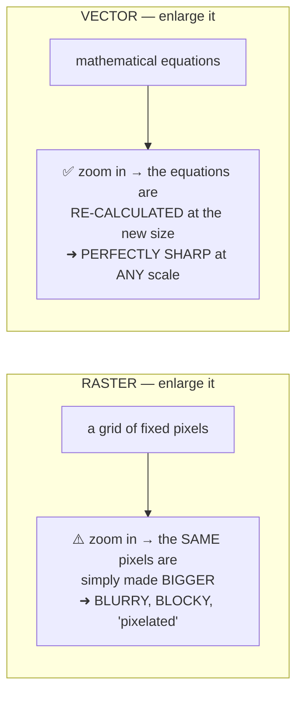
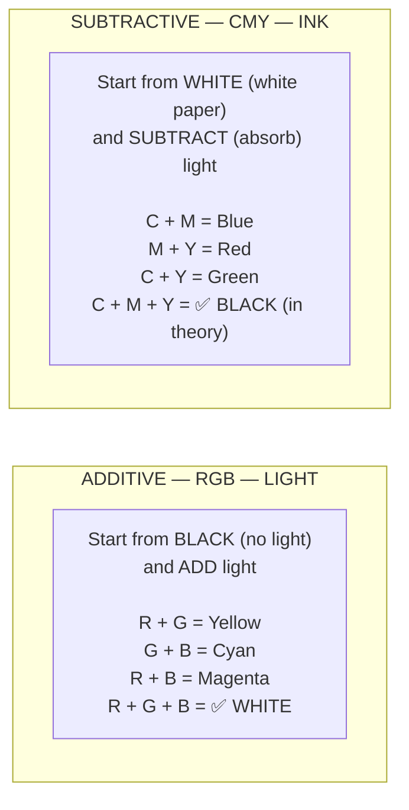
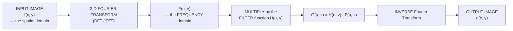
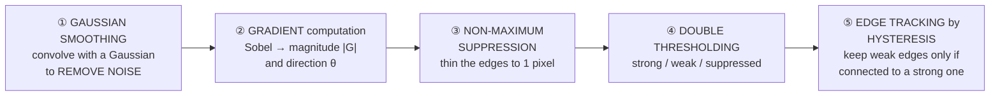
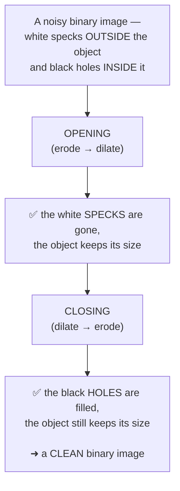

<!-- TOC START -->
**Table of Contents** — 5 subtopics · 5 theories

1. **[Computer Graphics (Vector & Raster)](#computer-graphics-vector--raster)**
   - [Vector Graphics vs Raster Graphics](#vector-graphics-vs-raster-graphics)

2. **[Color Models](#color-models)**
   - [Colour Models — RGB, CMY/CMYK, HSV and Others](#colour-models--rgb-cmycmyk-hsv-and-others)

3. **[Frequency Domain Filtering](#frequency-domain-filtering)**
   - [Frequency Domain Filtering and the Butterworth Filter](#frequency-domain-filtering-and-the-butterworth-filter)

4. **[Edge Detection](#edge-detection)**
   - [Edge Detection and the Canny Method](#edge-detection-and-the-canny-method)

5. **[Morphological Operations](#morphological-operations)**
   - [Morphological Image Processing — Erosion, Dilation, Opening and Closing](#morphological-image-processing--erosion-dilation-opening-and-closing)

<!-- TOC END -->

---

## Computer Graphics (Vector & Raster)

### Vector Graphics vs Raster Graphics

> **COMPUTER GRAPHICS is the field concerned with CREATING, STORING and MANIPULATING pictures and images using a computer.** There are exactly **two fundamental ways** to represent an image digitally — **as a grid of coloured dots (RASTER), or as a set of mathematical shapes (VECTOR)** — and almost everything else about digital imaging follows from the difference between them.

#### Raster (bitmap) graphics

> ### **A RASTER IMAGE (also called a BITMAP image) is an image made up of a RECTANGULAR GRID OF TINY COLOURED SQUARES CALLED PIXELS**, each pixel storing its own colour value. The computer stores the image simply as **the list of all those colour values**.

```
  A raster image is literally a grid of numbers:

     ┌───┬───┬───┬───┬───┬───┐        Each cell = 1 PIXEL
     │   │   │ ■ │ ■ │   │   │        Each pixel stores a colour,
     ├───┼───┼───┼───┼───┼───┤        e.g. (R=255, G=0, B=0)
     │   │ ■ │ ■ │ ■ │ ■ │   │
     ├───┼───┼───┼───┼───┼───┤        An image of 1920 × 1080
     │ ■ │ ■ │ ■ │ ■ │ ■ │ ■ │        contains 2,073,600 pixels.
     ├───┼───┼───┼───┼───┼───┤
     │   │ ■ │ ■ │ ■ │ ■ │   │
     └───┴───┴───┴───┴───┴───┘
```

**Key terms:**

| Term | Meaning |
|---|---|
| **PIXEL** | **PIcture ELement** — the **smallest addressable unit** of a raster image |
| **RESOLUTION** | The number of pixels, expressed as **width × height** (1920 × 1080) or as **PPI/DPI** (pixels or dots per inch) |
| **COLOUR DEPTH (bit depth)** | The **number of bits used per pixel** — 1-bit = black and white, 8-bit = 256 colours or 256 grey levels, **24-bit "true colour" = 16.7 million colours** (8 bits each for R, G and B), 32-bit adds an 8-bit **alpha** (transparency) channel |
| **File size** | ### **≈ width × height × (bit depth / 8) bytes**, before compression |

**Worked file-size calculation:** a 1920 × 1080 image at 24-bit colour requires
```
   1920 × 1080 × 3 bytes = 6,220,800 bytes ≈ 5.93 MB   (uncompressed)
```

#### Vector graphics

> ### **A VECTOR IMAGE is an image described by MATHEMATICAL EQUATIONS defining GEOMETRIC OBJECTS — points, lines, curves, polygons — together with their attributes (position, colour, thickness, fill).** Nothing is stored pixel by pixel; the computer stores the **instructions for DRAWING the picture**, and redraws it at whatever size is needed.

```
  A vector image is a set of INSTRUCTIONS:

     circle(centre = (100, 100), radius = 50,
            fill = red, stroke = black, width = 2)

     line(from = (0, 0), to = (200, 200),
          colour = blue, width = 3)

  ➜ The computer RE-CALCULATES and RE-DRAWS these shapes
    at whatever size is requested — so they are ALWAYS sharp.
```

#### The key comparison



| Point | **RASTER (Bitmap)** | **VECTOR** |
|---|---|---|
| **Composed of** | ⭐ **PIXELS — a grid of coloured dots** | ⭐ **MATHEMATICAL paths — points, lines and curves** |
| **Stored as** | The **colour value of every pixel** | The **equations and attributes of each object** |
| **SCALABILITY** | ⚠️ **RESOLUTION DEPENDENT — enlarging causes BLURRING and PIXELATION** | ✅ **RESOLUTION INDEPENDENT — infinitely scalable with NO loss of quality** |
| **File size** | **LARGE**, and grows with the resolution | ✅ **SMALL** for simple artwork, and **independent of display size** |
| **Best for** | ⭐ **PHOTOGRAPHS and any image with continuous tones, subtle shading and fine texture** | ⭐ **LOGOS, ICONS, TYPE, TECHNICAL DRAWINGS, MAPS, illustrations with flat colour** |
| **Photographic realism** | ✅ **Excellent** — can represent any colour at any point | ⚠️ **Poor** — cannot practically represent a photograph |
| **Editing** | Edit **pixels** — retouching, painting, filters | Edit **objects** — each shape stays independently selectable and reshapeable |
| **Rendering effort** | ✅ Fast — just copy the pixels to the screen | Requires **computation** to rasterise at display time |
| **Printing quality** | Depends on the stored resolution — needs ~300 DPI | ✅ **Always prints at the printer's full resolution** |
| **Transparency / anti-aliasing** | Supported via an alpha channel | Supported natively |
| **Colour per element** | One colour per pixel | Solid fills, gradients and patterns per object |
| **File formats** | **JPEG, PNG, GIF, BMP, TIFF, WEBP, RAW** | **SVG, AI, EPS, PDF, CDR, DXF** |
| **Software** | **Adobe Photoshop, GIMP, MS Paint** | **Adobe Illustrator, CorelDRAW, Inkscape, AutoCAD** |
| **Conversion between them** | ✅ Vector → raster is **easy** (called **RASTERISATION**, and happens every time anything is displayed) | ⚠️ Raster → vector is **hard and imperfect** (called **TRACING / vectorisation**) |

> **The decisive practical example: a company LOGO must ALWAYS be a VECTOR file.** The same logo must appear as a 16 × 16 pixel favicon, on a business card, on a letterhead, and on a **six-metre billboard**. A raster logo would have to be re-created at every size, and enlarging it would produce a blurry mess. A single vector file renders perfectly at all of them. Conversely, **a photograph can only ever be a raster image** — there is no sensible set of equations describing a human face.

#### Applications of computer graphics

| Field | Use |
|---|---|
| **Design and engineering** | ⭐ **CAD/CAM** — architecture, machine design, circuit layout, civil engineering drawings |
| **Entertainment** | **Films and animation** (CGI, VFX), **video games**, 3D modelling |
| **Education and training** | **SIMULATORS** — flight, driving, surgical; interactive teaching material; virtual laboratories |
| **Medicine** | **Medical imaging** — CT, MRI, ultrasound reconstruction, 3D organ visualisation, surgical planning |
| **Business and science** | **Data VISUALISATION** — charts, graphs, dashboards, scientific plots, statistical analysis |
| **Publishing and advertising** | Desktop publishing, typography, posters, brochures, product design |
| **User interfaces** | **The GUI itself** — every window, icon, button and font on every screen |
| **GIS and mapping** | **Geographic Information Systems**, satellite imagery, navigation, urban planning |
| **VR and AR** | Virtual reality, augmented reality, the metaverse |
| **Image processing** | Enhancement, restoration, compression, pattern recognition |
| **Textile and printing** | Fabric design, printing plates, packaging |

**Previous Year Question List from this Topic:**

- [(ক) Vector এবং Raster graphics- এর সংজ্ঞাসহ পার্থক্য লিখুন।](../written-answers/image-processing.md?plain=1#L18)
- [(b) Differentiate between vector graphics and raster graphics. What are the applications of computer Graphics?](../written-answers/image-processing.md?plain=1#L60)
- [Raster Image কাকে বলে?](../written-answers/image-processing.md?plain=1#L102)


---

## Color Models

### Colour Models — RGB, CMY/CMYK, HSV and Others

> A **COLOUR MODEL is a MATHEMATICAL SYSTEM for describing a COLOUR as a SET OF NUMBERS** (usually three or four), so that a computer can **store, transmit, reproduce and manipulate** it precisely and unambiguously.

#### The main colour models

| Model | Components | Type | Primary use |
|---|---|---|---|
| **RGB** | **Red, Green, Blue** | ⭐ **ADDITIVE** | **Displays** — monitors, TVs, phones, cameras, scanners, projectors |
| **CMY** | **Cyan, Magenta, Yellow** | ⭐ **SUBTRACTIVE** | **Printing** (theoretical basis) |
| **CMYK** | Cyan, Magenta, Yellow, **Key (blacK)** | **Subtractive** | ⭐ **All commercial and desktop PRINTING** |
| **HSV / HSB** | **Hue, Saturation, Value (Brightness)** | Perceptual | **Colour PICKERS and user interfaces** — matches how humans think about colour |
| **HSL** | **Hue, Saturation, Lightness** | Perceptual | Web design and CSS |
| **YUV / YCbCr** | **Luminance (Y) + two Chrominance components** | Perceptual | ⭐ **Video and IMAGE COMPRESSION — JPEG, MPEG, television broadcasting** |
| **YIQ** | Luminance + in-phase + quadrature | Perceptual | NTSC television (compatible with black-and-white sets) |
| **CIE XYZ** | Tristimulus values | Device-INDEPENDENT | The **scientific reference** standard from which all others are defined |
| **CIE L\*a\*b\*** | Lightness, a (green–red), b (blue–yellow) | Device-independent, perceptually uniform | **Colour management**, accurate colour conversion between devices |
| **Grayscale** | A single intensity value | — | Black-and-white images, most image-processing algorithms |
| **Indexed / Palette** | An index into a colour lookup table | — | GIF images, older displays |

#### Additive vs subtractive — the fundamental distinction



| Point | **ADDITIVE (RGB)** | **SUBTRACTIVE (CMY / CMYK)** |
|---|---|---|
| **Works with** | ⭐ **EMITTED LIGHT** | ⭐ **REFLECTED light — INK or PIGMENT on paper** |
| **Starting point** | **BLACK** — a switched-off screen | **WHITE** — blank paper |
| **Adding all primaries gives** | ✅ **WHITE** | ✅ **BLACK** |
| **Adding nothing gives** | **BLACK** | **WHITE** |
| **Primaries** | **Red, Green, Blue** | **Cyan, Magenta, Yellow** |
| **Secondaries** | Cyan, Magenta, Yellow | Red, Green, Blue |
| **Mechanism** | Light sources **combine and ADD** their intensities | Each ink **ABSORBS (subtracts) one primary colour** from the white light and reflects the rest |
| **Used by** | **Monitors, TVs, phone screens, scanners, digital cameras, projectors** | **Printers, printing presses, paint, photographs on paper** |

> **The relationship between the two is exact and simple — they are COMPLEMENTS:**
> ```
>       C = 1 − R            R = 1 − C
>       M = 1 − G            G = 1 − M
>       Y = 1 − B            B = 1 − Y
>
>   (for values normalised to the range 0…1;
>    for 8-bit values, C = 255 − R, and so on)
> ```
> **Cyan ink works by ABSORBING RED light** and reflecting green and blue; **magenta absorbs GREEN**; **yellow absorbs BLUE**. That is literally why the subtractive primaries are the complements of the additive ones.

#### The CMY model and its uses

> **The CMY model represents a colour by how much CYAN, MAGENTA and YELLOW ink must be laid on WHITE paper.** Because each ink **removes** one primary colour from the reflected light, printing all three should absorb everything and leave black.

**Uses of the CMY (and CMYK) model:**

1. ⭐ **All colour PRINTING** — inkjet printers, laser printers, and commercial offset printing presses.
2. **Publishing and pre-press** — newspapers, magazines, books, brochures and packaging are all prepared in CMYK, and the file is **colour-separated into four printing plates**, one per ink.
3. **Preparing images for print** — a designer must convert an RGB design to CMYK before sending it to a press, because the two have **different gamuts** and the conversion must be checked.
4. **Photographic printing** and large-format printing.
5. **Textile and fabric printing**, and dye-sublimation.
6. **Any medium where colour is produced by pigment on a reflective surface** — paint mixing follows the same principle.

> ### **Why the K (BLACK) is added, turning CMY into CMYK — a favourite exam point:**
>
> 1. ⚠️ **In practice, C + M + Y does NOT produce a true black.** Real inks are imperfect, so mixing all three gives a **muddy dark brown or grey**, not the deep black that text requires.
> 2. **Cost** — black ink is **far cheaper** than laying down three coloured inks to make every black pixel.
> 3. **Ink volume and drying** — three layers of wet ink **soak, spread and buckle the paper** and take much longer to dry; one layer of black does not.
> 4. **Sharpness of TEXT** — printing black text from three inks requires them to register perfectly; the slightest misalignment produces coloured fringes. A **single black plate gives crisp text**.
> 5. **Registration tolerance** — one plate instead of three for the most critical element.
>
> **"K" stands for "KEY"** — the key plate that carries the detail and to which the other three are aligned. *(It is also said to avoid confusion with the "B" of Blue.)*

#### The HSV / HSB model

> **HSV describes colour the way a HUMAN does, rather than the way hardware does:**

| Component | Meaning | Range |
|---|---|---|
| **HUE (H)** | **WHICH colour it is** — its position on the colour wheel | **0° – 360°** (0° red, 120° green, 240° blue) |
| **SATURATION (S)** | **How PURE or vivid** the colour is — 0 % is grey, 100 % is fully saturated | **0 – 100 %** |
| **VALUE / Brightness (V)** | **How LIGHT or DARK** it is — 0 % is black | **0 – 100 %** |

> **Why HSV exists and matters:** in **RGB it is very hard to answer a natural question** like *"make this colour a bit lighter, but keep it the same colour"* — you would have to adjust all three numbers together in a non-obvious way. In **HSV you simply increase V**. This is why **every colour picker in every design program presents an HSV or HSL wheel**, and why image-processing operations such as **colour-based object detection and skin-tone detection** are performed in HSV rather than RGB: the **HUE stays roughly constant under changing lighting**, while all three RGB values change dramatically.

#### Representing colour in a computer

```
   24-bit true colour (8 bits per channel):
       Red   : 0 – 255
       Green : 0 – 255          ⇒  256³ = 16,777,216 possible colours
       Blue  : 0 – 255

   Written in hexadecimal (as in HTML/CSS):
       #FF0000 = pure RED          (255,   0,   0)
       #00FF00 = pure GREEN        (  0, 255,   0)
       #0000FF = pure BLUE         (  0,   0, 255)
       #FFFFFF = WHITE             (255, 255, 255)
       #000000 = BLACK             (  0,   0,   0)
       #FFFF00 = YELLOW  (R+G)     (255, 255,   0)
       #808080 = mid GREY          (128, 128, 128)
```

> **GAMUT — the practical problem that connects all of this.** A **gamut** is the range of colours a device can actually reproduce. **The RGB gamut of a monitor and the CMYK gamut of a printer are different shapes**, and neither contains the other. This is why a **brilliant saturated blue or green that glows on screen prints as a duller, flatter colour** — it is simply **outside the CMYK gamut** and must be mapped to the nearest printable colour. Managing this is the entire purpose of **colour management and ICC profiles**.

**Previous Year Question List from this Topic:**

- [(ক) বিভিন্ন Color model-এর নাম লিখুন। CMY color model-এর ব্যবহার কী?](../written-answers/image-processing.md?plain=1#L155)


---

## Frequency Domain Filtering

### Frequency Domain Filtering and the Butterworth Filter

> **Image filtering can be done in two domains:** in the **SPATIAL domain**, by operating directly on the pixel values with a convolution mask; or in the **FREQUENCY domain**, by transforming the image into its frequency components, modifying them, and transforming back.

#### The frequency domain concept



> **What "frequency" means in an image:**
>
> | Frequency content | Corresponds to |
> |---|---|
> | ⭐ **LOW frequencies** | **SLOWLY varying intensity — smooth regions, backgrounds, the overall shape and brightness.** Concentrated at the **CENTRE** of the shifted Fourier spectrum |
> | ⭐ **HIGH frequencies** | **RAPIDLY varying intensity — EDGES, fine detail, texture, and NOISE.** Found at the **outer regions** of the spectrum |
>
> **Therefore:** a **LOW-PASS filter keeps the low frequencies and removes the high ones → the image is SMOOTHED / BLURRED** (and noise is reduced). A **HIGH-PASS filter keeps the high frequencies and removes the low ones → EDGES and detail are SHARPENED**, while the smooth areas go towards black.

#### The three families of frequency-domain filter

| Filter | Transition from pass to stop | Ringing artefacts |
|---|---|---|
| **IDEAL** | ⚠️ **An abrupt, brick-wall cut at D₀** | ⚠️ **SEVERE ringing** — strong ripples around every edge, caused by the sharp cut-off |
| **BUTTERWORTH** | ✅ **A SMOOTH but controllable transition**, whose sharpness is set by the **order n** | ✅ **Little or no ringing for low orders** — the practical compromise |
| **GAUSSIAN** | **The smoothest possible transition** | ✅ **NO ringing at all**, but the least sharp selectivity |

#### How the Butterworth High-Pass Filter works

> ### **The Butterworth High-Pass Filter (BHPF) transfer function:**
>
> ### **H(u, v) = 1 / [ 1 + ( D₀ / D(u,v) )^{2n} ]**
>
> where:
> - **D(u, v)** = the **DISTANCE of the point (u,v) from the CENTRE (origin) of the frequency rectangle** = √[(u − M/2)² + (v − N/2)²]
> - **D₀** = the **CUT-OFF frequency** — the radius at which the filter is "half on"
> - **n** = the **ORDER of the filter**, which controls **how sharp the transition is**

**Compare it with the Butterworth LOW-pass filter, which is its complement:**
```
   BLPF:   H(u,v) = 1 / [ 1 + ( D(u,v) / D₀ )^{2n} ]      ← D on TOP
   BHPF:   H(u,v) = 1 / [ 1 + ( D₀ / D(u,v) )^{2n} ]      ← D₀ on TOP
```

**How the formula behaves — this is the explanation that answers "how does it work":**

| Where in the spectrum | D(u,v) | The ratio D₀/D | **H(u,v)** | Effect |
|---|---|---|---|---|
| **At the centre** (very low frequency) | **Small** | **Large** | **→ 0** | ⚠️ **BLOCKED** — smooth areas and the average brightness are removed |
| **At D(u,v) = D₀** (the cut-off) | = D₀ | = 1 | ### **= 1/(1+1) = 0.5** | Exactly **half** the amplitude is passed |
| **Far from the centre** (high frequency) | **Large** | **Small** | **→ 1** | ✅ **PASSED** — edges, detail and texture survive |

```
     H(u,v) ↑
        1.0 │                    ╭────────────────  n = 4 (sharp)
            │                  ╭─╯
            │                ╭─╯╭──────────────     n = 1 (gentle)
        0.5 │─ ─ ─ ─ ─ ─ ─ ─╳─ ─ ─ ─ ─ ─ ─ ─ ─ ─
            │             ╭╯╭╯
            │          ╭──╯
        0.0 │───────╱──────────────────────────► D(u,v)
            0            D₀
              LOW frequencies      HIGH frequencies
              (blocked)            (passed)
```

**The step-by-step procedure for applying it:**

1. **Pre-process** — multiply the image by (−1)^(x+y) so that the transform's origin is **centred**, and optionally pad the image to avoid wrap-around error.
2. **Compute the 2-D DFT** of the image, F(u, v).
3. **Build the filter H(u, v)** using the formula above, for the chosen **D₀** and **order n**.
4. **Multiply, element by element:** G(u, v) = H(u, v) × F(u, v).
5. **Compute the inverse DFT** of G(u, v).
6. **Take the real part** and undo the centring, giving the filtered image.

**The role of the order n:**

| n | Transition | Behaviour |
|---|---|---|
| **n = 1** | **Very gradual** | Closest to a Gaussian filter — **no ringing**, but poor frequency selectivity |
| **n = 2** | ✅ **Moderate** | **The usual choice** — a good balance of sharpness and negligible ringing |
| **n = 5 or more** | **Very sharp** | Approaches the **IDEAL** filter, and **ringing artefacts begin to appear** |

> ### **The essential point about the Butterworth filter — why it exists at all:**
>
> The **IDEAL high-pass filter** simply sets everything inside radius D₀ to zero and everything outside to one. Mathematically this is a **sharp rectangular cut in the frequency domain**, and the **inverse Fourier transform of a sharp rectangle is a sinc function — which has strong oscillating side lobes**. Convolving the image with that produces **RINGING: visible ripples or "ghost edges" repeating around every sharp edge in the image.**
>
> The **Butterworth filter replaces the brick wall with a SMOOTH, MONOTONIC roll-off whose sharpness the user CONTROLS through the order n.** It therefore sits **between** the ideal filter (sharp but ringing) and the Gaussian filter (no ringing but very soft), and **lets the engineer choose the trade-off**. That tunability is exactly why it is the most used filter of the three in practice.

**Effects and applications of a high-pass filter:** **edge enhancement and sharpening** · **detail and texture emphasis** · **preparing an image for edge detection or feature extraction** · **removing slow illumination gradients** (uneven lighting across a scanned page) · and, in **homomorphic filtering**, simultaneously compressing the dynamic range and enhancing contrast.

> ⚠️ **One practical caution:** a pure high-pass filter **removes the DC component (u = v = 0), which is the AVERAGE BRIGHTNESS of the image** — so the result is mostly black with bright edges. For a **sharpened but still natural-looking** image, the **HIGH-FREQUENCY EMPHASIS** variant is used instead:
> ```
>      H_hfe(u,v) = a + b · H_hp(u,v)      with a > 0 (typically a = 0.5, b = 2)
> ```
> which **adds back a fraction of the original low frequencies**, preserving the overall tonality while boosting the detail.

**Previous Year Question List from this Topic:**

- [How does Butterworth High pass Filter works?](../written-answers/image-processing.md?plain=1#L215)


---

## Edge Detection

### Edge Detection and the Canny Method

> An **EDGE is a set of connected pixels at which the image intensity changes SHARPLY.** Edges mark the **boundaries of objects**, so **EDGE DETECTION — finding those boundaries — is one of the most fundamental operations in image processing and computer vision**, and the first step in segmentation, object recognition and shape analysis.

#### How edges are detected mathematically

> An edge is a **rapid change in intensity**, and the mathematical measure of change is the **DERIVATIVE**.

```
   Intensity                First derivative        Second derivative
   ─────┐                        ╱╲                     ╱╲
        │                       ╱  ╲                   ╱  ╲
        │                      ╱    ╲            ─────╱────╲───── 0
        └──────                     
   a STEP EDGE            a PEAK at the edge      a ZERO-CROSSING
                          → find the MAXIMUM      → find where it CROSSES ZERO
```

| Operator | Order | How it works | Characteristics |
|---|---|---|---|
| **Roberts** | 1st | 2×2 diagonal masks | Fast, but very noise-sensitive |
| **Prewitt** | 1st | 3×3 masks for horizontal and vertical gradients | Simple |
| **SOBEL** | 1st | 3×3 masks with **extra weight on the centre row/column** | ⭐ **The most widely used simple detector** — good noise smoothing built in |
| **Laplacian** | **2nd** | A single mask; finds **zero crossings** | Very noise-sensitive; gives no direction |
| **LoG (Marr-Hildreth)** | 2nd | **Gaussian smoothing FIRST, then Laplacian** | Better noise handling |
| **CANNY** | 1st | ⭐ **A complete multi-stage algorithm** | ✅ **The best and most widely used general-purpose edge detector** |

**The Sobel masks, for reference:**
```
      Gx (vertical edges)        Gy (horizontal edges)
      ┌──────────────┐           ┌──────────────┐
      │ −1   0   +1  │           │ −1  −2  −1   │
      │ −2   0   +2  │           │  0   0   0   │
      │ −1   0   +1  │           │ +1  +2  +1   │
      └──────────────┘           └──────────────┘

      Gradient magnitude:  |G| = √(Gx² + Gy²)   ≈  |Gx| + |Gy|
      Gradient direction:  θ   = tan⁻¹(Gy / Gx)
```

#### The basic OBJECTIVES of the Canny edge detection method

> John **Canny (1986)** did not merely propose another mask — he **defined mathematically what a GOOD edge detector must achieve**, and then derived the optimal detector from those criteria. **These three criteria are the "basic objectives" the question asks for.**

| # | Objective | Meaning |
|---|---|---|
| **1** | ⭐ **LOW ERROR RATE / GOOD DETECTION** | **ALL real edges must be found, and NO false edges reported.** The detector should **maximise the signal-to-noise ratio** — every genuine edge in the image is detected, and no noise is mistaken for an edge. Formally: **minimise both false negatives (missed edges) and false positives (spurious edges)** |
| **2** | ⭐ **GOOD LOCALISATION** | The detected edge must be **AS CLOSE AS POSSIBLE to the TRUE position of the edge** in the real image. The distance between the marked edge pixel and the actual centre of the intensity transition should be **minimised** |
| **3** | ⭐ **MINIMAL RESPONSE — ONE edge, ONE response** | ⚠️ **A single real edge must produce only ONE detected edge point.** The detector must **not return multiple thick or duplicated responses** for one boundary, and must **not respond to noise**. This is what forces the edges to be **thin — exactly one pixel wide** |

**Two further practical objectives normally listed alongside them:**

4. **Noise immunity** — the detector must be **robust to noise**, which is why Gaussian smoothing is the first stage.
5. **Thin, well-connected, continuous edges** — edges should form **unbroken contours**, not scattered fragments, which is what hysteresis thresholding achieves.

> **Why criteria 1 and 2 conflict — the insight behind the whole method.** Heavy smoothing **suppresses noise** and so improves **detection** (criterion 1), but it also **blurs and displaces the edge**, which damages **localisation** (criterion 2). Canny's contribution was to **derive the optimal trade-off mathematically** and to show that the optimal detector is closely approximated by **the first derivative of a Gaussian**. Everything in the algorithm follows from that.

#### The five stages of the Canny algorithm



| Stage | What it does | Which objective it serves |
|---|---|---|
| **1. Gaussian smoothing** | Convolve the image with a **Gaussian filter** to blur away noise before differentiating (differentiation amplifies noise enormously) | **Objective 1** — low error rate |
| **2. Gradient magnitude and direction** | Apply Sobel to get **G_x and G_y**, then **|G| = √(G_x²+G_y²)** and **θ = tan⁻¹(G_y/G_x)**, rounded to 0°, 45°, 90° or 135° | Finds candidate edges |
| **3. NON-MAXIMUM SUPPRESSION** | ⭐ For each pixel, compare its gradient magnitude with its **two neighbours ALONG THE GRADIENT DIRECTION**. **Keep it only if it is the LOCAL MAXIMUM; otherwise set it to zero.** This **thins a thick ridge down to a single-pixel line** | ⭐ **Objective 3** — one edge, one response |
| **4. Double thresholding** | Apply **two** thresholds, T_high and T_low: pixels above T_high are **STRONG edges**; between the two are **WEAK edges**; below T_low are **discarded** | Separates real edges from noise |
| **5. Hysteresis edge tracking** | ⭐ **Keep a WEAK edge ONLY IF it is CONNECTED to a STRONG edge**; discard all other weak edges | Produces **continuous, unbroken contours** while rejecting isolated noise |

> **Why HYSTERESIS (the two-threshold idea) is the clever part:** a **single** threshold forces an impossible choice — set it **high** and real but slightly faint sections of an edge are lost, **breaking the contour into fragments**; set it **low** and noise floods in. Hysteresis resolves this by reasoning that **a faint pixel that CONTINUES a confident edge is almost certainly part of that edge**, while **a faint pixel standing alone is almost certainly noise**. This is what gives Canny its characteristic **long, clean, connected contours**, and it is the single biggest reason it outperforms Sobel and Laplacian.

**Advantages of Canny:** ✅ the **best overall accuracy** of the classical detectors · **excellent noise immunity** · produces **thin, single-pixel, well-connected** edges · **mathematically justified** rather than heuristic · adjustable through σ and the two thresholds.
**Disadvantages:** **computationally expensive** (five stages) · **requires tuning** of σ, T_low and T_high for each class of image · can be **slow for real-time** use.

**Previous Year Question List from this Topic:**

- [What are the basic objectives of canny edge detection method?](../written-answers/image-processing.md?plain=1#L288)


---

## Morphological Operations

### Morphological Image Processing — Erosion, Dilation, Opening and Closing

> **MORPHOLOGICAL IMAGE PROCESSING is a set of operations that process an image based on its SHAPES (its "morphology")**, by probing it with a small shape called a **STRUCTURING ELEMENT**. It is used mainly on **BINARY images** (though greyscale versions exist), and its purpose is to **extract, enhance or remove structures of a particular size and shape**.

> **The STRUCTURING ELEMENT (SE)** is a small binary mask — a 3×3 square, a cross, a disc — with a defined **origin**. It is slid over every pixel of the image, and the result at each position depends on how the SE **fits** or **hits** the object there. **Its size and shape determine exactly what the operation does.**

#### 1. EROSION

> ### **EROSION (⊖) SHRINKS or THINS the objects in a binary image.** A pixel of the output is set to 1 **ONLY IF the structuring element, placed at that pixel, FITS ENTIRELY INSIDE the object**; otherwise it is set to 0.
>
> ### **A ⊖ B = { z | (B)_z ⊆ A }**

```
   Original (■ = object)            After EROSION with a 3×3 SE
   ┌───────────────────┐            ┌───────────────────┐
   │  ■ ■ ■ ■ ■ ■ ■    │            │    ■ ■ ■ ■ ■      │   the boundary
   │  ■ ■ ■ ■ ■ ■ ■    │    ───►    │    ■ ■ ■ ■ ■      │   layer is
   │  ■ ■ ■ ■ ■ ■ ■    │            │    ■ ■ ■ ■ ■      │   REMOVED
   │  ■ ■ ■ ■ ■ ■ ■    │            │                   │
   │         ■         │            │                   │   ← a small
   └───────────────────┘            └───────────────────┘     isolated
                                                              dot VANISHES
```

**Effects of erosion:** **shrinks objects** by removing a layer from every boundary · **REMOVES small objects and isolated noise pixels entirely** · **breaks thin connections (isthmuses)** between blobs · **enlarges holes** inside objects · **thins** the shapes.

**Uses:** removing **salt noise** (small white specks), **separating touching objects**, finding the **boundary** of an object (original **minus** its erosion), and eliminating structures smaller than the structuring element.

#### 2. DILATION

> ### **DILATION (⊕) GROWS or THICKENS the objects in a binary image.** A pixel of the output is set to 1 **IF the structuring element, placed at that pixel, OVERLAPS (hits) the object in at least ONE point**.
>
> ### **A ⊕ B = { z | (B̂)_z ∩ A ≠ ∅ }**

```
   Original                          After DILATION with a 3×3 SE
   ┌───────────────────┐            ┌───────────────────┐
   │    ■ ■ ■ ■        │            │  ■ ■ ■ ■ ■ ■      │   a layer is
   │    ■ ■ ■ ■        │    ───►    │  ■ ■ ■ ■ ■ ■      │   ADDED to every
   │    ■   ■ ■        │            │  ■ ■ ■ ■ ■ ■      │   boundary; the
   │    ■ ■ ■ ■        │            │  ■ ■ ■ ■ ■ ■      │   small HOLE is
   └───────────────────┘            └───────────────────┘     FILLED
```

**Effects of dilation:** **expands objects** by adding a layer to every boundary · **FILLS small holes and narrow gaps** inside objects · **JOINS objects that are close together** · **smooths concave** boundaries · **thickens** thin structures.

**Uses:** **bridging broken characters** in OCR, **filling pepper noise** (small black holes), connecting fragmented edges, and making objects large enough for further processing.

> **Erosion and dilation are DUALS of each other:** eroding the object is exactly the same as dilating the background, and vice versa. They are **not inverses** — applying one and then the other does **not** restore the original image, and that fact is precisely what makes opening and closing useful.

#### 3. OPENING

> ### **OPENING (∘) = EROSION followed by DILATION, with the SAME structuring element.**
>
> ### **A ∘ B = (A ⊖ B) ⊕ B**

**What it achieves:** the **erosion removes small objects, thin protrusions and noise**; the **dilation then restores the SIZE of the objects that SURVIVED**, so the remaining shapes are close to their original dimensions.

| Effect | Description |
|---|---|
| ⭐ **REMOVES SMALL OBJECTS and noise specks** | Anything smaller than the structuring element disappears and is **not** brought back |
| **Removes thin protrusions and narrow "necks"** | Slender connections are cut |
| **SEPARATES objects joined by a thin bridge** | |
| **SMOOTHS the OUTER contour** of objects | Breaks narrow isthmuses, eliminates thin capes |
| **Preserves the size and shape** of the surviving objects | The dilation undoes the shrinkage |

**Uses:** **removing salt noise**, separating touching cells or coins, **size-based filtering** (delete everything smaller than a chosen shape), smoothing outlines.

#### 4. CLOSING

> ### **CLOSING (•) = DILATION followed by EROSION, with the SAME structuring element.**
>
> ### **A • B = (A ⊕ B) ⊖ B**

**What it achieves:** the **dilation fills small holes and gaps and joins nearby objects**; the **erosion then shrinks the result back** to approximately the original size, **but the holes and gaps that were filled stay filled.**

| Effect | Description |
|---|---|
| ⭐ **FILLS SMALL HOLES inside objects** | |
| **Closes small gaps and breaks in contours** | |
| **CONNECTS objects separated by a narrow gap** | |
| **SMOOTHS the INNER contour** — fills narrow bays and inlets | |
| **Preserves the size and shape** of the objects | The erosion undoes the growth |

**Uses:** **removing pepper noise** (small dark holes), **joining broken characters or lines**, filling gaps before measuring an area, smoothing boundaries.

#### The summary table

| Operation | Definition | Object size | Removes | Preserves |
|---|---|---|---|---|
| **EROSION** ⊖ | SE must **FIT inside** | ⚠️ **SHRINKS** | Small objects, thin links | — |
| **DILATION** ⊕ | SE must **HIT** | ⚠️ **GROWS** | Small holes, gaps | — |
| **OPENING** ∘ | **Erode → Dilate** | ✅ **Roughly UNCHANGED** | ⭐ **Small OBJECTS, thin protrusions, SALT noise** | The shape and size of what survives |
| **CLOSING** • | **Dilate → Erode** | ✅ **Roughly UNCHANGED** | ⭐ **Small HOLES, narrow gaps, PEPPER noise** | The shape and size of the objects |



> **The standard practical recipe: apply OPENING first to remove the noise OUTSIDE the objects, then CLOSING to fill the holes INSIDE them.** This pair is the routine cleanup step after thresholding any real image, and it appears in almost every document-scanning, medical-imaging and industrial-inspection pipeline.

> **Two important properties worth stating:**
> - Both opening and closing are **IDEMPOTENT** — applying them a second time with the same structuring element **changes nothing further**. (A ∘ B) ∘ B = A ∘ B.
> - **Opening is ANTI-EXTENSIVE** (the result is a subset of the original) while **closing is EXTENSIVE** (the original is a subset of the result). Together: **A ∘ B ⊆ A ⊆ A • B**.

**Other morphological operations:** the **MORPHOLOGICAL GRADIENT** (dilation − erosion) gives the **object outline** · the **TOP-HAT transform** (original − opening) extracts small bright details on an uneven background · the **BOTTOM-HAT** (closing − original) extracts small dark details · **HIT-OR-MISS** detects a specific shape · **THINNING and SKELETONISATION** reduce objects to a one-pixel-wide skeleton, used in fingerprint and handwriting recognition.

**Applications of morphological processing:** **OCR and document image cleanup** · **fingerprint enhancement** · **medical image analysis** (counting and measuring cells) · **industrial inspection** (detecting defects by size) · **satellite image analysis** (roads, buildings) · **number-plate recognition** · and **general noise removal after thresholding**.

**Previous Year Question List from this Topic:**

- [Define: (i) Erosion and Dilation; (ii) Opening and Closing.](../written-answers/image-processing.md?plain=1#L350)
