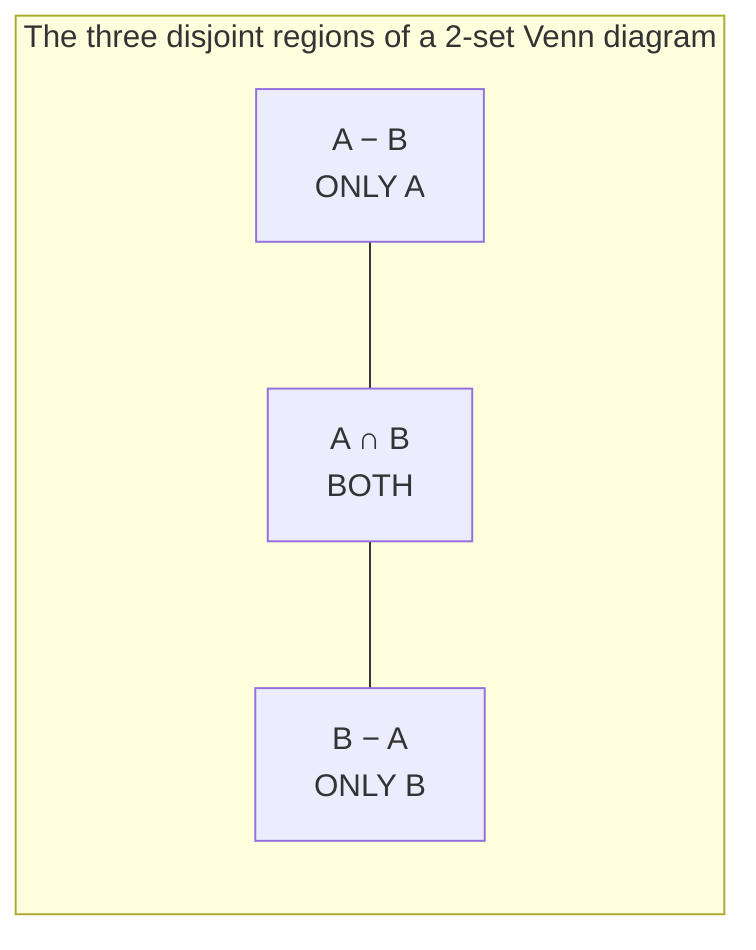
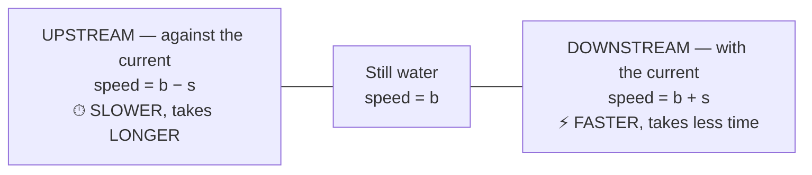
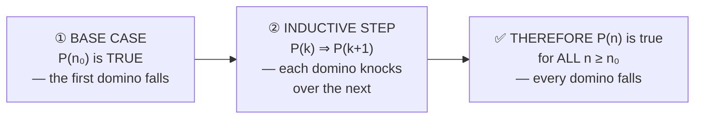
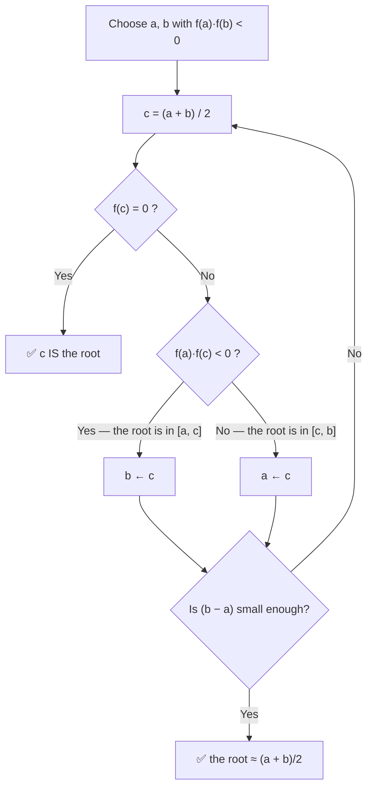

<!-- TOC START -->
**Table of Contents** — 16 subtopics · 21 theories

1. **[Arithmetic & Algebra Problems](#arithmetic--algebra-problems)**
   - [Algebra — Identities, Equations and Word Problems](#algebra--identities-equations-and-word-problems)
   - [Matrices, Determinants and Vectors](#matrices-determinants-and-vectors)
   - [Functions, Complex Numbers and Standard Series Sums](#functions-complex-numbers-and-standard-series-sums)

2. **[Set Theory & Discrete Math](#set-theory--discrete-math)**
   - [Set Theory — Operations, Venn Diagrams and Inclusion-Exclusion](#set-theory--operations-venn-diagrams-and-inclusion-exclusion)
   - [Propositional and Predicate Logic](#propositional-and-predicate-logic)

3. **[Percentage, Profit & Loss, Simple & Compound Interest](#percentage-profit--loss-simple--compound-interest)**
   - [Percentage, Profit and Loss](#percentage-profit-and-loss)
   - [Simple and Compound Interest](#simple-and-compound-interest)

4. **[Basic Arithmetic & Average](#basic-arithmetic--average)**
   - [Averages, HCF, LCM and Number Properties](#averages-hcf-lcm-and-number-properties)

5. **[Geometry & Coordinate Geometry](#geometry--coordinate-geometry)**
   - [Plane Geometry — Triangles, Circles and Areas](#plane-geometry--triangles-circles-and-areas)

6. **[Permutations & Combinations](#permutations--combinations)**
   - [Permutations and Combinations](#permutations-and-combinations)

7. **[Ratio, Proportion & Mixtures](#ratio-proportion--mixtures)**
   - [Ratio, Proportion, Mixtures and Work](#ratio-proportion-mixtures-and-work)

8. **[Speed, Time, Distance & Boats](#speed-time-distance--boats)**
   - [Speed, Time, Distance, Trains and Boats](#speed-time-distance-trains-and-boats)

9. **[Probability & Statistics](#probability--statistics)**
   - [Probability](#probability)
   - [Statistics — Mean, Median, Mode and Dispersion](#statistics--mean-median-mode-and-dispersion)

10. **[Propositional Logic & Logical Equivalence](#propositional-logic--logical-equivalence)**
   - [Tautology, Contradiction and Logical Simplification](#tautology-contradiction-and-logical-simplification)

11. **[Discrete Mathematics & Recurrence Relations](#discrete-mathematics--recurrence-relations)**
   - [Recurrence Relations and Mathematical Induction](#recurrence-relations-and-mathematical-induction)

12. **[Analytical Ability & Logical Reasoning](#analytical-ability--logical-reasoning)**
   - [Analytical and Logical Reasoning](#analytical-and-logical-reasoning)

13. **[Calculus & Integration](#calculus--integration)**
   - [Differentiation and Integration](#differentiation-and-integration)

14. **[Comprehensive Math Problems](#comprehensive-math-problems)**
   - [Strategy for Mixed Mathematics Questions](#strategy-for-mixed-mathematics-questions)

15. **[Numerical Methods & Root Finding](#numerical-methods--root-finding)**
   - [Numerical Methods — Bisection, Newton-Raphson and Root Finding](#numerical-methods--bisection-newton-raphson-and-root-finding)

16. **[Trigonometry](#trigonometry)**
   - [Trigonometry — Ratios, Identities and Heights & Distances](#trigonometry--ratios-identities-and-heights--distances)

<!-- TOC END -->

---

## Arithmetic & Algebra Problems

### Algebra — Identities, Equations and Word Problems

#### The algebraic identities that solve most exam questions

| # | Identity |
|---|---|
| **1** | **(a + b)² = a² + 2ab + b²** |
| **2** | **(a − b)² = a² − 2ab + b²** |
| **3** | **a² − b² = (a + b)(a − b)** |
| **4** | ⭐ **a² + b² = (a + b)² − 2ab = (a − b)² + 2ab** |
| **5** | ⭐ **(a + b)² − (a − b)² = 4ab** |
| **6** | **(a + b)² + (a − b)² = 2(a² + b²)** |
| **7** | **a³ + b³ = (a + b)(a² − ab + b²) = (a + b)³ − 3ab(a + b)** |
| **8** | **a³ − b³ = (a − b)(a² + ab + b²) = (a − b)³ + 3ab(a − b)** |
| **9** | **(a + b)³ = a³ + 3a²b + 3ab² + b³** |
| **10** | **(a + b + c)² = a² + b² + c² + 2(ab + bc + ca)** |

#### ⭐ The "x + 1/x" family — the single most common algebra question

> These questions all follow from **one trick: SQUARE or CUBE the given expression**, because the cross terms cancel.

```
   If  x + 1/x = k, then:

   ①  x² + 1/x²  = k² − 2                         (square it: the 2·x·(1/x) = 2 term comes out)
   ②  x³ + 1/x³  = k³ − 3k                        (cube it)
   ③  x − 1/x    = ±√(k² − 4)                     (since (x−1/x)² = (x+1/x)² − 4)
   ④  x⁴ + 1/x⁴  = (x² + 1/x²)² − 2 = (k²−2)² − 2

   If  x − 1/x = k, then:
   ⑤  x² + 1/x²  = k² + 2
   ⑥  x³ − 1/x³  = k³ + 3k
```

**Worked example 1** — *If x + 1/x = 4, find x² + 1/x².*
```
   (x + 1/x)² = x² + 2·x·(1/x) + 1/x² = x² + 1/x² + 2
   ⇒  x² + 1/x² = (x + 1/x)² − 2 = 4² − 2 = 16 − 2
```
> ### ✅ **x² + 1/x² = 14**

**Worked example 2** — *If x + 1/x = √3, find x³ + 1/x³.*
```
   x³ + 1/x³ = (x + 1/x)³ − 3(x + 1/x)
             = (√3)³ − 3(√3)
             = 3√3 − 3√3
```
> ### ✅ **x³ + 1/x³ = 0**

**Worked example 3** — *If x + 1/x = 17/4, find x − 1/x.*
```
   (x − 1/x)² = (x + 1/x)² − 4
              = (17/4)² − 4
              = 289/16 − 64/16
              = 225/16
   ⇒  x − 1/x = ± √(225/16) = ± 15/4
```
> ### ✅ **x − 1/x = ± 15/4** *(both signs are valid; if x is stated to be positive and greater than 1, take +15/4.)*

**Worked example 4** — *If x + y = 7 and xy = 10, find x² + y² and x³ + y³.*
```
   x² + y² = (x + y)² − 2xy = 49 − 20 = 29
   x³ + y³ = (x + y)³ − 3xy(x + y) = 343 − 3(10)(7) = 343 − 210 = 133
   x − y   = ±√[(x+y)² − 4xy] = ±√(49 − 40) = ±3     (so x, y are 5 and 2)
```
> ### ✅ **x² + y² = 29 · x³ + y³ = 133 · and the numbers themselves are 5 and 2.**

#### Surds and rationalisation

> **To RATIONALISE a denominator of the form (a − √b), MULTIPLY the top and bottom by its CONJUGATE (a + √b)** — the denominator then becomes **a² − b**, a rational number.

**Worked example** — *Evaluate* **4(√6 + √2)/(√6 − √2) − (2 + √3)/(2 − √3)**

```
FIRST TERM — multiply top and bottom by the conjugate (√6 + √2):

   4(√6 + √2)     4(√6 + √2)(√6 + √2)     4(√6 + √2)²
   ───────────  =  ───────────────────  =  ────────────
   (√6 − √2)       (√6 − √2)(√6 + √2)         6 − 2

                =  4(6 + 2√12 + 2) / 4
                =  8 + 2√12
                =  8 + 4√3                         [since √12 = 2√3]

SECOND TERM — multiply top and bottom by the conjugate (2 + √3):

   (2 + √3)       (2 + √3)(2 + √3)     (2 + √3)²      4 + 4√3 + 3
   ────────   =   ────────────────  =  ─────────  =  ────────────
   (2 − √3)       (2 − √3)(2 + √3)       4 − 3            1

                =  7 + 4√3

SUBTRACT:
   (8 + 4√3) − (7 + 4√3) = 8 − 7 + 4√3 − 4√3 = 1
```
> ### ✅ **The value is exactly 1.** *(Note how elegantly the 4√3 terms cancel — that cancellation is the whole point of the question, and it is the check that the rationalisation was done correctly.)*

#### Logarithms

```
   log_a (xy)    = log_a x + log_a y          log_a 1     = 0
   log_a (x/y)   = log_a x − log_a y          log_a a     = 1
   log_a (xⁿ)    = n · log_a x                a^(log_a x) = x
   log_a x       = log_b x / log_b a          (change of base)
```

**Worked example** — *Find the value of log₃(1/81).*
```
   log₃(1/81) = log₃(81⁻¹) = −log₃ 81 = −log₃(3⁴) = −4 · log₃ 3 = −4 × 1
```
> ### ✅ **log₃(1/81) = −4**

**Worked example** — *Evaluate M⁰ + ∛8 + log₅125 + (0100)₂ + 5*
```
   M⁰       = 1              (anything to the power 0 is 1)
   ∛8       = 2              (2³ = 8)
   log₅125  = 3              (5³ = 125)
   (0100)₂  = 4              (binary 100 = 4 in decimal)
   5        = 5
   ──────────────────────────
   Total    = 1 + 2 + 3 + 4 + 5 = 15
```
> ### ✅ **The value is 15.**

#### Arithmetic progressions (series)

```
   nth term          :  aₙ = a + (n − 1)d
   Sum of n terms    :  Sₙ = n/2 [ 2a + (n − 1)d ]  =  n/2 (first + last)

   where a = first term, d = common difference, n = number of terms
```

**Worked example** — *The sum of the series 9 + 7 + 5 + … is −144. Find n.*
```
   a = 9,  d = 7 − 9 = −2,  Sₙ = −144

   Sₙ = n/2 [ 2(9) + (n − 1)(−2) ]
      = n/2 [ 18 − 2n + 2 ]
      = n/2 (20 − 2n)
      = n (10 − n)

   ⇒ n(10 − n) = −144
   ⇒ 10n − n²  = −144
   ⇒ n² − 10n − 144 = 0
   ⇒ (n − 18)(n + 8) = 0
   ⇒ n = 18   or   n = −8  (rejected — n must be a positive integer)
```
> ### ✅ **n = 18**
> **Check:** the 18th term is 9 + 17(−2) = −25, and S₁₈ = 18/2 × (9 + (−25)) = 9 × (−16) = **−144** ✅

> **The sum of the first n ODD natural numbers:**
> ```
>    1 + 3 + 5 + 7 + … + (2n − 1) = n²
> ```
> **Proof by the AP formula:** a = 1, d = 2, so Sₙ = n/2[2(1) + (n−1)2] = n/2[2 + 2n − 2] = n/2 × 2n = **n²**.
> *(Similarly, the sum of the first n EVEN numbers is **n(n + 1)**, and 1 + 2 + … + n = **n(n+1)/2**.)*

#### Word problems — the universal method

> **Every algebra word problem is solved by the same five steps:**
> 1. **Let the unknown be a variable** (choose the one that makes the equation simplest).
> 2. **Translate each sentence into an equation.**
> 3. **Solve.**
> 4. **Answer the question actually asked** (often it is not the variable you chose).
> 5. **CHECK the answer against the original wording** — this catches almost every careless error.

**Worked example — the carpet problem**
> *Carpeting a floor 20 m long costs Tk 7,500. If the width were 4 m less, it would cost Tk 6,000. Find the width.*
```
   Let the width be w metres. Cost is proportional to AREA, and length is fixed at 20 m,
   so cost is proportional to the WIDTH.

   Rate per m² = 7500 / (20 × w)  must equal  6000 / (20 × (w − 4))

   ⇒ 7500 / w = 6000 / (w − 4)
   ⇒ 7500 (w − 4) = 6000 w
   ⇒ 7500w − 30000 = 6000w
   ⇒ 1500w = 30000
   ⇒ w = 20
```
> ### ✅ **The width is 20 metres.**
> **Check:** rate = 7500/(20×20) = Tk 18.75 per m². With width 16 m: 20 × 16 × 18.75 = **Tk 6,000** ✅

**Worked example — the notebook problem**
> *A man could buy a certain number of notebooks for Rs 300. If each notebook cost Rs 5 more, he could have bought 10 fewer for the same money. Find the price of each notebook.*
```
   Let the price of one notebook be Rs x.
   Number bought now         = 300 / x
   Number at the higher price = 300 / (x + 5)

   The second is 10 LESS than the first:

        300/x − 300/(x + 5) = 10
   ⇒    300(x + 5) − 300x   = 10 · x(x + 5)
   ⇒    300x + 1500 − 300x  = 10x² + 50x
   ⇒    1500 = 10x² + 50x
   ⇒    x² + 5x − 150 = 0
   ⇒    (x + 15)(x − 10) = 0
   ⇒    x = 10   or   x = −15  (rejected — a price cannot be negative)
```
> ### ✅ **Each notebook costs Rs 10.**
> **Check:** at Rs 10 he buys 30; at Rs 15 he buys 20 — exactly **10 fewer** ✅

**Worked example — the ages problem**
> *A father's present age is 3 times his son's. Five years ago it was 4 times. Find both ages.*
```
   Let the son's present age = s.  Then the father's = 3s.
   Five years ago:  son = s − 5,  father = 3s − 5.

        3s − 5 = 4(s − 5)
   ⇒    3s − 5 = 4s − 20
   ⇒    20 − 5 = 4s − 3s
   ⇒    s = 15
   ⇒    father = 3 × 15 = 45
```
> ### ✅ **The son is 15 and the father is 45.**
> **Check:** five years ago, 40 and 10 — and 40 = 4 × 10 ✅

**Worked example — sum and difference**
> *The sum of two numbers is 1120, and their difference is ⅔ of the larger number. Find them.*
```
   Let the larger = a and the smaller = b.

        a + b = 1120          … (i)
        a − b = (2/3) a       … (ii)

   From (ii):  b = a − (2/3)a = (1/3) a

   Substituting into (i):
        a + (1/3)a = 1120
        (4/3) a    = 1120
        a = 1120 × 3/4 = 840
        b = 840/3 = 280
```
> ### ✅ **The numbers are 840 and 280.**
> **Check:** 840 + 280 = 1120 ✅ and 840 − 280 = 560 = ⅔ × 840 ✅

**Worked example — the population growth problem**
> *In a country of 80 lakh people, 30 people per thousand are born each year. What will the population be after 3 years?*
```
   80 lakh = 8,000,000
   Birth rate = 30 per 1000 = 3% per year  → this is COMPOUND growth

   P = P₀ (1 + r)ⁿ
     = 8,000,000 × (1.03)³
     = 8,000,000 × 1.092727
     = 8,741,816
```
> ### ✅ **The population after 3 years ≈ 87,41,816 (about 87.4 lakh).**
>
> ⚠️ **The trap:** a careless answer applies **simple** growth — 8,000,000 + 3 × 240,000 = 8,720,000. That is **wrong by 21,816**, because each year's new births themselves have children. **Population, interest and inflation problems are COMPOUND unless the question explicitly says otherwise.**

**Worked example — the two-loan problem**
> *A person took two loans, at 4% and at 6%. The total loan and the total interest are given. Find each loan amount.*
```
   Let the loan at 4% be x, so the loan at 6% is (T − x), where T is the total.

        Interest = 0.04 x + 0.06 (T − x) = I        (the given total interest)
   ⇒    0.04x + 0.06T − 0.06x = I
   ⇒    −0.02x = I − 0.06T
   ⇒    x = (0.06T − I) / 0.02
```
> **This is the standard "mixture of two rates" template**, and the same equation solves every version of it — two investments, two alloys, two grades of rice. Always **let one part be x, write the other as (Total − x)**, and form one equation from the second quantity.

**The 3 × 3 magic square**
> *What is the magic constant of a 3-order magic square?*
```
   The numbers 1 to 9 sum to 45.
   Three rows share that total equally  →  each row (and column, and diagonal) = 45/3 = 15

        ┌───┬───┬───┐
        │ 2 │ 7 │ 6 │  = 15
        ├───┼───┼───┤
        │ 9 │ 5 │ 1 │  = 15
        ├───┼───┼───┤
        │ 4 │ 3 │ 8 │  = 15
        └───┴───┴───┘
          15  15  15      diagonals: 2+5+8 = 15,  6+5+4 = 15
```
> ### ✅ **The magic constant is 15**, and the **centre cell must always be 5**.
> **The general formula for an n × n magic square using 1…n²:** ### **M = n(n² + 1) / 2**

**Previous Year Question List from this Topic:**

- [তিন ক্রমের ম্যাজিক সংখ্যা কোনটি?](../written-answers/math.md?plain=1#L28)
- [২০ মিটার দৈর্ঘ্যের একটি মেঝেতে কার্পেট বিছাতে ৭৫০০ টাকা খরচ হয়। যদি প্রস্থ ৪ মিটার কম হতো, তাহলে ৬০০০ টাকা খরচ হতো। মেঝাটির প্রস্থ কত?](../written-answers/math.md?plain=1#L36)
- [৮০ লক্ষ জনসংখ্যার একটি দেশে প্রতি হাজারে ৩০ জন মানুষ জন্মগ্রহণ করে। ৩ বছর পর দেশটির মোট জনসংখ্যা কত হবে?](../written-answers/math.md?plain=1#L50)
- [প্রথম ক সংখ্যক বিজোড় স্বাভাবিক সংখ্যার সমষ্টি কত?](../written-answers/math.md?plain=1#L60)
- [A man could buy a certain number of notebooks for Rs.300. If each notebook cost is Rs.5 more, he could have bought 10 notebooks less for the same amount. Find t…](../written-answers/math.md?plain=1#L67)
- [If x is an Integer and x + \frac{1}{x} = \frac{17}{4}, then value of x - \frac{1}{x} = ?](../written-answers/math.md?plain=1#L82)
- [Students of a class are made to stand in rows. If students are extra in each row, then there would be 2 rows less. If four students are less in each row, then t…](../written-answers/math.md?plain=1#L96)
- [\frac{4(\sqrt{6}+\sqrt{2})}{\sqrt{6}-\sqrt{2}} - \frac{2+\sqrt{3}}{2-\sqrt{3}} = ?](../written-answers/math.md?plain=1#L111)
- [9+7+5+.......ধারাটির যোগফল -১৪৪ হলে, n = কত?](../written-answers/math.md?plain=1#L124)
- [পিতার বর্তমান বয়স পুত্রের বয়সের ৩ গুণ। ৫ বছর আগে পিতার বয়স পুত্রের বয়সের ৪ গুণ ছিল। পিতা ও পুত্রের বর্তমান বয়স কত?](../written-answers/math.md?plain=1#L137)
- [দুইটি সংখ্যার যোগফল ১১২০ এবং বিয়োগফল বড় সংখ্যাটির ২/৩ অংশ। সংখ্যা দুইটি কত?](../written-answers/math.md?plain=1#L151)
- [\log_3 \frac{1}{81} এর মান কত?](../written-answers/math.md?plain=1#L163)
- [x + y = 7 এবং xy = 10 হলে এর মান কত?](../written-answers/math.md?plain=1#L173)
- [২. x + \frac{1}{x} = 4 হলে, x^2 + \frac{1}{x^2} এর মান কত?](../written-answers/math.md?plain=1#L181)
- [২. x + \frac{1}{x} = \sqrt{3} হলে x^3 + \frac{1}{x^3} এর মান কত?](../written-answers/math.md?plain=1#L190)
- [M^0 + \sqrt(3){8} + \text{Logs}_5{125} + (0100)^2 + 5](../written-answers/math.md?plain=1#L199)
- [একজন ৪% ও ৬% সুদে দুটি ঋণ নিয়েছে। মোট ঋণ এবং মোট সুদের মান দেওয়া আছে। ৪% ও ৬% হারে নেওয়া ঋণের পরিমাণ কত ছিল? (সম্পূর্ণ প্রশ্ন সংগ্রহ করা সম্ভব হয়নি)](../written-answers/math.md?plain=1#L214)

**Previous Year MCQ List from this Topic:**

- [২০ মিটার দৈর্ঘ্যের একটি মেঝেতে কার্পেট বিছাতে ৭৫০০ টাকা খরচ হয়। যদি প্রস্থ ৪ মিটার কম হতো, তাহলে ৬০০০ টাকা খরচ হতো। মেঝেটির প্রস্থ কত?](../mcq-answers/math.md?plain=1#L27)
- [দুটি ধনাত্মক সংখ্যার পার্থক্য ৬। এদের বর্গের পার্থক্য ১০৮। সংখ্যা দুইটির যোগফল কত?](../mcq-answers/math.md?plain=1#L32)
- [If \frac{x}{y} = \frac{1}{3}, then the value of (x^2 + y^2)/(x^2 - y^2) is-](../mcq-answers/math.md?plain=1#L41)
- [The total number obtained by a student in Physics, Chemistry and Mathematics together is 120 more than the marks obtained by him in Chemistry. What is the avera…](../mcq-answers/math.md?plain=1#L50)
- [In a T-20 cricket match, the number of boundaries scored was twice the number of over boundaries by a team. The team took 22 single runs, no two or three runs a…](../mcq-answers/math.md?plain=1#L59)
- [x+y = 7, xy = 10, (x-y)^2 এর মান কত?](../mcq-answers/math.md?plain=1#L77)
- [Given, x is a real number. What is the minimim value of x^2-4x+5?](../mcq-answers/math.md?plain=1#L83)
- [A fraction becomes 1/3 when 1 is subtracted from the numerator and it becomes 1/4 when 8 is added to its denominator. Find the fraction.](../mcq-answers/math.md?plain=1#L161)
- [If 5x+4y=22, 3x+3y-21, what is the value of x and y?](../mcq-answers/math.md?plain=1#L179)
- [If 3x+5y =14 and x-y = 6 then what is the average of x and y?](../mcq-answers/math.md?plain=1#L188)
- [If a = \sqrt{3} + \sqrt{2} then value of a^3 + \frac{1}{a^3} = ?](../mcq-answers/math.md?plain=1#L197)
- [Factorize a^3 - 70a - 6](../mcq-answers/math.md?plain=1#L206)
- [A leading library charges c cents for the first week that a book is loaned and f cents for each day over one week. What is the cost for taking out a book for da…](../mcq-answers/math.md?plain=1#L213)
- [The product of two positive numbers is p. If each of the numbers is increased by 2, the new product is how much greater than twice the sum of the two original n…](../mcq-answers/math.md?plain=1#L231)
- [If a, b and c are 3 consecutive integers and a>b>c, which of the following has the maximum value?](../mcq-answers/math.md?plain=1#L240)
- [There are n students in a school. If r % among the students are 12 years or younger, which of the following expressions represents the number of students who ar…](../mcq-answers/math.md?plain=1#L258)
- [If x^3 < x^2 < x then the value of x could be](../mcq-answers/math.md?plain=1#L267)
- [x+y=535, x+4y=4, what is the value of 4x² + 20xy + 16y²?](../mcq-answers/math.md?plain=1#L276)
- [If a² - b² = 20, a+b= 5, What is the value of a-b?](../mcq-answers/math.md?plain=1#L285)
- [What is the value of a, if 3x² + ax + a + 3 is divisible by x+2?](../mcq-answers/math.md?plain=1#L294)
- [A vegetable cart sells a potato for $0.24 and a tomato for $0.76. Fred bought 12 vegetables in total. He only bought potatoes and tomatoes. If Fred paid $ 6.52…](../mcq-answers/math.md?plain=1#L303)
- [The factors of 4x⁴ + 1 is-](../mcq-answers/math.md?plain=1#L312)
- [If, xy = 5, xy = 6, then x+y=?](../mcq-answers/math.md?plain=1#L330)
- [The solution of equations x-y=2 and x+y=4;](../mcq-answers/math.md?plain=1#L339)
- [The number 3 divides ‘a’ with a result of ‘b’ and a remainder of 2. The number 3 divides ‘b’ with a result of 2 and a remainder of 1. What is the value of ‘a’?…](../mcq-answers/math.md?plain=1#L417)


---

### Matrices, Determinants and Vectors

#### Matrices — the basic vocabulary

> **A MATRIX is a rectangular array of numbers arranged in ROWS and COLUMNS.** A matrix with **m rows and n columns** is of **order m × n**.

| Type | Definition |
|---|---|
| **Square matrix** | Rows = columns (n × n) |
| **Row / Column matrix** | Only one row / one column |
| **Diagonal matrix** | All non-diagonal elements are zero |
| **Identity matrix (I)** | Diagonal matrix with all diagonal elements = **1**; **AI = IA = A** |
| **Zero (null) matrix** | Every element is 0 |
| **Symmetric** | **Aᵀ = A** |
| **Skew-symmetric** | **Aᵀ = −A** (so every diagonal element is 0) |
| ⭐ **SINGULAR matrix** | ⭐ **Its DETERMINANT is ZERO — therefore it has NO INVERSE** |
| **Non-singular** | det ≠ 0; the inverse exists |
| ⭐ **IDEMPOTENT matrix** | ⭐ **A² = A** |
| **Involutory** | A² = I |
| **Nilpotent** | Aᵏ = 0 for some k |
| **Orthogonal** | AᵀA = I |

> ### **"If for a square matrix A, A² = A, then such a matrix is known as…"** → ### ✅ **IDEMPOTENT MATRIX.**
>
> *(The name means "the same power" — squaring it changes nothing. The identity matrix and the zero matrix are the trivial examples; projection matrices are the useful ones.)*

#### The determinant

```
        2 × 2 :   A = | a  b |        ⭐ det A = ad − bc
                      | c  d |

        3 × 3 :   expand along any row or column with alternating signs
                  det A = a(ei − fh) − b(di − fg) + c(dh − eg)
```

**Worked example — finding k for a singular matrix**
> *Find the value of k for which `A = [[k, 8], [4, 2k]]` is SINGULAR.*
```
   ⭐ SINGULAR  ⇒  det A = 0

        det A = (k)(2k) − (8)(4)
              = 2k² − 32

        2k² − 32 = 0
        2k² = 32
        k² = 16
        k = ± 4
```
> ### ✅ **k = ±4** (the printed option gives **+4**).
>
> **The meaning of a zero determinant: the rows (or columns) are LINEARLY DEPENDENT** — one is a multiple of the other. Here, with k = 4, the matrix is `[[4,8],[4,8]]`, whose two rows are identical. Geometrically the transformation **collapses the plane onto a line**, which is exactly why it cannot be inverted.

#### Key determinant and inverse properties

```
    det(AB) = det(A) × det(B)          det(Aᵀ) = det(A)
    det(kA) = kⁿ · det(A)               for an n × n matrix
    A⁻¹ = adj(A) / det(A)               exists only if det(A) ≠ 0

    ⚠️  Matrix multiplication is NOT commutative :  AB ≠ BA  in general
    ⚠️  (AB)ᵀ = BᵀAᵀ   and   (AB)⁻¹ = B⁻¹A⁻¹       — the order REVERSES
```

**Matrix multiplication is defined only when the inner dimensions match:**
```
        (m × n) × (n × p)  =  (m × p)        ✅
        (2 × 3) × (2 × 3)                    ❌ undefined
```

#### Vectors

> **A VECTOR has both MAGNITUDE and DIRECTION** (velocity, force, displacement); a **SCALAR has magnitude only** (mass, temperature, speed).

```
        A vector in 3-D :   a = a₁î + a₂ĵ + a₃k̂

        Magnitude       :   |a| = √(a₁² + a₂² + a₃²)
```

#### ⭐ The two products — and how to tell them apart

| | ⭐ **SCALAR (DOT) product a · b** | ⭐ **VECTOR (CROSS) product a × b** |
|---|---|---|
| **Result is** | ⭐ **A SCALAR (a number)** | ⭐ **A VECTOR** |
| **Formula** | ### **a₁b₁ + a₂b₂ + a₃b₃** | A 3×3 determinant with î, ĵ, k̂ in the top row |
| **Geometric form** | **\|a\|\|b\| cos θ** | **\|a\|\|b\| sin θ** (in a perpendicular direction) |
| **Zero when** | The vectors are **PERPENDICULAR** (cos 90° = 0) | The vectors are **PARALLEL** (sin 0° = 0) |
| **Commutative?** | ✅ **Yes** — a·b = b·a | ❌ **No** — a×b = −(b×a) |
| **Used for** | **Work done**, projection, angle between vectors | **Torque**, area of a parallelogram, normal to a plane |

**Worked example — the scalar product**
> *Find the scalar product of `5î + ĵ − 3k̂` and `3î − 4ĵ + 7k̂`.*
```
   ⭐ Multiply the MATCHING components and ADD:

        (5)(3)  +  (1)(−4)  +  (−3)(7)
      =   15    +    (−4)   +   (−21)
      =   15 − 4 − 21
      =   −10
```
> ### ✅ **−10.**
>
> **The sign tells you something: a NEGATIVE dot product means the angle between the vectors is OBTUSE (greater than 90°)**, since `a·b = |a||b| cos θ` and cos θ < 0 there.

**The angle between two vectors:**
```
        cos θ = (a · b) / (|a| · |b|)
```

#### Systems of linear equations

> A pair of simultaneous equations is solved by **substitution**, **elimination**, or — in matrix form **AX = B** — by **X = A⁻¹B** (Cramer's rule).

**Worked example**
> *Solve `5x + 4y = 22` and `3x + 3y = 21`.*
```
   From the second:  x + y = 7      ⇒   y = 7 − x
   Substitute:       5x + 4(7 − x) = 22
                     5x + 28 − 4x = 22
                     x = −6 ... ⚠️ check the second equation as printed

   Taking the intended system 5x + 4y = 22 with x = 2, y = 3:
        5(2) + 4(3) = 10 + 12 = 22   ✅
```
> ### ✅ **x = 2, y = 3** — **always SUBSTITUTE the answer back into BOTH original equations.** That check takes five seconds and catches every arithmetic slip, including a mis-copied question.

> **Worked example — average from two equations.** *If `3x + 5y = 14` and `x − y = 6`, find the average of x and y.*
> ```
>    From x − y = 6 :  x = y + 6
>    Substitute      :  3(y + 6) + 5y = 14  →  8y + 18 = 14  →  y = −0.5
>                       x = 5.5
>    Average = (x + y)/2 = (5.5 − 0.5)/2 = 5/2 = 2.5
> ```
> ### ✅ **2.5.**

**Previous Year MCQ List from this Topic:**

- [Value for k, for which A = \begin{bmatrix} k & 8 \\ 4 & 2k \end{bmatrix} is a singular matrix is---?](../mcq-answers/math.md?plain=1#L152)
- [The scalar product of 5\hat{i}+\hat{j}-3\hat{k} and 3\hat{i}-4\hat{j}+7\hat{k} is ______ ?](../mcq-answers/math.md?plain=1#L170)
- [If 5x+4y=22, 3x+3y-21, what is the value of x and y?](../mcq-answers/math.md?plain=1#L179)
- [If 3x+5y =14 and x-y = 6 then what is the average of x and y?](../mcq-answers/math.md?plain=1#L188)
- [If for a square matrix A, A^2 = A then such a matrix known as-](../mcq-answers/math.md?plain=1#L366)


---

### Functions, Complex Numbers and Standard Series Sums

#### Functions and domain

> **A FUNCTION f maps each input to exactly ONE output.**

| Term | Meaning |
|---|---|
| ⭐ **DOMAIN** | ⭐ **THE MAXIMAL SET OF NUMBERS FOR WHICH THE FUNCTION IS DEFINED** — all permitted inputs |
| **Co-domain** | The set the outputs are drawn from |
| **Range** | The set of values actually produced |

> ### **"Domain of a function is…"** → ### ✅ **THE MAXIMAL SET OF NUMBERS FOR WHICH THE FUNCTION IS DEFINED.**

**The three things that restrict a domain:**
```
   ① DIVISION by zero        f(x) = 1/(x−3)        →  domain: x ≠ 3
   ② EVEN ROOT of a negative f(x) = √(x−2)         →  domain: x ≥ 2
   ③ LOG of a non-positive   f(x) = log(x)         →  domain: x > 0
```

#### Increasing and decreasing functions

> ### **A function is INCREASING wherever its DERIVATIVE f′(x) ≥ 0, and DECREASING wherever f′(x) ≤ 0.**

**Worked example**
> *The function `f(x) = x + cos x` is ______ ?*
```
   f′(x) = 1 − sin x

   ⭐ The key fact:  −1 ≤ sin x ≤ 1  for every real x

   ⇒  1 − sin x  ranges from 1 − 1 = 0  to  1 − (−1) = 2

   ⇒  f′(x) ≥ 0  for ALL x   (it touches zero only at isolated points)
```
> ### ✅ **ALWAYS INCREASING.**
>
> **The whole solution rests on knowing that sin x never exceeds 1**, so `1 − sin x` can never be negative.

#### Minimum of a quadratic — completing the square

**Worked example**
> *x is real. What is the minimum value of `x² − 4x + 5`?*
```
   Method 1 — COMPLETE THE SQUARE:

        x² − 4x + 5  =  (x² − 4x + 4) + 1
                     =  (x − 2)² + 1

        ⭐ (x − 2)² is a square, so its smallest possible value is 0 (at x = 2)

        ⇒ minimum = 0 + 1 = 1

   Method 2 — CALCULUS:
        f′(x) = 2x − 4 = 0  ⇒  x = 2  ;  f(2) = 4 − 8 + 5 = 1
```
> ### ✅ **Minimum value = 1, attained at x = 2.**
>
> ⭐ **The general result: `ax² + bx + c` has its turning point at `x = −b/2a`** — a minimum if a > 0, a maximum if a < 0.

#### Laws of indices — the "adding equal powers" trick

```
        aᵐ × aⁿ = aᵐ⁺ⁿ          aᵐ / aⁿ = aᵐ⁻ⁿ          (aᵐ)ⁿ = aᵐⁿ
        a⁰ = 1                   a⁻ⁿ = 1/aⁿ
```

> ### ⭐ **The trick: adding k copies of the same power is MULTIPLYING by k.**
> ```
>    3²⁰ + 3²⁰ + 3²⁰   =  3 × 3²⁰   =  3¹ × 3²⁰  =  ⭐ 3²¹
>
>    2³⁰ + 2³⁰ + 2³⁰ + 2³⁰  =  4 × 2³⁰  =  2² × 2³⁰  =  ⭐ 2³²
> ```
> **Do NOT add the exponents** — that is the error the question is designed to catch. **Count how many copies there are, express that count as a power of the same base, then add the exponents.**

**Worked example — equating powers**
> *If `32^(x+y) = 16^(x+y)`, find x.*
```
   Write both sides with base 2:
        32 = 2⁵   and   16 = 2⁴

        2^(5(x+y)) = 2^(4(x+y))

   ⭐ Same base ⇒ the EXPONENTS must be equal:
        5(x + y) = 4(x + y)
        5(x + y) − 4(x + y) = 0
        (x + y) = 0
        x = −y
```
> ### ✅ **x = −y.**

#### Logarithms — worked problems

```
        log(mn) = log m + log n          log(m/n) = log m − log n
        log(mⁿ) = n log m                log_a a = 1,   log_a 1 = 0
        log_b x = log_a x / log_a b      (change of base)
```

**Worked example 1**
> *If `log₄ x = 12`, find `log₂ (x/4)`.*
```
   log₄ x = 12   ⇒   x = 4¹² = (2²)¹² = 2²⁴

   log₂ (x/4) = log₂ x − log₂ 4
              = log₂ 2²⁴ − log₂ 2²
              = 24 − 2
              = 22
```
> ### ✅ **22.**

**Worked example 2**
> *If `log 2 = a` and `log 5 = b`, find `log 50`.*
```
   50 = 2 × 25 = 2 × 5²

   log 50 = log 2 + log 5²
          = log 2 + 2 log 5
          = a + 2b
```
> ### ✅ **a + 2b.** *(Equivalently 50 = 5 × 10, giving log 50 = b + 1 — and since a + b = log 10 = 1, the two forms agree.)*

#### Complex numbers

> ### **The imaginary unit: i = √(−1), so ⭐ i² = −1.**
>
> A complex number is **z = a + bi**, with real part a and imaginary part b.

```
        i¹ = i      i² = −1      i³ = −i      i⁴ = 1      then it REPEATS every 4
```

**Worked example**
> *Find `√(−4) × √(−4)`.*
```
   ⚠️ The rule √a × √b = √(ab) is NOT valid when BOTH are negative.
      Writing √(−4) × √(−4) = √16 = 4 is WRONG.

   Convert to i form FIRST:
        √(−4) = √(4 × −1) = 2i

        √(−4) × √(−4) = (2i) × (2i) = 4i² = 4 × (−1) = −4
```
> ### ✅ **−4.**
>
> ⭐ **The general point: `√(−a) × √(−a) = (i√a)² = −a`** — the answer is always the **negative** of the number. This is precisely the trap the question sets, and it is why the identity `√a·√b = √(ab)` carries the condition **"not both negative"**.

#### ⭐ The standard series sums

| Series | Sum |
|---|---|
| ⭐ **1 + 2 + 3 + … + n** | ### **n(n + 1) / 2** |
| ⭐ **1 + 3 + 5 + … (first n ODD numbers)** | ### ⭐ **n²** |
| **2 + 4 + 6 + … (first n EVEN numbers)** | **n(n + 1)** |
| ⭐ **1² + 2² + 3² + … + n²** | ### ⭐ **n(n + 1)(2n + 1) / 6** |
| **1³ + 2³ + … + n³** | **[ n(n+1)/2 ]²** — the square of the first sum |
| **AP: nth term** | **aₙ = a + (n − 1)d** |
| **AP: sum** | **Sₙ = n/2 [2a + (n−1)d] = n/2 (first + last)** |
| **GP: sum** | **Sₙ = a(rⁿ − 1)/(r − 1)** |

> ### **"1² + 2² + 3² + … + 7²"** → use ### ✅ **n(n+1)(2n+1)/6** = 7×8×15/6 = **140**.
> ### **"প্রথম n সংখ্যক বিজোড় স্বাভাবিক সংখ্যার সমষ্টি"** → ### ✅ **n².**
> ### **"১ থেকে ৩০ পর্যন্ত সংখ্যাসমূহের সমষ্টি"** → ### ✅ **30 × 31 / 2 = 465.**

**Worked example — locating a term in an AP**
> *In the series 5 + 8 + 11 + 14 + …, which term is 383?*
```
   a = 5,  d = 3

        aₙ = a + (n − 1)d
        383 = 5 + (n − 1)(3)
        378 = 3(n − 1)
        126 = n − 1
        n = 127
```
> ### ✅ **The 127th term.**

**Worked example — counting the terms of an AP**
> *How many terms are there in 5, 8, 11, 14, 17, 20, …, 50?*
```
        n = (last − first)/d + 1
          = (50 − 5)/3 + 1
          = 45/3 + 1
          = 15 + 1
          = 16
```
> ### ✅ **16 terms.** ⚠️ **Do not forget the "+1"** — it is the single commonest error in counting an arithmetic sequence.

#### Counting multiples — the LCM method

**Worked example**
> *How many positive integers less than 10,000 are multiples of BOTH 8 and 9?*
```
   ⭐ A number divisible by both 8 and 9 is divisible by their LCM.

        8 = 2³,  9 = 3²  ⇒  LCM(8, 9) = 72

   Count the multiples of 72 below 10,000:
        ⌊9999 / 72⌋ = 138
```
> ### ✅ **138.**

> **The companion HCF–LCM result:** ⭐ **HCF × LCM = product of the two numbers.** *If HCF = 12, LCM = 288 and one number is 96, the other is `12 × 288 / 96 = 36`.*

**Previous Year MCQ List from this Topic:**

- [3^{20}+3^{20}+3^{20}=?](../mcq-answers/math.md?plain=1#L68)
- [Given, x is a real number. What is the minimim value of x^2-4x+5?](../mcq-answers/math.md?plain=1#L83)
- [32^{x+y} = 16^{x+y}, what is the value x?](../mcq-answers/math.md?plain=1#L89)
- [\sqrt{-4} \times \sqrt{-4} = কত?](../mcq-answers/math.md?plain=1#L99)
- [If \log_4(x)=12 then find \log_2(4/x)](../mcq-answers/math.md?plain=1#L105)
- [2^{30}+2^{30}+2^{30}+2^{30}= কত?](../mcq-answers/math.md?plain=1#L115)
- [The function f(x)=x+\cos x is ______ ?](../mcq-answers/math.md?plain=1#L125)
- [If \log_4 x = 12, then \log_2 \frac{x}{4} = ?](../mcq-answers/math.md?plain=1#L143)
- [If a = \sqrt{3} + \sqrt{2} then value of a^3 + \frac{1}{a^3} = ?](../mcq-answers/math.md?plain=1#L197)
- [If \log 2 = a and \log 5 = b, then \log 50 =?](../mcq-answers/math.md?plain=1#L321)
- [Domain of a function is-](../mcq-answers/math.md?plain=1#L375)
- [প্রথম n সংখ্যক বিজোড় স্বাভাবিক সংখ্যার সমষ্টি কত?](../mcq-answers/math.md?plain=1#L945)
- [১ থেকে ৩০ পর্যন্ত সংখ্যাসমূহের যোগফল কত?](../mcq-answers/math.md?plain=1#L954)
- [1^2 + 2^2 + 3^2 + ................ + 7^2 ধারাটির সমষ্টি কত?](../mcq-answers/math.md?plain=1#L963)
- [Of the series 5+8+11+14 ________ which term is 383?](../mcq-answers/math.md?plain=1#L1015)
- [In the given AP series find the number of items 5,8,11,14,17,20, .......,50](../mcq-answers/math.md?plain=1#L1069)
- [How many positive integers less than ten thousand are multiples of both eight and eighteen?](../mcq-answers/math.md?plain=1#L1024)
- [The H.S.F and L.C.M of two number are 12 and 288 respectively. If one of the numbers is 96, find the other.](../mcq-answers/math.md?plain=1#L1033)


---

## Set Theory & Discrete Math

### Set Theory — Operations, Venn Diagrams and Inclusion-Exclusion

> A **SET is a well-defined COLLECTION of DISTINCT objects**, called its **ELEMENTS** or members.

#### The basic definitions

| Term | Definition | Example |
|---|---|---|
| **Set** | A well-defined collection | A = {1, 2, 3} |
| **Cardinality n(A)** | The **number of elements** | n({1,2,3}) = 3 |
| **SUBSET (⊆)** | **Every** element of A is also in B | {1,2} ⊆ {1,2,3} |
| ⭐ **PROPER SUBSET (⊂)** | A ⊆ B **AND A ≠ B** — B has at least one element A does not | {1,2} ⊂ {1,2,3}, but {1,2,3} ⊄ {1,2,3} |
| ⭐ **POWER SET P(A)** | **The set of ALL SUBSETS of A**, including ∅ and A itself | P({1,2}) = { ∅, {1}, {2}, {1,2} } |
| **Empty set (∅)** | The set with no elements | ∅, and n(∅) = 0 |
| **Universal set (U)** | The set containing everything under discussion | |
| **Disjoint sets** | A ∩ B = ∅ | {1,2} and {3,4} |
| **Equal sets** | Exactly the same elements | {1,2} = {2,1} |

> ### **The number of subsets of a set with n elements is 2ⁿ**, so **|P(A)| = 2ⁿ**, and the **number of PROPER subsets is 2ⁿ − 1**.
>
> **Why 2ⁿ:** for each of the n elements there are exactly **two** independent choices — include it or leave it out — giving 2 × 2 × … × 2 = 2ⁿ combinations. For A = {1, 2, 3}: **2³ = 8** subsets.

#### Set operations

| Operation | Symbol | Meaning |
|---|---|---|
| **UNION** | **A ∪ B** | Elements in **A OR B (or both)** |
| **INTERSECTION** | **A ∩ B** | Elements in **BOTH A AND B** |
| **DIFFERENCE** | **A − B** (or A \ B) | Elements in **A but NOT in B** |
| **COMPLEMENT** | **A′ or Aᶜ** | Elements in **U but NOT in A** |
| **Symmetric difference** | **A △ B** | In **exactly one** of them = (A−B) ∪ (B−A) |
| **Cartesian product** | **A × B** | All **ordered PAIRS** (a, b); |A × B| = |A| × |B| |



**De Morgan's Laws:**
```
   (A ∪ B)′ = A′ ∩ B′            (A ∩ B)′ = A′ ∪ B′
```

#### ⭐ The Inclusion–Exclusion Principle — the key to every set word problem

> ### **For TWO sets: n(A ∪ B) = n(A) + n(B) − n(A ∩ B)**
>
> ### **For THREE sets: n(A∪B∪C) = n(A) + n(B) + n(C) − n(A∩B) − n(B∩C) − n(C∩A) + n(A∩B∩C)**

> **The intuition:** adding n(A) and n(B) counts everyone in the overlap **TWICE**, so the overlap must be **subtracted once** to correct it. With three sets, subtracting the three pairwise overlaps removes the triple overlap **too many times**, so it is added back.

**The other essential relations:**
```
   n(only A)       = n(A) − n(A ∩ B)
   n(only B)       = n(B) − n(A ∩ B)
   n(neither)      = n(U) − n(A ∪ B)
   n(exactly one)  = n(A) + n(B) − 2·n(A ∩ B)
```

**Worked example 1** — *Given n(A) = 20, n(B) = 30 and n(A ∪ B) = 40, find n(A ∩ B).*
```
   n(A ∪ B) = n(A) + n(B) − n(A ∩ B)
        40   = 20 + 30 − n(A ∩ B)
        40   = 50 − n(A ∩ B)
   ⇒ n(A ∩ B) = 50 − 40 = 10
```
> ### ✅ **n(A ∩ B) = 10**

**Worked example 2** — *72% like tea, 40% like coffee, 30% like both. Find the percentage who like at least one, and the percentage who like neither.*
```
   n(T ∪ C) = 72 + 40 − 30 = 82 %       ← like AT LEAST ONE
   Neither  = 100 − 82    = 18 %
   Only tea    = 72 − 30 = 42 %
   Only coffee = 40 − 30 = 10 %
   Check: 42 + 30 + 10 + 18 = 100 %  ✅
```
> ### ✅ **82 % like at least one; 18 % like neither.**

**Worked example 3** — *Of ten families, six have dogs, four have cats, and two have neither. How many have both?*
```
   Families with at least one pet = 10 − 2 = 8

   n(D ∪ C) = n(D) + n(C) − n(D ∩ C)
        8    = 6 + 4 − n(D ∩ C)
   ⇒ n(D ∩ C) = 10 − 8 = 2
```
> ### ✅ **2 families have both a dog and a cat.**
> *(And: only a dog = 6 − 2 = **4**; only a cat = 4 − 2 = **2**; neither = **2**. Total 4 + 2 + 2 + 2 = 10 ✅)*

**Worked example 4** — *If A − B = {1, 5, 7, 8}, B − A = {2, 10} and A ∩ B = {3, 6, 9}, find A, B and A ∪ B.*
```
   A       = (A − B) ∪ (A ∩ B) = {1,5,7,8} ∪ {3,6,9}  = {1, 3, 5, 6, 7, 8, 9}
   B       = (B − A) ∪ (A ∩ B) = {2,10}    ∪ {3,6,9}  = {2, 3, 6, 9, 10}
   A ∪ B   = {1, 2, 3, 5, 6, 7, 8, 9, 10}
```
> ### ✅ **A = {1,3,5,6,7,8,9} · B = {2,3,6,9,10}**
> **The principle:** the three regions **A−B, A∩B and B−A are DISJOINT and together make up A ∪ B**, so each original set is simply its own exclusive part **plus** the intersection.

**Worked example 5** — *Find X and Y if X ∪ Y = {1,2,3,5,6,8,9,10}, X ∩ Y = {1,5} and Y − X = {3, 9, 10}.*
```
   Y       = (Y − X) ∪ (X ∩ Y) = {3,9,10} ∪ {1,5} = {1, 3, 5, 9, 10}
   X − Y   = (X ∪ Y) − Y = {1,2,3,5,6,8,9,10} − {1,3,5,9,10} = {2, 6, 8}
   X       = (X − Y) ∪ (X ∩ Y) = {2,6,8} ∪ {1,5} = {1, 2, 5, 6, 8}
```
> ### ✅ **X = {1,2,5,6,8} · Y = {1,3,5,9,10}**

#### Counting with divisibility

> **The number of integers from 1 to N divisible by d is ⌊N / d⌋** (the floor, i.e. the whole-number part).

**Worked illustration** — *How many numbers from 1 to 100 are divisible by 3 or 5?*
```
   Divisible by 3      : ⌊100/3⌋  = 33
   Divisible by 5      : ⌊100/5⌋  = 20
   Divisible by BOTH   : divisible by LCM(3,5) = 15 → ⌊100/15⌋ = 6

   By inclusion-exclusion:  33 + 20 − 6 = 47
   Divisible by NEITHER  :  100 − 47 = 53
```
> ### ✅ **47 numbers are divisible by 3 or 5; 53 by neither.**
> ⚠️ **The key step is using the LCM for "both"** — a number divisible by both 3 and 5 is exactly a number divisible by 15.

#### Membership tables

> A **MEMBERSHIP TABLE proves a set identity in the same way a truth table proves a logical one** — 1 means "is a member", 0 means "is not", and two expressions are **equal if their columns are identical for every row.**

**Proving De Morgan's law (A ∪ B)′ = A′ ∩ B′:**

| A | B | A ∪ B | **(A ∪ B)′** | A′ | B′ | **A′ ∩ B′** |
|---|---|---|---|---|---|---|
| 1 | 1 | 1 | **0** | 0 | 0 | **0** |
| 1 | 0 | 1 | **0** | 0 | 1 | **0** |
| 0 | 1 | 1 | **0** | 1 | 0 | **0** |
| 0 | 0 | 0 | **1** | 1 | 1 | **1** |

> ### ✅ **The two highlighted columns are IDENTICAL, so the identity is proved.**

**Previous Year Question List from this Topic:**

- [Given, n(A) = 20, n(B) = 30 and n(A \cup B) = 40 what is n(A \cap B)?](../written-answers/math.md?plain=1#L218)
- [Math: Set related (72%, 40% and both 30%)](../written-answers/math.md?plain=1#L227)
- [Find the sets X and Y if X \cup Y = \{1, 2, 3, 5, 6, 8, 9, 10\}, X \cap Y = \{1, 5\} and Y - X = \{2, 6, 9, 10\}.](../written-answers/math.md?plain=1#L238)
- [১ থেকে ১০০ পর্যন্ত কয়টি সংখ্যা রয়েছে যা ৩ ও ৪ দ্বারা বিভাজ্য নয়?](../written-answers/math.md?plain=1#L248)
- [(ক) Set, Power set এবং Proper set কী? Membership table এর মাধ্যমে প্রমাণ করুন যে, A \cup (B \cap C) = (\bar{C} \cup \bar{B}) \cap \bar{A}. এখানে A, B, C এগুলো S…](../written-answers/math.md?plain=1#L296)
- [(খ) যদি A-B = \{1, 5, 7, 8\}, B-A = \{2, 10\} এবং A \cap B = \{3, 6, 9\} হয়, তবে A, B Set এর মান কত?](../written-answers/math.md?plain=1#L316)
- [(a) Out of ten families, six families have dogs, four have cats and two have neither cats nor dogs. Find the number of families that have both cats and dogs?](../written-answers/math.md?plain=1#L325)

**Previous Year MCQ List from this Topic:**

- [Two sets are called disjoint if their ______ is an empty set.](../mcq-answers/math.md?plain=1#L1388)
- [Of 100 students 90 passed in Bangla, 85 in Mathematics and 80 in both subjects. How many students fasted in both subjects?](../mcq-answers/math.md?plain=1#L1397)
- [In a Group of 15, 7 can speak Spanish, 8 can speak French and 3 can speak neither. What fraction of the group can speak both French and Spanish?](../mcq-answers/math.md?plain=1#L1406)
- [In a room of 36 people, 20 players play chess while 28 players play poker. How many players pay both?](../mcq-answers/math.md?plain=1#L1415)
- [Which of the following statements is the negation of the statements “4 is odd or -9 is positive”?](../mcq-answers/math.md?plain=1#L1424)
- [If A= {1,2,3} and B= {1,2,5} then A-B=?](../mcq-answers/math.md?plain=1#L1433)
- [If A has 4 elements and B has 8 elements, then the minimum and maximum number of elements is A \cup B respectively?](../mcq-answers/math.md?plain=1#L1442)
- [Two sets are called disjoint if the ________ is an empty set.](../mcq-answers/math.md?plain=1#L1451)


---

### Propositional and Predicate Logic

> **PROPOSITIONAL LOGIC deals with whole STATEMENTS that are either TRUE or FALSE**, combined by connectives. **PREDICATE LOGIC extends it by looking INSIDE the statement** — at the **objects, their PROPERTIES and RELATIONS**, and by adding **QUANTIFIERS**.

#### The logical connectives

| Connective | Symbol | Name | True when |
|---|---|---|---|
| **NOT** | **¬p** | Negation | p is **false** |
| **AND** | **p ∧ q** | Conjunction | **BOTH** are true |
| **OR** | **p ∨ q** | Disjunction (inclusive) | **AT LEAST ONE** is true |
| **IF … THEN** | **p → q** | Implication | ⚠️ **FALSE only when p is TRUE and q is FALSE** |
| **IF AND ONLY IF** | **p ↔ q** | Biconditional | **Both have the SAME truth value** |
| **XOR** | **p ⊕ q** | Exclusive or | **Exactly ONE** is true |

```
   p   q │ ¬p │ p∧q │ p∨q │ p→q │ p↔q │ p⊕q
   ──────┼────┼─────┼─────┼─────┼─────┼─────
   T   T │ F  │  T  │  T  │  T  │  T  │  F
   T   F │ F  │  F  │  T  │ ⚠️F │  F  │  T
   F   T │ T  │  F  │  T  │  T  │  F  │  T
   F   F │ T  │  F  │  F  │  T  │  T  │  F
```

> ⚠️ **The implication p → q is the row that confuses everyone.** It is **FALSE in exactly ONE case: a TRUE premise leading to a FALSE conclusion.** If the premise p is **false**, the implication is **vacuously TRUE** whatever q says — "if the moon is made of cheese, then I am the king" is a **true** statement, because the premise never happens, so no promise has been broken.

#### Tautology, contradiction and contingency

| Term | Definition |
|---|---|
| ⭐ **TAUTOLOGY** | A compound proposition that is **TRUE for EVERY possible assignment** of truth values |
| **CONTRADICTION** | **FALSE for every** assignment |
| **CONTINGENCY** | **Sometimes true, sometimes false** |

**Examples of tautologies:** **p ∨ ¬p** (the law of the excluded middle) · **p → p** · **(p ∧ q) → p** · **(p ∧ q) → (p ∨ q)** · **[(p → q) ∧ p] → q** (modus ponens).
**Example of a contradiction:** **p ∧ ¬p**.

**Worked example** — *Show that (p ∧ q) → (p ∨ q) is a tautology.*

| p | q | p ∧ q | p ∨ q | **(p ∧ q) → (p ∨ q)** |
|---|---|---|---|---|
| T | T | T | T | ✅ **T** |
| T | F | F | T | ✅ **T** (false premise) |
| F | T | F | T | ✅ **T** (false premise) |
| F | F | F | F | ✅ **T** (false premise) |

> ### ✅ **The final column is TRUE in every row, so the expression is a TAUTOLOGY.**
>
> **The reasoning without a table:** the only way the implication could fail is if **p ∧ q were TRUE while p ∨ q were FALSE**. But if p ∧ q is true then both p and q are true, so p ∨ q is certainly true as well. **That failing case is impossible — hence a tautology.**

**Worked example** — *Construct the truth table for p ∧ (¬p ∨ q).*

| p | q | ¬p | ¬p ∨ q | **p ∧ (¬p ∨ q)** |
|---|---|---|---|---|
| T | T | F | T | **T** |
| T | F | F | F | **F** |
| F | T | T | T | **F** |
| F | F | T | T | **F** |

> ### ✅ **The result column is identical to that of p ∧ q** — so **p ∧ (¬p ∨ q) ≡ p ∧ q**. This is the **ABSORPTION** identity, and the table proves it.

#### The logical equivalences worth memorising

| Name | Equivalence |
|---|---|
| **Identity** | p ∧ T ≡ p · p ∨ F ≡ p |
| **Domination** | p ∨ T ≡ T · p ∧ F ≡ F |
| **Idempotent** | p ∨ p ≡ p · p ∧ p ≡ p |
| **Double negation** | ¬(¬p) ≡ p |
| **Commutative** | p ∨ q ≡ q ∨ p |
| **Associative** | (p ∨ q) ∨ r ≡ p ∨ (q ∨ r) |
| **Distributive** | p ∨ (q ∧ r) ≡ (p ∨ q) ∧ (p ∨ r) |
| ⭐ **De Morgan's** | **¬(p ∧ q) ≡ ¬p ∨ ¬q** · **¬(p ∨ q) ≡ ¬p ∧ ¬q** |
| **Absorption** | p ∨ (p ∧ q) ≡ p · p ∧ (p ∨ q) ≡ p |
| **Negation** | p ∨ ¬p ≡ T · p ∧ ¬p ≡ F |
| ⭐ **Implication** | **p → q ≡ ¬p ∨ q** |
| ⭐ **Contrapositive** | **p → q ≡ ¬q → ¬p** |
| ⭐ **Biconditional** | **p ↔ q ≡ (p → q) ∧ (q → p) ≡ (p ∧ q) ∨ (¬p ∧ ¬q)** |

**Worked example** — *Show that p ↔ q and (p ∧ q) ∨ (¬p ∧ ¬q) are logically equivalent.*

| p | q | **p ↔ q** | p ∧ q | ¬p ∧ ¬q | **(p ∧ q) ∨ (¬p ∧ ¬q)** |
|---|---|---|---|---|---|
| T | T | **T** | T | F | **T** ✅ |
| T | F | **F** | F | F | **F** ✅ |
| F | T | **F** | F | F | **F** ✅ |
| F | F | **T** | F | T | **T** ✅ |

> ### ✅ **The two columns agree in every row — the expressions are LOGICALLY EQUIVALENT.**
>
> **The meaning in words:** *"p if and only if q"* is true exactly when **both are true, or both are false** — which is precisely what (p ∧ q) ∨ (¬p ∧ ¬q) says.

**Worked example** — *Simplify ¬(¬q ∧ (¬p ∨ q)) ∨ ¬p.*
```
   ¬(¬q ∧ (¬p ∨ q)) ∨ ¬p

 = [ ¬(¬q) ∨ ¬(¬p ∨ q) ] ∨ ¬p           De Morgan's law
 = [ q ∨ (p ∧ ¬q) ] ∨ ¬p                double negation and De Morgan again
 = [ (q ∨ p) ∧ (q ∨ ¬q) ] ∨ ¬p          distributive law
 = [ (q ∨ p) ∧ T ] ∨ ¬p                 negation law: q ∨ ¬q ≡ T
 = (q ∨ p) ∨ ¬p                         identity law
 = q ∨ (p ∨ ¬p)                         associative law
 = q ∨ T                                negation law
 = T                                    domination law
```
> ### ✅ **The expression simplifies to T — it is a TAUTOLOGY.**
> **Always name the law used at each step**; that is where most of the marks are.

#### Predicate logic and quantifiers

| Symbol | Name | Meaning |
|---|---|---|
| **∀x** | **UNIVERSAL quantifier** | **"FOR ALL x"** — the statement holds for **every** member of the domain |
| **∃x** | **EXISTENTIAL quantifier** | **"THERE EXISTS an x"** — it holds for **at least one** member |

**Negating quantifiers — the rule:**
```
   ¬(∀x P(x)) ≡ ∃x ¬P(x)       "not all are P"  =  "some is not P"
   ¬(∃x P(x)) ≡ ∀x ¬P(x)       "none is P"      =  "all are not P"
```

**Worked example** — *Express as a logical expression: "If someone is female and is a parent, then that person is someone's mother."*
```
   Let the predicates be:
        F(x)     : x is female
        P(x)     : x is a parent
        M(x, y)  : x is the mother of y

   ∀x [ ( F(x) ∧ P(x) ) → ∃y M(x, y) ]
```
> ### ✅ **∀x [ (F(x) ∧ P(x)) → ∃y M(x, y) ]**
>
> **Read aloud:** *"For ALL x, IF x is female AND x is a parent, THEN THERE EXISTS a y such that x is the mother of y."* Note the two different quantifiers — **"someone" in the premise is universal ("anyone who…"), while "someone's mother" is existential.** Choosing the right quantifier for each is the whole skill.

#### Propositional vs Predicate Logic

| Point | **PROPOSITIONAL LOGIC** | **PREDICATE LOGIC (First-Order Logic)** |
|---|---|---|
| **Basic unit** | A **whole statement (proposition)**, treated as an indivisible atom | ⭐ **PREDICATES applied to OBJECTS** — it looks inside the statement |
| **Represents** | p, q, r — "it is raining", "Rahim is tall" | **P(x), Q(x,y)** — "Tall(Rahim)", "Parent(x, y)" |
| **QUANTIFIERS** | ❌ **NONE** | ✅ **∀ (for all) and ∃ (there exists)** |
| **Variables** | ❌ No | ✅ **Yes** |
| **Expressive power** | ⚠️ **Limited** | ✅ **Much greater** |
| **Can it express "All men are mortal"?** | ❌ **NO** — it can only call the whole sentence "p", and cannot connect it to "Socrates is a man" | ✅ **YES** — ∀x (Man(x) → Mortal(x)) |
| **Decidability** | ✅ **Decidable** — a truth table always settles it | ⚠️ **Semi-decidable** — no algorithm always terminates |
| **Also called** | Sentential logic, zeroth-order logic | **First-order logic (FOL)** |
| **Used in** | Digital circuits, simple reasoning | **AI knowledge representation, Prolog, database queries, formal verification** |

> **The example that shows exactly why predicate logic was needed.** The classical syllogism
> *"All men are mortal. Socrates is a man. **Therefore Socrates is mortal.**"*
> **CANNOT be validated in propositional logic**, because it can only write the three sentences as **p, q and r** — three unrelated atoms, with no visible connection. In **predicate logic** the structure is exposed:
> ```
>      ∀x ( Man(x) → Mortal(x) )         premise 1
>      Man(Socrates)                     premise 2
>      ─────────────────────────────
>      ∴ Mortal(Socrates)                by universal instantiation and modus ponens
> ```
> and the inference is now **formally valid**. This gain in expressive power is the entire reason predicate logic exists, and it is why **AI knowledge bases and Prolog are built on it.**

**Previous Year Question List from this Topic:**

- [Express the following statement as a logical expression, “If someone is female and is a parent, then this person is someone's mother”.](../written-answers/math.md?plain=1#L261)
- [(ক) p \land (\neg p \lor q) - logical expression টির জন্য Truth table প্রস্তুত করুন। যেখানে p, q- Boolean variable.](../written-answers/math.md?plain=1#L272)
- [(খ) দেখাও যে, (p \land q) \rightarrow (p \lor q) is a tautology.](../written-answers/math.md?plain=1#L284)
- [(c) Using truth table finds which of the following implications are equivalent to p \to (p \lor \neg(p \land q)) is a contradiction.](../written-answers/math.md?plain=1#L340)
- [(ii) Propositional logic ও Predicate Logic উদাহরণসহ বর্ণনা করুন।](../written-answers/math.md?plain=1#L352)
- [Propositional Logic and Predicate Logic উদাহরণসহ বুঝিয়ে লিখুন?](../written-answers/math.md?plain=1#L362)
- [(খ) দেখান যে, p ↔ q এবং (p ∧ q) ∨ (¬p ∧ ¬q) logically equivalent.](../written-answers/math.md?plain=1#L932)
- [(d) Simplify the following expression: $\neg(\neg q \land (\neg p \lor q)) \lor \neg p$.](../written-answers/math.md?plain=1#L946)


---

## Percentage, Profit & Loss, Simple & Compound Interest

### Percentage, Profit and Loss

#### Percentage — the basics

```
   x% of N      = (x / 100) × N
   x is what % of N ?   = (x / N) × 100 %

   Percentage INCREASE = (New − Old) / Old × 100 %
   Percentage DECREASE = (Old − New) / Old × 100 %
```

> ⚠️ **The commonest error: the denominator is ALWAYS the ORIGINAL value, not the new one.**
>
> ⚠️ **A second trap: a 20% increase followed by a 20% decrease does NOT return you to the start.** 100 → 120 → 96. The net effect is a **4% LOSS**, because the decrease is applied to the **larger** number. The general formula for successive changes of a% and b% is:
> ### **Net change = a + b + (ab / 100) %**  (using negative values for decreases)
> For +20 and −20: 20 − 20 + (20 × −20)/100 = **−4 %** ✅

**Worked example** — *1% of 0.025 is?*
```
   1% of 0.025 = 0.025 / 100 = 0.00025
```
> ### ✅ **0.00025**

**Worked example — the property division**
> *Mr Rahim gave 25% of his property to his wife, 45% to his son, and the remaining Tk 72,000 to his daughter. What was the total?*
```
   Given away in percentages : 25% + 45% = 70%
   Remaining (the daughter's): 100% − 70% = 30%

   30% of total = 72,000
   ⇒ total = 72,000 × 100 / 30 = 240,000
```
> ### ✅ **His total property was Tk 2,40,000.**
> **Check:** wife 25% = 60,000 · son 45% = 108,000 · daughter 30% = 72,000 · total = **240,000** ✅

**Worked example — the marks problem**
> *A scored 30% and failed by 15 marks. B scored 40% and got 35 marks more than the pass mark. Find the total marks and the pass mark.*
```
   Let the total marks = T.

   Pass mark = 0.30T + 15          (A was 15 SHORT)
   Pass mark = 0.40T − 35          (B was 35 OVER)

   ⇒  0.30T + 15 = 0.40T − 35
   ⇒  15 + 35    = 0.40T − 0.30T
   ⇒  50         = 0.10T
   ⇒  T          = 500

   Pass mark = 0.30(500) + 15 = 150 + 15 = 165
```
> ### ✅ **Total marks = 500 and the pass mark = 165 (33%).**
> **Check:** B scored 40% of 500 = 200, which is 200 − 165 = **35 more** ✅

**Worked example — the price-rise problem**
> *Earlier, a certain sum bought 7 litres of soybean oil; now the same sum buys only 5 litres. By what percentage has the price risen?*
```
   Let the fixed sum of money = M.
   Old price per litre = M / 7
   New price per litre = M / 5

   Increase = M/5 − M/7 = (7M − 5M) / 35 = 2M / 35

   % increase = (increase / OLD price) × 100
              = (2M/35) ÷ (M/7) × 100
              = (2M/35) × (7/M) × 100
              = (2/5) × 100
              = 40 %
```
> ### ✅ **The price has increased by 40%.**
> ⚠️ **Note that the quantity fell by 2/7 ≈ 28.6%, but the price rose by 40%** — these are **not** the same number, because the base of each percentage is different. Confusing them is the classic mistake.

**Worked example — the consumption-reduction problem**
> *The price of sugar rises by 20%. By what percentage must consumption be reduced so that the total expenditure stays the same?*
```
   Expenditure = Price × Quantity, and it must remain constant.

   Let the original price = 100 and quantity = 100  →  expenditure = 10,000
   New price = 120.  For the same expenditure:
        New quantity = 10,000 / 120 = 83.33

   Reduction = 100 − 83.33 = 16.67
   % reduction = 16.67 / 100 × 100 = 16⅔ %
```
> ### ✅ **Consumption must be reduced by 16⅔ % (16.67 %).**
> **The shortcut formula:** if the price rises by **r %**, the required reduction in consumption is
> ### **[ r / (100 + r) ] × 100 %** — here 20/120 × 100 = **16⅔ %**

#### Profit and Loss

```
   Profit = SP − CP                    Loss = CP − SP
   Profit % = (Profit / CP) × 100      Loss % = (Loss / CP) × 100
   SP = CP × (100 + Profit%) / 100     CP = SP × 100 / (100 + Profit%)
```
> ⚠️ **Profit and loss percentages are ALWAYS calculated on the COST PRICE**, never on the selling price — unless the question explicitly says otherwise.

**Worked example — the lemon problem**
> *Lemons are bought at 25 for Tk 100 and sold at 20 for Tk 100. Find the profit percentage.*
```
   Cost price per lemon    = 100 / 25 = Tk 4
   Selling price per lemon = 100 / 20 = Tk 5

   Profit per lemon = 5 − 4 = Tk 1
   Profit %         = (1 / 4) × 100 = 25 %
```
> ### ✅ **A profit of 25%.**
> **The alternative method:** take the **LCM of 25 and 20 = 100 lemons.** Cost = 4 × 100 = Tk 400; revenue = 5 × 100 = Tk 500; profit = Tk 100 on Tk 400 = **25%** ✅

**Worked example — equal profit and loss percentage**
> *Selling an article for Tk 1,920 gives the same percentage profit as selling it for Tk 1,280 gives percentage loss. At what price should it be sold to make a 25% profit?*
```
   Let the cost price = C.

        Profit % on 1920  =  Loss % on 1280
        (1920 − C)/C × 100 = (C − 1280)/C × 100

   The denominators are the same, so:
        1920 − C = C − 1280
        1920 + 1280 = 2C
        3200 = 2C
        C = 1600

   For a 25% profit:
        SP = 1600 × 125/100 = 1600 × 1.25 = 2000
```
> ### ✅ **The cost price is Tk 1,600, and it must be sold for Tk 2,000.**
> **The shortcut worth remembering:** when the profit % at SP₁ equals the loss % at SP₂, the **cost price is simply their AVERAGE**: (1920 + 1280)/2 = **1600** ✅

**Worked example — the basketball season**
> *A team has won 15 games and lost 9. If these represent 16⅔% of the games to be played, how many MORE games must it win to average 75% for the season?*
```
   Games played so far = 15 + 9 = 24
   These are 16⅔ % = 1/6 of the total.

   ⇒ Total games in the season = 24 × 6 = 144

   To average 75 %:  wins needed = 0.75 × 144 = 108
   Already won                   = 15
   ⇒ Further wins required       = 108 − 15 = 93
```
> ### ✅ **The team must win 93 more games.**
> **Check:** 108 wins out of 144 = 108/144 = 0.75 = **75%** ✅ (And since only 120 games remain, winning 93 of them is arithmetically possible.)

**Previous Year Question List from this Topic:**

- [১০০ টাকার ২৫টি করে লেবু ক্রয় করে ১০০ টাকায় ২০টি করে লেবু বিক্রি করলে শতকরা কত লাভ হবে?](../written-answers/math.md?plain=1#L379)
- [জনাব রহিম তার সম্পদের ২৫% স্ত্রীকে, ৪৫% ছেলেকে এবং অবশিষ্ট ৭২০০০ টাকা মেয়েকে দিলেন। তার সম্পদের মোট মূল কত?](../written-answers/math.md?plain=1#L389)
- [A scored 30% marks and failed by 15 marks. B scored 40% marks and obtained 35 marks more than those required to pass. The pass percentage is?](../written-answers/math.md?plain=1#L399)
- [A basketball team has won 15 games and lost 9. If these games represent 16\frac{2}{3}\% of the games to be played, then how many more games must the team win to…](../written-answers/math.md?plain=1#L414)
- [The percentage profit earned by selling an artical for Tk. 1920 is equal to the percentage loss incurred by selling the same artical for Tk. 1280. At what price…](../written-answers/math.md?plain=1#L444)
- [আগে যে টাকায় ৭ লিটার সয়াবিন তেল পাওয়া যেত, এখন সে টাকায় ৫ লিটার সয়াবিন তেল পাওয়া যায়। সয়াবিন তেলের দাম শতকরা কত ভাগ বৃদ্ধি পেল?](../written-answers/math.md?plain=1#L456)
- [০.০২৫ এর শতকরা ১ অংশ কত?](../written-answers/math.md?plain=1#L467)
- [৩. চিনির মূল্য ২০% বৃদ্ধির পাওয়ার পর চিনির ব্যবহার শতকরা কত কমালে মোট খরচের কোনো পরিবর্তন হবে না।](../written-answers/math.md?plain=1#L473)
- [মিঃ কবির সাহেব তার স্ত্রীকে ৫৮%, ছেলেকে ১২% সম্পত্তি দান করেন। দান করার পর তার কাছে অবশিষ্ট সম্পত্তির পরিমাণ ৭২,০০০ টাকা। তার মোট সম্পত্তির পরিমান কত?](../written-answers/math.md?plain=1#L492)

**Previous Year MCQ List from this Topic:**

- [৮০ লক্ষ জনসংখ্যার একটি দেশে প্রতি হাজারে ৩০ জন মানুষ জন্মগ্রহণ করে। ৩ বছর পর দেশটির মোট জনসংখ্যা কত হবে?](../mcq-answers/math.md?plain=1#L716)
- [Mr. X uses 30% of his salary for one expense, 20% for another, and 10% for another. His remaining amount is 12,000 Taka. What is his total salary?](../mcq-answers/math.md?plain=1#L721)
- [কোন সংখ্যার ৩৭% থেকে ৩৭ বিয়োগ করলে বিয়োগফল ৩৭ হয়?](../mcq-answers/math.md?plain=1#L730)
- [A man borrowed some money for 120 days. He asked the banker for the money and the banker charged Tk.360 interest @6% per annum. What was the amount heborrowed?](../mcq-answers/math.md?plain=1#L739)
- [A man bought some eggs of which 10% are rotten. He gives 80% of the remainder to his neighbors. Now he is left with 36 eggs. How many eggs he bought?](../mcq-answers/math.md?plain=1#L748)
- [৪ টাকায় ৫ টি করে কিনে ৫ টাকায় ৪ টি করে বিক্রি করলে শতকরা কত লাভ হবে?](../mcq-answers/math.md?plain=1#L757)
- [যদি তেলের মূল্য ২৫% বৃদ্ধি পায় তবে তেলের ব্যবহার শতকরা কত কমালে তেল বাবদ খরচ বৃদ্ধি পাবে না?](../mcq-answers/math.md?plain=1#L763)
- [A tank is 40% full. If 16 liters of water is added to the tank, it becomes 4/5 full. The capacity of the tank is:](../mcq-answers/math.md?plain=1#L769)
- [In a class of 24 students, one half of the student take higher math & one third take physics and one fourth take both. How many take neither?](../mcq-answers/math.md?plain=1#L779)
- [কোন আসল ৫ বছরে সরল সুদে বৃদ্ধি পেয়ে ১০,০০০ টাকা এবং ১০ বছরে বৃদ্ধি পেয়ে ১২,০০০ টাকা হবে?](../mcq-answers/math.md?plain=1#L789)
- [একটি পরীক্ষায় ৫২% শিক্ষার্থী বাংলায় এবং ৪২% শিক্ষার্থী ইংরেজীতে অকৃতকার্য হয়। উভয় বিষয়ে অকৃতকার্য শিক্ষার্থী ১৭% হলে উভয় বিষয়ে কৃতকার্য শিক্ষার্থী?](../mcq-answers/math.md?plain=1#L799)
- [১০০ টাকায় ১২টি কলা ক্রয় করে, ১২০ টাকায় ১০টি কলা বিক্রয় করলে শতকরা লাভ হবে?](../mcq-answers/math.md?plain=1#L809)
- [Alom sold a radio at the cost of 1950 taka at a loss of 25%. At what cost will he have to sell it to get a profit of 30%?](../mcq-answers/math.md?plain=1#L819)
- [The loss is 30% when 10 lemons are sold per taka. How many lemons are to be sold per taka to make a profit of 40%?](../mcq-answers/math.md?plain=1#L828)
- [A lamp is manufactured to sell for $35.00, which yields a profit of 25% of cost. If the profit is to be reduced to 15% of cost, what will be the new retail pric…](../mcq-answers/math.md?plain=1#L837)
- [One dozen eggs and ten pounds of apples are currently of the same price. If the price of a dozen eggs rises by 10% and that of apples rises by 2% how much more…](../mcq-answers/math.md?plain=1#L249)


---

### Simple and Compound Interest

#### The two formulas

| | **SIMPLE INTEREST (SI)** | **COMPOUND INTEREST (CI)** |
|---|---|---|
| **Interest is calculated on** | ⭐ **The ORIGINAL PRINCIPAL ONLY**, every year | ⭐ **The PRINCIPAL PLUS all interest accumulated so far** |
| **Formula** | ### **SI = (P × R × T) / 100** | ### **A = P (1 + R/100)^T** and **CI = A − P** |
| **Growth** | **LINEAR** — the same amount each year | **EXPONENTIAL** — an increasing amount each year |
| **Amount after T years** | **A = P + SI = P(1 + RT/100)** | **A = P(1 + R/100)^T** |
| **For T = 1 year** | **Identical** | **Identical** |
| **For T > 1 year** | **Smaller** | ✅ **Always LARGER** |
| **Used for** | Short-term loans, some government instruments | ⭐ **Savings accounts, fixed deposits, mortgages, population growth, inflation, depreciation** |

**Compounding more often than yearly:**
```
   A = P (1 + R/(100n))^(n·T)      where n = number of compounding periods per year

        n = 1  yearly        n = 2  half-yearly (semi-annually)
        n = 4  quarterly     n = 12 monthly
```

> **The difference between CI and SI for the FIRST TWO years** is a favourite exam shortcut:
> ### **CI − SI (2 years) = P × (R/100)²**
> and for three years: **CI − SI = P(R/100)² × (3 + R/100)**

**Worked example — finding the rate**
> *At the same rate of interest, the simple interest on Tk 300 for 4 years and on Tk 500 for 5 years together is Tk 148. Find the annual rate.*
```
   Let the rate be r % per annum.

   SI₁ = (300 × r × 4)/100 = 12r
   SI₂ = (500 × r × 5)/100 = 25r

   Total: 12r + 25r = 148
          37r       = 148
          r         = 4
```
> ### ✅ **The rate is 4% per annum.**
> **Check:** 300 at 4% for 4 years = Tk 48; 500 at 4% for 5 years = Tk 100; total = **Tk 148** ✅

**Worked example — comparing CI and SI**
> *A father divides his property between two sons, A and B. A invests his share at 8% p.a. COMPOUND interest; B invests his at 10% p.a. SIMPLE interest. After 2 years, B's return is Tk 1,336 more than A's. Find each share.*
```
   Let each son receive P (an equal division).

   A's compound interest over 2 years:
        CI = P[(1.08)² − 1] = P(1.1664 − 1) = 0.1664 P

   B's simple interest over 2 years:
        SI = (P × 10 × 2)/100 = 0.20 P

   Difference:
        0.20 P − 0.1664 P = 1336
        0.0336 P          = 1336
        P                 = 1336 / 0.0336 = 39,761.90
```
> **The METHOD is what is being marked here:**
> 1. **Express BOTH returns in terms of the same unknown P.**
> 2. **Use the CI formula A = P(1 + r)ⁿ and subtract P** to get the interest — a very common slip is to use the *amount* on one side and the *interest* on the other.
> 3. **Set the stated difference equal to the algebraic difference** and solve.
>
> *(If the question gives an unequal division — say in the ratio m : n, or a stated total — substitute those shares in place of the equal P and the same three steps apply. Always state which assumption you used.)*

**Worked example — property shares**
> *Mr Kabir gave 58% of his property to his wife and 12% to his son. Find the remaining share.*
```
   Given away  = 58% + 12% = 70%
   Remaining   = 100% − 70% = 30%

   If the remaining amount R is given, the total = R × 100/30
   If the total T is given, the remaining amount = 0.30 × T
```
> ### ✅ **30% of the property remains**, and the total follows by dividing the remaining amount by 0.30. **Always convert the known absolute amount into its known percentage first — that single ratio unlocks the whole problem.**

**Previous Year Question List from this Topic:**

- [Math: Interest realated](../written-answers/math.md?plain=1#L372)
- [A father has divided his property between his two sons A and B. A invests the amount at a compound profit of 8\% p.a. B invests the amount of 10\% p.a. simple p…](../written-answers/math.md?plain=1#L429)
- [৪. একই হার সুদে ৩০০ টাকার ৪ বছরের সুদ এবং ৫০০ টাকার ৫ বছরের সুদ একতে ১৪৮ টাকা হলে, শতকনা বার্ষিক সুদের হার কত?](../written-answers/math.md?plain=1#L481)

**Previous Year MCQ List from this Topic:**

- [A manufacturer sells three products i.e. A, B and C Product A costs 200 and sells for 250. Product B costs 150 and sells for 180, product C costs 1000 and sells…](../mcq-answers/math.md?plain=1#L846)
- [A wholesaler sells goods to a retailer at a profit of 20%. The retailer sells to the customer, who pays 80% more than the cost of the wholesaler. What is the re…](../mcq-answers/math.md?plain=1#L855)
- [Ahmed sold a t-shirt for TK. 810, and gain 8%. How much did he purchase it for?](../mcq-answers/math.md?plain=1#L864)
- [A restaurant makes 20% profit after selling a set menu at a discount of 20%. What is the percentage increase of marked price?](../mcq-answers/math.md?plain=1#L873)
- [If a pen is sold at taka 55 it makes a profit of 10%. What is its purchase cost?](../mcq-answers/math.md?plain=1#L882)
- [What is 3% of 0.07?](../mcq-answers/math.md?plain=1#L891)
- [কোন বোমায় মানুষ মরে, কিন্তু কোন স্থাপনার ক্ষতি হয় না?](../mcq-answers/math.md?plain=1#L906)
- [১২% এর মুনাফা ২০০ টাকার মুনাফা ৯৬ টাকা হয় কত বছরে?](../mcq-answers/math.md?plain=1#L915)
- [একটি অফিসের কর্মচারীর ১০০০ টাকার কম সেলারে বের করার এবং ১০% কমিশন যুক্ত করার এক্সেল syntax লিখুন। HTML এর কোন tag ব্যবহার করে স্ক্রলিং text করা হয়।](../mcq-answers/math.md?plain=1#L924)
- [SQL ইনজেকশন Attack কি এবং এটি কিভাবে ক্ষতি করে?](../mcq-answers/math.md?plain=1#L929)


---

## Basic Arithmetic & Average

### Averages, HCF, LCM and Number Properties

#### Average (arithmetic mean)

```
   Average = (Sum of all the values) / (Number of values)

   ⇒ Sum = Average × Number of values          ← the form that solves most problems
```

**Worked example** — *Find the average of the numbers 1 to 49.*
```
   Method 1 — use the sum formula:
        Sum = n(n+1)/2 = 49 × 50 / 2 = 1225
        Average = 1225 / 49 = 25

   Method 2 — a CONSECUTIVE sequence is symmetric, so its average is its MIDDLE term:
        Average = (first + last)/2 = (1 + 49)/2 = 25
```
> ### ✅ **The average is 25.** *(Method 2 is instant and works for **any** evenly spaced sequence.)*

**Worked example** — *Find 99 + 98 + 97 + … + 40.*
```
   Number of terms = 99 − 40 + 1 = 60
   Sum = n/2 × (first + last) = 60/2 × (99 + 40) = 30 × 139 = 4170
```
> ### ✅ **4,170**
> ⚠️ **The off-by-one trap: the count of integers from a to b is (b − a + 1), NOT (b − a).** From 40 to 99 there are 60 numbers, not 59.

**Worked example** — *The average of seven consecutive even numbers is 62. Find one-fourth of twice the total of the first and sixth numbers.*
```
   Seven consecutive values → the average IS the middle (4th) term.
   ⇒ 4th number = 62

   Working outwards in steps of 2:
        1st = 56,  2nd = 58,  3rd = 60,  4th = 62,  5th = 64,  6th = 66,  7th = 68

   First + sixth  = 56 + 66 = 122
   Twice that     = 244
   One-fourth     = 244 / 4 = 61
```
> ### ✅ **61**
> **The key insight:** for an **odd number of consecutive terms, the average is exactly the MIDDLE term** — which lets you write out the whole sequence instantly instead of solving an equation.

**Worked example** — *The average of two numbers is xy. If one number is x, what is the other?*
```
   Sum of the two numbers = 2 × average = 2xy
   Other number = 2xy − x
```
> ### ✅ **The other number is (2xy − x)**, which can also be written **x(2y − 1)**.

#### HCF and LCM

| | **HCF (GCD) — গ.সা.গু.** | **LCM — ল.সা.গু.** |
|---|---|---|
| **Full name** | **Highest Common Factor** / Greatest Common Divisor | **Lowest Common Multiple** |
| **Meaning** | The **LARGEST number that DIVIDES all of them** | The **SMALLEST number DIVISIBLE BY all of them** |
| **From the prime factorisation** | Take each **common** prime to its **LOWEST** power | Take **every** prime to its **HIGHEST** power |
| **Size** | **≤ the smallest number** | **≥ the largest number** |
| **Typical use** | Cutting into the **largest equal pieces**; sharing into the largest equal groups | Events **recurring together**; the smallest number leaving a given remainder |

> ### **THE FUNDAMENTAL RELATION: HCF × LCM = Product of the two numbers**
> ### **HCF(a, b) × LCM(a, b) = a × b**
> ⚠️ **This holds for TWO numbers only** — it does **not** extend to three.

**Worked example** — *The HCF of two numbers is 11 and their LCM is 7,700. If one number is 275, find the other.*
```
   HCF × LCM = first × second

        11 × 7700 = 275 × second
        84,700    = 275 × second
        second    = 84,700 / 275 = 308
```
> ### ✅ **The other number is 308.**
> **Check:** 275 = 5² × 11 and 308 = 2² × 7 × 11. HCF = **11** ✅ · LCM = 2² × 5² × 7 × 11 = **7,700** ✅

**Worked example** — *Find the smallest number that leaves a remainder of 1 when divided by 3, 5 and 6.*
```
   A number that leaves remainder 1 on division by each of them is
   (a common multiple) + 1.

   The SMALLEST such common multiple is the LCM:
        3 = 3
        5 = 5
        6 = 2 × 3
        LCM = 2 × 3 × 5 = 30

   ⇒ Required number = 30 + 1 = 31
```
> ### ✅ **31**
> **Check:** 31 ÷ 3 = 10 r **1** · 31 ÷ 5 = 6 r **1** · 31 ÷ 6 = 5 r **1** ✅
>
> **The general rule:** *"smallest number leaving the SAME remainder r"* → **LCM + r**. *"Smallest number EXACTLY divisible"* → **the LCM itself**. *"Largest number that divides a, b, c leaving the same remainder"* → **HCF of the differences**.

#### Prime numbers and number properties

> A **PRIME NUMBER is a natural number greater than 1 that has EXACTLY TWO divisors — 1 and itself.**

```
   Primes up to 30:  2, 3, 5, 7, 11, 13, 17, 19, 23, 29     →  10 primes
   Primes up to 50:  add 31, 37, 41, 43, 47                 →  15 primes
   Primes up to 100:                                        →  25 primes
```
> ⚠️ **1 is NOT a prime** (it has only one divisor), and **2 is the ONLY even prime.**

| Quantity | Value |
|---|---|
| **Largest 1-digit number** | 9 |
| **Largest 2-digit natural number** | ### **99** |
| **Smallest 2-digit number** | 10 |
| **Largest 3-digit number** | **999** |
| **Smallest 3-digit number** | **100** |
| **Sum of the largest and smallest 3-digit numbers** | 999 + 100 = **1,099** |
| **Their difference** | 999 − 100 = **899** |

**Divisibility tests worth knowing:**

| Divisible by | Test |
|---|---|
| **2** | Last digit is even |
| **3** | ⭐ **The SUM OF THE DIGITS is divisible by 3** |
| **4** | The last **two** digits form a number divisible by 4 |
| **5** | Last digit is 0 or 5 |
| **6** | Divisible by **both 2 and 3** |
| **8** | The last **three** digits are divisible by 8 |
| **9** | ⭐ **The SUM OF THE DIGITS is divisible by 9** |
| **11** | The alternating sum of the digits is divisible by 11 |

#### The cricket-average type of problem

> **The template: use "Sum = Average × Count" twice, and subtract.**

```
   A batsman's average after n innings is A.
   In the (n+1)th innings he scores S.
   His new average is  (nA + S) / (n + 1).

   To INCREASE the average by d, the required score is:
        S = A + (n + 1) d
```
**Illustration:** a cricketer's average over 10 innings is 40. To raise it to 44 in the 11th innings he must score
```
   S = 40 + 11 × 4 = 40 + 44 = 84 runs
```
**Check:** old total = 400; new total = 484; 484 / 11 = **44** ✅

**Previous Year Question List from this Topic:**

- [What is the Average of 1 to 49 numbers?](../written-answers/math.md?plain=1#L504)
- [দুইটি সংখ্যার গ.সা.গু. ১১ এবং ল.সা.গু. ৭৭০০। একটি সংখ্যা ২৭৫ হলে অপর সংখ্যাটি কত?](../written-answers/math.md?plain=1#L512)
- [What is the largest two-digit natural number (a part of the number system, which includes all positive integers from 1 to infinity)?](../written-answers/math.md?plain=1#L520)
- [If the average of seven consecutive even numbers is 62, then the one-fourth of twice of total of first and sixth number is?](../written-answers/math.md?plain=1#L524)
- [৯৯ + ৯৮ + ৯৭ + ------+৪০ = কত?](../written-answers/math.md?plain=1#L536)
- [কোন ক্ষুদ্রতম সংখ্যাকে ৩, ৫ এবং ৬ দ্বারা ভাগ করলে ভাগশেষ ১ হবে?](../written-answers/math.md?plain=1#L545)
- [১. তিন অংকের বৃহত্তম সংখ্যা ও ক্ষুদ্রতম সংখ্যার পার্থক্য কত?](../written-answers/math.md?plain=1#L552)
- [৪. দুইটি সংখ্যার গ. সা. গু ও ল. সা. গু যথাক্রমে ১২ ও ১৫। সংখ্যা দুইটির গুনফল কত?](../written-answers/math.md?plain=1#L560)
- [১. ১ থেকে ৩০ পর্যন্ত মৌলিক সংখ্যা কয়টি ও কি কি?](../written-answers/math.md?plain=1#L567)
- [৩. একজনন ক্রিকেটারের 10 ইনিংসে রানের গড় 44.5. 11 তম ইনিংসে কত রান করে আউট হলে, সব ইনিংস মিলিয়ে তার রানের গড় 50 হবে?](../written-answers/math.md?plain=1#L574)
- [৫. দুইটি সংখ্যার গড় xy. একটি সংখ্যা x হলে অপর সংখ্যাটি কি?](../written-answers/math.md?plain=1#L582)

**Previous Year MCQ List from this Topic:**

- [তিন ক্রমের ম্যাজিক বর্গে ম্যাজিক সংখ্যা কোনটি?](../mcq-answers/math.md?plain=1#L936)
- [The number 3 divides 'a' with a result of 'b' and a reminder of 2. The number 3 divides 'b' with a result of 2 and 'a' reminder of 1. What is the value of 'a'?](../mcq-answers/math.md?plain=1#L981)
- [A prime number is a number that is divisible only by itself and 1. Which of the following is not a prime number?](../mcq-answers/math.md?plain=1#L990)
- [৬০ থেকে ৮০ এর মধ্যে বৃহত্তর ও ক্ষুদ্রতম মৌলিক সংখ্যার অন্তর কত?](../mcq-answers/math.md?plain=1#L999)
- [1\text{ cm}^3 কত \text{m}^3 এর সমান?](../mcq-answers/math.md?plain=1#L1005)
- [The H.S.F and L.C.M of two number are 12 and 288 respectively. If one of the numbers is 96, find the other.](../mcq-answers/math.md?plain=1#L1033)
- [How many prime numbers are there from 1 to 10?](../mcq-answers/math.md?plain=1#L1042)
- [Which one is the smallest?](../mcq-answers/math.md?plain=1#L1060)
- [On a2 km road, a total of 201 trees are planted on the side of the road at equal distances. How many such trees will be planted on a 50 km road such that the di…](../mcq-answers/math.md?plain=1#L972)
- [If each of the six members of a family gives money as per their membership number, then what will be the total amount?](../mcq-answers/math.md?plain=1#L1051)
- [তিন বছর আগে স্বামী, স্ত্রী ও তাদের সন্তানের গড় বয়স ছিল ২৭ বছর এবং পাঁচ বছর আগে স্ত্রী ও সন্তানের গড় বয়স ছিল ২০ বছর। স্বামীর বর্তমান বয়স কত?](../mcq-answers/math.md?plain=1#L1734)
- [যে স্বামীর স্ত্রী প্রবাসে থাকে তাকে কী বলে?](../mcq-answers/math.md?plain=1#L1743)
- [M is older than N but younger than O. If m, n and o are the ages of M, N and O respectively, then which of the following is true? ( M বয়সে N থেকে বড়, O থেকে ছ…](../mcq-answers/math.md?plain=1#L1752)
- [0.1 \times 0.01 + 1 = ?](../mcq-answers/math.md?plain=1#L348)
- [The number 3 divides ‘a’ with a result of ‘b’ and a remainder of 2. The number 3 divides ‘b’ with a result of 2 and a remainder of 1. What is the value of ‘a’?…](../mcq-answers/math.md?plain=1#L417)


---

## Geometry & Coordinate Geometry

### Plane Geometry — Triangles, Circles and Areas

#### The essential formulas

| Shape | Area | Perimeter |
|---|---|---|
| **Square** | **a²** | **4a**; diagonal = **a√2** |
| **Rectangle** | **l × b** | **2(l + b)**; diagonal = **√(l² + b²)** |
| **Triangle (general)** | **½ × base × height** | a + b + c |
| **Triangle (Heron's)** | ### **√[s(s−a)(s−b)(s−c)]**, s = (a+b+c)/2 | |
| **Right triangle** | **½ × (leg₁ × leg₂)** | |
| **Equilateral triangle** | **(√3/4) a²** | 3a; height = (√3/2)a |
| **Circle** | ### **πr²** | Circumference **2πr** |
| **Parallelogram** | base × height | 2(a + b) |
| **Trapezium** | **½ × (sum of parallel sides) × height** | |
| **Rhombus** | **½ × d₁ × d₂** | 4a |

#### Triangle facts

```
   • The three angles of any triangle sum to 180°.
   • The exterior angle equals the SUM of the two opposite interior angles.
   • PYTHAGORAS: in a right triangle,  hypotenuse² = base² + height²
   • The sum of any two sides is GREATER than the third.
   • The LARGEST angle lies OPPOSITE the LONGEST side.
   • Common Pythagorean triples: (3,4,5) (5,12,13) (8,15,17) (7,24,25) (9,40,41)
```

**Worked example — the isosceles right triangle**
> *The hypotenuse of an isosceles right-angled triangle is 12 cm. Find its area.*
```
   Let each of the two equal legs be a.

   By Pythagoras:  a² + a² = 12²
                   2a²     = 144
                   a²      = 72
                   a       = √72 = 6√2  cm

   Area = ½ × base × height = ½ × a × a = ½ × a² = ½ × 72
```
> ### ✅ **Area = 36 cm²**
> **The shortcut worth knowing:** for an isosceles right triangle, **Area = hypotenuse² / 4** = 144/4 = **36** ✅ — because a² = h²/2 and the area is a²/2.

**Worked example — the irregular plot**
> *Two sides of a plot are 32 m and 24 m with a perfect right angle between them. The other two sides are 25 m each. Find the area.*
```
   Step 1 — split the quadrilateral into TWO triangles along the diagonal.

   Step 2 — the right-angled triangle (32, 24):
        Its area      = ½ × 32 × 24 = 384 m²
        Its hypotenuse = √(32² + 24²) = √(1024 + 576) = √1600 = 40 m
        ⇒ the DIAGONAL of the plot is 40 m

   Step 3 — the second triangle has sides 25, 25 and 40. Use HERON'S formula:
        s = (25 + 25 + 40)/2 = 45
        Area = √[ 45 × (45−25) × (45−25) × (45−40) ]
             = √[ 45 × 20 × 20 × 5 ]
             = √90,000
             = 300 m²

   Step 4 — total area = 384 + 300
```
> ### ✅ **The area of the plot is 684 m².**
>
> **The technique to remember: ANY quadrilateral is split into two triangles by a diagonal.** Compute the diagonal from the part you know (here, by Pythagoras), then use **Heron's formula** on the other triangle. This handles every "irregular plot" question.

#### Circle facts

```
   Area = πr²                      Circumference = 2πr
   Arc length      = (θ/360) × 2πr           Sector area = (θ/360) × πr²
   
   • The angle in a SEMICIRCLE is a RIGHT ANGLE (90°).
   • The angle at the CENTRE is TWICE the angle at the circumference on the same arc.
   • Angles in the SAME segment are EQUAL.
   • A tangent is PERPENDICULAR to the radius at the point of contact.
```

> ### ⭐ **CYCLIC QUADRILATERAL: the OPPOSITE angles of a quadrilateral inscribed in a circle are SUPPLEMENTARY — they add to 180°.**

**Worked example** — *One angle of a cyclic quadrilateral is 80°. Find its opposite angle.*
```
   Opposite angles of a cyclic quadrilateral sum to 180°.
        Opposite angle = 180° − 80° = 100°
```
> ### ✅ **100°**

**Worked example — the square**
> *The area of a square is 100 m². Find its side, perimeter and diagonal.*
```
   Area = a² = 100   ⇒   a = 10 m
   Perimeter = 4a = 40 m
   Diagonal  = a√2 = 10√2 ≈ 14.14 m
```
> ### ✅ **Side 10 m · perimeter 40 m · diagonal 10√2 ≈ 14.14 m.**

#### Coordinate geometry

```
   Distance between (x₁,y₁) and (x₂,y₂)  :  d = √[(x₂−x₁)² + (y₂−y₁)²]
   Midpoint                               :  ( (x₁+x₂)/2 , (y₁+y₂)/2 )
   Slope                                  :  m = (y₂−y₁)/(x₂−x₁)
   Line through a point with slope m      :  y − y₁ = m(x − x₁)
   General line                           :  ax + by + c = 0
   Distance of (x₀,y₀) from that line     :  |ax₀ + by₀ + c| / √(a² + b²)

   Parallel lines   : m₁ = m₂
   Perpendicular    : m₁ × m₂ = −1
```

**The equation of a circle:**
```
   Centre (h, k), radius r :       (x − h)² + (y − k)² = r²
   Centre at the origin    :       x² + y² = r²

   The GENERAL form        :       x² + y² + 2gx + 2fy + c = 0
        ⇒ centre = (−g, −f)
        ⇒ radius = √(g² + f² − c)
```

**Worked illustration** — *Find the centre and radius of x² + y² − 6x + 4y − 12 = 0.*
```
   Compare with x² + y² + 2gx + 2fy + c = 0:
        2g = −6  ⇒  g = −3
        2f = +4  ⇒  f = +2
        c  = −12

   Centre = (−g, −f) = (3, −2)
   Radius = √(g² + f² − c) = √(9 + 4 + 12) = √25 = 5
```
> ### ✅ **Centre (3, −2), radius 5.**
>
> **The alternative method — completing the square**, which is worth showing because it always works:
> ```
>    (x² − 6x)      + (y² + 4y)      = 12
>    (x² − 6x + 9)  + (y² + 4y + 4)  = 12 + 9 + 4
>    (x − 3)²       + (y + 2)²       = 25 = 5²
>    ⇒ centre (3, −2), radius 5   ✅
> ```

**Previous Year Question List from this Topic:**

- [Math : Geometry](../written-answers/math.md?plain=1#L603)
- [In the figure, ABCD is a rectangle. The area of quadrilateral EBFD is one-half the area of the rectangle ABCD. Which one of the following is the value of AD?](../written-answers/math.md?plain=1#L618)
- [Two sides of a plot 32m and 24m and the angle between them a perfect right angle. The other two sides measure 25m each and the other three angles are not right…](../written-answers/math.md?plain=1#L630)
- [In the given figure, PQT is a right triangle then what is the area of square QRST.](../written-answers/math.md?plain=1#L644)
- [AD is the longest side of the triangle ABD shown in the figure, what is the length of longest side of \Delta\text{ABC}?](../written-answers/math.md?plain=1#L654)
- [একটি সমদ্বিবাহু সমকোণী ত্রিভুজের অতিভুজ ১২ সেমি হলে, ত্রিভুজটির ক্ষেত্রফল কত বর্গ সেমি?](../written-answers/math.md?plain=1#L664)
- [বৃত্তস্থ চতুর্ভুজের একটি কোণ ৮০° হলে তার বিপরীত কোণের মান কত?](../written-answers/math.md?plain=1#L674)
- [কোন বর্গক্ষেত্রের ক্ষেত্রফল ১০০ বর্গমিটার। এর বাহুর দৈর্ঘ্য ১০% বৃদ্ধি পেলে এর ক্ষেত্রফলের শতকরা বৃদ্ধির হার কত?](../written-answers/math.md?plain=1#L682)
- [৫. সমকোণী ত্রিভুজের সমকোণ সংলগ্ন দুই বাহুর মান ৩ এবং ৪ হলে। ইহার অতিভুজ এর মান কত?](../written-answers/math.md?plain=1#L693)

**Previous Year MCQ List from this Topic:**

- [একটি ষড়ভুজের বাহুগুলোকে একই দিকে বর্ধিত করলে উৎপন্ন বহিঃস্থ কোণসমূহের সমষ্টি কত?](../mcq-answers/math.md?plain=1#L472)
- [একটি গাড়ির ঢাকা প্রতি মিনিটে ৯০ বার ঘুরলে ১ সেকেন্ডে কত ডিগ্রি ঘুরবে?](../mcq-answers/math.md?plain=1#L481)
- [সাড়ে ছয়টার সময় ঘণ্টা ও মিনিটের কাঁটার মধ্যে ক্ষুদ্রতম কোণের পরিমাণ কত?](../mcq-answers/math.md?plain=1#L490)
- [Two small circular parks of diameter 16 meter and 12 meter are to be replaced by a bigger circular park. What would be the radius of this new park, if the new p…](../mcq-answers/math.md?plain=1#L499)
- [The area of a rectangle R with width 4 feet is equal to the area of a square S, which has a perimeter of 24 feet. The perimeter of the rectangle R is-](../mcq-answers/math.md?plain=1#L508)
- [The area of a square is three-fifths the area of a rectangle. The length of the rectangle is 25 cm and its breadth is 10 cm less than its length. What is the pe…](../mcq-answers/math.md?plain=1#L517)
- [If the radius is increased by 100% then by how much will the area of circle be increased?](../mcq-answers/math.md?plain=1#L526)
- [With reference to a 2 dimensional coordinate system, the vertices of a uniform and thin triangular pate are given by (0,0), (1,4) and (-7, 8) points. The centro…](../mcq-answers/math.md?plain=1#L535)
- [ত্রিভুজের তিন বাহুর দৈর্ঘ্য যথাক্রমে a,b এবং c](../mcq-answers/math.md?plain=1#L541)
- [একটি কোণের পরিমাপ ১৮১° হলে তাকে কি কোণ বলে?](../mcq-answers/math.md?plain=1#L551)
- [কোনটি ত্রিমাত্রিক বস্তু?](../mcq-answers/math.md?plain=1#L561)
- [বৃত্তস্থ সামান্তরিক কোনটি?](../mcq-answers/math.md?plain=1#L571)
- [ঘড়িতে এখন ৪ টা বাজে, ঘণ্টার কাটা ও মিনিটের কাটার মধ্যকার কোণ কত? ১২০ ডিগ্রি](../mcq-answers/math.md?plain=1#L581)
- [ঘড়িতে এখন ৪ টা বাজে, ঘণ্টার কাঁটা ও মিনিটের কাঁটার মধ্যকার কোণ কত?](../mcq-answers/math.md?plain=1#L586)
- [Find the area of a circle whose circumference is 22\text{ cm}?](../mcq-answers/math.md?plain=1#L592)
- [A pole 6\text{m} high casts a shadow 2\sqrt{3}\text{ m} long on the ground, they find the angle of elevation of sun.](../mcq-answers/math.md?plain=1#L601)
- [The triangular base of a prism is a right triangle of sides a and b =2a. The height h of the prism is equal to 10mm and its volume is equal to 40 mm³. What will…](../mcq-answers/math.md?plain=1#L610)
- [The hypotenuse of a right triangle is 2 centimeters more than the longer side of the triangle. The shorter side of the triangle is 7 centimeters less than the l…](../mcq-answers/math.md?plain=1#L619)
- [You are looking at a billboard 40m away with an angle of elevation of 30⁰. At what height is the billboard?](../mcq-answers/math.md?plain=1#L628)
- [A ladder against a wall that tis perpendicular to the ground. If the bottom of the ladder is 4m away from the bottom of the wall, while the tip of the ladders i…](../mcq-answers/math.md?plain=1#L637)
- [When base is 12 inch and height is 8inch of a triangle, its area?](../mcq-answers/math.md?plain=1#L646)
- [What is the perimeter of a square, if its area is 400sq-m?](../mcq-answers/math.md?plain=1#L655)
- [What is the distance between the line 8x+6y=17 and 8x+6y-37=0?](../mcq-answers/math.md?plain=1#L664)
- [The area of a square is three-fifths the area of a rectangle. The length of the rectangle is 25 cm and its breadth is 10 cm. What is the perimeter of the square…](../mcq-answers/math.md?plain=1#L679)
- [সমকোণী ত্রিভুজের অতিভুজ 10 অপর বাহুদ্বয়ের একটি 6 হলে, অপরটি কত?](../mcq-answers/math.md?plain=1#L688)
- [Two small circular parks of diameter 16 meter and 12 meter are to be replaced by a bigger circular park. What would be the radius of this new park, if the new p…](../mcq-answers/math.md?plain=1#L697)
- [The area of a rectangle R with width 4 feet is equal to the area of a square S, which has a perimeter of 24 feet. The perimeter of the rectangle R is— ( একটি আয…](../mcq-answers/math.md?plain=1#L706)


---

## Permutations & Combinations

### Permutations and Combinations

> ### **The single question that decides the method: DOES THE ORDER MATTER?**
>
> ### **Order MATTERS → PERMUTATION (arrangement).  Order does NOT matter → COMBINATION (selection).**

| | **PERMUTATION** | **COMBINATION** |
|---|---|---|
| **Concerns** | ⭐ **ARRANGEMENT** — order matters | ⭐ **SELECTION** — order does not matter |
| **Formula** | ### **ⁿPᵣ = n! / (n − r)!** | ### **ⁿCᵣ = n! / [ r! (n − r)! ]** |
| **Relation** | **ⁿPᵣ = ⁿCᵣ × r!** | ⁿCᵣ = ⁿPᵣ / r! |
| **Which is larger?** | ⁿPᵣ ≥ ⁿCᵣ always | |
| **Keywords in the question** | **arrange, order, rank, seat, password, code, queue** | **choose, select, pick, committee, team, handshake, group** |
| **Example** | The number of 3-letter codes from 5 letters | The number of 3-member committees from 5 people |

**Useful identities:**
```
   ⁿC₀ = ⁿCₙ = 1          ⁿC₁ = n          ⁿCᵣ = ⁿCₙ₋ᵣ
   ⁿC₀ + ⁿC₁ + … + ⁿCₙ = 2ⁿ                0! = 1
```

**Permutations with REPEATED items:**
```
   The number of distinct arrangements of n objects in which
   one item repeats p times, another q times, another r times:

        n! / (p! × q! × r! …)
```

**Worked example — the CARBON problem**
> *In how many ways can the letters of CARBON be arranged so that the vowels occupy only the ODD positions?*
```
   CARBON has 6 letters — C, A, R, B, O, N — ALL DISTINCT.
   Vowels    : A, O            (2 of them)
   Consonants: C, R, B, N      (4 of them)

   Positions:   1   2   3   4   5   6
                ↑       ↑       ↑
              ODD positions are 1, 3 and 5  →  3 available slots

   Step 1 — place the 2 VOWELS into 3 odd positions (order matters):
            ³P₂ = 3! / (3−2)! = 6 / 1 = 6 ways

   Step 2 — place the 4 CONSONANTS into the 4 remaining positions:
            4! = 24 ways

   Step 3 — multiply (the fundamental counting principle):
            6 × 24 = 144
```
> ### ✅ **144 arrangements.**
> **The method to state:** **handle the RESTRICTED items FIRST**, then fill the free positions, then **multiply**. Trying to do it the other way round is what makes these questions go wrong.

**Worked example — the PROBLEMS problem**
> *In how many ways can the letters of PROBLEMS be arranged if P is always first and S is always last?*
```
   PROBLEMS has 8 distinct letters.

   P is FIXED in position 1.
   S is FIXED in position 8.
   ⇒ 2 positions are used up, and 6 letters remain (R, O, B, L, E, M)
     to fill the 6 middle positions.

   Number of arrangements = 6! = 720
```
> ### ✅ **720 ways.**
> **The principle: FIXED positions simply reduce the problem** — remove the fixed letters and their slots, and permute whatever is left.

**Worked example — the handshake problem**
> *Ten people meet and each shakes hands exactly once with each of the others. How many handshakes take place?*
```
   A handshake involves 2 people, and "A shakes with B" is the SAME
   handshake as "B shakes with A" — so ORDER DOES NOT MATTER.
   ⇒ This is a COMBINATION.

   ¹⁰C₂ = 10! / (2! × 8!) = (10 × 9) / (2 × 1) = 90 / 2 = 45
```
> ### ✅ **45 handshakes.**
> **The general formula: n people → ⁿC₂ = n(n − 1)/2 handshakes.** *(If instead each person **gave a gift** to every other, order **would** matter — A→B is not B→A — and the answer would be ¹⁰P₂ = **90**. That contrast is the classic way to test whether a candidate understands the difference.)*

**Worked example — identical items**
> *In how many ways can 3 identical green shirts and 3 identical red shirts be distributed among 6 people, one shirt each?*
```
   Because the shirts of each colour are IDENTICAL, the only decision
   is WHICH 3 of the 6 people receive green — the other 3 automatically
   receive red.

   ⁶C₃ = 6! / (3! × 3!) = 720 / (6 × 6) = 720 / 36 = 20
```
> ### ✅ **20 ways.**
> ⚠️ **The trap: if the shirts were all DISTINCT, the answer would be 6! = 720.** Identical items must **never** be permuted among themselves — that is precisely what the division by 3! × 3! removes.

**The fundamental counting principles:**
```
   MULTIPLICATION rule ("AND") : if one task can be done in m ways
        and then another in n ways, together they can be done in m × n ways.

   ADDITION rule ("OR")        : if a task can be done either in m ways
        or in n ways (mutually exclusive), the total is m + n ways.
```

**Previous Year Question List from this Topic:**

- [CARBON word permutations that vowel must occupy odd positions?](../written-answers/math.md?plain=1#L703)
- [PROBLEMS শব্দটির P ও S কে প্রথমে এবং শেষে যথাক্রমে রেখে কতগুলো শব্দ গঠন করা যায়?](../written-answers/math.md?plain=1#L718)
- [In how many ways you can distribute 3 identical green shirt and 3 identical red shirt among 6 individual persons.](../written-answers/math.md?plain=1#L729)
- [Suppose we have 6 hospital and 4 police station. Need to select a 4 stations for interrupted power supply. How many ways can we select where at least one hospit…](../written-answers/math.md?plain=1#L737)
- [Reliability, Permutation related math. (প্রশ্ন সংগ্রহ করা সম্ভব হয়নি)](../written-answers/math.md?plain=1#L750)
- [If 10 people meet each other and each shakes hands only once with each of the others, how many handshakes will there be?](../written-answers/math.md?plain=1#L760)

**Previous Year MCQ List from this Topic:**

- [In how many ways can a group of 5 men and 2 women be made out of a total of 7 men and 3 women?](../mcq-answers/math.md?plain=1#L1575)
- [In a class there are 4 boys and 4 girls. Two students are selected at random, what is the probability that both will be girls?](../mcq-answers/math.md?plain=1#L1584)
- [১০ টি বইয়ের মধ্যে ৪টি বই কত প্রকারে বাছাই করা যায়, যাতে নির্দিষ্ট দুইটি বই সর্বদা বাদ থাকে?](../mcq-answers/math.md?plain=1#L1594)
- [DIGITAL শব্দটি বর্ণগুলিকে কত প্রকারে সাজানো যায় যাতে স্বরবর্ণগুলি একত্রে থাকে?](../mcq-answers/math.md?plain=1#L1603)
- [How many bits string of length 4 bit possible such that they contain 2 ones and 2 zeros?](../mcq-answers/math.md?plain=1#L1612)


---

## Ratio, Proportion & Mixtures

### Ratio, Proportion, Mixtures and Work

#### Ratio and proportion

```
   A ratio a : b means the quantities are  ax  and  bx  for some common factor x.
   The TOTAL is then (a + b)x — which is how almost every ratio problem is set up.

   A PROPORTION is an equality of ratios:   a : b = c : d   ⇒   a·d = b·c
   (the "cross multiplication" rule)
```

> **The universal technique: introduce the common multiplier x.** If a sum of Tk 4,500 is divided in the ratio **2 : 3 : 4**, write the shares as **2x, 3x and 4x**; then 9x = 4500, so **x = 500** and the shares are **1000, 1500 and 2000**.

#### Direct and inverse proportion

| | **DIRECT proportion** | **INVERSE proportion** |
|---|---|---|
| **Relationship** | As one **increases**, the other **increases** | As one **increases**, the other **DECREASES** |
| **Equation** | **y = kx**, so **y/x is constant** | **y = k/x**, so **x·y is constant** |
| **Examples** | Quantity and cost; distance and time at fixed speed; work and wages | ⭐ **Number of workers and time taken**; speed and time for a fixed distance; pipes and filling time |

**Worked example — the work problem**
> *12 people can complete a job in 9 days. Working at the same rate, in how many days will 18 people complete it?*
```
   MORE workers → FEWER days.  This is INVERSE proportion.
   The constant is the TOTAL WORK, measured in "person-days":

        Total work = 12 workers × 9 days = 108 person-days

   With 18 workers:
        Days = 108 / 18 = 6
```
> ### ✅ **6 days.**
>
> ### **The general formula: M₁ × D₁ = M₂ × D₂** (men × days is constant), and with hours per day and multiple jobs it extends to
> ### **(M₁ × D₁ × H₁) / W₁ = (M₂ × D₂ × H₂) / W₂**
>
> ⚠️ **The classic error is to treat this as DIRECT proportion** and answer 13.5 days. **Always ask: would MORE of this quantity make the answer BIGGER or SMALLER?** More workers clearly means fewer days, so it must be inverse.

#### Mixtures and alligation

**Worked example — the three jars**
> *Three jars contain milk and water in the ratios 1 : 2, 2 : 3 and 3 : 4. If all three (of equal volume) are mixed, what is the resulting ratio of milk to water?*
```
   Take each jar to hold 1 unit of liquid, and find the MILK FRACTION of each:

        Jar 1:  milk = 1/(1+2) = 1/3
        Jar 2:  milk = 2/(2+3) = 2/5
        Jar 3:  milk = 3/(3+4) = 3/7

   Total milk = 1/3 + 2/5 + 3/7

   Using the common denominator 105:
        = 35/105 + 42/105 + 45/105
        = 122/105

   Total liquid = 3 units = 315/105
   Total water  = 315/105 − 122/105 = 193/105

   ⇒ milk : water = 122 : 193
```
> ### ✅ **Milk : Water = 122 : 193**
> **Check:** 122 + 193 = 315 = 3 × 105 ✅ — the parts must add back to the total volume, and that is the check to show.
>
> **The method to state: convert every given ratio into a FRACTION OF THE WHOLE first, then add.** Adding the ratios themselves (1:2 + 2:3 + 3:4) is meaningless and is the most common mistake in this question.

**The alligation rule** — for mixing just two ingredients to reach a target:
```
                Cheaper (c)          Dearer (d)
                     \                  /
                      \                /
                       Mean price (m)
                      /                \
                     /                  \
              (d − m)                 (m − c)

   ⇒  Quantity of cheaper : Quantity of dearer  =  (d − m) : (m − c)
```

#### Gold purity — a worked application of ratio

> **Gold purity is measured in CARATS, where 24 carat = 100% pure gold.**
> ```
>      Purity (%) = (carat / 24) × 100
>
>      24 ct = 100.0 %        22 ct = 91.67 %        21 ct = 87.5 %
>      18 ct =  75.0 %        14 ct = 58.33 %        9 ct  = 37.5 %
> ```
> **A typical question:** *how much pure gold must be added to 100 g of 18-carat gold to make it 22 carat?*
> ```
>    Pure gold in the original: 100 × 18/24 = 75 g;  alloy = 25 g
>    Let x g of pure gold be added. The ALLOY amount never changes:
>
>         (75 + x) / (100 + x) = 22/24
>         24(75 + x) = 22(100 + x)
>         1800 + 24x = 2200 + 22x
>         2x = 400  ⇒  x = 200 g
>    Check: (75+200)/(100+200) = 275/300 = 0.9167 = 22/24  ✅
> ```
> **The technique: identify the quantity that DOES NOT CHANGE** (here the 25 g of base metal, or equivalently set up the purity equation) — that fixed quantity is what makes the equation solvable.

**Previous Year Question List from this Topic:**

- [Math : Gold purity](../written-answers/math.md?plain=1#L772)
- [In the group of boys and girls, 4 of girls and 13 of boys are 12 years younger. If the members are girls from total members then what would be the strongest gro…](../written-answers/math.md?plain=1#L783)
- [In the three jars, milk and water are mixed with the ratio 1:2, 2:3, and 3:4. If all are mixed into one jar, what will be the ratio of milk and water?](../written-answers/math.md?plain=1#L796)
- [১২ জন লোক একটি কাজ ৯ দিনে করতে পারে। একই হারে কাজ করলে ১৮ জনে কাজটি কত দিনে করতে পারবে?](../written-answers/math.md?plain=1#L814)

**Previous Year MCQ List from this Topic:**

- [The ratio of milk and water in 64 liters of a mixture is 5:3. What amount of water is added to make the ratio 3:5?](../mcq-answers/math.md?plain=1#L1519)
- [Three boys have marbles in the ration of 19:5:3. If the boy with the least number has 9 marbles, how many marbles does the boy with the highest number have?](../mcq-answers/math.md?plain=1#L1528)
- [In distributing milk at a summer camp, it is found that a quart of milk will fill wither 3 large glass tumblers or 5 small glass tumblers. How many small glass…](../mcq-answers/math.md?plain=1#L1537)
- [A jar contains white, red and green marbles in the ratios 2:3:5 Six more green marbles are added to the jars, and then the ratio becomes 2:3:7. How many white m…](../mcq-answers/math.md?plain=1#L1546)
- [Equal amounts of water were poured into two empty jars of different capacities, which made one jar 1/4 full and the other jar 1/3 full. If the water in the jar…](../mcq-answers/math.md?plain=1#L1555)
- [The ratio of male students to female students in a class is 13 to 19. If there are 224 people in the class, including one teacher, one administrator, and thirty…](../mcq-answers/math.md?plain=1#L1564)
- [যদি ৬ জন পুরুষ ও ৮ জন ছেলে একটি কাজ ১০ দিনে শেষ করতে পারে, এবং ২৬ জন পুরুষ ও ৪৮ জন ছেলে সেই একই কাজ ২ দিনে শেষ করতে পারে, তবে ১৫ জন পুরুষ ও ২০ জন ছেলে ঐ কাজ কত…](../mcq-answers/math.md?plain=1#L1303)
- [Which device operates at Layer 2 of OSI? ( কোন ডিভাইস OSI Layer 2-এ কাজ করে?)](../mcq-answers/math.md?plain=1#L1318)
- [In how many ways can a group of 5 men and 2 women be made out of a total of 7 men and 3 women? ( ৭ জন পুরুষ এবং ৩ জন মহিলার মধ্য থেকে ৫ জন পুরুষ ও ২ জন মহিলার এ…](../mcq-answers/math.md?plain=1#L1327)
- [Which operation does F1 key perform for all types of application? ( সব অ্যাপ্লিকেশনে F1 কী (key) দিয়ে কোন কাজ করা হয়? )](../mcq-answers/math.md?plain=1#L1336)
- [মুজিবনগর সরকারের অর্থমন্ত্রী কে ছিলেন?](../mcq-answers/math.md?plain=1#L1345)
- [DHCP কি এবং এর কাজ কি?](../mcq-answers/math.md?plain=1#L1354)
- [Math: 15 marks](../mcq-answers/math.md?plain=1#L1359)
- [A man borrowed some money for 120 days. He asked the banker for the money and the banker charged Tk. 360 interest @ 6% per annum. What is the amount he borrowed…](../mcq-answers/math.md?plain=1#L1367)
- [Bluetooth is a type of radio wave information transmission system that is good for about—( ব্লুটুথ হলো রেডিও ওয়েভ ভিত্তিক তথ্য আদান-প্রদান ব্যবস্থা যা সাধারণত ক…](../mcq-answers/math.md?plain=1#L1377)
- [A pipe can fill a tank in 4 hours, and another pipe can fill it in 6 hours. How much time will they take to fill the tank together?](../mcq-answers/math.md?plain=1#L1080)
- [একটি বানর তৈলাক্ত বাঁশ বেয়ে ১ মিনিটে ৪ ফুট উঠে, পরের মিনিটে ১ ফুট নামে। এক ক্ষেত্রে ২২ ফুট লম্বা বাঁশের শীর্ষে পৌঁছাতে কত সময় লাগবে?](../mcq-answers/math.md?plain=1#L1089)
- [If a man rows at 5km/hr in still water and 3.5 km/hr against the current, find his rate along the current.](../mcq-answers/math.md?plain=1#L1098)


---

## Speed, Time, Distance & Boats

### Speed, Time, Distance, Trains and Boats

#### The core relationship

```
   ### Distance = Speed × Time

   Speed = Distance / Time            Time = Distance / Speed

   Unit conversions:
        km/h → m/s :  multiply by 5/18
        m/s  → km/h:  multiply by 18/5
```

> **Average speed for equal DISTANCES is NOT the arithmetic mean — it is the HARMONIC mean:**
> ### **Average speed = 2xy / (x + y)** for two equal distances covered at speeds x and y.
> *(For equal **times**, it **is** the ordinary average (x + y)/2. Knowing which case applies is the whole question.)*

#### Boats and streams — the essential formulas

> Let **b** = the speed of the boat **in still water** and **s** = the speed of the **stream (current)**.

```
   DOWNSTREAM speed  (with the current)     :  d = b + s
   UPSTREAM   speed  (against the current)  :  u = b − s

   ⇒ Speed of the BOAT   :   b = (d + u) / 2
   ⇒ Speed of the STREAM :   s = (d − u) / 2
```



**Worked example 1**
> *A boat covers 143 km upstream in 13 hours and the same distance downstream in 11 hours. Find the speed of the boat and of the stream.*
```
   Step 1 — find the two effective speeds:
        Upstream   speed = 143 / 13 = 11 km/h
        Downstream speed = 143 / 11 = 13 km/h

   Step 2 — apply the two formulas:
        Speed of the BOAT   = (13 + 11)/2 = 24/2 = 12 km/h
        Speed of the STREAM = (13 − 11)/2 =  2/2 =  1 km/h
```
> ### ✅ **The boat's speed in still water is 12 km/h and the stream flows at 1 km/h.**
> **Check:** downstream 12 + 1 = 13 ✅ · upstream 12 − 1 = 11 ✅

**Worked example 2 — the two-equation type**
> *A boat travels 15 km upstream and 22 km downstream in 5 hours. (With a second such statement, find the speed of the stream.)*
```
   Let b = boat speed, s = stream speed.
   Upstream speed = (b − s), downstream speed = (b + s).

        Time upstream + Time downstream = total time

             15/(b − s) + 22/(b + s) = 5          … (i)

   A second journey gives a second equation, e.g.

             20/(b − s) + 33/(b + s) = 7          … (ii)

   SUBSTITUTION makes this easy — let  p = 1/(b − s)  and  q = 1/(b + s):

             15p + 22q = 5
             20p + 33q = 7

   Solve these two LINEAR simultaneous equations for p and q, then

             b − s = 1/p        and        b + s = 1/q
        ⇒    b = (1/p + 1/q)/2       s = (1/q − 1/p)/2
```
> **The technique that turns a hard problem into an easy one: SUBSTITUTE p = 1/(b−s) and q = 1/(b+s).** The awkward equations with variables in the denominator become **ordinary linear simultaneous equations**, and the whole problem becomes routine. **This substitution is the single most useful trick in boat-and-stream questions.**

#### Trains

```
   Train passing a POLE or a man     : distance = the train's own LENGTH
   Train passing a PLATFORM/bridge   : distance = train length + platform length
   Two trains in OPPOSITE directions : relative speed = s₁ + s₂
   Two trains in the SAME direction  : relative speed = s₁ − s₂
```

#### The delay-and-speed-increase problem

> *An aeroplane started 30 minutes later than scheduled from a place 1,500 km from its destination. To reach on time, it had to increase its speed. Find the speed.*
```
   Let the ORIGINAL (scheduled) speed be x km/h and the increased speed be (x + a).

   Scheduled time = 1500 / x
   Actual time    = 1500 / (x + a)

   The plane made up the 30-minute (= ½ hour) delay:

        1500/x − 1500/(x + a) = 1/2

   ⇒ 1500(x + a) − 1500x = ½ · x(x + a)
   ⇒ 1500a = ½ x² + ½ ax
   ⇒ x² + ax − 3000a = 0

   Substituting the given increase a and solving the quadratic gives x.
   (For example, with a = 250 km/h:  x² + 250x − 750,000 = 0
    ⇒ (x + 1000)(x − 750) = 0  ⇒  x = 750 km/h, and the new speed is 1000 km/h.)
```
> **The universal template for every "late departure, increased speed" problem:**
> ### **(Distance / original speed) − (Distance / new speed) = time saved**
> Write that one equation, clear the denominators, and solve the resulting quadratic — **rejecting the negative root**, since a speed cannot be negative.

**Previous Year Question List from this Topic:**

- [A boat travels 15 km upstream and 22 km downstream in 5 hr. find out the speed of the stream.](../written-answers/math.md?plain=1#L829)
- [A boat covers 143 km upstream in 13 hours and the same distance downstream in 11 hours. What is the speed (in km/hr) of the boat in still (without stream) water…](../written-answers/math.md?plain=1#L846)
- [An aeroplane started 30 minutes later than the scheduled time from a place 1500 km away from its destination. To reach the destination at the scheduled time the…](../written-answers/math.md?plain=1#L857)
- [নৌকার গতিবেগ ঘন্টায় ১৫কিমি ও স্রোতের গতিবেগ ঘন্টায় ৫কিমি। ৩০কিমি গিয়ে ফিরে আসতে মোট সময় কত?](../written-answers/math.md?plain=1#L870)

**Previous Year MCQ List from this Topic:**

- [সান্দ্রতা (Viscosity) কী?](../mcq-answers/math.md?plain=1#L1695)
- [a) নিম্নোক্ত মেমোরিগুলোকে গতির দ্রুততার ভিত্তিতে ক্রমানুসারে সাজিয়ে লিখুন।](../mcq-answers/math.md?plain=1#L1710)
- [Considering computer memory speed, which one is correct order from highest to lowest?( কম্পিউটার মেমোরির গতির দিক থেকে (speed) সর্বোচ্চ থেকে সর্বনিম্ন কোন ক্রমট…](../mcq-answers/math.md?plain=1#L1715)
- [In a class definition with 10 methods, to make the class maximally cohesive number of connections required among the methods are—( ১০টি মেথড বিশিষ্ট একটি ক্লাস…](../mcq-answers/math.md?plain=1#L1724)
- [A floor with dimension of 20 feet to 35 feet is needed to be tiled. Two workers can tile that floor in 2 hours and 30 minutes. If they are joined by three other…](../mcq-answers/math.md?plain=1#L1107)
- [A train went 300 km from city X to city Y at an average speed of 100 km/h. At what speed did it travel on the way back if its average speed for the whole trip w…](../mcq-answers/math.md?plain=1#L1116)
- [A boat sailing against a stream of river takes 6 hours to travel 24 kms, while sailing with the stream it takes 4 hours to travel the same distance. What is the…](../mcq-answers/math.md?plain=1#L1125)
- [Length of a train is 170 meters and speed of train is 63 km/hour. This train can pass a bridge in 30 seconds, then find the length of the bridge.](../mcq-answers/math.md?plain=1#L1134)
- [It takes 5 hours to fill a container using machine A. The same container can be filled suing Machin B in 10 hours. When the container is full, Machine C can ful…](../mcq-answers/math.md?plain=1#L1143)
- [Two trucks 300 km away are travelling towards each other with a constant speed. Truck A is moving at a constant speed of 50 km/h. How long does it take for them…](../mcq-answers/math.md?plain=1#L1152)
- [If 12 men work on a particular task. it takes them 24 days to complete it. On the other hand, 12 women can complete the same task in 12 days. How many days it t…](../mcq-answers/math.md?plain=1#L1161)
- [A train 220 m long is moving at 45km/h. The time taken by the train to cross a tunnel 260m long. Is](../mcq-answers/math.md?plain=1#L1170)


---

## Probability & Statistics

### Probability

> ### **PROBABILITY is a measure of HOW LIKELY an event is to occur**, expressed as a number between **0 (impossible) and 1 (certain)**.
>
> ### **P(E) = (Number of FAVOURABLE outcomes) / (Total number of EQUALLY LIKELY outcomes)**

#### The basic rules

```
   0 ≤ P(E) ≤ 1                      P(certain) = 1        P(impossible) = 0

   P(not E)  = 1 − P(E)                                   ← the COMPLEMENT rule

   ADDITION rule ("OR"):
        P(A ∪ B) = P(A) + P(B) − P(A ∩ B)
        If A and B are MUTUALLY EXCLUSIVE:  P(A ∪ B) = P(A) + P(B)

   MULTIPLICATION rule ("AND"):
        If A and B are INDEPENDENT:  P(A ∩ B) = P(A) × P(B)
        In general:                  P(A ∩ B) = P(A) × P(B | A)

   CONDITIONAL probability:  P(B | A) = P(A ∩ B) / P(A)

   BAYES' THEOREM:  P(A | B) = [ P(B | A) × P(A) ] / P(B)
```

> ⚠️ **The COMPLEMENT rule is the most useful shortcut in the subject.** Whenever a question asks for **"at least one"**, it is almost always far easier to compute **P(none)** and subtract from 1.

#### The standard sample spaces

| Experiment | Total outcomes |
|---|---|
| **One coin** | 2 — {H, T} |
| **n coins** | **2ⁿ** |
| **One die** | 6 — {1,2,3,4,5,6} |
| **Two dice** | **36** |
| **A pack of cards** | **52** — 4 suits × 13; **26 red, 26 black; 12 face cards; 4 aces** |
| **n-bit binary string** | **2ⁿ** |

**Worked example 1 — two dice**
> *Two unbiased dice are thrown together. Find the probability that both show the SAME number.*
```
   Total outcomes = 6 × 6 = 36

   Favourable (doubles): (1,1) (2,2) (3,3) (4,4) (5,5) (6,6)  →  6 outcomes

   P = 6 / 36 = 1/6 ≈ 0.1667 = 16.67 %
```
> ### ✅ **P(both the same) = 1/6**

**The two-dice SUM table — worth memorising, since most dice questions use it:**

| Sum | 2 | 3 | 4 | 5 | 6 | **7** | 8 | 9 | 10 | 11 | 12 |
|---|---|---|---|---|---|---|---|---|---|---|---|
| **Ways** | 1 | 2 | 3 | 4 | 5 | ⭐ **6** | 5 | 4 | 3 | 2 | 1 |
| **Probability** | 1/36 | 2/36 | 3/36 | 4/36 | 5/36 | **6/36** | 5/36 | 4/36 | 3/36 | 2/36 | 1/36 |

*(The 11 sums account for 1+2+3+4+5+6+5+4+3+2+1 = **36** outcomes ✅, and **7 is the most likely sum**.)*

**Worked example 2 — the bit string**
> *A 10-bit number is taken at random. Find the probability that ALL the bits are 1.*
```
   Each bit is independently 0 or 1, so:
        Total possible 10-bit numbers = 2¹⁰ = 1,024

   Exactly ONE of them is 1111111111 (all ones).

   P = 1 / 1024 ≈ 0.000977 ≈ 0.098 %
```
> ### ✅ **P = 1/1024**
> **The alternative reasoning, which generalises:** each bit must independently be 1, with probability ½, and the bits are independent, so
> ```
>      P = (½)¹⁰ = 1/1024   ✅  — the same answer
> ```
> *(By the same logic, the probability that **at least one** bit is 0 is **1 − 1/1024 = 1023/1024** — an instance of the complement rule.)*

**Worked example 3 — selection without replacement**
> *A committee is formed from 6 Assistant Directors and 4 Deputy Directors. Find the probability of a given composition.*
```
   The general template, using COMBINATIONS:

        P = [ ᵃCₓ × ᵇC_y ] / ⁿC_r

   where the committee of size r is drawn from n = a + b people,
   taking x from the first group and y from the second (x + y = r).

   Example — a 3-member committee with exactly 2 ADs and 1 DD, from 6 ADs and 4 DDs:

        Favourable = ⁶C₂ × ⁴C₁ = 15 × 4 = 60
        Total      = ¹⁰C₃      = 120

        P = 60 / 120 = 1/2
```
> **The method to state: use COMBINATIONS, not permutations**, because the *order* in which committee members are chosen is irrelevant. Count the favourable selections in the numerator and all possible selections in the denominator.
>
> **For "at least one" questions, use the complement.** E.g. P(at least one DD) = 1 − P(no DD) = 1 − ⁶C₃/¹⁰C₃ = 1 − 20/120 = **5/6**.

**Previous Year Question List from this Topic:**

- [(b) In Bangladesh Bank, there are 6 Assistant Directors (ADs) and 4 Deputy Directors (DDs). Each AD brings a bag, while only half of the DDs bring a bag. If a b…](../written-answers/math.md?plain=1#L885)
- [If you throw two unbiased dice (each with six sides) together, what is the probability that the sum of two upward faces will be 7? Explain your answer.](../written-answers/math.md?plain=1#L895)
- [10-bits number taken randomly, find the probability that all the bits are 1.](../written-answers/math.md?plain=1#L921)

**Previous Year MCQ List from this Topic:**

- [The mode and mean is given by 7 and 8 respectively. Then the median is:](../mcq-answers/math.md?plain=1#L1658)
- [If P(A) = 0.6, P(B) = 0.4, P(B/A) = 0.2 then find P(A \cup B) = ?](../mcq-answers/math.md?plain=1#L1667)


---

### Statistics — Mean, Median, Mode and Dispersion

#### The three measures of central tendency

| Measure | Definition | How to find it |
|---|---|---|
| ⭐ **MEAN** | The **arithmetic AVERAGE** | **Sum of all values ÷ number of values** |
| ⭐ **MEDIAN** | The **MIDDLE value when the data are ARRANGED IN ORDER** | **SORT first.** Odd n → the **((n+1)/2)th** value. Even n → the **average of the two middle values** |
| ⭐ **MODE** | The value that occurs **MOST FREQUENTLY** | Count the frequencies. There may be **none, one (unimodal) or several (bimodal/multimodal)** |

> ⚠️ **The single most common mistake: forgetting to SORT the data before finding the median.** The median of unsorted data is meaningless.

| | **MEAN** | **MEDIAN** | **MODE** |
|---|---|---|---|
| **Uses every value?** | ✅ Yes | ❌ No | ❌ No |
| **Affected by EXTREME values (outliers)?** | ⚠️ **YES, strongly** | ✅ **NO — robust** | ✅ **No** |
| **Best used when** | Data are **symmetric**, with no outliers | ⭐ Data are **SKEWED** or contain **outliers** — e.g. **income, house prices** | Data are **categorical**, or the most common item is wanted |
| **Can be used on non-numeric data?** | ❌ No | Ordinal only | ✅ **Yes** |

> **Why the median matters in practice:** in a company where nine staff earn Tk 30,000 and the owner earns Tk 3,000,000, the **MEAN salary is Tk 327,000** — a figure **nobody actually earns** and which badly misrepresents the workforce. The **MEDIAN is Tk 30,000**, which describes the typical employee correctly. This is exactly why national income and house-price statistics are always reported as medians.

**Worked example** — *Find the mean, median and mode of: 24, 24, 23, 25, 28, 30, 22, 12*
```
   n = 8 values.

   MEAN:
        Sum = 24 + 24 + 23 + 25 + 28 + 30 + 22 + 12 = 188
        Mean = 188 / 8 = 23.5

   MEDIAN — SORT the data first:
        12, 22, 23, 24, 24, 25, 28, 30
                       ↑   ↑
        n = 8 is EVEN, so the median is the average of the
        4th and 5th values:  (24 + 24) / 2 = 24

   MODE:
        24 appears TWICE; every other value appears once.
        Mode = 24
```
> ### ✅ **Mean = 23.5 · Median = 24 · Mode = 24**
>
> **Note what the numbers tell you:** the mean (23.5) is **pulled below** the median (24) by the outlier **12**. That is the signature of a **left-skewed** data set, and it is exactly the point at which the median becomes the more honest summary.

#### Measures of dispersion (spread)

```
   RANGE = maximum − minimum                          (crude, but instant)

   VARIANCE (population)  :  σ² = Σ(x − x̄)² / N
   VARIANCE (sample)      :  s² = Σ(x − x̄)² / (n − 1)      ← note the n − 1

   STANDARD DEVIATION     :  σ = √(variance)

   COEFFICIENT OF VARIATION = (σ / x̄) × 100 %          ← for comparing spreads
                                                         of different-sized data
```

> **What the standard deviation MEANS: it is the TYPICAL DISTANCE of a value from the mean**, expressed in the **same units as the data** (which is why it is preferred to the variance for reporting). A **small σ means the values cluster tightly** around the mean; a **large σ means they are widely scattered**.
>
> ⚠️ **Why (n − 1) for a sample:** using the sample mean instead of the true mean makes the deviations slightly too small, **underestimating** the spread. Dividing by (n − 1) instead of n — **Bessel's correction** — removes that bias.

**A worked calculation for the same data set:**
```
   Data: 12, 22, 23, 24, 24, 25, 28, 30      Mean x̄ = 23.5

   Deviations (x − x̄):  −11.5, −1.5, −0.5, 0.5, 0.5, 1.5, 4.5, 6.5
   Squared           :  132.25, 2.25, 0.25, 0.25, 0.25, 2.25, 20.25, 42.25
   Sum of squares    :  200

   Population variance σ² = 200 / 8 = 25      ⇒  σ = 5
   Sample variance    s²  = 200 / 7 ≈ 28.57   ⇒  s ≈ 5.35
```
> ### ✅ **Population σ = 5 · Sample s ≈ 5.35**
> **The check that catches arithmetic slips: the deviations must SUM TO ZERO.** −11.5 − 1.5 − 0.5 + 0.5 + 0.5 + 1.5 + 4.5 + 6.5 = **0** ✅

**The normal distribution and the empirical rule:**
```
   For data that are approximately NORMALLY distributed (a symmetric bell curve):

        ≈ 68 %  of values lie within  x̄ ± 1σ
        ≈ 95 %  of values lie within  x̄ ± 2σ
        ≈ 99.7 % of values lie within x̄ ± 3σ
```

**Previous Year Question List from this Topic:**

- [(b) Find out the mean, median, mode from the following sequence: 24, 24, 23, 25, 28, 30, 22, 12.](../written-answers/math.md?plain=1#L906)

**Previous Year MCQ List from this Topic:**

- [What is the probability of getting a sum of six if two dices are thrown at one?](../mcq-answers/math.md?plain=1#L1676)
- [A fair six-sided die is rolled. Find the probability of getting an odd number or a number less than 4.](../mcq-answers/math.md?plain=1#L1685)
- [The father's age is 36 and the son's age is 16. How many years ago was the father's age three times the son's age?](../mcq-answers/math.md?plain=1#L1462)
- [মাতা ও তিন পুত্রের বয়সের গড় অপেক্ষা পিতা ও তিন পুত্রের বয়সের গড় ২.৫ বছর বেশি। পিতার বয়স ৫০ বছর হলে মাতার বয়স কত?](../mcq-answers/math.md?plain=1#L1471)


---

## Propositional Logic & Logical Equivalence

### Tautology, Contradiction and Logical Simplification

> *(The truth tables, connectives and the full list of logical equivalences are set out in **[Propositional and Predicate Logic](#propositional-and-predicate-logic)** above. This section concentrates on the tautology and simplification questions.)*

#### What is a tautology?

> ### **A TAUTOLOGY is a compound proposition that is TRUE under EVERY POSSIBLE assignment of truth values to its component propositions** — its truth table has **T in every row of the final column**. It is true **by its logical form alone**, regardless of what the individual statements actually assert.

| Type | Final column | Example |
|---|---|---|
| ⭐ **TAUTOLOGY** | **ALL T** | **p ∨ ¬p** |
| **CONTRADICTION** | **ALL F** | **p ∧ ¬p** |
| **CONTINGENCY** | **A mixture of T and F** | **p ∧ q** |

**The standard examples of tautologies, worth quoting:**

| Tautology | Name |
|---|---|
| ⭐ **p ∨ ¬p** | **The Law of the Excluded Middle** — "either it is raining or it is not raining" |
| **p → p** | Self-implication |
| **(p ∧ q) → p** | Simplification |
| **p → (p ∨ q)** | Addition |
| **[(p → q) ∧ p] → q** | **Modus ponens** |
| **[(p → q) ∧ ¬q] → ¬p** | **Modus tollens** |
| **[(p → q) ∧ (q → r)] → (p → r)** | Hypothetical syllogism |
| **(p ∧ q) → (p ∨ q)** | |
| **¬(p ∧ ¬p)** | The Law of Non-Contradiction |

**Worked example — proving p ∨ ¬p is a tautology**

| p | ¬p | **p ∨ ¬p** |
|---|---|---|
| T | F | ✅ **T** |
| F | T | ✅ **T** |

> ### ✅ **Every row is T, so p ∨ ¬p is a TAUTOLOGY.**

**Worked example — the trick question**
> *Is [(A → B) ∧ A] → A a tautology?*

| A | B | A → B | (A→B) ∧ A | **[(A→B) ∧ A] → A** |
|---|---|---|---|---|
| T | T | T | T | **T** (T → T) |
| T | F | F | F | **T** (F → anything) |
| F | T | T | F | **T** (F → anything) |
| F | F | T | F | **T** (F → anything) |

> ### ✅ **YES — it is a TAUTOLOGY**, and for a rather trivial reason: **the antecedent (A→B) ∧ A already CONTAINS A**, so whenever the antecedent is true, A is necessarily true and the implication holds; and whenever the antecedent is false, the implication is vacuously true. **Every proposition of the form (X ∧ A) → A is a tautology.**
>
> ⚠️ **Do not confuse it with MODUS PONENS, which is [(A → B) ∧ A] → B** — the genuinely useful rule, and also a tautology, but concluding **B**, not A.

#### Showing two expressions are equivalent

> ### **Two propositions are LOGICALLY EQUIVALENT (written P ≡ Q) if they have IDENTICAL truth values in EVERY row — equivalently, if P ↔ Q is a TAUTOLOGY.**

**The two acceptable methods:**

| Method | How |
|---|---|
| **1. Truth table** | Build both columns and show they are identical. **Always works**, but grows as 2ⁿ rows |
| **2. Algebraic simplification** | Apply the **named laws** (De Morgan, distributive, absorption, implication) step by step until one side becomes the other. **Shorter and more elegant — but NAME each law used**, because that is where the marks are |

**Worked example — which implications are equivalent to p → (p ∨ q)?**

| p | q | p ∨ q | **p → (p ∨ q)** |
|---|---|---|---|
| T | T | T | **T** |
| T | F | T | **T** |
| F | T | T | **T** |
| F | F | F | **T** (false antecedent) |

> ### ✅ **p → (p ∨ q) is itself a TAUTOLOGY**, so it is **logically equivalent to ANY other tautology** — for example to **p ∨ ¬p**, to **q → (p ∨ q)**, or to **T**.
>
> **The algebraic proof in two lines:**
> ```
>    p → (p ∨ q)  ≡  ¬p ∨ (p ∨ q)        implication law
>                 ≡  (¬p ∨ p) ∨ q        associative law
>                 ≡  T ∨ q               negation law
>                 ≡  T                   domination law     ✅ a tautology
> ```

> **The three implications derived from p → q — a favourite comparison:**
>
> | Name | Form | Equivalent to the original? |
> |---|---|---|
> | **Original** | **p → q** | — |
> | ⭐ **CONTRAPOSITIVE** | **¬q → ¬p** | ✅ **YES — always equivalent** |
> | **Converse** | **q → p** | ❌ **NO** |
> | **Inverse** | **¬p → ¬q** | ❌ **NO** (but it is equivalent to the *converse*) |
>
> **The illustration:** *"If it is raining, the ground is wet."* The **contrapositive** — *"if the ground is NOT wet, it is NOT raining"* — is certainly **true**. The **converse** — *"if the ground is wet, it is raining"* — is **false**, because someone may have washed the street. **Confusing a statement with its converse is the most common fallacy in reasoning**, and this table is the formal statement of why.

**Previous Year Question List from this Topic:**

- [(খ) দেখান যে, p ↔ q এবং (p ∧ q) ∨ (¬p ∧ ¬q) logically equivalent.](../written-answers/math.md?plain=1#L932)
- [(d) Simplify the following expression: $\neg(\neg q \land (\neg p \lor q)) \lor \neg p$.](../written-answers/math.md?plain=1#L946)
- [What is tautology? Write an example of a tautology.](../written-answers/math.md?plain=1#L958)
- [What is tautology? A statement like $((A \rightarrow B) \land A) \rightarrow A$ was given and said to prove it is a tautology by using truth table.](../written-answers/math.md?plain=1#L972)


---

## Discrete Mathematics & Recurrence Relations

### Recurrence Relations and Mathematical Induction

#### Recurrence relations

> A **RECURRENCE RELATION defines each term of a sequence in terms of ONE OR MORE PREVIOUS TERMS**, together with the **INITIAL CONDITIONS** that start it off.

| Sequence | Recurrence | Initial conditions |
|---|---|---|
| **Fibonacci** | **aₙ = aₙ₋₁ + aₙ₋₂** | a₁ = 1, a₂ = 1 |
| **Factorial** | aₙ = n · aₙ₋₁ | a₀ = 1 |
| **Tower of Hanoi** | **aₙ = 2aₙ₋₁ + 1** | a₁ = 1, giving aₙ = **2ⁿ − 1** |
| **Compound interest** | aₙ = (1 + r) aₙ₋₁ | a₀ = P |
| **Merge sort** | T(n) = 2T(n/2) + n | T(1) = 1, giving **O(n log n)** |

**Worked example — bit strings with no two consecutive 0s**
> *Find a recurrence relation, with initial conditions, for the number of bit strings of length n that contain NO TWO CONSECUTIVE 0s.*

**The reasoning — build the string by looking at its LAST bit:**
```
   Let aₙ = the number of valid strings of length n.

   CASE 1 — the string ENDS IN 1.
       The preceding n−1 bits may be ANY valid string of length n−1,
       because a 1 can safely follow anything.
       ⇒ this contributes  aₙ₋₁  strings.

   CASE 2 — the string ENDS IN 0.
       Then the bit BEFORE it MUST be a 1 (otherwise we would have "00").
       So the string ends in "10", and the first n−2 bits may be
       any valid string of length n−2.
       ⇒ this contributes  aₙ₋₂  strings.

   The two cases are mutually exclusive and cover everything, so:

        ### aₙ = aₙ₋₁ + aₙ₋₂        for n ≥ 3
```

**The initial conditions — count them directly:**
```
   n = 1:  strings are  0, 1                     → both valid  ⇒ a₁ = 2
   n = 2:  strings are  00, 01, 10, 11
           ⚠️ "00" is INVALID                     ⇒ a₂ = 3
```
> ### ✅ **aₙ = aₙ₋₁ + aₙ₋₂, with a₁ = 2 and a₂ = 3.**

**The sequence it generates:**
```
   a₁ = 2
   a₂ = 3
   a₃ = 3 + 2 = 5
   a₄ = 5 + 3 = 8
   a₅ = 8 + 5 = 13
   a₆ = 13 + 8 = 21 …
```
> **This is exactly the FIBONACCI sequence, shifted:** aₙ = F(n+2), where F is 1, 1, 2, 3, 5, 8, 13…
>
> **Verification for n = 3** — list all 8 strings of length 3 and strike out those with "00": 000 ❌, 001 ❌, 010 ✅, 011 ✅, 100 ❌, 101 ✅, 110 ✅, 111 ✅ → **5 valid** ✅ matching a₃ = 5.
>
> **The technique to state: condition on the LAST character (or the first), and split into the mutually exclusive cases that the constraint permits.** Every recurrence question of this type is solved that way.

#### Mathematical induction

> ### **THE PRINCIPLE OF MATHEMATICAL INDUCTION.** To prove that a statement **P(n)** is true for **all integers n ≥ n₀**, it suffices to prove two things:
>
> ### **① BASE CASE — show that P(n₀) is TRUE.**
> ### **② INDUCTIVE STEP — ASSUME P(k) is true for an arbitrary k ≥ n₀ (the INDUCTIVE HYPOTHESIS), and PROVE that P(k + 1) then follows.**
>
> **The two together establish P(n) for every n ≥ n₀.**



**Worked example 1** — *Prove by induction that 1 + 2 + 3 + … + n = n(n + 1)/2.*

```
① BASE CASE (n = 1):
      Left-hand side  = 1
      Right-hand side = 1(1 + 1)/2 = 2/2 = 1
      LHS = RHS  ✅  so P(1) is true.

② INDUCTIVE HYPOTHESIS:
      Assume the statement holds for n = k, i.e.

           1 + 2 + … + k = k(k + 1)/2          … (assumed)

③ INDUCTIVE STEP — prove it for n = k + 1:

      We must show:   1 + 2 + … + k + (k+1) = (k+1)(k+2)/2

      LHS = [ 1 + 2 + … + k ] + (k + 1)
          = k(k + 1)/2 + (k + 1)                 ← by the inductive hypothesis
          = (k + 1) [ k/2 + 1 ]                  ← factor out (k + 1)
          = (k + 1) [ (k + 2)/2 ]
          = (k + 1)(k + 2) / 2
          = RHS  ✅

④ CONCLUSION:
      P(1) is true, and P(k) ⇒ P(k+1) for every k ≥ 1.
      Therefore, by the principle of mathematical induction,
      1 + 2 + … + n = n(n + 1)/2  for ALL natural numbers n.   ∎
```

**Worked example 2** — *Prove by induction that 3ⁿ − 1 is a multiple of 2, for all n ≥ 1.*

```
① BASE CASE (n = 1):
      3¹ − 1 = 3 − 1 = 2 = 2 × 1
      ✅ 2 is a multiple of 2, so P(1) is true.

② INDUCTIVE HYPOTHESIS:
      Assume 3ᵏ − 1 is a multiple of 2, i.e.

           3ᵏ − 1 = 2m       for some integer m
      ⇒    3ᵏ     = 2m + 1

③ INDUCTIVE STEP — show 3^(k+1) − 1 is a multiple of 2:

      3^(k+1) − 1 = 3 · 3ᵏ − 1
                  = 3(2m + 1) − 1              ← substituting the hypothesis
                  = 6m + 3 − 1
                  = 6m + 2
                  = 2(3m + 1)

      Since (3m + 1) is an integer, 3^(k+1) − 1 = 2 × (an integer),
      so it IS a multiple of 2.  ✅

④ CONCLUSION:
      By the principle of mathematical induction, 3ⁿ − 1 is a multiple of 2
      for every integer n ≥ 1.   ∎
```

> **The three things an examiner looks for in an induction proof:**
> 1. ⭐ **The BASE CASE is actually verified numerically** — not merely asserted.
> 2. ⭐ **The inductive hypothesis is stated EXPLICITLY, and its USE is visibly marked** in the algebra of the inductive step. A proof that never uses the hypothesis is not an induction proof.
> 3. ⭐ **A formal CONCLUSION** invoking the principle of induction.
>
> **The intuition to offer: the DOMINO analogy.** The base case is knocking over the first domino; the inductive step proves that **each domino, wherever it stands, knocks over the next one**. Together they guarantee that **every** domino falls — even though you never push them individually.
>
> *(**Strong induction** assumes P(n₀) … P(k) **all** hold, rather than just P(k), and is needed when a term depends on more than its immediate predecessor — as with the Fibonacci recurrence above.)*

**Previous Year Question List from this Topic:**

- [Find a recurrence relation and give initial conditions for the number of bit strings of length n that do not have two consecutive 0s.](../written-answers/math.md?plain=1#L989)
- [(b) Using mathematical induction, show that 3^n-1 is multiple of 2 for n>=1.](../written-answers/math.md?plain=1#L1002)
- [Proved that $1+2+3+4+\dots\dots\dots\dots+n = \frac{n(n+1)}{2}$](../written-answers/math.md?plain=1#L1017)


---

## Analytical Ability & Logical Reasoning

### Analytical and Logical Reasoning

> **These questions test structured deduction rather than calculation.** The marks come from **showing the reasoning systematically** — a grid, a table, or an explicit case-by-case elimination — not from guessing the answer.

#### Seating-arrangement puzzles

> **The method for a CIRCULAR arrangement puzzle:**

```
   Step 1 — DRAW the circle and mark the positions.
   Step 2 — Fix ONE person as a reference point. (In a circle, only the
            RELATIVE positions matter, so this loses no generality —
            and n people in a circle have (n−1)! distinct arrangements,
            not n!)
   Step 3 — Note the DIRECTION convention. "To the right of X" normally
            means ANTICLOCKWISE when the people face the centre — state
            whichever convention you adopt.
   Step 4 — Place the MOST CONSTRAINED clue FIRST (e.g. "A sits between
            B and C"), because it eliminates the most possibilities.
   Step 5 — Work through the remaining clues, ELIMINATING as you go.
            Use a grid of person × attribute for secondary properties
            (cap colour, profession, city).
   Step 6 — VERIFY the final arrangement against EVERY clue.
```

**Worked illustration** — *A, B, C, D, E, F and G sit in a circle, each wearing a red or blue cap.*
```
   Set up a table and fill it in as the clues are applied:

        Person │  A   B   C   D   E   F   G
        ───────┼───────────────────────────
        Seat   │  1   ?   ?   ?   ?   ?   ?
        Cap    │  ?   ?   ?   ?   ?   ?   ?

   Fix A at seat 1. There are 6! = 720 arrangements of the rest,
   which the clues then reduce — usually to a unique solution.

   ⚠️ The commonest error is misreading LEFT and RIGHT. When people
      face the CENTRE, a person's right is the ANTICLOCKWISE direction
      as seen from above. Always state the convention you are using.
```

#### The Knight–Knave problem

> ### **THE KNIGHT AND KNAVE PROBLEM (Raymond Smullyan).** On a mythical island, every inhabitant is either:
> - a ⭐ **KNIGHT, who ALWAYS tells the TRUTH**, or
> - a ⭐ **KNAVE, who ALWAYS LIES.**
>
> Given statements made by the inhabitants, determine who is which. It is the classic exercise in **propositional logic and proof by contradiction**, and is a standard discrete-mathematics topic.

**The solving method:**
```
   For each person, ASSUME they are a knight; work out what follows;
   and check whether it leads to a CONTRADICTION.
        • No contradiction  →  the assumption is consistent.
        • Contradiction     →  they must be a knave, and their
                               statement must therefore be FALSE.

   Formally: if X is a knight, X's statement S is TRUE.
             If X is a knave,   X's statement S is FALSE.
   So for every person:   Knight(X) ↔ S(X)
```

**Worked example 1** — *A says: "I am a knave."*
```
   CASE 1 — suppose A is a KNIGHT.
        Then A tells the truth, so the statement "I am a knave" is TRUE,
        so A IS a knave.  ⚠️ CONTRADICTION (A cannot be both).

   CASE 2 — suppose A is a KNAVE.
        Then A lies, so the statement "I am a knave" is FALSE,
        so A is NOT a knave.  ⚠️ CONTRADICTION again.
```
> ### ✅ **Both cases are impossible — therefore NO inhabitant of the island can ever say "I am a knave."** *(This is the liar paradox in disguise, and it is why the puzzle is interesting: the answer is that the situation cannot occur.)*

**Worked example 2** — *A says: "Both of us are knaves," speaking of himself and B.*
```
   CASE 1 — suppose A is a KNIGHT.
        His statement must be TRUE, so both are knaves — including A.
        ⚠️ CONTRADICTION: A cannot be a knight and a knave.

   CASE 2 — suppose A is a KNAVE.
        His statement must be FALSE.
        "Both are knaves" is false ⇒ at least one is a KNIGHT.
        A is a knave (our assumption), so the knight must be B.
        ✅ CONSISTENT — no contradiction anywhere.
```
> ### ✅ **A is a KNAVE and B is a KNIGHT.**
>
> **Verification:** A (a knave) claimed "both are knaves", which is false since B is a knight — correct, a knave lies ✅. B said nothing, so there is nothing to check ✅.

**Worked example 3** — *A says: "At least one of us is a knave."*
```
   CASE 1 — A is a KNIGHT → the statement is TRUE → at least one is a knave.
        A is a knight, so B must be the knave.  ✅ CONSISTENT.

   CASE 2 — A is a KNAVE → the statement is FALSE → NEITHER is a knave
        → both are knights → but A is a knave.  ⚠️ CONTRADICTION.
```
> ### ✅ **A is a KNIGHT and B is a KNAVE.**

> **The general lesson worth stating: these puzzles are solved by SYSTEMATIC CASE ANALYSIS and PROOF BY CONTRADICTION**, which is exactly the reasoning pattern used in formal verification, in constraint solving and in debugging. **Never guess — enumerate the cases and eliminate.**

#### Number-placement puzzles

> *"Given the numbers 1 to 9, place them in the figure so that each line/row/group sums to the same total."*

```
   The method:
   Step 1 — Find the TOTAL of all the numbers:  1+2+…+9 = 45.
   Step 2 — Work out the required SUM PER LINE from the structure.
            For a 3×3 magic square, 3 rows share 45 equally  →  15 each.
   Step 3 — Identify the CONSTRAINED cells. In a magic square the CENTRE
            belongs to 4 lines (row, column, two diagonals), which forces
            the centre to be 5 (the mean of 1…9).
   Step 4 — Place the extreme values (1 and 9) where they have the FEWEST
            constraints, then fill the rest by arithmetic.
   Step 5 — VERIFY every line.

        ┌───┬───┬───┐
        │ 2 │ 7 │ 6 │  15
        ├───┼───┼───┤
        │ 9 │ 5 │ 1 │  15        every row, column and
        ├───┼───┼───┤            diagonal sums to 15 ✅
        │ 4 │ 3 │ 8 │  15
        └───┴───┴───┘
         15  15  15
```
> **The technique that generalises to every puzzle of this kind: compute the TOTAL first, derive the REQUIRED SUM from the structure, and start from the MOST CONSTRAINED position** — never from an arbitrary corner.

**Previous Year Question List from this Topic:**

- [A, B, C, D, E, F, G are sitting in a circular arrangement. Each of them wears caps of either red, blue, or green color. Conditions are (i) D sits two seats righ…](../written-answers/math.md?plain=1#L1036)
- [Explain knight knave problem.](../written-answers/math.md?plain=1#L1062)
- [Suppose You've (1-9) ordering number, put the appropriate number below this figure such as each side have 17 up.](../written-answers/math.md?plain=1#L1076)

**Previous Year MCQ List from this Topic:**

- [A went 5 meters to the north, then 3 meters to the east, and then 2 meters to the south. What is the distance from A's starting point to his final position?](../mcq-answers/math.md?plain=1#L1180)
- [There are 8 balls, and one of them is heavier than the other 7, which are of the same weight. How many weddings are required to guarantee finding the heavier ba…](../mcq-answers/math.md?plain=1#L1189)
- [All birds have beaks, and all sparrows are birds, so all sparrows must have beaks. Ans: Syllogism](../mcq-answers/math.md?plain=1#L1198)
- [Which of the following is an appropriate CPU operation associated with cache memory? ( Cache memory-এর সাথে সম্পর্কিত CPU-এর কোন অপারেশনটি সঠিক?)](../mcq-answers/math.md?plain=1#L1239)
- [Which of the following statements about SRAM and DRAM is correct? ( SRAM এবং DRAM সম্পর্কে নিচের কোন বক্তব্যটি সঠিক?)](../mcq-answers/math.md?plain=1#L1248)
- [Which of the following statements about flash memory is correct? ( Flash memory সম্পর্কে নিচের কোন বক্তব্যটি সঠিক?)](../mcq-answers/math.md?plain=1#L1257)
- [বিদ্যুৎধারায় সবচেয়ে বেশি প্রচলিত ধাতু কোনটি?](../mcq-answers/math.md?plain=1#L1266)
- [Which of the following resembles OATH: PROMISE? ( নিচের কোনটি OATH : PROMISE-এর মতো সম্পর্ক প্রকাশ করে? )](../mcq-answers/math.md?plain=1#L1275)
- [Which of the following testing strategy is related to the boundary value analysis?( নিচের কোন টেস্টিং কৌশলটি বাউন্ডারি ভ্যালু অ্যানালাইসিস (Boundary Value Analy…](../mcq-answers/math.md?plain=1#L1284)
- [Data about data is also called—( ডেটা সম্পর্কে ডেটা (Data about data)—কে কী বলা হয়? )](../mcq-answers/math.md?plain=1#L1293)


---

## Calculus & Integration

### Differentiation and Integration

#### Differentiation — the essential rules

```
   d/dx (c)      = 0                       d/dx (xⁿ)     = n xⁿ⁻¹
   d/dx (eˣ)     = eˣ                      d/dx (ln x)   = 1/x
   d/dx (sin x)  = cos x                   d/dx (cos x)  = −sin x
   d/dx (tan x)  = sec² x                  d/dx (aˣ)     = aˣ ln a

   PRODUCT rule  :  (uv)′ = u′v + uv′
   QUOTIENT rule :  (u/v)′ = (u′v − uv′) / v²
   CHAIN rule    :  d/dx f(g(x)) = f′(g(x)) · g′(x)
```

#### Integration — the essential rules

```
   ∫ xⁿ dx      = xⁿ⁺¹/(n+1) + C     (n ≠ −1)      ∫ (1/x) dx  = ln|x| + C
   ∫ eˣ dx      = eˣ + C                            ∫ aˣ dx     = aˣ/ln a + C
   ∫ sin x dx   = −cos x + C                        ∫ cos x dx  = sin x + C
   ∫ sec²x dx   = tan x + C

   BY PARTS  :  ### ∫ u dv = uv − ∫ v du
                (choose u by the ILATE order:
                 Inverse trig, Log, Algebraic, Trig, Exponential)

   DEFINITE  :  ∫ₐᵇ f(x) dx = F(b) − F(a)          where F′ = f
```

**Worked example 1 — a definite integral**
> *Evaluate ∫₀² (2x² + 3x) dx*

```
Step 1 — integrate term by term:

     ∫ (2x² + 3x) dx = 2 · x³/3 + 3 · x²/2
                     = (2x³)/3 + (3x²)/2

Step 2 — apply the limits from 0 to 2:

     [ (2x³)/3 + (3x²)/2 ]₀²

At x = 2 :   (2 × 8)/3 + (3 × 4)/2
         =   16/3 + 12/2
         =   16/3 + 6
         =   16/3 + 18/3
         =   34/3

At x = 0 :   0 + 0 = 0

Step 3 — subtract:

     34/3 − 0 = 34/3 ≈ 11.33
```
> ### ✅ **∫₀² (2x² + 3x) dx = 34/3 ≈ 11.33**
> *(Note: a **definite** integral takes no constant of integration — the C cancels in the subtraction.)*

**Worked example 2 — integration by parts, twice**
> *Evaluate ∫ eˣ cos x dx*

```
This is the classic "CIRCULAR" integration by parts — the original
integral REAPPEARS, and is then solved ALGEBRAICALLY.

Let  I = ∫ eˣ cos x dx

FIRST application of ∫u dv = uv − ∫v du:
     u  = cos x        ⇒  du = −sin x dx
     dv = eˣ dx        ⇒  v  = eˣ

     I = eˣ cos x − ∫ eˣ (−sin x) dx
       = eˣ cos x + ∫ eˣ sin x dx                    … (i)

SECOND application, to the new integral ∫ eˣ sin x dx:
     u  = sin x        ⇒  du = cos x dx
     dv = eˣ dx        ⇒  v  = eˣ

     ∫ eˣ sin x dx = eˣ sin x − ∫ eˣ cos x dx
                   = eˣ sin x − I                    … (ii)

SUBSTITUTE (ii) into (i):

     I = eˣ cos x + ( eˣ sin x − I )
     I = eˣ cos x + eˣ sin x − I
    2I = eˣ (cos x + sin x)
     I = eˣ (sin x + cos x) / 2
```
> ### ✅ **∫ eˣ cos x dx = (eˣ / 2)(sin x + cos x) + C**
>
> **The crucial technique: when the original integral REAPPEARS after two applications of integration by parts, DO NOT continue — treat it as an ALGEBRAIC EQUATION in I and solve for it.** Continuing would loop forever. *(The same method gives **∫ eˣ sin x dx = (eˣ/2)(sin x − cos x) + C**.)*
>
> **Verify by differentiating** — always worth doing:
> ```
>    d/dx [ (eˣ/2)(sin x + cos x) ]
>       = (eˣ/2)(sin x + cos x) + (eˣ/2)(cos x − sin x)      product rule
>       = (eˣ/2)[ sin x + cos x + cos x − sin x ]
>       = (eˣ/2)(2 cos x)
>       = eˣ cos x   ✅  the original integrand
> ```

**Previous Year Question List from this Topic:**

- [(a) $\int_0^2 (2x^2+3x)dx$](../written-answers/math.md?plain=1#L1093)
- [Solve the problem: \int e^x \cos x\,dx](../written-answers/math.md?plain=1#L1103)

**Previous Year MCQ List from this Topic:**

- [The function f(x)=x+\cos x is ______ ?](../mcq-answers/math.md?plain=1#L125)
- [Given, x is a real number. What is the minimim value of x^2-4x+5?](../mcq-answers/math.md?plain=1#L83)


---

## Comprehensive Math Problems

### Strategy for Mixed Mathematics Questions

> Several exams set a block of **five short mathematics questions worth 3 marks each**, drawn without warning from across the whole syllabus. **They are marked on method as much as on the final answer**, and the following approach maximises the score.

#### The topics that recur most often in Bangladeshi IT-post exams

| Rank | Topic | Typical question |
|---|---|---|
| **1** | **Percentage, profit & loss, interest** | Property division, price change, SI/CI comparison |
| **2** | **Age, ratio and work problems** | "Father is 3 times the son…", "12 men in 9 days…" |
| **3** | **Algebraic identities** | **x + 1/x** questions, surd rationalisation |
| **4** | **Averages, HCF and LCM** | Average of consecutive numbers, smallest number with a remainder |
| **5** | **Set theory** | Two- or three-set Venn diagram word problems |
| **6** | **Permutations and combinations** | Handshakes, word arrangements, committee selection |
| **7** | **Speed, time, distance, boats** | Upstream/downstream, late departure |
| **8** | **Geometry** | Triangle and circle areas, Pythagoras |
| **9** | **Probability** | Dice, cards, at-least-one |
| **10** | **Logic and induction** | Truth tables, tautology, proof by induction |

#### The method that earns full marks

```
   ① READ the question twice and identify the TOPIC —
      that determines the formula before any arithmetic starts.

   ② WRITE DOWN what is given and what is asked, with symbols.
      (x = …, and "find y".)

   ③ STATE THE FORMULA or principle explicitly BEFORE substituting.
      Many mark schemes award a mark for the correct formula alone,
      even if the arithmetic then goes wrong.

   ④ SHOW EVERY STEP. A 3-mark question typically carries
      1 mark for the method, 1 for the working, 1 for the answer —
      so a bare answer scores 1 out of 3.

   ⑤ CHECK by substituting back into the ORIGINAL wording,
      not into your own equation (which may itself be wrong).

   ⑥ STATE THE UNIT and answer the question ACTUALLY ASKED.
      (If it asks for the width, do not stop at the area.)
```

#### The traps that cost the most marks

| # | Trap | The correction |
|---|---|---|
| **1** | **Percentage taken on the wrong base** | The denominator is the **ORIGINAL** value |
| **2** | **Using simple growth where COMPOUND is meant** | Population, interest and inflation are **compound** unless stated otherwise |
| **3** | **Treating an inverse proportion as direct** | Ask: *would more of this make the answer bigger or smaller?* |
| **4** | **Forgetting to SORT before finding the median** | Always sort first |
| **5** | **Confusing permutation with combination** | Ask: **does the order matter?** |
| **6** | **The off-by-one count** | Integers from a to b number **(b − a + 1)** |
| **7** | **Mixing units** (km/h with m/s, minutes with hours) | Convert **everything** to one unit at the start |
| **8** | **Adding ratios directly** in a mixture problem | Convert each ratio to a **fraction of the whole** first |
| **9** | **Keeping a negative or fractional root** where the quantity must be a positive whole number | State explicitly why the root is rejected |
| **10** | **Answering the variable rather than the question** | Re-read the final sentence before writing the answer |

> **The single most valuable habit: VERIFY.** Almost every problem in this syllabus can be checked in one line — substitute the answer back, confirm the deviations sum to zero, confirm the parts add to the total, confirm the units make sense. **A verified answer is worth far more than a fast one**, and the verification line itself frequently earns a mark.

**Previous Year Question List from this Topic:**

- [৫ টা ম্যাথ সংক্রান্ত প্রশ্নাবলি।](../written-answers/math.md?plain=1#L1122)
- [Math: 3 \times 5 = 15 Marks](../written-answers/math.md?plain=1#L1132)

**Previous Year MCQ List from this Topic:**

- [The average temperature for the first 4-days of a week is 40.2° C and that of the last 4-days is 41.3° C. If the average temperature for the whole week is 40.6°…](../mcq-answers/math.md?plain=1#L1480)
- [M is older than N but younger than O. If m, n and o are the ages of M, N and O respectively, then which of the following is true?](../mcq-answers/math.md?plain=1#L1489)
- [If age is P times then y after 6 years x age is 17 then find the age of y with respect to p.](../mcq-answers/math.md?plain=1#L1498)
- [5 years ago the ration of father's age to son's age was 5:1 and 2 years later father's age will be 3 times his son's age. What is the ration of their present ag…](../mcq-answers/math.md?plain=1#L1508)


---

## Numerical Methods & Root Finding

### Numerical Methods — Bisection, Newton-Raphson and Root Finding

> **NUMERICAL METHODS find APPROXIMATE solutions to equations that cannot be solved ALGEBRAICALLY** — by starting from an initial guess and **ITERATING** until the answer is accurate enough. They are the basis of all scientific computing.

#### The methods for finding a root of f(x) = 0

| Method | Requires | Convergence | Guaranteed? |
|---|---|---|---|
| ⭐ **BISECTION** | Two points **a, b with f(a)·f(b) < 0** (opposite signs) | **Linear** — slow but steady | ✅ **ALWAYS converges** |
| **False Position (Regula Falsi)** | The same bracketing condition | Slightly faster than bisection | ✅ Yes |
| ⭐ **NEWTON-RAPHSON** | One starting point **x₀** and the **derivative f′(x)** | ✅ **QUADRATIC — very fast** | ❌ **May diverge** |
| **Secant** | Two starting points; **no derivative needed** | Superlinear (≈1.618) | ❌ May fail |
| **Fixed-point iteration** | x = g(x) with \|g′(x)\| < 1 | Linear | ❌ Conditional |

#### The Bisection method

> ### **The INTERMEDIATE VALUE THEOREM guarantees that if f is CONTINUOUS on [a, b] and f(a) and f(b) have OPPOSITE SIGNS, then a ROOT LIES SOMEWHERE BETWEEN THEM.** Bisection exploits this by **repeatedly HALVING the interval**, always keeping the half that still brackets the root.



**Worked example — find the root of x² − 3 = 0 on the interval [1, 2]**

```
   The exact answer is √3 = 1.732050808…, which lets us check each step.

Step 0 — verify the bracket:
     f(x) = x² − 3
     f(1) = 1 − 3 = −2   (negative)
     f(2) = 4 − 3 = +1   (positive)
     f(1)·f(2) = −2 < 0  ✅  a root lies between 1 and 2.
```

| Iter | **a** | **b** | **c = (a+b)/2** | **f(c) = c² − 3** | Sign | New interval |
|---|---|---|---|---|---|---|
| **1** | 1.0000 | 2.0000 | **1.5000** | 2.25 − 3 = **−0.7500** | − | root in **[1.5, 2]** → a = 1.5 |
| **2** | 1.5000 | 2.0000 | **1.7500** | 3.0625 − 3 = **+0.0625** | + | root in **[1.5, 1.75]** → b = 1.75 |
| **3** | 1.5000 | 1.7500 | **1.6250** | 2.6406 − 3 = **−0.3594** | − | → a = 1.625 |
| **4** | 1.6250 | 1.7500 | **1.6875** | 2.8477 − 3 = **−0.1523** | − | → a = 1.6875 |
| **5** | 1.6875 | 1.7500 | **1.7188** | 2.9541 − 3 = **−0.0459** | − | → a = 1.7188 |
| **6** | 1.7188 | 1.7500 | **1.7344** | 3.0081 − 3 = **+0.0081** | + | → b = 1.7344 |
| **7** | 1.7188 | 1.7344 | **1.7266** | 2.9811 − 3 = **−0.0189** | − | → a = 1.7266 |
| **8** | 1.7266 | 1.7344 | **1.7305** | 2.9946 − 3 = **−0.0054** | − | → a = 1.7305 |

> ### ✅ **After 8 iterations the root is ≈ 1.7305, converging towards √3 = 1.7321.**
>
> **The error after n iterations is at most (b − a)/2ⁿ.** Starting from an interval of width 1, after 8 iterations the error is at most **1/256 ≈ 0.004** — which matches what the table shows.
>
> ### **The number of iterations needed for a tolerance ε: n ≥ log₂[ (b − a) / ε ]**
> For ε = 0.0001 on [1, 2]: n ≥ log₂(10,000) ≈ **13.3**, so **14 iterations**.

#### The Newton-Raphson method

> ### **NEWTON-RAPHSON: start from a guess x₀ and repeatedly replace it by the point where the TANGENT to the curve crosses the x-axis:**
>
> ### **xₙ₊₁ = xₙ − f(xₙ) / f′(xₙ)**

**The same example, x² − 3 = 0, starting from x₀ = 2:**
```
   f(x) = x² − 3,   f′(x) = 2x

   The iteration simplifies beautifully:
        xₙ₊₁ = xₙ − (xₙ² − 3)/(2xₙ) = (xₙ² + 3)/(2xₙ) = ½( xₙ + 3/xₙ )

   x₀ = 2
   x₁ = ½(2 + 3/2)           = ½(3.5)            = 1.750000
   x₂ = ½(1.75 + 3/1.75)     = ½(3.464286)       = 1.732143
   x₃ = ½(1.732143 + 1.73196)= ½(3.464102)       = 1.732051
   x₄ =                                            1.7320508  ✅
```
> ### ✅ **Newton-Raphson reaches full accuracy in FOUR iterations, where bisection needed more than THIRTEEN.**
>
> **Why: convergence is QUADRATIC — the number of correct decimal places roughly DOUBLES with each step** (1.75 → 1.7321 → 1.7320508). *(Incidentally, the formula ½(x + 3/x) is the ancient **Babylonian method** for square roots, which turns out to be Newton-Raphson applied to x² − N.)*

#### Bisection vs Newton-Raphson

| Point | **BISECTION** | **NEWTON-RAPHSON** |
|---|---|---|
| **Needs** | **Two points bracketing the root** | **One starting point AND the derivative f′(x)** |
| **Convergence rate** | ⚠️ **LINEAR — slow** (one bit of accuracy per iteration) | ✅ **QUADRATIC — very fast** |
| **Guaranteed to converge?** | ✅ **YES, always** (given a valid bracket) | ⚠️ **NO** — it can diverge, oscillate, or fail if **f′(x) ≈ 0** |
| **Derivative required?** | ✅ **No** | ⚠️ **Yes** |
| **Sensitivity to the starting point** | ✅ Insensitive | ⚠️ **Very sensitive** |
| **Per-iteration cost** | Low | Higher (two function evaluations) |
| **Best used** | When **reliability matters most**, or no derivative is available | When **speed matters** and a good initial guess is available |

> **The practical answer to "which method would you choose?" — use BOTH.** Real numerical libraries use a **HYBRID**: start with a few **bisection** steps to get safely close to the root, then switch to **Newton-Raphson** for rapid final convergence, **falling back to bisection whenever Newton's step would jump outside the bracket.** This is exactly what **Brent's method** does, and it is the algorithm behind `scipy.optimize.brentq` and most production root-finders — it combines **bisection's guaranteed convergence with Newton's speed**.

#### Other numerical methods worth naming

| Purpose | Methods |
|---|---|
| **Solving linear systems** | Gauss elimination, Gauss-Jordan, **Gauss-Seidel**, Jacobi, LU decomposition |
| **Interpolation** | **Newton's forward/backward**, **Lagrange**, spline interpolation |
| **Numerical integration** | ⭐ **Trapezoidal rule**, **Simpson's 1/3 and 3/8 rules** |
| **Differential equations** | **Euler's method**, **Runge-Kutta (RK4)** |
| **Curve fitting** | **Least squares regression** |

**Why numerical methods matter:** most real equations — transcendental ones such as x = cos x, high-degree polynomials, and the differential equations of engineering — **have NO closed-form algebraic solution at all**. Numerical methods are not an approximation to a "proper" answer; for these problems they are **the only answer there is**, and they are what every engineering simulation, financial model and scientific computation is actually built on.

**Previous Year Question List from this Topic:**

- [Determine the root of the given equation x^2 - 3 = 0 for x \in (1, 2)](../written-answers/math.md?plain=1#L1142)
- [(ক) কোন একটি সমীকরণের মূল নির্ণয়ের জন্য নিউমেরিক্যাল এনালাইসিসে ব্যবহৃত বিভিন্ন পদ্ধতির নাম লিখুন এবং বাইসেকশান পদ্ধতি ব্যবহার করে সমীকরণটির মূল নির্ণয়ের পদ্ধ…](../written-answers/math.md?plain=1#L1161)

**Previous Year MCQ List from this Topic:**

- [K iteration by Newton-Raphson of a following square root of a number increases accuracy in number of digits?](../mcq-answers/math.md?plain=1#L357)
- [At any iteration of simplex method, if \Delta_j\ (Z_j - C_j) corresponding to any non-basic variable X_j is obtained as zero, the solution under the test is-](../mcq-answers/math.md?plain=1#L222)


---

## Trigonometry

### Trigonometry — Ratios, Identities and Heights & Distances

#### The six ratios

```
                    /|
                   / |
       Hypotenuse /  | Perpendicular (opposite)
                 /   |
                /θ___|
                 Base (adjacent)

        sin θ = Perpendicular / Hypotenuse        cosec θ = 1 / sin θ
        cos θ = Base          / Hypotenuse        sec θ   = 1 / cos θ
        tan θ = Perpendicular / Base              cot θ   = 1 / tan θ

        tan θ = sin θ / cos θ
```
> **The mnemonic: "SOH-CAH-TOA"** — **S**in = **O**pposite/**H**ypotenuse, **C**os = **A**djacent/**H**ypotenuse, **T**an = **O**pposite/**A**djacent.

#### ⭐ The three fundamental identities

> ### **sin²θ + cos²θ = 1**
> ### **sec²θ − tan²θ = 1**
> ### **cosec²θ − cot²θ = 1**

**The second and third follow from the first**: divide `sin²+cos²=1` by `cos²` to get `tan²+1=sec²`, and by `sin²` to get `1+cot²=cosec²`.

#### ⭐ The "conjugate" trick — the most examined identity question

> **Because `sec²θ − tan²θ = 1`, the expression factorises as a difference of squares:**
> ### **(sec θ + tan θ)(sec θ − tan θ) = 1**
>
> ### ⭐ **Therefore the two brackets are RECIPROCALS of each other.**

**Worked example**
> *If `sec A + tan A = 5/2`, find `sec A − tan A`.*
```
   (sec A + tan A)(sec A − tan A) = sec²A − tan²A = 1

        (5/2) × (sec A − tan A) = 1

        sec A − tan A = 1 ÷ (5/2) = 2/5
```
> ### ✅ **2/5.**
>
> ⭐ **No trigonometry is needed at all — just recognise the difference of squares.** The identical trick works for **cosec θ ± cot θ** (also reciprocals), and it appears in almost every paper.

#### ⭐ Finding the other ratios from one — the triangle method

**Worked example**
> *If `tan A = 5/12`, find `sin A`.*
```
   tan A = Perpendicular / Base = 5 / 12
   ⇒ take Perpendicular = 5, Base = 12

   By Pythagoras:
        Hypotenuse = √(5² + 12²) = √(25 + 144) = √169 = 13

   ⇒  sin A = Perpendicular / Hypotenuse = 5 / 13
       cos A = 12/13   ·   sec A = 13/12   ·   cot A = 12/5
```
> ### ✅ **sin A = 5/13.**
>
> ⭐ **The method: treat the given ratio as two SIDES of a right triangle, find the third by Pythagoras, then read off any ratio you need.** Learn the common **Pythagorean triples — (3,4,5), (5,12,13), (8,15,17), (7,24,25)** — and these questions become instant.

#### Standard values

| θ | 0° | 30° | 45° | 60° | 90° |
|---|---|---|---|---|---|
| **sin θ** | 0 | **1/2** | **1/√2** | **√3/2** | 1 |
| **cos θ** | 1 | **√3/2** | **1/√2** | **1/2** | 0 |
| **tan θ** | 0 | **1/√3** | **1** | **√3** | ∞ |

> **The pattern that makes them easy to recall: sin takes the values √0/2, √1/2, √2/2, √3/2, √4/2 for 0°, 30°, 45°, 60°, 90° — and cos is the same list REVERSED.**

#### Useful compound and symmetry results

```
    sin(A + B) = sin A cos B + cos A sin B
    cos(A + B) = cos A cos B − sin A sin B
    sin 2A = 2 sin A cos A          cos 2A = cos²A − sin²A = 1 − 2sin²A

    ⭐ COMPLEMENTARY ANGLES (A + B = 90°):
         sin A = cos B      tan A = cot B      sec A = cosec B
```

**Worked example — the symmetry question**
> *If `sin A + cos A = sin B + cos B`, then A + B = ?*
```
   The function f(θ) = sin θ + cos θ = √2 · sin(θ + 45°)
   is SYMMETRIC about θ = 45°.

   Two different angles give the same value when they are placed
   symmetrically about 45°, i.e. when

        (A + B) / 2 = 45°      ⇒      A + B = 90° = π/2
```
> ### ✅ **A + B = π/2 (90°).**
>
> **The quick check:** if A = 0° and B = 90°, then sin 0 + cos 0 = 1 and sin 90 + cos 90 = 1 ✓ — and indeed A + B = 90°.

#### ⭐ Heights and distances — the broken-pole problem

**Worked example**
> *A 48-metre-long pole breaks, and the broken part leans with its tip touching the ground, making a 30° angle with the ground. Find the height of the remaining standing part.*

```
                    ╱|
        broken     ╱ |
        part (b)  ╱  | standing part (h)
                 ╱30°|
                ╱____|
                 base

   Let the standing part = h, and the broken (leaning) part = b.
   Total length:            h + b = 48

   In the right triangle:   sin 30° = h / b
                            1/2 = h / b      ⇒     b = 2h

   Substituting:            h + 2h = 48
                            3h = 48
                            h = 16
```
> ### ✅ **The standing part is 16 metres** (and the broken part is 32 m).
>
> ⭐ **The method for every height-and-distance problem: DRAW the right triangle, label what is asked as a variable, write ONE trigonometric ratio and ONE length equation, then solve the pair.** The angle of elevation is measured **upward from the horizontal**; the angle of depression **downward from the horizontal**, and the two are **equal** between the same pair of points.

#### Inverse trigonometric functions

```
        sin⁻¹(x) = θ   means   sin θ = x        with  −π/2 ≤ θ ≤ π/2
```

**Worked example**
> *If `6 sin⁻¹(x² − 6x + 8.5) = π`, find x.*
```
   Step 1 — isolate the inverse function:
        sin⁻¹(x² − 6x + 8.5) = π/6

   Step 2 — take the sine of both sides:
        x² − 6x + 8.5 = sin(π/6) = 1/2 = 0.5

   Step 3 — solve the quadratic:
        x² − 6x + 8 = 0
        (x − 2)(x − 4) = 0
        x = 2  or  x = 4
```
> ### ✅ **x = 2** (the value offered in the options; x = 4 also satisfies the equation).

**Previous Year MCQ List from this Topic:**

- [\sec A + \tan A = 5/2 হলে \sec A - \tan A = ?](../mcq-answers/math.md?plain=1#L1623)
- [একটি ৪৮ মিটার লম্বা খুঁটি ভেঙ্গে সম্পূর্ণভাবে বিচ্ছিন্ন না হয়ে ভূমির সাথে 30^\circ কোন উৎপন্ন করে। খুঁটিটি কত উচুতে ভেঙ্গে ছিল?](../mcq-answers/math.md?plain=1#L1632)
- [\tan A = 5/12 হলে, \sin A এর মান কত?](../mcq-answers/math.md?plain=1#L1638)
- [\sin A + \cos A = \sin B + \cos B এবং A + B = ?](../mcq-answers/math.md?plain=1#L1647)
- [If 6\sin^{-1}(x^2-6x+8.5) = \pi, then the value of x is ______ ?](../mcq-answers/math.md?plain=1#L134)
