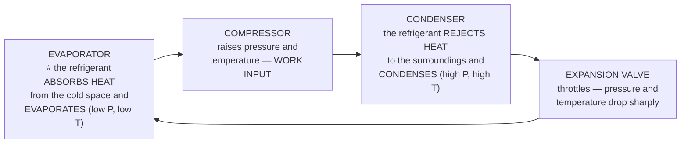

<!-- TOC START -->
**Table of Contents** — 7 subtopics · 11 theories

1. **[Engineering Mechanics & Strength of Materials](#engineering-mechanics--strength-of-materials)**
   - [Statics — Forces, Equilibrium and Lami's Theorem](#statics--forces-equilibrium-and-lamis-theorem)
   - [Stress, Strain and the Elastic Constants](#stress-strain-and-the-elastic-constants)
   - [Moment of Inertia, Section Modulus and Beams](#moment-of-inertia-section-modulus-and-beams)

2. **[Thermodynamics & Heat Transfer](#thermodynamics--heat-transfer)**
   - [Thermodynamics — Laws, Processes and Pressure](#thermodynamics--laws-processes-and-pressure)
   - [IC Engines, Boilers, Refrigeration and Compressors](#ic-engines-boilers-refrigeration-and-compressors)

3. **[Engineering Materials & Manufacturing](#engineering-materials--manufacturing)**
   - [Properties of Engineering Materials](#properties-of-engineering-materials)
   - [Casting and Manufacturing Processes](#casting-and-manufacturing-processes)

4. **[Machining & Workshop Practice](#machining--workshop-practice)**
   - [Machine Tools, Cutting Tools and Machining Operations](#machine-tools-cutting-tools-and-machining-operations)

5. **[Industrial & Production Engineering](#industrial--production-engineering)**
   - [Productivity, Motion Study and the Product Life Cycle](#productivity-motion-study-and-the-product-life-cycle)

6. **[Engineering Drawing](#engineering-drawing)**
   - [Engineering Drawing — Scale and Representative Fraction](#engineering-drawing--scale-and-representative-fraction)

7. **[Fluid Mechanics](#fluid-mechanics)**
   - [Fluid Properties, Viscosity and Shear Stress](#fluid-properties-viscosity-and-shear-stress)

<!-- TOC END -->

---

## Engineering Mechanics & Strength of Materials

### Statics — Forces, Equilibrium and Lami's Theorem

> **STATICS is the study of bodies AT REST or in uniform motion, under the action of forces that are in EQUILIBRIUM.**

#### The conditions of equilibrium

```
   For a body in equilibrium under COPLANAR forces:

        ΣFx = 0        the forces balance horizontally
        ΣFy = 0        the forces balance vertically
        ΣM  = 0        the moments balance about any point
```

| Force system | Meaning |
|---|---|
| ⭐ **CONCURRENT (সমবিন্দু)** | All the lines of action **pass through ONE POINT** |
| ⭐ **COPLANAR (সমতলীয়)** | All forces lie **in the SAME PLANE** |
| **Collinear** | All act along the **same line** |
| **Parallel** | Lines of action are parallel |

#### ⭐ Lami's Theorem

> ### **LAMI'S THEOREM: if THREE COPLANAR, CONCURRENT forces acting on a body keep it in EQUILIBRIUM, then each force is PROPORTIONAL TO THE SINE OF THE ANGLE BETWEEN THE OTHER TWO.**
>
> ### **P / sin α = Q / sin β = R / sin γ**

```
            Q
             \   γ
              \        α = angle between Q and R
       β       •──── R    β = angle between P and R
              /           γ = angle between P and Q
             /   
            P            α + β + γ = 360°
```

> ### **"Lami's Theorem কি ধরনের বলের ক্ষেত্রে প্রযোজ্য?"** → ### ✅ **সমতলীয় সমবিন্দু বল — THREE COPLANAR CONCURRENT FORCES in equilibrium.**
>
> ⚠️ **All three conditions are essential:** exactly **three** forces, **coplanar**, **concurrent**, and **in equilibrium**. If there are four forces, or they are not concurrent, Lami's theorem does **not** apply and you must use ΣFx = ΣFy = 0 instead.

#### Degrees of freedom

> ### **DEGREES OF FREEDOM (DOF) is the NUMBER OF INDEPENDENT MOVEMENTS a body or mechanism can make.**

| Situation | DOF | The movements |
|---|---|---|
| ⭐ **A rigid body in a PLANE (2-D)** | ⭐ **3** | Translation along **x**, translation along **y**, **rotation** about z |
| ⭐ **A rigid body in SPACE (3-D)** | ⭐ **6** | **3 translations** (x, y, z) + **3 rotations** (roll, pitch, yaw) |
| A particle in space | 3 | Translation only |
| A particle in a plane | 2 | |

**Kutzbach's criterion for a planar mechanism:** **F = 3(n − 1) − 2j₁ − j₂**, where n = number of links, j₁ = lower pairs (1 DOF joints), j₂ = higher pairs (2 DOF joints).

#### Kinematics — the rates of change

| Quantity | Definition | Unit |
|---|---|---|
| **Displacement** | Change of position (a vector) | m |
| ⭐ **VELOCITY** | ⭐ **The RATE OF CHANGE OF DISPLACEMENT with time** — v = ds/dt | m/s |
| **Acceleration** | The **rate of change of VELOCITY** — a = dv/dt = d²s/dt² | m/s² |
| **Speed** | The magnitude of velocity (a scalar) | m/s |

> ### **"একটি বস্তুর দূরত্ব পরিবর্তন হারকে বলা হয়"** → ### ✅ **বেগ (VELOCITY).**

#### Kinds of kinematic pair

| Pair | Motion permitted | Example |
|---|---|---|
| **Sliding (prismatic)** | Straight-line sliding | Piston in a cylinder |
| **Turning (revolute)** | Rotation about an axis | A shaft in a bearing |
| **Rolling** | Rolling contact | Ball bearing |
| ⭐ **SCREW (helical) pair** | ⭐ **SIMULTANEOUS rotation AND translation along the same axis** | ⭐ **A NUT AND BOLT**; a lead screw |
| **Spherical** | Rotation about three axes | Ball-and-socket joint |

> ### **"নাট ও বোল্ট কর্তৃক গঠিত জোড়া হলো"** → ### ✅ **স্ক্রু জোড়া (SCREW PAIR)** — because turning the nut makes it **advance along the axis at the same time**, which is precisely the definition of a screw pair.

**Previous Year MCQ List from this Topic:**

- [Degree of freedom কতটি?](../mcq-answers/mechanical-engineering.md?plain=1#L38)
- [Lami's Theorem কি ধরনের বলের ক্ষেত্রে প্রযোজ্য?](../mcq-answers/mechanical-engineering.md?plain=1#L44)
- [একটি বস্তুর দূরত্ব পরিবর্তন হারকে বলা হয়-](../mcq-answers/mechanical-engineering.md?plain=1#L89)
- [নাট ও বোল্ট কর্তৃক গঠিত জোড়া হলো-](../mcq-answers/mechanical-engineering.md?plain=1#L307)


---

### Stress, Strain and the Elastic Constants

#### The basic definitions

```
   STRESS  σ = Force / Area                    unit: N/m² = Pascal (Pa), or N/mm² = MPa
   STRAIN  ε = Change in dimension / Original dimension     — DIMENSIONLESS
```

| Type | Stress | Strain |
|---|---|---|
| **Normal (direct)** | **Tensile** (pulling) or **Compressive** (pushing) — acts **PERPENDICULAR** to the surface | Longitudinal strain = δL/L |
| ⭐ **SHEAR** | Acts **PARALLEL (tangential)** to the surface | **Shear strain φ** — the angular distortion |
| **Volumetric** | Uniform pressure on all sides | δV/V |

#### ⭐ The three elastic constants

> ### **HOOKE'S LAW: within the elastic limit, STRESS is PROPORTIONAL TO STRAIN.** The constant of proportionality depends on the kind of loading:

| Constant | Symbol | ### **Definition** | Applies to |
|---|---|---|---|
| ⭐ **Young's Modulus (Modulus of Elasticity)** | **E** | ### **Normal stress / Normal strain** | Tension, compression |
| ⭐ **MODULUS OF RIGIDITY (Shear Modulus)** | ⭐ **G** or **C** or **N** | ### ⭐ **SHEAR STRESS ÷ SHEAR STRAIN** | **Shear, torsion** |
| ⭐ **Bulk Modulus** | **K** | ### **Volumetric stress / Volumetric strain** | Uniform pressure |
| **Poisson's ratio** | **μ** or **1/m** | **Lateral strain / Longitudinal strain** (≈ 0.25–0.33 for metals) | — |

> ### **"শিয়ার পীড়ন ও শিয়ার বিকৃতির অনুপাত হলো"** → ### ✅ **মডুলাস অফ রিজিডিটি (MODULUS OF RIGIDITY, G).**

**The relations between them** — worth memorising:
```
      E = 2G(1 + μ)              E = 3K(1 − 2μ)              E = 9KG / (3K + G)
```

#### Principal planes and principal stresses

> ### **PRINCIPAL PLANES are the planes on which the SHEAR STRESS IS ZERO and only NORMAL stress acts.** The normal stresses on them are the **PRINCIPAL STRESSES** — the **maximum and minimum** normal stresses at that point.

> ### **"প্রধান তলে শিয়ার স্ট্রেস হল"** → ### ✅ **শূন্য (ZERO)** — that is the **definition** of a principal plane.
>
> **The companion facts:** the **maximum shear stress** occurs on planes at **45°** to the principal planes, and its value is **τ_max = (σ₁ − σ₂)/2**. **Mohr's circle** is the graphical construction that shows all of this at a glance.

**Previous Year MCQ List from this Topic:**

- [শিয়ার পীড়ন ও শিয়ার বিকৃতি এর অনুপাত হলো–](../mcq-answers/mechanical-engineering.md?plain=1#L29)
- [প্রধান তলে শিয়ার স্ট্রেস হল-](../mcq-answers/mechanical-engineering.md?plain=1#L80)


---

### Moment of Inertia, Section Modulus and Beams

#### Area moment of inertia

> **The AREA MOMENT OF INERTIA (second moment of area), I, measures how a cross-section's area is DISTRIBUTED ABOUT AN AXIS.** The further the material lies from the neutral axis, the **greater the I and the stiffer the section** — which is why I-beams and hollow tubes are efficient.

> ### **The UNIT of area moment of inertia is ⭐ mm⁴ (or m⁴)** — because I = ∫ y² dA, which is (length)² × (length)² = **length⁴**.

| Section | I about the centroidal axis |
|---|---|
| **Rectangle (b × d)** | **I = bd³/12** |
| **Solid circle (diameter D)** | **I = πD⁴/64** |
| **Hollow circle** | I = π(D⁴ − d⁴)/64 |
| **Triangle (base b, height h)** | I = bh³/36 |

> ⚠️ **Do not confuse it with MASS moment of inertia**, used in dynamics, whose unit is **kg·m²**. The MCQ asking for "mm⁴" is testing the **AREA** moment of inertia.

#### Radius of gyration

> ### **The RADIUS OF GYRATION k is the distance from the axis at which the whole area could be concentrated without changing the moment of inertia.**
>
> ### **I = A k²  ⟹  k = √(I / A)**

> ### **"রেডিয়াস অফ জাইরেশন (k) হলো"** → ### ✅ **√(I/A).** Its unit is **mm** (a length), and it is the key parameter in **column buckling** — the **slenderness ratio** is L/k.

#### Section modulus

> ### **SECTION MODULUS Z = I / y_max** — where y_max is the distance from the neutral axis to the outermost fibre. **It directly gives the bending strength of a section, since σ_max = M / Z.**

**Worked derivation — a SOLID CIRCULAR SHAFT of diameter D:**
```
       I      = π D⁴ / 64                (moment of inertia of a circle)
       y_max  = D / 2                    (the outer surface)

       Z = I / y_max
         = (π D⁴ / 64) ÷ (D / 2)
         = (π D⁴ / 64) × (2 / D)
         = π D³ / 32
```
> ### ✅ **Z = πD³/32** for a solid circular section.
>
> *(For **TORSION** the corresponding quantity is the **polar section modulus Zp = πD³/16** — exactly twice as large, because the polar moment of inertia J = πD⁴/32 is twice I. **Confusing πD³/32 with πD³/16 is the classic error**: use **πD³/32 for BENDING**, **πD³/16 for TORSION**.)*

#### Shear force and bending moment

| Quantity | Definition |
|---|---|
| **Shear Force (SF)** | The algebraic sum of the **vertical forces** to one side of a section |
| **Bending Moment (BM)** | The algebraic sum of the **moments** of those forces about the section |

> ### **The fundamental relations:**
> ```
>      dM/dx = F          (the slope of the bending-moment diagram is the shear force)
>      dF/dx = w          (the slope of the shear-force diagram is the load intensity)
> ```

> ### **"একটি সেকশনে যখন শিয়ার ফোর্স শূন্য, তখন বেন্ডিং মোমেন্ট হয়"** → ### ✅ **সর্বোচ্চ অথবা সর্বনিম্ন (MAXIMUM or MINIMUM).**
>
> **The reasoning — pure calculus:** since **dM/dx = F**, setting **F = 0** makes **dM/dx = 0**, which is exactly the condition for M to be at a **turning point**. ⭐ **This is why, to locate the maximum bending moment in a beam, you find the point where the SHEAR FORCE DIAGRAM CROSSES ZERO** — the single most used technique in beam design.
>
> *(A further consequence: the **point of contraflexure** is where the **bending moment** itself changes sign, i.e. M = 0 — do not confuse it with the point where **F = 0**.)*

#### Designing a shaft

> ### **"কিসের ভিত্তিতে শ্যাফট ডিজাইন করা হয়?"** → ### ✅ **STRENGTH AND RIGIDITY (স্ট্রেন্থ ও রিজিডিটি) — BOTH.**

| Criterion | The requirement | Governing equation |
|---|---|---|
| ⭐ **STRENGTH** | The shaft must **not FAIL** — the induced shear/bending stress must stay below the permissible value | **T/J = τ/r** (torsion equation) |
| ⭐ **RIGIDITY (stiffness)** | The shaft must **not TWIST or DEFLECT EXCESSIVELY**, even if it is strong enough | **θ = TL/GJ** — angle of twist |

> **Why both are needed:** a shaft designed only for strength may be perfectly safe yet **twist so much that gears mis-mesh and the machine vibrates**. A long transmission shaft is very often governed by **rigidity, not strength** — so the larger of the two required diameters is the one adopted.

**Previous Year MCQ List from this Topic:**

- [Moment of Inertia এর একক হলো-](../mcq-answers/mechanical-engineering.md?plain=1#L20)
- [রেডিয়াস অফ জাইরেশন (k) হলো-](../mcq-answers/mechanical-engineering.md?plain=1#L53)
- [D ব্যাস বিশিষ্ট একটি সলিড শ্যাফটের সেকশন মডুলাস হল-](../mcq-answers/mechanical-engineering.md?plain=1#L62)
- [কিসের ভিত্তিতে শ্যাফট ডিজাইন করা হয়?](../mcq-answers/mechanical-engineering.md?plain=1#L71)
- [একটি সেকশনের যখন শেয়ার ফোর্স শূন্য তখন বেন্ডিং মোমেন্ট।](../mcq-answers/mechanical-engineering.md?plain=1#L98)


---

## Thermodynamics & Heat Transfer

### Thermodynamics — Laws, Processes and Pressure

#### The laws of thermodynamics

| Law | Statement |
|---|---|
| **Zeroth** | If A is in thermal equilibrium with C and B is in equilibrium with C, then **A and B are in equilibrium with each other** — this is what makes a **thermometer** possible |
| ⭐ **FIRST** | ⭐ **ENERGY CAN NEITHER BE CREATED NOR DESTROYED, only converted** — the law of **conservation of energy** applied to heat and work |
| **Second** | Heat flows **spontaneously from hot to cold only**; **no engine can be 100 % efficient** (Kelvin-Planck / Clausius statements); **entropy of an isolated system never decreases** |
| **Third** | The entropy of a perfect crystal approaches **zero as temperature approaches absolute zero** |

> ### **The FIRST LAW is expressed as ⭐ W = JH** (work = the mechanical equivalent of heat × heat), the classical Joule form — equivalently in modern notation:
> ### **δQ = dU + δW** — the heat added equals the increase in internal energy plus the work done.
>
> **J is the MECHANICAL EQUIVALENT OF HEAT**, ≈ **4.186 joules per calorie** — Joule's experimental constant showing that heat and work are the same kind of quantity.

#### Thermodynamic processes

| Process | Held constant | Relation | Note |
|---|---|---|---|
| **Isothermal** | **Temperature** | **PV = constant** | Slow; heat exchanged |
| ⭐ **ADIABATIC (রুদ্ধতাপীয়)** | ⭐ **NO HEAT EXCHANGE (Q = 0)** | ### ⭐ **PV^γ = constant** | Fast; e.g. compression in an engine |
| **Isobaric** | **Pressure** | V/T = constant | |
| **Isochoric (isometric)** | **Volume** | P/T = constant | No work done |
| **Polytropic** | — | PVⁿ = constant | The general case |

> ### **"একটি গ্যাসের রুদ্ধতাপীয় (adiabatic) প্রসারণ কোন সূত্র দ্বারা প্রকাশ করা হয়?"** → ### ✅ **PV^γ = constant**, where ⭐ **γ = Cp / Cv** is the **adiabatic index (ratio of specific heats)** — about **1.4 for air**.
>
> **The physical meaning:** in an adiabatic expansion the gas does work **using only its own internal energy**, so **it cools**. This is why a compressed-air cylinder becomes cold when discharged, and why air cools as it rises in the atmosphere.

#### Pressure units

> ### **ONE STANDARD ATMOSPHERE equals:**
> ```
>      1 atm = 101.325 kPa = 1.01325 bar
>            = ⭐ 1.033 kgf/cm²
>            = ⭐ 14.7 psi
>            = 760 mm of mercury (Hg)
>            = 10.33 m of water
> ```

> ### **"এক বায়ুমন্ডলীয় চাপ সমান"** → ### ✅ **১.০৩৩ কেজি/সেমি² (1.033 kgf/cm²).**

**Gauge vs absolute pressure:** ⭐ **Absolute pressure = Gauge pressure + Atmospheric pressure.** A tyre gauge reading 30 psi means **30 psi ABOVE atmospheric**, i.e. 44.7 psi absolute.

**Previous Year MCQ List from this Topic:**

- [এক বায়ুমন্ডলীয় চাপ সমান-](../mcq-answers/mechanical-engineering.md?plain=1#L117)
- [থার্মোডাইনামিক্স এর প্রথম সূত্রটি কোন সমীকরণ দ্বারা প্রকাশ করা হয়।](../mcq-answers/mechanical-engineering.md?plain=1#L162)
- [একটি গ্যাসের রুদ্ধতাপীয় প্রসারণ কোন সূত্র দ্বারা প্রকাশ করা হয়-](../mcq-answers/mechanical-engineering.md?plain=1#L171)


---

### IC Engines, Boilers, Refrigeration and Compressors

#### Internal vs External combustion engines

| | ⭐ **IC — Internal Combustion** | **EC — External Combustion** |
|---|---|---|
| ⭐ **Where the fuel burns** | ⭐ **INSIDE the CYLINDER (সিলিন্ডারের অভ্যন্তরে)** — the combustion gases act **directly** on the piston | **OUTSIDE** the working cylinder; the heat is transferred to a separate working fluid |
| **Working fluid** | The **combustion gases themselves** | **Steam** (or air) |
| **Efficiency** | ✅ **Higher (25–40 %)** | Lower (10–20 %) |
| **Size and weight** | ✅ Compact | Bulky |
| **Starting** | Quick | Slow (the boiler must raise steam) |
| **Fuel** | Petrol, diesel, CNG — must be high grade | ✅ **Any** — coal, wood, waste |
| **Examples** | **Petrol and diesel engines, gas turbines, jet engines** | **Steam engine, steam turbine** |

> ### **"IC ইঞ্জিনের জ্বালানী দহন ঘটে"** → ### ✅ **সিলিন্ডারের অভ্যন্তরে (INSIDE THE CYLINDER).**

**The four strokes of a four-stroke engine:** ⭐ **SUCTION (intake) → COMPRESSION → POWER (expansion) → EXHAUST** — two crankshaft revolutions per cycle. *(Petrol engines follow the **Otto cycle** with **spark ignition**; diesel engines follow the **Diesel cycle** with **compression ignition**.)*

#### Boiler mountings and accessories

| | **MOUNTINGS** — required for **SAFETY** | **ACCESSORIES** — improve **EFFICIENCY** |
|---|---|---|
| **Purpose** | ⭐ **Essential for safe operation — a boiler may not run without them** | Optional; raise performance |
| **Examples** | ⭐ **WATER LEVEL INDICATOR (gauge glass)**, pressure gauge, **safety valve**, fusible plug, steam stop valve, feed check valve, blow-off cock | Economiser, air preheater, superheater, feed pump, steam separator |

> ### **"যে কোন মুহূর্তে বয়লারের পানির সঠিক লেভেল জানা যায় কোনটি দিয়ে?"** → ### ✅ **ওয়াটার লেভেল ইন্ডিকেটর (WATER LEVEL INDICATOR / gauge glass).**
>
> ⚠️ **Why it is a safety-critical fitting:** if the water level falls below the heating surface, the metal overheats and the boiler can **explode**. The gauge glass is therefore **mandatory**, and boilers carry **two** of them for redundancy, plus a **fusible plug** that melts and quenches the fire if the level drops dangerously.

#### Refrigeration



> ### **"একটি হিমায়ন চক্রে হিমায়ক কর্তৃক তাপ শোষিত হয় কোথায়?"** → ### ✅ **ইভাপোরেটরে (in the EVAPORATOR).**
>
> **The whole cycle in one sentence:** the refrigerant **absorbs heat in the EVAPORATOR** (inside the fridge, making it cold) and **rejects it in the CONDENSER** (the warm coils at the back) — a refrigerator does not "create cold", it **moves heat from a cold place to a warm one**, which requires work and is why the second law demands a compressor.

#### Coefficient of Performance (COP)

> ### **COP = (Useful heat transferred) / (Work input)** — it is the refrigeration equivalent of efficiency.
>
> ```
>      COP_refrigerator = Q_evaporator / W          (what you want = cooling)
>      COP_heat pump    = Q_condenser  / W  =  COP_refrigerator + 1
> ```

> ### **"ডোমেস্টিক রেফ্রিজারেটরের COP হয়"** → ### ✅ **১.০ এর বেশি (GREATER THAN 1)** — typically **2 to 4**.
>
> ⚠️ **Why COP can exceed 1 without breaking the first law:** COP is **NOT an efficiency**. The machine is not *creating* energy — it is **PUMPING heat that already exists** from a cold region to a hot one. A COP of 3 simply means **3 kW of heat is moved for every 1 kW of electricity consumed**. *(This is also why heat pumps are such efficient heaters.)* **Unit of refrigeration: 1 TON OF REFRIGERATION = 3.5 kW = 210 kJ/min**, the rate needed to freeze one ton of water in 24 hours.

#### Compressors

| Type | Principle | Examples |
|---|---|---|
| ⭐ **POSITIVE DISPLACEMENT** | Traps a **fixed volume** of gas and **physically reduces it** | **Reciprocating (piston), Rotary — screw, vane, scroll** |
| ⭐ **NON-POSITIVE DISPLACEMENT (DYNAMIC)** | ⭐ **Raises pressure by imparting VELOCITY with rotating blades**, then converting that velocity into pressure | ⭐ **CENTRIFUGAL and AXIAL compressors** |

> ### **"কোনটি নন-পজিটিভ ডিসপ্লেসমেন্ট কম্প্রেসর?"** → ### ✅ **CENTRIFUGAL AND AXIAL — BOTH.**
>
> | | **Positive displacement** | **Dynamic (non-positive)** |
> |---|---|---|
> | **Flow rate** | Low to medium | ✅ **Very high** |
> | **Pressure ratio per stage** | ✅ **High** | Low (needs many stages) |
> | **Flow character** | Pulsating | ✅ **Smooth, continuous** |
> | **Used in** | Air compressors, refrigerators | **Gas turbines, jet engines, large process plants** |

**Previous Year MCQ List from this Topic:**

- [একটি হিমায়ন চক্রের হিমায়ক কর্তৃক তাপ শোষিত হয়](../mcq-answers/mechanical-engineering.md?plain=1#L108)
- [IC ইঞ্জিনের জ্বালানী দহন ঘটে-](../mcq-answers/mechanical-engineering.md?plain=1#L126)
- [যে কোন মুহূর্তে বয়লারের পানির সঠিক লেভেল জানা যায় যে যন্ত্রের সাহায্যে সেটি হল-](../mcq-answers/mechanical-engineering.md?plain=1#L135)
- [ডোমেস্টিক রেফ্রিজারেটরের কো-এফিসিয়েন্ট অফ পারফরমেন্স (COP) হলো-](../mcq-answers/mechanical-engineering.md?plain=1#L144)
- [কোনটি নন-পজিটিভ ডিসপ্লেসমেন্ট কম্প্রেসর](../mcq-answers/mechanical-engineering.md?plain=1#L153)


---

## Engineering Materials & Manufacturing

### Properties of Engineering Materials

#### Mechanical vs physical properties

| ⭐ **MECHANICAL properties** — response to an applied FORCE | **PHYSICAL properties** — measurable without deforming the material |
|---|---|
| ⭐ **HARDNESS**, strength, ductility, malleability, toughness, brittleness, elasticity, plasticity, stiffness, fatigue strength, creep, resilience, impact strength | **Density**, melting point, **thermal conductivity**, electrical conductivity, specific heat, **porosity**, colour, magnetic properties |

> ### **"কোনটি Mechanical Property?"** → ### ✅ **HARDNESS** — it is measured by applying a **force** (an indenter). *(Density, thermal conductivity and porosity are **physical** properties.)*

#### ⭐ Ductility vs Malleability — the pair always confused

| | ⭐ **DUCTILITY** | ⭐ **MALLEABILITY** |
|---|---|---|
| ⭐ **Definition** | ⭐ **The ability to be DRAWN INTO WIRE** — to deform under **TENSILE** stress | ⭐ **The ability to be HAMMERED OR ROLLED INTO THIN SHEETS** — to deform under **COMPRESSIVE** stress |
| **Stress involved** | **Tension (pulling)** | **Compression (hammering, rolling)** |
| **Test** | Percentage elongation in a tensile test | Rolling / forging |
| **Effect of temperature** | Generally **increases** with temperature | **Increases** with temperature |
| **Most ductile metals** | ⭐ **Gold, Silver, COPPER, Platinum, Aluminium, Iron** | **Gold, Silver, Aluminium, Copper, Lead, Tin** |

> ### **"ধাতুর যে ধর্মের কারণে পিটিয়ে পাত (sheet) এ পরিণত করা যায়"** → ### ✅ **MALLEABILITY.**
> ### **"কোন ধাতুর DUCTILITY সর্বোচ্চ?"** → ### ✅ **COPPER** (among the usual options).
>
> **Why copper is so ductile:** its **face-centred cubic (FCC) crystal structure** provides **many slip planes**, so dislocations move easily and the metal can deform a great deal before fracturing. *(Gold is in fact the most ductile metal of all — one gram can be drawn into a wire over 2 km long — but among the options normally offered, copper is the answer.)*
>
> **The memory aid:** **D**uctile → **D**raw into wire. **M**alleable → **M**ash into sheets.

#### The other mechanical properties

| Property | Meaning |
|---|---|
| **Hardness** | Resistance to **indentation, scratching and wear** (Brinell, Rockwell, Vickers tests) |
| **Toughness** | Ability to **absorb energy before fracturing** (impact/Charpy test) |
| **Brittleness** | Breaks **without appreciable plastic deformation** — the opposite of ductility (glass, cast iron) |
| **Elasticity** | Returns to its original shape when the load is removed |
| **Plasticity** | Retains the deformed shape permanently |
| **Stiffness** | Resistance to deformation — governed by **Young's modulus E** |
| **Fatigue** | Failure under **repeated cyclic loading**, below the static strength |
| **Creep** | Slow permanent deformation under a **constant load at high temperature** |
| **Resilience** | Energy absorbed **within the elastic limit** |

#### Common engineering materials

| Material | Composition / nature | Typical use |
|---|---|---|
| **Cast iron** | Fe + **2–4 % carbon** | Machine beds, engine blocks — **brittle, excellent in compression**, good damping |
| **Mild steel** | Fe + < 0.3 % C | Structures, sheets |
| ⭐ **Steel (for GEARS)** | Fe + 0.3–1.5 % C, often alloyed and **surface hardened** | ⭐ **GEARS**, shafts, tools — chosen for **high strength, toughness and hardenability** |
| **Stainless steel** | + ≥ 10.5 % chromium | Corrosion resistance |
| **Brass / Bronze** | Cu+Zn / Cu+Sn | Bearings, fittings |
| ⭐ **RUBBER — an ELASTOMER** | ⭐ **A POLYMER that stretches greatly and RETURNS to its original shape** | Tyres, seals, vibration mounts |
| **Ceramics** | Metal oxides/carbides | Hard, brittle, heat resistant |
| **Composites** | Matrix + reinforcement | FRP, carbon fibre |

> ### **"গিয়ার তৈরিতে সাধারণত ব্যবহৃত হয়"** → ### ✅ **STEEL.**
> ### **"Rubber এর অপর নাম"** → ### ✅ **ELASTOMER.**

**Previous Year MCQ List from this Topic:**

- [গিয়ার তৈরিতে সাধারণত ব্যবহৃত হয়-](../mcq-answers/mechanical-engineering.md?plain=1#L206)
- [ধাতুর যে ধর্মের কারনে পিটিয়ে পাত (sheet) এ পরিণত করা যায় তা হল-](../mcq-answers/mechanical-engineering.md?plain=1#L215)
- [Rubber এর অপর নাম-](../mcq-answers/mechanical-engineering.md?plain=1#L242)
- [কান ধাতুর Duetility সর্বোচ্চ?](../mcq-answers/mechanical-engineering.md?plain=1#L251)
- [কোনটি Mechanical Property?](../mcq-answers/mechanical-engineering.md?plain=1#L260)


---

### Casting and Manufacturing Processes

#### The manufacturing process families

| Family | Principle | Examples |
|---|---|---|
| ⭐ **CASTING** | **Pour MOLTEN metal into a mould** and let it solidify | Sand casting, **investment casting**, die casting, centrifugal casting |
| **Forming (deformation)** | Reshape solid metal **without removing material** | Forging, rolling, extrusion, drawing, **sheet-metal pressing** |
| **Machining (material removal)** | **Cut away** unwanted material | Turning, milling, drilling, grinding |
| **Joining** | Fasten parts together | Welding, brazing, soldering, riveting, adhesives |
| **Additive** | Build up layer by layer | 3-D printing |
| **Heat treatment** | Change properties without changing shape | Annealing, normalising, hardening, tempering, case hardening |

#### Furnaces

| Furnace | Used for |
|---|---|
| ⭐ **CUPOLA furnace** | ⭐ **Melting pig iron and scrap with COKE to produce CAST IRON** in a foundry — the classic, cheap, continuous cast-iron furnace |
| **Blast furnace** | Producing **pig iron from iron ore** (the step *before* the cupola) |
| **Open hearth / Bessemer converter / BOF** | Producing **steel** from pig iron |
| **Electric arc furnace** | Steel from scrap; alloy steels |
| **Induction furnace** | Clean melting of small, precise batches |
| **Crucible furnace** | Small quantities of non-ferrous metal |

> ### **"Cast Iron তৈরিতে ব্যবহৃত ফার্নেস হল"** → ### ✅ **CUPOLA FURNACE.**

#### ⭐ Investment casting (the lost-wax process)

> ### **INVESTMENT CASTING uses a WAX PATTERN**, around which a ceramic shell is built; the **wax is then MELTED OUT** ("lost"), leaving a cavity into which metal is poured.


> ### **"Investment casting ব্যবহৃত হয় কোন Pattern?"** → ### ✅ **WAX PATTERN.**

| Advantages | Disadvantages |
|---|---|
| ✅ **Excellent surface finish and dimensional accuracy** | ⚠️ **Expensive** |
| ✅ **Very complex and intricate shapes** possible | Slow; many steps |
| ✅ **No parting line** — the pattern is destroyed, not withdrawn | Limited to **smaller** components |
| ✅ Works with **high-melting-point alloys** | |

**Typical products:** turbine blades, surgical and dental instruments, jewellery, firearm parts, aerospace components.

**Other pattern materials:** **wood** (sand casting, cheap, for small runs) · **metal** (long production runs) · **plastic** · **polystyrene foam** (full-mould / lost-foam casting, where the foam vaporises instead of being melted out).

**Previous Year MCQ List from this Topic:**

- [Cast Iron তৈরিতে ব্যবহৃত ফার্নেস হল-](../mcq-answers/mechanical-engineering.md?plain=1#L224)
- [Investment casting ব্যবহৃত হয় কোন Pattern?](../mcq-answers/mechanical-engineering.md?plain=1#L233)


---

## Machining & Workshop Practice

### Machine Tools, Cutting Tools and Machining Operations

#### The principal machine tools

| Machine | Primary operation | What MOVES |
|---|---|---|
| ⭐ **LATHE** | **TURNING** — the workpiece rotates, the tool feeds along it | The **WORKPIECE ROTATES** |
| ⭐ **DRILLING machine** | Producing and enlarging **holes** | The **TOOL (drill) rotates** |
| **Milling machine** | Flat and contoured surfaces, slots, gears | The **cutter rotates**, the table feeds |
| ⭐ **SHAPER** | Flat surfaces on **small** work | ⭐ **The TOOL reciprocates; the WORK is stationary** |
| ⭐ **PLANER** | Flat surfaces on **large, heavy** work | ⭐ **The WORKPIECE (table) RECIPROCATES; the TOOL is fixed and feeds sideways** |
| **Grinding machine** | Precision finishing with an abrasive wheel | The wheel rotates |
| **Broaching / Slotting** | Keyways, internal profiles | |

> ### **"Planer Machine এ কার্যবস্তু"** → ### ✅ **চলমান থাকে (the WORKPIECE MOVES / reciprocates).**
>
> ### **The shaper–planer distinction, which is the whole point of the question:**
> | | **SHAPER** | ⭐ **PLANER** |
> |---|---|---|
> | **Reciprocates** | ⭐ **The TOOL** | ⭐ **The WORKPIECE (table)** |
> | **Feeds** | The work | The tool |
> | **Work size** | **Small, light** | ⭐ **Large, heavy** |
> | **Number of tools** | One | Several can cut at once |
>
> **They are exact opposites** — and the reason is practical: for a **small** job it is easier to move the light **tool**, but for a **massive casting** it is easier to mount it on a heavy table and move the **table**.

#### Operations performed on a DRILLING machine

> ### **"ডিলিং মেশিন কর্তৃক কোন অপারেশন সম্পন্ন করা হয়?"** → ### ✅ **সবকটি (ALL OF THEM).**

| Operation | What it does |
|---|---|
| ⭐ **DRILLING** | Makes the original hole |
| ⭐ **REAMING** | **Finishes** an existing hole to an accurate size and smooth finish |
| ⭐ **BORING** | **Enlarges** an existing hole accurately, and corrects its position |
| ⭐ **COUNTERBORING** | Enlarges the **top** of a hole to a flat-bottomed larger diameter, so a bolt head sits flush |
| ⭐ **COUNTERSINKING** | Cuts a **conical** seat for a flat-head screw |
| ⭐ **SPOT FACING** | Machines a **small flat seat** around a hole on a rough surface, so a washer or nut seats squarely |
| ⭐ **TAPPING** | Cuts an **internal SCREW THREAD** in the hole |
| **Trepanning** | Cuts a large hole by removing an annulus |

#### Cutting-tool materials

> ### **"টুল ম্যাটেরিয়াল হিসেবে ব্যবহৃত হয়"** → ### ✅ **TOOL STEEL.**

| Material | Character |
|---|---|
| ⭐ **Tool steel / High-carbon steel** | Hardened high-carbon steel; **cheap**, but **loses hardness above ~250 °C** |
| **HSS — High Speed Steel** | Retains hardness to ~600 °C; drills, taps, milling cutters |
| **Cemented carbide (tungsten carbide)** | Very hard, high speeds, brittle; used as **inserts** |
| **Ceramics / CBN / Diamond** | Extreme hardness and heat resistance; finishing and hard turning |

> **The properties a cutting-tool material must have: HIGH HARDNESS (harder than the work), HOT HARDNESS (retains hardness at cutting temperature), TOUGHNESS (resists chipping), WEAR RESISTANCE, low friction, and thermal-shock resistance.**

#### Lathe centres

> ### **"Dead centre কোন মেশিনে থাকে?"** → ### ✅ **LATHE.**

| | ⭐ **DEAD centre** | **LIVE centre** |
|---|---|---|
| **Rotates?** | ❌ **NO — it stays stationary** while the work turns against it | ✅ **Yes — it turns with the work** on its own bearings |
| **Located in** | The **TAILSTOCK** (and, as a "live" spindle centre, the headstock) | The tailstock |
| **Friction and heat** | ⚠️ **High** — needs lubrication | ✅ Low |
| **Accuracy** | ✅ **Higher** (no bearing play) | Slightly lower |
| **Use** | Low speeds, precision work | ⭐ **High speeds, heavy cuts** |

**The main parts of a lathe:** **bed, headstock** (holds the spindle and chuck, provides the drive), **tailstock** (supports the free end, holds drills and the dead centre), **carriage** (saddle, cross-slide, compound rest, apron and tool post), **lead screw** (for thread cutting) and **feed rod**.

#### Screw threads

```
                    ← Major diameter (D) →
        ╱╲    ╱╲    ╱╲    ╱╲                ⬍ depth of thread
       ╱  ╲  ╱  ╲  ╱  ╲  ╱  ╲
      ╱    ╲╱    ╲╱    ╲╱    ╲
            ← Minor diameter (d) →
      |← pitch →|
```

| Term | Meaning |
|---|---|
| ⭐ **Major diameter** | The **largest** diameter — across the **crests** of an external thread |
| ⭐ **Minor (core/root) diameter** | The **smallest** diameter — across the **roots** |
| ⭐ **DEPTH OF THREAD** | ⭐ **The RADIAL distance between the crest and the root** — so **Major − Minor = 2 × depth of thread** |
| **Pitch** | The **axial distance between adjacent crests** |
| **Lead** | Axial advance in one full turn = pitch × number of starts |

> ### **"Screw thread এর Major Dia. ও Minor dia. এর পার্থক্য"** → ### ✅ **DEPTH OF THREAD.**
>
> ⚠️ **Be precise here.** The **difference between the major and minor diameters equals TWICE the depth of thread**, because the thread is cut on **both sides** of the axis. The MCQ's expected answer is **"depth of thread"**, and it is right in the sense that the depth is what *accounts for* the difference — but the exact relation is **D − d = 2 × depth**. *(State the relation and you cannot be marked down.)*

**Previous Year MCQ List from this Topic:**

- [ডিলিং মেসিন কর্তৃক কোন অপারেশন সম্পন্ন করা হয়-](../mcq-answers/mechanical-engineering.md?plain=1#L271)
- [টুল ম্যাটেরিয়াল হিসেবে ব্যবহৃত হয়-](../mcq-answers/mechanical-engineering.md?plain=1#L280)
- [Screw thread Gi Major Dia. I Minor dia. এর পার্থক্য-](../mcq-answers/mechanical-engineering.md?plain=1#L289)
- [Planer Machine এ কার্যবস্তু-](../mcq-answers/mechanical-engineering.md?plain=1#L298)
- [Dead centre কোন মেশিনে থাকে?](../mcq-answers/mechanical-engineering.md?plain=1#L316)


---

## Industrial & Production Engineering

### Productivity, Motion Study and the Product Life Cycle

#### Productivity

> ### **PRODUCTIVITY is the RATIO OF OUTPUT PRODUCED TO INPUT CONSUMED over a given period.**
>
> ### **Productivity = Output / Input**

> ### **"উৎপাদনের ক্ষেত্রে কোনো নির্দিষ্ট সময়ে Output/Input এর অনুপাত"** → ### ✅ **PRODUCTIVITY.**

| Measure | Formula |
|---|---|
| **Labour productivity** | Output / labour-hours |
| **Machine productivity** | Output / machine-hours |
| **Material productivity** | Output / material consumed |
| **Total factor productivity** | Output / (labour + capital + material + energy) |

> ⚠️ **Do not confuse the three:**
> | Term | Meaning |
> |---|---|
> | ⭐ **PRODUCTION** | **The QUANTITY of output** — "we made 5,000 units" |
> | ⭐ **PRODUCTIVITY** | ⭐ **The RATIO output ÷ input** — "we made 5,000 units per 1,000 labour-hours" |
> | **Efficiency** | Actual output ÷ standard output, as a percentage |
>
> **Production can rise while productivity FALLS** — if output grew 10 % but you hired 30 % more workers. That distinction is the heart of this topic.

#### ⭐ Motion study and THERBLIGS

> **METHOD STUDY (motion study) analyses HOW a task is performed in order to eliminate wasted movement; TIME STUDY measures HOW LONG it should take. Together they form WORK STUDY.**

> ### **A THERBLIG is one of the ELEMENTARY HAND MOTIONS into which any manual task can be broken down**, defined by **Frank and Lillian Gilbreth**. *(The name is "Gilbreth" spelt backwards, with the "th" kept.)*
>
> ### **"Motion study chart-এ Therbligs symbol হল"** → ### ✅ **১৭টি (SEVENTEEN).**

**The 17 therbligs:** Search · Find · Select · Grasp · Hold · Transport Loaded · Transport Empty · Position · Pre-position · Assemble · Disassemble · Use · Release Load · Inspect · Unavoidable Delay · Avoidable Delay · Plan · Rest *(some lists count 18 by separating "Find"; the standard examination answer is **17**)*.

**Why it matters:** each therblig is classified as **effective** (it advances the work — grasp, assemble, use) or **ineffective** (search, hold, delay). **Eliminating the ineffective therbligs is the whole method of improving a manual operation** — and it is why factory workbenches have dedicated bins and fixtures, so nothing must ever be *searched for* or merely *held*.

**The work-study symbols on a process chart:** ○ **Operation** · □ **Inspection** · ⇨ **Transport** · D **Delay** · ▽ **Storage**.

#### The Product Life Cycle

> ### **The PRODUCT LIFE CYCLE has FOUR STAGES.**

```
   Sales
     ↑                        ╭──────────╮
     │                      ╱             ╲
     │                    ╱                 ╲
     │                  ╱                     ╲
     │        ╭───────╯                         ╲
     │    ╭──╯                                    ╲
     └────┴──────────┬──────────┬────────────┬──────╲────→ Time
      INTRODUCTION  GROWTH    MATURITY      DECLINE
```

| Stage | Sales | Profit | Strategy |
|---|---|---|---|
| ⭐ **1. INTRODUCTION** | Low, slow | ⚠️ **Negative or minimal** — heavy development and promotion cost | Build awareness; high price (skimming) or low (penetration) |
| ⭐ **2. GROWTH** | ✅ **Rising rapidly** | ✅ **Rising** | Expand distribution, improve the product, competitors appear |
| ⭐ **3. MATURITY** | ✅ **Peak, then flat** — the **longest** stage | **Peak, then falling** as competition intensifies | Differentiate, cut cost, find new segments |
| ⭐ **4. DECLINE** | ⚠️ **Falling** | Falling | Harvest, reduce cost, or **withdraw** the product |

> ### **"Product life cycle এর পর্যায় কতটি?"** → ### ✅ **৪টি (FOUR)** — Introduction, Growth, Maturity, Decline.
>
> *(Some texts add **"Product Development"** as a stage 0 before introduction, giving five — but the standard examination answer is **four**.)*

**Previous Year MCQ List from this Topic:**

- [Motion study chart I Therbligs symbol হল-](../mcq-answers/mechanical-engineering.md?plain=1#L327)
- [Product life cycle এর পর্যায় কতটি?](../mcq-answers/mechanical-engineering.md?plain=1#L336)
- [উৎপাদন এর ক্ষেত্রে কোন নির্দিষ্ট সময়ে Output/Input এর অনুপাতকে বলে-](../mcq-answers/mechanical-engineering.md?plain=1#L345)


---

## Engineering Drawing

### Engineering Drawing — Scale and Representative Fraction

> **ENGINEERING DRAWING is the graphical language of engineering** — a precise, standardised representation of an object's shape, size and specification, from which it can be manufactured.

#### ⭐ Scale and the Representative Fraction

> ### **The REPRESENTATIVE FRACTION (RF) is the RATIO OF A LENGTH ON THE DRAWING TO THE CORRESPONDING ACTUAL LENGTH OF THE OBJECT.**
>
> ### **RF = (Length on the drawing) / (Actual length of the object)**
>
> *(Both lengths must be in the **same unit**, so the RF itself is **dimensionless**.)*

> ### **"কোন Technical drawing এ ড্রইং এর দৈর্ঘ্য ও বস্তুর প্রকৃত দৈর্ঘ্যের অনুপাত"** → ### ✅ **REPRESENTATIVE FRACTION.**

| Type of scale | RF | Meaning | Used for |
|---|---|---|---|
| ⭐ **FULL size** | **1 : 1** | Drawing = object | Medium parts |
| ⭐ **REDUCING scale** | **1 : 2, 1 : 5, 1 : 100** | The drawing is **SMALLER** than the object | **Buildings, ships, large machines** |
| ⭐ **ENLARGING scale** | **2 : 1, 5 : 1, 50 : 1** | The drawing is **LARGER** than the object | **Watch parts, screw threads, microelectronics** |

**Worked example:**
```
   A 5 m long beam is drawn 10 cm long.

        RF = drawing length / actual length
           = 10 cm / 500 cm                  ← convert to the SAME unit first
           = 1 / 50
           = 1 : 50          (a reducing scale)
```

> ⚠️ **The single commonest error is failing to convert both lengths to the same unit before dividing.** 10 cm ÷ 5 m is meaningless; 10 cm ÷ 500 cm = 1/50 is correct.
>
> **The recommended standard scales (BIS/ISO)** are 1:1, and multiples of **1:2, 1:5 and 1:10** — 1:2, 1:5, 1:10, 1:20, 1:50, 1:100 …; and for enlargement 2:1, 5:1, 10:1. **The scale used must always be stated in the title block of the drawing.**

#### Types of projection

| Projection | Description |
|---|---|
| ⭐ **Orthographic** | Several **2-D views** (front, top, side) of a 3-D object, each viewed perpendicular to a plane. **First-angle** projection is the Indian/European standard; **third-angle** is the American |
| **Isometric** | A single **pictorial** view with the three axes at **120°**; all three dimensions are measurable |
| **Oblique** | The front face is true shape; depth is drawn at an angle |
| **Perspective** | As the eye sees it, with vanishing points — used in architecture, not in manufacturing |

**Types of line in a drawing:** **continuous thick** = visible outline · **continuous thin** = dimension, extension and leader lines · **dashed** = hidden edges · **chain (long-dash dot)** = centre lines and axes · **continuous thin wavy/zigzag** = break lines · **chain thick** = cutting planes.

**Previous Year MCQ List from this Topic:**

- [কোন Technical drawing এর ক্ষেত্রে উর্ধ্বরিহম এ দৈর্ঘ্য ও বস্তুর প্রকৃত দৈর্ঘ্যের অনুপাতকে বলে-](../mcq-answers/mechanical-engineering.md?plain=1#L356)


---

## Fluid Mechanics

### Fluid Properties, Viscosity and Shear Stress

> **A FLUID is a substance that DEFORMS CONTINUOUSLY under the action of a SHEAR STRESS, however small that stress may be.** This is precisely what distinguishes it from a solid, which deforms by a **fixed amount** and then stops.

#### ⭐ Shear stress in a fluid — Newton's law of viscosity

> ### **NEWTON'S LAW OF VISCOSITY:**
> ### **τ = μ · (du/dy)**
>
> where **τ** = shear stress, **μ** = dynamic viscosity, and ⭐ **du/dy = the VELOCITY GRADIENT** (the rate at which velocity changes across the flow).

> ### **"স্থির তরলের ক্ষেত্রে শিয়ার পীড়ন হল"** → ### ✅ **শূন্য (ZERO).**
>
> ### **The reasoning, which is the whole point:** shear stress in a fluid **requires a VELOCITY GRADIENT**. A fluid **at rest** has **no relative motion between its layers**, so **du/dy = 0**, and therefore **τ = μ × 0 = 0**.
>
> ⭐ **Consequence — the foundation of hydrostatics: in a fluid at rest, ONLY NORMAL STRESS (pressure) can act, and it acts EQUALLY IN ALL DIRECTIONS at a point (Pascal's law).** Every formula in fluid statics follows from this single fact.

#### Classification of fluids

| Type | Behaviour |
|---|---|
| ⭐ **NEWTONIAN** | **τ ∝ du/dy** — viscosity is **constant**. **Water, air, petrol, most gases and thin oils** |
| **Non-Newtonian** | Viscosity **changes** with the rate of shear — **blood, paint, ketchup, toothpaste, slurries** |
| **Ideal fluid** | **Zero viscosity, incompressible** — a theoretical convenience only |
| **Real fluid** | Has viscosity — every actual fluid |

#### The properties of a fluid

| Property | Symbol | Definition | Unit |
|---|---|---|---|
| **Density** | **ρ** | Mass per unit volume | kg/m³ |
| **Specific weight** | **w = ρg** | Weight per unit volume | N/m³ |
| **Specific gravity** | **S** | Density ÷ density of water (dimensionless) | — |
| ⭐ **Dynamic viscosity** | **μ** | **Resistance to shear** — τ ÷ (du/dy) | **N·s/m² = Pa·s (poise in CGS)** |
| **Kinematic viscosity** | **ν = μ/ρ** | Viscosity ÷ density | **m²/s (stokes)** |
| **Surface tension** | **σ** | Force per unit length at a free surface | N/m |
| **Compressibility** | **1/K** | Fractional volume change per unit pressure | |

> ⚠️ **The effect of TEMPERATURE is opposite for liquids and gases** — a favourite examination point:
> - **LIQUIDS: viscosity DECREASES as temperature rises** (the molecules' cohesive forces weaken — hot oil flows more easily).
> - **GASES: viscosity INCREASES as temperature rises** (molecular momentum transfer intensifies).

#### Fluid statics and flow — the essential relations

```
   Hydrostatic pressure at depth h :     P = ρ g h
   Pascal's law                     :     pressure applied to an enclosed fluid is
                                          transmitted UNDIMINISHED in all directions
                                          (the basis of the hydraulic jack and brakes)
   Archimedes' principle            :     buoyant force = weight of fluid displaced
   Continuity equation              :     A₁V₁ = A₂V₂        (incompressible flow)
   Bernoulli's equation             :     P/ρg + V²/2g + z = constant
                                          (pressure head + velocity head + datum head)
   Reynolds number                  :     Re = ρVD/μ
        Re < 2000  → LAMINAR    ·    Re > 4000  → TURBULENT    ·    between → transitional
```

**Previous Year MCQ List from this Topic:**

- [স্থির তরলের ক্ষেত্রে শেয়ার পীড়ন হল:](../mcq-answers/mechanical-engineering.md?plain=1#L367)
