<!-- TOC START -->
**Table of Contents** — 11 subtopics · 27 theories

1. **[Microprocessor Architecture & Functions](#microprocessor-architecture--functions)**
   - [The Microprocessor — Definition and Functions](#the-microprocessor--definition-and-functions)
   - [CPU Organisation — ALU, Control Unit and Registers](#cpu-organisation--alu-control-unit-and-registers)
   - [The Flag Register](#the-flag-register)
   - [The System Bus](#the-system-bus)
   - [Microprocessor vs Microcontroller](#microprocessor-vs-microcontroller)
   - [The 8086 Microprocessor](#the-8086-microprocessor)
   - [CPU vs GPU](#cpu-vs-gpu)
   - [DMA — Direct Memory Access](#dma--direct-memory-access)
   - [Peripheral Interfacing — 8255 and SPI](#peripheral-interfacing--8255-and-spi)
   - [I/O Interfacing — Memory-Mapped vs Isolated I/O](#io-interfacing--memory-mapped-vs-isolated-io)

2. **[Memory Hierarchy & Storage](#memory-hierarchy--storage)**
   - [The Memory Hierarchy](#the-memory-hierarchy)
   - [RAM vs ROM](#ram-vs-rom)
   - [SRAM vs DRAM](#sram-vs-dram)

3. **[RAID Architecture & Storage](#raid-architecture--storage)**
   - [RAID — Redundant Array of Independent Disks](#raid--redundant-array-of-independent-disks)

4. **[Cache Memory](#cache-memory)**
   - [Cache Memory — Concept and Performance](#cache-memory--concept-and-performance)

5. **[Secondary Storage (HDD vs SSD)](#secondary-storage-hdd-vs-ssd)**
   - [Hard Disk Drives and Solid State Drives](#hard-disk-drives-and-solid-state-drives)

6. **[Instruction Pipelining & Hazards](#instruction-pipelining--hazards)**
   - [Instruction Pipelining](#instruction-pipelining)
   - [Multiprocessors, Shared Memory and Cache Coherence](#multiprocessors-shared-memory-and-cache-coherence)

7. **[Assembly Language & Addressing Modes](#assembly-language--addressing-modes)**
   - [Addressing Modes of the 8086](#addressing-modes-of-the-8086)
   - [8086 Instructions and Assembly Language Rules](#8086-instructions-and-assembly-language-rules)
   - [Machine Code, Mnemonics and the Assembler](#machine-code-mnemonics-and-the-assembler)

8. **[CPU Performance & Instruction Cycle](#cpu-performance--instruction-cycle)**
   - [CPU Performance and Clock Cycles](#cpu-performance-and-clock-cycles)

9. **[Multi-Core & Multi-Threading](#multi-core--multi-threading)**
   - [Multi-Core Processors and Hyper-Threading](#multi-core-processors-and-hyper-threading)
   - [Intel Processor Families, Generations and Model Naming](#intel-processor-families-generations-and-model-naming)

10. **[RISC vs CISC Architecture](#risc-vs-cisc-architecture)**
   - [RISC vs CISC](#risc-vs-cisc)

11. **[8085 Microprocessor & Edge Computing](#8085-microprocessor--edge-computing)**
   - [The 8085 Microprocessor and Memory Addressing](#the-8085-microprocessor-and-memory-addressing)
   - [Edge Computing](#edge-computing)

<!-- TOC END -->

---

## Microprocessor Architecture & Functions

### The Microprocessor — Definition and Functions

> A **MICROPROCESSOR is a single INTEGRATED CIRCUIT (a "chip") that contains the COMPLETE CENTRAL PROCESSING UNIT of a computer** — it fetches instructions from memory, decodes them, executes them, and writes back the results.

It is often called the **"brain" of the computer**, and because it is built on one chip it is a **VLSI (Very Large Scale Integration)** device.

**The first microprocessor** was the **Intel 4004**, released in **1971** — a 4-bit processor with 2,300 transistors. It was followed by the 8008 (1972), the **8080** (1974), the **8085** (1976) and the **8086** (1978), which began the x86 family that still dominates PCs today.

#### The functions of a microprocessor

| # | Function | Description |
|---|---|---|
| **1** | **FETCH** | Read the next instruction from memory, at the address held in the **Program Counter** |
| **2** | **DECODE** | Interpret the instruction — what operation, on which operands |
| **3** | **EXECUTE** | Perform the operation in the **ALU** |
| **4** | **STORE / Write back** | Write the result to a register or to memory |
| **5** | **Arithmetic and logic operations** | Add, subtract, multiply, AND, OR, NOT, XOR, shift, compare |
| **6** | **Data transfer** | Move data between registers, memory and I/O devices |
| **7** | **Control and timing** | Generate the control signals that sequence every other component |
| **8** | **Handle interrupts** | Suspend the current work, service an urgent event, and resume |
| **9** | **Program flow control** | Branches, jumps, subroutine calls and returns |

#### Why the invention of the microprocessor transformed ICT

Before 1971, a computer's processor filled a cabinet and cost as much as a house. Putting the whole CPU on one cheap chip made computing **small, cheap, low-power and mass-producible**, and that single change produced:

- **The personal computer** — computing moved from the data centre to the desk and then to the home.
- **Embedded systems** — microprocessors and microcontrollers went into cars, telephones, televisions, medical equipment, industrial control and household appliances.
- **The mobile revolution** — the smartphone is a microprocessor with a radio attached.
- **The Internet** — cheap routers, switches and servers made global networking economically possible.
- **Automation, robotics, IoT and AI** — all rest on cheap, abundant processing power.
- **Digital Bangladesh** — online banking, mobile financial services (bKash, Nagad), e-governance and the software export industry all exist because processing became inexpensive.

> **The economic engine behind all of it is MOORE'S LAW** — Gordon Moore's 1965 observation that **the number of transistors on a chip doubles roughly every two years**, which has meant exponentially rising performance at falling cost for five decades.

**Previous Year Question List from this Topic:**

- [ছোট প্রসেসরের (Microprocessor) কাজ এক নজরে এবং কী কী?](../written-answers/microprocessor-and-computer-architecture.md?plain=1#L24)
- [What is Microprocessor?](../written-answers/microprocessor-and-computer-architecture.md?plain=1#L781)
- [Microprocessor কি? এর আবিষ্কারে তথ্য ও যোগাযোগ প্রযুক্তিতে কি ধরনের অগ্রগতি সাধিত হয়েছে ব্যাখ্যা করুন।](../written-answers/microprocessor-and-computer-architecture.md?plain=1#L1040)
- [What is Microprocessor? Explain basic component of Microprocessor.](../written-answers/microprocessor-and-computer-architecture.md?plain=1#L1136)

**Previous Year MCQ List from this Topic:**

- [A hardware device that is capable of executing a sequence of instructions is known as:](../mcq-answers/microprocessor-and-computer-architecture.md?plain=1#L189)
- [The processor reads an instruction from memory is called:](../mcq-answers/microprocessor-and-computer-architecture.md?plain=1#L135)
- [Microprocessor এর কোন অংশে ALU থাকে?](../mcq-answers/microprocessor-and-computer-architecture.md?plain=1#L171)
- [নিচের কোন Operation টি CPU তে দ্রুত কাজ করে?](../mcq-answers/microprocessor-and-computer-architecture.md?plain=1#L180)
- [Compared to CISC and RISC, processors (at the same clock) are -----](../mcq-answers/microprocessor-and-computer-architecture.md?plain=1#L261)
- [At the same clock speed compared to CISC, RISC processor works ________.](../mcq-answers/microprocessor-and-computer-architecture.md?plain=1#L324)


---

### CPU Organisation — ALU, Control Unit and Registers

> The **CPU (CENTRAL PROCESSING UNIT)** is the part of the computer that **executes instructions and performs all the processing**. It has **THREE main parts: the ALU, the Control Unit and the Registers.**

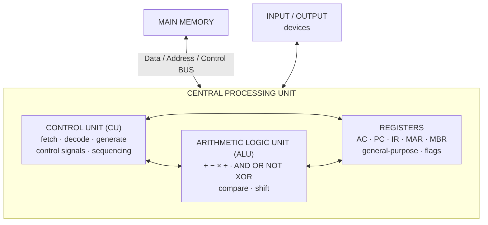

#### The main functions of the CPU

1. **Fetch** instructions from memory.
2. **Decode** them into control signals.
3. **Execute** the arithmetic, logic and data-movement operations.
4. **Store** results back to registers or memory.
5. **Control and coordinate** every other unit of the computer.
6. **Manage data flow** between memory and I/O.
7. **Respond to interrupts** and manage exceptions.

#### 1. The ALU (Arithmetic Logic Unit)

> The **ALU is the part of the CPU that performs ALL ARITHMETIC and LOGICAL OPERATIONS.** It is the **computational heart** of the processor — everything the computer ever calculates passes through it.

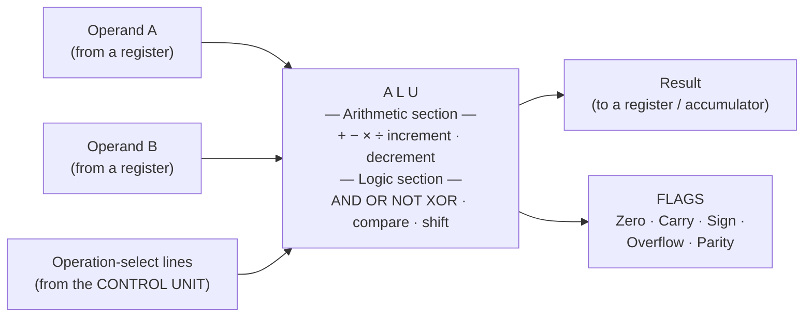

**How the ALU works — step by step:**

1. The **Control Unit decodes** the instruction and determines the required operation.
2. The **operands are loaded** into the ALU's input registers (usually from the **accumulator** and a general register or memory).
3. The Control Unit asserts the **operation-select control lines**, choosing which internal circuit acts.
4. The ALU's **combinational logic** — adders, complementers, logic gates, shifters — computes the result in one pass. (Subtraction is done as **addition of the 2's complement**; multiplication as repeated shift-and-add.)
5. The **result is placed on the output bus** and stored in the accumulator or destination register.
6. The **FLAG register is updated** — zero, carry, sign, overflow and parity — describing what happened, so that later conditional-branch instructions can test it.

**Operations the ALU performs:**

| Category | Operations |
|---|---|
| **Arithmetic** | Addition, subtraction, increment, decrement, multiplication, division, 2's complement |
| **Logical** | AND, OR, NOT, XOR, NAND, NOR |
| **Comparison** | Equal, greater than, less than (implemented as a subtraction that sets flags) |
| **Shift / Rotate** | Logical shift left/right, arithmetic shift, rotate through carry |

#### 2. The Control Unit (CU)

> The **CONTROL UNIT DIRECTS and COORDINATES all the operations of the computer.** It does **not** process data itself — it **tells every other unit what to do and when**, by generating timing and control signals.

**Functions of the Control Unit:**

1. **Fetch** the instruction from memory using the Program Counter.
2. **Decode** the instruction — determine the operation and the operand locations.
3. **Generate the control signals** that drive the ALU, registers, memory and I/O.
4. **Sequence and time** every operation with the system clock.
5. **Direct the flow of data** between the CPU, memory and I/O devices.
6. **Control the Program Counter** — increment it, or load a branch target.
7. **Handle interrupts** — save state, vector to the handler, restore state.

| Type of Control Unit | How it works | Characteristics |
|---|---|---|
| **Hardwired** | Built from **fixed logic gates and flip-flops** | **FASTER**, but rigid — changing the instruction set means redesigning the hardware. Used in **RISC** |
| **Microprogrammed** | Each instruction is a **sequence of micro-instructions stored in control memory** | **SLOWER**, but **flexible** — the instruction set can be changed by rewriting the microcode. Used in **CISC** |

> **The classic analogy: the CONTROL UNIT is the CONDUCTOR of an orchestra** — it plays no instrument, but nothing happens in time without it. The **ALU is the musician** that actually produces the sound.

#### 3. Registers

> **REGISTERS are the SMALL, EXTREMELY FAST storage locations INSIDE the CPU itself**, used to hold the data, addresses and instructions that the processor is working on **right now**. They are the **fastest storage in the entire computer** — access takes a **single clock cycle** — and also the **smallest and most expensive** per bit.

#### The types of register

| Register | Full name | Purpose |
|---|---|---|
| **AC / Accumulator** | Accumulator | Holds one **operand and the RESULT** of ALU operations |
| **PC** | **Program Counter** (Instruction Pointer) | Holds the **ADDRESS of the NEXT instruction** to be executed |
| **IR** | **Instruction Register** | Holds the **instruction CURRENTLY being executed/decoded** |
| **MAR** | **Memory Address Register** | Holds the **ADDRESS of the memory location** being accessed |
| **MBR / MDR** | **Memory Buffer / Data Register** | Holds the **DATA being transferred** to or from that memory location |
| **General-purpose registers** | AX, BX, CX, DX (8086); R0–R31 (RISC) | Hold **any operands or intermediate values** the programmer chooses |
| **Flag / Status register** | PSW — Program Status Word | Holds the **status bits** describing the last ALU result |
| **SP** | **Stack Pointer** | Points to the **top of the stack** |
| **Index registers** | SI, DI, BP | Used in **address calculation** for arrays and strings |
| **Segment registers** | CS, DS, SS, ES (8086) | Hold the **base addresses of memory segments** |

> **A four-type classification** (a common exam phrasing): **(1) General-purpose registers** — hold arbitrary data; **(2) Special-purpose registers** — PC, IR, SP, with fixed roles; **(3) Address registers** — MAR, index and segment registers; **(4) Status/flag registers** — record the outcome of operations.

> **"Name five CPU registers"** → ### **Accumulator (AC), Program Counter (PC), Instruction Register (IR), Memory Address Register (MAR), Memory Buffer Register (MBR)** — and the **Flag/Status register** as a sixth.

#### MAR and MBR — how a memory access actually happens

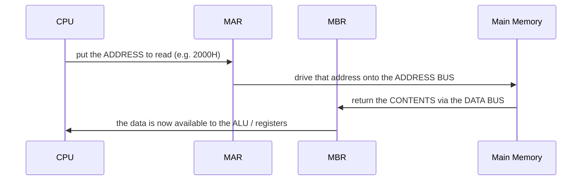

- The **MAR holds the ADDRESS** — its width equals the **address bus width**, and therefore determines **how much memory the CPU can address**.
- The **MBR holds the DATA** — its width equals the **data bus width**, and therefore determines **how many bits move per transfer**.

**Previous Year Question List from this Topic:**

- [ছোট প্রসেসরের (Microprocessor) কাজ এক নজরে এবং কী কী?](../written-answers/microprocessor-and-computer-architecture.md?plain=1#L24)
- [Maximum three word complete this below section:](../written-answers/microprocessor-and-computer-architecture.md?plain=1#L214)
- [ALU কী? এর কার্যপদ্ধতি চিত্রসহ বর্ণনা করুন।](../written-answers/microprocessor-and-computer-architecture.md?plain=1#L275)
- [Explain four type of register.](../written-answers/microprocessor-and-computer-architecture.md?plain=1#L829)
- [CPU এর অর্থ কি? এর কয়টি অংশ ও কি কি?](../written-answers/microprocessor-and-computer-architecture.md?plain=1#L970)
- [Central Processing Unit (CPU) -এর প্রধান কাজ কী? একটি চিত্রের সাহায্যে CPU-এর বিভিন্ন অংশ বর্ণনা করুন?](../written-answers/microprocessor-and-computer-architecture.md?plain=1#L1269)
- [What is Register? Write down the name of 5 CPU Register.](../written-answers/microprocessor-and-computer-architecture.md?plain=1#L1436)
- [Explain the functions of ALU and Control Unit of a Computer.](../written-answers/microprocessor-and-computer-architecture.md?plain=1#L1777)
- [a) Describe the central processing parts of a computer with a diagram.](../written-answers/microprocessor-and-computer-architecture.md?plain=1#L1980)
- [(ক) Memory address register and Memory buffer register কী? Primary memory and Secondary memory-এর মধ্যে পার্থক্য লিখুন।](../written-answers/microprocessor-and-computer-architecture.md?plain=1#L3289)

**Previous Year MCQ List from this Topic:**

- [Which of the following is temporary storage used to hold data that is used for arithmetic and logical operations and storing its results?](../mcq-answers/microprocessor-and-computer-architecture.md?plain=1#L18)
- [______ are used to quickly accept, store and transfer data and instructions that are being used immediately by the CPU.](../mcq-answers/microprocessor-and-computer-architecture.md?plain=1#L27)
- [Which of the following registers is loaded with the contents of the memory location pointed by the PC?](../mcq-answers/microprocessor-and-computer-architecture.md?plain=1#L45)
- [Sequence Control Register আর কি নামে পরিচিত?](../mcq-answers/microprocessor-and-computer-architecture.md?plain=1#L153)
- [Microprocessor এর কোন অংশে ALU থাকে?](../mcq-answers/microprocessor-and-computer-architecture.md?plain=1#L171)
- [CPU fetches the instruction from memory according to value of-](../mcq-answers/microprocessor-and-computer-architecture.md?plain=1#L270)
- [ALU stores the computed result immediately in](../mcq-answers/microprocessor-and-computer-architecture.md?plain=1#L279)
- [Central Processing Unit is combination of-](../mcq-answers/microprocessor-and-computer-architecture.md?plain=1#L297)
- [The control unit of a microprocessor-](../mcq-answers/microprocessor-and-computer-architecture.md?plain=1#L306)
- [Register circuit is not use in-](../mcq-answers/microprocessor-and-computer-architecture.md?plain=1#L234)
- [Arithmetic and Logical operation এর ডাটা কাজের সময় কোথায় রাখা হয়?](../mcq-answers/microprocessor-and-computer-architecture.md?plain=1#L506)


---

### The Flag Register

> The **FLAG (STATUS) REGISTER is a special register in which each individual BIT records a particular CONDITION or STATUS resulting from the last operation performed by the ALU.** Conditional branch instructions test these bits to decide whether to jump.

**The 8086 flag register is 16 bits wide, of which only 9 bits are used** — 6 status flags and 3 control flags.

```
 15  14  13  12  11  10   9   8   7   6   5   4   3   2   1   0
┌───┬───┬───┬───┬───┬───┬───┬───┬───┬───┬───┬───┬───┬───┬───┬───┐
│ — │ — │ — │ — │ OF│ DF│ IF│ TF│ SF│ ZF│ — │ AF│ — │ PF│ — │ CF│
└───┴───┴───┴───┴───┴───┴───┴───┴───┴───┴───┴───┴───┴───┴───┴───┘
                  └── CONTROL flags ──┘   └──── STATUS flags ────┘
```

#### The six STATUS (conditional) flags — set BY the ALU

| Flag | Name | Set (= 1) when … |
|---|---|---|
| **CF** | **Carry Flag** | The result produced a **carry out of the MOST significant bit** (or a borrow) — an **unsigned overflow** |
| **PF** | **Parity Flag** | The **low-order 8 bits** of the result contain an **EVEN number of 1s** |
| **AF** | **Auxiliary Carry Flag** | A carry occurred **from bit 3 to bit 4** — used by **BCD arithmetic** (DAA/DAS) |
| **ZF** | **Zero Flag** | The **result is ZERO** |
| **SF** | **Sign Flag** | The **MSB of the result is 1** — i.e. the result is **negative** in 2's complement |
| **OF** | **Overflow Flag** | A **SIGNED overflow** occurred — the result is too large/small for the signed range |

#### The three CONTROL flags — set BY the programmer, to control processor behaviour

| Flag | Name | What it does |
|---|---|---|
| **TF** | **Trap Flag** | **TF = 1 puts the processor into SINGLE-STEP mode** — an internal interrupt (INT 1) occurs after **every instruction**, so a **debugger** can examine the state step by step. TF = 0 → normal execution |
| **IF** | **Interrupt Flag** | **IF = 1 ENABLES maskable hardware interrupts** on the INTR pin; **IF = 0 DISABLES them**. Set with **STI**, cleared with **CLI**. Used to protect a critical section from being interrupted. *(NMI cannot be masked by IF.)* |
| **DF** | **Direction Flag** | Controls the direction of **STRING operations** (MOVS, CMPS, SCAS). **DF = 0 → auto-INCREMENT** SI/DI (process the string **left to right, from low address upward**); **DF = 1 → auto-DECREMENT** (process it **right to left**). Set with **STD**, cleared with **CLD** |

> **The exam question:** *"In an arithmetic operation the result has an even number of 1s, and in another the result is zero. Which flags are affected?"*
> ### ✅ **Even number of 1s → the PARITY FLAG (PF) is SET to 1.** **Result is zero → the ZERO FLAG (ZF) is SET to 1** (and, because zero contains zero 1s, which is an even count, **PF is also set**, while SF = 0 and CF = 0).

> **"How many bits is the 8086 flag register?"** → ### **16 bits** (9 of them used).

**Previous Year Question List from this Topic:**

- [Flag Register কী? Intel 8086 Microprocessor-এর Control Flag গুলোর কাজ লিখুন।](../written-answers/microprocessor-and-computer-architecture.md?plain=1#L716)
- [When does the parity bit occur in the microprocessors? What does it do?](../written-answers/microprocessor-and-computer-architecture.md?plain=1#L1356)
- [১২. 8086 মাইক্রোপ্রসেসর এর Flag Register কত বিটের?](../written-answers/microprocessor-and-computer-architecture.md?plain=1#L1405)
- [In an arithmetic operation the result has even number of 1s and for another operation the result is zero. Now write the the present status of the flag register.](../written-answers/microprocessor-and-computer-architecture.md?plain=1#L1718)
- [What are the difference between 8086 and 8088 microprocessors? Mention the flags of 8086 micriprocessor.](../written-answers/microprocessor-and-computer-architecture.md?plain=1#L2070)

**Previous Year MCQ List from this Topic:**

- [Which one is not the flag of the 8086 Microprocessor?](../mcq-answers/microprocessor-and-computer-architecture.md?plain=1#L63)


---

### The System Bus

> A **BUS is a set of PARALLEL CONDUCTORS (wires) that carries information between the components of a computer.** The **SYSTEM BUS is the main pathway connecting the CPU, main memory and I/O devices**, and it consists of **THREE buses: the Address bus, the Data bus and the Control bus.**

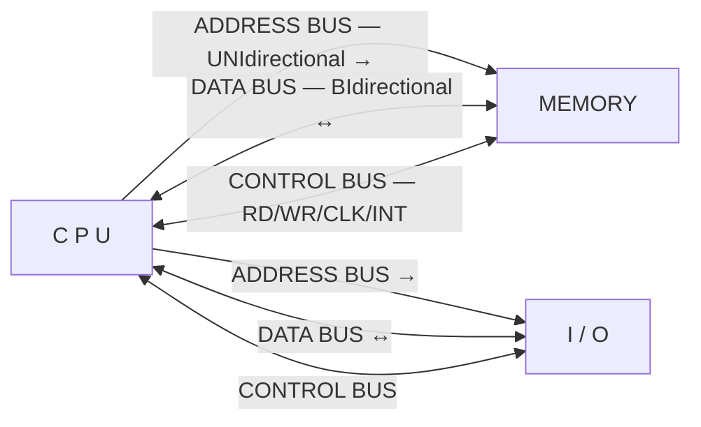

| Bus | Direction | Carries | Width determines |
|---|---|---|---|
| **ADDRESS BUS** | **UNIDIRECTIONAL** — CPU → memory/IO only | The **ADDRESS** of the memory location or I/O port to be accessed | **How much memory can be addressed** — n address lines → **2ⁿ locations** |
| **DATA BUS** | **BIDIRECTIONAL** ↔ | The **actual DATA** being read or written | **How many bits move at once** — it defines the processor's "**word size**" (8-bit, 16-bit, 32-bit, 64-bit) |
| **CONTROL BUS** | **Bidirectional** (individual lines are unidirectional) | The **CONTROL and TIMING signals** — MEMR, MEMW, IOR, IOW, READ/WRITE, CLOCK, RESET, INTERRUPT REQUEST, INTERRUPT ACKNOWLEDGE, BUS REQUEST/GRANT | How operations are **sequenced and coordinated** |

> **The essential consequence to be able to state:**
> - **Address bus width → addressable memory.** 16 lines → 2¹⁶ = **64 KB** (the 8085). 20 lines → 2²⁰ = **1 MB** (the 8086). 32 lines → 2³² = **4 GB**. 64 lines → a theoretical 16 EB.
> - **Data bus width → throughput per cycle.** A 64-bit data bus moves eight bytes per transfer where an 8-bit bus moves one.

#### Other buses found in a typical microcomputer

| Bus | Use |
|---|---|
| **Internal / CPU bus** | Connects the ALU, registers and CU **inside** the processor |
| **Memory bus** | CPU ↔ RAM |
| **Front-Side Bus (FSB)** | CPU ↔ Northbridge chipset (older architectures) |
| **Expansion / I/O bus** | **PCI, PCI Express (PCIe)**, and the obsolete ISA — plug-in cards |
| **PCI Express (PCIe)** | The modern high-speed **serial, point-to-point** expansion bus — graphics cards, NVMe SSDs |
| **USB** | Universal Serial Bus — external peripherals |
| **SATA / NVMe** | Storage devices |
| **Backplane bus** | A common bus into which multiple boards plug |

**Synchronous vs asynchronous:** a **synchronous bus** transfers on the edges of a **shared clock** — simpler and faster, but every device must keep up. An **asynchronous bus** uses a **handshake** (request/acknowledge) with no clock — slower but able to mix fast and slow devices.

#### The USB bus

> **USB (Universal Serial Bus)** is a **serial, host-controlled, hot-pluggable** bus that connects peripherals to a computer with a single standard connector, supplies **power as well as data**, and supports up to **127 devices** through hubs.

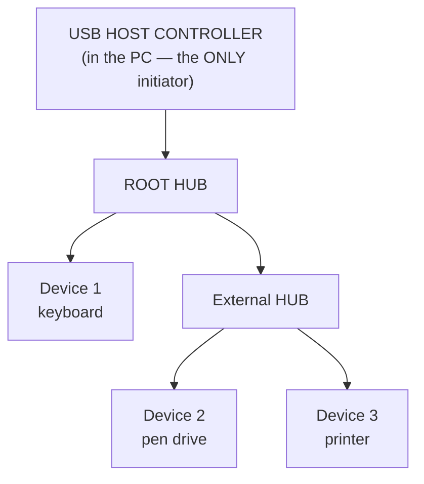

**Necessary components:** the **HOST CONTROLLER** (the master — all transfers are initiated by the host); the **ROOT HUB** and any **external hubs** (which provide the tiered star topology and distribute power); the **USB DEVICES** (each containing **endpoints**, which are the sources and sinks of data); the **CABLE** — in USB 2.0, **four wires: VBUS (+5 V), D+, D− (a differential pair) and GND**; and the **device DESCRIPTORS** that let the host identify and configure the device automatically.

**Transfer types:** **Control** (configuration), **Bulk** (large, error-checked, no timing guarantee — printers, storage), **Interrupt** (small, low-latency, polled — keyboard, mouse) and **Isochronous** (guaranteed bandwidth, no retransmission — audio, video).

**Speeds:** USB 1.1 Low 1.5 Mbps / Full 12 Mbps · **USB 2.0 High-Speed 480 Mbps** · **USB 3.0 SuperSpeed 5 Gbps** · USB 3.1 10 Gbps · USB 3.2 20 Gbps · **USB4 / Thunderbolt 40 Gbps**.

**Advantages:** one connector for everything · **hot-pluggable** — no reboot · **plug and play** — automatic enumeration and driver loading · supplies **power** (USB-PD up to 240 W) · up to 127 devices · self-configuring, no jumpers or IRQ conflicts.

**Previous Year Question List from this Topic:**

- [(খ) Typical মাইক্রোকম্পিউটারে কী কী বাস থাকে। একটি মাইক্রোপ্রসেসর এর সাথে RAM, ROM এবং I/O এর কানেকশন বাস এর মাধ্যমে দেখাও।](../written-answers/microprocessor-and-computer-architecture.md?plain=1#L891)
- [(ক) System bus কী? বিভিন্ন প্রকার System bus সম্পর্কে সচিত্র আলোচনা করুন।](../written-answers/microprocessor-and-computer-architecture.md?plain=1#L1630)
- [Write down the necessary components of a USB bus with block diagram.](../written-answers/microprocessor-and-computer-architecture.md?plain=1#L1890)

**Previous Year MCQ List from this Topic:**

- [The address bus flow in——](../mcq-answers/microprocessor-and-computer-architecture.md?plain=1#L54)
- [Communication path between a computer microprocessor and main memory is called:](../mcq-answers/microprocessor-and-computer-architecture.md?plain=1#L99)
- [Physical connection between Microprocessor Memory and other parts is called-](../mcq-answers/microprocessor-and-computer-architecture.md?plain=1#L225)
- [A single communication system that transfers and connects the data between major components inside a computer is-](../mcq-answers/microprocessor-and-computer-architecture.md?plain=1#L243)
- [USB stands for-](../mcq-answers/microprocessor-and-computer-architecture.md?plain=1#L252)
- [Which bus used to connect the monitor to the CPU?](../mcq-answers/microprocessor-and-computer-architecture.md?plain=1#L315)
- [Intel 8086 microprocessor এর বহিঃস্থ Address bus এর width কত bit হয়?](../mcq-answers/microprocessor-and-computer-architecture.md?plain=1#L162)


---

### Microprocessor vs Microcontroller

> A **MICROCONTROLLER is a COMPLETE SMALL COMPUTER ON A SINGLE CHIP** — it contains the **CPU, RAM, ROM/Flash, I/O ports, timers, serial ports and often ADCs — all integrated together**, and is designed to control a **single dedicated embedded application**.

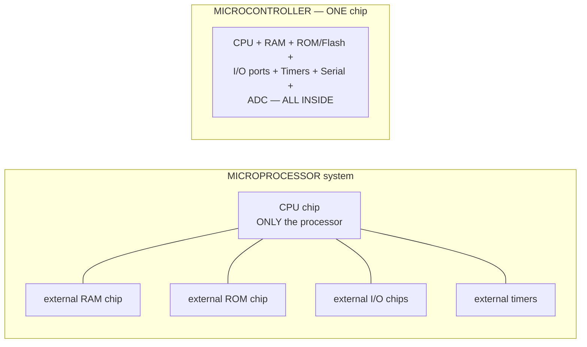

#### The key comparison

| Point | **MICROPROCESSOR** | **MICROCONTROLLER** |
|---|---|---|
| **Contains** | **ONLY the CPU** — ALU, CU, registers | **CPU + RAM + ROM + I/O + timers + serial + ADC** on one chip |
| **Memory** | **EXTERNAL** RAM and ROM required | **INTERNAL** (built in), usually small |
| **I/O ports** | **External** interfacing chips needed (8255, 8251) | **Built-in** I/O ports |
| **Chip count in a system** | **Many** — CPU + memory + I/O + support chips | ✅ **ONE** |
| **Purpose** | **GENERAL PURPOSE** — runs any program, an OS, many applications | **DEDICATED / SPECIFIC** — one embedded control task |
| **Cost of a complete system** | **High** | ✅ **Very low** |
| **Power consumption** | **High** (watts to over 100 W) | ✅ **Very low** (milliwatts) — can run for years on a battery |
| **Size of the system** | Large | ✅ **Compact** |
| **Clock speed** | **Very high** — GHz | Low — typically 1 MHz to 200 MHz |
| **Processing power** | **High** — 32/64-bit, cache, pipeline, multicore | Modest — 8/16/32-bit |
| **Architecture** | Usually **Von Neumann** (shared instruction/data memory) | Often **HARVARD** (separate program and data memory) |
| **Real-time response** | Not deterministic (an OS intervenes) | ✅ **Deterministic — real-time capable** |
| **Operating system** | Runs a full OS — Windows, Linux | Bare metal or a small **RTOS** |
| **Bit manipulation** | Limited | ✅ **Strong** — individual pins can be set/cleared |
| **Examples** | **Intel 8085, 8086, Pentium, Core i3/i5/i7, AMD Ryzen, ARM Cortex-A** | **Intel 8051, Atmel AVR (ATmega328 — Arduino), PIC, ARM Cortex-M, ESP32** |
| **Used in** | PCs, laptops, servers, workstations | Washing machines, microwave ovens, cars, remote controls, medical devices, **IoT**, robots |

> **The one-line distinction to lead with:** *a **microprocessor is the BRAIN only** and needs external organs to become a computer; a **microcontroller is the WHOLE BODY on one chip** — brain, memory and limbs together.*

#### The hardware-related differences specifically

1. **Integration** — the microcontroller has memory and peripherals **on-die**; the microprocessor has only the CPU core.
2. **Pin count and function** — a microcontroller's pins are mostly **general-purpose I/O pins** directly usable; a microprocessor's pins are dominated by the **address and data buses** needed to reach external memory.
3. **Bus availability** — the microprocessor **exposes its system bus externally**; a microcontroller keeps its buses internal, which is why it is faster per clock for on-chip access and far simpler to build around.
4. **Circuit complexity** — a microprocessor board needs memory decoders, latches and interface chips; a microcontroller needs little more than a **crystal, a few capacitors and power**.
5. **On-chip analogue hardware** — microcontrollers commonly include **ADCs, DACs, PWM generators and comparators**; microprocessors do not.

#### Applications of microcontrollers

**Home appliances** (washing machines, microwave ovens, air conditioners, rice cookers) · **automotive** (engine management, ABS, airbags, infotainment) · **medical devices** (glucose meters, infusion pumps, digital thermometers) · **industrial control** (PLCs, motor control, process automation) · **consumer electronics** (remote controls, cameras, toys) · **IoT and smart devices** (smart meters, sensors, home automation) · **robotics and drones** · **security systems** · **mobile-financial POS terminals and card readers**.

**Previous Year Question List from this Topic:**

- [What exactly is a microcontroller? What distinguishes a microprocessor from a microcontroller? Mention the differences between RISC and CISC microprocessors.](../written-answers/microprocessor-and-computer-architecture.md?plain=1#L128)
- [(ক) Microprocessor এবং Microcontroller এর মাঝে দুইটি পার্থক্য লিখুন।](../written-answers/microprocessor-and-computer-architecture.md?plain=1#L355)
- [Difference between Microprocessor and Microcontroller.](../written-answers/microprocessor-and-computer-architecture.md?plain=1#L1223)
- [Microcontroller এবং Microprocessor এর মধ্যে Hardware Related পার্থক্য গুলো লিখুন।](../written-answers/microprocessor-and-computer-architecture.md?plain=1#L1553)
- [Difference between microprocessor and micro-controller.](../written-answers/microprocessor-and-computer-architecture.md?plain=1#L1844)


---

### The 8086 Microprocessor

> The **Intel 8086 (1978) is a 16-bit microprocessor** with a **16-bit data bus, a 20-bit address bus (so it can address 2²⁰ = 1 MB of memory)**, 14 registers of 16 bits each, and a clock of 5–10 MHz. It introduced the **x86 architecture** that still underlies modern PC processors.

#### The internal architecture — BIU and EU

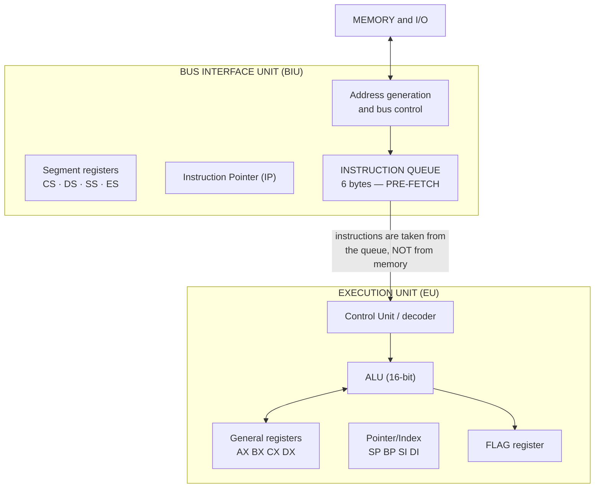

**The 8086 is divided into two independent units that work in PARALLEL:**

| Unit | Contains | Job |
|---|---|---|
| **BIU — Bus Interface Unit** | Segment registers (CS, DS, SS, ES), the **Instruction Pointer**, the address-generation adder, and the **6-byte instruction QUEUE** | **Fetches** instructions and data from memory; computes physical addresses; drives the buses |
| **EU — Execution Unit** | AX, BX, CX, DX, SP, BP, SI, DI, the **ALU**, the **flag register** and the control/decoding circuitry | **Decodes and EXECUTES** the instructions taken from the queue |

> **This is the key architectural idea of the 8086 — PIPELINING through PRE-FETCHING.** While the EU is busy executing one instruction, the **BIU is already fetching the next ones into the 6-byte queue**. The EU therefore rarely has to wait for memory, and the two units overlap — a primitive but genuine two-stage pipeline, and the ancestor of all modern pipelining. *(The queue is flushed on every branch, which is why branches are expensive.)*

#### Registers of the 8086

| Group | Registers | Use |
|---|---|---|
| **General purpose (16-bit, splittable into 8-bit halves)** | **AX** (AH/AL) — **A**ccumulator · **BX** (BH/BL) — **B**ase · **CX** (CH/CL) — **C**ounter · **DX** (DH/DL) — **D**ata | Arithmetic, addressing, loop counting, I/O port addressing |
| **Pointer and Index** | **SP** Stack Pointer · **BP** Base Pointer · **SI** Source Index · **DI** Destination Index | Stack and string/array addressing |
| **Segment** | **CS** Code · **DS** Data · **SS** Stack · **ES** Extra | Hold the **base of each 64 KB segment** |
| **Special** | **IP** Instruction Pointer · **FLAGS** | Next instruction offset; status |

#### Physical address generation — the segmented memory model

> The 8086 has **16-bit registers but a 20-bit address bus**, so it forms a 20-bit physical address by combining two 16-bit values:
>
> ### **Physical Address = (Segment register × 10H) + Offset**
> — i.e. the segment value is **shifted LEFT by 4 bits** and the offset is added.

**Worked example:** CS = 2000H, IP = 0050H
```
   Segment 2000H shifted left 4 bits →  2 0 0 0 0 H
   Offset                            +      0 0 5 0 H
                                     ─────────────────
   Physical address                   =  2 0 0 5 0 H
```
Each segment is **64 KB** (2¹⁶ offsets), and the total address space is **1 MB** (2²⁰).

#### 8086 vs 8088

| Point | **8086** | **8088** |
|---|---|---|
| **Internal architecture** | **16-bit** | **16-bit — IDENTICAL internally** |
| **EXTERNAL data bus** | ✅ **16 bits** | ⚠️ **8 bits** |
| **Instruction queue** | **6 bytes** | **4 bytes** |
| **Memory read of a 16-bit word** | **One** bus cycle | **Two** bus cycles |
| **Speed** | **Faster** | Slower (more bus cycles) |
| **Cost of the surrounding system** | Higher — needs 16-bit memory and peripherals | ✅ **Cheaper** — can use existing **8-bit** support chips |
| **Memory banks** | Two banks (odd/even) with **BHE** | A single bank |
| **Pin difference** | Pin 34 = **BHE̅** | Pin 34 = **SS0̅** ; and IO/M̅ is inverted (M/IO̅) |
| **Address bus** | **20 bits — 1 MB** | **20 bits — 1 MB (same)** |
| **Famously used in** | Various | ⭐ **The original IBM PC (1981)** — chosen precisely because the 8-bit bus made the machine cheaper |

> **The one-sentence answer:** *the 8086 and 8088 are **internally identical 16-bit processors**; the only significant difference is that the **8088's EXTERNAL data bus is 8 bits wide** (and its queue is 4 bytes instead of 6), which makes it slower but allows a much cheaper system built from 8-bit peripherals.*

#### 8085 vs 8086

| Point | **8085** | **8086** |
|---|---|---|
| **Word length** | **8-bit** | **16-bit** |
| **Data bus** | **8 bits** | **16 bits** |
| **Address bus** | **16 bits** | **20 bits** |
| **Addressable memory** | ✅ **2¹⁶ = 64 KB** | ✅ **2²⁰ = 1 MB** |
| **Clock speed** | 3–5 MHz | 5–10 MHz |
| **Instruction queue / pipelining** | ❌ **None** | ✅ **6-byte queue — pre-fetch pipelining** |
| **Internal units** | A single unit | **BIU + EU working in parallel** |
| **Memory model** | Flat | **Segmented** |
| **Multiply / Divide instructions** | ❌ No | ✅ **Yes** (MUL, IMUL, DIV, IDIV) |
| **Flags** | **5** (S, Z, AC, P, CY) | **9** (6 status + 3 control) |
| **Transistors** | ~6,500 | ~29,000 |
| **Multiprocessing support** | No | ✅ Yes (with the 8087 coprocessor, LOCK, min/max mode) |

**Previous Year Question List from this Topic:**

- [8086 microprocessor সম্বলিত একটি ডায়াগ্রাম বা ফিগার হতে ২টি পার্ট এর নাম উল্লেখ কর?](../written-answers/microprocessor-and-computer-architecture.md?plain=1#L510)
- [Flag Register কী? Intel 8086 Microprocessor-এর Control Flag গুলোর কাজ লিখুন।](../written-answers/microprocessor-and-computer-architecture.md?plain=1#L716)
- [১২. 8086 মাইক্রোপ্রসেসর এর Flag Register কত বিটের?](../written-answers/microprocessor-and-computer-architecture.md?plain=1#L1405)
- [What are the difference between 8086 and 8088 microprocessors? Mention the flags of 8086 micriprocessor.](../written-answers/microprocessor-and-computer-architecture.md?plain=1#L2070)

**Previous Year MCQ List from this Topic:**

- [Which one is not the flag of the 8086 Microprocessor?](../mcq-answers/microprocessor-and-computer-architecture.md?plain=1#L63)
- [Intel 8086 microprocessor এর বহিঃস্থ Address bus এর width কত bit হয়?](../mcq-answers/microprocessor-and-computer-architecture.md?plain=1#L162)
- [What is the Address bit for an 8-bit Microprocessor?](../mcq-answers/microprocessor-and-computer-architecture.md?plain=1#L198)
- [Intel 8086 মাইক্রোপ্রসেসর কত বিট রেজিস্টার থাকে?](../mcq-answers/microprocessor-and-computer-architecture.md?plain=1#L207)


---

### CPU vs GPU

> A **GPU (GRAPHICS PROCESSING UNIT)** is a specialised processor containing **thousands of small, simple cores** designed to perform the **SAME operation on ENORMOUS amounts of data SIMULTANEOUSLY** — massive **parallel** throughput, rather than fast single-task execution.

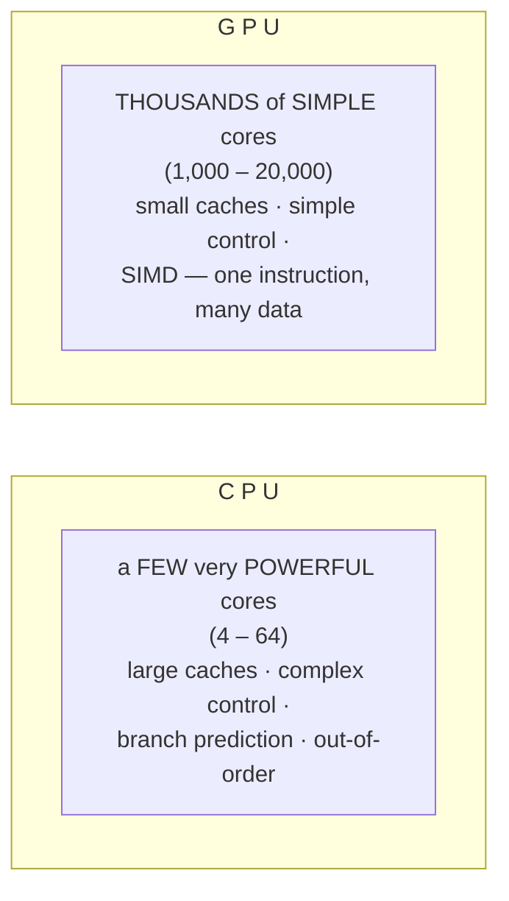

| Point | **CPU** | **GPU** |
|---|---|---|
| **Full form** | Central Processing Unit | **Graphics Processing Unit** |
| **Number of cores** | **Few** — 4 to 64, each very powerful | ✅ **THOUSANDS** of small, simple cores |
| **Designed for** | **LATENCY** — finish **one task as fast as possible** | ✅ **THROUGHPUT** — finish **an enormous number of tasks in parallel** |
| **Processing style** | **SERIAL / task parallel**, complex branching logic | ✅ **MASSIVELY PARALLEL — SIMD** (Single Instruction, Multiple Data) |
| **Cache** | **Large** (L1/L2/L3, tens of MB) | Small per core; relies on **very high memory bandwidth** instead |
| **Control logic** | **Very complex** — out-of-order execution, branch prediction, speculation | **Simple** — most of the die is arithmetic units |
| **Clock speed** | Higher (3–5 GHz) | Lower (1–2 GHz) |
| **Memory** | System RAM, lower bandwidth, low latency | **Dedicated VRAM (GDDR6/HBM)** — very high bandwidth |
| **Flexibility** | ✅ **General purpose — runs anything**, including the OS | Specialised — poor at branching, sequential and OS work |
| **Power** | 65–150 W | 150–700 W |
| **Best at** | Operating systems, databases, business logic, branching code, **sequential** tasks | ✅ **Graphics rendering, matrix and vector maths, image/video processing, DEEP LEARNING, scientific simulation, cryptocurrency mining** |
| **Analogy** | **A few PhD professors** — each can solve a very hard problem alone | **A thousand school students** — useless on one hard problem, unbeatable at a million simple sums |

#### The functions of a GPU

1. **Render 2D and 3D graphics** — the original purpose: transform vertices, rasterise triangles, shade pixels.
2. **Apply shaders, textures, lighting and shadows.**
3. **Video encoding and decoding** (hardware H.264/H.265/AV1).
4. **Drive the display** — resolution, refresh rate, multiple monitors.
5. **GPGPU — General-Purpose computing on the GPU**: through **CUDA** (NVIDIA) or **OpenCL**, the GPU is used for **any massively parallel computation**.
6. **Accelerate AI and MACHINE LEARNING** ⭐ — training a neural network is overwhelmingly **matrix multiplication**, which is exactly what a GPU does best. **This is why the modern AI boom happened on GPUs**, and why NVIDIA became a trillion-dollar company.
7. **Scientific computing and simulation** — weather, molecular dynamics, finite element analysis.
8. **Cryptocurrency mining** and other brute-force parallel hashing.

> **The reason the two coexist:** a computer needs **both**. The CPU runs the operating system and all the branching, decision-heavy logic; the GPU is handed the large, uniform, parallel numeric work. Neither can replace the other — they are **complementary**, which is why every AI server contains a modest CPU and several very expensive GPUs.

**Previous Year Question List from this Topic:**

- [b) Compare and contrast between CPU and GPU.](../written-answers/microprocessor-and-computer-architecture.md?plain=1#L71)
- [GPU stands for __________?](../written-answers/microprocessor-and-computer-architecture.md?plain=1#L188)
- [What is the function of GPU?](../written-answers/microprocessor-and-computer-architecture.md?plain=1#L677)


---

### DMA — Direct Memory Access

> **DMA (DIRECT MEMORY ACCESS) is a technique by which an I/O device transfers data DIRECTLY TO or FROM MAIN MEMORY WITHOUT the data passing through the CPU**, controlled by a dedicated **DMA Controller (DMAC)**.

#### Why DMA is needed — the problem it solves

Without DMA, every byte moving between a disk and memory must be **read into a CPU register and then written out again** — this is called **programmed I/O**. Transferring a 1 GB file would occupy the CPU for **every single byte**, executing perhaps a billion instruction pairs and doing no useful work at all.

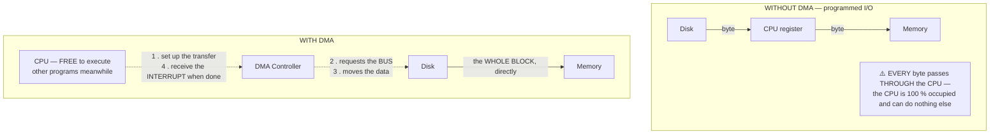

#### How DMA works — the steps

1. The **CPU programs the DMA controller**: the **source address, the destination address, the number of bytes (word count)** and the direction of transfer.
2. The CPU then **continues with other work**.
3. When the I/O device is ready, it signals **DRQ (DMA Request)** to the controller.
4. The DMAC asserts **HOLD / BUS REQUEST** to the CPU, asking for control of the system bus.
5. The CPU finishes its current bus cycle, **relinquishes the bus** and replies with **HLDA / BUS GRANT**. *(This is called "cycle stealing".)*
6. The **DMAC becomes the bus master** and transfers the data **directly between the device and memory**, incrementing the address and decrementing the count.
7. When the count reaches zero, the DMAC **releases the bus and raises an INTERRUPT** to tell the CPU that the transfer is complete.

#### Why DMA is essential for HIGH-SPEED I/O devices

| Reason | Explanation |
|---|---|
| **1. Speed** | The DMAC moves a whole block at **bus speed**; the CPU would need several instructions per byte |
| **2. The CPU is freed** | The processor executes other programs during the transfer — **true parallelism** between I/O and computation |
| **3. Bulk transfer** | A disk or network card delivers data in **blocks of kilobytes**, which suits DMA perfectly |
| **4. Reduced interrupt load** | **ONE interrupt per BLOCK** instead of one per byte or word |
| **5. Matching device speed** | A modern SSD delivers **7 GB/s**; no CPU-mediated byte loop could keep up, and data would be lost |
| **6. Lower CPU utilisation and power** | Large transfers cost almost no CPU time |

**Devices that use DMA:** hard disks and SSDs, network interface cards, graphics cards, sound cards, USB controllers, and memory-to-memory block copies.

**Modes of DMA transfer:** **Burst (block) mode** — the whole block in one bus seizure, fastest but the CPU stalls · **Cycle-stealing mode** — one word at a time, interleaved with CPU cycles, the usual compromise · **Transparent mode** — transfers only when the CPU is not using the bus, no CPU slowdown but slowest.

**Previous Year Question List from this Topic:**

- [(b) What is DMA? Why it is used for high-speed I/O devices?](../written-answers/microprocessor-and-computer-architecture.md?plain=1#L1489)

**Previous Year MCQ List from this Topic:**

- [Which mode of memory access is the fastest?](../mcq-answers/microprocessor-and-computer-architecture.md?plain=1#L371)


---

### Peripheral Interfacing — 8255 and SPI

#### The 8255 Programmable Peripheral Interface

> The **Intel 8255 PPI is a PROGRAMMABLE PARALLEL I/O interfacing chip** that provides **24 I/O lines arranged in three 8-bit ports (A, B and C)**, whose direction and mode can be **configured by software** rather than by wiring.

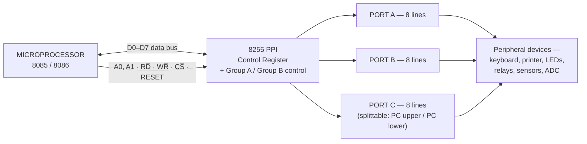

**The four internal addresses** are selected by the **A1 A0** lines: `00` → Port A, `01` → Port B, `10` → Port C, `11` → the **Control Register**.

**The steps necessary to communicate through the 8255:**

1. **Connect the hardware** — the data bus D0–D7 to the CPU; **A0 and A1** to the low address lines to select the port; **CS̅** from the address decoder; **RD̅ and WR̅** from the control bus; **RESET**.
2. **Decode the addresses** — assign the four port addresses (e.g. 80H, 81H, 82H, 83H).
3. **Determine the required configuration** — which ports are inputs, which outputs, and in which mode.
4. **Construct the CONTROL WORD** — an 8-bit value describing that configuration.
5. **WRITE the control word to the CONTROL REGISTER** (address `11`) — this is the initialisation step, and **must be done before any data transfer**.
   ```asm
   MVI A, 90H        ; control word: mode 0, Port A = INPUT, Ports B & C = OUTPUT
   OUT 83H           ; write it to the CONTROL register
   ```
6. **Transfer data** — use `IN <port address>` to read an input port and `OUT <port address>` to write an output port.
   ```asm
   IN  80H           ; read Port A (input)
   OUT 81H           ; write to Port B (output)
   ```
7. **Handle handshaking** if mode 1 or 2 is used — test the status bits in **Port C** (or use the interrupt output) before transferring.

**The control word format (bit 7 = 1 → I/O mode):**

| Bit | Meaning |
|---|---|
| **D7** | **1 = I/O mode**, 0 = bit set/reset mode for Port C |
| **D6 D5** | **Group A mode** — 00 = Mode 0, 01 = Mode 1, 1X = Mode 2 |
| **D4** | Port A — **1 = input, 0 = output** |
| **D3** | Port C upper — 1 = input, 0 = output |
| **D2** | **Group B mode** — 0 = Mode 0, 1 = Mode 1 |
| **D1** | Port B — 1 = input, 0 = output |
| **D0** | Port C lower — 1 = input, 0 = output |

**The three modes:** **Mode 0 — simple I/O** (no handshaking; ports are just latched inputs or outputs) · **Mode 1 — strobed I/O** (handshaking signals taken from Port C — STB̅, IBF, INTR) · **Mode 2 — bidirectional** (Port A only, both input and output with full handshaking).

#### SPI — Serial Peripheral Interface

> **SPI is a SYNCHRONOUS, FULL-DUPLEX, MASTER–SLAVE SERIAL communication bus** used for short-distance communication between a microcontroller and peripherals such as sensors, SD cards, displays and flash memory.

**The four signal lines:**

| Line | Name | Purpose |
|---|---|---|
| **SCLK** | Serial Clock | Generated **by the MASTER** — synchronises every bit |
| **MOSI** | Master Out, Slave In | Data **from master to slave** |
| **MISO** | Master In, Slave Out | Data **from slave to master** |
| **SS̅ / CS̅** | Slave Select | One line **per slave** — pulled **LOW** to select that device |

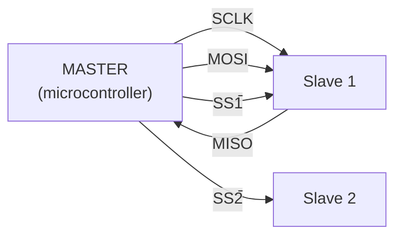

#### Advantages of SPI (serial) over a PARALLEL interface

| # | Advantage | Explanation |
|---|---|---|
| **1** | **Far FEWER wires and PINS** | 4 lines instead of 8–32 data lines plus control — critical on a small microcontroller with limited pins |
| **2** | **No CLOCK SKEW** | In a parallel bus, the bits travel on separate wires of slightly different length and **arrive at slightly different times** — at high speed they can no longer be sampled together. A serial link has **only one data wire, so there is nothing to skew**. This is the fundamental reason **all modern high-speed buses (PCIe, SATA, USB, HDMI) are SERIAL** |
| **3** | **Higher achievable clock rates** | Because of the above, SPI can run at tens of MHz |
| **4** | **Lower cost** | Fewer PCB traces, smaller connectors, cheaper cable, simpler routing |
| **5** | **Less crosstalk and EMI** | Fewer parallel switching lines |
| **6** | **Full duplex** | Data flows **both ways simultaneously** on MOSI and MISO |
| **7** | **Simple protocol** | No addressing, no start/stop bits, no acknowledgement overhead — simpler than I²C |
| **8** | **Longer usable distance** | Parallel buses degrade badly with length |
| **9** | **Smaller physical size** | Fits sensors, SD cards and modules |

**Disadvantages of SPI:** it needs **one extra SS̅ pin per slave** (which limits the number of devices), has **no acknowledgement or error checking**, supports only **one master**, and works only over **short distances** on a single board.

**Previous Year Question List from this Topic:**

- [Explain the necessary steps to communicate through a programmable peripheral interfacing device (8255 Microprocessor).](../written-answers/microprocessor-and-computer-architecture.md?plain=1#L571)
- [Write down the necessary components of a USB bus with block diagram.](../written-answers/microprocessor-and-computer-architecture.md?plain=1#L1890)
- [What is SPI (Serial Peripheral Interface)? What are the advantages over parallel interface?](../written-answers/microprocessor-and-computer-architecture.md?plain=1#L2123)

**Previous Year MCQ List from this Topic:**

- [USB stands for-](../mcq-answers/microprocessor-and-computer-architecture.md?plain=1#L252)
- [What is the typical speed of USB version 3.0?](../mcq-answers/microprocessor-and-computer-architecture.md?plain=1#L398)


---

### I/O Interfacing — Memory-Mapped vs Isolated I/O

> A processor must reach its peripherals somehow. There are **exactly two schemes** for giving device registers an address, and the choice determines which instructions the programmer uses.

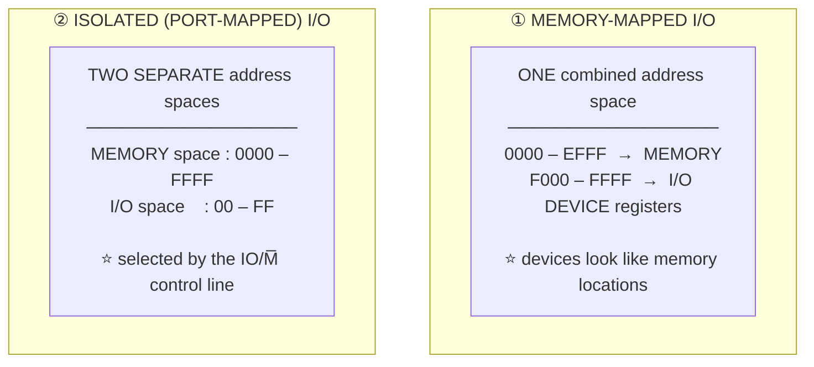

#### The comparison

| Point | ⭐ **MEMORY-MAPPED I/O** | ⭐ **ISOLATED (PORT-MAPPED) I/O** |
|---|---|---|
| **Address space** | ⭐ **ONE shared space — device registers occupy MEMORY addresses** | ⭐ **TWO separate spaces — memory and I/O are distinct** |
| ⭐ **Instructions used** | ⭐ **THE SAME ORDINARY MEMORY INSTRUCTIONS** — `MOV`, `LDA`, `STA`, `ADD`. **NO new instructions are required** | ⭐ **SPECIAL instructions — `IN` and `OUT`** |
| ⭐ **Are `IN` / `OUT` present?** | ❌ **NO — they do not exist / are not used** | ✅ **YES — they are essential** |
| **Control signals** | Only `RD̅` / `WR̅` (memory read/write) | Needs **`IO/M̅`** to say which space |
| **Usable memory** | ⚠️ **REDUCED** — every address given to a device is one fewer for RAM | ✅ **Full memory space available** |
| **Instruction set size** | ✅ Smaller — fewer instructions to implement | Larger |
| **Addressing modes for I/O** | ✅ **ALL memory addressing modes work on devices** | Limited — usually direct/indirect only |
| **Decoding hardware** | More address lines must be decoded | Simpler (fewer I/O addresses) |
| **Used by** | ⭐ **Motorola 68000, ARM, MIPS, RISC-V — most modern architectures** | ⭐ **Intel x86 (8085, 8086 and successors)** |

> ### **"Which feature is NOT applicable to memory-mapped I/O?"** → ### ✅ **"New instructions are required to access the device registers."**
>
> **That is precisely the point of memory-mapped I/O — NO new instructions are needed.** A device register is read with the same `MOV` you would use for a RAM location; that is the scheme's defining advantage.

> ### **"In a memory-mapped I/O system, which one is NOT present?"** → ### ✅ **`IN`** (and `OUT`).
>
> **Because the device lives in the memory space, the dedicated I/O instructions become unnecessary and are not used.** *(On an x86 they still exist in the instruction set, but a memory-mapped device is never accessed with them.)*

#### Why modern architectures prefer memory-mapped I/O

1. **A simpler, smaller instruction set** — no separate I/O instruction family to design, decode and verify.
2. ⭐ **The full power of the addressing modes** applies to devices — you can index into a device's register block, use pointers, and write device drivers in **ordinary C** (`*(volatile uint32_t*)0x4000A000 = 1;`) with no assembly.
3. **Address space is no longer scarce** — a 32- or 64-bit processor has far more addresses than it needs, so the old objection has evaporated.
4. **Uniformity** — DMA, caches and the MMU all work on addresses, so devices integrate naturally.

> ⚠️ **The one hazard of memory-mapped I/O: CACHING.** A device register may change by itself, and a write to it must actually reach the device. If the CPU cached it, the program would read a stale value. **Memory-mapped device regions must therefore be marked NON-CACHEABLE, and the variables declared `volatile`** so the compiler does not optimise the accesses away.

#### The three ways a processor transfers I/O data

| Method | How the transfer happens | CPU involvement |
|---|---|---|
| ⭐ **Programmed I/O (polling)** | The CPU **repeatedly checks** the device's status flag and moves each byte itself | ⚠️ **100 % — the CPU is fully occupied and mostly waiting** |
| ⭐ **Interrupt-driven I/O** | The device **raises an INTERRUPT** when ready; the CPU services it and returns | **Moderate** — the CPU works on other things between interrupts |
| ⭐ **DMA — Direct Memory Access** | ⭐ **A DMA controller moves the data DIRECTLY between the device and memory**, bypassing the CPU entirely | ✅ **Minimal — set up the transfer, then one interrupt at the end** |

> ### **"Which mode of memory access is the FASTEST?"** → ### ✅ **DMA.**
>
> **Why: DMA removes the CPU from the data path altogether.** In programmed I/O every byte passes through a CPU register (two instructions per byte); with DMA the controller moves a whole block at **bus speed** while the processor executes other programs. For a modern SSD delivering gigabytes per second, **no CPU-mediated loop could keep up** — DMA is not an optimisation but a necessity. *(See the dedicated DMA theory for the handshake sequence.)*

**Previous Year MCQ List from this Topic:**

- [Which feature is not applicable for memory mapped I/O?](../mcq-answers/microprocessor-and-computer-architecture.md?plain=1#L36)
- [In a memory-mapped I/O system, which one is not present?](../mcq-answers/microprocessor-and-computer-architecture.md?plain=1#L72)
- [Which mode of memory access is the fastest?](../mcq-answers/microprocessor-and-computer-architecture.md?plain=1#L371)


---

## Memory Hierarchy & Storage

### The Memory Hierarchy

> **COMPUTER MEMORY is the part of a computer that STORES data, instructions and results, either temporarily or permanently**, so that the CPU can access them.

> The **MEMORY HIERARCHY arranges storage in LEVELS, from very fast, very small and very expensive at the top, down to very slow, very large and very cheap at the bottom.** It exists because **no single technology is simultaneously fast, large and affordable.**

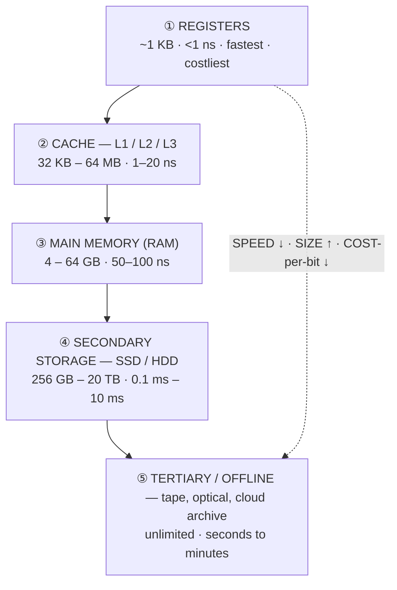

| Level | Technology | Typical size | Access time | Cost/bit | Volatile? | Managed by |
|---|---|---|---|---|---|---|
| **1. Registers** | Flip-flops inside the CPU | **Bytes to a few KB** | ✅ **< 1 ns (1 clock cycle)** | **Highest** | Yes | The **compiler** |
| **2. Cache (L1/L2/L3)** | **SRAM** | 32 KB – 64 MB | **1 – 20 ns** | Very high | Yes | The **hardware** |
| **3. Main memory** | **DRAM** | 4 – 64 GB | **50 – 100 ns** | Medium | Yes | The **operating system** |
| **4. Secondary storage** | **SSD (flash)** / **HDD (magnetic)** | 256 GB – 20 TB | **SSD ~50–100 µs · HDD ~5–10 ms** | Low | ❌ **NON-volatile** | The OS / file system |
| **5. Tertiary / offline** | Magnetic tape, optical disc, cloud archive | Effectively unlimited | **Seconds to minutes** | **Lowest** | Non-volatile | Humans / archival software |

> **The ordering to memorise — FASTEST to SLOWEST:**
> ### **Register → Cache (L1 → L2 → L3) → Main memory (RAM) → SSD → Hard disk → Optical disc → Magnetic tape**
>
> And **capacity and cost-per-bit run in exactly the OPPOSITE direction.**

> **Why the hierarchy works at all — the PRINCIPLE OF LOCALITY.** Programs do not access memory randomly: they access a **small subset repeatedly** (**temporal locality** — what was used recently will be used again) and **neighbouring addresses** (**spatial locality** — arrays and sequential code). Keeping that small working set in the fast levels therefore gives **most of the speed of the fastest level at nearly the cost of the cheapest** — which is the entire justification for the design.

#### The functions of memory

1. **Store the program instructions** that the CPU must execute.
2. **Store the data** to be processed.
3. **Store intermediate results** during computation.
4. **Store the final results** until output or saved.
5. **Store the operating system** and system software while running.
6. **Provide fast access** to the CPU, matching its speed as closely as possible.
7. **Retain data** — permanently in secondary storage, temporarily in primary.
8. **Support multitasking** by holding several processes at once.

#### The classification of memory

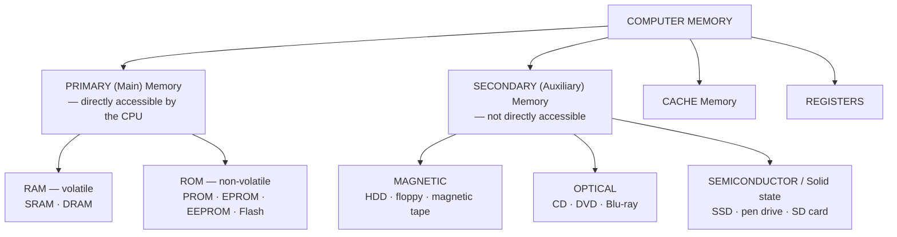

**Factors by which memory is classified:** **volatility** (does it lose data when power is removed?) · **access method** (random, sequential, direct, associative) · **read/write capability** (read-only, read-write, write-once) · **technology** (semiconductor, magnetic, optical) · **speed / access time** · **capacity** · **cost per bit** · **location** (internal vs external) · **physical characteristics** (erasable, non-erasable).

> **"Identify which are semi-conductor, optical and magnetic":**
> - **SEMICONDUCTOR** — RAM, ROM, **cache, SSD, pen drive, memory card, EEPROM, flash**
> - **MAGNETIC** — **Hard disk (HDD), floppy disk, magnetic tape, magnetic drum**
> - **OPTICAL** — **CD-ROM, CD-R/RW, DVD, Blu-ray**

> **"Which of the following is NON-VOLATILE memory — SRAM, DRAM, ROM, HDD?"**
> ### ✅ **BOTH ROM and HDD are non-volatile.** SRAM and DRAM are **volatile** — they lose their contents the instant power is removed. If exactly one answer is required, **ROM** is the intended one, since it is the non-volatile **memory** (the HDD being a storage device).

#### Access time and transfer time

| Term | Definition |
|---|---|
| **ACCESS TIME (latency)** | The **time from issuing a request until the FIRST bit of data is available**. For a disk: **seek time + rotational latency**. For RAM: the address-to-valid-data delay |
| **TRANSFER TIME** | The **time actually spent MOVING the data** once access has begun = **amount of data ÷ transfer rate** |
| **Total time** | **Access time + Transfer time** (plus queuing and controller overhead) |

**Worked illustration:** a disk with an average seek time of 5 ms, a rotation speed of 7200 rpm and a transfer rate of 100 MB/s, reading 1 MB:
- Average **rotational latency** = half a revolution = (60 / 7200) / 2 = **4.17 ms**
- **Access time** = 5 + 4.17 = **9.17 ms**
- **Transfer time** = 1 MB ÷ 100 MB/s = **10 ms**
- **Total ≈ 19.2 ms**

> **The lesson:** for **small, random** reads the **access time dominates** (and this is exactly where an SSD, with no seek or rotation, wins by a factor of a hundred); for **large, sequential** reads the **transfer time dominates**.

**Previous Year Question List from this Topic:**

- [Compare RAM, ROM, cache memory, and secondary storage in terms of speed and usage.](../written-answers/microprocessor-and-computer-architecture.md?plain=1#L2208)
- [কম্পিউটার স্মৃতি বলতে কী বোঝায়? কম্পিউটারের স্মৃতির শ্রেণিবিভাগ আলোচনা করুন।](../written-answers/microprocessor-and-computer-architecture.md?plain=1#L2380)
- [Differentiate among CPU register, Cache memory, Main memory and Secondary memory.](../written-answers/microprocessor-and-computer-architecture.md?plain=1#L2494)
- [Give classification of memory. Differentiate between RAM and ROM.](../written-answers/microprocessor-and-computer-architecture.md?plain=1#L2703)
- [(ক) Data transfer rate এর ভিত্তিতে নিম্নোক্ত memory/storage device গুলোকে বেশী থেকে কম ক্রমানুসারে সাজান। (i) Flash drive (ii) SSD (iii) Cache memory (iv) DVD (…](../written-answers/microprocessor-and-computer-architecture.md?plain=1#L2856)
- [Which of the following is non volatile memory? (a) SRAM (b) DRAM (c) ROM (d) HDD](../written-answers/microprocessor-and-computer-architecture.md?plain=1#L2889)
- [(b) Here are given 4 types of different memory. Which memory is the faster? Write in sequence order in the following figure: Register, Hard disk, Cache, RAM.](../written-answers/microprocessor-and-computer-architecture.md?plain=1#L2929)
- [(b) Outline the functions performed by memory. List some factors upon which memory can be classified.](../written-answers/microprocessor-and-computer-architecture.md?plain=1#L3053)
- [(c) Given below the list of some memory devices. Identify which are semi-conductor, optical and magnetic memory. CD, RAM, Floppy Disk, Hard Disk, ROM, DVD.](../written-answers/microprocessor-and-computer-architecture.md?plain=1#L3120)
- [What is access time and transfer time?](../written-answers/microprocessor-and-computer-architecture.md?plain=1#L3228)
- [Write the Memory faster access time memory in top and lowest access time memory is below from the following memory: (Cache Memory, Register Memory, Main Memory,…](../written-answers/microprocessor-and-computer-architecture.md?plain=1#L3389)

**Previous Year MCQ List from this Topic:**

- [Considering computer memory speed, which one is correct order from highest to lowest?](../mcq-answers/microprocessor-and-computer-architecture.md?plain=1#L335)
- [Out of all the following, which one isn't a form of memory?](../mcq-answers/microprocessor-and-computer-architecture.md?plain=1#L353)
- [Which among the following is the fastest memory in a computer that holds information?](../mcq-answers/microprocessor-and-computer-architecture.md?plain=1#L362)
- [Which of the following is not a nonvolatile storage device?](../mcq-answers/microprocessor-and-computer-architecture.md?plain=1#L389)
- [Which of the following memory devices is not reprogrammable?](../mcq-answers/microprocessor-and-computer-architecture.md?plain=1#L452)
- [Main Memory কোনটি?](../mcq-answers/microprocessor-and-computer-architecture.md?plain=1#L488)
- [নিচের কোনটি সবচেয়ে দ্রুত Data transfer করতে পারে?](../mcq-answers/microprocessor-and-computer-architecture.md?plain=1#L497)
- [Which one can be used for read only?](../mcq-answers/microprocessor-and-computer-architecture.md?plain=1#L515)
- [Which is the faster memory?](../mcq-answers/microprocessor-and-computer-architecture.md?plain=1#L524)
- [Which of the following terms is the most closely related to main memory?](../mcq-answers/microprocessor-and-computer-architecture.md?plain=1#L533)
- [Which unit holds data permanently?](../mcq-answers/microprocessor-and-computer-architecture.md?plain=1#L542)
- [Magnetic tape can serve as—](../mcq-answers/microprocessor-and-computer-architecture.md?plain=1#L551)
- [Which of the following is internal memory?](../mcq-answers/microprocessor-and-computer-architecture.md?plain=1#L560)
- [Which memory is called as primary memory?](../mcq-answers/microprocessor-and-computer-architecture.md?plain=1#L578)
- [কোন বৈশিষ্ট্যের কারণে অজগ স্থায়ী স্মৃতি-স্টোরেজ হিসেবে ব্যবহার অনুপযোগী?](../mcq-answers/microprocessor-and-computer-architecture.md?plain=1#L443)


---

### RAM vs ROM

> **RAM (RANDOM ACCESS MEMORY) is the VOLATILE, READ-WRITE main memory** in which the programs and data **currently in use** are held. **ROM (READ ONLY MEMORY) is NON-VOLATILE memory whose contents are written once and normally only read** — it holds the firmware that starts the machine.

| Point | **RAM** | **ROM** |
|---|---|---|
| **Full form** | **R**andom **A**ccess **M**emory | **R**ead **O**nly **M**emory |
| **Volatility** | ⚠️ **VOLATILE — contents are LOST when power is switched off** | ✅ **NON-VOLATILE — contents are RETAINED permanently** |
| **Read / Write** | ✅ **Both read and write** | **Read only** (or write only with a special process) |
| **Purpose** | **Temporary working storage** for the OS, running programs and data | **Permanent storage of firmware** — BIOS/UEFI, bootstrap loader, embedded control programs |
| **Speed** | ✅ **Faster** | Slower |
| **Capacity** | **Large** — GB | **Small** — KB to a few MB |
| **Cost per bit** | Higher | Lower |
| **Modifiable by the user** | ✅ Freely | Difficult or impossible |
| **Contents** | Change constantly | **Fixed** — written by the manufacturer |
| **CPU access** | Direct read and write | Direct read |
| **Examples / types** | **SRAM, DRAM, SDRAM, DDR3/4/5** | **MROM, PROM, EPROM, EEPROM, Flash** |
| **Analogy** | A **whiteboard** — written on and wiped constantly | A **printed book** — fixed once produced |
| **Present in** | Every computer, as the main memory | Every computer, holding the **BIOS**; and every embedded device |

#### The types of ROM

| Type | Full form | Programmable? | Erasable by | Reusable? |
|---|---|---|---|---|
| **MROM** | **Mask ROM** | Programmed **during manufacture** | ❌ Never | No |
| **PROM** | **Programmable ROM** | ✅ **ONCE**, by the user, with a PROM programmer ("burning" fuses) | ❌ Never | No |
| **EPROM** | **Erasable Programmable ROM** | ✅ Yes | ✅ **ULTRAVIOLET LIGHT** through a quartz window (~20 minutes), erasing the **whole chip** | Yes |
| **EEPROM** | ⭐ **Electrically Erasable Programmable ROM** | ✅ Yes | ✅ **ELECTRICAL signals — byte by byte, in-circuit**, no removal needed | ✅ Yes, ~10⁵ times |
| **Flash** | Flash memory (a fast EEPROM) | ✅ Yes | ✅ Electrically, **in BLOCKS** — much faster than EEPROM | ✅ Yes |

> **"What does EEPROM stand for?"** → ### **Electrically Erasable Programmable Read-Only Memory.**
> **"What does DRAM stand for?"** → ### **Dynamic Random Access Memory.**
> **"What does GPU stand for?"** → ### **Graphics Processing Unit.**

#### Primary vs Secondary memory

| Point | **PRIMARY (Main) memory** | **SECONDARY (Auxiliary) memory** |
|---|---|---|
| **CPU access** | ✅ **DIRECTLY accessible by the CPU** | ❌ **NOT directly** — data must first be **loaded into primary memory** |
| **Volatility** | Mostly **volatile** (RAM) | ✅ **Non-volatile** |
| **Speed** | ✅ **Much faster** — nanoseconds | Slower — microseconds (SSD) to milliseconds (HDD) |
| **Capacity** | Smaller — GB | ✅ **Much larger** — TB |
| **Cost per bit** | **High** | ✅ **Low** |
| **Purpose** | Holds **currently executing** programs and data | **Permanent storage** of all files, programs and backups |
| **Technology** | Semiconductor | Magnetic, optical, flash |
| **Portability** | Fixed inside the machine | Often **portable** (pen drive, external disk) |
| **Also called** | Main memory, internal memory | Auxiliary, external, backup storage |
| **Examples** | **RAM, ROM, cache, registers** | **HDD, SSD, CD/DVD, pen drive, memory card, magnetic tape** |

> **The relationship between the four levels** — CPU register → cache → main memory → secondary memory — is one of **decreasing speed and cost, and increasing size**, with each level acting as a **cache for the level below it**.

**Previous Year Question List from this Topic:**

- [DRAM stands for __________?](../written-answers/microprocessor-and-computer-architecture.md?plain=1#L2315)
- [What is stand for EEPROM?](../written-answers/microprocessor-and-computer-architecture.md?plain=1#L2344)
- [Write down the difference between RAM and ROM.](../written-answers/microprocessor-and-computer-architecture.md?plain=1#L2460)
- [Give classification of memory. Differentiate between RAM and ROM.](../written-answers/microprocessor-and-computer-architecture.md?plain=1#L2703)
- [(গ) Primary Memory and Secondary Memory এর উদাহরণসহ তুলনামূলক আলোচনা করুন।](../written-answers/microprocessor-and-computer-architecture.md?plain=1#L2771)
- [RAM and ROM difference লিখ?](../written-answers/microprocessor-and-computer-architecture.md?plain=1#L2977)
- [(a) Write the difference between: (i) RAM and ROM (ii) Open source software and Proproetary software.](../written-answers/microprocessor-and-computer-architecture.md?plain=1#L3011)
- [(ক) Memory address register and Memory buffer register কী? Primary memory and Secondary memory-এর মধ্যে পার্থক্য লিখুন।](../written-answers/microprocessor-and-computer-architecture.md?plain=1#L3289)
- [Difference between ROM and RAM.](../written-answers/microprocessor-and-computer-architecture.md?plain=1#L3440)

**Previous Year MCQ List from this Topic:**

- [Which of the following memory devices is not reprogrammable?](../mcq-answers/microprocessor-and-computer-architecture.md?plain=1#L452)
- [Main Memory কোনটি?](../mcq-answers/microprocessor-and-computer-architecture.md?plain=1#L488)
- [Which one can be used for read only?](../mcq-answers/microprocessor-and-computer-architecture.md?plain=1#L515)
- [Which of the following is internal memory?](../mcq-answers/microprocessor-and-computer-architecture.md?plain=1#L560)
- [Which memory is called as primary memory?](../mcq-answers/microprocessor-and-computer-architecture.md?plain=1#L578)
- [কোন বৈশিষ্ট্যের কারণে অজগ স্থায়ী স্মৃতি-স্টোরেজ হিসেবে ব্যবহার অনুপযোগী?](../mcq-answers/microprocessor-and-computer-architecture.md?plain=1#L443)


---

### SRAM vs DRAM

> **SRAM (STATIC RAM) stores each bit in a FLIP-FLOP made of 6 transistors**, which holds its value as long as power is applied — **no refreshing needed**. **DRAM (DYNAMIC RAM) stores each bit as a CHARGE on a tiny CAPACITOR with ONE transistor**, and because that charge **leaks away**, it must be **REFRESHED thousands of times per second**.

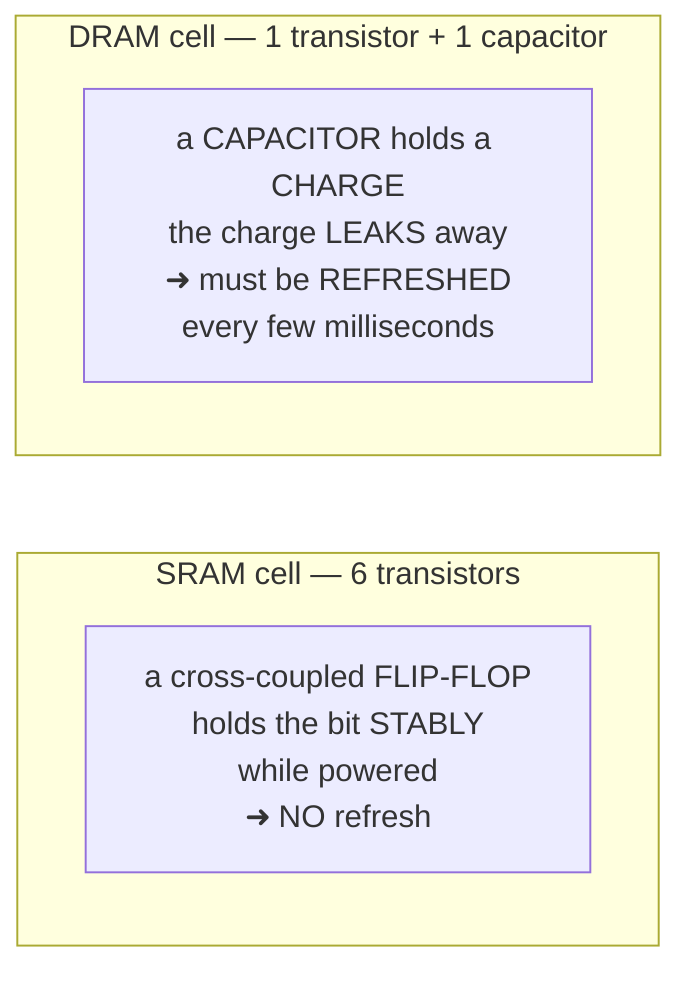

| Point | **SRAM** | **DRAM** |
|---|---|---|
| **Full form** | **Static** Random Access Memory | **Dynamic** Random Access Memory |
| **Storage element** | A **FLIP-FLOP — 6 transistors** per bit | ✅ **1 transistor + 1 CAPACITOR** per bit |
| **REFRESH required** | ❌ **NO** — static, holds its value | ⚠️ **YES — must be refreshed every few milliseconds** |
| **Speed** | ✅ **Very FAST** — 1–10 ns | Slower — 50–100 ns |
| **Density** | **Low** — a cell needs 6 transistors | ✅ **VERY HIGH** — far more bits per chip |
| **Capacity per chip** | Small — KB to MB | ✅ **Large — GB** |
| **Cost per bit** | ⚠️ **Very EXPENSIVE** | ✅ **CHEAP** |
| **Power consumption** | **Higher** when active; very low when idle | Lower when active; but **continuous refresh power** |
| **Heat produced** | More | Less |
| **Complexity of circuit** | Complex cell, **simple controller** | Simple cell, **complex controller** (refresh logic) |
| **Volatile?** | **Yes** | **Yes** |
| **Used as** | ⭐ **CACHE memory (L1, L2, L3), CPU registers, small embedded buffers** | ⭐ **MAIN MEMORY (the RAM sticks in a PC), graphics memory** |
| **Typical types** | — | **SDRAM, DDR, DDR2, DDR3, DDR4, DDR5, GDDR6, LPDDR** |

> **The economic logic — why a computer contains both:** SRAM is **ten times faster but roughly twenty times more expensive per bit** than DRAM. Building 16 GB of main memory from SRAM would be unaffordable and physically enormous; building the cache from DRAM would make it too slow to be worth having. So the design uses **a small amount of SRAM as cache in front of a large amount of cheap DRAM** — and the principle of locality makes that combination behave, most of the time, like a large fast memory.

#### Memory organisation, and memory modules

> **MEMORY ORGANISATION describes HOW memory is STRUCTURED and ARRANGED** — how the cells are laid out in rows and columns, how they are grouped into words, how addresses map to physical locations, and how the levels of the hierarchy are connected.

**It covers:** the **memory cell array** (rows × columns, addressed by row and column decoders) · the **word size** (how many bits are read at once) · the **address space** and address decoding · **banking and interleaving** (spreading consecutive addresses across banks so they can be accessed in parallel) · the hierarchy itself · and the **memory map** (which address ranges belong to RAM, ROM and memory-mapped I/O).

| Term | Meaning |
|---|---|
| **SIMM** | **Single In-line Memory Module** — the contacts on the two sides of the board are **electrically CONNECTED**, so they act as **one row** of pins. **32-bit data path**, 30 or 72 pins. Obsolete |
| **DIMM** | ⭐ **Dual In-line Memory Module** — the contacts on the two sides are **ELECTRICALLY INDEPENDENT**, giving **twice the pins in the same length**. **64-bit data path**, 168/184/240/288 pins. **All modern RAM is DIMM** (or SO-DIMM in laptops) |
| **Dual-channel RAM** | The memory **CONTROLLER** uses **TWO independent 64-bit channels in parallel**, giving a **128-bit effective path and roughly DOUBLE the bandwidth**. It requires **two (or four) identical modules installed in the correct matched slots** — usually the same colour on the motherboard. Triple-, quad- and eight-channel versions exist on servers |

#### Worked example — how much RAM can a 32-bit system address?

> **A 32-bit system has a 32-bit address bus, so it can generate 2³² distinct addresses. Each address identifies ONE BYTE.**

```
Number of addressable locations = 2³² = 4,294,967,296 bytes
                                = 4,294,967,296 / 1024        = 4,194,304 KB
                                = 4,194,304 / 1024            = 4,096 MB
                                = 4,096 / 1024                = 4 GB
```

> ### ✅ **A 32-bit system can address a MAXIMUM of 2³² bytes = 4 GB of RAM.**

> **The practical footnote:** the usable figure is **less than 4 GB** — typically 3.2–3.5 GB — because part of the address space is reserved for the **graphics card, BIOS and memory-mapped I/O**. A **64-bit** system can address **2⁶⁴ bytes = 16 EB (exabytes)** in theory, though current processors implement only 48 or 52 address lines (256 TB / 4 PB).

**The general formula:** with **n address lines**, the addressable space is **2ⁿ locations**; if each location holds **m bits**, the capacity is **2ⁿ × m bits**.

**"What is meant by a 32-bit/64-bit processor?"** — the number refers principally to the **width of the registers and the data path** (how many bits the CPU handles at once), and conventionally to the address space as well.

| Point | **32-bit processor** | **64-bit processor** |
|---|---|---|
| **Register / data width** | 32 bits | **64 bits** |
| **Max addressable RAM** | **4 GB** | **16 EB theoretical** (256 TB practical) |
| **Integer range (signed)** | ±2.1 × 10⁹ | **±9.2 × 10¹⁸** |
| **Performance** | Lower for large data | Higher — more data per operation, more registers |
| **Software compatibility** | Cannot run 64-bit software | ✅ **Can run BOTH** 32-bit and 64-bit software |
| **Examples** | Intel 80386, 80486, Pentium | **Intel Core i3/i5/i7/i9, AMD Ryzen, ARM64** |

**Previous Year Question List from this Topic:**

- [Difference between SRAM & DRAM also write Differences Cache Memory vs Flash Memory.](../written-answers/microprocessor-and-computer-architecture.md?plain=1#L2262)
- [What do you mean by memory organization? Write the different between SRAM and DRAM.](../written-answers/microprocessor-and-computer-architecture.md?plain=1#L2548)
- [What is dual channel RAM? Difference between single In-Line and Dual In-Line Memory Module.](../written-answers/microprocessor-and-computer-architecture.md?plain=1#L2600)
- [What is the difference between Dynamic RAM and Static RAM?](../written-answers/microprocessor-and-computer-architecture.md?plain=1#L2652)
- [Write down the difference between SRAM and DRAM.](../written-answers/microprocessor-and-computer-architecture.md?plain=1#L2821)
- [How Maximum size of memory (RAM) is needed that can be addressed by 32-bit system.](../written-answers/microprocessor-and-computer-architecture.md?plain=1#L3174)
- [(b) Difference between SRAM and DRAM.](../written-answers/microprocessor-and-computer-architecture.md?plain=1#L3354)
- [Difference between 32 bit Microprocessor and 64 bit Microprocessor with example. What is the meaning of 2.40GHz Microprocessor? Differentiate among Core Intel i…](../written-answers/microprocessor-and-computer-architecture.md?plain=1#L455)

**Previous Year MCQ List from this Topic:**

- [Which of the following uses the flip-flop circuit in a memory cell?](../mcq-answers/microprocessor-and-computer-architecture.md?plain=1#L434)
- [Which of the following memories needs refreshing?](../mcq-answers/microprocessor-and-computer-architecture.md?plain=1#L569)
- [The term LPDDR means-](../mcq-answers/microprocessor-and-computer-architecture.md?plain=1#L416)


---

## RAID Architecture & Storage

### RAID — Redundant Array of Independent Disks

> **RAID stands for REDUNDANT ARRAY OF INDEPENDENT (originally INEXPENSIVE) DISKS.** It is a technology that **combines MULTIPLE physical disk drives into a SINGLE LOGICAL UNIT**, in order to obtain **higher PERFORMANCE, greater FAULT TOLERANCE (redundancy), or larger CAPACITY** — or a combination of the three.

#### Purpose — why RAID is necessary

| # | Purpose | Explanation |
|---|---|---|
| **1** | **FAULT TOLERANCE / Redundancy** ⭐ | The system **keeps running even when a disk FAILS**, and the data is not lost. A single disk is a **single point of failure**; RAID removes it |
| **2** | **HIGH AVAILABILITY** | No downtime — a failed drive is **hot-swapped** while the server keeps serving |
| **3** | **PERFORMANCE** | **Striping** spreads a file across several disks so that they are read and written **in parallel**, multiplying throughput |
| **4** | **Larger logical capacity** | Several disks appear as one big volume |
| **5** | **Data protection** | Parity or mirroring allows lost data to be **reconstructed** |
| **6** | **Simplified management** | One logical volume instead of many drives |

> ⚠️ **The most important caveat, and one that earns marks: RAID IS NOT A BACKUP.** RAID protects against **hardware failure of a disk**. It does **not** protect against accidental deletion, file corruption, ransomware, a fire in the building, or a mistaken `DROP TABLE` — every one of those is faithfully replicated to all the disks instantly. **A separate, off-site backup is still mandatory.**

#### The three core techniques

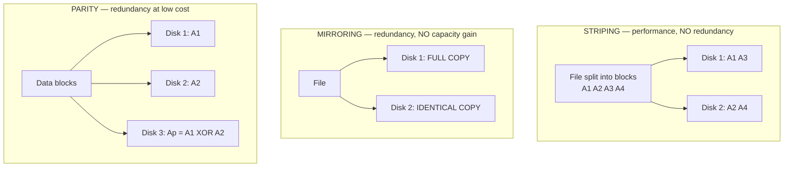

**How PARITY works — the XOR trick that makes RAID 5 possible:** the parity block is the **XOR of the corresponding data blocks**. If any one block is lost, it can be **recomputed by XOR-ing everything that remains**.

```
Data:    A1 = 1 0 1 1
         A2 = 0 1 1 0
Parity:  Ap = A1 XOR A2 = 1 1 0 1

Disk holding A2 FAILS. Recover it:
         A2 = A1 XOR Ap = 1011 XOR 1101 = 0 1 1 0   ✅ recovered exactly
```

#### The RAID levels

| Level | Technique | Min disks | Usable capacity | Fault tolerance | Read | Write |
|---|---|---|---|---|---|---|
| **RAID 0** | **STRIPING only** | **2** | ✅ **100 %** | ❌ **NONE** — one disk fails and **ALL data is lost** | ✅ **Excellent** | ✅ **Excellent** |
| **RAID 1** | **MIRRORING** | **2** | ⚠️ **50 %** | ✅ **Survives 1 disk** (per mirrored pair) | ✅ **Very good** | Moderate |
| **RAID 2** | Bit-level striping + **Hamming code ECC** | 3 | Low | Yes | — | — (**obsolete**) |
| **RAID 3** | **Byte**-level striping + a **DEDICATED parity disk** | 3 | (n−1)/n | Survives 1 disk | Good (sequential) | Poor — the parity disk is a **bottleneck** (**rarely used**) |
| **RAID 4** | **Block**-level striping + a **DEDICATED parity disk** | 3 | (n−1)/n | Survives 1 disk | Good | Poor — same bottleneck |
| **RAID 5** ⭐ | **Block striping with DISTRIBUTED PARITY** | **3** | **(n−1)/n** — e.g. **75 %** with 4 disks | ✅ **Survives 1 disk failure** | ✅ **Very good** | Moderate — **write penalty** |
| **RAID 6** | Block striping with **DOUBLE distributed parity** | **4** | (n−2)/n | ✅ **Survives TWO simultaneous failures** | Very good | Slower than RAID 5 |
| **RAID 10 (1+0)** ⭐ | **MIRROR first, then STRIPE** | **4** | **50 %** | ✅ **Excellent** — survives 1 per mirror set | ✅ **Excellent** | ✅ **Excellent** |
| **RAID 50 / 60** | Striped RAID 5 / RAID 6 groups | 6 / 8 | High | Good | Very good | Good |

> **"Striping WITH PARITY is done at which RAID level?"**
> ### ✅ **RAID 5** — block-level striping with **distributed** parity. *(RAID 3 and RAID 4 also stripe with parity, but on a **dedicated** parity disk; **RAID 6** uses **double** distributed parity.)*

#### RAID 1 vs RAID 5 — the most-asked comparison

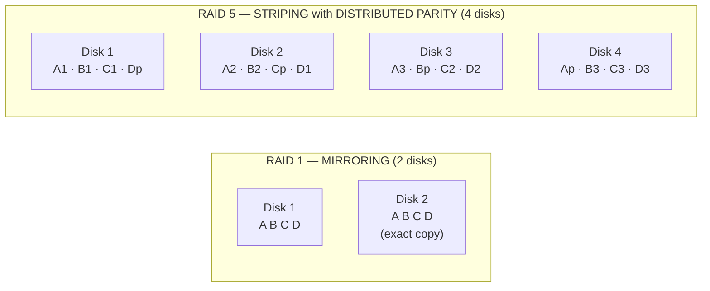

| Point | **RAID 1 (Mirroring)** | **RAID 5 (Striping with distributed parity)** |
|---|---|---|
| **Minimum disks** | **2** | **3** |
| **Method** | An **exact duplicate copy** on every disk | Data **striped** across all disks, with **parity distributed** across all of them |
| **Usable capacity** | ⚠️ **Only 50 %** — half the disks are pure overhead | ✅ **(n−1)/n** — 67 % with 3 disks, **75 % with 4**, 83 % with 6 |
| **Overhead with 4 × 1 TB** | 4 TB raw → **2 TB usable** | 4 TB raw → **3 TB usable** |
| **Fault tolerance** | Survives **1 disk per mirrored pair** | Survives **exactly 1 disk** in the whole array |
| **Read performance** | ✅ **Excellent** — reads can be served from either copy | ✅ **Very good** — parallel reads across all disks |
| **Write performance** | ✅ **Good** — write twice, but **no computation** | ⚠️ **Poorer — the "WRITE PENALTY"**: every small write needs **read old data + read old parity + write new data + write new parity = 4 I/O operations** |
| **Rebuild after a failure** | ✅ **FAST and SAFE** — a straight **copy** from the surviving mirror | ⚠️ **SLOW and RISKY** — the lost disk must be **recalculated from EVERY other disk**; for large disks this takes many hours, during which **a second failure destroys the entire array** |
| **CPU / controller load** | Minimal | **Parity computation** required |
| **Cost per usable TB** | **High** | ✅ **Lower** |
| **Best for** | ⭐ **The OS volume, DATABASE TRANSACTION LOGS, small critical volumes, write-heavy workloads** | ⭐ **File servers, general-purpose storage, READ-heavy workloads, large-capacity archives** |

> **"Which do you prefer, and why?" — the answer that earns full marks is CONDITIONAL:**
>
> - **For a database's TRANSACTION LOG or any write-intensive volume → RAID 1 (or RAID 10).** The log is a stream of small sequential writes, and RAID 5's four-operation write penalty would cripple it.
> - **For a large FILE SERVER or archive where reads dominate → RAID 5 (or RAID 6).** Capacity efficiency matters most, and reads are fast.
> - **For a busy production DATABASE that needs both → RAID 10.** It gives the write performance of mirroring and the read performance of striping, at the cost of 50 % capacity — and this is what banks actually run their core systems on.
> - **For very large disks (≥ 4 TB) → RAID 6, never RAID 5.** Because a RAID 5 rebuild on modern high-capacity drives takes so long that the probability of a second drive failing during it is no longer negligible.

#### "Which RAID level is best?"

> ### **There is NO single best level — the correct answer states the criterion first.**

| If the priority is … | Choose | Because |
|---|---|---|
| **Pure performance, data is disposable** | **RAID 0** | Maximum speed and 100 % capacity, **no protection** — video editing scratch space, caches |
| **Maximum safety on a small volume** | **RAID 1** | Simple, fast rebuild, excellent reliability |
| **Capacity + protection, read-heavy** | **RAID 5** | Only one disk of overhead |
| **Protection for LARGE disks** | **RAID 6** | Survives a **second** failure during the long rebuild |
| ⭐ **Best all-round for production databases and servers** | **RAID 10** | **Best performance AND best fault tolerance** — the standard choice for core banking, ERP and OLTP systems, accepted despite the 50 % capacity cost |

> **The general recommendation for a bank or a data centre: RAID 10 for the databases, RAID 6 (or RAID 5) for the file and archive storage, RAID 1 for the OS volumes** — plus **hot spares** and, always, **separate off-site backups**.

#### How a drive failure is handled

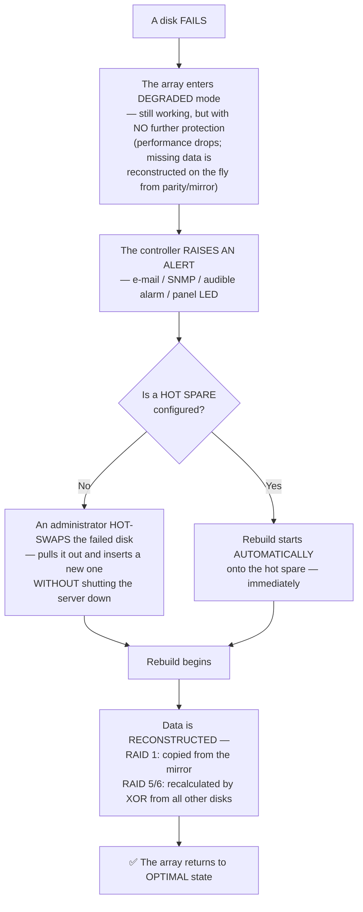

**The practical steps:** (1) **identify** the failed drive from the controller alert and the drive-bay LED; (2) **verify a current BACKUP exists** before touching anything — a rebuild puts heavy stress on the remaining disks and can trigger a second failure; (3) **do not shut down** unless the array is already failed; (4) **hot-swap** the faulty disk with an identical or larger replacement; (5) the rebuild starts automatically (or is started manually); (6) **monitor it to completion** — hours for large disks — and avoid heavy I/O meanwhile; (7) **verify** the array reports *Optimal*, and check SMART data on the other drives, since disks bought together tend to fail together.

**The essential preventive measures:** configure a **HOT SPARE** so rebuilding begins in seconds rather than whenever an engineer arrives; **monitor SMART attributes** to replace drives **before** they fail; and **do not buy all the disks from the same production batch**.

#### RAID in a database context

**Relevance and use in databases:** a database is the most I/O-intensive and the most loss-intolerant application a server runs, so RAID is effectively mandatory.

- **Performance** — striping lets many concurrent queries hit several spindles at once.
- **Availability** — a disk failure does not stop the bank.
- **The standard layout on a serious database server:** the **data files on RAID 10**, the **transaction log on a separate RAID 1 pair** (sequential, write-intensive, and must survive if the data volume is lost), the **tempdb/temporary space on RAID 0 or 10** (fast, rebuildable), and **backups on a separate physical array entirely**.
- **RAID 5 is generally avoided for write-heavy OLTP databases** because of the write penalty, but is entirely reasonable for data warehouses and reporting databases, which are read-dominated.

> **"Is it possible to use RAID in a database?"** — ### **Yes, and it is standard practice.** RAID operates **below** the file system, so the DBMS sees only an ordinary (large, fast, resilient) volume and needs no modification. RAID complements, but does **not replace**, the database's own protection mechanisms — **transaction logs, checkpoints, replication and regular backups**.

#### Worked example — a storage requirement

> **The office needs storage. Maximum capacity required is 500 GB. Two system backups of 30 GB each are also needed. Using RAID 1, how many disks and of what size?**

**Analysis:** the working data needs **500 GB**; the two backups need **2 × 30 = 60 GB**; total ≈ **560 GB**, and a storage volume should never be planned above ~70–80 % full.

**With RAID 1, usable capacity is exactly HALF the raw capacity**, because every byte is written twice.

```
Required usable capacity  ≈ 560 GB  →  allow growth  →  plan for 1 TB usable
RAID 1 raw capacity needed = 2 × 1 TB = 2 TB
```

> ### ✅ **Configuration: TWO × 1 TB disks in RAID 1 — 2 TB raw, 1 TB usable, tolerating one complete disk failure.**

*(If the budget allows, **four × 1 TB in RAID 10** gives the same 2 TB usable with far better performance; and the backups should ideally live on a **separate physical device or off-site**, because RAID is not a backup.)*

**Previous Year Question List from this Topic:**

- [Which RAID level is best and why?](../written-answers/microprocessor-and-computer-architecture.md?plain=1#L3476)
- [Striping with parity is done in which level of RAID.](../written-answers/microprocessor-and-computer-architecture.md?plain=1#L3522)
- [Concept of RAID, Relevance in Database, Uses in Database, is it possible?](../written-answers/microprocessor-and-computer-architecture.md?plain=1#L3570)
- [How to solve drive failure in RAID?](../written-answers/microprocessor-and-computer-architecture.md?plain=1#L3623)
- [Explain the purpose of RAID.](../written-answers/microprocessor-and-computer-architecture.md?plain=1#L3679)
- [What do you mean by RAID? Write the difference types of RAID level.](../written-answers/microprocessor-and-computer-architecture.md?plain=1#L3723)
- [What is RAID technology? Why it's important Server in data center?](../written-answers/microprocessor-and-computer-architecture.md?plain=1#L3805)
- [(a) Compare RAID 1 and RAID 5 levels. Which one you prefer? Why?](../written-answers/microprocessor-and-computer-architecture.md?plain=1#L3862)
- [What is RAID?](../written-answers/microprocessor-and-computer-architecture.md?plain=1#L3923)
- [What is RAID? What is the classification of RAIDs? Difference between RAID 1 and RAID 5 using illustration.](../written-answers/microprocessor-and-computer-architecture.md?plain=1#L3969)
- [What is RAID technology? Describe about the advantages of RAID technology.](../written-answers/microprocessor-and-computer-architecture.md?plain=1#L4052)
- [Why necessary to use RAID? If you choose a RAID level for an organization with huge data process. Justify your answer?](../written-answers/microprocessor-and-computer-architecture.md?plain=1#L4109)
- [Your office need some storage device. Highest capacity 500GB. Two system backup of 30GB. Using RAID 1, Explain how many storage devices will need?](../written-answers/microprocessor-and-computer-architecture.md?plain=1#L4188)
- [What is RAID level? Write down of RAID level 0, level 1 and level 5?](../written-answers/microprocessor-and-computer-architecture.md?plain=1#L4256)
- [Describe RAID level.](../written-answers/microprocessor-and-computer-architecture.md?plain=1#L4326)

**Previous Year MCQ List from this Topic:**

- [Which RAID level creates a mirror of all disks for storing data?](../mcq-answers/microprocessor-and-computer-architecture.md?plain=1#L708)
- [The fastest read/write time and most efficient data storage of any disk array type is:](../mcq-answers/microprocessor-and-computer-architecture.md?plain=1#L717)
- [How does RAID provide data protection?](../mcq-answers/microprocessor-and-computer-architecture.md?plain=1#L726)
- [Why RAID is used in database storage?](../mcq-answers/microprocessor-and-computer-architecture.md?plain=1#L735)
- [What is the name of below RAID?](../mcq-answers/microprocessor-and-computer-architecture.md?plain=1#L744)


---

## Cache Memory

### Cache Memory — Concept and Performance

> **CACHE MEMORY is a SMALL, VERY FAST memory (SRAM) placed BETWEEN the CPU and main memory, which holds COPIES of the data and instructions that the CPU is MOST LIKELY to need next**, so that the processor rarely has to wait for slow main memory.

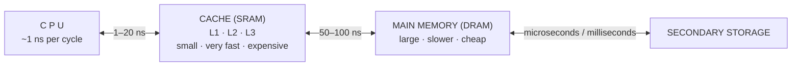

#### Why cache memory exists — the problem

> **The PROCESSOR–MEMORY PERFORMANCE GAP.** CPU speed has grown far faster than DRAM speed for decades. A modern 3 GHz processor completes a cycle in **0.33 ns**, but a DRAM access takes **60–100 ns** — **200 to 300 CPU cycles of waiting** for a single memory read. Without cache, the processor would be **idle for the overwhelming majority of its time**, and buying a faster CPU would achieve nothing.

#### How cache increases processing speed

1. **Locality of reference** makes it work: **temporal locality** (recently used data will be used again — a loop counter, a frequently called function) and **spatial locality** (nearby addresses will be used soon — the next element of an array, the next instruction).
2. When the CPU requests an address, the **cache is checked FIRST**.
3. On a **HIT**, the data is supplied in a few nanoseconds — the CPU does not stall.
4. On a **MISS**, the data is fetched from main memory, **and a whole BLOCK (cache line, typically 64 bytes) is brought in**, so that subsequent nearby accesses are hits.
5. Because hit rates in practice are **90–99 %**, the **average** access time approaches that of the cache while the **capacity** is that of main memory.

#### The levels of cache

| Level | Location | Size | Speed | Shared? |
|---|---|---|---|---|
| **L1** | **Inside each CPU core**, split into **L1-I** (instruction) and **L1-D** (data) | **32–128 KB per core** | ✅ **Fastest — 1–4 cycles** | Private to the core |
| **L2** | Per core (or per pair) | **256 KB – 2 MB** | 10–20 cycles | Usually private |
| **L3** | On the CPU die | **8 – 64 MB** | 30–70 cycles | ✅ **Shared by all cores** |
| **L4 / eDRAM** | Occasionally present | 64–128 MB | Slower | Shared |

#### Cache hit and cache miss

| Term | Definition |
|---|---|
| **CACHE HIT** | The requested data **IS FOUND in the cache** — it is delivered immediately, with no main-memory access. **Fast** |
| **CACHE MISS** | The requested data is **NOT in the cache** — it must be fetched from main memory (costing a **miss penalty** of 100–300 cycles), and a block is loaded into the cache |
| **HIT RATIO** | **h = (number of hits) / (total accesses)** — typically **0.90 – 0.99** |
| **MISS RATIO** | **1 − h** |
| **MISS PENALTY** | The extra time taken to service a miss |

#### The three types of cache MISS — "the three Cs"

| Type | Also called | Cause | Can it be avoided? |
|---|---|---|---|
| **COMPULSORY miss** | ⭐ **COLD miss / first-reference miss** | The block is being accessed **for the VERY FIRST TIME**, so it **cannot possibly be in the cache yet** — the cache started empty | ❌ **UNAVOIDABLE** by cache size. Reduced only by **larger block sizes** or **PRE-FETCHING** |
| **CAPACITY miss** | — | The **working set is LARGER THAN THE CACHE**, so blocks that were loaded earlier have been **evicted to make room** and must be fetched again | ✅ **Reduced by a LARGER CACHE**, or by restructuring the program (e.g. loop blocking/tiling) to shrink the working set |
| **CONFLICT miss** | Collision miss | Several blocks **map to the SAME cache SET** and evict one another, **even though the cache as a whole is not full** | ✅ Reduced by **higher ASSOCIATIVITY** or a better mapping |

> **The distinction between a COMPULSORY and a CAPACITY miss — stated precisely:**
>
> - A **COMPULSORY (COLD) miss** occurs on the **very first access to a block**. The data has **never been in the cache**, so no cache — of any size, with any policy — could have avoided it. It is the unavoidable cost of starting with an empty cache.
> - A **CAPACITY miss** occurs on a **re-access to a block that WAS in the cache but was EVICTED**, because the program's working set does not fit. **A sufficiently large cache WOULD have avoided it.**
>
> **The test that separates them:** *would a fully-associative cache of INFINITE size have avoided this miss?* If **no**, it is **compulsory**. If **yes**, and the cache is fully associative, it is a **capacity** miss. If it would have been avoided merely by higher associativity at the same size, it is a **conflict** miss.
>
> **Illustration:** an array of 10 MB is scanned twice with an 8 MB cache. The **first** pass produces **compulsory** misses on every block. The **second** pass should be all hits — but because 10 MB does not fit in 8 MB, the early blocks were evicted by the later ones, so they miss again. Those second-pass misses are **capacity** misses.

#### Cache mapping techniques

> **MAPPING** decides **where in the cache a given main-memory block may be placed.**

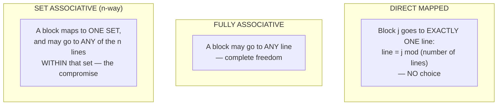

| Point | **DIRECT MAPPED** | **FULLY ASSOCIATIVE** | **SET ASSOCIATIVE (n-way)** |
|---|---|---|---|
| **Placement** | **One fixed line only** | **Any line** | **Any line within one set** |
| **Address fields** | **Tag · Line(index) · Offset** | **Tag · Offset** | **Tag · Set(index) · Offset** |
| **Comparators needed** | ✅ **ONE** | ⚠️ **One per line** — expensive hardware | **n** (one per way) |
| **Search speed** | ✅ **Fastest** | Slowest / most power-hungry | Fast |
| **Hardware cost** | ✅ **Cheapest and simplest** | ⚠️ **Most expensive** | Moderate |
| **Tag size** | Smallest | **Largest** | Medium |
| **Conflict misses** | ⚠️ **HIGH — thrashing** when two hot blocks map to the same line | ✅ **NONE** | ✅ **Low** |
| **Replacement policy** | ❌ **Not needed** — there is no choice | **Required** — LRU, FIFO, random | **Required** within the set |
| **Utilisation of the cache** | Poor — lines can sit empty while others thrash | ✅ **Best** | Very good |
| **Used for** | Simple/older caches, some L1 designs | **TLBs** and other small caches | ⭐ **Virtually ALL modern L1/L2/L3 caches** (4-way to 16-way) |

**Advantages of DIRECT MAPPING:** simplest and cheapest hardware; **only one comparison** so lookup is fastest; no replacement algorithm needed; low power.
**Disadvantages:** **conflict misses and thrashing** — two frequently used blocks that map to the same line evict each other endlessly, even while most of the cache is empty; poor hit rate for some access patterns.

**Advantages of ASSOCIATIVE MAPPING:** **no conflict misses** at all; **best possible hit ratio**; flexible use of every line.
**Disadvantages:** **every line must be compared simultaneously**, requiring expensive parallel comparators; **higher cost, power and latency**; a **replacement algorithm is required**; larger tags. It is therefore only practical for **small** caches.

> **Why SET-ASSOCIATIVE won:** it captures **most** of the hit-rate benefit of full associativity at a **small fraction** of the hardware cost. In practice, going from direct-mapped to **2-way** removes most conflict misses, and beyond **8-way** the returns are negligible.

#### Worked example — sizing a direct-mapped cache

> **How many total bits are required for a DIRECT-MAPPED cache with 16 KB of DATA and 4-WORD blocks, assuming a 32-bit address and a 32-bit (4-byte) word?**

**Step 1 — the block size in bytes**
```
1 word = 4 bytes,  block = 4 words  →  block size = 4 × 4 = 16 bytes
```

**Step 2 — the number of blocks (cache lines)**
```
Number of blocks = 16 KB of data / 16 bytes per block
                 = 16,384 / 16
                 = 1,024 blocks  =  2¹⁰   →  INDEX = 10 bits
```

**Step 3 — split the 32-bit address**
```
Byte offset within the block = log₂(16) = 4 bits
       (= 2 bits to choose the word + 2 bits to choose the byte within the word)

┌──────────────────────────┬─────────────┬──────────┐
│        TAG               │   INDEX     │  OFFSET  │
│       18 bits            │  10 bits    │  4 bits  │
└──────────────────────────┴─────────────┴──────────┘
                32 bits in total

TAG = 32 − 10 − 4 = 18 bits
```

**Step 4 — the bits stored in EACH line**
```
Data      = 4 words × 32 bits  = 128 bits
Tag       =                      18 bits
Valid bit =                       1 bit
                                 ────────
Total per line                 = 147 bits
```

**Step 5 — the total size of the cache**
```
Total = 1,024 lines × 147 bits
      = 150,528 bits
      = 150,528 / 8 = 18,816 bytes
      = 147 Kibibits  ≈ 18.4 KB
```

> ### ✅ **Tag = 18 bits · Index = 10 bits · Offset = 4 bits · TOTAL = 150,528 bits = 147 Kibits (≈ 18.4 KB)**

> **The point the question is really testing:** a cache always costs **more than its stated data size** — here 16 KB of data requires 18.4 KB of silicon, because every line must also store its **tag** and a **valid bit**. That **overhead of about 15 %** is the price of being able to tell *which* memory block a line currently holds.

#### Worked example — average memory access time

> **Main memory access time = 100 ns · cache access time = 50 ns (unrealistically slow, but as given) · hit rate = 90 %. What is the average access time?**

**Method 1 — the simultaneous-access model** (cache and memory are looked up in parallel; a miss costs only the memory time):
```
AMAT = (h × Tcache) + ((1 − h) × Tmemory)
     = (0.90 × 50) + (0.10 × 100)
     = 45 + 10
     = 55 ns
```

**Method 2 — the hierarchical-access model** (the cache is searched first; on a miss, the memory time is paid **in addition**):
```
AMAT = Tcache + ((1 − h) × Tmemory)
     = 50 + (0.10 × 100)
     = 50 + 10
     = 60 ns
```

> ### ✅ **55 ns** by the simultaneous model, **60 ns** by the hierarchical model — **state the model you are using.** Most Bangladeshi exam keys expect the simple **55 ns**.

> **Either way, note what has been achieved:** the average is **far closer to the 50 ns cache than to the 100 ns memory**, and a hit rate of 99 % would give **50.5 ns**. This is why hit rate matters so much more than cache speed.

#### Worked example — the required hit rate

> **A read takes 50 ns on a cache MISS and 5 ns on a cache HIT. What hit rate is needed for an average read time of 10 ns?**

```
Let h = hit rate.
AMAT  = h × 5 + (1 − h) × 50 = 10
        5h + 50 − 50h        = 10
        −45h                 = −40
         h                   = 40/45 = 0.8889
```

> ### ✅ **A hit rate of 88.9 % (about 8 hits in every 9 accesses) is required.**

*(The general formula: **AMAT = h·T_hit + (1−h)·T_miss**, and rearranged, **h = (T_miss − AMAT) / (T_miss − T_hit)**.)*

#### Cache memory vs main memory, and cache vs flash

| Point | **Cache memory** | **Main memory (RAM)** |
|---|---|---|
| **Technology** | **SRAM** | **DRAM** |
| **Location** | **Inside / on the CPU chip** | On separate DIMM modules |
| **Size** | KB to tens of MB | GB |
| **Speed** | ✅ **1–20 ns** | 50–100 ns |
| **Cost per bit** | **Very high** | Moderate |
| **Refresh** | Not required | **Required** |
| **Managed by** | The **hardware**, transparently | The **operating system** |
| **Contents** | A **copy** of the most-used parts of RAM | The complete programs and data in use |
| **Visible to the programmer?** | ❌ No — entirely transparent | ✅ Yes, via addresses |

| Point | **Cache memory** | **Flash memory** |
|---|---|---|
| **Type** | **SRAM — volatile** | **Non-volatile semiconductor** |
| **Purpose** | Speed up CPU access to RAM | **Permanent storage** |
| **Speed** | ✅ **Nanoseconds** | Microseconds |
| **Volatility** | ⚠️ Volatile | ✅ **Non-volatile** |
| **Write endurance** | Effectively unlimited | ⚠️ **Limited — 1,000 to 100,000 erase cycles per block** |
| **Erase granularity** | Per line | **Per block** |
| **Capacity** | KB – MB | **GB – TB** |
| **Cost per bit** | Very high | Low |
| **Used as** | CPU cache | **SSD, pen drive, SD card, BIOS chip, smartphone storage** |

**Previous Year Question List from this Topic:**

- [Explain the difference between a "Compulsory Miss" (Cold Miss) and a "Capacity Miss" in cache memory. (SO IT 25-07-2026)](../written-answers/microprocessor-and-computer-architecture.md?plain=1#L4411)
- [(d) What is cache memory? Explain the concepts of (i) Cache hit and (ii) Cache miss.](../written-answers/microprocessor-and-computer-architecture.md?plain=1#L4456)
- [Write advantage and disadvantage of direct mapping and associative mapping between cache memory and main memory.](../written-answers/microprocessor-and-computer-architecture.md?plain=1#L4516)
- [How many total bits are required for a direct mapped cache with 16KB of data and 4-word blocks? Assuming a 32 bit address?](../written-answers/microprocessor-and-computer-architecture.md?plain=1#L4584)
- [6.3 Explain the difference between a "Compulsory Miss" (Cold Miss) and a "Capacity Miss" in cache memory.](../written-answers/microprocessor-and-computer-architecture.md?plain=1#L4661)
- [Write Concept of cache memory in computer. How its change performance of computer?](../written-answers/microprocessor-and-computer-architecture.md?plain=1#L4704)
- [Suppose we have a 16 KB of data in a direct mapped cache with 4 word blocks. Determine the size of the tag, index and offset fields if we are using a 32-bit arc…](../written-answers/microprocessor-and-computer-architecture.md?plain=1#L4774)
- [What is the use of cache memory?](../written-answers/microprocessor-and-computer-architecture.md?plain=1#L4857)
- [Some of the factors determine the performance of a computer system. Cache memory is one of them. Why cache memory is one of the factors to determine the perform…](../written-answers/microprocessor-and-computer-architecture.md?plain=1#L4904)
- [Assume that for a certain processor, a read request takes 50 nanoseconds on a cache miss and 5 nanoseconds on a cache hit. Suppose while running a program, it w…](../written-answers/microprocessor-and-computer-architecture.md?plain=1#L4965)
- [Cache memory কী কাজে ব্যবহৃত হয়? Compiler and Interpreater -এর মধ্যে পার্থক্য লিখুন।](../written-answers/microprocessor-and-computer-architecture.md?plain=1#L5020)
- [(ii) Cache Memory কী? Computer এর main memory-এর সাথে এর পার্থক্য কী?](../written-answers/microprocessor-and-computer-architecture.md?plain=1#L5069)
- [If main memory access time is 100ns, cache access time is 50 ns, cache hit rate is 90% then what is the average time to read from memory?](../written-answers/microprocessor-and-computer-architecture.md?plain=1#L5121)
- [Explain how cache memory is used to increase the processing speed of computer.](../written-answers/microprocessor-and-computer-architecture.md?plain=1#L5191)
- [(d) What is cache memory? Explain the concepts of cache memory.](../written-answers/microprocessor-and-computer-architecture.md?plain=1#L2186)

**Previous Year MCQ List from this Topic:**

- [Microprocessor reference that are available in the cache are called ________:](../mcq-answers/microprocessor-and-computer-architecture.md?plain=1#L144)
- [Which of the following causes the average memory access time to increase in a memory system with cache memory?](../mcq-answers/microprocessor-and-computer-architecture.md?plain=1#L380)
- [নিচের কোনটি সবচেয়ে দ্রুত Data transfer করতে পারে?](../mcq-answers/microprocessor-and-computer-architecture.md?plain=1#L497)
- [Which is the faster memory?](../mcq-answers/microprocessor-and-computer-architecture.md?plain=1#L524)


---

## Secondary Storage (HDD vs SSD)

### Hard Disk Drives and Solid State Drives

#### The Hard Disk Drive (HDD)

> An **HDD stores data MAGNETICALLY on rotating PLATTERS**, which are read and written by **read/write heads** mounted on a moving **actuator arm**. It contains **moving mechanical parts**.

```mermaid
flowchart TD
    subgraph HDD["HARD DISK DRIVE"]
        SP["SPINDLE — rotates the platters at<br/>5400 / 7200 / 10000 / 15000 rpm"]
        PL["PLATTERS — magnetic-coated discs;<br/>each has 2 SURFACES"]
        HD["READ/WRITE HEADS — ONE per surface,<br/>all moving TOGETHER on the actuator arm"]
        AC["ACTUATOR ARM — swings the heads<br/>in and out to the required track"]
    end
```

**The geometry — the terms an exam will use:**

| Term | Meaning |
|---|---|
| **Platter** | One physical disc; each has **2 surfaces** (top and bottom) |
| **Surface / Head** | One magnetic side, served by **one read/write head** |
| **TRACK** | One **concentric circle** on a single surface |
| **CYLINDER** | ⭐ **The SET of tracks at the SAME RADIUS on ALL surfaces** — all reachable **without moving the arm**, which is why data is written cylinder-by-cylinder |
| **SECTOR** | The smallest addressable unit — a **fixed-size arc of a track**, traditionally **512 bytes**, now commonly **4096 bytes** |
| **Cluster / Block** | A group of sectors allocated together by the file system |

**Capacity formula:**
```
Capacity = (number of surfaces) × (tracks per surface) × (sectors per track) × (bytes per sector)
```

**Access time components:**

| Component | Meaning | Typical |
|---|---|---|
| **SEEK TIME** | Move the arm to the correct **track/cylinder** | 3–10 ms |
| **ROTATIONAL LATENCY** | Wait for the required **sector to rotate under the head** — on average **half a revolution** | 4.17 ms at 7200 rpm |
| **TRANSFER TIME** | Actually read/write the data | µs |

#### Worked example — disk capacity

> **A disk pack has 16 surfaces, 128 tracks per surface, 256 sectors per track, and 512 bytes per sector. Find the capacity and the number of bits needed to address a sector.**

**Capacity:**
```
= 16 surfaces × 128 tracks × 256 sectors × 512 bytes
= 16 × 128            = 2,048
   2,048 × 256        = 524,288
   524,288 × 512      = 268,435,456 bytes
= 268,435,456 / 1024 / 1024 = 256 MB
```
> ### ✅ **Capacity = 268,435,456 bytes = 256 MB**

**Bits needed to specify a particular sector:**
```
Surface : 16 = 2⁴    →   4 bits
Track   : 128 = 2⁷   →   7 bits
Sector  : 256 = 2⁸   →   8 bits
                      ───────────
                        19 bits
```
> ### ✅ **19 bits are required to address one sector** (and 2¹⁹ = 524,288 = the total number of sectors, which confirms the arithmetic).

> **The second variant — "16 heads and 400 cylinders, with four 100-cylinder zones":** a **zoned-bit-recording (ZBR)** disk stores **more sectors on the OUTER tracks than the inner ones**, because the outer tracks are physically longer. The capacity is then computed **zone by zone** and summed:
> ```
> Capacity = Σ over zones [ heads × cylinders_in_zone × sectors_per_track_in_that_zone × bytes_per_sector ]
> ```
> ZBR is why the **outer tracks of a hard disk are measurably faster** — more sectors pass under the head per revolution — and why disk benchmarks show throughput falling as the test moves inward.

#### The Solid State Drive (SSD)

> An **SSD (SOLID STATE DRIVE) is a storage device that stores data in NAND FLASH memory chips, with NO MOVING PARTS AT ALL.** Data is retained without power, and any location can be reached electronically in microseconds.

```mermaid
flowchart TD
    H["HOST — SATA / NVMe over PCIe"] --> C["SSD CONTROLLER<br/>— the 'brain': wear levelling,<br/>garbage collection, ECC,<br/>TRIM, FTL address mapping"]
    C --> D["DRAM CACHE<br/>(the mapping table + write buffer)"]
    C --> N1["NAND flash package 1"]
    C --> N2["NAND flash package 2"]
    C --> N3["NAND flash package 3"]
    C --> N4["NAND flash package 4"]
```

#### The working principle of an SSD

1. **The storage element is a FLOATING-GATE (or charge-trap) TRANSISTOR.** Each cell has an electrically isolated gate; **trapping electrons on it changes the transistor's threshold voltage**, and that difference is read back as a **0 or a 1**. Because the gate is insulated, the charge — and therefore the data — **remains when power is removed**. This is what makes flash **non-volatile**.
2. **Cells are wired into a grid of PAGES and BLOCKS.**
   - A **PAGE** (typically **4 KB**) is the **smallest unit that can be READ or WRITTEN**.
   - A **BLOCK** (typically **128–256 pages, i.e. 512 KB – 2 MB**) is the **smallest unit that can be ERASED**.
   - ⚠️ **This asymmetry is the central fact about flash: you can write a page, but you CANNOT overwrite it — the whole BLOCK must be erased first.**
3. **Writing** — the controller writes to an **already-erased page**. To modify existing data it does **not** overwrite in place: it **writes the new version to a fresh page** and marks the old page invalid.
4. **GARBAGE COLLECTION** — in the background, the controller gathers the still-valid pages from a block full of invalid ones, rewrites them elsewhere, and **erases the whole block** to return it to the free pool.
5. **WEAR LEVELLING** — each block tolerates only a limited number of erase cycles (roughly **1,000 for TLC, 100,000 for SLC**). The controller therefore **spreads writes EVENLY across all blocks**, so that no block wears out while others are untouched. This is what makes a consumer SSD last for years.
6. **TRIM** — the operating system tells the SSD which pages the file system has deleted, so the controller can erase them in advance rather than needlessly copying dead data during garbage collection.
7. **ECC** — every page carries error-correcting codes, because flash cells become less reliable as they wear.
8. **The FTL (Flash Translation Layer)** maps the **logical addresses the OS uses** onto the **constantly changing physical pages**, hiding all of the above from the computer.

**NAND cell types:**

| Type | Bits per cell | Endurance | Speed | Cost | Use |
|---|---|---|---|---|---|
| **SLC** | 1 | ✅ **~100,000 cycles** | Fastest | Highest | Enterprise, industrial |
| **MLC** | 2 | ~10,000 | Fast | High | Prosumer |
| **TLC** | 3 | ~1,000–3,000 | Moderate | ✅ Low | ⭐ Most consumer SSDs |
| **QLC** | 4 | ~300–1,000 | Slower | Lowest | Bulk, read-mostly storage |

*(**3D NAND / V-NAND** stacks cells in many layers vertically, which is how capacity kept rising after the flat-cell shrink stopped.)*

> **"NAND is made up of what are called ___?"** → ### **CELLS** — floating-gate transistors, organised into **PAGES**, which are grouped into **BLOCKS**, which form **PLANES** and **DIES**.

#### The characteristics of an SSD

1. **No moving parts** — entirely electronic.
2. **Very fast** — especially for **random access**, where there is no seek or rotation.
3. **Silent** and **shock-resistant**.
4. **Low power consumption** and little heat.
5. **Light and compact**.
6. ⚠️ **Limited write endurance** — a finite number of program/erase cycles per block.
7. **Non-volatile**, but data retention degrades over years without power.
8. Higher **cost per gigabyte** than an HDD.

#### HDD vs SSD — the comparison

| Point | **HDD** | **SSD** |
|---|---|---|
| **Technology** | **Magnetic**, rotating platters | **NAND FLASH** semiconductor |
| **Moving parts** | ⚠️ **Yes** — spindle, platters, actuator | ✅ **NONE** |
| **Access time** | **5–10 ms** | ✅ **0.05–0.1 ms — about 100× faster** |
| **Sequential read/write** | 100–200 MB/s | ✅ **SATA 550 MB/s · NVMe 3,500–14,000 MB/s** |
| **RANDOM I/O (IOPS)** | ⚠️ **~100–200** | ✅ **100,000 – 1,000,000** |
| **Boot / load time** | Slow | ✅ Very fast |
| **Noise** | Audible | ✅ **Silent** |
| **Shock / vibration resistance** | ⚠️ **Poor** — a drop while running destroys it | ✅ **Excellent** |
| **Power consumption** | 6–10 W | ✅ **2–4 W** |
| **Heat** | More | Less |
| **Weight** | Heavier | ✅ Lighter |
| **Cost per GB** | ✅ **Much cheaper** | Expensive |
| **Maximum capacity** | ✅ **Up to 22–30 TB** | Up to 8–16 TB commonly |
| **Lifespan limit** | **Mechanical** wear | **Write-cycle** wear |
| **Data recovery after failure** | ✅ Often possible | ⚠️ **Much harder** |
| **Fragmentation** | ⚠️ **Hurts performance badly** | ✅ **Irrelevant** |
| **Best for** | **Bulk storage, archives, backups, media libraries, surveillance** | ⭐ **Operating systems, DATABASES, applications, virtual machines, anything latency-sensitive** |

> **The storage-selection question — "Server A hosts the Core Banking DATABASE, Server B hosts archives":**
>
> ### ✅ **Server A (Core Banking Database) → ENTERPRISE NVMe SSDs in RAID 10.**
> **Reasoning:** a core banking database is dominated by **small RANDOM reads and writes**, which is precisely the workload where an HDD's 5–10 ms seek time is catastrophic and an SSD's 0.05 ms access time gives a **100× advantage**. Transaction latency directly determines how many customers can be served per second, and end-of-day batch processing must finish inside its window. The cost premium is irrelevant next to the business value, and **RAID 10** provides both the write performance and the fault tolerance the system requires. *(Specify **enterprise-grade** drives with **power-loss protection** and a high DWPD rating — a consumer SSD can lose acknowledged writes during a power failure, which is unacceptable for financial transactions.)*
>
> ### ✅ **Server B (archives, backups, logs) → high-capacity HDDs in RAID 6.**
> **Reasoning:** archival data is written once and read sequentially and rarely, where an HDD's throughput is perfectly adequate and its **cost per terabyte is three to five times lower**. **RAID 6** rather than RAID 5, because the rebuild time on very large drives makes double parity necessary.

#### Optical discs — how they read and write data

> An **OPTICAL DISC (CD, DVD, Blu-ray) stores data as microscopic PITS and LANDS along a single SPIRAL TRACK, and reads them with a LASER BEAM by detecting the difference in REFLECTION.**

```mermaid
flowchart LR
    L["LASER DIODE"] --> B["Beam splitter"] --> O["Objective lens"] --> D["DISC surface<br/>— PITS and LANDS"]
    D --> O2["reflected light"] --> B2["Beam splitter"] --> P["PHOTODETECTOR<br/>strong reflection → 'land'<br/>weak/scattered → 'pit'"]
    P --> E["Electronic decoder → bits"]
```

**READING:** a low-power laser is focused through the transparent polycarbonate onto the reflective layer. A **LAND** (flat area) reflects the beam **strongly** back to the photodetector; a **PIT** (a depression about a quarter-wavelength deep) causes **destructive interference** and reflects **weakly**. The detector converts the varying reflected intensity into an electrical signal. ⚠️ **Crucially, it is not "pit = 0, land = 1": a TRANSITION between a pit and a land represents a 1, and no transition represents a 0** (NRZI encoding, with EFM modulation on top).

**WRITING:**

| Disc type | How data is written |
|---|---|
| **CD-ROM / DVD-ROM (pressed)** | Pits are **physically STAMPED** into the polycarbonate during manufacture from a master — not writable by the user |
| **CD-R / DVD-R (write-once)** | A **high-power laser BURNS an organic DYE layer**, darkening spots so they no longer reflect — **permanent and irreversible** |
| **CD-RW / DVD-RW (rewritable)** | A **PHASE-CHANGE alloy** layer is heated by the laser: **high power → melts and cools quickly → AMORPHOUS (low reflectivity, = pit)**; **medium power → anneals → CRYSTALLINE (high reflectivity, = land)**. The change is **reversible**, so the disc can be erased and rewritten ~1,000 times |

**Capacity, and why it increased:** the shorter the laser's **wavelength**, the smaller the pits and the tighter the track pitch can be.

| Disc | Laser | Wavelength | Capacity |
|---|---|---|---|
| **CD** | Infrared | **780 nm** | **700 MB** |
| **DVD** | Red | **650 nm** | **4.7 GB** (single layer) / 8.5 GB (dual) |
| **Blu-ray** | **Blue-violet** | **405 nm** | **25 GB** per layer / 50–100 GB |

**Note also:** optical discs use a **single spiral track running from the INSIDE OUTWARD** (unlike a hard disk's concentric tracks), and **CLV (Constant Linear Velocity)** — the disc **slows down as the head moves outward** — so that the data density is uniform.

> **"Which of the following is the unit of a Hard Disk Drive — Megahertz, Kilohertz, Gigabyte, None?"**
> ### ✅ **GIGABYTE.** Hertz measures **frequency** (the unit of processor clock speed), whereas disk capacity is measured in **bytes** — GB and TB.

**Previous Year Question List from this Topic:**

- [Storage technology selection directly impacts banking operations. Server A will host the Core Banking Database. Server B will host 10 years of immutable archive…](../written-answers/microprocessor-and-computer-architecture.md?plain=1#L5270)
- [a) Define the term "SSD". Briefly describe the working principle of "SSD".](../written-answers/microprocessor-and-computer-architecture.md?plain=1#L5323)
- [Write two SSD characteristics?](../written-answers/microprocessor-and-computer-architecture.md?plain=1#L5398)
- [How can you define SSD?](../written-answers/microprocessor-and-computer-architecture.md?plain=1#L5429)
- [(খ) Solid State Drives (SSD) এর কার্যপ্রণালী ও ব্যবহার লিখুন।](../written-answers/microprocessor-and-computer-architecture.md?plain=1#L5473)
- [In a solid state drive data is sarved to a pool of NAND flash. NAND itself is made up of what are called floating gate transmission. How does floating gate tran…](../written-answers/microprocessor-and-computer-architecture.md?plain=1#L5547)
- [Which of the following is the unit of Hard Disk Drive? (a) Megaharz (b) Kiloharz (c) Gigabyte (d) None](../written-answers/microprocessor-and-computer-architecture.md?plain=1#L5622)
- [Consider a magnetic disk consisting of 16 heads and 400 cylinders. This disk has four 100-cylinder zones with the cylinders in different zones containing 160, 2…](../written-answers/microprocessor-and-computer-architecture.md?plain=1#L5659)
- [Consider a disk pack with the following specifications- 16 surfaces, 128 tracks per surface, 256 sectors per track and 512 bytes per sector. Answer the followin…](../written-answers/microprocessor-and-computer-architecture.md?plain=1#L5752)
- [(i) Optical disk কীভাবে data Read/Write করে বর্ণনা করুন।](../written-answers/microprocessor-and-computer-architecture.md?plain=1#L5846)

**Previous Year MCQ List from this Topic:**

- [SSDs are more durable than HDDs in extreme and harsh environments because](../mcq-answers/microprocessor-and-computer-architecture.md?plain=1#L407)
- [A solid-state drive (SSD) is a newer, faster type of device that stores data on instantly-accessible ________.](../mcq-answers/microprocessor-and-computer-architecture.md?plain=1#L470)
- [A hard disk is divided into tracks which are further subdivided into ______](../mcq-answers/microprocessor-and-computer-architecture.md?plain=1#L589)
- [Consider a magnetic disk packed with 32 surfaces. Each surface is divided into 128 tracks while 256 sectors per track. If the size of a sector is 1024 bytes, th…](../mcq-answers/microprocessor-and-computer-architecture.md?plain=1#L598)
- [DVD এর চেয়ে বেশী Data store করা যায় কোনটিতে?](../mcq-answers/microprocessor-and-computer-architecture.md?plain=1#L607)
- [Which of the following is major part of time taken when accessing data on the disk?](../mcq-answers/microprocessor-and-computer-architecture.md?plain=1#L616)
- [Place where large amount of data is stored outside central processing unit is called](../mcq-answers/microprocessor-and-computer-architecture.md?plain=1#L625)
- [Which are not performance characteristics of hard disk?](../mcq-answers/microprocessor-and-computer-architecture.md?plain=1#L634)
- [Which of the following is used for manufacturing chips?](../mcq-answers/microprocessor-and-computer-architecture.md?plain=1#L643)
- [Before a disk can be used to store data, it must be-](../mcq-answers/microprocessor-and-computer-architecture.md?plain=1#L652)
- [Which technology is used in Compact disks?](../mcq-answers/microprocessor-and-computer-architecture.md?plain=1#L661)
- [Which of the following is a storage device?](../mcq-answers/microprocessor-and-computer-architecture.md?plain=1#L670)
- [What does the disk drive of computer do?](../mcq-answers/microprocessor-and-computer-architecture.md?plain=1#L679)
- [Which of the items below are considered removable storage media?](../mcq-answers/microprocessor-and-computer-architecture.md?plain=1#L688)
- [A hard disk is divided into tracks which are further subdivided into ________](../mcq-answers/microprocessor-and-computer-architecture.md?plain=1#L697)


---

## Instruction Pipelining & Hazards

### Instruction Pipelining

> **PIPELINING is a technique in which several instructions are OVERLAPPED IN EXECUTION** — the processor is divided into **stages**, and while one instruction is being executed, the next is being decoded and a third is being fetched, so that **one instruction COMPLETES every clock cycle** even though each individual instruction still takes several cycles.

> **The analogy that explains it perfectly: a LAUNDRY.** Washing, drying and folding one load takes 90 minutes. Four loads done **sequentially** take 6 hours. But if you **start washing load 2 while load 1 is drying**, the four loads finish in **3.5 hours** — the same work per load, but far higher **throughput**. Pipelining does exactly this with instructions.

#### The five stages of the classic RISC / DLX / MIPS pipeline

```mermaid
flowchart LR
    IF["1 . IF<br/>Instruction FETCH<br/>— read from memory,<br/>increment PC"] --> ID["2 . ID<br/>Instruction DECODE<br/>— decode, READ REGISTERS"]
    ID --> EX["3 . EX<br/>EXECUTE<br/>— the ALU operates;<br/>address calculation"]
    EX --> MEM["4 . MEM<br/>MEMORY access<br/>— load or store data"]
    MEM --> WB["5 . WB<br/>WRITE BACK<br/>— write the result<br/>into a register"]
```

> ### **The 5 stages of the DLX pipeline: IF → ID → EX → MEM → WB** — **Instruction Fetch, Instruction Decode (and register read), Execute, Memory access, Write Back.**

**The execution diagram — this is the picture to draw:**

```
Cycle:        1     2     3     4     5     6     7     8     9
Instr 1:     IF    ID    EX   MEM    WB
Instr 2:           IF    ID    EX   MEM    WB
Instr 3:                 IF    ID    EX   MEM    WB
Instr 4:                       IF    ID    EX   MEM    WB
Instr 5:                             IF    ID    EX   MEM    WB
                                      ↑
                          the pipeline is FULL — from here on,
                          ONE INSTRUCTION COMPLETES EVERY CYCLE
```

#### Why modern processors prefer a multi-stage PIPELINE over a SINGLE-CYCLE implementation

| # | Reason | Explanation |
|---|---|---|
| **1** | ⭐ **A much HIGHER CLOCK FREQUENCY** | In a single-cycle design, **the clock period must be long enough for the SLOWEST instruction** to complete every step — fetch, decode, ALU, memory and write-back **in one cycle**. Splitting the work into 5 stages means the clock need only be as long as the **slowest single STAGE**, so the frequency can be roughly **5× higher** |
| **2** | **Much higher THROUGHPUT** | Ideally **one instruction completes per cycle**, giving a speed-up approaching the number of stages. For k stages and n instructions: **speed-up = nk / (k + n − 1) → k** for large n |
| **3** | **Far better HARDWARE UTILISATION** | In a single-cycle machine the ALU sits idle during fetch, the memory sits idle during execute, and so on. In a pipeline **every stage is busy on a different instruction every cycle** |
| **4** | **No wasted time on fast instructions** | A single-cycle design forces a simple `ADD` to take the same long cycle as a slow `LOAD` |
| **5** | **Better performance per transistor and per watt** | More work is extracted from the same functional units |
| **6** | **It scales** | Deeper pipelines (the Pentium 4 had 20–31 stages) allowed extremely high clock rates, and pipelining is the foundation on which **superscalar** and **out-of-order** execution are built |

**A numeric illustration:** suppose the stage delays are IF 200 ps, ID 100 ps, EX 200 ps, MEM 200 ps, WB 100 ps.
- **Single-cycle:** the clock period must be **200+100+200+200+100 = 800 ps** → 1.25 GHz, and **one instruction per 800 ps**.
- **Pipelined:** the clock period is the **slowest stage = 200 ps** → 5 GHz, and after the pipeline fills, **one instruction per 200 ps**.
- ### ✅ **A 4× improvement in throughput** (not the theoretical 5×, because the stages are unbalanced — the fast stages are padded out to the slowest one).

> **The costs that must be mentioned for a balanced answer:** pipelining **increases the LATENCY of an individual instruction** (it now passes through pipeline registers between every stage), requires **extra hardware** (the pipeline registers and hazard-detection logic), and — most importantly — introduces **HAZARDS**, which is where the remaining complexity of modern CPUs comes from.

#### Pipeline hazards

> A **HAZARD is a situation that PREVENTS the next instruction from executing in its designated clock cycle**, forcing the pipeline to **stall** (insert bubbles) and losing the throughput that pipelining was meant to gain.

| Type | Also called | Cause | Solutions |
|---|---|---|---|
| **1. STRUCTURAL hazard** | Resource hazard | **Two instructions need the SAME hardware resource in the same cycle** — e.g. both the IF and MEM stages want the single memory port | **Separate instruction and data memories/caches (the HARVARD split)**, duplicate the resource, or **stall** |
| **2. DATA hazard** | — | An instruction **needs the RESULT of a previous instruction that has not been written back yet** | ✅ **FORWARDING / BYPASSING** (route the ALU output straight to the next instruction's input), **stalling (interlocks)**, **compiler instruction reordering**, **out-of-order execution** |
| **3. CONTROL hazard** | Branch hazard | A **BRANCH** is taken, but the instructions after it have **already been fetched** and must be discarded — the pipeline does not know the target until the branch executes | ✅ **BRANCH PREDICTION**, **delayed branch slots**, **speculative execution**, **branch target buffers**, **flushing** |

**The three kinds of DATA hazard:**

| Name | Dependency | Occurs |
|---|---|---|
| **RAW — Read After Write** ⭐ | **True dependency** | ✅ **The real problem in a simple pipeline.** `ADD R1,R2,R3` then `SUB R4,R1,R5` — the second needs R1 before it has been written |
| **WAR — Write After Read** | Anti-dependency | Only in **out-of-order** pipelines |
| **WAW — Write After Write** | Output dependency | Only in **out-of-order** pipelines |

**A RAW hazard and its solution by FORWARDING:**
```
ADD R1, R2, R3     IF  ID  EX  MEM  WB
SUB R4, R1, R5         IF  ID  EX   MEM  WB
                            ↑   ↑
                    needs R1 in EX (cycle 4),
                    but WB writes it in cycle 5

WITHOUT forwarding → the pipeline must STALL for 2 cycles.
WITH FORWARDING    → the ALU result is routed DIRECTLY from the
                     EX/MEM pipeline register back to the ALU input
                     → NO stall at all.
```

> ⚠️ **The one case forwarding cannot fix — the LOAD-USE hazard:** `LW R1, 0(R2)` followed immediately by `ADD R3, R1, R4`. The loaded value is not available until the **end of MEM**, but the ADD needs it at the **start of its EX** — so **one stall cycle is unavoidable**, and the compiler tries to fill it by reordering an unrelated instruction into the slot.

#### Superscalar architecture

> **"The Pentium processor has a SUPERSCALAR architecture" — what does this mean?**
>
> ### A **SUPERSCALAR processor has MULTIPLE parallel execution pipelines, so it can ISSUE and EXECUTE MORE THAN ONE INSTRUCTION PER CLOCK CYCLE** — its IPC (Instructions Per Cycle) exceeds 1.

```mermaid
flowchart LR
    F["FETCH several<br/>instructions at once"] --> D["DECODE and<br/>DISPATCH them"]
    D --> P1["Pipeline U<br/>IF ID EX MEM WB"]
    D --> P2["Pipeline V<br/>IF ID EX MEM WB"]
    P1 --> R["RETIRE in<br/>program order"]
    P2 --> R
```

**Specifically for the original Pentium (1993):** it had **two integer pipelines, named U and V**, and could execute **two integer instructions simultaneously** when they were independent and satisfied the pairing rules — plus a pipelined floating-point unit. A plain pipelined 486 could complete at best **one** instruction per cycle; the Pentium could complete **two**.

| Point | **Scalar (simple pipelined)** | **SUPERSCALAR** |
|---|---|---|
| **Pipelines** | **One** | **Multiple** (2, 4, 6 or more) |
| **Instructions issued per cycle** | **At most 1** | ✅ **2 or more** |
| **Maximum IPC** | 1 | **> 1** |
| **Requires** | Basic hazard logic | **Dependency checking, multiple decoders, register renaming, an instruction scheduler** |
| **Examples** | Intel 486 | **Pentium onward — every modern CPU** |

> **What makes it possible is INSTRUCTION-LEVEL PARALLELISM (ILP)** — the fact that neighbouring instructions in a program are often independent of each other and can therefore be executed at the same time. Modern processors extend this with **out-of-order execution, register renaming and speculative execution**, all of which exist to find more independent instructions to issue in parallel.

#### Opcode and operand

> Every **machine instruction has two parts**:
>
> | Part | Meaning |
> |---|---|
> | **OPCODE (Operation Code)** | The part that specifies **WHAT OPERATION is to be performed** — ADD, MOV, JMP, LOAD |
> | **OPERAND** | The part that specifies **the DATA to operate on, or WHERE to find it** — a register, a memory address, or an immediate constant |

```
   ADD   R1,  R2
   ─┬─   ──┬──
 OPCODE  OPERANDS
 "add"   destination R1, source R2

Machine-code layout:
┌──────────┬───────────┬───────────┬───────────┐
│  OPCODE  │ Operand 1 │ Operand 2 │ Operand 3 │
│  6 bits  │  5 bits   │  5 bits   │  16 bits  │
└──────────┴───────────┴───────────┴───────────┘
```

**Instruction formats by number of operands:** **zero-address** (stack machines — `ADD` pops two and pushes the result) · **one-address** (accumulator machines — `ADD B` means `AC ← AC + B`) · **two-address** (`ADD A, B` means `A ← A + B`) · **three-address** (`ADD A, B, C` means `A ← B + C`).

**Previous Year Question List from this Topic:**

- [Why do modern processor designs favor a multi-stage pipelined approach over a single-cycle implementation? (SO IT 25-07-2026)](../written-answers/microprocessor-and-computer-architecture.md?plain=1#L5932)
- [Write down the names of different stages of instruction pipelining in a multi-cycle datapath architecture. What is a data-hazard in a pipelined datapath?](../written-answers/microprocessor-and-computer-architecture.md?plain=1#L6013)
- [6.1 Why do modern processor designs favor a multi-stage pipelined approach over a single-cycle implementation?](../written-answers/microprocessor-and-computer-architecture.md?plain=1#L6276)
- [How computer Architecture is characterized. What are the 5 stages of the DLX pipeline?](../written-answers/microprocessor-and-computer-architecture.md?plain=1#L6346)
- [“Pentium processor has a superscalar architecture.” Explain the meaning of statement.](../written-answers/microprocessor-and-computer-architecture.md?plain=1#L6430)
- [Using pipeline calculate the value of fetch and execution cycle.](../written-answers/microprocessor-and-computer-architecture.md?plain=1#L6488)
- [What is pipelining? What is opcode and operand in machine code? Explain snooping cache.](../written-answers/microprocessor-and-computer-architecture.md?plain=1#L6586)
- [Write down four common rules of Assembly language. Write different type of hazard.](../written-answers/microprocessor-and-computer-architecture.md?plain=1#L7063)

**Previous Year MCQ List from this Topic:**

- [Which is not pipeline hazard?](../mcq-answers/microprocessor-and-computer-architecture.md?plain=1#L126)
- [The processor reads an instruction from memory is called:](../mcq-answers/microprocessor-and-computer-architecture.md?plain=1#L135)


---

### Multiprocessors, Shared Memory and Cache Coherence

#### Multiprocessor vs Multicomputer

```mermaid
flowchart TD
    subgraph MP["MULTIPROCESSOR — tightly coupled"]
        P1["CPU 1"] --> SM["SHARED MEMORY<br/>ONE address space"]
        P2["CPU 2"] --> SM
        P3["CPU 3"] --> SM
    end
    subgraph MC["MULTICOMPUTER — loosely coupled"]
        N1["CPU 1 + its OWN memory"] <-->|"MESSAGE PASSING<br/>over a network"| N2["CPU 2 + its OWN memory"]
        N2 <--> N3["CPU 3 + its OWN memory"]
    end
```

| Point | **MULTIPROCESSOR system** | **MULTICOMPUTER system** |
|---|---|---|
| **Coupling** | **TIGHTLY coupled** | **LOOSELY coupled** |
| **Memory** | ✅ **SHARED — a single common address space** | ⚠️ **Each processor has its OWN PRIVATE memory** |
| **Communication** | Through **SHARED VARIABLES in the shared memory** | ✅ **MESSAGE PASSING over an interconnection network** |
| **Communication speed** | ✅ **Very fast** — memory-speed | Slower — network latency |
| **Operating system** | **ONE** OS controls everything | **Each node runs its OWN** OS |
| **Physical location** | Inside **one** machine/cabinet | May be **physically separate machines** |
| **Programming** | Easier (shared variables) but needs **locks and synchronisation** | Harder — explicit messages (MPI), but **no shared-memory race conditions** |
| **Scalability** | ⚠️ **Limited** — the shared memory/bus becomes a bottleneck beyond tens of processors | ✅ **Excellent — thousands of nodes** |
| **Fault tolerance** | Lower — shared memory is a single point of failure | ✅ Higher — a node can fail independently |
| **Cost** | Higher per processor | Lower — built from commodity machines |
| **Examples** | A multi-core PC, an SMP server | ✅ **A CLUSTER, a Beowulf cluster, a computing GRID, a data-centre cloud** |

#### Shared memory

> **SHARED MEMORY is memory that can be SIMULTANEOUSLY ACCESSED by MULTIPLE PROCESSORS (or processes) through a SINGLE COMMON ADDRESS SPACE**, so that data written by one is immediately visible to the others without being copied.

**Advantages:** **very fast communication** (no copying, no network); **easy programming model** — the processors simply read and write the same variables; efficient for large shared data structures.
**Problems:** it requires **explicit SYNCHRONISATION** — mutexes, semaphores and barriers — to prevent **race conditions**; the shared bus or memory becomes a **contention bottleneck**; and, critically, it requires **CACHE COHERENCE**.

**The two shared-memory architectures:**

| | **UMA — Uniform Memory Access** | **NUMA — Non-Uniform Memory Access** |
|---|---|---|
| **Access time** | **The SAME for every processor to every location** | **FASTER to the processor's OWN LOCAL memory**, slower to another processor's memory |
| **Structure** | All CPUs share one memory over a common bus/crossbar | Each CPU has local memory; all are interconnected into one address space |
| **Also called** | **SMP** — Symmetric Multiprocessing | — |
| **Scalability** | ⚠️ Limited — bus contention | ✅ **Much better** |
| **Programming** | Simplest | Requires **locality awareness** for good performance |
| **Used in** | Desktop and small server multicore systems | **Large multi-socket servers (AMD EPYC, Intel Xeon Scalable)** |

#### The cache coherence problem, and SNOOPING

> **THE PROBLEM:** in a multiprocessor, **each CPU has its own private cache**. If two CPUs both cache the same memory location and **one of them modifies its copy**, the other CPU's cache now holds **STALE, INCORRECT data** — and it has no way of knowing.

```mermaid
sequenceDiagram
    participant C1 as CPU 1 (cache)
    participant BUS as Shared BUS
    participant C2 as CPU 2 (cache)
    participant M as Main memory
    M->>C1: X = 100 is cached
    M->>C2: X = 100 is cached
    Note over C1,C2: both caches hold X = 100 ✅
    C1->>C1: writes X = 200
    Note over C2: ⚠️ CPU 2 still reads X = 100 — WRONG!
    C1->>BUS: broadcast "INVALIDATE X"
    BUS->>C2: SNOOPED — CPU 2 marks its copy INVALID
    Note over C2: next read of X MISSES and fetches<br/>the correct value 200 ✅
```

> **A SNOOPING CACHE is a cache whose controller CONTINUOUSLY MONITORS ("SNOOPS ON") the SHARED BUS**, watching every memory transaction issued by the other processors, so that it can **detect when another processor reads or writes a block that it also holds**, and update or invalidate its own copy accordingly.

**The two snooping protocols:**

| Protocol | Action when a processor WRITES |
|---|---|
| **WRITE-INVALIDATE** ⭐ | The writer broadcasts an **invalidate**; **all other caches mark their copy INVALID**. The writer then holds the only valid copy. **Less bus traffic** — the standard choice (**MESI**) |
| **Write-update (write-broadcast)** | The new **value itself** is broadcast and all other caches **update** their copy. More bus traffic; rarely used |

> **The MESI protocol** — the standard write-invalidate scheme — gives every cache line one of four states: **M**odified (dirty, this cache only), **E**xclusive (clean, this cache only), **S**hared (clean, possibly in other caches), **I**nvalid.

**Advantages of snooping:** simple, fast, and requires no central directory. **Limitation:** it depends on a **shared broadcast medium**, so it does not scale beyond a few dozen processors — larger systems use **directory-based coherence** instead.

**Previous Year Question List from this Topic:**

- [Difference between mutliprocessor system and multi computer system, Explain Shared memory; discuss the two schemes to maintain cache coherence. What is pipelini…](../written-answers/microprocessor-and-computer-architecture.md?plain=1#L6167)
- [What is pipelining? What is opcode and operand in machine code? Explain snooping cache.](../written-answers/microprocessor-and-computer-architecture.md?plain=1#L6586)


---

## Assembly Language & Addressing Modes

### Addressing Modes of the 8086

> An **ADDRESSING MODE is the METHOD by which an instruction SPECIFIES WHERE its OPERAND is located** — whether the value is inside the instruction itself, in a register, or in memory, and if in memory, how the address is to be calculated.

#### The three most-asked modes

| Mode | The operand is … | Syntax | What happens | Speed |
|---|---|---|---|---|
| **IMMEDIATE** | ✅ **A CONSTANT contained WITHIN the instruction itself** | `MOV AL, 25H` | AL ← the literal value 25H. **No memory access at all** for the operand | ✅ **Fastest** |
| **REGISTER** | ✅ **In a CPU REGISTER** | `MOV AX, BX` | AX ← the contents of BX. **No memory access** | ✅ **Fastest** |
| **DIRECT** | ✅ **In MEMORY, at an address given EXPLICITLY in the instruction** | `MOV AX, [2000H]` | AX ← the contents of memory location DS:2000H. **One memory access** | Slower |

> **The distinction, stated precisely:**
> - **IMMEDIATE** — the instruction **carries the DATA**. `MOV AL, 25H` puts the **number 25H** into AL.
> - **REGISTER** — the instruction **names a REGISTER holding the data**. `MOV AX, BX` copies **whatever is in BX**.
> - **DIRECT** — the instruction **carries the ADDRESS** of the data. `MOV AX, [2000H]` fetches **whatever is stored at location 2000H**.
>
> **The one-line contrast:** *`MOV AL, 25H` loads the value **twenty-five**; `MOV AL, [25H]` loads **whatever is stored at address twenty-five**. The square brackets are the entire difference.*

#### All the addressing modes of the 8086

| # | Mode | Example | Effective Address (EA) |
|---|---|---|---|
| **1** | **Immediate** | `MOV AX, 1234H` | — the data is in the instruction |
| **2** | **Register** | `MOV AX, BX` | — the data is in a register |
| **3** | **Direct (Absolute)** | `MOV AX, [5000H]` | The 16-bit displacement given in the instruction |
| **4** | **Register Indirect** | `MOV AX, [BX]` | = contents of **BX** (or SI, DI, BP) |
| **5** | **Based** | `MOV AX, [BX + 4]` | = **BX (or BP) + displacement** |
| **6** | **Indexed** | `MOV AX, [SI + 6]` | = **SI (or DI) + displacement** |
| **7** | **Based-Indexed** | `MOV AX, [BX + SI]` | = **base register + index register** |
| **8** | **Based-Indexed with displacement** | `MOV AX, [BX + SI + 10]` | = **base + index + displacement** — used for **2-D arrays and records** |
| **9** | **String / Implied** | `MOVSB`, `CLC` | SI and DI are used implicitly; some instructions have no explicit operand |
| **10** | **Relative (for jumps)** | `JMP SHORT label` | = **IP + a signed displacement** |
| **11** | **I/O port — direct / indirect** | `IN AL, 80H` / `IN AL, DX` | An 8-bit port number, or the port number held in DX |

> **The default segment registers:** an effective address formed with **BX, SI or DI** is taken relative to **DS**; one formed with **BP or SP** is taken relative to **SS** (because BP is used for stack frames). This can be overridden with a segment prefix.

**Previous Year Question List from this Topic:**

- [Explain the difference between direct, immediate, and register addressing modes in the 8086 microprocessor.](../written-answers/microprocessor-and-computer-architecture.md?plain=1#L6772)
- [(খ) নিচের instruction দুটির মাঝে পার্থক্য লিখুন:](../written-answers/microprocessor-and-computer-architecture.md?plain=1#L6838)
- [Assembly Language Instructions এর ক্ষেত্রে নিম্মোক্ত Instructions গুলোর কাজ লিখুন। ADC, XCHG, POP ও JNZ.](../written-answers/microprocessor-and-computer-architecture.md?plain=1#L6980)
- [Describe addressing mode of 8086 microprocessors.](../written-answers/microprocessor-and-computer-architecture.md?plain=1#L7164)

**Previous Year MCQ List from this Topic:**

- [In which addressing mode, the effective address of the operand is generated by adding a constant value to the contents of the register?](../mcq-answers/microprocessor-and-computer-architecture.md?plain=1#L752)
- [Which is the immediate addressing mode in an 8086 microprocessor?](../mcq-answers/microprocessor-and-computer-architecture.md?plain=1#L778)


---

### 8086 Instructions and Assembly Language Rules

#### The instructions asked about

| Instruction | Full name | What it does |
|---|---|---|
| **ADC** | **ADd with Carry** | `ADC dest, src` → **dest = dest + src + CF**. It adds the **CARRY FLAG as well**, which is how **multi-byte / multi-word addition** is performed: add the low words with `ADD`, then add the high words with `ADC` so that any carry out of the low half is included. All flags are affected |
| **CMP** | **CoMPare** | `CMP dest, src` → computes **dest − src** and **sets the FLAGS accordingly**, but **DISCARDS the result — the destination is NOT changed**. Its only purpose is to set flags for a following conditional jump. If dest = src → **ZF = 1** |
| **JBE** | **Jump if Below or Equal** | A **conditional jump** taken if **CF = 1 OR ZF = 1** — i.e. if the previous **UNSIGNED** comparison found the first operand **≤** the second. *(The signed equivalent is **JLE**.)* Same opcode as **JNA** (Jump if Not Above) |
| **LDS** | **Load pointer using DS** | `LDS reg, mem` → loads a **32-bit far pointer** from memory: the **lower word into the specified register** and the **upper word into DS**. Used to set up a far pointer to a data item in another segment. *(`LES` does the same with **ES**.)* |
| **PUSHF** | **PUSH Flags** | **Pushes the 16-bit FLAG register onto the STACK** (SP is decremented by 2). Used to **save the processor status** before a routine that will alter the flags; **POPF** restores it |
| **TEST** | **TEST** | `TEST dest, src` → performs a **bitwise AND** and **sets the FLAGS**, but **DISCARDS the result — neither operand is changed**. Used to **check whether particular BITS are set** without disturbing the data. `TEST AL, 01H` sets **ZF = 1 if bit 0 is 0**, i.e. if the number is even. CF and OF are cleared |
| **CLD** | **CLear Direction flag** | **Sets DF = 0**, so that string instructions (MOVS, LODS, STOS, CMPS, SCAS) **AUTO-INCREMENT SI and DI** — processing the string **forward, from the lowest address upward**. *(**STD** sets DF = 1 for backward/auto-decrement processing.)* |

> **The pattern worth noticing: CMP and TEST are the two "non-destructive" instructions.** `CMP` is a **SUB that throws the result away**, and `TEST` is an **AND that throws the result away** — both exist purely to **set the flags** so that a conditional jump can follow. This is the standard idiom of every assembly language:
> ```asm
>     CMP  AX, BX        ; compare (AX − BX), result discarded
>     JBE  smaller       ; jump if AX ≤ BX (unsigned)
>
>     TEST AL, 01H       ; is bit 0 set?
>     JZ   even_number   ; ZF = 1 → bit 0 was 0 → the number is even
> ```

#### The common rules of assembly language

1. **One instruction per line**, and the statement format is fixed:
   ```
   [label:]   mnemonic   [operand1] [, operand2]   [; comment]
   ```
2. **The destination operand comes FIRST, the source SECOND** — `MOV destination, source` always means *destination ← source*.
3. **Both operands must be of the SAME SIZE** — you cannot move a 16-bit register into an 8-bit one. `MOV AL, BX` is illegal.
4. **Memory-to-memory operations are NOT allowed.** `MOV [2000H], [3000H]` is illegal — at least one operand must be a register. Data must move via a register.
5. **The segment registers cannot be loaded with an immediate value directly**, nor can CS be written by MOV. `MOV DS, 2000H` is illegal — use `MOV AX, 2000H` then `MOV DS, AX`.
6. **A label must begin with a letter** (or `_`, `$`, `@`, `?`), must not be a reserved word, and is terminated by a colon when it marks a code location.
7. **Comments begin with a semicolon `;`** and run to the end of the line.
8. **Hexadecimal constants must begin with a DIGIT** and end with `H` — write `0FFH`, never `FFH`, so the assembler does not read it as an identifier. Binary ends with `B`, decimal with `D` (or nothing).
9. **Every program must define its segments** (`.MODEL`, `.DATA`, `.CODE`, or explicit `SEGMENT`/`ENDS` blocks) and terminate with **`END`**.
10. **Assembly is generally case-insensitive** for mnemonics and registers, but be consistent.
11. **Directives are not instructions** — `DB`, `DW`, `DD`, `EQU`, `ORG`, `ASSUME` tell the *assembler* what to do and generate no machine code of their own (except the data-defining ones).
12. **The program must exit properly** — under DOS, `MOV AH, 4CH` then `INT 21H`.

**Previous Year Question List from this Topic:**

- [(খ) নিচের instruction দুটির মাঝে পার্থক্য লিখুন:](../written-answers/microprocessor-and-computer-architecture.md?plain=1#L6838)
- [(b) Explain the operations of the following instructions: (i) ADC (ii) CMP (iii) JBE](../written-answers/microprocessor-and-computer-architecture.md?plain=1#L6898)
- [Assembly Language Instructions এর ক্ষেত্রে নিম্মোক্ত Instructions গুলোর কাজ লিখুন। ADC, XCHG, POP ও JNZ.](../written-answers/microprocessor-and-computer-architecture.md?plain=1#L6980)
- [Write down four common rules of Assembly language. Write different type of hazard.](../written-answers/microprocessor-and-computer-architecture.md?plain=1#L7063)
- [Explain the instructions LDS, PUSHF, TEST and CLD.](../written-answers/microprocessor-and-computer-architecture.md?plain=1#L7276)

**Previous Year MCQ List from this Topic:**

- [Consider the following program fragment in assembly language:](../mcq-answers/microprocessor-and-computer-architecture.md?plain=1#L761)
- [Which is the immediate addressing mode in an 8086 microprocessor?](../mcq-answers/microprocessor-and-computer-architecture.md?plain=1#L778)
- [What is the difference between mnemonic codes & machine codes?](../mcq-answers/microprocessor-and-computer-architecture.md?plain=1#L804)
- [START:MOV AX, BX একটি assembly language instruction এখানে MOV হলো-](../mcq-answers/microprocessor-and-computer-architecture.md?plain=1#L216)


---

### Machine Code, Mnemonics and the Assembler

#### The three levels of program representation

```mermaid
flowchart LR
    A["HIGH-LEVEL LANGUAGE<br/>c = a + b;<br/>— human-readable, portable"] -->|"COMPILER"| B["ASSEMBLY LANGUAGE<br/>MOV AX, a<br/>ADD AX, b<br/>— MNEMONICS, machine-specific"]
    B -->|"⭐ ASSEMBLER"| C["MACHINE CODE<br/>10001011 00000110 …<br/>— pure BINARY, executed directly"]
    C --> D["The CPU"]
```

| Level | Form | Readable by | Translated by |
|---|---|---|---|
| **High-level** | `c = a + b;` | ✅ Humans | **Compiler** or interpreter |
| ⭐ **Assembly** | ⭐ **`MOV AX, BX` — MNEMONICS in shorthand English** | ✅ Humans (with effort) | ⭐ **ASSEMBLER** |
| ⭐ **Machine code** | ⭐ **`10001011 11000011` — pure BINARY** | ❌ Only the CPU | — (executed directly) |

> ### **"What is the difference between mnemonic codes and machine codes?"**
> ### ✅ **MACHINE CODES are in BINARY; MNEMONIC CODES are in SHORTHAND ENGLISH.**
>
> **A mnemonic is a short, memorable word standing for one machine operation** — `MOV` (move), `ADD`, `SUB`, `JMP` (jump), `CMP` (compare), `INC` (increment). They exist purely for human benefit: `MOV AX, BX` is vastly easier to write and debug than `10001011 11000011`, yet corresponds to it **one-for-one**.

| | **Assembler** | **Compiler** | **Interpreter** |
|---|---|---|---|
| **Translates** | ⭐ **Assembly → machine code** | High-level → machine code | High-level, **line by line at run time** |
| **Mapping** | ⭐ **ONE-to-ONE** — each mnemonic becomes one instruction | **ONE-to-MANY** — one statement becomes many instructions | One-to-many |
| **Output** | Object code | Object/executable code | No separate file |

#### The anatomy of an assembly instruction

```
        START:   MOV     AX,     BX          ; copy BX into AX
        ─────    ───     ──      ──          ─────────────────
        LABEL   ⭐OPCODE  OPERAND OPERAND      COMMENT
                (mnemonic)  (dest)  (source)
```

| Field | Purpose |
|---|---|
| **Label** | An optional name for the address of this instruction — a branch target (`START:`) |
| ⭐ **OPCODE (mnemonic)** | ⭐ **SPECIFIES THE OPERATION to be performed** — `MOV`, `ADD`, `JMP` |
| **Operand(s)** | The **data or its location** — registers, memory addresses, immediate constants |
| **Comment** | After `;`, ignored by the assembler |

> ### **"`START: MOV AX, BX` — here MOV is ______"** → ### ✅ **the OPCODE.**
>
> *(`START` is the **label**; `AX` is the **destination operand**; `BX` is the **source operand**. Note the universal convention: **destination first, source second**.)*

#### Why assembly language is still used

| ✅ **Advantages** | ⚠️ **Disadvantages** |
|---|---|
| ⭐ **Direct control of hardware, registers and memory** | ⭐ **MACHINE-DEPENDENT — not portable at all** |
| **Fastest and smallest possible code** when hand-optimised | **Very slow to write; error-prone** |
| **Access to instructions a compiler will not generate** | **Hard to read, debug and maintain** |
| Essential for **boot loaders, device drivers, interrupt handlers, embedded firmware** | Requires detailed knowledge of the specific CPU |
| Used in **reverse engineering, malware analysis and exploit development** | No type checking or memory safety |

> **Where it genuinely remains necessary today:** the **first instructions after reset** (before any C runtime exists), **interrupt vectors and context switching**, **cryptographic routines** needing constant-time execution, **SIMD-optimised inner loops** (though intrinsics usually suffice), and **reading disassembly when debugging**.

#### Assembler directives vs instructions

> ⚠️ **A DIRECTIVE (pseudo-instruction) tells the ASSEMBLER what to do; it generates NO machine code of its own.**

| Directive | Purpose |
|---|---|
| `ORG 2000H` | Set the **assembly address** |
| `DB / DW / DD` | **Define byte / word / doubleword** data |
| `EQU` | Define a **symbolic constant** |
| `SEGMENT / ENDS` | Mark a segment |
| `ASSUME` | Tell the assembler which segment register addresses which segment |
| `END` | **End of the source file** |

**Compare:** `MOV AX, 5` is an **instruction** — it becomes bytes the CPU executes. `COUNT EQU 5` is a **directive** — it merely tells the assembler to substitute 5 for `COUNT`, and produces nothing.

#### Two-pass assembly

> **An assembler normally makes TWO PASSES over the source**, because of the **forward-reference problem**: an instruction may jump to a label defined *later* in the file.

```
   PASS 1 : scan the whole source, build the SYMBOL TABLE
            — record the address of every label
            — do not generate code yet

   PASS 2 : scan again and GENERATE the machine code,
            now able to resolve every label from the symbol table
```

> **That is precisely why a two-pass design is needed: in pass 1 the assembler cannot know the address of a label it has not yet reached, so it defers code generation until every symbol is known.**

**Previous Year MCQ List from this Topic:**

- [Consider the following program fragment in assembly language:](../mcq-answers/microprocessor-and-computer-architecture.md?plain=1#L761)
- [What is the difference between mnemonic codes & machine codes?](../mcq-answers/microprocessor-and-computer-architecture.md?plain=1#L804)
- [START:MOV AX, BX একটি assembly language instruction এখানে MOV হলো-](../mcq-answers/microprocessor-and-computer-architecture.md?plain=1#L216)


---

## CPU Performance & Instruction Cycle

### CPU Performance and Clock Cycles

> A **CLOCK CYCLE (or clock tick) is ONE complete oscillation of the processor's clock signal** — the fundamental unit of time in a CPU, during which the basic operations of the processor take place. Everything the CPU does is synchronised to it.

| Term | Definition | Formula |
|---|---|---|
| **Clock frequency (clock rate)** | **Cycles per SECOND**, measured in **hertz** — MHz, **GHz** | f |
| **Clock cycle time (clock period)** | The **DURATION of ONE cycle** | **T = 1 / f** |
| **CPI** | **Cycles Per Instruction** — the average number of clock cycles an instruction takes | CPI |
| **IPC** | **Instructions Per Cycle** | **IPC = 1 / CPI** |
| **MIPS** | Millions of Instructions Per Second | **MIPS = f / (CPI × 10⁶)** |

> ### **THE CPU PERFORMANCE EQUATION — the single most important formula in this topic:**
>
> ### **CPU Time = Instruction Count × CPI × Clock Cycle Time**
> ### **CPU Time = (Instruction Count × CPI) / Clock Rate**

#### Worked example 1 — clock cycle time

> **A microprocessor's speed is 3.5 GHz. What is its clock cycle time?**
```
T = 1 / f
  = 1 / (3.5 × 10⁹) seconds
  = 0.2857 × 10⁻⁹ s
  = 0.2857 ns  =  285.7 picoseconds
```
> ### ✅ **The clock cycle time is 0.286 ns (285.7 ps)** — the processor performs **3.5 billion cycles every second**.

#### Worked example 2 — a 700 MHz clock

```
T = 1 / (700 × 10⁶) = 1.4286 × 10⁻⁹ s = 1.43 ns per cycle
```
> ### ✅ **1.43 ns** — and in one second the processor executes **700 million cycles**.

#### Worked example 3 — execution time from the performance equation

> **A program takes 1 billion instructions to execute on a processor running at 2 GHz. Assume that, on average, 50 % of the instructions take 1 cycle, 30 % take 2 cycles and 20 % take 4 cycles. Find the execution time.**

**Step 1 — the average CPI**
```
CPI = (0.50 × 1) + (0.30 × 2) + (0.20 × 4)
    = 0.50 + 0.60 + 0.80
    = 1.9 cycles per instruction
```

**Step 2 — the total clock cycles**
```
Total cycles = Instruction Count × CPI
             = 1 × 10⁹ × 1.9
             = 1.9 × 10⁹ cycles
```

**Step 3 — the execution time**
```
CPU Time = Total cycles / Clock rate
         = 1.9 × 10⁹ / 2 × 10⁹
         = 0.95 seconds
```
> ### ✅ **The program takes 0.95 seconds.**

*(If a question gives only "1 billion instructions at 2 GHz with CPI = 1", the answer is simply 10⁹ / 2×10⁹ = **0.5 s**.)*

#### Worked example 4 — comparing two computers

> **Computer A runs at 3.2 GHz with a CPI of 2.0 for a program; Computer B runs the same program. Which is faster?**

**The method — always compute the EXECUTION TIME, never compare clock speeds alone:**
```
Time_A = (Instruction Count × CPI_A) / Clock rate_A
Time_B = (Instruction Count × CPI_B) / Clock rate_B

Speed-up of A over B = Time_B / Time_A
```

**For Computer A:**
```
Time_A = (IC × 2.0) / (3.2 × 10⁹) = IC × 0.625 × 10⁻⁹ seconds
```
So **A takes 0.625 ns per instruction**. Computer B is faster if, and only if, its own `CPI / clock rate` is smaller.

> ⚠️ **The trap this question is designed to catch: A HIGHER CLOCK SPEED DOES NOT MEAN A FASTER COMPUTER.** A 3.2 GHz processor with CPI 2.0 executes **1.6 billion instructions per second**; a 2.5 GHz processor with CPI 1.0 executes **2.5 billion**. The slower-clocked machine is **56 % faster**. This is exactly why AMD and Intel stopped advertising megahertz, and it is the point the examiner wants stated explicitly. *(A third factor lurks too: different instruction sets need different **instruction counts** for the same program — which is the whole RISC-vs-CISC argument.)*

#### The factors that affect the SPEED of a CPU

| # | Factor | Effect |
|---|---|---|
| **1** | **Clock speed (frequency)** | More cycles per second → more work per second — **but only if CPI stays the same** |
| **2** | **CPI / IPC — the microarchitecture** | Pipelining, superscalar issue width, out-of-order execution and branch prediction all reduce CPI. **This is where most modern gains come from** |
| **3** | **Number of CORES** | More cores → more parallel threads, **provided the software is multi-threaded** |
| **4** | **CACHE size and hierarchy** ⭐ | A larger, better-organised cache raises the hit rate and keeps the CPU from stalling on memory. Often the **biggest single factor** in real workloads |
| **5** | **Word size / bus width** (32 vs 64 bit) | More data processed per operation |
| **6** | **Main memory speed and bandwidth** | DDR generation, channels, latency — a fast CPU starved of data is idle |
| **7** | **Instruction set architecture** — RISC vs CISC | Affects the **instruction count** and the achievable CPI |
| **8** | **Pipeline depth and efficiency** | Deeper pipelines allow higher clocks but suffer more from branch mispredictions |
| **9** | **Front-side bus / interconnect speed** | How fast the CPU talks to memory and I/O |
| **10** | **Manufacturing process (nm)** | Smaller transistors → faster switching, lower power, more transistors per chip |
| **11** | **Hyper-threading / SMT** | Better utilisation of idle execution units |
| **12** | **THERMAL conditions and cooling** ⚠️ | A hot CPU **THROTTLES — it deliberately reduces its own clock speed** to avoid damage. Poor cooling can cost 20–40 % of performance |
| **13** | **Power delivery / TDP limits** | Sustained boost clocks depend on the power budget |
| **14** | **Number of registers** | More registers → fewer memory accesses |
| **15** | **Software quality** | Algorithms, compiler optimisation and multi-threading often matter more than any hardware factor |

**Previous Year Question List from this Topic:**

- [There was a CPU cycle math](../written-answers/microprocessor-and-computer-architecture.md?plain=1#L7363)
- [(খ) Clock cycle কী? একটি মাইক্রো-প্রসেসরের speed 3.5 GHz বলতে কী বোঝায়?](../written-answers/microprocessor-and-computer-architecture.md?plain=1#L7479)
- [A program (or a program task) takes 1 billion instructions to execute on a processor running at 2 GHz. Suppose also that 50% of the instructions execute in 3 cl…](../written-answers/microprocessor-and-computer-architecture.md?plain=1#L7532)
- [Operating system math: clock frequency 700MHz.](../written-answers/microprocessor-and-computer-architecture.md?plain=1#L7620)
- [Computer A has 3.2GHz processing speed and it has 2.0 clock speeds in a program and at the same program Computer B has 2.4 GHz processing speed with 1.2 clock s…](../written-answers/microprocessor-and-computer-architecture.md?plain=1#L7719)
- [Write down factor of microprocessor speed?](../written-answers/microprocessor-and-computer-architecture.md?plain=1#L7780)
- [Discuss the factors that affect the Speed of a CPU.](../written-answers/microprocessor-and-computer-architecture.md?plain=1#L403)

**Previous Year MCQ List from this Topic:**

- [Suppose, the operating clock frequency of a typical CPU is 700 MHz and the number of clocks required for execution of three different instruction types are 4, 8…](../mcq-answers/microprocessor-and-computer-architecture.md?plain=1#L90)
- [The word length of a computer is measured in-](../mcq-answers/microprocessor-and-computer-architecture.md?plain=1#L288)
- [An increase in a computer's RAM leads to a typical improvement in performance because:](../mcq-answers/microprocessor-and-computer-architecture.md?plain=1#L344)
- [There is a RAM issue on a PC/laptop. Which of the following symptom(s) might be an indication of RAM issue?](../mcq-answers/microprocessor-and-computer-architecture.md?plain=1#L461)
- [Which factor is not affecting the processing speed of a computer system?](../mcq-answers/microprocessor-and-computer-architecture.md?plain=1#L479)


---

## Multi-Core & Multi-Threading

### Multi-Core Processors and Hyper-Threading

#### The multi-core processor

> A **MULTI-CORE PROCESSOR is a single chip containing TWO OR MORE INDEPENDENT PROCESSING CORES**, each with its own ALU, control unit, registers and private L1/L2 cache (usually sharing an L3), so that the chip can **genuinely execute several instruction streams AT THE SAME TIME**.

```mermaid
flowchart TD
    subgraph CHIP["ONE physical CPU chip"]
        C1["CORE 1<br/>ALU · CU · registers<br/>L1 + L2 cache"]
        C2["CORE 2<br/>ALU · CU · registers<br/>L1 + L2 cache"]
        C3["CORE 3"]
        C4["CORE 4"]
        L3["SHARED L3 CACHE"]
        C1 --- L3
        C2 --- L3
        C3 --- L3
        C4 --- L3
    end
    L3 --> MC["Memory controller → RAM"]
```

> **Why multi-core happened — "the power wall".** Until about 2004, performance was improved simply by raising the clock frequency. But power consumption rises roughly with **frequency × voltage²**, and the chips became impossible to cool. The industry therefore stopped chasing gigahertz and instead **put more cores on the die**, trading single-thread speed for parallel throughput. This is why a 2005 Pentium 4 ran at 3.8 GHz and a modern CPU runs at 3.5 GHz — but with **16 cores instead of one**.

#### Core vs Thread

| Point | **CORE** | **THREAD** |
|---|---|---|
| **Nature** | ✅ **A PHYSICAL processing unit** — real silicon | **A LOGICAL/virtual execution stream** — a sequence of instructions |
| **Contains** | Its own **ALU, control unit, registers and cache** | Its own **program counter, registers/architectural state and stack** — but **shares the core's execution units** |
| **Parallelism** | ✅ **TRUE parallelism** — cores execute genuinely simultaneously | **Concurrency**; true parallelism only when threads are on different cores |
| **Created by** | The **hardware manufacturer** | The **operating system / program** |
| **Effect on performance** | **Large** — a real extra processor | **Modest** — typically **+15 to 30 %** from hyper-threading |
| **Quantity** | Fixed by the chip (4, 8, 16 …) | Many per core; with SMT usually **2 logical threads per physical core** |

> ⚠️ **Note on the phrasing "core vs thread in networking":** the terms **core** and **thread** are CPU-architecture concepts, not networking concepts. In a **network device or server**, they matter because **each core (or hardware thread) can process packets or connections independently** — which is why a firewall, router or web server with more cores handles more simultaneous sessions. But there is no separate networking definition of the words.

#### Hyper-Threading (SMT)

> **HYPER-THREADING (Intel's name for Simultaneous Multi-Threading, SMT) makes ONE PHYSICAL CORE appear to the operating system as TWO LOGICAL PROCESSORS**, by duplicating the **architectural state** (registers, program counter, interrupt controller) while **SHARING the actual EXECUTION UNITS, cache and buses**.

```mermaid
flowchart TD
    subgraph NO["WITHOUT Hyper-Threading"]
        A["1 physical core = 1 logical CPU<br/>⚠️ when thread 1 STALLS waiting for memory,<br/>the execution units sit IDLE"]
    end
    subgraph YES["WITH Hyper-Threading"]
        B["1 physical core = 2 LOGICAL CPUs<br/>✅ when thread 1 stalls, thread 2's instructions<br/>immediately fill the idle execution units"]
    end
```

**How it works and what it is for:** a modern core has many execution units, and a single instruction stream **cannot keep them all busy** — it stalls on cache misses, branch mispredictions and dependencies. Hyper-threading keeps **a second thread's instructions ready to issue**, so those otherwise-wasted slots are filled. It therefore improves **hardware UTILISATION**, not raw speed.

**Uses and benefits:** better throughput on **multi-threaded workloads** — servers, databases, virtualisation, video encoding, compilation; typically **15–30 %** more performance for **less than 5 %** extra die area; the OS sees twice as many processors and can schedule more work.

**Limitations:** it is **NOT the same as doubling the cores** — the two logical CPUs **share one set of execution units and one cache**, so two heavy compute threads will contend; single-threaded performance is unchanged (and can be slightly worse); the shared cache can cause **thrashing**; and it has been the basis of several **side-channel security vulnerabilities** (which is why some cloud providers disable it).

> **Example:** an **Intel Core i7 with 8 physical cores and hyper-threading presents 16 logical processors** — shown in Task Manager as "8 Cores, 16 Logical Processors".

#### The Core i3 / i5 / i7 / i9 family

| Series | Positioning | Typical cores/threads | Cache | Turbo Boost | Hyper-Threading |
|---|---|---|---|---|---|
| **Core i3** | **Entry level** — basic office and browsing | 4 cores / 8 threads | Smallest (6–12 MB) | Often ❌ | Usually ✅ |
| **Core i5** | **Mid range** — the mainstream choice | 6–14 cores | Medium (12–24 MB) | ✅ Yes | Varies |
| **Core i7** | **High end** — professional, gaming, development | 8–20 cores | Large (16–33 MB) | ✅ Yes | ✅ Yes |
| **Core i9** | **Enthusiast / workstation** | 16–24+ cores | Largest (24–36 MB) | ✅ Yes, highest | ✅ Yes |

#### The hardware differences between Core i5 and Core i7

1. **Number of cores and threads** — the i7 generally has **more cores**, and reliably supports **Hyper-Threading**, where an i5 may not.
2. **Cache size** ⭐ — the i7 has a noticeably **larger L3 cache**, which is one of the most significant real-world differences.
3. **Clock speeds and Turbo Boost** — the i7 has **higher base and boost frequencies**, and sustains them longer.
4. **Thermal Design Power** — the i7 has a **higher TDP** and needs better cooling.
5. **Integrated graphics** — the i7's iGPU is usually the higher-tier variant.
6. **Memory support** — higher supported memory speeds and, on some models, more channels.
7. **PCIe lanes** — more on the higher-end parts.
8. **Price** — substantially higher.

> ⚠️ **"A higher number means a more powerful processor" — is this correct?**
>
> ### **Only WITHIN THE SAME GENERATION. Across generations it is frequently FALSE.**
>
> The i3/i5/i7/i9 label is a **tier within a generation**, not an absolute measure. A modern **13th-generation Core i5-13600K comfortably OUTPERFORMS a 6th-generation Core i7-6700K**, because seven years of architectural improvement, more cores and a better manufacturing process outweigh the tier difference. The **generation number is the first two digits of the model number** — in **i7-13700K**, the "13" means **13th generation**, and it matters more than the i5/i7 label.
>
> **What actually determines performance:** the **generation/architecture**, the **number of cores and threads**, the **clock speeds**, the **cache size**, the **TDP**, and — for the complete answer — the **workload itself**. A high-core-count i9 loses to a high-clock i5 on a purely single-threaded task.
>
> **Examples of i7 generations:** i7-2600 (2nd gen, 2011) · i7-4790K (4th) · i7-8700K (8th) · i7-10700K (10th) · i7-12700K (12th) · i7-13700K (13th) · i7-14700K (14th).

**Previous Year Question List from this Topic:**

- [Core vs thread in networking?](../written-answers/microprocessor-and-computer-architecture.md?plain=1#L7836)
- [Core i5 and i7 Microprocessor এর মধ্যে হার্ডওয়্যারগত মূল পার্থক্য কী?](../written-answers/microprocessor-and-computer-architecture.md?plain=1#L7891)
- [What is Hyper threading? What is the use of it?](../written-answers/microprocessor-and-computer-architecture.md?plain=1#L7945)
- [Now a day, core i3, i5, i7 and i9 CPUs are aavailable. The higher the number is that means powerful processor. What is hyper threading? What does 2 core and 4 t…](../written-answers/microprocessor-and-computer-architecture.md?plain=1#L8000)
- [১৩. Core i7 জেনারেশন এর প্রসেসর এর উদাহরণ লিখ?](../written-answers/microprocessor-and-computer-architecture.md?plain=1#L8056)

**Previous Year MCQ List from this Topic:**

- [Which one is the 7$^{th}$ Generation intel processor?](../mcq-answers/microprocessor-and-computer-architecture.md?plain=1#L81)
- [Ice Lake CPU is intel’s code name for the processor of:](../mcq-answers/microprocessor-and-computer-architecture.md?plain=1#L108)
- [In core i7-8650U processor, here U means:](../mcq-answers/microprocessor-and-computer-architecture.md?plain=1#L117)
- [How many core/threads does the Intel Core i7-9700K processor have?](../mcq-answers/microprocessor-and-computer-architecture.md?plain=1#L425)


---

### Intel Processor Families, Generations and Model Naming

> Examination questions about "which generation is this processor?" are answered entirely from **Intel's model-numbering convention** — once you can read the number, you never need to memorise individual chips.

#### ⭐ How to read an Intel Core model number

```
        Intel  Core  i7 - 8650 U
                     ▲    ▲▲▲▲ ▲
                     │    │    └──── ⭐ SUFFIX — the power/purpose class
                     │    └───────── SKU digits (higher = better within the tier)
                     │  ⭐ FIRST digit(s) after the dash = the GENERATION
                     └────────────── the TIER (i3 / i5 / i7 / i9)

   i7-8650U   →  8th generation
   i5-7200U   →  ⭐ 7th generation
   i9-13900K  →  13th generation   (two digits once the generation reached 10)
```

> ### **"Which is a 7th-generation Intel processor?"** → ### ✅ **Intel Core i5-7200U** — the leading **7** after the dash gives the generation.
> ### **"In the Core i7-8650U, what does U mean?"** → ### ✅ **ULTRA-LOW POWER.**

#### The suffixes

| Suffix | Meaning | Typical use |
|---|---|---|
| ⭐ **U** | ⭐ **Ultra-low power** (15 W) | **Thin laptops, ultrabooks** — long battery life |
| **Y** | Extremely low power (5 W) | Fanless tablets |
| **H / HQ / HK** | High performance for mobile | Gaming and workstation laptops |
| **K** | ⭐ **Unlocked multiplier — OVERCLOCKABLE** | Enthusiast desktops |
| **T** | Power-optimised desktop | Small-form-factor PCs |
| **F** | **No integrated graphics** — a discrete GPU is required | Budget gaming builds |
| **X / XE** | Extreme edition | High-end desktop |
| *(no suffix)* | Standard desktop | Ordinary PCs |

#### Intel generations and their code names

| Generation | Code name | Approx. year |
|---|---|---|
| 2nd | Sandy Bridge | 2011 |
| 3rd | Ivy Bridge | 2012 |
| 4th | Haswell | 2013 |
| 5th | Broadwell | 2014 |
| 6th | Skylake | 2015 |
| ⭐ **7th** | **Kaby Lake** | 2016 |
| 8th / 9th | Coffee Lake | 2017–18 |
| ⭐ **10th** | ⭐ **ICE LAKE** (and Comet Lake) | 2019 |
| 11th | Tiger Lake / Rocket Lake | 2020 |
| 12th | Alder Lake | 2021 |
| 13th / 14th | Raptor Lake | 2022–23 |
| Core Ultra | Meteor Lake / Lunar Lake | 2023– |

> ### **"Ice Lake is Intel's code name for the processor of which generation?"** → ### ✅ **10th GENERATION.**
>
> ⚠️ **From the 12th generation Intel changed the branding to "Core i5/i7" without the "i" in some lines, and introduced Core Ultra** — but the **generation-from-the-model-number rule still holds** for everything the exams ask about.

#### Cores and threads

> **CORES are physical processing units; THREADS are logical ones.** With **Hyper-Threading** each core presents **two** logical threads; without it, the counts are equal.

| Processor | Cores / Threads | Hyper-Threading? |
|---|---|---|
| ⭐ **Core i7-9700K** | ⭐ **8 / 8** | ⚠️ **NO** — Intel removed HT from the 9700K |
| Core i7-8700K | 6 / 12 | ✅ Yes |
| Core i9-9900K | 8 / 16 | ✅ Yes |
| Core i5-7200U | 2 / 4 | ✅ Yes |

> ### **"How many cores/threads does the Intel Core i7-9700K have?"** → ### ✅ **8 CORES / 8 THREADS.**
>
> ⚠️ **This is a deliberate trap:** an i7 is *expected* to have Hyper-Threading, so the intuitive answer is 8/16. **The 9th-generation i7-9700K is the well-known exception** — Intel disabled HT on it to differentiate the i9-9900K.

#### Comparing the tiers — and the caution that matters

| Series | Position | Typical cores |
|---|---|---|
| **Core i3** | Entry level | 2–4 |
| **Core i5** | Mainstream | 4–14 |
| **Core i7** | High performance | 6–20 |
| **Core i9** | Enthusiast / workstation | 8–24 |

> ⚠️ **"A higher number always means a more powerful processor" is TRUE ONLY WITHIN THE SAME GENERATION.** A **13th-generation i5 comfortably beats a 6th-generation i7**, because seven years of architectural improvement, extra cores and a smaller process outweigh the tier difference. ⭐ **Read the GENERATION first, the tier second.**

#### RISC vs CISC at the same clock

> ### **"At the same clock speed, compared to CISC, a RISC processor works ______"** → ### ✅ **FASTER.**
>
> **Why: a RISC instruction is designed to complete in ONE clock cycle** (CPI ≈ 1), whereas a CISC instruction may take **several** cycles of microcode. With fixed-length instructions and a load/store architecture, RISC also **pipelines far more efficiently**, so more instructions finish per unit time.
>
> ⚠️ **The necessary qualification: RISC needs MORE instructions to do the same job**, so "faster per instruction" does not automatically mean "faster program". The honest statement is that **RISC achieves a lower CPI and a higher clock, at the cost of a larger instruction count** — and modern x86 chips get the best of both by **decoding CISC instructions into RISC-like micro-operations internally.**

#### Buses that connect the display

| Bus | Era | Use |
|---|---|---|
| ISA | 1980s | Legacy expansion |
| ⭐ **PCI** | 1990s | ⭐ **General expansion cards including GRAPHICS — the bus connecting the monitor's adapter to the CPU** |
| **AGP** | Late 1990s | A dedicated **graphics-only** port, faster than PCI |
| ⭐ **PCI Express (PCIe)** | 2004– | ⭐ **The modern standard** — serial, point-to-point; graphics cards use **PCIe x16** |

> ### **"Which bus is used to connect the monitor to the CPU?"** → ### ✅ **The PCI BUS** (in modern machines, **PCI Express**) — the graphics adapter sits on it, and the monitor attaches to that adapter via HDMI, DisplayPort or VGA.

**Previous Year MCQ List from this Topic:**

- [Which one is the 7$^{th}$ Generation intel processor?](../mcq-answers/microprocessor-and-computer-architecture.md?plain=1#L81)
- [Ice Lake CPU is intel’s code name for the processor of:](../mcq-answers/microprocessor-and-computer-architecture.md?plain=1#L108)
- [In core i7-8650U processor, here U means:](../mcq-answers/microprocessor-and-computer-architecture.md?plain=1#L117)
- [Compared to CISC and RISC, processors (at the same clock) are -----](../mcq-answers/microprocessor-and-computer-architecture.md?plain=1#L261)
- [Which bus used to connect the monitor to the CPU?](../mcq-answers/microprocessor-and-computer-architecture.md?plain=1#L315)
- [At the same clock speed compared to CISC, RISC processor works ________.](../mcq-answers/microprocessor-and-computer-architecture.md?plain=1#L324)
- [How many core/threads does the Intel Core i7-9700K processor have?](../mcq-answers/microprocessor-and-computer-architecture.md?plain=1#L425)


---

## RISC vs CISC Architecture

### RISC vs CISC

> **RISC = REDUCED INSTRUCTION SET COMPUTER** — an architecture with a **SMALL number of SIMPLE, FIXED-LENGTH instructions**, each executing in (ideally) **ONE clock cycle**, with memory accessed only by dedicated LOAD and STORE instructions.
>
> **CISC = COMPLEX INSTRUCTION SET COMPUTER** — an architecture with a **LARGE number of POWERFUL, VARIABLE-LENGTH instructions**, many of which perform **several low-level operations at once** and take **many clock cycles**.

```mermaid
flowchart LR
    subgraph C["CISC philosophy"]
        A["ONE complex instruction<br/>does a lot of work<br/>MULT A, B<br/>(loads both, multiplies, stores)<br/>➜ simple for the COMPILER,<br/>complex HARDWARE"]
    end
    subgraph R["RISC philosophy"]
        B["MANY simple instructions,<br/>each doing one thing<br/>LOAD R1,A · LOAD R2,B ·<br/>MUL R1,R2 · STORE A,R1<br/>➜ complex COMPILER,<br/>simple FAST HARDWARE"]
    end
```

#### The comparison

| Point | **RISC** | **CISC** |
|---|---|---|
| **Full form** | **Reduced Instruction Set Computer** | **Complex Instruction Set Computer** |
| **Number of instructions** | ✅ **FEW (~50–200), simple** | **MANY (100–1000+), complex** |
| **Instruction length** | ✅ **FIXED** (e.g. 32 bits) — easy to decode and pipeline | ⚠️ **VARIABLE** (1–15 bytes) — hard to decode and pipeline |
| **Cycles per instruction** | ✅ **Mostly ONE (CPI ≈ 1)** | **Several to many (CPI 2–15)** |
| **Memory access** | ✅ **ONLY by LOAD and STORE** — a "load/store architecture". All arithmetic is register-to-register | Almost **any instruction can access memory** directly |
| **Addressing modes** | **Few** (3–5) | **Many** (12–24) |
| **Number of registers** | ✅ **MANY** (32–192) | **Few** (8–16) |
| **Control unit** | ✅ **HARDWIRED** — fast | **MICROPROGRAMMED** — flexible but slower |
| **Pipelining** | ✅ **Easy and highly efficient** — fixed length, uniform timing | ⚠️ **Difficult** — variable length and timing |
| **Program code SIZE** | ⚠️ **LARGER** — more instructions needed | ✅ **SMALLER / more compact** |
| **Complexity is in …** | ⭐ **The COMPILER (software)** | ⭐ **The HARDWARE** |
| **Transistor budget spent on** | **Registers and cache** | **Complex instruction decoding and microcode** |
| **Power consumption** | ✅ **LOW** — ideal for battery devices | Higher |
| **Chip design and cost** | ✅ Simpler, cheaper, faster to design | Complex and expensive |
| **Execution speed per instruction** | Fast and uniform | Varies widely |
| **Optimised for** | **Hardware efficiency and pipelining** | **Compact code and programmer/compiler convenience** |
| **Examples** | ⭐ **ARM, MIPS, SPARC, PowerPC, RISC-V, Apple M1/M2/M3, Atmel AVR, PIC** | ⭐ **Intel x86 (8086, Pentium, Core i3/i5/i7/i9), AMD x86-64, Motorola 68000, IBM System/360** |
| **Dominant in** | **Mobile phones, tablets, embedded systems, IoT, and increasingly servers and laptops** | **Desktop PCs, laptops, servers (historically)** |

#### Characteristics of RISC — the list to quote

1. **A small, simple instruction set**, with each instruction doing one thing.
2. **Fixed-length instruction format** — uniform decoding.
3. **Single-cycle execution** for most instructions (CPI ≈ 1).
4. **LOAD/STORE architecture** — only these two instructions touch memory.
5. **A large register file**, so operands stay in registers and memory traffic is minimised.
6. **Few addressing modes.**
7. **A hardwired control unit** — no microcode.
8. **Heavy reliance on PIPELINING**, which the fixed format makes efficient.
9. **Optimising compilers do the hard work** of scheduling and register allocation.
10. **Low power consumption** — hence its total dominance in mobile devices.

#### "Fill in the gap — RISC or CISC?"

| Statement | Answer |
|---|---|
| Has a **larger number of instructions** | **CISC** |
| Instructions are of **fixed length** | **RISC** |
| **Single-cycle** instruction execution | **RISC** |
| **Microprogrammed** control unit | **CISC** |
| Emphasis is on the **hardware** | **CISC** |
| Emphasis is on the **software/compiler** | **RISC** |
| Has **more registers** | **RISC** |
| Produces **smaller program code** | **CISC** |
| **Pipelining is easier** | **RISC** |
| **More addressing modes** | **CISC** |
| Used in **mobile phones and ARM devices** | **RISC** |
| The **Intel x86** family belongs to | **CISC** |
| **Lower power consumption** | **RISC** |
| Memory is accessed **only by LOAD/STORE** | **RISC** |

> **The modern reality worth adding as a concluding remark:** *the distinction has largely blurred. **Today's x86 processors are CISC on the OUTSIDE and RISC on the INSIDE** — they decode complex x86 instructions into simple internal **micro-operations (µops)** that are then executed by a RISC-style pipelined, out-of-order core. Meanwhile, RISC instruction sets such as ARM have grown far richer than the original purist designs. The philosophical war is over; **what survived is the RISC IMPLEMENTATION technique inside every processor, whatever instruction set it presents.*** The rise of **Apple's ARM-based M-series** and of **RISC-V** shows that the RISC side has, commercially, been winning.

**Previous Year Question List from this Topic:**

- [RISC stand for __________? Write two characteristics of it's?](../written-answers/microprocessor-and-computer-architecture.md?plain=1#L8112)
- [Difference between RISC and CISC.](../written-answers/microprocessor-and-computer-architecture.md?plain=1#L8163)
- [(ক) CISC and RISC processor বলতে কি বোঝেন?](../written-answers/microprocessor-and-computer-architecture.md?plain=1#L8213)
- [What is CISC and RISC?](../written-answers/microprocessor-and-computer-architecture.md?plain=1#L8267)
- [(c) Fill in the gaps RISC or CISC:](../written-answers/microprocessor-and-computer-architecture.md?plain=1#L6116)

**Previous Year MCQ List from this Topic:**

- [Compared to CISC and RISC, processors (at the same clock) are -----](../mcq-answers/microprocessor-and-computer-architecture.md?plain=1#L261)
- [At the same clock speed compared to CISC, RISC processor works ________.](../mcq-answers/microprocessor-and-computer-architecture.md?plain=1#L324)


---

## 8085 Microprocessor & Edge Computing

### The 8085 Microprocessor and Memory Addressing

> The **Intel 8085 (1976) is an 8-BIT microprocessor** with an **8-bit data bus, a 16-bit address bus, a 5 MHz clock, 6,500 transistors and a single +5 V supply.** It was the workhorse of early microprocessor training and embedded control, and it remains the standard teaching processor in Bangladeshi and Indian syllabuses.

#### The maximum physical memory of the 8085 and the 8086

> **The addressable memory is determined entirely by the WIDTH OF THE ADDRESS BUS: n address lines → 2ⁿ addressable locations.**

**For the 8085 — 16 address lines (A0–A15):**
```
2¹⁶ = 65,536 bytes = 65,536 / 1024 = 64 KB
```
> ### ✅ **The 8085 can address a maximum of 64 KB of physical memory.**

**For the 8086 — 20 address lines (A0–A19):**
```
2²⁰ = 1,048,576 bytes = 1,048,576 / 1024 / 1024 = 1 MB
```
> ### ✅ **The 8086 can address a maximum of 1 MB of physical memory.**

*(The 8086 reaches 20 bits from 16-bit registers by the **segment × 16 + offset** calculation described earlier — it is **16 times** the 8085's capacity.)*

#### 8-bit vs 16-bit — the general distinction

| Point | **8-bit (8085)** | **16-bit (8086)** |
|---|---|---|
| **Data bus width** | **8 bits** — one byte per transfer | **16 bits** — two bytes per transfer |
| **Internal registers** | 8-bit (A, B, C, D, E, H, L), pairable | 16-bit (AX, BX, CX, DX …), splittable into halves |
| **ALU width** | 8 bits | 16 bits |
| **Address bus** | 16 bits | 20 bits |
| **Addressable memory** | **64 KB** | **1 MB** |
| **Data range per operation** | 0–255 (unsigned) | 0–65,535 |
| **Multiply / divide instructions** | ❌ None — must be programmed | ✅ Built in |
| **Instruction queue** | ❌ None | ✅ 6 bytes — pre-fetch |
| **Flags** | **5** | **9** |
| **Speed** | Slower | Considerably faster |

#### The data and address widths of 8-bit and 16-bit microprocessors

| Processor class | **Data bus** | **Address bus** | **Addressable memory** |
|---|---|---|---|
| **8-bit microprocessor (8085)** | **8 bits** | **16 bits** | **2¹⁶ = 64 KB** |
| **16-bit microprocessor (8086)** | **16 bits** | **20 bits** | **2²⁰ = 1 MB** |
| *(8088 — a 16-bit CPU with an 8-bit external bus)* | *8 bits externally* | *20 bits* | *1 MB* |
| *(80286)* | *16 bits* | *24 bits* | *16 MB* |
| *(80386 — 32-bit)* | *32 bits* | *32 bits* | *4 GB* |

> ⚠️ **The point to make clearly: the "8-bit" or "16-bit" label refers to the DATA path, NOT the address bus.** The 8085 is called 8-bit because it processes 8 bits at a time, even though it has a **16-bit address bus**. Confusing the two is the commonest error in this question.

**Previous Year Question List from this Topic:**

- [Intel 8085 ও Intel 8086 Microprocessor-এর সর্বোচ্চ ফিজিক্যাল মেমোরি ক্যাপাসিটি কত এবং কেন?](../written-answers/microprocessor-and-computer-architecture.md?plain=1#L8394)
- [What is the difference between 8-bit (8085) and 16-bit (8086) microprocessor?](../written-answers/microprocessor-and-computer-architecture.md?plain=1#L8449)
- [8-bit microprocessor and 16-bit microprocessor write the data and address widths?](../written-answers/microprocessor-and-computer-architecture.md?plain=1#L1085)


---

### Edge Computing

> **EDGE COMPUTING is a distributed computing model in which DATA is PROCESSED AT OR NEAR the PHYSICAL LOCATION WHERE IT IS GENERATED — "at the EDGE" of the network — instead of being sent to a distant centralised cloud data centre.**

```mermaid
flowchart LR
    subgraph CLOUD["TRADITIONAL CLOUD COMPUTING"]
        D1["Device / sensor"] -->|"ALL raw data<br/>travels far"| C1["Distant CLOUD<br/>data centre<br/>⚠️ high LATENCY<br/>⚠️ high BANDWIDTH cost"]
        C1 -->|"response"| D1
    end
    subgraph EDGE["EDGE COMPUTING"]
        D2["Device / sensor"] --> E["EDGE node — gateway,<br/>local server, smart device<br/>✅ processes IMMEDIATELY<br/>✅ millisecond latency"]
        E -->|"only SUMMARY /<br/>important data"| C2["Cloud — for long-term<br/>storage and analytics"]
        E -->|"instant response"| D2
    end
```

#### Why edge computing exists

| # | Driver | Explanation |
|---|---|---|
| **1** | ⭐ **LOW LATENCY** | A round trip to a cloud data centre takes **50–200 ms**; an edge node responds in **1–10 ms**. For a **self-driving car's braking decision, an industrial robot's safety stop, or AR/VR**, that difference is the difference between working and failing |
| **2** | **BANDWIDTH saving** | A factory with a thousand sensors, or a set of CCTV cameras, generates terabytes daily. Sending it all to the cloud is **expensive and often impossible**; the edge sends only **events and summaries** |
| **3** | **PRIVACY, SECURITY and data sovereignty** | Sensitive data — medical records, banking transactions, video of people — can be **processed locally and never leave the premises**, which also helps with regulations requiring data to stay in-country |
| **4** | **RELIABILITY / offline operation** | The system **keeps working when the internet connection fails** — essential for an ATM, a POS terminal, or a remote industrial site |
| **5** | **Real-time analytics** | Immediate decisions on live data |
| **6** | **Scalability** | Processing is distributed instead of concentrating load on the cloud |
| **7** | **Lower cost** | Less data transfer, less cloud compute |

#### Applications

**IoT** (smart meters, sensors, smart homes) · **autonomous vehicles** (obstacle detection cannot wait for the cloud) · **industrial IoT / Industry 4.0** (predictive maintenance, robot control) · **smart cities** (traffic signals, surveillance analytics) · **healthcare** (patient monitors, wearables) · **retail** (POS, inventory, cashier-less checkout) · **telecom 5G** (Multi-access Edge Computing, MEC) · **content delivery networks** · **AR/VR and cloud gaming** · **banking** (ATM and POS processing, on-device fraud checks, biometric verification at the branch).

#### Edge vs Cloud vs Fog computing

| Point | **Edge computing** | **Fog computing** | **Cloud computing** |
|---|---|---|---|
| **Where processing happens** | **ON or NEXT TO the device** | On **gateways and local nodes** between device and cloud | In **remote data centres** |
| **Latency** | ✅ **Lowest — 1–10 ms** | Low — 10–50 ms | Higher — 50–200+ ms |
| **Computing power** | Limited | Moderate | ✅ **Effectively unlimited** |
| **Storage** | Small | Moderate | ✅ **Massive** |
| **Bandwidth used** | ✅ **Minimal** | Moderate | **High** |
| **Works offline** | ✅ **Yes** | Partly | ❌ No |
| **Best for** | Real-time control, immediate response | Local aggregation across many devices | **Big data analytics, ML training, long-term storage** |

> **They are complementary, not competing.** The realistic architecture is **hybrid**: the **edge** handles the immediate, real-time decisions; the **cloud** handles the heavy training, the historical analytics and the long-term storage. A smart CCTV system detects motion at the edge in milliseconds and uploads only the clips of interest for the cloud to analyse and archive.

**Challenges:** **limited compute, memory and power** at the edge; **managing and updating thousands of distributed nodes**; the **physical security** of devices in the field; **inconsistent data across nodes**; and a **larger attack surface**, since every edge node is a potential entry point.

**Previous Year Question List from this Topic:**

- [(a) Edge Computing এর ধারণা সংক্ষেপে ব্যাখ্যা করুন।](../written-answers/microprocessor-and-computer-architecture.md?plain=1#L8333)
