<!-- TOC START -->
**Table of Contents** — 10 subtopics · 17 theories

1. **[OOP Concepts (Inheritance & Polymorphism)](#oop-concepts-inheritance--polymorphism)**
   - [Object-Oriented Programming — Concepts and Principles](#object-oriented-programming--concepts-and-principles)
   - [Encapsulation and Abstraction](#encapsulation-and-abstraction)
   - [Inheritance](#inheritance)
   - [Polymorphism](#polymorphism)

2. **[Java Programming & Methods](#java-programming--methods)**
   - [Java — Architecture and Platform Independence](#java--architecture-and-platform-independence)
   - [Java Programming Patterns](#java-programming-patterns)
   - [Java Language Essentials — Operators, Keywords, Wrapper Classes and Strings](#java-language-essentials--operators-keywords-wrapper-classes-and-strings)
   - [Multithreading in Java — Thread, Runnable and the Thread Lifecycle](#multithreading-in-java--thread-runnable-and-the-thread-lifecycle)

3. **[Class Design & Object-Oriented Modeling](#class-design--object-oriented-modeling)**
   - [Designing Classes — Worked Examples](#designing-classes--worked-examples)

4. **[Constructors & Destructors](#constructors--destructors)**
   - [Constructors and Destructors](#constructors-and-destructors)

5. **[Encapsulation & Access Modifiers](#encapsulation--access-modifiers)**
   - [Access Control in Detail](#access-control-in-detail)

6. **[Exception Handling](#exception-handling)**
   - [Exceptions and Exception Handling](#exceptions-and-exception-handling)

7. **[C++ OOP Concepts & Friend Functions](#c-oop-concepts--friend-functions)**
   - [Friend Functions and Friend Classes](#friend-functions-and-friend-classes)

8. **[Interfaces & Abstract Classes](#interfaces--abstract-classes)**
   - [Abstract Classes and Interfaces](#abstract-classes-and-interfaces)

9. **[OOP Concepts (Inheritance, Polymorphism, Encapsulation)](#oop-concepts-inheritance-polymorphism-encapsulation)**
   - [The Three Pillars Working Together](#the-three-pillars-working-together)

10. **[Output Tracing & Recursion](#output-tracing--recursion)**
   - [Tracing Java and C++ Program Output](#tracing-java-and-c-program-output)
   - [Recursion in Object-Oriented Programs](#recursion-in-object-oriented-programs)

<!-- TOC END -->

---

## OOP Concepts (Inheritance & Polymorphism)

### Object-Oriented Programming — Concepts and Principles

#### What is OOP?

**Object-Oriented Programming (OOP)** is a programming paradigm based on the concept of **OBJECTS** — self-contained units that bundle together **DATA (attributes)** and the **FUNCTIONS (methods) that operate on that data** — and on the interaction between those objects.

> **The central idea:** instead of writing a program as a sequence of procedures that act on shared data, you **model the real world as a collection of objects**, each responsible for its own data and behaviour.

#### Class and Object — the two foundational terms

| Point | **CLASS** | **OBJECT** |
|---|---|---|
| **What it is** | A **BLUEPRINT / template / prototype** that defines the structure and behaviour | An **INSTANCE** of a class — a real, concrete entity |
| **Existence** | **Logical** — it is only a definition | **Physical** — it **occupies memory** |
| **Memory allocated** | ❌ **No** — declaring a class allocates nothing | ✅ **Yes** — when the object is created |
| **How many** | **One** definition | **Many** objects from one class |
| **Created with** | The `class` keyword | The **`new`** keyword (Java/C#), or by declaration (C++) |
| **Analogy** | The **architectural plan** of a house · a **cookie cutter** · the **"Car" concept** | An **actual built house** · a **cookie** · **your specific red Toyota** |
| **Contains** | Data members and member functions | **Actual VALUES** for those data members |
| **Example** | `class Student { int roll; String name; void display(); }` | `Student s1 = new Student();` — s1 has roll = 101, name = "Rahim" |

```java
// The CLASS — a blueprint. No memory is used yet.
class Student {
    // Data members (attributes / properties / fields)
    private int    roll;
    private String name;
    private float  cgpa;

    // Constructor
    public Student(int r, String n, float c) {
        roll = r;  name = n;  cgpa = c;
    }

    // Member function (method / behaviour)
    public void display() {
        System.out.println(roll + " " + name + " " + cgpa);
    }
}

public class Main {
    public static void main(String[] args) {
        // OBJECTS — instances. NOW memory is allocated.
        Student s1 = new Student(101, "Rahim", 3.75f);
        Student s2 = new Student(102, "Karim", 3.50f);
        s1.display();      // 101 Rahim 3.75
        s2.display();      // 102 Karim 3.5
    }
}
```

**How an object is created:** `ClassName objectName = new ClassName(arguments);` — the **`new`** operator allocates memory on the **heap**, the **constructor** initialises it, and the reference is stored in the variable.

#### The FOUR pillars of OOP

> **These four are the single most asked question in the entire subject. Learn the names, the one-line definition, and one example of each.**

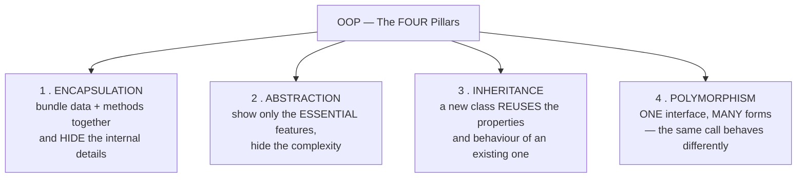

| # | Pillar | Definition | Everyday analogy |
|---|---|---|---|
| **1** | **Encapsulation** | **Wrapping data and the methods that act on it into a single unit (a class), and RESTRICTING direct access to the data** | A **medicine capsule** — the ingredients are sealed inside |
| **2** | **Abstraction** | **Showing only the essential features and HIDING the implementation details** | **Driving a car** — you use the steering wheel and pedals without knowing how the engine works |
| **3** | **Inheritance** | A class **ACQUIRES the properties and methods of another class** | A **child inheriting features from a parent** |
| **4** | **Polymorphism** | The **SAME interface or method name behaving DIFFERENTLY** depending on the object | The **word "run"** — a person runs, a program runs, a river runs |

*(Some books add **Message Passing** — objects communicate by calling each other's methods — as a fifth feature.)*

#### The other key OOP features

| Feature | Meaning |
|---|---|
| **Class** | The blueprint |
| **Object** | The instance |
| **Method** | A function belonging to a class |
| **Message passing** | Objects communicate by invoking each other's methods |
| **Dynamic binding** | The method to run is decided at **run time** |
| **Reusability** | Through inheritance and composition |

#### OOP vs Procedural (Structured) Programming

| Point | **Procedural / Structured (C, Pascal)** | **Object-Oriented (C++, Java, Python)** |
|---|---|---|
| **Program is divided into** | **FUNCTIONS / procedures** | **OBJECTS** |
| **Approach** | **TOP-DOWN** | **BOTTOM-UP** |
| **Focus on** | **The ALGORITHM** — "what steps to perform" | **The DATA** — "what things exist and what they can do" |
| **Data and functions** | **SEPARATE** — functions act on external data | **BOUND TOGETHER** inside the object |
| **Data security** | ❌ **Poor** — **global data is accessible to every function** | ✅ **Strong** — data is **private**, accessed only through methods |
| **Data hiding** | ❌ Not supported | ✅ **Supported (encapsulation)** |
| **Inheritance** | ❌ Not supported | ✅ **Supported** |
| **Polymorphism / Overloading** | ❌ Not supported | ✅ **Supported** |
| **Code reusability** | Limited — copy and paste, or function libraries | **High** — inheritance and composition |
| **Adding new data/functions** | **Difficult** — every function touching the data must be changed | **Easy** — add a new class or extend an existing one |
| **Modelling the real world** | Poor | **Natural** |
| **Suitable for** | **Small programs**, system programming, embedded | **Large, complex, evolving software** |
| **Maintenance of large code** | **Difficult** | **Easier** |
| **Example** | **C, FORTRAN, Pascal, COBOL, BASIC** | **C++, Java, C#, Python, Ruby, Smalltalk** |

#### Advantages of OOP

1. **Reusability** — inheritance avoids rewriting code; a base class serves many derived classes.
2. **Data security through encapsulation** — data cannot be corrupted by unrelated code.
3. **Easier maintenance and modification** — a change inside a class does not affect its users, as long as the interface is unchanged.
4. **Models the real world naturally**, so the design is easier to understand and discuss.
5. **Scales to large projects** — different teams can own different classes.
6. **Polymorphism** makes code flexible and extensible — new types can be added without changing existing code.
7. **Abstraction reduces complexity** — the user of a class need not understand its internals.
8. **Faster development** through reusable libraries and frameworks.
9. **Easier debugging** — problems are localised to a class.

**Disadvantages:** a **steeper learning curve**; programs are often **larger and slower** than equivalent procedural code; **over-engineering** is a real risk; and it is **not ideal for small scripts or low-level system code**.

> **Three OOP languages to name: Java, C++ and Python.** *(Others: C#, Ruby, Smalltalk, Kotlin, Swift, PHP, Objective-C.)*

#### Structure vs Class

| Point | **Structure (`struct`)** | **Class (`class`)** |
|---|---|---|
| **Default access** | **PUBLIC** | **PRIVATE** |
| **Data hiding** | ❌ Not by default | ✅ **Yes, by default** |
| **Member functions** | ✅ Allowed in **C++** · ❌ **NOT in C** | ✅ Yes |
| **Inheritance** | Allowed in C++ (default public) | ✅ Yes (default private) |
| **Constructor / Destructor** | Allowed in C++, not in C | ✅ Yes |
| **Used for** | **Grouping related DATA** (a plain record) | **Modelling an ENTITY with data AND behaviour** |
| **Memory** | Stack (value type in C#) | Heap (reference type in Java/C#) |
| **In C** | Only data grouping | Does not exist |

> **In C++ the ONLY technical difference is the default access specifier** (`struct` = public, `class` = private). By convention, `struct` is used for **passive data holders** and `class` for **objects with behaviour and invariants to protect**. **In C, `struct` cannot contain functions at all** — that is the far bigger difference, and the one usually being asked about.

#### The OOP design process

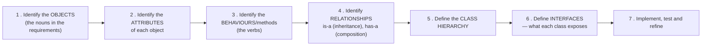

**The common activities:** identifying classes and objects · identifying their **structures and hierarchies** · defining **attributes** · defining **methods/operations** · establishing **relationships** (association, aggregation, composition, inheritance) · **modelling with UML class diagrams** · and applying **design principles (SOLID) and patterns**.

**Previous Year Question List from this Topic:**

- [What is Object-Oriented Programming (OOP)? What are the main principles of OOP? What is the difference between Method Overloading and Method Overriding?](../written-answers/oop.md?plain=1#L127)
- [Explain OOP Feature.](../written-answers/oop.md?plain=1#L361)
- [Write down the difference between Structure and Class.](../written-answers/oop.md?plain=1#L783)
- [Write down the advantages of OOP over traditional structured programming language](../written-answers/oop.md?plain=1#L1124)
- [Write down the Principle of OOP. What is Polymorphism? Write the name of 3 OOP language.](../written-answers/oop.md?plain=1#L1201)
- [(খ) কী কী ধারণার উপর ভিত্তি করে OOP প্রতিষ্ঠিত? ধারণাগুলো ব্যাখ্যা করুন।](../written-answers/oop.md?plain=1#L1731)
- [(ক) অবজেক্ট ওরিয়েন্টেড প্রোগ্রামিং কী? এটা কেন দরকার? অবজেক্ট ওরিয়েন্টেড প্রোগ্রামিং এর মৌলিক ধারণাগুলো লিখুন।](../written-answers/oop.md?plain=1#L1923)
- [Write down the principle of OOP?](../written-answers/oop.md?plain=1#L2212)
- [Write down the properties/function of OOP?](../written-answers/oop.md?plain=1#L2278)
- [Write down the main feature of Object Oriented Programming (OOP).](../written-answers/oop.md?plain=1#L2359)
- [(ক) Procedural Oriented ও Object Oriented Programming Languages মধ্যে পার্থক্য কি? উভয় Language এর ২টি করে উদাহরণ দিন।](../written-answers/oop.md?plain=1#L2583)
- [(i) Object Oriented Programming এর যেকোন দুটি বৈশিষ্ট্য উদাহরণসহ ব্যাখ্যা করুন।](../written-answers/oop.md?plain=1#L2651)
- [Object Oriented Programming (OOP) language -এর প্রধান বৈশিষ্ট্য গুলো কী কী? দুটি OOP language -এর নাম লিখুন।](../written-answers/oop.md?plain=1#L3498)
- [Object Oriented Programming এর চারটি গুরুত্বপূর্ণ বৈশিষ্ট্য লিখুন?](../written-answers/oop.md?plain=1#L3897)
- [What are the difference between Structure Programming and Objest Oriented Progrmamming?](../written-answers/oop.md?plain=1#L3962)
- [Explain feature of OOP.](../written-answers/oop.md?plain=1#L4446)

**Previous Year MCQ List from this Topic:**

- [A collection of objects that use common structure and a common behavior is knownas-](../mcq-answers/oop.md?plain=1#L56)
- [Which of the following is not property of the Object Oriented Programming Concept?](../mcq-answers/oop.md?plain=1#L649)
- [Which is not the feature of JAVA OOP?](../mcq-answers/oop.md?plain=1#L667)
- [Object Oriented programming এর বৈশিষ্ট্য কোনটি?](../mcq-answers/oop.md?plain=1#L676)
- [Which one is pure object-oriented language?](../mcq-answers/oop.md?plain=1#L703)
- [Which is not feature of object-oriented programming?](../mcq-answers/oop.md?plain=1#L712)
- [Which is not a feature of object-oriented programming?](../mcq-answers/oop.md?plain=1#L721)
- [Which one of the following is the core property of Object-Oriented Programming?](../mcq-answers/oop.md?plain=1#L730)
- [In object Oriented Programming, a property can be accessed from ________](../mcq-answers/oop.md?plain=1#L739)
- [Which of the following provides a programmer with the facility of using object of a class inside other classes?](../mcq-answers/oop.md?plain=1#L694)
- [Which language is not support OOP four Inheritance feature?](../mcq-answers/oop.md?plain=1#L817)


---

### Encapsulation and Abstraction

#### Encapsulation

> **ENCAPSULATION is the bundling of DATA and the METHODS that operate on that data into a single unit (a class), together with RESTRICTING DIRECT ACCESS to the data from outside.**

It is achieved by making the **data members `private`** and exposing controlled **`public` getter and setter methods**.

```java
class BankAccount {
    private double balance;          // ← PRIVATE: nobody outside can touch it directly

    public double getBalance() {     // controlled READ access
        return balance;
    }

    public void deposit(double amount) {     // controlled WRITE access — WITH VALIDATION
        if (amount > 0) {
            balance += amount;
        } else {
            System.out.println("Invalid deposit amount");
        }
    }

    public void withdraw(double amount) {
        if (amount > 0 && amount <= balance) {
            balance -= amount;
        } else {
            System.out.println("Insufficient balance or invalid amount");
        }
    }
}
```

> **Why this matters — the crucial point:** if `balance` were **public**, any code anywhere could write `account.balance = -50000;` and silently corrupt the data. With encapsulation, **every change must pass through a method that can VALIDATE it**. The class becomes responsible for its own correctness, and that responsibility cannot be bypassed.

**Benefits of encapsulation:**
1. **Data hiding and security** — internal state cannot be corrupted from outside.
2. **Validation** — every modification passes through a controlled gate.
3. **Flexibility** — the internal representation can be **changed without affecting any user of the class**.
4. **Read-only or write-only** access can be provided by supplying only a getter or only a setter.
5. **Easier maintenance and debugging** — if the balance is wrong, the bug **must** be inside this class.
6. **Loose coupling** between classes.

> **"Which type of variable violates encapsulation rules?"** → A **PUBLIC data member (a public instance variable)**. Making data public exposes the internal state directly and destroys the class's ability to protect or validate it. **Global variables** violate it even more severely. The rule is: **data should be private (or protected); only methods should be public.**

#### Abstraction

> **ABSTRACTION means showing only the ESSENTIAL features of an object to the outside world, while HIDING the internal implementation details.**

```java
// An ABSTRACT class — it defines WHAT must be done, not HOW
abstract class Shape {
    abstract double area();                    // WHAT — no implementation
    abstract double perimeter();

    void display() {                           // a concrete method, shared by all shapes
        System.out.println("Area: " + area() + ", Perimeter: " + perimeter());
    }
}

class Circle extends Shape {
    private double r;
    Circle(double r) { this.r = r; }
    double area()      { return Math.PI * r * r; }        // HOW — for a circle
    double perimeter() { return 2 * Math.PI * r; }
}

class Rectangle extends Shape {
    private double l, w;
    Rectangle(double l, double w) { this.l = l; this.w = w; }
    double area()      { return l * w; }                  // HOW — for a rectangle
    double perimeter() { return 2 * (l + w); }
}

// The USER writes simply:
Shape s = new Circle(5);
s.display();      // The user calls area() WITHOUT KNOWING the formula inside
```

> **The everyday analogy:** when you **drive a car**, you use the **steering wheel, accelerator and brake** — a simple, essential interface. You do not need to know about fuel injection, the differential or the engine control unit. **That hidden complexity is abstraction.**

#### Abstraction vs Encapsulation — the key comparison

| Point | **ABSTRACTION** | **ENCAPSULATION** |
|---|---|---|
| **Question it answers** | **"WHAT does it do?"** | **"HOW is it protected?"** |
| **Purpose** | **HIDE COMPLEXITY** — show only the essential | **HIDE DATA** — protect the internal state |
| **Focus** | **Design level** — the outside view | **Implementation level** — the inside |
| **What is hidden** | The **implementation details / complexity** | The **DATA** |
| **Achieved by** | **Abstract classes and INTERFACES** | **Access modifiers — `private` + getters/setters** |
| **Solves the problem of** | Complexity for the **user** of the class | Security and integrity for the **data** |
| **Example** | You call `car.start()` without knowing the ignition sequence | The fuel level is `private`; it can only be changed through `refuel()` |

> **They work together:** abstraction decides **what to show**; encapsulation decides **how to hide the rest**. In practice, encapsulation is one of the **mechanisms** by which abstraction is achieved.

#### Access specifiers

| Specifier | Same class | Same package | Subclass (other package) | Anywhere |
|---|---|---|---|---|
| **`private`** | ✅ | ❌ | ❌ | ❌ |
| **`default`** (package-private, Java only) | ✅ | ✅ | ❌ | ❌ |
| **`protected`** | ✅ | ✅ | ✅ | ❌ |
| **`public`** | ✅ | ✅ | ✅ | ✅ |

> **Java has FOUR access levels** (`private`, default, `protected`, `public`) — though only **THREE keywords**, since "default" has no keyword.
> **C++ has THREE access specifiers: `private`, `protected` and `public`.**

**What each is for:**

| Specifier | Purpose |
|---|---|
| **`private`** | **The default choice for all data members.** Accessible only within the class — this is what implements encapsulation |
| **`protected`** | Accessible in the class **and its SUBCLASSES** — used for members a derived class legitimately needs |
| **`public`** | The **INTERFACE** of the class — the methods the outside world is meant to call |
| **default** (Java) | Visible within the same package — useful for classes that collaborate closely |

> **"Which members of a base class cannot be accessed by a derived class?"** → **PRIVATE members.** A derived class inherits them (they exist in memory and occupy space) but **cannot access them directly** — it must go through the base class's public or protected methods. **This is exactly what `protected` was invented for:** it allows access by subclasses while still denying it to the outside world.

**C++ inheritance access rules** — a further layer that Java does not have:

| Base member | **public** inheritance | **protected** inheritance | **private** inheritance |
|---|---|---|---|
| public | **public** | protected | private |
| protected | **protected** | protected | private |
| **private** | **Not accessible** | **Not accessible** | **Not accessible** |

**Previous Year Question List from this Topic:**

- [Explain how encapsulation and inheritance are advantageous in object oriented programming.](../written-answers/oop.md?plain=1#L964)
- [What is Abstraction and Polymorphism expalin with example?](../written-answers/oop.md?plain=1#L1638)
- [Which type of variable violates encapsulation rules?](../written-answers/oop.md?plain=1#L10977)
- [Briefly Describe Abstraction, Encapsulation.](../written-answers/oop.md?plain=1#L11341)

**Previous Year MCQ List from this Topic:**

- [Encapsulation এর মাধ্যমে object oriented programming এর কোন বৈশিষ্ট্যটি নিশ্চিত হয়?](../mcq-answers/oop.md?plain=1#L685)
- [In object Oriented Programming, a property can be accessed from ________](../mcq-answers/oop.md?plain=1#L739)
- [Which of the following does NOT achieve encapsulation?](../mcq-answers/oop.md?plain=1#L750)
- [Which variable violates the principle of ecvapsulation?](../mcq-answers/oop.md?plain=1#L759)
- [Which of the following is a technique for hiding the internal implementation details of an object?](../mcq-answers/oop.md?plain=1#L765)
- [What is the characteristic of OOP programming that allows binding data and methods to work as a unit?](../mcq-answers/oop.md?plain=1#L774)
- [Encapsulation এর মাধ্যমে object oriented programming এর কোন বৈশিষ্ট্যটি নিশ্চিত হয়?](../mcq-answers/oop.md?plain=1#L783)
- [In C++, the idea to hiding the details of how something is implemented is known as](../mcq-answers/oop.md?plain=1#L788)
- [In C++, the idea to hiding the details of how something is implemented is known as-](../mcq-answers/oop.md?plain=1#L797)


---

### Inheritance

> **INHERITANCE is the mechanism by which one class (the CHILD / DERIVED / SUB class) ACQUIRES the properties and methods of another class (the PARENT / BASE / SUPER class).**

It represents an **"IS-A" relationship**: a Car **is a** Vehicle; a Dog **is an** Animal; a SavingsAccount **is an** Account.

> **"What is another name for a subclass?"** → **Derived class, Child class, or Extended class.** *(And the superclass is also called the **base class** or **parent class**.)*

#### Why inheritance is used

1. **Code reusability** — the common code is written **once** in the base class.
2. **Establishes a logical hierarchy** that mirrors the real world.
3. **Extensibility** — new behaviour is added in a subclass **without modifying** the tested base class.
4. **Enables POLYMORPHISM** — a base-class reference can point to any derived object, which is what makes runtime polymorphism possible.
5. **Easier maintenance** — fix a bug in the base class and every subclass is fixed.

#### Syntax

```java
// Java
class Vehicle {                            // BASE class
    protected String brand;
    protected int speed;
    public void start() { System.out.println("Vehicle starting..."); }
    public void stop()  { System.out.println("Vehicle stopping..."); }
}

class Car extends Vehicle {                // DERIVED class — 'extends'
    private int numDoors;
    public void openTrunk() { System.out.println("Trunk opened"); }
}

// Usage
Car c = new Car();
c.start();       // ← INHERITED from Vehicle — no code was written for it in Car
c.openTrunk();   // ← Car's own method
```

```cpp
// C++
class Vehicle {                            // base class
protected:
    string brand;
public:
    void start() { cout << "Starting..."; }
};

class Car : public Vehicle {               // ':' and the access specifier
public:
    void openTrunk() { cout << "Trunk opened"; }
};
```

#### The types of inheritance

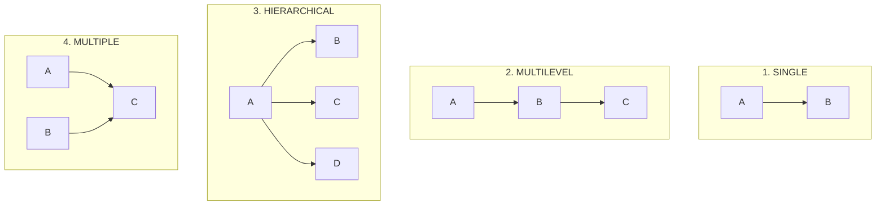

| Type | Description | Java support |
|---|---|---|
| **Single** | One base, one derived | ✅ Yes |
| **Multilevel** | A chain: A → B → C | ✅ Yes |
| **Hierarchical** | One base, **several** derived classes | ✅ Yes |
| **Multiple** | **One derived class from SEVERAL bases** | ❌ **NOT for classes** — only via **interfaces** |
| **Hybrid** | A combination of two or more of the above | ❌ Not directly in Java |

> **"How many classes are used in hybrid inheritance?"** → **At least FOUR** in the classic diamond form: one base, two intermediate classes derived from it, and one final class derived from both. Hybrid inheritance is any **combination** of the basic types, so the exact count depends on the combination — but the diamond (4 classes) is the standard example.

#### The Diamond Problem of multiple inheritance

> **The DIAMOND PROBLEM is the AMBIGUITY that arises when a class inherits from two classes that both inherit from the SAME base class — so the final class receives TWO COPIES of the base class's members, and the compiler cannot tell which one is meant.**

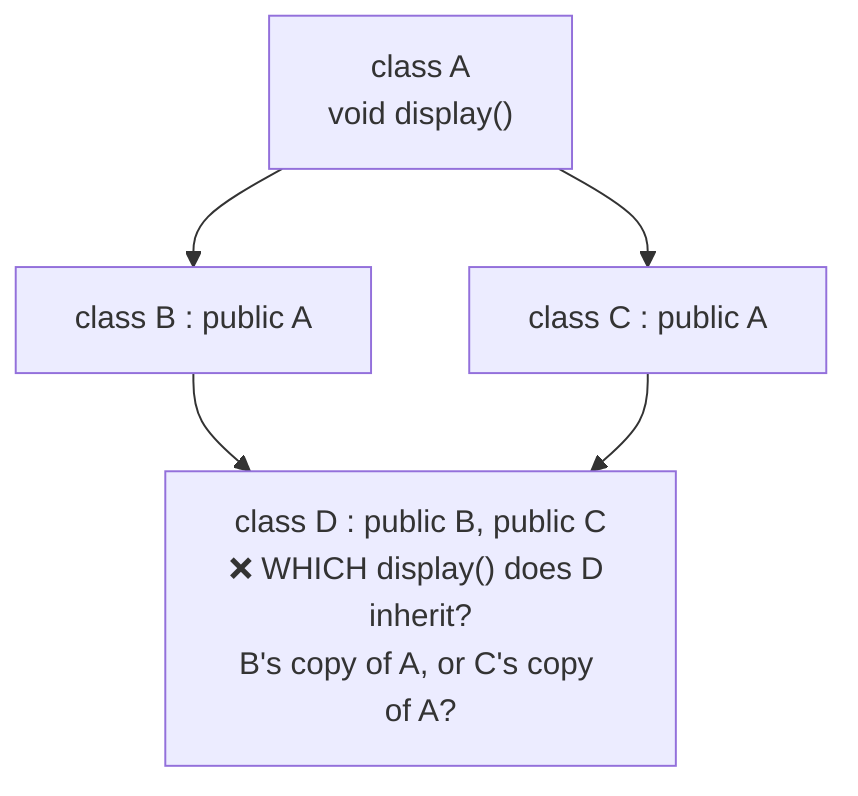

```cpp
class A { public: void display() { cout << "A"; } };
class B : public A { };
class C : public A { };
class D : public B, public C { };

int main() {
    D obj;
    obj.display();     // ❌ COMPILE ERROR: "request for member 'display' is ambiguous"
}
```

**The problem in detail:** object `D` contains **two separate copies of A's data and methods** — one inherited through B and one through C. A call to `display()` is ambiguous, and worse, if A had a data member `x`, then `D` would have **two different values of x** that could drift apart.

**The solutions:**

**1. In C++ — VIRTUAL INHERITANCE** (the proper fix):
```cpp
class A { public: void display() { cout << "A"; } };
class B : virtual public A { };       // ← 'virtual'
class C : virtual public A { };       // ← 'virtual'
class D : public B, public C { };     // now D has only ONE shared copy of A ✅

D obj;  obj.display();                // ✅ works, no ambiguity
```

**2. Explicit scope resolution** (a workaround, not a fix — the two copies still exist):
```cpp
obj.B::display();     // explicitly choose B's copy
obj.C::display();     // or C's
```

**3. In JAVA — the problem is AVOIDED BY DESIGN:**
> **Java does NOT allow a class to extend more than one class**, precisely to eliminate the diamond problem. Multiple inheritance of **TYPE** is provided instead through **INTERFACES**, which (before Java 8) contained **no implementation at all**, so there was nothing to be ambiguous about.
>
> ```java
> interface A { void display(); }
> interface B extends A { }
> interface C extends A { }
> class D implements B, C {
>     public void display() { System.out.println("D's own implementation"); }
> }   // ✅ No ambiguity — D provides the ONE implementation
> ```
>
> *(Java 8 introduced **default methods** in interfaces, which reintroduced a limited form of the problem. Java's rule: if two interfaces provide conflicting default methods, **the implementing class MUST override the method explicitly**, and can call a specific one with `B.super.display()`.)*

#### Method overriding

> **METHOD OVERRIDING is redefining, in a SUBCLASS, a method that is already defined in its SUPERCLASS, with the SAME name, SAME return type and SAME parameters.**

```java
class Animal {
    public void makeSound() { System.out.println("Some generic sound"); }
}

class Dog extends Animal {
    @Override
    public void makeSound() { System.out.println("Woof! Woof!"); }    // OVERRIDES
}

class Cat extends Animal {
    @Override
    public void makeSound() { System.out.println("Meow!"); }
}

// The power of it:
Animal a;
a = new Dog();  a.makeSound();     // "Woof! Woof!"  ← decided at RUN TIME
a = new Cat();  a.makeSound();     // "Meow!"
```

**Rules of overriding:** the method signature must be **identical**; the access modifier **cannot be more restrictive** than the parent's; `private`, `static` and `final` methods **cannot be overridden**; the return type must be the same **or a subtype (covariant)**; and it requires an **inheritance relationship**.

#### `super` and `this`

| Keyword | Meaning |
|---|---|
| **`this`** | Refers to the **current object** — used to distinguish a field from a parameter of the same name, or to call another constructor of the same class |
| **`super`** | Refers to the **immediate PARENT class** — used to call the parent's constructor (`super(...)`) or an overridden parent method (`super.method()`) |

**Previous Year Question List from this Topic:**

- [Explain the concepts of Inheritance and Polymorphism in Java. Write a Java program to demonstrate method overriding.](../written-answers/oop.md?plain=1#L23)
- [What is Polymorphism? Discuss about different types of Polymorphism with example?](../written-answers/oop.md?plain=1#L868)
- [(b) What is the diamond problem of multiple inheritance in C++?](../written-answers/oop.md?plain=1#L1264)
- [How many classes can be used in Hybrid Inheritance?](../written-answers/oop.md?plain=1#L1560)
- [(গ) Inheritance কী? উদাহরণসহ ব্যাখ্যা করুন।](../written-answers/oop.md?plain=1#L1809)
- [Write a C/C++ Program that has a Class Account, Subclass Savings Account, Current Account etc with related hierarchy way.](../written-answers/oop.md?plain=1#L2993)
- [Write the definition of Inheritance, Polymorphism with coding example.](../written-answers/oop.md?plain=1#L3183)
- [OOP problem (Inheritance related) (হুবহু প্রশ্ন সংগ্রহ করা সম্ভব হয়নি)](../written-answers/oop.md?plain=1#L3369)
- [Inheritance is one of important issues for any object oriented programming language. The main advantage of Inheritance is the ability to reuse the code. Explain…](../written-answers/oop.md?plain=1#L3797)
- [Inheritance, Polymorphism and Encapsulation ব্যাখ্যা করুন।](../written-answers/oop.md?plain=1#L4103)
- [What do you mean by Polymorphism and Inheritance in Object Oriented Programming (OOP)? Give appropriate example.](../written-answers/oop.md?plain=1#L4538)
- [Consider a base class Shape and its derived class Rectangle. Design a code inheritance code using C++.](../written-answers/oop.md?plain=1#L4640)

**Previous Year MCQ List from this Topic:**

- [Which of the following statements is/are true about Inheritance in Java?](../mcq-answers/oop.md?plain=1#L266)
- [Which keyword must be used to inherit class in java?](../mcq-answers/oop.md?plain=1#L333)
- [A class that is inherited in java is called a ________.](../mcq-answers/oop.md?plain=1#L342)
- [Which of the keywords can be used in a subclass to call the constructor of superclass?](../mcq-answers/oop.md?plain=1#L432)
- [A class that is inherited in java is called a ________.](../mcq-answers/oop.md?plain=1#L459)
- [When a class serves as base class for many derived classes, the situation is called-](../mcq-answers/oop.md?plain=1#L808)
- [Which language is not support OOP four Inheritance feature?](../mcq-answers/oop.md?plain=1#L817)
- [Which type of members can't accessed in derived classes of a base class?](../mcq-answers/oop.md?plain=1#L826)
- [What is default level of inheritance has to be specified in C++?](../mcq-answers/oop.md?plain=1#L832)
- [A derived class inherits attributes from a-](../mcq-answers/oop.md?plain=1#L841)
- [How to access the overridden method of base class from the derived class?](../mcq-answers/oop.md?plain=1#L850)
- [Which of the following provides a programmer with the facility of using object of a class inside other classes?](../mcq-answers/oop.md?plain=1#L694)


---

### Polymorphism

> **POLYMORPHISM means "MANY FORMS" (Greek: *poly* = many, *morph* = form). It is the ability of a SINGLE interface, method name or operator to behave DIFFERENTLY depending on the object or the context.**

> **The everyday analogy:** the word **"run"** — *a person runs*, *a program runs*, *a machine runs*, *a river runs*. One word, many meanings decided by the context. Or **one person** who is simultaneously a father at home, an employee at work and a customer in a shop — **one entity, many forms**.

#### The two types of polymorphism

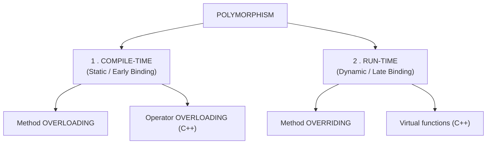

#### 1. Compile-time polymorphism (Static binding / Early binding)

**The method to call is decided by the COMPILER, at compile time**, based on the number and types of the arguments.

**Achieved by: METHOD OVERLOADING and OPERATOR OVERLOADING.**

```java
class Calculator {
    int    add(int a, int b)            { return a + b; }          // 2 ints
    int    add(int a, int b, int c)     { return a + b + c; }      // 3 ints — different COUNT
    double add(double a, double b)      { return a + b; }          // doubles — different TYPE
    String add(String a, String b)      { return a + b; }          // strings
}

Calculator c = new Calculator();
c.add(2, 3);            // → 5      the compiler picks the int,int version
c.add(2, 3, 4);         // → 9      picks the 3-argument version
c.add(2.5, 3.5);        // → 6.0    picks the double version
c.add("Hello ", "World");  // → "Hello World"
```

#### 2. Run-time polymorphism (Dynamic binding / Late binding)

**The method to call is decided at RUN TIME, based on the ACTUAL OBJECT** the reference points to — not on the type of the reference.

**Achieved by: METHOD OVERRIDING** (and, in C++, **virtual functions**).

```java
class Shape {
    public void draw() { System.out.println("Drawing a shape"); }
}
class Circle extends Shape {
    @Override public void draw() { System.out.println("Drawing a CIRCLE"); }
}
class Square extends Shape {
    @Override public void draw() { System.out.println("Drawing a SQUARE"); }
}

public class Main {
    public static void main(String[] args) {
        Shape[] shapes = { new Circle(), new Square(), new Shape() };

        for (Shape s : shapes) {
            s.draw();       // ← the SAME call, but a DIFFERENT method runs each time
        }
        // Output:
        //   Drawing a CIRCLE
        //   Drawing a SQUARE
        //   Drawing a shape
    }
}
```

> **Why this is powerful:** the loop **does not know or care** what kinds of shape exist. A new `Triangle` class can be added tomorrow and this loop will handle it **without a single line being changed**. That is the practical value of polymorphism — **code that is open to extension but closed to modification**.

#### Static binding vs Dynamic binding

| Point | **Static binding (Early)** | **Dynamic binding (Late)** |
|---|---|---|
| **Decided at** | **COMPILE time** | **RUN time** |
| **Based on** | The **reference type** and the argument list | **The ACTUAL OBJECT** in memory |
| **Achieved by** | **Overloading**, and `private`/`static`/`final` methods | **Overriding**, virtual functions |
| **Speed** | **Faster** — the address is resolved once | Slightly slower — a **vtable lookup** at each call |
| **Flexibility** | Low | **High** |
| **In C++** | Normal member functions | **`virtual`** member functions |

#### Overloading vs Overriding — the key comparison

| Point | **METHOD OVERLOADING** | **METHOD OVERRIDING** |
|---|---|---|
| **Definition** | **Same method NAME, DIFFERENT parameters**, in the **same class** | **Same method name AND same parameters**, in a **subclass** |
| **Occurs in** | **The SAME class** (or a subclass) | **Two classes with an INHERITANCE relationship** |
| **Parameters** | **MUST DIFFER** (in number, type or order) | **MUST BE IDENTICAL** |
| **Return type** | **May differ** (but cannot differ *only* by return type) | Must be the **same or a subtype** |
| **Binding** | **STATIC / compile-time** | **DYNAMIC / run-time** |
| **Polymorphism type** | **Compile-time** | **Run-time** |
| **Inheritance required** | ❌ **No** | ✅ **YES** |
| **`private` / `static` / `final` methods** | ✅ Can be overloaded | ❌ **Cannot be overridden** |
| **Access modifier** | Can be anything | **Cannot be MORE restrictive** than the parent's |
| **Purpose** | **Convenience** — one logical operation, several input forms | **Specialisation** — a subclass provides its own behaviour |
| **Performance** | Slightly faster | Slight run-time overhead |
| **Example** | `add(int,int)` and `add(double,double)` | `Animal.makeSound()` overridden by `Dog.makeSound()` |

> **The one-line summary: OVERLOADING is "same name, different parameters, same class, compile time"; OVERRIDING is "same name, same parameters, parent and child class, run time".**

#### Function overloading vs Operator overloading

| Point | **Function overloading** | **Operator overloading** |
|---|---|---|
| **What is redefined** | A **function/method name** | An **OPERATOR** (`+`, `-`, `*`, `<<`, `==`) |
| **Purpose** | One name for several related operations | Make **operators work with user-defined types** |
| **Supported in** | C++, Java, C# | **C++, C#, Python — NOT in Java** |
| **Example** | `add(int,int)` vs `add(double,double)` | `Complex c3 = c1 + c2;` |

```cpp
// C++ operator overloading — make '+' work on Complex numbers
class Complex {
    float real, imag;
public:
    Complex(float r = 0, float i = 0) : real(r), imag(i) {}

    Complex operator + (const Complex& c) {     // overloading '+'
        return Complex(real + c.real, imag + c.imag);
    }
    void display() { cout << real << " + " << imag << "i"; }
};

Complex c1(3, 4), c2(1, 2);
Complex c3 = c1 + c2;      // ← calls the overloaded operator+  → 4 + 6i
```

> **Java deliberately does NOT support operator overloading**, on the grounds that it is frequently abused and makes code hard to read (the sole exception is `+` for String concatenation, which is built in).

#### Virtual functions (C++)

> A **VIRTUAL FUNCTION** is a member function declared with the keyword **`virtual`** in a base class, which is intended to be **overridden** in derived classes, and which is resolved **at RUN TIME** through the object's actual type.

```cpp
class Base {
public:
    virtual void show() { cout << "Base class show()" << endl; }   // ← virtual
    void display()      { cout << "Base class display()" << endl; } // NOT virtual
};

class Derived : public Base {
public:
    void show()    override { cout << "Derived class show()" << endl; }
    void display()          { cout << "Derived class display()" << endl; }
};

int main() {
    Base* ptr;
    Derived d;
    ptr = &d;

    ptr->show();      // "Derived class show()"    ← VIRTUAL → run-time binding ✅
    ptr->display();   // "Base class display()"    ← NOT virtual → compile-time binding
}
```

> **This example is the clearest demonstration of the difference between static and dynamic binding.** Without `virtual`, C++ calls the method of the **pointer's type** (Base). With `virtual`, it calls the method of the **object's actual type** (Derived), using a hidden **vtable** lookup.
>
> **A pure virtual function** — `virtual void area() = 0;` — has **no implementation** and makes the class **ABSTRACT**: it cannot be instantiated, and every concrete derived class **must** implement it.
>
> **A virtual DESTRUCTOR is essential** whenever a class is used polymorphically: without it, deleting a Derived object through a Base pointer calls only the Base destructor, **leaking the Derived part's resources**.

**Previous Year Question List from this Topic:**

- [Explain the concepts of Inheritance and Polymorphism in Java. Write a Java program to demonstrate method overriding.](../written-answers/oop.md?plain=1#L23)
- [What is runtime polymorphism and compile time polymorphism? Explain it's with example.](../written-answers/oop.md?plain=1#L218)
- [What is polymorphism?](../written-answers/oop.md?plain=1#L299)
- [Write a program using any object-oriented language (e.g., C++ / Java / Python) to represent a Bank Account. Your program should include:](../written-answers/oop.md?plain=1#L439)
- [b) What is polymorphism in the context of an object-oriented paradigm? Explain the method of overloading and method of overriding with suitable examples.](../written-answers/oop.md?plain=1#L610)
- [Explain the concept of polymorphism in Object-oriented Programming with example?](../written-answers/oop.md?plain=1#L701)
- [What is Polymorphism? Discuss about different types of Polymorphism with example?](../written-answers/oop.md?plain=1#L868)
- [(খ) Function Overloading উদাহরণসহ ব্যাখ্যা করুন।](../written-answers/oop.md?plain=1#L1036)
- [(a) Define function overloading and function overriding with examples.](../written-answers/oop.md?plain=1#L1357)
- [What is virtual function with example?](../written-answers/oop.md?plain=1#L1456)
- [What is Abstraction and Polymorphism expalin with example?](../written-answers/oop.md?plain=1#L1638)
- [(গ) Overloading এবং overriding এর মধ্যে পার্থক্য কী?](../written-answers/oop.md?plain=1#L1993)
- [What is Polymorphism? Java language এর আলোকে ব্যাখ্যা কর।](../written-answers/oop.md?plain=1#L2066)
- [(a) What is Polymorphism? Distinguish between compile time and runtime polymorphisms.](../written-answers/oop.md?plain=1#L2141)
- [Write a Java code with a case where you have to mentioned functionalities with override method.](../written-answers/oop.md?plain=1#L2442)
- [(i) Object Oriented Programming এ Static binding and Dynamic binding কি? ব্যাখ্যা করুন।](../written-answers/oop.md?plain=1#L2751)
- [Write the definition of Inheritance, Polymorphism with coding example.](../written-answers/oop.md?plain=1#L3183)
- [Explain method overloading and Method overriding with example.](../written-answers/oop.md?plain=1#L3279)
- [(b) What is function overloading and operator overloading. Give example.](../written-answers/oop.md?plain=1#L3569)
- [Object Oriented Programming এ Method Overloading and Method Overriding এর মধ্যে পার্থক্য কী?](../written-answers/oop.md?plain=1#L4030)
- [Function overloading and Operator overloading বলতে কী বুঝেন? উদাহরণ দিন।](../written-answers/oop.md?plain=1#L4182)
- [(a) What is method overloading?](../written-answers/oop.md?plain=1#L4275)
- [(b) Explain Polymorphism concept of OOP language.](../written-answers/oop.md?plain=1#L4358)
- [What do you mean by Polymorphism and Inheritance in Object Oriented Programming (OOP)? Give appropriate example.](../written-answers/oop.md?plain=1#L4538)
- [Difference between method overloading and overriding in java.](../written-answers/oop.md?plain=1#L4781)
- [What is polymorphism? What is the difference between method overriding and method overloading?](../written-answers/oop.md?plain=1#L4871)

**Previous Year MCQ List from this Topic:**

- [A feature of Object oriented programming languages that allows a specific routine to use variables of different types at different times, is called OOP?](../mcq-answers/oop.md?plain=1#L524)
- [A function having more than one distinct meaning is called ______ function](../mcq-answers/oop.md?plain=1#L530)
- [The feature in object-oriented programming that allows the same operation to be carried out differently, depending on the object, is-](../mcq-answers/oop.md?plain=1#L539)
- [The most common use of ________ in OOP occurs when a parent class reference is used to refer to a child class object.](../mcq-answers/oop.md?plain=1#L548)
- [Which operator that can be overloaded is?](../mcq-answers/oop.md?plain=1#L602)
- [If same message is passed to objects of several different classes and all of those can respond in a different way, what is this feature called?](../mcq-answers/oop.md?plain=1#L620)
- [What is the process of defining two or more methods within the same class that have same name but different parameters declaration?](../mcq-answers/oop.md?plain=1#L629)
- [Overloaded functions are ________](../mcq-answers/oop.md?plain=1#L638)
- [Which of the following operators should be preferred to overload as a global function rather than a member method?](../mcq-answers/oop.md?plain=1#L506)
- [Which of the following operators cannot be overloaded in C/C++ ?](../mcq-answers/oop.md?plain=1#L515)
- [The operator that cannot be overloaded is ________.](../mcq-answers/oop.md?plain=1#L566)
- [Which functions overloads the ">>" operator?](../mcq-answers/oop.md?plain=1#L575)
- [Which of the following operator functions cannot be global i.e. must be a member function?](../mcq-answers/oop.md?plain=1#L584)


---

## Java Programming & Methods

### Java — Architecture and Platform Independence

#### Why Java is called platform independent

> **Java is platform independent because it is compiled not to machine code, but to an intermediate form called BYTECODE, which is then executed by a JAVA VIRTUAL MACHINE (JVM) — and a JVM exists for every platform.**
>
> **The slogan: "WRITE ONCE, RUN ANYWHERE" (WORA).**

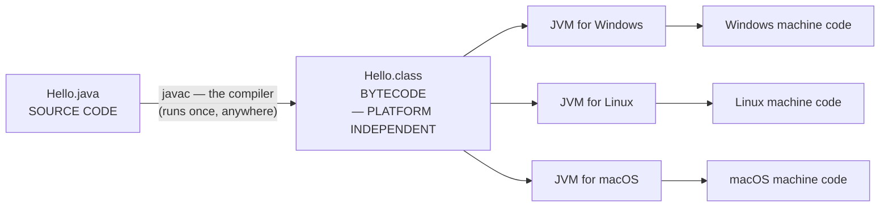

**The key insight:** **the BYTECODE is portable; the JVM is NOT.** Each operating system needs its own JVM, but the same `.class` file runs on all of them without recompilation.

**Contrast with C/C++:** a C program compiled on Windows produces a **Windows `.exe`** containing Intel machine instructions and Windows system calls. It **will not run on Linux** — the source must be **recompiled** for each target. Java moves that platform-specific step from **compile time to run time**, where the JVM handles it.

#### JDK, JRE and JVM

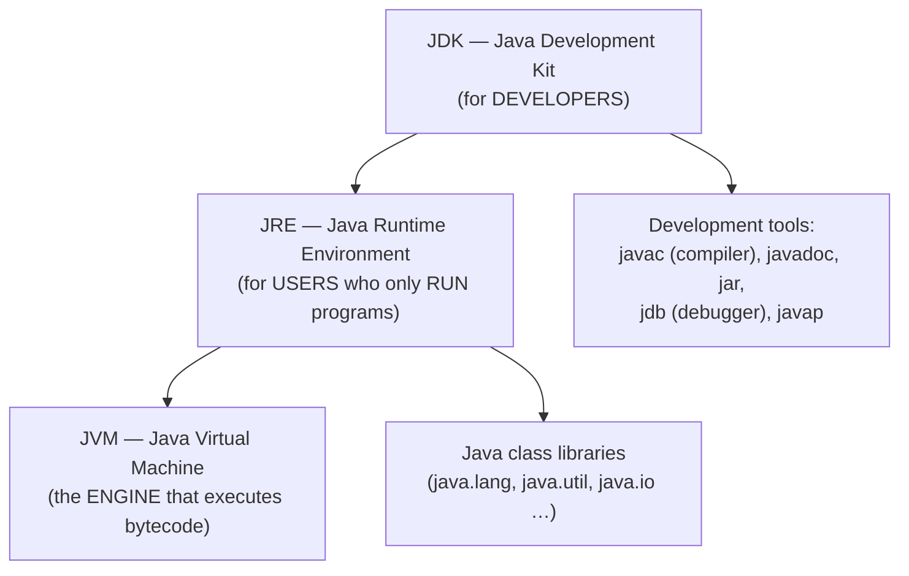

| Point | **JVM** | **JRE** | **JDK** |
|---|---|---|---|
| **Full form** | **Java Virtual Machine** | **Java Runtime Environment** | **Java Development Kit** |
| **What it is** | An **abstract machine / specification** that **EXECUTES bytecode** | **JVM + class libraries** | **JRE + development TOOLS** |
| **Purpose** | **Run** the bytecode | **Run** Java applications | **DEVELOP** and run Java applications |
| **Contains** | Class loader, memory areas, execution engine, JIT, garbage collector | **JVM** + libraries + supporting files | **JRE** + **javac**, javadoc, jar, jdb, javap |
| **Can you compile with it?** | ❌ No | ❌ **No** | ✅ **Yes** |
| **Can you run with it?** | ✅ Yes (given bytecode) | ✅ Yes | ✅ Yes |
| **Needed by** | — | **End users** | **Developers** |
| **Platform dependent?** | ✅ **YES** | ✅ Yes | ✅ Yes |

> **The containment relationship: JDK ⊃ JRE ⊃ JVM.** A developer installs the **JDK**; a user who only runs Java programs needs only the **JRE**.

#### The JVM architecture

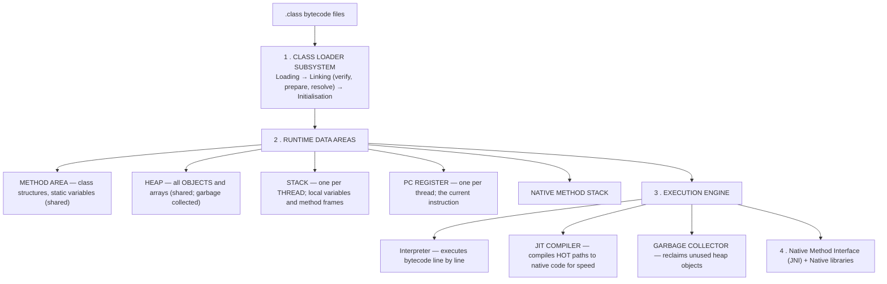

| Component | Function |
|---|---|
| **Class Loader** | **Loads** `.class` files, **verifies** the bytecode for safety, **prepares** static memory and **resolves** references |
| **Method Area** | Stores **class-level data** — the runtime constant pool, field and method data, static variables. **Shared by all threads** |
| **Heap** | Where **ALL OBJECTS live**. Shared, and managed by the **garbage collector** |
| **Stack** | **One per thread** — holds method frames with local variables and partial results. Destroyed when the method returns |
| **PC Register** | Holds the address of the **currently executing instruction**, per thread |
| **Interpreter** | Reads and executes bytecode instruction by instruction — **fast to start, slow to run** |
| **JIT Compiler** | Detects **frequently executed ("hot") code** and **compiles it to native machine code once**, then runs the native version. **This is what makes modern Java nearly as fast as C++** |
| **Garbage Collector** | **Automatically frees objects that are no longer reachable** |

> **Why a JIT rather than pure interpretation:** interpreting bytecode is roughly 10–20× slower than native code. The JIT gets the **best of both worlds** — instant start-up from the interpreter, and near-native speed for the small fraction of code where the program actually spends its time.

#### Garbage collection

> **Garbage collection is the JVM's automatic memory management: it identifies objects that are NO LONGER REACHABLE from any live reference, and reclaims their memory.**

**When is the garbage collector most likely to be invoked?**
1. When the **heap is running low on free memory** — the commonest trigger.
2. When a **new object allocation cannot be satisfied**.
3. When **many objects have just become unreachable** — for example immediately after a large collection or many local objects go out of scope at the end of a method.
4. When the **Eden space of the young generation fills up** (a minor GC).
5. **During idle time**, in some collectors.
6. On an explicit **`System.gc()`** call — which is only a **REQUEST, not a command**; the JVM may ignore it entirely.

> **The key exam point: you CANNOT force garbage collection in Java.** `System.gc()` is a hint. This is deliberate — the JVM's own heuristics are almost always better than a programmer's guess.

**How an object becomes eligible:** setting the reference to `null`; reassigning the reference to another object; the reference going out of scope when a method returns; or an **island of isolation** (objects referring only to each other, with nothing outside pointing to them).

**`finalize()` and `runFinalization()`:** `finalize()` is a method the GC *may* call before reclaiming an object, intended for cleanup. **`System.runFinalization()` requests that any pending finalizers be run.** Both are **deprecated and should never be used** — finalization timing is unpredictable, it slows collection, and it may never run at all. **Use `try-with-resources` and the `AutoCloseable` interface instead.**

#### The `static` keyword

> **`static` means the member belongs to the CLASS ITSELF, not to any individual object.** There is **exactly one copy, shared by every instance**.

```java
class Counter {
    static int count = 0;        // ← ONE copy shared by ALL objects
    int id;                      // ← a SEPARATE copy in each object

    Counter() {
        count++;                 // increments the single shared counter
        id = count;
    }

    static void showCount() {                    // a STATIC method
        System.out.println("Objects created: " + count);
        // System.out.println(id);   ❌ ERROR — a static method cannot use an
        //                              instance variable: WHICH object's id?
    }
}

Counter c1 = new Counter();
Counter c2 = new Counter();
Counter c3 = new Counter();
Counter.showCount();      // "Objects created: 3"  ← called on the CLASS, not an object
```

| Applied to | Meaning |
|---|---|
| **Static variable** | **One copy shared by all objects** — used for counters, constants and shared configuration |
| **Static method** | Belongs to the class; **can be called WITHOUT creating an object**; **cannot access instance variables or use `this`** |
| **Static block** | Runs **ONCE, when the class is first loaded** — used for one-time initialisation |
| **Static nested class** | A nested class that does not need an instance of the outer class |

> **The syntax for calling a static method is `ClassName.methodName()`** — for example `Math.sqrt(16)` or `Integer.parseInt("42")`. This is why `main` is declared `static`: the JVM must call it **before any object exists**.

#### Static vs Instance members

| Point | **Static member** | **Instance member** |
|---|---|---|
| **Belongs to** | **The CLASS** | **Each OBJECT** |
| **Copies in memory** | **ONE, shared** | **One per object** |
| **Memory area** | **Method area** | **Heap**, inside the object |
| **Accessed via** | **`ClassName.member`** | `objectName.member` |
| **Created when** | The **class is loaded** | The **object is created** |
| **Can access instance members?** | ❌ **No** | ✅ Yes |
| **Can use `this`?** | ❌ No | ✅ Yes |
| **Example** | `Math.PI`, `Math.sqrt()`, a counter | A student's name, roll and CGPA |

**Previous Year Question List from this Topic:**

- [What does run Finalization do?](../written-answers/oop.md?plain=1#L5204)
- [What syntax is used for calling static methods in class?](../written-answers/oop.md?plain=1#L5263)
- [অথবা, (ক) ‘Static’ কীওয়ার্ডটি ব্যাখ্যা করার জন্যে Static Variable এবং Static Method ব্যবহার করে একটি প্রোগ্রাম লিখুন।](../written-answers/oop.md?plain=1#L5476)
- [Where will be the most chance of the grabage collector being invoked?](../written-answers/oop.md?plain=1#L5695)
- [What are the difference among JDK, JRE and JVM?](../written-answers/oop.md?plain=1#L6183)
- [(c) Why Java is called platform independent language?](../written-answers/oop.md?plain=1#L6268)
- [Write the full form of following topics:](../written-answers/oop.md?plain=1#L6473)
- [Discus architecture of Java virtual machine.](../written-answers/oop.md?plain=1#L6814)

**Previous Year MCQ List from this Topic:**

- [What is Java's machine code?](../mcq-answers/oop.md?plain=1#L38)
- [Java Virtual Machine is-](../mcq-answers/oop.md?plain=1#L181)
- [Which component is used to compile, debug and execute in Java program?](../mcq-answers/oop.md?plain=1#L405)
- [Java source code is compiled into ________](../mcq-answers/oop.md?plain=1#L477)
- [Which of the followings can be used in a Java Server Page (JSP) page?](../mcq-answers/oop.md?plain=1#L279)
- [Which of the following is an incorrect statement about packages?](../mcq-answers/oop.md?plain=1#L387)


---

### Java Programming Patterns

#### A complete class with constructor, getters and setters

```java
class Student {
    // 1. PRIVATE data members — ENCAPSULATION
    private int    roll;
    private String name;
    private double cgpa;

    // 2. Default constructor
    public Student() {
        this.roll = 0;  this.name = "Unknown";  this.cgpa = 0.0;
    }

    // 3. Parameterised constructor
    public Student(int roll, String name, double cgpa) {
        this.roll = roll;          // 'this' distinguishes the field from the parameter
        this.name = name;
        this.cgpa = cgpa;
    }

    // 4. GETTERS — controlled read access
    public int    getRoll() { return roll; }
    public String getName() { return name; }
    public double getCgpa() { return cgpa; }

    // 5. SETTERS — controlled write access WITH VALIDATION
    public void setRoll(int roll) { this.roll = roll; }
    public void setName(String name) { this.name = name; }
    public void setCgpa(double cgpa) {
        if (cgpa >= 0.0 && cgpa <= 4.0) this.cgpa = cgpa;     // ← validation
        else System.out.println("Invalid CGPA");
    }

    // 6. A behaviour method
    public void display() {
        System.out.printf("Roll: %d, Name: %s, CGPA: %.2f%n", roll, name, cgpa);
    }
}
```

#### Electricity bill calculation — a slab problem

```java
class ElectricityBill {
    private String consumerName;
    private int    units;

    public ElectricityBill(String name, int units) {
        this.consumerName = name;
        this.units = units;
    }

    public double calculateBill() {
        double bill = 0;
        // PROGRESSIVE slabs — each range is charged at its OWN rate
        if (units <= 50) {
            bill = units * 3.50;
        } else if (units <= 100) {
            bill = 50 * 3.50 + (units - 50) * 4.50;
        } else if (units <= 200) {
            bill = 50 * 3.50 + 50 * 4.50 + (units - 100) * 5.50;
        } else {
            bill = 50 * 3.50 + 50 * 4.50 + 100 * 5.50 + (units - 200) * 8.00;
        }
        bill += 50;                    // fixed demand charge
        bill += bill * 0.05;           // 5 % VAT
        return bill;
    }

    public void display() {
        System.out.println("Consumer: " + consumerName);
        System.out.println("Units   : " + units);
        System.out.printf ("Bill    : %.2f Tk%n", calculateBill());
    }
}

public class Main {
    public static void main(String[] args) {
        ElectricityBill b = new ElectricityBill("Rahim", 250);
        b.display();
    }
}
```

> **The recurring mistake to avoid: do NOT compute `units × rate` for the whole consumption.** Real tariffs are **progressive** — the first 50 units are charged at one rate, the next 50 at another, and so on. Each slab is calculated separately and the results added.

#### Counting vowels and consonants

```java
public class VowelConsonant {
    public static void main(String[] args) {
        String str = "Bangladesh is a beautiful country";
        int vowels = 0, consonants = 0;

        str = str.toLowerCase();                       // normalise the case FIRST
        for (int i = 0; i < str.length(); i++) {
            char ch = str.charAt(i);
            if (ch >= 'a' && ch <= 'z') {              // count LETTERS only
                if (ch=='a' || ch=='e' || ch=='i' || ch=='o' || ch=='u')
                    vowels++;
                else
                    consonants++;
            }
        }
        System.out.println("Vowels: " + vowels);
        System.out.println("Consonants: " + consonants);
    }
}
```
> **The two details that earn the marks:** converting to **lower case first** (otherwise 'A' and 'a' need separate tests), and the **`ch >= 'a' && ch <= 'z'` guard**, which stops spaces, digits and punctuation being counted as consonants.

#### Converting a string to camelCase

```java
public class CamelCase {
    public static String toCamelCase(String input) {
        String[] words = input.trim().split("\\s+");    // split on whitespace
        StringBuilder sb = new StringBuilder();

        sb.append(words[0].toLowerCase());              // FIRST word all lower case

        for (int i = 1; i < words.length; i++) {        // every later word: Capitalised
            sb.append(Character.toUpperCase(words[i].charAt(0)));
            sb.append(words[i].substring(1).toLowerCase());
        }
        return sb.toString();
    }

    public static void main(String[] args) {
        System.out.println(toCamelCase("hello world from java"));
        // Output: helloWorldFromJava
    }
}
```

#### A 2-D array

```java
public class TwoDArray {
    public static void main(String[] args) {
        int[][] matrix = { {1, 2, 3}, {4, 5, 6}, {7, 8, 9} };

        // Print the matrix
        for (int i = 0; i < matrix.length; i++) {
            for (int j = 0; j < matrix[i].length; j++) {
                System.out.print(matrix[i][j] + "\t");
            }
            System.out.println();
        }

        // Row sums
        for (int i = 0; i < matrix.length; i++) {
            int sum = 0;
            for (int j = 0; j < matrix[i].length; j++) sum += matrix[i][j];
            System.out.println("Sum of row " + (i+1) + " = " + sum);
        }
    }
}
```

#### A method with several properties, returning a value

```java
class Transaction {
    private String transactionName;
    private String transactionType;
    private double transactionAmount;

    public Transaction(String name, String type, double amount) {
        this.transactionName   = name;
        this.transactionType   = type;
        this.transactionAmount = amount;
    }

    // A method that RETURNS a value
    public double totalAmount(double charge, double vatRate) {
        double total = transactionAmount + charge;
        total += total * vatRate;
        return total;                       // ← returns a double
    }

    public String getTransactionName() { return transactionName; }
}
```

#### A BankAccount class with encapsulation

```java
class BankAccount {
    private String accountName;
    private String accountNumber;
    private double balance;                 // ← all PRIVATE

    public BankAccount(String name, String number, double initial) {
        this.accountName   = name;
        this.accountNumber = number;
        this.balance       = (initial >= 0) ? initial : 0;
    }

    public void deposit(double amount) {
        if (amount <= 0) { System.out.println("Deposit must be positive"); return; }
        balance += amount;
        System.out.printf("Deposited %.2f. New balance: %.2f%n", amount, balance);
    }

    public void withdraw(double amount) {
        if (amount <= 0)        { System.out.println("Amount must be positive"); return; }
        if (amount > balance)   { System.out.println("Insufficient balance");    return; }
        balance -= amount;
        System.out.printf("Withdrew %.2f. New balance: %.2f%n", amount, balance);
    }

    public double getBalance() { return balance; }       // read-only access
    public String getAccountNumber() { return accountNumber; }
}

// An OVERDRAFT account — demonstrating INHERITANCE and OVERRIDING
class OverdraftAccount extends BankAccount {
    private double overdraftLimit;

    public OverdraftAccount(String name, String number, double initial, double limit) {
        super(name, number, initial);          // call the parent constructor
        this.overdraftLimit = limit;
    }

    @Override
    public void withdraw(double amount) {       // OVERRIDES the parent's rule
        if (amount <= 0) { System.out.println("Amount must be positive"); return; }
        if (amount > getBalance() + overdraftLimit) {
            System.out.println("Exceeds overdraft limit");
            return;
        }
        // permitted to go negative, down to the overdraft limit
        super.withdraw(Math.min(amount, getBalance()));
        // (the remainder would be handled by adjusting the balance directly
        //  through a protected setter in a full implementation)
    }
}
```

**Previous Year Question List from this Topic:**

- [Write a Java Code which return a value.](../written-answers/oop.md?plain=1#L4940)
- [Write a Java Code....](../written-answers/oop.md?plain=1#L5047)
- [Consider the following code:](../written-answers/oop.md?plain=1#L5350)
- [Write a java program to counting the vowel and consonant into a given strings.](../written-answers/oop.md?plain=1#L5587)
- [In Java program. Write the method in given box for the Electric bill calculation if unit is less then 100 then unit rate 4.0 take and after 100-unit rate is 5.5…](../written-answers/oop.md?plain=1#L5761)
- [C# language এর একটি প্রোগ্রাম লিখুন?](../written-answers/oop.md?plain=1#L5865)
- [Write java program for calculate electricity bill using class and object.](../written-answers/oop.md?plain=1#L6038)
- [Suppose you've a method name “totalAmount” and there three properties (transactionName, transactionType, amount). Write down the full code using JAVA where tota…](../written-answers/oop.md?plain=1#L6338)
- [Write a java program using 2D array and array output will be-](../written-answers/oop.md?plain=1#L6555)
- [Write simple Java program to convert string into camel case and display camel case string.](../written-answers/oop.md?plain=1#L6698)

---

### Java Language Essentials — Operators, Keywords, Wrapper Classes and Strings

#### ⭐ Java operators — and the one that does not exist

| Category | Operators |
|---|---|
| **Arithmetic** | `+ - * / %` |
| **Relational** | `== != > < >= <=` |
| **Logical** | ⭐ **`&&` (logical AND), `\|\|` (logical OR), `!` (NOT)** |
| **Bitwise** | ⭐ **`&` (bitwise AND), `\|`, `^`, `~`, `<< >> >>>`** |
| **Assignment** | `= += -= *= /= %=` |
| **Unary** | `++ -- + -` |
| **Ternary** | `? :` |
| **Object** | ⭐ **`new`** (create an object), **`instanceof`** (type test), `.` (member access) |
| ⚠️ **NOT in Java** | ⭐ **`sizeof`** · `->` · the address-of `&` in the C sense · **pointer arithmetic** · **operator overloading** |

> ### **"Which of the following is NOT an operator in Java?"** → ### ✅ **`sizeof`.**
>
> **Why Java has no `sizeof`:** primitive sizes are **fixed by the language specification** (an `int` is **always** 32 bits on every platform), so there is nothing to query — unlike C, where sizes are implementation-defined. Java also gives no direct memory access, so knowing an object's byte size would serve no purpose.

> ### **"Which operator is used to CREATE an object in Java?"** → ### ✅ **`new`.**
> ```java
>    Box obj = new Box();      // ⭐ the ONE valid form:
>    //  ↑      ↑    ↑          type  reference  new + constructor call
> ```
> ⚠️ **Several questions in this bank answer "None of these" to this very question** — that happens when the printed options omit `new` (offering `create`, `make`, `object` instead). **The correct operator is unambiguously `new`; answer "None of these" only if `new` genuinely is not among the options.**

> ### **"`Class`, `&&` and `&` in Java"** → ### ✅ **`class` is a KEYWORD used to define a new class; `&&` is the LOGICAL AND; `&` is the BITWISE AND.**
>
> | | ⭐ **`&&` — logical** | ⭐ **`&` — bitwise** |
> |---|---|---|
> | **Operands** | `boolean` only | Integers **or** booleans |
> | ⭐ **Short-circuits?** | ⭐ **YES** — if the left side is `false`, the **right side is never evaluated** | ❌ **NO** — **both sides are always evaluated** |
> | **Typical use** | `if (p != null && p.size() > 0)` — the null check protects the second test | Bit masking: `flags & MASK` |
>
> ⭐ **Short-circuiting is not a mere optimisation — it is a correctness feature.** `if (p != null & p.size() > 0)` would evaluate `p.size()` even when `p` is null, throwing a `NullPointerException`.

#### The Java keywords

```
   abstract  assert    boolean   break     byte      case      catch     char
   class     const     continue  default   do        double    else      enum
   extends   final     finally   float     for       goto      if        implements
   import    instanceof int      interface long      native    new       package
   private   protected public    return    short     static    strictfp  super
   switch    synchronized this   throw     throws    transient try       void
   volatile  while
```
> ### **"Which list contains ONLY Java keywords?"** → ### ✅ **`class, if, void, long, int, continue`.**
>
> ⚠️ **Common non-keywords that look like keywords: `main`, `String`, `System`, `println`, `null`, `true`, `false`.** *(`null`, `true` and `false` are **literals**, not keywords; `String` and `System` are **classes**.)* **`goto` and `const` are RESERVED but UNUSED** — you may not use them as identifiers, yet they do nothing.

> ### **"Which statement is NOT true for Java?"** → ### ✅ **"The number 1 can be used instead of the keyword `true`."**
> **Java is strictly type-safe about booleans:** `if (1)` is a **compile error**. A condition must be a genuine `boolean`. *(In C and C++ any non-zero value is true — that is exactly the difference being tested.)*

#### ⭐ Wrapper classes, Boxing and Unboxing

> ### **A WRAPPER CLASS wraps a PRIMITIVE type in an OBJECT**, so it can be used where only objects are allowed — in collections, generics and as `null`.

| Primitive | Wrapper class | | Primitive | Wrapper class |
|---|---|---|---|---|
| `byte` | **Byte** | | `boolean` | **Boolean** |
| `short` | **Short** | | `char` | ⭐ **Character** |
| `int` | ⭐ **Integer** | | `float` | **Float** |
| `long` | **Long** | | `double` | **Double** |

> ### **"Converting a primitive type into its corresponding wrapper class object instance is called…"** → ### ✅ **BOXING.**

```java
   int    n  = 42;
   Integer o = Integer.valueOf(n);   // BOXING   — explicit
   Integer p = n;                    // ⭐ AUTOBOXING   — automatic (Java 5+)

   Integer q = 100;
   int    r  = q.intValue();         // UNBOXING — explicit
   int    s  = q;                    // ⭐ AUTO-UNBOXING — automatic

   List<Integer> list = new ArrayList<>();
   list.add(5);                      // autoboxed: int 5 → Integer
```

| Term | Direction |
|---|---|
| ⭐ **BOXING** | ⭐ **Primitive → Wrapper OBJECT** |
| ⭐ **UNBOXING** | **Wrapper object → Primitive** |
| **Autoboxing / auto-unboxing** | The compiler inserts the conversion **automatically** |

**Why wrapper classes are needed:** **collections store only objects** (`List<int>` is illegal, `List<Integer>` is not) · they allow **`null`** to mean "no value" · they provide **utility methods** (`Integer.parseInt`, `Integer.MAX_VALUE`, `Character.isDigit`) · and **generics work only with reference types**.

> ⚠️ **Two traps:** **auto-unboxing a `null` wrapper throws a `NullPointerException`**; and **`==` on wrappers compares REFERENCES, not values** — though Java caches Integers in the range **−128 to 127**, so `Integer a=100, b=100; a==b` is `true` while `a=200, b=200; a==b` is **`false`**. **Always use `.equals()`.**

#### ⭐ String comparison — the most examined Java trap

| Expression | Compares | Use it for |
|---|---|---|
| ⚠️ **`str1 == str2`** | ⭐ **The REFERENCES — whether they are the SAME OBJECT** | **Never** for string content |
| ⭐ **`str1.equals(str2)`** | ⭐ **The CONTENT, case-SENSITIVE** | Normal comparison |
| ⭐ **`str1.equalsIgnoreCase(str2)`** | ⭐ **The CONTENT, IGNORING CASE** | ⭐ **Case-insensitive comparison** |
| `str1.compareTo(str2)` | Lexicographic order; returns <0, 0, >0 | Sorting |

> ### **"Which is used for comparing whether two String objects str1 and str2 are the same, ignoring case?"** → ### ✅ **`str1.equalsIgnoreCase(str2)`.**

```java
   String a = "Hello";
   String b = "Hello";
   String c = new String("Hello");
   String d = "HELLO";

   a == b                     // true  — both point to the SAME interned literal
   a == c                     // ⚠️ FALSE — 'new' forced a separate object
   a.equals(c)                // ✅ true  — same content
   a.equals(d)                // false — case differs
   a.equalsIgnoreCase(d)      // ✅ true
```

> **Why `==` sometimes appears to work: the STRING POOL.** Identical string **literals** are interned and share one object, so `a == b` is true — which lulls beginners into using `==`, until a string arrives from user input or `new`, and the comparison silently fails. ⭐ **Rule: use `==` for primitives and for reference identity; use `.equals()` for object content.**

**Strings are IMMUTABLE in Java** — every "modification" creates a new object. For repeated concatenation use **`StringBuilder`** (fast, not thread-safe) or **`StringBuffer`** (thread-safe).

#### Char arithmetic and Math methods

```java
   System.out.print('D' + 'E' + 'F');     // ⭐ 207, NOT "DEF"
```
> ### ✅ **207** — because **`char` is promoted to `int` in arithmetic**, and `'D'=68, 'E'=69, 'F'=70`, giving **68+69+70 = 207**. *(To concatenate them as text you must start with a String: `"" + 'D' + 'E' + 'F'` gives `"DEF"`.)*

```java
   System.out.println(Math.floor(-7.4));   // ⭐ -8.0
   System.out.println(Math.ceil(-7.4));    // -7.0
   (int) Math.floor(d)                     // ⭐ the largest int not greater than d
```
> ### **`Math.floor(-7.4)` → −8.0**, because **floor rounds toward NEGATIVE INFINITY**, not toward zero. *(A plain cast `(int)(-7.4)` truncates toward zero and gives **−7** — a different answer, which is why the "closest value to a double d while not being greater than d" is **`(int) Math.floor(d)`**.)*

```java
   int C = 10;
   System.out.println(C--);    // ⭐ prints 10, THEN C becomes 9
   System.out.println(--C);    // would print 8
```
> ### **`C--` is POST-decrement: the ORIGINAL value is used in the expression, and the variable is decremented afterwards.** ✅ **Output: 10.**

**Previous Year MCQ List from this Topic:**

- [Which of the following correctly describes the meaning of "Class", "&&", and "&" in Java?](../mcq-answers/oop.md?plain=1#L29)
- [Find the correct output: System.out.print('D' + 'E'+ 'F');](../mcq-answers/oop.md?plain=1#L158)
- [Converting a primitive type data into its corresponding wrapper class object instance is called-](../mcq-answers/oop.md?plain=1#L228)
- [Which of the following statements is not true for Java Language?](../mcq-answers/oop.md?plain=1#L288)
- [Find the output of following Java code line: System.out.println (math.floor (-7.4)](../mcq-answers/oop.md?plain=1#L297)
- [Which of the following is not an operator in Java?](../mcq-answers/oop.md?plain=1#L306)
- [In Java, which operator is used to create an object?](../mcq-answers/oop.md?plain=1#L315)
- [Which of the following produce an answer that is closest in value to a double, d, while not being greater than d?](../mcq-answers/oop.md?plain=1#L324)
- [In java, which operator is used to create an object?](../mcq-answers/oop.md?plain=1#L360)
- [In java, which one will be used for comprising whether the two String object str1 and str2 are same?](../mcq-answers/oop.md?plain=1#L369)
- [int C=10; System.out.println(C--); gives a output of-](../mcq-answers/oop.md?plain=1#L414)
- [In java, which operator is used to create an object?](../mcq-answers/oop.md?plain=1#L423)
- [Which of the following is a valid declaration of an object of class Box?](../mcq-answers/oop.md?plain=1#L441)
- [In Java, which operator is used to create an object-](../mcq-answers/oop.md?plain=1#L450)
- [In Java, which operator is used to create an object?](../mcq-answers/oop.md?plain=1#L468)
- [Which one of these lists contains only Java programming language keywords?](../mcq-answers/oop.md?plain=1#L486)


---

### Multithreading in Java — Thread, Runnable and the Thread Lifecycle

> **A THREAD is the smallest unit of execution within a process.** **MULTITHREADING lets a single program perform several tasks concurrently**, sharing the same memory space — which makes it far cheaper than running several processes.

#### ⭐ The two ways to create a thread

| Method | How | Trade-off |
|---|---|---|
| **1. EXTEND `Thread`** | `class MyTask extends Thread { public void run() {…} }` | ⚠️ Uses up the **single inheritance slot** — the class can extend nothing else |
| ⭐ **2. IMPLEMENT `Runnable`** | ⭐ **`class MyTask implements Runnable { public void run() {…} }`** | ✅ **PREFERRED** — the class remains free to extend another class, and it separates the *task* from the *thread* |

```java
// ⭐ The preferred approach — implement Runnable
class Downloader implements Runnable {
    public void run() {                     // ⭐ the ONLY method Runnable requires
        System.out.println("running in " + Thread.currentThread().getName());
    }
}

public class Demo {
    public static void main(String[] args) {
        Thread t = new Thread(new Downloader());
        t.start();          // ⭐ start() — creates a NEW thread, which then calls run()
        // t.run();         // ⚠️ WRONG — this just calls run() on the CURRENT thread
    }
}
```

> ### **"Which method MUST be defined by a class implementing `java.lang.Runnable`?"** → ### ✅ **`public void run()`.**
>
> **`Runnable` is a FUNCTIONAL INTERFACE with exactly one method — `run()`** — which is also why it can be written as a lambda: `new Thread(() -> System.out.println("hi")).start();`

> ### **"Which interface is implemented by the `Thread` class?"** → ### ✅ **`Runnable`.**
>
> That is precisely why a `Thread` object can itself be passed wherever a `Runnable` is expected.

> ### ⚠️ **`start()` vs `run()` — the single most important distinction:**
> | | ⭐ **`start()`** | ⚠️ **`run()`** |
> |---|---|---|
> | **Effect** | **Creates a NEW thread of execution**, which then invokes `run()` | **Executes `run()` on the CURRENT thread** — an ordinary method call |
> | **Concurrency** | ✅ **Yes — genuinely parallel** | ❌ **None — completely sequential** |
> | **Can be called twice?** | ❌ No — throws `IllegalThreadStateException` | ✅ Yes, like any method |
>
> **Calling `run()` directly is the classic beginner bug: the program compiles, runs and produces correct output — with no multithreading whatsoever.**

#### The methods of the Thread class

| Method | Purpose |
|---|---|
| ⭐ **`start()`** | Begin execution in a new thread |
| ⭐ **`run()`** | The thread's body (overridden) |
| ⭐ **`sleep(ms)`** | **static** — pause the current thread; **keeps its locks** |
| ⭐ **`join()`** | Wait for another thread to finish |
| **`interrupt()`** | Request that a thread stop waiting |
| **`isAlive()`** | Has it started and not yet finished? |
| **`setPriority(n)` / `getPriority()`** | 1 (MIN) … 10 (MAX), default 5 |
| **`setName()` / `getName()`** | |
| **`yield()`** | **static** — hint that the scheduler may run another thread |
| **`currentThread()`** | **static** — a reference to the running thread |
| ⚠️ **Deprecated** | `stop()`, `suspend()`, `resume()` — unsafe, they can leave data corrupted |
| ⚠️ **NOT a method** | ⭐ **`go()`** — does not exist |

> ### **"Which of the following is NOT a method of the Thread class?"** → ### ✅ **`go()`.**

#### The thread lifecycle

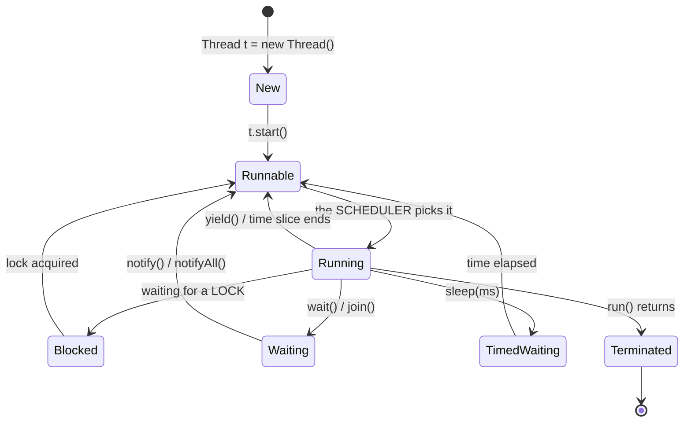

| State | Meaning |
|---|---|
| **NEW** | Created but `start()` not yet called |
| **RUNNABLE** | Ready to run, waiting for CPU time |
| **RUNNING** | Currently executing |
| **BLOCKED** | Waiting to acquire a monitor lock |
| **WAITING / TIMED_WAITING** | `wait()`, `join()` / `sleep(ms)` |
| **TERMINATED (Dead)** | `run()` has completed |

#### Synchronization — why it is needed

> **Threads share memory, so two threads updating the same variable can interleave and corrupt it** — the **race condition**. Java's tool is the **`synchronized`** keyword, which enforces **mutual exclusion** on an object's monitor.

```java
   class Counter {
       private int count = 0;
       public synchronized void increment() {   // ⭐ only ONE thread at a time
           count++;                             // (not atomic without this)
       }
   }
```

| Tool | Purpose |
|---|---|
| ⭐ **`synchronized` method / block** | Mutual exclusion on an object's monitor |
| **`volatile`** | Guarantees **visibility** of a variable across threads (but **not** atomicity) |
| **`wait()` / `notify()` / `notifyAll()`** | Coordination between threads |
| **`java.util.concurrent`** | `ExecutorService`, `AtomicInteger`, `ConcurrentHashMap`, `CountDownLatch` — **the modern, preferred toolkit** |

> ⚠️ **Multithreaded programs are MORE PRONE TO DEADLOCK**, because two threads can each hold a lock the other needs. The standard preventions are **acquiring locks in a consistent global order**, using **timeouts** (`tryLock`), and keeping critical sections short.

#### Advantages and disadvantages

| ✅ **Advantages** | ⚠️ **Disadvantages** |
|---|---|
| **Better CPU utilisation** — one thread computes while another waits for I/O | ⭐ **DIFFICULTY IN MANAGING CONCURRENCY** — race conditions, deadlock, starvation |
| **Responsive user interfaces** — long work moves off the UI thread | **Hard to debug and test** — bugs are timing-dependent and often unreproducible |
| **Cheaper than processes** — threads share memory, so creation and switching are fast | **Synchronization overhead**, and contention can make code *slower* |
| Natural fit for servers handling many clients | Increased design complexity |

> ### **"What is the disadvantage of multithreading?"** → ### ✅ **THE DIFFICULTY IN MANAGING CONCURRENCY.**

#### Two related facts

> ### **"Which data structure does the operating system use to manage RECURSION in Java?"** → ### ✅ **A STACK** — the **call stack**. Each method call pushes a **stack frame** holding its parameters, local variables and return address; returning pops it. **Each thread has its OWN stack**, which is why recursion depth is per-thread and why runaway recursion raises a **`StackOverflowError`**.
>
> ### **"Which component is used to compile, debug and execute a Java program?"** → ### ✅ **The JDK (Java Development Kit).**
> ```
>    JDK  =  JRE  +  development tools (javac, jdb, javadoc, jar)     ← to DEVELOP
>    JRE  =  JVM  +  standard class libraries                         ← to RUN
>    JVM  =  the execution engine that runs BYTECODE                  ← the core
> ```
> **Java source (`.java`) → `javac` → BYTECODE (`.class`) → JVM → native machine code.** The bytecode is what makes Java platform-independent: **"Write Once, Run Anywhere."**

**Previous Year MCQ List from this Topic:**

- [Which of the following is not a method of the Thread class?](../mcq-answers/oop.md?plain=1#L190)
- [Which one of these interfaces is implemented by thread class?](../mcq-answers/oop.md?plain=1#L351)
- [Which of these data types is used by operating system to manage the Recursion in Java?](../mcq-answers/oop.md?plain=1#L378)
- [Which method must be defined by a class implementing java.lang.Runnable interface?](../mcq-answers/oop.md?plain=1#L495)
- [What does runFinalize() do?](../mcq-answers/oop.md?plain=1#L152)


---

## Class Design & Object-Oriented Modeling

### Designing Classes — Worked Examples

#### The design method

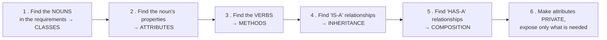

> **IS-A vs HAS-A — the design decision that matters most:**
> - **"A Car IS-A Vehicle"** → **INHERITANCE** (`class Car extends Vehicle`)
> - **"A Car HAS-A Engine"** → **COMPOSITION** (`class Car { private Engine engine; }`)
>
> **Prefer COMPOSITION over inheritance** wherever both would work — it is more flexible, avoids deep fragile hierarchies, and can be changed at run time.

#### Worked design 1 — a graphics package

```java
// The ABSTRACT base — defines WHAT every shape must do
abstract class Shape {
    protected String colour;
    protected int x, y;                       // position

    public Shape(String colour, int x, int y) {
        this.colour = colour; this.x = x; this.y = y;
    }

    public abstract double area();            // every shape MUST implement these
    public abstract double perimeter();
    public abstract void draw();

    public void move(int newX, int newY) {    // shared concrete behaviour
        this.x = newX; this.y = newY;
    }
    public void displayInfo() {
        System.out.printf("%s at (%d,%d): area=%.2f, perimeter=%.2f%n",
                          getClass().getSimpleName(), x, y, area(), perimeter());
    }
}

class Circle extends Shape {
    private double radius;
    public Circle(String c, int x, int y, double r) { super(c, x, y); radius = r; }
    public double area()      { return Math.PI * radius * radius; }
    public double perimeter() { return 2 * Math.PI * radius; }
    public void   draw()      { System.out.println("Drawing a circle"); }
}

class Rectangle extends Shape {
    private double length, width;
    public Rectangle(String c, int x, int y, double l, double w) {
        super(c, x, y); length = l; width = w;
    }
    public double area()      { return length * width; }
    public double perimeter() { return 2 * (length + width); }
    public void   draw()      { System.out.println("Drawing a rectangle"); }
}

class Triangle extends Shape {
    private double a, b, c;
    public Triangle(String col, int x, int y, double a, double b, double c) {
        super(col, x, y); this.a = a; this.b = b; this.c = c;
    }
    public double area() {                        // Heron's formula
        double s = (a + b + c) / 2;
        return Math.sqrt(s * (s-a) * (s-b) * (s-c));
    }
    public double perimeter() { return a + b + c; }
    public void   draw()      { System.out.println("Drawing a triangle"); }
}

public class GraphicsPackage {
    public static void main(String[] args) {
        Shape[] shapes = {
            new Circle("red", 0, 0, 5),
            new Rectangle("blue", 10, 10, 4, 6),
            new Triangle("green", 5, 5, 3, 4, 5)
        };
        for (Shape s : shapes) {          // POLYMORPHISM in action
            s.draw();
            s.displayInfo();
        }
    }
}
```

> **The design points to state:** `Shape` is **abstract** because a "generic shape" has no meaningful area — it exists only to define the **common interface**. The `area()` method is **abstract**, forcing every concrete shape to implement it. The loop in `main` demonstrates **polymorphism**: adding a `Pentagon` class later requires **no change** to that loop.

#### Worked design 2 — a Batsman class

```java
class Batsman {
    private String name;
    private int    matches;
    private int    innings;
    private int    totalRuns;
    private int    notOuts;

    public Batsman(String name, int matches, int innings, int totalRuns, int notOuts) {
        this.name = name;  this.matches = matches;
        this.innings = innings;  this.totalRuns = totalRuns;  this.notOuts = notOuts;
    }

    public double calculateAverage() {
        int dismissals = innings - notOuts;
        if (dismissals == 0) return totalRuns;       // ← avoid division by zero
        return (double) totalRuns / dismissals;      // ← cast, or integer division truncates
    }

    public void display() {
        System.out.println("Name    : " + name);
        System.out.println("Matches : " + matches);
        System.out.println("Runs    : " + totalRuns);
        System.out.printf ("Average : %.2f%n", calculateAverage());
    }
}

public class Cricket {
    public static void main(String[] args) {
        Batsman b = new Batsman("Tamim Iqbal", 70, 68, 2500, 5);
        b.display();
    }
}
```
> **The two marks-earning details:** the **batting average is runs ÷ DISMISSALS (innings − not outs)**, not runs ÷ innings; and the **`(double)` cast** is essential, or Java performs integer division and truncates the answer.

#### Worked design 3 — a Bicycle class

```java
class Bicycle {
    private int speed;
    private int gear;
    private int cost;

    public Bicycle(int speed, int gear, int cost) {
        this.speed = speed;  this.gear = gear;  this.cost = cost;
    }

    public void applyBrake(int decrement) {
        speed = Math.max(0, speed - decrement);      // never go below zero
    }
    public void speedUp(int increment) { speed += increment; }
    public void changeGear(int newGear) { gear = newGear; }

    public void display() {
        System.out.printf("Speed: %d km/h, Gear: %d, Cost: %d Tk%n", speed, gear, cost);
    }
}
```

#### Worked design 4 — an Account hierarchy

```java
class Account {                                    // BASE class
    protected String accountNumber;
    protected String holderName;
    protected double balance;

    public Account(String num, String name, double bal) {
        accountNumber = num;  holderName = name;  balance = bal;
    }

    public void deposit(double amt) {
        if (amt > 0) balance += amt;
    }

    public void withdraw(double amt) {
        if (amt > 0 && amt <= balance) balance -= amt;
        else System.out.println("Withdrawal denied");
    }

    public void display() {
        System.out.printf("%s (%s): %.2f%n", holderName, accountNumber, balance);
    }
}

class SavingsAccount extends Account {
    private double interestRate;
    private static final double MIN_BALANCE = 1000;

    public SavingsAccount(String num, String name, double bal, double rate) {
        super(num, name, bal);
        this.interestRate = rate;
    }

    @Override
    public void withdraw(double amt) {              // OVERRIDES — enforces a minimum balance
        if (balance - amt < MIN_BALANCE) {
            System.out.println("Cannot go below the minimum balance of " + MIN_BALANCE);
        } else {
            super.withdraw(amt);
        }
    }

    public void addInterest() {
        balance += balance * interestRate / 100;
    }
}

class CurrentAccount extends Account {
    private double overdraftLimit;

    public CurrentAccount(String num, String name, double bal, double limit) {
        super(num, name, bal);
        this.overdraftLimit = limit;
    }

    @Override
    public void withdraw(double amt) {              // OVERRIDES — allows an overdraft
        if (amt > 0 && amt <= balance + overdraftLimit) {
            balance -= amt;                          // may become negative
        } else {
            System.out.println("Exceeds the overdraft limit");
        }
    }
}
```

> **This example demonstrates all four pillars at once:** **encapsulation** (private/protected fields with controlled methods), **inheritance** (both accounts extend `Account`), **polymorphism** (`withdraw()` behaves differently for each type), and **abstraction** (the caller simply calls `withdraw()` without knowing which rule applies).

#### Built-in classes

> **"Built-in classes" are the classes provided by the language's standard library**, ready to use without being written.

**In Java, the most important are:**

| Package | Classes |
|---|---|
| **`java.lang`** (imported automatically) | **`String`, `Object`, `System`, `Math`, `Integer`, `Double`, `Character`, `Boolean`, `StringBuilder`, `Thread`, `Exception`** |
| **`java.util`** | **`Scanner`, `ArrayList`, `HashMap`, `HashSet`, `LinkedList`, `Arrays`, `Collections`, `Date`, `Random`** |
| **`java.io`** | `File`, `FileReader`, `FileWriter`, `BufferedReader`, `InputStreamReader` |
| **`java.net`** | `Socket`, `ServerSocket`, `URL` |
| **`java.sql`** | `Connection`, `Statement`, `ResultSet` |

> **`Object` is the root of the entire Java class hierarchy** — every class implicitly extends it, which is why every object has `toString()`, `equals()`, `hashCode()` and `getClass()`.

**Previous Year Question List from this Topic:**

- [Suppose we want to develop software for a graphic package and we are given the task to implement circle class. The circle class has to be translatable from its…](../written-answers/oop.md?plain=1#L6947)
- [What are the built in classes?](../written-answers/oop.md?plain=1#L7070)
- [অথবা, (ক) উদাহরণসহ Class এবং Object এর মধ্যে পার্থক্য ব্যাখ্যা করুন।](../written-answers/oop.md?plain=1#L7172)
- [(খ) উদাহরণসহ ক্লাস এবং অবজেক্ট এর মধ্যে পার্থক্য লিখুন।](../written-answers/oop.md?plain=1#L7260)
- [Define Class and Object in C++ with example.](../written-answers/oop.md?plain=1#L7344)
- [What are the common activities on OOP design process?](../written-answers/oop.md?plain=1#L7462)
- [Write a programme to create an object of type batsman and calculate the average runs scored by the player.](../written-answers/oop.md?plain=1#L7558)
- [(ক) Object কী? কীভাবে Object তৈরি করতে হয় উদাহরণসহ ব্যাখ্যা করুন।](../written-answers/oop.md?plain=1#L7724)
- [Suppose, you are implementing “Overdraft Account (OD)” class using java for a banking app. An OD type account is opened with an approved loan limit (ex. 100000/…](../written-answers/oop.md?plain=1#L7838)
- [There was a java program where you have to create a class, constructor, setter function, getter function.](../written-answers/oop.md?plain=1#L8014)
- [In java language: write a class named Bicycle having 3 integer variables (speed, gear, cost) and a constructor to initialize the variables. Also write a class n…](../written-answers/oop.md?plain=1#L8155)

**Previous Year MCQ List from this Topic:**

- [What type of variable should be used to store data that is important throughout an object's lifespan?](../mcq-answers/oop.md?plain=1#L47)
- [A collection of objects that use common structure and a common behavior is knownas-](../mcq-answers/oop.md?plain=1#L56)
- [Read the following statement in a Java program that compiles and executes-](../mcq-answers/oop.md?plain=1#L84)
- [What are the inbuit classes?](../mcq-answers/oop.md?plain=1#L140)
- [What is syntax for call static method in class?](../mcq-answers/oop.md?plain=1#L146)
- [Which of the following is a valid declaration of an object of class Box?](../mcq-answers/oop.md?plain=1#L441)


---

## Constructors & Destructors

### Constructors and Destructors

#### What is a constructor?

> A **CONSTRUCTOR is a special member function that is AUTOMATICALLY called when an object is created, in order to INITIALISE that object.**

#### The properties of a constructor

1. **The name is EXACTLY the same as the class name.**
2. It has **NO RETURN TYPE — not even `void`**. This is the rule most often tested.
3. It is **called automatically** when an object is created — you never call it explicitly.
4. It **can be overloaded** — a class may have several constructors with different parameter lists.
5. It **cannot be `virtual`** (in C++), **`static`** or **`final`**.
6. It **cannot be inherited** (though a subclass constructor can *call* the parent's with `super()`).
7. If **no constructor is written**, the compiler supplies a **DEFAULT constructor** with no arguments.
8. **As soon as you write ANY constructor, the compiler STOPS supplying the default one** — another classic source of errors.
9. It is usually `public` (a `private` constructor is used for the **Singleton** pattern).

#### The types of constructor

| Type | Description |
|---|---|
| **Default (no-argument) constructor** | Takes no parameters; sets default values |
| **Parameterised constructor** | Takes arguments to initialise the object with specific values |
| **Copy constructor** | **Creates a new object as a COPY of an existing one** — `Complex c2(c1);` |

```cpp
class Student {
private:
    int roll;
    char* name;

public:
    // 1. DEFAULT constructor
    Student() {
        roll = 0;
        name = new char[10];
        strcpy(name, "Unknown");
        cout << "Default constructor called" << endl;
    }

    // 2. PARAMETERISED constructor
    Student(int r, const char* n) {
        roll = r;
        name = new char[strlen(n) + 1];
        strcpy(name, n);
        cout << "Parameterised constructor called" << endl;
    }

    // 3. COPY constructor — note the reference parameter
    Student(const Student& s) {
        roll = s.roll;
        name = new char[strlen(s.name) + 1];    // ← DEEP copy: new memory
        strcpy(name, s.name);
        cout << "Copy constructor called" << endl;
    }

    // 4. DESTRUCTOR
    ~Student() {
        delete[] name;                          // ← release the memory
        cout << "Destructor called" << endl;
    }
};
```

#### The copy constructor and the deep-vs-shallow copy problem

> A **COPY CONSTRUCTOR creates a new object as an exact copy of an existing object of the same class.** Its signature is `ClassName(const ClassName &obj)` — **the parameter MUST be a reference**, because passing by value would itself require calling the copy constructor, causing infinite recursion.

**It is called when:**
1. An object is **initialised from another object** — `Student s2 = s1;` or `Student s2(s1);`
2. An object is **passed to a function BY VALUE**.
3. An object is **returned from a function by value**.

> **Why writing your own copy constructor matters — the crucial point:** the compiler-generated default copy constructor performs a **SHALLOW COPY** — it copies the pointer, not what the pointer points to. So **both objects end up pointing to the SAME memory**. When one is destroyed, its destructor frees that memory, and the other is left with a **dangling pointer**; when it too is destroyed, the result is a **double free and a crash**.
>
> **A DEEP COPY** — allocating new memory and copying the contents, as shown above — is required for any class that manages a resource. *(This is the classic **Rule of Three** in C++: if you need a destructor, you almost certainly also need a copy constructor and a copy assignment operator.)*

#### What is a destructor?

> A **DESTRUCTOR is a special member function that is AUTOMATICALLY called when an object is DESTROYED (goes out of scope or is `delete`d), in order to release the resources the object holds.**

**Properties:** its name is the **class name preceded by a tilde `~`**; it takes **no parameters** and has **no return type**; it **cannot be overloaded** — a class has **exactly one**; it is called **automatically in the reverse order of construction**; and it **can and often should be `virtual`** when the class is used polymorphically.

#### Constructor vs Destructor

| Point | **Constructor** | **Destructor** |
|---|---|---|
| **Purpose** | **Initialise** the object and **allocate** resources | **Clean up** and **release** resources |
| **Called when** | The object is **CREATED** | The object is **DESTROYED** |
| **Name** | Same as the class | **`~` + class name** |
| **Return type** | **None** | **None** |
| **Parameters** | ✅ **Can take them** | ❌ **Never** |
| **Overloading** | ✅ **Yes — many constructors** | ❌ **No — exactly one** |
| **Order of execution** | Base class **first**, then derived | **Derived first, then base** — the reverse |
| **Can be `virtual`?** | ❌ No | ✅ **Yes — and should be** for polymorphic base classes |
| **Number per class** | Many | **Exactly one** |
| **In Java** | ✅ Yes | ❌ **No destructor** — the **garbage collector** handles memory; `finalize()` is deprecated |

#### Why constructors and destructors are used

| | Reason |
|---|---|
| **Constructor** | Guarantees that **every object starts in a VALID state** — no uninitialised garbage values; allocates memory and opens resources; enforces invariants (a `BankAccount` can be made impossible to create with a negative balance); and supports **overloading** for flexible creation |
| **Destructor** | Guarantees that resources are **released automatically and reliably**, even when an exception unwinds the stack — preventing **memory leaks**, closing files, releasing locks and closing network connections. This is the basis of the **RAII** idiom in C++ |

```cpp
int main() {
    Student s1(101, "Rahim");    // parameterised constructor
    Student s2 = s1;             // COPY constructor
    Student s3;                  // default constructor
    return 0;
}                                // ← destructors called HERE, in REVERSE order: s3, s2, s1
```

**Previous Year Question List from this Topic:**

- [What is constructor function? Write the properties of it.](../written-answers/oop.md?plain=1#L9904)
- [Define copy constructor. What Static binding and Dynamic binding?](../written-answers/oop.md?plain=1#L10005)
- [What is the constructor invoked in OOP?](../written-answers/oop.md?plain=1#L10135)
- [What is constructor?](../written-answers/oop.md?plain=1#L10218)
- [(b) Why are constructor and destructor functions used in object oriented programming? Give examples of each function in C++ or java language.](../written-answers/oop.md?plain=1#L10296)
- [What is Constructor function? Write an example of Constructor function?](../written-answers/oop.md?plain=1#L10410)
- [Differentiate constructor and destructor with example.](../written-answers/oop.md?plain=1#L10540)
- [What is main difference Destructor and constructor with example?](../written-answers/oop.md?plain=1#L10660)

**Previous Year MCQ List from this Topic:**

- [Which information is not correct for any constructor of a java class?](../mcq-answers/oop.md?plain=1#L237)
- [Which of the following is the destructor of class Vehicle?](../mcq-answers/oop.md?plain=1#L557)
- [Which of the following is the destructor for class “vehicle”?](../mcq-answers/oop.md?plain=1#L593)
- [Which of the following is true regarding a constructor in Object Oriented Programming?](../mcq-answers/oop.md?plain=1#L861)
- [A constructor is a special type of-](../mcq-answers/oop.md?plain=1#L870)
- [Which part of a class is invoked when an object is initialized in java?](../mcq-answers/oop.md?plain=1#L879)
- [Which operator is used to declare the destructor in C++?](../mcq-answers/oop.md?plain=1#L888)
- [Object being passed to a copy constructor-](../mcq-answers/oop.md?plain=1#L897)
- [Does constructor overloading include different return types for constructors to be overloaded?](../mcq-answers/oop.md?plain=1#L906)


---

## Encapsulation & Access Modifiers

### Access Control in Detail

*(The access-specifier table and the encapsulation principles are given in full in the **Encapsulation and Abstraction** theory above. This section covers the practical decisions.)*

#### Choosing the right access level — the rule

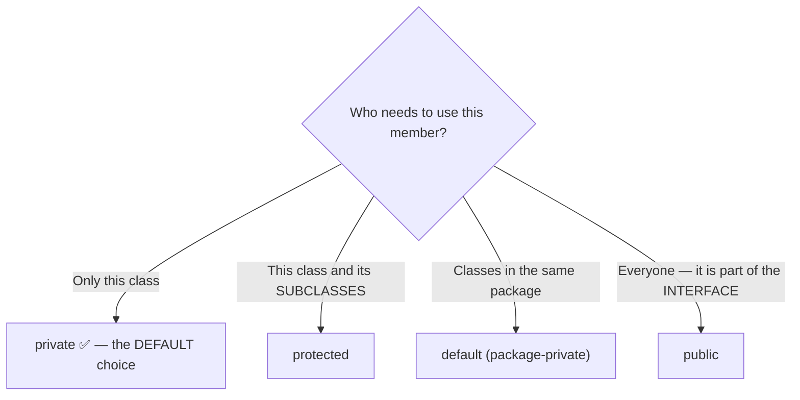

> **The governing principle: ALWAYS start with the most restrictive access that works, and widen it only when there is a demonstrated need.** Every `public` member is a promise you must keep forever, because changing it breaks every user of the class.

#### Practical rules

| Member | Recommended access |
|---|---|
| **All data members / fields** | **`private`** — almost without exception |
| **Getters and setters** | `public`, but **only the ones actually needed** |
| **Helper methods used only internally** | **`private`** |
| **Methods a subclass must be able to call or override** | **`protected`** |
| **The class's real interface** | **`public`** |
| **Constants** | `public static final` |

#### How many specifiers are there?

| Language | Access specifiers |
|---|---|
| **C++** | **THREE — `private`, `protected`, `public`** |
| **Java** | **FOUR access LEVELS** — `private`, **default (package-private)**, `protected`, `public` — but only **THREE keywords**, since "default" has no keyword |
| **C#** | Six — `private`, `protected`, `internal`, `protected internal`, `private protected`, `public` |
| **Python** | By **convention only** — `_name` (protected by convention), `__name` (name-mangled, "private") |

#### The getter/setter pattern

```java
class Employee {
    private String name;
    private double salary;
    private final String employeeId;      // set once, never changed

    public Employee(String id, String name, double salary) {
        this.employeeId = id;
        this.name = name;
        setSalary(salary);                // use the setter so validation applies
    }

    // READ-ONLY property — a getter with NO setter
    public String getEmployeeId() { return employeeId; }

    // Full read/write with validation
    public double getSalary() { return salary; }
    public void setSalary(double salary) {
        if (salary >= 0) this.salary = salary;
        else throw new IllegalArgumentException("Salary cannot be negative");
    }

    public String getName() { return name; }
    public void setName(String name) {
        if (name != null && !name.trim().isEmpty()) this.name = name;
    }
}
```

> **The four things getters and setters give you that a public field never can:**
> 1. **Validation** on every write.
> 2. **Read-only or write-only** properties (supply only one of the pair).
> 3. **Freedom to change the internal representation** later without breaking any caller.
> 4. A place to add **logging, notification or lazy computation**.

**Previous Year Question List from this Topic:**

- [You have three access specifiers in java object oriented language. You have to find which access specifiers are worked with Public, Private and Protected Mode.…](../written-answers/oop.md?plain=1#L10770)
- [Explain the various types of access specifiers.](../written-answers/oop.md?plain=1#L10873)
- [Which type of variable violates encapsulation rules?](../written-answers/oop.md?plain=1#L10977)
- [Which members of base class cannot access to derived class?](../written-answers/oop.md?plain=1#L11057)
- [What are the various Access Specification in C++? Explain their purpose with are example.](../written-answers/oop.md?plain=1#L11143)
- [How many specifiers are used in C++ programing?](../written-answers/oop.md?plain=1#L11270)
- [Briefly Describe Abstraction, Encapsulation.](../written-answers/oop.md?plain=1#L11341)

**Previous Year MCQ List from this Topic:**

- [Which of the following does NOT achieve encapsulation?](../mcq-answers/oop.md?plain=1#L750)
- [Which variable violates the principle of ecvapsulation?](../mcq-answers/oop.md?plain=1#L759)
- [Which type of members can't accessed in derived classes of a base class?](../mcq-answers/oop.md?plain=1#L826)
- [In object Oriented Programming, a property can be accessed from ________](../mcq-answers/oop.md?plain=1#L739)


---

## Exception Handling

### Exceptions and Exception Handling

#### What is an exception?

> An **EXCEPTION is an abnormal event that occurs DURING THE EXECUTION of a program and DISRUPTS its normal flow of instructions.**

**Examples:** dividing by zero, accessing an array index out of bounds, opening a file that does not exist, dereferencing a null reference, a network connection failing, or invalid user input.

#### Exception vs Error — a frequently asked distinction

| Point | **Exception** | **Error** |
|---|---|---|
| **Meaning** | An **abnormal condition the application CAN reasonably anticipate and RECOVER from** | A **SERIOUS problem the application should NOT try to handle** — usually a failure of the JVM or the environment itself |
| **Recoverable?** | ✅ **YES** | ❌ **NO** |
| **Should you catch it?** | ✅ **Yes** | ❌ **No** — catching it usually just hides a fatal problem |
| **Caused by** | The **application's own code or its input** | The **system / JVM / hardware** |
| **Class in Java** | **`java.lang.Exception`** | **`java.lang.Error`** |
| **Examples** | `IOException`, `SQLException`, `NullPointerException`, `ArithmeticException`, `FileNotFoundException` | **`StackOverflowError`, `OutOfMemoryError`**, `VirtualMachineError`, `NoClassDefFoundError` |
| **Checked at compile time?** | Checked exceptions, yes | ❌ No |

> **Both inherit from `Throwable`**, which is why `catch (Throwable t)` would catch both — and why you should almost never write that.

#### Checked vs Unchecked exceptions (Java)

| Point | **Checked exception** | **Unchecked exception (RuntimeException)** |
|---|---|---|
| **Checked by the compiler?** | ✅ **YES** — the code **will not compile** unless it is caught or declared | ❌ No |
| **Must be handled or declared** | ✅ **Yes** — `try-catch` or `throws` | ❌ Optional |
| **Represents** | A **foreseeable external problem** — a file may genuinely be missing | A **programming BUG** |
| **Examples** | `IOException`, `SQLException`, `FileNotFoundException`, `ClassNotFoundException` | `NullPointerException`, `ArrayIndexOutOfBoundsException`, `ArithmeticException`, `IllegalArgumentException`, `NumberFormatException` |

> **The design intent:** a checked exception says *"this can fail for reasons outside your control — deal with it"*; an unchecked exception says *"you have a bug — fix the code, do not catch it"*.

#### The exception-handling keywords

| Keyword | Purpose |
|---|---|
| **`try`** | Encloses the code that **might** throw an exception |
| **`catch`** | **Handles** a specific type of exception |
| **`finally`** | Code that runs **ALWAYS — whether an exception occurred or not** |
| **`throw`** | **Explicitly THROWS one exception object** |
| **`throws`** | **DECLARES** that a method may throw certain exceptions |

```java
public class ExceptionDemo {
    public static void main(String[] args) {
        try {
            int[] arr = new int[5];
            arr[10] = 50;                         // throws ArrayIndexOutOfBoundsException
            int result = 10 / 0;                  // would throw ArithmeticException
        }
        catch (ArrayIndexOutOfBoundsException e) {          // most SPECIFIC first
            System.out.println("Array index error: " + e.getMessage());
        }
        catch (ArithmeticException e) {
            System.out.println("Arithmetic error: " + e.getMessage());
        }
        catch (Exception e) {                               // most GENERAL last
            System.out.println("Some other error: " + e.getMessage());
        }
        finally {
            System.out.println("This ALWAYS executes — cleanup goes here");
        }
        System.out.println("Program continues normally");
    }
}
```

> **The ordering rule: catch blocks must go from the MOST SPECIFIC to the MOST GENERAL.** Putting `catch (Exception e)` first is a **compile error** in Java, because no later block could ever be reached.

#### `throw` vs `throws` — a directly asked comparison

| Point | **`throw`** | **`throws`** |
|---|---|---|
| **Purpose** | **THROWS an exception explicitly** | **DECLARES** that a method may throw exceptions |
| **Used inside** | A **method body** | The **method SIGNATURE** |
| **Followed by** | **An exception OBJECT** — `throw new IOException("msg");` | One or more **exception CLASS names** — `throws IOException, SQLException` |
| **Number** | **ONE exception at a time** | **Multiple**, comma-separated |
| **Who handles it** | This throw must be caught somewhere up the call stack | Passes the responsibility **to the CALLER** |
| **Keyword position** | Inside the method | After the parameter list |
| **Example** | `throw new ArithmeticException("Divide by zero");` | `void readFile() throws IOException { … }` |

```java
class Demo {
    // 'throws' — DECLARES that this method may throw
    static void validateAge(int age) throws IllegalArgumentException {
        if (age < 18) {
            // 'throw' — actually THROWS the exception object
            throw new IllegalArgumentException("Age must be 18 or above, got " + age);
        }
        System.out.println("Valid age: " + age);
    }

    public static void main(String[] args) {
        try {
            validateAge(15);
        } catch (IllegalArgumentException e) {
            System.out.println("Caught: " + e.getMessage());
        }
    }
}
```

#### Why exception handling is used

1. **Separates error-handling code from normal logic** — the "happy path" stays readable instead of being buried in `if (result == -1)` checks after every call.
2. **Prevents abnormal termination** — the program can recover and continue instead of crashing.
3. **Propagates errors up the call stack** automatically to the level that can actually deal with them.
4. **Groups and differentiates error types** through the exception hierarchy.
5. **Provides diagnostic information** — the exception object carries the **message and the STACK TRACE**, showing exactly where and how the failure happened.
6. **Guarantees cleanup** through `finally` (or `try-with-resources`), even when an exception occurs.
7. **Meaningful error messages** can be shown to the user instead of a crash.

#### How exceptions help in debugging

> The **STACK TRACE** is the single most valuable debugging artefact an exception provides. It shows:
> - **The exception TYPE** — which tells you the category of failure.
> - **The MESSAGE** — the specific detail.
> - **The complete CALL CHAIN** — every method from `main` down to the exact **line number** where the failure occurred.

```
Exception in thread "main" java.lang.ArithmeticException: / by zero
    at Calculator.divide(Calculator.java:15)      ← the exact failing line
    at Calculator.compute(Calculator.java:28)     ← who called it
    at Main.main(Main.java:7)                     ← and who called that
```

**Techniques:** use `e.printStackTrace()` during development; **log the exception with context** in production (`logger.error("Failed to process order " + id, e)`); **create custom exception classes** for domain errors so the type itself is informative; and **chain exceptions** (`throw new ServiceException("...", e)`) so the original cause is not lost.

**Best practices:** never write an **empty catch block** — silently swallowing an exception is the worst thing you can do; **catch the most specific exception** you can handle; **do not use exceptions for ordinary control flow** (they are expensive); **always release resources**, preferably with `try-with-resources`; and **do not catch `Error`**.

```java
// try-with-resources — the modern, correct way to guarantee cleanup
try (BufferedReader br = new BufferedReader(new FileReader("data.txt"))) {
    String line;
    while ((line = br.readLine()) != null) System.out.println(line);
}   // ← br.close() is called AUTOMATICALLY, even if an exception is thrown
catch (IOException e) {
    System.out.println("File error: " + e.getMessage());
}
```

**Previous Year Question List from this Topic:**

- [(b) What is exception? Explain how it can be used for debugging a program.](../written-answers/oop.md?plain=1#L11423)
- [What is difference between exception and error in Java?](../written-answers/oop.md?plain=1#L11549)
- [What is exception handling? Write with an example.](../written-answers/oop.md?plain=1#L11642)
- [Write the difference between throw and throws using Exception handling?](../written-answers/oop.md?plain=1#L11808)

**Previous Year MCQ List from this Topic:**

- [The statements that allows you to define a block of code to be tested for exceptions while it is being executed.](../mcq-answers/oop.md?plain=1#L917)
- [The ________ block used to execute a given set of the statement whether the exception is thrown or not.](../mcq-answers/oop.md?plain=1#L923)
- [Java uses a keyword ________ to preface a block of code that is likely to cause an error condition and ‘throw’ an exception.](../mcq-answers/oop.md?plain=1#L932)
- [Which of the following method(s) not included in InputStream class?](../mcq-answers/oop.md?plain=1#L941)
- [Which alternative can replace the throw statement in C++?](../mcq-answers/oop.md?plain=1#L950)
- [Why do you need to handle exceptions?](../mcq-answers/oop.md?plain=1#L959)
- [Which of the following is not property of the Object Oriented Programming Concept?](../mcq-answers/oop.md?plain=1#L649)


---

## C++ OOP Concepts & Friend Functions

### Friend Functions and Friend Classes

#### What is a friend function?

> A **FRIEND FUNCTION is a function that is NOT a member of a class, but which is granted ACCESS TO THE PRIVATE AND PROTECTED MEMBERS of that class**, by being declared with the keyword **`friend`** inside the class definition.

```cpp
#include <iostream>
using namespace std;

class Box {
private:
    double length;
    double width;

public:
    Box(double l, double w) : length(l), width(w) {}

    // Declaring a FRIEND function — it is NOT a member of Box,
    // but it may access Box's private members
    friend double calculateArea(Box b);
    friend class BoxInspector;          // an entire FRIEND CLASS
};

// The friend function is defined OUTSIDE the class, with NO Box:: prefix
double calculateArea(Box b) {
    return b.length * b.width;          // ✅ accesses PRIVATE members directly
}

int main() {
    Box b(10, 5);
    cout << "Area: " << calculateArea(b) << endl;   // Area: 50
    return 0;
}
```

#### The characteristics of a friend function

1. It is **NOT a member** of the class, even though it is declared inside it.
2. It is **declared inside the class with the `friend` keyword**, but **defined outside without the `ClassName::` scope operator**.
3. It **can access all `private` and `protected` members** of the class.
4. It is **called like an ordinary function**, not with the dot operator — `calculateArea(b)`, **not** `b.calculateArea()`.
5. It **has NO `this` pointer**, so the object must be passed as an argument.
6. **Friendship is NOT mutual** — if A declares B a friend, B does not automatically become A's friend.
7. **Friendship is NOT inherited** — a derived class does not inherit its base's friends.
8. **Friendship is NOT transitive** — a friend of a friend is not a friend.
9. It can be declared in the **`private`, `protected` or `public`** section — it makes no difference.
10. It **cannot be called using an object** of the class.

#### Why friend functions exist — the advantages

1. **Operations involving TWO DIFFERENT CLASSES.** A function that needs the private data of **both** a `Rectangle` and a `Circle` cannot be a member of either — a friend function of both is the natural solution.
2. **Operator overloading where the left operand is not the class object.** To write `cout << myObject`, the `<<` operator must take `ostream` as its left operand, so **it cannot be a member of your class** — it must be a **friend**:
   ```cpp
   friend ostream& operator<<(ostream& out, const Complex& c) {
       out << c.real << " + " << c.imag << "i";   // needs private access
       return out;
   }
   ```
3. **Improved readability** for symmetric operations — `add(a, b)` reads more naturally than `a.add(b)` for a commutative operation.
4. **Efficiency** — direct access avoids the overhead of calling a chain of getters.
5. **Cleaner design in specific cases** — it can avoid adding public accessors that would expose data to *everyone* merely to serve one cooperating function.

#### The disadvantages — which must be stated for a balanced answer

1. **It BREAKS ENCAPSULATION** — the central objection. A friend function reaches directly into the class's private state, which is precisely what encapsulation exists to prevent.
2. **Increases COUPLING** — the friend function now depends on the class's internal representation, so **changing that representation breaks the friend**.
3. **Harder maintenance** — to understand or safely change a class, you must also examine every one of its friends.
4. **Weakens data hiding and abstraction.**
5. **Not supported in Java** (or C#), which forces alternative designs and demonstrates that friendship is rarely truly necessary.
6. **Can be abused** — a class with many friends has effectively public data.

> **The balanced verdict for an exam answer:** *"A friend function is a deliberate, controlled exception to encapsulation. It is justified when an operation genuinely involves the internals of two classes, or when operator overloading requires a non-member function — most importantly for `operator<<` and `operator>>`. It should be used **sparingly and explicitly**, never as a shortcut to avoid designing a proper public interface. The fact that Java manages entirely without it shows that most uses are avoidable."*

#### Friend class

```cpp
class Engine {
private:
    int horsepower;
    friend class Car;         // Car may access ALL of Engine's private members
public:
    Engine(int hp) : horsepower(hp) {}
};

class Car {
public:
    void showEngineDetails(Engine e) {
        cout << "Horsepower: " << e.horsepower;    // ✅ allowed — Car is a friend
    }
};
```

**Previous Year Question List from this Topic:**

- [(b) What is friend function? Given the following class, show how to add a friend function, named isneg() that takes one parameter of type myclass and return tru…](../written-answers/oop.md?plain=1#L11929)
- [(ক) Friend Function কী? উহার সুবিধা অসুবিধাগুলো লিখুন।](../written-answers/oop.md?plain=1#L12055)
- [(খ) Friend Function কী? উহার সুবিধা ও অসুবিধা গুলো লিখুন?](../written-answers/oop.md?plain=1#L12123)


---

## Interfaces & Abstract Classes

### Abstract Classes and Interfaces

#### Abstract class

> An **ABSTRACT CLASS is a class that CANNOT BE INSTANTIATED** and is designed to be **inherited from**. It may contain **abstract methods** (declared but not implemented) as well as **concrete methods** with full implementations.

```java
abstract class Player {
    protected String name;
    protected int matches;

    public Player(String name, int matches) {
        this.name = name;  this.matches = matches;
    }

    // ABSTRACT method — no body; every subclass MUST implement it
    public abstract void play();
    public abstract double calculatePerformance();

    // CONCRETE method — inherited and shared by all subclasses
    public void displayInfo() {
        System.out.println("Name: " + name + ", Matches: " + matches);
    }
}

class Batsman extends Player {
    private int runs;
    private int dismissals;

    public Batsman(String name, int matches, int runs, int dismissals) {
        super(name, matches);
        this.runs = runs;  this.dismissals = dismissals;
    }

    @Override
    public void play() { System.out.println(name + " is batting"); }

    @Override
    public double calculatePerformance() {          // batting average
        return dismissals == 0 ? runs : (double) runs / dismissals;
    }
}

class Bowler extends Player {
    private int wickets;
    private int runsConceded;

    public Bowler(String name, int matches, int wickets, int runsConceded) {
        super(name, matches);
        this.wickets = wickets;  this.runsConceded = runsConceded;
    }

    @Override
    public void play() { System.out.println(name + " is bowling"); }

    @Override
    public double calculatePerformance() {          // bowling average
        return wickets == 0 ? 0 : (double) runsConceded / wickets;
    }
}

public class Cricket {
    public static void main(String[] args) {
        // Player p = new Player(...);   ❌ COMPILE ERROR — cannot instantiate an abstract class

        Player[] team = {
            new Batsman("Tamim", 70, 2500, 65),
            new Bowler ("Shakib", 100, 150, 4200)
        };

        for (Player p : team) {                     // POLYMORPHISM
            p.displayInfo();
            p.play();
            System.out.printf("Performance: %.2f%n%n", p.calculatePerformance());
        }
    }
}
```

> **Why `Player` is abstract:** a "generic player" who neither bats nor bowls is **meaningless** — it exists only to define what **every** player must be able to do. Making it abstract **enforces that at compile time**: no one can accidentally create a `Player` object, and every subclass **must** provide `play()` and `calculatePerformance()`.

#### Interface

> An **INTERFACE is a completely abstract type that defines a CONTRACT — a set of method signatures that any implementing class MUST provide.** It specifies **WHAT a class can do, with no statement of HOW.**

```java
interface Drawable {
    void draw();                      // implicitly public and abstract
    double area();
}

interface Resizable {
    void resize(double factor);
}

// A class may implement MULTIPLE interfaces — this is Java's answer
// to multiple inheritance
class Circle implements Drawable, Resizable {
    private double radius;
    public Circle(double r) { radius = r; }

    @Override public void draw()   { System.out.println("Drawing a circle"); }
    @Override public double area() { return Math.PI * radius * radius; }
    @Override public void resize(double f) { radius *= f; }
}
```

#### Abstract class vs Interface — the key comparison

| Point | **ABSTRACT CLASS** | **INTERFACE** |
|---|---|---|
| **Keyword** | `abstract class` | `interface` |
| **Implemented with** | **`extends`** | **`implements`** |
| **Multiple inheritance** | ❌ **NO** — a class can extend only **ONE** abstract class | ✅ **YES** — a class can implement **MANY** interfaces |
| **Methods** | **Abstract AND concrete** methods | Traditionally **only abstract**; Java 8+ also allows **`default` and `static`** methods |
| **Variables** | **Any kind** — instance variables, static, final, non-final | **Only `public static final`** — i.e. **CONSTANTS** |
| **Constructor** | ✅ **Yes** (called by subclasses via `super()`) | ❌ **NO** |
| **Access modifiers on members** | Any — private, protected, public | **All members are implicitly `public`** |
| **Can hold state?** | ✅ **Yes** — instance fields | ❌ **No** — no instance fields |
| **Represents** | An **"IS-A" relationship** — a common **base with shared implementation** | A **"CAN-DO" capability / contract** |
| **When to use** | When subclasses share **substantial common code and state** | When **unrelated classes must share a capability**, or when you need multiple inheritance of type |
| **Speed** | Marginally faster | Marginally slower (an extra indirection) |
| **Example** | `abstract class Animal` with a shared `sleep()` | `interface Comparable`, `interface Runnable`, `interface Serializable` |

> **The decision rule:**
> - Use an **ABSTRACT CLASS** when the subclasses are **closely related** and you want to **share code and fields** among them. *Example: `Batsman` and `Bowler` are both `Player`s and share a name and match count.*
> - Use an **INTERFACE** when you want to specify a **capability that unrelated classes can have**, or when a class needs to play **several roles at once**. *Example: a `Bird`, an `Aeroplane` and a `Drone` are completely unrelated, but all of them `implements Flyable`.*
>
> **In practice, both are often used together:** an interface defines the contract, and an abstract class provides a partial, reusable implementation of it — which is exactly the pattern in `List` (interface) and `AbstractList` (abstract class) in the Java collections library.

#### Java 8+ changes to interfaces

| Feature | Purpose |
|---|---|
| **`default` methods** | A method **with an implementation** in an interface — added so that new methods could be introduced into existing interfaces **without breaking every class that implements them** |
| **`static` methods** | Utility methods belonging to the interface itself |
| **`private` methods** (Java 9+) | Shared helper code for the default methods |
| **Functional interface** | An interface with **exactly ONE abstract method** — can be implemented with a **lambda expression**. `Runnable`, `Comparator`, `Callable` |

> **This blurring means the old "an interface has no implementation" rule is no longer strictly true** — but the fundamental distinctions remain: **an interface still has NO STATE (no instance fields) and NO CONSTRUCTOR, and still permits multiple inheritance**. Those three points are the durable answer.

**Previous Year Question List from this Topic:**

- [Class/Interface implementation of code?](../written-answers/oop.md?plain=1#L12208)
- [An Abstract class Player with two sub classes Bowler and Batsman, Abstract class has one abstract method average, also have constructor and a string function th…](../written-answers/oop.md?plain=1#L12344)

**Previous Year MCQ List from this Topic:**

- [Which of the following statements about abstract classes and interfaces in Java is correct?](../mcq-answers/oop.md?plain=1#L20)
- [Interfaces in Java are meant to be-](../mcq-answers/oop.md?plain=1#L114)
- [Which of the following statements is correct regarding abstract classes?](../mcq-answers/oop.md?plain=1#L199)
- [Multiple inheritances in Java can be implemented using which of the following?](../mcq-answers/oop.md?plain=1#L396)
- [How many instances of an abstract can be created?](../mcq-answers/oop.md?plain=1#L611)
- [Which is not the feature of JAVA OOP?](../mcq-answers/oop.md?plain=1#L667)
- [Which of the following modifiers cannot be applied to a method in C++?](../mcq-answers/oop.md?plain=1#L658)


## OOP Concepts (Inheritance, Polymorphism, Encapsulation)

### The Three Pillars Working Together

*(The individual definitions are given in full in the theories above. This section shows how the three combine in one design — which is what a question asking about "inheritance, polymorphism and encapsulation" together is really testing.)*

#### How encapsulation and inheritance are advantageous — a worked argument

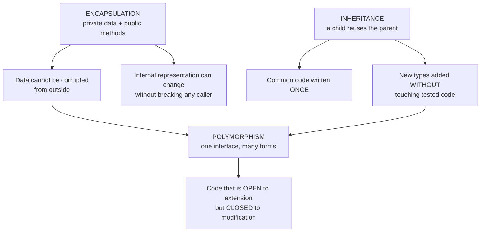

**The advantages of encapsulation in an object-oriented program:**
1. **Data integrity** — a `BankAccount`'s balance can never be set to a negative value, because every path to it passes through a validating method.
2. **Reduced coupling** — callers depend only on the **public interface**, not on how the data is stored.
3. **Freedom to refactor** — the internal representation can be changed entirely (from a `double` to a `BigDecimal`, say) **without a single caller needing to change**.
4. **Localised debugging** — if a value is wrong, the bug **must** be inside that class.
5. **Controlled, auditable access** — logging or authorisation can be added in one place.

**The advantages of inheritance:**
1. **Reusability** — `Account`'s `deposit()` is written once and used by `SavingsAccount`, `CurrentAccount` and `OverdraftAccount`.
2. **Extensibility** — a `FixedDepositAccount` can be added **without modifying** any existing class.
3. **A logical hierarchy** that mirrors the real business domain.
4. **It enables polymorphism** — the single most valuable consequence.
5. **Single point of maintenance** — a fix in the base class propagates to every subclass.

#### A complete worked example combining all three

```java
// ─── ENCAPSULATION: all data is private, access is through validated methods ───
abstract class Employee {
    private   String name;              // ← private: ENCAPSULATED
    private   int    id;
    protected double baseSalary;        // ← protected: subclasses may use it

    public Employee(String name, int id, double baseSalary) {
        this.name = name;
        this.id = id;
        setBaseSalary(baseSalary);
    }

    public String getName() { return name; }        // controlled read
    public int    getId()   { return id; }

    public void setBaseSalary(double s) {           // controlled write + VALIDATION
        if (s >= 0) this.baseSalary = s;
        else throw new IllegalArgumentException("Salary cannot be negative");
    }

    // ─── ABSTRACTION: WHAT every employee must do, not HOW ───
    public abstract double calculateSalary();

    public void display() {
        System.out.printf("%-10s (ID %d): %.2f Tk%n", name, id, calculateSalary());
    }
}

// ─── INHERITANCE: three specialised kinds of Employee ───
class PermanentEmployee extends Employee {
    private double allowance;
    public PermanentEmployee(String n, int i, double base, double allow) {
        super(n, i, base);
        this.allowance = allow;
    }
    // ─── POLYMORPHISM: the SAME method, a DIFFERENT rule ───
    @Override public double calculateSalary() { return baseSalary + allowance; }
}

class ContractEmployee extends Employee {
    private int hoursWorked;
    private double hourlyRate;
    public ContractEmployee(String n, int i, int hours, double rate) {
        super(n, i, 0);
        this.hoursWorked = hours;  this.hourlyRate = rate;
    }
    @Override public double calculateSalary() { return hoursWorked * hourlyRate; }
}

class SalesEmployee extends Employee {
    private double salesMade, commissionRate;
    public SalesEmployee(String n, int i, double base, double sales, double rate) {
        super(n, i, base);
        this.salesMade = sales;  this.commissionRate = rate;
    }
    @Override public double calculateSalary() {
        return baseSalary + salesMade * commissionRate;
    }
}

public class Payroll {
    public static void main(String[] args) {
        Employee[] staff = {
            new PermanentEmployee("Rahim", 101, 50000, 15000),
            new ContractEmployee ("Karim", 102, 160, 400),
            new SalesEmployee    ("Jamal", 103, 30000, 500000, 0.02)
        };

        double total = 0;
        for (Employee e : staff) {        // ← ONE loop handles ALL types
            e.display();                  // ← POLYMORPHISM: the right rule runs
            total += e.calculateSalary();
        }
        System.out.printf("%nTotal payroll: %.2f Tk%n", total);
    }
}
```

> **The payoff to state in an answer:** the payroll loop **does not contain a single `if` or `switch` on employee type**. To add a fourth category of employee tomorrow, you write one new class and **change nothing in `Payroll`**. That is the practical, measurable benefit of combining encapsulation, inheritance and polymorphism — and it is exactly what a procedural program with a giant `switch (employeeType)` cannot give you.

#### The design checklist

| Pillar | The question to ask |
|---|---|
| **Encapsulation** | *"Is every data member private? Does every change pass through a method that can validate it?"* |
| **Abstraction** | *"Does the user of this class need to know how it works, or only what it does?"* |
| **Inheritance** | *"Is this genuinely an IS-A relationship, or would composition (HAS-A) be more honest?"* |
| **Polymorphism** | *"Am I writing `if (type == …)`? If so, that logic probably belongs in an overridden method."* |

**Previous Year Question List from this Topic:**

- [(a) What are the basic features of object-oriented concepts? Give example code for each of them. (5 marks)](../written-answers/oop.md?plain=1#L8447)
- [What is polymorphism? Differences in types of polymorphism. Define.](../written-answers/oop.md?plain=1#L8499)
- [Answer the following Questions](../written-answers/oop.md?plain=1#L8536)
- [What is polymorphism in the context of OOP? Explain with example.](../written-answers/oop.md?plain=1#L8569)
- [Write down the concept about inheritance with example.](../written-answers/oop.md?plain=1#L8606)

**Previous Year MCQ List from this Topic:**

- [Which one of the following is the core property of Object-Oriented Programming?](../mcq-answers/oop.md?plain=1#L730)
- [Object Oriented programming এর বৈশিষ্ট্য কোনটি?](../mcq-answers/oop.md?plain=1#L676)
- [Which one is pure object-oriented language?](../mcq-answers/oop.md?plain=1#L703)


---

## Output Tracing & Recursion

### Tracing Java and C++ Program Output

Output-tracing questions in OOP test **three things**: the order in which **constructors** run, which **overridden method** actually executes, and how **references and object state** change. The method is the same variable-table discipline used for C, with three extra rules.

#### The three rules that decide every OOP tracing question

| # | Rule |
|---|---|
| **1** | **Constructors run BASE-FIRST, DERIVED-LAST.** Destructors run in the exact reverse order |
| **2** | **An overridden method is chosen by the OBJECT'S ACTUAL TYPE, not the reference type** (Java always; C++ only for `virtual` methods) |
| **3** | **A static/overloaded method is chosen by the REFERENCE TYPE, at compile time** |

#### Worked example 1 — constructor order

```java
class A {
    A() { System.out.println("A's constructor"); }
}
class B extends A {
    B() { System.out.println("B's constructor"); }
}
class C extends B {
    C() { System.out.println("C's constructor"); }
}

public class Test {
    public static void main(String[] args) { new C(); }
}
```

> **Output:**
> ```
> A's constructor
> B's constructor
> C's constructor
> ```
> **Why:** `C()` implicitly calls `super()` first, which calls `B()`, which implicitly calls `super()` → `A()`. So **A's body runs first**, then B's, then C's. **The construction starts at the top of the hierarchy and works down.**

#### Worked example 2 — overriding vs overloading

```java
class Parent {
    void show()          { System.out.println("Parent show()"); }
    void print(int x)    { System.out.println("Parent print(int)"); }
}
class Child extends Parent {
    @Override void show(){ System.out.println("Child show()"); }
    void print(double x) { System.out.println("Child print(double)"); }
}

public class Test {
    public static void main(String[] args) {
        Parent p = new Child();     // reference type Parent, OBJECT type Child
        p.show();                   // ?
        p.print(5);                 // ?
    }
}
```

> **Output:**
> ```
> Child show()
> Parent print(int)
> ```
> **Why:**
> - `p.show()` — `show()` is **OVERRIDDEN**, so **dynamic binding** applies and the **object's** type (Child) decides → **"Child show()"**.
> - `p.print(5)` — the **reference type is `Parent`**, and the compiler can only see `Parent`'s methods. `Parent` has `print(int)`, which matches exactly → **"Parent print(int)"**. `Child.print(double)` is an **overload, not an override**, and is **invisible through a `Parent` reference**.
>
> **This single example is the clearest test of whether a candidate understands the difference between overloading and overriding.**

#### Worked example 3 — C++ virtual vs non-virtual

```cpp
class Base {
public:
    virtual void f() { cout << "Base::f" << endl; }   // VIRTUAL
            void g() { cout << "Base::g" << endl; }   // NOT virtual
};
class Derived : public Base {
public:
    void f() override { cout << "Derived::f" << endl; }
    void g()          { cout << "Derived::g" << endl; }
};

int main() {
    Base* p = new Derived();
    p->f();        // ?
    p->g();        // ?
}
```

> **Output:**
> ```
> Derived::f
> Base::g
> ```
> **Why:** `f()` is **`virtual`**, so the call is resolved at **run time** using the object's vtable → `Derived::f`. `g()` is **not virtual**, so it is resolved at **compile time** from the **pointer's type** (`Base*`) → `Base::g`.

#### Worked example 4 — static and instance variables

```java
class Counter {
    static int staticCount = 0;      // ONE copy, shared
    int        instanceCount = 0;    // one copy PER OBJECT

    void increment() {
        staticCount++;
        instanceCount++;
    }
}

public class Test {
    public static void main(String[] args) {
        Counter c1 = new Counter();
        Counter c2 = new Counter();

        c1.increment();  c1.increment();
        c2.increment();

        System.out.println(c1.staticCount + " " + c1.instanceCount);
        System.out.println(c2.staticCount + " " + c2.instanceCount);
    }
}
```

> **Output:**
> ```
> 3 2
> 3 1
> ```
> **Why:** `staticCount` is **shared**, so all three calls increment the **same** variable → 3 for both objects. `instanceCount` is **separate per object** → c1 was incremented twice, c2 once.

#### Worked example 5 — objects are passed by reference value

```java
class Box { int value; }

public class Test {
    static void modify(Box b, int x) {
        b.value = 100;      // ✅ changes the ORIGINAL object's field
        x = 999;            // ❌ changes only the local COPY of x
        b = new Box();      // ❌ rebinds only the LOCAL reference
        b.value = 500;      //    this affects the NEW object, not the caller's
    }

    public static void main(String[] args) {
        Box box = new Box();
        box.value = 10;
        int num = 20;

        modify(box, num);
        System.out.println(box.value + " " + num);
    }
}
```

> **Output: `100 20`**
>
> **Why — the single most misunderstood point in Java:** **Java is ALWAYS pass-by-value.** What is passed by value for an object is **the REFERENCE**, not the object. So:
> - `b.value = 100` **follows** the reference and changes the **caller's object** ✅
> - `x = 999` changes a **copy of the primitive** — the caller's `num` is untouched
> - `b = new Box()` changes only the **local copy of the reference** — the caller's `box` still points to the original object
>
> **The correct statement: "Java passes object references by value."** It is neither pure pass-by-value of the object nor true pass-by-reference.

#### The tracing checklist

| # | Check |
|---|---|
| 1 | **Constructor chain** — base first, derived last; note any `super(...)` call |
| 2 | **Is the method overridden?** If yes → the **object's** type wins |
| 3 | **Is the method overloaded?** If yes → the **reference/argument** types win, at compile time |
| 4 | **Is it `static`, `private` or `final`?** Then it is **NOT polymorphic** — the reference type wins |
| 5 | **In C++: is it `virtual`?** If not, the pointer's type wins |
| 6 | **`static` variables are shared**; instance variables are per-object |
| 7 | **Objects are modified through the reference**; reassigning the reference inside a method changes nothing outside |
| 8 | **Integer arithmetic truncates**, and `i++` vs `++i` still applies |
| 9 | **`String` is immutable** — `s.toUpperCase()` returns a new string and does **not** change `s` |
| 10 | Track the **order of `System.out.println` calls** exactly — including those inside constructors |

**Previous Year Question List from this Topic:**

- [Consider the following Java program and determine the integer value printed by the execution of the main() method:](../written-answers/oop.md?plain=1#L8652)
- [(খ) কোন object-oriented programming language ব্যবহার করে একটি program লিখুন, যা recursive function ব্যবহার করে Fibonacci series প্রদান করবে।](../written-answers/oop.md?plain=1#L8757)
- [6.13 Consider the following Java program and determine the integer value printed by the execution of the main() method:](../written-answers/oop.md?plain=1#L8902)
- [Show the output following program.](../written-answers/oop.md?plain=1#L8997)
- [What is the output of the following java code?](../written-answers/oop.md?plain=1#L9139)
- [Find the output of Java program:](../written-answers/oop.md?plain=1#L9246)
- [What will be the output of following program?](../written-answers/oop.md?plain=1#L9330)
- [Find the output below following code.](../written-answers/oop.md?plain=1#L9463)
- [Consider the following program and perform the task that follow:](../written-answers/oop.md?plain=1#L9584)
- [You are required to trace the changes in value for each of the numbers, before and after each method are called for each of iterations and finally write down ou…](../written-answers/oop.md?plain=1#L9760)

**Previous Year MCQ List from this Topic:**

- [The following method, which is intended to find the maximum element of the parameter array, is incorrect.](../mcq-answers/oop.md?plain=1#L65)
- [What is the output of this Java program?](../mcq-answers/oop.md?plain=1#L94)
- [What is the result of compiling and running the following code?](../mcq-answers/oop.md?plain=1#L123)
- [Find the correct output: System.out.print('D' + 'E'+ 'F');](../mcq-answers/oop.md?plain=1#L158)
- [Find the output of the following code:](../mcq-answers/oop.md?plain=1#L167)
- [What is the output of this Java program?](../mcq-answers/oop.md?plain=1#L208)
- [What is the output of this Java program?](../mcq-answers/oop.md?plain=1#L246)
- [Find the output of following Java code line: System.out.println (math.floor (-7.4)](../mcq-answers/oop.md?plain=1#L297)
- [int C=10; System.out.println(C--); gives a output of-](../mcq-answers/oop.md?plain=1#L414)


---

### Recursion in Object-Oriented Programs

The principles are identical to recursion in C — a **base case** and a **recursive case that moves towards it** — but in an OOP context recursion most often appears in **tree and linked structures**, and in methods that call themselves on a **sub-object**.

#### Worked example — recursion with an instance method

```java
class MathUtil {
    // Factorial
    public int factorial(int n) {
        if (n <= 1) return 1;                    // BASE CASE
        return n * factorial(n - 1);             // RECURSIVE CASE
    }

    // Sum of digits
    public int sumDigits(int n) {
        if (n == 0) return 0;
        return (n % 10) + sumDigits(n / 10);
    }

    // Fibonacci — tree recursion, O(2ⁿ)
    public int fib(int n) {
        if (n <= 1) return n;
        return fib(n - 1) + fib(n - 2);
    }

    // Power — O(log n) by fast exponentiation
    public double power(double x, int n) {
        if (n == 0) return 1;
        double half = power(x, n / 2);
        return (n % 2 == 0) ? half * half : x * half * half;
    }

    // Reverse a string
    public String reverse(String s) {
        if (s.isEmpty()) return s;
        return reverse(s.substring(1)) + s.charAt(0);
    }
}
```

#### Worked example — determining the printed value

```java
public class Test {
    static int f(int n) {
        if (n <= 0) return 0;
        return n + f(n - 2);
    }
    public static void main(String[] args) {
        System.out.println(f(7));
    }
}
```

**The trace:**

| Call | Returns |
|---|---|
| f(7) | 7 + f(5) |
| f(5) | 5 + f(3) |
| f(3) | 3 + f(1) |
| f(1) | 1 + f(−1) |
| f(−1) | **0** ← base case |

> **Unwinding:** f(1) = 1 + 0 = 1 · f(3) = 3 + 1 = 4 · f(5) = 5 + 4 = 9 · f(7) = **7 + 9 = 16**
> ### **Output: 16**

> **The method that never fails:** write each call on its own line as an **unevaluated expression** on the way down, hit the base case, then **substitute upwards**. Trying to evaluate in your head from the top invariably goes wrong.

#### Recursion on an object structure — a linked list

```java
class Node {
    int  data;
    Node next;
    Node(int d) { data = d; }
}

class LinkedList {
    Node head;

    // Print in order — process on the way DOWN
    void printForward(Node n) {
        if (n == null) return;
        System.out.print(n.data + " ");
        printForward(n.next);
    }

    // Print in REVERSE — process on the way BACK UP
    void printReverse(Node n) {
        if (n == null) return;
        printReverse(n.next);                 // go all the way to the end FIRST
        System.out.print(n.data + " ");       // print while unwinding
    }

    // Count the nodes
    int count(Node n) {
        return (n == null) ? 0 : 1 + count(n.next);
    }
}
```

> **The single idea that makes recursion click:** *where you put the work — **before** the recursive call or **after** it — decides whether you process the structure **forwards or backwards**.* Printing before the call gives forward order; printing after it gives reverse order, for free, with no extra data structure.

#### Recursion vs Iteration — the summary

| Point | **Recursion** | **Iteration** |
|---|---|---|
| **Memory** | **O(depth)** — a stack frame per call | **O(1)** |
| **Speed** | Slower — call overhead | **Faster** |
| **Code clarity** | **Far clearer** for trees, graphs and divide-and-conquer | Clearer for simple counted loops |
| **Risk** | **StackOverflowError** on deep recursion | Infinite loop hangs the program |
| **Best for** | **Tree/graph traversal, backtracking, divide and conquer, naturally recursive definitions** | Counting, summing, simple repetition |

> **The practical rule: use recursion when the DATA STRUCTURE is recursive** (a tree, a linked list, a nested directory). Use iteration when you are simply repeating an action a known number of times.

**Previous Year Question List from this Topic:**

- [Consider the following Java program and determine the integer value printed by the execution of the main() method:](../written-answers/oop.md?plain=1#L8652)
- [6.13 Consider the following Java program and determine the integer value printed by the execution of the main() method:](../written-answers/oop.md?plain=1#L8902)
- [You are required to trace the changes in value for each of the numbers, before and after each method are called for each of iterations and finally write down ou…](../written-answers/oop.md?plain=1#L9760)

**Previous Year MCQ List from this Topic:**

- [Which of these data types is used by operating system to manage the Recursion in Java?](../mcq-answers/oop.md?plain=1#L378)
