<!-- TOC START -->
**Table of Contents** — 6 subtopics · 14 theories

1. **[Linux / Unix Commands & Administration](#linux--unix-commands--administration)**
   - [Linux — Structure, Shell and File System](#linux--structure-shell-and-file-system)
   - [Essential Linux Commands](#essential-linux-commands)

2. **[CPU Scheduling Algorithms](#cpu-scheduling-algorithms)**
   - [CPU Scheduling — Concepts and Criteria](#cpu-scheduling--concepts-and-criteria)
   - [The Scheduling Algorithms](#the-scheduling-algorithms)
   - [Worked Scheduling Problems](#worked-scheduling-problems)
   - [The Three Schedulers — Long-term, Medium-term and Short-term](#the-three-schedulers--long-term-medium-term-and-short-term)

3. **[Memory Management & Paging](#memory-management--paging)**
   - [Memory Management — Paging and Segmentation](#memory-management--paging-and-segmentation)
   - [Virtual Memory, Demand Paging and Thrashing](#virtual-memory-demand-paging-and-thrashing)

4. **[OS Concepts & Process Management](#os-concepts--process-management)**
   - [Operating System — Functions and Services](#operating-system--functions-and-services)
   - [Processes, Threads and Multithreading](#processes-threads-and-multithreading)
   - [Process Creation, System Calls and Special Process States (fork, Zombie, Orphan, Daemon)](#process-creation-system-calls-and-special-process-states-fork-zombie-orphan-daemon)

5. **[Deadlock & Concurrency Control](#deadlock--concurrency-control)**
   - [Deadlock — Conditions, Handling and Prevention](#deadlock--conditions-handling-and-prevention)
   - [Process Synchronization — Critical Section, Semaphores and Mutex](#process-synchronization--critical-section-semaphores-and-mutex)

6. **[File Systems & Disk Management](#file-systems--disk-management)**
   - [File Systems, inodes, Partitions and Mounting](#file-systems-inodes-partitions-and-mounting)

<!-- TOC END -->

---

## Linux / Unix Commands & Administration

### Linux — Structure, Shell and File System

#### What is Linux?

**Linux** is a **free, open-source, Unix-like operating system kernel**, created by **Linus Torvalds in 1991**, which together with GNU utilities forms a complete operating system. It powers the **majority of the world's servers, all Android phones, and essentially all supercomputers**.

#### The architecture

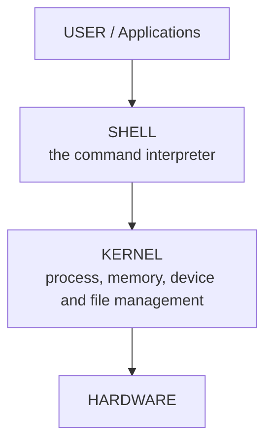

| Layer | Function |
|---|---|
| **Hardware** | CPU, memory, disks, devices |
| **Kernel** | The **core** — manages processes, memory, devices, file systems and system calls |
| **Shell** | The **command interpreter** — reads commands, interprets them, and asks the kernel to act |
| **Applications** | The programs the user runs |

#### What is bash?

> **Bash (Bourne Again SHell)** is the **default command-line shell and scripting language on most Linux distributions**. It is a **command interpreter** that reads the commands you type (or a script file), interprets them, expands variables and wildcards, and executes the corresponding programs through the kernel.
>
> **It is both:**
> 1. An **interactive command interpreter** — the prompt you type at.
> 2. A **programming language** — with variables, conditionals, loops, functions and I/O redirection, used to write **shell scripts** that automate administration.
>
> **Other shells:** `sh` (the original Bourne shell), `csh`, `ksh`, **`zsh`** (the default on macOS), `fish`. The **`#!/bin/bash`** line at the top of a script (the "shebang") tells the system which interpreter to use.

#### The Linux file system hierarchy

| Directory | Contains |
|---|---|
| **`/`** | The **root** of everything |
| **`/home`** | **Users' personal directories** (`/home/rahim`) |
| `/root` | The **root user's** home directory |
| **`/bin`, `/usr/bin`** | Essential **user commands** (ls, cp, cat) |
| **`/sbin`, `/usr/sbin`** | **System administration** commands |
| **`/etc`** | **Configuration files** — the most important directory for an administrator |
| **`/var`** | **Variable data** — **`/var/log`** holds the log files |
| `/tmp` | Temporary files, cleared on reboot |
| **`/dev`** | **Device files** — everything is a file in Unix |
| `/proc` | A virtual file system exposing **kernel and process information** |
| `/mnt`, `/media` | Mount points for removable and other file systems |
| `/opt` | Optional third-party software |
| `/lib` | Shared libraries |

> **The Unix philosophy: "EVERYTHING IS A FILE."** A keyboard, a disk, a network socket and a running process are all accessed through the file interface — which is why the same small set of commands works everywhere.

**Previous Year Question List from this Topic:**

- [Which file is need by init to get the default run level?](../written-answers/operating-system.md?plain=1#L397)
- [Write down the names of the three users who can access a file on directory on Linux.](../written-answers/operating-system.md?plain=1#L857)
- [Difference between below 3 linux command: cd, cd usr/desk/home, cd/user/desk/home](../written-answers/operating-system.md?plain=1#L1309)
- [How do you define bash?](../written-answers/operating-system.md?plain=1#L2116)
- [Linux এ file তৈরির জন্য কি কি Command ব্যবহৃত হয়? পূর্ণ Command লিখ।](../written-answers/operating-system.md?plain=1#L3406)

**Previous Year MCQ List from this Topic:**

- [What is LINUX?](../mcq-answers/operating-system.md?plain=1#L290)
- [Which one of the first 64-bit operating system?](../mcq-answers/operating-system.md?plain=1#L308)
- [In a computer, folder opening is denied by which of the following names?](../mcq-answers/operating-system.md?plain=1#L317)
- [Which of the following contains configuration information of a window?](../mcq-answers/operating-system.md?plain=1#L326)
- [Which O/S is recommended for real time system?](../mcq-answers/operating-system.md?plain=1#L344)
- [Which OS is recommended for real time systems?](../mcq-answers/operating-system.md?plain=1#L353)
- [Generally what type of server OS is chosen, where security concern is a great issue?](../mcq-answers/operating-system.md?plain=1#L371)
- [User passwords in Linux are stored as-](../mcq-answers/operating-system.md?plain=1#L519)
- [What is the maximum size of a file allowed in Linux with the following data Block Size = 4KB, inode data pointer size = 4 byte?](../mcq-answers/operating-system.md?plain=1#L537)
- [USER150, USER153 can do certain tasks and USER151, USER152 can also do certain tasks as depicted in the picture. For this reason, two ________ have been created…](../mcq-answers/operating-system.md?plain=1#L555)
- [In UNIX, the login prompt can be changed by changing the content of the file-](../mcq-answers/operating-system.md?plain=1#L576)


---

### Essential Linux Commands

#### File and directory operations

| Command | Purpose | Example |
|---|---|---|
| **`ls`** | **List** directory contents | `ls` |
| **`ls -l`** | **Long listing** — permissions, owner, size, date | `ls -l` |
| **`ls -a`** | Show **ALL files INCLUDING HIDDEN** ones (those starting with `.`) | `ls -a` |
| **`ls -la`** | Long listing **including hidden** files | `ls -la` |
| **`ls -lh`** | Long listing with **human-readable sizes** (KB, MB, GB) | `ls -lh ~` |
| **`pwd`** | **Print Working Directory** — where am I? | `pwd` |
| **`cd`** | **Change Directory** | `cd /var/log` |
| **`mkdir`** | **Make a directory** | `mkdir PSC` |
| **`mkdir -p`** | Create a directory **and all missing parent directories** | `mkdir -p parent/sub/deep` |
| **`rmdir`** | Remove an **EMPTY** directory | `rmdir olddir` |
| **`rm`** | **Remove a FILE** | `rm file.txt` |
| **`rm -r`** | Remove a directory **recursively** (with its contents) | `rm -r folder` |
| **`rm -rf`** | Recursive + **force**, no prompts | ⚠️ **`rm -rf /` DESTROYS THE SYSTEM** |
| **`cp`** | **Copy a file** | `cp a.txt b.txt` |
| **`cp -r`** | **Copy a DIRECTORY with all its contents** | `cp -r A P` |
| **`mv`** | **MOVE a file — and also RENAME it** | `mv old.txt new.txt` |
| **`touch`** | **Create an empty file**, or update its timestamp | `touch apscl.txt` |
| **`cat`** | Display (concatenate) a file's contents | `cat file.txt` |
| **`less` / `more`** | View a long file page by page | `less bigfile.log` |
| **`head`** | Show the **FIRST 10 lines** (default) | `head -n 20 file.txt` |
| **`tail`** | Show the **LAST 10 lines** | `tail -n 20 file.txt` |
| **`tail -f`** | **FOLLOW a file as it grows** — essential for live logs | **`tail -f /var/log/syslog`** |
| **`find`** | Search for files by name, size, date, type | `find / -name "*.conf"` |
| **`grep`** | **Search for a PATTERN inside files** | `grep "error" file.log` |
| **`wc`** | **Word count** — lines, words, characters | `wc -l file.txt` |
| **`ln -s`** | Create a **SYMBOLIC LINK** (a shortcut) | `ln -s /home/SGFL mylink` |
| **`file`** | Identify a file's type | `file image.png` |

> **How to RENAME a file in Linux: use `mv`.** There is no separate rename command — `mv oldname.txt newname.txt` moves the file to a new name in the same directory, which is exactly a rename. *(The `rename` utility exists for bulk pattern-based renaming.)*

#### Permissions and ownership

Linux permissions are shown by `ls -l` as ten characters, e.g. **`-rwxr-xr--`**:

```
  -    rwx      r-x      r--
 type  OWNER   GROUP   OTHERS
```

| | Read (r) | Write (w) | Execute (x) |
|---|---|---|---|
| **Numeric value** | **4** | **2** | **1** |

> **The three users who can access a file in Linux are: the OWNER (user), the GROUP, and OTHERS (everyone else).** This is the standard answer — `u`, `g`, `o`, with `a` meaning all three.

| Numeric | Symbolic | Meaning |
|---|---|---|
| **7** | rwx | Read + Write + Execute |
| **6** | rw- | Read + Write |
| **5** | r-x | Read + Execute |
| **4** | r-- | **Read only** |
| **0** | --- | No permission |

| Command | Purpose | Example |
|---|---|---|
| **`chmod`** | **Change permissions** | `chmod 755 file.sh` |
| **`chown`** | **Change the OWNER** | `chown rahim file.txt` |
| **`chgrp`** | **Change the GROUP** | `chgrp staff file.txt` |
| **`chown user:group`** | Change **both at once** | `chown rahim:staff file.txt` |
| `umask` | Set the default permissions for new files | `umask 022` |

**Worked permission examples:**

```bash
chmod 755 script.sh    # owner rwx, group r-x, others r-x  — the usual for a program
chmod 644 file.txt     # owner rw-, group r--, others r--  — the usual for a data file
chmod 600 secret.txt   # owner rw-, nobody else anything   — private
chmod 700 mydir        # owner full access, nobody else    — private directory

# Revoke ALL permission from everyone EXCEPT the owner, for jdcl.txt:
chmod 700 jdcl.txt             # numeric form
chmod go-rwx jdcl.txt          # symbolic form — remove rwx from group and others
# (for a data file, chmod 600 is more appropriate — no execute bit)

# Create a folder 'A' with READ permission only:
mkdir A && chmod 444 A         # strictly read-only for everyone
# (note: a directory also needs 'x' to be entered, so in practice chmod 555 A)

# Copy folder A with everything in it into folder P:
cp -r A P                      # or, preserving permissions and timestamps:
cp -a A P
```

#### User and system administration

| Command | Purpose |
|---|---|
| **`useradd` / `adduser`** | **Create a user** — `sudo useradd -m rahim` |
| **`passwd`** | Set or change a password — `sudo passwd rahim` |
| **`userdel`** | Delete a user |
| **`groupadd` / `usermod -aG`** | Create a group / add a user to a group |
| **`su`** | Switch user |
| **`sudo`** | Execute **one command as the superuser** |
| **`whoami`** | Show the current username |
| **`who` / `w`** | Show who is logged in |
| **`id`** | Show the user's UID, GID and groups |
| **`history`** | **Show the recently executed commands** |
| **`ps aux`** | List **all running processes** |
| **`top` / `htop`** | Live process and resource monitor |
| **`kill` / `killall`** | Terminate a process — `kill -9 PID` forces it |
| **`df -h`** | **Disk space** in human-readable form |
| **`du -sh`** | **Directory size** |
| **`free -h`** | **Memory usage** in human-readable form |
| **`uname -a`** | Kernel and system information |
| **`getconf PAGESIZE`** | **Show the memory page size** |
| **`shutdown` / `reboot`** | Power control |
| **`crontab -e`** | **Schedule commands to run at specific times** |

> **`history`** displays a numbered list of previously executed commands. **`!123`** re-runs command number 123, **`!!`** re-runs the last command, and **`Ctrl+R`** searches the history interactively. The history is stored in **`~/.bash_history`**.

#### Scheduling with cron

> **The command to run tasks at specific scheduled times is `cron`, configured with `crontab -e`.**

The five time fields are: **minute (0–59) · hour (0–23) · day of month (1–31) · month (1–12) · day of week (0–7, where 0 and 7 are Sunday)**.

```bash
crontab -e                                 # edit the schedule
crontab -l                                 # list it

# Examples:
0 2 * * *     /home/user/backup.sh         # every day at 2:00 AM
*/5 * * * *   /home/user/check.sh          # every 5 minutes
0 0 1 * *     /home/user/monthly.sh        # 1st of every month at midnight
30 6 * * 1    /home/user/weekly.sh         # every Monday at 6:30 AM
```

*(For a **one-off** future job, use **`at`**: `echo "command" | at 14:30`.)*

#### Networking commands

| Command | Purpose |
|---|---|
| **`ping <host>`** | **Test network connectivity** and measure round-trip time |
| **`ifconfig` / `ip addr`** | **Show the IP address** of each interface |
| **`ip a` / `hostname -I`** | Quick IP display |
| **`traceroute` / `tracepath`** | **Show every router hop** along the path to a destination |
| **`netstat -tulpn` / `ss -tulpn`** | Show listening ports and connections |
| **`nslookup` / `dig`** | DNS lookup |
| **`curl` / `wget`** | Fetch a URL |
| **`ssh user@host`** | **Secure remote login** |
| **`scp`** | Secure copy between machines |
| **`rsync`** | Efficient synchronised copy |

**Worked examples:**
```bash
# Test whether a website is reachable
ping -c 4 www.tgtdcl.gov.bd
curl -I https://www.tgtdcl.gov.bd        # fetch just the headers

# Trace the path your data takes to a website
traceroute www.google.com                # Linux
tracert www.google.com                   # Windows

# Show your IP address
ip addr show          # modern
ifconfig              # traditional
hostname -I           # just the address
```

#### Pipes, redirection and filters

| Symbol | Meaning |
|---|---|
| **`\|`** | **Pipe** — send the output of one command as the **input of the next** |
| **`>`** | Redirect output to a file, **overwriting** it |
| **`>>`** | Redirect output, **appending** |
| **`<`** | Take input from a file |
| **`2>`** | Redirect **error** output |
| **`&&`** | Run the next command **only if the first succeeded** |
| **`;`** | Run commands in sequence regardless of success |

> **The pipe is the single most powerful idea in the Unix shell.** It lets small, simple tools be combined into arbitrarily complex operations — the "do one thing well" philosophy.

#### Worked command problems

**1. Count the characters and words in the first 10 lines of a file**
```bash
head -n 10 file.txt | wc -w     # words
head -n 10 file.txt | wc -c     # characters
head -n 10 file.txt | wc -wc    # both at once
```

**2. Show the last 10 lines of a log file that is continuously updating**
```bash
tail -f /var/log/syslog          # follow it live
tail -n 10 -f /var/log/syslog    # start with the last 10, then follow
```
> **`tail -f` is the essential command for watching a live log** — it keeps the file open and prints each new line as it is written.

**3. Count the total lines in all `.c` and `.h` files in the current directory**
```bash
cat *.c *.h | wc -l                        # simple
wc -l *.c *.h                              # per file plus a total
find . -name "*.c" -o -name "*.h" | xargs wc -l    # including subdirectories
```

**4. Show all files including hidden ones in the home directory, with details and human-readable sizes**
```bash
ls -lah ~
# -l = long listing, -a = include hidden, -h = human-readable sizes
```

**5. Show page size and disk space in human-readable form**
```bash
getconf PAGESIZE       # memory page size in bytes (usually 4096)
df -h                  # disk space, human readable
du -sh *               # size of each item in the current directory
```

**6. Create a symbolic link called `mylink` to the home directory `SGFL`**
```bash
ln -s /home/SGFL mylink
ls -l mylink           # shows:  mylink -> /home/SGFL
```

**7. Create a file and give permissions**
```bash
touch apscl.txt                 # create the file
chmod 644 apscl.txt             # owner rw, others r
chmod u+x apscl.txt             # add execute for the owner
```

**8. Understanding `cd`, `cd usr/desk/home` and `cd /user/desk/home`**

| Command | Meaning |
|---|---|
| **`cd`** | Go to the **HOME directory** (equivalent to `cd ~`) |
| **`cd usr/desk/home`** | **RELATIVE path** — go to `usr/desk/home` **starting from the CURRENT directory**. Fails if that path does not exist here |
| **`cd /user/desk/home`** | **ABSOLUTE path** — the leading `/` means start from the **ROOT** of the file system. Works from anywhere |

> **The key distinction: a path beginning with `/` is ABSOLUTE (from the root); a path without it is RELATIVE (from where you currently are).** Also: **`.`** = the current directory, **`..`** = the parent directory, **`~`** = the home directory, **`-`** = the previous directory.

**9. Which file does `init` read to get the default run level?**
> **`/etc/inittab`** in the traditional SysV init system. *(On modern **systemd** systems the equivalent is the **default target**, shown by `systemctl get-default` and usually `graphical.target` or `multi-user.target`.)*

**10. Print command**
> **`lp` or `lpr`** sends a file to the printer — `lp file.txt`. `lpstat` shows the queue, and `cancel` removes a job.

#### Shell scripting

```bash
#!/bin/bash
# A script that adds a line at the TOP of every .txt file in the directory

for file in *.txt; do
    echo "This is my file" | cat - "$file" > temp && mv temp "$file"
done
echo "Done — line added to all .txt files"
```

> **How it works:** `cat - "$file"` concatenates **standard input (the echoed line) followed by the file's contents**, and the result is written to a temporary file which then replaces the original. The `-` is the crucial part: it tells `cat` to read standard input at that point.

**A `for` loop producing a pattern:**
```bash
#!/bin/bash
# Prints a right triangle of stars
for (( i=1; i<=5; i++ )); do
    for (( j=1; j<=i; j++ )); do
        echo -n "* "
    done
    echo                     # newline at the end of each row
done
```
```
* 
* * 
* * * 
* * * * 
* * * * * 
```

**Shell script essentials:**

| Element | Syntax |
|---|---|
| Shebang | `#!/bin/bash` |
| Variable | `name="value"` — **no spaces around `=`** |
| Use a variable | `$name` or `${name}` |
| Command substitution | `result=$(command)` |
| Condition | `if [ "$a" -eq "$b" ]; then … fi` |
| For loop | `for i in 1 2 3; do … done` |
| While loop | `while [ condition ]; do … done` |
| Function | `myfunc() { … }` |
| Arguments | `$1 $2 …`, `$#` = count, `$@` = all |
| Exit status | `$?` — **0 means success** |
| Make executable | `chmod +x script.sh` then `./script.sh` |

#### The three commands most often asked with examples

| Command | Purpose | Example |
|---|---|---|
| **`ls`** | **Lists** the contents of a directory | `ls -la /home` — long listing including hidden files |
| **`grep`** | **Searches for a pattern** in files, printing matching lines | `grep -i "error" /var/log/syslog` — case-insensitive search. `grep -r "TODO" .` searches recursively; `grep -n` shows line numbers; `grep -v` **inverts** the match |
| **`ssh`** | **Securely logs in to a remote machine** over an encrypted connection | `ssh rahim@192.168.1.10` · `ssh -p 2222 user@host` for a non-default port · `ssh-keygen` creates a key pair for password-less login. It replaced **telnet**, which sends everything in plaintext |

**Previous Year Question List from this Topic:**

- [Write Linux command:](../written-answers/operating-system.md?plain=1#L28)
- [Write a Linux command to count the total number of characters and words from the first 10 lines of a file named "wasacustomers.txt".](../written-answers/operating-system.md?plain=1#L103)
- [Linux command:](../written-answers/operating-system.md?plain=1#L156)
- [Write Linux command:](../written-answers/operating-system.md?plain=1#L269)
- [ফাইল Rename করার Linux কমান্ড কি?](../written-answers/operating-system.md?plain=1#L344)
- [Show last 10 lines of log file which is continuously updating in Linux command?](../written-answers/operating-system.md?plain=1#L450)
- [Linux Command in ownership and group permission.](../written-answers/operating-system.md?plain=1#L507)
- [UNIX command with example: File move, Change Directory and search from a specific line.](../written-answers/operating-system.md?plain=1#L599)
- [Write appropriate linux command:](../written-answers/operating-system.md?plain=1#L692)
- [Write Linux command to find out the following question:](../written-answers/operating-system.md?plain=1#L771)
- [You need to find the total number of linux of the .c and .h file in the current directory formulas the linux commands to display this......... (Approximate)](../written-answers/operating-system.md?plain=1#L930)
- [Find the possible path to know how data on the internet treavels from your mechine to the site www.bicic.gov.bd. Write down the necessary command to accomplish…](../written-answers/operating-system.md?plain=1#L999)
- [You want to run some specific commands at some price schedules time. Which command will have to be used for this.](../written-answers/operating-system.md?plain=1#L1062)
- [Linux Command লিখ:](../written-answers/operating-system.md?plain=1#L1157)
- [UNIX command (directory listing with hidden files).](../written-answers/operating-system.md?plain=1#L1235)
- [Linux Command: Write down the linux command: All hidden flies, remove a file, permission of a file, search for a string.](../written-answers/operating-system.md?plain=1#L1386)
- [(b) Write Linux commands to: (i) Make a directory named PSC (ii) Copy a directory with all its Contents into a directory name/home/admin.](../written-answers/operating-system.md?plain=1#L1461)
- [In Linux, History is a very useful command to show you all of the last commands that have been recently used. Grep is a Linux command-line tool used to search f…](../written-answers/operating-system.md?plain=1#L1529)
- [Write down a shell script program that would add the line “This is my file” at the top of each file having the extention ‘txt’ in the current directory. Note th…](../written-answers/operating-system.md?plain=1#L1607)
- [Write the following UNIX command with example: (a) ls (b) grep (c) ssh](../written-answers/operating-system.md?plain=1#L1717)
- [(a) Check if the website of ‘TGTDCL’. (b) How to create folder in sub-directory?](../written-answers/operating-system.md?plain=1#L1804)
- [Write a Linux command to revoke permission from no user but owner from a file “jdcl.txt”.](../written-answers/operating-system.md?plain=1#L1887)
- [Linux এর ক্ষেত্রে User Creation এর কমান্ড লিখ?](../written-answers/operating-system.md?plain=1#L1953)
- [Write Linux command for following question: a) Create a file apscl.txt in current location. b) Given permission to all read write and execute to the file apscl.…](../written-answers/operating-system.md?plain=1#L2043)
- [Linux Command: Write a code for listing home directory files with all details and human readable size got to Home directory, list directory files with 10-15 are…](../written-answers/operating-system.md?plain=1#L2200)
- [(i) Linux command for showing all files including the hidden files inside the home directory.](../written-answers/operating-system.md?plain=1#L2261)
- [(ii) Linux command for showing page size, disk space in a human-readable format.](../written-answers/operating-system.md?plain=1#L2329)
- [A home directory called SGFL exists on your computer. Write a Linux command to create a link called “SGFL-Link” in the home directory.](../written-answers/operating-system.md?plain=1#L2402)
- [Write Shell command which make a folder name ‘A’ with read permission access only.](../written-answers/operating-system.md?plain=1#L2473)
- [Write Shell command which copy folder ‘A’ all information into folder ‘P’. Folder ‘A’ and folder ‘P’s parent folder is same.](../written-answers/operating-system.md?plain=1#L2549)
- [৩. লিনাক্স এর প্রিন্ট কমান্ডটি লিখ?](../written-answers/operating-system.md?plain=1#L2615)
- [৬. ফোল্ডার রিমুভ করার জন্য নিচেরর কোনটি লিনাক্স কমান্ড হিসেবে ব্যবহৃত হয়?](../written-answers/operating-system.md?plain=1#L2684)
- [৭. ফাইল কপি করার জন্য লিনাক্স কমান্ড কোনটি?](../written-answers/operating-system.md?plain=1#L2756)
- [ফাইল কপি করার লিনাক্স/ইউনিক্স কমান্ড কি?](../written-answers/operating-system.md?plain=1#L2831)
- [২. নেটওয়ার্ক কানেক্টিভিটি টেস্ট করার জন্য লিনাক্স কমান্ড লিখ।](../written-answers/operating-system.md?plain=1#L2892)
- [৩. IP Address বের করার জন্য লিনাক্স কমান্ড লিখ।](../written-answers/operating-system.md?plain=1#L2960)
- [Write down Linux command: i. Display current directory folder and file. ii. Create a folder name “DPDC”. iii. Remove a file like as “DPDC2”. iv. A file name is…](../written-answers/operating-system.md?plain=1#L3038)
- [A bash shell script using for loop to give output of given pattern:](../written-answers/operating-system.md?plain=1#L3113)
- [Answer the following linux command:](../written-answers/operating-system.md?plain=1#L3237)
- [Write Linux command: (i) File permission (ii) Remove file or folder (iii) Show IP address](../written-answers/operating-system.md?plain=1#L3327)
- [A question on Linux file permission commands:](../written-answers/operating-system.md?plain=1#L3489)
- [Linux Command:](../written-answers/operating-system.md?plain=1#L3567)

**Previous Year MCQ List from this Topic:**

- [A job which is schedule to run periodically at fixed times or intervals is known as-](../mcq-answers/operating-system.md?plain=1#L56)
- [Which of the following Linux command has incorrect syntax?](../mcq-answers/operating-system.md?plain=1#L528)
- [Which UNIX/Linux command is used to make all files and sub-directories in the directory "progs" executable by all users?](../mcq-answers/operating-system.md?plain=1#L546)
- [In UNIX, the login prompt can be changed by changing the content of the file-](../mcq-answers/operating-system.md?plain=1#L576)
- [Which of the following UNIX commands allows scheduling a program to be executed at specifies time?](../mcq-answers/operating-system.md?plain=1#L585)
- [What command is used to remove files UNIX?](../mcq-answers/operating-system.md?plain=1#L594)
- [You need to determine whether IP information has been assigned to your Windows NT. Which utility should you use?](../mcq-answers/operating-system.md?plain=1#L603)
- [The command password issued without an argument with change the password of –](../mcq-answers/operating-system.md?plain=1#L380)


---

## CPU Scheduling Algorithms

### CPU Scheduling — Concepts and Criteria

#### What is CPU scheduling?

**CPU scheduling** is the activity of the operating system that **decides WHICH process in the ready queue should be allocated the CPU next, and for how long.**

> **Why it exists:** in a **multiprogramming** system many processes are ready to run but there is only one CPU (or a few cores). Without scheduling, the CPU would sit idle whenever the running process performed I/O. Scheduling keeps the CPU **busy at all times**, which is the whole point of multiprogramming.

#### The process states

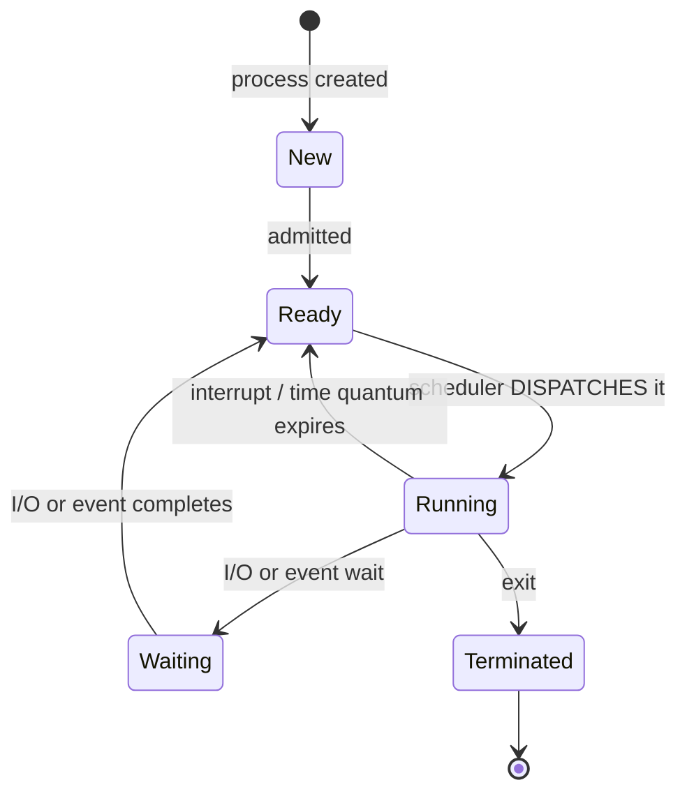

> **The five states of a process are: NEW, READY, RUNNING, WAITING (blocked) and TERMINATED.**

| State | Meaning |
|---|---|
| **New** | The process is being created |
| **Ready** | Loaded in memory and **waiting to be assigned the CPU** |
| **Running** | **Instructions are being executed** — only one process per core at a time |
| **Waiting / Blocked** | Waiting for an **I/O operation or an event** to complete |
| **Terminated** | Finished execution |

*(A **Process Control Block (PCB)** stores each process's ID, state, program counter, registers, memory limits, open files and accounting information — it is what makes a **context switch** possible.)*

#### The scheduling criteria

| Criterion | Definition | Goal |
|---|---|---|
| **CPU utilisation** | Percentage of time the CPU is busy | **Maximise** (aim for 40–90 %) |
| **Throughput** | Number of processes **completed per unit time** | **Maximise** |
| **Turnaround time** | **Completion time − Arrival time** — the total time from submission to completion | **Minimise** |
| **Waiting time** | **Turnaround time − Burst time** — the time spent waiting in the ready queue | **Minimise** |
| **Response time** | Time from submission to the **FIRST response** | **Minimise** (critical for interactive systems) |
| **Fairness** | Every process gets a reasonable share | Ensure it; **avoid STARVATION** |

> **The two formulas you will use in every numerical:**
> ### **Turnaround Time (TAT) = Completion Time − Arrival Time**
> ### **Waiting Time (WT) = Turnaround Time − Burst Time**
> *(Equivalently, WT = Start Time − Arrival Time when there is no preemption.)*

#### Preemptive vs Non-preemptive scheduling

| Point | **Non-preemptive** | **Preemptive** |
|---|---|---|
| **Can the CPU be taken away?** | ❌ **No** — once a process starts, it runs to completion or until it blocks | ✅ **Yes** — the OS can **forcibly interrupt** a running process |
| **Context switches** | Few | **Many** — higher overhead |
| **Response time** | Poor | **Good** |
| **Starvation** | Possible | Possible (in priority scheduling) |
| **Suitable for** | Batch systems | **Interactive and real-time systems** |
| **Examples** | **FCFS, SJF (non-preemptive), Priority (non-preemptive)** | **SRTF, Round Robin, Priority (preemptive), Multilevel Queue** |

> **Round Robin is ALWAYS PREEMPTIVE** — the time quantum forcibly interrupts the running process. **SJF is non-preemptive**; its preemptive version is called **SRTF (Shortest Remaining Time First)**.

**Previous Year Question List from this Topic:**

- [A CPU scheduling algorithm must choose a process from the ready queue to execute.](../written-answers/operating-system.md?plain=1#L3690)
- [Shortest job scheduling (SJF) is a __________.](../written-answers/operating-system.md?plain=1#L4346)
- [Round-robin scheduling (RR) is a __________.](../written-answers/operating-system.md?plain=1#L4411)
- [Advantages of CPU Scheduling Algorithm.](../written-answers/operating-system.md?plain=1#L4570)
- [What type of RR Scheduling Algorithm: Preemtive/ Non-Preemtive?](../written-answers/operating-system.md?plain=1#L4626)
- [Starvation in SJF, Starvation free scheduling algorithm name. (Question not clear)](../written-answers/operating-system.md?plain=1#L5002)
- [Operating system (OS) scheduling is the key concept of multiprogramming. List and briefly define the major types of OS scheduling.](../written-answers/operating-system.md?plain=1#L5475)
- [What is turnaround time of a process? Difference between FAT32 and NTFS?](../written-answers/operating-system.md?plain=1#L5724)
- [Write various types of CPU scheduling. Describes a CPU scheduling method which has best performance.](../written-answers/operating-system.md?plain=1#L5811)
- [(b) What is process? Describe different states of a process.](../written-answers/operating-system.md?plain=1#L6852)
- [What are the five states of a process in an operating system?](../written-answers/operating-system.md?plain=1#L6973)

**Previous Year MCQ List from this Topic:**

- [Time during which a job is processed by the Computer is:](../mcq-answers/operating-system.md?plain=1#L38)
- [The time needs from the process arrival to the completion of that process is called](../mcq-answers/operating-system.md?plain=1#L117)
- [A common representation of process scheduling is -](../mcq-answers/operating-system.md?plain=1#L162)
- [The scheduling queue is generally stored as-](../mcq-answers/operating-system.md?plain=1#L171)
- [The interval from the time of submission of a process to the time of completion is termed is ________.](../mcq-answers/operating-system.md?plain=1#L234)


---

### The Scheduling Algorithms

#### 1. FCFS — First Come First Served

The simplest: processes are served **in the order they arrive**, using a simple **FIFO queue**. **Non-preemptive.**

**Advantages:** simple to implement and understand; **fair in arrival order**; **no starvation**.
**Disadvantages:** **poor average waiting time**; suffers badly from the **CONVOY EFFECT** — one long process at the front makes all the short ones behind it wait, like a slow truck blocking a lane. Bad for interactive systems.

#### 2. SJF — Shortest Job First

Selects the process with the **smallest CPU burst time** next. **Non-preemptive.**

**Advantages:** it is **provably OPTIMAL** — it gives the **minimum possible average waiting time** for a given set of processes.
**Disadvantages:** **STARVATION of long processes** — if short jobs keep arriving, a long job may never run. And, critically, **the burst time cannot be known in advance** — it must be estimated (usually by exponential averaging of past bursts), so SJF is more a theoretical benchmark than a practical algorithm.

#### 3. SRTF — Shortest Remaining Time First

The **preemptive** version of SJF: whenever a new process arrives with a **shorter remaining time** than the running process, the running process is **preempted**.

**Advantage:** even better average waiting time than SJF.
**Disadvantage:** more context switches; worse starvation.

#### 4. Priority Scheduling

Each process is given a **priority number**, and the CPU goes to the **highest priority** process. *(Convention: usually a **smaller number = higher priority**, but state your convention.)* Exists in both **preemptive** and **non-preemptive** forms.

**The problem — STARVATION (indefinite blocking):** a low-priority process may never run.
**The solution — AGING:** **gradually INCREASE the priority of a process the longer it waits**, so that even the lowest-priority process eventually rises to the top and runs.

#### 5. Round Robin (RR)

Each process gets a fixed **TIME QUANTUM (time slice)**; when it expires, the process is **preempted and moved to the back of the ready queue**. **Always preemptive.**

**Advantages:** **FAIR** — everyone gets a turn; **excellent response time**; **NO STARVATION**; ideal for **time-sharing and interactive** systems.
**Disadvantages:** higher average turnaround time than SJF; performance depends entirely on the quantum.

> **Choosing the time quantum — the key trade-off:**
> - **Too LARGE** → RR degenerates into **FCFS** (every process finishes within its quantum), losing responsiveness.
> - **Too SMALL** → **excessive context-switching overhead** — the CPU spends more time switching than working.
> - **The rule of thumb: the quantum should be slightly LARGER than the time required for a typical interaction**, so that about **80 % of bursts complete within one quantum**. Typical values are **10–100 ms**, with a context switch costing about **10 µs**.

#### 6. Multilevel Queue and Multilevel Feedback Queue

**Multilevel Queue** — the ready queue is split into several separate queues (system, interactive, batch), each with its **own scheduling algorithm** and a fixed priority between queues.

**Multilevel Feedback Queue (MLFQ)** — the same, but processes can **MOVE between queues**: a process that uses its whole quantum is **demoted** to a lower-priority queue with a longer quantum, and one that waits too long is **promoted** (aging). **This is the most general algorithm and is closest to what real operating systems use**, because it automatically separates interactive from CPU-bound processes without needing to know the burst times in advance.

#### Comparison of the algorithms

| Algorithm | Preemptive | **Average waiting time** | **Starvation** | Response time | Best for |
|---|---|---|---|---|---|
| **FCFS** | ❌ No | **High** (convoy effect) | ❌ No | Poor | Batch systems |
| **SJF** | ❌ No | **LOWEST — optimal** | ✅ **Yes** | Poor | When burst times are known |
| **SRTF** | ✅ Yes | Very low | ✅ Yes | Good | Theoretical optimum |
| **Priority** | Both | Varies | ✅ **Yes** (fixed by **aging**) | Varies | Real-time, system processes |
| **Round Robin** | ✅ **Yes** | Medium–high | ❌ **No** | **BEST** | **Interactive / time-sharing** |
| **MLFQ** | ✅ Yes | Good | ❌ No (with aging) | **Very good** | **General-purpose OS** |

> ### "Which CPU scheduling method has the best performance?"
> **It depends on what "performance" means:**
> - For the **minimum average waiting time**, **SJF/SRTF is provably OPTIMAL** — but it requires knowing the burst time in advance, which is impossible in general, and it starves long jobs.
> - For **best RESPONSE TIME and fairness** in an interactive system, **Round Robin** is best.
> - For a **real general-purpose operating system**, the **Multilevel Feedback Queue** is best, because it **approximates SJF's efficiency without needing to know burst times**, gives interactive processes good response, and avoids starvation through aging. **This is why Linux, Windows and macOS all use a variant of it.**

**Previous Year Question List from this Topic:**

- [a) Define CPU Scheduling. Draw Gantt charts and find average waiting time for: i) FCFS, ii) SJF (Non-preemptive), iii) Preemptive Priority.](../written-answers/operating-system.md?plain=1#L4165)
- [Shortest job scheduling (SJF) is a __________.](../written-answers/operating-system.md?plain=1#L4346)
- [Round-robin scheduling (RR) is a __________.](../written-answers/operating-system.md?plain=1#L4411)
- [Advantages of CPU Scheduling Algorithm.](../written-answers/operating-system.md?plain=1#L4570)
- [What type of RR Scheduling Algorithm: Preemtive/ Non-Preemtive?](../written-answers/operating-system.md?plain=1#L4626)
- [Starvation in SJF, Starvation free scheduling algorithm name. (Question not clear)](../written-answers/operating-system.md?plain=1#L5002)
- [(a) Define FCFS, SJF and RR algorithm (Quantum=20).](../written-answers/operating-system.md?plain=1#L5338)
- [Operating system (OS) scheduling is the key concept of multiprogramming. List and briefly define the major types of OS scheduling.](../written-answers/operating-system.md?plain=1#L5475)
- [(c) Explain the following Scheduling algorithm: (i) Round Robin (ii) FCFS (iii) Priority scheduling](../written-answers/operating-system.md?plain=1#L5549)
- [Write various types of CPU scheduling. Describes a CPU scheduling method which has best performance.](../written-answers/operating-system.md?plain=1#L5811)

**Previous Year MCQ List from this Topic:**

- [Which of the following scheduling algorithm is non preemptive?](../mcq-answers/operating-system.md?plain=1#L29)
- [Which of the following Process scheduling algorithm is highly improbable to be implemented?](../mcq-answers/operating-system.md?plain=1#L74)
- [Which of the following process scheduling algorithm may lead to starvation?](../mcq-answers/operating-system.md?plain=1#L153)


---

### Worked Scheduling Problems

#### Problem 1 — FCFS, SJF and Round Robin (quantum = 2)

| Process | **Arrival Time** | **Burst Time** |
|---|---|---|
| P1 | 0 | 5 |
| P2 | 1 | 3 |
| P3 | 2 | 8 |
| P4 | 3 | 6 |

---

**(a) FCFS — served in arrival order P1, P2, P3, P4**

**Gantt chart:**
```
| P1  | P2  |   P3    |   P4   |
0     5     8        16       22
```

| Process | Arrival | Burst | **Completion** | **TAT = C − A** | **WT = TAT − B** |
|---|---|---|---|---|---|
| P1 | 0 | 5 | 5 | **5** | **0** |
| P2 | 1 | 3 | 8 | **7** | **4** |
| P3 | 2 | 8 | 16 | **14** | **6** |
| P4 | 3 | 6 | 22 | **19** | **13** |

> **Average Waiting Time = (0 + 4 + 6 + 13) / 4 = 23/4 = 5.75 ms**
> **Average Turnaround Time = (5 + 7 + 14 + 19) / 4 = 45/4 = 11.25 ms**

---

**(b) SJF (non-preemptive)**

**The reasoning — at each decision point, pick the shortest burst among the processes that have ARRIVED:**
- At t = 0: only P1 has arrived → run **P1** (0–5).
- At t = 5: P2 (3), P3 (8), P4 (6) have all arrived → shortest is **P2** (5–8).
- At t = 8: P3 (8) and P4 (6) remain → shortest is **P4** (8–14).
- At t = 14: **P3** (14–22).

**Gantt chart:**
```
| P1  | P2 |   P4   |   P3    |
0     5    8       14        22
```

| Process | Arrival | Burst | **Completion** | **TAT** | **WT** |
|---|---|---|---|---|---|
| P1 | 0 | 5 | 5 | **5** | **0** |
| P2 | 1 | 3 | 8 | **7** | **4** |
| P3 | 2 | 8 | 22 | **20** | **12** |
| P4 | 3 | 6 | 14 | **11** | **5** |

> **Average Waiting Time = (0 + 4 + 12 + 5) / 4 = 21/4 = 5.25 ms**
> **Average Turnaround Time = (5 + 7 + 20 + 11) / 4 = 43/4 = 10.75 ms**

**Note that SJF's average waiting time (5.25) is LOWER than FCFS's (5.75)** — as the theory predicts.

---

**(c) Round Robin, quantum = 2**

**The execution trace** (processes re-enter the queue at the back after each quantum):

```
| P1 | P2 | P3 | P4 | P1 | P2 | P3 | P4 | P1 | P3 | P4 | P3 |
0    2    4    6    8   10   12   14   16  17   19   21   22
```

| Time | Running | Remaining after |
|---|---|---|
| 0–2 | **P1** | P1: 3 |
| 2–4 | **P2** | P2: 1 |
| 4–6 | **P3** | P3: 6 |
| 6–8 | **P4** | P4: 4 |
| 8–10 | **P1** | P1: 1 |
| 10–11 | **P2** | P2: **0 → completes at 11** |
| 11–13 | **P3** | P3: 4 |
| 13–15 | **P4** | P4: 2 |
| 15–16 | **P1** | P1: **0 → completes at 16** |
| 16–18 | **P3** | P3: 2 |
| 18–20 | **P4** | P4: **0 → completes at 20** |
| 20–22 | **P3** | P3: **0 → completes at 22** |

| Process | Arrival | Burst | **Completion** | **TAT** | **WT** |
|---|---|---|---|---|---|
| P1 | 0 | 5 | 16 | **16** | **11** |
| P2 | 1 | 3 | 11 | **10** | **7** |
| P3 | 2 | 8 | 22 | **20** | **12** |
| P4 | 3 | 6 | 20 | **17** | **11** |

> **Average Waiting Time = (11 + 7 + 12 + 11) / 4 = 41/4 = 10.25 ms**
> **Average Turnaround Time = (16 + 10 + 20 + 17) / 4 = 63/4 = 15.75 ms**

---

**The comparison — the conclusion to state:**

| Algorithm | **Avg Waiting Time** | **Avg Turnaround Time** |
|---|---|---|
| **FCFS** | 5.75 | 11.25 |
| **SJF** | **5.25** ✅ **best** | **10.75** ✅ **best** |
| **Round Robin (q=2)** | 10.25 | 15.75 |

> **SJF gives the lowest averages, exactly as the theory predicts.** Round Robin's averages are the worst **but its RESPONSE TIME is by far the best** — every process starts within 8 ms, whereas under FCFS process P4 waits 13 ms before it runs at all. **This is the fundamental trade-off: throughput efficiency versus responsiveness.**

#### Problem 2 — Preemptive Priority Scheduling

| Process | Arrival | Burst | **Priority** *(1 = highest)* |
|---|---|---|---|
| P1 | 0 | 8 | 3 |
| P2 | 1 | 4 | 1 |
| P3 | 2 | 5 | 2 |
| P4 | 3 | 3 | 4 |

**The trace:**
- t = 0: only P1 → run **P1**
- t = 1: **P2 arrives with priority 1**, higher than P1's 3 → **PREEMPT P1**, run P2
- t = 5: P2 completes. Remaining: P1 (prio 3, 7 left), P3 (prio 2, 5), P4 (prio 4, 3) → run **P3**
- t = 10: P3 completes → run **P1** (prio 3)
- t = 17: P1 completes → run **P4**
- t = 20: P4 completes

```
| P1 |   P2   |   P3    |     P1     |  P4  |
0    1        5        10           17     20
```

| Process | Arrival | Burst | **Completion** | **TAT** | **WT** |
|---|---|---|---|---|---|
| P1 | 0 | 8 | 17 | **17** | **9** |
| P2 | 1 | 4 | 5 | **4** | **0** |
| P3 | 2 | 5 | 10 | **8** | **3** |
| P4 | 3 | 3 | 20 | **17** | **14** |

> **Average Waiting Time = (9 + 0 + 3 + 14) / 4 = 26/4 = 6.5 ms**
> **Average Turnaround Time = (17 + 4 + 8 + 17) / 4 = 46/4 = 11.5 ms**
>
> **Note P4's waiting time of 14** — it has the lowest priority and waits longest. If higher-priority processes kept arriving, P4 would **starve**, which is exactly why **aging** is needed.

#### The method — how to solve ANY scheduling problem

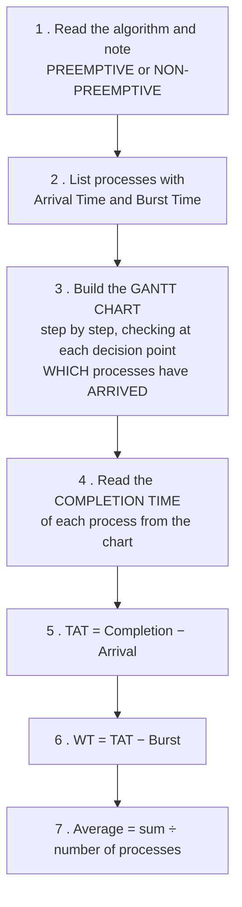

> **The two most common mistakes:** (1) forgetting that a process **cannot be scheduled before it ARRIVES** — at t = 0 only the processes with arrival time 0 are candidates; and (2) in preemptive algorithms, forgetting to **re-evaluate the decision at every arrival**, not just when a process finishes.

**Previous Year Question List from this Topic:**

- [Five jobs A, B, C, D, and E arrive at a compute center at approximately the same time. Their estimated running times are 10, 6, 2, 4, and 8 minutes, respectivel…](../written-answers/operating-system.md?plain=1#L3757)
- [Process CPU burst and Priority given. Calculate Average Waiting time using (i) Preemptive Priority (ii) Non Preemptive priority.](../written-answers/operating-system.md?plain=1#L3865)
- [Calculate Average Waiting time using (i) FCFS (ii) SJF and (iii) RR (Quantum = 2) for the following:](../written-answers/operating-system.md?plain=1#L3952)
- [(a) Consider the following set of process with the length of CPU burst given in milliseconds-](../written-answers/operating-system.md?plain=1#L4046)
- [a) Define CPU Scheduling. Draw Gantt charts and find average waiting time for: i) FCFS, ii) SJF (Non-preemptive), iii) Preemptive Priority.](../written-answers/operating-system.md?plain=1#L4165)
- [Process burst time and priority given. Draw Gantt chart and find average waiting time for preemptive priority scheduling.](../written-answers/operating-system.md?plain=1#L4262)
- [(a) FCFS and SJF Scheduling. (b) Find AWT and ATAT.](../written-answers/operating-system.md?plain=1#L4487)
- [(গ) নিচের সারণীটি দেখুন:](../written-answers/operating-system.md?plain=1#L4688)
- [Consider the following six processes each having its own unique processing time and arrival time.](../written-answers/operating-system.md?plain=1#L4789)
- [Find average turnaround time and average waiting time using round robin and FCFS algorithm?](../written-answers/operating-system.md?plain=1#L4899)
- [Consider the processes P1, P2, P3, P4 given in the below table, arrives for execution in the same order, with Arrival Time 0, and given Burst Time, let's find t…](../written-answers/operating-system.md?plain=1#L5084)
- [Job arrival time and execution time of Operating system tasks table is given, find out- (i) Average waiting time for FCFS (ii) Preemptive SJF (iii) Round Robin…](../written-answers/operating-system.md?plain=1#L5156)
- [Calculate The Average Waiting Time of SJF scheduling algorithm.](../written-answers/operating-system.md?plain=1#L5257)
- [(b) Turnaround time of FCFS and SJF](../written-answers/operating-system.md?plain=1#L5410)
- [Calculate the average waiting time and total turn around time in: (i) Non Preemptive SJF (ii) Preemptive SJF](../written-answers/operating-system.md?plain=1#L5640)

**Previous Year MCQ List from this Topic:**

- [Time during which a job is processed by the Computer is:](../mcq-answers/operating-system.md?plain=1#L38)
- [The time needs from the process arrival to the completion of that process is called](../mcq-answers/operating-system.md?plain=1#L117)
- [The interval from the time of submission of a process to the time of completion is termed is ________.](../mcq-answers/operating-system.md?plain=1#L234)


---

### The Three Schedulers — Long-term, Medium-term and Short-term

> An operating system does not have one scheduler but **three**, operating on **different timescales** and answering **different questions**.

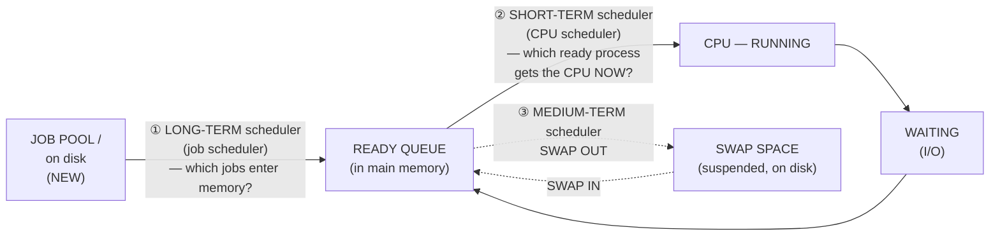

| | ⭐ **LONG-TERM** | ⭐ **SHORT-TERM** | ⭐ **MEDIUM-TERM** |
|---|---|---|---|
| **Also called** | **Job scheduler** | ⭐ **CPU scheduler / dispatcher** | **Swapper** |
| ⭐ **Decides** | ⭐ **WHICH PROCESSES ARE BROUGHT INTO THE READY QUEUE** (admitted from the job pool into main memory) | ⭐ **Which READY process gets the CPU NEXT** | **Which process to SWAP OUT of memory (and later back in)** |
| **Moves a process** | **NEW → READY** | **READY → RUNNING** | **READY/WAITING ↔ SUSPENDED (disk)** |
| **Frequency** | ⚠️ **Very INFREQUENT** (seconds to minutes) | ⭐ **VERY FREQUENT** (milliseconds) | In between |
| **Speed required** | Can be slow and elaborate | ⭐ **Must be EXTREMELY FAST** — it runs constantly, so its own cost is pure overhead | Moderate |
| **Controls** | ⭐ **The DEGREE OF MULTIPROGRAMMING** — how many processes are in memory at once | CPU utilisation | Reduces the degree of multiprogramming temporarily |
| **Present in** | Batch systems (largely absent in modern time-sharing systems, where every process is admitted immediately) | ⭐ **Every** system | Time-sharing systems |

> ### **"What is LONG-TERM scheduling?"** → ### ✅ **"It SELECTS WHICH PROCESS HAS TO BE BROUGHT INTO THE READY QUEUE."**
>
> **Why the long-term scheduler matters: it chooses a good MIX of processes.** If it admits only CPU-bound jobs the I/O devices sit idle; if only I/O-bound jobs, the CPU sits idle. **A balanced mix keeps both busy** — which is the whole purpose of multiprogramming.
>
> **Why the medium-term scheduler exists:** when memory is over-committed and **thrashing** begins, the only cure is to **reduce the degree of multiprogramming** — swap some process out entirely so the rest have enough frames.

#### The scheduling queues and how they are stored

| Queue | Holds |
|---|---|
| **Job queue** | **All** processes in the system |
| ⭐ **Ready queue** | Processes **in main memory, ready and waiting for the CPU** |
| **Device / I/O queues** | Processes waiting for a particular device |

> ### **"The scheduling queue is generally stored as…"** → ### ✅ **A LINKED LIST** — each PCB contains a **pointer to the next PCB** in the queue, so a process can be inserted or removed in O(1) without shifting anything.
> ### **"A common representation of process scheduling is…"** → ### ✅ **A QUEUEING DIAGRAM** — the standard picture of ready queue, CPU and I/O queues with processes circulating between them.

#### The dispatcher, and dispatch latency

> **The DISPATCHER is the module that actually GIVES CONTROL OF THE CPU to the process chosen by the short-term scheduler.** It performs the **context switch**, switches to user mode, and jumps to the correct location in the program. ⭐ **DISPATCH LATENCY is the time it takes to stop one process and start another** — pure overhead, so it must be minimal.

> **The scheduler DECIDES; the dispatcher DOES.** Keeping that distinction straight is a common exam point.

#### Virtual processors

> ### **"To execute programs, an OS creates a number of ______, each one running a different program"** → ### ✅ **VIRTUAL PROCESSORS.**
>
> By **rapidly switching one physical CPU between many processes**, the operating system creates the **illusion that each process has a processor to itself**. That illusion — a *virtual processor* per process — is the fundamental abstraction of multiprogramming, and it is why a single-core machine can appear to run dozens of programs simultaneously.

**Previous Year MCQ List from this Topic:**

- [A common representation of process scheduling is -](../mcq-answers/operating-system.md?plain=1#L162)
- [The scheduling queue is generally stored as-](../mcq-answers/operating-system.md?plain=1#L171)
- [To execute a program, an OS creates a number of ________, each one for, running a different program.](../mcq-answers/operating-system.md?plain=1#L180)
- [What is long term scheduling?](../mcq-answers/operating-system.md?plain=1#L189)
- [Multiprogramming systems ________](../mcq-answers/operating-system.md?plain=1#L389)


---

## Memory Management & Paging

### Memory Management — Paging and Segmentation

#### The memory hierarchy

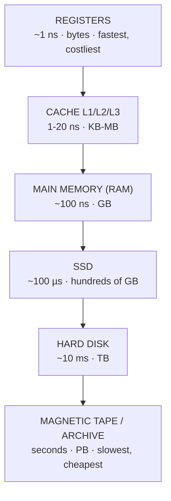

> **Going down the hierarchy: speed DECREASES, capacity INCREASES, and cost per byte DECREASES.** The whole design exists to give the illusion of **memory that is as fast as a register and as large as a disk**, by exploiting **locality of reference**.

#### Why memory management is needed

To **allocate memory to processes**, **protect** each process's memory from the others, **share** memory where appropriate, **translate** logical addresses to physical ones, and **allow more processes than physically fit in RAM**.

#### Logical vs Physical address

| Point | **Logical (Virtual) address** | **Physical address** |
|---|---|---|
| **Generated by** | The **CPU** | The **MMU**, after translation |
| **Seen by** | The **program/user** | The **memory hardware** |
| **Range** | The **logical address space** | The **physical address space** |
| **Translated by** | The **MMU (Memory Management Unit)** | — |

#### Fragmentation

| Type | Definition | Cause | Solution |
|---|---|---|---|
| **INTERNAL fragmentation** | **Wasted space INSIDE an allocated block** — the process was given more memory than it needed, and the leftover cannot be used by anyone else | **Fixed-size** allocation units: a 3 KB process in a 4 KB page wastes 1 KB | **Smaller pages** (but that enlarges the page table) |
| **EXTERNAL fragmentation** | **Total free memory is sufficient, but it is scattered in small non-contiguous holes**, so a large request cannot be satisfied | **Variable-size** allocation and repeated load/unload | **COMPACTION** (move processes together — expensive), or **PAGING**, which eliminates it entirely |

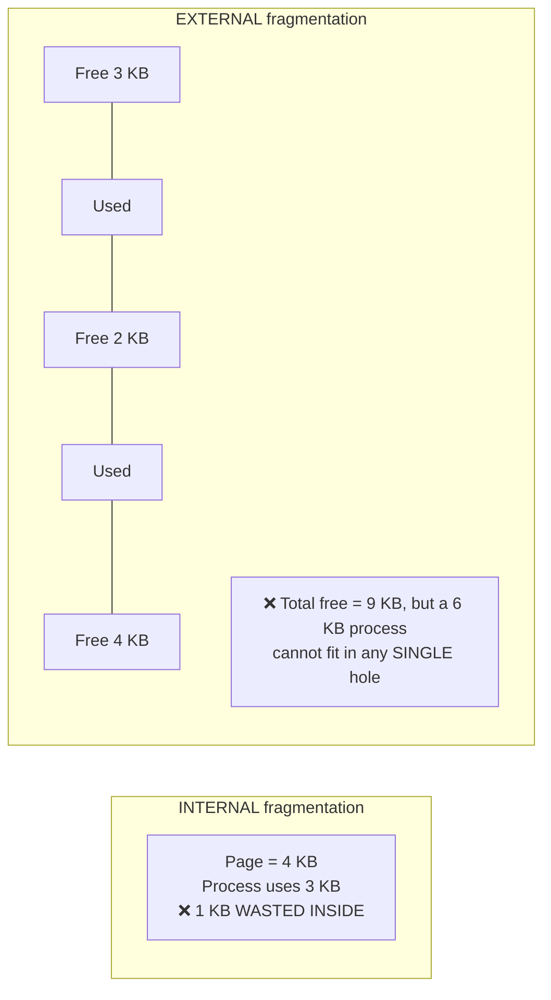

> **The single most important point: PAGING ELIMINATES EXTERNAL FRAGMENTATION** (because any free frame can hold any page — contiguity is no longer required) **but introduces INTERNAL fragmentation** (in the last page of each process, on average half a page per process). **Segmentation is the reverse** — no internal fragmentation, but external fragmentation returns.

#### Paging

**Paging** divides the **logical address space into fixed-size PAGES** and the **physical memory into frames of the SAME size**, then maps pages to frames using a **PAGE TABLE**. A process's pages may be scattered anywhere in physical memory.

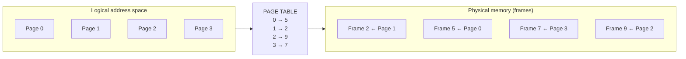

**Address translation:** a logical address is split into a **page number (p)** and a **page offset (d)**. The page number indexes the page table to find the **frame number (f)**, and the physical address is **f concatenated with d**.

> **Why are page sizes ALWAYS a power of 2?**
> Because it makes the **split of the address into page number and offset a pure hardware operation with NO ARITHMETIC AT ALL.**
>
> If the page size is 2ⁿ bytes, then the **low n bits of the address ARE the offset** and the **remaining high bits ARE the page number** — the MMU simply takes the bits, with no division or modulo required. Division is slow in hardware; bit selection is free.
>
> If the page size were, say, 1000 bytes, every single memory access would require **a division by 1000** to find the page number and a **modulo** to find the offset — utterly impractical at the rate of billions of accesses per second. Powers of 2 also make the page table indexing and the frame-number concatenation trivial.

#### Worked paging calculations

**Problem 1 — a system uses a 16-bit logical address and a page size of 1 KB. Find the number of pages and the bits for page number and offset.**

| Quantity | Working | Answer |
|---|---|---|
| **Logical address space** | 2¹⁶ | **65,536 bytes = 64 KB** |
| **Page size** | 1 KB = 2¹⁰ | **1024 bytes** |
| **Offset bits (d)** | log₂(1024) = **10** | **10 bits** |
| **Page number bits (p)** | 16 − 10 | **6 bits** |
| **Number of pages** | 2⁶ | **64 pages** |

**Address format:** `| page number: 6 bits | offset: 10 bits |`

**Problem 2 — a logical address space of 512 pages, each of 2 KB, mapped onto a physical memory of 256 frames.**

| Quantity | Working | Answer |
|---|---|---|
| **Page size** | 2 KB = 2¹¹ | **offset = 11 bits** |
| **Number of pages** | 512 = 2⁹ | **page number = 9 bits** |
| **Logical address size** | 9 + 11 | **20 bits** |
| **Logical address space** | 2²⁰ | **1 MB** |
| **Number of frames** | 256 = 2⁸ | **frame number = 8 bits** |
| **Physical address size** | 8 + 11 | **19 bits** |
| **Physical memory size** | 2¹⁹ | **512 KB** |

> **Note that the logical address space (1 MB) is LARGER than the physical memory (512 KB)** — which is exactly what **virtual memory** makes possible: a process can be bigger than the RAM available.

**Problem 3 — a CPU has 512 pages of 2 KB each, and 128 frames. Find the logical and physical address lengths.**

| Quantity | Working | Answer |
|---|---|---|
| Offset | 2 KB = 2¹¹ | **11 bits** |
| Page number | 512 = 2⁹ | **9 bits** |
| **Logical address length** | 9 + 11 | **20 bits** |
| Frame number | 128 = 2⁷ | **7 bits** |
| **Physical address length** | 7 + 11 | **18 bits** |
| Page table size | 512 entries × 7 bits | **3,584 bits = 448 bytes** |

**Problem 4 — page size 4 KB, address space 32 bits. Find the total number of pages.**

| Quantity | Working | Answer |
|---|---|---|
| Address space | 2³² | **4 GB** |
| Page size | 4 KB = 2¹² | offset = **12 bits** |
| Page number bits | 32 − 12 | **20 bits** |
| **Total pages** | **2²⁰** | **1,048,576 pages (about 1 million)** |

> **This calculation reveals the great problem of paging:** a page table with **one million entries**, at 4 bytes each, is **4 MB PER PROCESS**. With 100 processes that is 400 MB of page tables alone. **The solutions are multi-level (hierarchical) page tables, inverted page tables, and the TLB.**

#### The TLB

The **Translation Lookaside Buffer (TLB)** is a small, very fast **cache of recent page-table entries** held inside the MMU.

> **Why it is essential:** without it, **every memory access would require TWO memory accesses** — one to read the page table and one to read the actual data, **halving performance**. With a TLB hit rate of 98 % or more, the average translation cost becomes almost nothing.

**Effective Access Time (EAT) = (hit ratio × (TLB time + memory time)) + (miss ratio × (TLB time + 2 × memory time))**

#### Segmentation

**Segmentation** divides a program into **logical, VARIABLE-SIZE units that match the programmer's view** — a code segment, a data segment, a stack segment, a heap segment, one per function or module.

A logical address is a pair **(segment number, offset)**, and the **segment table** stores each segment's **base address and limit (length)**.

#### Paging vs Segmentation — the key comparison

| Point | **PAGING** | **SEGMENTATION** |
|---|---|---|
| **Division based on** | **Fixed-size** blocks of equal length | **Variable-size** LOGICAL units |
| **Who decides the division** | The **operating system / hardware** | The **programmer / compiler** |
| **Visible to the user?** | ❌ **No** — invisible, purely a physical technique | ✅ **Yes** — it reflects the program's logical structure |
| **Address form** | (page number, offset) — **one-dimensional** address split by hardware | **(segment number, offset)** — genuinely **two-dimensional** |
| **Internal fragmentation** | ✅ **Yes** — in the last page of each process | ❌ **No** |
| **External fragmentation** | ❌ **NO — eliminated** | ✅ **Yes** |
| **Table required** | **Page table** | **Segment table** (base + limit) |
| **Table size** | **Larger** — many small pages | Smaller — few large segments |
| **Sharing and protection** | Harder — a page may contain parts of code and data | **Easier and more natural** — a whole code segment can be marked read-only and shared |
| **Compaction needed** | ❌ No | ✅ Sometimes |
| **Speed of allocation** | **Fast** — any free frame will do | Slower — must find a hole of the right size |

> **Modern systems use SEGMENTATION WITH PAGING** — each segment is itself divided into pages. This gives the **logical structure and easy protection of segmentation** together with the **absence of external fragmentation from paging**. The x86 architecture supports exactly this.

**Previous Year Question List from this Topic:**

- [A system uses 16 bit logical address and a page size of 1 KB.](../written-answers/operating-system.md?plain=1#L5828)
- [Consider a logical address space of 512 pages, each of 2-KB page size, mapped onto a physical memory containing 128 frames.](../written-answers/operating-system.md?plain=1#L5885)
- [(a) Consider a computer system with the following specifications:](../written-answers/operating-system.md?plain=1#L5959)
- [Compare “Paging” and “Segmentation” memory management technique?](../written-answers/operating-system.md?plain=1#L6038)
- [Difference between Paging and Segmentation.](../written-answers/operating-system.md?plain=1#L6137)
- [(ক) Swapping কী? Internal এবং External Fragmentation এর মধ্যে পার্থক্য লিখুন।](../written-answers/operating-system.md?plain=1#L6191)
- [Find out total number of pages, when page size 4KB and address space 32 bit.](../written-answers/operating-system.md?plain=1#L6241)
- [(ক) Paging এবং Segmentation এর পার্থক্য লিখুন।](../written-answers/operating-system.md?plain=1#L6281)
- [(খ) Operating System-এর Memory hierarchy সচিত্র বর্ণনা করুন।](../written-answers/operating-system.md?plain=1#L6336)
- [(খ) Internal এবং External fragmentation এর মধ্যে পার্থক্য লিখুন।](../written-answers/operating-system.md?plain=1#L6413)
- [In the given example, let us assume the jobs and the memory requirements as the following: Job1=90k, Job2=20k, Job3=50k, Job4=200k. Let the free pace memory all…](../written-answers/operating-system.md?plain=1#L6533)
- [(a) What do you mean by page table for memory management? Explain with example.](../written-answers/operating-system.md?plain=1#L6678)
- [Why page are sizes always powers of 2?](../written-answers/operating-system.md?plain=1#L6754)
- [(a) Consider a computer system with the following specifications: 2+2=4](../written-answers/operating-system.md?plain=1#L6816)

**Previous Year MCQ List from this Topic:**

- [To keep track of how many frames have been allocated, how many are there, and how many are available, operating system maintain a—](../mcq-answers/operating-system.md?plain=1#L409)
- [Logical Memory is broken into blocks of the same size called-](../mcq-answers/operating-system.md?plain=1#L418)
- [A CPU generates 32-bit virtual addresses. The page size is 4 KB. The processor has a translation look-aside buffer (TLB) which can hold a total of 128 page tabl…](../mcq-answers/operating-system.md?plain=1#L427)
- [When there is a large logical address space, the best way of paging would be ________.](../mcq-answers/operating-system.md?plain=1#L207)


---

### Virtual Memory, Demand Paging and Thrashing

#### Virtual memory

**Virtual memory** is a technique that allows a process to execute **even when it is not entirely in main memory**, by keeping only the needed parts in RAM and the rest on disk.

**Benefits:** a **program can be LARGER than the physical memory** · **more processes fit in memory simultaneously**, raising CPU utilisation and throughput · **less I/O** is needed to load or swap a program · programmers are freed from worrying about memory size.

#### Demand paging

> **DEMAND PAGING** is the technique in which a page is **loaded into memory ONLY WHEN IT IS ACTUALLY NEEDED** — that is, **on demand** — rather than loading the whole program in advance.

**How it works:**
1. Each page-table entry has a **valid/invalid bit**. Invalid means the page is **not currently in memory**.
2. When the process references a page whose bit is invalid, the hardware raises a **PAGE FAULT** trap.
3. The OS finds the page on disk, **selects a free frame** (or evicts one using a replacement algorithm), **reads the page in**, updates the page table, and **restarts the instruction**.

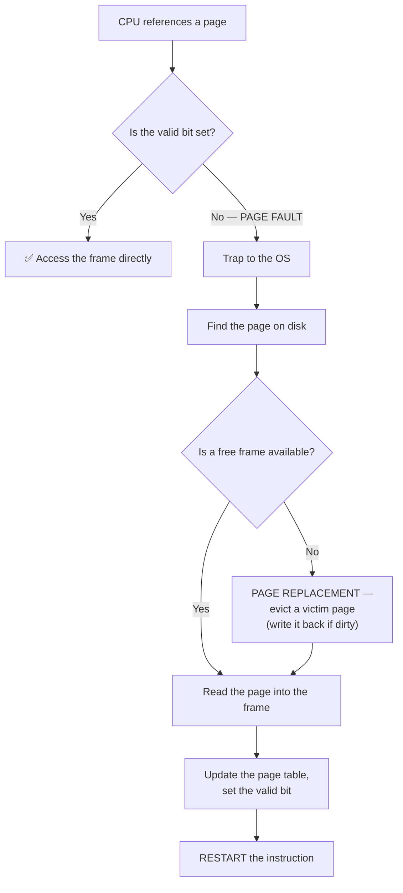

**Advantages:** **faster process start-up** (only the first pages are loaded) · **less memory per process**, so more processes fit · **no unused code is ever loaded**.
**Disadvantage:** a **page fault is extremely expensive** — a disk access is around **10 ms**, roughly **100,000 times slower** than a RAM access, so even a small fault rate devastates performance.

#### Page replacement algorithms

| Algorithm | Rule | Note |
|---|---|---|
| **FIFO** | Replace the **oldest** page | Simple, but suffers **Belady's anomaly** — *more frames can cause MORE faults* |
| **Optimal (OPT/MIN)** | Replace the page that will **not be used for the longest time in the FUTURE** | **The theoretical best**, but requires knowing the future — used only as a benchmark |
| **LRU (Least Recently Used)** | Replace the page **unused for the longest time** | **The best practical approximation** of optimal; costly to implement exactly |
| **LFU / MFU** | Least / most frequently used | Less effective |
| **Clock (Second Chance)** | A circular FIFO with a **reference bit** | **The practical implementation of LRU**, used in real systems |

#### Thrashing

> **THRASHING is a condition in which the system spends MORE TIME SWAPPING PAGES IN AND OUT OF MEMORY than executing useful instructions.**

**The cause:** a process (or the system) does not have enough frames to hold its **working set** — the set of pages it is actively using. Every memory reference causes a page fault, which evicts another page that is immediately needed again, causing another fault, in an endless cycle.

**The vicious cycle that makes it so destructive:**

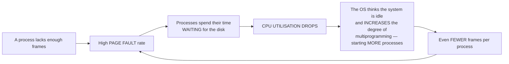

> **The cruel irony: the operating system's own attempt to fix low CPU utilisation makes the problem worse.** This is the classic description of thrashing and is exactly what an examiner wants to see.

**The impact on performance:**

| Effect | Detail |
|---|---|
| **CPU utilisation collapses** — often to near zero | The CPU is idle, waiting for disk |
| **Throughput plummets** | Almost no processes complete |
| **Response time becomes enormous** | The system appears to **hang** |
| **Disk I/O saturates** (100 % busy) | The disk light stays on constantly |
| **The system becomes unusable** | Even moving the mouse becomes slow |

**How to prevent and fix thrashing:**
1. **Working Set Model** — track each process's working set and **only run a process if all its working-set pages can be kept in memory**.
2. **Page Fault Frequency (PFF) control** — monitor each process's fault rate; if it is **too high, GIVE IT MORE FRAMES**; if too low, take some away. If no frames can be spared, **suspend a process entirely**.
3. **Reduce the degree of multiprogramming** — suspend or swap out whole processes. Counter-intuitive but correct.
4. **Add more physical RAM** — the real cure.
5. **Use a better replacement algorithm** (LRU/Clock rather than FIFO).
6. **Local rather than global replacement**, so one greedy process cannot steal frames from everyone else.
7. **Use a faster swap device (SSD)** to reduce the cost of each fault.

#### Swapping

> **SWAPPING** is the process of **moving an ENTIRE process out of main memory to a backing store (the swap space on disk), and later bringing it back in**, to free memory for other processes.

**Swap out** — the process is written to disk and its frames are freed. **Swap in** — it is read back and resumed.

| Point | **Swapping** | **Paging** |
|---|---|---|
| **Unit moved** | The **ENTIRE process** | **Individual PAGES** |
| **Granularity** | Coarse | **Fine** |
| **Time cost** | **Very high** — a whole process is transferred | Low — one page |
| **Purpose** | Free a large amount of memory; suspend a process | Support virtual memory efficiently |
| **Used in** | Older systems; process suspension | **All modern systems** |

*(In modern usage the two terms overlap: Linux's "swap space" is used for **paging**, not for swapping whole processes.)*

#### Contiguous allocation and the placement algorithms

For older, non-paged systems, the OS must choose **which free hole** to allocate:

| Strategy | Rule | Result |
|---|---|---|
| **First Fit** | Allocate the **first hole big enough** | **Fastest**; generally good |
| **Best Fit** | Allocate the **smallest hole that fits** | Wastes least per allocation, but **leaves many tiny unusable holes** and requires scanning the whole list |
| **Worst Fit** | Allocate the **largest hole** | Leaves a large usable remainder, but performs worst in practice |
| **Next Fit** | Like First Fit, but resumes from where it stopped last time | Spreads allocations out |

**Worked example — memory blocks of 100K, 500K, 200K, 300K and 600K; jobs of 90K, 200K, 60K and 80K:**

| Job | **First Fit** | **Best Fit** | **Worst Fit** |
|---|---|---|---|
| **90K** | 100K (first that fits) | **100K** (smallest that fits) | **600K** (largest) |
| **200K** | 500K | **200K** (exact fit ✅) | **500K** |
| **60K** | 500K remainder (300K) | **300K** | 600K remainder (510K) |
| **80K** | 200K | 300K remainder (240K) | 500K remainder (300K) |

> **Best Fit uses the 200K block exactly**, which is its strength; but it also fragments memory into small leftovers. **First Fit is generally preferred in practice** because it is faster and performs almost as well.

**Previous Year Question List from this Topic:**

- [The __________ swaps process in and out of the memory.](../written-answers/operating-system.md?plain=1#L6096)
- [(a) What is demand paging?](../written-answers/operating-system.md?plain=1#L6472)
- [(ক) অপারেটিং সিস্টেম এর ক্ষেত্রে Swapping কী? কোন ক্ষেত্রে এটি ব্যবহৃত হয় লিখুন।](../written-answers/operating-system.md?plain=1#L6617)
- [What is Thrashing? How does it impact CPU performance and system efficiency?](../written-answers/operating-system.md?plain=1#L6834)
- [In the given example, let us assume the jobs and the memory requirements as the following: Job1=90k, Job2=20k, Job3=50k, Job4=200k. Let the free pace memory all…](../written-answers/operating-system.md?plain=1#L6533)

**Previous Year MCQ List from this Topic:**

- [Which of the following page replacement algorithms suffers from Belady’s anomaly?](../mcq-answers/operating-system.md?plain=1#L400)
- [What is the relationship between Paging and Virtual memory?](../mcq-answers/operating-system.md?plain=1#L436)
- [Consider a virtual memory system with FIFO page replacement policy. For an arbitrary page access pattern, increasing the number of page frames in main memory wi…](../mcq-answers/operating-system.md?plain=1#L445)
- [Applying the LRU page replacement to the reference string 1 2 4 5 2 1 2 4. The main memory can accommodate pages and it already has pages and 2. Pape I came in…](../mcq-answers/operating-system.md?plain=1#L454)
- [Consider a virtual memory system where three pages are allocated for real memory. If the page replacement algorithm used is FIFO, how many page replacements tak…](../mcq-answers/operating-system.md?plain=1#L463)
- [Virtual memory located on:](../mcq-answers/operating-system.md?plain=1#L472)
- [Virtually memory হিসেবে RAM এর পাশাপাশি কোনটি ব্যবহার হয়?](../mcq-answers/operating-system.md?plain=1#L481)
- [Memory management scheme by which a computer stores and retrieves data from secondary storage for use in main memory is-](../mcq-answers/operating-system.md?plain=1#L490)
- [Swap space exists in ---](../mcq-answers/operating-system.md?plain=1#L499)
- [A page fault occurs ________](../mcq-answers/operating-system.md?plain=1#L508)


---

## OS Concepts & Process Management

### Operating System — Functions and Services

#### What is an operating system?

An **operating system** is **system software that acts as an INTERFACE between the user/applications and the computer hardware**, managing all the hardware and software resources and providing services to programs.

> It is the **resource manager** and the **extended machine** — it hides the messy details of the hardware behind a clean, uniform interface.

#### The five principal functions of an operating system

| # | Function | What it does |
|---|---|---|
| **1** | **Process management** | **Creates, schedules, suspends, resumes and terminates processes**; handles inter-process communication and synchronisation; **CPU scheduling**; deadlock handling |
| **2** | **Memory management** | Tracks which parts of memory are in use and by whom; **allocates and deallocates** memory; implements **paging, segmentation and virtual memory**; provides **protection** between processes |
| **3** | **File management** | Creates, deletes, reads, writes, opens and closes files and directories; maps files to storage; handles **permissions and access control**; manages backup |
| **4** | **Device / I/O management** | Manages all I/O devices through **device drivers**; provides **buffering, caching and spooling**; schedules disk access |
| **5** | **Security and protection** | **Authentication** of users; **authorisation and access control**; protects one process's memory from another; maintains audit logs |

**Others usually added:** **secondary storage management**, **networking**, **user interface (CLI/GUI)**, **job accounting**, and **error detection and recovery**.

#### The services an OS provides

| Service | Description |
|---|---|
| **Program execution** | Load a program into memory and run it |
| **I/O operations** | Programs cannot access devices directly — the OS does it for them |
| **File system manipulation** | Read, write, create, delete |
| **Communication** | Between processes on the same machine or across a network |
| **Error detection** | In hardware, in I/O, and in user programs |
| **Resource allocation** | CPU, memory, files, devices |
| **Accounting** | Track resource usage per user |
| **Protection and security** | Control access to system resources |
| **User interface** | CLI, GUI or batch |

#### Types of operating system

| Type | Description | Example |
|---|---|---|
| **Batch** | Jobs are grouped and processed without user interaction | Early mainframes |
| **Time-sharing / Multitasking** | Many users share the CPU by rapid switching | **Unix, Linux** |
| **Multiprogramming** | Several programs in memory; the CPU switches when one blocks | — |
| **Multiprocessing** | **Multiple CPUs/cores** running processes genuinely in parallel | Modern servers |
| **Real-time (RTOS)** | Guarantees a response within a **strict deadline** | **VxWorks, FreeRTOS** — used in medical devices, avionics, industrial control |
| **Distributed** | Manages a group of networked computers as one system | Cluster operating systems |
| **Embedded** | Small, dedicated, resource-constrained | Router firmware, IoT devices |
| **Mobile** | Optimised for touch, battery and connectivity | **Android, iOS** |

**Previous Year Question List from this Topic:**

- [(b) What is process? Describe different states of a process.](../written-answers/operating-system.md?plain=1#L6852)
- [What are the five states of a process in an operating system?](../written-answers/operating-system.md?plain=1#L6973)

**Previous Year MCQ List from this Topic:**

- [The main program in an operating system is called:](../mcq-answers/operating-system.md?plain=1#L225)
- [The ______ system may manage a high degree of interaction between processes and is very useful for high speed and real-time processing.](../mcq-answers/operating-system.md?plain=1#L254)
- [Which one is an embedded operating system?](../mcq-answers/operating-system.md?plain=1#L263)
- [Which initial program is called at the starting of a computer?](../mcq-answers/operating-system.md?plain=1#L272)
- [What is the mean of the Booting in the system?](../mcq-answers/operating-system.md?plain=1#L281)
- [Where is the Boot strapping program stored?](../mcq-answers/operating-system.md?plain=1#L299)
- [Who preside the interface between a process and the OS?](../mcq-answers/operating-system.md?plain=1#L335)
- [Which O/S is recommended for real time system?](../mcq-answers/operating-system.md?plain=1#L344)
- [Which OS is recommended for real time systems?](../mcq-answers/operating-system.md?plain=1#L353)
- [Which one loads first when you boot up your Computer?](../mcq-answers/operating-system.md?plain=1#L362)
- [Multiprogramming systems ________](../mcq-answers/operating-system.md?plain=1#L389)
- [The request and release of resources are-](../mcq-answers/operating-system.md?plain=1#L668)


---

### Processes, Threads and Multithreading

#### Process vs Thread

| Point | **Process** | **Thread** |
|---|---|---|
| **Definition** | A **program in execution** — an independent unit with its own resources | A **lightweight unit of execution WITHIN a process** |
| **Memory** | Has its **OWN separate address space** | **SHARES the address space** of its parent process |
| **Creation cost** | **Heavy** — a new address space must be created | **Light** — much faster and cheaper |
| **Context switch** | **Slow** — the whole memory map must be swapped | **Fast** — only registers and the stack |
| **Communication** | **IPC** — pipes, sockets, shared memory (slow, complex) | **Directly through shared variables** (fast, but needs synchronisation) |
| **Isolation / protection** | **Strong** — a crash affects only that process | **Weak** — **one thread crashing can kill the whole process** |
| **Also called** | Heavyweight process | **Lightweight process** |
| **Owns** | Code, data, heap, files, its own PCB | A **program counter, registers and a STACK** of its own; everything else is shared |

#### Why multithreading is used

1. **RESPONSIVENESS** — a user-interface thread stays responsive while a worker thread performs a long operation. Without threads, a program that loads a large file **appears frozen**.
2. **RESOURCE SHARING** — threads share memory by default, so no expensive IPC mechanism is needed; sharing data is as simple as reading a variable.
3. **ECONOMY** — creating a thread is roughly **10 to 100 times cheaper** than creating a process, and switching between threads is far faster.
4. **SCALABILITY / true parallelism** — on a **multi-core** processor, different threads run **genuinely simultaneously on different cores**, giving real speed-up. A single-threaded program can use only one core no matter how many the machine has.
5. **Better CPU utilisation** — while one thread waits for I/O, another can compute.
6. **Natural program structure** — a web server handling 1,000 clients is naturally expressed as 1,000 threads (or an equivalent asynchronous model).

#### The advantages in software development

| Advantage | Explanation |
|---|---|
| **Concurrency without process overhead** | Many tasks in one program, cheaply |
| **Simpler design for parallel problems** | Each thread handles one logical task |
| **Faster context switching** | Lower latency between tasks |
| **Shared data structures** | No serialisation or copying required |
| **Scales with core count** | Performance improves automatically on better hardware |
| **Improved throughput** for server applications | One thread per request |

#### The challenges of multithreading — which must be mentioned

1. **RACE CONDITIONS** — two threads updating the same variable simultaneously produce an unpredictable result.
2. **The need for SYNCHRONISATION** — mutexes, semaphores, monitors and locks, all of which add complexity and cost.
3. **DEADLOCK** — threads waiting on each other's locks forever.
4. **Very difficult DEBUGGING** — bugs are **non-deterministic** and may appear only once in a million runs, on one machine, under load. This is the single biggest practical cost of threading.
5. **Weak isolation** — one thread corrupting memory crashes everything.
6. **Diminishing returns (Amdahl's Law)** — the speed-up is limited by the fraction of the program that **cannot** be parallelised. If 10 % of a program is inherently sequential, no amount of cores will make it more than 10× faster.
7. **Thread-safety** requirements on every shared library and data structure.

#### Context switching

> A **CONTEXT SWITCH** is the process of **saving the state of the currently running process/thread and restoring the state of another**, so that execution can be resumed later exactly where it left off.

**What is saved and restored:** the **program counter**, all **CPU registers**, the **stack pointer**, the **memory management information (page table base)**, and the process state — all stored in the **Process Control Block (PCB)**.

**When it happens:** a **timer interrupt** (the quantum expires), an **I/O request or completion**, a higher-priority process becoming ready, a system call, or process termination.

> **Context switching is PURE OVERHEAD** — during a switch the CPU does **no useful work at all**. A switch typically costs **1–100 microseconds**, plus the indirect cost of the **cache and TLB being polluted** with the new process's data. This is precisely why the Round Robin time quantum must not be too small, and why threads (whose switches are far cheaper) are preferred to processes for fine-grained concurrency.

**A concrete example:** a word processor is running when the user's file save completes. A timer interrupt fires → the OS **saves** the word processor's registers and PC into its PCB → consults the scheduler → **loads** the media player's saved registers and PC from its PCB → the media player resumes exactly where it stopped. The user perceives both as running simultaneously, though only one executes at any instant on a single core.

**Previous Year Question List from this Topic:**

- [(b) What is process? Describe different states of a process.](../written-answers/operating-system.md?plain=1#L6852)
- [Why is multithreading used in programming? Explain the advantages of using multithreads in software development.](../written-answers/operating-system.md?plain=1#L6927)
- [What are the five states of a process in an operating system?](../written-answers/operating-system.md?plain=1#L6973)

**Previous Year MCQ List from this Topic:**

- [A process needs I/O operations, it switches to _____](../mcq-answers/operating-system.md?plain=1#L20)
- [What is the disadvantage of multithreading?](../mcq-answers/operating-system.md?plain=1#L108)
- [Which is not the state of a process in an Operating System?](../mcq-answers/operating-system.md?plain=1#L126)
- [The maximum number of processes that can be in ready state in computer system with n CPU's is—](../mcq-answers/operating-system.md?plain=1#L135)
- [Multi-Threaded programs are-](../mcq-answers/operating-system.md?plain=1#L198)
- [Which of the following is not the state of a process in process Control Block (PCB)?](../mcq-answers/operating-system.md?plain=1#L243)
- [The ______ system may manage a high degree of interaction between processes and is very useful for high speed and real-time processing.](../mcq-answers/operating-system.md?plain=1#L254)


---

### Process Creation, System Calls and Special Process States (fork, Zombie, Orphan, Daemon)

#### System calls — the interface between a process and the OS

> ### **A SYSTEM CALL is the PROGRAMMATIC INTERFACE THROUGH WHICH A PROCESS REQUESTS A SERVICE FROM THE OPERATING SYSTEM KERNEL.** It is the **only** legitimate doorway from **user mode** into **kernel mode**.

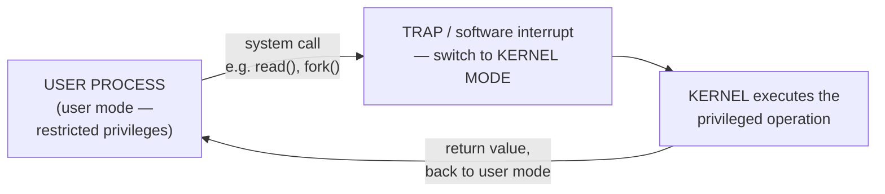

> ### **"Who presides over the interface between a process and the OS?"** → ### ✅ **SYSTEM CALLS.**
> ### **"The request and release of resources are…"** → ### ✅ **SYSTEM CALLS.**

| Category | Examples |
|---|---|
| ⭐ **Process control** | ⭐ **`fork()`, `exec()`, `wait()`, `exit()`, `kill()`** |
| **File management** | `open()`, `read()`, `write()`, `close()`, `create()` |
| **Device management** | `ioctl()`, `read()`, `write()` |
| **Information maintenance** | `getpid()`, `time()`, `sleep()` |
| **Communication** | `pipe()`, `shmget()`, `socket()`, `send()`, `recv()` |
| **Protection** | `chmod()`, `umask()`, `chown()` |

#### Process creation in UNIX/Linux — fork() and exec()

> ### **`fork()` is the UNIX system call used to CREATE A NEW PROCESS.** It creates an **almost exact COPY of the calling process** — the new one is the **CHILD**, the original is the **PARENT**.

```
   pid_t pid = fork();

   RETURN VALUE — this is the whole trick:
        in the PARENT :  pid = the CHILD's process ID  (a positive number)
        in the CHILD  :  pid = 0
        on FAILURE    :  pid = −1

   So ONE call RETURNS TWICE — once in each process.
```

```c
#include <stdio.h>
#include <unistd.h>

int main(void) {
    pid_t pid = fork();

    if (pid < 0)         printf("fork failed\n");
    else if (pid == 0)   printf("I am the CHILD,  my pid = %d\n", getpid());
    else                 printf("I am the PARENT, my child = %d\n", pid);

    return 0;
}
```

| Call | What it does |
|---|---|
| ⭐ **`fork()`** | ⭐ **CREATES a new process** — a duplicate of the parent |
| **`exec()` family** | **REPLACES the current process image** with a new program. **It does NOT create a process** |
| **`wait()`** | The parent **BLOCKS until a child terminates** and **collects its exit status** |
| **`exit()`** | Terminates the calling process, returning a status code |

> ### **The classic UNIX idiom is `fork()` THEN `exec()`:** the shell **forks** a copy of itself, and the child **execs** the program you typed. This is exactly how every command you run from a terminal is started.

#### ⭐ Zombie and Orphan processes — the pair always examined together

| | ⭐ **ZOMBIE process** | ⭐ **ORPHAN process** |
|---|---|---|
| **Definition** | ⭐ **A process that has FINISHED EXECUTION but whose EXIT STATUS has NOT YET BEEN COLLECTED by its parent** | ⭐ **A process whose PARENT has TERMINATED while the child is STILL RUNNING** |
| **Who died?** | **The CHILD** is dead; the parent is alive but negligent | **The PARENT** is dead; the child is alive |
| **State code** | **`Z`** (defunct) in `ps` output | Runs normally |
| **Consumes** | ⚠️ **Only a PROCESS-TABLE ENTRY** — no memory, no CPU | Normal resources |
| **Why it matters** | Many zombies **exhaust the process table**, so no new process can be created | Harmless — it is immediately re-parented |
| **Resolution** | The parent calls ⭐ **`wait()`** to "reap" it; if the parent dies, **init/systemd adopts and reaps it** | ⭐ **ADOPTED by `init` (PID 1) / systemd**, which will `wait()` for it |

> ### **"In UNIX, processes that have FINISHED EXECUTION but have NOT YET had their STATUS COLLECTED are known as…"** → ### ✅ **ZOMBIE PROCESSES.**
>
> **Why zombies exist at all — the design reason:** the kernel **must keep the exit status somewhere** until the parent asks for it, otherwise the parent could never learn whether its child succeeded. The zombie entry **is** that stored status.

#### Daemon processes

> ### **A DAEMON is a process that RUNS IN THE BACKGROUND, DETACHED FROM ANY TERMINAL, providing a SERVICE — it is not started or controlled by an interactive user.** On UNIX, daemon names conventionally end in **`d`**.

| Daemon | Service |
|---|---|
| ⭐ **`lpd` / print spooler** | ⭐ **The PRINTER DAEMON — runs as a SERVICE in the operating system**, accepting print jobs into a queue and feeding them to the printer |
| **`sshd`** | Remote secure shell logins |
| **`httpd` / `nginx`** | Web server |
| **`crond`** | Runs scheduled jobs |
| **`syslogd`** | System logging |
| **`init` / `systemd`** | **PID 1** — the ancestor of all processes; adopts orphans |

> **Characteristics of a daemon:** starts at **boot time** (or on demand), has **no controlling terminal**, usually **runs as a specific service user**, its parent is typically **init/systemd**, and it **waits for requests** rather than being invoked directly.

#### Scheduled jobs — the cron job

> ### **A CRON JOB is a task SCHEDULED TO RUN PERIODICALLY AT FIXED TIMES, DATES OR INTERVALS**, managed by the **`cron` daemon** on UNIX/Linux.

```
   crontab format — five time fields, then the command:

     ┌───── minute        (0 – 59)
     │ ┌─── hour          (0 – 23)
     │ │ ┌─ day of month  (1 – 31)
     │ │ │ ┌ month        (1 – 12)
     │ │ │ │ ┌ day of week (0 – 7, 0 and 7 = Sunday)
     │ │ │ │ │
     * * * * *  /path/to/command

   0 2 * * *        → every day at 02:00        (a nightly backup)
   */15 * * * *     → every 15 minutes
   0 0 1 * *        → at midnight on the 1st of every month
```

| Command | Use |
|---|---|
| ⭐ **`cron` / `crontab`** | ⭐ **Schedule a program to run at SPECIFIED, REPEATING times** |
| **`at`** | Schedule a job to run **ONCE** at a given future time |
| **`anacron`** | Runs missed jobs on machines that are not always on |

#### Process states

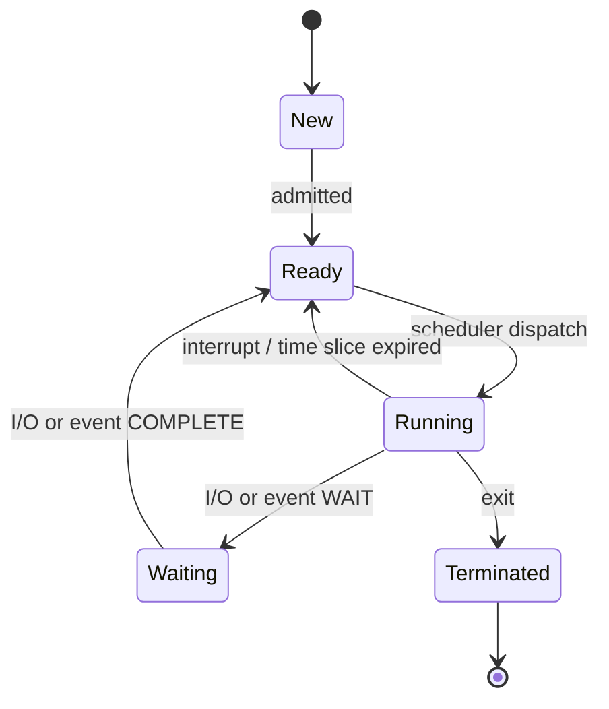

> ### **The FIVE standard process states are: NEW · READY · RUNNING · WAITING (BLOCKED) · TERMINATED.**
>
> ### **"A process needs an I/O operation — it switches to…"** → ### ✅ **WAITING (BLOCKED).**
> ### **"Which is NOT a state of a process?"** → ### ✅ **"SLEEP" and "OLD" are NOT standard process states** in the five-state model. *(Real UNIX does have a "sleeping" state, which is its name for waiting — but in the textbook five-state model used by examiners, the blocked state is called **WAITING**.)*

**The Process Control Block (PCB)** stores, for each process: the **process ID**, its **state**, the **program counter**, the **CPU registers**, **scheduling information** (priority, queue pointers), **memory-management information** (page tables, base/limit), **accounting information**, and **I/O status** (open files, devices).

> ### **"The maximum number of processes that can be in the READY state in a system with n CPUs is…"** → ### ✅ **INDEPENDENT OF n.** The ready queue holds processes **waiting for** a CPU; its length is limited by memory and the process table, **not** by how many CPUs exist. *(It is the **RUNNING** state that is limited to **n** processes.)*

**Previous Year MCQ List from this Topic:**

- [A process needs I/O operations, it switches to _____](../mcq-answers/operating-system.md?plain=1#L20)
- [In Unix operating system, which system call is used for creating a new process?](../mcq-answers/operating-system.md?plain=1#L47)
- [A job which is schedule to run periodically at fixed times or intervals is known as-](../mcq-answers/operating-system.md?plain=1#L56)
- [Which one of the following statements is true with respect to Printer Daemon process?](../mcq-answers/operating-system.md?plain=1#L65)
- [Which is not the state of a process in an Operating System?](../mcq-answers/operating-system.md?plain=1#L126)
- [In UNIX, processes that have finished execution but have not yet had their status collected are known as-](../mcq-answers/operating-system.md?plain=1#L144)
- [Which of the following is not the state of a process in process Control Block (PCB)?](../mcq-answers/operating-system.md?plain=1#L243)
- [Who preside the interface between a process and the OS?](../mcq-answers/operating-system.md?plain=1#L335)
- [The request and release of resources are-](../mcq-answers/operating-system.md?plain=1#L668)


---

## Deadlock & Concurrency Control

### Deadlock — Conditions, Handling and Prevention

#### What is a deadlock?

> A **DEADLOCK** is a situation in which **two or more processes are each waiting indefinitely for a resource held by another process in the set**, so that **none of them can ever proceed**.

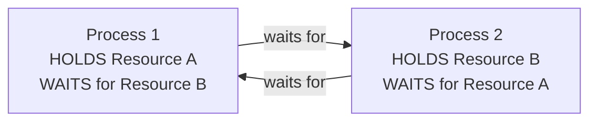

**The classic everyday analogy:** two cars meet on a single-lane bridge from opposite ends. Each will move only when the other reverses. Neither does. **Deadlock.**

#### The FOUR necessary conditions for deadlock (Coffman conditions)

> **ALL FOUR must hold SIMULTANEOUSLY for a deadlock to occur. Breaking ANY ONE of them prevents deadlock entirely.**

| # | Condition | Meaning |
|---|---|---|
| **1** | **MUTUAL EXCLUSION** | At least one resource is held in a **non-shareable** mode — only one process can use it at a time |
| **2** | **HOLD AND WAIT** | A process is **holding at least one resource while waiting to acquire additional** resources held by others |
| **3** | **NO PREEMPTION** | A resource **cannot be forcibly taken** from a process — it must be released **voluntarily** |
| **4** | **CIRCULAR WAIT** | There exists a **circular chain** of processes P₁ → P₂ → … → Pₙ → P₁, where each is waiting for a resource held by the next |

> **This is one of the most frequently asked questions in the whole subject. Memorise the four names: MUTUAL EXCLUSION, HOLD AND WAIT, NO PREEMPTION, CIRCULAR WAIT.**

#### The four strategies for handling deadlock

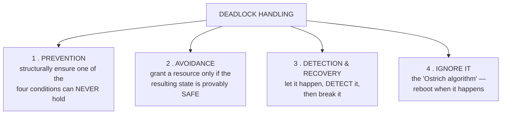

#### 1. Deadlock PREVENTION — attack one of the four conditions

| Condition to break | Method | Practicality |
|---|---|---|
| **Mutual exclusion** | Make resources **shareable** (e.g. read-only files); use **spooling** so that no process holds the printer directly | ⚠️ Often **impossible** — some resources are inherently exclusive |
| **Hold and wait** | Require a process to request **ALL its resources AT ONCE, before it starts**; or require it to **release everything** before requesting more | ⚠️ **Low resource utilisation** and possible **starvation** |
| **No preemption** | If a process holding resources requests one that cannot be granted, **forcibly release all the resources it holds** | ⚠️ Only works for resources whose state can be saved and restored (CPU, memory — **not a printer half-way through a job**) |
| **Circular wait** ⭐ | **Impose a TOTAL ORDERING on all resource types**, and require every process to request resources **in increasing order only** | ✅ **The most practical method** — simple, effective, and widely used |

> **The ordering method explained:** number every resource type (1 = disk, 2 = printer, 3 = tape). A process holding resource 2 may request 3, but **may never request 1**. A cycle becomes mathematically impossible, because a cycle requires at least one process to request a **lower**-numbered resource. **In a database, this means always locking tables in the same alphabetical or numeric order** — a rule that eliminates the great majority of real-world deadlocks at zero cost.

#### 2. Deadlock AVOIDANCE — the Banker's Algorithm

Requires **advance knowledge of the MAXIMUM resources each process may ever need**. Before granting any request, the system checks whether the resulting state is **SAFE** — that is, whether there exists **at least one sequence in which all processes can complete**.

**The three matrices:** **Max** (the maximum each process may claim), **Allocation** (what each currently holds), and **Need** = Max − Allocation, plus the **Available** vector.

**The safety algorithm:** repeatedly find a process whose **Need ≤ Available**; pretend it completes and **release its resources back to Available**; repeat. **If all processes can be completed this way, the state is SAFE.**

**Why it is rarely used in practice:** it requires the **maximum demand to be declared in advance**, which is usually unknown; it assumes a **fixed number of processes and resources**; and it is **computationally expensive** to run before every request.

#### 3. Deadlock DETECTION and RECOVERY ⭐ — what real systems do

**Detection:** maintain a **wait-for graph** and periodically check for a **CYCLE**. A cycle in the wait-for graph **is** a deadlock (when there is one instance of each resource type).

**Recovery options:**

| Method | Detail |
|---|---|
| **Process termination** | **Abort ALL deadlocked processes** (simple but expensive), or **abort one at a time** until the cycle breaks |
| **Resource preemption** | **Take a resource from one process** and give it to another; the victim must be **rolled back** to a safe checkpoint |

**Choosing the victim** — the factors to consider: which process has **done the least work** so far; which holds the **fewest resources**; which has the **lowest priority**; which is **cheapest to restart**; and **how many times it has already been chosen** (to avoid starvation).

> **This is exactly what a DBMS does** — it detects the cycle, **rolls back the "cheapest" transaction**, releases its locks, and lets the other proceed. The application simply receives a "deadlock detected" error and **retries**.

#### 4. IGNORE the problem — the "Ostrich algorithm"

**Used by UNIX, Linux and Windows for most resources.** The reasoning is economic: deadlocks are **rare**, the cost of prevention or avoidance in lost performance and flexibility is **paid constantly**, and the cost of a rare reboot is low. It is the right engineering trade-off for a general-purpose desktop — but **not** for a database, a real-time controller or a life-critical system.

#### The three basic techniques to control deadlock in databases

| Technique | How it works |
|---|---|
| **1. Deadlock PREVENTION** | **Timestamp-based schemes** prevent circular wait by deciding, on the basis of transaction age, who may wait: **WAIT-DIE** (an older transaction waits; a younger one is **killed** and restarted) and **WOUND-WAIT** (an older transaction **wounds** — preempts — a younger one; a younger one waits). Also **resource ordering** — always lock tables in the same order |
| **2. Deadlock DETECTION and recovery** ⭐ | The DBMS builds a **wait-for graph**, periodically **searches for a cycle**, selects a **victim transaction** (usually the one with the least work done), **ROLLS IT BACK** and releases its locks. **This is what MySQL, PostgreSQL, Oracle and SQL Server all actually do** |
| **3. TIMEOUT-based** | If a transaction waits longer than a threshold, it is **automatically aborted and rolled back**. Extremely simple, but it also aborts transactions that were merely slow rather than deadlocked |

#### Deadlock vs Starvation

| Point | **Deadlock** | **Starvation** |
|---|---|---|
| **What happens** | Processes wait **for each other**, forever | One process waits indefinitely because **others keep being preferred** |
| **Are others progressing?** | ❌ **No** — the whole group is stuck | ✅ **Yes** — the system works, but one process never gets served |
| **Also called** | Circular wait | **Indefinite blocking** |
| **Cause** | The four Coffman conditions | **Priority-based scheduling** without aging |
| **Solution** | Prevention, avoidance, detection and recovery | **AGING** — gradually raise the priority of a long-waiting process |

#### Related concepts

| Term | Meaning |
|---|---|
| **Race condition** | Two or more processes access shared data concurrently and the result **depends on the timing** of their execution |
| **Critical section** | The part of a program that **accesses shared resources** and must not be executed by more than one process at a time |
| **Mutual exclusion** | Ensuring only one process is in its critical section at a time |
| **Semaphore** | An integer variable with atomic **wait(P)** and **signal(V)** operations, used for synchronisation |
| **Mutex** | A binary lock — the simplest mutual-exclusion primitive |
| **Monitor** | A high-level construct bundling shared data with the procedures that access it, with mutual exclusion built in |
| **Livelock** | Processes are **actively running and changing state** but **making no progress** — like two people repeatedly stepping aside for each other in a corridor |

**Previous Year Question List from this Topic:**

- [Describe three basic techniques that exist to control deadlocks in databases. (05)](../written-answers/operating-system.md?plain=1#L7023)
- [What are the four necessary conditions for a deadlock to occur?](../written-answers/operating-system.md?plain=1#L7039)

**Previous Year MCQ List from this Topic:**

- [A system has 6 identical resources and N processes competing for them. Each process can request at most 2 resources. Which one of the following values of N coul…](../mcq-answers/operating-system.md?plain=1#L614)
- [Which one of the following is the deadlock avoidance algorithm?](../mcq-answers/operating-system.md?plain=1#L623)
- [Which of the following is not a deadlock handling strategy?](../mcq-answers/operating-system.md?plain=1#L632)
- [A system has 12 magnetic tape drives and 3 processes: PO, PI, and P2. Process PO requires 10 tape drives, P1 requires 4 and P2 requires 9 tape drives. The curre…](../mcq-answers/operating-system.md?plain=1#L641)
- [A computer system has 6 type drives and each process may need 3 type drives. What is the maximum number of processes than is guaranteed to be deadlock free?](../mcq-answers/operating-system.md?plain=1#L650)
- [Multi-Threaded programs are-](../mcq-answers/operating-system.md?plain=1#L198)


---

### Process Synchronization — Critical Section, Semaphores and Mutex

> When several processes or threads share data, their operations can **interleave** in ways that corrupt it. **PROCESS SYNCHRONIZATION is the set of mechanisms that coordinate their access** so that shared data stays consistent.

#### The race condition and the critical section

> ### **A RACE CONDITION occurs when the OUTCOME depends on the ORDER in which concurrent processes happen to execute.**

```
   Two threads both run:  balance = balance + 100     (balance starts at 1000)

   In machine terms this is THREE steps:
        LOAD  R ← balance
        ADD   R ← R + 100
        STORE balance ← R

   A bad interleaving:
        T1: LOAD  R1 ← 1000
        T2: LOAD  R2 ← 1000          ← T2 reads BEFORE T1 has written
        T1: ADD   R1 = 1100 ; STORE balance = 1100
        T2: ADD   R2 = 1100 ; STORE balance = 1100   ⚠️ one deposit LOST

   Correct result: 1200.  Actual result: 1100.
```

> ### **A CRITICAL SECTION is the SEGMENT OF A PROGRAM IN WHICH SHARED RESOURCES ARE ACCESSED**, and which must **not** be executed by more than one process at a time.

```
   do {
        ENTRY SECTION          ← request permission to enter
            CRITICAL SECTION   ← access the shared resource
        EXIT SECTION           ← release permission
            REMAINDER SECTION
   } while (true);
```

> ### **The three requirements any correct solution to the critical-section problem must satisfy:**
>
> | # | Requirement | Meaning |
> |---|---|---|
> | **1** | ⭐ **MUTUAL EXCLUSION** | **At most ONE process may be inside its critical section at a time** |
> | **2** | ⭐ **PROGRESS** | If no process is in its critical section, one of those waiting **must be allowed in** — the decision cannot be postponed indefinitely |
> | **3** | ⭐ **BOUNDED WAITING** | There is a **LIMIT on how many times others may enter before a waiting process gets its turn** — this is what prevents **starvation** |

#### Semaphores

> ### **A SEMAPHORE is an INTEGER VARIABLE accessed only through two ATOMIC operations — `wait()` (also called P or down) and `signal()` (also called V or up).**

```
   wait(S)   /  P(S)  /  down(S):        signal(S)  /  V(S)  /  up(S):
        S = S − 1                             S = S + 1
        if (S < 0) block this process         if (S ≤ 0) wake up one blocked process
```

| Type | Range of values | Purpose |
|---|---|---|
| ⭐ **BINARY semaphore (mutex-like)** | **0 or 1 only** | **MUTUAL EXCLUSION** — a lock |
| ⭐ **COUNTING semaphore** | ⭐ **Any non-negative integer** | **Controls access to a POOL of N identical resources** — e.g. 10 database connections, 3 printers |

**Worked example — a counting semaphore**
> *A counting semaphore is initialised to 10. Then 6 `wait` operations and 4 `signal` operations are completed. What is the final value?*
```
   Each wait   DECREMENTS the semaphore by 1  →  6 waits   = −6
   Each signal INCREMENTS the semaphore by 1  →  4 signals = +4

   Final value = 10 − 6 + 4 = 8
```
> ### ✅ **The final value is 8.**
>
> **What the number MEANS: the value of a counting semaphore is the NUMBER OF RESOURCE UNITS STILL AVAILABLE.** So 8 of the original 10 resources remain free. *(If the value ever went **negative**, its magnitude would be the **number of processes blocked and waiting** on that semaphore.)*

#### Mutex vs Semaphore — a standard comparison

| Point | ⭐ **MUTEX (mutual exclusion lock)** | ⭐ **SEMAPHORE** |
|---|---|---|
| **What it is** | A **LOCKING mechanism** | A **SIGNALLING mechanism** |
| **Values** | **Locked / unlocked** (binary) | **An integer counter** |
| ⭐ **Ownership** | ⭐ **HAS AN OWNER — only the thread that LOCKED it may UNLOCK it** | ⭐ **NO ownership — ANY process may signal it** |
| **Used for** | **Mutual exclusion** over one resource | **Mutual exclusion OR signalling/ordering** between processes |
| **Counting** | No | ✅ **Yes — can guard N identical resources** |
| **Analogy** | ⭐ **A toilet key** — whoever took it must return it | ⭐ **A rack of N keys** — anyone may put a key back |

**Other synchronization tools:** **Monitors** (a higher-level construct bundling data, procedures and mutual exclusion — used in Java's `synchronized`) · **condition variables** · **spinlocks** (busy-waiting; efficient only for very short critical sections) · **Peterson's algorithm** (a classic pure-software solution for two processes) · **atomic hardware instructions** (`TestAndSet`, `CompareAndSwap`).

#### The classic synchronization problems worth naming

| Problem | What it illustrates |
|---|---|
| ⭐ **Producer–Consumer (bounded buffer)** | Coordinating a fixed-size shared buffer — needs **two counting semaphores (empty, full) plus a mutex** |
| ⭐ **Readers–Writers** | Many readers may share, but a writer needs exclusive access. ⭐ **A SHARED lock allows READ operations to proceed concurrently; an EXCLUSIVE lock allows only one writer** |
| ⭐ **Dining Philosophers** | Deadlock and starvation from circular resource requests |
| **Sleeping Barber** | Coordination with limited waiting room |

> ⚠️ **The danger of semaphores: they are easy to get wrong.** Forgetting a `signal()` causes a **permanent block**; doing the `wait()`s in a different order in two processes causes **DEADLOCK**; and the errors are **timing-dependent**, so they may not appear in testing. This is why higher-level constructs (monitors, concurrent collections) are preferred in application code, and why multi-threaded programs are, as the MCQ notes, ⭐ **more prone to deadlock** than single-threaded ones.

**Previous Year MCQ List from this Topic:**

- [A counting semaphore was initialized to 10. Then 6 wait operations and 4 signal operations were completed on this semaphore. The resulting value of the semaphor…](../mcq-answers/operating-system.md?plain=1#L717)
- [A critical section is a program segment-](../mcq-answers/operating-system.md?plain=1#L726)
- [What is the disadvantage of multithreading?](../mcq-answers/operating-system.md?plain=1#L108)
- [Multi-Threaded programs are-](../mcq-answers/operating-system.md?plain=1#L198)


---

## File Systems & Disk Management

### File Systems, inodes, Partitions and Mounting

> A **FILE SYSTEM is the method and data structures an operating system uses to CONTROL HOW DATA IS STORED, NAMED, ORGANISED AND RETRIEVED on a storage device.** Without one, a disk is just an undifferentiated sequence of blocks.

#### Common file systems

| File system | Used by | Notes |
|---|---|---|
| **FAT32** | Old Windows, USB drives | Universal compatibility; ⚠️ **maximum file size 4 GB** |
| **exFAT** | Flash drives, SD cards | FAT without the 4 GB limit |
| ⭐ **NTFS** | ⭐ **Windows** | **Journaling**, permissions, encryption, compression, large files |
| ⭐ **ext4** | ⭐ **Linux** | Journaling, extents, large volumes |
| **XFS / Btrfs / ZFS** | Linux, Unix, servers | High performance; snapshots, checksums |
| **APFS / HFS+** | macOS | |
| **NFS / SMB (CIFS)** | Network | Remote file access |

#### The inode — how Linux stores file metadata

> ### **An INODE (index node) is a data structure that stores ALL THE METADATA ABOUT A FILE — everything EXCEPT its NAME and its DATA.**

| The inode CONTAINS | The inode does NOT contain |
|---|---|
| File **type** and **permissions** (mode) | ⚠️ **The FILE NAME** — that lives in the **DIRECTORY ENTRY**, which maps a name to an inode number |
| **Owner (UID)** and **group (GID)** | The file's data (only **pointers** to the data blocks) |
| **Size** in bytes | |
| **Timestamps** — atime, mtime, ctime | |
| **Link count** | |
| ⭐ **POINTERS to the DATA BLOCKS** — direct, single-indirect, double-indirect and triple-indirect | |

```
   INODE structure (classic UNIX):

     ┌──────────────────────────┐
     │ metadata: mode, uid, size│
     ├──────────────────────────┤
     │ 12 DIRECT pointers       │──→ data blocks
     ├──────────────────────────┤
     │ 1 SINGLE-indirect        │──→ block of pointers ──→ data
     ├──────────────────────────┤
     │ 1 DOUBLE-indirect        │──→ block → block ──→ data
     ├──────────────────────────┤
     │ 1 TRIPLE-indirect        │──→ block → block → block ──→ data
     └──────────────────────────┘
```

> **Why this matters — the maximum file size calculation.** With a **4 KB block** and **4-byte pointers**, one block holds **1024 pointers**:
> ```
>    direct           :  12 × 4 KB                     =  48 KB
>    single indirect  :  1024 × 4 KB                   =   4 MB
>    double indirect  :  1024 × 1024 × 4 KB            =   4 GB
>    triple indirect  :  1024 × 1024 × 1024 × 4 KB     =   4 TB
>                                                        ───────────
>    TOTAL                                             ≈ MORE THAN 4 TB
> ```
> ### ✅ **This is why the answer to "maximum file size in Linux with 4 KB blocks and an inode with 12 direct, 1 single, 1 double and 1 triple indirect pointer" is "MORE THAN 4 TB"** — the triple-indirect level alone contributes 4 TB.
>
> **The key insight: each extra level of indirection multiplies the reach by the number of pointers per block (1024), which is why a handful of pointers can address terabytes.**

#### Hard links vs symbolic links

| | **Hard link** | **Symbolic (soft) link** |
|---|---|---|
| **Points to** | ⭐ **The INODE directly** | ⭐ **The PATH NAME** |
| **Survives deletion of the original?** | ✅ **Yes** — the data lives while the link count > 0 | ❌ **No** — becomes a dangling link |
| **Across file systems?** | ❌ No | ✅ **Yes** |
| **Can link a directory?** | ❌ No | ✅ Yes |
| **Command** | `ln file link` | `ln -s file link` |

#### Partitions and drive letters

> A **PARTITION is a logically separate section of a physical disk**, which the OS treats as an independent volume.

| Type | Limit |
|---|---|
| ⭐ **PRIMARY partition** | **At most 4** per disk under the MBR scheme; one may be marked **active/bootable** |
| ⭐ **EXTENDED partition** | **Only ONE** per disk; it is a container that holds **LOGICAL drives** |
| **Logical drive** | Lives inside the extended partition; any number |
| **GPT** | The modern replacement for MBR — up to **128 partitions**, disks larger than 2 TB |

**Worked example — Windows drive lettering**
> *A system has TWO IDE hard drives, each divided into a primary and an extended partition. Which letter is assigned to the second drive's primary partition?*
```
   Windows assigns letters by a fixed order:
      ① ALL PRIMARY partitions, one per disk, in disk order
      ② THEN the logical drives inside the extended partitions

   Disk 0 primary   → C:
   Disk 1 primary   → D:      ← the second drive's primary partition
   Disk 0 logical   → E:
   Disk 1 logical   → F:
```
> ### ✅ **D:** — because **every PRIMARY partition is lettered before ANY logical drive.** This ordering rule is the entire content of the question.

#### Mounting

> ### **MOUNTING is the process of ATTACHING A FILE SYSTEM (a portion of storage) INTO THE EXISTING DIRECTORY STRUCTURE at a specified point — the MOUNT POINT — so that its files become accessible.**

```bash
mount /dev/sdb1 /mnt/data     # attach the partition at /mnt/data
umount /mnt/data              # detach it
df -h                         # show mounted file systems and free space
```

> ### **"What is the mounting of a file system?"** → ### ✅ **"ATTACHING a portion of the file system INTO A DIRECTORY STRUCTURE."**
>
> **The conceptual difference from Windows:** Windows gives each volume its **own letter** (C:, D:), so there are several separate trees. **UNIX/Linux has exactly ONE tree rooted at `/`**, and every additional device is **grafted onto a directory inside it** — which is why a Linux path never reveals which physical disk the file is on. `/etc/fstab` lists the file systems to mount automatically at boot.

#### File extensions worth knowing

| Extension | Meaning |
|---|---|
| ⭐ **`.BAK`** | ⭐ **A BACKUP copy of another file** |
| ⭐ **`.INI`** | ⭐ **An INITIALISATION / CONFIGURATION file** — a Windows system file holding configuration settings |
| `.TMP` | Temporary file |
| `.SYS` | System / driver file |
| `.LOG` | Log file |
| `.DLL` | Dynamic Link Library |

> ⚠️ **Two reserved-name traps in Windows:** names such as ⭐ **`CON`**, `PRN`, `AUX`, `NUL`, `COM1`–`COM9` and `LPT1`–`LPT9` are **RESERVED DEVICE NAMES** inherited from DOS and **cannot be used as a file or folder name**. And **sending a file to the Recycle Bin does NOT free disk space** — the file is merely moved; space is reclaimed only when the bin is **emptied**.

**Previous Year MCQ List from this Topic:**

- [What is the mounting of file system?](../mcq-answers/operating-system.md?plain=1#L216)
- [In a computer, folder opening is denied by which of the following names?](../mcq-answers/operating-system.md?plain=1#L317)
- [Which of the following contains configuration information of a window?](../mcq-answers/operating-system.md?plain=1#L326)
- [What is the maximum size of a file allowed in Linux with the following data Block Size = 4KB, inode data pointer size = 4 byte?](../mcq-answers/operating-system.md?plain=1#L537)
- [A system has two IDE hard drives that are each divided into primary and extended partitions, which drive letter is assigned to the primary partition of the seco…](../mcq-answers/operating-system.md?plain=1#L679)
- [Which of the following is not a true statement?](../mcq-answers/operating-system.md?plain=1#L688)
- [Which of the following file name extension suggests that the file is backup of another file?](../mcq-answers/operating-system.md?plain=1#L697)
- ["INI" extension refers usually what kind of file?](../mcq-answers/operating-system.md?plain=1#L706)
