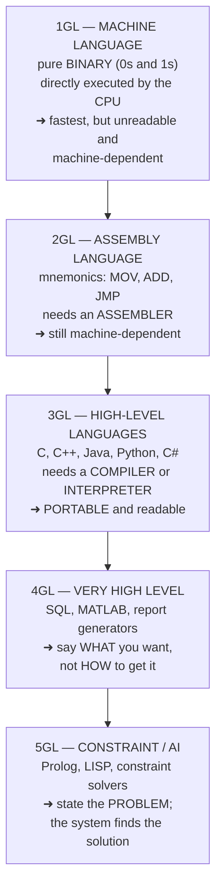
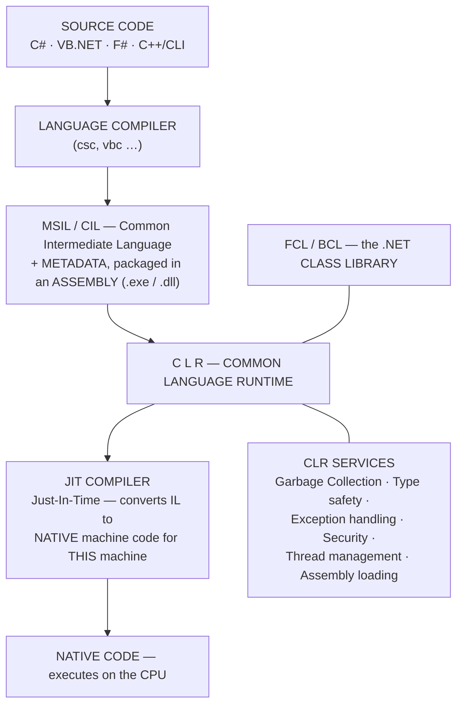
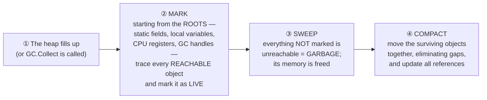

<!-- TOC START -->
**Table of Contents** — 4 subtopics · 7 theories

1. **[Core Programming Languages](#core-programming-languages)**
   - [Programming Languages — Classification and Concepts](#programming-languages--classification-and-concepts)
   - [Worked Programs — Leap Year and Common Exam Problems](#worked-programs--leap-year-and-common-exam-problems)

2. **[Visual Basic & .NET](#visual-basic--net)**
   - [The .NET Framework and the CLR](#the-net-framework-and-the-clr)
   - [Garbage Collection in .NET](#garbage-collection-in-net)
   - [VB.NET and C# — Language Essentials and Tooling](#vbnet-and-c--language-essentials-and-tooling)

3. **[Python](#python)**
   - [Python — Syntax, Data Types and Operators](#python--syntax-data-types-and-operators)

4. **[Mobile & Android Development](#mobile--android-development)**
   - [Android and Mobile Application Development](#android-and-mobile-application-development)

<!-- TOC END -->

---

## Core Programming Languages

### Programming Languages — Classification and Concepts

> A **PROGRAMMING LANGUAGE is a formal language consisting of a set of INSTRUCTIONS and RULES (its SYNTAX and SEMANTICS) used to write programs that tell a computer what to do.**

#### The generations of programming language



| Generation | Type | Example | Written in terms of |
|---|---|---|---|
| **1GL** | **Machine language** | `10110000 01100001` | **Binary opcodes** |
| **2GL** | **Assembly language** | `MOV AL, 61h` | **Mnemonics and registers** |
| **3GL** | **High-level, procedural / OO** | `if (x > 0) printf("positive");` | **Human-readable statements** |
| **4GL** | **Very high level, declarative** | `SELECT name FROM staff WHERE salary > 50000;` | **The desired RESULT** |
| **5GL** | **Constraint / logic / AI** | `ancestor(X,Y) :- parent(X,Y).` | **Facts and rules** |

#### Low-level vs high-level languages

| Point | **LOW-LEVEL (machine, assembly)** | **HIGH-LEVEL (C, Java, Python)** |
|---|---|---|
| **Closeness to hardware** | ✅ **Very close** — direct register and memory access | Abstracted away |
| **Readability** | ⚠️ **Very difficult** | ✅ **Easy, near English** |
| **Machine dependence** | ⚠️ **Machine-DEPENDENT** — must be rewritten for each CPU | ✅ **PORTABLE** — recompile and run |
| **Execution speed** | ✅ **Fastest** | Slightly slower (usually negligible) |
| **Development speed** | ⚠️ Very slow | ✅ **Fast** |
| **Memory control** | ✅ **Complete** | Managed by the runtime |
| **Error-proneness** | **High** | Lower |
| **Needs** | An **assembler** | A **compiler** or **interpreter** |
| **Used for** | Device drivers, boot loaders, embedded firmware, real-time control, optimisation-critical inner loops | ⭐ **Almost all application software** |

#### Compiler vs Interpreter

| Point | **COMPILER** | **INTERPRETER** |
|---|---|---|
| **Translates** | ⭐ **The ENTIRE program at once**, before execution | ⭐ **ONE statement at a time**, during execution |
| **Output** | A separate **object/executable file** | **No separate file** — it executes directly |
| **Speed of execution** | ✅ **Much FASTER** — translation happens once | ⚠️ **Slower** — translation repeats every run |
| **Error reporting** | Lists **ALL errors after scanning the whole program** | **Stops at the FIRST error** |
| **Debugging** | Harder | ✅ **Easier** — errors are reported line by line |
| **Memory use** | More (holds the object code) | Less |
| **Re-translation needed?** | Only when the source changes | **Every single run** |
| **Examples** | **C, C++, Go, Rust, Pascal** | **Python, JavaScript, Ruby, PHP, BASIC** |

> **JAVA uses BOTH — and this is the point examiners look for.** The Java compiler (`javac`) **compiles the source into platform-independent BYTECODE** (`.class`), and the **JVM then interprets (and JIT-compiles) that bytecode** on whatever machine it runs on. This two-stage design is exactly what gives Java its **"Write Once, Run Anywhere"** portability.

#### Paradigms

| Paradigm | Idea | Languages |
|---|---|---|
| **Procedural / Imperative** | A sequence of **statements and procedures** that change state | **C**, Pascal, BASIC |
| **Object-Oriented** | Data and behaviour bundled into **objects**; encapsulation, inheritance, polymorphism | **Java, C++, C#, Python** |
| **Functional** | Computation as the **evaluation of functions**, avoiding mutable state | Haskell, Lisp, Scala, F# |
| **Logic / Declarative** | State **facts and rules**; the engine derives the answer | **Prolog, SQL** |
| **Scripting** | Automating tasks, usually interpreted | Python, JavaScript, Bash |

#### C vs Java — the comparison most often asked

| Point | **C** | **JAVA** |
|---|---|---|
| **Paradigm** | **Procedural** | **Object-Oriented** |
| **Platform** | Compiled to **native code** — recompile per platform | ✅ **Bytecode + JVM — Write Once, Run Anywhere** |
| **Memory management** | ⚠️ **MANUAL** — `malloc()` / `free()` | ✅ **AUTOMATIC — garbage collection** |
| **Pointers** | ✅ **Full pointer arithmetic** | ❌ **No explicit pointers** (references only) |
| **Speed** | ✅ **Faster** | Slightly slower, but JIT narrows the gap |
| **Safety** | ⚠️ Buffer overflows and dangling pointers are easy | ✅ **Bounds-checked, type-safe** |
| **Exception handling** | ❌ None built in | ✅ **try / catch / finally** |
| **Used for** | **Operating systems, embedded, drivers, compilers** | **Enterprise applications, Android, web back-ends, banking systems** |

**Previous Year Question List from this Topic:**

- [Write a C/JAVA program to determine if a given year is a leap year or not.](../written-answers/programming-languages.md?plain=1#L15)

**Previous Year MCQ List from this Topic:**

- [To start Python from the command prompt, use the command _____](../mcq-answers/programming-languages.md?plain=1#L16)
- [Which of the following languages causes ‘Indentation Errors’ for not using tabs properly?](../mcq-answers/programming-languages.md?plain=1#L37)
- [In programming language DRY principle makes the code.](../mcq-answers/programming-languages.md?plain=1#L64)
- [Which language was used to build Android Operating System?](../mcq-answers/programming-languages.md?plain=1#L138)
- [Which of the following programming language helps you to learn Android programming?](../mcq-answers/programming-languages.md?plain=1#L147)


---

### Worked Programs — Leap Year and Common Exam Problems

#### The leap year rule

> ### **A year is a LEAP YEAR if it is DIVISIBLE BY 4, EXCEPT that century years (divisible by 100) are NOT leap years UNLESS they are also DIVISIBLE BY 400.**
>
> **In one expression:**
> ### **(year % 4 == 0 AND year % 100 != 0) OR (year % 400 == 0)**

**Why the rule is so awkward — the astronomy behind it:** a solar year is **365.2422 days**, not 365.25. Adding a day every 4 years over-corrects by about **11 minutes 14 seconds per year**, which accumulates to roughly **3 extra days every 400 years**. The **Gregorian calendar** therefore **removes 3 leap days per 400 years** by skipping the century years that are not divisible by 400.

| Year | ÷4? | ÷100? | ÷400? | **Leap?** |
|---|---|---|---|---|
| **2024** | ✅ | ❌ | — | ✅ **YES** |
| **2023** | ❌ | — | — | ❌ No |
| **1900** | ✅ | ⚠️ **Yes** | ❌ **No** | ❌ **NO** — a century year not divisible by 400 |
| **2000** | ✅ | ⚠️ Yes | ✅ **Yes** | ✅ **YES** |
| **2100** | ✅ | ⚠️ Yes | ❌ No | ❌ **NO** |

> ⚠️ **1900 and 2100 are the test cases that separate a correct answer from a wrong one.** A program that simply checks `year % 4 == 0` reports 1900 as a leap year, which is wrong. **Always include 1900 and 2000 in your trace.**

#### The C program

```c
#include <stdio.h>

int main(void) {
    int year;

    printf("Enter a year: ");
    if (scanf("%d", &year) != 1) {          /* reject non-numeric input */
        printf("Invalid input.\n");
        return 1;
    }

    if (year <= 0) {
        printf("Please enter a positive year.\n");
        return 1;
    }

    /* The complete Gregorian rule, in one condition */
    if ((year % 4 == 0 && year % 100 != 0) || (year % 400 == 0))
        printf("%d is a LEAP year.\n", year);
    else
        printf("%d is NOT a leap year.\n", year);

    return 0;
}
```

**The same logic written as nested `if`s, which shows the reasoning more clearly:**

```c
if (year % 400 == 0)          /* divisible by 400 → definitely leap   */
    leap = 1;
else if (year % 100 == 0)     /* century, but not by 400 → NOT leap   */
    leap = 0;
else if (year % 4 == 0)       /* ordinary year divisible by 4 → leap  */
    leap = 1;
else                          /* everything else                      */
    leap = 0;
```
> **Note the ORDER: 400 first, then 100, then 4.** Reversing it breaks the rule, because 2000 would be caught by the `% 100` test and wrongly rejected. **The most specific condition must be tested first.**

#### The Java program

```java
import java.util.Scanner;

public class LeapYear {

    // A reusable method — the logic separated from the input/output
    public static boolean isLeapYear(int year) {
        return (year % 4 == 0 && year % 100 != 0) || (year % 400 == 0);
    }

    public static void main(String[] args) {
        Scanner sc = new Scanner(System.in);
        System.out.print("Enter a year: ");
        int year = sc.nextInt();

        if (isLeapYear(year))
            System.out.println(year + " is a LEAP year.");
        else
            System.out.println(year + " is NOT a leap year.");

        sc.close();
    }
}
```

> **Java also provides it in the standard library**, which is worth mentioning as an alternative:
> ```java
> import java.time.Year;
> boolean leap = Year.isLeap(2024);      // → true
> ```

#### The trace table to include in the answer

| Input | `y%4==0` | `y%100!=0` | First clause | `y%400==0` | **Result** |
|---|---|---|---|---|---|
| **2024** | true | true | ✅ **true** | false | ✅ **LEAP** |
| **2023** | false | — | false | false | ❌ Not leap |
| **1900** | true | ⚠️ **false** | ❌ false | ❌ false | ❌ **Not leap** ✅ correct |
| **2000** | true | ⚠️ false | false | ✅ **true** | ✅ **LEAP** ✅ correct |
| **2100** | true | false | false | false | ❌ Not leap ✅ correct |

**Previous Year Question List from this Topic:**

- [Write a C/JAVA program to determine if a given year is a leap year or not.](../written-answers/programming-languages.md?plain=1#L15)


---

## Visual Basic & .NET

### The .NET Framework and the CLR

> **The .NET FRAMEWORK is a SOFTWARE DEVELOPMENT PLATFORM created by MICROSOFT** that provides a **controlled runtime environment (the CLR)** and a **very large reusable class library (the FCL)** for building and running applications on Windows — desktop, web, service and console.

> **Its central idea is LANGUAGE INTEROPERABILITY: programs written in C#, VB.NET, F# or any other .NET language are all compiled into the SAME intermediate language and executed by the SAME runtime**, so a class written in VB.NET can be inherited by a class written in C# without any special work.

#### The architecture



#### The main COMPONENTS of the .NET Framework

> **The two components at the heart of .NET are the CLR and the Class Library.** A full answer names these and then the application frameworks built on top.

| # | Component | What it is |
|---|---|---|
| **1** | ⭐ **CLR — Common Language Runtime** | **The EXECUTION ENGINE** — the virtual machine that runs every .NET program |
| **2** | ⭐ **FCL / BCL — Framework Class Library / Base Class Library** | A **huge library of reusable classes** for I/O, collections, strings, networking, XML, database access, security, threading and more |
| **3** | **CTS — Common Type System** | Defines **how types are declared and used**, so that all languages agree on what an `int` or a `string` is — the basis of interoperability |
| **4** | **CLS — Common Language Specification** | A **subset of CTS rules that every .NET language must obey** in order to be interoperable |
| **5** | **MSIL / CIL** | The **CPU-independent Intermediate Language** every compiler produces |
| **6** | **JIT Compiler** | Converts **IL into native machine code at RUN TIME**, optimised for the actual processor |
| **7** | **CLI — Common Language Infrastructure** | The **ECMA/ISO standard** that defines all of the above |
| **8** | **ASSEMBLIES** | The **deployment unit** — a `.exe` or `.dll` containing IL, metadata and a **manifest** (version, dependencies, security) |
| **9** | **ADO.NET** | The **data-access** layer — connecting to SQL Server, Oracle, MySQL |
| **10** | **ASP.NET** | The framework for building **web applications and web services** |
| **11** | **Windows Forms** | The classic **desktop GUI** framework |
| **12** | **WPF** | Windows Presentation Foundation — modern desktop UI with XAML |
| **13** | **WCF** | Windows Communication Foundation — **service-oriented / distributed** applications |
| **14** | **LINQ** | **Language-Integrated Query** — SQL-like queries written directly in C#/VB |
| **15** | **GAC — Global Assembly Cache** | A machine-wide store for **shared, strongly-named assemblies** |

#### What is the CLR?

> ### **The CLR (COMMON LANGUAGE RUNTIME) is the EXECUTION ENGINE of the .NET Framework — a virtual machine that LOADS, VERIFIES, COMPILES (JIT) and EXECUTES .NET code, and provides all the runtime services that managed code depends on.**
>
> Code that runs under the CLR is called ⭐ **MANAGED CODE**; code that runs outside it (native C/C++) is **UNMANAGED CODE**.

**The services the CLR provides:**

| # | Service | What it does |
|---|---|---|
| **1** | ⭐ **Memory management and GARBAGE COLLECTION** | **Automatically allocates and, crucially, RECLAIMS memory** — no `delete` and no memory leaks from forgotten frees |
| **2** | ⭐ **JIT compilation** | Compiles **IL → native code** at run time, optimised for the actual CPU |
| **3** | **Type safety and verification** | Checks that the IL is safe before running it — no arbitrary pointer arithmetic |
| **4** | **Exception handling** | A **uniform, cross-language** exception model |
| **5** | **Security** | Code Access Security, role-based security, verification of strong names |
| **6** | **Thread management** | Threads, the thread pool, synchronisation |
| **7** | **Assembly loading and versioning** | Resolves dependencies; **side-by-side execution** of different versions |
| **8** | **Language interoperability** | Lets C#, VB.NET and F# code call one another directly |
| **9** | **Interoperability with unmanaged code** | P/Invoke and COM interop |
| **10** | **Debugging and profiling support** | |

> **The one-line summary: the CLR is to .NET what the JVM is to Java** — a managed runtime that turns portable intermediate code into native code and takes responsibility for memory, types, security and exceptions.

#### .NET Framework vs .NET Core / modern .NET

| Point | **.NET Framework** (1.0 – 4.8) | **.NET Core / .NET 5+** |
|---|---|---|
| **Platform** | ⚠️ **WINDOWS only** | ✅ **CROSS-PLATFORM — Windows, Linux, macOS** |
| **Open source** | ❌ No | ✅ **Yes** |
| **Deployment** | Installed machine-wide | ✅ **Side-by-side, or self-contained** |
| **Performance** | Good | ✅ **Significantly better** |
| **Status** | ⚠️ **Legacy — maintenance only** (4.8 is the last version) | ✅ **The future — all new development** |

**Previous Year Question List from this Topic:**

- [What is .NET framework? Write down the different component of .NET Framework.](../written-answers/programming-languages.md?plain=1#L129)
- [What is CLR in .NET framework? List the components of .NET Framework.](../written-answers/programming-languages.md?plain=1#L205)
- [List the components of .NET Framework.](../written-answers/programming-languages.md?plain=1#L287)
- [Write down the component of .NET Framework.](../written-answers/programming-languages.md?plain=1#L361)
- [What is .NET framework? Write the main components of .NET framework?](../written-answers/programming-languages.md?plain=1#L507)

**Previous Year MCQ List from this Topic:**

- [.NET can be used in the following-](../mcq-answers/programming-languages.md?plain=1#L176)
- [Microsoft .NET is ________](../mcq-answers/programming-languages.md?plain=1#L185)


---

### Garbage Collection in .NET

> ### **GARBAGE COLLECTION (GC) is the AUTOMATIC MEMORY MANAGEMENT process by which the CLR IDENTIFIES objects that are NO LONGER REACHABLE by the running program and RECLAIMS the memory they occupy** — without the programmer having to free anything explicitly.

#### Why it exists

| Problem it solves | Explanation |
|---|---|
| ⭐ **MEMORY LEAKS** | In C/C++, memory allocated with `malloc`/`new` and never freed is **lost forever**. The GC makes this impossible for managed objects |
| ⭐ **DANGLING POINTERS** | Freeing memory that is still in use causes **crashes and security holes**. The GC only collects what is **provably unreachable** |
| **DOUBLE FREE** | Freeing the same block twice corrupts the heap — impossible under GC |
| **Developer productivity** | The programmer writes business logic instead of bookkeeping |
| **Heap fragmentation** | The .NET GC **COMPACTS** the heap, moving surviving objects together |

#### How it works — the mark, sweep and compact cycle



> **The key principle: the GC does NOT look for objects that are 'dead'. It finds every object that is still REACHABLE from a ROOT, and everything else is garbage by definition.** This is why circular references are collected correctly by .NET (unlike simple reference counting, which leaks them).

#### Generations — the optimisation that makes GC fast

> The .NET GC is **GENERATIONAL**, based on the observation that **most objects die young**.

| Generation | Contains | Collected |
|---|---|---|
| **Gen 0** | **Newly allocated, short-lived objects** | ✅ **Very frequently and very cheaply** — most objects die here |
| **Gen 1** | Objects that **survived one Gen-0 collection** — a buffer between short- and long-lived | Less often |
| **Gen 2** | **Long-lived objects** — static data, caches, application-lifetime objects | ⚠️ **Rarely — a full collection, and the most expensive** |
| **LOH — Large Object Heap** | Objects **larger than 85,000 bytes** | Collected with Gen 2; historically **not compacted** |

> **Why generations help so much:** collecting Gen 0 requires scanning only a small, recently used region, so it is **fast and cache-friendly**. A full Gen-2 collection must scan the entire heap and is therefore avoided as long as possible. This single design choice is what makes automatic memory management cheap enough to be the default.

#### Garbage collection in .NET 4 compared with earlier versions

| Point | **Before .NET 4 (.NET 1.0 – 3.5)** | **.NET 4 and later** |
|---|---|---|
| **Server GC** | Available, but with a **blocking** Gen-2 collection | Improved |
| **Workstation concurrent GC** | ⚠️ **CONCURRENT GC** — could run part of a Gen-2 collection on a dedicated thread, but it **still had to SUSPEND the application threads for significant portions**, and **could not perform allocations during the concurrent phase** | ✅ ⭐ **Replaced by BACKGROUND GC** |
| **Background GC (new in .NET 4)** | ❌ Not available | ✅ **A Gen-2 collection runs on a DEDICATED BACKGROUND THREAD while the application CONTINUES to run — and, critically, Gen 0 and Gen 1 collections CAN STILL HAPPEN DURING an in-progress Gen-2 collection**, so the application can keep allocating |
| **Pause times** | ⚠️ **Longer and less predictable** — noticeable freezes in large applications | ✅ **Much SHORTER and more predictable** |
| **Responsiveness** | Poorer for interactive and server applications | ✅ **Significantly better** |
| **Background GC for SERVER GC** | — | Added later, in **.NET 4.5** |
| **LOH compaction** | ❌ Never compacted — long-running services suffered fragmentation | Configurable compaction added in **.NET 4.5.1** (`GCSettings.LargeObjectHeapCompactionMode`) |
| **GC latency modes** | Limited | ✅ **`GCSettings.LatencyMode`** — `Batch`, `Interactive`, `LowLatency`, and **`SustainedLowLatency`** (.NET 4.5) for periods where pauses must be avoided |

> ### **The single headline difference: .NET 4 replaced CONCURRENT garbage collection with BACKGROUND garbage collection.**
>
> Under the old **concurrent** GC, a Gen-2 collection blocked the application at several points and **prevented further allocation while it ran**. Under **background** GC, the Gen-2 collection proceeds on its own thread while the application keeps running **and keeps allocating**, with **ephemeral (Gen 0/Gen 1) collections still able to occur in the middle of it**. The result is **markedly shorter and more predictable pause times**, which matters most for **interactive desktop applications and long-running server processes**.

#### What the GC does NOT manage — and the programmer's remaining duty

> ⚠️ **The garbage collector manages MANAGED MEMORY only.** It knows nothing about **UNMANAGED RESOURCES** — file handles, database connections, network sockets, window handles, GDI objects. Those must still be released explicitly, and **leaving them to the GC will exhaust them long before memory runs out.**

**The correct pattern:**

```csharp
// The IDisposable pattern with 'using' — the resource is released
// deterministically, the moment the block ends, even on an exception.
using (SqlConnection conn = new SqlConnection(connectionString))
{
    conn.Open();
    // ... use the connection ...
}   // conn.Dispose() is called HERE, automatically and guaranteed
```

| Mechanism | Nature | Use |
|---|---|---|
| **`IDisposable` / `Dispose()` / `using`** | ✅ **DETERMINISTIC** — runs exactly when you say | ⭐ **The correct way to release unmanaged resources** |
| **Finalizer (`~ClassName`)** | ⚠️ **NON-deterministic** — runs at some unknown time, and **delays the object's collection by one extra GC cycle** | A **last-resort safety net** only |
| **`GC.Collect()`** | Forces a collection | ⚠️ **Almost always a mistake** — it hurts performance by promoting objects unnecessarily; leave the decision to the runtime |

**Advantages of garbage collection:** no memory leaks from forgotten frees · no dangling pointers or double frees · **heap compaction** avoids fragmentation · far higher developer productivity · fewer security vulnerabilities.
**Disadvantages:** **non-deterministic timing** — you cannot know exactly when an object is freed · **CPU and pause-time overhead** · **higher memory footprint** (garbage lingers until collected) · **unsuitable for hard real-time systems**, where an unpredictable pause is unacceptable.

**Previous Year Question List from this Topic:**

- [What is garbage collection? Write down the difference between garbage collection in .NET 4 and earlier version of .NET](../written-answers/programming-languages.md?plain=1#L427)

---

### VB.NET and C# — Language Essentials and Tooling

> *(The .NET Framework, the CLR and garbage collection are covered in the two theories above. This theory covers the LANGUAGE-level and TOOLING points the MCQ bank tests.)*

#### What .NET can be used for

> ### **"`.NET` can be used in the following —"** → ### ✅ **ALL OF THE ABOVE.** .NET is a general platform supporting **desktop applications (Windows Forms, WPF), web applications and services (ASP.NET, Web API), mobile apps (MAUI/Xamarin), cloud services, console utilities, games (Unity) and machine learning (ML.NET)**.

> ### **"Microsoft .NET is ______"** → ### ✅ **OPEN SOURCE.**
> ⚠️ **With a necessary qualification:** the **original .NET FRAMEWORK (1.0–4.8) was PROPRIETARY and Windows-only**. Since **.NET Core (2016)** and the unified **.NET 5+**, the platform is ⭐ **fully OPEN SOURCE (MIT licence) under the .NET Foundation, and cross-platform**. Modern .NET is open source; the legacy Framework is not — **say which you mean.**

#### Variable scope

| Scope | Declared | Lifetime | Visible to |
|---|---|---|---|
| ⭐ **LOCAL variable** | ⭐ **INSIDE a METHOD (or block)** | While the method executes | **Only that method** |
| **Instance (member) variable / field** | Inside the class, outside any method | As long as the object lives | All methods of the object |
| **Static (shared) variable** | With `static` / `Shared` | The life of the program | The whole class |
| **Parameter** | In the method signature | During the call | That method |

> ### **"A variable declared inside a method is called ______"** → ### ✅ **A LOCAL VARIABLE.**
>
> **Two consequences worth stating:** a local variable is **destroyed when the method returns**, and in C# it **must be definitely assigned before use** — the compiler rejects reading an unassigned local, which is a deliberate safety feature.

#### ⭐ Constructors — the C# rule that is always tested

> ### **A CONSTRUCTOR must have the SAME NAME AS THE CLASS and must have NO RETURN TYPE — not even `void`.**

```csharp
class BankAccount {
    private int balance;

    public int BankAccount() {        // ❌ ERROR — has a RETURN TYPE (int)
        balance = 0;
    }

    public BankAccount() {            // ✅ CORRECT — no return type at all
        balance = 0;
    }
}
```

> ### **"Find any errors in this BankAccount constructor: `public int BankAccount() { balance = 0; }`"** → ### ✅ **THE RETURN TYPE.** Writing `int` in front turns it into an **ordinary method that happens to share the class's name** — so the class silently loses its constructor, and the compiler reports that the "method must return a value". **Remove the return type.**

**The constructor rules to memorise:** same name as the class · **no return type** · called **automatically** on object creation · can be **overloaded** · may be `public`, `private` (for singletons) or `protected` · a **default parameterless constructor is supplied only if you declare NO constructor at all** · C# uses `: base()`/`: this()` chaining, VB.NET uses `MyBase.New()`.

#### VB.NET forms — modal vs modeless

| Method | Behaviour |
|---|---|
| ⭐ **`ShowDialog()`** | ⭐ **Displays the form as MODAL** — the user **cannot interact with any other form** in the application until this one is closed. It **blocks** the calling code and **returns a `DialogResult`** |
| **`Show()`** | Displays the form as **MODELESS** — other forms remain usable, and the call returns immediately |

```vb
' VB.NET — modal
Dim f As New LoginForm()
If f.ShowDialog() = DialogResult.OK Then
    ' the code here waits until the dialog is closed
End If
```

> ### **"Which method displays the form as MODAL in VB.NET?"** → ### ✅ **`ShowDialog()`.**
>
> **Use modal for anything that must be answered before continuing** — a login box, a confirmation, a settings dialog. **Use modeless for tool windows** the user should be able to leave open.

#### .NET tooling worth naming

| Tool | Purpose |
|---|---|
| ⭐ **`Regasm.exe`** | ⭐ **Registers .NET ASSEMBLIES for use by COM** — it writes the assembly's classes into the Windows registry so that legacy COM clients (VB6, classic ASP, Office VBA) can create them |
| **`Regsvr32.exe`** | The opposite direction — registers a **native COM DLL** (not .NET) |
| **`Tlbimp.exe` / `Tlbexp.exe`** | Import a COM type library into .NET / export .NET to a type library |
| **`ildasm` / `ILSpy`** | Disassemble IL — inspect a compiled assembly |
| **`gacutil.exe`** | Install an assembly into the **Global Assembly Cache** |
| **`csc` / `vbc`** | The C# and VB.NET command-line compilers |
| **NuGet** | The package manager |
| ⭐ **MSDN Library** | ⭐ **The REFERENCE LIBRARY of Microsoft/Visual Basic documentation** — Microsoft Developer Network. *(Now superseded by **Microsoft Learn / docs.microsoft.com**, but "MSDN library" remains the expected exam answer.)* |

#### VB.NET vs C# — the practical comparison

| Point | **VB.NET** | **C#** |
|---|---|---|
| **Syntax style** | Verbose, English-like (`If … Then … End If`) | **C-family, braces and semicolons** |
| **Case sensitivity** | ❌ **Case-INsensitive** | ✅ **Case-SENSITIVE** |
| **Statement terminator** | End of line | **`;`** |
| **Comments** | `'` or `REM` | `//` and `/* */` |
| **Compiles to** | ⭐ **The SAME MSIL** — the two are fully interoperable | The same MSIL |
| **Popularity today** | Declining; in maintenance mode | ⭐ **The dominant .NET language** |

> ### **The point that matters: because BOTH compile to the SAME intermediate language and run on the SAME CLR, a class written in VB.NET can be inherited and used by C# code without any wrapper.** That language interoperability is the whole purpose of the Common Type System and the Common Language Specification.

**Previous Year MCQ List from this Topic:**

- [.NET can be used in the following-](../mcq-answers/programming-languages.md?plain=1#L176)
- [Microsoft .NET is ________](../mcq-answers/programming-languages.md?plain=1#L185)
- [The reference library of Visual Basic books is called ________](../mcq-answers/programming-languages.md?plain=1#L194)
- [A variable declared inside a method is called ________.](../mcq-answers/programming-languages.md?plain=1#L203)
- [Which of the method is used to display the form as model in VB.NET platform?](../mcq-answers/programming-languages.md?plain=1#L212)
- [The tool provided with .NET framework register assemblies for use by COM is ________](../mcq-answers/programming-languages.md?plain=1#L221)
- [Find any errors in the following BankAccount constructor in C#.NET public int BankAccount(){ balance=0; }](../mcq-answers/programming-languages.md?plain=1#L230)


---

## Python

### Python — Syntax, Data Types and Operators

> **PYTHON is a high-level, INTERPRETED, dynamically-typed, general-purpose language** created by **Guido van Rossum (1991)**. It is today the dominant language for **data science, machine learning, scripting, automation and web back-ends**, chiefly because of its readability and its enormous library ecosystem.

#### Running Python

| Command | Effect |
|---|---|
| ⭐ **`python`** (or `python3`) | ⭐ **Starts the Python INTERPRETER from the command prompt** — the interactive shell, showing the `>>>` prompt |
| `python script.py` | Runs a script file |
| `python -c "print(1+1)"` | Runs a one-line command |
| `exit()` or Ctrl+D | Leaves the interpreter |

#### ⭐ Indentation — Python's defining peculiarity

> ### **Python uses INDENTATION — not braces — to define BLOCKS.** A block is everything indented to the same level under a `:` line. **Inconsistent indentation raises an `IndentationError`.**

```python
if x > 0:
    print("positive")        # this line is INSIDE the if — 4 spaces
    print("still inside")
print("always runs")         # OUTSIDE the if — back to column 0
```

> ### **"Which language causes INDENTATION ERRORS for not using tabs properly?"** → ### ✅ **PYTHON.**
>
> ⚠️ **Never mix tabs and spaces** in one file — they look identical on screen but are different characters, and Python will reject the file. **PEP 8, the official style guide, mandates 4 SPACES per indentation level.** In C, C++, Java and C# indentation is purely cosmetic; **in Python it is syntax.**

#### The core data types

| Category | Types | Mutable? | Literal |
|---|---|---|---|
| **Numeric** | `int`, `float`, `complex` | No | `42`, `3.14`, `2+3j` |
| **Text** | `str` | No | `"hello"` |
| **Boolean** | `bool` | No | `True`, `False` |
| ⭐ **Sequence** | ⭐ **`list`** | ✅ **Yes** | ⭐ **`[1, 2, 3]`** — square brackets |
| | **`tuple`** | ❌ No | **`(1, 2, 3)`** — parentheses |
| | `range` | No | `range(5)` |
| ⭐ **Mapping** | ⭐ **`dict`** | ✅ Yes | ⭐ **`{'one': 1, 'two': 2}`** — braces, **key : value** pairs |
| ⭐ **Set** | **`set`** | ✅ Yes | **`{1, 2, 3}`** — braces, **no colons** |
| | `frozenset` | No | |
| **Binary** | `bytes`, `bytearray` | | |
| **None** | `NoneType` | | `None` |

> ### **"Which of these is NOT a core data type?"** → ### ✅ **CLASS.** A **class is a user-defined TYPE CONSTRUCT**, not one of Python's built-in core data types. *(The core types are int, float, complex, str, bool, list, tuple, range, dict, set, frozenset, bytes and NoneType.)*

> ### **The curly-brace question: `{}` in Python means a DICTIONARY or a SET — never a code block.**
> ```python
> A = {'one': 1, 'two': 2}      ✅ a DICTIONARY — keys with colons
> B = {1, 2, 3}                 ✅ a SET — no colons
> C = {}                        ⚠️ an EMPTY DICTIONARY, not an empty set
> D = set()                     ✅ the way to make an empty SET
> ```

#### Type conversion functions

| Function | Converts to | Example |
|---|---|---|
| ⭐ **`float(x)`** | ⭐ **A FLOAT — this is the function that converts a STRING to a float** | `float("3.14")` → `3.14` |
| **`int(x)`** | Integer | `int("42")` → `42`; `int(3.9)` → `3` (truncates) |
| **`str(x)`** | String | `str(42)` → `"42"` |
| **`bool(x)`** | Boolean | `bool(0)` → `False` |
| **`list(x)` / `tuple(x)` / `set(x)`** | The collection type | `list("abc")` → `['a','b','c']` |

#### ⭐ Operators — and the two that catch everybody

| Operator | Meaning | Example |
|---|---|---|
| `+ - * /` | Add, subtract, multiply, **true divide** | `9 / 2` → **`4.5`** (always a float) |
| ⭐ **`//`** | ⭐ **FLOOR DIVISION — divides and DISCARDS the fractional part** | ⭐ **`9 // 2`** → **`4`** · `-9 // 2` → `-5` (floors **downward**) |
| **`%`** | Modulus (remainder) | `9 % 2` → `1` |
| ⭐ **`**`** | ⭐ **EXPONENTIATION** | `2 ** 3` → `8` |
| `== != < > <= >=` | Comparison | |
| `and or not` | Logical | |
| `in`, `not in` | Membership | `'a' in 'abc'` → `True` |
| `is`, `is not` | Identity (same object) | |

> ### **Worked example — `print(9 // 2)`** → ### ✅ **`4`**, because `//` is **floor division**. *(Note that `9 / 2` would give `4.5`, and in Python 2 `9 / 2` gave `4` — which is why the `//` operator was introduced, to make the intent explicit.)*

> ### ⭐ **Worked example — the exponent associativity trap**
> ```python
>    2 ** (3 ** 2)  =  2 ** 9   =  512
>    (2 ** 3) ** 2  =  8  ** 2   =   64
>    2 ** 3 ** 2    =  ?
> ```
> ### ✅ **`2 ** 3 ** 2` = 512**, because ⭐ **`**` is RIGHT-ASSOCIATIVE** — it groups as `2 ** (3 ** 2)`, not `(2 ** 3) ** 2`. **So the three expressions evaluate to 512, 64 and 512.**
>
> **`**` is the ONLY common Python operator that associates right-to-left**; every arithmetic operator you are used to (`+ - * /`) associates left-to-right. That single fact is the whole question.

#### Lists — indexing and assignment

```python
List = [1, 2, 3, 4, 5]
#       0  1  2  3  4      ← indices are ZERO-BASED
#      -5 -4 -3 -2 -1      ← negative indices count from the END

List[3] = List[1]          # copy the VALUE at index 1 into index 3
print(List)                # [1, 2, 3, 2, 5]
print(List[3])             # 2
```
> ### **"If `List = [1,2,3,4,5]` and you write `List[3] = List[1]`, what is `List[3]`?"** → ### ✅ **2.**
>
> **The two things being tested: indexing is ZERO-BASED (so `List[1]` is the SECOND element, 2), and lists are MUTABLE (so the assignment succeeds).** The same assignment on a **tuple** would raise `TypeError: 'tuple' object does not support item assignment`.

**Slicing:** `List[1:4]` → `[2,3,4]` (start inclusive, stop exclusive) · `List[:3]` → first three · `List[-2:]` → last two · `List[::-1]` → the list reversed.

#### The DRY principle

> ### **DRY = "DON'T REPEAT YOURSELF"** — every piece of knowledge or logic should have **a single, unambiguous representation** in the system.

> ### **"The DRY principle makes the code ______"** → ### ✅ **REUSABLE** (and thereby shorter, more maintainable and less error-prone).

**Why it matters:** if the same logic is copied into five places, a bug must be fixed **five times** — and it will be fixed in four. Extracting it into **one function, class or module** means it is written once, tested once and corrected once. *(The opposite is disparaged as **WET** — "Write Everything Twice".)*

**Related principles worth naming:** **KISS** (Keep It Simple, Stupid) · **YAGNI** (You Aren't Gonna Need It) · **SOLID** (the five object-oriented design principles) · **Separation of Concerns**.

**Previous Year MCQ List from this Topic:**

- [To start Python from the command prompt, use the command _____](../mcq-answers/programming-languages.md?plain=1#L16)
- [What is the output of the following code?](../mcq-answers/programming-languages.md?plain=1#L25)
- [Which of the following languages causes ‘Indentation Errors’ for not using tabs properly?](../mcq-answers/programming-languages.md?plain=1#L37)
- [Which following code syntax shows a valid use of curly braces ‘{}’ in python?](../mcq-answers/programming-languages.md?plain=1#L46)
- [If List= (1,2,3,4,5) and write List(3) = List(1) then what will be List(3)?](../mcq-answers/programming-languages.md?plain=1#L55)
- [In programming language DRY principle makes the code.](../mcq-answers/programming-languages.md?plain=1#L64)
- [Which of the following function converts a string into float in Python?](../mcq-answers/programming-languages.md?plain=1#L73)
- [What is the output of following code? print 9//2](../mcq-answers/programming-languages.md?plain=1#L82)
- [Which of these is not a core data type?](../mcq-answers/programming-languages.md?plain=1#L91)
- [What are the values of the following expressions? 2 (32), (23) 2, 232](../mcq-answers/programming-languages.md?plain=1#L100)


---

## Mobile & Android Development

### Android and Mobile Application Development

#### The two dominant mobile platforms

| | ⭐ **ANDROID** | ⭐ **iOS** |
|---|---|---|
| **Developed by** | ⭐ **GOOGLE** (originally Android Inc., acquired 2005) | ⭐ **APPLE (অ্যাপেল)** |
| **Based on** | The **LINUX kernel** | Darwin / Unix |
| **Source model** | **Open source (AOSP)** | Proprietary |
| **Runs on** | Many manufacturers — Samsung, Xiaomi, Oppo, Walton | **Apple devices only** — iPhone, iPad |
| ⭐ **App package format** | ⭐ **`.APK`** (Android Package Kit); `.aab` for Play Store | **`.IPA`** |
| **App store** | Google Play Store | Apple App Store |
| ⭐ **Primary languages** | ⭐ **JAVA** and **Kotlin** (official since 2017) | **Swift** and Objective-C |
| **IDE** | **Android Studio** | **Xcode** |
| **Market share** | ~70 % worldwide | ~28 % |

> ### **"আইওএস (iOS) মোবাইল অপারেটিং সিস্টেম কোন কোম্পানির?"** → ### ✅ **অ্যাপেল (Apple).**
> ### **"Which smartphones are compatible with `.apk` files?"** → ### ✅ **ANDROID.**
> ### **"Which language was used to build Android / helps you learn Android programming?"** → ### ✅ **JAVA.** *(Precisely: the **Android OS itself** is built from **C and C++** for the kernel and native libraries, with the **framework layer in Java**; **applications** are written in **Java or Kotlin**. For exam purposes the expected answer is **Java**.)*

#### Android versions, codenames and API levels

> Android releases carry a **version number**, a **dessert codename** (officially dropped after Android 9, though retained internally) and an ⭐ **API LEVEL** — the integer developers actually target.

| Version | Codename | ⭐ **API level** |
|---|---|---|
| 4.4 | KitKat | 19 |
| 5.0 – 5.1 | Lollipop | 21 – 22 |
| 6.0 | Marshmallow | 23 |
| 7.0 – 7.1 | Nougat | 24 – 25 |
| ⭐ **8.0 – 8.1** | ⭐ **OREO** — internal codename ⭐ **"Oatmeal Cookie"** | 26 – 27 |
| 9 | Pie | 28 |
| 10 | Q (Quince Tart) | 29 |
| ⭐ **11** | R (Red Velvet Cake) | ⭐ **30** |
| 12 | S (Snow Cone) | 31 – 32 |
| 13 | Tiramisu | 33 |
| 14 | Upside Down Cake | 34 |
| 15 | Vanilla Ice Cream | 35 |

> ⚠️ **Note on two MCQs in this bank:** *"What is the API level of Android 11?"* is answered **"None of the above"** — ### **the correct API level is 30**, so the printed options must have omitted it. And *"the internal codename of Android 8.0"* is ⭐ **"Oatmeal Cookie"** — Google kept internal dessert codenames even after the public ones were dropped.

#### The components of an Android application

| Component | Purpose |
|---|---|
| ⭐ **Activity** | **One screen** with a user interface |
| ⭐ **Service** | Work that runs **in the background** with no UI |
| **Broadcast Receiver** | Responds to **system-wide events** (battery low, boot completed) |
| **Content Provider** | Shares data **between applications** |
| ⭐ **Intent** | The **message object** used to start an activity or service, or to pass data between components |
| ⭐ **AndroidManifest.xml** | Declares the app's **components, permissions and minimum API level** |
| **Layout (XML)** | Defines the UI declaratively |
| **Gradle** | The build system |

#### Native vs Hybrid vs Cross-platform

| | **Native** | **Cross-platform** | **Hybrid / Web app** |
|---|---|---|---|
| **Built with** | Java/Kotlin (Android), Swift (iOS) | **Flutter (Dart), React Native (JS)** | HTML/CSS/JS in a WebView (Cordova, Ionic) |
| **Performance** | ✅ **Best** | Very good | Weakest |
| **Code reuse across platforms** | ❌ None | ✅ **High** | ✅ Highest |
| **Access to device features** | ✅ Full | Good (via plugins) | Limited |
| **Best for** | Performance-critical, platform-specific apps | Most business apps | Simple content apps |

**Previous Year MCQ List from this Topic:**

- [What is the API level of Android version 11?](../mcq-answers/programming-languages.md?plain=1#L111)
- [What is the Internal Codename of Android version 8.0?](../mcq-answers/programming-languages.md?plain=1#L120)
- [আইওএস (IOS) মোবাইল অপারেটিং সিস্টেমটি কোন প্রতিষ্ঠান বাজারজাত করে?](../mcq-answers/programming-languages.md?plain=1#L129)
- [Which language was used to build Android Operating System?](../mcq-answers/programming-languages.md?plain=1#L138)
- [Which of the following programming language helps you to learn Android programming?](../mcq-answers/programming-languages.md?plain=1#L147)
- [Which of the following program helps you to learn Android programming?](../mcq-answers/programming-languages.md?plain=1#L156)
- [What smart phones are compatible of .apk file?](../mcq-answers/programming-languages.md?plain=1#L165)
