<!-- TOC START -->
**Table of Contents** — 3 subtopics · 12 theories

1. **[SDLC Phases & Models](#sdlc-phases--models)**
   - [Software Engineering and the SDLC](#software-engineering-and-the-sdlc)
   - [The Waterfall Model](#the-waterfall-model)
   - [Agile Methodology](#agile-methodology)
   - [Other SDLC Models](#other-sdlc-models)
   - [Requirements Engineering, the SRS and Project Scheduling](#requirements-engineering-the-srs-and-project-scheduling)

2. **[Software Testing & Evaluation](#software-testing--evaluation)**
   - [Software Testing — Fundamentals](#software-testing--fundamentals)
   - [Black-Box, White-Box and Grey-Box Testing](#black-box-white-box-and-grey-box-testing)
   - [The Levels of Testing](#the-levels-of-testing)
   - [The Types of Testing](#the-types-of-testing)
   - [Test Planning, Test Cases and Quality Assurance](#test-planning-test-cases-and-quality-assurance)

3. **[Software Design, Architecture & Patterns](#software-design-architecture--patterns)**
   - [Design Patterns](#design-patterns)
   - [Software Metrics — Coupling, Cohesion, Cyclomatic Complexity and Function Points](#software-metrics--coupling-cohesion-cyclomatic-complexity-and-function-points)

<!-- TOC END -->

---

## SDLC Phases & Models

### Software Engineering and the SDLC

#### What is software engineering?

> **The IEEE definition (the one to quote):**
> *"Software Engineering is **the application of a SYSTEMATIC, DISCIPLINED, QUANTIFIABLE approach to the development, operation and maintenance of software** — that is, the application of engineering to software."*
> — **IEEE Standard 610.12-1990**

**Why it exists:** the **"software crisis"** of the late 1960s — projects were routinely late, over budget, unreliable and unmaintainable. Software engineering was the response: treat software development as a **disciplined engineering activity** with defined processes, measurement and quality control, rather than as individual craftsmanship.

#### What is the SDLC?

> **SDLC = SOFTWARE DEVELOPMENT LIFE CYCLE.**
>
> It is a **structured, systematic process consisting of well-defined phases, used to plan, create, test and deploy a software system**, ensuring that the final product meets the customer's requirements within time and budget.

#### The phases of the SDLC

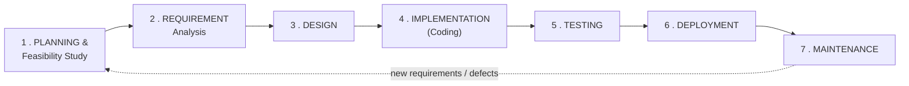

| # | Phase | Activities | Output (deliverable) |
|---|---|---|---|
| **1** | **Planning & Feasibility Study** | Define scope, objectives, cost, schedule, resources and risks; decide **whether the project should be done at all** | **Project plan, feasibility report** |
| **2** | **Requirement Analysis** | Gather and analyse what the users actually need; interviews, questionnaires, observation, study of existing systems; resolve conflicts and ambiguities | **SRS — Software Requirement Specification** |
| **3** | **Design** | Translate the requirements into a blueprint — architecture, modules, interfaces, database schema, UI | **SDD — Software Design Document**, ER diagrams, DFDs, UML |
| **4** | **Implementation / Coding** | Write the actual code according to the design and the coding standards | **Source code, executable software** |
| **5** | **Testing** | Verify that the software meets the requirements and is defect-free — unit, integration, system and acceptance testing | **Test reports, defect log, tested software** |
| **6** | **Deployment** | Install in the production environment; data migration; user training; go-live | **Live system, user manual** |
| **7** | **Maintenance** | Fix defects, adapt to changes, add enhancements, tune performance | **Updated versions, patches** |

> **"In which stage is USER ACCEPTANCE assured?"**
> ### ✅ **The TESTING phase — specifically USER ACCEPTANCE TESTING (UAT)**, which is the final stage of testing, performed **by the actual end users** in a realistic environment, to confirm the software meets their business needs before it goes live.
>
> *(A fuller answer adds: acceptance is **defined** in the **Requirement Analysis** phase — the acceptance criteria are agreed there and written into the SRS — and **verified** in Testing through UAT. Without clear acceptance criteria, UAT has nothing to test against.)*

#### Activities of the DESIGN phase

| Activity | Description |
|---|---|
| **Architectural design** | The **high-level structure** — which major components exist and how they interact (three-tier, microservices, MVC) |
| **Detailed / Low-level design** | The internal logic of each module — algorithms, data structures, pseudocode |
| **Database design** | ER diagram, schema, **normalisation**, indexes, constraints |
| **Interface design** | Screens, forms, reports, navigation — the **UI/UX** |
| **Data design** | Data structures, formats, validation rules, data dictionary |
| **Component / Module design** | Decomposition into modules with defined responsibilities |
| **Security design** | Authentication, authorisation, encryption, audit |
| **Design documentation** | The **SDD**, DFDs, UML diagrams, flowcharts |

> **The two principles that govern good design:**
> - **COHESION should be HIGH** — each module should do **one thing well**, with all its parts closely related.
> - **COUPLING should be LOW** — modules should depend on each other **as little as possible**, so one can be changed without breaking the others.
>
> **"High cohesion, low coupling" is the single most quoted design rule in software engineering**, because it is what makes a system maintainable.

#### Feasibility study

> A **FEASIBILITY STUDY assesses whether a proposed system is PRACTICAL and WORTH BUILDING**, before significant money is committed.

| Type | Question it answers |
|---|---|
| **Technical feasibility** | Do we have (or can we get) the **technology, hardware and skills**? |
| **Economic feasibility** | Do the **benefits exceed the costs**? (Cost-benefit analysis, ROI) |
| **Operational feasibility** | Will the organisation and its **users actually accept and use** it? |
| **Schedule feasibility** | Can it be delivered **in the required time**? |
| **Legal feasibility** | Does it comply with **laws, regulations and contracts** (data protection, licensing)? |
| **Resource feasibility** | Are the **people, equipment and budget** available? |
| **Cultural / Behavioural feasibility** | Does it fit the organisation's **culture and working practices**? |

#### Software maintenance

> **Software maintenance is the modification of a software product AFTER DELIVERY**, and it typically consumes **60–80 % of the TOTAL lifetime cost** of a system — far more than the original development.

| Type | Share | Purpose |
|---|---|---|
| **CORRECTIVE** | ~20 % | **Fixing defects** discovered after release |
| **ADAPTIVE** | ~25 % | Adapting to a **changed environment** — a new OS, a new tax rate, a new regulation |
| **PERFECTIVE** | ~50 % ⭐ | **New features and improvements** requested by users; performance tuning |
| **PREVENTIVE** | ~5 % | **Refactoring** to reduce future problems; improving maintainability; updating documentation |

**What maintenance involves:** understanding the existing code (often written by someone else), impact analysis, making the change, **regression testing** to ensure nothing else broke, updating documentation, version control and release management, and user support.

**Why it is so expensive:** the original developers have left; documentation is outdated; the code has accumulated **technical debt**; each change risks breaking something elsewhere; and the system must keep running while being changed.

**Previous Year Question List from this Topic:**

- [A software company has been hired to develop an Online Library Management System for a university. The librarian wants the system to be delivered in phases so t…](../written-answers/software-engineering.md?plain=1#L28)
- [What are the main phases of the Software Development Life Cycle (SDLC)? Explain each phase briefly.](../written-answers/software-engineering.md?plain=1#L91)
- [What is SDLC, Steps of SDLC, in which Step user acceptance assured?](../written-answers/software-engineering.md?plain=1#L217)
- [What is SDLC? Describe the steps of SDLC.](../written-answers/software-engineering.md?plain=1#L286)
- [You are asked to lead a team of software engineers to develop an application software system for your company and deploy it as fast as possible. You need to gat…](../written-answers/software-engineering.md?plain=1#L519)
- [Write down the step of SDLC?](../written-answers/software-engineering.md?plain=1#L659)
- [Define SDLC? Write the steps of SDLC?](../written-answers/software-engineering.md?plain=1#L789)
- [What is SDLC? Write the name of 7 phase of SDLC?](../written-answers/software-engineering.md?plain=1#L852)
- [(খ) Software maintenance এর সাথে কী কী বিষয় জড়িত, তা আলোচনা করুন।](../written-answers/software-engineering.md?plain=1#L1090)
- [Software engineering এ ফিজিবিলিটি স্ট্যাড্যির ৭টি ধাপ বর্ণনা কর।](../written-answers/software-engineering.md?plain=1#L1300)
- [Explain software development life cycle (SDLC).](../written-answers/software-engineering.md?plain=1#L1368)
- [(b) What is SDLC? Define the activities of the design phase in SDLC.](../written-answers/software-engineering.md?plain=1#L1456)
- [What is full meaning of SDLC?](../written-answers/software-engineering.md?plain=1#L1733)
- [(খ) SDLC diagram সহ বর্ণনা করুন। SDLC এর মেজর phases গুলি কী?](../written-answers/software-engineering.md?plain=1#L2049)
- [What is SDLC? List the stages involed in the SDLC process. Which stages ensures the user acceptance of the system?](../written-answers/software-engineering.md?plain=1#L2251)
- [(ii) Software development এর ধাপসমূহ সংক্ষেপে বর্ণনা করুন।](../written-answers/software-engineering.md?plain=1#L2320)
- [What is SDLC? Write down the step of SDLC.](../written-answers/software-engineering.md?plain=1#L2441)
- [(ক) Software Development Life Cycle (SDLC) এর বিভিন্ন ধাপগুলো উল্লেখ করুন ও সংক্ষেপে বর্ণনা করুন।](../written-answers/software-engineering.md?plain=1#L2498)
- [Define software engineering according to IEEE. What is SDLC? Describe any two SDLC.](../written-answers/software-engineering.md?plain=1#L2959)
- [What is SDLC? Write down the Phases of SDLC?](../written-answers/software-engineering.md?plain=1#L3045)

**Previous Year MCQ List from this Topic:**

- [Which of the following is an appropriate category of system maintenance performed for the purpose of modifying the system to cope with changes in the software e…](../mcq-answers/software-engineering.md?plain=1#L222)
- [Programmers being roughly out the logic they will use in the ________ stage of software SDLC.](../mcq-answers/software-engineering.md?plain=1#L231)
- [Which of the following requires the most time in SDLC?](../mcq-answers/software-engineering.md?plain=1#L267)
- [Program background, program functions and computing requirements are part of-](../mcq-answers/software-engineering.md?plain=1#L276)
- [Which of the following is not a Software Development Life Cycle Phase?](../mcq-answers/software-engineering.md?plain=1#L294)
- [The process of making object code form one system work on another type of system is called ________.](../mcq-answers/software-engineering.md?plain=1#L240)


---

### The Waterfall Model

> The **WATERFALL MODEL is the classical, LINEAR-SEQUENTIAL software process model** in which each phase must be **fully completed and approved before the next begins**, and progress flows steadily **downwards, like a waterfall**.

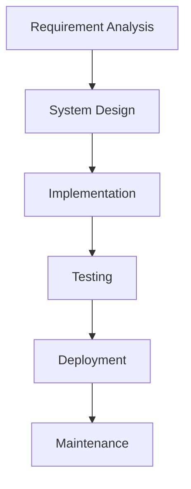

**The steps:** Requirement gathering and analysis → System design → Implementation (coding) → Integration and testing → Deployment → Maintenance.

#### Advantages

1. **Simple and easy to understand and manage** — the oldest and most familiar model.
2. **Clear, well-defined phases** with distinct deliverables and review points.
3. **Heavy documentation** — valuable for long-lived systems and for handover.
4. **Easy to measure progress** — you know exactly which phase you are in.
5. Works **well when requirements are stable, clear and well understood** from the start.
6. Suits **small projects with fixed scope**, and projects where the technology is familiar.
7. Good for projects with **regulatory or contractual requirements** for formal sign-off at each stage.

#### Disadvantages — the critical analysis

| # | Limitation | Why it matters |
|---|---|---|
| **1** | **NO WORKING SOFTWARE until very late** | The customer sees nothing until the end. If the understanding was wrong, **the entire investment is wasted** |
| **2** | **Requirements must be frozen at the start** | In reality, customers **cannot fully articulate what they want** until they see something, and business needs change during a long project |
| **3** | **Extremely high cost of change** | Going back to an earlier phase means redoing all the work after it. A requirement error found in testing may cost **100× more to fix** than if found in analysis |
| **4** | **Testing comes only at the END** | Defects introduced in design lie undiscovered for months, by which time they are deeply embedded |
| **5** | **No customer involvement after requirements** | The customer's next involvement is acceptance — far too late to correct a misunderstanding |
| **6** | **Poor for long or complex projects** | The longer the project, the more certain it is that the requirements will have changed |
| **7** | **High risk and uncertainty** | Risks are discovered late |
| **8** | **Not suitable for object-oriented or iterative development** | |
| **9** | **Rigid** — phases cannot overlap | Wastes time while specialists wait for the previous phase |

> **The fundamental flaw, stated in one sentence:** *the Waterfall model assumes that **all requirements can be known correctly and completely at the beginning**, and that they will **not change** — and in the great majority of real software projects, both assumptions are false.*

**Previous Year Question List from this Topic:**

- [Critically analyze the limitations of the Waterfall model and explain how Agile methodologies address those limitations.](../written-answers/software-engineering.md?plain=1#L142)
- [(a) Write down the steps of Waterfall model.](../written-answers/software-engineering.md?plain=1#L946)
- [(খ) Software Engineering এর ক্ষেত্রে Waterfall Model বর্ণনা করুন।](../written-answers/software-engineering.md?plain=1#L1023)
- [(ক) Waterfall model বিস্তারিত বর্ণনা করুন। এই model এর সুবিধা এবং সীমাবদ্ধতাগুলো উল্লেখ করুন।](../written-answers/software-engineering.md?plain=1#L1157)
- [(খ) Software development এর Waterfall model এর অসুবিধাগুলো কী কী?](../written-answers/software-engineering.md?plain=1#L1603)
- [Show the structure model in software engineering. Phase of water fall life cycle.](../written-answers/software-engineering.md?plain=1#L2701)

**Previous Year MCQ List from this Topic:**

- [What is the major drawback of waterfall Model?](../mcq-answers/software-engineering.md?plain=1#L204)
- [How many steps in waterfall model?](../mcq-answers/software-engineering.md?plain=1#L213)
- [Waterfall model phase in which system design is prepared and this system design helps is specifying system requirements and define overall system architecture i…](../mcq-answers/software-engineering.md?plain=1#L285)


---

### Agile Methodology

> **AGILE is an ITERATIVE and INCREMENTAL approach to software development** in which the software is built in **short cycles (iterations/sprints)**, each producing a **potentially shippable increment**, with **continuous customer collaboration** and **welcome response to change**.

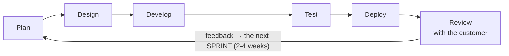

#### The four VALUES of the Agile Manifesto (2001)

> **"We are uncovering better ways of developing software... Through this work we have come to value:"**
>
> | # | We value … | **OVER** … |
> |---|---|---|
> | **1** | **INDIVIDUALS AND INTERACTIONS** | processes and tools |
> | **2** | **WORKING SOFTWARE** | comprehensive documentation |
> | **3** | **CUSTOMER COLLABORATION** | contract negotiation |
> | **4** | **RESPONDING TO CHANGE** | following a plan |
>
> **"That is, while there is value in the items on the right, we value the items on the LEFT more."**
>
> ⚠️ **That final sentence is essential and is often forgotten.** Agile does **not** say documentation or planning are worthless — it says that when the two conflict, the left-hand item wins.

#### The twelve principles of Agile

1. **Satisfy the customer** through **early and continuous delivery** of valuable software.
2. **Welcome changing requirements**, even late in development.
3. **Deliver working software frequently** — weeks rather than months.
4. **Business people and developers must work together daily**.
5. Build projects around **motivated individuals** — give them the environment and support they need, and **trust them**.
6. **Face-to-face conversation** is the most efficient method of conveying information.
7. **Working software is the primary measure of progress.**
8. **Sustainable development** — the team should maintain a constant pace indefinitely.
9. **Continuous attention to technical excellence** and good design.
10. **Simplicity** — maximising the work **not** done — is essential.
11. The best architectures and designs emerge from **self-organising teams**.
12. At regular intervals, the team **reflects and adjusts** its behaviour.

#### Agile frameworks

| Framework | Description |
|---|---|
| **Scrum** | The most widely used — fixed-length **sprints**, defined roles and ceremonies |
| **Kanban** | Continuous flow, a visual board, **limits on work in progress** |
| **Extreme Programming (XP)** | Engineering-focused — pair programming, TDD, continuous integration |
| **Lean** | Eliminate waste, amplify learning, decide late, deliver fast |
| **SAFe / LeSS** | Scaling Agile to large organisations |

#### SCRUM

> **SCRUM is the most popular Agile framework**, in which work is delivered in **fixed-length iterations called SPRINTS**, typically **2 to 4 weeks** long, each producing a **potentially shippable product increment**.

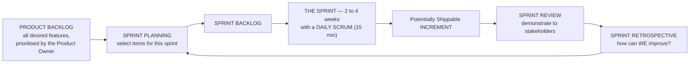

**The three roles:**

| Role | Responsibility |
|---|---|
| **Product Owner** | Owns and **prioritises the Product Backlog**; represents the customer and the business; decides **WHAT** is built |
| **Scrum Master** | A **servant-leader and facilitator** — removes impediments, coaches the team, protects it from interference. **NOT a project manager** and does not assign work |
| **Development Team** | **Self-organising and cross-functional**, typically 5–9 people; decides **HOW** the work is done |

**The artefacts:** the **Product Backlog** (everything wanted, prioritised) · the **Sprint Backlog** (what this sprint will deliver) · the **Increment** (the working software produced) · and the **Definition of Done**.

**The ceremonies:** **Sprint Planning** · the **Daily Scrum / stand-up** (15 minutes: *what did I do yesterday, what will I do today, what is blocking me?*) · the **Sprint Review** (demonstrate the increment) · and the **Sprint Retrospective** (improve the process).

#### Extreme Programming (XP)

> **XP is an Agile framework that focuses on ENGINEERING PRACTICES and technical excellence**, taking recognised good practices to an "extreme" level — *if code review is good, review continuously through **pair programming**; if testing is good, test **before** writing the code*.

| Practice | Description |
|---|---|
| **Pair programming** | **Two developers at one keyboard** — one writes ("driver"), one reviews ("navigator"), swapping regularly. Continuous review catches defects immediately |
| **Test-Driven Development (TDD)** | **Write the FAILING TEST FIRST**, then write just enough code to pass it, then refactor. Guarantees complete test coverage and drives better design |
| **Continuous Integration** | Integrate and **build and test many times a day**, so integration problems surface within hours, not months |
| **Refactoring** | Continuously improve the internal structure **without changing behaviour** |
| **Simple design** | Build the **simplest thing that works** — "You Aren't Gonna Need It" |
| **Small releases** | Ship frequently |
| **On-site customer** | A real customer representative **available to the team at all times** |
| **Collective code ownership** | **Anyone may change any code** — no silos |
| **Coding standards** | One consistent style across the team |
| **Sustainable pace** | **40-hour week** — no sustained overtime, because tired developers write defects |
| **Metaphor** | A shared simple story of how the system works |
| **Planning game** | Business and development jointly plan releases and iterations |

**The five XP values:** **Communication, Simplicity, Feedback, Courage and Respect.**

#### Agile vs Waterfall — the key comparison

| Point | **WATERFALL** | **AGILE** |
|---|---|---|
| **Approach** | **Linear and SEQUENTIAL** | **ITERATIVE and INCREMENTAL** |
| **Requirements** | **Fixed and frozen** at the start | **Evolve continuously**; change is **welcomed** |
| **Working software delivered** | **Only at the END** | **Every 2–4 weeks** |
| **Customer involvement** | At the **beginning and the end only** | **CONTINUOUS** — the customer is part of the team |
| **Flexibility to change** | ❌ **Very rigid** — change is costly and resisted | ✅ **Highly flexible** — change is expected |
| **Testing** | A **separate phase at the END** | **CONTINUOUS**, within every iteration |
| **Documentation** | **Heavy and formal** | **Light** — only what adds value |
| **Risk** | **HIGH** — problems surface late | **LOW** — problems surface within weeks |
| **Team structure** | Hierarchical, specialised roles | **Self-organising, cross-functional** |
| **Project size** | Better for **small, well-defined** projects | Better for **medium to large, evolving** projects |
| **Cost/schedule predictability** | Predictable **on paper**, often wrong in practice | Each sprint is predictable; the total scope is flexible |
| **Feedback loop** | Months | **Days** |
| **Best when** | Requirements are **clear, stable and unlikely to change**; regulatory sign-off is required; the technology is well understood | Requirements are **unclear or likely to change**; time to market matters; the customer is available |
| **Examples** | Government contracts with fixed specifications, safety-critical embedded systems | Web and mobile applications, start-up products, evolving business systems |

#### How Agile addresses Waterfall's limitations — the critical analysis

| Waterfall's limitation | How Agile addresses it |
|---|---|
| **No working software until the end** | ✅ **A working increment EVERY sprint** — the customer sees real software within weeks |
| **Requirements frozen at the start** | ✅ The backlog is **re-prioritised every sprint**; change is explicitly welcomed |
| **Very high cost of change** | ✅ Change is absorbed by **re-prioritising the next sprint** — nothing has to be undone |
| **Testing only at the end** | ✅ **Continuous testing and CI**; defects are found within hours |
| **Customer absent during development** | ✅ **Daily collaboration** and a **Sprint Review every iteration** |
| **Risks discovered late** | ✅ **Short feedback loops** expose risk immediately |
| **Heavy documentation that goes stale** | ✅ **Working software is the measure of progress**; documentation is kept minimal and current |
| **Late discovery that the product is wrong** | ✅ **Fail fast and cheaply** — a wrong direction is discovered after one sprint, not after a year |

> **The balanced conclusion for a "critically analyse" question:** *Agile is not universally superior. It **requires** continuous customer availability, an experienced and disciplined team, and tolerance for an uncertain final scope — and it produces less documentation, which is a genuine problem for systems that must be maintained for twenty years or audited by a regulator. **Waterfall remains appropriate where the requirements genuinely are stable and where formal, phase-by-phase sign-off is contractually or legally required.** The correct answer to "which is better" is always **"which fits this project?"***

#### Which model to choose — the decision

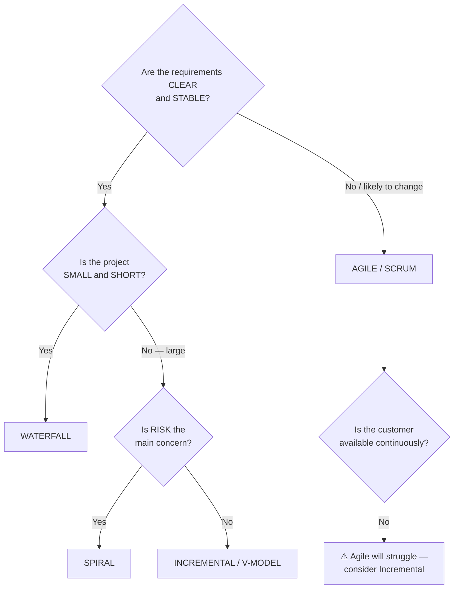

> **"Which model is most suitable when a company has only a FEW MONTHS to complete a project?"**
> ### ✅ **AGILE (Scrum), or the RAD/Prototype model.**
>
> **Reasons:** Agile delivers **working software from the first sprint**, so there is something usable even if time runs out; **parallel work** and short cycles compress the schedule; **continuous feedback** prevents weeks being wasted on the wrong thing; and **priority-driven delivery** ensures the **most valuable features are built first**, so the deadline is met with the most important functionality complete. Waterfall would consume most of the available months on analysis and design, with nothing demonstrable and enormous risk.

**Previous Year Question List from this Topic:**

- [Critically analyze the limitations of the Waterfall model and explain how Agile methodologies address those limitations.](../written-answers/software-engineering.md?plain=1#L142)
- [Why agile model is better than waterfall model?](../written-answers/software-engineering.md?plain=1#L352)
- [a) What are the advantages and disadvantages of the Agile Model compared to the Waterfall Model in software development?](../written-answers/software-engineering.md?plain=1#L408)
- [Write down the differences between Agile model and Waterfall model in Software development. What is white box testing?](../written-answers/software-engineering.md?plain=1#L455)
- [Which SDLC do you prefer between Agile and waterfall model explain with example.](../written-answers/software-engineering.md?plain=1#L712)
- [(a) What do you understand by Agile? Mention its four values.](../written-answers/software-engineering.md?plain=1#L894)
- [How does agile methodology used in software development differ from that of waterfall methodology? Explain in brief.](../written-answers/software-engineering.md?plain=1#L1238)
- [(ক) Software development এর Agile পদ্ধতির মূলনীতিগুলো লিখুন।](../written-answers/software-engineering.md?plain=1#L1526)
- [What is the principles of agile method?](../written-answers/software-engineering.md?plain=1#L1813)
- [(ii) Software development এর Agile Method সম্পর্কে আলোচনা করুন।](../written-answers/software-engineering.md?plain=1#L2133)
- [(a) What is Agile? Mentionits four values.](../written-answers/software-engineering.md?plain=1#L2200)
- [What is Agile Methodology? Difference between Agile Model and Waterfall Model.](../written-answers/software-engineering.md?plain=1#L2373)
- [(খ) Software Development এর ক্ষেত্রে Agile মডেল সম্পর্কে লিখুন। অন্যান্য মডেলের তুলনায় এ মডেলের সুবিধা কি?](../written-answers/software-engineering.md?plain=1#L2551)
- [What is the SCRUM method in software development?](../written-answers/software-engineering.md?plain=1#L2615)
- [Write the agile method components for Software development.](../written-answers/software-engineering.md?plain=1#L2771)
- [Explain extreme programming.](../written-answers/software-engineering.md?plain=1#L2853)
- [(d) Compare Agile model and Waterfall model of software development. (5 marks)](../written-answers/software-engineering.md?plain=1#L3059)
- [Which software development model is more suitable when a company has only a few months to complete a project: Agile or Waterfall? Justify your answer.](../written-answers/software-engineering.md?plain=1#L3072)


---

### Other SDLC Models

#### The Spiral Model

> The **SPIRAL MODEL (Boehm, 1986)** combines the **iterative nature of prototyping** with the **systematic control of the waterfall**, and is distinguished by its explicit, central focus on **RISK ANALYSIS**.

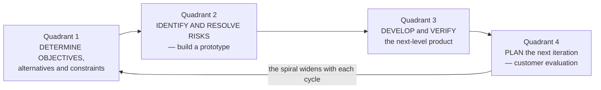

**The four quadrants of every loop:**

| Quadrant | Activity |
|---|---|
| **1. Objective setting** | Determine objectives, alternatives and constraints for this cycle |
| **2. RISK ASSESSMENT and reduction** ⭐ | **Identify risks, analyse them, and build a PROTOTYPE or simulation to resolve the biggest one.** *This quadrant is what makes the model distinctive* |
| **3. Development and validation** | Develop and test the deliverable for this cycle |
| **4. Planning** | Review with the customer and plan the next loop |

**Advantages:** **explicit, systematic risk management** — the most important benefit · suitable for **large, complex, high-risk projects** · **early prototypes** reduce uncertainty · requirements may be refined between cycles · strong customer involvement at each loop.

**Disadvantages:** **expensive** · requires **genuine risk-assessment expertise**, which is rare · **complex to manage** · the **end is not clearly defined** — the spiral could continue indefinitely · **not suitable for small or low-risk projects**, where the overhead dwarfs the benefit.

#### Waterfall vs Spiral

| Point | **Waterfall** | **Spiral** |
|---|---|---|
| **Approach** | Linear sequential | **Iterative, with cycles** |
| **Risk handling** | ❌ **None explicit** | ✅ **Central — a dedicated risk quadrant in every cycle** |
| **Prototyping** | ❌ No | ✅ **Yes, in every cycle** |
| **Customer involvement** | Start and end only | **At the end of every loop** |
| **Requirement changes** | ❌ Very difficult | ✅ Accommodated between cycles |
| **Cost** | Lower | **Higher** |
| **Complexity** | Simple | **Complex** |
| **Suitable for** | Small projects with clear requirements | **Large, expensive, HIGH-RISK projects** |
| **End point** | Clearly defined | Not clearly defined |

#### The Prototype Model

> A **PROTOTYPE is a WORKING MODEL of the system, built quickly and cheaply, that demonstrates the key functionality and user interface so that the customer can SEE and EVALUATE it before the real system is built.**

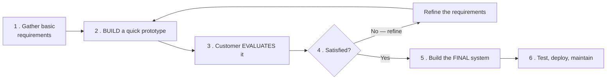

**The process:** gather initial requirements → **build a quick prototype** → the customer **uses and evaluates** it → **refine the requirements** based on what they discovered → repeat until satisfied → then engineer the real system.

| Type | Description |
|---|---|
| **Throwaway (Rapid) prototype** | Built quickly, used to clarify requirements, then **DISCARDED**; the real system is built properly |
| **Evolutionary prototype** | **Progressively refined into the final product** |
| **Incremental prototype** | Several prototypes for different subsystems, later integrated |
| **Extreme prototype** | Used in web development — a static UI, then a simulated service layer, then the real one |

**Advantages:** **users see and use something early**, so misunderstandings surface immediately · **requirements become clear** where they were vague · **reduced risk of building the wrong thing** · **higher user satisfaction and buy-in** · missing functionality is identified early.

**Disadvantages:** the customer may **mistake the prototype for the finished product** and demand immediate delivery · developers may be tempted to **build on a throwaway prototype's poor foundations**, creating permanent technical debt · **scope creep** as users keep asking for "just one more thing" · **cost of building something that is then discarded** · and it can encourage **insufficient analysis**.

#### Product vs Process

| Point | **Product** | **Process** |
|---|---|---|
| **What it is** | **WHAT is delivered** — the software itself, plus its documentation and data | **HOW it is produced** — the sequence of activities, methods and practices |
| **Focus** | The **outcome** | The **method** |
| **Measured by** | Functionality, reliability, usability, performance | Efficiency, predictability, maturity (**CMMI**) |
| **Examples** | The completed banking application, the SRS, the user manual | SDLC, Agile, Scrum, code review, testing procedure |
| **Relationship** | A **good process makes a good product far more likely** — but does not guarantee it. A poor process can still produce a good product by heroic effort, but not repeatably | |

#### Software evolution

> **Software EVOLUTION is the continual process of developing and CHANGING software over its lifetime**, in response to changing requirements, environments and understanding.

**Lehman's laws of software evolution** — the essential ones:
1. **Continuing change** — a system **must continually adapt or it becomes progressively less useful**.
2. **Increasing complexity** — as a system evolves, **its complexity INCREASES unless deliberate work is done to reduce it**.
3. **Declining quality** — a system's quality **declines** unless it is rigorously maintained and adapted.

> **The practical lesson:** software is never "finished". A system that is not maintained does not stay the same — **it becomes worse**, because the world around it changes. This is the fundamental justification for a maintenance budget.

#### The comparison of all the models

| Model | Approach | Requirements | Risk handling | Customer involvement | Best for |
|---|---|---|---|---|---|
| **Waterfall** | Linear | **Fixed** | Poor | Low | Small, clear, stable projects |
| **V-Model** | Linear, with testing planned in parallel to each phase | Fixed | Medium | Low | Safety-critical systems |
| **Incremental** | Builds in increments | Partly flexible | Medium | Medium | Medium projects with a clear core |
| **Iterative** | Repeated cycles refining the whole | Flexible | Medium | Medium | Evolving systems |
| **Prototype** | Build-evaluate-refine | **Unclear at the start** | Medium | **High** | When requirements are vague |
| **Spiral** | Iterative + risk analysis | Flexible | ✅ **Excellent** | High | **Large, high-risk, expensive** |
| **RAD** | Rapid, component-based | Flexible | Medium | **Very high** | Short deadlines, modular systems |
| **Agile/Scrum** | Iterative sprints | **Continuously evolving** | Good | ✅ **Continuous** | **Most modern projects** |
| **DevOps** | Continuous delivery | Continuous | Good | Continuous | Cloud/SaaS products |

**Previous Year Question List from this Topic:**

- [(খ) Spiral Model চিত্রসহ ব্যাখ্যা করুন।](../written-answers/software-engineering.md?plain=1#L580)
- [(খ) System/Model Prototype বলতে কী বুঝায়? Product ও Process এর মধ্যে সম্পর্ক কী?](../written-answers/software-engineering.md?plain=1#L1656)
- [Difference between Waterfall Model and Spiral Model.](../written-answers/software-engineering.md?plain=1#L1750)
- [From the diagram write down the process of prototype development.](../written-answers/software-engineering.md?plain=1#L1886)
- [From the diagram write down the software evolution.](../written-answers/software-engineering.md?plain=1#L1970)
- [Define software engineering according to IEEE. What is SDLC? Describe any two SDLC.](../written-answers/software-engineering.md?plain=1#L2959)

**Previous Year MCQ List from this Topic:**

- [In which model prototype can be developed?](../mcq-answers/software-engineering.md?plain=1#L321)
- [A branch office, location or other data processing centers, where a newly developed system is used under normal operating conditions for several months, to test…](../mcq-answers/software-engineering.md?plain=1#L258)


---

### Requirements Engineering, the SRS and Project Scheduling

#### Requirements engineering

> **REQUIREMENTS ENGINEERING is the process of ELICITING, ANALYSING, SPECIFYING, VALIDATING and MANAGING what a system must do.** It is the phase where errors are **cheapest to fix and most expensive to miss** — a requirements defect found in production costs roughly **100 times** more than one found here.

| Type | Meaning | Example |
|---|---|---|
| ⭐ **FUNCTIONAL requirements** | **WHAT the system must DO** — the features and behaviour | "The system shall allow a customer to transfer funds between accounts" |
| ⭐ **NON-FUNCTIONAL requirements** | **HOW WELL it must do it** — the quality attributes and constraints | "The transfer shall complete within 2 seconds for 10,000 concurrent users" |
| **Domain requirements** | Derived from the business domain | Regulatory limits set by Bangladesh Bank |

> ⚠️ **The distinction matters for testing too: PERFORMANCE, LOAD, STRESS, SECURITY, USABILITY, COMPATIBILITY and RELIABILITY testing are all NON-FUNCTIONAL testing** — they check *how well*, not *what*.

#### ⭐ The characteristics of a good SRS (IEEE 830)

> A **Software Requirements Specification** is the formal, agreed statement of what will be built. To be usable it must have these properties:

| # | Characteristic | Meaning |
|---|---|---|
| **1** | **CORRECT** | Every requirement stated is one the system must actually meet |
| **2** | **UNAMBIGUOUS** | Each requirement has **exactly one interpretation** |
| **3** | **COMPLETE** | All requirements, responses and definitions are present |
| **4** | **CONSISTENT** | No requirement contradicts another |
| **5** | **RANKED** for importance and stability | Each is marked essential / desirable / optional |
| **6** | ⭐ **VERIFIABLE** | ⭐ **There exists a FINITE, COST-EFFECTIVE PROCESS by which a person or machine can CHECK that the system meets the requirement** |
| **7** | **MODIFIABLE** | Structured so changes can be made cleanly |
| **8** | **TRACEABLE** | Each requirement can be traced forward to design, code and tests, and backward to its origin |

> ### **"If EVERY requirement can be CHECKED BY A COST-EFFECTIVE PROCESS, then the SRS is ______"** → ### ✅ **VERIFIABLE.**
>
> ### **The practical test for verifiability — the single most useful idea here:**
> ```
>    ❌ NOT verifiable :  "The system shall have a GOOD user interface."
>                         "The response shall be FAST."
>                         "The system shall be USER-FRIENDLY."
>       — there is no measurement that settles whether these are met.
>
>    ✅ VERIFIABLE     :  "A trained user shall complete a fund transfer in under 60 seconds."
>                         "95 % of transactions shall return within 2 seconds under a
>                          load of 10,000 concurrent users."
>       — each can be measured, and the answer is yes or no.
> ```
> **Any requirement containing words like "good", "fast", "easy", "efficient", "user-friendly" or "flexible" is UNVERIFIABLE and must be rewritten with a NUMBER and a MEASUREMENT METHOD.**

#### Requirement elicitation techniques

**Interviews · questionnaires · workshops (JAD) · observation of current working · study of existing documents and systems · prototyping · use cases and user stories · brainstorming · surveys of similar systems.**

#### Project scheduling and estimation

> ### **"Which project-scheduling method can be applied to software development?"** → ### ✅ **BOTH PERT and CPM.**

| Technique | What it is |
|---|---|
| ⭐ **GANTT CHART** | ⭐ **A horizontal BAR CHART** — each task is a bar spanning its start and end dates. Shows **progress and overlap at a glance**; the standard project-tracking view |
| ⭐ **PERT — Program Evaluation and Review Technique** | ⭐ **A NETWORK diagram** using **PROBABILISTIC time estimates**: **Expected time tₑ = (Optimistic + 4 × Most likely + Pessimistic) / 6**. Suited to **research and development work where durations are uncertain** — which is exactly why it fits software |
| ⭐ **CPM — Critical Path Method** | ⭐ A network diagram using a **single DETERMINISTIC time estimate** per task. Identifies the ⭐ **CRITICAL PATH — the LONGEST path through the network, which determines the project's minimum duration.** Any delay on the critical path delays the whole project |
| **WBS — Work Breakdown Structure** | Hierarchical decomposition of the work into manageable tasks |
| **COCOMO** | Constructive Cost Model — estimates **effort and schedule from size**: Effort = a × (KLOC)^b |

> **PERT vs CPM in one line: PERT is EVENT-oriented and PROBABILISTIC (used when durations are uncertain); CPM is ACTIVITY-oriented and DETERMINISTIC (used when durations are well known, and it supports cost-time trade-off / crashing).** Modern tools blend the two, and "PERT/CPM" is usually treated as one technique.

**Key network terms:** **critical path** (longest path = project duration) · **float/slack** (how long a task may be delayed without delaying the project; **tasks on the critical path have ZERO float**) · **milestone** (a zero-duration checkpoint) · **dependency** (finish-to-start, etc.).

#### Which SDLC phase takes the most time?

> ### **"Which of the following requires the MOST TIME in the SDLC?"** → ### ✅ **TESTING.**
>
> Industry data consistently puts **testing and debugging at 40–50 % of total development effort** — more than coding itself. *(And if the **whole product lifetime** is counted rather than just development, **MAINTENANCE dominates everything**, at 60–80 % of total cost.)*

#### The SDLC phases — and what is NOT one

| ✅ **Genuine SDLC phases** | ❌ **NOT an SDLC phase** |
|---|---|
| Planning / Feasibility · **Requirement Analysis** · **Design** · Implementation (Coding) · **Testing** · Deployment · **Maintenance** | ⚠️ **"TEST CLOSURE"** — this is a phase of the **SOFTWARE TESTING LIFE CYCLE (STLC)**, not of the SDLC |

> **The STLC phases, for contrast:** Requirement Analysis → Test Planning → Test Case Development → Test Environment Setup → Test Execution → ⭐ **Test Closure**. **The STLC sits INSIDE the SDLC's testing phase** — which is exactly the confusion the MCQ exploits.

> ### **Two more phase-identification points:**
> - ### **"Programmers rough out the LOGIC they will use in the ______ stage"** → ### ✅ **DESIGN.** *(Logic is planned in design; it is written in implementation.)*
> - ### **"The Waterfall phase in which system DESIGN is prepared, helping to specify hardware and system requirements"** → ### ✅ **the MODELLING / SYSTEM DESIGN phase.**
> - ### **"How many steps in the Waterfall model?"** → ### ✅ **6** — Requirement analysis, System design, Implementation, Testing, Deployment, Maintenance. *(Some texts count 5 or 7 depending on whether planning and integration are listed separately; **6 is the standard examination answer**.)*

#### Porting

> ### **PORTING is the process of MAKING OBJECT CODE (or software) WRITTEN FOR ONE SYSTEM WORK ON ANOTHER TYPE OF SYSTEM** — a different processor, operating system or platform.

> ### **"The process of making object code from one system work on another type of system is called…"** → ### ✅ **PORTING.**
>
> **What makes software portable:** writing in a **high-level, standard language**, avoiding platform-specific system calls, isolating hardware dependencies behind an abstraction layer, and using **portable runtimes** — which is exactly why **Java's "Write Once, Run Anywhere" bytecode** and **.NET's IL** exist. **PORTABILITY is one of the six ISO 9126 quality characteristics**, and **ADAPTIVE MAINTENANCE is the category of maintenance that performs porting** when the environment changes.

**Previous Year MCQ List from this Topic:**

- [If every requirement can be checked by a cost-effective process, then software requirement specification (SRS) is called-](../mcq-answers/software-engineering.md?plain=1#L435)
- [The process of making object code form one system work on another type of system is called ________.](../mcq-answers/software-engineering.md?plain=1#L240)
- [Which of the following requires the most time in SDLC?](../mcq-answers/software-engineering.md?plain=1#L267)
- [Which of the following is not a Software Development Life Cycle Phase?](../mcq-answers/software-engineering.md?plain=1#L294)
- [Method used in writing and design of a program is termed as-](../mcq-answers/software-engineering.md?plain=1#L303)
- [Which of the following is a project scheduling method that can be applied to software development?](../mcq-answers/software-engineering.md?plain=1#L312)
- [________ is natural language statements that look like programming code.](../mcq-answers/software-engineering.md?plain=1#L249)


---

## Software Testing & Evaluation

### Software Testing — Fundamentals

#### What is software testing?

> **SOFTWARE TESTING is the process of EVALUATING a software system to detect the DIFFERENCE between the ACTUAL behaviour and the EXPECTED behaviour — that is, to find DEFECTS — and to assess whether the software meets its requirements and is fit for use.**

#### Why testing is important

1. **Finds defects before the customer does** — a defect found in testing costs a fraction of one found in production.
2. **Ensures the software meets the requirements.**
3. **Builds confidence and quality** — reliability, security, performance.
4. **Prevents costly and dangerous failures** — the Therac-25 radiation machine and the Ariane 5 rocket both failed because of untested software.
5. **Saves money** — the cost of fixing a defect rises **exponentially** through the lifecycle: **1× in requirements, 10× in design, 100× in production**.
6. **Protects reputation and legal position.**
7. **Verifies security** against attack.

#### Verification vs Validation — a key distinction

| Point | **VERIFICATION** | **VALIDATION** |
|---|---|---|
| **The question** | **"Are we building the product RIGHT?"** | **"Are we building the RIGHT product?"** |
| **Checks against** | The **SPECIFICATION and design documents** | The **CUSTOMER'S actual NEEDS** |
| **Focus** | **Process and internal consistency** | **The final product's fitness for purpose** |
| **Involves executing the code?** | ❌ **Usually NOT** — it is **STATIC** | ✅ **YES** — it is **DYNAMIC** |
| **Methods** | **Reviews, walkthroughs, inspections, desk checking, static analysis** | **Testing** — unit, integration, system, acceptance |
| **Performed by** | Developers, reviewers, QA | **Testers and END USERS** |
| **When** | **Throughout** development, at each phase | **After** the product (or increment) is built |
| **Cost of finding a defect** | **Lower** — found earlier | Higher |
| **Example** | Reviewing the design document against the SRS | The customer using the system and confirming it does what they needed |

> **The illustration that makes it click:** a team builds **exactly what the specification says** — the verification passes perfectly. But the specification itself misunderstood the customer's need. **Validation fails.** Verification catches implementation errors; **validation catches REQUIREMENTS errors** — which are the more expensive kind.

#### Effective vs Exhaustive testing

> **EXHAUSTIVE TESTING — testing every possible input and combination — is IMPOSSIBLE for any non-trivial program.**

**The arithmetic that proves it:** a function taking two 32-bit integers has **2³² × 2³² = 1.8 × 10¹⁹** possible input pairs. At one million tests per second, testing them all would take **over 580,000 years**. And that is one function, ignoring order, state and timing.

> **EFFECTIVE TESTING** therefore means **selecting the SMALLEST set of test cases that is MOST LIKELY to find the MOST defects**, using systematic techniques:

| Technique | Idea |
|---|---|
| **Equivalence partitioning** | Divide the input into classes that should behave identically, and test **one value from each** — if 1–100 is valid, test one value inside, one below, one above |
| **BOUNDARY VALUE ANALYSIS** ⭐ | **Defects cluster at boundaries.** For a valid range of 1–100, test **0, 1, 2, 99, 100, 101** |
| **Decision table testing** | Systematically cover combinations of conditions |
| **State transition testing** | Test the transitions of a state machine |
| **Error guessing** | Use experience to target likely weak spots — nulls, empty strings, zero, negatives |
| **Risk-based testing** | Test the **highest-risk and most-used** areas most thoroughly |
| **Pareto principle** | **80 % of defects are in 20 % of the modules** — concentrate there |

> **The seven testing principles worth citing:** (1) testing shows the **presence** of defects, never their absence; (2) **exhaustive testing is impossible**; (3) **early testing** saves time and money; (4) **defects cluster**; (5) the **pesticide paradox** — repeating the same tests stops finding new defects, so tests must be revised; (6) testing is **context dependent**; (7) **absence of errors is a fallacy** — a defect-free system that does not meet the user's needs is still useless.

**Previous Year Question List from this Topic:**

- [Explain Verification and Validation in Software Engineering. Discuss black-box testing and white-box testing with examples.](../written-answers/software-engineering.md?plain=1#L3196)
- [Verification and validation are two process areas at CMMI level 3. For both of these areas (a) provide a definition (b) a description of how you can fulfill the…](../written-answers/software-engineering.md?plain=1#L3841)
- [অথবা, (ক) Software testing কী? উহার গুরুত্ব আলোচনা করুন।](../written-answers/software-engineering.md?plain=1#L3941)
- [What is software testing? Discuss effective and exhaustive testing.](../written-answers/software-engineering.md?plain=1#L4058)
- [(a) Explain software validation, Verification and Modularity.](../written-answers/software-engineering.md?plain=1#L4288)
- [Software testing কত প্রকার ও কী কী? Testing এর ক্ষেত্রে Boundary Value Analysis (BVA) এবং Equivalence Partitioning কীভাবে কাজ করে?](../written-answers/software-engineering.md?plain=1#L4431)
- [Testing is an activity that is performed to verify correct behavior of a program. Testing should be conducted in all the stages of program development. Describe…](../written-answers/software-engineering.md?plain=1#L5339)

**Previous Year MCQ List from this Topic:**

- [Which is the correct definition of BUG?](../mcq-answers/software-engineering.md?plain=1#L90)
- [Test case is written by-](../mcq-answers/software-engineering.md?plain=1#L193)
- [Which of the below testing is related to Non-functional testing?](../mcq-answers/software-engineering.md?plain=1#L72)
- [A Non-Functional Software testing is done to check if the user interface is easy to use and understand-](../mcq-answers/software-engineering.md?plain=1#L166)


---

### Black-Box, White-Box and Grey-Box Testing

#### The three approaches

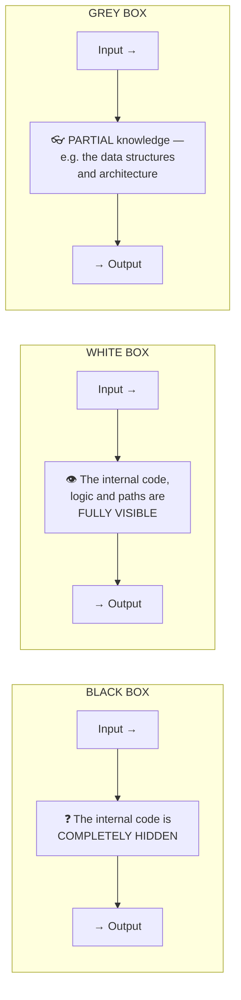

#### Black-box testing

> **BLACK-BOX TESTING examines the FUNCTIONALITY of software WITHOUT any knowledge of its internal code, structure or implementation.** The tester supplies inputs and checks whether the outputs match the specification.

**Also called:** functional testing, behavioural testing, specification-based testing, closed-box testing.

**Techniques:** **equivalence partitioning, boundary value analysis**, decision tables, state transition testing, use-case testing, error guessing.

#### White-box testing

> **WHITE-BOX TESTING examines the INTERNAL STRUCTURE, LOGIC and CODE of the software.** The tester knows exactly how it is implemented and designs tests to exercise specific **paths, branches and conditions**.

**Also called:** structural testing, glass-box, clear-box, open-box, code-based testing.

**Coverage criteria:**

| Criterion | Requires that … |
|---|---|
| **Statement coverage** | **Every line** of code is executed at least once |
| **Branch / Decision coverage** | **Every branch** (true and false) of every decision is taken |
| **Condition coverage** | Every **individual boolean sub-condition** takes both values |
| **Path coverage** | **Every possible path** through the code is executed — the strongest, and usually infeasible |
| **Loop coverage** | Loops are tested with 0, 1 and many iterations |

#### The key comparison

| Point | **BLACK-BOX** | **WHITE-BOX** |
|---|---|---|
| **Knowledge of internal code** | ❌ **NONE** | ✅ **COMPLETE** |
| **Based on** | **Requirements and specification** | **Code structure and logic** |
| **Also called** | Functional, behavioural | Structural, glass-box |
| **Performed by** | **Testers and end users** — no programming knowledge needed | **DEVELOPERS** — programming knowledge essential |
| **Focus** | **WHAT the software does** | **HOW it does it** |
| **Finds** | Missing functions, interface errors, wrong output, usability problems | **Logic errors, dead code, untested paths, hidden defects, security flaws** |
| **Cannot find** | **Hidden internal errors and untested code paths** | **MISSING requirements** — you cannot test code that was never written |
| **Test-case basis** | Input/output behaviour | Control flow and data flow |
| **Coverage measurement** | Difficult | ✅ **Measurable** — statement/branch/path coverage % |
| **Time required** | Less | More |
| **Applicable to** | Higher levels — **system, acceptance** | Lower levels — **unit, integration** |
| **Example** | Enter `-5` into an age field and check the error message | Verify that **both branches** of `if (age < 18)` are executed |

> **The complementary nature — the point to make in a comparison answer:** *black-box testing can never tell you whether **half your code was never executed**; white-box testing can never tell you that a **required feature is entirely missing**. Neither is sufficient alone — **a professional test strategy uses both**.*

#### Worked example — testing a square-root program

> **A program computes the square root of an input integer. If the input is negative, it prints "Error — negative input". Design black-box test cases.**

| # | Test case | Input | **Expected output** | Technique |
|---|---|---|---|---|
| 1 | A typical positive perfect square | 25 | 5 | Equivalence partitioning (valid class) |
| 2 | A typical positive non-square | 10 | 3.162… | Equivalence partitioning |
| 3 | **Zero — a boundary** | **0** | **0** | **Boundary value analysis** |
| 4 | **The smallest positive integer** | **1** | **1** | **Boundary value** |
| 5 | **The largest negative — the boundary of the error class** | **−1** | **"Error — negative input"** | **Boundary value** |
| 6 | A typical negative | −25 | "Error — negative input" | Equivalence partitioning (invalid class) |
| 7 | A very large value | 2,147,483,647 | The correct root, with no overflow | Boundary value (INT_MAX) |
| 8 | The most negative value | −2,147,483,648 | "Error — negative input" | Boundary (INT_MIN) |
| 9 | A non-integer input | "abc" | A sensible error, not a crash | Error guessing |
| 10 | Empty input | (nothing) | A sensible error | Error guessing |

> **The design reasoning to state:** the input domain splits into **two equivalence classes — negative and non-negative** — so one value is taken from each. Then, because **defects cluster at boundaries**, the values **−1, 0 and 1** around the dividing line are tested explicitly, along with the extremes of the integer range. This gives high confidence from only ten cases, instead of testing four billion inputs.

#### Grey-box testing

> **GREY-BOX TESTING combines the two: the tester has PARTIAL knowledge of the internals** — typically the architecture, the database schema and the data structures — **but not the full source code**. Tests are designed at the black-box level but **informed** by that internal knowledge.

| | Black-box | **Grey-box** | White-box |
|---|---|---|---|
| Internal knowledge | None | **Partial** | Complete |
| Performed by | Tester / user | **Tester with design knowledge** | Developer |
| Typical use | Acceptance, system | **Integration testing, security/penetration testing, web application testing** | Unit testing |

> **Why grey-box is valuable in practice:** knowing the database schema lets a tester design inputs that deliberately violate a constraint; knowing the architecture lets a penetration tester target the right endpoints. It gives **much better-targeted tests than pure black-box, at a fraction of the effort of full white-box analysis** — which is why most real-world **penetration testing and integration testing** is grey-box.

**Previous Year Question List from this Topic:**

- [Explain Verification and Validation in Software Engineering. Discuss black-box testing and white-box testing with examples.](../written-answers/software-engineering.md?plain=1#L3196)
- [What is Software testing? Difference between Black box testing and White box testing.](../written-answers/software-engineering.md?plain=1#L3660)
- [(d) What is the main difference between black box and white box testing?](../written-answers/software-engineering.md?plain=1#L3788)
- [অথবা, (ক) Black-box এবং White-box testing এর মধ্যে পার্থক্যগুলো লিখুন।](../written-answers/software-engineering.md?plain=1#L4001)
- [(b) Explain block box testing and white box testing.](../written-answers/software-engineering.md?plain=1#L4216)
- [(b) Explain the diference between black-box and White-box testing.](../written-answers/software-engineering.md?plain=1#L4374)
- [What is black box testing? Consider a program which computes the square root of an input integer between 0 and 5000. Determine the equivalence class test cases.…](../written-answers/software-engineering.md?plain=1#L4627)
- [Definition of Gray-box testing and Unit testing.](../written-answers/software-engineering.md?plain=1#L4720)
- [(i) Black Box testing and White Box testing এর মধ্যে পার্থক্য লিখুন।](../written-answers/software-engineering.md?plain=1#L4996)
- [(a) Distinguish between black box and white box testing. Give examples of both type of testing](../written-answers/software-engineering.md?plain=1#L5053)
- [Software development এ Black Box Testing বলতে কি বুঝায়?](../written-answers/software-engineering.md?plain=1#L5137)
- [Difference between black box and white box testing.](../written-answers/software-engineering.md?plain=1#L5964)

**Previous Year MCQ List from this Topic:**

- [Which of the following testing strategy is related to the boundary value analysis?](../mcq-answers/software-engineering.md?plain=1#L27)
- [Which of the following is the appropriate set of test cases, (A, B) when the part of a program shown is tested by decision condition coverage (branch coverage)?](../mcq-answers/software-engineering.md?plain=1#L99)
- [কোন Testing দিয়ে Input-Output ঠিক আছে কিনা বুঝা যায়?](../mcq-answers/software-engineering.md?plain=1#L148)
- [Cyclomatic complexity is a software metric used in _____](../mcq-answers/software-engineering.md?plain=1#L341)


---

### The Levels of Testing

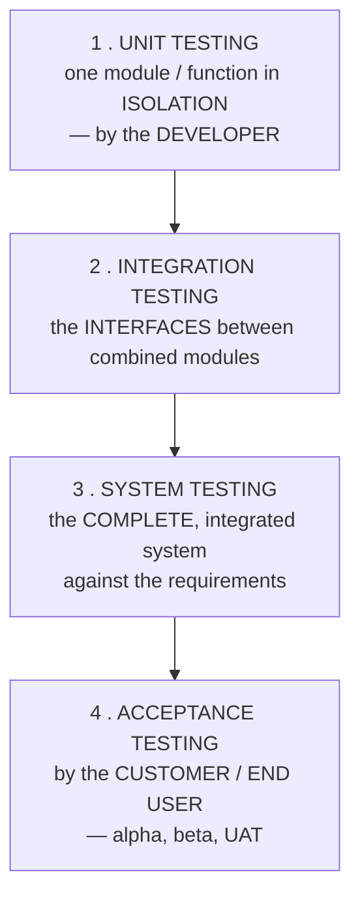

#### Unit Testing vs Integration Testing — the key comparison

| Point | **UNIT TESTING** | **INTEGRATION TESTING** |
|---|---|---|
| **What is tested** | A **SINGLE, smallest testable component** in **ISOLATION** — one function, method or class | The **INTERFACES and INTERACTIONS BETWEEN combined modules** |
| **Scope** | **Smallest** | Larger — two or more units together |
| **Performed by** | **DEVELOPERS** | Developers or testers |
| **Testing type** | **White-box** | **Grey-box** (and black-box) |
| **When** | **FIRST — as the code is written** | **After** unit testing passes |
| **Dependencies** | **Mocked or stubbed out** — the unit is deliberately isolated | **Real modules** are connected |
| **Finds** | Logic errors **inside** a single unit | **INTERFACE errors** — wrong parameters, mismatched data formats, incorrect assumptions between modules, communication failures |
| **Speed** | **Very fast** — milliseconds; thousands run in seconds | Slower |
| **Ease of locating a defect** | ✅ **Easy** — the defect is in that one unit | Harder — it may be in either module or the interface |
| **Tools** | JUnit, NUnit, pytest, Jest | JUnit + Spring Test, Postman, SoapUI |
| **Example** | Test that `calculateInterest(1000, 5, 1)` returns 50 | Test that the **payment module correctly passes the amount to the accounting module**, and that the accounting module records it |

> **The essential insight: a program can pass EVERY unit test and still fail completely.** Each module may be individually perfect, yet one sends the amount in **taka** while the other expects **paisa**; or one returns a date as `DD/MM/YYYY` and the other parses it as `MM/DD/YYYY`. **Unit testing can never find these — only integration testing can.**

#### Integration testing approaches

| Approach | Method | Needs |
|---|---|---|
| **Big Bang** | Combine **everything at once** and test | ❌ Poor — defect isolation is very hard |
| **Top-Down** | Test the top modules first, replacing the lower ones with **STUBS** | **Stubs** (dummy called modules) |
| **Bottom-Up** | Test the lowest modules first, using **DRIVERS** to call them | **Drivers** (dummy calling modules) |
| **Sandwich / Hybrid** | Both directions simultaneously, meeting in the middle | Stubs and drivers |
| **Incremental** | Add one module at a time | The safest — a new defect must be in the newly added module |

> **Stub vs Driver:** a **STUB** replaces a module that is **CALLED BY** the module under test (used in **top-down**); a **DRIVER** replaces a module that **CALLS** the module under test (used in **bottom-up**).

#### System testing

Tests the **complete, fully integrated system** as a whole, against the **requirements specification**. It is **black-box** and is performed by an **independent test team**. It includes **functional** testing and all the non-functional types: **performance, load, stress, security, usability, compatibility and recovery** testing.

#### Acceptance testing

The final level — **by the customer or end user**, to decide whether to **accept** the system.

| Point | **ALPHA Testing** | **BETA Testing** |
|---|---|---|
| **Performed by** | **Internal staff / an in-house test team** — sometimes internal users, but **NOT real customers** | **REAL END USERS / customers** |
| **Location** | ✅ **At the DEVELOPER'S site**, in a controlled lab environment | ✅ **At the USER'S own site**, in the real environment |
| **Environment** | Controlled, simulated | **Real, uncontrolled** |
| **Developers present?** | ✅ **Yes** — they can observe and fix immediately | ❌ **No** |
| **Stage** | **Before** beta — the first acceptance stage | **After** alpha, **before** the final release |
| **Testing type** | **Both white-box and black-box** | **Black-box only** |
| **Purpose** | Find defects **before** exposing the product to real customers | Find defects that only appear in **real-world use**, on **real hardware and networks**, and gather **user feedback** |
| **Reliability/security testing** | ✅ In depth | ❌ Not in depth |
| **Feedback loop** | Immediate | Collected and analysed |
| **Duration** | Weeks | Weeks to months |
| **Also called** | — | **Field testing, pre-release testing** |

> **How alpha testing is performed:** the development is essentially complete; an **internal QA team, working at the developer's own premises in a simulated user environment**, executes the full test suite plus exploratory testing. Defects are **logged and fixed in rapid cycles with the developers on hand**. When the defect rate drops to an acceptable level and all critical functions pass, the build is promoted to **beta** and released to a limited set of real users.

*(A **"gamma test"** is not part of the standard terminology; where it is used, it refers to a final check of the release candidate with **no further changes planned** other than critical fixes — essentially the release-readiness verification.)*

**UAT (User Acceptance Testing)** is performed by the **actual business users** against the **business requirements**, and its outcome is a formal **go/no-go decision**. It is the point at which **user acceptance is assured**.

**Previous Year Question List from this Topic:**

- [Explain the difference between Unit Testing and Integration Testing. (SO IT 25-07-2026)](../written-answers/software-engineering.md?plain=1#L3085)
- [Difference between Alpha tests, Beta test, gamma test in software development.](../written-answers/software-engineering.md?plain=1#L3271)
- [Given scenario of software engineering (Unit test, Regression Test, Smoke Test, Integration testing, Load Testing). Write the name of the testing and whether it…](../written-answers/software-engineering.md?plain=1#L3487)
- [6.5 Explain the difference between Unit Testing and Integration Testing.](../written-answers/software-engineering.md?plain=1#L3603)
- [How alpha testing is performed in software development?](../written-answers/software-engineering.md?plain=1#L4140)
- [Definition of Gray-box testing and Unit testing.](../written-answers/software-engineering.md?plain=1#L4720)
- [Integration testing of pharmaceutical automation software?](../written-answers/software-engineering.md?plain=1#L4777)
- [(ক) Software এর \alpha-version ও \beta-version কি?](../written-answers/software-engineering.md?plain=1#L4877)
- [(গ) Unit testing, Integration testing এবং Beta testing বলতে কি বুঝায়?](../written-answers/software-engineering.md?plain=1#L4931)
- [Briefly describe Unit testing, Smoke testing and Stress testing in software engineering.](../written-answers/software-engineering.md?plain=1#L5201)
- [Write different between Alpha and Beta testing.](../written-answers/software-engineering.md?plain=1#L5280)
- [What is Alpha and Beta testing?](../written-answers/software-engineering.md?plain=1#L5807)

**Previous Year MCQ List from this Topic:**

- [Integration testing is the process of testing the _____ between two software units or modules.](../mcq-answers/software-engineering.md?plain=1#L18)
- [Objective of integration testing is to find _____](../mcq-answers/software-engineering.md?plain=1#L36)
- [______ is a type of software testing where a group of individuals, usually from within the organization, use the software in a simulated or controlled environme…](../mcq-answers/software-engineering.md?plain=1#L45)
- [______ testing is a testing technique where the actual data verified in the real environment.](../mcq-answers/software-engineering.md?plain=1#L63)
- [Which of the following testing is also called Acceptance testing?](../mcq-answers/software-engineering.md?plain=1#L81)
- [________ is the final stage of the testing process conducted before software release. This is referred as:](../mcq-answers/software-engineering.md?plain=1#L112)
- [Software goes through a phase in which errors are verified and studied on simulated user environments. This is referred as-](../mcq-answers/software-engineering.md?plain=1#L121)
- [Modified software goes through a phase where it is tested in the user’s site or live environment. This is referred as-](../mcq-answers/software-engineering.md?plain=1#L130)
- [Testing of software with actual data and in actual environment is known as-](../mcq-answers/software-engineering.md?plain=1#L157)
- [Which kind of software testing strategy starts with testing the fundamental components first?](../mcq-answers/software-engineering.md?plain=1#L184)
- [A branch office, location or other data processing centers, where a newly developed system is used under normal operating conditions for several months, to test…](../mcq-answers/software-engineering.md?plain=1#L258)


---

### The Types of Testing

#### By purpose

| Type | Purpose |
|---|---|
| **Functional testing** | Does it do what the requirements say? |
| **Regression testing** ⭐ | **Re-running existing tests after a change, to confirm that NEW code has not BROKEN EXISTING functionality.** Essential after every bug fix and every enhancement — and the main reason test automation exists |
| **Smoke testing** | A **quick, shallow check that the BUILD IS STABLE ENOUGH TO TEST** — do the main functions work at all? Also called a **"build verification test"**. If smoke testing fails, the build is **rejected immediately** without wasting the test team's time |
| **Sanity testing** | A **narrow, deep** check that one **specific fix** works, after a minor change |
| **Performance testing** | Speed, responsiveness and stability under a given workload |
| **Load testing** | Behaviour under the **expected** load |
| **STRESS testing** | Behaviour **BEYOND the expected load — deliberately pushed until it BREAKS**, to find the breaking point and verify **graceful degradation and recovery** |
| **Volume testing** | Behaviour with a very large **amount of data** |
| **Security testing** | Resistance to attack |
| **Penetration testing** | An **authorised simulated ATTACK** to find exploitable vulnerabilities |
| **Usability testing** | Is it easy and pleasant to use? |
| **Compatibility testing** | Across browsers, devices, OS versions |
| **Recovery testing** | Can it recover from a crash or failure? |
| **Exploratory testing** | Simultaneous learning, test design and execution by a skilled tester |

> **Smoke vs Sanity — the distinction:** **Smoke testing is WIDE and SHALLOW** (does every major feature launch?); **sanity testing is NARROW and DEEP** (does this one repaired function now work correctly?). Smoke is done on a **new build**; sanity is done after a **minor fix**.

#### Penetration testing of a network service

> **PENETRATION TESTING is an AUTHORISED, simulated cyber-attack on a system, performed to identify and EXPLOIT vulnerabilities in the way a real attacker would, in order to assess the actual security risk.**

**How it differs from a vulnerability scan:** a **vulnerability assessment** *lists* potential weaknesses; a **penetration test actually EXPLOITS them** to prove they are real and to demonstrate the true impact. A scan says "port 22 runs an old SSH"; a pen test says "and here is the shell I obtained through it."

**The phases:** **Reconnaissance** (gather information) → **Scanning** (identify open ports and services) → **Gaining access** (exploit a vulnerability) → **Maintaining access** (persistence) → **Covering tracks** → **Reporting** (findings, evidence, risk rating and remediation advice).

**Types:** **Black-box** (no information given — simulates an external attacker) · **White-box** (full information — the most thorough) · **Grey-box** (partial — simulates an insider or a compromised low-privilege user).

> ⚠️ **Penetration testing MUST be conducted only with explicit WRITTEN AUTHORISATION and a defined scope.** Without it, the same activity is a criminal offence under the Cyber Security Act.

**Previous Year Question List from this Topic:**

- [Given scenario of software engineering (Unit test, Regression Test, Smoke Test, Integration testing, Load Testing). Write the name of the testing and whether it…](../written-answers/software-engineering.md?plain=1#L3487)
- [Briefly describe Unit testing, Smoke testing and Stress testing in software engineering.](../written-answers/software-engineering.md?plain=1#L5201)
- [(a) What is penetration testing for a network service? (2 marks)](../written-answers/software-engineering.md?plain=1#L6125)
- [How would you test an ATM in a banking system?](../written-answers/software-engineering.md?plain=1#L5431)
- [How would you test an ATM in a distributed system?](../written-answers/software-engineering.md?plain=1#L5677)

**Previous Year MCQ List from this Topic:**

- [Which of the following testing techniques includes how well the user will understand and interact with the system?](../mcq-answers/software-engineering.md?plain=1#L54)
- [Which of the below testing is related to Non-functional testing?](../mcq-answers/software-engineering.md?plain=1#L72)
- [________ is an integration testing that is commonly used when software products are being developed. It is designed as a pacing mechanism for time-critical proj…](../mcq-answers/software-engineering.md?plain=1#L139)
- [A Non-Functional Software testing is done to check if the user interface is easy to use and understand-](../mcq-answers/software-engineering.md?plain=1#L166)
- [The name of the testing which is done to make sure the existing features are not affected by new changes](../mcq-answers/software-engineering.md?plain=1#L175)


---

### Test Planning, Test Cases and Quality Assurance

#### Test Plan vs Test Case

| Point | **TEST PLAN** | **TEST CASE** |
|---|---|---|
| **What it is** | A **strategic DOCUMENT describing the SCOPE, APPROACH, RESOURCES and SCHEDULE of the entire testing effort** | A **specific set of INPUTS, execution conditions and EXPECTED RESULTS for ONE particular check** |
| **Level** | **High level — the whole project** | **Detailed — one scenario** |
| **Prepared by** | **Test manager / lead** | **Test engineer** |
| **Quantity** | **ONE per project** (or per release) | **Hundreds or thousands** |
| **Answers** | **WHAT will be tested, HOW, by WHOM, WHEN, and with what resources** | **What EXACTLY to do, and what should happen** |
| **Contents** | Objectives, scope (in and out), strategy, test types, environment, roles, schedule, entry/exit criteria, **risks**, deliverables | Test case ID, title, precondition, **test steps**, test data, **expected result**, actual result, status, priority |

**A test case template:**

| Field | Example |
|---|---|
| **Test Case ID** | TC_LOGIN_005 |
| **Title** | Login with an incorrect password |
| **Precondition** | The user account `rahim@bank.bd` exists and is active |
| **Test steps** | 1. Open the login page · 2. Enter username `rahim@bank.bd` · 3. Enter password `WrongPass123` · 4. Click **Login** |
| **Test data** | Username: rahim@bank.bd · Password: WrongPass123 |
| **Expected result** | Login is **rejected**; the message **"Invalid username or password"** is displayed; the user remains on the login page; the failed attempt is **logged** and the attempt counter increments |
| **Actual result** | *(filled in during execution)* |
| **Status** | Pass / Fail |
| **Priority** | High |

> **Note the deliberately generic error message** — "Invalid username **or** password" rather than "Invalid password". Revealing which one was wrong lets an attacker **enumerate valid usernames**, so the vague message is a **security requirement**, and a good test case checks for it.

#### Worked example — a test plan for a 4-digit banking PIN

> **A banking application requires a 4-digit PIN for login. If a wrong PIN is entered, an error message must be displayed. Design the test cases.**

| # | Test case | Input | **Expected result** |
|---|---|---|---|
| 1 | **Valid PIN** | 1234 (correct) | ✅ Login successful; the account page opens |
| 2 | **Incorrect PIN** | 5678 (wrong) | ❌ "Invalid PIN. Please try again." · attempt counter = 1 |
| 3 | **Boundary: too few digits** | 123 | "PIN must be exactly 4 digits" · the Login button stays disabled |
| 4 | **Boundary: too many digits** | 12345 | The field accepts **only 4 characters** (input is truncated) |
| 5 | **Empty input** | (blank) | "PIN is required" |
| 6 | **Non-numeric input** | ab12 | Letters are **rejected at the keystroke**; numeric keypad only |
| 7 | **Special characters** | 12#$ | Rejected |
| 8 | **Leading zeros** | 0012 (correct) | ✅ Accepted — leading zeros are **significant** and must not be stripped |
| 9 | **3 consecutive wrong attempts** | Wrong × 3 | ❌ **Account is LOCKED**; "Account locked. Contact your branch." · an alert is sent to the customer |
| 10 | **Correct PIN after 2 wrong attempts** | Wrong, wrong, correct | ✅ Login succeeds and the **counter RESETS to 0** |
| 11 | **PIN masking** | Any input | Digits are displayed as **••••**, never in clear text |
| 12 | **Security: PIN in the URL or logs** | Any login | The PIN **never appears** in the URL, browser history, or any log file |
| 13 | **Transmission** | Any login | The PIN is sent **only over HTTPS**, and is **hashed/encrypted**, never in plaintext |
| 14 | **Session timeout** | Idle for the timeout period | The session expires and the PIN must be re-entered |
| 15 | **Brute force / rate limiting** | Rapid automated attempts | Requests are **throttled**; a CAPTCHA or lockout triggers |

> **The structure of a good answer:** cover **(a) the positive case**, **(b) the negative cases**, **(c) the BOUNDARY cases** (3 and 5 digits around the required 4), **(d) invalid data types**, and **(e) the SECURITY cases**. Candidates who list only "right PIN / wrong PIN" lose most of the marks; the boundary and security cases are what demonstrate testing knowledge.

#### Worked example — testing a sorting algorithm

```java
import static org.junit.Assert.*;
import org.junit.Test;
import java.util.Arrays;

public class SortTest {

    @Test
    public void testNormalCase() {
        int[] input    = {5, 2, 9, 1, 7};
        int[] expected = {1, 2, 5, 7, 9};
        sort(input);
        assertArrayEquals(expected, input);
    }

    @Test
    public void testAlreadySorted() {                // BEST case
        int[] input = {1, 2, 3, 4, 5};
        sort(input);
        assertArrayEquals(new int[]{1,2,3,4,5}, input);
    }

    @Test
    public void testReverseSorted() {                // WORST case
        int[] input = {5, 4, 3, 2, 1};
        sort(input);
        assertArrayEquals(new int[]{1,2,3,4,5}, input);
    }

    @Test
    public void testEmptyArray() {                   // BOUNDARY
        int[] input = {};
        sort(input);
        assertEquals(0, input.length);
    }

    @Test
    public void testSingleElement() {                // BOUNDARY
        int[] input = {42};
        sort(input);
        assertArrayEquals(new int[]{42}, input);
    }

    @Test
    public void testAllIdentical() {                 // EDGE case
        int[] input = {7, 7, 7, 7};
        sort(input);
        assertArrayEquals(new int[]{7,7,7,7}, input);
    }

    @Test
    public void testWithDuplicates() {
        int[] input = {3, 1, 3, 2, 1};
        sort(input);
        assertArrayEquals(new int[]{1,1,2,3,3}, input);
    }

    @Test
    public void testNegativeNumbers() {              // often forgotten!
        int[] input = {-5, 3, -1, 0, 2};
        sort(input);
        assertArrayEquals(new int[]{-5,-1,0,2,3}, input);
    }

    @Test
    public void testExtremeValues() {                // BOUNDARY of the type
        int[] input = {Integer.MAX_VALUE, Integer.MIN_VALUE, 0};
        sort(input);
        assertArrayEquals(new int[]{Integer.MIN_VALUE, 0, Integer.MAX_VALUE}, input);
    }

    @Test
    public void testLargeArray() {                   // PERFORMANCE
        int[] input = new java.util.Random().ints(100000).toArray();
        long start = System.currentTimeMillis();
        sort(input);
        long time = System.currentTimeMillis() - start;
        assertTrue("Sorting took too long: " + time + "ms", time < 5000);
        for (int i = 1; i < input.length; i++)
            assertTrue("Not sorted at index " + i, input[i-1] <= input[i]);
    }
}
```

> **The categories a complete answer must cover:** the **normal case**, **already sorted** (best case), **reverse sorted** (worst case), **empty array**, **single element**, **all identical**, **duplicates**, **negative numbers**, **extreme values (INT_MIN/INT_MAX)** and a **large array for performance**. A generic verification loop — *"for every i, check `a[i-1] <= a[i]`"* — is also worth including, because it validates **any** input without hard-coding the expected array.

#### Worked example — how would you test an ATM?

**Functional tests:** valid card and PIN → login succeeds · invalid PIN → error, and lockout after 3 attempts · **cash withdrawal** — valid amount, amount exceeding the balance, amount exceeding the daily limit, amount not a multiple of the note denomination, insufficient cash in the machine · balance enquiry · mini statement · PIN change · fund transfer · cash deposit · card ejection and retention (card left in the slot).

**Boundary tests:** withdrawing exactly the balance, exactly the daily limit, the minimum (500) and maximum (20,000 or 50,000) amounts, and one taka over each limit.

**Non-functional tests:**
- **Security** — the PIN must be **encrypted end to end** and never logged; anti-skimming; the receipt must show only a **masked account number**; the session must time out if the user walks away.
- **Performance** — the response time for each operation; behaviour under a queue of consecutive users.
- **Reliability and recovery** — ⭐ **the critical ATM test: what happens if the POWER FAILS or the NETWORK DROPS mid-transaction, AFTER the account is debited but BEFORE the cash is dispensed?** The transaction **must be reversed automatically** and the customer's money restored. This is the most important test an ATM can have, and it is what **ACID transactions and reversal logs** exist for.
- **Concurrency** — the same account accessed from two ATMs simultaneously.
- **Usability** — screen readability, multi-language (Bangla/English), audio for visually impaired users, timeout warnings.
- **Hardware** — card reader, cash dispenser, printer out of paper, cash cassette empty, sensor faults.

**In a distributed system**, add: **network partition** handling; **transaction consistency** across the ATM, the switch (NPSB) and the core banking system; **idempotency** — a retried request must not debit twice; **timeout and reconciliation**; behaviour when the **core banking system is down** (offline/stand-in mode with limits); and **settlement and reconciliation** at end of day.

#### Software Quality Assurance (SQA)

> **SQA is a SYSTEMATIC, PLANNED set of activities that ensures software PROCESSES and PRODUCTS conform to defined requirements, standards and procedures.** It is **PROCESS-oriented and PREVENTIVE** — its aim is to stop defects being created in the first place.

#### QA vs QC vs Testing

| Point | **Quality Assurance (QA)** | **Quality Control (QC)** | **Testing** |
|---|---|---|---|
| **Focus** | The **PROCESS** | The **PRODUCT** | The product |
| **Aim** | **PREVENT** defects | **DETECT** defects | **FIND** defects |
| **Nature** | **Proactive** | **Reactive** | Reactive |
| **Scope** | The whole **lifecycle** | The **finished output** | Execution of the software |
| **Responsibility** | **Everyone** on the team | The **QC/testing team** | The testing team |
| **Activities** | Defining standards, process audits, training, **reviews and inspections**, process improvement | **Reviews, inspections, walkthroughs, testing** | Executing test cases |
| **Example** | Establishing a **code review policy** | **Reviewing** a specific module | Running the test suite |

> **The relationship: Testing ⊂ Quality Control ⊂ Quality Assurance.** QA sets the process; QC checks the output of that process; testing is one QC technique.

#### The quality review process

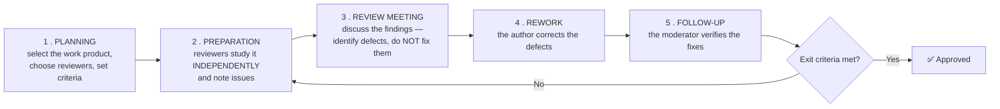

| Review type | Formality | Description |
|---|---|---|
| **Informal review** | Lowest | A colleague reads the work — cheap and useful |
| **Walkthrough** | Low | **The AUTHOR leads** the group through the document, explaining it |
| **Technical review** | Medium | Peers with technical expertise evaluate it |
| **INSPECTION** | **Highest** | A **formal process with defined roles** (moderator, author, reader, scribe), **entry and exit criteria**, checklists, and **metrics collected**. The most effective — and most expensive — form |

> **The single most important rule of a review meeting: FIND defects, do NOT FIX them, and review the PRODUCT, not the PERSON.** Discussing solutions in the meeting wastes everyone's time, and personal criticism destroys the honesty the process depends on.

**Why reviews matter:** they are a form of **VERIFICATION (static testing)** and find defects **before any code is executed** — including in the **requirements and design**, where defects are cheapest to fix and where testing cannot reach at all. Industry data consistently shows formal inspections removing **60–90 %** of defects, at a small fraction of the cost of finding them later.

#### The attributes of software quality

| Attribute | Meaning |
|---|---|
| **Correctness** | It does what the requirements specify |
| **Reliability** | It performs without failure for a specified time |
| **Efficiency** | Good use of CPU, memory, bandwidth |
| **Usability** | Easy to learn and to use |
| **Maintainability** | Easy to modify and fix |
| **Portability** | Runs in different environments |
| **Reusability** | Components can be reused |
| **Testability** | Easy to test |
| **Security** | Protects data and resists attack |
| **Scalability** | Handles growth |
| **Interoperability** | Works with other systems |

*(Standard models: **McCall's quality factors**, **Boehm's model** and **ISO/IEC 25010**.)*

#### What to check when PURCHASING a software system

> A frequently asked practical question. The evaluation should cover:

1. **Functional fit** — does it meet the **actual documented requirements**? Insist on a **demonstration with your own data**.
2. **Quality attributes** — reliability, performance under **your** expected load, security, usability.
3. **Vendor credibility** — track record, financial stability, **reference customers you can actually call**, local presence in Bangladesh.
4. **Total Cost of Ownership** — licence + implementation + customisation + training + **annual maintenance** + upgrades, over 5 years. Not just the sticker price.
5. **Support and SLA** — response times, local support availability, escalation path.
6. **Customisation and configurability** — how much can be changed without code?
7. **Integration** — does it expose **APIs**? Will it connect to your existing core systems?
8. **Scalability** — will it still work at three times today's volume?
9. **Security and compliance** — does it satisfy the **Bangladesh Bank ICT guideline / PCI-DSS** as applicable? Ask for audit reports.
10. **Data ownership and exit strategy** — **can you EXPORT your data if you leave?** This is the question most often forgotten and most expensive to discover later.
11. **Documentation and training** provided.
12. **Source code escrow** — protection if the vendor ceases trading.
13. **Licensing model** — per user, per server, subscription; and what happens on renewal.
14. **Upgrade path** and the product roadmap.
15. **A pilot / proof of concept** before full commitment.

#### Formative vs Summative evaluation

| Point | **FORMATIVE evaluation** | **SUMMATIVE evaluation** |
|---|---|---|
| **When** | **DURING** development or the learning process | **AT THE END** |
| **Purpose** | **To IMPROVE** — provide feedback while change is still possible | **To JUDGE** — measure the final outcome |
| **Nature** | Ongoing, diagnostic, developmental | Final, judgmental |
| **Stakes** | Low | **High** |
| **Analogy** | **A chef TASTING the soup while cooking** | **The guest TASTING the finished soup** |
| **In education** | Class tests, quizzes, assignments, feedback | **Final examination**, board exam |
| **In software** | Reviews, walkthroughs, sprint retrospectives, usability testing on prototypes | **Acceptance testing**, the final quality audit, post-implementation review |
| **Result used for** | **Correction and improvement** | **A decision — accept/reject, pass/fail** |

> **The relationship to testing:** **unit, integration and system testing are FORMATIVE** — they exist so that defects can be fixed. **User Acceptance Testing is SUMMATIVE** — its purpose is the accept/reject decision.

**Previous Year Question List from this Topic:**

- [ফরম্যাটিভ মূল্যায়ন (Formative Evaluation) বলতে কী বুঝায়?](../written-answers/software-engineering.md?plain=1#L3151)
- [What do you understand about software quality assurance (SQA)? While purchasing a software system for your company, as a SQA team leader what aspects will you l…](../written-answers/software-engineering.md?plain=1#L3338)
- [Match the table:](../written-answers/software-engineering.md?plain=1#L3402)
- [(ক) Software Quality Assurance বলতে কী বোঝায়? উহার Attribute গুলো আলোচনা করুন।](../written-answers/software-engineering.md?plain=1#L3551)
- [Define test plan and Test case.](../written-answers/software-engineering.md?plain=1#L3724)
- [(খ) Quality Control কাকে বলে? Quality review process কীভাবে কাজ করে?](../written-answers/software-engineering.md?plain=1#L4535)
- [Write code to test a sorting algorithm of array?](../written-answers/software-engineering.md?plain=1#L5567)
- [A program sorts an array of integer. Write down the code that tests the sorting algorithm of written in a program.](../written-answers/software-engineering.md?plain=1#L5860)
- [A program sorts an array of integer. Write down the code that tests the sorting algorithm of written](../written-answers/software-engineering.md?plain=1#L6021)

**Previous Year MCQ List from this Topic:**

- [Which of the following is the appropriate set of test cases, (A, B) when the part of a program shown is tested by decision condition coverage (branch coverage)?](../mcq-answers/software-engineering.md?plain=1#L99)
- [Test case is written by-](../mcq-answers/software-engineering.md?plain=1#L193)
- [ISO 9126 quality factors consist of –](../mcq-answers/software-engineering.md?plain=1#L386)


---

## Software Design, Architecture & Patterns

### Design Patterns

#### What is a design pattern?

> A **DESIGN PATTERN is a GENERAL, REUSABLE SOLUTION to a COMMONLY OCCURRING PROBLEM in software design.** It is **not finished code** — it is a **template or description** of how to solve a problem, which can be adapted to many situations.

> Popularised by the **"Gang of Four" (GoF)** book *Design Patterns: Elements of Reusable Object-Oriented Software* (Gamma, Helm, Johnson, Vlissides, 1994), which catalogued **23 patterns**.

**Why patterns matter:** they capture **proven solutions** so that problems need not be re-solved badly; and they provide a **shared vocabulary** — saying *"use a Factory here"* conveys in three words what would otherwise take a page of explanation.

#### The three categories

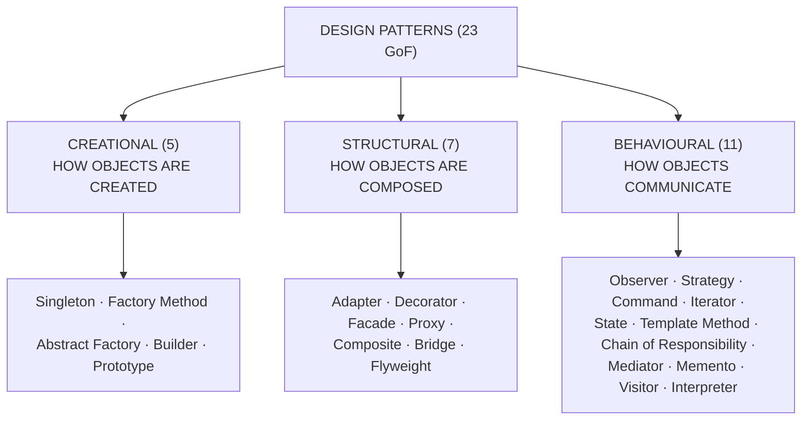

#### 1. SINGLETON (Creational)

> **Ensures a class has EXACTLY ONE instance, and provides a global point of access to it.**

**Used for:** a database connection pool, a logger, a configuration manager, a cache — anything of which there must be **only one**.

```java
public class DatabaseConnection {
    private static DatabaseConnection instance;      // the single instance

    private DatabaseConnection() {                   // ← PRIVATE constructor:
        System.out.println("Connection created");    //   nobody outside can 'new' it
    }

    public static synchronized DatabaseConnection getInstance() {
        if (instance == null) {                      // create it only ONCE
            instance = new DatabaseConnection();
        }
        return instance;
    }

    public void query(String sql) { System.out.println("Executing: " + sql); }
}

// Usage
DatabaseConnection db1 = DatabaseConnection.getInstance();
DatabaseConnection db2 = DatabaseConnection.getInstance();
System.out.println(db1 == db2);      // true — they are the SAME object
```

> **The mechanism: the constructor is PRIVATE**, so no other code can create an instance; the only way to obtain one is through the static `getInstance()`, which creates it on the first call and returns the same object thereafter. *(`synchronized` makes it thread-safe; the enum-based singleton is the cleanest fully-safe form in Java.)*

#### 2. FACTORY METHOD (Creational)

> **Defines an interface for creating an object, but lets SUBCLASSES decide WHICH CLASS to instantiate** — so the calling code is decoupled from the concrete classes.

```java
interface Shape { void draw(); }

class Circle    implements Shape { public void draw(){ System.out.println("Circle");    } }
class Rectangle implements Shape { public void draw(){ System.out.println("Rectangle"); } }
class Square    implements Shape { public void draw(){ System.out.println("Square");    } }

class ShapeFactory {
    public Shape getShape(String type) {
        if (type == null) return null;
        switch (type.toUpperCase()) {
            case "CIRCLE":    return new Circle();
            case "RECTANGLE": return new Rectangle();
            case "SQUARE":    return new Square();
            default:          return null;
        }
    }
}

// Usage — the CALLER never writes 'new Circle()'
ShapeFactory factory = new ShapeFactory();
Shape s = factory.getShape("CIRCLE");
s.draw();
```

> **The benefit:** adding a `Triangle` requires changing **only the factory** — every piece of calling code is untouched, because it only ever refers to the `Shape` interface.

#### 3. OBSERVER (Behavioural)

> **Defines a ONE-TO-MANY dependency so that when one object (the SUBJECT) changes state, ALL its DEPENDENTS (OBSERVERS) are NOTIFIED and updated automatically.**

**Used for:** event handling, MVC (the view observes the model), notification systems, publish-subscribe.

```java
import java.util.*;

interface Observer { void update(String news); }

class NewsChannel implements Observer {
    private String name;
    public NewsChannel(String name) { this.name = name; }
    public void update(String news) {
        System.out.println(name + " received: " + news);
    }
}

class NewsAgency {                                   // the SUBJECT
    private List<Observer> observers = new ArrayList<>();

    public void subscribe(Observer o)   { observers.add(o); }
    public void unsubscribe(Observer o) { observers.remove(o); }

    public void publish(String news) {               // notify EVERYONE
        for (Observer o : observers) o.update(news);
    }
}

// Usage
NewsAgency agency = new NewsAgency();
agency.subscribe(new NewsChannel("Channel 24"));
agency.subscribe(new NewsChannel("Somoy TV"));
agency.publish("Breaking: Budget announced");
// Channel 24 received: Breaking: Budget announced
// Somoy TV received: Breaking: Budget announced
```

#### 4. STRATEGY (Behavioural)

> **Defines a FAMILY OF ALGORITHMS, encapsulates each one, and makes them INTERCHANGEABLE at RUN TIME.**

```java
interface PaymentStrategy { void pay(double amount); }

class CardPayment  implements PaymentStrategy {
    public void pay(double a) { System.out.println("Paid " + a + " by card"); }
}
class BkashPayment implements PaymentStrategy {
    public void pay(double a) { System.out.println("Paid " + a + " via bKash"); }
}
class CashPayment  implements PaymentStrategy {
    public void pay(double a) { System.out.println("Paid " + a + " in cash"); }
}

class ShoppingCart {
    private PaymentStrategy strategy;
    public void setPaymentStrategy(PaymentStrategy s) { this.strategy = s; }
    public void checkout(double amount) { strategy.pay(amount); }
}

// Usage — the algorithm is chosen at RUN TIME
ShoppingCart cart = new ShoppingCart();
cart.setPaymentStrategy(new BkashPayment());
cart.checkout(1500);
```

> **What the pattern eliminates:** a growing `if (method == "card") … else if (method == "bkash") …` chain inside the cart. Adding a new payment method now means **adding a class, not editing existing code** — the **Open/Closed Principle** in action.

#### 5. ADAPTER (Structural)

> **Converts the interface of a class into ANOTHER interface that clients expect** — allowing classes with incompatible interfaces to work together.

```java
interface MediaPlayer { void play(String filename); }        // what the client expects

class Mp3Player implements MediaPlayer {
    public void play(String f) { System.out.println("Playing MP3: " + f); }
}

class Mp4Library {                                           // an INCOMPATIBLE library
    public void playMp4File(String filename) {
        System.out.println("Playing MP4: " + filename);
    }
}

class Mp4Adapter implements MediaPlayer {                    // the ADAPTER
    private Mp4Library library = new Mp4Library();
    public void play(String f) {
        library.playMp4File(f);                              // translate the call
    }
}
```

> **The analogy: a travel plug adapter.** It changes nothing about the device or the socket — it simply lets one work with the other. This is the standard pattern for **integrating a third-party or legacy library** whose interface you cannot change.

#### The other patterns worth naming

| Pattern | One-line purpose |
|---|---|
| **Abstract Factory** | Create **families** of related objects |
| **Builder** | Construct a complex object **step by step** |
| **Prototype** | Create objects by **cloning** an existing one |
| **Decorator** | **Add responsibilities to an object dynamically**, without subclassing |
| **Facade** | Provide a **simple unified interface** to a complex subsystem |
| **Proxy** | A **placeholder** controlling access to another object (lazy loading, security, caching) |
| **Composite** | Treat **individual objects and compositions uniformly** (a tree) |
| **Command** | **Encapsulate a request as an object** — enables undo, queuing, logging |
| **Iterator** | Access the elements of a collection **without exposing its structure** |
| **Template Method** | Define the **skeleton of an algorithm**, letting subclasses fill in steps |
| **State** | Let an object **change its behaviour when its internal state changes** |
| **Chain of Responsibility** | Pass a request **along a chain of handlers** |

#### Design patterns vs Architectural patterns

| | **Design pattern** | **Architectural pattern** |
|---|---|---|
| **Scope** | **Class and object** level | The **WHOLE SYSTEM** |
| **Concerns** | How a few objects collaborate | Overall structure and component organisation |
| **Examples** | Singleton, Observer, Factory, Strategy | **MVC, MVVM, Layered (3-tier), Microservices, Client-Server, Event-Driven, Pipe and Filter, SOA** |

#### The caution to state

> **Design patterns are tools, not goals.** Applying a pattern where a simple method call would do makes the code **more complex, not better** — a very common failing in junior work. The correct sequence is: **solve the problem simply; when you notice the same problem recurring, or the simple solution becoming rigid, recognise which pattern fits and refactor towards it.** A pattern should be the answer to a pressure you have actually felt, never a box to tick.

**Previous Year Question List from this Topic:**

- [(b) What is design pattern? List the basic design patterns with example codes. (5 marks)](../written-answers/software-engineering.md?plain=1#L6132)

**Previous Year MCQ List from this Topic:**

- [Design pattern for hierarchical structure is ______](../mcq-answers/software-engineering.md?plain=1#L406)
- [Which of the following is a design pattern?](../mcq-answers/software-engineering.md?plain=1#L415)
- [Which of the following is a design pattern?](../mcq-answers/software-engineering.md?plain=1#L424)


---

### Software Metrics — Coupling, Cohesion, Cyclomatic Complexity and Function Points

> **A SOFTWARE METRIC is a QUANTITATIVE MEASURE of some attribute of software or of the process that produces it.** Metrics exist because *"you cannot control what you cannot measure"* — they turn vague judgements about quality into numbers that can be tracked.

#### ⭐ Coupling and Cohesion — the two governing design metrics

| | ⭐ **COUPLING** | ⭐ **COHESION** |
|---|---|---|
| ⭐ **Definition** | ⭐ **The DEGREE OF INTERACTION / INTERDEPENDENCE BETWEEN TWO MODULES** — a qualitative measure of the **number of connections between a "calling" and a "called" module** | ⭐ **The degree to which the elements INSIDE a SINGLE module belong together** and serve one purpose |
| **Concerns** | **BETWEEN modules** (inter-module) | **WITHIN one module** (intra-module) |
| ### **Goal** | ### ⭐ **LOW (loose) coupling** | ### ⭐ **HIGH (strong) cohesion** |
| **Why** | So a change in one module does **not force changes in others** | So a module does **one thing well** and is easy to understand, test and reuse |

> ### **"The degree of interaction between two modules is known as…"** → ### ✅ **COUPLING.**
> ### **"…a qualitative measure that refers to the number of connections between a 'calling' and a 'called' module"** → ### ✅ **COUPLING.**
>
> ### **The single most quoted design rule in software engineering: "HIGH COHESION, LOW COUPLING."**

**Types of COUPLING — from best to worst:**

| Level | Type | Description |
|---|---|---|
| ✅ **Best** | **Data coupling** | Modules share only **simple data parameters** |
| | **Stamp coupling** | A whole **record/structure** is passed, though only part is used |
| | **Control coupling** | One module passes a **flag controlling the other's logic** |
| | **External coupling** | Shared external data format or device |
| | **Common coupling** | Modules share **global data** |
| ⚠️ **Worst** | **Content coupling** | One module **directly modifies the internals** of another |

**Types of COHESION — from best to worst:**

| Level | Type | Description |
|---|---|---|
| ✅ **Best** | **Functional cohesion** | Every element contributes to **ONE single well-defined task** |
| | **Sequential** | The output of one element is the input of the next |
| | **Communicational** | Elements operate on the **same data** |
| | **Procedural / Temporal** | Elements are grouped by order or by time (e.g. "initialisation") |
| | **Logical** | Elements do **similar kinds** of thing, selected by a flag |
| ⚠️ **Worst** | **Coincidental** | Elements are grouped for **no reason at all** — a "utilities" dumping ground |

#### Worked example — maximal cohesion connections

> **In a class definition with 10 methods, how many connections are required to make the class MAXIMALLY COHESIVE?**

```
   Maximum cohesion means EVERY method is connected to EVERY OTHER method.
   This is a COMPLETE GRAPH on 10 nodes, and the number of edges is:

        C(n, 2) = n(n − 1) / 2
                = 10 × 9 / 2
                = 90 / 2
                = 45
```
> ### ✅ **45 connections.**
>
> **The reasoning to state:** a connection between method A and method B is the **same** connection as between B and A, so the count is a **COMBINATION, not a permutation** — `¹⁰C₂ = 45`, not `¹⁰P₂ = 90`. *(This is the identical formula to the handshake problem.)*

#### ⭐ Cyclomatic Complexity

> ### **CYCLOMATIC COMPLEXITY (McCabe's metric) measures the NUMBER OF LINEARLY INDEPENDENT PATHS through a program's source code** — that is, its **decision complexity**.
>
> ### **It is a WHITE-BOX (structural) testing metric**, because it is computed from the **code's control-flow graph**, not from its specification.

> ### **"Cyclomatic complexity is a software metric used in…"** → ### ✅ **WHITE-BOX TESTING.**

**The three equivalent formulas:**
```
   ① V(G) = E − N + 2P        E = edges, N = nodes, P = connected components (usually 1)
   ② V(G) = P + 1             P = the number of PREDICATE (decision) nodes
   ③ V(G) = R                 R = the number of REGIONS in the planar control-flow graph
```

**Worked example:**
```c
if (a > b) {          // decision 1
    if (a > c)        // decision 2
        max = a;
    else
        max = c;
} else {
    max = b;
}
```
```
   Decision nodes P = 2      ⇒   V(G) = 2 + 1 = 3
   So THREE linearly independent paths exist, and a minimum of
   3 test cases is needed for full BRANCH coverage.
```

| V(G) | Risk | Interpretation |
|---|---|---|
| **1 – 10** | ✅ **Low** | Simple, well-structured; easy to test |
| **11 – 20** | Moderate | More complex |
| **21 – 50** | ⚠️ **High** | Should be refactored |
| **> 50** | ⚠️ **Untestable** | Break it up |

> ### **Why it matters practically: V(G) gives the MINIMUM NUMBER OF TEST CASES needed to cover every independent path**, so it tells a test manager how much testing a module actually requires — and it flags functions that are too tangled to maintain.

#### Function Point Analysis

> **FUNCTION POINTS (FP) measure the SIZE of software by what it DOES FOR THE USER, rather than by how many lines of code it contains.** This makes the measure **independent of the programming language**, which is why it is used for **estimating cost and effort before any code exists**.

**The five function types counted:** **External Inputs (EI)** · **External Outputs (EO)** · **External Inquiries (EQ)** · **Internal Logical Files (ILF)** · **External Interface Files (EIF)** — each weighted simple / average / complex to give the **Unadjusted Function Point (UFP)** count.

> ### ⭐ **VALUE ADJUSTMENT FACTORS (VAF)** then modify the raw count by **14 GENERAL SYSTEM CHARACTERISTICS**, which include ⭐ **the CRITICALITY OF PERFORMANCE and the REUSABILITY OF THE CODE**, as well as data communications, distributed processing, heavily used configuration, transaction rate, online data entry, end-user efficiency, online update, complex processing, installation ease, operational ease, multiple sites and facilitation of change.
>
> ```
>      Adjusted FP = UFP × [ 0.65 + 0.01 × Σ(the 14 factor ratings, each 0–5) ]
> ```

| Metric | Measures | Language dependent? |
|---|---|---|
| **LOC (Lines of Code)** | Physical size | ⚠️ **Yes** — 1 FP ≈ 320 LOC in assembly, ≈ 50 in Java |
| ⭐ **Function Points** | **Functionality delivered to the user** | ✅ **No** |
| **COCOMO** | Effort and schedule estimated **from** size | — |

> ⚠️ **Why LOC is a poor metric:** it **rewards verbosity** — a programmer who writes the same feature in half the code appears half as productive. Function points avoid this by measuring **what the software does**, not how much text it took.

#### ISO 9126 software quality model

> ### **ISO/IEC 9126 defines SIX software quality characteristics:**
>
> ### ⭐ **FUNCTIONALITY · RELIABILITY · USABILITY · EFFICIENCY · MAINTAINABILITY · PORTABILITY**

| Characteristic | Sub-characteristics |
|---|---|
| ⭐ **Functionality** | Suitability, accuracy, interoperability, **security**, compliance |
| ⭐ **Reliability** | Maturity, fault tolerance, recoverability |
| ⭐ **Usability** | Understandability, learnability, operability, attractiveness |
| ⭐ **Efficiency** | Time behaviour, resource utilisation |
| ⭐ **Maintainability** | Analysability, changeability, stability, testability |
| ⭐ **Portability** | Adaptability, installability, co-existence, replaceability |

> ⚠️ **A note on wording:** some question papers list the fourth characteristic as **"effectiveness"**. The **correct ISO 9126 term is EFFICIENCY**; "effectiveness" belongs to the later **ISO/IEC 25010** quality-in-use model, which superseded 9126 in 2011 and expanded the list to **eight** characteristics by adding **Security** and **Compatibility** as top-level items. **If the options offer "effectiveness" in place of "efficiency", that is the intended key — but the standard term is efficiency.**

#### Design documentation tools

| Tool | Purpose |
|---|---|
| ⭐ **DFD — DATA FLOW DIAGRAM** | ⭐ **Shows how DATA MOVES through a system** — processes, data stores, external entities and data flows. **Level 0 is the Context Diagram**; levels 1, 2 … decompose it |
| ⭐ **STRUCTURE CHART** | ⭐ **Shows the HIERARCHICAL organisation of MODULES** — which module calls which, and what is passed. It is the classic **hierarchical design** representation |
| **ER Diagram** | Data entities and their relationships |
| **UML** | Class, sequence, use-case, activity and state diagrams |
| **Flowchart** | The step-by-step logic of one process |
| ⭐ **PSEUDOCODE** | ⭐ **NATURAL-LANGUAGE STATEMENTS THAT LOOK LIKE PROGRAMMING CODE** — used to express an algorithm without the syntax of any real language |
| **Decision table / tree** | Complex combinations of conditions |
| **Data dictionary** | Definitions of every data element |

> ### **"DFD stands for"** → ### ✅ **DATA FLOW DIAGRAM.**
> ### **"______ is natural language statements that look like programming code"** → ### ✅ **PSEUDOCODE.**
> ### **"Design pattern for hierarchical structure"** → ### ✅ **STRUCTURE CHART** *(as the intended answer in this question set; note that in the Gang-of-Four sense the pattern for tree-like hierarchies is the **COMPOSITE** pattern — a structure chart is a **design DOCUMENTATION tool**, not a GoF design pattern).*

#### Top-down vs Bottom-up design

| | ⭐ **TOP-DOWN** | **BOTTOM-UP** |
|---|---|---|
| **Starts from** | ⭐ **The whole system, decomposed into smaller modules** | The smallest components, combined upward |
| **Also called** | Stepwise refinement | Composition |
| **Testing counterpart** | Top-down integration (needs **stubs**) | ⭐ **BOTTOM-UP integration — "starts with testing the FUNDAMENTAL COMPONENTS first"** (needs **drivers**) |
| **Suits** | Structured/procedural design | Object-oriented and reuse-driven design |

> ### **"Method used in writing and design of a program is termed as…"** → ### ✅ **TOP-DOWN METHOD.**
> ### **"Which testing strategy starts with testing the fundamental components first?"** → ### ✅ **BOTTOM-UP TESTING.**

**Previous Year MCQ List from this Topic:**

- [In a class definition with 10 methods, to make the class maximally cohesive number ofconnections required among the methods are-](../mcq-answers/software-engineering.md?plain=1#L332)
- [Cyclomatic complexity is a software metric used in _____](../mcq-answers/software-engineering.md?plain=1#L341)
- [The degree of interaction between two modules is known as-](../mcq-answers/software-engineering.md?plain=1#L350)
- [In software development, value adjustment factors include the following among others:](../mcq-answers/software-engineering.md?plain=1#L359)
- [Assuming the existence of a start and end nodes for a program graph (PG), the total number of Paths is equivalent to _______ set of test data required to test s…](../mcq-answers/software-engineering.md?plain=1#L368)
- [________ is qualitative measure that refers to the number of connections between a ‘calling’ and a ‘called’ module and the complexity of these connections.](../mcq-answers/software-engineering.md?plain=1#L377)
- [ISO 9126 quality factors consist of –](../mcq-answers/software-engineering.md?plain=1#L386)
- [DFD stands for-](../mcq-answers/software-engineering.md?plain=1#L395)
- [Design pattern for hierarchical structure is ______](../mcq-answers/software-engineering.md?plain=1#L406)
- [________ is natural language statements that look like programming code.](../mcq-answers/software-engineering.md?plain=1#L249)
- [Method used in writing and design of a program is termed as-](../mcq-answers/software-engineering.md?plain=1#L303)
- [Which kind of software testing strategy starts with testing the fundamental components first?](../mcq-answers/software-engineering.md?plain=1#L184)
