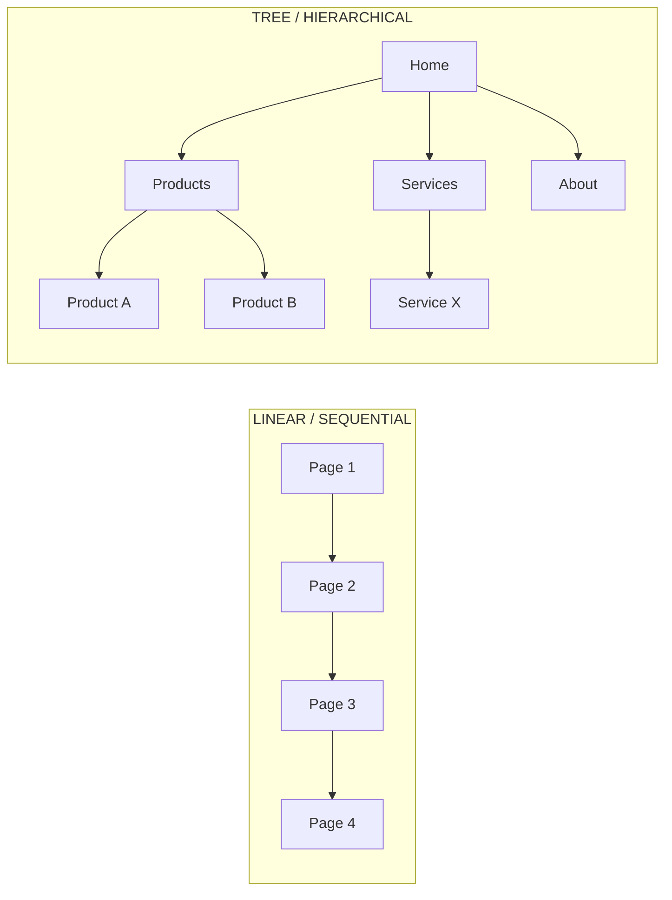
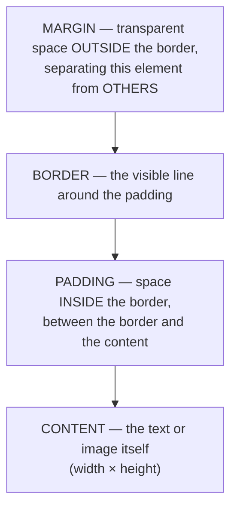
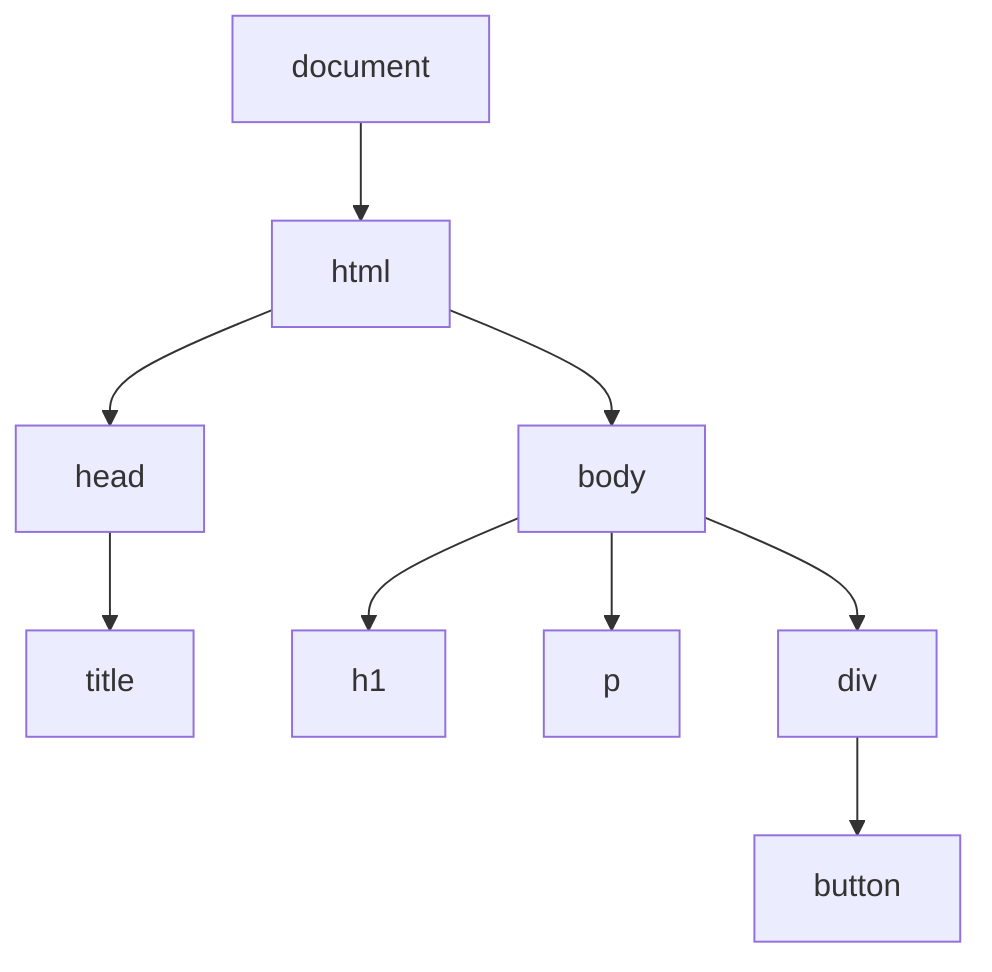
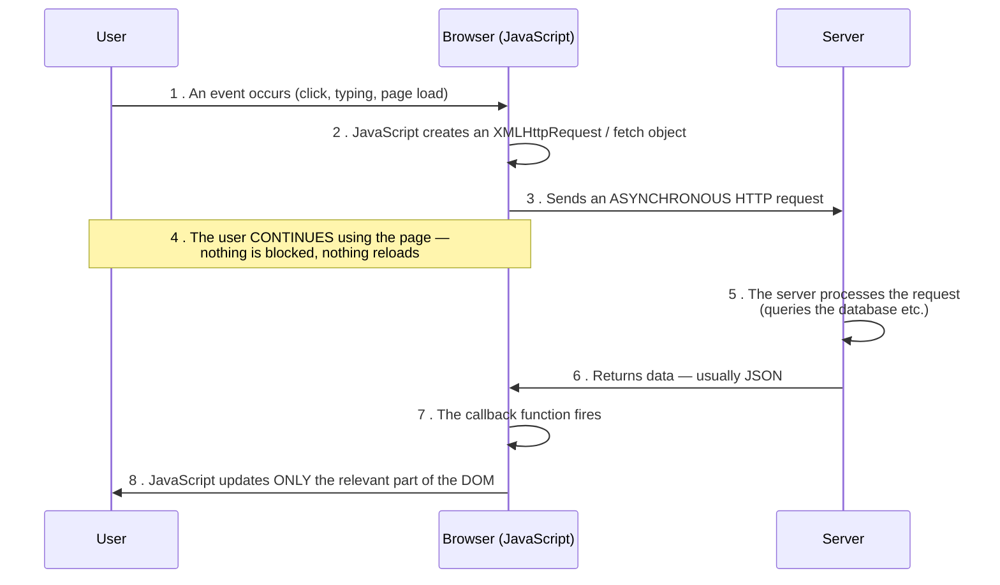
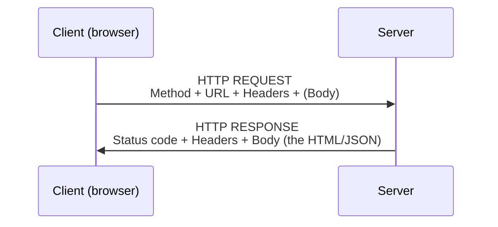
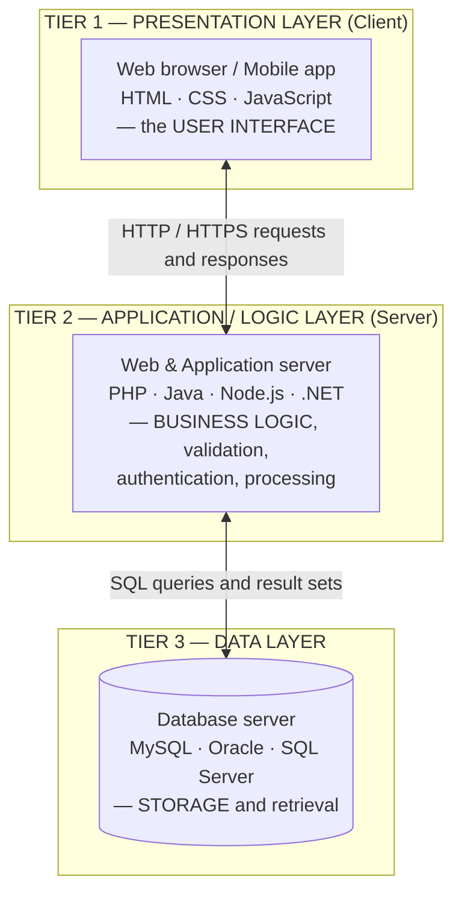
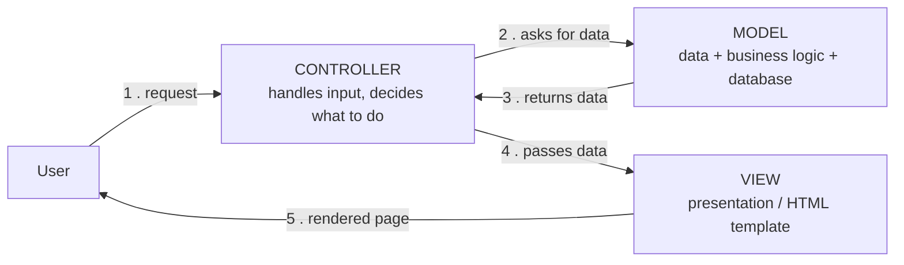
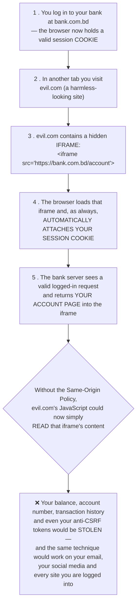
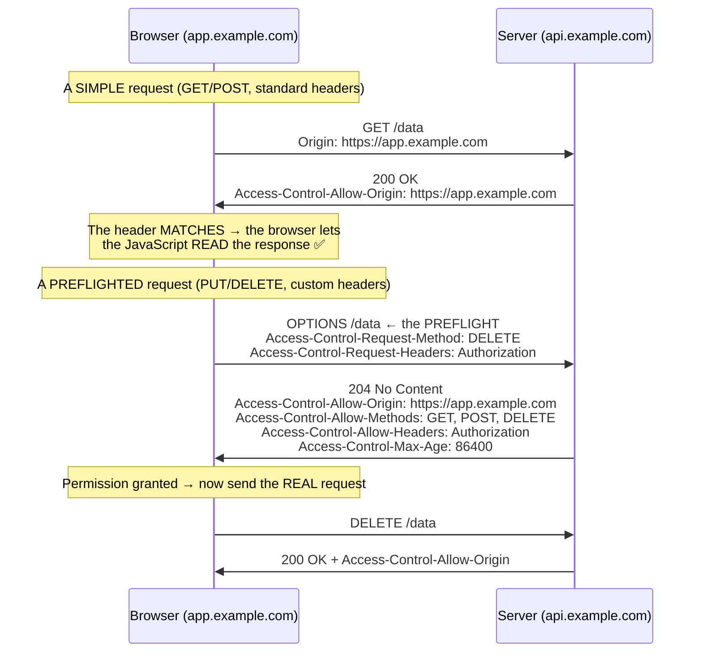

<!-- TOC START -->
**Table of Contents** — 7 subtopics · 8 theories

1. **[HTML & Web Fundamentals](#html--web-fundamentals)**
   - [HTML — Structure, Elements and Tags](#html--structure-elements-and-tags)

2. **[CSS & Styling (Inline, Internal, External)](#css--styling-inline-internal-external)**
   - [CSS — Concepts, Types and the Box Model](#css--concepts-types-and-the-box-model)

3. **[JavaScript & jQuery (DOM & Validation)](#javascript--jquery-dom--validation)**
   - [JavaScript — Fundamentals and the DOM](#javascript--fundamentals-and-the-dom)
   - [jQuery and AJAX](#jquery-and-ajax)

4. **[HTTP Protocol](#http-protocol)**
   - [HTTP — Methods, Status Codes and State](#http--methods-status-codes-and-state)

5. **[Web Services & APIs (SOAP vs REST)](#web-services--apis-soap-vs-rest)**
   - [APIs, SOAP and REST](#apis-soap-and-rest)

6. **[Full Stack & Backend Web Development](#full-stack--backend-web-development)**
   - [Client-side vs Server-side, and Web Architecture](#client-side-vs-server-side-and-web-architecture)

7. **[Web Security & Browser Same-Origin Policy (Iframe)](#web-security--browser-same-origin-policy-iframe)**
   - [The Same-Origin Policy and CORS](#the-same-origin-policy-and-cors)

<!-- TOC END -->

---

## HTML & Web Fundamentals

### HTML — Structure, Elements and Tags

#### What is HTML?

**HTML (HyperText Markup Language)** is the **standard markup language used to create the STRUCTURE and CONTENT of web pages**. It is **not a programming language** — it has no logic, variables or loops. It **describes** content using **tags**, which the browser interprets and renders.

> **The division of responsibility on the web:**
> - **HTML** = the **STRUCTURE** (the skeleton) — "what is on the page"
> - **CSS** = the **PRESENTATION** (the skin) — "how it looks"
> - **JavaScript** = the **BEHAVIOUR** (the muscles) — "what it does"

#### The structure of an HTML page

```html
<!DOCTYPE html>                        <!-- declares HTML5 -->
<html lang="en">
<head>                                 <!-- METADATA — not displayed on the page -->
    <meta charset="UTF-8">
    <meta name="viewport" content="width=device-width, initial-scale=1.0">
    <title>My Page Title</title>       <!-- shown in the browser TAB -->
    <link rel="stylesheet" href="style.css">
    <script src="script.js" defer></script>
</head>
<body>                                 <!-- the VISIBLE content -->
    <h1>Main Heading</h1>
    <p>A paragraph of text.</p>
</body>
</html>
```

| Section | Purpose |
|---|---|
| **`<!DOCTYPE html>`** | Tells the browser this is **HTML5**. Must be the very first line |
| **`<html>`** | The **root** element containing everything |
| **`<head>`** | **Metadata** — title, character set, CSS links, scripts, SEO tags. **Not rendered on the page** |
| **`<body>`** | **Everything the user actually sees** |

#### HTML element vs tag vs attribute

| Term | Meaning | Example |
|---|---|---|
| **Tag** | The markup itself, in angle brackets | `<p>` (opening), `</p>` (closing) |
| **Element** | The **opening tag + the content + the closing tag** — the complete unit | `<p class="intro">Hello</p>` |
| **Attribute** | Extra information placed **inside the opening tag**, as `name="value"` | `class="intro"`, `href="..."`, `src="..."` |

> **An HTML ELEMENT is the complete construct: `<tagname attribute="value">content</tagname>`.** Some elements are **empty (void)** and have no closing tag or content — `<br>`, `<hr>`, ``, `<input>`, `<meta>`, `<link>`.

#### The essential tags

| Category | Tags |
|---|---|
| **Headings** | `<h1>` to `<h6>` — h1 is the most important |
| **Text** | `<p>` paragraph, `<br>` line break, `<hr>` horizontal rule, `<span>` inline container |
| **Formatting** | `<b>`/`<strong>` bold, `<i>`/`<em>` italic, `<u>`, `<mark>`, `<sub>`, `<sup>` |
| **Links** | **`<a href="url">text</a>`** — the **anchor** tag |
| **Images** | **``** |
| **Lists** | `<ul>` unordered, `<ol>` ordered, `<li>` list item, `<dl><dt><dd>` description list |
| **Tables** | `<table>`, `<tr>` row, `<th>` header cell, `<td>` data cell, `<thead>`, `<tbody>`, `<caption>` |
| **Forms** | `<form>`, `<input>`, `<textarea>`, `<select><option>`, **`<button>`**, `<label>` |
| **Containers** | **`<div>`** block-level, **`<span>`** inline |
| **Semantic (HTML5)** | `<header>`, `<nav>`, `<main>`, `<section>`, `<article>`, `<aside>`, `<footer>`, `<figure>` |
| **Media (HTML5)** | **`<video>`, `<audio>`, `<source>`, `<track>`, `<embed>`, `<canvas>`, `<svg>`, `<picture>`, `<iframe>`** |

> **The image tag is ``** — an **empty tag** requiring `src` (the path) and, importantly, **`alt`** (alternative text shown if the image fails to load, and read aloud by screen readers — it is both an **accessibility** requirement and an **SEO** benefit).
>
> **The button tag is `<button>`** — `<button type="submit">Click me</button>`. *(`<input type="button">` and `<input type="submit">` also create buttons, but `<button>` is more flexible because it can contain HTML content.)*
>
> **The popular way of linking many documents is the ANCHOR tag `<a href="...">`** — **hyperlinks**. This is what makes the web a *web* rather than a collection of isolated pages.

#### Worked example — an HTML table

```html
<table border="1">
    <caption>Student Marks</caption>
    <thead>
        <tr>
            <th>Roll</th>
            <th>Name</th>
            <th>Marks</th>
        </tr>
    </thead>
    <tbody>
        <tr>
            <td>101</td>
            <td>Rahim</td>
            <td>85</td>
        </tr>
        <tr>
            <td>102</td>
            <td>Karim</td>
            <td>78</td>
        </tr>
    </tbody>
</table>
```

**Merging cells:** **`colspan="2"`** merges cells **horizontally** (across columns); **`rowspan="2"`** merges them **vertically** (down rows).

```html
<tr>
    <td colspan="2">Spans two columns</td>
    <td rowspan="2">Spans two rows</td>
</tr>
```

#### Worked example — HTML lists

```html
<!-- Unordered (bulleted) list -->
<ul>
    <li>Programming</li>
    <li>Database</li>
    <li>Networking
        <ul>                          <!-- NESTED list -->
            <li>LAN</li>
            <li>WAN</li>
        </ul>
    </li>
</ul>

<!-- Ordered (numbered) list -->
<ol type="1" start="1">               <!-- type: 1, A, a, I, i -->
    <li>First step</li>
    <li>Second step</li>
</ol>

<!-- Description list -->
<dl>
    <dt>HTML</dt>
    <dd>HyperText Markup Language</dd>
    <dt>CSS</dt>
    <dd>Cascading Style Sheets</dd>
</dl>
```

#### Worked example — displaying an image and a link

```html
<!-- An image -->


<!-- A link to a website -->
<a href="https://www.bcc.gov.bd" target="_blank" rel="noopener">
    Visit Bangladesh Computer Council
</a>

<!-- An image that IS a link -->
<a href="https://www.bcc.gov.bd">
    
</a>
```
*(`target="_blank"` opens it in a new tab; `rel="noopener"` should always accompany it, for security.)*

#### Comments in HTML

```html
<!-- This is an HTML comment. The browser IGNORES it completely
     and it is NOT displayed on the page — but it IS visible in
     "View Source", so never put anything sensitive in a comment. -->
```

> **Comments are used to** document the code for other developers, label sections, and temporarily disable a block of markup during testing.

#### The `<div>` element

> **`<div>` is a generic BLOCK-LEVEL container with no semantic meaning of its own.** Its purpose is purely to **group elements** so that they can be **styled with CSS or manipulated with JavaScript** as a unit.

```html
<div id="header" class="top-section">
    <h1>Website Title</h1>
    <p>Tagline goes here</p>
</div>

<div class="content">
    <div class="sidebar">Menu items</div>
    <div class="main">Main content</div>
</div>
```

| Point | **`<div>`** | **`<span>`** |
|---|---|---|
| **Display type** | **BLOCK** — starts on a new line and takes the full width | **INLINE** — stays within the line, takes only its content's width |
| **Used for** | Grouping **large sections** / layout | Styling **a few words inside a line of text** |
| **Can contain** | Block and inline elements | Only inline elements |

> **Modern practice: prefer SEMANTIC elements over `<div>` wherever one fits.** Use `<header>` instead of `<div id="header">`, `<nav>` instead of `<div class="nav">`, and so on. Reserve `<div>` for grouping that has **no meaning**, only layout purpose.

#### HTML5 semantic elements

> **Semantic elements CLEARLY DESCRIBE THEIR MEANING to both the browser and the developer** — unlike `<div>`, which says nothing.

| Element | Purpose |
|---|---|
| **`<header>`** | The **introductory content** of a page or a section — logo, site title, main navigation, search box. A page may contain **several** `<header>` elements (one per section/article) |
| **`<nav>`** | A block of **navigation links** — the main menu, a table of contents, breadcrumbs |
| **`<main>`** | The **dominant content** of the page. There must be **exactly ONE** per page, and it must not be inside `<article>`, `<aside>`, `<header>` or `<footer>` |
| **`<section>`** | A **thematic grouping of related content**, normally **with a heading**. Use it when the content belongs together but is **not independently distributable** — e.g. "Chapter 1", "Our Services" |
| **`<article>`** | A **SELF-CONTAINED, INDEPENDENTLY DISTRIBUTABLE** piece of content that would still make sense on its own — a blog post, a news story, a forum post, a product card, a user comment |
| **`<aside>`** | Content **tangentially related** to the surrounding content — a sidebar, a pull quote, related links, an advertisement |
| **`<footer>`** | The **closing content** of a page or section — copyright, contact details, related links, author information |
| **`<figure>` / `<figcaption>`** | An image, diagram or code listing **with its caption** |
| **`<time>`, `<mark>`, `<details>`, `<summary>`** | Other semantic additions |

```html
<body>
  <header>
      <h1>Bangladesh Tech News</h1>
      <nav>
          <a href="/">Home</a> | <a href="/about">About</a>
      </nav>
  </header>

  <main>
      <article>                              <!-- SELF-CONTAINED: a whole news story -->
          <header>
              <h2>Digital Bangladesh Progress</h2>
              <time datetime="2026-01-15">15 January 2026</time>
          </header>

          <section>                          <!-- a THEMATIC PART of the article -->
              <h3>Background</h3>
              <p>...</p>
          </section>

          <section>
              <h3>Current Status</h3>
              <p>...</p>
          </section>

          <footer>Written by Rahim Uddin</footer>
      </article>

      <aside>                                <!-- TANGENTIAL -->
          <h3>Related Articles</h3>
          <ul><li><a href="#">Smart Bangladesh 2041</a></li></ul>
      </aside>
  </main>

  <footer>
      <p>&copy; 2026 Bangladesh Tech News. All rights reserved.</p>
  </footer>
</body>
```

> **`<section>` vs `<article>` — the test that settles it:** ask *"would this content still make complete sense if I pulled it out and published it on its own, in an RSS feed?"* **If YES → `<article>`. If NO → `<section>`.** A blog post is an article; the "Comments" heading within it is a section.

**Why semantic HTML matters:**
1. **Accessibility** — screen readers can announce "navigation", "main content", "article", letting blind users **jump directly** to the part they want. With `<div>`s, they cannot.
2. **SEO** — search engines understand the page's structure and rank it better.
3. **Readability and maintainability** of the code.
4. **Browser features** — reader mode, and future tooling, rely on it.

#### HTML5 media and graphics

| Tag | Purpose |
|---|---|
| **`<video>`** | Embed video — `<video src="movie.mp4" controls autoplay muted loop></video>` |
| **`<audio>`** | Embed audio — `<audio src="song.mp3" controls></audio>` |
| **`<source>`** | Provide **multiple formats** so the browser picks one it supports |
| **`<track>`** | **Subtitles and captions** for video |
| **`<embed>` / `<object>`** | Embed external content or plugins |
| **`<canvas>`** | A **drawing surface** scripted with JavaScript |
| **`<svg>`** | Scalable Vector Graphics, written directly in the markup |
| **`<picture>`** | Responsive images — different sources for different screen sizes |
| **`<iframe>`** | Embed another web page |

```html
<video width="640" controls poster="thumbnail.jpg">
    <source src="movie.mp4" type="video/mp4">
    <source src="movie.webm" type="video/webm">
    <track src="subtitles.vtt" kind="subtitles" srclang="bn" label="Bangla">
    Your browser does not support the video tag.
</video>
```

> **Why HTML5 media tags mattered:** before them, playing video required the **Adobe Flash plugin** — a constant source of security vulnerabilities, with no support on iOS. HTML5 made audio and video **native to the browser**, and Flash is now dead.

#### Canvas vs SVG

> **`<canvas>` is a BITMAP drawing surface** that JavaScript paints pixels onto. **`<svg>` is a VECTOR format** in which each shape is a separate element in the DOM.

| Point | **Canvas** | **SVG** |
|---|---|---|
| **Type** | **Raster / bitmap** — a grid of pixels | **Vector** — mathematical shapes |
| **Drawn with** | **JavaScript only** (`getContext('2d')`) | **Markup** (and optionally JavaScript) |
| **Resolution** | **Resolution DEPENDENT** — becomes blurry when scaled up | **Resolution INDEPENDENT** — perfectly sharp at any size |
| **DOM** | **ONE single element**; the shapes inside are **not** in the DOM | **EVERY shape is a DOM element** |
| **Event handling** | ❌ **Difficult** — you must calculate which shape was clicked from the coordinates | ✅ **Easy** — attach a listener directly to a shape |
| **Modifying a drawn shape** | ❌ Must **redraw the whole scene** | ✅ Change the element's attribute |
| **Performance with MANY objects** | ✅ **Excellent** — thousands of objects at 60 fps | ❌ **Degrades** — each object is a DOM node |
| **Performance with LARGE surfaces** | Degrades | Good |
| **Text rendering** | Poor — text becomes pixels | **Excellent**, and **selectable and searchable** |
| **Accessibility / SEO** | ❌ **Poor** — the content is invisible to screen readers and search engines | ✅ **Good** — it is text-based markup |
| **File saving** | Exports as PNG/JPEG | Saves as an `.svg` text file |
| **Best for** | **Games, real-time animation, video processing, image editing, particle effects, large data plots** | **Icons, logos, charts, diagrams, maps, anything that must scale or be interactive** |

```html
<!-- CANVAS — scripted -->
<canvas id="myCanvas" width="200" height="100"></canvas>
<script>
    const ctx = document.getElementById('myCanvas').getContext('2d');
    ctx.fillStyle = 'blue';
    ctx.fillRect(10, 10, 100, 50);          // draws pixels; the rectangle is NOT an object
</script>

<!-- SVG — declarative -->
<svg width="200" height="100">
    <rect id="box" x="10" y="10" width="100" height="50" fill="blue"
          onclick="alert('Clicked!')" />   <!-- a real DOM element you can click -->
</svg>
```

#### HTML5 Web Storage

> **HTML5 introduced two client-side storage mechanisms that store data IN THE BROWSER, replacing the old use of cookies for this purpose.**

| Point | **localStorage** | **sessionStorage** | **Cookie** |
|---|---|---|---|
| **Lifetime** | **PERMANENT** — survives browser restart; cleared only explicitly | **Until the TAB is closed** | Until its **expiry date** |
| **Scope** | Per **origin** — shared by all tabs of the same site | **Per TAB** — each tab has its own | Per origin/path |
| **Capacity** | **5–10 MB** | 5–10 MB | **~4 KB only** |
| **Sent to the server?** | ❌ **NO** | ❌ No | ✅ **YES — with EVERY HTTP request** |
| **Accessible from JavaScript** | ✅ Yes | ✅ Yes | ✅ Yes (unless `HttpOnly`) |
| **Used for** | User preferences, theme, cached data, offline drafts | Data for one session/tab — a multi-step form | **Session IDs, authentication, tracking** |

```javascript
// localStorage — persists
localStorage.setItem('theme', 'dark');
const theme = localStorage.getItem('theme');
localStorage.removeItem('theme');
localStorage.clear();

// sessionStorage — dies with the tab
sessionStorage.setItem('step', '2');
```

> **The key practical difference: cookies are sent to the server with every single request**, which is why they are used for authentication — and also why storing large data in them wastes bandwidth on every page load. **Web Storage never leaves the browser**, so it is larger, faster and better for client-only data — but for the same reason it **cannot** be used for server-side session identification.

#### Website structure and web design

> A **WEBSITE** is a collection of related web pages, images and other resources, identified by a common **domain name** and hosted on a **web server**.

**The parts of a website:** the **home page**, **navigation menu**, **header**, **content area**, **sidebar**, **footer**, and the supporting **images, stylesheets and scripts**. Structurally it comprises the **front end** (what the user sees), the **back end** (server logic), and the **database**.

**Website structures:**



| Structure | Description | Best for |
|---|---|---|
| **Linear / Sequential** | Pages in a **fixed order**, one after another | **Tutorials, step-by-step forms, checkout processes, presentations** |
| **Tree / Hierarchical** | A home page branching into categories and sub-categories | **Most websites** — corporate sites, e-commerce, news portals |
| **Network / Webbed** | Pages link freely to each other in any direction | **Wikipedia**, reference sites |
| **Grid / Matrix** | Content organised along two dimensions | Product catalogues |

> **Web design** is the process of **planning, conceptualising and arranging content for a website** — covering layout, colour, typography, graphics, navigation and, critically, **user experience (UX)** and **responsiveness** across devices.

#### Static vs Dynamic website

| Point | **Static Website** | **Dynamic Website** |
|---|---|---|
| **Content** | **FIXED** — the same for every visitor, every time | **CHANGES** — generated per user, per request |
| **Built with** | **HTML, CSS, JavaScript only** | HTML/CSS/JS **+ a server-side language + a DATABASE** |
| **Content generated** | **At development time** — stored as complete files | **At REQUEST time** — assembled by the server |
| **Database** | ❌ **None** | ✅ **Required** |
| **Server-side processing** | ❌ None | ✅ **PHP, Node.js, Java, Python, ASP.NET** |
| **To change content** | **Edit the HTML file** and re-upload | **Update the DATABASE** through an admin panel |
| **Speed** | **Very FAST** — the file is served directly | Slower — processing and database queries on each request |
| **Cost** | **Low** | Higher |
| **Hosting requirement** | Simple; can be served from a CDN | Needs an application server and database |
| **Security** | **Very secure** — almost nothing to attack | More vulnerable — SQL injection, XSS, etc. |
| **Scalability / Interactivity** | Poor — every change is manual | **Excellent** — personalisation, user accounts, search |
| **Examples** | A small brochure site, a personal portfolio, documentation | **Facebook, Daraz, online banking, any site with a login** |

#### Web portal and web hosting

| Term | Definition |
|---|---|
| **Website** | A collection of related web pages under one domain |
| **Web portal** | A **specially designed website that brings information from DIVERSE SOURCES together in a UNIFIED way**, usually with **personalisation and a login**. Examples: the **Bangladesh National Portal**, Yahoo!, a university student portal, an intranet employee portal |
| **Web hosting** | The **service of storing a website's files on a web server that is permanently connected to the Internet**, so that anyone can access them |

**Why web hosting is necessary:** a website's files must live on a machine that is **switched on 24×7, permanently connected, with a fixed public IP address, adequate bandwidth, security and backups**. A home computer cannot realistically provide that, so hosting is bought as a service.

| Type of hosting | Description |
|---|---|
| **Shared hosting** | Many websites share one server — **cheapest**, least control |
| **VPS** | A virtual private server — dedicated resources on a shared machine |
| **Dedicated** | An entire physical server for one customer — **most control, most expensive** |
| **Cloud hosting** | Resources drawn from a pool — **scalable, pay per use** |
| **Managed hosting** | The provider handles updates, security and backups |

*(**Apache is a WEB SERVER** — specifically an HTTP server, and historically the most widely used in the world. Its main alternatives are **Nginx**, **Microsoft IIS** and **LiteSpeed**.)*

**Previous Year Question List from this Topic:**

- [What is HTML Image tag?](../written-answers/web-technology.md?plain=1#L20)
- [(খ) নিচের টেবিলটি তৈরি করার জন্য HTML কোড লিখুন :](../written-answers/web-technology.md?plain=1#L131)
- [What is the popular way of linking many documents?](../written-answers/web-technology.md?plain=1#L370)
- [Which tag is used for creating button in html?](../written-answers/web-technology.md?plain=1#L453)
- [(ক) HTML Element কী? উদাহরণসহ বর্ণনা করুন।](../written-answers/web-technology.md?plain=1#L527)
- [অথবা, (ক) উদাহরণসহ HTML webpage এর গঠন ব্যাখ্যা করুন।](../written-answers/web-technology.md?plain=1#L693)
- [(খ) নিচের লিস্টটি তৈরি করার জন্য HTML কোড লিখুন :](../written-answers/web-technology.md?plain=1#L804)
- [অথবা, নিম্নোক্ত উপাদানগুলোসহ একটি HTML page লিখুন। Hyperlink, Ordered list, Unordered list, Form (Tent box, Check box, Option Button).](../written-answers/web-technology.md?plain=1#L912)
- [(ক) HTML এবং CSS কী? সংক্ষেপে ব্যাখ্যা করুন। শুধুমাত্র HTML এবং CSS ব্যবহার করে Web Site তৈরির ক্ষেত্রে সীমাবদ্ধতা আলোচনা করুন।](../written-answers/web-technology.md?plain=1#L1050)
- [(ক) কোন প্রতিষ্ঠানের Web page development এ HTML এবং CSS এর ভূমিকা কি? শুধুমাত্র HTML এবং CSS ব্যবহার করে কোন ধরনের Web Page Development করা যেতে পারে?](../written-answers/web-technology.md?plain=1#L1192)
- [(ii) HTML ও CSS কী?](../written-answers/web-technology.md?plain=1#L1287)
- [একটি Image ও একটি Web site URL HTML প্রদর্শন করার জন্য প্রয়োজনীয় code লিখুন?](../written-answers/web-technology.md?plain=1#L1357)
- [Write down the description of `<header>`, `<footer>`, `<section>` and `<article>` tag of new HTML5.](../written-answers/web-technology.md?plain=1#L1436)
- [(খ) নিচের টেবিলটি তৈরি করার জন্য HTML কোড লিখুন।](../written-answers/web-technology.md?plain=1#L1783)
- [(b) Explain `<div>`.............`</div>` tag of HTML with an example.](../written-answers/web-technology.md?plain=1#L1913)
- [Write HTML5 media tags name.](../written-answers/web-technology.md?plain=1#L2021)
- [Write down the proper use of these semantics in HTML-`<header>`, `<footer>`, `<article>` and `<section>`.](../written-answers/web-technology.md?plain=1#L2109)
- [Write down the name of some HTML5 media tag.](../written-answers/web-technology.md?plain=1#L2230)
- [What is canvas HTML? What is difference between HTML canvas and SVG?](../written-answers/web-technology.md?plain=1#L2291)
- [What are the uses of `<header>`, `<article>`, `<section>` and `<footer>` in html?](../written-answers/web-technology.md?plain=1#L2381)
- [What is HTML Canvas? Differentiate between canvas and SVG.](../written-answers/web-technology.md?plain=1#L2482)
- [What is local Storage and session Storage in HTML5?](../written-answers/web-technology.md?plain=1#L2572)
- [What are the minimum HTML Tags is used web pages? How can your comments at web pages so that browser not read this?](../written-answers/web-technology.md?plain=1#L2654)


---

## CSS & Styling (Inline, Internal, External)

### CSS — Concepts, Types and the Box Model

#### What is CSS?

**CSS (Cascading Style Sheets)** is the language used to **describe the PRESENTATION of an HTML document** — colours, fonts, spacing, layout, animation and responsiveness.

> **Why "Cascading"?** Because when several rules apply to the same element, they **cascade** — the browser resolves the conflict using a defined order of priority: **importance → specificity → source order**.

**The syntax:**
```css
selector {
    property: value;
    property: value;
}

h1 {
    color: blue;
    font-size: 32px;
    text-align: center;
}
```

#### The three ways of applying CSS

| # | Type | How | Scope | Priority |
|---|---|---|---|---|
| **1** | **INLINE CSS** | The **`style` attribute inside the HTML tag** | **That ONE element only** | **HIGHEST** |
| **2** | **INTERNAL (Embedded) CSS** | A **`<style>` block inside `<head>`** | **That ONE page** | Medium |
| **3** | **EXTERNAL CSS** | A **separate `.css` file**, linked with `<link>` | **The WHOLE website** | Lowest |

```html
<!-- 1. INLINE — highest priority, but worst practice -->
<p style="color: red; font-size: 20px;">This is red text.</p>

<!-- 2. INTERNAL — inside the head of one page -->
<head>
    <style>
        p     { color: green; font-size: 18px; }
        .note { background: yellow; }
    </style>
</head>

<!-- 3. EXTERNAL — the professional standard -->
<head>
    <link rel="stylesheet" href="styles.css">
</head>
```

```css
/* styles.css — an external stylesheet */
body { font-family: Arial, sans-serif; margin: 0; }
h1   { color: navy; }
.btn { background: #007bff; color: white; padding: 10px 20px; border-radius: 4px; }
```

| Point | **Inline** | **Internal** | **External** |
|---|---|---|---|
| **Reusability** | ❌ None | Within one page | ✅ **Across the whole site** |
| **Maintainability** | ❌ **Worst** — a colour change means editing every tag | Medium | ✅ **Best** — change one file, the whole site updates |
| **Page load** | No extra request | No extra request | One extra request, **but it is CACHED** and then reused for every page |
| **Separation of concerns** | ❌ **Violated** — style mixed into content | Partial | ✅ **Complete** |
| **Priority** | **Highest** | Medium | Lowest |
| **When to use** | Only for **one-off overrides** or email HTML | A **single-page** site, or page-specific overrides | ✅ **Almost always — the professional choice** |

> **Why external CSS is the right answer to "how should a developer style a website":** one file controls the appearance of **hundreds of pages**; the browser **caches** it, so it is downloaded only once for the entire site; the HTML stays clean and readable; and a designer and a developer can work on separate files. **The full priority order is: `!important` > inline > internal/external by specificity > browser default.**

#### CSS selectors

| Selector | Syntax | Selects |
|---|---|---|
| **Element** | `p { }` | All `<p>` elements |
| **Class** | **`.classname { }`** | All elements with `class="classname"` — **reusable** |
| **ID** | **`#idname { }`** | The **ONE** element with `id="idname"` — must be unique |
| **Universal** | `* { }` | Everything |
| **Group** | `h1, h2, p { }` | Several selectors at once |
| **Descendant** | `div p { }` | All `<p>` **inside** a `<div>` |
| **Child** | `div > p { }` | `<p>` that is a **direct** child |
| **Attribute** | `input[type="text"]` | By attribute value |
| **Pseudo-class** | `a:hover`, `li:first-child` | By state or position |
| **Pseudo-element** | `p::first-line`, `div::before` | Part of an element |

**Specificity, from lowest to highest:** element (1) < class/attribute/pseudo-class (10) < **ID (100)** < **inline style (1000)** < **`!important`** (overrides everything, and should be avoided).

#### The CSS Box Model

> **Every HTML element is a rectangular BOX made of four concentric layers: CONTENT, PADDING, BORDER and MARGIN.**



| Layer | Definition |
|---|---|
| **Content** | The actual text or image; sized by `width` and `height` |
| **Padding** | **Space INSIDE the element, between the CONTENT and the BORDER** |
| **Border** | The line drawn around the padding |
| **Margin** | **Space OUTSIDE the border, separating this element from its NEIGHBOURS** |

#### Padding vs Margin — the key comparison

| Point | **PADDING** | **MARGIN** |
|---|---|---|
| **Position** | **INSIDE** the border | **OUTSIDE** the border |
| **Separates** | The **content from its own border** | **This element from OTHER elements** |
| **Background colour** | ✅ **Takes the element's background colour** | ❌ **Always TRANSPARENT** |
| **Affects the element's own size** | ✅ **Yes** — adds to the total width/height *(unless `box-sizing: border-box`)* | ❌ No — it adds to the space around it |
| **Negative values** | ❌ **Not allowed** | ✅ **Allowed** |
| **Margin collapsing** | ❌ No | ✅ **Yes** — adjacent vertical margins **merge into the larger of the two**, they do not add |
| **Used to** | Give the content **breathing room inside** a box | Create **gaps BETWEEN** boxes |
| **Clickable area** | ✅ **Part of the element** — clicking the padding of a button works | ❌ Not part of the element |

```css
.box {
    width: 300px;
    padding: 20px;              /* inside */
    border: 5px solid black;
    margin: 30px;               /* outside */
}
/* Total rendered width (default content-box):
   300 (content) + 40 (padding L+R) + 10 (border L+R) = 350px
   plus 60px of margin around it */

.box-modern {
    box-sizing: border-box;     /* ← width now INCLUDES padding and border */
    width: 300px;               /* total width is exactly 300px */
    padding: 20px;
    border: 5px solid black;
}
```

> **`box-sizing: border-box` is applied globally in virtually every modern stylesheet**, because "width means the total width" is what every designer actually expects.

#### CSS frameworks

> A **CSS FRAMEWORK is a pre-written, ready-to-use library of CSS (and often JavaScript) that provides a grid system, typography, components and utilities**, so that developers do not have to write common styles from scratch.

**Three CSS frameworks to name: Bootstrap, Tailwind CSS and Bulma.** *(Others: Foundation, Materialize, Semantic UI, Skeleton, Pure.css.)*

| Framework | Approach |
|---|---|
| **Bootstrap** | **The most popular** — ready-made components (navbar, modal, card) plus a 12-column responsive grid |
| **Tailwind CSS** | **Utility-first** — you compose designs from small single-purpose classes (`flex`, `pt-4`, `text-center`) rather than pre-built components |
| **Bulma** | Modern, Flexbox-based, CSS-only (no JavaScript) |
| **Foundation** | Enterprise-focused, highly customisable |
| **Materialize** | Implements Google's Material Design |

**Advantages:** **much faster development** · **cross-browser compatibility** already solved · **responsive design** built in · **consistent, professional appearance** · well **documented** with a large community.
**Disadvantages:** **large file size** if only a fraction is used (mitigated by purging unused CSS) · sites tend to **look alike** · a **learning curve** for the framework's own conventions · and **less control** when a design deviates from the framework's assumptions.

**Previous Year Question List from this Topic:**

- [(ক) CSS কী? CSS এর প্রকারভেদসমূহ উদাহরণসহ আলোচনা করুন।](../written-answers/web-technology.md?plain=1#L7184)
- [What is CSS? What is CSS framework? Write down 3 CSS framework name?](../written-answers/web-technology.md?plain=1#L7306)
- [(খ) CSS Box Model এ ‘Padding’ এবং ‘Margin’ এরিয়ার মধ্যে পার্থক্য লিখুন।](../written-answers/web-technology.md?plain=1#L7380)
- [(খ) CSS কী? কতভাবে একজন Website develop কারী তার page-এ CSS ব্যবহার করতে পারে।](../written-answers/web-technology.md?plain=1#L7506)
- [(ক) HTML এবং CSS কী? সংক্ষেপে ব্যাখ্যা করুন। শুধুমাত্র HTML এবং CSS ব্যবহার করে Web Site তৈরির ক্ষেত্রে সীমাবদ্ধতা আলোচনা করুন।](../written-answers/web-technology.md?plain=1#L1050)
- [(ক) কোন প্রতিষ্ঠানের Web page development এ HTML এবং CSS এর ভূমিকা কি? শুধুমাত্র HTML এবং CSS ব্যবহার করে কোন ধরনের Web Page Development করা যেতে পারে?](../written-answers/web-technology.md?plain=1#L1192)
- [(ii) HTML ও CSS কী?](../written-answers/web-technology.md?plain=1#L1287)


---

## JavaScript & jQuery (DOM & Validation)

### JavaScript — Fundamentals and the DOM

#### What is JavaScript?

**JavaScript** is a **high-level, interpreted programming language** that makes web pages **interactive and dynamic**. It runs **inside the browser** (client-side) and, through **Node.js**, also on the server.

> **It is NOT related to Java**, despite the name — that was a 1995 marketing decision. The two languages are entirely different.

#### Including JavaScript in HTML

> **The tag used to write JavaScript in HTML is `<script>`.**

```html
<!-- 1. INTERNAL — inside the HTML file -->
<script>
    console.log("Hello from JavaScript");
</script>

<!-- 2. EXTERNAL — a separate .js file (the professional choice) -->
<script src="bankScript.js"></script>

<!-- 3. With loading control -->
<script src="bankScript.js" defer></script>   <!-- download in parallel,
                                                   execute AFTER the HTML is parsed -->
<script src="bankScript.js" async></script>   <!-- download in parallel,
                                                   execute AS SOON AS ready -->
```

> **Where to put `<script>`:** traditionally just **before `</body>`**, so that the HTML has already been parsed and the elements exist when the script runs. The modern preference is **in `<head>` with the `defer` attribute** — the file downloads in parallel with the HTML (faster) but executes only after parsing completes (safe).

#### The DOM

> The **DOM (Document Object Model)** is the browser's **tree-structured, in-memory representation of an HTML document**, in which **every element, attribute and piece of text is an OBJECT** that JavaScript can read and modify.



#### Selecting elements

| Method | Returns |
|---|---|
| **`document.getElementById("id")`** | **One** element |
| `document.getElementsByClassName("cls")` | A live **HTMLCollection** |
| `document.getElementsByTagName("p")` | A live HTMLCollection |
| **`document.querySelector("css")`** | The **FIRST** element matching a **CSS selector** |
| **`document.querySelectorAll("css")`** | **ALL** matching elements (a static NodeList) |

```javascript
// Display / read an element by its ID
const el = document.getElementById("message");
console.log(el.innerHTML);

// Modern, preferred — any CSS selector works
const btn   = document.querySelector("#submitBtn");
const items = document.querySelectorAll(".list-item");
```

#### Changing content, attributes and style

```javascript
// 1. Change the CONTENT of an element
document.getElementById("demo").innerHTML = "<b>New bold content</b>";   // parses HTML
document.getElementById("demo").textContent = "Plain text only";         // SAFER — no HTML
document.getElementById("name").value = "Rahim";                         // for form inputs

// 2. Change an ATTRIBUTE
document.getElementById("myImage").src = "newimage.jpg";
document.getElementById("myLink").href = "https://example.com";
document.getElementById("box").setAttribute("class", "highlighted");
const cls = document.getElementById("box").getAttribute("class");        // read it
document.getElementById("box").removeAttribute("disabled");

// 3. Change the STYLE
document.getElementById("demo").style.color = "red";
document.getElementById("demo").style.backgroundColor = "yellow";   // camelCase!
document.getElementById("demo").classList.add("active");            // ← PREFERRED
document.getElementById("demo").classList.remove("hidden");
document.getElementById("demo").classList.toggle("visible");
```

> **The best-practice point: change CLASSES, not inline styles.** `element.classList.add("error")` keeps the styling in the CSS file where it belongs; `element.style.color = "red"` scatters presentation through the JavaScript and is far harder to maintain.
>
> **The security point: prefer `textContent` over `innerHTML`** when inserting user-supplied data — `innerHTML` **parses and executes HTML**, which is exactly how **XSS** attacks succeed.

#### Events

```javascript
// The modern way
document.getElementById("btn").addEventListener("click", function() {
    alert("Button clicked!");
});

// With an arrow function
document.getElementById("btn").addEventListener("click", () => {
    console.log("Clicked");
});

// Run code after the DOM is ready
document.addEventListener("DOMContentLoaded", function() {
    // safe to access elements here
});
```

**Common events:** `click`, `dblclick`, `mouseover`, `mouseout`, `keydown`, `keyup`, **`submit`**, `change`, `input`, `focus`, `blur`, `load`, `scroll`.

#### Hoisting

> **HOISTING is JavaScript's behaviour of moving the DECLARATIONS of variables and functions to the TOP of their scope before the code is executed. Only the DECLARATION is hoisted — NOT the initialisation.**

```javascript
console.log(x);          // undefined  ← NOT an error!
var x = 5;
console.log(x);          // 5

// JavaScript effectively treats the above as:
//   var x;               ← the declaration is hoisted to the top
//   console.log(x);      ← undefined
//   x = 5;               ← the assignment stays where it was
//   console.log(x);      ← 5
```

**Function declarations are hoisted COMPLETELY — body and all:**
```javascript
greet();                            // ✅ "Hello!" — works even though it is called first

function greet() {
    console.log("Hello!");
}
```

**Function EXPRESSIONS are not:**
```javascript
sayHi();                            // ❌ TypeError: sayHi is not a function

var sayHi = function() { console.log("Hi"); };
// only the VARIABLE 'sayHi' is hoisted (as undefined); the function is assigned later
```

**`let` and `const` — the Temporal Dead Zone:**
```javascript
console.log(y);          // ❌ ReferenceError: Cannot access 'y' before initialization
let y = 10;
```

| Declaration | Hoisted? | Usable before the declaration line? |
|---|---|---|
| **`var`** | ✅ Yes | ✅ Yes, but the value is **`undefined`** |
| **`let` / `const`** | ✅ Technically yes | ❌ **NO — ReferenceError** (the "Temporal Dead Zone") |
| **Function declaration** | ✅ **Completely** | ✅ **Yes, fully usable** |
| **Function expression / arrow** | Only the variable | ❌ No |

> **The practical lesson: always DECLARE VARIABLES AT THE TOP of their scope, and use `let` and `const` instead of `var`.** Hoisting is not a feature to exploit — it is a source of confusing bugs that modern declarations were designed to eliminate.

#### Closures

> A **CLOSURE is a function that REMEMBERS AND CONTINUES TO ACCESS the variables of its OUTER (enclosing) scope, even AFTER that outer function has finished executing.**

```javascript
function makeCounter() {
    let count = 0;                    // a LOCAL variable of makeCounter

    return function() {               // the inner function — a CLOSURE
        count++;                      // it still has access to 'count'
        return count;
    };
}

const counter1 = makeCounter();
console.log(counter1());   // 1
console.log(counter1());   // 2
console.log(counter1());   // 3

const counter2 = makeCounter();
console.log(counter2());   // 1  ← a SEPARATE, INDEPENDENT 'count'
```

> **Why this is remarkable:** `makeCounter()` **finished executing** on the first line, and normally its local variable `count` would be destroyed. But because the returned inner function still **references** `count`, JavaScript keeps that variable alive. The inner function has "closed over" its environment — hence the name.

**Why closures are used:**

| Use | Example |
|---|---|
| **DATA PRIVACY / encapsulation** | `count` is **inaccessible from outside** — it can only be changed through the returned function. This is how private variables are created in JavaScript |
| **Factory functions** | Each call to `makeCounter()` produces an independent counter |
| **Callbacks and event handlers** | The handler remembers the variables that existed when it was created |
| **Function currying and partial application** | `const add5 = makeAdder(5);` |
| **Module pattern** | Expose a public API while keeping internal state hidden |

```javascript
// A practical closure — a bank account with a genuinely private balance
function createAccount(initialBalance) {
    let balance = initialBalance;           // PRIVATE — no outside code can reach it

    return {
        deposit:    (amt) => { if (amt > 0) balance += amt; return balance; },
        withdraw:   (amt) => { if (amt > 0 && amt <= balance) balance -= amt; return balance; },
        getBalance: ()    => balance
    };
}

const acc = createAccount(1000);
acc.deposit(500);            // 1500
console.log(acc.getBalance());   // 1500
console.log(acc.balance);        // undefined ← TRULY private ✅
```

#### Form validation

```javascript
// 1. Email validation
function validateEmail(email) {
    const pattern = /^[^\s@]+@[^\s@]+\.[^\s@]{2,}$/;
    return pattern.test(email);
}

// 2. NID validation (Bangladesh: 10, 13 or 17 digits)
function validateNID(nid) {
    const pattern = /^(\d{10}|\d{13}|\d{17})$/;
    return pattern.test(nid);
}

// 3. Customer number: 3 UPPERCASE letters followed by 4 digits — e.g. ABC1234
function validateCustomerNumber(cnum) {
    const pattern = /^[A-Z]{3}[0-9]{4}$/;
    return pattern.test(cnum);
}

// 4. A complete form validation function
function validateForm() {
    const email = document.getElementById("email").value.trim();
    const nid   = document.getElementById("nid").value.trim();
    const cnum  = document.getElementById("cnum").value.trim();

    if (email === "") {
        alert("Email is required");  return false;
    }
    if (!validateEmail(email)) {
        alert("Please enter a valid email address");  return false;
    }
    if (!validateNID(nid)) {
        alert("NID must be 10, 13 or 17 digits");  return false;
    }
    if (!validateCustomerNumber(cnum)) {
        alert("Customer number must be 3 capital letters followed by 4 digits");
        return false;
    }
    return true;                    // returning false PREVENTS form submission
}
```

```html
<form onsubmit="return validateForm()">
    <label>Email:  <input type="email" id="email" required></label><br>
    <label>NID:    <input type="text"  id="nid"   required></label><br>
    <label>Cust #: <input type="text"  id="cnum"  required></label><br>
    <button type="submit">Submit</button>
</form>
```

> **The security point that must be stated: CLIENT-SIDE VALIDATION IS FOR USABILITY ONLY, NEVER FOR SECURITY.** A user can disable JavaScript, edit the page, or send the request directly with `curl`. **Every input MUST be re-validated on the SERVER.** Client-side validation exists to give instant feedback and save a round trip — nothing more.

**Previous Year Question List from this Topic:**

- [Write Javascript code to check NID validity?](../written-answers/web-technology.md?plain=1#L2912)
- [Which tag is used to write JavaScript in html?](../written-answers/web-technology.md?plain=1#L3040)
- [Write Javascript function to validate a customer number where the customer number in 3 uppercase letter and district code followed by 8 digits.](../written-answers/web-technology.md?plain=1#L3116)
- [Write HTML and Javascript code of following box.](../written-answers/web-technology.md?plain=1#L3247)
- [Explain hoisting in JavaScript?](../written-answers/web-technology.md?plain=1#L3387)
- [Display element by id in JavaScript?](../written-answers/web-technology.md?plain=1#L3492)
- [if-else ব্যবহার করে Javascript দিয়ে নিচের কোডটি সম্পন্ন কর, যেন Output ডান পাশের মত আসে।](../written-answers/web-technology.md?plain=1#L3606)
- [How do you change the value of a HTML element using HTML DOM?](../written-answers/web-technology.md?plain=1#L3858)
- [How to change html attribute through html DOM?](../written-answers/web-technology.md?plain=1#L4076)
- [Suppose you've a javaScript code name as “bankScript” write the code for loading in HTML using JS.](../written-answers/web-technology.md?plain=1#L4209)
- [What is closure in JavaScript? Explain with an example?](../written-answers/web-technology.md?plain=1#L4332)


---

### jQuery and AJAX

#### What is jQuery?

**jQuery** is a **JavaScript library** that simplifies DOM manipulation, event handling, animation and AJAX with a concise, cross-browser API. Its motto is *"write less, do more"*.

```javascript
// Plain JavaScript
document.getElementById("demo").innerHTML = "Hello";

// jQuery
$("#demo").html("Hello");
```

#### AJAX

> **AJAX (Asynchronous JavaScript And XML)** is a technique for **exchanging data with a server and UPDATING PART of a web page WITHOUT RELOADING the whole page.**

#### How AJAX works



**The step-by-step working procedure:**
1. **An event triggers** the request — a button click, a keystroke, a page load, a timer.
2. JavaScript creates an **`XMLHttpRequest`** object (or calls the modern **`fetch()`**).
3. The request is sent to the server **asynchronously** — the browser does **not wait**, and the user can keep interacting with the page.
4. The **server processes** it and returns data, normally as **JSON** (despite the "XML" in the name, JSON has almost entirely replaced XML).
5. The **callback / promise handler** runs when the response arrives.
6. JavaScript **updates only the affected part of the DOM** — the rest of the page is untouched.

**Why AJAX matters:** it is what made the web feel like an application rather than a series of documents. **Gmail, Google Maps, live search suggestions, infinite scroll, form validation against a server, live cricket scores** — all of them depend on it.

**Advantages:** **no full page reload**, so the experience is fast and smooth · **less bandwidth** (only the data is transferred, not the whole page) · **less server load** · **asynchronous**, so the interface never freezes.
**Disadvantages:** **requires JavaScript** to be enabled · the **browser's back button and bookmarking** break unless handled explicitly (History API) · **search engines** historically could not index AJAX content · **debugging is harder** · and it is **subject to the same-origin policy**, requiring CORS for cross-domain requests.

#### `$.ajax()` vs `$.get()` vs `$.load()`

| Point | **`$.ajax()`** | **`$.get()`** | **`$.load()`** |
|---|---|---|---|
| **Level** | **Low-level, fully configurable** | A **shorthand** for a GET request | The **highest-level shortcut** |
| **HTTP method** | **Any** — GET, POST, PUT, DELETE | **GET only** | GET (POST if data is supplied) |
| **Return value handling** | A callback / promise — **you** decide what to do | A callback — you decide | **Automatically INSERTS the response into the selected element** |
| **Called on** | `$.ajax(...)` — the jQuery object | `$.get(...)` — the jQuery object | **`$("#result").load(...)`** — a **selected ELEMENT** |
| **Options** | **Full control** — headers, timeout, dataType, beforeSend, error, async, contentType | Limited | Very limited; **can load a FRAGMENT** of a page with a selector |
| **Error handling** | ✅ **Built-in `error:` callback** | Via `.fail()` | Via the callback's status parameter |
| **Use when** | You need **POST, custom headers, error handling, or full control** | A **simple GET** of data | You simply want to **drop HTML into a container** |

```javascript
// 1. $.ajax() — full control
$.ajax({
    url: "getUser.php",
    type: "POST",
    data: { id: 101 },
    dataType: "json",
    beforeSend: function() { $("#loader").show(); },
    success: function(response) {
        $("#name").text(response.name);
    },
    error: function(xhr, status, err) {
        console.error("Request failed: " + err);
    },
    complete: function() { $("#loader").hide(); }
});

// 2. $.get() — shorthand for a simple GET
$.get("getData.php", { id: 101 }, function(data) {
    $("#result").html(data);
});

// 3. $.load() — fetch and INSERT, in one line
$("#result").load("content.html");                 // load the whole file
$("#result").load("page.html #section2");          // load only PART of it ← unique to load()
```

> **The relationship: `$.get()` and `$.load()` are both CONVENIENCE WRAPPERS around `$.ajax()`.** Everything they do, `$.ajax()` can do — they simply save typing for the common cases. **`$.load()` is the only one that automatically inserts the result into the DOM**, and the only one that can extract a **fragment** of the fetched page using a selector.

#### jQuery email validation

```javascript
$(document).ready(function() {
    $("#emailForm").submit(function(e) {
        const email = $("#email").val().trim();
        const pattern = /^[^\s@]+@[^\s@]+\.[^\s@]{2,}$/;

        if (email === "") {
            $("#error").text("Email is required").show();
            e.preventDefault();                    // stop the form submitting
            return false;
        }
        if (!pattern.test(email)) {
            $("#error").text("Please enter a valid email address").show();
            e.preventDefault();
            return false;
        }
        $("#error").hide();
        return true;
    });

    // Live validation as the user types
    $("#email").on("keyup", function() {
        const pattern = /^[^\s@]+@[^\s@]+\.[^\s@]{2,}$/;
        $(this).css("border-color", pattern.test($(this).val()) ? "green" : "red");
    });
});
```

**Previous Year Question List from this Topic:**

- [Jquery for email validation](../written-answers/web-technology.md?plain=1#L2797)
- [Differentiate among $.ajax(), $.get() and $.load() function of jQuery with necessary example.](../written-answers/web-technology.md?plain=1#L3735)
- [Difference among $.ajax(), $.load() and $.get().](../written-answers/web-technology.md?plain=1#L3984)
- [Difference among $.ajax(), $.load(), $.get().](../written-answers/web-technology.md?plain=1#L4476)
- [What is the working procedure of AJAX?](../written-answers/web-technology.md?plain=1#L4571)


---

## HTTP Protocol

### HTTP — Methods, Status Codes and State

#### What is HTTP?

**HTTP (HyperText Transfer Protocol)** is the **application-layer protocol used for transferring web pages and data between a client (browser) and a server**. It runs over **TCP port 80**; its secure form **HTTPS** runs over **port 443**.

#### The request-response cycle



**An HTTP request** consists of a **request line** (method, path, version), **headers** (Host, User-Agent, Accept, Cookie, Authorization) and an optional **body**.
**An HTTP response** consists of a **status line** (version, status code, reason phrase), **headers** (Content-Type, Content-Length, Set-Cookie, Cache-Control) and the **body**.

#### HTTP methods

| Method | Purpose | Safe? | Idempotent? |
|---|---|---|---|
| **GET** | **RETRIEVE** a resource | ✅ Yes | ✅ Yes |
| **POST** | **SUBMIT** data; create a resource | ❌ No | ❌ **No** |
| **PUT** | **Replace** a resource entirely | ❌ No | ✅ Yes |
| **PATCH** | **Partially update** a resource | ❌ No | ❌ No |
| **DELETE** | Remove a resource | ❌ No | ✅ Yes |
| **HEAD** | Like GET, but **headers only** — no body | ✅ Yes | ✅ Yes |
| **OPTIONS** | Ask which methods are supported | ✅ Yes | ✅ Yes |

*(**Safe** = does not change server state. **Idempotent** = performing it many times has the same effect as performing it once.)*

#### GET vs POST — the key comparison

| Point | **GET** | **POST** |
|---|---|---|
| **Purpose** | **RETRIEVE** data | **SUBMIT** data to be processed |
| **Data location** | **In the URL — the QUERY STRING** (`?name=rahim&id=5`) | **In the REQUEST BODY** |
| **Visibility** | ❌ **VISIBLE in the address bar**, browser history, server logs and referrer headers | ✅ **Not visible** in the URL |
| **Security** | ❌ **Insecure for sensitive data** — a password in a GET URL is written into the browser history and the server's access log in plaintext | ✅ **Better** (though still **not encrypted** without HTTPS) |
| **Length limit** | ✅ **Yes** — browsers/servers cap URLs at roughly **2,000–8,000 characters** | ❌ **Practically unlimited** |
| **Bookmarkable / shareable** | ✅ **Yes** | ❌ **No** |
| **Cached by the browser** | ✅ **Yes** | ❌ No |
| **Stored in browser history** | ✅ Yes | ❌ No |
| **Re-submitting on refresh** | Harmless | ⚠️ **Browser warns** — "Confirm Form Resubmission" |
| **File upload** | ❌ **Not possible** | ✅ **Yes** (`enctype="multipart/form-data"`) |
| **Idempotent** | ✅ Yes | ❌ **No** — submitting twice creates two records |
| **Use for** | **Search, filters, pagination, reading data** — anything you want linkable | **Login, registration, payment, file upload, any state change** |

> **The two key differences to state if asked for just two:**
> 1. **GET sends data in the URL; POST sends it in the request body** — so GET data is visible, bookmarkable, logged and length-limited, while POST data is not.
> 2. **GET is for RETRIEVING and is idempotent; POST is for SUBMITTING and CHANGES server state** — which is why refreshing a POST result prompts a resubmission warning, and why a payment must never be a GET.

#### HTTP status codes

| Class | Meaning |
|---|---|
| **1xx** | **Informational** — the request was received, continuing |
| **2xx** | **SUCCESS** |
| **3xx** | **REDIRECTION** — further action needed |
| **4xx** | **CLIENT ERROR** — the request was faulty |
| **5xx** | **SERVER ERROR** — the server failed |

**The codes to memorise, with their EXACT standard reason phrases:**

| Code | **Standard phrase** | Meaning |
|---|---|---|
| **200** | **OK** | The request succeeded |
| **201** | **Created** | A new resource was created (after POST/PUT) |
| **204** | **No Content** | Success, but there is nothing to return |
| **301** | **Moved Permanently** | The resource has a **new permanent URL** — update your links; search engines transfer ranking |
| **302** | **Found** | **Temporarily** at a different URL |
| **304** | **Not Modified** | The cached copy is still valid — **saves bandwidth** |
| **400** | **Bad Request** | Malformed syntax — the server cannot understand it |
| **401** | **Unauthorized** | **AUTHENTICATION is required or has failed** — "I do not know who you are" |
| **403** | **Forbidden** | **Authenticated, but NOT PERMITTED** — "I know who you are, and you may not do this" |
| **404** | **Not Found** | The resource does not exist |
| **405** | **Method Not Allowed** | e.g. a POST to a GET-only endpoint |
| **408** | **Request Timeout** | |
| **429** | **Too Many Requests** | Rate limit exceeded |
| **500** | **Internal Server Error** | A generic server-side failure — usually an unhandled exception |
| **502** | **Bad Gateway** | An upstream server returned an invalid response |
| **503** | **Service Unavailable** | The server is overloaded or down for maintenance |
| **504** | **Gateway Timeout** | The upstream server did not respond in time |

> **The distinction most often tested: 401 vs 403.** **401 Unauthorized** means *"you have not proved who you are — please log in."* **403 Forbidden** means *"you have proved who you are, and you still may not have this."* Sending 401 when you mean 403 tells an attacker that a valid account exists.
>
> **And 301 vs 302:** a **301 is PERMANENT** — browsers cache it aggressively and search engines transfer the page's ranking to the new URL. A **302 is TEMPORARY** — nothing is transferred. Using 301 by mistake is very hard to undo, because browsers may not re-check for months.

#### Stateless vs Stateful protocols

| Point | **Stateless protocol** | **Stateful protocol** |
|---|---|---|
| **Memory of past requests** | ❌ **NONE** — each request is **completely independent** | ✅ **Retains state** across requests |
| **Server resources** | **Low** — nothing to store per client | Higher — a session must be maintained per client |
| **Scalability** | ✅ **EXCELLENT** — any server can handle any request | ❌ Harder — requests must reach the same server, or state must be shared |
| **Reliability after a crash** | ✅ Better — nothing is lost | State may be lost |
| **Complexity** | Simpler | More complex |
| **Examples** | **HTTP, UDP, DNS** | **FTP, TCP, Telnet, SSH** |

> ### **HTTP is a STATELESS protocol.**
>
> **What that means:** the server treats **every request as if it had never seen that client before**. It has **no built-in memory** that you logged in one second ago.
>
> **Why it was designed that way:** statelessness is precisely what makes the web **scale to billions of users**. Any of a thousand servers behind a load balancer can answer any request, because none of them needs to remember anything. If HTTP were stateful, every user would have to be pinned to one specific server, and a server crash would destroy every session on it.
>
> **The obvious problem this creates:** how does a shopping cart or a login work if the server forgets you between clicks?
>
> **The solution — state is layered ON TOP of the stateless protocol:**
> | Mechanism | How |
> |---|---|
> | **Cookies** | The server sends a small identifier; the browser returns it with **every** subsequent request |
> | **Sessions** | The cookie carries only a **session ID**; the actual data is stored **on the server** |
> | **Tokens (JWT)** | A signed token carries the user's identity **in the request itself** — keeping the server stateless |
> | **URL rewriting / hidden form fields** | Older techniques |

#### Cookies

> A **COOKIE is a small piece of data (typically up to 4 KB) that a web server sends to the browser, which the browser STORES and then sends BACK to that server with every subsequent request.**
>
> *(This is the direct answer to "it is a small piece of data stored on a user's computer by the web browser while browsing a website" — a **cookie**.)*

```
Server → Browser:   Set-Cookie: sessionId=abc123; Expires=Wed, 21 Oct 2026 07:28:00 GMT;
                                Path=/; Secure; HttpOnly; SameSite=Strict
Browser → Server:   Cookie: sessionId=abc123        ← sent with EVERY request
```

**The purposes of cookies:**
1. **Session management** — keeping a user **logged in** across pages. **This is the primary use.**
2. **Personalisation** — remembering language, theme, region and preferences.
3. **Shopping carts** — remembering items between page loads.
4. **Tracking and analytics** — how many visitors, which pages, returning vs new.
5. **Targeted advertising** — third-party cookies following users across sites.

**Types:** **Session cookie** (deleted when the browser closes) · **Persistent cookie** (has an expiry date) · **First-party** (set by the site you are visiting) · **Third-party** (set by another domain — the basis of cross-site tracking, and now being phased out) · **Secure** (sent only over HTTPS) · **HttpOnly** (**unreadable by JavaScript — the key defence against cookie theft via XSS**) · **SameSite** (restricts cross-site sending — the key defence against **CSRF**).

#### Session vs Cookie

| Point | **Cookie** | **Session** |
|---|---|---|
| **Stored on** | **The CLIENT** (the user's browser) | **The SERVER** |
| **Capacity** | **~4 KB** | Effectively **unlimited** |
| **Security** | ❌ **Lower** — visible to and modifiable by the user | ✅ **Higher** — the user never sees the data |
| **Lifetime** | Until its **expiry date** (can be months) | Until the **browser closes** or the session **times out** |
| **Sent over the network** | ✅ **With every request** | ❌ Only the **session ID** is sent (usually in a cookie) |
| **Depends on the other?** | Independent | **Usually depends on a cookie** to carry its ID |
| **Used for** | Preferences, "remember me", tracking | **Login state, shopping cart, sensitive user data** |

> **How they work together in practice:** on login the server creates a **session** and stores the user's details **on the server**, then sends back only a meaningless random **session ID in a cookie**. On every later request the browser returns that cookie, and the server looks up the session. **The sensitive data never leaves the server** — only an unguessable identifier travels over the network. This is why a session ID must be long and random, and why stealing one (session hijacking) is so damaging.

#### What happens when you click a URL — the full sequence

1. The browser **parses the URL** into protocol, host, port and path.
2. **DNS resolution** — the domain name is converted to an IP address (checking the browser, OS and resolver caches first).
3. A **TCP connection** is opened to that IP on port 80 or **443** (the three-way handshake).
4. For HTTPS, the **TLS handshake** takes place — certificate verification and session-key exchange.
5. The browser sends the **HTTP request** (`GET /path HTTP/1.1` plus headers and cookies).
6. The **server processes** it — possibly running application code and querying a database.
7. The server returns an **HTTP response** with a **status code** and the HTML.
8. The browser **parses the HTML**, builds the **DOM**, and issues **further requests** for CSS, JavaScript, images and fonts.
9. CSS is parsed into the **CSSOM**; DOM + CSSOM produce the **render tree**.
10. **Layout** (reflow) computes the position of every element, then **painting** draws the pixels.
11. **JavaScript executes**, possibly modifying the DOM and triggering AJAX requests.
12. The page is displayed and becomes interactive.

**Previous Year Question List from this Topic:**

- [What do the following specific HTTP status codes mean? Write down the exact standard text phrase for each: (a) 200 (b) 403 (c) 503 (SO IT 25-07-2026)](../written-answers/web-technology.md?plain=1#L4727)
- [Describe any two key differences between the HTTP GET and HTTP POST methods used for communication between a web browser and a web server.](../written-answers/web-technology.md?plain=1#L4807)
- [6.7 What do the following specific HTTP status codes mean? Write down the exact standard text phrase for each: (a) 200 (b) 403 (c) 503](../written-answers/web-technology.md?plain=1#L4904)
- [(ক) ফর্ম জমা দেয়ার পদ্ধতি GET এবং POST এর মধ্যে পার্থক্য কী, কখন কোন পদ্ধতি ব্যবহার করতে হয় উদাহরণসহ ব্যাখ্যা করুন।](../written-answers/web-technology.md?plain=1#L4973)
- [What is cookie? What is its purpose?](../written-answers/web-technology.md?plain=1#L5081)
- [What is the difference between http and https?](../written-answers/web-technology.md?plain=1#L5194)
- [(গ) URL কী? একটি URL ক্লিক করার পর Web Page Show করার পূর্ব পর্যন্ত যে কয়টি Step হয় সেগুলির নাম লিখুন।](../written-answers/web-technology.md?plain=1#L5284)
- [(c) Explain the difference between Stateless and Stateful protocols. Which type of protocol http is?](../written-answers/web-technology.md?plain=1#L5397)
- [What is the difference between http session and http cookies?](../written-answers/web-technology.md?plain=1#L5490)
- [It is a small price of data stored on a user's computer by the web browser while browsing a website. What we are talking about?](../written-answers/web-technology.md?plain=1#L5594)


---

## Web Services & APIs (SOAP vs REST)

### APIs, SOAP and REST

#### What is an API?

> An **API (Application Programming Interface)** is a **set of definitions, rules and protocols that allows one software application to COMMUNICATE with another** — specifying what requests can be made, how to make them, and what responses to expect.

> **The restaurant analogy that explains it best:** you (the **client**) sit at a table. You do not walk into the kitchen (the **server/database**) and cook. You give your order to the **waiter (the API)**, who knows exactly what the kitchen can make and how to ask for it, and who brings back your food. The **menu** is the API documentation. **You never need to know how the kitchen works.**

**Everyday examples:**
- A weather app calls the **Meteorological Department's API** to get today's forecast.
- An e-commerce site calls the **bKash payment API** to take a payment.
- A website shows a map by calling the **Google Maps API**.
- A travel site calls **airline APIs** to compare fares.
- A mobile banking app calls the **bank's API** for the account balance.

**Why APIs matter:** they allow **integration** between systems built by different organisations in different languages; they enforce **abstraction** (the caller need not know the implementation); they enable **reuse** and the **microservices** architecture; and they allow a company to expose functionality to partners **without exposing its database**.

#### Types of API

| Type | Description |
|---|---|
| **Open / Public API** | Available to any developer — Google Maps, Twitter |
| **Partner API** | Available to selected business partners under agreement |
| **Internal / Private API** | Used only inside one organisation |
| **Composite API** | Combines several calls into one |

**By architecture:** **REST, SOAP, GraphQL, gRPC, WebSocket**.

#### SOAP

> **SOAP (Simple Object Access Protocol)** is a **PROTOCOL** for exchanging structured information in web services, using **XML** as its message format and typically carried over HTTP or SMTP.

```xml
<?xml version="1.0"?>
<soap:Envelope xmlns:soap="http://www.w3.org/2003/05/soap-envelope">
    <soap:Header>
        <!-- authentication, transaction and routing information -->
    </soap:Header>
    <soap:Body>
        <getAccountBalance>
            <accountNumber>1234567890</accountNumber>
        </getAccountBalance>
    </soap:Body>
</soap:Envelope>
```

**Its characteristics:** a **strict, formal standard** · messages are always **XML** · the service is described by a **WSDL (Web Services Description Language)** contract · it has **built-in error handling** (SOAP Fault) · and it supports the **WS-\* standards** for security (**WS-Security**), reliable messaging and **ACID transactions**.

#### REST

> **REST (REpresentational State Transfer)** is an **ARCHITECTURAL STYLE** — not a protocol — for designing networked applications, in which **resources** are identified by **URLs** and manipulated using the **standard HTTP methods**.

```
GET    /api/accounts/1234        → retrieve account 1234
POST   /api/accounts             → create a new account
PUT    /api/accounts/1234        → replace account 1234
PATCH  /api/accounts/1234        → partially update it
DELETE /api/accounts/1234        → delete it
```

```json
{
    "accountNumber": "1234567890",
    "holderName": "Rahim Uddin",
    "balance": 45000.50,
    "currency": "BDT"
}
```

**The six REST constraints:** **client-server** separation · **STATELESS** (each request carries everything needed) · **cacheable** · **uniform interface** · **layered system** · and (optionally) **code on demand**.

#### SOAP vs REST — the key comparison

| Point | **SOAP** | **REST** |
|---|---|---|
| **What it is** | A **PROTOCOL** with a strict specification | An **ARCHITECTURAL STYLE** — a set of guidelines |
| **Message format** | **XML ONLY** | **JSON** (most common), XML, HTML, plain text, YAML |
| **Transport** | HTTP, **SMTP, TCP, JMS** — transport independent | **HTTP/HTTPS only** |
| **Message size** | **LARGE** — the XML envelope adds heavy overhead | **SMALL and lightweight** |
| **Speed / Performance** | **Slower** — XML parsing is expensive | **FASTER** |
| **Bandwidth use** | High | **Low** |
| **Contract** | **WSDL** — a strict, machine-readable contract | **No formal contract** (OpenAPI/Swagger is used by convention) |
| **Caching** | ❌ **Not cacheable** | ✅ **Cacheable** — uses standard HTTP caching |
| **Statefulness** | Can be **stateful** | **STATELESS** by design |
| **Security** | ✅ **WS-Security** — built-in, end-to-end, message-level; supports signing and encryption of parts of the message | **HTTPS/TLS, OAuth 2.0, JWT, API keys** — transport-level |
| **Transactions** | ✅ **Built-in ACID** transaction support | ❌ **None** — must be built by the developer |
| **Error handling** | ✅ **Built-in SOAP Fault** | **HTTP status codes** |
| **Learning curve** | **Steep** | **Gentle** |
| **Browser/Mobile friendly** | ❌ Poor | ✅ **Excellent** — JSON is native to JavaScript |
| **Best for** | **Banking, payment gateways, telecom, enterprise integration** — anywhere **formal contracts, guaranteed security and transactions** are mandatory | **Public APIs, mobile apps, web applications, microservices, IoT** |
| **Examples** | Legacy bank core-system interfaces, PayPal's classic API, telecom billing | **Twitter, Google, Facebook, Stripe, GitHub** — almost every modern API |

> **The one-sentence difference to give if asked for a single main point:** **SOAP is a strict, XML-based PROTOCOL with built-in security and transactions, while REST is a lightweight ARCHITECTURAL STYLE that uses standard HTTP methods and usually JSON.**

#### The two prime advantages of a RESTful API

> **1. SIMPLICITY and PERFORMANCE.** REST uses the **standard HTTP methods and status codes that every developer, browser, proxy and load balancer already understands** — there is no new protocol to learn. Combined with **lightweight JSON** instead of verbose XML, this means **far less bandwidth, faster parsing and much quicker development**.
>
> **2. SCALABILITY through STATELESSNESS.** Because **every request contains everything needed to process it**, the server stores **no client state**. Any server in a cluster can handle any request, responses can be **cached** by browsers and CDNs, and capacity is increased simply by **adding more servers behind a load balancer**. This is precisely why REST underpins nearly every large-scale web and mobile platform.

*(Two further advantages worth mentioning: **platform and language independence** — any client that can make an HTTP request can consume the API; and **flexibility of data format**.)*

**Previous Year Question List from this Topic:**

- [What are SOAP and RESTful APIs in web services? State one main difference between SOAP and REST in terms of how they exchange data.](../written-answers/web-technology.md?plain=1#L5679)
- [What is API?](../written-answers/web-technology.md?plain=1#L5757)
- [What is an API?](../written-answers/web-technology.md?plain=1#L5825)
- [Write difference between REST API and SOAP API.](../written-answers/web-technology.md?plain=1#L5905)
- [What is API? Explain with example.](../written-answers/web-technology.md?plain=1#L5987)
- [What is the two prime advantages of RESTful API?](../written-answers/web-technology.md?plain=1#L6089)
- [What is API?](../written-answers/web-technology.md?plain=1#L6178)
- [What is SOAP?](../written-answers/web-technology.md?plain=1#L6246)


---

## Full Stack & Backend Web Development

### Client-side vs Server-side, and Web Architecture

#### Client-side vs Server-side scripting

| Point | **Client-side scripting** | **Server-side scripting** |
|---|---|---|
| **Runs on** | **The user's BROWSER** | **The web SERVER** |
| **Languages** | **JavaScript** (plus HTML/CSS), TypeScript | **PHP, Python, Java, Node.js, C#/.NET, Ruby, Go** |
| **Source code visible to the user?** | ✅ **YES — fully visible** in View Source | ❌ **NO — never sent to the browser** |
| **Can access a database?** | ❌ **No** (not directly) | ✅ **Yes** |
| **Server load** | ❌ None — it uses the **user's** CPU | ✅ Uses the server's resources |
| **Response speed** | **Instant** — no network round trip | Slower — a request must travel to the server and back |
| **Depends on the user's browser** | ✅ Yes — can be **disabled** or behave differently | ❌ No |
| **Security** | ❌ **Cannot be trusted** — the user controls it entirely | ✅ **Trusted and controlled** |
| **Used for** | **Form validation (for usability), animation, DOM manipulation, AJAX, UI interactivity** | **Authentication, database access, business logic, payment processing, file handling, email, session management** |

**The advantages of SERVER-side scripting over client-side:**
1. **SECURITY — the decisive reason.** The code and the business logic are **never exposed** to the user, and cannot be tampered with. Database credentials, pricing rules and authorisation checks stay safe.
2. **Database access** — only the server can safely connect to the database.
3. **Independent of the user's browser** — it works identically for every visitor, and cannot be disabled.
4. **Handles heavy processing** that would be too slow or impossible on a client device.
5. **Centralised control** — a change is deployed once on the server and takes effect for everyone immediately, with no need for users to update anything.
6. **Reliable data validation** — the only validation that can actually be trusted.
7. **Access to server resources** — the file system, other services, scheduled jobs, email.
8. **SEO** — server-rendered content is directly indexable.

> **The best practice is to use BOTH: validate on the client for instant feedback and a good experience, and validate again on the SERVER because that is the only validation that is secure.**

#### PHP

> **PHP (PHP: Hypertext Preprocessor)** is an open-source **server-side scripting language** designed for web development. Its code is **embedded in HTML**, executed on the server, and only the **resulting HTML** is sent to the browser.

```php
<?php
    $name = "Rahim";
    $balance = 45000.50;
?>
<!DOCTYPE html>
<html>
<body>
    <h1>Welcome, <?php echo $name; ?></h1>
    <p>Your balance is <?php echo number_format($balance, 2); ?> Tk</p>
</body>
</html>
```

**Why PHP is still widely used:** it is **free and open source**; it runs on **every platform and every host**; it has **excellent database support**; it powers **WordPress**, which alone runs a large share of all websites; and the **LAMP stack (Linux, Apache, MySQL, PHP)** is cheap, mature and universally available.

**Why JavaScript is necessary in web development alongside it:** PHP runs **only on the server** and finishes before the page reaches the user. **Anything that must respond to the user without a page reload — validation feedback, dropdown menus, image sliders, AJAX, dynamic content updates — can only be done by JavaScript**, because it is the only language that runs **in the browser**. The two are complementary, not alternatives.

#### Three-tier architecture



| Tier | Responsibility | Technologies |
|---|---|---|
| **1. Presentation** | **What the user sees and interacts with** — display, input, client-side validation | HTML, CSS, JavaScript, React, Angular, Vue; mobile apps |
| **2. Application / Business logic** | **Processing** — authentication, authorisation, business rules, calculation, session management, API endpoints | PHP, Java, Node.js, Python, .NET; Apache/Nginx/Tomcat |
| **3. Data** | **Storing and retrieving data**, enforcing integrity | MySQL, PostgreSQL, Oracle, SQL Server, MongoDB |

**Why three tiers rather than two:**

| Benefit | Explanation |
|---|---|
| **Separation of concerns** | Each layer has one job and can be developed, tested and understood independently |
| **Independent scalability** | **Add more application servers** without touching the database, or vice versa |
| **SECURITY** | The **database is NEVER directly exposed** to the client — every access passes through the application layer, where authorisation is enforced |
| **Maintainability** | The user interface can be redesigned without changing the business logic or the database |
| **Reusability** | The same application layer serves a **web browser, a mobile app and a partner API** |
| **Technology independence** | Each tier can use whatever technology suits it best, and be replaced separately |

> *(A **two-tier** architecture has the client talking **directly to the database** — simple, but it exposes database credentials to every client, cannot enforce business rules centrally, and does not scale. **Three-tier is the standard for any serious web application.**)*

#### Resources needed to build and run a web application

| Category | Requirement |
|---|---|
| **Hardware / Infrastructure** | A **web server** (physical, VPS or cloud), adequate **CPU, RAM and storage**, **bandwidth**, and a **backup** system |
| **Domain and hosting** | A registered **domain name**, a **hosting** account, **DNS** configuration, and an **SSL/TLS certificate** |
| **Server software** | An OS (**Linux**), a **web server (Apache/Nginx)**, an **application runtime** (PHP/Node/JVM), and a **database server** |
| **Development skills** | **Front end** (HTML, CSS, JavaScript, a framework), **back end** (a server language, a framework), **database** (SQL), **version control (Git)** |
| **Tools** | An IDE/editor, a browser with developer tools, **Git/GitHub**, an API tester (Postman), a database client, a deployment pipeline |
| **Security** | HTTPS, a firewall/WAF, authentication, input validation, backups, monitoring |
| **Design** | UI/UX design, wireframes, graphics, responsive layout |
| **Process** | Requirements, testing, documentation, deployment and maintenance plan |

#### Application frameworks

> A **FRAMEWORK is a pre-built, structured collection of code, libraries and conventions that provides a SKELETON for an application**, so that developers write only the parts specific to their problem.

| Layer | Frameworks |
|---|---|
| **Front end** | **React, Angular, Vue.js**, Svelte |
| **CSS** | **Bootstrap, Tailwind CSS** |
| **PHP** | **Laravel**, Symfony, CodeIgniter |
| **JavaScript / Node** | **Express.js**, NestJS, Next.js |
| **Python** | **Django, Flask**, FastAPI |
| **Java** | **Spring Boot**, Jakarta EE |
| **.NET** | ASP.NET Core |
| **Ruby** | Ruby on Rails |

**Why frameworks are necessary in web development:**
1. **Far faster development** — routing, sessions, database access, templating, form handling and validation are **already written and tested**.
2. **BUILT-IN SECURITY** — protection against **SQL injection (via an ORM), XSS (auto-escaping), CSRF (token middleware)** and session attacks comes by default. A hand-written application must get every one of these right; a framework gets them right for you. **This alone justifies using one.**
3. **Enforced structure** — the **MVC pattern** keeps code organised, which matters enormously as a project grows.
4. **Maintainability and team scalability** — a new developer who knows Laravel can be productive on any Laravel project in days.
5. **Community, documentation and packages** — thousands of ready-made components.
6. **Testing support** built in.
7. **Best practices encoded** — the framework's conventions embody years of accumulated experience.

**The trade-offs:** a **learning curve**; **less flexibility** when your needs diverge from the framework's assumptions; some **performance overhead**; **version upgrades** can be disruptive; and **dependency** on the framework's continued maintenance.

#### MVC — the dominant architectural pattern



| Component | Responsibility |
|---|---|
| **Model** | **Data and business logic** — database interaction, validation rules |
| **View** | **Presentation** — the HTML template the user sees. Contains **no business logic** |
| **Controller** | **Handles the request**, coordinates the model and the view, returns a response |

> **Why MVC matters:** the **designer can work on the View** while the **developer works on the Model**, without conflict. The same Model can feed a web View, a mobile API and a PDF report. And business rules live in exactly **one** place.

**Previous Year Question List from this Topic:**

- [Write appropriate program client and database using any language and a login page using ID and password. (Approximate Web page login code)](../written-answers/web-technology.md?plain=1#L6359)
- [(খ) Client-side scripting এর তুলনায় Server-side scripting এর সুবিধাগুলো কী কী?](../written-answers/web-technology.md?plain=1#L6590)
- [(খ) PHP কি? Web Development এ Java Script এর প্রয়োজনীয়তা সম্পর্কে বিবরণ দিন।](../written-answers/web-technology.md?plain=1#L6685)
- [(b) What are the resources you need to access a web enabled application?](../written-answers/web-technology.md?plain=1#L6780)
- [Apache কোন ধরনের Server এক কথায় লিখ?](../written-answers/web-technology.md?plain=1#L6881)
- [Discuss the necessary of using application framework in web application development.](../written-answers/web-technology.md?plain=1#L6954)
- [(b) Draw three tier architecture of web technology.](../written-answers/web-technology.md?plain=1#L7066)

## Web Security & Browser Same-Origin Policy (Iframe)

### The Same-Origin Policy and CORS

#### What is an "origin"?

> An **ORIGIN** is the combination of **SCHEME (protocol) + HOST (domain) + PORT**. Two URLs have the **same origin only if ALL THREE match exactly.**

**Comparing with `https://www.bank.com.bd/page1`:**

| URL | Same origin? | Why |
|---|---|---|
| `https://www.bank.com.bd/page2` | ✅ **Yes** | Only the path differs — the path is **not** part of the origin |
| `http://www.bank.com.bd/page1` | ❌ **No** | Different **scheme** (http vs https) |
| `https://mail.bank.com.bd/page1` | ❌ **No** | Different **host** (a subdomain is a different host) |
| `https://www.bank.com.bd:8080/page1` | ❌ **No** | Different **port** |
| `https://www.attacker.com/page1` | ❌ **No** | Different host |

#### The Same-Origin Policy (SOP)

> The **SAME-ORIGIN POLICY is a fundamental browser security mechanism that PREVENTS a document or script loaded from ONE origin from READING or INTERACTING WITH a resource from a DIFFERENT origin.**

#### Why it is a reasonable security policy — the crucial reasoning

> **Consider two frames, A and B, loaded from different origins in the same browser window. Why should frame A be forbidden from reading frame B's content?**

**Because the browser sends your credentials automatically, and without SOP any website could impersonate you.**

Here is the concrete attack that SOP prevents:



**The three reasons SOP is the right policy:**

1. **The browser attaches credentials automatically.** Cookies are sent with **every** request to a domain, **regardless of which site initiated it**. So a cross-origin request *succeeds* and returns **authenticated, private content**. The only safe response is to **let the request happen but forbid the initiating page from READING the result**.

2. **A page cannot be trusted to police itself.** Any of the billions of websites on the Internet could contain a hostile script. There is no way to distinguish a benign cross-origin read from a malicious one — so the browser must **deny all of them by default** and require the *target* site to opt in.

3. **It confines the damage of a compromised site.** If one site is hacked, the SOP ensures the attacker's scripts **cannot reach into your other tabs** — your bank session stays isolated from the compromised site.

> **The principle in one line: the Same-Origin Policy exists because the browser holds the credentials of MANY mutually-distrusting websites at the same time, and must guarantee that NONE of them can read another's data.** It is arguably the single most important security mechanism on the web.

#### What SOP does and does not block

| Action | Allowed cross-origin? |
|---|---|
| **Reading** another origin's DOM, cookies or localStorage | ❌ **BLOCKED** |
| **Reading** the response body of a `fetch`/XHR | ❌ **BLOCKED** (unless CORS permits it) |
| **Embedding** an image (``) | ✅ Allowed — but you cannot read its pixels |
| **Embedding** a script (`<script src>`) | ✅ Allowed — but you cannot read its source |
| **Embedding** a stylesheet | ✅ Allowed |
| **Embedding** in an `<iframe>` | ✅ Allowed to **display** — ❌ but **not to read** |
| **Submitting a form** cross-origin | ✅ **Allowed** — which is exactly why **CSRF** is possible |

> **Note the asymmetry that creates CSRF:** SOP blocks **READING** a cross-origin response, but it does **not block SENDING** a cross-origin request. So an attacker cannot *read* your bank balance, but can still *trigger a transfer* — which is why **anti-CSRF tokens and `SameSite` cookies** are needed in addition to SOP.

#### Iframe protections

| Mechanism | Purpose |
|---|---|
| **`X-Frame-Options: DENY` / `SAMEORIGIN`** | Tells the browser **not to allow this page to be framed at all** — the defence against **clickjacking** |
| **`Content-Security-Policy: frame-ancestors`** | The modern replacement, with finer control |
| **`sandbox` attribute** | Restricts what an embedded iframe may do — `<iframe sandbox="allow-scripts">` |
| **`postMessage()`** | The **safe, explicit way** for two origins to communicate — the receiver **must check `event.origin`** |

#### What is CORS?

> **CORS (Cross-Origin Resource Sharing)** is a **browser mechanism, based on HTTP headers, that allows a SERVER to explicitly PERMIT specified other origins to read its responses — relaxing the Same-Origin Policy in a controlled way.**

**Why it is needed:** the SOP's blanket denial is too strict for the modern web. A legitimate front end at `https://app.example.com` often needs to call an API at `https://api.example.com` — a **different origin**. CORS is how the **API server grants permission**.

> **The key insight: the permission is granted by the SERVER being called, not claimed by the calling page.** This is what keeps it secure — `evil.com` cannot grant itself access to your bank's API; only the bank's server can, and it will not.

#### How CORS works



#### The CORS headers

| Header | Meaning |
|---|---|
| **`Access-Control-Allow-Origin`** | **Which origin(s) may read the response.** `*` means anyone; a specific origin is safer |
| `Access-Control-Allow-Methods` | Which HTTP methods are permitted |
| `Access-Control-Allow-Headers` | Which custom request headers are permitted |
| **`Access-Control-Allow-Credentials`** | Whether **cookies** may be sent. ⚠️ **Cannot be used together with `Allow-Origin: *`** — a deliberate safety rule |
| `Access-Control-Max-Age` | How long the browser may cache the preflight result |
| `Access-Control-Expose-Headers` | Which response headers JavaScript may read |

#### Simple vs Preflighted requests

| | **Simple request** | **Preflighted request** |
|---|---|---|
| **Triggers a preflight?** | ❌ No | ✅ **Yes — an `OPTIONS` request first** |
| **Methods** | GET, HEAD, POST | **PUT, DELETE, PATCH**, or POST with an unusual content type |
| **Headers** | Only standard ones | **Any custom header** (e.g. `Authorization`, `X-API-Key`) |
| **Content-Type** | Only `text/plain`, `multipart/form-data`, `application/x-www-form-urlencoded` | **`application/json`** ← this is why almost every modern API call is preflighted |

#### The security warnings

1. **Never set `Access-Control-Allow-Origin: *` on an API that returns private data.** It tells every website in the world that it may read your responses.
2. **Never reflect the `Origin` header back blindly** — that is equivalent to `*` but harder to spot in an audit.
3. **`Allow-Credentials: true` with a wildcard origin is forbidden by the specification** precisely because the combination would expose every authenticated user's data to every site.
4. **CORS is enforced by the BROWSER, not by the server.** A `curl` command or a server-to-server call **ignores CORS entirely**. **CORS is therefore NOT an authentication or authorisation mechanism** — it only protects users from *other websites*. **Real access control must still be enforced on the server.**

> **The single most common misunderstanding to correct in an exam answer:** *"CORS does not make an API secure. It only tells the BROWSER which other websites are allowed to read the response on a user's behalf. Any attacker with a script or a command line can call the API directly, ignoring CORS completely — so authentication and authorisation must always be enforced server-side."*

**Previous Year Question List from this Topic:**

- [A & B two frames in a browser loaded from different origins. Why is it a reasonable security policy to allow A to navigate B to another origin base only on whet…](../written-answers/web-technology.md?plain=1#L7613)
- [What is CORS in web development?](../written-answers/web-technology.md?plain=1#L7733)
