<!-- TOC START -->
**Table of Contents** — 8 subtopics · 47 theories

1. **[Artificial Intelligence & Machine Learning](#artificial-intelligence--machine-learning)**
   - [What is Artificial Intelligence (AI)?](#what-is-artificial-intelligence-ai)
   - [Types of Artificial Intelligence](#types-of-artificial-intelligence)
   - [Branches and Sub-fields of Artificial Intelligence](#branches-and-sub-fields-of-artificial-intelligence)
   - [What is Machine Learning (ML)?](#what-is-machine-learning-ml)
   - [AI vs Machine Learning vs Deep Learning vs Data Science](#ai-vs-machine-learning-vs-deep-learning-vs-data-science)
   - [Types of Machine Learning](#types-of-machine-learning)
   - [The Machine Learning Workflow (End-to-End Pipeline)](#the-machine-learning-workflow-end-to-end-pipeline)
   - [Applications of AI — in Daily Life and in the Banking Sector](#applications-of-ai--in-daily-life-and-in-the-banking-sector)
   - [AI Ethics, Bias and Responsible AI](#ai-ethics-bias-and-responsible-ai)

2. **[Artificial Intelligence & Expert Systems](#artificial-intelligence--expert-systems)**
   - [Intelligent Agents in AI](#intelligent-agents-in-ai)
   - [PEAS Framework (Performance, Environment, Actuators, Sensors)](#peas-framework-performance-environment-actuators-sensors)
   - [Types of Intelligent Agents](#types-of-intelligent-agents)
   - [Properties of Task Environments](#properties-of-task-environments)
   - [Knowledge and Knowledge Representation in AI](#knowledge-and-knowledge-representation-in-ai)
   - [Expert Systems — Architecture and Working](#expert-systems--architecture-and-working)
   - [Forward Chaining vs Backward Chaining](#forward-chaining-vs-backward-chaining)
   - [Measuring Intelligence — and Common True/False Traps](#measuring-intelligence--and-common-truefalse-traps)

3. **[Deep Learning & Neural Networks (ANN, CNN, RNN)](#deep-learning--neural-networks-ann-cnn-rnn)**
   - [Biological Neuron vs Artificial Neuron](#biological-neuron-vs-artificial-neuron)
   - [Artificial Neural Network (ANN) — Structure and Working](#artificial-neural-network-ann--structure-and-working)
   - [Activation Functions in Neural Networks](#activation-functions-in-neural-networks)
   - [What is Deep Learning?](#what-is-deep-learning)
   - [Deep Learning vs Traditional Machine Learning](#deep-learning-vs-traditional-machine-learning)
   - [Convolutional Neural Network (CNN)](#convolutional-neural-network-cnn)
   - [Recurrent Neural Network (RNN) and LSTM](#recurrent-neural-network-rnn-and-lstm)

4. **[Machine Learning Paradigms (Supervised vs Unsupervised)](#machine-learning-paradigms-supervised-vs-unsupervised)**
   - [Supervised Learning in Detail](#supervised-learning-in-detail)
   - [Unsupervised Learning in Detail](#unsupervised-learning-in-detail)
   - [Supervised vs Unsupervised vs Reinforcement Learning](#supervised-vs-unsupervised-vs-reinforcement-learning)
   - [Semi-Supervised and Self-Supervised Learning](#semi-supervised-and-self-supervised-learning)
   - [Data Mining — Definition, KDD Process and Techniques](#data-mining--definition-kdd-process-and-techniques)

5. **[Model Evaluation & Datasets](#model-evaluation--datasets)**
   - [Training Set, Validation Set and Test Set](#training-set-validation-set-and-test-set)
   - [Cross-Validation (K-Fold)](#cross-validation-k-fold)
   - [Confusion Matrix and Classification Metrics](#confusion-matrix-and-classification-metrics)
   - [Loss Functions and the Objective Function](#loss-functions-and-the-objective-function)
   - [How to Validate and Check the Reliability of a Machine Learning Model](#how-to-validate-and-check-the-reliability-of-a-machine-learning-model)
   - [Overfitting, Underfitting and the Bias-Variance Trade-off](#overfitting-underfitting-and-the-bias-variance-trade-off)

6. **[Supervised Learning (Decision Trees)](#supervised-learning-decision-trees)**
   - [Decision Tree — Structure and Terminology](#decision-tree--structure-and-terminology)
   - [How a Decision Tree is Built — Entropy, Information Gain and Gini Index](#how-a-decision-tree-is-built--entropy-information-gain-and-gini-index)
   - [Pruning, Random Forest and Tree Ensembles](#pruning-random-forest-and-tree-ensembles)

7. **[Generative AI & Explainable AI (XAI)](#generative-ai--explainable-ai-xai)**
   - [What is Generative AI?](#what-is-generative-ai)
   - [Large Language Models (LLMs) — How They Work](#large-language-models-llms--how-they-work)
   - [Generative AI in Government Citizen Services](#generative-ai-in-government-citizen-services)
   - [ChatGPT — What it is, and its Pros and Cons](#chatgpt--what-it-is-and-its-pros-and-cons)
   - [Explainable AI (XAI)](#explainable-ai-xai)

8. **[Advanced Machine Learning & Deep Learning (RL, DL, Federated Learning)](#advanced-machine-learning--deep-learning-rl-dl-federated-learning)**
   - [Reinforcement Learning — Components and Working](#reinforcement-learning--components-and-working)
   - [Federated Learning](#federated-learning)
   - [Reinforcement Learning vs Deep Learning vs Federated Learning](#reinforcement-learning-vs-deep-learning-vs-federated-learning)
   - [Ensemble Learning — Bagging, Boosting and Stacking](#ensemble-learning--bagging-boosting-and-stacking)

<!-- TOC END -->

---

## Artificial Intelligence & Machine Learning

### What is Artificial Intelligence (AI)?

**Artificial Intelligence (AI)** is a branch of Computer Science that builds machines and software able to do jobs that normally need *human intelligence* — things like understanding language, recognising a face in a photo, taking a decision, or learning from experience.

A simple way to remember it:

> AI = making a machine **think**, **learn** and **decide** the way a human does.

**Why the word "artificial"?** Because the intelligence is not natural (born inside a living brain); it is *created* by humans using data, mathematics and programs.

**Formal definition (good for the exam):**

> Artificial Intelligence is the science and engineering of making intelligent machines — especially intelligent computer programs — that can perceive their environment, reason about it, and take actions that maximise the chance of achieving a goal.
> — *John McCarthy, who coined the term "Artificial Intelligence" in 1956*

#### The four abilities that make a system "intelligent"

| # | Ability | What it means | Everyday example |
|---|---|---|---|
| 1 | **Perception** | Taking input from the world (image, sound, text, sensor reading) | A phone camera detecting your face |
| 2 | **Reasoning** | Using rules and logic to reach a conclusion | Google Maps choosing the shortest route |
| 3 | **Learning** | Getting better with experience / data | Netflix improving its recommendations |
| 4 | **Acting** | Doing something in the real world | A robot vacuum turning away from a wall |

#### The basic AI cycle

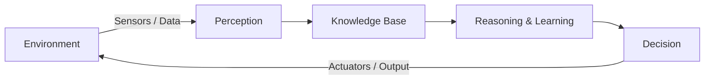

The agent looks at the environment, understands it, thinks, acts — and the action changes the environment, so the cycle runs again.

#### A short history of AI (dates that are asked in exams)

| Year | Event |
|---|---|
| 1943 | McCulloch & Pitts design the first mathematical model of a neuron |
| 1950 | **Alan Turing** publishes the **Turing Test** ("Can machines think?") |
| 1956 | **Dartmouth Conference** — **John McCarthy** coins the term *Artificial Intelligence*. This is treated as the **birth year of AI** |
| 1966 | **ELIZA**, the first chatbot |
| 1974–80 | **First AI Winter** (funding dries up) |
| 1980s | **Expert Systems** become popular in industry |
| 1997 | IBM's **Deep Blue** defeats world chess champion **Garry Kasparov** |
| 2011 | IBM **Watson** wins the quiz show *Jeopardy!* |
| 2012 | **AlexNet** wins ImageNet — the Deep Learning boom starts |
| 2016 | Google DeepMind's **AlphaGo** beats Lee Sedol at Go |
| 2022 | **ChatGPT** launched — Generative AI reaches ordinary people |

#### Two names you must not mix up

- **Father of Artificial Intelligence → John McCarthy.** He organised the 1956 Dartmouth Conference, coined the term "Artificial Intelligence" and created the **LISP** language.
- **Father of Computer Science / Father of Modern Computing → Alan Turing.** He broke the German **Enigma** code in World War II and gave the **Turing Test**, which laid the *foundation* of AI thinking.

> **Exam trap:** a question like *"Who is largely credited for breaking the German Enigma codes that provided a foundation for artificial intelligence?"* → answer **Alan Turing** (not McCarthy).

#### The Turing Test

Turing said: don't ask "can a machine think?" — ask "can a machine *behave* so that a human cannot tell it apart from another human?"

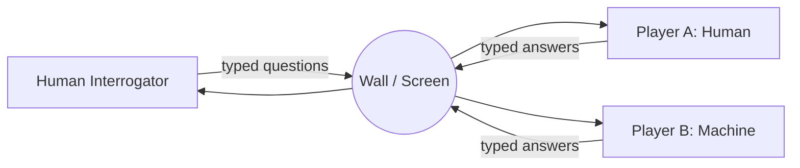

If after 5 minutes of chatting the interrogator cannot reliably say which one is the machine, the machine is said to have **passed the Turing Test**.

**Key points**

- AI is the *broad umbrella*; Machine Learning and Deep Learning sit inside it.
- Intelligence here is judged by **behaviour**, not by whether the machine "really" feels anything.
- AI needs three fuels: **Data**, **Algorithms**, and **Computing power (GPU)**.

**Previous Year Question List from this Topic:**

- [AI related Question (সম্পূর্ণ প্রশ্ন সংগ্রহ করা সম্ভব হয়নি)](../written-answers/ai-and-ml.md?plain=1#L115)
- [ক) Deep Blue কী?](../written-answers/ai-and-ml.md?plain=1#L229)
- [What is Artificial Intelligence?](../written-answers/ai-and-ml.md?plain=1#L389)
- [What is the father of AI?](../written-answers/ai-and-ml.md?plain=1#L537)
- [Who is Largely credited for breaking the German Enigma codes that provided a foundation for artificial intelligence?](../written-answers/ai-and-ml.md?plain=1#L571)

---

### Types of Artificial Intelligence

AI is classified in **two different ways**. Exams usually want both lists, so learn them as *Capability-based* and *Functionality-based*.

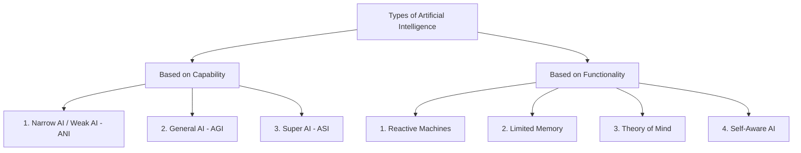

#### A. Classification based on Capability

**1. Narrow AI (Weak AI / ANI — Artificial Narrow Intelligence)**

- Built for **one specific task** only.
- It can be *better than a human* at that one task, but it cannot do anything else.
- **This is the only type that actually exists today.**
- Examples: Google Translate, Siri / Alexa, spam filter in Gmail, face unlock, chess engines, a bank's credit-scoring model.

**2. General AI (Strong AI / AGI — Artificial General Intelligence)**

- A machine that can do **any intellectual task a human can do** — and can move its learning from one field to another.
- It would understand, reason, plan and learn in a general way.
- **Still theoretical.** No AGI exists yet.

**3. Super AI (ASI — Artificial Super Intelligence)**

- Intelligence that **crosses human level** in every field: science, creativity, social skill, wisdom.
- It would take its own decisions and solve problems on its own.
- **Purely hypothetical** — this is the stage people worry about in AI-safety debates.

| Point | Narrow AI | General AI | Super AI |
|---|---|---|---|
| Scope | One task | Any human task | Beyond human |
| Exists today? | ✅ Yes | ❌ No | ❌ No |
| Learning transfer | No | Yes | Yes |
| Example | Alexa, spam filter | (theoretical) | (theoretical) |

#### B. Classification based on Functionality

**1. Reactive Machines**

- The **most basic** type. It only looks at the **present input**.
- It has **no memory**, so it cannot use past experience.
- Example: **IBM Deep Blue** (the chess computer that beat Kasparov in 1997) — it evaluated the current board position only.

**2. Limited Memory**

- Can store **a small amount of past data** for a short time and use it with present data.
- **Almost all useful AI today — including every Deep Learning model — is Limited Memory AI.**
- Example: a self-driving car remembering the speed and position of nearby cars for the last few seconds; chatbots remembering the current conversation.

**3. Theory of Mind**

- Would understand that people have **emotions, beliefs and intentions**, and would respond to them.
- **Research stage only** (emotion-aware robots such as Sophia are early attempts).

**4. Self-Aware AI**

- The final, imaginary stage: the machine has **its own consciousness and sense of self**.
- Exists only in science fiction.

**Key points**

- Capability list = Narrow → General → Super (3 types).
- Functionality list = Reactive → Limited Memory → Theory of Mind → Self-Aware (4 types).
- **Everything working in 2026 is Narrow AI + Limited Memory.**

**Previous Year Question List from this Topic:**

- [AI related Question (সম্পূর্ণ প্রশ্ন সংগ্রহ করা সম্ভব হয়নি)](../written-answers/ai-and-ml.md?plain=1#L115)
- [ক) Deep Blue কী?](../written-answers/ai-and-ml.md?plain=1#L229)

---

### Branches and Sub-fields of Artificial Intelligence

AI is not one single subject — it is a family of sub-fields. A very common written question is *"Write the branches / areas of AI."*

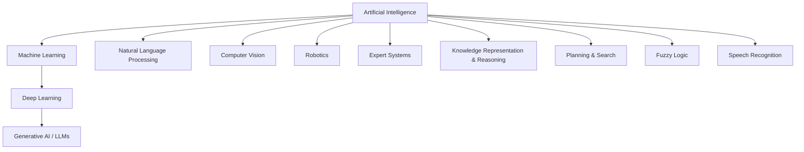

| Branch | What it does | Example |
|---|---|---|
| **Machine Learning** | Learns patterns from data instead of hand-written rules | Loan default prediction |
| **Deep Learning** | ML with many-layered neural networks | Face recognition |
| **Natural Language Processing (NLP)** | Understands and generates human language | Google Translate, ChatGPT |
| **Computer Vision** | Understands images and video | Number-plate reading, X-ray diagnosis |
| **Speech Recognition** | Converts speech to text | Voice typing in Bangla |
| **Robotics** | Machines that sense and act physically | Warehouse robots, robotic arms |
| **Expert Systems** | Rule-based systems that copy a human expert | MYCIN (medical diagnosis) |
| **Knowledge Representation** | Stores facts and relations so a machine can reason | Semantic networks, ontologies |
| **Planning & Search** | Finds a sequence of actions to reach a goal | Route planning, game playing |
| **Fuzzy Logic** | Handles "partly true" values instead of only 0/1 | Washing-machine and AC controllers |

**Previous Year Question List from this Topic:**

- [AI related Question (সম্পূর্ণ প্রশ্ন সংগ্রহ করা সম্ভব হয়নি)](../written-answers/ai-and-ml.md?plain=1#L115)

---

### What is Machine Learning (ML)?

**Machine Learning** is the sub-field of AI where a computer **learns patterns from data** and improves its performance with experience, **without being explicitly programmed** with rules for every case.

**Classic definitions:**

> "Machine Learning is the field of study that gives computers the ability to learn without being explicitly programmed."
> — *Arthur Samuel, 1959*

> "A computer program is said to learn from experience **E** with respect to some task **T** and performance measure **P**, if its performance at T, as measured by P, improves with experience E."
> — *Tom Mitchell, 1997*

For a spam filter: **T** = classify mail as spam/not-spam, **E** = thousands of labelled mails, **P** = percentage classified correctly.

#### Traditional Programming vs Machine Learning

This comparison is the heart of the topic — draw it if you get the question.

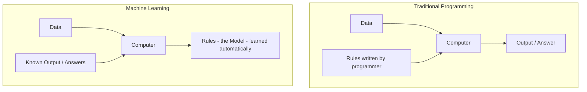

| Point | Traditional Programming | Machine Learning |
|---|---|---|
| Input given | Data + Rules | Data + Answers |
| Output produced | Answers | **Rules (the model)** |
| Who writes the logic | Programmer | The algorithm itself |
| Good for | Rules that are clear and fixed (payroll, tax) | Rules that are messy or unknown (handwriting, fraud) |
| Improves with more data | No | Yes |

#### Why do we need Machine Learning?

Some jobs are impossible to write as rules. Try writing an `if–else` for *"is this handwritten digit a 7?"* — you would need thousands of conditions and it would still fail. ML avoids this: show the machine 60,000 labelled digits and it works out the pattern itself.

#### Applications of Machine Learning in daily life

*(A frequently repeated question: "Name three ML applications in daily life.")*

1. **Email spam filtering** — Gmail sorting spam automatically.
2. **Product / content recommendation** — YouTube, Netflix, Daraz "you may also like".
3. **Face unlock and photo tagging** — your phone's camera and Google Photos.
4. **Voice assistants** — Siri, Alexa, Google Assistant.
5. **Online fraud / anomaly detection** — a bank blocking a suspicious card transaction.
6. **Credit scoring and loan approval** — predicting whether a borrower will default.
7. **Machine translation** — Google Translate English ↔ Bangla.
8. **Medical diagnosis** — detecting tumours in CT/MRI scans.
9. **Traffic prediction** — Google Maps showing the fastest route.
10. **Chatbots and customer support** — a bank's 24/7 helpdesk bot.

**Previous Year Question List from this Topic:**

- [(a) Describe the following terms: 3](../written-answers/ai-and-ml.md?plain=1#L25)
- [What is the difference between Supervised and Unsupervised learning?](../written-answers/ai-and-ml.md?plain=1#L72)
- [What do you mean by machine learning? Name three machine learning application in our daily life?](../written-answers/ai-and-ml.md?plain=1#L833)
- [What is Machine Learning? Mention some real-life applications.](../written-answers/ai-and-ml.md?plain=1#L976)
- [What is machine learning? Differentiate among supervised learning vs unsupervised learning vs reinforcement learning.](../written-answers/ai-and-ml.md?plain=1#L1013)

---

### AI vs Machine Learning vs Deep Learning vs Data Science

This is one of the most repeated written questions. The safest answer is a **nested-circle diagram + a comparison table**.

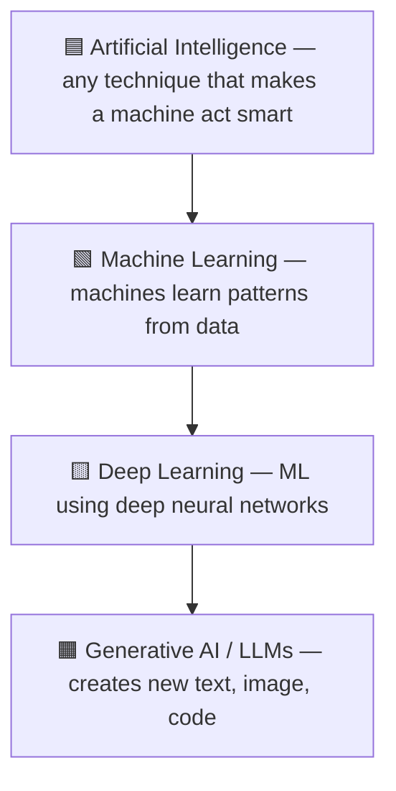

Think of it as boxes inside boxes: **every** Deep Learning system is Machine Learning, and **every** Machine Learning system is AI — but not the reverse. A rule-based expert system is AI but **not** ML.

| Point | Artificial Intelligence | Machine Learning | Deep Learning |
|---|---|---|---|
| **Meaning** | Making machines behave intelligently | Machines learn from data | ML using multi-layer neural networks |
| **Scope** | Widest | Subset of AI | Subset of ML |
| **Started** | 1956 | 1980s–90s | 2010s |
| **Feature extraction** | Hand-coded rules | **Manual** (human picks the features) | **Automatic** (network learns features) |
| **Data needed** | Depends | Works with **small/medium** data (thousands of rows) | Needs **very large** data (lakhs–millions) |
| **Hardware** | Normal CPU | CPU is usually enough | **GPU/TPU required** |
| **Training time** | — | Minutes to hours | Hours to weeks |
| **Interpretability** | Usually clear | Fairly clear (a decision tree can be read) | **Black box** — hard to explain |
| **Example** | Expert system, chess rules | Spam filter with Naive Bayes, Decision Tree | CNN for face recognition, ChatGPT |

**Where does Data Science fit?** Data Science is the *broader practice* of getting value out of data — collecting, cleaning, exploring, visualising and modelling it. It **overlaps** AI/ML rather than sitting inside it: a data scientist may use Machine Learning, but may also just build a dashboard or run statistics.

> **True/False trap:** *"Machine Learning is a subset of Cloud Computing that can build AI."* → **FALSE.** Machine Learning is a subset of **Artificial Intelligence**. Cloud Computing is only a *place* where ML models can be trained and hosted.

**Previous Year Question List from this Topic:**

- [(a) Describe the following terms: 3](../written-answers/ai-and-ml.md?plain=1#L25)
- [Machine learning is a subset of cloud computing that can be built AI-Based. (True or False).](../written-answers/ai-and-ml.md?plain=1#L529)
- [Write difference between machine learning and deep learning.](../written-answers/ai-and-ml.md?plain=1#L624)

---

### Types of Machine Learning

Machine Learning is divided into **three main types** (some books add a fourth, Semi-Supervised).

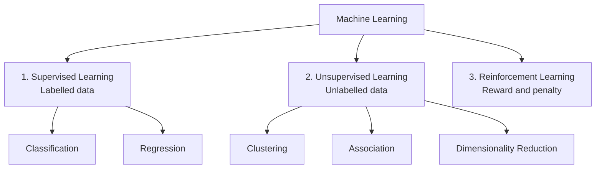

**1. Supervised Learning** — the data comes with the **correct answer (label)** attached. The model learns the mapping *input → output*, like a student learning with an answer key.
Examples: spam / not-spam, loan default yes / no, predicting house price.

**2. Unsupervised Learning** — the data has **no labels**. The model must find hidden structure on its own.
Examples: grouping customers into segments, market-basket analysis, compressing features with PCA.

**3. Reinforcement Learning** — an **agent** learns by **trial and error** inside an environment, collecting **rewards** for good actions and **penalties** for bad ones.
Examples: a robot learning to walk, AlphaGo, self-driving cars, dynamic pricing.

| Point | Supervised | Unsupervised | Reinforcement |
|---|---|---|---|
| Input data | **Labelled** | **Unlabelled** | No dataset — an environment |
| Goal | Predict a known output | Discover hidden pattern | Maximise total reward |
| Feedback | Direct (right answer given) | None | Delayed (reward signal) |
| Main tasks | Classification, Regression | Clustering, Association, Dim. reduction | Policy / control |
| Algorithms | Linear & Logistic Regression, Decision Tree, SVM, KNN, Random Forest, Naive Bayes | K-Means, Hierarchical clustering, DBSCAN, Apriori, PCA | Q-Learning, SARSA, Deep Q-Network |
| Example | Diabetes prediction from labelled patient records | Customer segmentation | Game playing robot |

*(A fourth type, **Semi-Supervised Learning**, uses a small amount of labelled data with a large amount of unlabelled data — useful when labelling is expensive, e.g. medical images.)*

**Previous Year Question List from this Topic:**

- [(a) Describe the following terms: 3](../written-answers/ai-and-ml.md?plain=1#L25)
- [What is the difference between Supervised and Unsupervised learning?](../written-answers/ai-and-ml.md?plain=1#L72)
- [Briefly explain supervised learning, unsupervised learning & reinforcement learning.](../written-answers/ai-and-ml.md?plain=1#L792)
- [What is machine learning? Differentiate among supervised learning vs unsupervised learning vs reinforcement learning.](../written-answers/ai-and-ml.md?plain=1#L1013)

---

### The Machine Learning Workflow (End-to-End Pipeline)

Many questions ask "how would you build a model for X?". Answer with these **7 steps**.

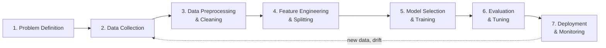

**Step 1 — Problem definition.** Decide what you are predicting and whether it is classification, regression or clustering. *"Will this customer default?"* → binary classification.

**Step 2 — Data collection.** Gather data from databases, logs, sensors, APIs or surveys. Rule of thumb: **garbage in, garbage out**.

**Step 3 — Data preprocessing / cleaning.**
- Handle **missing values** (drop, or fill with mean/median/mode).
- Remove **duplicates** and **outliers**.
- **Encode** categorical values (One-Hot Encoding, Label Encoding).
- **Scale** numeric values (Normalisation to 0–1, or Standardisation to mean 0, SD 1).

**Step 4 — Feature engineering and data splitting.** Create useful new columns (e.g. *income ÷ loan amount*), remove useless ones, then split the data:

| Set | Typical share | Used for |
|---|---|---|
| **Training set** | 60–70 % | Fitting the model (model *sees* the labels) |
| **Validation set** | 15–20 % | Tuning hyper-parameters, choosing the model |
| **Test set** | 15–20 % | Final, one-time check of real-world performance |

**Step 5 — Model selection and training.** Pick an algorithm that suits the data size and the need for interpretability, then fit it on the training set.

**Step 6 — Evaluation and tuning.** Measure with the right metric (Accuracy, Precision, Recall, F1, RMSE), use **k-fold cross-validation**, and tune hyper-parameters with Grid Search or Random Search.

**Step 7 — Deployment and monitoring.** Put the model behind an API, then keep watching for **data drift** (the real world changes, so accuracy falls) and retrain periodically.

**Previous Year Question List from this Topic:**

- [(a) Describe the following terms: 3](../written-answers/ai-and-ml.md?plain=1#L25)

---

### Applications of AI — in Daily Life and in the Banking Sector

Bank and government IT exams very often ask for AI uses **specific to banking/government**, so keep both lists ready.

#### General applications of AI

| Sector | Application |
|---|---|
| Healthcare | Disease detection from X-ray/MRI, drug discovery, robotic surgery |
| Transport | Self-driving cars, traffic prediction, route optimisation |
| Education | Personalised learning, auto grading, AI tutors |
| Agriculture | Crop disease detection from leaf photos, yield prediction |
| E-commerce | Recommendation engines, dynamic pricing, chatbots |
| Security | Face recognition, CCTV anomaly detection, intrusion detection |
| Entertainment | Netflix/Spotify recommendation, AI-generated images and music |

#### AI in Banking and Finance (very important for bank exams)

1. **Fraud detection** — spotting an unusual transaction in real time and blocking the card.
2. **Credit scoring / loan underwriting** — predicting the probability of default from income, history and behaviour.
3. **Chatbots & virtual assistants** — 24/7 balance enquiry and complaint handling.
4. **Anti-Money Laundering (AML)** — flagging suspicious transaction chains.
5. **Algorithmic trading** — automated buy/sell decisions.
6. **Customer segmentation & cross-selling** — targeting the right product to the right customer.
7. **e-KYC** — matching a face with the NID photo, reading documents with OCR.
8. **Cheque processing** — reading handwritten amounts (an old, classic AI use).
9. **Churn prediction** — identifying customers likely to leave.
10. **Robotic Process Automation (RPA)** — automating repetitive back-office work.

#### AI in Government / Citizen Services

- Citizen-service chatbots that answer in Bangla.
- Automatic document summarisation for policy files.
- Land-record and NID verification with computer vision.
- Disaster (flood/cyclone) prediction from satellite and sensor data.
- Smart traffic signals and e-challan systems.

**Previous Year Question List from this Topic:**

- [AI related Question (সম্পূর্ণ প্রশ্ন সংগ্রহ করা সম্ভব হয়নি)](../written-answers/ai-and-ml.md?plain=1#L115)
- [Focus Witting: কৃত্রিম বুদ্ধিমত্তা (AI) দক্ষতা ও নৈতিকতা (বাংলা)](../written-answers/ai-and-ml.md?plain=1#L144)
- [What do you mean by machine learning? Name three machine learning application in our daily life?](../written-answers/ai-and-ml.md?plain=1#L833)
- [What is Machine Learning? Mention some real-life applications.](../written-answers/ai-and-ml.md?plain=1#L976)

---

### AI Ethics, Bias and Responsible AI

As AI enters banking, health and government, the **ethical side** has become a favourite Focus-Writing and short-note topic (often asked in Bangla as *"কৃত্রিম বুদ্ধিমত্তা: দক্ষতা ও নৈতিকতা"*).

#### Why ethics matters

An AI model is trained on **past human data**. If the past was unfair, the model happily learns that unfairness and then applies it at machine speed to millions of people. So the danger is not a robot rebellion — it is **quiet, large-scale unfairness**.

#### The main ethical issues

| Issue | What goes wrong | Real example |
|---|---|---|
| **Bias & Discrimination** | Training data reflects old prejudice | A hiring model that downgrades women's CVs because past hires were mostly men |
| **Privacy** | Models need personal data | Face recognition tracking people without consent |
| **Transparency / Black box** | Deep models cannot explain themselves | A loan is rejected and nobody can say why |
| **Accountability** | Who is responsible for a wrong decision? | A self-driving car causes an accident |
| **Job displacement** | Automation removes routine jobs | Data entry, tele-calling, basic support |
| **Misinformation / Deepfakes** | Generative AI makes fake media | Fake video of a leader before an election |
| **Security misuse** | AI used for attacks | AI-written phishing mails, automated malware |
| **Environmental cost** | Training large models uses huge electricity | Large language model training runs |

#### The principles of Responsible AI

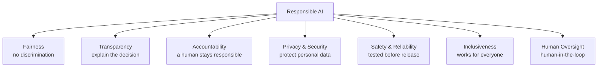

#### How to reduce bias — practical steps

1. Collect **diverse, representative** training data.
2. **Audit** the dataset for imbalance before training.
3. Measure accuracy **separately for each group** (gender, region, age), not just overall.
4. Use **Explainable AI (XAI)** tools such as LIME and SHAP so decisions can be justified.
5. Keep a **human-in-the-loop** for high-stakes decisions (loans, jobs, medical, legal).
6. Follow rules and law — Bangladesh's **National AI Policy**, the **Digital Security / Cyber Security Act**, and the EU **AI Act** as an international reference.

**Key points for a Focus Writing answer**

- Write a short intro: AI increases **efficiency**, but efficiency without **ethics** is dangerous.
- Give 3–4 benefits (speed, accuracy, 24/7 service, cost saving).
- Give 3–4 risks (bias, privacy, job loss, deepfakes).
- End with the balance: *"AI should assist human judgement, not replace human responsibility."*

**Previous Year Question List from this Topic:**

- [Focus Witting: কৃত্রিম বুদ্ধিমত্তা (AI) দক্ষতা ও নৈতিকতা (বাংলা)](../written-answers/ai-and-ml.md?plain=1#L144)

## Artificial Intelligence & Expert Systems
### Intelligent Agents in AI

Modern AI textbooks (Russell & Norvig) describe **every** AI system as an **agent**.

> An **agent** is anything that can **perceive** its environment through **sensors** and **act** upon that environment through **actuators**.

An **intelligent agent** is an agent that chooses its actions so as to achieve the **best expected outcome** (it is *rational*).

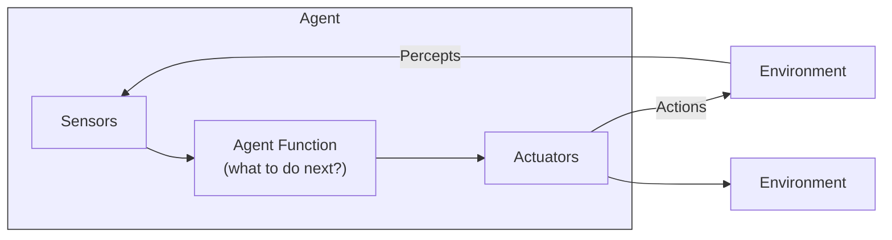

| Term | Meaning |
|---|---|
| **Percept** | One input the agent receives at a moment |
| **Percept sequence** | The complete history of everything the agent has perceived so far |
| **Agent function** | The mapping: percept sequence → action |
| **Agent program** | The actual code that implements the agent function |
| **Rational agent** | For every percept sequence, it picks the action expected to **maximise its performance measure** |

**Examples of agent = sensors + actuators**

| Agent | Sensors | Actuators |
|---|---|---|
| Human | Eyes, ears, skin, nose | Hands, legs, mouth |
| Robot | Camera, infrared, LIDAR | Motors, wheels, robotic arm |
| Software agent (e.g. spam filter) | Keystrokes, file contents, network packets | Screen display, writing files, sending packets |

**Key point:** a rational agent is *not* an omniscient agent. It does the best it can with the information available — it is not expected to know the future.

**Previous Year Question List from this Topic:**

- [An artificial intelligence is an agent is an entity that continuously revious its enviornment.....](../written-answers/ai-and-ml.md?plain=1#L411)

---

### PEAS Framework (Performance, Environment, Actuators, Sensors)

Before designing any intelligent agent you must **specify the task**. The standard way is **PEAS**.

| Letter | Stands for | Question it answers |
|---|---|---|
| **P** | **Performance measure** | How do we score success? |
| **E** | **Environment** | Where does the agent work? |
| **A** | **Actuators** | What can it *do*? |
| **S** | **Sensors** | What can it *see/feel*? |

#### PEAS for an Automated Taxi Driver

| Component | Description |
|---|---|
| **Performance measure** | Safe journey, no accidents, obeys traffic law, fast trip time, low fuel cost, passenger comfort, maximum profit |
| **Environment** | Roads, highways, other vehicles, pedestrians, traffic signals, road signs, weather, passengers |
| **Actuators** | Steering wheel, accelerator, brake, gear, indicator, horn, display/voice output to passenger |
| **Sensors** | Cameras, LIDAR, RADAR, GPS, speedometer, odometer, engine sensors, accelerometer, microphone/keyboard for passenger input |

#### PEAS for an Automatic Clinical / Medical Test System

| Component | Description |
|---|---|
| **Performance measure** | Correct diagnosis, high accuracy (few false positives/negatives), patient safety, low test cost, fast report, minimum unnecessary tests |
| **Environment** | Patient, hospital or diagnostic lab, doctors and technicians, patient medical history database, laboratory equipment |
| **Actuators** | Display of the diagnosis/report, printing the test result, recommending further tests, alerts to doctor, entry into the hospital record system |
| **Sensors** | Keyboard entry of symptoms, blood/urine analyser readings, ECG and blood-pressure sensors, X-ray/CT/MRI images, patient history database |

#### Two more PEAS examples worth memorising

| Agent | P | E | A | S |
|---|---|---|---|---|
| **Vacuum cleaner robot** | Cleanliness, battery used, time taken | Room, carpet, furniture, dust | Wheels, brushes, vacuum motor | Dirt sensor, bump sensor, camera |
| **Part-picking robot** | Percentage of parts in the correct bin | Conveyor belt with parts, bins | Jointed arm, gripper | Camera, joint-angle sensors |

**Previous Year Question List from this Topic:**

- [Write PEAS for (a) Auto taxi (b) Automatic clinical test.](../written-answers/ai-and-ml.md?plain=1#L508)

---

### Types of Intelligent Agents

Agents are classified by **how much thinking** they do — from the simplest to the most capable.

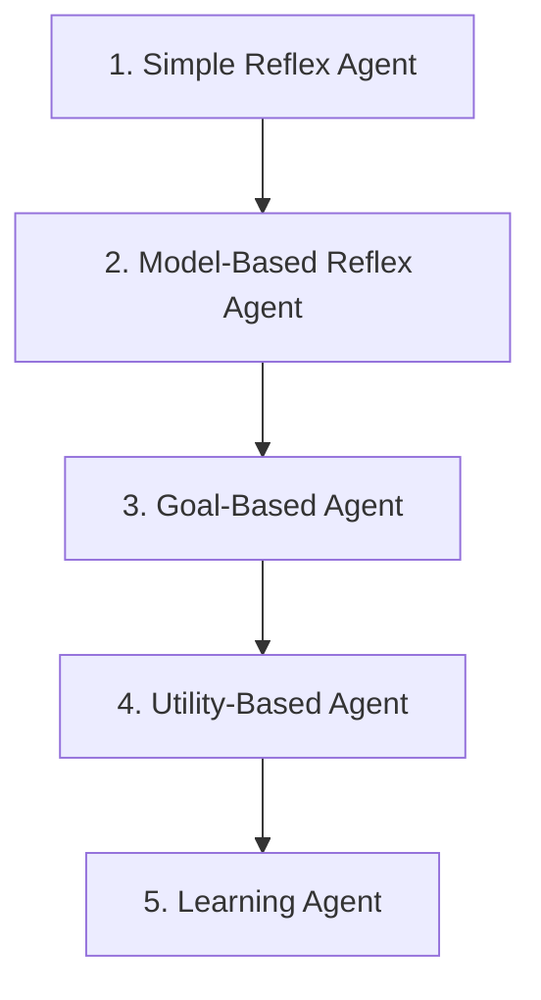

**1. Simple Reflex Agent**
- Acts **only on the current percept**, using `condition → action` rules.
- No memory of the past.
- Works only in a **fully observable** environment.
- *Example:* a thermostat — `if temperature > 25 then switch on AC`.

**2. Model-Based Reflex Agent**
- Keeps an **internal model** (memory) of how the world works, so it can handle a **partially observable** environment.
- *Example:* a robot vacuum that remembers which rooms it has already cleaned.

**3. Goal-Based Agent**
- Also knows **what it is trying to achieve**. It searches and plans a sequence of actions to reach the goal.
- *Example:* Google Maps planning a route to a destination.

**4. Utility-Based Agent**
- Not all goals are equally good — it uses a **utility function** to pick the *best* among several ways of reaching the goal.
- *Example:* choosing the route that is safest and cheapest, not just shortest.

**5. Learning Agent**
- **Improves with experience.** It has four parts:

| Part | Job |
|---|---|
| **Learning element** | Makes improvements |
| **Performance element** | Selects the external action |
| **Critic** | Gives feedback on how well the agent is doing |
| **Problem generator** | Suggests exploratory actions to discover something new |

- *Example:* a recommendation system that gets better as you watch more videos.

**Previous Year Question List from this Topic:**

- [An artificial intelligence is an agent is an entity that continuously revious its enviornment.....](../written-answers/ai-and-ml.md?plain=1#L411)

---

### Properties of Task Environments

The type of environment decides how hard the agent's job is. Exams ask this as *"classify the environment of a self-driving car"*.

| # | Property pair | Meaning | Example |
|---|---|---|---|
| 1 | **Fully vs Partially Observable** | Can the agent see the complete state at any time? | Chess = fully; driving a car = partially |
| 2 | **Deterministic vs Stochastic** | Does the same action always give the same result? | Chess = deterministic; driving = stochastic |
| 3 | **Episodic vs Sequential** | Does the current action affect future ones? | Quality-check of a part = episodic; chess = sequential |
| 4 | **Static vs Dynamic** | Does the world change while the agent is thinking? | Crossword = static; driving = dynamic |
| 5 | **Discrete vs Continuous** | Is the number of states/actions countable? | Chess = discrete; driving = continuous |
| 6 | **Single-agent vs Multi-agent** | Is anyone else acting in the same environment? | Crossword = single; chess/driving = multi |
| 7 | **Known vs Unknown** | Does the agent know the rules of the environment? | Known = rules given; Unknown = must be learned |

**The hardest environment** is one that is *partially observable, stochastic, sequential, dynamic, continuous and multi-agent* — which is exactly **driving a car in real traffic**.

**Previous Year Question List from this Topic:**

- [An artificial intelligence is an agent is an entity that continuously revious its enviornment.....](../written-answers/ai-and-ml.md?plain=1#L411)
- [Write PEAS for (a) Auto taxi (b) Automatic clinical test.](../written-answers/ai-and-ml.md?plain=1#L508)

---

### Knowledge and Knowledge Representation in AI

**Knowledge** is *processed, organised information that can be used to take decisions*. A program becomes intelligent only when it **stores** knowledge and can **reason** with it.

#### The Data → Information → Knowledge → Wisdom (DIKW) ladder

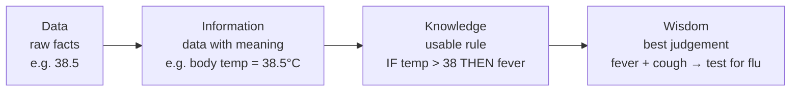

#### How human knowledge is put into a computer

This is the standard **flow diagram** asked in exams (*"Human Knowledge কে Computer এ প্রকাশ করার flow diagram দেখান"*):

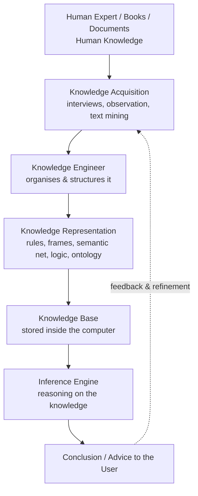

#### Types of knowledge in AI

| Type | Meaning | Example |
|---|---|---|
| **Declarative** | Knowing *that* (facts) | "Dhaka is the capital of Bangladesh" |
| **Procedural** | Knowing *how* (steps) | How to ride a bicycle |
| **Meta-knowledge** | Knowledge about knowledge | Knowing which rule to apply first |
| **Heuristic** | Rules of thumb from experience | "If the engine is silent, check the battery first" |
| **Structural** | How concepts relate to each other | "A car *is-a* vehicle" |

#### Main knowledge representation techniques

| Technique | Idea | Example |
|---|---|---|
| **Logical representation** | Propositional / Predicate (First-Order) Logic | `∀x Human(x) → Mortal(x)` |
| **Production rules** | `IF condition THEN action` | `IF fever AND cough THEN suspect flu` |
| **Semantic network** | A graph of concepts (nodes) and relations (edges) | *Bird* —is-a→ *Animal*; *Bird* —has→ *Wings* |
| **Frames** | A record with slots and values, like an object | `Car { colour: red, wheels: 4 }` |
| **Ontology** | A formal shared vocabulary of a domain | Medical ontology SNOMED |
| **Scripts** | A standard sequence of events | The "restaurant script": enter → order → eat → pay |

**Properties a good representation must have:** *representational adequacy, inferential adequacy, inferential efficiency,* and *acquisitional efficiency*.

**Previous Year Question List from this Topic:**

- [(i) ‘Knowledge’ কী? Human Knowledge কে Computer এ প্রকাশ করার একটি flow diagram দেখান।](../written-answers/ai-and-ml.md?plain=1#L544)

---

### Expert Systems — Architecture and Working

An **Expert System (ES)** is a computer program that copies the **decision-making ability of a human expert** in one narrow field, using a store of knowledge and a reasoning engine.

It is a classic example of **AI that is *not* Machine Learning** — the knowledge is put in by humans as rules, not learned from data.

#### Architecture

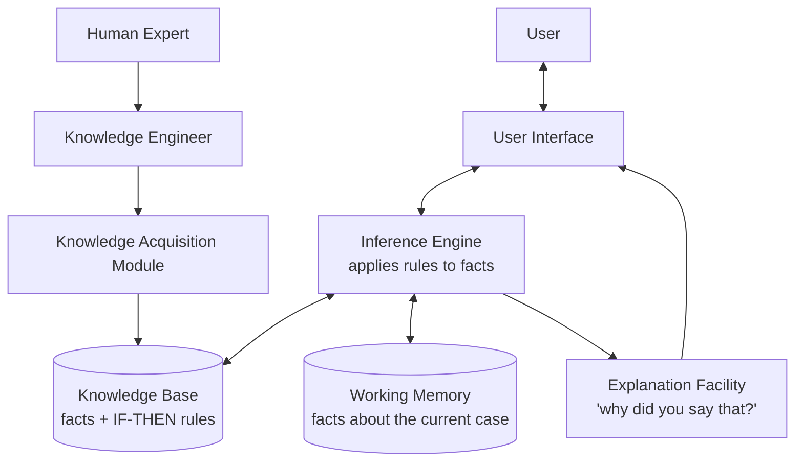

| Component | Function |
|---|---|
| **Knowledge Base** | Stores domain facts and `IF–THEN` rules collected from human experts |
| **Inference Engine** | The "brain" — matches rules against facts and derives new conclusions |
| **Working Memory** | Holds the facts of the case being solved right now |
| **User Interface** | Lets a non-expert ask questions in simple language |
| **Explanation Facility** | Explains *why* a question was asked and *how* a conclusion was reached |
| **Knowledge Acquisition Module** | Lets the knowledge engineer add or update knowledge |

#### Famous expert systems

| System | Field |
|---|---|
| **MYCIN** | Diagnosing blood infections and suggesting antibiotics (Stanford, 1970s) |
| **DENDRAL** | Identifying chemical molecular structures — the *first* expert system |
| **XCON / R1** | Configuring DEC computer orders |
| **PROSPECTOR** | Mineral and ore exploration |
| **CaDet** | Early cancer detection |

#### Advantages and Limitations

**Advantages**
- Available **24×7**, never gets tired or emotional.
- **Consistent** answers every time.
- **Preserves expertise** even after the expert retires.
- **Cheaper** than hiring many experts; useful in remote areas.
- Can **explain** its reasoning, unlike a deep neural network.

**Limitations**
- Works only in a **very narrow domain**; no common sense.
- **Cannot learn by itself** — knowledge must be updated by hand.
- **Knowledge acquisition bottleneck**: extracting rules from an expert is slow and costly.
- Fails badly on cases outside its rules ("brittleness").

#### Expert System vs Machine Learning

| Point | Expert System | Machine Learning |
|---|---|---|
| Source of knowledge | Human experts write rules | Learned from data |
| Learning | No self-learning | Improves with data |
| Explainability | High — rules are readable | Often a black box |
| Data needed | Very little | Large amount |
| Handles new/unseen cases | Poorly | Reasonably well |

**Previous Year Question List from this Topic:**

- [What is Artificial Intelligence?](../written-answers/ai-and-ml.md?plain=1#L389)
- [(i) ‘Knowledge’ কী? Human Knowledge কে Computer এ প্রকাশ করার একটি flow diagram দেখান।](../written-answers/ai-and-ml.md?plain=1#L544)

---

### Forward Chaining vs Backward Chaining

These are the two **reasoning strategies** used by an inference engine.

**Forward Chaining (Data-Driven)** — start from the **known facts**, keep firing the rules whose conditions match, and see **what conclusion you reach**.

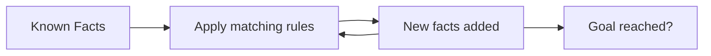

**Backward Chaining (Goal-Driven)** — start from a **possible goal/hypothesis**, and work backwards asking *"what facts would I need to prove this?"*

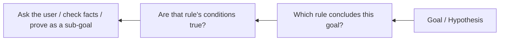

**Worked example.** Rules:
- R1: `IF has_fever AND has_cough THEN has_flu`
- R2: `IF has_flu THEN needs_rest`

*Forward chaining:* We are told the patient has fever and cough → R1 fires → `has_flu` → R2 fires → `needs_rest`. **Conclusion found from facts.**

*Backward chaining:* We ask "does the patient need rest?" → R2 says we must prove `has_flu` → R1 says we must prove `has_fever` and `has_cough` → ask the user those two questions. **Facts found from the goal.**

| Point | Forward Chaining | Backward Chaining |
|---|---|---|
| Direction | Facts → Conclusion | Goal → Facts |
| Also called | Data-driven, bottom-up | Goal-driven, top-down |
| Starting point | All available facts | A hypothesis to test |
| Best when | Many facts, few possible conclusions | Few goals, many possible facts |
| Typical use | Monitoring, alarms, planning, real-time control | Diagnosis, troubleshooting, MYCIN, Prolog |
| Efficiency | Can derive many irrelevant facts | Focused, asks only needed questions |

**Previous Year Question List from this Topic:**

- [(i) ‘Knowledge’ কী? Human Knowledge কে Computer এ প্রকাশ করার একটি flow diagram দেখান।](../written-answers/ai-and-ml.md?plain=1#L544)

---

### Measuring Intelligence — and Common True/False Traps

A few small conceptual questions are repeated across exams. Keep these straight.

**1. "Intelligence cannot be measured only by an intelligence test, because it is related to other subjects." → TRUE.**
An IQ test mostly checks logical and mathematical reasoning. Real intelligence also includes **emotional intelligence, creativity, social skill, language ability, memory and practical problem solving** — Howard Gardner's *Theory of Multiple Intelligences* lists linguistic, logical-mathematical, spatial, musical, bodily-kinesthetic, interpersonal, intrapersonal and naturalistic intelligence. So a single test score cannot capture it.

**2. "Machine Learning is a subset of Cloud Computing that can build AI." → FALSE.**
Machine Learning is a subset of **Artificial Intelligence**. Cloud Computing is an unrelated field — it only supplies the *infrastructure* (storage, GPUs, hosting) where ML models are often trained and deployed.

**3. "Who is the father of AI?" → John McCarthy** (coined the term in 1956, created LISP).
Do not confuse with **Alan Turing** (Enigma code-breaking, Turing Test) — he laid the *foundation*, but McCarthy is called the father of AI.

**4. "What is Deep Blue?" → IBM's chess-playing computer** that defeated world champion **Garry Kasparov in 1997**. It is a **Reactive Machine** type of AI: no memory of past games, it simply evaluated millions of board positions per second using brute-force search plus chess heuristics.

**5. "An AI agent is an entity that continuously perceives its environment..." → the full sentence is:**
> An intelligent agent is an entity that **perceives its environment through sensors** and **acts upon that environment through actuators**, choosing actions that maximise its performance measure.

**Previous Year Question List from this Topic:**

- [What is Artificial Intelligence?](../written-answers/ai-and-ml.md?plain=1#L389)
- [Intelligence can not be measured only by intelligence test because it is related to other subjects. (True or False)](../written-answers/ai-and-ml.md?plain=1#L523)
- [Machine learning is a subset of cloud computing that can be built AI-Based. (True or False).](../written-answers/ai-and-ml.md?plain=1#L529)
- [What is the father of AI?](../written-answers/ai-and-ml.md?plain=1#L537)
- [Who is Largely credited for breaking the German Enigma codes that provided a foundation for artificial intelligence?](../written-answers/ai-and-ml.md?plain=1#L571)
- [ক) Deep Blue কী?](../written-answers/ai-and-ml.md?plain=1#L229)

## Deep Learning & Neural Networks (ANN, CNN, RNN)
### Biological Neuron vs Artificial Neuron

A neural network is a **rough copy of the human brain**. The brain has about **86 billion** nerve cells called **neurons**; an Artificial Neural Network copies their basic idea in mathematics.

#### The biological neuron

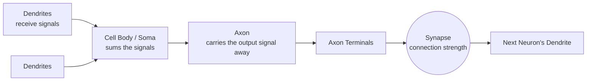

| Part | Job |
|---|---|
| **Dendrites** | Branch-like arms that **receive** signals from other neurons — the *inputs* |
| **Soma (cell body)** | **Adds up** all incoming signals and decides whether to fire |
| **Axon** | A long fibre that **carries the output signal away** from the cell body to other neurons |
| **Axon terminals** | The end branches of the axon that pass the signal on |
| **Synapse** | The junction between two neurons; its **strength** decides how much signal passes — this is what "learning" changes |

> **Frequently asked:** *"What does the axon of a neural network do?"*
> **Answer:** The axon **transmits/carries the output signal of the neuron away from the cell body** towards other neurons. In an Artificial Neural Network, the axon corresponds to the **output of the neuron**, and the synapse corresponds to the **weight** on the connection.

#### Mapping biology to mathematics

| Biological neuron | Artificial neuron |
|---|---|
| Dendrite | **Input** (x₁, x₂, … xₙ) |
| Synapse | **Weight** (w₁, w₂, … wₙ) |
| Cell body / Soma | **Summation function** Σ(wᵢxᵢ) + b |
| Firing threshold | **Activation function** |
| Axon | **Output** (y) |

**Previous Year Question List from this Topic:**

- [What does the axon of neural network do?](../written-answers/ai-and-ml.md?plain=1#L605)
- [What is Artificial Neural Network (ANN)? Difference between deep learning technique and Traditional machine learning technique.](../written-answers/ai-and-ml.md?plain=1#L657)
- [What is artificial Neural Network (ANN)? Based on ANN, describe input & hidden layer, weight and activation function.](../written-answers/ai-and-ml.md?plain=1#L707)

---

### Artificial Neural Network (ANN) — Structure and Working

An **Artificial Neural Network (ANN)** is a computing model made of many simple processing units called **neurons (nodes)**, arranged in **layers** and joined by **weighted connections**. It learns by adjusting those weights until its output matches the desired output.

#### Structure of a single artificial neuron

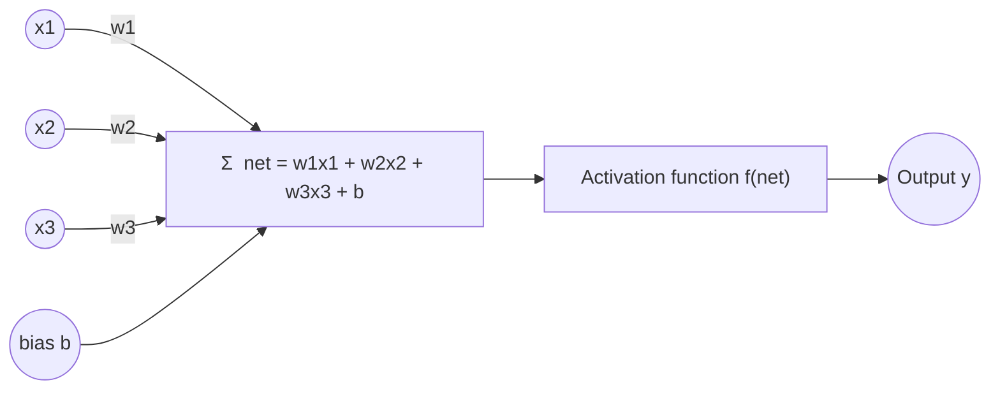

The maths in one line:

> **y = f( Σ (wᵢ · xᵢ) + b )**

where `xᵢ` = inputs, `wᵢ` = weights, `b` = bias, `f` = activation function.

#### The three kinds of layer

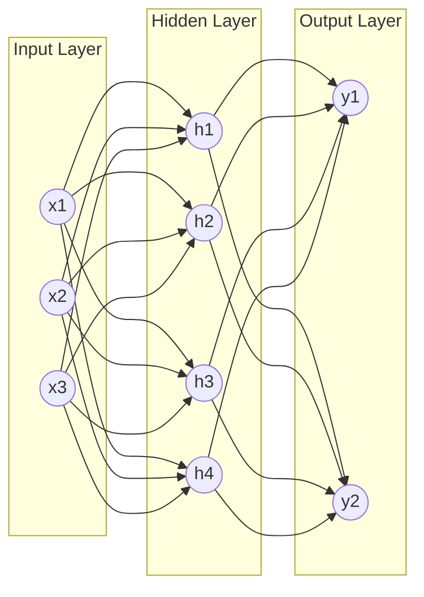

| Layer | Job |
|---|---|
| **Input layer** | Takes the raw features. **No computation happens here** — it only passes values in. Number of nodes = number of features. |
| **Hidden layer(s)** | The real "thinking" layers. Each node computes a weighted sum plus bias and applies an activation function. They learn increasingly abstract features. A network may have 1 hidden layer (shallow) or 100+ (deep). |
| **Output layer** | Produces the final answer. 1 node for regression or binary classification; *n* nodes with Softmax for *n*-class classification. |

#### What are weights and bias?

- **Weight (w)** = the **importance** of an input. A large positive weight means "this input pushes the neuron to fire"; a negative weight pushes against it. **Weights are what the network learns.**
- **Bias (b)** = a constant added to the sum. It lets the neuron **shift** its activation threshold, so the neuron can fire even when all inputs are zero. Without bias, every decision boundary would be forced through the origin.

#### Single-layer ANN (the Perceptron)

*"Draw the single layer of an ANN"* — this is the answer:

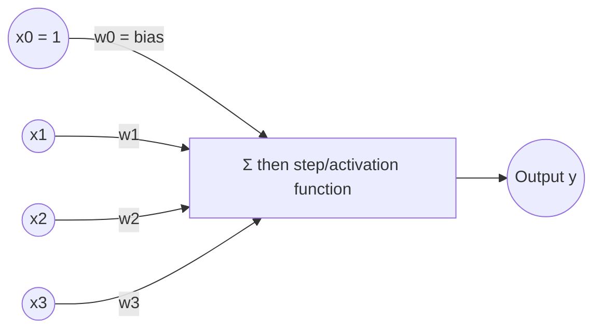

A **single-layer perceptron** has only an input layer and an output layer — **no hidden layer**. It can only separate data that is **linearly separable**, so it can learn AND and OR but famously **cannot learn XOR**. Adding a hidden layer (making a **Multi-Layer Perceptron, MLP**) solves XOR.

#### How an ANN learns — the training loop

```mermaid
flowchart LR
    A[1. Initialise weights randomly] --> B[2. Forward Propagation<br/>compute the output]
    B --> C[3. Compute Loss<br/>predicted vs actual]
    C --> D[4. Backpropagation<br/>find each weight's share of the error]
    D --> E[5. Gradient Descent<br/>update the weights]
    E -->|repeat for many epochs| B
```

1. **Forward propagation** — input flows left to right through the layers and produces a prediction.
2. **Loss function** — measures how wrong the prediction is (MSE for regression, Cross-Entropy for classification).
3. **Backpropagation** — using the chain rule of calculus, the error is pushed backwards to find *how much each weight contributed* to the error (the gradient).
4. **Gradient descent** — every weight is nudged in the direction that reduces the error:
   **w_new = w_old − η × ∂Loss/∂w**, where **η (eta)** is the **learning rate**.
5. One full pass over the training data = one **epoch**; training runs for many epochs.

#### Types of neural network worth naming

| Type | Used for |
|---|---|
| **Feedforward NN / MLP** | General tabular prediction |
| **CNN** (Convolutional) | Images and video |
| **RNN / LSTM / GRU** | Sequences — text, speech, time series |
| **Autoencoder** | Compression, denoising, anomaly detection |
| **GAN** (Generative Adversarial Network) | Generating new images |
| **Transformer** | Modern NLP — BERT, GPT, ChatGPT |

**Previous Year Question List from this Topic:**

- [What is Artificial Neural Network (ANN)? Difference between deep learning technique and Traditional machine learning technique.](../written-answers/ai-and-ml.md?plain=1#L657)
- [Draw the single layer of ANN.](../written-answers/ai-and-ml.md?plain=1#L688)
- [What is artificial Neural Network (ANN)? Based on ANN, describe input & hidden layer, weight and activation function.](../written-answers/ai-and-ml.md?plain=1#L707)

---

### Activation Functions in Neural Networks

An **activation function** is the mathematical function applied to a neuron's weighted sum. It decides **whether and how strongly the neuron fires**, and it converts the sum into the neuron's output.

#### Why is an activation function needed? (the "usability")

This is the key exam point:

> Without an activation function, every layer would only compute a **weighted sum**, which is a *linear* operation. Stacking many linear layers still gives just one linear function — so a 100-layer network would be no more powerful than a single layer. The activation function introduces **non-linearity**, which is what lets the network learn **complex, curved patterns** such as images, speech and language.

Other uses:
1. **Bounds the output** to a useful range (e.g. 0–1 for a probability).
2. **Decides firing** — mimics the biological "fire / don't fire" threshold.
3. **Makes backpropagation possible** — it must be *differentiable* so gradients can flow.
4. **Softmax in the output layer** turns raw scores into class probabilities.

#### The important activation functions

| Function | Formula | Output range | Where used | Problem |
|---|---|---|---|---|
| **Step (Threshold)** | 1 if x ≥ 0, else 0 | {0, 1} | Original perceptron | Not differentiable — cannot train with backprop |
| **Linear** | f(x) = x | −∞ to +∞ | Output layer of regression | No non-linearity |
| **Sigmoid (Logistic)** | 1 / (1 + e⁻ˣ) | 0 to 1 | Output layer of **binary classification** (gives a probability) | **Vanishing gradient**; output not zero-centred; slow |
| **Tanh** | (eˣ − e⁻ˣ)/(eˣ + e⁻ˣ) | −1 to 1 | Hidden layers of older/RNN networks | Zero-centred (better than sigmoid) but still vanishing gradient |
| **ReLU** | max(0, x) | 0 to ∞ | **Default choice for hidden layers** | **Dying ReLU** — neurons with negative input output 0 forever |
| **Leaky ReLU** | x if x>0, else αx (α ≈ 0.01) | −∞ to ∞ | Hidden layers, fixes dying ReLU | α must be chosen |
| **Softmax** | eˣⁱ / Σ eˣʲ | 0 to 1, sums to 1 | **Output layer of multi-class classification** | Output layer only |

#### Shapes of the curves

```mermaid
flowchart LR
    A["Sigmoid<br/>S-shaped curve<br/>squashes into 0 … 1"]
    B["Tanh<br/>S-shaped curve<br/>squashes into −1 … 1"]
    C["ReLU<br/>flat 0 for x<0,<br/>straight line for x>0"]
    D["Leaky ReLU<br/>small slope for x<0,<br/>straight line for x>0"]
```

#### The Vanishing Gradient Problem (why ReLU won)

The derivative of sigmoid is at most **0.25**. In backpropagation these derivatives get **multiplied layer after layer**: 0.25 × 0.25 × 0.25 … After 10 layers the gradient is around 0.25¹⁰ ≈ 0.00000095 — practically **zero**. The early layers then stop learning. This is the **vanishing gradient problem**.

**ReLU** fixes it because its derivative is exactly **1** for every positive input, so gradients pass through unchanged no matter how deep the network is. That single fact is what made very deep networks trainable.

**Rule of thumb for choosing**

| Situation | Use |
|---|---|
| Hidden layers | **ReLU** (or Leaky ReLU / GELU) |
| Binary classification output | **Sigmoid** |
| Multi-class classification output | **Softmax** |
| Regression output | **Linear** (no activation) |

**Previous Year Question List from this Topic:**

- [(c) What is activation function in Deep Neural Network? What is the usability of this?](../written-answers/ai-and-ml.md?plain=1#L580)
- [What is artificial Neural Network (ANN)? Based on ANN, describe input & hidden layer, weight and activation function.](../written-answers/ai-and-ml.md?plain=1#L707)
- [(c) What is activation function in Deep Neural Network? What is the usability of this?](../written-answers/ai-and-ml.md?plain=1#L48)

---

### What is Deep Learning?

**Deep Learning (DL)** is the part of Machine Learning that uses **Artificial Neural Networks with many hidden layers** ("deep" = many layers) to learn directly from raw data.

The special power of Deep Learning is **automatic feature extraction**: you do not tell it what to look for — it discovers the useful features by itself.

```mermaid
flowchart LR
    A[Raw image pixels] --> B[Layer 1<br/>learns edges]
    B --> C[Layer 2<br/>learns corners & textures]
    C --> D[Layer 3<br/>learns eyes, nose, ears]
    D --> E[Layer 4<br/>learns whole faces]
    E --> F[Output: 'this is Rahim']
```

**Why did Deep Learning explode after 2012?** Three things came together:
1. **Big Data** — the internet produced huge labelled datasets (ImageNet).
2. **GPU computing** — graphics cards made matrix maths hundreds of times faster.
3. **Better algorithms** — ReLU, dropout, batch normalisation, Adam optimiser.

**Applications of Deep Learning**

| Area | Application |
|---|---|
| Computer Vision | Face recognition, medical imaging, self-driving cars, OCR |
| NLP | Machine translation, chatbots, ChatGPT, sentiment analysis |
| Speech | Voice assistants, speech-to-text, text-to-speech |
| Healthcare | Cancer detection, drug discovery |
| Finance | Fraud detection, algorithmic trading |
| Generative | DALL·E, Midjourney, deepfakes, AI music |

**Limitations of Deep Learning**
- Needs **huge labelled datasets** and **expensive GPUs**.
- **Black box** — very hard to explain a decision (a serious problem for banking and medicine).
- Long training time; high electricity cost.
- Can **overfit** easily on small data.

**Previous Year Question List from this Topic:**

- [Write difference between machine learning and deep learning.](../written-answers/ai-and-ml.md?plain=1#L624)
- [What is Deep learning?](../written-answers/ai-and-ml.md?plain=1#L639)
- [What is Artificial Neural Network (ANN)? Difference between deep learning technique and Traditional machine learning technique.](../written-answers/ai-and-ml.md?plain=1#L657)

---

### Deep Learning vs Traditional Machine Learning

This exact comparison is asked again and again — memorise the table.

```mermaid
flowchart TD
    subgraph ML["Traditional Machine Learning"]
        A1[Raw Data] --> A2["Manual Feature Extraction<br/>(human engineer decides)"]
        A2 --> A3[ML Algorithm<br/>SVM / Decision Tree]
        A3 --> A4[Output]
    end
    subgraph DL["Deep Learning"]
        B1[Raw Data] --> B2["Deep Neural Network<br/>feature extraction + classification together"]
        B2 --> B4[Output]
    end
```

| Point | Traditional Machine Learning | Deep Learning |
|---|---|---|
| **Feature extraction** | **Manual** — a human decides which features matter | **Automatic** — the network learns features itself |
| **Data requirement** | Works well with **small to medium** data (thousands of rows) | Needs **very large** data (lakhs to millions) |
| **Hardware** | Ordinary **CPU** is enough | Needs **GPU / TPU** |
| **Training time** | Seconds to hours | Hours to weeks |
| **Execution (prediction) time** | Usually fast | Can be slower, but fast on GPU |
| **Interpretability** | **High** — you can read a decision tree | **Low** — a black box |
| **Performance on small data** | Better | Poor (overfits) |
| **Performance on huge data** | Plateaus — stops improving | Keeps improving |
| **Problem solving style** | Problem is broken into parts and solved step by step | Solved **end-to-end** in one model |
| **Typical algorithms** | Linear Regression, Logistic Regression, Decision Tree, SVM, KNN, Random Forest | CNN, RNN, LSTM, GAN, Transformer |
| **Best for** | Tabular / structured data (bank records) | Unstructured data (images, audio, text) |

**One-line answer:** *Deep Learning is Machine Learning that uses deep neural networks to learn the features automatically, while traditional Machine Learning depends on features hand-picked by humans.*

**Previous Year Question List from this Topic:**

- [Write difference between machine learning and deep learning.](../written-answers/ai-and-ml.md?plain=1#L624)
- [What is Artificial Neural Network (ANN)? Difference between deep learning technique and Traditional machine learning technique.](../written-answers/ai-and-ml.md?plain=1#L657)

---

### Convolutional Neural Network (CNN)

A **CNN** is the neural network designed for **image and video data**. Instead of connecting every pixel to every neuron (which would need millions of weights), it slides small **filters (kernels)** over the image to detect local patterns.

#### CNN architecture

```mermaid
flowchart LR
    I[Input Image<br/>e.g. 32x32x3] --> C1[Convolution Layer<br/>+ ReLU]
    C1 --> P1[Pooling Layer<br/>Max Pooling]
    P1 --> C2[Convolution Layer<br/>+ ReLU]
    C2 --> P2[Pooling Layer]
    P2 --> FL[Flatten]
    FL --> FC[Fully Connected Layer]
    FC --> O[Output Layer<br/>Softmax]
```

| Layer | What it does |
|---|---|
| **Convolution layer** | Slides a small filter over the image and produces a **feature map** highlighting edges, corners, textures |
| **ReLU** | Adds non-linearity, turns negative values to 0 |
| **Pooling (subsampling)** | Shrinks the feature map (e.g. **Max Pooling** keeps the largest value in each 2×2 block) — reduces computation and gives small shift-invariance |
| **Flatten** | Converts the 2-D feature maps into a 1-D vector |
| **Fully Connected (Dense)** | Does the final classification using all the extracted features |
| **Softmax output** | Gives the probability of each class |

**Why CNN beats a plain ANN on images**
1. **Parameter sharing** — the same filter is used across the whole image, so far fewer weights.
2. **Local connectivity** — a pixel is most related to its neighbours.
3. **Translation invariance** — a cat is recognised whether it is on the left or the right of the photo.

**Famous CNNs:** LeNet-5, AlexNet (2012), VGG-16, GoogLeNet/Inception, ResNet.

**Previous Year Question List from this Topic:**

- [What is Deep learning?](../written-answers/ai-and-ml.md?plain=1#L639)

---

### Recurrent Neural Network (RNN) and LSTM

#### RNN

A **Recurrent Neural Network** is built for **sequential data** — text, speech, time series — where **order matters**. Its special feature is a **loop**: the output of a step is fed back as input to the next step, giving the network a **memory** of what came before.

```mermaid
flowchart LR
    X1[x1<br/>'I'] --> H1((h1))
    H1 --> X2G[ ]
    X2[x2<br/>'love'] --> H2((h2))
    H1 -->|hidden state| H2
    X3[x3<br/>'Bangla'] --> H3((h3))
    H2 -->|hidden state| H3
    H3 --> Y[Prediction:<br/>next word]
    style X2G fill:none,stroke:none
```

**Problem with plain RNN:** over a long sequence the repeated multiplication of gradients makes them **vanish** (or explode). So an RNN forgets information from far back — it cannot connect *"I grew up in **Bangladesh** … I speak fluent **Bangla**"* if the two words are 50 words apart. This is the **long-term dependency problem**.

#### LSTM — Long Short-Term Memory

**LSTM** is an improved RNN that solves the long-term dependency problem by adding a **cell state** (a "conveyor belt" of memory running through time) controlled by **gates**.

```mermaid
flowchart LR
    CP["Cell state C(t-1)"] --> FG["× Forget Gate<br/>what to throw away"]
    FG --> ADD["+ Input Gate<br/>what new info to store"]
    ADD --> CN["Cell state C(t)"]
    CN --> OG["Output Gate<br/>what to output now"]
    OG --> HT["Hidden state h(t)"]
    XT["Input x(t)"] --> FG
    XT --> ADD
    XT --> OG
    HP["h(t-1)"] --> FG
    HP --> ADD
    HP --> OG
```

**The three gates of LSTM** *(a directly asked question — "Write LSTM gate names")*:

| # | Gate | Activation | What it decides |
|---|---|---|---|
| 1 | **Forget Gate** | Sigmoid | **What to remove** from the cell state. Output 0 = forget completely, 1 = keep fully |
| 2 | **Input Gate** (a.k.a. Update Gate) | Sigmoid + Tanh | **What new information to add** to the cell state |
| 3 | **Output Gate** | Sigmoid + Tanh | **What part of the cell state to output** as the hidden state h(t) |

*(The **cell state** itself is sometimes counted as a fourth component, and the tanh layer that creates the candidate values is called the **candidate/cell gate** — so some books say "4 gates". If asked for names, write **Forget, Input and Output gate**.)*

#### GRU — Gated Recurrent Unit

A simpler, faster variant with only **two gates**: the **Reset Gate** and the **Update Gate**. It merges the cell state and hidden state, so it has fewer parameters and trains faster, with performance close to LSTM.

| Point | RNN | LSTM | GRU |
|---|---|---|---|
| Gates | None | 3 (Forget, Input, Output) | 2 (Reset, Update) |
| Long-term memory | Poor | Excellent | Good |
| Parameters / speed | Fewest / fastest | Most / slowest | Middle |
| Use | Short sequences | Long text, speech, time series | When speed matters |

**Applications of RNN/LSTM:** machine translation, speech recognition, handwriting recognition, stock-price and load forecasting, text generation, sentiment analysis.

*(Note: since 2018, **Transformers** — which use an **attention mechanism** instead of recurrence and can be trained in parallel — have replaced LSTM in most NLP tasks, including GPT and BERT.)*

**Previous Year Question List from this Topic:**

- [Write LSTM gates name in AI.](../written-answers/ai-and-ml.md?plain=1#L676)

## Machine Learning Paradigms (Supervised vs Unsupervised)
### Supervised Learning in Detail

**Supervised Learning** is learning **with a teacher**. The training data contains both the **input features (X)** and the **correct output label (Y)**, and the model's job is to learn the mapping **Y = f(X)** so that it can predict Y for new, unseen X.

The name comes from the idea of a supervisor standing beside the student with the answer key.

```mermaid
flowchart LR
    A["Labelled Training Data<br/>(X , Y)"] --> B[Learning Algorithm]
    B --> C[Trained Model]
    D[New unseen input X'] --> C
    C --> E[Predicted output Y']
    F[Actual Y] --> G{Compare & compute error}
    E -.-> G
    G -.->|adjust| B
```

#### The two branches of Supervised Learning

| | **Classification** | **Regression** |
|---|---|---|
| **Output type** | Discrete **category / class** | Continuous **number** |
| **Question it answers** | "Which group?" | "How much / how many?" |
| **Examples** | Spam or not spam; loan default yes/no; disease positive/negative; digit 0–9 | House price; tomorrow's temperature; sales next month; a customer's credit limit |
| **Algorithms** | Logistic Regression, Decision Tree, Random Forest, SVM, KNN, Naive Bayes, Neural Network | Linear Regression, Polynomial Regression, Ridge/Lasso, Decision Tree Regressor, SVR |
| **Evaluation metrics** | Accuracy, Precision, Recall, F1-score, ROC-AUC, Confusion matrix | MAE, MSE, RMSE, R² |

**Classification is further divided into:**
- **Binary classification** — exactly 2 classes (diabetic / not diabetic).
- **Multi-class classification** — more than 2 classes, but each sample belongs to exactly one (handwritten digit 0–9).
- **Multi-label classification** — a sample can belong to several classes at once (a news article tagged both *politics* and *economy*).

#### Common supervised algorithms in one line each

| Algorithm | Idea in one line |
|---|---|
| **Linear Regression** | Fit the best straight line through the points |
| **Logistic Regression** | Fit an S-curve (sigmoid) that outputs a probability, then threshold it |
| **K-Nearest Neighbours (KNN)** | Look at the K closest training points and take a majority vote |
| **Naive Bayes** | Apply Bayes' theorem assuming all features are independent |
| **Decision Tree** | Ask a series of yes/no questions until you reach a leaf |
| **Random Forest** | Build many decision trees and let them vote (an ensemble) |
| **Support Vector Machine (SVM)** | Find the hyperplane with the widest possible margin between classes |
| **Neural Network** | Layers of weighted neurons that learn the mapping by backpropagation |

**Advantages of Supervised Learning**
- Accuracy is **measurable** because the true answers are known.
- Usually gives **high accuracy** when enough good labelled data exists.
- Easy to understand and easy to explain to a business user.

**Disadvantages**
- Needs **labelled data**, which is expensive and slow to produce (a doctor must label thousands of X-rays).
- Cannot discover classes it has never been shown.
- Risk of **overfitting** on small datasets.

**Previous Year Question List from this Topic:**

- [(a) Describe the following terms:](../written-answers/ai-and-ml.md?plain=1#L739)
- [Briefly explain supervised learning, unsupervised learning & reinforcement learning.](../written-answers/ai-and-ml.md?plain=1#L792)
- [(b) What is the difference between supervised and unsupervised learning? Explain with examples.](../written-answers/ai-and-ml.md?plain=1#L808)
- [Given some features of diabetic patient dataset with some labeled data. From this it can be predict whether this patient is diabetic or not. Is this supervised…](../written-answers/ai-and-ml.md?plain=1#L826)
- [What is the difference between Supervised and Unsupervised learning?](../written-answers/ai-and-ml.md?plain=1#L72)

---

### Unsupervised Learning in Detail

**Unsupervised Learning** is learning **without a teacher**. The data has only inputs **X** and **no labels**. The algorithm must find the **hidden structure, grouping or pattern** by itself.

```mermaid
flowchart LR
    A["Unlabelled Data<br/>(X only)"] --> B[Learning Algorithm]
    B --> C[Discovered Structure]
    C --> C1[Groups / Clusters]
    C --> C2[Association Rules]
    C --> C3[Fewer, compressed features]
```

#### The three main tasks

**1. Clustering** — divide the data into groups so that points in the same group are similar and points in different groups are different.
- *Algorithms:* **K-Means**, Hierarchical clustering, DBSCAN, Gaussian Mixture Models.
- *Example:* a bank groups its customers into "high-value savers", "young borrowers", "dormant accounts" — without anyone defining those groups in advance.

**2. Association Rule Mining** — find items that occur together.
- *Algorithms:* **Apriori**, FP-Growth, ECLAT.
- *Example:* *"customers who buy bread also buy butter"* (Market Basket Analysis).

**3. Dimensionality Reduction** — reduce the number of features while keeping most of the information.
- *Algorithms:* **PCA (Principal Component Analysis)**, t-SNE, SVD, Autoencoders.
- *Example:* compressing 200 survey questions into 5 meaningful factors.

**(A fourth task, Anomaly / Outlier Detection**, finds points that do not fit any pattern — used for credit-card fraud and network intrusion detection.)

**Advantages of Unsupervised Learning**
- **No labelling cost** — works on the raw data a company already has.
- Can **discover patterns nobody suspected**.
- Useful as a **first exploration step** before supervised learning.

**Disadvantages**
- **No ground truth**, so accuracy cannot be measured directly.
- Results can be **hard to interpret** — you must name the clusters yourself.
- The output depends heavily on the chosen number of clusters and distance measure.

**Previous Year Question List from this Topic:**

- [(a) Describe the following terms:](../written-answers/ai-and-ml.md?plain=1#L739)
- [Briefly explain supervised learning, unsupervised learning & reinforcement learning.](../written-answers/ai-and-ml.md?plain=1#L792)
- [(b) What is the difference between supervised and unsupervised learning? Explain with examples.](../written-answers/ai-and-ml.md?plain=1#L808)

---

### Supervised vs Unsupervised vs Reinforcement Learning

The single most repeated question in this whole topic. Learn the diagram and the table together.

```mermaid
flowchart TD
    subgraph S["Supervised Learning"]
        S1["Data: X with correct label Y"] --> S2["Learn X → Y"] --> S3["Predict label for new X"]
    end
    subgraph U["Unsupervised Learning"]
        U1["Data: X only, no label"] --> U2["Find hidden structure"] --> U3["Clusters / rules"]
    end
    subgraph R["Reinforcement Learning"]
        R1["Agent in an Environment"] --> R2["Take action"] --> R3["Get reward or penalty"] --> R4["Improve policy"] --> R2
    end
```

| Point | **Supervised** | **Unsupervised** | **Reinforcement** |
|---|---|---|---|
| **Training data** | Labelled (input + correct output) | Unlabelled (input only) | No fixed dataset — an interactive environment |
| **Teacher / feedback** | Direct, immediate, correct answer given | No feedback at all | Indirect and **delayed** — only a reward signal |
| **Goal** | Predict the known output accurately | Discover hidden structure | Maximise the **total long-term reward** |
| **Learns from** | Examples | Similarity / structure in the data | **Trial and error** |
| **Main tasks** | Classification, Regression | Clustering, Association, Dimensionality reduction | Control, sequential decision making |
| **Key algorithms** | Linear/Logistic Regression, Decision Tree, SVM, KNN, Random Forest, Naive Bayes | K-Means, Hierarchical, DBSCAN, Apriori, PCA | Q-Learning, SARSA, DQN, Policy Gradient |
| **Number of labels needed** | Many | Zero | Zero (but needs a reward function) |
| **Real example** | Predicting whether a loan applicant will default, from past labelled loan records | Segmenting bank customers into groups for marketing | A robot learning to walk; AlphaGo learning to play Go |
| **Human analogy** | A student studying with an answer key | A child sorting toys by colour without being told the colours | A child learning to ride a bicycle by falling and adjusting |

**How to recognise which one a question needs:**

```mermaid
flowchart TD
    Q{Does the training data have<br/>correct answers / labels?} -->|Yes| A[Supervised Learning]
    Q -->|No| B{Are we learning by<br/>acting and getting rewards?}
    B -->|No — just finding patterns| C[Unsupervised Learning]
    B -->|Yes| D[Reinforcement Learning]
    A --> A1{Is the output a category<br/>or a number?}
    A1 -->|Category| A2[Classification]
    A1 -->|Number| A3[Regression]
```

> **Worked exam question:** *"You are given a diabetic-patient dataset with features and **some labelled data**, and you must predict whether a patient is diabetic or not. Is this supervised or unsupervised?"*
>
> **Answer: Supervised Learning — specifically binary classification.**
> **Reason:** the dataset already contains the **correct answer (diabetic = Yes/No)** for the training samples. The model learns the mapping from features (glucose level, BMI, age, blood pressure) to that known label, and the output is one of **two discrete classes**, which makes it *binary classification*, not regression and not clustering.
> *(If only a small part of the data were labelled and a large part unlabelled, you could additionally mention **Semi-Supervised Learning**.)*

**Previous Year Question List from this Topic:**

- [(a) Describe the following terms:](../written-answers/ai-and-ml.md?plain=1#L739)
- [Briefly explain supervised learning, unsupervised learning & reinforcement learning.](../written-answers/ai-and-ml.md?plain=1#L792)
- [(b) What is the difference between supervised and unsupervised learning? Explain with examples.](../written-answers/ai-and-ml.md?plain=1#L808)
- [Given some features of diabetic patient dataset with some labeled data. From this it can be predict whether this patient is diabetic or not. Is this supervised…](../written-answers/ai-and-ml.md?plain=1#L826)
- [What is the difference between Supervised and Unsupervised learning?](../written-answers/ai-and-ml.md?plain=1#L72)
- [What is machine learning? Differentiate among supervised learning vs unsupervised learning vs reinforcement learning.](../written-answers/ai-and-ml.md?plain=1#L1013)

---

### Semi-Supervised and Self-Supervised Learning

**Semi-Supervised Learning** sits between supervised and unsupervised. It uses a **small amount of labelled data** together with a **large amount of unlabelled data**.

**Why it exists:** labelling is the expensive part. A hospital may have 100,000 chest X-rays but only 500 labelled by a radiologist. Semi-supervised learning uses the 500 to get started, then uses the structure of the remaining 99,500 to improve.

**How it typically works (self-training / pseudo-labelling):**

```mermaid
flowchart LR
    A[Train a model on the small labelled set] --> B[Predict labels for the unlabelled data]
    B --> C[Keep only the high-confidence predictions<br/>as 'pseudo-labels']
    C --> D[Add them to the training set]
    D --> A
```

*Examples:* web page classification, speech recognition, medical imaging, fraud detection.

**Self-Supervised Learning** is a newer idea where the **labels are created automatically from the data itself**. For example, hide a word in a sentence and make the model predict it, or hide part of an image and make the model reconstruct it. This is how **BERT and GPT are pre-trained** — no human labelling at all, yet the model learns language deeply.

| Type | Labelled data used | Typical use |
|---|---|---|
| Supervised | 100 % | Standard prediction tasks |
| Semi-supervised | A small % + lots of unlabelled | When labelling is costly |
| Self-supervised | 0 % (labels generated from the data) | Pre-training large language and vision models |
| Unsupervised | 0 % | Discovering structure |

**Previous Year Question List from this Topic:**

- [Given some features of diabetic patient dataset with some labeled data. From this it can be predict whether this patient is diabetic or not. Is this supervised…](../written-answers/ai-and-ml.md?plain=1#L826)

---

### Data Mining — Definition, KDD Process and Techniques

**Data Mining** is the process of **discovering useful, previously unknown patterns, relationships and knowledge from large amounts of data** using statistics, machine learning and database techniques.

> Popular one-line definition: *Data Mining is the extraction of **knowledge** from a large volume of **data**.*
> It is also called **KDD — Knowledge Discovery in Databases** (strictly, data mining is *one step* of the KDD process).

**Why "mining"?** Just as gold mining digs through tonnes of earth to find a little gold, data mining digs through terabytes of data to find a few valuable patterns.

#### The KDD Process (7 steps)

```mermaid
flowchart LR
    A[(Databases)] --> B[1. Data Cleaning<br/>remove noise & inconsistency]
    B --> C[2. Data Integration<br/>combine multiple sources]
    C --> D[(Data Warehouse)]
    D --> E[3. Data Selection<br/>pick relevant data]
    E --> F[4. Data Transformation<br/>normalise & aggregate]
    F --> G[5. Data Mining<br/>apply intelligent algorithms]
    G --> H[6. Pattern Evaluation<br/>keep the truly interesting patterns]
    H --> I[7. Knowledge Presentation<br/>visualise & report]
    I --> K((Knowledge))
```

*(Steps 1–4 are **data preparation**, which takes about **60–70 %** of the total effort.)*

#### Main Data Mining tasks

| Task | Learning type | Meaning | Example |
|---|---|---|---|
| **Classification** | **Supervised** | Assign a record to one of several **predefined classes** | Mark a transaction as *fraud* / *genuine*; classify a loan as *safe* / *risky* |
| **Regression / Prediction** | **Supervised** | Predict a continuous value | Forecast next quarter's deposits |
| **Clustering** | **Unsupervised** | Group similar records where the groups are **not predefined** | Segment customers into natural groups |
| **Association rule mining** | **Unsupervised** | Find items that occur together | Bread → Butter |
| **Outlier / Anomaly detection** | Unsupervised | Find records that do not fit | Credit-card fraud, network intrusion |
| **Sequential pattern mining** | Unsupervised | Find patterns over time | Customers buy a phone, then a cover within 2 weeks |

#### Supervised vs Unsupervised **classification** — the exact exam wording

Exams sometimes say *"explain supervised and unsupervised classification with suitable examples"*. The trick is that **"unsupervised classification" is the textbook name for clustering**, especially in remote sensing and image analysis.

| Point | **Supervised classification** | **Unsupervised classification (clustering)** |
|---|---|---|
| Classes | **Known beforehand** and defined by the analyst | **Not known** — discovered by the algorithm |
| Training samples | Required (the analyst marks example areas) | Not required |
| Human role | Heavy at the start (defining classes and training areas) | Heavy at the end (naming and interpreting the clusters) |
| Algorithms | Maximum Likelihood, Decision Tree, SVM, Random Forest | K-Means, ISODATA, Hierarchical clustering |
| **Satellite-image example** | The analyst marks sample pixels of *water*, *forest*, *urban*, *crop land*; the model then labels the whole image with those 4 known classes | The algorithm groups all pixels into 6 statistically similar clusters; only afterwards does the analyst look at them and decide *"cluster 3 is water"* |
| **Banking example** | Label past customers as *defaulter*/*non-defaulter* and train a model to classify new applicants | Group all customers into segments and only then discover that one segment happens to be high-risk |

#### Applications of Data Mining

- **Banking:** credit scoring, fraud detection, anti-money-laundering, customer churn.
- **Retail:** market-basket analysis, shelf arrangement, targeted offers.
- **Telecom:** churn prediction, network fault prediction.
- **Healthcare:** disease prediction, effective treatment discovery.
- **Government:** tax-evasion detection, crime pattern analysis.
- **Education:** predicting which students are likely to drop out.

#### Data Mining vs Machine Learning vs Statistics

| Point | Data Mining | Machine Learning |
|---|---|---|
| Main aim | **Discover** unknown patterns in existing data | **Predict** the outcome for new data |
| Direction | Looks **backwards** at historical data | Looks **forwards** at future cases |
| Human involvement | High — a human interprets the patterns | Low — the model runs automatically |
| Relationship | Uses ML algorithms as tools | Is one of the tools data mining uses |

**Previous Year Question List from this Topic:**

- [a) Define the term "Data Mining". Explain supervised and unsupervised classification with suitable example.](../written-answers/ai-and-ml.md?plain=1#L771)

## Model Evaluation & Datasets

### Training Set, Validation Set and Test Set

Before training, the dataset is **split into three parts**. Each part has a very different job, and mixing them up is the most common beginner mistake.

```mermaid
flowchart LR
    D[(Full Dataset<br/>100%)] --> TR["Training Set<br/>~60-70%"]
    D --> VA["Validation Set<br/>~15-20%"]
    D --> TE["Test Set<br/>~15-20%"]
    TR --> M[Model learns the weights here]
    VA --> T[Model is tuned & compared here]
    TE --> F[Final unbiased score - used ONCE]
```

| Set | Model **sees** the data? | Model **learns** from it? | Used for | How often used |
|---|---|---|---|---|
| **Training set** | Yes | **Yes** — weights are updated | Fitting the model | Every epoch |
| **Validation set** | Yes | **No** — but it *influences* decisions | Tuning hyper-parameters, choosing between models, early stopping | Many times during development |
| **Test set** | **No** (kept locked away) | No | The final, honest estimate of real-world performance | **Only once, at the very end** |

#### The role of the Validation set (a directly asked question)

The validation set is the **"practice exam"** between the textbook (training set) and the real exam (test set). Its roles are:

1. **Hyper-parameter tuning** — choosing the learning rate, tree depth, number of hidden layers, value of K in KNN, etc. You try a value, check validation accuracy, and keep the best one.
2. **Model selection** — comparing Decision Tree vs Random Forest vs SVM and picking the winner *without touching the test set*.
3. **Detecting overfitting early** — if training accuracy keeps rising while validation accuracy starts falling, the model has begun to memorise. That crossing point is where you stop.
4. **Early stopping** — stop training at the epoch where validation loss is lowest.
5. **Keeping the test set honest** — because tuning decisions are made on the validation set, the test set stays truly *unseen* and gives an unbiased final number.

```mermaid
flowchart LR
    A["Epochs →"] --> B["Training loss keeps falling ↓"]
    A --> C["Validation loss falls, then starts rising ↑"]
    C --> D["The turning point = best model<br/>(stop here — after this it is overfitting)"]
```

#### Validation set vs Test set — the difference

| Point | **Validation Set** | **Test Set** |
|---|---|---|
| Purpose | **Tune and choose** the model | **Judge** the final model |
| Used | Repeatedly, during development | **Once**, after everything is fixed |
| Affects the model? | **Yes, indirectly** — you change settings based on it | **No** — nothing is changed after seeing it |
| Result it gives | A *biased* (slightly optimistic) estimate | An *unbiased* estimate of real-world performance |
| Simple analogy | Model test / practice exam | Final board exam |
| Can it be reused? | Yes | No — once you tune on it, it becomes a validation set |

> **Why can't we just use the test set for tuning?** Because every time you look at the test score and change something, you leak a little information about the test set into the model. After 50 such rounds the test score is no longer an honest prediction of how the model will behave on genuinely new data — this is called **information leakage** or *overfitting on the test set*.

**Previous Year Question List from this Topic:**

- [Write down the Role of Validation set in ML.](../written-answers/ai-and-ml.md?plain=1#L847)
- [b) How can we validate and check reliability of a machine learning model?](../written-answers/ai-and-ml.md?plain=1#L903)
- [Write down the difference between test set and validation set.](../written-answers/ai-and-ml.md?plain=1#L958)


---

### Cross-Validation (K-Fold)

A single train/validation split has a problem: **which 20 % you happened to pick changes the result**. If you are unlucky, the validation set may be unusually easy or unusually hard.

**Cross-validation** fixes this by rotating the validation part through the whole dataset and averaging the scores.

#### K-Fold Cross-Validation

```mermaid
flowchart TD
    D["Dataset split into K = 5 equal folds"] --> R1["Round 1: test on F1, train on F2 F3 F4 F5"]
    D --> R2["Round 2: test on F2, train on F1 F3 F4 F5"]
    D --> R3["Round 3: test on F3, train on F1 F2 F4 F5"]
    D --> R4["Round 4: test on F4, train on F1 F2 F3 F5"]
    D --> R5["Round 5: test on F5, train on F1 F2 F3 F4"]
    R1 --> A["Final score = average of the 5 scores"]
    R2 --> A
    R3 --> A
    R4 --> A
    R5 --> A
```

**Steps**
1. Shuffle the data and split it into **K** equal folds (K = 5 or 10 is standard).
2. Repeat K times: use **one fold as validation** and the **other K−1 folds for training**.
3. Take the **average** of the K scores — this is the cross-validation score. The **standard deviation** tells you how stable the model is.

**Variants**

| Variant | Idea | When to use |
|---|---|---|
| **Stratified K-Fold** | Each fold keeps the same class ratio as the full data | **Imbalanced** data (e.g. only 2 % fraud) |
| **Leave-One-Out (LOOCV)** | K = N; each single row is a fold | Very **small** datasets (expensive) |
| **Time-Series split** | Always train on the past, test on the future | Time-ordered data — never shuffle it |
| **Repeated K-Fold** | Run K-fold several times with different shuffles | When you need a very stable estimate |

**Advantages** — uses every row for both training and validation; gives a more reliable estimate; reduces the effect of a lucky/unlucky split.
**Disadvantage** — K times more computation.

**Previous Year Question List from this Topic:**

- [Write down the Role of Validation set in ML.](../written-answers/ai-and-ml.md?plain=1#L847)
- [b) How can we validate and check reliability of a machine learning model?](../written-answers/ai-and-ml.md?plain=1#L903)


---

### Confusion Matrix and Classification Metrics

A **Confusion Matrix** is a table that compares the model's **predicted** labels against the **actual** labels. It is the starting point for almost every classification metric.

#### The 2 × 2 confusion matrix (binary classification)

|  | **Predicted: Positive** | **Predicted: Negative** |
|---|---|---|
| **Actual: Positive** | **TP** (True Positive) ✅ | **FN** (False Negative) ❌ *Type II error* |
| **Actual: Negative** | **FP** (False Positive) ❌ *Type I error* | **TN** (True Negative) ✅ |

**How to read the names:** the **second word** says what the model *predicted*; the **first word** says whether it was *right*.
- **True Positive** — model said "yes", and it really was yes.
- **False Positive** — model said "yes", but it was actually no. *(False alarm.)*
- **False Negative** — model said "no", but it was actually yes. *(A miss.)*
- **True Negative** — model said "no", and it really was no.

*Disease-test analogy:* FP = a healthy person told they are sick (unnecessary worry). FN = a sick person told they are healthy (**dangerous**).

#### The four core formulas

| Metric | Formula | What it answers |
|---|---|---|
| **Accuracy** | (TP + TN) / (TP + TN + FP + FN) | Out of everything, how much did we get right? |
| **Precision** (Positive Predictive Value) | TP / (TP + FP) | Of everything we *called* positive, how much really was? |
| **Recall** (Sensitivity, True Positive Rate) | TP / (TP + FN) | Of all the *actual* positives, how many did we catch? |
| **F1-Score** | 2 × (Precision × Recall) / (Precision + Recall) | The **harmonic mean** — one balanced number |

Two more that appear in questions:
- **Specificity (True Negative Rate)** = TN / (TN + FP)
- **Error Rate** = 1 − Accuracy = (FP + FN) / Total

#### Worked example (the exact BPSC numbers)

Given **TP = 560, TN = 330, FP = 60, FN = 50**. Total = 560 + 330 + 60 + 50 = **1000**.

| Metric | Working | Result |
|---|---|---|
| **Accuracy** | (560 + 330) / 1000 = 890 / 1000 | **0.89 = 89 %** |
| **Precision** | 560 / (560 + 60) = 560 / 620 | **0.9032 ≈ 90.32 %** |
| **Recall** | 560 / (560 + 50) = 560 / 610 | **0.9180 ≈ 91.80 %** |
| **F1-Score** | 2 × (0.9032 × 0.9180) / (0.9032 + 0.9180) = 2 × 0.8291 / 1.8212 | **0.9105 ≈ 91.05 %** |

*(Tip: F1 can also be computed directly as **2TP / (2TP + FP + FN)** = 1120 / (1120 + 60 + 50) = 1120 / 1230 = **0.9105** — a much faster route in the exam hall.)*

#### Why accuracy alone can lie — the imbalanced data trap

Suppose out of 10,000 transactions only **100 are fraud**. A lazy model that predicts *"never fraud"* gets **99 % accuracy** — and catches **zero** frauds. Its recall is 0.

**Rule:** on imbalanced data, report **Precision, Recall and F1**, not accuracy.

#### Precision vs Recall — which one matters more?

| Situation | Optimise | Why |
|---|---|---|
| **Spam filter** | **Precision** | A false positive throws an important mail into the spam folder |
| **Cancer / disease screening** | **Recall** | Missing a real patient (FN) is far worse than an extra test |
| **Fraud detection** | **Recall** (with acceptable precision) | Missing a fraud costs money; a false alarm only costs a phone call |
| **Search results / recommendations** | **Precision** | Users only look at the top few results |

There is always a **trade-off**: lowering the decision threshold raises recall and lowers precision, and vice versa. **F1-score** is used when you need a single balanced number.

#### ROC curve and AUC

- The **ROC curve** plots **True Positive Rate (Recall)** on the y-axis against **False Positive Rate (FP / (FP + TN))** on the x-axis, for every possible threshold.
- **AUC (Area Under the Curve)** summarises it in one number: **1.0 = perfect**, **0.5 = random guessing**.
- AUC answers: *"if I pick one random positive and one random negative, what is the chance the model scores the positive higher?"*

#### Regression metrics (for completeness)

| Metric | Formula | Note |
|---|---|---|
| **MAE** | (1/n) Σ \|y − ŷ\| | Easy to interpret, same unit as y |
| **MSE** | (1/n) Σ (y − ŷ)² | Punishes big errors more |
| **RMSE** | √MSE | Same unit as y, most reported |
| **R² (coefficient of determination)** | 1 − SS_res/SS_tot | 1 = perfect, 0 = no better than the mean |

**Previous Year Question List from this Topic:**

- [(b) Given following values:](../written-answers/ai-and-ml.md?plain=1#L860)
- [b) How can we validate and check reliability of a machine learning model?](../written-answers/ai-and-ml.md?plain=1#L903)


---

### Loss Functions and the Objective Function

Every machine learning model is really an **optimisation problem**: *find the parameters that make the error as small as possible*.

| Term | Meaning |
|---|---|
| **Loss function** | The error on **one single** training example |
| **Cost function** | The **average** loss over the whole training set |
| **Objective function** | What we actually minimise = Cost + (optional) **regularisation** term |

> **Objective = minimise  J(w) = Cost(w) + λ · Regularisation(w)**

#### Deriving the objective for a binary classification problem

*(The standard exam answer when given features f₁, f₂, f₃.)*

**Step 1 — the model (Logistic Regression).** Take a weighted sum of the features:

> **z = w₁f₁ + w₂f₂ + w₃f₃ + b**

**Step 2 — squash it into a probability** with the **sigmoid** function:

> **ŷ = σ(z) = 1 / (1 + e⁻ᶻ)**, which always lies between 0 and 1.

Predict class 1 if ŷ ≥ 0.5, otherwise class 0.

**Step 3 — the loss function: Binary Cross-Entropy (Log Loss).** For one example with true label y ∈ {0, 1}:

> **L(y, ŷ) = − [ y·log(ŷ) + (1 − y)·log(1 − ŷ) ]**

*Why this works:*
- If the true label **y = 1**, the formula reduces to **−log(ŷ)**. Predicting ŷ = 0.99 gives a tiny loss; predicting ŷ = 0.01 gives a huge loss.
- If the true label **y = 0**, it reduces to **−log(1 − ŷ)** — the mirror image.

**Step 4 — the cost function** over all *n* training examples:

> **J(w, b) = −(1/n) Σᵢ [ yᵢ·log(ŷᵢ) + (1 − yᵢ)·log(1 − ŷᵢ) ]**

**Step 5 — the objective:** minimise J(w, b) with respect to w₁, w₂, w₃, b using **Gradient Descent**:

> **wⱼ := wⱼ − η · ∂J/∂wⱼ**

**Step 6 — add regularisation** to prevent overfitting:

> **J_total = J(w, b) + λ · Σ wⱼ²**  (L2 / Ridge) or **+ λ · Σ |wⱼ|** (L1 / Lasso)

> **Why not use Mean Squared Error for classification?** With a sigmoid output, MSE creates a **non-convex** cost surface full of local minima, and its gradients vanish when the prediction is very wrong. Cross-entropy is **convex** for logistic regression and gives strong gradients exactly when the model is badly wrong — so it trains much faster.

#### Common loss functions to remember

| Task | Loss function | Formula (idea) |
|---|---|---|
| Regression | **Mean Squared Error (MSE)** | (1/n) Σ (y − ŷ)² |
| Regression (robust to outliers) | **MAE / Huber loss** | (1/n) Σ \|y − ŷ\| |
| **Binary** classification | **Binary Cross-Entropy** | −[y log ŷ + (1−y) log(1−ŷ)] |
| **Multi-class** classification | **Categorical Cross-Entropy** | −Σ yᵢ log ŷᵢ |
| SVM | **Hinge loss** | max(0, 1 − y·ŷ) |

**Previous Year Question List from this Topic:**

- [You are a designing a machine learning model for a binary classification problem. The model has three features: f1, f2, f3. Derive the objective and loss functi…](../written-answers/ai-and-ml.md?plain=1#L924)


---

### How to Validate and Check the Reliability of a Machine Learning Model

A complete answer to *"how can we validate and check the reliability of an ML model?"* should walk through these steps.

```mermaid
flowchart TD
    A[1. Split the data properly<br/>train / validation / test] --> B[2. Cross-validation<br/>K-fold, stratified]
    B --> C[3. Choose the right metric<br/>for the problem]
    C --> D[4. Check the learning curve<br/>overfit or underfit?]
    D --> E[5. Test on truly unseen data<br/>hold-out test set]
    E --> F[6. Check robustness & fairness<br/>noise, subgroups, drift]
    F --> G[7. Monitor after deployment]
```

**1. Correct data splitting.** Never evaluate on data the model trained on. Split *before* any preprocessing so that scaling statistics do not leak from test to train.

**2. Cross-validation.** Use **K-fold** (K = 5 or 10), **stratified** if classes are imbalanced, **time-series split** if the data is ordered in time. A large gap between fold scores means the model is unstable.

**3. Pick metrics that match the business problem.** Accuracy for balanced data; Precision/Recall/F1/AUC for imbalanced data; RMSE/R² for regression. For a bank, also translate the metric into money (cost of a missed fraud vs cost of a false alarm).

**4. Look at the learning curves** (training vs validation error):

| Pattern | Diagnosis | Fix |
|---|---|---|
| High training error **and** high validation error | **Underfitting** (high bias) | More complex model, better features, train longer |
| Low training error but **high** validation error | **Overfitting** (high variance) | More data, regularisation, dropout, simpler model, early stopping |
| Both low and close together | **Good fit** | Ship it |

**5. Evaluate on a held-out test set exactly once**, and ideally on a **fresh out-of-time sample** (e.g. train on 2020–2023 data, test on 2024 data).

**6. Check robustness and fairness.**
- Add small noise to inputs and see if the prediction flips.
- Report the metric **separately for each subgroup** (gender, district, age band) to detect bias.
- Run a **sanity/baseline comparison** — does the model beat a simple rule or the majority class?
- Use **XAI tools (SHAP, LIME)** to verify the model is using sensible features, not a leak.

**7. Monitor in production.** Watch for **data drift** and **concept drift**: real-world data changes, so accuracy quietly decays. Set alerts on the input distribution and the live metric, and retrain on a schedule.

**Previous Year Question List from this Topic:**

- [Write down the Role of Validation set in ML.](../written-answers/ai-and-ml.md?plain=1#L847)
- [b) How can we validate and check reliability of a machine learning model?](../written-answers/ai-and-ml.md?plain=1#L903)
- [Write down the difference between test set and validation set.](../written-answers/ai-and-ml.md?plain=1#L958)


---

### Overfitting, Underfitting and the Bias-Variance Trade-off

*(Answers the question: "what happens when a machine is very highly trained, or only slightly trained?")*

| | **Underfitting** | **Good Fit** | **Overfitting** |
|---|---|---|---|
| **Cause** | Model too simple / trained too little | Right complexity | Model too complex / trained too long / too little data |
| **Training accuracy** | **Low** | High | **Very high (≈100 %)** |
| **Test accuracy** | **Low** | High | **Low** |
| **Error type** | High **bias** | Balanced | High **variance** |
| **Behaviour** | Cannot even learn the training data | Learns the true pattern | **Memorises** the data, including the noise |
| **Student analogy** | Did not study enough | Understood the concepts | Memorised the guidebook word-for-word and fails when the question is twisted |

```mermaid
flowchart LR
    A["Model complexity →"] --> B["Underfitting zone<br/>train error high<br/>test error high"]
    B --> C["Sweet spot<br/>train error low<br/>test error lowest"]
    C --> D["Overfitting zone<br/>train error ≈ 0<br/>test error rising"]
```

#### The Bias-Variance Trade-off

> **Total Error = Bias² + Variance + Irreducible Error**

- **Bias** — error from wrong assumptions; the model is too simple to capture the pattern. *(Underfitting.)*
- **Variance** — error from being too sensitive to the particular training data. *(Overfitting.)*
- Reducing one usually increases the other; the goal is the **minimum total error**.

#### How to fix Overfitting

1. **Get more training data** (the best fix).
2. **Regularisation** — L1 (Lasso) or L2 (Ridge) penalties on large weights.
3. **Dropout** in neural networks (randomly switch off neurons during training).
4. **Early stopping** at the lowest validation loss.
5. **Simplify the model** — fewer layers, shallower tree, pruning.
6. **Data augmentation** — rotate/flip images to create more variety.
7. **Cross-validation** and **ensembling** (bagging / Random Forest).
8. **Feature selection** — remove noisy or irrelevant features.

#### How to fix Underfitting

1. Use a **more complex model** (more layers, deeper tree, polynomial features).
2. **Train longer** / more epochs.
3. **Better feature engineering** — add informative features.
4. **Reduce regularisation** strength.
5. **Remove excessive noise** from the data.

**Previous Year Question List from this Topic:**

- [Write down the Role of Validation set in ML.](../written-answers/ai-and-ml.md?plain=1#L847)
- [b) How can we validate and check reliability of a machine learning model?](../written-answers/ai-and-ml.md?plain=1#L903)
- [In machine learning. What will happen, when a machine is highly trained up a slight trained up?](../written-answers/ai-and-ml.md?plain=1#L1243)

## Supervised Learning (Decision Trees)

### Decision Tree — Structure and Terminology

A **Decision Tree** is a supervised learning algorithm that makes a prediction by asking a **series of simple yes/no questions** about the features, arranged like an upside-down tree, until it reaches a final answer at a leaf.

It is the **most human-readable** of all machine learning models — you can print it and a bank manager can follow it without knowing any mathematics. It can be used for both **classification** (output = a class) and **regression** (output = a number).

#### A worked example — should a bank approve a loan?

```mermaid
flowchart TD
    A{"Monthly income<br/>≥ 50,000 Tk?"} -->|No| B["❌ Reject"]
    A -->|Yes| C{"Credit history<br/>good?"}
    C -->|No| D["❌ Reject"]
    C -->|Yes| E{"Existing loan<br/>EMI &gt; 40% of income?"}
    E -->|Yes| F["❌ Reject"]
    E -->|No| G["✅ Approve"]
```

Reading the tree is simply reading a rule:
> *IF income ≥ 50,000 AND credit history is good AND EMI ≤ 40 % of income THEN approve the loan.*

#### Terminology

```mermaid
flowchart TD
    R["Root Node<br/>(the whole dataset, best feature)"] --> I1["Internal / Decision Node"]
    R --> I2["Internal / Decision Node"]
    I1 --> L1["Leaf / Terminal Node<br/>(final answer)"]
    I1 --> L2["Leaf Node"]
    I2 --> L3["Leaf Node"]
    I2 --> S["Sub-tree / Branch"]
```

| Term | Meaning |
|---|---|
| **Root node** | The topmost node; represents the whole dataset and the **first, most informative question** |
| **Decision / Internal node** | A node that asks a question about one feature and splits the data |
| **Branch / Edge** | An outcome of a test ("Yes", "No", "Sunny", "Rainy") |
| **Leaf / Terminal node** | A node with no children; holds the **final prediction** |
| **Splitting** | Dividing a node into two or more sub-nodes |
| **Pruning** | Removing branches to reduce overfitting (the opposite of splitting) |
| **Parent / Child node** | A node that splits / the nodes produced by that split |
| **Depth** | Number of levels from the root to the deepest leaf |
| **Purity** | How much a node contains only one class (a pure node = 100 % one class) |

#### Advantages and disadvantages

**Advantages**
- **Very easy to understand and explain** — even to non-technical people ("white box" model).
- Needs **little data preparation**: no feature scaling or normalisation required.
- Handles **both numerical and categorical** features.
- Handles **non-linear** relationships naturally.
- **Fast** to train and to predict.
- Implicitly performs **feature selection** — the most useful features appear near the root.

**Disadvantages**
- **Overfits very easily** — a deep tree memorises the training data.
- **Unstable**: a small change in the data can produce a completely different tree.
- Greedy, so it finds a *locally* optimal tree, not the globally best one.
- Can be **biased towards features with many distinct values**.
- Poor at smooth/linear relationships compared with linear regression.

**Previous Year Question List from this Topic:**

- [Decisiontree model in Machine Learning.](../written-answers/ai-and-ml.md?plain=1#L992)
- [(ক) Decision Tree কী? উদাহরণসহ বর্ণনা করুন।](../written-answers/ai-and-ml.md?plain=1#L1027)


---

### How a Decision Tree is Built — Entropy, Information Gain and Gini Index

The whole algorithm boils down to one question repeated again and again:

> **"Which feature should I split on next?"**
> **Answer: the one that makes the child nodes as *pure* as possible.**

So we need a way to measure **impurity**. There are two standard measures.

#### 1. Entropy (used by ID3 and C4.5)

**Entropy** measures the **disorder / uncertainty** in a node.

> **Entropy(S) = − Σ pᵢ · log₂(pᵢ)**

where pᵢ is the proportion of class i in the node.

| Node contents | Entropy | Meaning |
|---|---|---|
| 100 % one class (pure) | **0** | No uncertainty at all |
| 50 % / 50 % (binary) | **1** | Maximum uncertainty — a coin toss |
| 80 % / 20 % | 0.72 | Fairly pure |

*Quick check:* for 9 "Yes" and 5 "No" out of 14:
Entropy = −(9/14)log₂(9/14) − (5/14)log₂(5/14) = −(0.643)(−0.637) − (0.357)(−1.485) = 0.410 + 0.530 = **0.940**

#### 2. Information Gain

**Information Gain** = how much entropy **drops** when we split on a feature. We choose the feature with the **highest** information gain.

> **Gain(S, A) = Entropy(S) − Σ ( |Sᵥ| / |S| ) × Entropy(Sᵥ)**

(the second term is the **weighted average entropy of the children**).

**Worked example — the classic "Play Tennis" dataset (14 days, 9 Yes / 5 No):**

Parent entropy = **0.940** (calculated above).

Split on **Outlook**, which has three values:

| Outlook | Samples | Yes | No | Entropy |
|---|---|---|---|---|
| Sunny | 5 | 2 | 3 | −(2/5)log₂(2/5) − (3/5)log₂(3/5) = **0.971** |
| Overcast | 4 | 4 | 0 | **0** (pure!) |
| Rainy | 5 | 3 | 2 | **0.971** |

Weighted entropy after the split
= (5/14)(0.971) + (4/14)(0) + (5/14)(0.971)
= 0.347 + 0 + 0.347 = **0.694**

**Information Gain(Outlook) = 0.940 − 0.694 = 0.247**

Doing the same for the other features gives Gain(Humidity) = 0.152, Gain(Wind) = 0.048, Gain(Temperature) = 0.029. **Outlook wins**, so it becomes the **root node**. The process then repeats inside each branch.

#### 3. Gini Index / Gini Impurity (used by CART)

**Gini** measures the probability of **wrongly classifying** a randomly chosen element if it were labelled randomly according to the node's distribution.

> **Gini(S) = 1 − Σ (pᵢ)²**

| Node | Gini |
|---|---|
| Pure (100 % one class) | **0** |
| 50/50 binary split | **0.5** (maximum for 2 classes) |

For 9 Yes / 5 No: Gini = 1 − (9/14)² − (5/14)² = 1 − 0.413 − 0.128 = **0.459**

We then compute **Gini Gain** the same way and pick the largest — or equivalently, pick the split with the **lowest weighted child Gini**.

#### Entropy vs Gini

| Point | **Entropy / Information Gain** | **Gini Index** |
|---|---|---|
| Range (binary) | 0 to 1 | 0 to 0.5 |
| Formula | −Σ p log₂ p | 1 − Σ p² |
| Computation | Slower (logarithm) | **Faster** (only squares) |
| Used by | **ID3, C4.5** | **CART**, scikit-learn default |
| Result | In practice, the two almost always choose the **same** split | |

#### The three classic tree algorithms

| Algorithm | Split criterion | Features handled | Tree type | Notes |
|---|---|---|---|---|
| **ID3** | Information Gain | Categorical only | Multi-way | Biased towards features with many values; no pruning |
| **C4.5** | **Gain Ratio** (Info Gain ÷ Split Info) | Categorical + numeric | Multi-way | Handles missing values; does pruning; fixes ID3's bias |
| **CART** | **Gini Index** (classification), **MSE** (regression) | Categorical + numeric | **Binary only** | Does both classification and regression; uses cost-complexity pruning |

#### The algorithm in pseudo-code

```
BuildTree(S, Features):
    if all examples in S have the same class:
        return a Leaf with that class
    if Features is empty or a stopping rule is met:
        return a Leaf with the majority class of S
    A  <- the feature in Features with the highest Information Gain (or lowest Gini)
    create a Decision node that tests A
    for each value v of A:
        Sv <- the subset of S where A = v
        if Sv is empty:
            attach a Leaf with the majority class of S
        else:
            attach BuildTree(Sv, Features - {A})
    return the node
```

**Previous Year Question List from this Topic:**

- [Decisiontree model in Machine Learning.](../written-answers/ai-and-ml.md?plain=1#L992)
- [(ক) Decision Tree কী? উদাহরণসহ বর্ণনা করুন।](../written-answers/ai-and-ml.md?plain=1#L1027)


---

### Pruning, Random Forest and Tree Ensembles

#### Why pruning is needed

If you let a decision tree grow until every leaf is pure, it will have one leaf per training row — a perfect score on the training set and a terrible score on new data. That is textbook **overfitting**. **Pruning** cuts the tree back.

| Type | When it happens | How it works |
|---|---|---|
| **Pre-pruning** (early stopping) | *While* growing | Stop splitting when: max depth reached, node has fewer than *n* samples, information gain below a threshold, or max number of leaves reached |
| **Post-pruning** | *After* the full tree is grown | Grow the complete tree, then remove branches that do not improve validation accuracy (e.g. **cost-complexity / reduced-error pruning**) |

Post-pruning usually gives better trees; pre-pruning is faster.

#### From one tree to a forest — Ensemble Learning

A single tree is unstable. **Ensemble learning** combines many weak models into one strong model.

```mermaid
flowchart TD
    D[(Training Data)] --> B1[Bootstrap sample 1] --> T1[Tree 1]
    D --> B2[Bootstrap sample 2] --> T2[Tree 2]
    D --> B3[Bootstrap sample 3] --> T3[Tree 3]
    D --> BN[Bootstrap sample n] --> TN[Tree n]
    T1 --> V{"Majority vote (classification)<br/>or Average (regression)"}
    T2 --> V
    T3 --> V
    TN --> V
    V --> R[Final Prediction]
```

**Random Forest** = many decision trees + **two sources of randomness**:
1. **Bagging (Bootstrap Aggregating)** — each tree is trained on a random sample *with replacement* of the rows.
2. **Random feature selection** — at each split, only a random subset of features is considered (typically √p features).

These two tricks make the trees **different from each other**, and averaging many different trees cancels out their individual errors.

| Point | Single Decision Tree | Random Forest |
|---|---|---|
| Accuracy | Moderate | **High** |
| Overfitting | High risk | **Much lower** |
| Interpretability | **Excellent** — you can draw it | Poor — hundreds of trees |
| Training speed | Very fast | Slower (but parallelisable) |
| Stability | Unstable | Very stable |

#### Bagging vs Boosting

| Point | **Bagging** | **Boosting** |
|---|---|---|
| Trees trained | **In parallel**, independently | **Sequentially**, each one fixing the previous one's mistakes |
| Sampling | Random with replacement | Re-weights the misclassified examples |
| Main aim | Reduce **variance** (overfitting) | Reduce **bias** (underfitting) |
| Examples | **Random Forest** | **AdaBoost, Gradient Boosting, XGBoost, LightGBM** |

**Stacking** is a third form: several different model types are trained, and a "meta-model" learns how to best combine their predictions.

#### Weak learner vs Strong learner

| Term | Meaning |
|---|---|
| **Weak learner** | A model that is only **slightly better than random guessing** (accuracy just above 50 % for a binary problem). Example: a **decision stump** — a tree with a single split |
| **Strong learner** | A model with **high accuracy**, strongly correlated with the true labels |

**The central idea of ensemble learning:** *many weak learners, combined properly, become a strong learner.* This was proved by Schapire in 1990 and is the theoretical basis of **Boosting**. AdaBoost, for instance, trains hundreds of decision stumps one after another — each new stump concentrates on the examples the previous ones got wrong — and the weighted vote of all of them is highly accurate.

| Point | Weak Learner | Strong Learner |
|---|---|---|
| Accuracy | Slightly > 50 % | Close to the best possible |
| Complexity | Very simple (stump, shallow tree) | Complex |
| Used alone? | No | Yes |
| Role in ensembles | The **building block** (bagging/boosting combine them) | Often the *result* of an ensemble |
| Bias / Variance | High bias, low variance | Low bias |

**Previous Year Question List from this Topic:**

- [Decisiontree model in Machine Learning.](../written-answers/ai-and-ml.md?plain=1#L992)
- [Weak and strong learner ensemble learning in Machine learning.](../written-answers/ai-and-ml.md?plain=1#L1179)

## Generative AI & Explainable AI (XAI)

### What is Generative AI?

**Generative AI (GenAI)** is the branch of Artificial Intelligence that **creates new, original content** — text, images, audio, video, code — instead of only analysing or classifying existing data.

The key contrast:

| | **Traditional / Discriminative AI** | **Generative AI** |
|---|---|---|
| **What it does** | **Decides / predicts** a label | **Creates** new content |
| **Question it answers** | "Is this a cat or a dog?" | "Draw me a cat riding a bicycle." |
| **Learns** | The boundary **between** classes — P(y\|x) | The **distribution of the data itself** — P(x) |
| **Output** | A class, a number, a probability | Text, image, audio, video, code |
| **Examples** | Spam filter, credit-scoring model, face recogniser | ChatGPT, DALL·E, Midjourney, GitHub Copilot, Sora |

```mermaid
flowchart LR
    subgraph DIS["Discriminative AI"]
        A1[Input: photo] --> A2[Model] --> A3["Output: label 'Dog'"]
    end
    subgraph GEN["Generative AI"]
        B1["Input: prompt 'a dog in a boat'"] --> B2[Model] --> B3[Output: a brand-new photo]
    end
```

#### How Generative AI works — the basic idea

A generative model is trained on an enormous amount of data until it learns the **statistical patterns** of that data. It then produces new samples that *look like* they came from the same source — but are not copies.

For text, the mechanism is astonishingly simple: **predict the next word, again and again.** Given *"The capital of Bangladesh is"*, the model assigns a high probability to *"Dhaka"*, outputs it, then feeds the longer sentence back in and predicts the next word.

#### The main families of generative models

| Model family | How it generates | Famous examples |
|---|---|---|
| **Transformer / LLM** | Predicts the next token using self-attention | GPT, Claude, Gemini, LLaMA |
| **GAN** (Generative Adversarial Network) | A **Generator** creates fakes and a **Discriminator** tries to catch them; they compete until the fakes are convincing | StyleGAN, deepfakes |
| **Diffusion model** | Starts from pure noise and removes the noise step by step until an image appears | DALL·E 3, Stable Diffusion, Midjourney |
| **VAE** (Variational Autoencoder) | Compresses data into a latent space, then samples new points from it | Image generation, anomaly detection |

```mermaid
flowchart LR
    subgraph GAN
        N[Random noise] --> G[Generator] --> F[Fake image]
        F --> D{Discriminator}
        R[Real image] --> D
        D -->|"real or fake?"| G
    end
```

#### Applications of Generative AI

| Type | Application |
|---|---|
| **Text** | Writing, summarising, translating, chatbots, email drafting, report generation |
| **Code** | Autocompletion, bug fixing, test generation (GitHub Copilot) |
| **Image** | Design, advertising, product mock-ups, architectural visuals |
| **Audio / Video** | Voice cloning, dubbing, text-to-speech in Bangla, video generation |
| **Data** | **Synthetic data** generation for training when real data is private or scarce |
| **Business** | Customer support, marketing copy, knowledge-base search |

#### Limitations and risks

- **Hallucination** — the model states wrong facts with complete confidence.
- **No real understanding** — it predicts likely words, it does not "know" anything.
- **Training-data bias** is reproduced and amplified.
- **Knowledge cut-off** — it does not know events after its training date unless connected to a search tool.
- **Deepfakes and misinformation**; **copyright** disputes over training data.
- **Privacy** — confidential text pasted into a public chatbot may leave the organisation.
- **High compute and energy cost.**

**Previous Year Question List from this Topic:**

- [Imagine a government agency is developing an AI-based citizen service chatbot that can automatically generate responses, summarize documents, and provide policy…](../written-answers/ai-and-ml.md?plain=1#L1055)
- [b) Briefly discuss "Generative Artificial Intelligence (GAI)" & "Large Language Models (LLMs)".](../written-answers/ai-and-ml.md?plain=1#L1077)
- [What is ChatGPT? Write down the Pros and cons of ChatGPT.](../written-answers/ai-and-ml.md?plain=1#L1103)


---

### Large Language Models (LLMs) — How They Work

**LLM = Large Language Model.**

> A **Large Language Model** is a very large neural network — usually a **Transformer** — trained on a huge corpus of text (books, websites, code) to **understand and generate human language**. "Large" refers to both the training data (hundreds of billions of words) and the number of **parameters** (billions to trillions of weights).

#### The Transformer architecture

```mermaid
flowchart TD
    A["Input text: 'The bank approved my'"] --> B[Tokenisation<br/>split into tokens]
    B --> C[Embedding<br/>each token → a vector of numbers]
    C --> D[+ Positional Encoding<br/>adds word-order information]
    D --> E["Transformer Blocks × N<br/>(Self-Attention + Feed-Forward)"]
    E --> F[Output layer + Softmax<br/>probability of every possible next token]
    F --> G["Next token: 'loan'"]
    G -.->|append and repeat| A
```

**The key innovation is Self-Attention.** When processing a word, the model looks at **every other word in the sentence** and decides how much each one matters. In *"The bank approved my loan"* versus *"I sat on the river bank"*, attention lets the model give *bank* completely different meanings, because it weighs *loan* in one case and *river* in the other.

This was introduced in the 2017 Google paper **"Attention Is All You Need"**, which replaced RNN/LSTM in NLP. Its advantage over an RNN is that all words can be processed **in parallel**, which is what made training on internet-scale data possible.

#### How an LLM is built — three stages

| Stage | What happens | Data used |
|---|---|---|
| **1. Pre-training** | Learns language by predicting the next token on a massive general corpus (**self-supervised** — no human labels) | Hundreds of billions of tokens |
| **2. Supervised Fine-Tuning (SFT)** | Taught to follow instructions using human-written question–answer pairs | Thousands to millions of examples |
| **3. RLHF** (Reinforcement Learning from Human Feedback) | Humans rank different answers; the model is tuned to prefer helpful, harmless, honest responses | Human preference data |

#### Important LLM vocabulary

| Term | Meaning |
|---|---|
| **Token** | A chunk of text (roughly ¾ of a word). LLMs read and write tokens, not letters |
| **Parameter** | A learned weight. GPT-3 has 175 billion |
| **Context window** | How much text the model can "see" at once (from a few thousand to over a million tokens) |
| **Temperature** | Randomness control: 0 = safe and repetitive, 1+ = creative and varied |
| **Prompt** | The instruction you give the model |
| **Prompt engineering** | The skill of writing prompts that get good results (give role, context, examples, format) |
| **Hallucination** | Confidently producing false information |
| **Fine-tuning** | Further training on your own domain data |
| **RAG** (Retrieval-Augmented Generation) | Fetch relevant documents from your own database first, then let the LLM answer **using only those documents** — the standard cure for hallucination |
| **Multimodal** | A model that handles text + image + audio together |

#### Well-known LLMs

| Model | Organisation |
|---|---|
| **GPT** series (ChatGPT) | OpenAI |
| **Claude** | Anthropic |
| **Gemini** | Google DeepMind |
| **LLaMA** (open weights) | Meta |
| **BERT** (understanding, not generation) | Google |

*(**BERT vs GPT:** BERT is an **encoder** — it reads text in both directions and is used for classification and search. GPT is a **decoder** — it generates text left to right.)*

**Previous Year Question List from this Topic:**

- [b) Briefly discuss "Generative Artificial Intelligence (GAI)" & "Large Language Models (LLMs)".](../written-answers/ai-and-ml.md?plain=1#L1077)
- [LLM stands for __________.](../written-answers/ai-and-ml.md?plain=1#L1099)
- [What is ChatGPT? Write down the Pros and cons of ChatGPT.](../written-answers/ai-and-ml.md?plain=1#L1103)


---

### Generative AI in Government Citizen Services

A very current scenario question: *"A government agency is building an AI citizen-service chatbot that generates responses, summarises documents and provides policy information. Explain how Generative AI can help, and what must be considered."*

#### How Generative AI helps

```mermaid
flowchart TD
    C[Citizen asks a question<br/>in Bangla or English] --> B[GenAI Chatbot]
    B --> R1[Answers policy questions 24×7]
    B --> R2[Summarises long circulars & gazettes]
    B --> R3[Fills and checks application forms]
    B --> R4[Translates Bangla ↔ English]
    B --> R5[Routes complex cases to a human officer]
    KB[(Government document<br/>knowledge base)] -->|RAG retrieval| B
```

| Capability | Benefit to citizens and the agency |
|---|---|
| **Automatic response generation** | 24×7 service in natural Bangla; no queue, no office hours |
| **Document summarisation** | A 40-page policy circular becomes a 5-line summary an officer can act on |
| **Policy question answering** | Consistent, correct answers instead of officer-to-officer variation |
| **Multilingual support** | Serves Bangla, English and regional speakers equally |
| **Form filling & eligibility checking** | Reduces rejected applications and repeat visits |
| **Workload reduction** | Officers handle only the 10–20 % of complex cases |
| **Cost saving & reach** | One system serves the whole country, including remote areas |
| **Accessibility** | Voice input/output helps citizens with low literacy or visual impairment |

#### Risks and the safeguards you must mention

| Risk | Safeguard |
|---|---|
| **Hallucination** — inventing a rule that does not exist | Use **RAG**: answer strictly from the official document base, and **cite the source circular** in every answer |
| **Outdated information** | Re-index the knowledge base whenever a policy changes |
| **Data privacy** (NID, income, health data) | Host **on-premises or in a sovereign cloud**; never send citizen data to a public API; mask personal data |
| **Bias / unfair treatment** | Test answers across regions, genders and dialects; audit regularly |
| **Legal liability of a wrong answer** | Add a disclaimer; keep **human-in-the-loop** for legal, financial and eligibility decisions |
| **Security** — prompt injection, jailbreaks | Input filtering, output validation, rate limiting, logging |
| **Accountability** | Log every conversation; make an officer responsible for reviewing escalations |
| **Digital divide** | Keep the traditional counter service running alongside |

**Recommended architecture (a strong point to include):** a **RAG pipeline** — citizen question → search the official document store → retrieve the top relevant passages → give them to the LLM as context → the LLM writes the answer **with citations**. This keeps the answer grounded in real government documents instead of the model's memory.

**Previous Year Question List from this Topic:**

- [Imagine a government agency is developing an AI-based citizen service chatbot that can automatically generate responses, summarize documents, and provide policy…](../written-answers/ai-and-ml.md?plain=1#L1055)


---

### ChatGPT — What it is, and its Pros and Cons

**ChatGPT** is a conversational AI chatbot built by **OpenAI**, powered by the **GPT (Generative Pre-trained Transformer)** family of large language models. It was launched publicly in **November 2022** and reached 100 million users in two months — the fastest-growing consumer application in history at that time.

"GPT" stands for:
- **G — Generative:** it produces new text.
- **P — Pre-trained:** it was first trained on a huge general text corpus.
- **T — Transformer:** the neural-network architecture it uses.

#### Advantages (Pros)

1. **Available 24×7** and answers instantly.
2. **Very wide knowledge** across almost every subject.
3. **Natural conversation** — remembers the context of the discussion.
4. **Huge productivity gain** — drafting letters, reports, emails, summaries, translations.
5. **Learning aid** — explains a difficult concept at whatever level you ask for.
6. **Coding help** — writes, explains and debugs programs.
7. **Multilingual**, including Bangla.
8. **Cost saving** for customer support and content creation.
9. **Accessibility** — helps people with writing difficulties or disabilities.

#### Disadvantages (Cons)

1. **Hallucination** — it can state wrong facts, fake references and fake statistics **very convincingly**.
2. **No real understanding** — it predicts likely text; it does not reason about truth.
3. **Knowledge cut-off** — unaware of recent events unless it can search the web.
4. **Bias** inherited from internet training data.
5. **Privacy risk** — confidential or customer data pasted into it may be stored or used.
6. **Academic dishonesty / plagiarism** — students submitting generated work.
7. **Over-dependence** — weakens independent thinking and writing skill.
8. **Job displacement** in writing, translation and basic support roles.
9. **Misuse** — phishing emails, misinformation, malware, fake reviews.
10. **Weak at precise mathematics and live data** without external tools.
11. **High energy and computing cost.**

**A balanced concluding line for the exam:** *ChatGPT is an excellent **assistant** but a poor **authority** — every fact it produces must be verified before it is used in an official document.*

**Previous Year Question List from this Topic:**

- [What is ChatGPT? Write down the Pros and cons of ChatGPT.](../written-answers/ai-and-ml.md?plain=1#L1103)
- [b) Briefly discuss "Generative Artificial Intelligence (GAI)" & "Large Language Models (LLMs)".](../written-answers/ai-and-ml.md?plain=1#L1077)


---

### Explainable AI (XAI)

**Explainable AI (XAI)** is the set of methods that make an AI model's decisions **understandable to humans** — *why* did the model give this output, and *which* inputs drove it.

#### The black-box problem

```mermaid
flowchart LR
    subgraph BB["Black-Box Model"]
        I1[Income, age, credit history] --> M["Deep Neural Network<br/>❓ millions of weights"] --> O1["❌ Loan rejected"]
    end
    subgraph XAI["With XAI"]
        I2[Income, age, credit history] --> M2[Model + explanation layer] --> O2["❌ Loan rejected<br/>because: 3 late payments (−40%),<br/>debt ratio 0.7 (−25%),<br/>short credit history (−15%)"]
    end
```

A Random Forest or a deep neural network may be 95 % accurate, but it cannot say *why* it rejected an applicant. In banking, insurance, healthcare and government, "the computer said no" is not an acceptable answer — it may even be illegal.

#### Why XAI is needed

| Reason | Explanation |
|---|---|
| **Trust** | Users and officers will not adopt a system they cannot understand |
| **Legal compliance** | Regulations (EU GDPR "right to explanation", the EU AI Act, banking rules) require decisions affecting people to be explainable |
| **Fairness & bias detection** | Explanations reveal if the model is secretly using gender, religion or district |
| **Debugging** | Shows when a model has learned a spurious shortcut (a famous case: a model detected "horse" from the photographer's watermark, not the horse) |
| **Accountability** | Somebody must be answerable for an automated decision |
| **Safety** | In medicine and self-driving cars, a wrong reason is as dangerous as a wrong answer |

#### The accuracy vs interpretability trade-off

| Model | Accuracy | Interpretability |
|---|---|---|
| Linear / Logistic Regression | Lower | **Very high** (read the coefficients) |
| Decision Tree | Moderate | **High** (draw the tree) |
| Random Forest / Gradient Boosting | High | Low |
| Deep Neural Network | **Highest** | **Very low** |

XAI exists to give the top row's transparency to the bottom row's accuracy.

#### Two approaches to XAI

**1. Intrinsic (transparent by design)** — use a model that is readable in the first place: linear regression, logistic regression, decision tree, rule-based system.

**2. Post-hoc (explain an existing black box)** — train whatever model is most accurate, then explain it afterwards.

| Technique | Idea | Scope |
|---|---|---|
| **LIME** (Local Interpretable Model-agnostic Explanations) | Around one particular prediction, slightly change the input many times, see how the output moves, and fit a **simple local linear model** to approximate the black box in that neighbourhood | **Local** — explains one prediction |
| **SHAP** (SHapley Additive exPlanations) | Uses **Shapley values from game theory**: treat each feature as a "player" and fairly divide the prediction among them, so every feature gets a contribution score that adds up to the output | **Local and global** |
| **Feature importance** | Rank features by how much the accuracy drops when a feature is shuffled | Global |
| **Partial Dependence Plot (PDP)** | Plot how the prediction changes as one feature varies | Global |
| **Counterfactual explanation** | *"If your income had been 10,000 Tk higher, the loan would have been approved"* | Local, very user-friendly |
| **Saliency / Grad-CAM** | Highlights the pixels of an image that drove the decision | Local, for CNNs |

**LIME vs SHAP in one line:** LIME is **faster** but approximate and can be unstable; SHAP is **mathematically grounded and consistent** but computationally heavier.

#### XAI in banking — the standard example

A bank uses a gradient-boosting model for credit scoring. When an application is rejected, SHAP produces:

| Feature | Contribution |
|---|---|
| 3 late payments in the last year | **−40 %** |
| Debt-to-income ratio 0.70 | **−25 %** |
| Credit history only 8 months | **−15 %** |
| Stable salary account | +12 % |

The bank can now (a) give the customer a lawful, specific reason, (b) tell them exactly what to improve, and (c) prove to the regulator that gender and religion played no part.

**Previous Year Question List from this Topic:**

- [b) Briefly discuss "Generative Artificial Intelligence (GAI)" & "Large Language Models (LLMs)".](../written-answers/ai-and-ml.md?plain=1#L1077)

## Advanced Machine Learning & Deep Learning (RL, DL, Federated Learning)

### Reinforcement Learning — Components and Working

**Reinforcement Learning (RL)** is the machine learning paradigm where an **agent** learns to take decisions by **acting inside an environment** and receiving **rewards** or **penalties**, with the goal of maximising the **total reward over the long run**.

There is no dataset of correct answers. The agent **generates its own experience** by trying things — exactly the way a child learns to ride a bicycle.

#### The RL loop

```mermaid
flowchart LR
    A[Agent] -->|Action aₜ| E[Environment]
    E -->|"State sₜ₊₁"| A
    E -->|"Reward rₜ₊₁"| A
```

At every time step **t**: the agent observes state **sₜ**, chooses action **aₜ**, the environment returns a new state **sₜ₊₁** and a reward **rₜ₊₁**, and the agent updates its strategy.

#### The six components

| Component | Meaning | Example (self-driving car) |
|---|---|---|
| **Agent** | The learner / decision maker | The driving software |
| **Environment** | Everything the agent interacts with | Roads, traffic, pedestrians |
| **State (s)** | The current situation | Speed, position, distance to the car ahead |
| **Action (a)** | A move the agent can make | Accelerate, brake, turn left |
| **Reward (r)** | Numeric feedback after an action | +10 for reaching the destination, −100 for a collision |
| **Policy (π)** | The agent's **strategy**: a mapping state → action. *This is what is being learned* | "If the car ahead is within 5 m, brake" |

Two more terms that always appear:
- **Value function V(s)** — the **expected total future reward** starting from state s. It answers *"how good is it to be here?"*
- **Q-function Q(s, a)** — the expected total future reward from taking action *a* in state *s*. It answers *"how good is this move from here?"*
- **Discount factor γ (gamma)** — between 0 and 1; decides how much future rewards matter compared with immediate ones. γ near 0 = greedy/short-sighted, γ near 1 = far-sighted.

**The objective:** find the policy π\* that maximises the expected **cumulative discounted reward**:

> **G = r₁ + γr₂ + γ²r₃ + γ³r₄ + …**

#### Positive vs negative reinforcement

| Type | Meaning | Example |
|---|---|---|
| **Positive reinforcement** | **Add** something good after a desired action, so it is repeated | +10 points for reaching the goal |
| **Negative reinforcement** | **Remove** something unpleasant when the right action is taken | Stop the penalty siren once the car returns to its lane |

*(A **penalty/punishment** is different: a negative reward that discourages an action.)*

#### Exploration vs Exploitation — the central dilemma

- **Exploitation** = use what you already know works (go to your usual restaurant).
- **Exploration** = try something new to discover a better option (try a new restaurant).

Too much exploitation and the agent gets stuck with a mediocre strategy; too much exploration and it never settles. The standard solution is the **ε-greedy policy**: with probability ε choose a random action (explore), otherwise choose the best known action (exploit) — and slowly reduce ε as learning progresses.

#### Q-Learning — the classic RL algorithm

Q-Learning stores a table of **Q(s, a)** values and updates it with the **Bellman equation**:

> **Q(s, a) ← Q(s, a) + α [ r + γ · max_a' Q(s', a') − Q(s, a) ]**

where **α** = learning rate, **γ** = discount factor, **r** = reward received, **s'** = the new state.

In words: *nudge the current estimate towards (the reward you just got) plus (the best you can expect from where you landed).*

| Algorithm | Type | Note |
|---|---|---|
| **Q-Learning** | Off-policy, value-based | Learns the optimal policy while exploring |
| **SARSA** | On-policy, value-based | Learns the value of the policy it is actually following |
| **DQN** (Deep Q-Network) | Value-based + Deep Learning | Replaces the Q-table with a neural network — this is how Atari games were solved |
| **Policy Gradient / REINFORCE** | Policy-based | Learns the policy directly; good for continuous actions |
| **Actor-Critic, PPO** | Hybrid | The modern standard; used for robotics and for RLHF in LLMs |

#### Applications of Reinforcement Learning

- **Game playing:** AlphaGo, AlphaZero, chess, Atari, Dota 2.
- **Robotics:** learning to walk, grasp objects, assemble parts.
- **Self-driving cars:** lane keeping, overtaking decisions.
- **Recommendation systems:** what to show next to maximise long-term engagement.
- **Finance:** portfolio management, algorithmic trading, dynamic pricing.
- **Operations:** traffic-signal control, data-centre cooling (Google cut cooling energy ~40 % with RL), inventory management.
- **LLM alignment:** RLHF — the reward model is trained on human preferences.

**Challenges:** needs a very large number of trials; defining a good reward function is hard (a badly designed reward is "gamed" by the agent); learning is unstable; and trial-and-error is unsafe in the real world, so training usually happens in **simulation** first.

**Previous Year Question List from this Topic:**

- [Explain the concepts of Reinforcement Learning (RL), Deep Learning (DL), and Federated Learning (FL) in the context of Machine Learning. Briefly describe how ea…](../written-answers/ai-and-ml.md?plain=1#L1127)
- [Explain reinforcement learning in the field of Machine Learning?](../written-answers/ai-and-ml.md?plain=1#L1153)
- [(a) Describe the following terms:](../written-answers/ai-and-ml.md?plain=1#L739)
- [Briefly explain supervised learning, unsupervised learning & reinforcement learning.](../written-answers/ai-and-ml.md?plain=1#L792)
- [What is machine learning? Differentiate among supervised learning vs unsupervised learning vs reinforcement learning.](../written-answers/ai-and-ml.md?plain=1#L1013)


---

### Federated Learning

**Federated Learning (FL)** is a machine learning technique where a model is trained across **many decentralised devices or organisations** that hold their **own local data**, **without ever moving that data to a central server**.

> The slogan: **"Bring the model to the data, not the data to the model."**

#### How it works — one federated round

```mermaid
flowchart TD
    S["Central Server<br/>Global Model (version n)"] -->|1 . send the model| D1[Device / Bank 1]
    S -->|1 . send the model| D2[Device / Bank 2]
    S -->|1 . send the model| D3[Device / Bank 3]
    D1 -->|2 . train on LOCAL data| U1[Model update - weights only]
    D2 -->|2 . train on LOCAL data| U2[Model update]
    D3 -->|2 . train on LOCAL data| U3[Model update]
    U1 -->|3 . send updates only| AGG[4 . Secure Aggregation<br/>average the updates - FedAvg]
    U2 --> AGG
    U3 --> AGG
    AGG -->|5 . improved global model n+1| S
```

**The five steps**
1. The central server sends the **current global model** to the participating clients.
2. Each client **trains the model on its own local data** — the raw data never leaves the device.
3. Each client sends back **only the model updates** (weight changes / gradients), not any data.
4. The server **aggregates** all the updates, typically by weighted averaging (the **FedAvg** algorithm).
5. The improved global model is sent out again, and the cycle repeats for many rounds.

#### Types of Federated Learning

| Type | When to use |
|---|---|
| **Horizontal FL** | Clients have the **same features** but **different users** (two banks with the same fields, different customers) |
| **Vertical FL** | Clients have the **same users** but **different features** (a bank and a telecom company sharing the same customers) |
| **Federated Transfer Learning** | Little overlap in either users or features |

Also classified by scale:
- **Cross-device FL** — millions of phones, unreliable, small data each (Google Keyboard).
- **Cross-silo FL** — a few large organisations, reliable, big data each (hospitals, banks).

#### Advantages

1. **Privacy by design** — raw data never leaves the device or the hospital.
2. **Regulatory compliance** — satisfies GDPR and data-localisation laws that forbid moving data across borders.
3. **Lower bandwidth and storage cost** — model weights are far smaller than the datasets.
4. **Access to data that could never be pooled** — competing banks or hospitals can jointly build a model without sharing customers.
5. **Personalisation** — the model learns from real on-device behaviour.
6. **Lower breach risk** — there is no giant central honeypot of sensitive data.

#### Challenges

| Challenge | Explanation |
|---|---|
| **Non-IID data** | Each client's data is different and unrepresentative, which makes the averaged model converge slowly or badly |
| **Communication overhead** | Many rounds × many clients = a lot of network traffic |
| **System heterogeneity** | Devices differ in speed, battery and connectivity; stragglers slow everyone down |
| **Security** | A malicious client can poison the model; updates can sometimes leak information, so **secure aggregation** and **differential privacy** are added |
| **Harder debugging** | You cannot inspect the data that produced a bad model |
| **Fairness** | Clients with more data dominate the global model |

#### Real applications

- **Google Gboard** — next-word prediction learned from typing without uploading what you typed.
- **Apple** — Siri and QuickType personalisation.
- **Healthcare** — hospitals jointly training a tumour-detection model without sharing patient records.
- **Banking** — several banks building a shared fraud-detection model without exchanging customer transactions.
- **IoT / smart cities** — training on sensor data at the edge.

**Previous Year Question List from this Topic:**

- [Explain the concepts of Reinforcement Learning (RL), Deep Learning (DL), and Federated Learning (FL) in the context of Machine Learning. Briefly describe how ea…](../written-answers/ai-and-ml.md?plain=1#L1127)


---

### Reinforcement Learning vs Deep Learning vs Federated Learning

These three are often confused because they are compared in one question, but they answer **completely different questions**:

- **Deep Learning** = *what kind of model* (architecture).
- **Reinforcement Learning** = *how the model learns* (learning paradigm).
- **Federated Learning** = *where the training happens* (training setup).

They are **not mutually exclusive** — you can have Federated Deep Reinforcement Learning.

| Point | **Reinforcement Learning (RL)** | **Deep Learning (DL)** | **Federated Learning (FL)** |
|---|---|---|---|
| **What it is** | A learning **paradigm** | A model **architecture** (deep neural networks) | A **distributed training approach** |
| **Learning mechanism** | **Trial and error** with rewards and penalties | **Backpropagation + gradient descent** on labelled data | Local training on each client, then **averaging the updates** on a server |
| **Data usage** | No fixed dataset — the agent generates its own experience by interacting | A large **centralised** labelled dataset | Data stays **decentralised**; only model weights move |
| **Feedback signal** | Delayed, scalar **reward** | Immediate, exact **error** against the true label | Same as the base algorithm; the difference is *where* it is computed |
| **Where data lives** | In a simulator / the environment | One central server or data centre | On devices, hospitals, banks — never moved |
| **Main goal** | Maximise long-term cumulative reward | Minimise prediction error | Train a good model **while preserving privacy** |
| **Key challenge** | Reward design, sample efficiency, safety | Needs huge data and GPUs; black box | Non-IID data, communication cost, client reliability |
| **Typical use** | Game playing, robotics, control, dynamic pricing | Image recognition, NLP, speech | Mobile keyboards, healthcare, cross-bank fraud models |
| **Example** | AlphaGo | ResNet, ChatGPT | Google Gboard |

**Previous Year Question List from this Topic:**

- [Explain the concepts of Reinforcement Learning (RL), Deep Learning (DL), and Federated Learning (FL) in the context of Machine Learning. Briefly describe how ea…](../written-answers/ai-and-ml.md?plain=1#L1127)
- [Explain reinforcement learning in the field of Machine Learning?](../written-answers/ai-and-ml.md?plain=1#L1153)


---

### Ensemble Learning — Bagging, Boosting and Stacking

**Ensemble Learning** means **combining several models** so that the group performs better than any single member. The principle is the "wisdom of the crowd": individual models make different mistakes, and when you combine them the mistakes tend to cancel out while the correct signal adds up.

```mermaid
flowchart TD
    D[(Training Data)] --> M1[Model 1]
    D --> M2[Model 2]
    D --> M3[Model 3]
    D --> MN[Model n]
    M1 --> C{"Combine<br/>vote / average / meta-model"}
    M2 --> C
    M3 --> C
    MN --> C
    C --> P[Final Prediction<br/>stronger than any single model]
```

#### Weak learner vs Strong learner

| Term | Definition | Example |
|---|---|---|
| **Weak learner** | A model that is only **slightly better than random guessing** (just above 50 % accuracy on a balanced binary problem). It has **high bias** but low variance | A **decision stump** — a tree with a single split |
| **Strong learner** | A model that achieves **high accuracy**, well correlated with the true labels | A tuned Random Forest or a deep network |

> **The core theorem of ensemble learning (Schapire, 1990):** if you can build a weak learner that is even slightly better than chance, you can **combine many of them into a strong learner**. This result is what gave birth to **Boosting**.

#### The three ensemble methods

**1. Bagging (Bootstrap Aggregating)**
- Train many models **in parallel**, each on a different **bootstrap sample** (random rows drawn *with replacement*).
- Combine by **majority vote** (classification) or **average** (regression).
- Main effect: **reduces variance** → fixes overfitting.
- Example: **Random Forest**.

**2. Boosting**
- Train models **one after another**. Each new model focuses on the examples the previous ones got **wrong** (by increasing their weight).
- Combine by a **weighted vote**, where more accurate models get more say.
- Main effect: **reduces bias** → turns weak learners into a strong one.
- Examples: **AdaBoost, Gradient Boosting, XGBoost, LightGBM, CatBoost**.

**3. Stacking (Stacked Generalisation)**
- Train **several different types** of model (e.g. SVM + Random Forest + Neural Network).
- A **meta-model** is then trained on their predictions to learn the best way to combine them.
- Main effect: exploits the complementary strengths of different algorithms.

```mermaid
flowchart LR
    subgraph BAG["Bagging — parallel"]
        A1[Sample 1] --> B1[Model 1]
        A2[Sample 2] --> B2[Model 2]
        A3[Sample 3] --> B3[Model 3]
        B1 --> V1[Vote / Average]
        B2 --> V1
        B3 --> V1
    end
    subgraph BOOST["Boosting — sequential"]
        C1[Model 1] -->|"pass on the errors"| C2[Model 2]
        C2 -->|"pass on the errors"| C3[Model 3]
        C3 --> V2[Weighted Vote]
    end
```

| Point | **Bagging** | **Boosting** | **Stacking** |
|---|---|---|---|
| Training order | Parallel, independent | Sequential, dependent | Parallel base models + a meta-model |
| Base learners | Usually the **same** type | Usually the **same** type (weak) | Usually **different** types |
| Data for each model | Bootstrap sample | Full data with **re-weighted** examples | Full data |
| Combination rule | Simple vote / average | **Weighted** vote | A **learned** meta-model |
| Reduces mainly | **Variance** (overfitting) | **Bias** (underfitting) | Both |
| Overfitting risk | Low | **Higher** — sensitive to noise and outliers | Medium |
| Speed | Fast, parallelisable | Slower (sequential) | Slowest |
| Examples | Random Forest | AdaBoost, XGBoost, LightGBM | Blended competition models |

**Advantages of ensembles:** higher accuracy, better generalisation, more stable and robust predictions.
**Disadvantages:** much harder to interpret, slower to train and to serve, and more memory — which is exactly why **XAI techniques such as SHAP** are needed on top of them.

**Previous Year Question List from this Topic:**

- [Weak and strong learner ensemble learning in Machine learning.](../written-answers/ai-and-ml.md?plain=1#L1179)
