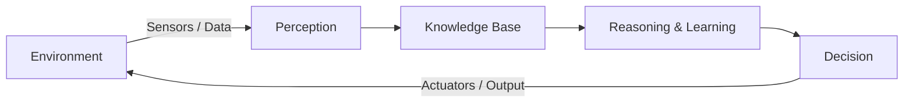
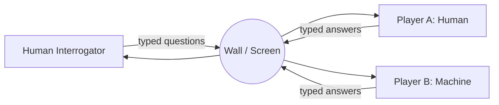
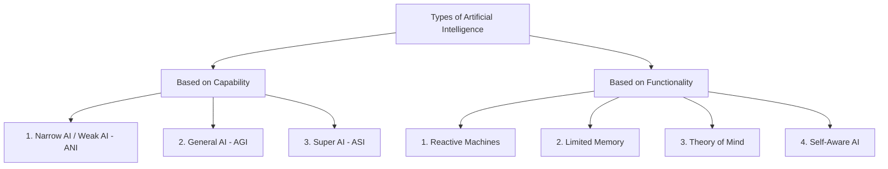
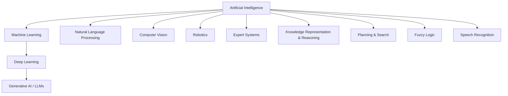
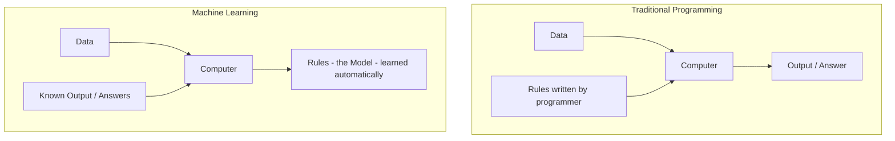
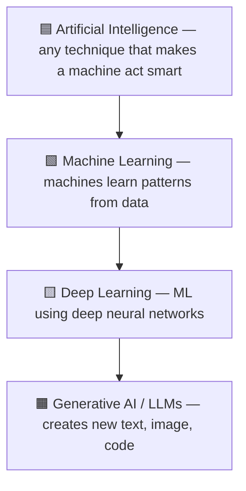
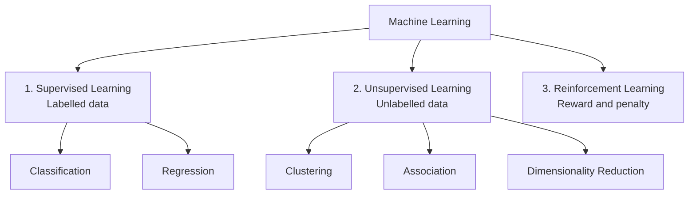
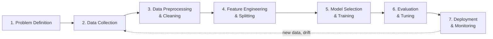
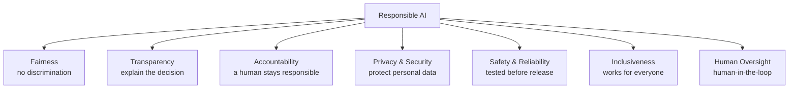

<!-- TOC START -->
**Table of Contents** — 1 subtopics · 9 theories

1. **[Artificial Intelligence & Machine Learning](#artificial-intelligence--machine-learning)**
   - [What is Artificial Intelligence (AI)?](#what-is-artificial-intelligence-ai)
   - [Types of Artificial Intelligence](#types-of-artificial-intelligence)
   - [Branches and Sub-fields of Artificial Intelligence](#branches-and-sub-fields-of-artificial-intelligence)
   - [What is Machine Learning (ML)?](#what-is-machine-learning-ml)
   - [AI vs Machine Learning vs Deep Learning vs Data Science](#ai-vs-machine-learning-vs-deep-learning-vs-data-science)
   - [Types of Machine Learning](#types-of-machine-learning)
   - [The Machine Learning Workflow (End-to-End Pipeline)](#the-machine-learning-workflow-end-to-end-pipeline)
   - [Applications of AI — in Daily Life and in the Banking Sector](#applications-of-ai--in-daily-life-and-in-the-banking-sector)
   - [AI Ethics, Bias and Responsible AI](#ai-ethics-bias-and-responsible-ai)

<!-- TOC END -->

---

## Artificial Intelligence & Machine Learning

### What is Artificial Intelligence (AI)?

**Artificial Intelligence (AI)** is a branch of Computer Science that builds machines and software able to do jobs that normally need *human intelligence* — things like understanding language, recognising a face in a photo, taking a decision, or learning from experience.

A simple way to remember it:

> AI = making a machine **think**, **learn** and **decide** the way a human does.

**Why the word "artificial"?** Because the intelligence is not natural (born inside a living brain); it is *created* by humans using data, mathematics and programs.

**Formal definition (good for the exam):**

> Artificial Intelligence is the science and engineering of making intelligent machines — especially intelligent computer programs — that can perceive their environment, reason about it, and take actions that maximise the chance of achieving a goal.
> — *John McCarthy, who coined the term "Artificial Intelligence" in 1956*

#### The four abilities that make a system "intelligent"

| # | Ability | What it means | Everyday example |
|---|---|---|---|
| 1 | **Perception** | Taking input from the world (image, sound, text, sensor reading) | A phone camera detecting your face |
| 2 | **Reasoning** | Using rules and logic to reach a conclusion | Google Maps choosing the shortest route |
| 3 | **Learning** | Getting better with experience / data | Netflix improving its recommendations |
| 4 | **Acting** | Doing something in the real world | A robot vacuum turning away from a wall |

#### The basic AI cycle

The agent looks at the environment, understands it, thinks, acts — and the action changes the environment, so the cycle runs again.

#### A short history of AI (dates that are asked in exams)

| Year | Event |
|---|---|
| 1943 | McCulloch & Pitts design the first mathematical model of a neuron |
| 1950 | **Alan Turing** publishes the **Turing Test** ("Can machines think?") |
| 1956 | **Dartmouth Conference** — **John McCarthy** coins the term *Artificial Intelligence*. This is treated as the **birth year of AI** |
| 1966 | **ELIZA**, the first chatbot |
| 1974–80 | **First AI Winter** (funding dries up) |
| 1980s | **Expert Systems** become popular in industry |
| 1997 | IBM's **Deep Blue** defeats world chess champion **Garry Kasparov** |
| 2011 | IBM **Watson** wins the quiz show *Jeopardy!* |
| 2012 | **AlexNet** wins ImageNet — the Deep Learning boom starts |
| 2016 | Google DeepMind's **AlphaGo** beats Lee Sedol at Go |
| 2022 | **ChatGPT** launched — Generative AI reaches ordinary people |

#### Two names you must not mix up

- **Father of Artificial Intelligence → John McCarthy.** He organised the 1956 Dartmouth Conference, coined the term "Artificial Intelligence" and created the **LISP** language.
- **Father of Computer Science / Father of Modern Computing → Alan Turing.** He broke the German **Enigma** code in World War II and gave the **Turing Test**, which laid the *foundation* of AI thinking.

> **Exam trap:** a question like *"Who is largely credited for breaking the German Enigma codes that provided a foundation for artificial intelligence?"* → answer **Alan Turing** (not McCarthy).

#### The Turing Test

Turing said: don't ask "can a machine think?" — ask "can a machine *behave* so that a human cannot tell it apart from another human?"

If after 5 minutes of chatting the interrogator cannot reliably say which one is the machine, the machine is said to have **passed the Turing Test**.

**Key points**

- AI is the *broad umbrella*; Machine Learning and Deep Learning sit inside it.
- Intelligence here is judged by **behaviour**, not by whether the machine "really" feels anything.
- AI needs three fuels: **Data**, **Algorithms**, and **Computing power (GPU)**.

---

### Types of Artificial Intelligence

AI is classified in **two different ways**. Exams usually want both lists, so learn them as *Capability-based* and *Functionality-based*.

#### A. Classification based on Capability

**1. Narrow AI (Weak AI / ANI — Artificial Narrow Intelligence)**

- Built for **one specific task** only.
- It can be *better than a human* at that one task, but it cannot do anything else.
- **This is the only type that actually exists today.**
- Examples: Google Translate, Siri / Alexa, spam filter in Gmail, face unlock, chess engines, a bank's credit-scoring model.

**2. General AI (Strong AI / AGI — Artificial General Intelligence)**

- A machine that can do **any intellectual task a human can do** — and can move its learning from one field to another.
- It would understand, reason, plan and learn in a general way.
- **Still theoretical.** No AGI exists yet.

**3. Super AI (ASI — Artificial Super Intelligence)**

- Intelligence that **crosses human level** in every field: science, creativity, social skill, wisdom.
- It would take its own decisions and solve problems on its own.
- **Purely hypothetical** — this is the stage people worry about in AI-safety debates.

| Point | Narrow AI | General AI | Super AI |
|---|---|---|---|
| Scope | One task | Any human task | Beyond human |
| Exists today? | ✅ Yes | ❌ No | ❌ No |
| Learning transfer | No | Yes | Yes |
| Example | Alexa, spam filter | (theoretical) | (theoretical) |

#### B. Classification based on Functionality

**1. Reactive Machines**

- The **most basic** type. It only looks at the **present input**.
- It has **no memory**, so it cannot use past experience.
- Example: **IBM Deep Blue** (the chess computer that beat Kasparov in 1997) — it evaluated the current board position only.

**2. Limited Memory**

- Can store **a small amount of past data** for a short time and use it with present data.
- **Almost all useful AI today — including every Deep Learning model — is Limited Memory AI.**
- Example: a self-driving car remembering the speed and position of nearby cars for the last few seconds; chatbots remembering the current conversation.

**3. Theory of Mind**

- Would understand that people have **emotions, beliefs and intentions**, and would respond to them.
- **Research stage only** (emotion-aware robots such as Sophia are early attempts).

**4. Self-Aware AI**

- The final, imaginary stage: the machine has **its own consciousness and sense of self**.
- Exists only in science fiction.

**Key points**

- Capability list = Narrow → General → Super (3 types).
- Functionality list = Reactive → Limited Memory → Theory of Mind → Self-Aware (4 types).
- **Everything working in 2026 is Narrow AI + Limited Memory.**

---

### Branches and Sub-fields of Artificial Intelligence

AI is not one single subject — it is a family of sub-fields. A very common written question is *"Write the branches / areas of AI."*

| Branch | What it does | Example |
|---|---|---|
| **Machine Learning** | Learns patterns from data instead of hand-written rules | Loan default prediction |
| **Deep Learning** | ML with many-layered neural networks | Face recognition |
| **Natural Language Processing (NLP)** | Understands and generates human language | Google Translate, ChatGPT |
| **Computer Vision** | Understands images and video | Number-plate reading, X-ray diagnosis |
| **Speech Recognition** | Converts speech to text | Voice typing in Bangla |
| **Robotics** | Machines that sense and act physically | Warehouse robots, robotic arms |
| **Expert Systems** | Rule-based systems that copy a human expert | MYCIN (medical diagnosis) |
| **Knowledge Representation** | Stores facts and relations so a machine can reason | Semantic networks, ontologies |
| **Planning & Search** | Finds a sequence of actions to reach a goal | Route planning, game playing |
| **Fuzzy Logic** | Handles "partly true" values instead of only 0/1 | Washing-machine and AC controllers |

---

### What is Machine Learning (ML)?

**Machine Learning** is the sub-field of AI where a computer **learns patterns from data** and improves its performance with experience, **without being explicitly programmed** with rules for every case.

**Classic definitions:**

> "Machine Learning is the field of study that gives computers the ability to learn without being explicitly programmed."
> — *Arthur Samuel, 1959*

> "A computer program is said to learn from experience **E** with respect to some task **T** and performance measure **P**, if its performance at T, as measured by P, improves with experience E."
> — *Tom Mitchell, 1997*

For a spam filter: **T** = classify mail as spam/not-spam, **E** = thousands of labelled mails, **P** = percentage classified correctly.

#### Traditional Programming vs Machine Learning

This comparison is the heart of the topic — draw it if you get the question.

| Point | Traditional Programming | Machine Learning |
|---|---|---|
| Input given | Data + Rules | Data + Answers |
| Output produced | Answers | **Rules (the model)** |
| Who writes the logic | Programmer | The algorithm itself |
| Good for | Rules that are clear and fixed (payroll, tax) | Rules that are messy or unknown (handwriting, fraud) |
| Improves with more data | No | Yes |

#### Why do we need Machine Learning?

Some jobs are impossible to write as rules. Try writing an `if–else` for *"is this handwritten digit a 7?"* — you would need thousands of conditions and it would still fail. ML avoids this: show the machine 60,000 labelled digits and it works out the pattern itself.

#### Applications of Machine Learning in daily life

*(A frequently repeated question: "Name three ML applications in daily life.")*

1. **Email spam filtering** — Gmail sorting spam automatically.
2. **Product / content recommendation** — YouTube, Netflix, Daraz "you may also like".
3. **Face unlock and photo tagging** — your phone's camera and Google Photos.
4. **Voice assistants** — Siri, Alexa, Google Assistant.
5. **Online fraud / anomaly detection** — a bank blocking a suspicious card transaction.
6. **Credit scoring and loan approval** — predicting whether a borrower will default.
7. **Machine translation** — Google Translate English ↔ Bangla.
8. **Medical diagnosis** — detecting tumours in CT/MRI scans.
9. **Traffic prediction** — Google Maps showing the fastest route.
10. **Chatbots and customer support** — a bank's 24/7 helpdesk bot.

---

### AI vs Machine Learning vs Deep Learning vs Data Science

This is one of the most repeated written questions. The safest answer is a **nested-circle diagram + a comparison table**.

Think of it as boxes inside boxes: **every** Deep Learning system is Machine Learning, and **every** Machine Learning system is AI — but not the reverse. A rule-based expert system is AI but **not** ML.

| Point | Artificial Intelligence | Machine Learning | Deep Learning |
|---|---|---|---|
| **Meaning** | Making machines behave intelligently | Machines learn from data | ML using multi-layer neural networks |
| **Scope** | Widest | Subset of AI | Subset of ML |
| **Started** | 1956 | 1980s–90s | 2010s |
| **Feature extraction** | Hand-coded rules | **Manual** (human picks the features) | **Automatic** (network learns features) |
| **Data needed** | Depends | Works with **small/medium** data (thousands of rows) | Needs **very large** data (lakhs–millions) |
| **Hardware** | Normal CPU | CPU is usually enough | **GPU/TPU required** |
| **Training time** | — | Minutes to hours | Hours to weeks |
| **Interpretability** | Usually clear | Fairly clear (a decision tree can be read) | **Black box** — hard to explain |
| **Example** | Expert system, chess rules | Spam filter with Naive Bayes, Decision Tree | CNN for face recognition, ChatGPT |

**Where does Data Science fit?** Data Science is the *broader practice* of getting value out of data — collecting, cleaning, exploring, visualising and modelling it. It **overlaps** AI/ML rather than sitting inside it: a data scientist may use Machine Learning, but may also just build a dashboard or run statistics.

> **True/False trap:** *"Machine Learning is a subset of Cloud Computing that can build AI."* → **FALSE.** Machine Learning is a subset of **Artificial Intelligence**. Cloud Computing is only a *place* where ML models can be trained and hosted.

---

### Types of Machine Learning

Machine Learning is divided into **three main types** (some books add a fourth, Semi-Supervised).

**1. Supervised Learning** — the data comes with the **correct answer (label)** attached. The model learns the mapping *input → output*, like a student learning with an answer key.
Examples: spam / not-spam, loan default yes / no, predicting house price.

**2. Unsupervised Learning** — the data has **no labels**. The model must find hidden structure on its own.
Examples: grouping customers into segments, market-basket analysis, compressing features with PCA.

**3. Reinforcement Learning** — an **agent** learns by **trial and error** inside an environment, collecting **rewards** for good actions and **penalties** for bad ones.
Examples: a robot learning to walk, AlphaGo, self-driving cars, dynamic pricing.

| Point | Supervised | Unsupervised | Reinforcement |
|---|---|---|---|
| Input data | **Labelled** | **Unlabelled** | No dataset — an environment |
| Goal | Predict a known output | Discover hidden pattern | Maximise total reward |
| Feedback | Direct (right answer given) | None | Delayed (reward signal) |
| Main tasks | Classification, Regression | Clustering, Association, Dim. reduction | Policy / control |
| Algorithms | Linear & Logistic Regression, Decision Tree, SVM, KNN, Random Forest, Naive Bayes | K-Means, Hierarchical clustering, DBSCAN, Apriori, PCA | Q-Learning, SARSA, Deep Q-Network |
| Example | Diabetes prediction from labelled patient records | Customer segmentation | Game playing robot |

*(A fourth type, **Semi-Supervised Learning**, uses a small amount of labelled data with a large amount of unlabelled data — useful when labelling is expensive, e.g. medical images.)*

---

### The Machine Learning Workflow (End-to-End Pipeline)

Many questions ask "how would you build a model for X?". Answer with these **7 steps**.

**Step 1 — Problem definition.** Decide what you are predicting and whether it is classification, regression or clustering. *"Will this customer default?"* → binary classification.

**Step 2 — Data collection.** Gather data from databases, logs, sensors, APIs or surveys. Rule of thumb: **garbage in, garbage out**.

**Step 3 — Data preprocessing / cleaning.**
- Handle **missing values** (drop, or fill with mean/median/mode).
- Remove **duplicates** and **outliers**.
- **Encode** categorical values (One-Hot Encoding, Label Encoding).
- **Scale** numeric values (Normalisation to 0–1, or Standardisation to mean 0, SD 1).

**Step 4 — Feature engineering and data splitting.** Create useful new columns (e.g. *income ÷ loan amount*), remove useless ones, then split the data:

| Set | Typical share | Used for |
|---|---|---|
| **Training set** | 60–70 % | Fitting the model (model *sees* the labels) |
| **Validation set** | 15–20 % | Tuning hyper-parameters, choosing the model |
| **Test set** | 15–20 % | Final, one-time check of real-world performance |

**Step 5 — Model selection and training.** Pick an algorithm that suits the data size and the need for interpretability, then fit it on the training set.

**Step 6 — Evaluation and tuning.** Measure with the right metric (Accuracy, Precision, Recall, F1, RMSE), use **k-fold cross-validation**, and tune hyper-parameters with Grid Search or Random Search.

**Step 7 — Deployment and monitoring.** Put the model behind an API, then keep watching for **data drift** (the real world changes, so accuracy falls) and retrain periodically.

---

### Applications of AI — in Daily Life and in the Banking Sector

Bank and government IT exams very often ask for AI uses **specific to banking/government**, so keep both lists ready.

#### General applications of AI

| Sector | Application |
|---|---|
| Healthcare | Disease detection from X-ray/MRI, drug discovery, robotic surgery |
| Transport | Self-driving cars, traffic prediction, route optimisation |
| Education | Personalised learning, auto grading, AI tutors |
| Agriculture | Crop disease detection from leaf photos, yield prediction |
| E-commerce | Recommendation engines, dynamic pricing, chatbots |
| Security | Face recognition, CCTV anomaly detection, intrusion detection |
| Entertainment | Netflix/Spotify recommendation, AI-generated images and music |

#### AI in Banking and Finance (very important for bank exams)

1. **Fraud detection** — spotting an unusual transaction in real time and blocking the card.
2. **Credit scoring / loan underwriting** — predicting the probability of default from income, history and behaviour.
3. **Chatbots & virtual assistants** — 24/7 balance enquiry and complaint handling.
4. **Anti-Money Laundering (AML)** — flagging suspicious transaction chains.
5. **Algorithmic trading** — automated buy/sell decisions.
6. **Customer segmentation & cross-selling** — targeting the right product to the right customer.
7. **e-KYC** — matching a face with the NID photo, reading documents with OCR.
8. **Cheque processing** — reading handwritten amounts (an old, classic AI use).
9. **Churn prediction** — identifying customers likely to leave.
10. **Robotic Process Automation (RPA)** — automating repetitive back-office work.

#### AI in Government / Citizen Services

- Citizen-service chatbots that answer in Bangla.
- Automatic document summarisation for policy files.
- Land-record and NID verification with computer vision.
- Disaster (flood/cyclone) prediction from satellite and sensor data.
- Smart traffic signals and e-challan systems.

---

### AI Ethics, Bias and Responsible AI

As AI enters banking, health and government, the **ethical side** has become a favourite Focus-Writing and short-note topic (often asked in Bangla as *"কৃত্রিম বুদ্ধিমত্তা: দক্ষতা ও নৈতিকতা"*).

#### Why ethics matters

An AI model is trained on **past human data**. If the past was unfair, the model happily learns that unfairness and then applies it at machine speed to millions of people. So the danger is not a robot rebellion — it is **quiet, large-scale unfairness**.

#### The main ethical issues

| Issue | What goes wrong | Real example |
|---|---|---|
| **Bias & Discrimination** | Training data reflects old prejudice | A hiring model that downgrades women's CVs because past hires were mostly men |
| **Privacy** | Models need personal data | Face recognition tracking people without consent |
| **Transparency / Black box** | Deep models cannot explain themselves | A loan is rejected and nobody can say why |
| **Accountability** | Who is responsible for a wrong decision? | A self-driving car causes an accident |
| **Job displacement** | Automation removes routine jobs | Data entry, tele-calling, basic support |
| **Misinformation / Deepfakes** | Generative AI makes fake media | Fake video of a leader before an election |
| **Security misuse** | AI used for attacks | AI-written phishing mails, automated malware |
| **Environmental cost** | Training large models uses huge electricity | Large language model training runs |

#### The principles of Responsible AI

#### How to reduce bias — practical steps

1. Collect **diverse, representative** training data.
2. **Audit** the dataset for imbalance before training.
3. Measure accuracy **separately for each group** (gender, region, age), not just overall.
4. Use **Explainable AI (XAI)** tools such as LIME and SHAP so decisions can be justified.
5. Keep a **human-in-the-loop** for high-stakes decisions (loans, jobs, medical, legal).
6. Follow rules and law — Bangladesh's **National AI Policy**, the **Digital Security / Cyber Security Act**, and the EU **AI Act** as an international reference.

**Key points for a Focus Writing answer**

- Write a short intro: AI increases **efficiency**, but efficiency without **ethics** is dangerous.
- Give 3–4 benefits (speed, accuracy, 24/7 service, cost saving).
- Give 3–4 risks (bias, privacy, job loss, deepfakes).
- End with the balance: *"AI should assist human judgement, not replace human responsibility."*
