<!-- TOC START -->
**Table of Contents** — 4 subtopics · 29 theories

1. **[Artificial Intelligence & Machine Learning](#artificial-intelligence--machine-learning)**
   - [What is Artificial Intelligence (AI)?](#what-is-artificial-intelligence-ai)
   - [Types of Artificial Intelligence](#types-of-artificial-intelligence)
   - [Branches and Sub-fields of Artificial Intelligence](#branches-and-sub-fields-of-artificial-intelligence)
   - [What is Machine Learning (ML)?](#what-is-machine-learning-ml)
   - [AI vs Machine Learning vs Deep Learning vs Data Science](#ai-vs-machine-learning-vs-deep-learning-vs-data-science)
   - [Types of Machine Learning](#types-of-machine-learning)
   - [The Machine Learning Workflow (End-to-End Pipeline)](#the-machine-learning-workflow-end-to-end-pipeline)
   - [Applications of AI — in Daily Life and in the Banking Sector](#applications-of-ai--in-daily-life-and-in-the-banking-sector)
   - [AI Ethics, Bias and Responsible AI](#ai-ethics-bias-and-responsible-ai)

2. **[Artificial Intelligence & Expert Systems](#artificial-intelligence--expert-systems)**
   - [Intelligent Agents in AI](#intelligent-agents-in-ai)
   - [PEAS Framework (Performance, Environment, Actuators, Sensors)](#peas-framework-performance-environment-actuators-sensors)
   - [Types of Intelligent Agents](#types-of-intelligent-agents)
   - [Properties of Task Environments](#properties-of-task-environments)
   - [Knowledge and Knowledge Representation in AI](#knowledge-and-knowledge-representation-in-ai)
   - [Expert Systems — Architecture and Working](#expert-systems--architecture-and-working)
   - [Forward Chaining vs Backward Chaining](#forward-chaining-vs-backward-chaining)
   - [Measuring Intelligence — and Common True/False Traps](#measuring-intelligence--and-common-truefalse-traps)

3. **[Deep Learning & Neural Networks (ANN, CNN, RNN)](#deep-learning--neural-networks-ann-cnn-rnn)**
   - [Biological Neuron vs Artificial Neuron](#biological-neuron-vs-artificial-neuron)
   - [Artificial Neural Network (ANN) — Structure and Working](#artificial-neural-network-ann--structure-and-working)
   - [Activation Functions in Neural Networks](#activation-functions-in-neural-networks)
   - [What is Deep Learning?](#what-is-deep-learning)
   - [Deep Learning vs Traditional Machine Learning](#deep-learning-vs-traditional-machine-learning)
   - [Convolutional Neural Network (CNN)](#convolutional-neural-network-cnn)
   - [Recurrent Neural Network (RNN) and LSTM](#recurrent-neural-network-rnn-and-lstm)

4. **[Machine Learning Paradigms (Supervised vs Unsupervised)](#machine-learning-paradigms-supervised-vs-unsupervised)**
   - [Supervised Learning in Detail](#supervised-learning-in-detail)
   - [Unsupervised Learning in Detail](#unsupervised-learning-in-detail)
   - [Supervised vs Unsupervised vs Reinforcement Learning](#supervised-vs-unsupervised-vs-reinforcement-learning)
   - [Semi-Supervised and Self-Supervised Learning](#semi-supervised-and-self-supervised-learning)
   - [Data Mining — Definition, KDD Process and Techniques](#data-mining--definition-kdd-process-and-techniques)

<!-- TOC END -->

---

## Artificial Intelligence & Machine Learning

### What is Artificial Intelligence (AI)?

**Artificial Intelligence (AI)** is a branch of Computer Science that builds machines and software able to do jobs that normally need *human intelligence* — things like understanding language, recognising a face in a photo, taking a decision, or learning from experience.

A simple way to remember it:

> AI = making a machine **think**, **learn** and **decide** the way a human does.

**Why the word "artificial"?** Because the intelligence is not natural (born inside a living brain); it is *created* by humans using data, mathematics and programs.

**Formal definition (good for the exam):**

> Artificial Intelligence is the science and engineering of making intelligent machines — especially intelligent computer programs — that can perceive their environment, reason about it, and take actions that maximise the chance of achieving a goal.
> — *John McCarthy, who coined the term "Artificial Intelligence" in 1956*

#### The four abilities that make a system "intelligent"

| # | Ability | What it means | Everyday example |
|---|---|---|---|
| 1 | **Perception** | Taking input from the world (image, sound, text, sensor reading) | A phone camera detecting your face |
| 2 | **Reasoning** | Using rules and logic to reach a conclusion | Google Maps choosing the shortest route |
| 3 | **Learning** | Getting better with experience / data | Netflix improving its recommendations |
| 4 | **Acting** | Doing something in the real world | A robot vacuum turning away from a wall |

#### The basic AI cycle

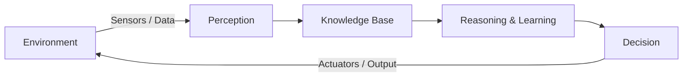

The agent looks at the environment, understands it, thinks, acts — and the action changes the environment, so the cycle runs again.

#### A short history of AI (dates that are asked in exams)

| Year | Event |
|---|---|
| 1943 | McCulloch & Pitts design the first mathematical model of a neuron |
| 1950 | **Alan Turing** publishes the **Turing Test** ("Can machines think?") |
| 1956 | **Dartmouth Conference** — **John McCarthy** coins the term *Artificial Intelligence*. This is treated as the **birth year of AI** |
| 1966 | **ELIZA**, the first chatbot |
| 1974–80 | **First AI Winter** (funding dries up) |
| 1980s | **Expert Systems** become popular in industry |
| 1997 | IBM's **Deep Blue** defeats world chess champion **Garry Kasparov** |
| 2011 | IBM **Watson** wins the quiz show *Jeopardy!* |
| 2012 | **AlexNet** wins ImageNet — the Deep Learning boom starts |
| 2016 | Google DeepMind's **AlphaGo** beats Lee Sedol at Go |
| 2022 | **ChatGPT** launched — Generative AI reaches ordinary people |

#### Two names you must not mix up

- **Father of Artificial Intelligence → John McCarthy.** He organised the 1956 Dartmouth Conference, coined the term "Artificial Intelligence" and created the **LISP** language.
- **Father of Computer Science / Father of Modern Computing → Alan Turing.** He broke the German **Enigma** code in World War II and gave the **Turing Test**, which laid the *foundation* of AI thinking.

> **Exam trap:** a question like *"Who is largely credited for breaking the German Enigma codes that provided a foundation for artificial intelligence?"* → answer **Alan Turing** (not McCarthy).

#### The Turing Test

Turing said: don't ask "can a machine think?" — ask "can a machine *behave* so that a human cannot tell it apart from another human?"

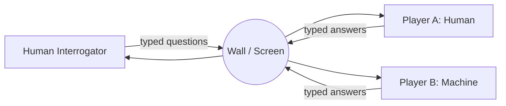

If after 5 minutes of chatting the interrogator cannot reliably say which one is the machine, the machine is said to have **passed the Turing Test**.

**Key points**

- AI is the *broad umbrella*; Machine Learning and Deep Learning sit inside it.
- Intelligence here is judged by **behaviour**, not by whether the machine "really" feels anything.
- AI needs three fuels: **Data**, **Algorithms**, and **Computing power (GPU)**.

**Previous Year Question List from this Topic:**

- [AI related Question (সম্পূর্ণ প্রশ্ন সংগ্রহ করা সম্ভব হয়নি)](../written-answers/ai-and-ml.md?plain=1#L115)
- [ক) Deep Blue কী?](../written-answers/ai-and-ml.md?plain=1#L229)
- [What is Artificial Intelligence?](../written-answers/ai-and-ml.md?plain=1#L389)
- [What is the father of AI?](../written-answers/ai-and-ml.md?plain=1#L537)
- [Who is Largely credited for breaking the German Enigma codes that provided a foundation for artificial intelligence?](../written-answers/ai-and-ml.md?plain=1#L571)

---

### Types of Artificial Intelligence

AI is classified in **two different ways**. Exams usually want both lists, so learn them as *Capability-based* and *Functionality-based*.

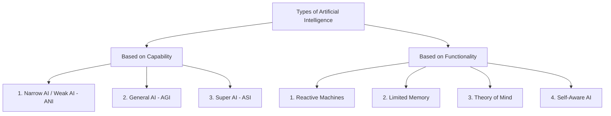

#### A. Classification based on Capability

**1. Narrow AI (Weak AI / ANI — Artificial Narrow Intelligence)**

- Built for **one specific task** only.
- It can be *better than a human* at that one task, but it cannot do anything else.
- **This is the only type that actually exists today.**
- Examples: Google Translate, Siri / Alexa, spam filter in Gmail, face unlock, chess engines, a bank's credit-scoring model.

**2. General AI (Strong AI / AGI — Artificial General Intelligence)**

- A machine that can do **any intellectual task a human can do** — and can move its learning from one field to another.
- It would understand, reason, plan and learn in a general way.
- **Still theoretical.** No AGI exists yet.

**3. Super AI (ASI — Artificial Super Intelligence)**

- Intelligence that **crosses human level** in every field: science, creativity, social skill, wisdom.
- It would take its own decisions and solve problems on its own.
- **Purely hypothetical** — this is the stage people worry about in AI-safety debates.

| Point | Narrow AI | General AI | Super AI |
|---|---|---|---|
| Scope | One task | Any human task | Beyond human |
| Exists today? | ✅ Yes | ❌ No | ❌ No |
| Learning transfer | No | Yes | Yes |
| Example | Alexa, spam filter | (theoretical) | (theoretical) |

#### B. Classification based on Functionality

**1. Reactive Machines**

- The **most basic** type. It only looks at the **present input**.
- It has **no memory**, so it cannot use past experience.
- Example: **IBM Deep Blue** (the chess computer that beat Kasparov in 1997) — it evaluated the current board position only.

**2. Limited Memory**

- Can store **a small amount of past data** for a short time and use it with present data.
- **Almost all useful AI today — including every Deep Learning model — is Limited Memory AI.**
- Example: a self-driving car remembering the speed and position of nearby cars for the last few seconds; chatbots remembering the current conversation.

**3. Theory of Mind**

- Would understand that people have **emotions, beliefs and intentions**, and would respond to them.
- **Research stage only** (emotion-aware robots such as Sophia are early attempts).

**4. Self-Aware AI**

- The final, imaginary stage: the machine has **its own consciousness and sense of self**.
- Exists only in science fiction.

**Key points**

- Capability list = Narrow → General → Super (3 types).
- Functionality list = Reactive → Limited Memory → Theory of Mind → Self-Aware (4 types).
- **Everything working in 2026 is Narrow AI + Limited Memory.**

**Previous Year Question List from this Topic:**

- [AI related Question (সম্পূর্ণ প্রশ্ন সংগ্রহ করা সম্ভব হয়নি)](../written-answers/ai-and-ml.md?plain=1#L115)
- [ক) Deep Blue কী?](../written-answers/ai-and-ml.md?plain=1#L229)

---

### Branches and Sub-fields of Artificial Intelligence

AI is not one single subject — it is a family of sub-fields. A very common written question is *"Write the branches / areas of AI."*

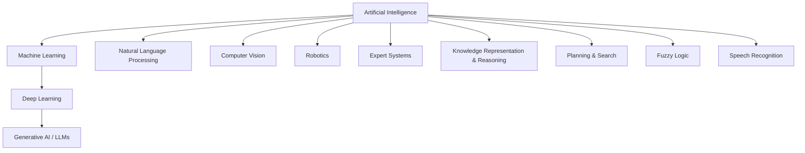

| Branch | What it does | Example |
|---|---|---|
| **Machine Learning** | Learns patterns from data instead of hand-written rules | Loan default prediction |
| **Deep Learning** | ML with many-layered neural networks | Face recognition |
| **Natural Language Processing (NLP)** | Understands and generates human language | Google Translate, ChatGPT |
| **Computer Vision** | Understands images and video | Number-plate reading, X-ray diagnosis |
| **Speech Recognition** | Converts speech to text | Voice typing in Bangla |
| **Robotics** | Machines that sense and act physically | Warehouse robots, robotic arms |
| **Expert Systems** | Rule-based systems that copy a human expert | MYCIN (medical diagnosis) |
| **Knowledge Representation** | Stores facts and relations so a machine can reason | Semantic networks, ontologies |
| **Planning & Search** | Finds a sequence of actions to reach a goal | Route planning, game playing |
| **Fuzzy Logic** | Handles "partly true" values instead of only 0/1 | Washing-machine and AC controllers |

**Previous Year Question List from this Topic:**

- [AI related Question (সম্পূর্ণ প্রশ্ন সংগ্রহ করা সম্ভব হয়নি)](../written-answers/ai-and-ml.md?plain=1#L115)

---

### What is Machine Learning (ML)?

**Machine Learning** is the sub-field of AI where a computer **learns patterns from data** and improves its performance with experience, **without being explicitly programmed** with rules for every case.

**Classic definitions:**

> "Machine Learning is the field of study that gives computers the ability to learn without being explicitly programmed."
> — *Arthur Samuel, 1959*

> "A computer program is said to learn from experience **E** with respect to some task **T** and performance measure **P**, if its performance at T, as measured by P, improves with experience E."
> — *Tom Mitchell, 1997*

For a spam filter: **T** = classify mail as spam/not-spam, **E** = thousands of labelled mails, **P** = percentage classified correctly.

#### Traditional Programming vs Machine Learning

This comparison is the heart of the topic — draw it if you get the question.

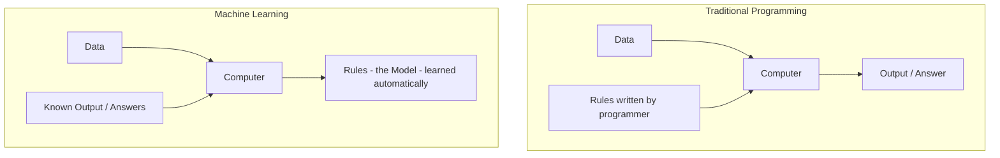

| Point | Traditional Programming | Machine Learning |
|---|---|---|
| Input given | Data + Rules | Data + Answers |
| Output produced | Answers | **Rules (the model)** |
| Who writes the logic | Programmer | The algorithm itself |
| Good for | Rules that are clear and fixed (payroll, tax) | Rules that are messy or unknown (handwriting, fraud) |
| Improves with more data | No | Yes |

#### Why do we need Machine Learning?

Some jobs are impossible to write as rules. Try writing an `if–else` for *"is this handwritten digit a 7?"* — you would need thousands of conditions and it would still fail. ML avoids this: show the machine 60,000 labelled digits and it works out the pattern itself.

#### Applications of Machine Learning in daily life

*(A frequently repeated question: "Name three ML applications in daily life.")*

1. **Email spam filtering** — Gmail sorting spam automatically.
2. **Product / content recommendation** — YouTube, Netflix, Daraz "you may also like".
3. **Face unlock and photo tagging** — your phone's camera and Google Photos.
4. **Voice assistants** — Siri, Alexa, Google Assistant.
5. **Online fraud / anomaly detection** — a bank blocking a suspicious card transaction.
6. **Credit scoring and loan approval** — predicting whether a borrower will default.
7. **Machine translation** — Google Translate English ↔ Bangla.
8. **Medical diagnosis** — detecting tumours in CT/MRI scans.
9. **Traffic prediction** — Google Maps showing the fastest route.
10. **Chatbots and customer support** — a bank's 24/7 helpdesk bot.

**Previous Year Question List from this Topic:**

- [(a) Describe the following terms: 3](../written-answers/ai-and-ml.md?plain=1#L25)
- [What is the difference between Supervised and Unsupervised learning?](../written-answers/ai-and-ml.md?plain=1#L72)
- [What do you mean by machine learning? Name three machine learning application in our daily life?](../written-answers/ai-and-ml.md?plain=1#L833)
- [What is Machine Learning? Mention some real-life applications.](../written-answers/ai-and-ml.md?plain=1#L976)
- [What is machine learning? Differentiate among supervised learning vs unsupervised learning vs reinforcement learning.](../written-answers/ai-and-ml.md?plain=1#L1013)

---

### AI vs Machine Learning vs Deep Learning vs Data Science

This is one of the most repeated written questions. The safest answer is a **nested-circle diagram + a comparison table**.

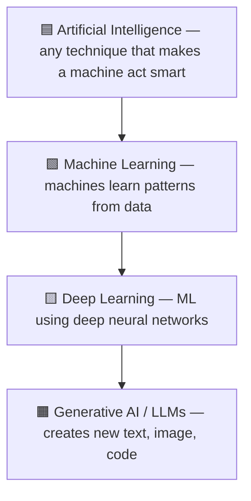

Think of it as boxes inside boxes: **every** Deep Learning system is Machine Learning, and **every** Machine Learning system is AI — but not the reverse. A rule-based expert system is AI but **not** ML.

| Point | Artificial Intelligence | Machine Learning | Deep Learning |
|---|---|---|---|
| **Meaning** | Making machines behave intelligently | Machines learn from data | ML using multi-layer neural networks |
| **Scope** | Widest | Subset of AI | Subset of ML |
| **Started** | 1956 | 1980s–90s | 2010s |
| **Feature extraction** | Hand-coded rules | **Manual** (human picks the features) | **Automatic** (network learns features) |
| **Data needed** | Depends | Works with **small/medium** data (thousands of rows) | Needs **very large** data (lakhs–millions) |
| **Hardware** | Normal CPU | CPU is usually enough | **GPU/TPU required** |
| **Training time** | — | Minutes to hours | Hours to weeks |
| **Interpretability** | Usually clear | Fairly clear (a decision tree can be read) | **Black box** — hard to explain |
| **Example** | Expert system, chess rules | Spam filter with Naive Bayes, Decision Tree | CNN for face recognition, ChatGPT |

**Where does Data Science fit?** Data Science is the *broader practice* of getting value out of data — collecting, cleaning, exploring, visualising and modelling it. It **overlaps** AI/ML rather than sitting inside it: a data scientist may use Machine Learning, but may also just build a dashboard or run statistics.

> **True/False trap:** *"Machine Learning is a subset of Cloud Computing that can build AI."* → **FALSE.** Machine Learning is a subset of **Artificial Intelligence**. Cloud Computing is only a *place* where ML models can be trained and hosted.

**Previous Year Question List from this Topic:**

- [(a) Describe the following terms: 3](../written-answers/ai-and-ml.md?plain=1#L25)
- [Machine learning is a subset of cloud computing that can be built AI-Based. (True or False).](../written-answers/ai-and-ml.md?plain=1#L529)
- [Write difference between machine learning and deep learning.](../written-answers/ai-and-ml.md?plain=1#L624)

---

### Types of Machine Learning

Machine Learning is divided into **three main types** (some books add a fourth, Semi-Supervised).

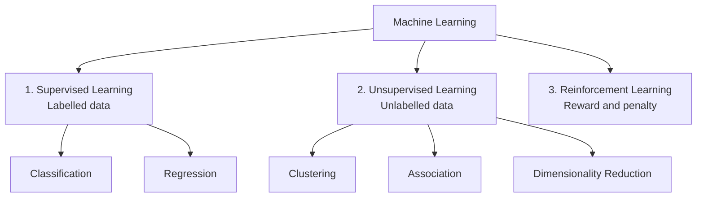

**1. Supervised Learning** — the data comes with the **correct answer (label)** attached. The model learns the mapping *input → output*, like a student learning with an answer key.
Examples: spam / not-spam, loan default yes / no, predicting house price.

**2. Unsupervised Learning** — the data has **no labels**. The model must find hidden structure on its own.
Examples: grouping customers into segments, market-basket analysis, compressing features with PCA.

**3. Reinforcement Learning** — an **agent** learns by **trial and error** inside an environment, collecting **rewards** for good actions and **penalties** for bad ones.
Examples: a robot learning to walk, AlphaGo, self-driving cars, dynamic pricing.

| Point | Supervised | Unsupervised | Reinforcement |
|---|---|---|---|
| Input data | **Labelled** | **Unlabelled** | No dataset — an environment |
| Goal | Predict a known output | Discover hidden pattern | Maximise total reward |
| Feedback | Direct (right answer given) | None | Delayed (reward signal) |
| Main tasks | Classification, Regression | Clustering, Association, Dim. reduction | Policy / control |
| Algorithms | Linear & Logistic Regression, Decision Tree, SVM, KNN, Random Forest, Naive Bayes | K-Means, Hierarchical clustering, DBSCAN, Apriori, PCA | Q-Learning, SARSA, Deep Q-Network |
| Example | Diabetes prediction from labelled patient records | Customer segmentation | Game playing robot |

*(A fourth type, **Semi-Supervised Learning**, uses a small amount of labelled data with a large amount of unlabelled data — useful when labelling is expensive, e.g. medical images.)*

**Previous Year Question List from this Topic:**

- [(a) Describe the following terms: 3](../written-answers/ai-and-ml.md?plain=1#L25)
- [What is the difference between Supervised and Unsupervised learning?](../written-answers/ai-and-ml.md?plain=1#L72)
- [Briefly explain supervised learning, unsupervised learning & reinforcement learning.](../written-answers/ai-and-ml.md?plain=1#L792)
- [What is machine learning? Differentiate among supervised learning vs unsupervised learning vs reinforcement learning.](../written-answers/ai-and-ml.md?plain=1#L1013)

---

### The Machine Learning Workflow (End-to-End Pipeline)

Many questions ask "how would you build a model for X?". Answer with these **7 steps**.

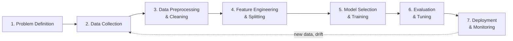

**Step 1 — Problem definition.** Decide what you are predicting and whether it is classification, regression or clustering. *"Will this customer default?"* → binary classification.

**Step 2 — Data collection.** Gather data from databases, logs, sensors, APIs or surveys. Rule of thumb: **garbage in, garbage out**.

**Step 3 — Data preprocessing / cleaning.**
- Handle **missing values** (drop, or fill with mean/median/mode).
- Remove **duplicates** and **outliers**.
- **Encode** categorical values (One-Hot Encoding, Label Encoding).
- **Scale** numeric values (Normalisation to 0–1, or Standardisation to mean 0, SD 1).

**Step 4 — Feature engineering and data splitting.** Create useful new columns (e.g. *income ÷ loan amount*), remove useless ones, then split the data:

| Set | Typical share | Used for |
|---|---|---|
| **Training set** | 60–70 % | Fitting the model (model *sees* the labels) |
| **Validation set** | 15–20 % | Tuning hyper-parameters, choosing the model |
| **Test set** | 15–20 % | Final, one-time check of real-world performance |

**Step 5 — Model selection and training.** Pick an algorithm that suits the data size and the need for interpretability, then fit it on the training set.

**Step 6 — Evaluation and tuning.** Measure with the right metric (Accuracy, Precision, Recall, F1, RMSE), use **k-fold cross-validation**, and tune hyper-parameters with Grid Search or Random Search.

**Step 7 — Deployment and monitoring.** Put the model behind an API, then keep watching for **data drift** (the real world changes, so accuracy falls) and retrain periodically.

**Previous Year Question List from this Topic:**

- [(a) Describe the following terms: 3](../written-answers/ai-and-ml.md?plain=1#L25)

---

### Applications of AI — in Daily Life and in the Banking Sector

Bank and government IT exams very often ask for AI uses **specific to banking/government**, so keep both lists ready.

#### General applications of AI

| Sector | Application |
|---|---|
| Healthcare | Disease detection from X-ray/MRI, drug discovery, robotic surgery |
| Transport | Self-driving cars, traffic prediction, route optimisation |
| Education | Personalised learning, auto grading, AI tutors |
| Agriculture | Crop disease detection from leaf photos, yield prediction |
| E-commerce | Recommendation engines, dynamic pricing, chatbots |
| Security | Face recognition, CCTV anomaly detection, intrusion detection |
| Entertainment | Netflix/Spotify recommendation, AI-generated images and music |

#### AI in Banking and Finance (very important for bank exams)

1. **Fraud detection** — spotting an unusual transaction in real time and blocking the card.
2. **Credit scoring / loan underwriting** — predicting the probability of default from income, history and behaviour.
3. **Chatbots & virtual assistants** — 24/7 balance enquiry and complaint handling.
4. **Anti-Money Laundering (AML)** — flagging suspicious transaction chains.
5. **Algorithmic trading** — automated buy/sell decisions.
6. **Customer segmentation & cross-selling** — targeting the right product to the right customer.
7. **e-KYC** — matching a face with the NID photo, reading documents with OCR.
8. **Cheque processing** — reading handwritten amounts (an old, classic AI use).
9. **Churn prediction** — identifying customers likely to leave.
10. **Robotic Process Automation (RPA)** — automating repetitive back-office work.

#### AI in Government / Citizen Services

- Citizen-service chatbots that answer in Bangla.
- Automatic document summarisation for policy files.
- Land-record and NID verification with computer vision.
- Disaster (flood/cyclone) prediction from satellite and sensor data.
- Smart traffic signals and e-challan systems.

**Previous Year Question List from this Topic:**

- [AI related Question (সম্পূর্ণ প্রশ্ন সংগ্রহ করা সম্ভব হয়নি)](../written-answers/ai-and-ml.md?plain=1#L115)
- [Focus Witting: কৃত্রিম বুদ্ধিমত্তা (AI) দক্ষতা ও নৈতিকতা (বাংলা)](../written-answers/ai-and-ml.md?plain=1#L144)
- [What do you mean by machine learning? Name three machine learning application in our daily life?](../written-answers/ai-and-ml.md?plain=1#L833)
- [What is Machine Learning? Mention some real-life applications.](../written-answers/ai-and-ml.md?plain=1#L976)

---

### AI Ethics, Bias and Responsible AI

As AI enters banking, health and government, the **ethical side** has become a favourite Focus-Writing and short-note topic (often asked in Bangla as *"কৃত্রিম বুদ্ধিমত্তা: দক্ষতা ও নৈতিকতা"*).

#### Why ethics matters

An AI model is trained on **past human data**. If the past was unfair, the model happily learns that unfairness and then applies it at machine speed to millions of people. So the danger is not a robot rebellion — it is **quiet, large-scale unfairness**.

#### The main ethical issues

| Issue | What goes wrong | Real example |
|---|---|---|
| **Bias & Discrimination** | Training data reflects old prejudice | A hiring model that downgrades women's CVs because past hires were mostly men |
| **Privacy** | Models need personal data | Face recognition tracking people without consent |
| **Transparency / Black box** | Deep models cannot explain themselves | A loan is rejected and nobody can say why |
| **Accountability** | Who is responsible for a wrong decision? | A self-driving car causes an accident |
| **Job displacement** | Automation removes routine jobs | Data entry, tele-calling, basic support |
| **Misinformation / Deepfakes** | Generative AI makes fake media | Fake video of a leader before an election |
| **Security misuse** | AI used for attacks | AI-written phishing mails, automated malware |
| **Environmental cost** | Training large models uses huge electricity | Large language model training runs |

#### The principles of Responsible AI

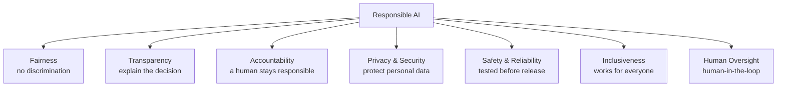

#### How to reduce bias — practical steps

1. Collect **diverse, representative** training data.
2. **Audit** the dataset for imbalance before training.
3. Measure accuracy **separately for each group** (gender, region, age), not just overall.
4. Use **Explainable AI (XAI)** tools such as LIME and SHAP so decisions can be justified.
5. Keep a **human-in-the-loop** for high-stakes decisions (loans, jobs, medical, legal).
6. Follow rules and law — Bangladesh's **National AI Policy**, the **Digital Security / Cyber Security Act**, and the EU **AI Act** as an international reference.

**Key points for a Focus Writing answer**

- Write a short intro: AI increases **efficiency**, but efficiency without **ethics** is dangerous.
- Give 3–4 benefits (speed, accuracy, 24/7 service, cost saving).
- Give 3–4 risks (bias, privacy, job loss, deepfakes).
- End with the balance: *"AI should assist human judgement, not replace human responsibility."*

**Previous Year Question List from this Topic:**

- [Focus Witting: কৃত্রিম বুদ্ধিমত্তা (AI) দক্ষতা ও নৈতিকতা (বাংলা)](../written-answers/ai-and-ml.md?plain=1#L144)

## Artificial Intelligence & Expert Systems
### Intelligent Agents in AI

Modern AI textbooks (Russell & Norvig) describe **every** AI system as an **agent**.

> An **agent** is anything that can **perceive** its environment through **sensors** and **act** upon that environment through **actuators**.

An **intelligent agent** is an agent that chooses its actions so as to achieve the **best expected outcome** (it is *rational*).

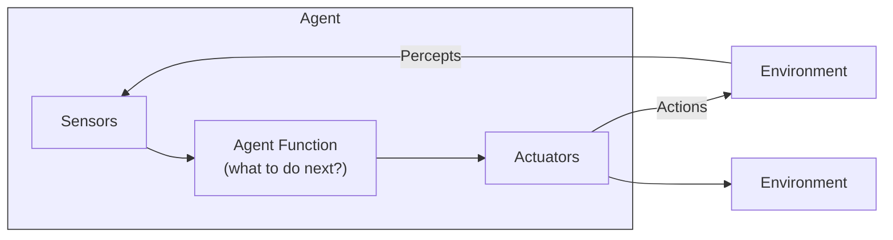

| Term | Meaning |
|---|---|
| **Percept** | One input the agent receives at a moment |
| **Percept sequence** | The complete history of everything the agent has perceived so far |
| **Agent function** | The mapping: percept sequence → action |
| **Agent program** | The actual code that implements the agent function |
| **Rational agent** | For every percept sequence, it picks the action expected to **maximise its performance measure** |

**Examples of agent = sensors + actuators**

| Agent | Sensors | Actuators |
|---|---|---|
| Human | Eyes, ears, skin, nose | Hands, legs, mouth |
| Robot | Camera, infrared, LIDAR | Motors, wheels, robotic arm |
| Software agent (e.g. spam filter) | Keystrokes, file contents, network packets | Screen display, writing files, sending packets |

**Key point:** a rational agent is *not* an omniscient agent. It does the best it can with the information available — it is not expected to know the future.

**Previous Year Question List from this Topic:**

- [An artificial intelligence is an agent is an entity that continuously revious its enviornment.....](../written-answers/ai-and-ml.md?plain=1#L411)

---

### PEAS Framework (Performance, Environment, Actuators, Sensors)

Before designing any intelligent agent you must **specify the task**. The standard way is **PEAS**.

| Letter | Stands for | Question it answers |
|---|---|---|
| **P** | **Performance measure** | How do we score success? |
| **E** | **Environment** | Where does the agent work? |
| **A** | **Actuators** | What can it *do*? |
| **S** | **Sensors** | What can it *see/feel*? |

#### PEAS for an Automated Taxi Driver

| Component | Description |
|---|---|
| **Performance measure** | Safe journey, no accidents, obeys traffic law, fast trip time, low fuel cost, passenger comfort, maximum profit |
| **Environment** | Roads, highways, other vehicles, pedestrians, traffic signals, road signs, weather, passengers |
| **Actuators** | Steering wheel, accelerator, brake, gear, indicator, horn, display/voice output to passenger |
| **Sensors** | Cameras, LIDAR, RADAR, GPS, speedometer, odometer, engine sensors, accelerometer, microphone/keyboard for passenger input |

#### PEAS for an Automatic Clinical / Medical Test System

| Component | Description |
|---|---|
| **Performance measure** | Correct diagnosis, high accuracy (few false positives/negatives), patient safety, low test cost, fast report, minimum unnecessary tests |
| **Environment** | Patient, hospital or diagnostic lab, doctors and technicians, patient medical history database, laboratory equipment |
| **Actuators** | Display of the diagnosis/report, printing the test result, recommending further tests, alerts to doctor, entry into the hospital record system |
| **Sensors** | Keyboard entry of symptoms, blood/urine analyser readings, ECG and blood-pressure sensors, X-ray/CT/MRI images, patient history database |

#### Two more PEAS examples worth memorising

| Agent | P | E | A | S |
|---|---|---|---|---|
| **Vacuum cleaner robot** | Cleanliness, battery used, time taken | Room, carpet, furniture, dust | Wheels, brushes, vacuum motor | Dirt sensor, bump sensor, camera |
| **Part-picking robot** | Percentage of parts in the correct bin | Conveyor belt with parts, bins | Jointed arm, gripper | Camera, joint-angle sensors |

**Previous Year Question List from this Topic:**

- [Write PEAS for (a) Auto taxi (b) Automatic clinical test.](../written-answers/ai-and-ml.md?plain=1#L508)

---

### Types of Intelligent Agents

Agents are classified by **how much thinking** they do — from the simplest to the most capable.

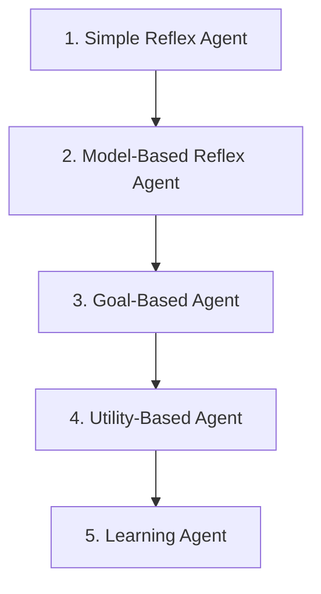

**1. Simple Reflex Agent**
- Acts **only on the current percept**, using `condition → action` rules.
- No memory of the past.
- Works only in a **fully observable** environment.
- *Example:* a thermostat — `if temperature > 25 then switch on AC`.

**2. Model-Based Reflex Agent**
- Keeps an **internal model** (memory) of how the world works, so it can handle a **partially observable** environment.
- *Example:* a robot vacuum that remembers which rooms it has already cleaned.

**3. Goal-Based Agent**
- Also knows **what it is trying to achieve**. It searches and plans a sequence of actions to reach the goal.
- *Example:* Google Maps planning a route to a destination.

**4. Utility-Based Agent**
- Not all goals are equally good — it uses a **utility function** to pick the *best* among several ways of reaching the goal.
- *Example:* choosing the route that is safest and cheapest, not just shortest.

**5. Learning Agent**
- **Improves with experience.** It has four parts:

| Part | Job |
|---|---|
| **Learning element** | Makes improvements |
| **Performance element** | Selects the external action |
| **Critic** | Gives feedback on how well the agent is doing |
| **Problem generator** | Suggests exploratory actions to discover something new |

- *Example:* a recommendation system that gets better as you watch more videos.

**Previous Year Question List from this Topic:**

- [An artificial intelligence is an agent is an entity that continuously revious its enviornment.....](../written-answers/ai-and-ml.md?plain=1#L411)

---

### Properties of Task Environments

The type of environment decides how hard the agent's job is. Exams ask this as *"classify the environment of a self-driving car"*.

| # | Property pair | Meaning | Example |
|---|---|---|---|
| 1 | **Fully vs Partially Observable** | Can the agent see the complete state at any time? | Chess = fully; driving a car = partially |
| 2 | **Deterministic vs Stochastic** | Does the same action always give the same result? | Chess = deterministic; driving = stochastic |
| 3 | **Episodic vs Sequential** | Does the current action affect future ones? | Quality-check of a part = episodic; chess = sequential |
| 4 | **Static vs Dynamic** | Does the world change while the agent is thinking? | Crossword = static; driving = dynamic |
| 5 | **Discrete vs Continuous** | Is the number of states/actions countable? | Chess = discrete; driving = continuous |
| 6 | **Single-agent vs Multi-agent** | Is anyone else acting in the same environment? | Crossword = single; chess/driving = multi |
| 7 | **Known vs Unknown** | Does the agent know the rules of the environment? | Known = rules given; Unknown = must be learned |

**The hardest environment** is one that is *partially observable, stochastic, sequential, dynamic, continuous and multi-agent* — which is exactly **driving a car in real traffic**.

**Previous Year Question List from this Topic:**

- [An artificial intelligence is an agent is an entity that continuously revious its enviornment.....](../written-answers/ai-and-ml.md?plain=1#L411)
- [Write PEAS for (a) Auto taxi (b) Automatic clinical test.](../written-answers/ai-and-ml.md?plain=1#L508)

---

### Knowledge and Knowledge Representation in AI

**Knowledge** is *processed, organised information that can be used to take decisions*. A program becomes intelligent only when it **stores** knowledge and can **reason** with it.

#### The Data → Information → Knowledge → Wisdom (DIKW) ladder

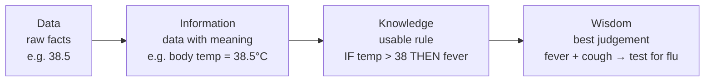

#### How human knowledge is put into a computer

This is the standard **flow diagram** asked in exams (*"Human Knowledge কে Computer এ প্রকাশ করার flow diagram দেখান"*):

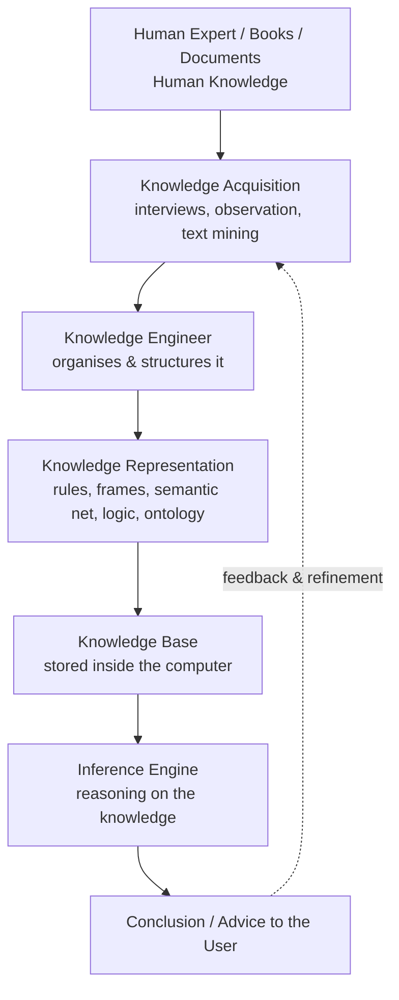

#### Types of knowledge in AI

| Type | Meaning | Example |
|---|---|---|
| **Declarative** | Knowing *that* (facts) | "Dhaka is the capital of Bangladesh" |
| **Procedural** | Knowing *how* (steps) | How to ride a bicycle |
| **Meta-knowledge** | Knowledge about knowledge | Knowing which rule to apply first |
| **Heuristic** | Rules of thumb from experience | "If the engine is silent, check the battery first" |
| **Structural** | How concepts relate to each other | "A car *is-a* vehicle" |

#### Main knowledge representation techniques

| Technique | Idea | Example |
|---|---|---|
| **Logical representation** | Propositional / Predicate (First-Order) Logic | `∀x Human(x) → Mortal(x)` |
| **Production rules** | `IF condition THEN action` | `IF fever AND cough THEN suspect flu` |
| **Semantic network** | A graph of concepts (nodes) and relations (edges) | *Bird* —is-a→ *Animal*; *Bird* —has→ *Wings* |
| **Frames** | A record with slots and values, like an object | `Car { colour: red, wheels: 4 }` |
| **Ontology** | A formal shared vocabulary of a domain | Medical ontology SNOMED |
| **Scripts** | A standard sequence of events | The "restaurant script": enter → order → eat → pay |

**Properties a good representation must have:** *representational adequacy, inferential adequacy, inferential efficiency,* and *acquisitional efficiency*.

**Previous Year Question List from this Topic:**

- [(i) ‘Knowledge’ কী? Human Knowledge কে Computer এ প্রকাশ করার একটি flow diagram দেখান।](../written-answers/ai-and-ml.md?plain=1#L544)

---

### Expert Systems — Architecture and Working

An **Expert System (ES)** is a computer program that copies the **decision-making ability of a human expert** in one narrow field, using a store of knowledge and a reasoning engine.

It is a classic example of **AI that is *not* Machine Learning** — the knowledge is put in by humans as rules, not learned from data.

#### Architecture

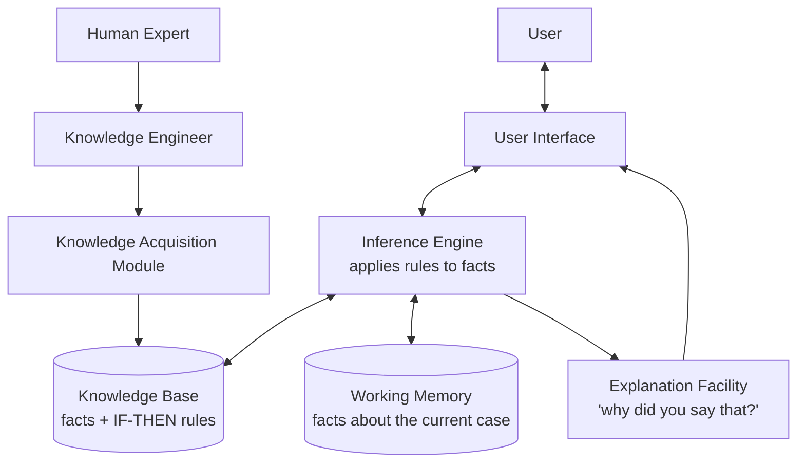

| Component | Function |
|---|---|
| **Knowledge Base** | Stores domain facts and `IF–THEN` rules collected from human experts |
| **Inference Engine** | The "brain" — matches rules against facts and derives new conclusions |
| **Working Memory** | Holds the facts of the case being solved right now |
| **User Interface** | Lets a non-expert ask questions in simple language |
| **Explanation Facility** | Explains *why* a question was asked and *how* a conclusion was reached |
| **Knowledge Acquisition Module** | Lets the knowledge engineer add or update knowledge |

#### Famous expert systems

| System | Field |
|---|---|
| **MYCIN** | Diagnosing blood infections and suggesting antibiotics (Stanford, 1970s) |
| **DENDRAL** | Identifying chemical molecular structures — the *first* expert system |
| **XCON / R1** | Configuring DEC computer orders |
| **PROSPECTOR** | Mineral and ore exploration |
| **CaDet** | Early cancer detection |

#### Advantages and Limitations

**Advantages**
- Available **24×7**, never gets tired or emotional.
- **Consistent** answers every time.
- **Preserves expertise** even after the expert retires.
- **Cheaper** than hiring many experts; useful in remote areas.
- Can **explain** its reasoning, unlike a deep neural network.

**Limitations**
- Works only in a **very narrow domain**; no common sense.
- **Cannot learn by itself** — knowledge must be updated by hand.
- **Knowledge acquisition bottleneck**: extracting rules from an expert is slow and costly.
- Fails badly on cases outside its rules ("brittleness").

#### Expert System vs Machine Learning

| Point | Expert System | Machine Learning |
|---|---|---|
| Source of knowledge | Human experts write rules | Learned from data |
| Learning | No self-learning | Improves with data |
| Explainability | High — rules are readable | Often a black box |
| Data needed | Very little | Large amount |
| Handles new/unseen cases | Poorly | Reasonably well |

**Previous Year Question List from this Topic:**

- [What is Artificial Intelligence?](../written-answers/ai-and-ml.md?plain=1#L389)
- [(i) ‘Knowledge’ কী? Human Knowledge কে Computer এ প্রকাশ করার একটি flow diagram দেখান।](../written-answers/ai-and-ml.md?plain=1#L544)

---

### Forward Chaining vs Backward Chaining

These are the two **reasoning strategies** used by an inference engine.

**Forward Chaining (Data-Driven)** — start from the **known facts**, keep firing the rules whose conditions match, and see **what conclusion you reach**.

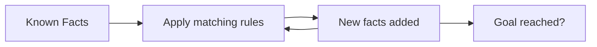

**Backward Chaining (Goal-Driven)** — start from a **possible goal/hypothesis**, and work backwards asking *"what facts would I need to prove this?"*

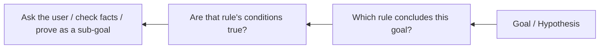

**Worked example.** Rules:
- R1: `IF has_fever AND has_cough THEN has_flu`
- R2: `IF has_flu THEN needs_rest`

*Forward chaining:* We are told the patient has fever and cough → R1 fires → `has_flu` → R2 fires → `needs_rest`. **Conclusion found from facts.**

*Backward chaining:* We ask "does the patient need rest?" → R2 says we must prove `has_flu` → R1 says we must prove `has_fever` and `has_cough` → ask the user those two questions. **Facts found from the goal.**

| Point | Forward Chaining | Backward Chaining |
|---|---|---|
| Direction | Facts → Conclusion | Goal → Facts |
| Also called | Data-driven, bottom-up | Goal-driven, top-down |
| Starting point | All available facts | A hypothesis to test |
| Best when | Many facts, few possible conclusions | Few goals, many possible facts |
| Typical use | Monitoring, alarms, planning, real-time control | Diagnosis, troubleshooting, MYCIN, Prolog |
| Efficiency | Can derive many irrelevant facts | Focused, asks only needed questions |

**Previous Year Question List from this Topic:**

- [(i) ‘Knowledge’ কী? Human Knowledge কে Computer এ প্রকাশ করার একটি flow diagram দেখান।](../written-answers/ai-and-ml.md?plain=1#L544)

---

### Measuring Intelligence — and Common True/False Traps

A few small conceptual questions are repeated across exams. Keep these straight.

**1. "Intelligence cannot be measured only by an intelligence test, because it is related to other subjects." → TRUE.**
An IQ test mostly checks logical and mathematical reasoning. Real intelligence also includes **emotional intelligence, creativity, social skill, language ability, memory and practical problem solving** — Howard Gardner's *Theory of Multiple Intelligences* lists linguistic, logical-mathematical, spatial, musical, bodily-kinesthetic, interpersonal, intrapersonal and naturalistic intelligence. So a single test score cannot capture it.

**2. "Machine Learning is a subset of Cloud Computing that can build AI." → FALSE.**
Machine Learning is a subset of **Artificial Intelligence**. Cloud Computing is an unrelated field — it only supplies the *infrastructure* (storage, GPUs, hosting) where ML models are often trained and deployed.

**3. "Who is the father of AI?" → John McCarthy** (coined the term in 1956, created LISP).
Do not confuse with **Alan Turing** (Enigma code-breaking, Turing Test) — he laid the *foundation*, but McCarthy is called the father of AI.

**4. "What is Deep Blue?" → IBM's chess-playing computer** that defeated world champion **Garry Kasparov in 1997**. It is a **Reactive Machine** type of AI: no memory of past games, it simply evaluated millions of board positions per second using brute-force search plus chess heuristics.

**5. "An AI agent is an entity that continuously perceives its environment..." → the full sentence is:**
> An intelligent agent is an entity that **perceives its environment through sensors** and **acts upon that environment through actuators**, choosing actions that maximise its performance measure.

**Previous Year Question List from this Topic:**

- [What is Artificial Intelligence?](../written-answers/ai-and-ml.md?plain=1#L389)
- [Intelligence can not be measured only by intelligence test because it is related to other subjects. (True or False)](../written-answers/ai-and-ml.md?plain=1#L523)
- [Machine learning is a subset of cloud computing that can be built AI-Based. (True or False).](../written-answers/ai-and-ml.md?plain=1#L529)
- [What is the father of AI?](../written-answers/ai-and-ml.md?plain=1#L537)
- [Who is Largely credited for breaking the German Enigma codes that provided a foundation for artificial intelligence?](../written-answers/ai-and-ml.md?plain=1#L571)
- [ক) Deep Blue কী?](../written-answers/ai-and-ml.md?plain=1#L229)

## Deep Learning & Neural Networks (ANN, CNN, RNN)
### Biological Neuron vs Artificial Neuron

A neural network is a **rough copy of the human brain**. The brain has about **86 billion** nerve cells called **neurons**; an Artificial Neural Network copies their basic idea in mathematics.

#### The biological neuron

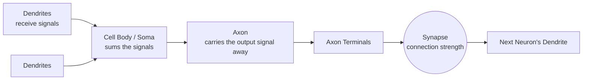

| Part | Job |
|---|---|
| **Dendrites** | Branch-like arms that **receive** signals from other neurons — the *inputs* |
| **Soma (cell body)** | **Adds up** all incoming signals and decides whether to fire |
| **Axon** | A long fibre that **carries the output signal away** from the cell body to other neurons |
| **Axon terminals** | The end branches of the axon that pass the signal on |
| **Synapse** | The junction between two neurons; its **strength** decides how much signal passes — this is what "learning" changes |

> **Frequently asked:** *"What does the axon of a neural network do?"*
> **Answer:** The axon **transmits/carries the output signal of the neuron away from the cell body** towards other neurons. In an Artificial Neural Network, the axon corresponds to the **output of the neuron**, and the synapse corresponds to the **weight** on the connection.

#### Mapping biology to mathematics

| Biological neuron | Artificial neuron |
|---|---|
| Dendrite | **Input** (x₁, x₂, … xₙ) |
| Synapse | **Weight** (w₁, w₂, … wₙ) |
| Cell body / Soma | **Summation function** Σ(wᵢxᵢ) + b |
| Firing threshold | **Activation function** |
| Axon | **Output** (y) |

**Previous Year Question List from this Topic:**

- [What does the axon of neural network do?](../written-answers/ai-and-ml.md?plain=1#L605)
- [What is Artificial Neural Network (ANN)? Difference between deep learning technique and Traditional machine learning technique.](../written-answers/ai-and-ml.md?plain=1#L657)
- [What is artificial Neural Network (ANN)? Based on ANN, describe input & hidden layer, weight and activation function.](../written-answers/ai-and-ml.md?plain=1#L707)

---

### Artificial Neural Network (ANN) — Structure and Working

An **Artificial Neural Network (ANN)** is a computing model made of many simple processing units called **neurons (nodes)**, arranged in **layers** and joined by **weighted connections**. It learns by adjusting those weights until its output matches the desired output.

#### Structure of a single artificial neuron

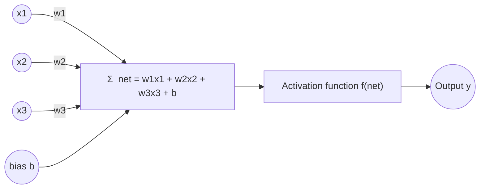

The maths in one line:

> **y = f( Σ (wᵢ · xᵢ) + b )**

where `xᵢ` = inputs, `wᵢ` = weights, `b` = bias, `f` = activation function.

#### The three kinds of layer

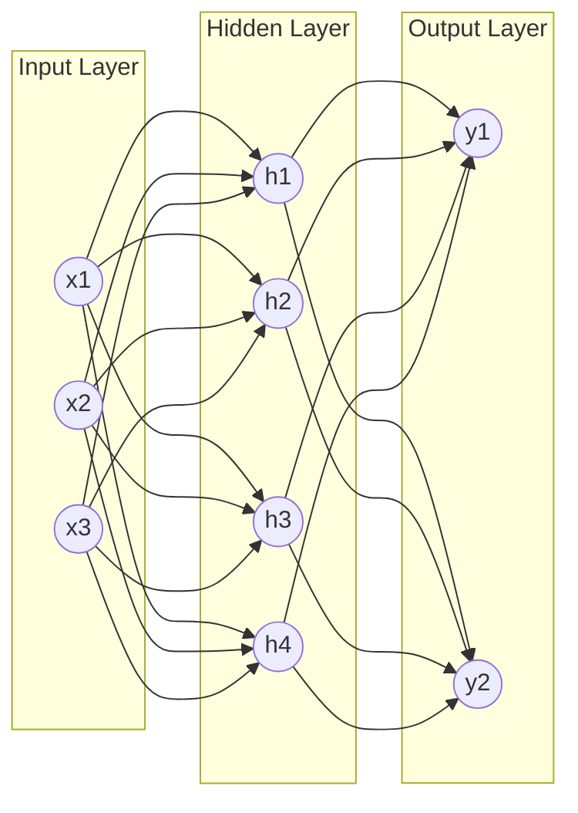

| Layer | Job |
|---|---|
| **Input layer** | Takes the raw features. **No computation happens here** — it only passes values in. Number of nodes = number of features. |
| **Hidden layer(s)** | The real "thinking" layers. Each node computes a weighted sum plus bias and applies an activation function. They learn increasingly abstract features. A network may have 1 hidden layer (shallow) or 100+ (deep). |
| **Output layer** | Produces the final answer. 1 node for regression or binary classification; *n* nodes with Softmax for *n*-class classification. |

#### What are weights and bias?

- **Weight (w)** = the **importance** of an input. A large positive weight means "this input pushes the neuron to fire"; a negative weight pushes against it. **Weights are what the network learns.**
- **Bias (b)** = a constant added to the sum. It lets the neuron **shift** its activation threshold, so the neuron can fire even when all inputs are zero. Without bias, every decision boundary would be forced through the origin.

#### Single-layer ANN (the Perceptron)

*"Draw the single layer of an ANN"* — this is the answer:

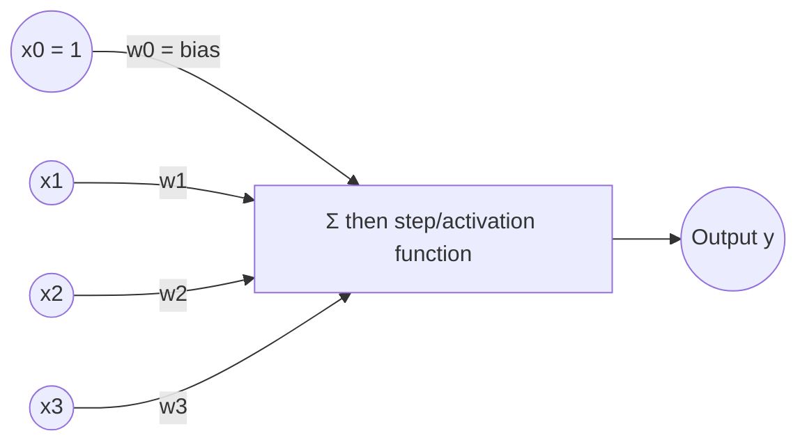

A **single-layer perceptron** has only an input layer and an output layer — **no hidden layer**. It can only separate data that is **linearly separable**, so it can learn AND and OR but famously **cannot learn XOR**. Adding a hidden layer (making a **Multi-Layer Perceptron, MLP**) solves XOR.

#### How an ANN learns — the training loop

```mermaid
flowchart LR
    A[1. Initialise weights randomly] --> B[2. Forward Propagation<br/>compute the output]
    B --> C[3. Compute Loss<br/>predicted vs actual]
    C --> D[4. Backpropagation<br/>find each weight's share of the error]
    D --> E[5. Gradient Descent<br/>update the weights]
    E -->|repeat for many epochs| B
```

1. **Forward propagation** — input flows left to right through the layers and produces a prediction.
2. **Loss function** — measures how wrong the prediction is (MSE for regression, Cross-Entropy for classification).
3. **Backpropagation** — using the chain rule of calculus, the error is pushed backwards to find *how much each weight contributed* to the error (the gradient).
4. **Gradient descent** — every weight is nudged in the direction that reduces the error:
   **w_new = w_old − η × ∂Loss/∂w**, where **η (eta)** is the **learning rate**.
5. One full pass over the training data = one **epoch**; training runs for many epochs.

#### Types of neural network worth naming

| Type | Used for |
|---|---|
| **Feedforward NN / MLP** | General tabular prediction |
| **CNN** (Convolutional) | Images and video |
| **RNN / LSTM / GRU** | Sequences — text, speech, time series |
| **Autoencoder** | Compression, denoising, anomaly detection |
| **GAN** (Generative Adversarial Network) | Generating new images |
| **Transformer** | Modern NLP — BERT, GPT, ChatGPT |

**Previous Year Question List from this Topic:**

- [What is Artificial Neural Network (ANN)? Difference between deep learning technique and Traditional machine learning technique.](../written-answers/ai-and-ml.md?plain=1#L657)
- [Draw the single layer of ANN.](../written-answers/ai-and-ml.md?plain=1#L688)
- [What is artificial Neural Network (ANN)? Based on ANN, describe input & hidden layer, weight and activation function.](../written-answers/ai-and-ml.md?plain=1#L707)

---

### Activation Functions in Neural Networks

An **activation function** is the mathematical function applied to a neuron's weighted sum. It decides **whether and how strongly the neuron fires**, and it converts the sum into the neuron's output.

#### Why is an activation function needed? (the "usability")

This is the key exam point:

> Without an activation function, every layer would only compute a **weighted sum**, which is a *linear* operation. Stacking many linear layers still gives just one linear function — so a 100-layer network would be no more powerful than a single layer. The activation function introduces **non-linearity**, which is what lets the network learn **complex, curved patterns** such as images, speech and language.

Other uses:
1. **Bounds the output** to a useful range (e.g. 0–1 for a probability).
2. **Decides firing** — mimics the biological "fire / don't fire" threshold.
3. **Makes backpropagation possible** — it must be *differentiable* so gradients can flow.
4. **Softmax in the output layer** turns raw scores into class probabilities.

#### The important activation functions

| Function | Formula | Output range | Where used | Problem |
|---|---|---|---|---|
| **Step (Threshold)** | 1 if x ≥ 0, else 0 | {0, 1} | Original perceptron | Not differentiable — cannot train with backprop |
| **Linear** | f(x) = x | −∞ to +∞ | Output layer of regression | No non-linearity |
| **Sigmoid (Logistic)** | 1 / (1 + e⁻ˣ) | 0 to 1 | Output layer of **binary classification** (gives a probability) | **Vanishing gradient**; output not zero-centred; slow |
| **Tanh** | (eˣ − e⁻ˣ)/(eˣ + e⁻ˣ) | −1 to 1 | Hidden layers of older/RNN networks | Zero-centred (better than sigmoid) but still vanishing gradient |
| **ReLU** | max(0, x) | 0 to ∞ | **Default choice for hidden layers** | **Dying ReLU** — neurons with negative input output 0 forever |
| **Leaky ReLU** | x if x>0, else αx (α ≈ 0.01) | −∞ to ∞ | Hidden layers, fixes dying ReLU | α must be chosen |
| **Softmax** | eˣⁱ / Σ eˣʲ | 0 to 1, sums to 1 | **Output layer of multi-class classification** | Output layer only |

#### Shapes of the curves

```mermaid
flowchart LR
    A["Sigmoid<br/>S-shaped curve<br/>squashes into 0 … 1"]
    B["Tanh<br/>S-shaped curve<br/>squashes into −1 … 1"]
    C["ReLU<br/>flat 0 for x<0,<br/>straight line for x>0"]
    D["Leaky ReLU<br/>small slope for x<0,<br/>straight line for x>0"]
```

#### The Vanishing Gradient Problem (why ReLU won)

The derivative of sigmoid is at most **0.25**. In backpropagation these derivatives get **multiplied layer after layer**: 0.25 × 0.25 × 0.25 … After 10 layers the gradient is around 0.25¹⁰ ≈ 0.00000095 — practically **zero**. The early layers then stop learning. This is the **vanishing gradient problem**.

**ReLU** fixes it because its derivative is exactly **1** for every positive input, so gradients pass through unchanged no matter how deep the network is. That single fact is what made very deep networks trainable.

**Rule of thumb for choosing**

| Situation | Use |
|---|---|
| Hidden layers | **ReLU** (or Leaky ReLU / GELU) |
| Binary classification output | **Sigmoid** |
| Multi-class classification output | **Softmax** |
| Regression output | **Linear** (no activation) |

**Previous Year Question List from this Topic:**

- [(c) What is activation function in Deep Neural Network? What is the usability of this?](../written-answers/ai-and-ml.md?plain=1#L580)
- [What is artificial Neural Network (ANN)? Based on ANN, describe input & hidden layer, weight and activation function.](../written-answers/ai-and-ml.md?plain=1#L707)
- [(c) What is activation function in Deep Neural Network? What is the usability of this?](../written-answers/ai-and-ml.md?plain=1#L48)

---

### What is Deep Learning?

**Deep Learning (DL)** is the part of Machine Learning that uses **Artificial Neural Networks with many hidden layers** ("deep" = many layers) to learn directly from raw data.

The special power of Deep Learning is **automatic feature extraction**: you do not tell it what to look for — it discovers the useful features by itself.

```mermaid
flowchart LR
    A[Raw image pixels] --> B[Layer 1<br/>learns edges]
    B --> C[Layer 2<br/>learns corners & textures]
    C --> D[Layer 3<br/>learns eyes, nose, ears]
    D --> E[Layer 4<br/>learns whole faces]
    E --> F[Output: 'this is Rahim']
```

**Why did Deep Learning explode after 2012?** Three things came together:
1. **Big Data** — the internet produced huge labelled datasets (ImageNet).
2. **GPU computing** — graphics cards made matrix maths hundreds of times faster.
3. **Better algorithms** — ReLU, dropout, batch normalisation, Adam optimiser.

**Applications of Deep Learning**

| Area | Application |
|---|---|
| Computer Vision | Face recognition, medical imaging, self-driving cars, OCR |
| NLP | Machine translation, chatbots, ChatGPT, sentiment analysis |
| Speech | Voice assistants, speech-to-text, text-to-speech |
| Healthcare | Cancer detection, drug discovery |
| Finance | Fraud detection, algorithmic trading |
| Generative | DALL·E, Midjourney, deepfakes, AI music |

**Limitations of Deep Learning**
- Needs **huge labelled datasets** and **expensive GPUs**.
- **Black box** — very hard to explain a decision (a serious problem for banking and medicine).
- Long training time; high electricity cost.
- Can **overfit** easily on small data.

**Previous Year Question List from this Topic:**

- [Write difference between machine learning and deep learning.](../written-answers/ai-and-ml.md?plain=1#L624)
- [What is Deep learning?](../written-answers/ai-and-ml.md?plain=1#L639)
- [What is Artificial Neural Network (ANN)? Difference between deep learning technique and Traditional machine learning technique.](../written-answers/ai-and-ml.md?plain=1#L657)

---

### Deep Learning vs Traditional Machine Learning

This exact comparison is asked again and again — memorise the table.

```mermaid
flowchart TD
    subgraph ML["Traditional Machine Learning"]
        A1[Raw Data] --> A2["Manual Feature Extraction<br/>(human engineer decides)"]
        A2 --> A3[ML Algorithm<br/>SVM / Decision Tree]
        A3 --> A4[Output]
    end
    subgraph DL["Deep Learning"]
        B1[Raw Data] --> B2["Deep Neural Network<br/>feature extraction + classification together"]
        B2 --> B4[Output]
    end
```

| Point | Traditional Machine Learning | Deep Learning |
|---|---|---|
| **Feature extraction** | **Manual** — a human decides which features matter | **Automatic** — the network learns features itself |
| **Data requirement** | Works well with **small to medium** data (thousands of rows) | Needs **very large** data (lakhs to millions) |
| **Hardware** | Ordinary **CPU** is enough | Needs **GPU / TPU** |
| **Training time** | Seconds to hours | Hours to weeks |
| **Execution (prediction) time** | Usually fast | Can be slower, but fast on GPU |
| **Interpretability** | **High** — you can read a decision tree | **Low** — a black box |
| **Performance on small data** | Better | Poor (overfits) |
| **Performance on huge data** | Plateaus — stops improving | Keeps improving |
| **Problem solving style** | Problem is broken into parts and solved step by step | Solved **end-to-end** in one model |
| **Typical algorithms** | Linear Regression, Logistic Regression, Decision Tree, SVM, KNN, Random Forest | CNN, RNN, LSTM, GAN, Transformer |
| **Best for** | Tabular / structured data (bank records) | Unstructured data (images, audio, text) |

**One-line answer:** *Deep Learning is Machine Learning that uses deep neural networks to learn the features automatically, while traditional Machine Learning depends on features hand-picked by humans.*

**Previous Year Question List from this Topic:**

- [Write difference between machine learning and deep learning.](../written-answers/ai-and-ml.md?plain=1#L624)
- [What is Artificial Neural Network (ANN)? Difference between deep learning technique and Traditional machine learning technique.](../written-answers/ai-and-ml.md?plain=1#L657)

---

### Convolutional Neural Network (CNN)

A **CNN** is the neural network designed for **image and video data**. Instead of connecting every pixel to every neuron (which would need millions of weights), it slides small **filters (kernels)** over the image to detect local patterns.

#### CNN architecture

```mermaid
flowchart LR
    I[Input Image<br/>e.g. 32x32x3] --> C1[Convolution Layer<br/>+ ReLU]
    C1 --> P1[Pooling Layer<br/>Max Pooling]
    P1 --> C2[Convolution Layer<br/>+ ReLU]
    C2 --> P2[Pooling Layer]
    P2 --> FL[Flatten]
    FL --> FC[Fully Connected Layer]
    FC --> O[Output Layer<br/>Softmax]
```

| Layer | What it does |
|---|---|
| **Convolution layer** | Slides a small filter over the image and produces a **feature map** highlighting edges, corners, textures |
| **ReLU** | Adds non-linearity, turns negative values to 0 |
| **Pooling (subsampling)** | Shrinks the feature map (e.g. **Max Pooling** keeps the largest value in each 2×2 block) — reduces computation and gives small shift-invariance |
| **Flatten** | Converts the 2-D feature maps into a 1-D vector |
| **Fully Connected (Dense)** | Does the final classification using all the extracted features |
| **Softmax output** | Gives the probability of each class |

**Why CNN beats a plain ANN on images**
1. **Parameter sharing** — the same filter is used across the whole image, so far fewer weights.
2. **Local connectivity** — a pixel is most related to its neighbours.
3. **Translation invariance** — a cat is recognised whether it is on the left or the right of the photo.

**Famous CNNs:** LeNet-5, AlexNet (2012), VGG-16, GoogLeNet/Inception, ResNet.

**Previous Year Question List from this Topic:**

- [What is Deep learning?](../written-answers/ai-and-ml.md?plain=1#L639)

---

### Recurrent Neural Network (RNN) and LSTM

#### RNN

A **Recurrent Neural Network** is built for **sequential data** — text, speech, time series — where **order matters**. Its special feature is a **loop**: the output of a step is fed back as input to the next step, giving the network a **memory** of what came before.

```mermaid
flowchart LR
    X1[x1<br/>'I'] --> H1((h1))
    H1 --> X2G[ ]
    X2[x2<br/>'love'] --> H2((h2))
    H1 -->|hidden state| H2
    X3[x3<br/>'Bangla'] --> H3((h3))
    H2 -->|hidden state| H3
    H3 --> Y[Prediction:<br/>next word]
    style X2G fill:none,stroke:none
```

**Problem with plain RNN:** over a long sequence the repeated multiplication of gradients makes them **vanish** (or explode). So an RNN forgets information from far back — it cannot connect *"I grew up in **Bangladesh** … I speak fluent **Bangla**"* if the two words are 50 words apart. This is the **long-term dependency problem**.

#### LSTM — Long Short-Term Memory

**LSTM** is an improved RNN that solves the long-term dependency problem by adding a **cell state** (a "conveyor belt" of memory running through time) controlled by **gates**.

```mermaid
flowchart LR
    CP["Cell state C(t-1)"] --> FG["× Forget Gate<br/>what to throw away"]
    FG --> ADD["+ Input Gate<br/>what new info to store"]
    ADD --> CN["Cell state C(t)"]
    CN --> OG["Output Gate<br/>what to output now"]
    OG --> HT["Hidden state h(t)"]
    XT["Input x(t)"] --> FG
    XT --> ADD
    XT --> OG
    HP["h(t-1)"] --> FG
    HP --> ADD
    HP --> OG
```

**The three gates of LSTM** *(a directly asked question — "Write LSTM gate names")*:

| # | Gate | Activation | What it decides |
|---|---|---|---|
| 1 | **Forget Gate** | Sigmoid | **What to remove** from the cell state. Output 0 = forget completely, 1 = keep fully |
| 2 | **Input Gate** (a.k.a. Update Gate) | Sigmoid + Tanh | **What new information to add** to the cell state |
| 3 | **Output Gate** | Sigmoid + Tanh | **What part of the cell state to output** as the hidden state h(t) |

*(The **cell state** itself is sometimes counted as a fourth component, and the tanh layer that creates the candidate values is called the **candidate/cell gate** — so some books say "4 gates". If asked for names, write **Forget, Input and Output gate**.)*

#### GRU — Gated Recurrent Unit

A simpler, faster variant with only **two gates**: the **Reset Gate** and the **Update Gate**. It merges the cell state and hidden state, so it has fewer parameters and trains faster, with performance close to LSTM.

| Point | RNN | LSTM | GRU |
|---|---|---|---|
| Gates | None | 3 (Forget, Input, Output) | 2 (Reset, Update) |
| Long-term memory | Poor | Excellent | Good |
| Parameters / speed | Fewest / fastest | Most / slowest | Middle |
| Use | Short sequences | Long text, speech, time series | When speed matters |

**Applications of RNN/LSTM:** machine translation, speech recognition, handwriting recognition, stock-price and load forecasting, text generation, sentiment analysis.

*(Note: since 2018, **Transformers** — which use an **attention mechanism** instead of recurrence and can be trained in parallel — have replaced LSTM in most NLP tasks, including GPT and BERT.)*

**Previous Year Question List from this Topic:**

- [Write LSTM gates name in AI.](../written-answers/ai-and-ml.md?plain=1#L676)

## Machine Learning Paradigms (Supervised vs Unsupervised)
### Supervised Learning in Detail

**Supervised Learning** is learning **with a teacher**. The training data contains both the **input features (X)** and the **correct output label (Y)**, and the model's job is to learn the mapping **Y = f(X)** so that it can predict Y for new, unseen X.

The name comes from the idea of a supervisor standing beside the student with the answer key.

```mermaid
flowchart LR
    A["Labelled Training Data<br/>(X , Y)"] --> B[Learning Algorithm]
    B --> C[Trained Model]
    D[New unseen input X'] --> C
    C --> E[Predicted output Y']
    F[Actual Y] --> G{Compare & compute error}
    E -.-> G
    G -.->|adjust| B
```

#### The two branches of Supervised Learning

| | **Classification** | **Regression** |
|---|---|---|
| **Output type** | Discrete **category / class** | Continuous **number** |
| **Question it answers** | "Which group?" | "How much / how many?" |
| **Examples** | Spam or not spam; loan default yes/no; disease positive/negative; digit 0–9 | House price; tomorrow's temperature; sales next month; a customer's credit limit |
| **Algorithms** | Logistic Regression, Decision Tree, Random Forest, SVM, KNN, Naive Bayes, Neural Network | Linear Regression, Polynomial Regression, Ridge/Lasso, Decision Tree Regressor, SVR |
| **Evaluation metrics** | Accuracy, Precision, Recall, F1-score, ROC-AUC, Confusion matrix | MAE, MSE, RMSE, R² |

**Classification is further divided into:**
- **Binary classification** — exactly 2 classes (diabetic / not diabetic).
- **Multi-class classification** — more than 2 classes, but each sample belongs to exactly one (handwritten digit 0–9).
- **Multi-label classification** — a sample can belong to several classes at once (a news article tagged both *politics* and *economy*).

#### Common supervised algorithms in one line each

| Algorithm | Idea in one line |
|---|---|
| **Linear Regression** | Fit the best straight line through the points |
| **Logistic Regression** | Fit an S-curve (sigmoid) that outputs a probability, then threshold it |
| **K-Nearest Neighbours (KNN)** | Look at the K closest training points and take a majority vote |
| **Naive Bayes** | Apply Bayes' theorem assuming all features are independent |
| **Decision Tree** | Ask a series of yes/no questions until you reach a leaf |
| **Random Forest** | Build many decision trees and let them vote (an ensemble) |
| **Support Vector Machine (SVM)** | Find the hyperplane with the widest possible margin between classes |
| **Neural Network** | Layers of weighted neurons that learn the mapping by backpropagation |

**Advantages of Supervised Learning**
- Accuracy is **measurable** because the true answers are known.
- Usually gives **high accuracy** when enough good labelled data exists.
- Easy to understand and easy to explain to a business user.

**Disadvantages**
- Needs **labelled data**, which is expensive and slow to produce (a doctor must label thousands of X-rays).
- Cannot discover classes it has never been shown.
- Risk of **overfitting** on small datasets.

**Previous Year Question List from this Topic:**

- [(a) Describe the following terms:](../written-answers/ai-and-ml.md?plain=1#L739)
- [Briefly explain supervised learning, unsupervised learning & reinforcement learning.](../written-answers/ai-and-ml.md?plain=1#L792)
- [(b) What is the difference between supervised and unsupervised learning? Explain with examples.](../written-answers/ai-and-ml.md?plain=1#L808)
- [Given some features of diabetic patient dataset with some labeled data. From this it can be predict whether this patient is diabetic or not. Is this supervised…](../written-answers/ai-and-ml.md?plain=1#L826)
- [What is the difference between Supervised and Unsupervised learning?](../written-answers/ai-and-ml.md?plain=1#L72)

---

### Unsupervised Learning in Detail

**Unsupervised Learning** is learning **without a teacher**. The data has only inputs **X** and **no labels**. The algorithm must find the **hidden structure, grouping or pattern** by itself.

```mermaid
flowchart LR
    A["Unlabelled Data<br/>(X only)"] --> B[Learning Algorithm]
    B --> C[Discovered Structure]
    C --> C1[Groups / Clusters]
    C --> C2[Association Rules]
    C --> C3[Fewer, compressed features]
```

#### The three main tasks

**1. Clustering** — divide the data into groups so that points in the same group are similar and points in different groups are different.
- *Algorithms:* **K-Means**, Hierarchical clustering, DBSCAN, Gaussian Mixture Models.
- *Example:* a bank groups its customers into "high-value savers", "young borrowers", "dormant accounts" — without anyone defining those groups in advance.

**2. Association Rule Mining** — find items that occur together.
- *Algorithms:* **Apriori**, FP-Growth, ECLAT.
- *Example:* *"customers who buy bread also buy butter"* (Market Basket Analysis).

**3. Dimensionality Reduction** — reduce the number of features while keeping most of the information.
- *Algorithms:* **PCA (Principal Component Analysis)**, t-SNE, SVD, Autoencoders.
- *Example:* compressing 200 survey questions into 5 meaningful factors.

**(A fourth task, Anomaly / Outlier Detection**, finds points that do not fit any pattern — used for credit-card fraud and network intrusion detection.)

**Advantages of Unsupervised Learning**
- **No labelling cost** — works on the raw data a company already has.
- Can **discover patterns nobody suspected**.
- Useful as a **first exploration step** before supervised learning.

**Disadvantages**
- **No ground truth**, so accuracy cannot be measured directly.
- Results can be **hard to interpret** — you must name the clusters yourself.
- The output depends heavily on the chosen number of clusters and distance measure.

**Previous Year Question List from this Topic:**

- [(a) Describe the following terms:](../written-answers/ai-and-ml.md?plain=1#L739)
- [Briefly explain supervised learning, unsupervised learning & reinforcement learning.](../written-answers/ai-and-ml.md?plain=1#L792)
- [(b) What is the difference between supervised and unsupervised learning? Explain with examples.](../written-answers/ai-and-ml.md?plain=1#L808)

---

### Supervised vs Unsupervised vs Reinforcement Learning

The single most repeated question in this whole topic. Learn the diagram and the table together.

```mermaid
flowchart TD
    subgraph S["Supervised Learning"]
        S1["Data: X with correct label Y"] --> S2["Learn X → Y"] --> S3["Predict label for new X"]
    end
    subgraph U["Unsupervised Learning"]
        U1["Data: X only, no label"] --> U2["Find hidden structure"] --> U3["Clusters / rules"]
    end
    subgraph R["Reinforcement Learning"]
        R1["Agent in an Environment"] --> R2["Take action"] --> R3["Get reward or penalty"] --> R4["Improve policy"] --> R2
    end
```

| Point | **Supervised** | **Unsupervised** | **Reinforcement** |
|---|---|---|---|
| **Training data** | Labelled (input + correct output) | Unlabelled (input only) | No fixed dataset — an interactive environment |
| **Teacher / feedback** | Direct, immediate, correct answer given | No feedback at all | Indirect and **delayed** — only a reward signal |
| **Goal** | Predict the known output accurately | Discover hidden structure | Maximise the **total long-term reward** |
| **Learns from** | Examples | Similarity / structure in the data | **Trial and error** |
| **Main tasks** | Classification, Regression | Clustering, Association, Dimensionality reduction | Control, sequential decision making |
| **Key algorithms** | Linear/Logistic Regression, Decision Tree, SVM, KNN, Random Forest, Naive Bayes | K-Means, Hierarchical, DBSCAN, Apriori, PCA | Q-Learning, SARSA, DQN, Policy Gradient |
| **Number of labels needed** | Many | Zero | Zero (but needs a reward function) |
| **Real example** | Predicting whether a loan applicant will default, from past labelled loan records | Segmenting bank customers into groups for marketing | A robot learning to walk; AlphaGo learning to play Go |
| **Human analogy** | A student studying with an answer key | A child sorting toys by colour without being told the colours | A child learning to ride a bicycle by falling and adjusting |

**How to recognise which one a question needs:**

```mermaid
flowchart TD
    Q{Does the training data have<br/>correct answers / labels?} -->|Yes| A[Supervised Learning]
    Q -->|No| B{Are we learning by<br/>acting and getting rewards?}
    B -->|No — just finding patterns| C[Unsupervised Learning]
    B -->|Yes| D[Reinforcement Learning]
    A --> A1{Is the output a category<br/>or a number?}
    A1 -->|Category| A2[Classification]
    A1 -->|Number| A3[Regression]
```

> **Worked exam question:** *"You are given a diabetic-patient dataset with features and **some labelled data**, and you must predict whether a patient is diabetic or not. Is this supervised or unsupervised?"*
>
> **Answer: Supervised Learning — specifically binary classification.**
> **Reason:** the dataset already contains the **correct answer (diabetic = Yes/No)** for the training samples. The model learns the mapping from features (glucose level, BMI, age, blood pressure) to that known label, and the output is one of **two discrete classes**, which makes it *binary classification*, not regression and not clustering.
> *(If only a small part of the data were labelled and a large part unlabelled, you could additionally mention **Semi-Supervised Learning**.)*

**Previous Year Question List from this Topic:**

- [(a) Describe the following terms:](../written-answers/ai-and-ml.md?plain=1#L739)
- [Briefly explain supervised learning, unsupervised learning & reinforcement learning.](../written-answers/ai-and-ml.md?plain=1#L792)
- [(b) What is the difference between supervised and unsupervised learning? Explain with examples.](../written-answers/ai-and-ml.md?plain=1#L808)
- [Given some features of diabetic patient dataset with some labeled data. From this it can be predict whether this patient is diabetic or not. Is this supervised…](../written-answers/ai-and-ml.md?plain=1#L826)
- [What is the difference between Supervised and Unsupervised learning?](../written-answers/ai-and-ml.md?plain=1#L72)
- [What is machine learning? Differentiate among supervised learning vs unsupervised learning vs reinforcement learning.](../written-answers/ai-and-ml.md?plain=1#L1013)

---

### Semi-Supervised and Self-Supervised Learning

**Semi-Supervised Learning** sits between supervised and unsupervised. It uses a **small amount of labelled data** together with a **large amount of unlabelled data**.

**Why it exists:** labelling is the expensive part. A hospital may have 100,000 chest X-rays but only 500 labelled by a radiologist. Semi-supervised learning uses the 500 to get started, then uses the structure of the remaining 99,500 to improve.

**How it typically works (self-training / pseudo-labelling):**

```mermaid
flowchart LR
    A[Train a model on the small labelled set] --> B[Predict labels for the unlabelled data]
    B --> C[Keep only the high-confidence predictions<br/>as 'pseudo-labels']
    C --> D[Add them to the training set]
    D --> A
```

*Examples:* web page classification, speech recognition, medical imaging, fraud detection.

**Self-Supervised Learning** is a newer idea where the **labels are created automatically from the data itself**. For example, hide a word in a sentence and make the model predict it, or hide part of an image and make the model reconstruct it. This is how **BERT and GPT are pre-trained** — no human labelling at all, yet the model learns language deeply.

| Type | Labelled data used | Typical use |
|---|---|---|
| Supervised | 100 % | Standard prediction tasks |
| Semi-supervised | A small % + lots of unlabelled | When labelling is costly |
| Self-supervised | 0 % (labels generated from the data) | Pre-training large language and vision models |
| Unsupervised | 0 % | Discovering structure |

**Previous Year Question List from this Topic:**

- [Given some features of diabetic patient dataset with some labeled data. From this it can be predict whether this patient is diabetic or not. Is this supervised…](../written-answers/ai-and-ml.md?plain=1#L826)

---

### Data Mining — Definition, KDD Process and Techniques

**Data Mining** is the process of **discovering useful, previously unknown patterns, relationships and knowledge from large amounts of data** using statistics, machine learning and database techniques.

> Popular one-line definition: *Data Mining is the extraction of **knowledge** from a large volume of **data**.*
> It is also called **KDD — Knowledge Discovery in Databases** (strictly, data mining is *one step* of the KDD process).

**Why "mining"?** Just as gold mining digs through tonnes of earth to find a little gold, data mining digs through terabytes of data to find a few valuable patterns.

#### The KDD Process (7 steps)

```mermaid
flowchart LR
    A[(Databases)] --> B[1. Data Cleaning<br/>remove noise & inconsistency]
    B --> C[2. Data Integration<br/>combine multiple sources]
    C --> D[(Data Warehouse)]
    D --> E[3. Data Selection<br/>pick relevant data]
    E --> F[4. Data Transformation<br/>normalise & aggregate]
    F --> G[5. Data Mining<br/>apply intelligent algorithms]
    G --> H[6. Pattern Evaluation<br/>keep the truly interesting patterns]
    H --> I[7. Knowledge Presentation<br/>visualise & report]
    I --> K((Knowledge))
```

*(Steps 1–4 are **data preparation**, which takes about **60–70 %** of the total effort.)*

#### Main Data Mining tasks

| Task | Learning type | Meaning | Example |
|---|---|---|---|
| **Classification** | **Supervised** | Assign a record to one of several **predefined classes** | Mark a transaction as *fraud* / *genuine*; classify a loan as *safe* / *risky* |
| **Regression / Prediction** | **Supervised** | Predict a continuous value | Forecast next quarter's deposits |
| **Clustering** | **Unsupervised** | Group similar records where the groups are **not predefined** | Segment customers into natural groups |
| **Association rule mining** | **Unsupervised** | Find items that occur together | Bread → Butter |
| **Outlier / Anomaly detection** | Unsupervised | Find records that do not fit | Credit-card fraud, network intrusion |
| **Sequential pattern mining** | Unsupervised | Find patterns over time | Customers buy a phone, then a cover within 2 weeks |

#### Supervised vs Unsupervised **classification** — the exact exam wording

Exams sometimes say *"explain supervised and unsupervised classification with suitable examples"*. The trick is that **"unsupervised classification" is the textbook name for clustering**, especially in remote sensing and image analysis.

| Point | **Supervised classification** | **Unsupervised classification (clustering)** |
|---|---|---|
| Classes | **Known beforehand** and defined by the analyst | **Not known** — discovered by the algorithm |
| Training samples | Required (the analyst marks example areas) | Not required |
| Human role | Heavy at the start (defining classes and training areas) | Heavy at the end (naming and interpreting the clusters) |
| Algorithms | Maximum Likelihood, Decision Tree, SVM, Random Forest | K-Means, ISODATA, Hierarchical clustering |
| **Satellite-image example** | The analyst marks sample pixels of *water*, *forest*, *urban*, *crop land*; the model then labels the whole image with those 4 known classes | The algorithm groups all pixels into 6 statistically similar clusters; only afterwards does the analyst look at them and decide *"cluster 3 is water"* |
| **Banking example** | Label past customers as *defaulter*/*non-defaulter* and train a model to classify new applicants | Group all customers into segments and only then discover that one segment happens to be high-risk |

#### Applications of Data Mining

- **Banking:** credit scoring, fraud detection, anti-money-laundering, customer churn.
- **Retail:** market-basket analysis, shelf arrangement, targeted offers.
- **Telecom:** churn prediction, network fault prediction.
- **Healthcare:** disease prediction, effective treatment discovery.
- **Government:** tax-evasion detection, crime pattern analysis.
- **Education:** predicting which students are likely to drop out.

#### Data Mining vs Machine Learning vs Statistics

| Point | Data Mining | Machine Learning |
|---|---|---|
| Main aim | **Discover** unknown patterns in existing data | **Predict** the outcome for new data |
| Direction | Looks **backwards** at historical data | Looks **forwards** at future cases |
| Human involvement | High — a human interprets the patterns | Low — the model runs automatically |
| Relationship | Uses ML algorithms as tools | Is one of the tools data mining uses |

**Previous Year Question List from this Topic:**

- [a) Define the term "Data Mining". Explain supervised and unsupervised classification with suitable example.](../written-answers/ai-and-ml.md?plain=1#L771)
