<!-- TOC START -->
**Table of Contents** — 3 subtopics · 22 theories

1. **[Sorting Algorithms & Complexity](#sorting-algorithms--complexity)**
   - [Sorting — Concepts and Classification](#sorting--concepts-and-classification)
   - [Bubble Sort](#bubble-sort)
   - [Selection Sort](#selection-sort)
   - [Insertion Sort](#insertion-sort)
   - [Merge Sort](#merge-sort)
   - [Quick Sort](#quick-sort)
   - [Heap Sort](#heap-sort)
   - [Counting Sort, Radix Sort and Bucket Sort](#counting-sort-radix-sort-and-bucket-sort)
   - [Comparison of All Sorting Algorithms](#comparison-of-all-sorting-algorithms)

2. **[Graph Traversal Algorithms (BFS & DFS)](#graph-traversal-algorithms-bfs--dfs)**
   - [Graph Traversal — What and Why](#graph-traversal--what-and-why)
   - [Breadth-First Search (BFS)](#breadth-first-search-bfs)
   - [Depth-First Search (DFS)](#depth-first-search-dfs)
   - [BFS vs DFS — Comparison](#bfs-vs-dfs--comparison)
   - [Cycle Detection in a Graph](#cycle-detection-in-a-graph)
   - [Topological Sorting](#topological-sorting)
   - [Estimating Search Time and Memory from the Branching Factor](#estimating-search-time-and-memory-from-the-branching-factor)

3. **[Graph Algorithms (Shortest Path & Minimum Spanning Tree)](#graph-algorithms-shortest-path--minimum-spanning-tree)**
   - [The Shortest Path Problem — Overview](#the-shortest-path-problem--overview)
   - [Dijkstra's Algorithm (Single-Source Shortest Path)](#dijkstras-algorithm-single-source-shortest-path)
   - [Bellman-Ford Algorithm and Negative Cycle Detection](#bellman-ford-algorithm-and-negative-cycle-detection)
   - [Minimum Spanning Tree (MST) — Concept](#minimum-spanning-tree-mst--concept)
   - [Kruskal's Algorithm](#kruskals-algorithm)
   - [Prim's Algorithm and Kruskal vs Prim](#prims-algorithm-and-kruskal-vs-prim)

<!-- TOC END -->

---

## Sorting Algorithms & Complexity

### Sorting — Concepts and Classification

**Sorting** means arranging a collection of data in a particular order — **ascending** (small to large) or **descending** (large to small).

**Why sorting matters:** a sorted array allows **binary search (O(log n))** instead of linear search (O(n)); it makes duplicates, medians and ranges easy to find; and it is a building block of many other algorithms (Kruskal's MST, closest-pair, database joins).

#### Four properties used to classify every sorting algorithm

**1. Comparison vs Non-comparison sort**

| | Comparison sort | Non-comparison sort |
|---|---|---|
| How it decides order | Compares pairs of elements (`a < b ?`) | Uses the internal structure of the keys (digits, counts) |
| Best possible time | **Ω(n log n)** — a proven lower bound | Can be **O(n)** |
| Examples | Bubble, Selection, Insertion, Merge, Quick, Heap | **Counting, Radix, Bucket** |

> **A very common viva question:** *"Can any sorting algorithm be faster than O(n log n)?"*
> **Answer:** No **comparison-based** algorithm can — that is a mathematical lower bound. But **non-comparison** sorts such as Counting and Radix sort can reach O(n), because they do not compare elements at all. They only work on restricted key types (small integers, fixed-length strings).

**2. Stable vs Unstable**

A sort is **stable** if two elements with the **same key keep their original relative order**.

> Sorting `[(Rahim, 90), (Karim, 85), (Jamal, 90)]` by marks: a **stable** sort keeps Rahim before Jamal, because Rahim came first in the input. An unstable sort might swap them.

Stability matters when you sort by one field after another (sort by name, then by department).

| Stable | Unstable |
|---|---|
| Bubble, Insertion, Merge, Counting, Radix, Bucket, TimSort | **Selection, Quick, Heap, Shell** |

**3. In-place vs Out-of-place**

An **in-place** sort uses only **O(1)** (or O(log n)) extra memory; an **out-of-place** sort needs an extra array proportional to n.

| In-place | Out-of-place |
|---|---|
| Bubble, Selection, Insertion, Quick (O(log n) stack), Heap | **Merge sort (O(n) extra)**, Counting, Radix |

**4. Internal vs External**

- **Internal sort** — the whole data fits in **RAM** (all the usual algorithms).
- **External sort** — the data is too large for RAM and must stay on disk. The standard technique is **External Merge Sort**: read chunks that fit in memory, sort each chunk, write it back as a *run*, then merge the runs with a k-way merge. *(This is the answer to "you have 1 GB of data but can only hold 64 KB in memory — how do you sort it?")*

#### Adaptive algorithms

An **adaptive** sort runs faster when the input is already partly sorted. **Insertion sort** and **Bubble sort (with the swapped flag)** are adaptive — they reach **O(n)** on sorted data. Selection sort, merge sort and heap sort are not adaptive.

**Previous Year Question List from this Topic:**

- [Write the Best case, worst case and average case time complexity for the following sorting algorithms.](../written-answers/algorithm.md?plain=1#L85)
- [Which short uses divide and conquer technique?](../written-answers/algorithm.md?plain=1#L388)
- [Fastest sorting algorithms?](../written-answers/algorithm.md?plain=1#L396)
- [Describe four types sorting algorithm with example.](../written-answers/algorithm.md?plain=1#L779)


---

### Bubble Sort

**Bubble Sort** repeatedly steps through the list, compares **each adjacent pair**, and swaps them if they are in the wrong order. After each full pass, the **largest remaining element "bubbles up"** to its correct place at the end — which is where the name comes from.

#### Algorithm

```
BubbleSort(A, n):
    for i = 0 to n-2:
        swapped = false
        for j = 0 to n-2-i:            // the last i elements are already sorted
            if A[j] > A[j+1]:
                swap A[j], A[j+1]
                swapped = true
        if swapped == false:           // optimisation: already sorted
            break
```

#### Worked example — sort 5, 8, 3, 6, 2 in ascending order

**Pass 1** (compare each adjacent pair):

| Compare | Array | Swap? |
|---|---|---|
| 5, 8 | 5 8 3 6 2 | No |
| 8, 3 | 5 **3 8** 6 2 | **Yes** (1) |
| 8, 6 | 5 3 **6 8** 2 | **Yes** (2) |
| 8, 2 | 5 3 6 **2 8** | **Yes** (3) |

After pass 1: `5 3 6 2 | 8` — **8 is fixed**.

**Pass 2:**

| Compare | Array | Swap? |
|---|---|---|
| 5, 3 | **3 5** 6 2 8 | **Yes** (4) |
| 5, 6 | 3 5 6 2 8 | No |
| 6, 2 | 3 5 **2 6** 8 | **Yes** (5) |

After pass 2: `3 5 2 | 6 8`

**Pass 3:**

| Compare | Array | Swap? |
|---|---|---|
| 3, 5 | 3 5 2 6 8 | No |
| 5, 2 | 3 **2 5** 6 8 | **Yes** (6) |

After pass 3: `3 2 | 5 6 8`

**Pass 4:**

| Compare | Array | Swap? |
|---|---|---|
| 3, 2 | **2 3** 5 6 8 | **Yes** (7) |

**Final sorted array: 2 3 5 6 8.**

> **Answer to "how many swaps are needed to sort 5, 8, 3, 6, 2 using bubble sort?" → 7 swaps.**
> *(Shortcut: the number of swaps in bubble sort equals the number of **inversions** — pairs (i, j) with i < j but A[i] > A[j]. Here: (5,3)(5,2)(8,3)(8,6)(8,2)(3,2)(6,2) = **7**.)*

#### Complexity

| Case | When | Comparisons | Swaps | Time |
|---|---|---|---|---|
| **Best** | Already sorted (with the swapped flag) | n − 1 | 0 | **O(n)** |
| **Average** | Random order | ≈ n²/2 | ≈ n²/4 | **O(n²)** |
| **Worst** | Reverse sorted | n(n−1)/2 | n(n−1)/2 | **O(n²)** |

**Space complexity: O(1)** — in-place. **Stable: Yes.** **Adaptive: Yes** (with the flag).

**Total comparisons** in the worst case = (n−1) + (n−2) + … + 1 = **n(n−1)/2**.

**Advantages:** simplest to write and understand; detects an already-sorted array in one pass.
**Disadvantages:** the slowest of the common sorts; useless beyond small n.

**Previous Year Question List from this Topic:**

- [(খ) Bubble sort algorithm ব্যবহার করে নিচের সংখ্যাগুলো sort করুন। প্রতিটি ধাপ প্রদর্শন করতে হবে।](../written-answers/algorithm.md?plain=1#L276)
- [Bubble sort, Quick sort and Merge sort algorithm এর Worst case complexity নির্ণয় কর।](../written-answers/algorithm.md?plain=1#L405)
- [How many member of swapping is needed to sort the number sequence 5, 8, 3, 6, 2 in ascending order using bubble sort.](../written-answers/algorithm.md?plain=1#L448)
- [(i) Bubble sort Algorithm লিখুন। এ অ্যালগরিদমটির Time Complexity বের করুন।](../written-answers/algorithm.md?plain=1#L466)
- [Bubble Sort কীভাবে কাজ করে উদাহরণসহ বুঝিয়ে লিখুন?](../written-answers/algorithm.md?plain=1#L617)
- [(গ) উদাহরনসহ Bubble sort algorithm লিখুন।](../written-answers/algorithm.md?plain=1#L654)
- [(ক) নিম্নের সংখ্যাগুলোকে ঊর্ধ্বক্রমানুসারে সাজানোর জন্য Bubble Sort কিভাবে কাজ করবে তা ধাপে ধাপে প্রদর্শন করুন। 5, 8, 3, 6, 2](../written-answers/algorithm.md?plain=1#L679)


---

### Selection Sort

**Selection Sort** divides the array into a **sorted part (left)** and an **unsorted part (right)**. In each pass it **selects the minimum** element from the unsorted part and **swaps it** into the boundary position.

#### Algorithm

```
SelectionSort(A, n):
    for i = 0 to n-2:
        min_index = i
        for j = i+1 to n-1:
            if A[j] < A[min_index]:
                min_index = j
        swap A[i], A[min_index]
```

#### Worked example — 45, 72, 80, 65, 84, 52, 37 (7 students' marks)

| Pass | Unsorted part | Minimum found | Swap with | Array after the pass |
|---|---|---|---|---|
| 1 | 45 72 80 65 84 52 37 | **37** | position 0 (45) | **37** 72 80 65 84 52 45 |
| 2 | 72 80 65 84 52 45 | **45** | position 1 (72) | 37 **45** 80 65 84 52 72 |
| 3 | 80 65 84 52 72 | **52** | position 2 (80) | 37 45 **52** 65 84 80 72 |
| 4 | 65 84 80 72 | **65** | position 3 (65) — no move | 37 45 52 **65** 84 80 72 |
| 5 | 84 80 72 | **72** | position 4 (84) | 37 45 52 65 **72** 80 84 |
| 6 | 80 84 | **80** | position 5 (80) — no move | 37 45 52 65 72 **80** 84 |

**Final sorted: 37, 45, 52, 65, 72, 80, 84.**

#### Complexity

| Case | Time | Why |
|---|---|---|
| **Best** | **O(n²)** | It *always* scans the whole unsorted part to find the minimum, even if sorted |
| **Average** | **O(n²)** | |
| **Worst** | **O(n²)** | |

**Space: O(1)** — in-place. **Stable: No** (the long-distance swap can jump an equal element over another). **Adaptive: No.**

**The one thing selection sort is good at:** it performs **at most n − 1 swaps** — the **fewest writes** of any simple sort. That makes it attractive when writing to memory is very expensive (e.g. flash memory), even though the comparison count is high.

| | Comparisons | Swaps |
|---|---|---|
| Selection sort | n(n−1)/2 always | **≤ n − 1** |
| Bubble sort | up to n(n−1)/2 | up to n(n−1)/2 |

**Previous Year Question List from this Topic:**

- [(b) Write down the selection sort algorithm. Find out the best case, average case, and worst case time completely.](../written-answers/algorithm.md?plain=1#L147)
- [Selection Sort টেকনিক ব্যবহার করে নিম্নোক্ত ডাটা গুলোকে সর্টিং করুন। 45, 72, 80, 65, 84, 52, 37](../written-answers/algorithm.md?plain=1#L635)
- [(ক) Selection sort পদ্ধতির Algorithm লিখুন।](../written-answers/algorithm.md?plain=1#L705)
- [(খ) ৭ জন ছাত্রের পরীক্ষার প্রাপ্ত Marks দেওয়া আছে: 45, 72, 80, 65, 84, 52, 37 Selection short ব্যবহার করে নম্বরগুলো নিম্নক্রমানুযায়ী সাজানোর প্রক্রিয়া ধাপে ধ…](../written-answers/algorithm.md?plain=1#L729)


---

### Insertion Sort

**Insertion Sort** builds the sorted array **one element at a time**: it takes the next element and **inserts it into its correct position** among the already-sorted elements on the left, shifting larger elements one step to the right.

It is exactly how most people **arrange playing cards** in their hand.

#### Algorithm

```
InsertionSort(A, n):
    for i = 1 to n-1:
        key = A[i]
        j   = i - 1
        while j >= 0 and A[j] > key:      // shift larger elements right
            A[j+1] = A[j]
            j = j - 1
        A[j+1] = key                       // drop the key into the gap
```

#### Worked example — 14, 33, 27, 10, 35, 19, 48, 44

| Pass | key | Sorted part before | Action | Array after |
|---|---|---|---|---|
| 1 | **33** | 14 | 33 > 14, stays | **14 33** \| 27 10 35 19 48 44 |
| 2 | **27** | 14 33 | shift 33 right, insert 27 | **14 27 33** \| 10 35 19 48 44 |
| 3 | **10** | 14 27 33 | shift 33, 27, 14 right, insert 10 at front | **10 14 27 33** \| 35 19 48 44 |
| 4 | **35** | 10 14 27 33 | 35 > 33, stays | **10 14 27 33 35** \| 19 48 44 |
| 5 | **19** | 10 14 27 33 35 | shift 35, 33, 27 right, insert 19 | **10 14 19 27 33 35** \| 48 44 |
| 6 | **48** | … | 48 > 35, stays | **10 14 19 27 33 35 48** \| 44 |
| 7 | **44** | … | shift 48 right, insert 44 | **10 14 19 27 33 35 44 48** |

**Final sorted: 10, 14, 19, 27, 33, 35, 44, 48.**

#### C program

```c
#include <stdio.h>

void insertionSort(int a[], int n) {
    for (int i = 1; i < n; i++) {
        int key = a[i];
        int j = i - 1;
        while (j >= 0 && a[j] > key) {   /* shift bigger elements right */
            a[j + 1] = a[j];
            j--;
        }
        a[j + 1] = key;                  /* place the key */
    }
}

int main(void) {
    int a[] = {14, 33, 27, 10, 35, 19, 48, 44};
    int n = sizeof(a) / sizeof(a[0]);
    insertionSort(a, n);
    for (int i = 0; i < n; i++) printf("%d ", a[i]);
    return 0;
}
```

#### Complexity

| Case | Condition | Time |
|---|---|---|
| **Best** | Already sorted — the `while` loop never runs | **O(n)** |
| **Average** | Random | **O(n²)** |
| **Worst** | Reverse sorted — every element shifts all the way | **O(n²)** |

**Space: O(1)** — in-place. **Stable: Yes.** **Adaptive: Yes** — this is its big advantage.

**When insertion sort is actually the best choice:** small arrays (n < ~20) and **nearly sorted** data. Real library sorts (IntroSort, TimSort) switch to insertion sort for small sub-arrays for exactly this reason.

**Previous Year Question List from this Topic:**

- [Sort the following array using Insertion sort. 14, 33, 27, 10, 35, 19, 48, 44.](../written-answers/algorithm.md?plain=1#L173)
- [Insertion sort is a simple sorting algorithm. Write a program to sort some given numbers using insertion sort algorithm.](../written-answers/algorithm.md?plain=1#L578)


---

### Merge Sort

**Merge Sort** is a **Divide and Conquer** algorithm:

1. **Divide** the array into two halves.
2. **Conquer** — recursively sort each half.
3. **Combine** — **merge** the two sorted halves into one sorted array.

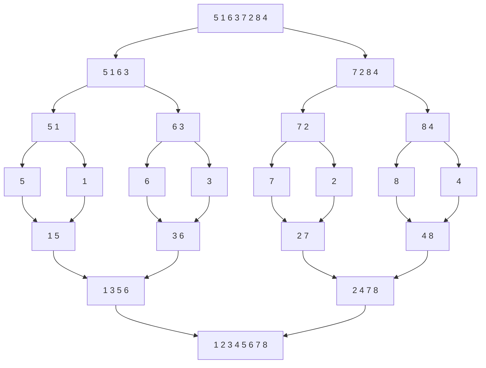

#### Algorithm

```
MergeSort(A, left, right):
    if left < right:
        mid = (left + right) / 2
        MergeSort(A, left, mid)          // sort the left half
        MergeSort(A, mid+1, right)       // sort the right half
        Merge(A, left, mid, right)       // combine them

Merge(A, left, mid, right):
    copy A[left..mid]    into L[]
    copy A[mid+1..right] into R[]
    i = j = 0;  k = left
    while i < len(L) and j < len(R):
        if L[i] <= R[j]:  A[k++] = L[i++]     // '<=' keeps the sort STABLE
        else:             A[k++] = R[j++]
    copy any remaining elements of L and R into A
```

#### Why merging two sorted lists takes O(n)

*(A directly asked question: "Write a linear algorithm to merge two sorted lists. Why is it O(n)?")*

Keep one pointer at the front of each list. Compare the two front elements, output the smaller one, and advance that pointer. Because each comparison **permanently places exactly one element** into the output, and there are n elements in total, the loop runs at most **n times** — hence **O(n)**. No element is ever examined twice, and no back-tracking is needed. This only works because both inputs are **already sorted**.

#### Worked example — sort 3, 13, 25, 7, 15, 2, 5, 35

**Divide:**
`[3 13 25 7] [15 2 5 35]` → `[3 13] [25 7] [15 2] [5 35]` → `[3][13] [25][7] [15][2] [5][35]`

**Merge back up:**

| Level | Merges | Result |
|---|---|---|
| 1 | [3]+[13], [25]+[7], [15]+[2], [5]+[35] | `[3 13] [7 25] [2 15] [5 35]` |
| 2 | [3 13]+[7 25], [2 15]+[5 35] | `[3 7 13 25] [2 5 15 35]` |
| 3 | [3 7 13 25] + [2 5 15 35] | `[2 3 5 7 13 15 25 35]` |

**Final sorted: 2, 3, 5, 7, 13, 15, 25, 35.**

#### Deriving the recurrence T(n) = 2T(n/2) + n

*(Another directly asked question.)*

To sort an array of size **n**, merge sort does three things:

| Step | Cost |
|---|---|
| **Divide** — compute the midpoint | **O(1)** — just one arithmetic operation |
| **Conquer** — solve **two** sub-problems, each of size **n/2** | **2 × T(n/2)** |
| **Combine** — merge two sorted halves of total length n | **O(n)** — each element is touched once |

Adding them:

> **T(n) = 2·T(n/2) + O(n)**, with **T(1) = O(1)**

**Solving it by the recursion-tree method:**
- At level 0 there is 1 problem of size n → work = n
- At level 1 there are 2 problems of size n/2 → work = 2 × (n/2) = n
- At level 2 there are 4 problems of size n/4 → work = 4 × (n/4) = n
- … each level does exactly **n** work.
- The tree halves the size each level, so its height is **log₂ n**.

> **Total = n × log₂ n = O(n log n)**

*(By the **Master Theorem**: a = 2, b = 2, f(n) = n. Since n^(log_b a) = n^(log₂2) = n¹ = f(n), we are in **Case 2**, giving **T(n) = Θ(n log n)**.)*

#### Complexity

| Case | Time |
|---|---|
| Best | **O(n log n)** |
| Average | **O(n log n)** |
| Worst | **O(n log n)** |

**Merge sort's great strength is that all three cases are the same** — its performance is guaranteed.

**Space: O(n)** — it needs an auxiliary array (its main weakness). **Stable: Yes.** **Adaptive: No.**

**When to use merge sort:** sorting **linked lists** (no extra space needed there, and no random access required), **external sorting** of huge files, and any situation where **worst-case guarantees** matter.

**Previous Year Question List from this Topic:**

- [Sort this array using merge sort 12, 45, 23, 6, 80, 20.](../written-answers/algorithm.md?plain=1#L193)
- [Write a liner algorithm two sorted item merge. Why this algorithm takes O(n) time complexity?](../written-answers/algorithm.md?plain=1#L307)
- [(a) The complexity of merge sort is T(n) = 2T\left(\frac{n}{2}\right) + n. Explain how the above equation is derived?](../written-answers/algorithm.md?plain=1#L335)
- [Sort the following data using merge sort. Also mention best and worst case of the algorithm.](../written-answers/algorithm.md?plain=1#L361)
- [(a) Compaire and contrast between Quick sort and Merge sort in terms of their time and space complexity.](../written-answers/algorithm.md?plain=1#L492)
- [Analize and compare the Quick-sort and Merge-sort algorithms in term of their time and space complexity.](../written-answers/algorithm.md?plain=1#L554)
- [(a) Write down the Merge sort algorithm. What is the time complexity of this algorithm?](../written-answers/algorithm.md?plain=1#L850)
- [Marge sort Algorithm ব্যবহার করে নিম্নের Data গুলো sorting করুন। (3, 13, 25, 7, 15, 2, 5, 35)](../written-answers/algorithm.md?plain=1#L881)
- [Apply the Merge Sort algorithm using the divide and conquer approach to sort the following list of numbers: 5, 1, 6, 3, 7, 2, 8, and 4.](../written-answers/algorithm.md?plain=1#L978)


---

### Quick Sort

**Quick Sort** is also **Divide and Conquer**, but it does the hard work *before* recursing:

1. **Pick a pivot** element.
2. **Partition** — rearrange the array so that everything **smaller** than the pivot is on its left and everything **larger** is on its right. The pivot is now in its **final sorted position**.
3. **Recursively** quicksort the left part and the right part.

There is **no merge step** — that is why it is in-place and fast.

#### Algorithm (Lomuto partition, last element as pivot)

```
QuickSort(A, low, high):
    if low < high:
        pi = Partition(A, low, high)     // pi = final index of the pivot
        QuickSort(A, low, pi - 1)        // sort the left part
        QuickSort(A, pi + 1, high)       // sort the right part

Partition(A, low, high):
    pivot = A[high]
    i = low - 1
    for j = low to high - 1:
        if A[j] <= pivot:
            i = i + 1
            swap A[i], A[j]
    swap A[i+1], A[high]
    return i + 1
```

#### Worked example — 10, 80, 30, 90, 40, 50, 70 (pivot = last element = 70)

| j | A[j] | A[j] ≤ 70? | i | Array |
|---|---|---|---|---|
| 0 | 10 | ✅ | 0 | 10 80 30 90 40 50 **70** |
| 1 | 80 | ❌ | 0 | 10 80 30 90 40 50 **70** |
| 2 | 30 | ✅ | 1 | 10 **30 80** 90 40 50 **70** |
| 3 | 90 | ❌ | 1 | 10 30 80 90 40 50 **70** |
| 4 | 40 | ✅ | 2 | 10 30 **40 90 80** 50 **70** |
| 5 | 50 | ✅ | 3 | 10 30 40 **50 80 90** **70** |

Finally swap A[i+1] = A[4] with the pivot: **10 30 40 50 | 70 | 90 80**

The pivot 70 is now in its **final place**. Recurse on `[10 30 40 50]` and on `[90 80]`.

#### Why is Quick Sort's worst case O(n²)?

*(One of the most repeated written questions.)*

The worst case happens when the partition is **maximally unbalanced** — the pivot turns out to be the **smallest or the largest** element every single time. Then one side gets **n − 1** elements and the other gets **0**, so instead of halving, the problem shrinks by only one element per level.

The recurrence becomes:

> **T(n) = T(n − 1) + O(n)**

Expanding: n + (n−1) + (n−2) + … + 1 = **n(n+1)/2 = O(n²)**.

**When exactly does this occur?**

| Pivot choice | Worst-case input |
|---|---|
| **First element** as pivot | An **already sorted** array (ascending **or** descending) |
| **Last element** as pivot | An already sorted array |
| Middle element | A specially crafted adversarial input |
| **Random** pivot | Extremely unlikely — expected O(n log n) |

**Example:** array `[1, 2, 3, 4, 5]` with the **first element as pivot**.
- Pivot = 1 → partitions into `[]` and `[2,3,4,5]` — nothing is discarded but the pivot.
- Pivot = 2 → `[]` and `[3,4,5]`
- Pivot = 3 → `[]` and `[4,5]`
- Pivot = 4 → `[]` and `[5]`

Five levels of recursion instead of log₂5 ≈ 2.3, and the comparison count is 4+3+2+1 = 10 = n(n−1)/2 → **O(n²)**.

**The irony worth mentioning in the answer:** quicksort is at its *worst* on **already sorted data**, which is exactly the case where most other algorithms do best.

#### How the worst case is avoided in practice

1. **Randomised pivot** — pick a random index and swap it to the end. An adversary cannot predict it.
2. **Median-of-three** — take the median of the first, middle and last elements as the pivot. This makes sorted input a *best* case instead of a worst case.
3. **IntroSort** — start with quicksort, count the recursion depth, and **switch to heap sort** if it exceeds 2·log n. This guarantees O(n log n) worst case while keeping quicksort's speed. This is what C++ `std::sort` does.
4. **Three-way partitioning** (Dutch National Flag) — handles arrays with many duplicate keys.

#### Complexity

| Case | Partition behaviour | Recurrence | Time |
|---|---|---|---|
| **Best** | Pivot is the median — perfect halves | T(n) = 2T(n/2) + n | **O(n log n)** |
| **Average** | Reasonably balanced | — | **O(n log n)** |
| **Worst** | Pivot is always the smallest/largest | T(n) = T(n−1) + n | **O(n²)** |

**Space complexity:** the partitioning is in-place, but recursion uses stack space:
- **Best/average: O(log n)** stack depth.
- **Worst: O(n)** stack depth.
*(With tail-call optimisation on the larger side, the worst case can be reduced to O(log n).)*

**Stable: No.** **Adaptive: No.**

**Why is quicksort usually the fastest in practice despite the O(n²) worst case?**
- It is **in-place** — no extra array, so far fewer cache misses.
- Its **inner loop is very tight** and **cache-friendly** (sequential access).
- The constant factor hidden in O(n log n) is **smaller** than merge sort's.
- The worst case is easy to avoid with a random or median-of-three pivot.

#### Quick Sort vs Merge Sort

| Point | **Quick Sort** | **Merge Sort** |
|---|---|---|
| Best time | O(n log n) | O(n log n) |
| Average time | **O(n log n)** | O(n log n) |
| **Worst time** | **O(n²)** ❌ | **O(n log n)** ✅ |
| **Space** | **O(log n)** ✅ (in-place) | **O(n)** ❌ (extra array) |
| Stable | **No** | **Yes** |
| Where the work is | In the **divide** (partition) step | In the **combine** (merge) step |
| Cache performance | **Excellent** | Poorer |
| Practical speed on arrays | **Faster** | Slower |
| Best for | **Arrays** in memory | **Linked lists**, external/disk sorting, when the worst case must be bounded |
| Parallelisable | Yes | Yes (easier) |

**Previous Year Question List from this Topic:**

- [Explain the QuickSort algorithm with an example. Analyze its best-case, average-case, and worst-case time complexities.](../written-answers/algorithm.md?plain=1#L59)
- [Explain the Quick Sort algorithm with a suitable example. Under what conditions does Quick Sort exhibit its worst-case time complexity, and why does this situat…](../written-answers/algorithm.md?plain=1#L119)
- [What is the worst-case time and space complexity of quicksort? Briefly explain how this worst-case behavior can occur.](../written-answers/algorithm.md?plain=1#L219)
- [Why Quick sort worst complexity in O(n^2)? Explain with example.](../written-answers/algorithm.md?plain=1#L237)
- [In a quicksort algorithm taking the first element as a pivot element. Now Analyze the time complexity of the quicksort algorithm when all services of the quicks…](../written-answers/algorithm.md?plain=1#L256)
- [Write down the pseudocode of quick sort algorithm through recursive algorithm. Express the arrange complexity off this algorithm.](../written-answers/algorithm.md?plain=1#L419)
- [(a) Compaire and contrast between Quick sort and Merge sort in terms of their time and space complexity.](../written-answers/algorithm.md?plain=1#L492)
- [(a) How the quick sort is implemented? What is the complexity of quick sort?](../written-answers/algorithm.md?plain=1#L528)
- [Analize and compare the Quick-sort and Merge-sort algorithms in term of their time and space complexity.](../written-answers/algorithm.md?plain=1#L554)
- [Explain the Quick Sort algorithm with a suitable example. What is the worst-case time complexity, and in which scenario does it occur?](../written-answers/algorithm.md?plain=1#L962)


---

### Heap Sort

**Heap Sort** uses the **heap** data structure. A **binary heap** is a **complete binary tree** stored in an array, satisfying the heap property:

- **Max-heap:** every parent ≥ its children → the **maximum is at the root**.
- **Min-heap:** every parent ≤ its children → the **minimum is at the root**.

**Array indexing (0-based):** for node `i` — left child = `2i+1`, right child = `2i+2`, parent = `(i−1)/2`.

#### The algorithm

```
HeapSort(A, n):
    // Phase 1: build a max-heap — O(n)
    for i = n/2 - 1 down to 0:
        Heapify(A, n, i)

    // Phase 2: extract the maximum n-1 times — O(n log n)
    for i = n-1 down to 1:
        swap A[0], A[i]        // move the current maximum to the end
        Heapify(A, i, 0)       // restore the heap on the shrinking prefix

Heapify(A, size, i):           // "sift down" — O(log n)
    largest = i
    l = 2*i + 1;  r = 2*i + 2
    if l < size and A[l] > A[largest]: largest = l
    if r < size and A[r] > A[largest]: largest = r
    if largest != i:
        swap A[i], A[largest]
        Heapify(A, size, largest)
```

#### Worked example — build a heap from 44, 30, 50, 22, 60, 55, 70, 55

**Step 1 — place the values in a complete binary tree (level by level):**

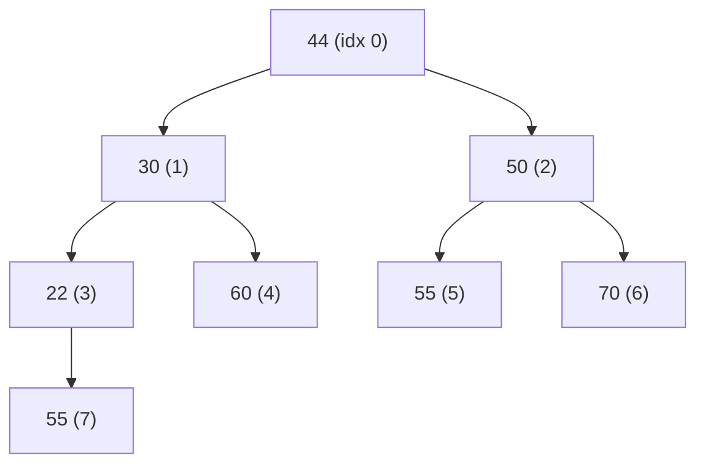

**Step 2 — heapify from the last non-leaf node (index n/2 − 1 = 3) up to the root:**

| i | Node | Children | Action |
|---|---|---|---|
| 3 | 22 | 55 | 55 > 22 → **swap** → node 3 becomes 55, node 7 becomes 22 |
| 2 | 50 | 55, **70** | 70 is the largest → **swap** → node 2 becomes 70, node 6 becomes 50 |
| 1 | 30 | 55, **60** | 60 is the largest → **swap** → node 1 becomes 60, node 4 becomes 30 |
| 0 | 44 | **60**, 70 → 70 is the largest | **swap** 44 and 70 → then heapify index 2: children are 55 and 50, 55 > 44 → **swap** |

**Final max-heap array: `70, 60, 55, 55, 30, 50, 44, 22`**

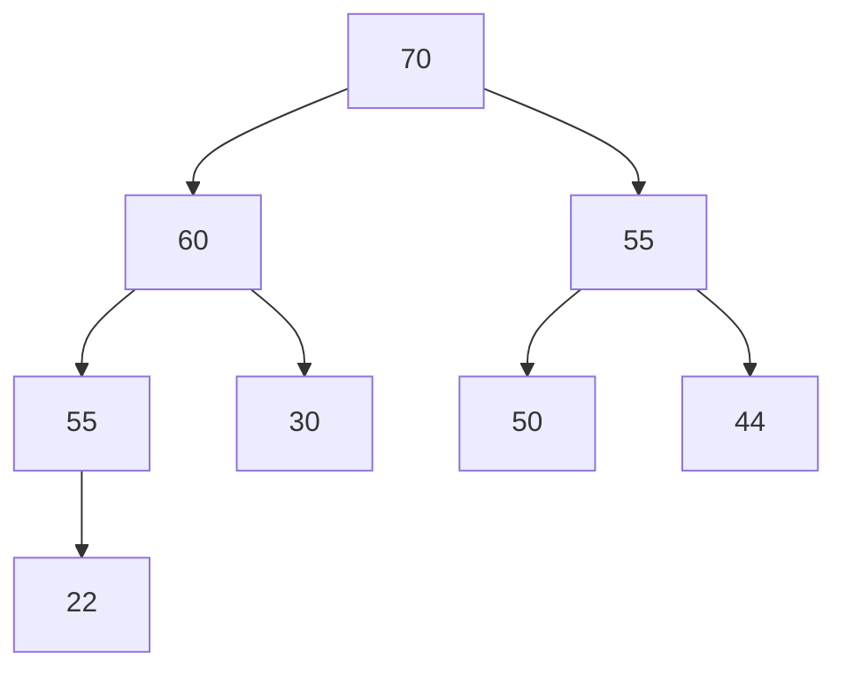

**Step 3 — sorting phase:** swap the root (70) with the last element, shrink the heap by one, heapify, and repeat. The array fills up with the sorted order from the back.

#### Building a Min-Heap — 12, 29, 33, 56, 66, 99, 100, 344

Inserting in order and sifting up, the values happen to already satisfy the min-heap property:

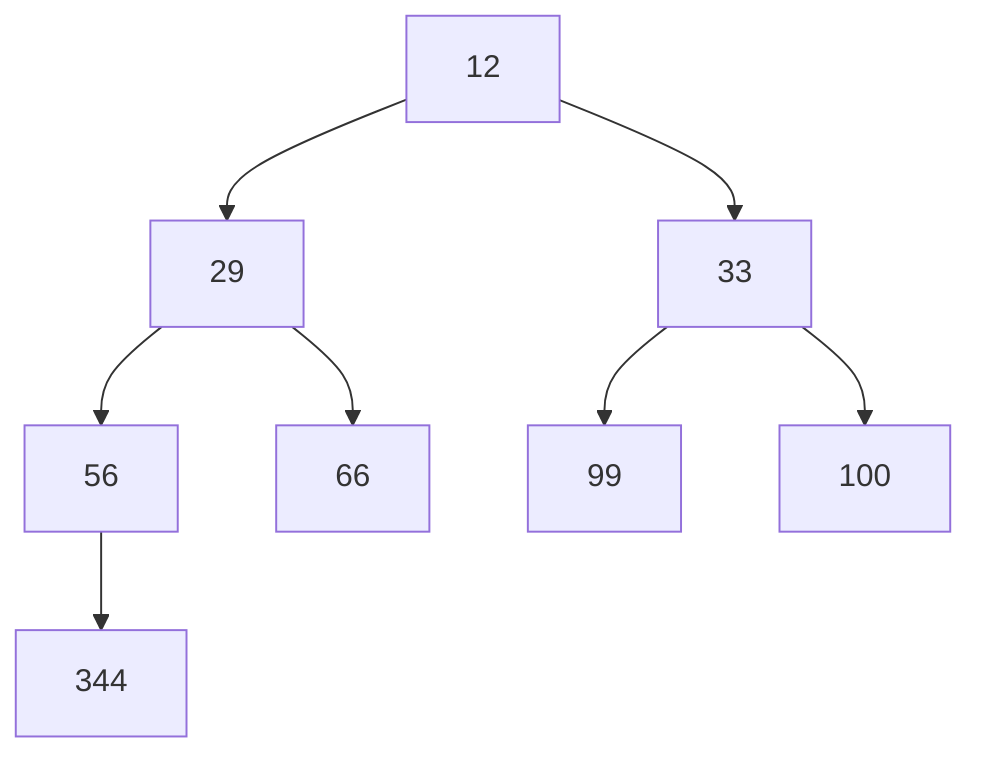

Check: 12 ≤ 29, 33 ✅ · 29 ≤ 56, 66 ✅ · 33 ≤ 99, 100 ✅ · 56 ≤ 344 ✅. **It is a valid min-heap.**

#### Inserting into an existing binary max-heap

```
Insert(A, n, key):
    A[n] = key                       // 1. put it at the end (keeps the tree complete)
    i = n
    while i > 0 and A[(i-1)/2] < A[i]:   // 2. "sift up" / "bubble up"
        swap A[i], A[(i-1)/2]
        i = (i-1)/2
```

**Cost:** the new element travels at most from a leaf to the root, which is the **height of the tree = ⌊log₂ n⌋**. So **insertion is O(log n)** time and **O(1)** extra space. In the best case (the new key is smaller than its parent) it is **O(1)**.

#### Complexity of heap sort

| Phase | Cost |
|---|---|
| Build the heap | **O(n)** (not O(n log n) — most nodes are near the leaves) |
| n − 1 extractions, each with a heapify | **O(n log n)** |
| **Total** | **O(n log n)** in **all** cases |

**Space: O(1)** — in-place. **Stable: No.** **Adaptive: No.**

#### Heap Sort vs Merge Sort

| Point | **Heap Sort** | **Merge Sort** |
|---|---|---|
| Time (all cases) | O(n log n) | O(n log n) |
| **Space** | **O(1)** ✅ in-place | **O(n)** ❌ |
| **Stable** | **No** | **Yes** ✅ |
| Data structure used | **Binary heap** | Recursion + temporary array |
| Cache performance | Poor (jumps around the array) | Better (sequential) |
| Practical speed | Usually **slower** than merge/quick | Faster in practice |
| Best for | Memory-constrained systems; finding top-K; priority queues | Linked lists, external sort, when stability is required |

**Previous Year Question List from this Topic:**

- [(b) Difference between Heap Sort and Merge Sort.](../written-answers/algorithm.md?plain=1#L511)
- [(ক) Heap sort কিভাবে কাজ করে? উদাহরণসহ দেখান।](../written-answers/algorithm.md?plain=1#L748)
- [(b) What is heap sort? Build a heap tree from the following list of numbers: (44, 30, 50, 22, 60, 55, 70, 55).](../written-answers/algorithm.md?plain=1#L909)


---

### Counting Sort, Radix Sort and Bucket Sort

These are **non-comparison** sorts. They can beat the O(n log n) barrier because they never compare two elements — they use the **values themselves** as array indices.

#### Counting Sort

Count how many times each value occurs, then use the counts to place each element directly.

**Time: O(n + k)** where k is the range of the input. **Space: O(n + k)**. **Stable: Yes.**
**Limitation:** only practical when **k is not much larger than n** (sorting ages 0–120 is perfect; sorting arbitrary 32-bit integers is not).

#### Radix Sort

Sort the numbers **digit by digit**, starting from the **least significant digit (LSD)**, using a **stable** sort (usually counting sort) at each digit position.

**Worked example — sort 608, 5, 768, 298, 576, 975, 90, 80**

Write all numbers with three digits: `608, 005, 768, 298, 576, 975, 090, 080`

**Pass 1 — sort by the units digit:**

| Units digit | Numbers |
|---|---|
| 0 | 090, 080 |
| 5 | 005, 975 |
| 6 | 576 |
| 8 | 608, 768, 298 |

Result: `090, 080, 005, 975, 576, 608, 768, 298`

**Pass 2 — sort by the tens digit.** Read the pass-1 output `090, 080, 005, 975, 576, 608, 768, 298` from left to right and drop each number into the bucket of its tens digit (the sort is **stable**, so within a bucket the pass-1 order survives):

| Tens digit | Numbers (in pass-1 order) |
|---|---|
| 0 | 005, 608 |
| 6 | 768 |
| 7 | 975, 576 |
| 8 | 080 |
| 9 | 090, 298 |

Reading the buckets 0, 1, … 9 in order: `005, 608, 768, 975, 576, 080, 090, 298`

**Pass 3 — sort by the hundreds digit:**

| Hundreds digit | Numbers |
|---|---|
| 0 | 005, 080, 090 |
| 2 | 298 |
| 5 | 576 |
| 6 | 608 |
| 7 | 768 |
| 9 | 975 |

**Final sorted: 5, 80, 90, 298, 576, 608, 768, 975.** ✅

**Time: O(d × (n + k))** where d = number of digits and k = the base (10). Since d and k are small constants, this is effectively **O(n)**.
**Space: O(n + k).** **Stable: Yes** (and it *must* be — stability is what makes radix sort work).

#### Bucket Sort

Divide the range into **buckets**, distribute the elements, sort each bucket (usually with insertion sort), and concatenate.
**Time: O(n + k)** on average when the data is **uniformly distributed**; **O(n²)** in the worst case (everything lands in one bucket).

**Previous Year Question List from this Topic:**

- [Sorting the value with radix sort: 608, 5, 768, 298, 576, 975, 90, 80](../written-answers/algorithm.md?plain=1#L805)


---

### Comparison of All Sorting Algorithms

This single table answers a large share of the sorting questions.

| Algorithm | Best | Average | **Worst** | **Space** | **Stable** | In-place | Technique |
|---|---|---|---|---|---|---|---|
| **Bubble Sort** | **O(n)** | O(n²) | O(n²) | O(1) | **Yes** | Yes | Exchange |
| **Selection Sort** | O(n²) | O(n²) | O(n²) | O(1) | No | Yes | Selection |
| **Insertion Sort** | **O(n)** | O(n²) | O(n²) | O(1) | **Yes** | Yes | Insertion |
| **Shell Sort** | O(n log n) | O(n^1.25) | O(n²) | O(1) | No | Yes | Insertion (gapped) |
| **Merge Sort** | O(n log n) | O(n log n) | **O(n log n)** | **O(n)** | **Yes** | No | **Divide & Conquer** |
| **Quick Sort** | O(n log n) | **O(n log n)** | **O(n²)** | O(log n) | No | Yes | **Divide & Conquer** |
| **Heap Sort** | O(n log n) | O(n log n) | **O(n log n)** | **O(1)** | No | Yes | Selection (via heap) |
| **Counting Sort** | O(n+k) | O(n+k) | O(n+k) | O(n+k) | **Yes** | No | Non-comparison |
| **Radix Sort** | O(nk) | O(nk) | O(nk) | O(n+k) | **Yes** | No | Non-comparison |
| **Bucket Sort** | O(n+k) | O(n+k) | O(n²) | O(n) | **Yes** | No | Distribution |

#### Quick answers to the short questions

| Question | Answer |
|---|---|
| **Which sorts use Divide and Conquer?** | **Merge Sort** and **Quick Sort** |
| **Which is the fastest sorting algorithm?** | In **practice, Quick Sort** (best average speed, cache-friendly, in-place). For a **guaranteed** worst case, **Merge Sort** or **Heap Sort** (O(n log n) always). For small-range integers, **Radix/Counting Sort** is fastest of all at O(n) |
| **Which is the slowest?** | **Bubble Sort** |
| **Which needs the fewest swaps?** | **Selection Sort** (≤ n−1 swaps) |
| **Best for nearly sorted data?** | **Insertion Sort** — O(n) |
| **Best for linked lists?** | **Merge Sort** — no random access needed, no extra array |
| **Best when memory is very tight?** | **Heap Sort** — O(n log n) guaranteed with O(1) space |
| **Worst case of Bubble / Quick / Merge?** | O(n²) · **O(n²)** · O(n log n) |
| **Which sorts are stable?** | Bubble, Insertion, Merge, Counting, Radix, Bucket |
| **Which are unstable?** | **Selection, Quick, Heap, Shell** |

#### Four sorting algorithms with examples — a compact answer

*(For "Describe four types of sorting algorithm with example".)*

1. **Bubble Sort** — repeatedly swap adjacent out-of-order pairs. `5 3 8 → 3 5 8`. O(n²).
2. **Selection Sort** — repeatedly pick the minimum and put it in front. `45 72 37 → 37 72 45`. O(n²).
3. **Merge Sort** — divide into halves, sort each, merge. `[3 1][4 2] → [1 3][2 4] → [1 2 3 4]`. O(n log n) always.
4. **Quick Sort** — pick a pivot, partition smaller/larger, recurse. Pivot 4 on `[3 7 1 9] → [3 1] 4 [7 9]`. O(n log n) average, O(n²) worst.

**Previous Year Question List from this Topic:**

- [(a) Algorithm এর Computational Complexity এর মধ্যে পার্থক্য](../written-answers/algorithm.md?plain=1#L28)
- [Write the Best case, worst case and average case time complexity for the following sorting algorithms.](../written-answers/algorithm.md?plain=1#L85)
- [Which short uses divide and conquer technique?](../written-answers/algorithm.md?plain=1#L388)
- [Fastest sorting algorithms?](../written-answers/algorithm.md?plain=1#L396)
- [Bubble sort, Quick sort and Merge sort algorithm এর Worst case complexity নির্ণয় কর।](../written-answers/algorithm.md?plain=1#L405)
- [(a) Compaire and contrast between Quick sort and Merge sort in terms of their time and space complexity.](../written-answers/algorithm.md?plain=1#L492)
- [(b) Difference between Heap Sort and Merge Sort.](../written-answers/algorithm.md?plain=1#L511)
- [Analize and compare the Quick-sort and Merge-sort algorithms in term of their time and space complexity.](../written-answers/algorithm.md?plain=1#L554)
- [Describe four types sorting algorithm with example.](../written-answers/algorithm.md?plain=1#L779)
- [Analyze the following C function and determine its Big O Time Complexity and Space Complexity. Explain your reasoning.](../written-answers/algorithm.md?plain=1#L937)

## Graph Traversal Algorithms (BFS & DFS)

### Graph Traversal — What and Why

**Graph traversal** means visiting **every vertex** of a graph exactly once, in some systematic order. Unlike a tree, a graph can have **cycles** and **multiple paths** to the same node, so every traversal algorithm must keep a **`visited[]` array** to avoid going round in circles forever.

There are exactly **two fundamental traversal strategies**:

| Strategy | Idea | Data structure |
|---|---|---|
| **BFS — Breadth-First Search** | Explore **level by level** — all neighbours first, then their neighbours | **Queue** (FIFO) |
| **DFS — Depth-First Search** | Go **as deep as possible** along one path, then backtrack | **Stack** (LIFO) — or recursion |

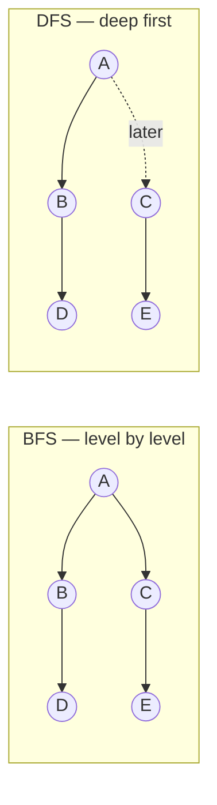

**Both take O(V + E) time** with an adjacency list — every vertex is visited once and every edge is examined once.

**Previous Year Question List from this Topic:**

- [What are the BFS and DFS value for the Binary tree from the following figure?](../written-answers/algorithm.md?plain=1#L1051)
- [What are BFS and DFS for Binary Tree?](../written-answers/algorithm.md?plain=1#L1077)
- [Follow alphabetical ordering while considering the order of nodes traversed. (Find BFS and DFS)](../written-answers/algorithm.md?plain=1#L1227)
- [Draw BFS and DFS tree starting node A-](../written-answers/algorithm.md?plain=1#L1397)


---

### Breadth-First Search (BFS)

**BFS** starts at a source vertex and visits **all vertices at distance 1**, then **all at distance 2**, and so on — expanding outwards in "rings". It uses a **queue**.

#### Algorithm

```
BFS(graph, start):
    create an empty queue Q
    mark start as visited
    Q.enqueue(start)

    while Q is not empty:
        u = Q.dequeue()
        print u                          // visit u
        for each neighbour v of u:       // in alphabetical / index order
            if v is not visited:
                mark v as visited
                Q.enqueue(v)
```

#### Worked example

Graph (adjacency, alphabetical order):

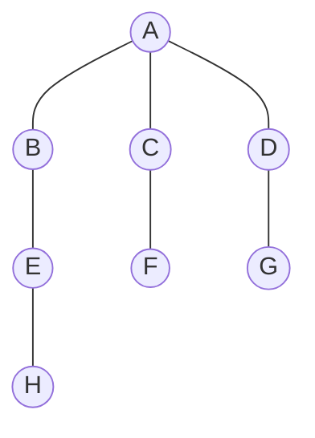

| Step | Dequeue | Print | Enqueue | Queue after |
|---|---|---|---|---|
| 1 | — | — | A | `A` |
| 2 | A | **A** | B, C, D | `B C D` |
| 3 | B | **B** | E | `C D E` |
| 4 | C | **C** | F | `D E F` |
| 5 | D | **D** | G | `E F G` |
| 6 | E | **E** | H | `F G H` |
| 7 | F | **F** | — | `G H` |
| 8 | G | **G** | — | `H` |
| 9 | H | **H** | — | *(empty)* |

**BFS order: A, B, C, D, E, F, G, H** — notice it is exactly **level-order**.

#### The BFS tree

The edges actually used to first reach each vertex form the **BFS tree**:


#### Complexity and properties

| | Adjacency list | Adjacency matrix |
|---|---|---|
| **Time** | **O(V + E)** | O(V²) |
| **Space** | **O(V)** — the queue plus the visited array | O(V) |

**Key property:** in an **unweighted** graph, BFS finds the **shortest path (fewest edges)** from the source to every other vertex. This is BFS's single most important use.

#### Applications of BFS

1. **Shortest path in an unweighted graph** (number of hops).
2. **Finding connected components**.
3. **Social networks** — "people within 2 connections of you".
4. **Web crawlers** — crawl pages level by level from a seed.
5. **GPS / navigation** on unweighted maps.
6. **Peer-to-peer networks** (finding nearby nodes), **broadcasting** in networks.
7. **Bipartite-graph checking** (2-colouring).
8. **Cycle detection** in an undirected graph.
9. **Solving puzzles** with the fewest moves (Rubik's cube, word ladder, 8-puzzle).
10. **Garbage collection** (Cheney's algorithm).

**Previous Year Question List from this Topic:**

- [What are the BFS and DFS value for the Binary tree from the following figure?](../written-answers/algorithm.md?plain=1#L1051)
- [What are BFS and DFS for Binary Tree?](../written-answers/algorithm.md?plain=1#L1077)
- [অথবা, (ক) BFS অ্যালগরিদম উদাহরণসহ ব্যাখ্যা করুন।](../written-answers/algorithm.md?plain=1#L1124)
- [Follow alphabetical ordering while considering the order of nodes traversed. (Find BFS and DFS)](../written-answers/algorithm.md?plain=1#L1227)
- [Draw BFS and DFS tree starting node A-](../written-answers/algorithm.md?plain=1#L1397)
- [Run the BFS algorithm from vertex 1 and draw the BFS tree.](../written-answers/algorithm.md?plain=1#L1473)


---

### Depth-First Search (DFS)

**DFS** starts at a vertex, goes as **deep as it can along one branch**, and only when it gets stuck does it **backtrack** and try another branch. It uses a **stack** — either explicitly or through **recursion**.

#### Algorithm (recursive — the natural form)

```
DFS(graph, u):
    mark u as visited
    print u                              // visit u
    for each neighbour v of u:
        if v is not visited:
            DFS(graph, v)                // go deeper
```

#### Algorithm (iterative, with an explicit stack)

```
DFS_iterative(graph, start):
    create an empty stack S
    S.push(start)
    while S is not empty:
        u = S.pop()
        if u is not visited:
            mark u as visited
            print u
            for each neighbour v of u in REVERSE order:
                if v is not visited:
                    S.push(v)
```

#### Worked example on the same graph

Starting at **A**, taking neighbours alphabetically:

| Step | At | Action | Stack / path |
|---|---|---|---|
| 1 | A | visit A, go to B | A |
| 2 | B | visit B, go to E | A → B |
| 3 | E | visit E, go to H | A → B → E |
| 4 | H | visit H — **dead end**, backtrack | A → B → E → H |
| 5 | — | backtrack to A (B and E have no unvisited neighbours) | A |
| 6 | C | visit C, go to F | A → C |
| 7 | F | visit F — dead end, backtrack | A → C → F |
| 8 | D | visit D, go to G | A → D |
| 9 | G | visit G — dead end, finished | A → D → G |

**DFS order: A, B, E, H, C, F, D, G.**

#### The DFS tree


#### Complexity

| | Adjacency list | Adjacency matrix |
|---|---|---|
| **Time** | **O(V + E)** | O(V²) |
| **Space** | **O(V)** — recursion stack (O(h) where h = the longest path) | O(V) |

#### Limitations of DFS — and how to fix them

*(A directly asked question.)*

| Limitation | Explanation | Solution |
|---|---|---|
| **1. Not guaranteed to find the shortest path** | It dives down the first branch, which may be a long detour | Use **BFS** for unweighted graphs, **Dijkstra** for weighted ones |
| **2. Can get stuck in an infinite path** | On an infinite or very deep state space, plain DFS may never come back | **Depth-Limited Search (DLS)** or **Iterative Deepening DFS (IDDFS)** |
| **3. Can loop forever on a cyclic graph** | It revisits the same vertices endlessly | Maintain a **`visited[]` array** (or a closed set) |
| **4. Stack overflow on deep graphs** | Recursion depth can exceed the system stack | Use the **iterative version with an explicit stack** |
| **5. Not complete** (in infinite spaces) | It may descend forever and never reach the goal | **IDDFS** — it is complete *and* keeps DFS's low memory |
| **6. Not optimal** | The first solution found may be far from the best | IDDFS, or **A\*** with a heuristic |

#### Applications of DFS

1. **Cycle detection** in directed and undirected graphs.
2. **Topological sorting** of a DAG.
3. **Finding connected components** and **strongly connected components** (Kosaraju, Tarjan).
4. **Path finding** (any path, not the shortest).
5. **Maze generation and maze solving**.
6. **Finding bridges and articulation points** (critical links in a network).
7. **Backtracking problems** — N-Queens, Sudoku, subset generation.
8. **Detecting bipartiteness**.

**Previous Year Question List from this Topic:**

- [(খ) Node A থেকে শুরু করে নিম্নোক্ত গ্রাফটির DFS Traversal লিখুন।](../written-answers/algorithm.md?plain=1#L1161)
- [(b) What are the main limitation of Depth First Search (DFS)? Is there any way to solve these issues?](../written-answers/algorithm.md?plain=1#L1200)
- [DFS complexity (Approximate)](../written-answers/algorithm.md?plain=1#L1218)
- [Follow alphabetical ordering while considering the order of nodes traversed. (Find BFS and DFS)](../written-answers/algorithm.md?plain=1#L1227)
- [Draw BFS and DFS tree starting node A-](../written-answers/algorithm.md?plain=1#L1397)


---

### BFS vs DFS — Comparison

| Point | **BFS (Breadth-First Search)** | **DFS (Depth-First Search)** |
|---|---|---|
| **Exploration order** | **Level by level** (nearest first) | **Deepest first**, then backtrack |
| **Data structure** | **Queue (FIFO)** | **Stack (LIFO)** / recursion |
| **Shortest path (unweighted)** | ✅ **Guaranteed** | ❌ Not guaranteed |
| **Time complexity** | O(V + E) | O(V + E) |
| **Space complexity** | **O(V)** — can hold a whole level; worst case **O(b^d)** | **O(h)** — only the current path; worst case **O(bm)** — usually **much less** |
| **Memory usage** | **High** (stores all nodes of a level) | **Low** |
| **Complete?** | Yes | No (may go down an infinite branch) |
| **Optimal?** | Yes (equal edge weights) | No |
| **Good when** | The goal is **near the source**; you need the shortest path | The goal is **deep**; memory is limited; you must explore all paths |
| **Bad when** | The tree is very wide (memory blows up) | The tree is very deep or infinite |
| **Implementation** | Iterative (queue) | Recursive (naturally) |
| **Typical uses** | Shortest path, social networks, web crawling, broadcasting, bipartite check | Topological sort, cycle detection, SCC, backtracking, maze solving, bridges |

#### "Which one is faster? Which one needs more memory?"

- **Speed:** on paper both are **O(V + E)** — neither is asymptotically faster. In practice, whichever reaches the goal first wins: **BFS is faster if the target is shallow**, **DFS is faster if the target is deep**. DFS also has lower constant overhead because recursion is cheaper than queue operations.
- **Memory:** **BFS needs far more memory.** BFS must store an entire level of the tree — up to **O(b^d)** nodes — while DFS only stores the current root-to-node path, **O(b·m)**. For a branching factor of 10 and depth 10, BFS may need to hold 10¹⁰ nodes while DFS holds about 100.

#### "Why is DFS better than BFS?"

DFS is preferred when:
1. **Memory is the constraint** — O(depth) instead of O(breadth^depth).
2. The **solution lies deep** in the tree.
3. You must **explore every path** (backtracking problems, puzzles).
4. The problem is naturally recursive — topological sort, SCC, articulation points.
5. Implementation is simpler (a few lines of recursion).

*(But BFS is better when the shortest path is required — so "better" always depends on the problem.)*

**Previous Year Question List from this Topic:**

- [Why DFS better than BFS, Explain?](../written-answers/algorithm.md?plain=1#L999)
- [(খ) BFS ও DFS এর পার্থক্য লিখুন।](../written-answers/algorithm.md?plain=1#L1106)
- [Difference between depth first and breadth first search.](../written-answers/algorithm.md?plain=1#L1185)
- [(c) Between Depths first search (DFS) and Breath first search (BFS). Which one is faster? Which one requires more memory?](../written-answers/algorithm.md?plain=1#L1430)
- [True false (DFS/ Directed graph related) (হুবহু প্রশ্ন সংগ্রহ করা সম্ভব হয়নি)](../written-answers/algorithm.md?plain=1#L1304)


---

### Cycle Detection in a Graph

#### Detecting a cycle in a **directed** graph — DFS with three colours

The key idea: a cycle exists if DFS ever reaches a vertex that is **currently on the recursion stack** (a **back edge**). Simply being "visited" is not enough — it must be visited **and still in progress**.

```
DetectCycleDirected(graph):
    visited[]  = all false
    inStack[]  = all false             // currently in the recursion stack
    for each vertex v:
        if not visited[v]:
            if DFSUtil(v) == true:
                return "Cycle exists"
    return "No cycle"

DFSUtil(u):
    visited[u] = true
    inStack[u] = true
    for each neighbour v of u:
        if not visited[v]:
            if DFSUtil(v) == true:
                return true
        else if inStack[v] == true:    // BACK EDGE → cycle found
            return true
    inStack[u] = false                 // done with u, remove from the stack
    return false
```

**Time: O(V + E). Space: O(V).**

**The three-colour way of describing the same thing:**

| Colour | Meaning |
|---|---|
| **White** | Not visited yet |
| **Grey** | Visited, still being processed (on the recursion stack) |
| **Black** | Completely finished |

> **A cycle exists if and only if DFS finds an edge leading to a GREY vertex.**

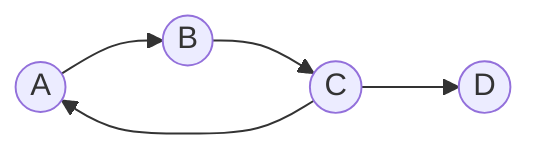
Here DFS goes A → B → C, and from C it finds an edge back to **A**, which is still grey (still on the stack) → **cycle A → B → C → A**.

#### Alternative — Kahn's algorithm (BFS based)

1. Compute the **in-degree** of every vertex.
2. Put all vertices with in-degree 0 into a queue.
3. Repeatedly dequeue a vertex, add it to the output, and decrease the in-degree of each of its neighbours; enqueue any that drop to 0.
4. **If the number of vertices output is less than V, the graph has a cycle.**

#### Detecting a cycle in an **undirected** graph

Here a "back edge" to the **parent** does not count, because the same edge is traversed in both directions.

```
DFSUtil(u, parent):
    visited[u] = true
    for each neighbour v of u:
        if not visited[v]:
            if DFSUtil(v, u) == true: return true
        else if v != parent:          // visited, and NOT the node we came from
            return true               // → cycle
    return false
```

*(Union-Find / Disjoint Set is the other standard method for undirected graphs, in almost O(E) time.)*

#### How to detect a **negative-weight cycle**

Neither BFS nor DFS can do this — you need **Bellman-Ford**. Run it for **V − 1** iterations to relax all edges, then do **one extra iteration**: if any edge can still be relaxed (i.e. some distance still decreases), a **negative-weight cycle** exists. *(See the shortest-path section for details.)*

**Previous Year Question List from this Topic:**

- [Write an Algorithm to detect a cycle in a directed graph.](../written-answers/algorithm.md?plain=1#L1014)
- [True false (DFS/ Directed graph related) (হুবহু প্রশ্ন সংগ্রহ করা সম্ভব হয়নি)](../written-answers/algorithm.md?plain=1#L1304)


---

### Topological Sorting

**Topological sorting** of a **Directed Acyclic Graph (DAG)** is a **linear ordering of its vertices** such that for **every directed edge u → v, vertex u comes before v** in the ordering.

Think of it as: *"put the tasks in an order such that every prerequisite comes before the task that needs it."*

> **Two hard rules:**
> 1. It exists **only for a DAG** — a graph with a **cycle has no topological order** (a cycle means A must come before B and B before A, which is impossible).
> 2. It is **not unique** — a graph usually has several valid topological orders.

#### Example — university course prerequisites

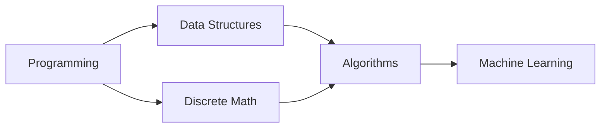

Valid topological orders include:
`Programming → Discrete Math → Data Structures → Algorithms → Machine Learning`
`Programming → Data Structures → Discrete Math → Algorithms → Machine Learning`

#### Method 1 — DFS based

```
TopologicalSort(graph):
    visited[] = all false
    stack S = empty
    for each vertex v:
        if not visited[v]:
            DFSUtil(v, S)
    print S in reverse order (pop everything)

DFSUtil(u, S):
    visited[u] = true
    for each neighbour v of u:
        if not visited[v]:
            DFSUtil(v, S)
    S.push(u)            // push AFTER all descendants are done
```

**The key insight:** a vertex is pushed onto the stack **only after every vertex reachable from it has been pushed**. So it ends up *below* them in the stack, and popping gives the correct order.

#### Method 2 — Kahn's algorithm (BFS based, in-degree)

```
Kahn(graph):
    compute in-degree of every vertex
    Q = all vertices with in-degree 0
    count = 0;  result = []
    while Q is not empty:
        u = Q.dequeue()
        result.append(u);  count++
        for each neighbour v of u:
            in-degree[v]--
            if in-degree[v] == 0:
                Q.enqueue(v)
    if count != V:  return "Cycle exists — no topological order"
    return result
```

**Worked trace** on the course graph: in-degrees are Programming 0, Discrete Math 1, Data Structures 1, Algorithms 2, ML 1.
Queue starts with `Programming` → output it → DS and DM drop to 0 → queue `DS, DM` → output DS → Algorithms drops to 1 → output DM → Algorithms drops to 0 → output Algorithms → ML drops to 0 → output ML.
**Result: Programming, Data Structures, Discrete Math, Algorithms, Machine Learning.** Count = 5 = V ✅ no cycle.

| Point | DFS method | Kahn's (BFS) method |
|---|---|---|
| Data structure | Stack + recursion | Queue + in-degree array |
| Detects a cycle | Needs extra colour tracking | **Automatically** (count ≠ V) |
| Time | O(V + E) | O(V + E) |
| Space | O(V) | O(V) |

#### Applications of topological sorting

- **Course prerequisite** scheduling.
- **Build systems** (`make`, Maven, npm) — compile dependencies in the right order.
- **Task / project scheduling** (PERT, CPM).
- **Spreadsheet formula** evaluation order.
- **Package/dependency resolution** (apt, pip).
- **Instruction scheduling** in compilers.
- **Deadlock detection** in operating systems.

**Previous Year Question List from this Topic:**

- [Topological sorting for Directed Acyclic Graph (DAG) is a linear ordering of vertices such that for every directed edge u v, vertex u comes before v in the orde…](../written-answers/algorithm.md?plain=1#L1252)


---

### Estimating Search Time and Memory from the Branching Factor

Exam questions sometimes give a **branching factor b** and a **goal depth d** and ask for the time and memory.

**The standard formulas** for a tree-shaped search space:

| | BFS | DFS |
|---|---|---|
| **Nodes generated (time)** | **O(b^d)** | O(b^m) |
| **Nodes stored (space)** | **O(b^d)** | **O(b·m)** |

where **b** = branching factor, **d** = depth of the shallowest goal, **m** = maximum depth.

*(The exact node count for a full tree down to level d is 1 + b + b² + … + b^d = (b^(d+1) − 1)/(b − 1), but the dominant term b^d is what matters.)*

#### Worked example — b = 4, goal at level d = 5, CPU explores 10,000 nodes/second

**Number of nodes** (counting the root as level 0, down to level 5):

> 1 + 4 + 4² + 4³ + 4⁴ + 4⁵ = 1 + 4 + 16 + 64 + 256 + 1024 = **1,365 nodes**

*(If the question means only the last level, 4⁵ = **1,024** nodes; if it means up to and including level 5 as above, 1,365. State your assumption.)*

**Time required**

> Time = total nodes ÷ nodes per second = 1,365 ÷ 10,000 = **0.1365 seconds** ≈ **137 milliseconds**

**Memory required**

BFS must hold the **entire frontier**, which at worst is the deepest level:

> Space = O(b^d) = 4⁵ = **1,024 nodes** in the queue

If each node needs, say, 100 bytes, memory ≈ 1,024 × 100 = **102,400 bytes ≈ 100 KB**.

**Compare with DFS:** DFS would store only **b × m = 4 × 5 = 20** nodes — about **50 times less memory** for the same search. This is the concrete illustration of why BFS's memory usage is its fatal weakness.

#### Complexity summary of the search strategies

| Algorithm | Time | Space | Complete | Optimal |
|---|---|---|---|---|
| **BFS** | O(b^d) | **O(b^d)** | Yes | Yes (unit costs) |
| **DFS** | O(b^m) | **O(bm)** | No | No |
| **IDDFS** | O(b^d) | **O(bd)** | Yes | Yes (unit costs) |
| **Bidirectional BFS** | **O(b^(d/2))** | O(b^(d/2)) | Yes | Yes |

**Previous Year Question List from this Topic:**

- [Find the time and space complexity of BFS which has branch 4 branch and the target at level 5? If cpu can explore 10000 nodes per second find the time required…](../written-answers/algorithm.md?plain=1#L1444)
- [DFS complexity (Approximate)](../written-answers/algorithm.md?plain=1#L1218)
- [(c) Between Depths first search (DFS) and Breath first search (BFS). Which one is faster? Which one requires more memory?](../written-answers/algorithm.md?plain=1#L1430)

## Graph Algorithms (Shortest Path & Minimum Spanning Tree)

### The Shortest Path Problem — Overview

The **shortest path problem** asks for the path between two vertices of a **weighted graph** whose **total edge weight is minimum**. "Weight" can be distance, time, cost, bandwidth or power loss.

#### Three flavours of the problem

| Type | Question | Algorithm |
|---|---|---|
| **Single-source shortest path** | Shortest path from **one** source to **every** other vertex | **Dijkstra** (non-negative weights) · **Bellman-Ford** (allows negative weights) |
| **All-pairs shortest path** | Shortest path between **every pair** of vertices | **Floyd-Warshall**, Johnson's |
| **Unweighted shortest path** | Fewest **number of edges** | **BFS** |

#### Which algorithm to choose

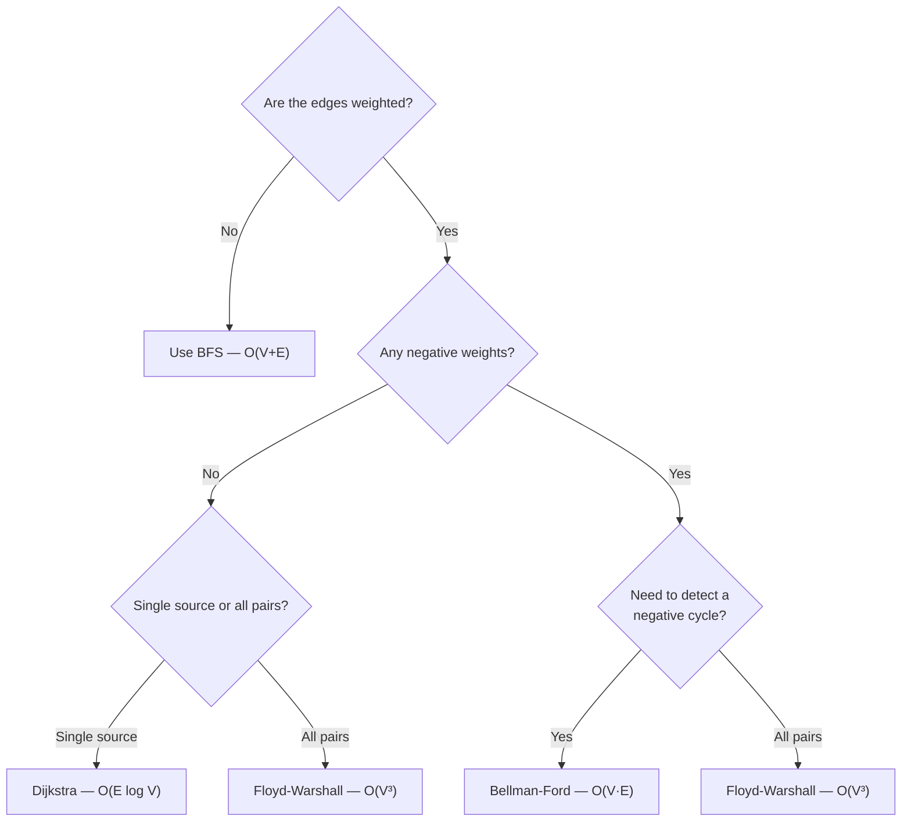

> **Exam scenario:** *"A pathfinding robot is searching for the shortest path. Which algorithm would you select and why?"*
> **Answer: Dijkstra's algorithm** (or **A\*** if a heuristic such as straight-line distance is available). Reason: the robot's map has **non-negative** weights (distance, time, energy — none can be negative), it needs the shortest path from **one source** (its current position), and Dijkstra is **guaranteed optimal** with a good running time of **O(E log V)** using a min-priority queue. If the map is a grid where the straight-line distance to the target is known, **A\*** is better still, because the heuristic guides the search and it expands far fewer nodes while remaining optimal (given an admissible heuristic).

**Previous Year Question List from this Topic:**

- [A pathfinding robot is searching for shortest path. Which algorithm you will select? Why? Write the steps how your chosen algorithm works.](../written-answers/algorithm.md?plain=1#L1508)
- [Shortest Path Algorithm.](../written-answers/algorithm.md?plain=1#L1779)
- [নিচের Graph থেকে যে কোন একটি algorithm ব্যবহার করে sortest path বের করার পদ্ধতি ব্যাখ্যা কর।](../written-answers/algorithm.md?plain=1#L1811)
- [Several substations of SGFL Company exist in different places of the city. You have to travel from one substation to another. Write an algorithm to travel using…](../written-answers/algorithm.md?plain=1#L1746)


---

### Dijkstra's Algorithm (Single-Source Shortest Path)

**Dijkstra's algorithm** finds the shortest path from a **single source** to all other vertices in a graph with **non-negative** edge weights. It is a **greedy** algorithm.

#### The core idea

Keep a tentative distance for every vertex. Repeatedly pick the **unvisited vertex with the smallest tentative distance**, mark it **finalised**, and **relax** all its outgoing edges.

> **Relaxation:** `if dist[u] + weight(u,v) < dist[v] then dist[v] = dist[u] + weight(u,v)`
> *(In words: "is going through u a cheaper way to reach v than what I knew before?")*

#### Algorithm

```
Dijkstra(graph, source):
    for each vertex v:
        dist[v] = INFINITY
        parent[v] = NULL
    dist[source] = 0
    PQ = min-priority queue of all vertices keyed by dist

    while PQ is not empty:
        u = PQ.extract_min()            // smallest tentative distance
        mark u as visited (finalised)
        for each neighbour v of u:
            if not visited[v] and dist[u] + w(u,v) < dist[v]:
                dist[v]   = dist[u] + w(u,v)      // RELAX
                parent[v] = u
                PQ.decrease_key(v, dist[v])
    return dist[], parent[]
```

#### Worked example

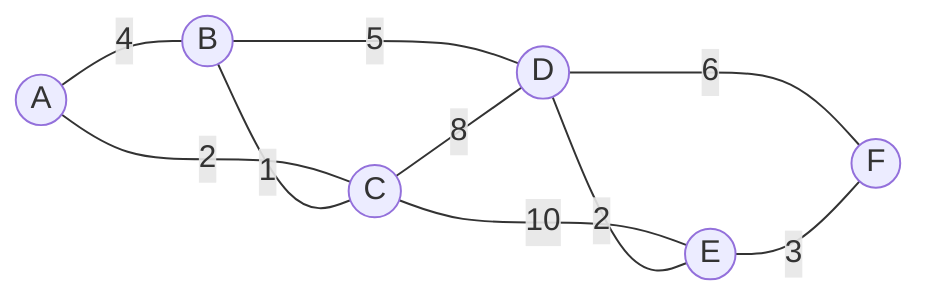

Source = **A**. Start: `A = 0`, everything else `∞`.

| Step | Visit (min dist) | Relaxations performed | A | B | C | D | E | F |
|---|---|---|---|---|---|---|---|---|
| 0 | — | initial | **0** | ∞ | ∞ | ∞ | ∞ | ∞ |
| 1 | **A (0)** | B = 0+4 = 4 · C = 0+2 = 2 | 0 | 4 | **2** | ∞ | ∞ | ∞ |
| 2 | **C (2)** | B = min(4, 2+1) = **3** · D = 2+8 = 10 · E = 2+10 = 12 | 0 | **3** | 2 | 10 | 12 | ∞ |
| 3 | **B (3)** | D = min(10, 3+5) = **8** | 0 | 3 | 2 | **8** | 12 | ∞ |
| 4 | **D (8)** | E = min(12, 8+2) = **10** · F = 8+6 = 14 | 0 | 3 | 2 | 8 | **10** | 14 |
| 5 | **E (10)** | F = min(14, 10+3) = **13** | 0 | 3 | 2 | 8 | 10 | **13** |
| 6 | **F (13)** | — | 0 | 3 | 2 | 8 | 10 | 13 |

**Final shortest distances from A:** A = 0, **B = 3, C = 2, D = 8, E = 10, F = 13**

**Shortest path to F** (follow the parents backwards): F ← E ← D ← B ← C ← A
> **A → C → B → D → E → F**, total cost = 2 + 1 + 5 + 2 + 3 = **13** ✅

#### Complexity

| Implementation | Time |
|---|---|
| Adjacency matrix + linear search for the minimum | **O(V²)** |
| Adjacency list + **binary min-heap** | **O((V + E) log V)** ≈ **O(E log V)** |
| Adjacency list + Fibonacci heap | O(E + V log V) |

**Space: O(V)** for the distance, parent and visited arrays.

#### Why Dijkstra fails on negative weights

Dijkstra's greedy step assumes that **once a vertex is finalised, its distance can never improve** — which is only true if every edge adds a non-negative amount. With a negative edge, a longer-looking path may later turn out cheaper, and the finalised value is already wrong.

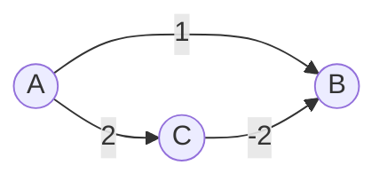

**Trace:** from A, Dijkstra sets `B = 1` and `C = 2`. It then extracts the smallest, **B = 1**, and **finalises** it. Only later does it extract C (= 2) and discover the edge C → B of weight −2, which would give `B = 2 + (−2) = 0`.

But B is already finalised, so Dijkstra never updates it and **reports B = 1**, while the true shortest distance is **A → C → B = 2 − 2 = 0**.

**Conclusion: use Bellman-Ford whenever negative edges are possible.**

**Previous Year Question List from this Topic:**

- [A pathfinding robot is searching for shortest path. Which algorithm you will select? Why? Write the steps how your chosen algorithm works.](../written-answers/algorithm.md?plain=1#L1508)
- [Shortest path বের করা : Dijkstra's Algorithm](../written-answers/algorithm.md?plain=1#L1553)
- [Find the shortest path from following graph starts from:](../written-answers/algorithm.md?plain=1#L1582)
- [Shortest path algorithm (Djikstra's algorithm)](../written-answers/algorithm.md?plain=1#L1659)
- [Shortest Path Algorithm.](../written-answers/algorithm.md?plain=1#L1779)
- [নিচের Graph থেকে যে কোন একটি algorithm ব্যবহার করে sortest path বের করার পদ্ধতি ব্যাখ্যা কর।](../written-answers/algorithm.md?plain=1#L1811)
- [S1, S2, S3, S4, S5 are five nodes and a value on lines denotes the cost to transmit power. (i) Draw a graph to find the shortest path to transmit power. (ii) Ca…](../written-answers/algorithm.md?plain=1#L1833)


---

### Bellman-Ford Algorithm and Negative Cycle Detection

**Bellman-Ford** also solves the single-source shortest path problem, but it **works with negative edge weights** and can **detect negative-weight cycles**. It uses **dynamic programming** rather than greed.

#### The core idea

A shortest path in a graph with V vertices can contain **at most V − 1 edges** (any more and it would repeat a vertex, i.e. contain a cycle). So: **relax every edge V − 1 times**, and all shortest distances are guaranteed to be correct.

#### Algorithm

```
BellmanFord(graph, source):
    for each vertex v:  dist[v] = INFINITY
    dist[source] = 0

    // Phase 1: relax all edges V-1 times
    repeat (V - 1) times:
        for each edge (u, v, w) in the graph:
            if dist[u] != INFINITY and dist[u] + w < dist[v]:
                dist[v] = dist[u] + w

    // Phase 2: one EXTRA pass to detect a negative cycle
    for each edge (u, v, w) in the graph:
        if dist[u] != INFINITY and dist[u] + w < dist[v]:
            return "NEGATIVE WEIGHT CYCLE DETECTED"

    return dist[]
```

#### How the negative cycle is detected — the key logic

*(A directly asked question: "How do you determine whether a weighted graph has a negative cycle?" and "How do you find the single-source shortest path when there is a negative weighted cycle?")*

After V − 1 rounds of relaxation, **every** shortest distance must be final — because no simple path can be longer than V − 1 edges. Therefore:

> **If one more relaxation pass can still reduce any distance, that reduction can only have come from going around a cycle whose total weight is negative.**

A negative cycle has no "shortest path" at all: you can loop round it again and again, driving the cost to **−∞**. So the correct answer to *"find the shortest path when a negative cycle exists"* is:

1. **Run Bellman-Ford.**
2. If the extra (V-th) pass changes any distance → **report that a negative cycle exists** and that **no shortest path is defined** for the vertices it can reach.
3. To **identify which vertices** are affected: mark every vertex updated in the V-th pass, then run a BFS/DFS from them — everything reachable is "at −∞".
4. To **print the cycle itself:** remember the parent pointer of a vertex updated in the V-th pass, walk back V times to land guaranteed inside the cycle, then follow the parents until you return to that vertex.

**Worked check:** a cycle A → B (weight 1), B → C (weight −3), C → A (weight 1) has total weight 1 − 3 + 1 = **−1 < 0** → negative cycle. Each loop reduces the cost by 1 forever.

#### Complexity

| | |
|---|---|
| **Time** | **O(V × E)** — (V−1) passes × E edges |
| **Space** | O(V) |

*(SPFA / the queue-based optimisation improves the average case but not the worst case.)*

#### Dijkstra vs Bellman-Ford

| Point | **Dijkstra** | **Bellman-Ford** |
|---|---|---|
| Technique | **Greedy** | **Dynamic Programming** |
| Negative edges | ❌ **Not allowed** | ✅ **Allowed** |
| Negative cycle detection | ❌ No | ✅ **Yes** |
| Time complexity | **O(E log V)** — faster | **O(V·E)** — slower |
| Graph type | Directed & undirected, non-negative | **Directed** (undirected negative edges form an instant cycle) |
| Works on | Each vertex finalised once | Each edge relaxed V−1 times |
| Distributed / routing use | Link-state (OSPF) | **Distance-vector (RIP)** |
| Best when | All weights are non-negative | Negative weights are possible |

#### Floyd-Warshall (all-pairs shortest path)

A three-nested-loop dynamic-programming algorithm that finds the shortest path between **every pair** of vertices:

```
for k = 1 to V:                        // k = the intermediate vertex allowed
    for i = 1 to V:
        for j = 1 to V:
            if dist[i][k] + dist[k][j] < dist[i][j]:
                dist[i][j] = dist[i][k] + dist[k][j]
```

**Time: O(V³). Space: O(V²).** It handles negative edges, and a **negative value on the diagonal (dist[i][i] < 0) means a negative cycle**.

**Previous Year Question List from this Topic:**

- [How to find single source shortest path from negative weighted cycle. Justify and how you find it is negative weighted graph.](../written-answers/algorithm.md?plain=1#L1633)
- [How to Determine the weighted graph has negative cycle?](../written-answers/algorithm.md?plain=1#L1794)


---

### Minimum Spanning Tree (MST) — Concept

#### Spanning tree

A **spanning tree** of a connected, undirected graph is a **subgraph that**:
1. includes **all V vertices**,
2. is **connected**, and
3. contains **no cycle** — so it has exactly **V − 1 edges**.

#### Minimum Spanning Tree

A **Minimum Spanning Tree (MST)** is the spanning tree whose **total edge weight is the smallest** among all possible spanning trees.

> *"Connect every city with cable, using the least total length of cable, and without any redundant loop."*

**Key properties**
- An MST always has exactly **V − 1 edges**.
- It contains **no cycles**.
- An MST is **not necessarily unique** — if several edges share the same weight, several MSTs may exist with the same total cost.
- If **all edge weights are distinct**, the MST **is unique**.
- **Cut property:** for any cut of the graph, the **minimum-weight edge crossing the cut** belongs to some MST. This is the theorem both algorithms rely on.
- **Cycle property:** the **maximum-weight edge of any cycle** can never be in the MST.

#### Applications

- **Network design** — laying telephone, electrical, fibre or water lines at minimum cost.
- **Circuit design** — minimising wire length on a PCB.
- **Cluster analysis** — single-linkage clustering is essentially an MST.
- **Image segmentation**, **handwriting recognition**.
- **Approximation algorithms** for the Travelling Salesman Problem.
- **Power grid / substation connection** planning.

**Previous Year Question List from this Topic:**

- [Find the minimum spanning tree:](../written-answers/algorithm.md?plain=1#L1611)
- [Several substations of SGFL Company exist in different places of the city. You have to travel from one substation to another. Write an algorithm to travel using…](../written-answers/algorithm.md?plain=1#L1746)


---

### Kruskal's Algorithm

**Kruskal's algorithm** builds the MST by repeatedly adding the **globally cheapest remaining edge that does not create a cycle**. It is **edge-based** and **greedy**.

#### Algorithm

```
Kruskal(graph):
    MST = empty set
    sort ALL edges in non-decreasing order of weight
    make a disjoint set (Union-Find) for each vertex

    for each edge (u, v, w) in sorted order:
        if Find(u) != Find(v):          // they are in different components → no cycle
            MST.add(edge)
            Union(u, v)
        if MST has V-1 edges:  break
    return MST
```

The **Union-Find (Disjoint Set Union, DSU)** structure is what makes the cycle check fast — nearly **O(1)** per query with path compression and union by rank.

#### Worked example

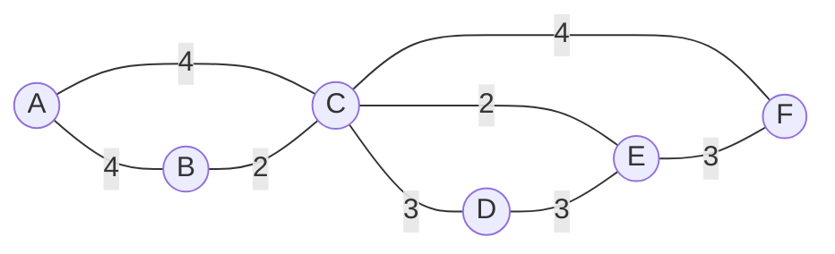

**Step 1 — sort all edges by weight:**

| Edge | Weight |
|---|---|
| B–C | 2 |
| C–E | 2 |
| C–D | 3 |
| D–E | 3 |
| E–F | 3 |
| A–B | 4 |
| A–C | 4 |
| C–F | 4 |

**Step 2 — add edges one by one, skipping any that would form a cycle:**

| # | Edge | Weight | Creates a cycle? | Action | Components so far |
|---|---|---|---|---|---|
| 1 | **B–C** | 2 | No | ✅ **Add** | {B,C} {A} {D} {E} {F} |
| 2 | **C–E** | 2 | No | ✅ **Add** | {B,C,E} {A} {D} {F} |
| 3 | **C–D** | 3 | No | ✅ **Add** | {B,C,D,E} {A} {F} |
| 4 | D–E | 3 | **Yes** (D and E are already connected) | ❌ **Reject** | — |
| 5 | **E–F** | 3 | No | ✅ **Add** | {B,C,D,E,F} {A} |
| 6 | **A–B** | 4 | No | ✅ **Add** | {A,B,C,D,E,F} — **5 edges, stop** |

**Step 3 — the MST:**

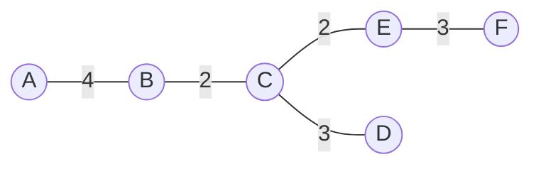

> **Total cost of the MST = 4 + 2 + 2 + 3 + 3 = 14**, using exactly **V − 1 = 5** edges. ✅

#### Complexity

| Step | Cost |
|---|---|
| Sorting the edges | **O(E log E)** — the dominant term |
| V Make-Set + E Find/Union operations | O(E α(V)) ≈ O(E) |
| **Total** | **O(E log E) = O(E log V)** *(since E ≤ V², log E ≤ 2 log V)* |

**Space: O(V + E).**

**Previous Year Question List from this Topic:**

- [(a) Apply the Kruskal's algorithm for the following graph to find out the cost of the minimum spanning Tree (MST).](../written-answers/algorithm.md?plain=1#L1529)
- [Find the minimum spanning tree:](../written-answers/algorithm.md?plain=1#L1611)
- [Find the Minimum Spanning Tree of the following graph using Kruskal's algorithm.](../written-answers/algorithm.md?plain=1#L1680)
- [Find out minimum spanning tree from a given graph using krushkal algorithm.](../written-answers/algorithm.md?plain=1#L1705)
- [Consider the following graph: Now find the minimum spanning tree using Kruskal's algorithm.](../written-answers/algorithm.md?plain=1#L1724)
- [(a) Apply the Krushkal's algorithm for the following graph to find out the cost of the Minimum Spanning Tree (MST).](../written-answers/algorithm.md?plain=1#L3376)


---

### Prim's Algorithm and Kruskal vs Prim

**Prim's algorithm** grows the MST from **one starting vertex**, repeatedly adding the **cheapest edge that connects a vertex already in the tree to a vertex outside it**. It is **vertex-based**.

#### Algorithm

```
Prim(graph, start):
    key[v]    = INFINITY for all v;   key[start] = 0
    parent[v] = NULL for all v
    inMST[v]  = false for all v
    PQ = min-priority queue of all vertices keyed by key[]

    while PQ is not empty:
        u = PQ.extract_min()
        inMST[u] = true
        for each neighbour v of u:
            if not inMST[v] and w(u,v) < key[v]:
                key[v]    = w(u,v)          // note: the EDGE weight, not a running sum
                parent[v] = u
                PQ.decrease_key(v, key[v])
    return the edges (v, parent[v])
```

> **The one-line difference from Dijkstra:** Dijkstra stores `dist[u] + w(u,v)` (the total path cost from the source); Prim stores just `w(u,v)` (the single edge cost). That tiny change turns a shortest-path algorithm into an MST algorithm.

#### Prim's on the same graph (starting at A)

| Step | Tree so far | Cheapest edge leaving the tree | Added |
|---|---|---|---|
| 1 | {A} | A–B (4) vs A–C (4) → take A–B | **A–B (4)** |
| 2 | {A,B} | B–C (2) | **B–C (2)** |
| 3 | {A,B,C} | C–E (2) | **C–E (2)** |
| 4 | {A,B,C,E} | C–D (3) vs D–E (3) vs E–F (3) → C–D | **C–D (3)** |
| 5 | {A,B,C,D,E} | E–F (3) | **E–F (3)** |

**Total = 4 + 2 + 2 + 3 + 3 = 14** — the **same cost** as Kruskal's, as it must be.

#### Kruskal vs Prim

| Point | **Kruskal's Algorithm** | **Prim's Algorithm** |
|---|---|---|
| **Approach** | **Edge-based** — picks the globally cheapest edge | **Vertex-based** — grows one tree from a start vertex |
| **Intermediate state** | A **forest** of several disconnected trees | Always a **single connected tree** |
| **Starting point** | No start vertex; sorts all edges | Needs a **start vertex** (any one) |
| **Cycle check** | Needs **Union-Find (DSU)** | Not needed — the tree/non-tree split prevents cycles |
| **Data structure** | Sorting + DSU | **Min-priority queue (heap)** |
| **Time complexity** | **O(E log E)** ≈ O(E log V) | **O(E log V)** with a binary heap; **O(V²)** with an adjacency matrix |
| **Best for** | **Sparse graphs** (E is small) | **Dense graphs** (E ≈ V²) |
| **Disconnected graph** | Produces a **minimum spanning forest** | Only covers the component containing the start vertex |
| **Greedy choice** | Cheapest edge **anywhere** in the graph | Cheapest edge **touching the current tree** |

#### Prim vs Dijkstra — the classic confusion

| Point | **Prim (MST)** | **Dijkstra (Shortest Path)** |
|---|---|---|
| Goal | Connect **all** vertices at minimum **total** weight | Minimum **path cost from the source** to each vertex |
| Key stored | `w(u,v)` — the single edge weight | `dist[u] + w(u,v)` — the cumulative path cost |
| Graph type | **Undirected**, weighted | Directed or undirected |
| Negative weights | ✅ Works fine | ❌ Fails |
| Result | A tree covering all vertices | A shortest-path tree rooted at the source |

> **Exam scenario:** *"Several substations exist in different places of the city; you must travel from one substation to another — write an algorithm."*
> - If the question is *"lay cable to connect **all** substations at minimum total cost"* → **MST: Kruskal or Prim**.
> - If the question is *"find the cheapest route **from one specific substation to another**"* → **Shortest path: Dijkstra**.
> Read the wording carefully — this distinction is exactly what such questions are testing.

**Previous Year Question List from this Topic:**

- [Find the minimum spanning tree:](../written-answers/algorithm.md?plain=1#L1611)
- [Several substations of SGFL Company exist in different places of the city. You have to travel from one substation to another. Write an algorithm to travel using…](../written-answers/algorithm.md?plain=1#L1746)
- [S1, S2, S3, S4, S5 are five nodes and a value on lines denotes the cost to transmit power. (i) Draw a graph to find the shortest path to transmit power. (ii) Ca…](../written-answers/algorithm.md?plain=1#L1833)
