<!-- TOC START -->
**Table of Contents** — 10 subtopics · 50 theories

1. **[Sorting Algorithms & Complexity](#sorting-algorithms--complexity)**
   - [Sorting — Concepts and Classification](#sorting--concepts-and-classification)
   - [Bubble Sort](#bubble-sort)
   - [Selection Sort](#selection-sort)
   - [Insertion Sort](#insertion-sort)
   - [Merge Sort](#merge-sort)
   - [Quick Sort](#quick-sort)
   - [Heap Sort](#heap-sort)
   - [Counting Sort, Radix Sort and Bucket Sort](#counting-sort-radix-sort-and-bucket-sort)
   - [Comparison of All Sorting Algorithms](#comparison-of-all-sorting-algorithms)

2. **[Graph Traversal Algorithms (BFS & DFS)](#graph-traversal-algorithms-bfs--dfs)**
   - [Graph Traversal — What and Why](#graph-traversal--what-and-why)
   - [Breadth-First Search (BFS)](#breadth-first-search-bfs)
   - [Depth-First Search (DFS)](#depth-first-search-dfs)
   - [BFS vs DFS — Comparison](#bfs-vs-dfs--comparison)
   - [Cycle Detection in a Graph](#cycle-detection-in-a-graph)
   - [Topological Sorting](#topological-sorting)
   - [Estimating Search Time and Memory from the Branching Factor](#estimating-search-time-and-memory-from-the-branching-factor)

3. **[Graph Algorithms (Shortest Path & Minimum Spanning Tree)](#graph-algorithms-shortest-path--minimum-spanning-tree)**
   - [The Shortest Path Problem — Overview](#the-shortest-path-problem--overview)
   - [Dijkstra's Algorithm (Single-Source Shortest Path)](#dijkstras-algorithm-single-source-shortest-path)
   - [Bellman-Ford Algorithm and Negative Cycle Detection](#bellman-ford-algorithm-and-negative-cycle-detection)
   - [Minimum Spanning Tree (MST) — Concept](#minimum-spanning-tree-mst--concept)
   - [Kruskal's Algorithm](#kruskals-algorithm)
   - [Prim's Algorithm and Kruskal vs Prim](#prims-algorithm-and-kruskal-vs-prim)

4. **[Searching Algorithms](#searching-algorithms)**
   - [Linear Search (Sequential Search)](#linear-search-sequential-search)
   - [Binary Search](#binary-search)
   - [Linear Search vs Binary Search](#linear-search-vs-binary-search)
   - [Finding the Second Highest Element in an Array](#finding-the-second-highest-element-in-an-array)

5. **[Algorithm Analysis & Asymptotic Complexity](#algorithm-analysis--asymptotic-complexity)**
   - [What is an Algorithm? Characteristics and Representation](#what-is-an-algorithm-characteristics-and-representation)
   - [Time Complexity, Space Complexity and Complexity Classes](#time-complexity-space-complexity-and-complexity-classes)
   - [Asymptotic Notations — Big O, Big Omega and Big Theta](#asymptotic-notations--big-o-big-omega-and-big-theta)
   - [How to Find the Complexity of a Piece of Code](#how-to-find-the-complexity-of-a-piece-of-code)
   - [Recurrence Relations and How to Solve Them](#recurrence-relations-and-how-to-solve-them)

6. **[Dynamic Programming & Greedy Algorithms](#dynamic-programming--greedy-algorithms)**
   - [Divide and Conquer](#divide-and-conquer)
   - [Dynamic Programming and the Principle of Optimality](#dynamic-programming-and-the-principle-of-optimality)
   - [Greedy Algorithms](#greedy-algorithms)
   - [Divide and Conquer vs Dynamic Programming vs Greedy](#divide-and-conquer-vs-dynamic-programming-vs-greedy)

7. **[Graph Theory & Isomorphism](#graph-theory--isomorphism)**
   - [Graph Theory — Basic Terminology and Types](#graph-theory--basic-terminology-and-types)
   - [Graph Isomorphism](#graph-isomorphism)
   - [Graph Colouring, Chromatic Number, Bipartite Graphs and Cliques](#graph-colouring-chromatic-number-bipartite-graphs-and-cliques)
   - [Trees and the n − 1 Edge Property](#trees-and-the-n--1-edge-property)
   - [Eulerian and Hamiltonian Paths and Circuits](#eulerian-and-hamiltonian-paths-and-circuits)
   - [Graph Connectivity — Connected, Strongly and Weakly Connected](#graph-connectivity--connected-strongly-and-weakly-connected)

8. **[Greedy Algorithms (Fractional Knapsack)](#greedy-algorithms-fractional-knapsack)**
   - [The Fractional Knapsack Problem](#the-fractional-knapsack-problem)
   - [0/1 Knapsack vs Fractional Knapsack](#01-knapsack-vs-fractional-knapsack)
   - [Activity Selection / Interval Scheduling](#activity-selection--interval-scheduling)
   - [Greedy vs Optimal Cost — Measuring the Gap](#greedy-vs-optimal-cost--measuring-the-gap)

9. **[Searching & Graph Algorithms](#searching--graph-algorithms)**
   - [Prime Numbers — Checking and Generating](#prime-numbers--checking-and-generating)
   - [Binary Search Tree — Construction, Traversal and Search](#binary-search-tree--construction-traversal-and-search)

10. **[Dynamic Programming](#dynamic-programming)**
   - [Fibonacci Numbers with Dynamic Programming](#fibonacci-numbers-with-dynamic-programming)
   - [Maximum Subarray Problem — Kadane's Algorithm](#maximum-subarray-problem--kadanes-algorithm)
   - [DP on a Line — Repeater / Station Placement with a Minimum Gap](#dp-on-a-line--repeater--station-placement-with-a-minimum-gap)

<!-- TOC END -->

---

## Sorting Algorithms & Complexity

### Sorting — Concepts and Classification

**Sorting** means arranging a collection of data in a particular order — **ascending** (small to large) or **descending** (large to small).

**Why sorting matters:** a sorted array allows **binary search (O(log n))** instead of linear search (O(n)); it makes duplicates, medians and ranges easy to find; and it is a building block of many other algorithms (Kruskal's MST, closest-pair, database joins).

#### Four properties used to classify every sorting algorithm

**1. Comparison vs Non-comparison sort**

| | Comparison sort | Non-comparison sort |
|---|---|---|
| How it decides order | Compares pairs of elements (`a < b ?`) | Uses the internal structure of the keys (digits, counts) |
| Best possible time | **Ω(n log n)** — a proven lower bound | Can be **O(n)** |
| Examples | Bubble, Selection, Insertion, Merge, Quick, Heap | **Counting, Radix, Bucket** |

> **A very common viva question:** *"Can any sorting algorithm be faster than O(n log n)?"*
> **Answer:** No **comparison-based** algorithm can — that is a mathematical lower bound. But **non-comparison** sorts such as Counting and Radix sort can reach O(n), because they do not compare elements at all. They only work on restricted key types (small integers, fixed-length strings).

**2. Stable vs Unstable**

A sort is **stable** if two elements with the **same key keep their original relative order**.

> Sorting `[(Rahim, 90), (Karim, 85), (Jamal, 90)]` by marks: a **stable** sort keeps Rahim before Jamal, because Rahim came first in the input. An unstable sort might swap them.

Stability matters when you sort by one field after another (sort by name, then by department).

| Stable | Unstable |
|---|---|
| Bubble, Insertion, Merge, Counting, Radix, Bucket, TimSort | **Selection, Quick, Heap, Shell** |

**3. In-place vs Out-of-place**

An **in-place** sort uses only **O(1)** (or O(log n)) extra memory; an **out-of-place** sort needs an extra array proportional to n.

| In-place | Out-of-place |
|---|---|
| Bubble, Selection, Insertion, Quick (O(log n) stack), Heap | **Merge sort (O(n) extra)**, Counting, Radix |

**4. Internal vs External**

- **Internal sort** — the whole data fits in **RAM** (all the usual algorithms).
- **External sort** — the data is too large for RAM and must stay on disk. The standard technique is **External Merge Sort**: read chunks that fit in memory, sort each chunk, write it back as a *run*, then merge the runs with a k-way merge. *(This is the answer to "you have 1 GB of data but can only hold 64 KB in memory — how do you sort it?")*

#### Adaptive algorithms

An **adaptive** sort runs faster when the input is already partly sorted. **Insertion sort** and **Bubble sort (with the swapped flag)** are adaptive — they reach **O(n)** on sorted data. Selection sort, merge sort and heap sort are not adaptive.

**Previous Year Question List from this Topic:**

- [Write the Best case, worst case and average case time complexity for the following sorting algorithms.](../written-answers/algorithm.md?plain=1#L85)
- [Which short uses divide and conquer technique?](../written-answers/algorithm.md?plain=1#L388)
- [Fastest sorting algorithms?](../written-answers/algorithm.md?plain=1#L396)
- [Describe four types sorting algorithm with example.](../written-answers/algorithm.md?plain=1#L779)


---

### Bubble Sort

**Bubble Sort** repeatedly steps through the list, compares **each adjacent pair**, and swaps them if they are in the wrong order. After each full pass, the **largest remaining element "bubbles up"** to its correct place at the end — which is where the name comes from.

#### Algorithm

```
BubbleSort(A, n):
    for i = 0 to n-2:
        swapped = false
        for j = 0 to n-2-i:            // the last i elements are already sorted
            if A[j] > A[j+1]:
                swap A[j], A[j+1]
                swapped = true
        if swapped == false:           // optimisation: already sorted
            break
```

#### Worked example — sort 5, 8, 3, 6, 2 in ascending order

**Pass 1** (compare each adjacent pair):

| Compare | Array | Swap? |
|---|---|---|
| 5, 8 | 5 8 3 6 2 | No |
| 8, 3 | 5 **3 8** 6 2 | **Yes** (1) |
| 8, 6 | 5 3 **6 8** 2 | **Yes** (2) |
| 8, 2 | 5 3 6 **2 8** | **Yes** (3) |

After pass 1: `5 3 6 2 | 8` — **8 is fixed**.

**Pass 2:**

| Compare | Array | Swap? |
|---|---|---|
| 5, 3 | **3 5** 6 2 8 | **Yes** (4) |
| 5, 6 | 3 5 6 2 8 | No |
| 6, 2 | 3 5 **2 6** 8 | **Yes** (5) |

After pass 2: `3 5 2 | 6 8`

**Pass 3:**

| Compare | Array | Swap? |
|---|---|---|
| 3, 5 | 3 5 2 6 8 | No |
| 5, 2 | 3 **2 5** 6 8 | **Yes** (6) |

After pass 3: `3 2 | 5 6 8`

**Pass 4:**

| Compare | Array | Swap? |
|---|---|---|
| 3, 2 | **2 3** 5 6 8 | **Yes** (7) |

**Final sorted array: 2 3 5 6 8.**

> **Answer to "how many swaps are needed to sort 5, 8, 3, 6, 2 using bubble sort?" → 7 swaps.**
> *(Shortcut: the number of swaps in bubble sort equals the number of **inversions** — pairs (i, j) with i < j but A[i] > A[j]. Here: (5,3)(5,2)(8,3)(8,6)(8,2)(3,2)(6,2) = **7**.)*

#### Complexity

| Case | When | Comparisons | Swaps | Time |
|---|---|---|---|---|
| **Best** | Already sorted (with the swapped flag) | n − 1 | 0 | **O(n)** |
| **Average** | Random order | ≈ n²/2 | ≈ n²/4 | **O(n²)** |
| **Worst** | Reverse sorted | n(n−1)/2 | n(n−1)/2 | **O(n²)** |

**Space complexity: O(1)** — in-place. **Stable: Yes.** **Adaptive: Yes** (with the flag).

**Total comparisons** in the worst case = (n−1) + (n−2) + … + 1 = **n(n−1)/2**.

**Advantages:** simplest to write and understand; detects an already-sorted array in one pass.
**Disadvantages:** the slowest of the common sorts; useless beyond small n.

**Previous Year Question List from this Topic:**

- [(খ) Bubble sort algorithm ব্যবহার করে নিচের সংখ্যাগুলো sort করুন। প্রতিটি ধাপ প্রদর্শন করতে হবে।](../written-answers/algorithm.md?plain=1#L276)
- [Bubble sort, Quick sort and Merge sort algorithm এর Worst case complexity নির্ণয় কর।](../written-answers/algorithm.md?plain=1#L405)
- [How many member of swapping is needed to sort the number sequence 5, 8, 3, 6, 2 in ascending order using bubble sort.](../written-answers/algorithm.md?plain=1#L448)
- [(i) Bubble sort Algorithm লিখুন। এ অ্যালগরিদমটির Time Complexity বের করুন।](../written-answers/algorithm.md?plain=1#L466)
- [Bubble Sort কীভাবে কাজ করে উদাহরণসহ বুঝিয়ে লিখুন?](../written-answers/algorithm.md?plain=1#L617)
- [(গ) উদাহরনসহ Bubble sort algorithm লিখুন।](../written-answers/algorithm.md?plain=1#L654)
- [(ক) নিম্নের সংখ্যাগুলোকে ঊর্ধ্বক্রমানুসারে সাজানোর জন্য Bubble Sort কিভাবে কাজ করবে তা ধাপে ধাপে প্রদর্শন করুন। 5, 8, 3, 6, 2](../written-answers/algorithm.md?plain=1#L679)


---

### Selection Sort

**Selection Sort** divides the array into a **sorted part (left)** and an **unsorted part (right)**. In each pass it **selects the minimum** element from the unsorted part and **swaps it** into the boundary position.

#### Algorithm

```
SelectionSort(A, n):
    for i = 0 to n-2:
        min_index = i
        for j = i+1 to n-1:
            if A[j] < A[min_index]:
                min_index = j
        swap A[i], A[min_index]
```

#### Worked example — 45, 72, 80, 65, 84, 52, 37 (7 students' marks)

| Pass | Unsorted part | Minimum found | Swap with | Array after the pass |
|---|---|---|---|---|
| 1 | 45 72 80 65 84 52 37 | **37** | position 0 (45) | **37** 72 80 65 84 52 45 |
| 2 | 72 80 65 84 52 45 | **45** | position 1 (72) | 37 **45** 80 65 84 52 72 |
| 3 | 80 65 84 52 72 | **52** | position 2 (80) | 37 45 **52** 65 84 80 72 |
| 4 | 65 84 80 72 | **65** | position 3 (65) — no move | 37 45 52 **65** 84 80 72 |
| 5 | 84 80 72 | **72** | position 4 (84) | 37 45 52 65 **72** 80 84 |
| 6 | 80 84 | **80** | position 5 (80) — no move | 37 45 52 65 72 **80** 84 |

**Final sorted: 37, 45, 52, 65, 72, 80, 84.**

#### Complexity

| Case | Time | Why |
|---|---|---|
| **Best** | **O(n²)** | It *always* scans the whole unsorted part to find the minimum, even if sorted |
| **Average** | **O(n²)** | |
| **Worst** | **O(n²)** | |

**Space: O(1)** — in-place. **Stable: No** (the long-distance swap can jump an equal element over another). **Adaptive: No.**

**The one thing selection sort is good at:** it performs **at most n − 1 swaps** — the **fewest writes** of any simple sort. That makes it attractive when writing to memory is very expensive (e.g. flash memory), even though the comparison count is high.

| | Comparisons | Swaps |
|---|---|---|
| Selection sort | n(n−1)/2 always | **≤ n − 1** |
| Bubble sort | up to n(n−1)/2 | up to n(n−1)/2 |

**Previous Year Question List from this Topic:**

- [(b) Write down the selection sort algorithm. Find out the best case, average case, and worst case time completely.](../written-answers/algorithm.md?plain=1#L147)
- [Selection Sort টেকনিক ব্যবহার করে নিম্নোক্ত ডাটা গুলোকে সর্টিং করুন। 45, 72, 80, 65, 84, 52, 37](../written-answers/algorithm.md?plain=1#L635)
- [(ক) Selection sort পদ্ধতির Algorithm লিখুন।](../written-answers/algorithm.md?plain=1#L705)
- [(খ) ৭ জন ছাত্রের পরীক্ষার প্রাপ্ত Marks দেওয়া আছে: 45, 72, 80, 65, 84, 52, 37 Selection short ব্যবহার করে নম্বরগুলো নিম্নক্রমানুযায়ী সাজানোর প্রক্রিয়া ধাপে ধ…](../written-answers/algorithm.md?plain=1#L729)


---

### Insertion Sort

**Insertion Sort** builds the sorted array **one element at a time**: it takes the next element and **inserts it into its correct position** among the already-sorted elements on the left, shifting larger elements one step to the right.

It is exactly how most people **arrange playing cards** in their hand.

#### Algorithm

```
InsertionSort(A, n):
    for i = 1 to n-1:
        key = A[i]
        j   = i - 1
        while j >= 0 and A[j] > key:      // shift larger elements right
            A[j+1] = A[j]
            j = j - 1
        A[j+1] = key                       // drop the key into the gap
```

#### Worked example — 14, 33, 27, 10, 35, 19, 48, 44

| Pass | key | Sorted part before | Action | Array after |
|---|---|---|---|---|
| 1 | **33** | 14 | 33 > 14, stays | **14 33** \| 27 10 35 19 48 44 |
| 2 | **27** | 14 33 | shift 33 right, insert 27 | **14 27 33** \| 10 35 19 48 44 |
| 3 | **10** | 14 27 33 | shift 33, 27, 14 right, insert 10 at front | **10 14 27 33** \| 35 19 48 44 |
| 4 | **35** | 10 14 27 33 | 35 > 33, stays | **10 14 27 33 35** \| 19 48 44 |
| 5 | **19** | 10 14 27 33 35 | shift 35, 33, 27 right, insert 19 | **10 14 19 27 33 35** \| 48 44 |
| 6 | **48** | … | 48 > 35, stays | **10 14 19 27 33 35 48** \| 44 |
| 7 | **44** | … | shift 48 right, insert 44 | **10 14 19 27 33 35 44 48** |

**Final sorted: 10, 14, 19, 27, 33, 35, 44, 48.**

#### C program

```c
#include <stdio.h>

void insertionSort(int a[], int n) {
    for (int i = 1; i < n; i++) {
        int key = a[i];
        int j = i - 1;
        while (j >= 0 && a[j] > key) {   /* shift bigger elements right */
            a[j + 1] = a[j];
            j--;
        }
        a[j + 1] = key;                  /* place the key */
    }
}

int main(void) {
    int a[] = {14, 33, 27, 10, 35, 19, 48, 44};
    int n = sizeof(a) / sizeof(a[0]);
    insertionSort(a, n);
    for (int i = 0; i < n; i++) printf("%d ", a[i]);
    return 0;
}
```

#### Complexity

| Case | Condition | Time |
|---|---|---|
| **Best** | Already sorted — the `while` loop never runs | **O(n)** |
| **Average** | Random | **O(n²)** |
| **Worst** | Reverse sorted — every element shifts all the way | **O(n²)** |

**Space: O(1)** — in-place. **Stable: Yes.** **Adaptive: Yes** — this is its big advantage.

**When insertion sort is actually the best choice:** small arrays (n < ~20) and **nearly sorted** data. Real library sorts (IntroSort, TimSort) switch to insertion sort for small sub-arrays for exactly this reason.

**Previous Year Question List from this Topic:**

- [Sort the following array using Insertion sort. 14, 33, 27, 10, 35, 19, 48, 44.](../written-answers/algorithm.md?plain=1#L173)
- [Insertion sort is a simple sorting algorithm. Write a program to sort some given numbers using insertion sort algorithm.](../written-answers/algorithm.md?plain=1#L578)


---

### Merge Sort

**Merge Sort** is a **Divide and Conquer** algorithm:

1. **Divide** the array into two halves.
2. **Conquer** — recursively sort each half.
3. **Combine** — **merge** the two sorted halves into one sorted array.

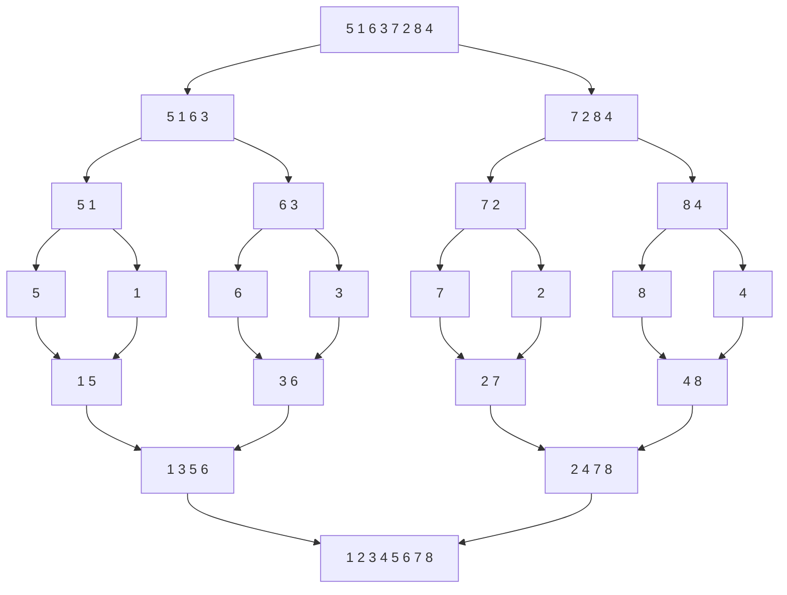

#### Algorithm

```
MergeSort(A, left, right):
    if left < right:
        mid = (left + right) / 2
        MergeSort(A, left, mid)          // sort the left half
        MergeSort(A, mid+1, right)       // sort the right half
        Merge(A, left, mid, right)       // combine them

Merge(A, left, mid, right):
    copy A[left..mid]    into L[]
    copy A[mid+1..right] into R[]
    i = j = 0;  k = left
    while i < len(L) and j < len(R):
        if L[i] <= R[j]:  A[k++] = L[i++]     // '<=' keeps the sort STABLE
        else:             A[k++] = R[j++]
    copy any remaining elements of L and R into A
```

#### Why merging two sorted lists takes O(n)

*(A directly asked question: "Write a linear algorithm to merge two sorted lists. Why is it O(n)?")*

Keep one pointer at the front of each list. Compare the two front elements, output the smaller one, and advance that pointer. Because each comparison **permanently places exactly one element** into the output, and there are n elements in total, the loop runs at most **n times** — hence **O(n)**. No element is ever examined twice, and no back-tracking is needed. This only works because both inputs are **already sorted**.

#### Worked example — sort 3, 13, 25, 7, 15, 2, 5, 35

**Divide:**
`[3 13 25 7] [15 2 5 35]` → `[3 13] [25 7] [15 2] [5 35]` → `[3][13] [25][7] [15][2] [5][35]`

**Merge back up:**

| Level | Merges | Result |
|---|---|---|
| 1 | [3]+[13], [25]+[7], [15]+[2], [5]+[35] | `[3 13] [7 25] [2 15] [5 35]` |
| 2 | [3 13]+[7 25], [2 15]+[5 35] | `[3 7 13 25] [2 5 15 35]` |
| 3 | [3 7 13 25] + [2 5 15 35] | `[2 3 5 7 13 15 25 35]` |

**Final sorted: 2, 3, 5, 7, 13, 15, 25, 35.**

#### Deriving the recurrence T(n) = 2T(n/2) + n

*(Another directly asked question.)*

To sort an array of size **n**, merge sort does three things:

| Step | Cost |
|---|---|
| **Divide** — compute the midpoint | **O(1)** — just one arithmetic operation |
| **Conquer** — solve **two** sub-problems, each of size **n/2** | **2 × T(n/2)** |
| **Combine** — merge two sorted halves of total length n | **O(n)** — each element is touched once |

Adding them:

> **T(n) = 2·T(n/2) + O(n)**, with **T(1) = O(1)**

**Solving it by the recursion-tree method:**
- At level 0 there is 1 problem of size n → work = n
- At level 1 there are 2 problems of size n/2 → work = 2 × (n/2) = n
- At level 2 there are 4 problems of size n/4 → work = 4 × (n/4) = n
- … each level does exactly **n** work.
- The tree halves the size each level, so its height is **log₂ n**.

> **Total = n × log₂ n = O(n log n)**

*(By the **Master Theorem**: a = 2, b = 2, f(n) = n. Since n^(log_b a) = n^(log₂2) = n¹ = f(n), we are in **Case 2**, giving **T(n) = Θ(n log n)**.)*

#### Complexity

| Case | Time |
|---|---|
| Best | **O(n log n)** |
| Average | **O(n log n)** |
| Worst | **O(n log n)** |

**Merge sort's great strength is that all three cases are the same** — its performance is guaranteed.

**Space: O(n)** — it needs an auxiliary array (its main weakness). **Stable: Yes.** **Adaptive: No.**

**When to use merge sort:** sorting **linked lists** (no extra space needed there, and no random access required), **external sorting** of huge files, and any situation where **worst-case guarantees** matter.

**Previous Year Question List from this Topic:**

- [Sort this array using merge sort 12, 45, 23, 6, 80, 20.](../written-answers/algorithm.md?plain=1#L193)
- [Write a liner algorithm two sorted item merge. Why this algorithm takes O(n) time complexity?](../written-answers/algorithm.md?plain=1#L307)
- [(a) The complexity of merge sort is T(n) = 2T\left(\frac{n}{2}\right) + n. Explain how the above equation is derived?](../written-answers/algorithm.md?plain=1#L335)
- [Sort the following data using merge sort. Also mention best and worst case of the algorithm.](../written-answers/algorithm.md?plain=1#L361)
- [(a) Compaire and contrast between Quick sort and Merge sort in terms of their time and space complexity.](../written-answers/algorithm.md?plain=1#L492)
- [Analize and compare the Quick-sort and Merge-sort algorithms in term of their time and space complexity.](../written-answers/algorithm.md?plain=1#L554)
- [(a) Write down the Merge sort algorithm. What is the time complexity of this algorithm?](../written-answers/algorithm.md?plain=1#L850)
- [Marge sort Algorithm ব্যবহার করে নিম্নের Data গুলো sorting করুন। (3, 13, 25, 7, 15, 2, 5, 35)](../written-answers/algorithm.md?plain=1#L881)
- [Apply the Merge Sort algorithm using the divide and conquer approach to sort the following list of numbers: 5, 1, 6, 3, 7, 2, 8, and 4.](../written-answers/algorithm.md?plain=1#L978)


---

### Quick Sort

**Quick Sort** is also **Divide and Conquer**, but it does the hard work *before* recursing:

1. **Pick a pivot** element.
2. **Partition** — rearrange the array so that everything **smaller** than the pivot is on its left and everything **larger** is on its right. The pivot is now in its **final sorted position**.
3. **Recursively** quicksort the left part and the right part.

There is **no merge step** — that is why it is in-place and fast.

#### Algorithm (Lomuto partition, last element as pivot)

```
QuickSort(A, low, high):
    if low < high:
        pi = Partition(A, low, high)     // pi = final index of the pivot
        QuickSort(A, low, pi - 1)        // sort the left part
        QuickSort(A, pi + 1, high)       // sort the right part

Partition(A, low, high):
    pivot = A[high]
    i = low - 1
    for j = low to high - 1:
        if A[j] <= pivot:
            i = i + 1
            swap A[i], A[j]
    swap A[i+1], A[high]
    return i + 1
```

#### Worked example — 10, 80, 30, 90, 40, 50, 70 (pivot = last element = 70)

| j | A[j] | A[j] ≤ 70? | i | Array |
|---|---|---|---|---|
| 0 | 10 | ✅ | 0 | 10 80 30 90 40 50 **70** |
| 1 | 80 | ❌ | 0 | 10 80 30 90 40 50 **70** |
| 2 | 30 | ✅ | 1 | 10 **30 80** 90 40 50 **70** |
| 3 | 90 | ❌ | 1 | 10 30 80 90 40 50 **70** |
| 4 | 40 | ✅ | 2 | 10 30 **40 90 80** 50 **70** |
| 5 | 50 | ✅ | 3 | 10 30 40 **50 80 90** **70** |

Finally swap A[i+1] = A[4] with the pivot: **10 30 40 50 | 70 | 90 80**

The pivot 70 is now in its **final place**. Recurse on `[10 30 40 50]` and on `[90 80]`.

#### Why is Quick Sort's worst case O(n²)?

*(One of the most repeated written questions.)*

The worst case happens when the partition is **maximally unbalanced** — the pivot turns out to be the **smallest or the largest** element every single time. Then one side gets **n − 1** elements and the other gets **0**, so instead of halving, the problem shrinks by only one element per level.

The recurrence becomes:

> **T(n) = T(n − 1) + O(n)**

Expanding: n + (n−1) + (n−2) + … + 1 = **n(n+1)/2 = O(n²)**.

**When exactly does this occur?**

| Pivot choice | Worst-case input |
|---|---|
| **First element** as pivot | An **already sorted** array (ascending **or** descending) |
| **Last element** as pivot | An already sorted array |
| Middle element | A specially crafted adversarial input |
| **Random** pivot | Extremely unlikely — expected O(n log n) |

**Example:** array `[1, 2, 3, 4, 5]` with the **first element as pivot**.
- Pivot = 1 → partitions into `[]` and `[2,3,4,5]` — nothing is discarded but the pivot.
- Pivot = 2 → `[]` and `[3,4,5]`
- Pivot = 3 → `[]` and `[4,5]`
- Pivot = 4 → `[]` and `[5]`

Five levels of recursion instead of log₂5 ≈ 2.3, and the comparison count is 4+3+2+1 = 10 = n(n−1)/2 → **O(n²)**.

**The irony worth mentioning in the answer:** quicksort is at its *worst* on **already sorted data**, which is exactly the case where most other algorithms do best.

#### How the worst case is avoided in practice

1. **Randomised pivot** — pick a random index and swap it to the end. An adversary cannot predict it.
2. **Median-of-three** — take the median of the first, middle and last elements as the pivot. This makes sorted input a *best* case instead of a worst case.
3. **IntroSort** — start with quicksort, count the recursion depth, and **switch to heap sort** if it exceeds 2·log n. This guarantees O(n log n) worst case while keeping quicksort's speed. This is what C++ `std::sort` does.
4. **Three-way partitioning** (Dutch National Flag) — handles arrays with many duplicate keys.

#### Complexity

| Case | Partition behaviour | Recurrence | Time |
|---|---|---|---|
| **Best** | Pivot is the median — perfect halves | T(n) = 2T(n/2) + n | **O(n log n)** |
| **Average** | Reasonably balanced | — | **O(n log n)** |
| **Worst** | Pivot is always the smallest/largest | T(n) = T(n−1) + n | **O(n²)** |

**Space complexity:** the partitioning is in-place, but recursion uses stack space:
- **Best/average: O(log n)** stack depth.
- **Worst: O(n)** stack depth.
*(With tail-call optimisation on the larger side, the worst case can be reduced to O(log n).)*

**Stable: No.** **Adaptive: No.**

**Why is quicksort usually the fastest in practice despite the O(n²) worst case?**
- It is **in-place** — no extra array, so far fewer cache misses.
- Its **inner loop is very tight** and **cache-friendly** (sequential access).
- The constant factor hidden in O(n log n) is **smaller** than merge sort's.
- The worst case is easy to avoid with a random or median-of-three pivot.

#### Quick Sort vs Merge Sort

| Point | **Quick Sort** | **Merge Sort** |
|---|---|---|
| Best time | O(n log n) | O(n log n) |
| Average time | **O(n log n)** | O(n log n) |
| **Worst time** | **O(n²)** ❌ | **O(n log n)** ✅ |
| **Space** | **O(log n)** ✅ (in-place) | **O(n)** ❌ (extra array) |
| Stable | **No** | **Yes** |
| Where the work is | In the **divide** (partition) step | In the **combine** (merge) step |
| Cache performance | **Excellent** | Poorer |
| Practical speed on arrays | **Faster** | Slower |
| Best for | **Arrays** in memory | **Linked lists**, external/disk sorting, when the worst case must be bounded |
| Parallelisable | Yes | Yes (easier) |

**Previous Year Question List from this Topic:**

- [Explain the QuickSort algorithm with an example. Analyze its best-case, average-case, and worst-case time complexities.](../written-answers/algorithm.md?plain=1#L59)
- [Explain the Quick Sort algorithm with a suitable example. Under what conditions does Quick Sort exhibit its worst-case time complexity, and why does this situat…](../written-answers/algorithm.md?plain=1#L119)
- [What is the worst-case time and space complexity of quicksort? Briefly explain how this worst-case behavior can occur.](../written-answers/algorithm.md?plain=1#L219)
- [Why Quick sort worst complexity in O(n^2)? Explain with example.](../written-answers/algorithm.md?plain=1#L237)
- [In a quicksort algorithm taking the first element as a pivot element. Now Analyze the time complexity of the quicksort algorithm when all services of the quicks…](../written-answers/algorithm.md?plain=1#L256)
- [Write down the pseudocode of quick sort algorithm through recursive algorithm. Express the arrange complexity off this algorithm.](../written-answers/algorithm.md?plain=1#L419)
- [(a) Compaire and contrast between Quick sort and Merge sort in terms of their time and space complexity.](../written-answers/algorithm.md?plain=1#L492)
- [(a) How the quick sort is implemented? What is the complexity of quick sort?](../written-answers/algorithm.md?plain=1#L528)
- [Analize and compare the Quick-sort and Merge-sort algorithms in term of their time and space complexity.](../written-answers/algorithm.md?plain=1#L554)
- [Explain the Quick Sort algorithm with a suitable example. What is the worst-case time complexity, and in which scenario does it occur?](../written-answers/algorithm.md?plain=1#L962)


---

### Heap Sort

**Heap Sort** uses the **heap** data structure. A **binary heap** is a **complete binary tree** stored in an array, satisfying the heap property:

- **Max-heap:** every parent ≥ its children → the **maximum is at the root**.
- **Min-heap:** every parent ≤ its children → the **minimum is at the root**.

**Array indexing (0-based):** for node `i` — left child = `2i+1`, right child = `2i+2`, parent = `(i−1)/2`.

#### The algorithm

```
HeapSort(A, n):
    // Phase 1: build a max-heap — O(n)
    for i = n/2 - 1 down to 0:
        Heapify(A, n, i)

    // Phase 2: extract the maximum n-1 times — O(n log n)
    for i = n-1 down to 1:
        swap A[0], A[i]        // move the current maximum to the end
        Heapify(A, i, 0)       // restore the heap on the shrinking prefix

Heapify(A, size, i):           // "sift down" — O(log n)
    largest = i
    l = 2*i + 1;  r = 2*i + 2
    if l < size and A[l] > A[largest]: largest = l
    if r < size and A[r] > A[largest]: largest = r
    if largest != i:
        swap A[i], A[largest]
        Heapify(A, size, largest)
```

#### Worked example — build a heap from 44, 30, 50, 22, 60, 55, 70, 55

**Step 1 — place the values in a complete binary tree (level by level):**

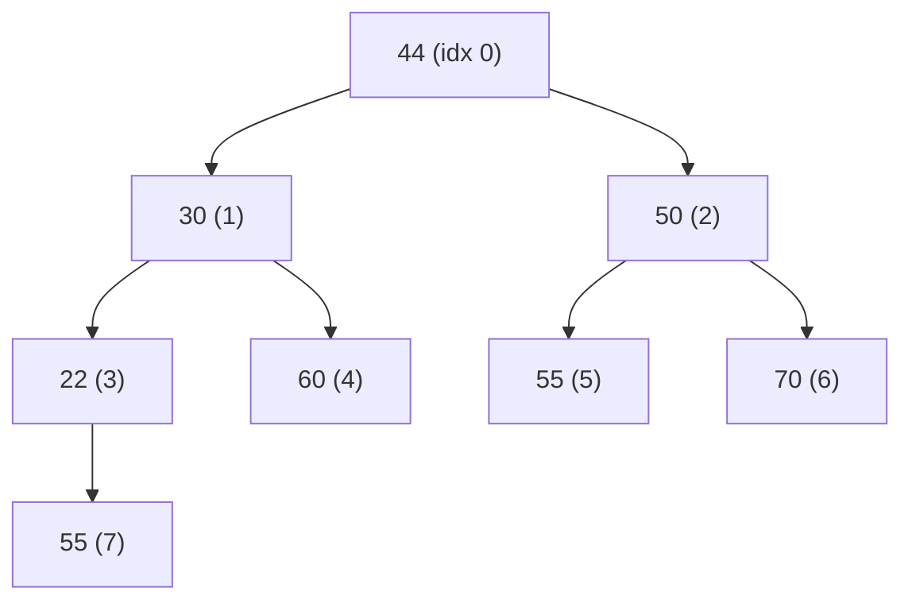

**Step 2 — heapify from the last non-leaf node (index n/2 − 1 = 3) up to the root:**

| i | Node | Children | Action |
|---|---|---|---|
| 3 | 22 | 55 | 55 > 22 → **swap** → node 3 becomes 55, node 7 becomes 22 |
| 2 | 50 | 55, **70** | 70 is the largest → **swap** → node 2 becomes 70, node 6 becomes 50 |
| 1 | 30 | 55, **60** | 60 is the largest → **swap** → node 1 becomes 60, node 4 becomes 30 |
| 0 | 44 | **60**, 70 → 70 is the largest | **swap** 44 and 70 → then heapify index 2: children are 55 and 50, 55 > 44 → **swap** |

**Final max-heap array: `70, 60, 55, 55, 30, 50, 44, 22`**

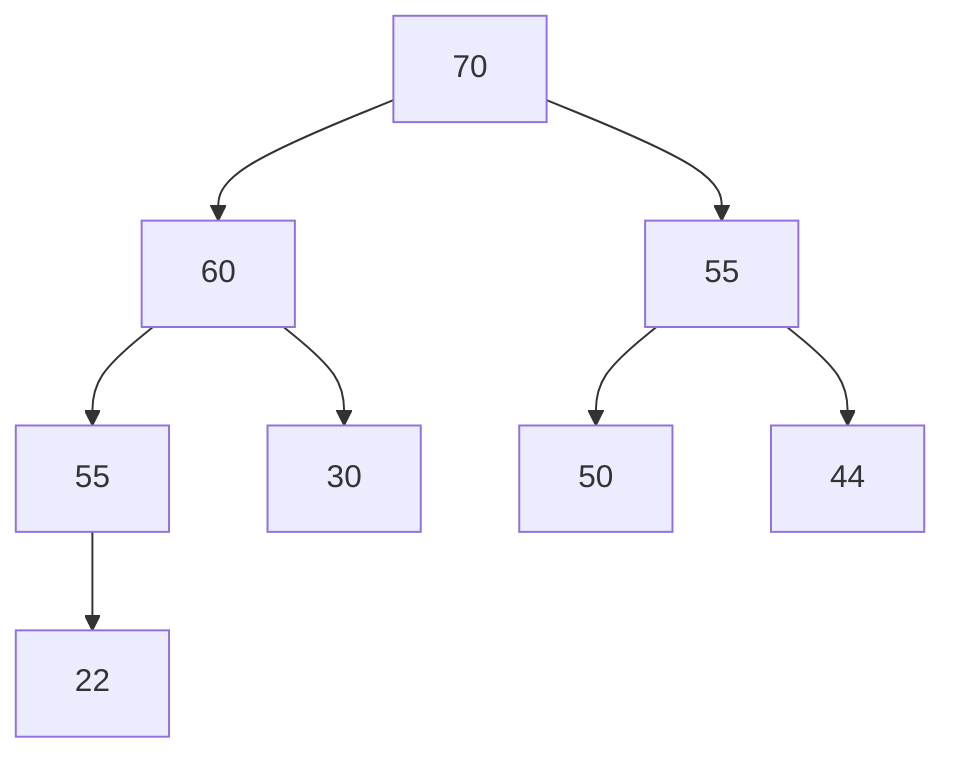

**Step 3 — sorting phase:** swap the root (70) with the last element, shrink the heap by one, heapify, and repeat. The array fills up with the sorted order from the back.

#### Building a Min-Heap — 12, 29, 33, 56, 66, 99, 100, 344

Inserting in order and sifting up, the values happen to already satisfy the min-heap property:

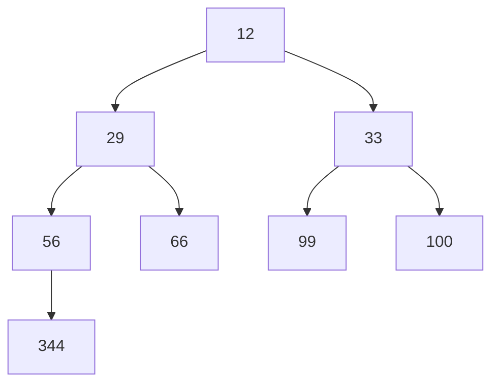

Check: 12 ≤ 29, 33 ✅ · 29 ≤ 56, 66 ✅ · 33 ≤ 99, 100 ✅ · 56 ≤ 344 ✅. **It is a valid min-heap.**

#### Inserting into an existing binary max-heap

```
Insert(A, n, key):
    A[n] = key                       // 1. put it at the end (keeps the tree complete)
    i = n
    while i > 0 and A[(i-1)/2] < A[i]:   // 2. "sift up" / "bubble up"
        swap A[i], A[(i-1)/2]
        i = (i-1)/2
```

**Cost:** the new element travels at most from a leaf to the root, which is the **height of the tree = ⌊log₂ n⌋**. So **insertion is O(log n)** time and **O(1)** extra space. In the best case (the new key is smaller than its parent) it is **O(1)**.

#### Complexity of heap sort

| Phase | Cost |
|---|---|
| Build the heap | **O(n)** (not O(n log n) — most nodes are near the leaves) |
| n − 1 extractions, each with a heapify | **O(n log n)** |
| **Total** | **O(n log n)** in **all** cases |

**Space: O(1)** — in-place. **Stable: No.** **Adaptive: No.**

#### Heap Sort vs Merge Sort

| Point | **Heap Sort** | **Merge Sort** |
|---|---|---|
| Time (all cases) | O(n log n) | O(n log n) |
| **Space** | **O(1)** ✅ in-place | **O(n)** ❌ |
| **Stable** | **No** | **Yes** ✅ |
| Data structure used | **Binary heap** | Recursion + temporary array |
| Cache performance | Poor (jumps around the array) | Better (sequential) |
| Practical speed | Usually **slower** than merge/quick | Faster in practice |
| Best for | Memory-constrained systems; finding top-K; priority queues | Linked lists, external sort, when stability is required |

**Previous Year Question List from this Topic:**

- [(b) Difference between Heap Sort and Merge Sort.](../written-answers/algorithm.md?plain=1#L511)
- [(ক) Heap sort কিভাবে কাজ করে? উদাহরণসহ দেখান।](../written-answers/algorithm.md?plain=1#L748)
- [(b) What is heap sort? Build a heap tree from the following list of numbers: (44, 30, 50, 22, 60, 55, 70, 55).](../written-answers/algorithm.md?plain=1#L909)


---

### Counting Sort, Radix Sort and Bucket Sort

These are **non-comparison** sorts. They can beat the O(n log n) barrier because they never compare two elements — they use the **values themselves** as array indices.

#### Counting Sort

Count how many times each value occurs, then use the counts to place each element directly.

**Time: O(n + k)** where k is the range of the input. **Space: O(n + k)**. **Stable: Yes.**
**Limitation:** only practical when **k is not much larger than n** (sorting ages 0–120 is perfect; sorting arbitrary 32-bit integers is not).

#### Radix Sort

Sort the numbers **digit by digit**, starting from the **least significant digit (LSD)**, using a **stable** sort (usually counting sort) at each digit position.

**Worked example — sort 608, 5, 768, 298, 576, 975, 90, 80**

Write all numbers with three digits: `608, 005, 768, 298, 576, 975, 090, 080`

**Pass 1 — sort by the units digit:**

| Units digit | Numbers |
|---|---|
| 0 | 090, 080 |
| 5 | 005, 975 |
| 6 | 576 |
| 8 | 608, 768, 298 |

Result: `090, 080, 005, 975, 576, 608, 768, 298`

**Pass 2 — sort by the tens digit.** Read the pass-1 output `090, 080, 005, 975, 576, 608, 768, 298` from left to right and drop each number into the bucket of its tens digit (the sort is **stable**, so within a bucket the pass-1 order survives):

| Tens digit | Numbers (in pass-1 order) |
|---|---|
| 0 | 005, 608 |
| 6 | 768 |
| 7 | 975, 576 |
| 8 | 080 |
| 9 | 090, 298 |

Reading the buckets 0, 1, … 9 in order: `005, 608, 768, 975, 576, 080, 090, 298`

**Pass 3 — sort by the hundreds digit:**

| Hundreds digit | Numbers |
|---|---|
| 0 | 005, 080, 090 |
| 2 | 298 |
| 5 | 576 |
| 6 | 608 |
| 7 | 768 |
| 9 | 975 |

**Final sorted: 5, 80, 90, 298, 576, 608, 768, 975.** ✅

**Time: O(d × (n + k))** where d = number of digits and k = the base (10). Since d and k are small constants, this is effectively **O(n)**.
**Space: O(n + k).** **Stable: Yes** (and it *must* be — stability is what makes radix sort work).

#### Bucket Sort

Divide the range into **buckets**, distribute the elements, sort each bucket (usually with insertion sort), and concatenate.
**Time: O(n + k)** on average when the data is **uniformly distributed**; **O(n²)** in the worst case (everything lands in one bucket).

**Previous Year Question List from this Topic:**

- [Sorting the value with radix sort: 608, 5, 768, 298, 576, 975, 90, 80](../written-answers/algorithm.md?plain=1#L805)


---

### Comparison of All Sorting Algorithms

This single table answers a large share of the sorting questions.

| Algorithm | Best | Average | **Worst** | **Space** | **Stable** | In-place | Technique |
|---|---|---|---|---|---|---|---|
| **Bubble Sort** | **O(n)** | O(n²) | O(n²) | O(1) | **Yes** | Yes | Exchange |
| **Selection Sort** | O(n²) | O(n²) | O(n²) | O(1) | No | Yes | Selection |
| **Insertion Sort** | **O(n)** | O(n²) | O(n²) | O(1) | **Yes** | Yes | Insertion |
| **Shell Sort** | O(n log n) | O(n^1.25) | O(n²) | O(1) | No | Yes | Insertion (gapped) |
| **Merge Sort** | O(n log n) | O(n log n) | **O(n log n)** | **O(n)** | **Yes** | No | **Divide & Conquer** |
| **Quick Sort** | O(n log n) | **O(n log n)** | **O(n²)** | O(log n) | No | Yes | **Divide & Conquer** |
| **Heap Sort** | O(n log n) | O(n log n) | **O(n log n)** | **O(1)** | No | Yes | Selection (via heap) |
| **Counting Sort** | O(n+k) | O(n+k) | O(n+k) | O(n+k) | **Yes** | No | Non-comparison |
| **Radix Sort** | O(nk) | O(nk) | O(nk) | O(n+k) | **Yes** | No | Non-comparison |
| **Bucket Sort** | O(n+k) | O(n+k) | O(n²) | O(n) | **Yes** | No | Distribution |

#### Quick answers to the short questions

| Question | Answer |
|---|---|
| **Which sorts use Divide and Conquer?** | **Merge Sort** and **Quick Sort** |
| **Which is the fastest sorting algorithm?** | In **practice, Quick Sort** (best average speed, cache-friendly, in-place). For a **guaranteed** worst case, **Merge Sort** or **Heap Sort** (O(n log n) always). For small-range integers, **Radix/Counting Sort** is fastest of all at O(n) |
| **Which is the slowest?** | **Bubble Sort** |
| **Which needs the fewest swaps?** | **Selection Sort** (≤ n−1 swaps) |
| **Best for nearly sorted data?** | **Insertion Sort** — O(n) |
| **Best for linked lists?** | **Merge Sort** — no random access needed, no extra array |
| **Best when memory is very tight?** | **Heap Sort** — O(n log n) guaranteed with O(1) space |
| **Worst case of Bubble / Quick / Merge?** | O(n²) · **O(n²)** · O(n log n) |
| **Which sorts are stable?** | Bubble, Insertion, Merge, Counting, Radix, Bucket |
| **Which are unstable?** | **Selection, Quick, Heap, Shell** |

#### Four sorting algorithms with examples — a compact answer

*(For "Describe four types of sorting algorithm with example".)*

1. **Bubble Sort** — repeatedly swap adjacent out-of-order pairs. `5 3 8 → 3 5 8`. O(n²).
2. **Selection Sort** — repeatedly pick the minimum and put it in front. `45 72 37 → 37 72 45`. O(n²).
3. **Merge Sort** — divide into halves, sort each, merge. `[3 1][4 2] → [1 3][2 4] → [1 2 3 4]`. O(n log n) always.
4. **Quick Sort** — pick a pivot, partition smaller/larger, recurse. Pivot 4 on `[3 7 1 9] → [3 1] 4 [7 9]`. O(n log n) average, O(n²) worst.

**Previous Year Question List from this Topic:**

- [(a) Algorithm এর Computational Complexity এর মধ্যে পার্থক্য](../written-answers/algorithm.md?plain=1#L28)
- [Write the Best case, worst case and average case time complexity for the following sorting algorithms.](../written-answers/algorithm.md?plain=1#L85)
- [Which short uses divide and conquer technique?](../written-answers/algorithm.md?plain=1#L388)
- [Fastest sorting algorithms?](../written-answers/algorithm.md?plain=1#L396)
- [Bubble sort, Quick sort and Merge sort algorithm এর Worst case complexity নির্ণয় কর।](../written-answers/algorithm.md?plain=1#L405)
- [(a) Compaire and contrast between Quick sort and Merge sort in terms of their time and space complexity.](../written-answers/algorithm.md?plain=1#L492)
- [(b) Difference between Heap Sort and Merge Sort.](../written-answers/algorithm.md?plain=1#L511)
- [Analize and compare the Quick-sort and Merge-sort algorithms in term of their time and space complexity.](../written-answers/algorithm.md?plain=1#L554)
- [Describe four types sorting algorithm with example.](../written-answers/algorithm.md?plain=1#L779)
- [Analyze the following C function and determine its Big O Time Complexity and Space Complexity. Explain your reasoning.](../written-answers/algorithm.md?plain=1#L937)

## Graph Traversal Algorithms (BFS & DFS)

### Graph Traversal — What and Why

**Graph traversal** means visiting **every vertex** of a graph exactly once, in some systematic order. Unlike a tree, a graph can have **cycles** and **multiple paths** to the same node, so every traversal algorithm must keep a **`visited[]` array** to avoid going round in circles forever.

There are exactly **two fundamental traversal strategies**:

| Strategy | Idea | Data structure |
|---|---|---|
| **BFS — Breadth-First Search** | Explore **level by level** — all neighbours first, then their neighbours | **Queue** (FIFO) |
| **DFS — Depth-First Search** | Go **as deep as possible** along one path, then backtrack | **Stack** (LIFO) — or recursion |

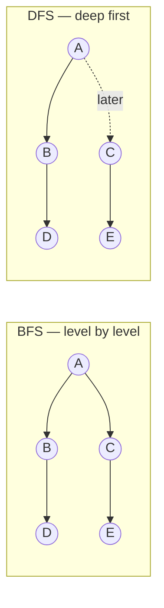

**Both take O(V + E) time** with an adjacency list — every vertex is visited once and every edge is examined once.

**Previous Year Question List from this Topic:**

- [What are the BFS and DFS value for the Binary tree from the following figure?](../written-answers/algorithm.md?plain=1#L1051)
- [What are BFS and DFS for Binary Tree?](../written-answers/algorithm.md?plain=1#L1077)
- [Follow alphabetical ordering while considering the order of nodes traversed. (Find BFS and DFS)](../written-answers/algorithm.md?plain=1#L1227)
- [Draw BFS and DFS tree starting node A-](../written-answers/algorithm.md?plain=1#L1397)


---

### Breadth-First Search (BFS)

**BFS** starts at a source vertex and visits **all vertices at distance 1**, then **all at distance 2**, and so on — expanding outwards in "rings". It uses a **queue**.

#### Algorithm

```
BFS(graph, start):
    create an empty queue Q
    mark start as visited
    Q.enqueue(start)

    while Q is not empty:
        u = Q.dequeue()
        print u                          // visit u
        for each neighbour v of u:       // in alphabetical / index order
            if v is not visited:
                mark v as visited
                Q.enqueue(v)
```

#### Worked example

Graph (adjacency, alphabetical order):

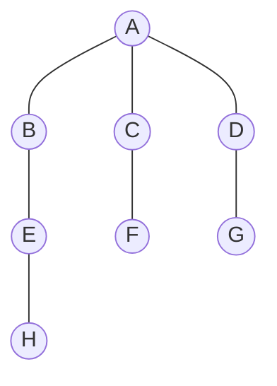

| Step | Dequeue | Print | Enqueue | Queue after |
|---|---|---|---|---|
| 1 | — | — | A | `A` |
| 2 | A | **A** | B, C, D | `B C D` |
| 3 | B | **B** | E | `C D E` |
| 4 | C | **C** | F | `D E F` |
| 5 | D | **D** | G | `E F G` |
| 6 | E | **E** | H | `F G H` |
| 7 | F | **F** | — | `G H` |
| 8 | G | **G** | — | `H` |
| 9 | H | **H** | — | *(empty)* |

**BFS order: A, B, C, D, E, F, G, H** — notice it is exactly **level-order**.

#### The BFS tree

The edges actually used to first reach each vertex form the **BFS tree**:


#### Complexity and properties

| | Adjacency list | Adjacency matrix |
|---|---|---|
| **Time** | **O(V + E)** | O(V²) |
| **Space** | **O(V)** — the queue plus the visited array | O(V) |

**Key property:** in an **unweighted** graph, BFS finds the **shortest path (fewest edges)** from the source to every other vertex. This is BFS's single most important use.

#### Applications of BFS

1. **Shortest path in an unweighted graph** (number of hops).
2. **Finding connected components**.
3. **Social networks** — "people within 2 connections of you".
4. **Web crawlers** — crawl pages level by level from a seed.
5. **GPS / navigation** on unweighted maps.
6. **Peer-to-peer networks** (finding nearby nodes), **broadcasting** in networks.
7. **Bipartite-graph checking** (2-colouring).
8. **Cycle detection** in an undirected graph.
9. **Solving puzzles** with the fewest moves (Rubik's cube, word ladder, 8-puzzle).
10. **Garbage collection** (Cheney's algorithm).

**Previous Year Question List from this Topic:**

- [What are the BFS and DFS value for the Binary tree from the following figure?](../written-answers/algorithm.md?plain=1#L1051)
- [What are BFS and DFS for Binary Tree?](../written-answers/algorithm.md?plain=1#L1077)
- [অথবা, (ক) BFS অ্যালগরিদম উদাহরণসহ ব্যাখ্যা করুন।](../written-answers/algorithm.md?plain=1#L1124)
- [Follow alphabetical ordering while considering the order of nodes traversed. (Find BFS and DFS)](../written-answers/algorithm.md?plain=1#L1227)
- [Draw BFS and DFS tree starting node A-](../written-answers/algorithm.md?plain=1#L1397)
- [Run the BFS algorithm from vertex 1 and draw the BFS tree.](../written-answers/algorithm.md?plain=1#L1473)


---

### Depth-First Search (DFS)

**DFS** starts at a vertex, goes as **deep as it can along one branch**, and only when it gets stuck does it **backtrack** and try another branch. It uses a **stack** — either explicitly or through **recursion**.

#### Algorithm (recursive — the natural form)

```
DFS(graph, u):
    mark u as visited
    print u                              // visit u
    for each neighbour v of u:
        if v is not visited:
            DFS(graph, v)                // go deeper
```

#### Algorithm (iterative, with an explicit stack)

```
DFS_iterative(graph, start):
    create an empty stack S
    S.push(start)
    while S is not empty:
        u = S.pop()
        if u is not visited:
            mark u as visited
            print u
            for each neighbour v of u in REVERSE order:
                if v is not visited:
                    S.push(v)
```

#### Worked example on the same graph

Starting at **A**, taking neighbours alphabetically:

| Step | At | Action | Stack / path |
|---|---|---|---|
| 1 | A | visit A, go to B | A |
| 2 | B | visit B, go to E | A → B |
| 3 | E | visit E, go to H | A → B → E |
| 4 | H | visit H — **dead end**, backtrack | A → B → E → H |
| 5 | — | backtrack to A (B and E have no unvisited neighbours) | A |
| 6 | C | visit C, go to F | A → C |
| 7 | F | visit F — dead end, backtrack | A → C → F |
| 8 | D | visit D, go to G | A → D |
| 9 | G | visit G — dead end, finished | A → D → G |

**DFS order: A, B, E, H, C, F, D, G.**

#### The DFS tree


#### Complexity

| | Adjacency list | Adjacency matrix |
|---|---|---|
| **Time** | **O(V + E)** | O(V²) |
| **Space** | **O(V)** — recursion stack (O(h) where h = the longest path) | O(V) |

#### Limitations of DFS — and how to fix them

*(A directly asked question.)*

| Limitation | Explanation | Solution |
|---|---|---|
| **1. Not guaranteed to find the shortest path** | It dives down the first branch, which may be a long detour | Use **BFS** for unweighted graphs, **Dijkstra** for weighted ones |
| **2. Can get stuck in an infinite path** | On an infinite or very deep state space, plain DFS may never come back | **Depth-Limited Search (DLS)** or **Iterative Deepening DFS (IDDFS)** |
| **3. Can loop forever on a cyclic graph** | It revisits the same vertices endlessly | Maintain a **`visited[]` array** (or a closed set) |
| **4. Stack overflow on deep graphs** | Recursion depth can exceed the system stack | Use the **iterative version with an explicit stack** |
| **5. Not complete** (in infinite spaces) | It may descend forever and never reach the goal | **IDDFS** — it is complete *and* keeps DFS's low memory |
| **6. Not optimal** | The first solution found may be far from the best | IDDFS, or **A\*** with a heuristic |

#### Applications of DFS

1. **Cycle detection** in directed and undirected graphs.
2. **Topological sorting** of a DAG.
3. **Finding connected components** and **strongly connected components** (Kosaraju, Tarjan).
4. **Path finding** (any path, not the shortest).
5. **Maze generation and maze solving**.
6. **Finding bridges and articulation points** (critical links in a network).
7. **Backtracking problems** — N-Queens, Sudoku, subset generation.
8. **Detecting bipartiteness**.

**Previous Year Question List from this Topic:**

- [(খ) Node A থেকে শুরু করে নিম্নোক্ত গ্রাফটির DFS Traversal লিখুন।](../written-answers/algorithm.md?plain=1#L1161)
- [(b) What are the main limitation of Depth First Search (DFS)? Is there any way to solve these issues?](../written-answers/algorithm.md?plain=1#L1200)
- [DFS complexity (Approximate)](../written-answers/algorithm.md?plain=1#L1218)
- [Follow alphabetical ordering while considering the order of nodes traversed. (Find BFS and DFS)](../written-answers/algorithm.md?plain=1#L1227)
- [Draw BFS and DFS tree starting node A-](../written-answers/algorithm.md?plain=1#L1397)


---

### BFS vs DFS — Comparison

| Point | **BFS (Breadth-First Search)** | **DFS (Depth-First Search)** |
|---|---|---|
| **Exploration order** | **Level by level** (nearest first) | **Deepest first**, then backtrack |
| **Data structure** | **Queue (FIFO)** | **Stack (LIFO)** / recursion |
| **Shortest path (unweighted)** | ✅ **Guaranteed** | ❌ Not guaranteed |
| **Time complexity** | O(V + E) | O(V + E) |
| **Space complexity** | **O(V)** — can hold a whole level; worst case **O(b^d)** | **O(h)** — only the current path; worst case **O(bm)** — usually **much less** |
| **Memory usage** | **High** (stores all nodes of a level) | **Low** |
| **Complete?** | Yes | No (may go down an infinite branch) |
| **Optimal?** | Yes (equal edge weights) | No |
| **Good when** | The goal is **near the source**; you need the shortest path | The goal is **deep**; memory is limited; you must explore all paths |
| **Bad when** | The tree is very wide (memory blows up) | The tree is very deep or infinite |
| **Implementation** | Iterative (queue) | Recursive (naturally) |
| **Typical uses** | Shortest path, social networks, web crawling, broadcasting, bipartite check | Topological sort, cycle detection, SCC, backtracking, maze solving, bridges |

#### "Which one is faster? Which one needs more memory?"

- **Speed:** on paper both are **O(V + E)** — neither is asymptotically faster. In practice, whichever reaches the goal first wins: **BFS is faster if the target is shallow**, **DFS is faster if the target is deep**. DFS also has lower constant overhead because recursion is cheaper than queue operations.
- **Memory:** **BFS needs far more memory.** BFS must store an entire level of the tree — up to **O(b^d)** nodes — while DFS only stores the current root-to-node path, **O(b·m)**. For a branching factor of 10 and depth 10, BFS may need to hold 10¹⁰ nodes while DFS holds about 100.

#### "Why is DFS better than BFS?"

DFS is preferred when:
1. **Memory is the constraint** — O(depth) instead of O(breadth^depth).
2. The **solution lies deep** in the tree.
3. You must **explore every path** (backtracking problems, puzzles).
4. The problem is naturally recursive — topological sort, SCC, articulation points.
5. Implementation is simpler (a few lines of recursion).

*(But BFS is better when the shortest path is required — so "better" always depends on the problem.)*

**Previous Year Question List from this Topic:**

- [Why DFS better than BFS, Explain?](../written-answers/algorithm.md?plain=1#L999)
- [(খ) BFS ও DFS এর পার্থক্য লিখুন।](../written-answers/algorithm.md?plain=1#L1106)
- [Difference between depth first and breadth first search.](../written-answers/algorithm.md?plain=1#L1185)
- [(c) Between Depths first search (DFS) and Breath first search (BFS). Which one is faster? Which one requires more memory?](../written-answers/algorithm.md?plain=1#L1430)
- [True false (DFS/ Directed graph related) (হুবহু প্রশ্ন সংগ্রহ করা সম্ভব হয়নি)](../written-answers/algorithm.md?plain=1#L1304)


---

### Cycle Detection in a Graph

#### Detecting a cycle in a **directed** graph — DFS with three colours

The key idea: a cycle exists if DFS ever reaches a vertex that is **currently on the recursion stack** (a **back edge**). Simply being "visited" is not enough — it must be visited **and still in progress**.

```
DetectCycleDirected(graph):
    visited[]  = all false
    inStack[]  = all false             // currently in the recursion stack
    for each vertex v:
        if not visited[v]:
            if DFSUtil(v) == true:
                return "Cycle exists"
    return "No cycle"

DFSUtil(u):
    visited[u] = true
    inStack[u] = true
    for each neighbour v of u:
        if not visited[v]:
            if DFSUtil(v) == true:
                return true
        else if inStack[v] == true:    // BACK EDGE → cycle found
            return true
    inStack[u] = false                 // done with u, remove from the stack
    return false
```

**Time: O(V + E). Space: O(V).**

**The three-colour way of describing the same thing:**

| Colour | Meaning |
|---|---|
| **White** | Not visited yet |
| **Grey** | Visited, still being processed (on the recursion stack) |
| **Black** | Completely finished |

> **A cycle exists if and only if DFS finds an edge leading to a GREY vertex.**

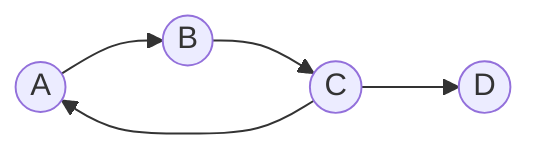
Here DFS goes A → B → C, and from C it finds an edge back to **A**, which is still grey (still on the stack) → **cycle A → B → C → A**.

#### Alternative — Kahn's algorithm (BFS based)

1. Compute the **in-degree** of every vertex.
2. Put all vertices with in-degree 0 into a queue.
3. Repeatedly dequeue a vertex, add it to the output, and decrease the in-degree of each of its neighbours; enqueue any that drop to 0.
4. **If the number of vertices output is less than V, the graph has a cycle.**

#### Detecting a cycle in an **undirected** graph

Here a "back edge" to the **parent** does not count, because the same edge is traversed in both directions.

```
DFSUtil(u, parent):
    visited[u] = true
    for each neighbour v of u:
        if not visited[v]:
            if DFSUtil(v, u) == true: return true
        else if v != parent:          // visited, and NOT the node we came from
            return true               // → cycle
    return false
```

*(Union-Find / Disjoint Set is the other standard method for undirected graphs, in almost O(E) time.)*

#### How to detect a **negative-weight cycle**

Neither BFS nor DFS can do this — you need **Bellman-Ford**. Run it for **V − 1** iterations to relax all edges, then do **one extra iteration**: if any edge can still be relaxed (i.e. some distance still decreases), a **negative-weight cycle** exists. *(See the shortest-path section for details.)*

**Previous Year Question List from this Topic:**

- [Write an Algorithm to detect a cycle in a directed graph.](../written-answers/algorithm.md?plain=1#L1014)
- [True false (DFS/ Directed graph related) (হুবহু প্রশ্ন সংগ্রহ করা সম্ভব হয়নি)](../written-answers/algorithm.md?plain=1#L1304)


---

### Topological Sorting

**Topological sorting** of a **Directed Acyclic Graph (DAG)** is a **linear ordering of its vertices** such that for **every directed edge u → v, vertex u comes before v** in the ordering.

Think of it as: *"put the tasks in an order such that every prerequisite comes before the task that needs it."*

> **Two hard rules:**
> 1. It exists **only for a DAG** — a graph with a **cycle has no topological order** (a cycle means A must come before B and B before A, which is impossible).
> 2. It is **not unique** — a graph usually has several valid topological orders.

#### Example — university course prerequisites

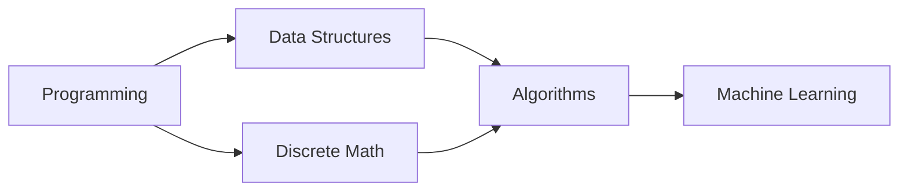

Valid topological orders include:
`Programming → Discrete Math → Data Structures → Algorithms → Machine Learning`
`Programming → Data Structures → Discrete Math → Algorithms → Machine Learning`

#### Method 1 — DFS based

```
TopologicalSort(graph):
    visited[] = all false
    stack S = empty
    for each vertex v:
        if not visited[v]:
            DFSUtil(v, S)
    print S in reverse order (pop everything)

DFSUtil(u, S):
    visited[u] = true
    for each neighbour v of u:
        if not visited[v]:
            DFSUtil(v, S)
    S.push(u)            // push AFTER all descendants are done
```

**The key insight:** a vertex is pushed onto the stack **only after every vertex reachable from it has been pushed**. So it ends up *below* them in the stack, and popping gives the correct order.

#### Method 2 — Kahn's algorithm (BFS based, in-degree)

```
Kahn(graph):
    compute in-degree of every vertex
    Q = all vertices with in-degree 0
    count = 0;  result = []
    while Q is not empty:
        u = Q.dequeue()
        result.append(u);  count++
        for each neighbour v of u:
            in-degree[v]--
            if in-degree[v] == 0:
                Q.enqueue(v)
    if count != V:  return "Cycle exists — no topological order"
    return result
```

**Worked trace** on the course graph: in-degrees are Programming 0, Discrete Math 1, Data Structures 1, Algorithms 2, ML 1.
Queue starts with `Programming` → output it → DS and DM drop to 0 → queue `DS, DM` → output DS → Algorithms drops to 1 → output DM → Algorithms drops to 0 → output Algorithms → ML drops to 0 → output ML.
**Result: Programming, Data Structures, Discrete Math, Algorithms, Machine Learning.** Count = 5 = V ✅ no cycle.

| Point | DFS method | Kahn's (BFS) method |
|---|---|---|
| Data structure | Stack + recursion | Queue + in-degree array |
| Detects a cycle | Needs extra colour tracking | **Automatically** (count ≠ V) |
| Time | O(V + E) | O(V + E) |
| Space | O(V) | O(V) |

#### Applications of topological sorting

- **Course prerequisite** scheduling.
- **Build systems** (`make`, Maven, npm) — compile dependencies in the right order.
- **Task / project scheduling** (PERT, CPM).
- **Spreadsheet formula** evaluation order.
- **Package/dependency resolution** (apt, pip).
- **Instruction scheduling** in compilers.
- **Deadlock detection** in operating systems.

**Previous Year Question List from this Topic:**

- [Topological sorting for Directed Acyclic Graph (DAG) is a linear ordering of vertices such that for every directed edge u v, vertex u comes before v in the orde…](../written-answers/algorithm.md?plain=1#L1252)


---

### Estimating Search Time and Memory from the Branching Factor

Exam questions sometimes give a **branching factor b** and a **goal depth d** and ask for the time and memory.

**The standard formulas** for a tree-shaped search space:

| | BFS | DFS |
|---|---|---|
| **Nodes generated (time)** | **O(b^d)** | O(b^m) |
| **Nodes stored (space)** | **O(b^d)** | **O(b·m)** |

where **b** = branching factor, **d** = depth of the shallowest goal, **m** = maximum depth.

*(The exact node count for a full tree down to level d is 1 + b + b² + … + b^d = (b^(d+1) − 1)/(b − 1), but the dominant term b^d is what matters.)*

#### Worked example — b = 4, goal at level d = 5, CPU explores 10,000 nodes/second

**Number of nodes** (counting the root as level 0, down to level 5):

> 1 + 4 + 4² + 4³ + 4⁴ + 4⁵ = 1 + 4 + 16 + 64 + 256 + 1024 = **1,365 nodes**

*(If the question means only the last level, 4⁵ = **1,024** nodes; if it means up to and including level 5 as above, 1,365. State your assumption.)*

**Time required**

> Time = total nodes ÷ nodes per second = 1,365 ÷ 10,000 = **0.1365 seconds** ≈ **137 milliseconds**

**Memory required**

BFS must hold the **entire frontier**, which at worst is the deepest level:

> Space = O(b^d) = 4⁵ = **1,024 nodes** in the queue

If each node needs, say, 100 bytes, memory ≈ 1,024 × 100 = **102,400 bytes ≈ 100 KB**.

**Compare with DFS:** DFS would store only **b × m = 4 × 5 = 20** nodes — about **50 times less memory** for the same search. This is the concrete illustration of why BFS's memory usage is its fatal weakness.

#### Complexity summary of the search strategies

| Algorithm | Time | Space | Complete | Optimal |
|---|---|---|---|---|
| **BFS** | O(b^d) | **O(b^d)** | Yes | Yes (unit costs) |
| **DFS** | O(b^m) | **O(bm)** | No | No |
| **IDDFS** | O(b^d) | **O(bd)** | Yes | Yes (unit costs) |
| **Bidirectional BFS** | **O(b^(d/2))** | O(b^(d/2)) | Yes | Yes |

**Previous Year Question List from this Topic:**

- [Find the time and space complexity of BFS which has branch 4 branch and the target at level 5? If cpu can explore 10000 nodes per second find the time required…](../written-answers/algorithm.md?plain=1#L1444)
- [DFS complexity (Approximate)](../written-answers/algorithm.md?plain=1#L1218)
- [(c) Between Depths first search (DFS) and Breath first search (BFS). Which one is faster? Which one requires more memory?](../written-answers/algorithm.md?plain=1#L1430)

## Graph Algorithms (Shortest Path & Minimum Spanning Tree)

### The Shortest Path Problem — Overview

The **shortest path problem** asks for the path between two vertices of a **weighted graph** whose **total edge weight is minimum**. "Weight" can be distance, time, cost, bandwidth or power loss.

#### Three flavours of the problem

| Type | Question | Algorithm |
|---|---|---|
| **Single-source shortest path** | Shortest path from **one** source to **every** other vertex | **Dijkstra** (non-negative weights) · **Bellman-Ford** (allows negative weights) |
| **All-pairs shortest path** | Shortest path between **every pair** of vertices | **Floyd-Warshall**, Johnson's |
| **Unweighted shortest path** | Fewest **number of edges** | **BFS** |

#### Which algorithm to choose

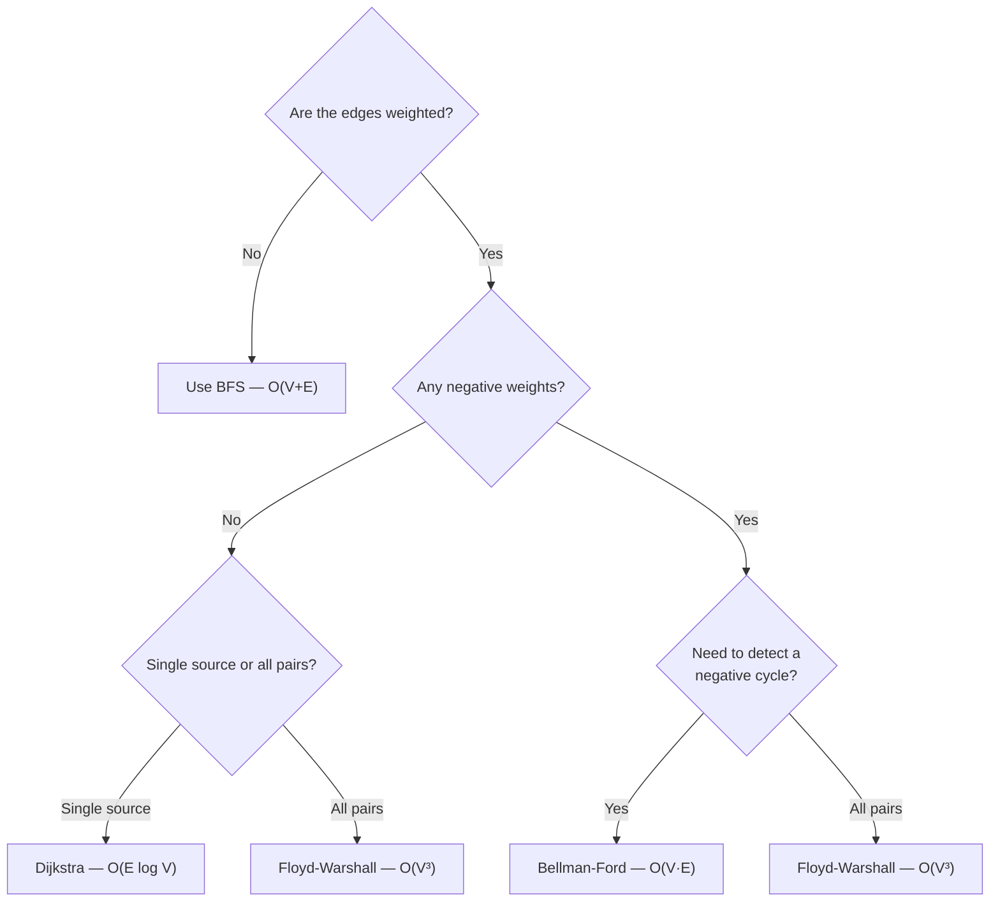

> **Exam scenario:** *"A pathfinding robot is searching for the shortest path. Which algorithm would you select and why?"*
> **Answer: Dijkstra's algorithm** (or **A\*** if a heuristic such as straight-line distance is available). Reason: the robot's map has **non-negative** weights (distance, time, energy — none can be negative), it needs the shortest path from **one source** (its current position), and Dijkstra is **guaranteed optimal** with a good running time of **O(E log V)** using a min-priority queue. If the map is a grid where the straight-line distance to the target is known, **A\*** is better still, because the heuristic guides the search and it expands far fewer nodes while remaining optimal (given an admissible heuristic).

**Previous Year Question List from this Topic:**

- [A pathfinding robot is searching for shortest path. Which algorithm you will select? Why? Write the steps how your chosen algorithm works.](../written-answers/algorithm.md?plain=1#L1508)
- [Shortest Path Algorithm.](../written-answers/algorithm.md?plain=1#L1779)
- [নিচের Graph থেকে যে কোন একটি algorithm ব্যবহার করে sortest path বের করার পদ্ধতি ব্যাখ্যা কর।](../written-answers/algorithm.md?plain=1#L1811)
- [Several substations of SGFL Company exist in different places of the city. You have to travel from one substation to another. Write an algorithm to travel using…](../written-answers/algorithm.md?plain=1#L1746)


---

### Dijkstra's Algorithm (Single-Source Shortest Path)

**Dijkstra's algorithm** finds the shortest path from a **single source** to all other vertices in a graph with **non-negative** edge weights. It is a **greedy** algorithm.

#### The core idea

Keep a tentative distance for every vertex. Repeatedly pick the **unvisited vertex with the smallest tentative distance**, mark it **finalised**, and **relax** all its outgoing edges.

> **Relaxation:** `if dist[u] + weight(u,v) < dist[v] then dist[v] = dist[u] + weight(u,v)`
> *(In words: "is going through u a cheaper way to reach v than what I knew before?")*

#### Algorithm

```
Dijkstra(graph, source):
    for each vertex v:
        dist[v] = INFINITY
        parent[v] = NULL
    dist[source] = 0
    PQ = min-priority queue of all vertices keyed by dist

    while PQ is not empty:
        u = PQ.extract_min()            // smallest tentative distance
        mark u as visited (finalised)
        for each neighbour v of u:
            if not visited[v] and dist[u] + w(u,v) < dist[v]:
                dist[v]   = dist[u] + w(u,v)      // RELAX
                parent[v] = u
                PQ.decrease_key(v, dist[v])
    return dist[], parent[]
```

#### Worked example

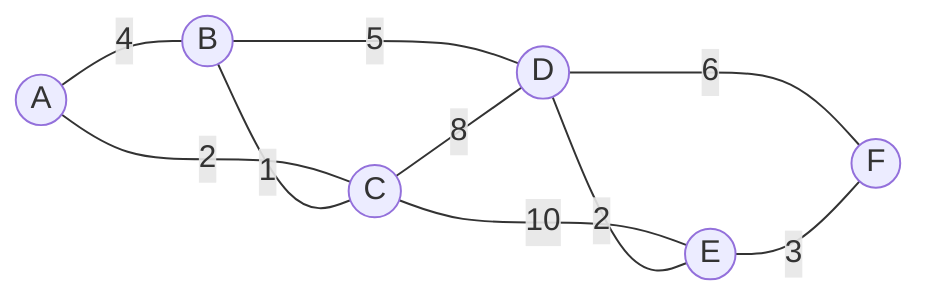

Source = **A**. Start: `A = 0`, everything else `∞`.

| Step | Visit (min dist) | Relaxations performed | A | B | C | D | E | F |
|---|---|---|---|---|---|---|---|---|
| 0 | — | initial | **0** | ∞ | ∞ | ∞ | ∞ | ∞ |
| 1 | **A (0)** | B = 0+4 = 4 · C = 0+2 = 2 | 0 | 4 | **2** | ∞ | ∞ | ∞ |
| 2 | **C (2)** | B = min(4, 2+1) = **3** · D = 2+8 = 10 · E = 2+10 = 12 | 0 | **3** | 2 | 10 | 12 | ∞ |
| 3 | **B (3)** | D = min(10, 3+5) = **8** | 0 | 3 | 2 | **8** | 12 | ∞ |
| 4 | **D (8)** | E = min(12, 8+2) = **10** · F = 8+6 = 14 | 0 | 3 | 2 | 8 | **10** | 14 |
| 5 | **E (10)** | F = min(14, 10+3) = **13** | 0 | 3 | 2 | 8 | 10 | **13** |
| 6 | **F (13)** | — | 0 | 3 | 2 | 8 | 10 | 13 |

**Final shortest distances from A:** A = 0, **B = 3, C = 2, D = 8, E = 10, F = 13**

**Shortest path to F** (follow the parents backwards): F ← E ← D ← B ← C ← A
> **A → C → B → D → E → F**, total cost = 2 + 1 + 5 + 2 + 3 = **13** ✅

#### Complexity

| Implementation | Time |
|---|---|
| Adjacency matrix + linear search for the minimum | **O(V²)** |
| Adjacency list + **binary min-heap** | **O((V + E) log V)** ≈ **O(E log V)** |
| Adjacency list + Fibonacci heap | O(E + V log V) |

**Space: O(V)** for the distance, parent and visited arrays.

#### Why Dijkstra fails on negative weights

Dijkstra's greedy step assumes that **once a vertex is finalised, its distance can never improve** — which is only true if every edge adds a non-negative amount. With a negative edge, a longer-looking path may later turn out cheaper, and the finalised value is already wrong.

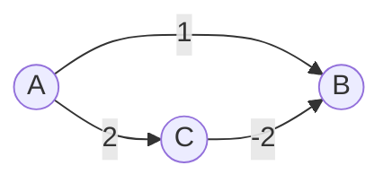

**Trace:** from A, Dijkstra sets `B = 1` and `C = 2`. It then extracts the smallest, **B = 1**, and **finalises** it. Only later does it extract C (= 2) and discover the edge C → B of weight −2, which would give `B = 2 + (−2) = 0`.

But B is already finalised, so Dijkstra never updates it and **reports B = 1**, while the true shortest distance is **A → C → B = 2 − 2 = 0**.

**Conclusion: use Bellman-Ford whenever negative edges are possible.**

**Previous Year Question List from this Topic:**

- [A pathfinding robot is searching for shortest path. Which algorithm you will select? Why? Write the steps how your chosen algorithm works.](../written-answers/algorithm.md?plain=1#L1508)
- [Shortest path বের করা : Dijkstra's Algorithm](../written-answers/algorithm.md?plain=1#L1553)
- [Find the shortest path from following graph starts from:](../written-answers/algorithm.md?plain=1#L1582)
- [Shortest path algorithm (Djikstra's algorithm)](../written-answers/algorithm.md?plain=1#L1659)
- [Shortest Path Algorithm.](../written-answers/algorithm.md?plain=1#L1779)
- [নিচের Graph থেকে যে কোন একটি algorithm ব্যবহার করে sortest path বের করার পদ্ধতি ব্যাখ্যা কর।](../written-answers/algorithm.md?plain=1#L1811)
- [S1, S2, S3, S4, S5 are five nodes and a value on lines denotes the cost to transmit power. (i) Draw a graph to find the shortest path to transmit power. (ii) Ca…](../written-answers/algorithm.md?plain=1#L1833)


---

### Bellman-Ford Algorithm and Negative Cycle Detection

**Bellman-Ford** also solves the single-source shortest path problem, but it **works with negative edge weights** and can **detect negative-weight cycles**. It uses **dynamic programming** rather than greed.

#### The core idea

A shortest path in a graph with V vertices can contain **at most V − 1 edges** (any more and it would repeat a vertex, i.e. contain a cycle). So: **relax every edge V − 1 times**, and all shortest distances are guaranteed to be correct.

#### Algorithm

```
BellmanFord(graph, source):
    for each vertex v:  dist[v] = INFINITY
    dist[source] = 0

    // Phase 1: relax all edges V-1 times
    repeat (V - 1) times:
        for each edge (u, v, w) in the graph:
            if dist[u] != INFINITY and dist[u] + w < dist[v]:
                dist[v] = dist[u] + w

    // Phase 2: one EXTRA pass to detect a negative cycle
    for each edge (u, v, w) in the graph:
        if dist[u] != INFINITY and dist[u] + w < dist[v]:
            return "NEGATIVE WEIGHT CYCLE DETECTED"

    return dist[]
```

#### How the negative cycle is detected — the key logic

*(A directly asked question: "How do you determine whether a weighted graph has a negative cycle?" and "How do you find the single-source shortest path when there is a negative weighted cycle?")*

After V − 1 rounds of relaxation, **every** shortest distance must be final — because no simple path can be longer than V − 1 edges. Therefore:

> **If one more relaxation pass can still reduce any distance, that reduction can only have come from going around a cycle whose total weight is negative.**

A negative cycle has no "shortest path" at all: you can loop round it again and again, driving the cost to **−∞**. So the correct answer to *"find the shortest path when a negative cycle exists"* is:

1. **Run Bellman-Ford.**
2. If the extra (V-th) pass changes any distance → **report that a negative cycle exists** and that **no shortest path is defined** for the vertices it can reach.
3. To **identify which vertices** are affected: mark every vertex updated in the V-th pass, then run a BFS/DFS from them — everything reachable is "at −∞".
4. To **print the cycle itself:** remember the parent pointer of a vertex updated in the V-th pass, walk back V times to land guaranteed inside the cycle, then follow the parents until you return to that vertex.

**Worked check:** a cycle A → B (weight 1), B → C (weight −3), C → A (weight 1) has total weight 1 − 3 + 1 = **−1 < 0** → negative cycle. Each loop reduces the cost by 1 forever.

#### Complexity

| | |
|---|---|
| **Time** | **O(V × E)** — (V−1) passes × E edges |
| **Space** | O(V) |

*(SPFA / the queue-based optimisation improves the average case but not the worst case.)*

#### Dijkstra vs Bellman-Ford

| Point | **Dijkstra** | **Bellman-Ford** |
|---|---|---|
| Technique | **Greedy** | **Dynamic Programming** |
| Negative edges | ❌ **Not allowed** | ✅ **Allowed** |
| Negative cycle detection | ❌ No | ✅ **Yes** |
| Time complexity | **O(E log V)** — faster | **O(V·E)** — slower |
| Graph type | Directed & undirected, non-negative | **Directed** (undirected negative edges form an instant cycle) |
| Works on | Each vertex finalised once | Each edge relaxed V−1 times |
| Distributed / routing use | Link-state (OSPF) | **Distance-vector (RIP)** |
| Best when | All weights are non-negative | Negative weights are possible |

#### Floyd-Warshall (all-pairs shortest path)

A three-nested-loop dynamic-programming algorithm that finds the shortest path between **every pair** of vertices:

```
for k = 1 to V:                        // k = the intermediate vertex allowed
    for i = 1 to V:
        for j = 1 to V:
            if dist[i][k] + dist[k][j] < dist[i][j]:
                dist[i][j] = dist[i][k] + dist[k][j]
```

**Time: O(V³). Space: O(V²).** It handles negative edges, and a **negative value on the diagonal (dist[i][i] < 0) means a negative cycle**.

**Previous Year Question List from this Topic:**

- [How to find single source shortest path from negative weighted cycle. Justify and how you find it is negative weighted graph.](../written-answers/algorithm.md?plain=1#L1633)
- [How to Determine the weighted graph has negative cycle?](../written-answers/algorithm.md?plain=1#L1794)


---

### Minimum Spanning Tree (MST) — Concept

#### Spanning tree

A **spanning tree** of a connected, undirected graph is a **subgraph that**:
1. includes **all V vertices**,
2. is **connected**, and
3. contains **no cycle** — so it has exactly **V − 1 edges**.

#### Minimum Spanning Tree

A **Minimum Spanning Tree (MST)** is the spanning tree whose **total edge weight is the smallest** among all possible spanning trees.

> *"Connect every city with cable, using the least total length of cable, and without any redundant loop."*

**Key properties**
- An MST always has exactly **V − 1 edges**.
- It contains **no cycles**.
- An MST is **not necessarily unique** — if several edges share the same weight, several MSTs may exist with the same total cost.
- If **all edge weights are distinct**, the MST **is unique**.
- **Cut property:** for any cut of the graph, the **minimum-weight edge crossing the cut** belongs to some MST. This is the theorem both algorithms rely on.
- **Cycle property:** the **maximum-weight edge of any cycle** can never be in the MST.

#### Applications

- **Network design** — laying telephone, electrical, fibre or water lines at minimum cost.
- **Circuit design** — minimising wire length on a PCB.
- **Cluster analysis** — single-linkage clustering is essentially an MST.
- **Image segmentation**, **handwriting recognition**.
- **Approximation algorithms** for the Travelling Salesman Problem.
- **Power grid / substation connection** planning.

**Previous Year Question List from this Topic:**

- [Find the minimum spanning tree:](../written-answers/algorithm.md?plain=1#L1611)
- [Several substations of SGFL Company exist in different places of the city. You have to travel from one substation to another. Write an algorithm to travel using…](../written-answers/algorithm.md?plain=1#L1746)


---

### Kruskal's Algorithm

**Kruskal's algorithm** builds the MST by repeatedly adding the **globally cheapest remaining edge that does not create a cycle**. It is **edge-based** and **greedy**.

#### Algorithm

```
Kruskal(graph):
    MST = empty set
    sort ALL edges in non-decreasing order of weight
    make a disjoint set (Union-Find) for each vertex

    for each edge (u, v, w) in sorted order:
        if Find(u) != Find(v):          // they are in different components → no cycle
            MST.add(edge)
            Union(u, v)
        if MST has V-1 edges:  break
    return MST
```

The **Union-Find (Disjoint Set Union, DSU)** structure is what makes the cycle check fast — nearly **O(1)** per query with path compression and union by rank.

#### Worked example

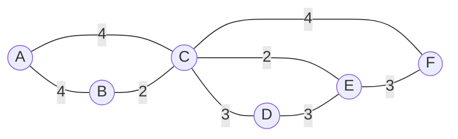

**Step 1 — sort all edges by weight:**

| Edge | Weight |
|---|---|
| B–C | 2 |
| C–E | 2 |
| C–D | 3 |
| D–E | 3 |
| E–F | 3 |
| A–B | 4 |
| A–C | 4 |
| C–F | 4 |

**Step 2 — add edges one by one, skipping any that would form a cycle:**

| # | Edge | Weight | Creates a cycle? | Action | Components so far |
|---|---|---|---|---|---|
| 1 | **B–C** | 2 | No | ✅ **Add** | {B,C} {A} {D} {E} {F} |
| 2 | **C–E** | 2 | No | ✅ **Add** | {B,C,E} {A} {D} {F} |
| 3 | **C–D** | 3 | No | ✅ **Add** | {B,C,D,E} {A} {F} |
| 4 | D–E | 3 | **Yes** (D and E are already connected) | ❌ **Reject** | — |
| 5 | **E–F** | 3 | No | ✅ **Add** | {B,C,D,E,F} {A} |
| 6 | **A–B** | 4 | No | ✅ **Add** | {A,B,C,D,E,F} — **5 edges, stop** |

**Step 3 — the MST:**

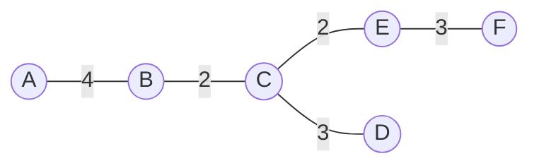

> **Total cost of the MST = 4 + 2 + 2 + 3 + 3 = 14**, using exactly **V − 1 = 5** edges. ✅

#### Complexity

| Step | Cost |
|---|---|
| Sorting the edges | **O(E log E)** — the dominant term |
| V Make-Set + E Find/Union operations | O(E α(V)) ≈ O(E) |
| **Total** | **O(E log E) = O(E log V)** *(since E ≤ V², log E ≤ 2 log V)* |

**Space: O(V + E).**

**Previous Year Question List from this Topic:**

- [(a) Apply the Kruskal's algorithm for the following graph to find out the cost of the minimum spanning Tree (MST).](../written-answers/algorithm.md?plain=1#L1529)
- [Find the minimum spanning tree:](../written-answers/algorithm.md?plain=1#L1611)
- [Find the Minimum Spanning Tree of the following graph using Kruskal's algorithm.](../written-answers/algorithm.md?plain=1#L1680)
- [Find out minimum spanning tree from a given graph using krushkal algorithm.](../written-answers/algorithm.md?plain=1#L1705)
- [Consider the following graph: Now find the minimum spanning tree using Kruskal's algorithm.](../written-answers/algorithm.md?plain=1#L1724)
- [(a) Apply the Krushkal's algorithm for the following graph to find out the cost of the Minimum Spanning Tree (MST).](../written-answers/algorithm.md?plain=1#L3376)


---

### Prim's Algorithm and Kruskal vs Prim

**Prim's algorithm** grows the MST from **one starting vertex**, repeatedly adding the **cheapest edge that connects a vertex already in the tree to a vertex outside it**. It is **vertex-based**.

#### Algorithm

```
Prim(graph, start):
    key[v]    = INFINITY for all v;   key[start] = 0
    parent[v] = NULL for all v
    inMST[v]  = false for all v
    PQ = min-priority queue of all vertices keyed by key[]

    while PQ is not empty:
        u = PQ.extract_min()
        inMST[u] = true
        for each neighbour v of u:
            if not inMST[v] and w(u,v) < key[v]:
                key[v]    = w(u,v)          // note: the EDGE weight, not a running sum
                parent[v] = u
                PQ.decrease_key(v, key[v])
    return the edges (v, parent[v])
```

> **The one-line difference from Dijkstra:** Dijkstra stores `dist[u] + w(u,v)` (the total path cost from the source); Prim stores just `w(u,v)` (the single edge cost). That tiny change turns a shortest-path algorithm into an MST algorithm.

#### Prim's on the same graph (starting at A)

| Step | Tree so far | Cheapest edge leaving the tree | Added |
|---|---|---|---|
| 1 | {A} | A–B (4) vs A–C (4) → take A–B | **A–B (4)** |
| 2 | {A,B} | B–C (2) | **B–C (2)** |
| 3 | {A,B,C} | C–E (2) | **C–E (2)** |
| 4 | {A,B,C,E} | C–D (3) vs D–E (3) vs E–F (3) → C–D | **C–D (3)** |
| 5 | {A,B,C,D,E} | E–F (3) | **E–F (3)** |

**Total = 4 + 2 + 2 + 3 + 3 = 14** — the **same cost** as Kruskal's, as it must be.

#### Kruskal vs Prim

| Point | **Kruskal's Algorithm** | **Prim's Algorithm** |
|---|---|---|
| **Approach** | **Edge-based** — picks the globally cheapest edge | **Vertex-based** — grows one tree from a start vertex |
| **Intermediate state** | A **forest** of several disconnected trees | Always a **single connected tree** |
| **Starting point** | No start vertex; sorts all edges | Needs a **start vertex** (any one) |
| **Cycle check** | Needs **Union-Find (DSU)** | Not needed — the tree/non-tree split prevents cycles |
| **Data structure** | Sorting + DSU | **Min-priority queue (heap)** |
| **Time complexity** | **O(E log E)** ≈ O(E log V) | **O(E log V)** with a binary heap; **O(V²)** with an adjacency matrix |
| **Best for** | **Sparse graphs** (E is small) | **Dense graphs** (E ≈ V²) |
| **Disconnected graph** | Produces a **minimum spanning forest** | Only covers the component containing the start vertex |
| **Greedy choice** | Cheapest edge **anywhere** in the graph | Cheapest edge **touching the current tree** |

#### Prim vs Dijkstra — the classic confusion

| Point | **Prim (MST)** | **Dijkstra (Shortest Path)** |
|---|---|---|
| Goal | Connect **all** vertices at minimum **total** weight | Minimum **path cost from the source** to each vertex |
| Key stored | `w(u,v)` — the single edge weight | `dist[u] + w(u,v)` — the cumulative path cost |
| Graph type | **Undirected**, weighted | Directed or undirected |
| Negative weights | ✅ Works fine | ❌ Fails |
| Result | A tree covering all vertices | A shortest-path tree rooted at the source |

> **Exam scenario:** *"Several substations exist in different places of the city; you must travel from one substation to another — write an algorithm."*
> - If the question is *"lay cable to connect **all** substations at minimum total cost"* → **MST: Kruskal or Prim**.
> - If the question is *"find the cheapest route **from one specific substation to another**"* → **Shortest path: Dijkstra**.
> Read the wording carefully — this distinction is exactly what such questions are testing.

**Previous Year Question List from this Topic:**

- [Find the minimum spanning tree:](../written-answers/algorithm.md?plain=1#L1611)
- [Several substations of SGFL Company exist in different places of the city. You have to travel from one substation to another. Write an algorithm to travel using…](../written-answers/algorithm.md?plain=1#L1746)
- [S1, S2, S3, S4, S5 are five nodes and a value on lines denotes the cost to transmit power. (i) Draw a graph to find the shortest path to transmit power. (ii) Ca…](../written-answers/algorithm.md?plain=1#L1833)

## Searching Algorithms

### Linear Search (Sequential Search)

**Linear Search** checks the elements of a list **one by one from the beginning** until it finds the target or reaches the end.

It is the only search that works on **unsorted** data.

#### Algorithm

```
LinearSearch(A, n, key):
    for i = 0 to n-1:
        if A[i] == key:
            return i                 // found — return the index
    return -1                        // not found
```

#### C implementation

```c
int linearSearch(int a[], int n, int key) {
    for (int i = 0; i < n; i++)
        if (a[i] == key)
            return i;      /* found at index i */
    return -1;             /* not found */
}
```

#### Worked example — search 19 in `[45, 12, 19, 7, 63]`

| i | A[i] | A[i] == 19? |
|---|---|---|
| 0 | 45 | No |
| 1 | 12 | No |
| 2 | **19** | **Yes → return 2** |

#### Complexity

| Case | Situation | Comparisons | Time |
|---|---|---|---|
| **Best** | The key is the **first** element | 1 | **O(1)** |
| **Average** | The key is somewhere in the middle | ≈ (n+1)/2 | **O(n)** |
| **Worst** | The key is the **last** element, or **absent** | **n** | **O(n)** |

**Space: O(1).**

#### Advantages

1. **Very simple** to write and understand.
2. Works on **unsorted** data — no preprocessing needed.
3. Works on any data structure that can be traversed, including **linked lists** (no random access needed).
4. Good for **small datasets** — no sorting overhead.
5. Best case is **O(1)** if the element is near the front.
6. Finds **all occurrences** easily.

#### Disadvantages

1. **Very slow for large data** — O(n).
2. Inefficient compared with binary search on sorted data.
3. Performance degrades badly as n grows (1 million elements → up to 1 million comparisons).
4. Does not exploit any ordering that may already exist.

**Previous Year Question List from this Topic:**

- [(খ) Linear Search এবং Binary Search এর মধ্যে পার্থক্য লিখুন।](../written-answers/algorithm.md?plain=1#L2002)
- [(ক) Linear Search অ্যালগরিদম কী? এই অ্যালগরিদম এর best case এবং wrose case complexity বর্ণনা করুন।](../written-answers/algorithm.md?plain=1#L2063)
- [(ক) Liner search কী? উহার সুবিধা ও অসুবিধা গুলো লিখুন।](../written-answers/algorithm.md?plain=1#L2173)


---

### Binary Search

**Binary Search** finds a key in a **sorted** array by repeatedly **halving the search space**: compare the key with the **middle** element and discard the half that cannot contain it.

> **Pre-condition: the array MUST be sorted.** This is the single most important point — binary search on an unsorted array gives wrong answers.

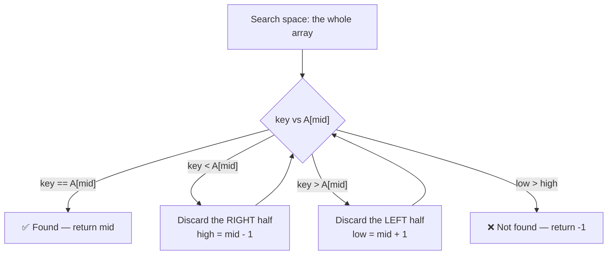

#### Iterative algorithm

```
BinarySearch(A, n, key):
    low  = 0
    high = n - 1
    while low <= high:
        mid = low + (high - low) / 2        // avoids integer overflow
        if A[mid] == key:   return mid
        else if A[mid] < key: low  = mid + 1     // search the right half
        else:                 high = mid - 1     // search the left half
    return -1
```

#### Recursive pseudo-code

*(For the exact exam wording `binarySearch(array, target, low, high)`.)*

```
binarySearch(array, target, low, high):
    // BASE CASE: the search space is empty
    if low > high:
        return -1

    mid = low + (high - low) / 2

    if array[mid] == target:
        return mid                                          // found
    else if target < array[mid]:
        return binarySearch(array, target, low, mid - 1)     // search the LEFT half
    else:
        return binarySearch(array, target, mid + 1, high)    // search the RIGHT half
```

The first call is `binarySearch(array, target, 0, n - 1)`.

#### C / C++ program

```c
#include <stdio.h>

/* iterative version */
int binarySearch(int a[], int n, int key) {
    int low = 0, high = n - 1;
    while (low <= high) {
        int mid = low + (high - low) / 2;
        if (a[mid] == key)      return mid;
        else if (a[mid] < key)  low  = mid + 1;
        else                    high = mid - 1;
    }
    return -1;
}

/* recursive version */
int binarySearchRec(int a[], int key, int low, int high) {
    if (low > high) return -1;
    int mid = low + (high - low) / 2;
    if (a[mid] == key)     return mid;
    if (key < a[mid])      return binarySearchRec(a, key, low, mid - 1);
    else                   return binarySearchRec(a, key, mid + 1, high);
}

int main(void) {
    int a[] = {2, 5, 8, 12, 16, 23, 38, 56, 72, 91};   /* MUST be sorted */
    int n = sizeof(a) / sizeof(a[0]);
    int key = 23;
    int pos = binarySearch(a, n, key);
    if (pos != -1) printf("%d found at index %d\n", key, pos);
    else           printf("%d not found\n", key);
    return 0;
}
```

#### Worked example — find 23 in `[2, 5, 8, 12, 16, 23, 38, 56, 72, 91]`

| Step | low | high | mid | A[mid] | Compare with 23 | Action |
|---|---|---|---|---|---|---|
| 1 | 0 | 9 | 4 | **16** | 23 > 16 | Discard the left half → `low = 5` |
| 2 | 5 | 9 | 7 | **56** | 23 < 56 | Discard the right half → `high = 6` |
| 3 | 5 | 6 | 5 | **23** | **Equal** | ✅ **Found at index 5** |

Only **3 comparisons** for 10 elements. A linear search would have needed 6.

#### Complexity

| Case | Situation | Time |
|---|---|---|
| **Best** | The key is exactly at the first `mid` | **O(1)** |
| **Average** | — | **O(log n)** |
| **Worst** | The key is absent, or found at the last step | **O(log₂ n)** |

**Space:** **O(1)** for the iterative version; **O(log n)** for the recursive version (the call stack).

#### Recurrence relation of binary search

At each step, binary search does a **constant amount of work** (one comparison to find the midpoint) and then solves **one sub-problem of half the size**:

> **T(n) = T(n/2) + O(1)**, with **T(1) = O(1)**

**Solving by substitution:**

```
T(n) = T(n/2)   + c
     = T(n/4)   + c + c        = T(n/2²) + 2c
     = T(n/8)   + 3c           = T(n/2³) + 3c
     …
     = T(n/2ᵏ)  + k·c
```

The recursion stops when the sub-problem size is 1, i.e. `n/2ᵏ = 1` → `n = 2ᵏ` → **k = log₂ n**. Substituting:

> **T(n) = T(1) + c·log₂ n = O(log n)** ✅

*(By the **Master Theorem**: a = 1, b = 2, f(n) = O(1). n^(log_b a) = n^0 = 1 = f(n) → **Case 2** → T(n) = Θ(log n).)*

**Why it is so fast:** each comparison throws away **half** the remaining data. For **1 million** elements it takes at most **log₂(1,000,000) ≈ 20** comparisons; for **1 billion**, only about **30**.

**Previous Year Question List from this Topic:**

- [Write down the Pseudo Code for recursive binary search algorithm. Use the following function definition: binarySearch(array, target, low, high).](../written-answers/algorithm.md?plain=1#L1891)
- [What is the complexity of Binary algorithm?](../written-answers/algorithm.md?plain=1#L1915)
- [Explain Algorithm of Binary search.](../written-answers/algorithm.md?plain=1#L1946)
- [Binary search using recursive function.](../written-answers/algorithm.md?plain=1#L1974)
- [Write a C/C++ program for binary search.](../written-answers/algorithm.md?plain=1#L2019)
- [(a) Write a program in C/C++/Java to perform binary search on a list of integer members.](../written-answers/algorithm.md?plain=1#L2089)
- [যে কোন একটা array নাও, সেই array থেকে একটি সংখ্যার binary search করার step গুলো লিখ এবং এর time complexity কত হবে তা বের কর।](../written-answers/algorithm.md?plain=1#L2130)
- [(খ) Binary Search কিভাবে করা হয়? উদাহরণসহ দেখান।](../written-answers/algorithm.md?plain=1#L2148)
- [You are given a sorted array of integers. Write an algorithm using Binary Search to search for a given key element in the array. If the element is found, return…](../written-answers/algorithm.md?plain=1#L3390)
- [Recurrence equation of binary search and solve it.](../written-answers/algorithm.md?plain=1#L2503)


---

### Linear Search vs Binary Search

| Point | **Linear Search** | **Binary Search** |
|---|---|---|
| **Data must be sorted?** | ❌ **No** | ✅ **Yes — mandatory** |
| **Approach** | Check every element sequentially | Divide and conquer — halve the range |
| **Best case** | **O(1)** (first element) | **O(1)** (middle element) |
| **Average case** | **O(n)** | **O(log n)** |
| **Worst case** | **O(n)** | **O(log n)** |
| **Space** | O(1) | O(1) iterative, O(log n) recursive |
| **Comparisons for n = 1,000,000** | up to **1,000,000** | at most **20** |
| **Data structure** | Array, **linked list**, file — anything traversable | **Array only** (needs random access / O(1) indexing) |
| **Implementation** | Very simple | Slightly more complex (off-by-one errors are common) |
| **Insertion cost** | Cheap — just append | Expensive — the order must be maintained |
| **Best used when** | Small or **unsorted** data; a linked list; only one search is needed | **Large sorted** data; many repeated searches |

#### The classic scenario question

> *"An array contains **one million sorted integers**. Which searching algorithm would you choose to find a given element? Justify your answer."*

**Answer: Binary Search.**

**Justification:**
1. The array is **already sorted**, which is binary search's only precondition — so there is no sorting cost to pay.
2. Binary search runs in **O(log₂ n)**. For n = 1,000,000 that is **log₂(10⁶) ≈ 20 comparisons** in the worst case.
3. Linear search would run in **O(n)** — up to **1,000,000 comparisons**, roughly **50,000 times slower**.
4. It needs **O(1)** extra space (iterative version).
5. An array gives **O(1) random access**, which is exactly what binary search requires to jump to the midpoint.

**Points worth adding for a fuller answer:**
- If the data were **unsorted**, you would use linear search for a *single* lookup — sorting first (O(n log n)) is only worth it if you will search many times.
- If searches are extremely frequent and memory allows, a **hash table** gives **O(1)** average lookup — but it loses the ordering, so range queries ("all values between 100 and 200") become impossible, whereas binary search handles them naturally.
- **Interpolation search** can reach O(log log n) if the values are **uniformly distributed**.

**Previous Year Question List from this Topic:**

- [An array contains one million sorted integers. Which searching algorithm would you choose to find a given element? Justify your answer. (SO IT 25-07-2026)](../written-answers/algorithm.md?plain=1#L1877)
- [6.14 An array contains one million sorted integers. Which searching algorithm would you choose to find a given element? Justify your answer.](../written-answers/algorithm.md?plain=1#L1925)
- [(খ) Linear Search এবং Binary Search এর মধ্যে পার্থক্য লিখুন।](../written-answers/algorithm.md?plain=1#L2002)
- [(ক) Linear Search অ্যালগরিদম কী? এই অ্যালগরিদম এর best case এবং wrose case complexity বর্ণনা করুন।](../written-answers/algorithm.md?plain=1#L2063)
- [(ক) Liner search কী? উহার সুবিধা ও অসুবিধা গুলো লিখুন।](../written-answers/algorithm.md?plain=1#L2173)


---

### Finding the Second Highest Element in an Array

*(A repeated question, usually paired with "What is an algorithm?".)*

#### The naive approach (and why it is wasteful)

Sort the array and take `A[n-2]`. Correct, but **O(n log n)** — far more work than necessary.

#### The optimal approach — a single pass, O(n)

Keep **two variables**: the largest seen so far and the second largest seen so far.

```
SecondHighest(A, n):
    if n < 2:
        return "Array must have at least 2 elements"

    first  = -INFINITY          // the largest
    second = -INFINITY          // the second largest

    for i = 0 to n-1:
        if A[i] > first:
            second = first      // the old maximum is pushed down
            first  = A[i]
        else if A[i] > second and A[i] != first:
            second = A[i]

    if second == -INFINITY:
        return "No second highest element (all values are equal)"
    return second
```

#### Worked trace on `[12, 35, 1, 10, 34, 1]`

| i | A[i] | Condition | first | second |
|---|---|---|---|---|
| — | — | initial | −∞ | −∞ |
| 0 | 12 | 12 > −∞ → shift | **12** | −∞ |
| 1 | 35 | 35 > 12 → shift | **35** | **12** |
| 2 | 1 | 1 < 35 and 1 < 12 → no change | 35 | 12 |
| 3 | 10 | 10 < 35 (first) and 10 < 12 (second) → no change | 35 | 12 |
| 4 | 34 | 34 < 35 but 34 > 12 → update second | 35 | **34** |
| 5 | 1 | 1 < 35 and 1 < 34 → no change | 35 | 34 |

**Answer: second highest = 34.** ✅

#### C implementation

```c
#include <stdio.h>
#include <limits.h>

int secondHighest(int a[], int n) {
    if (n < 2) return INT_MIN;
    int first = INT_MIN, second = INT_MIN;
    for (int i = 0; i < n; i++) {
        if (a[i] > first) {
            second = first;
            first  = a[i];
        } else if (a[i] > second && a[i] != first) {
            second = a[i];
        }
    }
    return second;
}
```

#### Complexity and edge cases

| | |
|---|---|
| **Time** | **O(n)** — one pass |
| **Space** | **O(1)** |
| Comparisons | at most 2n (can be reduced to n + ⌈log₂ n⌉ − 2 with a tournament method) |

**Edge cases to mention in the exam:**
- Array with fewer than 2 elements → no answer exists.
- **All elements equal** (`[5,5,5]`) → there is no *distinct* second highest; state your assumption.
- **Duplicates of the maximum** (`[10, 10, 7]`) → the `a[i] != first` check makes the answer 7 (the distinct second highest). If duplicates should count, remove that check and the answer becomes 10.
- Negative numbers → initialise with `INT_MIN`, never with 0.

#### Generalising to the K-th largest element

| Method | Time |
|---|---|
| Sort and index | O(n log n) |
| **Min-heap of size K** | **O(n log K)** |
| **Quickselect** (partition-based) | **O(n)** average, O(n²) worst |

**Previous Year Question List from this Topic:**

- [What is algorithm? Write down the algorithm to find out the second highest element in an n-element array.](../written-answers/algorithm.md?plain=1#L2193)

## Algorithm Analysis & Asymptotic Complexity

### What is an Algorithm? Characteristics and Representation

An **algorithm** is a **finite, well-defined, step-by-step procedure** for solving a problem or performing a computation. It takes some **input**, performs a sequence of unambiguous operations, and produces the required **output** in a finite amount of time.

> A recipe is an algorithm: a fixed list of ingredients (input), numbered steps (instructions), and a finished dish (output).

#### The five essential characteristics (Donald Knuth)

| # | Characteristic | Meaning |
|---|---|---|
| 1 | **Input** | Zero or more quantities are supplied from outside |
| 2 | **Output** | At least **one** quantity is produced |
| 3 | **Definiteness** | Every step must be **clear and unambiguous** — no "stir for a while" |
| 4 | **Finiteness** | It must **terminate** after a finite number of steps |
| 5 | **Effectiveness** | Every operation must be **basic enough** to be carried out exactly, in principle by a person with pencil and paper |

Two more properties usually added: **correctness** (it produces the right answer for every valid input) and **generality** (it works on a whole class of inputs, not just one).

#### How algorithms are represented

| Form | Description |
|---|---|
| **Natural language** | Plain English/Bangla steps — easy to read, but can be ambiguous |
| **Pseudocode** | Structured English with programming-like control flow — the standard in exams |
| **Flowchart** | A diagram using standard symbols |
| **Programming language** | The actual implementation |

> **Note:** "There are no well-defined standards for writing algorithms" — this is true. Pseudocode is a convention, not a formal language, which is exactly why the **five characteristics above** matter: they are the real requirements, not the notation.

#### What affects an algorithm's efficiency

1. **The algorithm's design** itself (the dominant factor — O(n log n) will always beat O(n²) for large n).
2. **Input size (n)** and the **nature** of the input (sorted, reverse sorted, random).
3. **The data structures** chosen (array vs linked list vs hash table).
4. Hardware — CPU speed, cache, memory. *(This changes the constant factor, not the growth rate.)*
5. The compiler and programming language.

**Asymptotic analysis deliberately ignores factors 4 and 5** so that algorithms can be compared on their own merits, independently of the machine.

**Previous Year Question List from this Topic:**

- [There are no well-defined standards for writing algorithms. Efficiency of an algorithm depends on several factors. Similarly, complexity of an algorithm also de…](../written-answers/algorithm.md?plain=1#L2659)
- [What is algorithm? Write down the algorithm to find out the second highest element in an n-element array.](../written-answers/algorithm.md?plain=1#L2193)


---

### Time Complexity, Space Complexity and Complexity Classes

#### What "complexity of an algorithm" means

> The **complexity** of an algorithm is a measure of the **resources it consumes as a function of the input size n**.

There are two kinds:

| Type | Measures | Question it answers |
|---|---|---|
| **Time complexity** | Number of **basic operations** executed | How **long** does it take as n grows? |
| **Space complexity** | Amount of **memory** used | How much **memory** does it need as n grows? |

**We count operations, not seconds** — because seconds depend on the machine, whereas the operation count depends only on the algorithm.

> **Space complexity = Input space + Auxiliary space.**
> **Auxiliary space** is the *extra* memory the algorithm needs beyond storing the input, and is usually what is meant when people compare algorithms. Merge sort has O(n) auxiliary space; quicksort has O(log n).

#### Categories of complexity — the three cases

| Case | Notation | Meaning |
|---|---|---|
| **Best case** | **Ω (Big Omega)** | The **minimum** time — the most favourable input |
| **Average case** | **Θ (Big Theta)** | The **expected** time over all inputs |
| **Worst case** | **O (Big O)** | The **maximum** time — the least favourable input |

> **Which one matters most? The worst case.** It gives a **guarantee** — the algorithm will *never* be slower than this. For real-time and safety-critical systems, only the worst case is meaningful.

*(Note the common confusion: Ω, Θ and O are **mathematical bounds**, and any of them can be applied to any case. Loosely, exams use "Big O for worst case, Big Omega for best case, Big Theta for average" — which is the convention shown above.)*

#### The common complexity classes, best to worst

| Complexity | Name | n = 10 | n = 1,000 | Example |
|---|---|---|---|---|
| **O(1)** | Constant | 1 | 1 | Array index access, hash table lookup, push/pop on a stack |
| **O(log n)** | Logarithmic | ≈ 3 | ≈ 10 | **Binary search**, balanced BST operations, heap insert |
| **O(n)** | Linear | 10 | 1,000 | **Linear search**, one pass over an array, finding the maximum |
| **O(n log n)** | Linearithmic | ≈ 33 | ≈ 10,000 | **Merge sort, Heap sort, Quick sort (average)** |
| **O(n²)** | Quadratic | 100 | 1,000,000 | **Bubble/Selection/Insertion sort**, nested loops |
| **O(n³)** | Cubic | 1,000 | 10⁹ | Naive matrix multiplication, **Floyd-Warshall** |
| **O(2ⁿ)** | Exponential | 1,024 | astronomical | Naive recursive Fibonacci, subset generation, TSP brute force |
| **O(n!)** | Factorial | 3,628,800 | — | Travelling Salesman by permutation |

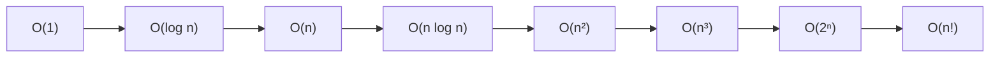

Algorithms up to **O(n log n)** are considered efficient; **O(n²)** is acceptable only for small n; **O(2ⁿ)** and **O(n!)** are practical only for very small inputs.

**Previous Year Question List from this Topic:**

- [What is complexity of Algorithm? Categorize complexity of Algorihm.](../written-answers/algorithm.md?plain=1#L2266)
- [(ক) Algorithm-এর Computational Complexity এর সংজ্ঞা লিখুন।](../written-answers/algorithm.md?plain=1#L2292)
- [Including Time and Space complexity....](../written-answers/algorithm.md?plain=1#L2304)
- [What is complexity? Find the Complexity from code and explain.](../written-answers/algorithm.md?plain=1#L2402)
- [(খ) অ্যালগরিদমের complexity বলতে কী বোঝায়? কয়েকটি Sorting algorithm এর complexity উল্লেখ করুন।](../written-answers/algorithm.md?plain=1#L2460)
- [Data structure: Complexity O(N^2). (Full question collect সম্ভব হয় নি)](../written-answers/algorithm.md?plain=1#L2531)
- [There are no well-defined standards for writing algorithms. Efficiency of an algorithm depends on several factors. Similarly, complexity of an algorithm also de…](../written-answers/algorithm.md?plain=1#L2659)
- [(a) Algorithm এর Computational Complexity এর মধ্যে পার্থক্য](../written-answers/algorithm.md?plain=1#L28)


---

### Asymptotic Notations — Big O, Big Omega and Big Theta

**Asymptotic notation** describes how an algorithm's running time **grows as n becomes very large**, ignoring constant factors and lower-order terms.

#### Big O — the Upper Bound

> **f(n) = O(g(n))** if there exist positive constants **c** and **n₀** such that
> **0 ≤ f(n) ≤ c · g(n)** for all **n ≥ n₀**.

**Meaning:** the algorithm will take **at most** this long — a **worst-case guarantee** ("no worse than").

*Example:* if f(n) = 3n² + 5n + 100, then f(n) = **O(n²)**, because for c = 4 and n₀ = 11, `3n² + 5n + 100 ≤ 4n²`.

#### Big Omega (Ω) — the Lower Bound

> **f(n) = Ω(g(n))** if there exist positive constants **c** and **n₀** such that
> **0 ≤ c · g(n) ≤ f(n)** for all **n ≥ n₀**.

**Meaning:** the algorithm will take **at least** this long — a **best-case guarantee** ("no better than").

*Example:* 3n² + 5n + 100 = **Ω(n²)**, and also Ω(n) and Ω(1) (any weaker lower bound is still valid).

#### Big Theta (Θ) — the Tight Bound

> **f(n) = Θ(g(n))** if **f(n) = O(g(n))** *and* **f(n) = Ω(g(n))** — i.e. there are constants c₁, c₂, n₀ with
> **c₁·g(n) ≤ f(n) ≤ c₂·g(n)** for all n ≥ n₀.

**Meaning:** the growth rate is **exactly** this — an **average/tight** description.

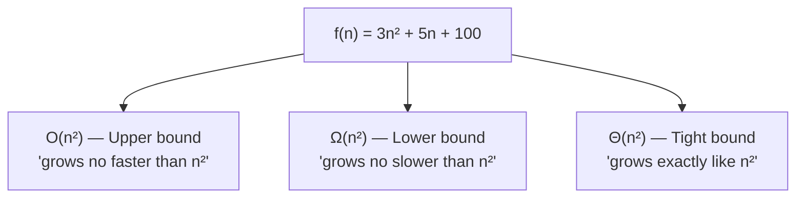

#### Big O vs Big Omega — the exam answer

| Point | **Big O (O)** | **Big Omega (Ω)** |
|---|---|---|
| Bound type | **Upper** bound | **Lower** bound |
| Describes | The **maximum** growth rate | The **minimum** growth rate |
| Guarantee | "It will take **at most** this long" | "It will take **at least** this long" |
| Usually used for | **Worst case** | **Best case** |
| Formal condition | f(n) ≤ c·g(n) for n ≥ n₀ | f(n) ≥ c·g(n) for n ≥ n₀ |
| Which is more useful? | **Big O** — a worst-case guarantee is what engineers need | Ω is mainly used to prove that a problem *cannot* be solved faster (e.g. comparison sorting is Ω(n log n)) |
| Example for linear search | O(n) | Ω(1) |

*(Two more exist: **little-o (o)** = a strictly loose upper bound, and **little-omega (ω)** = a strictly loose lower bound.)*

#### The rules for simplifying

1. **Drop the constants:** O(3n) → **O(n)**; O(n/2) → O(n).
2. **Keep only the fastest-growing term:** O(n² + n + 100) → **O(n²)**.
3. **Nested loops multiply:** a loop of n inside a loop of m → **O(n·m)**.
4. **Sequential blocks add**, then rule 2 applies: O(n) followed by O(n²) → **O(n²)**.
5. **Different inputs use different variables:** two separate loops over arrays of size n and m → **O(n + m)**, not O(n).

**Previous Year Question List from this Topic:**

- [What is Big O and Big Omega?](../written-answers/algorithm.md?plain=1#L2443)
- [(ক) Algorithm-এর Computational Complexity এর সংজ্ঞা লিখুন।](../written-answers/algorithm.md?plain=1#L2292)
- [What is complexity of Algorithm? Categorize complexity of Algorihm.](../written-answers/algorithm.md?plain=1#L2266)


---

### How to Find the Complexity of a Piece of Code

This is a practical skill that appears in many exams. Work through the code counting how many times each statement runs.

#### Rule 1 — A simple statement is O(1)

```c
int x = 5;          /* O(1) */
x = a + b * c;      /* O(1) */
if (a > b) ...      /* O(1) — the condition itself */
```

#### Rule 2 — A single loop is O(n)

```c
for (i = 0; i < n; i++)
    sum += a[i];          /* runs n times  →  O(n) */
```

#### Rule 3 — Nested loops multiply

```c
for (i = 0; i < N; i++)          /* outer: N times          */
    for (j = 0; j < M; j++)      /* inner: M times for each */
        printf("%d", i * j);     /* total: N × M            */
```

> **Time complexity = O(N × M).** If both are of size n, it becomes **O(n²)**.
> **Space complexity = O(1)** — only the loop counters `i` and `j` are stored; no data structure grows with the input.

#### Rule 4 — Sequential loops add

```c
for (i = 0; i < n; i++)  ...     /* O(n)  */
for (j = 0; j < n; j++)          /* O(n²) */
    for (k = 0; k < n; k++) ...
```
Total = O(n) + O(n²) = **O(n²)** (keep the dominant term).

#### Rule 5 — Dividing or multiplying the counter gives O(log n)

```c
for (i = 1; i < n; i = i * 2)    /* i = 1, 2, 4, 8, 16 …  */
    printf("%d", i);
```
The loop runs until 2ᵏ ≥ n, so k = log₂ n → **O(log n)**.
*(Similarly `for (i = n; i > 0; i = i / 2)` is O(log n).)*

> **Answer to "write an algorithm whose complexity is O(log n)":** **binary search**, or the loop above that doubles/halves the counter each time, or traversing a balanced binary search tree from root to leaf.

#### Rule 6 — A dependent inner loop

```c
for (i = 0; i < n; i++)
    for (j = 0; j < i; j++)      /* runs 0, 1, 2, … n-1 times */
        ...
```
Total iterations = 0 + 1 + 2 + … + (n−1) = **n(n−1)/2** → **O(n²)**.

#### Rule 7 — A loop inside a logarithmic loop

```c
for (i = 1; i < n; i = i * 2)     /* log n times */
    for (j = 0; j < n; j++)       /* n times     */
        ...
```
→ **O(n log n)**.

#### Space complexity examples

| Code | Auxiliary space |
|---|---|
| A few scalar variables | **O(1)** |
| `int b[n];` — a new array of size n | **O(n)** |
| A 2-D matrix `int m[n][n];` | **O(n²)** |
| Recursion of depth n (each frame O(1)) | **O(n)** stack |
| Recursion of depth log n | **O(log n)** stack |

#### Complexity of the important algorithms — a revision table

| Algorithm | **Best** | **Average** | **Worst** | Space |
|---|---|---|---|---|
| **Linear search** | Ω(1) | Θ(n) | **O(n)** | O(1) |
| **Binary search** | Ω(1) | Θ(log n) | **O(log n)** | O(1) / O(log n) rec. |
| **Bubble sort** | Ω(n) | Θ(n²) | **O(n²)** | O(1) |
| **Selection sort** | Ω(n²) | Θ(n²) | **O(n²)** | O(1) |
| **Insertion sort** | Ω(n) | Θ(n²) | **O(n²)** | O(1) |
| **Merge sort** | Ω(n log n) | Θ(n log n) | **O(n log n)** | O(n) |
| **Quick sort** | Ω(n log n) | Θ(n log n) | **O(n²)** | O(log n) |
| **Heap sort** | Ω(n log n) | Θ(n log n) | **O(n log n)** | O(1) |
| **BFS / DFS** | — | — | **O(V + E)** | O(V) |
| **Dijkstra** | — | — | **O(E log V)** | O(V) |
| **Bellman-Ford** | — | — | **O(V·E)** | O(V) |
| **Floyd-Warshall** | — | — | **O(V³)** | O(V²) |
| **Kruskal / Prim** | — | — | **O(E log V)** | O(V+E) |

> **"Find the best and worst case complexity of Binary Search, Quick Sort and Depth First Search":**
> - **Binary Search** — Best **O(1)** (key at the first mid), Worst **O(log n)**.
> - **Quick Sort** — Best **O(n log n)** (balanced partitions), Worst **O(n²)** (pivot always smallest/largest, e.g. sorted input with the first element as pivot).
> - **DFS** — Best and Worst both **O(V + E)** with an adjacency list (every vertex and edge is examined once), or O(V²) with an adjacency matrix.

**Previous Year Question List from this Topic:**

- [Analyze the time and space complexity of the following code:](../written-answers/algorithm.md?plain=1#L2238)
- [What is complexity? Find the Complexity from code and explain.](../written-answers/algorithm.md?plain=1#L2402)
- [Find out Best case, Worst case complexity of Binary search, Quick sort, Depth First Search.](../written-answers/algorithm.md?plain=1#L2481)
- [Write an algorithm which complexity is O(logn).](../written-answers/algorithm.md?plain=1#L2684)
- [Find time and space complexity like below pseudo code.](../written-answers/algorithm.md?plain=1#L2717)
- [Analyze the following C function and determine its Big O Time Complexity and Space Complexity. Explain your reasoning.](../written-answers/algorithm.md?plain=1#L937)


---

### Recurrence Relations and How to Solve Them

A **recurrence relation** expresses the running time of a **recursive** algorithm in terms of the running time on smaller inputs. Solving it gives the closed-form complexity.

#### The three standard methods

| Method | How it works |
|---|---|
| **Substitution / Iteration** | Expand the recurrence repeatedly until a pattern appears, then find the closed form |
| **Recursion tree** | Draw the tree of recursive calls, sum the work at each level, multiply by the number of levels |
| **Master Theorem** | A direct formula for recurrences of the form T(n) = a·T(n/b) + f(n) |

#### The Master Theorem

For **T(n) = a·T(n/b) + f(n)**, where a ≥ 1, b > 1:

Compare **f(n)** with **n^(log_b a)**:

| Case | Condition | Result |
|---|---|---|
| **1** | f(n) grows **slower** than n^(log_b a) | **T(n) = Θ(n^(log_b a))** |
| **2** | f(n) grows **at the same rate** as n^(log_b a) | **T(n) = Θ(n^(log_b a) · log n)** |
| **3** | f(n) grows **faster** (with the regularity condition) | **T(n) = Θ(f(n))** |

**Applying it to the classic algorithms:**

| Algorithm | Recurrence | a, b, f(n) | n^(log_b a) | Case | Result |
|---|---|---|---|---|---|
| **Binary search** | T(n) = T(n/2) + O(1) | 1, 2, 1 | n⁰ = 1 | 2 | **Θ(log n)** |
| **Merge sort** | T(n) = 2T(n/2) + n | 2, 2, n | n¹ = n | 2 | **Θ(n log n)** |
| **Quick sort (best)** | T(n) = 2T(n/2) + n | 2, 2, n | n | 2 | **Θ(n log n)** |
| **Quick sort (worst)** | T(n) = T(n−1) + n | *(not of the Master form)* | — | — | **Θ(n²)** |
| **Naive matrix mult.** | T(n) = 8T(n/2) + n² | 8, 2, n² | n³ | 1 | **Θ(n³)** |
| **Strassen's** | T(n) = 7T(n/2) + n² | 7, 2, n² | n^2.807 | 1 | **Θ(n^2.807)** |
| **Binary tree traversal** | T(n) = 2T(n/2) + O(1) | 2, 2, 1 | n | 1 | **Θ(n)** |

#### Worked example — solve T(n) = 3T(n−1) + 2, with T(1) = 1

This is a **linear recurrence with a constant coefficient**, not of the Master-Theorem divide-and-conquer form, so use **substitution**.

**Step 1 — expand:**

```
T(n) = 3T(n-1) + 2
     = 3[3T(n-2) + 2] + 2          = 3²T(n-2) + 3·2 + 2
     = 3²[3T(n-3) + 2] + 3·2 + 2   = 3³T(n-3) + 3²·2 + 3·2 + 2
     …
     = 3ᵏ·T(n-k) + 2(3^(k-1) + 3^(k-2) + … + 3 + 1)
```

**Step 2 — stop at the base case.** Set `n − k = 1` → **k = n − 1**:

```
T(n) = 3^(n-1)·T(1) + 2·(3^(n-2) + 3^(n-3) + … + 3 + 1)
```

**Step 3 — sum the geometric series.** The bracket is a geometric series with ratio 3 and (n−1) terms:

> 3^(n-2) + … + 3 + 1 = (3^(n-1) − 1) / (3 − 1) = **(3^(n-1) − 1)/2**

**Step 4 — substitute T(1) = 1:**

```
T(n) = 3^(n-1) · 1 + 2 · (3^(n-1) - 1)/2
     = 3^(n-1) + 3^(n-1) - 1
     = 2·3^(n-1) - 1
```

> ### ✅ **T(n) = 2·3^(n−1) − 1**, so **T(n) = Θ(3ⁿ)** — exponential.

**Verification:**
- T(1) = 2·3⁰ − 1 = 2 − 1 = **1** ✅ (matches the base case)
- T(2) = 3·T(1) + 2 = 3 + 2 = **5**; formula: 2·3¹ − 1 = 6 − 1 = **5** ✅
- T(3) = 3·5 + 2 = **17**; formula: 2·3² − 1 = 18 − 1 = **17** ✅

#### Other common recurrences to memorise

| Recurrence | Solution | Where it comes from |
|---|---|---|
| T(n) = T(n/2) + O(1) | **Θ(log n)** | Binary search |
| T(n) = T(n−1) + O(1) | **Θ(n)** | Linear recursion, factorial |
| T(n) = T(n−1) + O(n) | **Θ(n²)** | Quick sort worst case, selection sort |
| T(n) = 2T(n/2) + O(n) | **Θ(n log n)** | Merge sort |
| T(n) = 2T(n/2) + O(1) | **Θ(n)** | Tree traversal |
| T(n) = 2T(n−1) + O(1) | **Θ(2ⁿ)** | Tower of Hanoi |
| T(n) = T(n−1) + T(n−2) | **Θ(φⁿ) ≈ Θ(1.618ⁿ)** | Naive recursive Fibonacci |

**Previous Year Question List from this Topic:**

- [Recurrence equation of binary search and solve it.](../written-answers/algorithm.md?plain=1#L2503)
- [Solve the recurrence relation: T(n) = 3T(n-1) + 2, T(1) = 1.](../written-answers/algorithm.md?plain=1#L2626)
- [(a) The complexity of merge sort is T(n) = 2T\left(\frac{n}{2}\right) + n. Explain how the above equation is derived?](../written-answers/algorithm.md?plain=1#L335)

## Dynamic Programming & Greedy Algorithms

### Divide and Conquer

**Divide and Conquer** solves a problem by breaking it into **smaller independent sub-problems of the same type**, solving them recursively, and then **combining** their answers.

#### The three steps

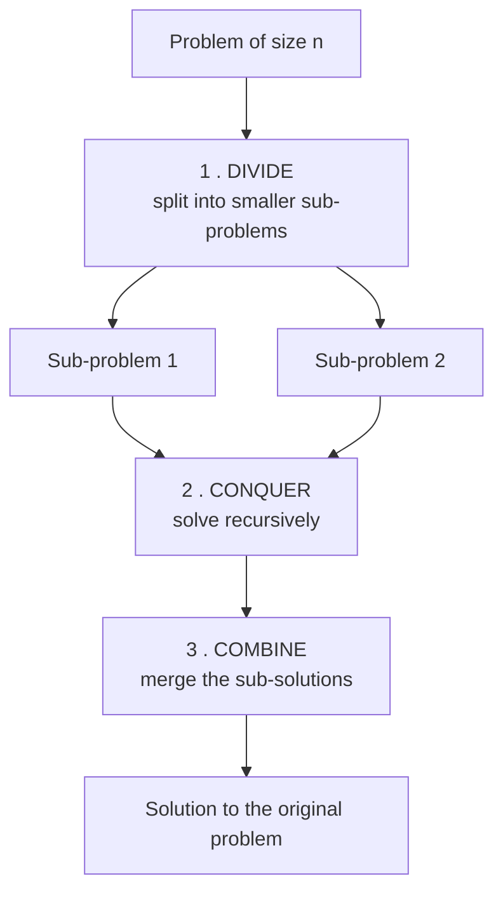

1. **Divide** the problem into two or more sub-problems of the same kind.
2. **Conquer** — solve each sub-problem recursively (directly if it is small enough — the **base case**).
3. **Combine** the sub-solutions into the solution of the original problem.

#### Key characteristic

> In Divide and Conquer, the sub-problems are **disjoint / independent** — they do **not overlap** and no sub-problem is ever solved twice.

#### Classic examples

| Problem | Divide | Combine |
|---|---|---|
| **Merge Sort** | Split the array in half | **Merge** the two sorted halves — O(n) |
| **Quick Sort** | **Partition** around a pivot | Nothing to do — the array is already in place |
| **Binary Search** | Halve the range | Nothing — only one half is searched |
| **Strassen's matrix multiplication** | Split each matrix into four n/2 × n/2 blocks | Add and subtract the seven products |
| **Karatsuba multiplication** | Split the digits | Combine with shifts and additions |
| **Closest pair of points** | Split by a vertical line | Check the strip near the line |
| **Tower of Hanoi** | Move n−1 discs, then the largest | — |

#### Advantages and disadvantages

**Advantages:** solves hard problems elegantly; often reduces complexity dramatically (O(n²) → O(n log n)); naturally **parallelisable**; makes good use of the **cache** because sub-problems fit in it.

**Disadvantages:** recursion has **function-call overhead**; may use **O(log n) or O(n) stack space**; it is **inefficient when sub-problems overlap** — that is exactly the case where Dynamic Programming should be used instead.

**Previous Year Question List from this Topic:**

- [Write down the difference between Divide and Conquer and Dynamic Programming.](../written-answers/algorithm.md?plain=1#L2783)
- [(a) How does dynamic programming relate with divide and conquer approach?](../written-answers/algorithm.md?plain=1#L2799)
- [Both the algorithm the Divide and Conquer and Dynamic Programming solve a problem by breaking it into smaller problem instances and by solving them. What are th…](../written-answers/algorithm.md?plain=1#L2839)
- [Write the name of Algorithm: (a) Matrix multiplication (b) Knapsack is _____](../written-answers/algorithm.md?plain=1#L2863)
- [(খ) Divide and Conquer technique কী? একটি সমস্যা বর্ণনা করুন যা Divide and Conquer Technique এ সমাধান করা যায়।](../written-answers/algorithm.md?plain=1#L3888)
- [Which short uses divide and conquer technique?](../written-answers/algorithm.md?plain=1#L388)


---

### Dynamic Programming and the Principle of Optimality

**Dynamic Programming (DP)** solves a problem by breaking it into **overlapping sub-problems**, solving **each sub-problem only once**, and **storing** the result so it is never recomputed.

It was invented by **Richard Bellman** in the 1950s.

#### The two conditions a problem must satisfy

A problem can be solved by DP **only if** it has both:

| Property | Meaning |
|---|---|
| **1. Optimal substructure** | An optimal solution to the problem **contains optimal solutions to its sub-problems** |
| **2. Overlapping sub-problems** | The same sub-problem is solved **again and again** by a naive recursion |

#### The Principle of Optimality

> **Bellman's Principle of Optimality:**
> *An optimal policy has the property that, whatever the initial state and the initial decision are, the remaining decisions must constitute an optimal policy with regard to the state resulting from the first decision.*

**In simple words:** if a sequence of decisions is optimal, then **every sub-sequence of it must also be optimal**.

**Illustration:** if the shortest path from **Dhaka to Chittagong** passes through **Comilla**, then the Dhaka → Comilla portion of that path **must itself be the shortest** Dhaka-to-Comilla path. If a shorter Dhaka → Comilla route existed, you could substitute it and get an even shorter Dhaka → Chittagong path — contradicting the assumption that the original was shortest.

This is precisely what makes DP valid: you can **build the optimal answer for a big problem out of stored optimal answers to smaller ones**.

> **Counter-example — where the principle fails:** the **longest simple path** problem does *not* have optimal substructure. The longest simple path from A to C may not contain the longest simple path from A to B, because reusing it might force a vertex to repeat. That is why the longest-path problem is NP-hard and DP cannot solve it directly.

#### The two ways to implement DP

| | **Memoization (Top-Down)** | **Tabulation (Bottom-Up)** |
|---|---|---|
| **Direction** | Start from the **original problem** and recurse down | Start from the **smallest sub-problem** and build up |
| **Implementation** | **Recursion + a cache/lookup table** | **Iteration + a table (array)** |
| **Which sub-problems are solved** | **Only those actually needed** | **All** of them |
| **Overhead** | Function-call and stack overhead | No recursion overhead — usually **faster** |
| **Risk** | Stack overflow on deep recursion | None |
| **Easier to write from a recurrence** | **Yes** | Needs the right ordering |
| **Space optimisation** | Harder | **Easy** (often reduce a 2-D table to 1-D) |

#### Worked comparison — Fibonacci

**Naive recursion — O(2ⁿ), exponential:**

```
Fib(n):
    if n <= 1: return n
    return Fib(n-1) + Fib(n-2)
```

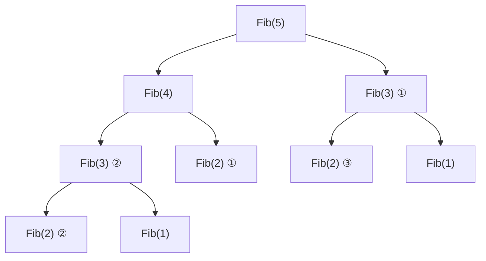
Notice **Fib(3) is computed twice and Fib(2) three times** — that is the *overlapping sub-problems* property, and it is what makes the naive version exponential.

**Memoization (top-down) — O(n):**

```
memo = array of size n+1, filled with -1

FibMemo(n):
    if n <= 1:            return n
    if memo[n] != -1:     return memo[n]        // already computed
    memo[n] = FibMemo(n-1) + FibMemo(n-2)
    return memo[n]
```

**Tabulation (bottom-up) — O(n) time, O(n) space:**

```
FibTab(n):
    if n <= 1: return n
    dp[0] = 0;  dp[1] = 1
    for i = 2 to n:
        dp[i] = dp[i-1] + dp[i-2]
    return dp[n]
```

**Space-optimised — O(n) time, O(1) space:**

```
FibOpt(n):
    if n <= 1: return n
    a = 0;  b = 1
    for i = 2 to n:
        c = a + b
        a = b
        b = c
    return b
```

| Version | Time | Space |
|---|---|---|
| Naive recursion | **O(2ⁿ)** | O(n) stack |
| Memoization | **O(n)** | O(n) table + O(n) stack |
| Tabulation | **O(n)** | O(n) |
| Space-optimised | **O(n)** | **O(1)** |

#### Classic DP problems

| Problem | Complexity |
|---|---|
| Fibonacci numbers | O(n) |
| **0/1 Knapsack** | O(n·W) |
| Longest Common Subsequence (LCS) | O(m·n) |
| Longest Increasing Subsequence | O(n log n) |
| **Matrix Chain Multiplication** | O(n³) |
| Edit Distance (Levenshtein) | O(m·n) |
| Coin Change / Rod Cutting | O(n·amount) |
| **Floyd-Warshall** all-pairs shortest path | O(V³) |
| **Bellman-Ford** shortest path | O(V·E) |
| Subset Sum / Partition | O(n·sum) |
| **Kadane's** maximum subarray | O(n) |

**Previous Year Question List from this Topic:**

- [State the Principle of Optimality in Dynamic Programming. How does it distinguish Dynamic Programming from Greedy Algorithms?](../written-answers/algorithm.md?plain=1#L2751)
- [Write down the difference between Divide and Conquer and Dynamic Programming.](../written-answers/algorithm.md?plain=1#L2783)
- [(a) How does dynamic programming relate with divide and conquer approach?](../written-answers/algorithm.md?plain=1#L2799)
- [Both the algorithm the Divide and Conquer and Dynamic Programming solve a problem by breaking it into smaller problem instances and by solving them. What are th…](../written-answers/algorithm.md?plain=1#L2839)
- [What is Dynamic programming? Explain with example.](../written-answers/algorithm.md?plain=1#L3586)
- [Write down the Algorithm for determining Fibonacci number through dynamic programming.](../written-answers/algorithm.md?plain=1#L3647)


---

### Greedy Algorithms

A **greedy algorithm** builds a solution **piece by piece**, always choosing the option that **looks best right now** (the *locally optimal* choice), and **never reconsidering** that choice.

> The greedy motto: **"take the best you can see at this moment, and never look back."**

#### The two properties a problem needs for greedy to be correct

| Property | Meaning |
|---|---|
| **1. Greedy-choice property** | A **globally optimal** solution can be reached by making **locally optimal** choices. *(This is the crucial one, and it must be **proved**.)* |
| **2. Optimal substructure** | An optimal solution contains optimal solutions to its sub-problems *(shared with DP)* |

#### Does a greedy algorithm always give the optimal solution?

> ### ❌ **No.** Greedy gives the optimal answer **only when the greedy-choice property holds and can be proved** for that specific problem. Otherwise it gives a solution that is merely *good*, not best.

**A clear counter-example — the coin change problem.**

Coin denominations {1, 7, 10}, target **15**.
- **Greedy:** take the largest coin ≤ 15 → 10, remainder 5 → 1, 1, 1, 1, 1 → **6 coins** (10 + 1×5).
- **Optimal (DP):** **7 + 7 + 1 = 3 coins.**

Greedy fails here. But with the coin set {1, 5, 10, 25, 50} (the standard "canonical" system used in most currencies) greedy **is** optimal — which shows the answer depends entirely on the problem instance.

**A second counter-example — the 0/1 Knapsack.** Taking items by highest value/weight ratio is optimal for the *fractional* knapsack, but **not** for 0/1, because you cannot cut an item and the leftover capacity is wasted.

#### When does the greedy approach achieve the optimal solution?

Greedy is provably optimal when:
1. The **greedy-choice property** can be proved (usually by an **exchange argument**: show that any optimal solution can be transformed into one containing the greedy choice, without becoming worse).
2. The problem has **optimal substructure**.
3. Formally, when the problem's structure forms a **matroid** — a mathematical structure on which the greedy algorithm is guaranteed optimal (this is the deep reason Kruskal's MST algorithm works).

**Problems where greedy IS optimal:**

| Problem | Greedy rule |
|---|---|
| **Fractional Knapsack** | Take items in decreasing order of **value/weight** ratio |
| **Activity Selection** | Always pick the activity that **finishes earliest** |
| **Kruskal's MST** | Always add the cheapest edge that makes no cycle |
| **Prim's MST** | Always add the cheapest edge leaving the current tree |
| **Dijkstra's shortest path** | Always finalise the nearest unvisited vertex *(non-negative weights)* |
| **Huffman coding** | Always merge the two least-frequent symbols |
| **Job sequencing with deadlines** | Take the highest-profit job that still fits |
| **Coin change with a canonical coin system** | Take the largest coin that fits |

**Problems where greedy FAILS:**

| Problem | Why greedy fails | Correct method |
|---|---|---|
| **0/1 Knapsack** | Cannot split an item; leftover capacity is wasted | **Dynamic Programming** |
| **Coin change (arbitrary denominations)** | The large coin may block a better combination | **Dynamic Programming** |
| **Longest path in a graph** | No optimal substructure | NP-hard |
| **Travelling Salesman** | Nearest-neighbour can be arbitrarily bad | DP / approximation |

#### Advantages and disadvantages

**Advantages:** very **simple** to design and code; **fast** — usually O(n log n) dominated by a sort; **low memory** (no big table); works well as a **heuristic** even when not provably optimal.

**Disadvantages:** **often not optimal**; correctness must be **proved** case by case; cannot fix an earlier bad decision; not applicable to most optimisation problems.

**Previous Year Question List from this Topic:**

- [(b) Does greedy algorithm always achieve optimal solution? If not, when does greedy approach achieve optimal solution?](../written-answers/algorithm.md?plain=1#L2817)
- [Greedy algorithm উদাহরণসহ ব্যাখ্যা করুন।](../written-answers/algorithm.md?plain=1#L2869)
- [(খ) Greedy Algorithm কাকে বলে? দুটি এমন সমস্যা বর্ণনা করুন যা Greedy Algorithm দিয়ে সমাধান করা যায়।](../written-answers/algorithm.md?plain=1#L2891)
- [(খ) Greedy Method ও Dynamic Algorithm এর মধ্যে পার্থক্য লিখুন।](../written-answers/algorithm.md?plain=1#L2766)


---

### Divide and Conquer vs Dynamic Programming vs Greedy

This three-way comparison is one of the most repeated questions in the whole subject.

```mermaid
flowchart TD
    P["A problem broken into sub-problems"] --> A{Do the sub-problems<br/>OVERLAP?}
    A -->|No — independent| B["DIVIDE & CONQUER<br/>solve each once, combine"]
    A -->|Yes — repeated| C{Can one locally best choice<br/>be proved globally best?}
    C -->|No — must try all choices| D["DYNAMIC PROGRAMMING<br/>store and reuse sub-results"]
    C -->|Yes| E["GREEDY<br/>take the best choice now, never revisit"]
```

#### Divide and Conquer vs Dynamic Programming

| Point | **Divide and Conquer** | **Dynamic Programming** |
|---|---|---|
| **Sub-problems** | **Independent / disjoint** — never repeat | **Overlapping** — the same sub-problem recurs |
| **Each sub-problem solved** | Exactly once (because they never repeat) | **Once and stored**; reused afterwards |
| **Stores results?** | **No** | **Yes** — in a memo table or DP array |
| **Approach** | Usually **top-down** recursive | **Bottom-up** (tabulation) or top-down with memoization |
| **Extra memory** | Usually only the recursion stack | **Extra table** — O(n) or O(n²) |
| **Recomputation** | None needed | Avoided by storing |
| **Efficiency gain** | From splitting the problem | From **not recomputing** |
| **Examples** | Merge sort, Quick sort, Binary search, Strassen's | 0/1 Knapsack, LCS, Fibonacci, Floyd-Warshall, Matrix chain |

> **How are they related?** DP is an **extension of Divide and Conquer**. Both break a problem into sub-problems and use optimal substructure. The difference is that DP adds **memoization** to cope with **overlapping** sub-problems. If you apply plain Divide and Conquer to a problem with overlapping sub-problems (like Fibonacci), you get exponential blow-up; DP fixes exactly that.

#### Greedy vs Dynamic Programming

| Point | **Greedy** | **Dynamic Programming** |
|---|---|---|
| **Choice made** | **One** locally best choice at each step | **Tries all** choices and keeps the best |
| **Revisits a decision?** | **Never** | Effectively yes — all options are compared |
| **Needs which property** | **Greedy-choice property** + optimal substructure | **Overlapping sub-problems** + optimal substructure |
| **Result** | **Not always optimal** | **Always optimal** (if the recurrence is correct) |
| **Speed** | **Faster** — typically O(n log n) | Slower — typically O(n²) or O(n·W) |
| **Memory** | **O(1)–O(n)** — no table | **O(n)–O(n²)** — needs a table |
| **Direction** | Top-down, in one pass | Bottom-up (usually) |
| **Ease of design** | Easy to write, **hard to prove correct** | Harder to write, correctness follows from the recurrence |
| **Examples** | Fractional Knapsack, Activity Selection, Kruskal, Prim, Dijkstra, Huffman | **0/1 Knapsack**, LCS, Matrix chain, Floyd-Warshall, Bellman-Ford |

#### The name-the-technique quick table

| Problem | Technique |
|---|---|
| **Matrix multiplication** (naive / Strassen's) | **Divide and Conquer** |
| **Matrix Chain Multiplication** (optimal parenthesisation) | **Dynamic Programming** |
| **0/1 Knapsack** | **Dynamic Programming** |
| **Fractional Knapsack** | **Greedy** |
| Merge sort, Quick sort, Binary search | Divide and Conquer |
| Kruskal, Prim, Dijkstra, Huffman | Greedy |
| Floyd-Warshall, Bellman-Ford, LCS, Edit distance | Dynamic Programming |
| N-Queens, Sudoku, subset generation | Backtracking |

**Previous Year Question List from this Topic:**

- [State the Principle of Optimality in Dynamic Programming. How does it distinguish Dynamic Programming from Greedy Algorithms?](../written-answers/algorithm.md?plain=1#L2751)
- [(খ) Greedy Method ও Dynamic Algorithm এর মধ্যে পার্থক্য লিখুন।](../written-answers/algorithm.md?plain=1#L2766)
- [Write down the difference between Divide and Conquer and Dynamic Programming.](../written-answers/algorithm.md?plain=1#L2783)
- [(a) How does dynamic programming relate with divide and conquer approach?](../written-answers/algorithm.md?plain=1#L2799)
- [(b) Does greedy algorithm always achieve optimal solution? If not, when does greedy approach achieve optimal solution?](../written-answers/algorithm.md?plain=1#L2817)
- [Both the algorithm the Divide and Conquer and Dynamic Programming solve a problem by breaking it into smaller problem instances and by solving them. What are th…](../written-answers/algorithm.md?plain=1#L2839)
- [Write the name of Algorithm: (a) Matrix multiplication (b) Knapsack is _____](../written-answers/algorithm.md?plain=1#L2863)

## Graph Theory & Isomorphism

### Graph Theory — Basic Terminology and Types

A **graph** **G = (V, E)** is a collection of **vertices (nodes) V** joined by **edges (links) E**. Graphs model anything made of *things* and *connections*: road networks, social networks, computer networks, dependencies, circuits.

#### Basic terminology

| Term | Meaning |
|---|---|
| **Vertex / Node** | A point in the graph |
| **Edge** | A connection between two vertices |
| **Adjacent vertices** | Two vertices joined by an edge |
| **Incident** | An edge is *incident* on the vertices it joins |
| **Degree, deg(v)** | Number of edges touching a vertex. In a **directed** graph: **in-degree** and **out-degree** |
| **Path** | A sequence of vertices where each consecutive pair is joined by an edge |
| **Simple path** | A path with no repeated vertex |
| **Cycle** | A path that starts and ends at the same vertex |
| **Walk / Trail** | A walk may repeat anything; a **trail** may not repeat an **edge** |
| **Loop / Self-loop** | An edge from a vertex to itself |
| **Parallel / Multiple edges** | Two or more edges joining the same pair of vertices |
| **Simple graph** | No loops and no parallel edges |
| **Subgraph** | A graph formed from a subset of V and E |
| **Isolated vertex** | A vertex of degree 0 |
| **Pendant / Leaf vertex** | A vertex of degree 1 |

#### The Handshaking Lemma

> **Σ deg(v) = 2 × |E|** — the sum of all vertex degrees equals **twice** the number of edges.

**Why:** every edge contributes exactly 1 to the degree of each of its two endpoints, so it is counted twice.

**Consequence:** the number of vertices of **odd degree is always even**.

#### Types of graph

| Type | Description |
|---|---|
| **Undirected** | Edges have no direction — (u,v) is the same as (v,u) |
| **Directed (digraph)** | Edges have direction — u → v |
| **Weighted** | Each edge carries a number (cost, distance, capacity) |
| **Complete graph Kₙ** | Every pair of vertices is joined. Has **n(n−1)/2** edges |
| **Regular graph** | Every vertex has the **same degree** |
| **Bipartite** | Vertices split into two sets with all edges going between the sets |
| **Tree** | Connected and **acyclic**; has exactly **n − 1** edges |
| **Forest** | A collection of disjoint trees |
| **DAG** | **Directed Acyclic Graph** — directed with no cycle |
| **Cyclic graph Cₙ** | A single cycle through all n vertices |
| **Planar graph** | Can be drawn on paper with **no edges crossing** |
| **Null / Empty graph** | Vertices but no edges |
| **Multigraph** | Parallel edges and/or loops allowed |
| **Sparse vs Dense** | E ≈ V vs E ≈ V² |

#### Some useful counting facts

| Fact | Formula |
|---|---|
| Maximum edges in a simple **undirected** graph | **n(n−1)/2** |
| Maximum edges in a simple **directed** graph | **n(n−1)** |
| Edges in a **tree** with n vertices | **n − 1** |
| Edges in a **complete bipartite graph** K_{m,n} | **m × n** |
| Minimum edges to keep n vertices connected | **n − 1** |
| Number of labelled trees on n vertices (**Cayley's formula**) | **n^(n−2)** |

**Previous Year Question List from this Topic:**

- [(b) Define the following terms- (i) Chromatic number (ii) Bipartite Graph (iii) Clique](../written-answers/algorithm.md?plain=1#L2931)
- [True False with explanation about Graph related (Two).](../written-answers/algorithm.md?plain=1#L3014)
- [State whether the following are True or False:](../written-answers/algorithm.md?plain=1#L3026)


---

### Graph Isomorphism

Two graphs **G₁** and **G₂** are **isomorphic** (written **G₁ ≅ G₂**) if there is a **one-to-one and onto mapping (bijection)** between their vertex sets that **preserves adjacency**:

> **u and v are adjacent in G₁ ⟺ f(u) and f(v) are adjacent in G₂.**

**In plain words:** the two graphs are **structurally identical** — one is just the other with the vertices **relabelled** or **redrawn**. The picture may look completely different while the underlying structure is the same.

#### The checking procedure

Check these **invariants** — properties that must be equal if the graphs are isomorphic:

| # | Invariant | Must match? |
|---|---|---|
| 1 | Number of **vertices** | ✅ |
| 2 | Number of **edges** | ✅ |
| 3 | **Degree sequence** (the sorted list of degrees) | ✅ |
| 4 | Number of **connected components** | ✅ |
| 5 | Number of **cycles of each length** (girth, triangle count) | ✅ |
| 6 | Whether the graph is **bipartite / planar / connected** | ✅ |
| 7 | The **chromatic number** | ✅ |
| 8 | Eigenvalues of the adjacency matrix | ✅ |

> **The crucial asymmetry — state this in the exam:**
> - If **any** invariant **differs** → the graphs are **definitely NOT isomorphic**. One mismatch is a complete proof.
> - If **all** invariants **match** → this is **not** a proof of isomorphism. You must **exhibit an actual vertex mapping** and verify that every edge is preserved.

#### Worked example

**G₁:** vertices {A, B, C, D}, edges {A–B, B–C, C–D, D–A}
**G₂:** vertices {1, 2, 3, 4}, edges {1–2, 2–4, 4–3, 3–1}

| Check | G₁ | G₂ | Match? |
|---|---|---|---|
| Vertices | 4 | 4 | ✅ |
| Edges | 4 | 4 | ✅ |
| Degree sequence | (2,2,2,2) | (2,2,2,2) | ✅ |
| Structure | A 4-cycle | A 4-cycle | ✅ |

**The mapping:** A→1, B→2, C→4, D→3.
Verify: A–B → 1–2 ✅ · B–C → 2–4 ✅ · C–D → 4–3 ✅ · D–A → 3–1 ✅

> **Conclusion: the graphs ARE isomorphic**, because the mapping A→1, B→2, C→4, D→3 preserves every edge.

#### How to write the one-sentence justification

- **If isomorphic:** *"The graphs are isomorphic, because the bijection A→1, B→2, C→4, D→3 maps every edge of G₁ onto an edge of G₂ and vice versa."*
- **If not isomorphic:** *"The graphs are not isomorphic, because their degree sequences differ — G₁ has (3,3,2,2) while G₂ has (3,2,2,2,1)."*
  *(Any single mismatched invariant — edge count, degree sequence, triangle count, connectivity — is sufficient.)*

**Complexity note:** no polynomial-time algorithm for general graph isomorphism is known, yet the problem has never been proved NP-complete. It sits in a special class often called **GI**, and is one of the few natural problems suspected to be neither in P nor NP-complete.

**Previous Year Question List from this Topic:**

- [Determine whether the following pair of graphs are isomorphic, and justify your answer in one sentence.](../written-answers/algorithm.md?plain=1#L2913)


---

### Graph Colouring, Chromatic Number, Bipartite Graphs and Cliques

#### Graph colouring and the chromatic number

**Graph colouring** assigns a colour to every vertex such that **no two adjacent vertices share the same colour**. This is called a **proper colouring**.

> The **chromatic number χ(G)** is the **minimum number of colours** needed for a proper colouring of G.

| Graph | χ(G) | Why |
|---|---|---|
| Null graph (no edges) | **1** | Nothing is adjacent |
| **Bipartite graph** (including trees, even cycles) | **2** | Colour the two sides differently |
| **Complete graph Kₙ** | **n** | Every vertex touches every other |
| **Odd cycle** C₃, C₅, C₇ … | **3** | An odd cycle cannot be 2-coloured |
| Even cycle C₄, C₆ … | **2** | |
| Any **planar** graph | **≤ 4** | The **Four Colour Theorem** |

**Bounds:** **ω(G) ≤ χ(G) ≤ Δ(G) + 1**, where ω is the clique number and Δ is the maximum degree (**Brooks' theorem**).

**Applications of graph colouring**

| Application | Vertices | Edges mean | Colours are |
|---|---|---|---|
| **Exam timetabling** | Exams | Two exams share a student | Time slots |
| **Register allocation** in compilers | Variables | Two variables are live at the same time | CPU registers |
| **Radio frequency assignment** | Transmitters | Two towers are close enough to interfere | Frequencies |
| **Map colouring** | Countries | Countries share a border | Map colours |
| **Sudoku** | Cells | Cells in the same row/column/box | Digits 1–9 |

#### Bipartite graphs

A graph is **bipartite** if its vertices can be divided into two **disjoint** sets **U** and **V** such that **every edge joins a vertex of U to a vertex of V** — no edge lies inside a set.

```mermaid
flowchart LR
    subgraph U["Set U"]
        U1((u1))
        U2((u2))
        U3((u3))
    end
    subgraph V["Set V"]
        V1((v1))
        V2((v2))
    end
    U1 --- V1
    U1 --- V2
    U2 --- V1
    U3 --- V2
```

**Three equivalent definitions** (all worth quoting):
1. The vertices can be split into two independent sets.
2. **χ(G) = 2** — the graph is 2-colourable.
3. **The graph contains no cycle of odd length.**

**How to test:** run **BFS** from any vertex, colouring each level alternately. If you ever find an edge joining two vertices of the same colour, the graph is **not** bipartite. **Time: O(V + E).**

**Complete bipartite graph K_{m,n}:** every vertex of U joined to every vertex of V — it has **m × n** edges.

**Examples:** students ↔ courses (edge = "is enrolled"); job applicants ↔ jobs; a chessboard's black and white squares; any **tree**.

#### Cliques

A **clique** is a subset of vertices in which **every pair is adjacent** — i.e. a **complete subgraph**.

| Term | Meaning |
|---|---|
| **Clique of size k** | k vertices, all mutually adjacent; it has **k(k−1)/2** edges |
| **Maximal clique** | A clique that cannot be extended by adding any vertex |
| **Maximum clique** | The **largest** clique in the graph |
| **Clique number ω(G)** | The size of the maximum clique |

**Example:** in a social network, a clique is a group of people who **all** know each other.

> **Complexity:** finding the **maximum clique is NP-complete** — one of Karp's original 21 NP-complete problems. So is deciding whether a clique of size k exists.

**Related concept — Independent Set:** the opposite of a clique; a set of vertices with **no** edges between them. A clique in G is exactly an independent set in the **complement** graph Ḡ.

**Previous Year Question List from this Topic:**

- [(b) Define the following terms- (i) Chromatic number (ii) Bipartite Graph (iii) Clique](../written-answers/algorithm.md?plain=1#L2931)


---

### Trees and the n − 1 Edge Property

A **tree** is a **connected** graph with **no cycle**.

#### Equivalent definitions

For a graph T with n vertices, the following are **all equivalent** — each one implies the others:

1. T is **connected** and **acyclic**.
2. T is connected and has exactly **n − 1 edges**.
3. T is acyclic and has exactly **n − 1 edges**.
4. There is **exactly one simple path** between every pair of vertices.
5. T is connected, but **removing any edge disconnects it** (every edge is a bridge).
6. T is acyclic, but **adding any edge creates exactly one cycle**.

#### Theorem: a tree with n vertices has exactly n − 1 edges

**Proof by mathematical induction on n.**

**Base case (n = 1):** a tree with a single vertex has **0** edges, and 1 − 1 = 0 ✅

**Inductive hypothesis:** assume every tree with **k** vertices has exactly **k − 1** edges.

**Inductive step (n = k + 1):** let T be any tree with k + 1 vertices.

*First, T must have a leaf (a vertex of degree 1).* Suppose not — then every vertex has degree ≥ 2. Start at any vertex and keep walking along unused edges; since every vertex has another edge to leave by, the walk never stops, but the graph is finite, so some vertex must repeat — which creates a **cycle**. That contradicts T being a tree. **So a leaf v exists.**

*Now remove that leaf.* Delete v and its single edge, giving a graph **T′** with **k** vertices.
- T′ is still **connected**: v had degree 1, so no path between two other vertices ever passed *through* v.
- T′ is still **acyclic**: removing things cannot create a cycle.
- Therefore **T′ is a tree with k vertices**, and by the hypothesis it has **k − 1 edges**.

*Put the leaf back:* T has T′'s edges plus the one edge to v:

> **Edges of T = (k − 1) + 1 = k = (k + 1) − 1** ✅

By the principle of mathematical induction, **every tree with n vertices has exactly n − 1 edges. ∎**

#### Related counts

| Statement | Value |
|---|---|
| Edges in a tree with n vertices | **n − 1** |
| Sum of degrees in a tree | 2(n − 1) |
| A forest with n vertices and c components | **n − c** edges |
| Minimum number of leaves in a tree with n ≥ 2 vertices | **2** |
| Edges in a spanning tree of any connected graph | **n − 1** |

**Previous Year Question List from this Topic:**

- [(খ) দেখান যে, n সংখ্যক vertex এর একটি tree এর ঠিক n-1 সংখ্যক edge আছে।](../written-answers/algorithm.md?plain=1#L2953)
- [True False with explanation about Graph related (Two).](../written-answers/algorithm.md?plain=1#L3014)
- [State whether the following are True or False:](../written-answers/algorithm.md?plain=1#L3026)


---

### Eulerian and Hamiltonian Paths and Circuits

#### Eulerian path and circuit

These come from Euler's 1736 solution of the **Seven Bridges of Königsberg** problem — the birth of graph theory.

| Term | Definition |
|---|---|
| **Eulerian path (trail)** | A path that uses **every EDGE exactly once** (vertices may repeat) |
| **Eulerian circuit (cycle)** | An Eulerian path that **starts and ends at the same vertex** |
| **Eulerian graph** | A graph that has an Eulerian circuit |

#### Necessary and sufficient conditions — undirected graph

> **A connected graph has an EULERIAN CIRCUIT if and only if every vertex has EVEN degree.**
>
> **A connected graph has an EULERIAN PATH (but not a circuit) if and only if it has exactly TWO vertices of ODD degree.** The path must then **start at one odd vertex and end at the other**.

| Number of odd-degree vertices | Result |
|---|---|
| **0** | ✅ Eulerian **circuit** (and therefore also a path) |
| **2** | ✅ Eulerian **path** only, between the two odd vertices |
| **Any other number (4, 6, …)** | ❌ **Neither** |

*(A graph can never have an odd number of odd-degree vertices — the Handshaking Lemma forbids it.)*

**Why the condition is necessary:** every time the path enters a vertex it must also leave it, using two edges. So each intermediate visit consumes an even number of edges — every vertex must have even degree, except the start and end of an open path, which are entered/left one extra time.

**Directed graphs:** an Eulerian circuit exists iff the graph is connected and **in-degree = out-degree for every vertex**. An Eulerian path exists iff exactly one vertex has out-degree − in-degree = 1 (the start), one has in-degree − out-degree = 1 (the end), and all others are balanced.

**Finding one:** **Hierholzer's algorithm** in **O(E)**, or Fleury's algorithm.

#### Hamiltonian path and circuit

| Term | Definition |
|---|---|
| **Hamiltonian path** | A path that visits **every VERTEX exactly once** |
| **Hamiltonian circuit** | A Hamiltonian path that returns to the starting vertex |

**Sufficient conditions** (not necessary):
- **Dirac's theorem:** if n ≥ 3 and every vertex has degree ≥ **n/2**, a Hamiltonian circuit exists.
- **Ore's theorem:** if deg(u) + deg(v) ≥ n for every pair of **non-adjacent** u, v, a Hamiltonian circuit exists.

#### Eulerian vs Hamiltonian — the key contrast

| Point | **Eulerian** | **Hamiltonian** |
|---|---|---|
| Visits every … | **EDGE** exactly once | **VERTEX** exactly once |
| Simple test exists? | ✅ **Yes** — just check the degrees | ❌ **No** |
| Complexity of deciding | **O(V + E)** — easy | **NP-complete** — hard |
| Related real problem | Chinese Postman / route inspection, DNA sequencing | **Travelling Salesman Problem** |

> **Memory hook:** **E**ulerian = **E**dges. Hamiltonian = vertices (think of Hamilton's "Icosian game", where you visit *cities*).

**Previous Year Question List from this Topic:**

- [(b) Define Eulerian path. What are the necessary and sufficient conditions for the Eulerian path? Expalin.](../written-answers/algorithm.md?plain=1#L2976)


---

### Graph Connectivity — Connected, Strongly and Weakly Connected

#### Undirected graphs

| Term | Meaning |
|---|---|
| **Connected graph** | There is a path between **every pair** of vertices |
| **Disconnected** | At least one pair has no path between them |
| **Connected component** | A maximal connected piece of the graph |
| **Bridge / Cut edge** | An edge whose removal **increases** the number of components |
| **Articulation point / Cut vertex** | A vertex whose removal disconnects the graph |

Connectivity is checked with a single **BFS or DFS**: if one traversal from any vertex reaches all V vertices, the graph is connected. **O(V + E)**.

#### Directed graphs

For directed graphs the direction of the edges matters, giving two levels of connectivity:

| Term | Definition |
|---|---|
| **Strongly connected** | For **every ordered pair (u, v)** there is a directed path from u to v **AND** from v to u. Every vertex can reach every other, respecting the arrow directions |
| **Weakly connected** | The graph becomes connected if you **ignore the edge directions** (treat it as undirected), but it is not strongly connected |
| **Strongly Connected Component (SCC)** | A maximal set of vertices that is strongly connected among itself |

```mermaid
flowchart LR
    subgraph SC["Strongly connected — you can get anywhere from anywhere"]
        A((A)) --> B((B))
        B --> C((C))
        C --> A
    end
    subgraph WC["Weakly connected only — no way back from C"]
        D((A)) --> E((B))
        E --> F((C))
    end
```

In the right-hand graph you can reach C from A, but there is **no directed path from C back to A**, so it is only **weakly** connected.

> ### "What is a strongly connected graph?"
> A **directed graph is strongly connected** if there exists a **directed path from every vertex to every other vertex** — that is, for any two vertices u and v, you can travel u → v *and* v → u following the edge directions. Equivalently, the whole graph forms a **single strongly connected component**.

**How to test strong connectivity — Kosaraju's method, O(V + E):**
1. Run **DFS** from any vertex v. If it does not reach all vertices → **not** strongly connected.
2. **Reverse** every edge of the graph (the transpose Gᵀ).
3. Run **DFS** from the **same** vertex v on Gᵀ. If it reaches all vertices → the graph **is strongly connected**.

*(Step 1 proves v can reach everyone; step 3 proves everyone can reach v. Together these give a path between any pair, through v.)*

Other algorithms for finding **all** SCCs: **Kosaraju's**, **Tarjan's** (single DFS), and **Gabow's** — all O(V + E).

#### Some True/False statements to know

| Statement | Verdict | Reason |
|---|---|---|
| Every strongly connected graph is weakly connected | **True** | Strong connectivity is the stronger condition |
| Every weakly connected graph is strongly connected | **False** | See the counter-example above |
| A tree with n vertices has n−1 edges | **True** | Proved by induction |
| A graph with n vertices and n−1 edges must be a tree | **False** | It must also be **connected**; otherwise it could be a cycle plus an isolated vertex |
| DFS can be used to detect a cycle in a directed graph | **True** | Look for a back edge to a vertex on the recursion stack |
| DFS always finds the shortest path | **False** | Only BFS does (unweighted graphs) |
| A complete graph Kₙ has n(n−1)/2 edges | **True** | Every pair is joined |
| Every graph has an even number of odd-degree vertices | **True** | Handshaking Lemma |
| A graph with all even degrees has an Eulerian circuit | **True** | Provided it is connected |
| Topological sorting is possible for any directed graph | **False** | Only for a **DAG** — a cycle makes it impossible |

**Previous Year Question List from this Topic:**

- [(c) What is a strongly connected graph?](../written-answers/algorithm.md?plain=1#L2999)
- [True False with explanation about Graph related (Two).](../written-answers/algorithm.md?plain=1#L3014)
- [State whether the following are True or False:](../written-answers/algorithm.md?plain=1#L3026)

## Greedy Algorithms (Fractional Knapsack)

### The Fractional Knapsack Problem

**The problem.** You have a knapsack that can carry at most **W** units of weight, and **n** items, where item *i* has value **vᵢ** and weight **wᵢ**. You may take a **fraction** of any item. **Maximise the total value carried.**

#### The greedy strategy

> **Take items in decreasing order of the value-to-weight ratio (vᵢ / wᵢ).**
> Take each item fully while it fits; when the next item does not fit, take the **fraction** of it that fills the remaining capacity exactly.

**Why this is optimal:** every unit of capacity should be filled with the most valuable material available. Since items can be split, there is never a reason to leave a higher-ratio item behind in favour of a lower-ratio one — and the bag is always filled completely. This can be proved rigorously by an **exchange argument**.

#### Algorithm

```
FractionalKnapsack(items, W):
    for each item i:
        ratio[i] = value[i] / weight[i]
    sort items in DECREASING order of ratio

    totalValue = 0
    remaining  = W
    for each item i in sorted order:
        if weight[i] <= remaining:
            take the WHOLE item
            totalValue += value[i]
            remaining  -= weight[i]
        else:
            take the FRACTION (remaining / weight[i])
            totalValue += ratio[i] * remaining
            remaining = 0
            break
    return totalValue
```

**Time complexity: O(n log n)** — dominated by the sort. **Space: O(1)** extra.

#### Worked example

| Item | 1 | 2 | 3 | 4 | 5 |
|---|---|---|---|---|---|
| **Value** | 18 | 2.5 | 12 | 14 | 20 |
| **Weight** | 4 | 3 | 1 | 2 | 5 |

**Knapsack capacity W = 10** *(assumed — always state your assumption if the capacity is not printed).*

**Step 1 — compute the value/weight ratio:**

| Item | Value | Weight | **Ratio (v/w)** |
|---|---|---|---|
| 1 | 18 | 4 | **4.50** |
| 2 | 2.5 | 3 | **0.83** |
| 3 | 12 | 1 | **12.00** |
| 4 | 14 | 2 | **7.00** |
| 5 | 20 | 5 | **4.00** |

**Step 2 — sort by ratio, highest first:** Item **3** (12.00) → Item **4** (7.00) → Item **1** (4.50) → Item **5** (4.00) → Item **2** (0.83)

**Step 3 — fill the knapsack:**

| Order | Item | Ratio | Weight | Remaining capacity before | Action | Value gained | Remaining after |
|---|---|---|---|---|---|---|---|
| 1 | **3** | 12.00 | 1 | 10 | Take **whole** | **12** | 9 |
| 2 | **4** | 7.00 | 2 | 9 | Take **whole** | **14** | 7 |
| 3 | **1** | 4.50 | 4 | 7 | Take **whole** | **18** | 3 |
| 4 | **5** | 4.00 | 5 | 3 | Take **3/5 = 0.6** of it | 4.00 × 3 = **12** | 0 |
| 5 | 2 | 0.83 | 3 | 0 | **Skip** — bag is full | 0 | 0 |

**Step 4 — the answer:**

> **Maximum value = 12 + 14 + 18 + 12 = 56**
> Items taken: **3 (100 %), 4 (100 %), 1 (100 %), 5 (60 %)** — total weight = 1 + 2 + 4 + 3 = **10** ✅

```mermaid
flowchart LR
    A["Knapsack, W = 10"] --> B["Item 3 — 1 kg<br/>value 12"]
    A --> C["Item 4 — 2 kg<br/>value 14"]
    A --> D["Item 1 — 4 kg<br/>value 18"]
    A --> E["Item 5 — 3 of 5 kg (60%)<br/>value 12"]
    B --> F["TOTAL VALUE = 56"]
    C --> F
    D --> F
    E --> F
```

**Previous Year Question List from this Topic:**

- [(খ) নিচের সারণীটি বিবেচনা করুন:](../written-answers/algorithm.md?plain=1#L3118)
- [Write the name of Algorithm: (a) Matrix multiplication (b) Knapsack is _____](../written-answers/algorithm.md?plain=1#L2863)
- [Greedy algorithm উদাহরণসহ ব্যাখ্যা করুন।](../written-answers/algorithm.md?plain=1#L2869)
- [(খ) Greedy Algorithm কাকে বলে? দুটি এমন সমস্যা বর্ণনা করুন যা Greedy Algorithm দিয়ে সমাধান করা যায়।](../written-answers/algorithm.md?plain=1#L2891)


---

### 0/1 Knapsack vs Fractional Knapsack

**0/1 Knapsack:** each item must be taken **entirely or not at all** — no fractions. (Think of a laptop: you cannot take 60 % of a laptop.)

> **This one change makes greedy WRONG and forces Dynamic Programming.**

#### Why greedy fails on 0/1 Knapsack — a counter-example

Capacity **W = 10**:

| Item | Value | Weight | Ratio (v/w) |
|---|---|---|---|
| A | 60 | 6 | 10 |
| B | 50 | 5 | 10 |
| C | 50 | 5 | 10 |

All three items have the same ratio, so greedy breaks the tie by taking the first — **item A**.

- **Greedy:** take A (weight 6) → only **4** units of capacity remain → neither B nor C (weight 5 each) fits → **total value = 60**, with **4 units of capacity wasted**.
- **Optimal:** take **B + C** (weight 5 + 5 = 10, a perfect fit) → **total value = 100**.

Greedy loses **40 % of the achievable value** on this tiny instance.

> **The reason greedy fails:** in the 0/1 version the knapsack can be left **partially empty**, and that wasted capacity is what greedy cannot reason about. In the fractional version there is never any waste — the bag is always filled exactly.

#### The 0/1 Knapsack DP solution

```
Knapsack01(values, weights, n, W):
    create dp[0..n][0..W]
    for i = 0 to n:
        for w = 0 to W:
            if i == 0 or w == 0:
                dp[i][w] = 0
            else if weights[i-1] <= w:
                dp[i][w] = max( values[i-1] + dp[i-1][w - weights[i-1]],   // take it
                                dp[i-1][w] )                               // skip it
            else:
                dp[i][w] = dp[i-1][w]                                      // cannot fit
    return dp[n][W]
```

**Time: O(n × W). Space: O(n × W)**, reducible to **O(W)** with a 1-D array.

*(Note: O(n·W) is **pseudo-polynomial**, because W is a *value*, not the input size. The 0/1 Knapsack decision problem is **NP-complete**.)*

#### Comparison

| Point | **Fractional Knapsack** | **0/1 Knapsack** |
|---|---|---|
| Can an item be split? | ✅ **Yes** | ❌ **No — all or nothing** |
| Technique | **Greedy** | **Dynamic Programming** |
| Greedy by v/w ratio gives the optimum? | ✅ **Yes, always** | ❌ **No** |
| Time complexity | **O(n log n)** | **O(n·W)** |
| Space | O(1) | O(n·W) → O(W) |
| Knapsack left partly empty? | **Never** | **Possibly** |
| Complexity class | Solvable in polynomial time | **NP-complete** (decision version) |
| Real example | Taking rice, oil, sugar by weight | Taking laptops, machines, whole projects |

**Previous Year Question List from this Topic:**

- [(খ) নিচের সারণীটি বিবেচনা করুন:](../written-answers/algorithm.md?plain=1#L3118)
- [What is the difference between the cost increased in the greedy algorithm and the optimal cost? Show your calculation. (Full question collect সম্ভব হয় নি)](../written-answers/algorithm.md?plain=1#L3276)
- [(b) Does greedy algorithm always achieve optimal solution? If not, when does greedy approach achieve optimal solution?](../written-answers/algorithm.md?plain=1#L2817)
- [Write the name of Algorithm: (a) Matrix multiplication (b) Knapsack is _____](../written-answers/algorithm.md?plain=1#L2863)


---

### Activity Selection / Interval Scheduling

**The problem.** You are given **n activities**, each with a **start time s[i]** and a **finish time f[i]**. Only **one** activity can run at a time. **Select the maximum number of activities that do not overlap.**

#### The greedy strategy — and why the obvious ideas fail

| Strategy | Does it work? |
|---|---|
| Pick the activity that **starts earliest** | ❌ A very long first activity blocks everything |
| Pick the **shortest** activity | ❌ A short activity in the middle can block two others |
| Pick the one with **fewest conflicts** | ❌ Fails on carefully built examples |
| ✅ **Pick the activity that FINISHES EARLIEST** | **✅ Always optimal** |

> **The greedy rule: always choose the compatible activity with the EARLIEST FINISH TIME.**
>
> **Why it works:** finishing as early as possible leaves the **maximum amount of time free** for the remaining activities. Formally, any optimal solution's first activity can be exchanged for the earliest-finishing one without reducing the count — the classic **exchange argument**.

#### Algorithm

```
ActivitySelection(s[], f[], n):
    sort the activities by FINISH TIME (ascending)

    selected = [ activity 0 ]        // the first one always gets picked
    lastFinish = f[0]

    for i = 1 to n-1:
        if s[i] >= lastFinish:       // does not overlap the last selected one
            selected.add(i)
            lastFinish = f[i]
    return selected
```

**Time: O(n log n)** for the sort, then **O(n)** for the scan. **Space: O(1)** extra.

#### Worked example

| Activity | A | B | C | D | E | F |
|---|---|---|---|---|---|---|
| **Start** | 1 | 3 | 0 | 5 | 8 | 5 |
| **Finish** | 2 | 4 | 6 | 7 | 9 | 9 |

**Step 1 — sort by finish time:** A(1,2), B(3,4), C(0,6), D(5,7), E(8,9), F(5,9)

**Step 2 — scan:**

| Activity | Start | Finish | Start ≥ last finish? | Decision | Last finish |
|---|---|---|---|---|---|
| **A** | 1 | 2 | — (first) | ✅ **Select** | 2 |
| **B** | 3 | 4 | 3 ≥ 2 ✅ | ✅ **Select** | 4 |
| C | 0 | 6 | 0 ≥ 4 ❌ | ❌ Reject | 4 |
| **D** | 5 | 7 | 5 ≥ 4 ✅ | ✅ **Select** | 7 |
| **E** | 8 | 9 | 8 ≥ 7 ✅ | ✅ **Select** | 9 |
| F | 5 | 9 | 5 ≥ 9 ❌ | ❌ Reject | 9 |

> **Answer: {A, B, D, E} — 4 activities**, the maximum possible.

```mermaid
gantt
    title Selected activities (non-overlapping)
    dateFormat X
    axisFormat %s
    section Selected
    A :done, 1, 2
    B :done, 3, 4
    D :done, 5, 7
    E :done, 8, 9
    section Rejected
    C :crit, 0, 6
    F :crit, 5, 9
```

#### The "jobs with start time and duration" variant

If you are given **start time s[i]** and **duration d[i]** instead of the finish time, simply compute **f[i] = s[i] + d[i]** first, then run the same algorithm. Nothing else changes.

#### The BPDB / multiple-server variant

> *"BPDB can serve one customer at a time. BPDB now wants to serve multiple customers at the same time. If n customers request service simultaneously, ..."*

This is **Interval Partitioning** (also called the **minimum number of rooms / machines** problem) — a different greedy:

> **The minimum number of servers needed = the maximum number of intervals that overlap at any single point in time** (the "**depth**" of the interval set).

**Algorithm (sweep line), O(n log n):**
1. Create two sorted lists: all **start** times and all **finish** times.
2. Sweep through the events in time order. A **start** event adds +1 to the current count; a **finish** event subtracts 1.
3. The **maximum value the counter ever reaches** is the minimum number of servers needed.
4. To assign customers, keep the free servers in a **min-heap** keyed by their next free time; give each arriving customer the server that has been free longest, or open a new one.

**Previous Year Question List from this Topic:**

- [BPDB can provide service one customer at a time. BPDB want to provide service multiple customers at same time. If n number of customer at a time requesting for…](../written-answers/algorithm.md?plain=1#L3173)
- [Given n jobs starting time n() and duration d(), print maximum number of jobs that don't overlap between each other.](../written-answers/algorithm.md?plain=1#L3207)
- [You are given a set of activities with their starting time s() and finishing time f().](../written-answers/algorithm.md?plain=1#L3244)
- [(খ) Greedy Algorithm কাকে বলে? দুটি এমন সমস্যা বর্ণনা করুন যা Greedy Algorithm দিয়ে সমাধান করা যায়।](../written-answers/algorithm.md?plain=1#L2891)


---

### Greedy vs Optimal Cost — Measuring the Gap

When a greedy algorithm is **not** provably optimal, we measure how bad it can be.

#### Key definitions

| Term | Meaning |
|---|---|
| **Greedy cost (C_greedy)** | The cost of the solution the greedy algorithm produces |
| **Optimal cost (C_opt)** | The true minimum (or maximum) achievable |
| **Absolute gap** | `C_greedy − C_opt` |
| **Relative error** | `(C_greedy − C_opt) / C_opt × 100 %` |
| **Approximation ratio ρ** | `C_greedy / C_opt` for minimisation (or `C_opt / C_greedy` for maximisation). ρ = 1 means optimal |

#### Worked example — 0/1 Knapsack

Capacity **W = 10**:

| Item | Value | Weight | Ratio |
|---|---|---|---|
| A | 60 | 6 | 10 |
| B | 50 | 5 | 10 |
| C | 50 | 5 | 10 |

**Greedy (by ratio, taking A first):** A (weight 6, value 60) → 4 units left → nothing else fits.
> **C_greedy = 60**

**Optimal (by DP or inspection):** B + C → weight 5 + 5 = 10, value 50 + 50.
> **C_opt = 100**

**The calculation:**

| Measure | Working | Result |
|---|---|---|
| Absolute gap | 100 − 60 | **40** |
| Relative loss | 40 / 100 × 100 | **40 %** |
| Approximation ratio | 60 / 100 | **0.6** (greedy captures only 60 % of the optimum) |

#### Worked example — coin change

Coins {1, 7, 10}, target **15**.
- **Greedy:** 10 + 1 + 1 + 1 + 1 + 1 = **6 coins**
- **Optimal:** 7 + 7 + 1 = **3 coins**
- **Gap = 3 coins; ratio = 6/3 = 2.0** — greedy uses **twice** as many coins.

#### Known approximation guarantees

| Problem | Greedy guarantee |
|---|---|
| **Set Cover** | Greedy is within a factor of **ln n** of optimal — and that is provably the best possible unless P = NP |
| **Bin Packing** (First-Fit Decreasing) | Uses at most **(11/9)·OPT + 1** bins |
| **Metric TSP** (nearest neighbour) | Can be **Θ(log n)** times worse than optimal |
| **0/1 Knapsack** (greedy by ratio) | **No constant guarantee** — but taking `max(greedy result, the single most valuable item)` is a **2-approximation** |
| **Vertex Cover** (greedy on edges) | **2-approximation** |

**How to present such an answer:** (1) run the greedy algorithm and state its cost; (2) find the true optimum by DP or by exhaustive check on the small instance; (3) subtract to get the gap; (4) express it as a percentage and as a ratio; (5) **explain *why* greedy lost** — usually because it committed early to a choice that wasted capacity or blocked a better combination.

**Previous Year Question List from this Topic:**

- [What is the difference between the cost increased in the greedy algorithm and the optimal cost? Show your calculation. (Full question collect সম্ভব হয় নি)](../written-answers/algorithm.md?plain=1#L3276)
- [(b) Does greedy algorithm always achieve optimal solution? If not, when does greedy approach achieve optimal solution?](../written-answers/algorithm.md?plain=1#L2817)

## Searching & Graph Algorithms

### Prime Numbers — Checking and Generating

A **prime number** is a natural number **greater than 1** that has **exactly two divisors: 1 and itself**. Examples: 2, 3, 5, 7, 11, 13, 17, 19, 23 …

**Important facts for the exam:**
- **1 is NOT a prime** (it has only one divisor) and **not composite** either.
- **2 is the only even prime**, and the smallest prime.
- There are **infinitely many primes** (proved by Euclid).

#### Method 1 — naive check, O(n)

```c
int isPrime(int n) {
    if (n <= 1) return 0;
    for (int i = 2; i < n; i++)
        if (n % i == 0) return 0;   /* found a divisor → not prime */
    return 1;
}
```

#### Method 2 — the optimised √n check (this is the one to write)

> **Key insight:** if n = a × b, then one of the factors must be **≤ √n**. If no divisor exists up to √n, none exists at all. So checking beyond √n is wasted work.

```c
#include <stdio.h>

int isPrime(int n) {
    if (n <= 1)      return 0;          /* 0, 1 and negatives are not prime */
    if (n <= 3)      return 1;          /* 2 and 3 are prime                */
    if (n % 2 == 0 || n % 3 == 0) return 0;

    /* check divisors of the form 6k ± 1 up to sqrt(n) */
    for (int i = 5; i * i <= n; i += 6)
        if (n % i == 0 || n % (i + 2) == 0)
            return 0;
    return 1;
}

int main(void) {
    int n;
    printf("Enter a number: ");
    scanf("%d", &n);
    printf("%d is %s\n", n, isPrime(n) ? "a prime number" : "not a prime number");
    return 0;
}
```

**Time complexity: O(√n).** For n = 1,000,000 this is about **1,000** checks instead of 1,000,000.

*(The `6k ± 1` trick: every prime greater than 3 has the form 6k−1 or 6k+1, because 6k, 6k+2, 6k+4 are divisible by 2 and 6k+3 by 3. This skips two-thirds of the candidates.)*

#### Method 3 — printing all primes from 1 to n

**Simple version — O(n√n):**

```c
#include <stdio.h>

int main(void) {
    int n;
    printf("Enter n: ");
    scanf("%d", &n);
    printf("Prime numbers from 1 to %d:\n", n);
    for (int num = 2; num <= n; num++) {
        int prime = 1;
        for (int i = 2; i * i <= num; i++)
            if (num % i == 0) { prime = 0; break; }
        if (prime) printf("%d ", num);
    }
    return 0;
}
```

#### Method 4 — Sieve of Eratosthenes, O(n log log n)

The **best** way to list every prime up to n. Instead of testing each number, **cross out the multiples** of each prime.

```
SieveOfEratosthenes(n):
    create isPrime[0..n], all set to TRUE
    isPrime[0] = isPrime[1] = FALSE

    for p = 2 to sqrt(n):
        if isPrime[p] == TRUE:
            for multiple = p*p to n step p:      // start at p*p, not 2p
                isPrime[multiple] = FALSE

    print every i where isPrime[i] == TRUE
```

```c
#include <stdio.h>
#include <string.h>

void sieve(int n) {
    char isPrime[n + 1];
    memset(isPrime, 1, sizeof(isPrime));
    isPrime[0] = isPrime[1] = 0;

    for (int p = 2; (long)p * p <= n; p++)
        if (isPrime[p])
            for (int m = p * p; m <= n; m += p)
                isPrime[m] = 0;

    for (int i = 2; i <= n; i++)
        if (isPrime[i]) printf("%d ", i);
}
```

**Worked trace for n = 30:**

| Step | Prime p | Cross out | Remaining candidates |
|---|---|---|---|
| Start | — | — | 2 3 4 5 6 … 30 |
| 1 | **2** | 4, 6, 8, 10, … 30 | 2 3 5 7 9 11 13 15 … 29 |
| 2 | **3** | 9, 12, 15, 18, 21, 24, 27, 30 | 2 3 5 7 11 13 17 19 23 25 29 |
| 3 | **5** | 25, 30 | 2 3 5 7 11 13 17 19 23 29 |
| — | (stop: 7² = 49 > 30) | — | **Primes ≤ 30** |

> **Primes up to 30: 2, 3, 5, 7, 11, 13, 17, 19, 23, 29** (10 primes).

**Why start crossing out at p²?** Every smaller multiple (2p, 3p, … (p−1)p) already has a **smaller prime factor** and was crossed out in an earlier round.

| Method | Time | When to use |
|---|---|---|
| Naive division | O(n) | Never |
| **√n check** | **O(√n)** | Testing **one** number |
| **Sieve of Eratosthenes** | **O(n log log n)** | Listing **all** primes up to n |
| Miller-Rabin (probabilistic) | O(k log³ n) | Very large numbers (cryptography, RSA) |

**Previous Year Question List from this Topic:**

- [Write a program that check a number is prime number.](../written-answers/algorithm.md?plain=1#L3426)
- [Write a C/C++/ Java Program to Print the prime number from 1 to n^{th}](../written-answers/algorithm.md?plain=1#L3474)


---

### Binary Search Tree — Construction, Traversal and Search

A **Binary Search Tree (BST)** is a binary tree that satisfies the **BST property** at **every** node:

> **All keys in the LEFT subtree < the node's key < all keys in the RIGHT subtree.**

This ordering is what makes search, insert and delete run in **O(h)**, where h is the height.

#### Insertion algorithm

```
Insert(root, key):
    if root == NULL:
        return new Node(key)
    if key < root.key:
        root.left  = Insert(root.left, key)
    else if key > root.key:
        root.right = Insert(root.right, key)
    // key == root.key → duplicate; usually ignored
    return root
```

#### Worked example — build a BST from 45, 9, 5, 19, 23, 19, 46, 2, 12, 10

Insert the values **in the given order**; the first becomes the root.

| Step | Insert | Path taken | Placed as |
|---|---|---|---|
| 1 | **45** | — | **Root** |
| 2 | **9** | 9 < 45 → left | Left child of 45 |
| 3 | **5** | 5 < 45 → left; 5 < 9 → left | Left child of 9 |
| 4 | **19** | 19 < 45 → left; 19 > 9 → right | Right child of 9 |
| 5 | **23** | 23 < 45 → left; 23 > 9 → right; 23 > 19 → right | Right child of 19 |
| 6 | **19** | **Duplicate — ignored** (a BST normally holds distinct keys) | — |
| 7 | **46** | 46 > 45 → right | Right child of 45 |
| 8 | **2** | 2 < 45 → L; 2 < 9 → L; 2 < 5 → L | Left child of 5 |
| 9 | **12** | 12 < 45 → L; 12 > 9 → R; 12 < 19 → L | Left child of 19 |
| 10 | **10** | 10 < 45 → L; 10 > 9 → R; 10 < 19 → L; 10 < 12 → L | Left child of 12 |

**The resulting BST:**

```mermaid
flowchart TD
    A((45)) --> B((9))
    A --> C((46))
    B --> D((5))
    B --> E((19))
    D --> F((2))
    E --> G((12))
    E --> H((23))
    G --> I((10))
```

#### The three traversals

| Traversal | Order | Result for this tree |
|---|---|---|
| **In-order** (Left, Root, Right) | Gives the keys in **sorted order** | **2, 5, 9, 10, 12, 19, 23, 45, 46** |
| **Pre-order** (Root, Left, Right) | Used to **copy/serialise** a tree | 45, 9, 5, 2, 19, 12, 10, 23, 46 |
| **Post-order** (Left, Right, Root) | Used to **delete** a tree, and for expression evaluation | 2, 5, 10, 12, 23, 19, 9, 46, 45 |

> **The most important property:** an **in-order traversal of a BST always produces the keys in ascending order.** This is the standard way to verify that a tree really is a valid BST.

#### Searching in a BST

```
Search(root, key):
    if root == NULL or root.key == key:
        return root
    if key < root.key:  return Search(root.left,  key)
    else:               return Search(root.right, key)
```

**Searching for 12:** 12 < 45 → go left to 9 → 12 > 9 → go right to 19 → 12 < 19 → go left → **found**. Only **4 comparisons** for 9 nodes.

#### Other operations

| Operation | How |
|---|---|
| **Minimum** | Keep going **left** until `left == NULL` → **2** |
| **Maximum** | Keep going **right** until `right == NULL` → **46** |
| **Deletion** | Three cases: *(a)* **leaf** → just remove it; *(b)* **one child** → replace the node with its child; *(c)* **two children** → replace the node's key with its **in-order successor** (the minimum of the right subtree), then delete that successor |

#### Complexity

| Operation | Balanced BST | **Skewed BST (worst case)** |
|---|---|---|
| Search | **O(log n)** | **O(n)** |
| Insert | **O(log n)** | O(n) |
| Delete | **O(log n)** | O(n) |
| Space | O(n) | O(n) |

> **The weakness of a plain BST:** if the keys are inserted in **sorted order** (1, 2, 3, 4, 5 …), every node becomes a right child, and the tree degenerates into a **linked list** with height n — so every operation becomes **O(n)**.
>
> **The fix:** use a **self-balancing BST** — **AVL tree**, **Red-Black tree**, or a **B-tree** (used by databases and file systems). These keep the height at **O(log n)** automatically by rotating after insertions and deletions.

**Previous Year Question List from this Topic:**

- [Construct a Binary Search tree using the following set of data: 45, 9, 5, 19, 23, 19, 46, 2, 12, 10.](../written-answers/algorithm.md?plain=1#L3510)

## Dynamic Programming

### Fibonacci Numbers with Dynamic Programming

The **Fibonacci sequence** is defined as:

> **F(0) = 0, F(1) = 1, and F(n) = F(n−1) + F(n−2) for n ≥ 2**

giving 0, 1, 1, 2, 3, 5, 8, 13, 21, 34, 55, …

It is the standard teaching example of DP because the naive recursion is catastrophically slow and the DP fix is obvious.

#### Why the naive recursion is O(2ⁿ)

```mermaid
flowchart TD
    A["F(5)"] --> B["F(4)"]
    A --> C["F(3) ← repeat"]
    B --> D["F(3) ← repeat"]
    B --> E["F(2) ← repeat"]
    D --> F["F(2) ← repeat"]
    D --> G["F(1)"]
    E --> H["F(1)"]
    E --> I["F(0)"]
    C --> J["F(2) ← repeat"]
    C --> K["F(1)"]
```

Computing F(5) calls F(3) **twice** and F(2) **three times**. The recursion tree roughly doubles at each level, so the running time is about **O(1.618ⁿ) ≈ O(2ⁿ)**. Computing F(50) this way takes **billions** of calls.

#### The DP algorithm (tabulation / bottom-up)

```
FibonacciDP(n):
    if n <= 1:
        return n

    create an array dp[0..n]
    dp[0] = 0
    dp[1] = 1

    for i = 2 to n:
        dp[i] = dp[i-1] + dp[i-2]        // reuse the two stored results

    return dp[n]
```

#### Worked trace for n = 8

| i | dp[i−2] | dp[i−1] | **dp[i]** |
|---|---|---|---|
| 0 | — | — | **0** |
| 1 | — | — | **1** |
| 2 | 0 | 1 | **1** |
| 3 | 1 | 1 | **2** |
| 4 | 1 | 2 | **3** |
| 5 | 2 | 3 | **5** |
| 6 | 3 | 5 | **8** |
| 7 | 5 | 8 | **13** |
| 8 | 8 | 13 | **21** |

> **F(8) = 21** ✅

#### C implementation

```c
#include <stdio.h>

long long fibDP(int n) {
    if (n <= 1) return n;
    long long dp[n + 1];
    dp[0] = 0;
    dp[1] = 1;
    for (int i = 2; i <= n; i++)
        dp[i] = dp[i - 1] + dp[i - 2];
    return dp[n];
}

/* space-optimised: O(1) memory */
long long fibOpt(int n) {
    if (n <= 1) return n;
    long long a = 0, b = 1, c;
    for (int i = 2; i <= n; i++) {
        c = a + b;
        a = b;
        b = c;
    }
    return b;
}
```

#### Complexity analysis

*(The exam usually asks for the complexity of the algorithm right after asking for the algorithm.)*

**Time complexity: O(n)**
- The `for` loop runs from `i = 2` to `n`, i.e. **n − 1 iterations**.
- Each iteration does **one addition and one assignment — O(1)**.
- Total = (n − 1) × O(1) = **O(n)**, linear.

**Space complexity: O(n)**
- The `dp[]` array holds **n + 1** values → **O(n)**.
- **This can be reduced to O(1)**, because each step only needs the **previous two** values — that is the `fibOpt` version above.

| Version | Time | Space | F(50) feasible? |
|---|---|---|---|
| Naive recursion | **O(2ⁿ)** | O(n) stack | ❌ takes minutes/hours |
| **Memoization** (top-down) | **O(n)** | O(n) table + O(n) stack | ✅ instant |
| **Tabulation** (bottom-up) | **O(n)** | O(n) | ✅ instant |
| **Space-optimised** | **O(n)** | **O(1)** | ✅ instant |
| Matrix exponentiation | **O(log n)** | O(1) | ✅ works for huge n |

**Previous Year Question List from this Topic:**

- [What is Dynamic programming? Explain with example.](../written-answers/algorithm.md?plain=1#L3586)
- [Write down the Algorithm for determining Fibonacci number through dynamic programming.](../written-answers/algorithm.md?plain=1#L3647)
- [What will be the time and space complexity of the above algorithm?](../written-answers/algorithm.md?plain=1#L3688)


---

### Maximum Subarray Problem — Kadane's Algorithm

**The problem.** Given a one-dimensional array of numbers (which may include negatives), find the **contiguous subarray with the largest sum**.

*Example:* `A = [−2, −3, 4, −1, −2, 1, 5, −3]` — what is the maximum contiguous sum?

#### The three approaches

| Approach | Idea | Time |
|---|---|---|
| **Brute force** | Try every (start, end) pair and sum each | **O(n³)** (or O(n²) with a running sum) |
| **Divide and conquer** | Best is in the left half, the right half, or crosses the middle | **O(n log n)** |
| **Kadane's algorithm (DP)** | One pass, keeping a running best | **O(n)** ✅ |

#### Kadane's algorithm — the DP insight

> At each position, ask one question: **"is it better to extend the previous subarray, or to start fresh from here?"**
>
> `current_max = max( A[i], current_max + A[i] )`
>
> If the running sum so far is **negative**, it can only hurt — so throw it away and start again at A[i].

```
KadaneMaxSubarray(A, n):
    max_so_far  = A[0]         // the best sum found anywhere
    current_max = A[0]         // the best sum ENDING at the current index

    for i = 1 to n-1:
        current_max = max( A[i], current_max + A[i] )
        max_so_far  = max( max_so_far, current_max )

    return max_so_far
```

#### Worked trace on `A = [−2, −3, 4, −1, −2, 1, 5, −3]`

| i | A[i] | current_max + A[i] | **current_max = max(A[i], prev+A[i])** | **max_so_far** |
|---|---|---|---|---|
| 0 | −2 | — | **−2** | **−2** |
| 1 | −3 | −2 + (−3) = −5 | max(−3, −5) = **−3** | max(−2, −3) = **−2** |
| 2 | **4** | −3 + 4 = 1 | max(4, 1) = **4** ← restart here | max(−2, 4) = **4** |
| 3 | −1 | 4 + (−1) = 3 | max(−1, 3) = **3** | max(4, 3) = **4** |
| 4 | −2 | 3 + (−2) = 1 | max(−2, 1) = **1** | max(4, 1) = **4** |
| 5 | 1 | 1 + 1 = 2 | max(1, 2) = **2** | max(4, 2) = **4** |
| 6 | **5** | 2 + 5 = 7 | max(5, 7) = **7** | max(4, 7) = **7** ✅ |
| 7 | −3 | 7 + (−3) = 4 | max(−3, 4) = **4** | max(7, 4) = **7** |

> ### ✅ **Maximum subarray sum = 7**, achieved by the subarray **[4, −1, −2, 1, 5]** (indices 2 to 6).

#### Tracking the actual subarray (not just the sum)

```
KadaneWithIndices(A, n):
    max_so_far = A[0];  current_max = A[0]
    start = 0;  end = 0;  temp_start = 0

    for i = 1 to n-1:
        if A[i] > current_max + A[i]:
            current_max = A[i]
            temp_start  = i               // a new subarray begins here
        else:
            current_max = current_max + A[i]

        if current_max > max_so_far:
            max_so_far = current_max
            start = temp_start
            end   = i
    return (max_so_far, start, end)
```

#### C implementation

```c
#include <stdio.h>

int kadane(int a[], int n) {
    int max_so_far = a[0], current_max = a[0];
    for (int i = 1; i < n; i++) {
        current_max = (a[i] > current_max + a[i]) ? a[i] : current_max + a[i];
        if (current_max > max_so_far) max_so_far = current_max;
    }
    return max_so_far;
}
```

#### Complexity and edge cases

| | |
|---|---|
| **Time** | **O(n)** — a single pass |
| **Space** | **O(1)** — two variables |

**Edge cases to mention:**
- **All numbers negative** (`[-5, -2, -8]`) → the answer is the **largest single element (−2)**, not 0. Initialising `max_so_far = 0` instead of `A[0]` is the classic bug.
- **Empty array** → undefined; handle it separately.
- **All positive** → the answer is the sum of the whole array.

**Real applications:** maximum profit period in stock data, best continuous time window in sensor readings, brightest continuous region in image processing, best-performing continuous segment in analytics.

**Previous Year Question List from this Topic:**

- [The maximum subarray is the task of finding a contiguous subarray with the largest sum within a given one dimentional array of numbers. Suppose the array is: A:…](../written-answers/algorithm.md?plain=1#L3614)


---

### DP on a Line — Repeater / Station Placement with a Minimum Gap

**The problem.** A communication link runs from **Cox's Bazar to Kuakata** through stations **M₁, M₂, …, Mₙ**. Each station may hold **at most one repeater**, and the distance between consecutive stations is **Pᵢ > 0**. For reliable communication, any two chosen repeaters must be **at least K kilometres apart**. **Maximise the number of repeaters installed.**

This is the general "**maximum selections subject to a minimum gap**" pattern, which appears in many disguises (placing cell towers, scheduling with cooling periods, spacing out warehouses).

#### Step 1 — convert gaps into absolute positions

The input gives *gaps*, but the constraint is about *distance between any two chosen stations*, so first build absolute positions:

```
pos[1] = 0
pos[i] = pos[i-1] + P[i-1]      for i = 2 to n
```

Now the condition is simply: stations **i** and **j** are compatible if **pos[i] − pos[j] ≥ K**.

#### Step 2 — define the DP state

> **dp[i] = the maximum number of repeaters that can be installed among stations 1 … i, given that a repeater IS placed at station i.**

Forcing a repeater at station *i* is what makes the state well defined — it lets the recurrence check the distance constraint.

#### Step 3 — the recurrence

> **dp[i] = 1 + max{ dp[j] : j < i and pos[i] − pos[j] ≥ K }**
> If no such **j** exists, **dp[i] = 1** (station *i* would be the first repeater).
> **Base case: dp[1] = 1.**

#### Step 4 — the answer

> **Answer = max( dp[i] ) for i = 1 … n**

#### Pseudo-code — O(n²) version

```
MaxRepeaters(P[], n, K):
    // build positions
    pos[1] = 0
    for i = 2 to n:
        pos[i] = pos[i-1] + P[i-1]

    // DP
    for i = 1 to n:
        dp[i] = 1
        for j = 1 to i-1:
            if pos[i] - pos[j] >= K and dp[j] + 1 > dp[i]:
                dp[i] = dp[j] + 1

    return max(dp[1..n])
```

**Time: O(n²). Space: O(n).**

#### Worked example

Stations M₁ … M₅ with gaps **P = [3, 2, 4, 1]** and **K = 5**.

**Positions:** pos = [0, 3, 5, 9, 10]

| i | pos[i] | Valid j (pos[i] − pos[j] ≥ 5) | dp[j] values | **dp[i]** |
|---|---|---|---|---|
| 1 | 0 | none | — | **1** |
| 2 | 3 | none (3 − 0 = 3 < 5) | — | **1** |
| 3 | 5 | j = 1 (5 − 0 = 5 ✅) | dp[1] = 1 | 1 + 1 = **2** |
| 4 | 9 | j = 1 (9), j = 2 (6) | dp[1] = 1, dp[2] = 1 | 1 + 1 = **2** |
| 5 | 10 | j = 1 (10), j = 2 (7), j = 3 (5 ✅) | dp[1]=1, dp[2]=1, **dp[3]=2** | 2 + 1 = **3** |

> **Answer = max(1, 1, 2, 2, 3) = 3 repeaters**, placed at **M₁ (0 km), M₃ (5 km) and M₅ (10 km)** — each pair is at least 5 km apart. ✅

#### An O(n log n) speed-up

Because the positions are **sorted** (they increase along the line), the set of valid `j` for station `i` is always a **prefix** `1 … t` where `t` is the largest index with `pos[t] ≤ pos[i] − K`.
1. Find **t** by **binary search** — O(log n).
2. Keep a **prefix-maximum array** `best[i] = max(dp[1..i])` so the maximum over the prefix is available in **O(1)**.

Then `dp[i] = 1 + best[t]`, giving **O(n log n)** overall.

#### The greedy alternative

For *this particular* problem, a greedy also works and is even simpler: **scan from left to right and place a repeater whenever the distance from the last placed repeater is ≥ K.** This is optimal by an exchange argument (placing a repeater as early as possible never reduces the count of the rest). Time **O(n)**.

**Use DP when:** the stations also have **values/weights** (maximise *total benefit*, not *count*), or the constraint is more complex — because then greedy's exchange argument breaks down and only DP is guaranteed correct.

**Previous Year Question List from this Topic:**

- [A communication link is established from Cox’s Bazar to Kuakata through a sequence of stations M_1, M_2, M_3, \dots, M_n. Each location can have at most one rep…](../written-answers/algorithm.md?plain=1#L3540)
- [What will be the time and space complexity of the above algorithm?](../written-answers/algorithm.md?plain=1#L3688)
