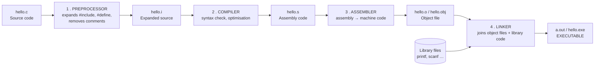
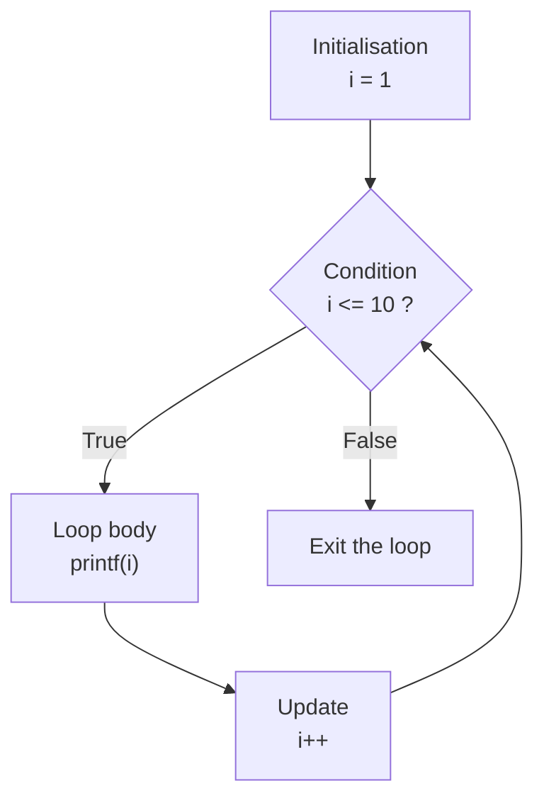
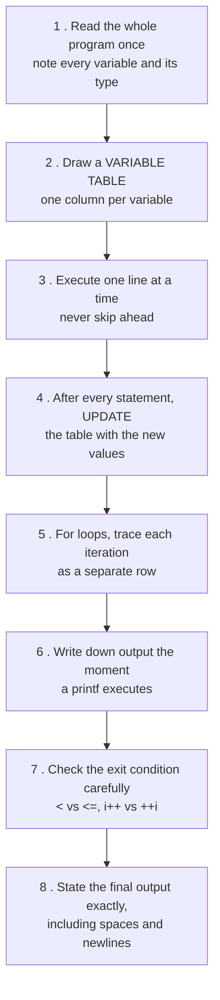

<!-- TOC START -->
**Table of Contents** — 2 subtopics · 11 theories

1. **[Basic Programs & Control Statements](#basic-programs--control-statements)**
   - [C Program Structure and the Compilation Process](#c-program-structure-and-the-compilation-process)
   - [Decision Making — if, if-else, nested if and switch](#decision-making--if-if-else-nested-if-and-switch)
   - [Loops in C — for, while and do-while](#loops-in-c--for-while-and-do-while)
   - [Arrays in C — 1-D, 2-D and Common Operations](#arrays-in-c--1-d-2-d-and-common-operations)
   - [Standard Number Programs](#standard-number-programs)
   - [Series and Pattern Printing Programs](#series-and-pattern-printing-programs)

2. **[Output Tracing & Control Flow](#output-tracing--control-flow)**
   - [How to Trace C Program Output — A Step-by-Step Method](#how-to-trace-c-program-output--a-step-by-step-method)
   - [Operator Precedence, Associativity and Order of Evaluation](#operator-precedence-associativity-and-order-of-evaluation)
   - [Increment and Decrement Operators — i++ vs ++i](#increment-and-decrement-operators--i-vs-i)
   - [Integer Arithmetic Traps — Division, Overflow and Type Promotion](#integer-arithmetic-traps--division-overflow-and-type-promotion)
   - [Common Output-Tracing Traps in C](#common-output-tracing-traps-in-c)

<!-- TOC END -->

---

## Basic Programs & Control Statements

### C Program Structure and the Compilation Process

#### The anatomy of a C program

```c
/*  1. Documentation section — comments  */
#include <stdio.h>          /* 2. Preprocessor / link section */
#include <math.h>

#define PI 3.14159          /* 3. Definition section — macros  */

int globalCount = 0;        /* 4. Global declaration section   */

int square(int n);          /* 5. Function prototype           */

int main(void) {            /* 6. main() — execution starts HERE */
    int x = 5;              /*    local declarations           */
    printf("%d\n", square(x));   /* executable statements      */
    return 0;               /*    0 = success                  */
}

int square(int n) {         /* 7. User-defined function        */
    return n * n;
}
```

| Section | Purpose |
|---|---|
| **Documentation** | Comments — `/* … */` or `//` |
| **Link / Preprocessor** | `#include` pulls in header files |
| **Definition** | `#define` creates symbolic constants and macros |
| **Global declaration** | Variables and prototypes visible to the whole file |
| **`main()`** | **Mandatory** — execution always begins here |
| **User-defined functions** | The rest of the program's logic |

#### The compilation process — source code to executable



| Stage | Input → Output | What it does |
|---|---|---|
| **1. Preprocessing** | `.c` → `.i` | Expands `#include` and `#define`, handles `#ifdef`, strips comments |
| **2. Compilation** | `.i` → `.s` | Checks syntax and semantics, optimises, generates assembly |
| **3. Assembly** | `.s` → `.o` | Converts assembly into relocatable machine code |
| **4. Linking** | `.o` + libraries → executable | Resolves function references (e.g. `printf`), produces the final binary |

**GCC commands to know:** `gcc -E` (preprocess only) · `gcc -S` (compile to assembly) · `gcc -c` (compile to object file) · `gcc hello.c -o hello` (all four stages).

#### Input and output

```c
printf("Enter two numbers: ");
scanf("%d %d", &a, &b);        /* & gives scanf the ADDRESS of the variable */
printf("Sum = %d\n", a + b);
```

| Specifier | Type |
|---|---|
| `%d` | int (decimal) |
| `%f` | float · `%lf` for double |
| `%c` | char |
| `%s` | string |
| `%u` | unsigned int |
| `%ld` | long int |
| `%x` / `%o` | hexadecimal / octal |
| `%p` | pointer / address |
| `%%` | a literal % sign |

**Previous Year Question List from this Topic:**

- [(i) Formatted Input/Output Statement কাকে বলে? Key-Board থেকে কিভাবে input নেয়া যায়? %d এর অর্থ কী?](../written-answers/c-programming.md?plain=1#L2739)
- [Answer the following Questions](../written-answers/c-programming.md?plain=1#L4050)
- [Answer the following question:](../written-answers/c-programming.md?plain=1#L9344)


---

### Decision Making — if, if-else, nested if and switch

#### The if family

```c
/* simple if */
if (marks >= 40)
    printf("Pass\n");

/* if-else */
if (n % 2 == 0)  printf("Even\n");
else             printf("Odd\n");

/* else-if ladder */
if      (marks >= 80) grade = 'A';
else if (marks >= 70) grade = 'B';
else if (marks >= 60) grade = 'C';
else                  grade = 'F';

/* nested if — an if INSIDE another if */
if (age >= 18) {
    if (hasNID)  printf("Can vote\n");
    else         printf("Get an NID first\n");
} else {
    printf("Too young\n");
}
```

> **Nested if** means placing one `if` statement **inside the body of another `if` or `else`**. It is used when a second condition only makes sense once the first is already true. Always use **braces `{}`** in nested ifs — without them, a dangling `else` binds to the **nearest unmatched `if`**, which is a classic bug.

**The conditional (ternary) operator** is a compact `if-else` that returns a value:

```c
max = (a > b) ? a : b;        /* if (a>b) max=a; else max=b; */
```

#### switch-case

```c
switch (expression) {         /* must be int or char — NOT float, NOT string */
    case 1:
        printf("One");
        break;                /* without break, execution FALLS THROUGH */
    case 2:
        printf("Two");
        break;
    default:
        printf("Other");
}
```

**Rules of `switch`:**
1. The expression must evaluate to an **integer or character** type (`int`, `char`, `enum`) — **float and string are not allowed**.
2. Each `case` label must be a **constant**, not a variable or an expression.
3. Case labels must be **unique**.
4. **`break`** exits the switch; without it control **falls through** into the next case.
5. **`default`** is optional and runs when no case matches; it can be placed anywhere but is conventionally last.

**Deliberate fall-through is useful** when several values share one action:

```c
switch (ch) {
    case 'A': case 'E': case 'I': case 'O': case 'U':
    case 'a': case 'e': case 'i': case 'o': case 'u':
        printf("Vowel");
        break;
    default:
        printf("Consonant");
}
```

> This is exactly how the `if (ch=='A' || ch=='E' || ch=='I' || ch=='O' || ch=='U')` condition is converted to a switch: each alternative becomes a **case label stacked above a single shared body**.

#### if-else vs switch

| Point | **if-else** | **switch** |
|---|---|---|
| Condition type | **Any** boolean expression | Only **equality** against integer/char constants |
| Ranges and relations (`>`, `<`, `&&`) | ✅ Yes | ❌ No |
| Float / string comparison | ✅ Yes | ❌ No |
| Speed with many cases | Checks conditions one by one | Often compiled to a **jump table — faster** |
| Readability with many fixed values | Poor | **Excellent** |
| Fall-through | Not applicable | Possible (and must be controlled with `break`) |

> ### "Can every if-else be converted into a switch?"
> ### ❌ **No.**
>
> A switch can only test **equality of one integral expression against constant values**. An `if-else` can test **anything**. So conversion is impossible when the condition involves:
> - **Ranges or relational operators:** `if (marks >= 80)` — a switch cannot express "greater than or equal".
> - **Floating-point values:** `if (price > 99.5)`.
> - **Strings:** `if (strcmp(name, "Rahim") == 0)`.
> - **Multiple different variables:** `if (a > 0 && b < 10)` — a switch tests only one expression.
> - **Non-constant case values:** `case x:` where x is a variable.
>
> **Conversion IS possible** when the `if-else` chain compares **one integer or char variable against fixed constants** — e.g. a menu selection, a vowel test, or a day-of-week lookup.
>
> *(A range **can** be forced into a switch by listing every value — `case 80: case 81: … case 100:` — but this is impractical and defeats the purpose.)*

**Previous Year Question List from this Topic:**

- [Write a C program to check the number in EVEN or ODD.](../written-answers/c-programming.md?plain=1#L22)
- [Write a C/Java program to determine if a given year is a leap year nor not.](../written-answers/c-programming.md?plain=1#L45)
- [Salary Range and Tax Calculation are given:](../written-answers/c-programming.md?plain=1#L368)
- [Write a C/C++ program for check out a leap year program.](../written-answers/c-programming.md?plain=1#L1112)
- [Determine even or odd numbers.](../written-answers/c-programming.md?plain=1#L1864)
- [Write a program to find this is Leap year or not, using function.](../written-answers/c-programming.md?plain=1#L2123)
- [(b) Write a program in C/C++/Java to identify the largest number of given 3 numbers.](../written-answers/c-programming.md?plain=1#L2325)
- [(b) Write down a program in C language that will find the maximum of four integer gives as inputs.](../written-answers/c-programming.md?plain=1#L2350)
- [Write the code for second highest maximum from given three number in c/c++.](../written-answers/c-programming.md?plain=1#L2631)
- [Write a simple output C program to check odd-even number.](../written-answers/c-programming.md?plain=1#L2663)
- [(ii) if......else statement এর format লিখ। 1+3+5+7+\dots+n সিরিজটির যোগফল নির্ণয়ের জন্য C-language এ একটি প্রোগ্রাম লিখ।](../written-answers/c-programming.md?plain=1#L2769)
- [An employee’s total weekly pay is calculated by multiplying the hourly wage and number of regular hours plus any overtime pays which in turn is calculated as to…](../written-answers/c-programming.md?plain=1#L2809)
- [Write a code in C/C++ that will output the 2nd largest number. (If N>=1)](../written-answers/c-programming.md?plain=1#L2928)
- [(খ) $ax^2+bx+c=0$ সমীকরণটির x চলকের মান নির্ণয়ের জন্য C প্রোগ্রামিং ল্যাঙ্গুয়েজে একটি কোড লিখুন।](../written-answers/c-programming.md?plain=1#L3122)
- [Write a program to calculate GPA, Avg and total marks.](../written-answers/c-programming.md?plain=1#L3317)
- [Write a program in any language to find out maximum among three numbers.](../written-answers/c-programming.md?plain=1#L3791)
- [নিচের if-else কে switch case এ পরিনত করুন। if(ch== 'A':: ch== 'E' :: ch== 'I' :: ch == 'O':: ch== 'U')](../written-answers/c-programming.md?plain=1#L9310)
- [উদাহরণসহ i++ and ++i এর মধ্যে পার্থক্য লিখুন। Nested if কী?](../written-answers/c-programming.md?plain=1#L9416)
- [(c) Is it possible to convert all if-else code into switch code block? Give an example.](../written-answers/c-programming.md?plain=1#L9516)


---

### Loops in C — for, while and do-while

A **loop** repeats a block of statements while a condition remains true. Every loop has **three parts**: **initialisation**, **condition (test)**, and **update (increment/decrement)**.



#### The three loop types

```c
/* 1. for loop — when the number of iterations is KNOWN */
for (i = 1; i <= 10; i++) {
    printf("%d ", i);
}

/* 2. while loop — ENTRY controlled, count may be unknown */
i = 1;
while (i <= 10) {
    printf("%d ", i);
    i++;
}

/* 3. do-while loop — EXIT controlled, body runs AT LEAST ONCE */
i = 1;
do {
    printf("%d ", i);
    i++;
} while (i <= 10);           /* note the SEMICOLON */
```

#### Syntax summary

| Loop | Syntax |
|---|---|
| **while** | `while (condition) { statements }` |
| **do-while** | `do { statements } while (condition);` ← **semicolon required** |
| **for** | `for (init; condition; update) { statements }` |

#### while vs do-while — the key difference

| Point | **while** | **do-while** |
|---|---|---|
| Condition checked | **Before** the body — *entry controlled* | **After** the body — *exit controlled* |
| Minimum executions | **0** | **1 — always runs at least once** |
| Semicolon after the condition | ❌ No | ✅ **Yes** |
| Used when | The body may not need to run at all | The body must run at least once (menus, input validation) |

**Illustration:**

```c
int i = 100;
while (i < 10) { printf("A"); i++; }     /* prints NOTHING — condition false at entry */

int j = 100;
do { printf("B"); j++; } while (j < 10); /* prints "B" ONCE — body runs before the test */
```

**Typical do-while use — input validation:**

```c
int choice;
do {
    printf("Enter 1-5: ");
    scanf("%d", &choice);
} while (choice < 1 || choice > 5);      /* keep asking until valid */
```

#### Infinite loops and how to terminate them

```c
for (;;)        { ... }      /* all three parts empty → infinite */
while (1)       { ... }
do { ... } while (1);
```

> ### "What can be used to terminate `for(;;)`?"
>
> `for(;;)` has **no condition**, so it never ends on its own. It is terminated from **inside the body** by:
>
> | Method | Effect |
> |---|---|
> | **`break;`** | ✅ **The normal way** — immediately exits the loop and continues after it |
> | **`return;`** | Exits the **whole function**, so the loop ends too |
> | **`goto label;`** | Jumps out of the loop to a label (legal but discouraged) |
> | **`exit(0);`** | Terminates the **entire program** |
> | A raised **signal / exception** | Abnormal termination |
>
> *(`continue` does **not** terminate a loop — it only skips to the next iteration.)*

```c
for (;;) {
    scanf("%d", &n);
    if (n == -1) break;          /* ← this is how you get out */
    printf("%d\n", n * n);
}
```

#### Nested loops

A loop inside another loop. The **inner loop completes fully for every single iteration of the outer loop**, so total iterations = outer × inner.

```c
for (i = 1; i <= 3; i++)         /* outer: 3 times   */
    for (j = 1; j <= 4; j++)     /* inner: 4 times each → 12 total */
        printf("%d*%d ", i, j);
```

#### Jump statements

| Statement | Effect |
|---|---|
| **`break`** | Exits the **innermost** loop or `switch` immediately |
| **`continue`** | Skips the rest of the current iteration and jumps to the **next** one |
| **`goto label`** | Unconditional jump to a label — legal but strongly discouraged |
| **`return`** | Exits the current function, optionally returning a value |

```c
for (i = 1; i <= 10; i++) {
    if (i == 5) continue;     /* skips printing 5 */
    if (i == 8) break;        /* stops at 8       */
    printf("%d ", i);
}
/* Output: 1 2 3 4 6 7 */
```

**Previous Year Question List from this Topic:**

- [(a) Difference between a while loop and do-while loop.](../written-answers/c-programming.md?plain=1#L97)
- [Print the following matrix using for loop.](../written-answers/c-programming.md?plain=1#L1893)
- [What is the equivalant code of the following statement in while loop format?](../written-answers/c-programming.md?plain=1#L3161)
- [When the statement numbered 4,5,6,7 are replaced by](../written-answers/c-programming.md?plain=1#L3937)
- [What can be used to terminate for(;;)?](../written-answers/c-programming.md?plain=1#L8897)
- [Write the syntax of while and do while loop.](../written-answers/c-programming.md?plain=1#L9112)
- [Explain in details the different forms of looping statement in C language.](../written-answers/c-programming.md?plain=1#L9596)
- [Three types of control statements and their graphical presentation using flowchart or flow graph.](../written-answers/c-programming.md?plain=1#L10010)
- [(ক) Loop কী? প্রবাহচিত্রসহ এর গঠন ব্যাখ্যা করুন।](../written-answers/c-programming.md?plain=1#L10041)


---

### Arrays in C — 1-D, 2-D and Common Operations

An **array** is a collection of **elements of the same data type** stored in **contiguous memory**, accessed by an **index starting at 0**.

```c
int  a[5] = {10, 20, 30, 40, 50};     /* a[0]=10 … a[4]=50 */
int  b[]  = {1, 2, 3};                /* size inferred = 3 */
int  c[5] = {0};                      /* all five set to 0 */
int  m[3][4];                         /* 2-D: 3 rows × 4 columns */
```

> ### "What happens when an array is declared without a size?"
>
> | Case | Result |
> |---|---|
> | `int a[] = {1,2,3,4};` | ✅ **Legal** — the compiler counts the initialisers and sets the size to **4** |
> | `int a[];` (as a local or global variable, no initialiser) | ❌ **Compilation error** — "array size missing"; the compiler cannot know how much memory to reserve |
> | `void f(int a[])` (a **function parameter**) | ✅ **Legal** — inside a function an array parameter **decays into a pointer** (`int *a`), so no size is needed. **This is why you must pass the size as a separate argument.** |
> | `extern int a[];` | ✅ **Legal** — it is only a declaration; the definition with the real size exists in another file |

#### Important array facts

1. **Indexing starts at 0** — the last valid index of `a[n]` is `n-1`.
2. C does **NOT check array bounds**. `a[10]` on a 5-element array compiles fine and reads whatever memory is there — a major source of bugs and security holes.
3. The array **name is the address of the first element**: `a` ≡ `&a[0]`.
4. `sizeof(a) / sizeof(a[0])` gives the number of elements — **but only in the scope where the array was declared**, not inside a function that received it as a parameter.
5. Arrays **cannot be assigned or compared** wholesale: `a = b;` and `a == b` are wrong. Use `memcpy` and element-by-element comparison.
6. An array is always **passed to a function by reference** (as a pointer), so modifications inside the function are visible to the caller.

#### Finding the maximum and minimum

```c
int findMax(int a[], int n) {
    int max = a[0];                  /* start with the FIRST element,
                                        never with 0 — the data may be negative */
    for (int i = 1; i < n; i++)
        if (a[i] > max) max = a[i];
    return max;
}

int findMin(int a[], int n) {
    int min = a[0];
    for (int i = 1; i < n; i++)
        if (a[i] < min) min = a[i];
    return min;
}
```
**Time: O(n), Space: O(1).** *(Both together can be found in 3n/2 comparisons by processing elements in pairs.)*

#### Removing duplicate elements

```c
int removeDuplicates(int a[], int n) {
    int k = 0;                        /* length of the result */
    for (int i = 0; i < n; i++) {
        int isDup = 0;
        for (int j = 0; j < k; j++)
            if (a[i] == a[j]) { isDup = 1; break; }
        if (!isDup) a[k++] = a[i];
    }
    return k;                         /* new length */
}
```
**Time: O(n²).** *(If the array is **sorted**, duplicates are adjacent and can be removed in a single **O(n)** pass; with a hash set it is O(n) on unsorted data too.)*

#### The missing-number problem

> *"An array of size 10 contains the numbers 1 to 10 exactly once, but one is replaced by 0. Find the missing number."*

```c
/* The elegant O(n), O(1) solution — use the sum formula */
int findMissing(int a[], int n) {     /* n = 10 */
    int expected = n * (n + 1) / 2;   /* 1+2+…+10 = 55 */
    int actual = 0;
    for (int i = 0; i < n; i++) actual += a[i];
    return expected - actual;         /* the difference IS the missing number */
}
```

*(An **XOR** approach also works and avoids any overflow risk: XOR all the numbers 1…n together with all the array values; every present number cancels out and the missing one remains.)*

#### The equilibrium index

An **equilibrium index** is an index where the **sum of all elements to its left equals the sum of all elements to its right**.

```c
int equilibrium(int a[], int n) {
    int total = 0, leftSum = 0;
    for (int i = 0; i < n; i++) total += a[i];      /* total sum */

    for (int i = 0; i < n; i++) {
        total -= a[i];                    /* now 'total' = right sum */
        if (leftSum == total) return i;   /* found it */
        leftSum += a[i];                  /* extend the left part */
    }
    return -1;                            /* none exists */
}
```
**Time: O(n), Space: O(1)** — far better than the naive O(n²) that recomputes both sums for every index.

#### 2-D arrays and matrices

```c
int m[3][4];                              /* 3 rows, 4 columns */
/* stored in ROW-MAJOR order: m[0][0], m[0][1] … m[0][3], m[1][0] … */
```

**Sum of each row and each column:**

```c
void rowColSum(int a[][100], int m, int n) {
    for (int i = 0; i < m; i++) {         /* row sums */
        int s = 0;
        for (int j = 0; j < n; j++) s += a[i][j];
        printf("Sum of row %d = %d\n", i + 1, s);
    }
    for (int j = 0; j < n; j++) {         /* column sums */
        int s = 0;
        for (int i = 0; i < m; i++) s += a[i][j];
        printf("Sum of column %d = %d\n", j + 1, s);
    }
}
```

**Matrix multiplication with a compatibility check:**

```c
/* A is p×q, B is r×s.  Multiplication is legal ONLY if q == r. */
if (q != r) {
    printf("Error: matrices cannot be multiplied "
           "(columns of A = %d, rows of B = %d)\n", q, r);
} else {
    for (i = 0; i < p; i++)
        for (j = 0; j < s; j++) {
            C[i][j] = 0;
            for (k = 0; k < q; k++)
                C[i][j] += A[i][k] * B[k][j];
        }
}
```
**Time: O(p·q·s)** → **O(n³)** for square matrices.

**Previous Year Question List from this Topic:**

- [a) Suppose you are working with an array of size 10. It contains all the numbers from 1 to 10 exactly once in a random order. But accidentally, one of the numbe…](../written-answers/c-programming.md?plain=1#L158)
- [Find biggest elements in an array of 10 components.](../written-answers/c-programming.md?plain=1#L194)
- [Write a C program that accepts 10 elements in an array and finds the maximum elements from the array.](../written-answers/c-programming.md?plain=1#L219)
- [Write a function to find minimum number from an array, return minimum value as argument.](../written-answers/c-programming.md?plain=1#L246)
- [Write a program in any language to find the sum of rows and columns of a m \times n matrix, where m and n is taken input from the user. Give the output in the f…](../written-answers/c-programming.md?plain=1#L462)
- [Write a function which receives an array of integers as parameter and print the numbers divisible by 3 in the array.](../written-answers/c-programming.md?plain=1#L657)
- [Write a program in any language that takes two matrices A and B as inputs ensure your code handles matrices of different dimensions—](../written-answers/c-programming.md?plain=1#L1367)
- [Write a function to find the smallest element from an array.](../written-answers/c-programming.md?plain=1#L1436)
- [Suppose you have an array. The array contains elements from 0 to 10. This array also contains 0. To replace these 0s, write a program in C/C++ language.](../written-answers/c-programming.md?plain=1#L1462)
- [Write a function int equilibrium (int() arr, int n); that given a sequence arr() of size n, returns an equilibrium index (if any) or -1 if no equilibrium indexe…](../written-answers/c-programming.md?plain=1#L1495)
- [Write a C Program to delete duplicate element from array.](../written-answers/c-programming.md?plain=1#L1619)
- [(খ) এমন একটি C program লিখুন যা একটি array তৈরি করে কতগুলো ডেটা রাখবে, তারপর ফলাফল হিসেবে ডেটাগুলোকে বিপরীত দিক থেকে print করবে।](../written-answers/c-programming.md?plain=1#L1694)
- [Find the most significant number in an array of N elements.](../written-answers/c-programming.md?plain=1#L1837)
- [ইউজার হতে 10 টি integer data input করে যে data গুলো 5 দ্বারা বিভাজ্য তাদের গড় মান নির্ণয় এর একটি program লিখুন।](../written-answers/c-programming.md?plain=1#L1939)
- [Write a function in C/C++ that return kth largest number of an array. The function has three parameters array_name, size, k.](../written-answers/c-programming.md?plain=1#L1973)
- [Write a C program using array, here N is the number of total students. Take the input and find the average marks. Find out the students who got the above marks…](../written-answers/c-programming.md?plain=1#L2154)
- [Consider int num(20)(4) holds the marks of four class test(CT) of a class of 20 students. Write a program to find out the sum of best three CT marks for each st…](../written-answers/c-programming.md?plain=1#L2230)
- [(খ) তোমার ক্লাসের ছাত্রদের তালিকা Sort করার জন্য একটি C Program লিখ।](../written-answers/c-programming.md?plain=1#L2287)
- [We are given an array of integers and a range, we need to find whether the subarray which falls in this range has values in the form of a mountain or not. All v…](../written-answers/c-programming.md?plain=1#L2376)
- [(a) Write down a function in C Programming language, that will take an n\times n matrix as parameter and the dimension n as another parameter, then compute the…](../written-answers/c-programming.md?plain=1#L2477)
- [(b) Write down a program to find sum of diagonal elements of a two dimensional matrix.](../written-answers/c-programming.md?plain=1#L2511)
- [X is an integer stream of N numbers. You have to select 2 data P and Q such that A <= (P+Q) <= B. Write an algorithm / pseudo code/ C program how many ways you…](../written-answers/c-programming.md?plain=1#L2871)
- [(ক) একটি Array তে পাঁচটি সংখ্যা Input হিসেবে নিয়ে তাদের গড় বের করার জন্য C প্রোগ্রামিং ল্যাঙ্গুয়েজে কোড লিখুন।](../written-answers/c-programming.md?plain=1#L3093)
- [Write a c program to find max price from 20 items.](../written-answers/c-programming.md?plain=1#L3286)
- [Write a program of find max from 20 item price. (Using any language)](../written-answers/c-programming.md?plain=1#L3392)
- [Suppose an array is {4,5,6,7}. Write a C program that will output like {4,5}, {4,6}, {4,7}, {5,6}, {5,7}, {6,7}.](../written-answers/c-programming.md?plain=1#L3529)
- [Write a program using any programming language that reads five numbers from keyboard and display the smaller, larger and average of those numbers.](../written-answers/c-programming.md?plain=1#L3561)
- [Write a program to find out the minimum number from a series.](../written-answers/c-programming.md?plain=1#L3660)
- [Write a C program to acending (A-Z) using selection sort.](../written-answers/c-programming.md?plain=1#L3721)
- [Write a C program to get max element of an array.](../written-answers/c-programming.md?plain=1#L3869)
- [Write a program/code to find the largest number in an array of 10 elements.](../written-answers/c-programming.md?plain=1#L3913)
- [Write a program that read n number string and print these strings in ascending order.](../written-answers/c-programming.md?plain=1#L3974)
- [Write a C program that performs this matrices problem. Calculate and display the sum of the elements on the main diagonal and the sum of the elements on the ant…](../written-answers/c-programming.md?plain=1#L4172)
- [What will occur when an array is declared without size?](../written-answers/c-programming.md?plain=1#L8914)


---

### Standard Number Programs

These short programs account for a very large share of the marks. Learn each pattern once.

#### Even or odd

```c
if (n % 2 == 0) printf("Even");
else            printf("Odd");
```

#### Leap year

> A year is a leap year if it is **divisible by 4**, **except** century years, which must be **divisible by 400**.

```c
int isLeap(int y) {
    return (y % 4 == 0 && y % 100 != 0) || (y % 400 == 0);
}
```
**Check:** 2024 → leap ✅ · 1900 → **not** leap (÷100 but not ÷400) ✅ · 2000 → leap (÷400) ✅

#### Prime number

```c
int isPrime(int n) {
    if (n <= 1) return 0;               /* 0, 1 and negatives are NOT prime */
    for (int i = 2; i * i <= n; i++)    /* check only up to √n */
        if (n % i == 0) return 0;
    return 1;
}

/* print all primes from 1 to n */
for (int i = 2; i <= n; i++)
    if (isPrime(i)) printf("%d ", i);
```
**Why √n?** If n = a × b, one factor must be ≤ √n, so there is no point looking further. This turns O(n) into **O(√n)**.

#### Factorial

```c
/* iterative */
long long fact(int n) {
    long long f = 1;
    for (int i = 2; i <= n; i++) f *= i;
    return f;
}

/* recursive */
long long factRec(int n) {
    if (n <= 1) return 1;               /* base case */
    return n * factRec(n - 1);          /* recursive case */
}
```
*Note:* 0! = 1, and factorials overflow fast — 13! already exceeds a 32-bit `int`, so use `long long` (good to 20!).

#### Armstrong number

> An **Armstrong number** equals the sum of its own digits each raised to the power of the number of digits.
> 153 = 1³ + 5³ + 3³ = 1 + 125 + 27 = **153** ✅

```c
int isArmstrong(int n) {
    int digits = 0, temp = n, sum = 0;
    while (temp) { digits++; temp /= 10; }      /* count the digits */
    temp = n;
    while (temp) {
        int d = temp % 10;
        sum += (int)pow(d, digits);
        temp /= 10;
    }
    return sum == n;
}
```
**3-digit Armstrong numbers:** 153, 370, 371, 407.

#### Sum of digits · reverse · palindrome number

```c
int sumDigits(int n) {
    int s = 0;
    while (n) { s += n % 10; n /= 10; }   /* %10 peels off the last digit,
                                             /10 removes it */
    return s;
}

int reverse(int n) {
    int r = 0;
    while (n) { r = r * 10 + n % 10; n /= 10; }
    return r;
}

int isPalindrome(int n) { return n == reverse(n); }   /* 121 → yes, 123 → no */
```

> **The two operations to memorise:** `n % 10` gives the **last digit**; `n / 10` **removes** the last digit. Almost every digit problem is built from these two.

#### Swapping two numbers without a third variable

```c
/* using arithmetic */
a = a + b;
b = a - b;      /* b = (a+b) - b = original a */
a = a - b;      /* a = (a+b) - original a = original b */

/* using XOR — no overflow risk */
a = a ^ b;
b = a ^ b;
a = a ^ b;
```
*(Caution: both tricks fail if `a` and `b` are the **same variable** — the value becomes 0.)*

#### Fibonacci series

```c
int a = 0, b = 1, c;
printf("%d %d ", a, b);
for (int i = 3; i <= n; i++) {
    c = a + b;
    printf("%d ", c);
    a = b;  b = c;
}
/* 0 1 1 2 3 5 8 13 21 34 … */
```

#### Quadratic equation ax² + bx + c = 0

```c
d = b * b - 4 * a * c;                 /* the DISCRIMINANT decides everything */
if (d > 0)
    printf("Two real distinct roots: %.2f and %.2f",
           (-b + sqrt(d)) / (2*a), (-b - sqrt(d)) / (2*a));
else if (d == 0)
    printf("Two equal real roots: %.2f", -b / (2.0*a));
else
    printf("Complex roots: %.2f + %.2fi and %.2f - %.2fi",
           -b / (2.0*a), sqrt(-d) / (2*a), -b / (2.0*a), sqrt(-d) / (2*a));
```

| Discriminant D = b² − 4ac | Roots |
|---|---|
| **D > 0** | Two **distinct real** roots |
| **D = 0** | Two **equal real** roots |
| **D < 0** | Two **complex conjugate** roots |

#### Salary / tax slab calculation

Slab problems are just an **else-if ladder**, but the tax must be computed **slab by slab**, not on the whole amount:

```c
double tax = 0;
if (income <= 350000)                       tax = 0;
else if (income <= 450000)                  tax = (income - 350000) * 0.05;
else if (income <= 750000)                  tax = 100000*0.05 + (income - 450000) * 0.10;
else                                        tax = 100000*0.05 + 300000*0.10
                                                  + (income - 750000) * 0.15;
```
> **The common mistake:** computing `income * rate` for the whole income. Real tax systems are **progressive** — each slab is taxed at its own rate and the results are added.

**Previous Year Question List from this Topic:**

- [Write a C program to check the number in EVEN or ODD.](../written-answers/c-programming.md?plain=1#L22)
- [Write a C/Java program to determine if a given year is a leap year nor not.](../written-answers/c-programming.md?plain=1#L45)
- [Write a C/Java program to check Armstrong number or not.](../written-answers/c-programming.md?plain=1#L275)
- [Write a C program find prime number 1 to n.](../written-answers/c-programming.md?plain=1#L432)
- [Write a program in any language to find the prime numbers between 1.......n, where n is taken as user input.](../written-answers/c-programming.md?plain=1#L505)
- [Write a Program Prime number print from 1 to n.](../written-answers/c-programming.md?plain=1#L551)
- [Write a C program: ax^2+bx+c=0](../written-answers/c-programming.md?plain=1#L688)
- [Write a program that take a number as input and output should be sum of digits of that number using python/C also draw its flow chart.](../written-answers/c-programming.md?plain=1#L728)
- [(খ) একটি ধনাত্মক পূর্ণ সংখ্যার Factorial নির্ণয়ের C program লিখুন।](../written-answers/c-programming.md?plain=1#L905)
- [Write a program swap two numbers without using 3rd variable.](../written-answers/c-programming.md?plain=1#L935)
- [Write a C/C++ program to count the prime number up to N.](../written-answers/c-programming.md?plain=1#L1084)
- [Write a program find prime number between 1 to 100?](../written-answers/c-programming.md?plain=1#L1264)
- [Write a C code that show factorial of a number.](../written-answers/c-programming.md?plain=1#L1588)
- [Given two integers A and B as input write a program to compute the least common multiple of A and B.](../written-answers/c-programming.md?plain=1#L1658)
- [(খ) প্রথম দশটি Fibonacci number প্রদর্শনের জন্য একটি C program লিখুন।](../written-answers/c-programming.md?plain=1#L1723)
- [C program to find sum of odd numbers from 1 to n.](../written-answers/c-programming.md?plain=1#L1784)
- [Determine whwther a given number is prime or not?](../written-answers/c-programming.md?plain=1#L1809)
- [Write a C/C++ program to find out the prime from 1 to N.](../written-answers/c-programming.md?plain=1#L2005)
- [Write a C/C++ program to find the reverse number of a number.](../written-answers/c-programming.md?plain=1#L2033)
- [Write a C/C++ program to find the HCF.](../written-answers/c-programming.md?plain=1#L2061)
- [Write a C/C++ program to find the sum of digits.](../written-answers/c-programming.md?plain=1#L2095)
- [Write down a function int reverse (int n) that takes a positive integer as input parameter and returns the reverse of the given integer. For example, if input i…](../written-answers/c-programming.md?plain=1#L2196)
- [Write a programme in C/C++/Java what finds sum of digits of a number until sum becomes single digit, simple input/output is: Input: 12345 Output: 6](../written-answers/c-programming.md?plain=1#L2407)
- [Write a C program to compute the perimeter and area of a circle with a given radius.](../written-answers/c-programming.md?plain=1#L2570)
- [A হলো মিটার নং, B হলো ব্যবহৃত ইউনিট। 300 ইউনিটের বেশী তাদের মিটার নং এবং ইউনিটের যোগফল বের কর।](../written-answers/c-programming.md?plain=1#L2596)
- [Write a C program for prime numbers between 1 to N.](../written-answers/c-programming.md?plain=1#L2687)
- [0 থেকে n সংখ্যক পর্যন্ত Fibonacci Series লেখার জন্য প্রোগ্রাম লিখুন।](../written-answers/c-programming.md?plain=1#L2967)
- [A prim number is a number that is evenly divided by only 1 and itself. Write a program to your favorite language to print the first 100 prime numbers.](../written-answers/c-programming.md?plain=1#L3027)
- [Write a program to find the GCD using C/C++.](../written-answers/c-programming.md?plain=1#L3257)
- [Write a program of find Prime number in 1 to 100 number. (Using any language)](../written-answers/c-programming.md?plain=1#L3361)
- [Write a c program to verify a perfect number. Perfect number is a positive integer which is equal to the sum of its proper positive divisors.](../written-answers/c-programming.md?plain=1#L3467)
- [Write a program check a number is prime or not prime.](../written-answers/c-programming.md?plain=1#L3500)
- [Write a program to read the coordinates of the end points of a line and to find its length.](../written-answers/c-programming.md?plain=1#L3597)
- [Write a C program to reverse an integer number.](../written-answers/c-programming.md?plain=1#L3691)
- [Write a structured program to display Fibonacci series up to 100 Numbers.](../written-answers/c-programming.md?plain=1#L3758)
- [Write a program (in C or any language) to find the sum of even numbers from 1 to n.](../written-answers/c-programming.md?plain=1#L3892)
- [(b) What are the rules for calculating the n-th Fibonacci number, and what is the recurrence relation that defines this sequence?](../written-answers/c-programming.md?plain=1#L4012)
- [Write a program that takes two inputs, n and k, where n>k. The program should prompt the user to enter n numbers of data and then return the k^\text{th} smalles…](../written-answers/c-programming.md?plain=1#L4074)
- [Write a program that takes a single alphanumeric string as input. The string may contain both letters (a-z, A-Z) and digits (0-9). Your task is to calculate and…](../written-answers/c-programming.md?plain=1#L4146)


---

### Series and Pattern Printing Programs

#### Arithmetic series

```c
/* 1 + 2 + 3 + … + n */
sum = 0;
for (i = 1; i <= n; i++) sum += i;
/* or directly: sum = n * (n + 1) / 2;  */

/* 1 + 3 + 5 + … + N  (odd numbers) */
sum = 0;
for (i = 1; i <= N; i += 2) sum += i;
/* the sum of the first k odd numbers is exactly k²  */
```

#### The series 1 + 2 + 4 + 7 + 11 + …

Look at the **differences**: 1, 2, 3, 4, 5 … — each term adds one more than the previous gap.

```c
int term = 1, add = 1, sum = 0;
while (term <= N) {
    sum += term;
    printf("%d ", term);
    term += add;      /* the gap grows by 1 each time */
    add++;
}
```

#### Factorial-based series — eˣ and sin x

> **eˣ = 1 + x/1! + x²/2! + x³/3! + …**

```c
double ex(double x, int n) {
    double sum = 1.0, term = 1.0;
    for (int i = 1; i <= n; i++) {
        term = term * x / i;      /* build the next term FROM the previous one —
                                     never recompute the power and factorial */
        sum += term;
    }
    return sum;
}
```

> **x − x³/3! + x⁵/5! − x⁷/7! + … (the sine series)**

```c
double sinSeries(double x, int n) {
    double sum = 0, term = x;
    for (int i = 1; i <= n; i++) {
        sum += term;
        term = -term * x * x / ((2*i) * (2*i + 1));   /* sign flips automatically */
    }
    return sum;
}
```

> **The key technique for every series question:** find the relation `term[i]` → `term[i+1]` and build each term from the previous one. Recomputing `pow()` and `factorial()` from scratch inside the loop is slow and overflows quickly.

#### Pattern printing — the general method

> **Outer loop = rows. Inner loop(s) = what is printed on each row.** Work out the relationship between the row number `i` and the count of spaces and stars.

**Right triangle**
```
*
* *
* * *
* * * *
```
```c
for (i = 1; i <= n; i++) {
    for (j = 1; j <= i; j++) printf("* ");
    printf("\n");
}
```

**Pyramid**
```
   *
  * * *
 * * * * *
* * * * * * *
```
```c
for (i = 1; i <= n; i++) {
    for (j = 1; j <= n - i; j++) printf(" ");        /* leading spaces */
    for (j = 1; j <= 2 * i - 1; j++) printf("* ");   /* stars: 1,3,5,7 */
    printf("\n");
}
```

**Number triangle**
```
1
1 2
1 2 3
1 2 3 4
```
```c
for (i = 1; i <= n; i++) {
    for (j = 1; j <= i; j++) printf("%d ", j);
    printf("\n");
}
```

**Floyd's triangle** — consecutive numbers filled row by row:
```
1
2 3
4 5 6
7 8 9 10
11 12 13 14 15
```
```c
int num = 1;
for (i = 1; i <= n; i++) {                /* n = 5 */
    for (j = 1; j <= i; j++)
        printf("%d ", num++);             /* one counter that never resets */
    printf("\n");
}
```

**Pascal's triangle**
```c
for (i = 0; i < n; i++) {
    int val = 1;
    for (j = 0; j <= i; j++) {
        printf("%d ", val);
        val = val * (i - j) / (j + 1);    /* next binomial coefficient */
    }
    printf("\n");
}
```

**Previous Year Question List from this Topic:**

- [Write down a program is any high level language to read an integer and display a pattern like below. For example, if the given integer number is 1234, then the…](../written-answers/c-programming.md?plain=1#L117)
- [Write a program from the following series: $e^x = 1 + \frac{x}{1} + \frac{x^2}{2!} + \frac{x^3}{3!} + \dots$](../written-answers/c-programming.md?plain=1#L309)
- [Write a C program to find sum of: $X - \frac{X^3}{3!} + \frac{X^5}{5!} - \frac{X^7}{7!} \dots N$](../written-answers/c-programming.md?plain=1#L337)
- [Write a Program Floyds triangle n=5](../written-answers/c-programming.md?plain=1#L580)
- [Write a C Program Find sum of the series: 1+2+4+7+11+..........+N](../written-answers/c-programming.md?plain=1#L628)
- [Write a program for following sequence and analyze complexity of the program](../written-answers/c-programming.md?plain=1#L1054)
- [Write a C program to print the following pattern:](../written-answers/c-programming.md?plain=1#L1544)
- [Write a C program: x - \frac{x^3}{3} + \frac{x^5}{5} - \dots](../written-answers/c-programming.md?plain=1#L1754)
- [(ক) নিচের সিরিজ টি ক্যালকুলেটর এবং প্রিন্ট করার জন্য একটি C Program লিখুন। 1 + 2 + 3 + \dots + 100](../written-answers/c-programming.md?plain=1#L2262)
- [Pattern this print using C++ program-](../written-answers/c-programming.md?plain=1#L2439)
- [(i) Write a C/C++ program up to series n: \frac{1}{2\times 3} + \frac{2}{3\times 4} + \frac{3}{4\times 5} \dots\dots\dots\dots\dots](../written-answers/c-programming.md?plain=1#L2544)
- [Write a program for the following series: 1^2+2^2+3^2+4^2+\dots\dots\dots\dots+N^2](../written-answers/c-programming.md?plain=1#L2715)
- [Write a C program: 1+2^n+3^n+4^n+\dots\dots\dots\dots+n^n (where n>0).](../written-answers/c-programming.md?plain=1#L2843)
- [Write a program in C to find the sum of following series: $1^2+2^2+3^2+\dots\dots\dots\dots+n^2$](../written-answers/c-programming.md?plain=1#L2999)
- [(গ) Array processor কী? $1+\frac{1}{2}+\frac{1}{3}+\dots\dots\dots\dots+\frac{1}{N}$ ধারাটির যোগফল নির্ণয়ের জন্য C ভাষায় একটি প্রোগ্রাম লিখুন।](../written-answers/c-programming.md?plain=1#L3061)
- [(a) Write a Java/C program to find the sum of the following series? $\frac{1}{1!} + \frac{2}{2!} + \frac{3}{3!} + \dots\dots\dots\dots + \frac{N}{N!}$](../written-answers/c-programming.md?plain=1#L3194)
- [একটি ৯ ধার বিশিষ্ট বহুভুজের প্রতিটির ধার সমান। উক্ত বহুভুজের অভ্যন্তরীণ কোন ডিগ্রিতে প্রকাশের C Program লিখুন।](../written-answers/c-programming.md?plain=1#L3223)
- [Write program for following pattern:](../written-answers/c-programming.md?plain=1#L3420)
- [Write a program in C++ to calculate the sum of the series: $1+(1+2)+(1+2+3)+\dots\dots+(1+2+\dots\dots+n)$.](../written-answers/c-programming.md?plain=1#L3627)
- [(a) Write down a program is any high level language to read an integer and display a pattern like below. For example, if the given integer number is 1234, then…](../written-answers/c-programming.md?plain=1#L3832)
- [Write a code to print the following pattern. You can use C/Java as programming language.](../written-answers/c-programming.md?plain=1#L4022)

## Output Tracing & Control Flow

### How to Trace C Program Output — A Step-by-Step Method

Output-tracing ("find the output") questions carry a large share of marks and are pure **mechanical discipline**. Guessing fails; a systematic trace almost never does.

#### The method



#### The variable-table technique

```c
#include <stdio.h>
int main() {
    int i, sum = 0;
    for (i = 1; i <= 5; i++) {
        if (i % 2 == 0) continue;
        sum += i;
        printf("%d ", sum);
    }
    printf("\nFinal = %d", sum);
    return 0;
}
```

| Iteration | i | i ≤ 5? | i % 2 == 0? | sum | Output so far |
|---|---|---|---|---|---|
| 1 | 1 | ✅ | No | 0 + 1 = **1** | `1 ` |
| 2 | 2 | ✅ | **Yes → continue** | 1 | `1 ` |
| 3 | 3 | ✅ | No | 1 + 3 = **4** | `1 4 ` |
| 4 | 4 | ✅ | **Yes → continue** | 4 | `1 4 ` |
| 5 | 5 | ✅ | No | 4 + 5 = **9** | `1 4 9 ` |
| 6 | 6 | ❌ **exit** | — | 9 | — |

> **Output:**
> ```
> 1 4 9
> Final = 9
> ```

#### Checklist of things to watch

| # | Watch for | Why it catches people |
|---|---|---|
| 1 | `<` vs `<=` in the loop condition | One extra or one missing iteration |
| 2 | `i++` vs `++i` **inside an expression** | Different value is used |
| 3 | `=` vs `==` | `if (a = 5)` **assigns** and is always true |
| 4 | Missing `break` in a `switch` | Fall-through prints extra cases |
| 5 | **Integer division** `5/2` | Gives **2**, not 2.5 |
| 6 | Format specifier mismatch (`%d` with a float) | Garbage output |
| 7 | Array index out of bounds | Undefined behaviour |
| 8 | Uninitialised variables | Garbage values |
| 9 | `static` local variables | They **keep their value** between calls |
| 10 | Pre/post increment in `printf` arguments | Evaluation order is unspecified |
| 11 | Character arithmetic (`'A' + 1` = 66 = `'B'`) | Depends on `%c` vs `%d` |
| 12 | Pointer vs value | `*p` vs `p` |
| 13 | Dangling `else` binding | Binds to the **nearest** unmatched `if` |
| 14 | Semicolon after `if` or `for` | `for(i=0;i<5;i++);` has an **empty body** |

**Previous Year Question List from this Topic:**

- [C output problem.](../written-answers/c-programming.md?plain=1#L4219)
- [What will be the output of following program?](../written-answers/c-programming.md?plain=1#L4311)
- [(b) Find out the output of this program.](../written-answers/c-programming.md?plain=1#L4353)
- [Find the output of the following program:](../written-answers/c-programming.md?plain=1#L4391)
- [Output problem:](../written-answers/c-programming.md?plain=1#L4432)
- [Output problem:](../written-answers/c-programming.md?plain=1#L4471)
- [Explain following program while part in step for the input 1221 and 3456 and also write the output of the program. (সম্পূর্ণ প্রশ্ন সংগ্রহ করা সম্ভব হয় নি!!)](../written-answers/c-programming.md?plain=1#L4512)
- [In the below C code. Write the Output on below table based on code and left side. And also explain the line 7-11 in below code.](../written-answers/c-programming.md?plain=1#L4682)
- [C programming output problem.](../written-answers/c-programming.md?plain=1#L4746)
- [What is the output of code snippet?](../written-answers/c-programming.md?plain=1#L4839)
- [নিচের পাইথন program এর Output বের কর:](../written-answers/c-programming.md?plain=1#L4943)
- [Output Tracing:](../written-answers/c-programming.md?plain=1#L4983)
- [Find the output of the following program:](../written-answers/c-programming.md?plain=1#L5036)
- [Find the output of the following program:](../written-answers/c-programming.md?plain=1#L5069)
- [What will be the output of the program?](../written-answers/c-programming.md?plain=1#L5101)
- [What is the output of the following code?](../written-answers/c-programming.md?plain=1#L5137)
- [Output programs:](../written-answers/c-programming.md?plain=1#L5169)
- [Write down the output from following statement:](../written-answers/c-programming.md?plain=1#L5212)
- [Find the Output of following C Program:](../written-answers/c-programming.md?plain=1#L5318)
- [Write Output from below code:](../written-answers/c-programming.md?plain=1#L5367)
- [Fill in the gape and find output of the following program:](../written-answers/c-programming.md?plain=1#L5438)
- [Output of the following program:](../written-answers/c-programming.md?plain=1#L5525)
- [Find the output of following program:](../written-answers/c-programming.md?plain=1#L5586)
- [Output of the following program:](../written-answers/c-programming.md?plain=1#L5643)
- [Find Output:](../written-answers/c-programming.md?plain=1#L5713)
- [Find the output of the following program. You must show each staps.](../written-answers/c-programming.md?plain=1#L5758)
- [Find out the output of the following program.](../written-answers/c-programming.md?plain=1#L5812)
- [After compilation and execution, what will be output in the following code:](../written-answers/c-programming.md?plain=1#L5861)
- [Write down the output of following program:](../written-answers/c-programming.md?plain=1#L5965)
- [Find the Output:](../written-answers/c-programming.md?plain=1#L6232)
- [What is the output of following code?](../written-answers/c-programming.md?plain=1#L6378)
- [Find the output of a program:](../written-answers/c-programming.md?plain=1#L6419)
- [Find the output of the code:](../written-answers/c-programming.md?plain=1#L6470)
- [What is the output of the following program?](../written-answers/c-programming.md?plain=1#L6514)
- [Find the output of the following code:](../written-answers/c-programming.md?plain=1#L6551)
- [Find the output of the following code:](../written-answers/c-programming.md?plain=1#L6584)
- [What is the output of following program?](../written-answers/c-programming.md?plain=1#L6619)
- [Find the output of following program.](../written-answers/c-programming.md?plain=1#L6742)


---

### Operator Precedence, Associativity and Order of Evaluation

#### Precedence table (highest to lowest)

| Precedence | Operators | Associativity |
|---|---|---|
| 1 | `()` `[]` `->` `.` `++` `--` (postfix) | **Left to right** |
| 2 | `++` `--` (prefix) `+` `-` (unary) `!` `~` `*` (deref) `&` `sizeof` `(type)` | **Right to left** |
| 3 | `*` `/` `%` | Left to right |
| 4 | `+` `-` | Left to right |
| 5 | `<<` `>>` | Left to right |
| 6 | `<` `<=` `>` `>=` | Left to right |
| 7 | `==` `!=` | Left to right |
| 8 | `&` (bitwise AND) | Left to right |
| 9 | `^` (bitwise XOR) | Left to right |
| 10 | `\|` (bitwise OR) | Left to right |
| 11 | `&&` | Left to right |
| 12 | `\|\|` | Left to right |
| 13 | `?:` (ternary) | **Right to left** |
| 14 | `=` `+=` `-=` `*=` `/=` `%=` … | **Right to left** |
| 15 | `,` (comma) | Left to right |

**Memory aid for the arithmetic core:** **PUMA** — **P**arentheses, **U**nary, **M**ultiplicative (`* / %`), **A**dditive (`+ -`).

#### Worked evaluations

```c
int x = 10 + 20 * 3;          /* * before + →  10 + 60  = 70 */
int y = (10 + 20) * 3;        /* parentheses first →  30 * 3 = 90 */
int z = 100 / 10 * 2;         /* LEFT to right → (100/10)*2 = 20, NOT 100/20 */
int w = 2 + 3 % 2;            /* % before + →  2 + 1 = 3 */
int v = 10 > 5 && 3 < 1;      /* (10>5)=1, (3<1)=0 → 1 && 0 = 0 */
int u = a = b = c = 5;        /* = is RIGHT to left → c=5, then b=5, then a=5 */
```

#### Precedence vs Associativity vs Order of Evaluation

These three are different, and the difference is exactly what tricky questions exploit.

| Term | Meaning |
|---|---|
| **Precedence** | Which operator **binds tighter** — decides *grouping* |
| **Associativity** | For operators of the **same** precedence, group **left-to-right or right-to-left** |
| **Order of evaluation** | The order in which the **operands** are actually computed — **largely UNSPECIFIED in C** |

> **The critical point:** precedence tells you *how the expression is parsed*, **not** the order in which the sub-expressions are evaluated.
>
> In `f() + g() * h()`, precedence says the result is `f() + (g() * h())` — but C does **not** guarantee whether `f`, `g` or `h` runs first. Any code that depends on that order is **undefined behaviour** and may print different answers on different compilers.

**Classic undefined expressions — never write these, and in an exam say "undefined behaviour":**

```c
i = i++ + ++i;          /* UNDEFINED — i modified twice without a sequence point */
printf("%d %d", i++, i++);   /* UNDEFINED — argument evaluation order is unspecified */
a[i] = i++;             /* UNDEFINED */
```

#### Short-circuit evaluation — a guaranteed order

`&&` and `||` **are** guaranteed to evaluate left to right, and to **stop as soon as the result is known**:

```c
if (a != 0 && b / a > 2)      /* if a==0, b/a is NEVER evaluated → no crash */
if (ptr != NULL && ptr->x)    /* the standard null-check idiom */

int i = 0;
if (0 && i++) ;               /* i++ NEVER runs → i stays 0  */
if (1 || i++) ;               /* i++ NEVER runs → i stays 0  */
```

| Operator | Stops when the left side is | Right side evaluated? |
|---|---|---|
| `&&` | **false (0)** | ❌ No |
| `\|\|` | **true (non-zero)** | ❌ No |

**Previous Year Question List from this Topic:**

- [What is the output of code snippet?](../written-answers/c-programming.md?plain=1#L4839)
- [What is the output of the following code?](../written-answers/c-programming.md?plain=1#L5137)
- [Output of the following program:](../written-answers/c-programming.md?plain=1#L5525)
- [Which of the following is the correct order of evaluation?](../written-answers/c-programming.md?plain=1#L9490)


---

### Increment and Decrement Operators — i++ vs ++i

| Form | Name | Behaviour |
|---|---|---|
| **`++i`** | **Pre-increment** | **Increment FIRST, then use** the new value |
| **`i++`** | **Post-increment** | **Use the old value FIRST, then increment** |

> **Memory hook:** read it left to right. In `++i` the `++` comes **first**, so incrementing happens first. In `i++` the `i` comes first, so the **old value** is used first.

#### Worked examples

```c
int i = 5, j;

j = ++i;      /* i becomes 6, then j = 6   →  i = 6, j = 6 */
```
```c
int i = 5, j;

j = i++;      /* j = 5 (old value), then i becomes 6  →  i = 6, j = 5 */
```

| Statement | Starting i | Final i | Value assigned to j |
|---|---|---|---|
| `j = ++i;` | 5 | **6** | **6** |
| `j = i++;` | 5 | **6** | **5** |
| `j = --i;` | 5 | **4** | **4** |
| `j = i--;` | 5 | **4** | **5** |

**More traces:**

```c
int a = 10;
printf("%d", a++);     /* prints 10, a becomes 11 */
printf("%d", a);       /* prints 11              */

int b = 10;
printf("%d", ++b);     /* b becomes 11, prints 11 */

int x = 5;
int y = x++ + ++x;     /* AVOID — undefined behaviour in C */

int m = 3;
int n = m++ * 2;       /* n = 3 * 2 = 6, then m = 4 */

int p = 3;
int q = ++p * 2;       /* p = 4 first, then q = 4 * 2 = 8 */
```

#### When there is no difference

**As a standalone statement, `i++;` and `++i;` are identical** — the value is discarded, only the side effect matters. So in a `for` loop header:

```c
for (i = 0; i < n; i++)     /* identical in behaviour to ... */
for (i = 0; i < n; ++i)     /* ... this */
```

*(For built-in types they also compile to identical code. For C++ **iterators and objects**, `++i` is marginally more efficient because `i++` must construct and return a copy of the old value.)*

#### The difference matters only when the value is USED

```c
int arr[5] = {10, 20, 30, 40, 50};
int i = 2;
printf("%d", arr[i++]);      /* prints arr[2] = 30, then i = 3 */

i = 2;
printf("%d", arr[++i]);      /* i = 3 first, prints arr[3] = 40 */
```

**Previous Year Question List from this Topic:**

- [(গ) ‘++i’ এবং ‘i++’ অভিব্যক্তি দুটির মধ্যে পার্থক্য কী? উদাহরণসহ ব্যাখ্যা করুন।](../written-answers/c-programming.md?plain=1#L8994)
- [Short question: (i) Difference between ++i and i++ (ii) Difference between Overloading and Overriding (iii) Polymorphism in Java (iv) String variable (v) Contro…](../written-answers/c-programming.md?plain=1#L9260)
- [উদাহরণসহ i++ and ++i এর মধ্যে পার্থক্য লিখুন। Nested if কী?](../written-answers/c-programming.md?plain=1#L9416)


---

### Integer Arithmetic Traps — Division, Overflow and Type Promotion

#### Integer division truncates

```c
int a = 5, b = 2;
printf("%d", a / b);            /* 2  — NOT 2.5; the fraction is DISCARDED */
printf("%f", a / b);            /* still integer division first → garbage with %f */
printf("%f", (float)a / b);     /* 2.500000 — cast promotes BOTH operands */
printf("%f", 5.0 / 2);          /* 2.500000 — one float operand is enough */

printf("%d", 7 / 2);            /*  3 */
printf("%d", -7 / 2);           /* -3 (C99 truncates TOWARDS ZERO) */
printf("%d", 7 % 2);            /*  1 */
printf("%d", -7 % 2);           /* -1 (the sign follows the DIVIDEND) */
```

> **The rule:** if **both** operands are integers, C performs **integer division** and throws away the remainder. To get a real quotient, **at least one operand must be floating point** — use a cast or write `2.0`.
>
> **The `%` operator works only on integers** — `5.5 % 2` is a compile error; use `fmod()` from `math.h`.

#### Data type ranges and overflow

| Type | Typical size | Range |
|---|---|---|
| `char` | 1 byte | −128 to 127 |
| `unsigned char` | 1 byte | 0 to 255 |
| `short` | 2 bytes | **−32,768 to 32,767** |
| `unsigned short` | 2 bytes | 0 to 65,535 |
| `int` | **4 bytes** (modern) | **−2,147,483,648 to 2,147,483,647** |
| `unsigned int` | 4 bytes | 0 to 4,294,967,295 |
| `long long` | 8 bytes | ±9.22 × 10¹⁸ |
| `float` | 4 bytes | ±3.4 × 10³⁸, **~6–7 significant digits** |
| `double` | 8 bytes | ±1.7 × 10³⁰⁸, **~15–16 significant digits** |

> ### "Can I store 32,678 in an `int`?"
> ### ✅ **Yes — easily.**
>
> A modern `int` is **4 bytes** and holds roughly **−2.1 billion to +2.1 billion**, so 32,678 is nowhere near the limit.
>
> **The trap the question is testing:** 32,678 is just above **32,767**, which is the maximum of a **2-byte `short int`** (and of `int` on very old 16-bit compilers such as Turbo C). So:
>
> | Type | Can it hold 32,678? |
> |---|---|
> | `short int` (2 bytes, max 32,767) | ❌ **No** — it **overflows** and wraps around to a negative value (−32,858) |
> | `unsigned short` (max 65,535) | ✅ Yes |
> | `int` on a 16-bit compiler (2 bytes) | ❌ No |
> | **`int` on a modern 32/64-bit compiler (4 bytes)** | ✅ **Yes** |
> | `long`, `long long`, `float`, `double` | ✅ Yes |
>
> **Always answer with the reasoning, not just yes/no:** *"Yes, because `int` is 4 bytes on a modern compiler and its range is ±2.1 billion. But on a 16-bit compiler where `int` is 2 bytes, 32,678 exceeds the maximum of 32,767 and would overflow to a negative number."*

**Overflow demonstration:**

```c
short s = 32767;
s = s + 1;
printf("%d", s);         /* -32768 — it WRAPS AROUND, no error is reported */
```

#### Implicit type conversion (promotion)

In a mixed expression, C promotes the "smaller" type to the "larger" one:

> **char / short → int → unsigned int → long → unsigned long → long long → float → double → long double**

```c
int i = 10;
float f = 3.5;
printf("%f", i + f);       /* i promoted to 10.0 → 13.500000 */

char c = 'A';
printf("%d", c);           /* 65 — the ASCII value */
printf("%c", c + 1);       /* 'B' — char arithmetic is int arithmetic */
printf("%d", 'a' - 'A');   /* 32 — the fixed gap between cases */

double d = 5 / 2;          /* WRONG: 5/2 is computed as INT first → 2, then 2.0 */
double e = 5.0 / 2;        /* RIGHT: 2.5 */
```

#### Floating-point comparison

```c
float a = 0.1 + 0.2;
if (a == 0.3) printf("Equal");      /* may print NOTHING — 0.1 has no exact
                                       binary representation */
if (fabs(a - 0.3) < 1e-6) printf("Equal");   /* ✅ the CORRECT way */
```

**Previous Year Question List from this Topic:**

- [(খ) আমি কী ৩২৬৭৮ মান সংরক্ষণ করতে ‘int’ ডাটা টাইপ ব্যবহার করতে পারি? না পারলে কেন?](../written-answers/c-programming.md?plain=1#L8974)
- [Write some default data type in C.](../written-answers/c-programming.md?plain=1#L9217)
- [Using examples explain data types used in C language.](../written-answers/c-programming.md?plain=1#L9558)


---

### Common Output-Tracing Traps in C

#### 1. Scope and shadowing

```c
int x = 10;                     /* global */
int main() {
    int x = 20;                 /* local SHADOWS the global */
    { int x = 30; printf("%d ", x); }   /* 30 — innermost block wins */
    printf("%d ", x);           /* 20 — the local */
    return 0;
}
/* Output: 30 20 */
```

#### 2. `static` local variables

```c
void counter() {
    static int c = 0;           /* initialised ONCE, survives between calls */
    int d = 0;                  /* recreated on EVERY call */
    c++;  d++;
    printf("c=%d d=%d\n", c, d);
}
int main() { counter(); counter(); counter(); }
/* Output:
   c=1 d=1
   c=2 d=1
   c=3 d=1     ← d always 1, c keeps growing */
```

#### 3. Arrays decay to pointers inside functions

```c
void f(int a[]) {
    printf("%zu\n", sizeof(a));      /* 8 — the size of a POINTER, not the array! */
}
int main() {
    int a[10];
    printf("%zu\n", sizeof(a));      /* 40 — 10 ints × 4 bytes */
    f(a);
}
```

#### 4. Missing `break` — switch fall-through

```c
int x = 2;
switch (x) {
    case 1: printf("One ");
    case 2: printf("Two ");     /* ← starts here */
    case 3: printf("Three ");   /* falls through */
    default: printf("Default");
}
/* Output: Two Three Default   — NOT just "Two" */
```

#### 5. The semicolon-after-loop bug

```c
for (i = 0; i < 5; i++);        /* ← this semicolon is the ENTIRE loop body */
    printf("%d ", i);           /* runs ONCE, after the loop → prints 5 */
/* Output: 5    (not 0 1 2 3 4) */
```

#### 6. `=` instead of `==`

```c
int a = 0;
if (a = 5) printf("True");      /* ASSIGNS 5 to a; 5 is non-zero → TRUE */
/* Output: True     — and a is now 5 */
```

#### 7. Character and ASCII arithmetic

```c
char c = 'A';
printf("%c %d\n", c, c);            /* A 65 */
printf("%c\n", c + 32);             /* a  — lowercase is +32 */
printf("%d\n", '5' - '0');          /* 5  — the standard char→digit trick */
printf("%c\n", 'z' - 'a' + 'A');    /* Z  — case conversion by offset */
```

**Key ASCII values:** `'0'` = **48** · `'A'` = **65** · `'a'` = **97** · space = 32 · `'\0'` = 0.

#### 8. Pointer traps

```c
int a = 10, b = 20;
int *p = &a;
printf("%d\n", *p);       /* 10 — the VALUE at the address */
p = &b;
printf("%d\n", *p);       /* 20 */
(*p)++;                   /* b becomes 21  */
printf("%d\n", b);        /* 21 */

int arr[3] = {1, 2, 3};
int *q = arr;
printf("%d\n", *(q + 2)); /* 3 — pointer arithmetic scales by sizeof(int) */
printf("%d\n", *q++);     /* prints 1, THEN advances q */
```

#### 9. Global vs local variables

```c
int g = 100;                    /* GLOBAL: file scope, static lifetime, auto-init to 0 */
void f() {
    int l;                      /* LOCAL: block scope, automatic lifetime,
                                   UNINITIALISED — contains garbage */
    printf("%d %d", g, l);
}
```

| Point | **Local variable** | **Global variable** |
|---|---|---|
| **Declared** | Inside a function or block | Outside all functions |
| **Scope** | Only within that block | The whole program (file) |
| **Lifetime** | Created on entry, destroyed on exit | Exists for the entire program run |
| **Default value** | **Garbage** (undefined) | **Zero** |
| **Stored in** | **Stack** | **Data segment** |
| **Accessed by** | Only its own function | **Any** function |
| **Name conflicts** | The local **shadows** the global | — |
| **Risk** | Safe, isolated | Any function can change it — hard to debug |
| **Best practice** | **Prefer locals** | Use sparingly, for genuine shared constants |

#### 10. `sizeof` — an operator, not a function

```c
char c = 'A';
printf("%zu\n", sizeof c + 1);      /* (sizeof c) + 1 = 1 + 1 = 2 */
printf("%zu\n", sizeof(c + 1));     /* sizeof(int) = 4 — c is PROMOTED to int */
```

> ### "What is the difference between `sizeof c + 1` and `sizeof(c + 1)`?"
>
> | Expression | How it parses | Result |
> |---|---|---|
> | **`sizeof c + 1`** | `sizeof` binds tighter than `+`, so it is **`(sizeof c) + 1`** = size of a char (1) plus 1 | **2** |
> | **`sizeof(c + 1)`** | The parentheses make `c + 1` the operand. In the expression `c + 1`, the char `c` undergoes **integer promotion**, so the type is **`int`** | **4** (on a typical system) |
>
> **The two lessons:** (1) `sizeof` is a **unary operator** with very high precedence, so without parentheses it grabs only the immediately following operand; (2) any `char` or `short` in an arithmetic expression is **promoted to `int`**, which changes the size of the result.
>
> *(Also note: `sizeof` is evaluated at **compile time** and its operand is **not executed** — `sizeof(i++)` does **not** increment i.)*

#### 11. NULL vs void — a frequently confused pair

| Point | **NULL** | **void** |
|---|---|---|
| **What it is** | A **macro constant** (`#define NULL ((void*)0)`) representing a **pointer that points to nothing** | A **data type keyword** meaning "**no type / no value**" |
| **Category** | A **value** | A **type** |
| **Defined in** | `<stddef.h>`, `<stdio.h>` | A C keyword — built into the language |
| **Used for** | Initialising and testing pointers: `int *p = NULL; if (p != NULL) …` | 1. A function returning nothing: `void f()`<br>2. A function taking no parameters: `int f(void)`<br>3. A **generic pointer**: `void *p` |
| **Can it be dereferenced?** | ❌ Dereferencing NULL → **segmentation fault** | `void*` must be **cast** to a concrete type before dereferencing |
| **Size** | The size of a pointer (8 bytes on 64-bit) | `sizeof(void)` is **illegal** in standard C |
| **Example** | `if (malloc(n) == NULL) { /* allocation failed */ }` | `void *memcpy(void *dest, const void *src, size_t n);` |

> **In one line:** **`void` is a *type* that means "nothing"; `NULL` is a *value* that means "this pointer points at nothing".** They are related only in that `void *` is the generic pointer type that `NULL` is usually defined in terms of.

*(Do not confuse either with **`'\0'`**, the null **character** that terminates a C string, whose value is the integer 0 but whose type is `char`.)*

**Previous Year Question List from this Topic:**

- [Write the function for which the output is 1 for that input.](../written-answers/c-programming.md?plain=1#L4602)
- [(ii) নিচের C প্রোগ্রামটির ভুলগুলো সঠিক করুন এবং প্রোগ্রামটির আউটপুট লিখুন।](../written-answers/c-programming.md?plain=1#L5259)
- [Find out program output of f(\text{arr}, 2), f(\text{arr}, 3), f(\text{arr}, 5), f(\text{arr}, 8). \text{arr}() = (0, 1, 1, 0, 1, 1, 0, 1)](../written-answers/c-programming.md?plain=1#L5491)
- [What will be the output in C and java code? (i) C program:](../written-answers/c-programming.md?plain=1#L6085)
- [a) Using Pseudocode give an example of run time error.](../written-answers/c-programming.md?plain=1#L6187)
- [Find the error of given code](../written-answers/c-programming.md?plain=1#L6337)
- [(b) What is the difference between sizeof c+1 and sizeof (c+1)?](../written-answers/c-programming.md?plain=1#L8859)
- [What is the difference between Null and Void?](../written-answers/c-programming.md?plain=1#L8880)
- [(ক) Local variable এবং Global variable এর মধ্যে পার্থক্য লিখুন।](../written-answers/c-programming.md?plain=1#L8939)
