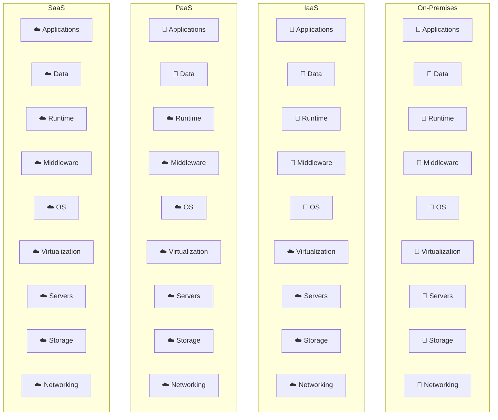
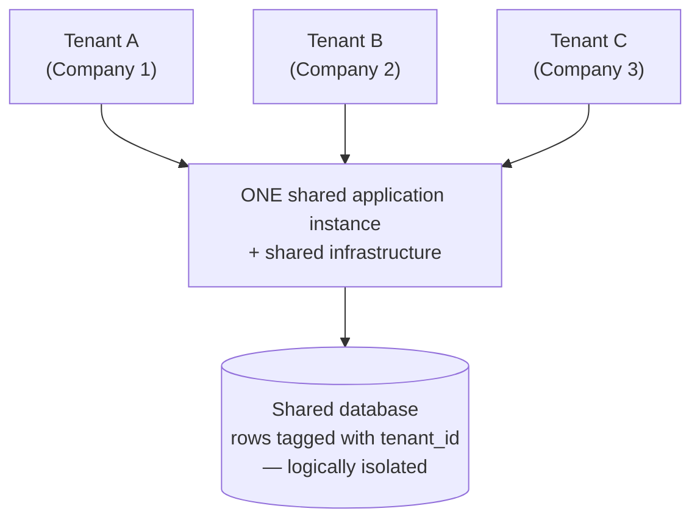

<!-- TOC START -->
**Table of Contents** — 1 subtopics · 3 theories

1. **[Cloud Service Models](#cloud-service-models)**
   - [Cloud Computing — Definition, Characteristics and Deployment Models](#cloud-computing--definition-characteristics-and-deployment-models)
   - [IaaS, PaaS and SaaS — The Three Service Models](#iaas-paas-and-saas--the-three-service-models)
   - [Multi-Tenancy in the Cloud](#multi-tenancy-in-the-cloud)

<!-- TOC END -->

---

## Cloud Service Models

### Cloud Computing — Definition, Characteristics and Deployment Models

**Cloud computing** is the delivery of computing services — **servers, storage, databases, networking, software, analytics** — **over the Internet ("the cloud")**, on a **pay-as-you-go** basis, instead of owning and maintaining physical hardware yourself.

> **The NIST definition (the standard one to quote):**
> *Cloud computing is a model for enabling ubiquitous, convenient, **on-demand network access** to a **shared pool of configurable computing resources** (networks, servers, storage, applications and services) that can be **rapidly provisioned and released** with minimal management effort or service provider interaction.*
> — *NIST Special Publication 800-145*

**The everyday analogy:** you do not build a power station to light your house — you plug into the grid and pay for the units you use. Cloud computing does the same with computing power.

#### The five essential characteristics (NIST)

| # | Characteristic | Meaning |
|---|---|---|
| 1 | **On-demand self-service** | A user can provision servers and storage **automatically**, without talking to a human |
| 2 | **Broad network access** | Available over the network from **any device** — laptop, phone, tablet |
| 3 | **Resource pooling** | Resources are **shared among many customers (multi-tenancy)** and assigned dynamically |
| 4 | **Rapid elasticity** | Capacity can **scale out and in automatically**, appearing unlimited to the user |
| 5 | **Measured service** | Usage is **metered and billed** — pay only for what you use |

#### The four deployment models

| Model | Who owns it | Description | Example |
|---|---|---|---|
| **Public cloud** | A third-party provider | Shared infrastructure open to the general public | AWS, Azure, Google Cloud |
| **Private cloud** | One single organisation | Dedicated infrastructure, on-premises or hosted | A bank's internal data centre cloud |
| **Hybrid cloud** | Both | Private + public joined, with data and apps moving between them | Sensitive customer data on-prem, web front-end on AWS |
| **Community cloud** | Several organisations with a common concern | Shared by institutions with the same compliance needs | A cloud shared by several government agencies |

| Point | Public | Private | Hybrid |
|---|---|---|---|
| **Cost** | **Lowest** — no capital expense | **Highest** — you buy the hardware | Medium |
| **Security / control** | Lower | **Highest** | High for the private part |
| **Scalability** | **Virtually unlimited** | Limited by owned hardware | High |
| **Maintenance** | The provider's job | **Your** job | Shared |
| **Best for** | Startups, websites, dev/test | Banks, government, healthcare | Organisations with mixed workloads |

#### Advantages of cloud computing

1. **Low cost** — no large upfront hardware purchase (**OPEX instead of CAPEX**).
2. **Scalability and elasticity** — add or remove capacity in minutes.
3. **Pay-as-you-go** — pay only for what you actually consume.
4. **Accessibility** — reach your data from anywhere with internet.
5. **Automatic updates and maintenance** handled by the provider.
6. **Reliability and high availability** — multiple data centres, typically 99.9 %+ uptime SLA.
7. **Backup and disaster recovery** built in.
8. **Fast deployment** — a server in minutes instead of weeks of procurement.
9. **Collaboration** — many users work on the same documents/data.
10. **Green / efficient** — shared resources mean less wasted hardware and power.

#### Disadvantages and risks of cloud computing

1. **Internet dependency** — no connectivity, no service.
2. **Security and privacy concerns** — sensitive data sits on someone else's hardware.
3. **Limited control** over the underlying infrastructure.
4. **Vendor lock-in** — moving to another provider can be expensive and difficult.
5. **Data sovereignty / compliance** — the law may require data to stay inside the country.
6. **Downtime risk** — a provider outage takes all its customers down at once.
7. **Long-run cost** — for a steady, predictable workload, owning hardware can be cheaper.
8. **Latency** for real-time applications.
9. **Hidden costs** — data egress (download) charges are a common surprise.
10. **Shared-tenancy risks** — a "noisy neighbour" or a hypervisor vulnerability.

#### The three basic functions of cloud services

1. **Computing** — running applications on virtual machines, containers or serverless functions.
2. **Storage** — storing and retrieving data (object, block and file storage, databases, backup).
3. **Networking** — connecting everything: virtual networks, load balancers, CDN, DNS, VPN.

**Previous Year Question List from this Topic:**

- [What is cloud computing? Mention its service models.](../written-answers/cloud-computing.md?plain=1#L44)
- [(ক) Cloud Computing এর সার্ভিসগুলো লিখুন।](../written-answers/cloud-computing.md?plain=1#L203)
- [Write the three basic function of cloud services?](../written-answers/cloud-computing.md?plain=1#L259)
- [ক্লাউড কম্পিউটিং এর সুবিধা ও অসুবিধা লিখুন।](../written-answers/cloud-computing.md?plain=1#L272)
- [What is cloud computing? Mention five advantages threat of cloud computing. Describe IaaS, PaaS and SaaS.](../written-answers/cloud-computing.md?plain=1#L294)
- [What is cloud computing? Why is it used? State the difference between cloud storage and traditional storage.](../written-answers/cloud-computing.md?plain=1#L545)
- [What is Cloud Computing? What are its characteristics? Briefly describe the types of cloud computing.](../written-answers/cloud-computing.md?plain=1#L573)
- [Explain cloud computing and evaluate its advantages and disadvantages.](../written-answers/cloud-computing.md?plain=1#L595)
- [(খ) Cloud computing কী? উহার বৈশিষ্ট্য ও সুবিধা বর্ণনা করুন ।](../written-answers/cloud-computing.md?plain=1#L619)
- [What is Cloud Computing? Write its adventages and Disadventages?](../written-answers/cloud-computing.md?plain=1#L641)

---

### IaaS, PaaS and SaaS — The Three Service Models

The three cloud service models differ by **how much the provider manages and how much you manage**. This is the single most asked cloud topic.

#### The "pizza as a service" analogy

| | You do everything | **IaaS** | **PaaS** | **SaaS** |
|---|---|---|---|---|
| Analogy | Make pizza at home | Buy a **take-and-bake** pizza | Order a **delivered** pizza | Eat at the **restaurant** |
| You provide | Everything | Oven, drinks, table | Drinks, table | Only your appetite |

#### The responsibility stack

**👤 = you manage · ☁️ = the cloud provider manages**

#### 1. IaaS — Infrastructure as a Service

**What it is:** the provider gives you **raw virtualised hardware** — virtual machines, storage, networks — and you install and manage everything above it.

- **You manage:** operating system, patches, runtime, middleware, applications, data.
- **Provider manages:** physical servers, storage, network, virtualisation layer.
- **Most control, most responsibility, most flexibility.**

**Examples:** **Amazon EC2**, Amazon S3, Microsoft Azure Virtual Machines, Google Compute Engine, DigitalOcean Droplets, Rackspace, OpenStack.

**Use when:** you need full control over the OS, are migrating ("lift and shift") existing servers, or have unusual software requirements.

#### 2. PaaS — Platform as a Service

**What it is:** the provider supplies a **complete development and deployment platform** — OS, runtime, database, web server — and you only **upload your code**.

- **You manage:** your application and your data. Nothing else.
- **Provider manages:** OS, runtime, middleware, servers, storage, networking, scaling, patching.
- **Best balance for developers.**

**Examples:** **Heroku**, **Google App Engine**, **AWS Elastic Beanstalk**, Azure App Service, Red Hat OpenShift, Firebase.

**Use when:** you want to **focus purely on writing code** and not on servers.

#### 3. SaaS — Software as a Service

**What it is:** **ready-to-use software** delivered over the internet, usually through a browser. Nothing to install, nothing to manage.

- **You manage:** only your own data and user settings.
- **Provider manages:** absolutely everything else.
- **Least control, least effort.**

**Examples:** **Gmail**, Google Workspace, **Microsoft 365**, **Salesforce**, Dropbox, Zoom, Slack, Netflix, Facebook.

**Use when:** a standard, off-the-shelf application meets your need.

#### The comparison table

| Point | **IaaS** | **PaaS** | **SaaS** |
|---|---|---|---|
| **Delivers** | Virtual hardware | A development platform | Finished software |
| **You manage** | OS, runtime, apps, data | **Apps and data only** | **Data and settings only** |
| **Provider manages** | Hardware + virtualisation | Everything below your code | **Everything** |
| **Primary user** | **System administrators / IT** | **Developers** | **End users** |
| **Control** | **Highest** | Medium | **Lowest** |
| **Flexibility** | **Highest** | Medium | Lowest |
| **Setup effort** | Highest | Medium | **Almost none** |
| **Scalability** | Manual or scripted | **Automatic** | Automatic |
| **Examples** | AWS EC2, Azure VM, Google Compute Engine | Heroku, Google App Engine, Elastic Beanstalk | Gmail, Salesforce, MS 365, Zoom |

*(A fourth model, **FaaS / Serverless** — AWS Lambda, Azure Functions — goes one step beyond PaaS: you upload a single **function**, and the provider runs it only when triggered and bills per millisecond.)*

#### The classic scenario question

> *"A startup wants to launch a new web application. They do **not** want to manage any underlying **hardware, operating systems, or even the runtime environment**; they only want to focus on writing and deploying their code. Which cloud service model should they choose?"*

> ### ✅ **Answer: PaaS — Platform as a Service.**
>
> **Justification:**
> 1. The requirement explicitly excludes managing **hardware** (which rules out on-premises), the **OS** (which rules out **IaaS** — with IaaS you must still patch and secure the operating system yourself), and the **runtime environment** (which is exactly what PaaS provides).
> 2. They *do* want to **write and deploy their own application** — so **SaaS is wrong**, because SaaS delivers finished software with no place to put custom code.
> 3. PaaS gives them a ready platform (OS + runtime + web server + database) where they simply **push their code**, and the provider handles deployment, scaling, load balancing, patching and backups.
> 4. Extra benefits for a **startup**: no upfront cost, automatic scaling as users grow, and a very fast time to market.
> 5. **Suitable products:** Heroku, Google App Engine, AWS Elastic Beanstalk, Azure App Service.
>
> *(If they also wanted no server management at all and had an event-driven workload, **Serverless/FaaS** would be an even lighter option worth mentioning.)*

#### How to classify a service in a table question

| The service is … | Model |
|---|---|
| A **virtual machine** you log into and install software on | **IaaS** |
| **Raw block or object storage** (S3, EBS) | **IaaS** |
| A **managed runtime** where you upload code (App Engine, Heroku) | **PaaS** |
| A **managed database** you connect to but do not administer (RDS) | **PaaS** |
| A **finished application** used through a browser (Gmail, Salesforce) | **SaaS** |
| An **email or CRM** service for end users | **SaaS** |

**Previous Year Question List from this Topic:**

- [A startup company wants to launch a new web application. They do not want to manage any underlying hardware, operating systems, or even the runtime environment;…](../written-answers/cloud-computing.md?plain=1#L22)
- [What is cloud computing? Mention its service models.](../written-answers/cloud-computing.md?plain=1#L44)
- [6.11 A startup company wants to launch a new web application. They do not want to manage any underlying hardware, operating systems, or even the runtime environ…](../written-answers/cloud-computing.md?plain=1#L100)
- [Describe SaaS, IaaS and PaaS.](../written-answers/cloud-computing.md?plain=1#L125)
- [Explain IaaS, PaaS, and SaaS with respect to cloud computing.](../written-answers/cloud-computing.md?plain=1#L152)
- [(ক) Cloud Computing এর সার্ভিসগুলো লিখুন।](../written-answers/cloud-computing.md?plain=1#L203)
- [Software as a Service is SaaS, Platform as a Service is PaaS and Infrastructure as a Service is IaaS. Those are three types of Cloud services. In the following…](../written-answers/cloud-computing.md?plain=1#L220)
- [(c) What are the three types of services provided by the cloud?](../written-answers/cloud-computing.md?plain=1#L245)
- [What is cloud computing? Mention five advantages threat of cloud computing. Describe IaaS, PaaS and SaaS.](../written-answers/cloud-computing.md?plain=1#L294)

---

### Multi-Tenancy in the Cloud

**Multi-tenancy** is an architecture in which a **single instance of an application and its infrastructure serves MANY customers (tenants)**, while each tenant's **data remains isolated and invisible** to the others.

> **The apartment-building analogy:** one building (the application), many flats (tenants). Everyone shares the foundation, lift, water supply and security guard — but each family has its **own locked flat** and cannot see inside anyone else's.
>
> **Single-tenancy** would be giving every family a separate house — far more expensive to build and maintain.

#### How SaaS and multi-tenancy are related

They are **tightly coupled**: **multi-tenancy is the architecture that makes SaaS economically possible.**

- **SaaS** is a *delivery model* — finished software served over the internet to many customers.
- **Multi-tenancy** is the *architecture* underneath it — one instance serving all those customers.

Without multi-tenancy, a SaaS provider would have to run a **separate copy of the application and database for every single customer**. With 100,000 customers that is 100,000 deployments to patch, monitor and upgrade — impossible. With multi-tenancy, the provider **upgrades once and every customer gets it instantly**, and the cost per customer collapses. Gmail, Salesforce and Microsoft 365 are all multi-tenant.

#### How tenant data is isolated — the three models

| Model | Description | Isolation | Cost |
|---|---|---|---|
| **Shared database, shared schema** | All tenants' rows in the same tables, separated by a **`tenant_id`** column | Lowest (logical only) | **Cheapest** |
| **Shared database, separate schema** | One schema per tenant inside one database | Medium | Medium |
| **Separate database per tenant** | Each tenant gets its own database | **Highest** | Most expensive |

#### Advantages of multi-tenancy

**For the provider:**
1. **Much lower cost** — one instance instead of thousands.
2. **Higher resource utilisation** — idle capacity of one tenant serves another.
3. **Update once, deploy to all** — a single code base to patch and maintain.
4. **Easier monitoring and operations.**
5. **Economies of scale**, which allow low subscription prices.
6. **Faster onboarding** — a new tenant is just a new row, not a new deployment.

**For the customer:**
7. **Lower subscription price.**
8. **Automatic updates** with no action required.
9. **Instant sign-up**, no installation.
10. **Elastic scaling** shared across everyone.

#### Disadvantages and risks of multi-tenancy

1. **Security risk** — a bug or misconfiguration can leak one tenant's data to another (**the single biggest concern**).
2. **"Noisy neighbour" problem** — one tenant's heavy load degrades performance for everyone.
3. **Limited customisation** — tenants must share the same code base; deep per-customer changes are hard.
4. **Shared failure domain** — one bad deployment takes **all** tenants down at once.
5. **Compliance difficulties** — some regulators (banking, health) demand physical data separation.
6. **Complex development** — every query must filter by tenant, and forgetting once is a data breach.
7. **Upgrade timing is not the tenant's choice** — the provider decides when to update.
8. **Harder debugging** — you cannot always isolate one tenant's behaviour.

#### Choosing a model for a multi-vendor e-commerce application

For a platform where **many vendors** each run their own shop:

| Requirement | Recommended model |
|---|---|
| Many **small vendors**, standard features, price-sensitive | **Shared database, shared schema** with a `tenant_id` — cheapest and most scalable |
| A few **large vendors** needing custom fields or reports | **Separate schema per tenant** |
| Vendors with **regulatory or data-residency requirements** | **Separate database per tenant** |
| A realistic platform | **A hybrid tiered approach:** shared schema for the free/basic tier, separate schema for premium, separate database for enterprise |

**Essential safeguards to mention:** enforce `tenant_id` filtering at the **data-access layer** (never rely on developers remembering it), use **row-level security** in the database, apply **per-tenant rate limits and resource quotas** to stop noisy neighbours, encrypt data **per tenant**, and keep **per-tenant audit logs**.

**Previous Year Question List from this Topic:**

- [What is SaaS and multi-tenant architecture? How are they related? What are the advantages and disadvantages of multi-tenancy? For a multi-vendor e-commerce appl…](../written-answers/cloud-computing.md?plain=1#L61)
- [What do you mean by multi-tenancy in the cloud? Why is it beneficial for cloud service providers?](../written-answers/cloud-computing.md?plain=1#L179)
