<!-- TOC START -->
**Table of Contents** — 6 subtopics · 13 theories

1. **[Regular Expressions & Finite Automata](#regular-expressions--finite-automata)**
   - [Finite Automata — Components, DFA and NFA](#finite-automata--components-dfa-and-nfa)
   - [Regular Expressions](#regular-expressions)

2. **[Compiler vs Interpreter](#compiler-vs-interpreter)**
   - [Compiler, Interpreter and the Language Processors](#compiler-interpreter-and-the-language-processors)

3. **[Grammar & Ambiguity](#grammar--ambiguity)**
   - [Context-Free Grammar (CFG)](#context-free-grammar-cfg)
   - [Ambiguous Grammar](#ambiguous-grammar)

4. **[Lexical Analysis & Compiler Phases](#lexical-analysis--compiler-phases)**
   - [The Phases of a Compiler](#the-phases-of-a-compiler)
   - [Lexical Analysis and Tokens](#lexical-analysis-and-tokens)
   - [Syntax Analysis and Parsing](#syntax-analysis-and-parsing)
   - [Semantic Analysis, Optimisation and Error Types](#semantic-analysis-optimisation-and-error-types)

5. **[Linker & Loader](#linker--loader)**
   - [Linker and Loader — Tasks and Differences](#linker-and-loader--tasks-and-differences)
   - [The Linker](#the-linker)
   - [The Loader](#the-loader)

6. **[Compiler Design & Theory of Computation](#compiler-design--theory-of-computation)**
   - [Theory of Computation — The Big Picture](#theory-of-computation--the-big-picture)

<!-- TOC END -->

---

## Regular Expressions & Finite Automata

### Finite Automata — Components, DFA and NFA

A **Finite Automaton (FA)** is the simplest mathematical model of computation: a machine with a **finite number of states** that reads an input string **one symbol at a time** and ends up either in an **accepting** state (the string is accepted) or not.

It is the theoretical basis of **lexical analysis** in compilers, **pattern matching**, protocol design and digital circuit control.

#### The five components of a finite automaton

A finite automaton is formally the **5-tuple M = (Q, Σ, δ, q₀, F)**:

| Symbol | Component | Meaning |
|---|---|---|
| **Q** | **Set of states** | A finite, non-empty set — e.g. {q0, q1, q2} |
| **Σ** (sigma) | **Input alphabet** | The finite set of input symbols — e.g. {0, 1} |
| **δ** (delta) | **Transition function** | The rule that decides the next state: **δ: Q × Σ → Q** |
| **q₀** | **Initial (start) state** | Exactly **one**, q₀ ∈ Q |
| **F** | **Set of final (accepting) states** | F ⊆ Q; may be empty |

*(Some textbooks describe the components as **Input**, **Output** (accept/reject), **States**, **State relation** (transitions) and **Output relation** — this is the same idea in words.)*

#### How it is drawn — the state diagram

| Notation | Meaning |
|---|---|
| **Circle** | A state |
| **Arrow from nowhere** | The **start** state |
| **Double circle** | A **final / accepting** state |
| **Labelled arrow** | A transition on that input symbol |

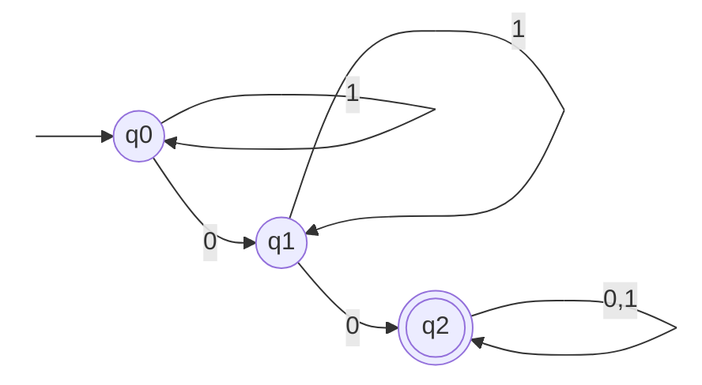

#### DFA vs NFA

| Point | **DFA (Deterministic Finite Automaton)** | **NFA (Non-deterministic Finite Automaton)** |
|---|---|---|
| **Transitions per (state, symbol)** | **Exactly ONE** | **Zero, one or MANY** |
| **Transition function** | δ: Q × Σ → **Q** (a single state) | δ: Q × Σ → **2^Q** (a SET of states) |
| **Empty (ε) transitions** | ❌ **Not allowed** | ✅ **Allowed** |
| **Next state** | Always uniquely determined | May "guess" among several |
| **Backtracking** | Not needed | May be needed |
| **Acceptance** | The single path ends in a final state | **ANY one path** ends in a final state |
| **Number of states needed** | Usually **more** | Usually **fewer** |
| **Ease of design** | Harder | **Easier** |
| **Implementation** | **Direct and fast** — a simple table lookup | Must be simulated or converted first |
| **Power (languages accepted)** | **Regular languages** | **Regular languages — exactly the SAME** |
| **Conversion** | — | Every NFA can be converted to an equivalent DFA by **subset construction** |

> **The single most important fact:** **DFA and NFA are equally powerful.** They accept exactly the same class of languages — the **regular languages**. NFAs are easier to *design*; DFAs are easier to *implement*. An NFA with n states may need up to **2ⁿ** states as a DFA.

#### Designing a DFA — a worked method

> **Problem: accept all binary strings that, read as a binary number, are divisible by 4.**

**The key insight:** a binary number is divisible by 4 **if and only if its last two digits are `00`**. So the DFA must remember "how the string ends".

**States:**
- **q0** — the string so far ends in nothing useful (or in `1`) → remainder not 0
- **q1** — the string ends in exactly one `0`
- **q2** — the string ends in **two or more zeros** → divisible by 4 → **ACCEPTING**

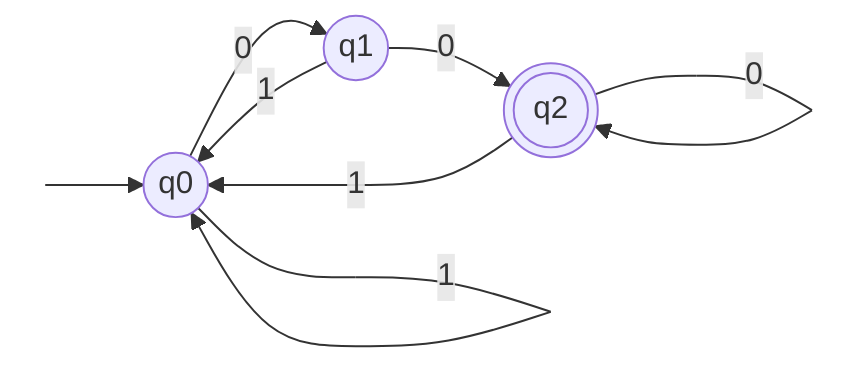

**Trace:** `1100` → q0 --1--> q0 --1--> q0 --0--> q1 --0--> **q2 (accept)** ✅ (1100₂ = 12, and 12 ÷ 4 = 3 ✅)
`1010` → q0 → q0 → q1 → q0 → **q1 (reject)** ✅ (1010₂ = 10, not divisible by 4)

**The alternative "remainder" method** (which generalises to divisibility by any k): make each state represent the **remainder mod 4** of the number read so far. Reading a bit `b` transforms remainder r into **(2r + b) mod 4**. Start at q0 (remainder 0) and accept in q0.

| Current remainder | Input 0 → (2r+0) mod 4 | Input 1 → (2r+1) mod 4 |
|---|---|---|
| **0** | 0 | 1 |
| 1 | 2 | 3 |
| 2 | 0 | 1 |
| 3 | 2 | 3 |

> **Similarly, for "binary strings with a number of 0s that is a multiple of 3"**, use three states counting the number of zeros **mod 3**:

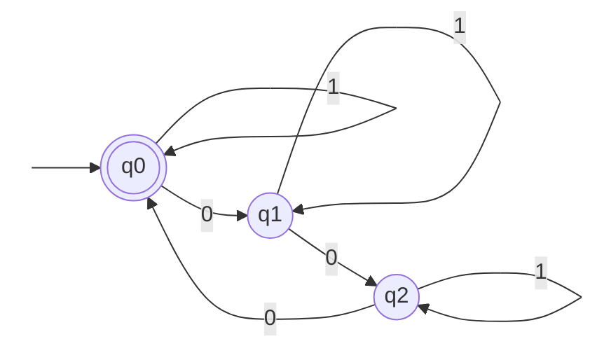

**States:** q0 = zeros ≡ 0 (mod 3) — **accepting**; q1 = zeros ≡ 1; q2 = zeros ≡ 2. Each `1` is a self-loop (it does not change the zero count).
**Regular expression:** **(1\*01\*01\*01\*)\*** — or equivalently **1\*(01\*01\*01\*)\***

#### Designing a DFA for a floating-point number

> **Accept `+/- n` or `+/- n.m`, where n and m are non-empty digit strings.**

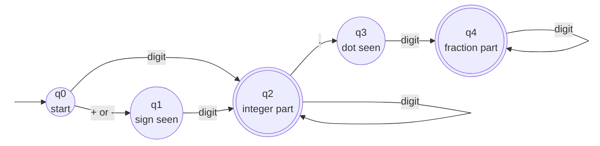

| State | Meaning | Accepting? |
|---|---|---|
| q0 | Nothing read yet | ❌ |
| q1 | A sign has been read, waiting for the first digit | ❌ |
| **q2** | At least one digit of the integer part has been read | ✅ **Yes** (accepts `+12`, `-7`, `45`) |
| q3 | The decimal point has been read but no digit after it | ❌ (rejects `12.`) |
| **q4** | At least one digit after the point | ✅ **Yes** (accepts `+12.5`, `-0.75`) |

**Accepted:** `12`, `+12`, `-7`, `3.14`, `-0.5` · **Rejected:** `+` (no digit), `.5` (no integer part), `12.` (no fraction digits), `1.2.3`

#### Designing a finite automaton for an elevator

> **Two floors (Ground, First) and one button with two values (Up, Down).**

**States:** **G** = the elevator is at the Ground floor · **F** = the elevator is at the First floor.
**Input alphabet:** Σ = {Up, Down}.

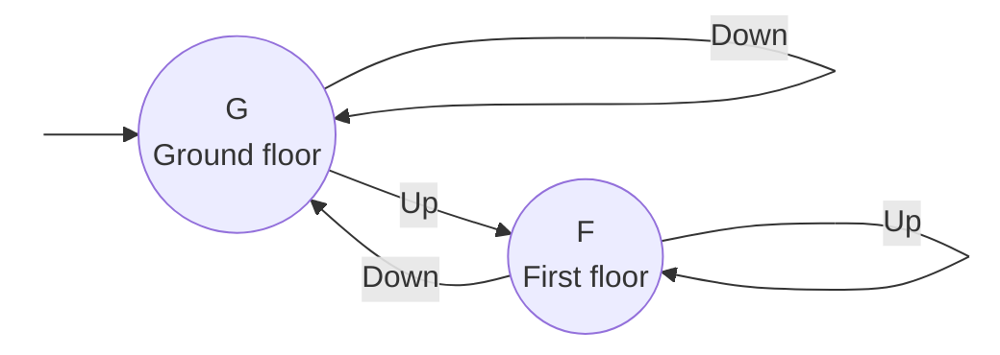

**Transition table:**

| Current state | Input = **Up** | Input = **Down** |
|---|---|---|
| **G** (Ground) | → **F** (move up) | → **G** (already at the bottom — stay) |
| **F** (First) | → **F** (already at the top — stay) | → **G** (move down) |

**Formally:** Q = {G, F}, Σ = {Up, Down}, q₀ = **G**, F = {G, F} (both states are "valid" — the machine models *position*, not acceptance), and δ is the table above.

This is a **Moore machine** if the output (the floor indicator) depends only on the state, which is the natural model here.

**Previous Year Question List from this Topic:**

- [Design a DFA to accept floating-point numbers of the form +/- n or +/- n.m, where n and m are decimal integers (non-empty strings over the digits \{0, 1, 2, 3,…](../written-answers/compiler-and-toc.md?plain=1#L75)
- [State diagram of DFA using binary strings having 0 with multiple of 3 on input \{0,1\}. Also showing regular expression.](../written-answers/compiler-and-toc.md?plain=1#L114)
- [Draw the state diagram of deterministic Finite Automata (DFA), which accepts set of all strings over \{0, 1\} which interpreted as binary number is divisible by…](../written-answers/compiler-and-toc.md?plain=1#L153)
- [Design a finite automaton for an elevator. The elevator can be at one of two floors: Ground or First. There is one button that controls the elevator, and it has…](../written-answers/compiler-and-toc.md?plain=1#L194)
- [What are the components of finite automation model? Difference between DFA and NFA.](../written-answers/compiler-and-toc.md?plain=1#L229)


---

### Regular Expressions

A **regular expression (regex)** is an algebraic notation for describing a **regular language** — exactly the same class of languages that finite automata accept.

#### The basic operations

| Operation | Notation | Meaning |
|---|---|---|
| **Union (or)** | `a + b` or `a \| b` | Either a or b |
| **Concatenation** | `ab` | a followed by b |
| **Kleene star** | `a*` | **Zero or more** a's |
| **Kleene plus** | `a+` | **One or more** a's |
| **Optional** | `a?` | Zero or one a |
| **Grouping** | `( )` | Changes precedence |
| **Any symbol** | `(0+1)` over {0,1} | Any single symbol |

**Precedence (highest to lowest):** `*` → concatenation → `+` (union).

#### Standard patterns over Σ = {0, 1}

| Language | Regular expression |
|---|---|
| All strings | `(0+1)*` |
| Strings **starting with** 0 | `0(0+1)*` |
| Strings **ending with** 1 | `(0+1)*1` |
| Strings **containing** `01` | `(0+1)*01(0+1)*` |
| Strings of **even length** | `((0+1)(0+1))*` |
| Number of 0s is a **multiple of 3** | `(1*01*01*01*)*` |
| **At least two** 0s | `(0+1)*0(0+1)*0(0+1)*` |
| **Exactly two** 0s | `1*01*01*` |
| Strings **not containing** `01` | `1*0*` |
| Binary numbers **divisible by 4** | `(0+1)*00 + 0` |

#### Worked problem — strings containing both `00` and `11`

> **Find the regular expression for: all binary strings having two consecutive 0s AND two consecutive 1s.**

The string must contain the substring **`00`** *somewhere* and the substring **`11`** *somewhere*. Since neither order is fixed, the language is the **union of the two possible orders**:

> ### **(0+1)\* 00 (0+1)\* 11 (0+1)\*  +  (0+1)\* 11 (0+1)\* 00 (0+1)\***

**Why both terms are needed:** the `00` may come before the `11` (as in `0011`, `10010111`) or the `11` may come first (as in `1100`, `01110100`). A single term would only capture one order and would wrongly reject the other.

**Verification:**

| String | Contains `00`? | Contains `11`? | In the language? | Matched by |
|---|---|---|---|---|
| `0011` | ✅ | ✅ | ✅ | the first term |
| `1100` | ✅ | ✅ | ✅ | the **second** term |
| `010101` | ❌ | ❌ | ❌ | neither |
| `1001` | ✅ | ❌ | ❌ | neither |
| `100110` | ✅ (pos 2–3) | ✅ (pos 4–5) | ✅ | the first term |

> **The common wrong answer** is to give only `(0+1)*00(0+1)*11(0+1)*`, which rejects `1100`. **Always check both orders**, and always test the expression against at least one string of each order and one string that should be rejected.

#### Properties of regular languages

Regular languages are **closed** under: union, concatenation, Kleene star, complement, intersection, difference and reversal.

**What regular expressions CANNOT express** (these need a more powerful model):
- `{aⁿbⁿ : n ≥ 0}` — equal numbers of a's and b's requires **counting**, and an FA has no memory to count arbitrarily high.
- **Balanced parentheses**, and **palindromes** — these are **context-free**, not regular.

This is proved with the **Pumping Lemma for regular languages**.

#### The Chomsky hierarchy

| Type | Grammar | Recognised by | Example language |
|---|---|---|---|
| **Type 3** | **Regular** | **Finite Automaton (DFA/NFA)** | `a*b*` |
| **Type 2** | **Context-Free (CFG)** | **Pushdown Automaton** | aⁿbⁿ, palindromes, balanced brackets |
| **Type 1** | Context-Sensitive | Linear Bounded Automaton | aⁿbⁿcⁿ |
| **Type 0** | Unrestricted | **Turing Machine** | Any computable language |

Each type **contains** the one below it: Regular ⊂ Context-Free ⊂ Context-Sensitive ⊂ Recursively Enumerable.

**Previous Year Question List from this Topic:**

- [Which one of the following regular expressions represents the language: the set of all binary strings having two consecutive 0s and two consecutive 1s?](../written-answers/compiler-and-toc.md?plain=1#L19)
- [Which one of the following regular expressions represents the language: The set of all binary strings having two consecutive 0's and two consecutive 1's? Explai…](../written-answers/compiler-and-toc.md?plain=1#L49)
- [State diagram of DFA using binary strings having 0 with multiple of 3 on input \{0,1\}. Also showing regular expression.](../written-answers/compiler-and-toc.md?plain=1#L114)


---

## Compiler vs Interpreter

### Compiler, Interpreter and the Language Processors

#### What a compiler is

A **compiler** is a program that **translates the ENTIRE source program written in a high-level language into machine code (or an intermediate form) in one go**, producing a separate executable file. The translation happens **once, before execution**.

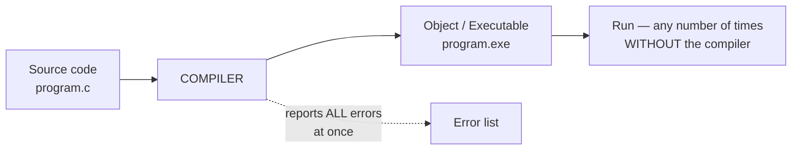

#### What an interpreter is

An **interpreter** **translates and executes the source program LINE BY LINE**, with no separate executable produced. Translation happens **every time the program runs**.

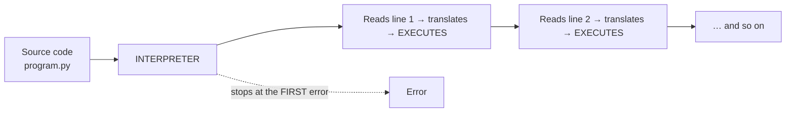

#### The full comparison

| Point | **Compiler** | **Interpreter** |
|---|---|---|
| **Translation unit** | The **whole program at once** | **One statement at a time** |
| **Output produced** | A separate **object/executable file** | **No** separate file |
| **Execution speed** | **Much faster** — already machine code | **Slower** — translation happens during every run |
| **Translation time** | Slower (one-time cost) | Faster to start |
| **Error reporting** | Reports **ALL errors together** after scanning the whole program | Stops at the **FIRST error** and reports only that one |
| **Debugging** | Harder — errors are reported all at once, away from execution | **Easier** — you see exactly which line failed |
| **Memory usage** | **More** — the object code must be generated and stored | **Less** — no intermediate object code |
| **Needed at run time?** | ❌ **No** — the .exe runs on its own | ✅ **Yes** — the interpreter must be present every time |
| **Source code distribution** | Only the **binary** is shipped — the source stays private | The **source** must be shipped (or pre-compiled bytecode) |
| **Portability of the output** | Platform-specific binary | **Highly portable** — the same source runs anywhere the interpreter exists |
| **Optimisation** | **Extensive** — the compiler sees the whole program | Very limited |
| **Re-execution** | Compile once, run many times | **Re-translated on every run** |
| **Best for** | Production software, performance-critical systems, system programming | Scripting, teaching, rapid development, dynamic/interactive use |
| **Example languages** | **C, C++, Java (to bytecode), Go, Rust, Pascal, Fortran, COBOL** | **Python, JavaScript, Ruby, PHP, Perl, BASIC, MATLAB, R** |

#### A concrete example

```c
/* C — COMPILED */
#include <stdio.h>
int main() {
    printf("Hello")            /* ← missing semicolon */
    printf("World");
    int x = "abc";             /* ← type error */
    return 0;
}
```
> The **compiler** reports **both** errors together and produces **no** executable:
> ```
> error: expected ';' before 'printf'
> error: initialization of 'int' from 'char *' makes integer from pointer
> ```

```python
# Python — INTERPRETED
print("Hello")
print(undefined_variable)      # ← error here
print("World")
```
> The **interpreter** prints **`Hello`** (line 1 executed successfully), **then** stops at line 2 with `NameError: name 'undefined_variable' is not defined`. Line 3 is never reached. **Part of the program has already run before the error was found** — that is the defining behavioural difference.

#### What is an "interpreted language"?

> An **interpreted language** is a programming language whose programs are **executed directly by an interpreter, statement by statement, without a prior compilation step that produces a standalone machine-code executable**.
>
> **Characteristics:** the source code is needed at run time; the interpreter must be installed on the target machine; execution is slower but development is faster; the language is usually **dynamically typed**, supports **interactive use (a REPL)**, and allows features like `eval()` and run-time code generation.
>
> **Examples:** Python, JavaScript, Ruby, PHP, Perl, BASIC, R, MATLAB.
>
> **An important qualification:** the compiled/interpreted distinction is a property of the **implementation, not of the language itself**. C can be interpreted (Cling), and Python is in practice **compiled to bytecode** (.pyc) which is then interpreted by the Python Virtual Machine. Modern engines blur the line further with **JIT compilation**.

#### Hybrid approach — Java and the JVM

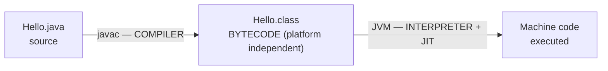

Java gets the best of both: the **compiler** catches errors early and produces portable **bytecode**; the **JVM** interprets that bytecode on any platform, and the **JIT (Just-In-Time) compiler** compiles the hot paths to native machine code at run time for near-compiled speed. This is the basis of Java's slogan **"write once, run anywhere"**.

#### Other language processors

| Processor | Function |
|---|---|
| **Preprocessor** | Handles `#include`, `#define` before compilation |
| **Compiler** | High-level language → assembly / machine code |
| **Assembler** | **Assembly language → machine code** |
| **Linker** | Combines object files and libraries into one executable |
| **Loader** | Loads the executable into memory and starts it |
| **Cross-compiler** | Runs on one platform but generates code for **another** (used for embedded systems) |
| **Decompiler** | Machine code → (approximate) high-level source |
| **JIT compiler** | Compiles bytecode to native code **during** execution |

#### A related short note — Open Source Software

*(Frequently attached to this question.)*

**Open Source Software (OSS)** is software whose **source code is publicly available** and may be freely used, studied, modified and redistributed under a licence such as **GPL, MIT, Apache or BSD**.

**Advantages:** free of licence cost · full **source code access** and freedom to modify · **transparency and security** (many eyes review the code) · no **vendor lock-in** · large community support · high customisability · rapid bug fixes · encourages learning and standards.

**Disadvantages:** **no guaranteed commercial support** or SLA · documentation is often weaker · may need in-house expertise to deploy and maintain · **compatibility** issues with proprietary formats and hardware drivers · projects can be **abandoned** by their maintainers · hidden costs in training and integration · licence **compliance obligations** (GPL's copyleft requires derivative works to be open too).

**Examples:** Linux, Apache, MySQL/PostgreSQL, Python, Firefox, LibreOffice, Android (AOSP), Kubernetes, Git.

**Previous Year Question List from this Topic:**

- [b) Write down the difference between Interpreter and Compiler?](../written-answers/compiler-and-toc.md?plain=1#L265)
- [What are Compilers and Interpreters? Briefly describe their role and differences. Write some key points on the advantages and disadvantages of Open Source Softw…](../written-answers/compiler-and-toc.md?plain=1#L284)
- [(a) Difference between interpreter and compiler. Write down the phases of a compiler.](../written-answers/compiler-and-toc.md?plain=1#L323)
- [Define an Interpreted language.](../written-answers/compiler-and-toc.md?plain=1#L360)
- [Difference between compiler and interpreter with example?](../written-answers/compiler-and-toc.md?plain=1#L378)
- [Compiler and Interpreter-এর মধ্যে পার্থক্য লিখুন।](../written-answers/compiler-and-toc.md?plain=1#L411)
- [Difference between Interpreter and Compiler.](../written-answers/compiler-and-toc.md?plain=1#L430)
- [Write difference between compiler and interpreter.](../written-answers/compiler-and-toc.md?plain=1#L917)


---

## Grammar & Ambiguity

### Context-Free Grammar (CFG)

A **Context-Free Grammar** is a formal grammar that describes the **syntax of a programming language** (and of any context-free language). It is the **4-tuple G = (V, T, P, S)**:

| Symbol | Component | Meaning |
|---|---|---|
| **V** | **Variables / Non-terminals** | Symbols that can be replaced — written in CAPITALS: S, E, T |
| **T** | **Terminals** | The actual symbols of the language — written in lower case: a, b, id, + |
| **P** | **Production rules** | Rules of the form **A → α**, where A is a single non-terminal |
| **S** | **Start symbol** | The non-terminal where every derivation begins |

> **Why "context-free"?** Because the left side of every production is a **single non-terminal**, which can be replaced **regardless of the symbols around it** — the context does not matter.

#### Derivation and the parse tree

**Derivation** = repeatedly replacing non-terminals using the production rules until only terminals remain.

| Type | Rule |
|---|---|
| **Leftmost derivation** | Always replace the **leftmost** non-terminal first |
| **Rightmost derivation** | Always replace the **rightmost** non-terminal first |

A **parse tree (derivation tree)** shows the derivation as a tree: the **root** is the start symbol, **internal nodes** are non-terminals, and the **leaves read left to right** give the derived string.

#### Worked example — derivation tree for "bab"

**Grammar:** **S → bSb | a | b**

**Derivation:** S ⟹ b**S**b ⟹ b**a**b ✅

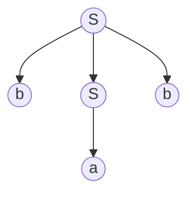

Reading the leaves left to right: **b, a, b** = **"bab"** ✅

*(This grammar generates the language of **odd-length palindromes over {a, b} whose "middle" is a or b and which are symmetric in b's** — strings such as `a`, `b`, `bab`, `bbb`, `bbabb`, `bbbbb`.)*

#### CFG for a palindrome

> **A palindrome reads the same forwards and backwards.**

**Over the alphabet {a, b}:**
```
S → aSa | bSb | a | b | ε
```

| Rule | Purpose |
|---|---|
| `S → aSa` | Add the **same** symbol `a` at **both** ends |
| `S → bSb` | Add the **same** symbol `b` at both ends |
| `S → a` | An odd-length palindrome with `a` in the middle |
| `S → b` | An odd-length palindrome with `b` in the middle |
| `S → ε` | An **even**-length palindrome (the empty middle) |

**Derivation of `abba`:** S ⟹ a**S**a ⟹ ab**S**ba ⟹ ab**ε**ba = **abba** ✅
**Derivation of `aba`:** S ⟹ a**S**a ⟹ a**b**a = **aba** ✅

**For binary palindromes (a "palindrome number" in binary), Σ = {0, 1}:**
```
S → 0S0 | 1S1 | 0 | 1 | ε
```

**For decimal palindrome numbers, Σ = {0,1,…,9}:**
```
S → 0S0 | 1S1 | 2S2 | … | 9S9 | 0 | 1 | … | 9 | ε
```

> **The crucial theoretical point to state:** the language of palindromes is **context-free but NOT regular**. A finite automaton has only finitely many states and therefore cannot remember an **arbitrarily long** first half to compare against the second half. A **pushdown automaton** can — it **pushes** the first half onto a stack and **pops** while matching the second half. This is exactly why a **CFG (Type 2)**, not a regular expression (Type 3), is required.

#### Forms of CFG

| Form | Restriction |
|---|---|
| **Chomsky Normal Form (CNF)** | Every production is `A → BC` or `A → a` |
| **Greibach Normal Form (GNF)** | Every production is `A → aα` (a terminal first) |

**Previous Year Question List from this Topic:**

- [How CFG to represent a palindrome number?](../written-answers/compiler-and-toc.md?plain=1#L545)
- [Context free Grammar: (like as....)](../written-answers/compiler-and-toc.md?plain=1#L584)
- [Draw a derivation tree for the string “bab” from the CFG given by- S \to bSb \mid a \mid b](../written-answers/compiler-and-toc.md?plain=1#L689)


---

### Ambiguous Grammar

A grammar is **ambiguous** if there exists **at least one string** in its language that has **more than one distinct parse tree** (equivalently, more than one leftmost derivation or more than one rightmost derivation).

> **Why ambiguity is a serious problem:** in a programming language, the parse tree determines the **meaning**. If `a + b * c` has two parse trees, the compiler could compute either `a + (b*c)` or `(a+b)*c` — **two different answers from the same source code**. A language specification must be unambiguous.

#### Worked proof — show that E → E + E | E \* E | id is ambiguous

> **Grammar:** **E → E + E | E \* E | id**
> **String:** **id + id \* id**

To prove ambiguity we must exhibit **two different parse trees for the same string**.

**Parse tree 1 — `+` applied last, giving `id + (id * id)`** *(the mathematically correct reading)*

Derivation: E ⟹ E + E ⟹ id + E ⟹ id + E \* E ⟹ id + id \* E ⟹ id + id \* id

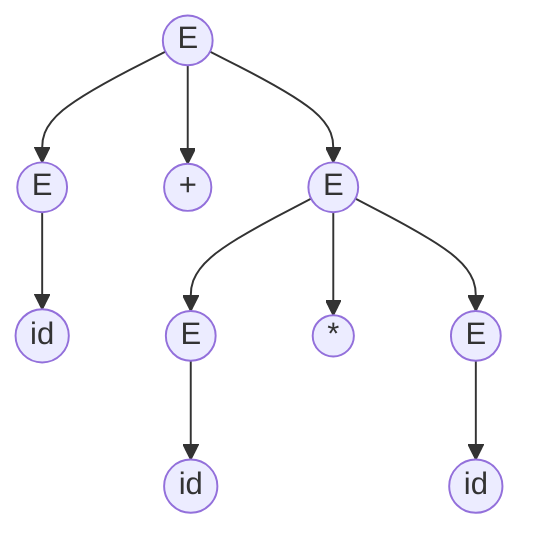

**Parse tree 2 — `*` applied last, giving `(id + id) * id`**

Derivation: E ⟹ E \* E ⟹ E + E \* E ⟹ id + E \* E ⟹ id + id \* E ⟹ id + id \* id

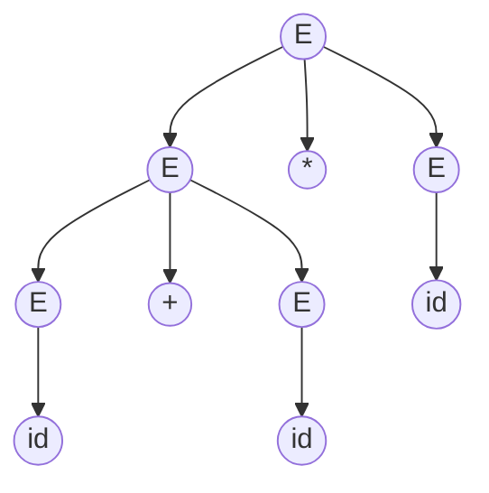

> ### ✅ **Conclusion**
> The single string **`id + id * id`** has **two distinct parse trees** (and correspondingly two distinct leftmost derivations). By definition, therefore, the grammar **E → E + E | E \* E | id is AMBIGUOUS**.
>
> **The practical consequence:** with `id₁ = 2, id₂ = 3, id₃ = 4`, tree 1 evaluates to `2 + (3×4) = 14` while tree 2 evaluates to `(2+3)×4 = 20`. The grammar does not say which is correct.

#### How ambiguity is removed

The cure is to **build precedence and associativity into the grammar itself**, using a separate non-terminal for each precedence level:

```
E → E + T | T          (lowest precedence: +, left associative)
T → T * F | F          (higher precedence: *, left associative)
F → ( E ) | id         (highest: parentheses and atoms)
```

| Level | Non-terminal | Handles |
|---|---|---|
| Lowest | **E** (Expression) | `+` — the last operator to be applied |
| Middle | **T** (Term) | `*` — binds tighter than `+` |
| Highest | **F** (Factor) | `id` and `( E )` |

Now `id + id * id` has **exactly one** parse tree: E → E + T, where the `T` expands to `id * id`. **Left recursion** (`E → E + T`) encodes **left associativity**; putting `*` at a deeper level encodes its **higher precedence**.

#### The dangling-else ambiguity

```
S → if E then S | if E then S else S | other
```
The string `if E1 then if E2 then S1 else S2` is ambiguous — does the `else` belong to the first `if` or the second? **Every real language resolves this by rule: the `else` binds to the NEAREST unmatched `if`.**

#### Important notes on ambiguity

- Ambiguity is a property of the **grammar**, **not** of the language.
- Some languages are **inherently ambiguous** — no unambiguous grammar exists for them at all.
- **Deciding whether an arbitrary CFG is ambiguous is UNDECIDABLE** — there is no algorithm that works for every grammar. That is why proofs are done by **exhibiting two parse trees**, as above.

**Previous Year Question List from this Topic:**

- [Consider the grammar: E -> E + E | E * E | id. Show that the grammar is ambiguous for the string: id + id * id. (SO IT 25-07-2026)](../written-answers/compiler-and-toc.md?plain=1#L451)
- [6.15 Consider the grammar: E \to E + E \mid E * E \mid id. Show that the grammar is ambiguous for the string: id + id * id.](../written-answers/compiler-and-toc.md?plain=1#L493)


---

## Lexical Analysis & Compiler Phases

### The Phases of a Compiler

A compiler translates source code to target code through **six phases**, grouped into an **analysis (front-end)** part and a **synthesis (back-end)** part.

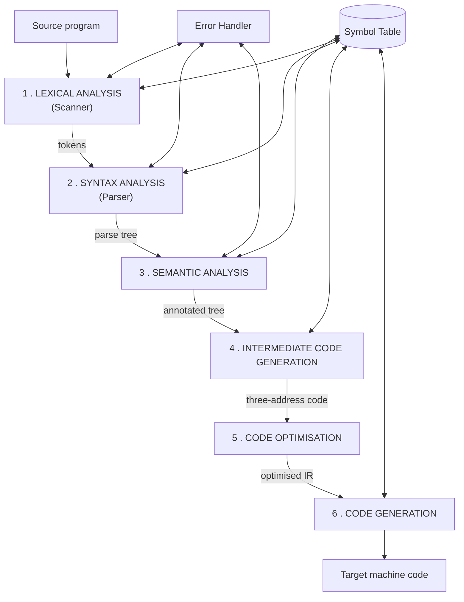

| # | Phase | Input | Output | Job |
|---|---|---|---|---|
| 1 | **Lexical Analysis (Scanner)** | Character stream | **Tokens** | Groups characters into tokens; removes whitespace and comments; builds the symbol table |
| 2 | **Syntax Analysis (Parser)** | Tokens | **Parse tree / AST** | Checks the **grammar** using a CFG |
| 3 | **Semantic Analysis** | Parse tree | Annotated tree | Type checking, declaration checking, scope resolution |
| 4 | **Intermediate Code Generation** | Annotated tree | **Three-address code** | Machine-independent intermediate representation |
| 5 | **Code Optimisation** | Intermediate code | Optimised code | Removes redundancy, improves speed and size |
| 6 | **Code Generation** | Optimised code | **Target machine code** | Register allocation, instruction selection |

**The two symbol-table/error modules run alongside every phase**, which is why they are drawn to the side rather than in the chain.

**Analysis (front end)** = phases 1–3 (+ intermediate code) — depends on the **source language**.
**Synthesis (back end)** = phases 5–6 — depends on the **target machine**. This split is why one compiler front end can serve many CPUs.

**Previous Year Question List from this Topic:**

- [(a) Difference between interpreter and compiler. Write down the phases of a compiler.](../written-answers/compiler-and-toc.md?plain=1#L323)
- [(a) How does a compiler handle comments in source code?](../written-answers/compiler-and-toc.md?plain=1#L722)


---

### Lexical Analysis and Tokens

**Lexical analysis** is the **first phase**. The **lexical analyser (scanner)** reads the source program **character by character** and groups the characters into meaningful units called **tokens**.

#### Three key terms

| Term | Meaning | Example |
|---|---|---|
| **Token** | A **category** — the pair ⟨token-name, attribute⟩ | `⟨identifier, ptr to symbol table⟩`, `⟨operator, +⟩` |
| **Lexeme** | The **actual sequence of characters** in the source that matched a pattern | `count`, `+`, `42`, `while` |
| **Pattern** | The **rule** (a regular expression) describing the lexemes of a token | identifier = `letter (letter\|digit)*` |

#### Token categories

| Category | Examples |
|---|---|
| **Keywords** | `int`, `if`, `while`, `return` |
| **Identifiers** | `sum`, `count`, `main`, `arr` |
| **Constants / Literals** | `10`, `3.14`, `'a'`, `"hello"` |
| **Operators** | `+`, `-`, `*`, `=`, `==`, `<=`, `++` |
| **Punctuation / Separators** | `;`, `,`, `(`, `)`, `{`, `}`, `[`, `]` |

#### Other tasks of the lexical analyser

1. **Remove whitespace** — spaces, tabs, newlines.
2. **Remove comments.**
3. **Track line numbers** for error messages.
4. **Insert identifiers into the symbol table.**
5. **Expand macros** (in some designs).
6. Report **lexical errors** (an illegal character, an unterminated string).

#### How a compiler handles comments

> ### "How does a compiler handle comments in source code?"
>
> **Comments are removed during LEXICAL ANALYSIS (or, in C, during PREPROCESSING) and never reach any later phase.**
>
> **The process:**
> 1. The scanner recognises the **start delimiter** — `//` for a single-line comment, `/*` for a block comment.
> 2. It then **discards every character** until it reaches the corresponding **end delimiter** — the newline for `//`, or `*/` for `/* */`.
> 3. **No token is emitted.** The comment is treated exactly like whitespace — it acts as a **separator between tokens** but contributes nothing itself.
> 4. **Line numbers are still counted** while skipping, so that later error messages report the correct line.
> 5. An **unterminated block comment** (`/*` with no `*/`) is reported as a **lexical error**.
>
> **In C specifically**, the **preprocessor** replaces each comment with a **single space** before the compiler proper ever sees the file. That single space matters: `a/**/b` becomes `a b` — two separate tokens — not the single identifier `ab`.
>
> **Important consequences:**
> - Comments have **zero effect on the generated machine code** — they cost nothing at run time.
> - Comments **cannot be nested** in C: `/* outer /* inner */ still outer */` ends at the **first** `*/`, leaving the rest as a syntax error.
> - A comment delimiter **inside a string literal is NOT a comment**: `printf("/* not a comment */")` prints the text, because the scanner is in "string" mode.
> - **Doc comments** (`/** … */` for Javadoc/Doxygen) are still comments to the compiler; a separate documentation tool reads them.

#### Counting tokens — a worked example

> **How many tokens does the lexical analyser generate for the following C statement?**
> ```c
> printf("i = %d, &i = %x", i, &i);
> ```

Break the statement into lexemes, ignoring whitespace:

| # | Lexeme | Token type |
|---|---|---|
| 1 | `printf` | Identifier |
| 2 | `(` | Separator |
| 3 | `"i = %d, &i = %x"` | **String literal — the WHOLE string is ONE token** |
| 4 | `,` | Separator |
| 5 | `i` | Identifier |
| 6 | `,` | Separator |
| 7 | `&` | Operator |
| 8 | `i` | Identifier |
| 9 | `)` | Separator |
| 10 | `;` | Separator |

> ### ✅ **Total tokens = 10**

**The two traps this question is testing:**
1. **The entire string literal counts as ONE token**, no matter how long it is or what it contains. The `%d`, `&i` and commas *inside* the quotes are just characters of that one token — they are **not** analysed.
2. **Whitespace is not a token** — it only separates tokens.

*(A related trap: in `a+++b`, the scanner uses the **maximal munch** rule and reads `a`, `++`, `+`, `b` — 4 tokens — because it always takes the longest possible lexeme at each step.)*

#### How the scanner is built

The scanner is essentially a **DFA**. Each token pattern is written as a **regular expression**, the regular expressions are combined into an NFA, the NFA is converted to a **DFA** by subset construction, and the DFA is then minimised and implemented as a fast table lookup. This is exactly what tools such as **Lex** and **Flex** generate automatically — and it is why *regular expressions and finite automata* and *compiler design* are taught together.

**Previous Year Question List from this Topic:**

- [(a) How does a compiler handle comments in source code?](../written-answers/compiler-and-toc.md?plain=1#L722)
- [What is the total number of tokens that will be generated by the logical analyzer for the C statement given below? You can disigned the spaces:](../written-answers/compiler-and-toc.md?plain=1#L744)


---

### Syntax Analysis and Parsing

**Parsing (syntax analysis)** is the **second phase** of compilation. The **parser** takes the stream of tokens from the scanner and checks whether they form a **grammatically valid** program according to the language's **Context-Free Grammar**, building a **parse tree** in the process.

#### What the parser does

1. Verifies the **syntax** against the CFG.
2. Builds the **parse tree / abstract syntax tree (AST)**.
3. Reports **syntax errors** with useful messages and recovers so that more errors can be found.
4. Passes the tree to semantic analysis.

#### The two parsing strategies

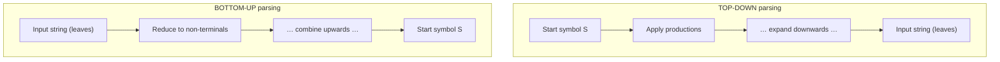

#### Top-down parsing

Builds the parse tree **from the root (start symbol) down to the leaves**, trying to **derive** the input string.

| Point | Detail |
|---|---|
| **Direction** | Start symbol → input string |
| **Derivation produced** | **Leftmost** derivation |
| **Tree construction** | Root → leaves, **preorder** |
| **Main types** | **Recursive descent** (with backtracking), **Predictive parser / LL(1)** (no backtracking, uses a lookahead) |
| **Cannot handle** | **Left recursion** (`E → E + T`) — it causes infinite recursion. Left recursion must be **eliminated** first |
| **Also needs** | **Left factoring** when two productions share a prefix |
| **Advantages** | Simple, easy to write **by hand**, good error messages |
| **Disadvantages** | Less powerful; cannot parse all CFGs; grammar must be modified |
| **Notation** | **LL(k)** — scan **L**eft to right, produce a **L**eftmost derivation, k tokens of lookahead |

#### Bottom-up parsing

Builds the parse tree **from the leaves (input string) up to the root**, **reducing** groups of symbols back to non-terminals.

| Point | Detail |
|---|---|
| **Direction** | Input string → start symbol |
| **Derivation produced** | **Rightmost derivation, in reverse** |
| **Tree construction** | Leaves → root, **postorder** |
| **Main technique** | **Shift-Reduce parsing** — *shift* a token onto the stack, or *reduce* the stack top using a production |
| **Main types** | **LR(0), SLR(1), LALR(1), CLR(1)**, Operator-precedence |
| **Handles left recursion** | ✅ **Yes — naturally** |
| **Advantages** | **More powerful** — handles a much larger class of grammars; no grammar rewriting needed |
| **Disadvantages** | Complex; **table construction is done by a tool**, not by hand; error messages are less intuitive |
| **Notation** | **LR(k)** — scan **L**eft to right, produce a **R**ightmost derivation (in reverse), k lookahead |
| **Tools** | **YACC / Bison** generate LALR(1) parsers |

#### Top-down vs Bottom-up — the comparison table

| Point | **Top-Down** | **Bottom-Up** |
|---|---|---|
| Starts from | **Start symbol** | **Input tokens** |
| Builds the tree | Root → leaves | **Leaves → root** |
| Derivation | Leftmost | Rightmost (in reverse) |
| Operations | Expand (derive) | **Shift and Reduce** |
| Left recursion | ❌ Must be eliminated | ✅ Handled naturally |
| Left factoring | Usually required | Not required |
| Power | **Weaker** (LL grammars) | **Stronger** (LR grammars — LL ⊂ LR) |
| Hand-written? | ✅ **Yes** (recursive descent) | ❌ Rarely — use a generator |
| Error reporting | **Better / more intuitive** | Harder to make friendly |
| Tools | ANTLR, hand-coded parsers | **YACC, Bison, CUP** |
| Example parsers | Recursive descent, LL(1) | **SLR, LALR, CLR** |

**Previous Year Question List from this Topic:**

- [(খ) Parsing কী? Top-down parsing and bottom-up parsing সম্পর্কে লিখুন।](../written-answers/compiler-and-toc.md?plain=1#L830)


---

### Semantic Analysis, Optimisation and Error Types

#### Semantic analysis

The **third phase** checks whether a syntactically correct program actually **means** something valid. Syntax asks *"is it grammatical?"*; semantics asks *"does it make sense?"*

**What it checks:**

| Check | Example of a violation |
|---|---|
| **Type checking** | `int x = "hello";` — assigning a string to an int |
| **Undeclared identifiers** | Using `y` when `y` was never declared |
| **Multiple declarations** | `int x; float x;` in the same scope |
| **Function call checking** | Wrong **number** or **types** of arguments; wrong return type |
| **Scope resolution** | Using a variable outside the block where it was declared |
| **Array bounds / dimensions** | Using `a[i][j]` when `a` is one-dimensional |
| **Flow-of-control** | `break` outside a loop or switch; missing `return` in a non-void function |
| **Uniqueness** | Duplicate case labels in a `switch` |

> ### What is a semantic error in the context of a compiler?
>
> A **semantic error** is an error in the **MEANING** of a program that is **grammatically correct**. The statement obeys every rule of the language's syntax, so the parser accepts it, but it violates the language's **semantic rules** — the rules about types, declarations and scope.
>
> **Detected by:** the **semantic analyser**, the third phase, using the **symbol table** and **type information** collected earlier.
>
> **Examples:**
> ```c
> int x = "hello";          /* syntactically fine; TYPE MISMATCH        */
> undeclaredVar = 10;       /* syntactically fine; UNDECLARED variable  */
> int arr[5];  arr();       /* an array used as a function              */
> int f(int a);  f(1, 2);   /* wrong NUMBER of arguments                */
> float x;  int x;          /* the same name DECLARED TWICE             */
> void g() { return 5; }    /* returning a value from a void function   */
> ```
>
> **How it differs from the neighbouring error types:**
>
> | Error type | Detected by | Example | Program builds? |
> |---|---|---|---|
> | **Lexical** | Scanner | An illegal character such as `@` in an identifier | ❌ |
> | **Syntax** | Parser | `int x = ;` — missing operand | ❌ |
> | **Semantic** | **Semantic analyser** | `int x = "hello";` — type mismatch | ❌ |
> | **Run-time** | The OS during execution | Division by zero, null dereference | ✅ (crashes later) |
> | **Logical** | **A human** | Wrong formula — `avg = a+b+c/3` | ✅ (wrong answer) |
>
> **The key distinction:** a **syntax** error means the sentence is not well-formed; a **semantic** error means the sentence is well-formed but meaningless — like the grammatically perfect but nonsensical sentence *"Colourless green ideas sleep furiously."*

#### The symbol table

A **symbol table** is the compiler's central database of every identifier in the program, storing its **name, type, scope, memory location, size** and (for functions) **parameter list**. It is built by the lexical analyser and used by every later phase — semantic analysis uses it for type checking, and code generation uses it for address assignment.

#### Code optimisation

**Code optimisation** transforms the intermediate code so that the final program **runs faster and/or uses less memory**, **without changing what it computes**.

**Common optimisation techniques:**

| Technique | What it does | Example |
|---|---|---|
| **Constant folding** | Evaluates constant expressions at compile time | `x = 3 * 4;` → `x = 12;` |
| **Constant propagation** | Replaces a variable by its known constant value | `a=5; b=a+2;` → `b=7;` |
| **Dead code elimination** | Removes code whose result is never used | `if (0) { … }` is deleted |
| **Common subexpression elimination** | Computes a repeated expression once | `a=b*c+g; d=b*c+e;` → compute `b*c` once |
| **Loop-invariant code motion** | Moves computations that do not change out of the loop | Hoist `x = y + z;` above the loop |
| **Strength reduction** | Replaces an expensive operation with a cheaper one | `x * 2` → `x << 1`; multiplication → addition in a loop |
| **Loop unrolling** | Reduces loop overhead by repeating the body | 4 iterations become 1 body repeated 4 times |
| **Function inlining** | Replaces a call with the function body | Removes call overhead |
| **Register allocation** | Keeps the most-used variables in CPU registers | Avoids slow memory access |

> ### "Why do we optimise an algorithm at compile time?"
>
> **Because compile-time work is paid ONCE, while run-time work is paid on EVERY execution.**
>
> 1. **The cost is amortised.** A compiler spends a few extra seconds optimising; the program then runs faster **every single time it is executed**, for its entire lifetime — possibly billions of runs.
> 2. **No run-time overhead.** Optimisation performed during execution (as a JIT does) consumes CPU time *while the user is waiting*. Compile-time optimisation is invisible to the user.
> 3. **The compiler has the whole program in view.** It can see across functions and whole loops, enabling global optimisations that are impossible when looking at one statement at a time.
> 4. **The programmer stays free to write clear code.** You can write readable, maintainable source and let the compiler make it fast — you do not have to hand-optimise and sacrifice clarity.
> 5. **Constant work disappears entirely.** `3 * 4` is computed once by the compiler instead of on every iteration at run time.
> 6. **Smaller and faster binaries** matter enormously in embedded systems, mobile devices and battery-powered hardware.
> 7. **Energy and cost saving** at scale — a 10 % speed-up across a data centre is a large electricity bill saved.
>
> **The limits worth mentioning:** optimisation must **never change the program's observable behaviour**; some optimisations **increase compile time** substantially (which is why `-O0` exists for development and `-O2`/`-O3` for release); and **algorithmic** improvement (O(n²) → O(n log n)) always beats compiler optimisation, which can only improve the constant factor.

**Previous Year Question List from this Topic:**

- [Why we optimize algorithm when it runs in compile time?](../written-answers/compiler-and-toc.md?plain=1#L777)
- [Explain Semantic Error in a context of Compiler.](../written-answers/compiler-and-toc.md?plain=1#L799)


---

## Linker & Loader

### Linker and Loader — Tasks and Differences

After the compiler and assembler produce **object files**, two more system programs are needed before a program can actually run: the **linker** and the **loader**.

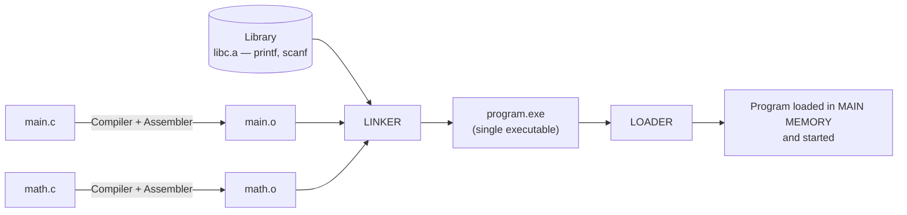

**Previous Year Question List from this Topic:**

- [(b) What are the tasks of linker and loader? Describe briefly using examples.](../written-answers/compiler-and-toc.md?plain=1#L862)


### The Linker

A **linker** is a system program that **combines one or more object files and the required library code into a single executable file**, resolving all the cross-references between them.

#### Tasks of the linker

| # | Task | Explanation |
|---|---|---|
| 1 | **Symbol resolution** | Matches every **external reference** to its **definition**. If `main.o` calls `add()` defined in `math.o`, the linker connects them |
| 2 | **Library linking** | Pulls in the code for standard functions such as `printf`, `scanf`, `sqrt` from the library archives |
| 3 | **Relocation** | Each object file was compiled assuming it starts at address 0. The linker **assigns final addresses** and adjusts every reference accordingly |
| 4 | **Combining sections** | Merges all the `.text` (code), `.data` (initialised data) and `.bss` (uninitialised data) sections of the inputs |
| 5 | **Error detection** | Reports `undefined reference to 'foo'` (a function declared and called but never defined) and `multiple definition of 'x'` |
| 6 | **Producing the executable** | Writes the final file with a proper header (ELF on Linux, PE on Windows) |

#### Static vs dynamic linking

| Point | **Static linking** | **Dynamic linking** |
|---|---|---|
| **When** | At **link time**, before execution | At **load time** or **run time** |
| **Library code** | **Copied into** the executable | **Referenced**; loaded separately |
| **File extension** | `.a` (Unix), `.lib` (Windows) | **`.so`** (Unix), **`.dll`** (Windows) |
| **Executable size** | **Large** | **Small** |
| **Memory** | Each running program has **its own copy** | **One copy shared** by all processes |
| **Library update** | Requires **recompiling/relinking** the program | The program picks up the new library **automatically** |
| **Startup speed** | **Faster** | Slightly slower (symbols resolved at load) |
| **Portability** | **Self-contained** — runs anywhere | Needs the right library version present (**"DLL hell"**) |

**Example:** `gcc main.o math.o -o program -lm` — the linker combines the two object files and the maths library into `program`.

### The Loader

A **loader** is the part of the **operating system** that **brings an executable file from disk into main memory and prepares it for execution**.

#### Tasks of the loader

| # | Task | Explanation |
|---|---|---|
| 1 | **Allocation** | Reserves the memory space the program needs |
| 2 | **Loading** | **Copies the executable's code and data from disk into RAM** |
| 3 | **Relocation** | Adjusts addresses if the program was not loaded at its preferred address (needed for ASLR and shared libraries) |
| 4 | **Linking (dynamic)** | Resolves and loads the **shared libraries** (`.so` / `.dll`) the program needs |
| 5 | **Initialising registers** | Sets up the **stack pointer**, **program counter** (to the entry point) and CPU state |
| 6 | **Transfer of control** | **Jumps to the entry point** — execution begins |

*(Types of loader: **absolute loader**, **relocating loader**, **dynamic linking loader**, and **bootstrap loader** — the last is the tiny program that loads the operating system itself at power-on.)*

#### Linker vs Loader — the comparison

| Point | **Linker** | **Loader** |
|---|---|---|
| **When it runs** | **Before** execution, after compilation | **At the moment** of execution |
| **Input** | **Object files** (`.o`, `.obj`) + libraries | The **executable file** |
| **Output** | An **executable file** on **disk** | The program **in main memory**, running |
| **Main job** | **Combine** modules and **resolve symbols** | **Load** into RAM and **start** it |
| **Part of** | The **toolchain** (with the compiler) | The **operating system** |
| **Deals with** | Symbol tables, relocation entries, libraries | Memory allocation, address space, registers |
| **Run how often** | **Once**, at build time | **Every time** the program is run |
| **Creates a file?** | ✅ Yes — the executable | ❌ No — it creates a **process in memory** |

#### A worked illustration

Suppose a program is split across two files:

```c
/* ---- main.c ---- */
#include <stdio.h>
int add(int, int);              /* declared here, DEFINED elsewhere */
int main(void) {
    printf("%d\n", add(3, 4));  /* printf is in the C LIBRARY */
    return 0;
}
```
```c
/* ---- math.c ---- */
int add(int a, int b) { return a + b; }
```

| Step | Tool | What happens |
|---|---|---|
| 1 | **Compiler + Assembler** | `main.c` → `main.o` (contains an **unresolved reference** to `add` and to `printf`); `math.c` → `math.o` (contains the **definition** of `add`) |
| 2 | **Linker** | Finds `add` in `math.o` and `printf` in `libc`, assigns final addresses, patches every call instruction, and writes **`program`** |
| 3 | **Loader** | When you type `./program`, the OS loader allocates memory, copies the code and data into RAM, loads `libc.so`, sets the stack pointer and program counter, and **jumps to `main`** |

> **If `math.c` were forgotten at step 2**, the linker would fail with **`undefined reference to 'add'`** — the classic **linker error**, which is neither a compile-time error (the syntax was fine) nor a run-time error (the program never got built).

## Compiler Design & Theory of Computation

### Theory of Computation — The Big Picture

**Theory of Computation (TOC)** studies **what problems can be solved by a machine, with which model, and at what cost**. It is built on three pillars: **Automata theory**, **Computability theory** and **Complexity theory**.

#### The four models of computation

Each model has strictly more memory than the one before it, and therefore recognises strictly more languages.

| Model | Memory available | Grammar type | Languages recognised | Example it can handle |
|---|---|---|---|---|
| **Finite Automaton (DFA/NFA)** | **None** — only a finite set of states | **Type 3 — Regular** | Regular | `a*b*`, identifiers, numbers |
| **Pushdown Automaton (PDA)** | A **STACK** (LIFO) | **Type 2 — Context-Free** | Context-free | `aⁿbⁿ`, **palindromes**, balanced brackets, expression syntax |
| **Linear Bounded Automaton (LBA)** | A **tape limited to the input length** | Type 1 — Context-Sensitive | Context-sensitive | `aⁿbⁿcⁿ` |
| **Turing Machine (TM)** | An **infinite tape**, read and write | Type 0 — Unrestricted | Recursively enumerable | **Anything computable** |

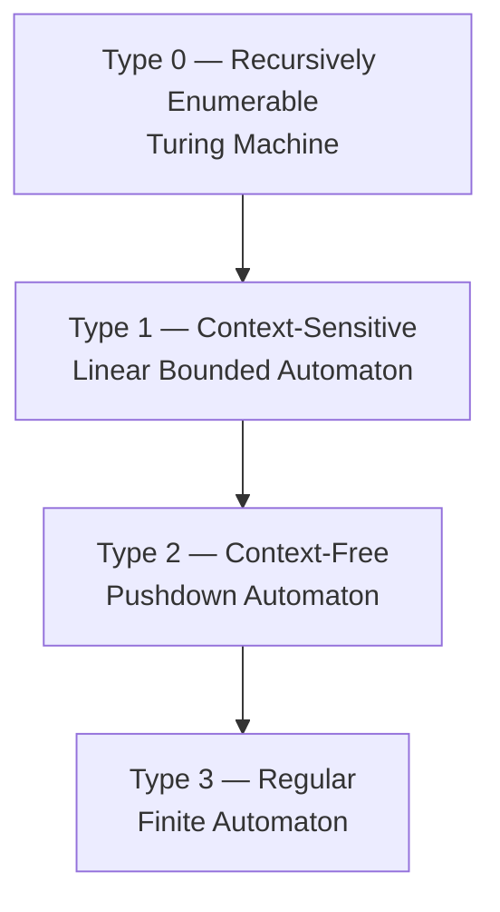

*(Read the arrows as "contains": every regular language is context-free, every context-free language is context-sensitive, and so on — but not the reverse.)*

#### Where each model is used in a compiler

| Compiler phase | Model used | Why |
|---|---|---|
| **Lexical analysis** | **Finite Automaton + Regular Expressions** | Tokens (identifiers, numbers, operators) form a **regular** language — no counting or nesting is needed |
| **Syntax analysis** | **Pushdown Automaton + CFG** | Program structure has **nesting** — balanced `{}`, `()`, nested `if` — which requires a **stack**, so it is context-free, not regular |
| **Semantic analysis** | Neither — a symbol table and attribute rules | Rules such as "a variable must be declared before use" are **context-sensitive** and are handled by ad-hoc checks rather than a formal automaton |

> **This is the single most useful connection between the two halves of this subject:** *regular expressions and DFAs build the **scanner**; context-free grammars and pushdown automata build the **parser**.*

#### The Turing Machine

A **Turing Machine** is the most powerful model: a finite control unit with a **read/write head** on an **infinite tape**. Anything that can be computed by any physical computer can be computed by a Turing machine — this is the **Church-Turing thesis**.

**Formally a 7-tuple:** M = (Q, Σ, Γ, δ, q₀, B, F) — states, input alphabet, **tape** alphabet, transition function, start state, **blank** symbol, and final states. The transition function **δ: Q × Γ → Q × Γ × {L, R}** says: given the current state and the symbol under the head, **write** a symbol, **move** left or right, and change state.

#### Decidability and the Halting Problem

| Term | Meaning |
|---|---|
| **Decidable (recursive)** | A Turing machine exists that **always halts** and answers yes or no |
| **Semi-decidable (recursively enumerable)** | A TM halts and says "yes" for members, but may **loop forever** for non-members |
| **Undecidable** | **No algorithm can exist** that answers correctly for every input |

> **The Halting Problem** — *given an arbitrary program and an input, decide whether the program will eventually halt* — is **UNDECIDABLE**. Alan Turing proved this in 1936 by contradiction: if such a decider existed, one could build a program that halts exactly when the decider says it loops, which is impossible.

**Other famous undecidable problems:** whether two CFGs generate the same language; whether a given CFG is **ambiguous**; whether a program ever reaches a given line (which is why perfect dead-code detection is impossible); the Post Correspondence Problem; and Rice's theorem (any non-trivial semantic property of programs is undecidable).

**The practical lesson for compilers:** a compiler **cannot** prove in general that your program terminates, has no infinite loop, or has no dead code. It can only apply conservative approximations — which is exactly why optimisers are careful and why static analysers report "possible" problems rather than certain ones.

**Previous Year Question List from this Topic:**

- [Write difference between compiler and interpreter.](../written-answers/compiler-and-toc.md?plain=1#L916)
