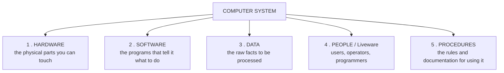
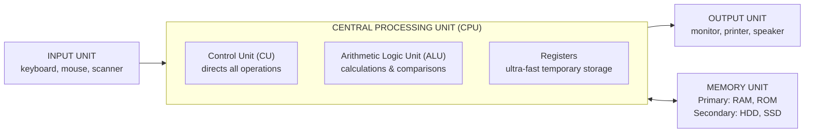
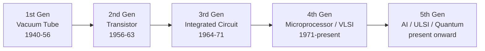
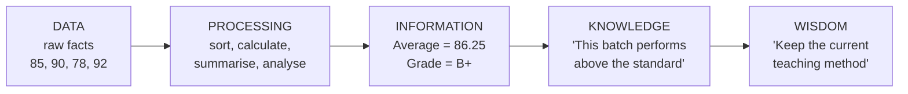
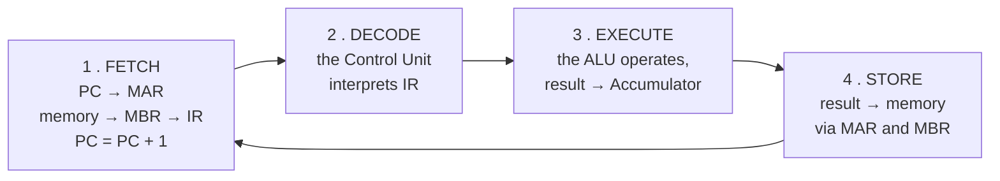

<!-- TOC START -->
**Table of Contents** — 1 subtopics · 8 theories

1. **[Computer Fundamentals & Acronyms](#computer-fundamentals--acronyms)**
   - [Computer and Computer System — Characteristics and Elements](#computer-and-computer-system--characteristics-and-elements)
   - [Generations of Computers](#generations-of-computers)
   - [Classification of Computers](#classification-of-computers)
   - [Data, Information and Units of Storage](#data-information-and-units-of-storage)
   - [Character Encoding — ASCII, Unicode and EBCDIC](#character-encoding--ascii-unicode-and-ebcdic)
   - [Registers in a Computer](#registers-in-a-computer)
   - [Master Glossary of IT Acronyms](#master-glossary-of-it-acronyms)
   - [Milestones, Firsts and Famous Names in Computing](#milestones-firsts-and-famous-names-in-computing)

<!-- TOC END -->

---

## Computer Fundamentals & Acronyms

### Computer and Computer System — Characteristics and Elements

#### What is a computer?

A **computer** is an **electronic device** that accepts **data** as input, **processes** it according to a set of stored instructions (a **program**), produces **information** as output, and can **store** both data and results for later use.

The word comes from the Latin *computare*, "to calculate" — but a modern computer does far more than arithmetic.

#### Computer vs Computer System

| Point | **Computer** | **Computer System** |
|---|---|---|
| **Meaning** | The **physical machine** that processes data | The **complete working arrangement** of hardware + software + data + people + procedures |
| **Scope** | **Narrow** — just the device | **Wide** — everything needed to get useful work done |
| **Components** | CPU, memory, input/output devices | **Hardware, Software, Data, People (liveware), Procedures**, and often Connectivity |
| **Can it work alone?** | A computer without software is useless metal | The system is what actually **delivers the result** |
| **Example** | A desktop PC box | The PC + Windows + MS Office + the user + the office's working procedures |

#### The five elements of a computer system

#### The characteristics of a computer

| # | Characteristic | Meaning |
|---|---|---|
| 1 | **Speed** | Executes millions/billions of instructions per second; measured in MIPS, FLOPS, GHz |
| 2 | **Accuracy** | Results are exact — errors are almost always **human** errors of input or programming (**GIGO — Garbage In, Garbage Out**) |
| 3 | **Diligence** | Never gets tired, bored or distracted; the millionth calculation is as accurate as the first |
| 4 | **Versatility** | The same machine plays music, prints bills and predicts the weather |
| 5 | **Storage capacity** | Stores enormous volumes of data and retrieves it instantly |
| 6 | **Automation** | Once started, it completes a job without human intervention |
| 7 | **Reliability** | Consistent output over long periods |
| 8 | **No IQ / No intelligence** | A computer **has no intelligence of its own** — it only follows instructions. *(The standard exam answer to "What is the IQ of a computer?" is **ZERO**.)* |
| 9 | **No feelings** | It cannot make judgements based on emotion or experience |

#### The basic block diagram of a computer

| Unit | Function |
|---|---|
| **Input unit** | Accepts data and instructions and converts them to machine form |
| **CPU — Control Unit** | The "brain's manager": fetches, decodes and directs the execution of instructions |
| **CPU — ALU** | Performs all **arithmetic** (+, −, ×, ÷) and **logical** (AND, OR, NOT, comparison) operations |
| **CPU — Registers** | Tiny, extremely fast storage inside the CPU for the data being worked on right now |
| **Memory unit** | Holds the program and data — **primary** (RAM/ROM) and **secondary** (disk) |
| **Output unit** | Converts the result to human-readable form |

*(The CPU is often called the **brain** of the computer; the **Motherboard** is the main circuit board connecting everything.)*

**Previous Year Question List from this Topic:**

- [Here some idea in computer architecture. You fill the idea part of the table which describe the best? GUI, RAID, API, LRU](../written-answers/computer-fundamental.md?plain=1#L329)
- [(ক) “Computer” এবং “Computer System' এই দুটি term এর মধ্যে পার্থক্য কি?](../written-answers/computer-fundamental.md?plain=1#L437)
- [What are the characteristics and elements of a computer system?](../written-answers/computer-fundamental.md?plain=1#L1042)
- [Name and define the components of a computer system. Mention two optical input devices.](../written-answers/computer-fundamental.md?plain=1#L2303)
- [What are the components of a Micro computer system?](../written-answers/computer-fundamental.md?plain=1#L2329)
- [(খ) Computer System এর Components গুলির সংক্ষিপ্ত বর্ণনাসহ লিখুন।](../written-answers/computer-fundamental.md?plain=1#L2401)

---

### Generations of Computers

A **computer generation** is a stage in the development of computer technology, defined mainly by the **electronic component** used to build the processor. Each generation brought a large jump in speed, size, cost and reliability.

| Generation | Period | Main component | Language | Characteristics | Examples |
|---|---|---|---|---|---|
| **1st** | **1940–1956** | **Vacuum tubes** | Machine language (binary) | Huge, consumed enormous power, generated great heat, very unreliable, used punch cards | **ENIAC, EDVAC, EDSAC, UNIVAC-1, IBM-701** |
| **2nd** | **1956–1963** | **Transistors** | **Assembly language**, early FORTRAN/COBOL | Smaller, faster, cheaper, more reliable, less heat; magnetic core memory | IBM 1401, IBM 7094, CDC 1604, UNIVAC 1108 |
| **3rd** | **1964–1971** | **IC — Integrated Circuits (SSI, MSI)** | **High-level languages** (FORTRAN, COBOL, PASCAL, BASIC) | Much smaller and faster; keyboard and monitor introduced; **operating systems** and multiprogramming appear | IBM 360, IBM 370, PDP-8, PDP-11, ICL 2900 |
| **4th** | **1971–present** | **VLSI — Very Large Scale Integration / MICROPROCESSOR** | C, C++, Java, Python; GUI | Personal computers, GUI, networks, **the Internet**, portable devices; cheap and everywhere | IBM PC, Apple II, Macintosh, Pentium, modern laptops |
| **5th** | **Present & beyond** | **ULSI + Artificial Intelligence**, parallel processing, **quantum** | Natural language, AI languages (LISP, Prolog, Python) | **AI-based**, voice and image recognition, robotics, expert systems, quantum and bio computing | IBM Watson, self-driving cars, AI assistants, quantum computers |

> **Key one-line answers:**
> - **"The base of the 5th generation computer" → Artificial Intelligence** (built on ULSI technology and parallel processing).
> - **"Which generation used VLSI?" → the FOURTH generation.**
> - **"Which generation introduced the microprocessor?" → the FOURTH.**
> - **"Which generation first used high-level languages?" → the THIRD.**
> - **"Which generation used transistors?" → the SECOND.**

#### The IC scales (useful for the VLSI question)

| Abbreviation | Full form | Transistors per chip | Generation |
|---|---|---|---|
| **SSI** | Small Scale Integration | 1 – 100 | 3rd |
| **MSI** | Medium Scale Integration | 100 – 1,000 | 3rd |
| **LSI** | Large Scale Integration | 1,000 – 10,000 | 3rd/4th |
| **VLSI** | **Very Large Scale Integration** | 10,000 – 1,000,000 | **4th** |
| **ULSI** | **Ultra Large Scale Integration** | over 1,000,000 | **5th** |

**Previous Year Question List from this Topic:**

- [What is the base of 5th generation Computer?](../written-answers/computer-fundamental.md?plain=1#L279)
- [কম্পিউটার প্রজন্ম বলতে কী বোঝায়? কম্পিউটারের বিভিন্ন প্রজন্মের বৈশিষ্ট্য বর্ণনা করুন।](../written-answers/computer-fundamental.md?plain=1#L288)
- [১৭. কোন প্রজন্মের কম্পিউটারে VLSI (Very Large Scale Integration) চিপ ব্যবহার শুরু হয়?](../written-answers/computer-fundamental.md?plain=1#L706)

---

### Classification of Computers

#### By size, capacity and cost

| Type | Description | Users at once | Examples / Use |
|---|---|---|---|
| **Supercomputer** | The **fastest and most expensive**; used for the heaviest scientific computation | Thousands | Weather forecasting, nuclear simulation, genome research, space research. **Frontier, Fugaku**; Bangladesh's **BCSIR supercomputer** |
| **Mainframe computer** | Very large, high **throughput**, extremely reliable, runs continuously for years | Hundreds to thousands | Banks, railways, insurance, census. **IBM z-series** |
| **Mini computer** (midrange) | Medium size and power, between mainframe and micro | Tens to hundreds | Departmental servers, industrial control. PDP-11, AS/400 |
| **Micro computer** (Personal Computer) | Built around a **single microprocessor**; small and cheap | **One** | Desktop, laptop, tablet, smartphone, workstation |

> **The difference between a supercomputer and a mainframe** is the key comparison: a **supercomputer** maximises **speed on one huge calculation** (measured in FLOPS), while a **mainframe** maximises **throughput — the number of transactions handled reliably** (measured in transactions per second).

#### Components of a micro-computer system

A **micro computer** = a **microprocessor (CPU)** + **memory (RAM/ROM)** + **input/output devices** + **storage** + a **motherboard/bus** joining them, plus a **power supply** and system software.

#### By the type of data handled

| Type | Works with | Example |
|---|---|---|
| **Analog computer** | **Continuous** physical quantities (voltage, pressure, temperature) | Speedometer, thermometer, old flight simulators |
| **Digital computer** | **Discrete** values — binary 0 and 1 | All modern computers |
| **Hybrid computer** | **Both** — measures analog signals and processes them digitally | ICU patient monitors, petrol pumps, ECG machines |

#### By purpose

| Type | Description |
|---|---|
| **General purpose** | Can run any program — a PC or laptop |
| **Special purpose** | Built for one job — an ATM, a washing-machine controller, a traffic signal |

**Previous Year Question List from this Topic:**

- [বিশ্বের সবচেয়ে শক্তিশালী সুপার কম্পিউটারের নাম কী?](../written-answers/computer-fundamental.md?plain=1#L480)
- [(ক) আকার আকৃতি ও ক্ষমতার ভিত্তিতে Digital Computer-এর প্রকারভেদ আলোচনা করুন।](../written-answers/computer-fundamental.md?plain=1#L759)
- [What are the components of a Micro computer system?](../written-answers/computer-fundamental.md?plain=1#L2329)

---

### Data, Information and Units of Storage

#### Data vs Information — a very frequently asked comparison

| Point | **Data** | **Information** |
|---|---|---|
| **Meaning** | **Raw, unorganised facts** and figures | **Processed, organised data** that has meaning |
| **Processing** | **Input** to processing | **Output** of processing |
| **Usefulness alone** | Not meaningful by itself | **Meaningful and useful** for decisions |
| **Depends on** | Nothing — it just exists | **Depends on data** |
| **Form** | Numbers, characters, symbols, images | Reports, charts, summaries, conclusions |
| **Decision making** | Cannot be used directly | **Used directly** |
| **Example** | `85, 90, 78, 92` | *"The class average is 86.25, which is a B+"* |
| **Example 2** | A list of every ATM transaction | *"Withdrawals peak on the 1st of each month"* |

#### Units of data storage

| Unit | Equal to | Note |
|---|---|---|
| **Bit** | 0 or 1 | **Bi**nary Digi**t** — the smallest unit |
| **Nibble** | **4 bits** | Half a byte; one hexadecimal digit |
| **Byte** | **8 bits** | The storage of **one character** in ASCII |
| **Kilobyte (KB)** | **1,024 bytes** = 2¹⁰ | |
| **Megabyte (MB)** | 1,024 KB = 2²⁰ bytes | |
| **Gigabyte (GB)** | 1,024 MB = 2³⁰ bytes | |
| **Terabyte (TB)** | **1,024 GB** = 2⁴⁰ bytes = **1,099,511,627,776 bytes** | |
| **Petabyte (PB)** | 1,024 TB | |
| **Exabyte (EB)** | 1,024 PB | |
| **Zettabyte (ZB)** | 1,024 EB | |
| **Yottabyte (YB)** | 1,024 ZB | The largest standard unit |

> ### **1 TB = how many bytes?**
> **1 TB = 1024 GB = 1024 × 1024 MB = 1024 × 1024 × 1024 KB = 1024⁴ bytes = 2⁴⁰ = 1,099,511,627,776 bytes** ≈ **1.1 × 10¹²** bytes.
>
> *(Disk manufacturers use the decimal definition **1 TB = 10¹² = 1,000,000,000,000 bytes**, which is why a "1 TB" drive shows as about **931 GB** in Windows. The binary units are strictly called **KiB, MiB, GiB, TiB**.)*

#### A worked storage calculation

> **A file contains 1 million characters. How much space does it need?**

| Encoding | Bytes per character | Total |
|---|---|---|
| **ASCII / ANSI** | **1 byte** | 1,000,000 bytes ≈ **977 KB ≈ 0.95 MB** |
| **UTF-8** (English text) | 1 byte | ≈ 0.95 MB |
| **UTF-8** (Bangla text) | **3 bytes** | 3,000,000 bytes ≈ **2.86 MB** |
| **UTF-16 / Unicode** | **2 bytes** | 2,000,000 bytes ≈ **1.91 MB** |

**Previous Year Question List from this Topic:**

- [1TB = কত বাইট?](../written-answers/computer-fundamental.md?plain=1#L263)
- [Write short notes on: (i) RAM (ii) ROM (iii) Primary key (iv) Foreign key (v) Data](../written-answers/computer-fundamental.md?plain=1#L393)
- [Difference between Data and Information.](../written-answers/computer-fundamental.md?plain=1#L507)
- [You have created a file containing 1 million characters. Suppose you want to save the file in ASCII format. How much memory space in MB in needed to store the f…](../written-answers/computer-fundamental.md?plain=1#L953)

---

### Character Encoding — ASCII, Unicode and EBCDIC

A computer stores **only numbers**. A **character encoding** is the agreed table that maps each character to a number.

| Scheme | Full form | Bits | Characters | Coverage |
|---|---|---|---|---|
| **BCD** | Binary Coded Decimal | 4 (per digit) | 10 digits | Digits only |
| **ASCII** | **American Standard Code for Information Interchange** | **7 bits** (8 with the parity/extended bit) | **128** (extended: 256) | English letters, digits, punctuation, control codes |
| **EBCDIC** | Extended Binary Coded Decimal Interchange Code | **8 bits** | 256 | Used on **IBM mainframes** |
| **Unicode** | — | **16 bits** (UTF-16) / variable (UTF-8) | **Over 1.1 million code points** (65,536 in the Basic Multilingual Plane) | **Every writing system in the world**, including **Bangla**, plus emoji |

#### Key ASCII values to memorise

| Character | Decimal |
|---|---|
| `'0'` to `'9'` | **48 – 57** |
| `'A'` to `'Z'` | **65 – 90** |
| `'a'` to `'z'` | **97 – 122** |
| Space | 32 |
| `'\0'` (null) | 0 |
| Enter (LF) | 10 |

**The two useful facts:** `'a' − 'A' = 32`, and `'5' − '0' = 5`.

#### Unicode

> ### "How many bits does a Unicode character use, and how many symbols are possible?"
>
> The classic exam answer is **16 bits**, giving **2¹⁶ = 65,536** possible characters. This refers to **UTF-16 / the Basic Multilingual Plane**, which is what most textbooks mean.
>
> **The fuller modern answer:** Unicode is a **character set**, not a fixed-width encoding. It currently defines **1,114,112 code points (17 planes × 65,536)**, of which about 150,000 are assigned. It is stored using one of three encodings:
>
> | Encoding | Bytes per character |
> |---|---|
> | **UTF-8** | **1 to 4** (variable) — 1 byte for English, **3 bytes for Bangla**; dominant on the web |
> | **UTF-16** | 2 or 4 bytes |
> | **UTF-32** | Always 4 bytes |
>
> **Why Unicode matters to Bangladesh:** ASCII has no place for Bangla. Unicode assigns the Bangla block **U+0980 – U+09FF**, which is what makes Bangla email, websites, SMS and databases possible. Before Unicode, every Bangla font (Bijoy, etc.) used its own incompatible mapping, so text copied between systems turned to garbage.

#### Image and file extensions

| Category | Extensions |
|---|---|
| **Image** | **.jpg / .jpeg, .png, .gif, .bmp, .tiff, .svg, .webp** |
| **Document** | .doc, .docx, .pdf, .txt, .rtf, .odt |
| **Spreadsheet** | .xls, .xlsx, .csv |
| **Audio** | .mp3, .wav, .aac, .flac, .ogg |
| **Video** | .mp4, .avi, .mkv, .mov, .wmv, .flv |
| **Compressed** | .zip, .rar, .7z, .tar, .gz |
| **Executable** | .exe, .com, .bat, .msi (Windows); no extension needed on Linux |
| **Web** | .html, .htm, .css, .js, .php, .jsp, .asp |

**Raster (bitmap) vs Vector images:** **.jpg, .png, .gif, .bmp** are **raster** — a grid of pixels that becomes blocky when enlarged. **.svg, .ai, .eps** are **vector** — mathematical paths that scale to any size with no loss of quality.

**Previous Year Question List from this Topic:**

- [Image file এর extension নিচের কোনটি?](../written-answers/computer-fundamental.md?plain=1#L357)
- [Unicode এর মাধ্যমে সম্ভাব্য কতগুলো চিহ্নকে নির্দিষ্ট করা যায়?](../written-answers/computer-fundamental.md?plain=1#L554)
- [How many bit is use of Unicode digit? (a) 8 (b) 16 (c) 20 (d) 24](../written-answers/computer-fundamental.md?plain=1#L585)
- [You have created a file containing 1 million characters. Suppose you want to save the file in ASCII format. How much memory space in MB in needed to store the f…](../written-answers/computer-fundamental.md?plain=1#L953)

---

### Registers in a Computer

A **register** is a **small, extremely fast storage location inside the CPU** used to hold the data, addresses and instructions the processor is working on **right now**.

Registers sit at the **very top of the memory hierarchy** — faster than cache, faster than RAM — because they are built directly into the CPU circuitry. Their capacity is measured in **bits** (a "64-bit processor" has 64-bit registers), and a CPU has only a few dozen of them.

#### The common registers of a basic computer

| Register | Full name | Function |
|---|---|---|
| **PC** | **Program Counter** (Instruction Pointer) | Holds the **address of the NEXT instruction** to be executed |
| **IR** | **Instruction Register** | Holds the **instruction currently being executed / decoded** |
| **MAR** | **Memory Address Register** | Holds the **address** of the memory location to be read from or written to |
| **MBR / MDR** | **Memory Buffer / Data Register** | Holds the **data** just read from, or about to be written to, memory |
| **AC** | **Accumulator** | Holds the **intermediate results** of ALU operations |
| **AR** | Address Register | Holds an operand's memory address |
| **DR** | Data Register | Holds an operand fetched from memory |
| **TR** | Temporary Register | Scratch space during instruction execution |
| **INPR / OUTR** | Input / Output Register | Buffers data to and from I/O devices |
| **SP** | **Stack Pointer** | Points to the **top of the stack** in memory |
| **PSW / Flag register** | Program Status Word | Holds **status flags** — Zero, Carry, Sign, Overflow, Parity, Interrupt enable |
| **General-purpose registers** | AX, BX, CX, DX (x86) / R0–R31 (RISC) | Hold any operand or result the program needs |

#### How registers are used in the instruction cycle

#### Why registers exist

1. **Speed** — accessing a register takes **less than one clock cycle**; RAM takes hundreds.
2. The **ALU can only operate on data held in registers**, not directly on memory.
3. They hold the **state** of execution (PC, flags) that makes sequencing possible.
4. **More registers = fewer memory accesses = faster programs**, which is why RISC architectures provide 32 or more.

**Previous Year Question List from this Topic:**

- [(b) What is register? What are the common register found in a basic computer?](../written-answers/computer-fundamental.md?plain=1#L243)

---

### Master Glossary of IT Acronyms

A large share of the marks in this subject comes from **full forms**. Learn them grouped by subject, not as a random list.

#### Networking and Internet

| Acronym | Full form |
|---|---|
| **HTTP** | **HyperText Transfer Protocol** |
| **HTTPS** | **HyperText Transfer Protocol Secure** |
| **FTP** | File Transfer Protocol |
| **SMTP** | **Simple Mail Transfer Protocol** (sending mail) |
| **POP / POP3** | **Post Office Protocol version 3** (downloading mail) |
| **IMAP** | Internet Message Access Protocol |
| **MIME** | **Multipurpose Internet Mail Extensions** |
| **TCP** | **Transmission Control Protocol** |
| **IP** | Internet Protocol |
| **TCP/IP** | Transmission Control Protocol / Internet Protocol |
| **UDP** | **User Datagram Protocol** |
| **ICMP** | **Internet Control Message Protocol** |
| **ARP** | **Address Resolution Protocol** |
| **RARP** | Reverse Address Resolution Protocol |
| **GARP** | Gratuitous ARP |
| **DNS** | **Domain Name System** |
| **DHCP** | **Dynamic Host Configuration Protocol** |
| **NAT** | **Network Address Translation** |
| **MAC** | **Media Access Control** |
| **URL** | **Uniform Resource Locator** |
| **URI** | Uniform Resource Identifier |
| **RIP** | **Routing Information Protocol** |
| **OSPF** | **Open Shortest Path First** |
| **BGP** | Border Gateway Protocol |
| **CSMA** | **Carrier Sense Multiple Access** |
| **CSMA/CD** | CSMA with Collision Detection |
| **CSMA/CA** | CSMA with Collision Avoidance |
| **VPN** | Virtual Private Network |
| **VLAN** | Virtual Local Area Network |
| **LAN / MAN / WAN** | Local / Metropolitan / Wide Area Network |
| **VSAT** | **Very Small Aperture Terminal** |
| **WiMAX** | **Worldwide Interoperability for Microwave Access** |
| **Wi-Fi** | **Wireless Fidelity** |
| **LTE** | **Long Term Evolution** |
| **VoIP** | **Voice over Internet Protocol** |
| **ISP** | Internet Service Provider |
| **SSL / TLS** | Secure Sockets Layer / Transport Layer Security |
| **SNMP** | Simple Network Management Protocol |
| **Telnet** | Telecommunication Network |
| **PPP** | Point-to-Point Protocol |

#### Hardware and architecture

| Acronym | Full form |
|---|---|
| **CPU** | **Central Processing Unit** |
| **ALU** | Arithmetic Logic Unit |
| **CU** | Control Unit |
| **RAM** | **Random Access Memory** |
| **ROM** | **Read Only Memory** |
| **PROM** | **Programmable Read Only Memory** |
| **EPROM** | Erasable Programmable ROM |
| **EEPROM** | Electrically Erasable Programmable ROM |
| **BIOS** | **Basic Input Output System** |
| **UEFI** | **Unified Extensible Firmware Interface** |
| **CMOS** | **Complementary Metal Oxide Semiconductor** |
| **VLSI / ULSI** | Very / Ultra Large Scale Integration |
| **TTL** | Transistor-Transistor Logic |
| **HDD / SSD** | Hard Disk Drive / Solid State Drive |
| **RAID** | **Redundant Array of Independent (Inexpensive) Disks** |
| **SATA** | Serial Advanced Technology Attachment |
| **SAS** | Serial Attached SCSI |
| **SCSI** | Small Computer System Interface |
| **USB** | Universal Serial Bus |
| **VGA** | **Video Graphics Array** |
| **EGA** | **Enhanced Graphics Adapter** |
| **CGA** | Colour Graphics Adapter |
| **HDMI** | High-Definition Multimedia Interface |
| **LCD / LED** | **Liquid Crystal Display** / Light Emitting Diode |
| **CRT** | Cathode Ray Tube |
| **GPU** | Graphics Processing Unit |
| **UPS** | Uninterruptible Power Supply |
| **OMR** | **Optical Mark Reader / Recognition** |
| **OCR** | **Optical Character Recognition** |
| **MICR** | **Magnetic Ink Character Recognition** |
| **RFID** | Radio Frequency Identification |
| **GPS** | **Global Positioning System** |
| **DVD** | **Digital Versatile Disc** (originally Digital Video Disc) |
| **CD-ROM** | Compact Disc Read Only Memory |
| **SMPS** | Switched Mode Power Supply |

#### Software, data and programming

| Acronym | Full form |
|---|---|
| **OS** | Operating System |
| **GUI / CLI** | Graphical User Interface / Command Line Interface |
| **API** | Application Programming Interface |
| **IDE** | Integrated Development Environment |
| **SDK** | Software Development Kit |
| **JVM / JDK / JRE** | Java Virtual Machine / Development Kit / Runtime Environment |
| **ASCII** | **American Standard Code for Information Interchange** |
| **EBCDIC** | Extended Binary Coded Decimal Interchange Code |
| **XML** | **eXtensible Markup Language** |
| **HTML** | HyperText Markup Language |
| **JSON** | JavaScript Object Notation |
| **SQL** | **Structured Query Language** |
| **PL/SQL** | Procedural Language extensions to SQL |
| **PostgreSQL** | "Post-Ingres" Structured Query Language |
| **DBMS / RDBMS** | (Relational) **DataBase Management System** |
| **ACID** | Atomicity, Consistency, Isolation, Durability |
| **JPEG** | **Joint Photographic Experts Group** |
| **PNG** | **Portable Network Graphics** |
| **GIF** | Graphics Interchange Format |
| **MPEG** | Moving Picture Experts Group |
| **PDF** | Portable Document Format |
| **COBOL** | **COmmon Business Oriented Language** |
| **FORTRAN** | **FORmula TRANslation** |
| **BASIC** | Beginner's All-purpose Symbolic Instruction Code |
| **ALGOL** | ALGOrithmic Language |
| **LISP** | LISt Processing |
| **PHP** | PHP: Hypertext Preprocessor (originally Personal Home Page) |
| **ASP** | Active Server Pages |
| **COCOMO** | **COnstructive COst MOdel** |
| **UML** | Unified Modeling Language |
| **SDLC** | Software Development Life Cycle |
| **MOOC** | **Massive Open Online Course** |

#### Security

| Acronym | Full form |
|---|---|
| **VIRUS** | **Vital Information Resources Under Siege** |
| **DoS / DDoS** | **Denial of Service** / Distributed Denial of Service |
| **CIA (triad)** | Confidentiality, Integrity, Availability |
| **AES / DES** | Advanced / Data Encryption Standard |
| **RSA** | Rivest–Shamir–Adleman |
| **PKI** | Public Key Infrastructure |
| **IDS / IPS** | Intrusion Detection / Prevention System |
| **MFA / 2FA** | Multi-Factor / Two-Factor Authentication |
| **OTP** | One Time Password |
| **SSO** | Single Sign-On |
| **CAPTCHA** | Completely Automated Public Turing test to tell Computers and Humans Apart |

#### Business, banking and governance

| Acronym | Full form |
|---|---|
| **ICT** | Information and Communication Technology |
| **IT** | Information Technology |
| **MIS** | **Management Information System** |
| **DSS** | **Decision Support System** |
| **TPS** | Transaction Processing System |
| **EIS** | Executive Information System |
| **ERP** | **Enterprise Resource Planning** |
| **CRM** | Customer Relationship Management |
| **SCM** | Supply Chain Management |
| **ATM** | **Automated Teller Machine** |
| **POS** | Point of Sale |
| **EFT** | Electronic Funds Transfer |
| **EPS** | Electronic Payment System |
| **KYC / eKYC** | (electronic) Know Your Customer |
| **BEFTN** | Bangladesh Electronic Funds Transfer Network |
| **RTGS** | Real Time Gross Settlement |
| **NPSB** | National Payment Switch Bangladesh |
| **BACH** | Bangladesh Automated Clearing House |
| **SWIFT** | Society for Worldwide Interbank Financial Telecommunication |
| **BTRC** | **Bangladesh Telecommunication Regulatory Commission** |
| **BCC** | Bangladesh Computer Council |
| **BTCL** | Bangladesh Telecommunications Company Limited |
| **IoT** | **Internet of Things** |
| **AI / ML** | Artificial Intelligence / Machine Learning |
| **IR 4.0** | Fourth Industrial Revolution |
| **B2B / B2C / C2C / B2G** | Business to Business / Consumer / Consumer to Consumer / Government |

**Previous Year Question List from this Topic:**

- [Write the full meaning: HTTP, DVD, and SMTP?](../written-answers/computer-fundamental.md?plain=1#L214)
- [Provide the full form of the following terms: HTTP, SMTP, ASCII, DHCP, ICMP.](../written-answers/computer-fundamental.md?plain=1#L221)
- [MOOC stands for __________.](../written-answers/computer-fundamental.md?plain=1#L233)
- [Write down the full form of VIRUS?](../written-answers/computer-fundamental.md?plain=1#L238)
- [Write full form of NAT, DHCP, MAC and TCP-IP](../written-answers/computer-fundamental.md?plain=1#L271)
- [Write short note : SMTP, RIP, RDBMS, ITSQN](../written-answers/computer-fundamental.md?plain=1#L307)
- [Write down the Meaning: MIME, PNG, JPGE, OSPF](../written-answers/computer-fundamental.md?plain=1#L315)
- [Full meaning of : HTTPs](../written-answers/computer-fundamental.md?plain=1#L323)
- [১৬. পূর্ণরূপ লিখুন: HTTP, POP, ATM, PROM](../written-answers/computer-fundamental.md?plain=1#L385)
- [Write down the full meaning of SMTP?](../written-answers/computer-fundamental.md?plain=1#L421)
- [Write short answer on the following: (a) Plaintext (b) HTTP (c) Gateway used in \underline{\phantom{\text{Network}}} layer. (d) VIRUS full form (e) Who is the f…](../written-answers/computer-fundamental.md?plain=1#L458)
- [Write full form: DHCP, POP3, VSAT and LCD.](../written-answers/computer-fundamental.md?plain=1#L472)
- [পূর্ণরূপ লিখুন: BTRC, MICR, SMTP, Virus, Wimax.](../written-answers/computer-fundamental.md?plain=1#L525)
- [Write the full form of: VIRUS, BIOS, DoS attack, OSPF, DVD, WiFi.](../written-answers/computer-fundamental.md?plain=1#L657)
- [Write down the full meaning: DHCP, ICMP, ACNS, GARP.](../written-answers/computer-fundamental.md?plain=1#L667)
- [Write the full form: TCP/IP, DHCP, XML, PoSQL, CSMA](../written-answers/computer-fundamental.md?plain=1#L675)
- [What does COBOL stand for?](../written-answers/computer-fundamental.md?plain=1#L698)
- [JPEG and RAID full form কি?](../written-answers/computer-fundamental.md?plain=1#L721)
- [VGA, EGA এর পূর্ণ নাম লিখ।](../written-answers/computer-fundamental.md?plain=1#L728)
- [পূর্ণরূপ লিখ: (a) LTE (b) IOT (c) RDBMS (d) FORTRAN](../written-answers/computer-fundamental.md?plain=1#L736)
- [Write down the full meaning: (i) DNS (ii) TCP (iii) FTP (iv) ARP (v) UDP](../written-answers/computer-fundamental.md?plain=1#L744)
- [Write the full form of following topics:](../written-answers/computer-fundamental.md?plain=1#L878)
- [Explain URL, FTP, ASCII and BIOS](../written-answers/computer-fundamental.md?plain=1#L892)
- [Describe about Firewalls, Microcontroller, COCOMO, Query Optimization, Genetic algorithm and UML.](../written-answers/computer-fundamental.md?plain=1#L919)
- [Explain URL, VOIP and Broadband.](../written-answers/computer-fundamental.md?plain=1#L973)

---

### Milestones, Firsts and Famous Names in Computing

These short factual questions appear in almost every paper.

#### Famous people

| Title | Person |
|---|---|
| **Father of the Computer** | **Charles Babbage** (designed the Analytical Engine, 1837) |
| **Father of the MODERN Computer / Computer Science** | **Alan Turing** |
| **Father of Artificial Intelligence** | **John McCarthy** |
| **Father of the Internet** | **Vinton Cerf** and **Robert Kahn** (TCP/IP) |
| **Inventor of the World Wide Web** | **Tim Berners-Lee** (1989, at CERN) |
| **Father of the Personal Computer** | Henry Edward Roberts |
| **First computer programmer** | **Ada Lovelace** |
| **Inventor of Copy and Paste** | **Larry Tesler** |
| **Founder of Microsoft** | Bill Gates and Paul Allen |
| **Founder of Apple** | Steve Jobs, Steve Wozniak, Ronald Wayne |
| **Founder of Facebook** | **Mark Zuckerberg** (with Eduardo Saverin, Dustin Moskovitz, Chris Hughes, Andrew McCollum) |
| **Founders of Google** | Larry Page and Sergey Brin |
| **Creator of Linux** | Linus Torvalds |
| **Creator of C** | Dennis Ritchie |
| **Creator of C++** | Bjarne Stroustrup |
| **Creator of Java** | James Gosling |
| **Creator of Python** | Guido van Rossum |
| **Inventor of email** | Ray Tomlinson |
| **Bangla font / Bijoy keyboard** | **Mostafa Jabbar** |
| **First Bangla Unicode-based work / Bangla computing pioneer** | Mostafa Jabbar (Bijoy, 1988) |

#### Dates and firsts

| Event | Year |
|---|---|
| First programming language (**FORTRAN**) | **1957** *(the very first was Plankalkül, 1945; the first assembly-level "Short Code" was 1949)* |
| ARPANET (the **Internet begins**) | **1969** |
| **TCP/IP** adopted — the modern Internet | **1 January 1983** |
| World Wide Web invented | 1989 (public in 1991) |
| **Internet comes to Bangladesh** | **1996** (VSAT); submarine cable **SEA-ME-WE-4** in **2006** |
| **Gmail** launched | **2004** |
| Facebook launched | 2004 |
| YouTube launched | 2005 |
| **First video/live sharing site of Bangladesh** | **Bongo / Bioscope** *(early Bangladeshi video platforms)* |
| ChatGPT launched | November 2022 |

#### Nicknames and codenames

| Nickname / Codename | Refers to |
|---|---|
| **"The Big Blue"** | **IBM** |
| **"Longhorn"** | **Windows Vista** (its development codename) |
| "Chicago" | Windows 95 |
| "Whistler" | Windows XP |
| "Blackcomb" / "Vienna" | Windows 7 |
| "Threshold" | Windows 10 |

#### Miscellaneous quick facts

| Question | Answer |
|---|---|
| **The IQ of a computer** | **Zero** — it has no intelligence of its own |
| Most powerful supercomputer (recent) | **Frontier** (USA) — the top of the TOP500 list |
| Molecular-scale / **nano computer** | A **molecular computer** (also called a **DNA computer** or nanocomputer) — built from molecules instead of silicon |
| Full form of **VIRUS** | **Vital Information Resources Under Siege** |
| What is a **plotter**? | An **output device** that draws high-quality line graphics — used for maps, engineering and architectural drawings |
| What is a **touch screen**? | **Both an input AND an output device** |
| Main component of a **dot-matrix printer** | The **print head with a matrix of pins/needles** that strike an inked ribbon (it is an **impact** printer) |
| What is a **graphics card**? | An expansion card (**GPU**) that renders images and sends them to the display; it has its own processor and **VRAM** |
| Two **optical input** devices | **OMR** (Optical Mark Reader) and **OCR / barcode scanner / optical scanner** |

#### OCR vs OMR vs MICR

| Point | **OCR** | **OMR** | **MICR** |
|---|---|---|---|
| **Full form** | Optical **Character** Recognition | Optical **Mark** Reader | **Magnetic Ink** Character Recognition |
| **Reads** | **Printed or handwritten CHARACTERS** and converts them to editable text | **Marks/shading** in predefined positions | Characters printed in **magnetic ink** |
| **Technology** | Light + pattern-recognition software | Light reflectance | **Magnetic** field sensing |
| **Output** | Editable text | Which box was ticked | Account and cheque numbers |
| **Accuracy** | Good but not perfect; depends on font and quality | **Very high** | **Extremely high** — unaffected by stamps, signatures or dirt |
| **Cost** | Low | Low | **High** — special ink and readers |
| **Used for** | Scanning documents/books, number plates, passports, digitising records | **MCQ answer sheets**, surveys, ballot papers, lottery tickets | **Bank CHEQUE processing** — the numbers at the bottom of a cheque |

#### Serial vs Parallel port

| Point | **Serial Port** | **Parallel Port** |
|---|---|---|
| **Data transmission** | **One bit at a time**, over a single wire | **Multiple bits (8 or more) simultaneously**, over parallel wires |
| **Number of wires** | Few (2–9) | Many (25+) |
| **Cable cost and size** | **Cheap, thin, flexible** | Expensive, thick, bulky |
| **Distance** | **Long** — up to 50 ft or much more | **Short** — about 10–15 ft (crosstalk and skew limit it) |
| **Speed (in theory)** | Slower per clock | Faster per clock |
| **Speed (in practice, modern)** | **Much FASTER** — can be clocked far higher | Limited by **clock skew** between the wires |
| **Connector** | DB-9, DB-25, RS-232 | DB-25, Centronics 36-pin |
| **Typical device** | Mouse, modem, console, industrial sensors | Old printers, scanners |
| **Modern successors** | **USB, SATA, PCIe, Ethernet — all SERIAL** | Effectively obsolete |

> **The important insight:** parallel *sounds* faster, but at high frequencies the bits on different wires arrive at slightly different times (**clock skew**) and interfere with each other (**crosstalk**). That is why **every modern high-speed interface — USB, SATA, PCI Express, HDMI, Ethernet — is serial.**

**Previous Year Question List from this Topic:**

- [What is OCR? Write down the difference between OCR and OMR.](../written-answers/computer-fundamental.md?plain=1#L368)
- [What is first programming language?](../written-answers/computer-fundamental.md?plain=1#L428)
- [“Copy and Paste” এর উদ্ভাবক কে?](../written-answers/computer-fundamental.md?plain=1#L499)
- [Internet চালু হয় কত সালে?](../written-answers/computer-fundamental.md?plain=1#L534)
- [আধুনিক Computer এর জনক কাকে বলা হয়?](../written-answers/computer-fundamental.md?plain=1#L544)
- [Computer এর IQ কত?](../written-answers/computer-fundamental.md?plain=1#L568)
- [Bangla font এর উদ্ভাবক কে?](../written-answers/computer-fundamental.md?plain=1#L577)
- [Which year gmail is started? (a) 1998 (b) 1988 (c) 2004 (d) 2021](../written-answers/computer-fundamental.md?plain=1#L593)
- [Meaning of the GPS system? (a) Global Pointing System (b) Global Positioning System (c) Global Partion System (d) None](../written-answers/computer-fundamental.md?plain=1#L602)
- [Facebook এর জনক কে?](../written-answers/computer-fundamental.md?plain=1#L649)
- [Which It company nickname is “The Big Blue”?](../written-answers/computer-fundamental.md?plain=1#L684)
- [Whose codename was Longhorn?](../written-answers/computer-fundamental.md?plain=1#L691)
- [Answer the following question](../written-answers/computer-fundamental.md?plain=1#L790)
- [Short question:](../written-answers/computer-fundamental.md?plain=1#L816)
- [c) Enter annotation (any 5)](../written-answers/computer-fundamental.md?plain=1#L994)
- [Plotter কোন ধরনের Device?](../written-answers/computer-fundamental.md?plain=1#L2480)
- [গ্রাফিক্স কার্ড কি?](../written-answers/computer-fundamental.md?plain=1#L2549)
- [ডট মেট্রিক্স প্রিন্টারের মূল উপাদান কি?](../written-answers/computer-fundamental.md?plain=1#L2568)
- [Touch Screen কি জাতীয় ডিভাইস?](../written-answers/computer-fundamental.md?plain=1#L2590)
- [Distinguish between OMR and MICR.](../written-answers/computer-fundamental.md?plain=1#L2720)
- [Write down the difference between Serial Port and Parallel Port.](../written-answers/computer-fundamental.md?plain=1#L2285)
