<!-- TOC START -->
**Table of Contents** — 3 subtopics · 16 theories

1. **[Computer Fundamentals & Acronyms](#computer-fundamentals--acronyms)**
   - [Computer and Computer System — Characteristics and Elements](#computer-and-computer-system--characteristics-and-elements)
   - [Generations of Computers](#generations-of-computers)
   - [Classification of Computers](#classification-of-computers)
   - [Data, Information and Units of Storage](#data-information-and-units-of-storage)
   - [Character Encoding — ASCII, Unicode and EBCDIC](#character-encoding--ascii-unicode-and-ebcdic)
   - [Registers in a Computer](#registers-in-a-computer)
   - [Master Glossary of IT Acronyms](#master-glossary-of-it-acronyms)
   - [Milestones, Firsts and Famous Names in Computing](#milestones-firsts-and-famous-names-in-computing)

2. **[ICT in Society & Governance](#ict-in-society--governance)**
   - [The Fourth Industrial Revolution (IR 4.0)](#the-fourth-industrial-revolution-ir-40)
   - [E-Governance and Digital Bangladesh](#e-governance-and-digital-bangladesh)
   - [E-Commerce and E-Business](#e-commerce-and-e-business)
   - [Information Systems — TPS, MIS and DSS](#information-systems--tps-mis-and-dss)
   - [Other ICT Topics — Copyright, RFID, Viral Video and Banking Software](#other-ict-topics--copyright-rfid-viral-video-and-banking-software)
   - [Digital Banking and Electronic Payment Systems](#digital-banking-and-electronic-payment-systems)

3. **[Quantum Computing & Emerging Technologies](#quantum-computing--emerging-technologies)**
   - [Quantum Computing](#quantum-computing)
   - [Virtual Reality, Augmented Reality and Nanotechnology](#virtual-reality-augmented-reality-and-nanotechnology)

<!-- TOC END -->

---

## Computer Fundamentals & Acronyms

### Computer and Computer System — Characteristics and Elements

#### What is a computer?

A **computer** is an **electronic device** that accepts **data** as input, **processes** it according to a set of stored instructions (a **program**), produces **information** as output, and can **store** both data and results for later use.

The word comes from the Latin *computare*, "to calculate" — but a modern computer does far more than arithmetic.

#### Computer vs Computer System

| Point | **Computer** | **Computer System** |
|---|---|---|
| **Meaning** | The **physical machine** that processes data | The **complete working arrangement** of hardware + software + data + people + procedures |
| **Scope** | **Narrow** — just the device | **Wide** — everything needed to get useful work done |
| **Components** | CPU, memory, input/output devices | **Hardware, Software, Data, People (liveware), Procedures**, and often Connectivity |
| **Can it work alone?** | A computer without software is useless metal | The system is what actually **delivers the result** |
| **Example** | A desktop PC box | The PC + Windows + MS Office + the user + the office's working procedures |

#### The five elements of a computer system

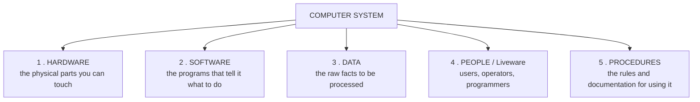

#### The characteristics of a computer

| # | Characteristic | Meaning |
|---|---|---|
| 1 | **Speed** | Executes millions/billions of instructions per second; measured in MIPS, FLOPS, GHz |
| 2 | **Accuracy** | Results are exact — errors are almost always **human** errors of input or programming (**GIGO — Garbage In, Garbage Out**) |
| 3 | **Diligence** | Never gets tired, bored or distracted; the millionth calculation is as accurate as the first |
| 4 | **Versatility** | The same machine plays music, prints bills and predicts the weather |
| 5 | **Storage capacity** | Stores enormous volumes of data and retrieves it instantly |
| 6 | **Automation** | Once started, it completes a job without human intervention |
| 7 | **Reliability** | Consistent output over long periods |
| 8 | **No IQ / No intelligence** | A computer **has no intelligence of its own** — it only follows instructions. *(The standard exam answer to "What is the IQ of a computer?" is **ZERO**.)* |
| 9 | **No feelings** | It cannot make judgements based on emotion or experience |

#### The basic block diagram of a computer

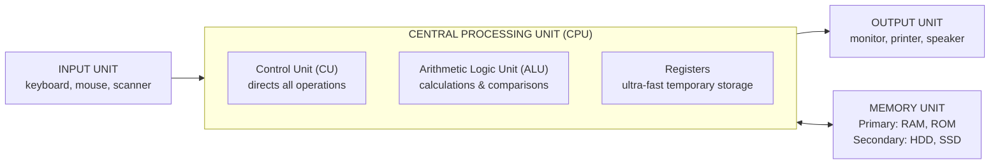

| Unit | Function |
|---|---|
| **Input unit** | Accepts data and instructions and converts them to machine form |
| **CPU — Control Unit** | The "brain's manager": fetches, decodes and directs the execution of instructions |
| **CPU — ALU** | Performs all **arithmetic** (+, −, ×, ÷) and **logical** (AND, OR, NOT, comparison) operations |
| **CPU — Registers** | Tiny, extremely fast storage inside the CPU for the data being worked on right now |
| **Memory unit** | Holds the program and data — **primary** (RAM/ROM) and **secondary** (disk) |
| **Output unit** | Converts the result to human-readable form |

*(The CPU is often called the **brain** of the computer; the **Motherboard** is the main circuit board connecting everything.)*

**Previous Year Question List from this Topic:**

- [Here some idea in computer architecture. You fill the idea part of the table which describe the best? GUI, RAID, API, LRU](../written-answers/computer-fundamental.md?plain=1#L329)
- [(ক) “Computer” এবং “Computer System' এই দুটি term এর মধ্যে পার্থক্য কি?](../written-answers/computer-fundamental.md?plain=1#L437)
- [What are the characteristics and elements of a computer system?](../written-answers/computer-fundamental.md?plain=1#L1042)
- [Name and define the components of a computer system. Mention two optical input devices.](../written-answers/computer-fundamental.md?plain=1#L2303)
- [What are the components of a Micro computer system?](../written-answers/computer-fundamental.md?plain=1#L2329)
- [(খ) Computer System এর Components গুলির সংক্ষিপ্ত বর্ণনাসহ লিখুন।](../written-answers/computer-fundamental.md?plain=1#L2401)

---

### Generations of Computers

A **computer generation** is a stage in the development of computer technology, defined mainly by the **electronic component** used to build the processor. Each generation brought a large jump in speed, size, cost and reliability.

| Generation | Period | Main component | Language | Characteristics | Examples |
|---|---|---|---|---|---|
| **1st** | **1940–1956** | **Vacuum tubes** | Machine language (binary) | Huge, consumed enormous power, generated great heat, very unreliable, used punch cards | **ENIAC, EDVAC, EDSAC, UNIVAC-1, IBM-701** |
| **2nd** | **1956–1963** | **Transistors** | **Assembly language**, early FORTRAN/COBOL | Smaller, faster, cheaper, more reliable, less heat; magnetic core memory | IBM 1401, IBM 7094, CDC 1604, UNIVAC 1108 |
| **3rd** | **1964–1971** | **IC — Integrated Circuits (SSI, MSI)** | **High-level languages** (FORTRAN, COBOL, PASCAL, BASIC) | Much smaller and faster; keyboard and monitor introduced; **operating systems** and multiprogramming appear | IBM 360, IBM 370, PDP-8, PDP-11, ICL 2900 |
| **4th** | **1971–present** | **VLSI — Very Large Scale Integration / MICROPROCESSOR** | C, C++, Java, Python; GUI | Personal computers, GUI, networks, **the Internet**, portable devices; cheap and everywhere | IBM PC, Apple II, Macintosh, Pentium, modern laptops |
| **5th** | **Present & beyond** | **ULSI + Artificial Intelligence**, parallel processing, **quantum** | Natural language, AI languages (LISP, Prolog, Python) | **AI-based**, voice and image recognition, robotics, expert systems, quantum and bio computing | IBM Watson, self-driving cars, AI assistants, quantum computers |

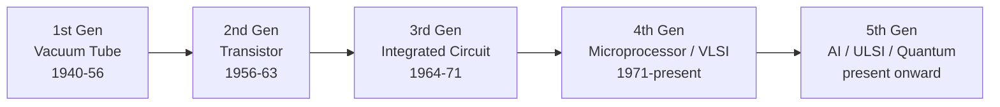

> **Key one-line answers:**
> - **"The base of the 5th generation computer" → Artificial Intelligence** (built on ULSI technology and parallel processing).
> - **"Which generation used VLSI?" → the FOURTH generation.**
> - **"Which generation introduced the microprocessor?" → the FOURTH.**
> - **"Which generation first used high-level languages?" → the THIRD.**
> - **"Which generation used transistors?" → the SECOND.**

#### The IC scales (useful for the VLSI question)

| Abbreviation | Full form | Transistors per chip | Generation |
|---|---|---|---|
| **SSI** | Small Scale Integration | 1 – 100 | 3rd |
| **MSI** | Medium Scale Integration | 100 – 1,000 | 3rd |
| **LSI** | Large Scale Integration | 1,000 – 10,000 | 3rd/4th |
| **VLSI** | **Very Large Scale Integration** | 10,000 – 1,000,000 | **4th** |
| **ULSI** | **Ultra Large Scale Integration** | over 1,000,000 | **5th** |

**Previous Year Question List from this Topic:**

- [What is the base of 5th generation Computer?](../written-answers/computer-fundamental.md?plain=1#L279)
- [কম্পিউটার প্রজন্ম বলতে কী বোঝায়? কম্পিউটারের বিভিন্ন প্রজন্মের বৈশিষ্ট্য বর্ণনা করুন।](../written-answers/computer-fundamental.md?plain=1#L288)
- [১৭. কোন প্রজন্মের কম্পিউটারে VLSI (Very Large Scale Integration) চিপ ব্যবহার শুরু হয়?](../written-answers/computer-fundamental.md?plain=1#L706)

---

### Classification of Computers

#### By size, capacity and cost

| Type | Description | Users at once | Examples / Use |
|---|---|---|---|
| **Supercomputer** | The **fastest and most expensive**; used for the heaviest scientific computation | Thousands | Weather forecasting, nuclear simulation, genome research, space research. **Frontier, Fugaku**; Bangladesh's **BCSIR supercomputer** |
| **Mainframe computer** | Very large, high **throughput**, extremely reliable, runs continuously for years | Hundreds to thousands | Banks, railways, insurance, census. **IBM z-series** |
| **Mini computer** (midrange) | Medium size and power, between mainframe and micro | Tens to hundreds | Departmental servers, industrial control. PDP-11, AS/400 |
| **Micro computer** (Personal Computer) | Built around a **single microprocessor**; small and cheap | **One** | Desktop, laptop, tablet, smartphone, workstation |

> **The difference between a supercomputer and a mainframe** is the key comparison: a **supercomputer** maximises **speed on one huge calculation** (measured in FLOPS), while a **mainframe** maximises **throughput — the number of transactions handled reliably** (measured in transactions per second).

#### Components of a micro-computer system

A **micro computer** = a **microprocessor (CPU)** + **memory (RAM/ROM)** + **input/output devices** + **storage** + a **motherboard/bus** joining them, plus a **power supply** and system software.

#### By the type of data handled

| Type | Works with | Example |
|---|---|---|
| **Analog computer** | **Continuous** physical quantities (voltage, pressure, temperature) | Speedometer, thermometer, old flight simulators |
| **Digital computer** | **Discrete** values — binary 0 and 1 | All modern computers |
| **Hybrid computer** | **Both** — measures analog signals and processes them digitally | ICU patient monitors, petrol pumps, ECG machines |

#### By purpose

| Type | Description |
|---|---|
| **General purpose** | Can run any program — a PC or laptop |
| **Special purpose** | Built for one job — an ATM, a washing-machine controller, a traffic signal |

**Previous Year Question List from this Topic:**

- [বিশ্বের সবচেয়ে শক্তিশালী সুপার কম্পিউটারের নাম কী?](../written-answers/computer-fundamental.md?plain=1#L480)
- [(ক) আকার আকৃতি ও ক্ষমতার ভিত্তিতে Digital Computer-এর প্রকারভেদ আলোচনা করুন।](../written-answers/computer-fundamental.md?plain=1#L759)
- [What are the components of a Micro computer system?](../written-answers/computer-fundamental.md?plain=1#L2329)

---

### Data, Information and Units of Storage

#### Data vs Information — a very frequently asked comparison

| Point | **Data** | **Information** |
|---|---|---|
| **Meaning** | **Raw, unorganised facts** and figures | **Processed, organised data** that has meaning |
| **Processing** | **Input** to processing | **Output** of processing |
| **Usefulness alone** | Not meaningful by itself | **Meaningful and useful** for decisions |
| **Depends on** | Nothing — it just exists | **Depends on data** |
| **Form** | Numbers, characters, symbols, images | Reports, charts, summaries, conclusions |
| **Decision making** | Cannot be used directly | **Used directly** |
| **Example** | `85, 90, 78, 92` | *"The class average is 86.25, which is a B+"* |
| **Example 2** | A list of every ATM transaction | *"Withdrawals peak on the 1st of each month"* |

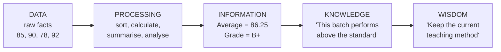

#### Units of data storage

| Unit | Equal to | Note |
|---|---|---|
| **Bit** | 0 or 1 | **Bi**nary Digi**t** — the smallest unit |
| **Nibble** | **4 bits** | Half a byte; one hexadecimal digit |
| **Byte** | **8 bits** | The storage of **one character** in ASCII |
| **Kilobyte (KB)** | **1,024 bytes** = 2¹⁰ | |
| **Megabyte (MB)** | 1,024 KB = 2²⁰ bytes | |
| **Gigabyte (GB)** | 1,024 MB = 2³⁰ bytes | |
| **Terabyte (TB)** | **1,024 GB** = 2⁴⁰ bytes = **1,099,511,627,776 bytes** | |
| **Petabyte (PB)** | 1,024 TB | |
| **Exabyte (EB)** | 1,024 PB | |
| **Zettabyte (ZB)** | 1,024 EB | |
| **Yottabyte (YB)** | 1,024 ZB | The largest standard unit |

> ### **1 TB = how many bytes?**
> **1 TB = 1024 GB = 1024 × 1024 MB = 1024 × 1024 × 1024 KB = 1024⁴ bytes = 2⁴⁰ = 1,099,511,627,776 bytes** ≈ **1.1 × 10¹²** bytes.
>
> *(Disk manufacturers use the decimal definition **1 TB = 10¹² = 1,000,000,000,000 bytes**, which is why a "1 TB" drive shows as about **931 GB** in Windows. The binary units are strictly called **KiB, MiB, GiB, TiB**.)*

#### A worked storage calculation

> **A file contains 1 million characters. How much space does it need?**

| Encoding | Bytes per character | Total |
|---|---|---|
| **ASCII / ANSI** | **1 byte** | 1,000,000 bytes ≈ **977 KB ≈ 0.95 MB** |
| **UTF-8** (English text) | 1 byte | ≈ 0.95 MB |
| **UTF-8** (Bangla text) | **3 bytes** | 3,000,000 bytes ≈ **2.86 MB** |
| **UTF-16 / Unicode** | **2 bytes** | 2,000,000 bytes ≈ **1.91 MB** |

**Previous Year Question List from this Topic:**

- [1TB = কত বাইট?](../written-answers/computer-fundamental.md?plain=1#L263)
- [Write short notes on: (i) RAM (ii) ROM (iii) Primary key (iv) Foreign key (v) Data](../written-answers/computer-fundamental.md?plain=1#L393)
- [Difference between Data and Information.](../written-answers/computer-fundamental.md?plain=1#L507)
- [You have created a file containing 1 million characters. Suppose you want to save the file in ASCII format. How much memory space in MB in needed to store the f…](../written-answers/computer-fundamental.md?plain=1#L953)

---

### Character Encoding — ASCII, Unicode and EBCDIC

A computer stores **only numbers**. A **character encoding** is the agreed table that maps each character to a number.

| Scheme | Full form | Bits | Characters | Coverage |
|---|---|---|---|---|
| **BCD** | Binary Coded Decimal | 4 (per digit) | 10 digits | Digits only |
| **ASCII** | **American Standard Code for Information Interchange** | **7 bits** (8 with the parity/extended bit) | **128** (extended: 256) | English letters, digits, punctuation, control codes |
| **EBCDIC** | Extended Binary Coded Decimal Interchange Code | **8 bits** | 256 | Used on **IBM mainframes** |
| **Unicode** | — | **16 bits** (UTF-16) / variable (UTF-8) | **Over 1.1 million code points** (65,536 in the Basic Multilingual Plane) | **Every writing system in the world**, including **Bangla**, plus emoji |

#### Key ASCII values to memorise

| Character | Decimal |
|---|---|
| `'0'` to `'9'` | **48 – 57** |
| `'A'` to `'Z'` | **65 – 90** |
| `'a'` to `'z'` | **97 – 122** |
| Space | 32 |
| `'\0'` (null) | 0 |
| Enter (LF) | 10 |

**The two useful facts:** `'a' − 'A' = 32`, and `'5' − '0' = 5`.

#### Unicode

> ### "How many bits does a Unicode character use, and how many symbols are possible?"
>
> The classic exam answer is **16 bits**, giving **2¹⁶ = 65,536** possible characters. This refers to **UTF-16 / the Basic Multilingual Plane**, which is what most textbooks mean.
>
> **The fuller modern answer:** Unicode is a **character set**, not a fixed-width encoding. It currently defines **1,114,112 code points (17 planes × 65,536)**, of which about 150,000 are assigned. It is stored using one of three encodings:
>
> | Encoding | Bytes per character |
> |---|---|
> | **UTF-8** | **1 to 4** (variable) — 1 byte for English, **3 bytes for Bangla**; dominant on the web |
> | **UTF-16** | 2 or 4 bytes |
> | **UTF-32** | Always 4 bytes |
>
> **Why Unicode matters to Bangladesh:** ASCII has no place for Bangla. Unicode assigns the Bangla block **U+0980 – U+09FF**, which is what makes Bangla email, websites, SMS and databases possible. Before Unicode, every Bangla font (Bijoy, etc.) used its own incompatible mapping, so text copied between systems turned to garbage.

#### Image and file extensions

| Category | Extensions |
|---|---|
| **Image** | **.jpg / .jpeg, .png, .gif, .bmp, .tiff, .svg, .webp** |
| **Document** | .doc, .docx, .pdf, .txt, .rtf, .odt |
| **Spreadsheet** | .xls, .xlsx, .csv |
| **Audio** | .mp3, .wav, .aac, .flac, .ogg |
| **Video** | .mp4, .avi, .mkv, .mov, .wmv, .flv |
| **Compressed** | .zip, .rar, .7z, .tar, .gz |
| **Executable** | .exe, .com, .bat, .msi (Windows); no extension needed on Linux |
| **Web** | .html, .htm, .css, .js, .php, .jsp, .asp |

**Raster (bitmap) vs Vector images:** **.jpg, .png, .gif, .bmp** are **raster** — a grid of pixels that becomes blocky when enlarged. **.svg, .ai, .eps** are **vector** — mathematical paths that scale to any size with no loss of quality.

**Previous Year Question List from this Topic:**

- [Image file এর extension নিচের কোনটি?](../written-answers/computer-fundamental.md?plain=1#L357)
- [Unicode এর মাধ্যমে সম্ভাব্য কতগুলো চিহ্নকে নির্দিষ্ট করা যায়?](../written-answers/computer-fundamental.md?plain=1#L554)
- [How many bit is use of Unicode digit? (a) 8 (b) 16 (c) 20 (d) 24](../written-answers/computer-fundamental.md?plain=1#L585)
- [You have created a file containing 1 million characters. Suppose you want to save the file in ASCII format. How much memory space in MB in needed to store the f…](../written-answers/computer-fundamental.md?plain=1#L953)

---

### Registers in a Computer

A **register** is a **small, extremely fast storage location inside the CPU** used to hold the data, addresses and instructions the processor is working on **right now**.

Registers sit at the **very top of the memory hierarchy** — faster than cache, faster than RAM — because they are built directly into the CPU circuitry. Their capacity is measured in **bits** (a "64-bit processor" has 64-bit registers), and a CPU has only a few dozen of them.

#### The common registers of a basic computer

| Register | Full name | Function |
|---|---|---|
| **PC** | **Program Counter** (Instruction Pointer) | Holds the **address of the NEXT instruction** to be executed |
| **IR** | **Instruction Register** | Holds the **instruction currently being executed / decoded** |
| **MAR** | **Memory Address Register** | Holds the **address** of the memory location to be read from or written to |
| **MBR / MDR** | **Memory Buffer / Data Register** | Holds the **data** just read from, or about to be written to, memory |
| **AC** | **Accumulator** | Holds the **intermediate results** of ALU operations |
| **AR** | Address Register | Holds an operand's memory address |
| **DR** | Data Register | Holds an operand fetched from memory |
| **TR** | Temporary Register | Scratch space during instruction execution |
| **INPR / OUTR** | Input / Output Register | Buffers data to and from I/O devices |
| **SP** | **Stack Pointer** | Points to the **top of the stack** in memory |
| **PSW / Flag register** | Program Status Word | Holds **status flags** — Zero, Carry, Sign, Overflow, Parity, Interrupt enable |
| **General-purpose registers** | AX, BX, CX, DX (x86) / R0–R31 (RISC) | Hold any operand or result the program needs |

#### How registers are used in the instruction cycle

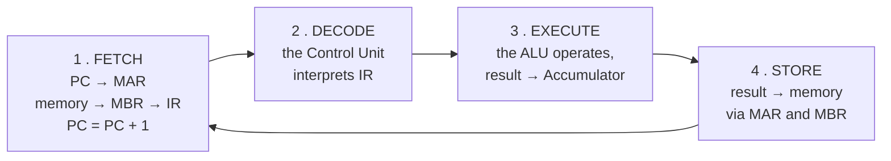

#### Why registers exist

1. **Speed** — accessing a register takes **less than one clock cycle**; RAM takes hundreds.
2. The **ALU can only operate on data held in registers**, not directly on memory.
3. They hold the **state** of execution (PC, flags) that makes sequencing possible.
4. **More registers = fewer memory accesses = faster programs**, which is why RISC architectures provide 32 or more.

**Previous Year Question List from this Topic:**

- [(b) What is register? What are the common register found in a basic computer?](../written-answers/computer-fundamental.md?plain=1#L243)

---

### Master Glossary of IT Acronyms

A large share of the marks in this subject comes from **full forms**. Learn them grouped by subject, not as a random list.

#### Networking and Internet

| Acronym | Full form |
|---|---|
| **HTTP** | **HyperText Transfer Protocol** |
| **HTTPS** | **HyperText Transfer Protocol Secure** |
| **FTP** | File Transfer Protocol |
| **SMTP** | **Simple Mail Transfer Protocol** (sending mail) |
| **POP / POP3** | **Post Office Protocol version 3** (downloading mail) |
| **IMAP** | Internet Message Access Protocol |
| **MIME** | **Multipurpose Internet Mail Extensions** |
| **TCP** | **Transmission Control Protocol** |
| **IP** | Internet Protocol |
| **TCP/IP** | Transmission Control Protocol / Internet Protocol |
| **UDP** | **User Datagram Protocol** |
| **ICMP** | **Internet Control Message Protocol** |
| **ARP** | **Address Resolution Protocol** |
| **RARP** | Reverse Address Resolution Protocol |
| **GARP** | Gratuitous ARP |
| **DNS** | **Domain Name System** |
| **DHCP** | **Dynamic Host Configuration Protocol** |
| **NAT** | **Network Address Translation** |
| **MAC** | **Media Access Control** |
| **URL** | **Uniform Resource Locator** |
| **URI** | Uniform Resource Identifier |
| **RIP** | **Routing Information Protocol** |
| **OSPF** | **Open Shortest Path First** |
| **BGP** | Border Gateway Protocol |
| **CSMA** | **Carrier Sense Multiple Access** |
| **CSMA/CD** | CSMA with Collision Detection |
| **CSMA/CA** | CSMA with Collision Avoidance |
| **VPN** | Virtual Private Network |
| **VLAN** | Virtual Local Area Network |
| **LAN / MAN / WAN** | Local / Metropolitan / Wide Area Network |
| **VSAT** | **Very Small Aperture Terminal** |
| **WiMAX** | **Worldwide Interoperability for Microwave Access** |
| **Wi-Fi** | **Wireless Fidelity** |
| **LTE** | **Long Term Evolution** |
| **VoIP** | **Voice over Internet Protocol** |
| **ISP** | Internet Service Provider |
| **SSL / TLS** | Secure Sockets Layer / Transport Layer Security |
| **SNMP** | Simple Network Management Protocol |
| **Telnet** | Telecommunication Network |
| **PPP** | Point-to-Point Protocol |

#### Hardware and architecture

| Acronym | Full form |
|---|---|
| **CPU** | **Central Processing Unit** |
| **ALU** | Arithmetic Logic Unit |
| **CU** | Control Unit |
| **RAM** | **Random Access Memory** |
| **ROM** | **Read Only Memory** |
| **PROM** | **Programmable Read Only Memory** |
| **EPROM** | Erasable Programmable ROM |
| **EEPROM** | Electrically Erasable Programmable ROM |
| **BIOS** | **Basic Input Output System** |
| **UEFI** | **Unified Extensible Firmware Interface** |
| **CMOS** | **Complementary Metal Oxide Semiconductor** |
| **VLSI / ULSI** | Very / Ultra Large Scale Integration |
| **TTL** | Transistor-Transistor Logic |
| **HDD / SSD** | Hard Disk Drive / Solid State Drive |
| **RAID** | **Redundant Array of Independent (Inexpensive) Disks** |
| **SATA** | Serial Advanced Technology Attachment |
| **SAS** | Serial Attached SCSI |
| **SCSI** | Small Computer System Interface |
| **USB** | Universal Serial Bus |
| **VGA** | **Video Graphics Array** |
| **EGA** | **Enhanced Graphics Adapter** |
| **CGA** | Colour Graphics Adapter |
| **HDMI** | High-Definition Multimedia Interface |
| **LCD / LED** | **Liquid Crystal Display** / Light Emitting Diode |
| **CRT** | Cathode Ray Tube |
| **GPU** | Graphics Processing Unit |
| **UPS** | Uninterruptible Power Supply |
| **OMR** | **Optical Mark Reader / Recognition** |
| **OCR** | **Optical Character Recognition** |
| **MICR** | **Magnetic Ink Character Recognition** |
| **RFID** | Radio Frequency Identification |
| **GPS** | **Global Positioning System** |
| **DVD** | **Digital Versatile Disc** (originally Digital Video Disc) |
| **CD-ROM** | Compact Disc Read Only Memory |
| **SMPS** | Switched Mode Power Supply |

#### Software, data and programming

| Acronym | Full form |
|---|---|
| **OS** | Operating System |
| **GUI / CLI** | Graphical User Interface / Command Line Interface |
| **API** | Application Programming Interface |
| **IDE** | Integrated Development Environment |
| **SDK** | Software Development Kit |
| **JVM / JDK / JRE** | Java Virtual Machine / Development Kit / Runtime Environment |
| **ASCII** | **American Standard Code for Information Interchange** |
| **EBCDIC** | Extended Binary Coded Decimal Interchange Code |
| **XML** | **eXtensible Markup Language** |
| **HTML** | HyperText Markup Language |
| **JSON** | JavaScript Object Notation |
| **SQL** | **Structured Query Language** |
| **PL/SQL** | Procedural Language extensions to SQL |
| **PostgreSQL** | "Post-Ingres" Structured Query Language |
| **DBMS / RDBMS** | (Relational) **DataBase Management System** |
| **ACID** | Atomicity, Consistency, Isolation, Durability |
| **JPEG** | **Joint Photographic Experts Group** |
| **PNG** | **Portable Network Graphics** |
| **GIF** | Graphics Interchange Format |
| **MPEG** | Moving Picture Experts Group |
| **PDF** | Portable Document Format |
| **COBOL** | **COmmon Business Oriented Language** |
| **FORTRAN** | **FORmula TRANslation** |
| **BASIC** | Beginner's All-purpose Symbolic Instruction Code |
| **ALGOL** | ALGOrithmic Language |
| **LISP** | LISt Processing |
| **PHP** | PHP: Hypertext Preprocessor (originally Personal Home Page) |
| **ASP** | Active Server Pages |
| **COCOMO** | **COnstructive COst MOdel** |
| **UML** | Unified Modeling Language |
| **SDLC** | Software Development Life Cycle |
| **MOOC** | **Massive Open Online Course** |

#### Security

| Acronym | Full form |
|---|---|
| **VIRUS** | **Vital Information Resources Under Siege** |
| **DoS / DDoS** | **Denial of Service** / Distributed Denial of Service |
| **CIA (triad)** | Confidentiality, Integrity, Availability |
| **AES / DES** | Advanced / Data Encryption Standard |
| **RSA** | Rivest–Shamir–Adleman |
| **PKI** | Public Key Infrastructure |
| **IDS / IPS** | Intrusion Detection / Prevention System |
| **MFA / 2FA** | Multi-Factor / Two-Factor Authentication |
| **OTP** | One Time Password |
| **SSO** | Single Sign-On |
| **CAPTCHA** | Completely Automated Public Turing test to tell Computers and Humans Apart |

#### Business, banking and governance

| Acronym | Full form |
|---|---|
| **ICT** | Information and Communication Technology |
| **IT** | Information Technology |
| **MIS** | **Management Information System** |
| **DSS** | **Decision Support System** |
| **TPS** | Transaction Processing System |
| **EIS** | Executive Information System |
| **ERP** | **Enterprise Resource Planning** |
| **CRM** | Customer Relationship Management |
| **SCM** | Supply Chain Management |
| **ATM** | **Automated Teller Machine** |
| **POS** | Point of Sale |
| **EFT** | Electronic Funds Transfer |
| **EPS** | Electronic Payment System |
| **KYC / eKYC** | (electronic) Know Your Customer |
| **BEFTN** | Bangladesh Electronic Funds Transfer Network |
| **RTGS** | Real Time Gross Settlement |
| **NPSB** | National Payment Switch Bangladesh |
| **BACH** | Bangladesh Automated Clearing House |
| **SWIFT** | Society for Worldwide Interbank Financial Telecommunication |
| **BTRC** | **Bangladesh Telecommunication Regulatory Commission** |
| **BCC** | Bangladesh Computer Council |
| **BTCL** | Bangladesh Telecommunications Company Limited |
| **IoT** | **Internet of Things** |
| **AI / ML** | Artificial Intelligence / Machine Learning |
| **IR 4.0** | Fourth Industrial Revolution |
| **B2B / B2C / C2C / B2G** | Business to Business / Consumer / Consumer to Consumer / Government |

**Previous Year Question List from this Topic:**

- [Write the full meaning: HTTP, DVD, and SMTP?](../written-answers/computer-fundamental.md?plain=1#L214)
- [Provide the full form of the following terms: HTTP, SMTP, ASCII, DHCP, ICMP.](../written-answers/computer-fundamental.md?plain=1#L221)
- [MOOC stands for __________.](../written-answers/computer-fundamental.md?plain=1#L233)
- [Write down the full form of VIRUS?](../written-answers/computer-fundamental.md?plain=1#L238)
- [Write full form of NAT, DHCP, MAC and TCP-IP](../written-answers/computer-fundamental.md?plain=1#L271)
- [Write short note : SMTP, RIP, RDBMS, ITSQN](../written-answers/computer-fundamental.md?plain=1#L307)
- [Write down the Meaning: MIME, PNG, JPGE, OSPF](../written-answers/computer-fundamental.md?plain=1#L315)
- [Full meaning of : HTTPs](../written-answers/computer-fundamental.md?plain=1#L323)
- [১৬. পূর্ণরূপ লিখুন: HTTP, POP, ATM, PROM](../written-answers/computer-fundamental.md?plain=1#L385)
- [Write down the full meaning of SMTP?](../written-answers/computer-fundamental.md?plain=1#L421)
- [Write short answer on the following: (a) Plaintext (b) HTTP (c) Gateway used in \underline{\phantom{\text{Network}}} layer. (d) VIRUS full form (e) Who is the f…](../written-answers/computer-fundamental.md?plain=1#L458)
- [Write full form: DHCP, POP3, VSAT and LCD.](../written-answers/computer-fundamental.md?plain=1#L472)
- [পূর্ণরূপ লিখুন: BTRC, MICR, SMTP, Virus, Wimax.](../written-answers/computer-fundamental.md?plain=1#L525)
- [Write the full form of: VIRUS, BIOS, DoS attack, OSPF, DVD, WiFi.](../written-answers/computer-fundamental.md?plain=1#L657)
- [Write down the full meaning: DHCP, ICMP, ACNS, GARP.](../written-answers/computer-fundamental.md?plain=1#L667)
- [Write the full form: TCP/IP, DHCP, XML, PoSQL, CSMA](../written-answers/computer-fundamental.md?plain=1#L675)
- [What does COBOL stand for?](../written-answers/computer-fundamental.md?plain=1#L698)
- [JPEG and RAID full form কি?](../written-answers/computer-fundamental.md?plain=1#L721)
- [VGA, EGA এর পূর্ণ নাম লিখ।](../written-answers/computer-fundamental.md?plain=1#L728)
- [পূর্ণরূপ লিখ: (a) LTE (b) IOT (c) RDBMS (d) FORTRAN](../written-answers/computer-fundamental.md?plain=1#L736)
- [Write down the full meaning: (i) DNS (ii) TCP (iii) FTP (iv) ARP (v) UDP](../written-answers/computer-fundamental.md?plain=1#L744)
- [Write the full form of following topics:](../written-answers/computer-fundamental.md?plain=1#L878)
- [Explain URL, FTP, ASCII and BIOS](../written-answers/computer-fundamental.md?plain=1#L892)
- [Describe about Firewalls, Microcontroller, COCOMO, Query Optimization, Genetic algorithm and UML.](../written-answers/computer-fundamental.md?plain=1#L919)
- [Explain URL, VOIP and Broadband.](../written-answers/computer-fundamental.md?plain=1#L973)

---

### Milestones, Firsts and Famous Names in Computing

These short factual questions appear in almost every paper.

#### Famous people

| Title | Person |
|---|---|
| **Father of the Computer** | **Charles Babbage** (designed the Analytical Engine, 1837) |
| **Father of the MODERN Computer / Computer Science** | **Alan Turing** |
| **Father of Artificial Intelligence** | **John McCarthy** |
| **Father of the Internet** | **Vinton Cerf** and **Robert Kahn** (TCP/IP) |
| **Inventor of the World Wide Web** | **Tim Berners-Lee** (1989, at CERN) |
| **Father of the Personal Computer** | Henry Edward Roberts |
| **First computer programmer** | **Ada Lovelace** |
| **Inventor of Copy and Paste** | **Larry Tesler** |
| **Founder of Microsoft** | Bill Gates and Paul Allen |
| **Founder of Apple** | Steve Jobs, Steve Wozniak, Ronald Wayne |
| **Founder of Facebook** | **Mark Zuckerberg** (with Eduardo Saverin, Dustin Moskovitz, Chris Hughes, Andrew McCollum) |
| **Founders of Google** | Larry Page and Sergey Brin |
| **Creator of Linux** | Linus Torvalds |
| **Creator of C** | Dennis Ritchie |
| **Creator of C++** | Bjarne Stroustrup |
| **Creator of Java** | James Gosling |
| **Creator of Python** | Guido van Rossum |
| **Inventor of email** | Ray Tomlinson |
| **Bangla font / Bijoy keyboard** | **Mostafa Jabbar** |
| **First Bangla Unicode-based work / Bangla computing pioneer** | Mostafa Jabbar (Bijoy, 1988) |

#### Dates and firsts

| Event | Year |
|---|---|
| First programming language (**FORTRAN**) | **1957** *(the very first was Plankalkül, 1945; the first assembly-level "Short Code" was 1949)* |
| ARPANET (the **Internet begins**) | **1969** |
| **TCP/IP** adopted — the modern Internet | **1 January 1983** |
| World Wide Web invented | 1989 (public in 1991) |
| **Internet comes to Bangladesh** | **1996** (VSAT); submarine cable **SEA-ME-WE-4** in **2006** |
| **Gmail** launched | **2004** |
| Facebook launched | 2004 |
| YouTube launched | 2005 |
| **First video/live sharing site of Bangladesh** | **Bongo / Bioscope** *(early Bangladeshi video platforms)* |
| ChatGPT launched | November 2022 |

#### Nicknames and codenames

| Nickname / Codename | Refers to |
|---|---|
| **"The Big Blue"** | **IBM** |
| **"Longhorn"** | **Windows Vista** (its development codename) |
| "Chicago" | Windows 95 |
| "Whistler" | Windows XP |
| "Blackcomb" / "Vienna" | Windows 7 |
| "Threshold" | Windows 10 |

#### Miscellaneous quick facts

| Question | Answer |
|---|---|
| **The IQ of a computer** | **Zero** — it has no intelligence of its own |
| Most powerful supercomputer (recent) | **Frontier** (USA) — the top of the TOP500 list |
| Molecular-scale / **nano computer** | A **molecular computer** (also called a **DNA computer** or nanocomputer) — built from molecules instead of silicon |
| Full form of **VIRUS** | **Vital Information Resources Under Siege** |
| What is a **plotter**? | An **output device** that draws high-quality line graphics — used for maps, engineering and architectural drawings |
| What is a **touch screen**? | **Both an input AND an output device** |
| Main component of a **dot-matrix printer** | The **print head with a matrix of pins/needles** that strike an inked ribbon (it is an **impact** printer) |
| What is a **graphics card**? | An expansion card (**GPU**) that renders images and sends them to the display; it has its own processor and **VRAM** |
| Two **optical input** devices | **OMR** (Optical Mark Reader) and **OCR / barcode scanner / optical scanner** |

#### OCR vs OMR vs MICR

| Point | **OCR** | **OMR** | **MICR** |
|---|---|---|---|
| **Full form** | Optical **Character** Recognition | Optical **Mark** Reader | **Magnetic Ink** Character Recognition |
| **Reads** | **Printed or handwritten CHARACTERS** and converts them to editable text | **Marks/shading** in predefined positions | Characters printed in **magnetic ink** |
| **Technology** | Light + pattern-recognition software | Light reflectance | **Magnetic** field sensing |
| **Output** | Editable text | Which box was ticked | Account and cheque numbers |
| **Accuracy** | Good but not perfect; depends on font and quality | **Very high** | **Extremely high** — unaffected by stamps, signatures or dirt |
| **Cost** | Low | Low | **High** — special ink and readers |
| **Used for** | Scanning documents/books, number plates, passports, digitising records | **MCQ answer sheets**, surveys, ballot papers, lottery tickets | **Bank CHEQUE processing** — the numbers at the bottom of a cheque |

#### Serial vs Parallel port

| Point | **Serial Port** | **Parallel Port** |
|---|---|---|
| **Data transmission** | **One bit at a time**, over a single wire | **Multiple bits (8 or more) simultaneously**, over parallel wires |
| **Number of wires** | Few (2–9) | Many (25+) |
| **Cable cost and size** | **Cheap, thin, flexible** | Expensive, thick, bulky |
| **Distance** | **Long** — up to 50 ft or much more | **Short** — about 10–15 ft (crosstalk and skew limit it) |
| **Speed (in theory)** | Slower per clock | Faster per clock |
| **Speed (in practice, modern)** | **Much FASTER** — can be clocked far higher | Limited by **clock skew** between the wires |
| **Connector** | DB-9, DB-25, RS-232 | DB-25, Centronics 36-pin |
| **Typical device** | Mouse, modem, console, industrial sensors | Old printers, scanners |
| **Modern successors** | **USB, SATA, PCIe, Ethernet — all SERIAL** | Effectively obsolete |

> **The important insight:** parallel *sounds* faster, but at high frequencies the bits on different wires arrive at slightly different times (**clock skew**) and interfere with each other (**crosstalk**). That is why **every modern high-speed interface — USB, SATA, PCI Express, HDMI, Ethernet — is serial.**

**Previous Year Question List from this Topic:**

- [What is OCR? Write down the difference between OCR and OMR.](../written-answers/computer-fundamental.md?plain=1#L368)
- [What is first programming language?](../written-answers/computer-fundamental.md?plain=1#L428)
- [“Copy and Paste” এর উদ্ভাবক কে?](../written-answers/computer-fundamental.md?plain=1#L499)
- [Internet চালু হয় কত সালে?](../written-answers/computer-fundamental.md?plain=1#L534)
- [আধুনিক Computer এর জনক কাকে বলা হয়?](../written-answers/computer-fundamental.md?plain=1#L544)
- [Computer এর IQ কত?](../written-answers/computer-fundamental.md?plain=1#L568)
- [Bangla font এর উদ্ভাবক কে?](../written-answers/computer-fundamental.md?plain=1#L577)
- [Which year gmail is started? (a) 1998 (b) 1988 (c) 2004 (d) 2021](../written-answers/computer-fundamental.md?plain=1#L593)
- [Meaning of the GPS system? (a) Global Pointing System (b) Global Positioning System (c) Global Partion System (d) None](../written-answers/computer-fundamental.md?plain=1#L602)
- [Facebook এর জনক কে?](../written-answers/computer-fundamental.md?plain=1#L649)
- [Which It company nickname is “The Big Blue”?](../written-answers/computer-fundamental.md?plain=1#L684)
- [Whose codename was Longhorn?](../written-answers/computer-fundamental.md?plain=1#L691)
- [Answer the following question](../written-answers/computer-fundamental.md?plain=1#L790)
- [Short question:](../written-answers/computer-fundamental.md?plain=1#L816)
- [c) Enter annotation (any 5)](../written-answers/computer-fundamental.md?plain=1#L994)
- [Plotter কোন ধরনের Device?](../written-answers/computer-fundamental.md?plain=1#L2480)
- [গ্রাফিক্স কার্ড কি?](../written-answers/computer-fundamental.md?plain=1#L2549)
- [ডট মেট্রিক্স প্রিন্টারের মূল উপাদান কি?](../written-answers/computer-fundamental.md?plain=1#L2568)
- [Touch Screen কি জাতীয় ডিভাইস?](../written-answers/computer-fundamental.md?plain=1#L2590)
- [Distinguish between OMR and MICR.](../written-answers/computer-fundamental.md?plain=1#L2720)
- [Write down the difference between Serial Port and Parallel Port.](../written-answers/computer-fundamental.md?plain=1#L2285)

## ICT in Society & Governance

### The Fourth Industrial Revolution (IR 4.0)

The **Fourth Industrial Revolution (IR 4.0)**, a term popularised by **Klaus Schwab** of the World Economic Forum in 2016, is the current era in which **digital, physical and biological technologies fuse together**, driven by **cyber-physical systems**, the **Internet of Things**, **Artificial Intelligence** and **big data**.

#### The four industrial revolutions

| Revolution | Period | Driving technology | Key change |
|---|---|---|---|
| **IR 1.0** | ~1760–1840 | **Steam engine**, water power | Mechanisation; factories replace handicraft |
| **IR 2.0** | ~1870–1914 | **Electricity**, the assembly line | **Mass production** |
| **IR 3.0** | ~1960–2000 | **Computers, electronics, the Internet** | **Automation and digitisation** |
| **IR 4.0** | **2011 – present** | **AI, IoT, Big Data, Robotics, Cloud, Cyber-physical systems** | **Intelligent, connected, self-optimising systems** |

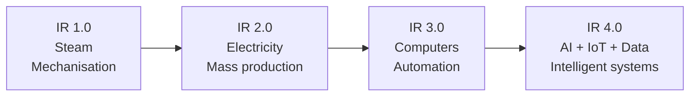

#### The key elements / technologies of IR 4.0

| # | Technology | What it contributes |
|---|---|---|
| 1 | **Artificial Intelligence & Machine Learning** | Machines that learn, predict and decide |
| 2 | **Internet of Things (IoT)** | Billions of sensors and devices connected and sharing data |
| 3 | **Big Data & Analytics** | Extracting value from enormous data volumes |
| 4 | **Cloud Computing** | On-demand, elastic computing power and storage |
| 5 | **Robotics & Automation** | Industrial robots, cobots, drones, RPA |
| 6 | **Cyber-Physical Systems** | Software controlling physical machines in real time |
| 7 | **3D Printing / Additive Manufacturing** | Made-to-order production, no moulds |
| 8 | **Blockchain** | Trust without a central authority |
| 9 | **Augmented / Virtual Reality (AR/VR)** | Immersive training, design and maintenance |
| 10 | **5G and advanced connectivity** | Ultra-low latency for real-time control |
| 11 | **Digital Twin** | A live virtual replica of a physical asset |
| 12 | **Quantum computing, Biotechnology, Nanotechnology** | The emerging frontier |
| 13 | **Cybersecurity** | The enabler without which none of the above is safe |

#### Characteristics of IR 4.0

1. **Interoperability** — machines, devices, sensors and people connect and communicate.
2. **Information transparency** — a virtual copy of the physical world built from sensor data.
3. **Technical assistance** — systems support humans in decisions and in physically difficult tasks.
4. **Decentralised decisions** — cyber-physical systems decide autonomously wherever possible.

#### Impact on Bangladesh — opportunities and challenges

**Opportunities**
- **Smart manufacturing** in the **RMG (garment) sector** — automated cutting, quality inspection by computer vision, predictive maintenance.
- **Precision agriculture** — soil sensors, drone spraying, crop-disease detection from leaf photos.
- **Digital financial services** — bKash, Nagad, agent banking, and the push for **financial inclusion**.
- **IT/ITES export and freelancing** — Bangladesh is among the world's largest suppliers of online freelancers.
- **Smart cities and e-governance** — traffic management, land records, citizen services.
- **Healthcare** — telemedicine, AI-assisted diagnosis in underserved districts.

**Challenges**
- **Job displacement**, especially in the labour-intensive RMG sector, which employs about 4 million people.
- **Skills gap** — the workforce needs reskilling in data, AI and automation.
- **Digital divide** between urban and rural, and between genders.
- **Weak infrastructure** — electricity reliability, rural broadband.
- **Cybersecurity and data-protection** readiness.
- **Investment cost** of automation for small and medium enterprises.

**Strategies:** invest in **STEM and vocational education**, build **industry-academia partnerships**, expand **broadband and reliable power**, enact strong **data-protection and cyber law**, provide **incentives for local innovation and start-ups**, and plan a **just transition** with reskilling for displaced workers.

**Previous Year Question List from this Topic:**

- [(ক) IR 4.0 বলতে কি বুঝায়? IR 4.0 এর গুরুত্বপূর্ণ উপাদানগুলো লিখুন।](../written-answers/computer-fundamental.md?plain=1#L1680)
- [৯. চতুর্থ শিল্প বিপ্লব কি? ইহার সম্পর্কে ৪ লাইন লিখুন।](../written-answers/computer-fundamental.md?plain=1#L1844)
- [বর্তমান যুগ চতুর্থ শিল্প বিপ্লবের যুগ। BREB ও সেই যুগের সাথে তালমিলিয়ে চলছে, মানুষের দ্বারপ্রান্তে বিদ্যুৎ সেবা পৌছে দেওয়ার জন্য। BREB এর এমন ৫টি পরিকল্পনা বা…](../written-answers/computer-fundamental.md?plain=1#L1877)
- [Discuss the impact of Artificial Intelligence and Automation on the banking sector of Bangladesh. What strategies should financial institutions adopt to balance…](../written-answers/computer-fundamental.md?plain=1#L1611)

---

### E-Governance and Digital Bangladesh

#### What is E-Government?

**E-Government (Electronic Government)** is the **use of ICT — especially the Internet — by government agencies to deliver services, information and transactions to citizens, businesses and other government bodies more efficiently, transparently and conveniently.**

> The goal is **SMART government**: **S**imple, **M**oral, **A**ccountable, **R**esponsive and **T**ransparent.

#### The four models of e-government

| Model | Meaning | Example |
|---|---|---|
| **G2C** — Government to Citizen | Services delivered to the public | Online birth registration, NID, passport application, e-Porcha (land records), result publication |
| **G2B** — Government to Business | Services to companies | Online tax and VAT filing, trade licence, e-tender (e-GP), company registration |
| **G2G** — Government to Government | Between agencies/departments | Inter-ministry file sharing, the **e-Nothi (e-file)** system |
| **G2E** — Government to Employee | Services to civil servants | Online payroll, pension, training, transfer and posting |

#### Benefits of e-government

1. **Transparency** — decisions and records are visible, which reduces the scope for corruption.
2. **Efficiency and speed** — a service that took weeks now takes minutes.
3. **Cost reduction** — less paper, less travel, fewer offices.
4. **24×7 accessibility** from anywhere, including from rural areas.
5. **Accountability** — every action is logged and auditable.
6. **Reduced harassment** — no middlemen, no repeated visits.
7. **Better decision making** through data.
8. **Citizen participation** — feedback, complaints, e-consultation.
9. **Environmental benefit** — a paperless office.

#### Digital Bangladesh

**Digital Bangladesh** was declared in **2008** as a core element of **Vision 2021**, aiming to use ICT to achieve middle-income status by the 50th anniversary of independence. It has since evolved into **"Smart Bangladesh" (Vision 2041)**, built on four pillars: **Smart Citizen, Smart Government, Smart Society and Smart Economy**.

**The four pillars of Digital Bangladesh:**

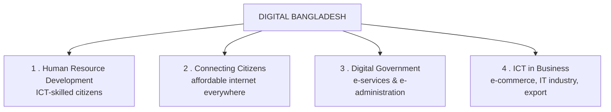

#### Factors needed to implement Digital Bangladesh

| Factor | Requirement |
|---|---|
| **Infrastructure** | Nationwide **broadband and mobile network**, submarine cable capacity, **reliable electricity**, data centres |
| **Human resources** | ICT-literate citizens, trained officials, skilled IT professionals |
| **Affordable devices and internet** | Low-cost smartphones and data so that the poor are not excluded |
| **Legal framework** | ICT Act, **Digital/Cyber Security Act**, Right to Information Act, data-protection law, e-signature law |
| **Government commitment & funding** | Sustained political will, budget allocation, a dedicated ICT Division |
| **Interoperability & standards** | Shared national databases, a single-sign-on identity, open standards |
| **Cybersecurity** | A national CERT, secure data centres, audit and compliance |
| **Digital literacy & awareness** | Citizens must know the services exist and how to use them |
| **Local content in Bangla** | Services and interfaces in the national language |
| **Public-private partnership** | Private sector innovation alongside government platforms |
| **Change management** | Officials must be willing to move from paper to digital processes |

#### Major e-government initiatives in Bangladesh

| Sector | Initiative |
|---|---|
| **General / citizen services** | **a2i (Aspire to Innovate)** programme, **Union Digital Centres (UDC)** in every union, the **National Portal**, **333 call centre**, **MyGov** app |
| **Identity & civil registration** | **Smart NID**, online **birth and death registration (BDRIS)**, e-passport, MRP |
| **Finance & revenue** | Online **VAT and income-tax return**, **e-GP (electronic government procurement)**, **iBAS++** budget system, challan (a-challan) |
| **Banking** | **BEFTN, RTGS, NPSB, BACH**, MFS (bKash, Nagad, Rocket), agent banking |
| **Land** | **e-Porcha**, e-Mutation, online land-development-tax payment |
| **Education** | Online **SSC/HSC results**, e-Book (all textbooks online), **Teachers' Portal**, **Muktopaath** e-learning, online university admission |
| **Health** | **Shastho Batayon 16263**, telemedicine, DGHS **Surokkha** vaccination portal, hospital MIS |
| **Agriculture** | **Krishi Call Centre 16123**, Agriculture Information Service, e-Krishi |
| **Judiciary** | e-Judiciary, online cause list, virtual courts |
| **Police / safety** | **Online GD**, National Emergency Service **999**, traffic e-challan |

#### E-government in health and education — specifics

**Health:** the **Shastho Batayon (16263)** 24-hour health call centre; **telemedicine** links in upazila health complexes; the **Surokkha** portal that managed nationwide COVID-19 vaccine registration and certificates; DHIS2-based health MIS; online doctor appointment and hospital automation.

**Education:** all national textbooks freely downloadable (**e-Book**); online publication of **public exam results**; the **Teachers' Portal** with 500,000+ members sharing digital content; **Muktopaath** free e-learning platform; **multimedia classrooms** in tens of thousands of schools; online university admission and BdREN (the research and education network).

**Previous Year Question List from this Topic:**

- [a) What is E-Government? How can E-Government be implemented through the vision of Digital Bangladesh?](../written-answers/computer-fundamental.md?plain=1#L1986)
- [b) List some factors that are needed to implement Digital Bangladesh.](../written-answers/computer-fundamental.md?plain=1#L2012)
- [c) Mention some government entities that have taken E-Government initiatives. What initiatives are taken by the Bangladesh Public Service Commission?](../written-answers/computer-fundamental.md?plain=1#L2030)
- [d) State the E-Government initiatives taken in health and education sectors of Bangladesh?](../written-answers/computer-fundamental.md?plain=1#L2055)
- [Describe in Bangali or English on the post COVID-19 social challenge that Bangladesh may can front end the way ICT can support to overcome them.](../written-answers/computer-fundamental.md?plain=1#L1724)

---

### E-Commerce and E-Business

#### What is E-Commerce?

**E-Commerce (Electronic Commerce)** is the **buying and selling of goods and services, and the transfer of funds or data, over an electronic network — primarily the Internet.**

#### Types of E-Commerce

| Type | Full form | Meaning | Example |
|---|---|---|---|
| **B2B** | Business to Business | One business sells to another | Alibaba; a garment factory buying fabric online |
| **B2C** | Business to Consumer | A business sells directly to the end consumer | **Daraz, Chaldal, Amazon, Rokomari** |
| **C2C** | Consumer to Consumer | Individuals sell to each other via a platform | **Bikroy.com**, eBay, OLX, Facebook Marketplace |
| **C2B** | Consumer to Business | An individual offers products/services to businesses | **Freelancer, Upwork, Fiverr**, stock-photo sellers |
| **B2G / B2A** | Business to Government | A business sells to government | **e-GP tenders** |
| **G2C** | Government to Consumer | Government charges/services online | Online tax and utility bill payment |
| **C2G** | Consumer to Government | Citizens pay government | e-challan, licence fees |

**Newer sub-types:** **F-commerce** (Facebook commerce), **M-commerce** (mobile commerce), **S-commerce** (social commerce), **D2C** (direct to consumer).

**E-commerce sites of Bangladesh:** **Daraz, Chaldal, Rokomari, Pickaboo, AjkerDeal, Bikroy, Evaly, Othoba, Foodpanda, Shohoz, Pathao**.

#### E-Commerce vs F-Commerce

| Point | **E-Commerce** | **F-Commerce (Facebook Commerce)** |
|---|---|---|
| **Platform** | A **dedicated website or app** | A **Facebook page / group / Instagram** |
| **Setup cost** | High — domain, hosting, development | **Almost zero** |
| **Technical skill needed** | Considerable | **Minimal** |
| **Payment** | Integrated gateway, cards, MFS | Usually **cash on delivery** or manual bKash |
| **Order management** | Automated cart, inventory, invoicing | **Manual** — via Messenger comments and chat |
| **Product catalogue** | Structured, searchable, filterable | Unstructured posts and albums |
| **Trust & regulation** | Registered business, trade licence, return policy | **Often unregistered**, weak buyer protection |
| **Customer reach** | Search engines + ads | **Social sharing and the Facebook algorithm** |
| **Scalability** | High | Limited — manual processes break down at volume |
| **Data & analytics** | Full control of customer data | Limited to what Facebook provides |
| **Best for** | Established businesses, large catalogues | **Micro-entrepreneurs, home-based and women entrepreneurs**, testing an idea |

> **Why F-commerce matters in Bangladesh:** it has become the entry point for **hundreds of thousands of micro-entrepreneurs, especially women**, who can start a business from home with a phone and no capital. Groups such as **"Women and e-Commerce Forum (WE)"** have enabled large numbers of women to earn independently. The weaknesses — no formal registration, no buyer protection, cash-on-delivery losses and no data ownership — are exactly why the government has pushed for **digital business identity (DBID)** registration.

#### E-Commerce vs E-Business

| Point | **E-Commerce** | **E-Business** |
|---|---|---|
| **Scope** | **Narrow** — commercial **transactions** only | **Wide** — **all** business processes done electronically |
| **Relationship** | **A SUBSET of e-business** | The superset |
| **Focus** | Buying, selling, payment | Buying/selling **plus** procurement, CRM, SCM, HR, production, accounting, internal collaboration |
| **Requires the Internet?** | ✅ Yes, essentially | Uses Internet, **intranet and extranet** |
| **Money involved?** | **Always** — it is about transactions | Not necessarily — much of it is internal process |
| **Example** | Buying a book on Rokomari | The **whole operation** of Rokomari: inventory, supplier ERP, staff portal, analytics, delivery routing |

#### Self-service strategy in e-commerce

E-commerce increases profit by shifting work **from the company's staff to the customer** — and the customer usually *prefers* it:

| Self-service element | Benefit to the company | Benefit to the customer |
|---|---|---|
| The customer **browses and searches** the catalogue | No salesperson cost | Browse at 2 a.m., compare freely |
| The customer **enters their own order and address** | No data-entry staff, **fewer errors** | Faster, in their own words |
| **Online payment** | No cashier, instant settlement | No cash handling |
| **Self-service order tracking** | Massive reduction in support calls | Instant answer, no waiting |
| **FAQ, knowledge base, chatbot** | One answer serves millions | Immediate help |
| **Customer reviews** | Free, credible content | Better buying decisions |
| **Automated recommendations** | **Increases basket size** — cross-selling with no salesperson | Discovers relevant products |

The net effect: **the marginal cost of serving one more customer falls towards zero**, which is why e-commerce can scale to millions of customers with a small team.

#### Traditional planning vs "sense and respond"

| Point | **Traditional business planning** | **Sense and Respond strategy** |
|---|---|---|
| **Assumption** | The future is **predictable**; the environment is stable | The future is **uncertain** and changes fast |
| **Planning horizon** | Long — 3 to 5 year plans | **Short cycles**, continuously revised |
| **Approach** | **Make and sell** — forecast demand, produce, then push to market | **Sense and respond** — detect what customers actually do, then adapt |
| **Data used** | Historical data, annual surveys | **Real-time data** — clicks, sales, sensors, social signals |
| **Structure** | Hierarchical, centralised | Networked, **decentralised**, empowered teams |
| **Inventory** | Large buffer stock (just in case) | **Just-in-time**, demand-driven |
| **Change** | Resisted; plans are executed as written | **Expected and embraced** |
| **Customer role** | Passive recipient | **Active participant** — reviews, customisation, co-creation |
| **Measure of success** | Meeting the plan | **Speed of adaptation** |
| **Enabled by** | — | ICT: real-time analytics, cloud, IoT, e-commerce platforms |

#### Advantages of using the Internet in a business organisation

1. **Global market reach** at low cost.
2. **24×7 operation** with no additional staff.
3. **Lower operating cost** — no shop rent, less paperwork, fewer intermediaries.
4. **Faster communication** — email, video conference, instant messaging.
5. **Direct marketing** and precise targeting; measurable advertising.
6. **Better customer service** — online support, self-service, feedback.
7. **Efficient supply chain** — online procurement, real-time tracking.
8. **Access to information** — market research, competitor analysis.
9. **Remote and flexible working.**
10. **Data-driven decisions** through web analytics.

#### Intranet, Extranet and legacy systems

| Term | Definition | Users |
|---|---|---|
| **Internet** | The global public network | Everyone |
| **Intranet** | A **private network inside one organisation**, using Internet technology (TCP/IP, web browsers) | **Employees only** |
| **Extranet** | An intranet **extended to selected outsiders** | Employees **+ suppliers, partners, key customers** |

> **How a legacy system is included in an intranet:** older systems (a COBOL mainframe, an old banking core) cannot simply be thrown away — they hold critical data and encode decades of business rules. They are integrated by placing a **middleware / wrapper layer** in front of them:
> 1. **Screen scraping / terminal emulation** — a web front end drives the legacy green-screen.
> 2. **API wrapper** — a modern **REST/SOAP web service** is written that calls the legacy program and returns JSON/XML.
> 3. **Middleware / Enterprise Service Bus (ESB)** — a message broker translates between systems.
> 4. **Database gateway** — the intranet application reads the legacy database directly through an ODBC/JDBC bridge.
> 5. **Batch synchronisation / ETL** — data is exported nightly into a modern database that the intranet uses.
>
> This gives employees a **single modern browser interface** while the proven legacy system keeps running underneath — the standard approach in banks and government.

**Previous Year Question List from this Topic:**

- [E-commerce ভিত্তিক ৪টি সাইটের নাম লিখুন?](../written-answers/computer-fundamental.md?plain=1#L1708)
- [E-commerce and F-commerce -এর মধ্যে পার্থক্য লিখুন। নারী গোষ্ঠী দ্বারা পরিচালিত F-Commerce -এর সামাজিক প্রভাব সম্বন্ধে লিখুন।](../written-answers/computer-fundamental.md?plain=1#L1801)
- [(ii) E-Commerce কী? E-Commerce-এর প্রকারভেদ উল্লেখ করুন। Search engine কী? এর কয়েকটি উদাহরণ দিন।](../written-answers/computer-fundamental.md?plain=1#L1895)
- [(a) Differentiate between e-commerce and e-business. How does e-commerce exploit self-serviced strategy to increase the market share?](../written-answers/computer-fundamental.md?plain=1#L2081)
- [(b) Distinguish between traditional business planning assumption and today’s sense and response strategy.](../written-answers/computer-fundamental.md?plain=1#L2110)
- [(c) Write down the advantages of using internet in business organization. How is legacy system included in intranet of an organization?](../written-answers/computer-fundamental.md?plain=1#L2132)
- [What is E-Commerce? What are the types of E-commerce?](../written-answers/computer-fundamental.md?plain=1#L2161)
- [Describe the transformative power of ICT with ten innovative applications for the online banking system.](../written-answers/computer-fundamental.md?plain=1#L1643)

---

### Information Systems — TPS, MIS and DSS

Organisations run a **hierarchy of information systems**, each serving a different management level.

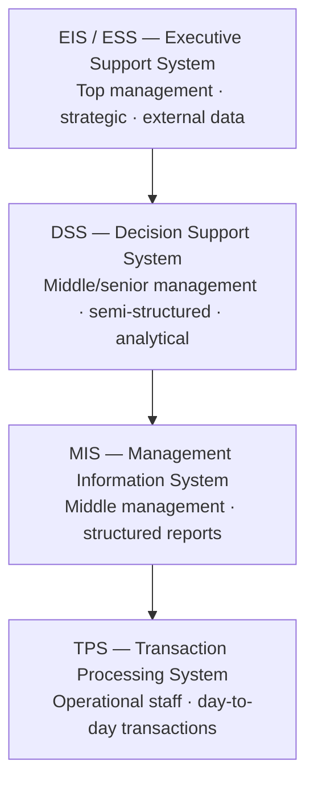

#### TPS — Transaction Processing System

Records and processes the **routine, day-to-day transactions** of the business. It is the **source of the raw data** that every higher system depends on.
*Examples:* ATM withdrawals, cheque clearing, sales at a POS terminal, payroll, order entry, ticket booking.

#### MIS — Management Information System

Converts TPS data into **summarised, structured, routine reports** that help **middle managers monitor and control** operations.
*Examples:* monthly branch-wise deposit report, weekly sales summary, inventory status report, quarterly profit statement.

#### DSS — Decision Support System

An **interactive, analytical** system that helps managers take **semi-structured or unstructured decisions** by running models, **what-if analyses** and simulations. It uses **both internal and external data**.
*Examples:* a loan-risk model, a "what if interest rates rise 2 %" simulation, branch-location analysis, portfolio optimisation, credit scoring.

#### MIS vs DSS — the key comparison

| Point | **MIS** | **DSS** |
|---|---|---|
| **Purpose** | **Monitoring and control** — "what happened?" | **Decision support** — "what should we do?" / "what if?" |
| **Decision type** | **Structured, routine** | **Semi-structured and unstructured** |
| **Users** | **Middle** management | **Middle and top** management, analysts |
| **Output** | **Fixed, periodic reports** (daily/weekly/monthly) | **Interactive, ad-hoc** analyses, models, simulations |
| **Data source** | Mainly **internal** (from TPS) | **Internal + EXTERNAL** (market, competitor, economic data) |
| **Flexibility** | **Low** — predefined formats | **High** — the user builds the query and the model |
| **Analytical capability** | Basic summarising, totalling | **Strong** — statistical models, optimisation, forecasting, what-if |
| **Orientation** | **Past** and present | **Present and FUTURE** |
| **User interaction** | Passive — read the report | **Active** — the manager drives the analysis |
| **Example** | "Branch-wise deposit report for March" | "If we open a branch in Sylhet, what is the projected 3-year return?" |

#### TPS vs DSS

| Point | **TPS** | **DSS** |
|---|---|---|
| **Level** | **Operational** | Management / strategic |
| **Purpose** | **Record** transactions accurately | **Support decisions** |
| **Data** | Detailed, current, internal | Summarised + external, historical and projected |
| **Volume** | **Very high** — thousands per second | Low — a few analyses per day |
| **Processing** | Repetitive, routine, high-speed | Analytical, model-based, ad-hoc |
| **Users** | Clerks, tellers, operators | Managers, analysts |
| **Requirement** | **Accuracy, reliability, speed, availability** | **Flexibility, modelling power** |
| **Example** | Recording a cash deposit at the counter | Deciding which customer segment to target for a new product |

#### The role of MIS in the banking sector

1. **Regulatory reporting** to Bangladesh Bank — CRR/SLR, CAMELS, capital adequacy, statutory returns.
2. **Branch performance monitoring** — deposits, advances, profitability by branch and product.
3. **Credit monitoring** — classified loans, NPL tracking, sector-wise exposure.
4. **Liquidity and treasury management** — daily cash position and fund flow.
5. **Customer analytics** — segmentation, product holding, churn risk, cross-sell targets.
6. **Fraud and AML monitoring** — flagging unusual transaction patterns.
7. **HR and payroll management** — staff productivity, training, transfers.
8. **Budgeting and cost control** — actual vs budget variance analysis.
9. **Audit trail and compliance** — every transaction traceable.
10. **Strategic planning support** — branch expansion, new product launch, ATM placement.

#### ERP — Enterprise Resource Planning

**ERP** is an **integrated software suite that manages all core business processes — finance, HR, manufacturing, supply chain, sales, procurement and inventory — through a SINGLE shared database**, so every department sees the same real-time data.

*Examples:* **SAP, Oracle ERP Cloud, Microsoft Dynamics 365, Odoo, Tally ERP.*

**Benefits:** one source of truth (no duplicate or conflicting data) · real-time visibility across departments · automated workflows · standardised processes · better reporting and compliance · lower long-run operating cost.

**Implementation challenges of ERP** *(a directly asked question)*

| # | Challenge | Explanation |
|---|---|---|
| 1 | **Very high cost** | Licences, hardware, consultants, training — often crores of taka, with cost overruns common |
| 2 | **Long implementation time** | 6 months to several years; business cannot wait |
| 3 | **Resistance to change** | Staff are comfortable with old methods and fear job loss or loss of control — **the single biggest cause of ERP failure** |
| 4 | **Business process re-engineering** | The organisation must often **change its processes to fit the ERP**, which is painful and political |
| 5 | **Data migration** | Cleaning, mapping and transferring decades of legacy data is error-prone and hugely underestimated |
| 6 | **Customisation trap** | Heavy customisation raises cost, delays the project and makes future upgrades very difficult |
| 7 | **Integration with existing systems** | Legacy and third-party systems must be interfaced |
| 8 | **Inadequate training** | Users who do not understand the system enter wrong data, destroying its value |
| 9 | **Lack of top-management commitment** | Without visible executive sponsorship the project loses priority and funding |
| 10 | **Choosing the wrong vendor or module set** | A poor fit with the industry's real needs |
| 11 | **Unclear requirements and scope creep** | Requirements keep expanding during the project |
| 12 | **Downtime risk during go-live** | Switching over is risky for a running business |

**Critical success factors:** strong **top-management sponsorship**, a **clear scope**, **phased rollout** rather than big-bang, thorough **change management and training**, **data cleansing before migration**, minimal customisation, and an experienced implementation partner.

**Previous Year Question List from this Topic:**

- [Comparison between MIS and DSS. What is the roles of MIS in Banking sector?](../written-answers/computer-fundamental.md?plain=1#L1772)
- [What is ERP? Write down the Implementation Challenges of ERP?](../written-answers/computer-fundamental.md?plain=1#L1856)
- [What is DSS? Write the difference between MIS and DSS.](../written-answers/computer-fundamental.md?plain=1#L2970)
- [Compare between TPS and DSS.](../written-answers/computer-fundamental.md?plain=1#L2995)

---

### Other ICT Topics — Copyright, RFID, Viral Video and Banking Software

#### Copyright law

**Copyright** is a legal right that gives the **creator of an original work exclusive control over its reproduction, distribution, adaptation and public display** for a limited period.

**What it protects:** literary works, music, films, photographs, paintings, **computer software and source code**, databases, architectural designs, website content.
**What it does NOT protect:** ideas, facts, methods, procedures and concepts — only their **particular expression**.

**In Bangladesh:** the **Copyright Act 2000** (amended 2005, and updated by the **Copyright Act 2023**), administered by the **Copyright Office** under the Ministry of Cultural Affairs. Protection generally lasts the **author's lifetime plus 60 years**. Registration is **not mandatory** — copyright exists automatically on creation — but registration provides strong legal evidence.

**Why copyright is necessary**

1. **Protects the creator's moral and economic rights** — the right to be credited and to be paid.
2. **Provides financial incentive** to create, invest and innovate.
3. **Prevents piracy and plagiarism**, which destroy the market for genuine work.
4. **Supports the software and creative industries** — without it, no one would invest in developing software locally.
5. **Encourages the growth of culture, literature, music and film.**
6. **Enables licensing** — a legal framework for selling and sharing work (including **open-source licences**, which are built on copyright).
7. **Attracts foreign investment** — companies will not bring technology to a country that cannot protect it.
8. **Balances public interest** through **fair use/fair dealing** for education, research, criticism and news reporting.

*(Related rights: **patent** protects inventions; **trademark** protects brand names and logos; **trade secret** protects confidential business information.)*

#### RFID — Radio Frequency Identification

**RFID** uses **radio waves** to automatically identify and track objects carrying a **tag**, without needing line of sight or physical contact.

**Components:** a **tag** (a microchip + antenna, attached to the object), a **reader** (transmits a radio signal and receives the tag's reply), an **antenna**, and **middleware/software** that interprets the data.

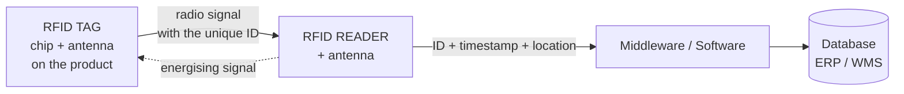

| Type | Power | Range |
|---|---|---|
| **Passive tag** | No battery — powered by the reader's signal | Up to ~10 m |
| **Active tag** | Has its own battery | Up to ~100 m |
| **Semi-passive** | Battery for the chip, reader powers the transmission | Medium |

**RFID in supply chain management**

1. **Automatic goods receipt** — a whole pallet is read in one pass, no unpacking, no barcode scanning of each item.
2. **Real-time inventory visibility** — instantly know what is on which shelf in which warehouse.
3. **Track and trace** from factory → warehouse → truck → shop → customer.
4. **Anti-counterfeiting** — each unique tag proves authenticity.
5. **Automatic reordering** when stock falls below a threshold.
6. **Reduced shrinkage and theft**; **loss prevention** at exits.
7. **Cold-chain monitoring** — sensor tags record temperature for pharmaceuticals and food.
8. **Faster checkout** — an entire basket is read at once.

**RFID in toll collection (ETC — Electronic Toll Collection)**

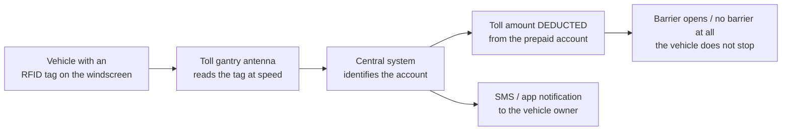

**Benefits:** no stopping, so **no queues and no congestion** · lower fuel consumption and emissions · no cash handling, so **no leakage or corruption** · complete audit trail of every transaction · lower manpower cost · reliable traffic data for planning.
*(Examples: the Padma Bridge and Dhaka Elevated Expressway ETC systems, India's FASTag, and E-ZPass in the USA.)*

**RFID vs Barcode**

| Point | **RFID** | **Barcode** |
|---|---|---|
| **Line of sight** | ❌ **Not needed** | ✅ **Required** |
| **Read at once** | **Hundreds** of tags simultaneously | **One** at a time |
| **Range** | Up to 100 m | A few centimetres |
| **Data storage** | Read/write, kilobytes | Read-only, a few characters |
| **Durability** | Works through dirt, paint, packaging | Fails if smudged or torn |
| **Unique per item?** | ✅ Yes — each tag has a unique ID | ❌ No — identifies the *product type* only |
| **Cost** | **Higher** | **Very low** |

#### Viral video

A **viral video** is a video that **spreads extremely rapidly and widely across the internet**, mainly through **social media sharing** rather than through paid advertising, reaching a very large audience in a short time.

**Characteristics:** short and instantly understandable; strong **emotional trigger** (humour, surprise, inspiration, outrage); highly **relatable** or topical; easy to share; and often boosted by an algorithm once early engagement is strong.

**Three advantages of a viral video:**
1. **Enormous reach at almost zero cost** — organic sharing replaces an advertising budget.
2. **Rapid brand awareness and credibility** — a recommendation from a friend carries far more trust than an advertisement.
3. **High engagement and conversion** — viewers watch, comment and act; for a business this drives sales, and for a cause it drives awareness and donations.

*(Other benefits: SEO value, media coverage, and an audience the creator keeps afterwards. The risks: it is **unpredictable**, the attention is **short-lived**, and content can go viral for the **wrong** reasons, damaging reputation.)*

#### Banking software used in Bangladesh

| Type | Examples |
|---|---|
| **Core banking solutions (CBS)** | **Temenos T24, Flexcube (Oracle FLEXCUBE), Finacle (Infosys), BankUltimus (Leads), Ababil (Millennium — Islamic banking), Stelar, Kastle, Bexibank** |
| **Payment / settlement** | **BACH, BEFTN, RTGS, NPSB**, SWIFT |
| **Mobile financial services** | **bKash, Nagad, Rocket, Upay, SureCash** |
| **Card management** | Cardpro, Way4, Euronet |
| **AML / compliance** | goAML, Oracle Mantas, in-house AML engines |
| **ERP / HR** | SAP, Oracle, in-house HRMS |

**Essential features of good banking software**

1. **Core banking (CBS)** — accounts, deposits, loans, GL, with **any-branch banking**.
2. **Real-time processing** and **24×7 availability**.
3. **Multi-channel access** — branch, ATM, POS, internet banking, mobile app, agent banking.
4. **Robust security** — encryption, **MFA**, role-based access, audit trail, fraud detection.
5. **Regulatory compliance and reporting** — Bangladesh Bank returns, **AML/CFT, KYC/eKYC**, Basel III.
6. **Scalability and high availability** — clustering, **disaster recovery site**, 99.99 % uptime.
7. **Integration/API layer** — connects to BACH, BEFTN, NPSB, MFS, SWIFT, credit bureau.
8. **MIS and analytics dashboards** for management.
9. **Parameterisation** — new products configurable without code changes.
10. **Bangla language support** and localisation.
11. **Complete audit trail** — every transaction traceable to a user and terminal.
12. **Backup, recovery and business continuity**.

**Previous Year Question List from this Topic:**

- [What do you mean by viral video? List three advantages of viral vedio.](../written-answers/computer-fundamental.md?plain=1#L1663)
- [Copyright আইন কি? এর প্রয়োজনীয়তা ব্যাখ্যা করুন।](../written-answers/computer-fundamental.md?plain=1#L1748)
- [১৪. বাংলাদেশের প্রথম ভিডিও লাইভ শেয়ারিং অ্যাপস কোনটি?](../written-answers/computer-fundamental.md?plain=1#L1836)
- [Make a list of banking software used in Bangladesh. List the essential features for successful Banking Software and Apps.](../written-answers/computer-fundamental.md?plain=1#L1920)
- [RFID has huge applications in business, especially in supply chain management and toll collection system. Show the basic working principle of RFID in brief.](../written-answers/computer-fundamental.md?plain=1#L1951)

---

### Digital Banking and Electronic Payment Systems

#### What is digital banking?

**Digital banking** is the **delivery of banking products and services through digital channels — internet, mobile app, ATM, POS and agent points — with end-to-end digitisation of processes**, so that a customer can complete almost any banking task **without visiting a branch**.

#### Digital banking vs traditional banking

| Point | **Traditional Banking** | **Digital Banking** |
|---|---|---|
| **Service point** | A **physical branch** | **Anywhere** — phone, computer, agent point |
| **Timing** | **Banking hours** (10 a.m.–4 p.m., weekdays) | **24 × 7 × 365** |
| **Process** | **Paper forms**, manual signature, physical verification | Digital forms, **e-KYC**, OTP, biometric |
| **Speed** | Slow — queues, multiple visits | **Instant** |
| **Account opening** | Visit the branch with documents | **e-KYC** in minutes from home |
| **Fund transfer** | Cheque, pay order, counter | **Instant** — BEFTN, RTGS, NPSB, MFS |
| **Operating cost per transaction** | **Very high** — staff, rent, paper | **A fraction** of it |
| **Geographic reach** | Limited by branch network | **Nationwide**, including remote areas |
| **Staff needed** | Large | Small, focused on complex cases |
| **Record keeping** | Physical ledgers and files | **Digital, searchable, auditable** |
| **Customer relationship** | **Face to face**, personal | Digital, data-driven, less personal |
| **Risk** | Physical theft, forgery, human error | **Cyber fraud, phishing**, system failure |
| **Accessibility for the unbanked** | Poor — a branch is far away | **Excellent** — an agent or a mobile phone is nearby |

#### How digital banking promotes financial inclusion

**Financial inclusion** means ensuring that **everyone, especially the poor and rural population, has access to affordable, useful financial services** — an account, payments, savings, credit and insurance.

| # | Mechanism | Explanation |
|---|---|---|
| 1 | **Reach without branches** | **Agent banking** and **MFS** put a financial access point in every village; building a branch there would never be viable |
| 2 | **Drastically lower cost** | A digital transaction costs a small fraction of a branch transaction, so **small-value accounts become profitable** to serve |
| 3 | **Simplified onboarding** | **e-KYC with the NID and a photo** lets someone with no documents beyond an NID open an account in minutes |
| 4 | **Low minimum balance** | Digital accounts (e.g. the 10-taka farmer's account) remove the entry barrier |
| 5 | **Remittance delivery** | Migrant workers' remittances reach families directly and instantly, with government incentives applied automatically |
| 6 | **Government-to-Person (G2P) payments** | Social safety-net allowances, stipends, pensions and relief go **directly into the beneficiary's account**, removing leakage and middlemen |
| 7 | **Alternative credit scoring** | Mobile wallet and transaction history creates a **digital footprint** that lets the previously "invisible" borrow — **nano-loans** |
| 8 | **Women's empowerment** | A woman can hold and control her own account on her own phone, without a male escort to the branch |
| 9 | **Merchant payments** | Small shops accept digital payment, join the formal economy and become creditworthy |
| 10 | **Savings and insurance products** | Micro-savings and micro-insurance become deliverable at scale |
| 11 | **Transparency** | Every transaction is recorded, reducing corruption and building trust |

**The Bangladesh evidence:** **bKash, Nagad and Rocket** together serve well over 100 million registered accounts; **agent banking** operates tens of thousands of outlets, a majority in rural areas; and government stipends and COVID-19 relief were disbursed digitally to millions of households.

**The remaining barriers:** digital and financial **literacy**, smartphone and internet **affordability**, **network coverage** gaps, **trust and fraud** concerns, **cash-out costs**, and the **gender gap** in phone ownership.

#### Electronic Payment System (EPS)

An **Electronic Payment System** is a system that allows **payment for goods and services to be made electronically — without physical cash or cheques — by transferring value between accounts over a network.**

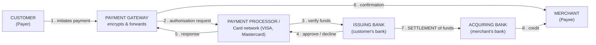

**The five main types of EPS:**

| # | Type | Description | Example |
|---|---|---|---|
| 1 | **Card-based payment** | Debit, credit and prepaid cards used at **POS, ATM or online** | VISA, Mastercard, AMEX; a local debit card |
| 2 | **Mobile Financial Services / e-Wallet** | Value held in a mobile account, used by phone | **bKash, Nagad, Rocket, Upay**; PayPal, Apple Pay |
| 3 | **Internet / Online banking transfer** | Direct account-to-account transfer through a bank's portal | **BEFTN, RTGS, NPSB**, NEFT |
| 4 | **Electronic cheque / Electronic Funds Transfer (EFT)** | The cheque or instruction is cleared electronically | **BACH** cheque truncation, direct debit, standing order |
| 5 | **Digital / Crypto currency** | Value transferred on a distributed ledger or as central-bank digital currency | Bitcoin, stablecoins, **CBDC** |

*(Others worth naming: **QR-code payment**, **contactless/NFC**, **biometric payment**, and **BNPL — Buy Now Pay Later**.)*

**Advantages of EPS:** speed (instant settlement) · convenience and 24×7 availability · **lower transaction cost** · **complete transaction record** for accounting and tax · reduced cash-handling risk · enables e-commerce · supports financial inclusion · reduces the cost of printing and moving currency notes.

**Challenges:** **cyber fraud and phishing** · dependence on internet and power · **digital literacy** · transaction and interchange fees · **privacy concerns** over transaction data · system downtime · the **unbanked** without any account · and regulatory/AML compliance burden.

**Previous Year Question List from this Topic:**

- [Discuss the impact of Artificial Intelligence and Automation on the banking sector of Bangladesh. What strategies should financial institutions adopt to balance…](../written-answers/computer-fundamental.md?plain=1#L1611)
- [Describe the transformative power of ICT with ten innovative applications for the online banking system.](../written-answers/computer-fundamental.md?plain=1#L1643)
- [What is digital banking and how does it differ from traditional banking? How can digital banking promote financial inclusion?](../written-answers/computer-fundamental.md?plain=1#L3823)
- [(a) Define Electronic Payment System (EPS) with necessary diagram. Name 5 types of EPS.](../written-answers/computer-fundamental.md?plain=1#L3859)

---

## Quantum Computing & Emerging Technologies

### Quantum Computing

**Quantum computing** uses the principles of **quantum mechanics** — superposition, entanglement and interference — to process information in a fundamentally different way from classical computers.

#### The qubit

A classical computer stores a **bit**, which is **either 0 or 1**. A quantum computer stores a **qubit**, which can be **0, 1, or BOTH AT THE SAME TIME** (a *superposition*).

| Concept | Meaning | Consequence |
|---|---|---|
| **Superposition** | A qubit holds 0 and 1 simultaneously, with probabilities | **n qubits represent 2ⁿ states at once** — 300 qubits exceed the number of atoms in the observable universe |
| **Entanglement** | Two qubits become correlated so that measuring one instantly determines the other, however far apart | Enables massively parallel correlated computation |
| **Interference** | Probability amplitudes add and cancel | Algorithms are designed so that **wrong answers cancel out** and the right answer is amplified |
| **Measurement** | Observing a qubit **collapses** it to a definite 0 or 1 | You get one answer, so algorithms must be designed around probability |

#### Classical vs Quantum computing

| Point | **Classical Computer** | **Quantum Computer** |
|---|---|---|
| **Basic unit** | **Bit** (0 **or** 1) | **Qubit** (0 **and** 1 simultaneously) |
| **States of n units** | **One** of 2ⁿ | **All 2ⁿ** at once |
| **Operations** | Boolean logic gates (AND, OR, NOT) | **Quantum gates** (Hadamard, CNOT, Pauli-X) — reversible |
| **Processing** | Sequential / limited parallelism | **Massively parallel** by nature |
| **Error rate** | Very low | **Very high** — needs constant error correction |
| **Operating conditions** | Room temperature | **Near absolute zero (−273 °C)**, shielded from all vibration and radiation |
| **Best at** | Everyday tasks, arithmetic, databases, graphics | **Specific hard problems** — factoring, simulation, optimisation, search |
| **Maturity** | Fully mature | **Experimental / early commercial** |

#### Importance and applications

1. **Drug discovery and chemistry** — simulating molecules exactly, which is intractable classically. The most promising application.
2. **Materials science** — designing superconductors, better batteries, catalysts.
3. **Cryptography** — **Shor's algorithm** can factor large numbers efficiently, which would **break RSA and ECC encryption**. This is why the world is moving to **post-quantum cryptography**.
4. **Optimisation** — logistics, routing, portfolio optimisation, scheduling, supply chains.
5. **Search** — **Grover's algorithm** searches an unsorted database in **O(√N)** instead of O(N).
6. **Machine learning** — quantum ML may speed up training on certain problems.
7. **Weather and climate modelling**; **financial risk simulation**.

#### Disadvantages and limitations

| # | Limitation | Explanation |
|---|---|---|
| 1 | **Decoherence** | Qubits lose their quantum state in **microseconds** from the slightest heat, vibration or electromagnetic noise |
| 2 | **High error rates** | Quantum gates are far less reliable than classical ones; **error correction** may need 1,000 physical qubits per useful logical qubit |
| 3 | **Extreme operating conditions** | Dilution refrigerators near **absolute zero**; enormous cost and power |
| 4 | **Very expensive** | Tens of millions of dollars per machine; only large labs and cloud providers have them |
| 5 | **Not general purpose** | **Slower than a laptop** for ordinary tasks — it only wins on specific problem classes |
| 6 | **Few algorithms** | Only a handful of quantum algorithms with proven advantage exist |
| 7 | **Scalability** | Current machines have hundreds to a few thousand noisy qubits; millions are needed for most useful work |
| 8 | **Security threat** | It threatens to break the encryption that currently protects banking, government and the internet |
| 9 | **Shortage of expertise** | Requires deep knowledge of quantum physics *and* computer science |
| 10 | **Probabilistic output** | Results are statistical; the computation must be repeated many times |

*(Leading players: **IBM Quantum, Google (Sycamore/Willow), Microsoft Azure Quantum, D-Wave, IonQ, Rigetti**.)*

**Previous Year Question List from this Topic:**

- [কোয়ান্টাম কম্পিউটিং কি? এর গুরুত্ব এবং অসুবিধাগুলো কি কি? সংক্ষেপে আলোচনা করুন।](../written-answers/computer-fundamental.md?plain=1#L3750)

---

### Virtual Reality, Augmented Reality and Nanotechnology

#### Virtual Reality (VR)

**Virtual Reality** is a computer-generated **simulation of a three-dimensional environment** that **completely replaces** the user's view of the real world, and with which the user can **interact** in a seemingly real way using special equipment.

**How it works:** a **head-mounted display (HMD)** shows a slightly different image to each eye to create **stereoscopic depth**; **motion sensors and head tracking** update the view as the user moves; **hand controllers, gloves or haptic suits** allow interaction; and **3-D spatial audio** completes the illusion. The key requirements are a **wide field of view**, **high frame rate** and **very low latency** — otherwise the user experiences motion sickness.

**Devices:** Meta Quest, HTC Vive, PlayStation VR, Valve Index, Apple Vision Pro.

**Applications**

| Sector | Use |
|---|---|
| **Education & training** | Virtual laboratories, historical site tours, virtual field trips |
| **Medicine** | **Surgical training and rehearsal**, phobia and PTSD therapy, physiotherapy |
| **Military & aviation** | **Flight simulators**, combat and equipment training — safe and cheap |
| **Engineering & architecture** | Walking through a building before it is built; design review |
| **Gaming & entertainment** | Immersive games, virtual concerts, 360° film |
| **Real estate & tourism** | Virtual property tours and destination previews |
| **Industry** | Assembly training, remote maintenance guidance, **digital twins** |
| **Retail** | Virtual showrooms and try-before-you-buy |

**Advantages:** safe practice of dangerous tasks · huge cost saving on physical prototypes and travel · far better retention than passive learning · access to places and situations otherwise impossible.
**Disadvantages:** expensive hardware · **motion sickness and eye strain** · social isolation and addiction risk · content is costly to produce · requires powerful computing.

#### VR vs AR vs MR

| Point | **Virtual Reality (VR)** | **Augmented Reality (AR)** | **Mixed Reality (MR)** |
|---|---|---|---|
| **Environment** | **Fully virtual** — the real world is replaced | **Real world + digital overlay** | Real and virtual objects **interact** |
| **Immersion** | **Complete** | Partial | High |
| **Device** | Headset (HMD) | **Smartphone, tablet, smart glasses** | HoloLens, Magic Leap, Vision Pro |
| **User awareness of reality** | ❌ Blocked out | ✅ Fully aware | ✅ Aware |
| **Example** | A VR flight simulator | **Pokémon GO**, Google Lens, an IKEA app placing furniture in your room, Snapchat filters | A holographic engine you can walk around and take apart |

#### Nanotechnology and molecular computing

**Nanotechnology** is the manipulation of matter at the scale of **1 to 100 nanometres** (a nanometre is one billionth of a metre — roughly 1/80,000 of the width of a human hair). At that scale, materials show entirely different physical, chemical and electrical properties.

> ### "What is the name of a molecular-scale computer?"
> A **MOLECULAR COMPUTER** — also called a **nanocomputer**, and in its best-known biological form a **DNA computer**.
>
> Instead of silicon transistors, it uses **individual molecules** (or strands of DNA) as the switching and storage elements. **Leonard Adleman** demonstrated the first DNA computer in 1994 by solving a small Hamiltonian-path problem with DNA strands in a test tube.
>
> **Why it is interesting:** molecules are **astronomically dense** (a gram of DNA could in principle store more data than every hard disk ever made) and **massively parallel** (trillions of molecules react at once), while consuming very little energy. **Why it is not practical yet:** it is extremely **slow to read results**, error-prone, and difficult to program or reuse.

**Applications of nanotechnology in computing:** ever-smaller transistors (modern chips are built at the **3–5 nanometre** node); **carbon nanotube** and **graphene** transistors as a successor to silicon; **nano-memory** with far higher density; **quantum dots** for displays and qubits; and better heat dissipation.

**Other applications:** targeted **drug delivery**, cancer treatment, water purification, stronger and lighter materials, self-cleaning and stain-resistant fabrics, more efficient solar cells and batteries.

**Previous Year Question List from this Topic:**

- [What is the name of molecular scale computer?](../written-answers/computer-fundamental.md?plain=1#L3778)
- [Virtual Reality বলতে কি বুঝায় ব্যাখ্যা করুন।](../written-answers/computer-fundamental.md?plain=1#L3792)
