<!-- TOC START -->
**Table of Contents** — 1 subtopics · 8 theories

1. **[Social Engineering & Cyber Attacks](#social-engineering--cyber-attacks)**
   - [Social Engineering — Techniques and Prevention](#social-engineering--techniques-and-prevention)
   - [Phishing and Pharming](#phishing-and-pharming)
   - [Denial of Service (DoS) and DDoS Attacks](#denial-of-service-dos-and-ddos-attacks)
   - [Man-in-the-Middle (MITM) Attack and Session Hijacking](#man-in-the-middle-mitm-attack-and-session-hijacking)
   - [ARP Spoofing and DNS Poisoning](#arp-spoofing-and-dns-poisoning)
   - [Layer 2 Attacks — MAC Flooding and DHCP Starvation](#layer-2-attacks--mac-flooding-and-dhcp-starvation)
   - [Active vs Passive Attacks, and Types of Attacker](#active-vs-passive-attacks-and-types-of-attacker)
   - [The Major Cyber Attacks — A Master List](#the-major-cyber-attacks--a-master-list)

<!-- TOC END -->

---

## Social Engineering & Cyber Attacks

### Social Engineering — Techniques and Prevention

**Social engineering** is the art of **manipulating people psychologically into revealing confidential information or performing actions that compromise security**. Instead of breaking the technology, the attacker **breaks the human being**.

> **The core idea:** *"Why spend a week cracking a password when you can just phone someone and ask for it?"*
> Humans are the **weakest link** in any security system — you can patch software, but you cannot patch a person.

#### The psychological principles exploited

| Principle | How it is used |
|---|---|
| **Authority** | Pretending to be the boss, an IT administrator, a police officer or a bank official |
| **Urgency / Scarcity** | *"Your account will be closed in 2 hours!"* — panic prevents careful thinking |
| **Fear** | *"Your computer is infected — call this number immediately"* |
| **Trust / Familiarity** | Posing as a colleague, a vendor or a friend |
| **Greed** | *"You have won a lottery / a free iPhone"* |
| **Helpfulness** | People naturally want to assist someone who appears to be in trouble |
| **Social proof** | *"Everyone in your department has already updated their password"* |

#### The attack lifecycle

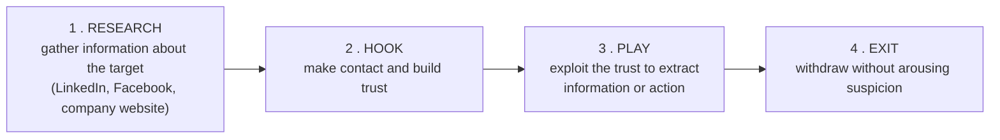

#### Common social engineering techniques

| # | Technique | Description | Example |
|---|---|---|---|
| 1 | **Phishing** | Mass fraudulent emails/messages that appear to come from a trusted source | A fake "your bank account is locked" email |
| 2 | **Spear phishing** | Phishing **targeted at a specific individual**, using personal details | An email to an accountant naming their actual manager |
| 3 | **Whaling** | Spear phishing aimed at **senior executives** (CEO, CFO) | A fake legal subpoena to the Managing Director |
| 4 | **Vishing** (Voice phishing) | Fraud **over a phone call** | *"I'm calling from bKash — tell me the OTP to verify your account"* |
| 5 | **Smishing** (SMS phishing) | Fraud via **SMS** | *"You have won 50,000 Tk — click this link"* |
| 6 | **Pretexting** | Inventing a **believable false scenario** to obtain data | Posing as an auditor who "needs" the employee list |
| 7 | **Baiting** | Leaving infected media or offering something tempting | A **USB drive labelled "Salary 2026"** left in the office car park |
| 8 | **Quid pro quo** | Offering a service in return for information | *"I'm from IT support — give me your password and I'll fix your slow PC"* |
| 9 | **Tailgating / Piggybacking** | **Physically following** an authorised person through a secure door | Carrying boxes so someone holds the door open |
| 10 | **Shoulder surfing** | Watching someone type a PIN or password | At an ATM or in a café |
| 11 | **Dumpster diving** | Searching discarded papers and devices for information | Finding printed account lists in the rubbish |
| 12 | **Watering hole** | Compromising a website the target group is known to visit | Infecting a professional association's site |
| 13 | **Business Email Compromise (BEC)** | Impersonating an executive to authorise a fraudulent payment | *"Urgent: transfer 50 lakh to this supplier account today"* |
| 14 | **Scareware** | Fake warnings pushing the victim to install malware | *"Your PC has 5 viruses! Download our cleaner"* |

#### How to prevent social engineering

**People (the most important layer)**
1. **Regular security-awareness training** and **simulated phishing tests** for every employee.
2. **Verify independently** — call back on a **known official number**, never the one in the message.
3. **Never share passwords, PINs or OTPs** with anyone, including "IT support" or "the bank" — legitimate organisations never ask.
4. Cultivate a culture where **questioning and reporting is rewarded**, not treated as rudeness.

**Process**
5. **Clear, documented procedures** for payments and data release — a **dual-approval / call-back rule** for large transfers.
6. **Least privilege** — people can only reach what their job requires.
7. **Clean-desk and secure-disposal** policies; **shred** documents.
8. A simple, well-known **incident reporting channel**.

**Technology**
9. **Multi-Factor Authentication (MFA)** — even a stolen password is then insufficient.
10. **Email security gateway** with anti-phishing, **SPF/DKIM/DMARC**, and external-sender banners.
11. **Web filtering** and DNS protection against known malicious sites.
12. **Endpoint protection (EDR)** and **disabled USB auto-run**.
13. **Physical access control** — badges, mantraps, CCTV, visitor escorting.
14. **Monitoring and logging** to detect unusual access after a successful attack.

**Previous Year Question List from this Topic:**

- [Write down the 10 most Cyber attacks. Difference among Black Hat hacker, Grey hat hacker and white hat hacker.](../written-answers/computer-network-security.md?plain=1#L310)
- [Phishing attack এর মাধ্যমে কীভাবে attack করা হয়। উহার কারণে কি ক্ষতি হতে পারে?](../written-answers/computer-network-security.md?plain=1#L714)
- [What is social engineering? What is hashing? How is it different from encryption?](../written-answers/computer-network-security.md?plain=1#L1042)

---

### Phishing and Pharming

#### What is a phishing attack?

**Phishing** is a **social-engineering attack in which an attacker sends a fraudulent message that appears to come from a trusted source, in order to trick the victim into revealing sensitive information (passwords, card numbers, OTP) or installing malware.**

The name is a play on "fishing" — the attacker **casts bait** and waits for someone to bite.

#### How a phishing attack is carried out

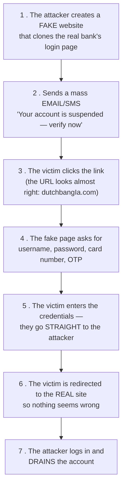

#### Types of phishing

| Type | Target | Medium |
|---|---|---|
| **Email phishing** | Mass, untargeted | Email |
| **Spear phishing** | **One specific person**, using researched details | Email |
| **Whaling** | **Senior executives** | Email |
| **Vishing** | Anyone | **Voice call** |
| **Smishing** | Anyone | **SMS** |
| **Clone phishing** | Anyone | A **copy of a real email** the victim already received, with the attachment swapped |
| **Angler phishing** | Anyone | **Fake social-media support accounts** |
| **Pharming** | Anyone | **DNS manipulation** — no click needed |
| **Search-engine phishing** | Anyone | Fake sites promoted in search results/ads |

#### How to recognise a phishing message

1. **Urgency and threats** — "act within 24 hours or your account closes".
2. **Generic greeting** — "Dear Customer" instead of your name.
3. **Spelling and grammar mistakes**.
4. **A suspicious sender address** — `service@dbbl-secure.xyz` rather than the bank's real domain.
5. **A mismatched link** — hover over it; the displayed text and the real URL differ.
6. **Requests for credentials, OTP, PIN or card details** — legitimate organisations **never** ask.
7. **Unexpected attachments**, especially `.exe`, `.zip`, `.scr` or macro-enabled documents.
8. **Too-good-to-be-true offers**.

#### Prevention of phishing

**For users:** never click links in unsolicited messages — **type the address yourself**; **verify by calling** the official number; check for **HTTPS and the correct domain**; **never share OTP/PIN**; keep the browser and antivirus updated; and **report** suspicious mail.

**For organisations:** deploy an **email security gateway** with anti-phishing filtering; implement **SPF, DKIM and DMARC** so that attackers cannot spoof your domain; enforce **MFA** everywhere; run **simulated phishing campaigns** and training; use **web/DNS filtering**; flag **external** senders visually; enable **browser anti-phishing** features; and monitor for **lookalike domain registrations**.

#### Phishing vs Pharming

| Point | **Phishing** | **Pharming** |
|---|---|---|
| **Method** | Sends a **fraudulent message with a malicious link** — the victim must be **tricked into clicking** | **Redirects the victim automatically** by corrupting DNS resolution or the hosts file |
| **Requires user action?** | ✅ **Yes** — the victim must click or reply | ❌ **NO** — the victim types the **correct** address and is still sent to the fake site |
| **Attack vector** | Email, SMS, phone, social media | **DNS server poisoning**, malware altering the local **hosts file**, a compromised router |
| **Scale** | One message per victim (though sent in bulk) | **One poisoned DNS server redirects THOUSANDS** of users at once |
| **Detection by the user** | Possible — a careful user spots the wrong URL | **Very hard** — the address bar shows the **correct** URL |
| **Analogy** | Sending a fake letter with a wrong address on it | **Secretly changing the street signs** so everyone driving to the bank arrives at a fake one |
| **Example** | An email: *"Click here to verify your DBBL account"* leading to `dbbI-verify.com` | The user types `www.dbbl.com.bd` correctly, but a poisoned DNS entry sends them to the attacker's server |
| **Main defence** | **User awareness**, email filtering, MFA | **DNSSEC**, secured DNS servers, patched routers, anti-malware, **checking the TLS certificate** |

> **Why pharming is more dangerous:** it defeats the standard advice of "type the address yourself". The only reliable defence left to the user is to **check that the HTTPS certificate is valid and issued to the right organisation** — a pharming site cannot obtain a valid certificate for the real bank's domain.

**Previous Year Question List from this Topic:**

- [What is a phishing attack? Explain its types and discuss methods to prevent it.](../written-answers/computer-network-security.md?plain=1#L28)
- [Briefly explain phishing attack and denial-of-service (DoS) attack.](../written-answers/computer-network-security.md?plain=1#L197)
- [(b) Distinguish between phishing and pharming. Give examples to explain.](../written-answers/computer-network-security.md?plain=1#L653)
- [Phishing attack এর মাধ্যমে কীভাবে attack করা হয়। উহার কারণে কি ক্ষতি হতে পারে?](../written-answers/computer-network-security.md?plain=1#L714)
- [If you downloaded the email, you will be able to face the problem. Which attack do you face?](../written-answers/computer-network-security.md?plain=1#L5715)
- [e) What is email? What precautions can be taken to prevent unnecessary and unwanted e-mails?](../written-answers/computer-network-security.md?plain=1#L5742)

---

### Denial of Service (DoS) and DDoS Attacks

#### What is a DoS attack?

A **Denial of Service (DoS) attack** is an attack that attempts to make a **machine, service or network resource UNAVAILABLE to its legitimate users**, by flooding it with traffic or sending requests that trigger a crash.

> The attacker does **not** steal or modify data — the goal is purely **disruption: availability**, the "A" of the CIA triad.

#### DoS vs DDoS

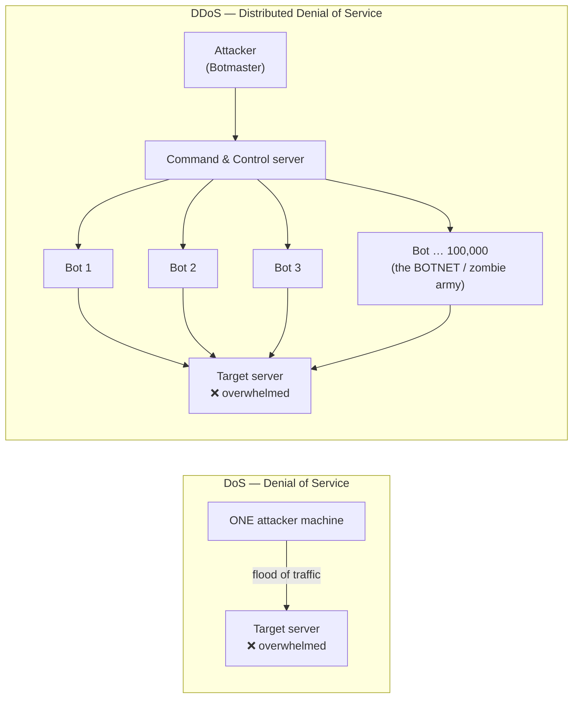

| Point | **DoS** | **DDoS** |
|---|---|---|
| **Number of attacking sources** | **ONE** machine / one IP | **MANY thousands** of compromised machines (a **botnet**) |
| **Traffic volume** | Limited by one machine's bandwidth | **Enormous** — terabits per second |
| **Blocking it** | **Easy** — block the single source IP | **Very hard** — traffic comes from millions of legitimate-looking IPs worldwide |
| **Tracing the attacker** | Relatively easy | **Very difficult** — the real attacker hides behind the bots |
| **Speed of impact** | Slower | **Very fast** |
| **Complexity** | Simple | Requires building or renting a botnet |
| **Damage potential** | Moderate | **Severe** — can take down major services |
| **Example** | A single flood tool run from one PC | The **Mirai botnet (2016)**, built from IoT cameras, which took down Dyn DNS and much of the US internet |

#### How a DDoS attack works — the mechanism

1. **Build the botnet.** The attacker infects thousands of computers, routers, cameras and IoT devices with malware, turning them into **bots (zombies)**. Their owners have no idea.
2. **Command and Control (C&C).** All bots connect to the attacker's C&C server and wait for instructions.
3. **Launch.** The attacker issues one command; **every bot simultaneously floods the target** with requests.
4. **Saturation.** The target's bandwidth, connection table, CPU or memory is exhausted.
5. **Denial.** Legitimate users get timeouts — the service is effectively down.

#### Types of DDoS attack

| Layer | Type | Mechanism | Examples |
|---|---|---|---|
| **Volumetric** (most common) | Saturate the **bandwidth** | Send more gigabits than the pipe can carry | **UDP flood, ICMP/Ping flood, DNS amplification, NTP amplification** |
| **Protocol / State-exhaustion** | Exhaust **server or firewall connection tables** | Abuse protocol behaviour | **SYN flood**, Ping of Death, Smurf attack, fragmented packet attacks |
| **Application layer (L7)** | Exhaust **application resources** | Send requests that look legitimate but are expensive | **HTTP flood**, Slowloris, expensive database queries |

**The SYN flood explained** — the classic protocol attack:

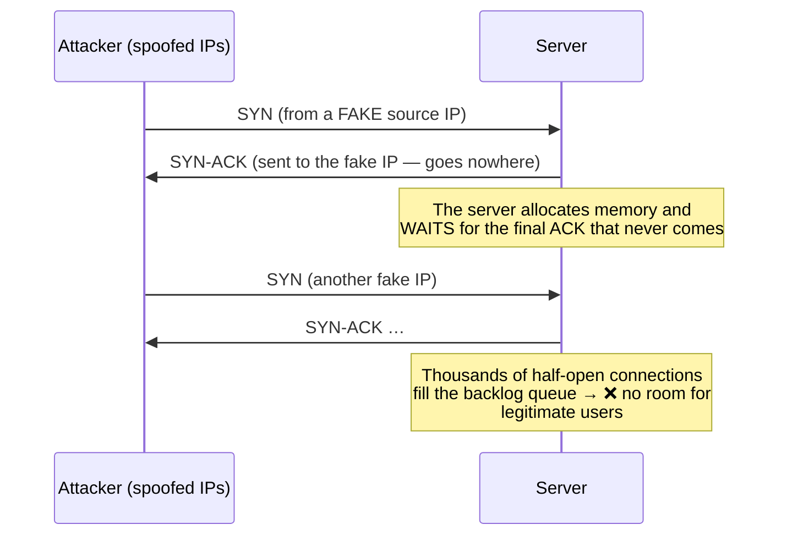

**DNS amplification** — the attacker sends a **small** DNS query (60 bytes) with the **victim's IP spoofed as the source**, to thousands of open DNS resolvers. Each replies with a **large** answer (4000 bytes) sent to the victim. A **70× amplification factor** turns a modest attacker into a massive flood.

#### Impact of a DoS/DDoS attack

Service downtime and lost revenue · reputational damage and customer loss · staff diverted to incident response · SLA penalties · **smokescreen** — DDoS is often used to distract the security team while a **data theft** happens elsewhere · regulatory consequences for a bank.

#### Prevention and mitigation

| Measure | How it helps |
|---|---|
| **DDoS protection service / scrubbing centre** | Cloudflare, Akamai, AWS Shield absorb and filter the flood before it reaches you |
| **Over-provisioned bandwidth** | Buys time to respond |
| **Rate limiting** | Cap requests per IP per second |
| **CDN** | Distributes load across a global network |
| **Load balancers and auto-scaling** | Spread the traffic; add capacity automatically |
| **Firewall and IPS rules** | Drop malformed and known-bad traffic |
| **SYN cookies** | Defeat SYN floods without allocating memory |
| **Blackhole / sinkhole routing** | Drop attack traffic upstream at the ISP |
| **Anycast** | Spread the attack across many data centres |
| **Disable open resolvers/reflectors** | Prevents your own servers being used for amplification |
| **Ingress filtering (BCP 38)** at the ISP | Blocks spoofed source addresses at the network edge |
| **An incident response plan** | Know who to call at the ISP at 3 a.m. |
| **Traffic-baseline monitoring** | Detect the anomaly in the first minutes |

**Previous Year Question List from this Topic:**

- [What is a DoS attack? Explain the mechanism of a DDoS attack and how it differs from a simple DoS attack.](../written-answers/computer-network-security.md?plain=1#L125)
- [Briefly explain phishing attack and denial-of-service (DoS) attack.](../written-answers/computer-network-security.md?plain=1#L197)
- [What is Cyber Security? Write down the top 10 cyber attack. Discuss about Ransomware and DDoS attack.](../written-answers/computer-network-security.md?plain=1#L341)
- [What is meant by Encryption and Decryption? What is Cyber security? Write down the top 10 cyber attack.](../written-answers/computer-network-security.md?plain=1#L370)
- [What is Denial of Service (DoS) is and NAT?](../written-answers/computer-network-security.md?plain=1#L488)
- [What do you understand by DOS attack and Man-in-the-middle attack? Please explain how it can be occurred?](../written-answers/computer-network-security.md?plain=1#L507)
- [What is DDoS and SQL Injection attack?](../written-answers/computer-network-security.md?plain=1#L678)
- [Briefly describe about DoS, IP address spoofing and Man-in-the-middle attacks.](../written-answers/computer-network-security.md?plain=1#L942)

---

### Man-in-the-Middle (MITM) Attack and Session Hijacking

#### What is a MITM attack?

A **Man-in-the-Middle (MITM)** attack is one in which the attacker **secretly positions themselves between two communicating parties**, **intercepting and possibly altering** the traffic, while both parties believe they are talking directly and securely to each other.

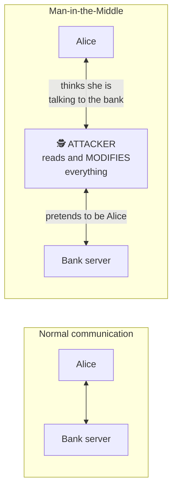

#### How a MITM attack is performed

| Technique | Mechanism |
|---|---|
| **ARP spoofing** | On a LAN, the attacker poisons the ARP cache so traffic is routed through their machine |
| **Rogue / Evil-twin Wi-Fi** | The attacker runs a free access point named "Airport_Free_WiFi"; everyone who connects sends traffic through them |
| **DNS spoofing** | The victim is directed to the attacker's server |
| **SSL stripping** | The attacker downgrades an HTTPS connection to plain HTTP |
| **Fake / rogue certificate** | A forged or fraudulently issued TLS certificate |
| **IP spoofing and session hijacking** | Taking over an established connection |
| **BGP hijacking** | Re-routing whole networks at the internet backbone level |

#### MITM on the Diffie-Hellman key exchange — the classic worked example

**Diffie-Hellman (DH)** lets two parties agree a shared secret over a public channel. Its fatal weakness in its **plain, unauthenticated** form is that **neither party can verify who they are talking to**.

**Normal Diffie-Hellman:** Alice and Bob agree public values **p** (a large prime) and **g** (a generator). Alice picks a secret **a** and sends **A = gᵃ mod p**; Bob picks a secret **b** and sends **B = gᵇ mod p**. Alice computes **Bᵃ = g^(ab)**, Bob computes **Aᵇ = g^(ab)** — the **same shared key**, which an eavesdropper cannot derive (the discrete logarithm problem).

**The attack:**

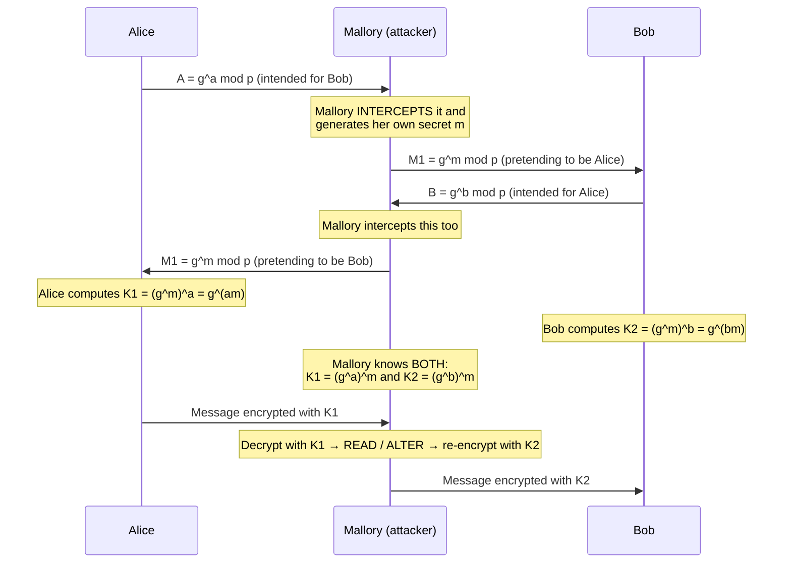

**The result:** Alice shares key **K1** with Mallory, and Bob shares key **K2** with Mallory. **Neither knows.** Mallory decrypts everything with one key, reads or modifies it, and re-encrypts with the other. Both parties see a perfectly working encrypted session.

**The defence — AUTHENTICATED Diffie-Hellman:**
1. **Digital signatures** — each party signs their DH public value with their private key, so the other can verify it really came from them. *(This is what TLS does.)*
2. **Digital certificates from a trusted CA**, binding the public key to a verified identity.
3. **Station-to-Station (STS) protocol** — DH with mutual signature authentication.
4. **Pre-shared keys** or a **password-authenticated key exchange (PAKE)**.
5. **Out-of-band verification** of a key fingerprint (as Signal and WhatsApp offer).

> **The lesson to state in the exam:** *Diffie-Hellman provides **confidentiality against a passive eavesdropper**, but **no authentication**. Without authentication it is completely broken by an active man-in-the-middle. Encryption without authentication is not security.*

#### Session hijacking

**Session hijacking** is the attack in which an attacker **takes over a valid, already-authenticated session** between a user and a server by stealing or predicting the **session ID / session cookie** — gaining access **without ever knowing the password**.

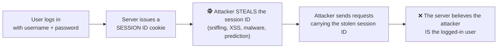

**How the session ID is stolen:** **packet sniffing** on an unencrypted or shared network · **XSS** (JavaScript reading `document.cookie`) · **session fixation** (forcing a known ID on the victim before they log in) · **predictable session IDs** (sequential or weakly random) · **malware/browser extensions** · **MITM**.

**Prevention:**
1. **Use HTTPS everywhere** — encrypt the whole session so cookies cannot be sniffed.
2. Set cookies as **`Secure`** (HTTPS only), **`HttpOnly`** (unreadable by JavaScript, defeating XSS theft) and **`SameSite`**.
3. Generate **long, cryptographically random session IDs**.
4. **Regenerate the session ID on login** — defeats session fixation.
5. Enforce **session timeout** and idle expiry; log out properly (invalidate server-side).
6. Bind the session to the **IP address and user-agent** and re-authenticate on change.
7. Require **re-authentication** for sensitive actions (a fund transfer).
8. **MFA**, and monitoring for concurrent sessions from different countries.

#### Countermeasures against MITM generally

| Measure | Protects by |
|---|---|
| **Strong encryption — TLS 1.3 / HTTPS everywhere** | The attacker sees only ciphertext |
| **Certificate validation and HSTS** | Prevents SSL stripping and fake certificates |
| **Certificate pinning** | The app accepts only its own known certificate |
| **VPN on untrusted networks** | Tunnels everything past a hostile Wi-Fi |
| **Avoid public/open Wi-Fi** for sensitive work | Removes the easiest attack position |
| **Mutual authentication** | Both sides prove identity |
| **Dynamic ARP Inspection + DHCP snooping** on switches | Blocks ARP poisoning on the LAN |
| **DNSSEC** | Prevents DNS spoofing |
| **MFA** | A stolen password alone is useless |

**Previous Year Question List from this Topic:**

- [What is a Man-in-the-Middle (MITM) attack? Describe two countermeasures to prevent it.](../written-answers/computer-network-security.md?plain=1#L93)
- [What is a Man-inThe Middle (MitM) attack? How can it be prevented?](../written-answers/computer-network-security.md?plain=1#L166)
- [How to attack DHCP server in MIMA?](../written-answers/computer-network-security.md?plain=1#L216)
- [Describe a man-in the middle attack on the Diffie-Hellman key exchange protocol in which the adversary generates two public key pairs for the attack.](../written-answers/computer-network-security.md?plain=1#L411)
- [What do you understand by DOS attack and Man-in-the-middle attack? Please explain how it can be occurred?](../written-answers/computer-network-security.md?plain=1#L507)
- [Explain ARP Spoofing attack with diagram. Why ARP spoofing attacker used to launch Man-in-the-Middle attack.](../written-answers/computer-network-security.md?plain=1#L745)
- [(d) Explain the principle of man in the middle and session hijacking attack with appropriate diagrams.](../written-answers/computer-network-security.md?plain=1#L854)
- [Briefly describe about DoS, IP address spoofing and Man-in-the-middle attacks.](../written-answers/computer-network-security.md?plain=1#L942)
- [What is session hijacking and how to encrypt username and password in PHP?](../written-answers/computer-network-security.md?plain=1#L3619)

---

### ARP Spoofing and DNS Poisoning

#### What is ARP?

**ARP (Address Resolution Protocol)** maps a known **IP address** to the **MAC (hardware) address** on a local network. A host broadcasts *"Who has 192.168.1.1?"* and the owner replies *"I do — my MAC is AA:BB:CC:DD:EE:FF."* The answer is stored in the **ARP cache**.

**The fundamental flaw: ARP is STATELESS and has NO AUTHENTICATION.** A host will accept and cache **any ARP reply**, even one it never asked for (a *gratuitous* ARP), and will happily overwrite an existing entry.

#### ARP spoofing / ARP poisoning

The attacker **sends forged ARP replies** claiming that **the gateway's IP belongs to the attacker's MAC address**, and simultaneously tells the gateway that **the victim's IP belongs to the attacker's MAC**. Both now send their traffic to the attacker.

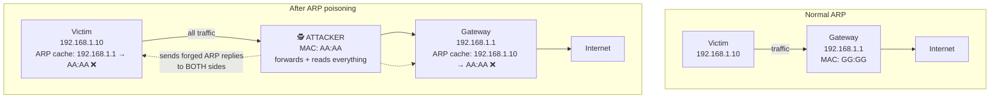

**Step by step:**
1. The attacker joins the same LAN (an office Wi-Fi, a café, a compromised machine).
2. They scan to find the victim's and the gateway's IP and MAC addresses.
3. They send a **forged ARP reply to the victim**: *"192.168.1.1 (the gateway) is at AA:AA"* — the attacker's MAC.
4. They send a **forged ARP reply to the gateway**: *"192.168.1.10 (the victim) is at AA:AA"*.
5. Both caches are now poisoned; **all traffic in both directions flows through the attacker**.
6. The attacker enables **IP forwarding** so traffic still reaches its destination — the victim notices nothing.
7. The attacker now **sniffs passwords, injects content, strips SSL or modifies data**.

> ### "Why do attackers use ARP spoofing to launch a Man-in-the-Middle attack?"
> Because on a **switched** network an attacker normally sees **only their own traffic** — the switch forwards frames only to the correct port. ARP spoofing is the simplest way to **make the victim voluntarily send its traffic to the attacker**, placing the attacker *in the middle* of every conversation. It requires no password, no exploit and no privilege — only presence on the same LAN — which is why it is the **foundation of most LAN-based MITM, sniffing, session-hijacking and SSL-stripping attacks**.

**Prevention of ARP spoofing**

| Measure | How it helps |
|---|---|
| **Dynamic ARP Inspection (DAI)** on managed switches | The switch validates every ARP packet against a trusted DHCP snooping database and drops forgeries — **the primary defence** |
| **DHCP snooping** | Builds the trusted IP-to-MAC binding table that DAI uses |
| **Static ARP entries** | For critical servers and gateways — cannot be overwritten |
| **Port security** | Limits which MAC addresses may appear on a port |
| **Network segmentation / VLANs** | Confines an attacker to a small broadcast domain |
| **Encryption (HTTPS, SSH, VPN)** | Even if intercepted, the traffic is unreadable |
| **ARP monitoring tools** (arpwatch, XArp) | Alert when a MAC-to-IP mapping changes |
| **802.1X port authentication** | Stops unauthorised devices joining the LAN at all |

#### DNS poisoning / DNS spoofing / DNS cache poisoning

**DNS poisoning** is an attack in which **false DNS records are injected into a DNS resolver's cache**, so that queries for a legitimate domain return the **attacker's IP address**, silently redirecting users to a malicious site.

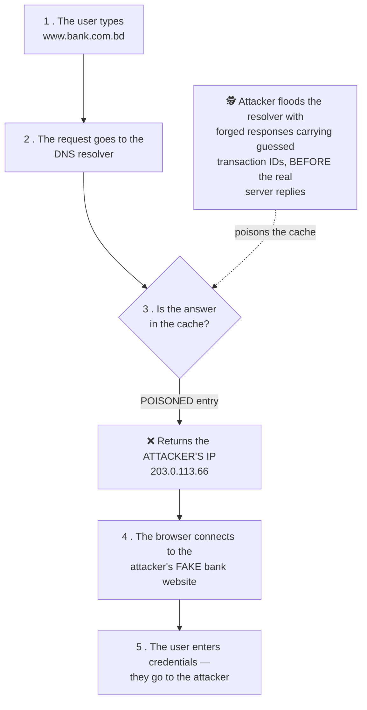

**How it works:** DNS traditionally uses **UDP**, which is connectionless and easily spoofed. A response is accepted if it matches the **query's transaction ID and source port**. An attacker who can **guess or brute-force** those values and reply **faster than the real server** gets their forged answer cached — and it stays cached for the whole **TTL**, affecting **every user** of that resolver. (This is the **Kaminsky attack**, disclosed in 2008.)

**Other routes:** compromising the DNS server itself · altering the victim's **local hosts file** with malware · a **rogue DHCP server** handing out a malicious DNS address · a compromised home router.

**Impact:** mass redirection to phishing sites (**pharming**), malware distribution, censorship, email interception, and complete MITM.

**Prevention:**
1. **DNSSEC** — cryptographically signs DNS records so forged answers are rejected. **The definitive fix.**
2. **DNS over HTTPS (DoH) / DNS over TLS (DoT)** — encrypts and authenticates the query channel.
3. **Source-port randomisation** and random query IDs — makes guessing infeasible.
4. **Keep DNS software patched** (BIND, Unbound, Windows DNS).
5. **Restrict recursion** to internal clients; do not run an open resolver.
6. **Use trusted resolvers** and monitor for unexpected changes.
7. **Short TTLs** limit the damage window.
8. On the client side: **check the HTTPS certificate** — a poisoned site cannot present a valid one; and **scan for malware** that edits the hosts file.

**Previous Year Question List from this Topic:**

- [(b) What is an ARP poisoning attack, and how does it work?](../written-answers/computer-network-security.md?plain=1#L60)
- [What do you mean by a DNS poisoning attack, and how does it work?](../written-answers/computer-network-security.md?plain=1#L534)
- [Explain ARP Spoofing attack with diagram. Why ARP spoofing attacker used to launch Man-in-the-Middle attack.](../written-answers/computer-network-security.md?plain=1#L745)
- [Difference between spoofing and sniffing](../written-answers/computer-network-security.md?plain=1#L781)

---

### Layer 2 Attacks — MAC Flooding and DHCP Starvation

#### MAC flooding

**MAC flooding** is an attack against a **network switch**, in which the attacker floods it with a huge number of frames carrying **fake source MAC addresses**, in order to **overflow the switch's MAC address table (CAM table)**.

**Why it works:** a switch keeps a **CAM (Content Addressable Memory) table** mapping MAC addresses to ports, so it can forward frames only to the correct port. That table has a **fixed, finite size** (a few thousand to a few tens of thousands of entries).

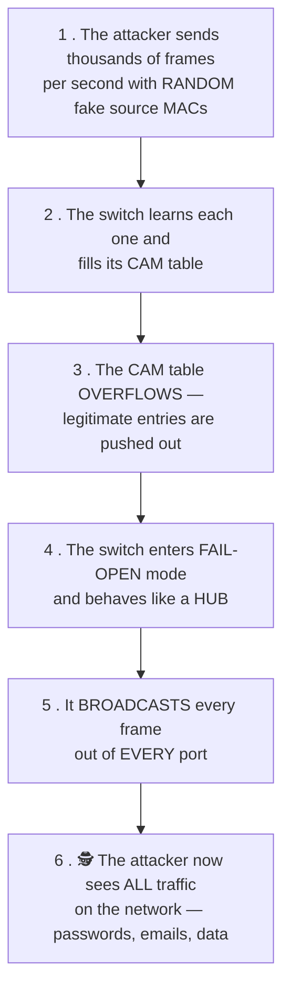

#### The impact on the switch

| Impact | Explanation |
|---|---|
| **Fail-open → acts as a hub** | The switch **floods all frames to all ports**, destroying the isolation that a switch is supposed to provide |
| **Traffic sniffing** | The attacker captures **everyone's** traffic — the main goal |
| **Performance collapse** | Every frame is broadcast, so bandwidth and CPU are wasted network-wide |
| **Denial of Service** | Legitimate MAC entries are evicted, causing connectivity problems |
| **Enables further attacks** | Sniffed credentials lead to MITM, session hijacking and lateral movement |

> ### "How does the attacker benefit?"
> The attacker converts a **secure switched network back into an insecure shared network**. On a normal switch they would see only their own traffic; after MAC flooding they can **passively capture every packet on the VLAN** — plaintext passwords, FTP and Telnet sessions, internal emails, database queries and session cookies — without the victims noticing anything except a slow network.

**Prevention of MAC flooding**

| Measure | How it helps |
|---|---|
| **Port Security** (the primary defence) | Limit the number of MAC addresses learned per port (e.g. `switchport port-security maximum 2`) and shut down / restrict / protect the port when exceeded |
| **Sticky MAC learning** | The first learned MAC is bound permanently to the port |
| **802.1X port authentication** | Only authenticated devices may use a port |
| **VLAN segmentation** | Confines the damage to one small broadcast domain |
| **MAC address filtering / static entries** | For servers and critical hosts |
| **Storm control and rate limiting** | Caps the frame rate per port |
| **Monitoring** | Alert on rapid CAM table growth or MAC flapping |
| **Encryption** | Even sniffed traffic is useless if it is encrypted |
| **Disable unused ports** | Removes the attacker's entry point |

#### DHCP starvation

**DHCP starvation** is a Denial-of-Service attack in which an attacker **requests every available IP address from the DHCP server** using **spoofed MAC addresses**, until the DHCP pool is **exhausted** and no legitimate device can obtain an address.

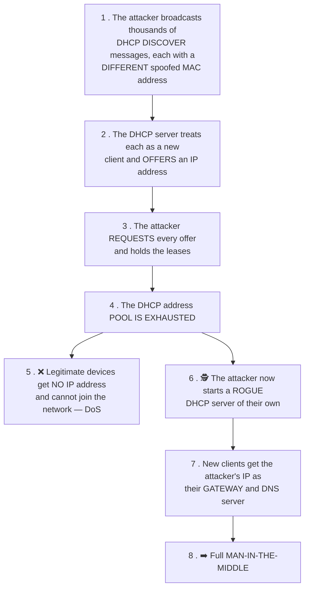

**The two stages — and why the second matters more:** starvation alone is just a denial of service. Its real purpose is usually to **clear the field for a ROGUE DHCP SERVER**. Once the legitimate server has no addresses left, the attacker's own DHCP server answers every new request, handing out configurations that name **the attacker's machine as the default gateway and DNS server** — giving a complete, silent man-in-the-middle position over every newly connected device.

**Related attacks in this family:** **rogue DHCP server**, **DHCP spoofing**, and **DHCP-based MITM**. *(A "DHCP attack in MITM" question is asking exactly this chain: starve the real server, then impersonate it.)*

**Prevention of DHCP starvation**

| Measure | How it helps |
|---|---|
| **DHCP Snooping** (the primary defence) | The switch marks uplink ports to the real DHCP server as **trusted** and all access ports as **untrusted**; DHCP OFFER/ACK messages arriving on an untrusted port are **dropped**, killing rogue servers |
| **Port Security** | Limits MAC addresses per port, so an attacker cannot present thousands of fake MACs |
| **DHCP rate limiting** | Caps DHCP messages per second per port |
| **IP Source Guard** | Uses the DHCP snooping binding table to block spoofed source IPs |
| **Dynamic ARP Inspection** | Uses the same binding table to stop the follow-on ARP spoofing |
| **802.1X** | Only authenticated devices reach the DHCP service at all |
| **Static IP / reservations** for critical devices | They are unaffected by pool exhaustion |
| **Monitoring** | Alert on abnormal DHCP request rates and on unexpected DHCP servers |

**Previous Year Question List from this Topic:**

- [What is MAC flooding? How to prevent MAC flooding?](../written-answers/computer-network-security.md?plain=1#L454)
- [What is DHCP starvation and how DHCP starvation work with diagram? Write down the related attack introduced by DHCP starvation?](../written-answers/computer-network-security.md?plain=1#L596)
- [What is MAC flooding attack? What is the impact of this switch?](../written-answers/computer-network-security.md?plain=1#L628)
- [(b) What is DHCP Starvation Attack? Explain briefly.](../written-answers/computer-network-security.md?plain=1#L900)
- [What is MAC Flood in Switch? How attacker gets benefitted from it?](../written-answers/computer-network-security.md?plain=1#L966)
- [How to attack DHCP server in MIMA?](../written-answers/computer-network-security.md?plain=1#L216)

---

### Active vs Passive Attacks, and Types of Attacker

#### Passive attacks

A **passive attack** attempts to **learn or make use of information from the system but does NOT affect system resources**. The attacker only **listens**.

| Type | Description |
|---|---|
| **Eavesdropping / Sniffing** | Capturing traffic to read message contents |
| **Traffic analysis** | Even if the content is encrypted, observing **who talks to whom, how often, how much and when** reveals a great deal |
| **Shoulder surfing, footprinting, reconnaissance** | Passive information gathering |

#### Active attacks

An **active attack** attempts to **alter system resources or affect their operation**. The attacker **modifies, injects, deletes or disrupts**.

| Type | Description |
|---|---|
| **Masquerade / Spoofing** | Pretending to be a different entity |
| **Replay** | Capturing a valid message and re-sending it later |
| **Modification of messages** | Altering the content in transit |
| **Denial of Service** | Preventing legitimate use |
| **Malware injection, SQL injection, MITM with alteration, session hijacking** | |

#### The comparison

| Point | **Passive Attack** | **Active Attack** |
|---|---|---|
| **Action** | **Only observes / listens** | **Modifies, injects or disrupts** |
| **Data modified?** | ❌ **No** | ✅ **Yes** |
| **System resources affected?** | ❌ No | ✅ Yes |
| **Which CIA property is violated** | **Confidentiality** | **Integrity and/or Availability** |
| **Detection** | **Very difficult** — it leaves no trace | **Easier** — the damage or anomaly is visible |
| **Prevention** | **Possible** — mainly through **encryption** | **Difficult to prevent**; the emphasis is on **detection and recovery** |
| **Main strategy** | **PREVENT** it (encrypt everything) | **DETECT** it and recover quickly |
| **Harm to the victim** | Loss of privacy/secrets | Direct damage, corruption or downtime |
| **Examples** | Eavesdropping, sniffing, traffic analysis, reconnaissance | DoS, MITM with alteration, masquerade, replay, SQL injection, malware |

#### Spoofing vs Sniffing

| Point | **Spoofing** | **Sniffing** |
|---|---|---|
| **Nature** | **ACTIVE** attack | **PASSIVE** attack |
| **What it does** | **Pretends to be someone else** — forges an identity (IP, MAC, email, caller ID, website) | **Captures and reads** traffic passing over the network |
| **Modifies data?** | ✅ Yes — falsifies headers/identity | ❌ No — only listens and copies |
| **Detection** | Moderately detectable | **Very hard to detect** |
| **Goal** | Gain **unauthorised access** or misdirect traffic | Gain **information** — passwords, data |
| **CIA violated** | **Integrity / Authentication** | **Confidentiality** |
| **Tools** | hping, Ettercap, custom packet crafting | **Wireshark, tcpdump**, Ettercap |
| **Defence** | Authentication, digital signatures, **ingress filtering**, DAI, DNSSEC | **Encryption (HTTPS, VPN, SSH)**, switched networks, port security |
| **Types** | IP spoofing, **MAC spoofing**, **ARP spoofing**, **DNS spoofing**, email spoofing, caller-ID spoofing | Passive sniffing (on a hub), active sniffing (after MAC flooding or ARP spoofing) |

> **They are often combined:** the attacker **spoofs** (ARP spoofing) in order to **sniff** — spoofing puts them in the path, sniffing extracts the value.

#### What is a spoofed packet?

A **spoofed packet** is a network packet whose **source address field has been deliberately falsified** so that it appears to come from a different, usually trusted, machine.

**Why attackers use it:**
1. **Hide their identity** — the victim's logs record the forged address, not the attacker's.
2. **Bypass IP-based access controls** — pretend to be an internal or whitelisted host.
3. **Launch amplification/reflection DDoS** — put the **victim's** IP as the source so that thousands of servers send their large replies to the victim (DNS and NTP amplification, the **Smurf attack**).
4. **SYN flooding** — the spoofed source means the SYN-ACK goes nowhere and the connection stays half-open.
5. **Session hijacking and TCP sequence prediction** — inject packets into an established session.
6. **Blind attacks** on trust relationships (the classic Mitnick attack).

**Defences:** **ingress/egress filtering (BCP 38)** at the ISP and network edge — reject packets whose source address could not legitimately come from that direction; **reverse path forwarding (uRPF)** checks; **authentication rather than IP-based trust**; **IPsec** and TLS; randomised TCP initial sequence numbers; and firewall/IDS anomaly detection.

#### Types of hacker

| Type | Motivation | Authorisation | Legality |
|---|---|---|---|
| **White Hat** (ethical hacker) | **Improve security** | ✅ **Authorised** — hired and given written permission | ✅ **Legal** |
| **Black Hat** (cracker) | **Personal gain, damage, theft, espionage** | ❌ **None** | ❌ **Illegal — criminal** |
| **Grey Hat** | **Curiosity, reputation**; often discloses the flaw afterwards, sometimes demanding a fee | ❌ **None**, but no malicious intent | ⚠️ **Still illegal** — good intentions do not make unauthorised access lawful |

| Point | **White Hat** | **Grey Hat** | **Black Hat** |
|---|---|---|---|
| **Permission** | ✅ Yes, in writing | ❌ No | ❌ No |
| **Intent** | Defensive, constructive | Mixed — usually non-malicious | **Malicious** |
| **Reports the flaw?** | ✅ Always, to the owner | ⚠️ Usually, but publicly or for a fee | ❌ No — **exploits or sells** it |
| **Causes harm?** | No | Usually not, but risks it | **Yes** |
| **Legal status** | Legal | **Illegal** | **Illegal** |
| **Also known as** | Ethical hacker, penetration tester | — | Cracker, cyber criminal |
| **Example** | A bank hires a firm to penetration-test its app | Someone scans a company's server uninvited, finds a bug and emails them | Someone steals a customer database and sells it |

> **Other categories:** **Blue Hat** (an outside expert invited to test before a product launch, or an attacker motivated by revenge) · **Red Hat** (vigilantes who attack black hats) · **Script Kiddie** (an unskilled attacker using ready-made tools) · **Hacktivist** (politically motivated) · **State-sponsored / APT** (government-backed espionage groups) · **Insider threat** (a current or former employee).

> **"Hacking a system without cracking it, only to find bugs and vulnerabilities" is called ETHICAL HACKING / PENETRATION TESTING**, performed by a **White Hat hacker** under written authorisation.

**Previous Year Question List from this Topic:**

- [Write down the 10 most Cyber attacks. Difference among Black Hat hacker, Grey hat hacker and white hat hacker.](../written-answers/computer-network-security.md?plain=1#L310)
- [Difference between active and passive atack.](../written-answers/computer-network-security.md?plain=1#L393)
- [Write down the difference between Active and Passive attack.](../written-answers/computer-network-security.md?plain=1#L566)
- [Difference between spoofing and sniffing](../written-answers/computer-network-security.md?plain=1#L781)
- [Which security attacks (given) occur on client side or server side?](../written-answers/computer-network-security.md?plain=1#L802)
- [What is a spoofed packet, and how can it be used in network attacks?](../written-answers/computer-network-security.md?plain=1#L4246)
- [Hacking a system without cracking the system, only for finding bugs and vulgarities is called?](../written-answers/computer-network-security.md?plain=1#L4752)

---

### The Major Cyber Attacks — A Master List

*(Several questions ask simply for "the top 10 cyber attacks" or "ten attacks through the internet". Learn this list with one line each.)*

| # | Attack | One-line description |
|---|---|---|
| 1 | **Phishing** | Fraudulent messages tricking the victim into revealing credentials |
| 2 | **Malware** (virus, worm, trojan, spyware) | Malicious software that damages, steals or takes control |
| 3 | **Ransomware** | Encrypts the victim's files and demands payment for the key |
| 4 | **DoS / DDoS** | Floods a service so that it becomes unavailable |
| 5 | **Man-in-the-Middle (MITM)** | Intercepts and possibly alters communication between two parties |
| 6 | **SQL Injection** | Malicious SQL entered into an input field to read or destroy a database |
| 7 | **Cross-Site Scripting (XSS)** | Injects malicious JavaScript into a web page viewed by other users |
| 8 | **Cross-Site Request Forgery (CSRF)** | Tricks a logged-in user's browser into performing an unwanted action |
| 9 | **Password attacks** (brute force, dictionary, credential stuffing, rainbow table) | Guessing or cracking credentials |
| 10 | **Zero-day exploit** | Attacks a vulnerability before a patch exists |
| 11 | **Social engineering** | Manipulating people rather than machines |
| 12 | **Insider threat** | Abuse by an employee or contractor |
| 13 | **DNS spoofing / poisoning** | Redirects users to a fake site |
| 14 | **ARP spoofing** | LAN-level redirection enabling MITM |
| 15 | **Session hijacking** | Stealing a session token to impersonate a logged-in user |
| 16 | **Supply chain attack** | Compromising a trusted vendor or software update (SolarWinds) |
| 17 | **Advanced Persistent Threat (APT)** | A long-term, stealthy, state-level intrusion |
| 18 | **Cryptojacking** | Secretly using the victim's hardware to mine cryptocurrency |
| 19 | **Buffer overflow** | Overwriting memory to execute the attacker's code |
| 20 | **Eavesdropping / packet sniffing** | Passively capturing network traffic |
| 21 | **Drive-by download** | Malware installed merely by visiting a compromised page |
| 22 | **Watering hole attack** | Compromising a site the target group frequently visits |
| 23 | **Botnet / IoT attack** | Hijacking thousands of devices for coordinated attacks |
| 24 | **Rogue Wi-Fi / Evil twin** | A fake access point that intercepts everything |
| 25 | **Spoofing** (IP, MAC, email, caller ID) | Forging an identity to gain trust or access |

#### Client-side vs server-side attacks

| Side | Meaning | Examples |
|---|---|---|
| **Client-side** | The attack executes **in the user's browser or on the user's machine** | **XSS** (the script runs in the victim's browser), **CSRF**, clickjacking, drive-by download, malicious browser extensions, phishing, malware on the endpoint |
| **Server-side** | The attack executes **on the web/application server** | **SQL injection**, command injection, file inclusion (LFI/RFI), server-side request forgery (SSRF), path traversal, insecure deserialisation, DoS against the server, buffer overflow on the server |

> **The classic pair:** **SQL Injection is server-side** (the malicious SQL runs in the database server), while **XSS is client-side** (the malicious JavaScript runs in other users' browsers). This distinction is a favourite short question.

**Previous Year Question List from this Topic:**

- [Let you procure a microfinance application and host it in your office's data centre. What kind of cyber-security threats should you be aware of and what steps w…](../written-answers/computer-network-security.md?plain=1#L250)
- [Write down the 10 most Cyber attacks. Difference among Black Hat hacker, Grey hat hacker and white hat hacker.](../written-answers/computer-network-security.md?plain=1#L310)
- [What is Cyber Security? Write down the top 10 cyber attack. Discuss about Ransomware and DDoS attack.](../written-answers/computer-network-security.md?plain=1#L341)
- [What is meant by Encryption and Decryption? What is Cyber security? Write down the top 10 cyber attack.](../written-answers/computer-network-security.md?plain=1#L370)
- [Which security attacks (given) occur on client side or server side?](../written-answers/computer-network-security.md?plain=1#L802)
- [Write down ten name of different attack through internet.](../written-answers/computer-network-security.md?plain=1#L836)
- [Write down the name of different attack through internet.](../written-answers/computer-network-security.md?plain=1#L920)
