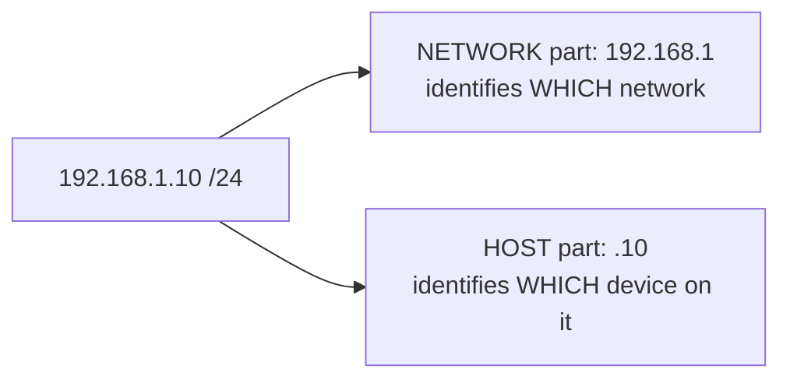
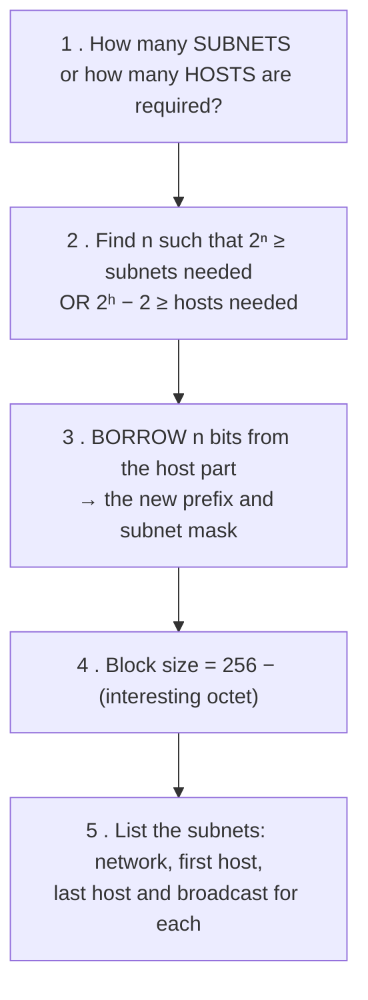
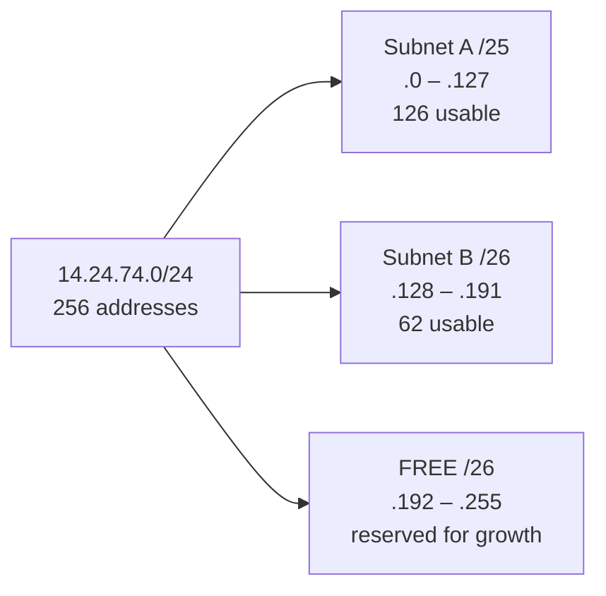
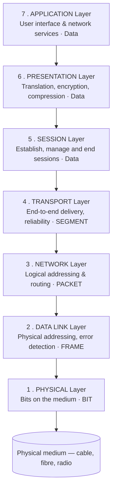
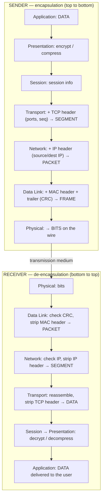
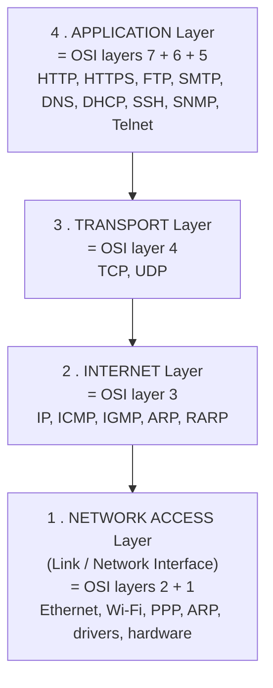
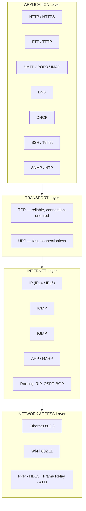
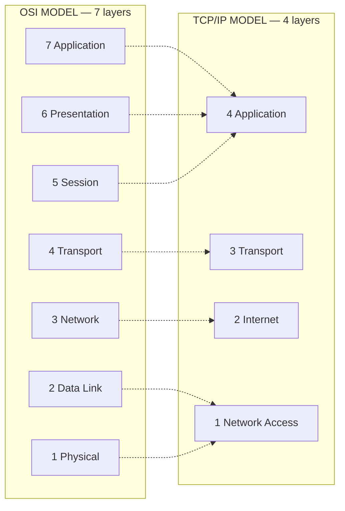

<!-- TOC START -->
**Table of Contents** — 2 subtopics · 9 theories

1. **[Subnetting & IP Addressing](#subnetting--ip-addressing)**
   - [IPv4 Addressing — Structure and Classes](#ipv4-addressing--structure-and-classes)
   - [Subnet Mask, Network ID and Broadcast Address](#subnet-mask-network-id-and-broadcast-address)
   - [Subnetting — Concept and Method](#subnetting--concept-and-method)
   - [VLSM — Variable Length Subnet Masking](#vlsm--variable-length-subnet-masking)
   - [CIDR, Supernetting and IP Address Planning](#cidr-supernetting-and-ip-address-planning)

2. **[OSI & TCP/IP Reference Model](#osi--tcpip-reference-model)**
   - [The OSI Reference Model — The Seven Layers](#the-osi-reference-model--the-seven-layers)
   - [The TCP/IP Model](#the-tcpip-model)
   - [OSI vs TCP/IP — Comparison](#osi-vs-tcpip--comparison)
   - [Layer-by-Layer Protocol and Device Reference](#layer-by-layer-protocol-and-device-reference)

<!-- TOC END -->

---

## Subnetting & IP Addressing

### IPv4 Addressing — Structure and Classes

#### What is an IP address?

An **IP (Internet Protocol) address** is a **unique logical identifier assigned to every device on a network**, used to identify the device and to route data to it.

An **IPv4 address is 32 bits long**, written in **dotted decimal notation** as four **octets** (bytes) separated by dots, each ranging from **0 to 255**.

```
      192    .    168    .     1     .    10
   11000000 . 10101000 . 00000001 . 00001010     ← 32 bits total
   └─ 8 ──┘  └─ 8 ──┘  └─ 8 ──┘  └─ 8 ──┘
```

**Total possible IPv4 addresses = 2³² = 4,294,967,296** (about 4.3 billion) — which has proved far too few, hence NAT and IPv6.

#### The two parts of every IP address

> **Every IP address has TWO parts: a NETWORK ID and a HOST ID.**
> The **subnet mask** is what tells you where one ends and the other begins.



**The postal analogy:** the **network ID is the street address** and the **host ID is the flat number**. Routers deliver to the street; the switch on that street delivers to the flat.

#### Classful addressing

| Class | First octet range | Leading bits | Default mask | Network/Host bits | Networks | Hosts per network | Purpose |
|---|---|---|---|---|---|---|---|
| **A** | **1 – 126** | `0` | **255.0.0.0 (/8)** | 8 / 24 | 126 | **16,777,214** | Very large organisations |
| **B** | **128 – 191** | `10` | **255.255.0.0 (/16)** | 16 / 16 | 16,384 | **65,534** | Medium organisations |
| **C** | **192 – 223** | `110` | **255.255.255.0 (/24)** | 24 / 8 | 2,097,152 | **254** | Small networks |
| **D** | **224 – 239** | `1110` | — | — | — | — | **Multicast** |
| **E** | **240 – 255** | `1111` | — | — | — | — | **Experimental / reserved** |

> **Why does class A stop at 126?** Because **127.x.x.x is reserved for LOOPBACK** (`127.0.0.1` = localhost). And `0.x.x.x` is reserved for "this network".

#### Special and reserved addresses

| Address / Range | Meaning |
|---|---|
| **0.0.0.0** | "This host / any address" — also the default route |
| **127.0.0.0 – 127.255.255.255** | **Loopback** — traffic to the machine itself. `127.0.0.1` = **localhost** |
| **10.0.0.0 – 10.255.255.255** (10.0.0.0/8) | **PRIVATE** — Class A |
| **172.16.0.0 – 172.31.255.255** (172.16.0.0/12) | **PRIVATE** — Class B |
| **192.168.0.0 – 192.168.255.255** (192.168.0.0/16) | **PRIVATE** — Class C |
| **169.254.0.0/16** | **APIPA / link-local** — self-assigned when **DHCP fails** |
| **255.255.255.255** | **Limited broadcast** — everyone on this local network |
| **224.0.0.0 – 239.255.255.255** | **Multicast** |

> **Private addresses are not routable on the Internet.** They are used inside homes and organisations and translated to a public address by **NAT** at the gateway. This is the main reason IPv4 has survived far beyond its 4.3 billion addresses.

#### Two addresses can never be assigned to a host

In **every** network or subnet, two addresses are reserved:

| Address | How to identify it | Meaning |
|---|---|---|
| **Network address** | **All HOST bits are 0** — the **first** address | Identifies the network itself |
| **Broadcast address** | **All HOST bits are 1** — the **last** address | Reaches every host on that network |

> **This is why the usable host count is always 2ⁿ − 2**, where n is the number of host bits.

#### IP address vs MAC address

| Point | **IP Address** | **MAC Address** |
|---|---|---|
| **Full name** | Internet Protocol address | **Media Access Control** address |
| **Layer** | **Network (Layer 3)** | **Data Link (Layer 2)** |
| **Length** | **32 bits** (IPv4) / 128 bits (IPv6) | **48 bits (6 bytes)** |
| **Format** | Dotted decimal — `192.168.1.10` | Hexadecimal — `4C:23:10:4A:1A:2A` |
| **Assigned by** | Network administrator or **DHCP** — it is **LOGICAL** | The **manufacturer**, burned into the NIC — it is **PHYSICAL** |
| **Changes when the device moves?** | ✅ **Yes** — it depends on the network | ❌ **No** — it travels with the hardware |
| **Scope** | **Global** — routable across the Internet | **Local** — only within one LAN segment |
| **Used by** | **Routers**, for end-to-end delivery | **Switches**, for delivery within a segment |
| **Resolution** | IP → MAC by **ARP** | MAC → IP by **RARP** |
| **Uniqueness** | Unique within its network | **Globally unique** (in principle) |
| **Can it be changed?** | Easily | Can be **spoofed** in software, but the burned-in value is permanent |

**Reading a MAC address:** the first **3 bytes (24 bits)** are the **OUI — Organisationally Unique Identifier**, identifying the manufacturer; the last 3 bytes are the device's serial number.

| MAC type | How to identify | Example |
|---|---|---|
| **Unicast** | The **least significant bit of the FIRST byte is 0** | `4C:23:10:4A:1A:2A` — 0x4C = `01001100`, last bit **0** → **unicast** |
| **Multicast** | That bit is **1** | `01:00:5E:...` — 0x01 = `00000001`, last bit **1** → **multicast** |
| **Broadcast** | All 48 bits are 1 | **`FF:FF:FF:FF:FF:FF`** |

> **"Two IP addresses map to the same Ethernet (MAC) address — will both receive packets?"**
> ### ✅ **Yes.**
> A single network interface can legitimately hold **multiple IP addresses** (IP aliasing), and all of them resolve by ARP to the **same MAC address**. Frames addressed to that MAC are delivered to the NIC, and the **IP layer then decides** which configured address the packet was for, passing it up to the right socket. This is entirely normal — it is how a web server hosts several IPs, and how a router's interface can carry a primary and secondary address. *(The abnormal case is the reverse — two different machines claiming the **same IP** — which is an **IP conflict**, and is also exactly what **ARP spoofing** creates deliberately.)*

**Previous Year Question List from this Topic:**

- [(a) IP address এবং MAC/MU এর পার্থক্য লেখ।](../written-answers/computer-networks.md?plain=1#L152)
- [Check the valid IP address from the following table.](../written-answers/computer-networks.md?plain=1#L411)
- [Write down the private IP address rang for class B?](../written-answers/computer-networks.md?plain=1#L536)
- [Write range of private IP address Class A, B and C.](../written-answers/computer-networks.md?plain=1#L560)
- [What are the private IP Ranges for the following IP classes? Class A, Class B and Class C](../written-answers/computer-networks.md?plain=1#L590)
- [Which is Class C Default Subnet Mask?](../written-answers/computer-networks.md?plain=1#L602)
- [What is the maximum number of valid hosts in a network?](../written-answers/computer-networks.md?plain=1#L618)
- [Mapping between MAC to IP address?](../written-answers/computer-networks.md?plain=1#L653)
- [How many bits are in a MAC address?](../written-answers/computer-networks.md?plain=1#L674)
- [Write down the Public and Private IPv4 address for Class A, Class B and Class C.](../written-answers/computer-networks.md?plain=1#L742)
- [Local loopback address কি? কোন কমান্ড ব্যবহার করে কানেক্টিভিটি টেস্ট করা হয়?](../written-answers/computer-networks.md?plain=1#L775)
- [Write Class A private IP range.](../written-answers/computer-networks.md?plain=1#L837)
- [Convert the decimal IP address 192.168.101.5 into binary IP address. Fill-up the following in tabular form:](../written-answers/computer-networks.md?plain=1#L1023)
- [What is IP address? Explain the necessity of IP address in network?](../written-answers/computer-networks.md?plain=1#L1060)
- [What is private IP range class A, B and C with maximum host of each class?](../written-answers/computer-networks.md?plain=1#L1128)
- [Identify the class, network IP address, direct broadcast address and limited broadcast address of the following IP address: (i) 1.2.3.4 (ii) 130.1.2.3 (iii) 220…](../written-answers/computer-networks.md?plain=1#L1171)
- [In IPv4 show the network address and host address range of class A, B and C.](../written-answers/computer-networks.md?plain=1#L1203)
- [Mention the maximum number of networks and hosts used in Class A, B and C networks.](../written-answers/computer-networks.md?plain=1#L1241)
- [Given IP Address: 192.168.19.24/29, find out the following IP Class & type, Number of Host, Network address, Broadcast address, Wildcard, and Subnet mask.](../written-answers/computer-networks.md?plain=1#L1277)
- [What is the range of IPv4 address class A, B and C?](../written-answers/computer-networks.md?plain=1#L1309)
- [How many bits need to identify an IP address in IPv4?](../written-answers/computer-networks.md?plain=1#L1359)
- [What is default subnet mask?](../written-answers/computer-networks.md?plain=1#L1369)
- [What is Public and Private IP?](../written-answers/computer-networks.md?plain=1#L1421)
- [Select the correct answer: (i) Which cannot IP address 172.16.28.0/16- (a) .0 (b) .1 (c) .255 (d) All (ii) Which at the follow Dynamically Assign Protocol? (a)…](../written-answers/computer-networks.md?plain=1#L1552)
- [What is the range of class C IPv4 address? Suppose, Class C network has four subnets. How many usable PC needed each subnet?](../written-answers/computer-networks.md?plain=1#L1656)
- [Define IP 127.0.0.1, what is localhost?](../written-answers/computer-networks.md?plain=1#L1799)
- [What is static IP Address and dynamic IP Address?](../written-answers/computer-networks.md?plain=1#L1819)
- [৯. ক্লাস C এর ডিফল্ট সাবনেট মাস্ক কত?](../written-answers/computer-networks.md?plain=1#L1885)
- [১১. নিচের কোনটি লুপ ব্যাক আইপি এড্রেস?](../written-answers/computer-networks.md?plain=1#L1894)
- [What is private IP? List the class B private IP.](../written-answers/computer-networks.md?plain=1#L1990)
- [Identify the IP address: (i) 192.168.1.1 (ii) 1.1.191.168](../written-answers/computer-networks.md?plain=1#L2007)
- [(c) What is loopback address of a computer?](../written-answers/computer-networks.md?plain=1#L2044)
- [Write 3 private IP address range.](../written-answers/computer-networks.md?plain=1#L2054)
- [Given an IP address is 240.133.10.20/8 Find out network address, number of host and subnet mask.](../written-answers/computer-networks.md?plain=1#L2128)
- [Write down the Private IP address ranges of Class A, Class B, and Class C.](../written-answers/computer-networks.md?plain=1#L2331)
- [Mention the public and private address ranges of IPv4 for class A, class B and class C.](../written-answers/computer-networks.md?plain=1#L2367)


---

### Subnet Mask, Network ID and Broadcast Address

#### What is a subnet mask?

A **subnet mask** is a 32-bit number that **separates the network portion of an IP address from the host portion**. Its binary form is a run of **1s (the network part)** followed by a run of **0s (the host part)**.

| Prefix | Subnet mask | Network bits | Host bits | Usable hosts |
|---|---|---|---|---|
| **/8** | 255.0.0.0 | 8 | 24 | 16,777,214 |
| **/16** | 255.255.0.0 | 16 | 16 | 65,534 |
| **/24** | 255.255.255.0 | 24 | 8 | **254** |
| **/25** | 255.255.255.128 | 25 | 7 | **126** |
| **/26** | 255.255.255.192 | 26 | 6 | **62** |
| **/27** | 255.255.255.224 | 27 | 5 | **30** |
| **/28** | 255.255.255.240 | 28 | 4 | **14** |
| **/29** | 255.255.255.248 | 29 | 3 | **6** |
| **/30** | 255.255.255.252 | 30 | 2 | **2** |
| **/31** | 255.255.255.254 | 31 | 1 | 0 (2 in point-to-point links) |
| **/32** | 255.255.255.255 | 32 | 0 | A single host |

#### The values every octet can take

A mask octet can only be one of these nine values — **memorise this row**:

> **0 · 128 · 192 · 224 · 240 · 248 · 252 · 254 · 255**

corresponding to binary `00000000, 10000000, 11000000, 11100000, 11110000, 11111000, 11111100, 11111110, 11111111`.

#### The three formulas

> **1. Number of subnets = 2ˢ** where s = the number of bits **borrowed** from the host part
> **2. Hosts per subnet = 2ʰ − 2** where h = the number of remaining **host bits**
> **3. Block size (subnet increment) = 256 − (the interesting octet of the mask)**

The **"interesting octet"** is the last octet of the mask that is **not 255**.

#### How to find the Network ID and Broadcast address — the fast method

> **Given an IP and a prefix:**
> 1. Find the **block size** = 256 − (the interesting octet value).
> 2. The subnets start at 0 and step upward by the block size.
> 3. The **network address** is the largest multiple of the block size that is **≤** the IP's value in that octet.
> 4. The **broadcast address** is the **next** network address **minus 1**.
> 5. The **usable range** is everything in between.

#### Worked example 1 — 192.168.1.100/26

**Step 1 — the mask:** /26 = `11111111.11111111.11111111.11000000` = **255.255.255.192**
**Step 2 — block size:** 256 − 192 = **64**
**Step 3 — the subnets:** 0, 64, 128, 192
**Step 4 — locate 100:** 100 falls between 64 and 128, so the network is **192.168.1.64**
**Step 5 — broadcast:** the next subnet starts at 128, so the broadcast is **192.168.1.127**

| | Value |
|---|---|
| **Network address** | **192.168.1.64 /26** |
| **First usable host** | **192.168.1.65** |
| **Last usable host** | **192.168.1.126** |
| **Broadcast address** | **192.168.1.127** |
| **Usable hosts** | 2⁶ − 2 = **62** |

#### Worked example 2 — 172.16.35.123/20

**Mask:** /20 = 255.255.**240**.0 → the interesting octet is the **third**
**Block size:** 256 − 240 = **16**
**Subnets in the third octet:** 0, 16, 32, **48**, 64 …
**35 falls between 32 and 48** → network = **172.16.32.0**
**Broadcast** = one less than 172.16.48.0 = **172.16.47.255**

| | Value |
|---|---|
| **Network** | 172.16.32.0 /20 |
| **First host** | 172.16.32.1 |
| **Last host** | 172.16.47.254 |
| **Broadcast** | 172.16.47.255 |
| **Usable hosts** | 2¹² − 2 = **4,094** |

**Previous Year Question List from this Topic:**

- [Network Address, Broadcast Address, Subnet Mask and Usable Host IP Range of: 10.0.0.0/30, 192.168.0.0/23, 172.16.1.0/24.](../written-answers/computer-networks.md?plain=1#L119)
- [Given IP address 10.0.0.100 and Subnet mask 255.255.240.0 which is network address?](../written-answers/computer-networks.md?plain=1#L240)
- [Find out the network address and Broadcast address of the address: 192.168.0.0/28](../written-answers/computer-networks.md?plain=1#L351)
- [The IP address of a device in a network is 172.16.128.123/22. Answer the following questions:](../written-answers/computer-networks.md?plain=1#L471)
- [Find the network address, subnet mask, broadcast address, and usable host IP range for the following IP address: 192.9.205.31/16.](../written-answers/computer-networks.md?plain=1#L498)
- [Given IP address 192.168.0.0/28, determine Network address, Broadcast address, First usable IP, Last usable IP.](../written-answers/computer-networks.md?plain=1#L547)
- [Given an IP address 192.168.111.169/28. Then Determine the (i) Network address (ii) Broadcast address (iii) First usable Host (iv) Last usable Host.](../written-answers/computer-networks.md?plain=1#L572)
- [Given IP address 10.2.3.20/22 find the Total valid Host address in this IP?](../written-answers/computer-networks.md?plain=1#L637)
- [Given IP address 192.168.1.50, Subnet Mask: 255.255.255.240. Find the valid IP range. Also find Network address and Broadcast address.](../written-answers/computer-networks.md?plain=1#L704)
- [Given IP Address: 192.168.5.154/27, Calculate a) Network Address b) First valid host c) Last valid host d) Broadcast address e) Subnet mask](../written-answers/computer-networks.md?plain=1#L724)
- [Given IP address 192.168. 2.0/ 24; Determine to network address and broadcast address.](../written-answers/computer-networks.md?plain=1#L799)
- [Given a (slash) /26 based network address. Find Subnet mask, broadcast address, number of host, Number of valid host and number of subnet.](../written-answers/computer-networks.md?plain=1#L813)
- [An IP address subnet mask is 255.255.255.224 which is the subnet address in this block?](../written-answers/computer-networks.md?plain=1#L957)
- [What do you mean by Subnet and Subnet Mask? The network address of 172.16.0.0/19 provides how many subnets and hosts? What is the function of OSPF?](../written-answers/computer-networks.md?plain=1#L1000)
- [What is subnet mask? Why it is used?](../written-answers/computer-networks.md?plain=1#L1078)
- [(b) Find out the default mask, network address and broadcast address of the classful IPv4 address: 172.16.99.45](../written-answers/computer-networks.md?plain=1#L1141)
- [What is the subnet mask in 10.2.1.3/22 network?](../written-answers/computer-networks.md?plain=1#L1188)
- [Given IP Address: 192.168.5.154/26, Calculate network address and subnet mask.](../written-answers/computer-networks.md?plain=1#L1219)
- [Given IP Address: 192.168.19.24/29, find out the following IP Class & type, Number of Host, Network address, Broadcast address, Wildcard, and Subnet mask.](../written-answers/computer-networks.md?plain=1#L1277)
- [Find network address, subnet mask, broadcast address and IP host range of 192.168.100.128/26](../written-answers/computer-networks.md?plain=1#L1293)
- [What is subnet mask? Given IP address 192.168.0.0/29 find 10^{\text{th}} and 22^{\text{th}} subnet first host address and last host address.](../written-answers/computer-networks.md?plain=1#L1325)
- [Given IP: 168.20.96.63, Subnet mask: 255.255.192.0 Find network address, broadcast address and number of host.](../written-answers/computer-networks.md?plain=1#L1383)
- [An IP address is: 172.162.100.25/27, Find out the following: (a) Network Address (b) IP class (c) Subnet mask (d) Broadcast address (e) Hosts per subnet](../written-answers/computer-networks.md?plain=1#L1403)
- [A network IP address is 172.16.236.92/27. Find out the: (a) Subnet mask (b) Network Address (c) Broadcast Address](../written-answers/computer-networks.md?plain=1#L1446)
- [Given IP address 172.3.16.156/23 and find out the following answer: (i) Network address (ii) Subnet mask (iii) Number of host](../written-answers/computer-networks.md?plain=1#L1463)
- [Answer the following: (i) 192.168.10.0/23, How many usable address? (ii) 192.168.10.0/23, Find subnet mask. (iii) 192.168.10.0/23, Find Broadcast Address. (iv)…](../written-answers/computer-networks.md?plain=1#L1479)
- [(a) What is the usable number of host IP addresses available on a network that has a /26 mask? Write down the subset mask of this network. Write down the first…](../written-answers/computer-networks.md?plain=1#L1515)
- [Answer the following: (i) 192.168.10.2/28, Find subnet mask. (ii) 192.168.10.2/28, Find Network Address. (iii) 192.168.10.2/28, Find IP Address of the first hos…](../written-answers/computer-networks.md?plain=1#L1536)
- [Find Network address, Valid Host, Subnet mask and Broadcast address from 172.16.128.120/25.](../written-answers/computer-networks.md?plain=1#L1640)
- [(a) What is the subnet mask of 10.2.1.3/26 and What is the usable number of IP address on network that has a 26 mask?](../written-answers/computer-networks.md?plain=1#L1679)
- [172.168.128.0/20 এর Broadcast Address বের কর এবং কতগুলো Computer (Host) Connect করা যাবে?](../written-answers/computer-networks.md?plain=1#L1696)
- [Find the Subnet mask from the following IP: 192.168.3.0/22](../written-answers/computer-networks.md?plain=1#L1736)
- [Using the IP address 192.168.10.0/23 find out- (i) Subnet/First address (ii) Last Address (iii) Subnet mask](../written-answers/computer-networks.md?plain=1#L1847)
- [Consider the IP address 10.20.30.0/25 now answer the below question: (i) What is the subnet mask of the above IP address? (ii) How many host per subnet have? (i…](../written-answers/computer-networks.md?plain=1#L1860)
- [২. 192.168.10.0/28 এর জন্য সাবনেট মাস্ক হবে কোনটি?](../written-answers/computer-networks.md?plain=1#L1873)
- [A IP Address is: 172.16.128.120/25 now answers the following questions: (i) What is the network address of this IP? (ii) What is the subnet mask? (iii) What is…](../written-answers/computer-networks.md?plain=1#L1904)
- [Given IP address 172.16.128.120/25 what is the subnet mask, network address, broadcast address and total usable host in this network?](../written-answers/computer-networks.md?plain=1#L1937)
- [Given IP Address 180.79.35.5/24, Find the (i) Network address (ii) Broadcast address (iii) Subnet mask (iv) Total valid host (v) IP address class](../written-answers/computer-networks.md?plain=1#L1975)
- [Find the subnet and host number of 255.255.240.0](../written-answers/computer-networks.md?plain=1#L2067)
- [Find Network Address, Broadcast Address, Net mask, valid host of the IP address is: 192.16.13.0/30](../written-answers/computer-networks.md?plain=1#L2109)
- [Calculate subnet mask and network address from the given IP address 192.168.5.44/26.](../written-answers/computer-networks.md?plain=1#L2152)
- [A block address is granted to a small organization. If one of the addresses is 205.16.37.39/28, what is the first and last address of the block?](../written-answers/computer-networks.md?plain=1#L2189)
- [Explain why subnet mask is used?](../written-answers/computer-networks.md?plain=1#L2207)
- [Given an IP address 10.2.3.20/22, Find out the number of host and subnet mask.](../written-answers/computer-networks.md?plain=1#L2230)
- [Calculate the Network address, Broadcast address, Minimum host address, and Maximum host address of the following IP: 192.168.111.165/28](../written-answers/computer-networks.md?plain=1#L2317)
- [A device in a network has an IP Address 172.16.128.120/25. Based on this information answer the following: (5 marks)](../written-answers/computer-networks.md?plain=1#L2341)
- [Given a Sub net mask 255.255.255.240 and IP address 192.168.1.50. Then find the network address, usable host range and broadcast address.](../written-answers/computer-networks.md?plain=1#L2354)
- [Given the IP address 192.2.1.0/24](../written-answers/computer-networks.md?plain=1#L2377)


---

### Subnetting — Concept and Method

#### What is subnetting?

**Subnetting** is the process of **dividing one large network into several smaller logical networks (subnets)** by **borrowing bits from the host portion** and adding them to the network portion.

#### Why subnet?

1. **Reduces broadcast traffic** — each subnet is its own **broadcast domain**, so a broadcast storm in one does not affect the others.
2. **Improves performance** — less unnecessary traffic on each segment.
3. **Improves security** — traffic between subnets passes through a router, where **ACLs** can be applied; departments can be isolated.
4. **Efficient address use** — allocate exactly what each department needs instead of wasting a whole class.
5. **Easier management and troubleshooting** — problems are confined to one subnet.
6. **Organisational logic** — one subnet per department, floor or branch.

#### The method — 5 steps



#### Worked example — divide 192.168.10.0/24 into 4 subnets

**Step 1:** 4 subnets are needed.
**Step 2:** 2ⁿ ≥ 4 → **n = 2** bits must be borrowed.
**Step 3:** new prefix = 24 + 2 = **/26** → mask **255.255.255.192**
**Step 4:** block size = 256 − 192 = **64**
**Step 5:** hosts per subnet = 2⁶ − 2 = **62**

| Subnet | **Network address** | First host | Last host | **Broadcast** |
|---|---|---|---|---|
| 1 | **192.168.10.0/26** | 192.168.10.1 | 192.168.10.62 | **192.168.10.63** |
| 2 | **192.168.10.64/26** | 192.168.10.65 | 192.168.10.126 | **192.168.10.127** |
| 3 | **192.168.10.128/26** | 192.168.10.129 | 192.168.10.190 | **192.168.10.191** |
| 4 | **192.168.10.192/26** | 192.168.10.193 | 192.168.10.254 | **192.168.10.255** |

#### Worked example — a subnet for 30 hosts

**Requirement:** at least 30 usable hosts per subnet.
**Solve 2ʰ − 2 ≥ 30:** h = 5 gives 2⁵ − 2 = **30** ✅ (h = 4 gives only 14)
**So 5 host bits are needed** → prefix = 32 − 5 = **/27** → mask **255.255.255.224**, block size 32, **8 subnets** from a /24.

#### The host-count reference table — memorise this

| Host bits | Hosts (2ʰ) | **Usable (2ʰ − 2)** | Prefix | Mask (last octet) | Block size |
|---|---|---|---|---|---|
| 1 | 2 | 0 | /31 | 254 | 2 |
| **2** | 4 | **2** | **/30** | **252** | 4 |
| **3** | 8 | **6** | **/29** | **248** | 8 |
| **4** | 16 | **14** | **/28** | **240** | 16 |
| **5** | 32 | **30** | **/27** | **224** | 32 |
| **6** | 64 | **62** | **/26** | **192** | 64 |
| **7** | 128 | **126** | **/25** | **128** | 128 |
| **8** | 256 | **254** | **/24** | **0** | 256 |

**Previous Year Question List from this Topic:**

- [An organization has been assigned the IPv4 network address 192.168.1.0/24. As part of the network deployment, the network administrator is required to divide th…](../written-answers/computer-networks.md?plain=1#L72)
- [Subnetting logic requires precise binary calculation. A network engineer is tasked with dividing the internal network 192.168.10.0/24 into exactly 4 equal subne…](../written-answers/computer-networks.md?plain=1#L94)
- [A bank has the network block 192.168.10.0/24. The IT manager wants to divide this into 4 equal subnets.](../written-answers/computer-networks.md?plain=1#L192)
- [What is subnetting? For the network 192.168.1.0/22, how many usable host addresses does it have?](../written-answers/computer-networks.md?plain=1#L224)
- [Given IP address 10.10.0.0/16, you have divide the network into eight equal subnets. Find the subnet mask in dotted decimal and CIDR notation. Also find the fir…](../written-answers/computer-networks.md?plain=1#L257)
- [Subnet mask & Total host calculation.](../written-answers/computer-networks.md?plain=1#L284)
- [Given the network 245.248.128.0/20, divide the address space among three departments as follows:](../written-answers/computer-networks.md?plain=1#L312)
- [(a) An organization wants to divide its LAN IP address 192.168.0.0/24 into 4 subnets according to buildings. The buildings IP address creiteria are given below.](../written-answers/computer-networks.md?plain=1#L365)
- [(a) A network has been assigned the IP address 200.1.2.0/24. It has 3 subnets. Determine the following for each subnet:](../written-answers/computer-networks.md?plain=1#L440)
- [(b) What is a subnet? What benefits will you get using subnets for this office?](../written-answers/computer-networks.md?plain=1#L758)
- [(a) Given 4 Network interface in a table and find which of the following network is on which network.](../written-answers/computer-networks.md?plain=1#L870)
- [In HR department have 12 IP enable devices are available in our office and have a big IP block 172.16.5.0/24. To consider your HR department find a suitable IP…](../written-answers/computer-networks.md?plain=1#L1102)
- [Which subnet mask would be appropriate for address range to submit for up to LANs, with each LAN contains 5 to 26 hosts?](../written-answers/computer-networks.md?plain=1#L1257)
- [A network address is given 172.18.10.0/23, divide this network address into 4 subnets and find every subnet address, start address, subnet mask, broadcast addre…](../written-answers/computer-networks.md?plain=1#L1576)
- [A network address is given 172.168.0.0/28, divide this network address into 4 subnets and find every subnet address, start address, subnet mask, broadcast addre…](../written-answers/computer-networks.md?plain=1#L1597)
- [In a “Class A” network total 20 subnets are needed with maximum 260 hosts per subnets. Can 255.255.255.0 subnet mask be used in this?](../written-answers/computer-networks.md?plain=1#L1617)
- [Suppose a network with IP address 192.16.0.0 is divided into 2 subnets, find number of hosts per subnet. Also for the first subnet, find- (i) First Subnet addre…](../written-answers/computer-networks.md?plain=1#L1716)
- [(a) A IP address is 172.20.0.0/27. How many subnets and hosts per subnet?](../written-answers/computer-networks.md?plain=1#L1920)
- [Given IP address is 172.168.10.0/24, administrator wants to create 32 subnets, then find out sub netmask, number of address of each subnet, first and last addre…](../written-answers/computer-networks.md?plain=1#L1950)
- [(b) Find subnet of 172.16.2.1/22 which will be applicable for your office room having 50 and 23 PCs. Also find the first and last usable ip addresses along with…](../written-answers/computer-networks.md?plain=1#L2023)
- [Find subnet mask and number of host on each subnet mask at a class B IP address is 172.16.2.1/23.](../written-answers/computer-networks.md?plain=1#L2087)
- [How many subnets and hosts per subnet can you get from the network 172.20.0.0/27?](../written-answers/computer-networks.md?plain=1#L2172)
- [(a) A network has been assigned to the IP address 200.1.2.0/24 It has 3 subnets. Determine the following for each subnet:](../written-answers/computer-networks.md?plain=1#L2252)
- [Given IP address 10.10.0.0/16, you have divided the network into eight equal subnets. Find the subnet mask in dotted decimal and CIDR notation. Also find the fi…](../written-answers/computer-networks.md?plain=1#L2281)
- [Given an IP address: 212.15.180.0/24 and wants to divide into 16 subnet.](../written-answers/computer-networks.md?plain=1#L2399)


---

### VLSM — Variable Length Subnet Masking

**VLSM** is the technique of using **different subnet masks for different subnets of the same network**, so that each subnet is sized to its **actual requirement** instead of all being the same size.

> **Without VLSM (FLSM — Fixed Length Subnet Masking)**, every subnet is the same size, so a point-to-point link between two routers — which needs **2** addresses — would be given the same /26 with 62 addresses as a department of 60 users. **60 addresses wasted per link.**

#### The golden rule of VLSM

> ### **Always allocate the LARGEST requirement FIRST, then the next largest, and so on.**
>
> **Why:** large blocks must start on correctly aligned boundaries. If small subnets are allocated first, they fragment the space and a large contiguous block may no longer be available.

#### Worked example — the exam's exact problem

> **An organisation is granted `14.24.74.0/24` and needs two subnets: Subnet A requires 120 addresses, Subnet B requires 60 addresses. Allocating sequentially from the largest requirement first, state the Network Address (with CIDR) and the Broadcast Address of both.**

**Step 1 — total available:** 14.24.74.0/24 = **256 addresses** (14.24.74.0 – 14.24.74.255).

**Step 2 — Subnet A (the LARGER, 120 addresses):**
- Find h with 2ʰ − 2 ≥ 120 → h = 7 gives 2⁷ − 2 = **126** ✅
- Prefix = 32 − 7 = **/25**, mask **255.255.255.128**, block size **128**
- Allocate the first block: **14.24.74.0 – 14.24.74.127**

| **Subnet A** | Value |
|---|---|
| **Network address** | **14.24.74.0/25** |
| First usable host | 14.24.74.1 |
| Last usable host | 14.24.74.126 |
| **Broadcast address** | **14.24.74.127** |
| Usable addresses | 126 (≥ 120 ✅) |

**Step 3 — Subnet B (60 addresses), from the remaining space (14.24.74.128 – 14.24.74.255):**
- Find h with 2ʰ − 2 ≥ 60 → h = 6 gives 2⁶ − 2 = **62** ✅
- Prefix = 32 − 6 = **/26**, mask **255.255.255.192**, block size **64**
- Allocate the next block: **14.24.74.128 – 14.24.74.191**

| **Subnet B** | Value |
|---|---|
| **Network address** | **14.24.74.128/26** |
| First usable host | 14.24.74.129 |
| Last usable host | 14.24.74.190 |
| **Broadcast address** | **14.24.74.191** |
| Usable addresses | 62 (≥ 60 ✅) |

> ### ✅ **The answer**
> | Subnet | **Network Address** | **Broadcast Address** |
> |---|---|---|
> | **A** (120 hosts) | **14.24.74.0/25** | **14.24.74.127** |
> | **B** (60 hosts) | **14.24.74.128/26** | **14.24.74.191** |
>
> **Remaining free space: 14.24.74.192 – 14.24.74.255** (a /26, 64 addresses) is left for future growth — which is exactly the point of allocating largest-first.



#### A larger VLSM example — four departments

> Network **192.168.1.0/24**. Requirements: Sales **100** hosts, IT **50** hosts, HR **25** hosts, and a **WAN link** needing **2** hosts.

| Order | Department | Hosts needed | Host bits | Prefix | Block | **Network** | **Range** | **Broadcast** |
|---|---|---|---|---|---|---|---|---|
| 1 | **Sales** | 100 | 7 (126) | **/25** | 128 | **192.168.1.0** | .1 – .126 | **.127** |
| 2 | **IT** | 50 | 6 (62) | **/26** | 64 | **192.168.1.128** | .129 – .190 | **.191** |
| 3 | **HR** | 25 | 5 (30) | **/27** | 32 | **192.168.1.192** | .193 – .222 | **.223** |
| 4 | **WAN link** | 2 | 2 (2) | **/30** | 4 | **192.168.1.224** | .225 – .226 | **.227** |

**Still free: 192.168.1.228 – 192.168.1.255** (28 addresses) for future use.

> Note how each allocation starts exactly where the previous one ended, and how a **/30** — the standard for a router-to-router link — wastes only 2 addresses instead of 60.

**Previous Year Question List from this Topic:**

- [An organization is granted the IPv4 network block 14.24.74.0/24 and needs to segment it into two subnets: Subnet A (requires 120 addresses) and Subnet B (requir…](../written-answers/computer-networks.md?plain=1#L46)
- [6.10 An organization is granted the IPv4 network block 14.24.74.0/24 and needs to segment it into two subnets: Subnet A (requires 120 addresses) and Subnet B (r…](../written-answers/computer-networks.md?plain=1#L933)
- [VLSM Subnetting. Given an IP address, 192.168.0.0/20 For creating 4 subnets department of A, B, C, D with 2000, 1000, 6000 and 8000 hosts, find out every depart…](../written-answers/computer-networks.md?plain=1#L1751)
- [You are given a IP address 172.16.20.0/25 have four subnets. For each department find the following information. (CSE, EEE, IPE, PME)](../written-answers/computer-networks.md?plain=1#L1780)


---

### CIDR, Supernetting and IP Address Planning

#### CIDR

**CIDR (Classless Inter-Domain Routing)**, introduced in 1993, **abolished the rigid A/B/C class boundaries** and allowed a network prefix of **any length**, written as **/n**.

| Point | **Classful addressing** | **CIDR (classless)** |
|---|---|---|
| **Prefix length** | Fixed at **/8, /16 or /24** | **Any length from /0 to /32** |
| **Address efficiency** | **Very wasteful** — an organisation needing 300 addresses had to take a whole class B (65,534) | **Efficient** — take exactly a /23 (510) |
| **Routing table size** | Large | **Smaller** — routes can be **aggregated** |
| **Notation** | 192.168.1.0 with mask 255.255.255.0 | **192.168.1.0/24** |
| **Subnetting flexibility** | Limited | **VLSM supported** |

#### Supernetting (route aggregation)

**Supernetting** is the **opposite of subnetting** — combining several **contiguous** smaller networks into **one larger block** with a **shorter prefix**, so that routers advertise **one route instead of many**.

**Worked example:** aggregate these four /24 networks:

```
192.168.0.0/24   →  11000000.10101000.000000 00.00000000
192.168.1.0/24   →  11000000.10101000.000000 01.00000000
192.168.2.0/24   →  11000000.10101000.000000 10.00000000
192.168.3.0/24   →  11000000.10101000.000000 11.00000000
                     └──────── 22 bits identical ───────┘
```

The first **22 bits are common**, so the supernet is **192.168.0.0/22** — one route advertisement replaces four.

**Benefits:** **smaller routing tables**, faster lookups, less routing-update traffic, and more stable routing (a flap inside the block is not advertised outward).
**Requirement:** the blocks must be **contiguous** and **correctly aligned** (the starting network must be a multiple of the block size).

#### The complete calculation checklist

When a subnetting question is asked, produce **all** of these:

| Item | How to get it |
|---|---|
| **Subnet mask** | From the prefix, or from the host requirement |
| **Block size** | 256 − interesting octet |
| **Number of subnets** | 2ˢ (s = borrowed bits) |
| **Hosts per subnet** | 2ʰ − 2 |
| **Network address** | All host bits 0 |
| **First usable host** | Network + 1 |
| **Last usable host** | Broadcast − 1 |
| **Broadcast address** | All host bits 1 |
| **Next subnet** | Network + block size |

#### Determining whether two addresses are on the same subnet

**AND each IP with the subnet mask.** If the results are identical, they are on the same subnet and can communicate **directly**; otherwise the traffic must go through a **router**.

**Example:** are `192.168.1.100/26` and `192.168.1.130/26` on the same subnet?
- 100 with block size 64 → network **192.168.1.64**
- 130 with block size 64 → network **192.168.1.128**
- **Different networks** → ❌ they need a router to communicate.

#### IPv4 address exhaustion and the solutions

IPv4's 4.3 billion addresses were exhausted at the regional registries between 2011 and 2019. The responses were:

| Solution | Effect |
|---|---|
| **NAT** | Thousands of private hosts share one public address — **the main reason IPv4 still works** |
| **CIDR/VLSM** | Stopped the enormous waste of classful allocation |
| **Private addressing (RFC 1918)** | Removed the need for globally unique addresses inside organisations |
| **DHCP** | Addresses are leased and reused rather than permanently assigned |
| **IPv6** | **The real, permanent solution** — 128 bits, 3.4 × 10³⁸ addresses |

**Previous Year Question List from this Topic:**

- [What is the CIDR Prefixes exactly represents the range of IP addresses 10.12.2.0 to 10.12.3.255?](../written-answers/computer-networks.md?plain=1#L515)
- [What is the primary motivation for classful IP address to classless IP addressing?](../written-answers/computer-networks.md?plain=1#L685)
- [(খ) Classful এবং Classless IP address এর পার্থক্য কী? নিচের IP গুলোর Class নির্ণয় করুন।](../written-answers/computer-networks.md?plain=1#L891)
- [Write down the basic differences of the following:](../written-answers/computer-networks.md?plain=1#L980)
- [(ii) CIDR কী? 192.168.100.9/26 IP address থেকে (a) Total subnets (b) Block size (c) Valid Hosts (d) Total hosts বের করুন।](../written-answers/computer-networks.md?plain=1#L1493)

## OSI & TCP/IP Reference Model

### The OSI Reference Model — The Seven Layers

#### What is the OSI model?

The **OSI (Open Systems Interconnection) model** is a **conceptual reference framework**, published by the **ISO (International Organization for Standardization) in 1984**, that describes how data travels from an application on one computer, across a network, to an application on another computer — divided into **SEVEN independent layers**, each with a defined function.

> **It is a MODEL, not a protocol.** No real network runs "the OSI stack" — the Internet runs TCP/IP. The OSI model's value is as a **universal vocabulary and teaching framework**: when an engineer says *"that is a Layer 2 problem"*, everyone knows exactly what is meant.

#### Why a layered model?

1. **Divide and conquer** — a huge problem is broken into seven manageable pieces.
2. **Interoperability** — vendors can build equipment that works together.
3. **Modularity** — one layer can be changed (copper to fibre, IPv4 to IPv6) **without redesigning the others**.
4. **Standardisation** of interfaces between layers.
5. **Easier troubleshooting** — faults can be isolated to a layer.
6. **Easier learning and teaching**.

#### The seven layers



> **The mnemonic (top to bottom, 7 → 1):**
> **A**ll **P**eople **S**eem **T**o **N**eed **D**ata **P**rocessing
> *(Application, Presentation, Session, Transport, Network, Data Link, Physical)*
>
> **Bottom to top (1 → 7):**
> **P**lease **D**o **N**ot **T**hrow **S**ausage **P**izza **A**way
> *(Physical, Data Link, Network, Transport, Session, Presentation, Application)*

#### Layer-by-layer functions

| # | Layer | Main functions | PDU | Devices | Protocols |
|---|---|---|---|---|---|
| **7** | **Application** | Provides **network services directly to the user's application**: file transfer, email, web browsing, remote login, directory services | **Data** | Gateway, firewall (L7), host | **HTTP, HTTPS, FTP, SMTP, POP3, IMAP, DNS, DHCP, Telnet, SSH, SNMP** |
| **6** | **Presentation** | **Translation** (ASCII ↔ EBCDIC, character encoding), **ENCRYPTION/decryption**, **COMPRESSION/decompression**, data formatting. Called the **"Translator"** or **"Syntax layer"** | **Data** | Gateway | **SSL/TLS, JPEG, MPEG, GIF, ASCII, MIME, XDR** |
| **5** | **Session** | **Establishes, manages, synchronises and terminates SESSIONS** between applications; **dialog control** (simplex/half/full duplex); **synchronisation checkpoints** for recovery | **Data** | Gateway | **NetBIOS, RPC, PPTP, SQL sessions, NFS, SIP** |
| **4** | **Transport** | **END-TO-END delivery** between processes; **segmentation and reassembly**; **PORT addressing** (service-point addressing); **connection control**; **flow control**; **error control**; **reliability and retransmission** | **SEGMENT** (TCP) / **Datagram** (UDP) | Gateway, L4 load balancer, firewall | **TCP, UDP, SCTP** |
| **3** | **Network** | **LOGICAL ADDRESSING (IP)**; **ROUTING** — choosing the best path across multiple networks; **fragmentation** and reassembly; congestion control; internetworking | **PACKET** (Datagram) | **ROUTER**, Layer-3 switch | **IP (IPv4/IPv6), ICMP, IGMP, ARP, RARP, OSPF, RIP, BGP, IPsec** |
| **2** | **Data Link** | **PHYSICAL ADDRESSING (MAC)**; **FRAMING** — packaging bits into frames; **error DETECTION** (CRC); **flow control**; **media access control** (who may transmit) | **FRAME** | **SWITCH**, **BRIDGE**, NIC | **Ethernet (802.3), Wi-Fi (802.11), PPP, HDLC, Frame Relay, ATM, ARP** |
| **1** | **Physical** | Transmission of **raw BITS** over the medium; defines **voltages, cables, connectors, pins, data rate, topology and transmission mode**; **bit synchronisation** | **BIT** | **HUB**, **REPEATER**, cables, connectors, modem | RS-232, RJ45, Ethernet physical specs, DSL, USB, Bluetooth physical |

#### The Data Link layer's two sub-layers

| Sub-layer | Function |
|---|---|
| **LLC — Logical Link Control** (upper) | Flow control, error control, and multiplexing network-layer protocols |
| **MAC — Media Access Control** (lower) | **Physical addressing** and deciding **who may transmit** (CSMA/CD, CSMA/CA) |

#### The Protocol Data Unit (PDU)

> **A PDU (Protocol Data Unit) is the unit of data exchanged at a particular layer of the model, consisting of that layer's control information (header) plus the data passed down from the layer above.**

| Layer | **PDU name** |
|---|---|
| Application, Presentation, Session (5–7) | **Data** (or Message) |
| **Transport (4)** | **Segment** (TCP) / **Datagram** (UDP) |
| **Network (3)** | **Packet** |
| **Data Link (2)** | **Frame** |
| **Physical (1)** | **Bit** |

> **The relationship between Data, Segment, Packet, Frame and Bit** is simply **encapsulation at successive layers** — each layer wraps the unit from above in its own header.

#### Encapsulation and de-encapsulation



> **How two computers exchange information using the OSI model:** the sender's data travels **DOWN** through all seven layers, each adding its own header (**encapsulation**); it crosses the physical medium as bits; and at the receiver it travels **UP** through the seven layers, each removing and acting on its own header (**de-encapsulation**), until the original data is handed to the application. **Each layer communicates logically with its peer layer** on the other machine — the sender's Transport layer "talks to" the receiver's Transport layer — even though the actual data physically passes through every layer below.

#### Quick answers to the repeated short questions

| Question | Answer |
|---|---|
| **How many layers in OSI?** | **7** |
| **Which layer does a ROUTER operate at?** | **Layer 3 — Network** |
| **Which layer does a SWITCH operate at?** | **Layer 2 — Data Link** (a Layer-3 switch also does routing) |
| **Which layer does a HUB/REPEATER operate at?** | **Layer 1 — Physical** |
| **Which layer converts a bit stream into frames?** | **Layer 2 — Data Link** |
| **Which layer handles port numbers / end-to-end delivery?** | **Layer 4 — Transport** |
| **Which layer links the "network support layers" (1–3) and the "user support layers" (5–7)?** | **Layer 4 — the TRANSPORT layer** |
| **Which layer is responsible for ENCRYPTION?** | **Layer 6 — Presentation** *(end-to-end encryption like TLS is usually placed at the Presentation/Session boundary; application-level encryption is Layer 7)* |
| **Which layer does routing?** | **Layer 3 — Network** |
| **Network layer number** | **3** |
| **Which layer does IP work at?** | **3** · TCP/UDP at **4** · HTTP at **7** · Ethernet at **2** |

#### Cyber threats mapped to OSI layers

| Layer | Example threat |
|---|---|
| **7 Application** | **SQL injection, XSS, HTTP flood, phishing, malware** |
| **6 Presentation** | SSL stripping, malformed certificate attacks, Heartbleed |
| **5 Session** | **Session hijacking**, session fixation |
| **4 Transport** | **SYN flood**, port scanning, UDP flood |
| **3 Network** | **IP spoofing, ICMP/Ping flood, Smurf attack, route poisoning** |
| **2 Data Link** | **ARP spoofing, MAC flooding, VLAN hopping, DHCP starvation** |
| **1 Physical** | **Cable tapping/wiretapping**, physical damage, jamming, theft of equipment |

**Previous Year Question List from this Topic:**

- [Mention the layers of the OSI Model and the function of each layer.](../written-answers/computer-networks.md?plain=1#L2424)
- [OSI মডেলের ৭টি স্তরের কাজ কি? এই সমগ্র স্তরগুলোর ভূমিকা কি?](../written-answers/computer-networks.md?plain=1#L2449)
- [What is the OSI model? Explain the functions of each layer with examples.](../written-answers/computer-networks.md?plain=1#L2473)
- [(b) Name the OSI layers and give one example of a cyber threat at any tree of those layers.](../written-answers/computer-networks.md?plain=1#L2506)
- [Write bottom to top OSI reference Model.](../written-answers/computer-networks.md?plain=1#L2530)
- [How many Layers of OSI?](../written-answers/computer-networks.md?plain=1#L2630)
- [রাউটার OSI এর কোন লেয়ারে থাকে?](../written-answers/computer-networks.md?plain=1#L2647)
- [Write the name of OSI layers.](../written-answers/computer-networks.md?plain=1#L2665)
- [Write the name of OSI layers protocol for every layers.](../written-answers/computer-networks.md?plain=1#L2683)
- [Write down the OSI model.](../written-answers/computer-networks.md?plain=1#L2760)
- [What is OSI Model? Write all layer name sequence should be top to bottom or bottom to top.](../written-answers/computer-networks.md?plain=1#L2842)
- [(a) List down the layers of OSI model in top-down manner.](../written-answers/computer-networks.md?plain=1#L2905)
- [Which layer is used to link the network support layers and user support layers?](../written-answers/computer-networks.md?plain=1#L2957)
- [What is the number for the Network layer and the support layer?](../written-answers/computer-networks.md?plain=1#L2977)
- [(c) Write the all layers of OSI model.](../written-answers/computer-networks.md?plain=1#L2987)
- [In order to prevent that the company decided to add end to end encryption techniques which layer of the OSI model is suitable to work in considering parameters…](../written-answers/computer-networks.md?plain=1#L3003)
- [(a) What is OSI model? Explain how two computers can exchange information using the OSI model.](../written-answers/computer-networks.md?plain=1#L3057)
- [What is OSI model? Write different layers of OSI model.](../written-answers/computer-networks.md?plain=1#L3102)
- [What is PDU?](../written-answers/computer-networks.md?plain=1#L3152)
- [(খ) Computer network এর OSI 7-Layer গুলো উদাহরণসহ লিখুন।](../written-answers/computer-networks.md?plain=1#L3170)
- [Computer Network এ OSI Model এর Layer কয়টি?](../written-answers/computer-networks.md?plain=1#L3187)
- [OSI Model এর কাজ কী? এর লেয়ারসমূহ কী কী?](../written-answers/computer-networks.md?plain=1#L3204)
- [Which layer data packet receive port from sender to destination? (a) Data link layer (b) Network layer (c) Transport layer (d) None](../written-answers/computer-networks.md?plain=1#L3227)
- [What is OSI model? Write down the name of OSI model layer.](../written-answers/computer-networks.md?plain=1#L3244)
- [Write down the functionality of OSI model.](../written-answers/computer-networks.md?plain=1#L3347)
- [OSI Model এর Layer গুলো বর্ণনা করুন।](../written-answers/computer-networks.md?plain=1#L3368)
- [(ক) OSI Model (Layer) এর সাতটি Layer কী কী? প্রথম দুটি সংক্ষেপে বর্ণনা করুন।](../written-answers/computer-networks.md?plain=1#L3422)
- [Describe the OSI layers. Draw a diagram to show the hierarchy when the data is transmitted or received.](../written-answers/computer-networks.md?plain=1#L3479)
- [OSI model এর layer গুলোর নাম লিখ।](../written-answers/computer-networks.md?plain=1#L3518)
- [How many layers are used in OSI and TCP/IP model? Draw the layer.](../written-answers/computer-networks.md?plain=1#L3535)
- [What is OSI model? Which layers are important for data transfer and user interaction?](../written-answers/computer-networks.md?plain=1#L3597)
- [Name OSI layer that transmitted bit stream to frames.](../written-answers/computer-networks.md?plain=1#L3617)
- [Explain: ISO, OSI and TCP/IP model with figure.](../written-answers/computer-networks.md?plain=1#L3635)


---

### The TCP/IP Model

#### What is the TCP/IP model?

The **TCP/IP model** (also called the **DoD model**, because it was developed by the US **Department of Defense** through ARPANET in the 1970s) is the **practical, working model on which the Internet is actually built**. It has **FOUR layers**.



#### The four layers in detail

| # | Layer | Function | PDU | Protocols | Devices |
|---|---|---|---|---|---|
| **4** | **Application** | Provides all **user-level services**, plus data formatting, encryption and session management (it absorbs OSI layers 5, 6 and 7) | **Data / Message** | **HTTP, HTTPS, FTP, TFTP, SMTP, POP3, IMAP, DNS, DHCP, Telnet, SSH, SNMP, NTP** | Host, application gateway |
| **3** | **Transport** | **End-to-end (process-to-process) delivery**, segmentation, **port addressing**, reliability, flow and error control | **Segment / Datagram** | **TCP** (reliable, connection-oriented), **UDP** (fast, connectionless) | Firewall, L4 load balancer |
| **2** | **Internet** | **Logical addressing (IP)** and **ROUTING** of packets across interconnected networks; fragmentation | **Packet / Datagram** | **IP (IPv4/IPv6), ICMP, IGMP, ARP, RARP**, and the routing protocols **OSPF, RIP, BGP** | **ROUTER**, L3 switch |
| **1** | **Network Access** (Link) | How data is physically placed on and taken off the medium; **framing, MAC addressing, error detection**, and all electrical/optical signalling | **Frame → Bits** | **Ethernet (802.3), Wi-Fi (802.11), PPP, HDLC, Frame Relay, ATM**, device drivers | **Switch, bridge, hub, NIC, cable** |

#### How data is known at each TCP/IP layer

| Layer | Data is called |
|---|---|
| Application | **Data / Message / Stream** |
| Transport | **Segment** (TCP) or **Datagram** (UDP) |
| Internet | **Packet / Datagram** |
| Network Access | **Frame** → on the wire, **Bits** |

#### The protocol suite diagram



#### Which transport protocol each application uses

| Uses **TCP** (reliability needed) | Uses **UDP** (speed needed) | Uses **both** |
|---|---|---|
| HTTP/HTTPS, FTP, SMTP, POP3, IMAP, SSH, Telnet | **DHCP, TFTP, SNMP, NTP, RIP**, VoIP, video streaming, online gaming | **DNS** (UDP for queries, TCP for zone transfers and large responses) |

**Previous Year Question List from this Topic:**

- [In the TCP/IP model, how is data known in the different layers?](../written-answers/computer-networks.md?plain=1#L2551)
- [(b) Explain the TCP/IP protocol switch layers.](../written-answers/computer-networks.md?plain=1#L2574)
- [(b) Draw the diagram of TCP/IP protocol suite and mention the name of protocols used in different layers of TCP/IP.](../written-answers/computer-networks.md?plain=1#L2593)
- [Tabular representation of TCP/IP layer, functions of each layer, Associate protocols, device, and software in each layer. Different types of network firewalls.…](../written-answers/computer-networks.md?plain=1#L2699)
- [Explain TCP/IP model and its protocol and device.](../written-answers/computer-networks.md?plain=1#L2738)
- [How many TCP/IP layer? Write its Layer name?](../written-answers/computer-networks.md?plain=1#L2777)
- [What is TCP/IP model? Briefly explain TCP/IP model.](../written-answers/computer-networks.md?plain=1#L3032)
- [TCP/IP model এর Layer গুলোর কাজ লিখুন।](../written-answers/computer-networks.md?plain=1#L3088)
- [What is OSI and TCP/IP model and briefly explain?](../written-answers/computer-networks.md?plain=1#L3264)
- [TCP/IP protocol suite -এর বিভিন্ন স্তরের নাম লিখুন? HTTPs কী? এর ব্যবহারের প্রয়োজনীয়তা সংক্ষেপে বর্ণনা করুন?](../written-answers/computer-networks.md?plain=1#L3301)
- [TCP/IP মডেলের Layers সমূহের কাজ সংক্ষেপে লিখুন।](../written-answers/computer-networks.md?plain=1#L3409)
- [(খ) TCP/IP প্রোটোকল কী কাজ করে তা বর্ণনা করুন।](../written-answers/computer-networks.md?plain=1#L3456)
- [How many layers are used in OSI and TCP/IP model? Draw the layer.](../written-answers/computer-networks.md?plain=1#L3535)
- [Give answer of the following question:](../written-answers/computer-networks.md?plain=1#L3567)


---

### OSI vs TCP/IP — Comparison



| Point | **OSI Model** | **TCP/IP Model** |
|---|---|---|
| **Number of layers** | **7** | **4** (some texts say 5, splitting the link layer) |
| **Developed by** | **ISO** (International Organization for Standardization), **1984** | **US Department of Defense / ARPANET**, **1970s** |
| **Also known as** | ISO-OSI reference model | **DoD model**, Internet model |
| **Nature** | **Theoretical / reference model** — "what should happen" | **Practical / implementation model** — "what actually happens" |
| **Developed** | The **model FIRST**, then protocols | The **protocols FIRST**, then the model described them |
| **Approach** | **Vertical** — strict layer independence | **Horizontal** — more integrated |
| **Presentation & Session layers** | **Separate layers (6 and 5)** | **Merged into the Application layer** |
| **Physical & Data Link** | **Separate layers (1 and 2)** | **Merged into the Network Access layer** |
| **Transport layer** | **Connection-oriented only** | **Both connection-oriented (TCP) and connectionless (UDP)** |
| **Network layer** | Both connection-oriented and connectionless | **Connectionless only (IP)** |
| **Protocol dependence** | **Protocol independent** — a generic standard | **Protocol dependent** — built around TCP and IP |
| **Usage today** | **Teaching, troubleshooting and terminology** | **Actually running the Internet** |
| **Reliability** | Guaranteed by the model's design | Left to the Transport layer (TCP) |
| **Replacement of a protocol** | Easy — layers are independent | Harder — protocols are interdependent |

> **Why did OSI "lose"?** TCP/IP was **already working, free and implemented** in BSD Unix by the time the OSI protocol suite was finalised. OSI was more elegant but slower, more complex and arrived too late. **The result is that the industry uses the OSI MODEL for vocabulary and the TCP/IP PROTOCOLS for actual networking** — which is why both are taught together.

#### The hybrid (5-layer) model

Because the OSI model is too detailed for practice and the TCP/IP model too coarse for teaching, most modern textbooks use a **5-layer hybrid model**:

| Layer | Name | Equivalent |
|---|---|---|
| **5** | **Application** | OSI 5 + 6 + 7 |
| **4** | **Transport** | OSI 4 |
| **3** | **Network** | OSI 3 |
| **2** | **Data Link** | OSI 2 |
| **1** | **Physical** | OSI 1 |

> This is popular because it keeps the **useful, practically distinct** Physical and Data Link separation of OSI, while merging the three upper layers that in reality are never implemented separately. It is the model used in Kurose & Ross and most current courses.

#### What is a network protocol?

> A **network protocol** is a **set of agreed rules, formats and procedures that govern how data is transmitted, received and interpreted between devices on a network.**

It defines three things: **Syntax** (the format and structure of the message), **Semantics** (the meaning of each field and what action to take), and **Timing** (when and how fast to send).

**Without protocols, communication is impossible** — exactly as two people who do not share a language cannot converse, however loudly they speak.

**Previous Year Question List from this Topic:**

- [Differentiate between OSI Model and TCP/IP Model. Draw the diagram of 4 Layers of TCP/IP Model including the main function of each layer and related protocols.…](../written-answers/computer-networks.md?plain=1#L2798)
- [Difference between OSI model and TCP/IP model. Relation between Data, Segment, Packet and Bit in OSI model.](../written-answers/computer-networks.md?plain=1#L2867)
- [What is the difference between DOD and OSI model?](../written-answers/computer-networks.md?plain=1#L3123)
- [What is OSI and TCP/IP model and briefly explain?](../written-answers/computer-networks.md?plain=1#L3264)
- [বর্তমানে Hybrid network model জনপ্রিয় একটি মডেল। এই মডেলের পাঁচটি Layer হচ্ছে, Application, Transport, Physical, Data link and Network Layer। এদের কাজ দেওয়া আছে…](../written-answers/computer-networks.md?plain=1#L3325)
- [(d) What do you mean by network protocol? Compare TCP/IP protocol suite and OSI reference model.](../written-answers/computer-networks.md?plain=1#L3382)
- [How many layers are used in OSI and TCP/IP model? Draw the layer.](../written-answers/computer-networks.md?plain=1#L3535)
- [Explain: ISO, OSI and TCP/IP model with figure.](../written-answers/computer-networks.md?plain=1#L3635)


---

### Layer-by-Layer Protocol and Device Reference

This single table answers the many "which protocol/device works at which layer" questions.

| OSI Layer | TCP/IP Layer | **Protocols** | **Devices** | **PDU** | Address used |
|---|---|---|---|---|---|
| **7 Application** | Application | HTTP, HTTPS, FTP, TFTP, SMTP, POP3, IMAP, DNS, DHCP, Telnet, SSH, SNMP, NTP, NFS | Application gateway, proxy, L7 firewall/WAF | Data | — |
| **6 Presentation** | Application | SSL/TLS, JPEG, PNG, GIF, MPEG, MIDI, ASCII, EBCDIC, MIME | Gateway | Data | — |
| **5 Session** | Application | NetBIOS, RPC, PPTP, SIP, SQL session, SAP | Gateway | Data | — |
| **4 Transport** | Transport | **TCP, UDP**, SCTP | Firewall, L4 load balancer | **Segment** | **Port number** |
| **3 Network** | Internet | **IP, ICMP, IGMP, ARP, RARP, IPsec**, OSPF, RIP, BGP, EIGRP | **Router**, L3 switch, multilayer firewall | **Packet** | **IP address** |
| **2 Data Link** | Network Access | **Ethernet (802.3), Wi-Fi (802.11)**, PPP, HDLC, Frame Relay, ATM, STP, VLAN (802.1Q) | **Switch, Bridge, NIC**, Wireless AP | **Frame** | **MAC address** |
| **1 Physical** | Network Access | RS-232, RJ45, V.35, DSL, ISDN, SONET, Bluetooth PHY, USB | **Hub, Repeater, Cable, Connector, Modem, Transceiver** | **Bit** | — |

#### A trace of one web request through the layers

> *What happens when you type `www.bank.com.bd` and press Enter:*

| Step | Layer | What happens |
|---|---|---|
| 1 | **7 Application** | The browser forms an **HTTP GET** request. First it needs the IP, so a **DNS** query is issued |
| 2 | **6 Presentation** | **TLS encrypts** the request (for HTTPS) and handles character encoding |
| 3 | **5 Session** | A session is established and maintained for the exchange |
| 4 | **4 Transport** | **TCP** breaks the data into **segments**, adds source port (e.g. 51234) and destination port (**443**), sequence numbers and a checksum; performs the **three-way handshake** |
| 5 | **3 Network** | **IP** adds the **source and destination IP addresses** → **packet**; the routing table selects the next hop |
| 6 | **2 Data Link** | **Ethernet** adds the **source and destination MAC addresses** (the destination MAC being the **default gateway's**, found by **ARP**) and a CRC trailer → **frame** |
| 7 | **1 Physical** | The frame becomes **electrical, optical or radio signals — bits** — on the medium |
| 8 | — | Each **router** along the way strips the frame, reads the **IP header**, decides the next hop, and builds a **new frame** with new MAC addresses. **The IP addresses never change; the MAC addresses change at every hop** |
| 9 | **1 → 7 at the server** | The process reverses: bits → frame → packet → segment → data → the web server application |

**Previous Year Question List from this Topic:**

- [Write the name of OSI layers protocol for every layers.](../written-answers/computer-networks.md?plain=1#L2683)
- [Tabular representation of TCP/IP layer, functions of each layer, Associate protocols, device, and software in each layer. Different types of network firewalls.…](../written-answers/computer-networks.md?plain=1#L2699)
- [Explain TCP/IP model and its protocol and device.](../written-answers/computer-networks.md?plain=1#L2738)
- [Fill up the following protocol table by work at which layer?](../written-answers/computer-networks.md?plain=1#L2922)
- [What is PDU?](../written-answers/computer-networks.md?plain=1#L3152)
- [Which layer data packet receive port from sender to destination? (a) Data link layer (b) Network layer (c) Transport layer (d) None](../written-answers/computer-networks.md?plain=1#L3227)
- [Name OSI layer that transmitted bit stream to frames.](../written-answers/computer-networks.md?plain=1#L3617)
