<!-- TOC START -->
**Table of Contents** — 9 subtopics · 15 theories

1. **[Electrical Circuits & Protection Devices](#electrical-circuits--protection-devices)**
   - [Basic Electrical Quantities, Ohm's Law and Circuit Analysis](#basic-electrical-quantities-ohms-law-and-circuit-analysis)
   - [Protection Devices — Fuse, MCB, Relay and Circuit Breaker](#protection-devices--fuse-mcb-relay-and-circuit-breaker)
   - [AC to DC Conversion — Rectifiers and Power Supplies](#ac-to-dc-conversion--rectifiers-and-power-supplies)
   - [Batteries, Capacitors and Frequency Bands](#batteries-capacitors-and-frequency-bands)

2. **[Transistors (BJT & FET)](#transistors-bjt--fet)**
   - [The Bipolar Junction Transistor (BJT)](#the-bipolar-junction-transistor-bjt)
   - [Transistor Regions of Operation and Configurations](#transistor-regions-of-operation-and-configurations)
   - [The MOSFET and the NMOS Transistor](#the-mosfet-and-the-nmos-transistor)

3. **[Semiconductor Devices & Diodes](#semiconductor-devices--diodes)**
   - [Semiconductors and the PN Junction Diode](#semiconductors-and-the-pn-junction-diode)
   - [Special Diodes — LED, Laser Diode, Zener — and the Inductor](#special-diodes--led-laser-diode-zener--and-the-inductor)

4. **[Digital-to-Analog & Analog-to-Digital Converters (DAC/ADC)](#digital-to-analog--analog-to-digital-converters-dacadc)**
   - [Digital-to-Analogue and Analogue-to-Digital Converters](#digital-to-analogue-and-analogue-to-digital-converters)

5. **[AC Circuits & Power Analysis](#ac-circuits--power-analysis)**
   - [AC Circuit Analysis — RLC, Impedance and Power Factor](#ac-circuit-analysis--rlc-impedance-and-power-factor)

6. **[Operational Amplifiers (Op-Amp)](#operational-amplifiers-op-amp)**
   - [The Operational Amplifier](#the-operational-amplifier)

7. **[Sensor Circuits & Automated Control Systems](#sensor-circuits--automated-control-systems)**
   - [Sensors and Automated Control Systems](#sensors-and-automated-control-systems)

8. **[Circuit Theorems (Thevenin, Norton, Superposition)](#circuit-theorems-thevenin-norton-superposition)**
   - [Thevenin's, Norton's and Superposition Theorems](#thevenins-nortons-and-superposition-theorems)

9. **[Electrical Machines (Motors & Alternators)](#electrical-machines-motors--alternators)**
   - [Alternators and Induction Motors](#alternators-and-induction-motors)

<!-- TOC END -->

---

## Electrical Circuits & Protection Devices

### Basic Electrical Quantities, Ohm's Law and Circuit Analysis

#### The fundamental quantities

| Quantity | Symbol | Unit | Meaning | Analogy (water pipe) |
|---|---|---|---|---|
| **Charge** | Q | **Coulomb (C)** | The amount of electricity | The amount of water |
| **CURRENT** | **I** | **Ampere (A)** | The **RATE OF FLOW of charge**, I = Q/t | The **flow rate** of water |
| **VOLTAGE** (potential difference, EMF) | **V** | **Volt (V)** | The **electrical PRESSURE that pushes** the charge | The **pressure** in the pipe |
| **RESISTANCE** | **R** | **Ohm (Ω)** | The **OPPOSITION to current flow** | The **narrowness** of the pipe |
| **Power** | P | **Watt (W)** | The **rate of energy conversion** | — |
| **Energy** | E | **Joule (J)** / kWh | Power × time | — |
| **Capacitance** | C | **Farad (F)** | Ability to **store charge** in an electric field | A **tank** |
| **Inductance** | L | **Henry (H)** | Ability to **store energy** in a magnetic field | A **flywheel** |
| **Frequency** | f | **Hertz (Hz)** | Cycles per second | — |

#### Ohm's Law

> **OHM'S LAW: the CURRENT through a conductor is DIRECTLY PROPORTIONAL to the VOLTAGE across it and INVERSELY PROPORTIONAL to its RESISTANCE, provided the physical conditions (especially temperature) remain constant.**
>
> ### **V = I × R**   ⇄   **I = V / R**   ⇄   **R = V / I**

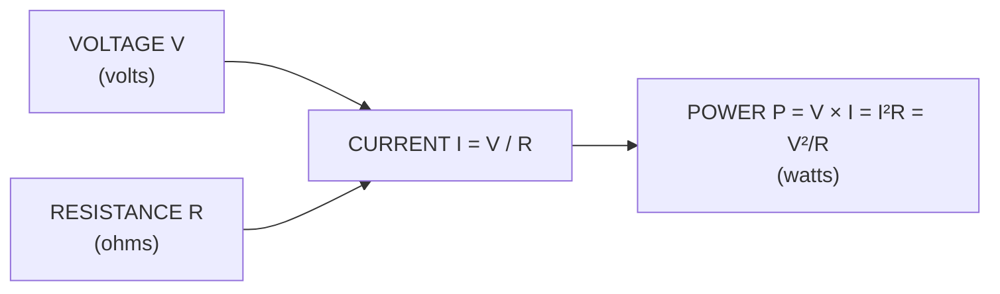

**The power formulas — all three are worth memorising:**
```
P = V × I          P = I² × R          P = V² / R
```

#### Resistors in series and in parallel

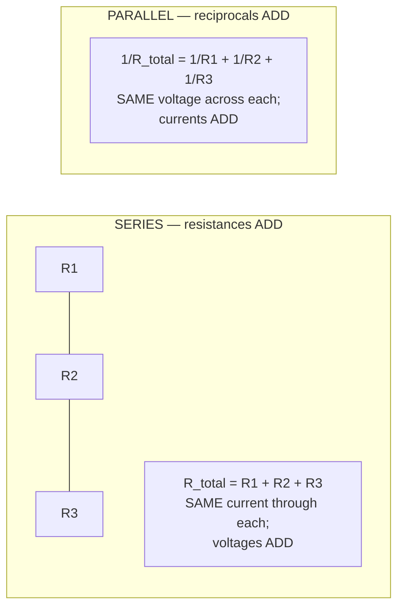

| | **SERIES** | **PARALLEL** |
|---|---|---|
| **Formula** | **R = R₁ + R₂ + R₃ + …** | **1/R = 1/R₁ + 1/R₂ + 1/R₃ + …** |
| **Two resistors only** | R₁ + R₂ | ✅ **R = (R₁ × R₂) / (R₁ + R₂)** — the "product over sum" shortcut |
| **n EQUAL resistors of value R** | **nR** | ✅ **R / n** |
| **Current** | **SAME through every element** | **Divides** between the branches |
| **Voltage** | **Divides** across the elements | **SAME across every element** |
| **Total resistance is …** | **Larger** than the largest | ✅ **SMALLER than the smallest** |
| **If one element opens** | ⚠️ **The whole circuit stops** | The others keep working |
| **Used for** | Current limiting, voltage dividers, fuses | ⭐ **House wiring** — so that one lamp failing does not switch off the house |

> **Capacitors behave in exactly the OPPOSITE way:** in **parallel** they **add** (C = C₁ + C₂), and in **series** the **reciprocals add** (1/C = 1/C₁ + 1/C₂). **Inductors** follow the same rules as resistors.

#### Worked example — finding the total resistance of a network

> **Find the total resistance: a 6 Ω and a 3 Ω resistor in PARALLEL, the combination in SERIES with a 4 Ω resistor.**

```
Step 1 — the parallel pair (product over sum):
        R_p = (6 × 3) / (6 + 3) = 18 / 9 = 2 Ω

Step 2 — add the series resistor:
        R_total = R_p + 4 = 2 + 4 = 6 Ω
```
> ### ✅ **R_total = 6 Ω.** If a 12 V supply were applied, **I = V/R = 12/6 = 2 A**.

> **The universal method for ANY resistive network:** work **from the innermost combination OUTWARDS** — repeatedly collapse each series pair and each parallel pair into a single equivalent resistance until one value remains. Then apply Ohm's law to find the total current, and work **back inwards** using the current-divider and voltage-divider rules to find each branch current.

**The two divider rules:**
```
VOLTAGE DIVIDER (series):     V₁ = V_total × R₁ / (R₁ + R₂)
CURRENT DIVIDER (parallel):   I₁ = I_total × R₂ / (R₁ + R₂)   ← note the OPPOSITE resistor
```

#### Kirchhoff's Laws — the tools for any circuit Ohm's law cannot solve

| Law | Statement | Basis |
|---|---|---|
| **KCL — Kirchhoff's CURRENT Law** | ⭐ **The algebraic SUM of all currents entering and leaving a NODE is ZERO** — i.e. **current in = current out** | **Conservation of CHARGE** |
| **KVL — Kirchhoff's VOLTAGE Law** | ⭐ **The algebraic SUM of all voltages around any CLOSED LOOP is ZERO** — i.e. the sum of the EMFs equals the sum of the IR drops | **Conservation of ENERGY** |

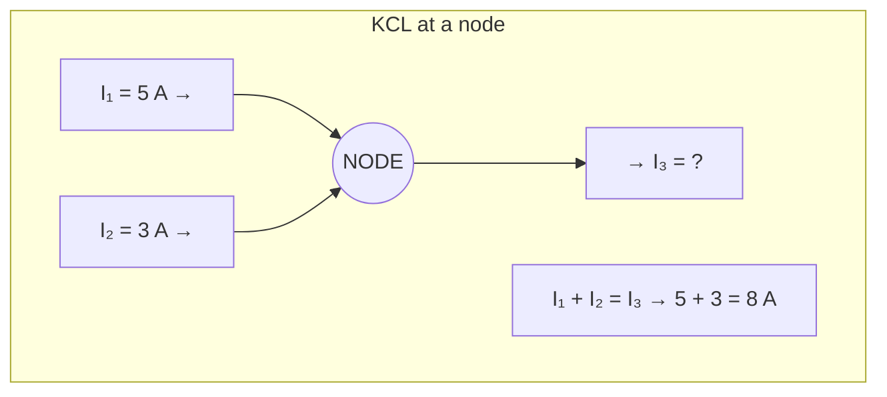

**The standard procedure for a problem asking "find the value of I":**
1. **Label** every branch current and choose a direction for each (a wrong guess simply gives a negative answer).
2. Apply **KCL** at each independent node.
3. Apply **KVL** around each independent loop, writing +V for a rise and −IR for a drop.
4. **Solve** the simultaneous equations.
5. **Check** by verifying that the power delivered by the sources equals the power dissipated in the resistors.

*(For more complex networks, use **mesh analysis** — KVL with loop currents — or **nodal analysis** — KCL with node voltages. For a single branch of a large network, **Thevenin's or Norton's theorem** is far quicker.)*

#### The transmission and distribution of electrical power

> **Why power is transmitted at VERY HIGH VOLTAGE.** The power lost as heat in a transmission line is **P_loss = I²R**. For a given power P = V × I, **raising the voltage lowers the current proportionally**, and because the loss depends on the **SQUARE** of the current, **raising the transmission voltage by 10× reduces the line loss by 100×**. This is the single reason the grid uses 132 kV, 230 kV and 400 kV lines, and the reason **transformers** — which work only on AC — made AC the universal choice over DC.

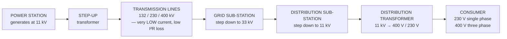

**In Bangladesh:** generation and transmission are handled by **PGCB** at 132/230/400 kV; distribution is by **BREB (Bangladesh Rural Electrification Board) and its Palli Bidyut Samities**, **DPDC**, **DESCO**, **NESCO** and **WZPDCL**. The domestic supply is **230 V, 50 Hz single phase**, and the industrial supply **400 V three phase**.

**Common causes of a transmission or distribution interruption:** a **fault** (short circuit, earth fault, line-to-line fault) often caused by storms, fallen trees or birds · **overloading**, causing protection to trip · **lightning strikes** · **equipment failure** — transformers, insulators, circuit breakers · **planned maintenance/shutdown** · **load shedding** when generation is less than demand · **cable damage** during excavation · and **voltage instability or grid frequency collapse**, which can cascade into a **blackout**.

**Previous Year Question List from this Topic:**

- [Find R and I from a circuit.](../written-answers/electrical-and-electronics.md?plain=1#L291)
- [Find the Value of I.](../written-answers/electrical-and-electronics.md?plain=1#L498)
- [BREB power transmission interrupt related.](../written-answers/electrical-and-electronics.md?plain=1#L604)
- [EEE related 3 math question.](../written-answers/electrical-and-electronics.md?plain=1#L706)
- [নিচের সার্কিটের মোট রেজিস্ট্যান্স বের করে, I_3 এর কারেন্ট বের কর।](../written-answers/electrical-and-electronics.md?plain=1#L812)


---

### Protection Devices — Fuse, MCB, Relay and Circuit Breaker

> All of these devices exist for one purpose: to **automatically DISCONNECT the circuit when the current becomes dangerous**, protecting **equipment from damage, people from electric shock, and buildings from FIRE**.

#### The function of each device

| Device | Function |
|---|---|
| **FUSE** | A **short piece of thin wire with a LOW MELTING POINT** placed in series with the load. When the current exceeds its rating, the heat generated **MELTS the wire, breaking the circuit**. It is **sacrificial — it destroys itself and must be REPLACED** |
| **CIRCUIT BREAKER** | An **automatically operated electrical SWITCH** that detects an over-current and **opens its contacts mechanically**. Unlike a fuse it is **REUSABLE — simply switch it back on** after clearing the fault |
| **MCB — Miniature Circuit Breaker** | The small circuit breaker used in domestic and commercial distribution boards, rated typically **6 A to 125 A**, combining a **thermal (bimetallic strip)** element for sustained overloads and an **electromagnetic (solenoid)** element for instantaneous short circuits |
| **RELAY** | An **ELECTROMAGNETICALLY operated SWITCH** — a small current through a coil produces a magnetic field that pulls an armature and **closes or opens a separate, ELECTRICALLY ISOLATED contact** carrying a much larger current. It is a **control and isolation** device, not primarily a protection device (though **protective relays** sense faults and command a breaker to trip) |

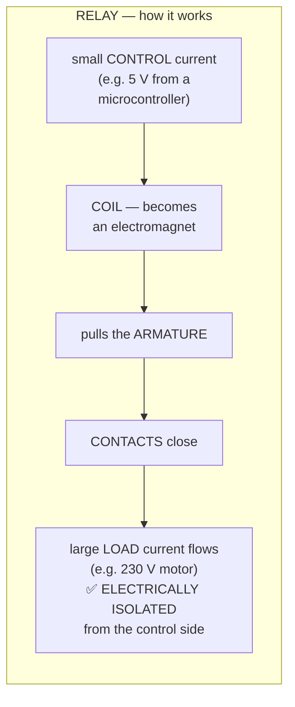

> **The key idea of a relay: a SMALL, SAFE current CONTROLS a LARGE, DANGEROUS one, with complete electrical isolation between the two.** This is why every microcontroller project that switches mains equipment uses a relay — the 5 V logic never touches the 230 V side.

#### Fuse vs MCB — the comparison

| Point | **FUSE** | **MCB (Miniature Circuit Breaker)** |
|---|---|---|
| **Operating principle** | A wire **MELTS** from the heat of excess current | A **bimetallic strip bends (overload)** or a **solenoid trips (short circuit)**, opening the contacts |
| **Reusable?** | ❌ **NO — it is destroyed and must be REPLACED** | ✅ **YES — simply RESET it by flicking the switch** |
| **Operating (tripping) time** | ✅ **Very FAST for a large short circuit** (milliseconds) | Fast, but generally slightly slower on a heavy short circuit |
| **Accuracy of the trip point** | ⚠️ **Less precise**; the characteristic changes with age and temperature | ✅ **Accurate and repeatable**, with defined B/C/D curves |
| **Overload vs short-circuit discrimination** | ❌ **None** — it cannot tell the difference | ✅ **Yes — two separate mechanisms** |
| **Restoration after a fault** | ⚠️ **Slow** — find a spare of the correct rating, switch off, replace | ✅ **Instant — a single switch** |
| **Can it be used as a switch?** | ❌ No | ✅ **Yes — it doubles as an ON/OFF isolator** |
| **Indication of which circuit tripped** | ❌ Poor | ✅ **The tripped lever is visibly down** |
| **Safety during replacement** | ⚠️ **Risky** — there is a temptation to fit the wrong rating or a piece of ordinary wire, which is a major fire cause | ✅ **Safe** — nothing to replace, nothing to get wrong |
| **Sensitivity to overload** | Responds only to heat | ✅ Responds to both heat and magnetic force |
| **Initial cost** | ✅ **Cheap** | Higher (3–5× a fuse) |
| **Long-term cost** | Repeated replacement + downtime | ✅ **Lower** |
| **Lifespan** | One operation | Thousands of operations |
| **Best for** | Very high fault currents; electronic equipment protection; low-cost installations | ⭐ **Domestic, commercial and industrial distribution boards** |

> **"Which is more suitable for a modern installation?"**
>
> ### ✅ **The MCB is decisively more suitable for a modern building or IT installation.**
>
> **The reasons to give:** (1) it is **resettable in seconds**, so a nuisance trip does not mean downtime while someone hunts for a fuse wire; (2) it **discriminates between a slow overload and an instantaneous short circuit**, giving the right response to each; (3) its **trip characteristic is accurate and does not drift**, so protection is predictable; (4) it **eliminates the single most dangerous habit in fuse-protected installations — fitting an oversized wire**, which defeats the protection entirely and causes fires; (5) it **doubles as an isolating switch** for safe maintenance; and (6) it shows **clearly which circuit has faulted**. Its higher purchase price is recovered immediately in reduced downtime.
>
> **The complete modern answer adds the companion devices:** an MCB protects against **over-current** only. A **modern installation ALSO requires an RCD/RCCB/ELCB (Residual Current Device)**, which compares the live and neutral currents and **trips within 30 ms if as little as 30 mA is leaking to earth** — this is what protects a **human being from ELECTROCUTION**, something no fuse or MCB can do. An **RCBO** combines both functions in one module, and an **MCCB (Moulded Case Circuit Breaker)** handles the higher currents of a main incomer.

**MCB trip curves:** **Type B** trips at 3–5× the rated current — lighting and general domestic circuits · **Type C** at 5–10× — small motors, fluorescent lighting, most commercial loads and **IT/server equipment** with switch-mode inrush · **Type D** at 10–20× — transformers, large motors and welding sets with very high inrush.

**Previous Year Question List from this Topic:**

- [Differentiate between a Fuse and a Miniature Circuit Breaker (MCB). Which one is more suitable for modern office electrical installations and why?](../written-answers/electrical-and-electronics.md?plain=1#L22)
- [Write down the function of Relay, Fuse and Circuit Breaker.](../written-answers/electrical-and-electronics.md?plain=1#L436)
- [BREB power transmission interrupt related.](../written-answers/electrical-and-electronics.md?plain=1#L604)


---

### AC to DC Conversion — Rectifiers and Power Supplies

> **AC (Alternating Current) periodically REVERSES its direction**, following a sine wave 50 times a second in Bangladesh. **DC (Direct Current) flows in ONE direction only**, at a steady level. **All electronic circuits — every computer, phone and microcontroller — need DC**, but the mains supply is AC, so every device contains a converter.

> ### **"What is the name of the process / device that converts AC to DC?"**
> ### ✅ **RECTIFICATION** is the process, and a **RECTIFIER** is the device. *(The reverse — DC to AC — is called **INVERSION**, performed by an **INVERTER**; the **IPS/UPS** in every Bangladeshi home is exactly this.)*

#### How AC is converted into DC — the four stages

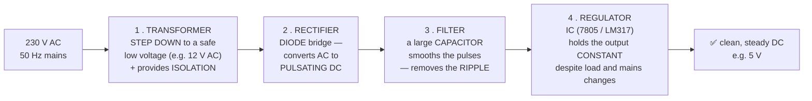

| Stage | Component | What it does |
|---|---|---|
| **1. Transformation** | **Step-down transformer** | Reduces 230 V AC to a low, safe AC voltage, **and provides electrical ISOLATION from the mains** |
| **2. Rectification** | **Diodes** | Diodes conduct in **one direction only**, so the negative half-cycles are either removed or flipped — the output is **pulsating DC** |
| **3. Filtering / smoothing** | **Capacitor** (and sometimes an inductor) | The capacitor **charges on the peaks and discharges between them**, filling in the gaps and turning pulsating DC into nearly steady DC. The residual variation is called **RIPPLE** |
| **4. Regulation** | **Zener diode or a regulator IC** (7805, 7812, LM317) | Holds the output **constant** even when the mains voltage sags or the load changes |

#### The types of rectifier

| Type | Diodes | Output | Ripple frequency (50 Hz input) | Efficiency |
|---|---|---|---|---|
| **Half-wave** | **1** | Only the **positive half-cycles** pass; the negative half is lost | **50 Hz** | ⚠️ **~40.6 %** — poor |
| **Full-wave centre-tap** | **2** | **Both** half-cycles used | ✅ **100 Hz** | **~81.2 %** |
| **FULL-WAVE BRIDGE** ⭐ | **4** (in a bridge) | **Both** half-cycles used, **no centre-tapped transformer needed** | ✅ **100 Hz** | **~81.2 %** |

```
Half-wave output:     ∩___∩___∩___     (gaps — hard to smooth)
Full-wave output:     ∩∩∩∩∩∩∩∩∩∩∩     (twice as many pulses — easy to smooth)
```

> **Why the FULL-WAVE BRIDGE rectifier is used in practice:** it uses **both halves** of the waveform, so the output has **twice the pulse frequency and is far easier to smooth** with a smaller capacitor; its **ripple is much lower**; it needs **no centre-tapped transformer**; and the four diodes come as a **single cheap bridge package**. Its only cost is that **two diode drops (≈1.4 V) are lost** instead of one.

#### Which transformer is used in a computer?

> ### ✅ **A computer's power supply (SMPS) uses a HIGH-FREQUENCY STEP-DOWN TRANSFORMER with a FERRITE core.**

**The explanation:** a PC does **not** use a conventional 50 Hz iron-core transformer, because such a transformer for 500 W would be large, heavy and inefficient. Instead the **SMPS (Switched-Mode Power Supply)** works like this:

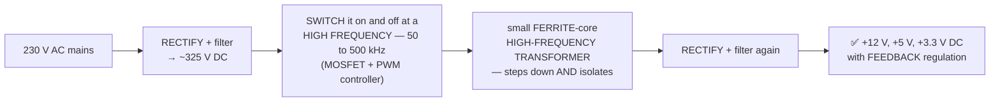

> **Why high frequency makes the transformer small — the key physics:** the size of a transformer's core is determined by the **volt-seconds** it must handle, which falls as the frequency rises. Switching at **100 kHz instead of 50 Hz — two thousand times faster — allows a core a fraction of the size and weight**, and the whole supply reaches **85–95 % efficiency** instead of the 50–60 % of a linear supply. This is why a 650 W PC supply weighs about a kilogram, while a 650 W 50 Hz linear supply would weigh many kilograms and run far hotter.

**A computer's SMPS outputs:** **+12 V** (CPU, GPU, motors), **+5 V** (drives, USB, logic), **+3.3 V** (RAM, chipset), plus **−12 V** and the **+5 V standby** rail that keeps the machine able to wake.

**The transformer equation, for reference:**
```
  V_s / V_p = N_s / N_p = I_p / I_s          (for an ideal transformer)

  Step-DOWN: fewer secondary turns → LOWER voltage, HIGHER current
  Step-UP  : more  secondary turns → HIGHER voltage, LOWER current
  Power in ≈ Power out  (a transformer changes voltage, NEVER power)
```
⚠️ **A transformer works ONLY on AC**, because it depends on a **changing magnetic flux** to induce a voltage in the secondary. A steady DC produces no change and therefore no output — which is why the grid is AC.

**Previous Year Question List from this Topic:**

- [Which Transformer is used in computer?](../written-answers/electrical-and-electronics.md?plain=1#L144)
- [What is the name of AC current to DC current?](../written-answers/electrical-and-electronics.md?plain=1#L178)
- [How to AC converted into DC?](../written-answers/electrical-and-electronics.md?plain=1#L228)


---

### Batteries, Capacitors and Frequency Bands

#### Battery vs Capacitor

> Both store energy and can deliver it later — but they store it by **completely different mechanisms**, and that difference determines every other property.

| Point | **BATTERY** | **CAPACITOR** |
|---|---|---|
| **Stores energy as** | ⭐ **CHEMICAL energy** — in a reversible chemical reaction between electrodes and electrolyte | ⭐ **An ELECTROSTATIC FIELD** — as separated charge on two plates with a dielectric between them |
| **Energy DENSITY** | ✅ **HIGH** — a phone battery runs for a day | ⚠️ **Very LOW** — a capacitor of the same size holds a tiny fraction |
| **POWER density (how fast it can deliver)** | Low — chemical reactions are slow | ✅ **VERY HIGH — can discharge in microseconds** |
| **Charge / discharge time** | **Slow** — minutes to hours | ✅ **Extremely fast — milliseconds** |
| **Output voltage while discharging** | ✅ **Nearly CONSTANT** until nearly empty | ⚠️ **Falls exponentially** from the moment discharge begins |
| **Number of cycles** | ⚠️ **Limited — 500 to 2,000**, then capacity degrades | ✅ **Effectively UNLIMITED — millions** |
| **Lifespan** | Years, degrading | Decades |
| **Internal resistance** | Higher | ✅ Very low |
| **Self-discharge** | Low | **Higher** |
| **Temperature sensitivity** | ⚠️ **High** — performance falls badly in cold | ✅ Low |
| **Behaviour with DC** | Supplies DC | ⚠️ **BLOCKS DC** once charged |
| **Behaviour with AC** | — | ✅ **PASSES AC** — reactance X_C = 1/(2πfC) falls as frequency rises |
| **Energy stored** | Ah × V | **E = ½ C V²** |
| **Environmental impact** | Contains toxic chemicals; disposal is a problem | ✅ Cleaner |
| **Main uses** | ⭐ **Sustained power** — phones, laptops, vehicles, UPS backup | ⭐ **Filtering and smoothing in power supplies, decoupling, timing circuits, energy bursts (camera flash), motor starting, tuning, coupling and blocking DC** |

> **The one-sentence distinction:** *a **battery is an energy reservoir** — it holds a lot and releases it slowly; a **capacitor is a power reservoir** — it holds little but can release it almost instantaneously.* A camera flash uses both: the **battery** slowly charges the **capacitor** over a few seconds, and the capacitor dumps all of it into the flash tube in a **millisecond** — something the battery itself could never do.
>
> *(**Supercapacitors / ultracapacitors** sit between the two, and are increasingly used for regenerative braking and short-term backup.)*

#### The capacitor and the inductor

| | **CAPACITOR (C)** | **INDUCTOR (L)** |
|---|---|---|
| **Stores energy in** | An **ELECTRIC field**, between plates | A **MAGNETIC field**, around a coil |
| **Construction** | Two conducting plates separated by a **dielectric** | A **coil of wire**, often on a magnetic core |
| **Unit** | **Farad (F)** | **Henry (H)** |
| **Opposes changes in** | **VOLTAGE** — the voltage across it cannot change instantly | **CURRENT** — the current through it cannot change instantly |
| **Reactance** | **X_C = 1 / (2πfC)** — **DECREASES** as frequency rises | **X_L = 2πfL** — **INCREASES** as frequency rises |
| **At DC (f = 0)** | ⚠️ **Acts as an OPEN circuit — blocks DC** | ✅ **Acts as a SHORT circuit (just a wire)** |
| **At very high frequency** | Acts as a **short circuit — passes AC** | Acts as an **open circuit — blocks AC** |
| **Phase relationship** | **Current LEADS voltage by 90°** (**"ICE"**) | **Voltage LEADS current by 90°** (**"ELI"**) |
| **Energy stored** | **E = ½ C V²** | **E = ½ L I²** |
| **Typical uses** | Smoothing, filtering, coupling, decoupling, timing, tuning | Chokes, filters, transformers, relays, motors, energy storage in SMPS |

> **The memory aid: "ELI the ICE man."** In an inductor (**L**), **E**MF leads **I** — **ELI**. In a capacitor (**C**), **I** leads **E** — **ICE**.

#### Audio Frequency vs Radio Frequency

| Point | **AUDIO FREQUENCY (AF)** | **RADIO FREQUENCY (RF)** |
|---|---|---|
| **Frequency range** | ⭐ **20 Hz – 20 kHz** — the range of human hearing | ⭐ **About 20 kHz – 300 GHz** (practically, 3 kHz – 300 GHz) |
| **What it represents** | **SOUND** — vibrations converted to an electrical signal | **ELECTROMAGNETIC waves** used for wireless transmission |
| **Can it be heard?** | ✅ **Yes**, when converted to sound by a speaker | ❌ **No** — far above hearing |
| **Can it RADIATE from an antenna?** | ❌ **NO — practically impossible.** The wavelength at 1 kHz is **300 km**, so an efficient antenna would have to be tens of kilometres long | ✅ **YES** — this is the whole point of RF. At 100 MHz the wavelength is 3 m, so a 75 cm antenna works |
| **Wavelength** | Enormous — km | Short — metres to millimetres |
| **Transmission medium** | Wires, air (as sound) | ✅ **Free space, without wires** |
| **Typical devices** | Microphones, speakers, amplifiers, headphones, mixers | Antennas, transmitters, receivers, Wi-Fi, mobile phones, radar |
| **Circuit components** | Ordinary resistors, capacitors, audio transformers | **Tuned LC circuits, striplines, waveguides, shielding** — layout becomes critical |
| **Amplifier type** | AF amplifier — wide, flat response over 20 Hz–20 kHz | RF amplifier — **narrow-band, tuned** to a specific frequency |
| **Examples** | A voice at 300 Hz–3.4 kHz on a telephone; music | FM radio 88–108 MHz; **Wi-Fi 2.4 GHz and 5 GHz**; GSM 900/1800 MHz; Bluetooth 2.4 GHz |

> **The relationship between them — MODULATION.** Because an audio signal cannot be radiated, radio works by **impressing the low-frequency AUDIO signal onto a high-frequency RF CARRIER** — by varying the carrier's amplitude (**AM**) or its frequency (**FM**). The carrier travels through space; the receiver **demodulates** it to recover the audio and feeds it to a speaker. **The RF carries; the AF is the message.**

**Previous Year Question List from this Topic:**

- [Audio Frequency ও Radio Frequency এর মধ্যেকার পার্থক্য লিখুন। ১০ ওহমের ১০টি ট্রানজিস্টর কোন সিরিজে সংযুক্ত হলে তাতে রেজিস্ট্যান্স কত হবে?](../written-answers/electrical-and-electronics.md?plain=1#L384)
- [What is the difference between battery and capacitor?](../written-answers/electrical-and-electronics.md?plain=1#L922)


---

## Transistors (BJT & FET)

### The Bipolar Junction Transistor (BJT)

> ### **BJT stands for BIPOLAR JUNCTION TRANSISTOR.**
>
> It is a **three-terminal semiconductor device** in which a **SMALL current injected into the BASE controls a MUCH LARGER current flowing between the COLLECTOR and the EMITTER** — so it acts as an **AMPLIFIER** or as an electronic **SWITCH**.

> **"Bipolar"** means that **BOTH types of charge carrier — electrons AND holes — take part** in the conduction. *(A FET, by contrast, is **unipolar** — only one carrier type conducts.)*

#### The structure and the three terminals

> ### **A BJT has THREE TERMINALS: the EMITTER (E), the BASE (B) and the COLLECTOR (C)** — and **two PN junctions**.

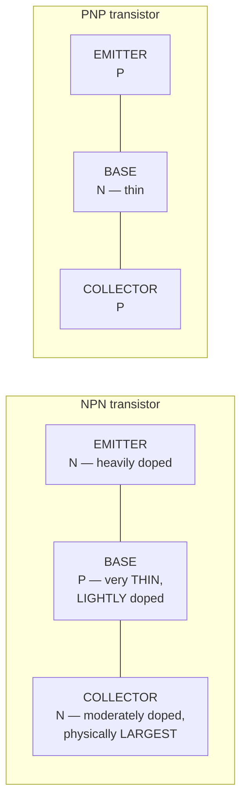

| Terminal | Doping and size | Function |
|---|---|---|
| **EMITTER** | **Heavily doped**, moderate size | **EMITS (injects) the majority charge carriers** into the base. Always marked with the **ARROW** on the symbol |
| **BASE** | ⭐ **VERY THIN and LIGHTLY doped** | **CONTROLS** the flow. It is deliberately made thin and lightly doped so that **very few carriers recombine there** and **over 95 % pass straight through to the collector** — this is what gives the transistor its gain |
| **COLLECTOR** | Moderately doped, **physically the LARGEST** (to dissipate heat) | **COLLECTS** the carriers that crossed the base |

**The circuit symbols — how to tell NPN from PNP:** the **arrow is always on the EMITTER**. In an **NPN** it points **OUT** ("**N**ot **P**ointing i**N**"); in a **PNP** it points **IN** ("**P**ointing i**N** **P**ermanently"). The arrow always shows the direction of **conventional current**.

#### Current flow in an NPN transistor

> ### **In an NPN transistor, conventional current flows FROM the COLLECTOR, THROUGH the base region, TO the EMITTER — and also a small current from the BASE to the EMITTER.** The emitter current therefore flows **OUT of the emitter**.
>
> *(In terms of ELECTRONS, the flow is the opposite: electrons are injected from the **emitter** and travel to the **collector**. The terminal is named "emitter" because it **emits the CARRIERS**, not because current flows out of it in the conventional sense.)*

**For a PNP transistor everything is reversed:** conventional current flows **INTO the emitter** and out of the collector and base, and the supply polarity is inverted.

#### The current relationships

> ### **By Kirchhoff's Current Law: I_E = I_C + I_B**
>
> The emitter current is the sum of the collector and base currents — and since **I_B is tiny**, **I_C ≈ I_E** in practice.

| Parameter | Symbol | Definition | Typical value |
|---|---|---|---|
| **Current gain, common emitter** | ⭐ **β (beta) or h_FE** | **β = I_C / I_B** | **20 – 500** (often ~100) |
| **Current gain, common base** | **α (alpha)** | **α = I_C / I_E** | **0.95 – 0.99** — always **less than 1** |
| **Relation between them** | | **β = α / (1 − α)** and **α = β / (1 + β)** | |
| **The collector current** | | ### **I_C = β × I_B** | |

> ### **"Collector current I_C is related to base current I_B by ___"**
> ### ✅ **I_C = β × I_B**, where **β (h_FE) is the common-emitter current gain**. This single relation is the essence of the transistor: **a base current of 10 µA with β = 100 produces a collector current of 1 mA — a hundredfold amplification.**

#### Worked example — finding the base current

> **The emitter current is 1 A and the collector current is 0.95 A. Find the base current.**

```
Step 1 — Kirchhoff's current law for a transistor:
         I_E = I_C + I_B

Step 2 — rearrange and substitute:
         I_B = I_E − I_C
             = 1.00 − 0.95
             = 0.05 A
```
> ### ✅ **I_B = 0.05 A = 50 mA**

**The gains follow immediately:**
```
   α = I_C / I_E = 0.95 / 1.00 = 0.95
   β = I_C / I_B = 0.95 / 0.05 = 19
   (check:  β = α/(1−α) = 0.95/0.05 = 19  ✅)
```
> **What the answer means:** a base current of only **50 mA controls a collector current of 950 mA — nineteen times larger.** That ratio is the transistor's amplification.

**Previous Year Question List from this Topic:**

- [What does BJT stand for?](../written-answers/electrical-and-electronics.md?plain=1#L972)
- [How many terminals does a BJT have?](../written-answers/electrical-and-electronics.md?plain=1#L995)
- [In an NPN transistor, the current flows from _____](../written-answers/electrical-and-electronics.md?plain=1#L1024)
- [Collector current (Ic) is related to base current (Ib) by _____](../written-answers/electrical-and-electronics.md?plain=1#L1098)
- [ইমিটার কারেন্টের মান 1 Amp, কালেক্টর কারেন্ট 0.95 A হলে বেইস (Base) কারেন্টের মান কত? একটি চিত্র দেওয়া ছিল!!](../written-answers/electrical-and-electronics.md?plain=1#L1430)


---

### Transistor Regions of Operation and Configurations

#### The three regions of operation

> A BJT's behaviour is determined entirely by **how its two junctions are BIASED** — the Base-Emitter junction and the Base-Collector junction.

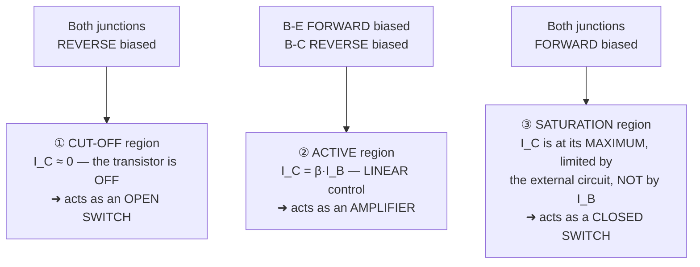

| Region | B-E junction | B-C junction | I_C | V_CE | Behaves as |
|---|---|---|---|---|---|
| **CUT-OFF** | **Reverse** (V_BE < 0.7 V) | **Reverse** | ✅ **≈ 0** (only leakage) | **≈ V_CC (maximum)** | ⭐ **An OPEN switch — OFF** |
| **ACTIVE** | ✅ **Forward** (V_BE ≈ 0.7 V) | **Reverse** | ✅ **I_C = β × I_B** — proportional | Between 0 and V_CC | ⭐ **An AMPLIFIER — linear** |
| **SATURATION** | **Forward** | **Forward** | ✅ **Maximum**, set by V_CC/R_C | ✅ **≈ 0.2 V (minimum)** | ⭐ **A CLOSED switch — ON** |

**The output characteristic curves — the diagram to draw:**

```
  I_C ↑
      │                                    ┌──────────────── I_B = 40 µA
      │        SATURATION   │              │
      │        region       │  ┌───────────────────────────  I_B = 30 µA
      │       (both fwd)    │  │
      │   ◄────────────►    │  │  ACTIVE region
      │                     │ ┌────────────────────────────  I_B = 20 µA
      │                     │ │  (I_C ≈ β·I_B, nearly
      │                    ┌──────────────────────────────   I_B = 10 µA
      │                   ││   independent of V_CE)
      │──────────────────────────────────────────────────    I_B = 0
      └──────────────────────────────────────────────────► V_CE
       0   0.2 V        CUT-OFF region (I_C ≈ 0)
```

#### The transistor as a SWITCH

> **This is the operation to describe for a "working principle" question**, because it is how every digital circuit is built.

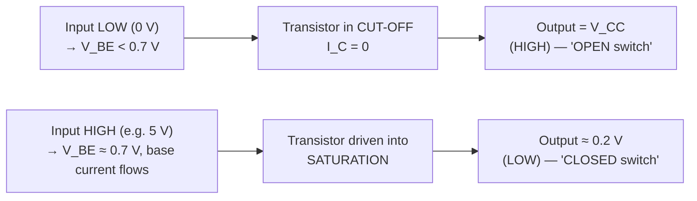

**The working principle, stated:**
1. With **no base current**, the transistor is in **CUT-OFF** — the collector-emitter path is effectively an **open circuit**, no current flows through the load, and the output sits at V_CC.
2. When a base current large enough to **saturate** the transistor is applied (typically **I_B > I_C(sat)/β**, with a safety factor of 2–10 applied), the transistor enters **SATURATION** — the collector-emitter path becomes effectively a **closed switch** with only ~0.2 V across it, and full current flows through the load.
3. **For switching, the ACTIVE region is deliberately passed through as fast as possible**, because that is where the transistor dissipates the most power. A switching transistor must be **either fully off or fully on** — never held in between, or it will overheat.
4. ⚠️ **Note the INVERSION:** input HIGH gives output LOW. A single transistor in this configuration **is a NOT gate**, which is why it is the foundation of all digital logic.

#### The three transistor configurations

| Point | **COMMON BASE (CB)** | **COMMON EMITTER (CE)** | **COMMON COLLECTOR (CC)** — *emitter follower* |
|---|---|---|---|
| **Input at** | Emitter | **Base** | Base |
| **Output at** | Collector | **Collector** | Emitter |
| **Common terminal** | Base | **Emitter** | Collector |
| **CURRENT gain** | ⚠️ **< 1 (α)** | ✅ **HIGH (β)** | ✅ **HIGHEST (1 + β)** |
| **VOLTAGE gain** | ✅ **HIGH** | ✅ **HIGH** | ⚠️ **< 1 (≈ 1)** |
| **POWER gain** | Moderate | ⭐ **HIGHEST** | Moderate |
| **Input impedance** | **Very LOW** (~50 Ω) | Medium (~1 kΩ) | ✅ **Very HIGH** (~100 kΩ) |
| **Output impedance** | **Very HIGH** | High (~50 kΩ) | ✅ **Very LOW** (~50 Ω) |
| **Phase shift** | **0° (in phase)** | ⚠️ **180° — INVERTED** | **0° (in phase)** |
| **Frequency response** | ✅ **Best — highest** | Moderate | Good |
| **Main application** | **High-frequency / RF amplifiers**, impedance matching from a low-impedance source | ⭐ **General-purpose amplification — the most widely used of the three** | ⭐ **IMPEDANCE MATCHING and BUFFERING** — driving a low-impedance load from a high-impedance source |

> ### **"Which BJT configuration gives the MAXIMUM VOLTAGE gain?"**
>
> ### ✅ **The COMMON BASE configuration gives the highest VOLTAGE gain**, because of its very low input impedance and very high output impedance.
>
> ⚠️ **But note the distinction the examiner may intend:** the **COMMON EMITTER** configuration gives the **highest POWER gain** and **high voltage gain together with high current gain**, which is why it is by far the most commonly used amplifier. If the question says **"voltage gain"**, answer **common base**; if it says **"overall / power gain"** or **"most widely used"**, answer **common emitter**. *(Many Bangladeshi exam keys accept **common emitter** for "maximum gain", so state both and say which criterion each wins on.)*
>
> **The common collector wins neither — its voltage gain is just under 1** — but it is indispensable as a **buffer**.

**Previous Year Question List from this Topic:**

- [In an NPN transistor, the current flows from _____](../written-answers/electrical-and-electronics.md?plain=1#L1024)
- [Which BJT configuration gives maximum voltage gain?](../written-answers/electrical-and-electronics.md?plain=1#L1057)
- [Describe cut off, saturation and active region of operation of a transistor with diagram. Explain the working principal of ab n-channel JFET with various values…](../written-answers/electrical-and-electronics.md?plain=1#L1225)


---

### The MOSFET and the NMOS Transistor

> A **FET (Field Effect Transistor) is a UNIPOLAR, VOLTAGE-CONTROLLED transistor** in which the current between the **DRAIN** and the **SOURCE** is controlled by the **ELECTRIC FIELD produced by the voltage on the GATE** — with **almost NO gate current at all**.
>
> A **MOSFET (Metal-Oxide-Semiconductor FET)** is the type used in virtually all modern integrated circuits; its gate is **insulated from the channel by a thin layer of silicon dioxide**.

#### BJT vs FET/MOSFET

| Point | **BJT** | **MOSFET / FET** |
|---|---|---|
| **Controlled by** | ⚠️ **CURRENT** (base current) | ✅ **VOLTAGE** (gate voltage) |
| **Carriers** | **Bipolar** — both electrons and holes | ✅ **Unipolar** — one type only |
| **Input impedance** | Low (kΩ) | ✅ **Extremely HIGH** (10¹² Ω) — the gate is insulated |
| **Input (control) power** | Requires continuous base current | ✅ **Almost ZERO** — only charges the gate capacitance |
| **Terminals** | Emitter, Base, Collector | **Source, Gate, Drain** (+ Body/Substrate) |
| **Switching speed** | Slower | ✅ **Faster** |
| **Thermal stability** | ⚠️ Poor — risk of **thermal runaway** | ✅ **Good** — resistance rises with temperature, so devices share current naturally |
| **Size on a chip** | Larger | ✅ **Much smaller** — hence billions per chip |
| **Noise** | Higher | ✅ Lower |
| **Susceptible to static damage** | No | ⚠️ **YES — the thin gate oxide is easily destroyed by ESD** |
| **Used in** | Analogue amplification, high-current switching, discrete circuits | ⭐ **ALL digital ICs — CPUs, memory, logic (CMOS)**, and power switching |

#### The NMOS transistor — structure and operation

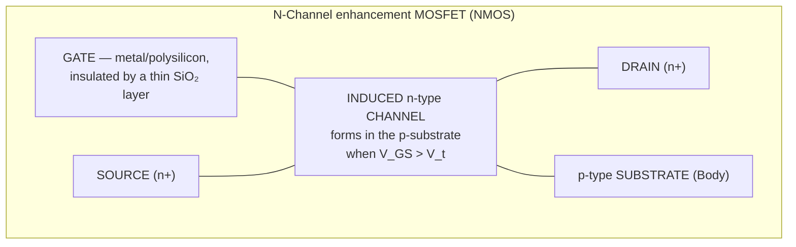

**The operation, step by step:**

1. **The structure** — two heavily doped **n⁺ regions (the SOURCE and the DRAIN)** are diffused into a **p-type substrate**. Between them, over the substrate, sits a **thin silicon-dioxide insulating layer**, and on top of that the **GATE** electrode. The gate is therefore a **capacitor plate**, electrically insulated from everything beneath.
2. **With V_GS = 0 (OFF)** — there is no conducting path from source to drain, because the two n⁺ regions are separated by p-type material forming **back-to-back PN junctions**. **No current flows.**
3. **As V_GS is raised positive**, the gate's electric field **repels holes from the surface of the p-substrate and ATTRACTS ELECTRONS** towards it.
4. **When V_GS exceeds the THRESHOLD VOLTAGE V_t**, enough electrons have been drawn to the surface to **INVERT the p-type surface into an n-type layer — an "INVERSION LAYER" or induced CHANNEL** — which now **connects the source to the drain**. The transistor is **ON**.
5. **Applying V_DS then drives current through this channel**, from drain to source.
6. **The higher V_GS is above V_t**, the **thicker and more conductive the channel** — so the gate voltage **controls** the current. This is why it is called an **"enhancement-mode"** device: the channel is **created (enhanced)** by the gate voltage, not merely narrowed.
7. ⚠️ **Because the gate is INSULATED, essentially NO gate current flows** — the control is purely by electric field. This is the whole advantage of the MOSFET, and the reason CMOS logic consumes almost no static power.

**The three regions of MOSFET operation:**

| Region | Condition | Drain current |
|---|---|---|
| **CUT-OFF** | **V_GS < V_t** | **I_D = 0** — no channel exists |
| **LINEAR / TRIODE** ("ohmic") | **V_GS > V_t** and **V_DS < V_GS − V_t** | **I_D = μ_n C_ox (W/L) [ (V_GS − V_t)·V_DS − V_DS²/2 ]** — behaves as a **voltage-controlled RESISTOR** |
| **SATURATION** (active) | **V_GS > V_t** and **V_DS ≥ V_GS − V_t** | **I_D = ½ μ_n C_ox (W/L) (V_GS − V_t)²** — nearly **independent of V_DS**; used for **amplification** |

*(The quantity **V_ov = V_GS − V_t** is the **overdrive voltage**. **Switching circuits use the cut-off and linear regions; amplifiers use saturation.** Note that the naming is the OPPOSITE of the BJT — a MOSFET "in saturation" is the amplifying region, while a BJT "in saturation" is fully switched on.)*

#### Worked example — NMOS current in the linear region

> **An N-channel MOSFET operates in the LINEAR region. Given μ_n·C_ox·(W/L) = 1.3 mA/V², V_GS = 2.5 V and V_t = 0.95 V, calculate the channel current. (Assume a reasonable value for any missing parameter.)**

**Step 1 — the overdrive voltage**
```
V_ov = V_GS − V_t = 2.5 − 0.95 = 1.55 V
```

**Step 2 — choose V_DS so that the device really is in the LINEAR region**
```
The linear region requires  V_DS < V_ov = 1.55 V.
Take a reasonable value:    V_DS = 0.5 V   ✅ (0.5 < 1.55)
```

**Step 3 — apply the linear-region (triode) equation**
```
I_D = μ_n C_ox (W/L) [ (V_GS − V_t)·V_DS − V_DS² / 2 ]
    = 1.3 mA/V² × [ (1.55)(0.5) − (0.5)² / 2 ]
    = 1.3 mA/V² × [ 0.775 − 0.125 ]
    = 1.3 × 0.650
    = 0.845 mA
```
> ### ✅ **I_D = 0.845 mA (845 µA), for the assumed V_DS = 0.5 V.**

> **State your assumption explicitly, and check it.** The answer depends on V_DS, which the question omits — so the mark is earned by (a) **naming the assumed value**, (b) **verifying that it satisfies V_DS < V_GS − V_t**, and (c) using the **linear-region equation rather than the saturation one**. *(For comparison, in **saturation** the same device would carry I_D = ½ × 1.3 × 1.55² = **1.56 mA**, the maximum it can reach at this gate voltage.)*

**Previous Year Question List from this Topic:**

- [N-Channel MOS operating in the linear region. Calculate the current passing through the channel of the transistor. Given: \mu_n C_{ox} (W/L) = 1.3\text{ mA/V}^2…](../written-answers/electrical-and-electronics.md?plain=1#L1146)
- [(a) Draw and explain the operation of NMOS transistor.](../written-answers/electrical-and-electronics.md?plain=1#L1337)


---

## Semiconductor Devices & Diodes

### Semiconductors and the PN Junction Diode

#### Semiconductors

> A **SEMICONDUCTOR is a material whose electrical conductivity lies BETWEEN that of a conductor and an insulator**, and — crucially — **can be CONTROLLED** by adding impurities, by an applied voltage, by light or by heat. **Silicon (Si)** and **germanium (Ge)** are the classic examples.

| Type | How it is made | Majority carriers | Minority carriers |
|---|---|---|---|
| **Intrinsic** | **Pure** semiconductor | Electrons = holes | — |
| **N-type** | **DOPED with a PENTAVALENT** impurity (phosphorus, arsenic, antimony) — 5 valence electrons, one spare | ✅ **ELECTRONS** (negative) | Holes |
| **P-type** | **DOPED with a TRIVALENT** impurity (boron, gallium, indium) — 3 valence electrons, one short, creating a "hole" | ✅ **HOLES** (positive) | Electrons |

#### What is a diode?

> A **DIODE is a two-terminal semiconductor device formed by joining a P-type and an N-type region, which allows current to flow EASILY IN ONE DIRECTION ONLY and BLOCKS it in the other.** It is the electronic equivalent of a **one-way valve**.

**The terminals:** the **ANODE (A)** is the **P side**, and the **CATHODE (K)** is the **N side**, marked by a **band on the physical component**.

```
Symbol:        ANODE  ──►|──  CATHODE
                     (P)      (N)
        Current flows in the direction the TRIANGLE POINTS;
        the BAR is the blocking side.
```

#### The working principle of a PN junction

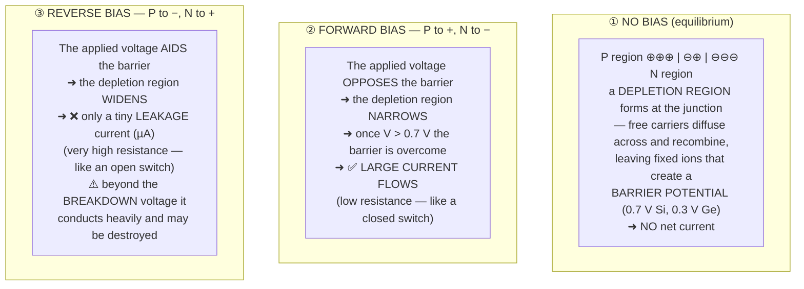

#### Forward bias vs reverse bias — the key comparison

| Point | **FORWARD BIAS** | **REVERSE BIAS** |
|---|---|---|
| **Connection** | **P (anode) to the POSITIVE** terminal, **N (cathode) to the NEGATIVE** | **P (anode) to the NEGATIVE**, **N (cathode) to the POSITIVE** |
| **Effect on the depletion region** | ✅ **NARROWS** it | ⚠️ **WIDENS** it |
| **Barrier potential** | **Overcome** once V > 0.7 V (Si) | **Reinforced** |
| **Current** | ✅ **LARGE — milliamps to amps**, rising exponentially with voltage | ❌ **Almost ZERO — only a leakage current of nanoamps to microamps** |
| **Resistance of the junction** | ✅ **Very LOW** (a few ohms) | **Very HIGH** (megohms) |
| **Voltage across the diode** | ✅ **Nearly CONSTANT — 0.7 V for silicon, 0.3 V for germanium** | Equal to the applied reverse voltage |
| **Diode acts as** | ⭐ **A CLOSED switch (ON)** | ⭐ **An OPEN switch (OFF)** |
| **Majority carriers** | **Cross** the junction freely | **Pushed away** from the junction |
| **Risk** | Excess current burns the diode — a **series resistor is essential** | ⚠️ Exceeding the **Peak Inverse Voltage (PIV)** causes **breakdown** |
| **Used for** | Rectification, conduction | Blocking, voltage regulation (Zener), varactors, photodiodes |

**The V-I characteristic curve — the graph to draw:**
```
          I (mA) ↑
                 │              ╱  forward
                 │            ╱    (exponential rise
                 │          ╱       after the 0.7 V knee)
                 │        ╱
    ─────────────┼──┬───┴──────────► V
   reverse      ╱│  0.7 V
   breakdown   ╱ │  ("knee" / cut-in voltage)
   (avalanche)   │ tiny reverse leakage
        ────────┘│
                 ↓ I (µA)
```

#### Worked example — current through a resistor in series with a diode

> **Determine the current through a 10 kΩ resistor in series with a forward-biased diode, given a forward voltage drop of 0.75 V across the diode.**

**The method — apply Kirchhoff's Voltage Law around the loop:**
```
   V_supply = V_diode + V_resistor
   
   ⇒ V_resistor = V_supply − V_diode
                = V_supply − 0.75 V

   ⇒  I = V_resistor / R  =  (V_supply − 0.75) / 10,000
```

**Worked for a 5 V supply:**
```
   V_R = 5 − 0.75 = 4.25 V
   I   = 4.25 / 10,000 = 4.25 × 10⁻⁴ A
```
> ### ✅ **I = 0.425 mA (425 µA)** for a 5 V supply.
>
> **The general rule to state:** the diode is modelled as a **constant 0.75 V drop** once it conducts, so **the whole remainder of the supply voltage appears across the resistor**, and Ohm's law gives the current. *(If the supply were **less than 0.75 V**, the diode would **not conduct at all** and **I = 0** — always check this first. And if the diode were **reverse-biased**, I ≈ 0 regardless of the supply.)*

**Previous Year Question List from this Topic:**

- [Explain the working principle of a PN junction diode. Draw its symbol and describe the difference between forward bias and reverse bias.](../written-answers/electrical-and-electronics.md?plain=1#L1484)
- [Determine the current passing through a 10\text{ k}\Omega resistor. Assume a forward voltage drop of 0.75\text{ V} across the diode.](../written-answers/electrical-and-electronics.md?plain=1#L1563)
- [What is Diode and Inductor?](../written-answers/electrical-and-electronics.md?plain=1#L1628)


---

### Special Diodes — LED, Laser Diode, Zener — and the Inductor

#### The functions of a diode

| # | Function | Application |
|---|---|---|
| **1** | ⭐ **RECTIFICATION** | Converting AC to DC — the most important use, in every power supply |
| **2** | **Blocking reverse current / polarity protection** | Preventing damage if a battery is connected backwards |
| **3** | **Clipping and clamping** | Limiting a signal's amplitude, or shifting its DC level |
| **4** | **Voltage regulation** | **Zener** diodes hold a fixed voltage |
| **5** | **Free-wheeling / flyback protection** | ⭐ Absorbing the **back-EMF spike** when current to a **relay coil or motor** is switched off — without it, the switching transistor is destroyed |
| **6** | **Switching** | High-speed logic and signal routing |
| **7** | **Light emission** | **LEDs** |
| **8** | **Light detection** | **Photodiodes, solar cells** |
| **9** | **Voltage multiplication** | Charge-pump circuits |
| **10** | **Demodulation / detection** | Recovering the audio from an AM radio signal |
| **11** | **Variable capacitance** | **Varactor** diodes, for tuning |

#### The types of diode

| Type | Special property | Use |
|---|---|---|
| **PN junction (rectifier)** | Conducts one way | Power supplies |
| **ZENER diode** | ⭐ **Designed to operate SAFELY in REVERSE BREAKDOWN**, holding a **constant voltage** | **Voltage regulation and reference** |
| **LED** | **Emits light** when forward biased | Indicators, displays, lighting |
| **Photodiode** | Generates current **when light falls on it** | Light sensors, optocouplers |
| **Schottky** | **Very low forward drop (0.2 V) and very fast** | High-frequency switching, SMPS |
| **Varactor** | **Capacitance varies with reverse voltage** | Tuning circuits |
| **Laser diode** | Emits **coherent, monochromatic** light | Optical fibre, CD/DVD, barcode scanners |
| **Tunnel diode** | **Negative resistance** region | Microwave oscillators |

#### LED vs Laser Diode

> An **LED (Light Emitting Diode)** emits light by **SPONTANEOUS emission** when electrons recombine with holes across a forward-biased junction. A **LASER DIODE** uses the same junction but adds an **optical CAVITY** and operates above a **threshold current**, so that light is produced by **STIMULATED emission** — producing a fundamentally different kind of light.

| Point | **LED** | **LASER DIODE** |
|---|---|---|
| **Emission process** | ⭐ **SPONTANEOUS emission** | ⭐ **STIMULATED emission** (LASER = Light Amplification by Stimulated Emission of Radiation) |
| **Light COHERENCE** | ❌ **INCOHERENT** — the waves are out of step | ✅ **COHERENT** — all waves in phase |
| **Spectral width** | **Broad — 25 to 100 nm** (many wavelengths) | ✅ **Very NARROW — 1 to 5 nm**, nearly monochromatic |
| **Beam divergence** | ⚠️ **Wide — spreads in all directions (~120°)** | ✅ **Highly DIRECTIONAL — a tight, narrow beam** |
| **Optical output power** | Low — µW to a few mW | ✅ **High — mW to watts** |
| **Coupling into an optical FIBRE** | ⚠️ **Poor** — most of the light misses the core | ✅ **Excellent** |
| **Modulation speed / bandwidth** | Lower — up to ~200 Mbps | ✅ **Very high — Gbps to Tbps** |
| **Transmission distance (fibre)** | **Short — up to ~2 km** | ✅ **Long — tens to hundreds of km** |
| **Threshold current** | ❌ **None** — emits as soon as it conducts | ✅ **Yes** — lases only above the threshold |
| **Temperature sensitivity** | Low | ⚠️ **High** — needs temperature control |
| **Linearity with current** | Good | Poor below threshold |
| **Cost** | ✅ **Cheap** | **Expensive** |
| **Lifetime** | ✅ **Very long** (50,000–100,000 h) | Shorter |
| **Eye safety** | ✅ Safe | ⚠️ **Can cause permanent eye damage** |
| **Circuit complexity** | ✅ Simple — a resistor is enough | Complex drive and monitoring circuitry |
| **Used in** | Indicators, displays, TV remotes, room lighting, **short-distance multimode fibre** | ⭐ **Long-haul SINGLE-MODE OPTICAL FIBRE communication, CD/DVD/Blu-ray, barcode scanners, laser printers, surgery, industrial cutting** |

> **The consequence for networking:** this is exactly why **multimode fibre transceivers for short in-building links use LEDs or VCSELs and are cheap**, while **single-mode long-haul transceivers use laser diodes and are expensive** — a laser's narrow, coherent, directional beam is the only thing that can be coupled efficiently into a 9 µm single-mode core and remain intelligible after 80 km.

#### The inductor

> An **INDUCTOR is a passive two-terminal component — essentially a COIL OF WIRE — that STORES ENERGY IN A MAGNETIC FIELD when current flows through it, and OPPOSES any CHANGE in that current.**

**The governing law — Faraday's and Lenz's laws:**
```
   V_L = L × (dI / dt)          the induced voltage is proportional to the RATE OF CHANGE of current
   E   = ½ L I²                 the energy stored
   X_L = 2π f L                 the inductive reactance (opposition to AC)
```

> **Lenz's law — the intuition:** an inductor **always opposes whatever you are trying to do to its current.** Try to increase the current and it generates a voltage opposing the increase; try to **switch it off suddenly** and it generates a **large voltage spike in the opposite direction (back-EMF)** trying to keep the current flowing. This spike is what destroys transistors that switch relays and motors — and the reason a **flyback diode** must always be fitted across an inductive load.

**Uses:** **chokes and filters** (blocking AC while passing DC) · **transformers** (two coupled inductors) · **tuned LC circuits** for radio · **energy storage in switch-mode power supplies** · **relays, solenoids and motors** · **EMI suppression**.

---

## Digital-to-Analog & Analog-to-Digital Converters (DAC/ADC)

### Digital-to-Analogue and Analogue-to-Digital Converters

> **The real world is ANALOGUE — temperature, sound, pressure and light vary CONTINUOUSLY. Computers are DIGITAL — they handle only discrete 0s and 1s. Converters are the BRIDGE between the two worlds.**

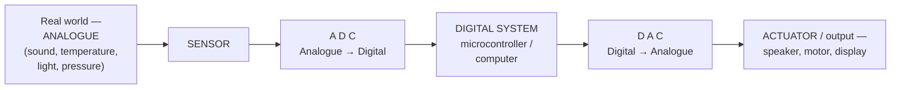

| | **ADC** | **DAC** |
|---|---|---|
| **Converts** | **Analogue → Digital** | **Digital → Analogue** |
| **Input** | A continuous voltage | A binary number |
| **Output** | A binary number | A continuous voltage |
| **Found in** | Microphones, sensors, digital cameras, digital multimeters, touchscreens | Audio players, video output, motor speed control, signal generators |

#### How an ADC converts an analogue signal into a digital one — the four steps

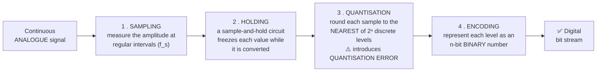

| Step | What happens | Key point |
|---|---|---|
| **1. SAMPLING** | The analogue signal is **measured at regular intervals**, at the **sampling frequency f_s** | ⭐ **NYQUIST'S THEOREM: f_s must be at LEAST TWICE the highest frequency in the signal (f_s ≥ 2 f_max)**, or the signal cannot be reconstructed and **ALIASING** occurs. This is why **CD audio is sampled at 44.1 kHz** — just over twice the 20 kHz limit of human hearing, and why **telephone speech (limited to 4 kHz) is sampled at 8 kHz** |
| **2. HOLDING** | A **sample-and-hold** circuit keeps the sampled value **steady** while the conversion takes place | Without it, the value would change during conversion and the result would be wrong |
| **3. QUANTISATION** | Each held value is **rounded to the nearest of the 2ⁿ available levels** | ⚠️ This step **loses information permanently — QUANTISATION ERROR**, at most **½ LSB**. **More bits → smaller error → higher fidelity** |
| **4. ENCODING** | The chosen level is output as an **n-bit binary code** | The result is the digital word |

**Types of ADC:** **Flash (parallel)** — fastest, uses 2ⁿ−1 comparators, expensive · **Successive Approximation (SAR)** — ⭐ the most common general-purpose type; performs a **binary search**, one bit per clock · **Dual-slope (integrating)** — slow but very accurate and noise-immune, used in **digital multimeters** · **Sigma-Delta (ΔΣ)** — very high resolution, used in **audio**.

**A simple SAR ADC circuit — the block diagram to draw:**
```
   V_in ──►┌────────────┐
           │ COMPARATOR │◄──── V_ref from the internal DAC
           └─────┬──────┘
                 │ (is V_in greater or smaller?)
                 ▼
        ┌─────────────────────┐       ┌──────┐
        │ SUCCESSIVE-APPROX.  │──────►│ DAC  │──┐
        │ REGISTER (SAR)      │       └──────┘  │
        │ — sets each bit from│                 │
        │   MSB to LSB        │◄────────────────┘
        └──────────┬──────────┘   feedback
                   ▼
            DIGITAL OUTPUT (n bits)
```
**It works by binary search:** set the MSB, compare; if V_in is smaller, clear that bit, otherwise keep it; move to the next bit; repeat for all n bits. **An n-bit conversion takes exactly n clock cycles.**

#### Resolution — the central formula

> ### **RESOLUTION = the SMALLEST CHANGE in analogue voltage that the converter can represent = ONE STEP.**
>
> ### **Resolution = V_range / 2ⁿ**  (or **V_range / (2ⁿ − 1)** if measured between the first and last step)
>
> where **n = the number of bits** and **V_range = V_max − V_min (the full-scale range)**.
>
> **Number of discrete levels = 2ⁿ.**

#### Worked example 1 — a 12-bit DAC

> **A 12-bit digital number is converted to an analogue voltage over the range 0 to 3.3 V. What is the RESOLUTION of the analogue output?**

```
Step 1 — the number of discrete levels:
         2ⁿ = 2¹² = 4,096 levels
         (numbered 0 to 4,095, so there are 4,095 STEPS between them)

Step 2 — the full-scale voltage range:
         V_range = 3.3 − 0 = 3.3 V

Step 3 — the resolution (volts per step):
         Resolution = 3.3 / 4,095 = 0.0008059 V = 0.806 mV
   
         (using the 2ⁿ convention instead:
          3.3 / 4,096 = 0.0008057 V = 0.806 mV — the same to three figures)
```
> ### ✅ **The resolution is approximately 0.806 mV (about 0.81 millivolts per step).**

> **What this means physically:** the DAC's output can only ever take one of **4,096 distinct voltages**, spaced **0.806 mV apart** — it can produce 0 V, 0.000806 V, 0.001612 V and so on, but **nothing in between**. Expressed as a percentage, the resolution is **1/4096 = 0.024 % of full scale**. **Doubling the bits to 24 would give a resolution of 0.2 µV**; halving them to 6 bits would give a coarse 52 mV.

#### Worked example 2 — an 8-bit ADC

> **An 8-bit ADC has a reference (maximum) voltage of 2.56 V and a minimum analogue voltage of 0 V. Calculate the resolution and the binary output.**

```
Step 1 — the number of levels:
         2⁸ = 256 levels (0 to 255)

Step 2 — the resolution (step size):
         Resolution = 2.56 V / 256 = 0.01 V = 10 mV per step
```
> ### ✅ **Resolution = 10 mV — a very convenient round number, which is why 2.56 V is a common reference voltage.**

**Step 3 — converting any input voltage to its digital output:**
```
   Digital output (decimal) = V_in / Resolution = V_in / 0.01

   V_in = 0.00 V  →   0 / 0.01 =   0  →  0000 0000
   V_in = 1.28 V  →  1.28/0.01 = 128  →  1000 0000
   V_in = 2.00 V  →  2.00/0.01 = 200  →  1100 1000
   V_in = 2.55 V  →  2.55/0.01 = 255  →  1111 1111  (full scale)
   V_in = 2.56 V  →  saturates at 255 — the converter cannot go higher
```

**The reverse direction — digital to analogue:**
```
   V_out = Digital value × Resolution
   e.g.  binary 1010 0000 = 160 decimal  →  160 × 0.01 = 1.60 V
```

> **The general formulas worth memorising:**
> ```
>   Number of levels     = 2ⁿ
>   Resolution (step)    = V_full-scale / 2ⁿ
>   Digital output       = (V_in − V_min) / Resolution
>   Analogue output      = Digital value × Resolution + V_min
>   Quantisation error   ≤ ½ × Resolution
>   Dynamic range (dB)   ≈ 6.02 n + 1.76  dB
> ```
> *(That last formula explains the familiar claim that **16-bit CD audio gives about 96 dB of dynamic range** — 6.02 × 16 + 1.76 ≈ 98 dB.)*

**Previous Year Question List from this Topic:**

- [You are required to convert a 12-bit digital number to an analogue voltage over the voltage range of 0 to 3.3V with a Digital-to-Analogue Converter (DAC). What…](../written-answers/electrical-and-electronics.md?plain=1#L1727)
- [An 8 bit (Analog to Digital Converter) = 2.56v. Let the minimum analog voltage = 0v. Calculate binary data output if analog input=1.7](../written-answers/electrical-and-electronics.md?plain=1#L1789)
- [Draw an ADC converter circuit which convert an analog signal to digital signal.](../written-answers/electrical-and-electronics.md?plain=1#L1866)
- [(ক) A/D Converter দ্বারা কিভাবে একটি Analog signal Digital signal এ রূপান্তরিত করা হয়। ডায়াগ্রাম সহ লিখুন।](../written-answers/electrical-and-electronics.md?plain=1#L1965)


---

## AC Circuits & Power Analysis

### AC Circuit Analysis — RLC, Impedance and Power Factor

#### AC fundamentals

> **AC (ALTERNATING CURRENT) is a current whose magnitude and DIRECTION vary periodically with time**, normally as a **sine wave**. The supply in Bangladesh is **230 V, 50 Hz**.

```
   v(t) = V_m sin(ωt + φ)

   V_m  = peak (maximum) value            ω  = 2πf  (angular frequency, rad/s)
   V_rms = V_m / √2 = 0.707 V_m           f  = frequency in Hz
   T    = 1/f  (period)                   φ  = phase angle
```

> ⚠️ **"230 V mains" means 230 V RMS**, so the **peak** is 230 × √2 = **325 V**. The **RMS (Root Mean Square)** value is the DC value that would produce the **same heating effect**, which is why it, and not the peak, is what meters and ratings use.

#### The RLC circuit

> An **RLC CIRCUIT is a circuit containing a RESISTOR (R), an INDUCTOR (L) and a CAPACITOR (C)**, connected in series or in parallel. It is the fundamental building block of **filters, tuners and oscillators**, because its behaviour depends strongly on frequency.

| Element | Opposition to AC | Formula | Phase of current relative to voltage |
|---|---|---|---|
| **Resistor R** | **Resistance** | **R** (independent of frequency) | ✅ **In PHASE (0°)** |
| **Inductor L** | **Inductive reactance** | **X_L = 2πfL** — rises with frequency | ⚠️ **Current LAGS voltage by 90°** |
| **Capacitor C** | **Capacitive reactance** | **X_C = 1/(2πfC)** — falls with frequency | ✅ **Current LEADS voltage by 90°** |

**Impedance of a series RLC circuit:**
```
   Z = R + j(X_L − X_C)

   |Z| = √[ R² + (X_L − X_C)² ]          the magnitude, in ohms

   θ  = tan⁻¹[ (X_L − X_C) / R ]         the phase angle

   If X_L > X_C → INDUCTIVE → current LAGS  → power factor LAGGING
   If X_C > X_L → CAPACITIVE → current LEADS → power factor LEADING
   If X_L = X_C → RESONANCE → Z = R (purely resistive), pf = 1
```

> ### **RESONANCE — the most important property of an RLC circuit.**
> At the **resonant frequency**, the inductive and capacitive reactances **cancel exactly**:
> ```
>      X_L = X_C   ⇒   2πf L = 1/(2πf C)   ⇒   f_r = 1 / (2π √(LC))
> ```
> **In a SERIES RLC circuit at resonance:** the impedance falls to its **MINIMUM (= R)** and the **current is MAXIMUM** — it is an **acceptor circuit**.
> **In a PARALLEL RLC circuit at resonance:** the impedance rises to its **MAXIMUM** and the current is **minimum** — it is a **rejector / tank circuit**.
> **This is how a radio TUNES**: the variable capacitor changes f_r until it matches the desired station's frequency, at which point that one signal produces a far larger response than all the others.

**Uses of RLC circuits:** **tuning** (radio and TV receivers) · **filters** — low-pass, high-pass, **band-pass and band-stop** · **oscillators** · **impedance matching** · **power factor correction** · **surge and noise suppression**.

#### Power in AC circuits, and the power factor

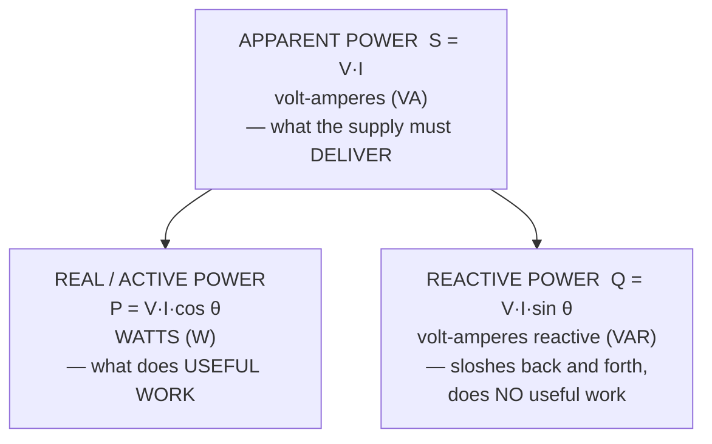

| Quantity | Symbol | Unit | Meaning |
|---|---|---|---|
| **Real (active) power** | **P** | **Watt (W)** | The power actually **converted into work or heat** |
| **Reactive power** | **Q** | **VAR** | Power **exchanged** with the magnetic/electric fields — returned to the source each cycle |
| **Apparent power** | **S** | **VA** | The **product of the RMS voltage and current** — what the cables and transformers must be sized for |
| **POWER FACTOR** | **pf = cos θ** | — | ### **pf = P / S = cos θ** — the **fraction of the supplied power that does useful work** |

```
   The power triangle:     S² = P² + Q²        pf = cos θ = P / S
```

> **Why the power factor matters commercially:** a factory drawing 100 kW at a power factor of **0.7** must be supplied with **100/0.7 = 143 kVA** — so the cables, transformer and switchgear must all be sized **43 % larger**, and the extra current causes extra **I²R losses**, for **no additional useful work**. Utilities therefore **penalise a low power factor**, and industries install **capacitor banks** to correct it — because most industrial load is **inductive** (motors), adding **capacitance** cancels the reactive component and pushes the power factor back towards 1.

| | **LAGGING power factor** | **LEADING power factor** |
|---|---|---|
| **Current relative to voltage** | **LAGS** behind | ✅ **LEADS** ahead |
| **Circuit is** | **INDUCTIVE (R-L)** | ✅ **CAPACITIVE (R-C)** |
| **Caused by** | **Motors, transformers, chokes, fluorescent ballasts** — the vast majority of industrial load | **Capacitor banks, long lightly-loaded cables, over-corrected installations** |
| **Corrected by adding** | **Capacitors** | Inductors |

#### Worked example — identifying the elements of a series circuit

> **A two-element series circuit has an average power of 940 W and a power factor of 0.707 (LEADING). Determine the circuit elements, if the applied voltage is v = 99 cos(600t + 30°) V.**

**Step 1 — read the source and identify the circuit type**
```
   V_m = 99 V          ω = 600 rad/s        (so f = 600/2π = 95.5 Hz)
   V_rms = 99 / √2 = 70.00 V

   pf = 0.707 = cos 45°  →  |θ| = 45°
   The power factor is LEADING  →  the current LEADS the voltage
                                →  the circuit is CAPACITIVE
   ⇒ The two elements are a RESISTOR in series with a CAPACITOR,
     and θ = −45°.
```

**Step 2 — find the RMS current from the real power**
```
   P = V_rms × I_rms × cos θ
   
   I_rms = P / (V_rms × pf)
         = 940 / (70.00 × 0.707)
         = 940 / 49.49
         = 18.99 A
```

**Step 3 — find the magnitude of the impedance**
```
   |Z| = V_rms / I_rms = 70.00 / 18.99 = 3.686 Ω
```

**Step 4 — resolve the impedance into R and X_C**
```
   R   = |Z| × cos θ = 3.686 × 0.707 = 2.606 Ω
   X_C = |Z| × sin θ = 3.686 × 0.707 = 2.606 Ω
   
   (equal, as they must be, because θ = 45°)
```

**Step 5 — convert the reactance into a capacitance**
```
   X_C = 1 / (ω C)        ⇒        C = 1 / (ω × X_C)
   
   C = 1 / (600 × 2.606)
     = 1 / 1563.6
     = 6.394 × 10⁻⁴ F
     = 639.4 µF
```

> ### ✅ **The circuit consists of a RESISTOR of 2.61 Ω in SERIES with a CAPACITOR of 639 µF.**

**Verification:**
```
   |Z| = √(R² + X_C²) = √(2.606² + 2.606²) = 2.606 √2 = 3.686 Ω   ✅
   P   = I²R = 18.99² × 2.606 = 360.6 × 2.606 = 939.7 ≈ 940 W     ✅
```

> **The reasoning that earns the marks:** the words **"leading power factor"** immediately establish that the reactive element is a **capacitor**, not an inductor — that single deduction determines the whole answer. After that it is mechanical: **power gives the current, current gives the impedance, the phase angle splits the impedance into R and X, and ω converts X into C.**

**Previous Year Question List from this Topic:**

- [A two-element series circuit has an average power of 940\text{W} and a power factor of 0.707 (leading). Determine the circuit elements if the applied voltage is…](../written-answers/electrical-and-electronics.md?plain=1#L2046)
- [RLC সার্কিট কী? বৈদ্যুতিক সার্কিটে ট্রানজিস্টরের ভূমিকা কী?](../written-answers/electrical-and-electronics.md?plain=1#L2133)


---

## Operational Amplifiers (Op-Amp)

### The Operational Amplifier

> An **OPERATIONAL AMPLIFIER (Op-Amp) is a high-gain, DC-coupled, DIFFERENTIAL voltage amplifier** with **two inputs — inverting (−) and non-inverting (+) — and one output**. It amplifies the **DIFFERENCE** between its two inputs, and with external feedback components it can be configured to perform an enormous range of "operations": amplify, add, subtract, integrate, differentiate, compare and filter.

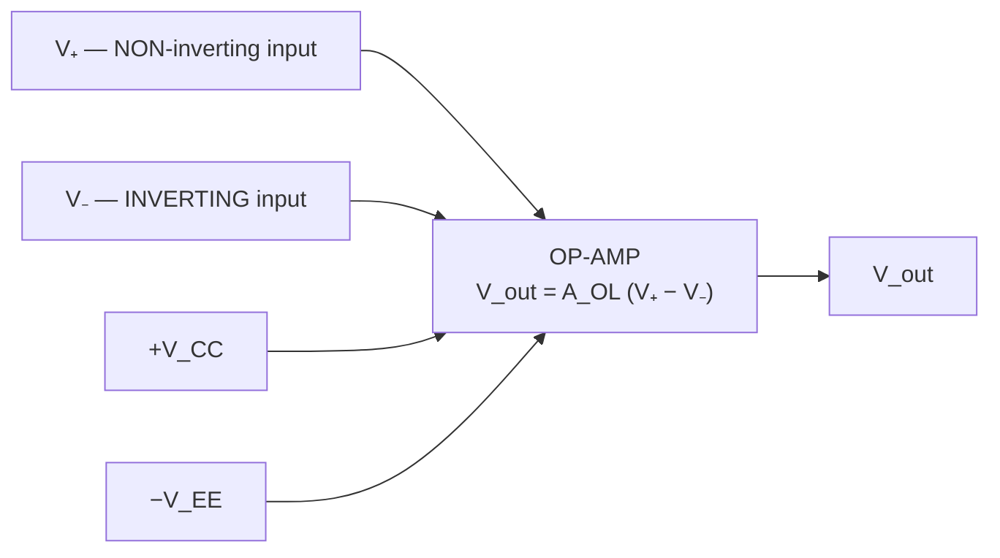

#### The main characteristics of an IDEAL op-amp

| # | Characteristic | Ideal value | Real (e.g. µA741) |
|---|---|---|---|
| **1** | ⭐ **Open-loop voltage gain (A_OL)** | ✅ **INFINITE (∞)** | 10⁵ – 10⁶ (100 dB) |
| **2** | ⭐ **INPUT impedance** | ✅ **INFINITE — draws NO input current** | 2 MΩ (MΩ to TΩ for FET types) |
| **3** | ⭐ **OUTPUT impedance** | ✅ **ZERO — can drive any load** | 75 Ω |
| **4** | **Bandwidth** | **Infinite** | ~1 MHz gain-bandwidth product |
| **5** | **CMRR — Common Mode Rejection Ratio** | ✅ **Infinite** — rejects signals common to both inputs completely | 90 dB |
| **6** | **Slew rate** | Infinite | 0.5 V/µs |
| **7** | **Offset voltage** | **Zero** — V_out = 0 when both inputs are equal | 1–5 mV |
| **8** | **Input bias current** | **Zero** | nA to pA |
| **9** | **Drift with temperature** | **Zero** | Small but present |
| **10** | **Noise** | Zero | Small |

> ### **THE TWO GOLDEN RULES of ideal op-amp analysis — every circuit below is solved with these:**
>
> ### **Rule 1: NO current flows INTO either input** (because the input impedance is infinite).
> ### **Rule 2: The op-amp drives its output so that the VOLTAGE DIFFERENCE between its two inputs is ZERO — i.e. V₊ = V₋.** (This holds whenever **negative feedback** is present, and is called a **"VIRTUAL SHORT"**. If the non-inverting input is grounded, the inverting input sits at 0 V and is called a **"VIRTUAL GROUND"**.)

#### The standard configurations and their voltage gains

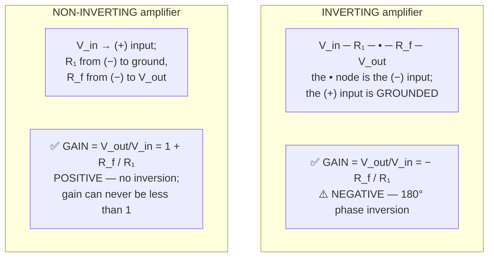

| Configuration | Circuit | **Voltage gain V_out / V_in** | Notes |
|---|---|---|---|
| **INVERTING amplifier** | Input through R₁ to the (−) input; R_f from (−) to output; (+) grounded | ### **A_v = − R_f / R₁** | **Inverts** the signal (180°); input impedance = **R₁** |
| **NON-INVERTING amplifier** | Input to the (+) input; R₁ from (−) to ground; R_f from (−) to output | ### **A_v = 1 + R_f / R₁** | **No inversion**; **very high input impedance**; gain ≥ 1 |
| **VOLTAGE FOLLOWER (buffer)** | Output tied directly to the (−) input; input to (+) | ### **A_v = 1** | Gain of exactly 1 — used purely for **impedance matching / buffering** |
| **SUMMING amplifier (adder)** | Several inputs, each through its own resistor, into the (−) node | **V_out = − R_f (V₁/R₁ + V₂/R₂ + V₃/R₃)** | **Adds** signals; the basis of an audio mixer and of a **weighted-resistor DAC** |
| **DIFFERENCE amplifier (subtractor)** | Signals to both inputs through matched resistor pairs | **V_out = (R_f/R₁)(V₂ − V₁)** | **Subtracts**; rejects common-mode noise |
| **INTEGRATOR** | R at the input, **C in the feedback** | **V_out = −(1/RC) ∫ V_in dt** | Produces a **ramp** from a step; converts square → triangle |
| **DIFFERENTIATOR** | **C at the input**, R in the feedback | **V_out = −RC (dV_in/dt)** | Produces a **spike** at each edge |
| **COMPARATOR** | **No feedback at all** — open loop | Output saturates to **+V_CC or −V_EE** | Compares two voltages; the basis of the ADC and of the light sensor below |

#### Worked method — finding the gain of an op-amp circuit

> **The universal procedure for "Assuming ideal op-amps, find the voltage gain V_o/V_i":**

```
Step 1 — Identify WHERE the input signal enters.
         Into the (−) input through a resistor → INVERTING   → A = −R_f/R₁
         Into the (+) input directly          → NON-INVERTING → A = 1 + R_f/R₁

Step 2 — Apply the golden rules at the inverting node:
         V₋ = V₊  (virtual short), and no current enters the input.

Step 3 — Write KCL at the inverting node: the current IN through the input
         resistor must all flow OUT through the feedback resistor.

         For the inverting configuration, with V₊ = 0 so V₋ = 0:
              (V_i − 0)/R₁  =  (0 − V_o)/R_f
              V_i/R₁        =  −V_o/R_f
         ⇒    V_o/V_i       =  −R_f/R₁     ✅

Step 4 — For a CASCADE of stages, MULTIPLY the individual gains:
              A_total = A₁ × A₂ × A₃ …
```

**A numeric illustration:** an inverting stage with **R₁ = 1 kΩ and R_f = 10 kΩ** has a gain of **−10**. Feeding its output into a non-inverting stage with **R₁ = 2 kΩ and R_f = 8 kΩ** (gain **1 + 8/2 = +5**) gives an overall gain of **−10 × 5 = −50** — an amplification of fifty, with inversion.

#### The op-amp in an AC power context

**Common roles:** **signal conditioning** for sensors before an ADC (amplifying a few millivolts from a thermocouple or current transformer up to a usable level) · **active filters** for removing mains hum · **precision rectifiers** that overcome the 0.7 V diode drop · **comparators** in over-voltage and over-current protection circuits · **instrumentation amplifiers** for measuring small differential voltages in the presence of large common-mode noise — exactly what is needed to measure a shunt current in a power system.

**Previous Year Question List from this Topic:**

- [Assuming Ideal Op Amps, Find The Voltage Gain V_o/V_i of the following circuit.](../written-answers/electrical-and-electronics.md?plain=1#L2202)
- [একটি Operational Amplifier এর প্রধান বৈশিষ্ট কী কী? AC Power কিভাবে DC পাওয়ারে রূপান্তরিত হয়?](../written-answers/electrical-and-electronics.md?plain=1#L2334)


---

## Sensor Circuits & Automated Control Systems

### Sensors and Automated Control Systems

> A **SENSOR is a device that DETECTS a PHYSICAL QUANTITY — light, temperature, pressure, gas concentration, motion — and CONVERTS it into an ELECTRICAL SIGNAL** that a circuit or microcontroller can process. It is the **input** side of every automated system.

#### The structure of an automated control system

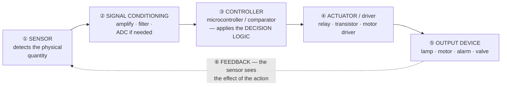

#### Analogue vs digital sensor output

| Output type | Signal | Read by the microcontroller via | Examples |
|---|---|---|---|
| **ANALOGUE** | A **continuously varying voltage** proportional to the measured quantity | ⭐ **An ADC pin** | LDR, LM35 temperature sensor, **MQ-series gas sensor (analogue pin)**, potentiometer |
| **DIGITAL (on/off)** | **HIGH or LOW** only — a threshold has been crossed | **A digital input pin (GPIO)**, or an **external interrupt** | PIR motion sensor, limit switch, **MQ gas sensor's digital pin**, IR obstacle sensor |
| **Serial / protocol** | A digital data stream | **I²C, SPI or UART** | DHT11/22, BMP280, MPU6050 |

> ### **"Which signal would a GAS-LEAKAGE sensor send to a microcontroller when it detects a leak?"**
>
> ### ✅ **Both are used, and the complete answer names both:**
>
> **(a) An ANALOGUE VOLTAGE** — a typical **MQ-2 / MQ-5 / MQ-6** gas sensor contains a **tin-dioxide (SnO₂) sensing element whose RESISTANCE FALLS as the gas concentration RISES**. In a voltage-divider circuit this produces **a continuously varying analogue voltage that increases with the gas concentration**, read by the microcontroller's **ADC** (the `AO` pin). This is the preferred connection, because it tells the system **HOW MUCH gas is present**, not merely that some is.
>
> **(b) A DIGITAL HIGH/LOW signal** — the same module also carries an on-board **comparator (LM393) and a potentiometer that sets a threshold**. When the concentration exceeds that threshold, the **`DO` (digital output) pin switches state** — typically going **LOW (active low)** — which the microcontroller reads on a **GPIO pin** or, better, uses to **trigger a hardware INTERRUPT** so that the alarm responds immediately without polling.
>
> **For a safety system, the correct design uses the ANALOGUE output for measurement and trending, and the DIGITAL output on an INTERRUPT for the immediate alarm** — so that a dangerous concentration triggers the buzzer and the solenoid valve within milliseconds, regardless of what else the software is doing.

#### Worked design — an automated STREET LIGHT control system

> **Requirement: the street light must switch ON automatically when it becomes dark, and OFF when it becomes light.**

**The sensor — an LDR (Light Dependent Resistor):**

> An **LDR (photoresistor)** is made of **cadmium sulphide**, whose **RESISTANCE FALLS SHARPLY as the light intensity RISES**.
> ```
>   BRIGHT daylight  →  LDR resistance LOW   (~1 kΩ or less)
>   DARKNESS         →  LDR resistance HIGH  (~1 MΩ)
> ```
> It is **inversely proportional to light** — this single fact is the basis of the whole design.

**The circuit — a voltage divider feeding a comparator:**

```
        +5 V
          │
         ┌┴┐
         │ │  LDR   (resistance falls in light)
         └┬┘
          ├─────────────► V_sense  to the comparator (−) input
         ┌┴┐                       or to the microcontroller's ADC pin
         │ │  R = 10 kΩ (fixed)
         └┬┘
          │
         GND

   In DARKNESS : LDR resistance is HIGH → most of the 5 V is dropped
                 across the LDR → V_sense is LOW.
   In LIGHT    : LDR resistance is LOW  → V_sense is HIGH.
```

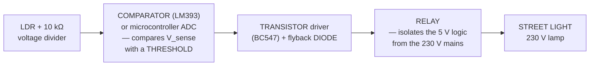

**The control logic:**
```
        IF   V_sense  <  THRESHOLD      (it is DARK)
        THEN turn the relay ON          →  the lamp lights
        ELSE                            (it is LIGHT)
             turn the relay OFF         →  the lamp is off
```

**Arduino implementation:**
```c
const int LDR_PIN   = A0;     // analogue input from the LDR divider
const int RELAY_PIN = 7;      // drives the relay through a transistor
const int THRESHOLD = 400;    // set by measuring the value at dusk
const int HYSTERESIS = 50;    // prevents rapid on/off chattering

void setup() {
    pinMode(RELAY_PIN, OUTPUT);
    digitalWrite(RELAY_PIN, LOW);
    Serial.begin(9600);
}

void loop() {
    int light = analogRead(LDR_PIN);          // 0 (dark) … 1023 (bright)
    Serial.println(light);

    if (light < THRESHOLD - HYSTERESIS) {     // it is DARK
        digitalWrite(RELAY_PIN, HIGH);        // lamp ON
    }
    else if (light > THRESHOLD + HYSTERESIS) { // it is BRIGHT
        digitalWrite(RELAY_PIN, LOW);         // lamp OFF
    }
    delay(1000);                              // sample once per second
}
```

**The design points that earn the marks:**

| # | Design decision | Why |
|---|---|---|
| **1** | **A RELAY (or a triac/SSR) between the logic and the lamp** | ⚠️ **Essential for SAFETY** — the microcontroller must never be electrically connected to 230 V. The relay provides **galvanic isolation** |
| **2** | **A transistor to drive the relay coil** | A microcontroller pin supplies only ~20 mA; a relay coil needs 50–100 mA |
| **3** | ⭐ **A FLYBACK (free-wheeling) DIODE across the relay coil** | The coil is an **inductor**; switching it off produces a **large back-EMF spike** that would **destroy the transistor**. The diode safely absorbs it |
| **4** | ⭐ **HYSTERESIS around the threshold** | Without it, at exactly dusk the lamp would **rapidly flicker on and off** as the light hovers at the threshold — and every passing cloud or headlight would toggle it. Hysteresis (or a **time delay** requiring the condition to persist for, say, 30 seconds) eliminates this |
| **5** | **The LDR must not face the lamp it controls** | Otherwise the lamp lights, the LDR sees light, the lamp switches off, the LDR sees dark — a **permanent oscillation**. Shield the sensor or point it at the sky |
| **6** | **A fuse/MCB on the mains side** | Over-current protection |
| **7** | *Optional enhancements* | A **PIR motion sensor** to brighten the lamp only when someone is present (saving energy); an **RTC** as a backup time-based control; **LEDs instead of incandescent lamps**; solar panel and battery for off-grid operation; and **IoT reporting** of faults |

> **Why automatic control is worth it:** it **eliminates the manual labour** of switching thousands of lamps, **saves energy** by ensuring lamps are never left on in daylight, **adapts automatically** to the changing times of sunrise and sunset through the year (and to overcast days), and **improves reliability and safety** in public areas.

**Previous Year Question List from this Topic:**

- [Design and implement an automated street light control system. The system should ensure that the street lights remain off during the presence of sunlight and au…](../written-answers/electrical-and-electronics.md?plain=1#L2409)
- [Which signal a sensor could to send the signal to microcontroller if the sensor finds any gas leakage point?](../written-answers/electrical-and-electronics.md?plain=1#L2507)


---

## Circuit Theorems (Thevenin, Norton, Superposition)

### Thevenin's, Norton's and Superposition Theorems

> These theorems exist for one reason: **to replace a complicated network by a SIMPLE equivalent, so that the current in ONE branch can be found without solving the whole circuit** — and, in particular, so that the effect of **changing the load** can be calculated instantly.

#### Thevenin's Theorem

> ### **THEVENIN'S THEOREM: any linear two-terminal network of sources and resistances can be replaced by a SINGLE VOLTAGE SOURCE V_Th in SERIES with a SINGLE RESISTANCE R_Th.**

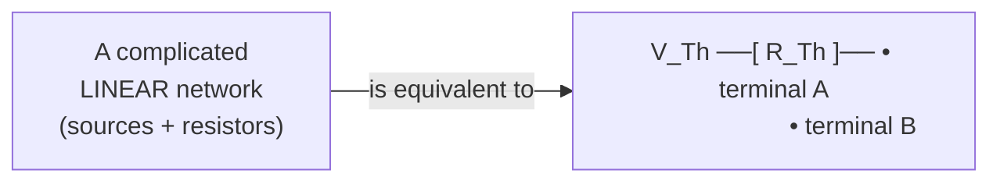

**The procedure:**

| Step | Action |
|---|---|
| **1** | **REMOVE the load resistor** (the branch whose current you want) from the circuit |
| **2** | Find **V_Th** = the **OPEN-CIRCUIT VOLTAGE** across the two terminals left behind |
| **3** | Find **R_Th** = the resistance looking back into the terminals with **ALL SOURCES DEACTIVATED**: ⭐ **replace every VOLTAGE source by a SHORT CIRCUIT, and every CURRENT source by an OPEN CIRCUIT** |
| **4** | Redraw the simple equivalent: **V_Th in series with R_Th** |
| **5** | **Reconnect the load** and apply Ohm's law: ### **I_L = V_Th / (R_Th + R_L)** |

#### Norton's Theorem

> ### **NORTON'S THEOREM: any linear two-terminal network can be replaced by a SINGLE CURRENT SOURCE I_N in PARALLEL with a SINGLE RESISTANCE R_N.**

**The procedure** is identical except for step 2:

| Step | Action |
|---|---|
| **1** | Remove the load |
| **2** | Find **I_N** = the **SHORT-CIRCUIT CURRENT** that flows when the two terminals are joined by a wire |
| **3** | Find **R_N** — **exactly the same as R_Th**, with all sources deactivated |
| **4** | Redraw: **I_N in parallel with R_N** |
| **5** | Apply the current-divider rule: ### **I_L = I_N × R_N / (R_N + R_L)** |

#### The relationship between them — source transformation

```
   R_N = R_Th                    the resistance is IDENTICAL
   
   V_Th = I_N × R_N              Thevenin  → Norton
   I_N  = V_Th / R_Th            Norton    → Thevenin
```
> **Thevenin and Norton equivalents are two descriptions of the SAME thing**, and either can be converted into the other in one line. Use **Thevenin** when the load is in series and you want a voltage; use **Norton** when the load is in parallel and you want a current.

#### Superposition Theorem

> ### **SUPERPOSITION THEOREM: in a linear circuit with MORE THAN ONE source, the current (or voltage) in any branch is the ALGEBRAIC SUM of the currents (or voltages) produced by EACH SOURCE ACTING ALONE, with all the other sources deactivated.**

**The procedure:** take one source at a time; **short every other voltage source** and **open every other current source**; solve the simplified circuit; record the branch current with its sign; repeat for every source; then **add the results algebraically**.

⚠️ **Superposition applies to CURRENT and VOLTAGE, but NEVER to POWER**, because power depends on the **square** of the current, and squares do not add.

#### Worked example — the Norton equivalent of a real DC power supply

> **Find the Norton equivalent circuit for a DC power supply that has a 30 V terminal voltage when delivering 400 mA, and a 28 V terminal voltage when delivering 600 mA.**

**The model:** a real supply is an **ideal source V_oc in series with an internal resistance r** (its Thevenin equivalent). Its terminal voltage therefore **falls as the load current rises**:
```
   V_terminal = V_oc − I × r
```

**Step 1 — find the internal resistance from the SLOPE**

Write the equation for both measurements and subtract:
```
   30 = V_oc − 0.400 r        … (i)
   28 = V_oc − 0.600 r        … (ii)

   (i) − (ii):   30 − 28 = (0.600 − 0.400) r
                      2  = 0.200 r
                      r  = 2 / 0.2 = 10 Ω
```
The internal resistance is simply **the drop in voltage divided by the rise in current**:
```
   r = ΔV / ΔI = (30 − 28) / (0.600 − 0.400) = 2 / 0.2 = 10 Ω
```

**Step 2 — find the open-circuit (Thevenin) voltage**
```
   Substitute r = 10 into (i):
        30 = V_oc − 0.400 × 10
        30 = V_oc − 4
        V_oc = 34 V

   Check with (ii):  34 − 0.600 × 10 = 34 − 6 = 28 V   ✅ correct
```

**Step 3 — convert to the NORTON equivalent**
```
   R_N = R_Th = r          = 10 Ω
   I_N = V_Th / R_Th = 34 / 10 = 3.4 A
```

> ### ✅ **The Norton equivalent is a 3.4 A CURRENT SOURCE in PARALLEL with a 10 Ω RESISTOR.**
> *(and the equivalent **Thevenin** circuit is a **34 V source in series with 10 Ω**.)*

```mermaid
flowchart LR
    subgraph TH["THEVENIN equivalent"]
        A["34 V ──[ 10 Ω ]──● A<br/>                    ● B"]
    end
    subgraph NO["NORTON equivalent"]
        B2["3.4 A source ∥ 10 Ω<br/>between terminals A and B"]
    end
```

**Verification — the model reproduces the data:**
```
   At I = 0.4 A:  V = I_N·R_N − I·R_N = 3.4×10 − 0.4×10 = 34 − 4 = 30 V  ✅
   At I = 0.6 A:  V = 34 − 6 = 28 V                                       ✅
   Short-circuit current  = I_N = 3.4 A
   Open-circuit voltage   = 34 V
```

> **What the numbers mean physically:** the supply behaves like a **34 V battery with 10 Ω of internal resistance**. That 10 Ω is why the terminal voltage sags under load — and it also tells you the supply's limit: at a short circuit it would deliver **3.4 A**, and maximum power transfer to a load occurs when **R_L = 10 Ω**, at which point the load receives 34/2 = 17 V and 1.7 A.

#### Worked method — finding the current through a resistor using Thevenin's theorem

> **"Find the current across the 2 Ω resistor using Thevenin's theorem."**

```
Step 1 — REMOVE the 2 Ω resistor; mark its terminals A and B.

Step 2 — Find V_Th: the open-circuit voltage across A-B.
         Use the voltage-divider rule, KVL, or mesh analysis on
         whatever remains. No current flows through the removed
         branch, which usually simplifies the circuit greatly.

Step 3 — Find R_Th: short all voltage sources, open all current
         sources, and compute the resistance seen looking INTO A-B
         by collapsing series and parallel combinations.

Step 4 — Draw the equivalent: V_Th in series with R_Th.

Step 5 — Reconnect the 2 Ω load:
         
              I = V_Th / (R_Th + 2)
```

> **Why this is worth doing rather than solving the whole circuit:** once V_Th and R_Th are known, **the current for ANY load resistance follows from one division.** A question that asks for the current through a 2 Ω, then a 4 Ω, then an 8 Ω load is solved three times over from the same equivalent — which is precisely the situation Thevenin's theorem was invented for.

**Previous Year Question List from this Topic:**

- [Find current across 2 \Omega resistor using Thevenin Theorem:](../written-answers/electrical-and-electronics.md?plain=1#L2585)
- [Find the Value of I_{ab} using Norton's Theorem.](../written-answers/electrical-and-electronics.md?plain=1#L2704)
- [Find the Norton equivalent circuit for a DC power supply that has a 30 V terminal voltage when delivering 400mA and a 28V terminal voltage. When delivering 600m…](../written-answers/electrical-and-electronics.md?plain=1#L68)


---

## Electrical Machines (Motors & Alternators)

### Alternators and Induction Motors

#### The alternator (synchronous generator)

> An **ALTERNATOR is an AC generator** that converts **mechanical energy into electrical energy** by rotating a magnetic field past a set of stationary armature windings, inducing an alternating EMF in them.

> ### **The frequency generated depends on the number of POLES and the SPEED of rotation:**
>
> ### **f = (P × N) / 120**
>
> where **f** = frequency in Hz, **P** = the number of **poles**, and **N** = the speed in **revolutions per minute (rpm)**.
>
> *(The 120 comes from 2 × 60: two poles make one complete cycle, and there are 60 seconds in a minute.)*

#### The induction motor (asynchronous motor)

> An **INDUCTION MOTOR converts electrical energy into mechanical energy.** Three-phase currents in the stator create a **ROTATING MAGNETIC FIELD**; this field **induces** currents in the rotor conductors (hence "induction"), and the interaction of the two fields produces **torque**.

```mermaid
flowchart LR
    A["3-phase supply<br/>at frequency f"] --> B["STATOR windings<br/>create a ROTATING<br/>MAGNETIC FIELD at the<br/>SYNCHRONOUS speed N_s"]
    B --> C["The rotating field CUTS the<br/>rotor bars → INDUCES<br/>currents in the rotor"]
    C --> D["Rotor currents create their own<br/>field → TORQUE → the rotor turns"]
    D --> E["⚠️ The rotor ALWAYS turns<br/>SLIGHTLY SLOWER than the field.<br/>That difference is the SLIP."]
```

> ### **The synchronous speed — the speed of the rotating magnetic field:**
> ### **N_s = (120 × f) / P**
>
> ### **SLIP — the fractional difference between the field and the rotor:**
> ### **s = (N_s − N) / N_s** and therefore ### **N = N_s (1 − s)**

> ⚠️ **Why an induction motor can NEVER run at synchronous speed.** If the rotor ever reached N_s, it would be moving **exactly with** the rotating field; there would be **no relative motion**, therefore **no flux cutting the rotor bars**, therefore **no induced current**, therefore **NO TORQUE** — and it would immediately slow down again. **Slip is not a defect; it is the necessary condition for the motor to produce torque at all.** This is why it is called an **ASYNCHRONOUS** machine. Typical full-load slip is **2 % to 5 %**.

#### Worked example — the full-load speed of an induction motor

> **A 3-phase, 12-pole ALTERNATOR running at 500 rpm supplies power to an 8-pole INDUCTION MOTOR. If the slip is 3 %, what is the full-load speed of the motor?**

**The logic of the problem: the ALTERNATOR sets the supply FREQUENCY; that frequency sets the MOTOR's synchronous speed; the SLIP reduces it to the actual running speed.**

**Step 1 — find the frequency generated by the alternator**
```
   f = (P × N) / 120
     = (12 × 500) / 120
     = 6,000 / 120
     = 50 Hz
```
✅ The alternator generates **50 Hz** — which is correct for Bangladesh.

**Step 2 — find the SYNCHRONOUS speed of the 8-pole motor at that frequency**
```
   N_s = (120 × f) / P
       = (120 × 50) / 8
       = 6,000 / 8
       = 750 rpm
```
⚠️ **Note carefully: the motor has 8 poles, NOT 12.** Only the **frequency** is carried across from the alternator — the pole count belongs to each machine separately. This is the trap in the question.

**Step 3 — apply the slip to obtain the actual full-load speed**
```
   N = N_s × (1 − s)
     = 750 × (1 − 0.03)
     = 750 × 0.97
     = 727.5 rpm
```

> ### ✅ **The full-load speed of the induction motor is 727.5 rpm.**

**Summary of the solution:**

| Step | Quantity | Formula | Value |
|---|---|---|---|
| 1 | Supply frequency (from the alternator) | f = PN/120 = 12×500/120 | **50 Hz** |
| 2 | Motor synchronous speed | N_s = 120f/P = 120×50/8 | **750 rpm** |
| 3 | Slip speed | N_s × s = 750 × 0.03 | **22.5 rpm** |
| 4 | **Full-load rotor speed** | N = N_s(1 − s) | ### **727.5 rpm** |

> **The three formulas to carry into the exam:**
> ```
>    f   = P × N / 120          (alternator: poles and speed give frequency)
>    N_s = 120 × f / P          (motor: frequency and poles give synchronous speed)
>    N   = N_s (1 − s)          (slip gives the actual running speed)
> ```
> **And the check that catches most errors:** the answer must always be **slightly LESS than N_s**, never equal to it and never more. 727.5 < 750 ✅

**Previous Year Question List from this Topic:**

- [A 3phase 12 pole alternator running at 500 rpm supplying power to an 8 pole induction motor. If ship is 3% what is the full load speed of the motor?](../written-answers/electrical-and-electronics.md?plain=1#L2824)
